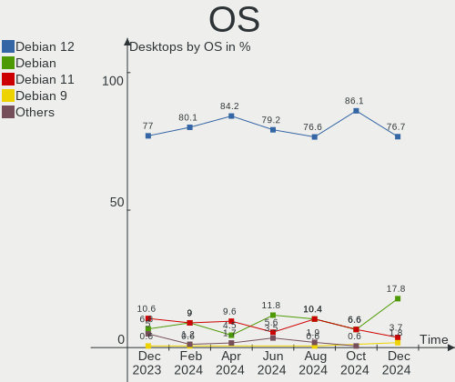
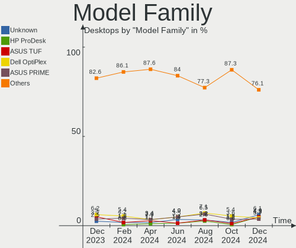
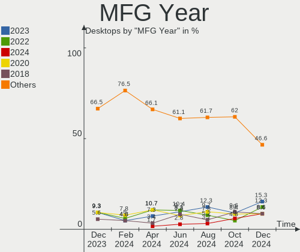
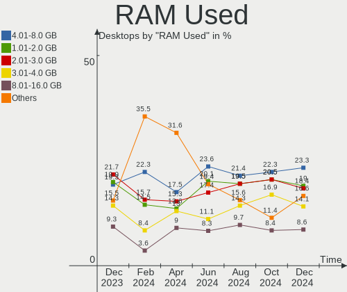
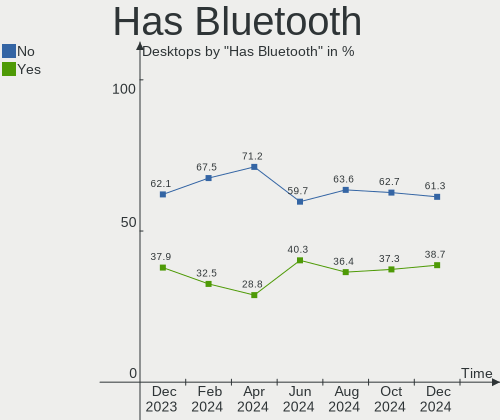
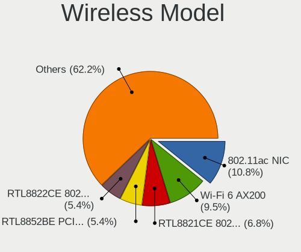
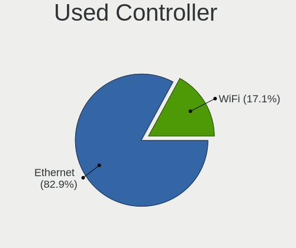
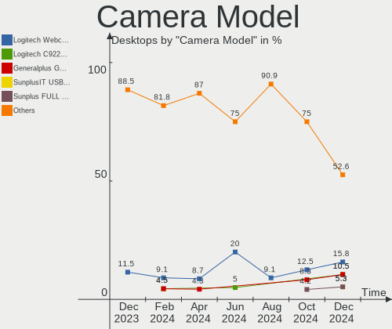

Debian - Hardware Trends (Desktops)
-----------------------------------

A project to identify most popular hardware characteristics and track their change
over time based on data collected by Linux users at https://Linux-Hardware.org.

Anyone can contribute to this report by the [hw-probe](https://github.com/linuxhw/hw-probe) tool:

    sudo -E hw-probe -all -upload

This report is for one last month. Overall report since the beginning of time: [TestDays](https://github.com/linuxhw/TestDays)

Period: Feb, 2023.

Contents
--------

* [ System ](#system)
  - [ OS                       ](#os)
  - [ OS Family                ](#os-family)
  - [ Kernel                   ](#kernel)
  - [ Kernel Family            ](#kernel-family)
  - [ Kernel Major Ver.        ](#kernel-major-ver)
  - [ Arch                     ](#arch)
  - [ DE                       ](#de)
  - [ Display Server           ](#display-server)
  - [ Display Manager          ](#display-manager)
  - [ OS Lang                  ](#os-lang)
  - [ Boot Mode                ](#boot-mode)
  - [ Filesystem               ](#filesystem)
  - [ Part. scheme             ](#part-scheme)
  - [ Dual Boot with Linux/BSD ](#dual-boot-with-linuxbsd)
  - [ Dual Boot (Win)          ](#dual-boot-win)

* [ Board ](#board)
  - [ Vendor                   ](#vendor)
  - [ Model                    ](#model)
  - [ Model Family             ](#model-family)
  - [ MFG Year                 ](#mfg-year)
  - [ Form Factor              ](#form-factor)
  - [ Secure Boot              ](#secure-boot)
  - [ Coreboot                 ](#coreboot)
  - [ RAM Size                 ](#ram-size)
  - [ RAM Used                 ](#ram-used)
  - [ Total Drives             ](#total-drives)
  - [ Has CD-ROM               ](#has-cd-rom)
  - [ Has Ethernet             ](#has-ethernet)
  - [ Has WiFi                 ](#has-wifi)
  - [ Has Bluetooth            ](#has-bluetooth)

* [ Location ](#location)
  - [ Country                  ](#country)
  - [ City                     ](#city)

* [ Drives ](#drives)
  - [ Drive Vendor             ](#drive-vendor)
  - [ Drive Model              ](#drive-model)
  - [ HDD Vendor               ](#hdd-vendor)
  - [ SSD Vendor               ](#ssd-vendor)
  - [ Drive Kind               ](#drive-kind)
  - [ Drive Connector          ](#drive-connector)
  - [ Drive Size               ](#drive-size)
  - [ Space Total              ](#space-total)
  - [ Space Used               ](#space-used)
  - [ Malfunc. Drives          ](#malfunc-drives)
  - [ Malfunc. Drive Vendor    ](#malfunc-drive-vendor)
  - [ Malfunc. HDD Vendor      ](#malfunc-hdd-vendor)
  - [ Malfunc. Drive Kind      ](#malfunc-drive-kind)
  - [ Failed Drives            ](#failed-drives)
  - [ Failed Drive Vendor      ](#failed-drive-vendor)
  - [ Drive Status             ](#drive-status)

* [ Storage controller ](#storage-controller)
  - [ Storage Vendor           ](#storage-vendor)
  - [ Storage Model            ](#storage-model)
  - [ Storage Kind             ](#storage-kind)

* [ Processor ](#processor)
  - [ CPU Vendor               ](#cpu-vendor)
  - [ CPU Model                ](#cpu-model)
  - [ CPU Model Family         ](#cpu-model-family)
  - [ CPU Cores                ](#cpu-cores)
  - [ CPU Sockets              ](#cpu-sockets)
  - [ CPU Threads              ](#cpu-threads)
  - [ CPU Op-Modes             ](#cpu-op-modes)
  - [ CPU Microcode            ](#cpu-microcode)
  - [ CPU Microarch            ](#cpu-microarch)

* [ Graphics ](#graphics)
  - [ GPU Vendor               ](#gpu-vendor)
  - [ GPU Model                ](#gpu-model)
  - [ GPU Combo                ](#gpu-combo)
  - [ GPU Driver               ](#gpu-driver)
  - [ GPU Memory               ](#gpu-memory)

* [ Monitor ](#monitor)
  - [ Monitor Vendor           ](#monitor-vendor)
  - [ Monitor Model            ](#monitor-model)
  - [ Monitor Resolution       ](#monitor-resolution)
  - [ Monitor Diagonal         ](#monitor-diagonal)
  - [ Monitor Width            ](#monitor-width)
  - [ Aspect Ratio             ](#aspect-ratio)
  - [ Monitor Area             ](#monitor-area)
  - [ Pixel Density            ](#pixel-density)
  - [ Multiple Monitors        ](#multiple-monitors)

* [ Network ](#network)
  - [ Net Controller Vendor    ](#net-controller-vendor)
  - [ Net Controller Model     ](#net-controller-model)
  - [ Wireless Vendor          ](#wireless-vendor)
  - [ Wireless Model           ](#wireless-model)
  - [ Ethernet Vendor          ](#ethernet-vendor)
  - [ Ethernet Model           ](#ethernet-model)
  - [ Net Controller Kind      ](#net-controller-kind)
  - [ Used Controller          ](#used-controller)
  - [ NICs                     ](#nics)
  - [ IPv6                     ](#ipv6)

* [ Bluetooth ](#bluetooth)
  - [ Bluetooth Vendor         ](#bluetooth-vendor)
  - [ Bluetooth Model          ](#bluetooth-model)

* [ Sound ](#sound)
  - [ Sound Vendor             ](#sound-vendor)
  - [ Sound Model              ](#sound-model)

* [ Memory ](#memory)
  - [ Memory Vendor            ](#memory-vendor)
  - [ Memory Model             ](#memory-model)
  - [ Memory Kind              ](#memory-kind)
  - [ Memory Form Factor       ](#memory-form-factor)
  - [ Memory Size              ](#memory-size)
  - [ Memory Speed             ](#memory-speed)

* [ Printers & scanners ](#printers--scanners)
  - [ Printer Vendor           ](#printer-vendor)
  - [ Printer Model            ](#printer-model)
  - [ Scanner Vendor           ](#scanner-vendor)
  - [ Scanner Model            ](#scanner-model)

* [ Camera ](#camera)
  - [ Camera Vendor            ](#camera-vendor)
  - [ Camera Model             ](#camera-model)

* [ Security ](#security)
  - [ Fingerprint Vendor       ](#fingerprint-vendor)
  - [ Fingerprint Model        ](#fingerprint-model)
  - [ Chipcard Vendor          ](#chipcard-vendor)
  - [ Chipcard Model           ](#chipcard-model)

* [ Unsupported ](#unsupported)
  - [ Unsupported Devices      ](#unsupported-devices)
  - [ Unsupported Device Types ](#unsupported-device-types)

System
------

OS
--

Installed operating systems

| Name            | Desktops | Percent |
|-----------------|----------|---------|
| Debian 11       | 116      | 81.69%  |
| Debian          | 21       | 14.79%  |
| Debian 9        | 2        | 1.41%   |
| Debian Unstable | 1        | 0.7%    |
| Debian 7        | 1        | 0.7%    |
| Debian 10       | 1        | 0.7%    |

OS Family
---------

OS without a version

| Name   | Desktops | Percent |
|--------|----------|---------|
| Debian | 142      | 100%    |

Kernel
------

Version of the Linux kernel

| Version                                | Desktops | Percent |
|----------------------------------------|----------|---------|
| 5.10.0-21-amd64                        | 52       | 36.62%  |
| 6.1.0-3-amd64                          | 11       | 7.75%   |
| 5.10.0-2-amd64                         | 11       | 7.75%   |
| 5.10.0-20-amd64                        | 9        | 6.34%   |
| 6.0.0-0.deb11.6-amd64                  | 6        | 4.23%   |
| 5.13.19-6-pve                          | 5        | 3.52%   |
| 5.15.74-1-pve                          | 4        | 2.82%   |
| 5.15.85-1-pve                          | 3        | 2.11%   |
| 5.10.0-21-686-pae                      | 3        | 2.11%   |
| 5.10.0-18-amd64                        | 3        | 2.11%   |
| 6.1.0-2-amd64                          | 2        | 1.41%   |
| 6.0.0-2-amd64                          | 2        | 1.41%   |
| 5.15.83-1-pve                          | 2        | 1.41%   |
| 5.10.0-15-amd64                        | 2        | 1.41%   |
| 5.10.0-10-amd64                        | 2        | 1.41%   |
| 6.1.9-x64v3-xanmod1                    | 1        | 0.7%    |
| 6.1.8-bcfs-oli+                        | 1        | 0.7%    |
| 6.1.13-x64v1-xanmod1                   | 1        | 0.7%    |
| 6.1.12-3-liquorix-amd64                | 1        | 0.7%    |
| 6.1.0-4-amd64                          | 1        | 0.7%    |
| 6.1.0-1-amd64                          | 1        | 0.7%    |
| 6.0.15-edge                            | 1        | 0.7%    |
| 6.0.0-6mx-amd64                        | 1        | 0.7%    |
| 6.0.0-13.3-liquorix-amd64              | 1        | 0.7%    |
| 5.19.0                                 | 1        | 0.7%    |
| 5.16.0-0.bpo.4-amd64                   | 1        | 0.7%    |
| 5.15.90.lat                            | 1        | 0.7%    |
| 5.15.30-2-pve                          | 1        | 0.7%    |
| 5.15.0-0.bpo.3-amd64                   | 1        | 0.7%    |
| 5.15.0-0.bpo.2-amd64                   | 1        | 0.7%    |
| 5.10.0-9-amd64                         | 1        | 0.7%    |
| 5.10.0-8-amd64                         | 1        | 0.7%    |
| 5.10.0-21-686                          | 1        | 0.7%    |
| 5.10.0-14-amd64                        | 1        | 0.7%    |
| 4.9.79-UBNT                            | 1        | 0.7%    |
| 4.19.271-rivoreo-sparc64               | 1        | 0.7%    |
| 4.19.271-rivoreo-powerpc64le-largepage | 1        | 0.7%    |
| 4.19.147-rivoreo-amd64                 | 1        | 0.7%    |
| 4.19.0-6-amd64                         | 1        | 0.7%    |
| 4.1.42-rivoreo-powerpc64-largepage     | 1        | 0.7%    |

Kernel Family
-------------

Linux kernel without a distro release

| Version  | Desktops | Percent |
|----------|----------|---------|
| 5.10.0   | 86       | 60.56%  |
| 6.1.0    | 15       | 10.56%  |
| 6.0.0    | 10       | 7.04%   |
| 5.13.19  | 5        | 3.52%   |
| 5.15.74  | 4        | 2.82%   |
| 5.15.85  | 3        | 2.11%   |
| 5.15.83  | 2        | 1.41%   |
| 5.15.0   | 2        | 1.41%   |
| 4.19.271 | 2        | 1.41%   |
| 6.1.9    | 1        | 0.7%    |
| 6.1.8    | 1        | 0.7%    |
| 6.1.13   | 1        | 0.7%    |
| 6.1.12   | 1        | 0.7%    |
| 6.0.15   | 1        | 0.7%    |
| 5.19.0   | 1        | 0.7%    |
| 5.16.0   | 1        | 0.7%    |
| 5.15.90  | 1        | 0.7%    |
| 5.15.30  | 1        | 0.7%    |
| 4.9.79   | 1        | 0.7%    |
| 4.19.147 | 1        | 0.7%    |
| 4.19.0   | 1        | 0.7%    |
| 4.1.42   | 1        | 0.7%    |

Kernel Major Ver.
-----------------

Linux kernel major version

| Version | Desktops | Percent |
|---------|----------|---------|
| 5.10    | 86       | 60.56%  |
| 6.1     | 19       | 13.38%  |
| 5.15    | 13       | 9.15%   |
| 6.0     | 11       | 7.75%   |
| 5.13    | 5        | 3.52%   |
| 4.19    | 4        | 2.82%   |
| 5.19    | 1        | 0.7%    |
| 5.16    | 1        | 0.7%    |
| 4.9     | 1        | 0.7%    |
| 4.1     | 1        | 0.7%    |

Arch
----

OS architecture (x86_64, i586, etc.)

| Name    | Desktops | Percent |
|---------|----------|---------|
| x86_64  | 134      | 94.37%  |
| i686    | 3        | 2.11%   |
| sparc64 | 1        | 0.7%    |
| ppc64le | 1        | 0.7%    |
| ppc64   | 1        | 0.7%    |
| mips64  | 1        | 0.7%    |
| i586    | 1        | 0.7%    |

DE
--

Desktop Environment

| Name             | Desktops | Percent |
|------------------|----------|---------|
| Unknown          | 42       | 29.58%  |
| GNOME            | 28       | 19.72%  |
| KDE5             | 19       | 13.38%  |
| XFCE             | 17       | 11.97%  |
| MATE             | 8        | 5.63%   |
| X-Cinnamon       | 6        | 4.23%   |
| openbox          | 6        | 4.23%   |
| LXDE             | 5        | 3.52%   |
| LXQt             | 4        | 2.82%   |
| i3               | 2        | 1.41%   |
| Cinnamon         | 2        | 1.41%   |
| lightdm-xsession | 1        | 0.7%    |
| gnome-xorg       | 1        | 0.7%    |
| GNOME Classic    | 1        | 0.7%    |

Display Server
--------------

X11 or Wayland

| Name    | Desktops | Percent |
|---------|----------|---------|
| X11     | 73       | 51.41%  |
| Tty     | 29       | 20.42%  |
| Unknown | 23       | 16.2%   |
| Wayland | 17       | 11.97%  |

Display Manager
---------------

SDDM, LightDM, etc.

| Name    | Desktops | Percent |
|---------|----------|---------|
| Unknown | 64       | 45.07%  |
| LightDM | 36       | 25.35%  |
| SDDM    | 20       | 14.08%  |
| GDM     | 15       | 10.56%  |
| GDM3    | 5        | 3.52%   |
| XDM     | 1        | 0.7%    |
| SLiM    | 1        | 0.7%    |

OS Lang
-------

Language

| Lang    | Desktops | Percent |
|---------|----------|---------|
| en_US   | 64       | 45.07%  |
| ru_RU   | 17       | 11.97%  |
| de_DE   | 10       | 7.04%   |
| fr_FR   | 7        | 4.93%   |
| en_GB   | 7        | 4.93%   |
| C       | 6        | 4.23%   |
| es_ES   | 5        | 3.52%   |
| it_IT   | 4        | 2.82%   |
| pt_BR   | 2        | 1.41%   |
| pl_PL   | 2        | 1.41%   |
| en_CA   | 2        | 1.41%   |
| de_AT   | 2        | 1.41%   |
| Unknown | 2        | 1.41%   |
| zh_TW   | 1        | 0.7%    |
| zh_CN   | 1        | 0.7%    |
| nl_BE   | 1        | 0.7%    |
| lt_LT   | 1        | 0.7%    |
| ja_JP   | 1        | 0.7%    |
| es_PE   | 1        | 0.7%    |
| es_GT   | 1        | 0.7%    |
| en_NZ   | 1        | 0.7%    |
| en_IN   | 1        | 0.7%    |
| en_AU   | 1        | 0.7%    |
| cv_RU   | 1        | 0.7%    |
| ca_ES   | 1        | 0.7%    |

Boot Mode
---------

EFI or BIOS

| Mode | Desktops | Percent |
|------|----------|---------|
| BIOS | 73       | 51.41%  |
| EFI  | 69       | 48.59%  |

Filesystem
----------

Type of filesystem

| Type    | Desktops | Percent |
|---------|----------|---------|
| Ext4    | 108      | 76.06%  |
| Overlay | 17       | 11.97%  |
| Zfs     | 10       | 7.04%   |
| Btrfs   | 4        | 2.82%   |
| Xfs     | 2        | 1.41%   |
| Ext3    | 1        | 0.7%    |

Part. scheme
------------

Scheme of partitioning

| Type    | Desktops | Percent |
|---------|----------|---------|
| GPT     | 84       | 59.15%  |
| MBR     | 34       | 23.94%  |
| Unknown | 24       | 16.9%   |

Dual Boot with Linux/BSD
------------------------

Hosting more than one Linux/BSD

| Dual boot | Desktops | Percent |
|-----------|----------|---------|
| No        | 116      | 81.69%  |
| Yes       | 26       | 18.31%  |

Dual Boot (Win)
---------------

Hosting Linux and Windows

| Dual boot | Desktops | Percent |
|-----------|----------|---------|
| No        | 100      | 70.42%  |
| Yes       | 42       | 29.58%  |

Board
-----

Vendor
------

Motherboard manufacturer

| Name                                 | Desktops | Percent |
|--------------------------------------|----------|---------|
| ASUSTek Computer                     | 34       | 23.94%  |
| Gigabyte Technology                  | 20       | 14.08%  |
| ASRock                               | 12       | 8.45%   |
| MSI                                  | 10       | 7.04%   |
| Hewlett-Packard                      | 10       | 7.04%   |
| Dell                                 | 10       | 7.04%   |
| Intel                                | 8        | 5.63%   |
| Unknown                              | 7        | 4.93%   |
| Lenovo                               | 6        | 4.23%   |
| AZW                                  | 5        | 3.52%   |
| ECS                                  | 2        | 1.41%   |
| ASRockRack                           | 2        | 1.41%   |
| Shenzhen Meigao Electronic Equipment | 1        | 0.7%    |
| Seeed Studio                         | 1        | 0.7%    |
| Pegatron                             | 1        | 0.7%    |
| OEM                                  | 1        | 0.7%    |
| NEC Computers                        | 1        | 0.7%    |
| Medion                               | 1        | 0.7%    |
| Maxtang                              | 1        | 0.7%    |
| Itautec                              | 1        | 0.7%    |
| IceWhale Technology                  | 1        | 0.7%    |
| Huanan                               | 1        | 0.7%    |
| Fujitsu Siemens                      | 1        | 0.7%    |
| CWWK                                 | 1        | 0.7%    |
| BESSTAR Tech                         | 1        | 0.7%    |
| Aquarius                             | 1        | 0.7%    |
| AMD                                  | 1        | 0.7%    |
| Acer                                 | 1        | 0.7%    |

Model
-----

Motherboard model

| Name                                       | Desktops | Percent |
|--------------------------------------------|----------|---------|
| Unknown                                    | 7        | 4.93%   |
| Intel H61                                  | 3        | 2.11%   |
| AZW U59                                    | 3        | 2.11%   |
| ASRock X300M-STX                           | 3        | 2.11%   |
| MSI MS-7D30                                | 2        | 1.41%   |
| Intel Jasper Lake Client Platform          | 2        | 1.41%   |
| HP Compaq Elite 8300 SFF                   | 2        | 1.41%   |
| Gigabyte B550 GAMING X V2                  | 2        | 1.41%   |
| Dell OptiPlex 7010                         | 2        | 1.41%   |
| AZW MINI S                                 | 2        | 1.41%   |
| ASUS Pro WS WRX80E-SAGE SE WIFI            | 2        | 1.41%   |
| ASUS AT4NM10T-I                            | 2        | 1.41%   |
| Shenzhen Meigao Electronic Equipment UM480 | 1        | 0.7%    |
| Seeed Studio ODYSSEY-X86J4105              | 1        | 0.7%    |
| Pegatron p7-1011it                         | 1        | 0.7%    |
| OEM Intel H81                              | 1        | 0.7%    |
| NEC Computers Express5800/S70 [N8100-9021] | 1        | 0.7%    |
| MSI MS-7D08                                | 1        | 0.7%    |
| MSI MS-7C91                                | 1        | 0.7%    |
| MSI MS-7B84                                | 1        | 0.7%    |
| MSI MS-7B09                                | 1        | 0.7%    |
| MSI MS-7A68                                | 1        | 0.7%    |
| MSI MS-7996                                | 1        | 0.7%    |
| MSI MS-7918                                | 1        | 0.7%    |
| MSI MS-7817                                | 1        | 0.7%    |
| Medion S23003                              | 1        | 0.7%    |
| Maxtang EHL30                              | 1        | 0.7%    |
| Lenovo V530S-07ICR 11BL000BBP              | 1        | 0.7%    |
| Lenovo ThinkStation P700 30A9CTO1WW        | 1        | 0.7%    |
| Lenovo ThinkCentre M93p 10A8S08114         | 1        | 0.7%    |
| Lenovo ThinkCentre M80s 11CVS3DT00         | 1        | 0.7%    |
| Lenovo ThinkCentre M58e 7269E3S            | 1        | 0.7%    |
| Lenovo H520S 10093                         | 1        | 0.7%    |
| Itautec ST 4265                            | 1        | 0.7%    |
| Intel DH77EB AAG39073-304                  | 1        | 0.7%    |
| Intel DH67CL AAG10212-208                  | 1        | 0.7%    |
| Intel D945GCPE AAD97209-201                | 1        | 0.7%    |
| IceWhale ZimaBoard 832 ZMB                 | 1        | 0.7%    |
| Huanan X99-T8D V1.2                        | 1        | 0.7%    |
| HP Z420 Workstation                        | 1        | 0.7%    |

Model Family
------------

Motherboard model prefix

| Name                                       | Desktops | Percent |
|--------------------------------------------|----------|---------|
| ASUS PRIME                                 | 7        | 4.93%   |
| Unknown                                    | 7        | 4.93%   |
| HP Compaq                                  | 5        | 3.52%   |
| Dell OptiPlex                              | 5        | 3.52%   |
| ASUS TUF                                   | 4        | 2.82%   |
| Lenovo ThinkCentre                         | 3        | 2.11%   |
| Intel H61                                  | 3        | 2.11%   |
| Gigabyte B550                              | 3        | 2.11%   |
| Dell Precision                             | 3        | 2.11%   |
| AZW U59                                    | 3        | 2.11%   |
| ASUS Pro                                   | 3        | 2.11%   |
| ASRock X300M-STX                           | 3        | 2.11%   |
| MSI MS-7D30                                | 2        | 1.41%   |
| Intel Jasper                               | 2        | 1.41%   |
| Gigabyte X299                              | 2        | 1.41%   |
| Gigabyte B450M                             | 2        | 1.41%   |
| AZW MINI                                   | 2        | 1.41%   |
| ASUS ROG                                   | 2        | 1.41%   |
| ASUS AT4NM10T-I                            | 2        | 1.41%   |
| ASRock X370                                | 2        | 1.41%   |
| Shenzhen Meigao Electronic Equipment UM480 | 1        | 0.7%    |
| Seeed Studio ODYSSEY-X86J4105              | 1        | 0.7%    |
| Pegatron p7-1011it                         | 1        | 0.7%    |
| OEM Intel                                  | 1        | 0.7%    |
| NEC Computers Express5800                  | 1        | 0.7%    |
| MSI MS-7D08                                | 1        | 0.7%    |
| MSI MS-7C91                                | 1        | 0.7%    |
| MSI MS-7B84                                | 1        | 0.7%    |
| MSI MS-7B09                                | 1        | 0.7%    |
| MSI MS-7A68                                | 1        | 0.7%    |
| MSI MS-7996                                | 1        | 0.7%    |
| MSI MS-7918                                | 1        | 0.7%    |
| MSI MS-7817                                | 1        | 0.7%    |
| Medion S23003                              | 1        | 0.7%    |
| Maxtang EHL30                              | 1        | 0.7%    |
| Lenovo V530S-07ICR                         | 1        | 0.7%    |
| Lenovo ThinkStation                        | 1        | 0.7%    |
| Lenovo H520S                               | 1        | 0.7%    |
| Itautec ST                                 | 1        | 0.7%    |
| Intel DH77EB                               | 1        | 0.7%    |

MFG Year
--------

Motherboard manufacture year

| Year    | Desktops | Percent |
|---------|----------|---------|
| 2022    | 16       | 11.27%  |
| 2021    | 16       | 11.27%  |
| 2020    | 16       | 11.27%  |
| 2012    | 16       | 11.27%  |
| 2017    | 13       | 9.15%   |
| 2019    | 7        | 4.93%   |
| 2016    | 7        | 4.93%   |
| 2013    | 7        | 4.93%   |
| 2009    | 7        | 4.93%   |
| 2011    | 6        | 4.23%   |
| 2018    | 5        | 3.52%   |
| 2007    | 5        | 3.52%   |
| 2014    | 4        | 2.82%   |
| 2010    | 4        | 2.82%   |
| Unknown | 4        | 2.82%   |
| 2015    | 3        | 2.11%   |
| 2008    | 3        | 2.11%   |
| 2006    | 2        | 1.41%   |
| 2005    | 1        | 0.7%    |

Form Factor
-----------

Physical design of the computer

| Name    | Desktops | Percent |
|---------|----------|---------|
| Desktop | 142      | 100%    |

Secure Boot
-----------

Enabled or disabled

| State    | Desktops | Percent |
|----------|----------|---------|
| Disabled | 137      | 96.48%  |
| Enabled  | 5        | 3.52%   |

Coreboot
--------

Have coreboot on board

| Used | Desktops | Percent |
|------|----------|---------|
| No   | 142      | 100%    |

RAM Size
--------

Total RAM memory

| Size in GB      | Desktops | Percent |
|-----------------|----------|---------|
| 16.01-24.0      | 34       | 23.94%  |
| 32.01-64.0      | 23       | 16.2%   |
| 8.01-16.0       | 21       | 14.79%  |
| 4.01-8.0        | 17       | 11.97%  |
| 3.01-4.0        | 15       | 10.56%  |
| 64.01-256.0     | 15       | 10.56%  |
| 1.01-2.0        | 5        | 3.52%   |
| Unknown         | 4        | 2.82%   |
| 24.01-32.0      | 3        | 2.11%   |
| 0.01-0.5        | 2        | 1.41%   |
| More than 256.0 | 1        | 0.7%    |
| 2.01-3.0        | 1        | 0.7%    |
| 0.51-1.0        | 1        | 0.7%    |

RAM Used
--------

Used RAM memory

| Used GB     | Desktops | Percent |
|-------------|----------|---------|
| 1.01-2.0    | 30       | 21.13%  |
| 0.51-1.0    | 25       | 17.61%  |
| 4.01-8.0    | 20       | 14.08%  |
| 2.01-3.0    | 15       | 10.56%  |
| 8.01-16.0   | 13       | 9.15%   |
| 0.01-0.5    | 11       | 7.75%   |
| 3.01-4.0    | 9        | 6.34%   |
| 16.01-24.0  | 7        | 4.93%   |
| 32.01-64.0  | 5        | 3.52%   |
| Unknown     | 4        | 2.82%   |
| 24.01-32.0  | 2        | 1.41%   |
| 64.01-256.0 | 1        | 0.7%    |

Total Drives
------------

Number of drives on board

| Drives | Desktops | Percent |
|--------|----------|---------|
| 1      | 58       | 40.85%  |
| 2      | 26       | 18.31%  |
| 3      | 22       | 15.49%  |
| 4      | 13       | 9.15%   |
| 6      | 8        | 5.63%   |
| 7      | 5        | 3.52%   |
| 5      | 4        | 2.82%   |
| 8      | 3        | 2.11%   |
| 0      | 2        | 1.41%   |
| 10     | 1        | 0.7%    |

Has CD-ROM
----------

Has CD-ROM on board

| Presented | Desktops | Percent |
|-----------|----------|---------|
| No        | 95       | 66.9%   |
| Yes       | 47       | 33.1%   |

Has Ethernet
------------

Has Ethernet on board

| Presented | Desktops | Percent |
|-----------|----------|---------|
| Yes       | 140      | 98.59%  |
| No        | 2        | 1.41%   |

Has WiFi
--------

Has WiFi module

| Presented | Desktops | Percent |
|-----------|----------|---------|
| No        | 93       | 65.49%  |
| Yes       | 49       | 34.51%  |

Has Bluetooth
-------------

Has Bluetooth module

| Presented | Desktops | Percent |
|-----------|----------|---------|
| No        | 98       | 69.01%  |
| Yes       | 44       | 30.99%  |

Location
--------

Country
-------

Geographic location (country)

| Country     | Desktops | Percent |
|-------------|----------|---------|
| USA         | 24       | 16.9%   |
| Russia      | 17       | 11.97%  |
| Germany     | 15       | 10.56%  |
| France      | 10       | 7.04%   |
| Spain       | 7        | 4.93%   |
| Brazil      | 7        | 4.93%   |
| Italy       | 6        | 4.23%   |
| UK          | 5        | 3.52%   |
| Malaysia    | 5        | 3.52%   |
| China       | 4        | 2.82%   |
| Canada      | 3        | 2.11%   |
| Belgium     | 3        | 2.11%   |
| Austria     | 3        | 2.11%   |
| Taiwan      | 2        | 1.41%   |
| Romania     | 2        | 1.41%   |
| Poland      | 2        | 1.41%   |
| Norway      | 2        | 1.41%   |
| Netherlands | 2        | 1.41%   |
| Indonesia   | 2        | 1.41%   |
| India       | 2        | 1.41%   |
| Belarus     | 2        | 1.41%   |
| Switzerland | 1        | 0.7%    |
| South Korea | 1        | 0.7%    |
| Slovakia    | 1        | 0.7%    |
| Singapore   | 1        | 0.7%    |
| Peru        | 1        | 0.7%    |
| New Zealand | 1        | 0.7%    |
| Lithuania   | 1        | 0.7%    |
| Latvia      | 1        | 0.7%    |
| Japan       | 1        | 0.7%    |
| Iran        | 1        | 0.7%    |
| Guatemala   | 1        | 0.7%    |
| Finland     | 1        | 0.7%    |
| Egypt       | 1        | 0.7%    |
| Czechia     | 1        | 0.7%    |
| Chile       | 1        | 0.7%    |
| Bulgaria    | 1        | 0.7%    |
| Australia   | 1        | 0.7%    |

City
----

Geographic location (city)

| City                 | Desktops | Percent |
|----------------------|----------|---------|
| Voronezh             | 11       | 7.75%   |
| Kuala Lumpur         | 5        | 3.52%   |
| Bieligutai           | 4        | 2.82%   |
| Vienna               | 3        | 2.11%   |
| Seville              | 3        | 2.11%   |
| Rillaar              | 2        | 1.41%   |
| New York             | 2        | 1.41%   |
| New Taipei           | 2        | 1.41%   |
| Moscow               | 2        | 1.41%   |
| Minsk                | 2        | 1.41%   |
| Londrina             | 2        | 1.41%   |
| Jakarta              | 2        | 1.41%   |
| Curitiba             | 2        | 1.41%   |
| Zurich               | 1        | 0.7%    |
| Yekaterinburg        | 1        | 0.7%    |
| Wokingham            | 1        | 0.7%    |
| Warsaw               | 1        | 0.7%    |
| Troyes               | 1        | 0.7%    |
| Tours                | 1        | 0.7%    |
| Thermopolis          | 1        | 0.7%    |
| Tehran               | 1        | 0.7%    |
| Tacoma               | 1        | 0.7%    |
| St Louis             | 1        | 0.7%    |
| Singapore            | 1        | 0.7%    |
| Severna Park         | 1        | 0.7%    |
| Sertaozinho          | 1        | 0.7%    |
| Sao José dos Campos | 1        | 0.7%    |
| Sandefjord           | 1        | 0.7%    |
| San Leandro          | 1        | 0.7%    |
| Sammamish            | 1        | 0.7%    |
| Salento              | 1        | 0.7%    |
| Sabadell             | 1        | 0.7%    |
| Roubaix              | 1        | 0.7%    |
| Riga                 | 1        | 0.7%    |
| Rho                  | 1        | 0.7%    |
| Raesfeld             | 1        | 0.7%    |
| Parkton              | 1        | 0.7%    |
| Paris                | 1        | 0.7%    |
| Pantelimon           | 1        | 0.7%    |
| Paderborn            | 1        | 0.7%    |

Drives
------

Drive Vendor
------------

Hard drive vendors

| Vendor                      | Desktops | Drives | Percent |
|-----------------------------|----------|--------|---------|
| Seagate                     | 49       | 72     | 18.42%  |
| WDC                         | 42       | 66     | 15.79%  |
| Samsung Electronics         | 37       | 51     | 13.91%  |
| Kingston                    | 16       | 18     | 6.02%   |
| Crucial                     | 16       | 17     | 6.02%   |
| Toshiba                     | 14       | 29     | 5.26%   |
| Sandisk                     | 13       | 19     | 4.89%   |
| China                       | 10       | 11     | 3.76%   |
| PNY                         | 7        | 15     | 2.63%   |
| Hitachi                     | 7        | 9      | 2.63%   |
| A-DATA Technology           | 4        | 5      | 1.5%    |
| Micron/Crucial Technology   | 3        | 3      | 1.13%   |
| Intel                       | 3        | 6      | 1.13%   |
| Corsair                     | 3        | 5      | 1.13%   |
| Apacer                      | 3        | 5      | 1.13%   |
| Unknown                     | 2        | 2      | 0.75%   |
| Transcend                   | 2        | 2      | 0.75%   |
| SPCC                        | 2        | 2      | 0.75%   |
| Silicon Motion              | 2        | 2      | 0.75%   |
| Phison                      | 2        | 2      | 0.75%   |
| OCZ                         | 2        | 2      | 0.75%   |
| Micron Technology           | 2        | 2      | 0.75%   |
| GOODRAM                     | 2        | 2      | 0.75%   |
| Gigabyte Technology         | 2        | 2      | 0.75%   |
| Western Digital             | 1        | 1      | 0.38%   |
| Team                        | 1        | 1      | 0.38%   |
| SK hynix                    | 1        | 1      | 0.38%   |
| SABRENT                     | 1        | 1      | 0.38%   |
| Plextor                     | 1        | 1      | 0.38%   |
| Phison Electronics          | 1        | 1      | 0.38%   |
| Kingston Technology Company | 1        | 1      | 0.38%   |
| KingFast                    | 1        | 1      | 0.38%   |
| Kimtigo                     | 1        | 1      | 0.38%   |
| JMicron Technology          | 1        | 1      | 0.38%   |
| Intenso                     | 1        | 1      | 0.38%   |
| Hoodisk                     | 1        | 1      | 0.38%   |
| Hjwdz                       | 1        | 1      | 0.38%   |
| HGST                        | 1        | 1      | 0.38%   |
| Hewlett-Packard             | 1        | 1      | 0.38%   |
| FUTURE                      | 1        | 1      | 0.38%   |

Drive Model
-----------

Hard drive models

| Model                            | Desktops | Percent |
|----------------------------------|----------|---------|
| Seagate ST2000DM008-2UB102 2TB   | 7        | 2.22%   |
| Seagate ST500DM002-1BD142 500GB  | 6        | 1.9%    |
| Kingston SA400S37480G 480GB SSD  | 6        | 1.9%    |
| WDC WD10EZEX-08WN4A0 1TB         | 5        | 1.58%   |
| Toshiba DT01ACA100 1TB           | 4        | 1.27%   |
| Samsung SSD 980 PRO 1TB          | 4        | 1.27%   |
| PNY 1TB SATA SSD                 | 4        | 1.27%   |
| Kingston SV300S37A120G 120GB SSD | 4        | 1.27%   |
| Crucial CT240BX500SSD1 240GB     | 4        | 1.27%   |
| Toshiba HDWD130 3TB              | 3        | 0.95%   |
| Samsung SSD 980 1TB              | 3        | 0.95%   |
| Samsung SSD 970 EVO Plus 2TB     | 3        | 0.95%   |
| Samsung SSD 970 EVO Plus 1TB     | 3        | 0.95%   |
| Samsung SSD 860 EVO 500GB        | 3        | 0.95%   |
| Corsair Force MP510 240GB        | 3        | 0.95%   |
| China 512GB SSD                  | 3        | 0.95%   |
| A-DATA SX8200PNP 256GB           | 3        | 0.95%   |
| WDC WDS100T2B0A-00SM50 1TB SSD   | 2        | 0.63%   |
| WDC WD80 EFAX-68KNBN0 8TB        | 2        | 0.63%   |
| WDC WD5000AAKX-00ERMA0 500GB     | 2        | 0.63%   |
| WDC WD40EZAZ-00SF3B0 4TB         | 2        | 0.63%   |
| WDC WD10EARS-00Y5B1 1TB          | 2        | 0.63%   |
| Toshiba DT01ACA200 2TB           | 2        | 0.63%   |
| Toshiba DT01ACA050 500GB         | 2        | 0.63%   |
| Seagate ST4000VN008-2DR166 4TB   | 2        | 0.63%   |
| Seagate ST3500413AS 500GB        | 2        | 0.63%   |
| Seagate ST250DM000-1BD141 250GB  | 2        | 0.63%   |
| Seagate ST2000LM007-1R8174 2TB   | 2        | 0.63%   |
| Seagate ST1000DM003-1ER162 1TB   | 2        | 0.63%   |
| Seagate ST1000DM003-1CH162 1TB   | 2        | 0.63%   |
| SanDisk NVMe SSD Drive 500GB     | 2        | 0.63%   |
| SanDisk NVMe SSD Drive 1TB       | 2        | 0.63%   |
| Samsung SSD 980 PRO 2TB          | 2        | 0.63%   |
| Samsung SSD 870 EVO 250GB        | 2        | 0.63%   |
| PNY CS900 1TB SSD                | 2        | 0.63%   |
| Hitachi HUA722020ALA331 2TB      | 2        | 0.63%   |
| Crucial CT500MX500SSD1 500GB     | 2        | 0.63%   |
| China SSD 64GB                   | 2        | 0.63%   |
| Western Digital SN560E 1TB       | 1        | 0.32%   |
| WDC WDS500G2B0C-00PXH0 500GB     | 1        | 0.32%   |

HDD Vendor
----------

Hard disk drive vendors

| Vendor              | Desktops | Drives | Percent |
|---------------------|----------|--------|---------|
| Seagate             | 48       | 71     | 41.03%  |
| WDC                 | 36       | 56     | 30.77%  |
| Toshiba             | 14       | 28     | 11.97%  |
| Hitachi             | 7        | 9      | 5.98%   |
| Samsung Electronics | 6        | 7      | 5.13%   |
| Unknown             | 1        | 1      | 0.85%   |
| SABRENT             | 1        | 1      | 0.85%   |
| JMicron Technology  | 1        | 1      | 0.85%   |
| HGST                | 1        | 1      | 0.85%   |
| China               | 1        | 1      | 0.85%   |
| Apple               | 1        | 1      | 0.85%   |

SSD Vendor
----------

Solid state drive vendors

| Vendor              | Desktops | Drives | Percent |
|---------------------|----------|--------|---------|
| Samsung Electronics | 14       | 15     | 15.05%  |
| Kingston            | 13       | 15     | 13.98%  |
| Crucial             | 13       | 14     | 13.98%  |
| China               | 9        | 10     | 9.68%   |
| WDC                 | 7        | 7      | 7.53%   |
| SanDisk             | 6        | 7      | 6.45%   |
| PNY                 | 5        | 13     | 5.38%   |
| OCZ                 | 2        | 2      | 2.15%   |
| Micron Technology   | 2        | 2      | 2.15%   |
| Intel               | 2        | 5      | 2.15%   |
| GOODRAM             | 2        | 2      | 2.15%   |
| Transcend           | 1        | 1      | 1.08%   |
| Toshiba             | 1        | 1      | 1.08%   |
| Team                | 1        | 1      | 1.08%   |
| SPCC                | 1        | 1      | 1.08%   |
| Seagate             | 1        | 1      | 1.08%   |
| Phison              | 1        | 1      | 1.08%   |
| KingFast            | 1        | 1      | 1.08%   |
| Kimtigo             | 1        | 1      | 1.08%   |
| Intenso             | 1        | 1      | 1.08%   |
| Hoodisk             | 1        | 1      | 1.08%   |
| Hewlett-Packard     | 1        | 1      | 1.08%   |
| Gigabyte Technology | 1        | 1      | 1.08%   |
| FUTURE              | 1        | 1      | 1.08%   |
| FORESEE             | 1        | 1      | 1.08%   |
| Emtec               | 1        | 1      | 1.08%   |
| BR                  | 1        | 1      | 1.08%   |
| Apacer              | 1        | 1      | 1.08%   |
| A-DATA Technology   | 1        | 1      | 1.08%   |

Drive Kind
----------

HDD or SSD

| Kind    | Desktops | Drives | Percent |
|---------|----------|--------|---------|
| HDD     | 90       | 177    | 40.54%  |
| SSD     | 78       | 110    | 35.14%  |
| NVMe    | 51       | 80     | 22.97%  |
| Unknown | 2        | 2      | 0.9%    |
| MMC     | 1        | 1      | 0.45%   |

Drive Connector
---------------

SATA, SAS, NVMe, etc.

| Type | Desktops | Drives | Percent |
|------|----------|--------|---------|
| SATA | 125      | 278    | 67.2%   |
| NVMe | 51       | 80     | 27.42%  |
| SAS  | 9        | 11     | 4.84%   |
| MMC  | 1        | 1      | 0.54%   |

Drive Size
----------

Size of hard drive

| Size in TB | Desktops | Drives | Percent |
|------------|----------|--------|---------|
| 0.01-0.5   | 92       | 132    | 48.42%  |
| 0.51-1.0   | 43       | 67     | 22.63%  |
| 1.01-2.0   | 33       | 48     | 17.37%  |
| 3.01-4.0   | 8        | 17     | 4.21%   |
| 2.01-3.0   | 7        | 8      | 3.68%   |
| 4.01-10.0  | 5        | 7      | 2.63%   |
| 10.01-20.0 | 2        | 8      | 1.05%   |

Space Total
-----------

Amount of disk space available on the file system

| Size in GB     | Desktops | Percent |
|----------------|----------|---------|
| 501-1000       | 23       | 16.2%   |
| 251-500        | 20       | 14.08%  |
| 101-250        | 20       | 14.08%  |
| Unknown        | 20       | 14.08%  |
| More than 3000 | 16       | 11.27%  |
| 1001-2000      | 14       | 9.86%   |
| 2001-3000      | 11       | 7.75%   |
| 51-100         | 7        | 4.93%   |
| 1-20           | 6        | 4.23%   |
| 21-50          | 5        | 3.52%   |

Space Used
----------

Amount of used disk space

| Used GB        | Desktops | Percent |
|----------------|----------|---------|
| 1-20           | 46       | 32.39%  |
| Unknown        | 20       | 14.08%  |
| 501-1000       | 15       | 10.56%  |
| 101-250        | 14       | 9.86%   |
| 1001-2000      | 10       | 7.04%   |
| 251-500        | 8        | 5.63%   |
| 21-50          | 8        | 5.63%   |
| 51-100         | 8        | 5.63%   |
| More than 3000 | 6        | 4.23%   |
| 2001-3000      | 5        | 3.52%   |
| 0              | 2        | 1.41%   |

Malfunc. Drives
---------------

Drive models with a malfunction

| Model                                 | Desktops | Drives | Percent |
|---------------------------------------|----------|--------|---------|
| WDC WD5000AAKX-00ERMA0 500GB          | 2        | 2      | 5.26%   |
| Seagate ST250DM000-1BD141 250GB       | 2        | 2      | 5.26%   |
| Seagate ST2000LM007-1R8174 2TB        | 2        | 2      | 5.26%   |
| WDC WD6400AAKS-75A7B0 640GB           | 1        | 1      | 2.63%   |
| WDC WD40EFRX-68N32N0 4TB              | 1        | 3      | 2.63%   |
| WDC WD4000FYYZ-01UL1B2 4TB            | 1        | 1      | 2.63%   |
| WDC WD30EFRX-68EUZN0 3TB              | 1        | 1      | 2.63%   |
| WDC WD25EZRX-00MMMB0 2TB              | 1        | 1      | 2.63%   |
| WDC WD20EARX-00PASB0 2TB              | 1        | 1      | 2.63%   |
| WDC WD10JPVX-08JC3T5 1TB              | 1        | 1      | 2.63%   |
| WDC WD10EZEX-08WN4A0 1TB              | 1        | 1      | 2.63%   |
| WDC WD1003FBYX-01Y7B1 1TB             | 1        | 1      | 2.63%   |
| Toshiba MQ01ACF050 500GB              | 1        | 1      | 2.63%   |
| Toshiba DT01ACA100 1TB                | 1        | 1      | 2.63%   |
| Toshiba DT01ACA050 500GB              | 1        | 1      | 2.63%   |
| SPCC Solid State Disk 128GB           | 1        | 1      | 2.63%   |
| Seagate ST500DM002-1BD142 500GB       | 1        | 1      | 2.63%   |
| Seagate ST5000LM000-2AN170 5TB        | 1        | 2      | 2.63%   |
| Seagate ST3500413AS 500GB             | 1        | 1      | 2.63%   |
| Seagate ST3320820AS 320GB             | 1        | 1      | 2.63%   |
| Seagate ST3320418AS 320GB             | 1        | 1      | 2.63%   |
| Seagate ST3200822A 200GB              | 1        | 1      | 2.63%   |
| Seagate ST3160215AS 160GB             | 1        | 1      | 2.63%   |
| Seagate ST3120811AS 120GB             | 1        | 1      | 2.63%   |
| Seagate ST2000VX000-9YW164 2TB        | 1        | 1      | 2.63%   |
| Seagate ST1000DM003-9YN162 1TB        | 1        | 1      | 2.63%   |
| SanDisk SSD PLUS 120 GB               | 1        | 1      | 2.63%   |
| Samsung Electronics SSD 840 EVO 120GB | 1        | 1      | 2.63%   |
| Samsung Electronics HM160HI 160GB     | 1        | 1      | 2.63%   |
| Samsung Electronics HD321HJ 320GB     | 1        | 1      | 2.63%   |
| OCZ VERTEX3 256GB SSD                 | 1        | 1      | 2.63%   |
| OCZ VERTEX3 120GB SSD                 | 1        | 1      | 2.63%   |
| Kingston SV300S37A120G 120GB SSD      | 1        | 1      | 2.63%   |
| Intel SSDSC2CT060A3 64GB              | 1        | 1      | 2.63%   |
| Intel SSDSC2BB016T7 2TB               | 1        | 1      | 2.63%   |

Malfunc. Drive Vendor
---------------------

Vendors of faulty drives

| Vendor              | Desktops | Drives | Percent |
|---------------------|----------|--------|---------|
| Seagate             | 14       | 15     | 37.84%  |
| WDC                 | 10       | 13     | 27.03%  |
| Toshiba             | 3        | 3      | 8.11%   |
| Samsung Electronics | 3        | 3      | 8.11%   |
| OCZ                 | 2        | 2      | 5.41%   |
| Intel               | 2        | 2      | 5.41%   |
| SPCC                | 1        | 1      | 2.7%    |
| SanDisk             | 1        | 1      | 2.7%    |
| Kingston            | 1        | 1      | 2.7%    |

Malfunc. HDD Vendor
-------------------

Vendors of faulty HDD drives

| Vendor              | Desktops | Drives | Percent |
|---------------------|----------|--------|---------|
| Seagate             | 14       | 15     | 48.28%  |
| WDC                 | 10       | 13     | 34.48%  |
| Toshiba             | 3        | 3      | 10.34%  |
| Samsung Electronics | 2        | 2      | 6.9%    |

Malfunc. Drive Kind
-------------------

Kinds of faulty drives

| Kind | Desktops | Drives | Percent |
|------|----------|--------|---------|
| HDD  | 26       | 33     | 78.79%  |
| SSD  | 7        | 8      | 21.21%  |

Failed Drives
-------------

Failed drive models

| Model                            | Desktops | Drives | Percent |
|----------------------------------|----------|--------|---------|
| Samsung Electronics SP0802N 80GB | 1        | 1      | 100%    |

Failed Drive Vendor
-------------------

Failed drive vendors

| Vendor              | Desktops | Drives | Percent |
|---------------------|----------|--------|---------|
| Samsung Electronics | 1        | 1      | 100%    |

Drive Status
------------

Number of failed and malfunc. drives

| Status   | Desktops | Drives | Percent |
|----------|----------|--------|---------|
| Works    | 96       | 239    | 58.18%  |
| Detected | 36       | 89     | 21.82%  |
| Malfunc  | 32       | 41     | 19.39%  |
| Failed   | 1        | 1      | 0.61%   |

Storage controller
------------------

Storage Vendor
--------------

Storage controller vendors

| Vendor                           | Desktops | Percent |
|----------------------------------|----------|---------|
| Intel                            | 88       | 39.64%  |
| AMD                              | 42       | 18.92%  |
| Samsung Electronics              | 19       | 8.56%   |
| ASMedia Technology               | 13       | 5.86%   |
| Phison Electronics               | 11       | 4.95%   |
| Sandisk                          | 10       | 4.5%    |
| Micron/Crucial Technology        | 6        | 2.7%    |
| Kingston Technology Company      | 4        | 1.8%    |
| JMicron Technology               | 4        | 1.8%    |
| Silicon Motion                   | 3        | 1.35%   |
| Marvell Technology Group         | 3        | 1.35%   |
| Broadcom / LSI                   | 3        | 1.35%   |
| ADATA Technology                 | 3        | 1.35%   |
| VIA Technologies                 | 2        | 0.9%    |
| Nvidia                           | 2        | 0.9%    |
| LSI Logic / Symbios Logic        | 2        | 0.9%    |
| ULi Electronics                  | 1        | 0.45%   |
| SK hynix                         | 1        | 0.45%   |
| Silicon Integrated Systems [SiS] | 1        | 0.45%   |
| Silicon Image                    | 1        | 0.45%   |
| Lite-On Technology               | 1        | 0.45%   |
| IBM                              | 1        | 0.45%   |
| Adaptec                          | 1        | 0.45%   |

Storage Model
-------------

Storage controller models

| Model                                                                                   | Desktops | Percent |
|-----------------------------------------------------------------------------------------|----------|---------|
| AMD FCH SATA Controller [AHCI mode]                                                     | 22       | 8%      |
| ASMedia ASM1062 Serial ATA Controller                                                   | 12       | 4.36%   |
| Samsung NVMe SSD Controller SM981/PM981/PM983                                           | 10       | 3.64%   |
| Intel Jasper Lake SATA AHCI Controller                                                  | 8        | 2.91%   |
| Intel Alder Lake-S PCH SATA Controller [AHCI Mode]                                      | 8        | 2.91%   |
| Intel 7 Series/C210 Series Chipset Family 6-port SATA Controller [AHCI mode]            | 8        | 2.91%   |
| AMD 500 Series Chipset SATA Controller                                                  | 8        | 2.91%   |
| Samsung NVMe SSD Controller PM9A1/PM9A3/980PRO                                          | 7        | 2.55%   |
| Intel 6 Series/C200 Series Chipset Family Desktop SATA Controller (IDE mode, ports 4-5) | 7        | 2.55%   |
| Intel 6 Series/C200 Series Chipset Family Desktop SATA Controller (IDE mode, ports 0-3) | 7        | 2.55%   |
| Intel 200 Series PCH SATA controller [AHCI mode]                                        | 7        | 2.55%   |
| SanDisk Non-Volatile memory controller                                                  | 6        | 2.18%   |
| Phison E12 NVMe Controller                                                              | 6        | 2.18%   |
| Intel Volume Management Device NVMe RAID Controller                                     | 6        | 2.18%   |
| Intel 6 Series/C200 Series Chipset Family 6 port Desktop SATA AHCI Controller           | 6        | 2.18%   |
| AMD SB7x0/SB8x0/SB9x0 SATA Controller [AHCI mode]                                       | 6        | 2.18%   |
| Samsung NVMe SSD Controller 980                                                         | 4        | 1.45%   |
| Micron/Crucial P2 NVMe PCIe SSD                                                         | 4        | 1.45%   |
| Intel SATA Controller [RAID mode]                                                       | 4        | 1.45%   |
| Intel 8 Series/C220 Series Chipset Family 6-port SATA Controller 1 [AHCI mode]          | 4        | 1.45%   |
| SanDisk WD Blue SN570 NVMe SSD                                                          | 3        | 1.09%   |
| Intel Comet Lake SATA AHCI Controller                                                   | 3        | 1.09%   |
| Intel 4 Series Chipset PT IDER Controller                                               | 3        | 1.09%   |
| AMD X370 Series Chipset SATA Controller                                                 | 3        | 1.09%   |
| AMD SB7x0/SB8x0/SB9x0 IDE Controller                                                    | 3        | 1.09%   |
| AMD FCH SATA Controller D                                                               | 3        | 1.09%   |
| AMD 400 Series Chipset SATA Controller                                                  | 3        | 1.09%   |
| ADATA XPG SX8200 Pro PCIe Gen3x4 M.2 2280 Solid State Drive                             | 3        | 1.09%   |
| Silicon Motion SM2262/SM2262EN SSD Controller                                           | 2        | 0.73%   |
| Samsung NVMe SSD Controller SM961/PM961/SM963                                           | 2        | 0.73%   |
| Phison PS5013 E13 NVMe Controller                                                       | 2        | 0.73%   |
| Marvell Group 88SE9172 SATA 6Gb/s Controller                                            | 2        | 0.73%   |
| Kingston Company Company Non-Volatile memory controller                                 | 2        | 0.73%   |
| JMicron JMB368 IDE controller                                                           | 2        | 0.73%   |
| JMicron JMB362 SATA Controller                                                          | 2        | 0.73%   |
| Intel Q170/Q150/B150/H170/H110/Z170/CM236 Chipset SATA Controller [AHCI Mode]           | 2        | 0.73%   |
| Intel NM10/ICH7 Family SATA Controller [IDE mode]                                       | 2        | 0.73%   |
| Intel NM10/ICH7 Family SATA Controller [AHCI mode]                                      | 2        | 0.73%   |
| Intel Elkhart Lake SATA AHCI                                                            | 2        | 0.73%   |
| Intel Celeron/Pentium Silver Processor SATA Controller                                  | 2        | 0.73%   |

Storage Kind
------------

Kind of storage controller (IDE, SATA, NVMe, SAS, ...)

| Kind | Desktops | Percent |
|------|----------|---------|
| SATA | 111      | 51.39%  |
| NVMe | 51       | 23.61%  |
| IDE  | 33       | 15.28%  |
| RAID | 14       | 6.48%   |
| SAS  | 5        | 2.31%   |
| SCSI | 2        | 0.93%   |

Processor
---------

CPU Vendor
----------

Processor vendors

| Vendor            | Desktops | Percent |
|-------------------|----------|---------|
| Intel             | 93       | 65.49%  |
| AMD               | 45       | 31.69%  |
| Unknown           | 2        | 1.41%   |
| PowerNV C829UAG3  | 1        | 0.7%    |
| CHRP IBM,8233-E8B | 1        | 0.7%    |

CPU Model
---------

Processor models

| Model                                            | Desktops | Percent |
|--------------------------------------------------|----------|---------|
| Intel Celeron N5105 @ 2.00GHz                    | 5        | 3.52%   |
| AMD Ryzen 5 5600X 6-Core Processor               | 4        | 2.82%   |
| Intel Core i3-3220 CPU @ 3.30GHz                 | 3        | 2.11%   |
| AMD Ryzen 9 5950X 16-Core Processor              | 3        | 2.11%   |
| AMD Ryzen 7 5700G with Radeon Graphics           | 3        | 2.11%   |
| AMD FX-8350 Eight-Core Processor                 | 3        | 2.11%   |
| Intel Core i7-7700 CPU @ 3.60GHz                 | 2        | 1.41%   |
| Intel Core i7-3770 CPU @ 3.40GHz                 | 2        | 1.41%   |
| Intel Core i5-4570 CPU @ 3.20GHz                 | 2        | 1.41%   |
| Intel Core i5-3470 CPU @ 3.20GHz                 | 2        | 1.41%   |
| Intel Core i5-10500 CPU @ 3.10GHz                | 2        | 1.41%   |
| Intel Core i3-3240 CPU @ 3.40GHz                 | 2        | 1.41%   |
| Intel Core 2 Duo CPU E8400 @ 3.00GHz             | 2        | 1.41%   |
| Intel Celeron N5095A @ 2.00GHz                   | 2        | 1.41%   |
| Intel Atom CPU D425 @ 1.80GHz                    | 2        | 1.41%   |
| Intel 13th Gen Core i7-13700K                    | 2        | 1.41%   |
| Intel 12th Gen Core i9-12900K                    | 2        | 1.41%   |
| AMD Ryzen 7 4800U with Radeon Graphics           | 2        | 1.41%   |
| AMD Ryzen 7 2700 Eight-Core Processor            | 2        | 1.41%   |
| AMD Ryzen 7 1700 Eight-Core Processor            | 2        | 1.41%   |
| AMD Ryzen 5 5600G with Radeon Graphics           | 2        | 1.41%   |
|                                                  | 2        | 1.41%   |
| PowerNV C829UAG3 POWER8 (raw), altivec supported | 1        | 0.7%    |
| Intel Xeon CPU X3430 @ 2.40GHz                   | 1        | 0.7%    |
| Intel Xeon CPU E5-2696 v3 @ 2.30GHz              | 1        | 0.7%    |
| Intel Xeon CPU E5-2623 v3 @ 3.00GHz              | 1        | 0.7%    |
| Intel Xeon CPU E5-1650 v2 @ 3.50GHz              | 1        | 0.7%    |
| Intel Xeon CPU E31270 @ 3.40GHz                  | 1        | 0.7%    |
| Intel Xeon CPU E3110 @ 3.00GHz                   | 1        | 0.7%    |
| Intel Xeon Bronze 3106 CPU @ 1.70GHz             | 1        | 0.7%    |
| Intel Pentium Silver N6005 @ 2.00GHz             | 1        | 0.7%    |
| Intel Pentium Gold G5400 CPU @ 3.70GHz           | 1        | 0.7%    |
| Intel Pentium D CPU 3.00GHz                      | 1        | 0.7%    |
| Intel Pentium CPU G840 @ 2.80GHz                 | 1        | 0.7%    |
| Intel Pentium CPU G620 @ 2.60GHz                 | 1        | 0.7%    |
| Intel Pentium CPU G4400 @ 3.30GHz                | 1        | 0.7%    |
| Intel Pentium CPU G3450 @ 3.40GHz                | 1        | 0.7%    |
| Intel Pentium CPU G3250T @ 2.80GHz               | 1        | 0.7%    |
| Intel Pentium CPU G3250 @ 3.20GHz                | 1        | 0.7%    |
| Intel Pentium 4 CPU 3.20GHz                      | 1        | 0.7%    |

CPU Model Family
----------------

Processor model prefix

| Model                  | Desktops | Percent |
|------------------------|----------|---------|
| Intel Core i5          | 16       | 11.27%  |
| Other                  | 15       | 10.56%  |
| Intel Celeron          | 15       | 10.56%  |
| Intel Core i7          | 11       | 7.75%   |
| AMD Ryzen 7            | 11       | 7.75%   |
| Intel Core i3          | 10       | 7.04%   |
| AMD Ryzen 5            | 8        | 5.63%   |
| Intel Xeon             | 6        | 4.23%   |
| Intel Pentium          | 6        | 4.23%   |
| AMD Ryzen 9            | 5        | 3.52%   |
| Intel Core 2 Duo       | 4        | 2.82%   |
| AMD Ryzen Threadripper | 4        | 2.82%   |
| AMD FX                 | 4        | 2.82%   |
| Intel Atom             | 3        | 2.11%   |
| Intel Core i9          | 2        | 1.41%   |
| Intel Core 2 Quad      | 2        | 1.41%   |
| Intel Core 2           | 2        | 1.41%   |
| AMD Athlon 64 X2       | 2        | 1.41%   |
| Intel Xeon Bronze      | 1        | 0.7%    |
| Intel Pentium Silver   | 1        | 0.7%    |
| Intel Pentium Gold     | 1        | 0.7%    |
| Intel Pentium D        | 1        | 0.7%    |
| Intel Pentium 4        | 1        | 0.7%    |
| AMD Ryzen 5 PRO        | 1        | 0.7%    |
| AMD Ryzen 3            | 1        | 0.7%    |
| AMD Phenom II X6       | 1        | 0.7%    |
| AMD Phenom II X4       | 1        | 0.7%    |
| AMD Phenom             | 1        | 0.7%    |
| AMD Geode Integrated   | 1        | 0.7%    |
| AMD EPYC               | 1        | 0.7%    |
| AMD Athlon II X2       | 1        | 0.7%    |
| AMD Athlon             | 1        | 0.7%    |
| AMD A8                 | 1        | 0.7%    |
| AMD A4                 | 1        | 0.7%    |

CPU Cores
---------

Number of processor cores

| Number | Desktops | Percent |
|--------|----------|---------|
| 4      | 47       | 33.1%   |
| 2      | 33       | 23.24%  |
| 6      | 20       | 14.08%  |
| 8      | 13       | 9.15%   |
| 16     | 10       | 7.04%   |
| 1      | 8        | 5.63%   |
| 12     | 6        | 4.23%   |
| 10     | 2        | 1.41%   |
| 32     | 1        | 0.7%    |
| 22     | 1        | 0.7%    |
| 18     | 1        | 0.7%    |

CPU Sockets
-----------

Number of sockets

| Number | Desktops | Percent |
|--------|----------|---------|
| 1      | 140      | 98.59%  |
| 2      | 2        | 1.41%   |

CPU Threads
-----------

Threads per core (Hyper-Threading)

| Number | Desktops | Percent |
|--------|----------|---------|
| 2      | 77       | 54.23%  |
| 1      | 63       | 44.37%  |
| 8      | 1        | 0.7%    |
| 4      | 1        | 0.7%    |

CPU Op-Modes
------------

CPU Operation Modes (32-bit, 64-bit)

| Op mode        | Desktops | Percent |
|----------------|----------|---------|
| 32-bit, 64-bit | 139      | 97.89%  |
| Unknown        | 2        | 1.41%   |
| 32-bit         | 1        | 0.7%    |

CPU Microcode
-------------

Microcode number

| Number     | Desktops | Percent |
|------------|----------|---------|
| Unknown    | 31       | 21.83%  |
| 0x306a9    | 11       | 7.75%   |
| 0x206a7    | 8        | 5.63%   |
| 0x906c0    | 7        | 4.93%   |
| 0x306c3    | 7        | 4.93%   |
| 0x90672    | 5        | 3.52%   |
| 0x906e9    | 4        | 2.82%   |
| 0x1067a    | 4        | 2.82%   |
| 0x0a201016 | 4        | 2.82%   |
| 0x906ea    | 3        | 2.11%   |
| 0x0a50000d | 3        | 2.11%   |
| 0x0800820d | 3        | 2.11%   |
| 0xb0671    | 2        | 1.41%   |
| 0xa0671    | 2        | 1.41%   |
| 0x906ed    | 2        | 1.41%   |
| 0x90661    | 2        | 1.41%   |
| 0x506e3    | 2        | 1.41%   |
| 0x50654    | 2        | 1.41%   |
| 0x106ca    | 2        | 1.41%   |
| 0x0a20120a | 2        | 1.41%   |
| 0x0a201009 | 2        | 1.41%   |
| 0x08001137 | 2        | 1.41%   |
| 0xf65      | 1        | 0.7%    |
| 0xf43      | 1        | 0.7%    |
| 0xa0653    | 1        | 0.7%    |
| 0x706a8    | 1        | 0.7%    |
| 0x706a1    | 1        | 0.7%    |
| 0x6fb      | 1        | 0.7%    |
| 0x6f2      | 1        | 0.7%    |
| 0x506c9    | 1        | 0.7%    |
| 0x406c4    | 1        | 0.7%    |
| 0x306e4    | 1        | 0.7%    |
| 0x20655    | 1        | 0.7%    |
| 0x106e5    | 1        | 0.7%    |
| 0x106c2    | 1        | 0.7%    |
| 0x10677    | 1        | 0.7%    |
| 0x0a50000c | 1        | 0.7%    |
| 0x0a50000b | 1        | 0.7%    |
| 0x0a201204 | 1        | 0.7%    |
| 0x0a008203 | 1        | 0.7%    |

CPU Microarch
-------------

Microarchitecture

| Name             | Desktops | Percent |
|------------------|----------|---------|
| Zen 3            | 16       | 11.27%  |
| IvyBridge        | 14       | 9.86%   |
| SandyBridge      | 10       | 7.04%   |
| Haswell          | 10       | 7.04%   |
| Unknown          | 10       | 7.04%   |
| Tremont          | 9        | 6.34%   |
| KabyLake         | 9        | 6.34%   |
| Zen 2            | 7        | 4.93%   |
| Skylake          | 6        | 4.23%   |
| Penryn           | 6        | 4.23%   |
| Piledriver       | 5        | 3.52%   |
| Alderlake Hybrid | 5        | 3.52%   |
| Zen+             | 4        | 2.82%   |
| Zen              | 4        | 2.82%   |
| K10              | 4        | 2.82%   |
| Core             | 3        | 2.11%   |
| CometLake        | 3        | 2.11%   |
| Bonnell          | 3        | 2.11%   |
| NetBurst         | 2        | 1.41%   |
| K8 Hammer        | 2        | 1.41%   |
| Goldmont plus    | 2        | 1.41%   |
| Westmere         | 1        | 0.7%    |
| TigerLake        | 1        | 0.7%    |
| Silvermont       | 1        | 0.7%    |
| Nehalem          | 1        | 0.7%    |
| K10 Llano        | 1        | 0.7%    |
| Icelake          | 1        | 0.7%    |
| Goldmont         | 1        | 0.7%    |
| Geode            | 1        | 0.7%    |

Graphics
--------

GPU Vendor
----------

Vendors of graphics cards

| Vendor                           | Desktops | Percent |
|----------------------------------|----------|---------|
| Intel                            | 62       | 42.18%  |
| Nvidia                           | 42       | 28.57%  |
| AMD                              | 34       | 23.13%  |
| ASPEED Technology                | 6        | 4.08%   |
| Matrox Electronics Systems       | 2        | 1.36%   |
| Silicon Integrated Systems [SiS] | 1        | 0.68%   |

GPU Model
---------

Graphics card models

| Model                                                                       | Desktops | Percent |
|-----------------------------------------------------------------------------|----------|---------|
| Intel JasperLake [UHD Graphics]                                             | 8        | 5.37%   |
| Intel Xeon E3-1200 v2/3rd Gen Core processor Graphics Controller            | 7        | 4.7%    |
| Intel 2nd Generation Core Processor Family Integrated Graphics Controller   | 7        | 4.7%    |
| ASPEED Technology ASPEED Graphics Family                                    | 6        | 4.03%   |
| AMD Cezanne [Radeon Vega Series / Radeon Vega Mobile Series]                | 6        | 4.03%   |
| Intel Xeon E3-1200 v3/4th Gen Core Processor Integrated Graphics Controller | 5        | 3.36%   |
| Intel 4 Series Chipset Integrated Graphics Controller                       | 4        | 2.68%   |
| Nvidia GP107 [GeForce GTX 1050 Ti]                                          | 3        | 2.01%   |
| Nvidia GK208B [GeForce GT 710]                                              | 3        | 2.01%   |
| Intel CoffeeLake-S GT2 [UHD Graphics 630]                                   | 3        | 2.01%   |
| AMD Navi 23 [Radeon RX 6600/6600 XT/6600M]                                  | 3        | 2.01%   |
| Nvidia GF108 [GeForce GT 730]                                               | 2        | 1.34%   |
| Nvidia GA106 [GeForce RTX 3060 Lite Hash Rate]                              | 2        | 1.34%   |
| Nvidia GA102 [GeForce RTX 3090]                                             | 2        | 1.34%   |
| Nvidia G84GL [Quadro FX 570]                                                | 2        | 1.34%   |
| Intel Raptor Lake-S GT1 [UHD Graphics 770]                                  | 2        | 1.34%   |
| Intel IvyBridge GT2 [HD Graphics 4000]                                      | 2        | 1.34%   |
| Intel HD Graphics 630                                                       | 2        | 1.34%   |
| Intel HD Graphics 530                                                       | 2        | 1.34%   |
| Intel GeminiLake [UHD Graphics 600]                                         | 2        | 1.34%   |
| Intel Elkhart Lake [UHD Graphics Gen11 16EU]                                | 2        | 1.34%   |
| Intel CometLake-S GT2 [UHD Graphics 630]                                    | 2        | 1.34%   |
| Intel Atom Processor D4xx/D5xx/N4xx/N5xx Integrated Graphics Controller     | 2        | 1.34%   |
| AMD Renoir                                                                  | 2        | 1.34%   |
| AMD Navi 22 [Radeon RX 6700/6700 XT/6750 XT / 6800M/6850M XT]               | 2        | 1.34%   |
| AMD Navi 10 [Radeon RX 5600 OEM/5600 XT / 5700/5700 XT]                     | 2        | 1.34%   |
| AMD Caicos [Radeon HD 6450/7450/8450 / R5 230 OEM]                          | 2        | 1.34%   |
| Silicon Integrated Systems [SiS] 771/671 PCIE VGA Display Adapter           | 1        | 0.67%   |
| Nvidia TU116 [GeForce GTX 1660 Ti]                                          | 1        | 0.67%   |
| Nvidia TU116 [GeForce GTX 1660 SUPER]                                       | 1        | 0.67%   |
| Nvidia TU106 [GeForce RTX 2060 Rev. A]                                      | 1        | 0.67%   |
| Nvidia GT218 [GeForce 8400 GS Rev. 3]                                       | 1        | 0.67%   |
| Nvidia GT218 [GeForce 210]                                                  | 1        | 0.67%   |
| Nvidia GP108 [GeForce GT 1030]                                              | 1        | 0.67%   |
| Nvidia GP107GL [Quadro P620]                                                | 1        | 0.67%   |
| Nvidia GP107GL [Quadro P400]                                                | 1        | 0.67%   |
| Nvidia GP106 [GeForce GTX 1060 6GB]                                         | 1        | 0.67%   |
| Nvidia GP104 [GeForce GTX 1080]                                             | 1        | 0.67%   |
| Nvidia GP104 [GeForce GTX 1070]                                             | 1        | 0.67%   |
| Nvidia GP102 [GeForce GTX 1080 Ti]                                          | 1        | 0.67%   |

GPU Combo
---------

Combinations of graphics cards

| Name            | Desktops | Percent |
|-----------------|----------|---------|
| 1 x Intel       | 60       | 42.25%  |
| 1 x Nvidia      | 36       | 25.35%  |
| 1 x AMD         | 30       | 21.13%  |
| 1 x ASPEED      | 3        | 2.11%   |
| Other           | 2        | 1.41%   |
| Nvidia + ASPEED | 2        | 1.41%   |
| 1 x Matrox      | 2        | 1.41%   |
| AMD + Nvidia    | 2        | 1.41%   |
| 2 x Nvidia      | 1        | 0.7%    |
| 2 x AMD         | 1        | 0.7%    |
| 1 x SiS         | 1        | 0.7%    |
| Intel + Nvidia  | 1        | 0.7%    |
| AMD + ASPEED    | 1        | 0.7%    |

GPU Driver
----------

Free vs proprietary

| Driver      | Desktops | Percent |
|-------------|----------|---------|
| Free        | 88       | 61.97%  |
| Unknown     | 36       | 25.35%  |
| Proprietary | 18       | 12.68%  |

GPU Memory
----------

Total video memory

| Size in GB | Desktops | Percent |
|------------|----------|---------|
| Unknown    | 96       | 67.61%  |
| 0.01-0.5   | 13       | 9.15%   |
| 7.01-8.0   | 8        | 5.63%   |
| 3.01-4.0   | 7        | 4.93%   |
| 1.01-2.0   | 6        | 4.23%   |
| 8.01-16.0  | 4        | 2.82%   |
| 0.51-1.0   | 4        | 2.82%   |
| 5.01-6.0   | 2        | 1.41%   |
| 2.01-3.0   | 1        | 0.7%    |
| 16.01-24.0 | 1        | 0.7%    |

Monitor
-------

Monitor Vendor
--------------

Monitor vendors

| Vendor               | Desktops | Percent |
|----------------------|----------|---------|
| Goldstar             | 12       | 12.37%  |
| Dell                 | 12       | 12.37%  |
| Samsung Electronics  | 9        | 9.28%   |
| Hewlett-Packard      | 9        | 9.28%   |
| BenQ                 | 8        | 8.25%   |
| AOC                  | 6        | 6.19%   |
| ASUSTek Computer     | 5        | 5.15%   |
| Philips              | 4        | 4.12%   |
| ViewSonic            | 3        | 3.09%   |
| Unknown              | 3        | 3.09%   |
| Lenovo               | 3        | 3.09%   |
| Iiyama               | 3        | 3.09%   |
| Ancor Communications | 3        | 3.09%   |
| Westinghouse         | 1        | 1.03%   |
| Toshiba              | 1        | 1.03%   |
| Sangyo               | 1        | 1.03%   |
| NEC Computers        | 1        | 1.03%   |
| MIT                  | 1        | 1.03%   |
| Medion               | 1        | 1.03%   |
| LG Electronics       | 1        | 1.03%   |
| IBM                  | 1        | 1.03%   |
| HPN                  | 1        | 1.03%   |
| Gigabyte Technology  | 1        | 1.03%   |
| Fujitsu Siemens      | 1        | 1.03%   |
| Eizo                 | 1        | 1.03%   |
| DZX                  | 1        | 1.03%   |
| AVX                  | 1        | 1.03%   |
| AUS                  | 1        | 1.03%   |
| Acer                 | 1        | 1.03%   |
| Unknown              | 1        | 1.03%   |

Monitor Model
-------------

Monitor models

| Model                                                                | Desktops | Percent |
|----------------------------------------------------------------------|----------|---------|
| Unknown LCD Monitor FFFF 2288x1287 2550x2550mm 142.0-inch            | 3        | 2.86%   |
| Hewlett-Packard E201 HWP305F 1600x900 443x249mm 20.0-inch            | 3        | 2.86%   |
| Westinghouse EWM24F1Y1 WDT1E6E 1920x1080 530x300mm 24.0-inch         | 1        | 0.95%   |
| ViewSonic VX3276-QHD VSCE635 2560x1440 698x393mm 31.5-inch           | 1        | 0.95%   |
| ViewSonic VP3256-4K VSC733C 3840x2160 697x392mm 31.5-inch            | 1        | 0.95%   |
| ViewSonic VP2771 VSCCC32 2560x1440 597x336mm 27.0-inch               | 1        | 0.95%   |
| Toshiba LCD Monitor TV                                               | 1        | 0.95%   |
| Sangyo LCD Monitor HDMI                                              | 1        | 0.95%   |
| Samsung Electronics T22B300 SAM092D 1920x1080 477x268mm 21.5-inch    | 1        | 0.95%   |
| Samsung Electronics SyncMaster SAM0301 1680x1050 459x296mm 21.5-inch | 1        | 0.95%   |
| Samsung Electronics SyncMaster SAM01E1 1280x1024 376x301mm 19.0-inch | 1        | 0.95%   |
| Samsung Electronics SA300/SA350 SAM078A 1366x768 410x230mm 18.5-inch | 1        | 0.95%   |
| Samsung Electronics S24F350 SAM0D20 1920x1080 521x293mm 23.5-inch    | 1        | 0.95%   |
| Samsung Electronics LS27A70 SAM71A0 3840x2160 597x336mm 27.0-inch    | 1        | 0.95%   |
| Samsung Electronics LCD Monitor SyncMaster 1680x1050                 | 1        | 0.95%   |
| Samsung Electronics LCD Monitor Odyssey G8 7680x2160                 | 1        | 0.95%   |
| Samsung Electronics LCD Monitor C24F390 1920x1080                    | 1        | 0.95%   |
| Samsung Electronics C24F390 SAM0D2C 1920x1080 521x293mm 23.5-inch    | 1        | 0.95%   |
| Philips PHL 342E2 PHLC233 2560x1080 800x335mm 34.1-inch              | 1        | 0.95%   |
| Philips PHL 247E6 PHLC0E7 1920x1080 521x293mm 23.5-inch              | 1        | 0.95%   |
| Philips 200W PHL0832 1680x1050 433x271mm 20.1-inch                   | 1        | 0.95%   |
| Philips 190CW PHLC023 1440x900 408x255mm 18.9-inch                   | 1        | 0.95%   |
| NEC Computers EA244WMi NEC68D5 1920x1200 519x324mm 24.1-inch         | 1        | 0.95%   |
| NEC Computers EA244WMi NEC68D4 1920x1200 519x324mm 24.1-inch         | 1        | 0.95%   |
| MIT HDMI Matrix MIT2011 1920x1080 708x398mm 32.0-inch                | 1        | 0.95%   |
| Medion MD20435 MED36D5 1920x1080 521x293mm 23.5-inch                 | 1        | 0.95%   |
| LG Electronics LCD Monitor LG HDR 4K 3840x2160                       | 1        | 0.95%   |
| Lenovo T24v-10 LEN61BC 1920x1080 527x296mm 23.8-inch                 | 1        | 0.95%   |
| Lenovo LEN T24i-20 LEN61F7 1920x1080 527x296mm 23.8-inch             | 1        | 0.95%   |
| Lenovo LEN LT2323pwA LEN0BD0 1920x1080 510x287mm 23.0-inch           | 1        | 0.95%   |
| Iiyama PLX2783H IVM6648 1920x1080 598x336mm 27.0-inch                | 1        | 0.95%   |
| Iiyama PLT2250MTS IVM5613 1920x1080 477x268mm 21.5-inch              | 1        | 0.95%   |
| Iiyama PL2792H IVM6638 1920x1080 598x336mm 27.0-inch                 | 1        | 0.95%   |
| Iiyama PL2790 IVM6616 1920x1080 598x336mm 27.0-inch                  | 1        | 0.95%   |
| IBM T750 IBM1A01 1280x1024 338x270mm 17.0-inch                       | 1        | 0.95%   |
| HPN LCD Monitor HP 24mh 1920x1080                                    | 1        | 0.95%   |
| Hewlett-Packard OMEN by HP 25 HPN3426 1920x1080 543x302mm 24.5-inch  | 1        | 0.95%   |
| Hewlett-Packard LA2205 HWP2847 1680x1050 473x296mm 22.0-inch         | 1        | 0.95%   |
| Hewlett-Packard E232 HWP327B 1920x1080 509x286mm 23.0-inch           | 1        | 0.95%   |
| Hewlett-Packard E222 HWP3261 1920x1080 476x268mm 21.5-inch           | 1        | 0.95%   |

Monitor Resolution
------------------

Monitor screen resolution

| Resolution         | Desktops | Percent |
|--------------------|----------|---------|
| 1920x1080 (FHD)    | 34       | 34.69%  |
| 1280x1024 (SXGA)   | 11       | 11.22%  |
| 3840x2160 (4K)     | 10       | 10.2%   |
| Unknown            | 6        | 6.12%   |
| 1680x1050 (WSXGA+) | 5        | 5.1%    |
| 1600x900 (HD+)     | 5        | 5.1%    |
| 2560x1440 (QHD)    | 4        | 4.08%   |
| 1920x1200 (WUXGA)  | 4        | 4.08%   |
| 1440x900 (WXGA+)   | 4        | 4.08%   |
| 2288x1287          | 3        | 3.06%   |
| 1366x768 (WXGA)    | 3        | 3.06%   |
| 5760x2160          | 2        | 2.04%   |
| 2560x1080          | 2        | 2.04%   |
| 7680x2160          | 1        | 1.02%   |
| 5760x1080          | 1        | 1.02%   |
| 4480x1440          | 1        | 1.02%   |
| 3840x1080          | 1        | 1.02%   |
| 3440x1440          | 1        | 1.02%   |

Monitor Diagonal
----------------

Diagonal size in inches

| Inches  | Desktops | Percent |
|---------|----------|---------|
| 27      | 13       | 14.13%  |
| Unknown | 12       | 13.04%  |
| 24      | 11       | 11.96%  |
| 23      | 9        | 9.78%   |
| 19      | 9        | 9.78%   |
| 21      | 8        | 8.7%    |
| 17      | 6        | 6.52%   |
| 20      | 5        | 5.43%   |
| 18      | 5        | 5.43%   |
| 142     | 3        | 3.26%   |
| 34      | 3        | 3.26%   |
| 31      | 2        | 2.17%   |
| 22      | 2        | 2.17%   |
| 72      | 1        | 1.09%   |
| 36      | 1        | 1.09%   |
| 32      | 1        | 1.09%   |
| 15      | 1        | 1.09%   |

Monitor Width
-------------

Physical width

| Width in mm    | Desktops | Percent |
|----------------|----------|---------|
| 501-600        | 31       | 33.33%  |
| 401-500        | 23       | 24.73%  |
| Unknown        | 12       | 12.9%   |
| 351-400        | 7        | 7.53%   |
| 301-350        | 6        | 6.45%   |
| 701-800        | 5        | 5.38%   |
| 601-700        | 5        | 5.38%   |
| More than 2000 | 3        | 3.23%   |
| 1501-2000      | 1        | 1.08%   |

Aspect Ratio
------------

Proportional relationship between the width and the height

| Ratio   | Desktops | Percent |
|---------|----------|---------|
| 16/9    | 51       | 55.43%  |
| Unknown | 12       | 13.04%  |
| 16/10   | 11       | 11.96%  |
| 5/4     | 10       | 10.87%  |
| 21/9    | 3        | 3.26%   |
| 1.00    | 3        | 3.26%   |
| 6/5     | 1        | 1.09%   |
| 3/2     | 1        | 1.09%   |

Monitor Area
------------

Area in inch²

| Area in inch² | Desktops | Percent |
|----------------|----------|---------|
| 201-250        | 21       | 23.08%  |
| 151-200        | 19       | 20.88%  |
| 301-350        | 13       | 14.29%  |
| Unknown        | 12       | 13.19%  |
| 141-150        | 8        | 8.79%   |
| 351-500        | 6        | 6.59%   |
| 251-300        | 5        | 5.49%   |
| More than 1000 | 4        | 4.4%    |
| 121-130        | 1        | 1.1%    |
| 101-110        | 1        | 1.1%    |
| 501-1000       | 1        | 1.1%    |

Pixel Density
-------------

Pixels per inch

| Density | Desktops | Percent |
|---------|----------|---------|
| 51-100  | 53       | 60.23%  |
| Unknown | 12       | 13.64%  |
| 101-120 | 10       | 11.36%  |
| 121-160 | 7        | 7.95%   |
| 1-50    | 3        | 3.41%   |
| 161-240 | 3        | 3.41%   |

Multiple Monitors
-----------------

Total monitors connected

| Total | Desktops | Percent |
|-------|----------|---------|
| 1     | 76       | 53.52%  |
| 0     | 49       | 34.51%  |
| 2     | 15       | 10.56%  |
| 3     | 2        | 1.41%   |

Network
-------

Net Controller Vendor
---------------------

Controller vendors

| Vendor                     | Desktops | Percent |
|----------------------------|----------|---------|
| Realtek Semiconductor      | 80       | 39.41%  |
| Intel                      | 77       | 37.93%  |
| Ralink Technology          | 7        | 3.45%   |
| Qualcomm Atheros           | 4        | 1.97%   |
| Broadcom Limited           | 4        | 1.97%   |
| Broadcom                   | 4        | 1.97%   |
| TP-Link                    | 3        | 1.48%   |
| Nvidia                     | 2        | 0.99%   |
| Mellanox Technologies      | 2        | 0.99%   |
| MediaTek                   | 2        | 0.99%   |
| Marvell Technology Group   | 2        | 0.99%   |
| Aquantia                   | 2        | 0.99%   |
| American Megatrends        | 2        | 0.99%   |
| ZTE WCDMA Technologies MSM | 1        | 0.49%   |
| Seeed Technology           | 1        | 0.49%   |
| Samsung Electronics        | 1        | 0.49%   |
| Ralink                     | 1        | 0.49%   |
| OPPO                       | 1        | 0.49%   |
| NetGear                    | 1        | 0.49%   |
| Linksys                    | 1        | 0.49%   |
| IBM                        | 1        | 0.49%   |
| Emulex                     | 1        | 0.49%   |
| CyberTAN Technology        | 1        | 0.49%   |
| Atmel                      | 1        | 0.49%   |
| 3Com                       | 1        | 0.49%   |

Net Controller Model
--------------------

Controller models

| Model                                                             | Desktops | Percent |
|-------------------------------------------------------------------|----------|---------|
| Realtek RTL8111/8168/8411 PCI Express Gigabit Ethernet Controller | 61       | 26.52%  |
| Intel I211 Gigabit Network Connection                             | 10       | 4.35%   |
| Realtek RTL8125 2.5GbE Controller                                 | 8        | 3.48%   |
| Intel Wireless 3165                                               | 7        | 3.04%   |
| Intel Ethernet Controller I225-V                                  | 6        | 2.61%   |
| Intel Ethernet Connection (2) I219-V                              | 6        | 2.61%   |
| Intel 82579LM Gigabit Network Connection (Lewisville)             | 6        | 2.61%   |
| Realtek RTL810xE PCI Express Fast Ethernet controller             | 4        | 1.74%   |
| Intel Wi-Fi 6 AX200                                               | 4        | 1.74%   |
| Intel I350 Gigabit Network Connection                             | 4        | 1.74%   |
| Realtek RTL8821CE 802.11ac PCIe Wireless Network Adapter          | 3        | 1.3%    |
| Intel Wireless-AC 9260                                            | 3        | 1.3%    |
| Intel Wi-Fi 6 AX210/AX211/AX411 160MHz                            | 3        | 1.3%    |
| Intel Ethernet Controller X550                                    | 3        | 1.3%    |
| Intel Alder Lake-S PCH CNVi WiFi                                  | 3        | 1.3%    |
| Intel 82579V Gigabit Network Connection                           | 3        | 1.3%    |
| Realtek RTL8812AE 802.11ac PCIe Wireless Network Adapter          | 2        | 0.87%   |
| Realtek RTL8188CUS 802.11n WLAN Adapter                           | 2        | 0.87%   |
| Realtek RTL8169 PCI Gigabit Ethernet Controller                   | 2        | 0.87%   |
| Realtek RTL8153 Gigabit Ethernet Adapter                          | 2        | 0.87%   |
| Realtek RTL-8100/8101L/8139 PCI Fast Ethernet Adapter             | 2        | 0.87%   |
| Ralink RT2870/RT3070 Wireless Adapter                             | 2        | 0.87%   |
| Ralink MT7601U Wireless Adapter                                   | 2        | 0.87%   |
| Mellanox MT27500 Family [ConnectX-3]                              | 2        | 0.87%   |
| Intel I210 Gigabit Network Connection                             | 2        | 0.87%   |
| Intel Ethernet Controller I226-V                                  | 2        | 0.87%   |
| Intel Ethernet Connection I217-LM                                 | 2        | 0.87%   |
| Intel Ethernet Connection (11) I219-LM                            | 2        | 0.87%   |
| Intel Dual Band Wireless-AC 3168NGW [Stone Peak]                  | 2        | 0.87%   |
| Intel Cannon Lake PCH CNVi WiFi                                   | 2        | 0.87%   |
| Intel 82599ES 10-Gigabit SFI/SFP+ Network Connection              | 2        | 0.87%   |
| Intel 82567LM-3 Gigabit Network Connection                        | 2        | 0.87%   |
| Broadcom Limited NetXtreme BCM5751 Gigabit Ethernet PCI Express   | 2        | 0.87%   |
| American Megatrends Virtual Ethernet                              | 2        | 0.87%   |
| ZTE WCDMA MSM DEMO Mobile Boardband                               | 1        | 0.43%   |
| TP-Link TL-WN823N v2/v3 [Realtek RTL8192EU]                       | 1        | 0.43%   |
| TP-Link TL-WN821N v5/v6 [RTL8192EU]                               | 1        | 0.43%   |
| TP-Link TL-WN722N v2/v3 [Realtek RTL8188EUS]                      | 1        | 0.43%   |
| Seeed Seeeduino Zero                                              | 1        | 0.43%   |
| Samsung Galaxy series, misc. (tethering mode)                     | 1        | 0.43%   |

Wireless Vendor
---------------

Wireless vendors

| Vendor                | Desktops | Percent |
|-----------------------|----------|---------|
| Intel                 | 26       | 50%     |
| Realtek Semiconductor | 8        | 15.38%  |
| Ralink Technology     | 7        | 13.46%  |
| TP-Link               | 3        | 5.77%   |
| Qualcomm Atheros      | 2        | 3.85%   |
| MediaTek              | 2        | 3.85%   |
| Ralink                | 1        | 1.92%   |
| NetGear               | 1        | 1.92%   |
| Linksys               | 1        | 1.92%   |
| CyberTAN Technology   | 1        | 1.92%   |

Wireless Model
--------------

Wireless models

| Model                                                                        | Desktops | Percent |
|------------------------------------------------------------------------------|----------|---------|
| Intel Wireless 3165                                                          | 7        | 13.46%  |
| Intel Wi-Fi 6 AX200                                                          | 4        | 7.69%   |
| Realtek RTL8821CE 802.11ac PCIe Wireless Network Adapter                     | 3        | 5.77%   |
| Intel Wireless-AC 9260                                                       | 3        | 5.77%   |
| Intel Wi-Fi 6 AX210/AX211/AX411 160MHz                                       | 3        | 5.77%   |
| Intel Alder Lake-S PCH CNVi WiFi                                             | 3        | 5.77%   |
| Realtek RTL8812AE 802.11ac PCIe Wireless Network Adapter                     | 2        | 3.85%   |
| Realtek RTL8188CUS 802.11n WLAN Adapter                                      | 2        | 3.85%   |
| Ralink RT2870/RT3070 Wireless Adapter                                        | 2        | 3.85%   |
| Ralink MT7601U Wireless Adapter                                              | 2        | 3.85%   |
| Intel Dual Band Wireless-AC 3168NGW [Stone Peak]                             | 2        | 3.85%   |
| Intel Cannon Lake PCH CNVi WiFi                                              | 2        | 3.85%   |
| TP-Link TL-WN823N v2/v3 [Realtek RTL8192EU]                                  | 1        | 1.92%   |
| TP-Link TL-WN821N v5/v6 [RTL8192EU]                                          | 1        | 1.92%   |
| TP-Link TL-WN722N v2/v3 [Realtek RTL8188EUS]                                 | 1        | 1.92%   |
| Realtek RTL88x2bu [AC1200 Techkey]                                           | 1        | 1.92%   |
| Ralink RT5572 Wireless Adapter                                               | 1        | 1.92%   |
| Ralink RT5372 Wireless Adapter                                               | 1        | 1.92%   |
| Ralink RT5370 Wireless Adapter                                               | 1        | 1.92%   |
| Ralink RT2561/RT61 rev B 802.11g                                             | 1        | 1.92%   |
| Qualcomm Atheros AR9485 Wireless Network Adapter                             | 1        | 1.92%   |
| Qualcomm Atheros AR9227 Wireless Network Adapter                             | 1        | 1.92%   |
| NetGear Nighthawk A7000 802.11ac Wireless Adapter AC1900 [Realtek 8814AU]    | 1        | 1.92%   |
| MediaTek MT7921K (RZ608) Wi-Fi 6E 80MHz                                      | 1        | 1.92%   |
| MediaTek MT7921 802.11ax PCI Express Wireless Network Adapter                | 1        | 1.92%   |
| Linksys AE1200 802.11bgn Wireless Adapter [Broadcom BCM43235]                | 1        | 1.92%   |
| Intel Wireless 7260                                                          | 1        | 1.92%   |
| Intel Gemini Lake PCH CNVi WiFi                                              | 1        | 1.92%   |
| CyberTAN Siemens S30853-S1031-R351 802.11g Wireless Adapter [Atheros AR5523] | 1        | 1.92%   |

Ethernet Vendor
---------------

Ethernet vendors

| Vendor                   | Desktops | Percent |
|--------------------------|----------|---------|
| Realtek Semiconductor    | 76       | 47.2%   |
| Intel                    | 60       | 37.27%  |
| Broadcom Limited         | 4        | 2.48%   |
| Broadcom                 | 4        | 2.48%   |
| Qualcomm Atheros         | 2        | 1.24%   |
| Nvidia                   | 2        | 1.24%   |
| Mellanox Technologies    | 2        | 1.24%   |
| Marvell Technology Group | 2        | 1.24%   |
| Aquantia                 | 2        | 1.24%   |
| American Megatrends      | 2        | 1.24%   |
| Samsung Electronics      | 1        | 0.62%   |
| OPPO                     | 1        | 0.62%   |
| IBM                      | 1        | 0.62%   |
| Emulex                   | 1        | 0.62%   |
| 3Com                     | 1        | 0.62%   |

Ethernet Model
--------------

Ethernet models

| Model                                                             | Desktops | Percent |
|-------------------------------------------------------------------|----------|---------|
| Realtek RTL8111/8168/8411 PCI Express Gigabit Ethernet Controller | 61       | 34.86%  |
| Intel I211 Gigabit Network Connection                             | 10       | 5.71%   |
| Realtek RTL8125 2.5GbE Controller                                 | 8        | 4.57%   |
| Intel Ethernet Controller I225-V                                  | 6        | 3.43%   |
| Intel Ethernet Connection (2) I219-V                              | 6        | 3.43%   |
| Intel 82579LM Gigabit Network Connection (Lewisville)             | 6        | 3.43%   |
| Realtek RTL810xE PCI Express Fast Ethernet controller             | 4        | 2.29%   |
| Intel I350 Gigabit Network Connection                             | 4        | 2.29%   |
| Intel Ethernet Controller X550                                    | 3        | 1.71%   |
| Intel 82579V Gigabit Network Connection                           | 3        | 1.71%   |
| Realtek RTL8169 PCI Gigabit Ethernet Controller                   | 2        | 1.14%   |
| Realtek RTL8153 Gigabit Ethernet Adapter                          | 2        | 1.14%   |
| Realtek RTL-8100/8101L/8139 PCI Fast Ethernet Adapter             | 2        | 1.14%   |
| Mellanox MT27500 Family [ConnectX-3]                              | 2        | 1.14%   |
| Intel I210 Gigabit Network Connection                             | 2        | 1.14%   |
| Intel Ethernet Controller I226-V                                  | 2        | 1.14%   |
| Intel Ethernet Connection I217-LM                                 | 2        | 1.14%   |
| Intel Ethernet Connection (11) I219-LM                            | 2        | 1.14%   |
| Intel 82599ES 10-Gigabit SFI/SFP+ Network Connection              | 2        | 1.14%   |
| Intel 82567LM-3 Gigabit Network Connection                        | 2        | 1.14%   |
| Broadcom Limited NetXtreme BCM5751 Gigabit Ethernet PCI Express   | 2        | 1.14%   |
| American Megatrends Virtual Ethernet                              | 2        | 1.14%   |
| Samsung Galaxy series, misc. (tethering mode)                     | 1        | 0.57%   |
| Realtek RTL-8110SC/8169SC Gigabit Ethernet                        | 1        | 0.57%   |
| Qualcomm Atheros Killer E220x Gigabit Ethernet Controller         | 1        | 0.57%   |
| Qualcomm Atheros AR8161 Gigabit Ethernet                          | 1        | 0.57%   |
| OPPO CPH1923                                                      | 1        | 0.57%   |
| Nvidia MCP77 Ethernet                                             | 1        | 0.57%   |
| Nvidia MCP61 Ethernet                                             | 1        | 0.57%   |
| Marvell Group 88E8057 PCI-E Gigabit Ethernet Controller           | 1        | 0.57%   |
| Marvell Group 88E8053 PCI-E Gigabit Ethernet Controller           | 1        | 0.57%   |
| Intel Ethernet Controller X710/X557-AT 10GBASE-T                  | 1        | 0.57%   |
| Intel Ethernet Controller 10-Gigabit X540-AT2                     | 1        | 0.57%   |
| Intel Ethernet Connection I217-V                                  | 1        | 0.57%   |
| Intel Ethernet Connection (7) I219-LM                             | 1        | 0.57%   |
| Intel Ethernet Connection (5) I219-LM                             | 1        | 0.57%   |
| Intel Ethernet Connection (3) I219-LM                             | 1        | 0.57%   |
| Intel Ethernet Connection (2) I218-LM                             | 1        | 0.57%   |
| Intel Ethernet Connection (17) I219-V                             | 1        | 0.57%   |
| Intel Ethernet Connection (14) I219-V                             | 1        | 0.57%   |

Net Controller Kind
-------------------

Ethernet, WiFi or modem

| Kind     | Desktops | Percent |
|----------|----------|---------|
| Ethernet | 140      | 72.54%  |
| WiFi     | 50       | 25.91%  |
| Modem    | 3        | 1.55%   |

Used Controller
---------------

Currently used network controller

| Kind     | Desktops | Percent |
|----------|----------|---------|
| Ethernet | 120      | 86.96%  |
| WiFi     | 18       | 13.04%  |

NICs
----

Total network controllers on board

| Total | Desktops | Percent |
|-------|----------|---------|
| 1     | 73       | 51.41%  |
| 2     | 40       | 28.17%  |
| 3     | 17       | 11.97%  |
| 6     | 3        | 2.11%   |
| 5     | 3        | 2.11%   |
| 4     | 3        | 2.11%   |
| 0     | 2        | 1.41%   |
| 9     | 1        | 0.7%    |

IPv6
----

IPv6 vs IPv4

| Used | Desktops | Percent |
|------|----------|---------|
| No   | 122      | 85.92%  |
| Yes  | 20       | 14.08%  |

Bluetooth
---------

Bluetooth Vendor
----------------

Controller vendors

| Vendor                  | Desktops | Percent |
|-------------------------|----------|---------|
| Intel                   | 26       | 57.78%  |
| Cambridge Silicon Radio | 8        | 17.78%  |
| ASUSTek Computer        | 5        | 11.11%  |
| Realtek Semiconductor   | 3        | 6.67%   |
| MediaTek                | 1        | 2.22%   |
| IMC Networks            | 1        | 2.22%   |
| Broadcom                | 1        | 2.22%   |

Bluetooth Model
---------------

Controller models

| Model                                               | Desktops | Percent |
|-----------------------------------------------------|----------|---------|
| Intel Bluetooth wireless interface                  | 8        | 17.78%  |
| Cambridge Silicon Radio Bluetooth Dongle (HCI mode) | 8        | 17.78%  |
| Intel AX210 Bluetooth                               | 4        | 8.89%   |
| Intel AX200 Bluetooth                               | 4        | 8.89%   |
| Realtek Bluetooth Radio                             | 3        | 6.67%   |
| Intel Bluetooth 9460/9560 Jefferson Peak (JfP)      | 3        | 6.67%   |
| Intel Wireless-AC 9260 Bluetooth Adapter            | 2        | 4.44%   |
| Intel Wireless-AC 3168 Bluetooth                    | 2        | 4.44%   |
| Intel AX201 Bluetooth                               | 2        | 4.44%   |
| ASUS Broadcom BCM20702A0 Bluetooth                  | 2        | 4.44%   |
| ASUS ASUS USB-BT500                                 | 2        | 4.44%   |
| MediaTek Wireless_Device                            | 1        | 2.22%   |
| Intel Bluetooth Device                              | 1        | 2.22%   |
| IMC Networks Wireless_Device                        | 1        | 2.22%   |
| Broadcom BCM20702A0 Bluetooth 4.0                   | 1        | 2.22%   |
| ASUS Bluetooth Radio                                | 1        | 2.22%   |

Sound
-----

Sound Vendor
------------

Sound card vendors

| Vendor                                          | Desktops | Percent |
|-------------------------------------------------|----------|---------|
| Intel                                           | 86       | 40%     |
| AMD                                             | 50       | 23.26%  |
| Nvidia                                          | 38       | 17.67%  |
| C-Media Electronics                             | 8        | 3.72%   |
| KTMicro                                         | 5        | 2.33%   |
| Creative Labs                                   | 4        | 1.86%   |
| ASUSTek Computer                                | 4        | 1.86%   |
| Micro Star International                        | 3        | 1.4%    |
| Logitech                                        | 2        | 0.93%   |
| Blue Microphones                                | 2        | 0.93%   |
| VIA Technologies                                | 1        | 0.47%   |
| USB MICROPHONE                                  | 1        | 0.47%   |
| ULi Electronics                                 | 1        | 0.47%   |
| Tenx Technology                                 | 1        | 0.47%   |
| Silicon Integrated Systems [SiS]                | 1        | 0.47%   |
| Samsung Electronics                             | 1        | 0.47%   |
| RODE Microphones                                | 1        | 0.47%   |
| Licensed by Sony Computer Entertainment America | 1        | 0.47%   |
| Lenovo                                          | 1        | 0.47%   |
| Jieli Technology                                | 1        | 0.47%   |
| GN Netcom                                       | 1        | 0.47%   |
| Generalplus Technology                          | 1        | 0.47%   |
| Conrad Electronic SE                            | 1        | 0.47%   |

Sound Model
-----------

Sound card models

| Model                                                                      | Desktops | Percent |
|----------------------------------------------------------------------------|----------|---------|
| AMD Starship/Matisse HD Audio Controller                                   | 14       | 5.76%   |
| Intel 6 Series/C200 Series Chipset Family High Definition Audio Controller | 12       | 4.94%   |
| Intel 7 Series/C216 Chipset Family High Definition Audio Controller        | 9        | 3.7%    |
| AMD SBx00 Azalia (Intel HDA)                                               | 9        | 3.7%    |
| AMD Family 17h/19h HD Audio Controller                                     | 9        | 3.7%    |
| Intel Jasper Lake HD Audio                                                 | 8        | 3.29%   |
| Intel 200 Series PCH HD Audio                                              | 8        | 3.29%   |
| AMD Renoir Radeon High Definition Audio Controller                         | 8        | 3.29%   |
| Intel Alder Lake-S HD Audio Controller                                     | 7        | 2.88%   |
| AMD Family 17h (Models 00h-0fh) HD Audio Controller                        | 7        | 2.88%   |
| Intel 8 Series/C220 Series Chipset High Definition Audio Controller        | 6        | 2.47%   |
| Nvidia GP107GL High Definition Audio Controller                            | 5        | 2.06%   |
| KTMicro KT USB Audio                                                       | 5        | 2.06%   |
| Intel Xeon E3-1200 v3/4th Gen Core Processor HD Audio Controller           | 5        | 2.06%   |
| AMD Navi 21/23 HDMI/DP Audio Controller                                    | 5        | 2.06%   |
| Nvidia GF108 High Definition Audio Controller                              | 4        | 1.65%   |
| Intel NM10/ICH7 Family High Definition Audio Controller                    | 4        | 1.65%   |
| C-Media Electronics Audio Adapter (Unitek Y-247A)                          | 4        | 1.65%   |
| ASUSTek Computer USB Audio                                                 | 4        | 1.65%   |
| Nvidia GK208 HDMI/DP Audio Controller                                      | 3        | 1.23%   |
| Nvidia GA102 High Definition Audio Controller                              | 3        | 1.23%   |
| Micro Star International USB Audio                                         | 3        | 1.23%   |
| Intel 82801JD/DO (ICH10 Family) HD Audio Controller                        | 3        | 1.23%   |
| Intel 100 Series/C230 Series Chipset Family HD Audio Controller            | 3        | 1.23%   |
| AMD Navi 10 HDMI Audio                                                     | 3        | 1.23%   |
| Nvidia TU116 High Definition Audio Controller                              | 2        | 0.82%   |
| Nvidia High Definition Audio Controller                                    | 2        | 0.82%   |
| Nvidia GP104 High Definition Audio Controller                              | 2        | 0.82%   |
| Nvidia GK104 HDMI Audio Controller                                         | 2        | 0.82%   |
| Nvidia GF119 HDMI Audio Controller                                         | 2        | 0.82%   |
| Nvidia GA106 High Definition Audio Controller                              | 2        | 0.82%   |
| Nvidia GA104 High Definition Audio Controller                              | 2        | 0.82%   |
| Intel Tiger Lake-H HD Audio Controller                                     | 2        | 0.82%   |
| Intel Elkhart Lake High Density Audio bus interface                        | 2        | 0.82%   |
| Intel Comet Lake PCH cAVS                                                  | 2        | 0.82%   |
| Intel Celeron/Pentium Silver Processor High Definition Audio               | 2        | 0.82%   |
| Intel Cannon Lake PCH cAVS                                                 | 2        | 0.82%   |
| Intel C610/X99 series chipset HD Audio Controller                          | 2        | 0.82%   |
| Intel C600/X79 series chipset High Definition Audio Controller             | 2        | 0.82%   |
| Intel 9 Series Chipset Family HD Audio Controller                          | 2        | 0.82%   |

Memory
------

Memory Vendor
-------------

Memory module vendors

| Vendor              | Desktops | Percent |
|---------------------|----------|---------|
| Unknown             | 24       | 17.52%  |
| Kingston            | 22       | 16.06%  |
| Samsung Electronics | 15       | 10.95%  |
| Corsair             | 13       | 9.49%   |
| Crucial             | 11       | 8.03%   |
| G.Skill             | 10       | 7.3%    |
| SK hynix            | 9        | 6.57%   |
| Micron Technology   | 9        | 6.57%   |
| A-DATA Technology   | 5        | 3.65%   |
| Unknown (ABCD)      | 3        | 2.19%   |
| Smart               | 2        | 1.46%   |
| AMD                 | 2        | 1.46%   |
| Unknown             | 2        | 1.46%   |
| V-GeN               | 1        | 0.73%   |
| Unknown (0x0DD5)    | 1        | 0.73%   |
| Unknown (0x0B45)    | 1        | 0.73%   |
| Team                | 1        | 0.73%   |
| Ramaxel Technology  | 1        | 0.73%   |
| Patriot             | 1        | 0.73%   |
| Nanya Technology    | 1        | 0.73%   |
| Hewlett-Packard     | 1        | 0.73%   |
| GeIL                | 1        | 0.73%   |
| Apacer              | 1        | 0.73%   |

Memory Model
------------

Memory module models

| Model                                                            | Desktops | Percent |
|------------------------------------------------------------------|----------|---------|
| Unknown RAM DDR4 NB 8G 2666 8GB SODIMM DDR4 2667MT/s             | 3        | 2%      |
| Unknown (ABCD) RAM 123456789012345678 2GB DIMM LPDDR4 2400MT/s   | 3        | 2%      |
| Corsair RAM CMK64GX4M2E3200C16 32GB DIMM DDR4 3200MT/s           | 3        | 2%      |
| Unknown RAM Module 8GB DIMM DDR3 1333MT/s                        | 2        | 1.33%   |
| Unknown RAM Module 2GB SODIMM DDR3 800MT/s                       | 2        | 1.33%   |
| Unknown RAM Module 1GB DIMM SDRAM                                | 2        | 1.33%   |
| Samsung RAM M391A2K43BB1-CTD 16GB DIMM DDR4 3600MT/s             | 2        | 1.33%   |
| Kingston RAM KF3200C16D4/32GX 32GB DIMM DDR4 3266MT/s            | 2        | 1.33%   |
| Kingston RAM 99U5584-005.A00LF 4096MB DIMM DDR3 1600MT/s         | 2        | 1.33%   |
| G.Skill RAM F4-3200C22-32GRS 32GB SODIMM DDR4 3200MT/s           | 2        | 1.33%   |
| Corsair RAM CMK32GX4M2E3200C16 16GB DIMM DDR4 3534MT/s           | 2        | 1.33%   |
| Unknown                                                          | 2        | 1.33%   |
| V-GeN RAM D3S4GL16A8 4GB DIMM DDR3                               | 1        | 0.67%   |
| Unknown RAM Module 8GB DIMM DDR4 3200MT/s                        | 1        | 0.67%   |
| Unknown RAM Module 4GB DIMM DDR4 2400MT/s                        | 1        | 0.67%   |
| Unknown RAM Module 4GB DIMM DDR3 1600MT/s                        | 1        | 0.67%   |
| Unknown RAM Module 4GB DIMM DDR3 1333MT/s                        | 1        | 0.67%   |
| Unknown RAM Module 4GB DIMM 1066MT/s                             | 1        | 0.67%   |
| Unknown RAM Module 2GB DIMM SDRAM 667MT/s                        | 1        | 0.67%   |
| Unknown RAM Module 2GB DIMM DDR2 800MT/s                         | 1        | 0.67%   |
| Unknown RAM Module 2GB DIMM DDR2 533MT/s                         | 1        | 0.67%   |
| Unknown RAM Module 2GB DIMM DDR2 333MT/s                         | 1        | 0.67%   |
| Unknown RAM Module 2GB DIMM DDR 1333MT/s                         | 1        | 0.67%   |
| Unknown RAM Module 1GB DIMM DDR2 667MT/s                         | 1        | 0.67%   |
| Unknown RAM Module 1GB DIMM DDR2 533MT/s                         | 1        | 0.67%   |
| Unknown RAM Module 1GB DIMM 800MT/s                              | 1        | 0.67%   |
| Unknown RAM Module                                               | 1        | 0.67%   |
| Unknown RAM DDR4 NB 8G 2400 8192MB SODIMM DDR4 2667MT/s          | 1        | 0.67%   |
| Unknown RAM DDR4 NB 16G 2666 16384MB SODIMM DDR4 2667MT/s        | 1        | 0.67%   |
| Unknown (0x0DD5) RAM AZ8G4SW266-8G 8GB SODIMM DDR4 2667MT/s      | 1        | 0.67%   |
| Unknown (0x0B45) RAM WPBH26D416SXA-16G 16GB SODIMM DDR4 2667MT/s | 1        | 0.67%   |
| Team RAM TEAMGROUP-UD4-3600 16GB DIMM DDR4 3733MT/s              | 1        | 0.67%   |
| Smart RAM SH564568FH8N0QHSCR 2GB DIMM DDR3 1333MT/s              | 1        | 0.67%   |
| Smart RAM SH564128FH8N0TNSD 4GB DIMM DDR3 1333MT/s               | 1        | 0.67%   |
| SK hynix RAM Module 4GB SODIMM DDR3 1600MT/s                     | 1        | 0.67%   |
| SK hynix RAM HYMP512U64CP8-Y5 1024MB DIMM DDR2 1331MT/s          | 1        | 0.67%   |
| SK hynix RAM HMT451U6BFR8A-PB 4GB DIMM DDR3 1648MT/s             | 1        | 0.67%   |
| SK hynix RAM HMT351U7EFR8C-RD 4GB DIMM DDR3 1866MT/s             | 1        | 0.67%   |
| SK hynix RAM HMT351U6CFR8C-H9 4GB DIMM DDR3 1600MT/s             | 1        | 0.67%   |
| SK hynix RAM HMT325U7BFR8A-H9 2GB DIMM DDR3 1333MT/s             | 1        | 0.67%   |

Memory Kind
-----------

Memory module kinds

| Kind    | Desktops | Percent |
|---------|----------|---------|
| DDR4    | 59       | 48.76%  |
| DDR3    | 36       | 29.75%  |
| SDRAM   | 7        | 5.79%   |
| DDR2    | 7        | 5.79%   |
| LPDDR4  | 4        | 3.31%   |
| Unknown | 4        | 3.31%   |
| DDR5    | 3        | 2.48%   |
| DDR     | 1        | 0.83%   |

Memory Form Factor
------------------

Physical design of the memory module

| Name         | Desktops | Percent |
|--------------|----------|---------|
| DIMM         | 96       | 81.36%  |
| SODIMM       | 20       | 16.95%  |
| Row Of Chips | 1        | 0.85%   |
| Unknown      | 1        | 0.85%   |

Memory Size
-----------

Memory module size

| Size    | Desktops | Percent |
|---------|----------|---------|
| 8192    | 37       | 28.46%  |
| 4096    | 28       | 21.54%  |
| 16384   | 24       | 18.46%  |
| 2048    | 20       | 15.38%  |
| 32768   | 14       | 10.77%  |
| 1024    | 6        | 4.62%   |
| Unknown | 1        | 0.77%   |

Memory Speed
------------

Memory module speed

| Speed   | Desktops | Percent |
|---------|----------|---------|
| 1600    | 25       | 18.52%  |
| 3200    | 22       | 16.3%   |
| 2667    | 14       | 10.37%  |
| 1333    | 10       | 7.41%   |
| 2400    | 9        | 6.67%   |
| 2133    | 7        | 5.19%   |
| 800     | 6        | 4.44%   |
| 3600    | 5        | 3.7%    |
| 3400    | 4        | 2.96%   |
| 667     | 4        | 2.96%   |
| Unknown | 4        | 2.96%   |
| 3534    | 2        | 1.48%   |
| 3266    | 2        | 1.48%   |
| 1648    | 2        | 1.48%   |
| 6400    | 1        | 0.74%   |
| 5800    | 1        | 0.74%   |
| 5200    | 1        | 0.74%   |
| 4267    | 1        | 0.74%   |
| 4000    | 1        | 0.74%   |
| 3800    | 1        | 0.74%   |
| 3733    | 1        | 0.74%   |
| 3007    | 1        | 0.74%   |
| 3000    | 1        | 0.74%   |
| 2933    | 1        | 0.74%   |
| 2666    | 1        | 0.74%   |
| 1867    | 1        | 0.74%   |
| 1866    | 1        | 0.74%   |
| 1400    | 1        | 0.74%   |
| 1331    | 1        | 0.74%   |
| 1067    | 1        | 0.74%   |
| 1066    | 1        | 0.74%   |
| 533     | 1        | 0.74%   |
| 333     | 1        | 0.74%   |

Printers & scanners
-------------------

Printer Vendor
--------------

Printer device vendors

| Vendor             | Desktops | Percent |
|--------------------|----------|---------|
| Brother Industries | 3        | 100%    |

Printer Model
-------------

Printer device models

| Model                    | Desktops | Percent |
|--------------------------|----------|---------|
| Brother PT-9500PC        | 1        | 33.33%  |
| Brother HL-L2305 series  | 1        | 33.33%  |
| Brother HL-3040CN series | 1        | 33.33%  |

Scanner Vendor
--------------

Scanner device vendors

| Vendor      | Desktops | Percent |
|-------------|----------|---------|
| Seiko Epson | 1        | 50%     |
| Canon       | 1        | 50%     |

Scanner Model
-------------

Scanner device models

| Model                                 | Desktops | Percent |
|---------------------------------------|----------|---------|
| Seiko Epson GT-X770 [Perfection V500] | 1        | 50%     |
| Canon CanoScan N670U/N676U/LiDE 20    | 1        | 50%     |

Camera
------

Camera Vendor
-------------

Camera device vendors

| Vendor                        | Desktops | Percent |
|-------------------------------|----------|---------|
| Logitech                      | 11       | 52.38%  |
| Syntek                        | 1        | 4.76%   |
| Sunplus Innovation Technology | 1        | 4.76%   |
| Realtek Semiconductor         | 1        | 4.76%   |
| Razer USA                     | 1        | 4.76%   |
| Microsoft                     | 1        | 4.76%   |
| Jieli Technology              | 1        | 4.76%   |
| Generalplus Technology        | 1        | 4.76%   |
| GEMBIRD                       | 1        | 4.76%   |
| Cubeternet                    | 1        | 4.76%   |
| Creative Technology           | 1        | 4.76%   |

Camera Model
------------

Camera device models

| Model                                             | Desktops | Percent |
|---------------------------------------------------|----------|---------|
| Logitech Webcam C270                              | 3        | 14.29%  |
| Logitech HD Pro Webcam C920                       | 3        | 14.29%  |
| Syntek Integrated RGB Camera                      | 1        | 4.76%   |
| Sunplus HD 720P webcam                            | 1        | 4.76%   |
| Realtek Full HD Webcam                            | 1        | 4.76%   |
| Razer USA Razer Kiyo                              | 1        | 4.76%   |
| Microsoft LifeCam HD-5000                         | 1        | 4.76%   |
| Logitech Webcam C925e                             | 1        | 4.76%   |
| Logitech Webcam C310                              | 1        | 4.76%   |
| Logitech QuickCam Pro 9000                        | 1        | 4.76%   |
| Logitech QuickCam Communicate MP/S5500            | 1        | 4.76%   |
| Logitech C920 PRO HD Webcam                       | 1        | 4.76%   |
| Jieli USB PHY 2.0                                 | 1        | 4.76%   |
| Generalplus GENERAL WEBCAM                        | 1        | 4.76%   |
| GEMBIRD Generic UVC 1.00 camera [AppoTech AX2311] | 1        | 4.76%   |
| Cubeternet USB2.0 Camera                          | 1        | 4.76%   |
| Creative Live! Cam Socialize [VF0640]             | 1        | 4.76%   |

Security
--------

Fingerprint Vendor
------------------

Fingerprint sensor vendors

Zero info for selected period =(

Fingerprint Model
-----------------

Fingerprint sensor models

Zero info for selected period =(

Chipcard Vendor
---------------

Chipcard module vendors

| Vendor                | Desktops | Percent |
|-----------------------|----------|---------|
| SCM Microsystems      | 1        | 50%     |
| Realtek Semiconductor | 1        | 50%     |

Chipcard Model
--------------

Chipcard module models

| Model                                                  | Desktops | Percent |
|--------------------------------------------------------|----------|---------|
| SCM Microsystems SCR331-LC1 / SCR3310 SmartCard Reader | 1        | 50%     |
| Realtek Semiconductor Smart Card Reader Interface      | 1        | 50%     |

Unsupported
-----------

Unsupported Devices
-------------------

Total unsupported devices on board

| Total | Desktops | Percent |
|-------|----------|---------|
| 0     | 96       | 67.61%  |
| 1     | 41       | 28.87%  |
| 2     | 5        | 3.52%   |

Unsupported Device Types
------------------------

Types of unsupported devices

| Type                     | Desktops | Percent |
|--------------------------|----------|---------|
| Graphics card            | 37       | 72.55%  |
| Unassigned class         | 4        | 7.84%   |
| Net/wireless             | 3        | 5.88%   |
| Communication controller | 2        | 3.92%   |
| Storage/ide              | 1        | 1.96%   |
| Sound                    | 1        | 1.96%   |
| Multimedia controller    | 1        | 1.96%   |
| Chipcard                 | 1        | 1.96%   |
| Bluetooth                | 1        | 1.96%   |

