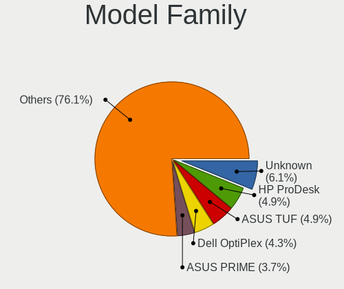
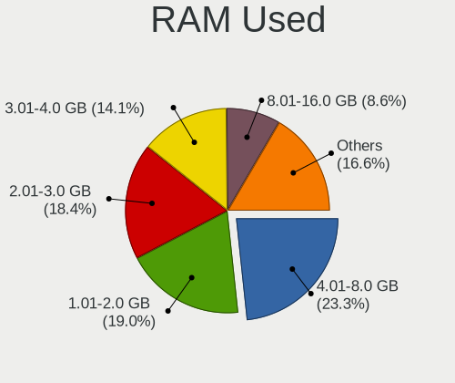
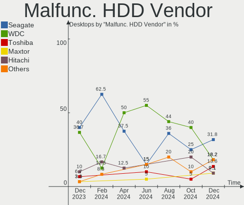
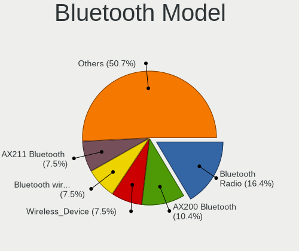
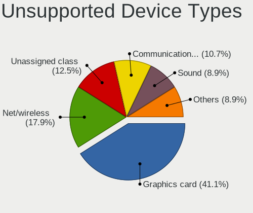

Debian - Hardware Trends (Desktops)
-----------------------------------

A project to identify most popular hardware characteristics and track their change
over time based on data collected by Linux users at https://Linux-Hardware.org.

Anyone can contribute to this report by the [hw-probe](https://github.com/linuxhw/hw-probe) tool:

    sudo -E hw-probe -all -upload

This report is for one last month. Overall report since the beginning of time: [TestDays](https://github.com/linuxhw/TestDays)

Period: Oct, 2023.

Contents
--------

* [ System ](#system)
  - [ OS                       ](#os)
  - [ OS Family                ](#os-family)
  - [ Kernel                   ](#kernel)
  - [ Kernel Family            ](#kernel-family)
  - [ Kernel Major Ver.        ](#kernel-major-ver)
  - [ Arch                     ](#arch)
  - [ DE                       ](#de)
  - [ Display Server           ](#display-server)
  - [ Display Manager          ](#display-manager)
  - [ OS Lang                  ](#os-lang)
  - [ Boot Mode                ](#boot-mode)
  - [ Filesystem               ](#filesystem)
  - [ Part. scheme             ](#part-scheme)
  - [ Dual Boot with Linux/BSD ](#dual-boot-with-linuxbsd)
  - [ Dual Boot (Win)          ](#dual-boot-win)

* [ Board ](#board)
  - [ Vendor                   ](#vendor)
  - [ Model                    ](#model)
  - [ Model Family             ](#model-family)
  - [ MFG Year                 ](#mfg-year)
  - [ Form Factor              ](#form-factor)
  - [ Secure Boot              ](#secure-boot)
  - [ Coreboot                 ](#coreboot)
  - [ RAM Size                 ](#ram-size)
  - [ RAM Used                 ](#ram-used)
  - [ Total Drives             ](#total-drives)
  - [ Has CD-ROM               ](#has-cd-rom)
  - [ Has Ethernet             ](#has-ethernet)
  - [ Has WiFi                 ](#has-wifi)
  - [ Has Bluetooth            ](#has-bluetooth)

* [ Location ](#location)
  - [ Country                  ](#country)
  - [ City                     ](#city)

* [ Drives ](#drives)
  - [ Drive Vendor             ](#drive-vendor)
  - [ Drive Model              ](#drive-model)
  - [ HDD Vendor               ](#hdd-vendor)
  - [ SSD Vendor               ](#ssd-vendor)
  - [ Drive Kind               ](#drive-kind)
  - [ Drive Connector          ](#drive-connector)
  - [ Drive Size               ](#drive-size)
  - [ Space Total              ](#space-total)
  - [ Space Used               ](#space-used)
  - [ Malfunc. Drives          ](#malfunc-drives)
  - [ Malfunc. Drive Vendor    ](#malfunc-drive-vendor)
  - [ Malfunc. HDD Vendor      ](#malfunc-hdd-vendor)
  - [ Malfunc. Drive Kind      ](#malfunc-drive-kind)
  - [ Failed Drives            ](#failed-drives)
  - [ Failed Drive Vendor      ](#failed-drive-vendor)
  - [ Drive Status             ](#drive-status)

* [ Storage controller ](#storage-controller)
  - [ Storage Vendor           ](#storage-vendor)
  - [ Storage Model            ](#storage-model)
  - [ Storage Kind             ](#storage-kind)

* [ Processor ](#processor)
  - [ CPU Vendor               ](#cpu-vendor)
  - [ CPU Model                ](#cpu-model)
  - [ CPU Model Family         ](#cpu-model-family)
  - [ CPU Cores                ](#cpu-cores)
  - [ CPU Sockets              ](#cpu-sockets)
  - [ CPU Threads              ](#cpu-threads)
  - [ CPU Op-Modes             ](#cpu-op-modes)
  - [ CPU Microcode            ](#cpu-microcode)
  - [ CPU Microarch            ](#cpu-microarch)

* [ Graphics ](#graphics)
  - [ GPU Vendor               ](#gpu-vendor)
  - [ GPU Model                ](#gpu-model)
  - [ GPU Combo                ](#gpu-combo)
  - [ GPU Driver               ](#gpu-driver)
  - [ GPU Memory               ](#gpu-memory)

* [ Monitor ](#monitor)
  - [ Monitor Vendor           ](#monitor-vendor)
  - [ Monitor Model            ](#monitor-model)
  - [ Monitor Resolution       ](#monitor-resolution)
  - [ Monitor Diagonal         ](#monitor-diagonal)
  - [ Monitor Width            ](#monitor-width)
  - [ Aspect Ratio             ](#aspect-ratio)
  - [ Monitor Area             ](#monitor-area)
  - [ Pixel Density            ](#pixel-density)
  - [ Multiple Monitors        ](#multiple-monitors)

* [ Network ](#network)
  - [ Net Controller Vendor    ](#net-controller-vendor)
  - [ Net Controller Model     ](#net-controller-model)
  - [ Wireless Vendor          ](#wireless-vendor)
  - [ Wireless Model           ](#wireless-model)
  - [ Ethernet Vendor          ](#ethernet-vendor)
  - [ Ethernet Model           ](#ethernet-model)
  - [ Net Controller Kind      ](#net-controller-kind)
  - [ Used Controller          ](#used-controller)
  - [ NICs                     ](#nics)
  - [ IPv6                     ](#ipv6)

* [ Bluetooth ](#bluetooth)
  - [ Bluetooth Vendor         ](#bluetooth-vendor)
  - [ Bluetooth Model          ](#bluetooth-model)

* [ Sound ](#sound)
  - [ Sound Vendor             ](#sound-vendor)
  - [ Sound Model              ](#sound-model)

* [ Memory ](#memory)
  - [ Memory Vendor            ](#memory-vendor)
  - [ Memory Model             ](#memory-model)
  - [ Memory Kind              ](#memory-kind)
  - [ Memory Form Factor       ](#memory-form-factor)
  - [ Memory Size              ](#memory-size)
  - [ Memory Speed             ](#memory-speed)

* [ Printers & scanners ](#printers--scanners)
  - [ Printer Vendor           ](#printer-vendor)
  - [ Printer Model            ](#printer-model)
  - [ Scanner Vendor           ](#scanner-vendor)
  - [ Scanner Model            ](#scanner-model)

* [ Camera ](#camera)
  - [ Camera Vendor            ](#camera-vendor)
  - [ Camera Model             ](#camera-model)

* [ Security ](#security)
  - [ Fingerprint Vendor       ](#fingerprint-vendor)
  - [ Fingerprint Model        ](#fingerprint-model)
  - [ Chipcard Vendor          ](#chipcard-vendor)
  - [ Chipcard Model           ](#chipcard-model)

* [ Unsupported ](#unsupported)
  - [ Unsupported Devices      ](#unsupported-devices)
  - [ Unsupported Device Types ](#unsupported-device-types)

System
------

OS
--

Installed operating systems

| Name      | Desktops | Percent |
|-----------|----------|---------|
| Debian 12 | 130      | 73.86%  |
| Debian 11 | 24       | 13.64%  |
| Debian    | 19       | 10.8%   |
| Debian 10 | 2        | 1.14%   |
| Debian 9  | 1        | 0.57%   |

OS Family
---------

OS without a version

| Name   | Desktops | Percent |
|--------|----------|---------|
| Debian | 176      | 100%    |

Kernel
------

Version of the Linux kernel

| Version                          | Desktops | Percent |
|----------------------------------|----------|---------|
| 6.1.0-13-amd64                   | 66       | 37.5%   |
| 6.1.0-12-amd64                   | 27       | 15.34%  |
| 6.1.0-4-amd64                    | 11       | 6.25%   |
| 5.10.0-26-amd64                  | 11       | 6.25%   |
| 6.5.0-1-amd64                    | 10       | 5.68%   |
| 6.2.16-15-pve                    | 5        | 2.84%   |
| 6.4.0-4-amd64                    | 4        | 2.27%   |
| 6.2.16-14-pve                    | 4        | 2.27%   |
| 5.10.0-25-amd64                  | 4        | 2.27%   |
| 6.1.0-9-amd64                    | 3        | 1.7%    |
| 6.1.0-10-amd64                   | 3        | 1.7%    |
| 6.1.0-0.deb11.11-amd64           | 3        | 1.7%    |
| 6.5.0-2-amd64                    | 2        | 1.14%   |
| 5.10.0-19-amd64                  | 2        | 1.14%   |
| 96.5.7-srb-hydramd-g5608462499cf | 1        | 0.57%   |
| 6.5.8                            | 1        | 0.57%   |
| 6.5.7                            | 1        | 0.57%   |
| 6.5.5-2-liquorix-amd64           | 1        | 0.57%   |
| 6.5.0-3-amd64                    | 1        | 0.57%   |
| 6.5.0-0.deb12.1-rt-amd64         | 1        | 0.57%   |
| 6.4.0-0.deb12.2-amd64            | 1        | 0.57%   |
| 6.3.0-2-amd64                    | 1        | 0.57%   |
| 6.2.16-6-pve                     | 1        | 0.57%   |
| 6.2.16-3-pve                     | 1        | 0.57%   |
| 6.2.16-12-pve                    | 1        | 0.57%   |
| 6.2.16-11-bpo11-pve              | 1        | 0.57%   |
| 6.1.55-oscon                     | 1        | 0.57%   |
| 6.1.52a                          | 1        | 0.57%   |
| 6.1.0-11-amd64                   | 1        | 0.57%   |
| 6.1.0-0.deb11.7-amd64            | 1        | 0.57%   |
| 5.15.108-1-pve                   | 1        | 0.57%   |
| 5.11.22-5-pve                    | 1        | 0.57%   |
| 5.10.0-23-amd64                  | 1        | 0.57%   |
| 5.10.0-0.deb10.16-amd64          | 1        | 0.57%   |
| 4.19.0-25-amd64                  | 1        | 0.57%   |

Kernel Family
-------------

Linux kernel without a distro release

| Version  | Desktops | Percent |
|----------|----------|---------|
| 6.1.0    | 115      | 65.34%  |
| 5.10.0   | 19       | 10.8%   |
| 6.5.0    | 14       | 7.95%   |
| 6.2.16   | 13       | 7.39%   |
| 6.4.0    | 5        | 2.84%   |
| 96.5.7   | 1        | 0.57%   |
| 6.5.8    | 1        | 0.57%   |
| 6.5.7    | 1        | 0.57%   |
| 6.5.5    | 1        | 0.57%   |
| 6.3.0    | 1        | 0.57%   |
| 6.1.55   | 1        | 0.57%   |
| 6.1.52   | 1        | 0.57%   |
| 5.15.108 | 1        | 0.57%   |
| 5.11.22  | 1        | 0.57%   |
| 4.19.0   | 1        | 0.57%   |

Kernel Major Ver.
-----------------

Linux kernel major version

| Version | Desktops | Percent |
|---------|----------|---------|
| 6.1     | 117      | 66.48%  |
| 5.10    | 19       | 10.8%   |
| 6.5     | 17       | 9.66%   |
| 6.2     | 13       | 7.39%   |
| 6.4     | 5        | 2.84%   |
| 96.5    | 1        | 0.57%   |
| 6.3     | 1        | 0.57%   |
| 5.15    | 1        | 0.57%   |
| 5.11    | 1        | 0.57%   |
| 4.19    | 1        | 0.57%   |

Arch
----

OS architecture (x86_64, i586, etc.)

| Name   | Desktops | Percent |
|--------|----------|---------|
| x86_64 | 176      | 100%    |

DE
--

Desktop Environment

| Name              | Desktops | Percent |
|-------------------|----------|---------|
| GNOME             | 50       | 28.41%  |
| Unknown           | 39       | 22.16%  |
| KDE5              | 32       | 18.18%  |
| XFCE              | 20       | 11.36%  |
| MATE              | 13       | 7.39%   |
| X-Cinnamon        | 6        | 3.41%   |
| LXDE              | 3        | 1.7%    |
| LXQt              | 2        | 1.14%   |
| i3                | 2        | 1.14%   |
| GNOME Flashback   | 2        | 1.14%   |
| Cinnamon          | 2        | 1.14%   |
| x-session-manager | 1        | 0.57%   |
| Trinity           | 1        | 0.57%   |
| openbox           | 1        | 0.57%   |
| KDE               | 1        | 0.57%   |
| Budgie            | 1        | 0.57%   |

Display Server
--------------

X11 or Wayland

| Name    | Desktops | Percent |
|---------|----------|---------|
| X11     | 87       | 49.43%  |
| Wayland | 44       | 25%     |
| Tty     | 25       | 14.2%   |
| Unknown | 19       | 10.8%   |
| Web     | 1        | 0.57%   |

Display Manager
---------------

SDDM, LightDM, etc.

| Name    | Desktops | Percent |
|---------|----------|---------|
| Unknown | 70       | 39.77%  |
| LightDM | 35       | 19.89%  |
| GDM3    | 34       | 19.32%  |
| SDDM    | 26       | 14.77%  |
| GDM     | 8        | 4.55%   |
| LXDM    | 2        | 1.14%   |
| XDM     | 1        | 0.57%   |

OS Lang
-------

Language

| Lang              | Desktops | Percent |
|-------------------|----------|---------|
| en_US             | 80       | 45.45%  |
| ru_RU             | 19       | 10.8%   |
| de_DE             | 14       | 7.95%   |
| it_IT             | 9        | 5.11%   |
| es_ES             | 8        | 4.55%   |
| pt_BR             | 6        | 3.41%   |
| en_GB             | 6        | 3.41%   |
| en_CA             | 4        | 2.27%   |
| hu_HU             | 3        | 1.7%    |
| en_ZA             | 3        | 1.7%    |
| pl_PL             | 2        | 1.14%   |
| fr_FR             | 2        | 1.14%   |
| es_MX             | 2        | 1.14%   |
| en_AU             | 2        | 1.14%   |
| C                 | 2        | 1.14%   |
| Unknown           | 2        | 1.14%   |
| pt_PT             | 1        | 0.57%   |
| nl_NL             | 1        | 0.57%   |
| nb_NO             | 1        | 0.57%   |
| lt_LT             | 1        | 0.57%   |
| et_EE             | 1        | 0.57%   |
| es_CO             | 1        | 0.57%   |
| es_CL             | 1        | 0.57%   |
| en_US.ISO-8859-15 | 1        | 0.57%   |
| en_PH             | 1        | 0.57%   |
| en_IE             | 1        | 0.57%   |
| de_AT             | 1        | 0.57%   |
| cs_CZ             | 1        | 0.57%   |

Boot Mode
---------

EFI or BIOS

| Mode | Desktops | Percent |
|------|----------|---------|
| EFI  | 100      | 56.82%  |
| BIOS | 76       | 43.18%  |

Filesystem
----------

Type of filesystem

| Type    | Desktops | Percent |
|---------|----------|---------|
| Ext4    | 140      | 79.55%  |
| Overlay | 15       | 8.52%   |
| Zfs     | 7        | 3.98%   |
| Btrfs   | 6        | 3.41%   |
| Tmpfs   | 4        | 2.27%   |
| Xfs     | 2        | 1.14%   |
| Ext3    | 1        | 0.57%   |
| Unknown | 1        | 0.57%   |

Part. scheme
------------

Scheme of partitioning

| Type    | Desktops | Percent |
|---------|----------|---------|
| GPT     | 112      | 63.64%  |
| Unknown | 33       | 18.75%  |
| MBR     | 31       | 17.61%  |

Dual Boot with Linux/BSD
------------------------

Hosting more than one Linux/BSD

| Dual boot | Desktops | Percent |
|-----------|----------|---------|
| No        | 148      | 84.09%  |
| Yes       | 28       | 15.91%  |

Dual Boot (Win)
---------------

Hosting Linux and Windows

| Dual boot | Desktops | Percent |
|-----------|----------|---------|
| No        | 121      | 68.75%  |
| Yes       | 55       | 31.25%  |

Board
-----

Vendor
------

Motherboard manufacturer

| Name                                 | Desktops | Percent |
|--------------------------------------|----------|---------|
| ASUSTek Computer                     | 52       | 29.55%  |
| Gigabyte Technology                  | 32       | 18.18%  |
| ASRock                               | 13       | 7.39%   |
| MSI                                  | 12       | 6.82%   |
| Hewlett-Packard                      | 12       | 6.82%   |
| Dell                                 | 11       | 6.25%   |
| Fujitsu                              | 5        | 2.84%   |
| Unknown                              | 5        | 2.84%   |
| Lenovo                               | 4        | 2.27%   |
| Intel                                | 4        | 2.27%   |
| Acer                                 | 3        | 1.7%    |
| Pegatron                             | 2        | 1.14%   |
| ECS                                  | 2        | 1.14%   |
| Biostar                              | 2        | 1.14%   |
| AZW                                  | 2        | 1.14%   |
| Apple                                | 2        | 1.14%   |
| Supermicro                           | 1        | 0.57%   |
| Shuttle                              | 1        | 0.57%   |
| Shenzhen Meigao Electronic Equipment | 1        | 0.57%   |
| Quantum engineering                  | 1        | 0.57%   |
| Packard Bell                         | 1        | 0.57%   |
| Inventec                             | 1        | 0.57%   |
| Huanan                               | 1        | 0.57%   |
| Google                               | 1        | 0.57%   |
| Foxconn                              | 1        | 0.57%   |
| Centerm                              | 1        | 0.57%   |
| AWOW                                 | 1        | 0.57%   |
| ASRockRack                           | 1        | 0.57%   |
| 3Logic Group                         | 1        | 0.57%   |

Model
-----

Motherboard model

| Name                                      | Desktops | Percent |
|-------------------------------------------|----------|---------|
| Unknown                                   | 5        | 2.84%   |
| ASUS TUF Gaming X570-PLUS                 | 3        | 1.7%    |
| Intel Jasper Lake Client Platform         | 2        | 1.14%   |
| HP ProDesk 600 G6 Small Form Factor PC    | 2        | 1.14%   |
| HP EliteDesk 800 G2 DM 35W                | 2        | 1.14%   |
| Dell PowerEdge T20                        | 2        | 1.14%   |
| Biostar B450MH                            | 2        | 1.14%   |
| ASUS TUF Gaming B550M-E                   | 2        | 1.14%   |
| ASUS PRIME A320M-K                        | 2        | 1.14%   |
| ASUS All Series                           | 2        | 1.14%   |
| Supermicro X10DAi                         | 1        | 0.57%   |
| Shuttle SH67H3                            | 1        | 0.57%   |
| Shenzhen Meigao Electronic Equipment TH80 | 1        | 0.57%   |
| Quantum engineering HackBoard 2           | 1        | 0.57%   |
| Pegatron p7-1238                          | 1        | 0.57%   |
| Pegatron NY428AA-A2L p6110f               | 1        | 0.57%   |
| Packard Bell IMEDIA S3720                 | 1        | 0.57%   |
| MSI MS-7D98                               | 1        | 0.57%   |
| MSI MS-7D59                               | 1        | 0.57%   |
| MSI MS-7D29                               | 1        | 0.57%   |
| MSI MS-7C56                               | 1        | 0.57%   |
| MSI MS-7C51                               | 1        | 0.57%   |
| MSI MS-7C37                               | 1        | 0.57%   |
| MSI MS-7C35                               | 1        | 0.57%   |
| MSI MS-7B86                               | 1        | 0.57%   |
| MSI MS-7B79                               | 1        | 0.57%   |
| MSI MS-7A38                               | 1        | 0.57%   |
| MSI MS-7996                               | 1        | 0.57%   |
| MSI MS-7816                               | 1        | 0.57%   |
| Lenovo ThinkCentre M92p 2992D9G           | 1        | 0.57%   |
| Lenovo ThinkCentre M715q 10M2S09W00       | 1        | 0.57%   |
| Lenovo IdeaCentre 3 07ADA05 90MV0059RS    | 1        | 0.57%   |
| Lenovo H50-50 90B6007MGE                  | 1        | 0.57%   |
| Inventec D CLASS                          | 1        | 0.57%   |
| Intel X99                                 | 1        | 0.57%   |
| Intel DH61HO AAG62445-102                 | 1        | 0.57%   |
| Huanan X99-F8 GAMING V2.0                 | 1        | 0.57%   |
| HP Z440 Workstation                       | 1        | 0.57%   |
| HP Z400 Workstation                       | 1        | 0.57%   |
| HP ProLiant MicroServer Gen8              | 1        | 0.57%   |

Model Family
------------

Motherboard model prefix

| Name                                      | Desktops | Percent |
|-------------------------------------------|----------|---------|
| ASUS PRIME                                | 16       | 9.09%   |
| ASUS ROG                                  | 9        | 5.11%   |
| ASUS TUF                                  | 6        | 3.41%   |
| Unknown                                   | 5        | 2.84%   |
| Fujitsu ESPRIMO                           | 4        | 2.27%   |
| Dell Precision                            | 4        | 2.27%   |
| Dell OptiPlex                             | 4        | 2.27%   |
| HP EliteDesk                              | 3        | 1.7%    |
| Dell PowerEdge                            | 3        | 1.7%    |
| Lenovo ThinkCentre                        | 2        | 1.14%   |
| Intel Jasper                              | 2        | 1.14%   |
| HP ProLiant                               | 2        | 1.14%   |
| HP ProDesk                                | 2        | 1.14%   |
| Gigabyte X570S                            | 2        | 1.14%   |
| Gigabyte X570                             | 2        | 1.14%   |
| Gigabyte B550M                            | 2        | 1.14%   |
| Gigabyte B450                             | 2        | 1.14%   |
| Gigabyte 970A-DS3P                        | 2        | 1.14%   |
| Biostar B450MH                            | 2        | 1.14%   |
| ASUS All                                  | 2        | 1.14%   |
| Acer Aspire                               | 2        | 1.14%   |
| Supermicro X10DAi                         | 1        | 0.57%   |
| Shuttle SH67H3                            | 1        | 0.57%   |
| Shenzhen Meigao Electronic Equipment TH80 | 1        | 0.57%   |
| Quantum engineering HackBoard             | 1        | 0.57%   |
| Pegatron p7-1238                          | 1        | 0.57%   |
| Pegatron NY428AA-A2L                      | 1        | 0.57%   |
| Packard Bell IMEDIA                       | 1        | 0.57%   |
| MSI MS-7D98                               | 1        | 0.57%   |
| MSI MS-7D59                               | 1        | 0.57%   |
| MSI MS-7D29                               | 1        | 0.57%   |
| MSI MS-7C56                               | 1        | 0.57%   |
| MSI MS-7C51                               | 1        | 0.57%   |
| MSI MS-7C37                               | 1        | 0.57%   |
| MSI MS-7C35                               | 1        | 0.57%   |
| MSI MS-7B86                               | 1        | 0.57%   |
| MSI MS-7B79                               | 1        | 0.57%   |
| MSI MS-7A38                               | 1        | 0.57%   |
| MSI MS-7996                               | 1        | 0.57%   |
| MSI MS-7816                               | 1        | 0.57%   |

MFG Year
--------

Motherboard manufacture year

| Year    | Desktops | Percent |
|---------|----------|---------|
| 2019    | 19       | 10.8%   |
| 2022    | 18       | 10.23%  |
| 2020    | 16       | 9.09%   |
| 2021    | 15       | 8.52%   |
| 2015    | 13       | 7.39%   |
| 2013    | 12       | 6.82%   |
| 2023    | 11       | 6.25%   |
| 2018    | 11       | 6.25%   |
| 2012    | 11       | 6.25%   |
| 2014    | 10       | 5.68%   |
| 2010    | 10       | 5.68%   |
| 2017    | 8        | 4.55%   |
| 2011    | 6        | 3.41%   |
| 2009    | 5        | 2.84%   |
| 2016    | 4        | 2.27%   |
| 2008    | 3        | 1.7%    |
| 2007    | 3        | 1.7%    |
| Unknown | 1        | 0.57%   |

Form Factor
-----------

Physical design of the computer

| Name    | Desktops | Percent |
|---------|----------|---------|
| Desktop | 176      | 100%    |

Secure Boot
-----------

Enabled or disabled

| State    | Desktops | Percent |
|----------|----------|---------|
| Disabled | 171      | 97.16%  |
| Enabled  | 5        | 2.84%   |

Coreboot
--------

Have coreboot on board

| Used | Desktops | Percent |
|------|----------|---------|
| No   | 175      | 99.43%  |
| Yes  | 1        | 0.57%   |

RAM Size
--------

Total RAM memory

| Size in GB      | Desktops | Percent |
|-----------------|----------|---------|
| 16.01-24.0      | 44       | 25%     |
| 32.01-64.0      | 35       | 19.89%  |
| 4.01-8.0        | 26       | 14.77%  |
| 8.01-16.0       | 23       | 13.07%  |
| 64.01-256.0     | 21       | 11.93%  |
| 3.01-4.0        | 17       | 9.66%   |
| 24.01-32.0      | 4        | 2.27%   |
| 1.01-2.0        | 4        | 2.27%   |
| More than 256.0 | 1        | 0.57%   |
| 2.01-3.0        | 1        | 0.57%   |

RAM Used
--------

Used RAM memory

| Used GB     | Desktops | Percent |
|-------------|----------|---------|
| 4.01-8.0    | 37       | 21.02%  |
| 1.01-2.0    | 32       | 18.18%  |
| 3.01-4.0    | 29       | 16.48%  |
| 2.01-3.0    | 23       | 13.07%  |
| 8.01-16.0   | 21       | 11.93%  |
| 0.51-1.0    | 16       | 9.09%   |
| 0.01-0.5    | 6        | 3.41%   |
| 16.01-24.0  | 5        | 2.84%   |
| 32.01-64.0  | 4        | 2.27%   |
| 64.01-256.0 | 2        | 1.14%   |
| 24.01-32.0  | 1        | 0.57%   |

Total Drives
------------

Number of drives on board

| Drives | Desktops | Percent |
|--------|----------|---------|
| 1      | 71       | 40.34%  |
| 2      | 44       | 25%     |
| 3      | 19       | 10.8%   |
| 4      | 15       | 8.52%   |
| 5      | 8        | 4.55%   |
| 6      | 6        | 3.41%   |
| 7      | 4        | 2.27%   |
| 9      | 3        | 1.7%    |
| 19     | 1        | 0.57%   |
| 17     | 1        | 0.57%   |
| 11     | 1        | 0.57%   |
| 10     | 1        | 0.57%   |
| 8      | 1        | 0.57%   |
| 0      | 1        | 0.57%   |

Has CD-ROM
----------

Has CD-ROM on board

| Presented | Desktops | Percent |
|-----------|----------|---------|
| No        | 130      | 73.86%  |
| Yes       | 46       | 26.14%  |

Has Ethernet
------------

Has Ethernet on board

| Presented | Desktops | Percent |
|-----------|----------|---------|
| Yes       | 175      | 99.43%  |
| No        | 1        | 0.57%   |

Has WiFi
--------

Has WiFi module

| Presented | Desktops | Percent |
|-----------|----------|---------|
| No        | 102      | 57.95%  |
| Yes       | 74       | 42.05%  |

Has Bluetooth
-------------

Has Bluetooth module

| Presented | Desktops | Percent |
|-----------|----------|---------|
| No        | 112      | 63.64%  |
| Yes       | 64       | 36.36%  |

Location
--------

Country
-------

Geographic location (country)

| Country      | Desktops | Percent |
|--------------|----------|---------|
| Russia       | 29       | 16.48%  |
| USA          | 22       | 12.5%   |
| Germany      | 22       | 12.5%   |
| Italy        | 10       | 5.68%   |
| Brazil       | 9        | 5.11%   |
| Spain        | 8        | 4.55%   |
| Netherlands  | 6        | 3.41%   |
| France       | 6        | 3.41%   |
| UK           | 4        | 2.27%   |
| Poland       | 4        | 2.27%   |
| Hungary      | 4        | 2.27%   |
| Czechia      | 4        | 2.27%   |
| Canada       | 4        | 2.27%   |
| South Africa | 3        | 1.7%    |
| Portugal     | 3        | 1.7%    |
| Mexico       | 3        | 1.7%    |
| Malaysia     | 3        | 1.7%    |
| Austria      | 3        | 1.7%    |
| Serbia       | 2        | 1.14%   |
| Philippines  | 2        | 1.14%   |
| Norway       | 2        | 1.14%   |
| Japan        | 2        | 1.14%   |
| Greece       | 2        | 1.14%   |
| Finland      | 2        | 1.14%   |
| Estonia      | 2        | 1.14%   |
| Bulgaria     | 2        | 1.14%   |
| Australia    | 2        | 1.14%   |
| Vietnam      | 1        | 0.57%   |
| Taiwan       | 1        | 0.57%   |
| Switzerland  | 1        | 0.57%   |
| Romania      | 1        | 0.57%   |
| Lithuania    | 1        | 0.57%   |
| Hong Kong    | 1        | 0.57%   |
| Colombia     | 1        | 0.57%   |
| Chile        | 1        | 0.57%   |
| Belgium      | 1        | 0.57%   |
| Belarus      | 1        | 0.57%   |
| Argentina    | 1        | 0.57%   |

City
----

Geographic location (city)

| City             | Desktops | Percent |
|------------------|----------|---------|
| Voronezh         | 12       | 6.82%   |
| Perm             | 3        | 1.7%    |
| Stuttgart        | 2        | 1.14%   |
| St Petersburg    | 2        | 1.14%   |
| Rio de Janeiro   | 2        | 1.14%   |
| Paris            | 2        | 1.14%   |
| Oslo             | 2        | 1.14%   |
| Nola             | 2        | 1.14%   |
| Moscow           | 2        | 1.14%   |
| Kuala Lumpur     | 2        | 1.14%   |
| Johannesburg     | 2        | 1.14%   |
| Coimbra          | 2        | 1.14%   |
| Amsterdam        | 2        | 1.14%   |
| Żory            | 1        | 0.57%   |
| Wittingen        | 1        | 0.57%   |
| Warsaw           | 1        | 0.57%   |
| Wakasato         | 1        | 0.57%   |
| Vigo             | 1        | 0.57%   |
| Vienna           | 1        | 0.57%   |
| Verkhnyaya Salda | 1        | 0.57%   |
| Varna            | 1        | 0.57%   |
| Utrecht          | 1        | 0.57%   |
| Uberherrn        | 1        | 0.57%   |
| Tyumen           | 1        | 0.57%   |
| Tver             | 1        | 0.57%   |
| Tuusula          | 1        | 0.57%   |
| Turin            | 1        | 0.57%   |
| Tullahoma        | 1        | 0.57%   |
| Tulette          | 1        | 0.57%   |
| Tujunga          | 1        | 0.57%   |
| Trevignano       | 1        | 0.57%   |
| Trairi           | 1        | 0.57%   |
| Tours            | 1        | 0.57%   |
| Toronto          | 1        | 0.57%   |
| Thessaloniki     | 1        | 0.57%   |
| Tallinn          | 1        | 0.57%   |
| Takasago         | 1        | 0.57%   |
| Szentendre       | 1        | 0.57%   |
| Surgut           | 1        | 0.57%   |
| Straznice        | 1        | 0.57%   |

Drives
------

Drive Vendor
------------

Hard drive vendors

| Vendor                      | Desktops | Drives | Percent |
|-----------------------------|----------|--------|---------|
| WDC                         | 52       | 86     | 15.9%   |
| Samsung Electronics         | 48       | 76     | 14.68%  |
| Seagate                     | 44       | 79     | 13.46%  |
| Kingston                    | 25       | 28     | 7.65%   |
| Toshiba                     | 20       | 29     | 6.12%   |
| Hitachi                     | 13       | 22     | 3.98%   |
| Crucial                     | 12       | 13     | 3.67%   |
| HGST                        | 8        | 24     | 2.45%   |
| SanDisk                     | 7        | 8      | 2.14%   |
| A-DATA Technology           | 7        | 8      | 2.14%   |
| Unknown                     | 6        | 9      | 1.83%   |
| Intel                       | 6        | 8      | 1.83%   |
| Corsair                     | 6        | 9      | 1.83%   |
| China                       | 5        | 5      | 1.53%   |
| SK hynix                    | 4        | 4      | 1.22%   |
| Patriot                     | 4        | 4      | 1.22%   |
| Transcend                   | 3        | 3      | 0.92%   |
| Phison                      | 3        | 3      | 0.92%   |
| OCZ                         | 3        | 3      | 0.92%   |
| Netac                       | 3        | 3      | 0.92%   |
| XPG                         | 2        | 2      | 0.61%   |
| Realtek                     | 2        | 2      | 0.61%   |
| PNY                         | 2        | 3      | 0.61%   |
| Micron Technology           | 2        | 2      | 0.61%   |
| Maxtor                      | 2        | 2      | 0.61%   |
| MAXIO Technology (Hangzhou) | 2        | 3      | 0.61%   |
| Lexar                       | 2        | 2      | 0.61%   |
| KIOXIA                      | 2        | 2      | 0.61%   |
| Gigabyte Technology         | 2        | 2      | 0.61%   |
| FORESEE                     | 2        | 2      | 0.61%   |
| Fanxiang                    | 2        | 2      | 0.61%   |
| Apacer                      | 2        | 3      | 0.61%   |
| AMD                         | 2        | 2      | 0.61%   |
| Unknown                     | 2        | 2      | 0.61%   |
| TSA                         | 1        | 1      | 0.31%   |
| Teclast                     | 1        | 1      | 0.31%   |
| Team                        | 1        | 1      | 0.31%   |
| SPCC                        | 1        | 1      | 0.31%   |
| Silicon Motion              | 1        | 1      | 0.31%   |
| Plextor                     | 1        | 1      | 0.31%   |

Drive Model
-----------

Hard drive models

| Model                                              | Desktops | Percent |
|----------------------------------------------------|----------|---------|
| Seagate ST1000DM010-2EP102 1TB                     | 7        | 1.83%   |
| Samsung SSD 860 EVO 500GB                          | 7        | 1.83%   |
| Kingston SA400S37240G 240GB SSD                    | 5        | 1.31%   |
| Toshiba DT01ACA100 1TB                             | 4        | 1.04%   |
| Toshiba DT01ACA050 500GB                           | 4        | 1.04%   |
| Seagate ST1000DM003-1ER162 1TB                     | 4        | 1.04%   |
| Toshiba DT01ACA300 3TB                             | 3        | 0.78%   |
| Seagate ST4000DM004-2CV104 4TB                     | 3        | 0.78%   |
| Seagate ST2000DM008-2FR102 2TB                     | 3        | 0.78%   |
| Seagate ST2000DM006-2DM164 2TB                     | 3        | 0.78%   |
| Samsung SSD 990 PRO 2TB                            | 3        | 0.78%   |
| Samsung SSD 980 1TB                                | 3        | 0.78%   |
| Samsung SSD 870 EVO 1TB                            | 3        | 0.78%   |
| Samsung SSD 860 EVO 250GB                          | 3        | 0.78%   |
| Samsung SSD 850 PRO 256GB                          | 3        | 0.78%   |
| Samsung SSD 850 EVO 250GB                          | 3        | 0.78%   |
| Samsung NVMe SSD Controller PM9A1/PM9A3/980PRO 1TB | 3        | 0.78%   |
| Crucial CT480BX500SSD1 480GB                       | 3        | 0.78%   |
| A-DATA SU650 240GB SSD                             | 3        | 0.78%   |
| XPG SPECTRIX S40G 1TB                              | 2        | 0.52%   |
| WDC WDS100T2B0A-00SM50 1TB SSD                     | 2        | 0.52%   |
| WDC WD40EFZX-68AWUN0 4TB                           | 2        | 0.52%   |
| WDC WD10EZEX-08WN4A0 1TB                           | 2        | 0.52%   |
| WDC WD10EZEX-00BN5A0 1TB                           | 2        | 0.52%   |
| Unknown SD/MMC 2GB                                 | 2        | 0.52%   |
| Unknown NVMe SSD Drive 2TB                         | 2        | 0.52%   |
| Unknown M.S./M.S.Pro/HG 16GB                       | 2        | 0.52%   |
| Toshiba HDWD120 2TB                                | 2        | 0.52%   |
| Seagate ST8000AS0002-1NA17Z 8TB                    | 2        | 0.52%   |
| Seagate ST500DM002-1BD142 500GB                    | 2        | 0.52%   |
| Seagate ST3500413AS 500GB                          | 2        | 0.52%   |
| Seagate ST3000DM001-1CH166 3TB                     | 2        | 0.52%   |
| Seagate ST2000DM008-2UB102 2TB                     | 2        | 0.52%   |
| Seagate ST1500DL003-9VT16L 1TB                     | 2        | 0.52%   |
| Seagate ST1000DM003-1CH162 1TB                     | 2        | 0.52%   |
| SanDisk NVMe SSD Drive 500GB                       | 2        | 0.52%   |
| Samsung SSD 980 PRO 1TB                            | 2        | 0.52%   |
| Samsung SSD 970 EVO Plus 500GB                     | 2        | 0.52%   |
| Samsung SSD 970 EVO 500GB                          | 2        | 0.52%   |
| Samsung SSD 870 QVO 2TB                            | 2        | 0.52%   |

HDD Vendor
----------

Hard disk drive vendors

| Vendor              | Desktops | Drives | Percent |
|---------------------|----------|--------|---------|
| WDC                 | 45       | 74     | 32.85%  |
| Seagate             | 41       | 76     | 29.93%  |
| Toshiba             | 20       | 29     | 14.6%   |
| Hitachi             | 13       | 22     | 9.49%   |
| HGST                | 8        | 24     | 5.84%   |
| Samsung Electronics | 7        | 8      | 5.11%   |
| Maxtor              | 2        | 2      | 1.46%   |
| Unknown             | 1        | 1      | 0.73%   |

SSD Vendor
----------

Solid state drive vendors

| Vendor              | Desktops | Drives | Percent |
|---------------------|----------|--------|---------|
| Samsung Electronics | 24       | 36     | 21.24%  |
| Kingston            | 17       | 19     | 15.04%  |
| Crucial             | 12       | 13     | 10.62%  |
| China               | 5        | 5      | 4.42%   |
| WDC                 | 4        | 4      | 3.54%   |
| SanDisk             | 4        | 4      | 3.54%   |
| A-DATA Technology   | 4        | 4      | 3.54%   |
| Transcend           | 3        | 3      | 2.65%   |
| Patriot             | 3        | 3      | 2.65%   |
| OCZ                 | 3        | 3      | 2.65%   |
| Corsair             | 3        | 3      | 2.65%   |
| PNY                 | 2        | 3      | 1.77%   |
| Netac               | 2        | 2      | 1.77%   |
| Micron Technology   | 2        | 2      | 1.77%   |
| Intel               | 2        | 4      | 1.77%   |
| FORESEE             | 2        | 2      | 1.77%   |
| Apacer              | 2        | 3      | 1.77%   |
| AMD                 | 2        | 2      | 1.77%   |
| TSA                 | 1        | 1      | 0.88%   |
| Team                | 1        | 1      | 0.88%   |
| SPCC                | 1        | 1      | 0.88%   |
| NT-512              | 1        | 1      | 0.88%   |
| MSCC                | 1        | 1      | 0.88%   |
| Lexar               | 1        | 1      | 0.88%   |
| KingSpec            | 1        | 1      | 0.88%   |
| KingFast            | 1        | 1      | 0.88%   |
| Kimtigo             | 1        | 1      | 0.88%   |
| Innodisk            | 1        | 1      | 0.88%   |
| HS-SSD-C100         | 1        | 1      | 0.88%   |
| Hewlett-Packard     | 1        | 1      | 0.88%   |
| GOODRAM             | 1        | 1      | 0.88%   |
| Fanxiang            | 1        | 1      | 0.88%   |
| Drevo               | 1        | 1      | 0.88%   |
| AirDisk             | 1        | 1      | 0.88%   |
| Unknown             | 1        | 1      | 0.88%   |

Drive Kind
----------

HDD or SSD

| Kind    | Desktops | Drives | Percent |
|---------|----------|--------|---------|
| HDD     | 102      | 236    | 37.78%  |
| SSD     | 93       | 132    | 34.44%  |
| NVMe    | 68       | 97     | 25.19%  |
| Unknown | 7        | 10     | 2.59%   |

Drive Connector
---------------

SATA, SAS, NVMe, etc.

| Type | Desktops | Drives | Percent |
|------|----------|--------|---------|
| SATA | 152      | 341    | 65.52%  |
| NVMe | 68       | 94     | 29.31%  |
| SAS  | 12       | 40     | 5.17%   |

Drive Size
----------

Size of hard drive

| Size in TB | Desktops | Drives | Percent |
|------------|----------|--------|---------|
| 0.01-0.5   | 99       | 139    | 43.81%  |
| 0.51-1.0   | 61       | 88     | 26.99%  |
| 1.01-2.0   | 25       | 36     | 11.06%  |
| 3.01-4.0   | 13       | 42     | 5.75%   |
| 4.01-10.0  | 13       | 32     | 5.75%   |
| 2.01-3.0   | 11       | 17     | 4.87%   |
| 10.01-20.0 | 4        | 14     | 1.77%   |

Space Total
-----------

Amount of disk space available on the file system

| Size in GB     | Desktops | Percent |
|----------------|----------|---------|
| 101-250        | 32       | 18.18%  |
| 501-1000       | 29       | 16.48%  |
| More than 3000 | 22       | 12.5%   |
| 1001-2000      | 22       | 12.5%   |
| Unknown        | 22       | 12.5%   |
| 251-500        | 18       | 10.23%  |
| 2001-3000      | 14       | 7.95%   |
| 51-100         | 9        | 5.11%   |
| 1-20           | 6        | 3.41%   |
| 21-50          | 2        | 1.14%   |

Space Used
----------

Amount of used disk space

| Used GB        | Desktops | Percent |
|----------------|----------|---------|
| 1-20           | 41       | 23.3%   |
| 21-50          | 23       | 13.07%  |
| Unknown        | 22       | 12.5%   |
| 101-250        | 21       | 11.93%  |
| 251-500        | 19       | 10.8%   |
| 501-1000       | 16       | 9.09%   |
| 51-100         | 13       | 7.39%   |
| More than 3000 | 12       | 6.82%   |
| 1001-2000      | 5        | 2.84%   |
| 2001-3000      | 4        | 2.27%   |

Malfunc. Drives
---------------

Drive models with a malfunction

| Model                                        | Desktops | Drives | Percent |
|----------------------------------------------|----------|--------|---------|
| Seagate ST500DM002-1BD142 500GB              | 2        | 2      | 4.76%   |
| Seagate ST2000DM006-2DM164 2TB               | 2        | 3      | 4.76%   |
| Samsung Electronics SSD 870 EVO 1TB          | 2        | 2      | 4.76%   |
| WDC WD5000AAKX-60U6AA0 500GB                 | 1        | 1      | 2.38%   |
| WDC WD5000AAKX-07U6AA1 500GB                 | 1        | 2      | 2.38%   |
| WDC WD40EFZX-68AWUN0 4TB                     | 1        | 6      | 2.38%   |
| WDC WD3200AAJS-07M0A0 320GB                  | 1        | 1      | 2.38%   |
| WDC WD30EZRZ-00WN9B0 3TB                     | 1        | 1      | 2.38%   |
| WDC WD15EARS-00Z5B1 1TB                      | 1        | 1      | 2.38%   |
| WDC WD1200BEVS-22UST0 120GB                  | 1        | 1      | 2.38%   |
| WDC WD10EAVS-00D7B0 1TB                      | 1        | 1      | 2.38%   |
| WDC WD10EARS-00MVWB0 1TB                     | 1        | 1      | 2.38%   |
| WDC WD1003FBYZ-010FB0 1TB                    | 1        | 1      | 2.38%   |
| WDC WD1003FBYX-01Y7B2 1TB                    | 1        | 1      | 2.38%   |
| Toshiba MK6465GSXN 640GB                     | 1        | 1      | 2.38%   |
| Toshiba MK3263GSXN 320GB                     | 1        | 1      | 2.38%   |
| Toshiba MK3261GSYN 320GB                     | 1        | 1      | 2.38%   |
| Toshiba MK1655GSX 160GB                      | 1        | 1      | 2.38%   |
| Seagate ST4000DM000-1F2168 4TB               | 1        | 1      | 2.38%   |
| Seagate ST3250410AS 250GB                    | 1        | 1      | 2.38%   |
| Seagate ST1500DL003-9VT16L 1TB               | 1        | 1      | 2.38%   |
| Seagate ST1000DX001-1NS162 1TB               | 1        | 1      | 2.38%   |
| Seagate ST1000DM003-1ER162 1TB               | 1        | 1      | 2.38%   |
| Samsung Electronics SSD 970 EVO 500GB        | 1        | 1      | 2.38%   |
| Samsung Electronics HD402LJ 400GB            | 1        | 1      | 2.38%   |
| Samsung Electronics HD080HJ 80GB             | 1        | 1      | 2.38%   |
| OCZ VERTEX3 120GB SSD                        | 1        | 1      | 2.38%   |
| Netac NS512GSSD340 512GB                     | 1        | 1      | 2.38%   |
| Micron Technology MTFDDAK256MAM-1K 256GB SSD | 1        | 1      | 2.38%   |
| Maxtor STM3500320AS 500GB                    | 1        | 1      | 2.38%   |
| Maxtor STM3160815AS 160GB                    | 1        | 1      | 2.38%   |
| Kingston SA400S37120G 120GB SSD              | 1        | 1      | 2.38%   |
| Intel SSDSC2KW010X6 1TB                      | 1        | 2      | 2.38%   |
| Intel SSDSC2BX400G4R 400GB                   | 1        | 1      | 2.38%   |
| HS-SSD-C100 SSD 240G                         | 1        | 1      | 2.38%   |
| Hitachi HUS724040ALE641 4TB                  | 1        | 2      | 2.38%   |
| Hitachi HDS721010CLA330 1TB                  | 1        | 1      | 2.38%   |
| Corsair Neutron SSD 240GB                    | 1        | 1      | 2.38%   |
| Corsair CSSD-F60GB2 64GB                     | 1        | 1      | 2.38%   |

Malfunc. Drive Vendor
---------------------

Vendors of faulty drives

| Vendor              | Desktops | Drives | Percent |
|---------------------|----------|--------|---------|
| WDC                 | 10       | 17     | 25.64%  |
| Seagate             | 8        | 10     | 20.51%  |
| Samsung Electronics | 5        | 5      | 12.82%  |
| Toshiba             | 4        | 4      | 10.26%  |
| Maxtor              | 2        | 2      | 5.13%   |
| Hitachi             | 2        | 3      | 5.13%   |
| Corsair             | 2        | 2      | 5.13%   |
| OCZ                 | 1        | 1      | 2.56%   |
| Netac               | 1        | 1      | 2.56%   |
| Micron Technology   | 1        | 1      | 2.56%   |
| Kingston            | 1        | 1      | 2.56%   |
| Intel               | 1        | 3      | 2.56%   |
| HS-SSD-C100         | 1        | 1      | 2.56%   |

Malfunc. HDD Vendor
-------------------

Vendors of faulty HDD drives

| Vendor              | Desktops | Drives | Percent |
|---------------------|----------|--------|---------|
| WDC                 | 10       | 17     | 35.71%  |
| Seagate             | 8        | 10     | 28.57%  |
| Toshiba             | 4        | 4      | 14.29%  |
| Samsung Electronics | 2        | 2      | 7.14%   |
| Maxtor              | 2        | 2      | 7.14%   |
| Hitachi             | 2        | 3      | 7.14%   |

Malfunc. Drive Kind
-------------------

Kinds of faulty drives

| Kind | Desktops | Drives | Percent |
|------|----------|--------|---------|
| HDD  | 25       | 38     | 69.44%  |
| SSD  | 10       | 12     | 27.78%  |
| NVMe | 1        | 1      | 2.78%   |

Failed Drives
-------------

Failed drive models

Zero info for selected period =(

Failed Drive Vendor
-------------------

Failed drive vendors

Zero info for selected period =(

Drive Status
------------

Number of failed and malfunc. drives

| Status   | Desktops | Drives | Percent |
|----------|----------|--------|---------|
| Works    | 122      | 299    | 58.65%  |
| Detected | 51       | 125    | 24.52%  |
| Malfunc  | 35       | 51     | 16.83%  |

Storage controller
------------------

Storage Vendor
--------------

Storage controller vendors

| Vendor                       | Desktops | Percent |
|------------------------------|----------|---------|
| Intel                        | 107      | 38.08%  |
| AMD                          | 68       | 24.2%   |
| Samsung Electronics          | 24       | 8.54%   |
| Kingston Technology Company  | 10       | 3.56%   |
| ASMedia Technology           | 10       | 3.56%   |
| SanDisk                      | 9        | 3.2%    |
| Phison Electronics           | 8        | 2.85%   |
| Marvell Technology Group     | 8        | 2.85%   |
| SK hynix                     | 4        | 1.42%   |
| JMicron Technology           | 4        | 1.42%   |
| ADATA Technology             | 4        | 1.42%   |
| MAXIO Technology (Hangzhou)  | 3        | 1.07%   |
| Solidigm                     | 2        | 0.71%   |
| Silicon Motion               | 2        | 0.71%   |
| Seagate Technology           | 2        | 0.71%   |
| LSI Logic / Symbios Logic    | 2        | 0.71%   |
| KIOXIA                       | 2        | 0.71%   |
| INNOGRIT                     | 2        | 0.71%   |
| Broadcom / LSI               | 2        | 0.71%   |
| Adaptec                      | 2        | 0.71%   |
| Shenzhen Longsys Electronics | 1        | 0.36%   |
| Realtek Semiconductor        | 1        | 0.36%   |
| Nvidia                       | 1        | 0.36%   |
| Micron/Crucial Technology    | 1        | 0.36%   |
| Lite-On Technology           | 1        | 0.36%   |
| HighPoint Technologies       | 1        | 0.36%   |

Storage Model
-------------

Storage controller models

| Model                                                                                   | Desktops | Percent |
|-----------------------------------------------------------------------------------------|----------|---------|
| AMD FCH SATA Controller [AHCI mode]                                                     | 42       | 13%     |
| Samsung NVMe SSD Controller SM981/PM981/PM983                                           | 12       | 3.72%   |
| AMD 400 Series Chipset SATA Controller                                                  | 12       | 3.72%   |
| AMD 500 Series Chipset SATA Controller                                                  | 11       | 3.41%   |
| Intel Q170/Q150/B150/H170/H110/Z170/CM236 Chipset SATA Controller [AHCI Mode]           | 10       | 3.1%    |
| Intel SATA Controller [RAID mode]                                                       | 8        | 2.48%   |
| AMD SB7x0/SB8x0/SB9x0 SATA Controller [AHCI mode]                                       | 8        | 2.48%   |
| Samsung NVMe SSD Controller PM9A1/PM9A3/980PRO                                          | 7        | 2.17%   |
| Intel NM10/ICH7 Family SATA Controller [IDE mode]                                       | 7        | 2.17%   |
| Intel 8 Series/C220 Series Chipset Family 6-port SATA Controller 1 [AHCI mode]          | 7        | 2.17%   |
| ASMedia ASM1062 Serial ATA Controller                                                   | 7        | 2.17%   |
| Intel Alder Lake-S PCH SATA Controller [AHCI Mode]                                      | 6        | 1.86%   |
| Intel 6 Series/C200 Series Chipset Family 6 port Desktop SATA AHCI Controller           | 6        | 1.86%   |
| Intel 200 Series PCH SATA controller [AHCI mode]                                        | 6        | 1.86%   |
| Intel Celeron/Pentium Silver Processor SATA Controller                                  | 5        | 1.55%   |
| Intel 500 Series Chipset Family SATA AHCI Controller                                    | 5        | 1.55%   |
| Samsung NVMe SSD Controller S4LV008[Pascal]                                             | 4        | 1.24%   |
| Samsung NVMe SSD Controller 980 (DRAM-less)                                             | 4        | 1.24%   |
| Intel Cannon Lake PCH SATA AHCI Controller                                              | 4        | 1.24%   |
| Intel C610/X99 series chipset 6-Port SATA Controller [AHCI mode]                        | 4        | 1.24%   |
| Intel 700 Series Chipset Family SATA AHCI Controller                                    | 4        | 1.24%   |
| Intel 7 Series/C210 Series Chipset Family 6-port SATA Controller [AHCI mode]            | 4        | 1.24%   |
| Intel 6 Series/C200 Series Chipset Family Desktop SATA Controller (IDE mode, ports 4-5) | 4        | 1.24%   |
| Intel 6 Series/C200 Series Chipset Family Desktop SATA Controller (IDE mode, ports 0-3) | 4        | 1.24%   |
| AMD FCH SATA Controller D                                                               | 4        | 1.24%   |
| SK hynix Gold P31/BC711/PC711 NVMe Solid State Drive                                    | 3        | 0.93%   |
| Phison PS5013-E13 PCIe3 NVMe Controller (DRAM-less)                                     | 3        | 0.93%   |
| Phison E12 NVMe Controller                                                              | 3        | 0.93%   |
| MAXIO (Hangzhou) NVMe SSD Controller MAP1202                                            | 3        | 0.93%   |
| Marvell Group 88SE9215 PCIe 2.0 x1 4-port SATA 6 Gb/s Controller                        | 3        | 0.93%   |
| Intel SSD 660P Series                                                                   | 3        | 0.93%   |
| Intel Elkhart Lake SATA AHCI                                                            | 3        | 0.93%   |
| Intel Comet Lake SATA AHCI Controller                                                   | 3        | 0.93%   |
| Intel 82801JI (ICH10 Family) SATA AHCI Controller                                       | 3        | 0.93%   |
| ADATA XPG SX8200 Pro PCIe Gen3x4 M.2 2280 Solid State Drive                             | 3        | 0.93%   |
| Solidigm P44 Pro NVMe SSD [Hollywood Beach]                                             | 2        | 0.62%   |
| Silicon Motion SM2263EN/SM2263XT (DRAM-less) NVMe SSD Controllers                       | 2        | 0.62%   |
| SanDisk WD Black SN770 / PC SN740 256GB / PC SN560 (DRAM-less) NVMe SSD                 | 2        | 0.62%   |
| Marvell Group 88SE9172 SATA 6Gb/s Controller                                            | 2        | 0.62%   |
| Kingston Company NV2 NVMe SSD E21T                                                      | 2        | 0.62%   |

Storage Kind
------------

Kind of storage controller (IDE, SATA, NVMe, SAS, ...)

| Kind | Desktops | Percent |
|------|----------|---------|
| SATA | 152      | 57.58%  |
| NVMe | 68       | 25.76%  |
| IDE  | 24       | 9.09%   |
| RAID | 14       | 5.3%    |
| SAS  | 5        | 1.89%   |
| SCSI | 1        | 0.38%   |

Processor
---------

CPU Vendor
----------

Processor vendors

| Vendor  | Desktops | Percent |
|---------|----------|---------|
| Intel   | 107      | 60.8%   |
| AMD     | 68       | 38.64%  |
| Unknown | 1        | 0.57%   |

CPU Model
---------

Processor models

| Model                                       | Desktops | Percent |
|---------------------------------------------|----------|---------|
| AMD Ryzen 5 3600 6-Core Processor           | 6        | 3.41%   |
| AMD Ryzen 5 5600G with Radeon Graphics      | 5        | 2.84%   |
| AMD Ryzen 9 5950X 16-Core Processor         | 4        | 2.27%   |
| AMD Ryzen 7 5800X 8-Core Processor          | 4        | 2.27%   |
| Intel Celeron J6413 @ 1.80GHz               | 3        | 1.7%    |
| Intel Celeron J4125 CPU @ 2.00GHz           | 3        | 1.7%    |
| AMD Ryzen 9 3900X 12-Core Processor         | 3        | 1.7%    |
| AMD Ryzen 3 3200G with Radeon Vega Graphics | 3        | 1.7%    |
| AMD FX-6300 Six-Core Processor              | 3        | 1.7%    |
| Intel Xeon CPU E3-1225 v3 @ 3.20GHz         | 2        | 1.14%   |
| Intel Pentium CPU G4400 @ 3.30GHz           | 2        | 1.14%   |
| Intel Core i7-7700 CPU @ 3.60GHz            | 2        | 1.14%   |
| Intel Core i7-4790 CPU @ 3.60GHz            | 2        | 1.14%   |
| Intel Core i5-9400F CPU @ 2.90GHz           | 2        | 1.14%   |
| Intel Core i5-6600T CPU @ 2.70GHz           | 2        | 1.14%   |
| Intel Core i5-6500 CPU @ 3.20GHz            | 2        | 1.14%   |
| Intel Core i5-3470 CPU @ 3.20GHz            | 2        | 1.14%   |
| Intel Core i5-10400 CPU @ 2.90GHz           | 2        | 1.14%   |
| Intel Core i3-10105 CPU @ 3.70GHz           | 2        | 1.14%   |
| Intel Core 2 Duo CPU E8400 @ 3.00GHz        | 2        | 1.14%   |
| Intel Core 2 Duo CPU E7500 @ 2.93GHz        | 2        | 1.14%   |
| Intel Celeron N5105 @ 2.00GHz               | 2        | 1.14%   |
| Intel 13th Gen Core i5-13500                | 2        | 1.14%   |
| AMD Ryzen 9 7900 12-Core Processor          | 2        | 1.14%   |
| AMD Ryzen 5 5600 6-Core Processor           | 2        | 1.14%   |
| AMD Ryzen 5 3600X 6-Core Processor          | 2        | 1.14%   |
| AMD Ryzen 3 1200 Quad-Core Processor        | 2        | 1.14%   |
| AMD FX-8350 Eight-Core Processor            | 2        | 1.14%   |
| Intel Xeon E-2224G CPU @ 3.50GHz            | 1        | 0.57%   |
| Intel Xeon CPU X5680 @ 3.33GHz              | 1        | 0.57%   |
| Intel Xeon CPU W3565 @ 3.20GHz              | 1        | 0.57%   |
| Intel Xeon CPU W3550 @ 3.07GHz              | 1        | 0.57%   |
| Intel Xeon CPU E5620 @ 2.40GHz              | 1        | 0.57%   |
| Intel Xeon CPU E5450 @ 3.00GHz              | 1        | 0.57%   |
| Intel Xeon CPU E5-2697A v4 @ 2.60GHz        | 1        | 0.57%   |
| Intel Xeon CPU E5-2697 v2 @ 2.70GHz         | 1        | 0.57%   |
| Intel Xeon CPU E5-2696 v3 @ 2.30GHz         | 1        | 0.57%   |
| Intel Xeon CPU E5-2687W v4 @ 3.00GHz        | 1        | 0.57%   |
| Intel Xeon CPU E5-1630 v3 @ 3.70GHz         | 1        | 0.57%   |
| Intel Xeon CPU E5-1620 v3 @ 3.50GHz         | 1        | 0.57%   |

CPU Model Family
----------------

Processor model prefix

| Model                   | Desktops | Percent |
|-------------------------|----------|---------|
| AMD Ryzen 5             | 23       | 13.07%  |
| Intel Core i5           | 21       | 11.93%  |
| Intel Celeron           | 17       | 9.66%   |
| Intel Xeon              | 16       | 9.09%   |
| Intel Core i7           | 16       | 9.09%   |
| Other                   | 14       | 7.95%   |
| AMD Ryzen 9             | 13       | 7.39%   |
| AMD Ryzen 7             | 10       | 5.68%   |
| Intel Core i3           | 8        | 4.55%   |
| Intel Core 2 Duo        | 6        | 3.41%   |
| Intel Pentium           | 5        | 2.84%   |
| AMD Ryzen 3             | 5        | 2.84%   |
| AMD FX                  | 5        | 2.84%   |
| Intel Pentium Dual-Core | 3        | 1.7%    |
| AMD A8                  | 3        | 1.7%    |
| Intel Core i9           | 2        | 1.14%   |
| Intel Core 2            | 1        | 0.57%   |
| AMD Ryzen Threadripper  | 1        | 0.57%   |
| AMD Phenom II X6        | 1        | 0.57%   |
| AMD GX                  | 1        | 0.57%   |
| AMD G                   | 1        | 0.57%   |
| AMD Athlon II X4        | 1        | 0.57%   |
| AMD Athlon II Neo       | 1        | 0.57%   |
| AMD Athlon              | 1        | 0.57%   |
| AMD A4                  | 1        | 0.57%   |

CPU Cores
---------

Number of processor cores

| Number | Desktops | Percent |
|--------|----------|---------|
| 4      | 61       | 34.66%  |
| 6      | 35       | 19.89%  |
| 2      | 33       | 18.75%  |
| 8      | 15       | 8.52%   |
| 12     | 10       | 5.68%   |
| 16     | 8        | 4.55%   |
| 14     | 3        | 1.7%    |
| 10     | 3        | 1.7%    |
| 3      | 3        | 1.7%    |
| 24     | 2        | 1.14%   |
| 1      | 2        | 1.14%   |
| 36     | 1        | 0.57%   |

CPU Sockets
-----------

Number of sockets

| Number | Desktops | Percent |
|--------|----------|---------|
| 1      | 173      | 98.3%   |
| 2      | 3        | 1.7%    |

CPU Threads
-----------

Threads per core (Hyper-Threading)

| Number | Desktops | Percent |
|--------|----------|---------|
| 2      | 107      | 60.8%   |
| 1      | 69       | 39.2%   |

CPU Op-Modes
------------

CPU Operation Modes (32-bit, 64-bit)

| Op mode        | Desktops | Percent |
|----------------|----------|---------|
| 32-bit, 64-bit | 176      | 100%    |

CPU Microcode
-------------

Microcode number

| Number     | Desktops | Percent |
|------------|----------|---------|
| Unknown    | 58       | 32.95%  |
| 0x306c3    | 7        | 3.98%   |
| 0x206a7    | 7        | 3.98%   |
| 0x1067a    | 7        | 3.98%   |
| 0x08701021 | 7        | 3.98%   |
| 0xa0653    | 6        | 3.41%   |
| 0x506e3    | 5        | 2.84%   |
| 0x306a9    | 5        | 2.84%   |
| 0x906ea    | 4        | 2.27%   |
| 0x0a601203 | 4        | 2.27%   |
| 0x906e9    | 3        | 1.7%    |
| 0x706a8    | 3        | 1.7%    |
| 0x306f2    | 3        | 1.7%    |
| 0x0a50000d | 3        | 1.7%    |
| 0x0a201025 | 3        | 1.7%    |
| 0x08108109 | 3        | 1.7%    |
| 0x08001138 | 3        | 1.7%    |
| 0xb06f2    | 2        | 1.14%   |
| 0x90675    | 2        | 1.14%   |
| 0x106a5    | 2        | 1.14%   |
| 0x0a601206 | 2        | 1.14%   |
| 0x08701030 | 2        | 1.14%   |
| 0x0800820d | 2        | 1.14%   |
| 0x06001119 | 2        | 1.14%   |
| 0x06000852 | 2        | 1.14%   |
| 0xb0671    | 1        | 0.57%   |
| 0x906ed    | 1        | 0.57%   |
| 0x906c0    | 1        | 0.57%   |
| 0x906a4    | 1        | 0.57%   |
| 0x90672    | 1        | 0.57%   |
| 0x90661    | 1        | 0.57%   |
| 0x806ec    | 1        | 0.57%   |
| 0x806d1    | 1        | 0.57%   |
| 0x706a1    | 1        | 0.57%   |
| 0x6fd      | 1        | 0.57%   |
| 0x6f6      | 1        | 0.57%   |
| 0x406f1    | 1        | 0.57%   |
| 0x306e4    | 1        | 0.57%   |
| 0x0a50000f | 1        | 0.57%   |
| 0x0a50000c | 1        | 0.57%   |

CPU Microarch
-------------

Microarchitecture

| Name             | Desktops | Percent |
|------------------|----------|---------|
| Zen 3            | 20       | 11.36%  |
| Haswell          | 16       | 9.09%   |
| Zen 2            | 15       | 8.52%   |
| KabyLake         | 13       | 7.39%   |
| Skylake          | 10       | 5.68%   |
| Penryn           | 10       | 5.68%   |
| CometLake        | 9        | 5.11%   |
| Alderlake Hybrid | 9        | 5.11%   |
| Unknown          | 9        | 5.11%   |
| SandyBridge      | 8        | 4.55%   |
| IvyBridge        | 8        | 4.55%   |
| Piledriver       | 7        | 3.98%   |
| Zen+             | 6        | 3.41%   |
| Zen              | 5        | 2.84%   |
| Tremont          | 5        | 2.84%   |
| Goldmont plus    | 5        | 2.84%   |
| Nehalem          | 4        | 2.27%   |
| K10              | 3        | 1.7%    |
| Westmere         | 2        | 1.14%   |
| Jaguar           | 2        | 1.14%   |
| Core             | 2        | 1.14%   |
| Broadwell        | 2        | 1.14%   |
| Silvermont       | 1        | 0.57%   |
| Puma             | 1        | 0.57%   |
| K10 Llano        | 1        | 0.57%   |
| Icelake          | 1        | 0.57%   |
| Excavator        | 1        | 0.57%   |
| Bobcat           | 1        | 0.57%   |

Graphics
--------

GPU Vendor
----------

Vendors of graphics cards

| Vendor                                       | Desktops | Percent |
|----------------------------------------------|----------|---------|
| Intel                                        | 69       | 36.7%   |
| AMD                                          | 60       | 31.91%  |
| Nvidia                                       | 56       | 29.79%  |
| XGI Technology (eXtreme Graphics Innovation) | 1        | 0.53%   |
| Matrox Electronics Systems                   | 1        | 0.53%   |
| ASPEED Technology                            | 1        | 0.53%   |

GPU Model
---------

Graphics card models

| Model                                                                       | Desktops | Percent |
|-----------------------------------------------------------------------------|----------|---------|
| Intel CometLake-S GT2 [UHD Graphics 630]                                    | 8        | 4.21%   |
| Intel HD Graphics 530                                                       | 7        | 3.68%   |
| AMD Raphael                                                                 | 7        | 3.68%   |
| AMD Cezanne [Radeon Vega Series / Radeon Vega Mobile Series]                | 6        | 3.16%   |
| Intel GeminiLake [UHD Graphics 600]                                         | 5        | 2.63%   |
| Intel AlderLake-S GT1                                                       | 4        | 2.11%   |
| Intel 2nd Generation Core Processor Family Integrated Graphics Controller   | 4        | 2.11%   |
| AMD Ellesmere [Radeon RX 470/480/570/570X/580/580X/590]                     | 4        | 2.11%   |
| Nvidia TU117 [GeForce GTX 1650]                                             | 3        | 1.58%   |
| Nvidia GP108 [GeForce GT 1030]                                              | 3        | 1.58%   |
| Nvidia GP107 [GeForce GTX 1050]                                             | 3        | 1.58%   |
| Nvidia GP106 [GeForce GTX 1060 3GB]                                         | 3        | 1.58%   |
| Nvidia GP102 [GeForce GTX 1080 Ti]                                          | 3        | 1.58%   |
| Nvidia GA106 [GeForce RTX 3060 Lite Hash Rate]                              | 3        | 1.58%   |
| Intel Xeon E3-1200 v3/4th Gen Core Processor Integrated Graphics Controller | 3        | 1.58%   |
| Intel Xeon E3-1200 v3 Processor Integrated Graphics Controller              | 3        | 1.58%   |
| Intel Xeon E3-1200 v2/3rd Gen Core processor Graphics Controller            | 3        | 1.58%   |
| Intel HD Graphics 510                                                       | 3        | 1.58%   |
| Intel Elkhart Lake [UHD Graphics Gen11 16EU]                                | 3        | 1.58%   |
| Intel 82G33/G31 Express Integrated Graphics Controller                      | 3        | 1.58%   |
| Intel 4 Series Chipset Integrated Graphics Controller                       | 3        | 1.58%   |
| AMD Picasso/Raven 2 [Radeon Vega Series / Radeon Vega Mobile Series]        | 3        | 1.58%   |
| AMD Navi 31 [Radeon RX 7900 XT/7900 XTX]                                    | 3        | 1.58%   |
| AMD Navi 10 [Radeon RX 5600 OEM/5600 XT / 5700/5700 XT]                     | 3        | 1.58%   |
| AMD Baffin [Radeon RX 460/560D / Pro 450/455/460/555/555X/560/560X]         | 3        | 1.58%   |
| Nvidia TU116 [GeForce GTX 1660]                                             | 2        | 1.05%   |
| Nvidia TU116 [GeForce GTX 1650]                                             | 2        | 1.05%   |
| Nvidia GP107 [GeForce GTX 1050 Ti]                                          | 2        | 1.05%   |
| Nvidia GM204 [GeForce GTX 970]                                              | 2        | 1.05%   |
| Nvidia GM107 [GeForce GTX 750 Ti]                                           | 2        | 1.05%   |
| Nvidia GK208B [GeForce GT 730]                                              | 2        | 1.05%   |
| Nvidia GK208B [GeForce GT 710]                                              | 2        | 1.05%   |
| Intel JasperLake [UHD Graphics]                                             | 2        | 1.05%   |
| Intel HD Graphics 630                                                       | 2        | 1.05%   |
| Intel Haswell-ULT Integrated Graphics Controller                            | 2        | 1.05%   |
| Intel Alder Lake-S GT1 [UHD Graphics 730]                                   | 2        | 1.05%   |
| Intel 4th Generation Core Processor Family Integrated Graphics Controller   | 2        | 1.05%   |
| AMD Navi 21 [Radeon RX 6800/6800 XT / 6900 XT]                              | 2        | 1.05%   |
| AMD Lexa PRO [Radeon 540/540X/550/550X / RX 540X/550/550X]                  | 2        | 1.05%   |
| AMD Cypress XT [Radeon HD 5870]                                             | 2        | 1.05%   |

GPU Combo
---------

Combinations of graphics cards

| Name           | Desktops | Percent |
|----------------|----------|---------|
| 1 x Intel      | 59       | 33.52%  |
| 1 x AMD        | 51       | 28.98%  |
| 1 x Nvidia     | 48       | 27.27%  |
| Intel + Nvidia | 4        | 2.27%   |
| AMD + Nvidia   | 4        | 2.27%   |
| 2 x AMD        | 3        | 1.7%    |
| Intel + AMD    | 2        | 1.14%   |
| Other          | 1        | 0.57%   |
| 2 x Intel      | 1        | 0.57%   |
| 1 x XGI        | 1        | 0.57%   |
| 1 x Matrox     | 1        | 0.57%   |
| 1 x ASPEED     | 1        | 0.57%   |

GPU Driver
----------

Free vs proprietary

| Driver      | Desktops | Percent |
|-------------|----------|---------|
| Free        | 122      | 69.32%  |
| Proprietary | 30       | 17.05%  |
| Unknown     | 24       | 13.64%  |

GPU Memory
----------

Total video memory

| Size in GB | Desktops | Percent |
|------------|----------|---------|
| Unknown    | 102      | 57.95%  |
| 1.01-2.0   | 18       | 10.23%  |
| 3.01-4.0   | 16       | 9.09%   |
| 0.51-1.0   | 9        | 5.11%   |
| 0.01-0.5   | 9        | 5.11%   |
| 7.01-8.0   | 8        | 4.55%   |
| 8.01-16.0  | 6        | 3.41%   |
| 5.01-6.0   | 5        | 2.84%   |
| 16.01-24.0 | 2        | 1.14%   |
| 2.01-3.0   | 1        | 0.57%   |

Monitor
-------

Monitor Vendor
--------------

Monitor vendors

| Vendor               | Desktops | Percent |
|----------------------|----------|---------|
| Samsung Electronics  | 25       | 15.24%  |
| Dell                 | 25       | 15.24%  |
| Goldstar             | 17       | 10.37%  |
| Philips              | 12       | 7.32%   |
| Hewlett-Packard      | 10       | 6.1%    |
| BenQ                 | 9        | 5.49%   |
| AOC                  | 9        | 5.49%   |
| Acer                 | 9        | 5.49%   |
| Ancor Communications | 6        | 3.66%   |
| ViewSonic            | 5        | 3.05%   |
| ASUSTek Computer     | 5        | 3.05%   |
| Sony                 | 4        | 2.44%   |
| Unknown              | 4        | 2.44%   |
| Unknown              | 3        | 1.83%   |
| Eizo                 | 3        | 1.83%   |
| LG Electronics       | 2        | 1.22%   |
| Lenovo               | 2        | 1.22%   |
| Yamaha               | 1        | 0.61%   |
| Sceptre Tech         | 1        | 0.61%   |
| RTK                  | 1        | 0.61%   |
| Packard Bell         | 1        | 0.61%   |
| NEC Computers        | 1        | 0.61%   |
| MiTAC                | 1        | 0.61%   |
| Mi                   | 1        | 0.61%   |
| Iiyama               | 1        | 0.61%   |
| Idek Iiyama          | 1        | 0.61%   |
| Gigabyte Technology  | 1        | 0.61%   |
| Gateway              | 1        | 0.61%   |
| Epson                | 1        | 0.61%   |
| Denver               | 1        | 0.61%   |
| BOE                  | 1        | 0.61%   |

Monitor Model
-------------

Monitor models

| Model                                                                  | Desktops | Percent |
|------------------------------------------------------------------------|----------|---------|
| Unknown                                                                | 4        | 2.34%   |
| ViewSonic VA2261 Series VSC0F30 1920x1080 477x268mm 21.5-inch          | 2        | 1.17%   |
| Unknown LCD Monitor FFFF 2288x1287 2550x2550mm 142.0-inch              | 2        | 1.17%   |
| Samsung Electronics C24F390 SAM0D2C 1920x1080 521x293mm 23.5-inch      | 2        | 1.17%   |
| Goldstar LG ULTRAWIDE GSM59F1 2560x1080 800x340mm 34.2-inch            | 2        | 1.17%   |
| Goldstar FULL HD GSM5B55 1920x1080 480x270mm 21.7-inch                 | 2        | 1.17%   |
| Dell U2412M DELA07A 1920x1200 518x324mm 24.1-inch                      | 2        | 1.17%   |
| Dell P2418D DELD0C1 2560x1440 530x300mm 24.0-inch                      | 2        | 1.17%   |
| BenQ LCD BNQ801B 2560x1440 527x296mm 23.8-inch                         | 2        | 1.17%   |
| Yamaha RX-V477 YMH31A8 1920x540                                        | 1        | 0.58%   |
| ViewSonic XG2705 VSC0E39 1920x1080 600x340mm 27.2-inch                 | 1        | 0.58%   |
| ViewSonic VX2363 Series VSC6B2F 1920x1080 509x286mm 23.0-inch          | 1        | 0.58%   |
| ViewSonic VP2765 SERIES VSC9F28 1920x1080 600x340mm 27.2-inch          | 1        | 0.58%   |
| Unknown SMART TV 0563 1920x1080 1209x680mm 54.6-inch                   | 1        | 0.58%   |
| Sony TV XV SNYB301 1920x1080                                           | 1        | 0.58%   |
| Sony TV XV SNY5C01 1920x1080                                           | 1        | 0.58%   |
| Sony TV SNY1A02 1920x1080                                              | 1        | 0.58%   |
| Sony SDM-S51 SNY1E50 1024x768 304x228mm 15.0-inch                      | 1        | 0.58%   |
| Sceptre Tech Sceptre P30 SPT0BCC 2560x1080 690x291mm 29.5-inch         | 1        | 0.58%   |
| Samsung Electronics T24E390 SAM0C20 1920x1080 521x293mm 23.5-inch      | 1        | 0.58%   |
| Samsung Electronics SyncMaster SAM05E7 1920x1080 510x290mm 23.1-inch   | 1        | 0.58%   |
| Samsung Electronics SyncMaster SAM05CC 1920x1080 530x300mm 24.0-inch   | 1        | 0.58%   |
| Samsung Electronics SyncMaster SAM058B 1920x1080 531x298mm 24.0-inch   | 1        | 0.58%   |
| Samsung Electronics SyncMaster SAM043F 1920x1200 520x320mm 24.0-inch   | 1        | 0.58%   |
| Samsung Electronics SyncMaster SAM0373 1680x1050 459x296mm 21.5-inch   | 1        | 0.58%   |
| Samsung Electronics SyncMaster SAM036F 1440x900 428x255mm 19.6-inch    | 1        | 0.58%   |
| Samsung Electronics SyncMaster SAM01E1 1280x1024 376x301mm 19.0-inch   | 1        | 0.58%   |
| Samsung Electronics SyncMaster SAM01AB 1280x1024 312x234mm 15.4-inch   | 1        | 0.58%   |
| Samsung Electronics SyncMaster SAM011E 1280x1024 338x270mm 17.0-inch   | 1        | 0.58%   |
| Samsung Electronics SME1920NR SAM06A4 1280x1024 376x301mm 19.0-inch    | 1        | 0.58%   |
| Samsung Electronics SMB2220N SAM06A2 1920x1080 477x268mm 21.5-inch     | 1        | 0.58%   |
| Samsung Electronics S24R35x SAM100E 1920x1080 527x296mm 23.8-inch      | 1        | 0.58%   |
| Samsung Electronics S24F350 SAM0D20 1920x1080 521x293mm 23.5-inch      | 1        | 0.58%   |
| Samsung Electronics S24E650 SAM0C86 1920x1200 518x324mm 24.1-inch      | 1        | 0.58%   |
| Samsung Electronics S24B240 SAM08E9 1920x1080 521x293mm 23.5-inch      | 1        | 0.58%   |
| Samsung Electronics S22B350 SAM08D4 1920x1080 477x268mm 21.5-inch      | 1        | 0.58%   |
| Samsung Electronics LU28R55 SAM1019 3840x2160 632x360mm 28.6-inch      | 1        | 0.58%   |
| Samsung Electronics LCD Monitor SyncMaster 3840x1080                   | 1        | 0.58%   |
| Samsung Electronics LCD Monitor SAM0DF7 3840x2160 1110x620mm 50.1-inch | 1        | 0.58%   |
| Samsung Electronics LCD Monitor SAM0C28 1920x1080 1209x680mm 54.6-inch | 1        | 0.58%   |

Monitor Resolution
------------------

Monitor screen resolution

| Resolution         | Desktops | Percent |
|--------------------|----------|---------|
| 1920x1080 (FHD)    | 73       | 44.79%  |
| 2560x1440 (QHD)    | 19       | 11.66%  |
| 3840x2160 (4K)     | 15       | 9.2%    |
| 1280x1024 (SXGA)   | 10       | 6.13%   |
| 1680x1050 (WSXGA+) | 7        | 4.29%   |
| 1920x1200 (WUXGA)  | 6        | 3.68%   |
| 1440x900 (WXGA+)   | 5        | 3.07%   |
| Unknown            | 5        | 3.07%   |
| 3840x1080          | 4        | 2.45%   |
| 3440x1440          | 4        | 2.45%   |
| 2560x1080          | 4        | 2.45%   |
| 2288x1287          | 2        | 1.23%   |
| 1600x900 (HD+)     | 2        | 1.23%   |
| 3468x1468          | 1        | 0.61%   |
| 2720x768           | 1        | 0.61%   |
| 1920x540           | 1        | 0.61%   |
| 1400x1050          | 1        | 0.61%   |
| 1366x768 (WXGA)    | 1        | 0.61%   |
| 1360x768           | 1        | 0.61%   |
| 1024x768 (XGA)     | 1        | 0.61%   |

Monitor Diagonal
----------------

Diagonal size in inches

| Inches  | Desktops | Percent |
|---------|----------|---------|
| 24      | 30       | 18.63%  |
| 27      | 22       | 13.66%  |
| 23      | 20       | 12.42%  |
| 21      | 15       | 9.32%   |
| Unknown | 13       | 8.07%   |
| 19      | 10       | 6.21%   |
| 34      | 6        | 3.73%   |
| 31      | 6        | 3.73%   |
| 17      | 5        | 3.11%   |
| 72      | 3        | 1.86%   |
| 22      | 3        | 1.86%   |
| 20      | 3        | 1.86%   |
| 15      | 3        | 1.86%   |
| 142     | 2        | 1.24%   |
| 54      | 2        | 1.24%   |
| 40      | 2        | 1.24%   |
| 32      | 2        | 1.24%   |
| 28      | 2        | 1.24%   |
| 26      | 2        | 1.24%   |
| 84      | 1        | 0.62%   |
| 65      | 1        | 0.62%   |
| 52      | 1        | 0.62%   |
| 46      | 1        | 0.62%   |
| 44      | 1        | 0.62%   |
| 42      | 1        | 0.62%   |
| 39      | 1        | 0.62%   |
| 33      | 1        | 0.62%   |
| 29      | 1        | 0.62%   |
| 18      | 1        | 0.62%   |

Monitor Width
-------------

Physical width

| Width in mm    | Desktops | Percent |
|----------------|----------|---------|
| 501-600        | 68       | 43.59%  |
| 401-500        | 27       | 17.31%  |
| Unknown        | 13       | 8.33%   |
| 601-700        | 10       | 6.41%   |
| 701-800        | 9        | 5.77%   |
| 301-350        | 7        | 4.49%   |
| 351-400        | 6        | 3.85%   |
| 1001-1500      | 6        | 3.85%   |
| 1501-2000      | 4        | 2.56%   |
| More than 2000 | 2        | 1.28%   |
| 801-900        | 2        | 1.28%   |
| 901-1000       | 2        | 1.28%   |

Aspect Ratio
------------

Proportional relationship between the width and the height

| Ratio   | Desktops | Percent |
|---------|----------|---------|
| 16/9    | 98       | 64.9%   |
| 16/10   | 18       | 11.92%  |
| Unknown | 11       | 7.28%   |
| 5/4     | 9        | 5.96%   |
| 21/9    | 8        | 5.3%    |
| 4/3     | 3        | 1.99%   |
| 1.00    | 3        | 1.99%   |
| 32/9    | 1        | 0.66%   |

Monitor Area
------------

Area in inch²

| Area in inch² | Desktops | Percent |
|----------------|----------|---------|
| 201-250        | 55       | 34.59%  |
| 301-350        | 24       | 15.09%  |
| 351-500        | 17       | 10.69%  |
| 151-200        | 16       | 10.06%  |
| Unknown        | 13       | 8.18%   |
| More than 1000 | 10       | 6.29%   |
| 251-300        | 9        | 5.66%   |
| 501-1000       | 6        | 3.77%   |
| 141-150        | 5        | 3.14%   |
| 101-110        | 2        | 1.26%   |
| 131-140        | 1        | 0.63%   |
| 111-120        | 1        | 0.63%   |

Pixel Density
-------------

Pixels per inch

| Density | Desktops | Percent |
|---------|----------|---------|
| 51-100  | 88       | 59.86%  |
| 101-120 | 26       | 17.69%  |
| Unknown | 13       | 8.84%   |
| 1-50    | 10       | 6.8%    |
| 121-160 | 8        | 5.44%   |
| 161-240 | 2        | 1.36%   |

Multiple Monitors
-----------------

Total monitors connected

| Total | Desktops | Percent |
|-------|----------|---------|
| 1     | 118      | 67.05%  |
| 0     | 30       | 17.05%  |
| 2     | 26       | 14.77%  |
| 3     | 2        | 1.14%   |

Network
-------

Net Controller Vendor
---------------------

Controller vendors

| Vendor                          | Desktops | Percent |
|---------------------------------|----------|---------|
| Realtek Semiconductor           | 116      | 47.54%  |
| Intel                           | 75       | 30.74%  |
| Qualcomm Atheros                | 11       | 4.51%   |
| Broadcom                        | 9        | 3.69%   |
| MediaTek                        | 8        | 3.28%   |
| TP-Link                         | 4        | 1.64%   |
| Ralink Technology               | 3        | 1.23%   |
| QinHeng Electronics             | 3        | 1.23%   |
| Aquantia                        | 2        | 0.82%   |
| Xiaomi                          | 1        | 0.41%   |
| Samsung Electronics             | 1        | 0.41%   |
| Ralink                          | 1        | 0.41%   |
| Qualcomm Atheros Communications | 1        | 0.41%   |
| Nvidia                          | 1        | 0.41%   |
| Microchip Technology            | 1        | 0.41%   |
| Mellanox Technologies           | 1        | 0.41%   |
| Marvell Technology Group        | 1        | 0.41%   |
| ICS Advent                      | 1        | 0.41%   |
| D-Link System                   | 1        | 0.41%   |
| D-Link                          | 1        | 0.41%   |
| ASIX Electronics                | 1        | 0.41%   |
| ADMtek                          | 1        | 0.41%   |

Net Controller Model
--------------------

Controller models

| Model                                                             | Desktops | Percent |
|-------------------------------------------------------------------|----------|---------|
| Realtek RTL8111/8168/8411 PCI Express Gigabit Ethernet Controller | 91       | 32.04%  |
| Realtek RTL8125 2.5GbE Controller                                 | 15       | 5.28%   |
| Intel I211 Gigabit Network Connection                             | 9        | 3.17%   |
| Intel Ethernet Controller I225-V                                  | 8        | 2.82%   |
| Intel Wi-Fi 6 AX200                                               | 7        | 2.46%   |
| Intel Ethernet Connection (2) I219-V                              | 6        | 2.11%   |
| Intel Wi-Fi 6 AX210/AX211/AX411 160MHz                            | 5        | 1.76%   |
| Realtek RTL8188EE Wireless Network Adapter                        | 4        | 1.41%   |
| Realtek RTL8153 Gigabit Ethernet Adapter                          | 4        | 1.41%   |
| Realtek RTL810xE PCI Express Fast Ethernet controller             | 4        | 1.41%   |
| MediaTek MT7922 802.11ax PCI Express Wireless Network Adapter     | 4        | 1.41%   |
| Intel Ethernet Controller I226-V                                  | 4        | 1.41%   |
| Intel Ethernet Connection I217-LM                                 | 4        | 1.41%   |
| Realtek RTL8192CU 802.11n WLAN Adapter                            | 3        | 1.06%   |
| QinHeng USB Single Serial                                         | 3        | 1.06%   |
| MediaTek MT7921K (RZ608) Wi-Fi 6E 80MHz                           | 3        | 1.06%   |
| Intel Dual Band Wireless-AC 3168NGW [Stone Peak]                  | 3        | 1.06%   |
| Intel 700 Series Chipset Family Wi-Fi                             | 3        | 1.06%   |
| Broadcom NetXtreme BCM5761 Gigabit Ethernet PCIe                  | 3        | 1.06%   |
| TP-Link AC600 wireless Realtek RTL8811AU [Archer T2U Nano]        | 2        | 0.7%    |
| TP-Link 802.11ac NIC                                              | 2        | 0.7%    |
| Realtek RTL8821CE 802.11ac PCIe Wireless Network Adapter          | 2        | 0.7%    |
| Realtek RTL8812AE 802.11ac PCIe Wireless Network Adapter          | 2        | 0.7%    |
| Realtek RTL8188EUS 802.11n Wireless Network Adapter               | 2        | 0.7%    |
| Ralink MT7601U Wireless Adapter                                   | 2        | 0.7%    |
| Qualcomm Atheros AR9485 Wireless Network Adapter                  | 2        | 0.7%    |
| Qualcomm Atheros AR8131 Gigabit Ethernet                          | 2        | 0.7%    |
| Intel Wireless-AC 9260                                            | 2        | 0.7%    |
| Intel Wireless 7265                                               | 2        | 0.7%    |
| Intel I210 Gigabit Network Connection                             | 2        | 0.7%    |
| Intel Ethernet Controller X550                                    | 2        | 0.7%    |
| Intel Ethernet Connection (7) I219-LM                             | 2        | 0.7%    |
| Intel Ethernet Connection (2) I219-LM                             | 2        | 0.7%    |
| Intel Ethernet Connection (14) I219-V                             | 2        | 0.7%    |
| Intel Ethernet Connection (11) I219-LM                            | 2        | 0.7%    |
| Intel Alder Lake-S PCH CNVi WiFi                                  | 2        | 0.7%    |
| Intel 82599ES 10-Gigabit SFI/SFP+ Network Connection              | 2        | 0.7%    |
| Intel 82574L Gigabit Network Connection                           | 2        | 0.7%    |
| Xiaomi Mi/Redmi series (RNDIS)                                    | 1        | 0.35%   |
| Samsung Galaxy series, misc. (tethering mode)                     | 1        | 0.35%   |

Wireless Vendor
---------------

Wireless vendors

| Vendor                          | Desktops | Percent |
|---------------------------------|----------|---------|
| Intel                           | 32       | 41.56%  |
| Realtek Semiconductor           | 19       | 24.68%  |
| MediaTek                        | 8        | 10.39%  |
| Qualcomm Atheros                | 5        | 6.49%   |
| TP-Link                         | 4        | 5.19%   |
| Ralink Technology               | 3        | 3.9%    |
| Broadcom                        | 3        | 3.9%    |
| Ralink                          | 1        | 1.3%    |
| Qualcomm Atheros Communications | 1        | 1.3%    |
| D-Link                          | 1        | 1.3%    |

Wireless Model
--------------

Wireless models

| Model                                                          | Desktops | Percent |
|----------------------------------------------------------------|----------|---------|
| Intel Wi-Fi 6 AX200                                            | 7        | 9.09%   |
| Intel Wi-Fi 6 AX210/AX211/AX411 160MHz                         | 5        | 6.49%   |
| Realtek RTL8188EE Wireless Network Adapter                     | 4        | 5.19%   |
| MediaTek MT7922 802.11ax PCI Express Wireless Network Adapter  | 4        | 5.19%   |
| Realtek RTL8192CU 802.11n WLAN Adapter                         | 3        | 3.9%    |
| MediaTek MT7921K (RZ608) Wi-Fi 6E 80MHz                        | 3        | 3.9%    |
| Intel Dual Band Wireless-AC 3168NGW [Stone Peak]               | 3        | 3.9%    |
| Intel 700 Series Chipset Family Wi-Fi                          | 3        | 3.9%    |
| TP-Link AC600 wireless Realtek RTL8811AU [Archer T2U Nano]     | 2        | 2.6%    |
| TP-Link 802.11ac NIC                                           | 2        | 2.6%    |
| Realtek RTL8821CE 802.11ac PCIe Wireless Network Adapter       | 2        | 2.6%    |
| Realtek RTL8812AE 802.11ac PCIe Wireless Network Adapter       | 2        | 2.6%    |
| Realtek RTL8188EUS 802.11n Wireless Network Adapter            | 2        | 2.6%    |
| Ralink MT7601U Wireless Adapter                                | 2        | 2.6%    |
| Qualcomm Atheros AR9485 Wireless Network Adapter               | 2        | 2.6%    |
| Intel Wireless-AC 9260                                         | 2        | 2.6%    |
| Intel Wireless 7265                                            | 2        | 2.6%    |
| Intel Alder Lake-S PCH CNVi WiFi                               | 2        | 2.6%    |
| Realtek RTL8852BE PCIe 802.11ax Wireless Network Controller    | 1        | 1.3%    |
| Realtek RTL8723BE PCIe Wireless Network Adapter                | 1        | 1.3%    |
| Realtek RTL8188SU 802.11n WLAN Adapter                         | 1        | 1.3%    |
| Realtek RTL8188FTV 802.11b/g/n 1T1R 2.4G WLAN Adapter          | 1        | 1.3%    |
| Realtek 802.11n WLAN Adapter                                   | 1        | 1.3%    |
| Realtek 802.11ac NIC                                           | 1        | 1.3%    |
| Ralink RT2870/RT3070 Wireless Adapter                          | 1        | 1.3%    |
| Ralink RT5390 Wireless 802.11n 1T/1R PCIe                      | 1        | 1.3%    |
| Qualcomm Atheros AR9271 802.11n                                | 1        | 1.3%    |
| Qualcomm Atheros AR9462 Wireless Network Adapter               | 1        | 1.3%    |
| Qualcomm Atheros AR9287 Wireless Network Adapter (PCI-Express) | 1        | 1.3%    |
| Qualcomm Atheros AR9227 Wireless Network Adapter               | 1        | 1.3%    |
| MediaTek MT7921 802.11ax PCI Express Wireless Network Adapter  | 1        | 1.3%    |
| Intel Wireless 8260                                            | 1        | 1.3%    |
| Intel Wireless 3165                                            | 1        | 1.3%    |
| Intel Wireless 3160                                            | 1        | 1.3%    |
| Intel Tiger Lake PCH CNVi WiFi                                 | 1        | 1.3%    |
| Intel Gemini Lake PCH CNVi WiFi                                | 1        | 1.3%    |
| Intel Comet Lake PCH-LP CNVi WiFi                              | 1        | 1.3%    |
| Intel Cannon Lake PCH CNVi WiFi                                | 1        | 1.3%    |
| Intel Alder Lake-P PCH CNVi WiFi                               | 1        | 1.3%    |
| D-Link DWA-140 RangeBooster N Adapter(rev.B3) [Ralink RT5372]  | 1        | 1.3%    |

Ethernet Vendor
---------------

Ethernet vendors

| Vendor                   | Desktops | Percent |
|--------------------------|----------|---------|
| Realtek Semiconductor    | 113      | 58.55%  |
| Intel                    | 56       | 29.02%  |
| Broadcom                 | 7        | 3.63%   |
| Qualcomm Atheros         | 6        | 3.11%   |
| Aquantia                 | 2        | 1.04%   |
| Xiaomi                   | 1        | 0.52%   |
| Samsung Electronics      | 1        | 0.52%   |
| Nvidia                   | 1        | 0.52%   |
| Mellanox Technologies    | 1        | 0.52%   |
| Marvell Technology Group | 1        | 0.52%   |
| ICS Advent               | 1        | 0.52%   |
| D-Link System            | 1        | 0.52%   |
| ASIX Electronics         | 1        | 0.52%   |
| ADMtek                   | 1        | 0.52%   |

Ethernet Model
--------------

Ethernet models

| Model                                                             | Desktops | Percent |
|-------------------------------------------------------------------|----------|---------|
| Realtek RTL8111/8168/8411 PCI Express Gigabit Ethernet Controller | 91       | 44.83%  |
| Realtek RTL8125 2.5GbE Controller                                 | 15       | 7.39%   |
| Intel I211 Gigabit Network Connection                             | 9        | 4.43%   |
| Intel Ethernet Controller I225-V                                  | 8        | 3.94%   |
| Intel Ethernet Connection (2) I219-V                              | 6        | 2.96%   |
| Realtek RTL8153 Gigabit Ethernet Adapter                          | 4        | 1.97%   |
| Realtek RTL810xE PCI Express Fast Ethernet controller             | 4        | 1.97%   |
| Intel Ethernet Controller I226-V                                  | 4        | 1.97%   |
| Intel Ethernet Connection I217-LM                                 | 4        | 1.97%   |
| Broadcom NetXtreme BCM5761 Gigabit Ethernet PCIe                  | 3        | 1.48%   |
| Qualcomm Atheros AR8131 Gigabit Ethernet                          | 2        | 0.99%   |
| Intel I210 Gigabit Network Connection                             | 2        | 0.99%   |
| Intel Ethernet Controller X550                                    | 2        | 0.99%   |
| Intel Ethernet Connection (7) I219-LM                             | 2        | 0.99%   |
| Intel Ethernet Connection (2) I219-LM                             | 2        | 0.99%   |
| Intel Ethernet Connection (14) I219-V                             | 2        | 0.99%   |
| Intel Ethernet Connection (11) I219-LM                            | 2        | 0.99%   |
| Intel 82599ES 10-Gigabit SFI/SFP+ Network Connection              | 2        | 0.99%   |
| Intel 82574L Gigabit Network Connection                           | 2        | 0.99%   |
| Xiaomi Mi/Redmi series (RNDIS)                                    | 1        | 0.49%   |
| Samsung Galaxy series, misc. (tethering mode)                     | 1        | 0.49%   |
| Realtek RTL8169 PCI Gigabit Ethernet Controller                   | 1        | 0.49%   |
| Realtek RTL-8100/8101L/8139 PCI Fast Ethernet Adapter             | 1        | 0.49%   |
| Qualcomm Atheros Killer E2500 Gigabit Ethernet Controller         | 1        | 0.49%   |
| Qualcomm Atheros Killer E220x Gigabit Ethernet Controller         | 1        | 0.49%   |
| Qualcomm Atheros AR8152 v2.0 Fast Ethernet                        | 1        | 0.49%   |
| Qualcomm Atheros AR8151 v1.0 Gigabit Ethernet                     | 1        | 0.49%   |
| Nvidia MCP73 Ethernet                                             | 1        | 0.49%   |
| Mellanox MT27500 Family [ConnectX-3]                              | 1        | 0.49%   |
| Marvell Group 88E8056 PCI-E Gigabit Ethernet Controller           | 1        | 0.49%   |
| Intel Ethernet Controller I225-LM                                 | 1        | 0.49%   |
| Intel Ethernet Controller I219-V                                  | 1        | 0.49%   |
| Intel Ethernet Controller 10-Gigabit X540-AT2                     | 1        | 0.49%   |
| Intel Ethernet controller                                         | 1        | 0.49%   |
| Intel Ethernet Connection (5) I219-LM                             | 1        | 0.49%   |
| Intel Ethernet Connection (2) I218-LM                             | 1        | 0.49%   |
| Intel Ethernet Connection (14) I219-LM                            | 1        | 0.49%   |
| Intel Ethernet 10G 2P X520 Adapter                                | 1        | 0.49%   |
| Intel 82579V Gigabit Network Connection                           | 1        | 0.49%   |
| Intel 82579LM Gigabit Network Connection (Lewisville)             | 1        | 0.49%   |

Net Controller Kind
-------------------

Ethernet, WiFi or modem

| Kind     | Desktops | Percent |
|----------|----------|---------|
| Ethernet | 175      | 69.17%  |
| WiFi     | 74       | 29.25%  |
| Modem    | 4        | 1.58%   |

Used Controller
---------------

Currently used network controller

| Kind     | Desktops | Percent |
|----------|----------|---------|
| Ethernet | 148      | 81.77%  |
| WiFi     | 33       | 18.23%  |

NICs
----

Total network controllers on board

| Total | Desktops | Percent |
|-------|----------|---------|
| 1     | 96       | 54.55%  |
| 2     | 63       | 35.8%   |
| 3     | 11       | 6.25%   |
| 6     | 2        | 1.14%   |
| 4     | 2        | 1.14%   |
| 5     | 1        | 0.57%   |
| 0     | 1        | 0.57%   |

IPv6
----

IPv6 vs IPv4

| Used | Desktops | Percent |
|------|----------|---------|
| No   | 135      | 76.7%   |
| Yes  | 41       | 23.3%   |

Bluetooth
---------

Bluetooth Vendor
----------------

Controller vendors

| Vendor                  | Desktops | Percent |
|-------------------------|----------|---------|
| Intel                   | 32       | 47.76%  |
| Realtek Semiconductor   | 8        | 11.94%  |
| Cambridge Silicon Radio | 8        | 11.94%  |
| MediaTek                | 6        | 8.96%   |
| ASUSTek Computer        | 3        | 4.48%   |
| IMC Networks            | 2        | 2.99%   |
| Foxconn / Hon Hai       | 2        | 2.99%   |
| Broadcom                | 2        | 2.99%   |
| Apple                   | 2        | 2.99%   |
| TP-Link                 | 1        | 1.49%   |
| Dynex                   | 1        | 1.49%   |

Bluetooth Model
---------------

Controller models

| Model                                                    | Desktops | Percent |
|----------------------------------------------------------|----------|---------|
| Cambridge Silicon Radio Bluetooth Dongle (HCI mode)      | 8        | 11.94%  |
| Realtek Bluetooth Radio                                  | 7        | 10.45%  |
| Intel AX200 Bluetooth                                    | 7        | 10.45%  |
| MediaTek Wireless_Device                                 | 6        | 8.96%   |
| Intel Bluetooth wireless interface                       | 5        | 7.46%   |
| Intel Bluetooth Device                                   | 5        | 7.46%   |
| Intel AX210 Bluetooth                                    | 5        | 7.46%   |
| Intel Wireless-AC 3168 Bluetooth                         | 3        | 4.48%   |
| Intel AX201 Bluetooth                                    | 3        | 4.48%   |
| Intel Wireless-AC 9260 Bluetooth Adapter                 | 2        | 2.99%   |
| Intel Bluetooth 9460/9560 Jefferson Peak (JfP)           | 2        | 2.99%   |
| TP-Link UB500 Adapter                                    | 1        | 1.49%   |
| Realtek RTL8723B Bluetooth                               | 1        | 1.49%   |
| IMC Networks Bluetooth Radio                             | 1        | 1.49%   |
| IMC Networks Bluetooth Device                            | 1        | 1.49%   |
| Foxconn / Hon Hai Wireless_Device                        | 1        | 1.49%   |
| Foxconn / Hon Hai MediaTek MT7921 Bluetooth              | 1        | 1.49%   |
| Dynex Bluetooth 4.0 Adapter [Broadcom, 1.12, BCM20702A0] | 1        | 1.49%   |
| Broadcom BCM43142A0 Bluetooth 4.0                        | 1        | 1.49%   |
| Broadcom BCM20702A0 Bluetooth 4.0                        | 1        | 1.49%   |
| ASUS Broadcom BCM20702A0 Bluetooth                       | 1        | 1.49%   |
| ASUS Bluetooth Adapter                                   | 1        | 1.49%   |
| ASUS ASUS USB-BT500                                      | 1        | 1.49%   |
| Apple Built-in Bluetooth 2.0+EDR HCI                     | 1        | 1.49%   |
| Apple Bluetooth Host Controller                          | 1        | 1.49%   |

Sound
-----

Sound Vendor
------------

Sound card vendors

| Vendor                      | Desktops | Percent |
|-----------------------------|----------|---------|
| Intel                       | 101      | 34.95%  |
| AMD                         | 79       | 27.34%  |
| Nvidia                      | 53       | 18.34%  |
| C-Media Electronics         | 8        | 2.77%   |
| Logitech                    | 6        | 2.08%   |
| Creative Labs               | 4        | 1.38%   |
| ASUSTek Computer            | 4        | 1.38%   |
| Blue Microphones            | 3        | 1.04%   |
| Texas Instruments           | 2        | 0.69%   |
| SteelSeries ApS             | 2        | 0.69%   |
| Medeli Electronics          | 2        | 0.69%   |
| GN Netcom                   | 2        | 0.69%   |
| Focusrite-Novation          | 2        | 0.69%   |
| FiiO Electronics Technology | 2        | 0.69%   |
| VIA Technologies            | 1        | 0.35%   |
| Tenx Technology             | 1        | 0.35%   |
| TEAC                        | 1        | 0.35%   |
| Sony                        | 1        | 0.35%   |
| Sennheiser Communications   | 1        | 0.35%   |
| Schiit Audio                | 1        | 0.35%   |
| Razer USA                   | 1        | 0.35%   |
| Plantronics                 | 1        | 0.35%   |
| Native Instruments          | 1        | 0.35%   |
| Micro Star International    | 1        | 0.35%   |
| Jieli Technology            | 1        | 0.35%   |
| Generalplus Technology      | 1        | 0.35%   |
| DSEA A/S                    | 1        | 0.35%   |
| Drop                        | 1        | 0.35%   |
| Dell                        | 1        | 0.35%   |
| DCMT Technology             | 1        | 0.35%   |
| Corsair                     | 1        | 0.35%   |
| Conexant Systems            | 1        | 0.35%   |
| Cambridge Silicon Radio     | 1        | 0.35%   |

Sound Model
-----------

Sound card models

| Model                                                                      | Desktops | Percent |
|----------------------------------------------------------------------------|----------|---------|
| AMD Starship/Matisse HD Audio Controller                                   | 25       | 7.4%    |
| AMD Family 17h/19h HD Audio Controller                                     | 14       | 4.14%   |
| Intel 8 Series/C220 Series Chipset High Definition Audio Controller        | 10       | 2.96%   |
| Intel 6 Series/C200 Series Chipset Family High Definition Audio Controller | 9        | 2.66%   |
| Intel 100 Series/C230 Series Chipset Family HD Audio Controller            | 9        | 2.66%   |
| Intel 200 Series PCH HD Audio                                              | 8        | 2.37%   |
| AMD SBx00 Azalia (Intel HDA)                                               | 8        | 2.37%   |
| AMD Renoir Radeon High Definition Audio Controller                         | 7        | 2.07%   |
| AMD Rembrandt Radeon High Definition Audio Controller                      | 7        | 2.07%   |
| AMD Family 17h (Models 00h-0fh) HD Audio Controller                        | 7        | 2.07%   |
| Intel NM10/ICH7 Family High Definition Audio Controller                    | 6        | 1.78%   |
| AMD FCH Azalia Controller                                                  | 6        | 1.78%   |
| AMD Ellesmere HDMI Audio [Radeon RX 470/480 / 570/580/590]                 | 6        | 1.78%   |
| AMD Baffin HDMI/DP Audio [Radeon RX 550 640SP / RX 560/560X]               | 6        | 1.78%   |
| Nvidia GP107GL High Definition Audio Controller                            | 5        | 1.48%   |
| Nvidia GK208 HDMI/DP Audio Controller                                      | 5        | 1.48%   |
| Intel Xeon E3-1200 v3/4th Gen Core Processor HD Audio Controller           | 5        | 1.48%   |
| Intel Smart Sound Technology (SST) Audio Controller                        | 5        | 1.48%   |
| Intel C610/X99 series chipset HD Audio Controller                          | 5        | 1.48%   |
| Intel Alder Lake-S HD Audio Controller                                     | 5        | 1.48%   |
| Intel 82801JI (ICH10 Family) HD Audio Controller                           | 5        | 1.48%   |
| Intel 7 Series/C216 Chipset Family High Definition Audio Controller        | 5        | 1.48%   |
| C-Media Electronics Audio Adapter (Unitek Y-247A)                          | 5        | 1.48%   |
| Nvidia TU116 High Definition Audio Controller                              | 4        | 1.18%   |
| Nvidia TU107 GeForce GTX 1650 High Definition Audio Controller             | 4        | 1.18%   |
| Nvidia GP106 High Definition Audio Controller                              | 4        | 1.18%   |
| Intel Celeron/Pentium Silver Processor High Definition Audio               | 4        | 1.18%   |
| Intel Cannon Lake PCH cAVS                                                 | 4        | 1.18%   |
| ASUSTek Computer USB Audio                                                 | 4        | 1.18%   |
| AMD Oland/Hainan/Cape Verde/Pitcairn HDMI Audio [Radeon HD 7000 Series]    | 4        | 1.18%   |
| AMD Navi 31 HDMI/DP Audio                                                  | 4        | 1.18%   |
| AMD Navi 21/23 HDMI/DP Audio Controller                                    | 4        | 1.18%   |
| Nvidia GP108 High Definition Audio Controller                              | 3        | 0.89%   |
| Nvidia GP102 HDMI Audio Controller                                         | 3        | 0.89%   |
| Nvidia GA106 High Definition Audio Controller                              | 3        | 0.89%   |
| Intel Elkhart Lake High Density Audio bus interface                        | 3        | 0.89%   |
| Intel 82801I (ICH9 Family) HD Audio Controller                             | 3        | 0.89%   |
| Intel 700 Series Chipset Family Precise Touch and Stylus Port #1           | 3        | 0.89%   |
| Blue Microphones Yeti Stereo Microphone                                    | 3        | 0.89%   |
| AMD Raven/Raven2/Fenghuang HDMI/DP Audio Controller                        | 3        | 0.89%   |

Memory
------

Memory Vendor
-------------

Memory module vendors

| Vendor                                  | Desktops | Percent |
|-----------------------------------------|----------|---------|
| Kingston                                | 35       | 22.58%  |
| Samsung Electronics                     | 18       | 11.61%  |
| Crucial                                 | 14       | 9.03%   |
| Unknown                                 | 13       | 8.39%   |
| SK hynix                                | 13       | 8.39%   |
| G.Skill                                 | 11       | 7.1%    |
| Corsair                                 | 10       | 6.45%   |
| Unknown                                 | 7        | 4.52%   |
| A-DATA Technology                       | 6        | 3.87%   |
| Micron Technology                       | 4        | 2.58%   |
| Unknown (ABCD)                          | 3        | 1.94%   |
| Team                                    | 3        | 1.94%   |
| Nanya Technology                        | 2        | 1.29%   |
| AMD                                     | 2        | 1.29%   |
| Wodposit                                | 1        | 0.65%   |
| Unknown (0x7FFF)                        | 1        | 0.65%   |
| Unknown (0x0E9D)                        | 1        | 0.65%   |
| Unknown (0x0B85)                        | 1        | 0.65%   |
| Transcend                               | 1        | 0.65%   |
| Smart                                   | 1        | 0.65%   |
| Silicon Power Computer & Communications | 1        | 0.65%   |
| Patriot                                 | 1        | 0.65%   |
| KLEVV                                   | 1        | 0.65%   |
| INNOVATION PC                           | 1        | 0.65%   |
| Hewlett-Packard                         | 1        | 0.65%   |
| GOODRAM                                 | 1        | 0.65%   |
| Gigabyte Technology                     | 1        | 0.65%   |
| Atermiter                               | 1        | 0.65%   |

Memory Model
------------

Memory module models

| Model                                                              | Desktops | Percent |
|--------------------------------------------------------------------|----------|---------|
| Unknown                                                            | 7        | 4.29%   |
| Unknown (ABCD) RAM 123456789012345678 2GB DIMM LPDDR4 2400MT/s     | 3        | 1.84%   |
| SK hynix RAM HMT41GU7BFR8A-PB 8GB DIMM DDR3 1600MT/s               | 2        | 1.23%   |
| SK hynix RAM HMA41GU6AFR8N-TF 8GB DIMM DDR4 2465MT/s               | 2        | 1.23%   |
| Samsung RAM Module 8GB SODIMM DDR4 2133MT/s                        | 2        | 1.23%   |
| Kingston RAM KHX2666C16/8G 8GB DIMM DDR4 3466MT/s                  | 2        | 1.23%   |
| Kingston RAM KF3200C16D4/8GX 8GB DIMM DDR4 3600MT/s                | 2        | 1.23%   |
| Kingston RAM KF3200C16D4/16GX 16GB DIMM DDR4 3200MT/s              | 2        | 1.23%   |
| Corsair RAM CMK16GX4M2E3200C16 8GB DIMM DDR4 3200MT/s              | 2        | 1.23%   |
| Corsair RAM CMK16GX4M2D3600C18 8GB DIMM DDR4 3600MT/s              | 2        | 1.23%   |
| Wodposit RAM WPBH26D408SWA-8G 8GB SODIMM DDR4 2667MT/s             | 1        | 0.61%   |
| Wodposit RAM WPBC26D408SWM-8G 8GB SODIMM DDR4 2667MT/s             | 1        | 0.61%   |
| Unknown RAM Module 8GB SODIMM DDR3 1600MT/s                        | 1        | 0.61%   |
| Unknown RAM Module 4GB DIMM DDR3 1600MT/s                          | 1        | 0.61%   |
| Unknown RAM Module 4GB DIMM DDR3 1333MT/s                          | 1        | 0.61%   |
| Unknown RAM Module 4GB DIMM 1333MT/s                               | 1        | 0.61%   |
| Unknown RAM Module 4GB DIMM 1066MT/s                               | 1        | 0.61%   |
| Unknown RAM Module 4096MB DIMM DDR3 1333MT/s                       | 1        | 0.61%   |
| Unknown RAM Module 2GB DIMM DDR2 800MT/s                           | 1        | 0.61%   |
| Unknown RAM Module 2GB DIMM 800MT/s                                | 1        | 0.61%   |
| Unknown RAM Module 1GB DIMM 667MT/s                                | 1        | 0.61%   |
| Unknown RAM Module 1GB DIMM 400MT/s                                | 1        | 0.61%   |
| Unknown RAM Module 1GB DIMM                                        | 1        | 0.61%   |
| Unknown RAM Module 16GB DIMM DDR4 3200MT/s                         | 1        | 0.61%   |
| Unknown RAM 8GBPC1600 PB N0 8192MB DIMM DDR3 1600MT/s              | 1        | 0.61%   |
| Unknown (0x7FFF) RAM GRAVITON 8GB-288P01 8GB DIMM DDR4 2667MT/s    | 1        | 0.61%   |
| Unknown (0x0E9D) RAM KINSOTIN16GB2666MHZ 16GB SODIMM DDR4 2667MT/s | 1        | 0.61%   |
| Unknown (0x0B85) RAM Module 8GB DIMM DDR4 3200MT/s                 | 1        | 0.61%   |
| Transcend RAM TS2GKR72V6Z 16GB DIMM DDR3 1600MT/s                  | 1        | 0.61%   |
| Team RAM TEAMGROUP-UD4-3200 8192MB DIMM DDR4 3733MT/s              | 1        | 0.61%   |
| Team RAM TEAMGROUP-UD4-2666 8GB DIMM DDR4 3000MT/s                 | 1        | 0.61%   |
| Team RAM Elite-1600 4GB DIMM DDR3 1600MT/s                         | 1        | 0.61%   |
| Smart RAM SF4721G8CKHH6DFSDS 8GB DIMM 2133MT/s                     | 1        | 0.61%   |
| SK hynix RAM Module 6GB Row Of Chips LPDDR4 3733MT/s               | 1        | 0.61%   |
| SK hynix RAM HYMP125U64CP8-S6 2GB DIMM DDR2 49926MT/s              | 1        | 0.61%   |
| SK hynix RAM HMT451S6BFR8A-PB 4GB SODIMM DDR3 1600MT/s             | 1        | 0.61%   |
| SK hynix RAM HMT351U6CFR8C-PB 4GB DIMM DDR3 1800MT/s               | 1        | 0.61%   |
| SK hynix RAM HMT351S6CFR8C-PB 4GB SODIMM DDR3 1600MT/s             | 1        | 0.61%   |
| SK hynix RAM HMT325U7BFR8A-H9 2GB DIMM DDR3 1333MT/s               | 1        | 0.61%   |
| SK hynix RAM HMA82GS6JJR8N-VK 16GB SODIMM DDR4 2667MT/s            | 1        | 0.61%   |

Memory Kind
-----------

Memory module kinds

| Kind    | Desktops | Percent |
|---------|----------|---------|
| DDR4    | 80       | 57.14%  |
| DDR3    | 34       | 24.29%  |
| DDR5    | 11       | 7.86%   |
| Unknown | 7        | 5%      |
| LPDDR4  | 4        | 2.86%   |
| DDR2    | 4        | 2.86%   |

Memory Form Factor
------------------

Physical design of the memory module

| Name         | Desktops | Percent |
|--------------|----------|---------|
| DIMM         | 121      | 86.43%  |
| SODIMM       | 18       | 12.86%  |
| Row Of Chips | 1        | 0.71%   |

Memory Size
-----------

Memory module size

| Size  | Desktops | Percent |
|-------|----------|---------|
| 8192  | 59       | 40.14%  |
| 16384 | 30       | 20.41%  |
| 4096  | 23       | 15.65%  |
| 32768 | 19       | 12.93%  |
| 2048  | 9        | 6.12%   |
| 1024  | 5        | 3.4%    |
| 6144  | 1        | 0.68%   |
| 512   | 1        | 0.68%   |

Memory Speed
------------

Memory module speed

| Speed   | Desktops | Percent |
|---------|----------|---------|
| 3200    | 26       | 17.45%  |
| 2667    | 16       | 10.74%  |
| 1600    | 15       | 10.07%  |
| 3600    | 10       | 6.71%   |
| 2400    | 10       | 6.71%   |
| 2133    | 10       | 6.71%   |
| 1333    | 10       | 6.71%   |
| 4800    | 4        | 2.68%   |
| 3733    | 4        | 2.68%   |
| 3400    | 4        | 2.68%   |
| 6000    | 3        | 2.01%   |
| 5200    | 2        | 1.34%   |
| 3800    | 2        | 1.34%   |
| 3666    | 2        | 1.34%   |
| 3466    | 2        | 1.34%   |
| 3000    | 2        | 1.34%   |
| 2666    | 2        | 1.34%   |
| 2465    | 2        | 1.34%   |
| 1867    | 2        | 1.34%   |
| 1866    | 2        | 1.34%   |
| 1800    | 2        | 1.34%   |
| 1066    | 2        | 1.34%   |
| 800     | 2        | 1.34%   |
| 49926   | 1        | 0.67%   |
| 7000    | 1        | 0.67%   |
| 5600    | 1        | 0.67%   |
| 4133    | 1        | 0.67%   |
| 3933    | 1        | 0.67%   |
| 2733    | 1        | 0.67%   |
| 2472    | 1        | 0.67%   |
| 1400    | 1        | 0.67%   |
| 1067    | 1        | 0.67%   |
| 667     | 1        | 0.67%   |
| 533     | 1        | 0.67%   |
| 400     | 1        | 0.67%   |
| Unknown | 1        | 0.67%   |

Printers & scanners
-------------------

Printer Vendor
--------------

Printer device vendors

| Vendor              | Desktops | Percent |
|---------------------|----------|---------|
| Hewlett-Packard     | 2        | 28.57%  |
| Zebra               | 1        | 14.29%  |
| Prolific Technology | 1        | 14.29%  |
| nemonic             | 1        | 14.29%  |
| Dymo-CoStar         | 1        | 14.29%  |
| Canon               | 1        | 14.29%  |

Printer Model
-------------

Printer device models

| Model                            | Desktops | Percent |
|----------------------------------|----------|---------|
| Zebra Printer                    | 1        | 14.29%  |
| Prolific PL2305 Parallel Port    | 1        | 14.29%  |
| nemonic MIP-001                  | 1        | 14.29%  |
| HP Laser 107a                    | 1        | 14.29%  |
| HP DeskJet 3700 series           | 1        | 14.29%  |
| Dymo-CoStar DYMO LabelWriter DUO | 1        | 14.29%  |
| Canon G3010 series               | 1        | 14.29%  |

Scanner Vendor
--------------

Scanner device vendors

| Vendor | Desktops | Percent |
|--------|----------|---------|
| Canon  | 2        | 100%    |

Scanner Model
-------------

Scanner device models

| Model                   | Desktops | Percent |
|-------------------------|----------|---------|
| Canon CanoScan LIDE 25  | 1        | 50%     |
| Canon CanoScan LiDE 220 | 1        | 50%     |

Camera
------

Camera Vendor
-------------

Camera device vendors

| Vendor                        | Desktops | Percent |
|-------------------------------|----------|---------|
| Logitech                      | 13       | 37.14%  |
| Microsoft                     | 3        | 8.57%   |
| Microdia                      | 3        | 8.57%   |
| Sunplus Innovation Technology | 2        | 5.71%   |
| Jieli Technology              | 2        | 5.71%   |
| HD 2MP WEBCAM                 | 2        | 5.71%   |
| Suyin                         | 1        | 2.86%   |
| Samsung Electronics           | 1        | 2.86%   |
| Ricoh                         | 1        | 2.86%   |
| Razer USA                     | 1        | 2.86%   |
| KYE Systems (Mouse Systems)   | 1        | 2.86%   |
| Hewlett-Packard               | 1        | 2.86%   |
| Generalplus Technology        | 1        | 2.86%   |
| eMeet                         | 1        | 2.86%   |
| CVT Electronics.Co.           | 1        | 2.86%   |
| Anker PowerConf C200          | 1        | 2.86%   |

Camera Model
------------

Camera device models

| Model                                               | Desktops | Percent |
|-----------------------------------------------------|----------|---------|
| Microsoft LifeCam HD-3000                           | 2        | 5.71%   |
| Microdia USB 2.0 Camera                             | 2        | 5.71%   |
| Logitech Webcam C310                                | 2        | 5.71%   |
| Logitech Webcam C270                                | 2        | 5.71%   |
| Logitech HD Pro Webcam C920                         | 2        | 5.71%   |
| Logitech C922 Pro Stream Webcam                     | 2        | 5.71%   |
| Jieli USB PHY 2.0                                   | 2        | 5.71%   |
| HD 2MP WEBCAM HD 2MP WEBCAM                         | 2        | 5.71%   |
| Suyin HD Camera                                     | 1        | 2.86%   |
| Sunplus HD USB Camaer 4K                            | 1        | 2.86%   |
| Sunplus Full HD webcam                              | 1        | 2.86%   |
| Samsung Galaxy series, misc. (MTP mode)             | 1        | 2.86%   |
| Ricoh Visual Communication Camera VGP-VCC4 [R5U870] | 1        | 2.86%   |
| Razer USA Gaming Webcam [Kiyo]                      | 1        | 2.86%   |
| Microsoft LifeCam HD-5000                           | 1        | 2.86%   |
| Microdia Camera                                     | 1        | 2.86%   |
| Logitech Webcam C925e                               | 1        | 2.86%   |
| Logitech Webcam C170                                | 1        | 2.86%   |
| Logitech QuickCam Pro 4000                          | 1        | 2.86%   |
| Logitech Logitech Webcam C100                       | 1        | 2.86%   |
| Logitech HD Webcam C615                             | 1        | 2.86%   |
| KYE Systems (Mouse Systems) FaceCam 315             | 1        | 2.86%   |
| HP Webcam 3110                                      | 1        | 2.86%   |
| Generalplus GENERAL WEBCAM                          | 1        | 2.86%   |
| eMeet SmartCam C965                                 | 1        | 2.86%   |
| CVT Electronics.Co. USB Camera                      | 1        | 2.86%   |
| Anker PowerConf C200 Anker PowerConf C200           | 1        | 2.86%   |

Security
--------

Fingerprint Vendor
------------------

Fingerprint sensor vendors

Zero info for selected period =(

Fingerprint Model
-----------------

Fingerprint sensor models

Zero info for selected period =(

Chipcard Vendor
---------------

Chipcard module vendors

| Vendor                | Desktops | Percent |
|-----------------------|----------|---------|
| OmniKey               | 1        | 33.33%  |
| Gemalto (was Gemplus) | 1        | 33.33%  |
| Chicony Electronics   | 1        | 33.33%  |

Chipcard Model
--------------

Chipcard module models

| Model                                                | Desktops | Percent |
|------------------------------------------------------|----------|---------|
| OmniKey CardMan 3021 / 3121                          | 1        | 33.33%  |
| Gemalto (was Gemplus) GemPC Twin SmartCard Reader    | 1        | 33.33%  |
| Chicony Electronics HP Skylab USB Smartcard Keyboard | 1        | 33.33%  |

Unsupported
-----------

Unsupported Devices
-------------------

Total unsupported devices on board

| Total | Desktops | Percent |
|-------|----------|---------|
| 0     | 132      | 75%     |
| 1     | 35       | 19.89%  |
| 2     | 9        | 5.11%   |

Unsupported Device Types
------------------------

Types of unsupported devices

| Type                     | Desktops | Percent |
|--------------------------|----------|---------|
| Graphics card            | 29       | 59.18%  |
| Net/wireless             | 7        | 14.29%  |
| Unassigned class         | 5        | 10.2%   |
| Communication controller | 2        | 4.08%   |
| Bluetooth                | 2        | 4.08%   |
| Storage/raid             | 1        | 2.04%   |
| Network                  | 1        | 2.04%   |
| Multimedia controller    | 1        | 2.04%   |
| Chipcard                 | 1        | 2.04%   |

