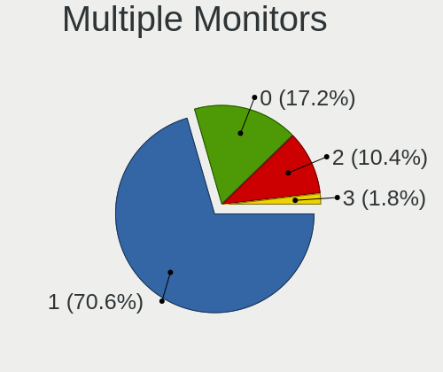
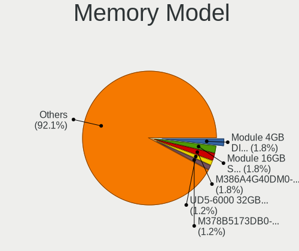

Debian Hardware Trends (Desktop)
--------------------------------

A project to identify most popular hardware characteristics and track their change
over time based on data collected by Debian users at https://Linux-Hardware.org.

Anyone can contribute to the study by uploading probes of their computers by
the [hw-probe](https://github.com/linuxhw/hw-probe) tool:

    sudo -E hw-probe -all -upload

Full-feature report is available here: https://linux-hardware.org/?view=trends&formfactor=desktop

Period: Mar, 2021.

Contents
--------

- [ OS                       ](#os)
- [ OS Family                ](#os-family)
- [ Kernel                   ](#kernel)
- [ Kernel Family            ](#kernel-family)
- [ Kernel Major Ver.        ](#kernel-major-ver)
- [ Arch                     ](#arch)
- [ DE                       ](#de)
- [ Display Server           ](#display-server)
- [ Display Manager          ](#display-manager)
- [ OS Lang                  ](#os-lang)
- [ Boot Mode                ](#boot-mode)
- [ Filesystem               ](#filesystem)
- [ Part. scheme             ](#part-scheme)
- [ Dual Boot with Linux/BSD ](#dual-boot-with-linux/bsd)
- [ Dual Boot (Win)          ](#dual-boot-win)
- [ Country                  ](#country)
- [ City                     ](#city)
- [ Vendor                   ](#vendor)
- [ Model                    ](#model)
- [ Model Family             ](#model-family)
- [ MFG Year                 ](#mfg-year)
- [ Form Factor              ](#form-factor)
- [ Secure Boot              ](#secure-boot)
- [ Coreboot                 ](#coreboot)
- [ RAM Size                 ](#ram-size)
- [ RAM Used                 ](#ram-used)
- [ Has CD-ROM               ](#has-cd-rom)
- [ Total Drives             ](#total-drives)
- [ Has Ethernet             ](#has-ethernet)
- [ Has WiFi                 ](#has-wifi)
- [ Has Bluetooth            ](#has-bluetooth)
- [ Drive Vendor             ](#drive-vendor)
- [ Drive Model              ](#drive-model)
- [ HDD Vendor               ](#hdd-vendor)
- [ SSD Vendor               ](#ssd-vendor)
- [ Drive Kind               ](#drive-kind)
- [ Drive Connector          ](#drive-connector)
- [ Drive Size               ](#drive-size)
- [ Space Total              ](#space-total)
- [ Space Used               ](#space-used)
- [ Malfunc. Drives          ](#malfunc-drives)
- [ Malfunc. Drive Vendor    ](#malfunc-drive-vendor)
- [ Malfunc. HDD Vendor      ](#malfunc-hdd-vendor)
- [ Malfunc. Drive Kind      ](#malfunc-drive-kind)
- [ Failed Drives            ](#failed-drives)
- [ Failed Drive Vendor      ](#failed-drive-vendor)
- [ Drive Status             ](#drive-status)
- [ Storage Vendor           ](#storage-vendor)
- [ Storage Model            ](#storage-model)
- [ Storage Kind             ](#storage-kind)
- [ CPU Vendor               ](#cpu-vendor)
- [ CPU Model                ](#cpu-model)
- [ CPU Model Family         ](#cpu-model-family)
- [ CPU Cores                ](#cpu-cores)
- [ CPU Sockets              ](#cpu-sockets)
- [ CPU Threads              ](#cpu-threads)
- [ CPU Op-Modes             ](#cpu-op-modes)
- [ CPU Microcode            ](#cpu-microcode)
- [ CPU Microarch            ](#cpu-microarch)
- [ GPU Vendor               ](#gpu-vendor)
- [ GPU Model                ](#gpu-model)
- [ GPU Combo                ](#gpu-combo)
- [ GPU Driver               ](#gpu-driver)
- [ GPU Memory               ](#gpu-memory)
- [ Monitor Vendor           ](#monitor-vendor)
- [ Monitor Model            ](#monitor-model)
- [ Monitor Resolution       ](#monitor-resolution)
- [ Monitor Diagonal         ](#monitor-diagonal)
- [ Monitor Width            ](#monitor-width)
- [ Aspect Ratio             ](#aspect-ratio)
- [ Monitor Area             ](#monitor-area)
- [ Pixel Density            ](#pixel-density)
- [ Multiple Monitors        ](#multiple-monitors)
- [ Net Controller Vendor    ](#net-controller-vendor)
- [ Net Controller Model     ](#net-controller-model)
- [ Wireless Vendor          ](#wireless-vendor)
- [ Wireless Model           ](#wireless-model)
- [ Ethernet Vendor          ](#ethernet-vendor)
- [ Ethernet Model           ](#ethernet-model)
- [ Net Controller Kind      ](#net-controller-kind)
- [ Used Controller          ](#used-controller)
- [ NICs                     ](#nics)
- [ IPv6                     ](#ipv6)
- [ Memory Vendor            ](#memory-vendor)
- [ Memory Model             ](#memory-model)
- [ Memory Kind              ](#memory-kind)
- [ Memory Form Factor       ](#memory-form-factor)
- [ Memory Size              ](#memory-size)
- [ Memory Speed             ](#memory-speed)
- [ Sound Vendor             ](#sound-vendor)
- [ Sound Model              ](#sound-model)
- [ Camera Vendor            ](#camera-vendor)
- [ Camera Model             ](#camera-model)
- [ Fingerprint Vendor       ](#fingerprint-vendor)
- [ Fingerprint Model        ](#fingerprint-model)
- [ Chipcard Vendor          ](#chipcard-vendor)
- [ Chipcard Model           ](#chipcard-model)
- [ Printer Vendor           ](#printer-vendor)
- [ Printer Model            ](#printer-model)
- [ Scanner Vendor           ](#scanner-vendor)
- [ Scanner Model            ](#scanner-model)
- [ Bluetooth Vendor         ](#bluetooth-vendor)
- [ Bluetooth Model          ](#bluetooth-model)
- [ Unsupported Devices      ](#unsupported-devices)
- [ Unsupported Device Types ](#unsupported-device-types)

OS
--

Installed operating systems

| Name            | Desktops | Percent |
|-----------------|----------|---------|
| Debian 10       | 54       | 62.07%  |
| Debian Testing  | 12       | 13.79%  |
| Debian          | 11       | 12.64%  |
| Debian Unstable | 8        | 9.2%    |
| Debian 9.13     | 1        | 1.15%   |
| Debian 10.8     | 1        | 1.15%   |

OS Family
---------

OS without a version

| Name   | Desktops | Percent |
|--------|----------|---------|
| Debian | 87       | 100%    |

Kernel
------

Version of the Linux kernel

| Version                         | Desktops | Percent |
|---------------------------------|----------|---------|
| 4.19.0-14-amd64                 | 24       | 27.59%  |
| 5.10.0-4-amd64                  | 14       | 16.09%  |
| 5.10.0-0.bpo.3-amd64            | 10       | 11.49%  |
| 5.10.0-3-amd64                  | 5        | 5.75%   |
| 5.8.0-3-amd64                   | 3        | 3.45%   |
| 5.4.103-1-pve                   | 3        | 3.45%   |
| 4.19.0-16-amd64                 | 3        | 3.45%   |
| 5.10.0-5-amd64                  | 2        | 2.3%    |
| 5.10.0-2-amd64                  | 2        | 2.3%    |
| 4.9.0-15-amd64                  | 2        | 2.3%    |
| 5.8.16-antix.1-amd64-smp        | 1        | 1.15%   |
| 5.6.0-2-amd64                   | 1        | 1.15%   |
| 5.4.78-2-pve                    | 1        | 1.15%   |
| 5.4.73-1-pve                    | 1        | 1.15%   |
| 5.3.10-1-pve                    | 1        | 1.15%   |
| 5.3.0-1-amd64                   | 1        | 1.15%   |
| 5.2.0-0.bpo.2-amd64             | 1        | 1.15%   |
| 5.11.2-uefi-00050-g56e2b17e52f6 | 1        | 1.15%   |
| 5.11.2                          | 1        | 1.15%   |
| 5.11.1-recomp                   | 1        | 1.15%   |
| 5.10.13-bootes1-p-1000          | 1        | 1.15%   |
| 5.10.0-8.1-liquorix-amd64       | 1        | 1.15%   |
| 5.10.0-1-amd64                  | 1        | 1.15%   |
| 4.9.0-15-686                    | 1        | 1.15%   |
| 4.9.0-13-amd64                  | 1        | 1.15%   |
| 4.19.0-9-amd64                  | 1        | 1.15%   |
| 4.19.0-6-amd64                  | 1        | 1.15%   |
| 4.19.0-13-amd64                 | 1        | 1.15%   |
| 4.19.0-11-amd64                 | 1        | 1.15%   |

Kernel Family
-------------

Linux kernel without a distro release

| Version | Desktops | Percent |
|---------|----------|---------|
| 5.10.0  | 35       | 40.23%  |
| 4.19.0  | 31       | 35.63%  |
| 4.9.0   | 4        | 4.6%    |
| 5.8.0   | 3        | 3.45%   |
| 5.4.103 | 3        | 3.45%   |
| 5.11.2  | 2        | 2.3%    |
| 5.8.16  | 1        | 1.15%   |
| 5.6.0   | 1        | 1.15%   |
| 5.4.78  | 1        | 1.15%   |
| 5.4.73  | 1        | 1.15%   |
| 5.3.10  | 1        | 1.15%   |
| 5.3.0   | 1        | 1.15%   |
| 5.2.0   | 1        | 1.15%   |
| 5.11.1  | 1        | 1.15%   |
| 5.10.13 | 1        | 1.15%   |

Kernel Major Ver.
-----------------

Linux kernel major version

| Version | Desktops | Percent |
|---------|----------|---------|
| 5.10    | 36       | 41.38%  |
| 4.19    | 31       | 35.63%  |
| 5.4     | 5        | 5.75%   |
| 5.8     | 4        | 4.6%    |
| 4.9     | 4        | 4.6%    |
| 5.11    | 3        | 3.45%   |
| 5.3     | 2        | 2.3%    |
| 5.6     | 1        | 1.15%   |
| 5.2     | 1        | 1.15%   |

Arch
----

OS architecture (x86_64, i586, etc.)

| Name    | Desktops | Percent |
|---------|----------|---------|
| x86_64  | 85       | 97.7%   |
| i686    | 1        | 1.15%   |
| aarch64 | 1        | 1.15%   |

DE
--

Desktop Environment

| Name            | Desktops | Percent |
|-----------------|----------|---------|
| GNOME           | 16       | 18.39%  |
| Unknown         | 16       | 18.39%  |
| KDE             | 13       | 14.94%  |
| XFCE            | 12       | 13.79%  |
| KDE5            | 11       | 12.64%  |
| MATE            | 7        | 8.05%   |
| LXDE            | 5        | 5.75%   |
| X-Cinnamon      | 2        | 2.3%    |
| LXQt            | 2        | 2.3%    |
| GNOME Flashback | 1        | 1.15%   |
| Cinnamon        | 1        | 1.15%   |
| awesome         | 1        | 1.15%   |

Display Server
--------------

X11 or Wayland

| Name    | Desktops | Percent |
|---------|----------|---------|
| X11     | 56       | 64.37%  |
| Wayland | 12       | 13.79%  |
| Tty     | 11       | 12.64%  |
| Unknown | 8        | 9.2%    |

Display Manager
---------------

SDDM, LightDM, etc.

| Name    | Desktops | Percent |
|---------|----------|---------|
| Unknown | 44       | 50.57%  |
| SDDM    | 15       | 17.24%  |
| GDM     | 13       | 14.94%  |
| TDM     | 11       | 12.64%  |
| LightDM | 4        | 4.6%    |

OS Lang
-------

Language

| Lang    | Desktops | Percent |
|---------|----------|---------|
| en_US   | 28       | 32.18%  |
| fr_FR   | 11       | 12.64%  |
| ru_RU   | 10       | 11.49%  |
| en_GB   | 9        | 10.34%  |
| de_DE   | 6        | 6.9%    |
| pt_BR   | 5        | 5.75%   |
| it_IT   | 3        | 3.45%   |
| eu_ES   | 3        | 3.45%   |
| Unknown | 2        | 2.3%    |
| pl_PL   | 1        | 1.15%   |
| lt_LT   | 1        | 1.15%   |
| hu_HU   | 1        | 1.15%   |
| es_CO   | 1        | 1.15%   |
| en_IN   | 1        | 1.15%   |
| en_IE   | 1        | 1.15%   |
| en_DK   | 1        | 1.15%   |
| de_CH   | 1        | 1.15%   |
| C       | 1        | 1.15%   |
| be_BY   | 1        | 1.15%   |

Boot Mode
---------

EFI or BIOS

| Mode | Desktops | Percent |
|------|----------|---------|
| BIOS | 59       | 67.82%  |
| EFI  | 28       | 32.18%  |

Filesystem
----------

Type of filesystem

| Type    | Desktops | Percent |
|---------|----------|---------|
| Ext4    | 75       | 86.21%  |
| Btrfs   | 5        | 5.75%   |
| Overlay | 3        | 3.45%   |
| Zfs     | 2        | 2.3%    |
| Ext3    | 2        | 2.3%    |

Part. scheme
------------

Scheme of partitioning

| Type    | Desktops | Percent |
|---------|----------|---------|
| GPT     | 42       | 48.28%  |
| Unknown | 29       | 33.33%  |
| MBR     | 16       | 18.39%  |

Dual Boot with Linux/BSD
------------------------

Hosting more than one Linux/BSD

| Dual boot | Desktops | Percent |
|-----------|----------|---------|
| No        | 67       | 77.01%  |
| Yes       | 20       | 22.99%  |

Dual Boot (Win)
---------------

Hosting Linux and Windows

| Dual boot | Desktops | Percent |
|-----------|----------|---------|
| No        | 62       | 71.26%  |
| Yes       | 25       | 28.74%  |

Country
-------

Geographic location (country)

| Country       | Desktops | Percent |
|---------------|----------|---------|
| USA           | 13       | 14.94%  |
| Russia        | 13       | 14.94%  |
| France        | 11       | 12.64%  |
| UK            | 7        | 8.05%   |
| Germany       | 7        | 8.05%   |
| Brazil        | 7        | 8.05%   |
| Switzerland   | 3        | 3.45%   |
| Spain         | 3        | 3.45%   |
| Poland        | 3        | 3.45%   |
| Italy         | 3        | 3.45%   |
| Belarus       | 3        | 3.45%   |
| Norway        | 2        | 2.3%    |
| Netherlands   | 2        | 2.3%    |
| Canada        | 2        | 2.3%    |
| Austria       | 2        | 2.3%    |
| New Caledonia | 1        | 1.15%   |
| Lithuania     | 1        | 1.15%   |
| India         | 1        | 1.15%   |
| Hungary       | 1        | 1.15%   |
| Colombia      | 1        | 1.15%   |
| Belgium       | 1        | 1.15%   |

City
----

Geographic location (city)

| City               | Desktops | Percent |
|--------------------|----------|---------|
| Voronezh           | 3        | 3.45%   |
| Yekaterinburg      | 2        | 2.3%    |
| Vienna             | 2        | 2.3%    |
| Swindon            | 2        | 2.3%    |
| Dallas             | 2        | 2.3%    |
| Aretxabaleta       | 2        | 2.3%    |
| Zurich             | 1        | 1.15%   |
| Wrzesnia           | 1        | 1.15%   |
| Villars-les-Dombes | 1        | 1.15%   |
| Vaudreuil-Dorion   | 1        | 1.15%   |
| Tyler              | 1        | 1.15%   |
| Tula               | 1        | 1.15%   |
| Trondheim          | 1        | 1.15%   |
| Talange            | 1        | 1.15%   |
| São Paulo         | 1        | 1.15%   |
| Stuttgart          | 1        | 1.15%   |
| St Petersburg      | 1        | 1.15%   |
| Senonches          | 1        | 1.15%   |
| Santa Clara        | 1        | 1.15%   |
| Sainte-Sigolene    | 1        | 1.15%   |
| Rio de Janeiro     | 1        | 1.15%   |
| Rastatt            | 1        | 1.15%   |
| Queens             | 1        | 1.15%   |
| Purley             | 1        | 1.15%   |
| Przemysl           | 1        | 1.15%   |
| Porto Alegre       | 1        | 1.15%   |
| Poplar             | 1        | 1.15%   |
| Paris              | 1        | 1.15%   |
| Overland Park      | 1        | 1.15%   |
| Onaway             | 1        | 1.15%   |
| Omsk               | 1        | 1.15%   |
| Nîmes             | 1        | 1.15%   |
| Noumea             | 1        | 1.15%   |
| New Port Richey    | 1        | 1.15%   |
| Nerviano           | 1        | 1.15%   |
| Naples             | 1        | 1.15%   |
| Nantes             | 1        | 1.15%   |
| Munich             | 1        | 1.15%   |
| Moscow             | 1        | 1.15%   |
| Minsk              | 1        | 1.15%   |
| Medellín          | 1        | 1.15%   |
| Madrid             | 1        | 1.15%   |
| Llanelli           | 1        | 1.15%   |
| Liévin            | 1        | 1.15%   |
| Langenfeld         | 1        | 1.15%   |
| Kaunas             | 1        | 1.15%   |
| Kaliningrad        | 1        | 1.15%   |
| Jundiaí           | 1        | 1.15%   |
| Hrodna             | 1        | 1.15%   |
| Holbrook           | 1        | 1.15%   |
| Hamburg            | 1        | 1.15%   |
| Gomel              | 1        | 1.15%   |
| Gloucester         | 1        | 1.15%   |
| Gatchina           | 1        | 1.15%   |
| Ganterschwil       | 1        | 1.15%   |
| Estes Park         | 1        | 1.15%   |
| Eindhoven          | 1        | 1.15%   |
| Dammartin-en-Goele | 1        | 1.15%   |
| Coquitlam          | 1        | 1.15%   |
| Conroe             | 1        | 1.15%   |

Vendor
------

Motherboard manufacturer

| Name                | Desktops | Percent |
|---------------------|----------|---------|
| ASUSTek Computer    | 24       | 27.59%  |
| Gigabyte Technology | 17       | 19.54%  |
| ASRock              | 12       | 13.79%  |
| Intel               | 8        | 9.2%    |
| Hewlett-Packard     | 8        | 9.2%    |
| MSI                 | 5        | 5.75%   |
| Lenovo              | 4        | 4.6%    |
| Dell                | 3        | 3.45%   |
| SolidRun            | 1        | 1.15%   |
| Shuttle             | 1        | 1.15%   |
| HPE                 | 1        | 1.15%   |
| HARDKERNEL          | 1        | 1.15%   |
| Acer                | 1        | 1.15%   |
| Unknown             | 1        | 1.15%   |

Model
-----

Motherboard model

| Name                                    | Desktops | Percent |
|-----------------------------------------|----------|---------|
| ASUS All Series                         | 4        | 4.6%    |
| SolidRun SolidRun CEX7 Platform         | 1        | 1.15%   |
| Shuttle FN85                            | 1        | 1.15%   |
| MSI OR-PC                               | 1        | 1.15%   |
| MSI MS-7C56                             | 1        | 1.15%   |
| MSI MS-7C35                             | 1        | 1.15%   |
| MSI MS-7C06                             | 1        | 1.15%   |
| MSI MS-7B85                             | 1        | 1.15%   |
| Lenovo ThinkCentre M83 10AHS1CC00       | 1        | 1.15%   |
| Lenovo IdeaCentre 510S-07ICB 90K800GHMW | 1        | 1.15%   |
| Lenovo IdeaCentre 510A-15ARR 90J0008EPB | 1        | 1.15%   |
| Lenovo IdeaCentre 510A-15ARR 90J00019FR | 1        | 1.15%   |
| Intel X99                               | 1        | 1.15%   |
| Intel DQ45CB AAE30148-205               | 1        | 1.15%   |
| Intel DH87RL AAG74240-403               | 1        | 1.15%   |
| Intel DH61CR AAG14064-209               | 1        | 1.15%   |
| Intel DH61CR AAG14064-207               | 1        | 1.15%   |
| Intel DG33FB AAD81072-303               | 1        | 1.15%   |
| Intel DG31PR AAD97573-301               | 1        | 1.15%   |
| Intel DE3815TYKH H26998-403             | 1        | 1.15%   |
| HPE ProLiant MicroServer Gen10          | 1        | 1.15%   |
| HP Z4 G4 Workstation                    | 1        | 1.15%   |
| HP t620 Quad Core TC                    | 1        | 1.15%   |
| HP ProLiant MicroServer Gen8            | 1        | 1.15%   |
| HP ProDesk 600 G3 MT                    | 1        | 1.15%   |
| HP Pavilion 590-p0069 Desktop Rfrbd PC  | 1        | 1.15%   |
| HP EliteDesk 800 G1 USDT                | 1        | 1.15%   |
| HP Compaq 8100 Elite CMT PC             | 1        | 1.15%   |
| HP Compaq 6000 Pro SFF PC               | 1        | 1.15%   |
| HARDKERNEL ODROID-H2                    | 1        | 1.15%   |
| Gigabyte Z87X-UD5H                      | 1        | 1.15%   |
| Gigabyte Z390 GAMING X                  | 1        | 1.15%   |
| Gigabyte Z390 AORUS PRO WIFI            | 1        | 1.15%   |
| Gigabyte Z270-Gaming K3                 | 1        | 1.15%   |
| Gigabyte X570 I AORUS PRO WIFI          | 1        | 1.15%   |
| Gigabyte X570 AORUS ULTRA               | 1        | 1.15%   |
| Gigabyte P55A-UD3                       | 1        | 1.15%   |
| Gigabyte M61PME-S2P                     | 1        | 1.15%   |
| Gigabyte M61PME-S2                      | 1        | 1.15%   |
| Gigabyte H81-D3                         | 1        | 1.15%   |
| Gigabyte H61M-S1                        | 1        | 1.15%   |
| Gigabyte GA-990XA-UD3                   | 1        | 1.15%   |
| Gigabyte F2A88XM-D3H                    | 1        | 1.15%   |
| Gigabyte F2A68HM-H                      | 1        | 1.15%   |
| Gigabyte B550M DS3H                     | 1        | 1.15%   |
| Gigabyte B550M AORUS PRO-P              | 1        | 1.15%   |
| Gigabyte B550 AORUS PRO                 | 1        | 1.15%   |
| Dell XPS 8700                           | 1        | 1.15%   |
| Dell Vostro 3900                        | 1        | 1.15%   |
| Dell Precision 3630 Tower               | 1        | 1.15%   |
| ASUS Z8NA-D6                            | 1        | 1.15%   |
| ASUS Z170-K                             | 1        | 1.15%   |
| ASUS TUF GAMING Z490-PLUS               | 1        | 1.15%   |
| ASUS TUF GAMING X570-PLUS               | 1        | 1.15%   |
| ASUS TUF GAMING B550-PLUS               | 1        | 1.15%   |
| ASUS TUF B450-PLUS GAMING               | 1        | 1.15%   |
| ASUS ROG STRIX X570-E GAMING            | 1        | 1.15%   |
| ASUS ROG CROSSHAIR VIII HERO            | 1        | 1.15%   |
| ASUS PRIME Z390M-PLUS                   | 1        | 1.15%   |
| ASUS PRIME X570-PRO                     | 1        | 1.15%   |

Model Family
------------

Motherboard model prefix

| Name                  | Desktops | Percent |
|-----------------------|----------|---------|
| ASUS PRIME            | 6        | 6.9%    |
| ASUS TUF              | 4        | 4.6%    |
| ASUS All              | 4        | 4.6%    |
| Lenovo IdeaCentre     | 3        | 3.45%   |
| Intel DH61CR          | 2        | 2.3%    |
| HP Compaq             | 2        | 2.3%    |
| Gigabyte Z390         | 2        | 2.3%    |
| Gigabyte X570         | 2        | 2.3%    |
| Gigabyte B550M        | 2        | 2.3%    |
| ASUS ROG              | 2        | 2.3%    |
| SolidRun SolidRun     | 1        | 1.15%   |
| Shuttle FN85          | 1        | 1.15%   |
| MSI OR-PC             | 1        | 1.15%   |
| MSI MS-7C56           | 1        | 1.15%   |
| MSI MS-7C35           | 1        | 1.15%   |
| MSI MS-7C06           | 1        | 1.15%   |
| MSI MS-7B85           | 1        | 1.15%   |
| Lenovo ThinkCentre    | 1        | 1.15%   |
| Intel X99             | 1        | 1.15%   |
| Intel DQ45CB          | 1        | 1.15%   |
| Intel DH87RL          | 1        | 1.15%   |
| Intel DG33FB          | 1        | 1.15%   |
| Intel DG31PR          | 1        | 1.15%   |
| Intel DE3815TYKH      | 1        | 1.15%   |
| HPE ProLiant          | 1        | 1.15%   |
| HP Z4                 | 1        | 1.15%   |
| HP t620               | 1        | 1.15%   |
| HP ProLiant           | 1        | 1.15%   |
| HP ProDesk            | 1        | 1.15%   |
| HP Pavilion           | 1        | 1.15%   |
| HP EliteDesk          | 1        | 1.15%   |
| HARDKERNEL ODROID-H2  | 1        | 1.15%   |
| Gigabyte Z87X-UD5H    | 1        | 1.15%   |
| Gigabyte Z270-Gaming  | 1        | 1.15%   |
| Gigabyte P55A-UD3     | 1        | 1.15%   |
| Gigabyte M61PME-S2P   | 1        | 1.15%   |
| Gigabyte M61PME-S2    | 1        | 1.15%   |
| Gigabyte H81-D3       | 1        | 1.15%   |
| Gigabyte H61M-S1      | 1        | 1.15%   |
| Gigabyte GA-990XA-UD3 | 1        | 1.15%   |
| Gigabyte F2A88XM-D3H  | 1        | 1.15%   |
| Gigabyte F2A68HM-H    | 1        | 1.15%   |
| Gigabyte B550         | 1        | 1.15%   |
| Dell XPS              | 1        | 1.15%   |
| Dell Vostro           | 1        | 1.15%   |
| Dell Precision        | 1        | 1.15%   |
| ASUS Z8NA-D6          | 1        | 1.15%   |
| ASUS Z170-K           | 1        | 1.15%   |
| ASUS P8Z77-V          | 1        | 1.15%   |
| ASUS P8H61-M          | 1        | 1.15%   |
| ASUS P5K-VM           | 1        | 1.15%   |
| ASUS M5A97            | 1        | 1.15%   |
| ASUS M5A88-M          | 1        | 1.15%   |
| ASUS M2N-MX           | 1        | 1.15%   |
| ASRock Z390           | 1        | 1.15%   |
| ASRock X470           | 1        | 1.15%   |
| ASRock X299M          | 1        | 1.15%   |
| ASRock N68-S          | 1        | 1.15%   |
| ASRock H77M           | 1        | 1.15%   |
| ASRock H61M-GE        | 1        | 1.15%   |

MFG Year
--------

Motherboard manufacture year

| Year | Desktops | Percent |
|------|----------|---------|
| 2019 | 18       | 20.69%  |
| 2020 | 16       | 18.39%  |
| 2015 | 10       | 11.49%  |
| 2018 | 8        | 9.2%    |
| 2021 | 6        | 6.9%    |
| 2013 | 5        | 5.75%   |
| 2014 | 4        | 4.6%    |
| 2010 | 4        | 4.6%    |
| 2008 | 4        | 4.6%    |
| 2012 | 3        | 3.45%   |
| 2011 | 2        | 2.3%    |
| 2009 | 2        | 2.3%    |
| 2007 | 2        | 2.3%    |
| 2017 | 1        | 1.15%   |
| 2016 | 1        | 1.15%   |
| 2004 | 1        | 1.15%   |

Form Factor
-----------

Physical design of the computer

| Name    | Desktops | Percent |
|---------|----------|---------|
| Desktop | 87       | 100%    |

Secure Boot
-----------

Enabled or disabled

| State    | Desktops | Percent |
|----------|----------|---------|
| Disabled | 87       | 100%    |

Coreboot
--------

Have coreboot on board

| Used | Desktops | Percent |
|------|----------|---------|
| No   | 87       | 100%    |

RAM Size
--------

Total RAM memory

| Size in GB  | Desktops | Percent |
|-------------|----------|---------|
| 16.01-24.0  | 24       | 27.59%  |
| 32.01-64.0  | 17       | 19.54%  |
| 8.01-16.0   | 14       | 16.09%  |
| 3.01-4.0    | 11       | 12.64%  |
| 4.01-8.0    | 9        | 10.34%  |
| 64.01-256.0 | 5        | 5.75%   |
| 1.01-2.0    | 3        | 3.45%   |
| 24.01-32.0  | 2        | 2.3%    |
| 2.01-3.0    | 1        | 1.15%   |
| 0.51-1.0    | 1        | 1.15%   |

RAM Used
--------

Used RAM memory

| Used GB    | Desktops | Percent |
|------------|----------|---------|
| 2.01-3.0   | 19       | 21.84%  |
| 1.01-2.0   | 17       | 19.54%  |
| 4.01-8.0   | 12       | 13.79%  |
| 3.01-4.0   | 12       | 13.79%  |
| 8.01-16.0  | 11       | 12.64%  |
| 0.51-1.0   | 9        | 10.34%  |
| 16.01-24.0 | 3        | 3.45%   |
| 0.01-0.5   | 2        | 2.3%    |
| 32.01-64.0 | 1        | 1.15%   |
| 24.01-32.0 | 1        | 1.15%   |

Has CD-ROM
----------

Has CD-ROM on board

| Presented | Desktops | Percent |
|-----------|----------|---------|
| No        | 60       | 68.97%  |
| Yes       | 27       | 31.03%  |

Total Drives
------------

Number of drives on board

| Drives | Desktops | Percent |
|--------|----------|---------|
| 1      | 27       | 31.03%  |
| 2      | 25       | 28.74%  |
| 3      | 12       | 13.79%  |
| 5      | 9        | 10.34%  |
| 4      | 9        | 10.34%  |
| 8      | 2        | 2.3%    |
| 6      | 2        | 2.3%    |
| 14     | 1        | 1.15%   |

Has Ethernet
------------

Has Ethernet on board

| Presented | Desktops | Percent |
|-----------|----------|---------|
| Yes       | 87       | 100%    |

Has WiFi
--------

Has WiFi module

| Presented | Desktops | Percent |
|-----------|----------|---------|
| No        | 59       | 67.82%  |
| Yes       | 28       | 32.18%  |

Has Bluetooth
-------------

Has Bluetooth module

| Presented | Desktops | Percent |
|-----------|----------|---------|
| No        | 60       | 68.97%  |
| Yes       | 27       | 31.03%  |

Drive Vendor
------------

Hard drive vendors

| Vendor              | Desktops | Drives | Percent |
|---------------------|----------|--------|---------|
| WDC                 | 35       | 55     | 19.89%  |
| Seagate             | 32       | 46     | 18.18%  |
| Samsung Electronics | 29       | 36     | 16.48%  |
| Toshiba             | 15       | 18     | 8.52%   |
| Crucial             | 13       | 15     | 7.39%   |
| SanDisk             | 7        | 8      | 3.98%   |
| Intel               | 5        | 6      | 2.84%   |
| Hitachi             | 5        | 7      | 2.84%   |
| Unknown             | 4        | 6      | 2.27%   |
| OCZ                 | 4        | 4      | 2.27%   |
| Kingston            | 3        | 3      | 1.7%    |
| China               | 3        | 3      | 1.7%    |
| Transcend           | 2        | 2      | 1.14%   |
| PLEXTOR             | 2        | 3      | 1.14%   |
| Phison              | 2        | 2      | 1.14%   |
| Intenso             | 2        | 2      | 1.14%   |
| HGST                | 2        | 2      | 1.14%   |
| Corsair             | 2        | 2      | 1.14%   |
| XPG                 | 1        | 1      | 0.57%   |
| Silicon Motion      | 1        | 1      | 0.57%   |
| Patriot             | 1        | 1      | 0.57%   |
| Maxtor              | 1        | 1      | 0.57%   |
| LITEON              | 1        | 1      | 0.57%   |
| KingDian            | 1        | 1      | 0.57%   |
| Hewlett-Packard     | 1        | 1      | 0.57%   |
| Elite               | 1        | 2      | 0.57%   |
| A-DATA Technology   | 1        | 1      | 0.57%   |

Drive Model
-----------

Hard drive models

| Model                            | Desktops | Percent |
|----------------------------------|----------|---------|
| Toshiba DT01ACA100 1TB           | 5        | 2.36%   |
| WDC WDS240G2G0A-00JH30 240GB SSD | 3        | 1.42%   |
| Seagate ST2000DM001-1ER164 2TB   | 3        | 1.42%   |
| Samsung SSD 860 EVO 1TB          | 3        | 1.42%   |
| WDC WD10EZEX-60WN4A0 1TB         | 2        | 0.94%   |
| WDC WD10EZEX-08WN4A0 1TB         | 2        | 0.94%   |
| WDC WD10EZEX-00BN5A0 1TB         | 2        | 0.94%   |
| WDC WD10EARX-00N0YB0 1TB         | 2        | 0.94%   |
| WDC WD100EMAZ-00WJTA0 10TB       | 2        | 0.94%   |
| Unknown SD/MMC 64GB              | 2        | 0.94%   |
| Unknown M.S./M.S.Pro/HG 16GB     | 2        | 0.94%   |
| Toshiba HDWE140 4TB              | 2        | 0.94%   |
| Toshiba HDWD110 1TB              | 2        | 0.94%   |
| Seagate ST4000VN008-2DR166 4TB   | 2        | 0.94%   |
| Seagate ST4000DM000-1F2168 4TB   | 2        | 0.94%   |
| Seagate ST3500418AS 500GB        | 2        | 0.94%   |
| Seagate ST2000DM008-2FR102 2TB   | 2        | 0.94%   |
| Seagate ST1000VM002-1CT162 1TB   | 2        | 0.94%   |
| Samsung SSD 970 EVO 1TB          | 2        | 0.94%   |
| Samsung SSD 860 QVO 1TB          | 2        | 0.94%   |
| Kingston SA400S37240G 240GB SSD  | 2        | 0.94%   |
| Crucial M4-CT128M4SSD2 128GB     | 2        | 0.94%   |
| Crucial CT500MX500SSD1 500GB     | 2        | 0.94%   |
| Crucial CT250MX500SSD1 250GB     | 2        | 0.94%   |
| Crucial CT1000MX500SSD1 1TB      | 2        | 0.94%   |
| XPG GAMMIX S11 Pro 256GB         | 1        | 0.47%   |
| WDC WD80EFAX-68LHPN0 8TB         | 1        | 0.47%   |
| WDC WD80EDAZ-11TA3A0 8TB         | 1        | 0.47%   |
| WDC WD60EZRZ-00GZ5B1 6TB         | 1        | 0.47%   |
| WDC WD60EZRX-00MVLB1 6TB         | 1        | 0.47%   |
| WDC WD5000LUCT-63RC2Y0 500GB     | 1        | 0.47%   |
| WDC WD5000LPVX-22V0TT0 500GB     | 1        | 0.47%   |
| WDC WD5000AAKX-00ERMA0 500GB     | 1        | 0.47%   |
| WDC WD5000AAKS-08V0A0 500GB      | 1        | 0.47%   |
| WDC WD40EFRX-68WT0N0 4TB         | 1        | 0.47%   |
| WDC WD40EFAX-68JH4N0 4TB         | 1        | 0.47%   |
| WDC WD4003FZEX-00Z4SA0 4TB       | 1        | 0.47%   |
| WDC WD3200KS-75PFB0 320GB        | 1        | 0.47%   |
| WDC WD3200BEKT-75PVMT1 320GB     | 1        | 0.47%   |
| WDC WD3200AVJS-63B6A0 320GB      | 1        | 0.47%   |
| WDC WD30EZRX-00MMMB0 3TB         | 1        | 0.47%   |
| WDC WD30EZRX-00DC0B0 3TB         | 1        | 0.47%   |
| WDC WD30EZRX-00D8PB0 3TB         | 1        | 0.47%   |
| WDC WD30EFRX-68EUZN0 3TB         | 1        | 0.47%   |
| WDC WD2500JS-75NCB1 249GB        | 1        | 0.47%   |
| WDC WD2500BEVT-22ZCT0 250GB      | 1        | 0.47%   |
| WDC WD2500AAKX-001CA0 250GB      | 1        | 0.47%   |
| WDC WD2500AAKS-00F0A0 250GB      | 1        | 0.47%   |
| WDC WD2500AAJS-00L7A0 250GB      | 1        | 0.47%   |
| WDC WD20EZRZ-00Z5HB0 2TB         | 1        | 0.47%   |
| WDC WD20EFRX-68EUZN0 2TB         | 1        | 0.47%   |
| WDC WD20EARX-00MMMB0 2TB         | 1        | 0.47%   |
| WDC WD2002FAEX-007BA0 2TB        | 1        | 0.47%   |
| WDC WD10JPVT-00A1YT0 1TB         | 1        | 0.47%   |
| WDC WD10EZRZ-00HTKB0 1TB         | 1        | 0.47%   |
| WDC WD10EZEX-75ZF5A0 1TB         | 1        | 0.47%   |
| WDC WD10EZEX-60M2NA0 1TB         | 1        | 0.47%   |
| WDC WD10EZEX-21M2NA0 1TB         | 1        | 0.47%   |
| WDC WD10EZEX-00RKKA0 1TB         | 1        | 0.47%   |
| WDC WD10EARS-00Y5B1 1TB          | 1        | 0.47%   |

HDD Vendor
----------

Hard disk drive vendors

| Vendor              | Desktops | Drives | Percent |
|---------------------|----------|--------|---------|
| WDC                 | 32       | 51     | 35.16%  |
| Seagate             | 30       | 44     | 32.97%  |
| Toshiba             | 15       | 18     | 16.48%  |
| Samsung Electronics | 6        | 8      | 6.59%   |
| Hitachi             | 5        | 7      | 5.49%   |
| HGST                | 2        | 2      | 2.2%    |
| Maxtor              | 1        | 1      | 1.1%    |

SSD Vendor
----------

Solid state drive vendors

| Vendor              | Desktops | Drives | Percent |
|---------------------|----------|--------|---------|
| Crucial             | 13       | 14     | 23.64%  |
| Samsung Electronics | 10       | 13     | 18.18%  |
| SanDisk             | 5        | 5      | 9.09%   |
| OCZ                 | 4        | 4      | 7.27%   |
| WDC                 | 3        | 4      | 5.45%   |
| Kingston            | 3        | 3      | 5.45%   |
| Intel               | 3        | 3      | 5.45%   |
| China               | 3        | 3      | 5.45%   |
| Transcend           | 2        | 2      | 3.64%   |
| PLEXTOR             | 2        | 3      | 3.64%   |
| Intenso             | 2        | 2      | 3.64%   |
| Patriot             | 1        | 1      | 1.82%   |
| LITEON              | 1        | 1      | 1.82%   |
| KingDian            | 1        | 1      | 1.82%   |
| Corsair             | 1        | 1      | 1.82%   |
| A-DATA Technology   | 1        | 1      | 1.82%   |

Drive Kind
----------

HDD or SSD

| Kind    | Desktops | Drives | Percent |
|---------|----------|--------|---------|
| HDD     | 65       | 131    | 46.1%   |
| SSD     | 46       | 61     | 32.62%  |
| NVMe    | 24       | 28     | 17.02%  |
| Unknown | 4        | 7      | 2.84%   |
| MMC     | 2        | 3      | 1.42%   |

Drive Connector
---------------

SATA, SAS, NVMe, etc.

| Type | Desktops | Drives | Percent |
|------|----------|--------|---------|
| SATA | 78       | 190    | 70.91%  |
| NVMe | 24       | 28     | 21.82%  |
| SAS  | 6        | 9      | 5.45%   |
| MMC  | 2        | 3      | 1.82%   |

Drive Size
----------

Size of hard drive

| Size in TB | Desktops | Drives | Percent |
|------------|----------|--------|---------|
| 0.01-0.5   | 55       | 76     | 41.67%  |
| 0.51-1.0   | 35       | 49     | 26.52%  |
| 1.01-2.0   | 16       | 18     | 12.12%  |
| 3.01-4.0   | 10       | 15     | 7.58%   |
| 4.01-10.0  | 8        | 19     | 6.06%   |
| 2.01-3.0   | 6        | 12     | 4.55%   |
| 10.01-20.0 | 2        | 3      | 1.52%   |

Space Total
-----------

Amount of disk space available on the file system

| Size in GB     | Desktops | Percent |
|----------------|----------|---------|
| More than 3000 | 14       | 16.09%  |
| 101-250        | 13       | 14.94%  |
| 1001-2000      | 12       | 13.79%  |
| 251-500        | 11       | 12.64%  |
| 501-1000       | 11       | 12.64%  |
| 2001-3000      | 10       | 11.49%  |
| Unknown        | 8        | 9.2%    |
| 21-50          | 4        | 4.6%    |
| 51-100         | 3        | 3.45%   |
| 1-20           | 1        | 1.15%   |

Space Used
----------

Amount of used disk space

| Used GB        | Desktops | Percent |
|----------------|----------|---------|
| 1-20           | 18       | 20.69%  |
| 501-1000       | 13       | 14.94%  |
| 1001-2000      | 11       | 12.64%  |
| 251-500        | 10       | 11.49%  |
| Unknown        | 8        | 9.2%    |
| 101-250        | 7        | 8.05%   |
| More than 3000 | 6        | 6.9%    |
| 21-50          | 5        | 5.75%   |
| 51-100         | 5        | 5.75%   |
| 2001-3000      | 4        | 4.6%    |

Malfunc. Drives
---------------

Drive models with a malfunction

| Model                                 | Desktops | Drives | Percent |
|---------------------------------------|----------|--------|---------|
| Seagate ST3500418AS 500GB             | 2        | 2      | 7.14%   |
| WDC WD5000AAKS-08V0A0 500GB           | 1        | 1      | 3.57%   |
| WDC WD4003FZEX-00Z4SA0 4TB            | 1        | 1      | 3.57%   |
| WDC WD3200BEKT-75PVMT1 320GB          | 1        | 1      | 3.57%   |
| WDC WD3200AVJS-63B6A0 320GB           | 1        | 1      | 3.57%   |
| WDC WD2500AAKX-001CA0 250GB           | 1        | 1      | 3.57%   |
| WDC WD2500AAJS-00L7A0 250GB           | 1        | 1      | 3.57%   |
| WDC WD20EFRX-68EUZN0 2TB              | 1        | 2      | 3.57%   |
| WDC WD2002FAEX-007BA0 2TB             | 1        | 1      | 3.57%   |
| WDC WD10EZEX-60M2NA0 1TB              | 1        | 1      | 3.57%   |
| WDC WD10EADS-65M2B1 1TB               | 1        | 1      | 3.57%   |
| Toshiba HDWD110 1TB                   | 1        | 2      | 3.57%   |
| Toshiba DT01ACA100 1TB                | 1        | 1      | 3.57%   |
| Seagate ST3750528AS 752GB             | 1        | 1      | 3.57%   |
| Seagate ST3250310AS 250GB             | 1        | 1      | 3.57%   |
| Seagate ST2000DM001-1ER164 2TB        | 1        | 1      | 3.57%   |
| Seagate ST1000LM024 HN-M101MBB 1TB    | 1        | 1      | 3.57%   |
| Samsung Electronics SSD 970 EVO 2TB   | 1        | 1      | 3.57%   |
| Samsung Electronics SSD 960 EVO 500GB | 1        | 1      | 3.57%   |
| Samsung Electronics HD753LJ 752GB     | 1        | 1      | 3.57%   |
| Samsung Electronics HD321KJ 320GB     | 1        | 1      | 3.57%   |
| Samsung Electronics HD103UJ 1TB       | 1        | 1      | 3.57%   |
| PLEXTOR PX-128M2S 128GB SSD           | 1        | 1      | 3.57%   |
| LITEON CV8-8E128-HP 128GB SSD         | 1        | 1      | 3.57%   |
| KingDian S200 60GB SSD                | 1        | 1      | 3.57%   |
| Intel SSDSC2CW060A3 64GB              | 1        | 1      | 3.57%   |
| Crucial CT1000MX500SSD1 1TB           | 1        | 1      | 3.57%   |

Malfunc. Drive Vendor
---------------------

Vendors of faulty drives

| Vendor              | Desktops | Drives | Percent |
|---------------------|----------|--------|---------|
| WDC                 | 8        | 11     | 33.33%  |
| Seagate             | 5        | 6      | 20.83%  |
| Samsung Electronics | 4        | 5      | 16.67%  |
| Toshiba             | 2        | 3      | 8.33%   |
| PLEXTOR             | 1        | 1      | 4.17%   |
| LITEON              | 1        | 1      | 4.17%   |
| KingDian            | 1        | 1      | 4.17%   |
| Intel               | 1        | 1      | 4.17%   |
| Crucial             | 1        | 1      | 4.17%   |

Malfunc. HDD Vendor
-------------------

Vendors of faulty HDD drives

| Vendor              | Desktops | Drives | Percent |
|---------------------|----------|--------|---------|
| WDC                 | 8        | 11     | 47.06%  |
| Seagate             | 5        | 6      | 29.41%  |
| Toshiba             | 2        | 3      | 11.76%  |
| Samsung Electronics | 2        | 3      | 11.76%  |

Malfunc. Drive Kind
-------------------

Kinds of faulty drives

| Kind | Desktops | Drives | Percent |
|------|----------|--------|---------|
| HDD  | 15       | 23     | 68.18%  |
| SSD  | 5        | 5      | 22.73%  |
| NVMe | 2        | 2      | 9.09%   |

Failed Drives
-------------

Failed drive models

Zero info for selected period =(

Failed Drive Vendor
-------------------

Failed drive vendors

Zero info for selected period =(

Drive Status
------------

Number of failed and malfunc. drives

| Status   | Desktops | Drives | Percent |
|----------|----------|--------|---------|
| Works    | 55       | 118    | 50.46%  |
| Detected | 33       | 82     | 30.28%  |
| Malfunc  | 21       | 30     | 19.27%  |

Storage Vendor
--------------

Storage controller vendors

| Vendor                        | Desktops | Percent |
|-------------------------------|----------|---------|
| Intel                         | 51       | 41.8%   |
| AMD                           | 31       | 25.41%  |
| Samsung Electronics           | 14       | 11.48%  |
| Nvidia                        | 5        | 4.1%    |
| Marvell Technology Group      | 4        | 3.28%   |
| Silicon Motion                | 2        | 1.64%   |
| Phison Electronics            | 2        | 1.64%   |
| LSI Logic / Symbios Logic     | 2        | 1.64%   |
| ASMedia Technology            | 2        | 1.64%   |
| Adaptec                       | 2        | 1.64%   |
| Silicon Image                 | 1        | 0.82%   |
| Seagate Technology            | 1        | 0.82%   |
| Sandisk                       | 1        | 0.82%   |
| Micron/Crucial Technology     | 1        | 0.82%   |
| JMicron Technology            | 1        | 0.82%   |
| Integrated Technology Express | 1        | 0.82%   |
| ADATA Technology              | 1        | 0.82%   |

Storage Model
-------------

Storage controller models

| Model                                                                                   | Desktops | Percent |
|-----------------------------------------------------------------------------------------|----------|---------|
| AMD FCH SATA Controller [AHCI mode]                                                     | 21       | 14.19%  |
| Samsung NVMe SSD Controller SM981/PM981/PM983                                           | 12       | 8.11%   |
| Intel 8 Series/C220 Series Chipset Family 6-port SATA Controller 1 [AHCI mode]          | 10       | 6.76%   |
| Intel Cannon Lake PCH SATA AHCI Controller                                              | 7        | 4.73%   |
| Intel 200 Series PCH SATA controller [AHCI mode]                                        | 7        | 4.73%   |
| AMD Starship/Matisse Chipset SATA Controller [AHCI mode]                                | 5        | 3.38%   |
| AMD 400 Series Chipset SATA Controller                                                  | 5        | 3.38%   |
| Nvidia MCP61 SATA Controller                                                            | 4        | 2.7%    |
| Nvidia MCP61 IDE                                                                        | 4        | 2.7%    |
| Intel 6 Series/C200 Series Chipset Family 6 port Desktop SATA AHCI Controller           | 4        | 2.7%    |
| Intel SATA Controller [RAID mode]                                                       | 3        | 2.03%   |
| Intel 7 Series/C210 Series Chipset Family 6-port SATA Controller [AHCI mode]            | 3        | 2.03%   |
| AMD SB7x0/SB8x0/SB9x0 SATA Controller [AHCI mode]                                       | 3        | 2.03%   |
| AMD SB7x0/SB8x0/SB9x0 IDE Controller                                                    | 3        | 2.03%   |
| Silicon Motion SM2263EN/SM2263XT SSD Controller                                         | 2        | 1.35%   |
| Samsung NVMe SSD Controller SM961/PM961/SM963                                           | 2        | 1.35%   |
| Phison E16 PCIe4 NVMe Controller                                                        | 2        | 1.35%   |
| Intel SSD 660P Series                                                                   | 2        | 1.35%   |
| Intel C610/X99 series chipset 6-Port SATA Controller [AHCI mode]                        | 2        | 1.35%   |
| Intel 6 Series/C200 Series Chipset Family Desktop SATA Controller (IDE mode, ports 4-5) | 2        | 1.35%   |
| Intel 6 Series/C200 Series Chipset Family Desktop SATA Controller (IDE mode, ports 0-3) | 2        | 1.35%   |
| Intel 5 Series/3400 Series Chipset 6 port SATA AHCI Controller                          | 2        | 1.35%   |
| Intel 4 Series Chipset PT IDER Controller                                               | 2        | 1.35%   |
| ASMedia ASM1062 Serial ATA Controller                                                   | 2        | 1.35%   |
| AMD FCH SATA Controller D                                                               | 2        | 1.35%   |
| AMD 300 Series Chipset SATA Controller                                                  | 2        | 1.35%   |
| Silicon Image SiI 3512 [SATALink/SATARaid] Serial ATA Controller                        | 1        | 0.68%   |
| Seagate Non-Volatile memory controller                                                  | 1        | 0.68%   |
| Sandisk WD Black SN750 / PC SN730 NVMe SSD                                              | 1        | 0.68%   |
| Phison Electronics Non-Volatile memory controller                                       | 1        | 0.68%   |
| Nvidia nForce3 IDE                                                                      | 1        | 0.68%   |
| Micron/Crucial P1 NVMe PCIe SSD                                                         | 1        | 0.68%   |
| Marvell Group 88SE9230 PCIe 2.0 x2 4-port SATA 6 Gb/s RAID Controller                   | 1        | 0.68%   |
| Marvell Group 88SE9215 PCIe 2.0 x1 4-port SATA 6 Gb/s Controller                        | 1        | 0.68%   |
| Marvell Group 88SE9128 PCIe SATA 6 Gb/s RAID controller                                 | 1        | 0.68%   |
| Marvell Group 88SE6101/6102 single-port PATA133 interface                               | 1        | 0.68%   |
| LSI Logic / Symbios Logic SAS2308 PCI-Express Fusion-MPT SAS-2                          | 1        | 0.68%   |
| LSI Logic / Symbios Logic SAS2008 PCI-Express Fusion-MPT SAS-2 [Falcon]                 | 1        | 0.68%   |
| JMicron JMB368 IDE controller                                                           | 1        | 0.68%   |
| Intel Q170/Q150/B150/H170/H110/Z170/CM236 Chipset SATA Controller [AHCI Mode]           | 1        | 0.68%   |
| Intel NM10/ICH7 Family SATA Controller [IDE mode]                                       | 1        | 0.68%   |
| Intel Comet Lake SATA AHCI Controller                                                   | 1        | 0.68%   |
| Intel Celeron/Pentium Silver Processor SATA Controller                                  | 1        | 0.68%   |
| Intel C610/X99 series chipset sSATA Controller [AHCI mode]                              | 1        | 0.68%   |
| Intel Atom Processor E3800 Series SATA AHCI Controller                                  | 1        | 0.68%   |
| Intel 82801JI (ICH10 Family) SATA AHCI Controller                                       | 1        | 0.68%   |
| Intel 82801JD/DO (ICH10 Family) 4-port SATA IDE Controller                              | 1        | 0.68%   |
| Intel 82801JD/DO (ICH10 Family) 2-port SATA IDE Controller                              | 1        | 0.68%   |
| Intel 82801IR/IO/IH (ICH9R/DO/DH) 6 port SATA Controller [AHCI mode]                    | 1        | 0.68%   |
| Intel 82801IBM/IEM (ICH9M/ICH9M-E) 2 port SATA Controller [IDE mode]                    | 1        | 0.68%   |
| Intel 82801IB (ICH9) 2 port SATA Controller [IDE mode]                                  | 1        | 0.68%   |
| Intel 82801I (ICH9 Family) 2 port SATA Controller [IDE mode]                            | 1        | 0.68%   |
| Intel 82801G (ICH7 Family) IDE Controller                                               | 1        | 0.68%   |
| Integrated Express IT8213 IDE Controller                                                | 1        | 0.68%   |
| AMD SB7x0/SB8x0/SB9x0 SATA Controller [IDE mode]                                        | 1        | 0.68%   |
| AMD FCH SATA Controller [IDE mode]                                                      | 1        | 0.68%   |
| ADATA XPG SX8200 Pro PCIe Gen3x4 M.2 2280 Solid State Drive                             | 1        | 0.68%   |
| Adaptec Series 6 - 6G SAS/PCIe 2                                                        | 1        | 0.68%   |
| Adaptec AHA-3940U/UW/UWD / AIC-7882U                                                    | 1        | 0.68%   |

Storage Kind
------------

Kind of storage controller (IDE, SATA, NVMe, SAS, ...)

| Kind | Desktops | Percent |
|------|----------|---------|
| SATA | 72       | 59.5%   |
| NVMe | 24       | 19.83%  |
| IDE  | 17       | 14.05%  |
| RAID | 5        | 4.13%   |
| SAS  | 2        | 1.65%   |
| SCSI | 1        | 0.83%   |

CPU Vendor
----------

Processor vendors

| Vendor | Desktops | Percent |
|--------|----------|---------|
| Intel  | 50       | 57.47%  |
| AMD    | 36       | 41.38%  |
| ARM    | 1        | 1.15%   |

CPU Model
---------

Processor models

| Model                                       | Desktops | Percent |
|---------------------------------------------|----------|---------|
| AMD Ryzen 7 3700X 8-Core Processor          | 3        | 3.45%   |
| AMD Ryzen 5 3600 6-Core Processor           | 3        | 3.45%   |
| Intel Pentium CPU G3420 @ 3.20GHz           | 2        | 2.3%    |
| Intel Pentium CPU G3220 @ 3.00GHz           | 2        | 2.3%    |
| Intel Core i9-9900K CPU @ 3.60GHz           | 2        | 2.3%    |
| Intel Core i7-8700 CPU @ 3.20GHz            | 2        | 2.3%    |
| Intel Core i7-4770 CPU @ 3.40GHz            | 2        | 2.3%    |
| Intel Core i5-9600K CPU @ 3.70GHz           | 2        | 2.3%    |
| Intel Core i5-2400 CPU @ 3.10GHz            | 2        | 2.3%    |
| AMD Ryzen 9 3950X 16-Core Processor         | 2        | 2.3%    |
| AMD Ryzen 9 3900X 12-Core Processor         | 2        | 2.3%    |
| AMD Ryzen 5 5600X 6-Core Processor          | 2        | 2.3%    |
| AMD Ryzen 5 2400G with Radeon Vega Graphics | 2        | 2.3%    |
| AMD FX-8350 Eight-Core Processor            | 2        | 2.3%    |
| Intel Xeon CPU E5620 @ 2.40GHz              | 1        | 1.15%   |
| Intel Xeon CPU E5-2620 v3 @ 2.40GHz         | 1        | 1.15%   |
| Intel Xeon CPU E5-2620 v2 @ 2.10GHz         | 1        | 1.15%   |
| Intel Pentium Dual-Core CPU E5200 @ 2.50GHz | 1        | 1.15%   |
| Intel Core i9-9980XE CPU @ 3.00GHz          | 1        | 1.15%   |
| Intel Core i9-9900X CPU @ 3.50GHz           | 1        | 1.15%   |
| Intel Core i7-9800X CPU @ 3.80GHz           | 1        | 1.15%   |
| Intel Core i7-9700K CPU @ 3.60GHz           | 1        | 1.15%   |
| Intel Core i7-7700K CPU @ 4.20GHz           | 1        | 1.15%   |
| Intel Core i7-7700 CPU @ 3.60GHz            | 1        | 1.15%   |
| Intel Core i7-5820K CPU @ 3.30GHz           | 1        | 1.15%   |
| Intel Core i7-4790K CPU @ 4.00GHz           | 1        | 1.15%   |
| Intel Core i7-3770K CPU @ 3.50GHz           | 1        | 1.15%   |
| Intel Core i7-10700K CPU @ 3.80GHz          | 1        | 1.15%   |
| Intel Core i7 CPU 870 @ 2.93GHz             | 1        | 1.15%   |
| Intel Core i5-9400 CPU @ 2.90GHz            | 1        | 1.15%   |
| Intel Core i5-8400 CPU @ 2.80GHz            | 1        | 1.15%   |
| Intel Core i5-7400 CPU @ 3.00GHz            | 1        | 1.15%   |
| Intel Core i5-4570S CPU @ 2.90GHz           | 1        | 1.15%   |
| Intel Core i5 CPU 661 @ 3.33GHz             | 1        | 1.15%   |
| Intel Core i3-9100F CPU @ 3.60GHz           | 1        | 1.15%   |
| Intel Core i3-6100 CPU @ 3.70GHz            | 1        | 1.15%   |
| Intel Core i3-4170 CPU @ 3.70GHz            | 1        | 1.15%   |
| Intel Core i3-4130 CPU @ 3.40GHz            | 1        | 1.15%   |
| Intel Core i3-3240 CPU @ 3.40GHz            | 1        | 1.15%   |
| Intel Core i3-2120 CPU @ 3.30GHz            | 1        | 1.15%   |
| Intel Core i3-2100 CPU @ 3.10GHz            | 1        | 1.15%   |
| Intel Core 2 Quad CPU Q8400 @ 2.66GHz       | 1        | 1.15%   |
| Intel Core 2 Quad CPU Q8200 @ 2.33GHz       | 1        | 1.15%   |
| Intel Core 2 Duo CPU U9600 @ 1.60GHz        | 1        | 1.15%   |
| Intel Core 2 Duo CPU E8400 @ 3.00GHz        | 1        | 1.15%   |
| Intel Core 2 Duo CPU E6550 @ 2.33GHz        | 1        | 1.15%   |
| Intel Celeron J4115 CPU @ 1.80GHz           | 1        | 1.15%   |
| Intel Celeron CPU G1610T @ 2.30GHz          | 1        | 1.15%   |
| Intel Celeron CPU G1610 @ 2.60GHz           | 1        | 1.15%   |
| Intel Atom CPU E3815 @ 1.46GHz              | 1        | 1.15%   |
| ARM Processor                               | 1        | 1.15%   |
| AMD Ryzen 7 PRO 3700 8-Core Processor       | 1        | 1.15%   |
| AMD Ryzen 7 3800X 8-Core Processor          | 1        | 1.15%   |
| AMD Ryzen 7 2700X Eight-Core Processor      | 1        | 1.15%   |
| AMD Ryzen 7 1700 Eight-Core Processor       | 1        | 1.15%   |
| AMD Ryzen 5 3600X 6-Core Processor          | 1        | 1.15%   |
| AMD Ryzen 5 3500 6-Core Processor           | 1        | 1.15%   |
| AMD Ryzen 5 3400G with Radeon Vega Graphics | 1        | 1.15%   |
| AMD Processor model unknown                 | 1        | 1.15%   |
| AMD Opteron X3421 APU                       | 1        | 1.15%   |

CPU Model Family
----------------

Processor model prefix

| Model                   | Desktops | Percent |
|-------------------------|----------|---------|
| Intel Core i7           | 13       | 14.94%  |
| AMD Ryzen 5             | 10       | 11.49%  |
| Intel Core i5           | 9        | 10.34%  |
| Intel Core i3           | 7        | 8.05%   |
| AMD Ryzen 7             | 6        | 6.9%    |
| Intel Pentium           | 4        | 4.6%    |
| Intel Core i9           | 4        | 4.6%    |
| AMD Ryzen 9             | 4        | 4.6%    |
| Intel Xeon              | 3        | 3.45%   |
| Intel Core 2 Duo        | 3        | 3.45%   |
| Intel Celeron           | 3        | 3.45%   |
| AMD FX                  | 3        | 3.45%   |
| Other                   | 2        | 2.3%    |
| Intel Core 2 Quad       | 2        | 2.3%    |
| AMD Athlon 64 X2        | 2        | 2.3%    |
| AMD Athlon 64           | 2        | 2.3%    |
| AMD A10                 | 2        | 2.3%    |
| Intel Pentium Dual-Core | 1        | 1.15%   |
| Intel Atom              | 1        | 1.15%   |
| AMD Ryzen 7 PRO         | 1        | 1.15%   |
| AMD Opteron             | 1        | 1.15%   |
| AMD GX                  | 1        | 1.15%   |
| AMD Athlon X4           | 1        | 1.15%   |
| AMD Athlon II X2        | 1        | 1.15%   |
| AMD Athlon              | 1        | 1.15%   |

CPU Cores
---------

Number of processor cores

| Number | Desktops | Percent |
|--------|----------|---------|
| 2      | 25       | 28.74%  |
| 4      | 23       | 26.44%  |
| 6      | 15       | 17.24%  |
| 8      | 13       | 14.94%  |
| 1      | 4        | 4.6%    |
| 16     | 3        | 3.45%   |
| 12     | 2        | 2.3%    |
| 18     | 1        | 1.15%   |
| 10     | 1        | 1.15%   |

CPU Sockets
-----------

Number of sockets

| Number | Desktops | Percent |
|--------|----------|---------|
| 1      | 86       | 98.85%  |
| 2      | 1        | 1.15%   |

CPU Threads
-----------

Threads per core (Hyper-Threading)

| Number | Desktops | Percent |
|--------|----------|---------|
| 2      | 54       | 62.07%  |
| 1      | 33       | 37.93%  |

CPU Op-Modes
------------

CPU Operation Modes (32-bit, 64-bit)

| Op mode        | Desktops | Percent |
|----------------|----------|---------|
| 32-bit, 64-bit | 87       | 100%    |

CPU Microcode
-------------

Microcode number

| Number     | Desktops | Percent |
|------------|----------|---------|
| Unknown    | 31       | 35.63%  |
| 0x08701021 | 8        | 9.2%    |
| 0x306c3    | 5        | 5.75%   |
| 0x906ea    | 4        | 4.6%    |
| 0x306a9    | 4        | 4.6%    |
| 0x906ed    | 3        | 3.45%   |
| 0x0810100b | 3        | 3.45%   |
| 0x906e9    | 2        | 2.3%    |
| 0x306f2    | 2        | 2.3%    |
| 0x206a7    | 2        | 2.3%    |
| 0x1067a    | 2        | 2.3%    |
| 0x0a201009 | 2        | 2.3%    |
| 0x08701013 | 2        | 2.3%    |
| 0xa0655    | 1        | 1.15%   |
| 0x706a1    | 1        | 1.15%   |
| 0x6fb      | 1        | 1.15%   |
| 0x306e4    | 1        | 1.15%   |
| 0x30673    | 1        | 1.15%   |
| 0x206c2    | 1        | 1.15%   |
| 0x20652    | 1        | 1.15%   |
| 0x106e5    | 1        | 1.15%   |
| 0x10677    | 1        | 1.15%   |
| 0x10676    | 1        | 1.15%   |
| 0x0800820d | 1        | 1.15%   |
| 0x08001136 | 1        | 1.15%   |
| 0x07000110 | 1        | 1.15%   |
| 0x0600611a | 1        | 1.15%   |
| 0x06003106 | 1        | 1.15%   |
| 0x0600063e | 1        | 1.15%   |
| 0x010000c7 | 1        | 1.15%   |

CPU Microarch
-------------

Microarchitecture

| Name          | Desktops | Percent |
|---------------|----------|---------|
| Zen 2         | 14       | 16.09%  |
| KabyLake      | 13       | 14.94%  |
| Haswell       | 12       | 13.79%  |
| Penryn        | 5        | 5.75%   |
| IvyBridge     | 5        | 5.75%   |
| Zen           | 4        | 4.6%    |
| Skylake       | 4        | 4.6%    |
| SandyBridge   | 4        | 4.6%    |
| K8 Hammer     | 4        | 4.6%    |
| Excavator     | 3        | 3.45%   |
| Zen+          | 2        | 2.3%    |
| Zen 3         | 2        | 2.3%    |
| Westmere      | 2        | 2.3%    |
| Piledriver    | 2        | 2.3%    |
| K10           | 2        | 2.3%    |
| Steamroller   | 1        | 1.15%   |
| Silvermont    | 1        | 1.15%   |
| Nehalem       | 1        | 1.15%   |
| Jaguar        | 1        | 1.15%   |
| Goldmont plus | 1        | 1.15%   |
| Core          | 1        | 1.15%   |
| CometLake     | 1        | 1.15%   |
| Bulldozer     | 1        | 1.15%   |
| Unknown       | 1        | 1.15%   |

GPU Vendor
----------

Vendors of graphics cards

| Vendor                     | Desktops | Percent |
|----------------------------|----------|---------|
| Nvidia                     | 37       | 39.78%  |
| AMD                        | 30       | 32.26%  |
| Intel                      | 25       | 26.88%  |
| Matrox Electronics Systems | 1        | 1.08%   |

GPU Model
---------

Graphics card models

| Model                                                                       | Desktops | Percent |
|-----------------------------------------------------------------------------|----------|---------|
| Intel Xeon E3-1200 v3/4th Gen Core Processor Integrated Graphics Controller | 5        | 5.21%   |
| AMD Ellesmere [Radeon RX 470/480/570/570X/580/580X/590]                     | 5        | 5.21%   |
| Nvidia GK208B [GeForce GT 710]                                              | 3        | 3.13%   |
| Intel CometLake-S GT2 [UHD Graphics 630]                                    | 3        | 3.13%   |
| Intel CoffeeLake-S GT2 [UHD Graphics 630]                                   | 3        | 3.13%   |
| AMD Raven Ridge [Radeon Vega Series / Radeon Vega Mobile Series]            | 3        | 3.13%   |
| Nvidia TU116 [GeForce GTX 1660 SUPER]                                       | 2        | 2.08%   |
| Nvidia TU106 [GeForce RTX 2070]                                             | 2        | 2.08%   |
| Nvidia GP107 [GeForce GTX 1050 Ti]                                          | 2        | 2.08%   |
| Nvidia GM107 [GeForce GTX 750 Ti]                                           | 2        | 2.08%   |
| Nvidia C61 [GeForce 6150SE nForce 430]                                      | 2        | 2.08%   |
| Intel Xeon E3-1200 v2/3rd Gen Core processor Graphics Controller            | 2        | 2.08%   |
| Intel HD Graphics 630                                                       | 2        | 2.08%   |
| Intel 82G33/G31 Express Integrated Graphics Controller                      | 2        | 2.08%   |
| Intel 4 Series Chipset Integrated Graphics Controller                       | 2        | 2.08%   |
| AMD Wani [Radeon R5/R6/R7 Graphics]                                         | 2        | 2.08%   |
| AMD Baffin [Radeon RX 460/560D / Pro 450/455/460/555/555X/560/560X]         | 2        | 2.08%   |
| Nvidia TU116 [GeForce GTX 1650 SUPER]                                       | 1        | 1.04%   |
| Nvidia TU102 [GeForce RTX 2080 Ti]                                          | 1        | 1.04%   |
| Nvidia TU102 [GeForce RTX 2080 Ti Rev. A]                                   | 1        | 1.04%   |
| Nvidia GT218 [GeForce 310]                                                  | 1        | 1.04%   |
| Nvidia GT218 [GeForce 210]                                                  | 1        | 1.04%   |
| Nvidia GP108 [GeForce GT 1030]                                              | 1        | 1.04%   |
| Nvidia GP107GL [Quadro P400]                                                | 1        | 1.04%   |
| Nvidia GP107 [GeForce GTX 1050]                                             | 1        | 1.04%   |
| Nvidia GP106GL [Quadro P2200]                                               | 1        | 1.04%   |
| Nvidia GP106 [GeForce GTX 1060 6GB]                                         | 1        | 1.04%   |
| Nvidia GP104 [GeForce GTX 1080]                                             | 1        | 1.04%   |
| Nvidia GP102 [GeForce GTX 1080 Ti]                                          | 1        | 1.04%   |
| Nvidia GM204 [GeForce GTX 980]                                              | 1        | 1.04%   |
| Nvidia GM107GL [Quadro K620]                                                | 1        | 1.04%   |
| Nvidia GK208B [GeForce GT 730]                                              | 1        | 1.04%   |
| Nvidia GK106 [GeForce GTX 650 Ti]                                           | 1        | 1.04%   |
| Nvidia GF119 [GeForce GT 705]                                               | 1        | 1.04%   |
| Nvidia GF119 [GeForce GT 610]                                               | 1        | 1.04%   |
| Nvidia GF116 [GeForce GTX 550 Ti]                                           | 1        | 1.04%   |
| Nvidia G94 [GeForce 9600 GT]                                                | 1        | 1.04%   |
| Nvidia G92 [GeForce GTS 250]                                                | 1        | 1.04%   |
| Nvidia G84 [GeForce 8600 GT]                                                | 1        | 1.04%   |
| Nvidia G73 [GeForce 7600 GS]                                                | 1        | 1.04%   |
| Nvidia G73 [GeForce 7600 GS AGP]                                            | 1        | 1.04%   |
| Nvidia C61 [GeForce 7025 / nForce 630a]                                     | 1        | 1.04%   |
| Matrox Electronics Systems MGA G200EH                                       | 1        | 1.04%   |
| Intel Mobile 4 Series Chipset Integrated Graphics Controller                | 1        | 1.04%   |
| Intel HD Graphics 530                                                       | 1        | 1.04%   |
| Intel GeminiLake [UHD Graphics 600]                                         | 1        | 1.04%   |
| Intel Atom Processor Z36xxx/Z37xxx Series Graphics & Display                | 1        | 1.04%   |
| Intel 4th Generation Core Processor Family Integrated Graphics Controller   | 1        | 1.04%   |
| Intel 2nd Generation Core Processor Family Integrated Graphics Controller   | 1        | 1.04%   |
| AMD Vega 20 [Radeon VII]                                                    | 1        | 1.04%   |
| AMD Tonga PRO [Radeon R9 285/380]                                           | 1        | 1.04%   |
| AMD Tahiti XT [Radeon HD 7970/8970 OEM / R9 280X]                           | 1        | 1.04%   |
| AMD RV710 [Radeon HD 4350/4550]                                             | 1        | 1.04%   |
| AMD RS880 [Radeon HD 4250]                                                  | 1        | 1.04%   |
| AMD RS740 [Radeon 2100]                                                     | 1        | 1.04%   |
| AMD Pitcairn XT [Radeon HD 7870 GHz Edition]                                | 1        | 1.04%   |
| AMD Picasso                                                                 | 1        | 1.04%   |
| AMD Navi 21 [Radeon RX 6800/6800 XT / 6900 XT]                              | 1        | 1.04%   |
| AMD Navi 10 [Radeon RX 5600 OEM/5600 XT / 5700/5700 XT]                     | 1        | 1.04%   |
| AMD Lexa PRO [Radeon 540/540X/550/550X / RX 540X/550/550X]                  | 1        | 1.04%   |

GPU Combo
---------

Combinations of graphics cards

| Name           | Desktops | Percent |
|----------------|----------|---------|
| 1 x Nvidia     | 32       | 36.78%  |
| 1 x AMD        | 23       | 26.44%  |
| 1 x Intel      | 21       | 24.14%  |
| AMD + Nvidia   | 3        | 3.45%   |
| Other          | 2        | 2.3%    |
| 2 x AMD        | 2        | 2.3%    |
| 2 x Nvidia     | 1        | 1.15%   |
| Intel + Nvidia | 1        | 1.15%   |
| Intel + AMD    | 1        | 1.15%   |
| AMD + Matrox   | 1        | 1.15%   |

GPU Driver
----------

Free vs proprietary

| Driver      | Desktops | Percent |
|-------------|----------|---------|
| Free        | 57       | 65.52%  |
| Proprietary | 23       | 26.44%  |
| Unknown     | 7        | 8.05%   |

GPU Memory
----------

Total video memory

| Size in GB | Desktops | Percent |
|------------|----------|---------|
| Unknown    | 41       | 47.13%  |
| 0.01-0.5   | 11       | 12.64%  |
| 0.51-1.0   | 9        | 10.34%  |
| 1.01-2.0   | 8        | 9.2%    |
| 3.01-4.0   | 7        | 8.05%   |
| 7.01-8.0   | 5        | 5.75%   |
| 8.01-16.0  | 4        | 4.6%    |
| 5.01-6.0   | 2        | 2.3%    |

Monitor Vendor
--------------

Monitor vendors

| Vendor               | Desktops | Percent |
|----------------------|----------|---------|
| Samsung Electronics  | 17       | 21.25%  |
| Dell                 | 12       | 15%     |
| Ancor Communications | 7        | 8.75%   |
| Goldstar             | 6        | 7.5%    |
| Acer                 | 6        | 7.5%    |
| BenQ                 | 5        | 6.25%   |
| Philips              | 4        | 5%      |
| LG Electronics       | 3        | 3.75%   |
| Hewlett-Packard      | 3        | 3.75%   |
| AOC                  | 3        | 3.75%   |
| Iiyama               | 2        | 2.5%    |
| WCS                  | 1        | 1.25%   |
| ViewSonic            | 1        | 1.25%   |
| Unknown (AAA)        | 1        | 1.25%   |
| SNC                  | 1        | 1.25%   |
| SGT                  | 1        | 1.25%   |
| ONN                  | 1        | 1.25%   |
| NEC Computers        | 1        | 1.25%   |
| ITE                  | 1        | 1.25%   |
| IBM                  | 1        | 1.25%   |
| Hitachi              | 1        | 1.25%   |
| Envision             | 1        | 1.25%   |
| ASUSTek Computer     | 1        | 1.25%   |

Monitor Model
-------------

Monitor models

| Model                                                                   | Desktops | Percent |
|-------------------------------------------------------------------------|----------|---------|
| Goldstar LG ULTRAWIDE GSM59F1 1920x1080 580x240mm 24.7-inch             | 3        | 3.66%   |
| Samsung Electronics LCD Monitor SyncMaster                              | 2        | 2.44%   |
| Dell U2415 DELA0B8 1920x1080 520x320mm 24.0-inch                        | 2        | 2.44%   |
| Acer XR342CK ACR0519 3440x1440 800x335mm 34.1-inch                      | 2        | 2.44%   |
| WCS HDMI WCS2556 1920x1080 345x194mm 15.6-inch                          | 1        | 1.22%   |
| ViewSonic VA2216w SERIE VSC2920 1680x1050 465x291mm 21.6-inch           | 1        | 1.22%   |
| Unknown (AAA) PM156 AAAC008 1920x1080 350x190mm 15.7-inch               | 1        | 1.22%   |
| SNC PHOTO 190V SNC1850 1366x768 409x230mm 18.5-inch                     | 1        | 1.22%   |
| SGT HDMI SGT2271 1920x1080 477x268mm 21.5-inch                          | 1        | 1.22%   |
| Samsung Electronics U32J59x SAM0F35 3840x2160 697x392mm 31.5-inch       | 1        | 1.22%   |
| Samsung Electronics SyncMaster SAM0571 1680x1050 510x290mm 23.1-inch    | 1        | 1.22%   |
| Samsung Electronics SyncMaster SAM0524 1920x1080 477x268mm 21.5-inch    | 1        | 1.22%   |
| Samsung Electronics SyncMaster SAM0303 1680x1050 494x320mm 23.2-inch    | 1        | 1.22%   |
| Samsung Electronics SyncMaster SAM01DD 1280x1024 338x270mm 17.0-inch    | 1        | 1.22%   |
| Samsung Electronics S32D850 SAM0BCB 1920x1080 710x400mm 32.1-inch       | 1        | 1.22%   |
| Samsung Electronics S27F350 SAM0D22 1920x1080 598x336mm 27.0-inch       | 1        | 1.22%   |
| Samsung Electronics S24E390 SAM0C1A 1920x1080 520x290mm 23.4-inch       | 1        | 1.22%   |
| Samsung Electronics S23B550 SAM0919 1920x1080 510x287mm 23.0-inch       | 1        | 1.22%   |
| Samsung Electronics LCD Monitor T24E390 3200x1080                       | 1        | 1.22%   |
| Samsung Electronics LCD Monitor SAM0FB9 3840x2160 1872x1053mm 84.6-inch | 1        | 1.22%   |
| Samsung Electronics LCD Monitor SAM0C39 1920x1080 1050x590mm 47.4-inch  | 1        | 1.22%   |
| Samsung Electronics LC32T55 SAM7024 1920x1080 700x400mm 31.7-inch       | 1        | 1.22%   |
| Samsung Electronics C49RG9x SAM0F9C 3840x1080 1190x340mm 48.7-inch      | 1        | 1.22%   |
| Samsung Electronics C34H89x SAM0E25 3440x1440 797x333mm 34.0-inch       | 1        | 1.22%   |
| Samsung Electronics C27F390 SAM0D33 1920x1080 598x336mm 27.0-inch       | 1        | 1.22%   |
| Philips PHL 273V7 PHLC156 1920x1080 598x336mm 27.0-inch                 | 1        | 1.22%   |
| Philips PHL 220V8 PHLC218 1920x1080 477x268mm 21.5-inch                 | 1        | 1.22%   |
| Philips LCD Monitor 221V                                                | 1        | 1.22%   |
| Philips 240B PHL087F 1920x1200 519x324mm 24.1-inch                      | 1        | 1.22%   |
| ONN onn. TV ONN0055 1920x1080 710x400mm 32.1-inch                       | 1        | 1.22%   |
| NEC Computers LCD92VM NEC665A 1280x1024 376x301mm 19.0-inch             | 1        | 1.22%   |
| LG Electronics LCD Monitor LG IPS FULLHD 1920x1080                      | 1        | 1.22%   |
| LG Electronics LCD Monitor 27GL850 2560x1440                            | 1        | 1.22%   |
| LG Electronics LCD Monitor 23MB35 3200x1080                             | 1        | 1.22%   |
| ITE DP2VGA V207 ITE6516 1366x768 600x340mm 27.2-inch                    | 1        | 1.22%   |
| Iiyama PLE2208HDD IVM5616 1920x1080 477x268mm 21.5-inch                 | 1        | 1.22%   |
| Iiyama PL2283H IVM562E 1920x1080 496x292mm 22.7-inch                    | 1        | 1.22%   |
| IBM T560 IBM1A00 1024x768 304x228mm 15.0-inch                           | 1        | 1.22%   |
| Hitachi HDIT22D HIT8D02 1680x1050 474x296mm 22.0-inch                   | 1        | 1.22%   |
| Hewlett-Packard ZR24w HWP286A 1920x1200 546x352mm 25.6-inch             | 1        | 1.22%   |
| Hewlett-Packard ZR2440w HWP2955 1920x1080 520x320mm 24.0-inch           | 1        | 1.22%   |
| Hewlett-Packard LP2475w HWP26F9 1920x1200 546x352mm 25.6-inch           | 1        | 1.22%   |
| Hewlett-Packard LA2405x HWP3020 1920x1200 518x324mm 24.1-inch           | 1        | 1.22%   |
| Goldstar W1943 GSM4BAD 1024x768 410x230mm 18.5-inch                     | 1        | 1.22%   |
| Goldstar L1730B GSM438F 1280x1024 338x270mm 17.0-inch                   | 1        | 1.22%   |
| Goldstar 34UM95 GSM76D8 3440x1440 800x335mm 34.1-inch                   | 1        | 1.22%   |
| Envision EN9110 EPIE980 1280x1024 380x305mm 19.2-inch                   | 1        | 1.22%   |
| Dell U2711 DELA056 1920x1080 597x336mm 27.0-inch                        | 1        | 1.22%   |
| Dell U2417H DEL40E8 1920x1080 527x296mm 23.8-inch                       | 1        | 1.22%   |
| Dell U2412M DELA07B 1920x1200 518x324mm 24.1-inch                       | 1        | 1.22%   |
| Dell S3220DGF DELD0F4 2560x1440 697x392mm 31.5-inch                     | 1        | 1.22%   |
| Dell P2719H DEL4184 1920x1080 598x336mm 27.0-inch                       | 1        | 1.22%   |
| Dell P2418D DELD0C1 2560x1440 526x296mm 23.8-inch                       | 1        | 1.22%   |
| Dell P2217H DELA0D8 1920x1080 476x267mm 21.5-inch                       | 1        | 1.22%   |
| Dell LCD Monitor P1914S                                                 | 1        | 1.22%   |
| Dell E151FPb DELA005 1024x768 304x228mm 15.0-inch                       | 1        | 1.22%   |
| Dell 2009W DEL4042 1680x1050 433x270mm 20.1-inch                        | 1        | 1.22%   |
| BenQ LCD BNQ801B 2560x1440 527x296mm 23.8-inch                          | 1        | 1.22%   |
| BenQ GW2480 BNQ78E7 1920x1080 527x296mm 23.8-inch                       | 1        | 1.22%   |
| BenQ G2200W BNQ780D 1680x1050 474x296mm 22.0-inch                       | 1        | 1.22%   |

Monitor Resolution
------------------

Monitor screen resolution

| Resolution         | Desktops | Percent |
|--------------------|----------|---------|
| 1920x1080 (FHD)    | 29       | 36.25%  |
| 1920x1200 (WUXGA)  | 9        | 11.25%  |
| 2560x1440 (QHD)    | 8        | 10%     |
| 1280x1024 (SXGA)   | 6        | 7.5%    |
| 1680x1050 (WSXGA+) | 5        | 6.25%   |
| Unknown            | 5        | 6.25%   |
| 3440x1440          | 4        | 5%      |
| 2560x1080          | 3        | 3.75%   |
| 3840x2160 (4K)     | 2        | 2.5%    |
| 3840x1080          | 2        | 2.5%    |
| 3200x1080          | 2        | 2.5%    |
| 1366x768 (WXGA)    | 2        | 2.5%    |
| 1024x768 (XGA)     | 2        | 2.5%    |
| 1360x768           | 1        | 1.25%   |

Monitor Diagonal
----------------

Diagonal size in inches

| Inches  | Desktops | Percent |
|---------|----------|---------|
| 24      | 13       | 16.67%  |
| 27      | 9        | 11.54%  |
| 34      | 7        | 8.97%   |
| 23      | 7        | 8.97%   |
| 21      | 7        | 8.97%   |
| Unknown | 7        | 8.97%   |
| 22      | 4        | 5.13%   |
| 19      | 4        | 5.13%   |
| 15      | 4        | 5.13%   |
| 31      | 3        | 3.85%   |
| 18      | 3        | 3.85%   |
| 32      | 2        | 2.56%   |
| 25      | 2        | 2.56%   |
| 17      | 2        | 2.56%   |
| 84      | 1        | 1.28%   |
| 48      | 1        | 1.28%   |
| 47      | 1        | 1.28%   |
| 20      | 1        | 1.28%   |

Monitor Width
-------------

Physical width

| Width in mm | Desktops | Percent |
|-------------|----------|---------|
| 501-600     | 28       | 37.33%  |
| 401-500     | 16       | 21.33%  |
| 701-800     | 8        | 10.67%  |
| Unknown     | 7        | 9.33%   |
| 301-350     | 6        | 8%      |
| 351-400     | 4        | 5.33%   |
| 601-700     | 3        | 4%      |
| 1001-1500   | 2        | 2.67%   |
| 1501-2000   | 1        | 1.33%   |

Aspect Ratio
------------

Proportional relationship between the width and the height

| Ratio   | Desktops | Percent |
|---------|----------|---------|
| 16/9    | 40       | 52.63%  |
| 16/10   | 12       | 15.79%  |
| 21/9    | 7        | 9.21%   |
| Unknown | 7        | 9.21%   |
| 5/4     | 6        | 7.89%   |
| 4/3     | 2        | 2.63%   |
| 32/9    | 1        | 1.32%   |
| 3/2     | 1        | 1.32%   |

Monitor Area
------------

Area in inch²

| Area in inch² | Desktops | Percent |
|----------------|----------|---------|
| 201-250        | 20       | 26.32%  |
| 351-500        | 11       | 14.47%  |
| 301-350        | 9        | 11.84%  |
| 251-300        | 9        | 11.84%  |
| 151-200        | 8        | 10.53%  |
| Unknown        | 7        | 9.21%   |
| 141-150        | 5        | 6.58%   |
| 101-110        | 4        | 5.26%   |
| 501-1000       | 2        | 2.63%   |
| More than 1000 | 1        | 1.32%   |

Pixel Density
-------------

Pixels per inch

| Density | Desktops | Percent |
|---------|----------|---------|
| 51-100  | 47       | 63.51%  |
| 101-120 | 14       | 18.92%  |
| Unknown | 7        | 9.46%   |
| 121-160 | 5        | 6.76%   |
| 1-50    | 1        | 1.35%   |

Multiple Monitors
-----------------

Total monitors connected

| Total | Desktops | Percent |
|-------|----------|---------|
| 1     | 60       | 68.97%  |
| 0     | 14       | 16.09%  |
| 2     | 12       | 13.79%  |
| 3     | 1        | 1.15%   |

Net Controller Vendor
---------------------

Controller vendors

| Vendor                         | Desktops | Percent |
|--------------------------------|----------|---------|
| Realtek Semiconductor          | 46       | 40.35%  |
| Intel                          | 41       | 35.96%  |
| Nvidia                         | 5        | 4.39%   |
| Broadcom Inc. and subsidiaries | 5        | 4.39%   |
| Qualcomm Atheros               | 3        | 2.63%   |
| Ralink Technology              | 2        | 1.75%   |
| Mellanox Technologies          | 2        | 1.75%   |
| Marvell Technology Group       | 2        | 1.75%   |
| TP-Link                        | 1        | 0.88%   |
| Texas Instruments              | 1        | 0.88%   |
| Pulse-Eight                    | 1        | 0.88%   |
| Motorola                       | 1        | 0.88%   |
| MediaTek                       | 1        | 0.88%   |
| GreenWave Reality              | 1        | 0.88%   |
| D-Link System                  | 1        | 0.88%   |
| Aquantia                       | 1        | 0.88%   |

Net Controller Model
--------------------

Controller models

| Model                                                                    | Desktops | Percent |
|--------------------------------------------------------------------------|----------|---------|
| Realtek RTL8111/8168/8411 PCI Express Gigabit Ethernet Controller        | 35       | 25.36%  |
| Intel I211 Gigabit Network Connection                                    | 10       | 7.25%   |
| Realtek RTL8125 2.5GbE Controller                                        | 8        | 5.8%    |
| Intel Wireless-AC 9260                                                   | 5        | 3.62%   |
| Intel Ethernet Connection (7) I219-V                                     | 5        | 3.62%   |
| Intel Ethernet Connection (2) I219-V                                     | 5        | 3.62%   |
| Nvidia MCP61 Ethernet                                                    | 4        | 2.9%    |
| Realtek RTL8821CE 802.11ac PCIe Wireless Network Adapter                 | 3        | 2.17%   |
| Intel Wi-Fi 6 AX200                                                      | 3        | 2.17%   |
| Intel Ethernet Connection I217-V                                         | 3        | 2.17%   |
| Intel 82579V Gigabit Network Connection                                  | 3        | 2.17%   |
| Realtek RTL8169 PCI Gigabit Ethernet Controller                          | 2        | 1.45%   |
| Ralink MT7601U Wireless Adapter                                          | 2        | 1.45%   |
| Intel Wireless-AC 9560 [Jefferson Peak]                                  | 2        | 1.45%   |
| Intel I210 Gigabit Network Connection                                    | 2        | 1.45%   |
| Intel Ethernet Connection I217-LM                                        | 2        | 1.45%   |
| Intel 82574L Gigabit Network Connection                                  | 2        | 1.45%   |
| Intel 82567LM-3 Gigabit Network Connection                               | 2        | 1.45%   |
| Broadcom Inc. and subsidiaries NetXtreme BCM5720 Gigabit Ethernet PCIe   | 2        | 1.45%   |
| TP-Link Archer T2U PLUS [RTL8821AU]                                      | 1        | 0.72%   |
| Texas Instruments TI CC2531 USB CDC                                      | 1        | 0.72%   |
| Realtek RTL88x2bu [AC1200 Techkey]                                       | 1        | 0.72%   |
| Realtek RTL8812AE 802.11ac PCIe Wireless Network Adapter                 | 1        | 0.72%   |
| Realtek RTL8188EE Wireless Network Adapter                               | 1        | 0.72%   |
| Realtek RTL8153 Gigabit Ethernet Adapter                                 | 1        | 0.72%   |
| Qualcomm Atheros Killer E2500 Gigabit Ethernet Controller                | 1        | 0.72%   |
| Qualcomm Atheros AR9485 Wireless Network Adapter                         | 1        | 0.72%   |
| Qualcomm Atheros AR8151 v2.0 Gigabit Ethernet                            | 1        | 0.72%   |
| Pulse-Eight CEC Adapter                                                  | 1        | 0.72%   |
| Nvidia nForce3 Ethernet                                                  | 1        | 0.72%   |
| Motorola SM56 Data Fax Modem                                             | 1        | 0.72%   |
| Mellanox MT27700 Family [ConnectX-4]                                     | 1        | 0.72%   |
| Mellanox MT27500 Family [ConnectX-3]                                     | 1        | 0.72%   |
| MediaTek Nokia 3.1 Plus                                                  | 1        | 0.72%   |
| Marvell Group 88E8071 PCI-E Gigabit Ethernet Controller                  | 1        | 0.72%   |
| Marvell Group 88E8056 PCI-E Gigabit Ethernet Controller                  | 1        | 0.72%   |
| Intel Ethernet Connection (7) I219-LM                                    | 1        | 0.72%   |
| Intel Ethernet Connection (5) I219-LM                                    | 1        | 0.72%   |
| Intel Ethernet Connection (2) I218-V                                     | 1        | 0.72%   |
| Intel Ethernet Connection (11) I219-V                                    | 1        | 0.72%   |
| Intel Dual Band Wireless-AC 3168NGW [Stone Peak]                         | 1        | 0.72%   |
| Intel Dual Band Wireless-AC 3165 Plus Bluetooth                          | 1        | 0.72%   |
| Intel Centrino Ultimate-N 6300                                           | 1        | 0.72%   |
| Intel Centrino Advanced-N 6235                                           | 1        | 0.72%   |
| Intel Centrino Advanced-N 6205 [Taylor Peak]                             | 1        | 0.72%   |
| Intel 82578DM Gigabit Network Connection                                 | 1        | 0.72%   |
| Intel 82572EI Gigabit Ethernet Controller (Copper)                       | 1        | 0.72%   |
| Intel 82571EB/82571GB Gigabit Ethernet Controller (Copper)               | 1        | 0.72%   |
| Intel 82566DC-2 Gigabit Network Connection                               | 1        | 0.72%   |
| GreenWave Reality GWR868RF                                               | 1        | 0.72%   |
| D-Link System RTL8139 Ethernet                                           | 1        | 0.72%   |
| D-Link System DL10050 Sundance Ethernet                                  | 1        | 0.72%   |
| D-Link System DGE-528T Gigabit Ethernet Adapter                          | 1        | 0.72%   |
| Broadcom Inc. and subsidiaries BCM4360 802.11ac Wireless Network Adapter | 1        | 0.72%   |
| Broadcom Inc. and subsidiaries BCM4352 802.11ac Wireless Network Adapter | 1        | 0.72%   |
| Broadcom Inc. and subsidiaries BCM43228 802.11a/b/g/n                    | 1        | 0.72%   |
| Aquantia AQC107 NBase-T/IEEE 802.3bz Ethernet Controller [AQtion]        | 1        | 0.72%   |

Wireless Vendor
---------------

Wireless vendors

| Vendor                         | Desktops | Percent |
|--------------------------------|----------|---------|
| Intel                          | 15       | 53.57%  |
| Realtek Semiconductor          | 6        | 21.43%  |
| Broadcom Inc. and subsidiaries | 3        | 10.71%  |
| Ralink Technology              | 2        | 7.14%   |
| TP-Link                        | 1        | 3.57%   |
| Qualcomm Atheros               | 1        | 3.57%   |

Wireless Model
--------------

Wireless models

| Model                                                                    | Desktops | Percent |
|--------------------------------------------------------------------------|----------|---------|
| Intel Wireless-AC 9260                                                   | 5        | 17.86%  |
| Realtek RTL8821CE 802.11ac PCIe Wireless Network Adapter                 | 3        | 10.71%  |
| Intel Wi-Fi 6 AX200                                                      | 3        | 10.71%  |
| Ralink MT7601U Wireless Adapter                                          | 2        | 7.14%   |
| Intel Wireless-AC 9560 [Jefferson Peak]                                  | 2        | 7.14%   |
| TP-Link Archer T2U PLUS [RTL8821AU]                                      | 1        | 3.57%   |
| Realtek RTL88x2bu [AC1200 Techkey]                                       | 1        | 3.57%   |
| Realtek RTL8812AE 802.11ac PCIe Wireless Network Adapter                 | 1        | 3.57%   |
| Realtek RTL8188EE Wireless Network Adapter                               | 1        | 3.57%   |
| Qualcomm Atheros AR9485 Wireless Network Adapter                         | 1        | 3.57%   |
| Intel Dual Band Wireless-AC 3168NGW [Stone Peak]                         | 1        | 3.57%   |
| Intel Dual Band Wireless-AC 3165 Plus Bluetooth                          | 1        | 3.57%   |
| Intel Centrino Ultimate-N 6300                                           | 1        | 3.57%   |
| Intel Centrino Advanced-N 6235                                           | 1        | 3.57%   |
| Intel Centrino Advanced-N 6205 [Taylor Peak]                             | 1        | 3.57%   |
| Broadcom Inc. and subsidiaries BCM4360 802.11ac Wireless Network Adapter | 1        | 3.57%   |
| Broadcom Inc. and subsidiaries BCM4352 802.11ac Wireless Network Adapter | 1        | 3.57%   |
| Broadcom Inc. and subsidiaries BCM43228 802.11a/b/g/n                    | 1        | 3.57%   |

Ethernet Vendor
---------------

Ethernet vendors

| Vendor                         | Desktops | Percent |
|--------------------------------|----------|---------|
| Realtek Semiconductor          | 45       | 45.45%  |
| Intel                          | 38       | 38.38%  |
| Nvidia                         | 5        | 5.05%   |
| Qualcomm Atheros               | 2        | 2.02%   |
| Mellanox Technologies          | 2        | 2.02%   |
| Marvell Technology Group       | 2        | 2.02%   |
| Broadcom Inc. and subsidiaries | 2        | 2.02%   |
| MediaTek                       | 1        | 1.01%   |
| D-Link System                  | 1        | 1.01%   |
| Aquantia                       | 1        | 1.01%   |

Ethernet Model
--------------

Ethernet models

| Model                                                                  | Desktops | Percent |
|------------------------------------------------------------------------|----------|---------|
| Realtek RTL8111/8168/8411 PCI Express Gigabit Ethernet Controller      | 35       | 33.02%  |
| Intel I211 Gigabit Network Connection                                  | 10       | 9.43%   |
| Realtek RTL8125 2.5GbE Controller                                      | 8        | 7.55%   |
| Intel Ethernet Connection (7) I219-V                                   | 5        | 4.72%   |
| Intel Ethernet Connection (2) I219-V                                   | 5        | 4.72%   |
| Nvidia MCP61 Ethernet                                                  | 4        | 3.77%   |
| Intel Ethernet Connection I217-V                                       | 3        | 2.83%   |
| Intel 82579V Gigabit Network Connection                                | 3        | 2.83%   |
| Realtek RTL8169 PCI Gigabit Ethernet Controller                        | 2        | 1.89%   |
| Intel I210 Gigabit Network Connection                                  | 2        | 1.89%   |
| Intel Ethernet Connection I217-LM                                      | 2        | 1.89%   |
| Intel 82574L Gigabit Network Connection                                | 2        | 1.89%   |
| Intel 82567LM-3 Gigabit Network Connection                             | 2        | 1.89%   |
| Broadcom Inc. and subsidiaries NetXtreme BCM5720 Gigabit Ethernet PCIe | 2        | 1.89%   |
| Realtek RTL8153 Gigabit Ethernet Adapter                               | 1        | 0.94%   |
| Qualcomm Atheros Killer E2500 Gigabit Ethernet Controller              | 1        | 0.94%   |
| Qualcomm Atheros AR8151 v2.0 Gigabit Ethernet                          | 1        | 0.94%   |
| Nvidia nForce3 Ethernet                                                | 1        | 0.94%   |
| Mellanox MT27700 Family [ConnectX-4]                                   | 1        | 0.94%   |
| Mellanox MT27500 Family [ConnectX-3]                                   | 1        | 0.94%   |
| MediaTek Nokia 3.1 Plus                                                | 1        | 0.94%   |
| Marvell Group 88E8071 PCI-E Gigabit Ethernet Controller                | 1        | 0.94%   |
| Marvell Group 88E8056 PCI-E Gigabit Ethernet Controller                | 1        | 0.94%   |
| Intel Ethernet Connection (7) I219-LM                                  | 1        | 0.94%   |
| Intel Ethernet Connection (5) I219-LM                                  | 1        | 0.94%   |
| Intel Ethernet Connection (2) I218-V                                   | 1        | 0.94%   |
| Intel Ethernet Connection (11) I219-V                                  | 1        | 0.94%   |
| Intel 82578DM Gigabit Network Connection                               | 1        | 0.94%   |
| Intel 82572EI Gigabit Ethernet Controller (Copper)                     | 1        | 0.94%   |
| Intel 82571EB/82571GB Gigabit Ethernet Controller (Copper)             | 1        | 0.94%   |
| Intel 82566DC-2 Gigabit Network Connection                             | 1        | 0.94%   |
| D-Link System RTL8139 Ethernet                                         | 1        | 0.94%   |
| D-Link System DL10050 Sundance Ethernet                                | 1        | 0.94%   |
| D-Link System DGE-528T Gigabit Ethernet Adapter                        | 1        | 0.94%   |
| Aquantia AQC107 NBase-T/IEEE 802.3bz Ethernet Controller [AQtion]      | 1        | 0.94%   |

Net Controller Kind
-------------------

Ethernet, WiFi or modem

| Kind     | Desktops | Percent |
|----------|----------|---------|
| Ethernet | 87       | 73.73%  |
| WiFi     | 28       | 23.73%  |
| Modem    | 3        | 2.54%   |

Used Controller
---------------

Currently used network controller

| Kind     | Desktops | Percent |
|----------|----------|---------|
| Ethernet | 81       | 81%     |
| WiFi     | 19       | 19%     |

NICs
----

Total network controllers on board

| Total | Desktops | Percent |
|-------|----------|---------|
| 1     | 47       | 54.02%  |
| 2     | 31       | 35.63%  |
| 3     | 7        | 8.05%   |
| 5     | 1        | 1.15%   |
| 4     | 1        | 1.15%   |

IPv6
----

IPv6 vs IPv4

| Used | Desktops | Percent |
|------|----------|---------|
| No   | 66       | 75.86%  |
| Yes  | 21       | 24.14%  |

Memory Vendor
-------------

Memory module vendors

| Vendor              | Desktops | Percent |
|---------------------|----------|---------|
| Unknown             | 17       | 25%     |
| Kingston            | 10       | 14.71%  |
| Samsung Electronics | 7        | 10.29%  |
| G.Skill             | 6        | 8.82%   |
| Corsair             | 6        | 8.82%   |
| Crucial             | 5        | 7.35%   |
| SK Hynix            | 4        | 5.88%   |
| Team                | 2        | 2.94%   |
| Micron Technology   | 2        | 2.94%   |
| Wilk Elektronik     | 1        | 1.47%   |
| Unknown (ABCD)      | 1        | 1.47%   |
| Ramaxel Technology  | 1        | 1.47%   |
| Qimonda             | 1        | 1.47%   |
| Hewlett-Packard     | 1        | 1.47%   |
| GOODRAM             | 1        | 1.47%   |
| GeIL                | 1        | 1.47%   |
| atermiter           | 1        | 1.47%   |
| AMD                 | 1        | 1.47%   |

Memory Model
------------

Memory module models

| Model                                                          | Desktops | Percent |
|----------------------------------------------------------------|----------|---------|
| Unknown RAM Module 4096MB DIMM DDR3 1333MT/s                   | 2        | 2.74%   |
| Unknown RAM Module 2048MB DIMM DDR2 667MT/s                    | 2        | 2.74%   |
| Unknown RAM Module 1024MB DIMM DDR2 667MT/s                    | 2        | 2.74%   |
| Corsair RAM CMK8GX4M1A2666C16 8GB DIMM DDR4 3000MT/s           | 2        | 2.74%   |
| Wilk Elektronik RAM IRP3600D4V64L17S/8G 8GB DIMM DDR4 3600MT/s | 1        | 1.37%   |
| Unknown RAM Module 8192MB DIMM DDR3 1600MT/s                   | 1        | 1.37%   |
| Unknown RAM Module 4GB DIMM DDR3 1333MT/s                      | 1        | 1.37%   |
| Unknown RAM Module 4GB DIMM 667MT/s                            | 1        | 1.37%   |
| Unknown RAM Module 2GB DIMM DDR 667MT/s                        | 1        | 1.37%   |
| Unknown RAM Module 2GB DIMM 1333MT/s                           | 1        | 1.37%   |
| Unknown RAM Module 2048MB DIMM SDRAM                           | 1        | 1.37%   |
| Unknown RAM Module 2048MB DIMM DDR2 800MT/s                    | 1        | 1.37%   |
| Unknown RAM Module 2048MB DIMM DDR2 400MT/s                    | 1        | 1.37%   |
| Unknown RAM Module 2048MB DIMM 800MT/s                         | 1        | 1.37%   |
| Unknown RAM Module 16GB DIMM DDR4 2133MT/s                     | 1        | 1.37%   |
| Unknown RAM Module 1024MB DIMM 800MT/s                         | 1        | 1.37%   |
| Unknown RAM 2133 C14 Series 8192MB DIMM DDR4 2133MT/s          | 1        | 1.37%   |
| Unknown (ABCD) RAM 123456789012345678 2GB DIMM LPDDR4 2400MT/s | 1        | 1.37%   |
| Team RAM TEAMGROUP-UD4-3200 16GB DIMM DDR4 3200MT/s            | 1        | 1.37%   |
| Team RAM TEAMGROUP-UD4-2666 8192MB DIMM DDR4 2667MT/s          | 1        | 1.37%   |
| SK Hynix RAM Module 8GB DIMM DDR4 2400MT/s                     | 1        | 1.37%   |
| SK Hynix RAM HMT41GR7AFR4C 8GB DIMM DDR3 1600MT/s              | 1        | 1.37%   |
| SK Hynix RAM HMA82GU6CJR8N-VK 16GB DIMM DDR4 2666MT/s          | 1        | 1.37%   |
| SK Hynix RAM HMA81GU6JJR8N-VK 8192MB DIMM DDR4 2666MT/s        | 1        | 1.37%   |
| Samsung RAM Module 512MB DIMM DDR2                             | 1        | 1.37%   |
| Samsung RAM M471B5173QH0-YK0 4096MB SODIMM DDR3 1600MT/s       | 1        | 1.37%   |
| Samsung RAM M471B5173EB0-YK0 4GB SODIMM DDR3 1600MT/s          | 1        | 1.37%   |
| Samsung RAM M393B1K70QB0 8GB DIMM DDR3 1866MT/s                | 1        | 1.37%   |
| Samsung RAM M378B5173EB0-CK0 4GB DIMM DDR3 1600MT/s            | 1        | 1.37%   |
| Samsung RAM M378B1G73QH0-CK0 8GB DIMM DDR3 1600MT/s            | 1        | 1.37%   |
| Samsung RAM M378A5244CB0-CTD 4096MB DIMM DDR4 3334MT/s         | 1        | 1.37%   |
| Ramaxel RAM RMR5030KD68F9F1600 4096MB DIMM DDR3 1600MT/s       | 1        | 1.37%   |
| Qimonda RAM Module 512MB DIMM DDR2                             | 1        | 1.37%   |
| Micron RAM 8KTF51264HZ-1G6E1 4096MB SODIMM DDR3 1600MT/s       | 1        | 1.37%   |
| Micron RAM 8JTF51264AZ-1G6E1 4GB DIMM DDR3 1600MT/s            | 1        | 1.37%   |
| Micron RAM 16JTF1G64AZ-1G6E1 8192MB DIMM DDR3 1600MT/s         | 1        | 1.37%   |
| Kingston RAM KHX3600C17D4/16GX 16GB DIMM DDR4 3800MT/s         | 1        | 1.37%   |
| Kingston RAM KHX3200C18D4/8G 8GB DIMM DDR4 3333MT/s            | 1        | 1.37%   |
| Kingston RAM KHX3200C16D4/16GX 16GB DIMM DDR4 3600MT/s         | 1        | 1.37%   |
| Kingston RAM KHX3000C15/16GX 16384MB DIMM DDR4 3200MT/s        | 1        | 1.37%   |
| Kingston RAM KHX2666C16/8G 8192MB DIMM DDR4 3200MT/s           | 1        | 1.37%   |
| Kingston RAM KHX2666C15D4/4G 4GB DIMM DDR4 3000MT/s            | 1        | 1.37%   |
| Kingston RAM KHX2400C15D4/4G 4096MB DIMM DDR4 2400MT/s         | 1        | 1.37%   |
| Kingston RAM KHX1866C10D3/8G 8GB DIMM DDR3 2133MT/s            | 1        | 1.37%   |
| Kingston RAM 9905471-084.A00LF 8192MB DIMM DDR3 1600MT/s       | 1        | 1.37%   |
| Kingston RAM 9905471-011.A00LF 4096MB DIMM DDR3 1600MT/s       | 1        | 1.37%   |
| Kingston RAM 9905471-001.A 2048MB DIMM DDR3 1333MT/s           | 1        | 1.37%   |
| HP RAM Module 4GB DIMM DDR3 1600MT/s                           | 1        | 1.37%   |
| GOODRAM RAM IRP3600D4V64L17/16G 16384MB DIMM DDR4 2133MT/s     | 1        | 1.37%   |
| GeIL RAM CL11-11-11 D3-1600 8GB DIMM DDR3 1600MT/s             | 1        | 1.37%   |
| G.Skill RAM F4-3600C17-16GTZKW 16GB DIMM DDR4 3600MT/s         | 1        | 1.37%   |
| G.Skill RAM F4-3200C16-16GIS 16384MB DIMM DDR4 3200MT/s        | 1        | 1.37%   |
| G.Skill RAM F4-3000C16-16GISB 16384MB DIMM DDR4 3000MT/s       | 1        | 1.37%   |
| G.Skill RAM F4-2666C19-16GIS 16384MB DIMM DDR4 2666MT/s        | 1        | 1.37%   |
| G.Skill RAM F4-2133C15-8GRR 8192MB DIMM 2133MT/s               | 1        | 1.37%   |
| G.Skill RAM F3-2133C10-4GAB 4GB DIMM DDR3 1600MT/s             | 1        | 1.37%   |
| G.Skill RAM F3-17000CL9-4GBXM 4GB DIMM DDR3 1600MT/s           | 1        | 1.37%   |
| Crucial RAM CT2G3S1067M.C8FKD 2048MB SODIMM DDR3 1067MT/s      | 1        | 1.37%   |
| Crucial RAM CB8GU2400.C8JT 8192MB DIMM DDR4 2400MT/s           | 1        | 1.37%   |
| Crucial RAM BLS8G4D32AESEK.M8FE1 8192MB DIMM DDR4 3400MT/s     | 1        | 1.37%   |

Memory Kind
-----------

Memory module kinds

| Kind    | Desktops | Percent |
|---------|----------|---------|
| DDR4    | 31       | 50%     |
| DDR3    | 18       | 29.03%  |
| DDR2    | 6        | 9.68%   |
| Unknown | 4        | 6.45%   |
| SDRAM   | 1        | 1.61%   |
| LPDDR4  | 1        | 1.61%   |
| DDR     | 1        | 1.61%   |

Memory Form Factor
------------------

Physical design of the memory module

| Name   | Desktops | Percent |
|--------|----------|---------|
| DIMM   | 59       | 95.16%  |
| SODIMM | 3        | 4.84%   |

Memory Size
-----------

Memory module size

| Size  | Desktops | Percent |
|-------|----------|---------|
| 8192  | 20       | 29.41%  |
| 16384 | 16       | 23.53%  |
| 4096  | 16       | 23.53%  |
| 2048  | 10       | 14.71%  |
| 1024  | 3        | 4.41%   |
| 32768 | 2        | 2.94%   |
| 512   | 1        | 1.47%   |

Memory Speed
------------

Memory module speed

| Speed   | Desktops | Percent |
|---------|----------|---------|
| 1600    | 14       | 20.9%   |
| 3200    | 7        | 10.45%  |
| 2400    | 5        | 7.46%   |
| 2133    | 5        | 7.46%   |
| 1333    | 5        | 7.46%   |
| 667     | 5        | 7.46%   |
| 3000    | 4        | 5.97%   |
| 2666    | 4        | 5.97%   |
| 3600    | 3        | 4.48%   |
| 800     | 3        | 4.48%   |
| 3400    | 2        | 2.99%   |
| Unknown | 2        | 2.99%   |
| 3800    | 1        | 1.49%   |
| 3733    | 1        | 1.49%   |
| 3334    | 1        | 1.49%   |
| 3333    | 1        | 1.49%   |
| 2667    | 1        | 1.49%   |
| 1866    | 1        | 1.49%   |
| 1067    | 1        | 1.49%   |
| 400     | 1        | 1.49%   |

Sound Vendor
------------

Sound card vendors

| Vendor                 | Desktops | Percent |
|------------------------|----------|---------|
| Intel                  | 45       | 32.14%  |
| AMD                    | 40       | 28.57%  |
| Nvidia                 | 34       | 24.29%  |
| C-Media Electronics    | 4        | 2.86%   |
| Musical Fidelity       | 2        | 1.43%   |
| Logitech               | 2        | 1.43%   |
| GN Netcom              | 2        | 1.43%   |
| ZOOM                   | 1        | 0.71%   |
| Yamaha                 | 1        | 0.71%   |
| VIA Technologies       | 1        | 0.71%   |
| SAVITECH               | 1        | 0.71%   |
| Plantronics            | 1        | 0.71%   |
| Kingston Technology    | 1        | 0.71%   |
| Focusrite-Novation     | 1        | 0.71%   |
| Dell                   | 1        | 0.71%   |
| Creative Technology    | 1        | 0.71%   |
| B & W Group            | 1        | 0.71%   |
| AKAI Professional M.I. | 1        | 0.71%   |

Sound Model
-----------

Sound card models

| Model                                                                             | Desktops | Percent |
|-----------------------------------------------------------------------------------|----------|---------|
| AMD Starship/Matisse HD Audio Controller                                          | 16       | 9.76%   |
| Intel 8 Series/C220 Series Chipset High Definition Audio Controller               | 9        | 5.49%   |
| Intel Cannon Lake PCH cAVS                                                        | 8        | 4.88%   |
| Intel 200 Series PCH HD Audio                                                     | 6        | 3.66%   |
| AMD Ellesmere HDMI Audio [Radeon RX 470/480 / 570/580/590]                        | 6        | 3.66%   |
| Intel 6 Series/C200 Series Chipset Family High Definition Audio Controller        | 5        | 3.05%   |
| Nvidia MCP61 High Definition Audio                                                | 4        | 2.44%   |
| Nvidia GP107GL High Definition Audio Controller                                   | 4        | 2.44%   |
| Nvidia GK208 HDMI/DP Audio Controller                                             | 4        | 2.44%   |
| Intel Xeon E3-1200 v3/4th Gen Core Processor HD Audio Controller                  | 4        | 2.44%   |
| AMD Raven/Raven2/Fenghuang HDMI/DP Audio Controller                               | 4        | 2.44%   |
| AMD Family 17h (Models 10h-1fh) HD Audio Controller                               | 4        | 2.44%   |
| Nvidia TU116 High Definition Audio Controller                                     | 3        | 1.83%   |
| Nvidia GM107 High Definition Audio Controller [GeForce 940MX]                     | 3        | 1.83%   |
| Intel 82801I (ICH9 Family) HD Audio Controller                                    | 3        | 1.83%   |
| Intel 7 Series/C216 Chipset Family High Definition Audio Controller               | 3        | 1.83%   |
| AMD SBx00 Azalia (Intel HDA)                                                      | 3        | 1.83%   |
| AMD Kabini HDMI/DP Audio                                                          | 3        | 1.83%   |
| AMD FCH Azalia Controller                                                         | 3        | 1.83%   |
| AMD Baffin HDMI/DP Audio [Radeon RX 550 640SP / RX 560/560X]                      | 3        | 1.83%   |
| Nvidia TU106 High Definition Audio Controller                                     | 2        | 1.22%   |
| Nvidia TU102 High Definition Audio Controller                                     | 2        | 1.22%   |
| Nvidia High Definition Audio Controller                                           | 2        | 1.22%   |
| Nvidia GP106 High Definition Audio Controller                                     | 2        | 1.22%   |
| Nvidia GF119 HDMI Audio Controller                                                | 2        | 1.22%   |
| Musical Fidelity V90-DAC 24/96                                                    | 2        | 1.22%   |
| Intel C610/X99 series chipset HD Audio Controller                                 | 2        | 1.22%   |
| Intel 82801JD/DO (ICH10 Family) HD Audio Controller                               | 2        | 1.22%   |
| Intel 5 Series/3400 Series Chipset High Definition Audio                          | 2        | 1.22%   |
| C-Media Electronics CMI8788 [Oxygen HD Audio]                                     | 2        | 1.22%   |
| AMD Oland/Hainan/Cape Verde/Pitcairn HDMI Audio [Radeon HD 7000 Series]           | 2        | 1.22%   |
| AMD Family 17h (Models 00h-0fh) HD Audio Controller                               | 2        | 1.22%   |
| AMD Caicos HDMI Audio [Radeon HD 6450 / 7450/8450/8490 OEM / R5 230/235/235X OEM] | 2        | 1.22%   |
| ZOOM H2                                                                           | 1        | 0.61%   |
| Yamaha YMF-754 [DS-1E Audio Controller]                                           | 1        | 0.61%   |
| VIA Technologies ICE1712 [Envy24] PCI Multi-Channel I/O Controller                | 1        | 0.61%   |
| SAVITECH USB DAC K1                                                               | 1        | 0.61%   |
| Plantronics D100                                                                  | 1        | 0.61%   |
| Nvidia nForce3 Audio                                                              | 1        | 0.61%   |
| Nvidia GP108 High Definition Audio Controller                                     | 1        | 0.61%   |
| Nvidia GP104 High Definition Audio Controller                                     | 1        | 0.61%   |
| Nvidia GP102 HDMI Audio Controller                                                | 1        | 0.61%   |
| Nvidia GM204 High Definition Audio Controller                                     | 1        | 0.61%   |
| Nvidia GK106 HDMI Audio Controller                                                | 1        | 0.61%   |
| Nvidia GF116 High Definition Audio Controller                                     | 1        | 0.61%   |
| Logitech [G533 Wireless Headset Dongle]                                           | 1        | 0.61%   |
| Logitech H600 [Wireless Headset]                                                  | 1        | 0.61%   |
| Kingston Technology HyperX Cloud Stinger Wireless                                 | 1        | 0.61%   |
| Intel NM10/ICH7 Family High Definition Audio Controller                           | 1        | 0.61%   |
| Intel Comet Lake PCH cAVS                                                         | 1        | 0.61%   |
| Intel Atom Processor Z36xxx/Z37xxx Series High Definition Audio Controller        | 1        | 0.61%   |
| Intel 82801JI (ICH10 Family) HD Audio Controller                                  | 1        | 0.61%   |
| Intel 100 Series/C230 Series Chipset Family HD Audio Controller                   | 1        | 0.61%   |
| GN Netcom Jabra Link 380                                                          | 1        | 0.61%   |
| GN Netcom Jabra Link 370                                                          | 1        | 0.61%   |
| Focusrite-Novation Focusrite Scarlett 2i2 2nd Gen                                 | 1        | 0.61%   |
| Dell AC511 Sound Bar                                                              | 1        | 0.61%   |
| Creative Technology E-MU Tracker Pre | USB                                        | 1        | 0.61%   |
| C-Media Electronics CMI8738/CMI8768 PCI Audio                                     | 1        | 0.61%   |
| C-Media Electronics CM108 Audio Controller                                        | 1        | 0.61%   |

Camera Vendor
-------------

Camera device vendors

| Vendor                        | Desktops | Percent |
|-------------------------------|----------|---------|
| Logitech                      | 9        | 75%     |
| Sunplus Innovation Technology | 1        | 8.33%   |
| Microdia                      | 1        | 8.33%   |
| Hewlett-Packard               | 1        | 8.33%   |

Camera Model
------------

Camera device models

| Model                       | Desktops | Percent |
|-----------------------------|----------|---------|
| Logitech HD Webcam C525     | 2        | 16.67%  |
| Logitech HD Pro Webcam C920 | 2        | 16.67%  |
| Sunplus FULL HD webcam      | 1        | 8.33%   |
| Microdia Integrated Camera  | 1        | 8.33%   |
| Logitech Webcam C930e       | 1        | 8.33%   |
| Logitech Webcam C310        | 1        | 8.33%   |
| Logitech Webcam C270        | 1        | 8.33%   |
| Logitech HD Webcam C510     | 1        | 8.33%   |
| Logitech BRIO               | 1        | 8.33%   |
| HP Webcam HD 4310           | 1        | 8.33%   |

Fingerprint Vendor
------------------

Fingerprint sensor vendors

Zero info for selected period =(

Fingerprint Model
-----------------

Fingerprint sensor models

Zero info for selected period =(

Chipcard Vendor
---------------

Chipcard module vendors

Zero info for selected period =(

Chipcard Model
--------------

Chipcard module models

Zero info for selected period =(

Printer Vendor
--------------

Printer device vendors

| Vendor              | Desktops | Percent |
|---------------------|----------|---------|
| Prolific Technology | 1        | 100%    |

Printer Model
-------------

Printer device models

| Model                         | Desktops | Percent |
|-------------------------------|----------|---------|
| Prolific PL2305 Parallel Port | 1        | 100%    |

Scanner Vendor
--------------

Scanner device vendors

Zero info for selected period =(

Scanner Model
-------------

Scanner device models

Zero info for selected period =(

Bluetooth Vendor
----------------

Controller vendors

| Vendor                  | Desktops | Percent |
|-------------------------|----------|---------|
| Intel                   | 14       | 50%     |
| Cambridge Silicon Radio | 6        | 21.43%  |
| Realtek Semiconductor   | 4        | 14.29%  |
| Broadcom                | 3        | 10.71%  |
| ASUSTek Computer        | 1        | 3.57%   |

Bluetooth Model
---------------

Controller models

| Model                                               | Desktops | Percent |
|-----------------------------------------------------|----------|---------|
| Cambridge Silicon Radio Bluetooth Dongle (HCI mode) | 6        | 21.43%  |
| Intel Wireless-AC 9260 Bluetooth Adapter            | 5        | 17.86%  |
| Intel AX200 Bluetooth                               | 4        | 14.29%  |
| Realtek Bluetooth Radio                             | 3        | 10.71%  |
| Intel Bluetooth 9460/9560 Jefferson Peak (JfP)      | 2        | 7.14%   |
| Broadcom BCM20702A0 Bluetooth 4.0                   | 2        | 7.14%   |
| Realtek  Bluetooth 4.2 Adapter                      | 1        | 3.57%   |
| Intel Centrino Bluetooth Wireless Transceiver       | 1        | 3.57%   |
| Intel Bluetooth wireless interface                  | 1        | 3.57%   |
| Intel Bluetooth Device                              | 1        | 3.57%   |
| Broadcom HP Portable Bumble Bee                     | 1        | 3.57%   |
| ASUS BCM20702A0                                     | 1        | 3.57%   |

Unsupported Devices
-------------------

Total unsupported devices on board

| Total | Desktops | Percent |
|-------|----------|---------|
| 0     | 75       | 86.21%  |
| 1     | 10       | 11.49%  |
| 2     | 2        | 2.3%    |

Unsupported Device Types
------------------------

Types of unsupported devices

| Type                  | Desktops | Percent |
|-----------------------|----------|---------|
| Graphics card         | 6        | 46.15%  |
| Unassigned class      | 2        | 15.38%  |
| Multimedia controller | 2        | 15.38%  |
| Sound                 | 1        | 7.69%   |
| Modem                 | 1        | 7.69%   |
| Bluetooth             | 1        | 7.69%   |

