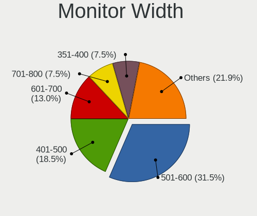

Debian Hardware Trends (Desktop)
--------------------------------

A project to identify most popular hardware characteristics and track their change
over time based on data collected by Debian users at https://Linux-Hardware.org.

Anyone can contribute to the study by uploading probes of their computers by
the [hw-probe](https://github.com/linuxhw/hw-probe) tool:

    sudo hw-probe -all -upload

Full-feature report is available here: https://linux-hardware.org/?view=trends&formfactor=desktop

Period: Jan, 2020.

Contents
--------

- [ OS                       ](#os)
- [ OS Family                ](#os-family)
- [ Kernel                   ](#kernel)
- [ Kernel Family            ](#kernel-family)
- [ Kernel Major Ver.        ](#kernel-major-ver)
- [ Arch                     ](#arch)
- [ DE                       ](#de)
- [ Display Server           ](#display-server)
- [ OS Lang                  ](#os-lang)
- [ Boot Mode                ](#boot-mode)
- [ Filesystem               ](#filesystem)
- [ Dual Boot with Linux     ](#dual-boot-with-linux)
- [ Dual Boot (Win)          ](#dual-boot-win)
- [ Country                  ](#country)
- [ City                     ](#city)
- [ Vendor                   ](#vendor)
- [ Model                    ](#model)
- [ Model Family             ](#model-family)
- [ MFG Year                 ](#mfg-year)
- [ Form Factor              ](#form-factor)
- [ Secure Boot              ](#secure-boot)
- [ Coreboot                 ](#coreboot)
- [ RAM Size                 ](#ram-size)
- [ RAM Used                 ](#ram-used)
- [ Drive Vendor             ](#drive-vendor)
- [ Drive Model              ](#drive-model)
- [ Drive Kind               ](#drive-kind)
- [ Drive Connector          ](#drive-connector)
- [ Drive Size               ](#drive-size)
- [ Space Total              ](#space-total)
- [ Space Used               ](#space-used)
- [ Malfunc. Drives          ](#malfunc-drives)
- [ Malfunc. Drive Vendor    ](#malfunc-drive-vendor)
- [ Malfunc. Drive Kind      ](#malfunc-drive-kind)
- [ Failed Drives            ](#failed-drives)
- [ Failed Drive Vendor      ](#failed-drive-vendor)
- [ Drive Status             ](#drive-status)
- [ Storage Vendor           ](#storage-vendor)
- [ Storage Model            ](#storage-model)
- [ Storage Kind             ](#storage-kind)
- [ CPU Vendor               ](#cpu-vendor)
- [ CPU Model                ](#cpu-model)
- [ CPU Model Family         ](#cpu-model-family)
- [ CPU Cores                ](#cpu-cores)
- [ CPU Sockets              ](#cpu-sockets)
- [ CPU Threads              ](#cpu-threads)
- [ CPU Op-Modes             ](#cpu-op-modes)
- [ CPU Microarch            ](#cpu-microarch)
- [ CPU Microcode            ](#cpu-microcode)
- [ GPU Vendor               ](#gpu-vendor)
- [ GPU Model                ](#gpu-model)
- [ GPU Combo                ](#gpu-combo)
- [ GPU Driver               ](#gpu-driver)
- [ GPU Memory               ](#gpu-memory)
- [ Monitor Vendor           ](#monitor-vendor)
- [ Monitor Model            ](#monitor-model)
- [ Monitor Resolution       ](#monitor-resolution)
- [ Monitor Diagonal         ](#monitor-diagonal)
- [ Monitor Width            ](#monitor-width)
- [ Aspect Ratio             ](#aspect-ratio)
- [ Monitor Area             ](#monitor-area)
- [ Pixel Density            ](#pixel-density)
- [ Multiple Monitors        ](#multiple-monitors)
- [ Net Controller Vendor    ](#net-controller-vendor)
- [ Net Controller Model     ](#net-controller-model)
- [ Net Controller Kind      ](#net-controller-kind)
- [ Used Controller          ](#used-controller)
- [ NICs                     ](#nics)
- [ Unsupported Devices      ](#unsupported-devices)
- [ Unsupported Device Types ](#unsupported-device-types)

OS
--

Installed operating systems

| Name            | Computers | Percent |
|-----------------|-----------|---------|
| Debian 10       | 17        | 56.67%  |
| Debian 9        | 4         | 13.33%  |
| Debian          | 4         | 13.33%  |
| Debian Unstable | 3         | 10%     |
| Debian Testing  | 1         | 3.33%   |
| Debian 9.11     | 1         | 3.33%   |

OS Family
---------

OS without a version

| Name   | Computers | Percent |
|--------|-----------|---------|
| Debian | 30        | 100%    |

Kernel
------

Version of the Linux kernel

| Version                    | Computers | Percent |
|----------------------------|-----------|---------|
| 4.19.0-6-amd64             | 7         | 23.33%  |
| 4.9.0-11-amd64             | 4         | 13.33%  |
| 5.4.0-3-amd64              | 3         | 10%     |
| 5.4.0-0.bpo.2-amd64        | 2         | 6.67%   |
| 5.3.13-1-pve               | 2         | 6.67%   |
| 5.3.0-3-amd64              | 2         | 6.67%   |
| 5.4.0-2-amd64              | 1         | 3.33%   |
| 5.4.0-13.1-liquorix-amd64  | 1         | 3.33%   |
| 5.4.0-1-amd64              | 1         | 3.33%   |
| 5.3.9-bootes2-iommu-p-1000 | 1         | 3.33%   |
| 5.1.2-antix.1-amd64-smp    | 1         | 3.33%   |
| 5.0.18-1-pve               | 1         | 3.33%   |
| 4.9.0-3-amd64              | 1         | 3.33%   |
| 4.19.67                    | 1         | 3.33%   |
| 4.19.0-1-amd64             | 1         | 3.33%   |
| 4.15.18-24-pve             | 1         | 3.33%   |

Kernel Family
-------------

Linux kernel without a distro release

| Version | Computers | Percent |
|---------|-----------|---------|
| 5.4.0   | 8         | 26.67%  |
| 4.19.0  | 8         | 26.67%  |
| 4.9.0   | 5         | 16.67%  |
| 5.3.13  | 2         | 6.67%   |
| 5.3.0   | 2         | 6.67%   |
| 5.3.9   | 1         | 3.33%   |
| 5.1.2   | 1         | 3.33%   |
| 5.0.18  | 1         | 3.33%   |
| 4.19.67 | 1         | 3.33%   |
| 4.15.18 | 1         | 3.33%   |

Kernel Major Ver.
-----------------

Linux kernel major version

| Version | Computers | Percent |
|---------|-----------|---------|
| 4.19    | 9         | 30%     |
| 5.4     | 8         | 26.67%  |
| 5.3     | 5         | 16.67%  |
| 4.9     | 5         | 16.67%  |
| 5.1     | 1         | 3.33%   |
| 5.0     | 1         | 3.33%   |
| 4.15    | 1         | 3.33%   |

Arch
----

OS architecture (x86_64, i586, etc.)

| Name   | Computers | Percent |
|--------|-----------|---------|
| x86_64 | 30        | 100%    |

DE
--

Desktop Environment

| Name       | Computers | Percent |
|------------|-----------|---------|
| Unknown    | 11        | 36.67%  |
| GNOME      | 5         | 16.67%  |
| XFCE       | 4         | 13.33%  |
| KDE5       | 4         | 13.33%  |
| X-Cinnamon | 2         | 6.67%   |
| Openbox    | 1         | 3.33%   |
| MATE       | 1         | 3.33%   |
| LXQt       | 1         | 3.33%   |
| i3         | 1         | 3.33%   |

Display Server
--------------

X11 or Wayland

| Name    | Computers | Percent |
|---------|-----------|---------|
| X11     | 23        | 76.67%  |
| Unknown | 5         | 16.67%  |
| Tty     | 2         | 6.67%   |

OS Lang
-------

Language

| Lang    | Computers | Percent |
|---------|-----------|---------|
| Unknown | 14        | 46.67%  |
| en_US   | 6         | 20%     |
| ru_RU   | 3         | 10%     |
| pt_PT   | 1         | 3.33%   |
| nl_BE   | 1         | 3.33%   |
| it_IT   | 1         | 3.33%   |
| fr_LU   | 1         | 3.33%   |
| en_IN   | 1         | 3.33%   |
| en_AU   | 1         | 3.33%   |
| de_DE   | 1         | 3.33%   |

Boot Mode
---------

EFI or BIOS

| Mode | Computers | Percent |
|------|-----------|---------|
| BIOS | 20        | 66.67%  |
| EFI  | 10        | 33.33%  |

Filesystem
----------

Type of filesystem

| Type    | Computers | Percent |
|---------|-----------|---------|
| Ext4    | 25        | 83.33%  |
| Zfs     | 1         | 3.33%   |
| Xfs     | 1         | 3.33%   |
| Ext3    | 1         | 3.33%   |
| Btrfs   | 1         | 3.33%   |
| Unknown | 1         | 3.33%   |

Dual Boot with Linux
--------------------

Hosting more than one Linux

| Dual boot | Computers | Percent |
|-----------|-----------|---------|
| No        | 23        | 76.67%  |
| Yes       | 7         | 23.33%  |

Dual Boot (Win)
---------------

Hosting Linux and Windows

| Dual boot | Computers | Percent |
|-----------|-----------|---------|
| No        | 27        | 90%     |
| Yes       | 3         | 10%     |

Country
-------

Geographic location (country)

| Country      | Computers | Percent |
|--------------|-----------|---------|
| USA          | 4         | 13.33%  |
| Germany      | 4         | 13.33%  |
| Russia       | 3         | 10%     |
| Belgium      | 3         | 10%     |
| UK           | 2         | 6.67%   |
| France       | 2         | 6.67%   |
| Finland      | 2         | 6.67%   |
| Ukraine      | 1         | 3.33%   |
| Sweden       | 1         | 3.33%   |
| South Africa | 1         | 3.33%   |
| Portugal     | 1         | 3.33%   |
| Mongolia     | 1         | 3.33%   |
| Kyrgyzstan   | 1         | 3.33%   |
| Italy        | 1         | 3.33%   |
| India        | 1         | 3.33%   |
| Hungary      | 1         | 3.33%   |
| Australia    | 1         | 3.33%   |

City
----

Geographic location (city)

| City               | Computers | Percent |
|--------------------|-----------|---------|
| St Petersburg      | 2         | 6.67%   |
| Schaarbeek         | 2         | 6.67%   |
| Yekaterinburg      | 1         | 3.33%   |
| Tuusula            | 1         | 3.33%   |
| Stockholm          | 1         | 3.33%   |
| San Diego          | 1         | 3.33%   |
| Roeselare          | 1         | 3.33%   |
| Porterville        | 1         | 3.33%   |
| Montreuil          | 1         | 3.33%   |
| Market Drayton     | 1         | 3.33%   |
| Lido degli Estensi | 1         | 3.33%   |
| Leonberg           | 1         | 3.33%   |
| Leca do Bailio     | 1         | 3.33%   |
| Huyagt             | 1         | 3.33%   |
| Horlivka           | 1         | 3.33%   |
| Helsinki           | 1         | 3.33%   |
| Gronau             | 1         | 3.33%   |
| Fontenay-sous-Bois | 1         | 3.33%   |
| Ettumanoor         | 1         | 3.33%   |
| Chicago            | 1         | 3.33%   |
| Budapest           | 1         | 3.33%   |
| Bremerhaven        | 1         | 3.33%   |
| Braunschweig       | 1         | 3.33%   |
| Bishkek            | 1         | 3.33%   |
| Belleville         | 1         | 3.33%   |
| Ashgrove           | 1         | 3.33%   |
| Acton              | 1         | 3.33%   |
| Aberdeen           | 1         | 3.33%   |

Vendor
------

Motherboard manufacturer

| Name                | Computers | Percent |
|---------------------|-----------|---------|
| ASUSTek Computer    | 11        | 36.67%  |
| Gigabyte Technology | 5         | 16.67%  |
| ASRock              | 4         | 13.33%  |
| Supermicro          | 2         | 6.67%   |
| Hewlett-Packard     | 2         | 6.67%   |
| Dell                | 2         | 6.67%   |
| HARDKERNEL          | 1         | 3.33%   |
| Fujitsu             | 1         | 3.33%   |
| ASRockRack          | 1         | 3.33%   |
| Acer                | 1         | 3.33%   |

Model
-----

Motherboard model

| Name                       | Computers | Percent |
|----------------------------|-----------|---------|
| ASUS M5A78L-M/USB3         | 2         | 6.67%   |
| Supermicro X8STi           | 1         | 3.33%   |
| Supermicro X8SIL           | 1         | 3.33%   |
| HP Z420 Workstation        | 1         | 3.33%   |
| HP 110-414                 | 1         | 3.33%   |
| HARDKERNEL ODROID-H2       | 1         | 3.33%   |
| Gigabyte Z87X-UD5H         | 1         | 3.33%   |
| Gigabyte X570 AORUS ELITE  | 1         | 3.33%   |
| Gigabyte MSH87TN-00        | 1         | 3.33%   |
| Gigabyte B75M-D3V          | 1         | 3.33%   |
| Gigabyte B450M S2H         | 1         | 3.33%   |
| Fujitsu CELSIUS W570power+ | 1         | 3.33%   |
| Dell Vostro 3250           | 1         | 3.33%   |
| Dell OptiPlex 7050         | 1         | 3.33%   |
| ASUS PRIME X570-P          | 1         | 3.33%   |
| ASUS PRIME B350M-A         | 1         | 3.33%   |
| ASUS P8P67 PRO             | 1         | 3.33%   |
| ASUS P5L-MX                | 1         | 3.33%   |
| ASUS M4A785TD-V EVO        | 1         | 3.33%   |
| ASUS FL257AA-B14 a6532.be  | 1         | 3.33%   |
| ASUS F2A85-M               | 1         | 3.33%   |
| ASUS B75M-A                | 1         | 3.33%   |
| ASUS All Series            | 1         | 3.33%   |
| ASRockRack X470D4U         | 1         | 3.33%   |
| ASRock Z77 Pro4-M          | 1         | 3.33%   |
| ASRock Z170M Pro4S         | 1         | 3.33%   |
| ASRock B450M-HDV           | 1         | 3.33%   |
| ASRock A320M               | 1         | 3.33%   |
| Acer Aspire M1930          | 1         | 3.33%   |

Model Family
------------

Motherboard model prefix

| Name                 | Computers | Percent |
|----------------------|-----------|---------|
| ASUS PRIME           | 2         | 6.67%   |
| ASUS M5A78L-M        | 2         | 6.67%   |
| Supermicro X8STi     | 1         | 3.33%   |
| Supermicro X8SIL     | 1         | 3.33%   |
| HP Z420              | 1         | 3.33%   |
| HP 110-414           | 1         | 3.33%   |
| HARDKERNEL ODROID-H2 | 1         | 3.33%   |
| Gigabyte Z87X-UD5H   | 1         | 3.33%   |
| Gigabyte X570        | 1         | 3.33%   |
| Gigabyte MSH87TN-00  | 1         | 3.33%   |
| Gigabyte B75M-D3V    | 1         | 3.33%   |
| Gigabyte B450M       | 1         | 3.33%   |
| Fujitsu CELSIUS      | 1         | 3.33%   |
| Dell Vostro          | 1         | 3.33%   |
| Dell OptiPlex        | 1         | 3.33%   |
| ASUS P8P67           | 1         | 3.33%   |
| ASUS P5L-MX          | 1         | 3.33%   |
| ASUS M4A785TD-V      | 1         | 3.33%   |
| ASUS FL257AA-B14     | 1         | 3.33%   |
| ASUS F2A85-M         | 1         | 3.33%   |
| ASUS B75M-A          | 1         | 3.33%   |
| ASUS All             | 1         | 3.33%   |
| ASRockRack X470D4U   | 1         | 3.33%   |
| ASRock Z77           | 1         | 3.33%   |
| ASRock Z170M         | 1         | 3.33%   |
| ASRock B450M-HDV     | 1         | 3.33%   |
| ASRock A320M         | 1         | 3.33%   |
| Acer Aspire          | 1         | 3.33%   |

MFG Year
--------

Motherboard manufacture year

| Year | Computers | Percent |
|------|-----------|---------|
| 2019 | 7         | 23.33%  |
| 2014 | 5         | 16.67%  |
| 2018 | 4         | 13.33%  |
| 2013 | 3         | 10%     |
| 2017 | 2         | 6.67%   |
| 2010 | 2         | 6.67%   |
| 2016 | 1         | 3.33%   |
| 2015 | 1         | 3.33%   |
| 2012 | 1         | 3.33%   |
| 2011 | 1         | 3.33%   |
| 2009 | 1         | 3.33%   |
| 2008 | 1         | 3.33%   |
| 2006 | 1         | 3.33%   |

Form Factor
-----------

Physical design of the computer

| Name    | Computers | Percent |
|---------|-----------|---------|
| Desktop | 30        | 100%    |

Secure Boot
-----------

Enabled or disabled

| State    | Computers | Percent |
|----------|-----------|---------|
| Disabled | 29        | 96.67%  |
| Enabled  | 1         | 3.33%   |

Coreboot
--------

Have coreboot on board

| Used | Computers | Percent |
|------|-----------|---------|
| No   | 30        | 100%    |

RAM Size
--------

Total RAM memory

| Size in GB  | Computers | Percent |
|-------------|-----------|---------|
| 8.01-16.0   | 9         | 30%     |
| 16.01-24.0  | 7         | 23.33%  |
| 4.01-8.0    | 4         | 13.33%  |
| 32.01-64.0  | 4         | 13.33%  |
| 3.01-4.0    | 3         | 10%     |
| 64.01-256.0 | 2         | 6.67%   |
| Unknown     | 1         | 3.33%   |

RAM Used
--------

Used RAM memory

| Used GB   | Computers | Percent |
|-----------|-----------|---------|
| 4.01-8.0  | 6         | 20%     |
| 2.01-3.0  | 6         | 20%     |
| 3.01-4.0  | 5         | 16.67%  |
| 0.01-1.0  | 5         | 16.67%  |
| 1.01-2.0  | 4         | 13.33%  |
| 8.01-16.0 | 3         | 10%     |
| Unknown   | 1         | 3.33%   |

Drive Vendor
------------

Hard drive vendors

| Vendor              | Computers | Drives | Percent |
|---------------------|-----------|--------|---------|
| Seagate             | 10        | 13     | 18.52%  |
| WDC                 | 9         | 11     | 16.67%  |
| Samsung Electronics | 7         | 8      | 12.96%  |
| Toshiba             | 5         | 5      | 9.26%   |
| Hitachi             | 5         | 5      | 9.26%   |
| Kingston            | 3         | 3      | 5.56%   |
| Crucial             | 3         | 3      | 5.56%   |
| SanDisk             | 2         | 3      | 3.7%    |
| PLEXTOR             | 2         | 2      | 3.7%    |
| A-DATA Technology   | 2         | 2      | 3.7%    |
| Zheino              | 1         | 1      | 1.85%   |
| Micron Technology   | 1         | 2      | 1.85%   |
| LaCie               | 1         | 1      | 1.85%   |
| KingDian            | 1         | 1      | 1.85%   |
| Intenso             | 1         | 1      | 1.85%   |
| Intel               | 1         | 1      | 1.85%   |

Drive Model
-----------

Hard drive models

| Model                        | Computers | Percent |
|------------------------------|-----------|---------|
| ST31000528AS 1TB             | 2         | 3.33%   |
| ST2000DM001-9YN164 2TB       | 2         | 3.33%   |
| HDP725050GLA360 500GB        | 2         | 3.33%   |
| HD204UI 2TB                  | 2         | 3.33%   |
| WD40EFRX-68N32N0 4TB         | 1         | 1.67%   |
| WD3200KS-75PFB0 320GB        | 1         | 1.67%   |
| WD20EFRX-68EUZN0 2TB         | 1         | 1.67%   |
| WD2002FAEX-007BA0 2TB        | 1         | 1.67%   |
| WD10EZRX-00L4HB0 1TB         | 1         | 1.67%   |
| WD10EZEX-75ZF5A0 1TB         | 1         | 1.67%   |
| WD10EZEX-60M2NA0 1TB         | 1         | 1.67%   |
| WD1003FZEX-00MK2A0 1TB       | 1         | 1.67%   |
| WD1003FZEX-00K3CA0 1TB       | 1         | 1.67%   |
| WD1003FBYX-18Y7B0 1TB        | 1         | 1.67%   |
| SX8200NP 240GB               | 1         | 1.67%   |
| SU900 512GB SSD              | 1         | 1.67%   |
| ST500DM002-1BD142 500GB      | 1         | 1.67%   |
| ST500DM002-1BC142 500GB      | 1         | 1.67%   |
| ST380215AS 80GB              | 1         | 1.67%   |
| ST31000333AS 1TB             | 1         | 1.67%   |
| ST3000DM001-9YN166 3TB       | 1         | 1.67%   |
| ST3000DM001-1CH166 3TB       | 1         | 1.67%   |
| ST1000DX001-1CM162 1TB       | 1         | 1.67%   |
| ST1000DM003-1ER162 1TB       | 1         | 1.67%   |
| SSDPEKKW128G8 128GB          | 1         | 1.67%   |
| SSD PLUS 120GB               | 1         | 1.67%   |
| SSD 970 PRO 512GB            | 1         | 1.67%   |
| SSD 840 PRO Series 256GB     | 1         | 1.67%   |
| SSD 840 EVO 250GB            | 1         | 1.67%   |
| SSD 830 Series 56GB          | 1         | 1.67%   |
| SSD 750 EVO 120GB            | 1         | 1.67%   |
| SH103S3120G 120GB SSD        | 1         | 1.67%   |
| SDSSDH3250G 250GB            | 1         | 1.67%   |
| SDSSDH3 512G                 | 1         | 1.67%   |
| SA400S37480G 480GB SSD       | 1         | 1.67%   |
| SA400S37120G 120GB SSD       | 1         | 1.67%   |
| S280 120GB SSD               | 1         | 1.67%   |
| PX-512M8PeG 512GB            | 1         | 1.67%   |
| PX-128M5S 128GB SSD          | 1         | 1.67%   |
| P9233 8TB                    | 1         | 1.67%   |
| MZVPW256HEGL-00000 256GB     | 1         | 1.67%   |
| MQ01ACF032 320GB             | 1         | 1.67%   |
| HUA722020ALA330 2TB          | 1         | 1.67%   |
| HDWD130 3TB                  | 1         | 1.67%   |
| HDS721616PLA380 160GB        | 1         | 1.67%   |
| HDS721050CLA660 500GB        | 1         | 1.67%   |
| External USB 3.0 4TB         | 1         | 1.67%   |
| Expansion Desk 4TB           | 1         | 1.67%   |
| DT01ACA200 2TB               | 1         | 1.67%   |
| DT01ACA100 1TB               | 1         | 1.67%   |
| DT01ABA200 2TB               | 1         | 1.67%   |
| CT525MX300SSD1 528GB         | 1         | 1.67%   |
| CT256MX100SSD1 256GB         | 1         | 1.67%   |
| CT1000MX500SSD1 1TB          | 1         | 1.67%   |
| CHN mSATAM3 128 128GB SSD    | 1         | 1.67%   |
| 1100_MTFDDAK512TBN 512GB SSD | 1         | 1.67%   |

Drive Kind
----------

HDD or SSD

| Kind | Computers | Drives | Percent |
|------|-----------|--------|---------|
| HDD  | 23        | 38     | 53.49%  |
| SSD  | 15        | 19     | 34.88%  |
| NVMe | 5         | 5      | 11.63%  |

Drive Connector
---------------

SATA, SAS, NVMe, etc.

| Type | Computers | Drives | Percent |
|------|-----------|--------|---------|
| SATA | 28        | 54     | 80%     |
| NVMe | 5         | 5      | 14.29%  |
| SAS  | 2         | 3      | 5.71%   |

Drive Size
----------

Size of hard drive

| Size in TB | Computers | Drives | Percent |
|------------|-----------|--------|---------|
| 0.01-0.5   | 19        | 25     | 40.43%  |
| 0.51-1.0   | 15        | 21     | 31.91%  |
| 1.01-2.0   | 7         | 9      | 14.89%  |
| 2.01-3.0   | 3         | 3      | 6.38%   |
| 3.01-4.0   | 2         | 3      | 4.26%   |
| 4.01-10.0  | 1         | 1      | 2.13%   |

Space Total
-----------

Amount of disk space available on the file system

| Size in GB     | Computers | Percent |
|----------------|-----------|---------|
| 501-1000       | 8         | 26.67%  |
| More than 3000 | 5         | 16.67%  |
| 251-500        | 5         | 16.67%  |
| 101-250        | 5         | 16.67%  |
| Unknown        | 3         | 10%     |
| 51-100         | 2         | 6.67%   |
| 2001-3000      | 1         | 3.33%   |
| 1001-2000      | 1         | 3.33%   |

Space Used
----------

Amount of used disk space

| Used GB        | Computers | Percent |
|----------------|-----------|---------|
| 101-250        | 6         | 20%     |
| 1-20           | 6         | 20%     |
| More than 3000 | 4         | 13.33%  |
| 251-500        | 3         | 10%     |
| 501-1000       | 3         | 10%     |
| 51-100         | 3         | 10%     |
| Unknown        | 3         | 10%     |
| 2001-3000      | 2         | 6.67%   |

Malfunc. Drives
---------------

Drive models with a malfunction

| Model                   | Computers | Drives | Percent |
|-------------------------|-----------|--------|---------|
| ST500DM002-1BD142 500GB | 1         | 1      | 14.29%  |
| ST500DM002-1BC142 500GB | 1         | 1      | 14.29%  |
| ST31000528AS 1TB        | 1         | 1      | 14.29%  |
| S280 120GB SSD          | 1         | 1      | 14.29%  |
| HDS721050CLA660 500GB   | 1         | 1      | 14.29%  |
| HDP725050GLA360 500GB   | 1         | 1      | 14.29%  |
| CT256MX100SSD1 256GB    | 1         | 1      | 14.29%  |

Malfunc. Drive Vendor
---------------------

Vendors of faulty drives

| Vendor   | Computers | Drives | Percent |
|----------|-----------|--------|---------|
| Seagate  | 2         | 3      | 33.33%  |
| Hitachi  | 2         | 2      | 33.33%  |
| KingDian | 1         | 1      | 16.67%  |
| Crucial  | 1         | 1      | 16.67%  |

Malfunc. Drive Kind
-------------------

Kinds of faulty drives

| Kind | Computers | Drives | Percent |
|------|-----------|--------|---------|
| HDD  | 4         | 5      | 66.67%  |
| SSD  | 2         | 2      | 33.33%  |

Failed Drives
-------------

Failed drive models

Zero info for selected period =(

Failed Drive Vendor
-------------------

Failed drive vendors

Zero info for selected period =(

Drive Status
------------

Number of failed and malfunc. drives

| Status   | Computers | Drives | Percent |
|----------|-----------|--------|---------|
| Works    | 20        | 39     | 55.56%  |
| Detected | 10        | 16     | 27.78%  |
| Malfunc  | 6         | 7      | 16.67%  |

Storage Vendor
--------------

Storage controller vendors

| Vendor                   | Computers | Percent |
|--------------------------|-----------|---------|
| Intel                    | 18        | 47.37%  |
| AMD                      | 12        | 31.58%  |
| Samsung Electronics      | 2         | 5.26%   |
| ASMedia Technology       | 2         | 5.26%   |
| Silicon Motion           | 1         | 2.63%   |
| Marvell Technology Group | 1         | 2.63%   |
| Lite-On Technology       | 1         | 2.63%   |
| JMicron Technology       | 1         | 2.63%   |

Storage Model
-------------

Storage controller models

| Model                                                                    | Computers | Percent |
|--------------------------------------------------------------------------|-----------|---------|
| FCH SATA Controller [AHCI mode]                                          | 9         | 17.65%  |
| SB7x0/SB8x0/SB9x0 IDE Controller                                         | 3         | 5.88%   |
| Q170/Q150/B150/H170/H110/Z170/CM236 Chipset SATA Controller [AHCI Mode]  | 3         | 5.88%   |
| 400 Series Chipset SATA Controller                                       | 3         | 5.88%   |
| SB7x0/SB8x0/SB9x0 SATA Controller [IDE mode]                             | 2         | 3.92%   |
| ASM1062 Serial ATA Controller                                            | 2         | 3.92%   |
| 8 Series/C220 Series Chipset Family 6-port SATA Controller 1 [AHCI mode] | 2         | 3.92%   |
| 7 Series/C210 Series Chipset Family 6-port SATA Controller [AHCI mode]   | 2         | 3.92%   |
| 6 Series/C200 Series Chipset Family 6 port Desktop SATA AHCI Controller  | 2         | 3.92%   |
| SSD Pro 7600p/760p/E 6100p Series                                        | 1         | 1.96%   |
| SB7x0/SB8x0/SB9x0 SATA Controller [AHCI mode]                            | 1         | 1.96%   |
| SATA controller                                                          | 1         | 1.96%   |
| NVMe SSD Controller SM981/PM981/PM983                                    | 1         | 1.96%   |
| NVMe SSD Controller SM961/PM961                                          | 1         | 1.96%   |
| Non-Volatile memory controller                                           | 1         | 1.96%   |
| NM10/ICH7 Family SATA Controller [IDE mode]                              | 1         | 1.96%   |
| M8Pe Series NVMe SSD                                                     | 1         | 1.96%   |
| JMB362 SATA Controller                                                   | 1         | 1.96%   |
| FCH SATA Controller D                                                    | 1         | 1.96%   |
| C602 chipset 4-Port SATA Storage Control Unit                            | 1         | 1.96%   |
| C600/X79 series chipset SATA RAID Controller                             | 1         | 1.96%   |
| C600/X79 series chipset IDE-r Controller                                 | 1         | 1.96%   |
| 9 Series Chipset Family SATA Controller [AHCI Mode]                      | 1         | 1.96%   |
| 88SE9172 SATA 6Gb/s Controller                                           | 1         | 1.96%   |
| 82801JI (ICH10 Family) SATA AHCI Controller                              | 1         | 1.96%   |
| 82801IR/IO/IH (ICH9R/DO/DH) 6 port SATA Controller [AHCI mode]           | 1         | 1.96%   |
| 82801G (ICH7 Family) IDE Controller                                      | 1         | 1.96%   |
| 7 Series/C210 Series Chipset Family 4-port SATA Controller [IDE mode]    | 1         | 1.96%   |
| 7 Series/C210 Series Chipset Family 2-port SATA Controller [IDE mode]    | 1         | 1.96%   |
| 5 Series/3400 Series Chipset 4 port SATA AHCI Controller                 | 1         | 1.96%   |
| 300 Series Chipset SATA Controller                                       | 1         | 1.96%   |
| 200 Series PCH SATA controller [AHCI mode]                               | 1         | 1.96%   |

Storage Kind
------------

Kind of storage controller (IDE, SATA, NVMe, SAS, ...)

| Kind | Computers | Percent |
|------|-----------|---------|
| SATA | 27        | 67.5%   |
| IDE  | 6         | 15%     |
| NVMe | 5         | 12.5%   |
| RAID | 1         | 2.5%    |
| SAS  | 1         | 2.5%    |

CPU Vendor
----------

Processor vendors

| Vendor | Computers | Percent |
|--------|-----------|---------|
| Intel  | 18        | 60%     |
| AMD    | 12        | 40%     |

CPU Model
---------

Processor models

| Model                                       | Computers | Percent |
|---------------------------------------------|-----------|---------|
| Intel Core i7-7700 CPU @ 3.60GHz            | 2         | 6.67%   |
| Intel Xeon CPU X3430 @ 2.40GHz              | 1         | 3.33%   |
| Intel Xeon CPU E5-2670 0 @ 2.60GHz          | 1         | 3.33%   |
| Intel Pentium CPU G630 @ 2.70GHz            | 1         | 3.33%   |
| Intel Pentium CPU G4400 @ 3.30GHz           | 1         | 3.33%   |
| Intel Pentium 4 CPU 3.00GHz                 | 1         | 3.33%   |
| Intel Core i7-4790K CPU @ 4.00GHz           | 1         | 3.33%   |
| Intel Core i7-4770 CPU @ 3.40GHz            | 1         | 3.33%   |
| Intel Core i7-3770 CPU @ 3.40GHz            | 1         | 3.33%   |
| Intel Core i7-2600K CPU @ 3.40GHz           | 1         | 3.33%   |
| Intel Core i7 CPU 920 @ 2.67GHz             | 1         | 3.33%   |
| Intel Core i5-6600K CPU @ 3.50GHz           | 1         | 3.33%   |
| Intel Core i5-4570T CPU @ 2.90GHz           | 1         | 3.33%   |
| Intel Core i5-3470 CPU @ 3.20GHz            | 1         | 3.33%   |
| Intel Core i5-2500K CPU @ 3.30GHz           | 1         | 3.33%   |
| Intel Core 2 Duo CPU E4700 @ 2.60GHz        | 1         | 3.33%   |
| Intel Celeron J4105 CPU @ 1.50GHz           | 1         | 3.33%   |
| AMD Ryzen 7 3700X 8-Core Processor          | 1         | 3.33%   |
| AMD Ryzen 7 1700X Eight-Core Processor      | 1         | 3.33%   |
| AMD Ryzen 5 3600 6-Core Processor           | 1         | 3.33%   |
| AMD Ryzen 5 2600 Six-Core Processor         | 1         | 3.33%   |
| AMD Ryzen 5 1500X Quad-Core Processor       | 1         | 3.33%   |
| AMD Ryzen 3 2200G with Radeon Vega Graphics | 1         | 3.33%   |
| AMD Phenom II X4 905e Processor             | 1         | 3.33%   |
| AMD FX-8350 Eight-Core Processor            | 1         | 3.33%   |
| AMD FX-4150 Quad-Core Processor             | 1         | 3.33%   |
| AMD Athlon 200GE with Radeon Vega Graphics  | 1         | 3.33%   |
| AMD A8-6410 APU with AMD Radeon R5 Graphics | 1         | 3.33%   |
| AMD A8-5600K APU with Radeon HD Graphics    | 1         | 3.33%   |

CPU Model Family
----------------

Processor model prefix

| Model            | Computers | Percent |
|------------------|-----------|---------|
| Intel Core i7    | 7         | 23.33%  |
| Intel Core i5    | 4         | 13.33%  |
| AMD Ryzen 5      | 3         | 10%     |
| Intel Xeon       | 2         | 6.67%   |
| Intel Pentium    | 2         | 6.67%   |
| AMD Ryzen 7      | 2         | 6.67%   |
| AMD FX           | 2         | 6.67%   |
| AMD A8           | 2         | 6.67%   |
| Intel Pentium 4  | 1         | 3.33%   |
| Intel Core 2 Duo | 1         | 3.33%   |
| Intel Celeron    | 1         | 3.33%   |
| AMD Ryzen 3      | 1         | 3.33%   |
| AMD Phenom II X4 | 1         | 3.33%   |
| AMD Athlon       | 1         | 3.33%   |

CPU Cores
---------

Number of processor cores

| Number | Computers | Percent |
|--------|-----------|---------|
| 4      | 17        | 56.67%  |
| 2      | 7         | 23.33%  |
| 8      | 3         | 10%     |
| 6      | 2         | 6.67%   |
| 1      | 1         | 3.33%   |

CPU Sockets
-----------

Number of sockets

| Number | Computers | Percent |
|--------|-----------|---------|
| 1      | 30        | 100%    |

CPU Threads
-----------

Threads per core (Hyper-Threading)

| Number | Computers | Percent |
|--------|-----------|---------|
| 2      | 19        | 63.33%  |
| 1      | 11        | 36.67%  |

CPU Op-Modes
------------

CPU Operation Modes (32-bit, 64-bit)

| Op mode        | Computers | Percent |
|----------------|-----------|---------|
| 32-bit, 64-bit | 28        | 93.33%  |
| Unknown        | 2         | 6.67%   |

CPU Microarch
-------------

Microarchitecture

| Name          | Computers | Percent |
|---------------|-----------|---------|
| Zen           | 4         | 13.33%  |
| SandyBridge   | 4         | 13.33%  |
| Skylake       | 3         | 10%     |
| Haswell       | 3         | 10%     |
| Zen 2         | 2         | 6.67%   |
| Piledriver    | 2         | 6.67%   |
| Nehalem       | 2         | 6.67%   |
| IvyBridge     | 2         | 6.67%   |
| Zen+          | 1         | 3.33%   |
| Puma          | 1         | 3.33%   |
| NetBurst      | 1         | 3.33%   |
| KabyLake      | 1         | 3.33%   |
| K10           | 1         | 3.33%   |
| Goldmont plus | 1         | 3.33%   |
| Core          | 1         | 3.33%   |
| Bulldozer     | 1         | 3.33%   |

CPU Microcode
-------------

Microcode number

| Number     | Computers | Percent |
|------------|-----------|---------|
| Unknown    | 10        | 33.33%  |
| 0x206a7    | 3         | 10%     |
| 0x306c3    | 2         | 6.67%   |
| 0x306a9    | 2         | 6.67%   |
| 0xf49      | 1         | 3.33%   |
| 0x906e9    | 1         | 3.33%   |
| 0x706a1    | 1         | 3.33%   |
| 0x506e3    | 1         | 3.33%   |
| 0x106e5    | 1         | 3.33%   |
| 0x106a5    | 1         | 3.33%   |
| 0x08701013 | 1         | 3.33%   |
| 0x08101016 | 1         | 3.33%   |
| 0x0800820d | 1         | 3.33%   |
| 0x08001138 | 1         | 3.33%   |
| 0x07030105 | 1         | 3.33%   |
| 0x0600063d | 1         | 3.33%   |
| 0x01000086 | 1         | 3.33%   |

GPU Vendor
----------

Vendors of graphics cards

| Vendor                     | Computers | Percent |
|----------------------------|-----------|---------|
| AMD                        | 13        | 43.33%  |
| Nvidia                     | 8         | 26.67%  |
| Intel                      | 5         | 16.67%  |
| Matrox Electronics Systems | 2         | 6.67%   |
| Silicon Motion             | 1         | 3.33%   |
| ASPEED Technology          | 1         | 3.33%   |

GPU Model
---------

Graphics card models

| Model                                                                 | Computers | Percent |
|-----------------------------------------------------------------------|-----------|---------|
| Raven Ridge [Radeon Vega Series / Radeon Vega Mobile Series]          | 2         | 6.45%   |
| MGA G200eW WPCM450                                                    | 2         | 6.45%   |
| GM206 [GeForce GTX 960]                                               | 2         | 6.45%   |
| Ellesmere [Radeon RX 470/480/570/570X/580/580X/590]                   | 2         | 6.45%   |
| Xeon E3-1200 v3/4th Gen Core Processor Integrated Graphics Controller | 1         | 3.23%   |
| Xeon E3-1200 v2/3rd Gen Core processor Graphics Controller            | 1         | 3.23%   |
| UHD Graphics 605                                                      | 1         | 3.23%   |
| Trinity [Radeon HD 7560D]                                             | 1         | 3.23%   |
| SM750                                                                 | 1         | 3.23%   |
| RV635 [Radeon HD 3650/3750/4570/4580]                                 | 1         | 3.23%   |
| RV630 PRO [Radeon HD 2600 PRO]                                        | 1         | 3.23%   |
| RS880 [Radeon HD 4200]                                                | 1         | 3.23%   |
| RS780L [Radeon 3000]                                                  | 1         | 3.23%   |
| Oland [Radeon HD 8570 / R7 240/340 OEM]                               | 1         | 3.23%   |
| Mullins [Radeon R4/R5 Graphics]                                       | 1         | 3.23%   |
| HD Graphics 510                                                       | 1         | 3.23%   |
| GT218 [GeForce 405]                                                   | 1         | 3.23%   |
| GP107 [GeForce GTX 1050 Ti]                                           | 1         | 3.23%   |
| GP104 [GeForce GTX 1080]                                              | 1         | 3.23%   |
| GP104 [GeForce GTX 1070]                                              | 1         | 3.23%   |
| GK107 [GeForce GT 640]                                                | 1         | 3.23%   |
| GF119 [NVS 310]                                                       | 1         | 3.23%   |
| Caicos [Radeon HD 6450/7450/8450 / R5 230 OEM]                        | 1         | 3.23%   |
| Caicos XT [Radeon HD 7470/8470 / R5 235/310 OEM]                      | 1         | 3.23%   |
| Baffin [Radeon RX 460/560D / Pro 450/455/460/555/555X/560/560X]       | 1         | 3.23%   |
| ASPEED Graphics Family                                                | 1         | 3.23%   |
| 2nd Generation Core Processor Family Integrated Graphics Controller   | 1         | 3.23%   |

GPU Combo
---------

Combinations of graphics cards

| Name               | Computers | Percent |
|--------------------|-----------|---------|
| 1 x AMD            | 12        | 40%     |
| 1 x Nvidia         | 8         | 26.67%  |
| 1 x Intel          | 5         | 16.67%  |
| 1 x Matrox         | 2         | 6.67%   |
| 2 x AMD            | 1         | 3.33%   |
| 1 x Silicon Motion | 1         | 3.33%   |
| 1 x ASPEED         | 1         | 3.33%   |

GPU Driver
----------

Free vs proprietary

| Driver      | Computers | Percent |
|-------------|-----------|---------|
| Free        | 24        | 80%     |
| Proprietary | 4         | 13.33%  |
| Unknown     | 2         | 6.67%   |

GPU Memory
----------

Total video memory

| Size in GB | Computers | Percent |
|------------|-----------|---------|
| Unknown    | 15        | 50%     |
| 0.01-0.5   | 5         | 16.67%  |
| 7.01-8.0   | 4         | 13.33%  |
| 1.01-2.0   | 4         | 13.33%  |
| 3.01-4.0   | 1         | 3.33%   |
| 0.51-1.0   | 1         | 3.33%   |

Monitor Vendor
--------------

Monitor vendors

| Vendor               | Computers | Percent |
|----------------------|-----------|---------|
| Dell                 | 6         | 23.08%  |
| Samsung Electronics  | 3         | 11.54%  |
| Ancor Communications | 3         | 11.54%  |
| Sceptre Tech         | 2         | 7.69%   |
| Philips              | 2         | 7.69%   |
| Iiyama               | 2         | 7.69%   |
| Hewlett-Packard      | 2         | 7.69%   |
| Wacom                | 1         | 3.85%   |
| ViewSonic            | 1         | 3.85%   |
| Envision             | 1         | 3.85%   |
| Eizo                 | 1         | 3.85%   |
| CVT                  | 1         | 3.85%   |
| Acer                 | 1         | 3.85%   |

Monitor Model
-------------

Monitor models

| Model                                               | Computers | Percent |
|-----------------------------------------------------|-----------|---------|
| U2412M DELA07B 1920x1200 518x324mm 24.1-inch        | 2         | 7.14%   |
| ZR2240w HWP2952 1920x1080 475x267mm 21.5-inch       | 1         | 3.57%   |
| w2007 HWP26A6 1680x1050 433x271mm 20.1-inch         | 1         | 3.57%   |
| VX24A ACI24AA 2560x1440 530x300mm 24.0-inch         | 1         | 3.57%   |
| VX2451 SERIES VSC2528 1920x1080 521x293mm 23.5-inch | 1         | 3.57%   |
| T23C350 SAM0ABC 1920x1080 510x287mm 23.0-inch       | 1         | 3.57%   |
| SyncMaster SAM02F5 1920x1200                        | 1         | 3.57%   |
| SyncMaster SAM00ED 1280x1024 376x301mm 19.0-inch    | 1         | 3.57%   |
| SE2717H/HX DELD0A1 1920x1080 600x340mm 27.2-inch    | 1         | 3.57%   |
| S240HL ACR0289 1920x1080 531x299mm 24.0-inch        | 1         | 3.57%   |
| PLX2483H IVM6114 1920x1080 531x299mm 24.0-inch      | 1         | 3.57%   |
| PLC301WT IVM1044 1280x768 643x386mm 29.5-inch       | 1         | 3.57%   |
| PHL 244E5 PHLC0C0 1920x1080 530x300mm 24.0-inch     | 1         | 3.57%   |
| PA249 ACI24B2 1920x1200 518x324mm 24.1-inch         | 1         | 3.57%   |
| P2719H DEL4184 1920x1080 598x336mm 27.0-inch        | 1         | 3.57%   |
| P2416D DELA0C4 2560x1440 527x296mm 23.8-inch        | 1         | 3.57%   |
| LCD Monitor WAC1043 2560x1440 600x340mm 27.2-inch   | 1         | 3.57%   |
| EV3237 ENC2604 3840x2160 700x400mm 31.7-inch        | 1         | 3.57%   |
| EN9110 EPIE980 1280x1024 380x305mm 19.2-inch        | 1         | 3.57%   |
| E275W-1920 SPT0ABF 1920x1080 443x249mm 20.0-inch    | 1         | 3.57%   |
| E205W-1600 SPT080D 1600x900 477x268mm 21.5-inch     | 1         | 3.57%   |
| E1916HV DELF06C 1366x768 409x230mm 18.5-inch        | 1         | 3.57%   |
| E1916H DELF065 1366x768 410x230mm 18.5-inch         | 1         | 3.57%   |
| E1909W DELF00D 1440x900 408x255mm 18.9-inch         | 1         | 3.57%   |
| CVTE TV CVT0003 1920x1080 575x323mm 26.0-inch       | 1         | 3.57%   |
| ASUS LS201 ACI20B2 1400x1050 433x271mm 20.1-inch    | 1         | 3.57%   |
| 170S PHL082B 1280x1024 338x270mm 17.0-inch          | 1         | 3.57%   |

Monitor Resolution
------------------

Monitor screen resolution

| Resolution         | Computers | Percent |
|--------------------|-----------|---------|
| 1920x1080 (FHD)    | 9         | 32.14%  |
| 1920x1200 (WUXGA)  | 4         | 14.29%  |
| 1280x1024 (SXGA)   | 4         | 14.29%  |
| 2560x1440 (QHD)    | 3         | 10.71%  |
| 1366x768 (WXGA)    | 2         | 7.14%   |
| 3840x2160 (4K)     | 1         | 3.57%   |
| 1680x1050 (WSXGA+) | 1         | 3.57%   |
| 1600x900 (HD+)     | 1         | 3.57%   |
| 1440x900 (WXGA+)   | 1         | 3.57%   |
| 1400x1050          | 1         | 3.57%   |
| 1360x768           | 1         | 3.57%   |

Monitor Diagonal
----------------

Diagonal size in inches

| Inches  | Computers | Percent |
|---------|-----------|---------|
| 24      | 7         | 25.93%  |
| 23      | 4         | 14.81%  |
| 27      | 3         | 11.11%  |
| 19      | 3         | 11.11%  |
| 20      | 2         | 7.41%   |
| 18      | 2         | 7.41%   |
| 31      | 1         | 3.7%    |
| 29      | 1         | 3.7%    |
| 26      | 1         | 3.7%    |
| 21      | 1         | 3.7%    |
| 17      | 1         | 3.7%    |
| Unknown | 1         | 3.7%    |

Monitor Width
-------------

Physical width

| Width in mm | Computers | Percent |
|-------------|-----------|---------|
| 501-600     | 14        | 53.85%  |
| 401-500     | 6         | 23.08%  |
| 601-700     | 2         | 7.69%   |
| 351-400     | 2         | 7.69%   |
| 301-350     | 1         | 3.85%   |
| Unknown     | 1         | 3.85%   |

Aspect Ratio
------------

Proportional relationship between the width and the height

| Ratio | Computers | Percent |
|-------|-----------|---------|
| 16/9  | 15        | 57.69%  |
| 16/10 | 7         | 26.92%  |
| 5/4   | 3         | 11.54%  |
| 3/2   | 1         | 3.85%   |

Monitor Area
------------

Area in inch²

| Area in inch² | Computers | Percent |
|----------------|-----------|---------|
| 201-250        | 7         | 25%     |
| 151-200        | 7         | 25%     |
| 251-300        | 5         | 17.86%  |
| 301-350        | 3         | 10.71%  |
| 141-150        | 3         | 10.71%  |
| 351-500        | 2         | 7.14%   |
| Unknown        | 1         | 3.57%   |

Pixel Density
-------------

Pixels per inch

| Density | Computers | Percent |
|---------|-----------|---------|
| 51-100  | 20        | 76.92%  |
| 121-160 | 3         | 11.54%  |
| 101-120 | 2         | 7.69%   |
| Unknown | 1         | 3.85%   |

Multiple Monitors
-----------------

Total monitors connected

| Total | Computers | Percent |
|-------|-----------|---------|
| 1     | 23        | 76.67%  |
| 0     | 4         | 13.33%  |
| 2     | 2         | 6.67%   |
| 3     | 1         | 3.33%   |

Net Controller Vendor
---------------------

Controller vendors

| Vendor | Computers | Percent |
|--------|-----------|---------|
| Intel  | 8         | 100%    |

Net Controller Model
--------------------

Controller models

| Model                                           | Computers | Percent |
|-------------------------------------------------|-----------|---------|
| 82574L Gigabit Network Connection               | 3         | 37.5%   |
| I210 Gigabit Network Connection                 | 2         | 25%     |
| I211 Gigabit Network Connection                 | 1         | 12.5%   |
| 82579V Gigabit Network Connection               | 1         | 12.5%   |
| 82579LM Gigabit Network Connection (Lewisville) | 1         | 12.5%   |

Net Controller Kind
-------------------

Ethernet, WiFi or modem

| Kind     | Computers | Percent |
|----------|-----------|---------|
| Ethernet | 8         | 100%    |

Used Controller
---------------

Currently used network controller

| Kind     | Computers | Percent |
|----------|-----------|---------|
| Ethernet | 5         | 100%    |

NICs
----

Total network controllers on board

| Total | Computers | Percent |
|-------|-----------|---------|
| 1     | 20        | 66.67%  |
| 2     | 10        | 33.33%  |

Unsupported Devices
-------------------

Total unsupported devices on board

| Total | Computers | Percent |
|-------|-----------|---------|
| 0     | 26        | 86.67%  |
| 1     | 4         | 13.33%  |

Unsupported Device Types
------------------------

Types of unsupported devices

| Type                     | Computers | Percent |
|--------------------------|-----------|---------|
| Graphics card            | 2         | 50%     |
| Communication controller | 1         | 25%     |
| Chipcard                 | 1         | 25%     |

