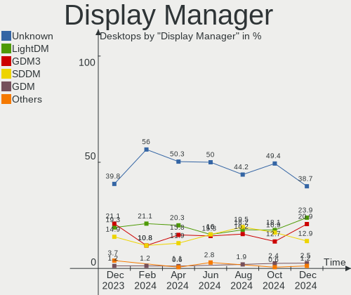
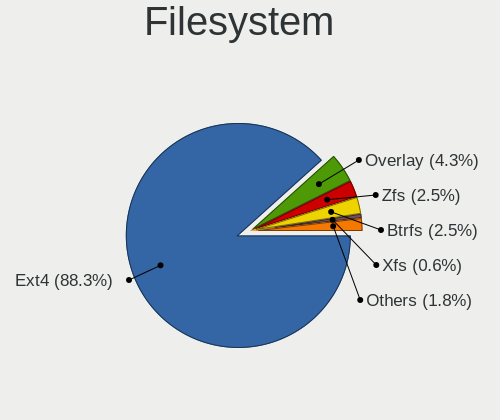
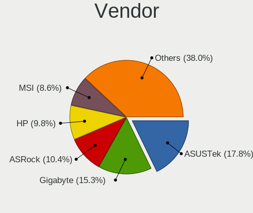
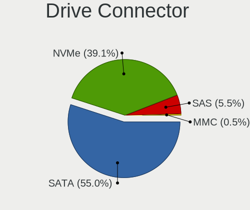
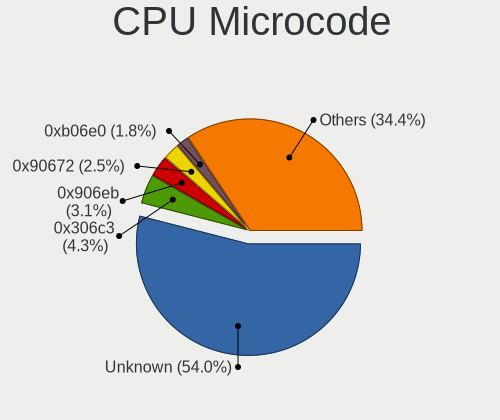
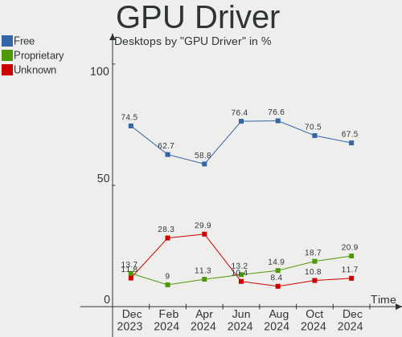
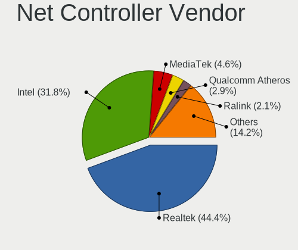

Debian Hardware Trends (Desktop)
--------------------------------

A project to identify most popular hardware characteristics and track their change
over time based on data collected by Debian users at https://Linux-Hardware.org.

Anyone can contribute to the study by uploading probes of their computers by
the [hw-probe](https://github.com/linuxhw/hw-probe) tool:

    sudo hw-probe -all -upload

Full-feature report is available here: https://linux-hardware.org/?view=trends&formfactor=desktop

Period: Apr, 2020.

Contents
--------

- [ OS                       ](#os)
- [ OS Family                ](#os-family)
- [ Kernel                   ](#kernel)
- [ Kernel Family            ](#kernel-family)
- [ Kernel Major Ver.        ](#kernel-major-ver)
- [ Arch                     ](#arch)
- [ DE                       ](#de)
- [ Display Server           ](#display-server)
- [ Display Manager          ](#display-manager)
- [ OS Lang                  ](#os-lang)
- [ Boot Mode                ](#boot-mode)
- [ Filesystem               ](#filesystem)
- [ Dual Boot with Linux/BSD ](#dual-boot-with-linux/bsd)
- [ Dual Boot (Win)          ](#dual-boot-win)
- [ Country                  ](#country)
- [ City                     ](#city)
- [ Vendor                   ](#vendor)
- [ Model                    ](#model)
- [ Model Family             ](#model-family)
- [ MFG Year                 ](#mfg-year)
- [ Form Factor              ](#form-factor)
- [ Secure Boot              ](#secure-boot)
- [ Coreboot                 ](#coreboot)
- [ RAM Size                 ](#ram-size)
- [ RAM Used                 ](#ram-used)
- [ Drive Vendor             ](#drive-vendor)
- [ Drive Model              ](#drive-model)
- [ Drive Kind               ](#drive-kind)
- [ Drive Connector          ](#drive-connector)
- [ Drive Size               ](#drive-size)
- [ Space Total              ](#space-total)
- [ Space Used               ](#space-used)
- [ Malfunc. Drives          ](#malfunc-drives)
- [ Malfunc. Drive Vendor    ](#malfunc-drive-vendor)
- [ Malfunc. Drive Kind      ](#malfunc-drive-kind)
- [ Failed Drives            ](#failed-drives)
- [ Failed Drive Vendor      ](#failed-drive-vendor)
- [ Drive Status             ](#drive-status)
- [ Storage Vendor           ](#storage-vendor)
- [ Storage Model            ](#storage-model)
- [ Storage Kind             ](#storage-kind)
- [ CPU Vendor               ](#cpu-vendor)
- [ CPU Model                ](#cpu-model)
- [ CPU Model Family         ](#cpu-model-family)
- [ CPU Cores                ](#cpu-cores)
- [ CPU Sockets              ](#cpu-sockets)
- [ CPU Threads              ](#cpu-threads)
- [ CPU Op-Modes             ](#cpu-op-modes)
- [ CPU Microarch            ](#cpu-microarch)
- [ CPU Microcode            ](#cpu-microcode)
- [ GPU Vendor               ](#gpu-vendor)
- [ GPU Model                ](#gpu-model)
- [ GPU Combo                ](#gpu-combo)
- [ GPU Driver               ](#gpu-driver)
- [ GPU Memory               ](#gpu-memory)
- [ Monitor Vendor           ](#monitor-vendor)
- [ Monitor Model            ](#monitor-model)
- [ Monitor Resolution       ](#monitor-resolution)
- [ Monitor Diagonal         ](#monitor-diagonal)
- [ Monitor Width            ](#monitor-width)
- [ Aspect Ratio             ](#aspect-ratio)
- [ Monitor Area             ](#monitor-area)
- [ Pixel Density            ](#pixel-density)
- [ Multiple Monitors        ](#multiple-monitors)
- [ Net Controller Vendor    ](#net-controller-vendor)
- [ Net Controller Model     ](#net-controller-model)
- [ Net Controller Kind      ](#net-controller-kind)
- [ Used Controller          ](#used-controller)
- [ NICs                     ](#nics)
- [ Unsupported Devices      ](#unsupported-devices)
- [ Unsupported Device Types ](#unsupported-device-types)

OS
--

Installed operating systems

| Name            | Computers | Percent |
|-----------------|-----------|---------|
| Debian 10       | 27        | 54%     |
| Debian          | 9         | 18%     |
| Debian Testing  | 8         | 16%     |
| Debian Unstable | 3         | 6%      |
| Debian 9.12     | 3         | 6%      |

OS Family
---------

OS without a version

| Name   | Computers | Percent |
|--------|-----------|---------|
| Debian | 50        | 100%    |

Kernel
------

Version of the Linux kernel

| Version                      | Computers | Percent |
|------------------------------|-----------|---------|
| 4.19.0-8-amd64               | 19        | 38%     |
| 5.5.0-2-amd64                | 5         | 10%     |
| 5.5.0-1-amd64                | 4         | 8%      |
| 5.4.0-4-amd64                | 4         | 8%      |
| 5.4.0-0.bpo.4-amd64          | 4         | 8%      |
| 4.9.0-12-amd64               | 3         | 6%      |
| 4.9.0-12-rt-amd64            | 2         | 4%      |
| 5.6.2-towo.1-siduction-amd64 | 1         | 2%      |
| 5.6.0-vmalloc-purge-fix      | 1         | 2%      |
| 5.5.10                       | 1         | 2%      |
| 5.4.0-0.bpo.4-686-pae        | 1         | 2%      |
| 4.19.0-parrot1-13t-amd64     | 1         | 2%      |
| 4.19.0-8-686-pae             | 1         | 2%      |
| 4.19.0-6-amd64               | 1         | 2%      |
| 4.19.0-0.steamos2.3-amd64    | 1         | 2%      |
| 4.14.0-3-amd64               | 1         | 2%      |

Kernel Family
-------------

Linux kernel without a distro release

| Version | Computers | Percent |
|---------|-----------|---------|
| 4.19.0  | 23        | 46%     |
| 5.5.0   | 9         | 18%     |
| 5.4.0   | 9         | 18%     |
| 4.9.0   | 5         | 10%     |
| 5.6.2   | 1         | 2%      |
| 5.6.0   | 1         | 2%      |
| 5.5.10  | 1         | 2%      |
| 4.14.0  | 1         | 2%      |

Kernel Major Ver.
-----------------

Linux kernel major version

| Version | Computers | Percent |
|---------|-----------|---------|
| 4.19    | 23        | 46%     |
| 5.5     | 10        | 20%     |
| 5.4     | 9         | 18%     |
| 4.9     | 5         | 10%     |
| 5.6     | 2         | 4%      |
| 4.14    | 1         | 2%      |

Arch
----

OS architecture (x86_64, i586, etc.)

| Name   | Computers | Percent |
|--------|-----------|---------|
| x86_64 | 48        | 96%     |
| i686   | 2         | 4%      |

DE
--

Desktop Environment

| Name            | Computers | Percent |
|-----------------|-----------|---------|
| GNOME           | 11        | 22%     |
| XFCE            | 9         | 18%     |
| Unknown         | 8         | 16%     |
| X-Cinnamon      | 4         | 8%      |
| MATE            | 4         | 8%      |
| KDE5            | 4         | 8%      |
| KDE             | 4         | 8%      |
| LXDE            | 2         | 4%      |
| Cinnamon        | 2         | 4%      |
| LXQt            | 1         | 2%      |
| GNOME Flashback | 1         | 2%      |

Display Server
--------------

X11 or Wayland

| Name    | Computers | Percent |
|---------|-----------|---------|
| X11     | 38        | 76%     |
| Wayland | 6         | 12%     |
| Tty     | 4         | 8%      |
| Unknown | 2         | 4%      |

Display Manager
---------------

SDDM, LightDM, etc.

| Name    | Computers | Percent |
|---------|-----------|---------|
| Unknown | 29        | 58%     |
| LightDM | 14        | 28%     |
| SDDM    | 4         | 8%      |
| GDM     | 3         | 6%      |

OS Lang
-------

Language

| Lang       | Computers | Percent |
|------------|-----------|---------|
| en_US      | 14        | 28%     |
| de_DE      | 6         | 12%     |
| ru_RU      | 4         | 8%      |
| it_IT      | 3         | 6%      |
| pt_PT      | 2         | 4%      |
| fr_FR      | 2         | 4%      |
| es_ES      | 2         | 4%      |
| en_GB      | 2         | 4%      |
| Unknown    | 2         | 4%      |
| pt_BR      | 1         | 2%      |
| pl_PL.utf8 | 1         | 2%      |
| nl_NL      | 1         | 2%      |
| ko_KR.utf8 | 1         | 2%      |
| fr_LU      | 1         | 2%      |
| fi_FI      | 1         | 2%      |
| en_DE      | 1         | 2%      |
| en_CA      | 1         | 2%      |
| en_AU      | 1         | 2%      |
| de_DE.utf8 | 1         | 2%      |
| de_AT.utf8 | 1         | 2%      |
| de_AT      | 1         | 2%      |
| cs_CZ      | 1         | 2%      |

Boot Mode
---------

EFI or BIOS

| Mode | Computers | Percent |
|------|-----------|---------|
| BIOS | 43        | 86%     |
| EFI  | 7         | 14%     |

Filesystem
----------

Type of filesystem

| Type    | Computers | Percent |
|---------|-----------|---------|
| Ext4    | 44        | 88%     |
| Btrfs   | 3         | 6%      |
| Tmpfs   | 1         | 2%      |
| Aufs    | 1         | 2%      |
| Unknown | 1         | 2%      |

Dual Boot with Linux/BSD
------------------------

Hosting more than one Linux/BSD

| Dual boot | Computers | Percent |
|-----------|-----------|---------|
| No        | 43        | 86%     |
| Yes       | 7         | 14%     |

Dual Boot (Win)
---------------

Hosting Linux and Windows

| Dual boot | Computers | Percent |
|-----------|-----------|---------|
| No        | 42        | 84%     |
| Yes       | 8         | 16%     |

Country
-------

Geographic location (country)

| Country            | Computers | Percent |
|--------------------|-----------|---------|
| Germany            | 8         | 16%     |
| USA                | 5         | 10%     |
| Russia             | 4         | 8%      |
| France             | 4         | 8%      |
| Spain              | 3         | 6%      |
| Italy              | 3         | 6%      |
| Portugal           | 2         | 4%      |
| Netherlands        | 2         | 4%      |
| Austria            | 2         | 4%      |
| UK                 | 1         | 2%      |
| Taiwan             | 1         | 2%      |
| Sweden             | 1         | 2%      |
| Slovakia           | 1         | 2%      |
| Saudi Arabia       | 1         | 2%      |
| Puerto Rico        | 1         | 2%      |
| Poland             | 1         | 2%      |
| Kyrgyzstan         | 1         | 2%      |
| Korea, Republic of | 1         | 2%      |
| Israel             | 1         | 2%      |
| Hungary            | 1         | 2%      |
| Finland            | 1         | 2%      |
| Czech Republic     | 1         | 2%      |
| Canada             | 1         | 2%      |
| Brazil             | 1         | 2%      |
| Belgium            | 1         | 2%      |
| Australia          | 1         | 2%      |

City
----

Geographic location (city)

| City              | Computers | Percent |
|-------------------|-----------|---------|
| Voronezh          | 2         | 4%      |
| Milan             | 2         | 4%      |
| Zella-Mehlis      | 1         | 2%      |
| Zatory            | 1         | 2%      |
| Zaragoza          | 1         | 2%      |
| Windsor           | 1         | 2%      |
| Weimar            | 1         | 2%      |
| Vladimir          | 1         | 2%      |
| Vega Baja         | 1         | 2%      |
| Valencia          | 1         | 2%      |
| Trento            | 1         | 2%      |
| Tirat Carmel      | 1         | 2%      |
| Taoyuan District  | 1         | 2%      |
| Spokane           | 1         | 2%      |
| Schwertberg       | 1         | 2%      |
| Saarlouis         | 1         | 2%      |
| Rotterdam         | 1         | 2%      |
| Riyadh            | 1         | 2%      |
| Pyeongtaek-si     | 1         | 2%      |
| Porto Alegre      | 1         | 2%      |
| Porto             | 1         | 2%      |
| Plano             | 1         | 2%      |
| Paris             | 1         | 2%      |
| Palafolls         | 1         | 2%      |
| Nuremberg         | 1         | 2%      |
| Moscow            | 1         | 2%      |
| Michalovce        | 1         | 2%      |
| Lund              | 1         | 2%      |
| London            | 1         | 2%      |
| Langenhagen       | 1         | 2%      |
| Korschenbroich    | 1         | 2%      |
| Kalsdorf bei Graz | 1         | 2%      |
| Indian River      | 1         | 2%      |
| Helsinki          | 1         | 2%      |
| Gorges            | 1         | 2%      |
| Gladbeck          | 1         | 2%      |
| Ede               | 1         | 2%      |
| Děčín          | 1         | 2%      |
| Coimbra           | 1         | 2%      |
| Clichy-sous-Bois  | 1         | 2%      |
| Canberra          | 1         | 2%      |
| Budapest          | 1         | 2%      |
| Brussels          | 1         | 2%      |
| Bourg-Argental    | 1         | 2%      |
| Black River Falls | 1         | 2%      |
| Bishkek           | 1         | 2%      |
| Berlin            | 1         | 2%      |
| Berkeley          | 1         | 2%      |

Vendor
------

Motherboard manufacturer

| Name                | Computers | Percent |
|---------------------|-----------|---------|
| ASUSTek Computer    | 19        | 38%     |
| Gigabyte Technology | 9         | 18%     |
| MSI                 | 6         | 12%     |
| ASRock              | 5         | 10%     |
| Dell                | 4         | 8%      |
| Hewlett-Packard     | 2         | 4%      |
| Supermicro          | 1         | 2%      |
| Pegatron            | 1         | 2%      |
| Lenovo              | 1         | 2%      |
| Intel               | 1         | 2%      |
| Fujitsu Siemens     | 1         | 2%      |

Model
-----

Motherboard model

| Name                                | Computers | Percent |
|-------------------------------------|-----------|---------|
| ASUS All Series                     | 4         | 8%      |
| Gigabyte B450M S2H                  | 2         | 4%      |
| Supermicro SYS-5038MD-H24TRF-OS012  | 1         | 2%      |
| Pegatron KJ382AA-ABA m9250f         | 1         | 2%      |
| MSI MS-7C59                         | 1         | 2%      |
| MSI MS-7B89                         | 1         | 2%      |
| MSI MS-7926                         | 1         | 2%      |
| MSI MS-7817                         | 1         | 2%      |
| MSI MS-7751                         | 1         | 2%      |
| MSI MS-7551                         | 1         | 2%      |
| Lenovo Legion C730-19ICO 90JH0045US | 1         | 2%      |
| Intel DG31PR AAE58249-302           | 1         | 2%      |
| HP ProDesk 600 G1 SFF               | 1         | 2%      |
| HP Compaq 6000 Pro SFF PC           | 1         | 2%      |
| Gigabyte X79-UD3                    | 1         | 2%      |
| Gigabyte X470 AORUS ULTRA GAMING    | 1         | 2%      |
| Gigabyte N3050ND3H                  | 1         | 2%      |
| Gigabyte M61SME-S2                  | 1         | 2%      |
| Gigabyte GA-880GMA-UD2H             | 1         | 2%      |
| Gigabyte GA-78LMT-USB3 R2           | 1         | 2%      |
| Gigabyte 945GCM-S2L                 | 1         | 2%      |
| Fujitsu Siemens ESPRIMO P           | 1         | 2%      |
| Dell Vostro 200                     | 1         | 2%      |
| Dell Studio 540                     | 1         | 2%      |
| Dell OptiPlex GX280                 | 1         | 2%      |
| Dell OptiPlex 3020                  | 1         | 2%      |
| ASUS VC60                           | 1         | 2%      |
| ASUS SABERTOOTH X79                 | 1         | 2%      |
| ASUS ROG STRIX X470-I GAMING        | 1         | 2%      |
| ASUS ROG STRIX B450-I GAMING        | 1         | 2%      |
| ASUS ROG STRIX B450-E GAMING        | 1         | 2%      |
| ASUS PRIME H270M-PLUS               | 1         | 2%      |
| ASUS P6T SE                         | 1         | 2%      |
| ASUS P5B                            | 1         | 2%      |
| ASUS M4A88TD-M/USB3                 | 1         | 2%      |
| ASUS M4A78LT-M-LE                   | 1         | 2%      |
| ASUS M2R-FVM                        | 1         | 2%      |
| ASUS FL257AA-B14 a6532.be           | 1         | 2%      |
| ASUS CROSSHAIR VI HERO              | 1         | 2%      |
| ASUS A88XM-A                        | 1         | 2%      |
| ASUS A0000001                       | 1         | 2%      |
| ASRock Z390 Extreme4                | 1         | 2%      |
| ASRock X570M Pro4                   | 1         | 2%      |
| ASRock X570 Phantom Gaming-ITX/TB3  | 1         | 2%      |
| ASRock FM2A88M-HD+ R3.0             | 1         | 2%      |
| ASRock 990FX Extreme3               | 1         | 2%      |

Model Family
------------

Motherboard model prefix

| Name                               | Computers | Percent |
|------------------------------------|-----------|---------|
| ASUS All                           | 4         | 8%      |
| ASUS ROG                           | 3         | 6%      |
| Gigabyte B450M                     | 2         | 4%      |
| Dell OptiPlex                      | 2         | 4%      |
| Supermicro SYS-5038MD-H24TRF-OS012 | 1         | 2%      |
| Pegatron KJ382AA-ABA               | 1         | 2%      |
| MSI MS-7C59                        | 1         | 2%      |
| MSI MS-7B89                        | 1         | 2%      |
| MSI MS-7926                        | 1         | 2%      |
| MSI MS-7817                        | 1         | 2%      |
| MSI MS-7751                        | 1         | 2%      |
| MSI MS-7551                        | 1         | 2%      |
| Lenovo Legion                      | 1         | 2%      |
| Intel DG31PR                       | 1         | 2%      |
| HP ProDesk                         | 1         | 2%      |
| HP Compaq                          | 1         | 2%      |
| Gigabyte X79-UD3                   | 1         | 2%      |
| Gigabyte X470                      | 1         | 2%      |
| Gigabyte N3050ND3H                 | 1         | 2%      |
| Gigabyte M61SME-S2                 | 1         | 2%      |
| Gigabyte GA-880GMA-UD2H            | 1         | 2%      |
| Gigabyte GA-78LMT-USB3             | 1         | 2%      |
| Gigabyte 945GCM-S2L                | 1         | 2%      |
| Fujitsu Siemens ESPRIMO            | 1         | 2%      |
| Dell Vostro                        | 1         | 2%      |
| Dell Studio                        | 1         | 2%      |
| ASUS VC60                          | 1         | 2%      |
| ASUS SABERTOOTH                    | 1         | 2%      |
| ASUS PRIME                         | 1         | 2%      |
| ASUS P6T                           | 1         | 2%      |
| ASUS P5B                           | 1         | 2%      |
| ASUS M4A88TD-M                     | 1         | 2%      |
| ASUS M4A78LT-M-LE                  | 1         | 2%      |
| ASUS M2R-FVM                       | 1         | 2%      |
| ASUS FL257AA-B14                   | 1         | 2%      |
| ASUS CROSSHAIR                     | 1         | 2%      |
| ASUS A88XM-A                       | 1         | 2%      |
| ASUS A0000001                      | 1         | 2%      |
| ASRock Z390                        | 1         | 2%      |
| ASRock X570M                       | 1         | 2%      |
| ASRock X570                        | 1         | 2%      |
| ASRock FM2A88M-HD+                 | 1         | 2%      |
| ASRock 990FX                       | 1         | 2%      |

MFG Year
--------

Motherboard manufacture year

| Year | Computers | Percent |
|------|-----------|---------|
| 2019 | 12        | 24%     |
| 2008 | 7         | 14%     |
| 2018 | 6         | 12%     |
| 2016 | 4         | 8%      |
| 2014 | 4         | 8%      |
| 2012 | 4         | 8%      |
| 2009 | 3         | 6%      |
| 2017 | 2         | 4%      |
| 2015 | 2         | 4%      |
| 2010 | 2         | 4%      |
| 2020 | 1         | 2%      |
| 2007 | 1         | 2%      |
| 2006 | 1         | 2%      |
| 2004 | 1         | 2%      |

Form Factor
-----------

Physical design of the computer

| Name    | Computers | Percent |
|---------|-----------|---------|
| Desktop | 50        | 100%    |

Secure Boot
-----------

Enabled or disabled

| State    | Computers | Percent |
|----------|-----------|---------|
| Disabled | 50        | 100%    |

Coreboot
--------

Have coreboot on board

| Used | Computers | Percent |
|------|-----------|---------|
| No   | 50        | 100%    |

RAM Size
--------

Total RAM memory

| Size in GB  | Computers | Percent |
|-------------|-----------|---------|
| 16.01-24.0  | 12        | 24%     |
| 8.01-16.0   | 11        | 22%     |
| 32.01-64.0  | 9         | 18%     |
| 4.01-8.0    | 5         | 10%     |
| 3.01-4.0    | 5         | 10%     |
| 2.01-3.0    | 2         | 4%      |
| 64.01-256.0 | 2         | 4%      |
| 1.01-2.0    | 2         | 4%      |
| 24.01-32.0  | 1         | 2%      |
| 0.01-1.0    | 1         | 2%      |

RAM Used
--------

Used RAM memory

| Used GB   | Computers | Percent |
|-----------|-----------|---------|
| 1.01-2.0  | 16        | 32%     |
| 4.01-8.0  | 15        | 30%     |
| 0.01-1.0  | 7         | 14%     |
| 3.01-4.0  | 6         | 12%     |
| 2.01-3.0  | 5         | 10%     |
| 8.01-16.0 | 1         | 2%      |

Drive Vendor
------------

Hard drive vendors

| Vendor              | Computers | Drives | Percent |
|---------------------|-----------|--------|---------|
| WDC                 | 19        | 25     | 21.35%  |
| Seagate             | 16        | 20     | 17.98%  |
| Samsung Electronics | 13        | 15     | 14.61%  |
| Toshiba             | 8         | 9      | 8.99%   |
| Hitachi             | 6         | 6      | 6.74%   |
| Crucial             | 6         | 8      | 6.74%   |
| Kingston            | 5         | 6      | 5.62%   |
| Transcend           | 2         | 3      | 2.25%   |
| Hewlett-Packard     | 2         | 2      | 2.25%   |
| A-DATA Technology   | 2         | 2      | 2.25%   |
| SPCC                | 1         | 1      | 1.12%   |
| Phison              | 1         | 1      | 1.12%   |
| PHINOCOM            | 1         | 1      | 1.12%   |
| MAXTOR              | 1         | 1      | 1.12%   |
| KingDian            | 1         | 1      | 1.12%   |
| Intel               | 1         | 1      | 1.12%   |
| HGST                | 1         | 1      | 1.12%   |
| Gigabyte Technology | 1         | 1      | 1.12%   |
| Corsair             | 1         | 2      | 1.12%   |
| China               | 1         | 1      | 1.12%   |

Drive Model
-----------

Hard drive models

| Model                    | Computers | Percent |
|--------------------------|-----------|---------|
| WD40EFRX-68N32N0 4TB     | 2         | 1.9%    |
| ST3000DM001-1ER166 3TB   | 2         | 1.9%    |
| ST2000DM001-1ER164 2TB   | 2         | 1.9%    |
| SSD 850 EVO 250GB        | 2         | 1.9%    |
| HDWD120 2TB              | 2         | 1.9%    |
| CT120BX500SSD1 120GB     | 2         | 1.9%    |
| CT1000MX500SSD1 1TB      | 2         | 1.9%    |
| WDS250G2X0C-00L350 250GB | 1         | 0.95%   |
| WD800AAJB-00J3A0 80GB    | 1         | 0.95%   |
| WD5000AAKX-001CA0 500GB  | 1         | 0.95%   |
| WD5000AACS-00ZUB0 500GB  | 1         | 0.95%   |
| WD3200KS-75PFB0 320GB    | 1         | 0.95%   |
| WD30EZRX-00DC0B0 3TB     | 1         | 0.95%   |
| WD3000HLFS-01G6U4 304GB  | 1         | 0.95%   |
| WD2500AAJS-00V4A0 250GB  | 1         | 0.95%   |
| WD20EZRZ-00Z5HB0 2TB     | 1         | 0.95%   |
| WD20EZRX-00D8PB0 2TB     | 1         | 0.95%   |
| WD20EARX-00PASB0 2TB     | 1         | 0.95%   |
| WD20EARX-008FB0 2TB      | 1         | 0.95%   |
| WD2000JD-22HBC0 200GB    | 1         | 0.95%   |
| WD10EZRZ-22HTKB0 1TB     | 1         | 0.95%   |
| WD10EZEX-75M2NA0 1TB     | 1         | 0.95%   |
| WD10EZEX-08WN4A0 1TB     | 1         | 0.95%   |
| WD10EZEX-08M2NA0 1TB     | 1         | 0.95%   |
| WD10EZEX-00WN4A0 1TB     | 1         | 0.95%   |
| WD10EAVS-00D7B1 1TB      | 1         | 0.95%   |
| WD10EARS-00Y5B1 1TB      | 1         | 0.95%   |
| WD10EALX-009BA0 1TB      | 1         | 0.95%   |
| WD10EADS-00L5B1 1TB      | 1         | 0.95%   |
| WD1002FAEX-00Z3A0 1TB    | 1         | 0.95%   |
| Viper M.2 VPN100 1TB     | 1         | 0.95%   |
| TS64GSSD340 64GB         | 1         | 0.95%   |
| TS64GMSA370 64GB SSD     | 1         | 0.95%   |
| TS128GSSD370 128GB       | 1         | 0.95%   |
| SV300S37A120G 120GB SSD  | 1         | 0.95%   |
| SUV400S37240G 240GB SSD  | 1         | 0.95%   |
| SU655 120GB SSD          | 1         | 0.95%   |
| STM3250310AS 250GB       | 1         | 0.95%   |
| ST9250315ASG 250GB       | 1         | 0.95%   |
| ST4000DM004-2CV104 4TB   | 1         | 0.95%   |
| ST380815AS 80GB          | 1         | 0.95%   |
| ST380215AS 80GB          | 1         | 0.95%   |
| ST380021A 80GB           | 1         | 0.95%   |
| ST380011A 80GB           | 1         | 0.95%   |
| ST3250820AS 250GB        | 1         | 0.95%   |
| ST3160815AS 160GB        | 1         | 0.95%   |
| ST3000VX009-2AY10G 3TB   | 1         | 0.95%   |
| ST3000VN000-1HJ166 3TB   | 1         | 0.95%   |
| ST3000DM001-1CH166 3TB   | 1         | 0.95%   |
| ST250DM000-1BD141 250GB  | 1         | 0.95%   |
| ST2000DX002-2DV164 2TB   | 1         | 0.95%   |
| ST2000DM006-2DM164 2TB   | 1         | 0.95%   |
| ST2000DM001-1CH164 2TB   | 1         | 0.95%   |
| ST1000DM003-1SB102 1TB   | 1         | 0.95%   |
| SSDSA2M080G2GC 80GB      | 1         | 0.95%   |
| SSD EX900 500GB          | 1         | 0.95%   |
| SSD EX900 120GB          | 1         | 0.95%   |
| SSD 970 EVO Plus 250GB   | 1         | 0.95%   |
| SSD 970 EVO Plus 1TB     | 1         | 0.95%   |
| SSD 970 EVO 500GB        | 1         | 0.95%   |

Drive Kind
----------

HDD or SSD

| Kind | Computers | Drives | Percent |
|------|-----------|--------|---------|
| HDD  | 38        | 61     | 52.05%  |
| SSD  | 27        | 36     | 36.99%  |
| NVMe | 8         | 10     | 10.96%  |

Drive Connector
---------------

SATA, SAS, NVMe, etc.

| Type | Computers | Drives | Percent |
|------|-----------|--------|---------|
| SATA | 48        | 97     | 85.71%  |
| NVMe | 8         | 10     | 14.29%  |

Drive Size
----------

Size of hard drive

| Size in TB | Computers | Drives | Percent |
|------------|-----------|--------|---------|
| 0.01-0.5   | 41        | 56     | 51.9%   |
| 0.51-1.0   | 17        | 24     | 21.52%  |
| 1.01-2.0   | 12        | 16     | 15.19%  |
| 3.01-4.0   | 4         | 4      | 5.06%   |
| 2.01-3.0   | 4         | 6      | 5.06%   |
| 4.01-10.0  | 1         | 1      | 1.27%   |

Space Total
-----------

Amount of disk space available on the file system

| Size in GB     | Computers | Percent |
|----------------|-----------|---------|
| 101-250        | 11        | 22%     |
| More than 3000 | 10        | 20%     |
| 251-500        | 7         | 14%     |
| 1001-2000      | 7         | 14%     |
| 51-100         | 6         | 12%     |
| 2001-3000      | 3         | 6%      |
| 501-1000       | 3         | 6%      |
| Unknown        | 2         | 4%      |
| 1-20           | 1         | 2%      |

Space Used
----------

Amount of used disk space

| Used GB        | Computers | Percent |
|----------------|-----------|---------|
| 1-20           | 11        | 22%     |
| 251-500        | 6         | 12%     |
| 501-1000       | 6         | 12%     |
| 21-50          | 5         | 10%     |
| 51-100         | 5         | 10%     |
| 2001-3000      | 4         | 8%      |
| 101-250        | 4         | 8%      |
| 1001-2000      | 4         | 8%      |
| More than 3000 | 3         | 6%      |
| Unknown        | 2         | 4%      |

Malfunc. Drives
---------------

Drive models with a malfunction

| Model               | Computers | Drives | Percent |
|---------------------|-----------|--------|---------|
| STM3250310AS 250GB  | 1         | 1      | 20%     |
| ST380021A 80GB      | 1         | 1      | 20%     |
| SSDSA2M080G2GC 80GB | 1         | 1      | 20%     |
| S280 120GB          | 1         | 1      | 20%     |
| HD103SI 1TB         | 1         | 1      | 20%     |

Malfunc. Drive Vendor
---------------------

Vendors of faulty drives

| Vendor              | Computers | Drives | Percent |
|---------------------|-----------|--------|---------|
| Seagate             | 1         | 1      | 20%     |
| Samsung Electronics | 1         | 1      | 20%     |
| MAXTOR              | 1         | 1      | 20%     |
| KingDian            | 1         | 1      | 20%     |
| Intel               | 1         | 1      | 20%     |

Malfunc. Drive Kind
-------------------

Kinds of faulty drives

| Kind | Computers | Drives | Percent |
|------|-----------|--------|---------|
| HDD  | 3         | 3      | 60%     |
| SSD  | 2         | 2      | 40%     |

Failed Drives
-------------

Failed drive models

Zero info for selected period =(

Failed Drive Vendor
-------------------

Failed drive vendors

Zero info for selected period =(

Drive Status
------------

Number of failed and malfunc. drives

| Status   | Computers | Drives | Percent |
|----------|-----------|--------|---------|
| Works    | 29        | 58     | 51.79%  |
| Detected | 22        | 44     | 39.29%  |
| Malfunc  | 5         | 5      | 8.93%   |

Storage Vendor
--------------

Storage controller vendors

| Vendor                    | Computers | Percent |
|---------------------------|-----------|---------|
| Intel                     | 28        | 37.33%  |
| AMD                       | 21        | 28%     |
| Samsung Electronics       | 5         | 6.67%   |
| ASMedia Technology        | 5         | 6.67%   |
| Silicon Motion            | 3         | 4%      |
| Phison Electronics        | 3         | 4%      |
| JMicron Technology        | 3         | 4%      |
| Sandisk                   | 2         | 2.67%   |
| LSI Logic / Symbios Logic | 2         | 2.67%   |
| VIA Technologies          | 1         | 1.33%   |
| Nvidia                    | 1         | 1.33%   |
| Marvell Technology Group  | 1         | 1.33%   |

Storage Model
-------------

Storage controller models

| Model                                                                      | Computers | Percent |
|----------------------------------------------------------------------------|-----------|---------|
| FCH SATA Controller [AHCI mode]                                            | 14        | 13.73%  |
| 400 Series Chipset SATA Controller                                         | 8         | 7.84%   |
| 8 Series/C220 Series Chipset Family 6-port SATA Controller 1 [AHCI mode]   | 6         | 5.88%   |
| SB7x0/SB8x0/SB9x0 IDE Controller                                           | 5         | 4.9%    |
| NVMe SSD Controller SM981/PM981/PM983                                      | 5         | 4.9%    |
| SB7x0/SB8x0/SB9x0 SATA Controller [IDE mode]                               | 4         | 3.92%   |
| ASM1062 Serial ATA Controller                                              | 4         | 3.92%   |
| Non-Volatile memory controller                                             | 3         | 2.94%   |
| WD Black 2018/PC SN720 NVMe SSD                                            | 2         | 1.96%   |
| SB7x0/SB8x0/SB9x0 SATA Controller [AHCI mode]                              | 2         | 1.96%   |
| SATA Controller [RAID mode]                                                | 2         | 1.96%   |
| NM10/ICH7 Family SATA Controller [IDE mode]                                | 2         | 1.96%   |
| JMB363 SATA/IDE Controller                                                 | 2         | 1.96%   |
| E12 NVMe Controller                                                        | 2         | 1.96%   |
| C600/X79 series chipset 6-Port SATA AHCI Controller                        | 2         | 1.96%   |
| 9 Series Chipset Family SATA Controller [AHCI Mode]                        | 2         | 1.96%   |
| 82801JI (ICH10 Family) 4 port SATA IDE Controller #1                       | 2         | 1.96%   |
| 82801JI (ICH10 Family) 2 port SATA IDE Controller #2                       | 2         | 1.96%   |
| 82801HR/HO/HH (ICH8R/DO/DH) 2 port SATA Controller [IDE mode]              | 2         | 1.96%   |
| 82801H (ICH8 Family) 4 port SATA Controller [IDE mode]                     | 2         | 1.96%   |
| 200 Series PCH SATA controller [AHCI mode]                                 | 2         | 1.96%   |
| X370 Series Chipset SATA Controller                                        | 1         | 0.98%   |
| VT6415 PATA IDE Host Controller                                            | 1         | 0.98%   |
| SB600 Non-Raid-5 SATA                                                      | 1         | 0.98%   |
| SB600 IDE                                                                  | 1         | 0.98%   |
| SAS2308 PCI-Express Fusion-MPT SAS-2                                       | 1         | 0.98%   |
| SAS2008 PCI-Express Fusion-MPT SAS-2 [Falcon]                              | 1         | 0.98%   |
| MCP61 SATA Controller                                                      | 1         | 0.98%   |
| MCP61 IDE                                                                  | 1         | 0.98%   |
| JMB368 IDE controller                                                      | 1         | 0.98%   |
| FCH IDE Controller                                                         | 1         | 0.98%   |
| E16 PCIe4 NVMe Controller                                                  | 1         | 0.98%   |
| Cannon Lake PCH SATA AHCI Controller                                       | 1         | 0.98%   |
| Atom/Celeron/Pentium Processor x5-E8000/J3xxx/N3xxx Series SATA Controller | 1         | 0.98%   |
| ASM1061 SATA IDE Controller                                                | 1         | 0.98%   |
| 88SE9128 PCIe SATA 6 Gb/s RAID controller with HyperDuo                    | 1         | 0.98%   |
| 82Q963/Q965 PT IDER Controller                                             | 1         | 0.98%   |
| 82801JD/DO (ICH10 Family) 4-port SATA IDE Controller                       | 1         | 0.98%   |
| 82801JD/DO (ICH10 Family) 2-port SATA IDE Controller                       | 1         | 0.98%   |
| 82801IR/IO/IH (ICH9R/DO/DH) 6 port SATA Controller [AHCI mode]             | 1         | 0.98%   |
| 82801IR/IO/IH (ICH9R/DO/DH) 4 port SATA Controller [IDE mode]              | 1         | 0.98%   |
| 82801I (ICH9 Family) 2 port SATA Controller [IDE mode]                     | 1         | 0.98%   |
| 82801G (ICH7 Family) IDE Controller                                        | 1         | 0.98%   |
| 82801FB/FW (ICH6/ICH6W) SATA Controller                                    | 1         | 0.98%   |
| 82801FB/FBM/FR/FW/FRW (ICH6 Family) IDE Controller                         | 1         | 0.98%   |
| 7 Series/C210 Series Chipset Family 6-port SATA Controller [AHCI mode]     | 1         | 0.98%   |
| 7 Series Chipset Family 6-port SATA Controller [AHCI mode]                 | 1         | 0.98%   |
| 4 Series Chipset PT IDER Controller                                        | 1         | 0.98%   |

Storage Kind
------------

Kind of storage controller (IDE, SATA, NVMe, SAS, ...)

| Kind | Computers | Percent |
|------|-----------|---------|
| SATA | 39        | 52.7%   |
| IDE  | 19        | 25.68%  |
| NVMe | 12        | 16.22%  |
| RAID | 2         | 2.7%    |
| SAS  | 2         | 2.7%    |

CPU Vendor
----------

Processor vendors

| Vendor | Computers | Percent |
|--------|-----------|---------|
| Intel  | 28        | 56%     |
| AMD    | 22        | 44%     |

CPU Model
---------

Processor models

| Model                                          | Computers | Percent |
|------------------------------------------------|-----------|---------|
| AMD Ryzen 7 3700X 8-Core Processor             | 3         | 6%      |
| AMD Ryzen 7 2700X Eight-Core Processor         | 2         | 4%      |
| AMD A8-7600 Radeon R7, 10 Compute Cores 4C+6G  | 2         | 4%      |
| Intel Xeon CPU E5-2630L 0 @ 2.00GHz            | 1         | 2%      |
| Intel Xeon CPU D-1531 @ 2.20GHz                | 1         | 2%      |
| Intel Pentium Dual-Core CPU E5300 @ 2.60GHz    | 1         | 2%      |
| Intel Pentium Dual CPU E2160 @ 1.80GHz         | 1         | 2%      |
| Intel Pentium CPU G4520 @ 3.60GHz              | 1         | 2%      |
| Intel Pentium 4 CPU 2.80GHz                    | 1         | 2%      |
| Intel Core i9-9900K CPU @ 3.60GHz              | 1         | 2%      |
| Intel Core i9-9900 CPU @ 3.10GHz               | 1         | 2%      |
| Intel Core i7-4790K CPU @ 4.00GHz              | 1         | 2%      |
| Intel Core i7-4790 CPU @ 3.60GHz               | 1         | 2%      |
| Intel Core i7-4770K CPU @ 3.50GHz              | 1         | 2%      |
| Intel Core i7-3820 CPU @ 3.60GHz               | 1         | 2%      |
| Intel Core i7-3612QM CPU @ 2.10GHz             | 1         | 2%      |
| Intel Core i7 CPU 930 @ 2.80GHz                | 1         | 2%      |
| Intel Core i5-4590 CPU @ 3.30GHz               | 1         | 2%      |
| Intel Core i5-4430 CPU @ 3.00GHz               | 1         | 2%      |
| Intel Core i5-3570K CPU @ 3.40GHz              | 1         | 2%      |
| Intel Core i3-4170 CPU @ 3.70GHz               | 1         | 2%      |
| Intel Core i3-4160 CPU @ 3.60GHz               | 1         | 2%      |
| Intel Core i3-4150 CPU @ 3.50GHz               | 1         | 2%      |
| Intel Core 2 Quad CPU Q8400 @ 2.66GHz          | 1         | 2%      |
| Intel Core 2 Duo CPU E8500 @ 3.16GHz           | 1         | 2%      |
| Intel Core 2 Duo CPU E6550 @ 2.33GHz           | 1         | 2%      |
| Intel Core 2 Duo CPU E4700 @ 2.60GHz           | 1         | 2%      |
| Intel Core 2 CPU E7400 @ 2.80GHz               | 1         | 2%      |
| Intel Core 2 CPU 6700 @ 2.66GHz                | 1         | 2%      |
| Intel Core 2 CPU 6600 @ 2.40GHz                | 1         | 2%      |
| Intel Celeron CPU N3050 @ 1.60GHz              | 1         | 2%      |
| AMD Ryzen Threadripper 3970X 32-Core Processor | 1         | 2%      |
| AMD Ryzen 7 2700 Eight-Core Processor          | 1         | 2%      |
| AMD Ryzen 7 1700 Eight-Core Processor          | 1         | 2%      |
| AMD Ryzen 5 3600 6-Core Processor              | 1         | 2%      |
| AMD Ryzen 5 3400G with Radeon Vega Graphics    | 1         | 2%      |
| AMD Ryzen 3 3200G with Radeon Vega Graphics    | 1         | 2%      |
| AMD Phenom II X6 1055T Processor               | 1         | 2%      |
| AMD Phenom II X4 965 Processor                 | 1         | 2%      |
| AMD FX-8350 Eight-Core Processor               | 1         | 2%      |
| AMD FX-8300 Eight-Core Processor               | 1         | 2%      |
| AMD Athlon II X4 640 Processor                 | 1         | 2%      |
| AMD Athlon Dual Core Processor 4850e           | 1         | 2%      |
| AMD Athlon 64 X2 Dual Core Processor 4200+     | 1         | 2%      |
| AMD Athlon 64 Processor 3200+                  | 1         | 2%      |
| AMD Athlon 200GE with Radeon Vega Graphics     | 1         | 2%      |

CPU Model Family
----------------

Processor model prefix

| Model                   | Computers | Percent |
|-------------------------|-----------|---------|
| AMD Ryzen 7             | 7         | 14%     |
| Intel Core i7           | 6         | 12%     |
| Intel Core i5           | 3         | 6%      |
| Intel Core i3           | 3         | 6%      |
| Intel Core 2 Duo        | 3         | 6%      |
| Intel Core 2            | 3         | 6%      |
| Intel Xeon              | 2         | 4%      |
| Intel Core i9           | 2         | 4%      |
| AMD Ryzen 5             | 2         | 4%      |
| AMD FX                  | 2         | 4%      |
| AMD A8                  | 2         | 4%      |
| Intel Pentium Dual-Core | 1         | 2%      |
| Intel Pentium Dual      | 1         | 2%      |
| Intel Pentium 4         | 1         | 2%      |
| Intel Pentium           | 1         | 2%      |
| Intel Core 2 Quad       | 1         | 2%      |
| Intel Celeron           | 1         | 2%      |
| AMD Ryzen Threadripper  | 1         | 2%      |
| AMD Ryzen 3             | 1         | 2%      |
| AMD Phenom II X6        | 1         | 2%      |
| AMD Phenom II X4        | 1         | 2%      |
| AMD Athlon II X4        | 1         | 2%      |
| AMD Athlon Dual Core    | 1         | 2%      |
| AMD Athlon 64 X2        | 1         | 2%      |
| AMD Athlon 64           | 1         | 2%      |
| AMD Athlon              | 1         | 2%      |

CPU Cores
---------

Number of processor cores

| Number | Computers | Percent |
|--------|-----------|---------|
| 2      | 18        | 36%     |
| 4      | 16        | 32%     |
| 8      | 9         | 18%     |
| 6      | 4         | 8%      |
| 1      | 2         | 4%      |
| 32     | 1         | 2%      |

CPU Sockets
-----------

Number of sockets

| Number | Computers | Percent |
|--------|-----------|---------|
| 1      | 50        | 100%    |

CPU Threads
-----------

Threads per core (Hyper-Threading)

| Number | Computers | Percent |
|--------|-----------|---------|
| 2      | 28        | 56%     |
| 1      | 22        | 44%     |

CPU Op-Modes
------------

CPU Operation Modes (32-bit, 64-bit)

| Op mode        | Computers | Percent |
|----------------|-----------|---------|
| 32-bit, 64-bit | 49        | 98%     |
| 32-bit         | 1         | 2%      |

CPU Microarch
-------------

Microarchitecture

| Name        | Computers | Percent |
|-------------|-----------|---------|
| Haswell     | 8         | 16%     |
| Core        | 7         | 14%     |
| Zen+        | 5         | 10%     |
| Zen 2       | 5         | 10%     |
| Skylake     | 3         | 6%      |
| K8 Hammer   | 3         | 6%      |
| K10         | 3         | 6%      |
| Zen         | 2         | 4%      |
| Steamroller | 2         | 4%      |
| SandyBridge | 2         | 4%      |
| Piledriver  | 2         | 4%      |
| Penryn      | 2         | 4%      |
| IvyBridge   | 2         | 4%      |
| Silvermont  | 1         | 2%      |
| NetBurst    | 1         | 2%      |
| Nehalem     | 1         | 2%      |
| Broadwell   | 1         | 2%      |

CPU Microcode
-------------

Microcode number

| Number     | Computers | Percent |
|------------|-----------|---------|
| Unknown    | 21        | 42%     |
| 0x306c3    | 6         | 12%     |
| 0x08701013 | 3         | 6%      |
| 0x906ed    | 2         | 4%      |
| 0x206d7    | 2         | 4%      |
| 0x1067a    | 2         | 4%      |
| 0xf41      | 1         | 2%      |
| 0x6f6      | 1         | 2%      |
| 0x50663    | 1         | 2%      |
| 0x406c3    | 1         | 2%      |
| 0x306a9    | 1         | 2%      |
| 0x106a5    | 1         | 2%      |
| 0x08301025 | 1         | 2%      |
| 0x08108109 | 1         | 2%      |
| 0x08101016 | 1         | 2%      |
| 0x0800820d | 1         | 2%      |
| 0x0800820b | 1         | 2%      |
| 0x06003106 | 1         | 2%      |
| 0x06000852 | 1         | 2%      |
| 0x010000dc | 1         | 2%      |

GPU Vendor
----------

Vendors of graphics cards

| Vendor            | Computers | Percent |
|-------------------|-----------|---------|
| Nvidia            | 19        | 38%     |
| AMD               | 17        | 34%     |
| Intel             | 13        | 26%     |
| ASPEED Technology | 1         | 2%      |

GPU Model
---------

Graphics card models

| Model                                                                              | Computers | Percent |
|------------------------------------------------------------------------------------|-----------|---------|
| Xeon E3-1200 v3/4th Gen Core Processor Integrated Graphics Controller              | 3         | 5.77%   |
| Ellesmere [Radeon RX 470/480/570/570X/580/580X/590]                                | 3         | 5.77%   |
| Picasso                                                                            | 2         | 3.85%   |
| GK208B [GeForce GT 710]                                                            | 2         | 3.85%   |
| 4th Generation Core Processor Family Integrated Graphics Controller                | 2         | 3.85%   |
| 4 Series Chipset Integrated Graphics Controller                                    | 2         | 3.85%   |
| Xeon E3-1200 v2/3rd Gen Core processor Graphics Controller                         | 1         | 1.92%   |
| Vega 10 XL/XT [Radeon RX Vega 56/64]                                               | 1         | 1.92%   |
| UHD Graphics 630 (Desktop 9 Series)                                                | 1         | 1.92%   |
| TU116 [GeForce GTX 1660 Ti]                                                        | 1         | 1.92%   |
| TU116 [GeForce GTX 1650 SUPER]                                                     | 1         | 1.92%   |
| TU104 [GeForce RTX 2080]                                                           | 1         | 1.92%   |
| RV635 [Radeon HD 3650/3750/4570/4580]                                              | 1         | 1.92%   |
| RV380 [Radeon X600] (Secondary)                                                    | 1         | 1.92%   |
| RV380 [Radeon X600]                                                                | 1         | 1.92%   |
| RS880 [Radeon HD 4250]                                                             | 1         | 1.92%   |
| RS780D [Radeon HD 3300]                                                            | 1         | 1.92%   |
| RS482/RS485 [Radeon Xpress 1100/1150]                                              | 1         | 1.92%   |
| Raven Ridge [Radeon Vega Series / Radeon Vega Mobile Series]                       | 1         | 1.92%   |
| Kaveri [Radeon R7 Graphics]                                                        | 1         | 1.92%   |
| HD Graphics 530                                                                    | 1         | 1.92%   |
| GT218 [GeForce G210]                                                               | 1         | 1.92%   |
| GT218 [GeForce 210]                                                                | 1         | 1.92%   |
| GT215 [GeForce GT 240]                                                             | 1         | 1.92%   |
| GP104 [GeForce GTX 1070]                                                           | 1         | 1.92%   |
| GP104 [GeForce GTX 1070 Ti]                                                        | 1         | 1.92%   |
| GM204 [GeForce GTX 970]                                                            | 1         | 1.92%   |
| GM107 [GeForce GTX 750 Ti]                                                         | 1         | 1.92%   |
| GK208B [GeForce GT 730]                                                            | 1         | 1.92%   |
| GK106 [GeForce GTX 650 Ti]                                                         | 1         | 1.92%   |
| GF119 [NVS 315]                                                                    | 1         | 1.92%   |
| GF119 [GeForce GT 610]                                                             | 1         | 1.92%   |
| GF114 [GeForce GTX 560]                                                            | 1         | 1.92%   |
| GF108 [GeForce GT 440]                                                             | 1         | 1.92%   |
| G84 [GeForce 8600 GT]                                                              | 1         | 1.92%   |
| Cypress XT [Radeon HD 5870]                                                        | 1         | 1.92%   |
| Cape Verde PRO [Radeon HD 7750/8740 / R7 250E]                                     | 1         | 1.92%   |
| Caicos [Radeon HD 6450/7450/8450 / R5 230 OEM]                                     | 1         | 1.92%   |
| Barts PRO [Radeon HD 6850]                                                         | 1         | 1.92%   |
| Atom/Celeron/Pentium Processor x5-E8000/J3xxx/N3xxx Integrated Graphics Controller | 1         | 1.92%   |
| ASPEED Graphics Family                                                             | 1         | 1.92%   |
| 82915G/GV/910GL Integrated Graphics Controller                                     | 1         | 1.92%   |
| 82915G Integrated Graphics Controller                                              | 1         | 1.92%   |
| 3rd Gen Core processor Graphics Controller                                         | 1         | 1.92%   |

GPU Combo
---------

Combinations of graphics cards

| Name       | Computers | Percent |
|------------|-----------|---------|
| 1 x Nvidia | 19        | 38%     |
| 1 x AMD    | 16        | 32%     |
| 1 x Intel  | 13        | 26%     |
| 2 x AMD    | 1         | 2%      |
| 1 x ASPEED | 1         | 2%      |

GPU Driver
----------

Free vs proprietary

| Driver      | Computers | Percent |
|-------------|-----------|---------|
| Free        | 36        | 72%     |
| Proprietary | 10        | 20%     |
| Unknown     | 4         | 8%      |

GPU Memory
----------

Total video memory

| Size in GB | Computers | Percent |
|------------|-----------|---------|
| Unknown    | 26        | 52%     |
| 0.51-1.0   | 9         | 18%     |
| 7.01-8.0   | 6         | 12%     |
| 1.01-2.0   | 4         | 8%      |
| 3.01-4.0   | 2         | 4%      |
| 0.01-0.5   | 2         | 4%      |
| 5.01-6.0   | 1         | 2%      |

Monitor Vendor
--------------

Monitor vendors

| Vendor               | Computers | Percent |
|----------------------|-----------|---------|
| Samsung Electronics  | 10        | 22.22%  |
| Philips              | 4         | 8.89%   |
| Hewlett-Packard      | 4         | 8.89%   |
| BenQ                 | 4         | 8.89%   |
| Iiyama               | 3         | 6.67%   |
| Dell                 | 3         | 6.67%   |
| ViewSonic            | 2         | 4.44%   |
| Unknown              | 2         | 4.44%   |
| Lenovo               | 2         | 4.44%   |
| Goldstar             | 2         | 4.44%   |
| AOC                  | 2         | 4.44%   |
| LG Electronics       | 1         | 2.22%   |
| Envision             | 1         | 2.22%   |
| Eizo                 | 1         | 2.22%   |
| Belinea              | 1         | 2.22%   |
| AUS                  | 1         | 2.22%   |
| Ancor Communications | 1         | 2.22%   |
| Acer                 | 1         | 2.22%   |

Monitor Model
-------------

Monitor models

| Model                                               | Computers | Percent |
|-----------------------------------------------------|-----------|---------|
| ZR24w HWP286A 1920x1200 546x352mm 25.6-inch         | 1         | 2.17%   |
| w2007 HWP26A6 1680x1050 433x271mm 20.1-inch         | 1         | 2.17%   |
| VA503 SERIES VSCEF1D 1024x768 300x230mm 14.9-inch   | 1         | 2.17%   |
| VA2216w SERIE VSC2920 1680x1050 465x291mm 21.6-inch | 1         | 2.17%   |
| U28H75x SAM0DFF 3840x2160 608x345mm 27.5-inch       | 1         | 2.17%   |
| T24v-10 LEN61BC 1920x1080 527x296mm 23.8-inch       | 1         | 2.17%   |
| SyncMaster SAM0523 1920x1080 477x268mm 21.5-inch    | 1         | 2.17%   |
| SyncMaster SAM0302 1680x1050 459x296mm 21.5-inch    | 1         | 2.17%   |
| SyncMaster SAM0301 1680x1050 460x300mm 21.6-inch    | 1         | 2.17%   |
| SyncMaster SAM01D0 1600x1200 432x324mm 21.3-inch    | 1         | 2.17%   |
| SE2419H DELF109 1920x1080 527x296mm 23.8-inch       | 1         | 2.17%   |
| S24B350 SAM08DA 1920x1080 531x299mm 24.0-inch       | 1         | 2.17%   |
| S2440L DELA08B 1920x1080 530x300mm 24.0-inch        | 1         | 2.17%   |
| PLT2234 IVM561E 1920x1080 496x292mm 22.7-inch       | 1         | 2.17%   |
| PLB2403WS IVM5601 1920x1200 519x324mm 24.1-inch     | 1         | 2.17%   |
| PL3288UH IVM1176 3840x2160 698x393mm 31.5-inch      | 1         | 2.17%   |
| PHL 247E6 PHLC0E7 1920x1080 521x293mm 23.5-inch     | 1         | 2.17%   |
| PHL 246E9Q PHLC17C 1920x1080 527x296mm 23.8-inch    | 1         | 2.17%   |
| PD2700U BNQ802E 3840x2160 600x340mm 27.2-inch       | 1         | 2.17%   |
| P2214H DELA099 1920x1080 477x268mm 21.5-inch        | 1         | 2.17%   |
| LEN L24e-20 LEN65DF 1920x1080 527x296mm 23.8-inch   | 1         | 2.17%   |
| LEN D24f-10 LEN65EB 1920x1080 520x290mm 23.4-inch   | 1         | 2.17%   |
| LCD Monitor VP249 1920x1080                         | 1         | 2.17%   |
| LCD Monitor VG248 1920x1080                         | 1         | 2.17%   |
| LCD Monitor U28E590 3840x2160                       | 1         | 2.17%   |
| LCD Monitor STK S2-TEK TV 1920x1080                 | 1         | 2.17%   |
| LCD Monitor Sharp LC50LBU711U 3840x2160             | 1         | 2.17%   |
| LCD Monitor SAM08FC 1366x768                        | 1         | 2.17%   |
| LCD Monitor S24E450 1920x1080                       | 1         | 2.17%   |
| LCD Monitor LG FULL HD 1920x1080                    | 1         | 2.17%   |
| LCD Monitor GSM580D 1920x1080 510x290mm 23.1-inch   | 1         | 2.17%   |
| LCD Monitor 2769M 1920x1080                         | 1         | 2.17%   |
| KA220HQ ACR0467 1920x1080 477x268mm 21.5-inch       | 1         | 2.17%   |
| GW2765 BNQ78D6 1920x1080 600x340mm 27.2-inch        | 1         | 2.17%   |
| GL2460 BNQ78CE 1920x1080 531x299mm 24.0-inch        | 1         | 2.17%   |
| G2220HD BNQ7821 1920x1080 477x268mm 21.5-inch       | 1         | 2.17%   |
| EN9110 EPIE980 1280x1024 380x305mm 19.2-inch        | 1         | 2.17%   |
| CS2420 ENC2960 1920x1200 520x330mm 24.2-inch        | 1         | 2.17%   |
| C32JG5x SAM0FE0 2560x1440 697x392mm 31.5-inch       | 1         | 2.17%   |
| Bel2225S1W MAX0899 1680x1050 473x296mm 22.0-inch    | 1         | 2.17%   |
| 912Vwa AOC1912 1440x900 408x255mm 18.9-inch         | 1         | 2.17%   |
| 27fw HPN354A 1920x1080 598x336mm 27.0-inch          | 1         | 2.17%   |
| 24f HPN3545 1920x1080 527x296mm 23.8-inch           | 1         | 2.17%   |
| 24EA53 GSM59AB 1920x1080 510x290mm 23.1-inch        | 1         | 2.17%   |
| 190C PHL0849 1280x1024 376x301mm 19.0-inch          | 1         | 2.17%   |
| 170S PHL082B 1280x1024 338x270mm 17.0-inch          | 1         | 2.17%   |

Monitor Resolution
------------------

Monitor screen resolution

| Resolution         | Computers | Percent |
|--------------------|-----------|---------|
| 1920x1080 (FHD)    | 24        | 53.33%  |
| 3840x2160 (4K)     | 5         | 11.11%  |
| 1680x1050 (WSXGA+) | 5         | 11.11%  |
| 1280x1024 (SXGA)   | 3         | 6.67%   |
| 2560x1440 (QHD)    | 2         | 4.44%   |
| 1920x1200 (WUXGA)  | 2         | 4.44%   |
| 1600x1200          | 1         | 2.22%   |
| 1440x900 (WXGA+)   | 1         | 2.22%   |
| 1366x768 (WXGA)    | 1         | 2.22%   |
| 1024x768 (XGA)     | 1         | 2.22%   |

Monitor Diagonal
----------------

Diagonal size in inches

| Inches  | Computers | Percent |
|---------|-----------|---------|
| Unknown | 9         | 20%     |
| 23      | 8         | 17.78%  |
| 21      | 7         | 15.56%  |
| 24      | 5         | 11.11%  |
| 27      | 4         | 8.89%   |
| 22      | 3         | 6.67%   |
| 31      | 2         | 4.44%   |
| 19      | 2         | 4.44%   |
| 25      | 1         | 2.22%   |
| 20      | 1         | 2.22%   |
| 18      | 1         | 2.22%   |
| 17      | 1         | 2.22%   |
| 15      | 1         | 2.22%   |

Monitor Width
-------------

Physical width

| Width in mm | Computers | Percent |
|-------------|-----------|---------|
| 501-600     | 17        | 37.78%  |
| 401-500     | 12        | 26.67%  |
| Unknown     | 9         | 20%     |
| 601-700     | 3         | 6.67%   |
| 351-400     | 2         | 4.44%   |
| 301-350     | 2         | 4.44%   |

Aspect Ratio
------------

Proportional relationship between the width and the height

| Ratio   | Computers | Percent |
|---------|-----------|---------|
| 16/9    | 24        | 53.33%  |
| 16/10   | 8         | 17.78%  |
| Unknown | 8         | 17.78%  |
| 5/4     | 3         | 6.67%   |
| 4/3     | 2         | 4.44%   |

Monitor Area
------------

Area in inch²

| Area in inch² | Computers | Percent |
|----------------|-----------|---------|
| 201-250        | 15        | 34.88%  |
| Unknown        | 9         | 20.93%  |
| 151-200        | 8         | 18.6%   |
| 301-350        | 4         | 9.3%    |
| 251-300        | 3         | 6.98%   |
| 351-500        | 2         | 4.65%   |
| 141-150        | 1         | 2.33%   |
| 101-110        | 1         | 2.33%   |

Pixel Density
-------------

Pixels per inch

| Density | Computers | Percent |
|---------|-----------|---------|
| 51-100  | 25        | 59.52%  |
| Unknown | 9         | 21.43%  |
| 101-120 | 5         | 11.9%   |
| 161-240 | 2         | 4.76%   |
| 121-160 | 1         | 2.38%   |

Multiple Monitors
-----------------

Total monitors connected

| Total | Computers | Percent |
|-------|-----------|---------|
| 1     | 37        | 74%     |
| 0     | 8         | 16%     |
| 2     | 5         | 10%     |

Net Controller Vendor
---------------------

Controller vendors

| Vendor                | Computers | Percent |
|-----------------------|-----------|---------|
| Intel                 | 17        | 89.47%  |
| Realtek Semiconductor | 1         | 5.26%   |
| Nvidia                | 1         | 5.26%   |

Net Controller Model
--------------------

Controller models

| Model                                | Computers | Percent |
|--------------------------------------|-----------|---------|
| I211 Gigabit Network Connection      | 9         | 42.86%  |
| 82579V Gigabit Network Connection    | 3         | 14.29%  |
| Wi-Fi 6 AX200                        | 2         | 9.52%   |
| Wireless 8265 / 8275                 | 1         | 4.76%   |
| MCP61 Ethernet                       | 1         | 4.76%   |
| I350 Gigabit Network Connection      | 1         | 4.76%   |
| 82567LM-3 Gigabit Network Connection | 1         | 4.76%   |
| 82566DM Gigabit Network Connection   | 1         | 4.76%   |
| 82562V-2 10/100 Network Connection   | 1         | 4.76%   |
| 802.11ac NIC                         | 1         | 4.76%   |

Net Controller Kind
-------------------

Ethernet, WiFi or modem

| Kind     | Computers | Percent |
|----------|-----------|---------|
| Ethernet | 17        | 80.95%  |
| WiFi     | 4         | 19.05%  |

Used Controller
---------------

Currently used network controller

| Kind     | Computers | Percent |
|----------|-----------|---------|
| Ethernet | 15        | 100%    |

NICs
----

Total network controllers on board

| Total | Computers | Percent |
|-------|-----------|---------|
| 1     | 34        | 68%     |
| 2     | 13        | 26%     |
| 3     | 3         | 6%      |

Unsupported Devices
-------------------

Total unsupported devices on board

| Total | Computers | Percent |
|-------|-----------|---------|
| 0     | 40        | 80%     |
| 1     | 9         | 18%     |
| 2     | 1         | 2%      |

Unsupported Device Types
------------------------

Types of unsupported devices

| Type                     | Computers | Percent |
|--------------------------|-----------|---------|
| Graphics card            | 4         | 36.36%  |
| Communication controller | 2         | 18.18%  |
| Sound                    | 1         | 9.09%   |
| Net/wireless             | 1         | 9.09%   |
| Net/ethernet             | 1         | 9.09%   |
| Multimedia controller    | 1         | 9.09%   |
| Camera                   | 1         | 9.09%   |

