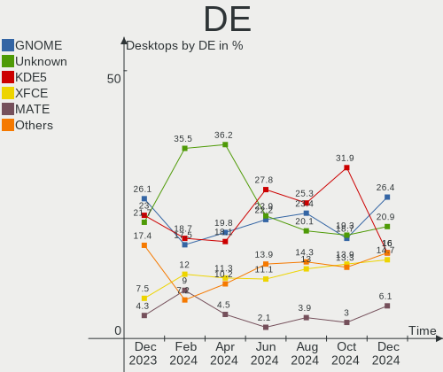
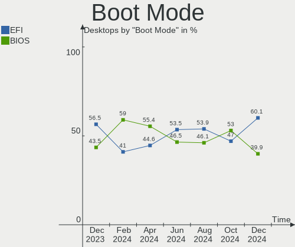
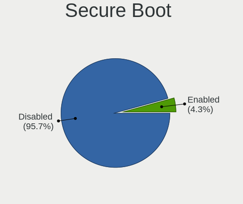
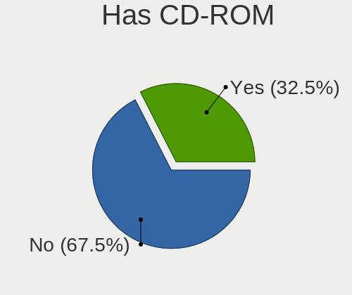
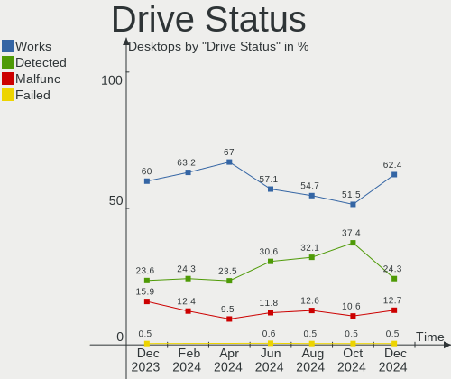
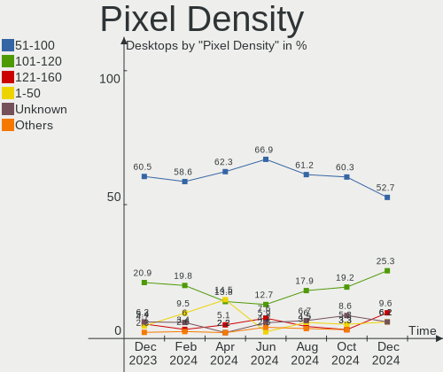
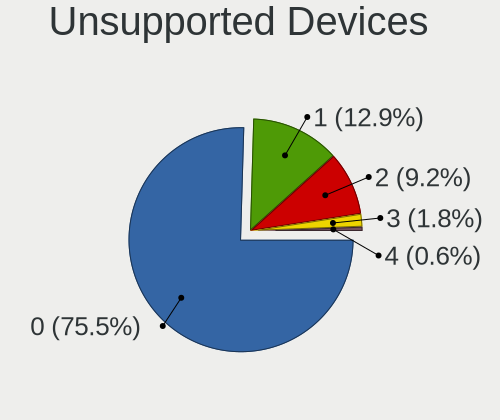
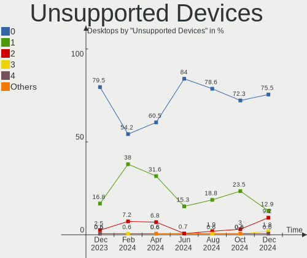

Debian - Hardware Trends (Desktops)
-----------------------------------

A project to identify most popular hardware characteristics and track their change
over time based on data collected by Linux users at https://Linux-Hardware.org.

Anyone can contribute to this report by the [hw-probe](https://github.com/linuxhw/hw-probe) tool:

    sudo -E hw-probe -all -upload

This report is for one last month. Overall report since the beginning of time: [TestDays](https://github.com/linuxhw/TestDays)

Period: Dec, 2024.

Contents
--------

* [ System ](#system)
  - [ OS                       ](#os)
  - [ OS Family                ](#os-family)
  - [ Kernel                   ](#kernel)
  - [ Kernel Family            ](#kernel-family)
  - [ Kernel Major Ver.        ](#kernel-major-ver)
  - [ Arch                     ](#arch)
  - [ DE                       ](#de)
  - [ Display Server           ](#display-server)
  - [ Display Manager          ](#display-manager)
  - [ OS Lang                  ](#os-lang)
  - [ Boot Mode                ](#boot-mode)
  - [ Filesystem               ](#filesystem)
  - [ Part. scheme             ](#part-scheme)
  - [ Dual Boot with Linux/BSD ](#dual-boot-with-linuxbsd)
  - [ Dual Boot (Win)          ](#dual-boot-win)

* [ Board ](#board)
  - [ Vendor                   ](#vendor)
  - [ Model                    ](#model)
  - [ Model Family             ](#model-family)
  - [ MFG Year                 ](#mfg-year)
  - [ Form Factor              ](#form-factor)
  - [ Secure Boot              ](#secure-boot)
  - [ Coreboot                 ](#coreboot)
  - [ RAM Size                 ](#ram-size)
  - [ RAM Used                 ](#ram-used)
  - [ Total Drives             ](#total-drives)
  - [ Has CD-ROM               ](#has-cd-rom)
  - [ Has Ethernet             ](#has-ethernet)
  - [ Has WiFi                 ](#has-wifi)
  - [ Has Bluetooth            ](#has-bluetooth)

* [ Location ](#location)
  - [ Country                  ](#country)
  - [ City                     ](#city)

* [ Drives ](#drives)
  - [ Drive Vendor             ](#drive-vendor)
  - [ Drive Model              ](#drive-model)
  - [ HDD Vendor               ](#hdd-vendor)
  - [ SSD Vendor               ](#ssd-vendor)
  - [ Drive Kind               ](#drive-kind)
  - [ Drive Connector          ](#drive-connector)
  - [ Drive Size               ](#drive-size)
  - [ Space Total              ](#space-total)
  - [ Space Used               ](#space-used)
  - [ Malfunc. Drives          ](#malfunc-drives)
  - [ Malfunc. Drive Vendor    ](#malfunc-drive-vendor)
  - [ Malfunc. HDD Vendor      ](#malfunc-hdd-vendor)
  - [ Malfunc. Drive Kind      ](#malfunc-drive-kind)
  - [ Failed Drives            ](#failed-drives)
  - [ Failed Drive Vendor      ](#failed-drive-vendor)
  - [ Drive Status             ](#drive-status)

* [ Storage controller ](#storage-controller)
  - [ Storage Vendor           ](#storage-vendor)
  - [ Storage Model            ](#storage-model)
  - [ Storage Kind             ](#storage-kind)

* [ Processor ](#processor)
  - [ CPU Vendor               ](#cpu-vendor)
  - [ CPU Model                ](#cpu-model)
  - [ CPU Model Family         ](#cpu-model-family)
  - [ CPU Cores                ](#cpu-cores)
  - [ CPU Sockets              ](#cpu-sockets)
  - [ CPU Threads              ](#cpu-threads)
  - [ CPU Op-Modes             ](#cpu-op-modes)
  - [ CPU Microcode            ](#cpu-microcode)
  - [ CPU Microarch            ](#cpu-microarch)

* [ Graphics ](#graphics)
  - [ GPU Vendor               ](#gpu-vendor)
  - [ GPU Model                ](#gpu-model)
  - [ GPU Combo                ](#gpu-combo)
  - [ GPU Driver               ](#gpu-driver)
  - [ GPU Memory               ](#gpu-memory)

* [ Monitor ](#monitor)
  - [ Monitor Vendor           ](#monitor-vendor)
  - [ Monitor Model            ](#monitor-model)
  - [ Monitor Resolution       ](#monitor-resolution)
  - [ Monitor Diagonal         ](#monitor-diagonal)
  - [ Monitor Width            ](#monitor-width)
  - [ Aspect Ratio             ](#aspect-ratio)
  - [ Monitor Area             ](#monitor-area)
  - [ Pixel Density            ](#pixel-density)
  - [ Multiple Monitors        ](#multiple-monitors)

* [ Network ](#network)
  - [ Net Controller Vendor    ](#net-controller-vendor)
  - [ Net Controller Model     ](#net-controller-model)
  - [ Wireless Vendor          ](#wireless-vendor)
  - [ Wireless Model           ](#wireless-model)
  - [ Ethernet Vendor          ](#ethernet-vendor)
  - [ Ethernet Model           ](#ethernet-model)
  - [ Net Controller Kind      ](#net-controller-kind)
  - [ Used Controller          ](#used-controller)
  - [ NICs                     ](#nics)
  - [ IPv6                     ](#ipv6)

* [ Bluetooth ](#bluetooth)
  - [ Bluetooth Vendor         ](#bluetooth-vendor)
  - [ Bluetooth Model          ](#bluetooth-model)

* [ Sound ](#sound)
  - [ Sound Vendor             ](#sound-vendor)
  - [ Sound Model              ](#sound-model)

* [ Memory ](#memory)
  - [ Memory Vendor            ](#memory-vendor)
  - [ Memory Model             ](#memory-model)
  - [ Memory Kind              ](#memory-kind)
  - [ Memory Form Factor       ](#memory-form-factor)
  - [ Memory Size              ](#memory-size)
  - [ Memory Speed             ](#memory-speed)

* [ Printers & scanners ](#printers--scanners)
  - [ Printer Vendor           ](#printer-vendor)
  - [ Printer Model            ](#printer-model)
  - [ Scanner Vendor           ](#scanner-vendor)
  - [ Scanner Model            ](#scanner-model)

* [ Camera ](#camera)
  - [ Camera Vendor            ](#camera-vendor)
  - [ Camera Model             ](#camera-model)

* [ Security ](#security)
  - [ Fingerprint Vendor       ](#fingerprint-vendor)
  - [ Fingerprint Model        ](#fingerprint-model)
  - [ Chipcard Vendor          ](#chipcard-vendor)
  - [ Chipcard Model           ](#chipcard-model)

* [ Unsupported ](#unsupported)
  - [ Unsupported Devices      ](#unsupported-devices)
  - [ Unsupported Device Types ](#unsupported-device-types)

System
------

OS
--

Installed operating systems

| Name      | Desktops | Percent |
|-----------|----------|---------|
| Debian 12 | 125      | 76.69%  |
| Debian    | 29       | 17.79%  |
| Debian 11 | 6        | 3.68%   |
| Debian 9  | 3        | 1.84%   |

OS Family
---------

OS without a version

| Name   | Desktops | Percent |
|--------|----------|---------|
| Debian | 163      | 100%    |

Kernel
------

Version of the Linux kernel

| Version                   | Desktops | Percent |
|---------------------------|----------|---------|
| 6.1.0-28-amd64            | 64       | 39.26%  |
| 6.1.0-27-amd64            | 16       | 9.82%   |
| 6.11.10-amd64             | 14       | 8.59%   |
| 6.8.12-4-pve              | 7        | 4.29%   |
| 6.12.6-amd64              | 4        | 2.45%   |
| 6.11.5+bpo-amd64          | 4        | 2.45%   |
| 6.1.0-18-amd64            | 4        | 2.45%   |
| 5.10.0-33-amd64           | 4        | 2.45%   |
| 6.8.12-5-pve              | 3        | 1.84%   |
| 4.19.0-6-amd64            | 3        | 1.84%   |
| 6.8.4-2-pve               | 2        | 1.23%   |
| 6.12.5-amd64              | 2        | 1.23%   |
| 6.12.3-amd64              | 2        | 1.23%   |
| 6.11.9-loong64            | 2        | 1.23%   |
| 6.11.10+bpo-amd64         | 2        | 1.23%   |
| 6.11.0-1-pve              | 2        | 1.23%   |
| 6.1.0-28-686-pae          | 2        | 1.23%   |
| 6.1.0-25-amd64            | 2        | 1.23%   |
| 6.9.7+bpo-amd64           | 1        | 0.61%   |
| 6.8.12-i7                 | 1        | 0.61%   |
| 6.6.44-production+truenas | 1        | 0.61%   |
| 6.6.15-amd64              | 1        | 0.61%   |
| 6.5.11-4-pve              | 1        | 0.61%   |
| 6.12.6-zabbly+            | 1        | 0.61%   |
| 6.12.4-1-liquorix-amd64   | 1        | 0.61%   |
| 6.12.3-loong64            | 1        | 0.61%   |
| 6.11.2-amd64              | 1        | 0.61%   |
| 6.11.10-qcmm              | 1        | 0.61%   |
| 6.10.3-amd64              | 1        | 0.61%   |
| 6.10.11-amd64             | 1        | 0.61%   |
| 6.10.11+bpo-amd64         | 1        | 0.61%   |
| 6.1.67-mos-amd64          | 1        | 0.61%   |
| 6.1.119-2-Trueno          | 1        | 0.61%   |
| 6.1.0-9-amd64             | 1        | 0.61%   |
| 6.1.0-28-rt-amd64         | 1        | 0.61%   |
| 6.1.0-23-powerpc64le      | 1        | 0.61%   |
| 6.1.0-17-amd64            | 1        | 0.61%   |
| 6.1.0-15-amd64            | 1        | 0.61%   |
| 6.1.0-10-amd64            | 1        | 0.61%   |
| 5.14.0-4mx-amd64          | 1        | 0.61%   |

Kernel Family
-------------

Linux kernel without a distro release

| Version  | Desktops | Percent |
|----------|----------|---------|
| 6.1.0    | 94       | 57.67%  |
| 6.11.10  | 17       | 10.43%  |
| 6.8.12   | 11       | 6.75%   |
| 6.12.6   | 5        | 3.07%   |
| 5.10.0   | 5        | 3.07%   |
| 6.11.5   | 4        | 2.45%   |
| 6.12.3   | 3        | 1.84%   |
| 4.19.0   | 3        | 1.84%   |
| 6.8.4    | 2        | 1.23%   |
| 6.12.5   | 2        | 1.23%   |
| 6.11.9   | 2        | 1.23%   |
| 6.11.0   | 2        | 1.23%   |
| 6.10.11  | 2        | 1.23%   |
| 6.9.7    | 1        | 0.61%   |
| 6.6.44   | 1        | 0.61%   |
| 6.6.15   | 1        | 0.61%   |
| 6.5.11   | 1        | 0.61%   |
| 6.12.4   | 1        | 0.61%   |
| 6.11.2   | 1        | 0.61%   |
| 6.10.3   | 1        | 0.61%   |
| 6.1.67   | 1        | 0.61%   |
| 6.1.119  | 1        | 0.61%   |
| 5.14.0   | 1        | 0.61%   |
| 5.10.199 | 1        | 0.61%   |

Kernel Major Ver.
-----------------

Linux kernel major version

| Version | Desktops | Percent |
|---------|----------|---------|
| 6.1     | 96       | 58.9%   |
| 6.11    | 26       | 15.95%  |
| 6.8     | 13       | 7.98%   |
| 6.12    | 11       | 6.75%   |
| 5.10    | 6        | 3.68%   |
| 6.10    | 3        | 1.84%   |
| 4.19    | 3        | 1.84%   |
| 6.6     | 2        | 1.23%   |
| 6.9     | 1        | 0.61%   |
| 6.5     | 1        | 0.61%   |
| 5.14    | 1        | 0.61%   |

Arch
----

OS architecture (x86_64, i586, etc.)

| Name        | Desktops | Percent |
|-------------|----------|---------|
| x86_64      | 157      | 96.32%  |
| loongarch64 | 3        | 1.84%   |
| i686        | 2        | 1.23%   |
| ppc64le     | 1        | 0.61%   |

DE
--

Desktop Environment

| Name             | Desktops | Percent |
|------------------|----------|---------|
| GNOME            | 43       | 26.38%  |
| Unknown          | 34       | 20.86%  |
| KDE5             | 26       | 15.95%  |
| XFCE             | 24       | 14.72%  |
| MATE             | 10       | 6.13%   |
| Cinnamon         | 7        | 4.29%   |
| X-Cinnamon       | 4        | 2.45%   |
| KDE6             | 4        | 2.45%   |
| LXDE             | 3        | 1.84%   |
| LXQt             | 2        | 1.23%   |
| Trinity          | 1        | 0.61%   |
| lightdm-xsession | 1        | 0.61%   |
| KDE              | 1        | 0.61%   |
| icewm            | 1        | 0.61%   |
| i3               | 1        | 0.61%   |
| Budgie           | 1        | 0.61%   |

Display Server
--------------

X11 or Wayland

| Name    | Desktops | Percent |
|---------|----------|---------|
| X11     | 87       | 53.37%  |
| Wayland | 36       | 22.09%  |
| Tty     | 32       | 19.63%  |
| Unknown | 8        | 4.91%   |

Display Manager
---------------

SDDM, LightDM, etc.

| Name    | Desktops | Percent |
|---------|----------|---------|
| Unknown | 63       | 38.65%  |
| LightDM | 39       | 23.93%  |
| GDM3    | 34       | 20.86%  |
| SDDM    | 21       | 12.88%  |
| GDM     | 4        | 2.45%   |
| WDM     | 1        | 0.61%   |
| TDM     | 1        | 0.61%   |

OS Lang
-------

Language

| Lang    | Desktops | Percent |
|---------|----------|---------|
| en_US   | 83       | 50.92%  |
| fr_FR   | 13       | 7.98%   |
| ru_RU   | 10       | 6.13%   |
| de_DE   | 10       | 6.13%   |
| it_IT   | 5        | 3.07%   |
| Unknown | 5        | 3.07%   |
| en_GB   | 4        | 2.45%   |
| C       | 4        | 2.45%   |
| es_ES   | 3        | 1.84%   |
| en_AU   | 3        | 1.84%   |
| pl_PL   | 2        | 1.23%   |
| es_MX   | 2        | 1.23%   |
| cs_CZ   | 2        | 1.23%   |
| tr_TR   | 1        | 0.61%   |
| sr_RS   | 1        | 0.61%   |
| ru_UA   | 1        | 0.61%   |
| pt_BR   | 1        | 0.61%   |
| ja_JP   | 1        | 0.61%   |
| fr_CA   | 1        | 0.61%   |
| fr_BE   | 1        | 0.61%   |
| es_UY   | 1        | 0.61%   |
| es_PE   | 1        | 0.61%   |
| es_CL   | 1        | 0.61%   |
| en_NZ   | 1        | 0.61%   |
| en_IN   | 1        | 0.61%   |
| en_HK   | 1        | 0.61%   |
| en_DK   | 1        | 0.61%   |
| en_CA   | 1        | 0.61%   |
| el_GR   | 1        | 0.61%   |
| ar_EG   | 1        | 0.61%   |

Boot Mode
---------

EFI or BIOS

| Mode | Desktops | Percent |
|------|----------|---------|
| EFI  | 98       | 60.12%  |
| BIOS | 65       | 39.88%  |

Filesystem
----------

Type of filesystem

| Type    | Desktops | Percent |
|---------|----------|---------|
| Ext4    | 144      | 88.34%  |
| Overlay | 7        | 4.29%   |
| Zfs     | 4        | 2.45%   |
| Btrfs   | 4        | 2.45%   |
| Xfs     | 1        | 0.61%   |
| Ext2    | 1        | 0.61%   |
| Aufs    | 1        | 0.61%   |
| Unknown | 1        | 0.61%   |

Part. scheme
------------

Scheme of partitioning

| Type    | Desktops | Percent |
|---------|----------|---------|
| GPT     | 110      | 67.48%  |
| Unknown | 32       | 19.63%  |
| MBR     | 21       | 12.88%  |

Dual Boot with Linux/BSD
------------------------

Hosting more than one Linux/BSD

| Dual boot | Desktops | Percent |
|-----------|----------|---------|
| No        | 134      | 82.21%  |
| Yes       | 29       | 17.79%  |

Dual Boot (Win)
---------------

Hosting Linux and Windows

| Dual boot | Desktops | Percent |
|-----------|----------|---------|
| No        | 133      | 81.6%   |
| Yes       | 30       | 18.4%   |

Board
-----

Vendor
------

Motherboard manufacturer

| Name                                 | Desktops | Percent |
|--------------------------------------|----------|---------|
| ASUSTek Computer                     | 29       | 17.79%  |
| Gigabyte Technology                  | 25       | 15.34%  |
| ASRock                               | 17       | 10.43%  |
| Hewlett-Packard                      | 16       | 9.82%   |
| MSI                                  | 14       | 8.59%   |
| Dell                                 | 10       | 6.13%   |
| Unknown                              | 10       | 6.13%   |
| Supermicro                           | 5        | 3.07%   |
| Lenovo                               | 5        | 3.07%   |
| AZW                                  | 5        | 3.07%   |
| Intel                                | 4        | 2.45%   |
| Loongson                             | 3        | 1.84%   |
| Shenzhen Meigao Electronic Equipment | 2        | 1.23%   |
| ZOTAC                                | 1        | 0.61%   |
| WTM                                  | 1        | 0.61%   |
| Win Element                          | 1        | 0.61%   |
| UGREEN                               | 1        | 0.61%   |
| TB                                   | 1        | 0.61%   |
| Sapphire                             | 1        | 0.61%   |
| OEM                                  | 1        | 0.61%   |
| MACHINIST                            | 1        | 0.61%   |
| JGINYUE                              | 1        | 0.61%   |
| Inventec                             | 1        | 0.61%   |
| ICP / iEi                            | 1        | 0.61%   |
| Haier                                | 1        | 0.61%   |
| GMKtec                               | 1        | 0.61%   |
| GEEKOM                               | 1        | 0.61%   |
| Fujitsu Siemens                      | 1        | 0.61%   |
| Foxconn                              | 1        | 0.61%   |
| EVGA                                 | 1        | 0.61%   |
| AMI                                  | 1        | 0.61%   |

Model
-----

Motherboard model

| Name                                              | Desktops | Percent |
|---------------------------------------------------|----------|---------|
| Unknown                                           | 10       | 6.13%   |
| HP ProDesk 400 G4 DM                              | 4        | 2.45%   |
| AZW LZX                                           | 3        | 1.84%   |
| Supermicro SYS-6018U-TR4+                         | 2        | 1.23%   |
| Supermicro SYS-111R-M                             | 2        | 1.23%   |
| Shenzhen Meigao Electronic Equipment Venus series | 2        | 1.23%   |
| MSI MS-7E07                                       | 2        | 1.23%   |
| Intel X99                                         | 2        | 1.23%   |
| HP EliteDesk 800 G1 SFF                           | 2        | 1.23%   |
| ASUS TUF Gaming Z790-PLUS WIFI                    | 2        | 1.23%   |
| ASUS TUF Gaming X570-PLUS                         | 2        | 1.23%   |
| ASUS All Series                                   | 2        | 1.23%   |
| ASRock X399 Taichi                                | 2        | 1.23%   |
| ZOTAC NM10                                        | 1        | 0.61%   |
| WTM W-N95-R                                       | 1        | 0.61%   |
| Win Element M6                                    | 1        | 0.61%   |
| UGREEN DXP8800 Plus                               | 1        | 0.61%   |
| TB WTR R1                                         | 1        | 0.61%   |
| Supermicro Rackform U633.v6                       | 1        | 0.61%   |
| Sapphire PI-AM3RS760G2                            | 1        | 0.61%   |
| OEM B75                                           | 1        | 0.61%   |
| MSI MS-7D78                                       | 1        | 0.61%   |
| MSI MS-7D75                                       | 1        | 0.61%   |
| MSI MS-7D41                                       | 1        | 0.61%   |
| MSI MS-7D33                                       | 1        | 0.61%   |
| MSI MS-7C91                                       | 1        | 0.61%   |
| MSI MS-7B78                                       | 1        | 0.61%   |
| MSI MS-7B48                                       | 1        | 0.61%   |
| MSI MS-7A37                                       | 1        | 0.61%   |
| MSI MS-7977                                       | 1        | 0.61%   |
| MSI MS-7793                                       | 1        | 0.61%   |
| MSI MS-7514                                       | 1        | 0.61%   |
| MSI MS-7309                                       | 1        | 0.61%   |
| MACHINIST X99 PR8                                 | 1        | 0.61%   |
| Loongson CTCI02LS3A6000C-K                        | 1        | 0.61%   |
| Loongson 3A6000-HV-7A2000-NUC                     | 1        | 0.61%   |
| Loongson 3A6000-HV-7A2000-1w-V0.1-EVB             | 1        | 0.61%   |
| Lenovo ThinkStation P7 30F3000UGE                 | 1        | 0.61%   |
| Lenovo ThinkCentre M83 10AHS35300                 | 1        | 0.61%   |
| Lenovo ThinkCentre M75s Gen 5 12TACTO1WW          | 1        | 0.61%   |

Model Family
------------

Motherboard model prefix

| Name                                       | Desktops | Percent |
|--------------------------------------------|----------|---------|
| Unknown                                    | 10       | 6.13%   |
| HP ProDesk                                 | 8        | 4.91%   |
| ASUS TUF                                   | 8        | 4.91%   |
| Dell OptiPlex                              | 7        | 4.29%   |
| ASUS PRIME                                 | 6        | 3.68%   |
| HP EliteDesk                               | 4        | 2.45%   |
| ASUS ROG                                   | 4        | 2.45%   |
| HP Compaq                                  | 3        | 1.84%   |
| Gigabyte B450M                             | 3        | 1.84%   |
| Dell Precision                             | 3        | 1.84%   |
| AZW LZX                                    | 3        | 1.84%   |
| Supermicro SYS-6018U-TR4+                  | 2        | 1.23%   |
| Supermicro SYS-111R-M                      | 2        | 1.23%   |
| Shenzhen Meigao Electronic Equipment Venus | 2        | 1.23%   |
| MSI MS-7E07                                | 2        | 1.23%   |
| Lenovo ThinkCentre                         | 2        | 1.23%   |
| Lenovo IdeaCentre                          | 2        | 1.23%   |
| Intel X99                                  | 2        | 1.23%   |
| Gigabyte B550                              | 2        | 1.23%   |
| ASUS ProArt                                | 2        | 1.23%   |
| ASUS Pro                                   | 2        | 1.23%   |
| ASUS All                                   | 2        | 1.23%   |
| ASRock X399                                | 2        | 1.23%   |
| ASRock B450                                | 2        | 1.23%   |
| ZOTAC NM10                                 | 1        | 0.61%   |
| WTM W-N95-R                                | 1        | 0.61%   |
| Win Element M6                             | 1        | 0.61%   |
| UGREEN DXP8800                             | 1        | 0.61%   |
| TB WTR                                     | 1        | 0.61%   |
| Supermicro Rackform                        | 1        | 0.61%   |
| Sapphire PI-AM3RS760G2                     | 1        | 0.61%   |
| OEM B75                                    | 1        | 0.61%   |
| MSI MS-7D78                                | 1        | 0.61%   |
| MSI MS-7D75                                | 1        | 0.61%   |
| MSI MS-7D41                                | 1        | 0.61%   |
| MSI MS-7D33                                | 1        | 0.61%   |
| MSI MS-7C91                                | 1        | 0.61%   |
| MSI MS-7B78                                | 1        | 0.61%   |
| MSI MS-7B48                                | 1        | 0.61%   |
| MSI MS-7A37                                | 1        | 0.61%   |

MFG Year
--------

Motherboard manufacture year

| Year    | Desktops | Percent |
|---------|----------|---------|
| 2023    | 25       | 15.34%  |
| 2022    | 20       | 12.27%  |
| 2024    | 14       | 8.59%   |
| 2020    | 14       | 8.59%   |
| 2018    | 14       | 8.59%   |
| 2021    | 13       | 7.98%   |
| 2013    | 10       | 6.13%   |
| 2017    | 8        | 4.91%   |
| 2014    | 8        | 4.91%   |
| 2012    | 7        | 4.29%   |
| 2011    | 5        | 3.07%   |
| 2010    | 5        | 3.07%   |
| 2019    | 4        | 2.45%   |
| 2009    | 4        | 2.45%   |
| Unknown | 4        | 2.45%   |
| 2015    | 3        | 1.84%   |
| 2007    | 2        | 1.23%   |
| 2006    | 2        | 1.23%   |
| 2004    | 1        | 0.61%   |

Form Factor
-----------

Physical design of the computer

| Name    | Desktops | Percent |
|---------|----------|---------|
| Desktop | 163      | 100%    |

Secure Boot
-----------

Enabled or disabled

| State    | Desktops | Percent |
|----------|----------|---------|
| Disabled | 156      | 95.71%  |
| Enabled  | 7        | 4.29%   |

Coreboot
--------

Have coreboot on board

| Used | Desktops | Percent |
|------|----------|---------|
| No   | 163      | 100%    |

RAM Size
--------

Total RAM memory

| Size in GB      | Desktops | Percent |
|-----------------|----------|---------|
| 32.01-64.0      | 47       | 28.83%  |
| 16.01-24.0      | 35       | 21.47%  |
| 4.01-8.0        | 22       | 13.5%   |
| 64.01-256.0     | 22       | 13.5%   |
| 8.01-16.0       | 12       | 7.36%   |
| 24.01-32.0      | 11       | 6.75%   |
| 3.01-4.0        | 5        | 3.07%   |
| 1.01-2.0        | 5        | 3.07%   |
| 2.01-3.0        | 2        | 1.23%   |
| More than 256.0 | 1        | 0.61%   |
| 0.51-1.0        | 1        | 0.61%   |

RAM Used
--------

Used RAM memory

| Used GB     | Desktops | Percent |
|-------------|----------|---------|
| 4.01-8.0    | 38       | 23.31%  |
| 1.01-2.0    | 31       | 19.02%  |
| 2.01-3.0    | 30       | 18.4%   |
| 3.01-4.0    | 23       | 14.11%  |
| 8.01-16.0   | 14       | 8.59%   |
| 0.51-1.0    | 14       | 8.59%   |
| 16.01-24.0  | 5        | 3.07%   |
| 24.01-32.0  | 3        | 1.84%   |
| 32.01-64.0  | 2        | 1.23%   |
| 0.01-0.5    | 2        | 1.23%   |
| 64.01-256.0 | 1        | 0.61%   |

Total Drives
------------

Number of drives on board

| Drives | Desktops | Percent |
|--------|----------|---------|
| 1      | 65       | 39.88%  |
| 2      | 46       | 28.22%  |
| 3      | 22       | 13.5%   |
| 4      | 13       | 7.98%   |
| 5      | 8        | 4.91%   |
| 7      | 3        | 1.84%   |
| 6      | 3        | 1.84%   |
| 10     | 1        | 0.61%   |
| 8      | 1        | 0.61%   |
| 0      | 1        | 0.61%   |

Has CD-ROM
----------

Has CD-ROM on board

| Presented | Desktops | Percent |
|-----------|----------|---------|
| No        | 110      | 67.48%  |
| Yes       | 53       | 32.52%  |

Has Ethernet
------------

Has Ethernet on board

| Presented | Desktops | Percent |
|-----------|----------|---------|
| Yes       | 163      | 100%    |

Has WiFi
--------

Has WiFi module

| Presented | Desktops | Percent |
|-----------|----------|---------|
| No        | 93       | 57.06%  |
| Yes       | 70       | 42.94%  |

Has Bluetooth
-------------

Has Bluetooth module

| Presented | Desktops | Percent |
|-----------|----------|---------|
| No        | 100      | 61.35%  |
| Yes       | 63       | 38.65%  |

Location
--------

Country
-------

Geographic location (country)

| Country      | Desktops | Percent |
|--------------|----------|---------|
| USA          | 31       | 19.02%  |
| Germany      | 16       | 9.82%   |
| France       | 15       | 9.2%    |
| Russia       | 13       | 7.98%   |
| China        | 8        | 4.91%   |
| UK           | 6        | 3.68%   |
| Canada       | 6        | 3.68%   |
| Austria      | 6        | 3.68%   |
| Italy        | 5        | 3.07%   |
| Brazil       | 5        | 3.07%   |
| Spain        | 4        | 2.45%   |
| Czechia      | 4        | 2.45%   |
| Australia    | 4        | 2.45%   |
| Romania      | 3        | 1.84%   |
| Poland       | 3        | 1.84%   |
| Netherlands  | 3        | 1.84%   |
| Japan        | 3        | 1.84%   |
| Finland      | 3        | 1.84%   |
| Ukraine      | 2        | 1.23%   |
| Mexico       | 2        | 1.23%   |
| Kazakhstan   | 2        | 1.23%   |
| Denmark      | 2        | 1.23%   |
| Belgium      | 2        | 1.23%   |
| Turkey       | 1        | 0.61%   |
| Taiwan       | 1        | 0.61%   |
| Serbia       | 1        | 0.61%   |
| Saudi Arabia | 1        | 0.61%   |
| Peru         | 1        | 0.61%   |
| Pakistan     | 1        | 0.61%   |
| Norway       | 1        | 0.61%   |
| New Zealand  | 1        | 0.61%   |
| Latvia       | 1        | 0.61%   |
| Hong Kong    | 1        | 0.61%   |
| Greece       | 1        | 0.61%   |
| Egypt        | 1        | 0.61%   |
| Croatia      | 1        | 0.61%   |
| Chile        | 1        | 0.61%   |
| Bulgaria     | 1        | 0.61%   |

City
----

Geographic location (city)

| City                   | Desktops | Percent |
|------------------------|----------|---------|
| Bagneux                | 5        | 3.07%   |
| Prague                 | 4        | 2.45%   |
| Kunming                | 4        | 2.45%   |
| Vienna                 | 3        | 1.84%   |
| Martinez               | 3        | 1.84%   |
| Los Angeles            | 3        | 1.84%   |
| Florianópolis         | 3        | 1.84%   |
| Wenshan City           | 2        | 1.23%   |
| St Petersburg          | 2        | 1.23%   |
| Shymkent               | 2        | 1.23%   |
| New York               | 2        | 1.23%   |
| Munich                 | 2        | 1.23%   |
| Moscow                 | 2        | 1.23%   |
| Melbourne              | 2        | 1.23%   |
| Mainz                  | 2        | 1.23%   |
| Linz                   | 2        | 1.23%   |
| Leipzig                | 2        | 1.23%   |
| Cardiff                | 2        | 1.23%   |
| Bucharest              | 2        | 1.23%   |
| Berlin                 | 2        | 1.23%   |
| Barcelona              | 2        | 1.23%   |
| Ann Arbor              | 2        | 1.23%   |
| Amsterdam              | 2        | 1.23%   |
| Zhubei                 | 1        | 0.61%   |
| Wroclaw                | 1        | 0.61%   |
| Wijnegem               | 1        | 0.61%   |
| Warsaw                 | 1        | 0.61%   |
| Warrnambool            | 1        | 0.61%   |
| Vladimir               | 1        | 0.61%   |
| Villingen-Schwenningen | 1        | 0.61%   |
| Verrieres-le-Buisson   | 1        | 0.61%   |
| Varaždin              | 1        | 0.61%   |
| Vancouver              | 1        | 0.61%   |
| Ulyanovsk              | 1        | 0.61%   |
| Turin                  | 1        | 0.61%   |
| Tula                   | 1        | 0.61%   |
| Trinidad               | 1        | 0.61%   |
| Toyosu                 | 1        | 0.61%   |
| Toronto                | 1        | 0.61%   |
| Tokushima              | 1        | 0.61%   |

Drives
------

Drive Vendor
------------

Hard drive vendors

| Vendor                      | Desktops | Drives | Percent |
|-----------------------------|----------|--------|---------|
| Samsung Electronics         | 46       | 71     | 16.73%  |
| WDC                         | 41       | 60     | 14.91%  |
| Seagate                     | 38       | 56     | 13.82%  |
| Crucial                     | 16       | 19     | 5.82%   |
| Kingston                    | 14       | 16     | 5.09%   |
| Toshiba                     | 12       | 21     | 4.36%   |
| SanDisk                     | 12       | 15     | 4.36%   |
| SPCC                        | 7        | 7      | 2.55%   |
| Kingston Technology Company | 6        | 8      | 2.18%   |
| A-DATA Technology           | 6        | 8      | 2.18%   |
| Hitachi                     | 5        | 9      | 1.82%   |
| Patriot                     | 4        | 4      | 1.45%   |
| Lexar                       | 4        | 4      | 1.45%   |
| Intel                       | 4        | 11     | 1.45%   |
| HGST                        | 4        | 4      | 1.45%   |
| China                       | 4        | 4      | 1.45%   |
| Unknown                     | 3        | 3      | 1.09%   |
| Transcend                   | 3        | 3      | 1.09%   |
| SK hynix                    | 3        | 3      | 1.09%   |
| Intenso                     | 3        | 3      | 1.09%   |
| Fanxiang                    | 3        | 5      | 1.09%   |
| Unknown                     | 3        | 3      | 1.09%   |
| ZHITAI                      | 2        | 2      | 0.73%   |
| YMTC                        | 2        | 2      | 0.73%   |
| Micron Technology           | 2        | 3      | 0.73%   |
| Maxtor                      | 2        | 2      | 0.73%   |
| MAXIO Technology (Hangzhou) | 2        | 2      | 0.73%   |
| Corsair                     | 2        | 2      | 0.73%   |
| XPG                         | 1        | 1      | 0.36%   |
| SD                          | 1        | 1      | 0.36%   |
| PNY                         | 1        | 1      | 0.36%   |
| Phison Electronics          | 1        | 1      | 0.36%   |
| Phison                      | 1        | 1      | 0.36%   |
| OWC                         | 1        | 1      | 0.36%   |
| Netac                       | 1        | 1      | 0.36%   |
| MSI                         | 1        | 1      | 0.36%   |
| MKNSSDRE                    | 1        | 1      | 0.36%   |
| KIOXIA                      | 1        | 1      | 0.36%   |
| INTEL SS                    | 1        | 1      | 0.36%   |
| HPE                         | 1        | 1      | 0.36%   |

Drive Model
-----------

Hard drive models

| Model                                                | Desktops | Percent |
|------------------------------------------------------|----------|---------|
| SPCC Solid State Disk 256GB                          | 4        | 1.22%   |
| Seagate ST8000DM004-2U9188 8TB                       | 4        | 1.22%   |
| WDC WDS250G2B0A-00SM50 250GB SSD                     | 3        | 0.92%   |
| Seagate ST1000DM010-2EP102 1TB                       | 3        | 0.92%   |
| SanDisk NVMe SSD Drive 2TB                           | 3        | 0.92%   |
| Samsung SSD 990 PRO 2TB                              | 3        | 0.92%   |
| Samsung SSD 990 PRO 1TB                              | 3        | 0.92%   |
| Samsung SSD 850 EVO 500GB                            | 3        | 0.92%   |
| Samsung NVMe SSD Controller PM9A1/PM9A3/980PRO 512GB | 3        | 0.92%   |
| Kingston Company SNV2S1000G 1TB                      | 3        | 0.92%   |
| Unknown                                              | 3        | 0.92%   |
| YMTC PC005 512GB                                     | 2        | 0.61%   |
| WDC WDS480G2G0C-00AJM0 480GB                         | 2        | 0.61%   |
| WDC WDS100T2B0C-00PXH0 1TB                           | 2        | 0.61%   |
| WDC WDS100T2B0A-00SM50 1TB SSD                       | 2        | 0.61%   |
| WDC WDS100T1X0E-00AFY0 1TB                           | 2        | 0.61%   |
| WDC WD40EZRZ-00GXCB0 4TB                             | 2        | 0.61%   |
| WDC WD20EZRZ-00Z5HB0 2TB                             | 2        | 0.61%   |
| Toshiba MG08ACA16TE 16TB                             | 2        | 0.61%   |
| Toshiba DT01ACA300 3TB                               | 2        | 0.61%   |
| Seagate ST500DM002-1BD142 500GB                      | 2        | 0.61%   |
| Seagate ST3320620AS 320GB                            | 2        | 0.61%   |
| SanDisk NVMe SSD Drive 1TB                           | 2        | 0.61%   |
| Samsung SSD PM830 2.5 7mm 128GB                      | 2        | 0.61%   |
| Samsung SSD 990 PRO 4TB                              | 2        | 0.61%   |
| Samsung SSD 980 PRO 2TB                              | 2        | 0.61%   |
| Samsung SSD 970 EVO Plus 250GB                       | 2        | 0.61%   |
| Samsung SSD 970 EVO Plus 1TB                         | 2        | 0.61%   |
| Samsung SSD 870 EVO 500GB                            | 2        | 0.61%   |
| Samsung SSD 870 EVO 2TB                              | 2        | 0.61%   |
| Samsung SSD 840 EVO 500GB                            | 2        | 0.61%   |
| Samsung SSD 840 EVO 1TB                              | 2        | 0.61%   |
| Samsung NVMe SSD Controller SM981/PM981/PM983 512GB  | 2        | 0.61%   |
| Lexar SSD NM6A1 512GB                                | 2        | 0.61%   |
| Kingston Company SNV2S250G 250GB                     | 2        | 0.61%   |
| Kingston SKC3000D2048G 2TB                           | 2        | 0.61%   |
| Kingston SA400S37480G 480GB SSD                      | 2        | 0.61%   |
| Crucial CT240BX500SSD1 240GB                         | 2        | 0.61%   |
| Crucial CT1000T500SSD8 1TB                           | 2        | 0.61%   |
| Crucial CT1000P3PSSD8 1TB                            | 2        | 0.61%   |

HDD Vendor
----------

Hard disk drive vendors

| Vendor              | Desktops | Drives | Percent |
|---------------------|----------|--------|---------|
| Seagate             | 37       | 55     | 40.22%  |
| WDC                 | 28       | 42     | 30.43%  |
| Toshiba             | 11       | 20     | 11.96%  |
| Hitachi             | 5        | 9      | 5.43%   |
| Samsung Electronics | 4        | 4      | 4.35%   |
| HGST                | 4        | 4      | 4.35%   |
| Maxtor              | 2        | 2      | 2.17%   |
| HPE                 | 1        | 1      | 1.09%   |

SSD Vendor
----------

Solid state drive vendors

| Vendor              | Desktops | Drives | Percent |
|---------------------|----------|--------|---------|
| Samsung Electronics | 20       | 28     | 21.51%  |
| WDC                 | 9        | 9      | 9.68%   |
| Crucial             | 8        | 8      | 8.6%    |
| Kingston            | 7        | 8      | 7.53%   |
| SPCC                | 6        | 6      | 6.45%   |
| SanDisk             | 4        | 7      | 4.3%    |
| China               | 4        | 4      | 4.3%    |
| A-DATA Technology   | 4        | 5      | 4.3%    |
| Transcend           | 3        | 3      | 3.23%   |
| Intel               | 3        | 10     | 3.23%   |
| Unknown             | 3        | 3      | 3.23%   |
| Intenso             | 2        | 2      | 2.15%   |
| Fanxiang            | 2        | 3      | 2.15%   |
| ZHITAI              | 1        | 1      | 1.08%   |
| Seagate             | 1        | 1      | 1.08%   |
| SD                  | 1        | 1      | 1.08%   |
| PNY                 | 1        | 1      | 1.08%   |
| Patriot             | 1        | 1      | 1.08%   |
| OWC                 | 1        | 1      | 1.08%   |
| Netac               | 1        | 1      | 1.08%   |
| Micron Technology   | 1        | 1      | 1.08%   |
| INTEL SS            | 1        | 1      | 1.08%   |
| Hewlett-Packard     | 1        | 1      | 1.08%   |
| Great               | 1        | 1      | 1.08%   |
| GOODRAM             | 1        | 2      | 1.08%   |
| Dahua               | 1        | 1      | 1.08%   |
| CT500MX5            | 1        | 1      | 1.08%   |
| Corsair             | 1        | 1      | 1.08%   |
| Colorful            | 1        | 1      | 1.08%   |
| BIWIN               | 1        | 1      | 1.08%   |
| Apacer              | 1        | 1      | 1.08%   |

Drive Kind
----------

HDD or SSD

| Kind    | Desktops | Drives | Percent |
|---------|----------|--------|---------|
| NVMe    | 86       | 116    | 35.1%   |
| SSD     | 82       | 115    | 33.47%  |
| HDD     | 72       | 137    | 29.39%  |
| Unknown | 4        | 4      | 1.63%   |
| MMC     | 1        | 1      | 0.41%   |

Drive Connector
---------------

SATA, SAS, NVMe, etc.

| Type | Desktops | Drives | Percent |
|------|----------|--------|---------|
| SATA | 121      | 241    | 55%     |
| NVMe | 86       | 116    | 39.09%  |
| SAS  | 12       | 15     | 5.45%   |
| MMC  | 1        | 1      | 0.45%   |

Drive Size
----------

Size of hard drive

| Size in TB | Desktops | Drives | Percent |
|------------|----------|--------|---------|
| 0.01-0.5   | 77       | 100    | 43.75%  |
| 0.51-1.0   | 42       | 58     | 23.86%  |
| 1.01-2.0   | 18       | 23     | 10.23%  |
| 4.01-10.0  | 16       | 36     | 9.09%   |
| 3.01-4.0   | 13       | 16     | 7.39%   |
| 2.01-3.0   | 5        | 11     | 2.84%   |
| 10.01-20.0 | 5        | 8      | 2.84%   |

Space Total
-----------

Amount of disk space available on the file system

| Size in GB     | Desktops | Percent |
|----------------|----------|---------|
| More than 3000 | 29       | 17.79%  |
| 101-250        | 27       | 16.56%  |
| 501-1000       | 27       | 16.56%  |
| 251-500        | 24       | 14.72%  |
| 1001-2000      | 16       | 9.82%   |
| 2001-3000      | 13       | 7.98%   |
| 51-100         | 11       | 6.75%   |
| Unknown        | 9        | 5.52%   |
| 1-20           | 5        | 3.07%   |
| 21-50          | 2        | 1.23%   |

Space Used
----------

Amount of used disk space

| Used GB        | Desktops | Percent |
|----------------|----------|---------|
| 1-20           | 49       | 30.06%  |
| 21-50          | 18       | 11.04%  |
| 501-1000       | 16       | 9.82%   |
| 1001-2000      | 15       | 9.2%    |
| 51-100         | 14       | 8.59%   |
| More than 3000 | 13       | 7.98%   |
| 251-500        | 12       | 7.36%   |
| 101-250        | 11       | 6.75%   |
| Unknown        | 9        | 5.52%   |
| 2001-3000      | 6        | 3.68%   |

Malfunc. Drives
---------------

Drive models with a malfunction

| Model                                          | Desktops | Drives | Percent |
|------------------------------------------------|----------|--------|---------|
| WDC WD5000AAKX-08U6AA0 500GB                   | 1        | 1      | 3.7%    |
| WDC WD3200BEKT-75PVMT1 320GB                   | 1        | 1      | 3.7%    |
| WDC WD3200AAJS-60M0A1 320GB                    | 1        | 1      | 3.7%    |
| WDC WD1600ADFS-75SLR2 160GB                    | 1        | 1      | 3.7%    |
| WDC WD Green 2.5 240GB SSD                     | 1        | 1      | 3.7%    |
| Toshiba MG08ACA16TE 16TB                       | 1        | 2      | 3.7%    |
| Toshiba HDWD110 1TB                            | 1        | 1      | 3.7%    |
| Toshiba DT01ACA300 3TB                         | 1        | 4      | 3.7%    |
| Seagate ST9500325AS 500GB                      | 1        | 1      | 3.7%    |
| Seagate ST8000DM005-2EH112 8TB                 | 1        | 1      | 3.7%    |
| Seagate ST500DM005 HD502HJ 500GB               | 1        | 1      | 3.7%    |
| Seagate ST3500418AS 500GB                      | 1        | 1      | 3.7%    |
| Seagate ST3320620AS 320GB                      | 1        | 2      | 3.7%    |
| Seagate ST31000520AS 1TB                       | 1        | 1      | 3.7%    |
| Seagate ST1000DM003-1ER162 1TB                 | 1        | 1      | 3.7%    |
| SanDisk SSD PLUS 240 GB                        | 1        | 1      | 3.7%    |
| Samsung Electronics SSD 870 EVO 500GB          | 1        | 1      | 3.7%    |
| Samsung Electronics SP1614N 160GB              | 1        | 1      | 3.7%    |
| Netac NS512GSSD340 512GB                       | 1        | 1      | 3.7%    |
| Micron Technology 1100_MTFDDAK512TBN 512GB SSD | 1        | 1      | 3.7%    |
| Maxtor 6L250M0 256GB                           | 1        | 1      | 3.7%    |
| Maxtor 2F040L0 41GB                            | 1        | 1      | 3.7%    |
| HPE MB0500EBNCR 500GB                          | 1        | 1      | 3.7%    |
| Hitachi HDT721010SLA360 1TB                    | 1        | 1      | 3.7%    |
| Hitachi HDP725050GLA360 500GB                  | 1        | 1      | 3.7%    |
| HGST HTS725050A7E630 500GB                     | 1        | 1      | 3.7%    |
| HGST HTS541010A9E680 1TB                       | 1        | 1      | 3.7%    |

Malfunc. Drive Vendor
---------------------

Vendors of faulty drives

| Vendor              | Desktops | Drives | Percent |
|---------------------|----------|--------|---------|
| Seagate             | 7        | 8      | 26.92%  |
| WDC                 | 4        | 5      | 15.38%  |
| Toshiba             | 3        | 7      | 11.54%  |
| Samsung Electronics | 2        | 2      | 7.69%   |
| Maxtor              | 2        | 2      | 7.69%   |
| Hitachi             | 2        | 2      | 7.69%   |
| HGST                | 2        | 2      | 7.69%   |
| SanDisk             | 1        | 1      | 3.85%   |
| Netac               | 1        | 1      | 3.85%   |
| Micron Technology   | 1        | 1      | 3.85%   |
| HPE                 | 1        | 1      | 3.85%   |

Malfunc. HDD Vendor
-------------------

Vendors of faulty HDD drives

| Vendor              | Desktops | Drives | Percent |
|---------------------|----------|--------|---------|
| Seagate             | 7        | 8      | 31.82%  |
| WDC                 | 4        | 4      | 18.18%  |
| Toshiba             | 3        | 7      | 13.64%  |
| Maxtor              | 2        | 2      | 9.09%   |
| Hitachi             | 2        | 2      | 9.09%   |
| HGST                | 2        | 2      | 9.09%   |
| Samsung Electronics | 1        | 1      | 4.55%   |
| HPE                 | 1        | 1      | 4.55%   |

Malfunc. Drive Kind
-------------------

Kinds of faulty drives

| Kind | Desktops | Drives | Percent |
|------|----------|--------|---------|
| HDD  | 20       | 27     | 80%     |
| SSD  | 5        | 5      | 20%     |

Failed Drives
-------------

Failed drive models

| Model                    | Desktops | Drives | Percent |
|--------------------------|----------|--------|---------|
| Seagate ST31000528AS 1TB | 1        | 1      | 100%    |

Failed Drive Vendor
-------------------

Failed drive vendors

| Vendor  | Desktops | Drives | Percent |
|---------|----------|--------|---------|
| Seagate | 1        | 1      | 100%    |

Drive Status
------------

Number of failed and malfunc. drives

| Status   | Desktops | Drives | Percent |
|----------|----------|--------|---------|
| Works    | 118      | 259    | 62.43%  |
| Detected | 46       | 81     | 24.34%  |
| Malfunc  | 24       | 32     | 12.7%   |
| Failed   | 1        | 1      | 0.53%   |

Storage controller
------------------

Storage Vendor
--------------

Storage controller vendors

| Vendor                                  | Desktops | Percent |
|-----------------------------------------|----------|---------|
| Intel                                   | 97       | 35.4%   |
| AMD                                     | 49       | 17.88%  |
| Samsung Electronics                     | 27       | 9.85%   |
| Sandisk                                 | 17       | 6.2%    |
| Kingston Technology Company             | 13       | 4.74%   |
| ASMedia Technology                      | 9        | 3.28%   |
| Micron/Crucial Technology               | 7        | 2.55%   |
| Phison Electronics                      | 6        | 2.19%   |
| Marvell Technology Group                | 6        | 2.19%   |
| MAXIO Technology (Hangzhou)             | 5        | 1.82%   |
| JMicron Technology                      | 5        | 1.82%   |
| Zhaoxin                                 | 4        | 1.46%   |
| Yangtze Memory Technologies             | 3        | 1.09%   |
| SK hynix                                | 3        | 1.09%   |
| Shenzhen Longsys Electronics            | 3        | 1.09%   |
| Loongson Technology                     | 3        | 1.09%   |
| ADATA Technology                        | 3        | 1.09%   |
| Silicon Motion                          | 2        | 0.73%   |
| Nvidia                                  | 2        | 0.73%   |
| Micron Technology                       | 2        | 0.73%   |
| VIA Technologies                        | 1        | 0.36%   |
| Toshiba America Info Systems            | 1        | 0.36%   |
| LSI Logic / Symbios Logic               | 1        | 0.36%   |
| KIOXIA                                  | 1        | 0.36%   |
| Jiangsu Xinsheng Intelligent Technology | 1        | 0.36%   |
| Broadcom / LSI                          | 1        | 0.36%   |
| Adaptec                                 | 1        | 0.36%   |
| Unknown                                 | 1        | 0.36%   |

Storage Model
-------------

Storage controller models

| Model                                                                          | Desktops | Percent |
|--------------------------------------------------------------------------------|----------|---------|
| AMD FCH SATA Controller [AHCI mode]                                            | 18       | 5.68%   |
| Intel Raptor Lake SATA AHCI Controller                                         | 12       | 3.79%   |
| AMD 600 Series Chipset SATA Controller                                         | 12       | 3.79%   |
| AMD 400 Series Chipset SATA Controller                                         | 10       | 3.15%   |
| Samsung NVMe SSD Controller S4LV008[Pascal]                                    | 9        | 2.84%   |
| Intel 8 Series/C220 Series Chipset Family 6-port SATA Controller 1 [AHCI mode] | 9        | 2.84%   |
| Samsung NVMe SSD Controller PM9A1/PM9A3/980PRO                                 | 8        | 2.52%   |
| Intel Cannon Lake PCH SATA AHCI Controller                                     | 8        | 2.52%   |
| AMD 500 Series Chipset SATA Controller                                         | 8        | 2.52%   |
| Samsung NVMe SSD Controller SM981/PM981/PM983                                  | 7        | 2.21%   |
| Intel Alder Lake-N SATA AHCI Controller                                        | 6        | 1.89%   |
| Intel 7 Series/C210 Series Chipset Family 6-port SATA Controller [AHCI mode]   | 6        | 1.89%   |
| ASMedia ASM1061/ASM1062 Serial ATA Controller                                  | 6        | 1.89%   |
| AMD SB7x0/SB8x0/SB9x0 IDE Controller                                           | 6        | 1.89%   |
| MAXIO (Hangzhou) NVMe SSD Controller MAP1202 (DRAM-less)                       | 5        | 1.58%   |
| Intel 500 Series Chipset Family SATA AHCI Controller                           | 5        | 1.58%   |
| AMD SB7x0/SB8x0/SB9x0 SATA Controller [AHCI mode]                              | 5        | 1.58%   |
| Zhaoxin ZX-100/ZX-200/KX-6000/KX-6000G/KH-40000/KX-7000 StorX AHCI Controller  | 4        | 1.26%   |
| Kingston Company KC3000/FURY Renegade NVMe SSD [E18]                           | 4        | 1.26%   |
| Intel Jasper Lake SATA AHCI Controller                                         | 4        | 1.26%   |
| Intel Celeron/Pentium Silver Processor SATA Controller                         | 4        | 1.26%   |
| Intel C610/X99 series chipset sSATA Controller [AHCI mode]                     | 4        | 1.26%   |
| Intel C610/X99 series chipset 6-Port SATA Controller [AHCI mode]               | 4        | 1.26%   |
| Intel Alder Lake-S PCH SATA Controller [AHCI Mode]                             | 4        | 1.26%   |
| Intel 9 Series Chipset Family SATA Controller [AHCI Mode]                      | 4        | 1.26%   |
| AMD SB7x0/SB8x0/SB9x0 SATA Controller [IDE mode]                               | 4        | 1.26%   |
| SanDisk WD Green SN350 240GB (DRAM-less) / SN560E NVMe SSD                     | 3        | 0.95%   |
| Sandisk WD Black SN850X NVMe SSD                                               | 3        | 0.95%   |
| Samsung NVMe SSD Controller 980 (DRAM-less)                                    | 3        | 0.95%   |
| Phison E12 NVMe Controller                                                     | 3        | 0.95%   |
| Loongson SATA 3 AHCI Controller                                                | 3        | 0.95%   |
| Intel Volume Management Device NVMe RAID Controller                            | 3        | 0.95%   |
| Intel SATA Controller [RAID mode]                                              | 3        | 0.95%   |
| Intel Comet Lake SATA AHCI Controller                                          | 3        | 0.95%   |
| Intel 6 Series/C200 Series Chipset Family 6 port Desktop SATA AHCI Controller  | 3        | 0.95%   |
| Intel 200 Series PCH SATA controller [AHCI mode]                               | 3        | 0.95%   |
| Yangtze Memory PC005 NVMe SSD                                                  | 2        | 0.63%   |
| Silicon Motion SM2263EN/SM2263XT (DRAM-less) NVMe SSD Controllers              | 2        | 0.63%   |
| Shenzhen Longsys Lexar NM610 PRO NVME SSD (DRAM-less)                          | 2        | 0.63%   |
| SanDisk WD PC SN810 / Black SN850 NVMe SSD                                     | 2        | 0.63%   |

Storage Kind
------------

Kind of storage controller (IDE, SATA, NVMe, SAS, ...)

| Kind | Desktops | Percent |
|------|----------|---------|
| SATA | 143      | 55.43%  |
| NVMe | 86       | 33.33%  |
| IDE  | 18       | 6.98%   |
| RAID | 11       | 4.26%   |

Processor
---------

CPU Vendor
----------

Processor vendors

| Vendor                   | Desktops | Percent |
|--------------------------|----------|---------|
| Intel                    | 102      | 62.58%  |
| AMD                      | 53       | 32.52%  |
| CentaurHauls             | 4        | 2.45%   |
| Loongson                 | 3        | 1.84%   |
| PowerNV C1P9S01 REV 1.02 | 1        | 0.61%   |

CPU Model
---------

Processor models

| Model                                                    | Desktops | Percent |
|----------------------------------------------------------|----------|---------|
| Intel N100                                               | 5        | 3.07%   |
| Intel Core i5-3470 CPU @ 3.20GHz                         | 4        | 2.45%   |
| Intel Celeron G4900T CPU @ 2.90GHz                       | 4        | 2.45%   |
| Loongson Loongson 3A                                     | 3        | 1.84%   |
| Intel Core i5-4590 CPU @ 3.30GHz                         | 3        | 1.84%   |
| Intel Celeron N5095 @ 2.00GHz                            | 3        | 1.84%   |
| Intel Celeron J4125 CPU @ 2.00GHz                        | 3        | 1.84%   |
| CentaurHauls ZHAOXIN KaiXian KX-6640MA@2.2+GHz           | 3        | 1.84%   |
| AMD Ryzen 9 5950X 16-Core Processor                      | 3        | 1.84%   |
| AMD Ryzen 7 5800X 8-Core Processor                       | 3        | 1.84%   |
| Intel Xeon E E-2468                                      | 2        | 1.23%   |
| Intel Xeon CPU E5-2680 v4 @ 2.40GHz                      | 2        | 1.23%   |
| Intel Core i7-4790K CPU @ 4.00GHz                        | 2        | 1.23%   |
| Intel Core i7-4770 CPU @ 3.40GHz                         | 2        | 1.23%   |
| Intel Core i7-14700K                                     | 2        | 1.23%   |
| Intel Core i7-10700 CPU @ 2.90GHz                        | 2        | 1.23%   |
| Intel Core i5-14600K                                     | 2        | 1.23%   |
| Intel Core i5-10400 CPU @ 2.90GHz                        | 2        | 1.23%   |
| Intel 12th Gen Core i7-12700K                            | 2        | 1.23%   |
| AMD Ryzen Threadripper 1950X 16-Core Processor           | 2        | 1.23%   |
| AMD Ryzen 9 7950X3D 16-Core Processor                    | 2        | 1.23%   |
| AMD Ryzen 9 7900X 12-Core Processor                      | 2        | 1.23%   |
| AMD Ryzen 5 4600G with Radeon Graphics                   | 2        | 1.23%   |
| AMD Ryzen 5 3600 6-Core Processor                        | 2        | 1.23%   |
| AMD Ryzen 5 2600 Six-Core Processor                      | 2        | 1.23%   |
| PowerNV C1P9S01 REV 1.02 POWER9 (raw), altivec supported | 1        | 0.61%   |
| Intel Xeon w5-3425                                       | 1        | 0.61%   |
| Intel Xeon CPU E5-2697A v4 @ 2.60GHz                     | 1        | 0.61%   |
| Intel Xeon CPU E5-2697 v3 @ 2.60GHz                      | 1        | 0.61%   |
| Intel Xeon CPU E5-2673 v3 @ 2.40GHz                      | 1        | 0.61%   |
| Intel Xeon CPU E5-2660 v3 @ 2.60GHz                      | 1        | 0.61%   |
| Intel Xeon CPU E5-2650 v4 @ 2.20GHz                      | 1        | 0.61%   |
| Intel Xeon CPU E5-2640 v4 @ 2.40GHz                      | 1        | 0.61%   |
| Intel Xeon CPU E3-1245 v3 @ 3.40GHz                      | 1        | 0.61%   |
| Intel Pentium Silver J5040 CPU @ 2.00GHz                 | 1        | 0.61%   |
| Intel Pentium M processor 2.13GHz                        | 1        | 0.61%   |
| Intel Pentium Gold G5400 CPU @ 3.70GHz                   | 1        | 0.61%   |
| Intel Pentium Dual-Core CPU E6700 @ 3.20GHz              | 1        | 0.61%   |
| Intel Pentium Dual-Core CPU E5700 @ 3.00GHz              | 1        | 0.61%   |
| Intel Pentium 4 CPU 3.40GHz                              | 1        | 0.61%   |

CPU Model Family
----------------

Processor model prefix

| Model                   | Desktops | Percent |
|-------------------------|----------|---------|
| Other                   | 30       | 18.4%   |
| Intel Core i5           | 23       | 14.11%  |
| Intel Core i7           | 16       | 9.82%   |
| AMD Ryzen 5             | 13       | 7.98%   |
| Intel Xeon              | 12       | 7.36%   |
| Intel Celeron           | 12       | 7.36%   |
| AMD Ryzen 7             | 12       | 7.36%   |
| AMD Ryzen 9             | 11       | 6.75%   |
| Intel Core i3           | 4        | 2.45%   |
| AMD FX                  | 4        | 2.45%   |
| Intel Pentium Dual-Core | 2        | 1.23%   |
| Intel Pentium 4         | 2        | 1.23%   |
| Intel Core i9           | 2        | 1.23%   |
| Intel Core 2 Quad       | 2        | 1.23%   |
| Intel Atom              | 2        | 1.23%   |
| AMD Ryzen Threadripper  | 2        | 1.23%   |
| Intel Pentium Silver    | 1        | 0.61%   |
| Intel Pentium M         | 1        | 0.61%   |
| Intel Pentium Gold      | 1        | 0.61%   |
| Intel Core 2            | 1        | 0.61%   |
| AMD Ryzen 7 PRO         | 1        | 0.61%   |
| AMD Ryzen 5 PRO         | 1        | 0.61%   |
| AMD Ryzen 3             | 1        | 0.61%   |
| AMD Phenom II X6        | 1        | 0.61%   |
| AMD Phenom II X4        | 1        | 0.61%   |
| AMD Phenom II X2        | 1        | 0.61%   |
| AMD G                   | 1        | 0.61%   |
| AMD Athlon II X2        | 1        | 0.61%   |
| AMD Athlon 64 X2        | 1        | 0.61%   |
| AMD A8                  | 1        | 0.61%   |

CPU Cores
---------

Number of processor cores

| Number | Desktops | Percent |
|--------|----------|---------|
| 4      | 54       | 33.13%  |
| 6      | 26       | 15.95%  |
| 2      | 23       | 14.11%  |
| 8      | 20       | 12.27%  |
| 12     | 11       | 6.75%   |
| 16     | 10       | 6.13%   |
| 10     | 6        | 3.68%   |
| 14     | 3        | 1.84%   |
| 1      | 3        | 1.84%   |
| 28     | 2        | 1.23%   |
| 24     | 2        | 1.23%   |
| 20     | 2        | 1.23%   |
| 32     | 1        | 0.61%   |

CPU Sockets
-----------

Number of sockets

| Number | Desktops | Percent |
|--------|----------|---------|
| 1      | 159      | 97.55%  |
| 2      | 4        | 2.45%   |

CPU Threads
-----------

Threads per core (Hyper-Threading)

| Number | Desktops | Percent |
|--------|----------|---------|
| 2      | 102      | 62.58%  |
| 1      | 60       | 36.81%  |
| 4      | 1        | 0.61%   |

CPU Op-Modes
------------

CPU Operation Modes (32-bit, 64-bit)

| Op mode        | Desktops | Percent |
|----------------|----------|---------|
| 32-bit, 64-bit | 159      | 97.55%  |
| 32-bit         | 2        | 1.23%   |
| 64-bit         | 1        | 0.61%   |
| Unknown        | 1        | 0.61%   |

CPU Microcode
-------------

Microcode number

| Number     | Desktops | Percent |
|------------|----------|---------|
| Unknown    | 88       | 53.99%  |
| 0x306c3    | 7        | 4.29%   |
| 0x906eb    | 5        | 3.07%   |
| 0x90672    | 4        | 2.45%   |
| 0xb06e0    | 3        | 1.84%   |
| 0xa0653    | 3        | 1.84%   |
| 0x906ea    | 3        | 1.84%   |
| 0x406f1    | 3        | 1.84%   |
| 0x206a7    | 3        | 1.84%   |
| 0x0a601206 | 3        | 1.84%   |
| 0xb0671    | 2        | 1.23%   |
| 0xa0655    | 2        | 1.23%   |
| 0x010000db | 2        | 1.23%   |
| 0xf65      | 1        | 0.61%   |
| 0xf29      | 1        | 0.61%   |
| 0xa0671    | 1        | 0.61%   |
| 0xa0654    | 1        | 0.61%   |
| 0x906c0    | 1        | 0.61%   |
| 0x90675    | 1        | 0.61%   |
| 0x90661    | 1        | 0.61%   |
| 0x806f8    | 1        | 0.61%   |
| 0x6fb      | 1        | 0.61%   |
| 0x6f6      | 1        | 0.61%   |
| 0x6d8      | 1        | 0.61%   |
| 0x306f2    | 1        | 0.61%   |
| 0x306a9    | 1        | 0.61%   |
| 0x20655    | 1        | 0.61%   |
| 0x1067a    | 1        | 0.61%   |
| 0x10677    | 1        | 0.61%   |
| 0x0a601203 | 1        | 0.61%   |
| 0x0a500011 | 1        | 0.61%   |
| 0x0a50000d | 1        | 0.61%   |
| 0x0a201205 | 1        | 0.61%   |
| 0x0a201204 | 1        | 0.61%   |
| 0x0a20102b | 1        | 0.61%   |
| 0x0a201016 | 1        | 0.61%   |
| 0x08701034 | 1        | 0.61%   |
| 0x08701013 | 1        | 0.61%   |
| 0x08600109 | 1        | 0.61%   |
| 0x08101016 | 1        | 0.61%   |

CPU Microarch
-------------

Microarchitecture

| Name             | Desktops | Percent |
|------------------|----------|---------|
| Unknown          | 32       | 19.63%  |
| Haswell          | 17       | 10.43%  |
| Alderlake Hybrid | 12       | 7.36%   |
| Zen 3            | 11       | 6.75%   |
| KabyLake         | 10       | 6.13%   |
| CometLake        | 9        | 5.52%   |
| IvyBridge        | 7        | 4.29%   |
| Zen 2            | 6        | 3.68%   |
| Zen              | 6        | 3.68%   |
| Tremont          | 5        | 3.07%   |
| Gracemont        | 5        | 3.07%   |
| Broadwell        | 5        | 3.07%   |
| Zen+             | 4        | 2.45%   |
| SandyBridge      | 4        | 2.45%   |
| K10              | 4        | 2.45%   |
| Goldmont plus    | 4        | 2.45%   |
| Piledriver       | 3        | 1.84%   |
| Penryn           | 3        | 1.84%   |
| Skylake          | 2        | 1.23%   |
| NetBurst         | 2        | 1.23%   |
| Core             | 2        | 1.23%   |
| Bulldozer        | 2        | 1.23%   |
| Westmere         | 1        | 0.61%   |
| Sapphire Rapids  | 1        | 0.61%   |
| P6               | 1        | 0.61%   |
| K8 Hammer        | 1        | 0.61%   |
| Icelake          | 1        | 0.61%   |
| Excavator        | 1        | 0.61%   |
| Bonnell          | 1        | 0.61%   |
| Bobcat           | 1        | 0.61%   |

Graphics
--------

GPU Vendor
----------

Vendors of graphics cards

| Vendor              | Desktops | Percent |
|---------------------|----------|---------|
| Intel               | 65       | 36.72%  |
| Nvidia              | 56       | 31.64%  |
| AMD                 | 43       | 24.29%  |
| ASPEED Technology   | 6        | 3.39%   |
| Zhaoxin             | 4        | 2.26%   |
| Loongson Technology | 3        | 1.69%   |

GPU Model
---------

Graphics card models

| Model                                                                       | Desktops | Percent |
|-----------------------------------------------------------------------------|----------|---------|
| Intel Alder Lake-N [UHD Graphics]                                           | 7        | 3.85%   |
| Intel Xeon E3-1200 v3/4th Gen Core Processor Integrated Graphics Controller | 6        | 3.3%    |
| Intel CoffeeLake-S GT1 [UHD Graphics 610]                                   | 6        | 3.3%    |
| ASPEED Technology ASPEED Graphics Family                                    | 6        | 3.3%    |
| AMD Raphael                                                                 | 6        | 3.3%    |
| Nvidia GK208B [GeForce GT 710]                                              | 5        | 2.75%   |
| Intel CometLake-S GT2 [UHD Graphics 630]                                    | 5        | 2.75%   |
| Zhaoxin KX-6000 C-960 GPU                                                   | 4        | 2.2%    |
| Intel Raptor Lake-S GT1 [UHD Graphics 770]                                  | 4        | 2.2%    |
| Intel JasperLake [UHD Graphics]                                             | 4        | 2.2%    |
| Nvidia GP108 [GeForce GT 1030]                                              | 3        | 1.65%   |
| Nvidia GP104 [GeForce GTX 1080]                                             | 3        | 1.65%   |
| Nvidia GM204 [GeForce GTX 970]                                              | 3        | 1.65%   |
| Nvidia GA102 [GeForce RTX 3080 Ti]                                          | 3        | 1.65%   |
| Loongson Technology Display Controller                                      | 3        | 1.65%   |
| Intel Xeon E3-1200 v2/3rd Gen Core processor Graphics Controller            | 3        | 1.65%   |
| Intel GeminiLake [UHD Graphics 600]                                         | 3        | 1.65%   |
| Intel CoffeeLake-S GT2 [UHD Graphics 630]                                   | 3        | 1.65%   |
| Intel AlderLake-S GT1                                                       | 3        | 1.65%   |
| AMD Navi 33 [Radeon RX 7600/7600 XT/7600M XT/7600S/7700S / PRO W7600]       | 3        | 1.65%   |
| Nvidia TU106 [GeForce RTX 2060 SUPER]                                       | 2        | 1.1%    |
| Nvidia TU104 [GeForce RTX 2080 Rev. A]                                      | 2        | 1.1%    |
| Nvidia GT218 [GeForce 210]                                                  | 2        | 1.1%    |
| Nvidia GA106 [GeForce RTX 3060 Lite Hash Rate]                              | 2        | 1.1%    |
| Nvidia AD107 [GeForce RTX 4060]                                             | 2        | 1.1%    |
| Nvidia AD102 [GeForce RTX 4090]                                             | 2        | 1.1%    |
| Intel IvyBridge GT2 [HD Graphics 4000]                                      | 2        | 1.1%    |
| Intel DG2 [Arc A310]                                                        | 2        | 1.1%    |
| Intel 2nd Generation Core Processor Family Integrated Graphics Controller   | 2        | 1.1%    |
| AMD RS880 [Radeon HD 4250]                                                  | 2        | 1.1%    |
| AMD Renoir [Radeon Vega Series / Radeon Vega Mobile Series]                 | 2        | 1.1%    |
| AMD Navi 32 [Radeon RX 7700 XT / 7800 XT]                                   | 2        | 1.1%    |
| AMD Navi 23 [Radeon RX 6650 XT / 6700S / 6800S]                             | 2        | 1.1%    |
| AMD Lexa PRO [Radeon 540/540X/550/550X / RX 540X/550/550X]                  | 2        | 1.1%    |
| AMD Granite Ridge [Radeon Graphics]                                         | 2        | 1.1%    |
| AMD Cezanne [Radeon Vega Series / Radeon Vega Mobile Series]                | 2        | 1.1%    |
| AMD Caicos XT [Radeon HD 7470/8470 / R5 235/310 OEM]                        | 2        | 1.1%    |
| AMD Baffin [Radeon RX 460/560D / Pro 450/455/460/555/555X/560/560X]         | 2        | 1.1%    |
| Nvidia TU117GL [T600]                                                       | 1        | 0.55%   |
| Nvidia TU116 [GeForce GTX 1660 SUPER]                                       | 1        | 0.55%   |

GPU Combo
---------

Combinations of graphics cards

| Name                    | Desktops | Percent |
|-------------------------|----------|---------|
| 1 x Intel               | 54       | 33.13%  |
| 1 x Nvidia              | 44       | 26.99%  |
| 1 x AMD                 | 34       | 20.86%  |
| Intel + Nvidia          | 6        | 3.68%   |
| 1 x ASPEED              | 5        | 3.07%   |
| 1 x Zhaoxin             | 4        | 2.45%   |
| AMD + Nvidia            | 4        | 2.45%   |
| 2 x AMD                 | 3        | 1.84%   |
| 1 x Loongson Technology | 3        | 1.84%   |
| 2 x Intel               | 2        | 1.23%   |
| Intel + AMD             | 2        | 1.23%   |
| Other                   | 1        | 0.61%   |
| 2 x Nvidia              | 1        | 0.61%   |

GPU Driver
----------

Free vs proprietary

| Driver      | Desktops | Percent |
|-------------|----------|---------|
| Free        | 110      | 67.48%  |
| Proprietary | 34       | 20.86%  |
| Unknown     | 19       | 11.66%  |

GPU Memory
----------

Total video memory

| Size in GB | Desktops | Percent |
|------------|----------|---------|
| Unknown    | 90       | 55.21%  |
| 7.01-8.0   | 17       | 10.43%  |
| 0.01-0.5   | 16       | 9.82%   |
| 8.01-16.0  | 11       | 6.75%   |
| 1.01-2.0   | 9        | 5.52%   |
| 3.01-4.0   | 7        | 4.29%   |
| 0.51-1.0   | 6        | 3.68%   |
| 5.01-6.0   | 3        | 1.84%   |
| 16.01-24.0 | 3        | 1.84%   |
| 4.01-5.0   | 1        | 0.61%   |

Monitor
-------

Monitor Vendor
--------------

Monitor vendors

| Vendor              | Desktops | Percent |
|---------------------|----------|---------|
| Goldstar            | 22       | 14.77%  |
| Samsung Electronics | 16       | 10.74%  |
| Hewlett-Packard     | 13       | 8.72%   |
| Dell                | 10       | 6.71%   |
| Acer                | 10       | 6.71%   |
| BenQ                | 7        | 4.7%    |
| AOC                 | 7        | 4.7%    |
| Lenovo              | 5        | 3.36%   |
| ViewSonic           | 4        | 2.68%   |
| Unknown             | 4        | 2.68%   |
| Iiyama              | 4        | 2.68%   |
| Eizo                | 4        | 2.68%   |
| Philips             | 3        | 2.01%   |
| LG Electronics      | 3        | 2.01%   |
| ASUSTek Computer    | 3        | 2.01%   |
| VCS                 | 2        | 1.34%   |
| Sony                | 2        | 1.34%   |
| RTK                 | 2        | 1.34%   |
| Panasonic           | 2        | 1.34%   |
| NEC Computers       | 2        | 1.34%   |
| MSI                 | 2        | 1.34%   |
| Hitachi             | 2        | 1.34%   |
| Unknown             | 2        | 1.34%   |
| Unknown (XXX)       | 1        | 0.67%   |
| Toshiba             | 1        | 0.67%   |
| SUNNY               | 1        | 0.67%   |
| Sceptre Tech        | 1        | 0.67%   |
| Mitsubishi          | 1        | 0.67%   |
| Mi                  | 1        | 0.67%   |
| Medion              | 1        | 0.67%   |
| Insignia            | 1        | 0.67%   |
| Impression          | 1        | 0.67%   |
| HVR                 | 1        | 0.67%   |
| HUAWEI              | 1        | 0.67%   |
| HannStar            | 1        | 0.67%   |
| Gigabyte Technology | 1        | 0.67%   |
| Fujitsu Siemens     | 1        | 0.67%   |
| FL_                 | 1        | 0.67%   |
| Denver              | 1        | 0.67%   |
| Arnos Instruments   | 1        | 0.67%   |

Monitor Model
-------------

Monitor models

| Model                                                                   | Desktops | Percent |
|-------------------------------------------------------------------------|----------|---------|
| Hewlett-Packard 22xi HWP302E 1920x1080 480x270mm 21.7-inch              | 5        | 3.23%   |
| VCS Connector VCS1145 1920x1080 575x323mm 26.0-inch                     | 2        | 1.29%   |
| Unknown SMART TV 0563 1920x1080 1209x680mm 54.6-inch                    | 2        | 1.29%   |
| Panasonic TV MEIA296 1920x1080 698x392mm 31.5-inch                      | 2        | 1.29%   |
| NEC Computers EA244WMi NEC68D6 1920x1200 519x324mm 24.1-inch            | 2        | 1.29%   |
| Goldstar FULL HD GSM5B55 1920x1080 480x270mm 21.7-inch                  | 2        | 1.29%   |
| Acer V193 ACR00F7 1280x1024 376x301mm 19.0-inch                         | 2        | 1.29%   |
| Unknown                                                                 | 2        | 1.29%   |
| ViewSonic VX3211-4K VSCC336 3840x2160 698x393mm 31.5-inch               | 1        | 0.65%   |
| ViewSonic VX2250 SERIES VSCCB25 1920x1080 477x268mm 21.5-inch           | 1        | 0.65%   |
| ViewSonic VA2261 Series VSC0F30 1920x1080 477x268mm 21.5-inch           | 1        | 0.65%   |
| ViewSonic TD2220-2 VSC052C 1920x1080 480x270mm 21.7-inch                | 1        | 0.65%   |
| Unknown LCD Monitor FFFF 2288x1287 2550x2550mm 142.0-inch               | 1        | 0.65%   |
| Unknown LCD Monitor Dell S2417DG 2560x1440                              | 1        | 0.65%   |
| Unknown (XXX) LCDTV XXX0180 1440x900 884x663mm 43.5-inch                | 1        | 0.65%   |
| Toshiba ScreenXpert TSB8888 1080x2160                                   | 1        | 0.65%   |
| SUNNY SUNNY SNN0002 1920x1080 708x398mm 32.0-inch                       | 1        | 0.65%   |
| Sony TV SNY4402 1360x768                                                | 1        | 0.65%   |
| Sony TV *30 SNYB905 3840x2160 1439x809mm 65.0-inch                      | 1        | 0.65%   |
| Sceptre Tech Sceptre N55 SPT15BC 3840x2160 575x323mm 26.0-inch          | 1        | 0.65%   |
| Samsung Electronics U28E850 SAM0CCE 3840x2160 608x345mm 27.5-inch       | 1        | 0.65%   |
| Samsung Electronics U28E590 SAM0C4D 3840x2160 607x345mm 27.5-inch       | 1        | 0.65%   |
| Samsung Electronics SyncMaster SAM0569 1680x1050 459x296mm 21.5-inch    | 1        | 0.65%   |
| Samsung Electronics SyncMaster SAM0428 1680x1050 459x296mm 21.5-inch    | 1        | 0.65%   |
| Samsung Electronics SyncMaster SAM037C 1680x1050 474x296mm 22.0-inch    | 1        | 0.65%   |
| Samsung Electronics SyncMaster SAM02AD 1440x900 410x257mm 19.1-inch     | 1        | 0.65%   |
| Samsung Electronics SyncMaster SAM0248 1280x1024 376x301mm 19.0-inch    | 1        | 0.65%   |
| Samsung Electronics SyncMaster SAM0194 1280x1024 380x300mm 19.1-inch    | 1        | 0.65%   |
| Samsung Electronics Smart M70D SAME047 3840x2160 700x390mm 31.5-inch    | 1        | 0.65%   |
| Samsung Electronics SA300/SA350 SAM078A 1366x768 410x230mm 18.5-inch    | 1        | 0.65%   |
| Samsung Electronics LU28R55 SAM1015 3840x2160 632x360mm 28.6-inch       | 1        | 0.65%   |
| Samsung Electronics LS32A70 SAM7166 3840x2160 698x393mm 31.5-inch       | 1        | 0.65%   |
| Samsung Electronics LCD Monitor SAM0D3B 3840x2160 1872x1053mm 84.6-inch | 1        | 0.65%   |
| Samsung Electronics LCD Monitor SAM069B 1920x1080 1020x570mm 46.0-inch  | 1        | 0.65%   |
| Samsung Electronics LCD Monitor SAM03BC 1920x1080                       | 1        | 0.65%   |
| Samsung Electronics LCD Monitor SAM03BB 1920x1080 880x500mm 39.8-inch   | 1        | 0.65%   |
| Samsung Electronics LC27G7xT SAM105C 2560x1440 597x336mm 27.0-inch      | 1        | 0.65%   |
| Samsung Electronics C27F390 SAM0D32 1920x1080 600x340mm 27.2-inch       | 1        | 0.65%   |
| RTK Beetronics D RTK01BF 1920x1200 477x268mm 21.5-inch                  | 1        | 0.65%   |
| RTK '' RTK1920 1920x1080 336x210mm 15.6-inch                            | 1        | 0.65%   |

Monitor Resolution
------------------

Monitor screen resolution

| Resolution         | Desktops | Percent |
|--------------------|----------|---------|
| 1920x1080 (FHD)    | 56       | 38.36%  |
| 3840x2160 (4K)     | 24       | 16.44%  |
| 2560x1440 (QHD)    | 19       | 13.01%  |
| 1280x1024 (SXGA)   | 11       | 7.53%   |
| 3440x1440          | 9        | 6.16%   |
| 1920x1200 (WUXGA)  | 8        | 5.48%   |
| 1680x1050 (WSXGA+) | 4        | 2.74%   |
| 2560x1080          | 2        | 1.37%   |
| 1600x900 (HD+)     | 2        | 1.37%   |
| 1366x768 (WXGA)    | 2        | 1.37%   |
| 3840x1080          | 1        | 0.68%   |
| 2560x1600          | 1        | 0.68%   |
| 2288x1287          | 1        | 0.68%   |
| 2160x1200          | 1        | 0.68%   |
| 1920x540           | 1        | 0.68%   |
| 1600x1200          | 1        | 0.68%   |
| 1440x900 (WXGA+)   | 1        | 0.68%   |
| 1360x768           | 1        | 0.68%   |
| Unknown            | 1        | 0.68%   |

Monitor Diagonal
----------------

Diagonal size in inches

| Inches  | Desktops | Percent |
|---------|----------|---------|
| 24      | 23       | 15.23%  |
| 21      | 20       | 13.25%  |
| 27      | 17       | 11.26%  |
| 31      | 14       | 9.27%   |
| 23      | 10       | 6.62%   |
| 19      | 10       | 6.62%   |
| Unknown | 9        | 5.96%   |
| 34      | 8        | 5.3%    |
| 84      | 5        | 3.31%   |
| 25      | 3        | 1.99%   |
| 20      | 3        | 1.99%   |
| 18      | 3        | 1.99%   |
| 72      | 2        | 1.32%   |
| 54      | 2        | 1.32%   |
| 40      | 2        | 1.32%   |
| 32      | 2        | 1.32%   |
| 26      | 2        | 1.32%   |
| 17      | 2        | 1.32%   |
| 142     | 1        | 0.66%   |
| 86      | 1        | 0.66%   |
| 85      | 1        | 0.66%   |
| 52      | 1        | 0.66%   |
| 49      | 1        | 0.66%   |
| 48      | 1        | 0.66%   |
| 46      | 1        | 0.66%   |
| 43      | 1        | 0.66%   |
| 42      | 1        | 0.66%   |
| 35      | 1        | 0.66%   |
| 33      | 1        | 0.66%   |
| 28      | 1        | 0.66%   |
| 22      | 1        | 0.66%   |
| 15      | 1        | 0.66%   |

Monitor Width
-------------

Physical width

| Width in mm    | Desktops | Percent |
|----------------|----------|---------|
| 501-600        | 46       | 31.51%  |
| 401-500        | 27       | 18.49%  |
| 601-700        | 19       | 13.01%  |
| 701-800        | 11       | 7.53%   |
| 351-400        | 11       | 7.53%   |
| Unknown        | 9        | 6.16%   |
| 1501-2000      | 8        | 5.48%   |
| 1001-1500      | 7        | 4.79%   |
| 801-900        | 4        | 2.74%   |
| 301-350        | 2        | 1.37%   |
| More than 2000 | 1        | 0.68%   |
| 901-1000       | 1        | 0.68%   |

Aspect Ratio
------------

Proportional relationship between the width and the height

| Ratio   | Desktops | Percent |
|---------|----------|---------|
| 16/9    | 93       | 66.91%  |
| 16/10   | 11       | 7.91%   |
| 5/4     | 9        | 6.47%   |
| 21/9    | 9        | 6.47%   |
| Unknown | 7        | 5.04%   |
| 6/5     | 2        | 1.44%   |
| 4/3     | 2        | 1.44%   |
| 3/2     | 2        | 1.44%   |
| 32/9    | 1        | 0.72%   |
| 1.96    | 1        | 0.72%   |
| 1.00    | 1        | 0.72%   |
| 0.56    | 1        | 0.72%   |

Monitor Area
------------

Area in inch²

| Area in inch² | Desktops | Percent |
|----------------|----------|---------|
| 201-250        | 42       | 28%     |
| 351-500        | 27       | 18%     |
| 301-350        | 17       | 11.33%  |
| 151-200        | 17       | 11.33%  |
| 251-300        | 14       | 9.33%   |
| More than 1000 | 13       | 8.67%   |
| Unknown        | 9        | 6%      |
| 501-1000       | 7        | 4.67%   |
| 141-150        | 2        | 1.33%   |
| 121-130        | 1        | 0.67%   |
| 101-110        | 1        | 0.67%   |

Pixel Density
-------------

Pixels per inch

| Density | Desktops | Percent |
|---------|----------|---------|
| 51-100  | 77       | 52.74%  |
| 101-120 | 37       | 25.34%  |
| 121-160 | 14       | 9.59%   |
| 1-50    | 9        | 6.16%   |
| Unknown | 9        | 6.16%   |

Multiple Monitors
-----------------

Total monitors connected

| Total | Desktops | Percent |
|-------|----------|---------|
| 1     | 115      | 70.55%  |
| 0     | 28       | 17.18%  |
| 2     | 17       | 10.43%  |
| 3     | 3        | 1.84%   |

Network
-------

Net Controller Vendor
---------------------

Controller vendors

| Vendor                                 | Desktops | Percent |
|----------------------------------------|----------|---------|
| Realtek Semiconductor                  | 106      | 44.35%  |
| Intel                                  | 76       | 31.8%   |
| MediaTek                               | 11       | 4.6%    |
| Qualcomm Atheros                       | 7        | 2.93%   |
| Ralink Technology                      | 5        | 2.09%   |
| Aquantia                               | 5        | 2.09%   |
| Qualcomm Technologies                  | 3        | 1.26%   |
| QinHeng Electronics                    | 3        | 1.26%   |
| Loongson Technology                    | 3        | 1.26%   |
| Nvidia                                 | 2        | 0.84%   |
| Microsoft                              | 2        | 0.84%   |
| Marvell Technology Group               | 2        | 0.84%   |
| Insyde Software                        | 2        | 0.84%   |
| Broadcom                               | 2        | 0.84%   |
| VIA Technologies                       | 1        | 0.42%   |
| TP-Link                                | 1        | 0.42%   |
| Suzhou Motorcomm Electronic Technology | 1        | 0.42%   |
| SparkFun                               | 1        | 0.42%   |
| NetGear                                | 1        | 0.42%   |
| MicroPython                            | 1        | 0.42%   |
| Microchip Technology                   | 1        | 0.42%   |
| Huawei Technologies                    | 1        | 0.42%   |
| ASIX Electronics                       | 1        | 0.42%   |
| Arduino SA                             | 1        | 0.42%   |

Net Controller Model
--------------------

Controller models

| Model                                                                           | Desktops | Percent |
|---------------------------------------------------------------------------------|----------|---------|
| Realtek RTL8111/8168/8211/8411 PCI Express Gigabit Ethernet Controller          | 68       | 24.82%  |
| Realtek RTL8125 2.5GbE Controller                                               | 23       | 8.39%   |
| Intel Ethernet Controller I226-V                                                | 9        | 3.28%   |
| Realtek 802.11ac NIC                                                            | 8        | 2.92%   |
| Intel Ethernet Controller I225-V                                                | 8        | 2.92%   |
| Intel Wi-Fi 6 AX200                                                             | 7        | 2.55%   |
| Intel I211 Gigabit Network Connection                                           | 7        | 2.55%   |
| Intel Ethernet Connection I217-LM                                               | 6        | 2.19%   |
| Realtek RTL8852BE PCIe 802.11ax Wireless Network Controller                     | 5        | 1.82%   |
| Realtek RTL8821CE 802.11ac PCIe Wireless Network Adapter                        | 5        | 1.82%   |
| Intel 82579LM Gigabit Network Connection (Lewisville)                           | 5        | 1.82%   |
| Realtek RTL8822CE 802.11ac PCIe Wireless Network Adapter                        | 4        | 1.46%   |
| MediaTek MT7922 802.11ax PCI Express Wireless Network Adapter                   | 4        | 1.46%   |
| Intel Raptor Lake-S PCH CNVi WiFi                                               | 4        | 1.46%   |
| Intel Dual Band Wireless-AC 3168NGW [Stone Peak]                                | 4        | 1.46%   |
| Qualcomm WCN785x Wi-Fi 7(802.11be) 320MHz 2x2 [FastConnect 7800]                | 3        | 1.09%   |
| QinHeng SONOFF Zigbee 3.0 USB Dongle Plus V2                                    | 3        | 1.09%   |
| Loongson Ethernet controller                                                    | 3        | 1.09%   |
| Intel Wireless 7265                                                             | 3        | 1.09%   |
| Intel I350 Gigabit Network Connection                                           | 3        | 1.09%   |
| Intel I210 Gigabit Network Connection                                           | 3        | 1.09%   |
| Intel 82599ES 10-Gigabit SFI/SFP+ Network Connection                            | 3        | 1.09%   |
| Realtek RTL8153 Gigabit Ethernet Adapter                                        | 2        | 0.73%   |
| Realtek RTL8111/8168/8411 PCI Express Gigabit Ethernet Controller               | 2        | 0.73%   |
| Ralink RT3072 Wireless Adapter                                                  | 2        | 0.73%   |
| Qualcomm Atheros Killer E220x Gigabit Ethernet Controller                       | 2        | 0.73%   |
| MediaTek MT7921K (RZ608) Wi-Fi 6E 80MHz                                         | 2        | 0.73%   |
| Intel Ethernet Connection (7) I219-LM                                           | 2        | 0.73%   |
| Intel Ethernet Connection (5) I219-LM                                           | 2        | 0.73%   |
| Intel Ethernet Connection (17) I219-LM                                          | 2        | 0.73%   |
| Intel Ethernet Connection (11) I219-LM                                          | 2        | 0.73%   |
| Intel Alder Lake-S PCH CNVi WiFi                                                | 2        | 0.73%   |
| Intel 82540EM Gigabit Ethernet Controller                                       | 2        | 0.73%   |
| Insyde Software RNDIS/Ethernet Gadget                                           | 2        | 0.73%   |
| Aquantia AQtion AQC113CS NBase-T/IEEE 802.3an Ethernet Controller [Antigua 10G] | 2        | 0.73%   |
| VIA VT6105/VT6106S [Rhine-III]                                                  | 1        | 0.36%   |
| TP-Link TL-WN823N v2/v3 [Realtek RTL8192EU]                                     | 1        | 0.36%   |
| Suzhou Motorcomm Electronic YT6801 Gigabit Ethernet Controller                  | 1        | 0.36%   |
| SparkFun SparkFun Pro Micro                                                     | 1        | 0.36%   |
| Realtek RTL8852CE PCIe 802.11ax Wireless Network Controller                     | 1        | 0.36%   |

Wireless Vendor
---------------

Wireless vendors

| Vendor                | Desktops | Percent |
|-----------------------|----------|---------|
| Realtek Semiconductor | 25       | 34.25%  |
| Intel                 | 24       | 32.88%  |
| MediaTek              | 8        | 10.96%  |
| Ralink Technology     | 5        | 6.85%   |
| Qualcomm Atheros      | 4        | 5.48%   |
| Qualcomm Technologies | 3        | 4.11%   |
| Microsoft             | 2        | 2.74%   |
| TP-Link               | 1        | 1.37%   |
| NetGear               | 1        | 1.37%   |

Wireless Model
--------------

Wireless models

| Model                                                                         | Desktops | Percent |
|-------------------------------------------------------------------------------|----------|---------|
| Realtek 802.11ac NIC                                                          | 8        | 10.81%  |
| Intel Wi-Fi 6 AX200                                                           | 7        | 9.46%   |
| Realtek RTL8821CE 802.11ac PCIe Wireless Network Adapter                      | 5        | 6.76%   |
| Realtek RTL8852BE PCIe 802.11ax Wireless Network Controller                   | 4        | 5.41%   |
| Realtek RTL8822CE 802.11ac PCIe Wireless Network Adapter                      | 4        | 5.41%   |
| Intel Raptor Lake-S PCH CNVi WiFi                                             | 4        | 5.41%   |
| Intel Dual Band Wireless-AC 3168NGW [Stone Peak]                              | 4        | 5.41%   |
| Qualcomm WCN785x Wi-Fi 7(802.11be) 320MHz 2x2 [FastConnect 7800]              | 3        | 4.05%   |
| MediaTek MT7922 802.11ax PCI Express Wireless Network Adapter                 | 3        | 4.05%   |
| Intel Wireless 7265                                                           | 3        | 4.05%   |
| Ralink RT3072 Wireless Adapter                                                | 2        | 2.7%    |
| MediaTek MT7921K (RZ608) Wi-Fi 6E 80MHz                                       | 2        | 2.7%    |
| Intel Alder Lake-S PCH CNVi WiFi                                              | 2        | 2.7%    |
| TP-Link TL-WN823N v2/v3 [Realtek RTL8192EU]                                   | 1        | 1.35%   |
| Realtek RTL8852CE PCIe 802.11ax Wireless Network Controller                   | 1        | 1.35%   |
| Realtek RTL8811AU 802.11a/b/g/n/ac WLAN Adapter                               | 1        | 1.35%   |
| Realtek RTL8192EE PCIe Wireless Network Adapter                               | 1        | 1.35%   |
| Realtek RTL8192CU 802.11n WLAN Adapter                                        | 1        | 1.35%   |
| Realtek RTL8188EUS 802.11n Wireless Network Adapter                           | 1        | 1.35%   |
| Ralink RT5370 Wireless Adapter                                                | 1        | 1.35%   |
| Ralink RT2870/RT3070 Wireless Adapter                                         | 1        | 1.35%   |
| Ralink MT7601U Wireless Adapter                                               | 1        | 1.35%   |
| Qualcomm Atheros QCA9377 802.11ac Wireless Network Adapter                    | 1        | 1.35%   |
| Qualcomm Atheros AR9462 Wireless Network Adapter                              | 1        | 1.35%   |
| Qualcomm Atheros AR9285 Wireless Network Adapter (PCI-Express)                | 1        | 1.35%   |
| Qualcomm Atheros AR2413/AR2414 Wireless Network Adapter [AR5005G(S) 802.11bg] | 1        | 1.35%   |
| NetGear A6100 AC600 DB Wireless Adapter [Realtek RTL8811AU]                   | 1        | 1.35%   |
| Microsoft Xbox Wireless Adapter for Windows                                   | 1        | 1.35%   |
| Microsoft Xbox 360 Wireless Adapter                                           | 1        | 1.35%   |
| MediaTek WLAN controller                                                      | 1        | 1.35%   |
| MediaTek Wi-Fi 6E MT7902 Wireless Network Adapter                             | 1        | 1.35%   |
| MediaTek MT7921 802.11ax PCI Express Wireless Network Adapter                 | 1        | 1.35%   |
| Intel Wireless 7260                                                           | 1        | 1.35%   |
| Intel Wireless 3160                                                           | 1        | 1.35%   |
| Intel Wi-Fi 5(802.11ac) Wireless-AC 9x6x [Thunder Peak]                       | 1        | 1.35%   |
| Intel CNVi: Wi-Fi                                                             | 1        | 1.35%   |

Ethernet Vendor
---------------

Ethernet vendors

| Vendor                                 | Desktops | Percent |
|----------------------------------------|----------|---------|
| Realtek Semiconductor                  | 94       | 51.09%  |
| Intel                                  | 65       | 35.33%  |
| Aquantia                               | 5        | 2.72%   |
| Qualcomm Atheros                       | 3        | 1.63%   |
| Loongson Technology                    | 3        | 1.63%   |
| Nvidia                                 | 2        | 1.09%   |
| MediaTek                               | 2        | 1.09%   |
| Marvell Technology Group               | 2        | 1.09%   |
| Insyde Software                        | 2        | 1.09%   |
| Broadcom                               | 2        | 1.09%   |
| VIA Technologies                       | 1        | 0.54%   |
| Suzhou Motorcomm Electronic Technology | 1        | 0.54%   |
| Huawei Technologies                    | 1        | 0.54%   |
| ASIX Electronics                       | 1        | 0.54%   |

Ethernet Model
--------------

Ethernet models

| Model                                                                           | Desktops | Percent |
|---------------------------------------------------------------------------------|----------|---------|
| Realtek RTL8111/8168/8211/8411 PCI Express Gigabit Ethernet Controller          | 68       | 35.6%   |
| Realtek RTL8125 2.5GbE Controller                                               | 22       | 11.52%  |
| Intel Ethernet Controller I226-V                                                | 9        | 4.71%   |
| Intel Ethernet Controller I225-V                                                | 8        | 4.19%   |
| Intel I211 Gigabit Network Connection                                           | 7        | 3.66%   |
| Intel Ethernet Connection I217-LM                                               | 6        | 3.14%   |
| Intel 82579LM Gigabit Network Connection (Lewisville)                           | 5        | 2.62%   |
| Loongson Ethernet controller                                                    | 3        | 1.57%   |
| Intel I350 Gigabit Network Connection                                           | 3        | 1.57%   |
| Intel I210 Gigabit Network Connection                                           | 3        | 1.57%   |
| Intel 82599ES 10-Gigabit SFI/SFP+ Network Connection                            | 3        | 1.57%   |
| Realtek RTL8153 Gigabit Ethernet Adapter                                        | 2        | 1.05%   |
| Realtek RTL8111/8168/8411 PCI Express Gigabit Ethernet Controller               | 2        | 1.05%   |
| Qualcomm Atheros Killer E220x Gigabit Ethernet Controller                       | 2        | 1.05%   |
| Intel Ethernet Connection (7) I219-LM                                           | 2        | 1.05%   |
| Intel Ethernet Connection (5) I219-LM                                           | 2        | 1.05%   |
| Intel Ethernet Connection (17) I219-LM                                          | 2        | 1.05%   |
| Intel Ethernet Connection (11) I219-LM                                          | 2        | 1.05%   |
| Intel 82540EM Gigabit Ethernet Controller                                       | 2        | 1.05%   |
| Insyde Software RNDIS/Ethernet Gadget                                           | 2        | 1.05%   |
| Aquantia AQtion AQC113CS NBase-T/IEEE 802.3an Ethernet Controller [Antigua 10G] | 2        | 1.05%   |
| VIA VT6105/VT6106S [Rhine-III]                                                  | 1        | 0.52%   |
| Suzhou Motorcomm Electronic YT6801 Gigabit Ethernet Controller                  | 1        | 0.52%   |
| Realtek RTL8852BE PCIe 802.11ax Wireless Network Controller                     | 1        | 0.52%   |
| Realtek RTL810xE PCI Express Fast Ethernet controller                           | 1        | 0.52%   |
| Realtek RTL-8110SC/8169SC Gigabit Ethernet                                      | 1        | 0.52%   |
| Qualcomm Atheros Killer E2400 Gigabit Ethernet Controller                       | 1        | 0.52%   |
| Nvidia MCP61 Ethernet                                                           | 1        | 0.52%   |
| Nvidia MCP55 Ethernet                                                           | 1        | 0.52%   |
| MediaTek MT7922 802.11ax PCI Express Wireless Network Adapter                   | 1        | 0.52%   |
| MediaTek Infinix SMART 5                                                        | 1        | 0.52%   |
| Marvell Group 88E8056 PCI-E Gigabit Ethernet Controller                         | 1        | 0.52%   |
| Marvell Group 88E8053 PCI-E Gigabit Ethernet Controller                         | 1        | 0.52%   |
| Intel Wi-Fi 7(802.11be) AX1775*/AX1790*/BE20*/BE401/BE1750* 2x2                 | 1        | 0.52%   |
| Intel Ethernet Controller X710 for 10GbE SFP+                                   | 1        | 0.52%   |
| Intel Ethernet Controller X550                                                  | 1        | 0.52%   |
| Intel Ethernet Controller I226-LM                                               | 1        | 0.52%   |
| Intel Ethernet Controller I225-LM                                               | 1        | 0.52%   |
| Intel Ethernet Controller 10-Gigabit X540-AT2                                   | 1        | 0.52%   |
| Intel Ethernet Connection I218-V                                                | 1        | 0.52%   |

Net Controller Kind
-------------------

Ethernet, WiFi or modem

| Kind     | Desktops | Percent |
|----------|----------|---------|
| Ethernet | 163      | 67.36%  |
| WiFi     | 70       | 28.93%  |
| Modem    | 7        | 2.89%   |
| Unknown  | 2        | 0.83%   |

Used Controller
---------------

Currently used network controller

| Kind     | Desktops | Percent |
|----------|----------|---------|
| Ethernet | 131      | 82.91%  |
| WiFi     | 27       | 17.09%  |

NICs
----

Total network controllers on board

| Total | Desktops | Percent |
|-------|----------|---------|
| 1     | 79       | 48.47%  |
| 2     | 59       | 36.2%   |
| 3     | 20       | 12.27%  |
| 4     | 4        | 2.45%   |
| 8     | 1        | 0.61%   |

IPv6
----

IPv6 vs IPv4

| Used | Desktops | Percent |
|------|----------|---------|
| No   | 117      | 71.78%  |
| Yes  | 46       | 28.22%  |

Bluetooth
---------

Bluetooth Vendor
----------------

Controller vendors

| Vendor                          | Desktops | Percent |
|---------------------------------|----------|---------|
| Intel                           | 25       | 37.31%  |
| Realtek Semiconductor           | 12       | 17.91%  |
| IMC Networks                    | 7        | 10.45%  |
| MediaTek                        | 5        | 7.46%   |
| Foxconn / Hon Hai               | 5        | 7.46%   |
| Cambridge Silicon Radio         | 5        | 7.46%   |
| ASUSTek Computer                | 3        | 4.48%   |
| TP-Link                         | 2        | 2.99%   |
| SINO WEALTH                     | 1        | 1.49%   |
| Qualcomm Atheros Communications | 1        | 1.49%   |
| HTC (High Tech Computer)        | 1        | 1.49%   |

Bluetooth Model
---------------

Controller models

| Model                                                                | Desktops | Percent |
|----------------------------------------------------------------------|----------|---------|
| Realtek Bluetooth Radio                                              | 11       | 16.42%  |
| Intel AX200 Bluetooth                                                | 7        | 10.45%  |
| MediaTek Wireless_Device                                             | 5        | 7.46%   |
| Intel Bluetooth wireless interface                                   | 5        | 7.46%   |
| Intel AX211 Bluetooth                                                | 5        | 7.46%   |
| IMC Networks Bluetooth Radio                                         | 5        | 7.46%   |
| Cambridge Silicon Radio Bluetooth Dongle (HCI mode)                  | 5        | 7.46%   |
| Intel Wireless-AC 3168 Bluetooth                                     | 4        | 5.97%   |
| Foxconn / Hon Hai Bluetooth Device                                   | 4        | 5.97%   |
| TP-Link TP-Link Bluetooth USB Adapter                                | 2        | 2.99%   |
| Intel AX201 Bluetooth                                                | 2        | 2.99%   |
| IMC Networks Wireless_Device                                         | 2        | 2.99%   |
| ASUS ASUS USB-BT500                                                  | 2        | 2.99%   |
| SINO WEALTH RK Bluetooth Keyboard                                    | 1        | 1.49%   |
| Realtek 802.11ac WLAN Adapter                                        | 1        | 1.49%   |
| Qualcomm Atheros  Bluetooth Device                                   | 1        | 1.49%   |
| Intel Wireless-AC 9260 Bluetooth Adapter                             | 1        | 1.49%   |
| Intel Bluetooth Device                                               | 1        | 1.49%   |
| HTC (High Tech Computer) Vive Hub Bluetooth 4.1 (Broadcom BCM920703) | 1        | 1.49%   |
| Foxconn / Hon Hai Wireless_Device                                    | 1        | 1.49%   |
| ASUS Broadcom BCM20702A0 Bluetooth                                   | 1        | 1.49%   |

Sound
-----

Sound Vendor
------------

Sound card vendors

| Vendor                                       | Desktops | Percent |
|----------------------------------------------|----------|---------|
| Intel                                        | 93       | 35.63%  |
| AMD                                          | 61       | 23.37%  |
| Nvidia                                       | 55       | 21.07%  |
| C-Media Electronics                          | 7        | 2.68%   |
| Zhaoxin                                      | 4        | 1.53%   |
| Texas Instruments                            | 4        | 1.53%   |
| Zoran Co. Personal Media Division (Nogatech) | 3        | 1.15%   |
| Micro Star International                     | 3        | 1.15%   |
| Loongson Technology                          | 3        | 1.15%   |
| Logitech                                     | 3        | 1.15%   |
| Focusrite-Novation                           | 3        | 1.15%   |
| KTMicro                                      | 2        | 0.77%   |
| Generalplus Technology                       | 2        | 0.77%   |
| XMOS                                         | 1        | 0.38%   |
| VIA Technologies                             | 1        | 0.38%   |
| Tempest                                      | 1        | 0.38%   |
| Tdlasunnic                                   | 1        | 0.38%   |
| SteelSeries ApS                              | 1        | 0.38%   |
| Sony                                         | 1        | 0.38%   |
| Sigma Designs                                | 1        | 0.38%   |
| Setek Elektronik                             | 1        | 0.38%   |
| Kingston Technology                          | 1        | 0.38%   |
| JMTek                                        | 1        | 0.38%   |
| GS3                                          | 1        | 0.38%   |
| GN Netcom                                    | 1        | 0.38%   |
| Giga-Byte Technology                         | 1        | 0.38%   |
| Creative Technology                          | 1        | 0.38%   |
| Bang Olufsen                                 | 1        | 0.38%   |
| Alesis                                       | 1        | 0.38%   |
| Actions Semiconductor                        | 1        | 0.38%   |
| Unknown                                      | 1        | 0.38%   |

Sound Model
-----------

Sound card models

| Model                                                                                     | Desktops | Percent |
|-------------------------------------------------------------------------------------------|----------|---------|
| AMD Family 17h/19h/1ah HD Audio Controller                                                | 19       | 6.03%   |
| AMD Starship/Matisse HD Audio Controller                                                  | 12       | 3.81%   |
| Intel 8 Series/C220 Series Chipset High Definition Audio Controller                       | 11       | 3.49%   |
| AMD Rembrandt Radeon High Definition Audio Controller                                     | 11       | 3.49%   |
| Intel Raptor Lake High Definition Audio Controller                                        | 10       | 3.17%   |
| Intel Xeon E3-1200 v3/4th Gen Core Processor HD Audio Controller                          | 8        | 2.54%   |
| Intel Cannon Lake PCH cAVS                                                                | 8        | 2.54%   |
| AMD SBx00 Azalia (Intel HDA)                                                              | 8        | 2.54%   |
| AMD Family 17h (Models 00h-0fh) HD Audio Controller                                       | 7        | 2.22%   |
| Intel Alder Lake-N PCH High Definition Audio Controller                                   | 6        | 1.9%    |
| Intel 7 Series/C216 Chipset Family High Definition Audio Controller                       | 6        | 1.9%    |
| AMD Renoir Radeon High Definition Audio Controller                                        | 6        | 1.9%    |
| AMD Navi 31 HDMI/DP Audio                                                                 | 6        | 1.9%    |
| AMD Navi 21/23 HDMI/DP Audio Controller                                                   | 6        | 1.9%    |
| AMD Baffin HDMI/DP Audio [Radeon RX 550 640SP / RX 560/560X]                              | 6        | 1.9%    |
| Nvidia High Definition Audio Controller                                                   | 5        | 1.59%   |
| Nvidia GP104 High Definition Audio Controller                                             | 5        | 1.59%   |
| Nvidia GK208 HDMI/DP Audio Controller                                                     | 5        | 1.59%   |
| Zhaoxin ZX-E High Definition Audio Controller                                             | 4        | 1.27%   |
| Zhaoxin ZX-100/KX-5000/KX-6000/KX-6000G/KH-40000/KX-7000 High Definition Audio Controller | 4        | 1.27%   |
| Texas Instruments PCM2902 Audio Codec                                                     | 4        | 1.27%   |
| Nvidia TU104 HD Audio Controller                                                          | 4        | 1.27%   |
| Nvidia GA106 High Definition Audio Controller                                             | 4        | 1.27%   |
| Intel Jasper Lake HD Audio                                                                | 4        | 1.27%   |
| Intel Comet Lake PCH cAVS                                                                 | 4        | 1.27%   |
| Intel Celeron/Pentium Silver Processor High Definition Audio                              | 4        | 1.27%   |
| Intel Alder Lake-S HD Audio Controller                                                    | 4        | 1.27%   |
| Intel 6 Series/C200 Series Chipset Family High Definition Audio Controller                | 4        | 1.27%   |
| Zoran Co. Personal Media Division (Nogatech) USB Audio and HID                            | 3        | 0.95%   |
| Nvidia TU106 High Definition Audio Controller                                             | 3        | 0.95%   |
| Nvidia GP108 High Definition Audio Controller                                             | 3        | 0.95%   |
| Nvidia GM204 High Definition Audio Controller                                             | 3        | 0.95%   |
| Nvidia GA104 High Definition Audio Controller                                             | 3        | 0.95%   |
| Nvidia GA102 High Definition Audio Controller                                             | 3        | 0.95%   |
| Micro Star International USB Audio                                                        | 3        | 0.95%   |
| Loongson Technology HDA (High Definition Audio) Controller                                | 3        | 0.95%   |
| Loongson Technology Audio device                                                          | 3        | 0.95%   |
| Intel Tiger Lake-H HD Audio Controller                                                    | 3        | 0.95%   |
| Intel NM10/ICH7 Family High Definition Audio Controller                                   | 3        | 0.95%   |
| Intel C610/X99 series chipset HD Audio Controller                                         | 3        | 0.95%   |

Memory
------

Memory Vendor
-------------

Memory module vendors

| Vendor                     | Desktops | Percent |
|----------------------------|----------|---------|
| Samsung Electronics        | 20       | 13.25%  |
| Kingston                   | 19       | 12.58%  |
| Corsair                    | 19       | 12.58%  |
| Unknown                    | 18       | 11.92%  |
| Crucial                    | 16       | 10.6%   |
| G.Skill                    | 13       | 8.61%   |
| SK hynix                   | 11       | 7.28%   |
| Team                       | 5        | 3.31%   |
| Micron Technology          | 4        | 2.65%   |
| KINGBANK                   | 4        | 2.65%   |
| A-DATA Technology          | 3        | 1.99%   |
| Patriot                    | 2        | 1.32%   |
| GeIL                       | 2        | 1.32%   |
| Zentel                     | 1        | 0.66%   |
| Xi'an UniIC Semiconductors | 1        | 0.66%   |
| Wodposit                   | 1        | 0.66%   |
| Unknown (0x0E9D)           | 1        | 0.66%   |
| UniIC                      | 1        | 0.66%   |
| Timetec                    | 1        | 0.66%   |
| Ramaxel Technology         | 1        | 0.66%   |
| Nanya Technology           | 1        | 0.66%   |
| Lexar Co Limited           | 1        | 0.66%   |
| Lexar                      | 1        | 0.66%   |
| Hakatronics                | 1        | 0.66%   |
| GLOWAY                     | 1        | 0.66%   |
| Essencore Limited          | 1        | 0.66%   |
| Apacer                     | 1        | 0.66%   |
| Unknown                    | 1        | 0.66%   |

Memory Model
------------

Memory module models

| Model                                                            | Desktops | Percent |
|------------------------------------------------------------------|----------|---------|
| Unknown RAM Module 4GB DIMM 1333MT/s                             | 3        | 1.82%   |
| Samsung RAM Module 16GB SODIMM DDR4 2667MT/s                     | 3        | 1.82%   |
| Samsung RAM M386A4G40DM0-CPB 32GB DIMM DDR4 2400MT/s             | 3        | 1.82%   |
| Team RAM UD5-6000 32GB DIMM DDR5 6000MT/s                        | 2        | 1.21%   |
| Samsung RAM M378B5173DB0-CK0 4096MB DIMM DDR3 1600MT/s           | 2        | 1.21%   |
| KINGBANK RAM Module 16GB DIMM DDR4 2666MT/s                      | 2        | 1.21%   |
| Crucial RAM CT32G48C40U5.M16A1 32GB DIMM DDR5 4800MT/s           | 2        | 1.21%   |
| Corsair RAM CMK32GX4M2E3200C16 16GB DIMM DDR4 3534MT/s           | 2        | 1.21%   |
| Zentel RAM Z6FAGH3SBCA-MC 16GB DIMM DDR4 3200MT/s                | 1        | 0.61%   |
| Xi'an UniIC Semiconductors RAM Module 8GB SODIMM DDR4 3200MT/s   | 1        | 0.61%   |
| Wodposit RAM WPBH32D408SWM-16G 16GB SODIMM DDR4 3200MT/s         | 1        | 0.61%   |
| Unknown RAM Module 512MB DIMM SDRAM 333MT/s                      | 1        | 0.61%   |
| Unknown RAM Module 512MB DIMM SDRAM                              | 1        | 0.61%   |
| Unknown RAM Module 512MB DIMM DDR2 533MT/s                       | 1        | 0.61%   |
| Unknown RAM Module 512MB DIMM 66MT/s                             | 1        | 0.61%   |
| Unknown RAM Module 2GB SODIMM DDR2 800MT/s                       | 1        | 0.61%   |
| Unknown RAM Module 2GB DIMM SDRAM                                | 1        | 0.61%   |
| Unknown RAM Module 2GB DIMM 800MT/s                              | 1        | 0.61%   |
| Unknown RAM Module 2GB DIMM 1333MT/s                             | 1        | 0.61%   |
| Unknown RAM Module 256MB DIMM SDRAM 333MT/s                      | 1        | 0.61%   |
| Unknown RAM Module 1GB DIMM DDR2 533MT/s                         | 1        | 0.61%   |
| Unknown RAM Module 1GB DIMM DDR2                                 | 1        | 0.61%   |
| Unknown RAM Module 1GB DIMM 66MT/s                               | 1        | 0.61%   |
| Unknown RAM Module 16MB DIMM 667MT/s                             | 1        | 0.61%   |
| Unknown RAM Module 16GB DIMM DDR4 3200MT/s                       | 1        | 0.61%   |
| Unknown RAM DDR4 NB 8G 2666 8GB SODIMM DDR4 2667MT/s             | 1        | 0.61%   |
| Unknown RAM DDR4 NB 8G 2400 8192MB SODIMM DDR4 2667MT/s          | 1        | 0.61%   |
| Unknown RAM DDR4 16GB 2666MHz 16GB SODIMM DDR4 2667MT/s          | 1        | 0.61%   |
| Unknown RAM 1866 CL10 Series 8192MB DIMM DDR3 933MT/s            | 1        | 0.61%   |
| Unknown (0x0E9D) RAM KINSOTIN8GB2666MHZ 8GB SODIMM DDR4 2667MT/s | 1        | 0.61%   |
| UniIC RAM SCC16GU03H4F1C-32AA 16GB DIMM DDR4 3200MT/s            | 1        | 0.61%   |
| Timetec RAM U8G-1600 8GB DIMM DDR3 1600MT/s                      | 1        | 0.61%   |
| Team RAM TEAMGROUP-UD4-3200 8GB DIMM DDR4 3800MT/s               | 1        | 0.61%   |
| Team RAM TEAMGROUP-UD4-3200 8GB DIMM DDR4 3733MT/s               | 1        | 0.61%   |
| Team RAM Elite-1866 4GB DIMM DDR3 1866MT/s                       | 1        | 0.61%   |
| SK hynix RAM Module 16GB SODIMM DDR4 2667MT/s                    | 1        | 0.61%   |
| SK hynix RAM MB32G48SE64H2R8.RtM 32GB SODIMM DDR5 4800MT/s       | 1        | 0.61%   |
| SK hynix RAM HMT451S6BFR8A-PB 4096MB SODIMM DDR3 1600MT/s        | 1        | 0.61%   |
| SK hynix RAM HMT41GU6MFR8C-PB 8GB DIMM DDR3 1600MT/s             | 1        | 0.61%   |
| SK hynix RAM HMT351U6CFR8C-PB 4GB DIMM DDR3 1800MT/s             | 1        | 0.61%   |

Memory Kind
-----------

Memory module kinds

| Kind    | Desktops | Percent |
|---------|----------|---------|
| DDR4    | 74       | 55.64%  |
| DDR5    | 25       | 18.8%   |
| DDR3    | 18       | 13.53%  |
| Unknown | 7        | 5.26%   |
| SDRAM   | 3        | 2.26%   |
| DDR2    | 3        | 2.26%   |
| DRAM    | 2        | 1.5%    |
| LPDDR5  | 1        | 0.75%   |

Memory Form Factor
------------------

Physical design of the memory module

| Name         | Desktops | Percent |
|--------------|----------|---------|
| DIMM         | 99       | 75.57%  |
| SODIMM       | 31       | 23.66%  |
| Row Of Chips | 1        | 0.76%   |

Memory Size
-----------

Memory module size

| Size  | Desktops | Percent |
|-------|----------|---------|
| 16384 | 56       | 37.09%  |
| 8192  | 42       | 27.81%  |
| 32768 | 20       | 13.25%  |
| 4096  | 17       | 11.26%  |
| 2048  | 4        | 2.65%   |
| 512   | 4        | 2.65%   |
| 49152 | 3        | 1.99%   |
| 1024  | 3        | 1.99%   |
| 256   | 1        | 0.66%   |
| 16    | 1        | 0.66%   |

Memory Speed
------------

Memory module speed

| Speed   | Desktops | Percent |
|---------|----------|---------|
| 3200    | 26       | 17.57%  |
| 2667    | 16       | 10.81%  |
| 2400    | 12       | 8.11%   |
| 1600    | 10       | 6.76%   |
| 2133    | 9        | 6.08%   |
| 4800    | 8        | 5.41%   |
| 6000    | 7        | 4.73%   |
| 3600    | 7        | 4.73%   |
| 5600    | 6        | 4.05%   |
| 1333    | 4        | 2.7%    |
| 6400    | 3        | 2.03%   |
| 4000    | 3        | 2.03%   |
| 3800    | 3        | 2.03%   |
| 1867    | 3        | 2.03%   |
| Unknown | 3        | 2.03%   |
| 3733    | 2        | 1.35%   |
| 3534    | 2        | 1.35%   |
| 3466    | 2        | 1.35%   |
| 2666    | 2        | 1.35%   |
| 1866    | 2        | 1.35%   |
| 1800    | 2        | 1.35%   |
| 800     | 2        | 1.35%   |
| 8400    | 1        | 0.68%   |
| 6800    | 1        | 0.68%   |
| 5200    | 1        | 0.68%   |
| 3933    | 1        | 0.68%   |
| 3866    | 1        | 0.68%   |
| 3400    | 1        | 0.68%   |
| 3334    | 1        | 0.68%   |
| 3100    | 1        | 0.68%   |
| 2800    | 1        | 0.68%   |
| 2000    | 1        | 0.68%   |
| 667     | 1        | 0.68%   |
| 533     | 1        | 0.68%   |
| 333     | 1        | 0.68%   |
| 66      | 1        | 0.68%   |

Printers & scanners
-------------------

Printer Vendor
--------------

Printer device vendors

| Vendor             | Desktops | Percent |
|--------------------|----------|---------|
| Ricoh              | 1        | 33.33%  |
| Canon              | 1        | 33.33%  |
| Brother Industries | 1        | 33.33%  |

Printer Model
-------------

Printer device models

| Model                    | Desktops | Percent |
|--------------------------|----------|---------|
| Ricoh SP 213w            | 1        | 33.33%  |
| Canon TS5300 series      | 1        | 33.33%  |
| Brother HL-3142CW series | 1        | 33.33%  |

Scanner Vendor
--------------

Scanner device vendors

| Vendor      | Desktops | Percent |
|-------------|----------|---------|
| Canon       | 3        | 75%     |
| Seiko Epson | 1        | 25%     |

Scanner Model
-------------

Scanner device models

| Model                                            | Desktops | Percent |
|--------------------------------------------------|----------|---------|
| Canon CanoScan LiDE 210                          | 2        | 50%     |
| Seiko Epson GT-X900 [Perfection V700/V750 Photo] | 1        | 25%     |
| Canon CanoScan LiDE 220                          | 1        | 25%     |

Camera
------

Camera Vendor
-------------

Camera device vendors

| Vendor                        | Desktops | Percent |
|-------------------------------|----------|---------|
| Logitech                      | 9        | 47.37%  |
| Microdia                      | 2        | 10.53%  |
| Generalplus Technology        | 2        | 10.53%  |
| SunplusIT                     | 1        | 5.26%   |
| Sunplus Innovation Technology | 1        | 5.26%   |
| SHENZHEN EMEET TECHNOLOGY     | 1        | 5.26%   |
| Razer USA                     | 1        | 5.26%   |
| Omnivision                    | 1        | 5.26%   |
| ARC International             | 1        | 5.26%   |

Camera Model
------------

Camera device models

| Model                                          | Desktops | Percent |
|------------------------------------------------|----------|---------|
| Logitech Webcam C270                           | 3        | 15.79%  |
| Logitech C922 Pro Stream Webcam                | 2        | 10.53%  |
| Generalplus GENERAL WEBCAM                     | 2        | 10.53%  |
| SunplusIT USB 2.0 Camera                       | 1        | 5.26%   |
| Sunplus FULL HD webcam                         | 1        | 5.26%   |
| SHENZHEN EMEET TECHNOLOGY HD Webcam eMeet C960 | 1        | 5.26%   |
| Razer USA Razer Kiyo Pro Ultra                 | 1        | 5.26%   |
| Omnivision Scanner Mouse                       | 1        | 5.26%   |
| Microdia Webcam Vitade AF                      | 1        | 5.26%   |
| Microdia Sonix USB 2.0 Camera                  | 1        | 5.26%   |
| Logitech Webcam C310                           | 1        | 5.26%   |
| Logitech StreamCam                             | 1        | 5.26%   |
| Logitech Logitech Webcam C100                  | 1        | 5.26%   |
| Logitech HD Pro Webcam C920                    | 1        | 5.26%   |
| ARC International Camera                       | 1        | 5.26%   |

Security
--------

Fingerprint Vendor
------------------

Fingerprint sensor vendors

Zero info for selected period =(

Fingerprint Model
-----------------

Fingerprint sensor models

Zero info for selected period =(

Chipcard Vendor
---------------

Chipcard module vendors

Zero info for selected period =(

Chipcard Model
--------------

Chipcard module models

Zero info for selected period =(

Unsupported
-----------

Unsupported Devices
-------------------

Total unsupported devices on board

| Total | Desktops | Percent |
|-------|----------|---------|
| 0     | 123      | 75.46%  |
| 1     | 21       | 12.88%  |
| 2     | 15       | 9.2%    |
| 3     | 3        | 1.84%   |
| 4     | 1        | 0.61%   |

Unsupported Device Types
------------------------

Types of unsupported devices

| Type                     | Desktops | Percent |
|--------------------------|----------|---------|
| Graphics card            | 23       | 41.07%  |
| Net/wireless             | 10       | 17.86%  |
| Unassigned class         | 7        | 12.5%   |
| Communication controller | 6        | 10.71%  |
| Sound                    | 5        | 8.93%   |
| Net/ethernet             | 3        | 5.36%   |
| Network                  | 1        | 1.79%   |
| Bluetooth                | 1        | 1.79%   |

