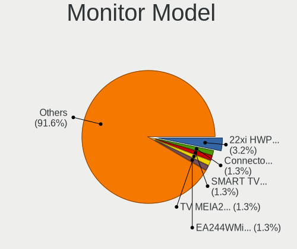
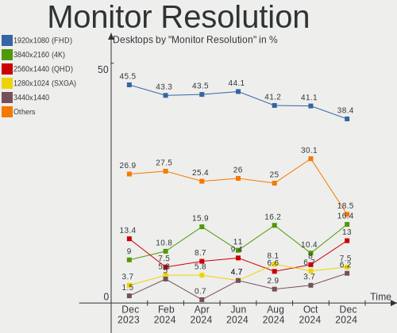
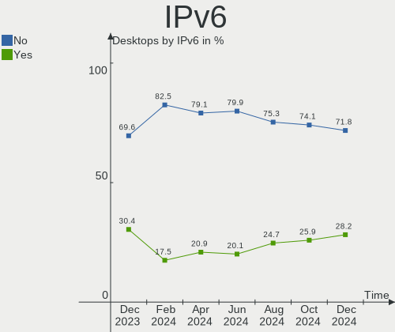
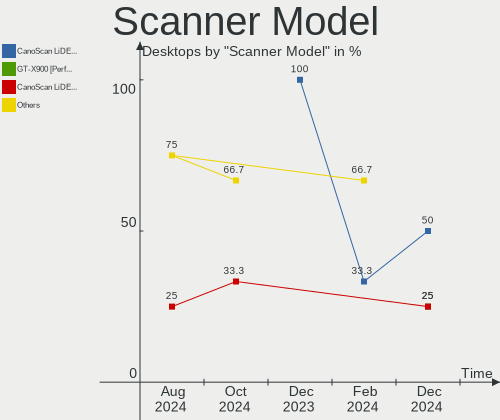

Debian - Hardware Trends (Desktops)
-----------------------------------

A project to identify most popular hardware characteristics and track their change
over time based on data collected by Linux users at https://Linux-Hardware.org.

Anyone can contribute to this report by the [hw-probe](https://github.com/linuxhw/hw-probe) tool:

    sudo -E hw-probe -all -upload

This report is for one last month. Overall report since the beginning of time: [TestDays](https://github.com/linuxhw/TestDays)

Period: Sep, 2023.

Contents
--------

* [ System ](#system)
  - [ OS                       ](#os)
  - [ OS Family                ](#os-family)
  - [ Kernel                   ](#kernel)
  - [ Kernel Family            ](#kernel-family)
  - [ Kernel Major Ver.        ](#kernel-major-ver)
  - [ Arch                     ](#arch)
  - [ DE                       ](#de)
  - [ Display Server           ](#display-server)
  - [ Display Manager          ](#display-manager)
  - [ OS Lang                  ](#os-lang)
  - [ Boot Mode                ](#boot-mode)
  - [ Filesystem               ](#filesystem)
  - [ Part. scheme             ](#part-scheme)
  - [ Dual Boot with Linux/BSD ](#dual-boot-with-linuxbsd)
  - [ Dual Boot (Win)          ](#dual-boot-win)

* [ Board ](#board)
  - [ Vendor                   ](#vendor)
  - [ Model                    ](#model)
  - [ Model Family             ](#model-family)
  - [ MFG Year                 ](#mfg-year)
  - [ Form Factor              ](#form-factor)
  - [ Secure Boot              ](#secure-boot)
  - [ Coreboot                 ](#coreboot)
  - [ RAM Size                 ](#ram-size)
  - [ RAM Used                 ](#ram-used)
  - [ Total Drives             ](#total-drives)
  - [ Has CD-ROM               ](#has-cd-rom)
  - [ Has Ethernet             ](#has-ethernet)
  - [ Has WiFi                 ](#has-wifi)
  - [ Has Bluetooth            ](#has-bluetooth)

* [ Location ](#location)
  - [ Country                  ](#country)
  - [ City                     ](#city)

* [ Drives ](#drives)
  - [ Drive Vendor             ](#drive-vendor)
  - [ Drive Model              ](#drive-model)
  - [ HDD Vendor               ](#hdd-vendor)
  - [ SSD Vendor               ](#ssd-vendor)
  - [ Drive Kind               ](#drive-kind)
  - [ Drive Connector          ](#drive-connector)
  - [ Drive Size               ](#drive-size)
  - [ Space Total              ](#space-total)
  - [ Space Used               ](#space-used)
  - [ Malfunc. Drives          ](#malfunc-drives)
  - [ Malfunc. Drive Vendor    ](#malfunc-drive-vendor)
  - [ Malfunc. HDD Vendor      ](#malfunc-hdd-vendor)
  - [ Malfunc. Drive Kind      ](#malfunc-drive-kind)
  - [ Failed Drives            ](#failed-drives)
  - [ Failed Drive Vendor      ](#failed-drive-vendor)
  - [ Drive Status             ](#drive-status)

* [ Storage controller ](#storage-controller)
  - [ Storage Vendor           ](#storage-vendor)
  - [ Storage Model            ](#storage-model)
  - [ Storage Kind             ](#storage-kind)

* [ Processor ](#processor)
  - [ CPU Vendor               ](#cpu-vendor)
  - [ CPU Model                ](#cpu-model)
  - [ CPU Model Family         ](#cpu-model-family)
  - [ CPU Cores                ](#cpu-cores)
  - [ CPU Sockets              ](#cpu-sockets)
  - [ CPU Threads              ](#cpu-threads)
  - [ CPU Op-Modes             ](#cpu-op-modes)
  - [ CPU Microcode            ](#cpu-microcode)
  - [ CPU Microarch            ](#cpu-microarch)

* [ Graphics ](#graphics)
  - [ GPU Vendor               ](#gpu-vendor)
  - [ GPU Model                ](#gpu-model)
  - [ GPU Combo                ](#gpu-combo)
  - [ GPU Driver               ](#gpu-driver)
  - [ GPU Memory               ](#gpu-memory)

* [ Monitor ](#monitor)
  - [ Monitor Vendor           ](#monitor-vendor)
  - [ Monitor Model            ](#monitor-model)
  - [ Monitor Resolution       ](#monitor-resolution)
  - [ Monitor Diagonal         ](#monitor-diagonal)
  - [ Monitor Width            ](#monitor-width)
  - [ Aspect Ratio             ](#aspect-ratio)
  - [ Monitor Area             ](#monitor-area)
  - [ Pixel Density            ](#pixel-density)
  - [ Multiple Monitors        ](#multiple-monitors)

* [ Network ](#network)
  - [ Net Controller Vendor    ](#net-controller-vendor)
  - [ Net Controller Model     ](#net-controller-model)
  - [ Wireless Vendor          ](#wireless-vendor)
  - [ Wireless Model           ](#wireless-model)
  - [ Ethernet Vendor          ](#ethernet-vendor)
  - [ Ethernet Model           ](#ethernet-model)
  - [ Net Controller Kind      ](#net-controller-kind)
  - [ Used Controller          ](#used-controller)
  - [ NICs                     ](#nics)
  - [ IPv6                     ](#ipv6)

* [ Bluetooth ](#bluetooth)
  - [ Bluetooth Vendor         ](#bluetooth-vendor)
  - [ Bluetooth Model          ](#bluetooth-model)

* [ Sound ](#sound)
  - [ Sound Vendor             ](#sound-vendor)
  - [ Sound Model              ](#sound-model)

* [ Memory ](#memory)
  - [ Memory Vendor            ](#memory-vendor)
  - [ Memory Model             ](#memory-model)
  - [ Memory Kind              ](#memory-kind)
  - [ Memory Form Factor       ](#memory-form-factor)
  - [ Memory Size              ](#memory-size)
  - [ Memory Speed             ](#memory-speed)

* [ Printers & scanners ](#printers--scanners)
  - [ Printer Vendor           ](#printer-vendor)
  - [ Printer Model            ](#printer-model)
  - [ Scanner Vendor           ](#scanner-vendor)
  - [ Scanner Model            ](#scanner-model)

* [ Camera ](#camera)
  - [ Camera Vendor            ](#camera-vendor)
  - [ Camera Model             ](#camera-model)

* [ Security ](#security)
  - [ Fingerprint Vendor       ](#fingerprint-vendor)
  - [ Fingerprint Model        ](#fingerprint-model)
  - [ Chipcard Vendor          ](#chipcard-vendor)
  - [ Chipcard Model           ](#chipcard-model)

* [ Unsupported ](#unsupported)
  - [ Unsupported Devices      ](#unsupported-devices)
  - [ Unsupported Device Types ](#unsupported-device-types)

System
------

OS
--

Installed operating systems

| Name      | Desktops | Percent |
|-----------|----------|---------|
| Debian 12 | 113      | 71.97%  |
| Debian 11 | 28       | 17.83%  |
| Debian    | 16       | 10.19%  |

OS Family
---------

OS without a version

| Name   | Desktops | Percent |
|--------|----------|---------|
| Debian | 157      | 100%    |

Kernel
------

Version of the Linux kernel

| Version                    | Desktops | Percent |
|----------------------------|----------|---------|
| 6.1.0-12-amd64             | 33       | 21.02%  |
| 6.1.0-11-amd64             | 32       | 20.38%  |
| 6.1.0-10-amd64             | 17       | 10.83%  |
| 5.10.0-25-amd64            | 12       | 7.64%   |
| 6.1.0-4-amd64              | 9        | 5.73%   |
| 6.4.0-0.deb12.2-amd64      | 6        | 3.82%   |
| 6.4.0-4-amd64              | 5        | 3.18%   |
| 6.5.0-1-amd64              | 4        | 2.55%   |
| 6.2.16-12-pve              | 4        | 2.55%   |
| 5.15.116-1-pve             | 4        | 2.55%   |
| 5.15.108-1-pve             | 3        | 1.91%   |
| 6.2.16-3-pve               | 2        | 1.27%   |
| 6.2.16-14-pve              | 2        | 1.27%   |
| 5.10.0-23-amd64            | 2        | 1.27%   |
| 5.10.0-22-amd64            | 2        | 1.27%   |
| 6.6.0-rc3                  | 1        | 0.64%   |
| 6.5.3-amd64                | 1        | 0.64%   |
| 6.5.0-0-amd64              | 1        | 0.64%   |
| 6.5.0+                     | 1        | 0.64%   |
| 6.4.3-1-liquorix-amd64     | 1        | 0.64%   |
| 6.4.15-2-liquorix-amd64    | 1        | 0.64%   |
| 6.4.12-2-liquorix-amd64    | 1        | 0.64%   |
| 6.4.0-3-amd64              | 1        | 0.64%   |
| 6.4.0-1mx-ahs-amd64        | 1        | 0.64%   |
| 6.2.16-8-pve               | 1        | 0.64%   |
| 6.2.16-10-pve              | 1        | 0.64%   |
| 6.1.11-stb-cbr+            | 1        | 0.64%   |
| 6.1.0-9-amd64              | 1        | 0.64%   |
| 6.1.0-12-arm64             | 1        | 0.64%   |
| 6.1.0-0.deb11.11-amd64     | 1        | 0.64%   |
| 6.0.12                     | 1        | 0.64%   |
| 5.16.0-0.bpo.4-amd64       | 1        | 0.64%   |
| 5.15.107+truenas           | 1        | 0.64%   |
| 5.10.142-antix.2-amd64-smp | 1        | 0.64%   |
| 5.10.0-24-amd64            | 1        | 0.64%   |

Kernel Family
-------------

Linux kernel without a distro release

| Version  | Desktops | Percent |
|----------|----------|---------|
| 6.1.0    | 94       | 59.87%  |
| 5.10.0   | 17       | 10.83%  |
| 6.4.0    | 13       | 8.28%   |
| 6.2.16   | 10       | 6.37%   |
| 6.5.0    | 6        | 3.82%   |
| 5.15.116 | 4        | 2.55%   |
| 5.15.108 | 3        | 1.91%   |
| 6.6.0    | 1        | 0.64%   |
| 6.5.3    | 1        | 0.64%   |
| 6.4.3    | 1        | 0.64%   |
| 6.4.15   | 1        | 0.64%   |
| 6.4.12   | 1        | 0.64%   |
| 6.1.11   | 1        | 0.64%   |
| 6.0.12   | 1        | 0.64%   |
| 5.16.0   | 1        | 0.64%   |
| 5.15.107 | 1        | 0.64%   |
| 5.10.142 | 1        | 0.64%   |

Kernel Major Ver.
-----------------

Linux kernel major version

| Version | Desktops | Percent |
|---------|----------|---------|
| 6.1     | 95       | 60.51%  |
| 5.10    | 18       | 11.46%  |
| 6.4     | 16       | 10.19%  |
| 6.2     | 10       | 6.37%   |
| 5.15    | 8        | 5.1%    |
| 6.5     | 7        | 4.46%   |
| 6.6     | 1        | 0.64%   |
| 6.0     | 1        | 0.64%   |
| 5.16    | 1        | 0.64%   |

Arch
----

OS architecture (x86_64, i586, etc.)

| Name        | Desktops | Percent |
|-------------|----------|---------|
| x86_64      | 154      | 98.09%  |
| loongarch64 | 1        | 0.64%   |
| armv7l      | 1        | 0.64%   |
| aarch64     | 1        | 0.64%   |

DE
--

Desktop Environment

| Name            | Desktops | Percent |
|-----------------|----------|---------|
| Unknown         | 52       | 33.12%  |
| KDE5            | 32       | 20.38%  |
| GNOME           | 32       | 20.38%  |
| XFCE            | 11       | 7.01%   |
| X-Cinnamon      | 11       | 7.01%   |
| MATE            | 6        | 3.82%   |
| LXQt            | 5        | 3.18%   |
| LXDE            | 4        | 2.55%   |
| Cinnamon        | 2        | 1.27%   |
| i3              | 1        | 0.64%   |
| GNOME Flashback | 1        | 0.64%   |

Display Server
--------------

X11 or Wayland

| Name        | Desktops | Percent |
|-------------|----------|---------|
| X11         | 67       | 42.68%  |
| Tty         | 34       | 21.66%  |
| Wayland     | 33       | 21.02%  |
| Unknown     | 22       | 14.01%  |
| Unspecified | 1        | 0.64%   |

Display Manager
---------------

SDDM, LightDM, etc.

| Name    | Desktops | Percent |
|---------|----------|---------|
| Unknown | 87       | 55.41%  |
| LightDM | 27       | 17.2%   |
| SDDM    | 22       | 14.01%  |
| GDM3    | 18       | 11.46%  |
| GDM     | 3        | 1.91%   |

OS Lang
-------

Language

| Lang       | Desktops | Percent |
|------------|----------|---------|
| en_US      | 70       | 44.59%  |
| ru_RU      | 14       | 8.92%   |
| de_DE      | 10       | 6.37%   |
| Unknown    | 8        | 5.1%    |
| pt_BR      | 7        | 4.46%   |
| fr_FR      | 6        | 3.82%   |
| pl_PL      | 3        | 1.91%   |
| fr_BE      | 3        | 1.91%   |
| en_ZA      | 3        | 1.91%   |
| en_GB      | 3        | 1.91%   |
| en_AU      | 3        | 1.91%   |
| nl_NL      | 2        | 1.27%   |
| it_IT      | 2        | 1.27%   |
| hu_HU      | 2        | 1.27%   |
| fi_FI      | 2        | 1.27%   |
| en_IN      | 2        | 1.27%   |
| en_CA      | 2        | 1.27%   |
| C          | 2        | 1.27%   |
| zh_CN      | 1        | 0.64%   |
| sv_SE      | 1        | 0.64%   |
| nl_BE      | 1        | 0.64%   |
| it_IT@euro | 1        | 0.64%   |
| fr_CA      | 1        | 0.64%   |
| es_MX      | 1        | 0.64%   |
| es_ES      | 1        | 0.64%   |
| es_CU      | 1        | 0.64%   |
| es_CL      | 1        | 0.64%   |
| es_AR      | 1        | 0.64%   |
| en_IE      | 1        | 0.64%   |
| de_AT      | 1        | 0.64%   |
| cs_CZ      | 1        | 0.64%   |

Boot Mode
---------

EFI or BIOS

| Mode | Desktops | Percent |
|------|----------|---------|
| EFI  | 82       | 52.23%  |
| BIOS | 75       | 47.77%  |

Filesystem
----------

Type of filesystem

| Type    | Desktops | Percent |
|---------|----------|---------|
| Ext4    | 114      | 72.61%  |
| Overlay | 15       | 9.55%   |
| Btrfs   | 15       | 9.55%   |
| Zfs     | 5        | 3.18%   |
| Tmpfs   | 5        | 3.18%   |
| Xfs     | 1        | 0.64%   |
| F2fs    | 1        | 0.64%   |
| Ext3    | 1        | 0.64%   |

Part. scheme
------------

Scheme of partitioning

| Type    | Desktops | Percent |
|---------|----------|---------|
| GPT     | 95       | 60.51%  |
| Unknown | 33       | 21.02%  |
| MBR     | 29       | 18.47%  |

Dual Boot with Linux/BSD
------------------------

Hosting more than one Linux/BSD

| Dual boot | Desktops | Percent |
|-----------|----------|---------|
| No        | 122      | 77.71%  |
| Yes       | 35       | 22.29%  |

Dual Boot (Win)
---------------

Hosting Linux and Windows

| Dual boot | Desktops | Percent |
|-----------|----------|---------|
| No        | 116      | 73.89%  |
| Yes       | 41       | 26.11%  |

Board
-----

Vendor
------

Motherboard manufacturer

| Name                                 | Desktops | Percent |
|--------------------------------------|----------|---------|
| Gigabyte Technology                  | 31       | 19.75%  |
| ASUSTek Computer                     | 28       | 17.83%  |
| MSI                                  | 23       | 14.65%  |
| ASRock                               | 14       | 8.92%   |
| Dell                                 | 9        | 5.73%   |
| Hewlett-Packard                      | 7        | 4.46%   |
| Supermicro                           | 5        | 3.18%   |
| Lenovo                               | 5        | 3.18%   |
| Intel                                | 4        | 2.55%   |
| Fujitsu                              | 4        | 2.55%   |
| Shenzhen Meigao Electronic Equipment | 3        | 1.91%   |
| Unknown                              | 3        | 1.91%   |
| AZW                                  | 2        | 1.27%   |
| ASRockRack                           | 2        | 1.27%   |
| Acer                                 | 2        | 1.27%   |
| YANYU                                | 1        | 0.64%   |
| Techvision                           | 1        | 0.64%   |
| SolidRun                             | 1        | 0.64%   |
| Pegatron                             | 1        | 0.64%   |
| NetGear                              | 1        | 0.64%   |
| MEGA                                 | 1        | 0.64%   |
| Loongson                             | 1        | 0.64%   |
| JINGSHA                              | 1        | 0.64%   |
| JGINYUE                              | 1        | 0.64%   |
| iEi                                  | 1        | 0.64%   |
| Huanan                               | 1        | 0.64%   |
| Google                               | 1        | 0.64%   |
| ECS                                  | 1        | 0.64%   |
| CWWK                                 | 1        | 0.64%   |
| BESSTAR Tech                         | 1        | 0.64%   |

Model
-----

Motherboard model

| Name                                         | Desktops | Percent |
|----------------------------------------------|----------|---------|
| Supermicro SYS-5019S-ML                      | 4        | 2.55%   |
| Unknown                                      | 3        | 1.91%   |
| MSI MS-7B79                                  | 2        | 1.27%   |
| HP Z230 Tower Workstation                    | 2        | 1.27%   |
| Gigabyte X570 GAMING X                       | 2        | 1.27%   |
| Gigabyte H110M-H                             | 2        | 1.27%   |
| ASUS TUF B450-PLUS GAMING                    | 2        | 1.27%   |
| YANYU H17SL                                  | 1        | 0.64%   |
| Techvision TVI7309X                          | 1        | 0.64%   |
| Supermicro X9DR3-F                           | 1        | 0.64%   |
| SolidRun CEX7 Platform                       | 1        | 0.64%   |
| Shenzhen Meigao Electronic Equipment UM480XT | 1        | 0.64%   |
| Shenzhen Meigao Electronic Equipment HX90G   | 1        | 0.64%   |
| Shenzhen Meigao Electronic Equipment HX77G   | 1        | 0.64%   |
| Pegatron NY644AA-ABA 300-1003                | 1        | 0.64%   |
| NetGear ReadyDATA 5200                       | 1        | 0.64%   |
| MSI Z270 Gaming Aegis X3 (MS-B909)           | 1        | 0.64%   |
| MSI MS-7D99                                  | 1        | 0.64%   |
| MSI MS-7D76                                  | 1        | 0.64%   |
| MSI MS-7D73                                  | 1        | 0.64%   |
| MSI MS-7D67                                  | 1        | 0.64%   |
| MSI MS-7D40                                  | 1        | 0.64%   |
| MSI MS-7D22                                  | 1        | 0.64%   |
| MSI MS-7D07                                  | 1        | 0.64%   |
| MSI MS-7C88                                  | 1        | 0.64%   |
| MSI MS-7C51                                  | 1        | 0.64%   |
| MSI MS-7C37                                  | 1        | 0.64%   |
| MSI MS-7B85                                  | 1        | 0.64%   |
| MSI MS-7B48                                  | 1        | 0.64%   |
| MSI MS-7A34                                  | 1        | 0.64%   |
| MSI MS-7850                                  | 1        | 0.64%   |
| MSI MS-7817                                  | 1        | 0.64%   |
| MSI MS-7735                                  | 1        | 0.64%   |
| MSI MS-7693                                  | 1        | 0.64%   |
| MSI MS-7366                                  | 1        | 0.64%   |
| MSI MS-7318                                  | 1        | 0.64%   |
| MSI Cubi N 8GL (MS-B171)                     | 1        | 0.64%   |
| MEGA G41T-M7 LGT                             | 1        | 0.64%   |
| Loongson 3A6000-7A2000-1w-V0.1-EVB           | 1        | 0.64%   |
| Lenovo ThinkStation P500 30A6S2VM00          | 1        | 0.64%   |

Model Family
------------

Motherboard model prefix

| Name                                         | Desktops | Percent |
|----------------------------------------------|----------|---------|
| ASUS ROG                                     | 7        | 4.46%   |
| Dell OptiPlex                                | 5        | 3.18%   |
| ASUS PRIME                                   | 5        | 3.18%   |
| Supermicro SYS-5019S-ML                      | 4        | 2.55%   |
| Lenovo ThinkStation                          | 3        | 1.91%   |
| Gigabyte B550                                | 3        | 1.91%   |
| ASUS TUF                                     | 3        | 1.91%   |
| Unknown                                      | 3        | 1.91%   |
| MSI MS-7B79                                  | 2        | 1.27%   |
| HP Z230                                      | 2        | 1.27%   |
| HP EliteDesk                                 | 2        | 1.27%   |
| Gigabyte Z790                                | 2        | 1.27%   |
| Gigabyte X570                                | 2        | 1.27%   |
| Gigabyte H110M-H                             | 2        | 1.27%   |
| Gigabyte GA-78LMT-USB3                       | 2        | 1.27%   |
| Fujitsu ESPRIMO                              | 2        | 1.27%   |
| Dell Vostro                                  | 2        | 1.27%   |
| ASRock B550                                  | 2        | 1.27%   |
| Acer Veriton                                 | 2        | 1.27%   |
| YANYU H17SL                                  | 1        | 0.64%   |
| Techvision TVI7309X                          | 1        | 0.64%   |
| Supermicro X9DR3-F                           | 1        | 0.64%   |
| SolidRun CEX7                                | 1        | 0.64%   |
| Shenzhen Meigao Electronic Equipment UM480XT | 1        | 0.64%   |
| Shenzhen Meigao Electronic Equipment HX90G   | 1        | 0.64%   |
| Shenzhen Meigao Electronic Equipment HX77G   | 1        | 0.64%   |
| Pegatron NY644AA-ABA                         | 1        | 0.64%   |
| NetGear ReadyDATA                            | 1        | 0.64%   |
| MSI Z270                                     | 1        | 0.64%   |
| MSI MS-7D99                                  | 1        | 0.64%   |
| MSI MS-7D76                                  | 1        | 0.64%   |
| MSI MS-7D73                                  | 1        | 0.64%   |
| MSI MS-7D67                                  | 1        | 0.64%   |
| MSI MS-7D40                                  | 1        | 0.64%   |
| MSI MS-7D22                                  | 1        | 0.64%   |
| MSI MS-7D07                                  | 1        | 0.64%   |
| MSI MS-7C88                                  | 1        | 0.64%   |
| MSI MS-7C51                                  | 1        | 0.64%   |
| MSI MS-7C37                                  | 1        | 0.64%   |
| MSI MS-7B85                                  | 1        | 0.64%   |

MFG Year
--------

Motherboard manufacture year

| Year    | Desktops | Percent |
|---------|----------|---------|
| 2022    | 18       | 11.46%  |
| 2020    | 16       | 10.19%  |
| 2017    | 14       | 8.92%   |
| 2021    | 12       | 7.64%   |
| 2023    | 11       | 7.01%   |
| 2018    | 10       | 6.37%   |
| 2015    | 10       | 6.37%   |
| 2013    | 10       | 6.37%   |
| 2012    | 9        | 5.73%   |
| 2019    | 8        | 5.1%    |
| 2016    | 8        | 5.1%    |
| 2014    | 8        | 5.1%    |
| 2007    | 7        | 4.46%   |
| 2011    | 5        | 3.18%   |
| 2009    | 5        | 3.18%   |
| 2010    | 3        | 1.91%   |
| Unknown | 2        | 1.27%   |
| 2008    | 1        | 0.64%   |

Form Factor
-----------

Physical design of the computer

| Name    | Desktops | Percent |
|---------|----------|---------|
| Desktop | 157      | 100%    |

Secure Boot
-----------

Enabled or disabled

| State    | Desktops | Percent |
|----------|----------|---------|
| Disabled | 151      | 96.18%  |
| Enabled  | 6        | 3.82%   |

Coreboot
--------

Have coreboot on board

| Used | Desktops | Percent |
|------|----------|---------|
| No   | 157      | 100%    |

RAM Size
--------

Total RAM memory

| Size in GB      | Desktops | Percent |
|-----------------|----------|---------|
| 16.01-24.0      | 42       | 26.75%  |
| 32.01-64.0      | 31       | 19.75%  |
| 64.01-256.0     | 25       | 15.92%  |
| 4.01-8.0        | 21       | 13.38%  |
| 8.01-16.0       | 15       | 9.55%   |
| 3.01-4.0        | 12       | 7.64%   |
| 24.01-32.0      | 5        | 3.18%   |
| 2.01-3.0        | 3        | 1.91%   |
| 1.01-2.0        | 2        | 1.27%   |
| More than 256.0 | 1        | 0.64%   |

RAM Used
--------

Used RAM memory

| Used GB     | Desktops | Percent |
|-------------|----------|---------|
| 4.01-8.0    | 31       | 19.75%  |
| 1.01-2.0    | 30       | 19.11%  |
| 2.01-3.0    | 25       | 15.92%  |
| 0.51-1.0    | 23       | 14.65%  |
| 3.01-4.0    | 17       | 10.83%  |
| 8.01-16.0   | 14       | 8.92%   |
| 0.01-0.5    | 7        | 4.46%   |
| 32.01-64.0  | 4        | 2.55%   |
| 16.01-24.0  | 3        | 1.91%   |
| 24.01-32.0  | 2        | 1.27%   |
| 64.01-256.0 | 1        | 0.64%   |

Total Drives
------------

Number of drives on board

| Drives | Desktops | Percent |
|--------|----------|---------|
| 1      | 52       | 33.12%  |
| 2      | 51       | 32.48%  |
| 3      | 24       | 15.29%  |
| 4      | 14       | 8.92%   |
| 5      | 4        | 2.55%   |
| 6      | 3        | 1.91%   |
| 9      | 2        | 1.27%   |
| 8      | 2        | 1.27%   |
| 7      | 2        | 1.27%   |
| 19     | 1        | 0.64%   |
| 16     | 1        | 0.64%   |
| 0      | 1        | 0.64%   |

Has CD-ROM
----------

Has CD-ROM on board

| Presented | Desktops | Percent |
|-----------|----------|---------|
| No        | 114      | 72.61%  |
| Yes       | 43       | 27.39%  |

Has Ethernet
------------

Has Ethernet on board

| Presented | Desktops | Percent |
|-----------|----------|---------|
| Yes       | 153      | 97.45%  |
| No        | 4        | 2.55%   |

Has WiFi
--------

Has WiFi module

| Presented | Desktops | Percent |
|-----------|----------|---------|
| No        | 100      | 63.69%  |
| Yes       | 57       | 36.31%  |

Has Bluetooth
-------------

Has Bluetooth module

| Presented | Desktops | Percent |
|-----------|----------|---------|
| No        | 104      | 66.24%  |
| Yes       | 53       | 33.76%  |

Location
--------

Country
-------

Geographic location (country)

| Country       | Desktops | Percent |
|---------------|----------|---------|
| Russia        | 29       | 18.47%  |
| USA           | 21       | 13.38%  |
| Germany       | 19       | 12.1%   |
| Brazil        | 8        | 5.1%    |
| Belgium       | 7        | 4.46%   |
| Italy         | 6        | 3.82%   |
| France        | 5        | 3.18%   |
| Netherlands   | 4        | 2.55%   |
| Canada        | 4        | 2.55%   |
| Sweden        | 3        | 1.91%   |
| South Africa  | 3        | 1.91%   |
| Portugal      | 3        | 1.91%   |
| Poland        | 3        | 1.91%   |
| India         | 3        | 1.91%   |
| Hungary       | 3        | 1.91%   |
| Australia     | 3        | 1.91%   |
| Thailand      | 2        | 1.27%   |
| Switzerland   | 2        | 1.27%   |
| Romania       | 2        | 1.27%   |
| Malaysia      | 2        | 1.27%   |
| Iran          | 2        | 1.27%   |
| Hong Kong     | 2        | 1.27%   |
| Czechia       | 2        | 1.27%   |
| Cyprus        | 2        | 1.27%   |
| China         | 2        | 1.27%   |
| Uruguay       | 1        | 0.64%   |
| UK            | 1        | 0.64%   |
| Spain         | 1        | 0.64%   |
| Panama        | 1        | 0.64%   |
| New Caledonia | 1        | 0.64%   |
| Mexico        | 1        | 0.64%   |
| Indonesia     | 1        | 0.64%   |
| Greece        | 1        | 0.64%   |
| Denmark       | 1        | 0.64%   |
| Cuba          | 1        | 0.64%   |
| Croatia       | 1        | 0.64%   |
| Chile         | 1        | 0.64%   |
| Belarus       | 1        | 0.64%   |
| Austria       | 1        | 0.64%   |
| Argentina     | 1        | 0.64%   |

City
----

Geographic location (city)

| City              | Desktops | Percent |
|-------------------|----------|---------|
| Voronezh          | 9        | 5.73%   |
| Ufa               | 5        | 3.18%   |
| Frankfurt am Main | 5        | 3.18%   |
| St Petersburg     | 3        | 1.91%   |
| Ruda Śląska     | 3        | 1.91%   |
| Moscow            | 3        | 1.91%   |
| Veliky Novgorod   | 2        | 1.27%   |
| Stockholm         | 2        | 1.27%   |
| Nakhon Pathom     | 2        | 1.27%   |
| Kuala Lumpur      | 2        | 1.27%   |
| Johannesburg      | 2        | 1.27%   |
| Cologne           | 2        | 1.27%   |
| Central           | 2        | 1.27%   |
| Budapest          | 2        | 1.27%   |
| Beijing           | 2        | 1.27%   |
| Zurich            | 1        | 0.64%   |
| Yaroslavl         | 1        | 0.64%   |
| Winfield          | 1        | 0.64%   |
| Wettingen         | 1        | 0.64%   |
| West Jordan       | 1        | 0.64%   |
| Webster           | 1        | 0.64%   |
| Warminster        | 1        | 0.64%   |
| Waren             | 1        | 0.64%   |
| Vila Velha        | 1        | 0.64%   |
| Verviers          | 1        | 0.64%   |
| Verkhnyaya Salda  | 1        | 0.64%   |
| Velika Gorica     | 1        | 0.64%   |
| Vancouver         | 1        | 0.64%   |
| Utrecht           | 1        | 0.64%   |
| Uppsala           | 1        | 0.64%   |
| Tula              | 1        | 0.64%   |
| Tosno             | 1        | 0.64%   |
| Tkhamakha         | 1        | 0.64%   |
| Tehran            | 1        | 0.64%   |
| Szombathely       | 1        | 0.64%   |
| Sydney            | 1        | 0.64%   |
| Springfield       | 1        | 0.64%   |
| Sint Annaland     | 1        | 0.64%   |
| Silverton         | 1        | 0.64%   |
| Sherbrooke        | 1        | 0.64%   |

Drives
------

Drive Vendor
------------

Hard drive vendors

| Vendor                      | Desktops | Drives | Percent |
|-----------------------------|----------|--------|---------|
| Samsung Electronics         | 45       | 74     | 16.61%  |
| Seagate                     | 42       | 75     | 15.5%   |
| WDC                         | 41       | 66     | 15.13%  |
| Kingston                    | 19       | 20     | 7.01%   |
| Toshiba                     | 16       | 22     | 5.9%    |
| Crucial                     | 16       | 19     | 5.9%    |
| Sandisk                     | 8        | 10     | 2.95%   |
| Hitachi                     | 6        | 8      | 2.21%   |
| China                       | 6        | 7      | 2.21%   |
| Silicon Motion              | 5        | 5      | 1.85%   |
| Intel                       | 5        | 5      | 1.85%   |
| HGST                        | 4        | 8      | 1.48%   |
| GOODRAM                     | 4        | 11     | 1.48%   |
| Unknown                     | 3        | 5      | 1.11%   |
| Transcend                   | 3        | 3      | 1.11%   |
| SK hynix                    | 3        | 3      | 1.11%   |
| PNY                         | 3        | 5      | 1.11%   |
| A-DATA Technology           | 3        | 3      | 1.11%   |
| XPG                         | 2        | 2      | 0.74%   |
| SPCC                        | 2        | 2      | 0.74%   |
| MAXIO Technology (Hangzhou) | 2        | 2      | 0.74%   |
| Kingston Technology Company | 2        | 2      | 0.74%   |
| Hewlett-Packard             | 2        | 2      | 0.74%   |
| Apacer                      | 2        | 2      | 0.74%   |
| ZHITAI                      | 1        | 1      | 0.37%   |
| Team                        | 1        | 1      | 0.37%   |
| SHGP31-1                    | 1        | 1      | 0.37%   |
| SEGGER                      | 1        | 1      | 0.37%   |
| SD                          | 1        | 2      | 0.37%   |
| Rogueware                   | 1        | 1      | 0.37%   |
| Phison Electronics          | 1        | 2      | 0.37%   |
| Phison                      | 1        | 1      | 0.37%   |
| NGFF                        | 1        | 1      | 0.37%   |
| Netac                       | 1        | 1      | 0.37%   |
| MOVESPEED                   | 1        | 1      | 0.37%   |
| Micron Technology           | 1        | 1      | 0.37%   |
| MBED                        | 1        | 1      | 0.37%   |
| Mass                        | 1        | 1      | 0.37%   |
| LITEON                      | 1        | 1      | 0.37%   |
| KIOXIA-EXCERIA              | 1        | 1      | 0.37%   |

Drive Model
-----------

Hard drive models

| Model                                                 | Desktops | Percent |
|-------------------------------------------------------|----------|---------|
| Seagate ST500DM002-1BD142 500GB                       | 6        | 1.83%   |
| Samsung SSD 970 EVO Plus 1TB                          | 5        | 1.52%   |
| Toshiba DT01ACA100 1TB                                | 4        | 1.22%   |
| Toshiba DT01ACA050 500GB                              | 3        | 0.91%   |
| Silicon Motion SM2263EN/SM2263XT SSD Controller 512GB | 3        | 0.91%   |
| Samsung SSD 860 EVO 500GB                             | 3        | 0.91%   |
| Samsung SSD 850 PRO 512GB                             | 3        | 0.91%   |
| Kingston SA400S37480G 480GB SSD                       | 3        | 0.91%   |
| Kingston SA400S37120G 120GB SSD                       | 3        | 0.91%   |
| GOODRAM IRP-SSDPR-S25C-256 256GB                      | 3        | 0.91%   |
| Crucial CT1000MX500SSD1 1TB                           | 3        | 0.91%   |
| XPG GAMMIX S11 Pro 1TB                                | 2        | 0.61%   |
| WDC WD5000AZLX-00K2TA0 500GB                          | 2        | 0.61%   |
| WDC WD20EFRX-68EUZN0 2TB                              | 2        | 0.61%   |
| WDC WD10EZEX-60M2NA0 1TB                              | 2        | 0.61%   |
| WDC WD10EZEX-00BN5A0 1TB                              | 2        | 0.61%   |
| Toshiba MG06ACA800E 8TB                               | 2        | 0.61%   |
| Seagate ST8000VN004-2M2101 8TB                        | 2        | 0.61%   |
| Seagate ST4000DM004-2U9104 4TB                        | 2        | 0.61%   |
| Seagate ST4000DM004-2CV104 4TB                        | 2        | 0.61%   |
| Seagate ST2000DM008-2UB102 2TB                        | 2        | 0.61%   |
| Seagate ST2000DM006-2DM164 2TB                        | 2        | 0.61%   |
| Seagate ST2000DM001-1CH164 2TB                        | 2        | 0.61%   |
| Seagate ST1000DM003-1ER162 1TB                        | 2        | 0.61%   |
| Seagate Expansion Desk 8TB                            | 2        | 0.61%   |
| SanDisk NVMe SSD Drive 1TB                            | 2        | 0.61%   |
| Samsung SSD 990 PRO 2TB                               | 2        | 0.61%   |
| Samsung SSD 990 PRO 1TB                               | 2        | 0.61%   |
| Samsung SSD 980 PRO with Heatsink 2TB                 | 2        | 0.61%   |
| Samsung SSD 980 PRO 1TB                               | 2        | 0.61%   |
| Samsung SSD 980 1TB                                   | 2        | 0.61%   |
| Samsung SSD 970 EVO 1TB                               | 2        | 0.61%   |
| Samsung SSD 870 QVO 1TB                               | 2        | 0.61%   |
| Samsung SSD 870 EVO 500GB                             | 2        | 0.61%   |
| Samsung SSD 870 EVO 1TB                               | 2        | 0.61%   |
| Samsung SSD 860 EVO 250GB                             | 2        | 0.61%   |
| Samsung NVMe SSD Controller SM981/PM981/PM983 256GB   | 2        | 0.61%   |
| Samsung HD502HJ 500GB                                 | 2        | 0.61%   |
| Kingston Company A2000 NVMe SSD 1TB                   | 2        | 0.61%   |
| Kingston SKC6001024G 1024GB SSD                       | 2        | 0.61%   |

HDD Vendor
----------

Hard disk drive vendors

| Vendor              | Desktops | Drives | Percent |
|---------------------|----------|--------|---------|
| Seagate             | 42       | 70     | 40%     |
| WDC                 | 35       | 60     | 33.33%  |
| Toshiba             | 12       | 18     | 11.43%  |
| Hitachi             | 6        | 8      | 5.71%   |
| Samsung Electronics | 5        | 5      | 4.76%   |
| HGST                | 4        | 8      | 3.81%   |
| Apple               | 1        | 1      | 0.95%   |

SSD Vendor
----------

Solid state drive vendors

| Vendor              | Desktops | Drives | Percent |
|---------------------|----------|--------|---------|
| Samsung Electronics | 22       | 28     | 24.44%  |
| Kingston            | 14       | 14     | 15.56%  |
| Crucial             | 9        | 10     | 10%     |
| China               | 6        | 7      | 6.67%   |
| WDC                 | 5        | 5      | 5.56%   |
| GOODRAM             | 4        | 7      | 4.44%   |
| Transcend           | 3        | 3      | 3.33%   |
| PNY                 | 3        | 5      | 3.33%   |
| Intel               | 3        | 3      | 3.33%   |
| SPCC                | 2        | 2      | 2.22%   |
| Hewlett-Packard     | 2        | 2      | 2.22%   |
| Apacer              | 2        | 2      | 2.22%   |
| A-DATA Technology   | 2        | 2      | 2.22%   |
| Toshiba             | 1        | 1      | 1.11%   |
| Team                | 1        | 1      | 1.11%   |
| SD                  | 1        | 2      | 1.11%   |
| SanDisk             | 1        | 2      | 1.11%   |
| Rogueware           | 1        | 1      | 1.11%   |
| NGFF                | 1        | 1      | 1.11%   |
| Netac               | 1        | 1      | 1.11%   |
| MOVESPEED           | 1        | 1      | 1.11%   |
| Micron Technology   | 1        | 1      | 1.11%   |
| LITEON              | 1        | 1      | 1.11%   |
| EZCOOL              | 1        | 1      | 1.11%   |
| Emtec               | 1        | 1      | 1.11%   |
| Drevo               | 1        | 1      | 1.11%   |

Drive Kind
----------

HDD or SSD

| Kind    | Desktops | Drives | Percent |
|---------|----------|--------|---------|
| HDD     | 83       | 170    | 34.87%  |
| SSD     | 77       | 105    | 32.35%  |
| NVMe    | 68       | 99     | 28.57%  |
| Unknown | 8        | 13     | 3.36%   |
| MMC     | 2        | 3      | 0.84%   |

Drive Connector
---------------

SATA, SAS, NVMe, etc.

| Type | Desktops | Drives | Percent |
|------|----------|--------|---------|
| SATA | 122      | 256    | 59.22%  |
| NVMe | 68       | 98     | 33.01%  |
| SAS  | 14       | 33     | 6.8%    |
| MMC  | 2        | 3      | 0.97%   |

Drive Size
----------

Size of hard drive

| Size in TB | Desktops | Drives | Percent |
|------------|----------|--------|---------|
| 0.01-0.5   | 80       | 106    | 43.01%  |
| 0.51-1.0   | 55       | 77     | 29.57%  |
| 1.01-2.0   | 23       | 35     | 12.37%  |
| 4.01-10.0  | 11       | 21     | 5.91%   |
| 3.01-4.0   | 8        | 13     | 4.3%    |
| 2.01-3.0   | 5        | 12     | 2.69%   |
| 10.01-20.0 | 4        | 11     | 2.15%   |

Space Total
-----------

Amount of disk space available on the file system

| Size in GB     | Desktops | Percent |
|----------------|----------|---------|
| 501-1000       | 28       | 17.83%  |
| 1001-2000      | 22       | 14.01%  |
| Unknown        | 21       | 13.38%  |
| More than 3000 | 19       | 12.1%   |
| 101-250        | 19       | 12.1%   |
| 251-500        | 18       | 11.46%  |
| 2001-3000      | 10       | 6.37%   |
| 51-100         | 10       | 6.37%   |
| 1-20           | 7        | 4.46%   |
| 21-50          | 3        | 1.91%   |

Space Used
----------

Amount of used disk space

| Used GB        | Desktops | Percent |
|----------------|----------|---------|
| 1-20           | 41       | 26.11%  |
| 101-250        | 22       | 14.01%  |
| 251-500        | 21       | 13.38%  |
| Unknown        | 21       | 13.38%  |
| 21-50          | 19       | 12.1%   |
| More than 3000 | 11       | 7.01%   |
| 1001-2000      | 7        | 4.46%   |
| 51-100         | 7        | 4.46%   |
| 501-1000       | 5        | 3.18%   |
| 2001-3000      | 3        | 1.91%   |

Malfunc. Drives
---------------

Drive models with a malfunction

| Model                                                 | Desktops | Drives | Percent |
|-------------------------------------------------------|----------|--------|---------|
| Seagate ST500DM002-1BD142 500GB                       | 2        | 3      | 6.45%   |
| WDC WD5000AZLX-22JKKA0 500GB                          | 1        | 2      | 3.23%   |
| WDC WD40EFRX-68WT0N0 4TB                              | 1        | 1      | 3.23%   |
| WDC WD3200BEKT-75PVMT1 320GB                          | 1        | 1      | 3.23%   |
| WDC WD30EZRX-00MMMB0 3TB                              | 1        | 1      | 3.23%   |
| WDC WD20EURS-63S48Y0 2TB                              | 1        | 1      | 3.23%   |
| WDC WD20EARS-00MVWB0 2TB                              | 1        | 1      | 3.23%   |
| Toshiba MQ01ABB200 2TB                                | 1        | 1      | 3.23%   |
| SPCC Solid State Disk 1TB                             | 1        | 1      | 3.23%   |
| Seagate ST9500420AS 500GB                             | 1        | 1      | 3.23%   |
| Seagate ST4000NM0033-9ZM170 4TB                       | 1        | 1      | 3.23%   |
| Seagate ST3500418AS 500GB                             | 1        | 1      | 3.23%   |
| Seagate ST2000DM001-1CH164 2TB                        | 1        | 1      | 3.23%   |
| Seagate ST1000NM0033-9ZM173 1TB                       | 1        | 1      | 3.23%   |
| Seagate ST1000LM035-1RK172 1TB                        | 1        | 1      | 3.23%   |
| Seagate ST1000DM005 HD103SJ 1TB                       | 1        | 1      | 3.23%   |
| Seagate ST1000DM003-1ER162 1TB                        | 1        | 2      | 3.23%   |
| Samsung Electronics SSD 980 PRO 500GB S5GYNG0R122530Z | 1        | 1      | 3.23%   |
| Samsung Electronics SSD 980 PRO 500GB                 | 1        | 1      | 3.23%   |
| Samsung Electronics SSD 970 PRO 512GB S463NF0M206667V | 1        | 1      | 3.23%   |
| Samsung Electronics SSD 970 EVO 1TB                   | 1        | 1      | 3.23%   |
| Samsung Electronics SSD 870 EVO 500GB                 | 1        | 1      | 3.23%   |
| Samsung Electronics SSD 870 EVO 1TB                   | 1        | 1      | 3.23%   |
| Samsung Electronics HD502HJ 500GB                     | 1        | 1      | 3.23%   |
| Samsung Electronics HD154UI 1TB                       | 1        | 1      | 3.23%   |
| Intel SSDSC2CW120A3 120GB                             | 1        | 1      | 3.23%   |
| Hitachi HDT721064SLA360 640GB                         | 1        | 1      | 3.23%   |
| Hitachi HDS721050CLA362 500GB                         | 1        | 1      | 3.23%   |
| Crucial CT256M550SSD1 256GB                           | 1        | 1      | 3.23%   |
| Apple HDD HTS541010A9E632 1TB                         | 1        | 1      | 3.23%   |

Malfunc. Drive Vendor
---------------------

Vendors of faulty drives

| Vendor              | Desktops | Drives | Percent |
|---------------------|----------|--------|---------|
| Seagate             | 10       | 12     | 33.33%  |
| Samsung Electronics | 7        | 8      | 23.33%  |
| WDC                 | 6        | 7      | 20%     |
| Hitachi             | 2        | 2      | 6.67%   |
| Toshiba             | 1        | 1      | 3.33%   |
| SPCC                | 1        | 1      | 3.33%   |
| Intel               | 1        | 1      | 3.33%   |
| Crucial             | 1        | 1      | 3.33%   |
| Apple               | 1        | 1      | 3.33%   |

Malfunc. HDD Vendor
-------------------

Vendors of faulty HDD drives

| Vendor              | Desktops | Drives | Percent |
|---------------------|----------|--------|---------|
| Seagate             | 10       | 12     | 45.45%  |
| WDC                 | 6        | 7      | 27.27%  |
| Samsung Electronics | 2        | 2      | 9.09%   |
| Hitachi             | 2        | 2      | 9.09%   |
| Toshiba             | 1        | 1      | 4.55%   |
| Apple               | 1        | 1      | 4.55%   |

Malfunc. Drive Kind
-------------------

Kinds of faulty drives

| Kind | Desktops | Drives | Percent |
|------|----------|--------|---------|
| HDD  | 20       | 25     | 71.43%  |
| SSD  | 5        | 5      | 17.86%  |
| NVMe | 3        | 4      | 10.71%  |

Failed Drives
-------------

Failed drive models

Zero info for selected period =(

Failed Drive Vendor
-------------------

Failed drive vendors

Zero info for selected period =(

Drive Status
------------

Number of failed and malfunc. drives

| Status   | Desktops | Drives | Percent |
|----------|----------|--------|---------|
| Works    | 110      | 240    | 60.11%  |
| Detected | 46       | 116    | 25.14%  |
| Malfunc  | 27       | 34     | 14.75%  |

Storage controller
------------------

Storage Vendor
--------------

Storage controller vendors

| Vendor                       | Desktops | Percent |
|------------------------------|----------|---------|
| Intel                        | 93       | 36.76%  |
| AMD                          | 54       | 21.34%  |
| Samsung Electronics          | 22       | 8.7%    |
| ASMedia Technology           | 10       | 3.95%   |
| SanDisk                      | 8        | 3.16%   |
| Micron/Crucial Technology    | 8        | 3.16%   |
| Kingston Technology Company  | 8        | 3.16%   |
| Phison Electronics           | 6        | 2.37%   |
| Marvell Technology Group     | 6        | 2.37%   |
| Silicon Motion               | 5        | 1.98%   |
| Toshiba America Info Systems | 4        | 1.58%   |
| Nvidia                       | 3        | 1.19%   |
| MAXIO Technology (Hangzhou)  | 3        | 1.19%   |
| LSI Logic / Symbios Logic    | 3        | 1.19%   |
| JMicron Technology           | 3        | 1.19%   |
| Broadcom / LSI               | 3        | 1.19%   |
| ADATA Technology             | 3        | 1.19%   |
| SK hynix                     | 2        | 0.79%   |
| Adaptec                      | 2        | 0.79%   |
| Yangtze Memory Technologies  | 1        | 0.4%    |
| VIA Technologies             | 1        | 0.4%    |
| Silicon Image                | 1        | 0.4%    |
| Loongson Technology          | 1        | 0.4%    |
| KIOXIA                       | 1        | 0.4%    |
| Biwin Storage Technology     | 1        | 0.4%    |
| 3ware                        | 1        | 0.4%    |

Storage Model
-------------

Storage controller models

| Model                                                                          | Desktops | Percent |
|--------------------------------------------------------------------------------|----------|---------|
| AMD FCH SATA Controller [AHCI mode]                                            | 24       | 8.11%   |
| AMD 400 Series Chipset SATA Controller                                         | 12       | 4.05%   |
| Samsung NVMe SSD Controller SM981/PM981/PM983                                  | 11       | 3.72%   |
| Intel Q170/Q150/B150/H170/H110/Z170/CM236 Chipset SATA Controller [AHCI Mode]  | 10       | 3.38%   |
| Intel 8 Series/C220 Series Chipset Family 6-port SATA Controller 1 [AHCI mode] | 10       | 3.38%   |
| ASMedia ASM1062 Serial ATA Controller                                          | 9        | 3.04%   |
| AMD SB7x0/SB8x0/SB9x0 IDE Controller                                           | 9        | 3.04%   |
| AMD 500 Series Chipset SATA Controller                                         | 9        | 3.04%   |
| Samsung NVMe SSD Controller PM9A1/PM9A3/980PRO                                 | 8        | 2.7%    |
| Intel 200 Series PCH SATA controller [AHCI mode]                               | 7        | 2.36%   |
| AMD SB7x0/SB8x0/SB9x0 SATA Controller [IDE mode]                               | 6        | 2.03%   |
| AMD SB7x0/SB8x0/SB9x0 SATA Controller [AHCI mode]                              | 6        | 2.03%   |
| Intel SATA Controller [RAID mode]                                              | 5        | 1.69%   |
| Intel 500 Series Chipset Family SATA AHCI Controller                           | 5        | 1.69%   |
| Silicon Motion SM2263EN/SM2263XT (DRAM-less) NVMe SSD Controllers              | 4        | 1.35%   |
| Samsung NVMe SSD Controller S4LV008[Pascal]                                    | 4        | 1.35%   |
| Micron/Crucial P2 [Nick P2] / P3 / P3 Plus NVMe PCIe SSD (DRAM-less)           | 4        | 1.35%   |
| Intel NM10/ICH7 Family SATA Controller [IDE mode]                              | 4        | 1.35%   |
| Intel 9 Series Chipset Family SATA Controller [AHCI Mode]                      | 4        | 1.35%   |
| Intel 82801G (ICH7 Family) IDE Controller                                      | 4        | 1.35%   |
| Intel 700 Series Chipset Family SATA AHCI Controller                           | 4        | 1.35%   |
| Toshiba America Info Systems XG6 NVMe SSD Controller                           | 3        | 1.01%   |
| SanDisk WD Blue SN550 NVMe SSD                                                 | 3        | 1.01%   |
| Kingston Company A2000 NVMe SSD                                                | 3        | 1.01%   |
| JMicron JMB363 SATA/IDE Controller                                             | 3        | 1.01%   |
| Intel Comet Lake SATA AHCI Controller                                          | 3        | 1.01%   |
| Intel Cannon Lake PCH SATA AHCI Controller                                     | 3        | 1.01%   |
| Intel C610/X99 series chipset 6-Port SATA Controller [AHCI mode]               | 3        | 1.01%   |
| Intel C600/X79 series chipset 6-Port SATA AHCI Controller                      | 3        | 1.01%   |
| Intel Alder Lake-S PCH SATA Controller [AHCI Mode]                             | 3        | 1.01%   |
| Intel 82801IR/IO/IH (ICH9R/DO/DH) 4 port SATA Controller [IDE mode]            | 3        | 1.01%   |
| Intel 82801I (ICH9 Family) 2 port SATA Controller [IDE mode]                   | 3        | 1.01%   |
| Intel 7 Series/C210 Series Chipset Family 6-port SATA Controller [AHCI mode]   | 3        | 1.01%   |
| Intel 5 Series/3400 Series Chipset 6 port SATA AHCI Controller                 | 3        | 1.01%   |
| AMD 300 Series Chipset SATA Controller                                         | 3        | 1.01%   |
| ADATA XPG SX8200 Pro PCIe Gen3x4 M.2 2280 Solid State Drive                    | 3        | 1.01%   |
| SanDisk WD Blue SN570 NVMe SSD 1TB                                             | 2        | 0.68%   |
| SanDisk WD Black SN770 / PC SN740 256GB / PC SN560 (DRAM-less) NVMe SSD        | 2        | 0.68%   |
| Samsung NVMe SSD Controller 980                                                | 2        | 0.68%   |
| Phison PS5013 E13 NVMe Controller                                              | 2        | 0.68%   |

Storage Kind
------------

Kind of storage controller (IDE, SATA, NVMe, SAS, ...)

| Kind | Desktops | Percent |
|------|----------|---------|
| SATA | 132      | 54.1%   |
| NVMe | 67       | 27.46%  |
| IDE  | 25       | 10.25%  |
| RAID | 14       | 5.74%   |
| SAS  | 6        | 2.46%   |

Processor
---------

CPU Vendor
----------

Processor vendors

| Vendor   | Desktops | Percent |
|----------|----------|---------|
| Intel    | 96       | 61.15%  |
| AMD      | 58       | 36.94%  |
| ARM      | 2        | 1.27%   |
| Loongson | 1        | 0.64%   |

CPU Model
---------

Processor models

| Model                                       | Desktops | Percent |
|---------------------------------------------|----------|---------|
| AMD Ryzen 7 3700X 8-Core Processor          | 5        | 3.18%   |
| AMD Ryzen 5 3600 6-Core Processor           | 5        | 3.18%   |
| Intel Xeon CPU E3-1240 v6 @ 3.70GHz         | 4        | 2.55%   |
| Intel Core i7-7700K CPU @ 4.20GHz           | 3        | 1.91%   |
| Intel Core i7-4790 CPU @ 3.60GHz            | 3        | 1.91%   |
| AMD Ryzen 9 7950X 16-Core Processor         | 3        | 1.91%   |
| AMD Ryzen 5 5600G with Radeon Graphics      | 3        | 1.91%   |
| AMD FX-6300 Six-Core Processor              | 3        | 1.91%   |
| Intel Xeon CPU E5-2620 v2 @ 2.10GHz         | 2        | 1.27%   |
| Intel Xeon CPU E3-1245 v3 @ 3.40GHz         | 2        | 1.27%   |
| Intel Core i5-7500 CPU @ 3.40GHz            | 2        | 1.27%   |
| Intel Core i5-7400 CPU @ 3.00GHz            | 2        | 1.27%   |
| Intel Core i3-4130 CPU @ 3.40GHz            | 2        | 1.27%   |
| Intel Core 2 Quad CPU Q6600 @ 2.40GHz       | 2        | 1.27%   |
| Intel Core 2 Duo CPU E4600 @ 2.40GHz        | 2        | 1.27%   |
| Intel 13th Gen Core i9-13900K               | 2        | 1.27%   |
| AMD Ryzen 9 5900HX with Radeon Graphics     | 2        | 1.27%   |
| AMD Ryzen 9 3900X 12-Core Processor         | 2        | 1.27%   |
| AMD Ryzen 7 7700X 8-Core Processor          | 2        | 1.27%   |
| AMD Ryzen 7 5800X 8-Core Processor          | 2        | 1.27%   |
| AMD Ryzen 5 7600 6-Core Processor           | 2        | 1.27%   |
| AMD Ryzen 5 2600 Six-Core Processor         | 2        | 1.27%   |
| AMD Phenom II X4 955 Processor              | 2        | 1.27%   |
| Loongson 3A6000                             | 1        | 0.64%   |
| Intel Xeon CPU X3450 @ 2.67GHz              | 1        | 0.64%   |
| Intel Xeon CPU E5-2697 v2 @ 2.70GHz         | 1        | 0.64%   |
| Intel Xeon CPU E5-2696 v4 @ 2.20GHz         | 1        | 0.64%   |
| Intel Xeon CPU E5-2650 v3 @ 2.30GHz         | 1        | 0.64%   |
| Intel Xeon CPU E5-1660 v3 @ 3.00GHz         | 1        | 0.64%   |
| Intel Xeon CPU E31235 @ 3.20GHz             | 1        | 0.64%   |
| Intel Xeon CPU E3-1271 v3 @ 3.60GHz         | 1        | 0.64%   |
| Intel Xeon CPU E3-1230 v3 @ 3.30GHz         | 1        | 0.64%   |
| Intel Pentium Gold 8505                     | 1        | 0.64%   |
| Intel Pentium Dual-Core CPU E6500 @ 2.93GHz | 1        | 0.64%   |
| Intel Pentium Dual CPU E2180 @ 2.00GHz      | 1        | 0.64%   |
| Intel Pentium CPU G4560 @ 3.50GHz           | 1        | 0.64%   |
| Intel Pentium CPU G4400 @ 3.30GHz           | 1        | 0.64%   |
| Intel Pentium CPU G3430 @ 3.30GHz           | 1        | 0.64%   |
| Intel Pentium CPU G3420 @ 3.20GHz           | 1        | 0.64%   |
| Intel N95                                   | 1        | 0.64%   |

CPU Model Family
----------------

Processor model prefix

| Model                   | Desktops | Percent |
|-------------------------|----------|---------|
| Intel Core i7           | 17       | 10.83%  |
| Other                   | 16       | 10.19%  |
| Intel Xeon              | 16       | 10.19%  |
| Intel Core i5           | 16       | 10.19%  |
| AMD Ryzen 5             | 16       | 10.19%  |
| AMD Ryzen 7             | 15       | 9.55%   |
| AMD Ryzen 9             | 10       | 6.37%   |
| Intel Core i3           | 9        | 5.73%   |
| Intel Celeron           | 7        | 4.46%   |
| AMD FX                  | 7        | 4.46%   |
| Intel Pentium           | 4        | 2.55%   |
| Intel Core 2 Quad       | 3        | 1.91%   |
| AMD Phenom II X4        | 3        | 1.91%   |
| Intel Core i9           | 2        | 1.27%   |
| Intel Core 2 Duo        | 2        | 1.27%   |
| Intel Atom              | 2        | 1.27%   |
| Intel Pentium Gold      | 1        | 0.64%   |
| Intel Pentium Dual-Core | 1        | 0.64%   |
| Intel Pentium Dual      | 1        | 0.64%   |
| Intel Genuine           | 1        | 0.64%   |
| Intel Core 2            | 1        | 0.64%   |
| AMD Ryzen Threadripper  | 1        | 0.64%   |
| AMD Ryzen 3             | 1        | 0.64%   |
| AMD Phenom II X6        | 1        | 0.64%   |
| AMD Athlon II X3        | 1        | 0.64%   |
| AMD Athlon II X2        | 1        | 0.64%   |
| AMD Athlon 64 X2        | 1        | 0.64%   |
| AMD Athlon              | 1        | 0.64%   |

CPU Cores
---------

Number of processor cores

| Number | Desktops | Percent |
|--------|----------|---------|
| 4      | 56       | 35.67%  |
| 8      | 27       | 17.2%   |
| 6      | 26       | 16.56%  |
| 2      | 24       | 15.29%  |
| 16     | 5        | 3.18%   |
| 12     | 5        | 3.18%   |
| 3      | 5        | 3.18%   |
| 24     | 4        | 2.55%   |
| 10     | 3        | 1.91%   |
| 22     | 1        | 0.64%   |
| 5      | 1        | 0.64%   |

CPU Sockets
-----------

Number of sockets

| Number | Desktops | Percent |
|--------|----------|---------|
| 1      | 155      | 98.73%  |
| 2      | 2        | 1.27%   |

CPU Threads
-----------

Threads per core (Hyper-Threading)

| Number | Desktops | Percent |
|--------|----------|---------|
| 2      | 109      | 69.43%  |
| 1      | 48       | 30.57%  |

CPU Op-Modes
------------

CPU Operation Modes (32-bit, 64-bit)

| Op mode        | Desktops | Percent |
|----------------|----------|---------|
| 32-bit, 64-bit | 156      | 99.36%  |
| Unknown        | 1        | 0.64%   |

CPU Microcode
-------------

Microcode number

| Number     | Desktops | Percent |
|------------|----------|---------|
| Unknown    | 58       | 36.94%  |
| 0x906e9    | 11       | 7.01%   |
| 0x306c3    | 10       | 6.37%   |
| 0x0a601203 | 6        | 3.82%   |
| 0x0a50000d | 5        | 3.18%   |
| 0x08701030 | 5        | 3.18%   |
| 0x08701021 | 4        | 2.55%   |
| 0xb0671    | 3        | 1.91%   |
| 0xa0671    | 3        | 1.91%   |
| 0x906ea    | 3        | 1.91%   |
| 0x306a9    | 3        | 1.91%   |
| 0x06000852 | 3        | 1.91%   |
| 0x010000c8 | 3        | 1.91%   |
| 0x906c0    | 2        | 1.27%   |
| 0x90675    | 2        | 1.27%   |
| 0x6fd      | 2        | 1.27%   |
| 0x1067a    | 2        | 1.27%   |
| 0x0a201016 | 2        | 1.27%   |
| 0x08600106 | 2        | 1.27%   |
| 0xb06e0    | 1        | 0.64%   |
| 0xa0653    | 1        | 0.64%   |
| 0x906ed    | 1        | 0.64%   |
| 0x906a4    | 1        | 0.64%   |
| 0x906a3    | 1        | 0.64%   |
| 0x90672    | 1        | 0.64%   |
| 0x90661    | 1        | 0.64%   |
| 0x806c1    | 1        | 0.64%   |
| 0x706a1    | 1        | 0.64%   |
| 0x6fb      | 1        | 0.64%   |
| 0x506e3    | 1        | 0.64%   |
| 0x406f1    | 1        | 0.64%   |
| 0x306e4    | 1        | 0.64%   |
| 0x30679    | 1        | 0.64%   |
| 0x30661    | 1        | 0.64%   |
| 0x206a7    | 1        | 0.64%   |
| 0x20652    | 1        | 0.64%   |
| 0x106e5    | 1        | 0.64%   |
| 0x0a20120a | 1        | 0.64%   |
| 0x0a201204 | 1        | 0.64%   |
| 0x08108109 | 1        | 0.64%   |

CPU Microarch
-------------

Microarchitecture

| Name             | Desktops | Percent |
|------------------|----------|---------|
| KabyLake         | 20       | 12.74%  |
| Haswell          | 19       | 12.1%   |
| Zen 2            | 16       | 10.19%  |
| Zen 3            | 12       | 7.64%   |
| Unknown          | 12       | 7.64%   |
| Alderlake Hybrid | 9        | 5.73%   |
| IvyBridge        | 7        | 4.46%   |
| CometLake        | 7        | 4.46%   |
| Piledriver       | 6        | 3.82%   |
| K10              | 6        | 3.82%   |
| Core             | 6        | 3.82%   |
| Zen+             | 4        | 2.55%   |
| Zen              | 4        | 2.55%   |
| SandyBridge      | 4        | 2.55%   |
| Tremont          | 3        | 1.91%   |
| Skylake          | 3        | 1.91%   |
| Penryn           | 3        | 1.91%   |
| Icelake          | 3        | 1.91%   |
| Silvermont       | 2        | 1.27%   |
| Nehalem          | 2        | 1.27%   |
| Westmere         | 1        | 0.64%   |
| TigerLake        | 1        | 0.64%   |
| K8 Hammer        | 1        | 0.64%   |
| Gracemont        | 1        | 0.64%   |
| Goldmont plus    | 1        | 0.64%   |
| Goldmont         | 1        | 0.64%   |
| Bulldozer        | 1        | 0.64%   |
| Broadwell        | 1        | 0.64%   |
| Bonnell          | 1        | 0.64%   |

Graphics
--------

GPU Vendor
----------

Vendors of graphics cards

| Vendor                     | Desktops | Percent |
|----------------------------|----------|---------|
| Intel                      | 52       | 31.71%  |
| AMD                        | 52       | 31.71%  |
| Nvidia                     | 51       | 31.1%   |
| ASPEED Technology          | 6        | 3.66%   |
| Matrox Electronics Systems | 2        | 1.22%   |
| Loongson Technology        | 1        | 0.61%   |

GPU Model
---------

Graphics card models

| Model                                                                       | Desktops | Percent |
|-----------------------------------------------------------------------------|----------|---------|
| Intel Xeon E3-1200 v3/4th Gen Core Processor Integrated Graphics Controller | 6        | 3.57%   |
| ASPEED Technology ASPEED Graphics Family                                    | 6        | 3.57%   |
| AMD Raphael                                                                 | 6        | 3.57%   |
| AMD Navi 23 [Radeon RX 6600/6600 XT/6600M]                                  | 6        | 3.57%   |
| AMD Cezanne [Radeon Vega Series / Radeon Vega Mobile Series]                | 6        | 3.57%   |
| Intel CoffeeLake-S GT2 [UHD Graphics 630]                                   | 5        | 2.98%   |
| Intel HD Graphics 630                                                       | 4        | 2.38%   |
| Intel CometLake-S GT2 [UHD Graphics 630]                                    | 4        | 2.38%   |
| AMD Navi 22 [Radeon RX 6700/6700 XT/6750 XT / 6800M/6850M XT]               | 4        | 2.38%   |
| AMD Navi 10 [Radeon RX 5600 OEM/5600 XT / 5700/5700 XT]                     | 4        | 2.38%   |
| Nvidia GP108 [GeForce GT 1030]                                              | 3        | 1.79%   |
| Nvidia GP107 [GeForce GTX 1050 Ti]                                          | 3        | 1.79%   |
| Nvidia GK208B [GeForce GT 710]                                              | 3        | 1.79%   |
| Intel Raptor Lake-S GT1 [UHD Graphics 770]                                  | 3        | 1.79%   |
| AMD Lexa PRO [Radeon 540/540X/550/550X / RX 540X/550/550X]                  | 3        | 1.79%   |
| Nvidia TU117 [GeForce GTX 1650]                                             | 2        | 1.19%   |
| Nvidia GT218 [GeForce 210]                                                  | 2        | 1.19%   |
| Nvidia GP106 [GeForce GTX 1060 6GB]                                         | 2        | 1.19%   |
| Nvidia GK208B [GeForce GT 730]                                              | 2        | 1.19%   |
| Nvidia GF108 [GeForce GT 730]                                               | 2        | 1.19%   |
| Nvidia GA106 [GeForce RTX 3060 Lite Hash Rate]                              | 2        | 1.19%   |
| Nvidia GA104 [GeForce RTX 3060 Ti Lite Hash Rate]                           | 2        | 1.19%   |
| Matrox Electronics Systems MGA G200eW WPCM450                               | 2        | 1.19%   |
| Intel Xeon E3-1200 v3 Processor Integrated Graphics Controller              | 2        | 1.19%   |
| Intel JasperLake [UHD Graphics]                                             | 2        | 1.19%   |
| Intel IvyBridge GT2 [HD Graphics 4000]                                      | 2        | 1.19%   |
| Intel HD Graphics 530                                                       | 2        | 1.19%   |
| Intel Alder Lake-S GT1 [UHD Graphics 730]                                   | 2        | 1.19%   |
| Intel 4th Generation Core Processor Family Integrated Graphics Controller   | 2        | 1.19%   |
| AMD Renoir                                                                  | 2        | 1.19%   |
| AMD Raven Ridge [Radeon Vega Series / Radeon Vega Mobile Series]            | 2        | 1.19%   |
| AMD Polaris 20 XL [Radeon RX 580 2048SP]                                    | 2        | 1.19%   |
| AMD Ellesmere [Radeon RX 470/480/570/570X/580/580X/590]                     | 2        | 1.19%   |
| Nvidia TU116 [GeForce GTX 1660]                                             | 1        | 0.6%    |
| Nvidia TU116 [GeForce GTX 1650]                                             | 1        | 0.6%    |
| Nvidia TU106 [GeForce RTX 2070 Rev. A]                                      | 1        | 0.6%    |
| Nvidia TU106 [GeForce RTX 2060 Rev. A]                                      | 1        | 0.6%    |
| Nvidia GT218 [GeForce 8400 GS Rev. 3]                                       | 1        | 0.6%    |
| Nvidia GT216 [GeForce GT 220]                                               | 1        | 0.6%    |
| Nvidia GP107GL [Quadro P620]                                                | 1        | 0.6%    |

GPU Combo
---------

Combinations of graphics cards

| Name                      | Desktops | Percent |
|---------------------------|----------|---------|
| 1 x AMD                   | 45       | 28.66%  |
| 1 x Nvidia                | 43       | 27.39%  |
| 1 x Intel                 | 43       | 27.39%  |
| Intel + Nvidia            | 6        | 3.82%   |
| 1 x ASPEED                | 6        | 3.82%   |
| Other                     | 4        | 2.55%   |
| 2 x AMD                   | 3        | 1.91%   |
| 1 x Matrox                | 2        | 1.27%   |
| Intel + AMD               | 2        | 1.27%   |
| 2 x Nvidia                | 1        | 0.64%   |
| AMD + Nvidia              | 1        | 0.64%   |
| AMD + Loongson Technology | 1        | 0.64%   |

GPU Driver
----------

Free vs proprietary

| Driver      | Desktops | Percent |
|-------------|----------|---------|
| Free        | 114      | 72.61%  |
| Unknown     | 24       | 15.29%  |
| Proprietary | 19       | 12.1%   |

GPU Memory
----------

Total video memory

| Size in GB | Desktops | Percent |
|------------|----------|---------|
| Unknown    | 91       | 57.96%  |
| 7.01-8.0   | 13       | 8.28%   |
| 0.01-0.5   | 13       | 8.28%   |
| 3.01-4.0   | 11       | 7.01%   |
| 1.01-2.0   | 10       | 6.37%   |
| 0.51-1.0   | 6        | 3.82%   |
| 5.01-6.0   | 5        | 3.18%   |
| 8.01-16.0  | 5        | 3.18%   |
| 16.01-24.0 | 2        | 1.27%   |
| 2.01-3.0   | 1        | 0.64%   |

Monitor
-------

Monitor Vendor
--------------

Monitor vendors

| Vendor               | Desktops | Percent |
|----------------------|----------|---------|
| Samsung Electronics  | 23       | 18.7%   |
| Goldstar             | 15       | 12.2%   |
| Dell                 | 11       | 8.94%   |
| Hewlett-Packard      | 9        | 7.32%   |
| BenQ                 | 9        | 7.32%   |
| Acer                 | 8        | 6.5%    |
| Ancor Communications | 7        | 5.69%   |
| ASUSTek Computer     | 6        | 4.88%   |
| AOC                  | 6        | 4.88%   |
| ViewSonic            | 4        | 3.25%   |
| Philips              | 4        | 3.25%   |
| Lenovo               | 3        | 2.44%   |
| Iiyama               | 2        | 1.63%   |
| Unknown              | 1        | 0.81%   |
| TCT                  | 1        | 0.81%   |
| Sony                 | 1        | 0.81%   |
| Sceptre Tech         | 1        | 0.81%   |
| SAC                  | 1        | 0.81%   |
| MStar                | 1        | 0.81%   |
| MSD                  | 1        | 0.81%   |
| LYC                  | 1        | 0.81%   |
| LG Electronics       | 1        | 0.81%   |
| HUAWEI               | 1        | 0.81%   |
| Hitachi              | 1        | 0.81%   |
| GLE                  | 1        | 0.81%   |
| Fujitsu Siemens      | 1        | 0.81%   |
| Eizo                 | 1        | 0.81%   |
| CHR                  | 1        | 0.81%   |
| BLM                  | 1        | 0.81%   |

Monitor Model
-------------

Monitor models

| Model                                                                   | Desktops | Percent |
|-------------------------------------------------------------------------|----------|---------|
| Goldstar ULTRAWIDE GSM59F1 2560x1080 673x284mm 28.8-inch                | 4        | 3.1%    |
| Ancor Communications ASUS VB178 ACI1714 1280x1024 338x270mm 17.0-inch   | 4        | 3.1%    |
| ASUSTek Computer VG27A AUS2722 2560x1440 597x336mm 27.0-inch            | 2        | 1.55%   |
| ViewSonic XG2405 VSC0D39 1920x1080 527x296mm 23.8-inch                  | 1        | 0.78%   |
| ViewSonic VX2458 Series VSC36AF 1920x1080 521x293mm 23.5-inch           | 1        | 0.78%   |
| ViewSonic VP2458 VSC5337 1920x1080 527x296mm 23.8-inch                  | 1        | 0.78%   |
| ViewSonic VA2447-FHD VSC303B 1920x1080 527x296mm 23.8-inch              | 1        | 0.78%   |
| Unknown LCD Monitor SAMSUNG 3840x2160                                   | 1        | 0.78%   |
| TCT DP1080P60 TCT0270 2560x1600 480x270mm 21.7-inch                     | 1        | 0.78%   |
| Sony LCD Monitor TV 3840x1080                                           | 1        | 0.78%   |
| Sceptre Tech Sceptre F27 SPT0ABF 1920x1080 597x336mm 27.0-inch          | 1        | 0.78%   |
| Samsung Electronics SyncMaster SAM0B97 1920x1080 885x498mm 40.0-inch    | 1        | 0.78%   |
| Samsung Electronics SyncMaster SAM06A3 1360x768 410x230mm 18.5-inch     | 1        | 0.78%   |
| Samsung Electronics SyncMaster SAM05CC 1920x1080 530x300mm 24.0-inch    | 1        | 0.78%   |
| Samsung Electronics SyncMaster SAM058B 1920x1080 531x298mm 24.0-inch    | 1        | 0.78%   |
| Samsung Electronics SyncMaster SAM0524 1920x1080 477x268mm 21.5-inch    | 1        | 0.78%   |
| Samsung Electronics SyncMaster SAM0521 1600x900 443x249mm 20.0-inch     | 1        | 0.78%   |
| Samsung Electronics SyncMaster SAM0380 1680x1050 459x296mm 21.5-inch    | 1        | 0.78%   |
| Samsung Electronics SyncMaster SAM011F 1280x1024 376x301mm 19.0-inch    | 1        | 0.78%   |
| Samsung Electronics SyncMaster SAM00C8 1280x1024 338x270mm 17.0-inch    | 1        | 0.78%   |
| Samsung Electronics SMBX2440 SAM068B 1920x1080 531x299mm 24.0-inch      | 1        | 0.78%   |
| Samsung Electronics SMBX2250 SAM071A 1920x1080 477x268mm 21.5-inch      | 1        | 0.78%   |
| Samsung Electronics SMB2430H SAM064D 1920x1080 531x299mm 24.0-inch      | 1        | 0.78%   |
| Samsung Electronics SA300/350/360 SAM07D6 1920x1080 531x299mm 24.0-inch | 1        | 0.78%   |
| Samsung Electronics S27E330 SAM0D90 1920x1080 598x336mm 27.0-inch       | 1        | 0.78%   |
| Samsung Electronics S24E310 SAM0C2F 1920x1080 520x290mm 23.4-inch       | 1        | 0.78%   |
| Samsung Electronics S19E310 SAM0C2B 1366x768 410x230mm 18.5-inch        | 1        | 0.78%   |
| Samsung Electronics LU28R55 SAM1016 3840x2160 632x360mm 28.6-inch       | 1        | 0.78%   |
| Samsung Electronics LCD Monitor SAM71B4 3840x2160 950x540mm 43.0-inch   | 1        | 0.78%   |
| Samsung Electronics LCD Monitor SAM7016 3840x2160 950x540mm 43.0-inch   | 1        | 0.78%   |
| Samsung Electronics LCD Monitor SAM0F14 3840x2160 1872x1053mm 84.6-inch | 1        | 0.78%   |
| Samsung Electronics LCD Monitor SAM0DF7 3840x2160 890x500mm 40.2-inch   | 1        | 0.78%   |
| Samsung Electronics LCD Monitor SAM0A7A 1920x1080 1060x626mm 48.5-inch  | 1        | 0.78%   |
| Samsung Electronics LCD Monitor SAM0298 1360x768                        | 1        | 0.78%   |
| Samsung Electronics LC49G95T SAM7053 3840x1080 1190x340mm 48.7-inch     | 1        | 0.78%   |
| SAC DM-MONB2205 SAC952D 1920x1080 450x270mm 20.7-inch                   | 1        | 0.78%   |
| Philips PHL 243V5 PHLC0D1 1920x1080 521x293mm 23.5-inch                 | 1        | 0.78%   |
| Philips PHL 242V8 PHLC219 1920x1080 527x296mm 23.8-inch                 | 1        | 0.78%   |
| Philips PHL 223V5 PHLC0CF 1920x1080 477x268mm 21.5-inch                 | 1        | 0.78%   |
| Philips LCD Monitor PHL 273V7 1920x1080                                 | 1        | 0.78%   |

Monitor Resolution
------------------

Monitor screen resolution

| Resolution         | Desktops | Percent |
|--------------------|----------|---------|
| 1920x1080 (FHD)    | 49       | 40.5%   |
| 3840x2160 (4K)     | 18       | 14.88%  |
| 2560x1440 (QHD)    | 16       | 13.22%  |
| 1280x1024 (SXGA)   | 10       | 8.26%   |
| 2560x1080          | 5        | 4.13%   |
| 3440x1440          | 4        | 3.31%   |
| 1366x768 (WXGA)    | 4        | 3.31%   |
| 3840x1080          | 2        | 1.65%   |
| 1920x1200 (WUXGA)  | 2        | 1.65%   |
| 1680x1050 (WSXGA+) | 2        | 1.65%   |
| 1600x900 (HD+)     | 2        | 1.65%   |
| 1360x768           | 2        | 1.65%   |
| 1920x540           | 1        | 0.83%   |
| 1600x1200          | 1        | 0.83%   |
| 1440x900 (WXGA+)   | 1        | 0.83%   |
| 1400x1050          | 1        | 0.83%   |
| Unknown            | 1        | 0.83%   |

Monitor Diagonal
----------------

Diagonal size in inches

| Inches  | Desktops | Percent |
|---------|----------|---------|
| 27      | 24       | 19.35%  |
| 24      | 21       | 16.94%  |
| 21      | 13       | 10.48%  |
| 23      | 12       | 9.68%   |
| 34      | 6        | 4.84%   |
| 18      | 6        | 4.84%   |
| 17      | 6        | 4.84%   |
| 84      | 5        | 4.03%   |
| Unknown | 5        | 4.03%   |
| 31      | 4        | 3.23%   |
| 20      | 4        | 3.23%   |
| 19      | 3        | 2.42%   |
| 48      | 2        | 1.61%   |
| 35      | 2        | 1.61%   |
| 32      | 2        | 1.61%   |
| 72      | 1        | 0.81%   |
| 52      | 1        | 0.81%   |
| 41      | 1        | 0.81%   |
| 40      | 1        | 0.81%   |
| 39      | 1        | 0.81%   |
| 33      | 1        | 0.81%   |
| 28      | 1        | 0.81%   |
| 22      | 1        | 0.81%   |
| 16      | 1        | 0.81%   |

Monitor Width
-------------

Physical width

| Width in mm | Desktops | Percent |
|-------------|----------|---------|
| 501-600     | 53       | 44.17%  |
| 401-500     | 23       | 19.17%  |
| 701-800     | 9        | 7.5%    |
| 301-350     | 7        | 5.83%   |
| 601-700     | 6        | 5%      |
| 1501-2000   | 6        | 5%      |
| Unknown     | 5        | 4.17%   |
| 801-900     | 3        | 2.5%    |
| 351-400     | 3        | 2.5%    |
| 1001-1500   | 3        | 2.5%    |
| 901-1000    | 2        | 1.67%   |

Aspect Ratio
------------

Proportional relationship between the width and the height

| Ratio   | Desktops | Percent |
|---------|----------|---------|
| 16/9    | 83       | 71.55%  |
| 21/9    | 10       | 8.62%   |
| 5/4     | 8        | 6.9%    |
| 16/10   | 6        | 5.17%   |
| Unknown | 4        | 3.45%   |
| 6/5     | 2        | 1.72%   |
| 4/3     | 2        | 1.72%   |
| 32/9    | 1        | 0.86%   |

Monitor Area
------------

Area in inch²

| Area in inch² | Desktops | Percent |
|----------------|----------|---------|
| 201-250        | 38       | 31.15%  |
| 301-350        | 24       | 19.67%  |
| 351-500        | 16       | 13.11%  |
| 141-150        | 11       | 9.02%   |
| 151-200        | 10       | 8.2%    |
| More than 1000 | 8        | 6.56%   |
| 251-300        | 5        | 4.1%    |
| Unknown        | 5        | 4.1%    |
| 501-1000       | 4        | 3.28%   |
| 131-140        | 1        | 0.82%   |

Pixel Density
-------------

Pixels per inch

| Density | Desktops | Percent |
|---------|----------|---------|
| 51-100  | 73       | 62.39%  |
| 101-120 | 28       | 23.93%  |
| 121-160 | 5        | 4.27%   |
| Unknown | 5        | 4.27%   |
| 1-50    | 3        | 2.56%   |
| 161-240 | 3        | 2.56%   |

Multiple Monitors
-----------------

Total monitors connected

| Total | Desktops | Percent |
|-------|----------|---------|
| 1     | 106      | 67.52%  |
| 0     | 35       | 22.29%  |
| 2     | 16       | 10.19%  |

Network
-------

Net Controller Vendor
---------------------

Controller vendors

| Vendor                | Desktops | Percent |
|-----------------------|----------|---------|
| Realtek Semiconductor | 86       | 40.57%  |
| Intel                 | 73       | 34.43%  |
| Qualcomm Atheros      | 11       | 5.19%   |
| Ralink Technology     | 8        | 3.77%   |
| MediaTek              | 8        | 3.77%   |
| TP-Link               | 3        | 1.42%   |
| QinHeng Electronics   | 3        | 1.42%   |
| Nvidia                | 3        | 1.42%   |
| Broadcom              | 2        | 0.94%   |
| VIA Technologies      | 1        | 0.47%   |
| Texas Instruments     | 1        | 0.47%   |
| SEGGER                | 1        | 0.47%   |
| Ralink                | 1        | 0.47%   |
| Microsoft             | 1        | 0.47%   |
| Microchip Technology  | 1        | 0.47%   |
| Loongson Technology   | 1        | 0.47%   |
| Huawei Technologies   | 1        | 0.47%   |
| Google                | 1        | 0.47%   |
| D-Link System         | 1        | 0.47%   |
| Broadcom Limited      | 1        | 0.47%   |
| ASIX Electronics      | 1        | 0.47%   |
| Aquantia              | 1        | 0.47%   |
| American Megatrends   | 1        | 0.47%   |
| 3Com                  | 1        | 0.47%   |

Net Controller Model
--------------------

Controller models

| Model                                                             | Desktops | Percent |
|-------------------------------------------------------------------|----------|---------|
| Realtek RTL8111/8168/8411 PCI Express Gigabit Ethernet Controller | 71       | 29.71%  |
| Intel Ethernet Controller I225-V                                  | 14       | 5.86%   |
| Realtek RTL8125 2.5GbE Controller                                 | 10       | 4.18%   |
| Intel I210 Gigabit Network Connection                             | 6        | 2.51%   |
| Intel 82599ES 10-Gigabit SFI/SFP+ Network Connection              | 6        | 2.51%   |
| Intel Wi-Fi 6 AX200                                               | 5        | 2.09%   |
| Intel I211 Gigabit Network Connection                             | 5        | 2.09%   |
| Intel Ethernet Controller I226-V                                  | 5        | 2.09%   |
| Intel Ethernet Connection I217-LM                                 | 5        | 2.09%   |
| MediaTek MT7922 802.11ax PCI Express Wireless Network Adapter     | 4        | 1.67%   |
| MediaTek MT7921K (RZ608) Wi-Fi 6E 80MHz                           | 4        | 1.67%   |
| Intel Wi-Fi 6 AX210/AX211/AX411 160MHz                            | 4        | 1.67%   |
| Intel 82579LM Gigabit Network Connection (Lewisville)             | 4        | 1.67%   |
| Realtek RTL8821CE 802.11ac PCIe Wireless Network Adapter          | 3        | 1.26%   |
| Ralink RT2870/RT3070 Wireless Adapter                             | 3        | 1.26%   |
| Ralink MT7601U Wireless Adapter                                   | 3        | 1.26%   |
| Qualcomm Atheros QCA9377 802.11ac Wireless Network Adapter        | 3        | 1.26%   |
| Intel Ethernet Connection (2) I219-V                              | 3        | 1.26%   |
| Intel Dual Band Wireless-AC 3168NGW [Stone Peak]                  | 3        | 1.26%   |
| Intel 82574L Gigabit Network Connection                           | 3        | 1.26%   |
| Intel 700 Series Chipset Family Wi-Fi                             | 3        | 1.26%   |
| Qualcomm Atheros Killer E2500 Gigabit Ethernet Controller         | 2        | 0.84%   |
| Qualcomm Atheros Killer E220x Gigabit Ethernet Controller         | 2        | 0.84%   |
| QinHeng SONOFF Zigbee 3.0 USB Dongle Plus V2                      | 2        | 0.84%   |
| Intel Wireless-AC 9260                                            | 2        | 0.84%   |
| Intel Ethernet Connection I217-V                                  | 2        | 0.84%   |
| Intel Ethernet Connection (14) I219-V                             | 2        | 0.84%   |
| Intel Ethernet Connection (11) I219-LM                            | 2        | 0.84%   |
| VIA VT6102/VT6103 [Rhine-II]                                      | 1        | 0.42%   |
| TP-Link Archer T3U [Realtek RTL8812BU]                            | 1        | 0.42%   |
| TP-Link AC600 wireless Realtek RTL8811AU [Archer T2U Nano]        | 1        | 0.42%   |
| TP-Link 802.11ac WLAN Adapter                                     | 1        | 0.42%   |
| Texas Instruments CC2531 ZigBee                                   | 1        | 0.42%   |
| SEGGER J-Link                                                     | 1        | 0.42%   |
| Realtek RTL88x2bu [AC1200 Techkey]                                | 1        | 0.42%   |
| Realtek RTL8852BE PCIe 802.11ax Wireless Network Controller       | 1        | 0.42%   |
| Realtek RTL8812AE 802.11ac PCIe Wireless Network Adapter          | 1        | 0.42%   |
| Realtek RTL8188FTV 802.11b/g/n 1T1R 2.4G WLAN Adapter             | 1        | 0.42%   |
| Realtek RTL8188EUS 802.11n Wireless Network Adapter               | 1        | 0.42%   |
| Realtek RTL8169 PCI Gigabit Ethernet Controller                   | 1        | 0.42%   |

Wireless Vendor
---------------

Wireless vendors

| Vendor                | Desktops | Percent |
|-----------------------|----------|---------|
| Intel                 | 22       | 37.29%  |
| Realtek Semiconductor | 10       | 16.95%  |
| Ralink Technology     | 8        | 13.56%  |
| MediaTek              | 8        | 13.56%  |
| Qualcomm Atheros      | 6        | 10.17%  |
| TP-Link               | 3        | 5.08%   |
| Ralink                | 1        | 1.69%   |
| Microsoft             | 1        | 1.69%   |

Wireless Model
--------------

Wireless models

| Model                                                                         | Desktops | Percent |
|-------------------------------------------------------------------------------|----------|---------|
| Intel Wi-Fi 6 AX200                                                           | 5        | 8.47%   |
| MediaTek MT7922 802.11ax PCI Express Wireless Network Adapter                 | 4        | 6.78%   |
| MediaTek MT7921K (RZ608) Wi-Fi 6E 80MHz                                       | 4        | 6.78%   |
| Intel Wi-Fi 6 AX210/AX211/AX411 160MHz                                        | 4        | 6.78%   |
| Realtek RTL8821CE 802.11ac PCIe Wireless Network Adapter                      | 3        | 5.08%   |
| Ralink RT2870/RT3070 Wireless Adapter                                         | 3        | 5.08%   |
| Ralink MT7601U Wireless Adapter                                               | 3        | 5.08%   |
| Qualcomm Atheros QCA9377 802.11ac Wireless Network Adapter                    | 3        | 5.08%   |
| Intel Dual Band Wireless-AC 3168NGW [Stone Peak]                              | 3        | 5.08%   |
| Intel 700 Series Chipset Family Wi-Fi                                         | 3        | 5.08%   |
| Intel Wireless-AC 9260                                                        | 2        | 3.39%   |
| TP-Link Archer T3U [Realtek RTL8812BU]                                        | 1        | 1.69%   |
| TP-Link AC600 wireless Realtek RTL8811AU [Archer T2U Nano]                    | 1        | 1.69%   |
| TP-Link 802.11ac WLAN Adapter                                                 | 1        | 1.69%   |
| Realtek RTL88x2bu [AC1200 Techkey]                                            | 1        | 1.69%   |
| Realtek RTL8852BE PCIe 802.11ax Wireless Network Controller                   | 1        | 1.69%   |
| Realtek RTL8812AE 802.11ac PCIe Wireless Network Adapter                      | 1        | 1.69%   |
| Realtek RTL8188FTV 802.11b/g/n 1T1R 2.4G WLAN Adapter                         | 1        | 1.69%   |
| Realtek RTL8188EUS 802.11n Wireless Network Adapter                           | 1        | 1.69%   |
| Realtek RTL-8185 IEEE 802.11a/b/g Wireless LAN Controller                     | 1        | 1.69%   |
| Realtek 802.11ac NIC                                                          | 1        | 1.69%   |
| Ralink RT5572 Wireless Adapter                                                | 1        | 1.69%   |
| Ralink MT7610U ("Archer T2U" 2.4G+5G WLAN Adapter                             | 1        | 1.69%   |
| Ralink RT3092 Wireless 802.11n 2T/2R PCIe                                     | 1        | 1.69%   |
| Qualcomm Atheros QCA6174 802.11ac Wireless Network Adapter                    | 1        | 1.69%   |
| Qualcomm Atheros AR928X Wireless Network Adapter (PCI-Express)                | 1        | 1.69%   |
| Qualcomm Atheros AR2413/AR2414 Wireless Network Adapter [AR5005G(S) 802.11bg] | 1        | 1.69%   |
| Microsoft Wireless XBox Controller Dongle                                     | 1        | 1.69%   |
| Intel Wireless 7265                                                           | 1        | 1.69%   |
| Intel Wireless 7260                                                           | 1        | 1.69%   |
| Intel Wireless 3165                                                           | 1        | 1.69%   |
| Intel Comet Lake PCH CNVi WiFi                                                | 1        | 1.69%   |
| Intel Centrino Wireless-N 2230                                                | 1        | 1.69%   |

Ethernet Vendor
---------------

Ethernet vendors

| Vendor                | Desktops | Percent |
|-----------------------|----------|---------|
| Realtek Semiconductor | 82       | 49.4%   |
| Intel                 | 62       | 37.35%  |
| Qualcomm Atheros      | 6        | 3.61%   |
| Nvidia                | 3        | 1.81%   |
| Broadcom              | 2        | 1.2%    |
| VIA Technologies      | 1        | 0.6%    |
| Microchip Technology  | 1        | 0.6%    |
| Loongson Technology   | 1        | 0.6%    |
| Huawei Technologies   | 1        | 0.6%    |
| Google                | 1        | 0.6%    |
| D-Link System         | 1        | 0.6%    |
| Broadcom Limited      | 1        | 0.6%    |
| ASIX Electronics      | 1        | 0.6%    |
| Aquantia              | 1        | 0.6%    |
| American Megatrends   | 1        | 0.6%    |
| 3Com                  | 1        | 0.6%    |

Ethernet Model
--------------

Ethernet models

| Model                                                             | Desktops | Percent |
|-------------------------------------------------------------------|----------|---------|
| Realtek RTL8111/8168/8411 PCI Express Gigabit Ethernet Controller | 71       | 40.57%  |
| Intel Ethernet Controller I225-V                                  | 14       | 8%      |
| Realtek RTL8125 2.5GbE Controller                                 | 10       | 5.71%   |
| Intel I210 Gigabit Network Connection                             | 6        | 3.43%   |
| Intel 82599ES 10-Gigabit SFI/SFP+ Network Connection              | 6        | 3.43%   |
| Intel I211 Gigabit Network Connection                             | 5        | 2.86%   |
| Intel Ethernet Controller I226-V                                  | 5        | 2.86%   |
| Intel Ethernet Connection I217-LM                                 | 5        | 2.86%   |
| Intel 82579LM Gigabit Network Connection (Lewisville)             | 4        | 2.29%   |
| Intel Ethernet Connection (2) I219-V                              | 3        | 1.71%   |
| Intel 82574L Gigabit Network Connection                           | 3        | 1.71%   |
| Qualcomm Atheros Killer E2500 Gigabit Ethernet Controller         | 2        | 1.14%   |
| Qualcomm Atheros Killer E220x Gigabit Ethernet Controller         | 2        | 1.14%   |
| Intel Ethernet Connection I217-V                                  | 2        | 1.14%   |
| Intel Ethernet Connection (14) I219-V                             | 2        | 1.14%   |
| Intel Ethernet Connection (11) I219-LM                            | 2        | 1.14%   |
| VIA VT6102/VT6103 [Rhine-II]                                      | 1        | 0.57%   |
| Realtek RTL8169 PCI Gigabit Ethernet Controller                   | 1        | 0.57%   |
| Realtek RTL8153 Gigabit Ethernet Adapter                          | 1        | 0.57%   |
| Realtek RTL810xE PCI Express Fast Ethernet controller             | 1        | 0.57%   |
| Realtek RTL-8100/8101L/8139 PCI Fast Ethernet Adapter             | 1        | 0.57%   |
| Qualcomm Atheros AR8151 v2.0 Gigabit Ethernet                     | 1        | 0.57%   |
| Qualcomm Atheros AR8131 Gigabit Ethernet                          | 1        | 0.57%   |
| Nvidia MCP73 Ethernet                                             | 1        | 0.57%   |
| Nvidia MCP65 Ethernet                                             | 1        | 0.57%   |
| Nvidia MCP61 Ethernet                                             | 1        | 0.57%   |
| Microchip LAN7500 Ethernet 10/100/1000 Adapter                    | 1        | 0.57%   |
| Loongson Ethernet controller                                      | 1        | 0.57%   |
| Intel I350 Gigabit Network Connection                             | 1        | 0.57%   |
| Intel Ethernet Controller X710 for 10GbE SFP+                     | 1        | 0.57%   |
| Intel Ethernet Connection (7) I219-LM                             | 1        | 0.57%   |
| Intel Ethernet Connection (5) I219-LM                             | 1        | 0.57%   |
| Intel Ethernet Connection (2) I218-LM                             | 1        | 0.57%   |
| Intel Ethernet Connection (10) I219-V                             | 1        | 0.57%   |
| Intel 82583V Gigabit Network Connection                           | 1        | 0.57%   |
| Intel 82579V Gigabit Network Connection                           | 1        | 0.57%   |
| Intel 82566DM-2 Gigabit Network Connection                        | 1        | 0.57%   |
| Intel 82566DC-2 Gigabit Network Connection                        | 1        | 0.57%   |
| Intel 82562V-2 10/100 Network Connection                          | 1        | 0.57%   |
| Huawei E353/E3131                                                 | 1        | 0.57%   |

Net Controller Kind
-------------------

Ethernet, WiFi or modem

| Kind     | Desktops | Percent |
|----------|----------|---------|
| Ethernet | 153      | 71.5%   |
| WiFi     | 56       | 26.17%  |
| Modem    | 5        | 2.34%   |

Used Controller
---------------

Currently used network controller

| Kind     | Desktops | Percent |
|----------|----------|---------|
| Ethernet | 134      | 84.81%  |
| WiFi     | 24       | 15.19%  |

NICs
----

Total network controllers on board

| Total | Desktops | Percent |
|-------|----------|---------|
| 1     | 90       | 57.32%  |
| 2     | 49       | 31.21%  |
| 3     | 7        | 4.46%   |
| 4     | 5        | 3.18%   |
| 6     | 2        | 1.27%   |
| 0     | 2        | 1.27%   |
| 12    | 1        | 0.64%   |
| 5     | 1        | 0.64%   |

IPv6
----

IPv6 vs IPv4

| Used | Desktops | Percent |
|------|----------|---------|
| No   | 113      | 71.97%  |
| Yes  | 44       | 28.03%  |

Bluetooth
---------

Bluetooth Vendor
----------------

Controller vendors

| Vendor                          | Desktops | Percent |
|---------------------------------|----------|---------|
| Intel                           | 17       | 31.48%  |
| Realtek Semiconductor           | 8        | 14.81%  |
| MediaTek                        | 8        | 14.81%  |
| Cambridge Silicon Radio         | 8        | 14.81%  |
| Qualcomm Atheros Communications | 3        | 5.56%   |
| TP-Link                         | 2        | 3.7%    |
| Foxconn / Hon Hai               | 2        | 3.7%    |
| Broadcom                        | 2        | 3.7%    |
| Actions                         | 2        | 3.7%    |
| Integrated System Solution      | 1        | 1.85%   |
| ASUSTek Computer                | 1        | 1.85%   |

Bluetooth Model
---------------

Controller models

| Model                                               | Desktops | Percent |
|-----------------------------------------------------|----------|---------|
| MediaTek Wireless_Device                            | 8        | 14.81%  |
| Cambridge Silicon Radio Bluetooth Dongle (HCI mode) | 8        | 14.81%  |
| Realtek Bluetooth Radio                             | 6        | 11.11%  |
| Intel AX200 Bluetooth                               | 4        | 7.41%   |
| Intel Wireless-AC 3168 Bluetooth                    | 3        | 5.56%   |
| Intel Bluetooth Device                              | 3        | 5.56%   |
| TP-Link UB5A Adapter                                | 2        | 3.7%    |
| Realtek  Bluetooth 4.2 Adapter                      | 2        | 3.7%    |
| Qualcomm Atheros  Bluetooth Device                  | 2        | 3.7%    |
| Intel Wireless-AC 9260 Bluetooth Adapter            | 2        | 3.7%    |
| Intel Bluetooth wireless interface                  | 2        | 3.7%    |
| Foxconn / Hon Hai Wireless_Device                   | 2        | 3.7%    |
| Broadcom BCM20702A0 Bluetooth 4.0                   | 2        | 3.7%    |
| Actions general adapter                             | 2        | 3.7%    |
| Qualcomm Atheros QCA61x4 Bluetooth 4.0              | 1        | 1.85%   |
| Intel Centrino Bluetooth Wireless Transceiver       | 1        | 1.85%   |
| Intel AX210 Bluetooth                               | 1        | 1.85%   |
| Intel AX201 Bluetooth                               | 1        | 1.85%   |
| Integrated System Solution Bluetooth Device         | 1        | 1.85%   |
| ASUS Broadcom BCM20702A0 Bluetooth                  | 1        | 1.85%   |

Sound
-----

Sound Vendor
------------

Sound card vendors

| Vendor                                       | Desktops | Percent |
|----------------------------------------------|----------|---------|
| Intel                                        | 83       | 36.09%  |
| AMD                                          | 69       | 30%     |
| Nvidia                                       | 49       | 21.3%   |
| C-Media Electronics                          | 5        | 2.17%   |
| Micro Star International                     | 3        | 1.3%    |
| ASUSTek Computer                             | 3        | 1.3%    |
| Zoran Co. Personal Media Division (Nogatech) | 2        | 0.87%   |
| VIA Technologies                             | 2        | 0.87%   |
| Texas Instruments                            | 2        | 0.87%   |
| Focusrite-Novation                           | 2        | 0.87%   |
| Corsair                                      | 2        | 0.87%   |
| SteelSeries ApS                              | 1        | 0.43%   |
| Loongson Technology                          | 1        | 0.43%   |
| Logitech                                     | 1        | 0.43%   |
| JMTek                                        | 1        | 0.43%   |
| Hewlett-Packard                              | 1        | 0.43%   |
| Generalplus Technology                       | 1        | 0.43%   |
| Dell                                         | 1        | 0.43%   |
| BR23                                         | 1        | 0.43%   |

Sound Model
-----------

Sound card models

| Model                                                                      | Desktops | Percent |
|----------------------------------------------------------------------------|----------|---------|
| AMD Starship/Matisse HD Audio Controller                                   | 19       | 6.79%   |
| AMD Family 17h/19h HD Audio Controller                                     | 16       | 5.71%   |
| Intel 8 Series/C220 Series Chipset High Definition Audio Controller        | 12       | 4.29%   |
| AMD SBx00 Azalia (Intel HDA)                                               | 12       | 4.29%   |
| AMD Navi 21/23 HDMI/DP Audio Controller                                    | 11       | 3.93%   |
| Intel Xeon E3-1200 v3/4th Gen Core Processor HD Audio Controller           | 8        | 2.86%   |
| Intel 200 Series PCH HD Audio                                              | 8        | 2.86%   |
| AMD Renoir Radeon High Definition Audio Controller                         | 8        | 2.86%   |
| Intel 100 Series/C230 Series Chipset Family HD Audio Controller            | 7        | 2.5%    |
| AMD Rembrandt Radeon High Definition Audio Controller                      | 7        | 2.5%    |
| Nvidia GP107GL High Definition Audio Controller                            | 5        | 1.79%   |
| Nvidia GK208 HDMI/DP Audio Controller                                      | 5        | 1.79%   |
| Intel NM10/ICH7 Family High Definition Audio Controller                    | 5        | 1.79%   |
| AMD Family 17h (Models 00h-0fh) HD Audio Controller                        | 5        | 1.79%   |
| Nvidia GP106 High Definition Audio Controller                              | 4        | 1.43%   |
| Nvidia GA104 High Definition Audio Controller                              | 4        | 1.43%   |
| Intel Tiger Lake-H HD Audio Controller                                     | 4        | 1.43%   |
| Intel 700 Series Chipset Family Precise Touch and Stylus Port #1           | 4        | 1.43%   |
| Intel 7 Series/C216 Chipset Family High Definition Audio Controller        | 4        | 1.43%   |
| AMD Navi 10 HDMI Audio                                                     | 4        | 1.43%   |
| AMD Ellesmere HDMI Audio [Radeon RX 470/480 / 570/580/590]                 | 4        | 1.43%   |
| AMD Baffin HDMI/DP Audio [Radeon RX 550 640SP / RX 560/560X]               | 4        | 1.43%   |
| Nvidia High Definition Audio Controller                                    | 3        | 1.07%   |
| Nvidia GP108 High Definition Audio Controller                              | 3        | 1.07%   |
| Nvidia GK104 HDMI Audio Controller                                         | 3        | 1.07%   |
| Nvidia GF108 High Definition Audio Controller                              | 3        | 1.07%   |
| Micro Star International USB Audio                                         | 3        | 1.07%   |
| Intel Comet Lake PCH cAVS                                                  | 3        | 1.07%   |
| Intel Cannon Lake PCH cAVS                                                 | 3        | 1.07%   |
| Intel C610/X99 series chipset HD Audio Controller                          | 3        | 1.07%   |
| Intel Alder Lake-S HD Audio Controller                                     | 3        | 1.07%   |
| Intel 9 Series Chipset Family HD Audio Controller                          | 3        | 1.07%   |
| Intel 82801I (ICH9 Family) HD Audio Controller                             | 3        | 1.07%   |
| Intel 6 Series/C200 Series Chipset Family High Definition Audio Controller | 3        | 1.07%   |
| C-Media Electronics Audio Adapter (Unitek Y-247A)                          | 3        | 1.07%   |
| ASUSTek Computer USB Audio                                                 | 3        | 1.07%   |
| AMD Raven/Raven2/Fenghuang HDMI/DP Audio Controller                        | 3        | 1.07%   |
| Zoran Co. Personal Media Division (Nogatech) USB Audio and HID             | 2        | 0.71%   |
| Nvidia TU116 High Definition Audio Controller                              | 2        | 0.71%   |
| Nvidia TU107 GeForce GTX 1650 High Definition Audio Controller             | 2        | 0.71%   |

Memory
------

Memory Vendor
-------------

Memory module vendors

| Vendor                             | Desktops | Percent |
|------------------------------------|----------|---------|
| Kingston                           | 33       | 24.26%  |
| Unknown                            | 19       | 13.97%  |
| G.Skill                            | 17       | 12.5%   |
| SK hynix                           | 13       | 9.56%   |
| Corsair                            | 12       | 8.82%   |
| Samsung Electronics                | 10       | 7.35%   |
| Crucial                            | 5        | 3.68%   |
| A-DATA Technology                  | 5        | 3.68%   |
| Micron Technology                  | 3        | 2.21%   |
| Unknown                            | 3        | 2.21%   |
| Patriot Memory (PDP Systems)       | 2        | 1.47%   |
| Patriot                            | 2        | 1.47%   |
| Elpida                             | 2        | 1.47%   |
| Team                               | 1        | 0.74%   |
| Smart                              | 1        | 0.74%   |
| Ramaxel Technology                 | 1        | 0.74%   |
| PUSKILL                            | 1        | 0.74%   |
| KingSpec                           | 1        | 0.74%   |
| Kingmax                            | 1        | 0.74%   |
| Kimtigo Semiconductor (HK) Limited | 1        | 0.74%   |
| Gigabyte Technology                | 1        | 0.74%   |
| Avant                              | 1        | 0.74%   |
| Apacer                             | 1        | 0.74%   |

Memory Model
------------

Memory module models

| Model                                                  | Desktops | Percent |
|--------------------------------------------------------|----------|---------|
| Unknown RAM Module 2GB DIMM SDRAM                      | 3        | 1.96%   |
| Unknown RAM Module 2GB DIMM 1333MT/s                   | 3        | 1.96%   |
| Unknown                                                | 3        | 1.96%   |
| Unknown RAM Module 4GB DIMM 1333MT/s                   | 2        | 1.31%   |
| SK hynix RAM HMA81GS6JJR8N-VK 8GB SODIMM DDR4 2667MT/s | 2        | 1.31%   |
| Kingston RAM 9965684-040.A00G 8GB DIMM DDR4 2667MT/s   | 2        | 1.31%   |
| G.Skill RAM F4-3600C18-32GVK 32GB DIMM DDR4 3600MT/s   | 2        | 1.31%   |
| Corsair RAM CMK16GX4M2B3200C16 8GB DIMM DDR4 3600MT/s  | 2        | 1.31%   |
| Unknown RAM Module 8GB DIMM DDR3 1333MT/s              | 1        | 0.65%   |
| Unknown RAM Module 8GB DIMM 1600MT/s                   | 1        | 0.65%   |
| Unknown RAM Module 8GB DIMM 1333MT/s                   | 1        | 0.65%   |
| Unknown RAM Module 4GB DIMM DDR 1333MT/s               | 1        | 0.65%   |
| Unknown RAM Module 4GB DIMM 800MT/s                    | 1        | 0.65%   |
| Unknown RAM Module 4GB DIMM                            | 1        | 0.65%   |
| Unknown RAM Module 2GB DIMM DDR3 1600MT/s              | 1        | 0.65%   |
| Unknown RAM Module 2GB DIMM DDR3 1066MT/s              | 1        | 0.65%   |
| Unknown RAM Module 2GB DIMM 667MT/s                    | 1        | 0.65%   |
| Unknown RAM Module 2GB DIMM                            | 1        | 0.65%   |
| Unknown RAM Module 1GB DIMM 667MT/s                    | 1        | 0.65%   |
| Unknown RAM Module 1GB DIMM                            | 1        | 0.65%   |
| Unknown RAM Module 16GB DIMM DDR4 3200MT/s             | 1        | 0.65%   |
| Unknown RAM DDR4 NB 8G 2666 8GB SODIMM DDR4 2667MT/s   | 1        | 0.65%   |
| Team RAM TEAMGROUP-UD4-3600 8GB DIMM DDR4 3600MT/s     | 1        | 0.65%   |
| Smart RAM SG564288FG8N6KF-Z1 1GB DIMM DDR2 800MT/s     | 1        | 0.65%   |
| SK hynix RAM Module 8GB DIMM DDR3 1600MT/s             | 1        | 0.65%   |
| SK hynix RAM HMT451U7AFR8A-PB 4GB DIMM DDR3 1600MT/s   | 1        | 0.65%   |
| SK hynix RAM HMT451U6BFR8A-PB 4GB DIMM DDR3 1600MT/s   | 1        | 0.65%   |
| SK hynix RAM HMT41GU7MFR8C 8GB DIMM DDR3 1600MT/s      | 1        | 0.65%   |
| SK hynix RAM HMT41GU7AFR8A 8GB DIMM DDR3 1600MT/s      | 1        | 0.65%   |
| SK hynix RAM HMT41GU6BFR8C-PB 8GB DIMM DDR3 1600MT/s   | 1        | 0.65%   |
| SK hynix RAM HMT351U7CFR8C-PB 4GB DIMM DDR3 1600MT/s   | 1        | 0.65%   |
| SK hynix RAM HMT351U6CFR8C-PB 4GB DIMM DDR3 1600MT/s   | 1        | 0.65%   |
| SK hynix RAM HMT351R7CFR8A-H9 4GB DIMM DDR3 1333MT/s   | 1        | 0.65%   |
| SK hynix RAM HMT125S6BFR8C-H9 2GB SODIMM 1333MT/s      | 1        | 0.65%   |
| SK hynix RAM HMA84GR7MFR4N-UH 32GB DIMM DDR4 2400MT/s  | 1        | 0.65%   |
| SK hynix RAM HMA84GL7MMR4N-TF 32GB DIMM DDR4 2133MT/s  | 1        | 0.65%   |
| SK hynix RAM HMA84GL7AMR4N-TF 32GB DIMM DDR4 2133MT/s  | 1        | 0.65%   |
| SK hynix RAM HMA451U6AFR8N-TF 4GB DIMM DDR4 2133MT/s   | 1        | 0.65%   |
| Samsung RAM Module 4GB Row Of Chips LPDDR4 3200MT/s    | 1        | 0.65%   |
| Samsung RAM Module 4GB DIMM DDR3 1066MT/s              | 1        | 0.65%   |

Memory Kind
-----------

Memory module kinds

| Kind    | Desktops | Percent |
|---------|----------|---------|
| DDR4    | 63       | 52.94%  |
| DDR3    | 30       | 25.21%  |
| Unknown | 10       | 8.4%    |
| DDR5    | 9        | 7.56%   |
| SDRAM   | 3        | 2.52%   |
| DDR2    | 2        | 1.68%   |
| LPDDR4  | 1        | 0.84%   |
| DDR     | 1        | 0.84%   |

Memory Form Factor
------------------

Physical design of the memory module

| Name         | Desktops | Percent |
|--------------|----------|---------|
| DIMM         | 99       | 83.19%  |
| SODIMM       | 19       | 15.97%  |
| Row Of Chips | 1        | 0.84%   |

Memory Size
-----------

Memory module size

| Size  | Desktops | Percent |
|-------|----------|---------|
| 8192  | 46       | 34.59%  |
| 4096  | 24       | 18.05%  |
| 16384 | 22       | 16.54%  |
| 32768 | 20       | 15.04%  |
| 2048  | 14       | 10.53%  |
| 1024  | 4        | 3.01%   |
| 49152 | 1        | 0.75%   |
| 24576 | 1        | 0.75%   |
| 512   | 1        | 0.75%   |

Memory Speed
------------

Memory module speed

| Speed   | Desktops | Percent |
|---------|----------|---------|
| 3200    | 20       | 15.04%  |
| 1600    | 19       | 14.29%  |
| 2667    | 15       | 11.28%  |
| 1333    | 14       | 10.53%  |
| 3600    | 13       | 9.77%   |
| 2400    | 6        | 4.51%   |
| Unknown | 6        | 4.51%   |
| 4800    | 5        | 3.76%   |
| 1866    | 4        | 3.01%   |
| 2133    | 3        | 2.26%   |
| 800     | 3        | 2.26%   |
| 5600    | 2        | 1.5%    |
| 3400    | 2        | 1.5%    |
| 3000    | 2        | 1.5%    |
| 1066    | 2        | 1.5%    |
| 6000    | 1        | 0.75%   |
| 5200    | 1        | 0.75%   |
| 4000    | 1        | 0.75%   |
| 3933    | 1        | 0.75%   |
| 3866    | 1        | 0.75%   |
| 3800    | 1        | 0.75%   |
| 3733    | 1        | 0.75%   |
| 3466    | 1        | 0.75%   |
| 3334    | 1        | 0.75%   |
| 2733    | 1        | 0.75%   |
| 2666    | 1        | 0.75%   |
| 2176    | 1        | 0.75%   |
| 1800    | 1        | 0.75%   |
| 1648    | 1        | 0.75%   |
| 1334    | 1        | 0.75%   |
| 1067    | 1        | 0.75%   |
| 667     | 1        | 0.75%   |

Printers & scanners
-------------------

Printer Vendor
--------------

Printer device vendors

| Vendor      | Desktops | Percent |
|-------------|----------|---------|
| Canon       | 2        | 66.67%  |
| Dymo-CoStar | 1        | 33.33%  |

Printer Model
-------------

Printer device models

| Model                                  | Desktops | Percent |
|----------------------------------------|----------|---------|
| Dymo-CoStar DYMO LabelWriter 450 Turbo | 1        | 33.33%  |
| Canon TS3100 series                    | 1        | 33.33%  |
| Canon LiDE 300                         | 1        | 33.33%  |

Scanner Vendor
--------------

Scanner device vendors

| Vendor | Desktops | Percent |
|--------|----------|---------|
| Canon  | 1        | 100%    |

Scanner Model
-------------

Scanner device models

| Model                  | Desktops | Percent |
|------------------------|----------|---------|
| Canon CanoScan LiDE 60 | 1        | 100%    |

Camera
------

Camera Vendor
-------------

Camera device vendors

| Vendor                        | Desktops | Percent |
|-------------------------------|----------|---------|
| Logitech                      | 9        | 33.33%  |
| Generalplus Technology        | 3        | 11.11%  |
| Z-Star Microelectronics       | 1        | 3.7%    |
| Trust                         | 1        | 3.7%    |
| Sunplus Innovation Technology | 1        | 3.7%    |
| Samsung Electronics           | 1        | 3.7%    |
| Realtek Semiconductor         | 1        | 3.7%    |
| Microsoft                     | 1        | 3.7%    |
| Microdia                      | 1        | 3.7%    |
| MacroSilicon                  | 1        | 3.7%    |
| KYE Systems (Mouse Systems)   | 1        | 3.7%    |
| Jieli Technology              | 1        | 3.7%    |
| Hewlett-Packard               | 1        | 3.7%    |
| Creative Technology           | 1        | 3.7%    |
| Chicony Electronics           | 1        | 3.7%    |
| AVerMedia Technologies        | 1        | 3.7%    |
| Aveo Technology               | 1        | 3.7%    |

Camera Model
------------

Camera device models

| Model                                     | Desktops | Percent |
|-------------------------------------------|----------|---------|
| Logitech HD Pro Webcam C920               | 3        | 11.11%  |
| Generalplus CAMERA - UVC                  | 3        | 11.11%  |
| Logitech Webcam C270                      | 2        | 7.41%   |
| Z-Star A4 tech USB2.0 Camera              | 1        | 3.7%    |
| Trust QHD Webcam                          | 1        | 3.7%    |
| Sunplus Integrated_Webcam_HD              | 1        | 3.7%    |
| Samsung Galaxy series, misc. (MTP mode)   | 1        | 3.7%    |
| Realtek Full HD webcam                    | 1        | 3.7%    |
| Microsoft LifeCam HD-3000                 | 1        | 3.7%    |
| Microdia Webcam Vitade AF                 | 1        | 3.7%    |
| MacroSilicon USB3. 0 capture              | 1        | 3.7%    |
| Logitech HD Webcam C525                   | 1        | 3.7%    |
| Logitech CrystalCam                       | 1        | 3.7%    |
| Logitech C922 Pro Stream Webcam           | 1        | 3.7%    |
| Logitech BRIO 4K Stream Edition           | 1        | 3.7%    |
| KYE Systems (Mouse Systems) FaceCam 1000X | 1        | 3.7%    |
| Jieli USB PHY 2.0                         | 1        | 3.7%    |
| HP Webcam 3110                            | 1        | 3.7%    |
| Creative Live! Cam Sync HD [VF0770]       | 1        | 3.7%    |
| Chicony CNF8050 Webcam                    | 1        | 3.7%    |
| AVerMedia Live Streamer CAM 313           | 1        | 3.7%    |
| Aveo UVC camera (Bresser microscope)      | 1        | 3.7%    |

Security
--------

Fingerprint Vendor
------------------

Fingerprint sensor vendors

Zero info for selected period =(

Fingerprint Model
-----------------

Fingerprint sensor models

Zero info for selected period =(

Chipcard Vendor
---------------

Chipcard module vendors

Zero info for selected period =(

Chipcard Model
--------------

Chipcard module models

Zero info for selected period =(

Unsupported
-----------

Unsupported Devices
-------------------

Total unsupported devices on board

| Total | Desktops | Percent |
|-------|----------|---------|
| 0     | 118      | 75.16%  |
| 1     | 34       | 21.66%  |
| 2     | 4        | 2.55%   |
| 5     | 1        | 0.64%   |

Unsupported Device Types
------------------------

Types of unsupported devices

| Type                     | Desktops | Percent |
|--------------------------|----------|---------|
| Graphics card            | 26       | 60.47%  |
| Net/wireless             | 6        | 13.95%  |
| Unassigned class         | 3        | 6.98%   |
| Sound                    | 2        | 4.65%   |
| Storage/ide              | 1        | 2.33%   |
| Net/ethernet             | 1        | 2.33%   |
| Multimedia controller    | 1        | 2.33%   |
| Modem                    | 1        | 2.33%   |
| Communication controller | 1        | 2.33%   |
| Card reader              | 1        | 2.33%   |

