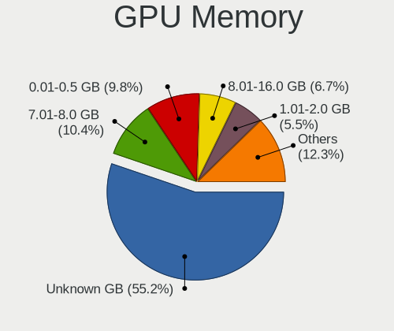
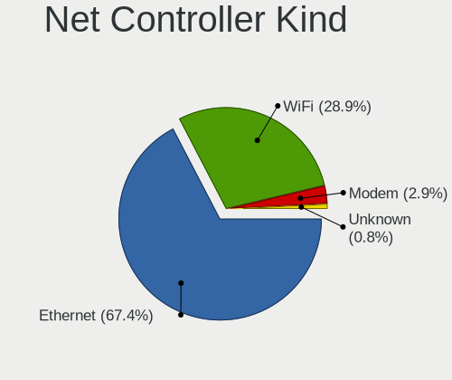
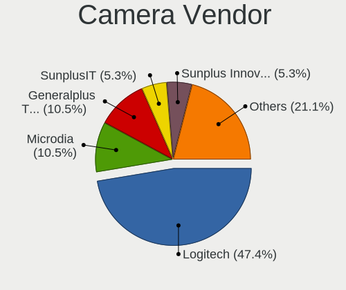

Debian - Hardware Trends (Desktops)
-----------------------------------

A project to identify most popular hardware characteristics and track their change
over time based on data collected by Linux users at https://Linux-Hardware.org.

Anyone can contribute to this report by the [hw-probe](https://github.com/linuxhw/hw-probe) tool:

    sudo -E hw-probe -all -upload

This report is for one last month. Overall report since the beginning of time: [TestCoverage](https://github.com/linuxhw/TestCoverage)

Period: Dec, 2022.

Contents
--------

* [ System ](#system)
  - [ OS                       ](#os)
  - [ OS Family                ](#os-family)
  - [ Kernel                   ](#kernel)
  - [ Kernel Family            ](#kernel-family)
  - [ Kernel Major Ver.        ](#kernel-major-ver)
  - [ Arch                     ](#arch)
  - [ DE                       ](#de)
  - [ Display Server           ](#display-server)
  - [ Display Manager          ](#display-manager)
  - [ OS Lang                  ](#os-lang)
  - [ Boot Mode                ](#boot-mode)
  - [ Filesystem               ](#filesystem)
  - [ Part. scheme             ](#part-scheme)
  - [ Dual Boot with Linux/BSD ](#dual-boot-with-linuxbsd)
  - [ Dual Boot (Win)          ](#dual-boot-win)

* [ Board ](#board)
  - [ Vendor                   ](#vendor)
  - [ Model                    ](#model)
  - [ Model Family             ](#model-family)
  - [ MFG Year                 ](#mfg-year)
  - [ Form Factor              ](#form-factor)
  - [ Secure Boot              ](#secure-boot)
  - [ Coreboot                 ](#coreboot)
  - [ RAM Size                 ](#ram-size)
  - [ RAM Used                 ](#ram-used)
  - [ Total Drives             ](#total-drives)
  - [ Has CD-ROM               ](#has-cd-rom)
  - [ Has Ethernet             ](#has-ethernet)
  - [ Has WiFi                 ](#has-wifi)
  - [ Has Bluetooth            ](#has-bluetooth)

* [ Location ](#location)
  - [ Country                  ](#country)
  - [ City                     ](#city)

* [ Drives ](#drives)
  - [ Drive Vendor             ](#drive-vendor)
  - [ Drive Model              ](#drive-model)
  - [ HDD Vendor               ](#hdd-vendor)
  - [ SSD Vendor               ](#ssd-vendor)
  - [ Drive Kind               ](#drive-kind)
  - [ Drive Connector          ](#drive-connector)
  - [ Drive Size               ](#drive-size)
  - [ Space Total              ](#space-total)
  - [ Space Used               ](#space-used)
  - [ Malfunc. Drives          ](#malfunc-drives)
  - [ Malfunc. Drive Vendor    ](#malfunc-drive-vendor)
  - [ Malfunc. HDD Vendor      ](#malfunc-hdd-vendor)
  - [ Malfunc. Drive Kind      ](#malfunc-drive-kind)
  - [ Failed Drives            ](#failed-drives)
  - [ Failed Drive Vendor      ](#failed-drive-vendor)
  - [ Drive Status             ](#drive-status)

* [ Storage controller ](#storage-controller)
  - [ Storage Vendor           ](#storage-vendor)
  - [ Storage Model            ](#storage-model)
  - [ Storage Kind             ](#storage-kind)

* [ Processor ](#processor)
  - [ CPU Vendor               ](#cpu-vendor)
  - [ CPU Model                ](#cpu-model)
  - [ CPU Model Family         ](#cpu-model-family)
  - [ CPU Cores                ](#cpu-cores)
  - [ CPU Sockets              ](#cpu-sockets)
  - [ CPU Threads              ](#cpu-threads)
  - [ CPU Op-Modes             ](#cpu-op-modes)
  - [ CPU Microcode            ](#cpu-microcode)
  - [ CPU Microarch            ](#cpu-microarch)

* [ Graphics ](#graphics)
  - [ GPU Vendor               ](#gpu-vendor)
  - [ GPU Model                ](#gpu-model)
  - [ GPU Combo                ](#gpu-combo)
  - [ GPU Driver               ](#gpu-driver)
  - [ GPU Memory               ](#gpu-memory)

* [ Monitor ](#monitor)
  - [ Monitor Vendor           ](#monitor-vendor)
  - [ Monitor Model            ](#monitor-model)
  - [ Monitor Resolution       ](#monitor-resolution)
  - [ Monitor Diagonal         ](#monitor-diagonal)
  - [ Monitor Width            ](#monitor-width)
  - [ Aspect Ratio             ](#aspect-ratio)
  - [ Monitor Area             ](#monitor-area)
  - [ Pixel Density            ](#pixel-density)
  - [ Multiple Monitors        ](#multiple-monitors)

* [ Network ](#network)
  - [ Net Controller Vendor    ](#net-controller-vendor)
  - [ Net Controller Model     ](#net-controller-model)
  - [ Wireless Vendor          ](#wireless-vendor)
  - [ Wireless Model           ](#wireless-model)
  - [ Ethernet Vendor          ](#ethernet-vendor)
  - [ Ethernet Model           ](#ethernet-model)
  - [ Net Controller Kind      ](#net-controller-kind)
  - [ Used Controller          ](#used-controller)
  - [ NICs                     ](#nics)
  - [ IPv6                     ](#ipv6)

* [ Bluetooth ](#bluetooth)
  - [ Bluetooth Vendor         ](#bluetooth-vendor)
  - [ Bluetooth Model          ](#bluetooth-model)

* [ Sound ](#sound)
  - [ Sound Vendor             ](#sound-vendor)
  - [ Sound Model              ](#sound-model)

* [ Memory ](#memory)
  - [ Memory Vendor            ](#memory-vendor)
  - [ Memory Model             ](#memory-model)
  - [ Memory Kind              ](#memory-kind)
  - [ Memory Form Factor       ](#memory-form-factor)
  - [ Memory Size              ](#memory-size)
  - [ Memory Speed             ](#memory-speed)

* [ Printers & scanners ](#printers--scanners)
  - [ Printer Vendor           ](#printer-vendor)
  - [ Printer Model            ](#printer-model)
  - [ Scanner Vendor           ](#scanner-vendor)
  - [ Scanner Model            ](#scanner-model)

* [ Camera ](#camera)
  - [ Camera Vendor            ](#camera-vendor)
  - [ Camera Model             ](#camera-model)

* [ Security ](#security)
  - [ Fingerprint Vendor       ](#fingerprint-vendor)
  - [ Fingerprint Model        ](#fingerprint-model)
  - [ Chipcard Vendor          ](#chipcard-vendor)
  - [ Chipcard Model           ](#chipcard-model)

* [ Unsupported ](#unsupported)
  - [ Unsupported Devices      ](#unsupported-devices)
  - [ Unsupported Device Types ](#unsupported-device-types)

System
------

OS
--

Installed operating systems

| Name              | Desktops | Percent |
|-------------------|----------|---------|
| Debian 11         | 107      | 79.26%  |
| Debian            | 18       | 13.33%  |
| Debian 10         | 6        | 4.44%   |
| Debian 11-updates | 3        | 2.22%   |
| Debian 9          | 1        | 0.74%   |

OS Family
---------

OS without a version

| Name   | Desktops | Percent |
|--------|----------|---------|
| Debian | 135      | 100%    |

Kernel
------

Version of the Linux kernel

| Version                | Desktops | Percent |
|------------------------|----------|---------|
| 5.10.0-19-amd64        | 40       | 29.63%  |
| 5.10.0-20-amd64        | 17       | 12.59%  |
| 5.10.0-7-amd64         | 11       | 8.15%   |
| 6.0.0-6-amd64          | 8        | 5.93%   |
| 5.10.0-18-amd64        | 7        | 5.19%   |
| 6.0.0-0.deb11.2-amd64  | 5        | 3.7%    |
| 5.15.74-1-pve          | 5        | 3.7%    |
| 5.10.0-15-amd64        | 4        | 2.96%   |
| 6.0.0-5-amd64          | 3        | 2.22%   |
| 6.0.0-4-amd64          | 3        | 2.22%   |
| 6.0.0-2-amd64          | 3        | 2.22%   |
| 5.19.0-0.deb11.2-amd64 | 2        | 1.48%   |
| 5.15.83-1-pve          | 2        | 1.48%   |
| 4.19.0-6-amd64         | 2        | 1.48%   |
| 4.19.0-22-amd64        | 2        | 1.48%   |
| 6.1.0-0-amd64          | 1        | 0.74%   |
| 6.0.0-3mx-amd64        | 1        | 0.74%   |
| 6.0.0-3.1mx-amd64      | 1        | 0.74%   |
| 5.4.189-2-pve          | 1        | 0.74%   |
| 5.19.17-1-pve          | 1        | 0.74%   |
| 5.18.0-4mx-amd64       | 1        | 0.74%   |
| 5.18.0-0.deb11.4-amd64 | 1        | 0.74%   |
| 5.18.0-0.deb11.3-amd64 | 1        | 0.74%   |
| 5.18.0-0.bpo.1-amd64   | 1        | 0.74%   |
| 5.15.30-2-pve          | 1        | 0.74%   |
| 5.15.0-starfive        | 1        | 0.74%   |
| 5.10.142+truenas       | 1        | 0.74%   |
| 5.10.10-64             | 1        | 0.74%   |
| 5.10.0-9-amd64         | 1        | 0.74%   |
| 5.10.0-8-amd64         | 1        | 0.74%   |
| 5.10.0-18-686-pae      | 1        | 0.74%   |
| 5.10.0-16-amd64        | 1        | 0.74%   |
| 5.10.0-13-amd64        | 1        | 0.74%   |
| 5.10.0-11-amd64        | 1        | 0.74%   |
| 4.19.0-20-rt-amd64     | 1        | 0.74%   |
| 4.19.0-20-amd64        | 1        | 0.74%   |

Kernel Family
-------------

Linux kernel without a distro release

| Version  | Desktops | Percent |
|----------|----------|---------|
| 5.10.0   | 85       | 62.96%  |
| 6.0.0    | 24       | 17.78%  |
| 4.19.0   | 6        | 4.44%   |
| 5.15.74  | 5        | 3.7%    |
| 5.18.0   | 4        | 2.96%   |
| 5.19.0   | 2        | 1.48%   |
| 5.15.83  | 2        | 1.48%   |
| 6.1.0    | 1        | 0.74%   |
| 5.4.189  | 1        | 0.74%   |
| 5.19.17  | 1        | 0.74%   |
| 5.15.30  | 1        | 0.74%   |
| 5.15.0   | 1        | 0.74%   |
| 5.10.142 | 1        | 0.74%   |
| 5.10.10  | 1        | 0.74%   |

Kernel Major Ver.
-----------------

Linux kernel major version

| Version | Desktops | Percent |
|---------|----------|---------|
| 5.10    | 87       | 64.44%  |
| 6.0     | 24       | 17.78%  |
| 5.15    | 9        | 6.67%   |
| 4.19    | 6        | 4.44%   |
| 5.18    | 4        | 2.96%   |
| 5.19    | 3        | 2.22%   |
| 6.1     | 1        | 0.74%   |
| 5.4     | 1        | 0.74%   |

Arch
----

OS architecture (x86_64, i586, etc.)

| Name    | Desktops | Percent |
|---------|----------|---------|
| x86_64  | 133      | 98.52%  |
| riscv64 | 1        | 0.74%   |
| i686    | 1        | 0.74%   |

DE
--

Desktop Environment

| Name       | Desktops | Percent |
|------------|----------|---------|
| Unknown    | 42       | 31.11%  |
| GNOME      | 25       | 18.52%  |
| XFCE       | 24       | 17.78%  |
| KDE5       | 17       | 12.59%  |
| LXDE       | 9        | 6.67%   |
| X-Cinnamon | 6        | 4.44%   |
| MATE       | 5        | 3.7%    |
| LXQt       | 2        | 1.48%   |
| i3         | 2        | 1.48%   |
| Cinnamon   | 2        | 1.48%   |
| KDE        | 1        | 0.74%   |

Display Server
--------------

X11 or Wayland

| Name    | Desktops | Percent |
|---------|----------|---------|
| X11     | 74       | 54.81%  |
| Tty     | 26       | 19.26%  |
| Unknown | 19       | 14.07%  |
| Wayland | 16       | 11.85%  |

Display Manager
---------------

SDDM, LightDM, etc.

| Name    | Desktops | Percent |
|---------|----------|---------|
| Unknown | 66       | 48.89%  |
| LightDM | 32       | 23.7%   |
| SDDM    | 16       | 11.85%  |
| GDM     | 13       | 9.63%   |
| GDM3    | 5        | 3.7%    |
| XDM     | 1        | 0.74%   |
| LXDM    | 1        | 0.74%   |
| KDM     | 1        | 0.74%   |

OS Lang
-------

Language

| Lang       | Desktops | Percent |
|------------|----------|---------|
| en_US      | 56       | 41.48%  |
| ru_RU      | 22       | 16.3%   |
| fr_FR      | 9        | 6.67%   |
| de_DE      | 8        | 5.93%   |
| en_GB      | 7        | 5.19%   |
| pt_BR      | 3        | 2.22%   |
| it_IT      | 3        | 2.22%   |
| es_ES      | 3        | 2.22%   |
| en_CA      | 3        | 2.22%   |
| zh_CN      | 2        | 1.48%   |
| es_MX      | 2        | 1.48%   |
| en_IE      | 2        | 1.48%   |
| de_AT      | 2        | 1.48%   |
| Unknown    | 2        | 1.48%   |
| ro_RO      | 1        | 0.74%   |
| nl_NL      | 1        | 0.74%   |
| fr_BE      | 1        | 0.74%   |
| fi_FI      | 1        | 0.74%   |
| es_GT      | 1        | 0.74%   |
| es_ES@euro | 1        | 0.74%   |
| en_SG      | 1        | 0.74%   |
| en_DE      | 1        | 0.74%   |
| da_DK      | 1        | 0.74%   |
| cs_CZ      | 1        | 0.74%   |
| C          | 1        | 0.74%   |

Boot Mode
---------

EFI or BIOS

| Mode | Desktops | Percent |
|------|----------|---------|
| BIOS | 76       | 56.3%   |
| EFI  | 59       | 43.7%   |

Filesystem
----------

Type of filesystem

| Type    | Desktops | Percent |
|---------|----------|---------|
| Ext4    | 111      | 82.22%  |
| Overlay | 16       | 11.85%  |
| Btrfs   | 4        | 2.96%   |
| Zfs     | 2        | 1.48%   |
| Xfs     | 1        | 0.74%   |
| Rootfs  | 1        | 0.74%   |

Part. scheme
------------

Scheme of partitioning

| Type    | Desktops | Percent |
|---------|----------|---------|
| GPT     | 78       | 57.78%  |
| MBR     | 33       | 24.44%  |
| Unknown | 24       | 17.78%  |

Dual Boot with Linux/BSD
------------------------

Hosting more than one Linux/BSD

| Dual boot | Desktops | Percent |
|-----------|----------|---------|
| No        | 111      | 82.22%  |
| Yes       | 24       | 17.78%  |

Dual Boot (Win)
---------------

Hosting Linux and Windows

| Dual boot | Desktops | Percent |
|-----------|----------|---------|
| No        | 88       | 65.19%  |
| Yes       | 47       | 34.81%  |

Board
-----

Vendor
------

Motherboard manufacturer

| Name                      | Desktops | Percent |
|---------------------------|----------|---------|
| ASUSTek Computer          | 37       | 27.41%  |
| Gigabyte Technology       | 20       | 14.81%  |
| Dell                      | 16       | 11.85%  |
| ASRock                    | 16       | 11.85%  |
| MSI                       | 10       | 7.41%   |
| Hewlett-Packard           | 9        | 6.67%   |
| Lenovo                    | 6        | 4.44%   |
| Fujitsu                   | 4        | 2.96%   |
| Intel                     | 3        | 2.22%   |
| Unknown                   | 2        | 1.48%   |
| Supermicro                | 1        | 0.74%   |
| Pro-B                     | 1        | 0.74%   |
| NetGear                   | 1        | 0.74%   |
| Matrox Electronic Systems | 1        | 0.74%   |
| IceWhale Technology       | 1        | 0.74%   |
| Google                    | 1        | 0.74%   |
| GIFA Industrial Control   | 1        | 0.74%   |
| BESSTAR Tech              | 1        | 0.74%   |
| AZW                       | 1        | 0.74%   |
| ASRockRack                | 1        | 0.74%   |
| Apple                     | 1        | 0.74%   |
| Acer                      | 1        | 0.74%   |

Model
-----

Motherboard model

| Name                                    | Desktops | Percent |
|-----------------------------------------|----------|---------|
| MSI MS-7C56                             | 2        | 1.48%   |
| HP Compaq Pro 6300 SFF                  | 2        | 1.48%   |
| Gigabyte B450M DS3H                     | 2        | 1.48%   |
| Dell OptiPlex 7010                      | 2        | 1.48%   |
| ASUS WS C422 DC                         | 2        | 1.48%   |
| ASRock X570 Pro4                        | 2        | 1.48%   |
| ASRock H470M-HVS                        | 2        | 1.48%   |
| Unknown                                 | 2        | 1.48%   |
| Supermicro C7SIM-Q                      | 1        | 0.74%   |
| Pro-B INSYS                             | 1        | 0.74%   |
| NetGear ReadyDATA 5200                  | 1        | 0.74%   |
| MSI MS-7D75                             | 1        | 0.74%   |
| MSI MS-7C91                             | 1        | 0.74%   |
| MSI MS-7C52                             | 1        | 0.74%   |
| MSI MS-7B90                             | 1        | 0.74%   |
| MSI MS-7996                             | 1        | 0.74%   |
| MSI MS-7865                             | 1        | 0.74%   |
| MSI MS-7318                             | 1        | 0.74%   |
| MSI KBL-U Pro Cubi 3 Silent S (MS-B159) | 1        | 0.74%   |
| Matrox Electronic Systems 4GPMOBIL      | 1        | 0.74%   |
| Lenovo ThinkStation D30 42234T7         | 1        | 0.74%   |
| Lenovo ThinkStation C20 4263BA7         | 1        | 0.74%   |
| Lenovo ThinkCentre M93p 10AAA03W00      | 1        | 0.74%   |
| Lenovo ThinkCentre M93 10A5A00CFR       | 1        | 0.74%   |
| Lenovo ThinkCentre E73 10AU002QUS       | 1        | 0.74%   |
| Lenovo Legion REN7000K-26IAB 90SV0030CP | 1        | 0.74%   |
| Intel DP45SG AAE27733-401               | 1        | 0.74%   |
| Intel DG35EC AAE29266-205               | 1        | 0.74%   |
| Intel DESKTOP 320                       | 1        | 0.74%   |
| IceWhale ZimaBoard 216 ZMB              | 1        | 0.74%   |
| HP Z620 Workstation                     | 1        | 0.74%   |
| HP ProLiant ML30 Gen9                   | 1        | 0.74%   |
| HP ProLiant MicroServer Gen8            | 1        | 0.74%   |
| HP ProLiant MicroServer                 | 1        | 0.74%   |
| HP EliteDesk 800 G1 SFF                 | 1        | 0.74%   |
| HP Compaq Pro 6305 SFF                  | 1        | 0.74%   |
| HP Compaq Pro 6300 MT                   | 1        | 0.74%   |
| Google Teemo                            | 1        | 0.74%   |
| Gigabyte Z97-HD3                        | 1        | 0.74%   |
| Gigabyte Z87M-D3H                       | 1        | 0.74%   |

Model Family
------------

Motherboard model prefix

| Name                               | Desktops | Percent |
|------------------------------------|----------|---------|
| ASUS PRIME                         | 9        | 6.67%   |
| ASUS ROG                           | 8        | 5.93%   |
| Dell OptiPlex                      | 7        | 5.19%   |
| HP Compaq                          | 4        | 2.96%   |
| Dell Vostro                        | 4        | 2.96%   |
| Lenovo ThinkCentre                 | 3        | 2.22%   |
| HP ProLiant                        | 3        | 2.22%   |
| ASRock X570                        | 3        | 2.22%   |
| MSI MS-7C56                        | 2        | 1.48%   |
| Lenovo ThinkStation                | 2        | 1.48%   |
| Gigabyte H61M-DS2                  | 2        | 1.48%   |
| Gigabyte B450M                     | 2        | 1.48%   |
| Gigabyte 990FXA-UD3                | 2        | 1.48%   |
| Fujitsu ESPRIMO                    | 2        | 1.48%   |
| Dell Precision                     | 2        | 1.48%   |
| ASUS WS                            | 2        | 1.48%   |
| ASUS TUF                           | 2        | 1.48%   |
| ASUS STRIX                         | 2        | 1.48%   |
| ASRock H470M-HVS                   | 2        | 1.48%   |
| ASRock B550M                       | 2        | 1.48%   |
| Unknown                            | 2        | 1.48%   |
| Supermicro C7SIM-Q                 | 1        | 0.74%   |
| Pro-B INSYS                        | 1        | 0.74%   |
| NetGear ReadyDATA                  | 1        | 0.74%   |
| MSI MS-7D75                        | 1        | 0.74%   |
| MSI MS-7C91                        | 1        | 0.74%   |
| MSI MS-7C52                        | 1        | 0.74%   |
| MSI MS-7B90                        | 1        | 0.74%   |
| MSI MS-7996                        | 1        | 0.74%   |
| MSI MS-7865                        | 1        | 0.74%   |
| MSI MS-7318                        | 1        | 0.74%   |
| MSI KBL-U                          | 1        | 0.74%   |
| Matrox Electronic Systems 4GPMOBIL | 1        | 0.74%   |
| Lenovo Legion                      | 1        | 0.74%   |
| Intel DP45SG                       | 1        | 0.74%   |
| Intel DG35EC                       | 1        | 0.74%   |
| Intel DESKTOP                      | 1        | 0.74%   |
| IceWhale ZimaBoard                 | 1        | 0.74%   |
| HP Z620                            | 1        | 0.74%   |
| HP EliteDesk                       | 1        | 0.74%   |

MFG Year
--------

Motherboard manufacture year

| Year    | Desktops | Percent |
|---------|----------|---------|
| 2018    | 17       | 12.59%  |
| 2021    | 15       | 11.11%  |
| 2013    | 15       | 11.11%  |
| 2020    | 13       | 9.63%   |
| 2012    | 12       | 8.89%   |
| 2017    | 9        | 6.67%   |
| 2022    | 8        | 5.93%   |
| 2011    | 7        | 5.19%   |
| 2019    | 6        | 4.44%   |
| 2016    | 5        | 3.7%    |
| 2015    | 5        | 3.7%    |
| 2014    | 5        | 3.7%    |
| 2010    | 5        | 3.7%    |
| 2009    | 4        | 2.96%   |
| 2007    | 3        | 2.22%   |
| 2008    | 2        | 1.48%   |
| 2006    | 2        | 1.48%   |
| 2005    | 1        | 0.74%   |
| Unknown | 1        | 0.74%   |

Form Factor
-----------

Physical design of the computer

| Name    | Desktops | Percent |
|---------|----------|---------|
| Desktop | 135      | 100%    |

Secure Boot
-----------

Enabled or disabled

| State    | Desktops | Percent |
|----------|----------|---------|
| Disabled | 133      | 98.52%  |
| Enabled  | 2        | 1.48%   |

Coreboot
--------

Have coreboot on board

| Used | Desktops | Percent |
|------|----------|---------|
| No   | 134      | 99.26%  |
| Yes  | 1        | 0.74%   |

RAM Size
--------

Total RAM memory

| Size in GB  | Desktops | Percent |
|-------------|----------|---------|
| 32.01-64.0  | 32       | 23.7%   |
| 16.01-24.0  | 24       | 17.78%  |
| 8.01-16.0   | 23       | 17.04%  |
| 4.01-8.0    | 19       | 14.07%  |
| 64.01-256.0 | 15       | 11.11%  |
| 3.01-4.0    | 14       | 10.37%  |
| 1.01-2.0    | 4        | 2.96%   |
| 24.01-32.0  | 2        | 1.48%   |
| 2.01-3.0    | 2        | 1.48%   |

RAM Used
--------

Used RAM memory

| Used GB    | Desktops | Percent |
|------------|----------|---------|
| 1.01-2.0   | 39       | 28.89%  |
| 4.01-8.0   | 24       | 17.78%  |
| 2.01-3.0   | 22       | 16.3%   |
| 0.51-1.0   | 22       | 16.3%   |
| 3.01-4.0   | 13       | 9.63%   |
| 8.01-16.0  | 6        | 4.44%   |
| 0.01-0.5   | 5        | 3.7%    |
| 16.01-24.0 | 3        | 2.22%   |
| 32.01-64.0 | 1        | 0.74%   |

Total Drives
------------

Number of drives on board

| Drives | Desktops | Percent |
|--------|----------|---------|
| 1      | 52       | 38.52%  |
| 2      | 38       | 28.15%  |
| 4      | 19       | 14.07%  |
| 3      | 12       | 8.89%   |
| 5      | 6        | 4.44%   |
| 6      | 3        | 2.22%   |
| 21     | 1        | 0.74%   |
| 10     | 1        | 0.74%   |
| 9      | 1        | 0.74%   |
| 8      | 1        | 0.74%   |
| 7      | 1        | 0.74%   |

Has CD-ROM
----------

Has CD-ROM on board

| Presented | Desktops | Percent |
|-----------|----------|---------|
| No        | 88       | 65.19%  |
| Yes       | 47       | 34.81%  |

Has Ethernet
------------

Has Ethernet on board

| Presented | Desktops | Percent |
|-----------|----------|---------|
| Yes       | 134      | 99.26%  |
| No        | 1        | 0.74%   |

Has WiFi
--------

Has WiFi module

| Presented | Desktops | Percent |
|-----------|----------|---------|
| No        | 86       | 63.7%   |
| Yes       | 49       | 36.3%   |

Has Bluetooth
-------------

Has Bluetooth module

| Presented | Desktops | Percent |
|-----------|----------|---------|
| No        | 89       | 65.93%  |
| Yes       | 46       | 34.07%  |

Location
--------

Country
-------

Geographic location (country)

| Country       | Desktops | Percent |
|---------------|----------|---------|
| Russia        | 23       | 17.04%  |
| Germany       | 20       | 14.81%  |
| USA           | 19       | 14.07%  |
| France        | 12       | 8.89%   |
| Italy         | 7        | 5.19%   |
| UK            | 5        | 3.7%    |
| Spain         | 5        | 3.7%    |
| Netherlands   | 5        | 3.7%    |
| Canada        | 5        | 3.7%    |
| Brazil        | 4        | 2.96%   |
| Romania       | 3        | 2.22%   |
| Austria       | 3        | 2.22%   |
| Thailand      | 2        | 1.48%   |
| Taiwan        | 2        | 1.48%   |
| Mexico        | 2        | 1.48%   |
| Vietnam       | 1        | 0.74%   |
| Turkey        | 1        | 0.74%   |
| Poland        | 1        | 0.74%   |
| Ireland       | 1        | 0.74%   |
| India         | 1        | 0.74%   |
| Hungary       | 1        | 0.74%   |
| Hong Kong     | 1        | 0.74%   |
| Guernsey      | 1        | 0.74%   |
| Guatemala     | 1        | 0.74%   |
| French Guiana | 1        | 0.74%   |
| Finland       | 1        | 0.74%   |
| Denmark       | 1        | 0.74%   |
| Czechia       | 1        | 0.74%   |
| Croatia       | 1        | 0.74%   |
| Colombia      | 1        | 0.74%   |
| Belgium       | 1        | 0.74%   |
| Belarus       | 1        | 0.74%   |
| Australia     | 1        | 0.74%   |

City
----

Geographic location (city)

| City                   | Desktops | Percent |
|------------------------|----------|---------|
| Voronezh               | 13       | 9.63%   |
| Moscow                 | 5        | 3.7%    |
| London                 | 3        | 2.22%   |
| Toronto                | 2        | 1.48%   |
| Saarbrücken           | 2        | 1.48%   |
| Paris                  | 2        | 1.48%   |
| Hamburg                | 2        | 1.48%   |
| Falkenstein            | 2        | 1.48%   |
| Berlin                 | 2        | 1.48%   |
| Wiesau                 | 1        | 0.74%   |
| Wetzlar                | 1        | 0.74%   |
| Warsaw                 | 1        | 0.74%   |
| Waldkraiburg           | 1        | 0.74%   |
| Voskresensk            | 1        | 0.74%   |
| Vlaardingen            | 1        | 0.74%   |
| Vila Velha             | 1        | 0.74%   |
| Vienna                 | 1        | 0.74%   |
| Treviso                | 1        | 0.74%   |
| Tlalnepantla           | 1        | 0.74%   |
| Tillmitsch             | 1        | 0.74%   |
| Târgu Mureş          | 1        | 0.74%   |
| Taoyuan District       | 1        | 0.74%   |
| Tampere                | 1        | 0.74%   |
| Talence                | 1        | 0.74%   |
| Stroud                 | 1        | 0.74%   |
| St. Albert             | 1        | 0.74%   |
| St Petersburg          | 1        | 0.74%   |
| Springfield            | 1        | 0.74%   |
| Sibiu                  | 1        | 0.74%   |
| Seattle                | 1        | 0.74%   |
| Schemmerhofen          | 1        | 0.74%   |
| Sartrouville           | 1        | 0.74%   |
| Sao Jose do Rio Preto  | 1        | 0.74%   |
| Santa Lucia di Piave   | 1        | 0.74%   |
| Santa Cruz de Tenerife | 1        | 0.74%   |
| San Fernando           | 1        | 0.74%   |
| Saint-Etienne          | 1        | 0.74%   |
| Saint-Cyr-sur-Loire    | 1        | 0.74%   |
| Rogers                 | 1        | 0.74%   |
| Rockford               | 1        | 0.74%   |

Drives
------

Drive Vendor
------------

Hard drive vendors

| Vendor                    | Desktops | Drives | Percent |
|---------------------------|----------|--------|---------|
| Seagate                   | 48       | 75     | 19.12%  |
| Samsung Electronics       | 43       | 62     | 17.13%  |
| WDC                       | 41       | 57     | 16.33%  |
| Toshiba                   | 19       | 29     | 7.57%   |
| Kingston                  | 12       | 12     | 4.78%   |
| SanDisk                   | 11       | 14     | 4.38%   |
| Hitachi                   | 11       | 12     | 4.38%   |
| Crucial                   | 9        | 11     | 3.59%   |
| Intel                     | 7        | 8      | 2.79%   |
| Transcend                 | 4        | 4      | 1.59%   |
| OCZ                       | 3        | 4      | 1.2%    |
| HGST                      | 3        | 7      | 1.2%    |
| Hewlett-Packard           | 3        | 4      | 1.2%    |
| China                     | 3        | 4      | 1.2%    |
| Unknown                   | 2        | 2      | 0.8%    |
| SPCC                      | 2        | 2      | 0.8%    |
| SK hynix                  | 2        | 5      | 0.8%    |
| Netac                     | 2        | 2      | 0.8%    |
| Micron/Crucial Technology | 2        | 2      | 0.8%    |
| Intenso                   | 2        | 2      | 0.8%    |
| Corsair                   | 2        | 3      | 0.8%    |
| T-FORCE                   | 1        | 1      | 0.4%    |
| PNY                       | 1        | 1      | 0.4%    |
| Phison Electronics        | 1        | 1      | 0.4%    |
| Phison                    | 1        | 1      | 0.4%    |
| Patriot                   | 1        | 1      | 0.4%    |
| MILAN                     | 1        | 1      | 0.4%    |
| Micron Technology         | 1        | 1      | 0.4%    |
| Maxtor                    | 1        | 1      | 0.4%    |
| KIOXIA-EXCERIA            | 1        | 1      | 0.4%    |
| KIOXIA                    | 1        | 1      | 0.4%    |
| KingFast                  | 1        | 1      | 0.4%    |
| JMicron Technology        | 1        | 1      | 0.4%    |
| Inland                    | 1        | 1      | 0.4%    |
| HPE                       | 1        | 1      | 0.4%    |
| Hikvision                 | 1        | 1      | 0.4%    |
| Drevo                     | 1        | 1      | 0.4%    |
| AMD                       | 1        | 1      | 0.4%    |
| ADATA Technology          | 1        | 1      | 0.4%    |
| Acer                      | 1        | 1      | 0.4%    |

Drive Model
-----------

Hard drive models

| Model                                              | Desktops | Percent |
|----------------------------------------------------|----------|---------|
| Seagate ST500DM002-1BD142 500GB                    | 8        | 2.7%    |
| Samsung SSD 980 PRO 1TB                            | 5        | 1.69%   |
| Samsung SSD 870 EVO 500GB                          | 4        | 1.35%   |
| Seagate ST3500413AS 500GB                          | 3        | 1.01%   |
| Seagate Expansion Desk 5TB                         | 3        | 1.01%   |
| Samsung SSD 970 EVO Plus 1TB                       | 3        | 1.01%   |
| Samsung SSD 860 EVO 250GB                          | 3        | 1.01%   |
| Samsung NVMe SSD Controller PM9A1/PM9A3/980PRO 2TB | 3        | 1.01%   |
| Crucial CT500MX500SSD1 500GB                       | 3        | 1.01%   |
| WDC WD5000AAKX-08U6AA0 500GB                       | 2        | 0.68%   |
| WDC WD40EFRX-68N32N0 4TB                           | 2        | 0.68%   |
| WDC WD30EFRX-68EUZN0 3TB                           | 2        | 0.68%   |
| WDC WD20EZRZ-00Z5HB0 2TB                           | 2        | 0.68%   |
| Toshiba HDWG180 8TB                                | 2        | 0.68%   |
| Toshiba HDWD120 2TB                                | 2        | 0.68%   |
| Toshiba HDWD110 1TB                                | 2        | 0.68%   |
| Toshiba DT01ACA200 2TB                             | 2        | 0.68%   |
| Seagate ST4000VN008-2DR166 4TB                     | 2        | 0.68%   |
| Seagate ST250DM000-1BD141 250GB                    | 2        | 0.68%   |
| Seagate ST1000LM035-1RK172 1TB                     | 2        | 0.68%   |
| Seagate ST1000DM003-1SB102 1TB                     | 2        | 0.68%   |
| SanDisk SSD PLUS 480GB                             | 2        | 0.68%   |
| Samsung SSD 970 EVO Plus 250GB                     | 2        | 0.68%   |
| Samsung SSD 860 EVO 500GB                          | 2        | 0.68%   |
| Samsung SSD 850 EVO 1TB                            | 2        | 0.68%   |
| Samsung MZQLB960HAJR-00007 960GB                   | 2        | 0.68%   |
| Samsung MZ7LM960HCHP-00003 960GB SSD               | 2        | 0.68%   |
| OCZ VERTEX3 120GB SSD                              | 2        | 0.68%   |
| Netac SSD 240GB                                    | 2        | 0.68%   |
| Kingston SA400S37960G 960GB SSD                    | 2        | 0.68%   |
| Kingston SA400S37480G 480GB SSD                    | 2        | 0.68%   |
| Kingston SA400S37120G 120GB SSD                    | 2        | 0.68%   |
| Hitachi HUA722020ALA331 2TB                        | 2        | 0.68%   |
| WDC WDS480G2G0B-00EPW0 480GB SSD                   | 1        | 0.34%   |
| WDC WDS250G2B0A-00SM50 250GB SSD                   | 1        | 0.34%   |
| WDC WDS120G2G0A-00JH30 120GB SSD                   | 1        | 0.34%   |
| WDC WDS100T3XHC-00SJG0 1TB                         | 1        | 0.34%   |
| WDC WDS100T2B0C-00PXH0 1TB                         | 1        | 0.34%   |
| WDC WDS100T2B0A-00SM50 1TB SSD                     | 1        | 0.34%   |
| WDC WDBNCE5000PNC 500GB SSD                        | 1        | 0.34%   |

HDD Vendor
----------

Hard disk drive vendors

| Vendor              | Desktops | Drives | Percent |
|---------------------|----------|--------|---------|
| Seagate             | 48       | 70     | 39.34%  |
| WDC                 | 36       | 49     | 29.51%  |
| Toshiba             | 18       | 26     | 14.75%  |
| Hitachi             | 11       | 12     | 9.02%   |
| Samsung Electronics | 3        | 3      | 2.46%   |
| HGST                | 3        | 7      | 2.46%   |
| Maxtor              | 1        | 1      | 0.82%   |
| Intenso             | 1        | 1      | 0.82%   |
| HPE                 | 1        | 1      | 0.82%   |

SSD Vendor
----------

Solid state drive vendors

| Vendor              | Desktops | Drives | Percent |
|---------------------|----------|--------|---------|
| Samsung Electronics | 22       | 28     | 27.5%   |
| Kingston            | 10       | 10     | 12.5%   |
| SanDisk             | 8        | 10     | 10%     |
| Crucial             | 6        | 8      | 7.5%    |
| WDC                 | 5        | 6      | 6.25%   |
| Transcend           | 3        | 3      | 3.75%   |
| OCZ                 | 3        | 4      | 3.75%   |
| Intel               | 3        | 3      | 3.75%   |
| China               | 3        | 4      | 3.75%   |
| Toshiba             | 2        | 2      | 2.5%    |
| SPCC                | 2        | 2      | 2.5%    |
| Netac               | 2        | 2      | 2.5%    |
| T-FORCE             | 1        | 1      | 1.25%   |
| PNY                 | 1        | 1      | 1.25%   |
| Micron Technology   | 1        | 1      | 1.25%   |
| KingFast            | 1        | 1      | 1.25%   |
| Intenso             | 1        | 1      | 1.25%   |
| Inland              | 1        | 1      | 1.25%   |
| Hewlett-Packard     | 1        | 2      | 1.25%   |
| Drevo               | 1        | 1      | 1.25%   |
| Corsair             | 1        | 2      | 1.25%   |
| AMD                 | 1        | 1      | 1.25%   |
| Acer                | 1        | 1      | 1.25%   |

Drive Kind
----------

HDD or SSD

| Kind    | Desktops | Drives | Percent |
|---------|----------|--------|---------|
| HDD     | 85       | 170    | 41.46%  |
| SSD     | 66       | 95     | 32.2%   |
| NVMe    | 48       | 67     | 23.41%  |
| Unknown | 4        | 7      | 1.95%   |
| MMC     | 2        | 2      | 0.98%   |

Drive Connector
---------------

SATA, SAS, NVMe, etc.

| Type | Desktops | Drives | Percent |
|------|----------|--------|---------|
| SATA | 111      | 245    | 65.29%  |
| NVMe | 48       | 67     | 28.24%  |
| SAS  | 9        | 27     | 5.29%   |
| MMC  | 2        | 2      | 1.18%   |

Drive Size
----------

Size of hard drive

| Size in TB | Desktops | Drives | Percent |
|------------|----------|--------|---------|
| 0.01-0.5   | 82       | 117    | 46.33%  |
| 0.51-1.0   | 40       | 60     | 22.6%   |
| 1.01-2.0   | 21       | 30     | 11.86%  |
| 4.01-10.0  | 13       | 21     | 7.34%   |
| 3.01-4.0   | 11       | 15     | 6.21%   |
| 2.01-3.0   | 9        | 16     | 5.08%   |
| 10.01-20.0 | 1        | 6      | 0.56%   |

Space Total
-----------

Amount of disk space available on the file system

| Size in GB     | Desktops | Percent |
|----------------|----------|---------|
| 101-250        | 24       | 17.78%  |
| More than 3000 | 20       | 14.81%  |
| Unknown        | 19       | 14.07%  |
| 251-500        | 18       | 13.33%  |
| 501-1000       | 17       | 12.59%  |
| 1001-2000      | 13       | 9.63%   |
| 51-100         | 8        | 5.93%   |
| 2001-3000      | 7        | 5.19%   |
| 21-50          | 5        | 3.7%    |
| 1-20           | 4        | 2.96%   |

Space Used
----------

Amount of used disk space

| Used GB        | Desktops | Percent |
|----------------|----------|---------|
| 1-20           | 44       | 32.59%  |
| Unknown        | 19       | 14.07%  |
| 101-250        | 16       | 11.85%  |
| 1001-2000      | 13       | 9.63%   |
| 21-50          | 11       | 8.15%   |
| More than 3000 | 9        | 6.67%   |
| 501-1000       | 9        | 6.67%   |
| 51-100         | 9        | 6.67%   |
| 251-500        | 2        | 1.48%   |
| 0              | 2        | 1.48%   |
| 2001-3000      | 1        | 0.74%   |

Malfunc. Drives
---------------

Drive models with a malfunction

| Model                                            | Desktops | Drives | Percent |
|--------------------------------------------------|----------|--------|---------|
| Seagate ST500DM002-1BD142 500GB                  | 4        | 7      | 12.5%   |
| Seagate ST3500413AS 500GB                        | 2        | 2      | 6.25%   |
| WDC WDS120G2G0A-00JH30 120GB SSD                 | 1        | 1      | 3.13%   |
| WDC WD800AAJS-00PSA0 80GB                        | 1        | 1      | 3.13%   |
| WDC WD60EFRX-68MYMN1 6TB                         | 1        | 1      | 3.13%   |
| WDC WD5000LPVX-08V0TT5 500GB                     | 1        | 1      | 3.13%   |
| WDC WD5000AAKX-08U6AA0 500GB                     | 1        | 1      | 3.13%   |
| WDC WD3200AAKS-00SBA0 320GB                      | 1        | 1      | 3.13%   |
| WDC WD2500AAJS-00YZCA0 250GB                     | 1        | 1      | 3.13%   |
| WDC WD20EARX-00PASB0 2TB                         | 1        | 1      | 3.13%   |
| WDC WD1600AAJS-08PSA0 160GB                      | 1        | 1      | 3.13%   |
| Toshiba KSG60ZSE256G SATA 256GB SSD              | 1        | 1      | 3.13%   |
| Seagate ST5000LM000-2AN170 5TB                   | 1        | 2      | 3.13%   |
| Seagate ST380817AS 80GB                          | 1        | 1      | 3.13%   |
| Seagate ST3808110AS 80GB                         | 1        | 1      | 3.13%   |
| Seagate ST3250318AS 250GB                        | 1        | 1      | 3.13%   |
| Seagate ST31000340AS 1TB                         | 1        | 1      | 3.13%   |
| Seagate ST1000LM049-2GH172 1TB                   | 1        | 1      | 3.13%   |
| Seagate ST1000LM035-1RK172 1TB                   | 1        | 1      | 3.13%   |
| Seagate ST1000DM003-1CH162 1TB                   | 1        | 1      | 3.13%   |
| Samsung Electronics SSD 870 EVO 250GB            | 1        | 1      | 3.13%   |
| Micron Technology M510DC_MTFDDAK960MBP 960GB SSD | 1        | 1      | 3.13%   |
| Kingston SV300S37A120G 120GB SSD                 | 1        | 1      | 3.13%   |
| Intel SSDSC2CW120A3 120GB                        | 1        | 1      | 3.13%   |
| Intel SSDSC2BB960G7 960GB                        | 1        | 1      | 3.13%   |
| Hitachi HTS725032A9A364 320GB                    | 1        | 1      | 3.13%   |
| Hitachi HTS725032A9A360 320GB                    | 1        | 1      | 3.13%   |
| HGST HTS545050A7E680 500GB                       | 1        | 1      | 3.13%   |

Malfunc. Drive Vendor
---------------------

Vendors of faulty drives

| Vendor              | Desktops | Drives | Percent |
|---------------------|----------|--------|---------|
| Seagate             | 13       | 18     | 44.83%  |
| WDC                 | 8        | 9      | 27.59%  |
| Intel               | 2        | 2      | 6.9%    |
| Toshiba             | 1        | 1      | 3.45%   |
| Samsung Electronics | 1        | 1      | 3.45%   |
| Micron Technology   | 1        | 1      | 3.45%   |
| Kingston            | 1        | 1      | 3.45%   |
| Hitachi             | 1        | 2      | 3.45%   |
| HGST                | 1        | 1      | 3.45%   |

Malfunc. HDD Vendor
-------------------

Vendors of faulty HDD drives

| Vendor  | Desktops | Drives | Percent |
|---------|----------|--------|---------|
| Seagate | 13       | 18     | 59.09%  |
| WDC     | 7        | 8      | 31.82%  |
| Hitachi | 1        | 2      | 4.55%   |
| HGST    | 1        | 1      | 4.55%   |

Malfunc. Drive Kind
-------------------

Kinds of faulty drives

| Kind | Desktops | Drives | Percent |
|------|----------|--------|---------|
| HDD  | 19       | 29     | 73.08%  |
| SSD  | 7        | 7      | 26.92%  |

Failed Drives
-------------

Failed drive models

| Model                           | Desktops | Drives | Percent |
|---------------------------------|----------|--------|---------|
| Samsung Electronics SSD 980 1TB | 1        | 1      | 100%    |

Failed Drive Vendor
-------------------

Failed drive vendors

| Vendor              | Desktops | Drives | Percent |
|---------------------|----------|--------|---------|
| Samsung Electronics | 1        | 1      | 100%    |

Drive Status
------------

Number of failed and malfunc. drives

| Status   | Desktops | Drives | Percent |
|----------|----------|--------|---------|
| Works    | 96       | 201    | 59.63%  |
| Detected | 40       | 103    | 24.84%  |
| Malfunc  | 24       | 36     | 14.91%  |
| Failed   | 1        | 1      | 0.62%   |

Storage controller
------------------

Storage Vendor
--------------

Storage controller vendors

| Vendor                       | Desktops | Percent |
|------------------------------|----------|---------|
| Intel                        | 79       | 37.62%  |
| AMD                          | 51       | 24.29%  |
| Samsung Electronics          | 21       | 10%     |
| ASMedia Technology           | 10       | 4.76%   |
| Marvell Technology Group     | 6        | 2.86%   |
| SanDisk                      | 5        | 2.38%   |
| Micron/Crucial Technology    | 5        | 2.38%   |
| JMicron Technology           | 5        | 2.38%   |
| Phison Electronics           | 3        | 1.43%   |
| Nvidia                       | 3        | 1.43%   |
| LSI Logic / Symbios Logic    | 3        | 1.43%   |
| VIA Technologies             | 2        | 0.95%   |
| SK hynix                     | 2        | 0.95%   |
| Silicon Motion               | 2        | 0.95%   |
| MAXIO Technology (Hangzhou)  | 2        | 0.95%   |
| KIOXIA                       | 2        | 0.95%   |
| Kingston Technology Company  | 2        | 0.95%   |
| Adaptec                      | 2        | 0.95%   |
| Toshiba America Info Systems | 1        | 0.48%   |
| INNOGRIT                     | 1        | 0.48%   |
| Broadcom / LSI               | 1        | 0.48%   |
| Biwin Storage Technology     | 1        | 0.48%   |
| ADATA Technology             | 1        | 0.48%   |

Storage Model
-------------

Storage controller models

| Model                                                                                   | Desktops | Percent |
|-----------------------------------------------------------------------------------------|----------|---------|
| AMD FCH SATA Controller [AHCI mode]                                                     | 25       | 9.65%   |
| AMD 400 Series Chipset SATA Controller                                                  | 12       | 4.63%   |
| Samsung NVMe SSD Controller SM981/PM981/PM983                                           | 11       | 4.25%   |
| Samsung NVMe SSD Controller PM9A1/PM9A3/980PRO                                          | 10       | 3.86%   |
| AMD 500 Series Chipset SATA Controller                                                  | 10       | 3.86%   |
| Intel 8 Series/C220 Series Chipset Family 6-port SATA Controller 1 [AHCI mode]          | 8        | 3.09%   |
| ASMedia ASM1062 Serial ATA Controller                                                   | 8        | 3.09%   |
| Intel Cannon Lake PCH SATA AHCI Controller                                              | 6        | 2.32%   |
| Intel 7 Series/C210 Series Chipset Family 6-port SATA Controller [AHCI mode]            | 6        | 2.32%   |
| Intel Alder Lake-S PCH SATA Controller [AHCI Mode]                                      | 5        | 1.93%   |
| Intel 200 Series PCH SATA controller [AHCI mode]                                        | 5        | 1.93%   |
| AMD FCH SATA Controller D                                                               | 5        | 1.93%   |
| Intel 82801JI (ICH10 Family) SATA AHCI Controller                                       | 4        | 1.54%   |
| AMD SB7x0/SB8x0/SB9x0 IDE Controller                                                    | 4        | 1.54%   |
| SanDisk Non-Volatile memory controller                                                  | 3        | 1.16%   |
| Marvell Group 88SE9172 SATA 6Gb/s Controller                                            | 3        | 1.16%   |
| JMicron JMB363 SATA/IDE Controller                                                      | 3        | 1.16%   |
| Intel Volume Management Device NVMe RAID Controller                                     | 3        | 1.16%   |
| Intel Q170/Q150/B150/H170/H110/Z170/CM236 Chipset SATA Controller [AHCI Mode]           | 3        | 1.16%   |
| Intel Comet Lake SATA AHCI Controller                                                   | 3        | 1.16%   |
| Intel Celeron N3350/Pentium N4200/Atom E3900 Series SATA AHCI Controller                | 3        | 1.16%   |
| Intel 6 Series/C200 Series Chipset Family Desktop SATA Controller (IDE mode, ports 4-5) | 3        | 1.16%   |
| Intel 6 Series/C200 Series Chipset Family Desktop SATA Controller (IDE mode, ports 0-3) | 3        | 1.16%   |
| Intel 6 Series/C200 Series Chipset Family 6 port Desktop SATA AHCI Controller           | 3        | 1.16%   |
| Intel 5 Series/3400 Series Chipset 6 port SATA AHCI Controller                          | 3        | 1.16%   |
| AMD SB7x0/SB8x0/SB9x0 SATA Controller [AHCI mode]                                       | 3        | 1.16%   |
| Silicon Motion SM2262/SM2262EN SSD Controller                                           | 2        | 0.77%   |
| Samsung NVMe SSD Controller 980                                                         | 2        | 0.77%   |
| Nvidia MCP61 SATA Controller                                                            | 2        | 0.77%   |
| Micron/Crucial P2 NVMe PCIe SSD                                                         | 2        | 0.77%   |
| Micron/Crucial P1 NVMe PCIe SSD                                                         | 2        | 0.77%   |
| MAXIO (Hangzhou) NVMe SSD Controller MAP1202                                            | 2        | 0.77%   |
| Marvell Group 88SE9215 PCIe 2.0 x1 4-port SATA 6 Gb/s Controller                        | 2        | 0.77%   |
| JMicron JMB368 IDE controller                                                           | 2        | 0.77%   |
| Intel Sunrise Point-LP SATA Controller [AHCI mode]                                      | 2        | 0.77%   |
| Intel SSD 660P Series                                                                   | 2        | 0.77%   |
| Intel NM10/ICH7 Family SATA Controller [IDE mode]                                       | 2        | 0.77%   |
| Intel C602 chipset 4-Port SATA Storage Control Unit                                     | 2        | 0.77%   |
| Intel C600/X79 series chipset IDE-r Controller                                          | 2        | 0.77%   |
| Intel C600/X79 series chipset 6-Port SATA AHCI Controller                               | 2        | 0.77%   |

Storage Kind
------------

Kind of storage controller (IDE, SATA, NVMe, SAS, ...)

| Kind | Desktops | Percent |
|------|----------|---------|
| SATA | 110      | 53.4%   |
| NVMe | 48       | 23.3%   |
| IDE  | 32       | 15.53%  |
| RAID | 10       | 4.85%   |
| SAS  | 4        | 1.94%   |
| SCSI | 2        | 0.97%   |

Processor
---------

CPU Vendor
----------

Processor vendors

| Vendor        | Desktops | Percent |
|---------------|----------|---------|
| Intel         | 80       | 59.26%  |
| AMD           | 54       | 40%     |
| sifive,u74-mc | 1        | 0.74%   |

CPU Model
---------

Processor models

| Model                                       | Desktops | Percent |
|---------------------------------------------|----------|---------|
| Intel Core i7-10700 CPU @ 2.90GHz           | 3        | 2.22%   |
| Intel Core i5-3470 CPU @ 3.20GHz            | 3        | 2.22%   |
| AMD Ryzen 9 3900X 12-Core Processor         | 3        | 2.22%   |
| AMD Ryzen 7 5700G with Radeon Graphics      | 3        | 2.22%   |
| AMD Ryzen 5 5600G with Radeon Graphics      | 3        | 2.22%   |
| Intel Xeon W-2145 CPU @ 3.70GHz             | 2        | 1.48%   |
| Intel Xeon CPU E5620 @ 2.40GHz              | 2        | 1.48%   |
| Intel Core i7-3770 CPU @ 3.40GHz            | 2        | 1.48%   |
| Intel Core i5-9600K CPU @ 3.70GHz           | 2        | 1.48%   |
| Intel Core i5-4590 CPU @ 3.30GHz            | 2        | 1.48%   |
| Intel Core i5-10400 CPU @ 2.90GHz           | 2        | 1.48%   |
| Intel Core i3-2120 CPU @ 3.30GHz            | 2        | 1.48%   |
| Intel Core 2 Quad CPU Q9550 @ 2.83GHz       | 2        | 1.48%   |
| Intel 12th Gen Core i9-12900K               | 2        | 1.48%   |
| AMD Ryzen 9 5950X 16-Core Processor         | 2        | 1.48%   |
| AMD Ryzen 7 5800X 8-Core Processor          | 2        | 1.48%   |
| AMD Ryzen 7 3800X 8-Core Processor          | 2        | 1.48%   |
| AMD Ryzen 7 1700 Eight-Core Processor       | 2        | 1.48%   |
| AMD Ryzen 5 5600X 6-Core Processor          | 2        | 1.48%   |
| AMD Ryzen 5 3600 6-Core Processor           | 2        | 1.48%   |
| AMD Ryzen 5 3400G with Radeon Vega Graphics | 2        | 1.48%   |
| AMD Ryzen 5 2600 Six-Core Processor         | 2        | 1.48%   |
| AMD Athlon II X2 245 Processor              | 2        | 1.48%   |
| sifive,u74-mc rv64imafdc                    | 1        | 0.74%   |
| Intel Xeon W-2295 CPU @ 3.00GHz             | 1        | 0.74%   |
| Intel Xeon CPU X5650 @ 2.67GHz              | 1        | 0.74%   |
| Intel Xeon CPU X3450 @ 2.67GHz              | 1        | 0.74%   |
| Intel Xeon CPU E5-2680 0 @ 2.70GHz          | 1        | 0.74%   |
| Intel Xeon CPU E5-2670 0 @ 2.60GHz          | 1        | 0.74%   |
| Intel Xeon CPU E31260L @ 2.40GHz            | 1        | 0.74%   |
| Intel Xeon CPU E3-1220 v5 @ 3.00GHz         | 1        | 0.74%   |
| Intel Pentium Gold G5400 CPU @ 3.70GHz      | 1        | 0.74%   |
| Intel Pentium Dual-Core CPU E6500 @ 2.93GHz | 1        | 0.74%   |
| Intel Pentium Dual-Core CPU E5400 @ 2.70GHz | 1        | 0.74%   |
| Intel Pentium Dual-Core CPU E5200 @ 2.50GHz | 1        | 0.74%   |
| Intel Pentium D CPU 2.80GHz                 | 1        | 0.74%   |
| Intel Pentium CPU G620 @ 2.60GHz            | 1        | 0.74%   |
| Intel Pentium CPU G4400 @ 3.30GHz           | 1        | 0.74%   |
| Intel Pentium CPU G3220 @ 3.00GHz           | 1        | 0.74%   |
| Intel Core i7-8700 CPU @ 3.20GHz            | 1        | 0.74%   |

CPU Model Family
----------------

Processor model prefix

| Model                   | Desktops | Percent |
|-------------------------|----------|---------|
| Intel Core i5           | 22       | 16.3%   |
| Intel Core i7           | 13       | 9.63%   |
| AMD Ryzen 5             | 13       | 9.63%   |
| AMD Ryzen 7             | 12       | 8.89%   |
| Intel Xeon              | 11       | 8.15%   |
| Intel Core i3           | 8        | 5.93%   |
| AMD Ryzen 9             | 8        | 5.93%   |
| Other                   | 7        | 5.19%   |
| Intel Celeron           | 7        | 5.19%   |
| Intel Pentium Dual-Core | 3        | 2.22%   |
| Intel Pentium           | 3        | 2.22%   |
| Intel Core 2 Quad       | 3        | 2.22%   |
| AMD FX                  | 3        | 2.22%   |
| AMD Athlon II X2        | 3        | 2.22%   |
| Intel Core 2 Duo        | 2        | 1.48%   |
| AMD Ryzen 5 PRO         | 2        | 1.48%   |
| AMD Ryzen 3             | 2        | 1.48%   |
| Intel Pentium Gold      | 1        | 0.74%   |
| Intel Pentium D         | 1        | 0.74%   |
| AMD Turion II Neo       | 1        | 0.74%   |
| AMD Ryzen 3 PRO         | 1        | 0.74%   |
| AMD Phenom              | 1        | 0.74%   |
| AMD GX                  | 1        | 0.74%   |
| AMD E2                  | 1        | 0.74%   |
| AMD E                   | 1        | 0.74%   |
| AMD Athlon II X4        | 1        | 0.74%   |
| AMD Athlon 64 X2        | 1        | 0.74%   |
| AMD Athlon              | 1        | 0.74%   |
| AMD A8                  | 1        | 0.74%   |
| AMD A4                  | 1        | 0.74%   |

CPU Cores
---------

Number of processor cores

| Number  | Desktops | Percent |
|---------|----------|---------|
| 4       | 39       | 28.89%  |
| 2       | 36       | 26.67%  |
| 8       | 22       | 16.3%   |
| 6       | 22       | 16.3%   |
| 12      | 6        | 4.44%   |
| 16      | 5        | 3.7%    |
| 1       | 2        | 1.48%   |
| 24      | 1        | 0.74%   |
| 18      | 1        | 0.74%   |
| Unknown | 1        | 0.74%   |

CPU Sockets
-----------

Number of sockets

| Number  | Desktops | Percent |
|---------|----------|---------|
| 1       | 131      | 97.04%  |
| 2       | 3        | 2.22%   |
| Unknown | 1        | 0.74%   |

CPU Threads
-----------

Threads per core (Hyper-Threading)

| Number  | Desktops | Percent |
|---------|----------|---------|
| 2       | 82       | 60.74%  |
| 1       | 52       | 38.52%  |
| Unknown | 1        | 0.74%   |

CPU Op-Modes
------------

CPU Operation Modes (32-bit, 64-bit)

| Op mode        | Desktops | Percent |
|----------------|----------|---------|
| 32-bit, 64-bit | 133      | 98.52%  |
| 32-bit         | 1        | 0.74%   |
| Unknown        | 1        | 0.74%   |

CPU Microcode
-------------

Microcode number

| Number     | Desktops | Percent |
|------------|----------|---------|
| Unknown    | 27       | 20%     |
| 0x306c3    | 8        | 5.93%   |
| 0x306a9    | 8        | 5.93%   |
| 0x206a7    | 6        | 4.44%   |
| 0x1067a    | 6        | 4.44%   |
| 0x906ea    | 4        | 2.96%   |
| 0x506e3    | 4        | 2.96%   |
| 0x08108109 | 4        | 2.96%   |
| 0xa0655    | 3        | 2.22%   |
| 0xa0653    | 3        | 2.22%   |
| 0x206c2    | 3        | 2.22%   |
| 0x0a50000d | 3        | 2.22%   |
| 0x08701021 | 3        | 2.22%   |
| 0x08600106 | 3        | 2.22%   |
| 0x010000c8 | 3        | 2.22%   |
| 0x90672    | 2        | 1.48%   |
| 0x506c9    | 2        | 1.48%   |
| 0x50654    | 2        | 1.48%   |
| 0x206d7    | 2        | 1.48%   |
| 0x20655    | 2        | 1.48%   |
| 0x0a601203 | 2        | 1.48%   |
| 0x0a50000c | 2        | 1.48%   |
| 0x0a20120a | 2        | 1.48%   |
| 0x0a201016 | 2        | 1.48%   |
| 0x08001126 | 2        | 1.48%   |
| 0x06000822 | 2        | 1.48%   |
| 0xf64      | 1        | 0.74%   |
| 0xf41      | 1        | 0.74%   |
| 0xa0671    | 1        | 0.74%   |
| 0x906ed    | 1        | 0.74%   |
| 0x906ec    | 1        | 0.74%   |
| 0x906e9    | 1        | 0.74%   |
| 0x90675    | 1        | 0.74%   |
| 0x806ea    | 1        | 0.74%   |
| 0x806e9    | 1        | 0.74%   |
| 0x6fd      | 1        | 0.74%   |
| 0x506ca    | 1        | 0.74%   |
| 0x50657    | 1        | 0.74%   |
| 0x10676    | 1        | 0.74%   |
| 0x0a201009 | 1        | 0.74%   |

CPU Microarch
-------------

Microarchitecture

| Name        | Desktops | Percent |
|-------------|----------|---------|
| Zen 3       | 15       | 11.11%  |
| Zen 2       | 12       | 8.89%   |
| KabyLake    | 12       | 8.89%   |
| IvyBridge   | 11       | 8.15%   |
| Haswell     | 10       | 7.41%   |
| Skylake     | 8        | 5.93%   |
| SandyBridge | 8        | 5.93%   |
| Unknown     | 8        | 5.93%   |
| Penryn      | 7        | 5.19%   |
| Zen+        | 6        | 4.44%   |
| K10         | 6        | 4.44%   |
| CometLake   | 6        | 4.44%   |
| Westmere    | 5        | 3.7%    |
| Zen         | 4        | 2.96%   |
| Piledriver  | 4        | 2.96%   |
| Goldmont    | 3        | 2.22%   |
| NetBurst    | 2        | 1.48%   |
| Steamroller | 1        | 0.74%   |
| Puma        | 1        | 0.74%   |
| Nehalem     | 1        | 0.74%   |
| K8 Hammer   | 1        | 0.74%   |
| Jaguar      | 1        | 0.74%   |
| Icelake     | 1        | 0.74%   |
| Core        | 1        | 0.74%   |
| Bobcat      | 1        | 0.74%   |

Graphics
--------

GPU Vendor
----------

Vendors of graphics cards

| Vendor                     | Desktops | Percent |
|----------------------------|----------|---------|
| Nvidia                     | 48       | 34.53%  |
| AMD                        | 43       | 30.94%  |
| Intel                      | 41       | 29.5%   |
| ASPEED Technology          | 4        | 2.88%   |
| Matrox Electronics Systems | 3        | 2.16%   |

GPU Model
---------

Graphics card models

| Model                                                                       | Desktops | Percent |
|-----------------------------------------------------------------------------|----------|---------|
| Intel Xeon E3-1200 v2/3rd Gen Core processor Graphics Controller            | 5        | 3.57%   |
| AMD Cezanne [Radeon Vega Series / Radeon Vega Mobile Series]                | 5        | 3.57%   |
| Intel Xeon E3-1200 v3/4th Gen Core Processor Integrated Graphics Controller | 4        | 2.86%   |
| ASPEED Technology ASPEED Graphics Family                                    | 4        | 2.86%   |
| AMD Renoir                                                                  | 4        | 2.86%   |
| Nvidia GP107 [GeForce GTX 1050 Ti]                                          | 3        | 2.14%   |
| Nvidia GK208B [GeForce GT 710]                                              | 3        | 2.14%   |
| Intel HD Graphics 500                                                       | 3        | 2.14%   |
| Intel CometLake-S GT2 [UHD Graphics 630]                                    | 3        | 2.14%   |
| Intel 2nd Generation Core Processor Family Integrated Graphics Controller   | 3        | 2.14%   |
| AMD Navi 23 [Radeon RX 6600/6600 XT/6600M]                                  | 3        | 2.14%   |
| AMD Ellesmere [Radeon RX 470/480/570/570X/580/580X/590]                     | 3        | 2.14%   |
| Nvidia TU116 [GeForce GTX 1660]                                             | 2        | 1.43%   |
| Nvidia TU106 [GeForce RTX 2060 Rev. A]                                      | 2        | 1.43%   |
| Nvidia GT218 [GeForce 8400 GS Rev. 3]                                       | 2        | 1.43%   |
| Nvidia GP108 [GeForce GT 1030]                                              | 2        | 1.43%   |
| Nvidia GP104 [GeForce GTX 1070]                                             | 2        | 1.43%   |
| Nvidia GF108 [GeForce GT 730]                                               | 2        | 1.43%   |
| Nvidia GA104 [GeForce RTX 3070 Lite Hash Rate]                              | 2        | 1.43%   |
| Nvidia AD102 [GeForce RTX 4090]                                             | 2        | 1.43%   |
| Matrox Electronics Systems MGA G200EH                                       | 2        | 1.43%   |
| Intel IvyBridge GT2 [HD Graphics 4000]                                      | 2        | 1.43%   |
| Intel HD Graphics 630                                                       | 2        | 1.43%   |
| Intel HD Graphics 530                                                       | 2        | 1.43%   |
| Intel HD Graphics 510                                                       | 2        | 1.43%   |
| Intel CoffeeLake-S GT2 [UHD Graphics 630]                                   | 2        | 1.43%   |
| Intel 4th Generation Core Processor Family Integrated Graphics Controller   | 2        | 1.43%   |
| Intel 4 Series Chipset Integrated Graphics Controller                       | 2        | 1.43%   |
| Intel 3rd Gen Core processor Graphics Controller                            | 2        | 1.43%   |
| AMD Redwood XT [Radeon HD 5670/5690/5730]                                   | 2        | 1.43%   |
| AMD Raphael                                                                 | 2        | 1.43%   |
| AMD Picasso/Raven 2 [Radeon Vega Series / Radeon Vega Mobile Series]        | 2        | 1.43%   |
| AMD Navi 24 [Radeon RX 6400/6500 XT/6500M]                                  | 2        | 1.43%   |
| Nvidia TU117 [GeForce GTX 1650]                                             | 1        | 0.71%   |
| Nvidia TU106 [GeForce RTX 2070]                                             | 1        | 0.71%   |
| Nvidia TU106 [GeForce RTX 2060 SUPER]                                       | 1        | 0.71%   |
| Nvidia TU106 [GeForce GTX 1650]                                             | 1        | 0.71%   |
| Nvidia GT218 [NVS 300]                                                      | 1        | 0.71%   |
| Nvidia GT218 [GeForce 210]                                                  | 1        | 0.71%   |
| Nvidia GP107 [GeForce GTX 1050]                                             | 1        | 0.71%   |

GPU Combo
---------

Combinations of graphics cards

| Name           | Desktops | Percent |
|----------------|----------|---------|
| 1 x Nvidia     | 44       | 32.59%  |
| 1 x AMD        | 38       | 28.15%  |
| 1 x Intel      | 37       | 27.41%  |
| 1 x ASPEED     | 4        | 2.96%   |
| Other          | 3        | 2.22%   |
| 1 x Matrox     | 3        | 2.22%   |
| AMD + Nvidia   | 3        | 2.22%   |
| 2 x AMD        | 1        | 0.74%   |
| Intel + Nvidia | 1        | 0.74%   |
| Intel + AMD    | 1        | 0.74%   |

GPU Driver
----------

Free vs proprietary

| Driver      | Desktops | Percent |
|-------------|----------|---------|
| Free        | 84       | 62.22%  |
| Unknown     | 33       | 24.44%  |
| Proprietary | 18       | 13.33%  |

GPU Memory
----------

Total video memory

| Size in GB | Desktops | Percent |
|------------|----------|---------|
| Unknown    | 80       | 59.26%  |
| 0.01-0.5   | 11       | 8.15%   |
| 7.01-8.0   | 10       | 7.41%   |
| 1.01-2.0   | 9        | 6.67%   |
| 3.01-4.0   | 7        | 5.19%   |
| 0.51-1.0   | 7        | 5.19%   |
| 8.01-16.0  | 4        | 2.96%   |
| 5.01-6.0   | 3        | 2.22%   |
| 2.01-3.0   | 2        | 1.48%   |
| 16.01-24.0 | 2        | 1.48%   |

Monitor
-------

Monitor Vendor
--------------

Monitor vendors

| Vendor               | Desktops | Percent |
|----------------------|----------|---------|
| Samsung Electronics  | 23       | 20.54%  |
| Dell                 | 12       | 10.71%  |
| Acer                 | 11       | 9.82%   |
| Philips              | 8        | 7.14%   |
| Goldstar             | 8        | 7.14%   |
| BenQ                 | 8        | 7.14%   |
| Iiyama               | 6        | 5.36%   |
| Hewlett-Packard      | 5        | 4.46%   |
| AOC                  | 4        | 3.57%   |
| MSI                  | 3        | 2.68%   |
| ViewSonic            | 2        | 1.79%   |
| Unknown              | 2        | 1.79%   |
| NEC Computers        | 2        | 1.79%   |
| ASUSTek Computer     | 2        | 1.79%   |
| Vizio                | 1        | 0.89%   |
| Vestel Elektronik    | 1        | 0.89%   |
| Unknown (XXX)        | 1        | 0.89%   |
| Sony                 | 1        | 0.89%   |
| SKY                  | 1        | 0.89%   |
| LLP                  | 1        | 0.89%   |
| LG Electronics       | 1        | 0.89%   |
| Lenovo Group Limited | 1        | 0.89%   |
| Lenovo               | 1        | 0.89%   |
| Huion                | 1        | 0.89%   |
| HDC                  | 1        | 0.89%   |
| Fujitsu Siemens      | 1        | 0.89%   |
| Element              | 1        | 0.89%   |
| CTV                  | 1        | 0.89%   |
| Ancor Communications | 1        | 0.89%   |
| Unknown              | 1        | 0.89%   |

Monitor Model
-------------

Monitor models

| Model                                                                  | Desktops | Percent |
|------------------------------------------------------------------------|----------|---------|
| Unknown LCD Monitor FFFF 2288x1287 2550x2550mm 142.0-inch              | 2        | 1.68%   |
| Philips PHL 223V5 PHLC0CF 1920x1080 477x268mm 21.5-inch                | 2        | 1.68%   |
| Philips 200W PHL0832 1680x1050 433x271mm 20.1-inch                     | 2        | 1.68%   |
| Vizio E221-A1 VIZ0098 1920x1080 476x268mm 21.5-inch                    | 1        | 0.84%   |
| ViewSonic VX3276-UHD VSC5138 3840x2160 697x392mm 31.5-inch             | 1        | 0.84%   |
| ViewSonic VX2776-4K-mhd VSC7137 3840x2160 608x355mm 27.7-inch          | 1        | 0.84%   |
| Vestel Elektronik 40UHD_LCD_TV VES3700 3840x2160 890x500mm 40.2-inch   | 1        | 0.84%   |
| Unknown (XXX) Beyond TV XXX2851 3840x2160 1209x680mm 54.6-inch         | 1        | 0.84%   |
| Sony TV SNY3402 1360x768 708x398mm 32.0-inch                           | 1        | 0.84%   |
| SKY TV-monitor SKY1402 3840x2160 708x398mm 32.0-inch                   | 1        | 0.84%   |
| Samsung Electronics U28E590 SAM0C4D 3840x2160 607x345mm 27.5-inch      | 1        | 0.84%   |
| Samsung Electronics U28E570 SAM0D70 3840x2160 610x350mm 27.7-inch      | 1        | 0.84%   |
| Samsung Electronics SyncMaster SAM03E3 1680x1050 433x271mm 20.1-inch   | 1        | 0.84%   |
| Samsung Electronics SyncMaster SAM0303 1680x1050 494x320mm 23.2-inch   | 1        | 0.84%   |
| Samsung Electronics SyncMaster SAM027F 1680x1050 474x296mm 22.0-inch   | 1        | 0.84%   |
| Samsung Electronics SyncMaster SAM01E1 1280x1024 376x301mm 19.0-inch   | 1        | 0.84%   |
| Samsung Electronics SyncMaster SAM01AE 1600x1200 408x306mm 20.1-inch   | 1        | 0.84%   |
| Samsung Electronics SyncMaster SAM00AA 1280x1024 376x301mm 19.0-inch   | 1        | 0.84%   |
| Samsung Electronics SMT24A350 SAM07AD 1920x1080 531x299mm 24.0-inch    | 1        | 0.84%   |
| Samsung Electronics SMS24A350H SAM07D6 1920x1080 531x299mm 24.0-inch   | 1        | 0.84%   |
| Samsung Electronics SMS24A350H SAM07D5 1920x1080 531x299mm 24.0-inch   | 1        | 0.84%   |
| Samsung Electronics SMB2030 SAM063D 1600x900 443x249mm 20.0-inch       | 1        | 0.84%   |
| Samsung Electronics S27R35x SAM1053 1920x1080 598x336mm 27.0-inch      | 1        | 0.84%   |
| Samsung Electronics S24F350 SAM0D20 1920x1080 520x290mm 23.4-inch      | 1        | 0.84%   |
| Samsung Electronics S22C150 SAM0AE5 1920x1080 477x268mm 21.5-inch      | 1        | 0.84%   |
| Samsung Electronics LCD Monitor SyncMaster                             | 1        | 0.84%   |
| Samsung Electronics LCD Monitor SMS22A200/460                          | 1        | 0.84%   |
| Samsung Electronics LCD Monitor SAM7103 3840x2160 700x390mm 31.5-inch  | 1        | 0.84%   |
| Samsung Electronics LCD Monitor SAM0D43 3840x2160 890x500mm 40.2-inch  | 1        | 0.84%   |
| Samsung Electronics LCD Monitor SAM0D3A 3840x2160 950x540mm 43.0-inch  | 1        | 0.84%   |
| Samsung Electronics LCD Monitor SAM0C26 1920x1080 1209x680mm 54.6-inch | 1        | 0.84%   |
| Samsung Electronics LCD Monitor SAM0902 1920x1080 410x230mm 18.5-inch  | 1        | 0.84%   |
| Samsung Electronics LCD Monitor S24F350 1920x1080                      | 1        | 0.84%   |
| Samsung Electronics LC27RG50 SAM100A 1920x1080 530x300mm 24.0-inch     | 1        | 0.84%   |
| Samsung Electronics C49HG9x SAM0E5E 3840x1080 1200x340mm 49.1-inch     | 1        | 0.84%   |
| Philips PHL 328P6A PHL0913 2560x1440 698x393mm 31.5-inch               | 1        | 0.84%   |
| Philips PHL 273V5 PHLC0D2 1920x1080 598x336mm 27.0-inch                | 1        | 0.84%   |
| Philips PHL 243V7 PHLC155 1920x1080 527x296mm 23.8-inch                | 1        | 0.84%   |
| Philips PHL 242V8 PHLC219 1920x1080 527x296mm 23.8-inch                | 1        | 0.84%   |
| NEC Computers LCD Monitor EA232WMi 2944x1280                           | 1        | 0.84%   |

Monitor Resolution
------------------

Monitor screen resolution

| Resolution         | Desktops | Percent |
|--------------------|----------|---------|
| 1920x1080 (FHD)    | 46       | 42.59%  |
| 3840x2160 (4K)     | 13       | 12.04%  |
| 1680x1050 (WSXGA+) | 9        | 8.33%   |
| 2560x1440 (QHD)    | 8        | 7.41%   |
| 1280x1024 (SXGA)   | 6        | 5.56%   |
| 1920x1200 (WUXGA)  | 4        | 3.7%    |
| 1600x900 (HD+)     | 4        | 3.7%    |
| 2288x1287          | 3        | 2.78%   |
| 2560x1080          | 2        | 1.85%   |
| 1366x768 (WXGA)    | 2        | 1.85%   |
| 1360x768           | 2        | 1.85%   |
| Unknown            | 2        | 1.85%   |
| 5760x1080          | 1        | 0.93%   |
| 3840x1600          | 1        | 0.93%   |
| 3840x1080          | 1        | 0.93%   |
| 2944x1280          | 1        | 0.93%   |
| 2048x1152          | 1        | 0.93%   |
| 1600x1200          | 1        | 0.93%   |
| 1440x900 (WXGA+)   | 1        | 0.93%   |

Monitor Diagonal
----------------

Diagonal size in inches

| Inches  | Desktops | Percent |
|---------|----------|---------|
| 24      | 23       | 21.3%   |
| 27      | 15       | 13.89%  |
| 21      | 10       | 9.26%   |
| 19      | 10       | 9.26%   |
| 23      | 9        | 8.33%   |
| 20      | 9        | 8.33%   |
| Unknown | 4        | 3.7%    |
| 84      | 3        | 2.78%   |
| 32      | 3        | 2.78%   |
| 31      | 3        | 2.78%   |
| 142     | 2        | 1.85%   |
| 54      | 2        | 1.85%   |
| 34      | 2        | 1.85%   |
| 22      | 2        | 1.85%   |
| 61      | 1        | 0.93%   |
| 60      | 1        | 0.93%   |
| 49      | 1        | 0.93%   |
| 43      | 1        | 0.93%   |
| 42      | 1        | 0.93%   |
| 37      | 1        | 0.93%   |
| 26      | 1        | 0.93%   |
| 25      | 1        | 0.93%   |
| 18      | 1        | 0.93%   |
| 17      | 1        | 0.93%   |
| 8       | 1        | 0.93%   |

Monitor Width
-------------

Physical width

| Width in mm    | Desktops | Percent |
|----------------|----------|---------|
| 501-600        | 39       | 37.86%  |
| 401-500        | 27       | 26.21%  |
| 351-400        | 7        | 6.8%    |
| 601-700        | 6        | 5.83%   |
| 701-800        | 5        | 4.85%   |
| 1001-1500      | 5        | 4.85%   |
| Unknown        | 4        | 3.88%   |
| 1501-2000      | 3        | 2.91%   |
| More than 2000 | 2        | 1.94%   |
| 901-1000       | 2        | 1.94%   |
| 801-900        | 1        | 0.97%   |
| 301-350        | 1        | 0.97%   |
| 101-200        | 1        | 0.97%   |

Aspect Ratio
------------

Proportional relationship between the width and the height

| Ratio   | Desktops | Percent |
|---------|----------|---------|
| 16/9    | 65       | 64.36%  |
| 16/10   | 14       | 13.86%  |
| 5/4     | 7        | 6.93%   |
| Unknown | 4        | 3.96%   |
| 21/9    | 3        | 2.97%   |
| 4/3     | 2        | 1.98%   |
| 3/2     | 2        | 1.98%   |
| 1.00    | 2        | 1.98%   |
| 6/5     | 1        | 0.99%   |
| 32/9    | 1        | 0.99%   |

Monitor Area
------------

Area in inch²

| Area in inch² | Desktops | Percent |
|----------------|----------|---------|
| 201-250        | 34       | 31.78%  |
| 151-200        | 21       | 19.63%  |
| 301-350        | 16       | 14.95%  |
| More than 1000 | 9        | 8.41%   |
| 351-500        | 9        | 8.41%   |
| 251-300        | 8        | 7.48%   |
| Unknown        | 4        | 3.74%   |
| 501-1000       | 3        | 2.8%    |
| 141-150        | 2        | 1.87%   |
| 1-40           | 1        | 0.93%   |

Pixel Density
-------------

Pixels per inch

| Density       | Desktops | Percent |
|---------------|----------|---------|
| 51-100        | 60       | 63.16%  |
| 101-120       | 17       | 17.89%  |
| 1-50          | 7        | 7.37%   |
| 121-160       | 6        | 6.32%   |
| Unknown       | 4        | 4.21%   |
| More than 240 | 1        | 1.05%   |

Multiple Monitors
-----------------

Total monitors connected

| Total | Desktops | Percent |
|-------|----------|---------|
| 1     | 73       | 54.07%  |
| 0     | 38       | 28.15%  |
| 2     | 20       | 14.81%  |
| 3     | 4        | 2.96%   |

Network
-------

Net Controller Vendor
---------------------

Controller vendors

| Vendor                | Desktops | Percent |
|-----------------------|----------|---------|
| Realtek Semiconductor | 74       | 40.66%  |
| Intel                 | 63       | 34.62%  |
| Broadcom              | 9        | 4.95%   |
| Qualcomm Atheros      | 6        | 3.3%    |
| MediaTek              | 5        | 2.75%   |
| Broadcom Limited      | 3        | 1.65%   |
| Aquantia              | 3        | 1.65%   |
| Sigma Designs         | 2        | 1.1%    |
| Nvidia                | 2        | 1.1%    |
| NetGear               | 2        | 1.1%    |
| D-Link System         | 2        | 1.1%    |
| VIA Technologies      | 1        | 0.55%   |
| TP-Link               | 1        | 0.55%   |
| Samsung Electronics   | 1        | 0.55%   |
| Ralink Technology     | 1        | 0.55%   |
| Ralink                | 1        | 0.55%   |
| QinHeng Electronics   | 1        | 0.55%   |
| Manta                 | 1        | 0.55%   |
| Gemtek                | 1        | 0.55%   |
| D-Link                | 1        | 0.55%   |
| Belkin Components     | 1        | 0.55%   |
| ASIX Electronics      | 1        | 0.55%   |

Net Controller Model
--------------------

Controller models

| Model                                                               | Desktops | Percent |
|---------------------------------------------------------------------|----------|---------|
| Realtek RTL8111/8168/8411 PCI Express Gigabit Ethernet Controller   | 63       | 31.03%  |
| Intel I211 Gigabit Network Connection                               | 9        | 4.43%   |
| Intel Ethernet Controller I225-V                                    | 8        | 3.94%   |
| Intel 82579LM Gigabit Network Connection (Lewisville)               | 8        | 3.94%   |
| Realtek RTL8125 2.5GbE Controller                                   | 5        | 2.46%   |
| Intel Ethernet Connection (2) I219-V                                | 5        | 2.46%   |
| Intel 82574L Gigabit Network Connection                             | 5        | 2.46%   |
| MediaTek MT7921K (RZ608) Wi-Fi 6E 80MHz                             | 4        | 1.97%   |
| Intel Wireless-AC 9260                                              | 4        | 1.97%   |
| Intel Wi-Fi 6 AX200                                                 | 4        | 1.97%   |
| Intel Ethernet Connection I217-LM                                   | 4        | 1.97%   |
| Intel Wi-Fi 6 AX210/AX211/AX411 160MHz                              | 3        | 1.48%   |
| Intel I210 Gigabit Network Connection                               | 3        | 1.48%   |
| Intel Ethernet Controller X550                                      | 3        | 1.48%   |
| Intel Ethernet Connection (7) I219-V                                | 3        | 1.48%   |
| Aquantia AQC113CS NBase-T/IEEE 802.3bz Ethernet Controller [AQtion] | 3        | 1.48%   |
| Sigma Designs Aeotec Z-Stick Gen5 (ZW090) - UZB                     | 2        | 0.99%   |
| Realtek RTL88x2bu [AC1200 Techkey]                                  | 2        | 0.99%   |
| Realtek RTL8153 Gigabit Ethernet Adapter                            | 2        | 0.99%   |
| Nvidia MCP61 Ethernet                                               | 2        | 0.99%   |
| Intel Wireless 3165                                                 | 2        | 0.99%   |
| Intel Ethernet Connection (5) I219-LM                               | 2        | 0.99%   |
| Intel Ethernet Connection (14) I219-V                               | 2        | 0.99%   |
| Intel Dual Band Wireless-AC 3168NGW [Stone Peak]                    | 2        | 0.99%   |
| Intel Alder Lake-S PCH CNVi WiFi                                    | 2        | 0.99%   |
| Broadcom NetXtreme BCM5720 Gigabit Ethernet PCIe                    | 2        | 0.99%   |
| Broadcom BCM4360 802.11ac Wireless Network Adapter                  | 2        | 0.99%   |
| VIA VT6102/VT6103 [Rhine-II]                                        | 1        | 0.49%   |
| TP-Link AC600 wireless Realtek RTL8811AU [Archer T2U Nano]          | 1        | 0.49%   |
| Samsung GT-I9070 (network tethering, USB debugging enabled)         | 1        | 0.49%   |
| Realtek RTL8822BE 802.11a/b/g/n/ac WiFi adapter                     | 1        | 0.49%   |
| Realtek RTL8192EE PCIe Wireless Network Adapter                     | 1        | 0.49%   |
| Realtek RTL8192CE PCIe Wireless Network Adapter                     | 1        | 0.49%   |
| Realtek RTL-8185 IEEE 802.11a/b/g Wireless LAN Controller           | 1        | 0.49%   |
| Realtek RTL-8100/8101L/8139 PCI Fast Ethernet Adapter               | 1        | 0.49%   |
| Realtek Killer E2600 Gigabit Ethernet Controller                    | 1        | 0.49%   |
| Realtek 802.11ac NIC                                                | 1        | 0.49%   |
| Ralink RT2870/RT3070 Wireless Adapter                               | 1        | 0.49%   |
| Ralink RT3090 Wireless 802.11n 1T/1R PCIe                           | 1        | 0.49%   |
| Qualcomm Atheros QCA9565 / AR9565 Wireless Network Adapter          | 1        | 0.49%   |

Wireless Vendor
---------------

Wireless vendors

| Vendor                | Desktops | Percent |
|-----------------------|----------|---------|
| Intel                 | 20       | 40.82%  |
| Realtek Semiconductor | 7        | 14.29%  |
| Qualcomm Atheros      | 5        | 10.2%   |
| MediaTek              | 5        | 10.2%   |
| Broadcom              | 3        | 6.12%   |
| NetGear               | 2        | 4.08%   |
| TP-Link               | 1        | 2.04%   |
| Ralink Technology     | 1        | 2.04%   |
| Ralink                | 1        | 2.04%   |
| Gemtek                | 1        | 2.04%   |
| D-Link System         | 1        | 2.04%   |
| D-Link                | 1        | 2.04%   |
| Belkin Components     | 1        | 2.04%   |

Wireless Model
--------------

Wireless models

| Model                                                                                   | Desktops | Percent |
|-----------------------------------------------------------------------------------------|----------|---------|
| MediaTek MT7921K (RZ608) Wi-Fi 6E 80MHz                                                 | 4        | 8.16%   |
| Intel Wireless-AC 9260                                                                  | 4        | 8.16%   |
| Intel Wi-Fi 6 AX200                                                                     | 4        | 8.16%   |
| Intel Wi-Fi 6 AX210/AX211/AX411 160MHz                                                  | 3        | 6.12%   |
| Realtek RTL88x2bu [AC1200 Techkey]                                                      | 2        | 4.08%   |
| Intel Wireless 3165                                                                     | 2        | 4.08%   |
| Intel Dual Band Wireless-AC 3168NGW [Stone Peak]                                        | 2        | 4.08%   |
| Intel Alder Lake-S PCH CNVi WiFi                                                        | 2        | 4.08%   |
| Broadcom BCM4360 802.11ac Wireless Network Adapter                                      | 2        | 4.08%   |
| TP-Link AC600 wireless Realtek RTL8811AU [Archer T2U Nano]                              | 1        | 2.04%   |
| Realtek RTL8822BE 802.11a/b/g/n/ac WiFi adapter                                         | 1        | 2.04%   |
| Realtek RTL8192EE PCIe Wireless Network Adapter                                         | 1        | 2.04%   |
| Realtek RTL8192CE PCIe Wireless Network Adapter                                         | 1        | 2.04%   |
| Realtek RTL-8185 IEEE 802.11a/b/g Wireless LAN Controller                               | 1        | 2.04%   |
| Realtek 802.11ac NIC                                                                    | 1        | 2.04%   |
| Ralink RT2870/RT3070 Wireless Adapter                                                   | 1        | 2.04%   |
| Ralink RT3090 Wireless 802.11n 1T/1R PCIe                                               | 1        | 2.04%   |
| Qualcomm Atheros QCA9565 / AR9565 Wireless Network Adapter                              | 1        | 2.04%   |
| Qualcomm Atheros QCA6174 802.11ac Wireless Network Adapter                              | 1        | 2.04%   |
| Qualcomm Atheros AR9485 Wireless Network Adapter                                        | 1        | 2.04%   |
| Qualcomm Atheros AR9462 Wireless Network Adapter                                        | 1        | 2.04%   |
| Qualcomm Atheros AR9227 Wireless Network Adapter                                        | 1        | 2.04%   |
| NetGear WG111v3 54 Mbps Wireless [realtek RTL8187B]                                     | 1        | 2.04%   |
| NetGear A6150                                                                           | 1        | 2.04%   |
| MediaTek MT7922 802.11ax PCI Express Wireless Network Adapter                           | 1        | 2.04%   |
| Intel Wireless 7265                                                                     | 1        | 2.04%   |
| Intel Wireless 7260                                                                     | 1        | 2.04%   |
| Intel Comet Lake PCH CNVi WiFi                                                          | 1        | 2.04%   |
| Gemtek WUBR-177G [Ralink RT2571W]                                                       | 1        | 2.04%   |
| D-Link System DWA-110 Wireless G Adapter(rev.A1) [Ralink RT2571W]                       | 1        | 2.04%   |
| D-Link DWA-160 802.11abgn Xtreme N Dual Band Adapter(rev.B2) [Ralink RT5572]            | 1        | 2.04%   |
| Broadcom BCM4322 802.11a/b/g/n Wireless LAN Controller                                  | 1        | 2.04%   |
| Belkin Components F7D2102 802.11n N300 Micro Wireless Adapter v3000 [Realtek RTL8192CU] | 1        | 2.04%   |

Ethernet Vendor
---------------

Ethernet vendors

| Vendor                | Desktops | Percent |
|-----------------------|----------|---------|
| Realtek Semiconductor | 71       | 49.65%  |
| Intel                 | 53       | 37.06%  |
| Broadcom              | 6        | 4.2%    |
| Broadcom Limited      | 3        | 2.1%    |
| Aquantia              | 3        | 2.1%    |
| Nvidia                | 2        | 1.4%    |
| VIA Technologies      | 1        | 0.7%    |
| Samsung Electronics   | 1        | 0.7%    |
| Qualcomm Atheros      | 1        | 0.7%    |
| D-Link System         | 1        | 0.7%    |
| ASIX Electronics      | 1        | 0.7%    |

Ethernet Model
--------------

Ethernet models

| Model                                                               | Desktops | Percent |
|---------------------------------------------------------------------|----------|---------|
| Realtek RTL8111/8168/8411 PCI Express Gigabit Ethernet Controller   | 63       | 42%     |
| Intel I211 Gigabit Network Connection                               | 9        | 6%      |
| Intel Ethernet Controller I225-V                                    | 8        | 5.33%   |
| Intel 82579LM Gigabit Network Connection (Lewisville)               | 8        | 5.33%   |
| Realtek RTL8125 2.5GbE Controller                                   | 5        | 3.33%   |
| Intel Ethernet Connection (2) I219-V                                | 5        | 3.33%   |
| Intel 82574L Gigabit Network Connection                             | 5        | 3.33%   |
| Intel Ethernet Connection I217-LM                                   | 4        | 2.67%   |
| Intel I210 Gigabit Network Connection                               | 3        | 2%      |
| Intel Ethernet Controller X550                                      | 3        | 2%      |
| Intel Ethernet Connection (7) I219-V                                | 3        | 2%      |
| Aquantia AQC113CS NBase-T/IEEE 802.3bz Ethernet Controller [AQtion] | 3        | 2%      |
| Realtek RTL8153 Gigabit Ethernet Adapter                            | 2        | 1.33%   |
| Nvidia MCP61 Ethernet                                               | 2        | 1.33%   |
| Intel Ethernet Connection (5) I219-LM                               | 2        | 1.33%   |
| Intel Ethernet Connection (14) I219-V                               | 2        | 1.33%   |
| Broadcom NetXtreme BCM5720 Gigabit Ethernet PCIe                    | 2        | 1.33%   |
| VIA VT6102/VT6103 [Rhine-II]                                        | 1        | 0.67%   |
| Samsung GT-I9070 (network tethering, USB debugging enabled)         | 1        | 0.67%   |
| Realtek RTL-8100/8101L/8139 PCI Fast Ethernet Adapter               | 1        | 0.67%   |
| Realtek Killer E2600 Gigabit Ethernet Controller                    | 1        | 0.67%   |
| Qualcomm Atheros Attansic L1 Gigabit Ethernet                       | 1        | 0.67%   |
| Intel NM10/ICH7 Family LAN Controller                               | 1        | 0.67%   |
| Intel Ethernet Connection I217-V                                    | 1        | 0.67%   |
| Intel Ethernet Connection (2) I219-LM                               | 1        | 0.67%   |
| Intel 82579V Gigabit Network Connection                             | 1        | 0.67%   |
| Intel 82578DM Gigabit Network Connection                            | 1        | 0.67%   |
| Intel 82567LF-2 Gigabit Network Connection                          | 1        | 0.67%   |
| Intel 82566DC Gigabit Network Connection                            | 1        | 0.67%   |
| D-Link System DGE-528T Gigabit Ethernet Adapter                     | 1        | 0.67%   |
| Broadcom NetXtreme II BCM5709 Gigabit Ethernet                      | 1        | 0.67%   |
| Broadcom NetXtreme BCM5761 Gigabit Ethernet PCIe                    | 1        | 0.67%   |
| Broadcom NetXtreme BCM5754 Gigabit Ethernet PCI Express             | 1        | 0.67%   |
| Broadcom NetXtreme BCM5723 Gigabit Ethernet PCIe                    | 1        | 0.67%   |
| Broadcom Limited NetXtreme BCM5761 Gigabit Ethernet PCIe            | 1        | 0.67%   |
| Broadcom Limited NetXtreme BCM5755 Gigabit Ethernet PCI Express     | 1        | 0.67%   |
| Broadcom Limited NetXtreme BCM5751 Gigabit Ethernet PCI Express     | 1        | 0.67%   |
| ASIX AX88179 Gigabit Ethernet                                       | 1        | 0.67%   |

Net Controller Kind
-------------------

Ethernet, WiFi or modem

| Kind     | Desktops | Percent |
|----------|----------|---------|
| Ethernet | 134      | 71.66%  |
| WiFi     | 49       | 26.2%   |
| Modem    | 3        | 1.6%    |
| Unknown  | 1        | 0.53%   |

Used Controller
---------------

Currently used network controller

| Kind     | Desktops | Percent |
|----------|----------|---------|
| Ethernet | 119      | 87.5%   |
| WiFi     | 17       | 12.5%   |

NICs
----

Total network controllers on board

| Total | Desktops | Percent |
|-------|----------|---------|
| 1     | 83       | 61.48%  |
| 2     | 40       | 29.63%  |
| 3     | 9        | 6.67%   |
| 6     | 1        | 0.74%   |
| 4     | 1        | 0.74%   |
| 0     | 1        | 0.74%   |

IPv6
----

IPv6 vs IPv4

| Used | Desktops | Percent |
|------|----------|---------|
| No   | 94       | 69.63%  |
| Yes  | 41       | 30.37%  |

Bluetooth
---------

Bluetooth Vendor
----------------

Controller vendors

| Vendor                          | Desktops | Percent |
|---------------------------------|----------|---------|
| Intel                           | 19       | 38.78%  |
| Cambridge Silicon Radio         | 13       | 26.53%  |
| MediaTek                        | 5        | 10.2%   |
| TP-Link                         | 2        | 4.08%   |
| Broadcom                        | 2        | 4.08%   |
| ASUSTek Computer                | 2        | 4.08%   |
| Apple                           | 2        | 4.08%   |
| Realtek Semiconductor           | 1        | 2.04%   |
| Qualcomm Atheros Communications | 1        | 2.04%   |
| Lite-On Technology              | 1        | 2.04%   |
| IMC Networks                    | 1        | 2.04%   |

Bluetooth Model
---------------

Controller models

| Model                                                 | Desktops | Percent |
|-------------------------------------------------------|----------|---------|
| Cambridge Silicon Radio Bluetooth Dongle (HCI mode)   | 13       | 26.53%  |
| MediaTek Wireless_Device                              | 5        | 10.2%   |
| Intel Wireless-AC 9260 Bluetooth Adapter              | 4        | 8.16%   |
| Intel AX200 Bluetooth                                 | 4        | 8.16%   |
| Intel Bluetooth wireless interface                    | 3        | 6.12%   |
| Intel AX210 Bluetooth                                 | 3        | 6.12%   |
| TP-Link UB500 Adapter                                 | 2        | 4.08%   |
| Intel Wireless-AC 3168 Bluetooth                      | 2        | 4.08%   |
| Intel AX201 Bluetooth                                 | 2        | 4.08%   |
| Realtek Bluetooth Radio                               | 1        | 2.04%   |
| Qualcomm Atheros AR9462 Bluetooth                     | 1        | 2.04%   |
| Lite-On Bluetooth Device                              | 1        | 2.04%   |
| Intel Bluetooth Device                                | 1        | 2.04%   |
| IMC Networks Atheros AR3012 Bluetooth 4.0 Adapter     | 1        | 2.04%   |
| Broadcom Bluetooth dongle                             | 1        | 2.04%   |
| Broadcom BCM20702A0 Bluetooth 4.0                     | 1        | 2.04%   |
| ASUS Qualcomm Bluetooth 4.1                           | 1        | 2.04%   |
| ASUS Broadcom BCM20702 Single-Chip Bluetooth 4.0 + LE | 1        | 2.04%   |
| Apple Built-in Bluetooth 2.0+EDR HCI                  | 1        | 2.04%   |
| Apple Bluetooth USB Host Controller                   | 1        | 2.04%   |

Sound
-----

Sound Vendor
------------

Sound card vendors

| Vendor                               | Desktops | Percent |
|--------------------------------------|----------|---------|
| Intel                                | 71       | 34.3%   |
| AMD                                  | 63       | 30.43%  |
| Nvidia                               | 45       | 21.74%  |
| ASUSTek Computer                     | 5        | 2.42%   |
| C-Media Electronics                  | 4        | 1.93%   |
| Razer USA                            | 2        | 0.97%   |
| Logitech                             | 2        | 0.97%   |
| Creative Labs                        | 2        | 0.97%   |
| VIA Technologies                     | 1        | 0.48%   |
| Thesycon Systemsoftware & Consulting | 1        | 0.48%   |
| SteelSeries ApS                      | 1        | 0.48%   |
| Solid State Logic                    | 1        | 0.48%   |
| Samson Technologies                  | 1        | 0.48%   |
| Micro Star International             | 1        | 0.48%   |
| KTMicro                              | 1        | 0.48%   |
| JMTek                                | 1        | 0.48%   |
| Generalplus Technology               | 1        | 0.48%   |
| Dell                                 | 1        | 0.48%   |
| Creative Technology                  | 1        | 0.48%   |
| Corsair                              | 1        | 0.48%   |
| BEHRINGER International              | 1        | 0.48%   |

Sound Model
-----------

Sound card models

| Model                                                                      | Desktops | Percent |
|----------------------------------------------------------------------------|----------|---------|
| AMD Family 17h/19h HD Audio Controller                                     | 17       | 7.02%   |
| AMD Starship/Matisse HD Audio Controller                                   | 15       | 6.2%    |
| Intel 7 Series/C216 Chipset Family High Definition Audio Controller        | 10       | 4.13%   |
| AMD Renoir Radeon High Definition Audio Controller                         | 10       | 4.13%   |
| Intel 8 Series/C220 Series Chipset High Definition Audio Controller        | 8        | 3.31%   |
| AMD Navi 21/23 HDMI/DP Audio Controller                                    | 7        | 2.89%   |
| Intel Xeon E3-1200 v3/4th Gen Core Processor HD Audio Controller           | 6        | 2.48%   |
| Intel 82801JI (ICH10 Family) HD Audio Controller                           | 6        | 2.48%   |
| Intel 6 Series/C200 Series Chipset Family High Definition Audio Controller | 6        | 2.48%   |
| AMD SBx00 Azalia (Intel HDA)                                               | 6        | 2.48%   |
| Nvidia TU106 High Definition Audio Controller                              | 5        | 2.07%   |
| Intel Cannon Lake PCH cAVS                                                 | 5        | 2.07%   |
| Intel Alder Lake-S HD Audio Controller                                     | 5        | 2.07%   |
| AMD FCH Azalia Controller                                                  | 5        | 2.07%   |
| Nvidia High Definition Audio Controller                                    | 4        | 1.65%   |
| Nvidia GP107GL High Definition Audio Controller                            | 4        | 1.65%   |
| Intel 200 Series PCH HD Audio                                              | 4        | 1.65%   |
| AMD Family 17h (Models 00h-0fh) HD Audio Controller                        | 4        | 1.65%   |
| Nvidia GP104 High Definition Audio Controller                              | 3        | 1.24%   |
| Nvidia GK208 HDMI/DP Audio Controller                                      | 3        | 1.24%   |
| Nvidia GF108 High Definition Audio Controller                              | 3        | 1.24%   |
| Nvidia GA104 High Definition Audio Controller                              | 3        | 1.24%   |
| Intel Celeron N3350/Pentium N4200/Atom E3900 Series Audio Cluster          | 3        | 1.24%   |
| Intel Audio device                                                         | 3        | 1.24%   |
| Intel 100 Series/C230 Series Chipset Family HD Audio Controller            | 3        | 1.24%   |
| ASUSTek Computer USB Audio                                                 | 3        | 1.24%   |
| AMD Raven/Raven2/Fenghuang HDMI/DP Audio Controller                        | 3        | 1.24%   |
| AMD Ellesmere HDMI Audio [Radeon RX 470/480 / 570/580/590]                 | 3        | 1.24%   |
| Nvidia TU116 High Definition Audio Controller                              | 2        | 0.83%   |
| Nvidia MCP61 High Definition Audio                                         | 2        | 0.83%   |
| Nvidia GP108 High Definition Audio Controller                              | 2        | 0.83%   |
| Nvidia GP106 High Definition Audio Controller                              | 2        | 0.83%   |
| Nvidia GK107 HDMI Audio Controller                                         | 2        | 0.83%   |
| Nvidia GA102 High Definition Audio Controller                              | 2        | 0.83%   |
| Nvidia Audio device                                                        | 2        | 0.83%   |
| Intel Sunrise Point-LP HD Audio                                            | 2        | 0.83%   |
| Intel NM10/ICH7 Family High Definition Audio Controller                    | 2        | 0.83%   |
| Intel Comet Lake PCH-V cAVS                                                | 2        | 0.83%   |
| Intel Comet Lake PCH cAVS                                                  | 2        | 0.83%   |
| Intel C600/X79 series chipset High Definition Audio Controller             | 2        | 0.83%   |

Memory
------

Memory Vendor
-------------

Memory module vendors

| Vendor              | Desktops | Percent |
|---------------------|----------|---------|
| Kingston            | 18       | 14.52%  |
| Samsung Electronics | 17       | 13.71%  |
| Unknown             | 15       | 12.1%   |
| Corsair             | 14       | 11.29%  |
| Crucial             | 11       | 8.87%   |
| SK hynix            | 10       | 8.06%   |
| Micron Technology   | 5        | 4.03%   |
| G.Skill             | 5        | 4.03%   |
| A-DATA Technology   | 5        | 4.03%   |
| Unknown             | 4        | 3.23%   |
| Ramaxel Technology  | 2        | 1.61%   |
| Patriot             | 2        | 1.61%   |
| Hikvision           | 2        | 1.61%   |
| Elpida              | 2        | 1.61%   |
| Unknown (F301)      | 1        | 0.81%   |
| Unknown (ABCD)      | 1        | 0.81%   |
| Unknown (AB)        | 1        | 0.81%   |
| Undefi              | 1        | 0.81%   |
| Thermaltake         | 1        | 0.81%   |
| PNY                 | 1        | 0.81%   |
| KingSpec            | 1        | 0.81%   |
| Hewlett-Packard     | 1        | 0.81%   |
| GOODRAM             | 1        | 0.81%   |
| Avant               | 1        | 0.81%   |
| ASint Technology    | 1        | 0.81%   |
| Apacer              | 1        | 0.81%   |

Memory Model
------------

Memory module models

| Model                                                        | Desktops | Percent |
|--------------------------------------------------------------|----------|---------|
| Unknown                                                      | 4        | 2.96%   |
| Unknown RAM Module 2GB DIMM 1066MT/s                         | 2        | 1.48%   |
| SK hynix RAM HMT351U6CFR8C-H9 4GB DIMM DDR3 1600MT/s         | 2        | 1.48%   |
| Samsung RAM M391A4G43MB1-CTD 32GB DIMM DDR4 2667MT/s         | 2        | 1.48%   |
| Ramaxel RAM RMT3170EB68F9W1600 4GB SODIMM DDR3 1600MT/s      | 2        | 1.48%   |
| Kingston RAM 9905403-011.A03LF 2GB DIMM DDR3 1333MT/s        | 2        | 1.48%   |
| Hikvision RAM HKED4161DAA1D0MA1 16GB DIMM DDR4 2667MT/s      | 2        | 1.48%   |
| Corsair RAM CMK16GX4M2B3000C15 8GB DIMM DDR4 3200MT/s        | 2        | 1.48%   |
| A-DATA RAM DDR4 3200 16GB DIMM DDR4 3400MT/s                 | 2        | 1.48%   |
| Unknown RAM Module 8GB DIMM DDR4 2133MT/s                    | 1        | 0.74%   |
| Unknown RAM Module 8GB DIMM DDR3 1600MT/s                    | 1        | 0.74%   |
| Unknown RAM Module 8GB DIMM 1333MT/s                         | 1        | 0.74%   |
| Unknown RAM Module 512MB DIMM SDRAM 667MT/s                  | 1        | 0.74%   |
| Unknown RAM Module 4GB DIMM DDR3 1600MT/s                    | 1        | 0.74%   |
| Unknown RAM Module 4GB DIMM 1600MT/s                         | 1        | 0.74%   |
| Unknown RAM Module 4GB DIMM 1066MT/s                         | 1        | 0.74%   |
| Unknown RAM Module 2GB DIMM DDR2 800MT/s                     | 1        | 0.74%   |
| Unknown RAM Module 2GB DIMM DDR 1333MT/s                     | 1        | 0.74%   |
| Unknown RAM Module 2GB DIMM 400MT/s                          | 1        | 0.74%   |
| Unknown RAM Module 2GB DIMM 1333MT/s                         | 1        | 0.74%   |
| Unknown RAM Module 2GB DIMM                                  | 1        | 0.74%   |
| Unknown RAM Module 1GB DIMM SDRAM 667MT/s                    | 1        | 0.74%   |
| Unknown RAM Module 1GB DIMM SDRAM 533MT/s                    | 1        | 0.74%   |
| Unknown RAM Module 1GB DIMM DDR2 667MT/s                     | 1        | 0.74%   |
| Unknown RAM Module 1GB DIMM                                  | 1        | 0.74%   |
| Unknown (F301) RAM V2RT-4AFT00 16GB DIMM DDR4 2666MT/s       | 1        | 0.74%   |
| Unknown (ABCD) RAM 123456789012345678 4GB DIMM DDR4 2400MT/s | 1        | 0.74%   |
| Unknown (AB) RAM Module 1GB DIMM LPDDR4 1600MT/s             | 1        | 0.74%   |
| Undefi RAM Module 2GB SODIMM DDR3 1600MT/s                   | 1        | 0.74%   |
| Thermaltake RAM R009R432GX2-3600C18A 32GB DIMM DDR4 3600MT/s | 1        | 0.74%   |
| SK hynix RAM Module 2GB SODIMM DDR3 1600MT/s                 | 1        | 0.74%   |
| SK hynix RAM HMT451S6BFR8A-PB 4GB SODIMM DDR3 1600MT/s       | 1        | 0.74%   |
| SK hynix RAM HMT42GR7AFR4A 16GB DIMM DDR3 1600MT/s           | 1        | 0.74%   |
| SK hynix RAM HMT41GU6MFR8C-PB 8GB DIMM DDR3 1600MT/s         | 1        | 0.74%   |
| SK hynix RAM HMT351R7CFR8A-H9 4GB DIMM DDR3 1333MT/s         | 1        | 0.74%   |
| SK hynix RAM HMT325U6BFR8C-H9 2GB DIMM DDR3 1333MT/s         | 1        | 0.74%   |
| SK hynix RAM HMT125U6TFR8C-H9 2GB DIMM DDR3 1333MT/s         | 1        | 0.74%   |
| SK hynix RAM HMA81GU6CJR8N-XN 8GB DIMM DDR4 3200MT/s         | 1        | 0.74%   |
| Samsung RAM Module 4GB SODIMM DDR3 1600MT/s                  | 1        | 0.74%   |
| Samsung RAM Module 32GB DIMM DDR4 2666MT/s                   | 1        | 0.74%   |

Memory Kind
-----------

Memory module kinds

| Kind    | Desktops | Percent |
|---------|----------|---------|
| DDR4    | 50       | 45.45%  |
| DDR3    | 36       | 32.73%  |
| Unknown | 10       | 9.09%   |
| DDR2    | 5        | 4.55%   |
| DDR5    | 4        | 3.64%   |
| SDRAM   | 3        | 2.73%   |
| LPDDR4  | 1        | 0.91%   |
| DDR     | 1        | 0.91%   |

Memory Form Factor
------------------

Physical design of the memory module

| Name   | Desktops | Percent |
|--------|----------|---------|
| DIMM   | 97       | 88.99%  |
| SODIMM | 12       | 11.01%  |

Memory Size
-----------

Memory module size

| Size  | Desktops | Percent |
|-------|----------|---------|
| 8192  | 30       | 24.39%  |
| 4096  | 28       | 22.76%  |
| 16384 | 26       | 21.14%  |
| 2048  | 17       | 13.82%  |
| 32768 | 13       | 10.57%  |
| 1024  | 7        | 5.69%   |
| 65536 | 1        | 0.81%   |
| 512   | 1        | 0.81%   |

Memory Speed
------------

Memory module speed

| Speed   | Desktops | Percent |
|---------|----------|---------|
| 1600    | 26       | 21.49%  |
| 3200    | 14       | 11.57%  |
| 1333    | 13       | 10.74%  |
| 2667    | 10       | 8.26%   |
| 3600    | 8        | 6.61%   |
| 800     | 6        | 4.96%   |
| 2666    | 5        | 4.13%   |
| 2400    | 5        | 4.13%   |
| 2133    | 5        | 4.13%   |
| 1066    | 4        | 3.31%   |
| 3466    | 3        | 2.48%   |
| 667     | 3        | 2.48%   |
| 6000    | 2        | 1.65%   |
| 4800    | 2        | 1.65%   |
| 3733    | 2        | 1.65%   |
| 3400    | 2        | 1.65%   |
| 5800    | 1        | 0.83%   |
| 5600    | 1        | 0.83%   |
| 3866    | 1        | 0.83%   |
| 3500    | 1        | 0.83%   |
| 3000    | 1        | 0.83%   |
| 1866    | 1        | 0.83%   |
| 1800    | 1        | 0.83%   |
| 1067    | 1        | 0.83%   |
| 533     | 1        | 0.83%   |
| 400     | 1        | 0.83%   |
| Unknown | 1        | 0.83%   |

Printers & scanners
-------------------

Printer Vendor
--------------

Printer device vendors

| Vendor             | Desktops | Percent |
|--------------------|----------|---------|
| Canon              | 4        | 40%     |
| Brother Industries | 3        | 30%     |
| Seiko Epson        | 1        | 10%     |
| Hewlett-Packard    | 1        | 10%     |
| Apple              | 1        | 10%     |

Printer Model
-------------

Printer device models

| Model                    | Desktops | Percent |
|--------------------------|----------|---------|
| Canon MF4410             | 2        | 20%     |
| Seiko Epson L3150 Series | 1        | 10%     |
| HP LaserJet 1320         | 1        | 10%     |
| Canon PIXMA MX920 Series | 1        | 10%     |
| Canon G3010 series       | 1        | 10%     |
| Brother MFC-7460DN       | 1        | 10%     |
| Brother HL-5370DW series | 1        | 10%     |
| Brother DCP-T300         | 1        | 10%     |
| Apple Gamesir-G3s 2.15   | 1        | 10%     |

Scanner Vendor
--------------

Scanner device vendors

| Vendor | Desktops | Percent |
|--------|----------|---------|
| Canon  | 1        | 100%    |

Scanner Model
-------------

Scanner device models

| Model                   | Desktops | Percent |
|-------------------------|----------|---------|
| Canon CanoScan LiDE 210 | 1        | 100%    |

Camera
------

Camera Vendor
-------------

Camera device vendors

| Vendor              | Desktops | Percent |
|---------------------|----------|---------|
| Logitech            | 9        | 45%     |
| Microdia            | 2        | 10%     |
| Unknown             | 1        | 5%      |
| Samsung Electronics | 1        | 5%      |
| Microsoft           | 1        | 5%      |
| Jieli Technology    | 1        | 5%      |
| HD 2MP WEBCAM       | 1        | 5%      |
| Google              | 1        | 5%      |
| Creative Technology | 1        | 5%      |
| Aveo Technology     | 1        | 5%      |
| ARC International   | 1        | 5%      |

Camera Model
------------

Camera device models

| Model                                      | Desktops | Percent |
|--------------------------------------------|----------|---------|
| Logitech Webcam C270                       | 3        | 15%     |
| Logitech Webcam C310                       | 2        | 10%     |
| Unknown HD camera                          | 1        | 5%      |
| Samsung Galaxy A5 (MTP)                    | 1        | 5%      |
| Microsoft LifeCam HD-3000                  | 1        | 5%      |
| Microdia Webcam Vitade AF                  | 1        | 5%      |
| Microdia USB 2.0 Camera                    | 1        | 5%      |
| Logitech Webcam C210                       | 1        | 5%      |
| Logitech QuickCam Communicate Deluxe/S7500 | 1        | 5%      |
| Logitech HD Webcam C615                    | 1        | 5%      |
| Logitech C920 PRO HD Webcam                | 1        | 5%      |
| Jieli USB PHY 2.0                          | 1        | 5%      |
| HD 2MP WEBCAM HD 2MP WEBCAM                | 1        | 5%      |
| Google Nexus/Pixel Device (MTP + debug)    | 1        | 5%      |
| Creative Live! Cam Chat HD [VF0700]        | 1        | 5%      |
| Aveo USB2.0 Camera                         | 1        | 5%      |
| ARC International Camera                   | 1        | 5%      |

Security
--------

Fingerprint Vendor
------------------

Fingerprint sensor vendors

Zero info for selected period =(

Fingerprint Model
-----------------

Fingerprint sensor models

Zero info for selected period =(

Chipcard Vendor
---------------

Chipcard module vendors

| Vendor               | Desktops | Percent |
|----------------------|----------|---------|
| SCM Microsystems     | 1        | 33.33%  |
| Lenovo               | 1        | 33.33%  |
| Feitian Technologies | 1        | 33.33%  |

Chipcard Model
--------------

Chipcard module models

| Model                                                  | Desktops | Percent |
|--------------------------------------------------------|----------|---------|
| SCM Microsystems SCR331-LC1 / SCR3310 SmartCard Reader | 1        | 33.33%  |
| Lenovo Smartcard Keyboard                              | 1        | 33.33%  |
| Feitian Technologies SCR301                            | 1        | 33.33%  |

Unsupported
-----------

Unsupported Devices
-------------------

Total unsupported devices on board

| Total | Desktops | Percent |
|-------|----------|---------|
| 0     | 87       | 64.44%  |
| 1     | 40       | 29.63%  |
| 2     | 6        | 4.44%   |
| 3     | 2        | 1.48%   |

Unsupported Device Types
------------------------

Types of unsupported devices

| Type                     | Desktops | Percent |
|--------------------------|----------|---------|
| Graphics card            | 34       | 60.71%  |
| Net/wireless             | 7        | 12.5%   |
| Communication controller | 4        | 7.14%   |
| Camera                   | 4        | 7.14%   |
| Storage/raid             | 2        | 3.57%   |
| Chipcard                 | 2        | 3.57%   |
| Tv card                  | 1        | 1.79%   |
| Net/ethernet             | 1        | 1.79%   |
| Bluetooth                | 1        | 1.79%   |

