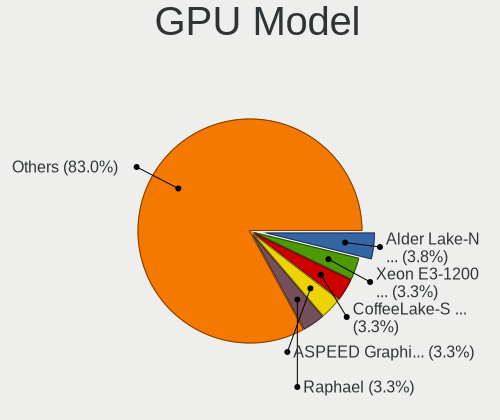

Debian - Hardware Trends (Desktops)
-----------------------------------

A project to identify most popular hardware characteristics and track their change
over time based on data collected by Linux users at https://Linux-Hardware.org.

Anyone can contribute to this report by the [hw-probe](https://github.com/linuxhw/hw-probe) tool:

    sudo -E hw-probe -all -upload

This report is for one last month. Overall report since the beginning of time: [TestDays](https://github.com/linuxhw/TestDays)

Period: Mar, 2023.

Contents
--------

* [ System ](#system)
  - [ OS                       ](#os)
  - [ OS Family                ](#os-family)
  - [ Kernel                   ](#kernel)
  - [ Kernel Family            ](#kernel-family)
  - [ Kernel Major Ver.        ](#kernel-major-ver)
  - [ Arch                     ](#arch)
  - [ DE                       ](#de)
  - [ Display Server           ](#display-server)
  - [ Display Manager          ](#display-manager)
  - [ OS Lang                  ](#os-lang)
  - [ Boot Mode                ](#boot-mode)
  - [ Filesystem               ](#filesystem)
  - [ Part. scheme             ](#part-scheme)
  - [ Dual Boot with Linux/BSD ](#dual-boot-with-linuxbsd)
  - [ Dual Boot (Win)          ](#dual-boot-win)

* [ Board ](#board)
  - [ Vendor                   ](#vendor)
  - [ Model                    ](#model)
  - [ Model Family             ](#model-family)
  - [ MFG Year                 ](#mfg-year)
  - [ Form Factor              ](#form-factor)
  - [ Secure Boot              ](#secure-boot)
  - [ Coreboot                 ](#coreboot)
  - [ RAM Size                 ](#ram-size)
  - [ RAM Used                 ](#ram-used)
  - [ Total Drives             ](#total-drives)
  - [ Has CD-ROM               ](#has-cd-rom)
  - [ Has Ethernet             ](#has-ethernet)
  - [ Has WiFi                 ](#has-wifi)
  - [ Has Bluetooth            ](#has-bluetooth)

* [ Location ](#location)
  - [ Country                  ](#country)
  - [ City                     ](#city)

* [ Drives ](#drives)
  - [ Drive Vendor             ](#drive-vendor)
  - [ Drive Model              ](#drive-model)
  - [ HDD Vendor               ](#hdd-vendor)
  - [ SSD Vendor               ](#ssd-vendor)
  - [ Drive Kind               ](#drive-kind)
  - [ Drive Connector          ](#drive-connector)
  - [ Drive Size               ](#drive-size)
  - [ Space Total              ](#space-total)
  - [ Space Used               ](#space-used)
  - [ Malfunc. Drives          ](#malfunc-drives)
  - [ Malfunc. Drive Vendor    ](#malfunc-drive-vendor)
  - [ Malfunc. HDD Vendor      ](#malfunc-hdd-vendor)
  - [ Malfunc. Drive Kind      ](#malfunc-drive-kind)
  - [ Failed Drives            ](#failed-drives)
  - [ Failed Drive Vendor      ](#failed-drive-vendor)
  - [ Drive Status             ](#drive-status)

* [ Storage controller ](#storage-controller)
  - [ Storage Vendor           ](#storage-vendor)
  - [ Storage Model            ](#storage-model)
  - [ Storage Kind             ](#storage-kind)

* [ Processor ](#processor)
  - [ CPU Vendor               ](#cpu-vendor)
  - [ CPU Model                ](#cpu-model)
  - [ CPU Model Family         ](#cpu-model-family)
  - [ CPU Cores                ](#cpu-cores)
  - [ CPU Sockets              ](#cpu-sockets)
  - [ CPU Threads              ](#cpu-threads)
  - [ CPU Op-Modes             ](#cpu-op-modes)
  - [ CPU Microcode            ](#cpu-microcode)
  - [ CPU Microarch            ](#cpu-microarch)

* [ Graphics ](#graphics)
  - [ GPU Vendor               ](#gpu-vendor)
  - [ GPU Model                ](#gpu-model)
  - [ GPU Combo                ](#gpu-combo)
  - [ GPU Driver               ](#gpu-driver)
  - [ GPU Memory               ](#gpu-memory)

* [ Monitor ](#monitor)
  - [ Monitor Vendor           ](#monitor-vendor)
  - [ Monitor Model            ](#monitor-model)
  - [ Monitor Resolution       ](#monitor-resolution)
  - [ Monitor Diagonal         ](#monitor-diagonal)
  - [ Monitor Width            ](#monitor-width)
  - [ Aspect Ratio             ](#aspect-ratio)
  - [ Monitor Area             ](#monitor-area)
  - [ Pixel Density            ](#pixel-density)
  - [ Multiple Monitors        ](#multiple-monitors)

* [ Network ](#network)
  - [ Net Controller Vendor    ](#net-controller-vendor)
  - [ Net Controller Model     ](#net-controller-model)
  - [ Wireless Vendor          ](#wireless-vendor)
  - [ Wireless Model           ](#wireless-model)
  - [ Ethernet Vendor          ](#ethernet-vendor)
  - [ Ethernet Model           ](#ethernet-model)
  - [ Net Controller Kind      ](#net-controller-kind)
  - [ Used Controller          ](#used-controller)
  - [ NICs                     ](#nics)
  - [ IPv6                     ](#ipv6)

* [ Bluetooth ](#bluetooth)
  - [ Bluetooth Vendor         ](#bluetooth-vendor)
  - [ Bluetooth Model          ](#bluetooth-model)

* [ Sound ](#sound)
  - [ Sound Vendor             ](#sound-vendor)
  - [ Sound Model              ](#sound-model)

* [ Memory ](#memory)
  - [ Memory Vendor            ](#memory-vendor)
  - [ Memory Model             ](#memory-model)
  - [ Memory Kind              ](#memory-kind)
  - [ Memory Form Factor       ](#memory-form-factor)
  - [ Memory Size              ](#memory-size)
  - [ Memory Speed             ](#memory-speed)

* [ Printers & scanners ](#printers--scanners)
  - [ Printer Vendor           ](#printer-vendor)
  - [ Printer Model            ](#printer-model)
  - [ Scanner Vendor           ](#scanner-vendor)
  - [ Scanner Model            ](#scanner-model)

* [ Camera ](#camera)
  - [ Camera Vendor            ](#camera-vendor)
  - [ Camera Model             ](#camera-model)

* [ Security ](#security)
  - [ Fingerprint Vendor       ](#fingerprint-vendor)
  - [ Fingerprint Model        ](#fingerprint-model)
  - [ Chipcard Vendor          ](#chipcard-vendor)
  - [ Chipcard Model           ](#chipcard-model)

* [ Unsupported ](#unsupported)
  - [ Unsupported Devices      ](#unsupported-devices)
  - [ Unsupported Device Types ](#unsupported-device-types)

System
------

OS
--

Installed operating systems

| Name      | Desktops | Percent |
|-----------|----------|---------|
| Debian 11 | 130      | 76.47%  |
| Debian    | 23       | 13.53%  |
| Debian 12 | 10       | 5.88%   |
| Debian 10 | 7        | 4.12%   |

OS Family
---------

OS without a version

| Name   | Desktops | Percent |
|--------|----------|---------|
| Debian | 170      | 100%    |

Kernel
------

Version of the Linux kernel

| Version                 | Desktops | Percent |
|-------------------------|----------|---------|
| 5.10.0-21-amd64         | 56       | 32.94%  |
| 6.1.0-6-amd64           | 13       | 7.65%   |
| 5.10.0-2-amd64          | 9        | 5.29%   |
| 6.0.0-0.deb11.6-amd64   | 8        | 4.71%   |
| 5.15.85-1-pve           | 8        | 4.71%   |
| 6.1.0-5-amd64           | 7        | 4.12%   |
| 6.1.0-4-amd64           | 7        | 4.12%   |
| 5.15.83-1-pve           | 6        | 3.53%   |
| 6.1.0-7-amd64           | 4        | 2.35%   |
| 5.15.102-1-pve          | 4        | 2.35%   |
| 5.10.0-20-amd64         | 4        | 2.35%   |
| 6.0.0-6mx-amd64         | 3        | 1.76%   |
| 5.10.0-15-amd64         | 3        | 1.76%   |
| 6.1.0-3-amd64           | 2        | 1.18%   |
| 5.16.0-0.bpo.4-amd64    | 2        | 1.18%   |
| 5.15.74-1-pve           | 2        | 1.18%   |
| 5.13.19-6-pve           | 2        | 1.18%   |
| 5.10.0-21-686-pae       | 2        | 1.18%   |
| 6.3.0-rc1-recompv5      | 1        | 0.59%   |
| 6.2.8-x64v3-xanmod1     | 1        | 0.59%   |
| 6.2.7-amd64             | 1        | 0.59%   |
| 6.2.6-1-pve             | 1        | 0.59%   |
| 6.2.1                   | 1        | 0.59%   |
| 6.1.15-1-pve            | 1        | 0.59%   |
| 6.1.14-1-liquorix-amd64 | 1        | 0.59%   |
| 6.1.12-bootes3-p-1000   | 1        | 0.59%   |
| 6.1.10-1-pve            | 1        | 0.59%   |
| 6.1.0-6-powerpc64       | 1        | 0.59%   |
| 6.0.0-4-amd64           | 1        | 0.59%   |
| 5.15.79+truenas         | 1        | 0.59%   |
| 5.15.60-2-pve           | 1        | 0.59%   |
| 5.15.30-2-pve           | 1        | 0.59%   |
| 5.13.19-4-pve           | 1        | 0.59%   |
| 5.11.22-5-pve           | 1        | 0.59%   |
| 5.10.0-21-686           | 1        | 0.59%   |
| 5.10.0-20-686-pae       | 1        | 0.59%   |
| 5.10.0-18-amd64         | 1        | 0.59%   |
| 5.10.0-17-amd64         | 1        | 0.59%   |
| 5.10.0-13-amd64         | 1        | 0.59%   |
| 5.10.0-10-amd64         | 1        | 0.59%   |

Kernel Family
-------------

Linux kernel without a distro release

| Version  | Desktops | Percent |
|----------|----------|---------|
| 5.10.0   | 80       | 47.06%  |
| 6.1.0    | 34       | 20%     |
| 6.0.0    | 12       | 7.06%   |
| 5.15.85  | 8        | 4.71%   |
| 5.15.83  | 6        | 3.53%   |
| 4.19.0   | 5        | 2.94%   |
| 5.15.102 | 4        | 2.35%   |
| 5.13.19  | 3        | 1.76%   |
| 5.16.0   | 2        | 1.18%   |
| 5.15.74  | 2        | 1.18%   |
| 6.3.0    | 1        | 0.59%   |
| 6.2.8    | 1        | 0.59%   |
| 6.2.7    | 1        | 0.59%   |
| 6.2.6    | 1        | 0.59%   |
| 6.2.1    | 1        | 0.59%   |
| 6.1.15   | 1        | 0.59%   |
| 6.1.14   | 1        | 0.59%   |
| 6.1.12   | 1        | 0.59%   |
| 6.1.10   | 1        | 0.59%   |
| 5.15.79  | 1        | 0.59%   |
| 5.15.60  | 1        | 0.59%   |
| 5.15.30  | 1        | 0.59%   |
| 5.11.22  | 1        | 0.59%   |
| 4.19.272 | 1        | 0.59%   |

Kernel Major Ver.
-----------------

Linux kernel major version

| Version | Desktops | Percent |
|---------|----------|---------|
| 5.10    | 80       | 47.06%  |
| 6.1     | 38       | 22.35%  |
| 5.15    | 23       | 13.53%  |
| 6.0     | 12       | 7.06%   |
| 4.19    | 6        | 3.53%   |
| 6.2     | 4        | 2.35%   |
| 5.13    | 3        | 1.76%   |
| 5.16    | 2        | 1.18%   |
| 6.3     | 1        | 0.59%   |
| 5.11    | 1        | 0.59%   |

Arch
----

OS architecture (x86_64, i586, etc.)

| Name    | Desktops | Percent |
|---------|----------|---------|
| x86_64  | 164      | 96.47%  |
| i686    | 4        | 2.35%   |
| ppc64   | 1        | 0.59%   |
| aarch64 | 1        | 0.59%   |

DE
--

Desktop Environment

| Name            | Desktops | Percent |
|-----------------|----------|---------|
| Unknown         | 68       | 40%     |
| GNOME           | 40       | 23.53%  |
| KDE5            | 18       | 10.59%  |
| XFCE            | 10       | 5.88%   |
| X-Cinnamon      | 8        | 4.71%   |
| LXDE            | 7        | 4.12%   |
| Cinnamon        | 6        | 3.53%   |
| i3              | 5        | 2.94%   |
| Openbox         | 4        | 2.35%   |
| MATE            | 2        | 1.18%   |
| Trinity         | 1        | 0.59%   |
| GNOME Flashback | 1        | 0.59%   |

Display Server
--------------

X11 or Wayland

| Name    | Desktops | Percent |
|---------|----------|---------|
| X11     | 75       | 44.12%  |
| Tty     | 51       | 30%     |
| Unknown | 24       | 14.12%  |
| Wayland | 20       | 11.76%  |

Display Manager
---------------

SDDM, LightDM, etc.

| Name    | Desktops | Percent |
|---------|----------|---------|
| Unknown | 79       | 46.47%  |
| LightDM | 38       | 22.35%  |
| GDM     | 25       | 14.71%  |
| SDDM    | 14       | 8.24%   |
| GDM3    | 8        | 4.71%   |
| XDM     | 2        | 1.18%   |
| SLiM    | 2        | 1.18%   |
| TDM     | 1        | 0.59%   |
| NODM    | 1        | 0.59%   |

OS Lang
-------

Language

| Lang       | Desktops | Percent |
|------------|----------|---------|
| en_US      | 73       | 42.94%  |
| ru_RU      | 23       | 13.53%  |
| de_DE      | 16       | 9.41%   |
| es_ES      | 11       | 6.47%   |
| fr_FR      | 9        | 5.29%   |
| C          | 6        | 3.53%   |
| it_IT      | 5        | 2.94%   |
| Unknown    | 5        | 2.94%   |
| en_GB      | 4        | 2.35%   |
| pl_PL      | 3        | 1.76%   |
| en_CA      | 3        | 1.76%   |
| pt_BR      | 2        | 1.18%   |
| en_IE      | 2        | 1.18%   |
| zh_TW      | 1        | 0.59%   |
| tr_TR      | 1        | 0.59%   |
| it_IT@euro | 1        | 0.59%   |
| es_VE      | 1        | 0.59%   |
| es_UY      | 1        | 0.59%   |
| es_CL      | 1        | 0.59%   |
| en_NZ      | 1        | 0.59%   |
| en_AU      | 1        | 0.59%   |

Boot Mode
---------

EFI or BIOS

| Mode | Desktops | Percent |
|------|----------|---------|
| EFI  | 94       | 55.29%  |
| BIOS | 76       | 44.71%  |

Filesystem
----------

Type of filesystem

| Type    | Desktops | Percent |
|---------|----------|---------|
| Ext4    | 127      | 74.71%  |
| Overlay | 20       | 11.76%  |
| Zfs     | 12       | 7.06%   |
| Xfs     | 7        | 4.12%   |
| Ext3    | 2        | 1.18%   |
| Btrfs   | 2        | 1.18%   |

Part. scheme
------------

Scheme of partitioning

| Type    | Desktops | Percent |
|---------|----------|---------|
| GPT     | 117      | 68.82%  |
| MBR     | 39       | 22.94%  |
| Unknown | 14       | 8.24%   |

Dual Boot with Linux/BSD
------------------------

Hosting more than one Linux/BSD

| Dual boot | Desktops | Percent |
|-----------|----------|---------|
| No        | 137      | 80.59%  |
| Yes       | 33       | 19.41%  |

Dual Boot (Win)
---------------

Hosting Linux and Windows

| Dual boot | Desktops | Percent |
|-----------|----------|---------|
| No        | 109      | 64.12%  |
| Yes       | 61       | 35.88%  |

Board
-----

Vendor
------

Motherboard manufacturer

| Name                | Desktops | Percent |
|---------------------|----------|---------|
| ASUSTek Computer    | 35       | 20.59%  |
| Gigabyte Technology | 24       | 14.12%  |
| Hewlett-Packard     | 19       | 11.18%  |
| ASRock              | 16       | 9.41%   |
| MSI                 | 14       | 8.24%   |
| Dell                | 8        | 4.71%   |
| Lenovo              | 7        | 4.12%   |
| Unknown             | 7        | 4.12%   |
| AZW                 | 6        | 3.53%   |
| ASRockRack          | 5        | 2.94%   |
| Intel               | 4        | 2.35%   |
| Fujitsu             | 4        | 2.35%   |
| Techvision          | 3        | 1.76%   |
| Supermicro          | 3        | 1.76%   |
| ECS                 | 3        | 1.76%   |
| Win element         | 1        | 0.59%   |
| Pegatron            | 1        | 0.59%   |
| Medion              | 1        | 0.59%   |
| Iskratel, Kranj     | 1        | 0.59%   |
| iEi                 | 1        | 0.59%   |
| HPE                 | 1        | 0.59%   |
| GoWin Solution      | 1        | 0.59%   |
| Google              | 1        | 0.59%   |
| Fujitsu Siemens     | 1        | 0.59%   |
| CWWK                | 1        | 0.59%   |
| Cincoze             | 1        | 0.59%   |
| AMI                 | 1        | 0.59%   |

Model
-----

Motherboard model

| Name                                | Desktops | Percent |
|-------------------------------------|----------|---------|
| Unknown                             | 7        | 4.12%   |
| Techvision TVI7309X                 | 3        | 1.76%   |
| AZW U59                             | 3        | 1.76%   |
| AZW MINI S                          | 3        | 1.76%   |
| Supermicro X9DR3-F                  | 2        | 1.18%   |
| MSI MS-7C91                         | 2        | 1.18%   |
| MSI MS-7C02                         | 2        | 1.18%   |
| HP EliteDesk 800 G1 DM              | 2        | 1.18%   |
| HP Compaq 8200 Elite SFF PC         | 2        | 1.18%   |
| Gigabyte H97M-HD3                   | 2        | 1.18%   |
| ECS G31T-M9                         | 2        | 1.18%   |
| Dell OptiPlex 790                   | 2        | 1.18%   |
| ASUS Pro WS WRX80E-SAGE SE WIFI     | 2        | 1.18%   |
| ASRockRack B450D4U-V1L              | 2        | 1.18%   |
| Win element M600                    | 1        | 0.59%   |
| Supermicro SSG-6048R-E1CR36N        | 1        | 0.59%   |
| Pegatron NY456AA-ABG IQ545a         | 1        | 0.59%   |
| MSI US Desktop                      | 1        | 0.59%   |
| MSI MS-7D42                         | 1        | 0.59%   |
| MSI MS-7D31                         | 1        | 0.59%   |
| MSI MS-7C37                         | 1        | 0.59%   |
| MSI MS-7B79                         | 1        | 0.59%   |
| MSI MS-7A69                         | 1        | 0.59%   |
| MSI MS-7A38                         | 1        | 0.59%   |
| MSI MS-7A15                         | 1        | 0.59%   |
| MSI MS-7596                         | 1        | 0.59%   |
| MSI CML-U PRO Cubi 5 (MS-B183)      | 1        | 0.59%   |
| Medion S23003                       | 1        | 0.59%   |
| Lenovo ThinkStation E31 2553B49     | 1        | 0.59%   |
| Lenovo ThinkStation D30 42234T7     | 1        | 0.59%   |
| Lenovo ThinkCentre M93p 10A9003PIX  | 1        | 0.59%   |
| Lenovo ThinkCentre M910q 10MUS17J00 | 1        | 0.59%   |
| Lenovo ThinkCentre M900 10FLA08CUK  | 1        | 0.59%   |
| Lenovo ThinkCentre M73 10AXS3JD00   | 1        | 0.59%   |
| Lenovo 70AQ000JGE ThinkServer TS440 | 1        | 0.59%   |
| Iskratel, Kranj IN6011AX            | 1        | 0.59%   |
| Intel STK2M3W64CC                   | 1        | 0.59%   |
| Intel Jasper Lake Client Platform   | 1        | 0.59%   |
| Intel D945GCPE AAD97209-201         | 1        | 0.59%   |
| Intel 945GCT-M                      | 1        | 0.59%   |

Model Family
------------

Motherboard model prefix

| Name                         | Desktops | Percent |
|------------------------------|----------|---------|
| ASUS PRIME                   | 9        | 5.29%   |
| Unknown                      | 7        | 4.12%   |
| Dell OptiPlex                | 5        | 2.94%   |
| ASUS ROG                     | 5        | 2.94%   |
| Lenovo ThinkCentre           | 4        | 2.35%   |
| HP Compaq                    | 4        | 2.35%   |
| Techvision TVI7309X          | 3        | 1.76%   |
| HP ProDesk                   | 3        | 1.76%   |
| HP EliteDesk                 | 3        | 1.76%   |
| Gigabyte B550                | 3        | 1.76%   |
| Fujitsu ESPRIMO              | 3        | 1.76%   |
| AZW U59                      | 3        | 1.76%   |
| AZW MINI                     | 3        | 1.76%   |
| ASUS Pro                     | 3        | 1.76%   |
| Supermicro X9DR3-F           | 2        | 1.18%   |
| MSI MS-7C91                  | 2        | 1.18%   |
| MSI MS-7C02                  | 2        | 1.18%   |
| Lenovo ThinkStation          | 2        | 1.18%   |
| HP ProLiant                  | 2        | 1.18%   |
| Gigabyte X570                | 2        | 1.18%   |
| Gigabyte H97M-HD3            | 2        | 1.18%   |
| Gigabyte B450                | 2        | 1.18%   |
| ECS G31T-M9                  | 2        | 1.18%   |
| ASUS TUF                     | 2        | 1.18%   |
| ASUS P5G41T-M                | 2        | 1.18%   |
| ASRockRack B450D4U-V1L       | 2        | 1.18%   |
| ASRock B450M                 | 2        | 1.18%   |
| ASRock 990FX                 | 2        | 1.18%   |
| Win element M600             | 1        | 0.59%   |
| Supermicro SSG-6048R-E1CR36N | 1        | 0.59%   |
| Pegatron NY456AA-ABG         | 1        | 0.59%   |
| MSI US                       | 1        | 0.59%   |
| MSI MS-7D42                  | 1        | 0.59%   |
| MSI MS-7D31                  | 1        | 0.59%   |
| MSI MS-7C37                  | 1        | 0.59%   |
| MSI MS-7B79                  | 1        | 0.59%   |
| MSI MS-7A69                  | 1        | 0.59%   |
| MSI MS-7A38                  | 1        | 0.59%   |
| MSI MS-7A15                  | 1        | 0.59%   |
| MSI MS-7596                  | 1        | 0.59%   |

MFG Year
--------

Motherboard manufacture year

| Year    | Desktops | Percent |
|---------|----------|---------|
| 2022    | 25       | 14.71%  |
| 2020    | 20       | 11.76%  |
| 2018    | 16       | 9.41%   |
| 2021    | 12       | 7.06%   |
| 2019    | 12       | 7.06%   |
| 2012    | 11       | 6.47%   |
| 2010    | 9        | 5.29%   |
| 2016    | 8        | 4.71%   |
| 2014    | 8        | 4.71%   |
| 2011    | 8        | 4.71%   |
| 2017    | 7        | 4.12%   |
| 2023    | 6        | 3.53%   |
| 2009    | 6        | 3.53%   |
| 2013    | 5        | 2.94%   |
| 2008    | 5        | 2.94%   |
| 2007    | 5        | 2.94%   |
| 2015    | 4        | 2.35%   |
| Unknown | 2        | 1.18%   |
| 2006    | 1        | 0.59%   |

Form Factor
-----------

Physical design of the computer

| Name    | Desktops | Percent |
|---------|----------|---------|
| Desktop | 170      | 100%    |

Secure Boot
-----------

Enabled or disabled

| State    | Desktops | Percent |
|----------|----------|---------|
| Disabled | 166      | 97.65%  |
| Enabled  | 4        | 2.35%   |

Coreboot
--------

Have coreboot on board

| Used | Desktops | Percent |
|------|----------|---------|
| No   | 168      | 98.82%  |
| Yes  | 2        | 1.18%   |

RAM Size
--------

Total RAM memory

| Size in GB      | Desktops | Percent |
|-----------------|----------|---------|
| 16.01-24.0      | 42       | 24.71%  |
| 64.01-256.0     | 30       | 17.65%  |
| 32.01-64.0      | 23       | 13.53%  |
| 4.01-8.0        | 22       | 12.94%  |
| 3.01-4.0        | 22       | 12.94%  |
| 8.01-16.0       | 18       | 10.59%  |
| 1.01-2.0        | 5        | 2.94%   |
| 24.01-32.0      | 4        | 2.35%   |
| More than 256.0 | 1        | 0.59%   |
| 2.01-3.0        | 1        | 0.59%   |
| 0.51-1.0        | 1        | 0.59%   |
| 0.01-0.5        | 1        | 0.59%   |

RAM Used
--------

Used RAM memory

| Used GB         | Desktops | Percent |
|-----------------|----------|---------|
| 2.01-3.0        | 32       | 18.82%  |
| 1.01-2.0        | 28       | 16.47%  |
| 4.01-8.0        | 26       | 15.29%  |
| 0.51-1.0        | 25       | 14.71%  |
| 3.01-4.0        | 18       | 10.59%  |
| 0.01-0.5        | 12       | 7.06%   |
| 32.01-64.0      | 9        | 5.29%   |
| 8.01-16.0       | 9        | 5.29%   |
| 16.01-24.0      | 5        | 2.94%   |
| 24.01-32.0      | 3        | 1.76%   |
| 64.01-256.0     | 2        | 1.18%   |
| More than 256.0 | 1        | 0.59%   |

Total Drives
------------

Number of drives on board

| Drives | Desktops | Percent |
|--------|----------|---------|
| 1      | 71       | 41.76%  |
| 2      | 36       | 21.18%  |
| 4      | 18       | 10.59%  |
| 3      | 17       | 10%     |
| 5      | 8        | 4.71%   |
| 7      | 5        | 2.94%   |
| 6      | 5        | 2.94%   |
| 8      | 3        | 1.76%   |
| 13     | 2        | 1.18%   |
| 29     | 1        | 0.59%   |
| 22     | 1        | 0.59%   |
| 12     | 1        | 0.59%   |
| 11     | 1        | 0.59%   |
| 9      | 1        | 0.59%   |

Has CD-ROM
----------

Has CD-ROM on board

| Presented | Desktops | Percent |
|-----------|----------|---------|
| No        | 126      | 74.12%  |
| Yes       | 44       | 25.88%  |

Has Ethernet
------------

Has Ethernet on board

| Presented | Desktops | Percent |
|-----------|----------|---------|
| Yes       | 168      | 98.82%  |
| No        | 2        | 1.18%   |

Has WiFi
--------

Has WiFi module

| Presented | Desktops | Percent |
|-----------|----------|---------|
| No        | 105      | 61.76%  |
| Yes       | 65       | 38.24%  |

Has Bluetooth
-------------

Has Bluetooth module

| Presented | Desktops | Percent |
|-----------|----------|---------|
| No        | 113      | 66.47%  |
| Yes       | 57       | 33.53%  |

Location
--------

Country
-------

Geographic location (country)

| Country     | Desktops | Percent |
|-------------|----------|---------|
| USA         | 38       | 22.35%  |
| Russia      | 26       | 15.29%  |
| Germany     | 23       | 13.53%  |
| Spain       | 13       | 7.65%   |
| France      | 10       | 5.88%   |
| Italy       | 8        | 4.71%   |
| Canada      | 8        | 4.71%   |
| Poland      | 4        | 2.35%   |
| Netherlands | 4        | 2.35%   |
| Malaysia    | 4        | 2.35%   |
| UK          | 3        | 1.76%   |
| Austria     | 3        | 1.76%   |
| Australia   | 3        | 1.76%   |
| Slovakia    | 2        | 1.18%   |
| China       | 2        | 1.18%   |
| Brazil      | 2        | 1.18%   |
| Vietnam     | 1        | 0.59%   |
| Venezuela   | 1        | 0.59%   |
| Uruguay     | 1        | 0.59%   |
| Turkey      | 1        | 0.59%   |
| Thailand    | 1        | 0.59%   |
| Taiwan      | 1        | 0.59%   |
| Sweden      | 1        | 0.59%   |
| Norway      | 1        | 0.59%   |
| New Zealand | 1        | 0.59%   |
| Morocco     | 1        | 0.59%   |
| Lithuania   | 1        | 0.59%   |
| Kazakhstan  | 1        | 0.59%   |
| Hungary     | 1        | 0.59%   |
| Hong Kong   | 1        | 0.59%   |
| Chile       | 1        | 0.59%   |
| Bulgaria    | 1        | 0.59%   |
| Belarus     | 1        | 0.59%   |

City
----

Geographic location (city)

| City             | Desktops | Percent |
|------------------|----------|---------|
| Voronezh         | 16       | 9.41%   |
| Madrid           | 4        | 2.35%   |
| Kuala Lumpur     | 4        | 2.35%   |
| Vienna           | 3        | 1.76%   |
| Courtice         | 3        | 1.76%   |
| Berlin           | 3        | 1.76%   |
| Ufa              | 2        | 1.18%   |
| Stuttgart        | 2        | 1.18%   |
| Seville          | 2        | 1.18%   |
| Puyallup         | 2        | 1.18%   |
| Moscow           | 2        | 1.18%   |
| Melbourne        | 2        | 1.18%   |
| Košice          | 2        | 1.18%   |
| Hatboro          | 2        | 1.18%   |
| Falkenstein      | 2        | 1.18%   |
| Bieligutai       | 2        | 1.18%   |
| Zlatoust         | 1        | 0.59%   |
| Yekaterinburg    | 1        | 0.59%   |
| Wroclaw          | 1        | 0.59%   |
| Winnipeg         | 1        | 0.59%   |
| West Valley City | 1        | 0.59%   |
| Warnsveld        | 1        | 0.59%   |
| Volzhsk          | 1        | 0.59%   |
| Vleuten          | 1        | 0.59%   |
| Vila Velha       | 1        | 0.59%   |
| Vajont           | 1        | 0.59%   |
| Uzzano           | 1        | 0.59%   |
| Usurbil          | 1        | 0.59%   |
| Uppsala          | 1        | 0.59%   |
| Traunstein       | 1        | 0.59%   |
| Toronto          | 1        | 0.59%   |
| Toledo           | 1        | 0.59%   |
| Thu Duc          | 1        | 0.59%   |
| Taipei           | 1        | 0.59%   |
| Szombathely      | 1        | 0.59%   |
| Svoge            | 1        | 0.59%   |
| Sunland          | 1        | 0.59%   |
| Springfield      | 1        | 0.59%   |
| Spoltore         | 1        | 0.59%   |
| Sheboygan        | 1        | 0.59%   |

Drives
------

Drive Vendor
------------

Hard drive vendors

| Vendor              | Desktops | Drives | Percent |
|---------------------|----------|--------|---------|
| Samsung Electronics | 53       | 76     | 16.77%  |
| Seagate             | 50       | 98     | 15.82%  |
| WDC                 | 46       | 100    | 14.56%  |
| Toshiba             | 26       | 45     | 8.23%   |
| Kingston            | 19       | 26     | 6.01%   |
| SanDisk             | 13       | 18     | 4.11%   |
| Intel               | 13       | 13     | 4.11%   |
| HGST                | 9        | 11     | 2.85%   |
| Crucial             | 9        | 12     | 2.85%   |
| Hitachi             | 8        | 11     | 2.53%   |
| PNY                 | 6        | 14     | 1.9%    |
| Phison              | 5        | 5      | 1.58%   |
| Corsair             | 5        | 7      | 1.58%   |
| China               | 5        | 5      | 1.58%   |
| GOODRAM             | 4        | 7      | 1.27%   |
| A-DATA Technology   | 3        | 3      | 0.95%   |
| XPG                 | 2        | 2      | 0.63%   |
| Xinhaike            | 2        | 2      | 0.63%   |
| Transcend           | 2        | 2      | 0.63%   |
| SPCC                | 2        | 2      | 0.63%   |
| SK hynix            | 2        | 2      | 0.63%   |
| NGFF                | 2        | 2      | 0.63%   |
| Micron Technology   | 2        | 2      | 0.63%   |
| LITEON              | 2        | 2      | 0.63%   |
| KIOXIA-EXCERIA      | 2        | 2      | 0.63%   |
| Unknown             | 2        | 2      | 0.63%   |
| Unknown             | 1        | 1      | 0.32%   |
| Team                | 1        | 1      | 0.32%   |
| sk600               | 1        | 1      | 0.32%   |
| SD                  | 1        | 1      | 0.32%   |
| QNAP                | 1        | 2      | 0.32%   |
| Plextor             | 1        | 1      | 0.32%   |
| Patriot             | 1        | 1      | 0.32%   |
| Netac               | 1        | 1      | 0.32%   |
| MSI                 | 1        | 1      | 0.32%   |
| Maxtor              | 1        | 1      | 0.32%   |
| LITEONIT            | 1        | 1      | 0.32%   |
| Kimtigo             | 1        | 1      | 0.32%   |
| JMicron Technology  | 1        | 1      | 0.32%   |
| iODD                | 1        | 1      | 0.32%   |

Drive Model
-----------

Hard drive models

| Model                              | Desktops | Percent |
|------------------------------------|----------|---------|
| Kingston SA400S37240G 240GB SSD    | 6        | 1.53%   |
| Toshiba DT01ACA100 1TB             | 5        | 1.27%   |
| Samsung SSD 980 PRO 1TB            | 5        | 1.27%   |
| Samsung SSD 850 EVO 250GB          | 5        | 1.27%   |
| HGST HUS726060ALE610 6TB           | 4        | 1.02%   |
| Toshiba MK2555GSXF 250GB           | 3        | 0.76%   |
| Toshiba DT01ACA050 500GB           | 3        | 0.76%   |
| Seagate ST2000DM008-2UB102 2TB     | 3        | 0.76%   |
| Seagate ST2000DM008-2FR102 2TB     | 3        | 0.76%   |
| Seagate Expansion+ 2TB             | 3        | 0.76%   |
| Samsung SSD 980 PRO 2TB            | 3        | 0.76%   |
| Samsung SSD 970 EVO Plus 500GB     | 3        | 0.76%   |
| Samsung SSD 970 EVO Plus 1TB       | 3        | 0.76%   |
| Samsung SSD 860 EVO 250GB          | 3        | 0.76%   |
| Samsung SSD 850 EVO 500GB          | 3        | 0.76%   |
| PNY 1TB SATA SSD                   | 3        | 0.76%   |
| Kingston SV300S37A120G 120GB SSD   | 3        | 0.76%   |
| Kingston SA400S37120G 120GB SSD    | 3        | 0.76%   |
| Crucial CT1000MX500SSD1 1TB        | 3        | 0.76%   |
| Corsair Force MP510 240GB          | 3        | 0.76%   |
| China 512GB SSD                    | 3        | 0.76%   |
| XPG GAMMIX S11 Pro 256GB           | 2        | 0.51%   |
| Xinhaike SSD 120GB                 | 2        | 0.51%   |
| WDC WDS200T2B0A-00SM50 2TB SSD     | 2        | 0.51%   |
| WDC WD4001FFSX-68JNUN0 4TB         | 2        | 0.51%   |
| WDC WD30EFRX-68EUZN0 3TB           | 2        | 0.51%   |
| WDC WD20EZRX-00D8PB0 2TB           | 2        | 0.51%   |
| WDC WD20EARX-00PASB0 2TB           | 2        | 0.51%   |
| WDC WD140EDGZ-11B1PA0 14TB         | 2        | 0.51%   |
| WDC WD100EMAZ-00WJTA0 10TB         | 2        | 0.51%   |
| Toshiba MG08ACA16TE 16TB           | 2        | 0.51%   |
| Toshiba KXG60ZNV1T02 1TB           | 2        | 0.51%   |
| Toshiba HDWD130 3TB                | 2        | 0.51%   |
| Seagate ST4000DM004-2CV104 4TB     | 2        | 0.51%   |
| Seagate ST3250410AS 250GB          | 2        | 0.51%   |
| Seagate ST3250318AS 250GB          | 2        | 0.51%   |
| Seagate ST3250312AS 250GB          | 2        | 0.51%   |
| Seagate ST3250310AS 250GB          | 2        | 0.51%   |
| Seagate ST1000LM024 HN-M101MBB 1TB | 2        | 0.51%   |
| Seagate ST1000DM010-2EP102 1TB     | 2        | 0.51%   |

HDD Vendor
----------

Hard disk drive vendors

| Vendor              | Desktops | Drives | Percent |
|---------------------|----------|--------|---------|
| Seagate             | 50       | 98     | 36.23%  |
| WDC                 | 39       | 90     | 28.26%  |
| Toshiba             | 24       | 38     | 17.39%  |
| HGST                | 9        | 11     | 6.52%   |
| Hitachi             | 8        | 11     | 5.8%    |
| Samsung Electronics | 6        | 6      | 4.35%   |
| SD                  | 1        | 1      | 0.72%   |
| QNAP                | 1        | 2      | 0.72%   |

SSD Vendor
----------

Solid state drive vendors

| Vendor              | Desktops | Drives | Percent |
|---------------------|----------|--------|---------|
| Samsung Electronics | 29       | 41     | 26.61%  |
| Kingston            | 18       | 25     | 16.51%  |
| Crucial             | 9        | 12     | 8.26%   |
| Intel               | 7        | 7      | 6.42%   |
| SanDisk             | 6        | 8      | 5.5%    |
| China               | 5        | 5      | 4.59%   |
| WDC                 | 4        | 5      | 3.67%   |
| PNY                 | 3        | 9      | 2.75%   |
| GOODRAM             | 3        | 3      | 2.75%   |
| Xinhaike            | 2        | 2      | 1.83%   |
| Transcend           | 2        | 2      | 1.83%   |
| SPCC                | 2        | 2      | 1.83%   |
| NGFF                | 2        | 2      | 1.83%   |
| LITEON              | 2        | 2      | 1.83%   |
| Team                | 1        | 1      | 0.92%   |
| sk600               | 1        | 1      | 0.92%   |
| Phison              | 1        | 1      | 0.92%   |
| Netac               | 1        | 1      | 0.92%   |
| Micron Technology   | 1        | 1      | 0.92%   |
| Maxtor              | 1        | 1      | 0.92%   |
| LITEONIT            | 1        | 1      | 0.92%   |
| Kimtigo             | 1        | 1      | 0.92%   |
| JMicron Technology  | 1        | 1      | 0.92%   |
| iODD                | 1        | 1      | 0.92%   |
| Intenso             | 1        | 1      | 0.92%   |
| Corsair             | 1        | 1      | 0.92%   |
| Colorful            | 1        | 1      | 0.92%   |
| CIS                 | 1        | 1      | 0.92%   |
| A-DATA Technology   | 1        | 1      | 0.92%   |

Drive Kind
----------

HDD or SSD

| Kind    | Desktops | Drives | Percent |
|---------|----------|--------|---------|
| HDD     | 101      | 257    | 39.45%  |
| SSD     | 87       | 140    | 33.98%  |
| NVMe    | 61       | 90     | 23.83%  |
| MMC     | 4        | 4      | 1.56%   |
| Unknown | 3        | 3      | 1.17%   |

Drive Connector
---------------

SATA, SAS, NVMe, etc.

| Type | Desktops | Drives | Percent |
|------|----------|--------|---------|
| SATA | 140      | 381    | 64.52%  |
| NVMe | 61       | 90     | 28.11%  |
| SAS  | 12       | 19     | 5.53%   |
| MMC  | 4        | 4      | 1.84%   |

Drive Size
----------

Size of hard drive

| Size in TB | Desktops | Drives | Percent |
|------------|----------|--------|---------|
| 0.01-0.5   | 101      | 149    | 44.89%  |
| 0.51-1.0   | 52       | 83     | 23.11%  |
| 1.01-2.0   | 29       | 52     | 12.89%  |
| 4.01-10.0  | 17       | 36     | 7.56%   |
| 3.01-4.0   | 12       | 22     | 5.33%   |
| 2.01-3.0   | 7        | 23     | 3.11%   |
| 10.01-20.0 | 7        | 32     | 3.11%   |

Space Total
-----------

Amount of disk space available on the file system

| Size in GB     | Desktops | Percent |
|----------------|----------|---------|
| 101-250        | 38       | 22.35%  |
| Unknown        | 28       | 16.47%  |
| 251-500        | 21       | 12.35%  |
| More than 3000 | 19       | 11.18%  |
| 501-1000       | 19       | 11.18%  |
| 1001-2000      | 14       | 8.24%   |
| 21-50          | 10       | 5.88%   |
| 51-100         | 9        | 5.29%   |
| 2001-3000      | 7        | 4.12%   |
| 1-20           | 5        | 2.94%   |

Space Used
----------

Amount of used disk space

| Used GB        | Desktops | Percent |
|----------------|----------|---------|
| 1-20           | 57       | 33.53%  |
| Unknown        | 28       | 16.47%  |
| 21-50          | 19       | 11.18%  |
| 51-100         | 14       | 8.24%   |
| 251-500        | 12       | 7.06%   |
| 101-250        | 12       | 7.06%   |
| More than 3000 | 11       | 6.47%   |
| 501-1000       | 9        | 5.29%   |
| 1001-2000      | 4        | 2.35%   |
| 2001-3000      | 3        | 1.76%   |
| 0              | 1        | 0.59%   |

Malfunc. Drives
---------------

Drive models with a malfunction

| Model                                 | Desktops | Drives | Percent |
|---------------------------------------|----------|--------|---------|
| Toshiba MK2555GSXF 250GB              | 3        | 3      | 7.32%   |
| WDC WD20EARX-00PASB0 2TB              | 2        | 2      | 4.88%   |
| WDC WD5001AALS-00L3B2 500GB           | 1        | 1      | 2.44%   |
| WDC WD5000AAKX-60U6AA0 500GB          | 1        | 1      | 2.44%   |
| WDC WD4001FFSX-68JNUN0 4TB            | 1        | 1      | 2.44%   |
| WDC WD3200BPVT-22JJ5T0 320GB          | 1        | 1      | 2.44%   |
| WDC WD3200AAJS-00L7A0 320GB           | 1        | 1      | 2.44%   |
| WDC WD2500AAJS-00B4A0 250GB           | 1        | 1      | 2.44%   |
| WDC WD10EADS-00P8B0 1TB               | 1        | 1      | 2.44%   |
| WDC WD1000DHTZ-04N21V0 1TB            | 1        | 1      | 2.44%   |
| Transcend TS32GMTS400 32GB SSD        | 1        | 1      | 2.44%   |
| Toshiba MQ01ABD050 500GB              | 1        | 1      | 2.44%   |
| Toshiba MK2035GSS 200GB               | 1        | 1      | 2.44%   |
| Toshiba DT01ACA100 1TB                | 1        | 1      | 2.44%   |
| Toshiba DT01ACA050 500GB              | 1        | 1      | 2.44%   |
| Seagate ST9320421AS 320GB             | 1        | 1      | 2.44%   |
| Seagate ST500DM002-1BD142 500GB       | 1        | 4      | 2.44%   |
| Seagate ST3320820SCE 320GB            | 1        | 1      | 2.44%   |
| Seagate ST3320613AS 320GB             | 1        | 1      | 2.44%   |
| Seagate ST3250824AS 250GB             | 1        | 1      | 2.44%   |
| Seagate ST3250410AS 250GB             | 1        | 1      | 2.44%   |
| Seagate ST320LT007-9ZV142 320GB       | 1        | 1      | 2.44%   |
| Seagate ST2000DM006-2DM164 2TB        | 1        | 1      | 2.44%   |
| Seagate ST14000NM001G-2KJ103 14TB     | 1        | 5      | 2.44%   |
| Seagate ST1000VM002-1CT162 1TB        | 1        | 3      | 2.44%   |
| Seagate ST1000LM048-2E7172 1TB        | 1        | 1      | 2.44%   |
| Seagate ST1000DM003-1SB102 1TB        | 1        | 1      | 2.44%   |
| Samsung Electronics SSD 840 EVO 500GB | 1        | 1      | 2.44%   |
| Samsung Electronics SP2004C 200GB     | 1        | 1      | 2.44%   |
| Samsung Electronics HD103SJ 1TB       | 1        | 1      | 2.44%   |
| Kingston SV300S37A120G 120GB SSD      | 1        | 1      | 2.44%   |
| Kingston SA400S37240G 240GB SSD       | 1        | 1      | 2.44%   |
| Intel SSDSA2M080G2GC 80GB             | 1        | 1      | 2.44%   |
| Intel SSDPEKKW512G7 512GB             | 1        | 1      | 2.44%   |
| Hitachi HDT721010SLA360 1TB           | 1        | 1      | 2.44%   |
| Crucial CT525MX300SSD1 528GB          | 1        | 1      | 2.44%   |
| Crucial CT1000MX500SSD1 1TB           | 1        | 1      | 2.44%   |
| Crucial CT1000BX500SSD1 1TB           | 1        | 1      | 2.44%   |

Malfunc. Drive Vendor
---------------------

Vendors of faulty drives

| Vendor              | Desktops | Drives | Percent |
|---------------------|----------|--------|---------|
| WDC                 | 10       | 10     | 26.32%  |
| Seagate             | 10       | 21     | 26.32%  |
| Toshiba             | 7        | 7      | 18.42%  |
| Samsung Electronics | 3        | 3      | 7.89%   |
| Kingston            | 2        | 2      | 5.26%   |
| Intel               | 2        | 2      | 5.26%   |
| Crucial             | 2        | 3      | 5.26%   |
| Transcend           | 1        | 1      | 2.63%   |
| Hitachi             | 1        | 1      | 2.63%   |

Malfunc. HDD Vendor
-------------------

Vendors of faulty HDD drives

| Vendor              | Desktops | Drives | Percent |
|---------------------|----------|--------|---------|
| WDC                 | 10       | 10     | 33.33%  |
| Seagate             | 10       | 21     | 33.33%  |
| Toshiba             | 7        | 7      | 23.33%  |
| Samsung Electronics | 2        | 2      | 6.67%   |
| Hitachi             | 1        | 1      | 3.33%   |

Malfunc. Drive Kind
-------------------

Kinds of faulty drives

| Kind | Desktops | Drives | Percent |
|------|----------|--------|---------|
| HDD  | 28       | 41     | 77.78%  |
| SSD  | 7        | 8      | 19.44%  |
| NVMe | 1        | 1      | 2.78%   |

Failed Drives
-------------

Failed drive models

Zero info for selected period =(

Failed Drive Vendor
-------------------

Failed drive vendors

Zero info for selected period =(

Drive Status
------------

Number of failed and malfunc. drives

| Status   | Desktops | Drives | Percent |
|----------|----------|--------|---------|
| Works    | 134      | 357    | 65.69%  |
| Detected | 37       | 87     | 18.14%  |
| Malfunc  | 33       | 50     | 16.18%  |

Storage controller
------------------

Storage Vendor
--------------

Storage controller vendors

| Vendor                       | Desktops | Percent |
|------------------------------|----------|---------|
| Intel                        | 107      | 39.93%  |
| AMD                          | 54       | 20.15%  |
| Samsung Electronics          | 22       | 8.21%   |
| Phison Electronics           | 13       | 4.85%   |
| SanDisk                      | 10       | 3.73%   |
| ASMedia Technology           | 10       | 3.73%   |
| Broadcom / LSI               | 8        | 2.99%   |
| Marvell Technology Group     | 7        | 2.61%   |
| Nvidia                       | 4        | 1.49%   |
| LSI Logic / Symbios Logic    | 4        | 1.49%   |
| JMicron Technology           | 4        | 1.49%   |
| ADATA Technology             | 4        | 1.49%   |
| VIA Technologies             | 3        | 1.12%   |
| Toshiba America Info Systems | 3        | 1.12%   |
| Silicon Motion               | 2        | 0.75%   |
| MAXIO Technology (Hangzhou)  | 2        | 0.75%   |
| KIOXIA                       | 2        | 0.75%   |
| SK hynix                     | 1        | 0.37%   |
| Silicon Image                | 1        | 0.37%   |
| Micron Technology            | 1        | 0.37%   |
| Lite-On Technology           | 1        | 0.37%   |
| Kingston Technology Company  | 1        | 0.37%   |
| INNOGRIT                     | 1        | 0.37%   |
| IBM                          | 1        | 0.37%   |
| Hewlett-Packard              | 1        | 0.37%   |
| Adaptec                      | 1        | 0.37%   |

Storage Model
-------------

Storage controller models

| Model                                                                                   | Desktops | Percent |
|-----------------------------------------------------------------------------------------|----------|---------|
| AMD FCH SATA Controller [AHCI mode]                                                     | 32       | 9.55%   |
| AMD 400 Series Chipset SATA Controller                                                  | 17       | 5.07%   |
| Intel Jasper Lake SATA AHCI Controller                                                  | 11       | 3.28%   |
| Intel NM10/ICH7 Family SATA Controller [IDE mode]                                       | 10       | 2.99%   |
| Intel 82801G (ICH7 Family) IDE Controller                                               | 10       | 2.99%   |
| Intel 8 Series/C220 Series Chipset Family 6-port SATA Controller 1 [AHCI mode]          | 10       | 2.99%   |
| Samsung NVMe SSD Controller SM981/PM981/PM983                                           | 9        | 2.69%   |
| Samsung NVMe SSD Controller PM9A1/PM9A3/980PRO                                          | 9        | 2.69%   |
| Intel Alder Lake-S PCH SATA Controller [AHCI Mode]                                      | 9        | 2.69%   |
| ASMedia ASM1062 Serial ATA Controller                                                   | 9        | 2.69%   |
| Phison E12 NVMe Controller                                                              | 8        | 2.39%   |
| Intel 200 Series PCH SATA controller [AHCI mode]                                        | 8        | 2.39%   |
| AMD SB7x0/SB8x0/SB9x0 IDE Controller                                                    | 8        | 2.39%   |
| AMD 500 Series Chipset SATA Controller                                                  | 8        | 2.39%   |
| Intel 6 Series/C200 Series Chipset Family 6 port Desktop SATA AHCI Controller           | 6        | 1.79%   |
| Intel C600/X79 series chipset 6-Port SATA AHCI Controller                               | 5        | 1.49%   |
| Intel 6 Series/C200 Series Chipset Family Desktop SATA Controller (IDE mode, ports 4-5) | 5        | 1.49%   |
| Intel 6 Series/C200 Series Chipset Family Desktop SATA Controller (IDE mode, ports 0-3) | 5        | 1.49%   |
| Broadcom / LSI SAS3008 PCI-Express Fusion-MPT SAS-3                                     | 5        | 1.49%   |
| AMD SB7x0/SB8x0/SB9x0 SATA Controller [IDE mode]                                        | 5        | 1.49%   |
| Samsung NVMe SSD Controller 980                                                         | 4        | 1.19%   |
| Intel Q170/Q150/B150/H170/H110/Z170/CM236 Chipset SATA Controller [AHCI Mode]           | 4        | 1.19%   |
| Intel Cannon Lake PCH SATA AHCI Controller                                              | 4        | 1.19%   |
| AMD SB7x0/SB8x0/SB9x0 SATA Controller [AHCI mode]                                       | 4        | 1.19%   |
| ADATA XPG SX8200 Pro PCIe Gen3x4 M.2 2280 Solid State Drive                             | 4        | 1.19%   |
| VIA VT6415 PATA IDE Host Controller                                                     | 3        | 0.9%    |
| SanDisk WD Blue SN570 NVMe SSD 1TB                                                      | 3        | 0.9%    |
| Intel Volume Management Device NVMe RAID Controller                                     | 3        | 0.9%    |
| Intel SSD 600P Series                                                                   | 3        | 0.9%    |
| Intel C602 chipset 4-Port SATA Storage Control Unit                                     | 3        | 0.9%    |
| Intel 700 Series Chipset Family SATA AHCI Controller                                    | 3        | 0.9%    |
| Intel 500 Series Chipset Family SATA AHCI Controller                                    | 3        | 0.9%    |
| Toshiba America Info Systems XG6 NVMe SSD Controller                                    | 2        | 0.6%    |
| Silicon Motion SM2263EN/SM2263XT SSD Controller                                         | 2        | 0.6%    |
| SanDisk WD Black SN750 / PC SN730 NVMe SSD                                              | 2        | 0.6%    |
| SanDisk WD Black 2018/SN750 / PC SN720 NVMe SSD                                         | 2        | 0.6%    |
| Samsung NVMe SSD Controller SM961/PM961/SM963                                           | 2        | 0.6%    |
| Phison E18 PCIe4 NVMe Controller                                                        | 2        | 0.6%    |
| Nvidia MCP61 SATA Controller                                                            | 2        | 0.6%    |
| Nvidia MCP61 IDE                                                                        | 2        | 0.6%    |

Storage Kind
------------

Kind of storage controller (IDE, SATA, NVMe, SAS, ...)

| Kind | Desktops | Percent |
|------|----------|---------|
| SATA | 140      | 53.23%  |
| NVMe | 61       | 23.19%  |
| IDE  | 40       | 15.21%  |
| SAS  | 12       | 4.56%   |
| RAID | 10       | 3.8%    |

Processor
---------

CPU Vendor
----------

Processor vendors

| Vendor            | Desktops | Percent |
|-------------------|----------|---------|
| Intel             | 111      | 65.29%  |
| AMD               | 57       | 33.53%  |
| CHRP IBM,8233-E8B | 1        | 0.59%   |
| Unknown           | 1        | 0.59%   |

CPU Model
---------

Processor models

| Model                                           | Desktops | Percent |
|-------------------------------------------------|----------|---------|
| Intel Celeron N5105 @ 2.00GHz                   | 8        | 4.71%   |
| AMD Ryzen 9 5950X 16-Core Processor             | 4        | 2.35%   |
| AMD Ryzen 7 3700X 8-Core Processor              | 4        | 2.35%   |
| Intel Core 2 Duo CPU E7400 @ 2.80GHz            | 3        | 1.76%   |
| Intel 12th Gen Core i5-12500                    | 3        | 1.76%   |
| AMD Ryzen 5 5600X 6-Core Processor              | 3        | 1.76%   |
| Intel Xeon CPU E3-1230 V2 @ 3.30GHz             | 2        | 1.18%   |
| Intel Pentium Silver N6005 @ 2.00GHz            | 2        | 1.18%   |
| Intel Core i7-2600 CPU @ 3.40GHz                | 2        | 1.18%   |
| Intel Core i5-6500 CPU @ 3.20GHz                | 2        | 1.18%   |
| Intel Core i5-4590 CPU @ 3.30GHz                | 2        | 1.18%   |
| Intel Core i5-2500 CPU @ 3.30GHz                | 2        | 1.18%   |
| Intel Core i5-2400 CPU @ 3.10GHz                | 2        | 1.18%   |
| Intel Core i3-8100 CPU @ 3.60GHz                | 2        | 1.18%   |
| Intel Core 2 Quad CPU Q6600 @ 2.40GHz           | 2        | 1.18%   |
| Intel Core 2 Duo CPU E8400 @ 3.00GHz            | 2        | 1.18%   |
| Intel Celeron N5095A @ 2.00GHz                  | 2        | 1.18%   |
| Intel 13th Gen Core i7-13700K                   | 2        | 1.18%   |
| AMD Ryzen 9 5900X 12-Core Processor             | 2        | 1.18%   |
| AMD Ryzen 7 5700G with Radeon Graphics          | 2        | 1.18%   |
| AMD Ryzen 7 2700X Eight-Core Processor          | 2        | 1.18%   |
| AMD Ryzen 7 1700 Eight-Core Processor           | 2        | 1.18%   |
| AMD Ryzen 5 5600G with Radeon Graphics          | 2        | 1.18%   |
| AMD Ryzen 5 3600 6-Core Processor               | 2        | 1.18%   |
| AMD Ryzen 5 2600 Six-Core Processor             | 2        | 1.18%   |
| AMD FX-8320 Eight-Core Processor                | 2        | 1.18%   |
| AMD A10-7850K Radeon R7, 12 Compute Cores 4C+8G | 2        | 1.18%   |
| Intel Xeon CPU E5405 @ 2.00GHz                  | 1        | 0.59%   |
| Intel Xeon CPU E5-2696 v4 @ 2.20GHz             | 1        | 0.59%   |
| Intel Xeon CPU E5-2670 v2 @ 2.50GHz             | 1        | 0.59%   |
| Intel Xeon CPU E5-2670 0 @ 2.60GHz              | 1        | 0.59%   |
| Intel Xeon CPU E5-2640 0 @ 2.50GHz              | 1        | 0.59%   |
| Intel Xeon CPU E5-2630 v2 @ 2.60GHz             | 1        | 0.59%   |
| Intel Xeon CPU E5-2430 0 @ 2.20GHz              | 1        | 0.59%   |
| Intel Xeon CPU E5-1630 v4 @ 3.70GHz             | 1        | 0.59%   |
| Intel Xeon CPU E3-1275 v6 @ 3.80GHz             | 1        | 0.59%   |
| Intel Xeon CPU E3-1245 v3 @ 3.40GHz             | 1        | 0.59%   |
| Intel Xeon CPU D-1541 @ 2.10GHz                 | 1        | 0.59%   |
| Intel Pentium Gold G6405 CPU @ 4.10GHz          | 1        | 0.59%   |
| Intel Pentium Dual-Core CPU E6500 @ 2.93GHz     | 1        | 0.59%   |

CPU Model Family
----------------

Processor model prefix

| Model                   | Desktops | Percent |
|-------------------------|----------|---------|
| Intel Core i5           | 21       | 12.35%  |
| Other                   | 17       | 10%     |
| Intel Celeron           | 17       | 10%     |
| AMD Ryzen 5             | 14       | 8.24%   |
| Intel Xeon              | 13       | 7.65%   |
| AMD Ryzen 7             | 13       | 7.65%   |
| Intel Core 2 Duo        | 10       | 5.88%   |
| AMD Ryzen 9             | 10       | 5.88%   |
| Intel Core i7           | 8        | 4.71%   |
| Intel Core i3           | 8        | 4.71%   |
| Intel Pentium           | 6        | 3.53%   |
| AMD FX                  | 4        | 2.35%   |
| Intel Atom              | 3        | 1.76%   |
| AMD Ryzen Threadripper  | 3        | 1.76%   |
| AMD Athlon II X2        | 3        | 1.76%   |
| Intel Pentium Silver    | 2        | 1.18%   |
| Intel Core 2 Quad       | 2        | 1.18%   |
| AMD Phenom II X4        | 2        | 1.18%   |
| AMD Athlon II X4        | 2        | 1.18%   |
| AMD A10                 | 2        | 1.18%   |
| Intel Pentium Gold      | 1        | 0.59%   |
| Intel Pentium Dual-Core | 1        | 0.59%   |
| Intel Pentium Dual      | 1        | 0.59%   |
| Intel Core m3           | 1        | 0.59%   |
| Intel Core i9           | 1        | 0.59%   |
| Intel Core 2            | 1        | 0.59%   |
| AMD Ryzen 3             | 1        | 0.59%   |
| AMD Opteron             | 1        | 0.59%   |
| AMD GX                  | 1        | 0.59%   |
| AMD A8                  | 1        | 0.59%   |

CPU Cores
---------

Number of processor cores

| Number | Desktops | Percent |
|--------|----------|---------|
| 4      | 65       | 38.24%  |
| 2      | 35       | 20.59%  |
| 6      | 23       | 13.53%  |
| 8      | 16       | 9.41%   |
| 16     | 12       | 7.06%   |
| 12     | 8        | 4.71%   |
| 1      | 4        | 2.35%   |
| 24     | 2        | 1.18%   |
| 64     | 1        | 0.59%   |
| 44     | 1        | 0.59%   |
| 20     | 1        | 0.59%   |
| 14     | 1        | 0.59%   |
| 3      | 1        | 0.59%   |

CPU Sockets
-----------

Number of sockets

| Number | Desktops | Percent |
|--------|----------|---------|
| 1      | 163      | 95.88%  |
| 2      | 6        | 3.53%   |
| 16     | 1        | 0.59%   |

CPU Threads
-----------

Threads per core (Hyper-Threading)

| Number | Desktops | Percent |
|--------|----------|---------|
| 2      | 90       | 52.94%  |
| 1      | 79       | 46.47%  |
| 4      | 1        | 0.59%   |

CPU Op-Modes
------------

CPU Operation Modes (32-bit, 64-bit)

| Op mode        | Desktops | Percent |
|----------------|----------|---------|
| 32-bit, 64-bit | 168      | 98.82%  |
| 32-bit         | 1        | 0.59%   |
| Unknown        | 1        | 0.59%   |

CPU Microcode
-------------

Microcode number

| Number     | Desktops | Percent |
|------------|----------|---------|
| Unknown    | 25       | 14.71%  |
| 0x906c0    | 13       | 7.65%   |
| 0x306c3    | 12       | 7.06%   |
| 0x206a7    | 9        | 5.29%   |
| 0x1067a    | 8        | 4.71%   |
| 0x08701021 | 6        | 3.53%   |
| 0x506e3    | 5        | 2.94%   |
| 0x90675    | 4        | 2.35%   |
| 0x306a9    | 4        | 2.35%   |
| 0x906ea    | 3        | 1.76%   |
| 0x90672    | 3        | 1.76%   |
| 0x10676    | 3        | 1.76%   |
| 0x0a601203 | 3        | 1.76%   |
| 0x0a50000d | 3        | 1.76%   |
| 0x0800820d | 3        | 1.76%   |
| 0xb0671    | 2        | 1.18%   |
| 0xa0653    | 2        | 1.18%   |
| 0x906eb    | 2        | 1.18%   |
| 0x6fd      | 2        | 1.18%   |
| 0x406f1    | 2        | 1.18%   |
| 0x406c4    | 2        | 1.18%   |
| 0x306e4    | 2        | 1.18%   |
| 0x106c2    | 2        | 1.18%   |
| 0x0a50000c | 2        | 1.18%   |
| 0x0a20120a | 2        | 1.18%   |
| 0x0a201016 | 2        | 1.18%   |
| 0x0a201009 | 2        | 1.18%   |
| 0x08701013 | 2        | 1.18%   |
| 0x08101016 | 2        | 1.18%   |
| 0x08001137 | 2        | 1.18%   |
| 0x06003106 | 2        | 1.18%   |
| 0x06000817 | 2        | 1.18%   |
| 0x010000c8 | 2        | 1.18%   |
| 0x010000b6 | 2        | 1.18%   |
| 0xb06f2    | 1        | 0.59%   |
| 0xb06e0    | 1        | 0.59%   |
| 0xa0671    | 1        | 0.59%   |
| 0x906e9    | 1        | 0.59%   |
| 0x90661    | 1        | 0.59%   |
| 0x806ec    | 1        | 0.59%   |

CPU Microarch
-------------

Microarchitecture

| Name             | Desktops | Percent |
|------------------|----------|---------|
| Zen 3            | 16       | 9.41%   |
| Tremont          | 15       | 8.82%   |
| SandyBridge      | 13       | 7.65%   |
| KabyLake         | 13       | 7.65%   |
| Haswell          | 13       | 7.65%   |
| Unknown          | 13       | 7.65%   |
| Zen 2            | 11       | 6.47%   |
| Penryn           | 11       | 6.47%   |
| Alderlake Hybrid | 8        | 4.71%   |
| K10              | 7        | 4.12%   |
| Skylake          | 6        | 3.53%   |
| IvyBridge        | 6        | 3.53%   |
| Zen              | 5        | 2.94%   |
| Piledriver       | 5        | 2.94%   |
| Core             | 5        | 2.94%   |
| Zen+             | 4        | 2.35%   |
| CometLake        | 3        | 1.76%   |
| Broadwell        | 3        | 1.76%   |
| Steamroller      | 2        | 1.18%   |
| Silvermont       | 2        | 1.18%   |
| Goldmont         | 2        | 1.18%   |
| Bonnell          | 2        | 1.18%   |
| Westmere         | 1        | 0.59%   |
| P6               | 1        | 0.59%   |
| Jaguar           | 1        | 0.59%   |
| Goldmont plus    | 1        | 0.59%   |
| Excavator        | 1        | 0.59%   |

Graphics
--------

GPU Vendor
----------

Vendors of graphics cards

| Vendor                     | Desktops | Percent |
|----------------------------|----------|---------|
| Intel                      | 78       | 42.39%  |
| Nvidia                     | 51       | 27.72%  |
| AMD                        | 40       | 21.74%  |
| ASPEED Technology          | 9        | 4.89%   |
| Matrox Electronics Systems | 6        | 3.26%   |

GPU Model
---------

Graphics card models

| Model                                                                                    | Desktops | Percent |
|------------------------------------------------------------------------------------------|----------|---------|
| Intel JasperLake [UHD Graphics]                                                          | 13       | 7.03%   |
| Intel Xeon E3-1200 v3/4th Gen Core Processor Integrated Graphics Controller              | 9        | 4.86%   |
| ASPEED Technology ASPEED Graphics Family                                                 | 9        | 4.86%   |
| Intel 2nd Generation Core Processor Family Integrated Graphics Controller                | 7        | 3.78%   |
| Nvidia GK208B [GeForce GT 710]                                                           | 5        | 2.7%    |
| Intel CoffeeLake-S GT2 [UHD Graphics 630]                                                | 5        | 2.7%    |
| Intel AlderLake-S GT1                                                                    | 4        | 2.16%   |
| Intel 82G33/G31 Express Integrated Graphics Controller                                   | 4        | 2.16%   |
| AMD Ellesmere [Radeon RX 470/480/570/570X/580/580X/590]                                  | 4        | 2.16%   |
| Nvidia GP107 [GeForce GTX 1050 Ti]                                                       | 3        | 1.62%   |
| Nvidia GM107 [GeForce GTX 750 Ti]                                                        | 3        | 1.62%   |
| Intel Raptor Lake-S GT1 [UHD Graphics 770]                                               | 3        | 1.62%   |
| Intel HD Graphics 530                                                                    | 3        | 1.62%   |
| Intel Alder Lake-S GT1 [UHD Graphics 770]                                                | 3        | 1.62%   |
| AMD Raphael                                                                              | 3        | 1.62%   |
| AMD Cezanne [Radeon Vega Series / Radeon Vega Mobile Series]                             | 3        | 1.62%   |
| Nvidia TU117 [GeForce GTX 1650]                                                          | 2        | 1.08%   |
| Nvidia TU116 [GeForce GTX 1660 Ti]                                                       | 2        | 1.08%   |
| Nvidia GK208B [GeForce GT 730]                                                           | 2        | 1.08%   |
| Nvidia GF108 [GeForce GT 730]                                                            | 2        | 1.08%   |
| Nvidia GA106 [GeForce RTX 3060 Lite Hash Rate]                                           | 2        | 1.08%   |
| Nvidia GA102 [GeForce RTX 3090]                                                          | 2        | 1.08%   |
| Nvidia C79 [ION]                                                                         | 2        | 1.08%   |
| Matrox Electronics Systems MGA G200eW WPCM450                                            | 2        | 1.08%   |
| Matrox Electronics Systems MGA G200EH                                                    | 2        | 1.08%   |
| Intel Elkhart Lake [UHD Graphics Gen11 16EU]                                             | 2        | 1.08%   |
| Intel CometLake-S GT2 [UHD Graphics 630]                                                 | 2        | 1.08%   |
| Intel Atom/Celeron/Pentium Processor x5-E8000/J3xxx/N3xxx Integrated Graphics Controller | 2        | 1.08%   |
| Intel 82945G/GZ Integrated Graphics Controller                                           | 2        | 1.08%   |
| Intel 4th Generation Core Processor Family Integrated Graphics Controller                | 2        | 1.08%   |
| Intel 4 Series Chipset Integrated Graphics Controller                                    | 2        | 1.08%   |
| AMD RS880 [Radeon HD 4250]                                                               | 2        | 1.08%   |
| AMD Raven Ridge [Radeon Vega Series / Radeon Vega Mobile Series]                         | 2        | 1.08%   |
| AMD Navi 22 [Radeon RX 6700/6700 XT/6750 XT / 6800M/6850M XT]                            | 2        | 1.08%   |
| AMD Navi 10 [Radeon RX 5600 OEM/5600 XT / 5700/5700 XT]                                  | 2        | 1.08%   |
| AMD Lexa PRO [Radeon 540/540X/550/550X / RX 540X/550/550X]                               | 2        | 1.08%   |
| Nvidia TU116 [GeForce GTX 1660 SUPER]                                                    | 1        | 0.54%   |
| Nvidia TU106 [GeForce RTX 2070]                                                          | 1        | 0.54%   |
| Nvidia TU106 [GeForce RTX 2070 Rev. A]                                                   | 1        | 0.54%   |
| Nvidia NV44 [Quadro NVS 285]                                                             | 1        | 0.54%   |

GPU Combo
---------

Combinations of graphics cards

| Name            | Desktops | Percent |
|-----------------|----------|---------|
| 1 x Intel       | 73       | 42.94%  |
| 1 x Nvidia      | 39       | 22.94%  |
| 1 x AMD         | 33       | 19.41%  |
| 1 x ASPEED      | 6        | 3.53%   |
| 1 x Matrox      | 5        | 2.94%   |
| AMD + Nvidia    | 4        | 2.35%   |
| Nvidia + ASPEED | 3        | 1.76%   |
| Intel + Nvidia  | 3        | 1.76%   |
| Other           | 1        | 0.59%   |
| 2 x AMD         | 1        | 0.59%   |
| Intel + AMD     | 1        | 0.59%   |
| AMD + Matrox    | 1        | 0.59%   |

GPU Driver
----------

Free vs proprietary

| Driver      | Desktops | Percent |
|-------------|----------|---------|
| Free        | 101      | 59.41%  |
| Unknown     | 43       | 25.29%  |
| Proprietary | 26       | 15.29%  |

GPU Memory
----------

Total video memory

| Size in GB | Desktops | Percent |
|------------|----------|---------|
| Unknown    | 113      | 66.47%  |
| 0.01-0.5   | 14       | 8.24%   |
| 1.01-2.0   | 10       | 5.88%   |
| 0.51-1.0   | 9        | 5.29%   |
| 7.01-8.0   | 8        | 4.71%   |
| 3.01-4.0   | 8        | 4.71%   |
| 8.01-16.0  | 5        | 2.94%   |
| 5.01-6.0   | 3        | 1.76%   |

Monitor
-------

Monitor Vendor
--------------

Monitor vendors

| Vendor               | Desktops | Percent |
|----------------------|----------|---------|
| Dell                 | 18       | 15.79%  |
| Acer                 | 14       | 12.28%  |
| Samsung Electronics  | 12       | 10.53%  |
| Hewlett-Packard      | 12       | 10.53%  |
| Philips              | 7        | 6.14%   |
| Goldstar             | 6        | 5.26%   |
| AOC                  | 6        | 5.26%   |
| BenQ                 | 5        | 4.39%   |
| Ancor Communications | 4        | 3.51%   |
| Unknown              | 3        | 2.63%   |
| Sony                 | 2        | 1.75%   |
| LG Electronics       | 2        | 1.75%   |
| Belinea              | 2        | 1.75%   |
| Unknown              | 2        | 1.75%   |
| Vizio                | 1        | 0.88%   |
| TCT                  | 1        | 0.88%   |
| TCL                  | 1        | 0.88%   |
| SKY                  | 1        | 0.88%   |
| PQA                  | 1        | 0.88%   |
| Panasonic            | 1        | 0.88%   |
| OVR                  | 1        | 0.88%   |
| NEC Computers        | 1        | 0.88%   |
| Mi                   | 1        | 0.88%   |
| Jean                 | 1        | 0.88%   |
| Insignia             | 1        | 0.88%   |
| InnoView             | 1        | 0.88%   |
| Iiyama               | 1        | 0.88%   |
| Idek Iiyama          | 1        | 0.88%   |
| HKC                  | 1        | 0.88%   |
| Hitachi              | 1        | 0.88%   |
| CHR                  | 1        | 0.88%   |
| AUS                  | 1        | 0.88%   |
| ASUSTek Computer     | 1        | 0.88%   |

Monitor Model
-------------

Monitor models

| Model                                                                 | Desktops | Percent |
|-----------------------------------------------------------------------|----------|---------|
| Hewlett-Packard E201 HWP305F 1600x900 443x249mm 20.0-inch             | 2        | 1.65%   |
| Hewlett-Packard E201 HWP305C 1600x900 443x249mm 20.0-inch             | 2        | 1.65%   |
| Acer G215HV ACR0227 1920x1080 477x268mm 21.5-inch                     | 2        | 1.65%   |
| Unknown                                                               | 2        | 1.65%   |
| Vizio D50n-E1 VIZ1009 1920x1080 953x543mm 43.2-inch                   | 1        | 0.83%   |
| Unknown LCD Monitor TCT DP1080P60 1920x1080                           | 1        | 0.83%   |
| Unknown LCD Monitor SAMSUNG 3840x2160                                 | 1        | 0.83%   |
| Unknown LCD Monitor FFFF 2288x1287 2550x2550mm 142.0-inch             | 1        | 0.83%   |
| TCT IF1080D TCT0236 2560x1440 480x270mm 21.7-inch                     | 1        | 0.83%   |
| TCL SMART TV TCL6586 3840x2160 1209x680mm 54.6-inch                   | 1        | 0.83%   |
| Sony TV *00 SNYF303 1920x1080 1085x610mm 49.0-inch                    | 1        | 0.83%   |
| Sony LCD Monitor PJ 3840x1200                                         | 1        | 0.83%   |
| SKY TV MONITOR SKY0030 3840x2160 708x398mm 32.0-inch                  | 1        | 0.83%   |
| Samsung Electronics U28E850 SAM0CCB 3840x2160 607x345mm 27.5-inch     | 1        | 0.83%   |
| Samsung Electronics SME1920NR SAM06A4 1280x1024 376x301mm 19.0-inch   | 1        | 0.83%   |
| Samsung Electronics SME1920N SAM06A3 1366x768 410x230mm 18.5-inch     | 1        | 0.83%   |
| Samsung Electronics S24C450 SAM09CD 1920x1080 521x293mm 23.5-inch     | 1        | 0.83%   |
| Samsung Electronics S19A33x SAM711F 1366x768 410x230mm 18.5-inch      | 1        | 0.83%   |
| Samsung Electronics LCD Monitor SyncMaster                            | 1        | 0.83%   |
| Samsung Electronics LCD Monitor SAM71B5 3840x2160 950x540mm 43.0-inch | 1        | 0.83%   |
| Samsung Electronics LCD Monitor F24G3xTF                              | 1        | 0.83%   |
| Samsung Electronics LCD Monitor C27F390 3840x1080                     | 1        | 0.83%   |
| Samsung Electronics LCD Monitor C27F390                               | 1        | 0.83%   |
| Samsung Electronics LC27G7xT SAM105E 2560x1440 597x336mm 27.0-inch    | 1        | 0.83%   |
| Samsung Electronics LC27G5xT SAM707A 2560x1440 698x393mm 31.5-inch    | 1        | 0.83%   |
| Samsung Electronics EPSON PJ SECA70B 1920x1200                        | 1        | 0.83%   |
| Samsung Electronics C27F390 SAM0D32 1920x1080 598x336mm 27.0-inch     | 1        | 0.83%   |
| PQA MD20341 PQA4101 1920x1080 458x258mm 20.7-inch                     | 1        | 0.83%   |
| Philips PHL 346P1C PHL093F 3440x1440 797x334mm 34.0-inch              | 1        | 0.83%   |
| Philips PHL 328E9Q PHLC180 1920x1080 698x393mm 31.5-inch              | 1        | 0.83%   |
| Philips PHL 242V8 PHLC219 1920x1080 527x296mm 23.8-inch               | 1        | 0.83%   |
| Philips PHL 193V5 PHLC0CD 1366x768 410x230mm 18.5-inch                | 1        | 0.83%   |
| Philips LCD Monitor PHL 273V7 1920x1080                               | 1        | 0.83%   |
| Philips LCD Monitor FTV 1920x1080                                     | 1        | 0.83%   |
| Philips 190VW PHLC021 1440x900 408x255mm 18.9-inch                    | 1        | 0.83%   |
| Panasonic FW430 MEID0AF 1600x1200 2030x1520mm 99.8-inch               | 1        | 0.83%   |
| OVR Rift DK2 OVR0003 1080x1920                                        | 1        | 0.83%   |
| NEC Computers EA294WMi NEC68D2 2560x1080 673x284mm 28.8-inch          | 1        | 0.83%   |
| Mi Monitor XMI23C3 1920x1080 527x293mm 23.7-inch                      | 1        | 0.83%   |
| LG Electronics LCD Monitor LG ULTRAGEAR 2560x1440                     | 1        | 0.83%   |

Monitor Resolution
------------------

Monitor screen resolution

| Resolution         | Desktops | Percent |
|--------------------|----------|---------|
| 1920x1080 (FHD)    | 41       | 35.34%  |
| 3840x2160 (4K)     | 19       | 16.38%  |
| 2560x1440 (QHD)    | 13       | 11.21%  |
| 1280x1024 (SXGA)   | 6        | 5.17%   |
| Unknown            | 6        | 5.17%   |
| 1920x1200 (WUXGA)  | 5        | 4.31%   |
| 1366x768 (WXGA)    | 4        | 3.45%   |
| 2560x1080          | 3        | 2.59%   |
| 1680x1050 (WSXGA+) | 3        | 2.59%   |
| 3840x1080          | 2        | 1.72%   |
| 3440x1440          | 2        | 1.72%   |
| 1600x900 (HD+)     | 2        | 1.72%   |
| 1600x1200          | 2        | 1.72%   |
| 1440x900 (WXGA+)   | 2        | 1.72%   |
| 6160x1440          | 1        | 0.86%   |
| 3840x1200          | 1        | 0.86%   |
| 3286x1080          | 1        | 0.86%   |
| 2288x1287          | 1        | 0.86%   |
| 1360x768           | 1        | 0.86%   |
| 1080x1920          | 1        | 0.86%   |

Monitor Diagonal
----------------

Diagonal size in inches

| Inches  | Desktops | Percent |
|---------|----------|---------|
| Unknown | 22       | 20%     |
| 27      | 19       | 17.27%  |
| 24      | 11       | 10%     |
| 23      | 10       | 9.09%   |
| 21      | 7        | 6.36%   |
| 18      | 6        | 5.45%   |
| 31      | 5        | 4.55%   |
| 20      | 4        | 3.64%   |
| 34      | 3        | 2.73%   |
| 17      | 3        | 2.73%   |
| 84      | 2        | 1.82%   |
| 72      | 2        | 1.82%   |
| 32      | 2        | 1.82%   |
| 28      | 2        | 1.82%   |
| 22      | 2        | 1.82%   |
| 19      | 2        | 1.82%   |
| 142     | 1        | 0.91%   |
| 99      | 1        | 0.91%   |
| 75      | 1        | 0.91%   |
| 54      | 1        | 0.91%   |
| 43      | 1        | 0.91%   |
| 40      | 1        | 0.91%   |
| 26      | 1        | 0.91%   |
| 15      | 1        | 0.91%   |

Monitor Width
-------------

Physical width

| Width in mm    | Desktops | Percent |
|----------------|----------|---------|
| 501-600        | 39       | 35.45%  |
| Unknown        | 22       | 20%     |
| 401-500        | 18       | 16.36%  |
| 601-700        | 10       | 9.09%   |
| 701-800        | 5        | 4.55%   |
| 1501-2000      | 5        | 4.55%   |
| 301-350        | 3        | 2.73%   |
| More than 2000 | 2        | 1.82%   |
| 351-400        | 2        | 1.82%   |
| 801-900        | 1        | 0.91%   |
| 201-300        | 1        | 0.91%   |
| 1001-1500      | 1        | 0.91%   |
| 901-1000       | 1        | 0.91%   |

Aspect Ratio
------------

Proportional relationship between the width and the height

| Ratio   | Desktops | Percent |
|---------|----------|---------|
| 16/9    | 60       | 56.6%   |
| Unknown | 20       | 18.87%  |
| 16/10   | 11       | 10.38%  |
| 5/4     | 6        | 5.66%   |
| 21/9    | 5        | 4.72%   |
| 4/3     | 1        | 0.94%   |
| 11/10   | 1        | 0.94%   |
| 1.00    | 1        | 0.94%   |
| 0.56    | 1        | 0.94%   |

Monitor Area
------------

Area in inch²

| Area in inch² | Desktops | Percent |
|----------------|----------|---------|
| 201-250        | 22       | 20%     |
| Unknown        | 22       | 20%     |
| 301-350        | 20       | 18.18%  |
| 151-200        | 11       | 10%     |
| 351-500        | 10       | 9.09%   |
| More than 1000 | 8        | 7.27%   |
| 251-300        | 7        | 6.36%   |
| 141-150        | 7        | 6.36%   |
| 501-1000       | 2        | 1.82%   |
| 121-130        | 1        | 0.91%   |

Pixel Density
-------------

Pixels per inch

| Density       | Desktops | Percent |
|---------------|----------|---------|
| 51-100        | 53       | 49.53%  |
| Unknown       | 22       | 20.56%  |
| 101-120       | 15       | 14.02%  |
| 121-160       | 7        | 6.54%   |
| 161-240       | 5        | 4.67%   |
| 1-50          | 4        | 3.74%   |
| More than 240 | 1        | 0.93%   |

Multiple Monitors
-----------------

Total monitors connected

| Total | Desktops | Percent |
|-------|----------|---------|
| 1     | 88       | 51.76%  |
| 0     | 63       | 37.06%  |
| 2     | 18       | 10.59%  |
| 3     | 1        | 0.59%   |

Network
-------

Net Controller Vendor
---------------------

Controller vendors

| Vendor                          | Desktops | Percent |
|---------------------------------|----------|---------|
| Intel                           | 99       | 41.08%  |
| Realtek Semiconductor           | 95       | 39.42%  |
| Qualcomm Atheros                | 9        | 3.73%   |
| Broadcom                        | 7        | 2.9%    |
| Ralink Technology               | 3        | 1.24%   |
| Nvidia                          | 3        | 1.24%   |
| MediaTek                        | 3        | 1.24%   |
| Aquantia                        | 3        | 1.24%   |
| Mellanox Technologies           | 2        | 0.83%   |
| Huawei Technologies             | 2        | 0.83%   |
| D-Link System                   | 2        | 0.83%   |
| ZyDAS                           | 1        | 0.41%   |
| TP-Link                         | 1        | 0.41%   |
| Tenda                           | 1        | 0.41%   |
| SysKonnect                      | 1        | 0.41%   |
| Sigma Designs                   | 1        | 0.41%   |
| Samsung Electronics             | 1        | 0.41%   |
| Ralink                          | 1        | 0.41%   |
| Qualcomm Atheros Communications | 1        | 0.41%   |
| QLogic                          | 1        | 0.41%   |
| Microsoft                       | 1        | 0.41%   |
| IBM                             | 1        | 0.41%   |
| Edimax Technology               | 1        | 0.41%   |
| ASUSTek Computer                | 1        | 0.41%   |

Net Controller Model
--------------------

Controller models

| Model                                                              | Desktops | Percent |
|--------------------------------------------------------------------|----------|---------|
| Realtek RTL8111/8168/8411 PCI Express Gigabit Ethernet Controller  | 58       | 21.01%  |
| Realtek RTL8125 2.5GbE Controller                                  | 21       | 7.61%   |
| Intel Wi-Fi 6 AX200                                                | 11       | 3.99%   |
| Intel Ethernet Controller I225-V                                   | 10       | 3.62%   |
| Intel I211 Gigabit Network Connection                              | 9        | 3.26%   |
| Intel Ethernet Connection I217-LM                                  | 8        | 2.9%    |
| Intel 82579LM Gigabit Network Connection (Lewisville)              | 8        | 2.9%    |
| Realtek RTL810xE PCI Express Fast Ethernet controller              | 7        | 2.54%   |
| Intel Wireless 3165                                                | 6        | 2.17%   |
| Intel I350 Gigabit Network Connection                              | 6        | 2.17%   |
| Intel Ethernet Controller X550                                     | 4        | 1.45%   |
| Intel Ethernet Controller I226-V                                   | 4        | 1.45%   |
| Intel Ethernet Connection (2) I219-LM                              | 4        | 1.45%   |
| Realtek RTL8821CE 802.11ac PCIe Wireless Network Adapter           | 3        | 1.09%   |
| Intel Wi-Fi 6 AX210/AX211/AX411 160MHz                             | 3        | 1.09%   |
| Intel I210 Gigabit Network Connection                              | 3        | 1.09%   |
| Intel Ethernet Connection (2) I219-V                               | 3        | 1.09%   |
| Intel Alder Lake-S PCH CNVi WiFi                                   | 3        | 1.09%   |
| Intel 82599ES 10-Gigabit SFI/SFP+ Network Connection               | 3        | 1.09%   |
| Realtek USB 10/100/1G/2.5G LAN                                     | 2        | 0.72%   |
| Realtek RTL8188EUS 802.11n Wireless Network Adapter                | 2        | 0.72%   |
| Qualcomm Atheros Killer E220x Gigabit Ethernet Controller          | 2        | 0.72%   |
| Nvidia MCP61 Ethernet                                              | 2        | 0.72%   |
| Mellanox MT27500 Family [ConnectX-3]                               | 2        | 0.72%   |
| Intel Wireless-AC 9260                                             | 2        | 0.72%   |
| Intel Wireless 7265                                                | 2        | 0.72%   |
| Intel Wireless 7260                                                | 2        | 0.72%   |
| Intel Wi-Fi 6 AX201 160MHz                                         | 2        | 0.72%   |
| Intel Ethernet Controller 10-Gigabit X540-AT2                      | 2        | 0.72%   |
| Intel Ethernet Connection I217-V                                   | 2        | 0.72%   |
| Intel Ethernet Connection (14) I219-V                              | 2        | 0.72%   |
| Intel 82599 10 Gigabit Network Connection                          | 2        | 0.72%   |
| Intel 82566DM-2 Gigabit Network Connection                         | 2        | 0.72%   |
| Broadcom NetXtreme BCM5720 Gigabit Ethernet PCIe                   | 2        | 0.72%   |
| Aquantia AQC107 NBase-T/IEEE 802.3bz Ethernet Controller [AQtion]  | 2        | 0.72%   |
| ZyDAS ZD1211B 802.11g                                              | 1        | 0.36%   |
| TP-Link TL-WN722N v2/v3 [Realtek RTL8188EUS]                       | 1        | 0.36%   |
| Tenda U12                                                          | 1        | 0.36%   |
| SysKonnect SK-98xx V2.0 Gigabit Ethernet Adapter [Marvell 88E8001] | 1        | 0.36%   |
| Sigma Designs Aeotec Z-Stick Gen5 (ZW090) - UZB                    | 1        | 0.36%   |

Wireless Vendor
---------------

Wireless vendors

| Vendor                          | Desktops | Percent |
|---------------------------------|----------|---------|
| Intel                           | 38       | 55.88%  |
| Realtek Semiconductor           | 11       | 16.18%  |
| Qualcomm Atheros                | 5        | 7.35%   |
| Ralink Technology               | 3        | 4.41%   |
| MediaTek                        | 3        | 4.41%   |
| ZyDAS                           | 1        | 1.47%   |
| TP-Link                         | 1        | 1.47%   |
| Tenda                           | 1        | 1.47%   |
| Ralink                          | 1        | 1.47%   |
| Qualcomm Atheros Communications | 1        | 1.47%   |
| Edimax Technology               | 1        | 1.47%   |
| D-Link System                   | 1        | 1.47%   |
| ASUSTek Computer                | 1        | 1.47%   |

Wireless Model
--------------

Wireless models

| Model                                                                          | Desktops | Percent |
|--------------------------------------------------------------------------------|----------|---------|
| Intel Wi-Fi 6 AX200                                                            | 11       | 16.18%  |
| Intel Wireless 3165                                                            | 6        | 8.82%   |
| Realtek RTL8821CE 802.11ac PCIe Wireless Network Adapter                       | 3        | 4.41%   |
| Intel Wi-Fi 6 AX210/AX211/AX411 160MHz                                         | 3        | 4.41%   |
| Intel Alder Lake-S PCH CNVi WiFi                                               | 3        | 4.41%   |
| Realtek RTL8188EUS 802.11n Wireless Network Adapter                            | 2        | 2.94%   |
| Intel Wireless-AC 9260                                                         | 2        | 2.94%   |
| Intel Wireless 7265                                                            | 2        | 2.94%   |
| Intel Wireless 7260                                                            | 2        | 2.94%   |
| Intel Wi-Fi 6 AX201 160MHz                                                     | 2        | 2.94%   |
| ZyDAS ZD1211B 802.11g                                                          | 1        | 1.47%   |
| TP-Link TL-WN722N v2/v3 [Realtek RTL8188EUS]                                   | 1        | 1.47%   |
| Tenda U12                                                                      | 1        | 1.47%   |
| Realtek RTL8822CE 802.11ac PCIe Wireless Network Adapter                       | 1        | 1.47%   |
| Realtek RTL8723BE PCIe Wireless Network Adapter                                | 1        | 1.47%   |
| Realtek RTL8192EU 802.11b/g/n WLAN Adapter                                     | 1        | 1.47%   |
| Realtek RTL8192EE PCIe Wireless Network Adapter                                | 1        | 1.47%   |
| Realtek RTL8188CUS 802.11n WLAN Adapter                                        | 1        | 1.47%   |
| Realtek 802.11ac NIC                                                           | 1        | 1.47%   |
| Ralink RT5370 Wireless Adapter                                                 | 1        | 1.47%   |
| Ralink RT2501/RT2573 Wireless Adapter                                          | 1        | 1.47%   |
| Ralink MT7601U Wireless Adapter                                                | 1        | 1.47%   |
| Ralink RT2790 Wireless 802.11n 1T/2R PCIe                                      | 1        | 1.47%   |
| Qualcomm Atheros QCA9377 802.11ac Wireless Network Adapter                     | 1        | 1.47%   |
| Qualcomm Atheros AR9271 802.11n                                                | 1        | 1.47%   |
| Qualcomm Atheros AR9462 Wireless Network Adapter                               | 1        | 1.47%   |
| Qualcomm Atheros AR9287 Wireless Network Adapter (PCI-Express)                 | 1        | 1.47%   |
| Qualcomm Atheros AR9227 Wireless Network Adapter                               | 1        | 1.47%   |
| Qualcomm Atheros AR5413/AR5414 Wireless Network Adapter [AR5006X(S) 802.11abg] | 1        | 1.47%   |
| MediaTek WiFi                                                                  | 1        | 1.47%   |
| MediaTek MT7921K (RZ608) Wi-Fi 6E 80MHz                                        | 1        | 1.47%   |
| MediaTek MT7921 802.11ax PCI Express Wireless Network Adapter                  | 1        | 1.47%   |
| Intel Wireless 8265 / 8275                                                     | 1        | 1.47%   |
| Intel Wireless 8260                                                            | 1        | 1.47%   |
| Intel Tiger Lake PCH CNVi WiFi                                                 | 1        | 1.47%   |
| Intel PRO/Wireless 3945ABG [Golan] Network Connection                          | 1        | 1.47%   |
| Intel Comet Lake PCH-LP CNVi WiFi                                              | 1        | 1.47%   |
| Intel Alder Lake-N Wireless-AC                                                 | 1        | 1.47%   |
| Intel 700 Series Chipset Family Wi-Fi                                          | 1        | 1.47%   |
| Edimax EW-7811Un 802.11n Wireless Adapter [Realtek RTL8188CUS]                 | 1        | 1.47%   |

Ethernet Vendor
---------------

Ethernet vendors

| Vendor                | Desktops | Percent |
|-----------------------|----------|---------|
| Realtek Semiconductor | 91       | 46.43%  |
| Intel                 | 79       | 40.31%  |
| Broadcom              | 7        | 3.57%   |
| Qualcomm Atheros      | 5        | 2.55%   |
| Nvidia                | 3        | 1.53%   |
| Aquantia              | 3        | 1.53%   |
| SysKonnect            | 1        | 0.51%   |
| Samsung Electronics   | 1        | 0.51%   |
| QLogic                | 1        | 0.51%   |
| Microsoft             | 1        | 0.51%   |
| Mellanox Technologies | 1        | 0.51%   |
| IBM                   | 1        | 0.51%   |
| Huawei Technologies   | 1        | 0.51%   |
| D-Link System         | 1        | 0.51%   |

Ethernet Model
--------------

Ethernet models

| Model                                                              | Desktops | Percent |
|--------------------------------------------------------------------|----------|---------|
| Realtek RTL8111/8168/8411 PCI Express Gigabit Ethernet Controller  | 58       | 28.29%  |
| Realtek RTL8125 2.5GbE Controller                                  | 21       | 10.24%  |
| Intel Ethernet Controller I225-V                                   | 10       | 4.88%   |
| Intel I211 Gigabit Network Connection                              | 9        | 4.39%   |
| Intel Ethernet Connection I217-LM                                  | 8        | 3.9%    |
| Intel 82579LM Gigabit Network Connection (Lewisville)              | 8        | 3.9%    |
| Realtek RTL810xE PCI Express Fast Ethernet controller              | 7        | 3.41%   |
| Intel I350 Gigabit Network Connection                              | 6        | 2.93%   |
| Intel Ethernet Controller X550                                     | 4        | 1.95%   |
| Intel Ethernet Controller I226-V                                   | 4        | 1.95%   |
| Intel Ethernet Connection (2) I219-LM                              | 4        | 1.95%   |
| Intel I210 Gigabit Network Connection                              | 3        | 1.46%   |
| Intel Ethernet Connection (2) I219-V                               | 3        | 1.46%   |
| Intel 82599ES 10-Gigabit SFI/SFP+ Network Connection               | 3        | 1.46%   |
| Realtek USB 10/100/1G/2.5G LAN                                     | 2        | 0.98%   |
| Qualcomm Atheros Killer E220x Gigabit Ethernet Controller          | 2        | 0.98%   |
| Nvidia MCP61 Ethernet                                              | 2        | 0.98%   |
| Intel Ethernet Controller 10-Gigabit X540-AT2                      | 2        | 0.98%   |
| Intel Ethernet Connection I217-V                                   | 2        | 0.98%   |
| Intel Ethernet Connection (14) I219-V                              | 2        | 0.98%   |
| Intel 82599 10 Gigabit Network Connection                          | 2        | 0.98%   |
| Intel 82566DM-2 Gigabit Network Connection                         | 2        | 0.98%   |
| Broadcom NetXtreme BCM5720 Gigabit Ethernet PCIe                   | 2        | 0.98%   |
| Aquantia AQC107 NBase-T/IEEE 802.3bz Ethernet Controller [AQtion]  | 2        | 0.98%   |
| SysKonnect SK-98xx V2.0 Gigabit Ethernet Adapter [Marvell 88E8001] | 1        | 0.49%   |
| Samsung Galaxy series, misc. (tethering mode)                      | 1        | 0.49%   |
| Realtek RTL8169 PCI Gigabit Ethernet Controller                    | 1        | 0.49%   |
| Realtek RTL8153 Gigabit Ethernet Adapter                           | 1        | 0.49%   |
| Realtek RTL8152 Fast Ethernet Adapter                              | 1        | 0.49%   |
| Realtek RTL-8100/8101L/8139 PCI Fast Ethernet Adapter              | 1        | 0.49%   |
| Realtek Killer E3000 2.5GbE Controller                             | 1        | 0.49%   |
| Qualcomm Atheros Killer E2500 Gigabit Ethernet Controller          | 1        | 0.49%   |
| Qualcomm Atheros AR8151 v2.0 Gigabit Ethernet                      | 1        | 0.49%   |
| Qualcomm Atheros AR8131 Gigabit Ethernet                           | 1        | 0.49%   |
| QLogic cLOM8214 1/10GbE Controller                                 | 1        | 0.49%   |
| Nvidia MCP79 Ethernet                                              | 1        | 0.49%   |
| Microsoft RTL8153B GigE [Surface Ethernet Adapter]                 | 1        | 0.49%   |
| Mellanox MT27500 Family [ConnectX-3]                               | 1        | 0.49%   |
| Intel Ethernet Connection (7) I219-V                               | 1        | 0.49%   |
| Intel Ethernet Connection (7) I219-LM                              | 1        | 0.49%   |

Net Controller Kind
-------------------

Ethernet, WiFi or modem

| Kind     | Desktops | Percent |
|----------|----------|---------|
| Ethernet | 168      | 71.19%  |
| WiFi     | 65       | 27.54%  |
| Modem    | 2        | 0.85%   |
| Unknown  | 1        | 0.42%   |

Used Controller
---------------

Currently used network controller

| Kind     | Desktops | Percent |
|----------|----------|---------|
| Ethernet | 142      | 85.03%  |
| WiFi     | 25       | 14.97%  |

NICs
----

Total network controllers on board

| Total | Desktops | Percent |
|-------|----------|---------|
| 1     | 79       | 46.47%  |
| 2     | 57       | 33.53%  |
| 3     | 18       | 10.59%  |
| 4     | 8        | 4.71%   |
| 5     | 4        | 2.35%   |
| 6     | 3        | 1.76%   |
| 8     | 1        | 0.59%   |

IPv6
----

IPv6 vs IPv4

| Used | Desktops | Percent |
|------|----------|---------|
| No   | 134      | 78.82%  |
| Yes  | 36       | 21.18%  |

Bluetooth
---------

Bluetooth Vendor
----------------

Controller vendors

| Vendor                          | Desktops | Percent |
|---------------------------------|----------|---------|
| Intel                           | 35       | 59.32%  |
| Cambridge Silicon Radio         | 11       | 18.64%  |
| Realtek Semiconductor           | 5        | 8.47%   |
| Qualcomm Atheros Communications | 2        | 3.39%   |
| IMC Networks                    | 2        | 3.39%   |
| TP-Link                         | 1        | 1.69%   |
| SINO WEALTH                     | 1        | 1.69%   |
| MediaTek                        | 1        | 1.69%   |
| Foxconn / Hon Hai               | 1        | 1.69%   |

Bluetooth Model
---------------

Controller models

| Model                                               | Desktops | Percent |
|-----------------------------------------------------|----------|---------|
| Intel AX200 Bluetooth                               | 11       | 18.64%  |
| Cambridge Silicon Radio Bluetooth Dongle (HCI mode) | 11       | 18.64%  |
| Intel Bluetooth wireless interface                  | 10       | 16.95%  |
| Intel AX201 Bluetooth                               | 6        | 10.17%  |
| Realtek Bluetooth Radio                             | 4        | 6.78%   |
| Intel AX210 Bluetooth                               | 3        | 5.08%   |
| Intel Wireless-AC 9260 Bluetooth Adapter            | 2        | 3.39%   |
| Intel Bluetooth Device                              | 2        | 3.39%   |
| TP-Link UB500 Adapter                               | 1        | 1.69%   |
| SINO WEALTH RK Bluetooth Keyboard                   | 1        | 1.69%   |
| Realtek  Bluetooth 4.2 Adapter                      | 1        | 1.69%   |
| Qualcomm Atheros  Bluetooth Device                  | 1        | 1.69%   |
| Qualcomm Atheros AR3011 Bluetooth (no firmware)     | 1        | 1.69%   |
| MediaTek Wireless_Device                            | 1        | 1.69%   |
| Intel Bluetooth 9460/9560 Jefferson Peak (JfP)      | 1        | 1.69%   |
| IMC Networks Bluetooth Radio                        | 1        | 1.69%   |
| IMC Networks Bluetooth Device                       | 1        | 1.69%   |
| Foxconn / Hon Hai Wireless_Device                   | 1        | 1.69%   |

Sound
-----

Sound Vendor
------------

Sound card vendors

| Vendor                                       | Desktops | Percent |
|----------------------------------------------|----------|---------|
| Intel                                        | 95       | 39.75%  |
| AMD                                          | 60       | 25.1%   |
| Nvidia                                       | 50       | 20.92%  |
| KTMicro                                      | 6        | 2.51%   |
| ASUSTek Computer                             | 5        | 2.09%   |
| C-Media Electronics                          | 4        | 1.67%   |
| Texas Instruments                            | 2        | 0.84%   |
| Logitech                                     | 2        | 0.84%   |
| Dell                                         | 2        | 0.84%   |
| Zoran Co. Personal Media Division (Nogatech) | 1        | 0.42%   |
| SteelSeries ApS                              | 1        | 0.42%   |
| Realtek Semiconductor                        | 1        | 0.42%   |
| Musical Fidelity                             | 1        | 0.42%   |
| Micro Star International                     | 1        | 0.42%   |
| GN Netcom                                    | 1        | 0.42%   |
| Giga-Byte Technology                         | 1        | 0.42%   |
| Focusrite-Novation                           | 1        | 0.42%   |
| Ensoniq                                      | 1        | 0.42%   |
| D&M Holdings (Denon/Marantz)                 | 1        | 0.42%   |
| Corsair                                      | 1        | 0.42%   |
| Conexant Systems                             | 1        | 0.42%   |
| ASRock                                       | 1        | 0.42%   |

Sound Model
-----------

Sound card models

| Model                                                                      | Desktops | Percent |
|----------------------------------------------------------------------------|----------|---------|
| AMD Starship/Matisse HD Audio Controller                                   | 22       | 7.89%   |
| Intel Jasper Lake HD Audio                                                 | 13       | 4.66%   |
| Intel Xeon E3-1200 v3/4th Gen Core Processor HD Audio Controller           | 11       | 3.94%   |
| Intel NM10/ICH7 Family High Definition Audio Controller                    | 10       | 3.58%   |
| AMD Family 17h/19h HD Audio Controller                                     | 10       | 3.58%   |
| Intel Alder Lake-S HD Audio Controller                                     | 9        | 3.23%   |
| Intel 8 Series/C220 Series Chipset High Definition Audio Controller        | 9        | 3.23%   |
| Intel 6 Series/C200 Series Chipset Family High Definition Audio Controller | 9        | 3.23%   |
| AMD SBx00 Azalia (Intel HDA)                                               | 9        | 3.23%   |
| Nvidia GK208 HDMI/DP Audio Controller                                      | 7        | 2.51%   |
| Intel 200 Series PCH HD Audio                                              | 7        | 2.51%   |
| AMD Family 17h (Models 00h-0fh) HD Audio Controller                        | 7        | 2.51%   |
| KTMicro KT USB Audio                                                       | 6        | 2.15%   |
| Nvidia GP107GL High Definition Audio Controller                            | 5        | 1.79%   |
| Intel 82801I (ICH9 Family) HD Audio Controller                             | 5        | 1.79%   |
| AMD Renoir Radeon High Definition Audio Controller                         | 5        | 1.79%   |
| Nvidia GF108 High Definition Audio Controller                              | 4        | 1.43%   |
| ASUSTek Computer USB Audio                                                 | 4        | 1.43%   |
| AMD Rembrandt Radeon High Definition Audio Controller                      | 4        | 1.43%   |
| AMD Navi 21/23 HDMI/DP Audio Controller                                    | 4        | 1.43%   |
| AMD FCH Azalia Controller                                                  | 4        | 1.43%   |
| AMD Ellesmere HDMI Audio [Radeon RX 470/480 / 570/580/590]                 | 4        | 1.43%   |
| Nvidia TU116 High Definition Audio Controller                              | 3        | 1.08%   |
| Nvidia GM107 High Definition Audio Controller [GeForce 940MX]              | 3        | 1.08%   |
| Nvidia GA102 High Definition Audio Controller                              | 3        | 1.08%   |
| Intel Cannon Lake PCH cAVS                                                 | 3        | 1.08%   |
| Intel 700 Series Chipset Family Precise Touch and Stylus Port #1           | 3        | 1.08%   |
| Intel 7 Series/C216 Chipset Family High Definition Audio Controller        | 3        | 1.08%   |
| Intel 100 Series/C230 Series Chipset Family HD Audio Controller            | 3        | 1.08%   |
| C-Media Electronics Audio Adapter (Unitek Y-247A)                          | 3        | 1.08%   |
| AMD Navi 10 HDMI Audio                                                     | 3        | 1.08%   |
| AMD Baffin HDMI/DP Audio [Radeon RX 550 640SP / RX 560/560X]               | 3        | 1.08%   |
| Texas Instruments PCM2902 Audio Codec                                      | 2        | 0.72%   |
| Nvidia TU107 GeForce GTX 1650 High Definition Audio Controller             | 2        | 0.72%   |
| Nvidia TU106 High Definition Audio Controller                              | 2        | 0.72%   |
| Nvidia MCP79 High Definition Audio                                         | 2        | 0.72%   |
| Nvidia MCP61 High Definition Audio                                         | 2        | 0.72%   |
| Nvidia High Definition Audio Controller                                    | 2        | 0.72%   |
| Nvidia GF119 HDMI Audio Controller                                         | 2        | 0.72%   |
| Nvidia GA106 High Definition Audio Controller                              | 2        | 0.72%   |

Memory
------

Memory Vendor
-------------

Memory module vendors

| Vendor                               | Desktops | Percent |
|--------------------------------------|----------|---------|
| Unknown                              | 28       | 16.18%  |
| Samsung Electronics                  | 28       | 16.18%  |
| Kingston                             | 22       | 12.72%  |
| Corsair                              | 17       | 9.83%   |
| SK hynix                             | 15       | 8.67%   |
| G.Skill                              | 14       | 8.09%   |
| Crucial                              | 13       | 7.51%   |
| Micron Technology                    | 9        | 5.2%    |
| Unknown                              | 3        | 1.73%   |
| Unknown (ABCD)                       | 2        | 1.16%   |
| Team                                 | 2        | 1.16%   |
| Nanya Technology                     | 2        | 1.16%   |
| Wilk                                 | 1        | 0.58%   |
| Unknown (0x7FFF)                     | 1        | 0.58%   |
| Unknown (0x5846)                     | 1        | 0.58%   |
| Unknown (0x0DD5)                     | 1        | 0.58%   |
| Unknown (0x0B45)                     | 1        | 0.58%   |
| Unknown (0x0AFD)                     | 1        | 0.58%   |
| Timetec                              | 1        | 0.58%   |
| Super Talent                         | 1        | 0.58%   |
| Ramos Technology                     | 1        | 0.58%   |
| Ramaxel Technology                   | 1        | 0.58%   |
| Qimonda                              | 1        | 0.58%   |
| Patriot                              | 1        | 0.58%   |
| Hewlett-Packard                      | 1        | 0.58%   |
| Elpida                               | 1        | 0.58%   |
| Chun Well Technology Holding Limited | 1        | 0.58%   |
| Apacer                               | 1        | 0.58%   |
| A-DATA Technology                    | 1        | 0.58%   |
| 48spaces                             | 1        | 0.58%   |

Memory Model
------------

Memory module models

| Model                                                            | Desktops | Percent |
|------------------------------------------------------------------|----------|---------|
| Unknown RAM Module 1GB DIMM SDRAM                                | 4        | 2.12%   |
| Unknown RAM DDR4 NB 8G 2666 8GB SODIMM DDR4 2667MT/s             | 4        | 2.12%   |
| Unknown RAM Module 4GB DIMM 1333MT/s                             | 3        | 1.59%   |
| Unknown RAM Module 2GB DIMM SDRAM                                | 3        | 1.59%   |
| Corsair RAM CMK64GX4M2E3200C16 32GB DIMM DDR4 3200MT/s           | 3        | 1.59%   |
| Corsair RAM CMK16GX4M2B3200C16 8GB DIMM DDR4 3600MT/s            | 3        | 1.59%   |
| Unknown                                                          | 3        | 1.59%   |
| Unknown RAM Module 4GB DIMM 1066MT/s                             | 2        | 1.06%   |
| Unknown RAM Module 2GB DIMM 667MT/s                              | 2        | 1.06%   |
| Unknown (ABCD) RAM 123456789012345678 1GB DIMM DDR3 2400MT/s     | 2        | 1.06%   |
| SK hynix RAM HMT451S6BFR8A-PB 4GB SODIMM DDR3 1600MT/s           | 2        | 1.06%   |
| SK hynix RAM HMA81GU6AFR8N-UH 8GB DIMM DDR4 2400MT/s             | 2        | 1.06%   |
| Samsung RAM Module 4GB DIMM DDR3 1333MT/s                        | 2        | 1.06%   |
| Samsung RAM M391A4G43MB1-CTD 32GB DIMM DDR4 2667MT/s             | 2        | 1.06%   |
| Samsung RAM M378B5173EB0-YK0 4GB DIMM DDR3 1600MT/s              | 2        | 1.06%   |
| Kingston RAM KHX3200C16D4/16GX 16GB DIMM DDR4 3600MT/s           | 2        | 1.06%   |
| Kingston RAM KF2666C15S4/8G 8GB SODIMM DDR4 2667MT/s             | 2        | 1.06%   |
| G.Skill RAM F4-3200C16-16GVK 16GB DIMM DDR4 3600MT/s             | 2        | 1.06%   |
| Corsair RAM CMK32GX4M2E3200C16 16GB DIMM DDR4 3534MT/s           | 2        | 1.06%   |
| Wilk RAM Module 16GB DIMM DDR4 2667MT/s                          | 1        | 0.53%   |
| Unknown RAM Module 512MB DIMM SDRAM                              | 1        | 0.53%   |
| Unknown RAM Module 512MB DIMM 667MT/s                            | 1        | 0.53%   |
| Unknown RAM Module 4GB DIMM DDR3 1600MT/s                        | 1        | 0.53%   |
| Unknown RAM Module 4GB DIMM DDR3 1333MT/s                        | 1        | 0.53%   |
| Unknown RAM Module 4096MB DIMM 1333MT/s                          | 1        | 0.53%   |
| Unknown RAM Module 2GB DIMM DDR3 1600MT/s                        | 1        | 0.53%   |
| Unknown RAM Module 2GB DIMM DDR2 800MT/s                         | 1        | 0.53%   |
| Unknown RAM Module 2GB DIMM DDR2 667MT/s                         | 1        | 0.53%   |
| Unknown RAM Module 2GB DIMM 800MT/s                              | 1        | 0.53%   |
| Unknown RAM Module 2GB DIMM 1333MT/s                             | 1        | 0.53%   |
| Unknown RAM Module 2GB DIMM                                      | 1        | 0.53%   |
| Unknown RAM Module 2048MB DIMM SDRAM 792MT/s                     | 1        | 0.53%   |
| Unknown RAM Module 2048MB DIMM 1333MT/s                          | 1        | 0.53%   |
| Unknown RAM Module 1GB DIMM DDR2 800MT/s                         | 1        | 0.53%   |
| Unknown RAM 8GBPC1600 PB N0 8192MB DIMM DDR3 1600MT/s            | 1        | 0.53%   |
| Unknown (0x7FFF) RAM Module 8GB DIMM DDR4 2667MT/s               | 1        | 0.53%   |
| Unknown (0x5846) RAM DDR4 NB 8G 2666 8GB SODIMM DDR4 2667MT/s    | 1        | 0.53%   |
| Unknown (0x0DD5) RAM AZ8G4SW266-8G 8GB SODIMM DDR4 2667MT/s      | 1        | 0.53%   |
| Unknown (0x0B45) RAM WPBH26D416SXA-16G 16GB SODIMM DDR4 2667MT/s | 1        | 0.53%   |
| Unknown (0x0AFD) RAM SED2666U1932 32GB DIMM DDR4 2667MT/s        | 1        | 0.53%   |

Memory Kind
-----------

Memory module kinds

| Kind    | Desktops | Percent |
|---------|----------|---------|
| DDR4    | 72       | 47.06%  |
| DDR3    | 38       | 24.84%  |
| Unknown | 15       | 9.8%    |
| SDRAM   | 12       | 7.84%   |
| DDR5    | 6        | 3.92%   |
| LPDDR4  | 5        | 3.27%   |
| DDR2    | 4        | 2.61%   |
| LPDDR3  | 1        | 0.65%   |

Memory Form Factor
------------------

Physical design of the memory module

| Name         | Desktops | Percent |
|--------------|----------|---------|
| DIMM         | 119      | 78.81%  |
| SODIMM       | 28       | 18.54%  |
| Row Of Chips | 3        | 1.99%   |
| RIMM         | 1        | 0.66%   |

Memory Size
-----------

Memory module size

| Size  | Desktops | Percent |
|-------|----------|---------|
| 8192  | 52       | 31.9%   |
| 16384 | 35       | 21.47%  |
| 4096  | 28       | 17.18%  |
| 2048  | 23       | 14.11%  |
| 32768 | 17       | 10.43%  |
| 1024  | 5        | 3.07%   |
| 512   | 3        | 1.84%   |

Memory Speed
------------

Memory module speed

| Speed   | Desktops | Percent |
|---------|----------|---------|
| 1600    | 26       | 15.57%  |
| 2667    | 22       | 13.17%  |
| 3200    | 15       | 8.98%   |
| 2400    | 14       | 8.38%   |
| 1333    | 14       | 8.38%   |
| 3600    | 13       | 7.78%   |
| 2133    | 7        | 4.19%   |
| Unknown | 7        | 4.19%   |
| 4800    | 6        | 3.59%   |
| 800     | 5        | 2.99%   |
| 1867    | 4        | 2.4%    |
| 2048    | 3        | 1.8%    |
| 1866    | 3        | 1.8%    |
| 667     | 3        | 1.8%    |
| 3733    | 2        | 1.2%    |
| 3534    | 2        | 1.2%    |
| 3466    | 2        | 1.2%    |
| 3400    | 2        | 1.2%    |
| 1066    | 2        | 1.2%    |
| 6400    | 1        | 0.6%    |
| 6000    | 1        | 0.6%    |
| 5600    | 1        | 0.6%    |
| 5200    | 1        | 0.6%    |
| 3800    | 1        | 0.6%    |
| 3666    | 1        | 0.6%    |
| 3500    | 1        | 0.6%    |
| 3266    | 1        | 0.6%    |
| 3100    | 1        | 0.6%    |
| 2933    | 1        | 0.6%    |
| 2666    | 1        | 0.6%    |
| 2600    | 1        | 0.6%    |
| 1648    | 1        | 0.6%    |
| 1639    | 1        | 0.6%    |
| 792     | 1        | 0.6%    |

Printers & scanners
-------------------

Printer Vendor
--------------

Printer device vendors

| Vendor                | Desktops | Percent |
|-----------------------|----------|---------|
| Samsung Electronics   | 3        | 33.33%  |
| Zebra                 | 1        | 11.11%  |
| QinHeng Electronics   | 1        | 11.11%  |
| Printer               | 1        | 11.11%  |
| Lexmark International | 1        | 11.11%  |
| Hewlett-Packard       | 1        | 11.11%  |
| Dymo-CoStar           | 1        | 11.11%  |

Printer Model
-------------

Printer device models

| Model                            | Desktops | Percent |
|----------------------------------|----------|---------|
| Zebra Printer                    | 1        | 11.11%  |
| Samsung SCX-4x26 Series          | 1        | 11.11%  |
| Samsung ML-1660 Series           | 1        | 11.11%  |
| Samsung M2020 Series             | 1        | 11.11%  |
| QinHeng CH340S                   | 1        | 11.11%  |
| Printer Printer                  | 1        | 11.11%  |
| Lexmark International MS710      | 1        | 11.11%  |
| HP DeskJet 2130 series           | 1        | 11.11%  |
| Dymo-CoStar DYMO LabelWriter DUO | 1        | 11.11%  |

Scanner Vendor
--------------

Scanner device vendors

Zero info for selected period =(

Scanner Model
-------------

Scanner device models

Zero info for selected period =(

Camera
------

Camera Vendor
-------------

Camera device vendors

| Vendor                                 | Desktops | Percent |
|----------------------------------------|----------|---------|
| Logitech                               | 8        | 47.06%  |
| Microsoft                              | 2        | 11.76%  |
| Realtek Semiconductor                  | 1        | 5.88%   |
| Microdia                               | 1        | 5.88%   |
| Magic Control Technology               | 1        | 5.88%   |
| Generalplus Technology                 | 1        | 5.88%   |
| Chicony Electronics                    | 1        | 5.88%   |
| Cheng Uei Precision Industry (Foxlink) | 1        | 5.88%   |
| Apple                                  | 1        | 5.88%   |

Camera Model
------------

Camera device models

| Model                                                                  | Desktops | Percent |
|------------------------------------------------------------------------|----------|---------|
| Logitech HD Webcam C525                                                | 3        | 17.65%  |
| Realtek Integrated_Webcam_FHD                                          | 1        | 5.88%   |
| Microsoft LifeCam HD-3000                                              | 1        | 5.88%   |
| Microsoft LifeCam Cinema                                               | 1        | 5.88%   |
| Microdia Webcam Vitade AF                                              | 1        | 5.88%   |
| Magic Control j5 WebCam JVCU435                                        | 1        | 5.88%   |
| Logitech Webcam C310                                                   | 1        | 5.88%   |
| Logitech StreamCam                                                     | 1        | 5.88%   |
| Logitech QuickCam Pro 4000                                             | 1        | 5.88%   |
| Logitech HD Webcam C615                                                | 1        | 5.88%   |
| Logitech HD Pro Webcam C920                                            | 1        | 5.88%   |
| Generalplus GENERAL WEBCAM                                             | 1        | 5.88%   |
| Chicony CNF7042                                                        | 1        | 5.88%   |
| Cheng Uei Precision Industry (Foxlink) HP 2.0MP High Definition Webcam | 1        | 5.88%   |
| Apple iPhone 5/5C/5S/6/SE/7/8/X                                        | 1        | 5.88%   |

Security
--------

Fingerprint Vendor
------------------

Fingerprint sensor vendors

Zero info for selected period =(

Fingerprint Model
-----------------

Fingerprint sensor models

Zero info for selected period =(

Chipcard Vendor
---------------

Chipcard module vendors

| Vendor                | Desktops | Percent |
|-----------------------|----------|---------|
| Realtek Semiconductor | 1        | 100%    |

Chipcard Model
--------------

Chipcard module models

| Model                                             | Desktops | Percent |
|---------------------------------------------------|----------|---------|
| Realtek Semiconductor Smart Card Reader Interface | 1        | 100%    |

Unsupported
-----------

Unsupported Devices
-------------------

Total unsupported devices on board

| Total | Desktops | Percent |
|-------|----------|---------|
| 0     | 102      | 60%     |
| 1     | 60       | 35.29%  |
| 2     | 7        | 4.12%   |
| 7     | 1        | 0.59%   |

Unsupported Device Types
------------------------

Types of unsupported devices

| Type                     | Desktops | Percent |
|--------------------------|----------|---------|
| Graphics card            | 55       | 76.39%  |
| Communication controller | 6        | 8.33%   |
| Unassigned class         | 3        | 4.17%   |
| Net/wireless             | 3        | 4.17%   |
| Sound                    | 2        | 2.78%   |
| Bluetooth                | 2        | 2.78%   |
| Multimedia controller    | 1        | 1.39%   |

