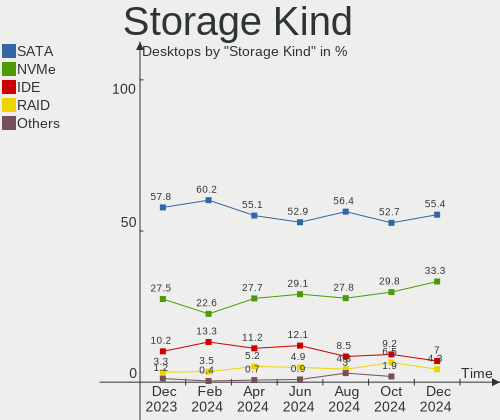
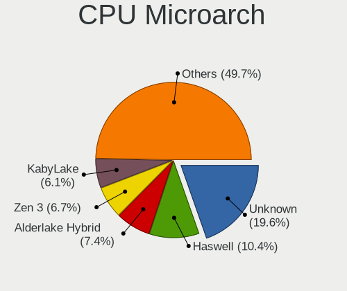
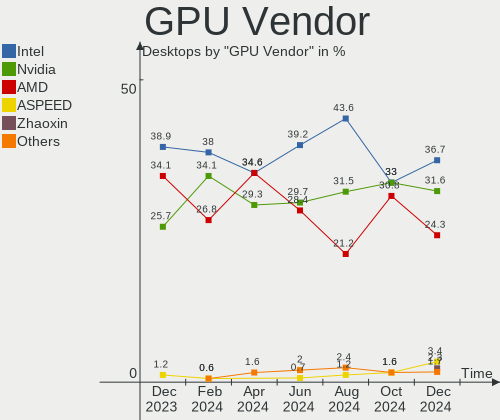
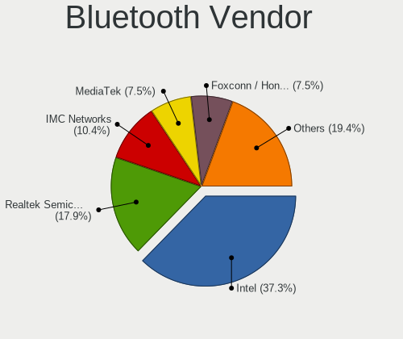

Debian Hardware Trends (Desktop)
--------------------------------

A project to identify most popular hardware characteristics and track their change
over time based on data collected by Debian users at https://Linux-Hardware.org.

Anyone can contribute to the study by uploading probes of their computers by
the [hw-probe](https://github.com/linuxhw/hw-probe) tool:

    sudo -E hw-probe -all -upload

Full-feature report is available here: https://linux-hardware.org/?view=trends&formfactor=desktop

Period: May, 2020.

Contents
--------

- [ OS                       ](#os)
- [ OS Family                ](#os-family)
- [ Kernel                   ](#kernel)
- [ Kernel Family            ](#kernel-family)
- [ Kernel Major Ver.        ](#kernel-major-ver)
- [ Arch                     ](#arch)
- [ DE                       ](#de)
- [ Display Server           ](#display-server)
- [ Display Manager          ](#display-manager)
- [ OS Lang                  ](#os-lang)
- [ Boot Mode                ](#boot-mode)
- [ Filesystem               ](#filesystem)
- [ Part. scheme             ](#part-scheme)
- [ Dual Boot with Linux/BSD ](#dual-boot-with-linux/bsd)
- [ Dual Boot (Win)          ](#dual-boot-win)
- [ Country                  ](#country)
- [ City                     ](#city)
- [ Vendor                   ](#vendor)
- [ Model                    ](#model)
- [ Model Family             ](#model-family)
- [ MFG Year                 ](#mfg-year)
- [ Form Factor              ](#form-factor)
- [ Secure Boot              ](#secure-boot)
- [ Coreboot                 ](#coreboot)
- [ RAM Size                 ](#ram-size)
- [ RAM Used                 ](#ram-used)
- [ Drive Vendor             ](#drive-vendor)
- [ Drive Model              ](#drive-model)
- [ Drive Kind               ](#drive-kind)
- [ Drive Connector          ](#drive-connector)
- [ Drive Size               ](#drive-size)
- [ Space Total              ](#space-total)
- [ Space Used               ](#space-used)
- [ Malfunc. Drives          ](#malfunc-drives)
- [ Malfunc. Drive Vendor    ](#malfunc-drive-vendor)
- [ Malfunc. HDD Vendor      ](#malfunc-hdd-vendor)
- [ Malfunc. Drive Kind      ](#malfunc-drive-kind)
- [ Failed Drives            ](#failed-drives)
- [ Failed Drive Vendor      ](#failed-drive-vendor)
- [ Drive Status             ](#drive-status)
- [ Storage Vendor           ](#storage-vendor)
- [ Storage Model            ](#storage-model)
- [ Storage Kind             ](#storage-kind)
- [ CPU Vendor               ](#cpu-vendor)
- [ CPU Model                ](#cpu-model)
- [ CPU Model Family         ](#cpu-model-family)
- [ CPU Cores                ](#cpu-cores)
- [ CPU Sockets              ](#cpu-sockets)
- [ CPU Threads              ](#cpu-threads)
- [ CPU Op-Modes             ](#cpu-op-modes)
- [ CPU Microcode            ](#cpu-microcode)
- [ CPU Microarch            ](#cpu-microarch)
- [ GPU Vendor               ](#gpu-vendor)
- [ GPU Model                ](#gpu-model)
- [ GPU Combo                ](#gpu-combo)
- [ GPU Driver               ](#gpu-driver)
- [ GPU Memory               ](#gpu-memory)
- [ Monitor Vendor           ](#monitor-vendor)
- [ Monitor Model            ](#monitor-model)
- [ Monitor Resolution       ](#monitor-resolution)
- [ Monitor Diagonal         ](#monitor-diagonal)
- [ Monitor Width            ](#monitor-width)
- [ Aspect Ratio             ](#aspect-ratio)
- [ Monitor Area             ](#monitor-area)
- [ Pixel Density            ](#pixel-density)
- [ Multiple Monitors        ](#multiple-monitors)
- [ Net Controller Vendor    ](#net-controller-vendor)
- [ Net Controller Model     ](#net-controller-model)
- [ Wireless Vendor          ](#wireless-vendor)
- [ Wireless Model           ](#wireless-model)
- [ Ethernet Vendor          ](#ethernet-vendor)
- [ Ethernet Model           ](#ethernet-model)
- [ Net Controller Kind      ](#net-controller-kind)
- [ Used Controller          ](#used-controller)
- [ NICs                     ](#nics)
- [ Bluetooth Vendor         ](#bluetooth-vendor)
- [ Bluetooth Model          ](#bluetooth-model)
- [ Unsupported Devices      ](#unsupported-devices)
- [ Unsupported Device Types ](#unsupported-device-types)

OS
--

Installed operating systems

| Name            | Computers | Percent |
|-----------------|-----------|---------|
| Debian 10       | 30        | 68.18%  |
| Debian Testing  | 5         | 11.36%  |
| Debian          | 5         | 11.36%  |
| Debian Unstable | 2         | 4.55%   |
| Debian 9        | 1         | 2.27%   |
| Debian 3        | 1         | 2.27%   |

OS Family
---------

OS without a version

| Name   | Computers | Percent |
|--------|-----------|---------|
| Debian | 44        | 100%    |

Kernel
------

Version of the Linux kernel

| Version                       | Computers | Percent |
|-------------------------------|-----------|---------|
| 4.19.0-9-amd64                | 11        | 25%     |
| 5.6.0-1-amd64                 | 9         | 20.45%  |
| 4.19.0-8-amd64                | 6         | 13.64%  |
| 4.19.0-6-amd64                | 3         | 6.82%   |
| 5.4.0-0.bpo.4-amd64           | 2         | 4.55%   |
| 5.6.8.yoda                    | 1         | 2.27%   |
| 5.6.0-trunk-amd64             | 1         | 2.27%   |
| 5.6.0-2-amd64                 | 1         | 2.27%   |
| 5.5.0-0.bpo.2-amd64           | 1         | 2.27%   |
| 5.4.41-1-pve                  | 1         | 2.27%   |
| 5.4.38-1.fc28.lemote.mips64el | 1         | 2.27%   |
| 5.4.34-1-pve                  | 1         | 2.27%   |
| 5.4.28avl2-lowlatency         | 1         | 2.27%   |
| 5.4.0-0.bpo.4-686-pae         | 1         | 2.27%   |
| 5.3.0-0.bpo.2-amd64           | 1         | 2.27%   |
| 4.19.0-9-rt-amd64             | 1         | 2.27%   |
| 4.19.0-5-amd64                | 1         | 2.27%   |
| 4.19.0-0.bpo.8-amd64          | 1         | 2.27%   |

Kernel Family
-------------

Linux kernel without a distro release

| Version | Computers | Percent |
|---------|-----------|---------|
| 4.19.0  | 23        | 52.27%  |
| 5.6.0   | 11        | 25%     |
| 5.4.0   | 3         | 6.82%   |
| 5.6.8   | 1         | 2.27%   |
| 5.5.0   | 1         | 2.27%   |
| 5.4.41  | 1         | 2.27%   |
| 5.4.38  | 1         | 2.27%   |
| 5.4.34  | 1         | 2.27%   |
| 5.4.28  | 1         | 2.27%   |
| 5.3.0   | 1         | 2.27%   |

Kernel Major Ver.
-----------------

Linux kernel major version

| Version | Computers | Percent |
|---------|-----------|---------|
| 4.19    | 23        | 52.27%  |
| 5.6     | 12        | 27.27%  |
| 5.4     | 7         | 15.91%  |
| 5.5     | 1         | 2.27%   |
| 5.3     | 1         | 2.27%   |

Arch
----

OS architecture (x86_64, i586, etc.)

| Name   | Computers | Percent |
|--------|-----------|---------|
| x86_64 | 42        | 95.45%  |
| mips64 | 1         | 2.27%   |
| i686   | 1         | 2.27%   |

DE
--

Desktop Environment

| Name       | Computers | Percent |
|------------|-----------|---------|
| MATE       | 9         | 20.45%  |
| XFCE       | 8         | 18.18%  |
| GNOME      | 8         | 18.18%  |
| Unknown    | 7         | 15.91%  |
| KDE        | 4         | 9.09%   |
| X-Cinnamon | 3         | 6.82%   |
| KDE5       | 3         | 6.82%   |
| LXQt       | 2         | 4.55%   |

Display Server
--------------

X11 or Wayland

| Name    | Computers | Percent |
|---------|-----------|---------|
| X11     | 37        | 84.09%  |
| Tty     | 3         | 6.82%   |
| Wayland | 2         | 4.55%   |
| Unknown | 2         | 4.55%   |

Display Manager
---------------

SDDM, LightDM, etc.

| Name    | Computers | Percent |
|---------|-----------|---------|
| Unknown | 24        | 54.55%  |
| LightDM | 8         | 18.18%  |
| SDDM    | 7         | 15.91%  |
| GDM     | 4         | 9.09%   |
| SLiM    | 1         | 2.27%   |

OS Lang
-------

Language

| Lang       | Computers | Percent |
|------------|-----------|---------|
| en_US      | 12        | 27.27%  |
| de_DE      | 5         | 11.36%  |
| fr_FR      | 4         | 9.09%   |
| pt_BR      | 3         | 6.82%   |
| it_IT      | 3         | 6.82%   |
| en_GB      | 3         | 6.82%   |
| Unknown    | 3         | 6.82%   |
| en_US.utf8 | 2         | 4.55%   |
| en_IE      | 2         | 4.55%   |
| en_CA      | 2         | 4.55%   |
| uk_UA      | 1         | 2.27%   |
| sr_RS      | 1         | 2.27%   |
| ru_RU      | 1         | 2.27%   |
| pl_PL.utf8 | 1         | 2.27%   |
| es_ES      | 1         | 2.27%   |

Boot Mode
---------

EFI or BIOS

| Mode | Computers | Percent |
|------|-----------|---------|
| BIOS | 30        | 68.18%  |
| EFI  | 14        | 31.82%  |

Filesystem
----------

Type of filesystem

| Type  | Computers | Percent |
|-------|-----------|---------|
| Ext4  | 38        | 86.36%  |
| Btrfs | 3         | 6.82%   |
| Xfs   | 2         | 4.55%   |
| Tmpfs | 1         | 2.27%   |

Part. scheme
------------

Scheme of partitioning

| Type    | Computers | Percent |
|---------|-----------|---------|
| Unknown | 28        | 63.64%  |
| GPT     | 12        | 27.27%  |
| MBR     | 4         | 9.09%   |

Dual Boot with Linux/BSD
------------------------

Hosting more than one Linux/BSD

| Dual boot | Computers | Percent |
|-----------|-----------|---------|
| No        | 34        | 77.27%  |
| Yes       | 10        | 22.73%  |

Dual Boot (Win)
---------------

Hosting Linux and Windows

| Dual boot | Computers | Percent |
|-----------|-----------|---------|
| No        | 33        | 75%     |
| Yes       | 11        | 25%     |

Country
-------

Geographic location (country)

| Country     | Computers | Percent |
|-------------|-----------|---------|
| USA         | 11        | 25%     |
| France      | 5         | 11.36%  |
| Germany     | 4         | 9.09%   |
| Russia      | 3         | 6.82%   |
| Italy       | 3         | 6.82%   |
| Brazil      | 3         | 6.82%   |
| Ukraine     | 2         | 4.55%   |
| Spain       | 2         | 4.55%   |
| Poland      | 2         | 4.55%   |
| Netherlands | 2         | 4.55%   |
| Canada      | 2         | 4.55%   |
| UK          | 1         | 2.27%   |
| Romania     | 1         | 2.27%   |
| Ireland     | 1         | 2.27%   |
| Australia   | 1         | 2.27%   |
| Algeria     | 1         | 2.27%   |

City
----

Geographic location (city)

| City                | Computers | Percent |
|---------------------|-----------|---------|
| Rancho Palos Verdes | 2         | 4.55%   |
| Paris               | 2         | 4.55%   |
| Gladbeck            | 2         | 4.55%   |
| Łódź             | 1         | 2.27%   |
| Warsaw              | 1         | 2.27%   |
| Warren              | 1         | 2.27%   |
| Voronezh            | 1         | 2.27%   |
| Vologda             | 1         | 2.27%   |
| Tassin-la-Demi-Lune | 1         | 2.27%   |
| Sydney              | 1         | 2.27%   |
| Sun Prairie         | 1         | 2.27%   |
| Sucy-en-Brie        | 1         | 2.27%   |
| Springfield         | 1         | 2.27%   |
| Spello              | 1         | 2.27%   |
| Rochester           | 1         | 2.27%   |
| Redgranite          | 1         | 2.27%   |
| Porto Alegre        | 1         | 2.27%   |
| Ottawa              | 1         | 2.27%   |
| Meximieux           | 1         | 2.27%   |
| Maua                | 1         | 2.27%   |
| Madrid              | 1         | 2.27%   |
| London              | 1         | 2.27%   |
| Kyiv                | 1         | 2.27%   |
| Krasnotur'insk      | 1         | 2.27%   |
| Hanau               | 1         | 2.27%   |
| Groningen           | 1         | 2.27%   |
| Elmshorn            | 1         | 2.27%   |
| Dublin              | 1         | 2.27%   |
| Dodici Morelli      | 1         | 2.27%   |
| Dallas              | 1         | 2.27%   |
| Columbus            | 1         | 2.27%   |
| Chicago             | 1         | 2.27%   |
| Chapel Hill         | 1         | 2.27%   |
| Casal di Principe   | 1         | 2.27%   |
| Béchar             | 1         | 2.27%   |
| Bucharest           | 1         | 2.27%   |
| Brockville          | 1         | 2.27%   |
| Belo Horizonte      | 1         | 2.27%   |
| Arona               | 1         | 2.27%   |
| Aleksandriya        | 1         | 2.27%   |
| Alblasserdam        | 1         | 2.27%   |

Vendor
------

Motherboard manufacturer

| Name                | Computers | Percent |
|---------------------|-----------|---------|
| ASUSTek Computer    | 13        | 29.55%  |
| Gigabyte Technology | 11        | 25%     |
| ASRock              | 5         | 11.36%  |
| Lenovo              | 2         | 4.55%   |
| Hewlett-Packard     | 2         | 4.55%   |
| Dell                | 2         | 4.55%   |
| AZW                 | 2         | 4.55%   |
| Onda technology     | 1         | 2.27%   |
| MSI                 | 1         | 2.27%   |
| Intel               | 1         | 2.27%   |
| Huanan              | 1         | 2.27%   |
| ECS                 | 1         | 2.27%   |
| Apple               | 1         | 2.27%   |
| Unknown             | 1         | 2.27%   |

Model
-----

Motherboard model

| Name                                    | Computers | Percent |
|-----------------------------------------|-----------|---------|
| AZW AP35                                | 2         | 4.55%   |
| ASUS Pro WS X570-ACE                    | 2         | 4.55%   |
| Onda technology A68V+                   | 1         | 2.27%   |
| MSI MS-7992                             | 1         | 2.27%   |
| Lenovo ThinkCentre E73 10DS000TUK       | 1         | 2.27%   |
| Lenovo IdeaCentre 510A-15ARR 90J0008EPB | 1         | 2.27%   |
| Intel DG31PR AAE58249-302               | 1         | 2.27%   |
| Huanan X79 V6.11                        | 1         | 2.27%   |
| HP ProLiant MicroServer Gen8            | 1         | 2.27%   |
| HP ProLiant MicroServer                 | 1         | 2.27%   |
| Gigabyte Z390 AORUS ELITE               | 1         | 2.27%   |
| Gigabyte X470 AORUS ULTRA GAMING        | 1         | 2.27%   |
| Gigabyte M61SME-S2                      | 1         | 2.27%   |
| Gigabyte GB-BACE-3150                   | 1         | 2.27%   |
| Gigabyte GA-MA78GM-S2H                  | 1         | 2.27%   |
| Gigabyte GA-78LMT-USB3                  | 1         | 2.27%   |
| Gigabyte F2A88XM-D3H                    | 1         | 2.27%   |
| Gigabyte F2A78M-HD2                     | 1         | 2.27%   |
| Gigabyte EX58-UD4P                      | 1         | 2.27%   |
| Gigabyte C1037UN-EU                     | 1         | 2.27%   |
| Gigabyte 945GCM-S2L                     | 1         | 2.27%   |
| ECS G41T-M7                             | 1         | 2.27%   |
| Dell Inspiron 5676                      | 1         | 2.27%   |
| Dell Inspiron 3847                      | 1         | 2.27%   |
| ASUS V-P8H67E                           | 1         | 2.27%   |
| ASUS SABERTOOTH X79                     | 1         | 2.27%   |
| ASUS ROG STRIX Z390-E GAMING            | 1         | 2.27%   |
| ASUS ROG STRIX B450-I GAMING            | 1         | 2.27%   |
| ASUS ROG STRIX B365-G GAMING            | 1         | 2.27%   |
| ASUS P9X79 PRO                          | 1         | 2.27%   |
| ASUS P8H61-M LE                         | 1         | 2.27%   |
| ASUS P5PE-VM                            | 1         | 2.27%   |
| ASUS M5A97 R2.0                         | 1         | 2.27%   |
| ASUS K31CD-K                            | 1         | 2.27%   |
| ASUS Impression                         | 1         | 2.27%   |
| ASRock Z75 Pro3                         | 1         | 2.27%   |
| ASRock X570 Extreme4                    | 1         | 2.27%   |
| ASRock D1800B-ITX                       | 1         | 2.27%   |
| ASRock B450M Pro4                       | 1         | 2.27%   |
| ASRock B450 Gaming-ITX/ac               | 1         | 2.27%   |
| Apple MacPro4,1                         | 1         | 2.27%   |
| Unknown                                 | 1         | 2.27%   |

Model Family
------------

Motherboard model prefix

| Name                   | Computers | Percent |
|------------------------|-----------|---------|
| ASUS ROG               | 3         | 6.82%   |
| HP ProLiant            | 2         | 4.55%   |
| Dell Inspiron          | 2         | 4.55%   |
| AZW AP35               | 2         | 4.55%   |
| ASUS Pro               | 2         | 4.55%   |
| Onda technology A68V+  | 1         | 2.27%   |
| MSI MS-7992            | 1         | 2.27%   |
| Lenovo ThinkCentre     | 1         | 2.27%   |
| Lenovo IdeaCentre      | 1         | 2.27%   |
| Intel DG31PR           | 1         | 2.27%   |
| Huanan X79             | 1         | 2.27%   |
| Gigabyte Z390          | 1         | 2.27%   |
| Gigabyte X470          | 1         | 2.27%   |
| Gigabyte M61SME-S2     | 1         | 2.27%   |
| Gigabyte GB-BACE-3150  | 1         | 2.27%   |
| Gigabyte GA-MA78GM-S2H | 1         | 2.27%   |
| Gigabyte GA-78LMT-USB3 | 1         | 2.27%   |
| Gigabyte F2A88XM-D3H   | 1         | 2.27%   |
| Gigabyte F2A78M-HD2    | 1         | 2.27%   |
| Gigabyte EX58-UD4P     | 1         | 2.27%   |
| Gigabyte C1037UN-EU    | 1         | 2.27%   |
| Gigabyte 945GCM-S2L    | 1         | 2.27%   |
| ECS G41T-M7            | 1         | 2.27%   |
| ASUS V-P8H67E          | 1         | 2.27%   |
| ASUS SABERTOOTH        | 1         | 2.27%   |
| ASUS P9X79             | 1         | 2.27%   |
| ASUS P8H61-M           | 1         | 2.27%   |
| ASUS P5PE-VM           | 1         | 2.27%   |
| ASUS M5A97             | 1         | 2.27%   |
| ASUS K31CD-K           | 1         | 2.27%   |
| ASUS Impression        | 1         | 2.27%   |
| ASRock Z75             | 1         | 2.27%   |
| ASRock X570            | 1         | 2.27%   |
| ASRock D1800B-ITX      | 1         | 2.27%   |
| ASRock B450M           | 1         | 2.27%   |
| ASRock B450            | 1         | 2.27%   |
| Apple MacPro4          | 1         | 2.27%   |
| Unknown                | 1         | 2.27%   |

MFG Year
--------

Motherboard manufacture year

| Year    | Computers | Percent |
|---------|-----------|---------|
| 2019    | 13        | 29.55%  |
| 2018    | 6         | 13.64%  |
| 2011    | 5         | 11.36%  |
| 2015    | 3         | 6.82%   |
| 2014    | 3         | 6.82%   |
| 2016    | 2         | 4.55%   |
| 2012    | 2         | 4.55%   |
| 2009    | 2         | 4.55%   |
| 2008    | 2         | 4.55%   |
| 2007    | 2         | 4.55%   |
| 2020    | 1         | 2.27%   |
| 2013    | 1         | 2.27%   |
| 2010    | 1         | 2.27%   |
| Unknown | 1         | 2.27%   |

Form Factor
-----------

Physical design of the computer

| Name    | Computers | Percent |
|---------|-----------|---------|
| Desktop | 44        | 100%    |

Secure Boot
-----------

Enabled or disabled

| State    | Computers | Percent |
|----------|-----------|---------|
| Disabled | 44        | 100%    |

Coreboot
--------

Have coreboot on board

| Used | Computers | Percent |
|------|-----------|---------|
| No   | 44        | 100%    |

RAM Size
--------

Total RAM memory

| Size in GB  | Computers | Percent |
|-------------|-----------|---------|
| 16.01-24.0  | 11        | 25%     |
| 8.01-16.0   | 10        | 22.73%  |
| 3.01-4.0    | 8         | 18.18%  |
| 32.01-64.0  | 6         | 13.64%  |
| 4.01-8.0    | 4         | 9.09%   |
| 64.01-256.0 | 2         | 4.55%   |
| 24.01-32.0  | 1         | 2.27%   |
| 2.01-3.0    | 1         | 2.27%   |
| 1.01-2.0    | 1         | 2.27%   |

RAM Used
--------

Used RAM memory

| Used GB    | Computers | Percent |
|------------|-----------|---------|
| 1.01-2.0   | 15        | 34.09%  |
| 2.01-3.0   | 9         | 20.45%  |
| 4.01-8.0   | 8         | 18.18%  |
| 0.01-1.0   | 4         | 9.09%   |
| 3.01-4.0   | 3         | 6.82%   |
| 8.01-16.0  | 3         | 6.82%   |
| 32.01-64.0 | 1         | 2.27%   |
| 24.01-32.0 | 1         | 2.27%   |

Drive Vendor
------------

Hard drive vendors

| Vendor              | Computers | Drives | Percent |
|---------------------|-----------|--------|---------|
| Seagate             | 18        | 20     | 19.57%  |
| WDC                 | 16        | 25     | 17.39%  |
| Samsung Electronics | 9         | 11     | 9.78%   |
| Kingston            | 6         | 6      | 6.52%   |
| Crucial             | 6         | 6      | 6.52%   |
| Toshiba             | 5         | 5      | 5.43%   |
| SanDisk             | 3         | 3      | 3.26%   |
| Hitachi             | 3         | 3      | 3.26%   |
| Unknown             | 2         | 2      | 2.17%   |
| Maxtor              | 2         | 3      | 2.17%   |
| LDLC                | 2         | 3      | 2.17%   |
| Intel               | 2         | 2      | 2.17%   |
| ASMT                | 2         | 2      | 2.17%   |
| A-DATA Technology   | 2         | 2      | 2.17%   |
| Zheino              | 1         | 1      | 1.09%   |
| Transcend           | 1         | 1      | 1.09%   |
| SK Hynix            | 1         | 1      | 1.09%   |
| SABRENT             | 1         | 1      | 1.09%   |
| Patriot             | 1         | 1      | 1.09%   |
| NVMe                | 1         | 1      | 1.09%   |
| Magnetic Data       | 1         | 1      | 1.09%   |
| KingDian            | 1         | 1      | 1.09%   |
| Intenso             | 1         | 1      | 1.09%   |
| HGST HDS            | 1         | 1      | 1.09%   |
| HGST                | 1         | 1      | 1.09%   |
| Hewlett-Packard     | 1         | 1      | 1.09%   |
| Gigabyte Technology | 1         | 1      | 1.09%   |
| China               | 1         | 1      | 1.09%   |

Drive Model
-----------

Hard drive models

| Model                       | Computers | Percent |
|-----------------------------|-----------|---------|
| ST1000DM010-2EP102 1TB      | 3         | 2.88%   |
| CT120BX500SSD1 120GB        | 3         | 2.88%   |
| TL100 240GB SSD             | 2         | 1.92%   |
| ST500DM002-1BD142 500GB     | 2         | 1.92%   |
| ST31000524AS 1TB            | 2         | 1.92%   |
| SSD 970 EVO Plus 1TB        | 2         | 1.92%   |
| SA400S37120G 120GB SSD      | 2         | 1.92%   |
| MMC Card  64GB              | 2         | 1.92%   |
| WDS250G2X0C-00L350 250GB    | 1         | 0.96%   |
| WD60EFRX-68L0BN1 6TB        | 1         | 0.96%   |
| WD5000AAKS-22A7B0 500GB     | 1         | 0.96%   |
| WD40EZRZ-00GXCB0 4TB        | 1         | 0.96%   |
| WD40EFRX-68WT0N0 4TB        | 1         | 0.96%   |
| WD30EZRZ-00Z5HB0 3TB        | 1         | 0.96%   |
| WD30EZRX-00DC0B0 3TB        | 1         | 0.96%   |
| WD20EZRZ-00Z5HB0 2TB        | 1         | 0.96%   |
| WD20EFRX-68E                | 1         | 0.96%   |
| WD1600JD-00HBB0 160GB       | 1         | 0.96%   |
| WD1600BEVT-22ZCT0 160GB     | 1         | 0.96%   |
| WD1600BEVT-00ZCT0 160GB     | 1         | 0.96%   |
| WD15EARS-00Z5B1 1TB         | 1         | 0.96%   |
| WD10SPZX-24Z10 1TB          | 1         | 0.96%   |
| WD10EZRX-00L4HB0 1TB        | 1         | 0.96%   |
| WD10EZEX-08WN4A0 1TB        | 1         | 0.96%   |
| WD10EZEX-00BN5A0 1TB        | 1         | 0.96%   |
| WD10EFRX-68PJCN0 1TB        | 1         | 0.96%   |
| WD10EARX-00N0YB0 1TB        | 1         | 0.96%   |
| WD1003FZEX-00MK2A0 1TB      | 1         | 0.96%   |
| WD1002FAEX-00Z3A0 1TB       | 1         | 0.96%   |
| WD1001FALS-41Y6A0 1TB       | 1         | 0.96%   |
| TS128GMTE110S 128GB         | 1         | 0.96%   |
| SX6000LNP 1TB               | 1         | 0.96%   |
| SV300S37A120G 120GB SSD     | 1         | 0.96%   |
| SV300S37A 240G SSD          | 1         | 0.96%   |
| SUV400S37240G 240GB SSD     | 1         | 0.96%   |
| STM3250310AS 250GB          | 1         | 0.96%   |
| ST95005620AS 500GB          | 1         | 0.96%   |
| ST500LT012-9WS142 500GB     | 1         | 0.96%   |
| ST4000VN000-2AH166 4TB      | 1         | 0.96%   |
| ST4000DM000-1F2168 4TB      | 1         | 0.96%   |
| ST380021A 80GB              | 1         | 0.96%   |
| ST340014A 40GB              | 1         | 0.96%   |
| ST320LM001 HN-M320MBB 320GB | 1         | 0.96%   |
| ST3200822AS 200GB           | 1         | 0.96%   |
| ST31000523AS 1TB            | 1         | 0.96%   |
| ST3000DM001-1ER166 3TB      | 1         | 0.96%   |
| ST250DM000-1BD141 250GB     | 1         | 0.96%   |
| ST1000DM003-1CH162 1TB      | 1         | 0.96%   |
| SSDSC2CW240A3 240GB         | 1         | 0.96%   |
| SSDPEKNW020T8 2TB           | 1         | 0.96%   |
| SSD PLUS 240GB              | 1         | 0.96%   |
| SSD EX900 120GB             | 1         | 0.96%   |
| SSD 970 PRO 1TB             | 1         | 0.96%   |
| SSD 860 QVO 1TB             | 1         | 0.96%   |
| SSD 850 PRO 256GB           | 1         | 0.96%   |
| SSD 850 PRO 1TB             | 1         | 0.96%   |
| SSD 850 EVO 500GB           | 1         | 0.96%   |
| SSD 840 Series 250GB        | 1         | 0.96%   |
| SSD 830 Series 128GB        | 1         | 0.96%   |
| SSD 128GB                   | 1         | 0.96%   |

Drive Kind
----------

HDD or SSD

| Kind    | Computers | Drives | Percent |
|---------|-----------|--------|---------|
| HDD     | 30        | 59     | 43.48%  |
| SSD     | 26        | 32     | 37.68%  |
| NVMe    | 7         | 10     | 10.14%  |
| Unknown | 4         | 4      | 5.8%    |
| MMC     | 2         | 2      | 2.9%    |

Drive Connector
---------------

SATA, SAS, NVMe, etc.

| Type | Computers | Drives | Percent |
|------|-----------|--------|---------|
| SATA | 38        | 89     | 74.51%  |
| NVMe | 7         | 10     | 13.73%  |
| SAS  | 4         | 6      | 7.84%   |
| MMC  | 2         | 2      | 3.92%   |

Drive Size
----------

Size of hard drive

| Size in TB | Computers | Drives | Percent |
|------------|-----------|--------|---------|
| 0.01-0.5   | 34        | 58     | 45.95%  |
| 0.51-1.0   | 23        | 28     | 31.08%  |
| 1.01-2.0   | 6         | 9      | 8.11%   |
| 3.01-4.0   | 5         | 5      | 6.76%   |
| 2.01-3.0   | 3         | 4      | 4.05%   |
| 4.01-10.0  | 3         | 3      | 4.05%   |

Space Total
-----------

Amount of disk space available on the file system

| Size in GB     | Computers | Percent |
|----------------|-----------|---------|
| 101-250        | 9         | 20.45%  |
| 1001-2000      | 6         | 13.64%  |
| More than 3000 | 5         | 11.36%  |
| 251-500        | 5         | 11.36%  |
| 21-50          | 5         | 11.36%  |
| 501-1000       | 5         | 11.36%  |
| 51-100         | 5         | 11.36%  |
| 2001-3000      | 2         | 4.55%   |
| Unknown        | 2         | 4.55%   |

Space Used
----------

Amount of used disk space

| Used GB        | Computers | Percent |
|----------------|-----------|---------|
| 1-20           | 14        | 31.82%  |
| 21-50          | 8         | 18.18%  |
| 51-100         | 5         | 11.36%  |
| 251-500        | 4         | 9.09%   |
| 101-250        | 3         | 6.82%   |
| 501-1000       | 3         | 6.82%   |
| More than 3000 | 2         | 4.55%   |
| 2001-3000      | 2         | 4.55%   |
| Unknown        | 2         | 4.55%   |
| 1001-2000      | 1         | 2.27%   |

Malfunc. Drives
---------------

Drive models with a malfunction

| Model                   | Computers | Drives | Percent |
|-------------------------|-----------|--------|---------|
| WD60EFRX-68L0BN1 6TB    | 1         | 1      | 11.11%  |
| WD1600BEVT-22ZCT0 160GB | 1         | 1      | 11.11%  |
| SV300S37A120G 120GB SSD | 1         | 1      | 11.11%  |
| ST500LT012-9WS142 500GB | 1         | 1      | 11.11%  |
| ST3200822AS 200GB       | 1         | 1      | 11.11%  |
| ST1000DM010-2EP102 1TB  | 1         | 1      | 11.11%  |
| HTS543225L9A300 250GB   | 1         | 1      | 11.11%  |
| DT01ACA100 1TB          | 1         | 1      | 11.11%  |
| 6L200M0 208GB           | 1         | 1      | 11.11%  |

Malfunc. Drive Vendor
---------------------

Vendors of faulty drives

| Vendor   | Computers | Drives | Percent |
|----------|-----------|--------|---------|
| Seagate  | 3         | 3      | 33.33%  |
| WDC      | 2         | 2      | 22.22%  |
| Toshiba  | 1         | 1      | 11.11%  |
| Maxtor   | 1         | 1      | 11.11%  |
| Kingston | 1         | 1      | 11.11%  |
| Hitachi  | 1         | 1      | 11.11%  |

Malfunc. HDD Vendor
-------------------

Vendors of faulty HDD drives

| Vendor  | Computers | Drives | Percent |
|---------|-----------|--------|---------|
| Seagate | 3         | 3      | 37.5%   |
| WDC     | 2         | 2      | 25%     |
| Toshiba | 1         | 1      | 12.5%   |
| Maxtor  | 1         | 1      | 12.5%   |
| Hitachi | 1         | 1      | 12.5%   |

Malfunc. Drive Kind
-------------------

Kinds of faulty drives

| Kind | Computers | Drives | Percent |
|------|-----------|--------|---------|
| HDD  | 6         | 8      | 85.71%  |
| SSD  | 1         | 1      | 14.29%  |

Failed Drives
-------------

Failed drive models

Zero info for selected period =(

Failed Drive Vendor
-------------------

Failed drive vendors

Zero info for selected period =(

Drive Status
------------

Number of failed and malfunc. drives

| Status   | Computers | Drives | Percent |
|----------|-----------|--------|---------|
| Detected | 26        | 55     | 50%     |
| Works    | 19        | 43     | 36.54%  |
| Malfunc  | 7         | 9      | 13.46%  |

Storage Vendor
--------------

Storage controller vendors

| Vendor                    | Computers | Percent |
|---------------------------|-----------|---------|
| Intel                     | 23        | 37.1%   |
| AMD                       | 16        | 25.81%  |
| Samsung Electronics       | 5         | 8.06%   |
| ASMedia Technology        | 4         | 6.45%   |
| Marvell Technology Group  | 3         | 4.84%   |
| Silicon Motion            | 2         | 3.23%   |
| Phison Electronics        | 2         | 3.23%   |
| SK Hynix                  | 1         | 1.61%   |
| Sandisk                   | 1         | 1.61%   |
| Realtek Semiconductor     | 1         | 1.61%   |
| Nvidia                    | 1         | 1.61%   |
| LSI Logic / Symbios Logic | 1         | 1.61%   |
| Loongson Technology       | 1         | 1.61%   |
| JMicron Technology        | 1         | 1.61%   |

Storage Model
-------------

Storage controller models

| Model                                                                             | Computers | Percent |
|-----------------------------------------------------------------------------------|-----------|---------|
| FCH SATA Controller [AHCI mode]                                                   | 11        | 13.75%  |
| SB7x0/SB8x0/SB9x0 SATA Controller [AHCI mode]                                     | 5         | 6.25%   |
| NVMe SSD Controller SM981/PM981/PM983                                             | 5         | 6.25%   |
| ASM1062 Serial ATA Controller                                                     | 4         | 5%      |
| 400 Series Chipset SATA Controller                                                | 4         | 5%      |
| Non-Volatile memory controller                                                    | 3         | 3.75%   |
| NM10/ICH7 Family SATA Controller [IDE mode]                                       | 3         | 3.75%   |
| 82801G (ICH7 Family) IDE Controller                                               | 3         | 3.75%   |
| SB7x0/SB8x0/SB9x0 IDE Controller                                                  | 2         | 2.5%    |
| FCH IDE Controller                                                                | 2         | 2.5%    |
| Celeron N3350/Pentium N4200/Atom E3900 Series SATA AHCI Controller                | 2         | 2.5%    |
| Cannon Lake PCH SATA AHCI Controller                                              | 2         | 2.5%    |
| C600/X79 series chipset 6-Port SATA AHCI Controller                               | 2         | 2.5%    |
| 88SE9128 PCIe SATA 6 Gb/s RAID controller with HyperDuo                           | 2         | 2.5%    |
| 82801JI (ICH10 Family) 4 port SATA IDE Controller #1                              | 2         | 2.5%    |
| 82801JI (ICH10 Family) 2 port SATA IDE Controller #2                              | 2         | 2.5%    |
| 6 Series/C200 Series Chipset Family Desktop SATA Controller (IDE mode, ports 4-5) | 2         | 2.5%    |
| 6 Series/C200 Series Chipset Family Desktop SATA Controller (IDE mode, ports 0-3) | 2         | 2.5%    |
| X370 Series Chipset SATA Controller                                               | 1         | 1.25%   |
| WD Black 2018/PC SN720 NVMe SSD                                                   | 1         | 1.25%   |
| SSD 660P Series                                                                   | 1         | 1.25%   |
| SATA AHCI Controller                                                              | 1         | 1.25%   |
| SAS2008 PCI-Express Fusion-MPT SAS-2 [Falcon]                                     | 1         | 1.25%   |
| Realtek Non-Volatile memory controller                                            | 1         | 1.25%   |
| Q170/Q150/B150/H170/H110/Z170/CM236 Chipset SATA Controller [AHCI Mode]           | 1         | 1.25%   |
| NVMe Storage Controller                                                           | 1         | 1.25%   |
| MCP61 SATA Controller                                                             | 1         | 1.25%   |
| MCP61 IDE                                                                         | 1         | 1.25%   |
| JMB363 SATA/IDE Controller                                                        | 1         | 1.25%   |
| E12 NVMe Controller                                                               | 1         | 1.25%   |
| C600/X79 series chipset SATA RAID Controller                                      | 1         | 1.25%   |
| Atom/Celeron/Pentium Processor x5-E8000/J3xxx/N3xxx Series SATA Controller        | 1         | 1.25%   |
| Atom Processor E3800 Series SATA AHCI Controller                                  | 1         | 1.25%   |
| 88SE6101/6102 single-port PATA133 interface                                       | 1         | 1.25%   |
| 82801JI (ICH10 Family) SATA AHCI Controller                                       | 1         | 1.25%   |
| 82801EB/ER (ICH5/ICH5R) IDE Controller                                            | 1         | 1.25%   |
| 8 Series/C220 Series Chipset Family 6-port SATA Controller 1 [AHCI mode]          | 1         | 1.25%   |
| 7 Series/C210 Series Chipset Family 6-port SATA Controller [AHCI mode]            | 1         | 1.25%   |
| 7 Series Chipset Family 6-port SATA Controller [AHCI mode]                        | 1         | 1.25%   |
| 200 Series PCH SATA controller [AHCI mode]                                        | 1         | 1.25%   |

Storage Kind
------------

Kind of storage controller (IDE, SATA, NVMe, SAS, ...)

| Kind | Computers | Percent |
|------|-----------|---------|
| SATA | 31        | 56.36%  |
| IDE  | 13        | 23.64%  |
| NVMe | 9         | 16.36%  |
| RAID | 1         | 1.82%   |
| SAS  | 1         | 1.82%   |

CPU Vendor
----------

Processor vendors

| Vendor  | Computers | Percent |
|---------|-----------|---------|
| Intel   | 25        | 56.82%  |
| AMD     | 18        | 40.91%  |
| Unknown | 1         | 2.27%   |

CPU Model
---------

Processor models

| Model                                           | Computers | Percent |
|-------------------------------------------------|-----------|---------|
| Intel Celeron CPU J3355 @ 2.00GHz               | 2         | 4.55%   |
| AMD Ryzen 7 3700X 8-Core Processor              | 2         | 4.55%   |
| AMD Ryzen 7 2700X Eight-Core Processor          | 2         | 4.55%   |
| AMD Ryzen 5 3400G with Radeon Vega Graphics     | 2         | 4.55%   |
| Intel Xeon CPU W3565 @ 3.20GHz                  | 1         | 2.27%   |
| Intel Xeon CPU L5410 @ 2.33GHz                  | 1         | 2.27%   |
| Intel Xeon CPU E5-2689 0 @ 2.60GHz              | 1         | 2.27%   |
| Intel Core i7-3930K CPU @ 3.20GHz               | 1         | 2.27%   |
| Intel Core i7-3820 CPU @ 3.60GHz                | 1         | 2.27%   |
| Intel Core i7 CPU 920 @ 2.67GHz                 | 1         | 2.27%   |
| Intel Core i5-9600K CPU @ 3.70GHz               | 1         | 2.27%   |
| Intel Core i5-8400 CPU @ 2.80GHz                | 1         | 2.27%   |
| Intel Core i5-7400 CPU @ 3.00GHz                | 1         | 2.27%   |
| Intel Core i5-4460S CPU @ 2.90GHz               | 1         | 2.27%   |
| Intel Core i5-4460 CPU @ 3.20GHz                | 1         | 2.27%   |
| Intel Core i5-3450 CPU @ 3.10GHz                | 1         | 2.27%   |
| Intel Core i5-2320 CPU @ 3.00GHz                | 1         | 2.27%   |
| Intel Core i3-9100 CPU @ 3.60GHz                | 1         | 2.27%   |
| Intel Core i3-2100 CPU @ 3.10GHz                | 1         | 2.27%   |
| Intel Core 2 Quad CPU Q6600 @ 2.40GHz           | 1         | 2.27%   |
| Intel Core 2 Duo CPU E8500 @ 3.16GHz            | 1         | 2.27%   |
| Intel Core 2 Duo CPU E7500 @ 2.93GHz            | 1         | 2.27%   |
| Intel Core 2 CPU E7400 @ 2.80GHz                | 1         | 2.27%   |
| Intel Celeron CPU N3150 @ 1.60GHz               | 1         | 2.27%   |
| Intel Celeron CPU J1800 @ 2.41GHz               | 1         | 2.27%   |
| Intel Celeron CPU G1610T @ 2.30GHz              | 1         | 2.27%   |
| Intel Celeron CPU 1037U @ 1.80GHz               | 1         | 2.27%   |
| AMD Turion II Neo N40L Dual-Core Processor      | 1         | 2.27%   |
| AMD Ryzen 5 3600X 6-Core Processor              | 1         | 2.27%   |
| AMD Ryzen 5 1600 Six-Core Processor             | 1         | 2.27%   |
| AMD Ryzen 3 3200G with Radeon Vega Graphics     | 1         | 2.27%   |
| AMD Phenom II X6 1065T Processor                | 1         | 2.27%   |
| AMD FX-8320 Eight-Core Processor                | 1         | 2.27%   |
| AMD FX-6350 Six-Core Processor                  | 1         | 2.27%   |
| AMD Athlon X4 750 Quad Core Processor           | 1         | 2.27%   |
| AMD Athlon II X2 B24 Processor                  | 1         | 2.27%   |
| AMD Athlon 64 Processor 3200+                   | 1         | 2.27%   |
| AMD A10-7700K Radeon R7, 10 Compute Cores 4C+6G | 1         | 2.27%   |
| AMD A10-6800K APU with Radeon HD Graphics       | 1         | 2.27%   |
|                                                 | 1         | 2.27%   |

CPU Model Family
----------------

Processor model prefix

| Model             | Computers | Percent |
|-------------------|-----------|---------|
| Intel Core i5     | 7         | 15.91%  |
| Intel Celeron     | 6         | 13.64%  |
| AMD Ryzen 7       | 4         | 9.09%   |
| AMD Ryzen 5       | 4         | 9.09%   |
| Intel Xeon        | 3         | 6.82%   |
| Intel Core i7     | 3         | 6.82%   |
| Intel Core i3     | 2         | 4.55%   |
| Intel Core 2 Duo  | 2         | 4.55%   |
| AMD FX            | 2         | 4.55%   |
| AMD A10           | 2         | 4.55%   |
| Other             | 1         | 2.27%   |
| Intel Core 2 Quad | 1         | 2.27%   |
| Intel Core 2      | 1         | 2.27%   |
| AMD Turion II Neo | 1         | 2.27%   |
| AMD Ryzen 3       | 1         | 2.27%   |
| AMD Phenom II X6  | 1         | 2.27%   |
| AMD Athlon X4     | 1         | 2.27%   |
| AMD Athlon II X2  | 1         | 2.27%   |
| AMD Athlon 64     | 1         | 2.27%   |

CPU Cores
---------

Number of processor cores

| Number | Computers | Percent |
|--------|-----------|---------|
| 4      | 16        | 36.36%  |
| 2      | 14        | 31.82%  |
| 6      | 6         | 13.64%  |
| 8      | 5         | 11.36%  |
| 1      | 2         | 4.55%   |
| 3      | 1         | 2.27%   |

CPU Sockets
-----------

Number of sockets

| Number | Computers | Percent |
|--------|-----------|---------|
| 1      | 44        | 100%    |

CPU Threads
-----------

Threads per core (Hyper-Threading)

| Number | Computers | Percent |
|--------|-----------|---------|
| 1      | 25        | 56.82%  |
| 2      | 19        | 43.18%  |

CPU Op-Modes
------------

CPU Operation Modes (32-bit, 64-bit)

| Op mode        | Computers | Percent |
|----------------|-----------|---------|
| 32-bit, 64-bit | 43        | 97.73%  |
| Unknown        | 1         | 2.27%   |

CPU Microcode
-------------

Microcode number

| Number     | Computers | Percent |
|------------|-----------|---------|
| Unknown    | 19        | 43.18%  |
| 0x306a9    | 3         | 6.82%   |
| 0x206d7    | 3         | 6.82%   |
| 0x1067a    | 2         | 4.55%   |
| 0x08701013 | 2         | 4.55%   |
| 0x08108109 | 2         | 4.55%   |
| 0x0800820d | 2         | 4.55%   |
| 0x06000852 | 2         | 4.55%   |
| 0x906eb    | 1         | 2.27%   |
| 0x906ea    | 1         | 2.27%   |
| 0x906e9    | 1         | 2.27%   |
| 0x206a7    | 1         | 2.27%   |
| 0x106a5    | 1         | 2.27%   |
| 0x106a4    | 1         | 2.27%   |
| 0x06003106 | 1         | 2.27%   |
| 0x06001119 | 1         | 2.27%   |
| 0x010000c8 | 1         | 2.27%   |

CPU Microarch
-------------

Microarchitecture

| Name        | Computers | Percent |
|-------------|-----------|---------|
| Zen+        | 6         | 13.64%  |
| SandyBridge | 5         | 11.36%  |
| Piledriver  | 4         | 9.09%   |
| Zen 2       | 3         | 6.82%   |
| Skylake     | 3         | 6.82%   |
| K10         | 3         | 6.82%   |
| IvyBridge   | 3         | 6.82%   |
| Core        | 3         | 6.82%   |
| Silvermont  | 2         | 4.55%   |
| Penryn      | 2         | 4.55%   |
| Nehalem     | 2         | 4.55%   |
| Haswell     | 2         | 4.55%   |
| Goldmont    | 2         | 4.55%   |
| Steamroller | 1         | 2.27%   |
| KabyLake    | 1         | 2.27%   |
| K8 Hammer   | 1         | 2.27%   |
| Unknown     | 1         | 2.27%   |

GPU Vendor
----------

Vendors of graphics cards

| Vendor                     | Computers | Percent |
|----------------------------|-----------|---------|
| Nvidia                     | 19        | 42.22%  |
| AMD                        | 14        | 31.11%  |
| Intel                      | 10        | 22.22%  |
| Matrox Electronics Systems | 1         | 2.22%   |
| Loongson Technology        | 1         | 2.22%   |

GPU Model
---------

Graphics card models

| Model                                                                              | Computers | Percent |
|------------------------------------------------------------------------------------|-----------|---------|
| Picasso                                                                            | 3         | 6.25%   |
| Ellesmere [Radeon RX 470/480/570/570X/580/580X/590]                                | 3         | 6.25%   |
| TU106 [GeForce RTX 2060 SUPER]                                                     | 2         | 4.17%   |
| HD Graphics 500                                                                    | 2         | 4.17%   |
| GT218 [GeForce 210]                                                                | 2         | 4.17%   |
| GP106 [GeForce GTX 1060 3GB]                                                       | 2         | 4.17%   |
| GM107 [GeForce GTX 750 Ti]                                                         | 2         | 4.17%   |
| Xeon E3-1200 v3/4th Gen Core Processor Integrated Graphics Controller              | 1         | 2.08%   |
| Xeon E3-1200 v2/3rd Gen Core processor Graphics Controller                         | 1         | 2.08%   |
| Vivante GPU (Graphics Processing Unit)                                             | 1         | 2.08%   |
| UHD Graphics 630 (Desktop)                                                         | 1         | 2.08%   |
| TU117 [GeForce GTX 1650]                                                           | 1         | 2.08%   |
| TU116 [GeForce GTX 1650 SUPER]                                                     | 1         | 2.08%   |
| Tonga PRO [Radeon R9 285/380]                                                      | 1         | 2.08%   |
| Tahiti PRO [Radeon HD 7950/8950 OEM / R9 280]                                      | 1         | 2.08%   |
| RS880M [Mobility Radeon HD 4225/4250]                                              | 1         | 2.08%   |
| Richland [Radeon HD 8670D]                                                         | 1         | 2.08%   |
| R350 [Radeon 9800 Series]                                                          | 1         | 2.08%   |
| R350 [Radeon 9800 PRO] (Secondary)                                                 | 1         | 2.08%   |
| Pitcairn PRO [Radeon HD 7850 / R7 265 / R9 270 1024SP]                             | 1         | 2.08%   |
| MGA G200EH                                                                         | 1         | 2.08%   |
| Kaveri [Radeon R7 Graphics]                                                        | 1         | 2.08%   |
| GT218 [GeForce G210]                                                               | 1         | 2.08%   |
| GP107 [GeForce GTX 1050 Ti]                                                        | 1         | 2.08%   |
| GP106 [GeForce GTX 1060 6GB]                                                       | 1         | 2.08%   |
| GP104 [GeForce GTX 1070 Ti]                                                        | 1         | 2.08%   |
| GM107 [GeForce GTX 750]                                                            | 1         | 2.08%   |
| GF116 [GeForce GTS 450 Rev. 2]                                                     | 1         | 2.08%   |
| GF108 [GeForce GT 430]                                                             | 1         | 2.08%   |
| G92 [GeForce 9800 GT]                                                              | 1         | 2.08%   |
| G84 [GeForce 8600 GT]                                                              | 1         | 2.08%   |
| DC (Display Controller)                                                            | 1         | 2.08%   |
| Cedar [Radeon HD 5000/6000/7350/8350 Series]                                       | 1         | 2.08%   |
| Baffin [Radeon RX 550 640SP / RX 560/560X]                                         | 1         | 2.08%   |
| Atom/Celeron/Pentium Processor x5-E8000/J3xxx/N3xxx Integrated Graphics Controller | 1         | 2.08%   |
| Atom Processor Z36xxx/Z37xxx Series Graphics & Display                             | 1         | 2.08%   |
| 4 Series Chipset Integrated Graphics Controller                                    | 1         | 2.08%   |
| 3rd Gen Core processor Graphics Controller                                         | 1         | 2.08%   |
| 2nd Generation Core Processor Family Integrated Graphics Controller                | 1         | 2.08%   |

GPU Combo
---------

Combinations of graphics cards

| Name                    | Computers | Percent |
|-------------------------|-----------|---------|
| 1 x Nvidia              | 19        | 43.18%  |
| 1 x AMD                 | 11        | 25%     |
| 1 x Intel               | 9         | 20.45%  |
| 2 x AMD                 | 3         | 6.82%   |
| 2 x Loongson Technology | 1         | 2.27%   |
| 1 x Matrox              | 1         | 2.27%   |

GPU Driver
----------

Free vs proprietary

| Driver      | Computers | Percent |
|-------------|-----------|---------|
| Free        | 29        | 65.91%  |
| Proprietary | 11        | 25%     |
| Unknown     | 4         | 9.09%   |

GPU Memory
----------

Total video memory

| Size in GB | Computers | Percent |
|------------|-----------|---------|
| Unknown    | 20        | 45.45%  |
| 0.51-1.0   | 7         | 15.91%  |
| 7.01-8.0   | 4         | 9.09%   |
| 3.01-4.0   | 4         | 9.09%   |
| 2.01-3.0   | 4         | 9.09%   |
| 1.01-2.0   | 3         | 6.82%   |
| 0.01-0.5   | 2         | 4.55%   |

Monitor Vendor
--------------

Monitor vendors

| Vendor               | Computers | Percent |
|----------------------|-----------|---------|
| Samsung Electronics  | 12        | 27.91%  |
| Goldstar             | 5         | 11.63%  |
| AOC                  | 4         | 9.3%    |
| Dell                 | 3         | 6.98%   |
| BenQ                 | 3         | 6.98%   |
| Hewlett-Packard      | 2         | 4.65%   |
| Fujitsu Siemens      | 2         | 4.65%   |
| UTV                  | 1         | 2.33%   |
| Sun                  | 1         | 2.33%   |
| SLT                  | 1         | 2.33%   |
| Philips              | 1         | 2.33%   |
| Packard Bell         | 1         | 2.33%   |
| MStar                | 1         | 2.33%   |
| Iiyama               | 1         | 2.33%   |
| HannStar             | 1         | 2.33%   |
| Hannspree            | 1         | 2.33%   |
| AUS                  | 1         | 2.33%   |
| Ancor Communications | 1         | 2.33%   |
| Acer                 | 1         | 2.33%   |

Monitor Model
-------------

Monitor models

| Model                                              | Computers | Percent |
|----------------------------------------------------|-----------|---------|
| LL 3190TS FUS07A3 1366x768 430x255mm 19.7-inch     | 2         | 4.55%   |
| 32 FHD GSM7701 1920x1080 600x340mm 27.2-inch       | 2         | 4.55%   |
| 2350 AOC2350 1920x1080 509x286mm 23.0-inch         | 2         | 4.55%   |
| U28E590 SAM0C4D 3840x2160 607x345mm 27.5-inch      | 1         | 2.27%   |
| U28E590 SAM0C4C 3840x2160 608x345mm 27.5-inch      | 1         | 2.27%   |
| U2518D DEL413A 2560x1440 553x311mm 25.0-inch       | 1         | 2.27%   |
| SyncMaster SAM0590 1600x900 443x249mm 20.0-inch    | 1         | 2.27%   |
| SyncMaster SAM0425 1920x1200 518x324mm 24.1-inch   | 1         | 2.27%   |
| SyncMaster SAM02AD 1440x900 410x257mm 19.1-inch    | 1         | 2.27%   |
| SyncMaster SAM027F 1680x1050 474x296mm 22.0-inch   | 1         | 2.27%   |
| Sunray 270 SUN0001 1280x1024 330x270mm 16.8-inch   | 1         | 2.27%   |
| S24D330 SAM0D93 1920x1080 530x300mm 24.0-inch      | 1         | 2.27%   |
| S22D300 SAM0B3F 1920x1080 477x268mm 21.5-inch      | 1         | 2.27%   |
| PL2283H IVM562E 1920x1080 496x292mm 22.7-inch      | 1         | 2.27%   |
| PKB VIS222WS PKB5068 1680x1050 460x290mm 21.4-inch | 1         | 2.27%   |
| PD2700U BNQ802E 3840x2160 600x340mm 27.2-inch      | 1         | 2.27%   |
| PA248 ACI24B1 1920x1080 550x350mm 25.7-inch        | 1         | 2.27%   |
| P2214H DELA099 1920x1080 477x268mm 21.5-inch       | 1         | 2.27%   |
| MONITOR UTV0030 3840x2160 1872x1053mm 84.6-inch    | 1         | 2.27%   |
| LP1965 HWP2693 1280x1024 380x300mm 19.1-inch       | 1         | 2.27%   |
| LCD Monitor VP249 1920x1080                        | 1         | 2.27%   |
| LCD Monitor T954we 1360x768                        | 1         | 2.27%   |
| LCD Monitor SyncMaster 1680x1050                   | 1         | 2.27%   |
| LCD Monitor SyncMaster                             | 1         | 2.27%   |
| LCD Monitor SAM07C0 1920x1080 700x390mm 31.5-inch  | 1         | 2.27%   |
| LCD Monitor E2414H 1920x1080                       | 1         | 2.27%   |
| LCD Monitor Demo 1920x1080                         | 1         | 2.27%   |
| LCD Monitor C27F390 1920x1080                      | 1         | 2.27%   |
| L226W GSM566B 1680x1050 474x296mm 22.0-inch        | 1         | 2.27%   |
| L1730S GSM438D 1280x1024 338x270mm 17.0-inch       | 1         | 2.27%   |
| L1506 HWP265B 1024x768 300x220mm 14.6-inch         | 1         | 2.27%   |
| K272HUL ACR0524 2560x1440 598x336mm 27.0-inch      | 1         | 2.27%   |
| HS221HPB HSD10FF 1920x1080 477x268mm 21.5-inch     | 1         | 2.27%   |
| HF237 HSG1AC3 1920x1080 509x286mm 23.0-inch        | 1         | 2.27%   |
| GW2760 BNQ78C6 1920x1080 598x336mm 27.0-inch       | 1         | 2.27%   |
| GL2450H BNQ78A7 1920x1080 530x300mm 24.0-inch      | 1         | 2.27%   |
| FULL HD GSM5B55 1920x1080 480x270mm 21.7-inch      | 1         | 2.27%   |
| CB271H ACR050D 1920x1080 598x336mm 27.0-inch       | 1         | 2.27%   |
| AV CONVERT SLT0030 1920x1080 708x398mm 32.0-inch   | 1         | 2.27%   |
| 170S PHL082B 1280x1024 338x270mm 17.0-inch         | 1         | 2.27%   |
| 1619w AOC1619 1366x768 340x190mm 15.3-inch         | 1         | 2.27%   |

Monitor Resolution
------------------

Monitor screen resolution

| Resolution         | Computers | Percent |
|--------------------|-----------|---------|
| 1920x1080 (FHD)    | 21        | 48.84%  |
| 1680x1050 (WSXGA+) | 4         | 9.3%    |
| 3840x2160 (4K)     | 3         | 6.98%   |
| 1366x768 (WXGA)    | 3         | 6.98%   |
| 1280x1024 (SXGA)   | 3         | 6.98%   |
| 2560x1440 (QHD)    | 2         | 4.65%   |
| 1920x1200 (WUXGA)  | 2         | 4.65%   |
| 1600x900 (HD+)     | 1         | 2.33%   |
| 1440x900 (WXGA+)   | 1         | 2.33%   |
| 1360x768           | 1         | 2.33%   |
| 1024x768 (XGA)     | 1         | 2.33%   |
| Unknown            | 1         | 2.33%   |

Monitor Diagonal
----------------

Diagonal size in inches

| Inches  | Computers | Percent |
|---------|-----------|---------|
| 27      | 7         | 16.28%  |
| Unknown | 7         | 16.28%  |
| 21      | 6         | 13.95%  |
| 19      | 4         | 9.3%    |
| 24      | 3         | 6.98%   |
| 23      | 3         | 6.98%   |
| 25      | 2         | 4.65%   |
| 22      | 2         | 4.65%   |
| 17      | 2         | 4.65%   |
| 40      | 1         | 2.33%   |
| 32      | 1         | 2.33%   |
| 26      | 1         | 2.33%   |
| 20      | 1         | 2.33%   |
| 16      | 1         | 2.33%   |
| 15      | 1         | 2.33%   |
| 14      | 1         | 2.33%   |

Monitor Width
-------------

Physical width

| Width in mm | Computers | Percent |
|-------------|-----------|---------|
| 501-600     | 14        | 34.15%  |
| 401-500     | 11        | 26.83%  |
| Unknown     | 7         | 17.07%  |
| 301-350     | 3         | 7.32%   |
| 601-700     | 2         | 4.88%   |
| 801-900     | 1         | 2.44%   |
| 701-800     | 1         | 2.44%   |
| 351-400     | 1         | 2.44%   |
| 201-300     | 1         | 2.44%   |

Aspect Ratio
------------

Proportional relationship between the width and the height

| Ratio   | Computers | Percent |
|---------|-----------|---------|
| 16/9    | 23        | 56.1%   |
| Unknown | 7         | 17.07%  |
| 16/10   | 6         | 14.63%  |
| 5/4     | 3         | 7.32%   |
| 6/5     | 1         | 2.44%   |
| 4/3     | 1         | 2.44%   |

Monitor Area
------------

Area in inch²

| Area in inch² | Computers | Percent |
|----------------|-----------|---------|
| 151-200        | 9         | 21.43%  |
| 201-250        | 8         | 19.05%  |
| 301-350        | 7         | 16.67%  |
| Unknown        | 7         | 16.67%  |
| 251-300        | 4         | 9.52%   |
| 141-150        | 2         | 4.76%   |
| 351-500        | 1         | 2.38%   |
| 131-140        | 1         | 2.38%   |
| 101-110        | 1         | 2.38%   |
| 501-1000       | 1         | 2.38%   |
| 91-100         | 1         | 2.38%   |

Pixel Density
-------------

Pixels per inch

| Density | Computers | Percent |
|---------|-----------|---------|
| 51-100  | 22        | 55%     |
| 101-120 | 8         | 20%     |
| Unknown | 7         | 17.5%   |
| 161-240 | 3         | 7.5%    |

Multiple Monitors
-----------------

Total monitors connected

| Total | Computers | Percent |
|-------|-----------|---------|
| 1     | 33        | 75%     |
| 2     | 6         | 13.64%  |
| 0     | 4         | 9.09%   |
| 3     | 1         | 2.27%   |

Net Controller Vendor
---------------------

Controller vendors

| Vendor                          | Computers | Percent |
|---------------------------------|-----------|---------|
| Realtek Semiconductor           | 28        | 41.18%  |
| Intel                           | 20        | 29.41%  |
| Qualcomm Atheros                | 7         | 10.29%  |
| Broadcom Inc. and subsidiaries  | 2         | 2.94%   |
| ASUSTek Computer                | 2         | 2.94%   |
| YiHiEcigar                      | 1         | 1.47%   |
| Solarflare Communications       | 1         | 1.47%   |
| Ralink Technology               | 1         | 1.47%   |
| Ralink                          | 1         | 1.47%   |
| Qualcomm Atheros Communications | 1         | 1.47%   |
| Nvidia                          | 1         | 1.47%   |
| Marvell Technology Group        | 1         | 1.47%   |
| Linksys                         | 1         | 1.47%   |
| ASIX Electronics                | 1         | 1.47%   |

Net Controller Model
--------------------

Controller models

| Model                                                                   | Computers | Percent |
|-------------------------------------------------------------------------|-----------|---------|
| RTL8111/8168/8411 PCI Express Gigabit Ethernet Controller               | 25        | 32.89%  |
| I211 Gigabit Network Connection                                         | 8         | 10.53%  |
| QCA9377 802.11ac Wireless Network Adapter                               | 3         | 3.95%   |
| Wireless 3165                                                           | 2         | 2.63%   |
| Ethernet Connection (7) I219-V                                          | 2         | 2.63%   |
| AR9227 Wireless Network Adapter                                         | 2         | 2.63%   |
| 82599ES 10-Gigabit SFI/SFP+ Network Connection                          | 2         | 2.63%   |
| 82579V Gigabit Network Connection                                       | 2         | 2.63%   |
| 82574L Gigabit Network Connection                                       | 2         | 2.63%   |
| Wireless-AC 9560 [Jefferson Peak]                                       | 1         | 1.32%   |
| Wireless-AC 9260                                                        | 1         | 1.32%   |
| Wireless 8260                                                           | 1         | 1.32%   |
| Wi-Fi 6 AX200                                                           | 1         | 1.32%   |
| USB-N10 802.11n Network Adapter [Realtek RTL8188SU]                     | 1         | 1.32%   |
| SX550J-B                                                                | 1         | 1.32%   |
| SFC9120 10G Ethernet Controller                                         | 1         | 1.32%   |
| RTL8822BE 802.11a/b/g/n/ac WiFi adapter                                 | 1         | 1.32%   |
| RTL8821CE 802.11ac PCIe Wireless Network Adapter                        | 1         | 1.32%   |
| RTL8814AU 802.11a/b/g/n/ac Wireless Adapter                             | 1         | 1.32%   |
| RTL8192CE PCIe Wireless Network Adapter                                 | 1         | 1.32%   |
| RTL8188EUS 802.11n Wireless Network Adapter                             | 1         | 1.32%   |
| RTL8187B Wireless 802.11g 54Mbps Network Adapter                        | 1         | 1.32%   |
| RTL810xE PCI Express Fast Ethernet controller                           | 1         | 1.32%   |
| RT2561/RT61 rev B 802.11g                                               | 1         | 1.32%   |
| QCA9565 / AR9565 Wireless Network Adapter                               | 1         | 1.32%   |
| NetXtreme BCM5723 Gigabit Ethernet PCIe                                 | 1         | 1.32%   |
| NetXtreme BCM5720 2-port Gigabit Ethernet PCIe                          | 1         | 1.32%   |
| MT7601U Wireless Adapter                                                | 1         | 1.32%   |
| MCP61 Ethernet                                                          | 1         | 1.32%   |
| Ethernet Connection (2) I219-V                                          | 1         | 1.32%   |
| AX88772B                                                                | 1         | 1.32%   |
| AR9271 802.11n                                                          | 1         | 1.32%   |
| AR5212/5213/2414 Wireless Network Adapter                               | 1         | 1.32%   |
| AE1200 802.11bgn Wireless Adapter [Broadcom BCM43235]                   | 1         | 1.32%   |
| 88E8001 Gigabit Ethernet Controller                                     | 1         | 1.32%   |
| 82571EB/82571GB Gigabit Ethernet Controller D0/D1 (copper applications) | 1         | 1.32%   |
| 802.11ac NIC                                                            | 1         | 1.32%   |

Wireless Vendor
---------------

Wireless vendors

| Vendor                          | Computers | Percent |
|---------------------------------|-----------|---------|
| Qualcomm Atheros                | 7         | 28%     |
| Realtek Semiconductor           | 6         | 24%     |
| Intel                           | 6         | 24%     |
| ASUSTek Computer                | 2         | 8%      |
| Ralink Technology               | 1         | 4%      |
| Ralink                          | 1         | 4%      |
| Qualcomm Atheros Communications | 1         | 4%      |
| Linksys                         | 1         | 4%      |

Wireless Model
--------------

Wireless models

| Model                                                 | Computers | Percent |
|-------------------------------------------------------|-----------|---------|
| QCA9377 802.11ac Wireless Network Adapter             | 3         | 12%     |
| Wireless 3165                                         | 2         | 8%      |
| AR9227 Wireless Network Adapter                       | 2         | 8%      |
| Wireless-AC 9560 [Jefferson Peak]                     | 1         | 4%      |
| Wireless-AC 9260                                      | 1         | 4%      |
| Wireless 8260                                         | 1         | 4%      |
| Wi-Fi 6 AX200                                         | 1         | 4%      |
| USB-N10 802.11n Network Adapter [Realtek RTL8188SU]   | 1         | 4%      |
| RTL8822BE 802.11a/b/g/n/ac WiFi adapter               | 1         | 4%      |
| RTL8821CE 802.11ac PCIe Wireless Network Adapter      | 1         | 4%      |
| RTL8814AU 802.11a/b/g/n/ac Wireless Adapter           | 1         | 4%      |
| RTL8192CE PCIe Wireless Network Adapter               | 1         | 4%      |
| RTL8188EUS 802.11n Wireless Network Adapter           | 1         | 4%      |
| RTL8187B Wireless 802.11g 54Mbps Network Adapter      | 1         | 4%      |
| RT2561/RT61 rev B 802.11g                             | 1         | 4%      |
| QCA9565 / AR9565 Wireless Network Adapter             | 1         | 4%      |
| MT7601U Wireless Adapter                              | 1         | 4%      |
| AR9271 802.11n                                        | 1         | 4%      |
| AR5212/5213/2414 Wireless Network Adapter             | 1         | 4%      |
| AE1200 802.11bgn Wireless Adapter [Broadcom BCM43235] | 1         | 4%      |
| 802.11ac NIC                                          | 1         | 4%      |

Ethernet Vendor
---------------

Ethernet vendors

| Vendor                         | Computers | Percent |
|--------------------------------|-----------|---------|
| Realtek Semiconductor          | 26        | 54.17%  |
| Intel                          | 16        | 33.33%  |
| Broadcom Inc. and subsidiaries | 2         | 4.17%   |
| Solarflare Communications      | 1         | 2.08%   |
| Nvidia                         | 1         | 2.08%   |
| Marvell Technology Group       | 1         | 2.08%   |
| ASIX Electronics               | 1         | 2.08%   |

Ethernet Model
--------------

Ethernet models

| Model                                                                   | Computers | Percent |
|-------------------------------------------------------------------------|-----------|---------|
| RTL8111/8168/8411 PCI Express Gigabit Ethernet Controller               | 25        | 50%     |
| I211 Gigabit Network Connection                                         | 8         | 16%     |
| Ethernet Connection (7) I219-V                                          | 2         | 4%      |
| 82599ES 10-Gigabit SFI/SFP+ Network Connection                          | 2         | 4%      |
| 82579V Gigabit Network Connection                                       | 2         | 4%      |
| 82574L Gigabit Network Connection                                       | 2         | 4%      |
| SFC9120 10G Ethernet Controller                                         | 1         | 2%      |
| RTL810xE PCI Express Fast Ethernet controller                           | 1         | 2%      |
| NetXtreme BCM5723 Gigabit Ethernet PCIe                                 | 1         | 2%      |
| NetXtreme BCM5720 2-port Gigabit Ethernet PCIe                          | 1         | 2%      |
| MCP61 Ethernet                                                          | 1         | 2%      |
| Ethernet Connection (2) I219-V                                          | 1         | 2%      |
| AX88772B                                                                | 1         | 2%      |
| 88E8001 Gigabit Ethernet Controller                                     | 1         | 2%      |
| 82571EB/82571GB Gigabit Ethernet Controller D0/D1 (copper applications) | 1         | 2%      |

Net Controller Kind
-------------------

Ethernet, WiFi or modem

| Kind     | Computers | Percent |
|----------|-----------|---------|
| Ethernet | 43        | 65.15%  |
| WiFi     | 22        | 33.33%  |
| Modem    | 1         | 1.52%   |

Used Controller
---------------

Currently used network controller

| Kind     | Computers | Percent |
|----------|-----------|---------|
| Ethernet | 32        | 71.11%  |
| WiFi     | 13        | 28.89%  |

NICs
----

Total network controllers on board

| Total | Computers | Percent |
|-------|-----------|---------|
| 2     | 20        | 45.45%  |
| 1     | 20        | 45.45%  |
| 6     | 1         | 2.27%   |
| 4     | 1         | 2.27%   |
| 3     | 1         | 2.27%   |
| 0     | 1         | 2.27%   |

Bluetooth Vendor
----------------

Controller vendors

| Vendor                          | Computers | Percent |
|---------------------------------|-----------|---------|
| Intel                           | 5         | 23.81%  |
| Cambridge Silicon Radio         | 5         | 23.81%  |
| ASUSTek Computer                | 3         | 14.29%  |
| IMC Networks                    | 2         | 9.52%   |
| Broadcom                        | 2         | 9.52%   |
| Realtek Semiconductor           | 1         | 4.76%   |
| Qualcomm Atheros Communications | 1         | 4.76%   |
| Qualcomm Atheros                | 1         | 4.76%   |
| Belkin Components               | 1         | 4.76%   |

Bluetooth Model
---------------

Controller models

| Model                             | Computers | Percent |
|-----------------------------------|-----------|---------|
| Bluetooth Device                  | 8         | 38.1%   |
| Bluetooth Dongle (HCI mode)       | 5         | 23.81%  |
| Qualcomm Atheros Bluetooth Device | 2         | 9.52%   |
| Bluetooth Radio                   | 2         | 9.52%   |
| F8T012 Bluetooth Adapter          | 1         | 4.76%   |
| Broadcom BCM20702A0 Bluetooth     | 1         | 4.76%   |
| BCM20702A0 Bluetooth 4.0          | 1         | 4.76%   |
| BCM20702A0                        | 1         | 4.76%   |

Unsupported Devices
-------------------

Total unsupported devices on board

| Total | Computers | Percent |
|-------|-----------|---------|
| 0     | 32        | 72.73%  |
| 1     | 9         | 20.45%  |
| 2     | 3         | 6.82%   |

Unsupported Device Types
------------------------

Types of unsupported devices

| Type                  | Computers | Percent |
|-----------------------|-----------|---------|
| Multimedia controller | 4         | 26.67%  |
| Graphics card         | 4         | 26.67%  |
| Unassigned class      | 2         | 13.33%  |
| Net/ethernet          | 2         | 13.33%  |
| Card reader           | 2         | 13.33%  |
| Net/wireless          | 1         | 6.67%   |

