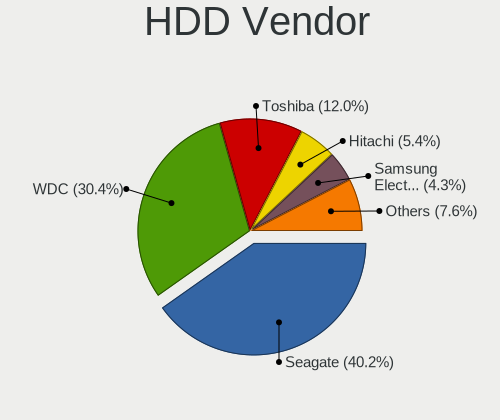
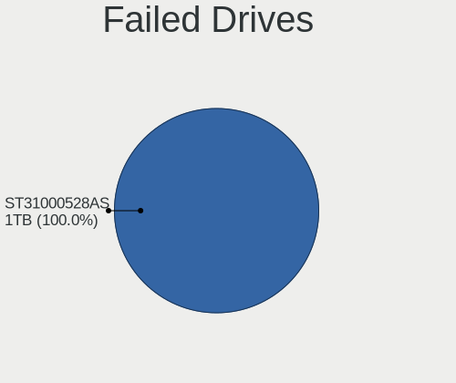

Debian Hardware Trends (Desktop)
--------------------------------

A project to identify most popular hardware characteristics and track their change
over time based on data collected by Debian users at https://Linux-Hardware.org.

Anyone can contribute to the study by uploading probes of their computers by
the [hw-probe](https://github.com/linuxhw/hw-probe) tool:

    sudo -E hw-probe -all -upload

Full-feature report is available here: https://linux-hardware.org/?view=trends&formfactor=desktop

Period: Sep, 2020.

Contents
--------

- [ OS                       ](#os)
- [ OS Family                ](#os-family)
- [ Kernel                   ](#kernel)
- [ Kernel Family            ](#kernel-family)
- [ Kernel Major Ver.        ](#kernel-major-ver)
- [ Arch                     ](#arch)
- [ DE                       ](#de)
- [ Display Server           ](#display-server)
- [ Display Manager          ](#display-manager)
- [ OS Lang                  ](#os-lang)
- [ Boot Mode                ](#boot-mode)
- [ Filesystem               ](#filesystem)
- [ Part. scheme             ](#part-scheme)
- [ Dual Boot with Linux/BSD ](#dual-boot-with-linux/bsd)
- [ Dual Boot (Win)          ](#dual-boot-win)
- [ Country                  ](#country)
- [ City                     ](#city)
- [ Vendor                   ](#vendor)
- [ Model                    ](#model)
- [ Model Family             ](#model-family)
- [ MFG Year                 ](#mfg-year)
- [ Form Factor              ](#form-factor)
- [ Secure Boot              ](#secure-boot)
- [ Coreboot                 ](#coreboot)
- [ RAM Size                 ](#ram-size)
- [ RAM Used                 ](#ram-used)
- [ Has CD-ROM               ](#has-cd-rom)
- [ Total Drives             ](#total-drives)
- [ Has Ethernet             ](#has-ethernet)
- [ Drive Vendor             ](#drive-vendor)
- [ HDD Vendor               ](#hdd-vendor)
- [ SSD Vendor               ](#ssd-vendor)
- [ Drive Model              ](#drive-model)
- [ Drive Kind               ](#drive-kind)
- [ Drive Connector          ](#drive-connector)
- [ Drive Size               ](#drive-size)
- [ Space Total              ](#space-total)
- [ Space Used               ](#space-used)
- [ Malfunc. Drives          ](#malfunc-drives)
- [ Malfunc. Drive Vendor    ](#malfunc-drive-vendor)
- [ Malfunc. HDD Vendor      ](#malfunc-hdd-vendor)
- [ Malfunc. Drive Kind      ](#malfunc-drive-kind)
- [ Failed Drives            ](#failed-drives)
- [ Failed Drive Vendor      ](#failed-drive-vendor)
- [ Drive Status             ](#drive-status)
- [ Storage Vendor           ](#storage-vendor)
- [ Storage Model            ](#storage-model)
- [ Storage Kind             ](#storage-kind)
- [ CPU Vendor               ](#cpu-vendor)
- [ CPU Model                ](#cpu-model)
- [ CPU Model Family         ](#cpu-model-family)
- [ CPU Cores                ](#cpu-cores)
- [ CPU Sockets              ](#cpu-sockets)
- [ CPU Threads              ](#cpu-threads)
- [ CPU Op-Modes             ](#cpu-op-modes)
- [ CPU Microcode            ](#cpu-microcode)
- [ CPU Microarch            ](#cpu-microarch)
- [ GPU Vendor               ](#gpu-vendor)
- [ GPU Model                ](#gpu-model)
- [ GPU Combo                ](#gpu-combo)
- [ GPU Driver               ](#gpu-driver)
- [ GPU Memory               ](#gpu-memory)
- [ Monitor Vendor           ](#monitor-vendor)
- [ Monitor Model            ](#monitor-model)
- [ Monitor Resolution       ](#monitor-resolution)
- [ Monitor Diagonal         ](#monitor-diagonal)
- [ Monitor Width            ](#monitor-width)
- [ Aspect Ratio             ](#aspect-ratio)
- [ Monitor Area             ](#monitor-area)
- [ Pixel Density            ](#pixel-density)
- [ Multiple Monitors        ](#multiple-monitors)
- [ Net Controller Vendor    ](#net-controller-vendor)
- [ Net Controller Model     ](#net-controller-model)
- [ Wireless Vendor          ](#wireless-vendor)
- [ Wireless Model           ](#wireless-model)
- [ Ethernet Vendor          ](#ethernet-vendor)
- [ Ethernet Model           ](#ethernet-model)
- [ Net Controller Kind      ](#net-controller-kind)
- [ Used Controller          ](#used-controller)
- [ NICs                     ](#nics)
- [ Memory Vendor            ](#memory-vendor)
- [ Memory Model             ](#memory-model)
- [ Memory Kind              ](#memory-kind)
- [ Memory Form Factor       ](#memory-form-factor)
- [ Memory Size              ](#memory-size)
- [ Memory Speed             ](#memory-speed)
- [ Sound Vendor             ](#sound-vendor)
- [ Sound Model              ](#sound-model)
- [ Camera Vendor            ](#camera-vendor)
- [ Camera Model             ](#camera-model)
- [ Fingerprint Vendor       ](#fingerprint-vendor)
- [ Fingerprint Model        ](#fingerprint-model)
- [ Chipcard Vendor          ](#chipcard-vendor)
- [ Chipcard Model           ](#chipcard-model)
- [ Printer Vendor           ](#printer-vendor)
- [ Printer Model            ](#printer-model)
- [ Scanner Vendor           ](#scanner-vendor)
- [ Scanner Model            ](#scanner-model)
- [ Bluetooth Vendor         ](#bluetooth-vendor)
- [ Bluetooth Model          ](#bluetooth-model)
- [ Unsupported Devices      ](#unsupported-devices)
- [ Unsupported Device Types ](#unsupported-device-types)

OS
--

Installed operating systems

| Name            | Desktops | Percent |
|-----------------|----------|---------|
| Debian 10       | 35       | 55.56%  |
| Debian Testing  | 13       | 20.63%  |
| Debian Unstable | 10       | 15.87%  |
| Debian          | 3        | 4.76%   |
| Debian 9.13     | 1        | 1.59%   |
| Debian 8.11     | 1        | 1.59%   |

OS Family
---------

OS without a version

| Name   | Desktops | Percent |
|--------|----------|---------|
| Debian | 63       | 100%    |

Kernel
------

Version of the Linux kernel

| Version                  | Desktops | Percent |
|--------------------------|----------|---------|
| 4.19.0-10-amd64          | 16       | 25.4%   |
| 5.7.0-3-amd64            | 8        | 12.7%   |
| 5.8.0-1-amd64            | 7        | 11.11%  |
| 5.7.0-2-amd64            | 4        | 6.35%   |
| 5.7.0-0.bpo.2-amd64      | 3        | 4.76%   |
| 4.19.0-9-amd64           | 3        | 4.76%   |
| 5.6.0-0.bpo.2-amd64      | 2        | 3.17%   |
| 5.4.44-2-pve             | 2        | 3.17%   |
| 5.9.0-rc6-amd64          | 1        | 1.59%   |
| 5.9.0-rc4-amd64          | 1        | 1.59%   |
| 5.8.12                   | 1        | 1.59%   |
| 5.8.0a                   | 1        | 1.59%   |
| 5.8.0-2-amd64            | 1        | 1.59%   |
| 5.7.10-falcot            | 1        | 1.59%   |
| 5.6.10-antix.1-amd64-smp | 1        | 1.59%   |
| 5.6.0-2-amd64            | 1        | 1.59%   |
| 5.6.0-0.bpo.2-rt-amd64   | 1        | 1.59%   |
| 5.5.0-0.bpo.2-amd64      | 1        | 1.59%   |
| 5.4.60-1-pve             | 1        | 1.59%   |
| 5.4.55-1-pve             | 1        | 1.59%   |
| 4.9.0-13-amd64           | 1        | 1.59%   |
| 4.9.0-0.bpo.12-amd64     | 1        | 1.59%   |
| 4.2.3                    | 1        | 1.59%   |
| 4.19.0-8-amd64           | 1        | 1.59%   |
| 4.19.0-11-amd64          | 1        | 1.59%   |
| 4.17.0-1-amd64           | 1        | 1.59%   |

Kernel Family
-------------

Linux kernel without a distro release

| Version | Desktops | Percent |
|---------|----------|---------|
| 4.19.0  | 21       | 33.33%  |
| 5.7.0   | 15       | 23.81%  |
| 5.8.0   | 9        | 14.29%  |
| 5.6.0   | 4        | 6.35%   |
| 5.9.0   | 2        | 3.17%   |
| 5.4.44  | 2        | 3.17%   |
| 4.9.0   | 2        | 3.17%   |
| 5.8.12  | 1        | 1.59%   |
| 5.7.10  | 1        | 1.59%   |
| 5.6.10  | 1        | 1.59%   |
| 5.5.0   | 1        | 1.59%   |
| 5.4.60  | 1        | 1.59%   |
| 5.4.55  | 1        | 1.59%   |
| 4.2.3   | 1        | 1.59%   |
| 4.17.0  | 1        | 1.59%   |

Kernel Major Ver.
-----------------

Linux kernel major version

| Version | Desktops | Percent |
|---------|----------|---------|
| 4.19    | 21       | 33.33%  |
| 5.7     | 16       | 25.4%   |
| 5.8     | 10       | 15.87%  |
| 5.6     | 5        | 7.94%   |
| 5.4     | 4        | 6.35%   |
| 5.9     | 2        | 3.17%   |
| 4.9     | 2        | 3.17%   |
| 5.5     | 1        | 1.59%   |
| 4.2     | 1        | 1.59%   |
| 4.17    | 1        | 1.59%   |

Arch
----

OS architecture (x86_64, i586, etc.)

| Name   | Desktops | Percent |
|--------|----------|---------|
| x86_64 | 63       | 100%    |

DE
--

Desktop Environment

| Name            | Desktops | Percent |
|-----------------|----------|---------|
| Unknown         | 13       | 20.63%  |
| GNOME           | 11       | 17.46%  |
| XFCE            | 9        | 14.29%  |
| KDE             | 8        | 12.7%   |
| KDE5            | 6        | 9.52%   |
| X-Cinnamon      | 3        | 4.76%   |
| LXDE            | 3        | 4.76%   |
| Cinnamon        | 3        | 4.76%   |
| Openbox         | 2        | 3.17%   |
| LXQt            | 2        | 3.17%   |
| GNOME Flashback | 2        | 3.17%   |
| MATE            | 1        | 1.59%   |

Display Server
--------------

X11 or Wayland

| Name    | Desktops | Percent |
|---------|----------|---------|
| X11     | 39       | 61.9%   |
| Tty     | 14       | 22.22%  |
| Wayland | 8        | 12.7%   |
| Unknown | 2        | 3.17%   |

Display Manager
---------------

SDDM, LightDM, etc.

| Name    | Desktops | Percent |
|---------|----------|---------|
| Unknown | 25       | 39.68%  |
| TDM     | 13       | 20.63%  |
| GDM     | 12       | 19.05%  |
| SDDM    | 9        | 14.29%  |
| LightDM | 3        | 4.76%   |
| KDM     | 1        | 1.59%   |

OS Lang
-------

Language

| Lang       | Desktops | Percent |
|------------|----------|---------|
| en_US      | 32       | 50.79%  |
| de_DE      | 5        | 7.94%   |
| en_GB      | 4        | 6.35%   |
| en_CA      | 3        | 4.76%   |
| ru_RU      | 2        | 3.17%   |
| it_IT      | 2        | 3.17%   |
| en_US.utf8 | 2        | 3.17%   |
| Unknown    | 2        | 3.17%   |
| ru_RU.utf8 | 1        | 1.59%   |
| pt_BR      | 1        | 1.59%   |
| lt_LT      | 1        | 1.59%   |
| ja_JP      | 1        | 1.59%   |
| hr_HR      | 1        | 1.59%   |
| fr_FR      | 1        | 1.59%   |
| fr_CA      | 1        | 1.59%   |
| es_ES      | 1        | 1.59%   |
| en_ZA      | 1        | 1.59%   |
| en_US      | 1        | 1.59%   |
| en_NZ      | 1        | 1.59%   |

Boot Mode
---------

EFI or BIOS

| Mode | Desktops | Percent |
|------|----------|---------|
| BIOS | 36       | 57.14%  |
| EFI  | 27       | 42.86%  |

Filesystem
----------

Type of filesystem

| Type    | Desktops | Percent |
|---------|----------|---------|
| Ext4    | 57       | 90.48%  |
| Zfs     | 2        | 3.17%   |
| Xfs     | 2        | 3.17%   |
| Overlay | 1        | 1.59%   |
| Jfs     | 1        | 1.59%   |

Part. scheme
------------

Scheme of partitioning

| Type    | Desktops | Percent |
|---------|----------|---------|
| GPT     | 34       | 53.97%  |
| Unknown | 17       | 26.98%  |
| MBR     | 12       | 19.05%  |

Dual Boot with Linux/BSD
------------------------

Hosting more than one Linux/BSD

| Dual boot | Desktops | Percent |
|-----------|----------|---------|
| No        | 53       | 84.13%  |
| Yes       | 10       | 15.87%  |

Dual Boot (Win)
---------------

Hosting Linux and Windows

| Dual boot | Desktops | Percent |
|-----------|----------|---------|
| No        | 41       | 65.08%  |
| Yes       | 22       | 34.92%  |

Country
-------

Geographic location (country)

| Country      | Desktops | Percent |
|--------------|----------|---------|
| USA          | 15       | 23.81%  |
| Germany      | 6        | 9.52%   |
| Canada       | 6        | 9.52%   |
| Russia       | 3        | 4.76%   |
| Italy        | 3        | 4.76%   |
| France       | 3        | 4.76%   |
| Finland      | 3        | 4.76%   |
| Brazil       | 3        | 4.76%   |
| UK           | 2        | 3.17%   |
| Switzerland  | 2        | 3.17%   |
| Sweden       | 2        | 3.17%   |
| Spain        | 2        | 3.17%   |
| Netherlands  | 2        | 3.17%   |
| Ukraine      | 1        | 1.59%   |
| South Africa | 1        | 1.59%   |
| Norway       | 1        | 1.59%   |
| New Zealand  | 1        | 1.59%   |
| Lithuania    | 1        | 1.59%   |
| Indonesia    | 1        | 1.59%   |
| Ecuador      | 1        | 1.59%   |
| Croatia      | 1        | 1.59%   |
| Belgium      | 1        | 1.59%   |
| Austria      | 1        | 1.59%   |
| Australia    | 1        | 1.59%   |

City
----

Geographic location (city)

| City                          | Desktops | Percent |
|-------------------------------|----------|---------|
| Zurich                        | 2        | 3.17%   |
| Malmo                         | 2        | 3.17%   |
| Amsterdam                     | 2        | 3.17%   |
| Zhytomyr                      | 1        | 1.59%   |
| Wurzburg                      | 1        | 1.59%   |
| Windsor                       | 1        | 1.59%   |
| Wenatchee                     | 1        | 1.59%   |
| Vitória                      | 1        | 1.59%   |
| Vienna                        | 1        | 1.59%   |
| Tuusula                       | 1        | 1.59%   |
| Turku                         | 1        | 1.59%   |
| Turin                         | 1        | 1.59%   |
| Trondheim                     | 1        | 1.59%   |
| Toronto                       | 1        | 1.59%   |
| St Petersburg                 | 1        | 1.59%   |
| Split                         | 1        | 1.59%   |
| Rotherhithe                   | 1        | 1.59%   |
| Rio de Janeiro                | 1        | 1.59%   |
| Quito                         | 1        | 1.59%   |
| Perth                         | 1        | 1.59%   |
| Paternò                      | 1        | 1.59%   |
| Paris                         | 1        | 1.59%   |
| Newark                        | 1        | 1.59%   |
| New Orleans                   | 1        | 1.59%   |
| Moscow                        | 1        | 1.59%   |
| Milan                         | 1        | 1.59%   |
| Mikhaylovsk                   | 1        | 1.59%   |
| Mebane                        | 1        | 1.59%   |
| Marysville                    | 1        | 1.59%   |
| Madrid                        | 1        | 1.59%   |
| Ludwigsburg                   | 1        | 1.59%   |
| London                        | 1        | 1.59%   |
| Lamont                        | 1        | 1.59%   |
| Kenosha                       | 1        | 1.59%   |
| Kaunas                        | 1        | 1.59%   |
| Jyväskylä                   | 1        | 1.59%   |
| Joplin                        | 1        | 1.59%   |
| Jakarta                       | 1        | 1.59%   |
| Henstedt-Ulzburg Municipality | 1        | 1.59%   |
| Grand Prairie                 | 1        | 1.59%   |
| Gatineau                      | 1        | 1.59%   |
| Freiburg                      | 1        | 1.59%   |
| Fenton                        | 1        | 1.59%   |
| Des Moines                    | 1        | 1.59%   |
| Curitiba                      | 1        | 1.59%   |
| Coventry                      | 1        | 1.59%   |
| Costa Mesa                    | 1        | 1.59%   |
| Colomiers                     | 1        | 1.59%   |
| Chapel Hill                   | 1        | 1.59%   |
| Carrollton                    | 1        | 1.59%   |
| Cape Town                     | 1        | 1.59%   |
| Burlington                    | 1        | 1.59%   |
| Boom                          | 1        | 1.59%   |
| Bielefeld                     | 1        | 1.59%   |
| Besançon                     | 1        | 1.59%   |
| Berlin                        | 1        | 1.59%   |
| Barcelona                     | 1        | 1.59%   |
| Ballston Spa                  | 1        | 1.59%   |
| Auckland                      | 1        | 1.59%   |
| Athens                        | 1        | 1.59%   |

Vendor
------

Motherboard manufacturer

| Name                | Desktops | Percent |
|---------------------|----------|---------|
| ASUSTek Computer    | 19       | 30.16%  |
| Gigabyte Technology | 15       | 23.81%  |
| MSI                 | 7        | 11.11%  |
| ASRock              | 6        | 9.52%   |
| Lenovo              | 3        | 4.76%   |
| Hewlett-Packard     | 3        | 4.76%   |
| Intel               | 2        | 3.17%   |
| AZW                 | 2        | 3.17%   |
| Acer                | 2        | 3.17%   |
| WeiBu               | 1        | 1.59%   |
| Supermicro          | 1        | 1.59%   |
| Biostar             | 1        | 1.59%   |
| ASRockRack          | 1        | 1.59%   |

Model
-----

Motherboard model

| Name                                                      | Desktops | Percent |
|-----------------------------------------------------------|----------|---------|
| Gigabyte X570 AORUS ELITE                                 | 2        | 3.17%   |
| ASUS PRIME B350-PLUS                                      | 2        | 3.17%   |
| ASUS All Series                                           | 2        | 3.17%   |
| WeiBu WTGLKC1R120 SD-BS-CJ41G-M-101-B 12/09/2019 18:14:02 | 1        | 1.59%   |
| Supermicro SYS-F627R3-RTB+01-VI009                        | 1        | 1.59%   |
| MSI MS-7B85                                               | 1        | 1.59%   |
| MSI MS-7B79                                               | 1        | 1.59%   |
| MSI MS-7B09                                               | 1        | 1.59%   |
| MSI MS-7A37                                               | 1        | 1.59%   |
| MSI MS-7A33                                               | 1        | 1.59%   |
| MSI MS-7798                                               | 1        | 1.59%   |
| MSI MS-7750                                               | 1        | 1.59%   |
| Lenovo ThinkCentre M73 10B00005US                         | 1        | 1.59%   |
| Lenovo ThinkCentre M55 88088NU                            | 1        | 1.59%   |
| Lenovo IdeaCentre 310S-08ASR 90G90020US                   | 1        | 1.59%   |
| Intel Infinity JQ                                         | 1        | 1.59%   |
| Intel DH87RL AAG74240-403                                 | 1        | 1.59%   |
| HP Compaq Elite 8300 CMT                                  | 1        | 1.59%   |
| HP Compaq dc5750 Small Form Factor                        | 1        | 1.59%   |
| HP Compaq 6200 Pro MT PC                                  | 1        | 1.59%   |
| Gigabyte Z97N-WIFI                                        | 1        | 1.59%   |
| Gigabyte Z87X-UD3H                                        | 1        | 1.59%   |
| Gigabyte Z87-HD3                                          | 1        | 1.59%   |
| Gigabyte Z77X-UD3H                                        | 1        | 1.59%   |
| Gigabyte P67A-UD5-B3                                      | 1        | 1.59%   |
| Gigabyte GA-G41M-ES2L                                     | 1        | 1.59%   |
| Gigabyte GA-78LMT-USB3 R2                                 | 1        | 1.59%   |
| Gigabyte F2A78M-HD2                                       | 1        | 1.59%   |
| Gigabyte EP41-UD3L                                        | 1        | 1.59%   |
| Gigabyte B550 AORUS PRO AC                                | 1        | 1.59%   |
| Gigabyte AM1M-S2H                                         | 1        | 1.59%   |
| Gigabyte AB350-Gaming 3                                   | 1        | 1.59%   |
| Gigabyte 970A-DS3P                                        | 1        | 1.59%   |
| Biostar T41 HD                                            | 1        | 1.59%   |
| AZW Gemini X55                                            | 1        | 1.59%   |
| AZW AP35                                                  | 1        | 1.59%   |
| ASUS TUF X470-PLUS GAMING                                 | 1        | 1.59%   |
| ASUS TUF GAMING X570-PLUS                                 | 1        | 1.59%   |
| ASUS TUF B450-PLUS GAMING                                 | 1        | 1.59%   |
| ASUS RS885AA-ABH m7770.nl                                 | 1        | 1.59%   |
| ASUS ROG STRIX Z370-E GAMING                              | 1        | 1.59%   |
| ASUS ROG CROSSHAIR VIII HERO                              | 1        | 1.59%   |
| ASUS PRIME X570-PRO                                       | 1        | 1.59%   |
| ASUS P5Q-EM                                               | 1        | 1.59%   |
| ASUS M5A99X EVO R2.0                                      | 1        | 1.59%   |
| ASUS M5A97 R2.0                                           | 1        | 1.59%   |
| ASUS M5A97 LE R2.0                                        | 1        | 1.59%   |
| ASUS M4A88TD-M EVO                                        | 1        | 1.59%   |
| ASUS M4A77                                                | 1        | 1.59%   |
| ASUS GU631AA-UUW a6225.sc                                 | 1        | 1.59%   |
| ASUS Crosshair IV Formula                                 | 1        | 1.59%   |
| ASRockRack ROMED8-2T                                      | 1        | 1.59%   |
| ASRock X570 Pro4                                          | 1        | 1.59%   |
| ASRock H61M-VG4                                           | 1        | 1.59%   |
| ASRock H110M-ITX/ac                                       | 1        | 1.59%   |
| ASRock B450M Steel Legend                                 | 1        | 1.59%   |
| ASRock A320M-HDV R3.0                                     | 1        | 1.59%   |
| ASRock 960GM/U3S3 FX                                      | 1        | 1.59%   |
| Acer Aspire TC-895                                        | 1        | 1.59%   |
| Acer Aspire M3970                                         | 1        | 1.59%   |

Model Family
------------

Motherboard model prefix

| Name                               | Desktops | Percent |
|------------------------------------|----------|---------|
| HP Compaq                          | 3        | 4.76%   |
| ASUS TUF                           | 3        | 4.76%   |
| ASUS PRIME                         | 3        | 4.76%   |
| Lenovo ThinkCentre                 | 2        | 3.17%   |
| Gigabyte X570                      | 2        | 3.17%   |
| ASUS ROG                           | 2        | 3.17%   |
| ASUS M5A97                         | 2        | 3.17%   |
| ASUS All                           | 2        | 3.17%   |
| Acer Aspire                        | 2        | 3.17%   |
| WeiBu WTGLKC1R120                  | 1        | 1.59%   |
| Supermicro SYS-F627R3-RTB+01-VI009 | 1        | 1.59%   |
| MSI MS-7B85                        | 1        | 1.59%   |
| MSI MS-7B79                        | 1        | 1.59%   |
| MSI MS-7B09                        | 1        | 1.59%   |
| MSI MS-7A37                        | 1        | 1.59%   |
| MSI MS-7A33                        | 1        | 1.59%   |
| MSI MS-7798                        | 1        | 1.59%   |
| MSI MS-7750                        | 1        | 1.59%   |
| Lenovo IdeaCentre                  | 1        | 1.59%   |
| Intel Infinity                     | 1        | 1.59%   |
| Intel DH87RL                       | 1        | 1.59%   |
| Gigabyte Z97N-WIFI                 | 1        | 1.59%   |
| Gigabyte Z87X-UD3H                 | 1        | 1.59%   |
| Gigabyte Z87-HD3                   | 1        | 1.59%   |
| Gigabyte Z77X-UD3H                 | 1        | 1.59%   |
| Gigabyte P67A-UD5-B3               | 1        | 1.59%   |
| Gigabyte GA-G41M-ES2L              | 1        | 1.59%   |
| Gigabyte GA-78LMT-USB3             | 1        | 1.59%   |
| Gigabyte F2A78M-HD2                | 1        | 1.59%   |
| Gigabyte EP41-UD3L                 | 1        | 1.59%   |
| Gigabyte B550                      | 1        | 1.59%   |
| Gigabyte AM1M-S2H                  | 1        | 1.59%   |
| Gigabyte AB350-Gaming              | 1        | 1.59%   |
| Gigabyte 970A-DS3P                 | 1        | 1.59%   |
| Biostar T41                        | 1        | 1.59%   |
| AZW Gemini                         | 1        | 1.59%   |
| AZW AP35                           | 1        | 1.59%   |
| ASUS RS885AA-ABH                   | 1        | 1.59%   |
| ASUS P5Q-EM                        | 1        | 1.59%   |
| ASUS M5A99X                        | 1        | 1.59%   |
| ASUS M4A88TD-M                     | 1        | 1.59%   |
| ASUS M4A77                         | 1        | 1.59%   |
| ASUS GU631AA-UUW                   | 1        | 1.59%   |
| ASUS Crosshair                     | 1        | 1.59%   |
| ASRockRack ROMED8-2T               | 1        | 1.59%   |
| ASRock X570                        | 1        | 1.59%   |
| ASRock H61M-VG4                    | 1        | 1.59%   |
| ASRock H110M-ITX                   | 1        | 1.59%   |
| ASRock B450M                       | 1        | 1.59%   |
| ASRock A320M-HDV                   | 1        | 1.59%   |
| ASRock 960GM                       | 1        | 1.59%   |

MFG Year
--------

Motherboard manufacture year

| Year | Desktops | Percent |
|------|----------|---------|
| 2019 | 12       | 19.05%  |
| 2020 | 11       | 17.46%  |
| 2014 | 8        | 12.7%   |
| 2013 | 5        | 7.94%   |
| 2015 | 4        | 6.35%   |
| 2018 | 3        | 4.76%   |
| 2017 | 3        | 4.76%   |
| 2012 | 3        | 4.76%   |
| 2011 | 3        | 4.76%   |
| 2010 | 3        | 4.76%   |
| 2009 | 2        | 3.17%   |
| 2008 | 2        | 3.17%   |
| 2007 | 2        | 3.17%   |
| 2016 | 1        | 1.59%   |
| 2006 | 1        | 1.59%   |

Form Factor
-----------

Physical design of the computer

| Name    | Desktops | Percent |
|---------|----------|---------|
| Desktop | 63       | 100%    |

Secure Boot
-----------

Enabled or disabled

| State    | Desktops | Percent |
|----------|----------|---------|
| Disabled | 62       | 98.41%  |
| Enabled  | 1        | 1.59%   |

Coreboot
--------

Have coreboot on board

| Used | Desktops | Percent |
|------|----------|---------|
| No   | 62       | 98.41%  |
| Yes  | 1        | 1.59%   |

RAM Size
--------

Total RAM memory

| Size in GB      | Desktops | Percent |
|-----------------|----------|---------|
| 16.01-24.0      | 18       | 28.57%  |
| 8.01-16.0       | 11       | 17.46%  |
| 3.01-4.0        | 9        | 14.29%  |
| 4.01-8.0        | 7        | 11.11%  |
| 32.01-64.0      | 7        | 11.11%  |
| 64.01-256.0     | 7        | 11.11%  |
| 24.01-32.0      | 2        | 3.17%   |
| More than 256.0 | 1        | 1.59%   |
| 1.01-2.0        | 1        | 1.59%   |

RAM Used
--------

Used RAM memory

| Used GB    | Desktops | Percent |
|------------|----------|---------|
| 4.01-8.0   | 14       | 22.22%  |
| 2.01-3.0   | 14       | 22.22%  |
| 8.01-16.0  | 9        | 14.29%  |
| 3.01-4.0   | 7        | 11.11%  |
| 1.01-2.0   | 6        | 9.52%   |
| 0.01-1.0   | 6        | 9.52%   |
| 24.01-32.0 | 3        | 4.76%   |
| 16.01-24.0 | 3        | 4.76%   |
| 32.01-64.0 | 1        | 1.59%   |

Has CD-ROM
----------

Has CD-ROM on board

| Presented | Desktops | Percent |
|-----------|----------|---------|
| No        | 36       | 57.14%  |
| Yes       | 27       | 42.86%  |

Total Drives
------------

Number of drives on board

| Drives | Desktops | Percent |
|--------|----------|---------|
| 2      | 18       | 28.57%  |
| 3      | 14       | 22.22%  |
| 1      | 13       | 20.63%  |
| 4      | 9        | 14.29%  |
| 5      | 4        | 6.35%   |
| 7      | 3        | 4.76%   |
| 6      | 2        | 3.17%   |

Has Ethernet
------------

Has Ethernet on board

| Presented | Desktops | Percent |
|-----------|----------|---------|
| Yes       | 63       | 100%    |

Drive Vendor
------------

Hard drive vendors

| Vendor              | Desktops | Drives | Percent |
|---------------------|----------|--------|---------|
| WDC                 | 32       | 44     | 23.88%  |
| Seagate             | 25       | 35     | 18.66%  |
| Samsung Electronics | 20       | 30     | 14.93%  |
| Crucial             | 10       | 10     | 7.46%   |
| Toshiba             | 7        | 12     | 5.22%   |
| Kingston            | 7        | 7      | 5.22%   |
| Hitachi             | 6        | 7      | 4.48%   |
| SanDisk             | 3        | 4      | 2.24%   |
| Phison              | 3        | 3      | 2.24%   |
| SPCC                | 2        | 2      | 1.49%   |
| Intel               | 2        | 4      | 1.49%   |
| HGST                | 2        | 5      | 1.49%   |
| Fujitsu             | 2        | 2      | 1.49%   |
| A-DATA Technology   | 2        | 2      | 1.49%   |
| Unknown             | 1        | 1      | 0.75%   |
| TO Exter            | 1        | 1      | 0.75%   |
| SK Hynix            | 1        | 1      | 0.75%   |
| PNY                 | 1        | 2      | 0.75%   |
| OCZ                 | 1        | 1      | 0.75%   |
| Maxtor              | 1        | 1      | 0.75%   |
| GOODRAM             | 1        | 1      | 0.75%   |
| DAS                 | 1        | 1      | 0.75%   |
| Corsair             | 1        | 2      | 0.75%   |
| China               | 1        | 1      | 0.75%   |
| ASMT                | 1        | 1      | 0.75%   |

HDD Vendor
----------

Hard disk drive vendors

| Vendor              | Desktops | Drives | Percent |
|---------------------|----------|--------|---------|
| WDC                 | 30       | 39     | 38.46%  |
| Seagate             | 24       | 34     | 30.77%  |
| Toshiba             | 6        | 11     | 7.69%   |
| Hitachi             | 6        | 7      | 7.69%   |
| Samsung Electronics | 5        | 6      | 6.41%   |
| HGST                | 2        | 5      | 2.56%   |
| Fujitsu             | 2        | 2      | 2.56%   |
| TO Exter            | 1        | 1      | 1.28%   |
| Maxtor              | 1        | 1      | 1.28%   |
| ASMT                | 1        | 1      | 1.28%   |

SSD Vendor
----------

Solid state drive vendors

| Vendor              | Desktops | Drives | Percent |
|---------------------|----------|--------|---------|
| Samsung Electronics | 11       | 15     | 24.44%  |
| Crucial             | 9        | 9      | 20%     |
| Kingston            | 7        | 7      | 15.56%  |
| WDC                 | 4        | 5      | 8.89%   |
| SPCC                | 2        | 2      | 4.44%   |
| SanDisk             | 2        | 3      | 4.44%   |
| A-DATA Technology   | 2        | 2      | 4.44%   |
| Unknown             | 1        | 1      | 2.22%   |
| Toshiba             | 1        | 1      | 2.22%   |
| SK Hynix            | 1        | 1      | 2.22%   |
| PNY                 | 1        | 2      | 2.22%   |
| OCZ                 | 1        | 1      | 2.22%   |
| Intel               | 1        | 2      | 2.22%   |
| GOODRAM             | 1        | 1      | 2.22%   |
| China               | 1        | 1      | 2.22%   |

Drive Model
-----------

Hard drive models

| Model                        | Desktops | Percent |
|------------------------------|----------|---------|
| WD10EZEX-08WN4A0 1TB         | 4        | 2.48%   |
| SSD 850 EVO 500GB            | 3        | 1.86%   |
| CT480BX500SSD1 480GB         | 3        | 1.86%   |
| WD10EZEX-00BN5A0 1TB         | 2        | 1.24%   |
| WD10EACS-00ZJB0 1TB          | 2        | 1.24%   |
| SV300S37A240G 240GB SSD      | 2        | 1.24%   |
| ST500DM002-1BD142 500GB      | 2        | 1.24%   |
| ST3160815AS 160GB            | 2        | 1.24%   |
| ST31000524AS 1TB             | 2        | 1.24%   |
| ST2000DM001-1CH164 2TB       | 2        | 1.24%   |
| SSD 970 EVO Plus 500GB       | 2        | 1.24%   |
| SSD 860 EVO 500GB            | 2        | 1.24%   |
| SSD 860 EVO 1TB              | 2        | 1.24%   |
| SSD 850 EVO 120GB            | 2        | 1.24%   |
| SSD 840 PRO Series 256GB     | 2        | 1.24%   |
| SA400S37120G 120GB SSD       | 2        | 1.24%   |
| Expansion 1TB                | 2        | 1.24%   |
| DT01ACA300 3TB               | 2        | 1.24%   |
| CT500MX500SSD1 500GB         | 2        | 1.24%   |
| WDS500G2B0A-00SM50 500GB SSD | 1        | 0.62%   |
| WDS240G2G0B-00EPW0 240GB SSD | 1        | 0.62%   |
| WDS120G1G0A-00SS50 120GB SSD | 1        | 0.62%   |
| WDS100T2G0A-00JH30 1TB SSD   | 1        | 0.62%   |
| WD80EMAZ-00WJTA0 8TB         | 1        | 0.62%   |
| WD800JD-08MSA1 80GB          | 1        | 0.62%   |
| WD8004FRYZ-01VAEB0 8TB       | 1        | 0.62%   |
| WD8003FRYZ-01JPDB1 8TB       | 1        | 0.62%   |
| WD6001FZWX-00A2VA0 6TB       | 1        | 0.62%   |
| WD5000AAKX-00ERMA0 500GB     | 1        | 0.62%   |
| WD5000AAKS-00A7B2 500GB      | 1        | 0.62%   |
| WD5000AAJS-22A8B0 500GB      | 1        | 0.62%   |
| WD40EZRZ-00GXCB0 4TB         | 1        | 0.62%   |
| WD40EFRX-68N32N0 4TB         | 1        | 0.62%   |
| WD4005FZBX-00K5WB0 4TB       | 1        | 0.62%   |
| WD3200SD-01KNB0 320GB        | 1        | 0.62%   |
| WD3200BEKT-75PVMT1 320GB     | 1        | 0.62%   |
| WD30EZRS-00J99B0 3TB         | 1        | 0.62%   |
| WD30EFRX-68AX9N0 3TB         | 1        | 0.62%   |
| WD20EZRX-00DC0B0 2TB         | 1        | 0.62%   |
| WD20EFRX-68EUZN0 2TB         | 1        | 0.62%   |
| WD20EARX-00PASB0 2TB         | 1        | 0.62%   |
| WD20EARX-00MMMB0 2TB         | 1        | 0.62%   |
| WD1200JD-00HBB0 120GB        | 1        | 0.62%   |
| WD10EZRX-00L4HB0 1TB         | 1        | 0.62%   |
| WD10EZEX-21WN4A0 1TB         | 1        | 0.62%   |
| WD10EZEX-21M2NA0 1TB         | 1        | 0.62%   |
| WD10EZEX-08M2NA0 1TB         | 1        | 0.62%   |
| WD10EARS-00Y5B1 1TB          | 1        | 0.62%   |
| WD10EALX-009BA0 1TB          | 1        | 0.62%   |
| WD10EADS-00L5B1 1TB          | 1        | 0.62%   |
| Ultra II 960GB SSD           | 1        | 0.62%   |
| TL100 240GB SSD              | 1        | 0.62%   |
| TerraMaster 16TB             | 1        | 0.62%   |
| SV300S37A120G 120GB SSD      | 1        | 0.62%   |
| SUV400S37120G 120GB SSD      | 1        | 0.62%   |
| ST8000VN0022-2EL112 8TB      | 1        | 0.62%   |
| ST8000AS0002-1NA17Z 8TB      | 1        | 0.62%   |
| ST4000VN000-2AH166 4TB       | 1        | 0.62%   |
| ST380815AS 80GB              | 1        | 0.62%   |
| ST3808110AS 80GB             | 1        | 0.62%   |

Drive Kind
----------

HDD or SSD

| Kind    | Desktops | Drives | Percent |
|---------|----------|--------|---------|
| HDD     | 54       | 107    | 50.47%  |
| SSD     | 37       | 53     | 34.58%  |
| NVMe    | 14       | 18     | 13.08%  |
| Unknown | 2        | 2      | 1.87%   |

Drive Connector
---------------

SATA, SAS, NVMe, etc.

| Type | Desktops | Drives | Percent |
|------|----------|--------|---------|
| SATA | 62       | 155    | 74.7%   |
| NVMe | 14       | 18     | 16.87%  |
| SAS  | 7        | 7      | 8.43%   |

Drive Size
----------

Size of hard drive

| Size in TB | Desktops | Drives | Percent |
|------------|----------|--------|---------|
| 0.01-0.5   | 52       | 84     | 46.85%  |
| 0.51-1.0   | 29       | 48     | 26.13%  |
| 1.01-2.0   | 9        | 16     | 8.11%   |
| 4.01-10.0  | 8        | 13     | 7.21%   |
| 2.01-3.0   | 7        | 11     | 6.31%   |
| 3.01-4.0   | 5        | 7      | 4.5%    |
| 10.01-20.0 | 1        | 1      | 0.9%    |

Space Total
-----------

Amount of disk space available on the file system

| Size in GB     | Desktops | Percent |
|----------------|----------|---------|
| 501-1000       | 13       | 20.63%  |
| More than 3000 | 10       | 15.87%  |
| 101-250        | 10       | 15.87%  |
| 1001-2000      | 10       | 15.87%  |
| 2001-3000      | 8        | 12.7%   |
| 251-500        | 7        | 11.11%  |
| 51-100         | 3        | 4.76%   |
| Unknown        | 2        | 3.17%   |

Space Used
----------

Amount of used disk space

| Used GB        | Desktops | Percent |
|----------------|----------|---------|
| 1-20           | 11       | 17.46%  |
| 1001-2000      | 9        | 14.29%  |
| 101-250        | 8        | 12.7%   |
| 501-1000       | 7        | 11.11%  |
| More than 3000 | 6        | 9.52%   |
| 21-50          | 6        | 9.52%   |
| 251-500        | 5        | 7.94%   |
| 51-100         | 5        | 7.94%   |
| 2001-3000      | 4        | 6.35%   |
| Unknown        | 2        | 3.17%   |

Malfunc. Drives
---------------

Drive models with a malfunction

| Model                    | Desktops | Drives | Percent |
|--------------------------|----------|--------|---------|
| WD5000AAJS-22A8B0 500GB  | 1        | 1      | 6.25%   |
| WD3200BEKT-75PVMT1 320GB | 1        | 1      | 6.25%   |
| WD20EFRX-68EUZN0 2TB     | 1        | 2      | 6.25%   |
| WD10EADS-00L5B1 1TB      | 1        | 1      | 6.25%   |
| ST3500418AS 500GB        | 1        | 1      | 6.25%   |
| ST3160815AS 160GB        | 1        | 1      | 6.25%   |
| ST31000524AS 1TB         | 1        | 1      | 6.25%   |
| SH103S3120G 120GB SSD    | 1        | 1      | 6.25%   |
| MQ01ABD100 1TB           | 1        | 1      | 6.25%   |
| HN-M101MBB 1TB           | 1        | 1      | 6.25%   |
| HDS721050CLA660 500GB    | 1        | 1      | 6.25%   |
| HD103UJ 1TB              | 1        | 1      | 6.25%   |
| DT01ACA100 1TB           | 1        | 1      | 6.25%   |
| CT480BX500SSD1 480GB     | 1        | 1      | 6.25%   |
| AGILITY3 120GB SSD       | 1        | 1      | 6.25%   |
| 6Y200P0 208GB            | 1        | 1      | 6.25%   |

Malfunc. Drive Vendor
---------------------

Vendors of faulty drives

| Vendor              | Desktops | Drives | Percent |
|---------------------|----------|--------|---------|
| WDC                 | 4        | 5      | 25%     |
| Seagate             | 3        | 3      | 18.75%  |
| Toshiba             | 2        | 2      | 12.5%   |
| Samsung Electronics | 2        | 2      | 12.5%   |
| OCZ                 | 1        | 1      | 6.25%   |
| Maxtor              | 1        | 1      | 6.25%   |
| Kingston            | 1        | 1      | 6.25%   |
| Hitachi             | 1        | 1      | 6.25%   |
| Crucial             | 1        | 1      | 6.25%   |

Malfunc. HDD Vendor
-------------------

Vendors of faulty HDD drives

| Vendor              | Desktops | Drives | Percent |
|---------------------|----------|--------|---------|
| WDC                 | 4        | 5      | 30.77%  |
| Seagate             | 3        | 3      | 23.08%  |
| Toshiba             | 2        | 2      | 15.38%  |
| Samsung Electronics | 2        | 2      | 15.38%  |
| Maxtor              | 1        | 1      | 7.69%   |
| Hitachi             | 1        | 1      | 7.69%   |

Malfunc. Drive Kind
-------------------

Kinds of faulty drives

| Kind | Desktops | Drives | Percent |
|------|----------|--------|---------|
| HDD  | 11       | 14     | 78.57%  |
| SSD  | 3        | 3      | 21.43%  |

Failed Drives
-------------

Failed drive models

| Model                | Desktops | Drives | Percent |
|----------------------|----------|--------|---------|
| WD30EZRS-00J99B0 3TB | 1        | 1      | 100%    |

Failed Drive Vendor
-------------------

Failed drive vendors

| Vendor | Desktops | Drives | Percent |
|--------|----------|--------|---------|
| WDC    | 1        | 1      | 100%    |

Drive Status
------------

Number of failed and malfunc. drives

| Status   | Desktops | Drives | Percent |
|----------|----------|--------|---------|
| Works    | 43       | 111    | 53.09%  |
| Detected | 23       | 51     | 28.4%   |
| Malfunc  | 14       | 17     | 17.28%  |
| Failed   | 1        | 1      | 1.23%   |

Storage Vendor
--------------

Storage controller vendors

| Vendor                    | Desktops | Percent |
|---------------------------|----------|---------|
| AMD                       | 33       | 36.67%  |
| Intel                     | 29       | 32.22%  |
| Samsung Electronics       | 7        | 7.78%   |
| Marvell Technology Group  | 5        | 5.56%   |
| Phison Electronics        | 4        | 4.44%   |
| ASMedia Technology        | 3        | 3.33%   |
| Nvidia                    | 2        | 2.22%   |
| VIA Technologies          | 1        | 1.11%   |
| Tekram Technology         | 1        | 1.11%   |
| Silicon Image             | 1        | 1.11%   |
| Sandisk                   | 1        | 1.11%   |
| Micron/Crucial Technology | 1        | 1.11%   |
| JMicron Technology        | 1        | 1.11%   |
| Broadcom / LSI            | 1        | 1.11%   |

Storage Model
-------------

Storage controller models

| Model                                                                             | Desktops | Percent |
|-----------------------------------------------------------------------------------|----------|---------|
| FCH SATA Controller [AHCI mode]                                                   | 21       | 17.5%   |
| SB7x0/SB8x0/SB9x0 SATA Controller [AHCI mode]                                     | 8        | 6.67%   |
| NVMe SSD Controller SM981/PM981/PM983                                             | 5        | 4.17%   |
| 400 Series Chipset SATA Controller                                                | 5        | 4.17%   |
| SB7x0/SB8x0/SB9x0 IDE Controller                                                  | 4        | 3.33%   |
| 8 Series/C220 Series Chipset Family 6-port SATA Controller 1 [AHCI mode]          | 4        | 3.33%   |
| 6 Series/C200 Series Chipset Family 6 port Desktop SATA AHCI Controller           | 4        | 3.33%   |
| 300 Series Chipset SATA Controller                                                | 4        | 3.33%   |
| SATA controller                                                                   | 3        | 2.5%    |
| NM10/ICH7 Family SATA Controller [IDE mode]                                       | 3        | 2.5%    |
| E16 PCIe4 NVMe Controller                                                         | 3        | 2.5%    |
| 7 Series/C210 Series Chipset Family 6-port SATA Controller [AHCI mode]            | 3        | 2.5%    |
| NVMe SSD Controller SM961/PM961                                                   | 2        | 1.67%   |
| ASM1062 Serial ATA Controller                                                     | 2        | 1.67%   |
| 88SE9172 SATA 6Gb/s Controller                                                    | 2        | 1.67%   |
| 88SE6101/6102 single-port PATA133 interface                                       | 2        | 1.67%   |
| 82801G (ICH7 Family) IDE Controller                                               | 2        | 1.67%   |
| 6 Series/C200 Series Chipset Family Desktop SATA Controller (IDE mode, ports 4-5) | 2        | 1.67%   |
| X399 Series Chipset SATA Controller                                               | 1        | 0.83%   |
| X370 Series Chipset SATA Controller                                               | 1        | 0.83%   |
| VT6415 PATA IDE Host Controller                                                   | 1        | 0.83%   |
| TRM-S1040 [DC-315 / DC-395 series]                                                | 1        | 0.83%   |
| SSD 660P Series                                                                   | 1        | 0.83%   |
| SiI 3512 [SATALink/SATARaid] Serial ATA Controller                                | 1        | 0.83%   |
| SB7x0/SB8x0/SB9x0 SATA Controller [IDE mode]                                      | 1        | 0.83%   |
| SB600 Non-Raid-5 SATA                                                             | 1        | 0.83%   |
| SB600 IDE                                                                         | 1        | 0.83%   |
| SATA Controller [RAID mode]                                                       | 1        | 0.83%   |
| SAS2008 PCI-Express Fusion-MPT SAS-2 [Falcon]                                     | 1        | 0.83%   |
| Q170/Q150/B150/H170/H110/Z170/CM236 Chipset SATA Controller [AHCI Mode]           | 1        | 0.83%   |
| P1 NVMe PCIe SSD                                                                  | 1        | 0.83%   |
| NVMe SSD Controller SM951/PM951                                                   | 1        | 0.83%   |
| Non-Volatile memory controller                                                    | 1        | 0.83%   |
| MCP61 SATA Controller                                                             | 1        | 0.83%   |
| MCP61 IDE                                                                         | 1        | 0.83%   |
| MCP51 Serial ATA Controller                                                       | 1        | 0.83%   |
| MCP51 IDE                                                                         | 1        | 0.83%   |
| JMB363 SATA/IDE Controller                                                        | 1        | 0.83%   |
| FCH SATA Controller [IDE mode]                                                    | 1        | 0.83%   |
| FCH SATA Controller D                                                             | 1        | 0.83%   |
| FCH IDE Controller                                                                | 1        | 0.83%   |
| E12 NVMe Controller                                                               | 1        | 0.83%   |
| Celeron N3350/Pentium N4200/Atom E3900 Series SATA AHCI Controller                | 1        | 0.83%   |
| C610/X99 series chipset sSATA Controller [AHCI mode]                              | 1        | 0.83%   |
| C610/X99 series chipset 6-Port SATA Controller [AHCI mode]                        | 1        | 0.83%   |
| C602 chipset 4-Port SATA Storage Control Unit                                     | 1        | 0.83%   |
| C600/X79 series chipset 6-Port SATA AHCI Controller                               | 1        | 0.83%   |
| ASM1061 SATA IDE Controller                                                       | 1        | 0.83%   |
| 9 Series Chipset Family SATA Controller [AHCI Mode]                               | 1        | 0.83%   |
| 88SE9128 PCIe SATA 6 Gb/s RAID controller                                         | 1        | 0.83%   |
| 82Q35 Express PT IDER Controller                                                  | 1        | 0.83%   |
| 82801JI (ICH10 Family) SATA AHCI Controller                                       | 1        | 0.83%   |
| 82801IR/IO/IH (ICH9R/DO/DH) 4 port SATA Controller [IDE mode]                     | 1        | 0.83%   |
| 82801I (ICH9 Family) 2 port SATA Controller [IDE mode]                            | 1        | 0.83%   |
| 82801HR/HO/HH (ICH8R/DO/DH) 2 port SATA Controller [IDE mode]                     | 1        | 0.83%   |
| 82801H (ICH8 Family) 4 port SATA Controller [IDE mode]                            | 1        | 0.83%   |
| 6 Series/C200 Series Chipset Family Desktop SATA Controller (IDE mode, ports 0-3) | 1        | 0.83%   |
| 400 Series Chipset Family SATA AHCI Controller                                    | 1        | 0.83%   |
| 200 Series PCH SATA controller [AHCI mode]                                        | 1        | 0.83%   |

Storage Kind
------------

Kind of storage controller (IDE, SATA, NVMe, SAS, ...)

| Kind | Desktops | Percent |
|------|----------|---------|
| SATA | 54       | 59.34%  |
| IDE  | 18       | 19.78%  |
| NVMe | 14       | 15.38%  |
| RAID | 3        | 3.3%    |
| SAS  | 1        | 1.1%    |
| SCSI | 1        | 1.1%    |

CPU Vendor
----------

Processor vendors

| Vendor | Desktops | Percent |
|--------|----------|---------|
| AMD    | 35       | 55.56%  |
| Intel  | 28       | 44.44%  |

CPU Model
---------

Processor models

| Model                                          | Desktops | Percent |
|------------------------------------------------|----------|---------|
| AMD Ryzen 5 3600 6-Core Processor              | 3        | 4.76%   |
| Intel Core i5-3570K CPU @ 3.40GHz              | 2        | 3.17%   |
| Intel Core i5-2400 CPU @ 3.10GHz               | 2        | 3.17%   |
| Intel Core 2 Quad CPU Q9650 @ 3.00GHz          | 2        | 3.17%   |
| AMD Ryzen 9 3900X 12-Core Processor            | 2        | 3.17%   |
| AMD Ryzen 7 2700 Eight-Core Processor          | 2        | 3.17%   |
| AMD Ryzen 5 1600 Six-Core Processor            | 2        | 3.17%   |
| AMD FX-8350 Eight-Core Processor               | 2        | 3.17%   |
| AMD FX-8320 Eight-Core Processor               | 2        | 3.17%   |
| Intel Xeon CPU E5-2650 v2 @ 2.60GHz            | 1        | 1.59%   |
| Intel Pentium Silver J5005 CPU @ 1.50GHz       | 1        | 1.59%   |
| Intel Pentium D CPU 3.40GHz                    | 1        | 1.59%   |
| Intel Pentium CPU G3220 @ 3.00GHz              | 1        | 1.59%   |
| Intel Core i7-5930K CPU @ 3.50GHz              | 1        | 1.59%   |
| Intel Core i7-2600 CPU @ 3.40GHz               | 1        | 1.59%   |
| Intel Core i5-4690K CPU @ 3.50GHz              | 1        | 1.59%   |
| Intel Core i5-4670 CPU @ 3.40GHz               | 1        | 1.59%   |
| Intel Core i5-4570 CPU @ 3.20GHz               | 1        | 1.59%   |
| Intel Core i5-4460 CPU @ 3.20GHz               | 1        | 1.59%   |
| Intel Core i5-4440 CPU @ 3.10GHz               | 1        | 1.59%   |
| Intel Core i5-3470 CPU @ 3.20GHz               | 1        | 1.59%   |
| Intel Core i5-2320 CPU @ 3.00GHz               | 1        | 1.59%   |
| Intel Core i5-10400 CPU @ 2.90GHz              | 1        | 1.59%   |
| Intel Core i3-8100 CPU @ 3.60GHz               | 1        | 1.59%   |
| Intel Core i3-7100 CPU @ 3.90GHz               | 1        | 1.59%   |
| Intel Core i3-2100 CPU @ 3.10GHz               | 1        | 1.59%   |
| Intel Core 2 Duo CPU E8400 @ 3.00GHz           | 1        | 1.59%   |
| Intel Core 2 Duo CPU E7600 @ 3.06GHz           | 1        | 1.59%   |
| Intel Core 2 Duo CPU E6550 @ 2.33GHz           | 1        | 1.59%   |
| Intel Celeron J4105 CPU @ 1.50GHz              | 1        | 1.59%   |
| Intel Celeron CPU J3355 @ 2.00GHz              | 1        | 1.59%   |
| AMD Ryzen Threadripper 1920X 12-Core Processor | 1        | 1.59%   |
| AMD Ryzen 9 3950X 16-Core Processor            | 1        | 1.59%   |
| AMD Ryzen 9 3900XT 12-Core Processor           | 1        | 1.59%   |
| AMD Ryzen 7 3700X 8-Core Processor             | 1        | 1.59%   |
| AMD Ryzen 7 2700X Eight-Core Processor         | 1        | 1.59%   |
| AMD Ryzen 7 1700X Eight-Core Processor         | 1        | 1.59%   |
| AMD Ryzen 7 1700 Eight-Core Processor          | 1        | 1.59%   |
| AMD Ryzen 5 3400G with Radeon Vega Graphics    | 1        | 1.59%   |
| AMD Ryzen 5 2600 Six-Core Processor            | 1        | 1.59%   |
| AMD Phenom II X6 1090T Processor               | 1        | 1.59%   |
| AMD Phenom II X4 965 Processor                 | 1        | 1.59%   |
| AMD FX-8120 Eight-Core Processor               | 1        | 1.59%   |
| AMD FX-6300 Six-Core Processor                 | 1        | 1.59%   |
| AMD EPYC 7302P 16-Core Processor               | 1        | 1.59%   |
| AMD Athlon II X4 630 Processor                 | 1        | 1.59%   |
| AMD Athlon 64 X2 Dual Core Processor 5200+     | 1        | 1.59%   |
| AMD Athlon 64 X2 Dual Core Processor 4000+     | 1        | 1.59%   |
| AMD Athlon 64 Processor 3800+                  | 1        | 1.59%   |
| AMD Athlon 5350 APU with Radeon R3             | 1        | 1.59%   |
| AMD Athlon 200GE with Radeon Vega Graphics     | 1        | 1.59%   |
| AMD A9-9430 RADEON R5, 5 COMPUTE CORES 2C+3G   | 1        | 1.59%   |
| AMD A10-6800K APU with Radeon HD Graphics      | 1        | 1.59%   |

CPU Model Family
----------------

Processor model prefix

| Model                  | Desktops | Percent |
|------------------------|----------|---------|
| Intel Core i5          | 12       | 19.05%  |
| AMD Ryzen 5            | 7        | 11.11%  |
| AMD Ryzen 7            | 6        | 9.52%   |
| AMD FX                 | 6        | 9.52%   |
| AMD Ryzen 9            | 4        | 6.35%   |
| Intel Core i3          | 3        | 4.76%   |
| Intel Core 2 Duo       | 3        | 4.76%   |
| Intel Core i7          | 2        | 3.17%   |
| Intel Core 2 Quad      | 2        | 3.17%   |
| Intel Celeron          | 2        | 3.17%   |
| AMD Athlon 64 X2       | 2        | 3.17%   |
| AMD Athlon             | 2        | 3.17%   |
| Other                  | 1        | 1.59%   |
| Intel Xeon             | 1        | 1.59%   |
| Intel Pentium Silver   | 1        | 1.59%   |
| Intel Pentium D        | 1        | 1.59%   |
| Intel Pentium          | 1        | 1.59%   |
| AMD Ryzen Threadripper | 1        | 1.59%   |
| AMD Phenom II X6       | 1        | 1.59%   |
| AMD Phenom II X4       | 1        | 1.59%   |
| AMD EPYC               | 1        | 1.59%   |
| AMD Athlon II X4       | 1        | 1.59%   |
| AMD Athlon 64          | 1        | 1.59%   |
| AMD A10                | 1        | 1.59%   |

CPU Cores
---------

Number of processor cores

| Number | Desktops | Percent |
|--------|----------|---------|
| 4      | 27       | 42.86%  |
| 2      | 13       | 20.63%  |
| 6      | 9        | 14.29%  |
| 8      | 5        | 7.94%   |
| 12     | 4        | 6.35%   |
| 16     | 3        | 4.76%   |
| 3      | 1        | 1.59%   |
| 1      | 1        | 1.59%   |

CPU Sockets
-----------

Number of sockets

| Number | Desktops | Percent |
|--------|----------|---------|
| 1      | 62       | 98.41%  |
| 2      | 1        | 1.59%   |

CPU Threads
-----------

Threads per core (Hyper-Threading)

| Number | Desktops | Percent |
|--------|----------|---------|
| 2      | 33       | 52.38%  |
| 1      | 30       | 47.62%  |

CPU Op-Modes
------------

CPU Operation Modes (32-bit, 64-bit)

| Op mode        | Desktops | Percent |
|----------------|----------|---------|
| 32-bit, 64-bit | 63       | 100%    |

CPU Microcode
-------------

Microcode number

| Number     | Desktops | Percent |
|------------|----------|---------|
| Unknown    | 22       | 34.92%  |
| 0x306c3    | 4        | 6.35%   |
| 0x206a7    | 4        | 6.35%   |
| 0x08701021 | 3        | 4.76%   |
| 0x08701013 | 3        | 4.76%   |
| 0x0800820d | 3        | 4.76%   |
| 0x08001138 | 3        | 4.76%   |
| 0x706a1    | 2        | 3.17%   |
| 0x1067a    | 2        | 3.17%   |
| 0x08001137 | 2        | 3.17%   |
| 0xa0653    | 1        | 1.59%   |
| 0x906eb    | 1        | 1.59%   |
| 0x906e9    | 1        | 1.59%   |
| 0x306f2    | 1        | 1.59%   |
| 0x306e4    | 1        | 1.59%   |
| 0x306a9    | 1        | 1.59%   |
| 0x08301034 | 1        | 1.59%   |
| 0x08108109 | 1        | 1.59%   |
| 0x0810100b | 1        | 1.59%   |
| 0x08008206 | 1        | 1.59%   |
| 0x06006704 | 1        | 1.59%   |
| 0x06000852 | 1        | 1.59%   |
| 0x0600081f | 1        | 1.59%   |
| 0x0600063e | 1        | 1.59%   |
| 0x010000db | 1        | 1.59%   |

CPU Microarch
-------------

Microarchitecture

| Name          | Desktops | Percent |
|---------------|----------|---------|
| Zen 2         | 9        | 14.29%  |
| Haswell       | 7        | 11.11%  |
| Zen           | 6        | 9.52%   |
| Piledriver    | 6        | 9.52%   |
| Zen+          | 5        | 7.94%   |
| SandyBridge   | 5        | 7.94%   |
| IvyBridge     | 4        | 6.35%   |
| Skylake       | 3        | 4.76%   |
| K8 Hammer     | 3        | 4.76%   |
| K10           | 3        | 4.76%   |
| Core          | 3        | 4.76%   |
| Penryn        | 2        | 3.17%   |
| Goldmont plus | 2        | 3.17%   |
| NetBurst      | 1        | 1.59%   |
| Jaguar        | 1        | 1.59%   |
| Goldmont      | 1        | 1.59%   |
| Excavator     | 1        | 1.59%   |
| Bulldozer     | 1        | 1.59%   |

GPU Vendor
----------

Vendors of graphics cards

| Vendor                     | Desktops | Percent |
|----------------------------|----------|---------|
| AMD                        | 25       | 37.31%  |
| Nvidia                     | 24       | 35.82%  |
| Intel                      | 17       | 25.37%  |
| Matrox Electronics Systems | 1        | 1.49%   |

GPU Model
---------

Graphics card models

| Model                                                                 | Desktops | Percent |
|-----------------------------------------------------------------------|----------|---------|
| Xeon E3-1200 v3/4th Gen Core Processor Integrated Graphics Controller | 5        | 7.14%   |
| Ellesmere [Radeon RX 470/480/570/570X/580/580X/590]                   | 5        | 7.14%   |
| GM204 [GeForce GTX 970]                                               | 4        | 5.71%   |
| Xeon E3-1200 v2/3rd Gen Core processor Graphics Controller            | 2        | 2.86%   |
| UHD Graphics 605                                                      | 2        | 2.86%   |
| Navi 10 [Radeon RX 5600 OEM/5600 XT / 5700/5700 XT]                   | 2        | 2.86%   |
| GP107 [GeForce GTX 1050]                                              | 2        | 2.86%   |
| GP107 [GeForce GTX 1050 Ti]                                           | 2        | 2.86%   |
| GK104 [GeForce GTX 760]                                               | 2        | 2.86%   |
| Baffin [Radeon RX 550 640SP / RX 560/560X]                            | 2        | 2.86%   |
| 4 Series Chipset Integrated Graphics Controller                       | 2        | 2.86%   |
| 2nd Generation Core Processor Family Integrated Graphics Controller   | 2        | 2.86%   |
| Venus XTX [Radeon HD 8890M / R9 M275X/M375X]                          | 1        | 1.43%   |
| Vega 10 XL/XT [Radeon RX Vega 56/64]                                  | 1        | 1.43%   |
| UHD Graphics 630                                                      | 1        | 1.43%   |
| TU116 [GeForce GTX 1660 SUPER]                                        | 1        | 1.43%   |
| TU106 [GeForce RTX 2060 SUPER]                                        | 1        | 1.43%   |
| TU106 [GeForce RTX 2060 Rev. A]                                       | 1        | 1.43%   |
| TU104 [GeForce RTX 2070 SUPER]                                        | 1        | 1.43%   |
| Tahiti PRO [Radeon HD 7950/8950 OEM / R9 280]                         | 1        | 1.43%   |
| Stoney [Radeon R2/R3/R4/R5 Graphics]                                  | 1        | 1.43%   |
| RV770 [Radeon HD 4870]                                                | 1        | 1.43%   |
| RS880 [Radeon HD 4250]                                                | 1        | 1.43%   |
| RS482/RS485 [Radeon Xpress 1100/1150]                                 | 1        | 1.43%   |
| RS480 [Radeon Xpress 1150] (Secondary)                                | 1        | 1.43%   |
| Richland [Radeon HD 8670D]                                            | 1        | 1.43%   |
| Raven Ridge [Radeon Vega Series / Radeon Vega Mobile Series]          | 1        | 1.43%   |
| Pitcairn PRO [Radeon HD 7850 / R7 265 / R9 270 1024SP]                | 1        | 1.43%   |
| Navi 10 [Radeon Pro W5700]                                            | 1        | 1.43%   |
| MGA G200eW WPCM450                                                    | 1        | 1.43%   |
| Kabini [Radeon HD 8400 / R3 Series]                                   | 1        | 1.43%   |
| Jet PRO [Radeon R5 M230 / R7 M260DX / Radeon 520 Mobile]              | 1        | 1.43%   |
| HD Graphics 500                                                       | 1        | 1.43%   |
| Hawaii XT / Grenada XT [Radeon R9 290X/390X]                          | 1        | 1.43%   |
| Hawaii PRO [Radeon R9 290/390]                                        | 1        | 1.43%   |
| GT218 [GeForce 210]                                                   | 1        | 1.43%   |
| GP106 [GeForce GTX 1060 6GB]                                          | 1        | 1.43%   |
| GP106 [GeForce GTX 1060 3GB]                                          | 1        | 1.43%   |
| GP104 [GeForce GTX 1070]                                              | 1        | 1.43%   |
| GM206 [GeForce GTX 960]                                               | 1        | 1.43%   |
| GM206 [GeForce GTX 750 v2]                                            | 1        | 1.43%   |
| GM204 [GeForce GTX 980]                                               | 1        | 1.43%   |
| GK107 [GeForce GT 740]                                                | 1        | 1.43%   |
| GF119 [GeForce GT 520]                                                | 1        | 1.43%   |
| Cape Verde PRO [Radeon HD 7750/8740 / R7 250E]                        | 1        | 1.43%   |
| Caicos XTX [Radeon HD 8490 / R5 235X OEM]                             | 1        | 1.43%   |
| C61 [GeForce 6150SE nForce 430]                                       | 1        | 1.43%   |
| Barts PRO [Radeon HD 6850]                                            | 1        | 1.43%   |
| 82Q963/Q965 Integrated Graphics Controller                            | 1        | 1.43%   |
| 82Q35 Express Integrated Graphics Controller                          | 1        | 1.43%   |

GPU Combo
---------

Combinations of graphics cards

| Name           | Desktops | Percent |
|----------------|----------|---------|
| 1 x Nvidia     | 20       | 31.75%  |
| 1 x AMD        | 20       | 31.75%  |
| 1 x Intel      | 15       | 23.81%  |
| 2 x AMD        | 3        | 4.76%   |
| Intel + Nvidia | 2        | 3.17%   |
| AMD + Nvidia   | 2        | 3.17%   |
| 1 x Matrox     | 1        | 1.59%   |

GPU Driver
----------

Free vs proprietary

| Driver      | Desktops | Percent |
|-------------|----------|---------|
| Free        | 42       | 66.67%  |
| Proprietary | 18       | 28.57%  |
| Unknown     | 3        | 4.76%   |

GPU Memory
----------

Total video memory

| Size in GB | Desktops | Percent |
|------------|----------|---------|
| Unknown    | 26       | 41.27%  |
| 3.01-4.0   | 10       | 15.87%  |
| 1.01-2.0   | 8        | 12.7%   |
| 7.01-8.0   | 6        | 9.52%   |
| 0.51-1.0   | 5        | 7.94%   |
| 5.01-6.0   | 4        | 6.35%   |
| 2.01-3.0   | 2        | 3.17%   |
| 0.01-0.5   | 2        | 3.17%   |

Monitor Vendor
--------------

Monitor vendors

| Vendor               | Desktops | Percent |
|----------------------|----------|---------|
| Acer                 | 13       | 18.31%  |
| Goldstar             | 9        | 12.68%  |
| Samsung Electronics  | 8        | 11.27%  |
| Dell                 | 7        | 9.86%   |
| Hewlett-Packard      | 3        | 4.23%   |
| BenQ                 | 3        | 4.23%   |
| AOC                  | 3        | 4.23%   |
| Ancor Communications | 3        | 4.23%   |
| ViewSonic            | 2        | 2.82%   |
| Sony                 | 2        | 2.82%   |
| Philips              | 2        | 2.82%   |
| ASUSTek Computer     | 2        | 2.82%   |
| ___                  | 1        | 1.41%   |
| Unknown              | 1        | 1.41%   |
| Sun                  | 1        | 1.41%   |
| Sanyo                | 1        | 1.41%   |
| Onkyo                | 1        | 1.41%   |
| OEM                  | 1        | 1.41%   |
| LG Electronics       | 1        | 1.41%   |
| Lenovo               | 1        | 1.41%   |
| KON                  | 1        | 1.41%   |
| Iiyama               | 1        | 1.41%   |
| Hannspree            | 1        | 1.41%   |
| Fujitsu Siemens      | 1        | 1.41%   |
| CTV                  | 1        | 1.41%   |
| BKM                  | 1        | 1.41%   |

Monitor Model
-------------

Monitor models

| Model                                               | Desktops | Percent |
|-----------------------------------------------------|----------|---------|
| P235H ACR00D0 1920x1080 510x287mm 23.0-inch         | 4        | 4.94%   |
| LG ULTRAWIDE GSM59F1 1920x1080 580x240mm 24.7-inch  | 2        | 2.47%   |
| ZR2440w HWP2955 1920x1080 520x320mm 24.0-inch       | 1        | 1.23%   |
| XF240H ACR0472 1920x1080 531x299mm 24.0-inch        | 1        | 1.23%   |
| X193W+ ACR0014 1680x1050 410x260mm 19.1-inch        | 1        | 1.23%   |
| VX2439 Series VSC3D24 1920x1080 521x293mm 23.5-inch | 1        | 1.23%   |
| VG910s VSCDA18 1280x1024 376x301mm 19.0-inch        | 1        | 1.23%   |
| VG248 ACI24E1 1680x1050 530x300mm 24.0-inch         | 1        | 1.23%   |
| VE247 ACI2493 1920x1080 531x299mm 24.0-inch         | 1        | 1.23%   |
| VC279 AUS27C4 1920x1080 598x336mm 27.0-inch         | 1        | 1.23%   |
| VA2719 Series VSCC132 1920x1080 598x336mm 27.0-inch | 1        | 1.23%   |
| UP3216Q DEL40C1 3840x2160 698x393mm 31.5-inch       | 1        | 1.23%   |
| ULTRAWIDE GSM76FE 2560x1080 798x334mm 34.1-inch     | 1        | 1.23%   |
| U2718Q DELA0EC 3840x2160 609x349mm 27.6-inch        | 1        | 1.23%   |
| TX-SR607 ONK0865 1920x1080 708x398mm 32.0-inch      | 1        | 1.23%   |
| TV_MONITOR KON0030 3840x2160 1150x650mm 52.0-inch   | 1        | 1.23%   |
| TV SNY2A01 1360x768 1600x900mm 72.3-inch            | 1        | 1.23%   |
| TV SNY1403 1920x1080 1600x900mm 72.3-inch           | 1        | 1.23%   |
| T24C350 SAM0ABF 1920x1080 530x300mm 24.0-inch       | 1        | 1.23%   |
| SyncMaster SAM055C 1920x1200                        | 1        | 1.23%   |
| SyncMaster SAM04D4 1920x1080 531x298mm 24.0-inch    | 1        | 1.23%   |
| SyncMaster SAM01DD 1280x1024 338x270mm 17.0-inch    | 1        | 1.23%   |
| SyncMaster SAM0115 1280x1024 376x301mm 19.0-inch    | 1        | 1.23%   |
| SyncMaster SAM006A 1280x1024 338x270mm 17.0-inch    | 1        | 1.23%   |
| SB220Q ACR06AB 1920x1080 476x268mm 21.5-inch        | 1        | 1.23%   |
| S24D340 SAM0BBB 1920x1080 531x299mm 24.0-inch       | 1        | 1.23%   |
| S231HL ACR0308 1920x1080 510x287mm 23.0-inch        | 1        | 1.23%   |
| PLB2403WS IVM5601 1920x1200 519x324mm 24.1-inch     | 1        | 1.23%   |
| PHL 273V7 PHLC156 1920x1080 598x336mm 27.0-inch     | 1        | 1.23%   |
| PHL 223V5 PHLC0CF 1920x1080 480x270mm 21.7-inch     | 1        | 1.23%   |
| P2714H DELD060 1920x1080 598x336mm 27.0-inch        | 1        | 1.23%   |
| P243W ACRADAF 1920x1200 518x324mm 24.1-inch         | 1        | 1.23%   |
| P2210 DEL404D 1680x1050 474x296mm 22.0-inch         | 1        | 1.23%   |
| MG248 AUS24A3 1920x1080 530x300mm 24.0-inch         | 1        | 1.23%   |
| LL 3190TS FUS07A3 1366x768 430x255mm 19.7-inch      | 1        | 1.23%   |
| LEN T24d-10 LEN61B4 1920x1200 518x324mm 24.1-inch   | 1        | 1.23%   |
| LCDTV16 ___0101 1600x1200 1600x900mm 72.3-inch      | 1        | 1.23%   |
| LCDTV16 0101 1920x1080 1600x900mm 72.3-inch         | 1        | 1.23%   |
| LCD SAN0A34 1920x540                                | 1        | 1.23%   |
| LCD Monitor ZOWIE XL LCD                            | 1        | 1.23%   |
| LCD Monitor XV272U 2560x1440                        | 1        | 1.23%   |
| LCD Monitor XR341CK 3440x1440                       | 1        | 1.23%   |
| LCD Monitor T24E390 3200x1080                       | 1        | 1.23%   |
| LCD Monitor SyncMaster                              | 1        | 1.23%   |
| LCD Monitor SAM0D4F 1920x1080 1210x680mm 54.6-inch  | 1        | 1.23%   |
| LCD Monitor SAM07C5 1920x1080 1020x570mm 46.0-inch  | 1        | 1.23%   |
| LCD Monitor LG TV                                   | 1        | 1.23%   |
| LCD Monitor 2369M 3840x1080                         | 1        | 1.23%   |
| LCD Monitor 2001FP 5120x1200                        | 1        | 1.23%   |
| LCD Monitor 2001FP                                  | 1        | 1.23%   |
| L226W GSM566B 1680x1050 474x296mm 22.0-inch         | 1        | 1.23%   |
| L204WT GSM4E48 1680x1050 434x270mm 20.1-inch        | 1        | 1.23%   |
| IPS FULLHD GSM5AB8 1920x1080 480x270mm 21.7-inch    | 1        | 1.23%   |
| HF237 HSG1AC3 1920x1080 509x286mm 23.0-inch         | 1        | 1.23%   |
| H236HL ACR0318 1920x1080 509x286mm 23.0-inch        | 1        | 1.23%   |
| GN246HL ACR02F9 1920x1080 531x299mm 24.0-inch       | 1        | 1.23%   |
| GH19PS SUN058C 1280x1024 380x300mm 19.1-inch        | 1        | 1.23%   |
| G2420HDB BNQ7841 1920x1080 477x268mm 21.5-inch      | 1        | 1.23%   |
| G2411HD BNQ7825 1920x1080 530x300mm 24.0-inch       | 1        | 1.23%   |
| FULL HD GSM5B55 1920x1080 480x270mm 21.7-inch       | 1        | 1.23%   |

Monitor Resolution
------------------

Monitor screen resolution

| Resolution         | Desktops | Percent |
|--------------------|----------|---------|
| 1920x1080 (FHD)    | 34       | 47.22%  |
| 3840x2160 (4K)     | 5        | 6.94%   |
| 1280x1024 (SXGA)   | 5        | 6.94%   |
| 1920x1200 (WUXGA)  | 4        | 5.56%   |
| 1680x1050 (WSXGA+) | 4        | 5.56%   |
| 2560x1080          | 3        | 4.17%   |
| 1366x768 (WXGA)    | 3        | 4.17%   |
| Unknown            | 3        | 4.17%   |
| 3840x1080          | 2        | 2.78%   |
| 3440x1440          | 2        | 2.78%   |
| 1920x540           | 2        | 2.78%   |
| 1360x768           | 2        | 2.78%   |
| 5120x1200          | 1        | 1.39%   |
| 3200x1080          | 1        | 1.39%   |
| 2560x1440 (QHD)    | 1        | 1.39%   |

Monitor Diagonal
----------------

Diagonal size in inches

| Inches  | Desktops | Percent |
|---------|----------|---------|
| 23      | 12       | 16.44%  |
| 24      | 11       | 15.07%  |
| 27      | 8        | 10.96%  |
| Unknown | 8        | 10.96%  |
| 21      | 7        | 9.59%   |
| 19      | 5        | 6.85%   |
| 72      | 3        | 4.11%   |
| 54      | 2        | 2.74%   |
| 52      | 2        | 2.74%   |
| 34      | 2        | 2.74%   |
| 29      | 2        | 2.74%   |
| 18      | 2        | 2.74%   |
| 17      | 2        | 2.74%   |
| 48      | 1        | 1.37%   |
| 42      | 1        | 1.37%   |
| 36      | 1        | 1.37%   |
| 32      | 1        | 1.37%   |
| 31      | 1        | 1.37%   |
| 22      | 1        | 1.37%   |
| 20      | 1        | 1.37%   |

Monitor Width
-------------

Physical width

| Width in mm | Desktops | Percent |
|-------------|----------|---------|
| 501-600     | 28       | 38.36%  |
| 401-500     | 14       | 19.18%  |
| Unknown     | 8        | 10.96%  |
| 601-700     | 5        | 6.85%   |
| 1001-1500   | 5        | 6.85%   |
| 701-800     | 4        | 5.48%   |
| 351-400     | 3        | 4.11%   |
| 1501-2000   | 3        | 4.11%   |
| 301-350     | 2        | 2.74%   |
| 901-1000    | 1        | 1.37%   |

Aspect Ratio
------------

Proportional relationship between the width and the height

| Ratio   | Desktops | Percent |
|---------|----------|---------|
| 16/9    | 38       | 58.46%  |
| 16/10   | 9        | 13.85%  |
| 5/4     | 5        | 7.69%   |
| Unknown | 5        | 7.69%   |
| 21/9    | 4        | 6.15%   |
| 32/9    | 3        | 4.62%   |
| 3/2     | 1        | 1.54%   |

Monitor Area
------------

Area in inch²

| Area in inch² | Desktops | Percent |
|----------------|----------|---------|
| 201-250        | 22       | 30.14%  |
| 301-350        | 10       | 13.7%   |
| 151-200        | 10       | 13.7%   |
| Unknown        | 8        | 10.96%  |
| More than 1000 | 7        | 9.59%   |
| 251-300        | 5        | 6.85%   |
| 351-500        | 4        | 5.48%   |
| 141-150        | 4        | 5.48%   |
| 501-1000       | 3        | 4.11%   |

Pixel Density
-------------

Pixels per inch

| Density | Desktops | Percent |
|---------|----------|---------|
| 51-100  | 40       | 60.61%  |
| 101-120 | 10       | 15.15%  |
| Unknown | 8        | 12.12%  |
| 1-50    | 5        | 7.58%   |
| 121-160 | 3        | 4.55%   |

Multiple Monitors
-----------------

Total monitors connected

| Total | Desktops | Percent |
|-------|----------|---------|
| 1     | 39       | 61.9%   |
| 2     | 16       | 25.4%   |
| 3     | 4        | 6.35%   |
| 0     | 4        | 6.35%   |

Net Controller Vendor
---------------------

Controller vendors

| Vendor                            | Desktops | Percent |
|-----------------------------------|----------|---------|
| Realtek Semiconductor             | 41       | 46.59%  |
| Intel                             | 25       | 28.41%  |
| Qualcomm Atheros                  | 5        | 5.68%   |
| Ralink Technology                 | 2        | 2.27%   |
| Ralink                            | 2        | 2.27%   |
| Nvidia                            | 2        | 2.27%   |
| Mellanox Technologies             | 2        | 2.27%   |
| Broadcom Inc. and subsidiaries    | 2        | 2.27%   |
| Unknown                           | 1        | 1.14%   |
| Sundance Technology Inc / IC Plus | 1        | 1.14%   |
| Sega                              | 1        | 1.14%   |
| OpenMoko                          | 1        | 1.14%   |
| Marvell Technology Group          | 1        | 1.14%   |
| Input Club                        | 1        | 1.14%   |
| Broadcom Limited                  | 1        | 1.14%   |

Net Controller Model
--------------------

Controller models

| Model                                                            | Desktops | Percent |
|------------------------------------------------------------------|----------|---------|
| RTL8111/8168/8411 PCI Express Gigabit Ethernet Controller        | 38       | 38%     |
| I211 Gigabit Network Connection                                  | 8        | 8%      |
| RTL8125 2.5GbE Controller                                        | 3        | 3%      |
| Ethernet Connection I217-V                                       | 3        | 3%      |
| Wireless 3165                                                    | 2        | 2%      |
| Wi-Fi 6 AX200                                                    | 2        | 2%      |
| USB3.0 802.11ac 1200M Adapter                                    | 2        | 2%      |
| MT26448 [ConnectX EN 10GigE, PCIe 2.0 5GT/s]                     | 2        | 2%      |
| Ethernet Connection (2) I219-V                                   | 2        | 2%      |
| Ethernet Connection (2) I218-V                                   | 2        | 2%      |
| AR93xx Wireless Network Adapter                                  | 2        | 2%      |
| AR8161 Gigabit Ethernet                                          | 2        | 2%      |
| 82579LM Gigabit Network Connection (Lewisville)                  | 2        | 2%      |
| Yukon Optima 88E8059 [PCIe Gigabit Ethernet Controller with AVB] | 1        | 1%      |
| Wireless-AC 9260                                                 | 1        | 1%      |
| Wireless 7260                                                    | 1        | 1%      |
| Wireless 3160                                                    | 1        | 1%      |
| Seeeduino_Cortex_M0+                                             | 1        | 1%      |
| RTL8822BE 802.11a/b/g/n/ac WiFi adapter                          | 1        | 1%      |
| RTL8821AE 802.11ac PCIe Wireless Network Adapter                 | 1        | 1%      |
| RTL8814AU 802.11a/b/g/n/ac Wireless Adapter                      | 1        | 1%      |
| RTL8188CUS 802.11n WLAN Adapter                                  | 1        | 1%      |
| RTL8169 PCI Gigabit Ethernet Controller                          | 1        | 1%      |
| RT5392 PCIe Wireless Network Adapter                             | 1        | 1%      |
| RT5370 Wireless Adapter                                          | 1        | 1%      |
| RT2870/RT3070 Wireless Adapter                                   | 1        | 1%      |
| RT2561/RT61 rev B 802.11g                                        | 1        | 1%      |
| OSA Express Network card                                         | 1        | 1%      |
| NetXtreme BCM5755 Gigabit Ethernet PCI Express                   | 1        | 1%      |
| NetLink BCM5787 Gigabit Ethernet PCI Express                     | 1        | 1%      |
| MCP61 Ethernet                                                   | 1        | 1%      |
| MCP51 Ethernet Controller                                        | 1        | 1%      |
| IC Plus IP100A Integrated 10/100 Ethernet MAC + PHY              | 1        | 1%      |
| I350 Gigabit Network Connection                                  | 1        | 1%      |
| Ethernet Controller 10G X550T                                    | 1        | 1%      |
| ErgoDox Infinity                                                 | 1        | 1%      |
| Dual Band Wireless-AC 3168NGW [Stone Peak]                       | 1        | 1%      |
| Black Magic Debug Probe (Application)                            | 1        | 1%      |
| BCM4352 802.11ac Wireless Network Adapter                        | 1        | 1%      |
| AR9287 Wireless Network Adapter (PCI-Express)                    | 1        | 1%      |
| AC 1550i Wireless                                                | 1        | 1%      |
| 82566DM-2 Gigabit Network Connection                             | 1        | 1%      |
| 802.11n                                                          | 1        | 1%      |

Wireless Vendor
---------------

Wireless vendors

| Vendor                         | Desktops | Percent |
|--------------------------------|----------|---------|
| Intel                          | 9        | 39.13%  |
| Realtek Semiconductor          | 6        | 26.09%  |
| Qualcomm Atheros               | 3        | 13.04%  |
| Ralink Technology              | 2        | 8.7%    |
| Ralink                         | 2        | 8.7%    |
| Broadcom Inc. and subsidiaries | 1        | 4.35%   |

Wireless Model
--------------

Wireless models

| Model                                            | Desktops | Percent |
|--------------------------------------------------|----------|---------|
| Wireless 3165                                    | 2        | 8.33%   |
| Wi-Fi 6 AX200                                    | 2        | 8.33%   |
| USB3.0 802.11ac 1200M Adapter                    | 2        | 8.33%   |
| AR93xx Wireless Network Adapter                  | 2        | 8.33%   |
| Wireless-AC 9260                                 | 1        | 4.17%   |
| Wireless 7260                                    | 1        | 4.17%   |
| Wireless 3160                                    | 1        | 4.17%   |
| RTL8822BE 802.11a/b/g/n/ac WiFi adapter          | 1        | 4.17%   |
| RTL8821AE 802.11ac PCIe Wireless Network Adapter | 1        | 4.17%   |
| RTL8814AU 802.11a/b/g/n/ac Wireless Adapter      | 1        | 4.17%   |
| RTL8188CUS 802.11n WLAN Adapter                  | 1        | 4.17%   |
| RT5392 PCIe Wireless Network Adapter             | 1        | 4.17%   |
| RT5370 Wireless Adapter                          | 1        | 4.17%   |
| RT2870/RT3070 Wireless Adapter                   | 1        | 4.17%   |
| RT2561/RT61 rev B 802.11g                        | 1        | 4.17%   |
| Dual Band Wireless-AC 3168NGW [Stone Peak]       | 1        | 4.17%   |
| BCM4352 802.11ac Wireless Network Adapter        | 1        | 4.17%   |
| AR9287 Wireless Network Adapter (PCI-Express)    | 1        | 4.17%   |
| AC 1550i Wireless                                | 1        | 4.17%   |
| 802.11n                                          | 1        | 4.17%   |

Ethernet Vendor
---------------

Ethernet vendors

| Vendor                            | Desktops | Percent |
|-----------------------------------|----------|---------|
| Realtek Semiconductor             | 40       | 57.14%  |
| Intel                             | 20       | 28.57%  |
| Qualcomm Atheros                  | 2        | 2.86%   |
| Nvidia                            | 2        | 2.86%   |
| Mellanox Technologies             | 2        | 2.86%   |
| Sundance Technology Inc / IC Plus | 1        | 1.43%   |
| Marvell Technology Group          | 1        | 1.43%   |
| Broadcom Limited                  | 1        | 1.43%   |
| Broadcom Inc. and subsidiaries    | 1        | 1.43%   |

Ethernet Model
--------------

Ethernet models

| Model                                                            | Desktops | Percent |
|------------------------------------------------------------------|----------|---------|
| RTL8111/8168/8411 PCI Express Gigabit Ethernet Controller        | 38       | 52.78%  |
| I211 Gigabit Network Connection                                  | 8        | 11.11%  |
| RTL8125 2.5GbE Controller                                        | 3        | 4.17%   |
| Ethernet Connection I217-V                                       | 3        | 4.17%   |
| MT26448 [ConnectX EN 10GigE, PCIe 2.0 5GT/s]                     | 2        | 2.78%   |
| Ethernet Connection (2) I219-V                                   | 2        | 2.78%   |
| Ethernet Connection (2) I218-V                                   | 2        | 2.78%   |
| AR8161 Gigabit Ethernet                                          | 2        | 2.78%   |
| 82579LM Gigabit Network Connection (Lewisville)                  | 2        | 2.78%   |
| Yukon Optima 88E8059 [PCIe Gigabit Ethernet Controller with AVB] | 1        | 1.39%   |
| RTL8169 PCI Gigabit Ethernet Controller                          | 1        | 1.39%   |
| NetXtreme BCM5755 Gigabit Ethernet PCI Express                   | 1        | 1.39%   |
| NetLink BCM5787 Gigabit Ethernet PCI Express                     | 1        | 1.39%   |
| MCP61 Ethernet                                                   | 1        | 1.39%   |
| MCP51 Ethernet Controller                                        | 1        | 1.39%   |
| IC Plus IP100A Integrated 10/100 Ethernet MAC + PHY              | 1        | 1.39%   |
| I350 Gigabit Network Connection                                  | 1        | 1.39%   |
| Ethernet Controller 10G X550T                                    | 1        | 1.39%   |
| 82566DM-2 Gigabit Network Connection                             | 1        | 1.39%   |

Net Controller Kind
-------------------

Ethernet, WiFi or modem

| Kind     | Desktops | Percent |
|----------|----------|---------|
| Ethernet | 63       | 70%     |
| WiFi     | 23       | 25.56%  |
| Modem    | 3        | 3.33%   |
| Unknown  | 1        | 1.11%   |

Used Controller
---------------

Currently used network controller

| Kind     | Desktops | Percent |
|----------|----------|---------|
| Ethernet | 59       | 78.67%  |
| WiFi     | 15       | 20%     |
| Unknown  | 1        | 1.33%   |

NICs
----

Total network controllers on board

| Total | Desktops | Percent |
|-------|----------|---------|
| 1     | 38       | 60.32%  |
| 2     | 21       | 33.33%  |
| 3     | 4        | 6.35%   |

Memory Vendor
-------------

Memory module vendors

| Vendor              | Desktops | Percent |
|---------------------|----------|---------|
| Kingston            | 10       | 18.52%  |
| Crucial             | 9        | 16.67%  |
| Corsair             | 8        | 14.81%  |
| G.Skill             | 7        | 12.96%  |
| Unknown             | 6        | 11.11%  |
| Samsung Electronics | 3        | 5.56%   |
| Unknown (ABCD)      | 2        | 3.7%    |
| SK Hynix            | 2        | 3.7%    |
| Micron Technology   | 2        | 3.7%    |
| Swissbit            | 1        | 1.85%   |
| PNY                 | 1        | 1.85%   |
| Patriot             | 1        | 1.85%   |
| Apacer              | 1        | 1.85%   |
| AMD                 | 1        | 1.85%   |

Memory Model
------------

Memory module models

| Model                                              | Desktops | Percent |
|----------------------------------------------------|----------|---------|
| RAM Module 2048MB DIMM DDR2 800MT/s                | 2        | 3.17%   |
| RAM CMK32GX4M2B3200C16 16384MB DIMM DDR4 3400MT/s  | 2        | 3.17%   |
| RAM 123456789012345678 16384MB DIMM DDR4 2400MT/s  | 2        | 3.17%   |
| RAM R7416G2400U2S-U 16384MB DIMM DDR4 2400MT/s     | 1        | 1.59%   |
| RAM Module 8192MB SODIMM DDR4 2667MT/s             | 1        | 1.59%   |
| RAM Module 8192MB DIMM 1600MT/s                    | 1        | 1.59%   |
| RAM Module 512MB SODIMM DDR2 533MHz                | 1        | 1.59%   |
| RAM Module 4096MB DIMM DDR4 2667MT/s               | 1        | 1.59%   |
| RAM Module 4096MB DIMM DDR3 1333MT/s               | 1        | 1.59%   |
| RAM Module 4096MB DIMM 1600MT/s                    | 1        | 1.59%   |
| RAM Module 4096MB DIMM 1333MT/s                    | 1        | 1.59%   |
| RAM Module 2048MB SODIMM 800MT/s                   | 1        | 1.59%   |
| RAM Module 2048MB DIMM DDR3 1333MT/s               | 1        | 1.59%   |
| RAM Module 1024MB SODIMM DDR2 533MT/s              | 1        | 1.59%   |
| RAM MEU25664D6BC2EP-2A 2048MB DIMM DDR2 800MT/s    | 1        | 1.59%   |
| RAM M393A4K40DB3-CWE 32GB DIMM DDR4 3200MT/s       | 1        | 1.59%   |
| RAM M378B5773DH0-CH9 2048MB DIMM DDR3 1333MT/s     | 1        | 1.59%   |
| RAM M378B5273DH0-CK0 4096MB DIMM DDR3 2200MT/s     | 1        | 1.59%   |
| RAM KHX3200C16D4/8GX 8192MB DIMM DDR4 3333MT/s     | 1        | 1.59%   |
| RAM KHX3200C16D4/16GX 16384MB DIMM DDR4 3200MT/s   | 1        | 1.59%   |
| RAM KHX2133C14D4/4G 4096MB DIMM DDR4 2933MT/s      | 1        | 1.59%   |
| RAM KHX1866C10D3/ 8192MB DIMM DDR3 1866MT/s        | 1        | 1.59%   |
| RAM KHX1600C10D3/8GX 8192MB DIMM DDR3 1600MT/s     | 1        | 1.59%   |
| RAM KHX1600C10D3/ 4096MB DIMM DDR3 1600MT/s        | 1        | 1.59%   |
| RAM HYMP512U64CP8-Y5 1024MB DIMM DDR2 667MT/s      | 1        | 1.59%   |
| RAM HMT42GR7BFR4C-RD 16384MB DIMM DDR3 1600MT/s    | 1        | 1.59%   |
| RAM HMT42GR7AFR4C-RD 16384MB DIMM DDR3 1600MT/s    | 1        | 1.59%   |
| RAM F4-3600C17-16GTZKW 16384MB DIMM DDR4 3600MT/s  | 1        | 1.59%   |
| RAM F4-3200C16-8GTZB 8192MB DIMM DDR4 3200MT/s     | 1        | 1.59%   |
| RAM F4-3200C16-16GVK 16GB DIMM DDR4 3600MT/s       | 1        | 1.59%   |
| RAM F4-3000C16-8GISB 8192MB DIMM DDR4 3200MT/s     | 1        | 1.59%   |
| RAM F3-1600C9-8GXM 8192MB DIMM DDR3 1600MT/s       | 1        | 1.59%   |
| RAM F3-1600C10-8GAO 8192MB DIMM DDR3 1600MT/s      | 1        | 1.59%   |
| RAM F3-12800CL10-8GBXL 8192MB DIMM DDR3 1600MT/s   | 1        | 1.59%   |
| RAM CT8G4DFS824A.C8FDD1 8192MB DIMM DDR4 2667MT/s  | 1        | 1.59%   |
| RAM CT8G4DFS8213.C8FAD1 8192MB DIMM DDR4 2133MT/s  | 1        | 1.59%   |
| RAM CT51264BA160BJ.M8F 4096MB DIMM DDR3 1600MT/s   | 1        | 1.59%   |
| RAM CT16G4DFD8266.M16FE 16384MB DIMM DDR4 2667MT/s | 1        | 1.59%   |
| RAM CT16G4DFD8266.C16FN 16384MB DIMM DDR4 2667MT/s | 1        | 1.59%   |
| RAM CT16G4DFD8266.C16FJ 16GB DIMM DDR4             | 1        | 1.59%   |
| RAM CT16G4DFD824A.M16FB 16384MB DIMM DDR4 2400MT/s | 1        | 1.59%   |
| RAM CT102464BA160B.M16 8192MB DIMM DDR3 1600MT/s   | 1        | 1.59%   |
| RAM CMZ8GX3M2A1600C9 4096MB DIMM DDR3 1600MT/s     | 1        | 1.59%   |
| RAM CMZ8GX3M1A1600C10 8192MB DIMM DDR3 1600MT/s    | 1        | 1.59%   |
| RAM CMW32GX4M2C3000C15 16384MB DIMM DDR4 2133MT/s  | 1        | 1.59%   |
| RAM CML8GX3M1A1600C10 8192MB DIMM DDR3 1600MT/s    | 1        | 1.59%   |
| RAM CMK64GX4M4B3200C16 16384MB DIMM DDR4 3200MT/s  | 1        | 1.59%   |
| RAM CMK16GX4M2B3000C15 8192MB DIMM DDR4 3466MT/s   | 1        | 1.59%   |
| RAM CMD32GX4M4B3200C16 8192MB DIMM 2133MT/s        | 1        | 1.59%   |
| RAM CMD32GX4M2C3200C16 16384MB DIMM DDR4 3000MT/s  | 1        | 1.59%   |
| RAM BLS8G3D1609DS1S00. 8192MB DIMM DDR3 1600MT/s   | 1        | 1.59%   |
| RAM BLS4G3D1609DS1S00. 4096MB DIMM DDR3 1600MT/s   | 1        | 1.59%   |
| RAM 99U5474-010.A00LF 2048MB DIMM DDR3 1333MT/s    | 1        | 1.59%   |
| RAM 99U5471-020.A00LF 4096MB DIMM DDR3 1600MT/s    | 1        | 1.59%   |
| RAM 99U5471-012.A00LF 4096MB DIMM DDR3 1600MT/s    | 1        | 1.59%   |
| RAM 9905584-017.A00LF 4096MB DIMM DDR3 1600MT/s    | 1        | 1.59%   |
| RAM 78.01GA0.BS5 1024MB DIMM DDR2 667MT/s          | 1        | 1.59%   |
| RAM 64C0MHHHJ-HS 4096MB DIMM DDR3 1333MT/s         | 1        | 1.59%   |
| RAM 3200 C16 Series 16384MB DIMM DDR4 3200MT/s     | 1        | 1.59%   |
| RAM 16KTF1G64AZ-1G6P1 8192MB DIMM DDR3 1600MT/s    | 1        | 1.59%   |

Memory Kind
-----------

Memory module kinds

| Kind    | Desktops | Percent |
|---------|----------|---------|
| DDR4    | 23       | 47.92%  |
| DDR3    | 16       | 33.33%  |
| DDR2    | 5        | 10.42%  |
| Unknown | 4        | 8.33%   |

Memory Form Factor
------------------

Physical design of the memory module

| Name   | Desktops | Percent |
|--------|----------|---------|
| DIMM   | 46       | 93.88%  |
| SODIMM | 3        | 6.12%   |

Memory Size
-----------

Memory module size

| Size  | Desktops | Percent |
|-------|----------|---------|
| 8192  | 18       | 31.58%  |
| 16384 | 14       | 24.56%  |
| 4096  | 13       | 22.81%  |
| 2048  | 6        | 10.53%  |
| 16000 | 2        | 3.51%   |
| 1024  | 2        | 3.51%   |
| 32000 | 1        | 1.75%   |
| 512   | 1        | 1.75%   |

Memory Speed
------------

Memory module speed

| Speed | Desktops | Percent |
|-------|----------|---------|
| 1600  | 10       | 19.61%  |
| 2133  | 9        | 17.65%  |
| 3200  | 7        | 13.73%  |
| 1333  | 6        | 11.76%  |
| 800   | 6        | 11.76%  |
| 2400  | 5        | 9.8%    |
| 2667  | 3        | 5.88%   |
| 667   | 2        | 3.92%   |
| 3000  | 1        | 1.96%   |
| 933   | 1        | 1.96%   |
| 533   | 1        | 1.96%   |

Sound Vendor
------------

Sound card vendors

| Vendor                  | Desktops | Percent |
|-------------------------|----------|---------|
| AMD                     | 37       | 35.58%  |
| Intel                   | 28       | 26.92%  |
| Nvidia                  | 24       | 23.08%  |
| C-Media Electronics     | 3        | 2.88%   |
| ZOOM                    | 1        | 0.96%   |
| XMOS                    | 1        | 0.96%   |
| Texas Instruments       | 1        | 0.96%   |
| RODE Microphones        | 1        | 0.96%   |
| Logitech                | 1        | 0.96%   |
| GYROCOM C&C             | 1        | 0.96%   |
| GN Netcom               | 1        | 0.96%   |
| Creative Labs           | 1        | 0.96%   |
| Compal Electronics      | 1        | 0.96%   |
| Cambridge Silicon Radio | 1        | 0.96%   |
| Blue Microphones        | 1        | 0.96%   |
| Andrea Electronics      | 1        | 0.96%   |

Sound Model
-----------

Sound card models

| Model                                                                | Desktops | Percent |
|----------------------------------------------------------------------|----------|---------|
| SBx00 Azalia (Intel HDA)                                             | 10       | 7.87%   |
| Family 17h (Models 00h-0fh) HD Audio Controller                      | 9        | 7.09%   |
| Starship/Matisse HD Audio Controller                                 | 8        | 6.3%    |
| Xeon E3-1200 v3/4th Gen Core Processor HD Audio Controller           | 5        | 3.94%   |
| GM204 High Definition Audio Controller                               | 5        | 3.94%   |
| Ellesmere HDMI Audio [Radeon RX 470/480 / 570/580/590]               | 5        | 3.94%   |
| 6 Series/C200 Series Chipset Family High Definition Audio Controller | 5        | 3.94%   |
| GP107GL High Definition Audio Controller                             | 4        | 3.15%   |
| 8 Series/C220 Series Chipset High Definition Audio Controller        | 4        | 3.15%   |
| Oland/Hainan/Cape Verde/Pitcairn HDMI Audio [Radeon HD 7000 Series]  | 3        | 2.36%   |
| NM10/ICH7 Family High Definition Audio Controller                    | 3        | 2.36%   |
| Navi 10 HDMI Audio                                                   | 3        | 2.36%   |
| 7 Series/C216 Chipset Family High Definition Audio Controller        | 3        | 2.36%   |
| TU106 High Definition Audio Controller                               | 2        | 1.57%   |
| High Definition Audio Controller                                     | 2        | 1.57%   |
| Hawaii HDMI Audio [Radeon R9 290/290X / 390/390X]                    | 2        | 1.57%   |
| GP106 High Definition Audio Controller                               | 2        | 1.57%   |
| GM206 High Definition Audio Controller                               | 2        | 1.57%   |
| GK104 HDMI Audio Controller                                          | 2        | 1.57%   |
| FCH Azalia Controller                                                | 2        | 1.57%   |
| Family 17h (Models 10h-1fh) HD Audio Controller                      | 2        | 1.57%   |
| Celeron/Pentium Silver Processor High Definition Audio               | 2        | 1.57%   |
| Baffin HDMI/DP Audio [Radeon RX 550 640SP / RX 560/560X]             | 2        | 1.57%   |
| 9 Series Chipset Family HD Audio Controller                          | 2        | 1.57%   |
| Yeti Stereo Microphone                                               | 1        | 0.79%   |
| Vega 10 HDMI Audio [Radeon Vega 56/64]                               | 1        | 0.79%   |
| V20 portable speakers (USB powered)                                  | 1        | 0.79%   |
| USB PnP Sound Device                                                 | 1        | 0.79%   |
| TU116 High Definition Audio Controller                               | 1        | 0.79%   |
| TU104 HD Audio Controller                                            | 1        | 0.79%   |
| Trinity HDMI Audio Controller                                        | 1        | 0.79%   |
| Tahiti HDMI Audio [Radeon HD 7870 XT / 7950/7970]                    | 1        | 0.79%   |
| RV770 HDMI Audio [Radeon HD 4850/4870]                               | 1        | 0.79%   |
| RODE NT-USB Mini                                                     | 1        | 0.79%   |
| Raven/Raven2/Fenghuang HDMI/DP Audio Controller                      | 1        | 0.79%   |
| PureAudio USB-SA                                                     | 1        | 0.79%   |
| PCM2902 Audio Codec                                                  | 1        | 0.79%   |
| MCP61 High Definition Audio                                          | 1        | 0.79%   |
| Kabini HDMI/DP Audio                                                 | 1        | 0.79%   |
| Jabra UC VOICE 550a MS                                               | 1        | 0.79%   |
| HIFI DSD                                                             | 1        | 0.79%   |
| H2                                                                   | 1        | 0.79%   |
| GP104 High Definition Audio Controller                               | 1        | 0.79%   |
| GK107 HDMI Audio Controller                                          | 1        | 0.79%   |
| GF119 HDMI Audio Controller                                          | 1        | 0.79%   |
| Fiio E10                                                             | 1        | 0.79%   |
| Family 15h (Models 60h-6fh) Audio Controller                         | 1        | 0.79%   |
| EMU10k1 [Sound Blaster Live! Series]                                 | 1        | 0.79%   |
| CMI8788 [Oxygen HD Audio]                                            | 1        | 0.79%   |
| Celeron N3350/Pentium N4200/Atom E3900 Series Audio Cluster          | 1        | 0.79%   |
| C610/X99 series chipset HD Audio Controller                          | 1        | 0.79%   |
| Blue Snowball                                                        | 1        | 0.79%   |
| Barts HDMI Audio [Radeon HD 6790/6850/6870 / 7720 OEM]               | 1        | 0.79%   |
| Audioengine 2+                                                       | 1        | 0.79%   |
| Audio device                                                         | 1        | 0.79%   |
| Audio Adapter (Unitek Y-247A)                                        | 1        | 0.79%   |
| 82801JI (ICH10 Family) HD Audio Controller                           | 1        | 0.79%   |
| 82801I (ICH9 Family) HD Audio Controller                             | 1        | 0.79%   |
| 82801H (ICH8 Family) HD Audio Controller                             | 1        | 0.79%   |
| 200 Series PCH HD Audio                                              | 1        | 0.79%   |

Camera Vendor
-------------

Camera device vendors

| Vendor                  | Desktops | Percent |
|-------------------------|----------|---------|
| Logitech                | 5        | 45.45%  |
| Microsoft               | 2        | 18.18%  |
| Z-Star Microelectronics | 1        | 9.09%   |
| Pixart Imaging          | 1        | 9.09%   |
| Huawei Technologies     | 1        | 9.09%   |
| Asuscom Network         | 1        | 9.09%   |

Camera Model
------------

Camera device models

| Model                      | Desktops | Percent |
|----------------------------|----------|---------|
| HD Pro Webcam C920         | 2        | 18.18%  |
| UVC Camera                 | 1        | 9.09%   |
| LifeCam HD-5000            | 1        | 9.09%   |
| LifeCam Cinema             | 1        | 9.09%   |
| HD Webcam C910             | 1        | 9.09%   |
| HD Webcam C615             | 1        | 9.09%   |
| HD Webcam C525             | 1        | 9.09%   |
| HD 1080P PC-Camera         | 1        | 9.09%   |
| FaceCam 300                | 1        | 9.09%   |
| A4 TECH USB2.0 PC Camera E | 1        | 9.09%   |

Fingerprint Vendor
------------------

Fingerprint sensor vendors

Zero info for selected period =(

Fingerprint Model
-----------------

Fingerprint sensor models

Zero info for selected period =(

Chipcard Vendor
---------------

Chipcard module vendors

Zero info for selected period =(

Chipcard Model
--------------

Chipcard module models

Zero info for selected period =(

Printer Vendor
--------------

Printer device vendors

| Vendor             | Desktops | Percent |
|--------------------|----------|---------|
| Hewlett-Packard    | 2        | 66.67%  |
| Brother Industries | 1        | 33.33%  |

Printer Model
-------------

Printer device models

| Model                    | Desktops | Percent |
|--------------------------|----------|---------|
| Printer                  | 1        | 33.33%  |
| DeskJet Plus 4100 series | 1        | 33.33%  |
| DeskJet 2130 series      | 1        | 33.33%  |

Scanner Vendor
--------------

Scanner device vendors

Zero info for selected period =(

Scanner Model
-------------

Scanner device models

Zero info for selected period =(

Bluetooth Vendor
----------------

Controller vendors

| Vendor                  | Desktops | Percent |
|-------------------------|----------|---------|
| Intel                   | 9        | 45%     |
| Cambridge Silicon Radio | 6        | 30%     |
| ASUSTek Computer        | 3        | 15%     |
| Realtek Semiconductor   | 1        | 5%      |
| Broadcom                | 1        | 5%      |

Bluetooth Model
---------------

Controller models

| Model                         | Desktops | Percent |
|-------------------------------|----------|---------|
| Bluetooth Device              | 8        | 40%     |
| Bluetooth Dongle (HCI mode)   | 6        | 30%     |
| Bluetooth Radio               | 2        | 10%     |
| Wireless-AC 3168 Bluetooth    | 1        | 5%      |
| Broadcom BCM20702A0 Bluetooth | 1        | 5%      |
| BCM20702A0 Bluetooth 4.0      | 1        | 5%      |
| BCM20702A0                    | 1        | 5%      |

Unsupported Devices
-------------------

Total unsupported devices on board

| Total | Desktops | Percent |
|-------|----------|---------|
| 0     | 52       | 82.54%  |
| 1     | 8        | 12.7%   |
| 2     | 2        | 3.17%   |
| 3     | 1        | 1.59%   |

Unsupported Device Types
------------------------

Types of unsupported devices

| Type                     | Desktops | Percent |
|--------------------------|----------|---------|
| Graphics card            | 7        | 50%     |
| Net/wireless             | 2        | 14.29%  |
| Unassigned class         | 1        | 7.14%   |
| Storage/ata              | 1        | 7.14%   |
| Sound                    | 1        | 7.14%   |
| Multimedia controller    | 1        | 7.14%   |
| Communication controller | 1        | 7.14%   |

