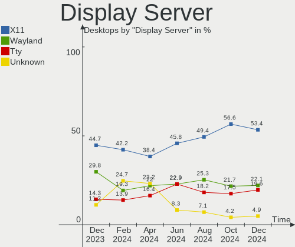
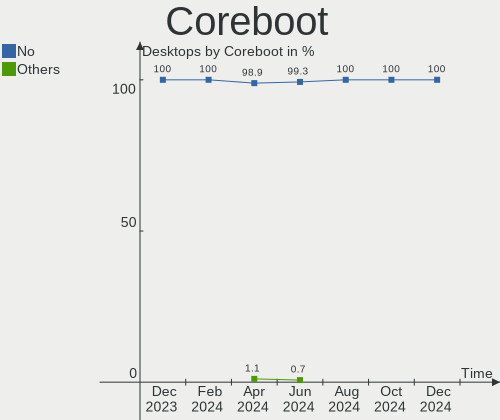
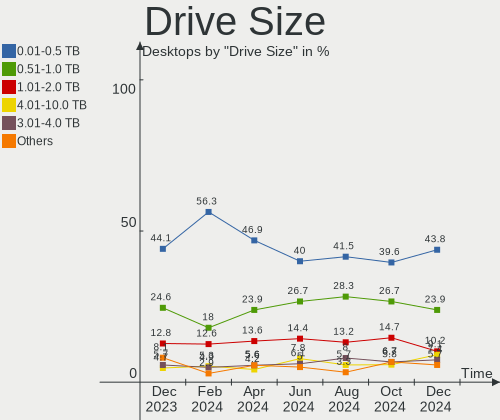
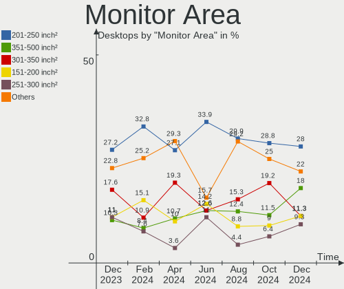
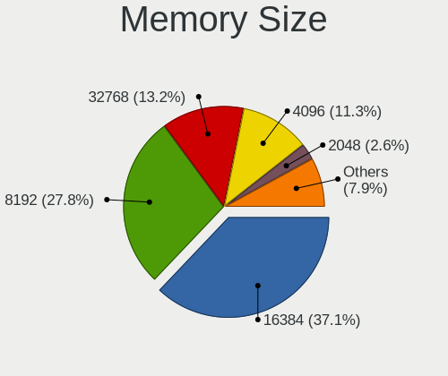

Debian Hardware Trends (Desktop)
--------------------------------

A project to identify most popular hardware characteristics and track their change
over time based on data collected by Debian users at https://Linux-Hardware.org.

Anyone can contribute to the study by uploading probes of their computers by
the [hw-probe](https://github.com/linuxhw/hw-probe) tool:

    sudo -E hw-probe -all -upload

Full-feature report is available here: https://linux-hardware.org/?view=trends&formfactor=desktop

Period: Jan, 2021.

Contents
--------

- [ OS                       ](#os)
- [ OS Family                ](#os-family)
- [ Kernel                   ](#kernel)
- [ Kernel Family            ](#kernel-family)
- [ Kernel Major Ver.        ](#kernel-major-ver)
- [ Arch                     ](#arch)
- [ DE                       ](#de)
- [ Display Server           ](#display-server)
- [ Display Manager          ](#display-manager)
- [ OS Lang                  ](#os-lang)
- [ Boot Mode                ](#boot-mode)
- [ Filesystem               ](#filesystem)
- [ Part. scheme             ](#part-scheme)
- [ Dual Boot with Linux/BSD ](#dual-boot-with-linux/bsd)
- [ Dual Boot (Win)          ](#dual-boot-win)
- [ Country                  ](#country)
- [ City                     ](#city)
- [ Vendor                   ](#vendor)
- [ Model                    ](#model)
- [ Model Family             ](#model-family)
- [ MFG Year                 ](#mfg-year)
- [ Form Factor              ](#form-factor)
- [ Secure Boot              ](#secure-boot)
- [ Coreboot                 ](#coreboot)
- [ RAM Size                 ](#ram-size)
- [ RAM Used                 ](#ram-used)
- [ Has CD-ROM               ](#has-cd-rom)
- [ Total Drives             ](#total-drives)
- [ Has Ethernet             ](#has-ethernet)
- [ Drive Vendor             ](#drive-vendor)
- [ Drive Model              ](#drive-model)
- [ HDD Vendor               ](#hdd-vendor)
- [ SSD Vendor               ](#ssd-vendor)
- [ Drive Kind               ](#drive-kind)
- [ Drive Connector          ](#drive-connector)
- [ Drive Size               ](#drive-size)
- [ Space Total              ](#space-total)
- [ Space Used               ](#space-used)
- [ Malfunc. Drives          ](#malfunc-drives)
- [ Malfunc. Drive Vendor    ](#malfunc-drive-vendor)
- [ Malfunc. HDD Vendor      ](#malfunc-hdd-vendor)
- [ Malfunc. Drive Kind      ](#malfunc-drive-kind)
- [ Failed Drives            ](#failed-drives)
- [ Failed Drive Vendor      ](#failed-drive-vendor)
- [ Drive Status             ](#drive-status)
- [ Storage Vendor           ](#storage-vendor)
- [ Storage Model            ](#storage-model)
- [ Storage Kind             ](#storage-kind)
- [ CPU Vendor               ](#cpu-vendor)
- [ CPU Model                ](#cpu-model)
- [ CPU Model Family         ](#cpu-model-family)
- [ CPU Cores                ](#cpu-cores)
- [ CPU Sockets              ](#cpu-sockets)
- [ CPU Threads              ](#cpu-threads)
- [ CPU Op-Modes             ](#cpu-op-modes)
- [ CPU Microcode            ](#cpu-microcode)
- [ CPU Microarch            ](#cpu-microarch)
- [ GPU Vendor               ](#gpu-vendor)
- [ GPU Model                ](#gpu-model)
- [ GPU Combo                ](#gpu-combo)
- [ GPU Driver               ](#gpu-driver)
- [ GPU Memory               ](#gpu-memory)
- [ Monitor Vendor           ](#monitor-vendor)
- [ Monitor Model            ](#monitor-model)
- [ Monitor Resolution       ](#monitor-resolution)
- [ Monitor Diagonal         ](#monitor-diagonal)
- [ Monitor Width            ](#monitor-width)
- [ Aspect Ratio             ](#aspect-ratio)
- [ Monitor Area             ](#monitor-area)
- [ Pixel Density            ](#pixel-density)
- [ Multiple Monitors        ](#multiple-monitors)
- [ Net Controller Vendor    ](#net-controller-vendor)
- [ Net Controller Model     ](#net-controller-model)
- [ Wireless Vendor          ](#wireless-vendor)
- [ Wireless Model           ](#wireless-model)
- [ Ethernet Vendor          ](#ethernet-vendor)
- [ Ethernet Model           ](#ethernet-model)
- [ Net Controller Kind      ](#net-controller-kind)
- [ Used Controller          ](#used-controller)
- [ NICs                     ](#nics)
- [ Memory Vendor            ](#memory-vendor)
- [ Memory Model             ](#memory-model)
- [ Memory Kind              ](#memory-kind)
- [ Memory Form Factor       ](#memory-form-factor)
- [ Memory Size              ](#memory-size)
- [ Memory Speed             ](#memory-speed)
- [ Sound Vendor             ](#sound-vendor)
- [ Sound Model              ](#sound-model)
- [ Camera Vendor            ](#camera-vendor)
- [ Camera Model             ](#camera-model)
- [ Fingerprint Vendor       ](#fingerprint-vendor)
- [ Fingerprint Model        ](#fingerprint-model)
- [ Chipcard Vendor          ](#chipcard-vendor)
- [ Chipcard Model           ](#chipcard-model)
- [ Printer Vendor           ](#printer-vendor)
- [ Printer Model            ](#printer-model)
- [ Scanner Vendor           ](#scanner-vendor)
- [ Scanner Model            ](#scanner-model)
- [ Bluetooth Vendor         ](#bluetooth-vendor)
- [ Bluetooth Model          ](#bluetooth-model)
- [ Unsupported Devices      ](#unsupported-devices)
- [ Unsupported Device Types ](#unsupported-device-types)

OS
--

Installed operating systems

| Name            | Desktops | Percent |
|-----------------|----------|---------|
| Debian 10       | 36       | 61.02%  |
| Debian Testing  | 10       | 16.95%  |
| Debian Unstable | 4        | 6.78%   |
| Debian          | 4        | 6.78%   |
| Debian 9        | 2        | 3.39%   |
| Debian 9.13     | 1        | 1.69%   |
| Debian 9.12     | 1        | 1.69%   |
| Debian 8.11     | 1        | 1.69%   |

OS Family
---------

OS without a version

| Name   | Desktops | Percent |
|--------|----------|---------|
| Debian | 59       | 100%    |

Kernel
------

Version of the Linux kernel

| Version                   | Desktops | Percent |
|---------------------------|----------|---------|
| 4.19.0-13-amd64           | 18       | 30.51%  |
| 5.10.0-1-amd64            | 8        | 13.56%  |
| 5.9.0-0.bpo.2-amd64       | 5        | 8.47%   |
| 5.9.0-5-amd64             | 3        | 5.08%   |
| 5.4.78-2-pve              | 2        | 3.39%   |
| 5.10.0-2-amd64            | 2        | 3.39%   |
| 4.19.0-13-686-pae         | 2        | 3.39%   |
| 5.9.0-5-686-pae           | 1        | 1.69%   |
| 5.8.0-3-amd64             | 1        | 1.69%   |
| 5.8.0-2-amd64             | 1        | 1.69%   |
| 5.6.0-1-amd64             | 1        | 1.69%   |
| 5.4.0-4-amd64             | 1        | 1.69%   |
| 5.3.6-050306-generic      | 1        | 1.69%   |
| 5.10.5-xanmod1-cacule     | 1        | 1.69%   |
| 5.10.0-4.2-liquorix-amd64 | 1        | 1.69%   |
| 5.0.21-4-pve              | 1        | 1.69%   |
| 4.9.235-antix.1-amd64-smp | 1        | 1.69%   |
| 4.9.0-9-amd64             | 1        | 1.69%   |
| 4.9.0-8-amd64             | 1        | 1.69%   |
| 4.9.0-14-amd64            | 1        | 1.69%   |
| 4.9.0-12-amd64            | 1        | 1.69%   |
| 4.9.0-0.bpo.6-amd64       | 1        | 1.69%   |
| 4.19.0-6-amd64            | 1        | 1.69%   |
| 4.19.0-6-686-pae          | 1        | 1.69%   |
| 4.19.0-12-amd64           | 1        | 1.69%   |
| 4.15.0-1-686-pae          | 1        | 1.69%   |

Kernel Family
-------------

Linux kernel without a distro release

| Version | Desktops | Percent |
|---------|----------|---------|
| 4.19.0  | 23       | 38.98%  |
| 5.10.0  | 11       | 18.64%  |
| 5.9.0   | 9        | 15.25%  |
| 4.9.0   | 5        | 8.47%   |
| 5.8.0   | 2        | 3.39%   |
| 5.4.78  | 2        | 3.39%   |
| 5.6.0   | 1        | 1.69%   |
| 5.4.0   | 1        | 1.69%   |
| 5.3.6   | 1        | 1.69%   |
| 5.10.5  | 1        | 1.69%   |
| 5.0.21  | 1        | 1.69%   |
| 4.9.235 | 1        | 1.69%   |
| 4.15.0  | 1        | 1.69%   |

Kernel Major Ver.
-----------------

Linux kernel major version

| Version | Desktops | Percent |
|---------|----------|---------|
| 4.19    | 23       | 38.98%  |
| 5.10    | 12       | 20.34%  |
| 5.9     | 9        | 15.25%  |
| 4.9     | 6        | 10.17%  |
| 5.4     | 3        | 5.08%   |
| 5.8     | 2        | 3.39%   |
| 5.6     | 1        | 1.69%   |
| 5.3     | 1        | 1.69%   |
| 5.0     | 1        | 1.69%   |
| 4.15    | 1        | 1.69%   |

Arch
----

OS architecture (x86_64, i586, etc.)

| Name   | Desktops | Percent |
|--------|----------|---------|
| x86_64 | 53       | 89.83%  |
| i686   | 6        | 10.17%  |

DE
--

Desktop Environment

| Name            | Desktops | Percent |
|-----------------|----------|---------|
| Unknown         | 17       | 28.81%  |
| XFCE            | 9        | 15.25%  |
| GNOME           | 9        | 15.25%  |
| KDE             | 7        | 11.86%  |
| MATE            | 3        | 5.08%   |
| KDE5            | 3        | 5.08%   |
| Cinnamon        | 3        | 5.08%   |
| X-Cinnamon      | 2        | 3.39%   |
| LXQt            | 2        | 3.39%   |
| LXDE            | 2        | 3.39%   |
| Openbox         | 1        | 1.69%   |
| GNOME Flashback | 1        | 1.69%   |

Display Server
--------------

X11 or Wayland

| Name    | Desktops | Percent |
|---------|----------|---------|
| X11     | 47       | 79.66%  |
| Tty     | 5        | 8.47%   |
| Unknown | 5        | 8.47%   |
| Wayland | 2        | 3.39%   |

Display Manager
---------------

SDDM, LightDM, etc.

| Name    | Desktops | Percent |
|---------|----------|---------|
| Unknown | 36       | 61.02%  |
| TDM     | 10       | 16.95%  |
| GDM     | 5        | 8.47%   |
| SDDM    | 4        | 6.78%   |
| LightDM | 2        | 3.39%   |
| XDM     | 1        | 1.69%   |
| NODM    | 1        | 1.69%   |

OS Lang
-------

Language

| Lang    | Desktops | Percent |
|---------|----------|---------|
| en_US   | 12       | 20.34%  |
| Unknown | 8        | 13.56%  |
| en_GB   | 7        | 11.86%  |
| fr_FR   | 6        | 10.17%  |
| de_DE   | 5        | 8.47%   |
| ru_RU   | 4        | 6.78%   |
| en_CA   | 3        | 5.08%   |
| pt_BR   | 2        | 3.39%   |
| en_IN   | 2        | 3.39%   |
| cs_CZ   | 2        | 3.39%   |
| sk_SK   | 1        | 1.69%   |
| nl_NL   | 1        | 1.69%   |
| ja_JP   | 1        | 1.69%   |
| it_IT   | 1        | 1.69%   |
| hu_HU   | 1        | 1.69%   |
| es_ES   | 1        | 1.69%   |
| en_AU   | 1        | 1.69%   |
| de_AT   | 1        | 1.69%   |

Boot Mode
---------

EFI or BIOS

| Mode | Desktops | Percent |
|------|----------|---------|
| BIOS | 45       | 76.27%  |
| EFI  | 14       | 23.73%  |

Filesystem
----------

Type of filesystem

| Type  | Desktops | Percent |
|-------|----------|---------|
| Ext4  | 52       | 88.14%  |
| Btrfs | 5        | 8.47%   |
| Ext2  | 2        | 3.39%   |

Part. scheme
------------

Scheme of partitioning

| Type    | Desktops | Percent |
|---------|----------|---------|
| MBR     | 21       | 35.59%  |
| GPT     | 20       | 33.9%   |
| Unknown | 18       | 30.51%  |

Dual Boot with Linux/BSD
------------------------

Hosting more than one Linux/BSD

| Dual boot | Desktops | Percent |
|-----------|----------|---------|
| No        | 46       | 77.97%  |
| Yes       | 13       | 22.03%  |

Dual Boot (Win)
---------------

Hosting Linux and Windows

| Dual boot | Desktops | Percent |
|-----------|----------|---------|
| No        | 45       | 76.27%  |
| Yes       | 14       | 23.73%  |

Country
-------

Geographic location (country)

| Country                | Desktops | Percent |
|------------------------|----------|---------|
| USA                    | 7        | 11.86%  |
| France                 | 7        | 11.86%  |
| UK                     | 6        | 10.17%  |
| Russia                 | 5        | 8.47%   |
| Germany                | 5        | 8.47%   |
| Brazil                 | 4        | 6.78%   |
| Italy                  | 3        | 5.08%   |
| Slovakia               | 2        | 3.39%   |
| India                  | 2        | 3.39%   |
| Czech Republic         | 2        | 3.39%   |
| Canada                 | 2        | 3.39%   |
| Vietnam                | 1        | 1.69%   |
| Thailand               | 1        | 1.69%   |
| Switzerland            | 1        | 1.69%   |
| Spain                  | 1        | 1.69%   |
| Netherlands            | 1        | 1.69%   |
| Myanmar                | 1        | 1.69%   |
| Japan                  | 1        | 1.69%   |
| Hungary                | 1        | 1.69%   |
| Denmark                | 1        | 1.69%   |
| Colombia               | 1        | 1.69%   |
| Bosnia and Herzegovina | 1        | 1.69%   |
| Belgium                | 1        | 1.69%   |
| Austria                | 1        | 1.69%   |
| Australia              | 1        | 1.69%   |

City
----

Geographic location (city)

| City                   | Desktops | Percent |
|------------------------|----------|---------|
| Springfield            | 2        | 3.39%   |
| Perm                   | 2        | 3.39%   |
| Bengaluru              | 2        | 3.39%   |
| Zwijndrecht            | 1        | 1.69%   |
| Yangon                 | 1        | 1.69%   |
| Vienna                 | 1        | 1.69%   |
| Valencia               | 1        | 1.69%   |
| Utsunomiya             | 1        | 1.69%   |
| Ufa                    | 1        | 1.69%   |
| Stratford              | 1        | 1.69%   |
| Steinbach              | 1        | 1.69%   |
| St Louis               | 1        | 1.69%   |
| Sarajevo               | 1        | 1.69%   |
| Sao Vicente            | 1        | 1.69%   |
| Saint-Prex             | 1        | 1.69%   |
| Rome                   | 1        | 1.69%   |
| Risskov                | 1        | 1.69%   |
| Praia Grande           | 1        | 1.69%   |
| Pfullingen             | 1        | 1.69%   |
| Perth                  | 1        | 1.69%   |
| Nizhniy Novgorod       | 1        | 1.69%   |
| Montreal               | 1        | 1.69%   |
| Milton Keynes          | 1        | 1.69%   |
| Michalovce             | 1        | 1.69%   |
| Miami                  | 1        | 1.69%   |
| Meerbusch              | 1        | 1.69%   |
| Medellín              | 1        | 1.69%   |
| Lytkarino              | 1        | 1.69%   |
| Lyon                   | 1        | 1.69%   |
| London                 | 1        | 1.69%   |
| Letchworth Garden City | 1        | 1.69%   |
| Kalbe                  | 1        | 1.69%   |
| Jičín                | 1        | 1.69%   |
| Holbrook               | 1        | 1.69%   |
| Ho Chi Minh City       | 1        | 1.69%   |
| Hatboro                | 1        | 1.69%   |
| Hamburg                | 1        | 1.69%   |
| Grosseto               | 1        | 1.69%   |
| Gloucester             | 1        | 1.69%   |
| Frankfurt am Main      | 1        | 1.69%   |
| Florence               | 1        | 1.69%   |
| Děčín               | 1        | 1.69%   |
| Dorog                  | 1        | 1.69%   |
| Colomiers              | 1        | 1.69%   |
| Civray-de-Touraine     | 1        | 1.69%   |
| Chapel Hill            | 1        | 1.69%   |
| Ceintrey               | 1        | 1.69%   |
| Carpentras             | 1        | 1.69%   |
| Cariacica              | 1        | 1.69%   |
| Bretignolles-sur-Mer   | 1        | 1.69%   |
| Bratislava             | 1        | 1.69%   |
| Brasília              | 1        | 1.69%   |
| Bradford               | 1        | 1.69%   |
| Boom                   | 1        | 1.69%   |
| Bonneuil-sur-Marne     | 1        | 1.69%   |
| Bangkok                | 1        | 1.69%   |

Vendor
------

Motherboard manufacturer

| Name                | Desktops | Percent |
|---------------------|----------|---------|
| ASUSTek Computer    | 19       | 32.2%   |
| ASRock              | 8        | 13.56%  |
| Dell                | 6        | 10.17%  |
| Gigabyte Technology | 5        | 8.47%   |
| Lenovo              | 3        | 5.08%   |
| Hewlett-Packard     | 3        | 5.08%   |
| MSI                 | 2        | 3.39%   |
| Apple               | 2        | 3.39%   |
| Supermicro          | 1        | 1.69%   |
| Shuttle             | 1        | 1.69%   |
| Qbex                | 1        | 1.69%   |
| Positivo            | 1        | 1.69%   |
| PCWare              | 1        | 1.69%   |
| NEXCOM              | 1        | 1.69%   |
| Medion              | 1        | 1.69%   |
| Intel               | 1        | 1.69%   |
| Huanan              | 1        | 1.69%   |
| HARDKERNEL          | 1        | 1.69%   |
| Acer                | 1        | 1.69%   |

Model
-----

Motherboard model

| Name                                                                | Desktops | Percent |
|---------------------------------------------------------------------|----------|---------|
| ASUS All Series                                                     | 4        | 6.78%   |
| ASUS TUF GAMING B550-PLUS                                           | 2        | 3.39%   |
| Supermicro X9DRi-LN4+/X9DR3-LN4+                                    | 1        | 1.69%   |
| Shuttle SX79R                                                       | 1        | 1.69%   |
| Qbex QBEX-H61H2-M2                                                  | 1        | 1.69%   |
| Positivo POS-VVCN896BD                                              | 1        | 1.69%   |
| PCWare IPMH61R2                                                     | 1        | 1.69%   |
| NEXCOM NDIS B322                                                    | 1        | 1.69%   |
| MSI MS-7C84                                                         | 1        | 1.69%   |
| MSI MS-7C56                                                         | 1        | 1.69%   |
| Medion MS-7817                                                      | 1        | 1.69%   |
| Lenovo ThinkStation P500 30A6S0AT00                                 | 1        | 1.69%   |
| Lenovo ThinkCentre M93p 10A8CTO1WW                                  | 1        | 1.69%   |
| Lenovo ThinkCentre M700 10J0S0U800                                  | 1        | 1.69%   |
| Intel DH87RL AAG74240-402                                           | 1        | 1.69%   |
| Huanan X79 INTEL (INTEL Xeon E5/Corei7 DMI2 - C600/C200 Cipset V3.1 | 1        | 1.69%   |
| HP ProLiant MicroServer Gen8                                        | 1        | 1.69%   |
| HP Compaq dc7800 Small Form Factor                                  | 1        | 1.69%   |
| HP Compaq 6000 Pro SFF PC                                           | 1        | 1.69%   |
| HARDKERNEL ODROID-H2                                                | 1        | 1.69%   |
| Gigabyte H97M-HD3                                                   | 1        | 1.69%   |
| Gigabyte H61M-S2PV                                                  | 1        | 1.69%   |
| Gigabyte GA-78LMT-USB3 6.0                                          | 1        | 1.69%   |
| Gigabyte F2A78M-HD2                                                 | 1        | 1.69%   |
| Gigabyte B75M-D3H                                                   | 1        | 1.69%   |
| Dell XPS 8700                                                       | 1        | 1.69%   |
| Dell PowerEdge SC440                                                | 1        | 1.69%   |
| Dell OptiPlex GX620                                                 | 1        | 1.69%   |
| Dell OptiPlex 7010                                                  | 1        | 1.69%   |
| Dell Inspiron 560                                                   | 1        | 1.69%   |
| Dell Dimension 4700c                                                | 1        | 1.69%   |
| ASUS TUF B450-PLUS GAMING                                           | 1        | 1.69%   |
| ASUS ROG ZENITH EXTREME                                             | 1        | 1.69%   |
| ASUS ROG STRIX B550-F GAMING                                        | 1        | 1.69%   |
| ASUS ROG CROSSHAIR VI HERO                                          | 1        | 1.69%   |
| ASUS PRIME H310M-A R2.0                                             | 1        | 1.69%   |
| ASUS P9X79 DELUXE                                                   | 1        | 1.69%   |
| ASUS P7H55D-M EVO                                                   | 1        | 1.69%   |
| ASUS P5KPL-SE                                                       | 1        | 1.69%   |
| ASUS P5KPL-AM SE                                                    | 1        | 1.69%   |
| ASUS M5A99FX PRO R2.0                                               | 1        | 1.69%   |
| ASUS M2A-VM                                                         | 1        | 1.69%   |
| ASUS H61M-K                                                         | 1        | 1.69%   |
| ASUS GC517AA-ABA a6057c                                             | 1        | 1.69%   |
| ASRock Z77 Extreme4                                                 | 1        | 1.69%   |
| ASRock X570 PG Velocita                                             | 1        | 1.69%   |
| ASRock T6010                                                        | 1        | 1.69%   |
| ASRock H110M-HDV R3.0                                               | 1        | 1.69%   |
| ASRock ConRoe1333-D667                                              | 1        | 1.69%   |
| ASRock B85M Pro4                                                    | 1        | 1.69%   |
| ASRock B450 Gaming-ITX/ac                                           | 1        | 1.69%   |
| ASRock A320M-HDV R3.0                                               | 1        | 1.69%   |
| Apple MacPro6,1                                                     | 1        | 1.69%   |
| Apple MacPro4,1                                                     | 1        | 1.69%   |
| Acer Aspire XC-780                                                  | 1        | 1.69%   |

Model Family
------------

Motherboard model prefix

| Name                   | Desktops | Percent |
|------------------------|----------|---------|
| ASUS All               | 4        | 6.78%   |
| ASUS TUF               | 3        | 5.08%   |
| ASUS ROG               | 3        | 5.08%   |
| Lenovo ThinkCentre     | 2        | 3.39%   |
| HP Compaq              | 2        | 3.39%   |
| Dell OptiPlex          | 2        | 3.39%   |
| Supermicro X9DRi-LN4+  | 1        | 1.69%   |
| Shuttle SX79R          | 1        | 1.69%   |
| Qbex QBEX-H61H2-M2     | 1        | 1.69%   |
| Positivo POS-VVCN896BD | 1        | 1.69%   |
| PCWare IPMH61R2        | 1        | 1.69%   |
| NEXCOM NDIS            | 1        | 1.69%   |
| MSI MS-7C84            | 1        | 1.69%   |
| MSI MS-7C56            | 1        | 1.69%   |
| Medion MS-7817         | 1        | 1.69%   |
| Lenovo ThinkStation    | 1        | 1.69%   |
| Intel DH87RL           | 1        | 1.69%   |
| Huanan X79             | 1        | 1.69%   |
| HP ProLiant            | 1        | 1.69%   |
| HARDKERNEL ODROID-H2   | 1        | 1.69%   |
| Gigabyte H97M-HD3      | 1        | 1.69%   |
| Gigabyte H61M-S2PV     | 1        | 1.69%   |
| Gigabyte GA-78LMT-USB3 | 1        | 1.69%   |
| Gigabyte F2A78M-HD2    | 1        | 1.69%   |
| Gigabyte B75M-D3H      | 1        | 1.69%   |
| Dell XPS               | 1        | 1.69%   |
| Dell PowerEdge         | 1        | 1.69%   |
| Dell Inspiron          | 1        | 1.69%   |
| Dell Dimension         | 1        | 1.69%   |
| ASUS PRIME             | 1        | 1.69%   |
| ASUS P9X79             | 1        | 1.69%   |
| ASUS P7H55D-M          | 1        | 1.69%   |
| ASUS P5KPL-SE          | 1        | 1.69%   |
| ASUS P5KPL-AM          | 1        | 1.69%   |
| ASUS M5A99FX           | 1        | 1.69%   |
| ASUS M2A-VM            | 1        | 1.69%   |
| ASUS H61M-K            | 1        | 1.69%   |
| ASUS GC517AA-ABA       | 1        | 1.69%   |
| ASRock Z77             | 1        | 1.69%   |
| ASRock X570            | 1        | 1.69%   |
| ASRock T6010           | 1        | 1.69%   |
| ASRock H110M-HDV       | 1        | 1.69%   |
| ASRock ConRoe1333-D667 | 1        | 1.69%   |
| ASRock B85M            | 1        | 1.69%   |
| ASRock B450            | 1        | 1.69%   |
| ASRock A320M-HDV       | 1        | 1.69%   |
| Apple MacPro6          | 1        | 1.69%   |
| Apple MacPro4          | 1        | 1.69%   |
| Acer Aspire            | 1        | 1.69%   |

MFG Year
--------

Motherboard manufacture year

| Year | Desktops | Percent |
|------|----------|---------|
| 2020 | 11       | 18.64%  |
| 2014 | 9        | 15.25%  |
| 2019 | 6        | 10.17%  |
| 2013 | 6        | 10.17%  |
| 2010 | 5        | 8.47%   |
| 2007 | 4        | 6.78%   |
| 2015 | 3        | 5.08%   |
| 2009 | 3        | 5.08%   |
| 2017 | 2        | 3.39%   |
| 2016 | 2        | 3.39%   |
| 2012 | 2        | 3.39%   |
| 2011 | 2        | 3.39%   |
| 2018 | 1        | 1.69%   |
| 2008 | 1        | 1.69%   |
| 2006 | 1        | 1.69%   |
| 2005 | 1        | 1.69%   |

Form Factor
-----------

Physical design of the computer

| Name    | Desktops | Percent |
|---------|----------|---------|
| Desktop | 59       | 100%    |

Secure Boot
-----------

Enabled or disabled

| State    | Desktops | Percent |
|----------|----------|---------|
| Disabled | 59       | 100%    |

Coreboot
--------

Have coreboot on board

| Used | Desktops | Percent |
|------|----------|---------|
| No   | 59       | 100%    |

RAM Size
--------

Total RAM memory

| Size in GB      | Desktops | Percent |
|-----------------|----------|---------|
| 16.01-24.0      | 15       | 25.42%  |
| 3.01-4.0        | 11       | 18.64%  |
| 8.01-16.0       | 10       | 16.95%  |
| 32.01-64.0      | 9        | 15.25%  |
| 64.01-256.0     | 4        | 6.78%   |
| 4.01-8.0        | 3        | 5.08%   |
| 1.01-2.0        | 3        | 5.08%   |
| 2.01-3.0        | 2        | 3.39%   |
| More than 256.0 | 1        | 1.69%   |
| 24.01-32.0      | 1        | 1.69%   |

RAM Used
--------

Used RAM memory

| Used GB    | Desktops | Percent |
|------------|----------|---------|
| 4.01-8.0   | 11       | 18.64%  |
| 3.01-4.0   | 11       | 18.64%  |
| 1.01-2.0   | 9        | 15.25%  |
| 2.01-3.0   | 7        | 11.86%  |
| 8.01-16.0  | 7        | 11.86%  |
| 0.51-1.0   | 6        | 10.17%  |
| 0.01-0.5   | 5        | 8.47%   |
| 16.01-24.0 | 3        | 5.08%   |

Has CD-ROM
----------

Has CD-ROM on board

| Presented | Desktops | Percent |
|-----------|----------|---------|
| No        | 32       | 54.24%  |
| Yes       | 27       | 45.76%  |

Total Drives
------------

Number of drives on board

| Drives | Desktops | Percent |
|--------|----------|---------|
| 2      | 22       | 37.29%  |
| 1      | 21       | 35.59%  |
| 3      | 6        | 10.17%  |
| 4      | 5        | 8.47%   |
| 6      | 2        | 3.39%   |
| 5      | 2        | 3.39%   |
| 9      | 1        | 1.69%   |

Has Ethernet
------------

Has Ethernet on board

| Presented | Desktops | Percent |
|-----------|----------|---------|
| Yes       | 59       | 100%    |

Drive Vendor
------------

Hard drive vendors

| Vendor              | Desktops | Drives | Percent |
|---------------------|----------|--------|---------|
| WDC                 | 25       | 42     | 23.58%  |
| Seagate             | 22       | 25     | 20.75%  |
| Samsung Electronics | 19       | 21     | 17.92%  |
| SanDisk             | 4        | 4      | 3.77%   |
| Kingston            | 4        | 4      | 3.77%   |
| Crucial             | 4        | 4      | 3.77%   |
| A-DATA Technology   | 4        | 4      | 3.77%   |
| Hitachi             | 3        | 4      | 2.83%   |
| HGST                | 3        | 5      | 2.83%   |
| Corsair             | 2        | 2      | 1.89%   |
| Apple               | 2        | 2      | 1.89%   |
| Unknown             | 1        | 1      | 0.94%   |
| ULTIMATE            | 1        | 1      | 0.94%   |
| Toshiba             | 1        | 1      | 0.94%   |
| Silicon Motion      | 1        | 1      | 0.94%   |
| PLEXTOR             | 1        | 2      | 0.94%   |
| Patriot             | 1        | 1      | 0.94%   |
| MyDigitalSSD        | 1        | 1      | 0.94%   |
| Maxtor              | 1        | 1      | 0.94%   |
| Intel               | 1        | 1      | 0.94%   |
| HGST HDS            | 1        | 1      | 0.94%   |
| GOODRAM             | 1        | 1      | 0.94%   |
| Elite               | 1        | 2      | 0.94%   |
| DGM                 | 1        | 1      | 0.94%   |
| ASMT                | 1        | 1      | 0.94%   |

Drive Model
-----------

Hard drive models

| Model                            | Desktops | Percent |
|----------------------------------|----------|---------|
| Samsung SSD 850 EVO 500GB        | 3        | 2.59%   |
| Seagate ST2000DM008-2FR102 2TB   | 2        | 1.72%   |
| Seagate ST1000DM003-1ER162 1TB   | 2        | 1.72%   |
| Samsung SSD 860 EVO 500GB        | 2        | 1.72%   |
| A-DATA SU800 256GB SSD           | 2        | 1.72%   |
| WDC WDS500G2B0A-00SM50 500GB SSD | 1        | 0.86%   |
| WDC WDS480G2G0A-00JH30 480GB SSD | 1        | 0.86%   |
| WDC WDS240G2G0B-00EPW0 240GB SSD | 1        | 0.86%   |
| WDC WDS120G2G0A-00JH30 120GB SSD | 1        | 0.86%   |
| WDC WD7500BPKX-22HPJT0 752GB     | 1        | 0.86%   |
| WDC WD5000LPVX-00V0TT0 500GB     | 1        | 0.86%   |
| WDC WD5000AZRX-00L4HB0 500GB     | 1        | 0.86%   |
| WDC WD40EFRX-68N32N0 4TB         | 1        | 0.86%   |
| WDC WD3200BEKT-75PVMT1 320GB     | 1        | 0.86%   |
| WDC WD3200AVJS-63N9A0 320GB      | 1        | 0.86%   |
| WDC WD3200AAKX-001CA0 320GB      | 1        | 0.86%   |
| WDC WD3200AAJS-56M0A0 320GB      | 1        | 0.86%   |
| WDC WD20EFRX-68EUZN0 2TB         | 1        | 0.86%   |
| WDC WD1600JS-00MHB0 160GB        | 1        | 0.86%   |
| WDC WD140EDFZ-11A0VA0 14TB       | 1        | 0.86%   |
| WDC WD10EZRZ-00HTKB0 1TB         | 1        | 0.86%   |
| WDC WD10EZEX-21WN4A0 1TB         | 1        | 0.86%   |
| WDC WD10EZEX-21M2NA0 1TB         | 1        | 0.86%   |
| WDC WD10EZEX-08WN4A0 1TB         | 1        | 0.86%   |
| WDC WD10EZEX-00BN5A0 1TB         | 1        | 0.86%   |
| WDC WD10EVVS-63M5B0 1TB          | 1        | 0.86%   |
| WDC WD10EFRX-68FYTN0 1TB         | 1        | 0.86%   |
| WDC WD10EAVS-00D7B0 1TB          | 1        | 0.86%   |
| WDC WD10EARX-32N0YB0 1TB         | 1        | 0.86%   |
| WDC WD10EARX-00N0YB0 1TB         | 1        | 0.86%   |
| WDC WD10EADS-00L5B1 1TB          | 1        | 0.86%   |
| WDC WD10EACS-00ZJB0 1TB          | 1        | 0.86%   |
| WDC WD100EMAZ-00WJTA0 10TB       | 1        | 0.86%   |
| Unknown SD/MMC/MS PRO 32GB       | 1        | 0.86%   |
| ULTIMATE CF CARD 16GB SSD        | 1        | 0.86%   |
| Toshiba THNSNH060GCST 64GB SSD   | 1        | 0.86%   |
| Silicon Motion NVME SSD 256GB    | 1        | 0.86%   |
| Seagate ST9160314AS 160GB        | 1        | 0.86%   |
| Seagate ST500LM021-1KJ152 500GB  | 1        | 0.86%   |
| Seagate ST500DM002-1BD142 500GB  | 1        | 0.86%   |
| Seagate ST4000VN008-2DR166 4TB   | 1        | 0.86%   |
| Seagate ST4000VN000-2AH166 4TB   | 1        | 0.86%   |
| Seagate ST4000DX001-1CE168 4TB   | 1        | 0.86%   |
| Seagate ST3750528AS 752GB        | 1        | 0.86%   |
| Seagate ST3500418AS 500GB        | 1        | 0.86%   |
| Seagate ST3500312CS 500GB        | 1        | 0.86%   |
| Seagate ST3250824AS 250GB        | 1        | 0.86%   |
| Seagate ST3250620AS 250GB        | 1        | 0.86%   |
| Seagate ST3250318AS 250GB        | 1        | 0.86%   |
| Seagate ST3250310AS 250GB        | 1        | 0.86%   |
| Seagate ST3160813AS 160GB        | 1        | 0.86%   |
| Seagate ST31000524AS 1TB         | 1        | 0.86%   |
| Seagate ST31000523AS 1TB         | 1        | 0.86%   |
| Seagate ST3000DM001-9YN166 3TB   | 1        | 0.86%   |
| Seagate ST250LT021-1AF14C 250GB  | 1        | 0.86%   |
| Seagate ST1000DM010-2EP102 1TB   | 1        | 0.86%   |
| Seagate ST1000DM003-1CH162 1TB   | 1        | 0.86%   |
| SanDisk SSD PLUS 1000GB          | 1        | 0.86%   |
| SanDisk SDSSDA120G 120GB         | 1        | 0.86%   |
| SanDisk SD8SB8U1T001122 1TB SSD  | 1        | 0.86%   |

HDD Vendor
----------

Hard disk drive vendors

| Vendor              | Desktops | Drives | Percent |
|---------------------|----------|--------|---------|
| Seagate             | 22       | 25     | 39.29%  |
| WDC                 | 21       | 38     | 37.5%   |
| Samsung Electronics | 4        | 5      | 7.14%   |
| Hitachi             | 3        | 4      | 5.36%   |
| HGST                | 3        | 5      | 5.36%   |
| Maxtor              | 1        | 1      | 1.79%   |
| ASMT                | 1        | 1      | 1.79%   |
| Apple               | 1        | 1      | 1.79%   |

SSD Vendor
----------

Solid state drive vendors

| Vendor              | Desktops | Drives | Percent |
|---------------------|----------|--------|---------|
| Samsung Electronics | 11       | 11     | 27.5%   |
| WDC                 | 4        | 4      | 10%     |
| Kingston            | 4        | 4      | 10%     |
| Crucial             | 4        | 4      | 10%     |
| A-DATA Technology   | 4        | 4      | 10%     |
| SanDisk             | 3        | 3      | 7.5%    |
| ULTIMATE            | 1        | 1      | 2.5%    |
| Toshiba             | 1        | 1      | 2.5%    |
| PLEXTOR             | 1        | 2      | 2.5%    |
| Patriot             | 1        | 1      | 2.5%    |
| MyDigitalSSD        | 1        | 1      | 2.5%    |
| Intel               | 1        | 1      | 2.5%    |
| GOODRAM             | 1        | 1      | 2.5%    |
| DGM                 | 1        | 1      | 2.5%    |
| Corsair             | 1        | 1      | 2.5%    |
| Apple               | 1        | 1      | 2.5%    |

Drive Kind
----------

HDD or SSD

| Kind    | Desktops | Drives | Percent |
|---------|----------|--------|---------|
| HDD     | 43       | 80     | 50.59%  |
| SSD     | 33       | 41     | 38.82%  |
| NVMe    | 6        | 8      | 7.06%   |
| Unknown | 3        | 4      | 3.53%   |

Drive Connector
---------------

SATA, SAS, NVMe, etc.

| Type | Desktops | Drives | Percent |
|------|----------|--------|---------|
| SATA | 56       | 120    | 84.85%  |
| NVMe | 6        | 8      | 9.09%   |
| SAS  | 4        | 5      | 6.06%   |

Drive Size
----------

Size of hard drive

| Size in TB | Desktops | Drives | Percent |
|------------|----------|--------|---------|
| 0.01-0.5   | 47       | 70     | 60.26%  |
| 0.51-1.0   | 20       | 30     | 25.64%  |
| 1.01-2.0   | 5        | 7      | 6.41%   |
| 3.01-4.0   | 3        | 5      | 3.85%   |
| 2.01-3.0   | 1        | 1      | 1.28%   |
| 10.01-20.0 | 1        | 4      | 1.28%   |
| 4.01-10.0  | 1        | 4      | 1.28%   |

Space Total
-----------

Amount of disk space available on the file system

| Size in GB     | Desktops | Percent |
|----------------|----------|---------|
| 101-250        | 12       | 20.34%  |
| 501-1000       | 10       | 16.95%  |
| 251-500        | 8        | 13.56%  |
| Unknown        | 8        | 13.56%  |
| 51-100         | 6        | 10.17%  |
| More than 3000 | 4        | 6.78%   |
| 2001-3000      | 4        | 6.78%   |
| 1001-2000      | 3        | 5.08%   |
| 1-20           | 3        | 5.08%   |
| 21-50          | 1        | 1.69%   |

Space Used
----------

Amount of used disk space

| Used GB        | Desktops | Percent |
|----------------|----------|---------|
| 1-20           | 14       | 23.73%  |
| 101-250        | 9        | 15.25%  |
| 51-100         | 9        | 15.25%  |
| Unknown        | 8        | 13.56%  |
| 21-50          | 5        | 8.47%   |
| 251-500        | 4        | 6.78%   |
| 1001-2000      | 4        | 6.78%   |
| 501-1000       | 4        | 6.78%   |
| More than 3000 | 2        | 3.39%   |

Malfunc. Drives
---------------

Drive models with a malfunction

| Model                             | Desktops | Drives | Percent |
|-----------------------------------|----------|--------|---------|
| WDC WD3200BEKT-75PVMT1 320GB      | 1        | 1      | 6.67%   |
| WDC WD10EZEX-21WN4A0 1TB          | 1        | 1      | 6.67%   |
| WDC WD10EZEX-00BN5A0 1TB          | 1        | 1      | 6.67%   |
| Seagate ST9160314AS 160GB         | 1        | 1      | 6.67%   |
| Seagate ST500LM021-1KJ152 500GB   | 1        | 1      | 6.67%   |
| Seagate ST3500418AS 500GB         | 1        | 1      | 6.67%   |
| Seagate ST3250620AS 250GB         | 1        | 1      | 6.67%   |
| Seagate ST3250310AS 250GB         | 1        | 1      | 6.67%   |
| Seagate ST3160813AS 160GB         | 1        | 1      | 6.67%   |
| Seagate ST31000524AS 1TB          | 1        | 1      | 6.67%   |
| Seagate ST3000DM001-9YN166 3TB    | 1        | 1      | 6.67%   |
| Seagate ST250LT021-1AF14C 250GB   | 1        | 1      | 6.67%   |
| Kingston SV300S37A240G 240GB SSD  | 1        | 1      | 6.67%   |
| Hitachi HDS721050CLA362 500GB     | 1        | 1      | 6.67%   |
| A-DATA Technology SU800 256GB SSD | 1        | 1      | 6.67%   |

Malfunc. Drive Vendor
---------------------

Vendors of faulty drives

| Vendor            | Desktops | Drives | Percent |
|-------------------|----------|--------|---------|
| Seagate           | 9        | 9      | 60%     |
| WDC               | 3        | 3      | 20%     |
| Kingston          | 1        | 1      | 6.67%   |
| Hitachi           | 1        | 1      | 6.67%   |
| A-DATA Technology | 1        | 1      | 6.67%   |

Malfunc. HDD Vendor
-------------------

Vendors of faulty HDD drives

| Vendor  | Desktops | Drives | Percent |
|---------|----------|--------|---------|
| Seagate | 9        | 9      | 69.23%  |
| WDC     | 3        | 3      | 23.08%  |
| Hitachi | 1        | 1      | 7.69%   |

Malfunc. Drive Kind
-------------------

Kinds of faulty drives

| Kind | Desktops | Drives | Percent |
|------|----------|--------|---------|
| HDD  | 11       | 13     | 84.62%  |
| SSD  | 2        | 2      | 15.38%  |

Failed Drives
-------------

Failed drive models

Zero info for selected period =(

Failed Drive Vendor
-------------------

Failed drive vendors

Zero info for selected period =(

Drive Status
------------

Number of failed and malfunc. drives

| Status   | Desktops | Drives | Percent |
|----------|----------|--------|---------|
| Works    | 35       | 76     | 50.72%  |
| Detected | 21       | 42     | 30.43%  |
| Malfunc  | 13       | 15     | 18.84%  |

Storage Vendor
--------------

Storage controller vendors

| Vendor                   | Desktops | Percent |
|--------------------------|----------|---------|
| Intel                    | 42       | 56%     |
| AMD                      | 15       | 20%     |
| Samsung Electronics      | 5        | 6.67%   |
| Marvell Technology Group | 4        | 5.33%   |
| ASMedia Technology       | 4        | 5.33%   |
| VIA Technologies         | 1        | 1.33%   |
| Silicon Motion           | 1        | 1.33%   |
| Sandisk                  | 1        | 1.33%   |
| Phison Electronics       | 1        | 1.33%   |
| Adaptec                  | 1        | 1.33%   |

Storage Model
-------------

Storage controller models

| Model                                                                                   | Desktops | Percent |
|-----------------------------------------------------------------------------------------|----------|---------|
| Intel 8 Series/C220 Series Chipset Family 6-port SATA Controller 1 [AHCI mode]          | 9        | 8.91%   |
| AMD FCH SATA Controller [AHCI mode]                                                     | 8        | 7.92%   |
| Intel NM10/ICH7 Family SATA Controller [IDE mode]                                       | 5        | 4.95%   |
| Intel 82801G (ICH7 Family) IDE Controller                                               | 5        | 4.95%   |
| ASMedia ASM1062 Serial ATA Controller                                                   | 4        | 3.96%   |
| AMD SATA controller                                                                     | 4        | 3.96%   |
| Intel Q170/Q150/B150/H170/H110/Z170/CM236 Chipset SATA Controller [AHCI Mode]           | 3        | 2.97%   |
| Intel C600/X79 series chipset 6-Port SATA AHCI Controller                               | 3        | 2.97%   |
| Intel 7 Series/C210 Series Chipset Family 6-port SATA Controller [AHCI mode]            | 3        | 2.97%   |
| Intel 6 Series/C200 Series Chipset Family Desktop SATA Controller (IDE mode, ports 4-5) | 3        | 2.97%   |
| Intel 6 Series/C200 Series Chipset Family Desktop SATA Controller (IDE mode, ports 0-3) | 3        | 2.97%   |
| Intel 6 Series/C200 Series Chipset Family 6 port Desktop SATA AHCI Controller           | 3        | 2.97%   |
| Samsung NVMe SSD Controller SM981/PM981/PM983                                           | 2        | 1.98%   |
| Samsung NVMe SSD Controller SM961/PM961/SM963                                           | 2        | 1.98%   |
| Intel C610/X99 series chipset sSATA Controller [AHCI mode]                              | 2        | 1.98%   |
| Intel C610/X99 series chipset 6-Port SATA Controller [AHCI mode]                        | 2        | 1.98%   |
| Intel 82801JI (ICH10 Family) SATA AHCI Controller                                       | 2        | 1.98%   |
| AMD 400 Series Chipset SATA Controller                                                  | 2        | 1.98%   |
| VIA VT82C586A/B/VT82C686/A/B/VT823x/A/C PIPC Bus Master IDE                             | 1        | 0.99%   |
| VIA VT8237/8251 Serial ATA Controller                                                   | 1        | 0.99%   |
| Silicon Motion SM2263EN/SM2263XT SSD Controller                                         | 1        | 0.99%   |
| Sandisk WD Black 2018 / PC SN720 NVMe SSD                                               | 1        | 0.99%   |
| Samsung Electronics SATA controller                                                     | 1        | 0.99%   |
| Phison E12 NVMe Controller                                                              | 1        | 0.99%   |
| Marvell Group 88SE9235 PCIe 2.0 x2 4-port SATA 6 Gb/s Controller                        | 1        | 0.99%   |
| Marvell Group 88SE9172 SATA 6Gb/s Controller                                            | 1        | 0.99%   |
| Marvell Group 88SE9128 PCIe SATA 6 Gb/s RAID controller with HyperDuo                   | 1        | 0.99%   |
| Marvell Group 88SE6111/6121 SATA II / PATA Controller                                   | 1        | 0.99%   |
| Intel Celeron/Pentium Silver Processor SATA Controller                                  | 1        | 0.99%   |
| Intel C610/X99 series chipset IDE-r Controller                                          | 1        | 0.99%   |
| Intel C606 chipset Dual 4-Port SATA/SAS Storage Control Unit                            | 1        | 0.99%   |
| Intel 9 Series Chipset Family SATA Controller [AHCI Mode]                               | 1        | 0.99%   |
| Intel 82Q35 Express PT IDER Controller                                                  | 1        | 0.99%   |
| Intel 82801JD/DO (ICH10 Family) SATA AHCI Controller                                    | 1        | 0.99%   |
| Intel 82801IR/IO/IH (ICH9R/DO/DH) 4 port SATA Controller [IDE mode]                     | 1        | 0.99%   |
| Intel 82801I (ICH9 Family) 2 port SATA Controller [IDE mode]                            | 1        | 0.99%   |
| Intel 82801GR/GDH (ICH7R/ICH7DH) SATA Controller [RAID mode]                            | 1        | 0.99%   |
| Intel 82801FB/FW (ICH6/ICH6W) SATA Controller                                           | 1        | 0.99%   |
| Intel 82801FB/FBM/FR/FW/FRW (ICH6 Family) IDE Controller                                | 1        | 0.99%   |
| Intel 7 Series Chipset Family 6-port SATA Controller [AHCI mode]                        | 1        | 0.99%   |
| Intel 5 Series/3400 Series Chipset 4 port SATA IDE Controller                           | 1        | 0.99%   |
| Intel 5 Series/3400 Series Chipset 2 port SATA IDE Controller                           | 1        | 0.99%   |
| Intel 4 Series Chipset PT IDER Controller                                               | 1        | 0.99%   |
| Intel 200 Series PCH SATA controller [AHCI mode]                                        | 1        | 0.99%   |
| AMD X399 Series Chipset SATA Controller                                                 | 1        | 0.99%   |
| AMD X370 Series Chipset SATA Controller                                                 | 1        | 0.99%   |
| AMD SB7x0/SB8x0/SB9x0 SATA Controller [IDE mode]                                        | 1        | 0.99%   |
| AMD SB7x0/SB8x0/SB9x0 SATA Controller [AHCI mode]                                       | 1        | 0.99%   |
| AMD SB7x0/SB8x0/SB9x0 IDE Controller                                                    | 1        | 0.99%   |
| AMD SB600 Non-Raid-5 SATA                                                               | 1        | 0.99%   |
| AMD SB600 IDE                                                                           | 1        | 0.99%   |
| AMD FCH SATA Controller D                                                               | 1        | 0.99%   |
| AMD FCH IDE Controller                                                                  | 1        | 0.99%   |
| Adaptec Series 7 6G SAS/PCIe 3                                                          | 1        | 0.99%   |

Storage Kind
------------

Kind of storage controller (IDE, SATA, NVMe, SAS, ...)

| Kind | Desktops | Percent |
|------|----------|---------|
| SATA | 46       | 63.01%  |
| IDE  | 18       | 24.66%  |
| NVMe | 6        | 8.22%   |
| RAID | 2        | 2.74%   |
| SAS  | 1        | 1.37%   |

CPU Vendor
----------

Processor vendors

| Vendor       | Desktops | Percent |
|--------------|----------|---------|
| Intel        | 43       | 72.88%  |
| AMD          | 15       | 25.42%  |
| CentaurHauls | 1        | 1.69%   |

CPU Model
---------

Processor models

| Model                                          | Desktops | Percent |
|------------------------------------------------|----------|---------|
| AMD Ryzen 5 3600 6-Core Processor              | 4        | 6.78%   |
| Intel Core i7-4790 CPU @ 3.60GHz               | 2        | 3.39%   |
| Intel Core i5-3570 CPU @ 3.40GHz               | 2        | 3.39%   |
| Intel Core i3-4150 CPU @ 3.50GHz               | 2        | 3.39%   |
| Intel Core i3-2100 CPU @ 3.10GHz               | 2        | 3.39%   |
| AMD Ryzen 9 3900X 12-Core Processor            | 2        | 3.39%   |
| AMD Ryzen 7 3700X 8-Core Processor             | 2        | 3.39%   |
| Intel Xeon CPU W3565 @ 3.20GHz                 | 1        | 1.69%   |
| Intel Xeon CPU E5-2690 0 @ 2.90GHz             | 1        | 1.69%   |
| Intel Xeon CPU E5-2689 0 @ 2.60GHz             | 1        | 1.69%   |
| Intel Xeon CPU E5-1680 v2 @ 3.00GHz            | 1        | 1.69%   |
| Intel Xeon CPU E5-1650 v3 @ 3.50GHz            | 1        | 1.69%   |
| Intel Xeon CPU E31220L @ 2.20GHz               | 1        | 1.69%   |
| Intel Xeon CPU E3-1220 v3 @ 3.10GHz            | 1        | 1.69%   |
| Intel Pentium Dual-Core CPU E5400 @ 2.70GHz    | 1        | 1.69%   |
| Intel Pentium CPU G4560 @ 3.50GHz              | 1        | 1.69%   |
| Intel Pentium CPU G2030 @ 3.00GHz              | 1        | 1.69%   |
| Intel Pentium 4 CPU 3.40GHz                    | 1        | 1.69%   |
| Intel Pentium 4 CPU 3.00GHz                    | 1        | 1.69%   |
| Intel Pentium 4 CPU 2.80GHz                    | 1        | 1.69%   |
| Intel Genuine CPU 2160 @ 1.80GHz               | 1        | 1.69%   |
| Intel Core i7-5820K CPU @ 3.30GHz              | 1        | 1.69%   |
| Intel Core i7-4820K CPU @ 3.70GHz              | 1        | 1.69%   |
| Intel Core i7-4790K CPU @ 4.00GHz              | 1        | 1.69%   |
| Intel Core i7-4770K CPU @ 3.50GHz              | 1        | 1.69%   |
| Intel Core i7-3930K CPU @ 3.20GHz              | 1        | 1.69%   |
| Intel Core i7-3770 CPU @ 3.40GHz               | 1        | 1.69%   |
| Intel Core i5-9400F CPU @ 2.90GHz              | 1        | 1.69%   |
| Intel Core i5-4460 CPU @ 3.20GHz               | 1        | 1.69%   |
| Intel Core i5-4440 CPU @ 3.10GHz               | 1        | 1.69%   |
| Intel Core i5-2310 CPU @ 2.90GHz               | 1        | 1.69%   |
| Intel Core i3-7100 CPU @ 3.90GHz               | 1        | 1.69%   |
| Intel Core i3-6100T CPU @ 3.20GHz              | 1        | 1.69%   |
| Intel Core i3-4130 CPU @ 3.40GHz               | 1        | 1.69%   |
| Intel Core i3 CPU 550 @ 3.20GHz                | 1        | 1.69%   |
| Intel Core 2 Duo CPU E8400 @ 3.00GHz           | 1        | 1.69%   |
| Intel Core 2 Duo CPU E7500 @ 2.93GHz           | 1        | 1.69%   |
| Intel Core 2 Duo CPU E6550 @ 2.33GHz           | 1        | 1.69%   |
| Intel Core 2 CPU 4300 @ 1.80GHz                | 1        | 1.69%   |
| Intel Celeron J4115 CPU @ 1.80GHz              | 1        | 1.69%   |
| Intel Celeron CPU 847 @ 1.10GHz                | 1        | 1.69%   |
| Intel Celeron CPU 430 @ 1.80GHz                | 1        | 1.69%   |
| CentaurHauls VIA C7-D Processor 1800MHz        | 1        | 1.69%   |
| AMD Ryzen Threadripper 1950X 16-Core Processor | 1        | 1.69%   |
| AMD Ryzen 7 1700X Eight-Core Processor         | 1        | 1.69%   |
| AMD FX-8350 Eight-Core Processor               | 1        | 1.69%   |
| AMD FX-8300 Eight-Core Processor               | 1        | 1.69%   |
| AMD Athlon 64 Processor 3800+                  | 1        | 1.69%   |
| AMD Athlon 200GE with Radeon Vega Graphics     | 1        | 1.69%   |
| AMD A10-6800K APU with Radeon HD Graphics      | 1        | 1.69%   |

CPU Model Family
----------------

Processor model prefix

| Model                   | Desktops | Percent |
|-------------------------|----------|---------|
| Intel Core i7           | 8        | 13.56%  |
| Intel Core i3           | 8        | 13.56%  |
| Intel Xeon              | 7        | 11.86%  |
| Intel Core i5           | 6        | 10.17%  |
| AMD Ryzen 5             | 4        | 6.78%   |
| Intel Pentium 4         | 3        | 5.08%   |
| Intel Core 2 Duo        | 3        | 5.08%   |
| Intel Celeron           | 3        | 5.08%   |
| AMD Ryzen 7             | 3        | 5.08%   |
| Intel Pentium           | 2        | 3.39%   |
| AMD Ryzen 9             | 2        | 3.39%   |
| AMD FX                  | 2        | 3.39%   |
| Intel Pentium Dual-Core | 1        | 1.69%   |
| Intel Genuine           | 1        | 1.69%   |
| Intel Core 2            | 1        | 1.69%   |
| CentaurHauls VIA C7     | 1        | 1.69%   |
| AMD Ryzen Threadripper  | 1        | 1.69%   |
| AMD Athlon 64           | 1        | 1.69%   |
| AMD Athlon              | 1        | 1.69%   |
| AMD A10                 | 1        | 1.69%   |

CPU Cores
---------

Number of processor cores

| Number | Desktops | Percent |
|--------|----------|---------|
| 2      | 20       | 33.9%   |
| 4      | 17       | 28.81%  |
| 6      | 7        | 11.86%  |
| 1      | 6        | 10.17%  |
| 8      | 5        | 8.47%   |
| 16     | 2        | 3.39%   |
| 12     | 2        | 3.39%   |

CPU Sockets
-----------

Number of sockets

| Number | Desktops | Percent |
|--------|----------|---------|
| 1      | 58       | 98.31%  |
| 2      | 1        | 1.69%   |

CPU Threads
-----------

Threads per core (Hyper-Threading)

| Number | Desktops | Percent |
|--------|----------|---------|
| 2      | 39       | 66.1%   |
| 1      | 20       | 33.9%   |

CPU Op-Modes
------------

CPU Operation Modes (32-bit, 64-bit)

| Op mode        | Desktops | Percent |
|----------------|----------|---------|
| 32-bit, 64-bit | 57       | 96.61%  |
| 32-bit         | 2        | 3.39%   |

CPU Microcode
-------------

Microcode number

| Number     | Desktops | Percent |
|------------|----------|---------|
| Unknown    | 15       | 25.42%  |
| 0x306c3    | 7        | 11.86%  |
| 0x08701021 | 6        | 10.17%  |
| 0x306a9    | 4        | 6.78%   |
| 0x206a7    | 4        | 6.78%   |
| 0x6f2      | 2        | 3.39%   |
| 0x306e4    | 2        | 3.39%   |
| 0x206d7    | 2        | 3.39%   |
| 0xf4a      | 1        | 1.69%   |
| 0xf41      | 1        | 1.69%   |
| 0x906ea    | 1        | 1.69%   |
| 0x906e9    | 1        | 1.69%   |
| 0x706a1    | 1        | 1.69%   |
| 0x6fb      | 1        | 1.69%   |
| 0x506e3    | 1        | 1.69%   |
| 0x306f2    | 1        | 1.69%   |
| 0x106a5    | 1        | 1.69%   |
| 0x1067a    | 1        | 1.69%   |
| 0x10661    | 1        | 1.69%   |
| 0x08701013 | 1        | 1.69%   |
| 0x0810100b | 1        | 1.69%   |
| 0x0800111c | 1        | 1.69%   |
| 0x06001119 | 1        | 1.69%   |
| 0x06000852 | 1        | 1.69%   |
| 0x06000822 | 1        | 1.69%   |

CPU Microarch
-------------

Microarchitecture

| Name          | Desktops | Percent |
|---------------|----------|---------|
| Haswell       | 12       | 20.34%  |
| Zen 2         | 8        | 13.56%  |
| SandyBridge   | 8        | 13.56%  |
| IvyBridge     | 6        | 10.17%  |
| Core          | 4        | 6.78%   |
| Zen           | 3        | 5.08%   |
| Piledriver    | 3        | 5.08%   |
| Penryn        | 3        | 5.08%   |
| NetBurst      | 3        | 5.08%   |
| KabyLake      | 3        | 5.08%   |
| Westmere      | 1        | 1.69%   |
| Skylake       | 1        | 1.69%   |
| Nehalem       | 1        | 1.69%   |
| K8 Hammer     | 1        | 1.69%   |
| Goldmont plus | 1        | 1.69%   |
| Unknown       | 1        | 1.69%   |

GPU Vendor
----------

Vendors of graphics cards

| Vendor                     | Desktops | Percent |
|----------------------------|----------|---------|
| Nvidia                     | 24       | 39.34%  |
| Intel                      | 20       | 32.79%  |
| AMD                        | 14       | 22.95%  |
| Matrox Electronics Systems | 2        | 3.28%   |
| VIA Technologies           | 1        | 1.64%   |

GPU Model
---------

Graphics card models

| Model                                                                       | Desktops | Percent |
|-----------------------------------------------------------------------------|----------|---------|
| Nvidia GP107 [GeForce GTX 1050 Ti]                                          | 4        | 6.25%   |
| Nvidia GT218 [GeForce 210]                                                  | 3        | 4.69%   |
| Intel Xeon E3-1200 v3/4th Gen Core Processor Integrated Graphics Controller | 3        | 4.69%   |
| Intel Xeon E3-1200 v2/3rd Gen Core processor Graphics Controller            | 3        | 4.69%   |
| Intel 82945G/GZ Integrated Graphics Controller                              | 3        | 4.69%   |
| Intel 2nd Generation Core Processor Family Integrated Graphics Controller   | 3        | 4.69%   |
| AMD Ellesmere [Radeon RX 470/480/570/570X/580/580X/590]                     | 3        | 4.69%   |
| Nvidia GM107 [GeForce GTX 750 Ti]                                           | 2        | 3.13%   |
| Nvidia GK208B [GeForce GT 710]                                              | 2        | 3.13%   |
| Intel 4th Generation Core Processor Family Integrated Graphics Controller   | 2        | 3.13%   |
| VIA Technologies CN896/VN896/P4M900 [Chrome 9 HC]                           | 1        | 1.56%   |
| Nvidia TU116 [GeForce GTX 1660 SUPER]                                       | 1        | 1.56%   |
| Nvidia GP106 [GeForce GTX 1060 6GB]                                         | 1        | 1.56%   |
| Nvidia GP104 [GeForce GTX 1070]                                             | 1        | 1.56%   |
| Nvidia GP102 [GeForce GTX 1080 Ti]                                          | 1        | 1.56%   |
| Nvidia GM206 [GeForce GTX 960]                                              | 1        | 1.56%   |
| Nvidia GM204 [GeForce GTX 980]                                              | 1        | 1.56%   |
| Nvidia GM107GL [Quadro K2200]                                               | 1        | 1.56%   |
| Nvidia GK208 [GeForce GT 720]                                               | 1        | 1.56%   |
| Nvidia GK104 [GeForce GTX 770]                                              | 1        | 1.56%   |
| Nvidia GF119 [GeForce GT 610]                                               | 1        | 1.56%   |
| Nvidia GF119 [GeForce GT 520]                                               | 1        | 1.56%   |
| Nvidia GF110 [GeForce GTX 570 Rev. 2]                                       | 1        | 1.56%   |
| Nvidia G98 [GeForce 8400 GS Rev. 2]                                         | 1        | 1.56%   |
| Nvidia G96C [GeForce 9500 GT]                                               | 1        | 1.56%   |
| Matrox Electronics Systems MGA G200eW WPCM450                               | 1        | 1.56%   |
| Matrox Electronics Systems MGA G200EH                                       | 1        | 1.56%   |
| Intel UHD Graphics 605                                                      | 1        | 1.56%   |
| Intel HD Graphics 630                                                       | 1        | 1.56%   |
| Intel HD Graphics 530                                                       | 1        | 1.56%   |
| Intel 82G33/G31 Express Integrated Graphics Controller                      | 1        | 1.56%   |
| Intel 82915G/GV/910GL Integrated Graphics Controller                        | 1        | 1.56%   |
| Intel 82915G Integrated Graphics Controller                                 | 1        | 1.56%   |
| Intel 4 Series Chipset Integrated Graphics Controller                       | 1        | 1.56%   |
| AMD Tahiti XT [Radeon HD 7970/8970 OEM / R9 280X]                           | 1        | 1.56%   |
| AMD Tahiti PRO [Radeon HD 7950/8950 OEM / R9 280]                           | 1        | 1.56%   |
| AMD RV730 XT [Radeon HD 4670]                                               | 1        | 1.56%   |
| AMD RS690 [Radeon X1200]                                                    | 1        | 1.56%   |
| AMD Richland [Radeon HD 8670D]                                              | 1        | 1.56%   |
| AMD Raven Ridge [Radeon Vega Series / Radeon Vega Mobile Series]            | 1        | 1.56%   |
| AMD Polaris 20 XL [Radeon RX 580 2048SP]                                    | 1        | 1.56%   |
| AMD ES1000                                                                  | 1        | 1.56%   |
| AMD Ellesmere [Radeon Pro WX 5100]                                          | 1        | 1.56%   |
| AMD Cedar [Radeon HD 5000/6000/7350/8350 Series]                            | 1        | 1.56%   |
| AMD Caicos [Radeon HD 6450/7450/8450 / R5 230 OEM]                          | 1        | 1.56%   |
| AMD Baffin [Radeon RX 550 640SP / RX 560/560X]                              | 1        | 1.56%   |

GPU Combo
---------

Combinations of graphics cards

| Name         | Desktops | Percent |
|--------------|----------|---------|
| 1 x Nvidia   | 22       | 37.29%  |
| 1 x Intel    | 19       | 32.2%   |
| 1 x AMD      | 11       | 18.64%  |
| 2 x AMD      | 2        | 3.39%   |
| 1 x Matrox   | 2        | 3.39%   |
| 2 x Nvidia   | 1        | 1.69%   |
| 1 x VIA      | 1        | 1.69%   |
| AMD + Nvidia | 1        | 1.69%   |

GPU Driver
----------

Free vs proprietary

| Driver      | Desktops | Percent |
|-------------|----------|---------|
| Free        | 43       | 72.88%  |
| Proprietary | 15       | 25.42%  |
| Unknown     | 1        | 1.69%   |

GPU Memory
----------

Total video memory

| Size in GB | Desktops | Percent |
|------------|----------|---------|
| Unknown    | 27       | 45.76%  |
| 0.51-1.0   | 9        | 15.25%  |
| 3.01-4.0   | 6        | 10.17%  |
| 1.01-2.0   | 6        | 10.17%  |
| 0.01-0.5   | 5        | 8.47%   |
| 7.01-8.0   | 2        | 3.39%   |
| 5.01-6.0   | 2        | 3.39%   |
| 2.01-3.0   | 1        | 1.69%   |
| 8.01-16.0  | 1        | 1.69%   |

Monitor Vendor
--------------

Monitor vendors

| Vendor               | Desktops | Percent |
|----------------------|----------|---------|
| Dell                 | 7        | 12.96%  |
| BenQ                 | 7        | 12.96%  |
| Hewlett-Packard      | 6        | 11.11%  |
| Ancor Communications | 6        | 11.11%  |
| Samsung Electronics  | 4        | 7.41%   |
| Philips              | 4        | 7.41%   |
| Goldstar             | 4        | 7.41%   |
| Unknown              | 3        | 5.56%   |
| ViewSonic            | 2        | 3.7%    |
| Medion               | 2        | 3.7%    |
| AOC                  | 2        | 3.7%    |
| Acer                 | 2        | 3.7%    |
| Hyundai ImageQuest   | 1        | 1.85%   |
| HYO                  | 1        | 1.85%   |
| Hitachi              | 1        | 1.85%   |
| HannStar             | 1        | 1.85%   |
| Compaq Computer      | 1        | 1.85%   |

Monitor Model
-------------

Monitor models

| Model                                                                 | Desktops | Percent |
|-----------------------------------------------------------------------|----------|---------|
| BenQ GW2283 BNQ78E9 1920x1080 480x270mm 21.7-inch                     | 2        | 3.57%   |
| Ancor Communications PA248 ACI24B1 1920x1080 550x350mm 25.7-inch      | 2        | 3.57%   |
| ViewSonic VX2453 Series VSC0C28 1920x1080 520x290mm 23.4-inch         | 1        | 1.79%   |
| ViewSonic VA1901 Series VSCBE32 1366x768 410x230mm 18.5-inch          | 1        | 1.79%   |
| Unknown LCD Monitor SZM MON-SIS289 1920x1080                          | 1        | 1.79%   |
| Unknown LCD Monitor SAMSUNG 3840x2160                                 | 1        | 1.79%   |
| Unknown LCD Monitor Dell SE2717H/HX 1920x1080                         | 1        | 1.79%   |
| Samsung Electronics SyncMaster SAM0091 1600x1200 432x324mm 21.3-inch  | 1        | 1.79%   |
| Samsung Electronics SMBX2450 SAM0722 1920x1080 531x299mm 24.0-inch    | 1        | 1.79%   |
| Samsung Electronics S27E650 SAM0CC8 1920x1080 600x340mm 27.2-inch     | 1        | 1.79%   |
| Samsung Electronics LF27T850 SAM704F 2560x1440 597x336mm 27.0-inch    | 1        | 1.79%   |
| Philips PHL 246E9Q PHLC17C 1920x1080 527x296mm 23.8-inch              | 1        | 1.79%   |
| Philips PH107C/F/H/T6 PHLE01C 1280x960 306x230mm 15.1-inch            | 1        | 1.79%   |
| Philips 244E PHLC036 1920x1080 521x293mm 23.5-inch                    | 1        | 1.79%   |
| Philips 241BLPY PHL08B3 1920x1080 531x299mm 24.0-inch                 | 1        | 1.79%   |
| Medion MD7218AR MED4869 1280x1024 359x287mm 18.1-inch                 | 1        | 1.79%   |
| Medion MD 20889 MED3688 1920x1080 509x286mm 23.0-inch                 | 1        | 1.79%   |
| Hyundai ImageQuest L72D D-sub HIQ5002 1280x1024 330x270mm 16.8-inch   | 1        | 1.79%   |
| HYO DUAL-DVI HYO049B 2560x1440 597x336mm 27.0-inch                    | 1        | 1.79%   |
| Hitachi HISENSE HEC002F 3840x2160 1872x1053mm 84.6-inch               | 1        | 1.79%   |
| Hewlett-Packard w2338h HWP281B 1920x1080 509x286mm 23.0-inch          | 1        | 1.79%   |
| Hewlett-Packard w20 HWP26AB 1680x1050 430x270mm 20.0-inch             | 1        | 1.79%   |
| Hewlett-Packard P240va HWP3306 1920x1080 527x296mm 23.8-inch          | 1        | 1.79%   |
| Hewlett-Packard LCD Monitor w20 1680x1050                             | 1        | 1.79%   |
| Hewlett-Packard LCD Monitor L2045w 1680x1050                          | 1        | 1.79%   |
| Hewlett-Packard E202 HWP3271 1600x900 443x249mm 20.0-inch             | 1        | 1.79%   |
| Hewlett-Packard 27w HPN3494 1920x1080 598x336mm 27.0-inch             | 1        | 1.79%   |
| HannStar Hanns.G HX191 HSD0013 1280x1024 376x301mm 19.0-inch          | 1        | 1.79%   |
| Goldstar LG ULTRAWIDE GSM59F1 1920x1080 580x240mm 24.7-inch           | 1        | 1.79%   |
| Goldstar L194WT GSM4B05 1440x900 408x255mm 18.9-inch                  | 1        | 1.79%   |
| Goldstar E2241 GSM5818 1920x1080 477x268mm 21.5-inch                  | 1        | 1.79%   |
| Goldstar 34UM95 GSM76D8 3440x1440 800x335mm 34.1-inch                 | 1        | 1.79%   |
| Dell U2715H DELD066 1920x1080 600x340mm 27.2-inch                     | 1        | 1.79%   |
| Dell U2410 DELF015 1920x1200 520x320mm 24.0-inch                      | 1        | 1.79%   |
| Dell ST2010 DELF019 1600x900 443x249mm 20.0-inch                      | 1        | 1.79%   |
| Dell P2415Q DELA0BE 2048x1280 530x300mm 24.0-inch                     | 1        | 1.79%   |
| Dell LCD Monitor S2240L 1920x1080                                     | 1        | 1.79%   |
| Dell E178FP DELA027 1280x1024 338x270mm 17.0-inch                     | 1        | 1.79%   |
| Dell 1704FPT DEL4005 1280x1024 338x270mm 17.0-inch                    | 1        | 1.79%   |
| Compaq Computer 1701 CPQ144E 1280x1024 338x270mm 17.0-inch            | 1        | 1.79%   |
| BenQ GL2460 BNQ78CE 1920x1080 531x299mm 24.0-inch                     | 1        | 1.79%   |
| BenQ GL2430 BNQ7878 1920x1080 531x298mm 24.0-inch                     | 1        | 1.79%   |
| BenQ G2420HDBL BNQ785F 1920x1080 477x268mm 21.5-inch                  | 1        | 1.79%   |
| BenQ G2220HD BNQ7821 1920x1080 477x268mm 21.5-inch                    | 1        | 1.79%   |
| BenQ FP71V+ BNQ76A1 1280x1024 376x301mm 19.0-inch                     | 1        | 1.79%   |
| AOC LCD Monitor 2369M 3840x1080                                       | 1        | 1.79%   |
| AOC LCD Monitor 2369M                                                 | 1        | 1.79%   |
| AOC 24B1W AOC2401 1920x1080 521x293mm 23.5-inch                       | 1        | 1.79%   |
| Ancor Communications VG248 ACI24E1 1680x1050 530x300mm 24.0-inch      | 1        | 1.79%   |
| Ancor Communications VE248 ACI2494 1920x1080 531x299mm 24.0-inch      | 1        | 1.79%   |
| Ancor Communications ASUS VS247 ACI249A 1920x1080 521x293mm 23.5-inch | 1        | 1.79%   |
| Ancor Communications ASUS VE278 ACI27F6 1920x1080 598x336mm 27.0-inch | 1        | 1.79%   |
| Acer XR342CK ACR0519 3440x1440 800x335mm 34.1-inch                    | 1        | 1.79%   |
| Acer P243W ACRADAF 1920x1200 518x324mm 24.1-inch                      | 1        | 1.79%   |

Monitor Resolution
------------------

Monitor screen resolution

| Resolution         | Desktops | Percent |
|--------------------|----------|---------|
| 1920x1080 (FHD)    | 25       | 45.45%  |
| 1280x1024 (SXGA)   | 7        | 12.73%  |
| 1920x1200 (WUXGA)  | 4        | 7.27%   |
| 3840x2160 (4K)     | 3        | 5.45%   |
| 2560x1440 (QHD)    | 3        | 5.45%   |
| 3440x1440          | 2        | 3.64%   |
| 1680x1050 (WSXGA+) | 2        | 3.64%   |
| 1600x900 (HD+)     | 2        | 3.64%   |
| 1440x900 (WXGA+)   | 2        | 3.64%   |
| 3840x1080          | 1        | 1.82%   |
| 2560x1080          | 1        | 1.82%   |
| 1600x1200          | 1        | 1.82%   |
| 1366x768 (WXGA)    | 1        | 1.82%   |
| Unknown            | 1        | 1.82%   |

Monitor Diagonal
----------------

Diagonal size in inches

| Inches  | Desktops | Percent |
|---------|----------|---------|
| 24      | 9        | 16.67%  |
| 23      | 8        | 14.81%  |
| Unknown | 7        | 12.96%  |
| 27      | 6        | 11.11%  |
| 21      | 5        | 9.26%   |
| 34      | 3        | 5.56%   |
| 20      | 3        | 5.56%   |
| 18      | 3        | 5.56%   |
| 17      | 3        | 5.56%   |
| 25      | 2        | 3.7%    |
| 19      | 2        | 3.7%    |
| 84      | 1        | 1.85%   |
| 16      | 1        | 1.85%   |
| 15      | 1        | 1.85%   |

Monitor Width
-------------

Physical width

| Width in mm | Desktops | Percent |
|-------------|----------|---------|
| 501-600     | 23       | 45.1%   |
| 401-500     | 9        | 17.65%  |
| Unknown     | 7        | 13.73%  |
| 301-350     | 5        | 9.8%    |
| 701-800     | 3        | 5.88%   |
| 351-400     | 3        | 5.88%   |
| 1501-2000   | 1        | 1.96%   |

Aspect Ratio
------------

Proportional relationship between the width and the height

| Ratio   | Desktops | Percent |
|---------|----------|---------|
| 16/9    | 26       | 50.98%  |
| Unknown | 7        | 13.73%  |
| 5/4     | 6        | 11.76%  |
| 16/10   | 6        | 11.76%  |
| 21/9    | 3        | 5.88%   |
| 4/3     | 2        | 3.92%   |
| 6/5     | 1        | 1.96%   |

Monitor Area
------------

Area in inch²

| Area in inch² | Desktops | Percent |
|----------------|----------|---------|
| 201-250        | 20       | 37.74%  |
| Unknown        | 7        | 13.21%  |
| 301-350        | 6        | 11.32%  |
| 151-200        | 6        | 11.32%  |
| 251-300        | 4        | 7.55%   |
| 141-150        | 4        | 7.55%   |
| 351-500        | 3        | 5.66%   |
| More than 1000 | 1        | 1.89%   |
| 131-140        | 1        | 1.89%   |
| 101-110        | 1        | 1.89%   |

Pixel Density
-------------

Pixels per inch

| Density | Desktops | Percent |
|---------|----------|---------|
| 51-100  | 33       | 64.71%  |
| 101-120 | 10       | 19.61%  |
| Unknown | 7        | 13.73%  |
| 161-240 | 1        | 1.96%   |

Multiple Monitors
-----------------

Total monitors connected

| Total | Desktops | Percent |
|-------|----------|---------|
| 1     | 45       | 76.27%  |
| 2     | 8        | 13.56%  |
| 0     | 6        | 10.17%  |

Net Controller Vendor
---------------------

Controller vendors

| Vendor                                 | Desktops | Percent |
|----------------------------------------|----------|---------|
| Realtek Semiconductor                  | 35       | 42.68%  |
| Intel                                  | 22       | 26.83%  |
| Qualcomm Atheros                       | 8        | 9.76%   |
| Broadcom Inc. and subsidiaries         | 7        | 8.54%   |
| Xiaomi                                 | 2        | 2.44%   |
| Wilocity                               | 1        | 1.22%   |
| TRENDnet                               | 1        | 1.22%   |
| Sony Ericsson Mobile Communications AB | 1        | 1.22%   |
| Samsung Electronics                    | 1        | 1.22%   |
| Ralink Technology                      | 1        | 1.22%   |
| Microsoft                              | 1        | 1.22%   |
| Edimax Technology                      | 1        | 1.22%   |
| Broadcom Limited                       | 1        | 1.22%   |

Net Controller Model
--------------------

Controller models

| Model                                                                         | Desktops | Percent |
|-------------------------------------------------------------------------------|----------|---------|
| Realtek RTL8111/8168/8411 PCI Express Gigabit Ethernet Controller             | 27       | 29.35%  |
| Realtek RTL8125 2.5GbE Controller                                             | 4        | 4.35%   |
| Intel I211 Gigabit Network Connection                                         | 3        | 3.26%   |
| Intel Ethernet Connection I217-V                                              | 3        | 3.26%   |
| Xiaomi Mi/Redmi series (RNDIS)                                                | 2        | 2.17%   |
| Realtek RTL810xE PCI Express Fast Ethernet controller                         | 2        | 2.17%   |
| Realtek 802.11n                                                               | 2        | 2.17%   |
| Qualcomm Atheros QCA6174 802.11ac Wireless Network Adapter                    | 2        | 2.17%   |
| Intel Wi-Fi 6 AX200                                                           | 2        | 2.17%   |
| Intel Dual Band Wireless-AC 3168NGW [Stone Peak]                              | 2        | 2.17%   |
| Wilocity Wil6200 802.11ad Wireless Network Adapter                            | 1        | 1.09%   |
| TRENDnet 802.11n WLAN Adapter                                                 | 1        | 1.09%   |
| Sony Ericsson Mobile AB D2005                                                 | 1        | 1.09%   |
| Samsung Galaxy series, misc. (tethering mode)                                 | 1        | 1.09%   |
| Realtek RTL88x2bu [AC1200 Techkey]                                            | 1        | 1.09%   |
| Realtek RTL8814AU 802.11a/b/g/n/ac Wireless Adapter                           | 1        | 1.09%   |
| Realtek RTL8192CE PCIe Wireless Network Adapter                               | 1        | 1.09%   |
| Realtek RTL8188EUS 802.11n Wireless Network Adapter                           | 1        | 1.09%   |
| Realtek RTL8169 PCI Gigabit Ethernet Controller                               | 1        | 1.09%   |
| Realtek RTL-8100/8101L/8139 PCI Fast Ethernet Adapter                         | 1        | 1.09%   |
| Realtek Killer E3000 2.5GbE Controller                                        | 1        | 1.09%   |
| Ralink RT2870/RT3070 Wireless Adapter                                         | 1        | 1.09%   |
| Qualcomm Atheros AR9485 Wireless Network Adapter                              | 1        | 1.09%   |
| Qualcomm Atheros AR93xx Wireless Network Adapter                              | 1        | 1.09%   |
| Qualcomm Atheros AR928X Wireless Network Adapter (PCI-Express)                | 1        | 1.09%   |
| Qualcomm Atheros AR9285 Wireless Network Adapter (PCI-Express)                | 1        | 1.09%   |
| Qualcomm Atheros AR9227 Wireless Network Adapter                              | 1        | 1.09%   |
| Qualcomm Atheros AR8152 v2.0 Fast Ethernet                                    | 1        | 1.09%   |
| Qualcomm Atheros AR2413/AR2414 Wireless Network Adapter [AR5005G(S) 802.11bg] | 1        | 1.09%   |
| Microsoft Ethernet Adapter                                                    | 1        | 1.09%   |
| Intel NM10/ICH7 Family LAN Controller                                         | 1        | 1.09%   |
| Intel I350 Gigabit Network Connection                                         | 1        | 1.09%   |
| Intel Ethernet Controller I225-V                                              | 1        | 1.09%   |
| Intel Ethernet Connection I217-LM                                             | 1        | 1.09%   |
| Intel Ethernet Connection (2) I219-V                                          | 1        | 1.09%   |
| Intel Ethernet Connection (2) I218-V                                          | 1        | 1.09%   |
| Intel Ethernet Connection (2) I218-LM                                         | 1        | 1.09%   |
| Intel 82801FB/FBM/FR/FW/FRW (ICH6 Family) AC'97 Modem Controller              | 1        | 1.09%   |
| Intel 82579V Gigabit Network Connection                                       | 1        | 1.09%   |
| Intel 82579LM Gigabit Network Connection (Lewisville)                         | 1        | 1.09%   |
| Intel 82574L Gigabit Network Connection                                       | 1        | 1.09%   |
| Intel 82567LM-3 Gigabit Network Connection                                    | 1        | 1.09%   |
| Intel 82566DM-2 Gigabit Network Connection                                    | 1        | 1.09%   |
| Edimax EW-7711UTn nLite Wireless Adapter [Ralink RT3070]                      | 1        | 1.09%   |
| Broadcom Limited BCM4360 802.11ac Wireless Network Adapter                    | 1        | 1.09%   |
| Broadcom Inc. and subsidiaries NetXtreme BCM57762 Gigabit Ethernet PCIe       | 1        | 1.09%   |
| Broadcom Inc. and subsidiaries NetXtreme BCM5754 Gigabit Ethernet PCI Express | 1        | 1.09%   |
| Broadcom Inc. and subsidiaries NetXtreme BCM5751 Gigabit Ethernet PCI Express | 1        | 1.09%   |
| Broadcom Inc. and subsidiaries NetXtreme BCM5720 2-port Gigabit Ethernet PCIe | 1        | 1.09%   |
| Broadcom Inc. and subsidiaries NetLink BCM57781 Gigabit Ethernet PCIe         | 1        | 1.09%   |
| Broadcom Inc. and subsidiaries BCM4401-B0 100Base-TX                          | 1        | 1.09%   |
| Broadcom Inc. and subsidiaries BCM4360 802.11ac Wireless Network Adapter      | 1        | 1.09%   |
| Broadcom Inc. and subsidiaries BCM4352 802.11ac Wireless Network Adapter      | 1        | 1.09%   |

Wireless Vendor
---------------

Wireless vendors

| Vendor                         | Desktops | Percent |
|--------------------------------|----------|---------|
| Qualcomm Atheros               | 7        | 29.17%  |
| Realtek Semiconductor          | 6        | 25%     |
| Intel                          | 4        | 16.67%  |
| Broadcom Inc. and subsidiaries | 2        | 8.33%   |
| Wilocity                       | 1        | 4.17%   |
| TRENDnet                       | 1        | 4.17%   |
| Ralink Technology              | 1        | 4.17%   |
| Edimax Technology              | 1        | 4.17%   |
| Broadcom Limited               | 1        | 4.17%   |

Wireless Model
--------------

Wireless models

| Model                                                                         | Desktops | Percent |
|-------------------------------------------------------------------------------|----------|---------|
| Realtek 802.11n                                                               | 2        | 8%      |
| Qualcomm Atheros QCA6174 802.11ac Wireless Network Adapter                    | 2        | 8%      |
| Intel Wi-Fi 6 AX200                                                           | 2        | 8%      |
| Intel Dual Band Wireless-AC 3168NGW [Stone Peak]                              | 2        | 8%      |
| Wilocity Wil6200 802.11ad Wireless Network Adapter                            | 1        | 4%      |
| TRENDnet 802.11n WLAN Adapter                                                 | 1        | 4%      |
| Realtek RTL88x2bu [AC1200 Techkey]                                            | 1        | 4%      |
| Realtek RTL8814AU 802.11a/b/g/n/ac Wireless Adapter                           | 1        | 4%      |
| Realtek RTL8192CE PCIe Wireless Network Adapter                               | 1        | 4%      |
| Realtek RTL8188EUS 802.11n Wireless Network Adapter                           | 1        | 4%      |
| Ralink RT2870/RT3070 Wireless Adapter                                         | 1        | 4%      |
| Qualcomm Atheros AR9485 Wireless Network Adapter                              | 1        | 4%      |
| Qualcomm Atheros AR93xx Wireless Network Adapter                              | 1        | 4%      |
| Qualcomm Atheros AR928X Wireless Network Adapter (PCI-Express)                | 1        | 4%      |
| Qualcomm Atheros AR9285 Wireless Network Adapter (PCI-Express)                | 1        | 4%      |
| Qualcomm Atheros AR9227 Wireless Network Adapter                              | 1        | 4%      |
| Qualcomm Atheros AR2413/AR2414 Wireless Network Adapter [AR5005G(S) 802.11bg] | 1        | 4%      |
| Edimax EW-7711UTn nLite Wireless Adapter [Ralink RT3070]                      | 1        | 4%      |
| Broadcom Limited BCM4360 802.11ac Wireless Network Adapter                    | 1        | 4%      |
| Broadcom Inc. and subsidiaries BCM4360 802.11ac Wireless Network Adapter      | 1        | 4%      |
| Broadcom Inc. and subsidiaries BCM4352 802.11ac Wireless Network Adapter      | 1        | 4%      |

Ethernet Vendor
---------------

Ethernet vendors

| Vendor                                 | Desktops | Percent |
|----------------------------------------|----------|---------|
| Realtek Semiconductor                  | 35       | 53.85%  |
| Intel                                  | 18       | 27.69%  |
| Broadcom Inc. and subsidiaries         | 6        | 9.23%   |
| Xiaomi                                 | 2        | 3.08%   |
| Sony Ericsson Mobile Communications AB | 1        | 1.54%   |
| Samsung Electronics                    | 1        | 1.54%   |
| Qualcomm Atheros                       | 1        | 1.54%   |
| Microsoft                              | 1        | 1.54%   |

Ethernet Model
--------------

Ethernet models

| Model                                                                         | Desktops | Percent |
|-------------------------------------------------------------------------------|----------|---------|
| Realtek RTL8111/8168/8411 PCI Express Gigabit Ethernet Controller             | 27       | 40.91%  |
| Realtek RTL8125 2.5GbE Controller                                             | 4        | 6.06%   |
| Intel I211 Gigabit Network Connection                                         | 3        | 4.55%   |
| Intel Ethernet Connection I217-V                                              | 3        | 4.55%   |
| Xiaomi Mi/Redmi series (RNDIS)                                                | 2        | 3.03%   |
| Realtek RTL810xE PCI Express Fast Ethernet controller                         | 2        | 3.03%   |
| Sony Ericsson Mobile AB D2005                                                 | 1        | 1.52%   |
| Samsung Galaxy series, misc. (tethering mode)                                 | 1        | 1.52%   |
| Realtek RTL8169 PCI Gigabit Ethernet Controller                               | 1        | 1.52%   |
| Realtek RTL-8100/8101L/8139 PCI Fast Ethernet Adapter                         | 1        | 1.52%   |
| Realtek Killer E3000 2.5GbE Controller                                        | 1        | 1.52%   |
| Qualcomm Atheros AR8152 v2.0 Fast Ethernet                                    | 1        | 1.52%   |
| Microsoft Ethernet Adapter                                                    | 1        | 1.52%   |
| Intel NM10/ICH7 Family LAN Controller                                         | 1        | 1.52%   |
| Intel I350 Gigabit Network Connection                                         | 1        | 1.52%   |
| Intel Ethernet Controller I225-V                                              | 1        | 1.52%   |
| Intel Ethernet Connection I217-LM                                             | 1        | 1.52%   |
| Intel Ethernet Connection (2) I219-V                                          | 1        | 1.52%   |
| Intel Ethernet Connection (2) I218-V                                          | 1        | 1.52%   |
| Intel Ethernet Connection (2) I218-LM                                         | 1        | 1.52%   |
| Intel 82579V Gigabit Network Connection                                       | 1        | 1.52%   |
| Intel 82579LM Gigabit Network Connection (Lewisville)                         | 1        | 1.52%   |
| Intel 82574L Gigabit Network Connection                                       | 1        | 1.52%   |
| Intel 82567LM-3 Gigabit Network Connection                                    | 1        | 1.52%   |
| Intel 82566DM-2 Gigabit Network Connection                                    | 1        | 1.52%   |
| Broadcom Inc. and subsidiaries NetXtreme BCM57762 Gigabit Ethernet PCIe       | 1        | 1.52%   |
| Broadcom Inc. and subsidiaries NetXtreme BCM5754 Gigabit Ethernet PCI Express | 1        | 1.52%   |
| Broadcom Inc. and subsidiaries NetXtreme BCM5751 Gigabit Ethernet PCI Express | 1        | 1.52%   |
| Broadcom Inc. and subsidiaries NetXtreme BCM5720 2-port Gigabit Ethernet PCIe | 1        | 1.52%   |
| Broadcom Inc. and subsidiaries NetLink BCM57781 Gigabit Ethernet PCIe         | 1        | 1.52%   |
| Broadcom Inc. and subsidiaries BCM4401-B0 100Base-TX                          | 1        | 1.52%   |

Net Controller Kind
-------------------

Ethernet, WiFi or modem

| Kind     | Desktops | Percent |
|----------|----------|---------|
| Ethernet | 59       | 71.08%  |
| WiFi     | 23       | 27.71%  |
| Modem    | 1        | 1.2%    |

Used Controller
---------------

Currently used network controller

| Kind     | Desktops | Percent |
|----------|----------|---------|
| Ethernet | 52       | 75.36%  |
| WiFi     | 17       | 24.64%  |

NICs
----

Total network controllers on board

| Total | Desktops | Percent |
|-------|----------|---------|
| 1     | 37       | 62.71%  |
| 2     | 15       | 25.42%  |
| 3     | 5        | 8.47%   |
| 4     | 1        | 1.69%   |
| 0     | 1        | 1.69%   |

Memory Vendor
-------------

Memory module vendors

| Vendor              | Desktops | Percent |
|---------------------|----------|---------|
| Unknown             | 11       | 22.92%  |
| Kingston            | 11       | 22.92%  |
| G.Skill             | 5        | 10.42%  |
| Corsair             | 5        | 10.42%  |
| Crucial             | 4        | 8.33%   |
| SK Hynix            | 3        | 6.25%   |
| Transcend           | 2        | 4.17%   |
| Samsung Electronics | 2        | 4.17%   |
| A-DATA Technology   | 2        | 4.17%   |
| Unknown (ABCD)      | 1        | 2.08%   |
| Smart               | 1        | 2.08%   |
| Avant               | 1        | 2.08%   |

Memory Model
------------

Memory module models

| Model                                                        | Desktops | Percent |
|--------------------------------------------------------------|----------|---------|
| Corsair RAM CMK32GX4M2B3200C16 16GB DIMM DDR4 3400MT/s       | 2        | 3.92%   |
| Unknown RAM Module 8192MB DIMM DDR3 1600MT/s                 | 1        | 1.96%   |
| Unknown RAM Module 8192MB DIMM DDR3 1333MT/s                 | 1        | 1.96%   |
| Unknown RAM Module 4GB DIMM 1333MT/s                         | 1        | 1.96%   |
| Unknown RAM Module 2GB DIMM DDR2 800MT/s                     | 1        | 1.96%   |
| Unknown RAM Module 2GB DIMM DDR2                             | 1        | 1.96%   |
| Unknown RAM Module 2048MB DIMM DDR2 667MT/s                  | 1        | 1.96%   |
| Unknown RAM Module 2048MB DIMM DDR 1333MT/s                  | 1        | 1.96%   |
| Unknown RAM Module 1GB DIMM SDRAM 533MT/s                    | 1        | 1.96%   |
| Unknown RAM Module 1GB DIMM DDR2 800MT/s                     | 1        | 1.96%   |
| Unknown RAM Module 1GB DIMM DDR2 667MT/s                     | 1        | 1.96%   |
| Unknown RAM Module 16GB DIMM DDR3 1866MT/s                   | 1        | 1.96%   |
| Unknown RAM 8GBPC1600 PB N0 8192MB DIMM DDR3 1600MT/s        | 1        | 1.96%   |
| Unknown (ABCD) RAM 123456789012345678 2GB DIMM DDR3 2400MT/s | 1        | 1.96%   |
| Transcend RAM TS1GLK64W6H 8192MB DIMM DDR3 1600MT/s          | 1        | 1.96%   |
| Transcend RAM JM2400HSB-8G 8192MB SODIMM DDR4 2400MT/s       | 1        | 1.96%   |
| Smart RAM SH564128FH8N6TNSQG 4GB DIMM DDR3 1333MT/s          | 1        | 1.96%   |
| SK Hynix RAM SNOAMOO Ltd:016M00 4096MB DIMM DDR3 1600MT/s    | 1        | 1.96%   |
| SK Hynix RAM HMA41GR7MFR4N-TF 8GB DIMM DDR4 2133MT/s         | 1        | 1.96%   |
| SK Hynix RAM HMA41GR7AFR4N-TF 8GB DIMM DDR4 2133MT/s         | 1        | 1.96%   |
| SK Hynix RAM DMT351E6CFR8C-H9 4096MB DIMM DDR3 1333MT/s      | 1        | 1.96%   |
| Samsung RAM M393B1G70QH0 8GB DIMM DDR3 1600MT/s              | 1        | 1.96%   |
| Samsung RAM M378B5673FH0-CH9 2GB DIMM DDR3 1600MT/s          | 1        | 1.96%   |
| Kingston RAM KVT8FP-HYC 4096MB DIMM DDR3 1600MT/s            | 1        | 1.96%   |
| Kingston RAM KTC1G-UDIMM 1024MB DIMM DDR 800MT/s             | 1        | 1.96%   |
| Kingston RAM KHX3600C17D4/16GX 16384MB DIMM DDR4 3600MT/s    | 1        | 1.96%   |
| Kingston RAM KHX1600C9D3/4GX 4GB DIMM DDR3 2400MT/s          | 1        | 1.96%   |
| Kingston RAM KHX1600C10D3/ 8192MB DIMM DDR3 1600MT/s         | 1        | 1.96%   |
| Kingston RAM 99U5594-001.A00LF 2048MB SODIMM DDR3 1600MT/s   | 1        | 1.96%   |
| Kingston RAM 99U5584-010.A00LF 4096MB DIMM DDR3 1600MT/s     | 1        | 1.96%   |
| Kingston RAM 99U5471-036.A00LF 8192MB DIMM DDR3 1600MT/s     | 1        | 1.96%   |
| Kingston RAM 9965516-031.A00LF 16384MB DIMM DDR3 1333MT/s    | 1        | 1.96%   |
| Kingston RAM 9905624-008.A00G 8192MB SODIMM DDR4 2133MT/s    | 1        | 1.96%   |
| Kingston RAM 9905471-006.A00LF 4GB DIMM DDR3 1333MT/s        | 1        | 1.96%   |
| Kingston RAM 9905316-005.A04LF 1024MB DIMM DDR 667MT/s       | 1        | 1.96%   |
| G.Skill RAM F4-3600C18-32GVK 32GB DIMM DDR4 3600MT/s         | 1        | 1.96%   |
| G.Skill RAM F4-3200C16-16GVK 16384MB DIMM DDR4 3600MT/s      | 1        | 1.96%   |
| G.Skill RAM F4-2666C15-8GRR 8GB DIMM DDR4 2133MT/s           | 1        | 1.96%   |
| G.Skill RAM F4-2133C15-16GIS 16384MB DIMM DDR4 2133MT/s      | 1        | 1.96%   |
| G.Skill RAM F3-2133C10-8GSR 8GB DIMM DDR3 1333MT/s           | 1        | 1.96%   |
| Crucial RAM CT51264BA160BJ.C8F 4096MB DIMM DDR3 1600MT/s     | 1        | 1.96%   |
| Crucial RAM CT16G4DFRA266.C8FE 16GB DIMM DDR4 2666MT/s       | 1        | 1.96%   |
| Crucial RAM BLS16G4D240FSB.16FBD 16GB DIMM DDR4 2400MT/s     | 1        | 1.96%   |
| Crucial RAM BL8G36C16U4BL.M8FE1 8GB DIMM DDR4 3600MT/s       | 1        | 1.96%   |
| Corsair RAM CMZ8GX3M2A1600C9 4096MB DIMM DDR3 1600MT/s       | 1        | 1.96%   |
| Corsair RAM CMZ8GX3M1A1600C10 8192MB DIMM DDR3 1600MT/s      | 1        | 1.96%   |
| Corsair RAM CMZ4GX3M1A160 4096MB DIMM DDR3 1333MT/s          | 1        | 1.96%   |
| Avant RAM F641GU67F1600G 8192MB DIMM DDR3 1600MT/s           | 1        | 1.96%   |
| A-DATA RAM EXTREME DDR2 800+ 1GB DIMM DDR2 800MT/s           | 1        | 1.96%   |
| A-DATA RAM AM2P24HC4U1-B9QS 4096MB DIMM DDR4 2400MT/s        | 1        | 1.96%   |

Memory Kind
-----------

Memory module kinds

| Kind    | Desktops | Percent |
|---------|----------|---------|
| DDR3    | 21       | 47.73%  |
| DDR4    | 13       | 29.55%  |
| DDR2    | 6        | 13.64%  |
| SDRAM   | 1        | 2.27%   |
| LPDDR4  | 1        | 2.27%   |
| DDR     | 1        | 2.27%   |
| Unknown | 1        | 2.27%   |

Memory Form Factor
------------------

Physical design of the memory module

| Name   | Desktops | Percent |
|--------|----------|---------|
| DIMM   | 42       | 95.45%  |
| SODIMM | 2        | 4.55%   |

Memory Size
-----------

Memory module size

| Size  | Desktops | Percent |
|-------|----------|---------|
| 8192  | 13       | 28.26%  |
| 4096  | 11       | 23.91%  |
| 16384 | 10       | 21.74%  |
| 2048  | 6        | 13.04%  |
| 1024  | 5        | 10.87%  |
| 32768 | 1        | 2.17%   |

Memory Speed
------------

Memory module speed

| Speed   | Desktops | Percent |
|---------|----------|---------|
| 1600    | 14       | 29.79%  |
| 1333    | 8        | 17.02%  |
| 2400    | 5        | 10.64%  |
| 3600    | 4        | 8.51%   |
| 2133    | 4        | 8.51%   |
| 800     | 3        | 6.38%   |
| 667     | 3        | 6.38%   |
| 3400    | 2        | 4.26%   |
| 2666    | 1        | 2.13%   |
| 1866    | 1        | 2.13%   |
| 533     | 1        | 2.13%   |
| Unknown | 1        | 2.13%   |

Sound Vendor
------------

Sound card vendors

| Vendor              | Desktops | Percent |
|---------------------|----------|---------|
| Intel               | 36       | 38.3%   |
| Nvidia              | 22       | 23.4%   |
| AMD                 | 22       | 23.4%   |
| C-Media Electronics | 4        | 4.26%   |
| Logitech            | 2        | 2.13%   |
| GN Netcom           | 2        | 2.13%   |
| VIA Technologies    | 1        | 1.06%   |
| JMTek               | 1        | 1.06%   |
| Creative Labs       | 1        | 1.06%   |
| Corsair             | 1        | 1.06%   |
| B & W Group         | 1        | 1.06%   |
| AVID Technology     | 1        | 1.06%   |

Sound Model
-----------

Sound card models

| Model                                                                             | Desktops | Percent |
|-----------------------------------------------------------------------------------|----------|---------|
| AMD Starship/Matisse HD Audio Controller                                          | 8        | 7.55%   |
| Intel 8 Series/C220 Series Chipset High Definition Audio Controller               | 7        | 6.6%    |
| Intel Xeon E3-1200 v3/4th Gen Core Processor HD Audio Controller                  | 5        | 4.72%   |
| Intel 6 Series/C200 Series Chipset Family High Definition Audio Controller        | 5        | 4.72%   |
| AMD Ellesmere HDMI Audio [Radeon RX 470/480 / 570/580/590]                        | 5        | 4.72%   |
| Nvidia GP107GL High Definition Audio Controller                                   | 4        | 3.77%   |
| Intel NM10/ICH7 Family High Definition Audio Controller                           | 4        | 3.77%   |
| Nvidia High Definition Audio Controller                                           | 3        | 2.83%   |
| Nvidia GM107 High Definition Audio Controller [GeForce 940MX]                     | 3        | 2.83%   |
| Nvidia GK208 HDMI/DP Audio Controller                                             | 3        | 2.83%   |
| Intel C600/X79 series chipset High Definition Audio Controller                    | 3        | 2.83%   |
| Intel 7 Series/C216 Chipset Family High Definition Audio Controller               | 3        | 2.83%   |
| Intel 100 Series/C230 Series Chipset Family HD Audio Controller                   | 3        | 2.83%   |
| AMD SBx00 Azalia (Intel HDA)                                                      | 3        | 2.83%   |
| Nvidia GF119 HDMI Audio Controller                                                | 2        | 1.89%   |
| Intel C610/X99 series chipset HD Audio Controller                                 | 2        | 1.89%   |
| Intel 82801JI (ICH10 Family) HD Audio Controller                                  | 2        | 1.89%   |
| AMD Tahiti HDMI Audio [Radeon HD 7870 XT / 7950/7970]                             | 2        | 1.89%   |
| AMD Family 17h (Models 00h-0fh) HD Audio Controller                               | 2        | 1.89%   |
| VIA Technologies VT1720/24 [Envy24PT/HT] PCI Multi-Channel Audio Controller       | 1        | 0.94%   |
| Nvidia TU116 High Definition Audio Controller                                     | 1        | 0.94%   |
| Nvidia GP106 High Definition Audio Controller                                     | 1        | 0.94%   |
| Nvidia GP104 High Definition Audio Controller                                     | 1        | 0.94%   |
| Nvidia GP102 HDMI Audio Controller                                                | 1        | 0.94%   |
| Nvidia GM206 High Definition Audio Controller                                     | 1        | 0.94%   |
| Nvidia GM204 High Definition Audio Controller                                     | 1        | 0.94%   |
| Nvidia GK104 HDMI Audio Controller                                                | 1        | 0.94%   |
| Nvidia GF110 High Definition Audio Controller                                     | 1        | 0.94%   |
| Logitech Headset H390                                                             | 1        | 0.94%   |
| Logitech 960 Headset                                                              | 1        | 0.94%   |
| JMTek USB PnP Audio Device                                                        | 1        | 0.94%   |
| Intel USB PnP Sound Device                                                        | 1        | 0.94%   |
| Intel 9 Series Chipset Family HD Audio Controller                                 | 1        | 0.94%   |
| Intel 82801JD/DO (ICH10 Family) HD Audio Controller                               | 1        | 0.94%   |
| Intel 82801G (ICH7 Family) AC'97 Audio Controller                                 | 1        | 0.94%   |
| Intel 82801FB/FBM/FR/FW/FRW (ICH6 Family) AC'97 Audio Controller                  | 1        | 0.94%   |
| Intel 5 Series/3400 Series Chipset High Definition Audio                          | 1        | 0.94%   |
| Intel 200 Series PCH HD Audio                                                     | 1        | 0.94%   |
| GN Netcom Jabra UC VOICE 150a                                                     | 1        | 0.94%   |
| GN Netcom Jabra EVOLVE LINK                                                       | 1        | 0.94%   |
| Creative Labs EMU20k1 [Sound Blaster X-Fi Series]                                 | 1        | 0.94%   |
| Corsair VOID Wireless Gaming Dongle                                               | 1        | 0.94%   |
| C-Media Electronics USB Advanced Audio Device                                     | 1        | 0.94%   |
| C-Media Electronics Multimedia Headset [Gigaware by Ignition L.P.]                | 1        | 0.94%   |
| C-Media Electronics CMI8738/CMI8768 PCI Audio                                     | 1        | 0.94%   |
| C-Media Electronics Audio Adapter                                                 | 1        | 0.94%   |
| B & W Group MM-1                                                                  | 1        | 0.94%   |
| AVID Technology Fast Track Solo                                                   | 1        | 0.94%   |
| AMD Trinity HDMI Audio Controller                                                 | 1        | 0.94%   |
| AMD RV710/730 HDMI Audio [Radeon HD 4000 series]                                  | 1        | 0.94%   |
| AMD Raven/Raven2/Fenghuang HDMI/DP Audio Controller                               | 1        | 0.94%   |
| AMD FCH Azalia Controller                                                         | 1        | 0.94%   |
| AMD Family 17h (Models 10h-1fh) HD Audio Controller                               | 1        | 0.94%   |
| AMD Cedar HDMI Audio [Radeon HD 5400/6300/7300 Series]                            | 1        | 0.94%   |
| AMD Caicos HDMI Audio [Radeon HD 6450 / 7450/8450/8490 OEM / R5 230/235/235X OEM] | 1        | 0.94%   |
| AMD Baffin HDMI/DP Audio [Radeon RX 550 640SP / RX 560/560X]                      | 1        | 0.94%   |

Camera Vendor
-------------

Camera device vendors

| Vendor                 | Desktops | Percent |
|------------------------|----------|---------|
| Logitech               | 6        | 46.15%  |
| Microdia               | 4        | 30.77%  |
| Generalplus Technology | 2        | 15.38%  |
| Samsung Electronics    | 1        | 7.69%   |

Camera Model
------------

Camera device models

| Model                                    | Desktops | Percent |
|------------------------------------------|----------|---------|
| Logitech Webcam C270                     | 2        | 15.38%  |
| Logitech HD Webcam C525                  | 2        | 15.38%  |
| Samsung Galaxy series, misc. (MTP mode)  | 1        | 7.69%   |
| Microdia Webcam Vitade AF                | 1        | 7.69%   |
| Microdia USB 2.0 Camera                  | 1        | 7.69%   |
| Microdia Sonix USB 2.0 Camera            | 1        | 7.69%   |
| Microdia HD USB Camera                   | 1        | 7.69%   |
| Logitech HD Pro Webcam C920              | 1        | 7.69%   |
| Logitech C922 Pro Stream Webcam          | 1        | 7.69%   |
| Generalplus GENERAL WEBCAM               | 1        | 7.69%   |
| Generalplus 808 Camera #9 (web-cam mode) | 1        | 7.69%   |

Fingerprint Vendor
------------------

Fingerprint sensor vendors

Zero info for selected period =(

Fingerprint Model
-----------------

Fingerprint sensor models

Zero info for selected period =(

Chipcard Vendor
---------------

Chipcard module vendors

Zero info for selected period =(

Chipcard Model
--------------

Chipcard module models

Zero info for selected period =(

Printer Vendor
--------------

Printer device vendors

| Vendor             | Desktops | Percent |
|--------------------|----------|---------|
| Seiko Epson        | 1        | 50%     |
| Brother Industries | 1        | 50%     |

Printer Model
-------------

Printer device models

| Model                       | Desktops | Percent |
|-----------------------------|----------|---------|
| Seiko Epson XP-15000 Series | 1        | 50%     |
| Brother MFC-L2710DW series  | 1        | 50%     |

Scanner Vendor
--------------

Scanner device vendors

Zero info for selected period =(

Scanner Model
-------------

Scanner device models

Zero info for selected period =(

Bluetooth Vendor
----------------

Controller vendors

| Vendor                          | Desktops | Percent |
|---------------------------------|----------|---------|
| Intel                           | 4        | 26.67%  |
| Cambridge Silicon Radio         | 4        | 26.67%  |
| ASUSTek Computer                | 3        | 20%     |
| Qualcomm Atheros Communications | 2        | 13.33%  |
| Apple                           | 2        | 13.33%  |

Bluetooth Model
---------------

Controller models

| Model                                               | Desktops | Percent |
|-----------------------------------------------------|----------|---------|
| Cambridge Silicon Radio Bluetooth Dongle (HCI mode) | 4        | 26.67%  |
| Intel Wireless-AC 3168 Bluetooth                    | 2        | 13.33%  |
| Intel AX200 Bluetooth                               | 2        | 13.33%  |
| Apple Bluetooth USB Host Controller                 | 2        | 13.33%  |
| Qualcomm Atheros Bluetooth USB Host Controller      | 1        | 6.67%   |
| Qualcomm Atheros AR3011 Bluetooth                   | 1        | 6.67%   |
| ASUS Qualcomm Bluetooth 4.1                         | 1        | 6.67%   |
| ASUS Bluetooth Device                               | 1        | 6.67%   |
| ASUS BCM20702A0                                     | 1        | 6.67%   |

Unsupported Devices
-------------------

Total unsupported devices on board

| Total | Desktops | Percent |
|-------|----------|---------|
| 0     | 52       | 88.14%  |
| 1     | 5        | 8.47%   |
| 2     | 2        | 3.39%   |

Unsupported Device Types
------------------------

Types of unsupported devices

| Type                     | Desktops | Percent |
|--------------------------|----------|---------|
| Unassigned class         | 2        | 22.22%  |
| Net/wireless             | 2        | 22.22%  |
| Graphics card            | 2        | 22.22%  |
| Communication controller | 2        | 22.22%  |
| Net/ethernet             | 1        | 11.11%  |

