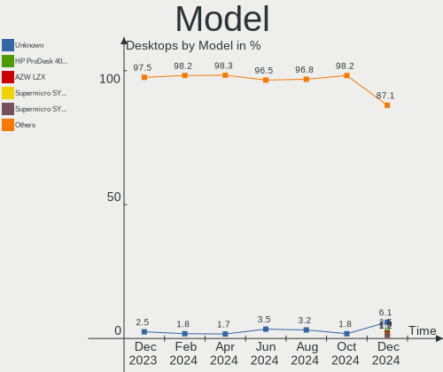
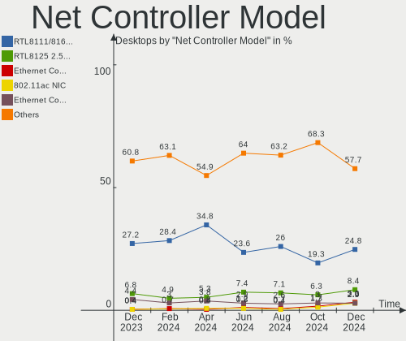
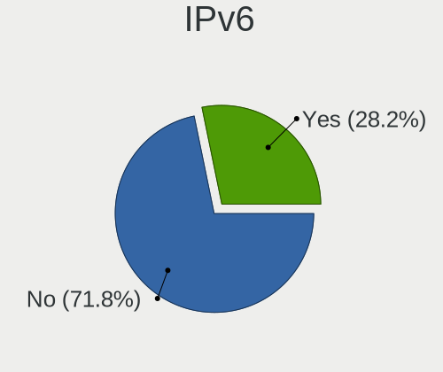

Debian Hardware Trends (Desktops)
---------------------------------

A project to identify most popular hardware characteristics and track their change
over time based on data collected by Debian users at https://Linux-Hardware.org.

Anyone can contribute to this report by the [hw-probe](https://github.com/linuxhw/hw-probe) tool:

    sudo -E hw-probe -all -upload

Full-feature report is available here: https://linux-hardware.org/?view=trends&formfactor=desktop

Period: Sep, 2021.

Contents
--------

* [ System ](#system)
  - [ OS                       ](#os)
  - [ OS Family                ](#os-family)
  - [ Kernel                   ](#kernel)
  - [ Kernel Family            ](#kernel-family)
  - [ Kernel Major Ver.        ](#kernel-major-ver)
  - [ Arch                     ](#arch)
  - [ DE                       ](#de)
  - [ Display Server           ](#display-server)
  - [ Display Manager          ](#display-manager)
  - [ OS Lang                  ](#os-lang)
  - [ Boot Mode                ](#boot-mode)
  - [ Filesystem               ](#filesystem)
  - [ Part. scheme             ](#part-scheme)
  - [ Dual Boot with Linux/BSD ](#dual-boot-with-linuxbsd)
  - [ Dual Boot (Win)          ](#dual-boot-win)

* [ Board ](#board)
  - [ Vendor                   ](#vendor)
  - [ Model                    ](#model)
  - [ Model Family             ](#model-family)
  - [ MFG Year                 ](#mfg-year)
  - [ Form Factor              ](#form-factor)
  - [ Secure Boot              ](#secure-boot)
  - [ Coreboot                 ](#coreboot)
  - [ RAM Size                 ](#ram-size)
  - [ RAM Used                 ](#ram-used)
  - [ Total Drives             ](#total-drives)
  - [ Has CD-ROM               ](#has-cd-rom)
  - [ Has Ethernet             ](#has-ethernet)
  - [ Has WiFi                 ](#has-wifi)
  - [ Has Bluetooth            ](#has-bluetooth)

* [ Location ](#location)
  - [ Country                  ](#country)
  - [ City                     ](#city)

* [ Drives ](#drives)
  - [ Drive Vendor             ](#drive-vendor)
  - [ Drive Model              ](#drive-model)
  - [ HDD Vendor               ](#hdd-vendor)
  - [ SSD Vendor               ](#ssd-vendor)
  - [ Drive Kind               ](#drive-kind)
  - [ Drive Connector          ](#drive-connector)
  - [ Drive Size               ](#drive-size)
  - [ Space Total              ](#space-total)
  - [ Space Used               ](#space-used)
  - [ Malfunc. Drives          ](#malfunc-drives)
  - [ Malfunc. Drive Vendor    ](#malfunc-drive-vendor)
  - [ Malfunc. HDD Vendor      ](#malfunc-hdd-vendor)
  - [ Malfunc. Drive Kind      ](#malfunc-drive-kind)
  - [ Failed Drives            ](#failed-drives)
  - [ Failed Drive Vendor      ](#failed-drive-vendor)
  - [ Drive Status             ](#drive-status)

* [ Storage controller ](#storage-controller)
  - [ Storage Vendor           ](#storage-vendor)
  - [ Storage Model            ](#storage-model)
  - [ Storage Kind             ](#storage-kind)

* [ Processor ](#processor)
  - [ CPU Vendor               ](#cpu-vendor)
  - [ CPU Model                ](#cpu-model)
  - [ CPU Model Family         ](#cpu-model-family)
  - [ CPU Cores                ](#cpu-cores)
  - [ CPU Sockets              ](#cpu-sockets)
  - [ CPU Threads              ](#cpu-threads)
  - [ CPU Op-Modes             ](#cpu-op-modes)
  - [ CPU Microcode            ](#cpu-microcode)
  - [ CPU Microarch            ](#cpu-microarch)

* [ Graphics ](#graphics)
  - [ GPU Vendor               ](#gpu-vendor)
  - [ GPU Model                ](#gpu-model)
  - [ GPU Combo                ](#gpu-combo)
  - [ GPU Driver               ](#gpu-driver)
  - [ GPU Memory               ](#gpu-memory)

* [ Monitor ](#monitor)
  - [ Monitor Vendor           ](#monitor-vendor)
  - [ Monitor Model            ](#monitor-model)
  - [ Monitor Resolution       ](#monitor-resolution)
  - [ Monitor Diagonal         ](#monitor-diagonal)
  - [ Monitor Width            ](#monitor-width)
  - [ Aspect Ratio             ](#aspect-ratio)
  - [ Monitor Area             ](#monitor-area)
  - [ Pixel Density            ](#pixel-density)
  - [ Multiple Monitors        ](#multiple-monitors)

* [ Network ](#network)
  - [ Net Controller Vendor    ](#net-controller-vendor)
  - [ Net Controller Model     ](#net-controller-model)
  - [ Wireless Vendor          ](#wireless-vendor)
  - [ Wireless Model           ](#wireless-model)
  - [ Ethernet Vendor          ](#ethernet-vendor)
  - [ Ethernet Model           ](#ethernet-model)
  - [ Net Controller Kind      ](#net-controller-kind)
  - [ Used Controller          ](#used-controller)
  - [ NICs                     ](#nics)
  - [ IPv6                     ](#ipv6)

* [ Bluetooth ](#bluetooth)
  - [ Bluetooth Vendor         ](#bluetooth-vendor)
  - [ Bluetooth Model          ](#bluetooth-model)

* [ Sound ](#sound)
  - [ Sound Vendor             ](#sound-vendor)
  - [ Sound Model              ](#sound-model)

* [ Memory ](#memory)
  - [ Memory Vendor            ](#memory-vendor)
  - [ Memory Model             ](#memory-model)
  - [ Memory Kind              ](#memory-kind)
  - [ Memory Form Factor       ](#memory-form-factor)
  - [ Memory Size              ](#memory-size)
  - [ Memory Speed             ](#memory-speed)

* [ Printers & scanners ](#printers--scanners)
  - [ Printer Vendor           ](#printer-vendor)
  - [ Printer Model            ](#printer-model)
  - [ Scanner Vendor           ](#scanner-vendor)
  - [ Scanner Model            ](#scanner-model)

* [ Camera ](#camera)
  - [ Camera Vendor            ](#camera-vendor)
  - [ Camera Model             ](#camera-model)

* [ Security ](#security)
  - [ Fingerprint Vendor       ](#fingerprint-vendor)
  - [ Fingerprint Model        ](#fingerprint-model)
  - [ Chipcard Vendor          ](#chipcard-vendor)
  - [ Chipcard Model           ](#chipcard-model)

* [ Unsupported ](#unsupported)
  - [ Unsupported Devices      ](#unsupported-devices)
  - [ Unsupported Device Types ](#unsupported-device-types)

System
------

OS
--

Installed operating systems

| Name            | Desktops | Percent |
|-----------------|----------|---------|
| Debian 11       | 137      | 84.57%  |
| Debian 10       | 11       | 6.79%   |
| Debian Testing  | 8        | 4.94%   |
| Debian 9        | 3        | 1.85%   |
| Debian Unstable | 2        | 1.23%   |
| Debian 8        | 1        | 0.62%   |

OS Family
---------

OS without a version

| Name   | Desktops | Percent |
|--------|----------|---------|
| Debian | 162      | 100%    |

Kernel
------

Version of the Linux kernel

| Version                    | Desktops | Percent |
|----------------------------|----------|---------|
| 5.10.0-7-amd64             | 69       | 42.59%  |
| 5.10.0-8-amd64             | 65       | 40.12%  |
| 4.19.0-17-amd64            | 6        | 3.7%    |
| 5.11.22-4-pve              | 3        | 1.85%   |
| 5.10.0-5mx-amd64           | 2        | 1.23%   |
| 5.9.0-4-amd64              | 1        | 0.62%   |
| 5.4.148                    | 1        | 0.62%   |
| 5.4.140-1-pve              | 1        | 0.62%   |
| 5.2.0-0.bpo.2-amd64        | 1        | 0.62%   |
| 5.14.3-xanmod1-edge        | 1        | 0.62%   |
| 5.14.0-trunk-amd64         | 1        | 0.62%   |
| 5.14.0-1-amd64             | 1        | 0.62%   |
| 5.13.13-arch1-1            | 1        | 0.62%   |
| 5.13.0-13.1-liquorix-amd64 | 1        | 0.62%   |
| 5.13.0-12.1-liquorix-amd64 | 1        | 0.62%   |
| 5.10.0-8-686-pae           | 1        | 0.62%   |
| 5.10.0-5-amd64             | 1        | 0.62%   |
| 5.10.0-0.bpo.5-amd64       | 1        | 0.62%   |
| 4.9.0-7-amd64              | 1        | 0.62%   |
| 4.9.0-16-amd64             | 1        | 0.62%   |
| 4.19.0-6-amd64             | 1        | 0.62%   |
| 4.1.42-rivoreo-powerpc64   | 1        | 0.62%   |

Kernel Family
-------------

Linux kernel without a distro release

| Version | Desktops | Percent |
|---------|----------|---------|
| 5.10.0  | 139      | 85.8%   |
| 4.19.0  | 7        | 4.32%   |
| 5.11.22 | 3        | 1.85%   |
| 5.14.0  | 2        | 1.23%   |
| 5.13.0  | 2        | 1.23%   |
| 4.9.0   | 2        | 1.23%   |
| 5.9.0   | 1        | 0.62%   |
| 5.4.148 | 1        | 0.62%   |
| 5.4.140 | 1        | 0.62%   |
| 5.2.0   | 1        | 0.62%   |
| 5.14.3  | 1        | 0.62%   |
| 5.13.13 | 1        | 0.62%   |
| 4.1.42  | 1        | 0.62%   |

Kernel Major Ver.
-----------------

Linux kernel major version

| Version | Desktops | Percent |
|---------|----------|---------|
| 5.10    | 139      | 85.8%   |
| 4.19    | 7        | 4.32%   |
| 5.14    | 3        | 1.85%   |
| 5.13    | 3        | 1.85%   |
| 5.11    | 3        | 1.85%   |
| 5.4     | 2        | 1.23%   |
| 4.9     | 2        | 1.23%   |
| 5.9     | 1        | 0.62%   |
| 5.2     | 1        | 0.62%   |
| 4.1     | 1        | 0.62%   |

Arch
----

OS architecture (x86_64, i586, etc.)

| Name   | Desktops | Percent |
|--------|----------|---------|
| x86_64 | 160      | 98.77%  |
| ppc64  | 1        | 0.62%   |
| i686   | 1        | 0.62%   |

DE
--

Desktop Environment

| Name             | Desktops | Percent |
|------------------|----------|---------|
| Unknown          | 87       | 53.7%   |
| GNOME            | 26       | 16.05%  |
| XFCE             | 18       | 11.11%  |
| KDE5             | 8        | 4.94%   |
| X-Cinnamon       | 5        | 3.09%   |
| LXDE             | 4        | 2.47%   |
| KDE              | 4        | 2.47%   |
| Cinnamon         | 3        | 1.85%   |
| MATE             | 2        | 1.23%   |
| i3               | 2        | 1.23%   |
| lightdm-xsession | 1        | 0.62%   |
| Budgie           | 1        | 0.62%   |
| awesome          | 1        | 0.62%   |

Display Server
--------------

X11 or Wayland

| Name    | Desktops | Percent |
|---------|----------|---------|
| Unknown | 76       | 46.91%  |
| X11     | 61       | 37.65%  |
| Wayland | 15       | 9.26%   |
| Tty     | 10       | 6.17%   |

Display Manager
---------------

SDDM, LightDM, etc.

| Name    | Desktops | Percent |
|---------|----------|---------|
| Unknown | 109      | 67.28%  |
| LightDM | 24       | 14.81%  |
| GDM     | 22       | 13.58%  |
| SDDM    | 7        | 4.32%   |

OS Lang
-------

Language

| Lang    | Desktops | Percent |
|---------|----------|---------|
| ru_RU   | 74       | 45.68%  |
| en_US   | 39       | 24.07%  |
| pt_BR   | 7        | 4.32%   |
| es_ES   | 7        | 4.32%   |
| de_DE   | 6        | 3.7%    |
| fr_FR   | 4        | 2.47%   |
| en_GB   | 4        | 2.47%   |
| en_AU   | 4        | 2.47%   |
| Unknown | 3        | 1.85%   |
| pt_PT   | 2        | 1.23%   |
| nl_BE   | 2        | 1.23%   |
| it_IT   | 2        | 1.23%   |
| tt_RU   | 1        | 0.62%   |
| pl_PL   | 1        | 0.62%   |
| hu_HU   | 1        | 0.62%   |
| es_CO   | 1        | 0.62%   |
| es_AR   | 1        | 0.62%   |
| en_IE   | 1        | 0.62%   |
| el_GR   | 1        | 0.62%   |
| C       | 1        | 0.62%   |

Boot Mode
---------

EFI or BIOS

| Mode | Desktops | Percent |
|------|----------|---------|
| BIOS | 127      | 78.4%   |
| EFI  | 35       | 21.6%   |

Filesystem
----------

Type of filesystem

| Type    | Desktops | Percent |
|---------|----------|---------|
| Overlay | 76       | 46.91%  |
| Ext4    | 73       | 45.06%  |
| Btrfs   | 6        | 3.7%    |
| Zfs     | 3        | 1.85%   |
| Xfs     | 3        | 1.85%   |
| Ext3    | 1        | 0.62%   |

Part. scheme
------------

Scheme of partitioning

| Type    | Desktops | Percent |
|---------|----------|---------|
| MBR     | 93       | 57.41%  |
| GPT     | 47       | 29.01%  |
| Unknown | 22       | 13.58%  |

Dual Boot with Linux/BSD
------------------------

Hosting more than one Linux/BSD

| Dual boot | Desktops | Percent |
|-----------|----------|---------|
| No        | 146      | 90.12%  |
| Yes       | 16       | 9.88%   |

Dual Boot (Win)
---------------

Hosting Linux and Windows

| Dual boot | Desktops | Percent |
|-----------|----------|---------|
| Yes       | 93       | 57.41%  |
| No        | 69       | 42.59%  |

Board
-----

Vendor
------

Motherboard manufacturer

| Name                | Desktops | Percent |
|---------------------|----------|---------|
| ASUSTek Computer    | 62       | 38.27%  |
| Gigabyte Technology | 19       | 11.73%  |
| ECS                 | 16       | 9.88%   |
| ASRock              | 12       | 7.41%   |
| MSI                 | 9        | 5.56%   |
| Hewlett-Packard     | 8        | 4.94%   |
| Dell                | 8        | 4.94%   |
| Intel               | 6        | 3.7%    |
| Foxconn             | 3        | 1.85%   |
| Acer                | 3        | 1.85%   |
| Lenovo              | 2        | 1.23%   |
| Unknown             | 2        | 1.23%   |
| Wistron             | 1        | 0.62%   |
| Supermicro          | 1        | 0.62%   |
| Positivo            | 1        | 0.62%   |
| Pegatron            | 1        | 0.62%   |
| Libretrend          | 1        | 0.62%   |
| HC                  | 1        | 0.62%   |
| Fujitsu Siemens     | 1        | 0.62%   |
| Fujitsu             | 1        | 0.62%   |
| Digiboard           | 1        | 0.62%   |
| Biostar             | 1        | 0.62%   |
| ASRockRack          | 1        | 0.62%   |
| AOpen               | 1        | 0.62%   |

Model
-----

Motherboard model

| Name                                   | Desktops | Percent |
|----------------------------------------|----------|---------|
| ASUS All Series                        | 19       | 11.73%  |
| ECS H61H2-M13                          | 13       | 8.02%   |
| ASUS P8H67-M                           | 7        | 4.32%   |
| ASUS P8H61-M LX3 PLUS R2.0             | 7        | 4.32%   |
| ECS G31T-M9                            | 3        | 1.85%   |
| ASUS PRIME A320M-K                     | 3        | 1.85%   |
| MSI MS-7817                            | 2        | 1.23%   |
| MSI MS-7721                            | 2        | 1.23%   |
| Gigabyte H81M-S2V                      | 2        | 1.23%   |
| Gigabyte H61M-DS2                      | 2        | 1.23%   |
| Dell OptiPlex 3020                     | 2        | 1.23%   |
| ASUS PRIME X570-PRO                    | 2        | 1.23%   |
| ASUS P6T DELUXE V2                     | 2        | 1.23%   |
| ASRock H470M-HVS                       | 2        | 1.23%   |
| Unknown                                | 2        | 1.23%   |
| Wistron ProLiant ML110 G6              | 1        | 0.62%   |
| Supermicro X9SCL/X9SCM                 | 1        | 0.62%   |
| Positivo POS-PIQ77CL                   | 1        | 0.62%   |
| Pegatron NP267AA-A2L e9180f            | 1        | 0.62%   |
| MSI MS-7C06                            | 1        | 0.62%   |
| MSI MS-7B49                            | 1        | 0.62%   |
| MSI MS-7A34                            | 1        | 0.62%   |
| MSI MS-7996                            | 1        | 0.62%   |
| MSI MS-7971                            | 1        | 0.62%   |
| Libretrend LT1000                      | 1        | 0.62%   |
| Lenovo ThinkStation S20 4105L1U        | 1        | 0.62%   |
| Lenovo S510 10KY002BUS                 | 1        | 0.62%   |
| Intel HASWELLREFRESHDT                 | 1        | 0.62%   |
| Intel DQ35JO AAD82085-800              | 1        | 0.62%   |
| Intel DN2820FYK H24582-201             | 1        | 0.62%   |
| Intel DH77KC AAG39641-400              | 1        | 0.62%   |
| Intel DH67CL AAG10212-210              | 1        | 0.62%   |
| Intel DH67CL AAG10212-205              | 1        | 0.62%   |
| HP Z640 Workstation                    | 1        | 0.62%   |
| HP ProLiant MicroServer                | 1        | 0.62%   |
| HP Pavilion 590-p0069 Desktop Rfrbd PC | 1        | 0.62%   |
| HP OMEN 25L Desktop GT12-0xxx          | 1        | 0.62%   |
| HP EliteDesk 800 G3 TWR                | 1        | 0.62%   |
| HP EliteDesk 800 G1 SFF                | 1        | 0.62%   |
| HP EliteDesk 705 G1 DM                 | 1        | 0.62%   |
| HP Compaq 6005 Pro MT PC               | 1        | 0.62%   |
| HC HCAR357-MI                          | 1        | 0.62%   |
| Gigabyte Z97X-Gaming 3                 | 1        | 0.62%   |
| Gigabyte Z77X-UP5 TH-CF                | 1        | 0.62%   |
| Gigabyte Z390 AORUS ELITE              | 1        | 0.62%   |
| Gigabyte Q270M-D3H                     | 1        | 0.62%   |
| Gigabyte P35-DS3                       | 1        | 0.62%   |
| Gigabyte M61PME-S2P                    | 1        | 0.62%   |
| Gigabyte H81M-S                        | 1        | 0.62%   |
| Gigabyte H81M-H                        | 1        | 0.62%   |
| Gigabyte H61M-DS2 REV 1.2              | 1        | 0.62%   |
| Gigabyte GEG                           | 1        | 0.62%   |
| Gigabyte GB-XERDR1-00                  | 1        | 0.62%   |
| Gigabyte GA-990FXA-UD3                 | 1        | 0.62%   |
| Gigabyte C246-WU4                      | 1        | 0.62%   |
| Gigabyte B450M DS3H                    | 1        | 0.62%   |
| Gigabyte B450 I AORUS PRO WIFI         | 1        | 0.62%   |
| Fujitsu Siemens CELSIUS M460           | 1        | 0.62%   |
| Fujitsu ESPRIMO P3521                  | 1        | 0.62%   |
| Foxconn p6-2081be                      | 1        | 0.62%   |

Model Family
------------

Motherboard model prefix

| Name                    | Desktops | Percent |
|-------------------------|----------|---------|
| ASUS All                | 19       | 11.73%  |
| ECS H61H2-M13           | 13       | 8.02%   |
| ASUS PRIME              | 9        | 5.56%   |
| ASUS P8H67-M            | 8        | 4.94%   |
| ASUS P8H61-M            | 8        | 4.94%   |
| Dell OptiPlex           | 5        | 3.09%   |
| ASUS TUF                | 4        | 2.47%   |
| HP EliteDesk            | 3        | 1.85%   |
| Gigabyte H61M-DS2       | 3        | 1.85%   |
| ECS G31T-M9             | 3        | 1.85%   |
| MSI MS-7817             | 2        | 1.23%   |
| MSI MS-7721             | 2        | 1.23%   |
| Intel DH67CL            | 2        | 1.23%   |
| Gigabyte H81M-S2V       | 2        | 1.23%   |
| Dell Precision          | 2        | 1.23%   |
| ASUS P6T                | 2        | 1.23%   |
| ASRock H470M-HVS        | 2        | 1.23%   |
| Acer Aspire             | 2        | 1.23%   |
| Unknown                 | 2        | 1.23%   |
| Wistron ProLiant        | 1        | 0.62%   |
| Supermicro X9SCL        | 1        | 0.62%   |
| Positivo POS-PIQ77CL    | 1        | 0.62%   |
| Pegatron NP267AA-A2L    | 1        | 0.62%   |
| MSI MS-7C06             | 1        | 0.62%   |
| MSI MS-7B49             | 1        | 0.62%   |
| MSI MS-7A34             | 1        | 0.62%   |
| MSI MS-7996             | 1        | 0.62%   |
| MSI MS-7971             | 1        | 0.62%   |
| Libretrend LT1000       | 1        | 0.62%   |
| Lenovo ThinkStation     | 1        | 0.62%   |
| Lenovo S510             | 1        | 0.62%   |
| Intel HASWELLREFRESHDT  | 1        | 0.62%   |
| Intel DQ35JO            | 1        | 0.62%   |
| Intel DN2820FYK         | 1        | 0.62%   |
| Intel DH77KC            | 1        | 0.62%   |
| HP Z640                 | 1        | 0.62%   |
| HP ProLiant             | 1        | 0.62%   |
| HP Pavilion             | 1        | 0.62%   |
| HP OMEN                 | 1        | 0.62%   |
| HP Compaq               | 1        | 0.62%   |
| HC HCAR357-MI           | 1        | 0.62%   |
| Gigabyte Z97X-Gaming    | 1        | 0.62%   |
| Gigabyte Z77X-UP5       | 1        | 0.62%   |
| Gigabyte Z390           | 1        | 0.62%   |
| Gigabyte Q270M-D3H      | 1        | 0.62%   |
| Gigabyte P35-DS3        | 1        | 0.62%   |
| Gigabyte M61PME-S2P     | 1        | 0.62%   |
| Gigabyte H81M-S         | 1        | 0.62%   |
| Gigabyte H81M-H         | 1        | 0.62%   |
| Gigabyte GEG            | 1        | 0.62%   |
| Gigabyte GB-XERDR1-00   | 1        | 0.62%   |
| Gigabyte GA-990FXA-UD3  | 1        | 0.62%   |
| Gigabyte C246-WU4       | 1        | 0.62%   |
| Gigabyte B450M          | 1        | 0.62%   |
| Gigabyte B450           | 1        | 0.62%   |
| Fujitsu Siemens CELSIUS | 1        | 0.62%   |
| Fujitsu ESPRIMO         | 1        | 0.62%   |
| Foxconn p6-2081be       | 1        | 0.62%   |
| Foxconn nT-A3000        | 1        | 0.62%   |
| Foxconn H61MXL          | 1        | 0.62%   |

MFG Year
--------

Motherboard manufacture year

| Year    | Desktops | Percent |
|---------|----------|---------|
| 2011    | 31       | 19.14%  |
| 2014    | 22       | 13.58%  |
| 2012    | 16       | 9.88%   |
| 2020    | 14       | 8.64%   |
| 2021    | 12       | 7.41%   |
| 2019    | 12       | 7.41%   |
| 2015    | 10       | 6.17%   |
| 2010    | 10       | 6.17%   |
| 2009    | 9        | 5.56%   |
| 2018    | 8        | 4.94%   |
| 2016    | 6        | 3.7%    |
| 2013    | 5        | 3.09%   |
| 2017    | 2        | 1.23%   |
| 2008    | 2        | 1.23%   |
| 2007    | 1        | 0.62%   |
| 2005    | 1        | 0.62%   |
| Unknown | 1        | 0.62%   |

Form Factor
-----------

Physical design of the computer

| Name    | Desktops | Percent |
|---------|----------|---------|
| Desktop | 162      | 100%    |

Secure Boot
-----------

Enabled or disabled

| State    | Desktops | Percent |
|----------|----------|---------|
| Disabled | 159      | 98.15%  |
| Enabled  | 3        | 1.85%   |

Coreboot
--------

Have coreboot on board

| Used | Desktops | Percent |
|------|----------|---------|
| No   | 161      | 99.38%  |
| Yes  | 1        | 0.62%   |

RAM Size
--------

Total RAM memory

| Size in GB      | Desktops | Percent |
|-----------------|----------|---------|
| 3.01-4.0        | 40       | 24.69%  |
| 4.01-8.0        | 35       | 21.6%   |
| 8.01-16.0       | 31       | 19.14%  |
| 16.01-24.0      | 19       | 11.73%  |
| 32.01-64.0      | 15       | 9.26%   |
| 1.01-2.0        | 9        | 5.56%   |
| 64.01-256.0     | 8        | 4.94%   |
| More than 256.0 | 2        | 1.23%   |
| 2.01-3.0        | 2        | 1.23%   |
| Unknown         | 1        | 0.62%   |

RAM Used
--------

Used RAM memory

| Used GB    | Desktops | Percent |
|------------|----------|---------|
| 0.51-1.0   | 79       | 48.77%  |
| 4.01-8.0   | 20       | 12.35%  |
| 1.01-2.0   | 19       | 11.73%  |
| 2.01-3.0   | 17       | 10.49%  |
| 3.01-4.0   | 13       | 8.02%   |
| 8.01-16.0  | 7        | 4.32%   |
| 16.01-24.0 | 3        | 1.85%   |
| 0.01-0.5   | 3        | 1.85%   |
| Unknown    | 1        | 0.62%   |

Total Drives
------------

Number of drives on board

| Drives | Desktops | Percent |
|--------|----------|---------|
| 1      | 97       | 59.88%  |
| 2      | 29       | 17.9%   |
| 3      | 13       | 8.02%   |
| 4      | 11       | 6.79%   |
| 5      | 4        | 2.47%   |
| 7      | 3        | 1.85%   |
| 6      | 3        | 1.85%   |
| 8      | 1        | 0.62%   |
| 0      | 1        | 0.62%   |

Has CD-ROM
----------

Has CD-ROM on board

| Presented | Desktops | Percent |
|-----------|----------|---------|
| No        | 108      | 66.67%  |
| Yes       | 54       | 33.33%  |

Has Ethernet
------------

Has Ethernet on board

| Presented | Desktops | Percent |
|-----------|----------|---------|
| Yes       | 162      | 100%    |

Has WiFi
--------

Has WiFi module

| Presented | Desktops | Percent |
|-----------|----------|---------|
| No        | 127      | 78.4%   |
| Yes       | 35       | 21.6%   |

Has Bluetooth
-------------

Has Bluetooth module

| Presented | Desktops | Percent |
|-----------|----------|---------|
| No        | 140      | 86.42%  |
| Yes       | 22       | 13.58%  |

Location
--------

Country
-------

Geographic location (country)

| Country    | Desktops | Percent |
|------------|----------|---------|
| Russia     | 75       | 46.3%   |
| USA        | 20       | 12.35%  |
| Germany    | 10       | 6.17%   |
| Brazil     | 9        | 5.56%   |
| Spain      | 7        | 4.32%   |
| Australia  | 5        | 3.09%   |
| Portugal   | 4        | 2.47%   |
| France     | 4        | 2.47%   |
| Italy      | 3        | 1.85%   |
| Belgium    | 3        | 1.85%   |
| UK         | 2        | 1.23%   |
| Sweden     | 2        | 1.23%   |
| Poland     | 2        | 1.23%   |
| Hungary    | 2        | 1.23%   |
| China      | 2        | 1.23%   |
| Romania    | 1        | 0.62%   |
| Pakistan   | 1        | 0.62%   |
| Latvia     | 1        | 0.62%   |
| Iran       | 1        | 0.62%   |
| Greece     | 1        | 0.62%   |
| Colombia   | 1        | 0.62%   |
| Canada     | 1        | 0.62%   |
| Bolivia    | 1        | 0.62%   |
| Belarus    | 1        | 0.62%   |
| Bangladesh | 1        | 0.62%   |
| Austria    | 1        | 0.62%   |
| Argentina  | 1        | 0.62%   |

City
----

Geographic location (city)

| City                       | Desktops | Percent |
|----------------------------|----------|---------|
| Voronezh                   | 69       | 42.59%  |
| S??o Paulo                 | 3        | 1.85%   |
| Portland                   | 3        | 1.85%   |
| Moscow                     | 3        | 1.85%   |
| M??laga                    | 3        | 1.85%   |
| Yarraville                 | 2        | 1.23%   |
| Osnabr??ck                 | 2        | 1.23%   |
| New Orleans                | 2        | 1.23%   |
| Lisbon                     | 2        | 1.23%   |
| Berlin                     | 2        | 1.23%   |
| Zibo                       | 1        | 0.62%   |
| Wroclaw                    | 1        | 0.62%   |
| Warminster                 | 1        | 0.62%   |
| Waregem                    | 1        | 0.62%   |
| Vologda                    | 1        | 0.62%   |
| Vienna                     | 1        | 0.62%   |
| Valencia                   | 1        | 0.62%   |
| Ustron                     | 1        | 0.62%   |
| Tucson                     | 1        | 0.62%   |
| Trinidad                   | 1        | 0.62%   |
| Trieste                    | 1        | 0.62%   |
| Tehran                     | 1        | 0.62%   |
| Sydney                     | 1        | 0.62%   |
| Sueca                      | 1        | 0.62%   |
| Stockholm                  | 1        | 0.62%   |
| St Petersburg              | 1        | 0.62%   |
| Soudos                     | 1        | 0.62%   |
| Shanghai                   | 1        | 0.62%   |
| Sevastopol'                | 1        | 0.62%   |
| Schildow                   | 1        | 0.62%   |
| Sao Teotonio               | 1        | 0.62%   |
| Saint-Maurice-de-Lignon    | 1        | 0.62%   |
| Rueil-Malmaison            | 1        | 0.62%   |
| Roseville                  | 1        | 0.62%   |
| Rome                       | 1        | 0.62%   |
| Rio de Janeiro             | 1        | 0.62%   |
| Riga                       | 1        | 0.62%   |
| Rheine                     | 1        | 0.62%   |
| Pompano Beach              | 1        | 0.62%   |
| Pittsford                  | 1        | 0.62%   |
| Paris                      | 1        | 0.62%   |
| Overland Park              | 1        | 0.62%   |
| Ottawa                     | 1        | 0.62%   |
| Ondina                     | 1        | 0.62%   |
| Nuremberg                  | 1        | 0.62%   |
| Niles                      | 1        | 0.62%   |
| Newbury                    | 1        | 0.62%   |
| Nantes                     | 1        | 0.62%   |
| Nadudvar                   | 1        | 0.62%   |
| Modena                     | 1        | 0.62%   |
| Midvale                    | 1        | 0.62%   |
| Melbourne                  | 1        | 0.62%   |
| Leipzig                    | 1        | 0.62%   |
| Las Palmas de Gran Canaria | 1        | 0.62%   |
| Lahoysk                    | 1        | 0.62%   |
| Kelkheim (Taunus)          | 1        | 0.62%   |
| Kassel                     | 1        | 0.62%   |
| Karlskoga                  | 1        | 0.62%   |
| Kamoke                     | 1        | 0.62%   |
| Jandira                    | 1        | 0.62%   |

Drives
------

Drive Vendor
------------

Hard drive vendors

| Vendor              | Desktops | Drives | Percent |
|---------------------|----------|--------|---------|
| WDC                 | 54       | 75     | 22.5%   |
| Seagate             | 42       | 56     | 17.5%   |
| Samsung Electronics | 36       | 50     | 15%     |
| Hitachi             | 17       | 18     | 7.08%   |
| Toshiba             | 14       | 16     | 5.83%   |
| Kingston            | 14       | 15     | 5.83%   |
| SanDisk             | 8        | 9      | 3.33%   |
| Intel               | 7        | 8      | 2.92%   |
| HGST                | 7        | 8      | 2.92%   |
| Crucial             | 7        | 9      | 2.92%   |
| MAXTOR              | 4        | 4      | 1.67%   |
| A-DATA Technology   | 4        | 4      | 1.67%   |
| XPG                 | 2        | 3      | 0.83%   |
| Silicon Motion      | 2        | 2      | 0.83%   |
| Patriot             | 2        | 2      | 0.83%   |
| Netac               | 2        | 2      | 0.83%   |
| Mushkin             | 2        | 2      | 0.83%   |
| Corsair             | 2        | 3      | 0.83%   |
| SPCC                | 1        | 1      | 0.42%   |
| SK Hynix            | 1        | 2      | 0.42%   |
| PLEXTOR             | 1        | 1      | 0.42%   |
| OCZ                 | 1        | 1      | 0.42%   |
| KING                | 1        | 1      | 0.42%   |
| Intenso             | 1        | 1      | 0.42%   |
| Hewlett-Packard     | 1        | 2      | 0.42%   |
| Hajaan              | 1        | 1      | 0.42%   |
| GOODRAM             | 1        | 1      | 0.42%   |
| Gigabyte Technology | 1        | 2      | 0.42%   |
| China               | 1        | 1      | 0.42%   |
| ASMT                | 1        | 2      | 0.42%   |
| ASMedia             | 1        | 1      | 0.42%   |
| 2-Power             | 1        | 1      | 0.42%   |

Drive Model
-----------

Hard drive models

| Model                            | Desktops | Percent |
|----------------------------------|----------|---------|
| WDC WD5000AAKX-60U6AA0 500GB     | 15       | 5.49%   |
| Hitachi HDS721050DLE630 500GB    | 10       | 3.66%   |
| Seagate ST1000DM003-9YN162 1TB   | 8        | 2.93%   |
| WDC WD2500AAKX-00ERMA0 250GB     | 7        | 2.56%   |
| Seagate ST500DM002-1BD142 500GB  | 6        | 2.2%    |
| Seagate ST1000DM010-2EP102 1TB   | 5        | 1.83%   |
| Samsung SSD 970 EVO Plus 1TB     | 5        | 1.83%   |
| Samsung SSD 860 EVO 250GB        | 5        | 1.83%   |
| Toshiba DT01ACA050 500GB         | 4        | 1.47%   |
| Samsung SSD 870 EVO 500GB        | 4        | 1.47%   |
| Hitachi HDS721050CLA362 500GB    | 4        | 1.47%   |
| WDC WD1002FAEX-00Z3A0 1TB        | 3        | 1.1%    |
| Toshiba HDWD110 1TB              | 3        | 1.1%    |
| Seagate ST1000DM003-1ER162 1TB   | 3        | 1.1%    |
| Samsung SSD 860 EVO 500GB        | 3        | 1.1%    |
| Samsung NVMe SSD Drive 1TB       | 3        | 1.1%    |
| MAXTOR STM3500320AS 500GB        | 3        | 1.1%    |
| Kingston SA400S37240G 240GB SSD  | 3        | 1.1%    |
| Seagate ST4000DM000-1F2168 4TB   | 2        | 0.73%   |
| Seagate ST31000528AS 1TB         | 2        | 0.73%   |
| SanDisk SSD PLUS 480GB           | 2        | 0.73%   |
| Samsung SSD 970 EVO Plus 500GB   | 2        | 0.73%   |
| Samsung SSD 850 EVO 500GB        | 2        | 0.73%   |
| Netac SSD 240GB                  | 2        | 0.73%   |
| Kingston SV300S37A240G 240GB SSD | 2        | 0.73%   |
| Kingston SV300S37A120G 120GB SSD | 2        | 0.73%   |
| Kingston SUV400S37240G 240GB SSD | 2        | 0.73%   |
| Kingston SUV400S37120G 120GB SSD | 2        | 0.73%   |
| Intel SSDPEKNW010T8 1TB          | 2        | 0.73%   |
| Hitachi HDS721010KLA330 1TB      | 2        | 0.73%   |
| HGST HUS726T4TALA6L4 4TB         | 2        | 0.73%   |
| Crucial CT500MX500SSD1 500GB     | 2        | 0.73%   |
| Crucial CT2000MX500SSD1 2TB      | 2        | 0.73%   |
| Crucial CT1000MX500SSD1 1TB      | 2        | 0.73%   |
| XPG NVMe SSD Drive 1024GB        | 1        | 0.37%   |
| XPG GAMMIX S50 1TB               | 1        | 0.37%   |
| WDC WUH721818ALE6L4 18TB         | 1        | 0.37%   |
| WDC WDS500G3X0C-00SJG0 500GB     | 1        | 0.37%   |
| WDC WDS500G1B0C-00S6U0 500GB     | 1        | 0.37%   |
| WDC WDS250G2B0B-00YS70 250GB SSD | 1        | 0.37%   |
| WDC WDS250G2B0A-00SM50 250GB SSD | 1        | 0.37%   |
| WDC WDS100T1B0A-00H9H0 1TB SSD   | 1        | 0.37%   |
| WDC WDBNCE5000PNC 500GB SSD      | 1        | 0.37%   |
| WDC WD82PURZ-85TEUY0 8TB         | 1        | 0.37%   |
| WDC WD7500AAVS-00D7B1 752GB      | 1        | 0.37%   |
| WDC WD6400BPVT-22HXZT3 640GB     | 1        | 0.37%   |
| WDC WD60EFRX-68MYMN1 6TB         | 1        | 0.37%   |
| WDC WD5000BEVT-24A0RT0 500GB     | 1        | 0.37%   |
| WDC WD5000AZLX-60K2TA0 500GB     | 1        | 0.37%   |
| WDC WD5000AAKX-22ERMA0 500GB     | 1        | 0.37%   |
| WDC WD5000AAKX-221CA1 500GB      | 1        | 0.37%   |
| WDC WD5000AAKX-00ERMA0 500GB     | 1        | 0.37%   |
| WDC WD5000AAKX-001CA0 500GB      | 1        | 0.37%   |
| WDC WD4003FRYZ-01F0DB0 4TB       | 1        | 0.37%   |
| WDC WD3200AAKS-00YGA0 320GB      | 1        | 0.37%   |
| WDC WD3200AAJS-07M0A0 320GB      | 1        | 0.37%   |
| WDC WD30EZRX-00D8PB0 3TB         | 1        | 0.37%   |
| WDC WD20EZRX-00DC0B0 2TB         | 1        | 0.37%   |
| WDC WD20EARS-00MVWB0 2TB         | 1        | 0.37%   |
| WDC WD2005FBYZ-01YCBB2 2TB       | 1        | 0.37%   |

HDD Vendor
----------

Hard disk drive vendors

| Vendor              | Desktops | Drives | Percent |
|---------------------|----------|--------|---------|
| WDC                 | 51       | 69     | 36.69%  |
| Seagate             | 42       | 56     | 30.22%  |
| Hitachi             | 17       | 18     | 12.23%  |
| Toshiba             | 13       | 15     | 9.35%   |
| HGST                | 7        | 8      | 5.04%   |
| MAXTOR              | 4        | 4      | 2.88%   |
| Samsung Electronics | 3        | 3      | 2.16%   |
| Hewlett-Packard     | 1        | 2      | 0.72%   |
| ASMT                | 1        | 2      | 0.72%   |

SSD Vendor
----------

Solid state drive vendors

| Vendor              | Desktops | Drives | Percent |
|---------------------|----------|--------|---------|
| Samsung Electronics | 25       | 29     | 32.05%  |
| Kingston            | 14       | 15     | 17.95%  |
| SanDisk             | 7        | 8      | 8.97%   |
| Crucial             | 6        | 7      | 7.69%   |
| WDC                 | 4        | 4      | 5.13%   |
| Intel               | 3        | 3      | 3.85%   |
| A-DATA Technology   | 3        | 3      | 3.85%   |
| Netac               | 2        | 2      | 2.56%   |
| Mushkin             | 2        | 2      | 2.56%   |
| Toshiba             | 1        | 1      | 1.28%   |
| SPCC                | 1        | 1      | 1.28%   |
| PLEXTOR             | 1        | 1      | 1.28%   |
| Patriot             | 1        | 1      | 1.28%   |
| OCZ                 | 1        | 1      | 1.28%   |
| KING                | 1        | 1      | 1.28%   |
| Hajaan              | 1        | 1      | 1.28%   |
| GOODRAM             | 1        | 1      | 1.28%   |
| Corsair             | 1        | 1      | 1.28%   |
| China               | 1        | 1      | 1.28%   |
| ASMedia             | 1        | 1      | 1.28%   |
| 2-Power             | 1        | 1      | 1.28%   |

Drive Kind
----------

HDD or SSD

| Kind    | Desktops | Drives | Percent |
|---------|----------|--------|---------|
| HDD     | 129      | 177    | 58.11%  |
| SSD     | 69       | 85     | 31.08%  |
| NVMe    | 23       | 41     | 10.36%  |
| Unknown | 1        | 1      | 0.45%   |

Drive Connector
---------------

SATA, SAS, NVMe, etc.

| Type | Desktops | Drives | Percent |
|------|----------|--------|---------|
| SATA | 157      | 257    | 85.79%  |
| NVMe | 23       | 41     | 12.57%  |
| SAS  | 3        | 6      | 1.64%   |

Drive Size
----------

Size of hard drive

| Size in TB | Desktops | Drives | Percent |
|------------|----------|--------|---------|
| 0.01-0.5   | 120      | 142    | 58.25%  |
| 0.51-1.0   | 49       | 61     | 23.79%  |
| 1.01-2.0   | 16       | 20     | 7.77%   |
| 3.01-4.0   | 10       | 15     | 4.85%   |
| 4.01-10.0  | 5        | 9      | 2.43%   |
| 10.01-20.0 | 4        | 13     | 1.94%   |
| 2.01-3.0   | 2        | 2      | 0.97%   |

Space Total
-----------

Amount of disk space available on the file system

| Size in GB     | Desktops | Percent |
|----------------|----------|---------|
| Unknown        | 73       | 45.06%  |
| 101-250        | 23       | 14.2%   |
| More than 3000 | 20       | 12.35%  |
| 501-1000       | 13       | 8.02%   |
| 251-500        | 12       | 7.41%   |
| 1001-2000      | 9        | 5.56%   |
| 1-20           | 5        | 3.09%   |
| 2001-3000      | 3        | 1.85%   |
| 51-100         | 3        | 1.85%   |
| 21-50          | 1        | 0.62%   |

Space Used
----------

Amount of used disk space

| Used GB        | Desktops | Percent |
|----------------|----------|---------|
| Unknown        | 73       | 45.06%  |
| 1-20           | 30       | 18.52%  |
| 101-250        | 13       | 8.02%   |
| More than 3000 | 10       | 6.17%   |
| 501-1000       | 9        | 5.56%   |
| 2001-3000      | 7        | 4.32%   |
| 51-100         | 7        | 4.32%   |
| 1001-2000      | 5        | 3.09%   |
| 21-50          | 4        | 2.47%   |
| 251-500        | 3        | 1.85%   |
| 0              | 1        | 0.62%   |

Malfunc. Drives
---------------

Drive models with a malfunction

| Model                             | Desktops | Drives | Percent |
|-----------------------------------|----------|--------|---------|
| WDC WD5000AAKX-60U6AA0 500GB      | 12       | 12     | 22.64%  |
| Hitachi HDS721050DLE630 500GB     | 5        | 5      | 9.43%   |
| Seagate ST1000DM003-9YN162 1TB    | 3        | 3      | 5.66%   |
| Seagate ST500DM002-1BD142 500GB   | 2        | 2      | 3.77%   |
| Seagate ST31000528AS 1TB          | 2        | 2      | 3.77%   |
| Hitachi HDS721050CLA362 500GB     | 2        | 2      | 3.77%   |
| WDC WD6400BPVT-22HXZT3 640GB      | 1        | 1      | 1.89%   |
| WDC WD5000AAKX-221CA1 500GB       | 1        | 1      | 1.89%   |
| WDC WD2500AAKX-00ERMA0 250GB      | 1        | 1      | 1.89%   |
| WDC WD20EARS-00MVWB0 2TB          | 1        | 1      | 1.89%   |
| WDC WD10EARS-00Y5B1 1TB           | 1        | 1      | 1.89%   |
| WDC WD1002FAEX-00Z3A0 1TB         | 1        | 1      | 1.89%   |
| Toshiba DT01ACA100 1TB            | 1        | 1      | 1.89%   |
| SK Hynix PC401 NVMe 512GB         | 1        | 2      | 1.89%   |
| Seagate ST3500418AS 500GB         | 1        | 1      | 1.89%   |
| Seagate ST3320620AS 320GB         | 1        | 1      | 1.89%   |
| Seagate ST3320613AS 320GB         | 1        | 1      | 1.89%   |
| Seagate ST3250310AS 250GB         | 1        | 1      | 1.89%   |
| Seagate ST1000DM003-1ER162 1TB    | 1        | 1      | 1.89%   |
| Seagate ST10000NE0004-1ZF101 10TB | 1        | 1      | 1.89%   |
| Samsung Electronics HM160HI 160GB | 1        | 1      | 1.89%   |
| MAXTOR STM3500320AS 500GB         | 1        | 1      | 1.89%   |
| MAXTOR STM3250310AS 250GB         | 1        | 1      | 1.89%   |
| Kingston SV300S37A120G 120GB SSD  | 1        | 1      | 1.89%   |
| Intel SSDSC2KF256H6L 256GB        | 1        | 1      | 1.89%   |
| Intel SSDPEKKW256G7 256GB         | 1        | 1      | 1.89%   |
| Hitachi HTS545032B9A300 320GB     | 1        | 1      | 1.89%   |
| Hitachi HDS721010KLA330 1TB       | 1        | 1      | 1.89%   |
| HGST HTS545050A7E680 500GB        | 1        | 1      | 1.89%   |
| Corsair Force LS SSD 64GB         | 1        | 1      | 1.89%   |
| A-DATA Technology SX8200PNP 1TB   | 1        | 1      | 1.89%   |
| A-DATA Technology SU650 240GB SSD | 1        | 1      | 1.89%   |
| A-DATA Technology SP600 64GB SSD  | 1        | 1      | 1.89%   |

Malfunc. Drive Vendor
---------------------

Vendors of faulty drives

| Vendor              | Desktops | Drives | Percent |
|---------------------|----------|--------|---------|
| WDC                 | 18       | 18     | 34.62%  |
| Seagate             | 12       | 13     | 23.08%  |
| Hitachi             | 9        | 9      | 17.31%  |
| A-DATA Technology   | 3        | 3      | 5.77%   |
| MAXTOR              | 2        | 2      | 3.85%   |
| Intel               | 2        | 2      | 3.85%   |
| Toshiba             | 1        | 1      | 1.92%   |
| SK Hynix            | 1        | 2      | 1.92%   |
| Samsung Electronics | 1        | 1      | 1.92%   |
| Kingston            | 1        | 1      | 1.92%   |
| HGST                | 1        | 1      | 1.92%   |
| Corsair             | 1        | 1      | 1.92%   |

Malfunc. HDD Vendor
-------------------

Vendors of faulty HDD drives

| Vendor              | Desktops | Drives | Percent |
|---------------------|----------|--------|---------|
| WDC                 | 18       | 18     | 40.91%  |
| Seagate             | 12       | 13     | 27.27%  |
| Hitachi             | 9        | 9      | 20.45%  |
| MAXTOR              | 2        | 2      | 4.55%   |
| Toshiba             | 1        | 1      | 2.27%   |
| Samsung Electronics | 1        | 1      | 2.27%   |
| HGST                | 1        | 1      | 2.27%   |

Malfunc. Drive Kind
-------------------

Kinds of faulty drives

| Kind | Desktops | Drives | Percent |
|------|----------|--------|---------|
| HDD  | 42       | 45     | 84%     |
| SSD  | 5        | 5      | 10%     |
| NVMe | 3        | 4      | 6%      |

Failed Drives
-------------

Failed drive models

Zero info for selected period =(

Failed Drive Vendor
-------------------

Failed drive vendors

Zero info for selected period =(

Drive Status
------------

Number of failed and malfunc. drives

| Status   | Desktops | Drives | Percent |
|----------|----------|--------|---------|
| Works    | 104      | 197    | 59.09%  |
| Malfunc  | 47       | 54     | 26.7%   |
| Detected | 25       | 53     | 14.2%   |

Storage controller
------------------

Storage Vendor
--------------

Storage controller vendors

| Vendor                        | Desktops | Percent |
|-------------------------------|----------|---------|
| Intel                         | 124      | 59.05%  |
| AMD                           | 36       | 17.14%  |
| Samsung Electronics           | 12       | 5.71%   |
| VIA Technologies              | 8        | 3.81%   |
| Marvell Technology Group      | 7        | 3.33%   |
| Sandisk                       | 3        | 1.43%   |
| JMicron Technology            | 3        | 1.43%   |
| ASMedia Technology            | 3        | 1.43%   |
| ADATA Technology              | 3        | 1.43%   |
| Silicon Motion                | 2        | 0.95%   |
| Phison Electronics            | 2        | 0.95%   |
| Nvidia                        | 2        | 0.95%   |
| SK Hynix                      | 1        | 0.48%   |
| Micron/Crucial Technology     | 1        | 0.48%   |
| LSI Logic / Symbios Logic     | 1        | 0.48%   |
| Integrated Technology Express | 1        | 0.48%   |
| IBM                           | 1        | 0.48%   |

Storage Model
-------------

Storage controller models

| Model                                                                                   | Desktops | Percent |
|-----------------------------------------------------------------------------------------|----------|---------|
| Intel 8 Series/C220 Series Chipset Family 6-port SATA Controller 1 [AHCI mode]          | 29       | 10.94%  |
| AMD FCH SATA Controller [AHCI mode]                                                     | 23       | 8.68%   |
| Intel 6 Series/C200 Series Chipset Family 6 port Desktop SATA AHCI Controller           | 21       | 7.92%   |
| Intel 6 Series/C200 Series Chipset Family Desktop SATA Controller (IDE mode, ports 4-5) | 17       | 6.42%   |
| Intel 6 Series/C200 Series Chipset Family Desktop SATA Controller (IDE mode, ports 0-3) | 17       | 6.42%   |
| Samsung NVMe SSD Controller SM981/PM981/PM983                                           | 10       | 3.77%   |
| VIA VT6415 PATA IDE Host Controller                                                     | 8        | 3.02%   |
| Intel 82801JI (ICH10 Family) SATA AHCI Controller                                       | 8        | 3.02%   |
| Intel NM10/ICH7 Family SATA Controller [IDE mode]                                       | 7        | 2.64%   |
| AMD SB7x0/SB8x0/SB9x0 IDE Controller                                                    | 7        | 2.64%   |
| AMD 400 Series Chipset SATA Controller                                                  | 7        | 2.64%   |
| Intel 82801G (ICH7 Family) IDE Controller                                               | 6        | 2.26%   |
| Intel Q170/Q150/B150/H170/H110/Z170/CM236 Chipset SATA Controller [AHCI Mode]           | 5        | 1.89%   |
| Intel 7 Series/C210 Series Chipset Family 6-port SATA Controller [AHCI mode]            | 5        | 1.89%   |
| Intel 200 Series PCH SATA controller [AHCI mode]                                        | 5        | 1.89%   |
| AMD SB7x0/SB8x0/SB9x0 SATA Controller [AHCI mode]                                       | 5        | 1.89%   |
| Intel SATA Controller [RAID mode]                                                       | 4        | 1.51%   |
| JMicron JMB363 SATA/IDE Controller                                                      | 3        | 1.13%   |
| Intel Cannon Lake PCH SATA AHCI Controller                                              | 3        | 1.13%   |
| AMD SB7x0/SB8x0/SB9x0 SATA Controller [IDE mode]                                        | 3        | 1.13%   |
| AMD FCH SATA Controller D                                                               | 3        | 1.13%   |
| Sandisk WD Blue SN500 / PC SN520 NVMe SSD                                               | 2        | 0.75%   |
| Samsung NVMe SSD Controller PM9A1/PM9A3/980PRO                                          | 2        | 0.75%   |
| Nvidia MCP61 SATA Controller                                                            | 2        | 0.75%   |
| Nvidia MCP61 IDE                                                                        | 2        | 0.75%   |
| Marvell Group 88SE9230 PCIe 2.0 x2 4-port SATA 6 Gb/s RAID Controller                   | 2        | 0.75%   |
| Marvell Group 88SE9172 SATA 6Gb/s Controller                                            | 2        | 0.75%   |
| Marvell Group 88SE6111/6121 SATA II / PATA Controller                                   | 2        | 0.75%   |
| Intel Volume Management Device NVMe RAID Controller                                     | 2        | 0.75%   |
| Intel SSD 660P Series                                                                   | 2        | 0.75%   |
| Intel SSD 600P Series                                                                   | 2        | 0.75%   |
| Intel Comet Lake SATA AHCI Controller                                                   | 2        | 0.75%   |
| Intel Atom Processor E3800 Series SATA AHCI Controller                                  | 2        | 0.75%   |
| Intel 82801IR/IO/IH (ICH9R/DO/DH) 6 port SATA Controller [AHCI mode]                    | 2        | 0.75%   |
| Intel 4 Series Chipset PT IDER Controller                                               | 2        | 0.75%   |
| ASMedia ASM1062 Serial ATA Controller                                                   | 2        | 0.75%   |
| AMD Starship/Matisse Chipset SATA Controller [AHCI mode]                                | 2        | 0.75%   |
| AMD 300 Series Chipset SATA Controller                                                  | 2        | 0.75%   |
| ADATA XPG SX8200 Pro PCIe Gen3x4 M.2 2280 Solid State Drive                             | 2        | 0.75%   |
| SK Hynix PC401 NVMe Solid State Drive 256GB                                             | 1        | 0.38%   |
| Silicon Motion SM2263EN/SM2263XT SSD Controller                                         | 1        | 0.38%   |
| Silicon Motion SM2262/SM2262EN SSD Controller                                           | 1        | 0.38%   |
| Sandisk WD Black SN750 / PC SN730 NVMe SSD                                              | 1        | 0.38%   |
| Samsung NVMe SSD Controller PM173X                                                      | 1        | 0.38%   |
| Phison NVMe Storage Controller                                                          | 1        | 0.38%   |
| Phison E16 PCIe4 NVMe Controller                                                        | 1        | 0.38%   |
| Micron/Crucial P1 NVMe PCIe SSD                                                         | 1        | 0.38%   |
| Marvell Group 88SE9215 PCIe 2.0 x1 4-port SATA 6 Gb/s Controller                        | 1        | 0.38%   |
| Marvell Group 88SE6101/6102 single-port PATA133 interface                               | 1        | 0.38%   |
| LSI Logic / Symbios Logic SAS1068E PCI-Express Fusion-MPT SAS                           | 1        | 0.38%   |
| Intel Sunrise Point-LP SATA Controller [AHCI mode]                                      | 1        | 0.38%   |
| Intel Celeron/Pentium Silver Processor SATA Controller                                  | 1        | 0.38%   |
| Intel C610/X99 series chipset sSATA Controller [AHCI mode]                              | 1        | 0.38%   |
| Intel C610/X99 series chipset 6-Port SATA Controller [AHCI mode]                        | 1        | 0.38%   |
| Intel Atom processor C2000 AHCI SATA3 Controller                                        | 1        | 0.38%   |
| Intel Atom processor C2000 AHCI SATA2 Controller                                        | 1        | 0.38%   |
| Intel 9 Series Chipset Family SATA Controller [AHCI Mode]                               | 1        | 0.38%   |
| Intel 82801JD/DO (ICH10 Family) SATA AHCI Controller                                    | 1        | 0.38%   |
| Intel 82801IBM/IEM (ICH9M/ICH9M-E) 4 port SATA Controller [AHCI mode]                   | 1        | 0.38%   |
| Intel 82801IB (ICH9) 2 port SATA Controller [IDE mode]                                  | 1        | 0.38%   |

Storage Kind
------------

Kind of storage controller (IDE, SATA, NVMe, SAS, ...)

| Kind | Desktops | Percent |
|------|----------|---------|
| SATA | 127      | 61.65%  |
| IDE  | 48       | 23.3%   |
| NVMe | 23       | 11.17%  |
| RAID | 7        | 3.4%    |
| SCSI | 1        | 0.49%   |

Processor
---------

CPU Vendor
----------

Processor vendors

| Vendor            | Desktops | Percent |
|-------------------|----------|---------|
| Intel             | 123      | 75.93%  |
| AMD               | 38       | 23.46%  |
| CHRP IBM,8233-E8B | 1        | 0.62%   |

CPU Model
---------

Processor models

| Model                                          | Desktops | Percent |
|------------------------------------------------|----------|---------|
| Intel Pentium CPU G3420 @ 3.20GHz              | 15       | 9.26%   |
| Intel Pentium CPU G630 @ 2.70GHz               | 14       | 8.64%   |
| Intel Core i5-2300 CPU @ 2.80GHz               | 7        | 4.32%   |
| Intel Core i3-3240 CPU @ 3.40GHz               | 7        | 4.32%   |
| Intel Core i5-4590 CPU @ 3.30GHz               | 4        | 2.47%   |
| Intel Core i3-2100 CPU @ 3.10GHz               | 3        | 1.85%   |
| Intel Core 2 Duo CPU E8400 @ 3.00GHz           | 3        | 1.85%   |
| AMD Ryzen 9 3900X 12-Core Processor            | 3        | 1.85%   |
| Intel Pentium Dual-Core CPU E6500 @ 2.93GHz    | 2        | 1.23%   |
| Intel Core i7-10700 CPU @ 2.90GHz              | 2        | 1.23%   |
| Intel Core i7 CPU 930 @ 2.80GHz                | 2        | 1.23%   |
| Intel Core i5-7500 CPU @ 3.40GHz               | 2        | 1.23%   |
| Intel Core i5-6400 CPU @ 2.70GHz               | 2        | 1.23%   |
| Intel Core i3-4130 CPU @ 3.40GHz               | 2        | 1.23%   |
| Intel Core i3-3220 CPU @ 3.30GHz               | 2        | 1.23%   |
| Intel Core i3-2120 CPU @ 3.30GHz               | 2        | 1.23%   |
| Intel Core 2 Duo CPU E6750 @ 2.66GHz           | 2        | 1.23%   |
| AMD Ryzen 5 5600X 6-Core Processor             | 2        | 1.23%   |
| AMD Ryzen 5 3600 6-Core Processor              | 2        | 1.23%   |
| AMD Ryzen 3 2200G with Radeon Vega Graphics    | 2        | 1.23%   |
| AMD Athlon II X2 270 Processor                 | 2        | 1.23%   |
| AMD A10-9700 RADEON R7, 10 COMPUTE CORES 4C+6G | 2        | 1.23%   |
| Intel Xeon W-2145 CPU @ 3.70GHz                | 1        | 0.62%   |
| Intel Xeon E-2176G CPU @ 3.70GHz               | 1        | 0.62%   |
| Intel Xeon CPU X5650 @ 2.67GHz                 | 1        | 0.62%   |
| Intel Xeon CPU X3460 @ 2.80GHz                 | 1        | 0.62%   |
| Intel Xeon CPU W3530 @ 2.80GHz                 | 1        | 0.62%   |
| Intel Xeon CPU E5-2690 v3 @ 2.60GHz            | 1        | 0.62%   |
| Intel Xeon CPU E31240 @ 3.30GHz                | 1        | 0.62%   |
| Intel Pentium Dual-Core CPU E5800 @ 3.20GHz    | 1        | 0.62%   |
| Intel Pentium Dual-Core CPU E5400 @ 2.70GHz    | 1        | 0.62%   |
| Intel Pentium CPU G620 @ 2.60GHz               | 1        | 0.62%   |
| Intel Pentium CPU G4400 @ 3.30GHz              | 1        | 0.62%   |
| Intel Pentium CPU G3250 @ 3.20GHz              | 1        | 0.62%   |
| Intel Pentium CPU G3220 @ 3.00GHz              | 1        | 0.62%   |
| Intel Pentium 4 CPU 3.40GHz                    | 1        | 0.62%   |
| Intel Core i9-9980XE CPU @ 3.00GHz             | 1        | 0.62%   |
| Intel Core i9-9900K CPU @ 3.60GHz              | 1        | 0.62%   |
| Intel Core i7-9700K CPU @ 3.60GHz              | 1        | 0.62%   |
| Intel Core i7-6700 CPU @ 3.40GHz               | 1        | 0.62%   |
| Intel Core i7-6500U CPU @ 2.50GHz              | 1        | 0.62%   |
| Intel Core i7-4790K CPU @ 4.00GHz              | 1        | 0.62%   |
| Intel Core i7-4770TE CPU @ 2.30GHz             | 1        | 0.62%   |
| Intel Core i7-4770K CPU @ 3.50GHz              | 1        | 0.62%   |
| Intel Core i7-3770 CPU @ 3.40GHz               | 1        | 0.62%   |
| Intel Core i7-2600K CPU @ 3.40GHz              | 1        | 0.62%   |
| Intel Core i7-2600 CPU @ 3.40GHz               | 1        | 0.62%   |
| Intel Core i7-10700F CPU @ 2.90GHz             | 1        | 0.62%   |
| Intel Core i7 CPU 920 @ 2.67GHz                | 1        | 0.62%   |
| Intel Core i5-7400 CPU @ 3.00GHz               | 1        | 0.62%   |
| Intel Core i5-6500 CPU @ 3.20GHz               | 1        | 0.62%   |
| Intel Core i5-4590S CPU @ 3.00GHz              | 1        | 0.62%   |
| Intel Core i5-4570 CPU @ 3.20GHz               | 1        | 0.62%   |
| Intel Core i5-4440 CPU @ 3.10GHz               | 1        | 0.62%   |
| Intel Core i5-3570 CPU @ 3.40GHz               | 1        | 0.62%   |
| Intel Core i5-2400 CPU @ 3.10GHz               | 1        | 0.62%   |
| Intel Core i3-8350K CPU @ 4.00GHz              | 1        | 0.62%   |
| Intel Core i3-4350 CPU @ 3.60GHz               | 1        | 0.62%   |
| Intel Core i3-10100 CPU @ 3.60GHz              | 1        | 0.62%   |
| Intel Core 2 Quad CPU Q9550 @ 2.83GHz          | 1        | 0.62%   |

CPU Model Family
----------------

Processor model prefix

| Model                   | Desktops | Percent |
|-------------------------|----------|---------|
| Intel Pentium           | 33       | 20.37%  |
| Intel Core i5           | 22       | 13.58%  |
| Intel Core i3           | 19       | 11.73%  |
| Intel Core i7           | 15       | 9.26%   |
| Intel Core 2 Duo        | 9        | 5.56%   |
| AMD Ryzen 5             | 8        | 4.94%   |
| Intel Xeon              | 7        | 4.32%   |
| Intel Celeron           | 6        | 3.7%    |
| AMD Ryzen 9             | 5        | 3.09%   |
| Intel Pentium Dual-Core | 4        | 2.47%   |
| Intel Core 2 Quad       | 3        | 1.85%   |
| AMD Ryzen 3             | 3        | 1.85%   |
| AMD A10                 | 3        | 1.85%   |
| Other                   | 2        | 1.23%   |
| Intel Core i9           | 2        | 1.23%   |
| AMD Ryzen 7             | 2        | 1.23%   |
| AMD FX                  | 2        | 1.23%   |
| AMD E                   | 2        | 1.23%   |
| AMD Athlon II X2        | 2        | 1.23%   |
| AMD A8                  | 2        | 1.23%   |
| AMD A6                  | 2        | 1.23%   |
| Intel Pentium 4         | 1        | 0.62%   |
| Intel Atom              | 1        | 0.62%   |
| AMD Ryzen Threadripper  | 1        | 0.62%   |
| AMD Phenom II X4        | 1        | 0.62%   |
| AMD Phenom II X3        | 1        | 0.62%   |
| AMD EPYC                | 1        | 0.62%   |
| AMD Athlon II Neo       | 1        | 0.62%   |
| AMD Athlon 64 X2        | 1        | 0.62%   |
| AMD Athlon              | 1        | 0.62%   |

CPU Cores
---------

Number of processor cores

| Number | Desktops | Percent |
|--------|----------|---------|
| 2      | 80       | 49.38%  |
| 4      | 49       | 30.25%  |
| 8      | 9        | 5.56%   |
| 6      | 8        | 4.94%   |
| 12     | 5        | 3.09%   |
| 1      | 4        | 2.47%   |
| 3      | 3        | 1.85%   |
| 32     | 1        | 0.62%   |
| 24     | 1        | 0.62%   |
| 18     | 1        | 0.62%   |
| 16     | 1        | 0.62%   |

CPU Sockets
-----------

Number of sockets

| Number | Desktops | Percent |
|--------|----------|---------|
| 1      | 161      | 99.38%  |
| 2      | 1        | 0.62%   |

CPU Threads
-----------

Threads per core (Hyper-Threading)

| Number | Desktops | Percent |
|--------|----------|---------|
| 1      | 92       | 56.79%  |
| 2      | 69       | 42.59%  |
| 4      | 1        | 0.62%   |

CPU Op-Modes
------------

CPU Operation Modes (32-bit, 64-bit)

| Op mode        | Desktops | Percent |
|----------------|----------|---------|
| 32-bit, 64-bit | 162      | 100%    |

CPU Microcode
-------------

Microcode number

| Number     | Desktops | Percent |
|------------|----------|---------|
| 0x206a7    | 31       | 19.14%  |
| 0x306c3    | 30       | 18.52%  |
| Unknown    | 27       | 16.67%  |
| 0x306a9    | 10       | 6.17%   |
| 0x1067a    | 8        | 4.94%   |
| 0x506e3    | 5        | 3.09%   |
| 0x08701021 | 5        | 3.09%   |
| 0x010000c8 | 4        | 2.47%   |
| 0xa0655    | 2        | 1.23%   |
| 0x906e9    | 2        | 1.23%   |
| 0x6fb      | 2        | 1.23%   |
| 0x106a5    | 2        | 1.23%   |
| 0x0a201016 | 2        | 1.23%   |
| 0x08101016 | 2        | 1.23%   |
| 0x0600611a | 2        | 1.23%   |
| 0xf43      | 1        | 0.62%   |
| 0xa0671    | 1        | 0.62%   |
| 0xa0653    | 1        | 0.62%   |
| 0x906ed    | 1        | 0.62%   |
| 0x906ec    | 1        | 0.62%   |
| 0x906eb    | 1        | 0.62%   |
| 0x906ea    | 1        | 0.62%   |
| 0x706a1    | 1        | 0.62%   |
| 0x6fd      | 1        | 0.62%   |
| 0x50654    | 1        | 0.62%   |
| 0x306f2    | 1        | 0.62%   |
| 0x30673    | 1        | 0.62%   |
| 0x206c2    | 1        | 0.62%   |
| 0x106e5    | 1        | 0.62%   |
| 0x106a4    | 1        | 0.62%   |
| 0x10677    | 1        | 0.62%   |
| 0x0a201009 | 1        | 0.62%   |
| 0x08301039 | 1        | 0.62%   |
| 0x08108109 | 1        | 0.62%   |
| 0x0800820d | 1        | 0.62%   |
| 0x08001138 | 1        | 0.62%   |
| 0x08001137 | 1        | 0.62%   |
| 0x06003109 | 1        | 0.62%   |
| 0x0600110f | 1        | 0.62%   |
| 0x06000822 | 1        | 0.62%   |
| 0x05000101 | 1        | 0.62%   |
| 0x05000028 | 1        | 0.62%   |
| 0x010000b6 | 1        | 0.62%   |

CPU Microarch
-------------

Microarchitecture

| Name          | Desktops | Percent |
|---------------|----------|---------|
| SandyBridge   | 33       | 20.37%  |
| Haswell       | 32       | 19.75%  |
| Penryn        | 12       | 7.41%   |
| IvyBridge     | 11       | 6.79%   |
| Zen 2         | 8        | 4.94%   |
| Skylake       | 8        | 4.94%   |
| KabyLake      | 7        | 4.32%   |
| Zen           | 6        | 3.7%    |
| Nehalem       | 5        | 3.09%   |
| K10           | 5        | 3.09%   |
| Core          | 4        | 2.47%   |
| CometLake     | 4        | 2.47%   |
| Zen+          | 3        | 1.85%   |
| Zen 3         | 3        | 1.85%   |
| Steamroller   | 3        | 1.85%   |
| Silvermont    | 3        | 1.85%   |
| Piledriver    | 3        | 1.85%   |
| Excavator     | 2        | 1.23%   |
| Bobcat        | 2        | 1.23%   |
| Unknown       | 2        | 1.23%   |
| Westmere      | 1        | 0.62%   |
| NetBurst      | 1        | 0.62%   |
| K8 Hammer     | 1        | 0.62%   |
| Jaguar        | 1        | 0.62%   |
| Goldmont plus | 1        | 0.62%   |
| Bulldozer     | 1        | 0.62%   |

Graphics
--------

GPU Vendor
----------

Vendors of graphics cards

| Vendor                     | Desktops | Percent |
|----------------------------|----------|---------|
| Nvidia                     | 72       | 41.86%  |
| Intel                      | 60       | 34.88%  |
| AMD                        | 35       | 20.35%  |
| Matrox Electronics Systems | 3        | 1.74%   |
| ASPEED Technology          | 2        | 1.16%   |

GPU Model
---------

Graphics card models

| Model                                                                       | Desktops | Percent |
|-----------------------------------------------------------------------------|----------|---------|
| Intel Xeon E3-1200 v3/4th Gen Core Processor Integrated Graphics Controller | 18       | 10.34%  |
| Nvidia GF108 [GeForce GT 630]                                               | 14       | 8.05%   |
| Intel 2nd Generation Core Processor Family Integrated Graphics Controller   | 12       | 6.9%    |
| Intel Xeon E3-1200 v2/3rd Gen Core processor Graphics Controller            | 9        | 5.17%   |
| Nvidia GF108 [GeForce GT 730]                                               | 8        | 4.6%    |
| Nvidia GF108 [GeForce GT 430]                                               | 8        | 4.6%    |
| Nvidia GK208B [GeForce GT 710]                                              | 4        | 2.3%    |
| Intel 82G33/G31 Express Integrated Graphics Controller                      | 4        | 2.3%    |
| Intel 4 Series Chipset Integrated Graphics Controller                       | 4        | 2.3%    |
| AMD Raven Ridge [Radeon Vega Series / Radeon Vega Mobile Series]            | 4        | 2.3%    |
| Nvidia GP108 [GeForce GT 1030]                                              | 3        | 1.72%   |
| AMD Ellesmere [Radeon RX 470/480/570/570X/580/580X/590]                     | 3        | 1.72%   |
| Nvidia TU106 [GeForce RTX 2060 Rev. A]                                      | 2        | 1.15%   |
| Nvidia TU104 [GeForce RTX 2080 SUPER]                                       | 2        | 1.15%   |
| Nvidia TU104 [GeForce RTX 2070 SUPER]                                       | 2        | 1.15%   |
| Nvidia GM206GL [Quadro M2000]                                               | 2        | 1.15%   |
| Nvidia G92 [GeForce GTS 250]                                                | 2        | 1.15%   |
| Intel HD Graphics 630                                                       | 2        | 1.15%   |
| Intel HD Graphics 530                                                       | 2        | 1.15%   |
| Intel Atom Processor Z36xxx/Z37xxx Series Graphics & Display                | 2        | 1.15%   |
| Intel 4th Generation Core Processor Family Integrated Graphics Controller   | 2        | 1.15%   |
| ASPEED Technology ASPEED Graphics Family                                    | 2        | 1.15%   |
| AMD RV710 [Radeon HD 4350/4550]                                             | 2        | 1.15%   |
| AMD Kaveri [Radeon R5 Graphics]                                             | 2        | 1.15%   |
| Nvidia TU116 [GeForce GTX 1660]                                             | 1        | 0.57%   |
| Nvidia TU116 [GeForce GTX 1660 Ti]                                          | 1        | 0.57%   |
| Nvidia TU106 [GeForce GTX 1650]                                             | 1        | 0.57%   |
| Nvidia TU102 [GeForce RTX 2080 Ti Rev. A]                                   | 1        | 0.57%   |
| Nvidia NV43 [GeForce 6600]                                                  | 1        | 0.57%   |
| Nvidia NV41GL [Quadro FX 1400]                                              | 1        | 0.57%   |
| Nvidia GT215 [GeForce GT 240]                                               | 1        | 0.57%   |
| Nvidia GP106 [GeForce GTX 1060 6GB]                                         | 1        | 0.57%   |
| Nvidia GP104 [GeForce GTX 1070]                                             | 1        | 0.57%   |
| Nvidia GM206 [GeForce GTX 960]                                              | 1        | 0.57%   |
| Nvidia GM107 [GeForce GTX 750]                                              | 1        | 0.57%   |
| Nvidia GM107 [GeForce GTX 750 Ti]                                           | 1        | 0.57%   |
| Nvidia GK208B [GeForce GT 720]                                              | 1        | 0.57%   |
| Nvidia GK107 [GeForce GTX 650]                                              | 1        | 0.57%   |
| Nvidia GK107 [GeForce GT 640]                                               | 1        | 0.57%   |
| Nvidia GK104 [GeForce GTX 760]                                              | 1        | 0.57%   |
| Nvidia GK104 [GeForce GTX 670]                                              | 1        | 0.57%   |
| Nvidia GF119 [GeForce GT 520]                                               | 1        | 0.57%   |
| Nvidia GF116 [GeForce GTX 550 Ti]                                           | 1        | 0.57%   |
| Nvidia GF114 [GeForce GTX 560 Ti]                                           | 1        | 0.57%   |
| Nvidia GA104 [GeForce RTX 3070]                                             | 1        | 0.57%   |
| Nvidia G96C [GeForce 9500 GT]                                               | 1        | 0.57%   |
| Nvidia G92 [GeForce 9800 GTX+]                                              | 1        | 0.57%   |
| Nvidia G86 [GeForce 8500 GT]                                                | 1        | 0.57%   |
| Nvidia C61 [GeForce 6150SE nForce 430]                                      | 1        | 0.57%   |
| Matrox Electronics Systems Millennium G550                                  | 1        | 0.57%   |
| Matrox Electronics Systems MGA G200eW WPCM450                               | 1        | 0.57%   |
| Matrox Electronics Systems MGA G200e [Pilot] ServerEngines (SEP1)           | 1        | 0.57%   |
| Intel Skylake GT2 [HD Graphics 520]                                         | 1        | 0.57%   |
| Intel Mobile 4 Series Chipset Integrated Graphics Controller                | 1        | 0.57%   |
| Intel GeminiLake [UHD Graphics 600]                                         | 1        | 0.57%   |
| Intel CometLake-S GT2 [UHD Graphics 630]                                    | 1        | 0.57%   |
| Intel CoffeeLake-S GT2 [UHD Graphics 630]                                   | 1        | 0.57%   |
| AMD Wrestler [Radeon HD 6320]                                               | 1        | 0.57%   |
| AMD Wrestler [Radeon HD 6310]                                               | 1        | 0.57%   |
| AMD Wani [Radeon R5/R6/R7 Graphics]                                         | 1        | 0.57%   |

GPU Combo
---------

Combinations of graphics cards

| Name           | Desktops | Percent |
|----------------|----------|---------|
| 1 x Nvidia     | 69       | 42.59%  |
| 1 x Intel      | 50       | 30.86%  |
| 1 x AMD        | 34       | 20.99%  |
| 1 x Matrox     | 3        | 1.85%   |
| Intel + Nvidia | 3        | 1.85%   |
| 1 x ASPEED     | 2        | 1.23%   |
| 2 x AMD        | 1        | 0.62%   |

GPU Driver
----------

Free vs proprietary

| Driver      | Desktops | Percent |
|-------------|----------|---------|
| Unknown     | 74       | 45.68%  |
| Free        | 63       | 38.89%  |
| Proprietary | 25       | 15.43%  |

GPU Memory
----------

Total video memory

| Size in GB | Desktops | Percent |
|------------|----------|---------|
| Unknown    | 118      | 72.84%  |
| 1.01-2.0   | 10       | 6.17%   |
| 0.01-0.5   | 9        | 5.56%   |
| 7.01-8.0   | 7        | 4.32%   |
| 3.01-4.0   | 6        | 3.7%    |
| 0.51-1.0   | 6        | 3.7%    |
| 5.01-6.0   | 3        | 1.85%   |
| 8.01-16.0  | 3        | 1.85%   |

Monitor
-------

Monitor Vendor
--------------

Monitor vendors

| Vendor               | Desktops | Percent |
|----------------------|----------|---------|
| Samsung Electronics  | 18       | 19.78%  |
| Dell                 | 12       | 13.19%  |
| Goldstar             | 6        | 6.59%   |
| Lenovo               | 5        | 5.49%   |
| Hewlett-Packard      | 5        | 5.49%   |
| Unknown              | 4        | 4.4%    |
| Philips              | 4        | 4.4%    |
| BenQ                 | 4        | 4.4%    |
| Ancor Communications | 4        | 4.4%    |
| ViewSonic            | 3        | 3.3%    |
| LG Electronics       | 3        | 3.3%    |
| Iiyama               | 3        | 3.3%    |
| AOC                  | 3        | 3.3%    |
| MStar                | 2        | 2.2%    |
| Fujitsu Siemens      | 2        | 2.2%    |
| Sony                 | 1        | 1.1%    |
| Sangyo               | 1        | 1.1%    |
| RIC                  | 1        | 1.1%    |
| NEC Computers        | 1        | 1.1%    |
| Medion               | 1        | 1.1%    |
| Marantz              | 1        | 1.1%    |
| HXF                  | 1        | 1.1%    |
| HPN                  | 1        | 1.1%    |
| Eizo                 | 1        | 1.1%    |
| CHR                  | 1        | 1.1%    |
| Belinea              | 1        | 1.1%    |
| AU Optronics         | 1        | 1.1%    |
| Acer                 | 1        | 1.1%    |

Monitor Model
-------------

Monitor models

| Model                                                                   | Desktops | Percent |
|-------------------------------------------------------------------------|----------|---------|
| Unknown LCD Monitor FFFF 2288x1287 2550x2550mm 142.0-inch               | 3        | 3.16%   |
| ViewSonic VG730m VSC951E 1280x1024 338x270mm 17.0-inch                  | 2        | 2.11%   |
| MStar TV_MONITOR MST0030 1440x900 1150x650mm 52.0-inch                  | 2        | 2.11%   |
| Lenovo LEN LI2364d LEN65C8 1920x1080 509x286mm 23.0-inch                | 2        | 2.11%   |
| ViewSonic VX3209-2K VSC328E 2560x1440 698x393mm 31.5-inch               | 1        | 1.05%   |
| Unknown LCD Monitor SAMSUNG 1920x1080                                   | 1        | 1.05%   |
| Sony TV SNYE903 1920x1080 1600x900mm 72.3-inch                          | 1        | 1.05%   |
| Sangyo LCD Monitor MT23L 1360x768                                       | 1        | 1.05%   |
| Samsung Electronics U28E590 SAM0C4D 3840x2160 607x345mm 27.5-inch       | 1        | 1.05%   |
| Samsung Electronics U28E570 SAM0D6F 3840x2160 607x345mm 27.5-inch       | 1        | 1.05%   |
| Samsung Electronics SyncMaster SAM0572 1280x1024 376x301mm 19.0-inch    | 1        | 1.05%   |
| Samsung Electronics SyncMaster SAM0564 1024x768 410x230mm 18.5-inch     | 1        | 1.05%   |
| Samsung Electronics SyncMaster SAM0546 1920x1080 510x287mm 23.0-inch    | 1        | 1.05%   |
| Samsung Electronics SyncMaster SAM0524 1920x1080 477x268mm 21.5-inch    | 1        | 1.05%   |
| Samsung Electronics SyncMaster SAM0472 1440x900 367x229mm 17.0-inch     | 1        | 1.05%   |
| Samsung Electronics SyncMaster SAM03E5 1680x1050 470x300mm 22.0-inch    | 1        | 1.05%   |
| Samsung Electronics SyncMaster SAM037C 1680x1050 474x296mm 22.0-inch    | 1        | 1.05%   |
| Samsung Electronics SyncMaster SAM0226 1440x900 410x257mm 19.1-inch     | 1        | 1.05%   |
| Samsung Electronics SyncMaster SAM0152 1280x1024 312x234mm 15.4-inch    | 1        | 1.05%   |
| Samsung Electronics SyncMaster SAM00C8 1280x1024 338x270mm 17.0-inch    | 1        | 1.05%   |
| Samsung Electronics SA300/SA350 SAM078F 1920x1080 477x268mm 21.5-inch   | 1        | 1.05%   |
| Samsung Electronics SA300/350/360 SAM07D6 1920x1080 531x299mm 24.0-inch | 1        | 1.05%   |
| Samsung Electronics S27F350 SAM0D22 1920x1080 598x336mm 27.0-inch       | 1        | 1.05%   |
| Samsung Electronics S24C350 SAM0A3A 1920x1080 531x299mm 24.0-inch       | 1        | 1.05%   |
| Samsung Electronics S23B350 SAM08D6 1920x1080 510x287mm 23.0-inch       | 1        | 1.05%   |
| Samsung Electronics LCD Monitor SAM0A7A 1920x1080 1060x626mm 48.5-inch  | 1        | 1.05%   |
| Samsung Electronics LCD Monitor S27D390                                 | 1        | 1.05%   |
| RIC RPJ-SERIES RIC8210 1280x1024                                        | 1        | 1.05%   |
| Philips PHL 243V5 PHLC0D1 1920x1080 521x293mm 23.5-inch                 | 1        | 1.05%   |
| Philips LCD Monitor PHL 276E8V 7680x2160                                | 1        | 1.05%   |
| Philips LCD Monitor PHL 276E8V                                          | 1        | 1.05%   |
| Philips 220E PHLC02E 1920x1080 476x268mm 21.5-inch                      | 1        | 1.05%   |
| Philips 190SW PHL086D 1440x900 408x255mm 18.9-inch                      | 1        | 1.05%   |
| NEC Computers EA244WMi NEC68D6 1920x1200 519x324mm 24.1-inch            | 1        | 1.05%   |
| Medion MD41077EA MED078B 1280x1024 330x270mm 16.8-inch                  | 1        | 1.05%   |
| Marantz AVR MJI001A 1920x1080 598x336mm 27.0-inch                       | 1        | 1.05%   |
| LG Electronics LCD Monitor LG TV 1920x1080                              | 1        | 1.05%   |
| LG Electronics LCD Monitor 27GN950 3840x2160                            | 1        | 1.05%   |
| LG Electronics LCD Monitor 27GL850 2560x1440                            | 1        | 1.05%   |
| Lenovo Q24i-10 LEN65F3 1920x1080 527x296mm 23.8-inch                    | 1        | 1.05%   |
| Lenovo LEN P24q-20 LEN61F5 2560x1440 527x296mm 23.8-inch                | 1        | 1.05%   |
| Lenovo LEN LT1712p LEN13B7 1280x1024 338x270mm 17.0-inch                | 1        | 1.05%   |
| Iiyama PLX2783H IVM6648 1920x1080 598x336mm 27.0-inch                   | 1        | 1.05%   |
| Iiyama PL2888H IVM7106 1920x1080 621x341mm 27.9-inch                    | 1        | 1.05%   |
| Iiyama PL2288H IVM5633 1920x1080 480x270mm 21.7-inch                    | 1        | 1.05%   |
| HXF PTI-22-01 HXF3150 1920x1080 476x267mm 21.5-inch                     | 1        | 1.05%   |
| HPN LCD Monitor HP 24fh 1920x1080                                       | 1        | 1.05%   |
| Hewlett-Packard LCD Monitor x2301 5120x1080                             | 1        | 1.05%   |
| Hewlett-Packard LA2205 HWP2847 1680x1050 473x296mm 22.0-inch            | 1        | 1.05%   |
| Hewlett-Packard L1950 HWP26E8 1280x1024 380x300mm 19.1-inch             | 1        | 1.05%   |
| Hewlett-Packard E223 HPN345B 1920x1080 476x268mm 21.5-inch              | 1        | 1.05%   |
| Hewlett-Packard E221c HWP3092 1920x1080 497x292mm 22.7-inch             | 1        | 1.05%   |
| Goldstar TV SSCR GSMC0C8 3840x2160 1600x900mm 72.3-inch                 | 1        | 1.05%   |
| Goldstar TV SSCR GSM8080 3840x2160 1600x900mm 72.3-inch                 | 1        | 1.05%   |
| Goldstar LG ULTRAWIDE GSM59F2 1920x1080 800x340mm 34.2-inch             | 1        | 1.05%   |
| Goldstar LG ULTRAWIDE GSM59F1 1920x1080 580x240mm 24.7-inch             | 1        | 1.05%   |
| Goldstar E2240 GSM57A3 1920x1080 477x268mm 21.5-inch                    | 1        | 1.05%   |
| Goldstar 32ML600 GSM772D 1920x1080 480x270mm 21.7-inch                  | 1        | 1.05%   |
| Fujitsu Siemens L22W-7SD FUS0746 1680x1050 474x296mm 22.0-inch          | 1        | 1.05%   |
| Fujitsu Siemens B17-1 FUS0458 1280x1024 340x270mm 17.1-inch             | 1        | 1.05%   |

Monitor Resolution
------------------

Monitor screen resolution

| Resolution         | Desktops | Percent |
|--------------------|----------|---------|
| 1920x1080 (FHD)    | 37       | 41.11%  |
| 1280x1024 (SXGA)   | 15       | 16.67%  |
| 3840x2160 (4K)     | 8        | 8.89%   |
| 2560x1440 (QHD)    | 5        | 5.56%   |
| 1680x1050 (WSXGA+) | 4        | 4.44%   |
| 2288x1287          | 3        | 3.33%   |
| 1440x900 (WXGA+)   | 3        | 3.33%   |
| Unknown            | 3        | 3.33%   |
| 2560x1080          | 2        | 2.22%   |
| 1600x900 (HD+)     | 2        | 2.22%   |
| 1366x768 (WXGA)    | 2        | 2.22%   |
| 1360x768           | 2        | 2.22%   |
| 7680x2160          | 1        | 1.11%   |
| 6400x2160          | 1        | 1.11%   |
| 5120x1080          | 1        | 1.11%   |
| 1920x1200 (WUXGA)  | 1        | 1.11%   |

Monitor Diagonal
----------------

Diagonal size in inches

| Inches  | Desktops | Percent |
|---------|----------|---------|
| 21      | 13       | 14.44%  |
| 24      | 10       | 11.11%  |
| 17      | 10       | 11.11%  |
| Unknown | 10       | 11.11%  |
| 23      | 8        | 8.89%   |
| 27      | 6        | 6.67%   |
| 22      | 5        | 5.56%   |
| 18      | 5        | 5.56%   |
| 19      | 4        | 4.44%   |
| 142     | 3        | 3.33%   |
| 72      | 3        | 3.33%   |
| 52      | 2        | 2.22%   |
| 34      | 2        | 2.22%   |
| 31      | 2        | 2.22%   |
| 20      | 2        | 2.22%   |
| 15      | 2        | 2.22%   |
| 48      | 1        | 1.11%   |
| 32      | 1        | 1.11%   |
| 16      | 1        | 1.11%   |

Monitor Width
-------------

Physical width

| Width in mm    | Desktops | Percent |
|----------------|----------|---------|
| 501-600        | 22       | 25.29%  |
| 401-500        | 22       | 25.29%  |
| 301-350        | 12       | 13.79%  |
| Unknown        | 10       | 11.49%  |
| 351-400        | 5        | 5.75%   |
| 601-700        | 4        | 4.6%    |
| More than 2000 | 3        | 3.45%   |
| 701-800        | 3        | 3.45%   |
| 1501-2000      | 3        | 3.45%   |
| 1001-1500      | 3        | 3.45%   |

Aspect Ratio
------------

Proportional relationship between the width and the height

| Ratio   | Desktops | Percent |
|---------|----------|---------|
| 16/9    | 47       | 55.29%  |
| 5/4     | 12       | 14.12%  |
| 16/10   | 9        | 10.59%  |
| Unknown | 9        | 10.59%  |
| 1.00    | 3        | 3.53%   |
| 6/5     | 2        | 2.35%   |
| 21/9    | 2        | 2.35%   |
| 4/3     | 1        | 1.18%   |

Monitor Area
------------

Area in inch

| Area in inch | Desktops | Percent |
|----------------|----------|---------|
| 201-250        | 27       | 30.68%  |
| 151-200        | 13       | 14.77%  |
| 141-150        | 12       | 13.64%  |
| Unknown        | 10       | 11.36%  |
| More than 1000 | 9        | 10.23%  |
| 301-350        | 6        | 6.82%   |
| 351-500        | 5        | 5.68%   |
| 251-300        | 2        | 2.27%   |
| 131-140        | 2        | 2.27%   |
| 111-120        | 1        | 1.14%   |
| 101-110        | 1        | 1.14%   |

Pixel Density
-------------

Pixels per inch

| Density | Desktops | Percent |
|---------|----------|---------|
| 51-100  | 50       | 57.47%  |
| 101-120 | 14       | 16.09%  |
| Unknown | 10       | 11.49%  |
| 1-50    | 7        | 8.05%   |
| 121-160 | 5        | 5.75%   |
| 161-240 | 1        | 1.15%   |

Multiple Monitors
-----------------

Total monitors connected

| Total | Desktops | Percent |
|-------|----------|---------|
| 0     | 81       | 50%     |
| 1     | 66       | 40.74%  |
| 2     | 15       | 9.26%   |

Network
-------

Net Controller Vendor
---------------------

Controller vendors

| Vendor                          | Desktops | Percent |
|---------------------------------|----------|---------|
| Realtek Semiconductor           | 117      | 59.39%  |
| Intel                           | 40       | 20.3%   |
| Qualcomm Atheros                | 12       | 6.09%   |
| Broadcom                        | 6        | 3.05%   |
| TP-Link                         | 2        | 1.02%   |
| Qualcomm Atheros Communications | 2        | 1.02%   |
| Nvidia                          | 2        | 1.02%   |
| Marvell Technology Group        | 2        | 1.02%   |
| D-Link System                   | 2        | 1.02%   |
| Ralink Technology               | 1        | 0.51%   |
| Ralink                          | 1        | 0.51%   |
| QinHeng Electronics             | 1        | 0.51%   |
| OPPO                            | 1        | 0.51%   |
| Microsoft                       | 1        | 0.51%   |
| IBM                             | 1        | 0.51%   |
| Hokuyo Data Flex for USB        | 1        | 0.51%   |
| Broadcom Limited                | 1        | 0.51%   |
| Belkin Components               | 1        | 0.51%   |
| ASUSTek Computer                | 1        | 0.51%   |
| Aquantia                        | 1        | 0.51%   |
| ADMtek                          | 1        | 0.51%   |

Net Controller Model
--------------------

Controller models

| Model                                                                         | Desktops | Percent |
|-------------------------------------------------------------------------------|----------|---------|
| Realtek RTL8111/8168/8411 PCI Express Gigabit Ethernet Controller             | 93       | 43.26%  |
| Realtek RTL810xE PCI Express Fast Ethernet controller                         | 18       | 8.37%   |
| Intel I211 Gigabit Network Connection                                         | 6        | 2.79%   |
| Intel 82579V Gigabit Network Connection                                       | 4        | 1.86%   |
| Realtek RTL8125 2.5GbE Controller                                             | 3        | 1.4%    |
| Intel I210 Gigabit Network Connection                                         | 3        | 1.4%    |
| Intel Ethernet Connection (2) I219-V                                          | 3        | 1.4%    |
| Realtek RTL8821CE 802.11ac PCIe Wireless Network Adapter                      | 2        | 0.93%   |
| Realtek RTL8153 Gigabit Ethernet Adapter                                      | 2        | 0.93%   |
| Qualcomm Atheros AR9271 802.11n                                               | 2        | 0.93%   |
| Qualcomm Atheros AR928X Wireless Network Adapter (PCI-Express)                | 2        | 0.93%   |
| Qualcomm Atheros AR9285 Wireless Network Adapter (PCI-Express)                | 2        | 0.93%   |
| Nvidia MCP61 Ethernet                                                         | 2        | 0.93%   |
| Marvell Group 88E8056 PCI-E Gigabit Ethernet Controller                       | 2        | 0.93%   |
| Intel Wireless-AC 9260                                                        | 2        | 0.93%   |
| Intel Wi-Fi 6 AX200                                                           | 2        | 0.93%   |
| Intel Ethernet Connection I217-LM                                             | 2        | 0.93%   |
| Intel Ethernet Connection (7) I219-V                                          | 2        | 0.93%   |
| Intel Ethernet Connection (5) I219-LM                                         | 2        | 0.93%   |
| Intel Ethernet Connection (2) I218-LM                                         | 2        | 0.93%   |
| Intel 82579LM Gigabit Network Connection (Lewisville)                         | 2        | 0.93%   |
| Intel 82567LM-3 Gigabit Network Connection                                    | 2        | 0.93%   |
| Intel 82566DM-2 Gigabit Network Connection                                    | 2        | 0.93%   |
| Broadcom NetXtreme BCM5761 Gigabit Ethernet PCIe                              | 2        | 0.93%   |
| Broadcom NetXtreme BCM5723 Gigabit Ethernet PCIe                              | 2        | 0.93%   |
| TP-Link Archer T4UH wireless Realtek 8812AU                                   | 1        | 0.47%   |
| TP-Link 802.11ac WLAN Adapter                                                 | 1        | 0.47%   |
| Realtek RTL88x2bu [AC1200 Techkey]                                            | 1        | 0.47%   |
| Realtek RTL8822BE 802.11a/b/g/n/ac WiFi adapter                               | 1        | 0.47%   |
| Realtek RTL8821AE 802.11ac PCIe Wireless Network Adapter                      | 1        | 0.47%   |
| Realtek RTL8192EE PCIe Wireless Network Adapter                               | 1        | 0.47%   |
| Realtek RTL8191SU 802.11n WLAN Adapter                                        | 1        | 0.47%   |
| Realtek RTL8188EUS 802.11n Wireless Network Adapter                           | 1        | 0.47%   |
| Realtek RTL-8185 IEEE 802.11a/b/g Wireless LAN Controller                     | 1        | 0.47%   |
| Realtek RTL-8100/8101L/8139 PCI Fast Ethernet Adapter                         | 1        | 0.47%   |
| Ralink MT7601U Wireless Adapter                                               | 1        | 0.47%   |
| Ralink RT3090 Wireless 802.11n 1T/1R PCIe                                     | 1        | 0.47%   |
| Qualcomm Atheros Killer E220x Gigabit Ethernet Controller                     | 1        | 0.47%   |
| Qualcomm Atheros AR9485 Wireless Network Adapter                              | 1        | 0.47%   |
| Qualcomm Atheros AR9462 Wireless Network Adapter                              | 1        | 0.47%   |
| Qualcomm Atheros AR93xx Wireless Network Adapter                              | 1        | 0.47%   |
| Qualcomm Atheros AR8151 v2.0 Gigabit Ethernet                                 | 1        | 0.47%   |
| Qualcomm Atheros AR8132 Fast Ethernet                                         | 1        | 0.47%   |
| Qualcomm Atheros AR8121/AR8113/AR8114 Gigabit or Fast Ethernet                | 1        | 0.47%   |
| Qualcomm Atheros AR5212/5213/2414 Wireless Network Adapter                    | 1        | 0.47%   |
| QinHeng USB Single Serial                                                     | 1        | 0.47%   |
| OPPO SDM665-IDP _SN:6A6C23F9                                                  | 1        | 0.47%   |
| Microsoft Xbox 360 Wireless Adapter                                           | 1        | 0.47%   |
| Intel Wireless 8265 / 8275                                                    | 1        | 0.47%   |
| Intel Wireless 7260                                                           | 1        | 0.47%   |
| Intel Ethernet Controller 10G X550T                                           | 1        | 0.47%   |
| Intel Ethernet Connection (7) I219-LM                                         | 1        | 0.47%   |
| Intel Ethernet Connection (2) I219-LM                                         | 1        | 0.47%   |
| Intel Dual Band Wireless-AC 3168NGW [Stone Peak]                              | 1        | 0.47%   |
| Intel Comet Lake PCH CNVi WiFi                                                | 1        | 0.47%   |
| Intel Cannon Lake PCH CNVi WiFi                                               | 1        | 0.47%   |
| Intel 82599ES 10-Gigabit SFI/SFP+ Network Connection                          | 1        | 0.47%   |
| Intel 82574L Gigabit Network Connection                                       | 1        | 0.47%   |
| Intel 82571EB/82571GB Gigabit Ethernet Controller D0/D1 (copper applications) | 1        | 0.47%   |
| Intel 82567V-2 Gigabit Network Connection                                     | 1        | 0.47%   |

Wireless Vendor
---------------

Wireless vendors

| Vendor                          | Desktops | Percent |
|---------------------------------|----------|---------|
| Realtek Semiconductor           | 9        | 23.68%  |
| Intel                           | 9        | 23.68%  |
| Qualcomm Atheros                | 8        | 21.05%  |
| TP-Link                         | 2        | 5.26%   |
| Qualcomm Atheros Communications | 2        | 5.26%   |
| D-Link System                   | 2        | 5.26%   |
| Ralink Technology               | 1        | 2.63%   |
| Ralink                          | 1        | 2.63%   |
| Microsoft                       | 1        | 2.63%   |
| Broadcom                        | 1        | 2.63%   |
| Belkin Components               | 1        | 2.63%   |
| ASUSTek Computer                | 1        | 2.63%   |

Wireless Model
--------------

Wireless models

| Model                                                                     | Desktops | Percent |
|---------------------------------------------------------------------------|----------|---------|
| Realtek RTL8821CE 802.11ac PCIe Wireless Network Adapter                  | 2        | 5.26%   |
| Qualcomm Atheros AR9271 802.11n                                           | 2        | 5.26%   |
| Qualcomm Atheros AR928X Wireless Network Adapter (PCI-Express)            | 2        | 5.26%   |
| Qualcomm Atheros AR9285 Wireless Network Adapter (PCI-Express)            | 2        | 5.26%   |
| Intel Wireless-AC 9260                                                    | 2        | 5.26%   |
| Intel Wi-Fi 6 AX200                                                       | 2        | 5.26%   |
| TP-Link Archer T4UH wireless Realtek 8812AU                               | 1        | 2.63%   |
| TP-Link 802.11ac WLAN Adapter                                             | 1        | 2.63%   |
| Realtek RTL88x2bu [AC1200 Techkey]                                        | 1        | 2.63%   |
| Realtek RTL8822BE 802.11a/b/g/n/ac WiFi adapter                           | 1        | 2.63%   |
| Realtek RTL8821AE 802.11ac PCIe Wireless Network Adapter                  | 1        | 2.63%   |
| Realtek RTL8192EE PCIe Wireless Network Adapter                           | 1        | 2.63%   |
| Realtek RTL8191SU 802.11n WLAN Adapter                                    | 1        | 2.63%   |
| Realtek RTL8188EUS 802.11n Wireless Network Adapter                       | 1        | 2.63%   |
| Realtek RTL-8185 IEEE 802.11a/b/g Wireless LAN Controller                 | 1        | 2.63%   |
| Ralink MT7601U Wireless Adapter                                           | 1        | 2.63%   |
| Ralink RT3090 Wireless 802.11n 1T/1R PCIe                                 | 1        | 2.63%   |
| Qualcomm Atheros AR9485 Wireless Network Adapter                          | 1        | 2.63%   |
| Qualcomm Atheros AR9462 Wireless Network Adapter                          | 1        | 2.63%   |
| Qualcomm Atheros AR93xx Wireless Network Adapter                          | 1        | 2.63%   |
| Qualcomm Atheros AR5212/5213/2414 Wireless Network Adapter                | 1        | 2.63%   |
| Microsoft Xbox 360 Wireless Adapter                                       | 1        | 2.63%   |
| Intel Wireless 8265 / 8275                                                | 1        | 2.63%   |
| Intel Wireless 7260                                                       | 1        | 2.63%   |
| Intel Dual Band Wireless-AC 3168NGW [Stone Peak]                          | 1        | 2.63%   |
| Intel Comet Lake PCH CNVi WiFi                                            | 1        | 2.63%   |
| Intel Cannon Lake PCH CNVi WiFi                                           | 1        | 2.63%   |
| D-Link System DWA-140 RangeBooster N Adapter(rev.B2) [Ralink RT3072]      | 1        | 2.63%   |
| D-Link System AirPlus G DWL-G122 Wireless Adapter(rev.E1) [Ralink RT2070] | 1        | 2.63%   |
| Broadcom BCM4306 802.11b/g Wireless LAN Controller                        | 1        | 2.63%   |
| Belkin Components F5D7050 Wireless G Adapter v4000 [Zydas ZD1211B]        | 1        | 2.63%   |
| ASUS Realtek 8188EUS [USB-N10 Nano]                                       | 1        | 2.63%   |

Ethernet Vendor
---------------

Ethernet vendors

| Vendor                   | Desktops | Percent |
|--------------------------|----------|---------|
| Realtek Semiconductor    | 115      | 68.05%  |
| Intel                    | 35       | 20.71%  |
| Broadcom                 | 6        | 3.55%   |
| Qualcomm Atheros         | 4        | 2.37%   |
| Nvidia                   | 2        | 1.18%   |
| Marvell Technology Group | 2        | 1.18%   |
| OPPO                     | 1        | 0.59%   |
| IBM                      | 1        | 0.59%   |
| Broadcom Limited         | 1        | 0.59%   |
| Aquantia                 | 1        | 0.59%   |
| ADMtek                   | 1        | 0.59%   |

Ethernet Model
--------------

Ethernet models

| Model                                                                         | Desktops | Percent |
|-------------------------------------------------------------------------------|----------|---------|
| Realtek RTL8111/8168/8411 PCI Express Gigabit Ethernet Controller             | 93       | 53.14%  |
| Realtek RTL810xE PCI Express Fast Ethernet controller                         | 18       | 10.29%  |
| Intel I211 Gigabit Network Connection                                         | 6        | 3.43%   |
| Intel 82579V Gigabit Network Connection                                       | 4        | 2.29%   |
| Realtek RTL8125 2.5GbE Controller                                             | 3        | 1.71%   |
| Intel I210 Gigabit Network Connection                                         | 3        | 1.71%   |
| Intel Ethernet Connection (2) I219-V                                          | 3        | 1.71%   |
| Realtek RTL8153 Gigabit Ethernet Adapter                                      | 2        | 1.14%   |
| Nvidia MCP61 Ethernet                                                         | 2        | 1.14%   |
| Marvell Group 88E8056 PCI-E Gigabit Ethernet Controller                       | 2        | 1.14%   |
| Intel Ethernet Connection I217-LM                                             | 2        | 1.14%   |
| Intel Ethernet Connection (7) I219-V                                          | 2        | 1.14%   |
| Intel Ethernet Connection (5) I219-LM                                         | 2        | 1.14%   |
| Intel Ethernet Connection (2) I218-LM                                         | 2        | 1.14%   |
| Intel 82579LM Gigabit Network Connection (Lewisville)                         | 2        | 1.14%   |
| Intel 82567LM-3 Gigabit Network Connection                                    | 2        | 1.14%   |
| Intel 82566DM-2 Gigabit Network Connection                                    | 2        | 1.14%   |
| Broadcom NetXtreme BCM5761 Gigabit Ethernet PCIe                              | 2        | 1.14%   |
| Broadcom NetXtreme BCM5723 Gigabit Ethernet PCIe                              | 2        | 1.14%   |
| Realtek RTL-8100/8101L/8139 PCI Fast Ethernet Adapter                         | 1        | 0.57%   |
| Qualcomm Atheros Killer E220x Gigabit Ethernet Controller                     | 1        | 0.57%   |
| Qualcomm Atheros AR8151 v2.0 Gigabit Ethernet                                 | 1        | 0.57%   |
| Qualcomm Atheros AR8132 Fast Ethernet                                         | 1        | 0.57%   |
| Qualcomm Atheros AR8121/AR8113/AR8114 Gigabit or Fast Ethernet                | 1        | 0.57%   |
| OPPO SDM665-IDP _SN:6A6C23F9                                                  | 1        | 0.57%   |
| Intel Ethernet Controller 10G X550T                                           | 1        | 0.57%   |
| Intel Ethernet Connection (7) I219-LM                                         | 1        | 0.57%   |
| Intel Ethernet Connection (2) I219-LM                                         | 1        | 0.57%   |
| Intel 82599ES 10-Gigabit SFI/SFP+ Network Connection                          | 1        | 0.57%   |
| Intel 82574L Gigabit Network Connection                                       | 1        | 0.57%   |
| Intel 82571EB/82571GB Gigabit Ethernet Controller D0/D1 (copper applications) | 1        | 0.57%   |
| Intel 82567V-2 Gigabit Network Connection                                     | 1        | 0.57%   |
| Intel 82567LF Gigabit Network Connection                                      | 1        | 0.57%   |
| IBM IBM                                                                       | 1        | 0.57%   |
| Broadcom NetXtreme II BCM5709 Gigabit Ethernet                                | 1        | 0.57%   |
| Broadcom NetXtreme BCM5762 Gigabit Ethernet PCIe                              | 1        | 0.57%   |
| Broadcom NetXtreme BCM5755 Gigabit Ethernet PCI Express                       | 1        | 0.57%   |
| Broadcom Limited NetLink BCM5789 Gigabit Ethernet PCI Express                 | 1        | 0.57%   |
| Aquantia AQC107 NBase-T/IEEE 802.3bz Ethernet Controller [AQtion]             | 1        | 0.57%   |
| ADMtek NC100 Network Everywhere Fast Ethernet 10/100                          | 1        | 0.57%   |

Net Controller Kind
-------------------

Ethernet, WiFi or modem

| Kind     | Desktops | Percent |
|----------|----------|---------|
| Ethernet | 162      | 81.41%  |
| WiFi     | 35       | 17.59%  |
| Modem    | 2        | 1.01%   |

Used Controller
---------------

Currently used network controller

| Kind     | Desktops | Percent |
|----------|----------|---------|
| Ethernet | 153      | 85%     |
| WiFi     | 27       | 15%     |

NICs
----

Total network controllers on board

| Total | Desktops | Percent |
|-------|----------|---------|
| 1     | 126      | 77.78%  |
| 2     | 30       | 18.52%  |
| 3     | 5        | 3.09%   |
| 6     | 1        | 0.62%   |

IPv6
----

IPv6 vs IPv4

| Used | Desktops | Percent |
|------|----------|---------|
| No   | 143      | 88.27%  |
| Yes  | 19       | 11.73%  |

Bluetooth
---------

Bluetooth Vendor
----------------

Controller vendors

| Vendor                  | Desktops | Percent |
|-------------------------|----------|---------|
| Intel                   | 9        | 39.13%  |
| Realtek Semiconductor   | 4        | 17.39%  |
| Cambridge Silicon Radio | 4        | 17.39%  |
| Toshiba                 | 1        | 4.35%   |
| Realtek                 | 1        | 4.35%   |
| Qcom                    | 1        | 4.35%   |
| IMC Networks            | 1        | 4.35%   |
| Broadcom                | 1        | 4.35%   |
| ASUSTek Computer        | 1        | 4.35%   |

Bluetooth Model
---------------

Controller models

| Model                                               | Desktops | Percent |
|-----------------------------------------------------|----------|---------|
| Cambridge Silicon Radio Bluetooth Dongle (HCI mode) | 4        | 17.39%  |
| Realtek Bluetooth Radio                             | 3        | 13.04%  |
| Intel Bluetooth Device                              | 3        | 13.04%  |
| Intel Bluetooth wireless interface                  | 2        | 8.7%    |
| Intel AX200 Bluetooth                               | 2        | 8.7%    |
| Toshiba Atheros AR3012 Bluetooth                    | 1        | 4.35%   |
| Realtek  Bluetooth 4.2 Adapter                      | 1        | 4.35%   |
| Realtek Bluetooth Radio                             | 1        | 4.35%   |
| Qcom Bluetooth USB                                  | 1        | 4.35%   |
| Intel Bluetooth 9460/9560 Jefferson Peak (JfP)      | 1        | 4.35%   |
| Intel AX201 Bluetooth                               | 1        | 4.35%   |
| IMC Networks Bluetooth Radio                        | 1        | 4.35%   |
| Broadcom BCM92046DG-CL1ROM Bluetooth 2.1 Adapter    | 1        | 4.35%   |
| ASUS Broadcom BCM20702A0 Bluetooth                  | 1        | 4.35%   |

Sound
-----

Sound Vendor
------------

Sound card vendors

| Vendor                  | Desktops | Percent |
|-------------------------|----------|---------|
| Intel                   | 121      | 49.59%  |
| Nvidia                  | 65       | 26.64%  |
| AMD                     | 44       | 18.03%  |
| RODE Microphones        | 2        | 0.82%   |
| Logitech                | 2        | 0.82%   |
| Generalplus Technology  | 2        | 0.82%   |
| Unknown                 | 1        | 0.41%   |
| Texas Instruments       | 1        | 0.41%   |
| Razer USA               | 1        | 0.41%   |
| Plantronics             | 1        | 0.41%   |
| JMTek                   | 1        | 0.41%   |
| Creative Labs           | 1        | 0.41%   |
| Corsair                 | 1        | 0.41%   |
| Cambridge Silicon Radio | 1        | 0.41%   |

Sound Model
-----------

Sound card models

| Model                                                                      | Desktops | Percent |
|----------------------------------------------------------------------------|----------|---------|
| Intel 6 Series/C200 Series Chipset Family High Definition Audio Controller | 37       | 13.12%  |
| Nvidia GF108 High Definition Audio Controller                              | 30       | 10.64%  |
| Intel 8 Series/C220 Series Chipset High Definition Audio Controller        | 29       | 10.28%  |
| Intel Xeon E3-1200 v3/4th Gen Core Processor HD Audio Controller           | 19       | 6.74%   |
| Intel 82801JI (ICH10 Family) HD Audio Controller                           | 9        | 3.19%   |
| AMD Starship/Matisse HD Audio Controller                                   | 9        | 3.19%   |
| Intel NM10/ICH7 Family High Definition Audio Controller                    | 7        | 2.48%   |
| AMD SBx00 Azalia (Intel HDA)                                               | 7        | 2.48%   |
| Intel 7 Series/C216 Chipset Family High Definition Audio Controller        | 6        | 2.13%   |
| Intel 200 Series PCH HD Audio                                              | 6        | 2.13%   |
| AMD FCH Azalia Controller                                                  | 6        | 2.13%   |
| Nvidia GK208 HDMI/DP Audio Controller                                      | 5        | 1.77%   |
| Intel 100 Series/C230 Series Chipset Family HD Audio Controller            | 5        | 1.77%   |
| AMD Raven/Raven2/Fenghuang HDMI/DP Audio Controller                        | 5        | 1.77%   |
| AMD Family 17h (Models 10h-1fh) HD Audio Controller                        | 5        | 1.77%   |
| Nvidia TU104 HD Audio Controller                                           | 4        | 1.42%   |
| Intel 82801I (ICH9 Family) HD Audio Controller                             | 4        | 1.42%   |
| AMD Family 17h (Models 00h-0fh) HD Audio Controller                        | 4        | 1.42%   |
| Nvidia TU106 High Definition Audio Controller                              | 3        | 1.06%   |
| Nvidia GP108 High Definition Audio Controller                              | 3        | 1.06%   |
| Nvidia GM206 High Definition Audio Controller                              | 3        | 1.06%   |
| Intel Comet Lake PCH cAVS                                                  | 3        | 1.06%   |
| Intel Cannon Lake PCH cAVS                                                 | 3        | 1.06%   |
| AMD Kaveri HDMI/DP Audio Controller                                        | 3        | 1.06%   |
| AMD Ellesmere HDMI Audio [Radeon RX 470/480 / 570/580/590]                 | 3        | 1.06%   |
| AMD Baffin HDMI/DP Audio [Radeon RX 550 640SP / RX 560/560X]               | 3        | 1.06%   |
| Nvidia TU116 High Definition Audio Controller                              | 2        | 0.71%   |
| Nvidia MCP61 High Definition Audio                                         | 2        | 0.71%   |
| Nvidia GM107 High Definition Audio Controller [GeForce 940MX]              | 2        | 0.71%   |
| Nvidia GK104 HDMI Audio Controller                                         | 2        | 0.71%   |
| Intel Atom Processor Z36xxx/Z37xxx Series High Definition Audio Controller | 2        | 0.71%   |
| Intel 82801JD/DO (ICH10 Family) HD Audio Controller                        | 2        | 0.71%   |
| Generalplus Technology Usb Audio Device                                    | 2        | 0.71%   |
| AMD Wrestler HDMI Audio                                                    | 2        | 0.71%   |
| AMD RV710/730 HDMI Audio [Radeon HD 4000 series]                           | 2        | 0.71%   |
| AMD Navi 21 HDMI Audio [Radeon RX 6800/6800 XT / 6900 XT]                  | 2        | 0.71%   |
| AMD Navi 10 HDMI Audio                                                     | 2        | 0.71%   |
| AMD Kabini HDMI/DP Audio                                                   | 2        | 0.71%   |
| AMD Family 15h (Models 60h-6fh) Audio Controller                           | 2        | 0.71%   |
| AMD Cedar HDMI Audio [Radeon HD 5400/6300/7300 Series]                     | 2        | 0.71%   |
| Unknown USB Audio                                                          | 1        | 0.35%   |
| Texas Instruments PCM2902 Audio Codec                                      | 1        | 0.35%   |
| RODE Microphones RODE NT-USB Mini                                          | 1        | 0.35%   |
| RODE Microphones RODE NT-USB                                               | 1        | 0.35%   |
| Razer USA CONEXANT USB AUDIO                                               | 1        | 0.35%   |
| Plantronics Audio 628 USB                                                  | 1        | 0.35%   |
| Nvidia TU102 High Definition Audio Controller                              | 1        | 0.35%   |
| Nvidia High Definition Audio Controller                                    | 1        | 0.35%   |
| Nvidia GP106 High Definition Audio Controller                              | 1        | 0.35%   |
| Nvidia GP104 High Definition Audio Controller                              | 1        | 0.35%   |
| Nvidia GK107 HDMI Audio Controller                                         | 1        | 0.35%   |
| Nvidia GF119 HDMI Audio Controller                                         | 1        | 0.35%   |
| Nvidia GF116 High Definition Audio Controller                              | 1        | 0.35%   |
| Nvidia GF114 HDMI Audio Controller                                         | 1        | 0.35%   |
| Nvidia GA104 High Definition Audio Controller                              | 1        | 0.35%   |
| Logitech Blue Microphones                                                  | 1        | 0.35%   |
| Logitech 960 Headset                                                       | 1        | 0.35%   |
| JMTek USB PnP Audio Device                                                 | 1        | 0.35%   |
| Intel USB PnP Sound Device                                                 | 1        | 0.35%   |
| Intel Tiger Lake-H HD Audio Controller                                     | 1        | 0.35%   |

Memory
------

Memory Vendor
-------------

Memory module vendors

| Vendor                  | Desktops | Percent |
|-------------------------|----------|---------|
| Kingston                | 45       | 28.48%  |
| Patriot                 | 22       | 13.92%  |
| Unknown                 | 21       | 13.29%  |
| Crucial                 | 16       | 10.13%  |
| Samsung Electronics     | 10       | 6.33%   |
| SK Hynix                | 9        | 5.7%    |
| G.Skill                 | 8        | 5.06%   |
| Micron Technology       | 6        | 3.8%    |
| Corsair                 | 6        | 3.8%    |
| Smart                   | 2        | 1.27%   |
| Ramaxel Technology      | 2        | 1.27%   |
| Hikvision               | 2        | 1.27%   |
| Unknown (000000000FE02) | 1        | 0.63%   |
| Unknown (0000000002C80) | 1        | 0.63%   |
| Unifosa                 | 1        | 0.63%   |
| TwinMOS                 | 1        | 0.63%   |
| Transcend               | 1        | 0.63%   |
| Toshiba                 | 1        | 0.63%   |
| SemsoTai                | 1        | 0.63%   |
| 48spaces                | 1        | 0.63%   |
| Unknown                 | 1        | 0.63%   |

Memory Model
------------

Memory module models

| Model                                                            | Desktops | Percent |
|------------------------------------------------------------------|----------|---------|
| Kingston RAM 99U5584-010.A00LF 4GB DIMM DDR3 1600MT/s            | 16       | 8.65%   |
| Patriot RAM PSD32G13332 2048MB DIMM DDR3 1333MT/s                | 10       | 5.41%   |
| Patriot RAM PSD34G160081 4GB DIMM DDR3 1600MT/s                  | 7        | 3.78%   |
| Kingston RAM 9905474-012.A00LF 2048MB DIMM DDR3 1333MT/s         | 7        | 3.78%   |
| Kingston RAM 99U5474-025.A00LF 2GB DIMM DDR3 1333MT/s            | 6        | 3.24%   |
| Crucial RAM CT25664BA160B.D8FE 2GB DIMM DDR3 1600MT/s            | 6        | 3.24%   |
| Patriot RAM PSD32G133381 2048MB DIMM DDR3 1333MT/s               | 4        | 2.16%   |
| Kingston RAM 99U5584-017.A00LF 4GB DIMM DDR3 1600MT/s            | 3        | 1.62%   |
| Kingston RAM 99U5584-005.A00LF 4096MB DIMM DDR3 1600MT/s         | 3        | 1.62%   |
| Unknown RAM Module 4096MB DIMM 1066MT/s                          | 2        | 1.08%   |
| Unknown RAM Module 2GB DIMM SDRAM                                | 2        | 1.08%   |
| Unknown RAM Module 2GB DIMM DDR2 800MT/s                         | 2        | 1.08%   |
| Unknown RAM Module 2048MB DIMM 1066MT/s                          | 2        | 1.08%   |
| Unknown RAM Module 1024MB DIMM 1066MT/s                          | 2        | 1.08%   |
| Hikvision RAM HKED4161DAA1D0MA1 16384MB DIMM DDR4 2667MT/s       | 2        | 1.08%   |
| Corsair RAM CMK32GX4M2A2666C16 16GB DIMM DDR4 3100MT/s           | 2        | 1.08%   |
| Unknown RAM Module 8GB DIMM DDR4 3200MT/s                        | 1        | 0.54%   |
| Unknown RAM Module 8GB DIMM DDR3 1333MT/s                        | 1        | 0.54%   |
| Unknown RAM Module 512MB DIMM 66MT/s                             | 1        | 0.54%   |
| Unknown RAM Module 4GB DIMM SDRAM                                | 1        | 0.54%   |
| Unknown RAM Module 4GB DIMM 1333MT/s                             | 1        | 0.54%   |
| Unknown RAM Module 4096MB DIMM DDR3 1332MT/s                     | 1        | 0.54%   |
| Unknown RAM Module 2GB DIMM DDR2 1067MT/s                        | 1        | 0.54%   |
| Unknown RAM Module 2GB DIMM 800MT/s                              | 1        | 0.54%   |
| Unknown RAM Module 2GB DIMM 667MT/s                              | 1        | 0.54%   |
| Unknown RAM Module 2048MB DIMM SDRAM                             | 1        | 0.54%   |
| Unknown RAM Module 2048MB DIMM DDR 1333MT/s                      | 1        | 0.54%   |
| Unknown RAM Module 2048MB DIMM 800MT/s                           | 1        | 0.54%   |
| Unknown RAM Module 1GB DIMM SDRAM                                | 1        | 0.54%   |
| Unknown RAM Module 1GB DIMM 800MT/s                              | 1        | 0.54%   |
| Unknown RAM Module 16GB DIMM DDR4 2667MT/s                       | 1        | 0.54%   |
| Unknown RAM Module 1024MB DIMM SDRAM                             | 1        | 0.54%   |
| Unknown (000000000FE02) RAM EBJ10UE8BBF0-DJ-F 1GB DIMM 1066MT/s  | 1        | 0.54%   |
| Unknown (0000000002C80) RAM 16JTF25664AY-1G4D1 2GB DIMM 1066MT/s | 1        | 0.54%   |
| Unifosa RAM Module 4096MB DIMM DDR3 1333MT/s                     | 1        | 0.54%   |
| Unifosa RAM Module 2048MB DIMM DDR3 1333MT/s                     | 1        | 0.54%   |
| TwinMOS RAM 9DSTBNZE-SATP 4GB DIMM DDR3 1333MT/s                 | 1        | 0.54%   |
| Transcend RAM TS512MLK72V3N 4096MB DIMM DDR3 1333MT/s            | 1        | 0.54%   |
| Toshiba RAM 9905700-011.A00G 8GB SODIMM DDR4 2400MT/s            | 1        | 0.54%   |
| Smart RAM SH564128FH8N6TNFQG 4GB DIMM DDR3 1600MT/s              | 1        | 0.54%   |
| Smart RAM SH564128FH8N0QHSCR 4GB DIMM DDR3 1333MT/s              | 1        | 0.54%   |
| Smart RAM SH564128FH8N0QHSCG 4096MB DIMM DDR3 1333MT/s           | 1        | 0.54%   |
| SK Hynix RAM HMT451U6BFR8C-PB 4096MB DIMM DDR3 1600MT/s          | 1        | 0.54%   |
| SK Hynix RAM HMT451U6AFR8C-PB 4096MB DIMM DDR3 1600MT/s          | 1        | 0.54%   |
| SK Hynix RAM HMT425U6AFR6A-PB 2048MB DIMM DDR3 1067MT/s          | 1        | 0.54%   |
| SK Hynix RAM HMT41GU6AFR8A-PB 8GB DIMM DDR3 1600MT/s             | 1        | 0.54%   |
| SK Hynix RAM HMT351S6CFR8C-PB 4096MB SODIMM DDR3 1600MT/s        | 1        | 0.54%   |
| SK Hynix RAM HMT125U6TFR8C-H9 2GB DIMM DDR3 1333MT/s             | 1        | 0.54%   |
| SK Hynix RAM HMA81GR7AFR8N-VK 8192MB DIMM DDR4 2666MT/s          | 1        | 0.54%   |
| SK Hynix RAM HMA41GU6AFR8N-TF 8GB DIMM DDR4 2465MT/s             | 1        | 0.54%   |
| SK Hynix RAM DMT451E6AFR8C-PB 4GB DIMM DDR3 1600MT/s             | 1        | 0.54%   |
| SemsoTai RAM Module 4GB DIMM DDR3 1600MT/s                       | 1        | 0.54%   |
| Samsung RAM M471B2873FHS-CH9 1GB SODIMM DDR3 1334MT/s            | 1        | 0.54%   |
| Samsung RAM M471B1G73EB0-YK0 8192MB SODIMM DDR3 1600MT/s         | 1        | 0.54%   |
| Samsung RAM M393B2G70BH0-YH9 16GB DIMM DDR3 1333MT/s             | 1        | 0.54%   |
| Samsung RAM M393B2G70BH0-CK0 16GB DIMM DDR3 1600MT/s             | 1        | 0.54%   |
| Samsung RAM M393A4K40DB3-CWE 32GB DIMM DDR4 3200MT/s             | 1        | 0.54%   |
| Samsung RAM M393A4K40BB0-CPB 32GB DIMM DDR4 2133MT/s             | 1        | 0.54%   |
| Samsung RAM M378B5773SB0-CK0 2048MB DIMM DDR3 1600MT/s           | 1        | 0.54%   |
| Samsung RAM M378B5773DH0-CH9 2GB DIMM DDR3 1333MT/s              | 1        | 0.54%   |

Memory Kind
-----------

Memory module kinds

| Kind    | Desktops | Percent |
|---------|----------|---------|
| DDR3    | 82       | 58.57%  |
| DDR4    | 36       | 25.71%  |
| Unknown | 11       | 7.86%   |
| SDRAM   | 5        | 3.57%   |
| DDR2    | 5        | 3.57%   |
| DDR     | 1        | 0.71%   |

Memory Form Factor
------------------

Physical design of the memory module

| Name   | Desktops | Percent |
|--------|----------|---------|
| DIMM   | 135      | 96.43%  |
| SODIMM | 5        | 3.57%   |

Memory Size
-----------

Memory module size

| Size  | Desktops | Percent |
|-------|----------|---------|
| 4096  | 62       | 38.99%  |
| 2048  | 43       | 27.04%  |
| 8192  | 27       | 16.98%  |
| 16384 | 14       | 8.81%   |
| 1024  | 7        | 4.4%    |
| 32768 | 5        | 3.14%   |
| 512   | 1        | 0.63%   |

Memory Speed
------------

Memory module speed

| Speed   | Desktops | Percent |
|---------|----------|---------|
| 1600    | 47       | 31.54%  |
| 1333    | 38       | 25.5%   |
| 2667    | 8        | 5.37%   |
| 3200    | 7        | 4.7%    |
| 800     | 6        | 4.03%   |
| 2400    | 5        | 3.36%   |
| 2133    | 5        | 3.36%   |
| 1066    | 5        | 3.36%   |
| Unknown | 4        | 2.68%   |
| 3600    | 2        | 1.34%   |
| 3100    | 2        | 1.34%   |
| 2933    | 2        | 1.34%   |
| 2666    | 2        | 1.34%   |
| 1400    | 2        | 1.34%   |
| 1067    | 2        | 1.34%   |
| 667     | 2        | 1.34%   |
| 3466    | 1        | 0.67%   |
| 3400    | 1        | 0.67%   |
| 3333    | 1        | 0.67%   |
| 3000    | 1        | 0.67%   |
| 2465    | 1        | 0.67%   |
| 1866    | 1        | 0.67%   |
| 1334    | 1        | 0.67%   |
| 1332    | 1        | 0.67%   |
| 1200    | 1        | 0.67%   |
| 66      | 1        | 0.67%   |

Printers & scanners
-------------------

Printer Vendor
--------------

Printer device vendors

| Vendor              | Desktops | Percent |
|---------------------|----------|---------|
| Brother Industries  | 2        | 50%     |
| Prolific Technology | 1        | 25%     |
| Hewlett-Packard     | 1        | 25%     |

Printer Model
-------------

Printer device models

| Model                         | Desktops | Percent |
|-------------------------------|----------|---------|
| Prolific PL2305 Parallel Port | 1        | 25%     |
| HP ENVY 4520 series           | 1        | 25%     |
| Brother HL-2240 series        | 1        | 25%     |
| Brother FAX-2940              | 1        | 25%     |

Scanner Vendor
--------------

Scanner device vendors

| Vendor | Desktops | Percent |
|--------|----------|---------|
| Canon  | 1        | 100%    |

Scanner Model
-------------

Scanner device models

| Model                   | Desktops | Percent |
|-------------------------|----------|---------|
| Canon CanoScan LiDE 210 | 1        | 100%    |

Camera
------

Camera Vendor
-------------

Camera device vendors

| Vendor                        | Desktops | Percent |
|-------------------------------|----------|---------|
| Logitech                      | 11       | 50%     |
| Microdia                      | 3        | 13.64%  |
| Z-Star Microelectronics       | 1        | 4.55%   |
| Sunplus Innovation Technology | 1        | 4.55%   |
| Samsung Electronics           | 1        | 4.55%   |
| Microsoft                     | 1        | 4.55%   |
| Jieli Technology              | 1        | 4.55%   |
| Intel                         | 1        | 4.55%   |
| Generalplus Technology        | 1        | 4.55%   |
| Creative Technology           | 1        | 4.55%   |

Camera Model
------------

Camera device models

| Model                               | Desktops | Percent |
|-------------------------------------|----------|---------|
| Logitech Webcam C270                | 4        | 18.18%  |
| Logitech HD Pro Webcam C920         | 3        | 13.64%  |
| Z-Star Venus USB2.0 Camera          | 1        | 4.55%   |
| Sunplus FanNicao S20                | 1        | 4.55%   |
| Samsung Galaxy A5 (MTP)             | 1        | 4.55%   |
| Microsoft LifeCam HD-3000           | 1        | 4.55%   |
| Microdia USB 2.0 Camera             | 1        | 4.55%   |
| Microdia Sonix USB 2.0 Camera       | 1        | 4.55%   |
| Microdia CyberTrack H6              | 1        | 4.55%   |
| Logitech QuickCam Orbit/Sphere AF   | 1        | 4.55%   |
| Logitech HD Webcam C615             | 1        | 4.55%   |
| Logitech C922 Pro Stream Webcam     | 1        | 4.55%   |
| Logitech BRIO                       | 1        | 4.55%   |
| Jieli USB PHY 2.0                   | 1        | 4.55%   |
| Intel RealSense 435                 | 1        | 4.55%   |
| Generalplus 808 Camera              | 1        | 4.55%   |
| Creative Live! Cam Sync HD [VF0770] | 1        | 4.55%   |

Security
--------

Fingerprint Vendor
------------------

Fingerprint sensor vendors

Zero info for selected period =(

Fingerprint Model
-----------------

Fingerprint sensor models

Zero info for selected period =(

Chipcard Vendor
---------------

Chipcard module vendors

| Vendor                | Desktops | Percent |
|-----------------------|----------|---------|
| Gemalto (was Gemplus) | 1        | 50%     |
| Chicony Electronics   | 1        | 50%     |

Chipcard Model
--------------

Chipcard module models

| Model                                                | Desktops | Percent |
|------------------------------------------------------|----------|---------|
| Gemalto (was Gemplus) GemPC Twin SmartCard Reader    | 1        | 50%     |
| Chicony Electronics HP Skylab USB Smartcard Keyboard | 1        | 50%     |

Unsupported
-----------

Unsupported Devices
-------------------

Total unsupported devices on board

| Total | Desktops | Percent |
|-------|----------|---------|
| 0     | 78       | 48.15%  |
| 1     | 74       | 45.68%  |
| 2     | 10       | 6.17%   |

Unsupported Device Types
------------------------

Types of unsupported devices

| Type                  | Desktops | Percent |
|-----------------------|----------|---------|
| Graphics card         | 77       | 89.53%  |
| Net/wireless          | 3        | 3.49%   |
| Bluetooth             | 2        | 2.33%   |
| Unassigned class      | 1        | 1.16%   |
| Sound                 | 1        | 1.16%   |
| Multimedia controller | 1        | 1.16%   |
| Dvb card              | 1        | 1.16%   |

