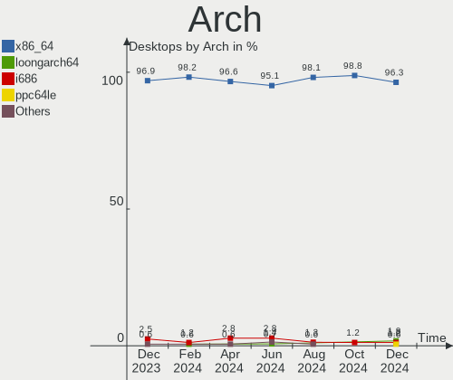
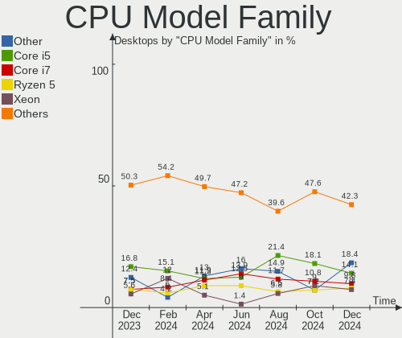
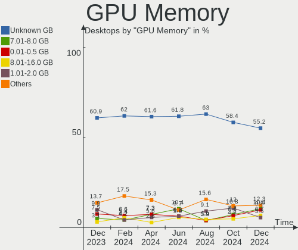

Debian - Hardware Trends (Desktops)
-----------------------------------

A project to identify most popular hardware characteristics and track their change
over time based on data collected by Linux users at https://Linux-Hardware.org.

Anyone can contribute to this report by the [hw-probe](https://github.com/linuxhw/hw-probe) tool:

    sudo -E hw-probe -all -upload

This report is for one last month. Overall report since the beginning of time: [TestDays](https://github.com/linuxhw/TestDays)

Period: Nov, 2023.

Contents
--------

* [ System ](#system)
  - [ OS                       ](#os)
  - [ OS Family                ](#os-family)
  - [ Kernel                   ](#kernel)
  - [ Kernel Family            ](#kernel-family)
  - [ Kernel Major Ver.        ](#kernel-major-ver)
  - [ Arch                     ](#arch)
  - [ DE                       ](#de)
  - [ Display Server           ](#display-server)
  - [ Display Manager          ](#display-manager)
  - [ OS Lang                  ](#os-lang)
  - [ Boot Mode                ](#boot-mode)
  - [ Filesystem               ](#filesystem)
  - [ Part. scheme             ](#part-scheme)
  - [ Dual Boot with Linux/BSD ](#dual-boot-with-linuxbsd)
  - [ Dual Boot (Win)          ](#dual-boot-win)

* [ Board ](#board)
  - [ Vendor                   ](#vendor)
  - [ Model                    ](#model)
  - [ Model Family             ](#model-family)
  - [ MFG Year                 ](#mfg-year)
  - [ Form Factor              ](#form-factor)
  - [ Secure Boot              ](#secure-boot)
  - [ Coreboot                 ](#coreboot)
  - [ RAM Size                 ](#ram-size)
  - [ RAM Used                 ](#ram-used)
  - [ Total Drives             ](#total-drives)
  - [ Has CD-ROM               ](#has-cd-rom)
  - [ Has Ethernet             ](#has-ethernet)
  - [ Has WiFi                 ](#has-wifi)
  - [ Has Bluetooth            ](#has-bluetooth)

* [ Location ](#location)
  - [ Country                  ](#country)
  - [ City                     ](#city)

* [ Drives ](#drives)
  - [ Drive Vendor             ](#drive-vendor)
  - [ Drive Model              ](#drive-model)
  - [ HDD Vendor               ](#hdd-vendor)
  - [ SSD Vendor               ](#ssd-vendor)
  - [ Drive Kind               ](#drive-kind)
  - [ Drive Connector          ](#drive-connector)
  - [ Drive Size               ](#drive-size)
  - [ Space Total              ](#space-total)
  - [ Space Used               ](#space-used)
  - [ Malfunc. Drives          ](#malfunc-drives)
  - [ Malfunc. Drive Vendor    ](#malfunc-drive-vendor)
  - [ Malfunc. HDD Vendor      ](#malfunc-hdd-vendor)
  - [ Malfunc. Drive Kind      ](#malfunc-drive-kind)
  - [ Failed Drives            ](#failed-drives)
  - [ Failed Drive Vendor      ](#failed-drive-vendor)
  - [ Drive Status             ](#drive-status)

* [ Storage controller ](#storage-controller)
  - [ Storage Vendor           ](#storage-vendor)
  - [ Storage Model            ](#storage-model)
  - [ Storage Kind             ](#storage-kind)

* [ Processor ](#processor)
  - [ CPU Vendor               ](#cpu-vendor)
  - [ CPU Model                ](#cpu-model)
  - [ CPU Model Family         ](#cpu-model-family)
  - [ CPU Cores                ](#cpu-cores)
  - [ CPU Sockets              ](#cpu-sockets)
  - [ CPU Threads              ](#cpu-threads)
  - [ CPU Op-Modes             ](#cpu-op-modes)
  - [ CPU Microcode            ](#cpu-microcode)
  - [ CPU Microarch            ](#cpu-microarch)

* [ Graphics ](#graphics)
  - [ GPU Vendor               ](#gpu-vendor)
  - [ GPU Model                ](#gpu-model)
  - [ GPU Combo                ](#gpu-combo)
  - [ GPU Driver               ](#gpu-driver)
  - [ GPU Memory               ](#gpu-memory)

* [ Monitor ](#monitor)
  - [ Monitor Vendor           ](#monitor-vendor)
  - [ Monitor Model            ](#monitor-model)
  - [ Monitor Resolution       ](#monitor-resolution)
  - [ Monitor Diagonal         ](#monitor-diagonal)
  - [ Monitor Width            ](#monitor-width)
  - [ Aspect Ratio             ](#aspect-ratio)
  - [ Monitor Area             ](#monitor-area)
  - [ Pixel Density            ](#pixel-density)
  - [ Multiple Monitors        ](#multiple-monitors)

* [ Network ](#network)
  - [ Net Controller Vendor    ](#net-controller-vendor)
  - [ Net Controller Model     ](#net-controller-model)
  - [ Wireless Vendor          ](#wireless-vendor)
  - [ Wireless Model           ](#wireless-model)
  - [ Ethernet Vendor          ](#ethernet-vendor)
  - [ Ethernet Model           ](#ethernet-model)
  - [ Net Controller Kind      ](#net-controller-kind)
  - [ Used Controller          ](#used-controller)
  - [ NICs                     ](#nics)
  - [ IPv6                     ](#ipv6)

* [ Bluetooth ](#bluetooth)
  - [ Bluetooth Vendor         ](#bluetooth-vendor)
  - [ Bluetooth Model          ](#bluetooth-model)

* [ Sound ](#sound)
  - [ Sound Vendor             ](#sound-vendor)
  - [ Sound Model              ](#sound-model)

* [ Memory ](#memory)
  - [ Memory Vendor            ](#memory-vendor)
  - [ Memory Model             ](#memory-model)
  - [ Memory Kind              ](#memory-kind)
  - [ Memory Form Factor       ](#memory-form-factor)
  - [ Memory Size              ](#memory-size)
  - [ Memory Speed             ](#memory-speed)

* [ Printers & scanners ](#printers--scanners)
  - [ Printer Vendor           ](#printer-vendor)
  - [ Printer Model            ](#printer-model)
  - [ Scanner Vendor           ](#scanner-vendor)
  - [ Scanner Model            ](#scanner-model)

* [ Camera ](#camera)
  - [ Camera Vendor            ](#camera-vendor)
  - [ Camera Model             ](#camera-model)

* [ Security ](#security)
  - [ Fingerprint Vendor       ](#fingerprint-vendor)
  - [ Fingerprint Model        ](#fingerprint-model)
  - [ Chipcard Vendor          ](#chipcard-vendor)
  - [ Chipcard Model           ](#chipcard-model)

* [ Unsupported ](#unsupported)
  - [ Unsupported Devices      ](#unsupported-devices)
  - [ Unsupported Device Types ](#unsupported-device-types)

System
------

OS
--

Installed operating systems

| Name      | Desktops | Percent |
|-----------|----------|---------|
| Debian 12 | 139      | 72.77%  |
| Debian 11 | 32       | 16.75%  |
| Debian    | 17       | 8.9%    |
| Debian 9  | 2        | 1.05%   |
| Debian 23 | 1        | 0.52%   |

OS Family
---------

OS without a version

| Name   | Desktops | Percent |
|--------|----------|---------|
| Debian | 191      | 100%    |

Kernel
------

Version of the Linux kernel

| Version                 | Desktops | Percent |
|-------------------------|----------|---------|
| 6.1.0-13-amd64          | 86       | 45.03%  |
| 6.1.0-4-amd64           | 18       | 9.42%   |
| 5.10.0-26-amd64         | 14       | 7.33%   |
| 6.5.0-4-amd64           | 11       | 5.76%   |
| 6.1.0-0.deb11.11-amd64  | 5        | 2.62%   |
| 6.2.16-19-pve           | 4        | 2.09%   |
| 6.1.0-12-amd64          | 4        | 2.09%   |
| 5.15.126-1-pve          | 4        | 2.09%   |
| 6.6.0-custom            | 3        | 1.57%   |
| 6.5.0-3-amd64           | 3        | 1.57%   |
| 6.2.16-3-pve            | 3        | 1.57%   |
| 6.2.16-18-pve           | 3        | 1.57%   |
| 6.1.0-10-amd64          | 3        | 1.57%   |
| 6.5.11-4-pve            | 2        | 1.05%   |
| 6.2.16-5-pve            | 2        | 1.05%   |
| 6.2.16-4-pve            | 2        | 1.05%   |
| 6.6.1-x64v4-xanmod1     | 1        | 0.52%   |
| 6.6.0-rc3+              | 1        | 0.52%   |
| 6.5.3-bootes2-p-1000    | 1        | 0.52%   |
| 6.5.11-2-pve            | 1        | 0.52%   |
| 6.5.0-2-amd64           | 1        | 0.52%   |
| 6.5.0-1mx-ahs-amd64     | 1        | 0.52%   |
| 6.5.0-0.deb12.1-amd64   | 1        | 0.52%   |
| 6.2.16-15-pve           | 1        | 0.52%   |
| 6.1.52-mos-amd64        | 1        | 0.52%   |
| 6.1.0-9-amd64           | 1        | 0.52%   |
| 6.1.0-13-rt-amd64       | 1        | 0.52%   |
| 6.1.0-13-armmp          | 1        | 0.52%   |
| 6.1.0-13-686-pae        | 1        | 0.52%   |
| 6.1.0-0.deb11.7-amd64   | 1        | 0.52%   |
| 5.15.53-1-pve           | 1        | 0.52%   |
| 5.15.131-1-pve          | 1        | 0.52%   |
| 5.10.200-loc-os         | 1        | 0.52%   |
| 5.10.0-26-rt-amd64      | 1        | 0.52%   |
| 5.10.0-22-amd64         | 1        | 0.52%   |
| 5.10.0-20-686-pae       | 1        | 0.52%   |
| 5.10.0-15-amd64         | 1        | 0.52%   |
| 5.10.0-14-amd64         | 1        | 0.52%   |
| 5.10.0-0.deb10.16-amd64 | 1        | 0.52%   |
| 3.16.0-6-amd64          | 1        | 0.52%   |

Kernel Family
-------------

Linux kernel without a distro release

| Version  | Desktops | Percent |
|----------|----------|---------|
| 6.1.0    | 121      | 63.35%  |
| 5.10.0   | 20       | 10.47%  |
| 6.5.0    | 17       | 8.9%    |
| 6.2.16   | 15       | 7.85%   |
| 6.6.0    | 4        | 2.09%   |
| 5.15.126 | 4        | 2.09%   |
| 6.5.11   | 3        | 1.57%   |
| 6.6.1    | 1        | 0.52%   |
| 6.5.3    | 1        | 0.52%   |
| 6.1.52   | 1        | 0.52%   |
| 5.15.53  | 1        | 0.52%   |
| 5.15.131 | 1        | 0.52%   |
| 5.10.200 | 1        | 0.52%   |
| 3.16.0   | 1        | 0.52%   |

Kernel Major Ver.
-----------------

Linux kernel major version

| Version | Desktops | Percent |
|---------|----------|---------|
| 6.1     | 122      | 63.87%  |
| 6.5     | 21       | 10.99%  |
| 5.10    | 21       | 10.99%  |
| 6.2     | 15       | 7.85%   |
| 5.15    | 6        | 3.14%   |
| 6.6     | 5        | 2.62%   |
| 3.16    | 1        | 0.52%   |

Arch
----

OS architecture (x86_64, i586, etc.)

| Name   | Desktops | Percent |
|--------|----------|---------|
| x86_64 | 188      | 98.43%  |
| i686   | 2        | 1.05%   |
| armv7l | 1        | 0.52%   |

DE
--

Desktop Environment

| Name            | Desktops | Percent |
|-----------------|----------|---------|
| Unknown         | 59       | 30.89%  |
| KDE5            | 37       | 19.37%  |
| GNOME           | 35       | 18.32%  |
| XFCE            | 20       | 10.47%  |
| Cinnamon        | 12       | 6.28%   |
| X-Cinnamon      | 7        | 3.66%   |
| MATE            | 6        | 3.14%   |
| LXQt            | 6        | 3.14%   |
| LXDE            | 3        | 1.57%   |
| KDE             | 2        | 1.05%   |
| Trinity         | 1        | 0.52%   |
| sway            | 1        | 0.52%   |
| openbox         | 1        | 0.52%   |
| GNOME Flashback | 1        | 0.52%   |

Display Server
--------------

X11 or Wayland

| Name    | Desktops | Percent |
|---------|----------|---------|
| X11     | 84       | 43.98%  |
| Tty     | 43       | 22.51%  |
| Wayland | 38       | 19.9%   |
| Unknown | 26       | 13.61%  |

Display Manager
---------------

SDDM, LightDM, etc.

| Name    | Desktops | Percent |
|---------|----------|---------|
| Unknown | 93       | 48.69%  |
| LightDM | 36       | 18.85%  |
| SDDM    | 27       | 14.14%  |
| GDM3    | 27       | 14.14%  |
| GDM     | 3        | 1.57%   |
| NODM    | 2        | 1.05%   |
| WDM     | 1        | 0.52%   |
| LDM     | 1        | 0.52%   |
| KDM     | 1        | 0.52%   |

OS Lang
-------

Language

| Lang    | Desktops | Percent |
|---------|----------|---------|
| en_US   | 81       | 42.41%  |
| ru_RU   | 25       | 13.09%  |
| en_GB   | 12       | 6.28%   |
| de_DE   | 12       | 6.28%   |
| it_IT   | 9        | 4.71%   |
| es_ES   | 9        | 4.71%   |
| pt_BR   | 5        | 2.62%   |
| fr_FR   | 5        | 2.62%   |
| pl_PL   | 3        | 1.57%   |
| en_CA   | 3        | 1.57%   |
| C       | 3        | 1.57%   |
| fr_BE   | 2        | 1.05%   |
| en_ZA   | 2        | 1.05%   |
| en_IE   | 2        | 1.05%   |
| en_AU   | 2        | 1.05%   |
| Unknown | 2        | 1.05%   |
| zh_CN   | 1        | 0.52%   |
| nl_NL   | 1        | 0.52%   |
| nl_BE   | 1        | 0.52%   |
| hu_HU   | 1        | 0.52%   |
| es_VE   | 1        | 0.52%   |
| es_PE   | 1        | 0.52%   |
| es_MX   | 1        | 0.52%   |
| es_CL   | 1        | 0.52%   |
| es_AR   | 1        | 0.52%   |
| en_IN   | 1        | 0.52%   |
| en_HK   | 1        | 0.52%   |
| en_DK   | 1        | 0.52%   |
| da_DK   | 1        | 0.52%   |
| ca_ES   | 1        | 0.52%   |

Boot Mode
---------

EFI or BIOS

| Mode | Desktops | Percent |
|------|----------|---------|
| BIOS | 103      | 53.93%  |
| EFI  | 88       | 46.07%  |

Filesystem
----------

Type of filesystem

| Type    | Desktops | Percent |
|---------|----------|---------|
| Ext4    | 143      | 74.87%  |
| Overlay | 21       | 10.99%  |
| Btrfs   | 11       | 5.76%   |
| Tmpfs   | 7        | 3.66%   |
| Zfs     | 6        | 3.14%   |
| XXXXX   | 1        | 0.52%   |
| Xfs     | 1        | 0.52%   |
| Ext3    | 1        | 0.52%   |

Part. scheme
------------

Scheme of partitioning

| Type    | Desktops | Percent |
|---------|----------|---------|
| GPT     | 105      | 54.97%  |
| MBR     | 51       | 26.7%   |
| Unknown | 35       | 18.32%  |

Dual Boot with Linux/BSD
------------------------

Hosting more than one Linux/BSD

| Dual boot | Desktops | Percent |
|-----------|----------|---------|
| No        | 147      | 76.96%  |
| Yes       | 44       | 23.04%  |

Dual Boot (Win)
---------------

Hosting Linux and Windows

| Dual boot | Desktops | Percent |
|-----------|----------|---------|
| No        | 138      | 72.25%  |
| Yes       | 53       | 27.75%  |

Board
-----

Vendor
------

Motherboard manufacturer

| Name                                 | Desktops | Percent |
|--------------------------------------|----------|---------|
| ASUSTek Computer                     | 39       | 20.42%  |
| Gigabyte Technology                  | 38       | 19.9%   |
| MSI                                  | 20       | 10.47%  |
| ASRock                               | 20       | 10.47%  |
| Dell                                 | 19       | 9.95%   |
| Hewlett-Packard                      | 8        | 4.19%   |
| Lenovo                               | 6        | 3.14%   |
| Unknown                              | 6        | 3.14%   |
| Acer                                 | 5        | 2.62%   |
| Shuttle                              | 3        | 1.57%   |
| Fujitsu                              | 3        | 1.57%   |
| Inventec                             | 2        | 1.05%   |
| Intel                                | 2        | 1.05%   |
| HPE                                  | 2        | 1.05%   |
| AZW                                  | 2        | 1.05%   |
| Wistron                              | 1        | 0.52%   |
| WanYou                               | 1        | 0.52%   |
| SIEMENS                              | 1        | 0.52%   |
| Shenzhen Meigao Electronic Equipment | 1        | 0.52%   |
| NZXT                                 | 1        | 0.52%   |
| Medion                               | 1        | 0.52%   |
| MACHINIST                            | 1        | 0.52%   |
| Huanan                               | 1        | 0.52%   |
| HC Technology.                       | 1        | 0.52%   |
| Foxconn                              | 1        | 0.52%   |
| ECS                                  | 1        | 0.52%   |
| CWWK                                 | 1        | 0.52%   |
| ASRockRack                           | 1        | 0.52%   |
| Apple                                | 1        | 0.52%   |
| ADLINK Technology                    | 1        | 0.52%   |
| 3Logic Group                         | 1        | 0.52%   |

Model
-----

Motherboard model

| Name                                       | Desktops | Percent |
|--------------------------------------------|----------|---------|
| Unknown                                    | 6        | 3.14%   |
| Dell OptiPlex 3010                         | 4        | 2.09%   |
| Dell Inspiron 3647                         | 4        | 2.09%   |
| Gigabyte B450M S2H V2                      | 3        | 1.57%   |
| Gigabyte B450 AORUS M                      | 3        | 1.57%   |
| ASUS All Series                            | 3        | 1.57%   |
| Gigabyte G41MT-S2P                         | 2        | 1.05%   |
| Gigabyte B550 AORUS PRO V2                 | 2        | 1.05%   |
| Gigabyte B450M DS3H                        | 2        | 1.05%   |
| Fujitsu ESPRIMO Q920                       | 2        | 1.05%   |
| ASUS ROG STRIX B650E-F GAMING WIFI         | 2        | 1.05%   |
| Wistron Data Vault                         | 1        | 0.52%   |
| WanYou WanYouChunXiao                      | 1        | 0.52%   |
| SIEMENS SIMATIC IPC227G                    | 1        | 0.52%   |
| Shuttle SW580                              | 1        | 0.52%   |
| Shuttle SH87R                              | 1        | 0.52%   |
| Shuttle SA76                               | 1        | 0.52%   |
| Shenzhen Meigao Electronic Equipment HX99G | 1        | 0.52%   |
| NZXT N7 B650E                              | 1        | 0.52%   |
| MSI MS-7E07                                | 1        | 0.52%   |
| MSI MS-7E02                                | 1        | 0.52%   |
| MSI MS-7D77                                | 1        | 0.52%   |
| MSI MS-7D46                                | 1        | 0.52%   |
| MSI MS-7D42                                | 1        | 0.52%   |
| MSI MS-7D28                                | 1        | 0.52%   |
| MSI MS-7C52                                | 1        | 0.52%   |
| MSI MS-7C37                                | 1        | 0.52%   |
| MSI MS-7C35                                | 1        | 0.52%   |
| MSI MS-7B85                                | 1        | 0.52%   |
| MSI MS-7A95                                | 1        | 0.52%   |
| MSI MS-7A94                                | 1        | 0.52%   |
| MSI MS-7A15                                | 1        | 0.52%   |
| MSI MS-7996                                | 1        | 0.52%   |
| MSI MS-7971                                | 1        | 0.52%   |
| MSI MS-7823                                | 1        | 0.52%   |
| MSI MS-7758                                | 1        | 0.52%   |
| MSI MS-7721                                | 1        | 0.52%   |
| MSI MS-7693                                | 1        | 0.52%   |
| MSI MS-7529                                | 1        | 0.52%   |
| Medion MS-7708                             | 1        | 0.52%   |

Model Family
------------

Motherboard model prefix

| Name                                       | Desktops | Percent |
|--------------------------------------------|----------|---------|
| ASUS PRIME                                 | 11       | 5.76%   |
| Dell OptiPlex                              | 10       | 5.24%   |
| Gigabyte B450M                             | 8        | 4.19%   |
| Gigabyte B450                              | 6        | 3.14%   |
| ASUS ROG                                   | 6        | 3.14%   |
| Unknown                                    | 6        | 3.14%   |
| Dell Inspiron                              | 5        | 2.62%   |
| Lenovo ThinkCentre                         | 4        | 2.09%   |
| ASUS TUF                                   | 4        | 2.09%   |
| Gigabyte B550                              | 3        | 1.57%   |
| Fujitsu ESPRIMO                            | 3        | 1.57%   |
| ASUS All                                   | 3        | 1.57%   |
| Lenovo ThinkStation                        | 2        | 1.05%   |
| HPE ProLiant                               | 2        | 1.05%   |
| HP ProLiant                                | 2        | 1.05%   |
| HP ProDesk                                 | 2        | 1.05%   |
| Gigabyte X570                              | 2        | 1.05%   |
| Gigabyte G41MT-S2P                         | 2        | 1.05%   |
| Dell XPS                                   | 2        | 1.05%   |
| ASRock Z77                                 | 2        | 1.05%   |
| Acer Veriton                               | 2        | 1.05%   |
| Acer Predator                              | 2        | 1.05%   |
| Wistron Data                               | 1        | 0.52%   |
| WanYou WanYouChunXiao                      | 1        | 0.52%   |
| SIEMENS SIMATIC                            | 1        | 0.52%   |
| Shuttle SW580                              | 1        | 0.52%   |
| Shuttle SH87R                              | 1        | 0.52%   |
| Shuttle SA76                               | 1        | 0.52%   |
| Shenzhen Meigao Electronic Equipment HX99G | 1        | 0.52%   |
| NZXT N7                                    | 1        | 0.52%   |
| MSI MS-7E07                                | 1        | 0.52%   |
| MSI MS-7E02                                | 1        | 0.52%   |
| MSI MS-7D77                                | 1        | 0.52%   |
| MSI MS-7D46                                | 1        | 0.52%   |
| MSI MS-7D42                                | 1        | 0.52%   |
| MSI MS-7D28                                | 1        | 0.52%   |
| MSI MS-7C52                                | 1        | 0.52%   |
| MSI MS-7C37                                | 1        | 0.52%   |
| MSI MS-7C35                                | 1        | 0.52%   |
| MSI MS-7B85                                | 1        | 0.52%   |

MFG Year
--------

Motherboard manufacture year

| Year    | Desktops | Percent |
|---------|----------|---------|
| 2012    | 22       | 11.52%  |
| 2022    | 21       | 10.99%  |
| 2018    | 20       | 10.47%  |
| 2019    | 18       | 9.42%   |
| 2020    | 17       | 8.9%    |
| 2013    | 16       | 8.38%   |
| 2014    | 12       | 6.28%   |
| 2021    | 9        | 4.71%   |
| 2011    | 9        | 4.71%   |
| 2017    | 8        | 4.19%   |
| 2023    | 7        | 3.66%   |
| 2015    | 6        | 3.14%   |
| 2010    | 6        | 3.14%   |
| 2016    | 5        | 2.62%   |
| 2009    | 5        | 2.62%   |
| 2007    | 4        | 2.09%   |
| 2008    | 3        | 1.57%   |
| 2006    | 1        | 0.52%   |
| 2004    | 1        | 0.52%   |
| Unknown | 1        | 0.52%   |

Form Factor
-----------

Physical design of the computer

| Name    | Desktops | Percent |
|---------|----------|---------|
| Desktop | 191      | 100%    |

Secure Boot
-----------

Enabled or disabled

| State    | Desktops | Percent |
|----------|----------|---------|
| Disabled | 188      | 98.43%  |
| Enabled  | 3        | 1.57%   |

Coreboot
--------

Have coreboot on board

| Used | Desktops | Percent |
|------|----------|---------|
| No   | 191      | 100%    |

RAM Size
--------

Total RAM memory

| Size in GB  | Desktops | Percent |
|-------------|----------|---------|
| 32.01-64.0  | 37       | 19.37%  |
| 4.01-8.0    | 33       | 17.28%  |
| 16.01-24.0  | 30       | 15.71%  |
| 8.01-16.0   | 29       | 15.18%  |
| 64.01-256.0 | 26       | 13.61%  |
| 3.01-4.0    | 22       | 11.52%  |
| 24.01-32.0  | 7        | 3.66%   |
| 2.01-3.0    | 3        | 1.57%   |
| 1.01-2.0    | 3        | 1.57%   |
| 0.51-1.0    | 1        | 0.52%   |

RAM Used
--------

Used RAM memory

| Used GB     | Desktops | Percent |
|-------------|----------|---------|
| 4.01-8.0    | 41       | 21.47%  |
| 1.01-2.0    | 34       | 17.8%   |
| 2.01-3.0    | 29       | 15.18%  |
| 0.51-1.0    | 26       | 13.61%  |
| 3.01-4.0    | 25       | 13.09%  |
| 8.01-16.0   | 11       | 5.76%   |
| 0.01-0.5    | 8        | 4.19%   |
| 16.01-24.0  | 7        | 3.66%   |
| 24.01-32.0  | 5        | 2.62%   |
| 32.01-64.0  | 4        | 2.09%   |
| 64.01-256.0 | 1        | 0.52%   |

Total Drives
------------

Number of drives on board

| Drives | Desktops | Percent |
|--------|----------|---------|
| 1      | 66       | 34.55%  |
| 3      | 40       | 20.94%  |
| 2      | 36       | 18.85%  |
| 4      | 26       | 13.61%  |
| 5      | 7        | 3.66%   |
| 7      | 4        | 2.09%   |
| 6      | 4        | 2.09%   |
| 9      | 2        | 1.05%   |
| 0      | 2        | 1.05%   |
| 27     | 1        | 0.52%   |
| 12     | 1        | 0.52%   |
| 11     | 1        | 0.52%   |
| 10     | 1        | 0.52%   |

Has CD-ROM
----------

Has CD-ROM on board

| Presented | Desktops | Percent |
|-----------|----------|---------|
| No        | 132      | 69.11%  |
| Yes       | 59       | 30.89%  |

Has Ethernet
------------

Has Ethernet on board

| Presented | Desktops | Percent |
|-----------|----------|---------|
| Yes       | 189      | 98.95%  |
| No        | 2        | 1.05%   |

Has WiFi
--------

Has WiFi module

| Presented | Desktops | Percent |
|-----------|----------|---------|
| No        | 116      | 60.73%  |
| Yes       | 75       | 39.27%  |

Has Bluetooth
-------------

Has Bluetooth module

| Presented | Desktops | Percent |
|-----------|----------|---------|
| No        | 122      | 63.87%  |
| Yes       | 69       | 36.13%  |

Location
--------

Country
-------

Geographic location (country)

| Country      | Desktops | Percent |
|--------------|----------|---------|
| Russia       | 36       | 18.85%  |
| USA          | 30       | 15.71%  |
| Germany      | 18       | 9.42%   |
| Mexico       | 11       | 5.76%   |
| Spain        | 10       | 5.24%   |
| Italy        | 10       | 5.24%   |
| UK           | 9        | 4.71%   |
| Canada       | 7        | 3.66%   |
| Brazil       | 7        | 3.66%   |
| France       | 5        | 2.62%   |
| Poland       | 4        | 2.09%   |
| Greece       | 4        | 2.09%   |
| Belgium      | 4        | 2.09%   |
| Malaysia     | 3        | 1.57%   |
| Austria      | 3        | 1.57%   |
| Australia    | 3        | 1.57%   |
| Switzerland  | 2        | 1.05%   |
| South Africa | 2        | 1.05%   |
| Netherlands  | 2        | 1.05%   |
| Hong Kong    | 2        | 1.05%   |
| Denmark      | 2        | 1.05%   |
| China        | 2        | 1.05%   |
| Argentina    | 2        | 1.05%   |
| Venezuela    | 1        | 0.52%   |
| Ukraine      | 1        | 0.52%   |
| Sweden       | 1        | 0.52%   |
| Slovakia     | 1        | 0.52%   |
| Philippines  | 1        | 0.52%   |
| Peru         | 1        | 0.52%   |
| Japan        | 1        | 0.52%   |
| Indonesia    | 1        | 0.52%   |
| India        | 1        | 0.52%   |
| Hungary      | 1        | 0.52%   |
| Finland      | 1        | 0.52%   |
| Croatia      | 1        | 0.52%   |
| Chile        | 1        | 0.52%   |

City
----

Geographic location (city)

| City             | Desktops | Percent |
|------------------|----------|---------|
| Voronezh         | 18       | 9.42%   |
| Tijuana          | 8        | 4.19%   |
| St Petersburg    | 5        | 2.62%   |
| Moscow           | 4        | 2.09%   |
| Athens           | 4        | 2.09%   |
| Vienna           | 3        | 1.57%   |
| Kuala Lumpur     | 3        | 1.57%   |
| Zurich           | 2        | 1.05%   |
| Zapopan          | 2        | 1.05%   |
| Warsaw           | 2        | 1.05%   |
| Valencia         | 2        | 1.05%   |
| Tower Hamlets    | 2        | 1.05%   |
| Rome             | 2        | 1.05%   |
| Richmond         | 2        | 1.05%   |
| North Reading    | 2        | 1.05%   |
| Kazan’         | 2        | 1.05%   |
| Johannesburg     | 2        | 1.05%   |
| Central          | 2        | 1.05%   |
| Canberra         | 2        | 1.05%   |
| Brussels         | 2        | 1.05%   |
| Berlin           | 2        | 1.05%   |
| Belleville       | 2        | 1.05%   |
| Barcelona        | 2        | 1.05%   |
| Zhengzhou        | 1        | 0.52%   |
| Zhangzhou        | 1        | 0.52%   |
| Zaragoza         | 1        | 0.52%   |
| Zagreb           | 1        | 0.52%   |
| Yekaterinburg    | 1        | 0.52%   |
| Wuppertal        | 1        | 0.52%   |
| West Jordan      | 1        | 0.52%   |
| Vila Velha       | 1        | 0.52%   |
| Verkhnyaya Salda | 1        | 0.52%   |
| Vep              | 1        | 0.52%   |
| Utrecht          | 1        | 0.52%   |
| Uruara           | 1        | 0.52%   |
| Tuusula          | 1        | 0.52%   |
| Tucson           | 1        | 0.52%   |
| Torrent          | 1        | 0.52%   |
| Toronto          | 1        | 0.52%   |
| Toluca           | 1        | 0.52%   |

Drives
------

Drive Vendor
------------

Hard drive vendors

| Vendor                      | Desktops | Drives | Percent |
|-----------------------------|----------|--------|---------|
| Seagate                     | 59       | 96     | 16.08%  |
| Samsung Electronics         | 53       | 80     | 14.44%  |
| WDC                         | 47       | 99     | 12.81%  |
| Toshiba                     | 25       | 36     | 6.81%   |
| Kingston                    | 22       | 30     | 5.99%   |
| Crucial                     | 21       | 28     | 5.72%   |
| SanDisk                     | 15       | 15     | 4.09%   |
| Hitachi                     | 13       | 17     | 3.54%   |
| China                       | 10       | 13     | 2.72%   |
| Patriot                     | 7        | 8      | 1.91%   |
| Kingston Technology Company | 7        | 7      | 1.91%   |
| A-DATA Technology           | 7        | 7      | 1.91%   |
| Intel                       | 6        | 7      | 1.63%   |
| HGST                        | 5        | 5      | 1.36%   |
| Apacer                      | 5        | 6      | 1.36%   |
| PNY                         | 4        | 9      | 1.09%   |
| Micron Technology           | 4        | 4      | 1.09%   |
| JMicron Technology          | 4        | 4      | 1.09%   |
| Unknown                     | 3        | 4      | 0.82%   |
| Transcend                   | 3        | 3      | 0.82%   |
| GOODRAM                     | 3        | 3      | 0.82%   |
| Fanxiang                    | 3        | 4      | 0.82%   |
| SK hynix                    | 2        | 2      | 0.54%   |
| Phison                      | 2        | 2      | 0.54%   |
| OCZ                         | 2        | 2      | 0.54%   |
| Micron/Crucial Technology   | 2        | 2      | 0.54%   |
| Lexar                       | 2        | 2      | 0.54%   |
| Intenso                     | 2        | 2      | 0.54%   |
| Hewlett-Packard             | 2        | 2      | 0.54%   |
| Gigabyte Technology         | 2        | 2      | 0.54%   |
| Apple                       | 2        | 2      | 0.54%   |
| ADATA Technology            | 2        | 2      | 0.54%   |
| XPG                         | 1        | 1      | 0.27%   |
| WDC WDS5                    | 1        | 1      | 0.27%   |
| WDC WDS                     | 1        | 1      | 0.27%   |
| Verbatim                    | 1        | 1      | 0.27%   |
| Timetec                     | 1        | 2      | 0.27%   |
| Team                        | 1        | 1      | 0.27%   |
| T-FORCE                     | 1        | 1      | 0.27%   |
| SPCC                        | 1        | 2      | 0.27%   |

Drive Model
-----------

Hard drive models

| Model                                               | Desktops | Percent |
|-----------------------------------------------------|----------|---------|
| Seagate ST1000DM010-2EP102 1TB                      | 8        | 1.81%   |
| Crucial CT500MX500SSD1 500GB                        | 7        | 1.58%   |
| Toshiba DT01ACA100 1TB                              | 6        | 1.35%   |
| Seagate ST500DM002-1BD142 500GB                     | 5        | 1.13%   |
| Samsung SSD 850 EVO 250GB                           | 5        | 1.13%   |
| WDC WD10EZEX-75M2NA0 1TB                            | 4        | 0.9%    |
| Samsung SSD 860 EVO 250GB                           | 4        | 0.9%    |
| Kingston SA400S37480G 480GB SSD                     | 4        | 0.9%    |
| WDC WD40EFRX-68N32N0 4TB                            | 3        | 0.68%   |
| Toshiba DT01ACA050 500GB                            | 3        | 0.68%   |
| Seagate ST2000DM008-2UB102 2TB                      | 3        | 0.68%   |
| Seagate ST1000DM003-9YN162 1TB                      | 3        | 0.68%   |
| Seagate ST1000DM003-1CH162 1TB                      | 3        | 0.68%   |
| Samsung SSD 990 PRO 2TB                             | 3        | 0.68%   |
| Samsung SSD 990 PRO 1TB                             | 3        | 0.68%   |
| Samsung NVMe SSD Controller SM981/PM981/PM983 250GB | 3        | 0.68%   |
| Kingston Company SNV2S2000G 2TB                     | 3        | 0.68%   |
| Kingston SUV400S37480G 480GB SSD                    | 3        | 0.68%   |
| Kingston SEDC500R1920G 2TB SSD                      | 3        | 0.68%   |
| Kingston SA400S37120G 120GB SSD                     | 3        | 0.68%   |
| JMicron Tech 250GB                                  | 3        | 0.68%   |
| Crucial CT1000MX500SSD1 1TB                         | 3        | 0.68%   |
| A-DATA SX8200PNP 256GB                              | 3        | 0.68%   |
| WDC WD80EZAZ-11TDBA0 8TB                            | 2        | 0.45%   |
| WDC WD80EFZX-68UW8N0 8TB                            | 2        | 0.45%   |
| WDC WD30EFRX-68EUZN0 3TB                            | 2        | 0.45%   |
| WDC WD20EARX-00PASB0 2TB                            | 2        | 0.45%   |
| WDC WD10EZEX-75WN4A1 1TB                            | 2        | 0.45%   |
| Toshiba MQ01ABD100 1TB                              | 2        | 0.45%   |
| Toshiba HDWD110 1TB                                 | 2        | 0.45%   |
| Seagate ST31000524AS 1TB                            | 2        | 0.45%   |
| Seagate ST2000NM0008-2F3100 2TB                     | 2        | 0.45%   |
| Seagate ST2000LX001-1RG174 2TB                      | 2        | 0.45%   |
| Seagate Expansion 1TB                               | 2        | 0.45%   |
| Seagate Backup+ Hub BK 8TB                          | 2        | 0.45%   |
| SanDisk SSD PLUS 240GB                              | 2        | 0.45%   |
| SanDisk NVMe SSD Drive 1TB                          | 2        | 0.45%   |
| Samsung SSD 980 PRO 1TB                             | 2        | 0.45%   |
| Samsung SSD 970 EVO Plus 2TB                        | 2        | 0.45%   |
| Samsung SSD 870 QVO 2TB                             | 2        | 0.45%   |

HDD Vendor
----------

Hard disk drive vendors

| Vendor              | Desktops | Drives | Percent |
|---------------------|----------|--------|---------|
| Seagate             | 54       | 90     | 36.73%  |
| WDC                 | 41       | 92     | 27.89%  |
| Toshiba             | 22       | 33     | 14.97%  |
| Hitachi             | 13       | 17     | 8.84%   |
| Samsung Electronics | 7        | 7      | 4.76%   |
| HGST                | 5        | 5      | 3.4%    |
| Hewlett-Packard     | 2        | 2      | 1.36%   |
| Apple               | 2        | 2      | 1.36%   |
| Maxtor              | 1        | 1      | 0.68%   |

SSD Vendor
----------

Solid state drive vendors

| Vendor              | Desktops | Drives | Percent |
|---------------------|----------|--------|---------|
| Samsung Electronics | 22       | 28     | 16.18%  |
| Kingston            | 21       | 25     | 15.44%  |
| Crucial             | 15       | 18     | 11.03%  |
| China               | 9        | 12     | 6.62%   |
| SanDisk             | 7        | 7      | 5.15%   |
| WDC                 | 6        | 6      | 4.41%   |
| Patriot             | 6        | 7      | 4.41%   |
| Intel               | 5        | 5      | 3.68%   |
| Apacer              | 5        | 6      | 3.68%   |
| PNY                 | 4        | 9      | 2.94%   |
| A-DATA Technology   | 4        | 4      | 2.94%   |
| GOODRAM             | 3        | 3      | 2.21%   |
| Transcend           | 2        | 2      | 1.47%   |
| Toshiba             | 2        | 2      | 1.47%   |
| Seagate             | 2        | 2      | 1.47%   |
| OCZ                 | 2        | 2      | 1.47%   |
| Micron Technology   | 2        | 2      | 1.47%   |
| Intenso             | 2        | 2      | 1.47%   |
| Fanxiang            | 2        | 3      | 1.47%   |
| WDC WDS5            | 1        | 1      | 0.74%   |
| WDC WDS             | 1        | 1      | 0.74%   |
| Verbatim            | 1        | 1      | 0.74%   |
| Timetec             | 1        | 2      | 0.74%   |
| Team                | 1        | 1      | 0.74%   |
| T-FORCE             | 1        | 1      | 0.74%   |
| SPCC                | 1        | 2      | 0.74%   |
| ShiJi               | 1        | 1      | 0.74%   |
| Lexar               | 1        | 1      | 0.74%   |
| JMicron Technology  | 1        | 1      | 0.74%   |
| Integral            | 1        | 1      | 0.74%   |
| HANCHU              | 1        | 1      | 0.74%   |
| Digma               | 1        | 1      | 0.74%   |
| DeTech              | 1        | 1      | 0.74%   |
| Corsair             | 1        | 1      | 0.74%   |

Drive Kind
----------

HDD or SSD

| Kind    | Desktops | Drives | Percent |
|---------|----------|--------|---------|
| SSD     | 112      | 162    | 37.09%  |
| HDD     | 112      | 249    | 37.09%  |
| NVMe    | 68       | 106    | 22.52%  |
| Unknown | 8        | 10     | 2.65%   |
| MMC     | 2        | 2      | 0.66%   |

Drive Connector
---------------

SATA, SAS, NVMe, etc.

| Type | Desktops | Drives | Percent |
|------|----------|--------|---------|
| SATA | 165      | 398    | 66.8%   |
| NVMe | 68       | 105    | 27.53%  |
| SAS  | 12       | 24     | 4.86%   |
| MMC  | 2        | 2      | 0.81%   |

Drive Size
----------

Size of hard drive

| Size in TB | Desktops | Drives | Percent |
|------------|----------|--------|---------|
| 0.01-0.5   | 115      | 152    | 44.4%   |
| 0.51-1.0   | 74       | 104    | 28.57%  |
| 1.01-2.0   | 32       | 58     | 12.36%  |
| 3.01-4.0   | 14       | 29     | 5.41%   |
| 4.01-10.0  | 11       | 52     | 4.25%   |
| 2.01-3.0   | 8        | 10     | 3.09%   |
| 10.01-20.0 | 5        | 6      | 1.93%   |

Space Total
-----------

Amount of disk space available on the file system

| Size in GB     | Desktops | Percent |
|----------------|----------|---------|
| 251-500        | 38       | 19.9%   |
| 501-1000       | 31       | 16.23%  |
| Unknown        | 28       | 14.66%  |
| More than 3000 | 26       | 13.61%  |
| 101-250        | 23       | 12.04%  |
| 1001-2000      | 22       | 11.52%  |
| 51-100         | 9        | 4.71%   |
| 2001-3000      | 8        | 4.19%   |
| 21-50          | 3        | 1.57%   |
| 1-20           | 3        | 1.57%   |

Space Used
----------

Amount of used disk space

| Used GB        | Desktops | Percent |
|----------------|----------|---------|
| 1-20           | 37       | 19.37%  |
| Unknown        | 28       | 14.66%  |
| 101-250        | 27       | 14.14%  |
| 21-50          | 24       | 12.57%  |
| 501-1000       | 18       | 9.42%   |
| 51-100         | 17       | 8.9%    |
| 251-500        | 15       | 7.85%   |
| More than 3000 | 11       | 5.76%   |
| 1001-2000      | 10       | 5.24%   |
| 2001-3000      | 3        | 1.57%   |
| 0              | 1        | 0.52%   |

Malfunc. Drives
---------------

Drive models with a malfunction

| Model                                    | Desktops | Drives | Percent |
|------------------------------------------|----------|--------|---------|
| WDC WD80EMAZ-00WJTA0 8TB                 | 1        | 11     | 3.45%   |
| WDC WD20EFRX-68EUZN0 2TB                 | 1        | 1      | 3.45%   |
| WDC WD20EARS-00MVWB0 2TB                 | 1        | 1      | 3.45%   |
| WDC WD10EZEX-75M2NA0 1TB                 | 1        | 1      | 3.45%   |
| Seagate ST9250315AS 250GB                | 1        | 1      | 3.45%   |
| Seagate ST8000AS0002-1NA17Z 8TB          | 1        | 1      | 3.45%   |
| Seagate ST3500418AS 500GB                | 1        | 1      | 3.45%   |
| Seagate ST3250620AS 250GB                | 1        | 1      | 3.45%   |
| Seagate ST3250410AS 250GB                | 1        | 1      | 3.45%   |
| Seagate ST3250318AS 250GB                | 1        | 1      | 3.45%   |
| Seagate ST2000LX001-1RG174 2TB           | 1        | 1      | 3.45%   |
| Seagate ST1000DM010-2EP102 1TB           | 1        | 1      | 3.45%   |
| Seagate ST1000DM003-9YN162 1TB           | 1        | 1      | 3.45%   |
| Samsung Electronics SSD 860 EVO 250GB    | 1        | 1      | 3.45%   |
| Samsung Electronics SP2004C 200GB        | 1        | 1      | 3.45%   |
| Maxtor STM3500320AS 500GB                | 1        | 1      | 3.45%   |
| Kingston SV300S37A480G 480GB SSD         | 1        | 1      | 3.45%   |
| Kingston SV300S37A120G 120GB SSD         | 1        | 1      | 3.45%   |
| Kingston SA400S37120G 120GB SSD          | 1        | 1      | 3.45%   |
| Hitachi HTS545050B9A300 500GB            | 1        | 1      | 3.45%   |
| Hitachi HDT725032VLA360 320GB            | 1        | 1      | 3.45%   |
| Hitachi HDS721050CLA360 500GB            | 1        | 1      | 3.45%   |
| Hitachi HDS5C3020ALA632 2TB              | 1        | 3      | 3.45%   |
| HANCHU SSD 240GB                         | 1        | 1      | 3.45%   |
| Crucial CT500MX500SSD1 500GB             | 1        | 1      | 3.45%   |
| Corsair Nova 2 SSD 32GB                  | 1        | 1      | 3.45%   |
| China SH00M256GB SSD                     | 1        | 1      | 3.45%   |
| Apple HDD HTS545050A7E362 500GB          | 1        | 1      | 3.45%   |
| ADATA Technology XPG SPECTRIX S40G 256GB | 1        | 1      | 3.45%   |

Malfunc. Drive Vendor
---------------------

Vendors of faulty drives

| Vendor              | Desktops | Drives | Percent |
|---------------------|----------|--------|---------|
| Seagate             | 8        | 9      | 28.57%  |
| WDC                 | 4        | 14     | 14.29%  |
| Hitachi             | 4        | 6      | 14.29%  |
| Kingston            | 3        | 3      | 10.71%  |
| Samsung Electronics | 2        | 2      | 7.14%   |
| Maxtor              | 1        | 1      | 3.57%   |
| HANCHU              | 1        | 1      | 3.57%   |
| Crucial             | 1        | 1      | 3.57%   |
| Corsair             | 1        | 1      | 3.57%   |
| China               | 1        | 1      | 3.57%   |
| Apple               | 1        | 1      | 3.57%   |
| ADATA Technology    | 1        | 1      | 3.57%   |

Malfunc. HDD Vendor
-------------------

Vendors of faulty HDD drives

| Vendor              | Desktops | Drives | Percent |
|---------------------|----------|--------|---------|
| Seagate             | 8        | 9      | 42.11%  |
| WDC                 | 4        | 14     | 21.05%  |
| Hitachi             | 4        | 6      | 21.05%  |
| Samsung Electronics | 1        | 1      | 5.26%   |
| Maxtor              | 1        | 1      | 5.26%   |
| Apple               | 1        | 1      | 5.26%   |

Malfunc. Drive Kind
-------------------

Kinds of faulty drives

| Kind | Desktops | Drives | Percent |
|------|----------|--------|---------|
| HDD  | 17       | 32     | 65.38%  |
| SSD  | 8        | 8      | 30.77%  |
| NVMe | 1        | 1      | 3.85%   |

Failed Drives
-------------

Failed drive models

Zero info for selected period =(

Failed Drive Vendor
-------------------

Failed drive vendors

Zero info for selected period =(

Drive Status
------------

Number of failed and malfunc. drives

| Status   | Desktops | Drives | Percent |
|----------|----------|--------|---------|
| Works    | 138      | 354    | 63.3%   |
| Detected | 55       | 134    | 25.23%  |
| Malfunc  | 25       | 41     | 11.47%  |

Storage controller
------------------

Storage Vendor
--------------

Storage controller vendors

| Vendor                       | Desktops | Percent |
|------------------------------|----------|---------|
| Intel                        | 117      | 39.66%  |
| AMD                          | 67       | 22.71%  |
| Samsung Electronics          | 28       | 9.49%   |
| ASMedia Technology           | 16       | 5.42%   |
| Micron/Crucial Technology    | 10       | 3.39%   |
| Kingston Technology Company  | 9        | 3.05%   |
| SanDisk                      | 8        | 2.71%   |
| ADATA Technology             | 6        | 2.03%   |
| Marvell Technology Group     | 5        | 1.69%   |
| Phison Electronics           | 4        | 1.36%   |
| MAXIO Technology (Hangzhou)  | 3        | 1.02%   |
| SK hynix                     | 2        | 0.68%   |
| Shenzhen Longsys Electronics | 2        | 0.68%   |
| Nvidia                       | 2        | 0.68%   |
| Micron Technology            | 2        | 0.68%   |
| LSI Logic / Symbios Logic    | 2        | 0.68%   |
| JMicron Technology           | 2        | 0.68%   |
| Transcend                    | 1        | 0.34%   |
| Toshiba America Info Systems | 1        | 0.34%   |
| Silicon Motion               | 1        | 0.34%   |
| Silicon Image                | 1        | 0.34%   |
| Seagate Technology           | 1        | 0.34%   |
| Radian Memory Systems        | 1        | 0.34%   |
| INNOGRIT                     | 1        | 0.34%   |
| HighPoint Technologies       | 1        | 0.34%   |
| Broadcom / LSI               | 1        | 0.34%   |
| Adaptec                      | 1        | 0.34%   |

Storage Model
-------------

Storage controller models

| Model                                                                                   | Desktops | Percent |
|-----------------------------------------------------------------------------------------|----------|---------|
| AMD FCH SATA Controller [AHCI mode]                                                     | 43       | 12.54%  |
| AMD 400 Series Chipset SATA Controller                                                  | 23       | 6.71%   |
| Intel 8 Series/C220 Series Chipset Family 6-port SATA Controller 1 [AHCI mode]          | 16       | 4.66%   |
| ASMedia ASM1062 Serial ATA Controller                                                   | 13       | 3.79%   |
| Intel 6 Series/C200 Series Chipset Family 6 port Desktop SATA AHCI Controller           | 12       | 3.5%    |
| Intel 7 Series/C210 Series Chipset Family 6-port SATA Controller [AHCI mode]            | 11       | 3.21%   |
| Samsung NVMe SSD Controller SM981/PM981/PM983                                           | 10       | 2.92%   |
| AMD 500 Series Chipset SATA Controller                                                  | 10       | 2.92%   |
| Micron/Crucial P2 [Nick P2] / P3 / P3 Plus NVMe PCIe SSD (DRAM-less)                    | 9        | 2.62%   |
| Intel Q170/Q150/B150/H170/H110/Z170/CM236 Chipset SATA Controller [AHCI Mode]           | 9        | 2.62%   |
| Intel SATA Controller [RAID mode]                                                       | 8        | 2.33%   |
| Intel 200 Series PCH SATA controller [AHCI mode]                                        | 8        | 2.33%   |
| Samsung NVMe SSD Controller PM9A1/PM9A3/980PRO                                          | 7        | 2.04%   |
| Samsung NVMe SSD Controller S4LV008[Pascal]                                             | 6        | 1.75%   |
| AMD SB7x0/SB8x0/SB9x0 SATA Controller [AHCI mode]                                       | 6        | 1.75%   |
| Intel NM10/ICH7 Family SATA Controller [IDE mode]                                       | 5        | 1.46%   |
| Intel Cannon Lake PCH SATA AHCI Controller                                              | 5        | 1.46%   |
| Intel 700 Series Chipset Family SATA AHCI Controller                                    | 5        | 1.46%   |
| Intel Jasper Lake SATA AHCI Controller                                                  | 4        | 1.17%   |
| Intel Alder Lake-S PCH SATA Controller [AHCI Mode]                                      | 4        | 1.17%   |
| AMD SB7x0/SB8x0/SB9x0 IDE Controller                                                    | 4        | 1.17%   |
| ADATA XPG SX8200 Pro PCIe Gen3x4 M.2 2280 Solid State Drive                             | 4        | 1.17%   |
| SanDisk Ultra 3D / WD Blue SN570 NVMe SSD (DRAM-less)                                   | 3        | 0.87%   |
| Samsung NVMe SSD Controller SM961/PM961/SM963                                           | 3        | 0.87%   |
| Samsung NVMe SSD Controller 980 (DRAM-less)                                             | 3        | 0.87%   |
| MAXIO (Hangzhou) NVMe SSD Controller MAP1202                                            | 3        | 0.87%   |
| Kingston Company NV2 NVMe SSD SM2267XT                                                  | 3        | 0.87%   |
| Intel Comet Lake SATA AHCI Controller                                                   | 3        | 0.87%   |
| Intel 82801G (ICH7 Family) IDE Controller                                               | 3        | 0.87%   |
| Intel 6 Series/C200 Series Chipset Family Desktop SATA Controller (IDE mode, ports 4-5) | 3        | 0.87%   |
| Intel 6 Series/C200 Series Chipset Family Desktop SATA Controller (IDE mode, ports 0-3) | 3        | 0.87%   |
| Intel 500 Series Chipset Family SATA AHCI Controller                                    | 3        | 0.87%   |
| Micron 2200S NVMe SSD [Cassandra]                                                       | 2        | 0.58%   |
| Kingston Company DC1000B NVMe SSD E12DC                                                 | 2        | 0.58%   |
| JMicron JMB58x AHCI SATA controller                                                     | 2        | 0.58%   |
| Intel SATA controller                                                                   | 2        | 0.58%   |
| Intel C610/X99 series chipset 6-Port SATA Controller [AHCI mode]                        | 2        | 0.58%   |
| Intel 9 Series Chipset Family SATA Controller [AHCI Mode]                               | 2        | 0.58%   |
| Intel 82801JI (ICH10 Family) SATA AHCI Controller                                       | 2        | 0.58%   |
| Intel 82801IR/IO/IH (ICH9R/DO/DH) 6 port SATA Controller [AHCI mode]                    | 2        | 0.58%   |

Storage Kind
------------

Kind of storage controller (IDE, SATA, NVMe, SAS, ...)

| Kind | Desktops | Percent |
|------|----------|---------|
| SATA | 166      | 61.03%  |
| NVMe | 68       | 25%     |
| IDE  | 22       | 8.09%   |
| RAID | 13       | 4.78%   |
| SAS  | 3        | 1.1%    |

Processor
---------

CPU Vendor
----------

Processor vendors

| Vendor | Desktops | Percent |
|--------|----------|---------|
| Intel  | 121      | 63.35%  |
| AMD    | 69       | 36.13%  |
| ARM    | 1        | 0.52%   |

CPU Model
---------

Processor models

| Model                                       | Desktops | Percent |
|---------------------------------------------|----------|---------|
| Intel Core i5-3470 CPU @ 3.20GHz            | 7        | 3.66%   |
| AMD Ryzen 5 PRO 4650G with Radeon Graphics  | 7        | 3.66%   |
| Intel Core i5-4570 CPU @ 3.20GHz            | 4        | 2.09%   |
| Intel Core i5-4460S CPU @ 2.90GHz           | 4        | 2.09%   |
| AMD Ryzen 9 3900X 12-Core Processor         | 4        | 2.09%   |
| AMD Ryzen 5 5600G with Radeon Graphics      | 4        | 2.09%   |
| Intel Core i5-10400 CPU @ 2.90GHz           | 3        | 1.57%   |
| Intel Core 2 Duo CPU E8400 @ 3.00GHz        | 3        | 1.57%   |
| AMD Ryzen 9 7900X 12-Core Processor         | 3        | 1.57%   |
| AMD Ryzen 5 3600 6-Core Processor           | 3        | 1.57%   |
| AMD Ryzen 3 3200G with Radeon Vega Graphics | 3        | 1.57%   |
| Intel Pentium Gold G5400 CPU @ 3.70GHz      | 2        | 1.05%   |
| Intel N100                                  | 2        | 1.05%   |
| Intel Core i9-7920X CPU @ 2.90GHz           | 2        | 1.05%   |
| Intel Core i7-9700 CPU @ 3.00GHz            | 2        | 1.05%   |
| Intel Core i7-6700K CPU @ 4.00GHz           | 2        | 1.05%   |
| Intel Core i7-4790 CPU @ 3.60GHz            | 2        | 1.05%   |
| Intel Core i7-3770 CPU @ 3.40GHz            | 2        | 1.05%   |
| Intel Core i5-8400 CPU @ 2.80GHz            | 2        | 1.05%   |
| Intel Core i5-6400 CPU @ 2.70GHz            | 2        | 1.05%   |
| Intel Core i5-2500K CPU @ 3.30GHz           | 2        | 1.05%   |
| Intel Core i5-2400 CPU @ 3.10GHz            | 2        | 1.05%   |
| Intel Core i3-3240 CPU @ 3.40GHz            | 2        | 1.05%   |
| Intel Core i3-2120 CPU @ 3.30GHz            | 2        | 1.05%   |
| Intel Celeron N5105 @ 2.00GHz               | 2        | 1.05%   |
| Intel 13th Gen Core i5-13500                | 2        | 1.05%   |
| Intel 12th Gen Core i5-12400                | 2        | 1.05%   |
| Intel 11th Gen Core i7-11700 @ 2.50GHz      | 2        | 1.05%   |
| AMD Ryzen 9 7950X 16-Core Processor         | 2        | 1.05%   |
| AMD Ryzen 9 5950X 16-Core Processor         | 2        | 1.05%   |
| AMD Ryzen 7 5800X 8-Core Processor          | 2        | 1.05%   |
| AMD Ryzen 7 2700 Eight-Core Processor       | 2        | 1.05%   |
| AMD Ryzen 7 1800X Eight-Core Processor      | 2        | 1.05%   |
| AMD Ryzen 5 5600X 6-Core Processor          | 2        | 1.05%   |
| AMD Ryzen 5 3400G with Radeon Vega Graphics | 2        | 1.05%   |
| AMD FX-6300 Six-Core Processor              | 2        | 1.05%   |
| Intel Xeon W-2135 CPU @ 3.70GHz             | 1        | 0.52%   |
| Intel Xeon E-2224 CPU @ 3.40GHz             | 1        | 0.52%   |
| Intel Xeon CPU X5670 @ 2.93GHz              | 1        | 0.52%   |
| Intel Xeon CPU X5460 @ 3.16GHz              | 1        | 0.52%   |

CPU Model Family
----------------

Processor model prefix

| Model                   | Desktops | Percent |
|-------------------------|----------|---------|
| Intel Core i5           | 39       | 20.42%  |
| Intel Core i7           | 16       | 8.38%   |
| AMD Ryzen 5             | 16       | 8.38%   |
| AMD Ryzen 9             | 15       | 7.85%   |
| Other                   | 14       | 7.33%   |
| AMD Ryzen 7             | 12       | 6.28%   |
| Intel Xeon              | 11       | 5.76%   |
| Intel Core i3           | 11       | 5.76%   |
| Intel Celeron           | 8        | 4.19%   |
| AMD Ryzen 5 PRO         | 7        | 3.66%   |
| Intel Core i9           | 5        | 2.62%   |
| AMD FX                  | 5        | 2.62%   |
| Intel Pentium           | 4        | 2.09%   |
| Intel Core 2 Duo        | 4        | 2.09%   |
| AMD Ryzen 3             | 4        | 2.09%   |
| Intel Atom              | 3        | 1.57%   |
| Intel Pentium Gold      | 2        | 1.05%   |
| Intel Pentium Dual-Core | 2        | 1.05%   |
| Intel Core 2 Quad       | 2        | 1.05%   |
| AMD Athlon 64 X2        | 2        | 1.05%   |
| AMD A10                 | 2        | 1.05%   |
| Intel Pentium Dual      | 1        | 0.52%   |
| Intel Pentium 4         | 1        | 0.52%   |
| AMD Ryzen 7 PRO         | 1        | 0.52%   |
| AMD Opteron             | 1        | 0.52%   |
| AMD GX                  | 1        | 0.52%   |
| AMD G                   | 1        | 0.52%   |
| AMD A4                  | 1        | 0.52%   |

CPU Cores
---------

Number of processor cores

| Number | Desktops | Percent |
|--------|----------|---------|
| 4      | 70       | 36.65%  |
| 2      | 35       | 18.32%  |
| 6      | 33       | 17.28%  |
| 8      | 24       | 12.57%  |
| 12     | 13       | 6.81%   |
| 16     | 6        | 3.14%   |
| 14     | 3        | 1.57%   |
| 3      | 3        | 1.57%   |
| 28     | 1        | 0.52%   |
| 24     | 1        | 0.52%   |
| 10     | 1        | 0.52%   |
| 1      | 1        | 0.52%   |

CPU Sockets
-----------

Number of sockets

| Number | Desktops | Percent |
|--------|----------|---------|
| 1      | 189      | 98.95%  |
| 2      | 2        | 1.05%   |

CPU Threads
-----------

Threads per core (Hyper-Threading)

| Number | Desktops | Percent |
|--------|----------|---------|
| 2      | 114      | 59.69%  |
| 1      | 77       | 40.31%  |

CPU Op-Modes
------------

CPU Operation Modes (32-bit, 64-bit)

| Op mode        | Desktops | Percent |
|----------------|----------|---------|
| 32-bit, 64-bit | 189      | 98.95%  |
| 32-bit         | 1        | 0.52%   |
| Unknown        | 1        | 0.52%   |

CPU Microcode
-------------

Microcode number

| Number     | Desktops | Percent |
|------------|----------|---------|
| Unknown    | 69       | 36.13%  |
| 0x306a9    | 14       | 7.33%   |
| 0x306c3    | 13       | 6.81%   |
| 0x08600106 | 8        | 4.19%   |
| 0x206a7    | 6        | 3.14%   |
| 0x1067a    | 5        | 2.62%   |
| 0x906c0    | 4        | 2.09%   |
| 0x0a601203 | 4        | 2.09%   |
| 0x08701030 | 4        | 2.09%   |
| 0x08108109 | 4        | 2.09%   |
| 0x906ea    | 3        | 1.57%   |
| 0x90672    | 3        | 1.57%   |
| 0x506e3    | 3        | 1.57%   |
| 0x0a201016 | 3        | 1.57%   |
| 0xb06e0    | 2        | 1.05%   |
| 0xa0653    | 2        | 1.05%   |
| 0x906ed    | 2        | 1.05%   |
| 0x906e9    | 2        | 1.05%   |
| 0x0a601206 | 2        | 1.05%   |
| 0x08701021 | 2        | 1.05%   |
| 0x0600611a | 2        | 1.05%   |
| 0x06000852 | 2        | 1.05%   |
| 0xf34      | 1        | 0.52%   |
| 0xa0655    | 1        | 0.52%   |
| 0x90675    | 1        | 0.52%   |
| 0x90661    | 1        | 0.52%   |
| 0x706a8    | 1        | 0.52%   |
| 0x6fd      | 1        | 0.52%   |
| 0x506ca    | 1        | 0.52%   |
| 0x50657    | 1        | 0.52%   |
| 0x50654    | 1        | 0.52%   |
| 0x406f1    | 1        | 0.52%   |
| 0x306f2    | 1        | 0.52%   |
| 0x206c2    | 1        | 0.52%   |
| 0x106ca    | 1        | 0.52%   |
| 0x10676    | 1        | 0.52%   |
| 0x0a50000d | 1        | 0.52%   |
| 0x0a50000c | 1        | 0.52%   |
| 0x0a404102 | 1        | 0.52%   |
| 0x0a201025 | 1        | 0.52%   |

CPU Microarch
-------------

Microarchitecture

| Name             | Desktops | Percent |
|------------------|----------|---------|
| Haswell          | 23       | 12.04%  |
| Zen 2            | 17       | 8.9%    |
| IvyBridge        | 17       | 8.9%    |
| Zen 3            | 15       | 7.85%   |
| KabyLake         | 14       | 7.33%   |
| Unknown          | 14       | 7.33%   |
| Skylake          | 11       | 5.76%   |
| SandyBridge      | 11       | 5.76%   |
| Zen+             | 9        | 4.71%   |
| Penryn           | 9        | 4.71%   |
| Alderlake Hybrid | 7        | 3.66%   |
| Tremont          | 5        | 2.62%   |
| CometLake        | 5        | 2.62%   |
| Zen              | 4        | 2.09%   |
| Westmere         | 3        | 1.57%   |
| Piledriver       | 3        | 1.57%   |
| Gracemont        | 3        | 1.57%   |
| Silvermont       | 2        | 1.05%   |
| K8 Hammer        | 2        | 1.05%   |
| Jaguar           | 2        | 1.05%   |
| Excavator        | 2        | 1.05%   |
| Bulldozer        | 2        | 1.05%   |
| Steamroller      | 1        | 0.52%   |
| NetBurst         | 1        | 0.52%   |
| Nehalem          | 1        | 0.52%   |
| K10              | 1        | 0.52%   |
| Icelake          | 1        | 0.52%   |
| Goldmont plus    | 1        | 0.52%   |
| Goldmont         | 1        | 0.52%   |
| Core             | 1        | 0.52%   |
| Broadwell        | 1        | 0.52%   |
| Bonnell          | 1        | 0.52%   |
| Bobcat           | 1        | 0.52%   |

Graphics
--------

GPU Vendor
----------

Vendors of graphics cards

| Vendor                     | Desktops | Percent |
|----------------------------|----------|---------|
| Intel                      | 78       | 38.81%  |
| Nvidia                     | 61       | 30.35%  |
| AMD                        | 58       | 28.86%  |
| Matrox Electronics Systems | 3        | 1.49%   |
| ASPEED Technology          | 1        | 0.5%    |

GPU Model
---------

Graphics card models

| Model                                                                       | Desktops | Percent |
|-----------------------------------------------------------------------------|----------|---------|
| Intel Xeon E3-1200 v3/4th Gen Core Processor Integrated Graphics Controller | 14       | 6.8%    |
| Intel Xeon E3-1200 v2/3rd Gen Core processor Graphics Controller            | 11       | 5.34%   |
| AMD Renoir [Radeon RX Vega 6 (Ryzen 4000/5000 Mobile Series)]               | 9        | 4.37%   |
| AMD Navi 23 [Radeon RX 6600/6600 XT/6600M]                                  | 7        | 3.4%    |
| Intel 2nd Generation Core Processor Family Integrated Graphics Controller   | 6        | 2.91%   |
| AMD Raphael                                                                 | 6        | 2.91%   |
| AMD Cezanne [Radeon Vega Series / Radeon Vega Mobile Series]                | 6        | 2.91%   |
| AMD Picasso/Raven 2 [Radeon Vega Series / Radeon Vega Mobile Series]        | 5        | 2.43%   |
| Intel JasperLake [UHD Graphics]                                             | 4        | 1.94%   |
| Intel CoffeeLake-S GT2 [UHD Graphics 630]                                   | 4        | 1.94%   |
| Intel 4 Series Chipset Integrated Graphics Controller                       | 4        | 1.94%   |
| Nvidia TU117 [GeForce GTX 1650]                                             | 3        | 1.46%   |
| Nvidia TU116 [GeForce GTX 1660 SUPER]                                       | 3        | 1.46%   |
| Nvidia GP108 [GeForce GT 1030]                                              | 3        | 1.46%   |
| Nvidia GK107 [GeForce GT 640]                                               | 3        | 1.46%   |
| Intel HD Graphics 530                                                       | 3        | 1.46%   |
| Intel CometLake-S GT2 [UHD Graphics 630]                                    | 3        | 1.46%   |
| Intel AlderLake-S GT1                                                       | 3        | 1.46%   |
| Intel Alder Lake-N [UHD Graphics]                                           | 3        | 1.46%   |
| AMD Ellesmere [Radeon RX 470/480/570/570X/580/580X/590]                     | 3        | 1.46%   |
| Nvidia GP107GL [Quadro P400]                                                | 2        | 0.97%   |
| Nvidia GP107 [GeForce GTX 1050 Ti]                                          | 2        | 0.97%   |
| Nvidia GP106 [GeForce GTX 1060 6GB]                                         | 2        | 0.97%   |
| Nvidia GM107 [GeForce GTX 750 Ti]                                           | 2        | 0.97%   |
| Nvidia GK208B [GeForce GT 730]                                              | 2        | 0.97%   |
| Nvidia GK208B [GeForce GT 710]                                              | 2        | 0.97%   |
| Nvidia GA104 [GeForce RTX 3060 Ti Lite Hash Rate]                           | 2        | 0.97%   |
| Matrox Electronics Systems MGA G200EH                                       | 2        | 0.97%   |
| Intel RocketLake-S GT1 [UHD Graphics 750]                                   | 2        | 0.97%   |
| Intel Raptor Lake-S GT1 [UHD Graphics 770]                                  | 2        | 0.97%   |
| Intel CoffeeLake-S GT1 [UHD Graphics 610]                                   | 2        | 0.97%   |
| Intel 82G33/G31 Express Integrated Graphics Controller                      | 2        | 0.97%   |
| AMD Navi 33 [Radeon RX 7700S/7600/7600S/7600M XT/PRO W7600]                 | 2        | 0.97%   |
| Nvidia TU116 [GeForce GTX 1660 Ti]                                          | 1        | 0.49%   |
| Nvidia TU106 [GeForce RTX 2060 Rev. A]                                      | 1        | 0.49%   |
| Nvidia TU104 [GeForce RTX 2060]                                             | 1        | 0.49%   |
| Nvidia NV34 [GeForce FX 5200]                                               | 1        | 0.49%   |
| Nvidia GT218 [GeForce 8400 GS Rev. 3]                                       | 1        | 0.49%   |
| Nvidia GP107GL [Quadro P620]                                                | 1        | 0.49%   |
| Nvidia GP107GL [Quadro P600]                                                | 1        | 0.49%   |

GPU Combo
---------

Combinations of graphics cards

| Name           | Desktops | Percent |
|----------------|----------|---------|
| 1 x Intel      | 68       | 35.6%   |
| 1 x Nvidia     | 52       | 27.23%  |
| 1 x AMD        | 51       | 26.7%   |
| Intel + Nvidia | 5        | 2.62%   |
| AMD + Nvidia   | 4        | 2.09%   |
| 2 x Intel      | 3        | 1.57%   |
| 1 x Matrox     | 3        | 1.57%   |
| 2 x AMD        | 2        | 1.05%   |
| Other          | 1        | 0.52%   |
| 3 x AMD        | 1        | 0.52%   |
| 1 x ASPEED     | 1        | 0.52%   |

GPU Driver
----------

Free vs proprietary

| Driver      | Desktops | Percent |
|-------------|----------|---------|
| Free        | 123      | 64.4%   |
| Unknown     | 43       | 22.51%  |
| Proprietary | 25       | 13.09%  |

GPU Memory
----------

Total video memory

| Size in GB | Desktops | Percent |
|------------|----------|---------|
| Unknown    | 128      | 67.02%  |
| 1.01-2.0   | 18       | 9.42%   |
| 0.01-0.5   | 11       | 5.76%   |
| 7.01-8.0   | 10       | 5.24%   |
| 3.01-4.0   | 8        | 4.19%   |
| 0.51-1.0   | 6        | 3.14%   |
| 5.01-6.0   | 5        | 2.62%   |
| 2.01-3.0   | 2        | 1.05%   |
| 8.01-16.0  | 2        | 1.05%   |
| 16.01-24.0 | 1        | 0.52%   |

Monitor
-------

Monitor Vendor
--------------

Monitor vendors

| Vendor               | Desktops | Percent |
|----------------------|----------|---------|
| Dell                 | 27       | 17.88%  |
| Samsung Electronics  | 22       | 14.57%  |
| Goldstar             | 16       | 10.6%   |
| Acer                 | 14       | 9.27%   |
| Ancor Communications | 9        | 5.96%   |
| Philips              | 8        | 5.3%    |
| Hewlett-Packard      | 6        | 3.97%   |
| BenQ                 | 6        | 3.97%   |
| ASUSTek Computer     | 5        | 3.31%   |
| AOC                  | 4        | 2.65%   |
| ViewSonic            | 3        | 1.99%   |
| Sceptre Tech         | 3        | 1.99%   |
| Unknown              | 2        | 1.32%   |
| NEC Computers        | 2        | 1.32%   |
| Xiaomi               | 1        | 0.66%   |
| Vizio                | 1        | 0.66%   |
| Sony                 | 1        | 0.66%   |
| Sceptre              | 1        | 0.66%   |
| SAC                  | 1        | 0.66%   |
| Packard Bell         | 1        | 0.66%   |
| MStar                | 1        | 0.66%   |
| Mi                   | 1        | 0.66%   |
| Medion               | 1        | 0.66%   |
| LG Electronics       | 1        | 0.66%   |
| Lenovo Group Limited | 1        | 0.66%   |
| Lenovo               | 1        | 0.66%   |
| Lanix                | 1        | 0.66%   |
| ITE                  | 1        | 0.66%   |
| Iiyama               | 1        | 0.66%   |
| Idek Iiyama          | 1        | 0.66%   |
| Huion                | 1        | 0.66%   |
| HKC                  | 1        | 0.66%   |
| GDH                  | 1        | 0.66%   |
| FL_                  | 1        | 0.66%   |
| Eizo                 | 1        | 0.66%   |
| CVT                  | 1        | 0.66%   |
| CMT                  | 1        | 0.66%   |
| Unknown              | 1        | 0.66%   |

Monitor Model
-------------

Monitor models

| Model                                                                   | Desktops | Percent |
|-------------------------------------------------------------------------|----------|---------|
| Dell E2011H DEL406B 1600x900 443x249mm 20.0-inch                        | 3        | 1.92%   |
| Sceptre Tech Sceptre F24 SPT09AB 1920x1080 520x320mm 24.0-inch          | 2        | 1.28%   |
| Samsung Electronics LCD Monitor SAM0A7A 1920x1080 1060x626mm 48.5-inch  | 2        | 1.28%   |
| Samsung Electronics C24F390 SAM0D2C 1920x1080 521x293mm 23.5-inch       | 2        | 1.28%   |
| Philips PHL 243V7 PHLC155 1920x1080 527x296mm 23.8-inch                 | 2        | 1.28%   |
| Goldstar ULTRAWIDE GSM59F1 2560x1080 798x334mm 34.1-inch                | 2        | 1.28%   |
| Goldstar LG TV SSCR2 GSMC0C8 3840x2160                                  | 2        | 1.28%   |
| Dell E197FP DELA024 1280x1024 376x301mm 19.0-inch                       | 2        | 1.28%   |
| Dell E178WFP DELD016 1440x900 370x230mm 17.2-inch                       | 2        | 1.28%   |
| Ancor Communications ASUS VS247 ACI249A 1920x1080 521x293mm 23.5-inch   | 2        | 1.28%   |
| Acer VG280K ACR0747 3840x2160 621x341mm 27.9-inch                       | 2        | 1.28%   |
| Xiaomi Woieyeks-4K XMD009A 2880x1800 480x270mm 21.7-inch                | 1        | 0.64%   |
| Vizio E480i-C2 VIZ1004 1920x1080 477x268mm 21.5-inch                    | 1        | 0.64%   |
| ViewSonic VA2759 Series VSC6832 1920x1080 598x336mm 27.0-inch           | 1        | 0.64%   |
| ViewSonic VA2407 Series VSC8C31 1920x1080 521x293mm 23.5-inch           | 1        | 0.64%   |
| ViewSonic VA2261 Series VSC0F30 1920x1080 477x268mm 21.5-inch           | 1        | 0.64%   |
| ViewSonic VA2231 Series VSCBB25 1920x1080 480x270mm 21.7-inch           | 1        | 0.64%   |
| Unknown SMART TV 0563 1920x1080 1209x680mm 54.6-inch                    | 1        | 0.64%   |
| Unknown LCD Monitor FFFF 2288x1287 2550x2550mm 142.0-inch               | 1        | 0.64%   |
| Sony TV SNYEE01 1920x1080                                               | 1        | 0.64%   |
| Sceptre Tech F27 SPT0ABF 1920x1080 409x230mm 18.5-inch                  | 1        | 0.64%   |
| Sceptre LCD Monitor F22 1920x1080                                       | 1        | 0.64%   |
| Samsung Electronics SyncMaster SAM03B8 1680x1050 459x296mm 21.5-inch    | 1        | 0.64%   |
| Samsung Electronics SyncMaster SAM027D 1680x1050 433x271mm 20.1-inch    | 1        | 0.64%   |
| Samsung Electronics SyncMaster SAM0169 1280x1024 376x301mm 19.0-inch    | 1        | 0.64%   |
| Samsung Electronics SMXL2370HD SAM072A 1920x1080 510x287mm 23.0-inch    | 1        | 0.64%   |
| Samsung Electronics SMXL2270HD SAM072B 1920x1080 476x268mm 21.5-inch    | 1        | 0.64%   |
| Samsung Electronics S24D330 SAM0D92 1920x1080 531x299mm 24.0-inch       | 1        | 0.64%   |
| Samsung Electronics LU28R55 SAM1019 3840x2160 632x360mm 28.6-inch       | 1        | 0.64%   |
| Samsung Electronics LS24AG30x SAM7178 1920x1080 530x300mm 24.0-inch     | 1        | 0.64%   |
| Samsung Electronics LF24T35 SAM707D 1920x1080 528x297mm 23.9-inch       | 1        | 0.64%   |
| Samsung Electronics LF22T35 SAM707B 1920x1080 477x268mm 21.5-inch       | 1        | 0.64%   |
| Samsung Electronics LCD Monitor SAM723F 3840x2160 950x540mm 43.0-inch   | 1        | 0.64%   |
| Samsung Electronics LCD Monitor SAM71B5 3840x2160 1872x1053mm 84.6-inch | 1        | 0.64%   |
| Samsung Electronics LCD Monitor SAM0FEE 3840x2160 1872x1053mm 84.6-inch | 1        | 0.64%   |
| Samsung Electronics LCD Monitor LU28R55                                 | 1        | 0.64%   |
| Samsung Electronics LCD Monitor C27R50x 1920x1080                       | 1        | 0.64%   |
| Samsung Electronics LCD Monitor C27HG7x                                 | 1        | 0.64%   |
| Samsung Electronics C27R50x SAM0F9D 1920x1080 598x336mm 27.0-inch       | 1        | 0.64%   |
| Samsung Electronics C24F390 SAM0D2D 1920x1080 521x293mm 23.5-inch       | 1        | 0.64%   |

Monitor Resolution
------------------

Monitor screen resolution

| Resolution         | Desktops | Percent |
|--------------------|----------|---------|
| 1920x1080 (FHD)    | 66       | 44.9%   |
| 3840x2160 (4K)     | 18       | 12.24%  |
| 1280x1024 (SXGA)   | 14       | 9.52%   |
| 2560x1440 (QHD)    | 10       | 6.8%    |
| 1600x900 (HD+)     | 8        | 5.44%   |
| 1680x1050 (WSXGA+) | 6        | 4.08%   |
| 3440x1440          | 4        | 2.72%   |
| 2560x1080          | 3        | 2.04%   |
| 1920x1200 (WUXGA)  | 3        | 2.04%   |
| Unknown            | 3        | 2.04%   |
| 3840x1080          | 2        | 1.36%   |
| 1440x900 (WXGA+)   | 2        | 1.36%   |
| 5760x2160          | 1        | 0.68%   |
| 5120x1440          | 1        | 0.68%   |
| 3840x1200          | 1        | 0.68%   |
| 2288x1287          | 1        | 0.68%   |
| 1600x1200          | 1        | 0.68%   |
| 1400x1050          | 1        | 0.68%   |
| 1360x768           | 1        | 0.68%   |
| 1024x768 (XGA)     | 1        | 0.68%   |

Monitor Diagonal
----------------

Diagonal size in inches

| Inches  | Desktops | Percent |
|---------|----------|---------|
| 24      | 22       | 14.77%  |
| 27      | 18       | 12.08%  |
| 23      | 18       | 12.08%  |
| 21      | 17       | 11.41%  |
| 19      | 12       | 8.05%   |
| Unknown | 10       | 6.71%   |
| 20      | 8        | 5.37%   |
| 34      | 6        | 4.03%   |
| 32      | 5        | 3.36%   |
| 17      | 5        | 3.36%   |
| 72      | 3        | 2.01%   |
| 22      | 3        | 2.01%   |
| 84      | 2        | 1.34%   |
| 54      | 2        | 1.34%   |
| 52      | 2        | 1.34%   |
| 48      | 2        | 1.34%   |
| 43      | 2        | 1.34%   |
| 31      | 2        | 1.34%   |
| 25      | 2        | 1.34%   |
| 142     | 1        | 0.67%   |
| 65      | 1        | 0.67%   |
| 49      | 1        | 0.67%   |
| 36      | 1        | 0.67%   |
| 28      | 1        | 0.67%   |
| 26      | 1        | 0.67%   |
| 18      | 1        | 0.67%   |
| 15      | 1        | 0.67%   |

Monitor Width
-------------

Physical width

| Width in mm    | Desktops | Percent |
|----------------|----------|---------|
| 501-600        | 56       | 38.1%   |
| 401-500        | 34       | 23.13%  |
| 701-800        | 12       | 8.16%   |
| Unknown        | 10       | 6.8%    |
| 351-400        | 8        | 5.44%   |
| 1001-1500      | 8        | 5.44%   |
| 301-350        | 6        | 4.08%   |
| 601-700        | 5        | 3.4%    |
| 1501-2000      | 5        | 3.4%    |
| 901-1000       | 2        | 1.36%   |
| More than 2000 | 1        | 0.68%   |

Aspect Ratio
------------

Proportional relationship between the width and the height

| Ratio   | Desktops | Percent |
|---------|----------|---------|
| 16/9    | 95       | 67.38%  |
| 5/4     | 13       | 9.22%   |
| 16/10   | 11       | 7.8%    |
| Unknown | 10       | 7.09%   |
| 21/9    | 6        | 4.26%   |
| 4/3     | 3        | 2.13%   |
| 32/9    | 1        | 0.71%   |
| 3/2     | 1        | 0.71%   |
| 1.00    | 1        | 0.71%   |

Monitor Area
------------

Area in inch²

| Area in inch² | Desktops | Percent |
|----------------|----------|---------|
| 201-250        | 48       | 32.65%  |
| 151-200        | 24       | 16.33%  |
| 301-350        | 18       | 12.24%  |
| 351-500        | 14       | 9.52%   |
| More than 1000 | 13       | 8.84%   |
| Unknown        | 10       | 6.8%    |
| 251-300        | 9        | 6.12%   |
| 141-150        | 6        | 4.08%   |
| 501-1000       | 4        | 2.72%   |
| 101-110        | 1        | 0.68%   |

Pixel Density
-------------

Pixels per inch

| Density | Desktops | Percent |
|---------|----------|---------|
| 51-100  | 86       | 60.14%  |
| 101-120 | 26       | 18.18%  |
| 1-50    | 10       | 6.99%   |
| 121-160 | 10       | 6.99%   |
| Unknown | 10       | 6.99%   |
| 161-240 | 1        | 0.7%    |

Multiple Monitors
-----------------

Total monitors connected

| Total | Desktops | Percent |
|-------|----------|---------|
| 1     | 121      | 63.35%  |
| 0     | 49       | 25.65%  |
| 2     | 21       | 10.99%  |

Network
-------

Net Controller Vendor
---------------------

Controller vendors

| Vendor                          | Desktops | Percent |
|---------------------------------|----------|---------|
| Realtek Semiconductor           | 122      | 44.53%  |
| Intel                           | 85       | 31.02%  |
| Qualcomm Atheros                | 18       | 6.57%   |
| Broadcom                        | 9        | 3.28%   |
| MediaTek                        | 8        | 2.92%   |
| TP-Link                         | 5        | 1.82%   |
| QinHeng Electronics             | 3        | 1.09%   |
| Ralink Technology               | 2        | 0.73%   |
| Nvidia                          | 2        | 0.73%   |
| Marvell Technology Group        | 2        | 0.73%   |
| D-Link                          | 2        | 0.73%   |
| ASUSTek Computer                | 2        | 0.73%   |
| Aquantia                        | 2        | 0.73%   |
| Wilocity                        | 1        | 0.36%   |
| Ralink                          | 1        | 0.36%   |
| Qualcomm Technologies           | 1        | 0.36%   |
| Qualcomm Atheros Communications | 1        | 0.36%   |
| NetGear                         | 1        | 0.36%   |
| Microsoft                       | 1        | 0.36%   |
| Mellanox Technologies           | 1        | 0.36%   |
| Mad Catz                        | 1        | 0.36%   |
| Edimax Technology               | 1        | 0.36%   |
| D-Link System                   | 1        | 0.36%   |
| Conexant Systems                | 1        | 0.36%   |
| American Megatrends             | 1        | 0.36%   |

Net Controller Model
--------------------

Controller models

| Model                                                               | Desktops | Percent |
|---------------------------------------------------------------------|----------|---------|
| Realtek RTL8111/8168/8411 PCI Express Gigabit Ethernet Controller   | 96       | 31.17%  |
| Realtek RTL8125 2.5GbE Controller                                   | 17       | 5.52%   |
| Intel I211 Gigabit Network Connection                               | 9        | 2.92%   |
| Intel Ethernet Controller I225-V                                    | 9        | 2.92%   |
| Intel Ethernet Connection (2) I219-V                                | 9        | 2.92%   |
| Intel Ethernet Connection I217-LM                                   | 7        | 2.27%   |
| Realtek RTL8821CE 802.11ac PCIe Wireless Network Adapter            | 5        | 1.62%   |
| MediaTek MT7921K (RZ608) Wi-Fi 6E 80MHz                             | 5        | 1.62%   |
| Intel Wi-Fi 6 AX200                                                 | 5        | 1.62%   |
| Intel Ethernet Controller I226-V                                    | 5        | 1.62%   |
| Qualcomm Atheros QCA9565 / AR9565 Wireless Network Adapter          | 4        | 1.3%    |
| Intel Wi-Fi 6 AX210/AX211/AX411 160MHz                              | 4        | 1.3%    |
| Intel 82579LM Gigabit Network Connection (Lewisville)               | 4        | 1.3%    |
| Realtek RTL810xE PCI Express Fast Ethernet controller               | 3        | 0.97%   |
| QinHeng USB Single Serial                                           | 3        | 0.97%   |
| Intel 82599ES 10-Gigabit SFI/SFP+ Network Connection                | 3        | 0.97%   |
| Intel 82579V Gigabit Network Connection                             | 3        | 0.97%   |
| Intel 82574L Gigabit Network Connection                             | 3        | 0.97%   |
| Broadcom NetXtreme BCM5720 Gigabit Ethernet PCIe                    | 3        | 0.97%   |
| TP-Link Archer T2U PLUS [RTL8821AU]                                 | 2        | 0.65%   |
| Realtek RTL8852BE PCIe 802.11ax Wireless Network Controller         | 2        | 0.65%   |
| Realtek RTL8169 PCI Gigabit Ethernet Controller                     | 2        | 0.65%   |
| Qualcomm Atheros QCA9377 802.11ac Wireless Network Adapter          | 2        | 0.65%   |
| Qualcomm Atheros QCA6174 802.11ac Wireless Network Adapter          | 2        | 0.65%   |
| Qualcomm Atheros AR8151 v2.0 Gigabit Ethernet                       | 2        | 0.65%   |
| Qualcomm Atheros AR8151 v1.0 Gigabit Ethernet                       | 2        | 0.65%   |
| MediaTek MT7921 802.11ax PCI Express Wireless Network Adapter       | 2        | 0.65%   |
| Intel Wireless-AC 9260                                              | 2        | 0.65%   |
| Intel Wireless 7265                                                 | 2        | 0.65%   |
| Intel Wireless 3165                                                 | 2        | 0.65%   |
| Intel I210 Gigabit Network Connection                               | 2        | 0.65%   |
| Intel Ethernet Connection (2) I219-LM                               | 2        | 0.65%   |
| Intel Ethernet Connection (14) I219-LM                              | 2        | 0.65%   |
| Intel Dual Band Wireless-AC 3168NGW [Stone Peak]                    | 2        | 0.65%   |
| Intel Comet Lake PCH CNVi WiFi                                      | 2        | 0.65%   |
| Intel 82567LM-3 Gigabit Network Connection                          | 2        | 0.65%   |
| Broadcom NetXtreme BCM5761 Gigabit Ethernet PCIe                    | 2        | 0.65%   |
| Broadcom NetLink BCM57781 Gigabit Ethernet PCIe                     | 2        | 0.65%   |
| Aquantia AQC113CS NBase-T/IEEE 802.3bz Ethernet Controller [AQtion] | 2        | 0.65%   |
| Wilocity Wil6200 802.11ad Wireless Network Adapter                  | 1        | 0.32%   |

Wireless Vendor
---------------

Wireless vendors

| Vendor                          | Desktops | Percent |
|---------------------------------|----------|---------|
| Intel                           | 23       | 29.49%  |
| Realtek Semiconductor           | 16       | 20.51%  |
| Qualcomm Atheros                | 12       | 15.38%  |
| MediaTek                        | 8        | 10.26%  |
| TP-Link                         | 5        | 6.41%   |
| Ralink Technology               | 2        | 2.56%   |
| D-Link                          | 2        | 2.56%   |
| Broadcom                        | 2        | 2.56%   |
| ASUSTek Computer                | 2        | 2.56%   |
| Wilocity                        | 1        | 1.28%   |
| Ralink                          | 1        | 1.28%   |
| Qualcomm Atheros Communications | 1        | 1.28%   |
| NetGear                         | 1        | 1.28%   |
| Marvell Technology Group        | 1        | 1.28%   |
| Edimax Technology               | 1        | 1.28%   |

Wireless Model
--------------

Wireless models

| Model                                                          | Desktops | Percent |
|----------------------------------------------------------------|----------|---------|
| Realtek RTL8821CE 802.11ac PCIe Wireless Network Adapter       | 5        | 6.41%   |
| MediaTek MT7921K (RZ608) Wi-Fi 6E 80MHz                        | 5        | 6.41%   |
| Intel Wi-Fi 6 AX200                                            | 5        | 6.41%   |
| Qualcomm Atheros QCA9565 / AR9565 Wireless Network Adapter     | 4        | 5.13%   |
| Intel Wi-Fi 6 AX210/AX211/AX411 160MHz                         | 4        | 5.13%   |
| TP-Link Archer T2U PLUS [RTL8821AU]                            | 2        | 2.56%   |
| Realtek RTL8852BE PCIe 802.11ax Wireless Network Controller    | 2        | 2.56%   |
| Qualcomm Atheros QCA9377 802.11ac Wireless Network Adapter     | 2        | 2.56%   |
| Qualcomm Atheros QCA6174 802.11ac Wireless Network Adapter     | 2        | 2.56%   |
| MediaTek MT7921 802.11ax PCI Express Wireless Network Adapter  | 2        | 2.56%   |
| Intel Wireless-AC 9260                                         | 2        | 2.56%   |
| Intel Wireless 7265                                            | 2        | 2.56%   |
| Intel Wireless 3165                                            | 2        | 2.56%   |
| Intel Dual Band Wireless-AC 3168NGW [Stone Peak]               | 2        | 2.56%   |
| Intel Comet Lake PCH CNVi WiFi                                 | 2        | 2.56%   |
| Wilocity Wil6200 802.11ad Wireless Network Adapter             | 1        | 1.28%   |
| TP-Link AC600 wireless Realtek RTL8811AU [Archer T2U Nano]     | 1        | 1.28%   |
| TP-Link 802.11ac WLAN Adapter                                  | 1        | 1.28%   |
| TP-Link 802.11ac NIC                                           | 1        | 1.28%   |
| Realtek RTL88x2bu [AC1200 Techkey]                             | 1        | 1.28%   |
| Realtek RTL8812AU 802.11a/b/g/n/ac 2T2R DB WLAN Adapter        | 1        | 1.28%   |
| Realtek RTL8812AE 802.11ac PCIe Wireless Network Adapter       | 1        | 1.28%   |
| Realtek RTL8811AU 802.11a/b/g/n/ac WLAN Adapter                | 1        | 1.28%   |
| Realtek RTL8723BE PCIe Wireless Network Adapter                | 1        | 1.28%   |
| Realtek RTL8192EU 802.11b/g/n WLAN Adapter                     | 1        | 1.28%   |
| Realtek RTL8188FTV 802.11b/g/n 1T1R 2.4G WLAN Adapter          | 1        | 1.28%   |
| Realtek RTL8188EE Wireless Network Adapter                     | 1        | 1.28%   |
| Realtek Realtek WLAN controller                                | 1        | 1.28%   |
| Ralink MT7610U ("Archer T2U" 2.4G+5G WLAN Adapter              | 1        | 1.28%   |
| Ralink MT7601U Wireless Adapter                                | 1        | 1.28%   |
| Ralink RT2790 Wireless 802.11n 1T/2R PCIe                      | 1        | 1.28%   |
| Qualcomm Atheros AR9271 802.11n                                | 1        | 1.28%   |
| Qualcomm Atheros AR93xx Wireless Network Adapter               | 1        | 1.28%   |
| Qualcomm Atheros AR928X Wireless Network Adapter (PCI-Express) | 1        | 1.28%   |
| Qualcomm Atheros AR9227 Wireless Network Adapter               | 1        | 1.28%   |
| Qualcomm Atheros AR5212/5213/2414 Wireless Network Adapter     | 1        | 1.28%   |
| NetGear A6100 AC600 DB Wireless Adapter [Realtek RTL8811AU]    | 1        | 1.28%   |
| MediaTek MT7922 802.11ax PCI Express Wireless Network Adapter  | 1        | 1.28%   |
| Marvell Group 88w8335 [Libertas] 802.11b/g Wireless            | 1        | 1.28%   |
| Intel Tiger Lake PCH CNVi WiFi                                 | 1        | 1.28%   |

Ethernet Vendor
---------------

Ethernet vendors

| Vendor                   | Desktops | Percent |
|--------------------------|----------|---------|
| Realtek Semiconductor    | 118      | 55.66%  |
| Intel                    | 70       | 33.02%  |
| Qualcomm Atheros         | 8        | 3.77%   |
| Broadcom                 | 7        | 3.3%    |
| Nvidia                   | 2        | 0.94%   |
| Aquantia                 | 2        | 0.94%   |
| Microsoft                | 1        | 0.47%   |
| Mellanox Technologies    | 1        | 0.47%   |
| Marvell Technology Group | 1        | 0.47%   |
| D-Link System            | 1        | 0.47%   |
| American Megatrends      | 1        | 0.47%   |

Ethernet Model
--------------

Ethernet models

| Model                                                               | Desktops | Percent |
|---------------------------------------------------------------------|----------|---------|
| Realtek RTL8111/8168/8411 PCI Express Gigabit Ethernet Controller   | 96       | 42.86%  |
| Realtek RTL8125 2.5GbE Controller                                   | 17       | 7.59%   |
| Intel I211 Gigabit Network Connection                               | 9        | 4.02%   |
| Intel Ethernet Controller I225-V                                    | 9        | 4.02%   |
| Intel Ethernet Connection (2) I219-V                                | 9        | 4.02%   |
| Intel Ethernet Connection I217-LM                                   | 7        | 3.13%   |
| Intel Ethernet Controller I226-V                                    | 5        | 2.23%   |
| Intel 82579LM Gigabit Network Connection (Lewisville)               | 4        | 1.79%   |
| Realtek RTL810xE PCI Express Fast Ethernet controller               | 3        | 1.34%   |
| Intel 82599ES 10-Gigabit SFI/SFP+ Network Connection                | 3        | 1.34%   |
| Intel 82579V Gigabit Network Connection                             | 3        | 1.34%   |
| Intel 82574L Gigabit Network Connection                             | 3        | 1.34%   |
| Broadcom NetXtreme BCM5720 Gigabit Ethernet PCIe                    | 3        | 1.34%   |
| Realtek RTL8169 PCI Gigabit Ethernet Controller                     | 2        | 0.89%   |
| Qualcomm Atheros AR8151 v2.0 Gigabit Ethernet                       | 2        | 0.89%   |
| Qualcomm Atheros AR8151 v1.0 Gigabit Ethernet                       | 2        | 0.89%   |
| Intel I210 Gigabit Network Connection                               | 2        | 0.89%   |
| Intel Ethernet Connection (2) I219-LM                               | 2        | 0.89%   |
| Intel Ethernet Connection (14) I219-LM                              | 2        | 0.89%   |
| Intel 82567LM-3 Gigabit Network Connection                          | 2        | 0.89%   |
| Broadcom NetXtreme BCM5761 Gigabit Ethernet PCIe                    | 2        | 0.89%   |
| Broadcom NetLink BCM57781 Gigabit Ethernet PCIe                     | 2        | 0.89%   |
| Aquantia AQC113CS NBase-T/IEEE 802.3bz Ethernet Controller [AQtion] | 2        | 0.89%   |
| Realtek USB 10/100/1G/2.5G LAN                                      | 1        | 0.45%   |
| Realtek RTL8153 Gigabit Ethernet Adapter                            | 1        | 0.45%   |
| Realtek RTL-8100/8101L/8139 PCI Fast Ethernet Adapter               | 1        | 0.45%   |
| Realtek Killer E2600 Gigabit Ethernet Controller                    | 1        | 0.45%   |
| Qualcomm Atheros Killer E2500 Gigabit Ethernet Controller           | 1        | 0.45%   |
| Qualcomm Atheros Killer E2400 Gigabit Ethernet Controller           | 1        | 0.45%   |
| Qualcomm Atheros Killer E220x Gigabit Ethernet Controller           | 1        | 0.45%   |
| Qualcomm Atheros AR8161 Gigabit Ethernet                            | 1        | 0.45%   |
| Nvidia MCP73 Ethernet                                               | 1        | 0.45%   |
| Nvidia MCP61 Ethernet                                               | 1        | 0.45%   |
| Microsoft RTL8153 GigE [Surface Ethernet Adapter]                   | 1        | 0.45%   |
| Mellanox MT26448 [ConnectX EN 10GigE, PCIe 2.0 5GT/s]               | 1        | 0.45%   |
| Marvell Group 88E8057 PCI-E Gigabit Ethernet Controller             | 1        | 0.45%   |
| Intel I350 Gigabit Network Connection                               | 1        | 0.45%   |
| Intel Ethernet controller                                           | 1        | 0.45%   |
| Intel Ethernet Connection I217-V                                    | 1        | 0.45%   |
| Intel Ethernet Connection (7) I219-V                                | 1        | 0.45%   |

Net Controller Kind
-------------------

Ethernet, WiFi or modem

| Kind     | Desktops | Percent |
|----------|----------|---------|
| Ethernet | 189      | 70%     |
| WiFi     | 75       | 27.78%  |
| Modem    | 4        | 1.48%   |
| Unknown  | 2        | 0.74%   |

Used Controller
---------------

Currently used network controller

| Kind     | Desktops | Percent |
|----------|----------|---------|
| Ethernet | 167      | 87.43%  |
| WiFi     | 24       | 12.57%  |

NICs
----

Total network controllers on board

| Total | Desktops | Percent |
|-------|----------|---------|
| 1     | 103      | 53.93%  |
| 2     | 63       | 32.98%  |
| 3     | 10       | 5.24%   |
| 4     | 9        | 4.71%   |
| 5     | 3        | 1.57%   |
| 6     | 2        | 1.05%   |
| 0     | 1        | 0.52%   |

IPv6
----

IPv6 vs IPv4

| Used | Desktops | Percent |
|------|----------|---------|
| No   | 150      | 78.53%  |
| Yes  | 41       | 21.47%  |

Bluetooth
---------

Bluetooth Vendor
----------------

Controller vendors

| Vendor                          | Desktops | Percent |
|---------------------------------|----------|---------|
| Intel                           | 22       | 30.99%  |
| Cambridge Silicon Radio         | 11       | 15.49%  |
| Realtek Semiconductor           | 7        | 9.86%   |
| MediaTek                        | 6        | 8.45%   |
| IMC Networks                    | 6        | 8.45%   |
| Qualcomm Atheros Communications | 5        | 7.04%   |
| ASUSTek Computer                | 5        | 7.04%   |
| TP-Link                         | 4        | 5.63%   |
| Realtek                         | 2        | 2.82%   |
| Foxconn / Hon Hai               | 1        | 1.41%   |
| Broadcom                        | 1        | 1.41%   |
| Apple                           | 1        | 1.41%   |

Bluetooth Model
---------------

Controller models

| Model                                               | Desktops | Percent |
|-----------------------------------------------------|----------|---------|
| Cambridge Silicon Radio Bluetooth Dongle (HCI mode) | 11       | 15.49%  |
| Realtek Bluetooth Radio                             | 6        | 8.45%   |
| MediaTek Wireless_Device                            | 6        | 8.45%   |
| TP-Link TP-Cdj+ UB5A Adapter                        | 4        | 5.63%   |
| Qualcomm Atheros AR9462 Bluetooth                   | 4        | 5.63%   |
| Intel Bluetooth wireless interface                  | 4        | 5.63%   |
| Intel AX210 Bluetooth                               | 4        | 5.63%   |
| Intel AX200 Bluetooth                               | 4        | 5.63%   |
| IMC Networks Bluetooth Radio                        | 4        | 5.63%   |
| Intel AX201 Bluetooth                               | 3        | 4.23%   |
| Realtek Bluetooth Radio                             | 2        | 2.82%   |
| Intel Wireless-AC 9260 Bluetooth Adapter            | 2        | 2.82%   |
| Intel Wireless-AC 3168 Bluetooth                    | 2        | 2.82%   |
| Intel Bluetooth Device                              | 2        | 2.82%   |
| IMC Networks Wireless_Device                        | 2        | 2.82%   |
| ASUS Broadcom BCM20702A0 Bluetooth                  | 2        | 2.82%   |
| Realtek  Bluetooth 4.2 Adapter                      | 1        | 1.41%   |
| Qualcomm Atheros QCA61x4 Bluetooth 4.0              | 1        | 1.41%   |
| Intel Bluetooth 9460/9560 Jefferson Peak (JfP)      | 1        | 1.41%   |
| Foxconn / Hon Hai Bluetooth Device                  | 1        | 1.41%   |
| Broadcom BCM20702A0 Bluetooth 4.0                   | 1        | 1.41%   |
| ASUS Bluetooth Device                               | 1        | 1.41%   |
| ASUS BCM20702A0                                     | 1        | 1.41%   |
| ASUS ASUS USB-BT500                                 | 1        | 1.41%   |
| Apple Built-in Bluetooth 2.0+EDR HCI                | 1        | 1.41%   |

Sound
-----

Sound Vendor
------------

Sound card vendors

| Vendor                                       | Desktops | Percent |
|----------------------------------------------|----------|---------|
| Intel                                        | 110      | 37.41%  |
| AMD                                          | 75       | 25.51%  |
| Nvidia                                       | 58       | 19.73%  |
| C-Media Electronics                          | 10       | 3.4%    |
| Logitech                                     | 4        | 1.36%   |
| ASUSTek Computer                             | 4        | 1.36%   |
| SteelSeries ApS                              | 3        | 1.02%   |
| JMTek                                        | 3        | 1.02%   |
| BR25                                         | 3        | 1.02%   |
| Zoran Co. Personal Media Division (Nogatech) | 2        | 0.68%   |
| Sony                                         | 2        | 0.68%   |
| Micro Star International                     | 2        | 0.68%   |
| KTMicro                                      | 2        | 0.68%   |
| Generalplus Technology                       | 2        | 0.68%   |
| Cambridge Silicon Radio                      | 2        | 0.68%   |
| RELOOP                                       | 1        | 0.34%   |
| Realtek Semiconductor                        | 1        | 0.34%   |
| Razer USA                                    | 1        | 0.34%   |
| M-Audio                                      | 1        | 0.34%   |
| Jieli Technology                             | 1        | 0.34%   |
| GYROCOM C&C                                  | 1        | 0.34%   |
| DSEA A/S                                     | 1        | 0.34%   |
| Dell                                         | 1        | 0.34%   |
| Creative Technology                          | 1        | 0.34%   |
| Creative Labs                                | 1        | 0.34%   |
| Conexant Systems                             | 1        | 0.34%   |
| Astro Gaming                                 | 1        | 0.34%   |

Sound Model
-----------

Sound card models

| Model                                                                      | Desktops | Percent |
|----------------------------------------------------------------------------|----------|---------|
| AMD Family 17h/19h HD Audio Controller                                     | 29       | 8.1%    |
| Intel 8 Series/C220 Series Chipset High Definition Audio Controller        | 18       | 5.03%   |
| Intel Xeon E3-1200 v3/4th Gen Core Processor HD Audio Controller           | 17       | 4.75%   |
| AMD Renoir Radeon High Definition Audio Controller                         | 17       | 4.75%   |
| AMD Starship/Matisse HD Audio Controller                                   | 16       | 4.47%   |
| Intel 6 Series/C200 Series Chipset Family High Definition Audio Controller | 14       | 3.91%   |
| Intel 7 Series/C216 Chipset Family High Definition Audio Controller        | 12       | 3.35%   |
| Intel 200 Series PCH HD Audio                                              | 10       | 2.79%   |
| Intel 100 Series/C230 Series Chipset Family HD Audio Controller            | 7        | 1.96%   |
| AMD SBx00 Azalia (Intel HDA)                                               | 7        | 1.96%   |
| AMD Rembrandt Radeon High Definition Audio Controller                      | 7        | 1.96%   |
| AMD Navi 21/23 HDMI/DP Audio Controller                                    | 7        | 1.96%   |
| AMD Family 17h (Models 00h-0fh) HD Audio Controller                        | 7        | 1.96%   |
| Nvidia GP107GL High Definition Audio Controller                            | 6        | 1.68%   |
| AMD Raven/Raven2/Fenghuang HDMI/DP Audio Controller                        | 6        | 1.68%   |
| Intel NM10/ICH7 Family High Definition Audio Controller                    | 5        | 1.4%    |
| Intel Cannon Lake PCH cAVS                                                 | 5        | 1.4%    |
| Nvidia TU116 High Definition Audio Controller                              | 4        | 1.12%   |
| Nvidia GK208 HDMI/DP Audio Controller                                      | 4        | 1.12%   |
| Nvidia GK107 HDMI Audio Controller                                         | 4        | 1.12%   |
| Nvidia GA104 High Definition Audio Controller                              | 4        | 1.12%   |
| Intel Jasper Lake HD Audio                                                 | 4        | 1.12%   |
| Intel Alder Lake-S HD Audio Controller                                     | 4        | 1.12%   |
| C-Media Electronics Audio Adapter (Unitek Y-247A)                          | 4        | 1.12%   |
| Nvidia TU107 GeForce GTX 1650 High Definition Audio Controller             | 3        | 0.84%   |
| Nvidia GP108 High Definition Audio Controller                              | 3        | 0.84%   |
| Nvidia GP106 High Definition Audio Controller                              | 3        | 0.84%   |
| Nvidia GP104 High Definition Audio Controller                              | 3        | 0.84%   |
| Nvidia GM107 High Definition Audio Controller [GeForce 940MX]              | 3        | 0.84%   |
| Nvidia Audio device                                                        | 3        | 0.84%   |
| Intel Alder Lake-N HD Graphics SGPC                                        | 3        | 0.84%   |
| Intel 82801JI (ICH10 Family) HD Audio Controller                           | 3        | 0.84%   |
| Intel 700 Series Chipset Family Precise Touch and Stylus Port #1           | 3        | 0.84%   |
| BR25 MK-01                                                                 | 3        | 0.84%   |
| ASUSTek Computer USB Audio                                                 | 3        | 0.84%   |
| AMD Oland/Hainan/Cape Verde/Pitcairn HDMI Audio [Radeon HD 7000 Series]    | 3        | 0.84%   |
| AMD Navi 31 HDMI/DP Audio                                                  | 3        | 0.84%   |
| AMD Ellesmere HDMI Audio [Radeon RX 470/480 / 570/580/590]                 | 3        | 0.84%   |
| AMD Baffin HDMI/DP Audio [Radeon RX 550 640SP / RX 560/560X]               | 3        | 0.84%   |
| Zoran Co. Personal Media Division (Nogatech) USB Audio and HID             | 2        | 0.56%   |

Memory
------

Memory Vendor
-------------

Memory module vendors

| Vendor              | Desktops | Percent |
|---------------------|----------|---------|
| Kingston            | 36       | 21.69%  |
| Samsung Electronics | 25       | 15.06%  |
| Unknown             | 19       | 11.45%  |
| G.Skill             | 17       | 10.24%  |
| Corsair             | 16       | 9.64%   |
| Crucial             | 10       | 6.02%   |
| A-DATA Technology   | 9        | 5.42%   |
| SK hynix            | 7        | 4.22%   |
| Micron Technology   | 7        | 4.22%   |
| Unknown (0x0DD5)    | 2        | 1.2%    |
| Transcend           | 2        | 1.2%    |
| Team                | 2        | 1.2%    |
| Patriot             | 2        | 1.2%    |
| Unknown (0x7FFF)    | 1        | 0.6%    |
| Unknown (0x0E9D)    | 1        | 0.6%    |
| Unifosa             | 1        | 0.6%    |
| Super Talent        | 1        | 0.6%    |
| Ramaxel Technology  | 1        | 0.6%    |
| HPE                 | 1        | 0.6%    |
| Gigabyte Technology | 1        | 0.6%    |
| Elpida              | 1        | 0.6%    |
| Avant               | 1        | 0.6%    |
| ASint Technology    | 1        | 0.6%    |
| AMD                 | 1        | 0.6%    |
| Unknown             | 1        | 0.6%    |

Memory Model
------------

Memory module models

| Model                                                              | Desktops | Percent |
|--------------------------------------------------------------------|----------|---------|
| Samsung RAM M378B5173EB0-CK0 4GB DIMM DDR3 1600MT/s                | 4        | 2.3%    |
| SK hynix RAM HMT351U6CFR8C-PB 4GB DIMM DDR3 1800MT/s               | 3        | 1.72%   |
| Kingston RAM KF3200C16D4/32GX 32GB DIMM DDR4 3933MT/s              | 3        | 1.72%   |
| Corsair RAM CMK32GX4M2A2666C16 16GB DIMM DDR4 3100MT/s             | 3        | 1.72%   |
| Unknown RAM Module 8GB DIMM DDR3 1600MT/s                          | 2        | 1.15%   |
| Unknown RAM Module 8GB DIMM 1600MT/s                               | 2        | 1.15%   |
| Unknown RAM Module 1GB DIMM SDRAM                                  | 2        | 1.15%   |
| Unknown (0x0DD5) RAM AZ8G4SW266-8G 8GB SODIMM DDR4 2667MT/s        | 2        | 1.15%   |
| Samsung RAM M378B5773CH0-CH9 2048MB DIMM DDR3 1867MT/s             | 2        | 1.15%   |
| Samsung RAM M378B5273DH0-CK0 4GB DIMM DDR3 2200MT/s                | 2        | 1.15%   |
| Kingston RAM 99U5702-095.A00G 8GB DIMM DDR4 2667MT/s               | 2        | 1.15%   |
| Kingston RAM 9905702-427.A00G 8GB DIMM DDR4 2667MT/s               | 2        | 1.15%   |
| G.Skill RAM F4-3200C16-16GVK 16GB DIMM DDR4 3600MT/s               | 2        | 1.15%   |
| G.Skill RAM F3-12800CL9-4GBXL 4GB DIMM DDR3 1867MT/s               | 2        | 1.15%   |
| G.Skill RAM F3-12800CL10-8GBXL 8GB DIMM DDR3 1600MT/s              | 2        | 1.15%   |
| Unknown RAM Module 8GB DIMM DDR4 2133MT/s                          | 1        | 0.57%   |
| Unknown RAM Module 8GB DIMM 1333MT/s                               | 1        | 0.57%   |
| Unknown RAM Module 4GB DIMM DDR3 1600MT/s                          | 1        | 0.57%   |
| Unknown RAM Module 4GB DIMM DDR3 1333MT/s                          | 1        | 0.57%   |
| Unknown RAM Module 4GB DIMM DDR3 1067MT/s                          | 1        | 0.57%   |
| Unknown RAM Module 4GB DIMM DDR2 800MT/s                           | 1        | 0.57%   |
| Unknown RAM Module 4GB DIMM 1600MT/s                               | 1        | 0.57%   |
| Unknown RAM Module 2GB DIMM SDRAM                                  | 1        | 0.57%   |
| Unknown RAM Module 2GB DIMM DDR3 1600MT/s                          | 1        | 0.57%   |
| Unknown RAM Module 2GB DIMM DDR2 800MT/s                           | 1        | 0.57%   |
| Unknown RAM Module 2GB DIMM DDR2 667MT/s                           | 1        | 0.57%   |
| Unknown RAM Module 2GB DIMM DDR2 1067MT/s                          | 1        | 0.57%   |
| Unknown RAM Module 2GB DIMM 400MT/s                                | 1        | 0.57%   |
| Unknown RAM Module 1GB DIMM DDR2 667MT/s                           | 1        | 0.57%   |
| Unknown RAM Module 16GB DIMM DDR4 2400MT/s                         | 1        | 0.57%   |
| Unknown (0x7FFF) RAM GRAVITON 8GB-288P01 8GB DIMM DDR4 2667MT/s    | 1        | 0.57%   |
| Unknown (0x0E9D) RAM KINSOTIN16GB2666MHZ 16GB SODIMM DDR4 2667MT/s | 1        | 0.57%   |
| Unifosa RAM Module 4GB DIMM DDR3 1600MT/s                          | 1        | 0.57%   |
| Transcend RAM JM800QLU-2G 2GB DIMM DDR2 2048MT/s                   | 1        | 0.57%   |
| Transcend RAM JM1600KLN-4G 4GB DIMM DDR3 1600MT/s                  | 1        | 0.57%   |
| Team RAM TEAMGROUP-UD4-3200 8GB DIMM DDR4 3733MT/s                 | 1        | 0.57%   |
| Team RAM TEAMGROUP-UD3-1600 8GB DIMM DDR3 1600MT/s                 | 1        | 0.57%   |
| Super Talent RAM SUPERTALENT02 4GB DIMM DDR3 1600MT/s              | 1        | 0.57%   |
| SK hynix RAM HMT41GU6MFR8C-PB 8GB DIMM DDR3 1600MT/s               | 1        | 0.57%   |
| SK hynix RAM HMT351U6EFR8A-PB 8GB DIMM DDR3 1600MT/s               | 1        | 0.57%   |

Memory Kind
-----------

Memory module kinds

| Kind    | Desktops | Percent |
|---------|----------|---------|
| DDR4    | 71       | 46.41%  |
| DDR3    | 51       | 33.33%  |
| DDR5    | 12       | 7.84%   |
| SDRAM   | 8        | 5.23%   |
| DDR2    | 5        | 3.27%   |
| Unknown | 5        | 3.27%   |
| LPDDR4  | 1        | 0.65%   |

Memory Form Factor
------------------

Physical design of the memory module

| Name         | Desktops | Percent |
|--------------|----------|---------|
| DIMM         | 132      | 88%     |
| SODIMM       | 16       | 10.67%  |
| Row Of Chips | 2        | 1.33%   |

Memory Size
-----------

Memory module size

| Size  | Desktops | Percent |
|-------|----------|---------|
| 8192  | 49       | 30.82%  |
| 4096  | 40       | 25.16%  |
| 16384 | 37       | 23.27%  |
| 32768 | 16       | 10.06%  |
| 2048  | 12       | 7.55%   |
| 1024  | 4        | 2.52%   |
| 3072  | 1        | 0.63%   |

Memory Speed
------------

Memory module speed

| Speed   | Desktops | Percent |
|---------|----------|---------|
| 1600    | 33       | 20.12%  |
| 2667    | 17       | 10.37%  |
| 3200    | 13       | 7.93%   |
| 2133    | 10       | 6.1%    |
| 1333    | 9        | 5.49%   |
| 3600    | 8        | 4.88%   |
| 2400    | 7        | 4.27%   |
| 1867    | 6        | 3.66%   |
| 2666    | 5        | 3.05%   |
| 1800    | 5        | 3.05%   |
| 4800    | 4        | 2.44%   |
| 1866    | 4        | 2.44%   |
| 6000    | 3        | 1.83%   |
| 3933    | 3        | 1.83%   |
| 3733    | 3        | 1.83%   |
| 3400    | 3        | 1.83%   |
| 3100    | 3        | 1.83%   |
| 800     | 3        | 1.83%   |
| Unknown | 3        | 1.83%   |
| 6400    | 2        | 1.22%   |
| 5600    | 2        | 1.22%   |
| 2200    | 2        | 1.22%   |
| 1067    | 2        | 1.22%   |
| 6600    | 1        | 0.61%   |
| 5200    | 1        | 0.61%   |
| 4267    | 1        | 0.61%   |
| 3666    | 1        | 0.61%   |
| 3534    | 1        | 0.61%   |
| 3334    | 1        | 0.61%   |
| 3000    | 1        | 0.61%   |
| 2933    | 1        | 0.61%   |
| 2733    | 1        | 0.61%   |
| 2134    | 1        | 0.61%   |
| 2048    | 1        | 0.61%   |
| 1331    | 1        | 0.61%   |
| 667     | 1        | 0.61%   |
| 400     | 1        | 0.61%   |

Printers & scanners
-------------------

Printer Vendor
--------------

Printer device vendors

| Vendor                | Desktops | Percent |
|-----------------------|----------|---------|
| Lexmark International | 1        | 33.33%  |
| Dymo-CoStar           | 1        | 33.33%  |
| Brother Industries    | 1        | 33.33%  |

Printer Model
-------------

Printer device models

| Model                                       | Desktops | Percent |
|---------------------------------------------|----------|---------|
| Lexmark International Laser Printer         | 1        | 33.33%  |
| Dymo-CoStar DYMO LabelWriter 450 Twin Turbo | 1        | 33.33%  |
| Brother MFC-8510DN                          | 1        | 33.33%  |

Scanner Vendor
--------------

Scanner device vendors

| Vendor | Desktops | Percent |
|--------|----------|---------|
| Canon  | 1        | 100%    |

Scanner Model
-------------

Scanner device models

| Model                                  | Desktops | Percent |
|----------------------------------------|----------|---------|
| Canon CanoScan LiDE 50/LiDE 35/LiDE 40 | 1        | 100%    |

Camera
------

Camera Vendor
-------------

Camera device vendors

| Vendor                        | Desktops | Percent |
|-------------------------------|----------|---------|
| Logitech                      | 8        | 30.77%  |
| Microdia                      | 5        | 19.23%  |
| Microsoft                     | 4        | 15.38%  |
| Sunplus Innovation Technology | 2        | 7.69%   |
| Realtek Semiconductor         | 2        | 7.69%   |
| Z-Star Microelectronics       | 1        | 3.85%   |
| Trust                         | 1        | 3.85%   |
| Razer USA                     | 1        | 3.85%   |
| Jieli Technology              | 1        | 3.85%   |
| GEMBIRD                       | 1        | 3.85%   |

Camera Model
------------

Camera device models

| Model                                  | Desktops | Percent |
|----------------------------------------|----------|---------|
| Microsoft Modern Webcam                | 2        | 7.69%   |
| Microsoft LifeCam HD-3000              | 2        | 7.69%   |
| Microdia Webcam Vitade AF              | 2        | 7.69%   |
| Logitech Webcam C270                   | 2        | 7.69%   |
| Logitech HD Webcam C615                | 2        | 7.69%   |
| Z-Star Venus USB2.0 Camera             | 1        | 3.85%   |
| Trust USB Camera                       | 1        | 3.85%   |
| Sunplus HD 720P webcam                 | 1        | 3.85%   |
| Sunplus FHD Camera Microphone          | 1        | 3.85%   |
| Realtek Integrated_Webcam_HD           | 1        | 3.85%   |
| Realtek Dell_Monitor_IR_Webcam         | 1        | 3.85%   |
| Razer USA Gaming Webcam [Kiyo]         | 1        | 3.85%   |
| Microdia Lumina Camera - Raw           | 1        | 3.85%   |
| Microdia Integrated Camera             | 1        | 3.85%   |
| Microdia Camera                        | 1        | 3.85%   |
| Logitech QuickCam Communicate MP/S5500 | 1        | 3.85%   |
| Logitech HD Webcam C510                | 1        | 3.85%   |
| Logitech HD Pro Webcam C920            | 1        | 3.85%   |
| Logitech BRIO Ultra HD Webcam          | 1        | 3.85%   |
| Jieli USB PHY 2.0                      | 1        | 3.85%   |
| GEMBIRD TIGA Device                    | 1        | 3.85%   |

Security
--------

Fingerprint Vendor
------------------

Fingerprint sensor vendors

Zero info for selected period =(

Fingerprint Model
-----------------

Fingerprint sensor models

Zero info for selected period =(

Chipcard Vendor
---------------

Chipcard module vendors

Zero info for selected period =(

Chipcard Model
--------------

Chipcard module models

Zero info for selected period =(

Unsupported
-----------

Unsupported Devices
-------------------

Total unsupported devices on board

| Total | Desktops | Percent |
|-------|----------|---------|
| 0     | 123      | 64.4%   |
| 1     | 62       | 32.46%  |
| 2     | 5        | 2.62%   |
| 3     | 1        | 0.52%   |

Unsupported Device Types
------------------------

Types of unsupported devices

| Type                     | Desktops | Percent |
|--------------------------|----------|---------|
| Graphics card            | 49       | 66.22%  |
| Net/wireless             | 12       | 16.22%  |
| Communication controller | 4        | 5.41%   |
| Bluetooth                | 3        | 4.05%   |
| Unassigned class         | 2        | 2.7%    |
| Storage/raid             | 1        | 1.35%   |
| Sound                    | 1        | 1.35%   |
| Network                  | 1        | 1.35%   |
| Camera                   | 1        | 1.35%   |

