Debian - Hardware Trends (Notebooks)
------------------------------------

A project to identify most popular hardware characteristics and track their change
over time based on data collected by Linux users at https://Linux-Hardware.org.

Anyone can contribute to this report by the [hw-probe](https://github.com/linuxhw/hw-probe) tool:

    sudo -E hw-probe -all -upload

This report is for one last month. Overall report since the beginning of time: [TestDays](https://github.com/linuxhw/TestDays)

Period: Dec, 2025.

Contents
--------

* [ System ](#system)
  - [ OS                       ](#os)
  - [ OS Family                ](#os-family)
  - [ Kernel                   ](#kernel)
  - [ Kernel Family            ](#kernel-family)
  - [ Kernel Major Ver.        ](#kernel-major-ver)
  - [ Arch                     ](#arch)
  - [ DE                       ](#de)
  - [ Display Server           ](#display-server)
  - [ Display Manager          ](#display-manager)
  - [ OS Lang                  ](#os-lang)
  - [ Boot Mode                ](#boot-mode)
  - [ Filesystem               ](#filesystem)
  - [ Part. scheme             ](#part-scheme)
  - [ Dual Boot with Linux/BSD ](#dual-boot-with-linuxbsd)
  - [ Dual Boot (Win)          ](#dual-boot-win)

* [ Board ](#board)
  - [ Vendor                   ](#vendor)
  - [ Model                    ](#model)
  - [ Model Family             ](#model-family)
  - [ MFG Year                 ](#mfg-year)
  - [ Form Factor              ](#form-factor)
  - [ Secure Boot              ](#secure-boot)
  - [ Coreboot                 ](#coreboot)
  - [ RAM Size                 ](#ram-size)
  - [ RAM Used                 ](#ram-used)
  - [ Total Drives             ](#total-drives)
  - [ Has CD-ROM               ](#has-cd-rom)
  - [ Has Ethernet             ](#has-ethernet)
  - [ Has WiFi                 ](#has-wifi)
  - [ Has Bluetooth            ](#has-bluetooth)

* [ Location ](#location)
  - [ Country                  ](#country)
  - [ City                     ](#city)

* [ Drives ](#drives)
  - [ Drive Vendor             ](#drive-vendor)
  - [ Drive Model              ](#drive-model)
  - [ HDD Vendor               ](#hdd-vendor)
  - [ SSD Vendor               ](#ssd-vendor)
  - [ Drive Kind               ](#drive-kind)
  - [ Drive Connector          ](#drive-connector)
  - [ Drive Size               ](#drive-size)
  - [ Space Total              ](#space-total)
  - [ Space Used               ](#space-used)
  - [ Malfunc. Drives          ](#malfunc-drives)
  - [ Malfunc. Drive Vendor    ](#malfunc-drive-vendor)
  - [ Malfunc. HDD Vendor      ](#malfunc-hdd-vendor)
  - [ Malfunc. Drive Kind      ](#malfunc-drive-kind)
  - [ Failed Drives            ](#failed-drives)
  - [ Failed Drive Vendor      ](#failed-drive-vendor)
  - [ Drive Status             ](#drive-status)

* [ Storage controller ](#storage-controller)
  - [ Storage Vendor           ](#storage-vendor)
  - [ Storage Model            ](#storage-model)
  - [ Storage Kind             ](#storage-kind)

* [ Processor ](#processor)
  - [ CPU Vendor               ](#cpu-vendor)
  - [ CPU Model                ](#cpu-model)
  - [ CPU Model Family         ](#cpu-model-family)
  - [ CPU Cores                ](#cpu-cores)
  - [ CPU Sockets              ](#cpu-sockets)
  - [ CPU Threads              ](#cpu-threads)
  - [ CPU Op-Modes             ](#cpu-op-modes)
  - [ CPU Microcode            ](#cpu-microcode)
  - [ CPU Microarch            ](#cpu-microarch)

* [ Graphics ](#graphics)
  - [ GPU Vendor               ](#gpu-vendor)
  - [ GPU Model                ](#gpu-model)
  - [ GPU Combo                ](#gpu-combo)
  - [ GPU Driver               ](#gpu-driver)
  - [ GPU Memory               ](#gpu-memory)

* [ Monitor ](#monitor)
  - [ Monitor Vendor           ](#monitor-vendor)
  - [ Monitor Model            ](#monitor-model)
  - [ Monitor Resolution       ](#monitor-resolution)
  - [ Monitor Diagonal         ](#monitor-diagonal)
  - [ Monitor Width            ](#monitor-width)
  - [ Aspect Ratio             ](#aspect-ratio)
  - [ Monitor Area             ](#monitor-area)
  - [ Pixel Density            ](#pixel-density)
  - [ Multiple Monitors        ](#multiple-monitors)

* [ Network ](#network)
  - [ Net Controller Vendor    ](#net-controller-vendor)
  - [ Net Controller Model     ](#net-controller-model)
  - [ Wireless Vendor          ](#wireless-vendor)
  - [ Wireless Model           ](#wireless-model)
  - [ Ethernet Vendor          ](#ethernet-vendor)
  - [ Ethernet Model           ](#ethernet-model)
  - [ Net Controller Kind      ](#net-controller-kind)
  - [ Used Controller          ](#used-controller)
  - [ NICs                     ](#nics)
  - [ IPv6                     ](#ipv6)

* [ Bluetooth ](#bluetooth)
  - [ Bluetooth Vendor         ](#bluetooth-vendor)
  - [ Bluetooth Model          ](#bluetooth-model)

* [ Sound ](#sound)
  - [ Sound Vendor             ](#sound-vendor)
  - [ Sound Model              ](#sound-model)

* [ Memory ](#memory)
  - [ Memory Vendor            ](#memory-vendor)
  - [ Memory Model             ](#memory-model)
  - [ Memory Kind              ](#memory-kind)
  - [ Memory Form Factor       ](#memory-form-factor)
  - [ Memory Size              ](#memory-size)
  - [ Memory Speed             ](#memory-speed)

* [ Printers & scanners ](#printers--scanners)
  - [ Printer Vendor           ](#printer-vendor)
  - [ Printer Model            ](#printer-model)
  - [ Scanner Vendor           ](#scanner-vendor)
  - [ Scanner Model            ](#scanner-model)

* [ Camera ](#camera)
  - [ Camera Vendor            ](#camera-vendor)
  - [ Camera Model             ](#camera-model)

* [ Security ](#security)
  - [ Fingerprint Vendor       ](#fingerprint-vendor)
  - [ Fingerprint Model        ](#fingerprint-model)
  - [ Chipcard Vendor          ](#chipcard-vendor)
  - [ Chipcard Model           ](#chipcard-model)

* [ Unsupported ](#unsupported)
  - [ Unsupported Devices      ](#unsupported-devices)
  - [ Unsupported Device Types ](#unsupported-device-types)

System
------

OS
--

Installed operating systems

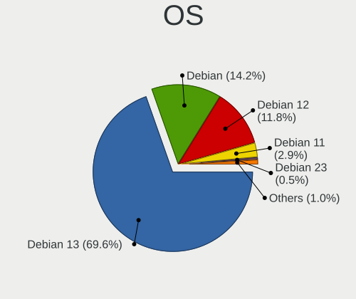

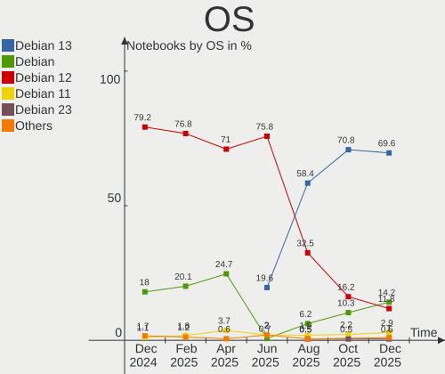

| Name        | Notebooks | Percent |
|-------------|-----------|---------|
| Debian 13   | 142       | 69.61%  |
| Debian      | 29        | 14.22%  |
| Debian 12   | 24        | 11.76%  |
| Debian 11   | 6         | 2.94%   |
| Debian 23   | 1         | 0.49%   |
| Debian 2025 | 1         | 0.49%   |
| Debian 10   | 1         | 0.49%   |

OS Family
---------

OS without a version

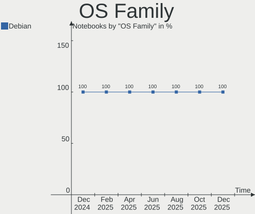

| Name   | Notebooks | Percent |
|--------|-----------|---------|
| Debian | 204       | 100%    |

Kernel
------

Version of the Linux kernel

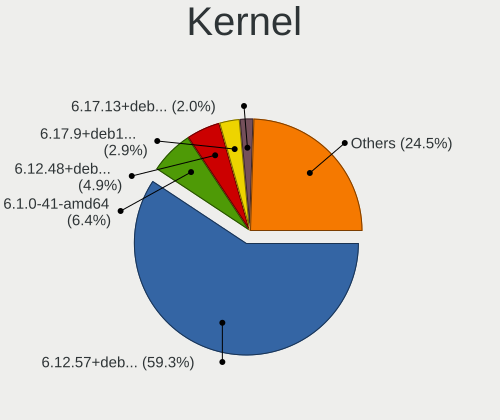

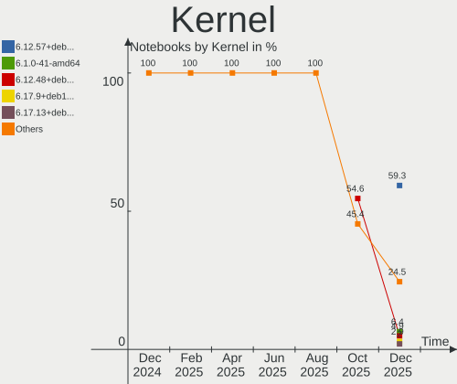

| Version                 | Notebooks | Percent |
|-------------------------|-----------|---------|
| 6.12.57+deb13-amd64     | 121       | 59.31%  |
| 6.1.0-41-amd64          | 13        | 6.37%   |
| 6.12.48+deb13-amd64     | 10        | 4.9%    |
| 6.17.9+deb14-amd64      | 6         | 2.94%   |
| 6.17.13+deb14-amd64     | 4         | 1.96%   |
| 6.1.0-40-amd64          | 4         | 1.96%   |
| 6.17.8+deb14-amd64      | 3         | 1.47%   |
| 6.17.8+deb13-amd64      | 3         | 1.47%   |
| 6.12.41+deb13-amd64     | 3         | 1.47%   |
| 6.17.12+deb14-amd64     | 2         | 0.98%   |
| 6.17.11+deb14-amd64     | 2         | 0.98%   |
| 6.16.3+deb13-amd64      | 2         | 0.98%   |
| 6.1.0-25-amd64          | 2         | 0.98%   |
| 5.10.0-35-amd64         | 2         | 0.98%   |
| 6.19.0-rc1              | 1         | 0.49%   |
| 6.18.2-1-t2-trixie      | 1         | 0.49%   |
| 6.18.0-rc7+             | 1         | 0.49%   |
| 6.18.0-rc7              | 1         | 0.49%   |
| 6.18-amd64              | 1         | 0.49%   |
| 6.17.9+deb14-loong64    | 1         | 0.49%   |
| 6.17.8+deb14-asahi      | 1         | 0.49%   |
| 6.17.6-1-liquorix-amd64 | 1         | 0.49%   |
| 6.17.11+deb14-loong64   | 1         | 0.49%   |
| 6.17.10+deb14-loong64   | 1         | 0.49%   |
| 6.17.10+deb14-amd64     | 1         | 0.49%   |
| 6.16.9+deb14-amd64      | 1         | 0.49%   |
| 6.16.12+deb14+1-amd64   | 1         | 0.49%   |
| 6.12.57+deb13-rt-amd64  | 1         | 0.49%   |
| 6.12.57+deb12-amd64     | 1         | 0.49%   |
| 6.12.38+deb13-amd64     | 1         | 0.49%   |
| 6.12.22+bpo-amd64       | 1         | 0.49%   |
| 6.10.8-policorp-amd64   | 1         | 0.49%   |
| 6.1.148                 | 1         | 0.49%   |
| 6.1.0-41-686-pae        | 1         | 0.49%   |
| 6.1.0-38-amd64          | 1         | 0.49%   |
| 6.1.0-10-amd64          | 1         | 0.49%   |
| 5.10.214-loc-os         | 1         | 0.49%   |
| 5.10.0-32-amd64         | 1         | 0.49%   |
| 5.10.0-32-686           | 1         | 0.49%   |
| 5.10.0-20-amd64         | 1         | 0.49%   |

Kernel Family
-------------

Linux kernel without a distro release

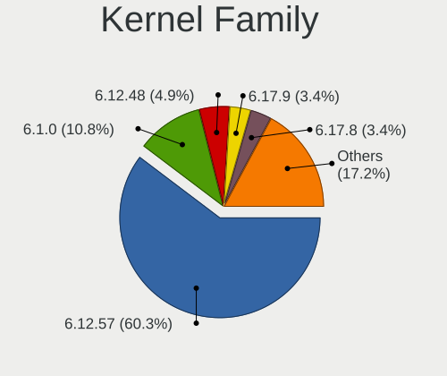

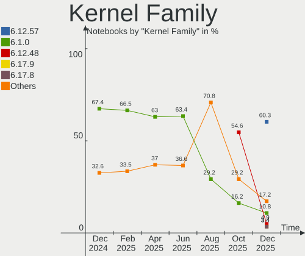

| Version  | Notebooks | Percent |
|----------|-----------|---------|
| 6.12.57  | 123       | 60.29%  |
| 6.1.0    | 22        | 10.78%  |
| 6.12.48  | 10        | 4.9%    |
| 6.17.9   | 7         | 3.43%   |
| 6.17.8   | 7         | 3.43%   |
| 5.10.0   | 6         | 2.94%   |
| 6.17.13  | 4         | 1.96%   |
| 6.17.11  | 3         | 1.47%   |
| 6.12.41  | 3         | 1.47%   |
| 6.18.0   | 2         | 0.98%   |
| 6.17.12  | 2         | 0.98%   |
| 6.17.10  | 2         | 0.98%   |
| 6.16.3   | 2         | 0.98%   |
| 6.19.0   | 1         | 0.49%   |
| 6.18.2   | 1         | 0.49%   |
| 6.18     | 1         | 0.49%   |
| 6.17.6   | 1         | 0.49%   |
| 6.16.9   | 1         | 0.49%   |
| 6.16.12  | 1         | 0.49%   |
| 6.12.38  | 1         | 0.49%   |
| 6.12.22  | 1         | 0.49%   |
| 6.10.8   | 1         | 0.49%   |
| 6.1.148  | 1         | 0.49%   |
| 5.10.214 | 1         | 0.49%   |

Kernel Major Ver.
-----------------

Linux kernel major version

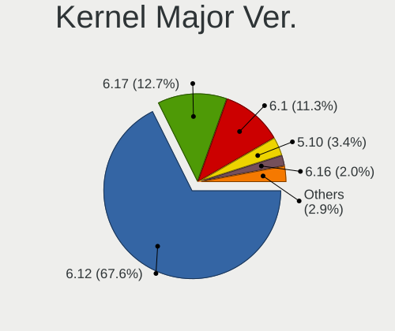

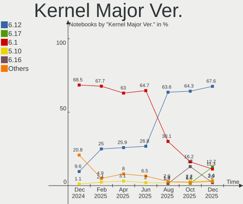

| Version | Notebooks | Percent |
|---------|-----------|---------|
| 6.12    | 138       | 67.65%  |
| 6.17    | 26        | 12.75%  |
| 6.1     | 23        | 11.27%  |
| 5.10    | 7         | 3.43%   |
| 6.16    | 4         | 1.96%   |
| 6.18    | 3         | 1.47%   |
| 6.19    | 1         | 0.49%   |
| 6.10    | 1         | 0.49%   |
| 6       | 1         | 0.49%   |

Arch
----

OS architecture (x86_64, i586, etc.)

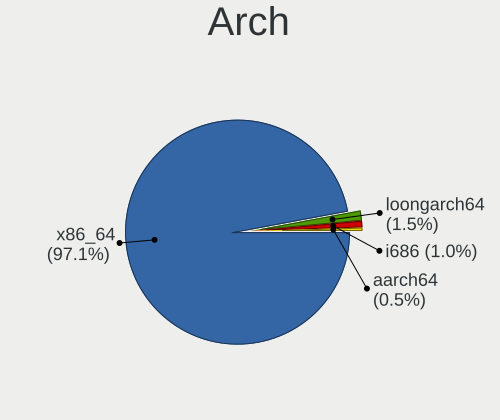

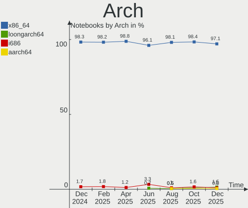

| Name        | Notebooks | Percent |
|-------------|-----------|---------|
| x86_64      | 198       | 97.06%  |
| loongarch64 | 3         | 1.47%   |
| i686        | 2         | 0.98%   |
| aarch64     | 1         | 0.49%   |

DE
--

Desktop Environment

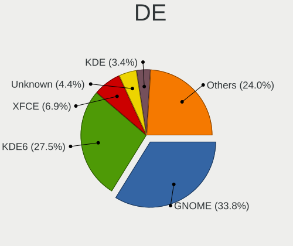

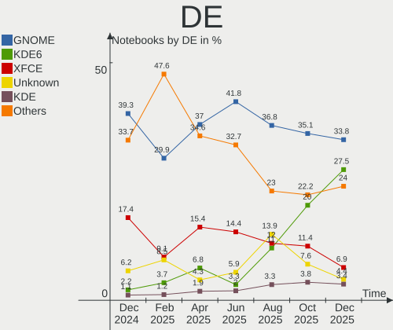

| Name                        | Notebooks | Percent |
|-----------------------------|-----------|---------|
| GNOME                       | 69        | 33.82%  |
| KDE6                        | 56        | 27.45%  |
| XFCE                        | 14        | 6.86%   |
| Unknown                     | 9         | 4.41%   |
| KDE                         | 7         | 3.43%   |
| MATE                        | 6         | 2.94%   |
| LXQt                        | 6         | 2.94%   |
| LXDE                        | 6         | 2.94%   |
| KDE5                        | 6         | 2.94%   |
| i3                          | 6         | 2.94%   |
| X-Cinnamon                  | 5         | 2.45%   |
| Trinity                     | 3         | 1.47%   |
| sway                        | 2         | 0.98%   |
| Hyprland                    | 2         | 0.98%   |
| wlroots                     | 1         | 0.49%   |
| TDE:                        | 1         | 0.49%   |
| sway:wlroots                | 1         | 0.49%   |
| GNUstep                     | 1         | 0.49%   |
| Cinnamon                    | 1         | 0.49%   |
| bspwm:                      | 1         | 0.49%   |
| /usr/local/bin/start-mwm.sh | 1         | 0.49%   |

Display Server
--------------

X11 or Wayland

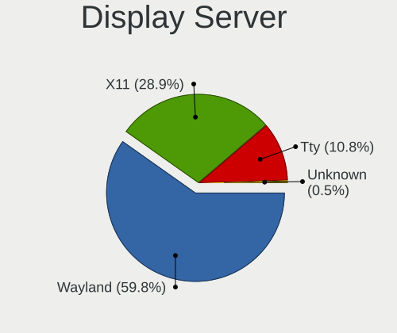

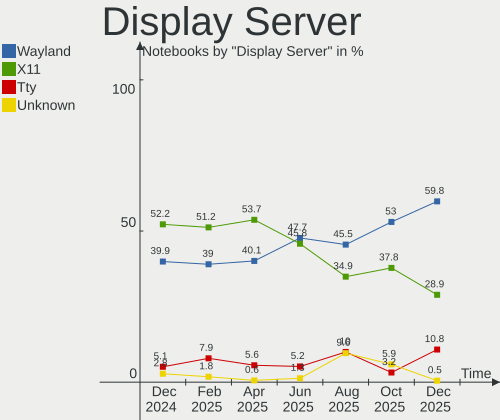

| Name    | Notebooks | Percent |
|---------|-----------|---------|
| Wayland | 122       | 59.8%   |
| X11     | 59        | 28.92%  |
| Tty     | 22        | 10.78%  |
| Unknown | 1         | 0.49%   |

Display Manager
---------------

SDDM, LightDM, etc.

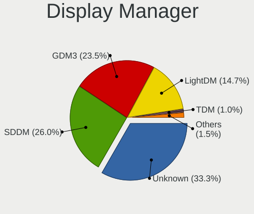

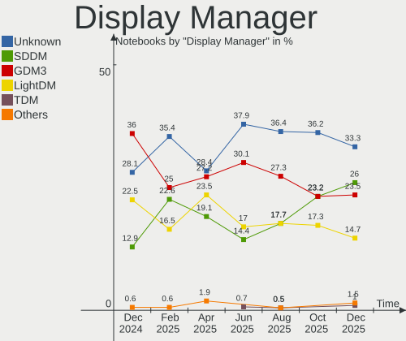

| Name    | Notebooks | Percent |
|---------|-----------|---------|
| Unknown | 68        | 33.33%  |
| SDDM    | 53        | 25.98%  |
| GDM3    | 48        | 23.53%  |
| LightDM | 30        | 14.71%  |
| TDM     | 2         | 0.98%   |
| GDM     | 2         | 0.98%   |
| GREETD  | 1         | 0.49%   |

OS Lang
-------

Language

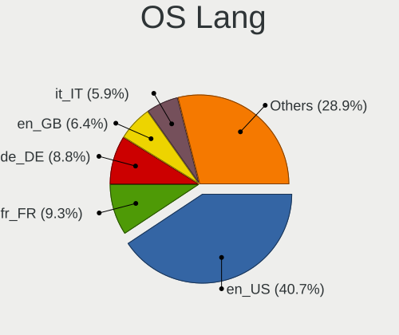

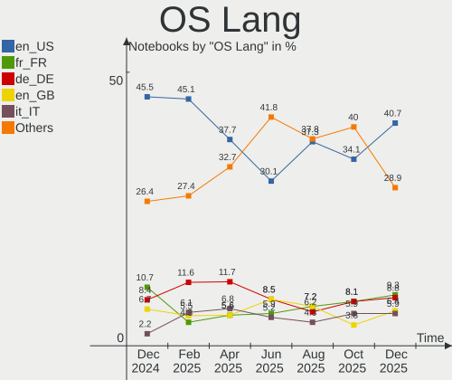

| Lang    | Notebooks | Percent |
|---------|-----------|---------|
| en_US   | 83        | 40.69%  |
| fr_FR   | 19        | 9.31%   |
| de_DE   | 18        | 8.82%   |
| en_GB   | 13        | 6.37%   |
| it_IT   | 12        | 5.88%   |
| es_MX   | 7         | 3.43%   |
| pt_BR   | 6         | 2.94%   |
| es_ES   | 6         | 2.94%   |
| zh_CN   | 4         | 1.96%   |
| pl_PL   | 4         | 1.96%   |
| ru_RU   | 3         | 1.47%   |
| nl_NL   | 3         | 1.47%   |
| en_CA   | 3         | 1.47%   |
| it_CH   | 2         | 0.98%   |
| en_IN   | 2         | 0.98%   |
| en_IE   | 2         | 0.98%   |
| de_AT   | 2         | 0.98%   |
| cs_CZ   | 2         | 0.98%   |
| Unknown | 2         | 0.98%   |
| pt_PT   | 1         | 0.49%   |
| hu_HU   | 1         | 0.49%   |
| fr_CH   | 1         | 0.49%   |
| es_US   | 1         | 0.49%   |
| es_CO   | 1         | 0.49%   |
| es_BO   | 1         | 0.49%   |
| es_AR   | 1         | 0.49%   |
| en_IL   | 1         | 0.49%   |
| en_AU   | 1         | 0.49%   |
| de_CH   | 1         | 0.49%   |
| bg_BG   | 1         | 0.49%   |

Boot Mode
---------

EFI or BIOS

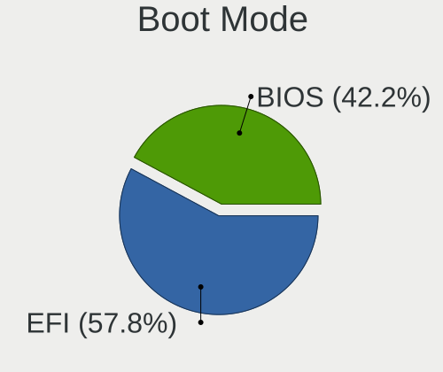

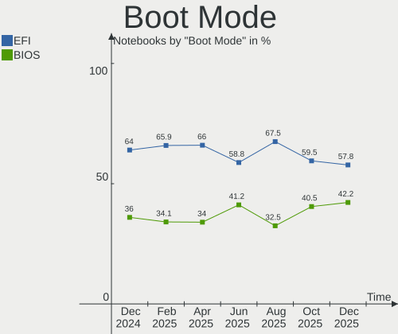

| Mode | Notebooks | Percent |
|------|-----------|---------|
| EFI  | 118       | 57.84%  |
| BIOS | 86        | 42.16%  |

Filesystem
----------

Type of filesystem

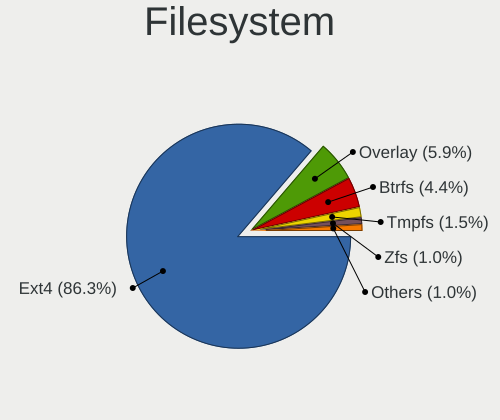

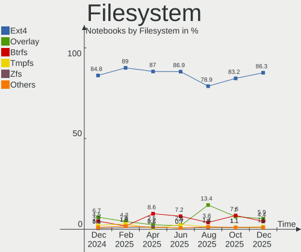

| Type    | Notebooks | Percent |
|---------|-----------|---------|
| Ext4    | 176       | 86.27%  |
| Overlay | 12        | 5.88%   |
| Btrfs   | 9         | 4.41%   |
| Tmpfs   | 3         | 1.47%   |
| Zfs     | 2         | 0.98%   |
| Xfs     | 1         | 0.49%   |
| Ext3    | 1         | 0.49%   |

Part. scheme
------------

Scheme of partitioning

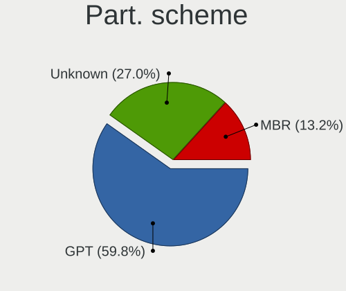

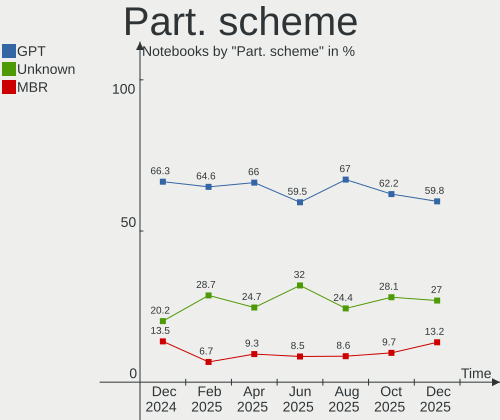

| Type    | Notebooks | Percent |
|---------|-----------|---------|
| GPT     | 122       | 59.8%   |
| Unknown | 55        | 26.96%  |
| MBR     | 27        | 13.24%  |

Dual Boot with Linux/BSD
------------------------

Hosting more than one Linux/BSD

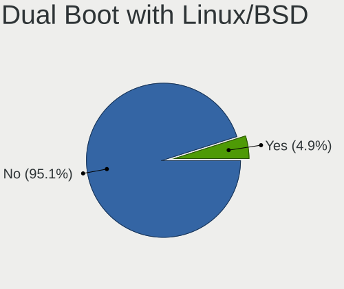

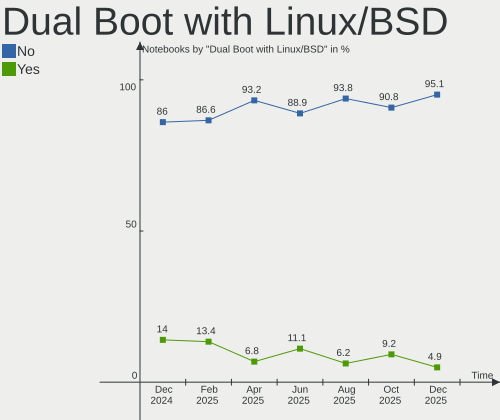

| Dual boot | Notebooks | Percent |
|-----------|-----------|---------|
| No        | 194       | 95.1%   |
| Yes       | 10        | 4.9%    |

Dual Boot (Win)
---------------

Hosting Linux and Windows

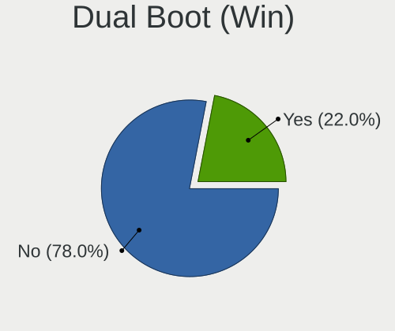

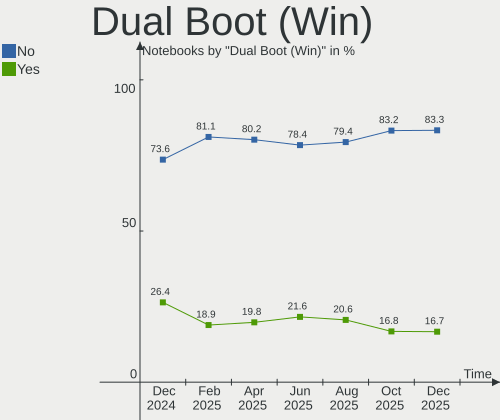

| Dual boot | Notebooks | Percent |
|-----------|-----------|---------|
| No        | 170       | 83.33%  |
| Yes       | 34        | 16.67%  |

Board
-----

Vendor
------

Motherboard manufacturer

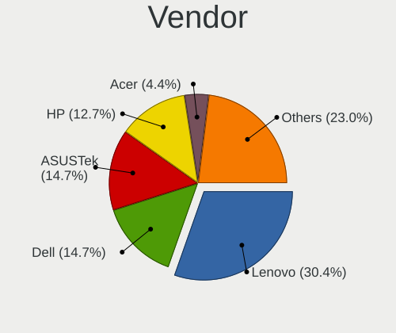

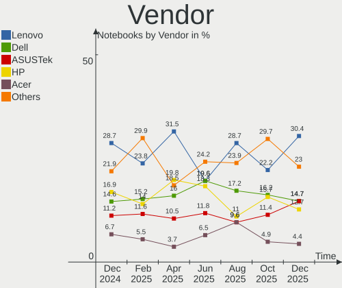

| Name                             | Notebooks | Percent |
|----------------------------------|-----------|---------|
| Lenovo                           | 62        | 30.39%  |
| Dell                             | 30        | 14.71%  |
| ASUSTek Computer                 | 30        | 14.71%  |
| Hewlett-Packard                  | 26        | 12.75%  |
| Acer                             | 9         | 4.41%   |
| Apple                            | 5         | 2.45%   |
| Sony                             | 4         | 1.96%   |
| Fujitsu                          | 4         | 1.96%   |
| Toshiba                          | 3         | 1.47%   |
| Unknown                          | 3         | 1.47%   |
| TUXEDO                           | 2         | 0.98%   |
| MSI                              | 2         | 0.98%   |
| IPASON                           | 2         | 0.98%   |
| HUAWEI                           | 2         | 0.98%   |
| Google                           | 2         | 0.98%   |
| Fujitsu Siemens                  | 2         | 0.98%   |
| VANT                             | 1         | 0.49%   |
| TongFang                         | 1         | 0.49%   |
| Shanghai Zhaoxin Semiconductor   | 1         | 0.49%   |
| Positivo                         | 1         | 0.49%   |
| PC Specialist                    | 1         | 0.49%   |
| Micro Computer (HK) Tech Limited | 1         | 0.49%   |
| KaiTian                          | 1         | 0.49%   |
| Intel                            | 1         | 0.49%   |
| IBM                              | 1         | 0.49%   |
| Hampoo                           | 1         | 0.49%   |
| GPD                              | 1         | 0.49%   |
| Gigabyte Technology              | 1         | 0.49%   |
| Framework                        | 1         | 0.49%   |
| Centerm                          | 1         | 0.49%   |
| BANGHO                           | 1         | 0.49%   |
| Alienware                        | 1         | 0.49%   |

Model
-----

Motherboard model

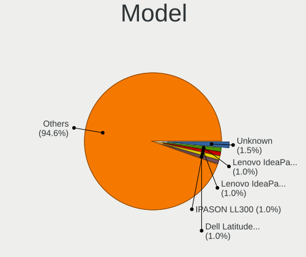

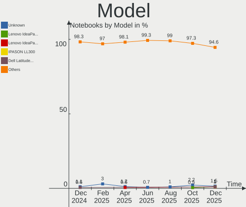

| Name                                        | Notebooks | Percent |
|---------------------------------------------|-----------|---------|
| Unknown                                     | 3         | 1.47%   |
| Lenovo IdeaPad Slim 3 15ABR8 82XM           | 2         | 0.98%   |
| Lenovo IdeaPad 3 15ADA05 81W1               | 2         | 0.98%   |
| IPASON LL300                                | 2         | 0.98%   |
| Dell Latitude E6410                         | 2         | 0.98%   |
| Dell Latitude 5400                          | 2         | 0.98%   |
| VANT MOOVE3-15                              | 1         | 0.49%   |
| TUXEDO InfinityBook S 15/17 Gen7            | 1         | 0.49%   |
| TUXEDO InfinityBook Pro AMD Gen9            | 1         | 0.49%   |
| Toshiba Satellite L305D                     | 1         | 0.49%   |
| Toshiba Satellite C660                      | 1         | 0.49%   |
| Toshiba SATE                                | 1         | 0.49%   |
| TongFang GX4HRXL                            | 1         | 0.49%   |
| Sony VPCF11M1E                              | 1         | 0.49%   |
| Sony VPCF11C5E                              | 1         | 0.49%   |
| Sony VGN-FW41J_H                            | 1         | 0.49%   |
| Sony SVJ20213CXW                            | 1         | 0.49%   |
| Shanghai Zhaoxin ZXE CRB                    | 1         | 0.49%   |
| Positivo I38256CI-15                        | 1         | 0.49%   |
| PC Specialist Lafite Pro IV 14              | 1         | 0.49%   |
| MSI Modern 15 H AI C1MOG                    | 1         | 0.49%   |
| MSI Katana GF76 11UD                        | 1         | 0.49%   |
| Micro (HK) Tech Limited Venus series        | 1         | 0.49%   |
| Lenovo Yoga Slim 7 14ILL10 83JX             | 1         | 0.49%   |
| Lenovo Yoga Slim 7 14AKP10 83JY             | 1         | 0.49%   |
| Lenovo V15 G4 AMN 82YU                      | 1         | 0.49%   |
| Lenovo V15 G3 IAP 82TT                      | 1         | 0.49%   |
| Lenovo ThinkPad X280 20KF001GGE             | 1         | 0.49%   |
| Lenovo ThinkPad X270 20HMS2C003             | 1         | 0.49%   |
| Lenovo ThinkPad X230 2325SG2                | 1         | 0.49%   |
| Lenovo ThinkPad X230 2325CN9                | 1         | 0.49%   |
| Lenovo ThinkPad X220 4291YL5                | 1         | 0.49%   |
| Lenovo ThinkPad X13 Gen 1 20UF003JCK        | 1         | 0.49%   |
| Lenovo ThinkPad X1 Carbon Gen 9 20XW004EUS  | 1         | 0.49%   |
| Lenovo ThinkPad X1 Carbon Gen 12 21KC00AAGE | 1         | 0.49%   |
| Lenovo ThinkPad X1 Carbon Gen 12 21KC000TUS | 1         | 0.49%   |
| Lenovo ThinkPad T61 7658CTO                 | 1         | 0.49%   |
| Lenovo ThinkPad T580 20LAS24800             | 1         | 0.49%   |
| Lenovo ThinkPad T480s 20L8S0SA00            | 1         | 0.49%   |
| Lenovo ThinkPad T430 2347AY1                | 1         | 0.49%   |

Model Family
------------

Motherboard model prefix

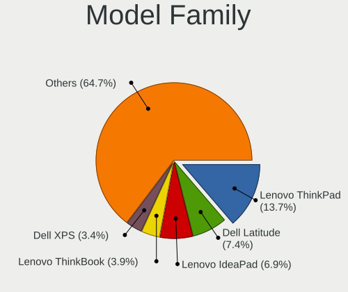

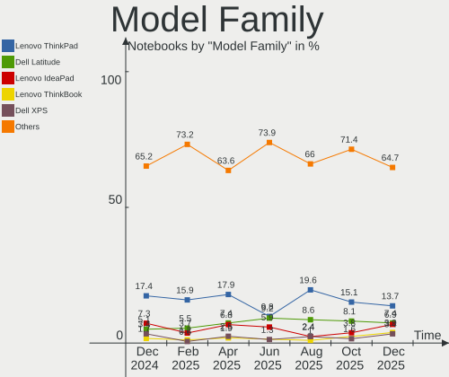

| Name                          | Notebooks | Percent |
|-------------------------------|-----------|---------|
| Lenovo ThinkPad               | 28        | 13.73%  |
| Dell Latitude                 | 15        | 7.35%   |
| Lenovo IdeaPad                | 14        | 6.86%   |
| Lenovo ThinkBook              | 8         | 3.92%   |
| Dell XPS                      | 7         | 3.43%   |
| ASUS Vivobook                 | 7         | 3.43%   |
| ASUS ASUS                     | 6         | 2.94%   |
| Acer Aspire                   | 6         | 2.94%   |
| HP Laptop                     | 5         | 2.45%   |
| HP EliteBook                  | 5         | 2.45%   |
| Lenovo Legion                 | 4         | 1.96%   |
| Fujitsu LIFEBOOK              | 4         | 1.96%   |
| HP Pavilion                   | 3         | 1.47%   |
| HP ENVY                       | 3         | 1.47%   |
| Dell Inspiron                 | 3         | 1.47%   |
| ASUS ROG                      | 3         | 1.47%   |
| Unknown                       | 3         | 1.47%   |
| TUXEDO InfinityBook           | 2         | 0.98%   |
| Toshiba Satellite             | 2         | 0.98%   |
| Lenovo Yoga                   | 2         | 0.98%   |
| Lenovo V15                    | 2         | 0.98%   |
| IPASON LL300                  | 2         | 0.98%   |
| HP ProBook                    | 2         | 0.98%   |
| HP Compaq                     | 2         | 0.98%   |
| Fujitsu Siemens ESPRIMO       | 2         | 0.98%   |
| Dell G3                       | 2         | 0.98%   |
| Apple MacBookPro11            | 2         | 0.98%   |
| VANT MOOVE3-15                | 1         | 0.49%   |
| Toshiba SATE                  | 1         | 0.49%   |
| TongFang GX4HRXL              | 1         | 0.49%   |
| Sony VPCF11M1E                | 1         | 0.49%   |
| Sony VPCF11C5E                | 1         | 0.49%   |
| Sony VGN-FW41J                | 1         | 0.49%   |
| Sony SVJ20213CXW              | 1         | 0.49%   |
| Shanghai Zhaoxin ZXE          | 1         | 0.49%   |
| Positivo I38256CI-15          | 1         | 0.49%   |
| PC Specialist Lafite          | 1         | 0.49%   |
| MSI Modern                    | 1         | 0.49%   |
| MSI Katana                    | 1         | 0.49%   |
| Micro (HK) Tech Limited Venus | 1         | 0.49%   |

MFG Year
--------

Motherboard manufacture year

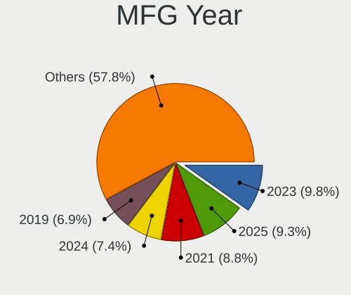

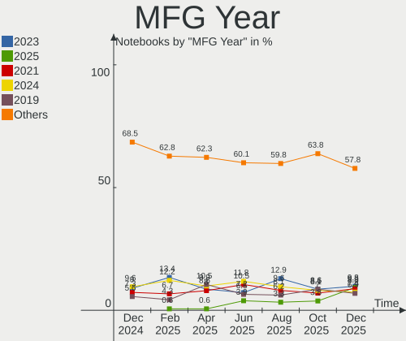

| Year    | Notebooks | Percent |
|---------|-----------|---------|
| 2023    | 20        | 9.8%    |
| 2025    | 19        | 9.31%   |
| 2021    | 18        | 8.82%   |
| 2024    | 15        | 7.35%   |
| 2019    | 14        | 6.86%   |
| 2020    | 13        | 6.37%   |
| 2018    | 13        | 6.37%   |
| 2009    | 11        | 5.39%   |
| 2022    | 10        | 4.9%    |
| 2017    | 10        | 4.9%    |
| 2010    | 10        | 4.9%    |
| 2011    | 9         | 4.41%   |
| 2012    | 8         | 3.92%   |
| 2014    | 7         | 3.43%   |
| 2013    | 7         | 3.43%   |
| 2008    | 6         | 2.94%   |
| 2016    | 5         | 2.45%   |
| 2015    | 4         | 1.96%   |
| 2007    | 2         | 0.98%   |
| 2006    | 1         | 0.49%   |
| 2003    | 1         | 0.49%   |
| Unknown | 1         | 0.49%   |

Form Factor
-----------

Physical design of the computer

| Name     | Notebooks | Percent |
|----------|-----------|---------|
| Notebook | 204       | 100%    |

Secure Boot
-----------

Enabled or disabled

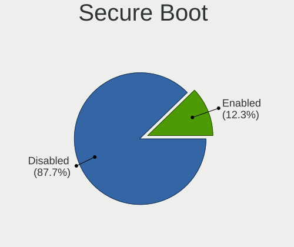

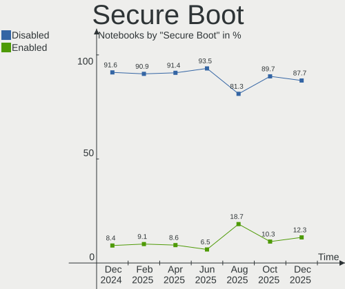

| State    | Notebooks | Percent |
|----------|-----------|---------|
| Disabled | 179       | 87.75%  |
| Enabled  | 25        | 12.25%  |

Coreboot
--------

Have coreboot on board

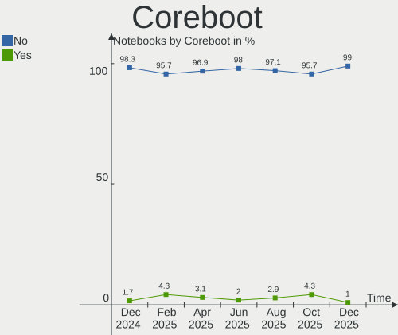

| Used | Notebooks | Percent |
|------|-----------|---------|
| No   | 202       | 99.02%  |
| Yes  | 2         | 0.98%   |

RAM Size
--------

Total RAM memory

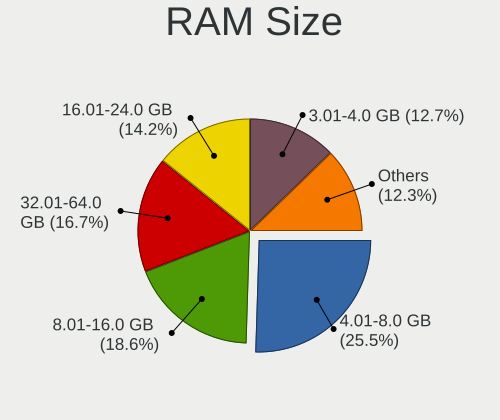

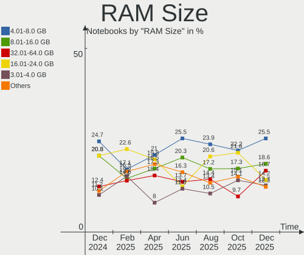

| Size in GB  | Notebooks | Percent |
|-------------|-----------|---------|
| 4.01-8.0    | 52        | 25.49%  |
| 8.01-16.0   | 38        | 18.63%  |
| 32.01-64.0  | 34        | 16.67%  |
| 16.01-24.0  | 29        | 14.22%  |
| 3.01-4.0    | 26        | 12.75%  |
| 24.01-32.0  | 9         | 4.41%   |
| 64.01-256.0 | 7         | 3.43%   |
| 2.01-3.0    | 5         | 2.45%   |
| 1.01-2.0    | 4         | 1.96%   |

RAM Used
--------

Used RAM memory

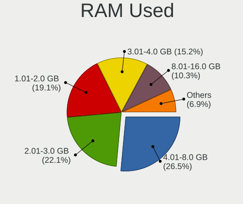

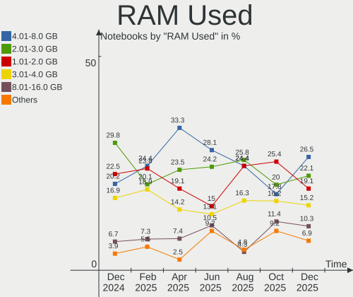

| Used GB    | Notebooks | Percent |
|------------|-----------|---------|
| 4.01-8.0   | 54        | 26.47%  |
| 2.01-3.0   | 45        | 22.06%  |
| 1.01-2.0   | 39        | 19.12%  |
| 3.01-4.0   | 31        | 15.2%   |
| 8.01-16.0  | 21        | 10.29%  |
| 0.51-1.0   | 12        | 5.88%   |
| 24.01-32.0 | 1         | 0.49%   |
| 0.01-0.5   | 1         | 0.49%   |

Total Drives
------------

Number of drives on board

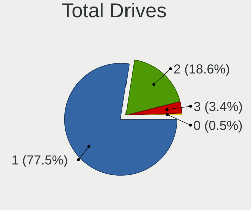

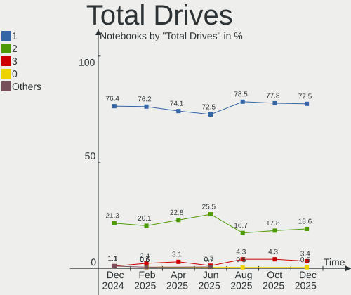

| Drives | Notebooks | Percent |
|--------|-----------|---------|
| 1      | 158       | 77.45%  |
| 2      | 38        | 18.63%  |
| 3      | 7         | 3.43%   |
| 0      | 1         | 0.49%   |

Has CD-ROM
----------

Has CD-ROM on board

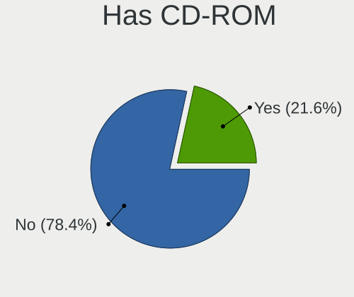

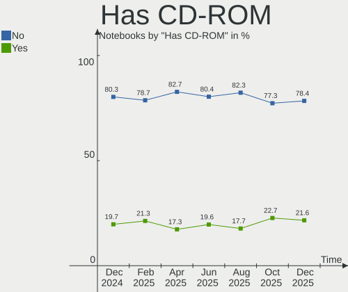

| Presented | Notebooks | Percent |
|-----------|-----------|---------|
| No        | 160       | 78.43%  |
| Yes       | 44        | 21.57%  |

Has Ethernet
------------

Has Ethernet on board

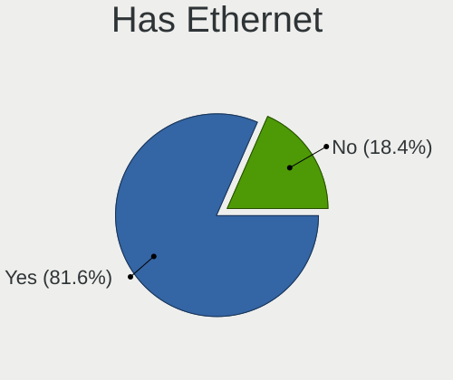

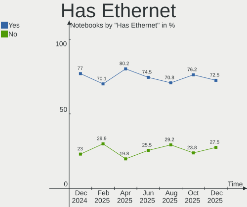

| Presented | Notebooks | Percent |
|-----------|-----------|---------|
| Yes       | 148       | 72.55%  |
| No        | 56        | 27.45%  |

Has WiFi
--------

Has WiFi module

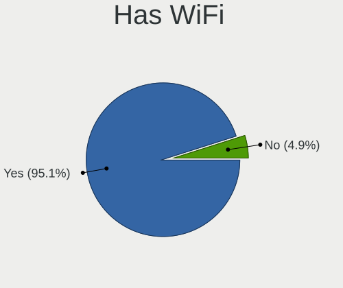

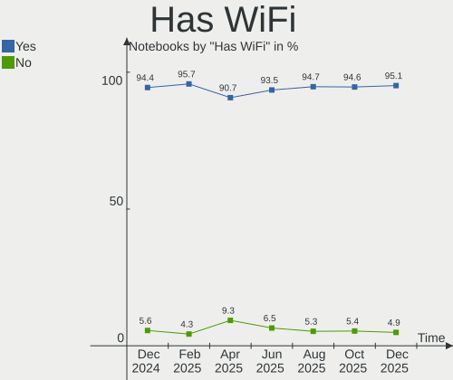

| Presented | Notebooks | Percent |
|-----------|-----------|---------|
| Yes       | 194       | 95.1%   |
| No        | 10        | 4.9%    |

Has Bluetooth
-------------

Has Bluetooth module

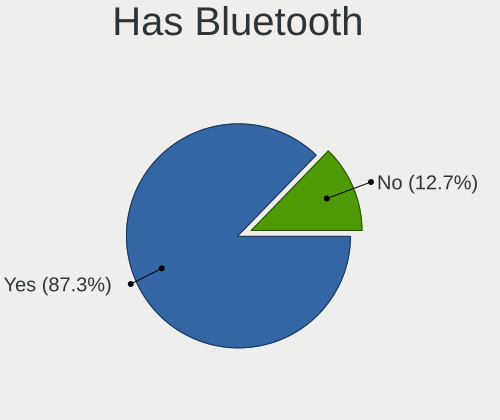

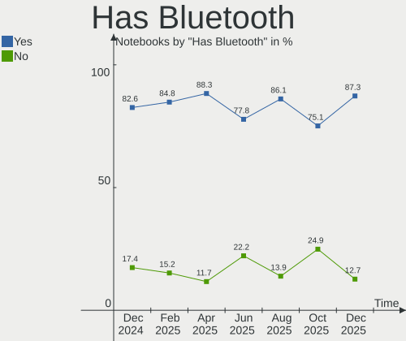

| Presented | Notebooks | Percent |
|-----------|-----------|---------|
| Yes       | 178       | 87.25%  |
| No        | 26        | 12.75%  |

Location
--------

Country
-------

Geographic location (country)

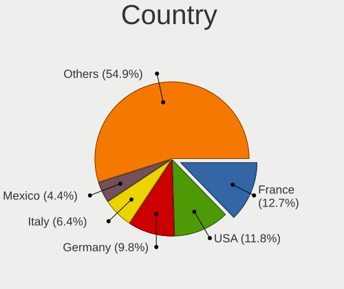

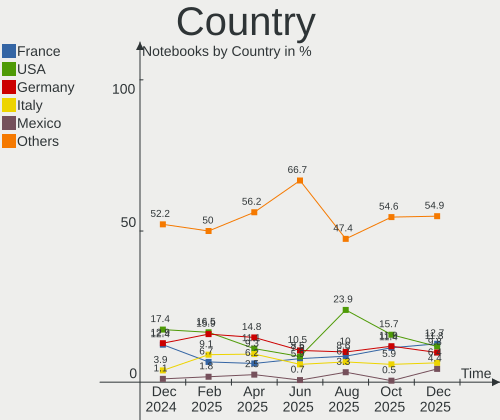

| Country         | Notebooks | Percent |
|-----------------|-----------|---------|
| France          | 26        | 12.75%  |
| USA             | 24        | 11.76%  |
| Germany         | 20        | 9.8%    |
| Italy           | 13        | 6.37%   |
| Mexico          | 9         | 4.41%   |
| Brazil          | 8         | 3.92%   |
| Austria         | 8         | 3.92%   |
| Switzerland     | 7         | 3.43%   |
| Poland          | 7         | 3.43%   |
| Spain           | 6         | 2.94%   |
| Russia          | 6         | 2.94%   |
| China           | 6         | 2.94%   |
| UK              | 5         | 2.45%   |
| Bulgaria        | 4         | 1.96%   |
| Argentina       | 4         | 1.96%   |
| The Netherlands | 3         | 1.47%   |
| India           | 3         | 1.47%   |
| Greece          | 3         | 1.47%   |
| Canada          | 3         | 1.47%   |
| Tunisia         | 2         | 0.98%   |
| Romania         | 2         | 0.98%   |
| Portugal        | 2         | 0.98%   |
| Hungary         | 2         | 0.98%   |
| Finland         | 2         | 0.98%   |
| Czechia         | 2         | 0.98%   |
| Cyprus          | 2         | 0.98%   |
| Colombia        | 2         | 0.98%   |
| Ukraine         | 1         | 0.49%   |
| Turkey          | 1         | 0.49%   |
| Thailand        | 1         | 0.49%   |
| Taiwan          | 1         | 0.49%   |
| Singapore       | 1         | 0.49%   |
| Serbia          | 1         | 0.49%   |
| Norway          | 1         | 0.49%   |
| New Zealand     | 1         | 0.49%   |
| Netherlands     | 1         | 0.49%   |
| Maldives        | 1         | 0.49%   |
| Latvia          | 1         | 0.49%   |
| Israel          | 1         | 0.49%   |
| Ireland         | 1         | 0.49%   |

City
----

Geographic location (city)

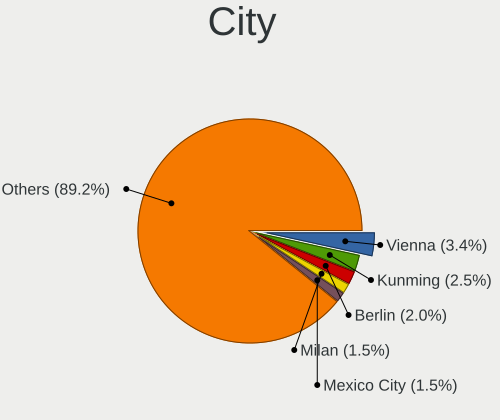

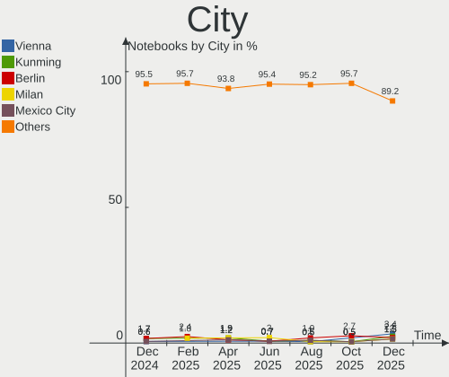

| City                  | Notebooks | Percent |
|-----------------------|-----------|---------|
| Vienna                | 7         | 3.43%   |
| Kunming               | 5         | 2.45%   |
| Berlin                | 4         | 1.96%   |
| Milan                 | 3         | 1.47%   |
| Mexico City           | 3         | 1.47%   |
| Tunis                 | 2         | 0.98%   |
| Poznan                | 2         | 0.98%   |
| Pijnacker             | 2         | 0.98%   |
| Paris                 | 2         | 0.98%   |
| Madrid                | 2         | 0.98%   |
| Helsinki              | 2         | 0.98%   |
| Córdoba              | 2         | 0.98%   |
| Athens                | 2         | 0.98%   |
| Zweidlen-Dorf         | 1         | 0.49%   |
| Zurich                | 1         | 0.49%   |
| Zagreb                | 1         | 0.49%   |
| York                  | 1         | 0.49%   |
| Yogyakarta            | 1         | 0.49%   |
| Wroclaw               | 1         | 0.49%   |
| Werdau                | 1         | 0.49%   |
| Warsaw                | 1         | 0.49%   |
| Vladimir              | 1         | 0.49%   |
| Villepinte            | 1         | 0.49%   |
| Vicente Lopez         | 1         | 0.49%   |
| Varna                 | 1         | 0.49%   |
| Vader                 | 1         | 0.49%   |
| Toulon                | 1         | 0.49%   |
| Toronto               | 1         | 0.49%   |
| Tepic                 | 1         | 0.49%   |
| Tallinn               | 1         | 0.49%   |
| Tallahassee           | 1         | 0.49%   |
| Taichung              | 1         | 0.49%   |
| Szczecinek            | 1         | 0.49%   |
| Sucre                 | 1         | 0.49%   |
| Straz pod Ralskem     | 1         | 0.49%   |
| Sotteville-lès-Rouen | 1         | 0.49%   |
| Sofia                 | 1         | 0.49%   |
| Smederevo             | 1         | 0.49%   |
| Singapore             | 1         | 0.49%   |
| Shchelkovo            | 1         | 0.49%   |

Drives
------

Drive Vendor
------------

Hard drive vendors

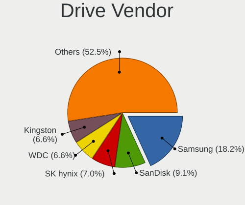

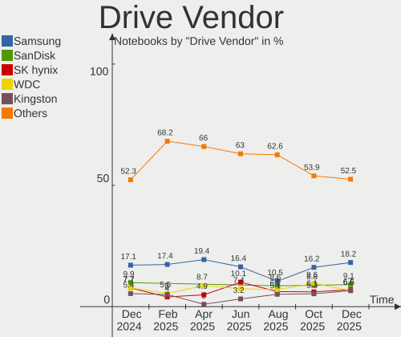

| Vendor                         | Notebooks | Drives | Percent |
|--------------------------------|-----------|--------|---------|
| Samsung Electronics            | 44        | 46     | 18.18%  |
| SanDisk                        | 22        | 22     | 9.09%   |
| SK hynix                       | 17        | 17     | 7.02%   |
| WDC                            | 16        | 16     | 6.61%   |
| Kingston                       | 16        | 17     | 6.61%   |
| Seagate                        | 15        | 16     | 6.2%    |
| Micron Technology              | 12        | 12     | 4.96%   |
| Crucial                        | 11        | 11     | 4.55%   |
| Unknown                        | 9         | 10     | 3.72%   |
| KIOXIA                         | 6         | 6      | 2.48%   |
| Intel                          | 5         | 5      | 2.07%   |
| HGST                           | 5         | 5      | 2.07%   |
| Toshiba                        | 4         | 4      | 1.65%   |
| Kingston Technology Company    | 4         | 4      | 1.65%   |
| Hitachi                        | 4         | 4      | 1.65%   |
| Apple                          | 4         | 7      | 1.65%   |
| A-DATA Technology              | 4         | 4      | 1.65%   |
| YMTC                           | 2         | 2      | 0.83%   |
| Team                           | 2         | 2      | 0.83%   |
| Phison Electronics             | 2         | 2      | 0.83%   |
| MAXIO Technology (Hangzhou)    | 2         | 2      | 0.83%   |
| Hikvision                      | 2         | 2      | 0.83%   |
| China                          | 2         | 2      | 0.83%   |
| Unknown                        | 2         | 2      | 0.83%   |
| ZHITAI                         | 1         | 1      | 0.41%   |
| VICKTER                        | 1         | 1      | 0.41%   |
| USB                            | 1         | 1      | 0.41%   |
| UMIS                           | 1         | 1      | 0.41%   |
| SSK                            | 1         | 1      | 0.41%   |
| SPCC                           | 1         | 1      | 0.41%   |
| Solid State Storage Technology | 1         | 1      | 0.41%   |
| SABRENT                        | 1         | 1      | 0.41%   |
| Philips                        | 1         | 1      | 0.41%   |
| PC Specialist                  | 1         | 1      | 0.41%   |
| Patriot                        | 1         | 1      | 0.41%   |
| O2 Micro                       | 1         | 1      | 0.41%   |
| Mushkin                        | 1         | 1      | 0.41%   |
| Min Yi U                       | 1         | 1      | 0.41%   |
| Micron/Crucial Technology      | 1         | 1      | 0.41%   |
| Lexar                          | 1         | 1      | 0.41%   |

Drive Model
-----------

Hard drive models

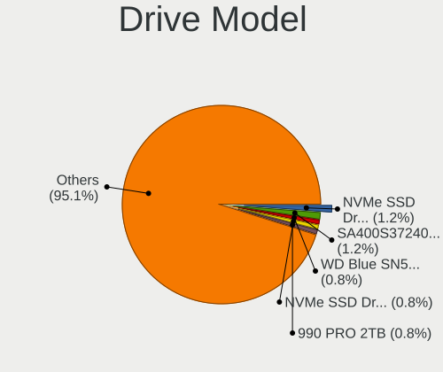

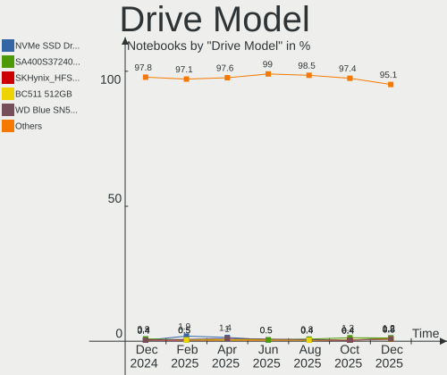

| Model                                              | Notebooks | Percent |
|----------------------------------------------------|-----------|---------|
| SanDisk NVMe SSD Drive 512GB                       | 3         | 1.21%   |
| Kingston SA400S37240G 240GB SSD                    | 3         | 1.21%   |
| SK hynix SKHynix_HFS512GEJ4X112N 512GB             | 2         | 0.81%   |
| SK hynix BC511 512GB                               | 2         | 0.81%   |
| Sandisk WD Blue SN550 NVMe SSD 1024GB              | 2         | 0.81%   |
| SanDisk NVMe SSD Drive 1TB                         | 2         | 0.81%   |
| Samsung SSD 990 PRO 2TB                            | 2         | 0.81%   |
| Samsung SSD 850 EVO 500GB                          | 2         | 0.81%   |
| Samsung NVMe SSD Controller PM9A1/PM9A3/980PRO 1TB | 2         | 0.81%   |
| Samsung MZVLW256HEHP-000L7 256GB                   | 2         | 0.81%   |
| Samsung MZVL21T0HCLR-00BL2 1TB                     | 2         | 0.81%   |
| Samsung MZALQ512HALU-000L2 512GB                   | 2         | 0.81%   |
| Micron MTFDKCD512QGN-1BN1AABLA 512GB               | 2         | 0.81%   |
| Micron 2450_MTFDKBA512TFK 512GB                    | 2         | 0.81%   |
| Kingston Company SNV2S1000G 1TB                    | 2         | 0.81%   |
| Kingston SUV400S37120G 120GB SSD                   | 2         | 0.81%   |
| Kingston SA400S37480G 480GB SSD                    | 2         | 0.81%   |
| Intel SSDPEKNW512GZL 512GB                         | 2         | 0.81%   |
| Hikvision HS-SSD-E1000 1024G                       | 2         | 0.81%   |
| HGST HTS721010A9E630 1TB                           | 2         | 0.81%   |
| HGST HTS541010A9E680 1TB                           | 2         | 0.81%   |
| Crucial CT480BX500SSD1 480GB                       | 2         | 0.81%   |
| Crucial CT240BX500SSD1 240GB                       | 2         | 0.81%   |
| A-DATA SU630 240GB SSD                             | 2         | 0.81%   |
| Unknown                                            | 2         | 0.81%   |
| ZHITAI SC001 Active 512GB SSD                      | 1         | 0.4%    |
| YMTC YMSS2ED08D25MC 1TB                            | 1         | 0.4%    |
| YMTC YMSS2CB08D25MC 1TB                            | 1         | 0.4%    |
| WDC WDS500G2B0A-00SM50 500GB                       | 1         | 0.4%    |
| WDC WDS500G2B0A 500GB SSD                          | 1         | 0.4%    |
| WDC WD3200BEKT-60V5T1 320GB                        | 1         | 0.4%    |
| WDC WD2500BEVT-60ZCT1 250GB                        | 1         | 0.4%    |
| WDC WD2500BEVT-22A23T0 250GB                       | 1         | 0.4%    |
| WDC WD2500BEVS-26UST0 250GB                        | 1         | 0.4%    |
| WDC WD10SPZX-24Z10 1TB                             | 1         | 0.4%    |
| WDC WD My Passport 264F 1TB                        | 1         | 0.4%    |
| WDC WD Green 2.5 1000GB                            | 1         | 0.4%    |
| WDC WD Blue SA510 2.5 1TB SSD                      | 1         | 0.4%    |
| WDC PC SN730 SDBQNTY-256G-1001 256GB               | 1         | 0.4%    |
| WDC PC SN530 SDBPTPZ-1T00-1002 1TB                 | 1         | 0.4%    |

HDD Vendor
----------

Hard disk drive vendors

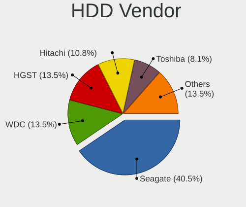

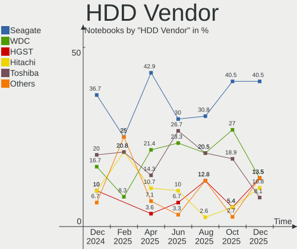

| Vendor              | Notebooks | Drives | Percent |
|---------------------|-----------|--------|---------|
| Seagate             | 15        | 16     | 40.54%  |
| WDC                 | 5         | 5      | 13.51%  |
| HGST                | 5         | 5      | 13.51%  |
| Hitachi             | 4         | 4      | 10.81%  |
| Toshiba             | 3         | 3      | 8.11%   |
| Unknown             | 1         | 1      | 2.7%    |
| Samsung Electronics | 1         | 1      | 2.7%    |
| IB-AC703            | 1         | 1      | 2.7%    |
| HGST HTS            | 1         | 1      | 2.7%    |
| Fujitsu             | 1         | 1      | 2.7%    |

SSD Vendor
----------

Solid state drive vendors

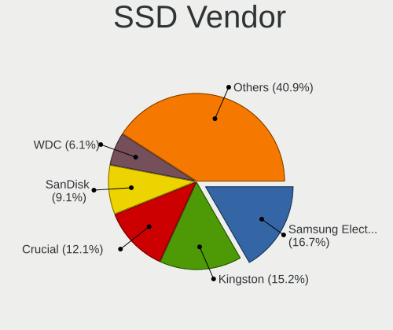

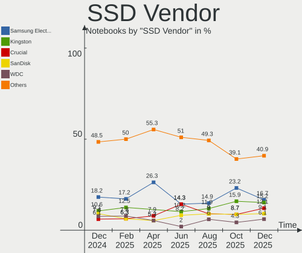

| Vendor              | Notebooks | Drives | Percent |
|---------------------|-----------|--------|---------|
| Samsung Electronics | 11        | 11     | 16.67%  |
| Kingston            | 10        | 11     | 15.15%  |
| Crucial             | 8         | 8      | 12.12%  |
| SanDisk             | 6         | 6      | 9.09%   |
| WDC                 | 4         | 4      | 6.06%   |
| SK hynix            | 3         | 3      | 4.55%   |
| Team                | 2         | 2      | 3.03%   |
| Micron Technology   | 2         | 2      | 3.03%   |
| China               | 2         | 2      | 3.03%   |
| Apple               | 2         | 2      | 3.03%   |
| A-DATA Technology   | 2         | 2      | 3.03%   |
| ZHITAI              | 1         | 1      | 1.52%   |
| VICKTER             | 1         | 1      | 1.52%   |
| Toshiba             | 1         | 1      | 1.52%   |
| SPCC                | 1         | 1      | 1.52%   |
| SABRENT             | 1         | 1      | 1.52%   |
| Patriot             | 1         | 1      | 1.52%   |
| Mushkin             | 1         | 1      | 1.52%   |
| Min Yi U            | 1         | 1      | 1.52%   |
| KIOXIA-EXCERIA      | 1         | 1      | 1.52%   |
| HS-SSD-WAVE(S)      | 1         | 1      | 1.52%   |
| HEORIADY            | 1         | 1      | 1.52%   |
| Corsair             | 1         | 1      | 1.52%   |
| BlueRay             | 1         | 1      | 1.52%   |
| BAITITON            | 1         | 1      | 1.52%   |

Drive Kind
----------

HDD or SSD

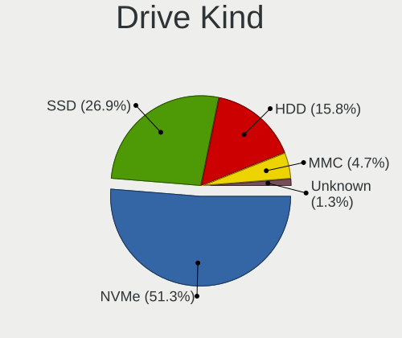

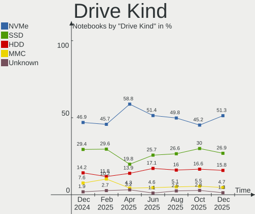

| Kind    | Notebooks | Drives | Percent |
|---------|-----------|--------|---------|
| NVMe    | 120       | 130    | 51.28%  |
| SSD     | 63        | 67     | 26.92%  |
| HDD     | 37        | 38     | 15.81%  |
| MMC     | 11        | 12     | 4.7%    |
| Unknown | 3         | 3      | 1.28%   |

Drive Connector
---------------

SATA, SAS, NVMe, etc.

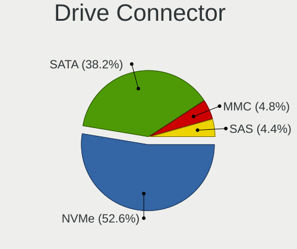

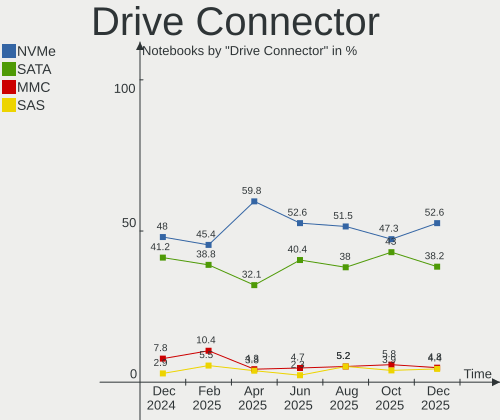

| Type | Notebooks | Drives | Percent |
|------|-----------|--------|---------|
| NVMe | 120       | 129    | 52.63%  |
| SATA | 87        | 98     | 38.16%  |
| MMC  | 11        | 12     | 4.82%   |
| SAS  | 10        | 11     | 4.39%   |

Drive Size
----------

Size of hard drive

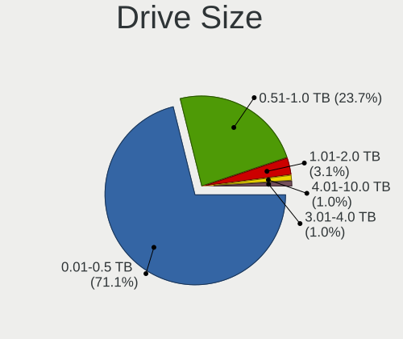

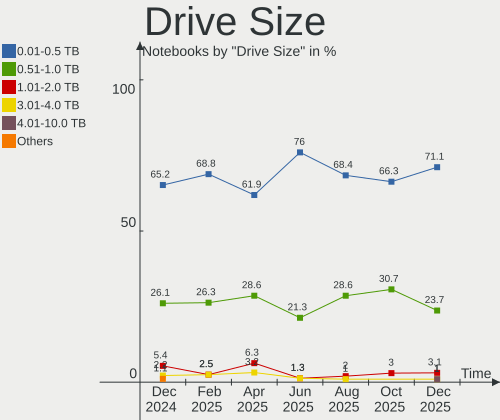

| Size in TB | Notebooks | Drives | Percent |
|------------|-----------|--------|---------|
| 0.01-0.5   | 69        | 76     | 71.13%  |
| 0.51-1.0   | 23        | 24     | 23.71%  |
| 1.01-2.0   | 3         | 3      | 3.09%   |
| 3.01-4.0   | 1         | 1      | 1.03%   |
| 4.01-10.0  | 1         | 1      | 1.03%   |

Space Total
-----------

Amount of disk space available on the file system

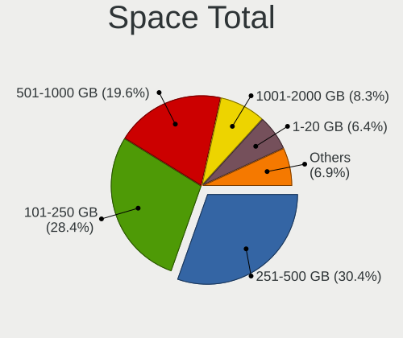

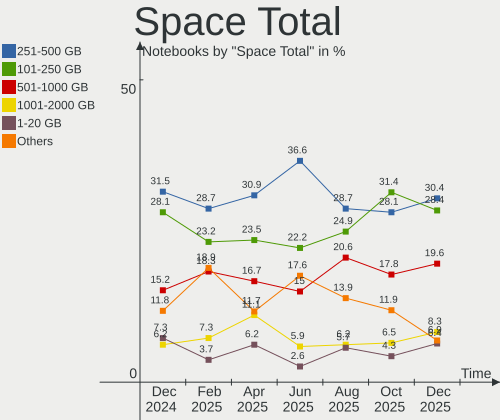

| Size in GB     | Notebooks | Percent |
|----------------|-----------|---------|
| 251-500        | 62        | 30.39%  |
| 101-250        | 58        | 28.43%  |
| 501-1000       | 40        | 19.61%  |
| 1001-2000      | 17        | 8.33%   |
| 1-20           | 13        | 6.37%   |
| 51-100         | 6         | 2.94%   |
| More than 3000 | 3         | 1.47%   |
| 21-50          | 3         | 1.47%   |
| 2001-3000      | 1         | 0.49%   |
| Unknown        | 1         | 0.49%   |

Space Used
----------

Amount of used disk space

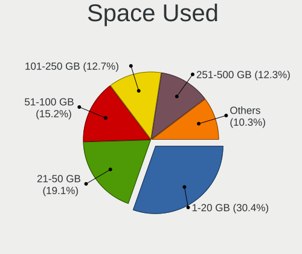

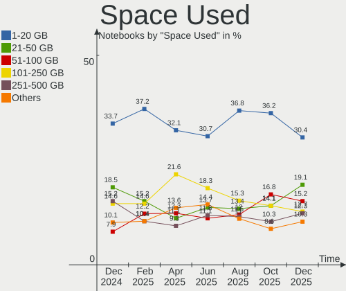

| Used GB   | Notebooks | Percent |
|-----------|-----------|---------|
| 1-20      | 62        | 30.39%  |
| 21-50     | 39        | 19.12%  |
| 51-100    | 31        | 15.2%   |
| 101-250   | 26        | 12.75%  |
| 251-500   | 25        | 12.25%  |
| 501-1000  | 14        | 6.86%   |
| 1001-2000 | 5         | 2.45%   |
| 0         | 1         | 0.49%   |
| Unknown   | 1         | 0.49%   |

Malfunc. Drives
---------------

Drive models with a malfunction

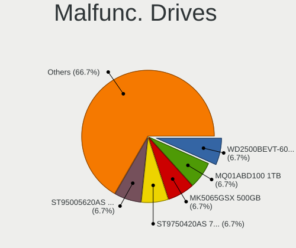

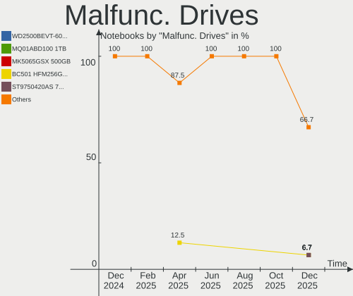

| Model                                          | Notebooks | Drives | Percent |
|------------------------------------------------|-----------|--------|---------|
| WDC WD2500BEVT-60ZCT1 250GB                    | 1         | 1      | 6.67%   |
| Toshiba MQ01ABD100 1TB                         | 1         | 1      | 6.67%   |
| Toshiba MK5065GSX 500GB                        | 1         | 1      | 6.67%   |
| SK hynix BC501 HFM256GDJTNG-8310A 256GB        | 1         | 1      | 6.67%   |
| Seagate ST9750420AS 752GB                      | 1         | 1      | 6.67%   |
| Seagate ST95005620AS 500GB                     | 1         | 1      | 6.67%   |
| Seagate ST320LT007-9ZV142 320GB                | 1         | 1      | 6.67%   |
| Seagate ST1000LM024 HN-M101MBB 1TB             | 1         | 1      | 6.67%   |
| Philips FM82SS001N-93 NVME 4.0 1TB             | 1         | 1      | 6.67%   |
| Micron Technology 1100_MTFDDAK256TBN 256GB SSD | 1         | 1      | 6.67%   |
| Hitachi HTS547575A9E384 752GB                  | 1         | 1      | 6.67%   |
| Hitachi HTS545032B9A300 320GB                  | 1         | 1      | 6.67%   |
| Hitachi HTS543216L9A300 160GB                  | 1         | 1      | 6.67%   |
| HGST HTS721010A9E630 1TB                       | 1         | 1      | 6.67%   |
| HGST HTS541010A9E680 1TB                       | 1         | 1      | 6.67%   |

Malfunc. Drive Vendor
---------------------

Vendors of faulty drives

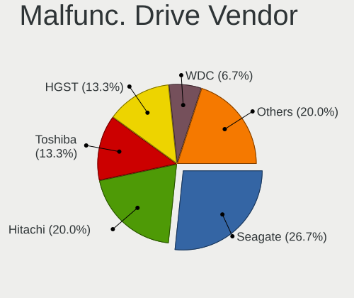

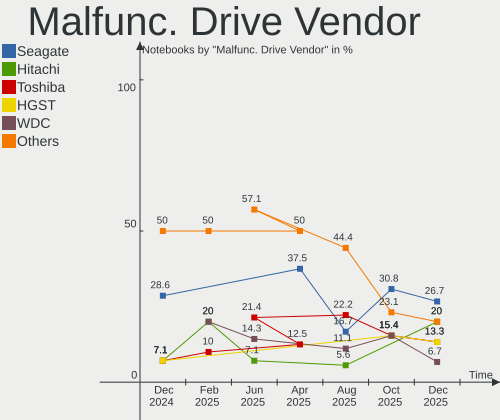

| Vendor            | Notebooks | Drives | Percent |
|-------------------|-----------|--------|---------|
| Seagate           | 4         | 4      | 26.67%  |
| Hitachi           | 3         | 3      | 20%     |
| Toshiba           | 2         | 2      | 13.33%  |
| HGST              | 2         | 2      | 13.33%  |
| WDC               | 1         | 1      | 6.67%   |
| SK hynix          | 1         | 1      | 6.67%   |
| Philips           | 1         | 1      | 6.67%   |
| Micron Technology | 1         | 1      | 6.67%   |

Malfunc. HDD Vendor
-------------------

Vendors of faulty HDD drives

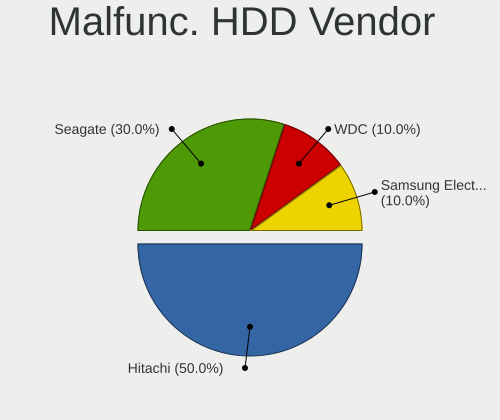

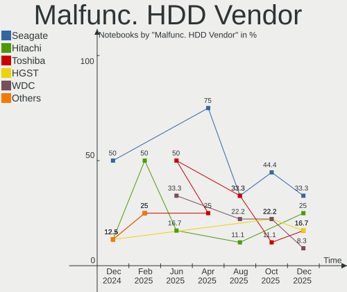

| Vendor  | Notebooks | Drives | Percent |
|---------|-----------|--------|---------|
| Seagate | 4         | 4      | 33.33%  |
| Hitachi | 3         | 3      | 25%     |
| Toshiba | 2         | 2      | 16.67%  |
| HGST    | 2         | 2      | 16.67%  |
| WDC     | 1         | 1      | 8.33%   |

Malfunc. Drive Kind
-------------------

Kinds of faulty drives

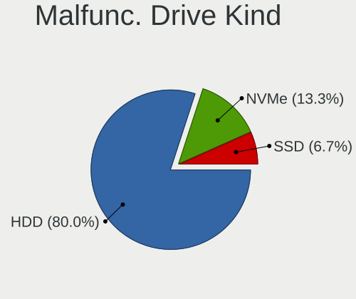

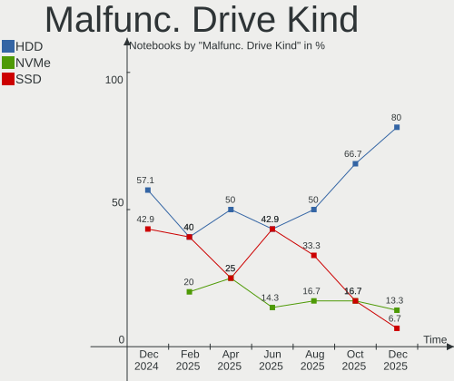

| Kind | Notebooks | Drives | Percent |
|------|-----------|--------|---------|
| HDD  | 12        | 12     | 80%     |
| NVMe | 2         | 2      | 13.33%  |
| SSD  | 1         | 1      | 6.67%   |

Failed Drives
-------------

Failed drive models

Zero info for selected period =(

Failed Drive Vendor
-------------------

Failed drive vendors

Zero info for selected period =(

Drive Status
------------

Number of failed and malfunc. drives

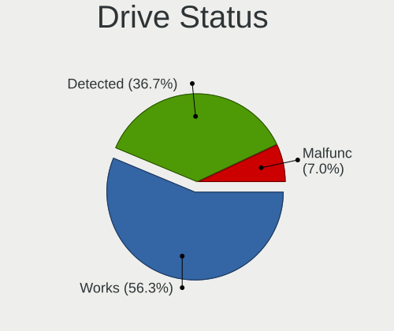

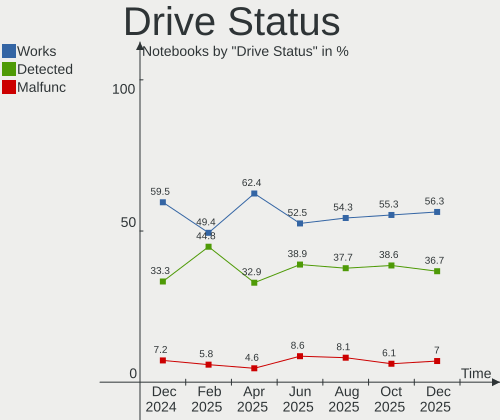

| Status   | Notebooks | Drives | Percent |
|----------|-----------|--------|---------|
| Works    | 121       | 136    | 56.28%  |
| Detected | 79        | 99     | 36.74%  |
| Malfunc  | 15        | 15     | 6.98%   |

Storage controller
------------------

Storage Vendor
--------------

Storage controller vendors

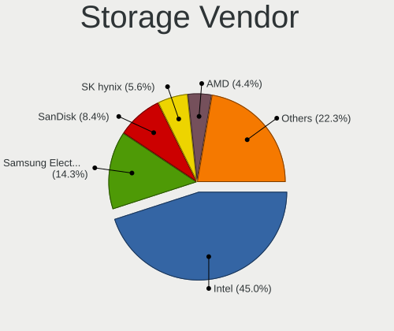

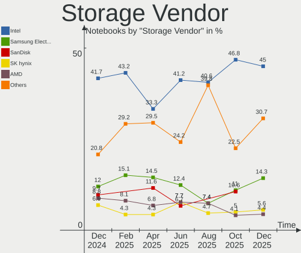

| Vendor                                  | Notebooks | Percent |
|-----------------------------------------|-----------|---------|
| Intel                                   | 113       | 45.02%  |
| Samsung Electronics                     | 36        | 14.34%  |
| SanDisk                                 | 21        | 8.37%   |
| SK hynix                                | 14        | 5.58%   |
| AMD                                     | 11        | 4.38%   |
| Micron Technology                       | 10        | 3.98%   |
| Kingston Technology Company             | 10        | 3.98%   |
| MAXIO Technology (Hangzhou)             | 6         | 2.39%   |
| KIOXIA                                  | 6         | 2.39%   |
| Micron/Crucial Technology               | 4         | 1.59%   |
| Yangtze Memory Technologies             | 2         | 0.8%    |
| Phison Electronics                      | 2         | 0.8%    |
| Loongson Technology                     | 2         | 0.8%    |
| ADATA Technology                        | 2         | 0.8%    |
| Zhaoxin                                 | 1         | 0.4%    |
| Solid State Storage Technology          | 1         | 0.4%    |
| Silicon Motion                          | 1         | 0.4%    |
| Shenzhen Unionmemory Information System | 1         | 0.4%    |
| Shenzhen Longsys Electronics            | 1         | 0.4%    |
| Realtek Semiconductor                   | 1         | 0.4%    |
| O2 Micro                                | 1         | 0.4%    |
| Nvidia                                  | 1         | 0.4%    |
| INNOGRIT                                | 1         | 0.4%    |
| Biwin Storage Technology                | 1         | 0.4%    |
| ASMedia Technology                      | 1         | 0.4%    |
| Apple                                   | 1         | 0.4%    |

Storage Model
-------------

Storage controller models

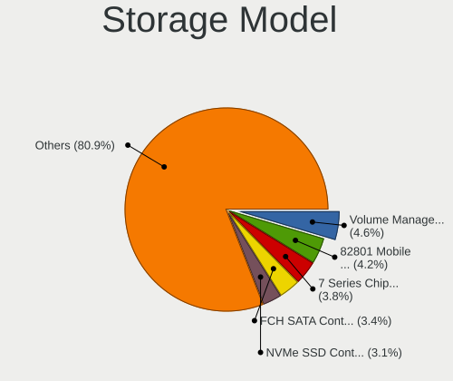

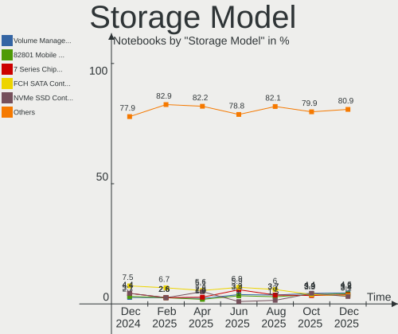

| Model                                                                          | Notebooks | Percent |
|--------------------------------------------------------------------------------|-----------|---------|
| Intel Volume Management Device NVMe RAID Controller                            | 12        | 4.58%   |
| Intel 82801 Mobile SATA Controller [RAID mode]                                 | 11        | 4.2%    |
| Intel 7 Series Chipset Family 6-port SATA Controller [AHCI mode]               | 10        | 3.82%   |
| AMD FCH SATA Controller [AHCI mode]                                            | 9         | 3.44%   |
| Samsung NVMe SSD Controller SM981/PM981/PM983                                  | 8         | 3.05%   |
| Intel Sunrise Point-LP SATA Controller [AHCI mode]                             | 8         | 3.05%   |
| Samsung NVMe SSD Controller PM9C1a (DRAM-less)                                 | 7         | 2.67%   |
| Samsung NVMe SSD Controller PM9A1/PM9A3/980PRO                                 | 6         | 2.29%   |
| Intel 5 Series/3400 Series Chipset 4 port SATA AHCI Controller                 | 6         | 2.29%   |
| MAXIO (Hangzhou) NVMe SSD Controller MAP1202 (DRAM-less)                       | 5         | 1.91%   |
| Intel Tiger Lake-LP SATA Controller                                            | 5         | 1.91%   |
| Intel 6 Series/C200 Series Chipset Family 6 port Mobile SATA AHCI Controller   | 5         | 1.91%   |
| Intel 5 Series/3400 Series Chipset 6 port SATA AHCI Controller                 | 5         | 1.91%   |
| Sandisk WD PC SN5000S M.2 2280 NVMe SSD (DRAM-less)                            | 4         | 1.53%   |
| Samsung NVMe SSD Controller SM961/PM961/SM963                                  | 4         | 1.53%   |
| Intel Volume Management Device NVMe RAID Controller Intel Corporation          | 4         | 1.53%   |
| Intel 82801IBM/IEM (ICH9M/ICH9M-E) 4 port SATA Controller [AHCI mode]          | 4         | 1.53%   |
| Intel 8 Series SATA Controller 1 [AHCI mode]                                   | 4         | 1.53%   |
| SK hynix BC901 NVMe Solid State Drive (DRAM-less)                              | 3         | 1.15%   |
| SK hynix BC501 NVMe Solid State Drive                                          | 3         | 1.15%   |
| SanDisk Ultra 3D / WD PC SN530, IX SN530, Blue SN550 NVMe SSD (DRAM-less)      | 3         | 1.15%   |
| Samsung NVMe SSD Controller PM9B1 (DRAM-less)                                  | 3         | 1.15%   |
| Samsung NVMe SSD Controller 980 (DRAM-less)                                    | 3         | 1.15%   |
| Micron 2450 NVMe SSD [HendrixV] (DRAM-less)                                    | 3         | 1.15%   |
| Intel SSD 670p Series [Keystone Harbor]                                        | 3         | 1.15%   |
| Intel RST Volume Management Device Controller                                  | 3         | 1.15%   |
| Intel NM10/ICH7 Family SATA Controller [AHCI mode]                             | 3         | 1.15%   |
| Intel Cannon Point-LP SATA Controller [AHCI Mode]                              | 3         | 1.15%   |
| Intel 82801HM/HEM (ICH8M/ICH8M-E) SATA Controller [AHCI mode]                  | 3         | 1.15%   |
| Intel 82801HM/HEM (ICH8M/ICH8M-E) IDE Controller                               | 3         | 1.15%   |
| Intel 8 Series/C220 Series Chipset Family 6-port SATA Controller 1 [AHCI mode] | 3         | 1.15%   |
| SK hynix PVC10 NVMe Solid State Drive (DRAM-less)                              | 2         | 0.76%   |
| SK hynix Gold P31/BC711/PC711 NVMe Solid State Drive                           | 2         | 0.76%   |
| SK hynix BC511 NVMe SSD                                                        | 2         | 0.76%   |
| SanDisk WD SN560/SN740/SN770/SN5000 NVMe SSD                                   | 2         | 0.76%   |
| Sandisk WD PC SN740 NVMe SSD 512GB (DRAM-less)                                 | 2         | 0.76%   |
| SanDisk PC SN520 x2 M.2 2242 NVMe SSD                                          | 2         | 0.76%   |
| SanDisk IX SN530 NVMe SSD / microSD Express Card (DRAM-less)                   | 2         | 0.76%   |
| SanDisk Extreme Pro / WD Black SN750 / PC SN730 / Red SN700 NVMe SSD           | 2         | 0.76%   |
| Samsung NVMe SSD Controller S4LV008[Pascal]                                    | 2         | 0.76%   |

Storage Kind
------------

Kind of storage controller (IDE, SATA, NVMe, SAS, ...)

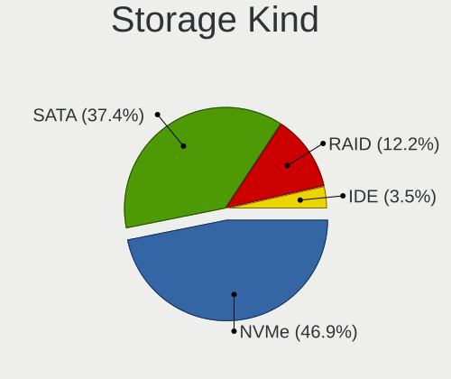

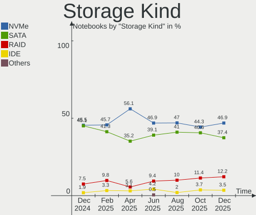

| Kind | Notebooks | Percent |
|------|-----------|---------|
| NVMe | 119       | 46.85%  |
| SATA | 95        | 37.4%   |
| RAID | 31        | 12.2%   |
| IDE  | 9         | 3.54%   |

Processor
---------

CPU Vendor
----------

Processor vendors

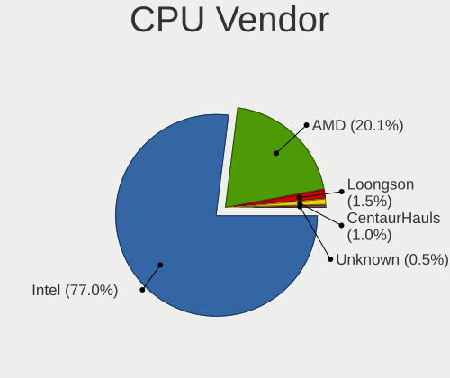

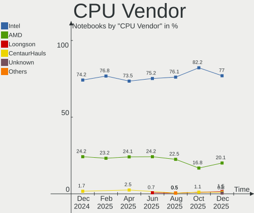

| Vendor       | Notebooks | Percent |
|--------------|-----------|---------|
| Intel        | 157       | 76.96%  |
| AMD          | 41        | 20.1%   |
| Loongson     | 3         | 1.47%   |
| CentaurHauls | 2         | 0.98%   |
| Unknown      | 1         | 0.49%   |

CPU Model
---------

Processor models

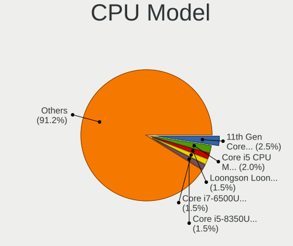

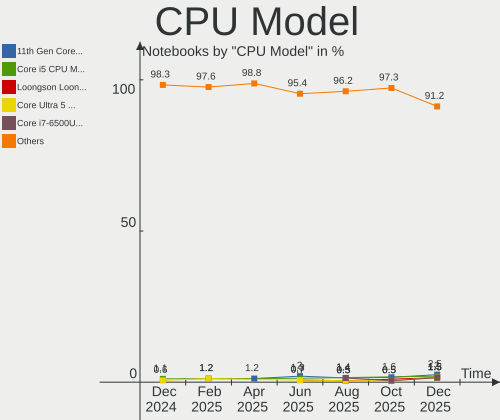

| Model                                         | Notebooks | Percent |
|-----------------------------------------------|-----------|---------|
| Intel 11th Gen Core i7-1165G7 @ 2.80GHz       | 5         | 2.45%   |
| Intel Core i5 CPU M 560 @ 2.67GHz             | 4         | 1.96%   |
| Loongson Loongson 3A                          | 3         | 1.47%   |
| Intel Core Ultra 5 125U                       | 3         | 1.47%   |
| Intel Core i7-6500U CPU @ 2.50GHz             | 3         | 1.47%   |
| Intel Core i5-8350U CPU @ 1.70GHz             | 3         | 1.47%   |
| Intel Core i5-4210U CPU @ 1.70GHz             | 3         | 1.47%   |
| Intel Core i5 CPU M 520 @ 2.40GHz             | 3         | 1.47%   |
| Intel 11th Gen Core i5-1135G7 @ 2.40GHz       | 3         | 1.47%   |
| Intel 11th Gen Core i3-1115G4 @ 3.00GHz       | 3         | 1.47%   |
| AMD Ryzen AI 7 350 w/ Radeon 860M             | 3         | 1.47%   |
| AMD Ryzen 7 PRO 4750U with Radeon Graphics    | 3         | 1.47%   |
| Intel Pentium CPU P6100 @ 2.00GHz             | 2         | 0.98%   |
| Intel Core Ultra 7 258V                       | 2         | 0.98%   |
| Intel Core Ultra 7 255H                       | 2         | 0.98%   |
| Intel Core Ultra 7 155H                       | 2         | 0.98%   |
| Intel Core Ultra 5 225H                       | 2         | 0.98%   |
| Intel Core Ultra 5 125H                       | 2         | 0.98%   |
| Intel Core i7-8750H CPU @ 2.20GHz             | 2         | 0.98%   |
| Intel Core i7-8565U CPU @ 1.80GHz             | 2         | 0.98%   |
| Intel Core i7-8550U CPU @ 1.80GHz             | 2         | 0.98%   |
| Intel Core i7-5500U CPU @ 2.40GHz             | 2         | 0.98%   |
| Intel Core i7-3630QM CPU @ 2.40GHz            | 2         | 0.98%   |
| Intel Core i7-10750H CPU @ 2.60GHz            | 2         | 0.98%   |
| Intel Core i5-8265U CPU @ 1.60GHz             | 2         | 0.98%   |
| Intel Core i5-7300U CPU @ 2.60GHz             | 2         | 0.98%   |
| Intel Core i5-7300HQ CPU @ 2.50GHz            | 2         | 0.98%   |
| Intel Core i5-3320M CPU @ 2.60GHz             | 2         | 0.98%   |
| Intel Core i5-1035G1 CPU @ 1.00GHz            | 2         | 0.98%   |
| Intel Core i3-N300                            | 2         | 0.98%   |
| Intel 13th Gen Core i3-1315U                  | 2         | 0.98%   |
| Intel 12th Gen Core i7-1255U                  | 2         | 0.98%   |
| Intel 12th Gen Core i5-12450H                 | 2         | 0.98%   |
| Intel 12th Gen Core i5-1240P                  | 2         | 0.98%   |
| Intel 11th Gen Core i7-1185G7 @ 3.00GHz       | 2         | 0.98%   |
| AMD Ryzen 7 8845HS w/ Radeon 780M Graphics    | 2         | 0.98%   |
| AMD Ryzen 7 7730U with Radeon Graphics        | 2         | 0.98%   |
| AMD Ryzen 5 7520U with Radeon Graphics        | 2         | 0.98%   |
| AMD Ryzen 5 3500U with Radeon Vega Mobile Gfx | 2         | 0.98%   |
| AMD Ryzen 3 7320U with Radeon Graphics        | 2         | 0.98%   |

CPU Model Family
----------------

Processor model prefix

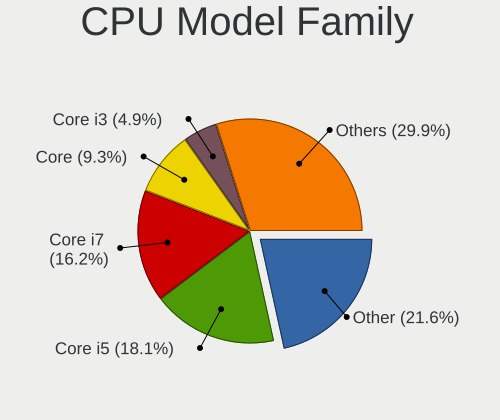

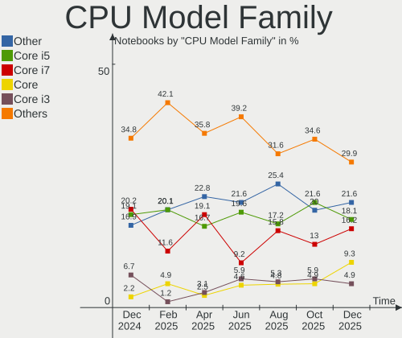

| Model                   | Notebooks | Percent |
|-------------------------|-----------|---------|
| Other                   | 44        | 21.57%  |
| Intel Core i5           | 37        | 18.14%  |
| Intel Core i7           | 33        | 16.18%  |
| Intel Core              | 19        | 9.31%   |
| Intel Core i3           | 10        | 4.9%    |
| AMD Ryzen 7             | 9         | 4.41%   |
| AMD Ryzen 5             | 7         | 3.43%   |
| Intel Celeron           | 6         | 2.94%   |
| Intel Atom              | 5         | 2.45%   |
| AMD Ryzen 9             | 5         | 2.45%   |
| Intel Core 2 Duo        | 4         | 1.96%   |
| Intel Pentium           | 3         | 1.47%   |
| AMD Ryzen 7 PRO         | 3         | 1.47%   |
| AMD Ryzen 3             | 3         | 1.47%   |
| AMD A6                  | 3         | 1.47%   |
| Intel Pentium Dual-Core | 2         | 0.98%   |
| AMD Athlon              | 2         | 0.98%   |
| Intel Pentium M         | 1         | 0.49%   |
| Intel Pentium Dual      | 1         | 0.49%   |
| Intel Core 2 Extreme    | 1         | 0.49%   |
| Intel Core 2            | 1         | 0.49%   |
| AMD Turion 64 X2 Mobile | 1         | 0.49%   |
| AMD Ryzen 5 PRO         | 1         | 0.49%   |
| AMD E2                  | 1         | 0.49%   |
| AMD E1                  | 1         | 0.49%   |
| AMD Athlon X2           | 1         | 0.49%   |

CPU Cores
---------

Number of processor cores

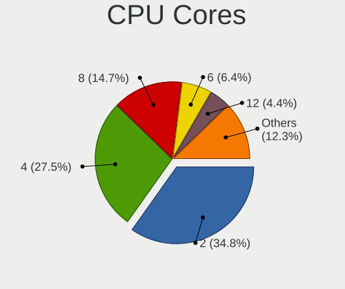

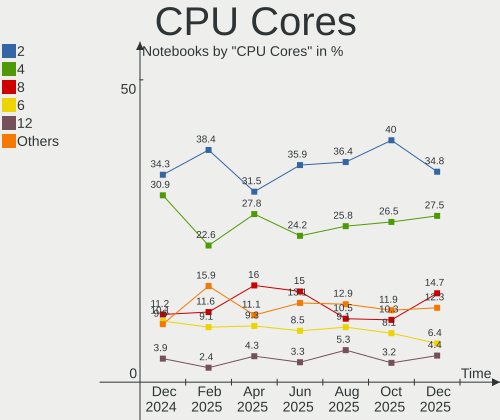

| Number | Notebooks | Percent |
|--------|-----------|---------|
| 2      | 71        | 34.8%   |
| 4      | 56        | 27.45%  |
| 8      | 30        | 14.71%  |
| 6      | 13        | 6.37%   |
| 12     | 9         | 4.41%   |
| 10     | 9         | 4.41%   |
| 16     | 6         | 2.94%   |
| 14     | 6         | 2.94%   |
| 1      | 3         | 1.47%   |
| 24     | 1         | 0.49%   |

CPU Sockets
-----------

Number of sockets

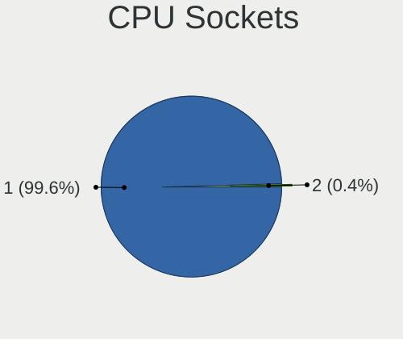

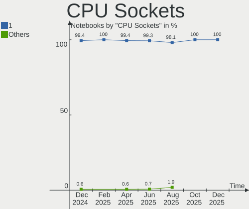

| Number | Notebooks | Percent |
|--------|-----------|---------|
| 1      | 204       | 100%    |

CPU Threads
-----------

Threads per core (Hyper-Threading)

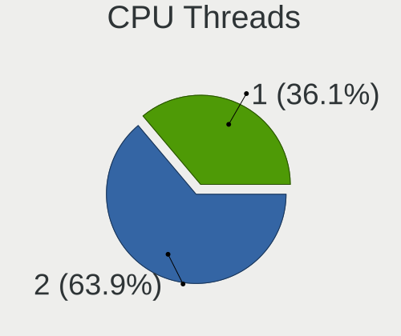

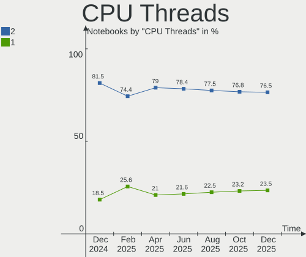

| Number | Notebooks | Percent |
|--------|-----------|---------|
| 2      | 156       | 76.47%  |
| 1      | 48        | 23.53%  |

CPU Op-Modes
------------

CPU Operation Modes (32-bit, 64-bit)

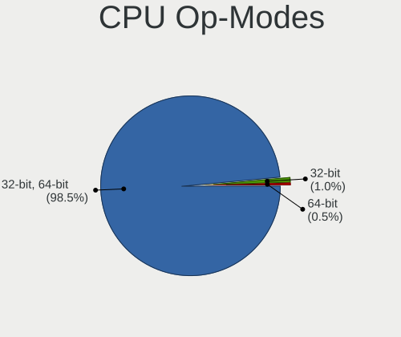

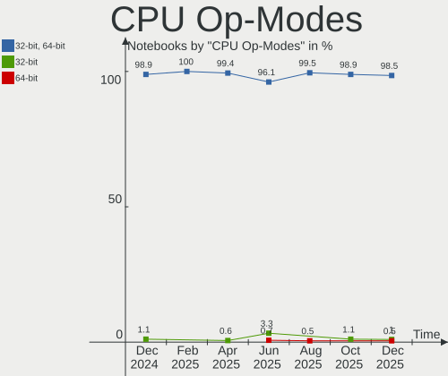

| Op mode        | Notebooks | Percent |
|----------------|-----------|---------|
| 32-bit, 64-bit | 201       | 98.53%  |
| 32-bit         | 2         | 0.98%   |
| 64-bit         | 1         | 0.49%   |

CPU Microcode
-------------

Microcode number

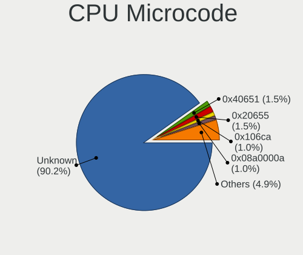

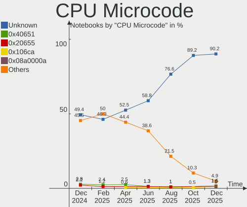

| Number     | Notebooks | Percent |
|------------|-----------|---------|
| Unknown    | 184       | 90.2%   |
| 0x40651    | 3         | 1.47%   |
| 0x20655    | 3         | 1.47%   |
| 0x106ca    | 2         | 0.98%   |
| 0x08a0000a | 2         | 0.98%   |
| 0x806e9    | 1         | 0.49%   |
| 0x706a1    | 1         | 0.49%   |
| 0x6fb      | 1         | 0.49%   |
| 0x6d6      | 1         | 0.49%   |
| 0x306a9    | 1         | 0.49%   |
| 0x30661    | 1         | 0.49%   |
| 0x206a7    | 1         | 0.49%   |
| 0x20652    | 1         | 0.49%   |
| 0x0b600037 | 1         | 0.49%   |
| 0x0a500011 | 1         | 0.49%   |

CPU Microarch
-------------

Microarchitecture

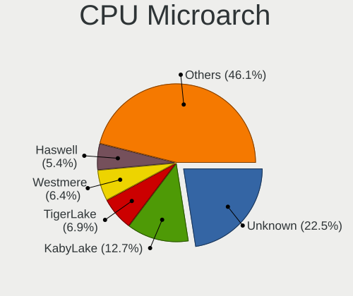

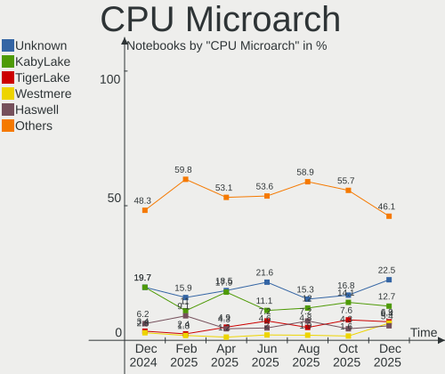

| Name              | Notebooks | Percent |
|-------------------|-----------|---------|
| Unknown           | 46        | 22.55%  |
| KabyLake          | 26        | 12.75%  |
| TigerLake         | 14        | 6.86%   |
| Westmere          | 13        | 6.37%   |
| Haswell           | 11        | 5.39%   |
| Alderlake Hybrid  | 10        | 4.9%    |
| IvyBridge         | 9         | 4.41%   |
| Zen 3             | 6         | 2.94%   |
| Skylake           | 6         | 2.94%   |
| SandyBridge       | 6         | 2.94%   |
| Penryn            | 6         | 2.94%   |
| Zen+              | 5         | 2.45%   |
| Zen 2             | 5         | 2.45%   |
| Bonnell           | 5         | 2.45%   |
| Puma              | 4         | 1.96%   |
| Meteorlake Hybrid | 4         | 1.96%   |
| IceLake           | 4         | 1.96%   |
| Silvermont        | 3         | 1.47%   |
| Lunarlake Hybrid  | 3         | 1.47%   |
| Core              | 3         | 1.47%   |
| CometLake         | 3         | 1.47%   |
| Gracemont         | 2         | 0.98%   |
| Goldmont plus     | 2         | 0.98%   |
| Goldmont          | 2         | 0.98%   |
| Broadwell         | 2         | 0.98%   |
| P6                | 1         | 0.49%   |
| K8 Hammer         | 1         | 0.49%   |
| K8 & K10 hybrid   | 1         | 0.49%   |
| Excavator         | 1         | 0.49%   |

Graphics
--------

GPU Vendor
----------

Vendors of graphics cards

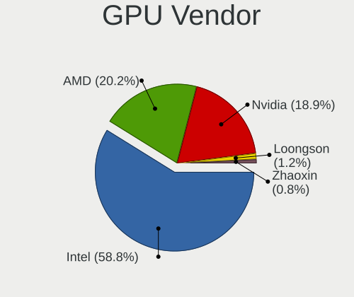

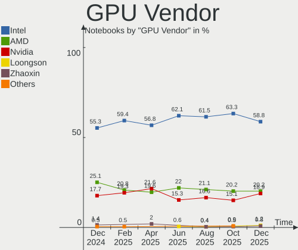

| Vendor              | Notebooks | Percent |
|---------------------|-----------|---------|
| Intel               | 143       | 58.85%  |
| AMD                 | 49        | 20.16%  |
| Nvidia              | 46        | 18.93%  |
| Loongson Technology | 3         | 1.23%   |
| Zhaoxin             | 2         | 0.82%   |

GPU Model
---------

Graphics card models

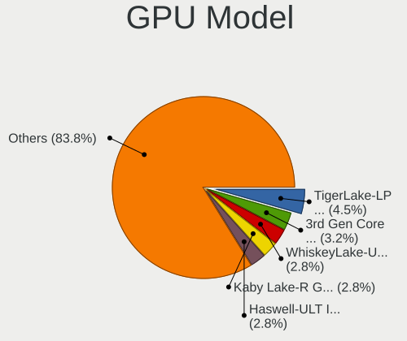

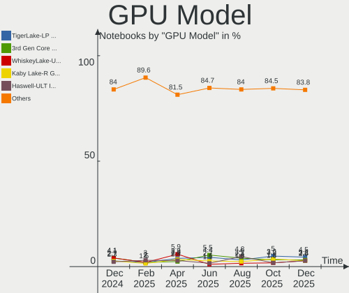

| Model                                                                     | Notebooks | Percent |
|---------------------------------------------------------------------------|-----------|---------|
| Intel TigerLake-LP GT2 [Iris Xe Graphics]                                 | 11        | 4.45%   |
| Intel 3rd Gen Core processor Graphics Controller                          | 8         | 3.24%   |
| Intel WhiskeyLake-U GT2 [UHD Graphics 620]                                | 7         | 2.83%   |
| Intel Kaby Lake-R GT2 [UHD Graphics 620]                                  | 7         | 2.83%   |
| Intel Haswell-ULT Integrated Graphics Controller                          | 7         | 2.83%   |
| Intel Core Processor Integrated Graphics Controller                       | 7         | 2.83%   |
| Intel Skylake-U GT2 [HD Graphics 520]                                     | 5         | 2.02%   |
| Intel Meteor Lake-P [Intel Graphics]                                      | 5         | 2.02%   |
| Intel 2nd Generation Core Processor Family Integrated Graphics Controller | 5         | 2.02%   |
| AMD Renoir [Radeon Vega Series / Radeon Vega Mobile Series]               | 5         | 2.02%   |
| AMD Picasso/Raven 2 [Radeon Vega Series / Radeon Vega Mobile Series]      | 5         | 2.02%   |
| AMD Mendocino [Radeon 610M]                                               | 5         | 2.02%   |
| Intel Raptor Lake-P [Iris Xe Graphics]                                    | 4         | 1.62%   |
| Intel Kaby Lake-U GT2 [HD Graphics 620]                                   | 4         | 1.62%   |
| Intel CoffeeLake-H GT2 [UHD Graphics 630]                                 | 4         | 1.62%   |
| Intel Atom Processor D4xx/D5xx/N4xx/N5xx Integrated Graphics Controller   | 4         | 1.62%   |
| Intel Arrow Lake-P [Arc Pro 130T/140T]                                    | 4         | 1.62%   |
| Intel Alder Lake-N [UHD Graphics]                                         | 4         | 1.62%   |
| AMD Krackan [Radeon 840M / 860M Graphics]                                 | 4         | 1.62%   |
| AMD HawkPoint1                                                            | 4         | 1.62%   |
| AMD Barcelo                                                               | 4         | 1.62%   |
| Nvidia GT218M [NVS 3100M]                                                 | 3         | 1.21%   |
| Loongson Technology 2K2000 / 7A2000 Chipset Display Controller            | 3         | 1.21%   |
| Intel Tiger Lake-LP GT2 [UHD Graphics G4]                                 | 3         | 1.21%   |
| Intel Raptor Lake-P [UHD Graphics]                                        | 3         | 1.21%   |
| Intel Meteor Lake-P [Intel Arc Graphics]                                  | 3         | 1.21%   |
| Intel Lunar Lake [Intel Arc Graphics 130V / 140V]                         | 3         | 1.21%   |
| Intel CometLake-H GT2 [UHD Graphics]                                      | 3         | 1.21%   |
| Intel Alder Lake-UP3 GT2 [Iris Xe Graphics]                               | 3         | 1.21%   |
| Intel Alder Lake-P GT2 [Iris Xe Graphics]                                 | 3         | 1.21%   |
| Intel 4th Gen Core Processor Integrated Graphics Controller               | 3         | 1.21%   |
| Zhaoxin KX-6000 C-960 GPU                                                 | 2         | 0.81%   |
| Nvidia TU117M [GeForce MX450]                                             | 2         | 0.81%   |
| Nvidia TU104M [GeForce RTX 2070 SUPER Mobile / Max-Q]                     | 2         | 0.81%   |
| Nvidia GT216M [GeForce GT 330M]                                           | 2         | 0.81%   |
| Nvidia GP107M [GeForce GTX 1050 Mobile]                                   | 2         | 0.81%   |
| Nvidia GK107M [GeForce GT 650M]                                           | 2         | 0.81%   |
| Nvidia GF117M [GeForce 610M/710M/810M/820M / GT 620M/625M/630M/720M]      | 2         | 0.81%   |
| Nvidia AD107M [GeForce RTX 4060 Max-Q / Mobile]                           | 2         | 0.81%   |
| Intel TigerLake-H GT1 [UHD Graphics]                                      | 2         | 0.81%   |

GPU Combo
---------

Combinations of graphics cards

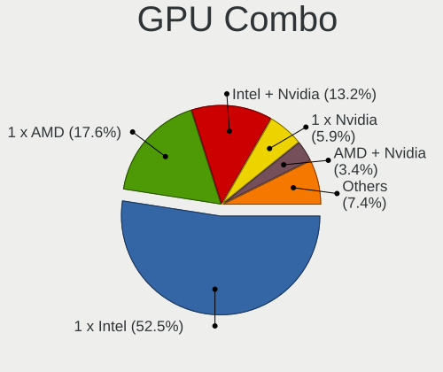

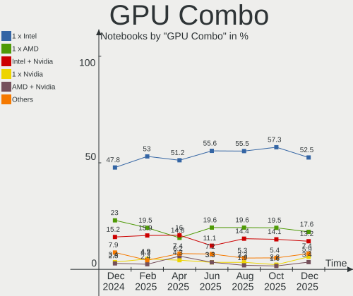

| Name                    | Notebooks | Percent |
|-------------------------|-----------|---------|
| 1 x Intel               | 107       | 52.45%  |
| 1 x AMD                 | 36        | 17.65%  |
| Intel + Nvidia          | 27        | 13.24%  |
| 1 x Nvidia              | 12        | 5.88%   |
| AMD + Nvidia            | 7         | 3.43%   |
| Intel + AMD             | 5         | 2.45%   |
| 2 x Intel               | 3         | 1.47%   |
| 1 x Loongson Technology | 3         | 1.47%   |
| 1 x Zhaoxin             | 2         | 0.98%   |
| Other                   | 1         | 0.49%   |
| 2 x AMD                 | 1         | 0.49%   |

GPU Driver
----------

Free vs proprietary

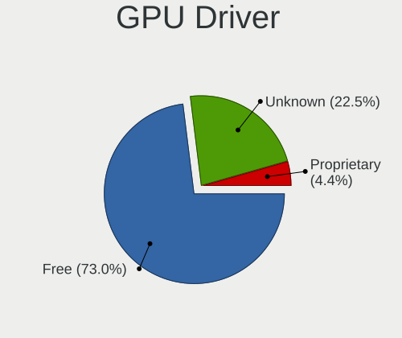

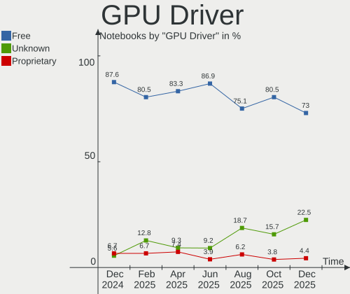

| Driver      | Notebooks | Percent |
|-------------|-----------|---------|
| Free        | 149       | 73.04%  |
| Unknown     | 46        | 22.55%  |
| Proprietary | 9         | 4.41%   |

GPU Memory
----------

Total video memory

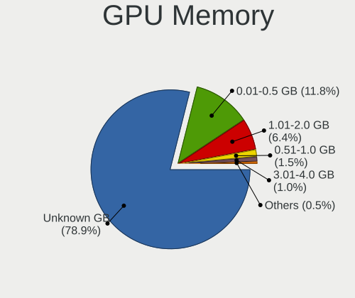

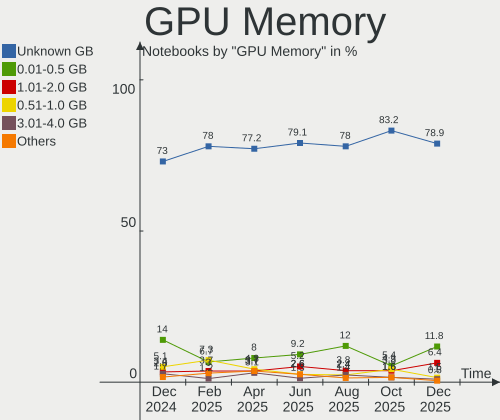

| Size in GB | Notebooks | Percent |
|------------|-----------|---------|
| Unknown    | 161       | 78.92%  |
| 0.01-0.5   | 24        | 11.76%  |
| 1.01-2.0   | 13        | 6.37%   |
| 0.51-1.0   | 3         | 1.47%   |
| 3.01-4.0   | 2         | 0.98%   |
| 7.01-8.0   | 1         | 0.49%   |

Monitor
-------

Monitor Vendor
--------------

Monitor vendors

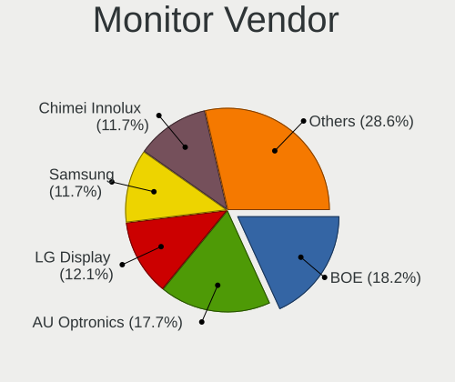

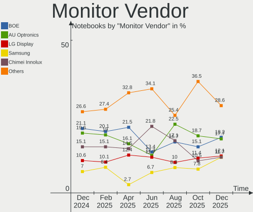

| Vendor                  | Notebooks | Percent |
|-------------------------|-----------|---------|
| BOE                     | 42        | 18.18%  |
| AU Optronics            | 41        | 17.75%  |
| LG Display              | 28        | 12.12%  |
| Samsung Electronics     | 27        | 11.69%  |
| Chimei Innolux          | 27        | 11.69%  |
| Lenovo                  | 9         | 3.9%    |
| Sharp                   | 7         | 3.03%   |
| Goldstar                | 5         | 2.16%   |
| Dell                    | 5         | 2.16%   |
| Apple                   | 5         | 2.16%   |
| ASUSTek Computer        | 4         | 1.73%   |
| Philips                 | 3         | 1.3%    |
| Acer                    | 3         | 1.3%    |
| Sony                    | 2         | 0.87%   |
| LG Philips              | 2         | 0.87%   |
| InfoVision              | 2         | 0.87%   |
| HKC                     | 2         | 0.87%   |
| CSW                     | 2         | 0.87%   |
| Chi Mei Optoelectronics | 2         | 0.87%   |
| ZTR                     | 1         | 0.43%   |
| TM@                     | 1         | 0.43%   |
| STR                     | 1         | 0.43%   |
| PANDA                   | 1         | 0.43%   |
| Mi                      | 1         | 0.43%   |
| Iiyama                  | 1         | 0.43%   |
| Eizo                    | 1         | 0.43%   |
| Denver                  | 1         | 0.43%   |
| CSOT                    | 1         | 0.43%   |
| CPT                     | 1         | 0.43%   |
| BenQ                    | 1         | 0.43%   |
| AOC                     | 1         | 0.43%   |
| Ancor Communications    | 1         | 0.43%   |

Monitor Model
-------------

Monitor models

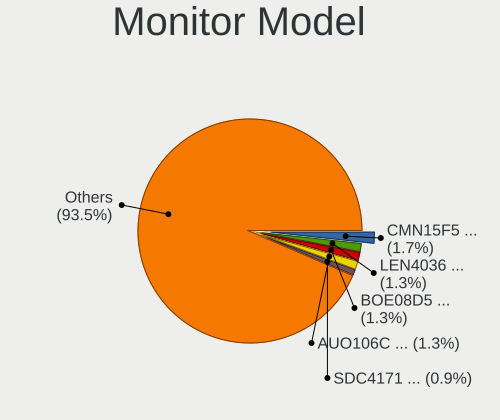

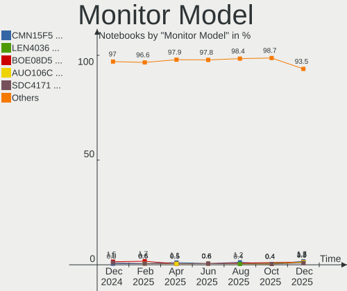

| Model                                                                 | Notebooks | Percent |
|-----------------------------------------------------------------------|-----------|---------|
| Chimei Innolux LCD Monitor CMN15F5 1920x1080 344x193mm 15.5-inch      | 4         | 1.72%   |
| Lenovo LCD Monitor LEN4036 1440x900 303x190mm 14.1-inch               | 3         | 1.29%   |
| BOE LCD Monitor BOE08D5 1920x1080 344x194mm 15.5-inch                 | 3         | 1.29%   |
| AU Optronics LCD Monitor AUO106C 1366x768 276x155mm 12.5-inch         | 3         | 1.29%   |
| Samsung Electronics LCD Monitor SDC4171 2880x1800 302x189mm 14.0-inch | 2         | 0.86%   |
| LG Display LCD Monitor LGD053F 1920x1080 344x194mm 15.5-inch          | 2         | 0.86%   |
| LG Display LCD Monitor LGD039F 1366x768 345x194mm 15.6-inch           | 2         | 0.86%   |
| CSW MNE007ZA3-2 CSW1431 2880x1800 301x188mm 14.0-inch                 | 2         | 0.86%   |
| Chimei Innolux LCD Monitor CMN14C3 1366x768 309x173mm 13.9-inch       | 2         | 0.86%   |
| BOE NV140DRMN63 BOE0032 2240x1400 302x188mm 14.0-inch                 | 2         | 0.86%   |
| BOE LCD Monitor BOE0B9C 1920x1200 302x188mm 14.0-inch                 | 2         | 0.86%   |
| BOE LCD Monitor BOE09CC 1920x1080 344x194mm 15.5-inch                 | 2         | 0.86%   |
| AU Optronics LCD Monitor AUO5A2D 1920x1080 293x165mm 13.2-inch        | 2         | 0.86%   |
| AU Optronics LCD Monitor AUO573D 1920x1080 309x174mm 14.0-inch        | 2         | 0.86%   |
| AU Optronics LCD Monitor AUO4147 1440x900 303x189mm 14.1-inch         | 2         | 0.86%   |
| AU Optronics LCD Monitor AUO22EC 1366x768 344x193mm 15.5-inch         | 2         | 0.86%   |
| AU Optronics LCD Monitor AUO213D 1920x1080 309x173mm 13.9-inch        | 2         | 0.86%   |
| ZTR 156XX5419T02 ZTR0015 1920x1080 344x193mm 15.5-inch                | 1         | 0.43%   |
| TM@ TM140 TM@2A12 1920x1200 301x188mm 14.0-inch                       | 1         | 0.43%   |
| STR DIS-118 STR0118 1920x1080 410x230mm 18.5-inch                     | 1         | 0.43%   |
| Sony PJ SNY0FF4 1600x1200                                             | 1         | 0.43%   |
| Sony Nvidia Defaul t Flat Panel MS_0025 1920x1080 360x200mm 16.2-inch | 1         | 0.43%   |
| Sharp LQ156M1JW17 SHP14FC 1920x1080 344x194mm 15.5-inch               | 1         | 0.43%   |
| Sharp LQ134R1JW51 SHP151B 3840x2400 288x180mm 13.4-inch               | 1         | 0.43%   |
| Sharp LCD Monitor SHP14F9 1920x1200 288x180mm 13.4-inch               | 1         | 0.43%   |
| Sharp LCD Monitor SHP149A 1920x1080 344x194mm 15.5-inch               | 1         | 0.43%   |
| Sharp LCD Monitor SHP148B 3840x2160 294x165mm 13.3-inch               | 1         | 0.43%   |
| Sharp LCD Monitor SHP144A 3200x1800 294x165mm 13.3-inch               | 1         | 0.43%   |
| Sharp LCD Monitor SHP1421 3200x1800 294x165mm 13.3-inch               | 1         | 0.43%   |
| Samsung Electronics SyncMaster SAM03C2 1680x1050 459x296mm 21.5-inch  | 1         | 0.43%   |
| Samsung Electronics S24C650 SAM09E9 1920x1080 520x290mm 23.4-inch     | 1         | 0.43%   |
| Samsung Electronics Odyssey G5 SAM74A6 2560x1440 597x336mm 27.0-inch  | 1         | 0.43%   |
| Samsung Electronics LF27T35 SAM707F 1920x1080 598x337mm 27.0-inch     | 1         | 0.43%   |
| Samsung Electronics LF24T40 SAM703D 1920x1080 520x290mm 23.4-inch     | 1         | 0.43%   |
| Samsung Electronics LCD Monitor SEC3633 1280x800 331x207mm 15.4-inch  | 1         | 0.43%   |
| Samsung Electronics LCD Monitor SEC3251 1366x768 344x194mm 15.5-inch  | 1         | 0.43%   |
| Samsung Electronics LCD Monitor SEC3150 1366x768 344x193mm 15.5-inch  | 1         | 0.43%   |
| Samsung Electronics LCD Monitor SEC314C 1920x1080 344x194mm 15.5-inch | 1         | 0.43%   |
| Samsung Electronics LCD Monitor SEC3130 1024x600 223x125mm 10.1-inch  | 1         | 0.43%   |
| Samsung Electronics LCD Monitor SDC4852 1366x768 344x194mm 15.5-inch  | 1         | 0.43%   |

Monitor Resolution
------------------

Monitor screen resolution

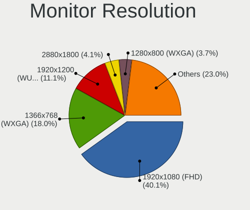

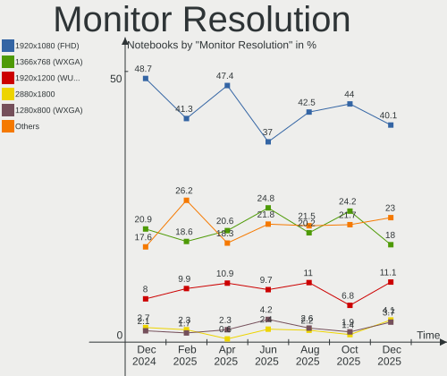

| Resolution         | Notebooks | Percent |
|--------------------|-----------|---------|
| 1920x1080 (FHD)    | 87        | 40.09%  |
| 1366x768 (WXGA)    | 39        | 17.97%  |
| 1920x1200 (WUXGA)  | 24        | 11.06%  |
| 2880x1800          | 9         | 4.15%   |
| 1280x800 (WXGA)    | 8         | 3.69%   |
| 1440x900 (WXGA+)   | 7         | 3.23%   |
| 2560x1600          | 6         | 2.76%   |
| 2560x1440 (QHD)    | 5         | 2.3%    |
| 3840x2160 (4K)     | 4         | 1.84%   |
| 1600x900 (HD+)     | 4         | 1.84%   |
| 1024x600           | 3         | 1.38%   |
| Unknown            | 3         | 1.38%   |
| 3440x1440          | 2         | 0.92%   |
| 3200x1800 (QHD+)   | 2         | 0.92%   |
| 2560x1080          | 2         | 0.92%   |
| 2240x1400          | 2         | 0.92%   |
| 3840x2400          | 1         | 0.46%   |
| 3840x1080          | 1         | 0.46%   |
| 3456x2160          | 1         | 0.46%   |
| 3200x2000          | 1         | 0.46%   |
| 3072x1920          | 1         | 0.46%   |
| 2520x1680          | 1         | 0.46%   |
| 2256x1504          | 1         | 0.46%   |
| 1680x1050 (WSXGA+) | 1         | 0.46%   |
| 1600x1200          | 1         | 0.46%   |
| 1360x768           | 1         | 0.46%   |

Monitor Diagonal
----------------

Diagonal size in inches

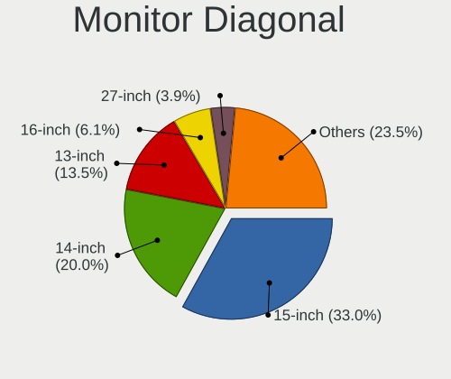

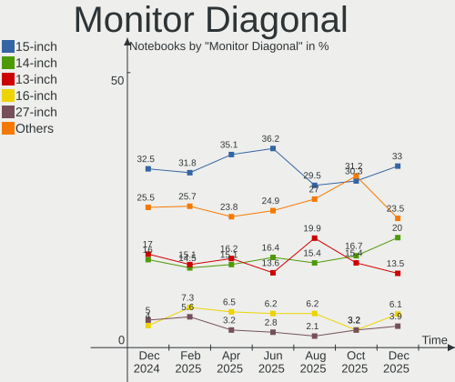

| Inches  | Notebooks | Percent |
|---------|-----------|---------|
| 15      | 76        | 33.04%  |
| 14      | 46        | 20%     |
| 13      | 31        | 13.48%  |
| 16      | 14        | 6.09%   |
| 27      | 9         | 3.91%   |
| 17      | 9         | 3.91%   |
| 24      | 6         | 2.61%   |
| 23      | 6         | 2.61%   |
| 12      | 6         | 2.61%   |
| 21      | 4         | 1.74%   |
| Unknown | 4         | 1.74%   |
| 34      | 3         | 1.3%    |
| 10      | 3         | 1.3%    |
| 49      | 2         | 0.87%   |
| 18      | 2         | 0.87%   |
| 11      | 2         | 0.87%   |
| 63      | 1         | 0.43%   |
| 58      | 1         | 0.43%   |
| 40      | 1         | 0.43%   |
| 31      | 1         | 0.43%   |
| 25      | 1         | 0.43%   |
| 22      | 1         | 0.43%   |
| 19      | 1         | 0.43%   |

Monitor Width
-------------

Physical width

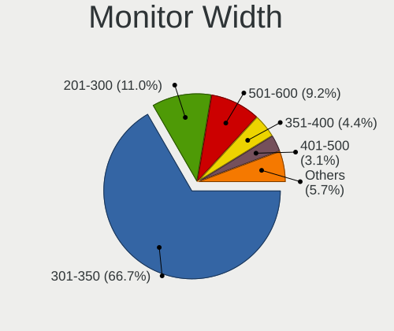

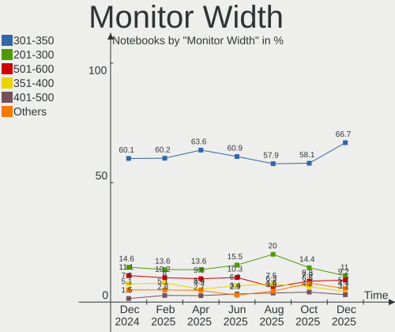

| Width in mm | Notebooks | Percent |
|-------------|-----------|---------|
| 301-350     | 152       | 66.67%  |
| 201-300     | 25        | 10.96%  |
| 501-600     | 21        | 9.21%   |
| 351-400     | 10        | 4.39%   |
| 401-500     | 7         | 3.07%   |
| 1001-1500   | 4         | 1.75%   |
| Unknown     | 4         | 1.75%   |
| 701-800     | 3         | 1.32%   |
| 801-900     | 1         | 0.44%   |
| 601-700     | 1         | 0.44%   |

Aspect Ratio
------------

Proportional relationship between the width and the height

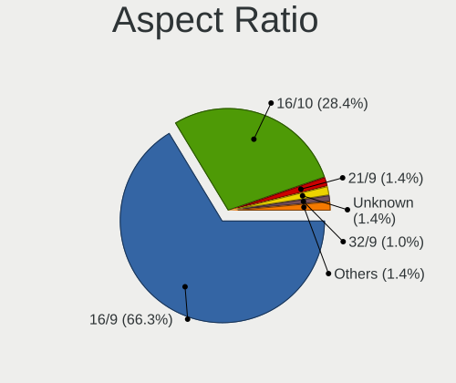

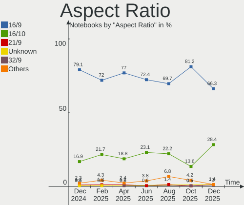

| Ratio   | Notebooks | Percent |
|---------|-----------|---------|
| 16/9    | 138       | 66.35%  |
| 16/10   | 59        | 28.37%  |
| 21/9    | 3         | 1.44%   |
| Unknown | 3         | 1.44%   |
| 32/9    | 2         | 0.96%   |
| 3/2     | 2         | 0.96%   |
| 4/3     | 1         | 0.48%   |

Monitor Area
------------

Area in inch²

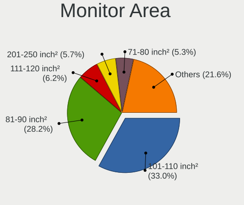

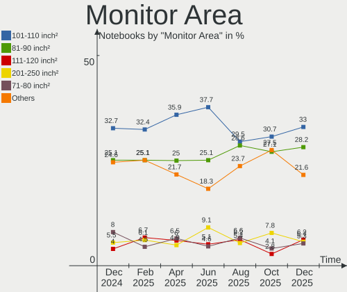

| Area in inch² | Notebooks | Percent |
|----------------|-----------|---------|
| 101-110        | 75        | 33.04%  |
| 81-90          | 64        | 28.19%  |
| 111-120        | 14        | 6.17%   |
| 201-250        | 13        | 5.73%   |
| 71-80          | 12        | 5.29%   |
| 121-130        | 10        | 4.41%   |
| 301-350        | 9         | 3.96%   |
| 61-70          | 6         | 2.64%   |
| 351-500        | 4         | 1.76%   |
| Unknown        | 4         | 1.76%   |
| 41-50          | 3         | 1.32%   |
| 501-1000       | 3         | 1.32%   |
| More than 1000 | 2         | 0.88%   |
| 51-60          | 2         | 0.88%   |
| 251-300        | 2         | 0.88%   |
| 141-150        | 2         | 0.88%   |
| 151-200        | 1         | 0.44%   |
| 91-100         | 1         | 0.44%   |

Pixel Density
-------------

Pixels per inch

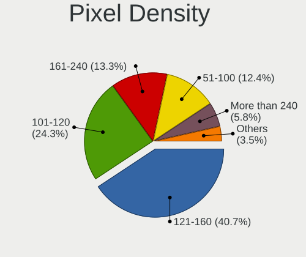

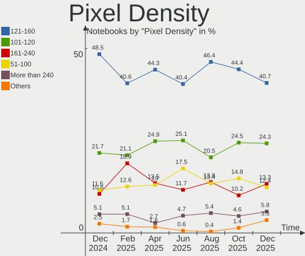

| Density       | Notebooks | Percent |
|---------------|-----------|---------|
| 121-160       | 92        | 40.71%  |
| 101-120       | 55        | 24.34%  |
| 161-240       | 30        | 13.27%  |
| 51-100        | 28        | 12.39%  |
| More than 240 | 13        | 5.75%   |
| 1-50          | 4         | 1.77%   |
| Unknown       | 4         | 1.77%   |

Multiple Monitors
-----------------

Total monitors connected

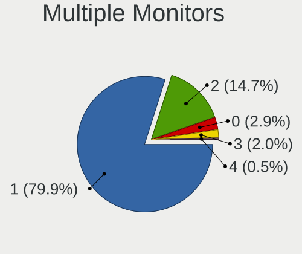

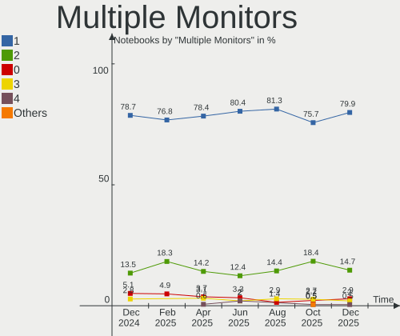

| Total | Notebooks | Percent |
|-------|-----------|---------|
| 1     | 163       | 79.9%   |
| 2     | 30        | 14.71%  |
| 0     | 6         | 2.94%   |
| 3     | 4         | 1.96%   |
| 4     | 1         | 0.49%   |

Network
-------

Net Controller Vendor
---------------------

Controller vendors

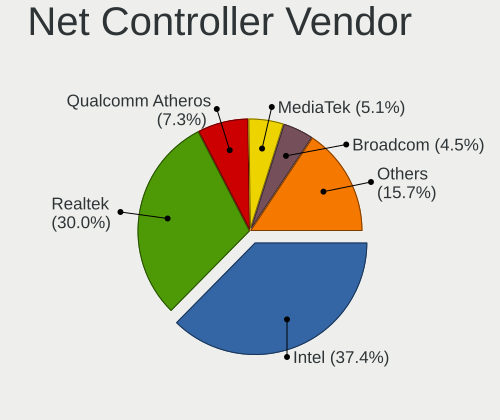

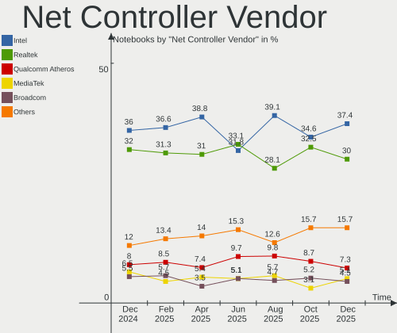

| Vendor                                 | Notebooks | Percent |
|----------------------------------------|-----------|---------|
| Intel                                  | 117       | 37.38%  |
| Realtek Semiconductor                  | 94        | 30.03%  |
| Qualcomm Atheros                       | 23        | 7.35%   |
| MediaTek                               | 16        | 5.11%   |
| Broadcom                               | 14        | 4.47%   |
| Broadcom Limited                       | 7         | 2.24%   |
| Suzhou Motorcomm Electronic Technology | 4         | 1.28%   |
| Shenzhen Goodix Technology             | 4         | 1.28%   |
| Marvell Technology Group               | 4         | 1.28%   |
| Lenovo                                 | 3         | 0.96%   |
| Dell                                   | 3         | 0.96%   |
| TP-Link                                | 2         | 0.64%   |
| Fibocom                                | 2         | 0.64%   |
| ASIX Electronics                       | 2         | 0.64%   |
| U-Blox                                 | 1         | 0.32%   |
| Sierra Wireless                        | 1         | 0.32%   |
| Samsung Electronics                    | 1         | 0.32%   |
| Ralink                                 | 1         | 0.32%   |
| Quectel Wireless Solutions             | 1         | 0.32%   |
| Qualcomm                               | 1         | 0.32%   |
| QinHeng Electronics                    | 1         | 0.32%   |
| OCZ Technology                         | 1         | 0.32%   |
| Nvidia                                 | 1         | 0.32%   |
| Linksys                                | 1         | 0.32%   |
| JMicron Technology                     | 1         | 0.32%   |
| Huawei Technologies                    | 1         | 0.32%   |
| Espressif                              | 1         | 0.32%   |
| Ericsson Business Mobile Networks      | 1         | 0.32%   |
| DisplayLink                            | 1         | 0.32%   |
| Attansic Technology                    | 1         | 0.32%   |
| Apple                                  | 1         | 0.32%   |
| 3Com                                   | 1         | 0.32%   |

Net Controller Model
--------------------

Controller models

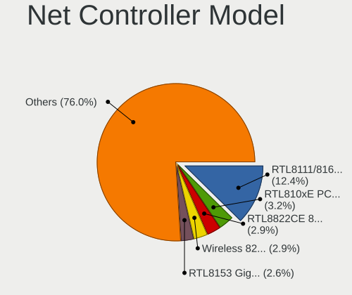

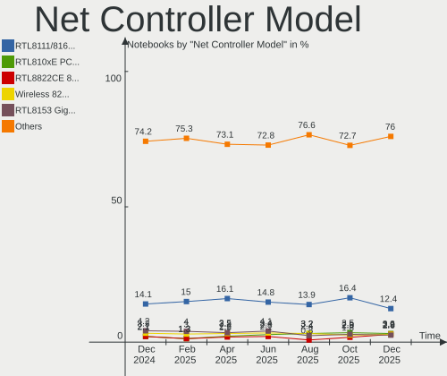

| Model                                                                           | Notebooks | Percent |
|---------------------------------------------------------------------------------|-----------|---------|
| Realtek RTL8111/8168/8211/8411 PCI Express Gigabit Ethernet Controller          | 47        | 12.4%   |
| Realtek RTL810xE PCI Express Fast Ethernet controller                           | 12        | 3.17%   |
| Realtek RTL8822CE 802.11ac PCIe Wireless Network Adapter                        | 11        | 2.9%    |
| Intel Wireless 8265 / 8275                                                      | 11        | 2.9%    |
| Realtek RTL8153 Gigabit Ethernet Adapter                                        | 10        | 2.64%   |
| Intel Wi-Fi 6 AX201                                                             | 9         | 2.37%   |
| Realtek RTL8852BE PCIe 802.11ax Wireless Network Controller                     | 8         | 2.11%   |
| Intel Meteor Lake PCH CNVi WiFi                                                 | 8         | 2.11%   |
| Intel Wi-Fi 6 AX200                                                             | 7         | 1.85%   |
| Intel Centrino Advanced-N 6205 [Taylor Peak]                                    | 7         | 1.85%   |
| Intel Alder Lake-P PCH CNVi WiFi                                                | 7         | 1.85%   |
| Intel 82579LM Gigabit Network Connection (Lewisville)                           | 7         | 1.85%   |
| Intel Raptor Lake PCH CNVi WiFi                                                 | 6         | 1.58%   |
| Intel Ethernet Connection (4) I219-LM                                           | 6         | 1.58%   |
| Realtek RTL8821CE 802.11ac PCIe Wireless Network Adapter                        | 5         | 1.32%   |
| Qualcomm Atheros QCA9565 / AR9565 Wireless Network Adapter                      | 5         | 1.32%   |
| MediaTek MT7922 802.11ax PCI Express Wireless Network Adapter                   | 5         | 1.32%   |
| Intel Wi-Fi 6E(802.11ax) AX210/AX1675* 2x2 [Typhoon Peak]                       | 5         | 1.32%   |
| Intel Centrino Advanced-N 6200                                                  | 5         | 1.32%   |
| Intel Cannon Point-LP CNVi [Wireless-AC]                                        | 5         | 1.32%   |
| Intel 82577LM Gigabit Network Connection                                        | 5         | 1.32%   |
| Suzhou Motorcomm Electronic YT6801 Gigabit Ethernet Controller                  | 4         | 1.06%   |
| Shenzhen Goodix Fingerprint Reader                                              | 4         | 1.06%   |
| Qualcomm Atheros AR9285 Wireless Network Adapter (PCI-Express)                  | 4         | 1.06%   |
| MediaTek MT7925 802.11be 160MHz 2x2 PCIe Wireless Network Adapter [Filogic 360] | 4         | 1.06%   |
| Intel Cannon Lake PCH CNVi WiFi                                                 | 4         | 1.06%   |
| Intel Arrow Lake CNVi WiFi                                                      | 4         | 1.06%   |
| Realtek RTL8723BE PCIe Wireless Network Adapter                                 | 3         | 0.79%   |
| Qualcomm Atheros AR9485 Wireless Network Adapter                                | 3         | 0.79%   |
| MediaTek MT7921 802.11ax PCIe Wireless Network Adapter [Filogic 330]            | 3         | 0.79%   |
| Intel Wireless 7265                                                             | 3         | 0.79%   |
| Intel Wireless 7260                                                             | 3         | 0.79%   |
| Intel PRO/Wireless 3945ABG [Golan] Network Connection                           | 3         | 0.79%   |
| Intel Ethernet Connection (24) I219-V                                           | 3         | 0.79%   |
| Intel Ethernet Connection (23) I219-V                                           | 3         | 0.79%   |
| Intel Ethernet Connection (18) I219-LM                                          | 3         | 0.79%   |
| Intel BE201 320MHz                                                              | 3         | 0.79%   |
| Broadcom BCM4313 802.11bgn Wireless Network Adapter                             | 3         | 0.79%   |
| Realtek RTL8852CE PCIe 802.11ax Wireless Network Controller                     | 2         | 0.53%   |
| Realtek RTL8192EU 802.11b/g/n WLAN Adapter                                      | 2         | 0.53%   |

Wireless Vendor
---------------

Wireless vendors

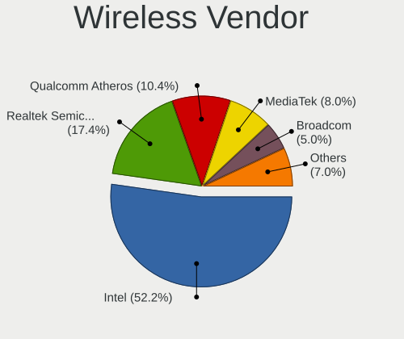

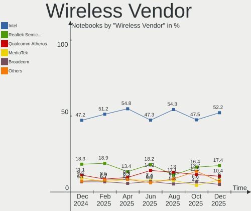

| Vendor                     | Notebooks | Percent |
|----------------------------|-----------|---------|
| Intel                      | 105       | 52.24%  |
| Realtek Semiconductor      | 35        | 17.41%  |
| Qualcomm Atheros           | 21        | 10.45%  |
| MediaTek                   | 16        | 7.96%   |
| Broadcom                   | 10        | 4.98%   |
| Broadcom Limited           | 4         | 1.99%   |
| TP-Link                    | 2         | 1%      |
| Fibocom                    | 2         | 1%      |
| Sierra Wireless            | 1         | 0.5%    |
| Ralink                     | 1         | 0.5%    |
| Quectel Wireless Solutions | 1         | 0.5%    |
| Qualcomm                   | 1         | 0.5%    |
| Dell                       | 1         | 0.5%    |
| 3Com                       | 1         | 0.5%    |

Wireless Model
--------------

Wireless models

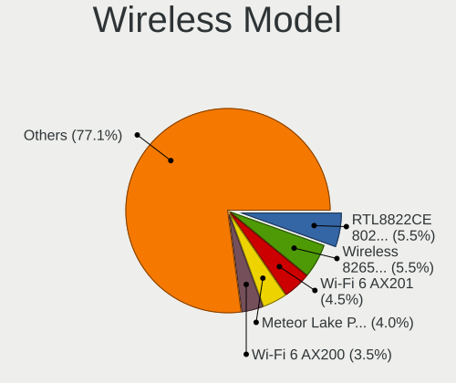

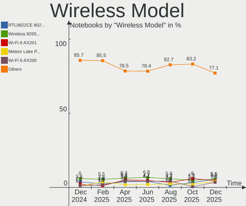

| Model                                                                           | Notebooks | Percent |
|---------------------------------------------------------------------------------|-----------|---------|
| Realtek RTL8822CE 802.11ac PCIe Wireless Network Adapter                        | 11        | 5.47%   |
| Intel Wireless 8265 / 8275                                                      | 11        | 5.47%   |
| Intel Wi-Fi 6 AX201                                                             | 9         | 4.48%   |
| Intel Meteor Lake PCH CNVi WiFi                                                 | 8         | 3.98%   |
| Intel Wi-Fi 6 AX200                                                             | 7         | 3.48%   |
| Intel Centrino Advanced-N 6205 [Taylor Peak]                                    | 7         | 3.48%   |
| Intel Raptor Lake PCH CNVi WiFi                                                 | 6         | 2.99%   |
| Realtek RTL8852BE PCIe 802.11ax Wireless Network Controller                     | 5         | 2.49%   |
| Realtek RTL8821CE 802.11ac PCIe Wireless Network Adapter                        | 5         | 2.49%   |
| Qualcomm Atheros QCA9565 / AR9565 Wireless Network Adapter                      | 5         | 2.49%   |
| MediaTek MT7922 802.11ax PCI Express Wireless Network Adapter                   | 5         | 2.49%   |
| Intel Wi-Fi 6E(802.11ax) AX210/AX1675* 2x2 [Typhoon Peak]                       | 5         | 2.49%   |
| Intel Centrino Advanced-N 6200                                                  | 5         | 2.49%   |
| Intel Cannon Point-LP CNVi [Wireless-AC]                                        | 5         | 2.49%   |
| Qualcomm Atheros AR9285 Wireless Network Adapter (PCI-Express)                  | 4         | 1.99%   |
| MediaTek MT7925 802.11be 160MHz 2x2 PCIe Wireless Network Adapter [Filogic 360] | 4         | 1.99%   |
| Intel Cannon Lake PCH CNVi WiFi                                                 | 4         | 1.99%   |
| Intel Alder Lake-P PCH CNVi WiFi                                                | 4         | 1.99%   |
| Realtek RTL8723BE PCIe Wireless Network Adapter                                 | 3         | 1.49%   |
| Qualcomm Atheros AR9485 Wireless Network Adapter                                | 3         | 1.49%   |
| MediaTek MT7921 802.11ax PCIe Wireless Network Adapter [Filogic 330]            | 3         | 1.49%   |
| Intel Wireless 7265                                                             | 3         | 1.49%   |
| Intel Wireless 7260                                                             | 3         | 1.49%   |
| Intel PRO/Wireless 3945ABG [Golan] Network Connection                           | 3         | 1.49%   |
| Broadcom BCM4313 802.11bgn Wireless Network Adapter                             | 3         | 1.49%   |
| Realtek RTL8852CE PCIe 802.11ax Wireless Network Controller                     | 2         | 1%      |
| Realtek RTL8192EU 802.11b/g/n WLAN Adapter                                      | 2         | 1%      |
| Qualcomm Atheros QCA6174 802.11ac Wireless Network Adapter                      | 2         | 1%      |
| Qualcomm Atheros AR9462 Wireless Network Adapter                                | 2         | 1%      |
| Qualcomm Atheros AR242x / AR542x Wireless Network Adapter (PCI-Express)         | 2         | 1%      |
| Intel WiFi Link 5100                                                            | 2         | 1%      |
| Intel Wi-Fi 5(802.11ac) Wireless-AC 9x6x [Thunder Peak]                         | 2         | 1%      |
| Intel Tiger Lake PCH CNVi WiFi                                                  | 2         | 1%      |
| Intel Comet Lake PCH CNVi WiFi                                                  | 2         | 1%      |
| Intel Centrino Advanced-N + WiMAX 6250 [Kilmer Peak]                            | 2         | 1%      |
| Fibocom L830-EB-00 LTE WWAN Modem                                               | 2         | 1%      |
| Broadcom Limited BCM4360 802.11ac Dual Band Wireless Network Adapter            | 2         | 1%      |
| TP-Link Archer T2U PLUS [RTL8821AU]                                             | 1         | 0.5%    |
| TP-Link 802.11ac WLAN Adapter                                                   | 1         | 0.5%    |
| Sierra Wireless MC7710                                                          | 1         | 0.5%    |

Ethernet Vendor
---------------

Ethernet vendors

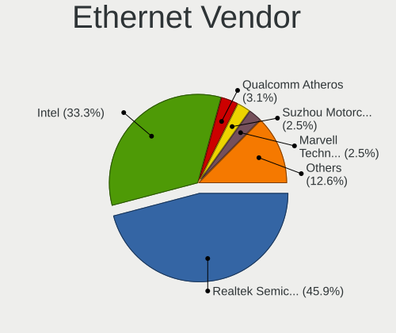

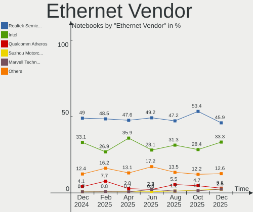

| Vendor                                 | Notebooks | Percent |
|----------------------------------------|-----------|---------|
| Realtek Semiconductor                  | 73        | 45.91%  |
| Intel                                  | 53        | 33.33%  |
| Qualcomm Atheros                       | 5         | 3.14%   |
| Suzhou Motorcomm Electronic Technology | 4         | 2.52%   |
| Marvell Technology Group               | 4         | 2.52%   |
| Broadcom                               | 4         | 2.52%   |
| Lenovo                                 | 3         | 1.89%   |
| Broadcom Limited                       | 3         | 1.89%   |
| ASIX Electronics                       | 2         | 1.26%   |
| Samsung Electronics                    | 1         | 0.63%   |
| QinHeng Electronics                    | 1         | 0.63%   |
| Nvidia                                 | 1         | 0.63%   |
| Linksys                                | 1         | 0.63%   |
| JMicron Technology                     | 1         | 0.63%   |
| DisplayLink                            | 1         | 0.63%   |
| Attansic Technology                    | 1         | 0.63%   |
| Apple                                  | 1         | 0.63%   |

Ethernet Model
--------------

Ethernet models

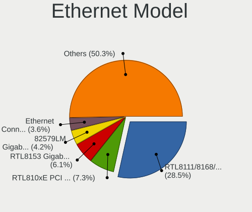

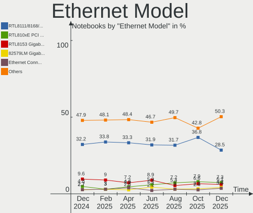

| Model                                                                  | Notebooks | Percent |
|------------------------------------------------------------------------|-----------|---------|
| Realtek RTL8111/8168/8211/8411 PCI Express Gigabit Ethernet Controller | 47        | 28.48%  |
| Realtek RTL810xE PCI Express Fast Ethernet controller                  | 12        | 7.27%   |
| Realtek RTL8153 Gigabit Ethernet Adapter                               | 10        | 6.06%   |
| Intel 82579LM Gigabit Network Connection (Lewisville)                  | 7         | 4.24%   |
| Intel Ethernet Connection (4) I219-LM                                  | 6         | 3.64%   |
| Intel 82577LM Gigabit Network Connection                               | 5         | 3.03%   |
| Suzhou Motorcomm Electronic YT6801 Gigabit Ethernet Controller         | 4         | 2.42%   |
| Realtek RTL8852BE PCIe 802.11ax Wireless Network Controller            | 3         | 1.82%   |
| Intel Ethernet Connection (24) I219-V                                  | 3         | 1.82%   |
| Intel Ethernet Connection (23) I219-V                                  | 3         | 1.82%   |
| Intel Ethernet Connection (18) I219-LM                                 | 3         | 1.82%   |
| Intel Arrow Lake CNVi WiFi                                             | 3         | 1.82%   |
| Intel Alder Lake-P PCH CNVi WiFi                                       | 3         | 1.82%   |
| Qualcomm Atheros AR8161 Gigabit Ethernet                               | 2         | 1.21%   |
| Marvell Group 88E8057 PCI-E Gigabit Ethernet Controller                | 2         | 1.21%   |
| Intel WiMAX Connection 2400m                                           | 2         | 1.21%   |
| Intel Ethernet Connection I219-LM                                      | 2         | 1.21%   |
| Intel Ethernet Connection (6) I219-LM                                  | 2         | 1.21%   |
| Intel Ethernet Connection (4) I219-V                                   | 2         | 1.21%   |
| Intel Ethernet Connection (16) I219-V                                  | 2         | 1.21%   |
| Intel Ethernet Connection (13) I219-V                                  | 2         | 1.21%   |
| Intel Ethernet Connection (13) I219-LM                                 | 2         | 1.21%   |
| Intel BE201 320MHz                                                     | 2         | 1.21%   |
| Samsung Galaxy series, misc. (tethering mode)                          | 1         | 0.61%   |
| Realtek RTL8125 2.5GbE Controller                                      | 1         | 0.61%   |
| Realtek Killer E3000 2.5GbE Controller                                 | 1         | 0.61%   |
| Realtek Killer E2500 Gigabit Ethernet Controller                       | 1         | 0.61%   |
| Qualcomm Atheros AR8151 v2.0 Gigabit Ethernet                          | 1         | 0.61%   |
| Qualcomm Atheros AR8151 v1.0 Gigabit Ethernet                          | 1         | 0.61%   |
| Qualcomm Atheros AR8131 Gigabit Ethernet                               | 1         | 0.61%   |
| QinHeng USB 10/100 LAN                                                 | 1         | 0.61%   |
| Nvidia MCP79 Ethernet                                                  | 1         | 0.61%   |
| Marvell Group 88E8055 PCI-E Gigabit Ethernet Controller                | 1         | 0.61%   |
| Marvell Group 88E8042 PCI-E Fast Ethernet Controller                   | 1         | 0.61%   |
| Linksys Gigabit Ethernet Adapter                                       | 1         | 0.61%   |
| Lenovo ThinkPad TBT3 LAN                                               | 1         | 0.61%   |
| Lenovo ThinkPad Lan                                                    | 1         | 0.61%   |
| Lenovo Lenovo USB-C to LAN                                             | 1         | 0.61%   |
| JMicron JMC250 PCI Express Gigabit Ethernet Controller                 | 1         | 0.61%   |
| Intel Ethernet Connection I219-V                                       | 1         | 0.61%   |

Net Controller Kind
-------------------

Ethernet, WiFi or modem

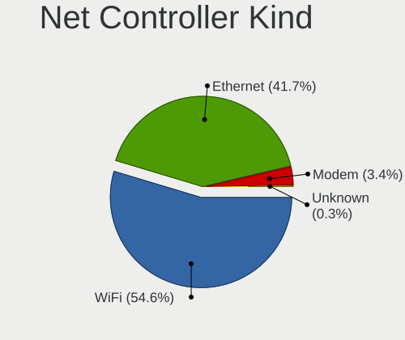

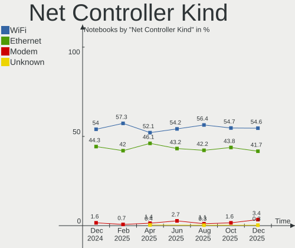

| Kind     | Notebooks | Percent |
|----------|-----------|---------|
| WiFi     | 194       | 54.65%  |
| Ethernet | 148       | 41.69%  |
| Modem    | 12        | 3.38%   |
| Unknown  | 1         | 0.28%   |

Used Controller
---------------

Currently used network controller

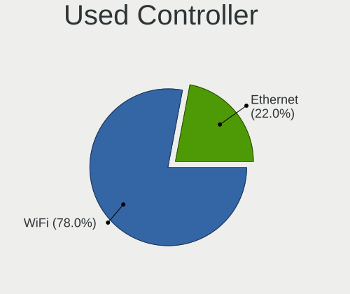

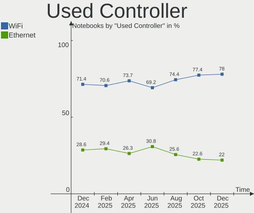

| Kind     | Notebooks | Percent |
|----------|-----------|---------|
| WiFi     | 170       | 77.98%  |
| Ethernet | 48        | 22.02%  |

NICs
----

Total network controllers on board

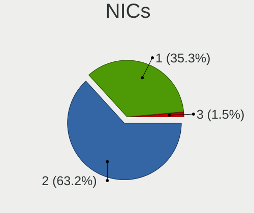

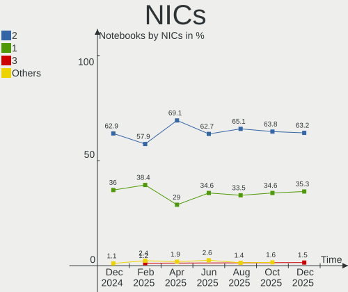

| Total | Notebooks | Percent |
|-------|-----------|---------|
| 2     | 129       | 63.24%  |
| 1     | 72        | 35.29%  |
| 3     | 3         | 1.47%   |

IPv6
----

IPv6 vs IPv4

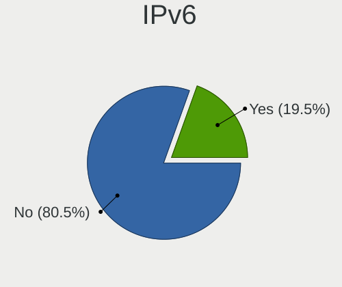

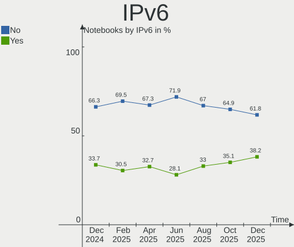

| Used | Notebooks | Percent |
|------|-----------|---------|
| No   | 126       | 61.76%  |
| Yes  | 78        | 38.24%  |

Bluetooth
---------

Bluetooth Vendor
----------------

Controller vendors

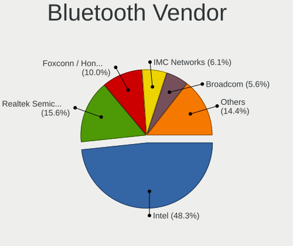

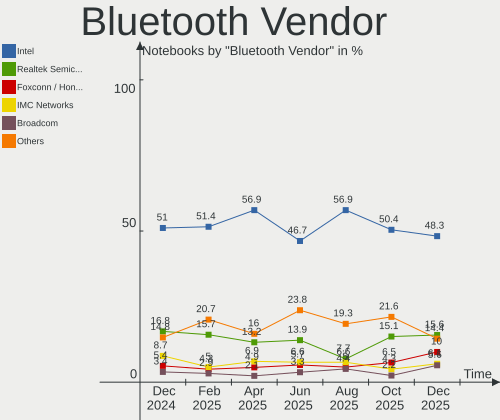

| Vendor                          | Notebooks | Percent |
|---------------------------------|-----------|---------|
| Intel                           | 87        | 48.33%  |
| Realtek Semiconductor           | 28        | 15.56%  |
| Foxconn / Hon Hai               | 18        | 10%     |
| IMC Networks                    | 11        | 6.11%   |
| Broadcom                        | 10        | 5.56%   |
| Qualcomm Atheros Communications | 6         | 3.33%   |
| Apple                           | 4         | 2.22%   |
| MediaTek                        | 3         | 1.67%   |
| Dell                            | 2         | 1.11%   |
| Cambridge Silicon Radio         | 2         | 1.11%   |
| TP-Link                         | 1         | 0.56%   |
| Toshiba                         | 1         | 0.56%   |
| Realtek                         | 1         | 0.56%   |
| Ralink                          | 1         | 0.56%   |
| Lite-On Technology              | 1         | 0.56%   |
| Hewlett-Packard                 | 1         | 0.56%   |
| ASUSTek Computer                | 1         | 0.56%   |
| Alps Electric                   | 1         | 0.56%   |
| Actions                         | 1         | 0.56%   |

Bluetooth Model
---------------

Controller models

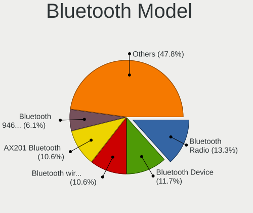

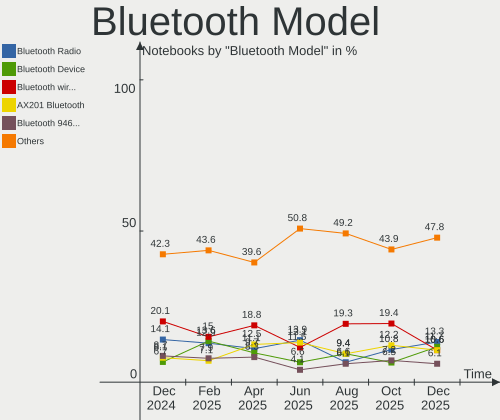

| Model                                                                               | Notebooks | Percent |
|-------------------------------------------------------------------------------------|-----------|---------|
| Realtek Bluetooth Radio                                                             | 24        | 13.33%  |
| Intel Bluetooth Device                                                              | 21        | 11.67%  |
| Intel Bluetooth wireless interface                                                  | 19        | 10.56%  |
| Intel AX201 Bluetooth                                                               | 19        | 10.56%  |
| Intel Bluetooth 9460/9560 Jefferson Peak (JfP)                                      | 11        | 6.11%   |
| Foxconn / Hon Hai Wireless_Device                                                   | 8         | 4.44%   |
| Intel AX200 Bluetooth                                                               | 7         | 3.89%   |
| IMC Networks Bluetooth Radio                                                        | 5         | 2.78%   |
| Broadcom BCM2045B (BDC-2.1)                                                         | 5         | 2.78%   |
| Intel AX210 Bluetooth                                                               | 4         | 2.22%   |
| Qualcomm Atheros  Bluetooth Device                                                  | 3         | 1.67%   |
| MediaTek Wireless_Device                                                            | 3         | 1.67%   |
| Intel Centrino Bluetooth Wireless Transceiver                                       | 3         | 1.67%   |
| IMC Networks Bluetooth Device                                                       | 3         | 1.67%   |
| Foxconn / Hon Hai MediaTek Bluetooth Adapter                                        | 3         | 1.67%   |
| Foxconn / Hon Hai BCM20702A0                                                        | 3         | 1.67%   |
| Apple Bluetooth Host Controller                                                     | 3         | 1.67%   |
| Intel Wireless-AC 9260 Bluetooth Adapter                                            | 2         | 1.11%   |
| IMC Networks Atheros AR3012 Bluetooth 4.0 Adapter                                   | 2         | 1.11%   |
| Foxconn / Hon Hai Bluetooth Device                                                  | 2         | 1.11%   |
| Cambridge Silicon Radio Bluetooth Dongle (HCI mode)                                 | 2         | 1.11%   |
| TP-Link TP-T@- UB500 Adapter                                                        | 1         | 0.56%   |
| Toshiba Askey Bluetooth Module                                                      | 1         | 0.56%   |
| Realtek RTL8822BE Bluetooth 4.2 Adapter                                             | 1         | 0.56%   |
| Realtek RTL8821A Bluetooth                                                          | 1         | 0.56%   |
| Realtek RTL8723B Bluetooth                                                          | 1         | 0.56%   |
| Realtek  Bluetooth 4.2 Adapter                                                      | 1         | 0.56%   |
| Realtek Bluetooth Radio                                                             | 1         | 0.56%   |
| Ralink RT3290 Bluetooth                                                             | 1         | 0.56%   |
| Qualcomm Atheros QCA61x4 Bluetooth 4.0                                              | 1         | 0.56%   |
| Qualcomm Atheros AR3012 Bluetooth 4.0                                               | 1         | 0.56%   |
| Qualcomm Atheros AR3011 Bluetooth                                                   | 1         | 0.56%   |
| Lite-On Wireless_Device                                                             | 1         | 0.56%   |
| Intel Bluetooth                                                                     | 1         | 0.56%   |
| IMC Networks Wireless_Device                                                        | 1         | 0.56%   |
| HP Broadcom 2070 Bluetooth Combo                                                    | 1         | 0.56%   |
| Foxconn / Hon Hai Foxconn T77H114 BCM2070 [Single-Chip Bluetooth 2.1 + EDR Adapter] | 1         | 0.56%   |
| Foxconn / Hon Hai Broadcom Bluetooth 2.1 Device                                     | 1         | 0.56%   |
| Dell Wireless 365 Bluetooth                                                         | 1         | 0.56%   |
| Dell DW375 Bluetooth Module                                                         | 1         | 0.56%   |

Sound
-----

Sound Vendor
------------

Sound card vendors

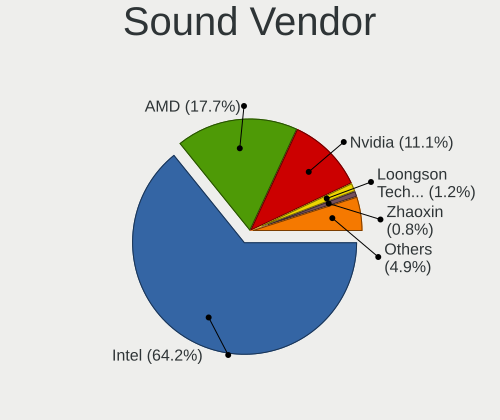

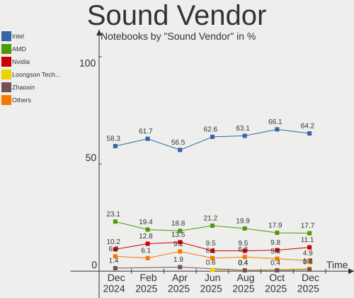

| Vendor                 | Notebooks | Percent |
|------------------------|-----------|---------|
| Intel                  | 156       | 64.2%   |
| AMD                    | 43        | 17.7%   |
| Nvidia                 | 27        | 11.11%  |
| Loongson Technology    | 3         | 1.23%   |
| Zhaoxin                | 2         | 0.82%   |
| Realtek Semiconductor  | 2         | 0.82%   |
| C-Media Electronics    | 2         | 0.82%   |
| SteelSeries ApS        | 1         | 0.41%   |
| Soundprese             | 1         | 0.41%   |
| Lenovo                 | 1         | 0.41%   |
| KTMICRO                | 1         | 0.41%   |
| JBL                    | 1         | 0.41%   |
| Hewlett-Packard        | 1         | 0.41%   |
| Generalplus Technology | 1         | 0.41%   |
| DSEA A/S               | 1         | 0.41%   |

Sound Model
-----------

Sound card models

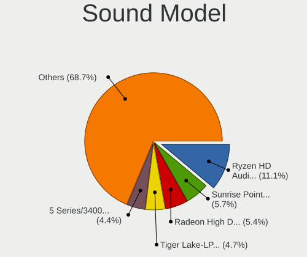

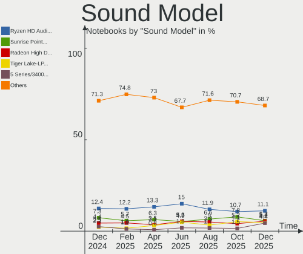

| Model                                                                                     | Notebooks | Percent |
|-------------------------------------------------------------------------------------------|-----------|---------|
| AMD Ryzen HD Audio Controller                                                             | 33        | 11.11%  |
| Intel Sunrise Point-LP HD Audio                                                           | 17        | 5.72%   |
| AMD Radeon High Definition Audio Controller                                               | 16        | 5.39%   |
| Intel Tiger Lake-LP Smart Sound Technology Audio Controller                               | 14        | 4.71%   |
| Intel 5 Series/3400 Series Chipset High Definition Audio                                  | 13        | 4.38%   |
| AMD Renoir/Cezanne HDMI/DP Audio Controller                                               | 11        | 3.7%    |
| Intel 7 Series/C216 Chipset Family High Definition Audio Controller                       | 10        | 3.37%   |
| Intel Raptor Lake-P/U/H cAVS                                                              | 9         | 3.03%   |
| Intel Alder Lake PCH-P High Definition Audio Controller                                   | 9         | 3.03%   |
| Intel Meteor Lake-P HD Audio Controller                                                   | 8         | 2.69%   |
| Intel Haswell-ULT HD Audio Controller                                                     | 7         | 2.36%   |
| Intel Cannon Point-LP High Definition Audio Controller                                    | 7         | 2.36%   |
| Intel 8 Series HD Audio Controller                                                        | 7         | 2.36%   |
| Intel NM10/ICH7 Family High Definition Audio Controller                                   | 6         | 2.02%   |
| Intel Cannon Lake PCH cAVS                                                                | 5         | 1.68%   |
| Intel Arrow Lake cAVS                                                                     | 5         | 1.68%   |
| Intel 6 Series/C200 Series Chipset Family High Definition Audio Controller                | 5         | 1.68%   |
| AMD Raven/Raven2/Fenghuang HDMI/DP Audio Controller                                       | 5         | 1.68%   |
| Nvidia High Definition Audio Controller                                                   | 4         | 1.35%   |
| Intel Alder Lake-N PCH High Definition Audio Controller                                   | 4         | 1.35%   |
| Intel 82801I (ICH9 Family) HD Audio Controller                                            | 4         | 1.35%   |
| Intel 8 Series/C220 Series Chipset High Definition Audio Controller                       | 4         | 1.35%   |
| AMD Kabini HDMI/DP Audio                                                                  | 4         | 1.35%   |
| AMD FCH Azalia Controller                                                                 | 4         | 1.35%   |
| Nvidia TU104 HD Audio Controller                                                          | 3         | 1.01%   |
| Loongson Technology 2K2000 HDMI Audio Controller                                          | 3         | 1.01%   |
| Loongson Technology 2K1000/2000 / 7A1000/2000 Chipset HD Audio Controller                 | 3         | 1.01%   |
| Intel Xeon E3-1200 v3/4th Gen Core Processor HD Audio Controller                          | 3         | 1.01%   |
| Intel Lunar Lake-M HD Audio Controller                                                    | 3         | 1.01%   |
| Intel Ice Lake-LP Smart Sound Technology Audio Controller                                 | 3         | 1.01%   |
| Intel Comet Lake PCH cAVS                                                                 | 3         | 1.01%   |
| Intel 82801H (ICH8 Family) HD Audio Controller                                            | 3         | 1.01%   |
| Zhaoxin ZX-E High Definition Audio Controller                                             | 2         | 0.67%   |
| Zhaoxin ZX-100/KX-5000/KX-6000/KX-6000G/KH-40000/KX-7000 High Definition Audio Controller | 2         | 0.67%   |
| Nvidia GT216 HDMI Audio Controller                                                        | 2         | 0.67%   |
| Nvidia GP107GL High Definition Audio Controller                                           | 2         | 0.67%   |
| Nvidia GK107 HDMI Audio Controller                                                        | 2         | 0.67%   |
| Nvidia GF108 High Definition Audio Controller                                             | 2         | 0.67%   |
| Nvidia GB206 High Definition Audio Controller                                             | 2         | 0.67%   |
| Intel Wildcat Point-LP High Definition Audio Controller                                   | 2         | 0.67%   |

Memory
------

Memory Vendor
-------------

Memory module vendors

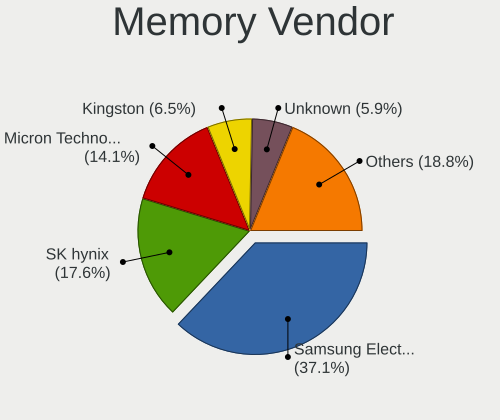

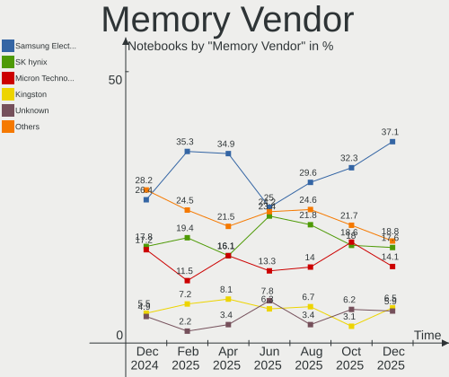

| Vendor              | Notebooks | Percent |
|---------------------|-----------|---------|
| Samsung Electronics | 63        | 37.06%  |
| SK hynix            | 30        | 17.65%  |
| Micron Technology   | 24        | 14.12%  |
| Kingston            | 11        | 6.47%   |
| Unknown             | 10        | 5.88%   |
| Ramaxel Technology  | 5         | 2.94%   |
| Crucial             | 5         | 2.94%   |
| A-DATA Technology   | 4         | 2.35%   |
| Corsair             | 3         | 1.76%   |
| Unknown             | 3         | 1.76%   |
| Unknown (ABCD)      | 2         | 1.18%   |
| Nanya Technology    | 2         | 1.18%   |
| Smart               | 1         | 0.59%   |
| Patriot             | 1         | 0.59%   |
| GOODRAM             | 1         | 0.59%   |
| Essencore Limited   | 1         | 0.59%   |
| Elpida              | 1         | 0.59%   |
| Apacer              | 1         | 0.59%   |
| <Unknown>           | 1         | 0.59%   |
| 2B0B00000000        | 1         | 0.59%   |

Memory Model
------------

Memory module models

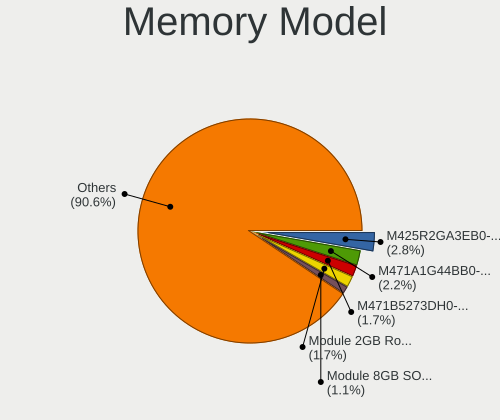

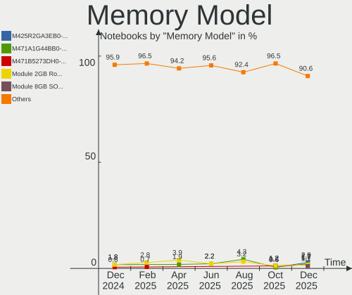

| Model                                                            | Notebooks | Percent |
|------------------------------------------------------------------|-----------|---------|
| Samsung RAM M425R2GA3EB0-CWMOL 16GB SODIMM DDR5 5600MT/s         | 5         | 2.76%   |
| Samsung RAM M471A1G44BB0-CWE 8GB SODIMM DDR4 3200MT/s            | 4         | 2.21%   |
| Samsung RAM M471B5273DH0-CH9 4GB SODIMM DDR3 1600MT/s            | 3         | 1.66%   |
| Unknown                                                          | 3         | 1.66%   |
| Unknown RAM Module 8GB SODIMM DDR4 2400MT/s                      | 2         | 1.1%    |
| SK hynix RAM HYMP125S64CP8-S6 2GB SODIMM DDR2 975MT/s            | 2         | 1.1%    |
| SK hynix RAM HMT351S6BFR8C-H9 4GB SODIMM 1334MT/s                | 2         | 1.1%    |
| SK hynix RAM HMA851S6DJR6N-XN 4GB SODIMM DDR4 3200MT/s           | 2         | 1.1%    |
| SK hynix RAM HMA81GS6AFR8N-UH 8GB SODIMM DDR4 2667MT/s           | 2         | 1.1%    |
| Samsung RAM M471B5673FH0-CF8 2048MB SODIMM DDR3 1067MT/s         | 2         | 1.1%    |
| Samsung RAM M471B5173DB0-YK0 4GB SODIMM DDR3 1600MT/s            | 2         | 1.1%    |
| Samsung RAM M471A5244CB0-CWE 4GB Row Of Chips DDR4 3200MT/s      | 2         | 1.1%    |
| Samsung RAM M471A5244CB0-CTD 4GB SODIMM DDR4 3266MT/s            | 2         | 1.1%    |
| Samsung RAM M471A4G43AB1-CWE 32GB SODIMM DDR4 3200MT/s           | 2         | 1.1%    |
| Samsung RAM M471A1K43DB1-CTD 8GB SODIMM DDR4 2667MT/s            | 2         | 1.1%    |
| Samsung RAM M471A1G44AB0-CWE 8GiB SODIMM DDR4 3200MT/s           | 2         | 1.1%    |
| Samsung RAM M425R2GA3BB0-CWMOD 16GiB SODIMM DDR5 5600MT/s        | 2         | 1.1%    |
| Micron RAM 4ATF51264HZ-2G6E1 4GB SODIMM DDR4 2667MT/s            | 2         | 1.1%    |
| Unknown RAM Module 8GB SODIMM LPDDR4 4266MT/s                    | 1         | 0.55%   |
| Unknown RAM Module 4GB SODIMM DDR3 1600MT/s                      | 1         | 0.55%   |
| Unknown RAM Module 4GB SODIMM DDR3                               | 1         | 0.55%   |
| Unknown RAM Module 4GB Row Of Chips LPDDR4 4267MT/s              | 1         | 0.55%   |
| Unknown RAM Module 2GB SODIMM DDR3                               | 1         | 0.55%   |
| Unknown RAM Module 2GB SODIMM 800MT/s                            | 1         | 0.55%   |
| Unknown RAM Module 2GB SODIMM 667MT/s                            | 1         | 0.55%   |
| Unknown RAM Module 1GB SODIMM DDR                                | 1         | 0.55%   |
| Unknown (ABCD) RAM 123456789012345678 2GB SODIMM LPDDR4 2400MT/s | 1         | 0.55%   |
| Unknown (ABCD) RAM 123456789012345678 2GB DIMM LPDDR4 2133MT/s   | 1         | 0.55%   |
| Smart RAM SH564568FH8NWPHSFG 2GB SODIMM DDR3 1333MT/s            | 1         | 0.55%   |
| Smart RAM SH564128FH8NZPHSCR 4GB SODIMM DDR3 1334MT/s            | 1         | 0.55%   |
| SK hynix RAM Module 8GB SODIMM DDR4 2133MT/s                     | 1         | 0.55%   |
| SK hynix RAM Module 4GB SODIMM DDR3 1600MT/s                     | 1         | 0.55%   |
| SK hynix RAM HYMP125S64CP8-S6 2GB SODIMM DDR2 800MT/s            | 1         | 0.55%   |
| SK hynix RAM HMT451S6CFR6A-PB 4GB SODIMM DDR3 1600MT/s           | 1         | 0.55%   |
| SK hynix RAM HMT41GS6MFR8C-PB 8GB SODIMM DDR3 1600MT/s           | 1         | 0.55%   |
| SK hynix RAM HMT351S6CFR8C-PB 4GB SODIMM DDR3 1600MT/s           | 1         | 0.55%   |
| SK hynix RAM HMT351S6CFR8C-PB 4096MB SODIMM DDR3 1600MT/s        | 1         | 0.55%   |
| SK hynix RAM HMT351S6CFR8C-H9 4GB SODIMM DDR3 1333MT/s           | 1         | 0.55%   |
| SK hynix RAM HMT325S6CFR8C-H9 2GB SODIMM DDR3 1334MT/s           | 1         | 0.55%   |
| SK hynix RAM HMT325S6CFR8C-H9 2GB SODIMM DDR3 1333MT/s           | 1         | 0.55%   |

Memory Kind
-----------

Memory module kinds

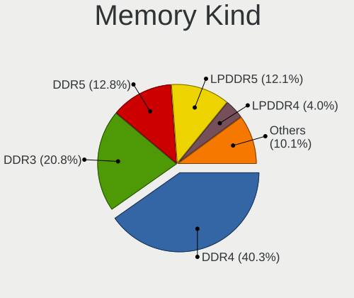

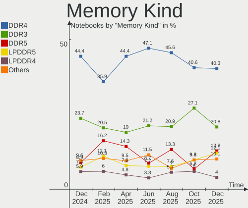

| Kind    | Notebooks | Percent |
|---------|-----------|---------|
| DDR4    | 60        | 40.27%  |
| DDR3    | 31        | 20.81%  |
| DDR5    | 19        | 12.75%  |
| LPDDR5  | 18        | 12.08%  |
| LPDDR4  | 6         | 4.03%   |
| SDRAM   | 4         | 2.68%   |
| LPDDR3  | 4         | 2.68%   |
| DDR2    | 4         | 2.68%   |
| Unknown | 2         | 1.34%   |
| DDR     | 1         | 0.67%   |

Memory Form Factor
------------------

Physical design of the memory module

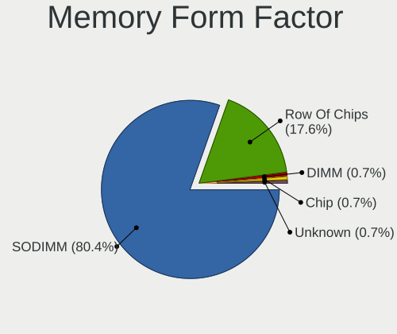

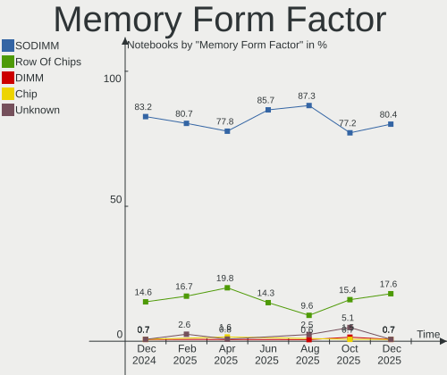

| Name         | Notebooks | Percent |
|--------------|-----------|---------|
| SODIMM       | 119       | 80.41%  |
| Row Of Chips | 26        | 17.57%  |
| DIMM         | 1         | 0.68%   |
| Chip         | 1         | 0.68%   |
| Unknown      | 1         | 0.68%   |

Memory Size
-----------

Memory module size

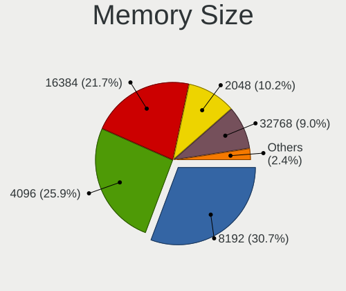

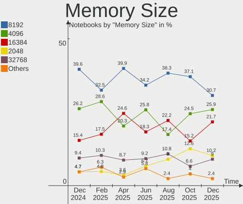

| Size  | Notebooks | Percent |
|-------|-----------|---------|
| 8192  | 51        | 30.72%  |
| 4096  | 43        | 25.9%   |
| 16384 | 36        | 21.69%  |
| 2048  | 17        | 10.24%  |
| 32768 | 15        | 9.04%   |
| 1024  | 4         | 2.41%   |

Memory Speed
------------

Memory module speed

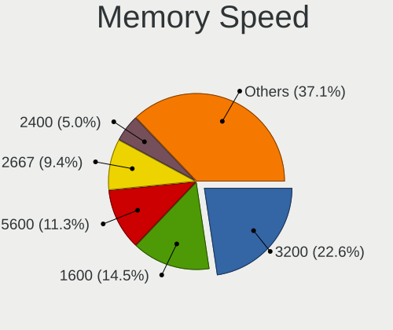

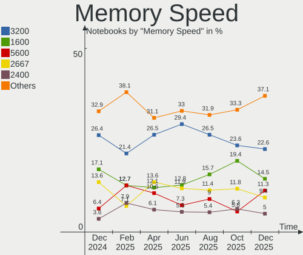

| Speed   | Notebooks | Percent |
|---------|-----------|---------|
| 3200    | 36        | 22.64%  |
| 1600    | 23        | 14.47%  |
| 5600    | 18        | 11.32%  |
| 2667    | 15        | 9.43%   |
| 2400    | 8         | 5.03%   |
| 1334    | 7         | 4.4%    |
| 7500    | 5         | 3.14%   |
| 6400    | 5         | 3.14%   |
| 8533    | 4         | 2.52%   |
| 2133    | 4         | 2.52%   |
| 1867    | 3         | 1.89%   |
| 1333    | 3         | 1.89%   |
| Unknown | 3         | 1.89%   |
| 7467    | 2         | 1.26%   |
| 4800    | 2         | 1.26%   |
| 4267    | 2         | 1.26%   |
| 4266    | 2         | 1.26%   |
| 3266    | 2         | 1.26%   |
| 2048    | 2         | 1.26%   |
| 1067    | 2         | 1.26%   |
| 975     | 2         | 1.26%   |
| 800     | 2         | 1.26%   |
| 667     | 2         | 1.26%   |
| 7400    | 1         | 0.63%   |
| 4199    | 1         | 0.63%   |
| 4000    | 1         | 0.63%   |
| 2666    | 1         | 0.63%   |
| 1639    | 1         | 0.63%   |

Printers & scanners
-------------------

Printer Vendor
--------------

Printer device vendors

Zero info for selected period =(

Printer Model
-------------

Printer device models

Zero info for selected period =(

Scanner Vendor
--------------

Scanner device vendors

Zero info for selected period =(

Scanner Model
-------------

Scanner device models

Zero info for selected period =(

Camera
------

Camera Vendor
-------------

Camera device vendors

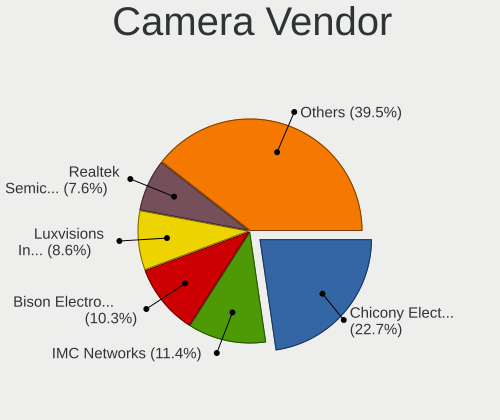

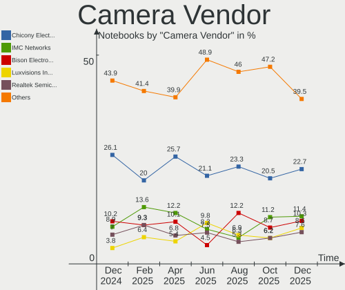

| Vendor                                 | Notebooks | Percent |
|----------------------------------------|-----------|---------|
| Chicony Electronics                    | 42        | 22.7%   |
| IMC Networks                           | 21        | 11.35%  |
| Bison Electronics                      | 19        | 10.27%  |
| Luxvisions Innotech Limited            | 16        | 8.65%   |
| Realtek Semiconductor                  | 14        | 7.57%   |
| Sunplus Innovation Technology          | 12        | 6.49%   |
| Syntek                                 | 9         | 4.86%   |
| Microdia                               | 9         | 4.86%   |
| Sonix Technology                       | 5         | 2.7%    |
| ShineTech                              | 5         | 2.7%    |
| Quanta                                 | 5         | 2.7%    |
| Lenovo                                 | 4         | 2.16%   |
| Cheng Uei Precision Industry (Foxlink) | 4         | 2.16%   |
| Ricoh                                  | 3         | 1.62%   |
| kingcome                               | 3         | 1.62%   |
| Alcor Micro                            | 2         | 1.08%   |
| USB CAMERA                             | 1         | 0.54%   |
| Suyin                                  | 1         | 0.54%   |
| Silicon Motion                         | 1         | 0.54%   |
| OmniVision Technologies                | 1         | 0.54%   |
| Logitech                               | 1         | 0.54%   |
| icSpring                               | 1         | 0.54%   |
| Framework                              | 1         | 0.54%   |
| eMeet                                  | 1         | 0.54%   |
| Apple                                  | 1         | 0.54%   |
| ALi                                    | 1         | 0.54%   |
| A4Tech                                 | 1         | 0.54%   |
| Unknown                                | 1         | 0.54%   |

Camera Model
------------

Camera device models

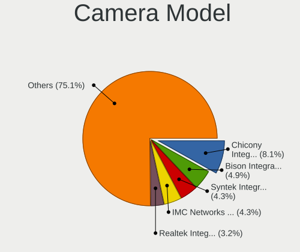

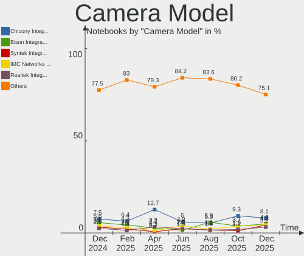

| Model                                               | Notebooks | Percent |
|-----------------------------------------------------|-----------|---------|
| Chicony Integrated Camera                           | 15        | 8.11%   |
| Bison Integrated Camera                             | 9         | 4.86%   |
| Syntek Integrated Camera                            | 8         | 4.32%   |
| IMC Networks USB2.0 HD UVC WebCam                   | 8         | 4.32%   |
| Realtek Integrated_Webcam_HD                        | 6         | 3.24%   |
| Luxvisions Innotech Limited Integrated Camera       | 6         | 3.24%   |
| Microdia Integrated_Webcam_HD                       | 5         | 2.7%    |
| Luxvisions Innotech Limited HP TrueVision HD Camera | 5         | 2.7%    |
| Chicony HD WebCam                                   | 5         | 2.7%    |
| IMC Networks USB2.0 VGA UVC WebCam                  | 4         | 2.16%   |
| IMC Networks Integrated Camera                      | 4         | 2.16%   |
| Sunplus Integrated_Webcam_HD                        | 3         | 1.62%   |
| Shinetech USB2.0 FHD UVC WebCam                     | 3         | 1.62%   |
| Luxvisions Innotech Limited Integrated RGB Camera   | 3         | 1.62%   |
| Lenovo Integrated Webcam [R5U877]                   | 3         | 1.62%   |
| kingcome FHD WebCam                                 | 3         | 1.62%   |
| Chicony FJ Camera                                   | 3         | 1.62%   |
| Sunplus USB 2.0 Camera                              | 2         | 1.08%   |
| Sunplus Integrated Camera                           | 2         | 1.08%   |
| Sonix USB2.0 FHD UVC WebCam                         | 2         | 1.08%   |
| Realtek Integrated_Webcam_FHD                       | 2         | 1.08%   |
| IMC Networks UVC VGA Webcam                         | 2         | 1.08%   |
| Chicony Integrated Camera (1280x720@30)             | 2         | 1.08%   |
| Chicony HP Truevision HD camera                     | 2         | 1.08%   |
| Chicony Chicony USB2.0 Camera                       | 2         | 1.08%   |
| Bison SunplusIT Integrated Camera                   | 2         | 1.08%   |
| Bison Lenovo EasyCamera                             | 2         | 1.08%   |
| USB CAMERA USB CAMERA                               | 1         | 0.54%   |
| Syntek HP Webcam                                    | 1         | 0.54%   |
| Suyin Sony Visual Communication Camera              | 1         | 0.54%   |
| Sunplus SPCA2281 Web Camera                         | 1         | 0.54%   |
| Sunplus MTD camera                                  | 1         | 0.54%   |
| Sunplus Laptop_Integrated_Webcam_HD                 | 1         | 0.54%   |
| Sunplus Laptop Integrated Webcam HD                 | 1         | 0.54%   |
| Sunplus Asus Webcam                                 | 1         | 0.54%   |
| Sonix USB2.0 VGAUVC WebCam                          | 1         | 0.54%   |
| Sonix Integrated Webcam_FHD                         | 1         | 0.54%   |
| Sonix GIGABYTE FHD CAMERA                           | 1         | 0.54%   |
| Silicon Motion Lenovo EasyCamera                    | 1         | 0.54%   |
| ShineTech USB2.0 HD UVC WebCam                      | 1         | 0.54%   |

Security
--------

Fingerprint Vendor
------------------

Fingerprint sensor vendors

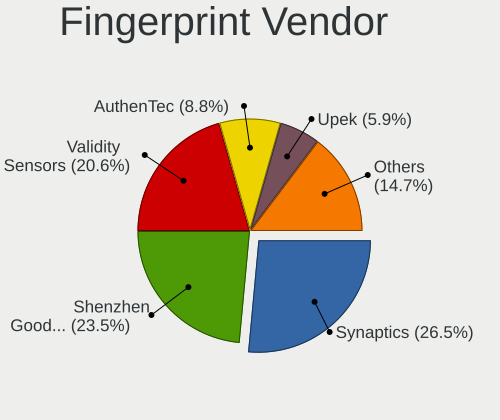

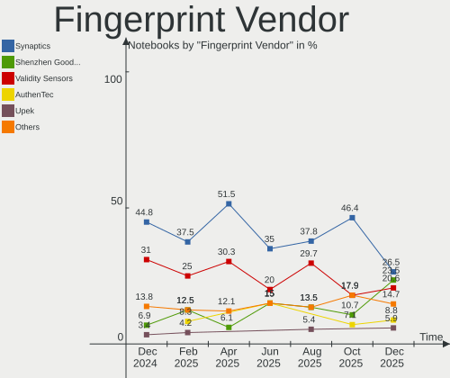

| Vendor                             | Notebooks | Percent |
|------------------------------------|-----------|---------|
| Synaptics                          | 9         | 26.47%  |
| Shenzhen Goodix Technology         | 8         | 23.53%  |
| Validity Sensors                   | 7         | 20.59%  |
| AuthenTec                          | 3         | 8.82%   |
| Upek                               | 2         | 5.88%   |
| HOLTEK                             | 2         | 5.88%   |
| Elan Microelectronics              | 2         | 5.88%   |
| Realtek USB2.0 Finger Print Bridge | 1         | 2.94%   |

Fingerprint Model
-----------------

Fingerprint sensor models

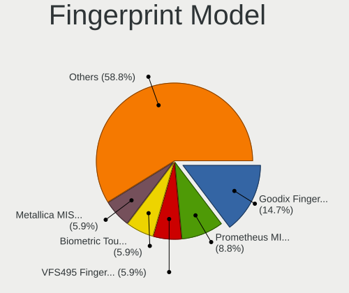

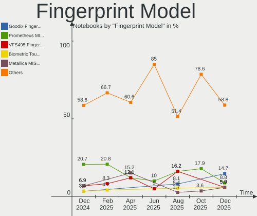

| Model                                                                      | Notebooks | Percent |
|----------------------------------------------------------------------------|-----------|---------|
| Shenzhen Goodix  FingerPrint Device                                        | 5         | 14.71%  |
| Synaptics Prometheus MIS Touch Fingerprint Reader                          | 3         | 8.82%   |
| Validity Sensors VFS495 Fingerprint Reader                                 | 2         | 5.88%   |
| Upek Biometric Touchchip/Touchstrip Fingerprint Sensor                     | 2         | 5.88%   |
| Synaptics Metallica MIS Touch Fingerprint Reader                           | 2         | 5.88%   |
| Shenzhen Goodix Fingerprint Reader                                         | 2         | 5.88%   |
| HOLTEK FocalTech Fingerprint Device                                        | 2         | 5.88%   |
| Elan ELAN:ARM-M4                                                           | 2         | 5.88%   |
| Validity Sensors VFS5011 Fingerprint Reader                                | 1         | 2.94%   |
| Validity Sensors VFS491                                                    | 1         | 2.94%   |
| Validity Sensors Synaptics WBDI                                            | 1         | 2.94%   |
| Validity Sensors Synaptics VFS7552 Touch Fingerprint Sensor with PurePrint | 1         | 2.94%   |
| Validity Sensors Swipe Fingerprint Sensor                                  | 1         | 2.94%   |
| Synaptics WBDI                                                             | 1         | 2.94%   |
| Synaptics UWP WBDI                                                         | 1         | 2.94%   |
| Synaptics Prometheus Fingerprint Reader                                    | 1         | 2.94%   |
| Synaptics Metallica MOH Touch Fingerprint Reader                           | 1         | 2.94%   |
| Shenzhen Goodix FingerPrint                                                | 1         | 2.94%   |
| Realtek USB2.0 Finger Print Bridge FocalTech Fingerprint Device            | 1         | 2.94%   |
| AuthenTec Fingerprint Sensor                                               | 1         | 2.94%   |
| AuthenTec AES2501 Fingerprint Sensor                                       | 1         | 2.94%   |
| AuthenTec AES1600                                                          | 1         | 2.94%   |

Chipcard Vendor
---------------

Chipcard module vendors

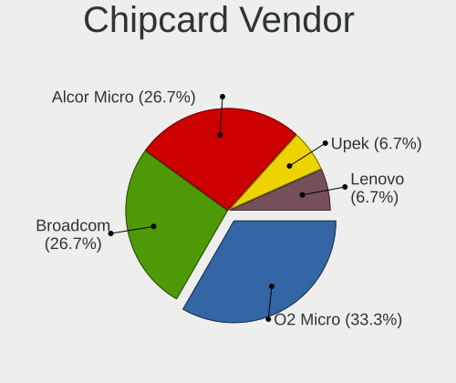

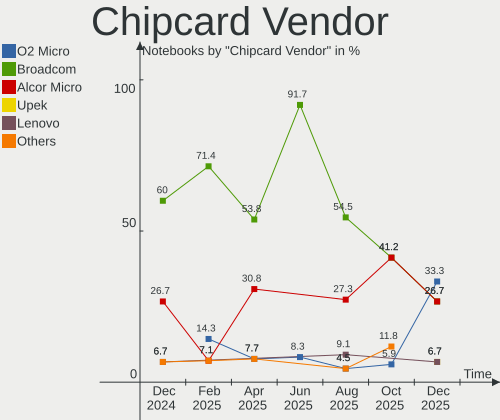

| Vendor      | Notebooks | Percent |
|-------------|-----------|---------|
| O2 Micro    | 5         | 33.33%  |
| Broadcom    | 4         | 26.67%  |
| Alcor Micro | 4         | 26.67%  |
| Upek        | 1         | 6.67%   |
| Lenovo      | 1         | 6.67%   |

Chipcard Model
--------------

Chipcard module models

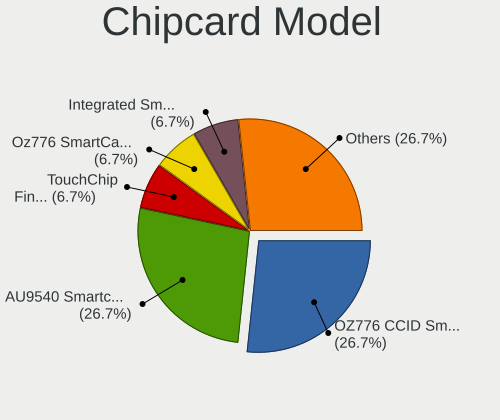

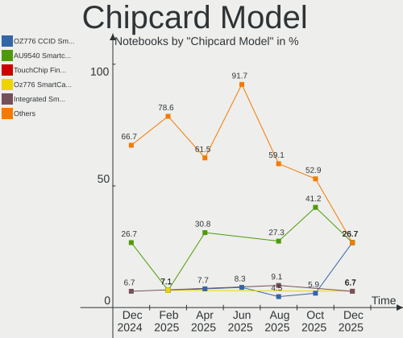

| Model                                                                        | Notebooks | Percent |
|------------------------------------------------------------------------------|-----------|---------|
| O2 Micro OZ776 CCID Smartcard Reader                                         | 4         | 26.67%  |
| Alcor Micro AU9540 Smartcard Reader                                          | 4         | 26.67%  |
| Upek TouchChip Fingerprint Coprocessor (WBF advanced mode)                   | 1         | 6.67%   |
| O2 Micro Oz776 SmartCard Reader                                              | 1         | 6.67%   |
| Lenovo Integrated Smart Card Reader                                          | 1         | 6.67%   |
| Broadcom BCM5880 Secure Applications Processor with fingerprint swipe sensor | 1         | 6.67%   |
| Broadcom BCM5880 Secure Applications Processor                               | 1         | 6.67%   |
| Broadcom 5880                                                                | 1         | 6.67%   |
| Broadcom 58200                                                               | 1         | 6.67%   |

Unsupported
-----------

Unsupported Devices
-------------------

Total unsupported devices on board

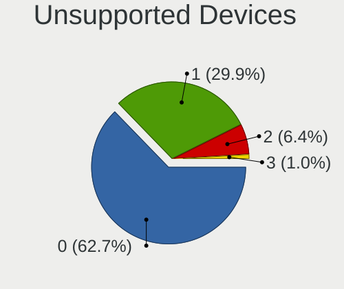

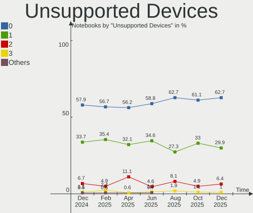

| Total | Notebooks | Percent |
|-------|-----------|---------|
| 0     | 128       | 62.75%  |
| 1     | 61        | 29.9%   |
| 2     | 13        | 6.37%   |
| 3     | 2         | 0.98%   |

Unsupported Device Types
------------------------

Types of unsupported devices

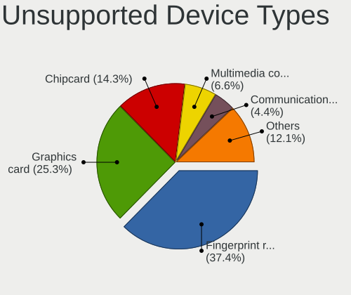

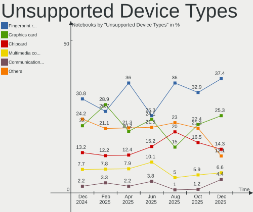

| Type                     | Notebooks | Percent |
|--------------------------|-----------|---------|
| Fingerprint reader       | 34        | 37.36%  |
| Graphics card            | 23        | 25.27%  |
| Chipcard                 | 13        | 14.29%  |
| Multimedia controller    | 6         | 6.59%   |
| Communication controller | 4         | 4.4%    |
| Net/ethernet             | 3         | 3.3%    |
| Card reader              | 3         | 3.3%    |
| Bluetooth                | 3         | 3.3%    |
| Storage                  | 1         | 1.1%    |
| Net/wireless             | 1         | 1.1%    |

