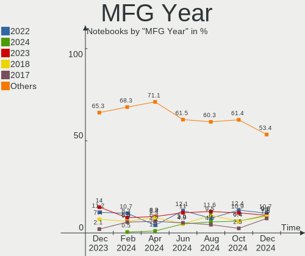
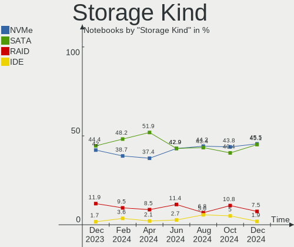
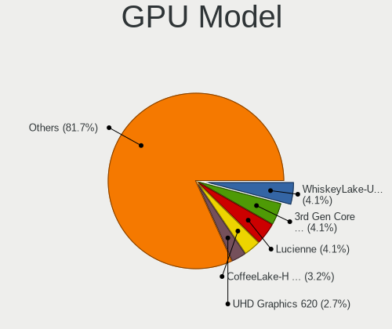
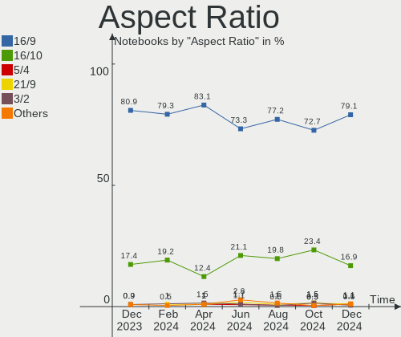

Debian Hardware Trends (Notebook)
---------------------------------

A project to identify most popular hardware characteristics and track their change
over time based on data collected by Debian users at https://Linux-Hardware.org.

Anyone can contribute to the study by uploading probes of their computers by
the [hw-probe](https://github.com/linuxhw/hw-probe) tool:

    sudo hw-probe -all -upload

Full-feature report is available here: https://linux-hardware.org/?view=trends&formfactor=notebook

Period: Mar, 2020.

Contents
--------

- [ OS                       ](#os)
- [ OS Family                ](#os-family)
- [ Kernel                   ](#kernel)
- [ Kernel Family            ](#kernel-family)
- [ Kernel Major Ver.        ](#kernel-major-ver)
- [ Arch                     ](#arch)
- [ DE                       ](#de)
- [ Display Server           ](#display-server)
- [ OS Lang                  ](#os-lang)
- [ Boot Mode                ](#boot-mode)
- [ Filesystem               ](#filesystem)
- [ Dual Boot with Linux     ](#dual-boot-with-linux)
- [ Dual Boot (Win)          ](#dual-boot-win)
- [ Country                  ](#country)
- [ City                     ](#city)
- [ Vendor                   ](#vendor)
- [ Model                    ](#model)
- [ Model Family             ](#model-family)
- [ MFG Year                 ](#mfg-year)
- [ Form Factor              ](#form-factor)
- [ Secure Boot              ](#secure-boot)
- [ Coreboot                 ](#coreboot)
- [ RAM Size                 ](#ram-size)
- [ RAM Used                 ](#ram-used)
- [ Drive Vendor             ](#drive-vendor)
- [ Drive Model              ](#drive-model)
- [ Drive Kind               ](#drive-kind)
- [ Drive Connector          ](#drive-connector)
- [ Drive Size               ](#drive-size)
- [ Space Total              ](#space-total)
- [ Space Used               ](#space-used)
- [ Malfunc. Drives          ](#malfunc-drives)
- [ Malfunc. Drive Vendor    ](#malfunc-drive-vendor)
- [ Malfunc. Drive Kind      ](#malfunc-drive-kind)
- [ Failed Drives            ](#failed-drives)
- [ Failed Drive Vendor      ](#failed-drive-vendor)
- [ Drive Status             ](#drive-status)
- [ Storage Vendor           ](#storage-vendor)
- [ Storage Model            ](#storage-model)
- [ Storage Kind             ](#storage-kind)
- [ CPU Vendor               ](#cpu-vendor)
- [ CPU Model                ](#cpu-model)
- [ CPU Model Family         ](#cpu-model-family)
- [ CPU Cores                ](#cpu-cores)
- [ CPU Sockets              ](#cpu-sockets)
- [ CPU Threads              ](#cpu-threads)
- [ CPU Op-Modes             ](#cpu-op-modes)
- [ CPU Microarch            ](#cpu-microarch)
- [ CPU Microcode            ](#cpu-microcode)
- [ GPU Vendor               ](#gpu-vendor)
- [ GPU Model                ](#gpu-model)
- [ GPU Combo                ](#gpu-combo)
- [ GPU Driver               ](#gpu-driver)
- [ GPU Memory               ](#gpu-memory)
- [ Monitor Vendor           ](#monitor-vendor)
- [ Monitor Model            ](#monitor-model)
- [ Monitor Resolution       ](#monitor-resolution)
- [ Monitor Diagonal         ](#monitor-diagonal)
- [ Monitor Width            ](#monitor-width)
- [ Aspect Ratio             ](#aspect-ratio)
- [ Monitor Area             ](#monitor-area)
- [ Pixel Density            ](#pixel-density)
- [ Multiple Monitors        ](#multiple-monitors)
- [ Net Controller Vendor    ](#net-controller-vendor)
- [ Net Controller Model     ](#net-controller-model)
- [ Net Controller Kind      ](#net-controller-kind)
- [ Used Controller          ](#used-controller)
- [ NICs                     ](#nics)
- [ Unsupported Devices      ](#unsupported-devices)
- [ Unsupported Device Types ](#unsupported-device-types)

OS
--

Installed operating systems

| Name            | Computers | Percent |
|-----------------|-----------|---------|
| Debian 10       | 22        | 50%     |
| Debian          | 9         | 20.45%  |
| Debian Testing  | 8         | 18.18%  |
| Debian Unstable | 3         | 6.82%   |
| Debian 9.12     | 2         | 4.55%   |

OS Family
---------

OS without a version

| Name   | Computers | Percent |
|--------|-----------|---------|
| Debian | 44        | 100%    |

Kernel
------

Version of the Linux kernel

| Version             | Computers | Percent |
|---------------------|-----------|---------|
| 5.4.0-4-amd64       | 17        | 38.64%  |
| 4.19.0-8-amd64      | 17        | 38.64%  |
| 4.9.0-12-amd64      | 3         | 6.82%   |
| 5.5.0-rc5-amd64     | 1         | 2.27%   |
| 5.4.0-4-rt-amd64    | 1         | 2.27%   |
| 5.4.0-0.bpo.2-amd64 | 1         | 2.27%   |
| 5.2.0-0.bpo.3-amd64 | 1         | 2.27%   |
| 4.19.0-8-686-pae    | 1         | 2.27%   |
| 4.19.0-8-686        | 1         | 2.27%   |
| 4.19.0-6-amd64      | 1         | 2.27%   |

Kernel Family
-------------

Linux kernel without a distro release

| Version | Computers | Percent |
|---------|-----------|---------|
| 4.19.0  | 20        | 45.45%  |
| 5.4.0   | 19        | 43.18%  |
| 4.9.0   | 3         | 6.82%   |
| 5.5.0   | 1         | 2.27%   |
| 5.2.0   | 1         | 2.27%   |

Kernel Major Ver.
-----------------

Linux kernel major version

| Version | Computers | Percent |
|---------|-----------|---------|
| 4.19    | 20        | 45.45%  |
| 5.4     | 19        | 43.18%  |
| 4.9     | 3         | 6.82%   |
| 5.5     | 1         | 2.27%   |
| 5.2     | 1         | 2.27%   |

Arch
----

OS architecture (x86_64, i586, etc.)

| Name   | Computers | Percent |
|--------|-----------|---------|
| x86_64 | 42        | 95.45%  |
| i686   | 2         | 4.55%   |

DE
--

Desktop Environment

| Name          | Computers | Percent |
|---------------|-----------|---------|
| GNOME         | 15        | 34.09%  |
| XFCE          | 7         | 15.91%  |
| KDE           | 5         | 11.36%  |
| KDE5          | 4         | 9.09%   |
| Budgie        | 3         | 6.82%   |
| MATE          | 2         | 4.55%   |
| LXQt          | 2         | 4.55%   |
| Cinnamon      | 2         | 4.55%   |
| X-Cinnamon    | 1         | 2.27%   |
| LXDE          | 1         | 2.27%   |
| Enlightenment | 1         | 2.27%   |
| Unknown       | 1         | 2.27%   |

Display Server
--------------

X11 or Wayland

| Name    | Computers | Percent |
|---------|-----------|---------|
| X11     | 31        | 70.45%  |
| Wayland | 10        | 22.73%  |
| Tty     | 3         | 6.82%   |

OS Lang
-------

Language

| Lang       | Computers | Percent |
|------------|-----------|---------|
| en_US      | 9         | 20.45%  |
| it_IT      | 5         | 11.36%  |
| fr_FR      | 4         | 9.09%   |
| de_DE      | 4         | 9.09%   |
| ru_RU      | 3         | 6.82%   |
| pt_BR      | 3         | 6.82%   |
| pl_PL      | 3         | 6.82%   |
| en_US.utf8 | 2         | 4.55%   |
| en_GB      | 2         | 4.55%   |
| uk_UA      | 1         | 2.27%   |
| pt_PT      | 1         | 2.27%   |
| nl_NL      | 1         | 2.27%   |
| es_ES      | 1         | 2.27%   |
| es_CL      | 1         | 2.27%   |
| de_DE.utf8 | 1         | 2.27%   |
| de_CH      | 1         | 2.27%   |
| de_AT      | 1         | 2.27%   |
| Unknown    | 1         | 2.27%   |

Boot Mode
---------

EFI or BIOS

| Mode | Computers | Percent |
|------|-----------|---------|
| BIOS | 24        | 54.55%  |
| EFI  | 20        | 45.45%  |

Filesystem
----------

Type of filesystem

| Type    | Computers | Percent |
|---------|-----------|---------|
| Ext4    | 42        | 95.45%  |
| Overlay | 1         | 2.27%   |
| Btrfs   | 1         | 2.27%   |

Dual Boot with Linux
--------------------

Hosting more than one Linux

| Dual boot | Computers | Percent |
|-----------|-----------|---------|
| No        | 38        | 86.36%  |
| Yes       | 6         | 13.64%  |

Dual Boot (Win)
---------------

Hosting Linux and Windows

| Dual boot | Computers | Percent |
|-----------|-----------|---------|
| No        | 32        | 72.73%  |
| Yes       | 12        | 27.27%  |

Country
-------

Geographic location (country)

| Country     | Computers | Percent |
|-------------|-----------|---------|
| USA         | 6         | 13.64%  |
| Italy       | 6         | 13.64%  |
| Germany     | 6         | 13.64%  |
| France      | 4         | 9.09%   |
| Poland      | 3         | 6.82%   |
| Brazil      | 3         | 6.82%   |
| Ukraine     | 2         | 4.55%   |
| Russia      | 2         | 4.55%   |
| India       | 2         | 4.55%   |
| UK          | 1         | 2.27%   |
| Switzerland | 1         | 2.27%   |
| Spain       | 1         | 2.27%   |
| Portugal    | 1         | 2.27%   |
| Netherlands | 1         | 2.27%   |
| Greece      | 1         | 2.27%   |
| Ethiopia    | 1         | 2.27%   |
| Chile       | 1         | 2.27%   |
| Bulgaria    | 1         | 2.27%   |
| Austria     | 1         | 2.27%   |

City
----

Geographic location (city)

| City                          | Computers | Percent |
|-------------------------------|-----------|---------|
| São Paulo                    | 2         | 4.55%   |
| Delhi                         | 2         | 4.55%   |
| Chicago                       | 2         | 4.55%   |
| Zurich                        | 1         | 2.27%   |
| Zlotow                        | 1         | 2.27%   |
| West Palm Beach               | 1         | 2.27%   |
| Wednesbury                    | 1         | 2.27%   |
| Vienna                        | 1         | 2.27%   |
| Verona                        | 1         | 2.27%   |
| Valparaíso                   | 1         | 2.27%   |
| Trieste                       | 1         | 2.27%   |
| Torres Novas                  | 1         | 2.27%   |
| St Petersburg                 | 1         | 2.27%   |
| Sofia                         | 1         | 2.27%   |
| Sevastopol                    | 1         | 2.27%   |
| San Mateo                     | 1         | 2.27%   |
| Saint-Martin-d'Hères         | 1         | 2.27%   |
| Pinhais                       | 1         | 2.27%   |
| Paris                         | 1         | 2.27%   |
| Padova                        | 1         | 2.27%   |
| Muhr am See                   | 1         | 2.27%   |
| Maisons-Laffitte              | 1         | 2.27%   |
| Katowice                      | 1         | 2.27%   |
| Kalisz                        | 1         | 2.27%   |
| Kaliningrad                   | 1         | 2.27%   |
| Jumilla                       | 1         | 2.27%   |
| Hockessin                     | 1         | 2.27%   |
| Heppenheim an der Bergstrasse | 1         | 2.27%   |
| Halle                         | 1         | 2.27%   |
| Frankfurt am Main             | 1         | 2.27%   |
| Dnipro                        | 1         | 2.27%   |
| Clermont-Ferrand              | 1         | 2.27%   |
| Christiansburg                | 1         | 2.27%   |
| Chiusi                        | 1         | 2.27%   |
| Catanzaro                     | 1         | 2.27%   |
| Buitenpost                    | 1         | 2.27%   |
| Bruegge                       | 1         | 2.27%   |
| Berlin                        | 1         | 2.27%   |
| Bari                          | 1         | 2.27%   |
| Athens                        | 1         | 2.27%   |
| Addis Ababa                   | 1         | 2.27%   |

Vendor
------

Motherboard manufacturer

| Name                | Computers | Percent |
|---------------------|-----------|---------|
| Lenovo              | 13        | 29.55%  |
| Hewlett-Packard     | 9         | 20.45%  |
| Dell                | 5         | 11.36%  |
| ASUSTek Computer    | 5         | 11.36%  |
| Acer                | 5         | 11.36%  |
| MSI                 | 2         | 4.55%   |
| Toshiba             | 1         | 2.27%   |
| Samsung Electronics | 1         | 2.27%   |
| Positivo            | 1         | 2.27%   |
| Gigabyte Technology | 1         | 2.27%   |
| Unknown             | 1         | 2.27%   |

Model
-----

Motherboard model

| Name                                     | Computers | Percent |
|------------------------------------------|-----------|---------|
| Lenovo ThinkPad E480 20KN003WUS          | 2         | 4.55%   |
| Toshiba Satellite CL45-C                 | 1         | 2.27%   |
| Samsung Electronics RC530/RC730          | 1         | 2.27%   |
| Positivo WCBT1013                        | 1         | 2.27%   |
| MSI GL62M 7RDX                           | 1         | 2.27%   |
| MSI GE70 2PC                             | 1         | 2.27%   |
| Lenovo V330-15IKB 81AX                   | 1         | 2.27%   |
| Lenovo ThinkPad X250 20CM001XGE          | 1         | 2.27%   |
| Lenovo ThinkPad X1 Carbon 7th 20R1S05B00 | 1         | 2.27%   |
| Lenovo ThinkPad T510 4384G47             | 1         | 2.27%   |
| Lenovo ThinkPad T490s 20NX002QUK         | 1         | 2.27%   |
| Lenovo ThinkPad T490s 20NX000AGE         | 1         | 2.27%   |
| Lenovo ThinkPad T410 2518F5U             | 1         | 2.27%   |
| Lenovo ThinkPad E480 20KN004TBM          | 1         | 2.27%   |
| Lenovo IdeaPad 330-17IKB 81DK            | 1         | 2.27%   |
| Lenovo IdeaPad 330-15IKB 81FE            | 1         | 2.27%   |
| Lenovo IdeaPad 120S-14IAP 81A5           | 1         | 2.27%   |
| HP ProBook 4510s                         | 1         | 2.27%   |
| HP ProBook 450 G6                        | 1         | 2.27%   |
| HP Presario CQ42                         | 1         | 2.27%   |
| HP Pavilion dv1000 (PW923EA#ABE)         | 1         | 2.27%   |
| HP Laptop 15-da0xxx                      | 1         | 2.27%   |
| HP EliteBook 8560w                       | 1         | 2.27%   |
| HP EliteBook 840 G6                      | 1         | 2.27%   |
| HP EliteBook 820 G1                      | 1         | 2.27%   |
| HP 350 G2                                | 1         | 2.27%   |
| Gigabyte Z390 I AORUS PRO WIFI           | 1         | 2.27%   |
| Dell XPS 13 9360                         | 1         | 2.27%   |
| Dell Vostro 3578                         | 1         | 2.27%   |
| Dell Latitude E6230                      | 1         | 2.27%   |
| Dell Latitude 5401                       | 1         | 2.27%   |
| Dell Inspiron 5570                       | 1         | 2.27%   |
| ASUS X540SC                              | 1         | 2.27%   |
| ASUS UX305FA                             | 1         | 2.27%   |
| ASUS N751JX                              | 1         | 2.27%   |
| ASUS N55SF                               | 1         | 2.27%   |
| ASUS BU201LA                             | 1         | 2.27%   |
| Acer Aspire ES1-572                      | 1         | 2.27%   |
| Acer Aspire E5-521                       | 1         | 2.27%   |
| Acer Aspire A315-51                      | 1         | 2.27%   |
| Acer Aspire 6930                         | 1         | 2.27%   |
| Acer Aspire 5742G                        | 1         | 2.27%   |
| Unknown                                  | 1         | 2.27%   |

Model Family
------------

Motherboard model prefix

| Name                      | Computers | Percent |
|---------------------------|-----------|---------|
| Lenovo ThinkPad           | 9         | 20.45%  |
| Acer Aspire               | 5         | 11.36%  |
| Lenovo IdeaPad            | 3         | 6.82%   |
| HP EliteBook              | 3         | 6.82%   |
| HP ProBook                | 2         | 4.55%   |
| Dell Latitude             | 2         | 4.55%   |
| Toshiba Satellite         | 1         | 2.27%   |
| Samsung Electronics RC530 | 1         | 2.27%   |
| Positivo WCBT1013         | 1         | 2.27%   |
| MSI GL62M                 | 1         | 2.27%   |
| MSI GE70                  | 1         | 2.27%   |
| Lenovo V330-15IKB         | 1         | 2.27%   |
| HP Presario               | 1         | 2.27%   |
| HP Pavilion               | 1         | 2.27%   |
| HP Laptop                 | 1         | 2.27%   |
| HP 350                    | 1         | 2.27%   |
| Gigabyte Z390             | 1         | 2.27%   |
| Dell XPS                  | 1         | 2.27%   |
| Dell Vostro               | 1         | 2.27%   |
| Dell Inspiron             | 1         | 2.27%   |
| ASUS X540SC               | 1         | 2.27%   |
| ASUS UX305FA              | 1         | 2.27%   |
| ASUS N751JX               | 1         | 2.27%   |
| ASUS N55SF                | 1         | 2.27%   |
| ASUS BU201LA              | 1         | 2.27%   |
| Unknown                   | 1         | 2.27%   |

MFG Year
--------

Motherboard manufacture year

| Year | Computers | Percent |
|------|-----------|---------|
| 2019 | 10        | 22.73%  |
| 2018 | 9         | 20.45%  |
| 2015 | 6         | 13.64%  |
| 2014 | 3         | 6.82%   |
| 2010 | 3         | 6.82%   |
| 2020 | 2         | 4.55%   |
| 2017 | 2         | 4.55%   |
| 2016 | 2         | 4.55%   |
| 2012 | 2         | 4.55%   |
| 2011 | 2         | 4.55%   |
| 2009 | 2         | 4.55%   |
| 2005 | 1         | 2.27%   |

Form Factor
-----------

Physical design of the computer

| Name     | Computers | Percent |
|----------|-----------|---------|
| Notebook | 44        | 100%    |

Secure Boot
-----------

Enabled or disabled

| State    | Computers | Percent |
|----------|-----------|---------|
| Disabled | 41        | 93.18%  |
| Enabled  | 3         | 6.82%   |

Coreboot
--------

Have coreboot on board

| Used | Computers | Percent |
|------|-----------|---------|
| No   | 44        | 100%    |

RAM Size
--------

Total RAM memory

| Size in GB | Computers | Percent |
|------------|-----------|---------|
| 4.01-8.0   | 10        | 22.73%  |
| 3.01-4.0   | 10        | 22.73%  |
| 8.01-16.0  | 9         | 20.45%  |
| 16.01-24.0 | 8         | 18.18%  |
| 32.01-64.0 | 3         | 6.82%   |
| 1.01-2.0   | 3         | 6.82%   |
| 0.01-1.0   | 1         | 2.27%   |

RAM Used
--------

Used RAM memory

| Used GB   | Computers | Percent |
|-----------|-----------|---------|
| 2.01-3.0  | 16        | 36.36%  |
| 1.01-2.0  | 14        | 31.82%  |
| 4.01-8.0  | 5         | 11.36%  |
| 3.01-4.0  | 4         | 9.09%   |
| 0.01-1.0  | 4         | 9.09%   |
| 8.01-16.0 | 1         | 2.27%   |

Drive Vendor
------------

Hard drive vendors

| Vendor              | Computers | Drives | Percent |
|---------------------|-----------|--------|---------|
| WDC                 | 12        | 12     | 25.53%  |
| Seagate             | 6         | 6      | 12.77%  |
| Unknown             | 5         | 6      | 10.64%  |
| Samsung Electronics | 5         | 6      | 10.64%  |
| Toshiba             | 4         | 4      | 8.51%   |
| Crucial             | 4         | 4      | 8.51%   |
| SanDisk             | 2         | 2      | 4.26%   |
| Hitachi             | 2         | 2      | 4.26%   |
| Patriot             | 1         | 1      | 2.13%   |
| LITEON              | 1         | 1      | 2.13%   |
| Kingston            | 1         | 1      | 2.13%   |
| Intenso             | 1         | 1      | 2.13%   |
| Intel               | 1         | 1      | 2.13%   |
| HGST                | 1         | 1      | 2.13%   |
| Fujitsu             | 1         | 1      | 2.13%   |

Drive Model
-----------

Hard drive models

| Model                            | Computers | Percent |
|----------------------------------|-----------|---------|
| MMC Card  64GB                   | 3         | 6.12%   |
| WD5000LPCX-24VHAT0 500GB         | 2         | 4.08%   |
| ST1000LM048-2E7172 1TB           | 2         | 4.08%   |
| MQ01ABD100 1TB                   | 2         | 4.08%   |
| CT960BX500SSD1 960GB             | 2         | 4.08%   |
| WD7500BPVX-22JC3T0 752GB         | 1         | 2.04%   |
| WD5000LPVX-22V0TT0 500GB         | 1         | 2.04%   |
| WD3200BEVT-22A23T0 320GB         | 1         | 2.04%   |
| WD3200BEKX-75B7WT0 320GB         | 1         | 2.04%   |
| WD10SPZX-24Z10 1TB               | 1         | 2.04%   |
| WD10SPZX-21Z10T0 1TB             | 1         | 2.04%   |
| WD10JPVX-22JC3T0 1TB             | 1         | 2.04%   |
| THNSNC128GCSJ 128GB SSD          | 1         | 2.04%   |
| ST9808210A 80GB                  | 1         | 2.04%   |
| ST9320423AS 320GB                | 1         | 2.04%   |
| ST500LM000-SSHD-8GB              | 1         | 2.04%   |
| ST1000LM035-1RK172 1TB           | 1         | 2.04%   |
| SSDPEKKF512G8L 512GB             | 1         | 2.04%   |
| SSD Sata III 240GB               | 1         | 2.04%   |
| SSD PM851 2.5 7mm 128GB          | 1         | 2.04%   |
| SSD 970 EVO Plus 500GB           | 1         | 2.04%   |
| SSD 970 EVO 1TB                  | 1         | 2.04%   |
| SSD 860 EVO 1TB                  | 1         | 2.04%   |
| SSD 840 EVO 500GB mSATA          | 1         | 2.04%   |
| SDSSDH3 500G                     | 1         | 2.04%   |
| SD7SN3Q256G1002 256GB SSD        | 1         | 2.04%   |
| S0J9F8  64GB                     | 1         | 2.04%   |
| RBU-SC100S37128GD 128GB SSD      | 1         | 2.04%   |
| PC SN730 SDBQNTY-512G-1001 512GB | 1         | 2.04%   |
| PC SN730 SDBQNTY-256G-1001 256GB | 1         | 2.04%   |
| PC SN720 SDAPNTW-512G-1006 512GB | 1         | 2.04%   |
| MZVLB512HAJQ-000H1 512GB         | 1         | 2.04%   |
| MMC Card  16GB                   | 1         | 2.04%   |
| MJA2320BH G2 320GB               | 1         | 2.04%   |
| KXG60ZNV256G NVMe 256GB          | 1         | 2.04%   |
| HTS725050A9A364 500GB            | 1         | 2.04%   |
| HTS547564A9E384 640GB            | 1         | 2.04%   |
| HTS541010B7E610 1TB              | 1         | 2.04%   |
| CV8-8E128-11 SATA 128GB SSD      | 1         | 2.04%   |
| CT250BX100SSD1 250GB             | 1         | 2.04%   |
| CT240BX500SSD1 240GB             | 1         | 2.04%   |
| Burst 240GB SSD                  | 1         | 2.04%   |
| 032GE4  32GB                     | 1         | 2.04%   |

Drive Kind
----------

HDD or SSD

| Kind | Computers | Drives | Percent |
|------|-----------|--------|---------|
| HDD  | 21        | 21     | 45.65%  |
| SSD  | 13        | 14     | 28.26%  |
| NVMe | 7         | 8      | 15.22%  |
| MMC  | 5         | 6      | 10.87%  |

Drive Connector
---------------

SATA, SAS, NVMe, etc.

| Type | Computers | Drives | Percent |
|------|-----------|--------|---------|
| SATA | 30        | 35     | 71.43%  |
| NVMe | 7         | 8      | 16.67%  |
| MMC  | 5         | 6      | 11.9%   |

Drive Size
----------

Size of hard drive

| Size in TB | Computers | Drives | Percent |
|------------|-----------|--------|---------|
| 0.01-0.5   | 28        | 30     | 59.57%  |
| 0.51-1.0   | 19        | 19     | 40.43%  |

Space Total
-----------

Amount of disk space available on the file system

| Size in GB | Computers | Percent |
|------------|-----------|---------|
| 251-500    | 16        | 36.36%  |
| 101-250    | 11        | 25%     |
| 501-1000   | 5         | 11.36%  |
| 51-100     | 4         | 9.09%   |
| 21-50      | 3         | 6.82%   |
| 1-20       | 3         | 6.82%   |
| 1001-2000  | 2         | 4.55%   |

Space Used
----------

Amount of used disk space

| Used GB   | Computers | Percent |
|-----------|-----------|---------|
| 1-20      | 18        | 40.91%  |
| 51-100    | 7         | 15.91%  |
| 21-50     | 6         | 13.64%  |
| 101-250   | 6         | 13.64%  |
| 251-500   | 3         | 6.82%   |
| 501-1000  | 3         | 6.82%   |
| 1001-2000 | 1         | 2.27%   |

Malfunc. Drives
---------------

Drive models with a malfunction

| Model                    | Computers | Drives | Percent |
|--------------------------|-----------|--------|---------|
| WD7500BPVX-22JC3T0 752GB | 1         | 1      | 20%     |
| ST9808210A 80GB          | 1         | 1      | 20%     |
| ST500LM000-SSHD-8GB      | 1         | 1      | 20%     |
| ST1000LM035-1RK172 1TB   | 1         | 1      | 20%     |
| HTS725050A9A364 500GB    | 1         | 1      | 20%     |

Malfunc. Drive Vendor
---------------------

Vendors of faulty drives

| Vendor  | Computers | Drives | Percent |
|---------|-----------|--------|---------|
| Seagate | 3         | 3      | 60%     |
| WDC     | 1         | 1      | 20%     |
| Hitachi | 1         | 1      | 20%     |

Malfunc. Drive Kind
-------------------

Kinds of faulty drives

| Kind | Computers | Drives | Percent |
|------|-----------|--------|---------|
| HDD  | 5         | 5      | 100%    |

Failed Drives
-------------

Failed drive models

Zero info for selected period =(

Failed Drive Vendor
-------------------

Failed drive vendors

Zero info for selected period =(

Drive Status
------------

Number of failed and malfunc. drives

| Status   | Computers | Drives | Percent |
|----------|-----------|--------|---------|
| Works    | 23        | 26     | 51.11%  |
| Detected | 17        | 18     | 37.78%  |
| Malfunc  | 5         | 5      | 11.11%  |

Storage Vendor
--------------

Storage controller vendors

| Vendor                       | Computers | Percent |
|------------------------------|-----------|---------|
| Intel                        | 36        | 76.6%   |
| Toshiba America Info Systems | 3         | 6.38%   |
| Sandisk                      | 3         | 6.38%   |
| Samsung Electronics          | 2         | 4.26%   |
| Micron/Crucial Technology    | 2         | 4.26%   |
| AMD                          | 1         | 2.13%   |

Storage Model
-------------

Storage controller models

| Model                                                                      | Computers | Percent |
|----------------------------------------------------------------------------|-----------|---------|
| Sunrise Point-LP SATA Controller [AHCI mode]                               | 9         | 19.15%  |
| Wildcat Point-LP SATA Controller [AHCI Mode]                               | 3         | 6.38%   |
| Toshiba America Info Non-Volatile memory controller                        | 3         | 6.38%   |
| 6 Series/C200 Series Chipset Family 6 port Mobile SATA AHCI Controller     | 3         | 6.38%   |
| P1 NVMe PCIe SSD                                                           | 2         | 4.26%   |
| NVMe SSD Controller SM981/PM981/PM983                                      | 2         | 4.26%   |
| Non-Volatile memory controller                                             | 2         | 4.26%   |
| 82801IBM/IEM (ICH9M/ICH9M-E) 4 port SATA Controller [AHCI mode]            | 2         | 4.26%   |
| 82801 Mobile SATA Controller [RAID mode]                                   | 2         | 4.26%   |
| 8 Series/C220 Series Chipset Family 6-port SATA Controller 1 [AHCI mode]   | 2         | 4.26%   |
| 8 Series SATA Controller 1 [AHCI mode]                                     | 2         | 4.26%   |
| 5 Series/3400 Series Chipset 6 port SATA AHCI Controller                   | 2         | 4.26%   |
| 5 Series/3400 Series Chipset 4 port SATA AHCI Controller                   | 2         | 4.26%   |
| WD Black 2018/PC SN720 NVMe SSD                                            | 1         | 2.13%   |
| SSD Pro 7600p/760p/E 6100p Series                                          | 1         | 2.13%   |
| HM170/QM170 Chipset SATA Controller [AHCI Mode]                            | 1         | 2.13%   |
| FCH SATA Controller [AHCI mode]                                            | 1         | 2.13%   |
| Celeron N3350/Pentium N4200/Atom E3900 Series SATA AHCI Controller         | 1         | 2.13%   |
| Cannon Point-LP SATA Controller [AHCI Mode]                                | 1         | 2.13%   |
| Cannon Lake PCH SATA AHCI Controller                                       | 1         | 2.13%   |
| Cannon Lake Mobile PCH SATA AHCI Controller                                | 1         | 2.13%   |
| Atom/Celeron/Pentium Processor x5-E8000/J3xxx/N3xxx Series SATA Controller | 1         | 2.13%   |
| 82801DBM (ICH4-M) IDE Controller                                           | 1         | 2.13%   |
| 7 Series Chipset Family 6-port SATA Controller [AHCI mode]                 | 1         | 2.13%   |

Storage Kind
------------

Kind of storage controller (IDE, SATA, NVMe, SAS, ...)

| Kind | Computers | Percent |
|------|-----------|---------|
| SATA | 33        | 70.21%  |
| NVMe | 11        | 23.4%   |
| RAID | 2         | 4.26%   |
| IDE  | 1         | 2.13%   |

CPU Vendor
----------

Processor vendors

| Vendor | Computers | Percent |
|--------|-----------|---------|
| Intel  | 43        | 97.73%  |
| AMD    | 1         | 2.27%   |

CPU Model
---------

Processor models

| Model                                       | Computers | Percent |
|---------------------------------------------|-----------|---------|
| Intel Core i7-8550U CPU @ 1.80GHz           | 5         | 11.36%  |
| Intel Core i5-8250U CPU @ 1.60GHz           | 4         | 9.09%   |
| Intel Core i7-8565U CPU @ 1.80GHz           | 3         | 6.82%   |
| Intel Core i5-5200U CPU @ 2.20GHz           | 2         | 4.55%   |
| Intel Processor 5Y10 CPU @ 0.80GHz          | 1         | 2.27%   |
| Intel Pentium M processor 1.60GHz           | 1         | 2.27%   |
| Intel Pentium CPU P6100 @ 2.00GHz           | 1         | 2.27%   |
| Intel Pentium CPU N3700 @ 1.60GHz           | 1         | 2.27%   |
| Intel Pentium CPU 4415U @ 2.30GHz           | 1         | 2.27%   |
| Intel Core i7-4720HQ CPU @ 2.60GHz          | 1         | 2.27%   |
| Intel Core i7-2670QM CPU @ 2.20GHz          | 1         | 2.27%   |
| Intel Core i7-2630QM CPU @ 2.00GHz          | 1         | 2.27%   |
| Intel Core i7-10710U CPU @ 1.10GHz          | 1         | 2.27%   |
| Intel Core i5-9600K CPU @ 3.70GHz           | 1         | 2.27%   |
| Intel Core i5-9400H CPU @ 2.50GHz           | 1         | 2.27%   |
| Intel Core i5-8265U CPU @ 1.60GHz           | 1         | 2.27%   |
| Intel Core i5-7300HQ CPU @ 2.50GHz          | 1         | 2.27%   |
| Intel Core i5-7200U CPU @ 2.50GHz           | 1         | 2.27%   |
| Intel Core i5-4210U CPU @ 1.70GHz           | 1         | 2.27%   |
| Intel Core i5-4200U CPU @ 1.60GHz           | 1         | 2.27%   |
| Intel Core i5-4200H CPU @ 2.80GHz           | 1         | 2.27%   |
| Intel Core i5-3340M CPU @ 2.70GHz           | 1         | 2.27%   |
| Intel Core i5-2430M CPU @ 2.40GHz           | 1         | 2.27%   |
| Intel Core i5 CPU M 540 @ 2.53GHz           | 1         | 2.27%   |
| Intel Core i5 CPU M 520 @ 2.40GHz           | 1         | 2.27%   |
| Intel Core i3-6006U CPU @ 2.00GHz           | 1         | 2.27%   |
| Intel Core i3 CPU M 350 @ 2.27GHz           | 1         | 2.27%   |
| Intel Core 2 Duo CPU T6670 @ 2.20GHz        | 1         | 2.27%   |
| Intel Core 2 Duo CPU T5800 @ 2.00GHz        | 1         | 2.27%   |
| Intel Celeron CPU N3350 @ 1.10GHz           | 1         | 2.27%   |
| Intel Celeron CPU N2840 @ 2.16GHz           | 1         | 2.27%   |
| Intel Atom x5-Z8300 CPU @ 1.44GHz           | 1         | 2.27%   |
| Intel Atom CPU Z3735G @ 1.33GHz             | 1         | 2.27%   |
| AMD A4-6210 APU with AMD Radeon R3 Graphics | 1         | 2.27%   |

CPU Model Family
----------------

Processor model prefix

| Model            | Computers | Percent |
|------------------|-----------|---------|
| Intel Core i5    | 18        | 40.91%  |
| Intel Core i7    | 12        | 27.27%  |
| Intel Pentium    | 3         | 6.82%   |
| Intel Core i3    | 2         | 4.55%   |
| Intel Core 2 Duo | 2         | 4.55%   |
| Intel Celeron    | 2         | 4.55%   |
| Intel Atom       | 2         | 4.55%   |
| Other            | 1         | 2.27%   |
| Intel Pentium M  | 1         | 2.27%   |
| AMD A4           | 1         | 2.27%   |

CPU Cores
---------

Number of processor cores

| Number | Computers | Percent |
|--------|-----------|---------|
| 4      | 22        | 50%     |
| 2      | 19        | 43.18%  |
| 6      | 2         | 4.55%   |
| 1      | 1         | 2.27%   |

CPU Sockets
-----------

Number of sockets

| Number | Computers | Percent |
|--------|-----------|---------|
| 1      | 44        | 100%    |

CPU Threads
-----------

Threads per core (Hyper-Threading)

| Number | Computers | Percent |
|--------|-----------|---------|
| 2      | 32        | 72.73%  |
| 1      | 12        | 27.27%  |

CPU Op-Modes
------------

CPU Operation Modes (32-bit, 64-bit)

| Op mode        | Computers | Percent |
|----------------|-----------|---------|
| 32-bit, 64-bit | 43        | 97.73%  |
| 32-bit         | 1         | 2.27%   |

CPU Microarch
-------------

Microarchitecture

| Name        | Computers | Percent |
|-------------|-----------|---------|
| Skylake     | 10        | 22.73%  |
| KabyLake    | 9         | 20.45%  |
| Westmere    | 4         | 9.09%   |
| Silvermont  | 4         | 9.09%   |
| Haswell     | 4         | 9.09%   |
| SandyBridge | 3         | 6.82%   |
| Broadwell   | 3         | 6.82%   |
| Core        | 2         | 4.55%   |
| Puma        | 1         | 2.27%   |
| P6          | 1         | 2.27%   |
| IvyBridge   | 1         | 2.27%   |
| Goldmont    | 1         | 2.27%   |
| CometLake   | 1         | 2.27%   |

CPU Microcode
-------------

Microcode number

| Number  | Computers | Percent |
|---------|-----------|---------|
| Unknown | 17        | 38.64%  |
| 0x806ea | 4         | 9.09%   |
| 0x806ec | 2         | 4.55%   |
| 0x806eb | 2         | 4.55%   |
| 0x306d4 | 2         | 4.55%   |
| 0x306c3 | 2         | 4.55%   |
| 0x206a7 | 2         | 4.55%   |
| 0x20655 | 2         | 4.55%   |
| 0x906ed | 1         | 2.27%   |
| 0x906ec | 1         | 2.27%   |
| 0x806e9 | 1         | 2.27%   |
| 0x6fd   | 1         | 2.27%   |
| 0x6d6   | 1         | 2.27%   |
| 0x406e3 | 1         | 2.27%   |
| 0x406c3 | 1         | 2.27%   |
| 0x40651 | 1         | 2.27%   |
| 0x30678 | 1         | 2.27%   |
| 0x20652 | 1         | 2.27%   |
| 0x1067a | 1         | 2.27%   |

GPU Vendor
----------

Vendors of graphics cards

| Vendor | Computers | Percent |
|--------|-----------|---------|
| Intel  | 38        | 65.52%  |
| Nvidia | 11        | 18.97%  |
| AMD    | 9         | 15.52%  |

GPU Model
---------

Graphics card models

| Model                                                                              | Computers | Percent |
|------------------------------------------------------------------------------------|-----------|---------|
| UHD Graphics 620                                                                   | 9         | 15.52%  |
| UHD Graphics 620 (Whiskey Lake)                                                    | 4         | 6.9%    |
| Lexa PRO [Radeon 540/540X/550/550X / RX 540X/550/550X]                             | 3         | 5.17%   |
| HD Graphics 5500                                                                   | 2         | 3.45%   |
| Haswell-ULT Integrated Graphics Controller                                         | 2         | 3.45%   |
| GP108M [GeForce MX150]                                                             | 2         | 3.45%   |
| Core Processor Integrated Graphics Controller                                      | 2         | 3.45%   |
| Atom/Celeron/Pentium Processor x5-E8000/J3xxx/N3xxx Integrated Graphics Controller | 2         | 3.45%   |
| Atom Processor Z36xxx/Z37xxx Series Graphics & Display                             | 2         | 3.45%   |
| 4th Gen Core Processor Integrated Graphics Controller                              | 2         | 3.45%   |
| 2nd Generation Core Processor Family Integrated Graphics Controller                | 2         | 3.45%   |
| UHD Graphics 630 (Mobile)                                                          | 1         | 1.72%   |
| UHD Graphics                                                                       | 1         | 1.72%   |
| TU116 [GeForce GTX 1660]                                                           | 1         | 1.72%   |
| Topaz XT [Radeon R7 M260/M265 / M340/M360 / M440/M445 / 530/535 / 620/625 Mobile]  | 1         | 1.72%   |
| Skylake GT2 [HD Graphics 520]                                                      | 1         | 1.72%   |
| RV710/M92 [Mobility Radeon HD 4330/4350/4550]                                      | 1         | 1.72%   |
| Park [Mobility Radeon HD 5430/5450/5470]                                           | 1         | 1.72%   |
| Mullins [Radeon R3 Graphics]                                                       | 1         | 1.72%   |
| Mobile 4 Series Chipset Integrated Graphics Controller                             | 1         | 1.72%   |
| Kaby Lake-U GT1 Integrated Graphics Controller                                     | 1         | 1.72%   |
| Jet XT [Radeon R5 M240]                                                            | 1         | 1.72%   |
| Jet PRO [Radeon R5 M230 / R7 M260DX / Radeon 520 Mobile]                           | 1         | 1.72%   |
| HD Graphics 630                                                                    | 1         | 1.72%   |
| HD Graphics 620                                                                    | 1         | 1.72%   |
| HD Graphics 5300                                                                   | 1         | 1.72%   |
| HD Graphics 500                                                                    | 1         | 1.72%   |
| GT218M [NVS 3100M]                                                                 | 1         | 1.72%   |
| GP107M [GeForce GTX 1050 Mobile]                                                   | 1         | 1.72%   |
| GM107M [GeForce GTX 950M]                                                          | 1         | 1.72%   |
| GM107M [GeForce GTX 850M]                                                          | 1         | 1.72%   |
| GK107M [GeForce 810M]                                                              | 1         | 1.72%   |
| GF116M [GeForce GT 555M/635M]                                                      | 1         | 1.72%   |
| GF108M [GeForce GT 540M]                                                           | 1         | 1.72%   |
| GF108GLM [Quadro 1000M]                                                            | 1         | 1.72%   |
| 82852/855GM Integrated Graphics Device                                             | 1         | 1.72%   |
| 3rd Gen Core processor Graphics Controller                                         | 1         | 1.72%   |

GPU Combo
---------

Combinations of graphics cards

| Name           | Computers | Percent |
|----------------|-----------|---------|
| 1 x Intel      | 23        | 52.27%  |
| Intel + Nvidia | 8         | 18.18%  |
| Intel + AMD    | 6         | 13.64%  |
| 1 x Nvidia     | 3         | 6.82%   |
| 1 x AMD        | 3         | 6.82%   |
| Other          | 1         | 2.27%   |

GPU Driver
----------

Free vs proprietary

| Driver      | Computers | Percent |
|-------------|-----------|---------|
| Free        | 39        | 88.64%  |
| Proprietary | 4         | 9.09%   |
| Unknown     | 1         | 2.27%   |

GPU Memory
----------

Total video memory

| Size in GB | Computers | Percent |
|------------|-----------|---------|
| Unknown    | 36        | 81.82%  |
| 1.01-2.0   | 5         | 11.36%  |
| 0.01-0.5   | 2         | 4.55%   |
| 5.01-6.0   | 1         | 2.27%   |

Monitor Vendor
--------------

Monitor vendors

| Vendor                  | Computers | Percent |
|-------------------------|-----------|---------|
| Chimei Innolux          | 12        | 25%     |
| AU Optronics            | 11        | 22.92%  |
| BOE                     | 6         | 12.5%   |
| Samsung Electronics     | 4         | 8.33%   |
| LG Display              | 4         | 8.33%   |
| Lenovo                  | 2         | 4.17%   |
| Chi Mei Optoelectronics | 2         | 4.17%   |
| Vizio                   | 1         | 2.08%   |
| Sharp                   | 1         | 2.08%   |
| RTK                     | 1         | 2.08%   |
| Iiyama                  | 1         | 2.08%   |
| Dell                    | 1         | 2.08%   |
| BenQ                    | 1         | 2.08%   |
| ASUSTek Computer        | 1         | 2.08%   |

Monitor Model
-------------

Monitor models

| Model                                              | Computers | Percent |
|----------------------------------------------------|-----------|---------|
| LCD Monitor CMN14F2 1920x1080 309x173mm 13.9-inch  | 2         | 4.17%   |
| LCD Monitor AUO423D 1920x1080 309x173mm 13.9-inch  | 2         | 4.17%   |
| VZ239 AUS23CC 1920x1080 509x286mm 23.0-inch        | 1         | 2.08%   |
| U2311H DELA05F 1920x1080 509x286mm 23.0-inch       | 1         | 2.08%   |
| SyncMaster SAM05CD 1920x1080                       | 1         | 2.08%   |
| PL2280H IVM5620 1920x1080 480x270mm 21.7-inch      | 1         | 2.08%   |
| M43-C1 VIZ1011 3840x2160 941x529mm 42.5-inch       | 1         | 2.08%   |
| LP156WH2-TLR1 LGD0221 1366x768 344x194mm 15.5-inch | 1         | 2.08%   |
| LCD Monitor SHP1449 1920x1080 294x165mm 13.3-inch  | 1         | 2.08%   |
| LCD Monitor SEC3245 1366x768 344x194mm 15.5-inch   | 1         | 2.08%   |
| LCD Monitor SEC304C 1920x1080 353x198mm 15.9-inch  | 1         | 2.08%   |
| LCD Monitor SDC374A 3200x1800 293x165mm 13.2-inch  | 1         | 2.08%   |
| LCD Monitor RTK2136 1280x800 473x296mm 22.0-inch   | 1         | 2.08%   |
| LCD Monitor LGD0608 1920x1080 309x174mm 14.0-inch  | 1         | 2.08%   |
| LCD Monitor LGD0437 1920x1080 276x156mm 12.5-inch  | 1         | 2.08%   |
| LCD Monitor LGD03ED 1366x768 277x156mm 12.5-inch   | 1         | 2.08%   |
| LCD Monitor LEN40B0 1366x768 344x194mm 15.5-inch   | 1         | 2.08%   |
| LCD Monitor LEN4036 1440x900 304x190mm 14.1-inch   | 1         | 2.08%   |
| LCD Monitor CMO1720 1920x1080 382x215mm 17.3-inch  | 1         | 2.08%   |
| LCD Monitor CMO15A3 1366x768 344x193mm 15.5-inch   | 1         | 2.08%   |
| LCD Monitor CMN15FE 1920x1080 344x193mm 15.5-inch  | 1         | 2.08%   |
| LCD Monitor CMN15DC 1366x768 344x193mm 15.5-inch   | 1         | 2.08%   |
| LCD Monitor CMN15DB 1366x768 344x193mm 15.5-inch   | 1         | 2.08%   |
| LCD Monitor CMN15D6 1920x1080 344x193mm 15.5-inch  | 1         | 2.08%   |
| LCD Monitor CMN15D5 1920x1080 340x190mm 15.3-inch  | 1         | 2.08%   |
| LCD Monitor CMN15CA 1366x768 340x190mm 15.3-inch   | 1         | 2.08%   |
| LCD Monitor CMN15BC 1366x768 350x190mm 15.7-inch   | 1         | 2.08%   |
| LCD Monitor CMN14D4 1920x1080 309x173mm 13.9-inch  | 1         | 2.08%   |
| LCD Monitor CMN14C3 1366x768 309x173mm 13.9-inch   | 1         | 2.08%   |
| LCD Monitor CMN1493 1366x768 310x170mm 13.9-inch   | 1         | 2.08%   |
| LCD Monitor BOE0868 1920x1080 309x174mm 14.0-inch  | 1         | 2.08%   |
| LCD Monitor BOE0802 1920x1080 344x193mm 15.5-inch  | 1         | 2.08%   |
| LCD Monitor BOE07BB 1920x1080 309x173mm 13.9-inch  | 1         | 2.08%   |
| LCD Monitor BOE06A9 1920x1080 344x193mm 15.5-inch  | 1         | 2.08%   |
| LCD Monitor BOE0687 1920x1080 344x193mm 15.5-inch  | 1         | 2.08%   |
| LCD Monitor BOE0685 1600x900 382x215mm 17.3-inch   | 1         | 2.08%   |
| LCD Monitor AUO71EC 1366x768 340x190mm 15.3-inch   | 1         | 2.08%   |
| LCD Monitor AUO47EC 1366x768 344x193mm 15.5-inch   | 1         | 2.08%   |
| LCD Monitor AUO315D 1920x1080 256x144mm 11.6-inch  | 1         | 2.08%   |
| LCD Monitor AUO219D 1920x1080 381x214mm 17.2-inch  | 1         | 2.08%   |
| LCD Monitor AUO206C 1366x768 277x156mm 12.5-inch   | 1         | 2.08%   |
| LCD Monitor AUO183C 1366x768 309x173mm 13.9-inch   | 1         | 2.08%   |
| LCD Monitor AUO13ED 1920x1080 344x193mm 15.5-inch  | 1         | 2.08%   |
| LCD Monitor AUO106C 1366x768 277x156mm 12.5-inch   | 1         | 2.08%   |
| GW2283 BNQ78E9 1920x1080 480x270mm 21.7-inch       | 1         | 2.08%   |
| B140EW01V1 AUO0114 1280x768 305x183mm 14.0-inch    | 1         | 2.08%   |

Monitor Resolution
------------------

Monitor screen resolution

| Resolution       | Computers | Percent |
|------------------|-----------|---------|
| 1920x1080 (FHD)  | 21        | 47.73%  |
| 1366x768 (WXGA)  | 17        | 38.64%  |
| 3840x2160 (4K)   | 1         | 2.27%   |
| 3200x1800 (QHD+) | 1         | 2.27%   |
| 1600x900 (HD+)   | 1         | 2.27%   |
| 1440x900 (WXGA+) | 1         | 2.27%   |
| 1280x800 (WXGA)  | 1         | 2.27%   |
| 1280x768         | 1         | 2.27%   |

Monitor Diagonal
----------------

Diagonal size in inches

| Inches  | Computers | Percent |
|---------|-----------|---------|
| 15      | 17        | 35.42%  |
| 13      | 11        | 22.92%  |
| 14      | 5         | 10.42%  |
| 12      | 4         | 8.33%   |
| 17      | 3         | 6.25%   |
| 23      | 2         | 4.17%   |
| 21      | 2         | 4.17%   |
| 49      | 1         | 2.08%   |
| 22      | 1         | 2.08%   |
| 11      | 1         | 2.08%   |
| Unknown | 1         | 2.08%   |

Monitor Width
-------------

Physical width

| Width in mm | Computers | Percent |
|-------------|-----------|---------|
| 301-350     | 31        | 64.58%  |
| 201-300     | 7         | 14.58%  |
| 401-500     | 3         | 6.25%   |
| 351-400     | 3         | 6.25%   |
| 501-600     | 2         | 4.17%   |
| 1001-1500   | 1         | 2.08%   |
| Unknown     | 1         | 2.08%   |

Aspect Ratio
------------

Proportional relationship between the width and the height

| Ratio | Computers | Percent |
|-------|-----------|---------|
| 16/9  | 41        | 95.35%  |
| 16/10 | 2         | 4.65%   |

Monitor Area
------------

Area in inch²

| Area in inch² | Computers | Percent |
|----------------|-----------|---------|
| 101-110        | 16        | 33.33%  |
| 81-90          | 14        | 29.17%  |
| 61-70          | 4         | 8.33%   |
| 201-250        | 4         | 8.33%   |
| 121-130        | 3         | 6.25%   |
| 71-80          | 2         | 4.17%   |
| More than 1000 | 1         | 2.08%   |
| 51-60          | 1         | 2.08%   |
| 151-200        | 1         | 2.08%   |
| 91-100         | 1         | 2.08%   |
| Unknown        | 1         | 2.08%   |

Pixel Density
-------------

Pixels per inch

| Density       | Computers | Percent |
|---------------|-----------|---------|
| 121-160       | 21        | 44.68%  |
| 101-120       | 17        | 36.17%  |
| 51-100        | 4         | 8.51%   |
| 161-240       | 3         | 6.38%   |
| More than 240 | 1         | 2.13%   |
| Unknown       | 1         | 2.13%   |

Multiple Monitors
-----------------

Total monitors connected

| Total | Computers | Percent |
|-------|-----------|---------|
| 1     | 39        | 88.64%  |
| 2     | 5         | 11.36%  |

Net Controller Vendor
---------------------

Controller vendors

| Vendor                | Computers | Percent |
|-----------------------|-----------|---------|
| Intel                 | 8         | 53.33%  |
| Huawei Technologies   | 2         | 13.33%  |
| Samsung Electronics   | 1         | 6.67%   |
| Realtek Semiconductor | 1         | 6.67%   |
| FIBOCOM               | 1         | 6.67%   |
| Dell                  | 1         | 6.67%   |
| Android               | 1         | 6.67%   |

Net Controller Model
--------------------

Controller models

| Model                                                       | Computers | Percent |
|-------------------------------------------------------------|-----------|---------|
| Wi-Fi 6 AX200                                               | 3         | 15.79%  |
| 82579LM Gigabit Network Connection (Lewisville)             | 2         | 10.53%  |
| 82577LM Gigabit Network Connection                          | 2         | 10.53%  |
| SDM636-MTP _SN:5F93851E                                     | 1         | 5.26%   |
| RTL8723DE Wireless Network Adapter                          | 1         | 5.26%   |
| Mobile                                                      | 1         | 5.26%   |
| L830-EB-00                                                  | 1         | 5.26%   |
| GT-I9070 (network tethering, USB debugging enabled)         | 1         | 5.26%   |
| E398 LTE/UMTS/GSM Modem/Networkcard                         | 1         | 5.26%   |
| E353/E3131 34GB                                             | 1         | 5.26%   |
| DW5811e Snapdragon X7 LTE                                   | 1         | 5.26%   |
| Centrino Advanced-N 6205 [Taylor Peak]                      | 1         | 5.26%   |
| Centrino Advanced-N 6200                                    | 1         | 5.26%   |
| Centrino Advanced-N + WiMAX 6250 [Kilmer Peak]              | 1         | 5.26%   |
| 82801DB/DBL/DBM (ICH4/ICH4-L/ICH4-M) AC'97 Modem Controller | 1         | 5.26%   |

Net Controller Kind
-------------------

Ethernet, WiFi or modem

| Kind     | Computers | Percent |
|----------|-----------|---------|
| WiFi     | 9         | 47.37%  |
| Ethernet | 7         | 36.84%  |
| Modem    | 3         | 15.79%  |

Used Controller
---------------

Currently used network controller

| Kind     | Computers | Percent |
|----------|-----------|---------|
| WiFi     | 6         | 75%     |
| Ethernet | 2         | 25%     |

NICs
----

Total network controllers on board

| Total | Computers | Percent |
|-------|-----------|---------|
| 2     | 38        | 86.36%  |
| 1     | 5         | 11.36%  |
| 0     | 1         | 2.27%   |

Unsupported Devices
-------------------

Total unsupported devices on board

| Total | Computers | Percent |
|-------|-----------|---------|
| 0     | 23        | 52.27%  |
| 1     | 17        | 38.64%  |
| 2     | 3         | 6.82%   |
| 3     | 1         | 2.27%   |

Unsupported Device Types
------------------------

Types of unsupported devices

| Type               | Computers | Percent |
|--------------------|-----------|---------|
| Fingerprint reader | 14        | 51.85%  |
| Chipcard           | 6         | 22.22%  |
| Net/wireless       | 2         | 7.41%   |
| Graphics card      | 2         | 7.41%   |
| Network            | 1         | 3.7%    |
| Card reader        | 1         | 3.7%    |
| Bluetooth          | 1         | 3.7%    |

