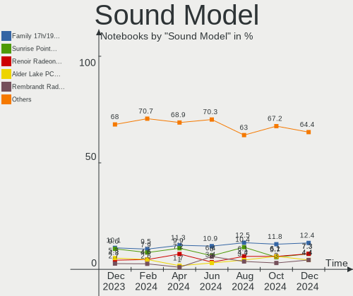

Debian - Hardware Trends (Notebooks)
------------------------------------

A project to identify most popular hardware characteristics and track their change
over time based on data collected by Linux users at https://Linux-Hardware.org.

Anyone can contribute to this report by the [hw-probe](https://github.com/linuxhw/hw-probe) tool:

    sudo -E hw-probe -all -upload

This report is for one last month. Overall report since the beginning of time: [TestCoverage](https://github.com/linuxhw/TestCoverage)

Period: Jan, 2023.

Contents
--------

* [ System ](#system)
  - [ OS                       ](#os)
  - [ OS Family                ](#os-family)
  - [ Kernel                   ](#kernel)
  - [ Kernel Family            ](#kernel-family)
  - [ Kernel Major Ver.        ](#kernel-major-ver)
  - [ Arch                     ](#arch)
  - [ DE                       ](#de)
  - [ Display Server           ](#display-server)
  - [ Display Manager          ](#display-manager)
  - [ OS Lang                  ](#os-lang)
  - [ Boot Mode                ](#boot-mode)
  - [ Filesystem               ](#filesystem)
  - [ Part. scheme             ](#part-scheme)
  - [ Dual Boot with Linux/BSD ](#dual-boot-with-linuxbsd)
  - [ Dual Boot (Win)          ](#dual-boot-win)

* [ Board ](#board)
  - [ Vendor                   ](#vendor)
  - [ Model                    ](#model)
  - [ Model Family             ](#model-family)
  - [ MFG Year                 ](#mfg-year)
  - [ Form Factor              ](#form-factor)
  - [ Secure Boot              ](#secure-boot)
  - [ Coreboot                 ](#coreboot)
  - [ RAM Size                 ](#ram-size)
  - [ RAM Used                 ](#ram-used)
  - [ Total Drives             ](#total-drives)
  - [ Has CD-ROM               ](#has-cd-rom)
  - [ Has Ethernet             ](#has-ethernet)
  - [ Has WiFi                 ](#has-wifi)
  - [ Has Bluetooth            ](#has-bluetooth)

* [ Location ](#location)
  - [ Country                  ](#country)
  - [ City                     ](#city)

* [ Drives ](#drives)
  - [ Drive Vendor             ](#drive-vendor)
  - [ Drive Model              ](#drive-model)
  - [ HDD Vendor               ](#hdd-vendor)
  - [ SSD Vendor               ](#ssd-vendor)
  - [ Drive Kind               ](#drive-kind)
  - [ Drive Connector          ](#drive-connector)
  - [ Drive Size               ](#drive-size)
  - [ Space Total              ](#space-total)
  - [ Space Used               ](#space-used)
  - [ Malfunc. Drives          ](#malfunc-drives)
  - [ Malfunc. Drive Vendor    ](#malfunc-drive-vendor)
  - [ Malfunc. HDD Vendor      ](#malfunc-hdd-vendor)
  - [ Malfunc. Drive Kind      ](#malfunc-drive-kind)
  - [ Failed Drives            ](#failed-drives)
  - [ Failed Drive Vendor      ](#failed-drive-vendor)
  - [ Drive Status             ](#drive-status)

* [ Storage controller ](#storage-controller)
  - [ Storage Vendor           ](#storage-vendor)
  - [ Storage Model            ](#storage-model)
  - [ Storage Kind             ](#storage-kind)

* [ Processor ](#processor)
  - [ CPU Vendor               ](#cpu-vendor)
  - [ CPU Model                ](#cpu-model)
  - [ CPU Model Family         ](#cpu-model-family)
  - [ CPU Cores                ](#cpu-cores)
  - [ CPU Sockets              ](#cpu-sockets)
  - [ CPU Threads              ](#cpu-threads)
  - [ CPU Op-Modes             ](#cpu-op-modes)
  - [ CPU Microcode            ](#cpu-microcode)
  - [ CPU Microarch            ](#cpu-microarch)

* [ Graphics ](#graphics)
  - [ GPU Vendor               ](#gpu-vendor)
  - [ GPU Model                ](#gpu-model)
  - [ GPU Combo                ](#gpu-combo)
  - [ GPU Driver               ](#gpu-driver)
  - [ GPU Memory               ](#gpu-memory)

* [ Monitor ](#monitor)
  - [ Monitor Vendor           ](#monitor-vendor)
  - [ Monitor Model            ](#monitor-model)
  - [ Monitor Resolution       ](#monitor-resolution)
  - [ Monitor Diagonal         ](#monitor-diagonal)
  - [ Monitor Width            ](#monitor-width)
  - [ Aspect Ratio             ](#aspect-ratio)
  - [ Monitor Area             ](#monitor-area)
  - [ Pixel Density            ](#pixel-density)
  - [ Multiple Monitors        ](#multiple-monitors)

* [ Network ](#network)
  - [ Net Controller Vendor    ](#net-controller-vendor)
  - [ Net Controller Model     ](#net-controller-model)
  - [ Wireless Vendor          ](#wireless-vendor)
  - [ Wireless Model           ](#wireless-model)
  - [ Ethernet Vendor          ](#ethernet-vendor)
  - [ Ethernet Model           ](#ethernet-model)
  - [ Net Controller Kind      ](#net-controller-kind)
  - [ Used Controller          ](#used-controller)
  - [ NICs                     ](#nics)
  - [ IPv6                     ](#ipv6)

* [ Bluetooth ](#bluetooth)
  - [ Bluetooth Vendor         ](#bluetooth-vendor)
  - [ Bluetooth Model          ](#bluetooth-model)

* [ Sound ](#sound)
  - [ Sound Vendor             ](#sound-vendor)
  - [ Sound Model              ](#sound-model)

* [ Memory ](#memory)
  - [ Memory Vendor            ](#memory-vendor)
  - [ Memory Model             ](#memory-model)
  - [ Memory Kind              ](#memory-kind)
  - [ Memory Form Factor       ](#memory-form-factor)
  - [ Memory Size              ](#memory-size)
  - [ Memory Speed             ](#memory-speed)

* [ Printers & scanners ](#printers--scanners)
  - [ Printer Vendor           ](#printer-vendor)
  - [ Printer Model            ](#printer-model)
  - [ Scanner Vendor           ](#scanner-vendor)
  - [ Scanner Model            ](#scanner-model)

* [ Camera ](#camera)
  - [ Camera Vendor            ](#camera-vendor)
  - [ Camera Model             ](#camera-model)

* [ Security ](#security)
  - [ Fingerprint Vendor       ](#fingerprint-vendor)
  - [ Fingerprint Model        ](#fingerprint-model)
  - [ Chipcard Vendor          ](#chipcard-vendor)
  - [ Chipcard Model           ](#chipcard-model)

* [ Unsupported ](#unsupported)
  - [ Unsupported Devices      ](#unsupported-devices)
  - [ Unsupported Device Types ](#unsupported-device-types)

System
------

OS
--

Installed operating systems

| Name              | Notebooks | Percent |
|-------------------|-----------|---------|
| Debian 11         | 127       | 76.97%  |
| Debian            | 32        | 19.39%  |
| Debian 10         | 5         | 3.03%   |
| Debian 11-updates | 1         | 0.61%   |

OS Family
---------

OS without a version

| Name   | Notebooks | Percent |
|--------|-----------|---------|
| Debian | 165       | 100%    |

Kernel
------

Version of the Linux kernel

| Version                 | Notebooks | Percent |
|-------------------------|-----------|---------|
| 5.10.0-20-amd64         | 82        | 49.7%   |
| 6.0.0-6-amd64           | 18        | 10.91%  |
| 5.10.0-21-amd64         | 10        | 6.06%   |
| 6.1.0-1-amd64           | 9         | 5.45%   |
| 5.10.0-2-amd64          | 5         | 3.03%   |
| 5.10.0-19-amd64         | 5         | 3.03%   |
| 6.0.0-0.deb11.6-amd64   | 3         | 1.82%   |
| 6.0.0-0.deb11.2-amd64   | 3         | 1.82%   |
| 5.10.0-18-amd64         | 3         | 1.82%   |
| 6.1.0-2-amd64           | 2         | 1.21%   |
| 5.10.0-16-amd64         | 2         | 1.21%   |
| 4.19.0-23-amd64         | 2         | 1.21%   |
| 6.1.5-titanide          | 1         | 0.61%   |
| 6.1.0-rc1+              | 1         | 0.61%   |
| 6.1.0-asahi             | 1         | 0.61%   |
| 6.1.0-0-amd64           | 1         | 0.61%   |
| 5.19.0-0.deb11.2-amd64  | 1         | 0.61%   |
| 5.18.0-0.deb11.4-amd64  | 1         | 0.61%   |
| 5.16.15                 | 1         | 0.61%   |
| 5.16.0-0.bpo.4-amd64    | 1         | 0.61%   |
| 5.10.92                 | 1         | 0.61%   |
| 5.10.0-21-686           | 1         | 0.61%   |
| 5.10.0-20-rt-amd64      | 1         | 0.61%   |
| 5.10.0-20-686-pae       | 1         | 0.61%   |
| 5.10.0-20-686           | 1         | 0.61%   |
| 5.10.0-17-amd64         | 1         | 0.61%   |
| 5.10.0-16-686-pae       | 1         | 0.61%   |
| 5.10.0-14-amd64         | 1         | 0.61%   |
| 5.10.0-11-amd64         | 1         | 0.61%   |
| 5.10.0-10-amd64         | 1         | 0.61%   |
| 5.10.0-0.deb10.16-amd64 | 1         | 0.61%   |
| 4.19.0-22-amd64         | 1         | 0.61%   |
| 4.19.0-13-amd64         | 1         | 0.61%   |

Kernel Family
-------------

Linux kernel without a distro release

| Version | Notebooks | Percent |
|---------|-----------|---------|
| 5.10.0  | 117       | 70.91%  |
| 6.0.0   | 24        | 14.55%  |
| 6.1.0   | 14        | 8.48%   |
| 4.19.0  | 4         | 2.42%   |
| 6.1.5   | 1         | 0.61%   |
| 5.19.0  | 1         | 0.61%   |
| 5.18.0  | 1         | 0.61%   |
| 5.16.15 | 1         | 0.61%   |
| 5.16.0  | 1         | 0.61%   |
| 5.10.92 | 1         | 0.61%   |

Kernel Major Ver.
-----------------

Linux kernel major version

| Version | Notebooks | Percent |
|---------|-----------|---------|
| 5.10    | 118       | 71.52%  |
| 6.0     | 24        | 14.55%  |
| 6.1     | 15        | 9.09%   |
| 4.19    | 4         | 2.42%   |
| 5.16    | 2         | 1.21%   |
| 5.19    | 1         | 0.61%   |
| 5.18    | 1         | 0.61%   |

Arch
----

OS architecture (x86_64, i586, etc.)

| Name    | Notebooks | Percent |
|---------|-----------|---------|
| x86_64  | 160       | 96.97%  |
| i686    | 4         | 2.42%   |
| aarch64 | 1         | 0.61%   |

DE
--

Desktop Environment

| Name              | Notebooks | Percent |
|-------------------|-----------|---------|
| GNOME             | 57        | 34.55%  |
| KDE5              | 27        | 16.36%  |
| XFCE              | 24        | 14.55%  |
| X-Cinnamon        | 12        | 7.27%   |
| Unknown           | 12        | 7.27%   |
| LXDE              | 7         | 4.24%   |
| Cinnamon          | 7         | 4.24%   |
| MATE              | 6         | 3.64%   |
| LXQt              | 3         | 1.82%   |
| KDE               | 3         | 1.82%   |
| i3                | 2         | 1.21%   |
| x-session-manager | 1         | 0.61%   |
| lightdm-xsession  | 1         | 0.61%   |
| GNOME Flashback   | 1         | 0.61%   |
| fluxbox           | 1         | 0.61%   |
| Budgie            | 1         | 0.61%   |

Display Server
--------------

X11 or Wayland

| Name        | Notebooks | Percent |
|-------------|-----------|---------|
| X11         | 104       | 63.03%  |
| Wayland     | 44        | 26.67%  |
| Tty         | 8         | 4.85%   |
| Unknown     | 8         | 4.85%   |
| Unspecified | 1         | 0.61%   |

Display Manager
---------------

SDDM, LightDM, etc.

| Name    | Notebooks | Percent |
|---------|-----------|---------|
| LightDM | 53        | 32.12%  |
| GDM     | 37        | 22.42%  |
| Unknown | 30        | 18.18%  |
| SDDM    | 22        | 13.33%  |
| GDM3    | 20        | 12.12%  |
| XDM     | 1         | 0.61%   |
| NODM    | 1         | 0.61%   |
| LXDM    | 1         | 0.61%   |

OS Lang
-------

Language

| Lang    | Notebooks | Percent |
|---------|-----------|---------|
| en_US   | 58        | 35.15%  |
| de_DE   | 20        | 12.12%  |
| ru_RU   | 12        | 7.27%   |
| fr_FR   | 9         | 5.45%   |
| en_GB   | 9         | 5.45%   |
| pt_BR   | 6         | 3.64%   |
| it_IT   | 6         | 3.64%   |
| es_MX   | 5         | 3.03%   |
| pl_PL   | 4         | 2.42%   |
| zh_CN   | 3         | 1.82%   |
| es_ES   | 3         | 1.82%   |
| nl_NL   | 2         | 1.21%   |
| ja_JP   | 2         | 1.21%   |
| es_AR   | 2         | 1.21%   |
| en_AU   | 2         | 1.21%   |
| de_CH   | 2         | 1.21%   |
| cs_CZ   | 2         | 1.21%   |
| C       | 2         | 1.21%   |
| Unknown | 2         | 1.21%   |
| zh_TW   | 1         | 0.61%   |
| sk_SK   | 1         | 0.61%   |
| pt_PT   | 1         | 0.61%   |
| id_ID   | 1         | 0.61%   |
| hu_HU   | 1         | 0.61%   |
| fr_BE   | 1         | 0.61%   |
| fi_FI   | 1         | 0.61%   |
| es_VE   | 1         | 0.61%   |
| es_GT   | 1         | 0.61%   |
| es_CL   | 1         | 0.61%   |
| en_IL   | 1         | 0.61%   |
| en_CA   | 1         | 0.61%   |
| el_GR   | 1         | 0.61%   |
| da_DK   | 1         | 0.61%   |

Boot Mode
---------

EFI or BIOS

| Mode | Notebooks | Percent |
|------|-----------|---------|
| EFI  | 109       | 66.06%  |
| BIOS | 56        | 33.94%  |

Filesystem
----------

Type of filesystem

| Type    | Notebooks | Percent |
|---------|-----------|---------|
| Ext4    | 141       | 85.45%  |
| Overlay | 13        | 7.88%   |
| Btrfs   | 7         | 4.24%   |
| Xfs     | 1         | 0.61%   |
| Ext3    | 1         | 0.61%   |
| Ext2    | 1         | 0.61%   |
| Aufs    | 1         | 0.61%   |

Part. scheme
------------

Scheme of partitioning

| Type    | Notebooks | Percent |
|---------|-----------|---------|
| GPT     | 115       | 69.7%   |
| MBR     | 30        | 18.18%  |
| Unknown | 20        | 12.12%  |

Dual Boot with Linux/BSD
------------------------

Hosting more than one Linux/BSD

| Dual boot | Notebooks | Percent |
|-----------|-----------|---------|
| No        | 148       | 89.7%   |
| Yes       | 17        | 10.3%   |

Dual Boot (Win)
---------------

Hosting Linux and Windows

| Dual boot | Notebooks | Percent |
|-----------|-----------|---------|
| No        | 108       | 65.45%  |
| Yes       | 57        | 34.55%  |

Board
-----

Vendor
------

Motherboard manufacturer

| Name                           | Notebooks | Percent |
|--------------------------------|-----------|---------|
| Lenovo                         | 42        | 25.45%  |
| Hewlett-Packard                | 30        | 18.18%  |
| Dell                           | 21        | 12.73%  |
| ASUSTek Computer               | 17        | 10.3%   |
| Acer                           | 12        | 7.27%   |
| Samsung Electronics            | 5         | 3.03%   |
| Apple                          | 4         | 2.42%   |
| Panasonic                      | 3         | 1.82%   |
| MSI                            | 3         | 1.82%   |
| HUAWEI                         | 3         | 1.82%   |
| Google                         | 3         | 1.82%   |
| Unknown                        | 2         | 1.21%   |
| UMAX                           | 1         | 0.61%   |
| TUXEDO                         | 1         | 0.61%   |
| Toshiba                        | 1         | 0.61%   |
| Sony                           | 1         | 0.61%   |
| SmbiosType1_SystemManufacturer | 1         | 0.61%   |
| SLIMBOOK                       | 1         | 0.61%   |
| Positivo                       | 1         | 0.61%   |
| Packard Bell                   | 1         | 0.61%   |
| Novatech                       | 1         | 0.61%   |
| MPMAN                          | 1         | 0.61%   |
| Insyde                         | 1         | 0.61%   |
| HONOR                          | 1         | 0.61%   |
| Gigabyte Technology            | 1         | 0.61%   |
| Gateway                        | 1         | 0.61%   |
| Fujitsu                        | 1         | 0.61%   |
| Digma                          | 1         | 0.61%   |
| Danew                          | 1         | 0.61%   |
| Clevo                          | 1         | 0.61%   |
| Aquarius                       | 1         | 0.61%   |
| &#er &&                        | 1         | 0.61%   |

Model
-----

Motherboard model

| Name                                                         | Notebooks | Percent |
|--------------------------------------------------------------|-----------|---------|
| Samsung 300E4C/300E5C/300E7C                                 | 3         | 1.82%   |
| Lenovo IdeaPad 100-15IBD 80QQ                                | 2         | 1.21%   |
| Dell Latitude 3320                                           | 2         | 1.21%   |
| Dell Inspiron 5502                                           | 2         | 1.21%   |
| Unknown                                                      | 2         | 1.21%   |
| UMAX VisionBook 12Wr                                         | 1         | 0.61%   |
| TUXEDO Aura 15 Gen1                                          | 1         | 0.61%   |
| Toshiba Satellite C55Dt-A                                    | 1         | 0.61%   |
| Sony PCG-Z1VA(UC)                                            | 1         | 0.61%   |
| SmbiosType1_SystemManufacturer SmbiosType1_SystemProductName | 1         | 0.61%   |
| SLIMBOOK PRO                                                 | 1         | 0.61%   |
| Samsung R710                                                 | 1         | 0.61%   |
| Samsung 300E4A/300E5A/300E7A                                 | 1         | 0.61%   |
| Positivo CHT14B                                              | 1         | 0.61%   |
| Panasonic FZ55-2                                             | 1         | 0.61%   |
| Panasonic CFSZ6-2                                            | 1         | 0.61%   |
| Panasonic CF-54-2                                            | 1         | 0.61%   |
| Packard Bell EasyNote MH36                                   | 1         | 0.61%   |
| Novatech NL40_50CU                                           | 1         | 0.61%   |
| MSI GE75 Raider 8SG                                          | 1         | 0.61%   |
| MSI GE60 0NC/GE60 0ND                                        | 1         | 0.61%   |
| MSI Creator 17 B11UE                                         | 1         | 0.61%   |
| MPMAN CONVERTER 102                                          | 1         | 0.61%   |
| Lenovo Yoga Slim 7 ProX 14ARH7 82TL                          | 1         | 0.61%   |
| Lenovo V110-15ISK 80TL                                       | 1         | 0.61%   |
| Lenovo ThinkPad X61 Tablet 7767BFG                           | 1         | 0.61%   |
| Lenovo ThinkPad X260 20F5005NAU                              | 1         | 0.61%   |
| Lenovo ThinkPad X220 4291IR6                                 | 1         | 0.61%   |
| Lenovo ThinkPad X220 42915CG                                 | 1         | 0.61%   |
| Lenovo ThinkPad X1 Carbon 6th 20KGS9SA01                     | 1         | 0.61%   |
| Lenovo ThinkPad W520 4284W2U                                 | 1         | 0.61%   |
| Lenovo ThinkPad T490s 20NYS3SX00                             | 1         | 0.61%   |
| Lenovo ThinkPad T490s 20NX0076MH                             | 1         | 0.61%   |
| Lenovo ThinkPad T480s 20L8S2SX1H                             | 1         | 0.61%   |
| Lenovo ThinkPad T480 20L6S29E0D                              | 1         | 0.61%   |
| Lenovo ThinkPad T470p 20J7S1JT02                             | 1         | 0.61%   |
| Lenovo ThinkPad T470 20HES0MV00                              | 1         | 0.61%   |
| Lenovo ThinkPad T460 20FMA0APAR                              | 1         | 0.61%   |
| Lenovo ThinkPad T440 20B7S0JC0P                              | 1         | 0.61%   |
| Lenovo ThinkPad T430u 33519LC                                | 1         | 0.61%   |

Model Family
------------

Motherboard model prefix

| Name                                       | Notebooks | Percent |
|--------------------------------------------|-----------|---------|
| Lenovo ThinkPad                            | 23        | 13.94%  |
| Lenovo IdeaPad                             | 12        | 7.27%   |
| HP EliteBook                               | 9         | 5.45%   |
| Dell Latitude                              | 9         | 5.45%   |
| Dell Inspiron                              | 8         | 4.85%   |
| Acer Aspire                                | 8         | 4.85%   |
| ASUS VivoBook                              | 6         | 3.64%   |
| HP Compaq                                  | 4         | 2.42%   |
| Samsung 300E4C                             | 3         | 1.82%   |
| HP ProBook                                 | 3         | 1.82%   |
| HP ZBook                                   | 2         | 1.21%   |
| HP Stream                                  | 2         | 1.21%   |
| HP Pavilion                                | 2         | 1.21%   |
| HP Laptop                                  | 2         | 1.21%   |
| ASUS ASUS                                  | 2         | 1.21%   |
| Acer Swift                                 | 2         | 1.21%   |
| Unknown                                    | 2         | 1.21%   |
| UMAX VisionBook                            | 1         | 0.61%   |
| TUXEDO Aura                                | 1         | 0.61%   |
| Toshiba Satellite                          | 1         | 0.61%   |
| Sony PCG-Z1VA(UC)                          | 1         | 0.61%   |
| SmbiosType1_SystemManufacturer SmbiosType1 | 1         | 0.61%   |
| SLIMBOOK PRO                               | 1         | 0.61%   |
| Samsung R710                               | 1         | 0.61%   |
| Samsung 300E4A                             | 1         | 0.61%   |
| Positivo CHT14B                            | 1         | 0.61%   |
| Panasonic FZ55-2                           | 1         | 0.61%   |
| Panasonic CFSZ6-2                          | 1         | 0.61%   |
| Panasonic CF-54-2                          | 1         | 0.61%   |
| Packard Bell EasyNote                      | 1         | 0.61%   |
| Novatech NL40                              | 1         | 0.61%   |
| MSI GE75                                   | 1         | 0.61%   |
| MSI GE60                                   | 1         | 0.61%   |
| MSI Creator                                | 1         | 0.61%   |
| MPMAN CONVERTER                            | 1         | 0.61%   |
| Lenovo Yoga                                | 1         | 0.61%   |
| Lenovo V110-15ISK                          | 1         | 0.61%   |
| Lenovo S21e-20                             | 1         | 0.61%   |
| Lenovo Legion                              | 1         | 0.61%   |
| Lenovo G565                                | 1         | 0.61%   |

MFG Year
--------

Motherboard manufacture year

| Year    | Notebooks | Percent |
|---------|-----------|---------|
| 2021    | 20        | 12.12%  |
| 2019    | 16        | 9.7%    |
| 2016    | 16        | 9.7%    |
| 2022    | 14        | 8.48%   |
| 2020    | 13        | 7.88%   |
| 2012    | 13        | 7.88%   |
| 2017    | 12        | 7.27%   |
| 2011    | 11        | 6.67%   |
| 2018    | 10        | 6.06%   |
| 2015    | 10        | 6.06%   |
| 2013    | 7         | 4.24%   |
| 2008    | 5         | 3.03%   |
| 2014    | 4         | 2.42%   |
| 2010    | 4         | 2.42%   |
| 2009    | 3         | 1.82%   |
| 2007    | 3         | 1.82%   |
| 2006    | 2         | 1.21%   |
| 2003    | 1         | 0.61%   |
| Unknown | 1         | 0.61%   |

Form Factor
-----------

Physical design of the computer

| Name     | Notebooks | Percent |
|----------|-----------|---------|
| Notebook | 165       | 100%    |

Secure Boot
-----------

Enabled or disabled

| State    | Notebooks | Percent |
|----------|-----------|---------|
| Disabled | 150       | 90.91%  |
| Enabled  | 15        | 9.09%   |

Coreboot
--------

Have coreboot on board

| Used | Notebooks | Percent |
|------|-----------|---------|
| No   | 162       | 98.18%  |
| Yes  | 3         | 1.82%   |

RAM Size
--------

Total RAM memory

| Size in GB | Notebooks | Percent |
|------------|-----------|---------|
| 4.01-8.0   | 51        | 30.91%  |
| 3.01-4.0   | 32        | 19.39%  |
| 8.01-16.0  | 30        | 18.18%  |
| 16.01-24.0 | 28        | 16.97%  |
| 1.01-2.0   | 13        | 7.88%   |
| 32.01-64.0 | 8         | 4.85%   |
| 2.01-3.0   | 2         | 1.21%   |
| 24.01-32.0 | 1         | 0.61%   |

RAM Used
--------

Used RAM memory

| Used GB   | Notebooks | Percent |
|-----------|-----------|---------|
| 1.01-2.0  | 50        | 30.3%   |
| 2.01-3.0  | 40        | 24.24%  |
| 4.01-8.0  | 23        | 13.94%  |
| 3.01-4.0  | 23        | 13.94%  |
| 0.51-1.0  | 19        | 11.52%  |
| 8.01-16.0 | 9         | 5.45%   |
| 0.01-0.5  | 1         | 0.61%   |

Total Drives
------------

Number of drives on board

| Drives | Notebooks | Percent |
|--------|-----------|---------|
| 1      | 120       | 72.73%  |
| 2      | 41        | 24.85%  |
| 3      | 3         | 1.82%   |
| 0      | 1         | 0.61%   |

Has CD-ROM
----------

Has CD-ROM on board

| Presented | Notebooks | Percent |
|-----------|-----------|---------|
| No        | 119       | 72.12%  |
| Yes       | 46        | 27.88%  |

Has Ethernet
------------

Has Ethernet on board

| Presented | Notebooks | Percent |
|-----------|-----------|---------|
| Yes       | 127       | 76.97%  |
| No        | 38        | 23.03%  |

Has WiFi
--------

Has WiFi module

| Presented | Notebooks | Percent |
|-----------|-----------|---------|
| Yes       | 162       | 98.18%  |
| No        | 3         | 1.82%   |

Has Bluetooth
-------------

Has Bluetooth module

| Presented | Notebooks | Percent |
|-----------|-----------|---------|
| Yes       | 128       | 77.58%  |
| No        | 37        | 22.42%  |

Location
--------

Country
-------

Geographic location (country)

| Country     | Notebooks | Percent |
|-------------|-----------|---------|
| Germany     | 25        | 15.15%  |
| USA         | 18        | 10.91%  |
| Russia      | 14        | 8.48%   |
| France      | 14        | 8.48%   |
| Brazil      | 10        | 6.06%   |
| Switzerland | 8         | 4.85%   |
| Netherlands | 7         | 4.24%   |
| Italy       | 7         | 4.24%   |
| Spain       | 5         | 3.03%   |
| Mexico      | 5         | 3.03%   |
| UK          | 4         | 2.42%   |
| Poland      | 4         | 2.42%   |
| Japan       | 4         | 2.42%   |
| Australia   | 3         | 1.82%   |
| Sweden      | 2         | 1.21%   |
| Romania     | 2         | 1.21%   |
| Portugal    | 2         | 1.21%   |
| Indonesia   | 2         | 1.21%   |
| Hungary     | 2         | 1.21%   |
| Czechia     | 2         | 1.21%   |
| China       | 2         | 1.21%   |
| Canada      | 2         | 1.21%   |
| Belgium     | 2         | 1.21%   |
| Belarus     | 2         | 1.21%   |
| Argentina   | 2         | 1.21%   |
| Venezuela   | 1         | 0.61%   |
| Taiwan      | 1         | 0.61%   |
| Serbia      | 1         | 0.61%   |
| Lebanon     | 1         | 0.61%   |
| Israel      | 1         | 0.61%   |
| India       | 1         | 0.61%   |
| Hong Kong   | 1         | 0.61%   |
| Guatemala   | 1         | 0.61%   |
| Greece      | 1         | 0.61%   |
| Finland     | 1         | 0.61%   |
| Egypt       | 1         | 0.61%   |
| Denmark     | 1         | 0.61%   |
| Colombia    | 1         | 0.61%   |
| Chile       | 1         | 0.61%   |
| Albania     | 1         | 0.61%   |

City
----

Geographic location (city)

| City                          | Notebooks | Percent |
|-------------------------------|-----------|---------|
| Voronezh                      | 5         | 3.03%   |
| Grancy                        | 5         | 3.03%   |
| Moscow                        | 4         | 2.42%   |
| Bangor                        | 4         | 2.42%   |
| Munich                        | 3         | 1.82%   |
| Frankfurt am Main             | 3         | 1.82%   |
| Valladolid                    | 2         | 1.21%   |
| St Petersburg                 | 2         | 1.21%   |
| Rio de Janeiro                | 2         | 1.21%   |
| Prague                        | 2         | 1.21%   |
| Paris                         | 2         | 1.21%   |
| Milan                         | 2         | 1.21%   |
| Lisbon                        | 2         | 1.21%   |
| Iasi                          | 2         | 1.21%   |
| Chambéry                     | 2         | 1.21%   |
| Berlin                        | 2         | 1.21%   |
| Zuidland                      | 1         | 0.61%   |
| Zapotlan el Grande            | 1         | 0.61%   |
| Zapopan                       | 1         | 0.61%   |
| Zahle                         | 1         | 0.61%   |
| Yogyakarta                    | 1         | 0.61%   |
| Yekaterinburg                 | 1         | 0.61%   |
| Yakutsk                       | 1         | 0.61%   |
| Xinxiang                      | 1         | 0.61%   |
| Winterport                    | 1         | 0.61%   |
| Warsaw                        | 1         | 0.61%   |
| Vlorë                        | 1         | 0.61%   |
| Vancouver                     | 1         | 0.61%   |
| Ulm                           | 1         | 0.61%   |
| Tultitlan de Mariano Escobedo | 1         | 0.61%   |
| Toulouse                      | 1         | 0.61%   |
| Tokyo                         | 1         | 0.61%   |
| Tenente Portela               | 1         | 0.61%   |
| Tamworth                      | 1         | 0.61%   |
| Szczyrk                       | 1         | 0.61%   |
| Sydney                        | 1         | 0.61%   |
| Sumner                        | 1         | 0.61%   |
| Sulz                          | 1         | 0.61%   |
| Stuttgart                     | 1         | 0.61%   |
| Stockholm                     | 1         | 0.61%   |

Drives
------

Drive Vendor
------------

Hard drive vendors

| Vendor                    | Notebooks | Drives | Percent |
|---------------------------|-----------|--------|---------|
| Samsung Electronics       | 29        | 29     | 15.03%  |
| WDC                       | 25        | 28     | 12.95%  |
| SanDisk                   | 15        | 15     | 7.77%   |
| Kingston                  | 15        | 16     | 7.77%   |
| Seagate                   | 13        | 13     | 6.74%   |
| Unknown                   | 12        | 15     | 6.22%   |
| SK hynix                  | 10        | 10     | 5.18%   |
| Micron Technology         | 9         | 9      | 4.66%   |
| Intel                     | 9         | 9      | 4.66%   |
| Hitachi                   | 6         | 6      | 3.11%   |
| Crucial                   | 6         | 6      | 3.11%   |
| Toshiba                   | 5         | 5      | 2.59%   |
| Apple                     | 5         | 7      | 2.59%   |
| Unknown                   | 5         | 5      | 2.59%   |
| A-DATA Technology         | 3         | 3      | 1.55%   |
| Intenso                   | 2         | 2      | 1.04%   |
| HGST                      | 2         | 2      | 1.04%   |
| SSSTC                     | 1         | 1      | 0.52%   |
| SPCC                      | 1         | 1      | 0.52%   |
| Smartbuy                  | 1         | 1      | 0.52%   |
| Silicon Motion            | 1         | 1      | 0.52%   |
| S3+                       | 1         | 1      | 0.52%   |
| Plextor                   | 1         | 1      | 0.52%   |
| Phison Electronics        | 1         | 1      | 0.52%   |
| Patriot                   | 1         | 1      | 0.52%   |
| OCZ-AGIL                  | 1         | 1      | 0.52%   |
| OCZ                       | 1         | 1      | 0.52%   |
| Micron/Crucial Technology | 1         | 1      | 0.52%   |
| LITEON                    | 1         | 1      | 0.52%   |
| Kllisre                   | 1         | 1      | 0.52%   |
| KIOXIA                    | 1         | 1      | 0.52%   |
| KingDian                  | 1         | 1      | 0.52%   |
| JMicron Technology        | 1         | 1      | 0.52%   |
| Hewlett-Packard           | 1         | 1      | 0.52%   |
| FORESEE                   | 1         | 1      | 0.52%   |
| faspeed                   | 1         | 1      | 0.52%   |
| China                     | 1         | 1      | 0.52%   |
| BHT                       | 1         | 1      | 0.52%   |
| ASMT                      | 1         | 1      | 0.52%   |

Drive Model
-----------

Hard drive models

| Model                                               | Notebooks | Percent |
|-----------------------------------------------------|-----------|---------|
| Unknown                                             | 5         | 2.51%   |
| SanDisk NVMe SSD Drive 1TB                          | 4         | 2.01%   |
| Seagate ST1000LM035-1RK172 1TB                      | 3         | 1.51%   |
| WDC WDS500G2B0A-00SM50 500GB SSD                    | 2         | 1.01%   |
| WDC WD7500BPKT-22PK4T0 752GB                        | 2         | 1.01%   |
| Unknown SD/MMC/MS PRO 2GB                           | 2         | 1.01%   |
| Unknown MMC32G  32GB                                | 2         | 1.01%   |
| Unknown MMC Card  64GB                              | 2         | 1.01%   |
| SK hynix HBG4e  32GB                                | 2         | 1.01%   |
| Seagate ST500LT012-1DG142 500GB                     | 2         | 1.01%   |
| Seagate ST500LM012 HN-M500MBB 500GB                 | 2         | 1.01%   |
| Samsung SSD 870 EVO 500GB                           | 2         | 1.01%   |
| Samsung SSD 860 EVO 500GB                           | 2         | 1.01%   |
| Samsung NVMe SSD Controller SM981/PM981/PM983 500GB | 2         | 1.01%   |
| Samsung MZNLN256HMHQ-000H7 256GB SSD                | 2         | 1.01%   |
| Kingston SUV400S37240G 240GB SSD                    | 2         | 1.01%   |
| Kingston SA400S37240G 240GB SSD                     | 2         | 1.01%   |
| Kingston SA400S37120G 120GB SSD                     | 2         | 1.01%   |
| WDC WDS500G2B0C-00PXH0 500GB                        | 1         | 0.5%    |
| WDC WDS500G2B0A 500GB SSD                           | 1         | 0.5%    |
| WDC WDS480G2G0B-00EPW0 480GB SSD                    | 1         | 0.5%    |
| WDC WDS120G2G0A-00JH30 120GB SSD                    | 1         | 0.5%    |
| WDC WDS100T2B0A-00SM50 1TB SSD                      | 1         | 0.5%    |
| WDC WD5000LPLX-60ZNTT2 500GB                        | 1         | 0.5%    |
| WDC WD5000LPLX-08ZNTT0 500GB                        | 1         | 0.5%    |
| WDC WD50 00LPVX-16V0T 500GB                         | 1         | 0.5%    |
| WDC WD3200BEVT-22ZCT0 320GB                         | 1         | 0.5%    |
| WDC WD2500BEVT-24A23T0 250GB                        | 1         | 0.5%    |
| WDC WD1600BEVT-22ZCT0 160GB                         | 1         | 0.5%    |
| WDC WD1600BEVS-22RST0 160GB                         | 1         | 0.5%    |
| WDC WD10SPZX-75Z10T2 1TB                            | 1         | 0.5%    |
| WDC WD10JPVX-75JC3T0 1TB                            | 1         | 0.5%    |
| WDC WD10JPCX-24UE4T0 1TB                            | 1         | 0.5%    |
| WDC WD Blue SA510 2.5 500GB SSD                     | 1         | 0.5%    |
| WDC PC SN730 SDBPNTY-512G-1027 512GB                | 1         | 0.5%    |
| WDC PC SN730 SDBPNTY-256G-1027 256GB                | 1         | 0.5%    |
| WDC PC SN530 SDBPNPZ-512G-1114 512GB                | 1         | 0.5%    |
| WDC PC SN530 SDBPNPZ-256G-1002 256GB                | 1         | 0.5%    |
| WDC PC SN530 SDBPNPZ-1T00-1114 1TB                  | 1         | 0.5%    |
| WDC PC SN530 NVMe 256GB                             | 1         | 0.5%    |

HDD Vendor
----------

Hard disk drive vendors

| Vendor  | Notebooks | Drives | Percent |
|---------|-----------|--------|---------|
| Seagate | 13        | 13     | 35.14%  |
| WDC     | 11        | 12     | 29.73%  |
| Hitachi | 6         | 6      | 16.22%  |
| Toshiba | 3         | 3      | 8.11%   |
| Unknown | 2         | 2      | 5.41%   |
| HGST    | 2         | 2      | 5.41%   |

SSD Vendor
----------

Solid state drive vendors

| Vendor              | Notebooks | Drives | Percent |
|---------------------|-----------|--------|---------|
| Samsung Electronics | 12        | 12     | 16.44%  |
| Kingston            | 12        | 12     | 16.44%  |
| SanDisk             | 9         | 9      | 12.33%  |
| WDC                 | 7         | 7      | 9.59%   |
| Crucial             | 4         | 4      | 5.48%   |
| Apple               | 4         | 4      | 5.48%   |
| A-DATA Technology   | 3         | 3      | 4.11%   |
| Micron Technology   | 2         | 2      | 2.74%   |
| Intel               | 2         | 2      | 2.74%   |
| SPCC                | 1         | 1      | 1.37%   |
| Smartbuy            | 1         | 1      | 1.37%   |
| S3+                 | 1         | 1      | 1.37%   |
| Plextor             | 1         | 1      | 1.37%   |
| Patriot             | 1         | 1      | 1.37%   |
| OCZ-AGIL            | 1         | 1      | 1.37%   |
| OCZ                 | 1         | 1      | 1.37%   |
| LITEON              | 1         | 1      | 1.37%   |
| Kllisre             | 1         | 1      | 1.37%   |
| KingDian            | 1         | 1      | 1.37%   |
| Intenso             | 1         | 1      | 1.37%   |
| Hewlett-Packard     | 1         | 1      | 1.37%   |
| FORESEE             | 1         | 1      | 1.37%   |
| faspeed             | 1         | 1      | 1.37%   |
| China               | 1         | 1      | 1.37%   |
| BHT                 | 1         | 1      | 1.37%   |
| ASMT                | 1         | 1      | 1.37%   |
| Unknown             | 1         | 1      | 1.37%   |

Drive Kind
----------

HDD or SSD

| Kind    | Notebooks | Drives | Percent |
|---------|-----------|--------|---------|
| SSD     | 68        | 73     | 36.76%  |
| NVMe    | 61        | 69     | 32.97%  |
| HDD     | 37        | 38     | 20%     |
| MMC     | 17        | 20     | 9.19%   |
| Unknown | 2         | 2      | 1.08%   |

Drive Connector
---------------

SATA, SAS, NVMe, etc.

| Type | Notebooks | Drives | Percent |
|------|-----------|--------|---------|
| SATA | 96        | 107    | 53.33%  |
| NVMe | 61        | 69     | 33.89%  |
| MMC  | 17        | 20     | 9.44%   |
| SAS  | 6         | 6      | 3.33%   |

Drive Size
----------

Size of hard drive

| Size in TB | Notebooks | Drives | Percent |
|------------|-----------|--------|---------|
| 0.01-0.5   | 81        | 88     | 77.88%  |
| 0.51-1.0   | 22        | 22     | 21.15%  |
| 1.01-2.0   | 1         | 1      | 0.96%   |

Space Total
-----------

Amount of disk space available on the file system

| Size in GB | Notebooks | Percent |
|------------|-----------|---------|
| 101-250    | 45        | 27.27%  |
| 251-500    | 40        | 24.24%  |
| 501-1000   | 28        | 16.97%  |
| 51-100     | 19        | 11.52%  |
| Unknown    | 11        | 6.67%   |
| 21-50      | 10        | 6.06%   |
| 1001-2000  | 5         | 3.03%   |
| 1-20       | 5         | 3.03%   |
| 2001-3000  | 2         | 1.21%   |

Space Used
----------

Amount of used disk space

| Used GB   | Notebooks | Percent |
|-----------|-----------|---------|
| 1-20      | 65        | 39.39%  |
| 101-250   | 26        | 15.76%  |
| 21-50     | 23        | 13.94%  |
| 51-100    | 19        | 11.52%  |
| 251-500   | 12        | 7.27%   |
| Unknown   | 11        | 6.67%   |
| 501-1000  | 8         | 4.85%   |
| 1001-2000 | 1         | 0.61%   |

Malfunc. Drives
---------------

Drive models with a malfunction

| Model                                   | Notebooks | Drives | Percent |
|-----------------------------------------|-----------|--------|---------|
| WDC WD3200BEVT-22ZCT0 320GB             | 1         | 1      | 8.33%   |
| SK hynix PC401 NVMe 512GB               | 1         | 1      | 8.33%   |
| Seagate ST500LT012-9WS142 500GB         | 1         | 1      | 8.33%   |
| Seagate ST500LM012 HN-M500MBB 500GB     | 1         | 1      | 8.33%   |
| Seagate ST2000LM015-2E8174 2TB          | 1         | 1      | 8.33%   |
| Seagate ST1000LM035-1RK172 1TB          | 1         | 1      | 8.33%   |
| Plextor PX-128M5S 128GB SSD             | 1         | 1      | 8.33%   |
| Kingston RBU-SNS8350DES3128GP 128GB SSD | 1         | 1      | 8.33%   |
| Hitachi HTS543225L9A300 250GB           | 1         | 1      | 8.33%   |
| Hitachi HTS542525K9SA00 250GB           | 1         | 1      | 8.33%   |
| Hitachi HTS541010G9SA00 100GB           | 1         | 1      | 8.33%   |
| Unknown                                 | 1         | 1      | 8.33%   |

Malfunc. Drive Vendor
---------------------

Vendors of faulty drives

| Vendor   | Notebooks | Drives | Percent |
|----------|-----------|--------|---------|
| Seagate  | 4         | 4      | 33.33%  |
| Hitachi  | 3         | 3      | 25%     |
| WDC      | 1         | 1      | 8.33%   |
| SK hynix | 1         | 1      | 8.33%   |
| Plextor  | 1         | 1      | 8.33%   |
| Kingston | 1         | 1      | 8.33%   |
| Unknown  | 1         | 1      | 8.33%   |

Malfunc. HDD Vendor
-------------------

Vendors of faulty HDD drives

| Vendor  | Notebooks | Drives | Percent |
|---------|-----------|--------|---------|
| Seagate | 4         | 4      | 50%     |
| Hitachi | 3         | 3      | 37.5%   |
| WDC     | 1         | 1      | 12.5%   |

Malfunc. Drive Kind
-------------------

Kinds of faulty drives

| Kind | Notebooks | Drives | Percent |
|------|-----------|--------|---------|
| HDD  | 8         | 8      | 66.67%  |
| SSD  | 3         | 3      | 25%     |
| NVMe | 1         | 1      | 8.33%   |

Failed Drives
-------------

Failed drive models

Zero info for selected period =(

Failed Drive Vendor
-------------------

Failed drive vendors

Zero info for selected period =(

Drive Status
------------

Number of failed and malfunc. drives

| Status   | Notebooks | Drives | Percent |
|----------|-----------|--------|---------|
| Works    | 112       | 133    | 65.5%   |
| Detected | 47        | 57     | 27.49%  |
| Malfunc  | 12        | 12     | 7.02%   |

Storage controller
------------------

Storage Vendor
--------------

Storage controller vendors

| Vendor                           | Notebooks | Percent |
|----------------------------------|-----------|---------|
| Intel                            | 110       | 59.46%  |
| Samsung Electronics              | 19        | 10.27%  |
| AMD                              | 15        | 8.11%   |
| SanDisk                          | 13        | 7.03%   |
| SK hynix                         | 8         | 4.32%   |
| Micron Technology                | 7         | 3.78%   |
| Micron/Crucial Technology        | 3         | 1.62%   |
| KIOXIA                           | 3         | 1.62%   |
| Kingston Technology Company      | 3         | 1.62%   |
| Solid State Storage Technology   | 1         | 0.54%   |
| Silicon Motion                   | 1         | 0.54%   |
| Silicon Integrated Systems [SiS] | 1         | 0.54%   |
| Phison Electronics               | 1         | 0.54%   |

Storage Model
-------------

Storage controller models

| Model                                                                         | Notebooks | Percent |
|-------------------------------------------------------------------------------|-----------|---------|
| Intel Sunrise Point-LP SATA Controller [AHCI mode]                            | 21        | 10.24%  |
| Intel 7 Series Chipset Family 6-port SATA Controller [AHCI mode]              | 14        | 6.83%   |
| Intel Volume Management Device NVMe RAID Controller                           | 12        | 5.85%   |
| Intel 6 Series/C200 Series Chipset Family 6 port Mobile SATA AHCI Controller  | 9         | 4.39%   |
| AMD FCH SATA Controller [AHCI mode]                                           | 9         | 4.39%   |
| Samsung NVMe SSD Controller SM981/PM981/PM983                                 | 7         | 3.41%   |
| Micron Non-Volatile memory controller                                         | 7         | 3.41%   |
| Samsung NVMe SSD Controller 980                                               | 6         | 2.93%   |
| SK hynix Gold P31/PC711 NVMe Solid State Drive                                | 5         | 2.44%   |
| Intel Wildcat Point-LP SATA Controller [AHCI Mode]                            | 5         | 2.44%   |
| Intel 82801 Mobile SATA Controller [RAID mode]                                | 5         | 2.44%   |
| SanDisk WD Blue SN550 NVMe SSD                                                | 4         | 1.95%   |
| Samsung NVMe SSD Controller PM9A1/PM9A3/980PRO                                | 4         | 1.95%   |
| Intel Comet Lake SATA AHCI Controller                                         | 4         | 1.95%   |
| Intel Celeron/Pentium Silver Processor SATA Controller                        | 4         | 1.95%   |
| Intel Cannon Lake Mobile PCH SATA AHCI Controller                             | 4         | 1.95%   |
| Intel 8 Series SATA Controller 1 [AHCI mode]                                  | 4         | 1.95%   |
| AMD SB7x0/SB8x0/SB9x0 SATA Controller [AHCI mode]                             | 4         | 1.95%   |
| SanDisk WD Black SN750 / PC SN730 NVMe SSD                                    | 3         | 1.46%   |
| Sandisk Non-Volatile memory controller                                        | 3         | 1.46%   |
| KIOXIA NVMe SSD Controller BG4                                                | 3         | 1.46%   |
| Intel SSD 660P Series                                                         | 3         | 1.46%   |
| Intel Non-Volatile memory controller                                          | 3         | 1.46%   |
| Intel Cannon Point-LP SATA Controller [AHCI Mode]                             | 3         | 1.46%   |
| Intel 82801HM/HEM (ICH8M/ICH8M-E) SATA Controller [AHCI mode]                 | 3         | 1.46%   |
| Intel 82801HM/HEM (ICH8M/ICH8M-E) IDE Controller                              | 3         | 1.46%   |
| SK hynix Non-Volatile memory controller                                       | 2         | 0.98%   |
| Samsung Electronics SATA controller                                           | 2         | 0.98%   |
| Micron/Crucial P2 NVMe PCIe SSD                                               | 2         | 0.98%   |
| Intel Tiger Lake-LP SATA Controller                                           | 2         | 0.98%   |
| Intel SSD Pro 7600p/760p/E 6100p Series                                       | 2         | 0.98%   |
| Intel Q170/Q150/B150/H170/H110/Z170/CM236 Chipset SATA Controller [AHCI Mode] | 2         | 0.98%   |
| Intel Atom Processor E3800 Series SATA AHCI Controller                        | 2         | 0.98%   |
| Intel 82801IBM/IEM (ICH9M/ICH9M-E) 2 port SATA Controller [IDE mode]          | 2         | 0.98%   |
| Intel 82801GBM/GHM (ICH7-M Family) SATA Controller [IDE mode]                 | 2         | 0.98%   |
| AMD SB7x0/SB8x0/SB9x0 IDE Controller                                          | 2         | 0.98%   |
| Solid State Storage Non-Volatile memory controller                            | 1         | 0.49%   |
| SK hynix PC401 NVMe Solid State Drive 256GB                                   | 1         | 0.49%   |
| Silicon Motion SM2263EN/SM2263XT SSD Controller                               | 1         | 0.49%   |
| Silicon Integrated Systems [SiS] SATA Controller / IDE mode                   | 1         | 0.49%   |

Storage Kind
------------

Kind of storage controller (IDE, SATA, NVMe, SAS, ...)

| Kind | Notebooks | Percent |
|------|-----------|---------|
| SATA | 104       | 52.79%  |
| NVMe | 61        | 30.96%  |
| RAID | 18        | 9.14%   |
| IDE  | 14        | 7.11%   |

Processor
---------

CPU Vendor
----------

Processor vendors

| Vendor  | Notebooks | Percent |
|---------|-----------|---------|
| Intel   | 138       | 83.64%  |
| AMD     | 26        | 15.76%  |
| Unknown | 1         | 0.61%   |

CPU Model
---------

Processor models

| Model                                         | Notebooks | Percent |
|-----------------------------------------------|-----------|---------|
| Intel Core i3-6006U CPU @ 2.00GHz             | 6         | 3.64%   |
| Intel 11th Gen Core i5-1135G7 @ 2.40GHz       | 6         | 3.64%   |
| Intel Core i5-8265U CPU @ 1.60GHz             | 4         | 2.42%   |
| Intel Core i5-7300U CPU @ 2.60GHz             | 4         | 2.42%   |
| Intel Core i5-6300U CPU @ 2.40GHz             | 4         | 2.42%   |
| Intel Celeron N4020 CPU @ 1.10GHz             | 4         | 2.42%   |
| Intel 11th Gen Core i7-1165G7 @ 2.80GHz       | 4         | 2.42%   |
| Intel Core i5-10210U CPU @ 1.60GHz            | 3         | 1.82%   |
| Intel Core i7-8750H CPU @ 2.20GHz             | 2         | 1.21%   |
| Intel Core i7-8650U CPU @ 1.90GHz             | 2         | 1.21%   |
| Intel Core i7-6820HQ CPU @ 2.70GHz            | 2         | 1.21%   |
| Intel Core i7-3630QM CPU @ 2.40GHz            | 2         | 1.21%   |
| Intel Core i5-8365U CPU @ 1.60GHz             | 2         | 1.21%   |
| Intel Core i5-7200U CPU @ 2.50GHz             | 2         | 1.21%   |
| Intel Core i5-4300U CPU @ 1.90GHz             | 2         | 1.21%   |
| Intel Core i5-2520M CPU @ 2.50GHz             | 2         | 1.21%   |
| Intel Core i3-7100U CPU @ 2.40GHz             | 2         | 1.21%   |
| Intel Core i3-2350M CPU @ 2.30GHz             | 2         | 1.21%   |
| Intel Core i3-10110U CPU @ 2.10GHz            | 2         | 1.21%   |
| Intel Celeron N4000 CPU @ 1.10GHz             | 2         | 1.21%   |
| Intel Celeron CPU N3060 @ 1.60GHz             | 2         | 1.21%   |
| Intel 12th Gen Core i5-12500H                 | 2         | 1.21%   |
| Intel 11th Gen Core i7-11800H @ 2.30GHz       | 2         | 1.21%   |
| Intel 11th Gen Core i5-1145G7 @ 2.60GHz       | 2         | 1.21%   |
| Intel 11th Gen Core i5-11400H @ 2.70GHz       | 2         | 1.21%   |
| AMD Ryzen 5 4500U with Radeon Graphics        | 2         | 1.21%   |
| AMD Ryzen 5 3500U with Radeon Vega Mobile Gfx | 2         | 1.21%   |
| Intel Pentium Silver N5030 CPU @ 1.10GHz      | 1         | 0.61%   |
| Intel Pentium M processor 1600MHz             | 1         | 0.61%   |
| Intel Pentium Dual-Core CPU T4300 @ 2.10GHz   | 1         | 0.61%   |
| Intel Pentium Dual CPU T2370 @ 1.73GHz        | 1         | 0.61%   |
| Intel Pentium CPU N3540 @ 2.16GHz             | 1         | 0.61%   |
| Intel Pentium CPU N3530 @ 2.16GHz             | 1         | 0.61%   |
| Intel Pentium CPU 3825U @ 1.90GHz             | 1         | 0.61%   |
| Intel Pentium CPU 2127U @ 1.90GHz             | 1         | 0.61%   |
| Intel Genuine CPU T2400 @ 1.83GHz             | 1         | 0.61%   |
| Intel Core M-5Y71 CPU @ 1.20GHz               | 1         | 0.61%   |
| Intel Core i7-9850H CPU @ 2.60GHz             | 1         | 0.61%   |
| Intel Core i7-9750H CPU @ 2.60GHz             | 1         | 0.61%   |
| Intel Core i7-8550U CPU @ 1.80GHz             | 1         | 0.61%   |

CPU Model Family
----------------

Processor model prefix

| Model                   | Notebooks | Percent |
|-------------------------|-----------|---------|
| Intel Core i5           | 39        | 23.64%  |
| Other                   | 23        | 13.94%  |
| Intel Core i7           | 22        | 13.33%  |
| Intel Core i3           | 20        | 12.12%  |
| Intel Celeron           | 13        | 7.88%   |
| AMD Ryzen 5             | 7         | 4.24%   |
| Intel Core 2 Duo        | 6         | 3.64%   |
| AMD Ryzen 7             | 6         | 3.64%   |
| Intel Atom              | 5         | 3.03%   |
| Intel Pentium           | 4         | 2.42%   |
| AMD Ryzen 7 PRO         | 2         | 1.21%   |
| AMD A6                  | 2         | 1.21%   |
| AMD A4                  | 2         | 1.21%   |
| Intel Pentium Silver    | 1         | 0.61%   |
| Intel Pentium M         | 1         | 0.61%   |
| Intel Pentium Dual-Core | 1         | 0.61%   |
| Intel Pentium Dual      | 1         | 0.61%   |
| Intel Genuine           | 1         | 0.61%   |
| Intel Core M            | 1         | 0.61%   |
| Intel Core 2            | 1         | 0.61%   |
| AMD Turion II           | 1         | 0.61%   |
| AMD Turion 64 X2 Mobile | 1         | 0.61%   |
| AMD Turion              | 1         | 0.61%   |
| AMD Ryzen 3             | 1         | 0.61%   |
| AMD C-50                | 1         | 0.61%   |
| AMD Athlon II           | 1         | 0.61%   |
| AMD A10                 | 1         | 0.61%   |

CPU Cores
---------

Number of processor cores

| Number | Notebooks | Percent |
|--------|-----------|---------|
| 2      | 85        | 51.52%  |
| 4      | 52        | 31.52%  |
| 6      | 12        | 7.27%   |
| 8      | 10        | 6.06%   |
| 1      | 3         | 1.82%   |
| 12     | 2         | 1.21%   |
| 10     | 1         | 0.61%   |

CPU Sockets
-----------

Number of sockets

| Number | Notebooks | Percent |
|--------|-----------|---------|
| 1      | 165       | 100%    |

CPU Threads
-----------

Threads per core (Hyper-Threading)

| Number | Notebooks | Percent |
|--------|-----------|---------|
| 2      | 116       | 70.3%   |
| 1      | 49        | 29.7%   |

CPU Op-Modes
------------

CPU Operation Modes (32-bit, 64-bit)

| Op mode        | Notebooks | Percent |
|----------------|-----------|---------|
| 32-bit, 64-bit | 161       | 97.58%  |
| 32-bit         | 3         | 1.82%   |
| 64-bit         | 1         | 0.61%   |

CPU Microcode
-------------

Microcode number

| Number     | Notebooks | Percent |
|------------|-----------|---------|
| Unknown    | 43        | 26.06%  |
| 0x806c1    | 12        | 7.27%   |
| 0x306a9    | 9         | 5.45%   |
| 0x206a7    | 8         | 4.85%   |
| 0x406e3    | 7         | 4.24%   |
| 0x806ec    | 5         | 3.03%   |
| 0x806ea    | 5         | 3.03%   |
| 0x806e9    | 5         | 3.03%   |
| 0x706a8    | 5         | 3.03%   |
| 0x40651    | 4         | 2.42%   |
| 0x806d1    | 3         | 1.82%   |
| 0x6fd      | 3         | 1.82%   |
| 0x406c4    | 3         | 1.82%   |
| 0x306d4    | 3         | 1.82%   |
| 0x30678    | 3         | 1.82%   |
| 0x1067a    | 3         | 1.82%   |
| 0x08600106 | 3         | 1.82%   |
| 0x906ea    | 2         | 1.21%   |
| 0x806eb    | 2         | 1.21%   |
| 0x706a1    | 2         | 1.21%   |
| 0x0a404101 | 2         | 1.21%   |
| 0x08608103 | 2         | 1.21%   |
| 0x08600104 | 2         | 1.21%   |
| 0x06006705 | 2         | 1.21%   |
| 0xa0652    | 1         | 0.61%   |
| 0x906eb    | 1         | 0.61%   |
| 0x906e9    | 1         | 0.61%   |
| 0x906c0    | 1         | 0.61%   |
| 0x906a4    | 1         | 0.61%   |
| 0x906a3    | 1         | 0.61%   |
| 0x706e5    | 1         | 0.61%   |
| 0x6fb      | 1         | 0.61%   |
| 0x6f6      | 1         | 0.61%   |
| 0x6e8      | 1         | 0.61%   |
| 0x695      | 1         | 0.61%   |
| 0x506e3    | 1         | 0.61%   |
| 0x506c9    | 1         | 0.61%   |
| 0x406c3    | 1         | 0.61%   |
| 0x306c3    | 1         | 0.61%   |
| 0x30673    | 1         | 0.61%   |

CPU Microarch
-------------

Microarchitecture

| Name             | Notebooks | Percent |
|------------------|-----------|---------|
| KabyLake         | 32        | 19.39%  |
| TigerLake        | 14        | 8.48%   |
| Skylake          | 13        | 7.88%   |
| IvyBridge        | 13        | 7.88%   |
| SandyBridge      | 11        | 6.67%   |
| Unknown          | 11        | 6.67%   |
| Silvermont       | 9         | 5.45%   |
| Goldmont plus    | 7         | 4.24%   |
| Broadwell        | 7         | 4.24%   |
| Zen 2            | 6         | 3.64%   |
| Haswell          | 6         | 3.64%   |
| Core             | 6         | 3.64%   |
| IceLake          | 4         | 2.42%   |
| Zen+             | 3         | 1.82%   |
| Penryn           | 3         | 1.82%   |
| Excavator        | 3         | 1.82%   |
| P6               | 2         | 1.21%   |
| K10              | 2         | 1.21%   |
| Jaguar           | 2         | 1.21%   |
| Bonnell          | 2         | 1.21%   |
| Zen              | 1         | 0.61%   |
| Westmere         | 1         | 0.61%   |
| Tremont          | 1         | 0.61%   |
| K8 Hammer        | 1         | 0.61%   |
| K8 & K10 hybrid  | 1         | 0.61%   |
| Goldmont         | 1         | 0.61%   |
| CometLake        | 1         | 0.61%   |
| Bobcat           | 1         | 0.61%   |
| Alderlake Hybrid | 1         | 0.61%   |

Graphics
--------

GPU Vendor
----------

Vendors of graphics cards

| Vendor | Notebooks | Percent |
|--------|-----------|---------|
| Intel  | 129       | 63.86%  |
| AMD    | 37        | 18.32%  |
| Nvidia | 36        | 17.82%  |

GPU Model
---------

Graphics card models

| Model                                                                                    | Notebooks | Percent |
|------------------------------------------------------------------------------------------|-----------|---------|
| Intel TigerLake-LP GT2 [Iris Xe Graphics]                                                | 14        | 6.73%   |
| Intel 3rd Gen Core processor Graphics Controller                                         | 12        | 5.77%   |
| Intel HD Graphics 620                                                                    | 10        | 4.81%   |
| Intel 2nd Generation Core Processor Family Integrated Graphics Controller                | 10        | 4.81%   |
| Intel Skylake GT2 [HD Graphics 520]                                                      | 9         | 4.33%   |
| Intel WhiskeyLake-U GT2 [UHD Graphics 620]                                               | 6         | 2.88%   |
| Intel GeminiLake [UHD Graphics 600]                                                      | 6         | 2.88%   |
| AMD Renoir                                                                               | 6         | 2.88%   |
| Intel UHD Graphics 620                                                                   | 5         | 2.4%    |
| Intel TigerLake-H GT1 [UHD Graphics]                                                     | 5         | 2.4%    |
| Intel Haswell-ULT Integrated Graphics Controller                                         | 5         | 2.4%    |
| Intel CometLake-U GT2 [UHD Graphics]                                                     | 5         | 2.4%    |
| Intel Atom Processor Z36xxx/Z37xxx Series Graphics & Display                             | 5         | 2.4%    |
| Intel Atom/Celeron/Pentium Processor x5-E8000/J3xxx/N3xxx Integrated Graphics Controller | 4         | 1.92%   |
| Nvidia GA107M [GeForce RTX 3050 Mobile]                                                  | 3         | 1.44%   |
| Intel HD Graphics 5500                                                                   | 3         | 1.44%   |
| Intel CoffeeLake-H GT2 [UHD Graphics 630]                                                | 3         | 1.44%   |
| AMD Rembrandt [Radeon 680M]                                                              | 3         | 1.44%   |
| AMD Picasso/Raven 2 [Radeon Vega Series / Radeon Vega Mobile Series]                     | 3         | 1.44%   |
| AMD Lucienne                                                                             | 3         | 1.44%   |
| Nvidia TU117M [GeForce GTX 1650 Mobile / Max-Q]                                          | 2         | 0.96%   |
| Nvidia GP107M [GeForce MX350]                                                            | 2         | 0.96%   |
| Nvidia GM108M [GeForce 940MX]                                                            | 2         | 0.96%   |
| Nvidia GK208BM [GeForce 920M]                                                            | 2         | 0.96%   |
| Nvidia GK107M [GeForce GT 650M]                                                          | 2         | 0.96%   |
| Nvidia GF117M [GeForce 610M/710M/810M/820M / GT 620M/625M/630M/720M]                     | 2         | 0.96%   |
| Nvidia GA106M [GeForce RTX 3060 Mobile / Max-Q]                                          | 2         | 0.96%   |
| Intel Mobile GM965/GL960 Integrated Graphics Controller (secondary)                      | 2         | 0.96%   |
| Intel Mobile GM965/GL960 Integrated Graphics Controller (primary)                        | 2         | 0.96%   |
| Intel Mobile 945GM/GMS/GME, 943/940GML Express Integrated Graphics Controller            | 2         | 0.96%   |
| Intel Mobile 4 Series Chipset Integrated Graphics Controller                             | 2         | 0.96%   |
| Intel HD Graphics 530                                                                    | 2         | 0.96%   |
| Intel HD Graphics 520                                                                    | 2         | 0.96%   |
| Intel Alder Lake-P Integrated Graphics Controller                                        | 2         | 0.96%   |
| AMD Topaz XT [Radeon R7 M260/M265 / M340/M360 / M440/M445 / 530/535 / 620/625 Mobile]    | 2         | 0.96%   |
| AMD Sun XT [Radeon HD 8670A/8670M/8690M / R5 M330 / M430 / Radeon 520 Mobile]            | 2         | 0.96%   |
| AMD Stoney [Radeon R2/R3/R4/R5 Graphics]                                                 | 2         | 0.96%   |
| Nvidia TU117M [GeForce GTX 1650 Ti Mobile]                                               | 1         | 0.48%   |
| Nvidia TU106M [GeForce RTX 2060 Mobile]                                                  | 1         | 0.48%   |
| Nvidia TU104M [GeForce RTX 2080 Mobile]                                                  | 1         | 0.48%   |

GPU Combo
---------

Combinations of graphics cards

| Name           | Notebooks | Percent |
|----------------|-----------|---------|
| 1 x Intel      | 91        | 55.15%  |
| Intel + Nvidia | 30        | 18.18%  |
| 1 x AMD        | 28        | 16.97%  |
| Intel + AMD    | 6         | 3.64%   |
| 1 x Nvidia     | 4         | 2.42%   |
| Other          | 2         | 1.21%   |
| AMD + Nvidia   | 2         | 1.21%   |
| 2 x Intel      | 1         | 0.61%   |
| 2 x AMD        | 1         | 0.61%   |

GPU Driver
----------

Free vs proprietary

| Driver      | Notebooks | Percent |
|-------------|-----------|---------|
| Free        | 147       | 89.09%  |
| Unknown     | 13        | 7.88%   |
| Proprietary | 5         | 3.03%   |

GPU Memory
----------

Total video memory

| Size in GB | Notebooks | Percent |
|------------|-----------|---------|
| Unknown    | 133       | 80.61%  |
| 0.01-0.5   | 16        | 9.7%    |
| 1.01-2.0   | 6         | 3.64%   |
| 0.51-1.0   | 5         | 3.03%   |
| 3.01-4.0   | 4         | 2.42%   |
| 5.01-6.0   | 1         | 0.61%   |

Monitor
-------

Monitor Vendor
--------------

Monitor vendors

| Vendor                  | Notebooks | Percent |
|-------------------------|-----------|---------|
| AU Optronics            | 31        | 18.67%  |
| BOE                     | 27        | 16.27%  |
| Chimei Innolux          | 26        | 15.66%  |
| LG Display              | 22        | 13.25%  |
| Samsung Electronics     | 14        | 8.43%   |
| Chi Mei Optoelectronics | 7         | 4.22%   |
| InfoVision              | 6         | 3.61%   |
| PANDA                   | 4         | 2.41%   |
| Lenovo                  | 4         | 2.41%   |
| Apple                   | 4         | 2.41%   |
| Philips                 | 3         | 1.81%   |
| Goldstar                | 3         | 1.81%   |
| Unknown                 | 2         | 1.2%    |
| Iiyama                  | 2         | 1.2%    |
| AOC                     | 2         | 1.2%    |
| Sony                    | 1         | 0.6%    |
| Sharp                   | 1         | 0.6%    |
| Quanta Display          | 1         | 0.6%    |
| LG Philips              | 1         | 0.6%    |
| Hewlett-Packard         | 1         | 0.6%    |
| Dell                    | 1         | 0.6%    |
| CSO                     | 1         | 0.6%    |
| BenQ                    | 1         | 0.6%    |
| ASUSTek Computer        | 1         | 0.6%    |

Monitor Model
-------------

Monitor models

| Model                                                                 | Notebooks | Percent |
|-----------------------------------------------------------------------|-----------|---------|
| InfoVision LCD Monitor IVO057D 1920x1080 309x174mm 14.0-inch          | 3         | 1.81%   |
| Chimei Innolux LCD Monitor CMN15F5 1920x1080 344x193mm 15.5-inch      | 3         | 1.81%   |
| Unknown LCD Monitor FFFF 2288x1287 2550x2550mm 142.0-inch             | 2         | 1.2%    |
| LG Display LCD Monitor LGD0259 1920x1080 345x194mm 15.6-inch          | 2         | 1.2%    |
| Chimei Innolux LCD Monitor CMN14C4 1366x768 309x173mm 13.9-inch       | 2         | 1.2%    |
| BOE LCD Monitor BOE09CA 1920x1080 344x194mm 15.5-inch                 | 2         | 1.2%    |
| BOE LCD Monitor BOE0869 1920x1080 344x194mm 15.5-inch                 | 2         | 1.2%    |
| AU Optronics LCD Monitor AUO8174 1280x800 331x207mm 15.4-inch         | 2         | 1.2%    |
| AU Optronics LCD Monitor AUO45EC 1366x768 344x193mm 15.5-inch         | 2         | 1.2%    |
| AU Optronics LCD Monitor AUO38ED 1920x1080 344x193mm 15.5-inch        | 2         | 1.2%    |
| AU Optronics LCD Monitor AUO2B99 1920x1080 293x165mm 13.2-inch        | 2         | 1.2%    |
| AU Optronics LCD Monitor AUO226D 1920x1080 276x155mm 12.5-inch        | 2         | 1.2%    |
| AU Optronics LCD Monitor AUO103D 1920x1080 309x173mm 13.9-inch        | 2         | 1.2%    |
| Sony TV SNYEE01 1920x1080                                             | 1         | 0.6%    |
| Sharp LCD Monitor SHP14D1 1920x1200 336x210mm 15.6-inch               | 1         | 0.6%    |
| Samsung Electronics T22E390 SAM0C1E 1920x1080 477x268mm 21.5-inch     | 1         | 0.6%    |
| Samsung Electronics SMT24A550 SAM07B5 1920x1080 531x299mm 24.0-inch   | 1         | 0.6%    |
| Samsung Electronics LCD Monitor SEC4F45 1280x800 331x207mm 15.4-inch  | 1         | 0.6%    |
| Samsung Electronics LCD Monitor SEC3953 1366x768 256x144mm 11.6-inch  | 1         | 0.6%    |
| Samsung Electronics LCD Monitor SEC324A 1366x768 344x194mm 15.5-inch  | 1         | 0.6%    |
| Samsung Electronics LCD Monitor SDC5441 1366x768 293x165mm 13.2-inch  | 1         | 0.6%    |
| Samsung Electronics LCD Monitor SDC4C48 1920x1080 410x230mm 18.5-inch | 1         | 0.6%    |
| Samsung Electronics LCD Monitor SDC4253 1366x768 256x144mm 11.6-inch  | 1         | 0.6%    |
| Samsung Electronics LCD Monitor SDC416E 2880x1620 344x194mm 15.5-inch | 1         | 0.6%    |
| Samsung Electronics LCD Monitor SDC4154 2880x1800 302x189mm 14.0-inch | 1         | 0.6%    |
| Samsung Electronics LCD Monitor SDC4153 1920x1080 256x144mm 11.6-inch | 1         | 0.6%    |
| Samsung Electronics LCD Monitor SDC3854 1920x1080 382x215mm 17.3-inch | 1         | 0.6%    |
| Samsung Electronics LCD Monitor SAM052F 1360x768 410x256mm 19.0-inch  | 1         | 0.6%    |
| Samsung Electronics C27JG5x SAM0F57 2560x1440 597x336mm 27.0-inch     | 1         | 0.6%    |
| Quanta Display LCD Monitor QDS0041 1280x800 331x207mm 15.4-inch       | 1         | 0.6%    |
| Philips PHL 242B1 PHL0943 1920x1080 527x296mm 23.8-inch               | 1         | 0.6%    |
| Philips PHL 223V5 PHLC0CF 1920x1080 477x268mm 21.5-inch               | 1         | 0.6%    |
| Philips LCD Monitor PHLC082 1920x1080 510x290mm 23.1-inch             | 1         | 0.6%    |
| PANDA LCD Monitor NCP005D 1920x1080 381x214mm 17.2-inch               | 1         | 0.6%    |
| PANDA LCD Monitor NCP004F 1920x1080 309x174mm 14.0-inch               | 1         | 0.6%    |
| PANDA LCD Monitor NCP004D 1920x1080 344x194mm 15.5-inch               | 1         | 0.6%    |
| PANDA LC116LF1L02 NCP000F 1920x1080 256x144mm 11.6-inch               | 1         | 0.6%    |
| LG Philips LP154WX4-TLAB LPL3D01 1280x800 331x207mm 15.4-inch         | 1         | 0.6%    |
| LG Display LCD Monitor LGDD801 1366x768 344x194mm 15.5-inch           | 1         | 0.6%    |
| LG Display LCD Monitor LGD068D 1920x1080 309x174mm 14.0-inch          | 1         | 0.6%    |

Monitor Resolution
------------------

Monitor screen resolution

| Resolution        | Notebooks | Percent |
|-------------------|-----------|---------|
| 1920x1080 (FHD)   | 82        | 51.9%   |
| 1366x768 (WXGA)   | 38        | 24.05%  |
| 1600x900 (HD+)    | 8         | 5.06%   |
| 1280x800 (WXGA)   | 7         | 4.43%   |
| 3840x2160 (4K)    | 3         | 1.9%    |
| 1920x1200 (WUXGA) | 3         | 1.9%    |
| 2880x1800         | 2         | 1.27%   |
| 2560x1440 (QHD)   | 2         | 1.27%   |
| 2288x1287         | 2         | 1.27%   |
| 1440x900 (WXGA+)  | 2         | 1.27%   |
| 3440x1440         | 1         | 0.63%   |
| 3072x1920         | 1         | 0.63%   |
| 2880x1620         | 1         | 0.63%   |
| 2560x1600         | 1         | 0.63%   |
| 2560x1080         | 1         | 0.63%   |
| 1360x768          | 1         | 0.63%   |
| 1024x768 (XGA)    | 1         | 0.63%   |
| 1024x600          | 1         | 0.63%   |
| 1024x576          | 1         | 0.63%   |

Monitor Diagonal
----------------

Diagonal size in inches

| Inches | Notebooks | Percent |
|--------|-----------|---------|
| 15     | 58        | 34.94%  |
| 13     | 30        | 18.07%  |
| 14     | 25        | 15.06%  |
| 17     | 12        | 7.23%   |
| 11     | 7         | 4.22%   |
| 12     | 6         | 3.61%   |
| 23     | 5         | 3.01%   |
| 24     | 4         | 2.41%   |
| 27     | 3         | 1.81%   |
| 21     | 3         | 1.81%   |
| 16     | 3         | 1.81%   |
| 142    | 2         | 1.2%    |
| 34     | 2         | 1.2%    |
| 10     | 2         | 1.2%    |
| 72     | 1         | 0.6%    |
| 31     | 1         | 0.6%    |
| 19     | 1         | 0.6%    |
| 18     | 1         | 0.6%    |

Monitor Width
-------------

Physical width

| Width in mm    | Notebooks | Percent |
|----------------|-----------|---------|
| 301-350        | 104       | 63.03%  |
| 201-300        | 24        | 14.55%  |
| 351-400        | 15        | 9.09%   |
| 501-600        | 11        | 6.67%   |
| 401-500        | 5         | 3.03%   |
| More than 2000 | 2         | 1.21%   |
| 701-800        | 2         | 1.21%   |
| 601-700        | 1         | 0.61%   |
| 1501-2000      | 1         | 0.61%   |

Aspect Ratio
------------

Proportional relationship between the width and the height

| Ratio | Notebooks | Percent |
|-------|-----------|---------|
| 16/9  | 130       | 84.97%  |
| 16/10 | 18        | 11.76%  |
| 21/9  | 2         | 1.31%   |
| 1.00  | 2         | 1.31%   |
| 4/3   | 1         | 0.65%   |

Monitor Area
------------

Area in inch²

| Area in inch² | Notebooks | Percent |
|----------------|-----------|---------|
| 101-110        | 61        | 36.75%  |
| 81-90          | 47        | 28.31%  |
| 201-250        | 10        | 6.02%   |
| 121-130        | 9         | 5.42%   |
| 71-80          | 7         | 4.22%   |
| 51-60          | 7         | 4.22%   |
| 61-70          | 6         | 3.61%   |
| More than 1000 | 3         | 1.81%   |
| 351-500        | 3         | 1.81%   |
| 301-350        | 3         | 1.81%   |
| 131-140        | 3         | 1.81%   |
| 41-50          | 2         | 1.2%    |
| 151-200        | 2         | 1.2%    |
| 251-300        | 1         | 0.6%    |
| 141-150        | 1         | 0.6%    |
| 91-100         | 1         | 0.6%    |

Pixel Density
-------------

Pixels per inch

| Density       | Notebooks | Percent |
|---------------|-----------|---------|
| 121-160       | 80        | 48.78%  |
| 101-120       | 40        | 24.39%  |
| 51-100        | 23        | 14.02%  |
| 161-240       | 15        | 9.15%   |
| More than 240 | 3         | 1.83%   |
| 1-50          | 3         | 1.83%   |

Multiple Monitors
-----------------

Total monitors connected

| Total | Notebooks | Percent |
|-------|-----------|---------|
| 1     | 135       | 81.82%  |
| 2     | 18        | 10.91%  |
| 0     | 11        | 6.67%   |
| 3     | 1         | 0.61%   |

Network
-------

Net Controller Vendor
---------------------

Controller vendors

| Vendor                                | Notebooks | Percent |
|---------------------------------------|-----------|---------|
| Intel                                 | 82        | 33.06%  |
| Realtek Semiconductor                 | 81        | 32.66%  |
| Qualcomm Atheros                      | 33        | 13.31%  |
| Broadcom                              | 16        | 6.45%   |
| MediaTek                              | 6         | 2.42%   |
| Broadcom Limited                      | 5         | 2.02%   |
| TP-Link                               | 3         | 1.21%   |
| ASIX Electronics                      | 3         | 1.21%   |
| Sierra Wireless                       | 2         | 0.81%   |
| Samsung Electronics                   | 2         | 0.81%   |
| Marvell Technology Group              | 2         | 0.81%   |
| Lenovo                                | 2         | 0.81%   |
| Ericsson Business Mobile Networks     | 2         | 0.81%   |
| Silicon Integrated Systems [SiS]      | 1         | 0.4%    |
| Ralink                                | 1         | 0.4%    |
| Qualcomm                              | 1         | 0.4%    |
| Hewlett-Packard                       | 1         | 0.4%    |
| Edimax Technology                     | 1         | 0.4%    |
| Dresden Elektronik                    | 1         | 0.4%    |
| DisplayLink                           | 1         | 0.4%    |
| Digitech Systems                      | 1         | 0.4%    |
| 802.11g Adapter [Linksys WUSB54GC v3] | 1         | 0.4%    |

Net Controller Model
--------------------

Controller models

| Model                                                             | Notebooks | Percent |
|-------------------------------------------------------------------|-----------|---------|
| Realtek RTL8111/8168/8411 PCI Express Gigabit Ethernet Controller | 41        | 13.23%  |
| Realtek RTL810xE PCI Express Fast Ethernet controller             | 15        | 4.84%   |
| Intel Wireless 8265 / 8275                                        | 11        | 3.55%   |
| Intel Wi-Fi 6 AX201                                               | 11        | 3.55%   |
| Realtek RTL8822CE 802.11ac PCIe Wireless Network Adapter          | 8         | 2.58%   |
| Qualcomm Atheros QCA9565 / AR9565 Wireless Network Adapter        | 7         | 2.26%   |
| Qualcomm Atheros QCA9377 802.11ac Wireless Network Adapter        | 7         | 2.26%   |
| Intel Wireless 8260                                               | 7         | 2.26%   |
| Intel Ethernet Connection (4) I219-LM                             | 7         | 2.26%   |
| Realtek RTL8821CE 802.11ac PCIe Wireless Network Adapter          | 6         | 1.94%   |
| Intel Wireless 7260                                               | 6         | 1.94%   |
| Intel Cannon Point-LP CNVi [Wireless-AC]                          | 6         | 1.94%   |
| Intel 82579LM Gigabit Network Connection (Lewisville)             | 6         | 1.94%   |
| Broadcom BCM4313 802.11bgn Wireless Network Adapter               | 5         | 1.61%   |
| Realtek RTL8723BE PCIe Wireless Network Adapter                   | 4         | 1.29%   |
| Realtek RTL8153 Gigabit Ethernet Adapter                          | 4         | 1.29%   |
| Qualcomm Atheros AR9485 Wireless Network Adapter                  | 4         | 1.29%   |
| MediaTek MT7921 802.11ax PCI Express Wireless Network Adapter     | 4         | 1.29%   |
| Intel Ethernet Connection I219-LM                                 | 4         | 1.29%   |
| Intel Centrino Advanced-N 6205 [Taylor Peak]                      | 4         | 1.29%   |
| Intel Cannon Lake PCH CNVi WiFi                                   | 4         | 1.29%   |
| Qualcomm Atheros AR9287 Wireless Network Adapter (PCI-Express)    | 3         | 0.97%   |
| Intel PRO/Wireless 3945ABG [Golan] Network Connection             | 3         | 0.97%   |
| Intel Ethernet Connection I218-LM                                 | 3         | 0.97%   |
| Intel Ethernet Connection (13) I219-LM                            | 3         | 0.97%   |
| Intel Comet Lake PCH-LP CNVi WiFi                                 | 3         | 0.97%   |
| Intel Alder Lake-P PCH CNVi WiFi                                  | 3         | 0.97%   |
| ASIX AX88179 Gigabit Ethernet                                     | 3         | 0.97%   |
| TP-Link TL-WN823N v2/v3 [Realtek RTL8192EU]                       | 2         | 0.65%   |
| Realtek RTL8852AE 802.11ax PCIe Wireless Network Adapter          | 2         | 0.65%   |
| Realtek RTL8821AE 802.11ac PCIe Wireless Network Adapter          | 2         | 0.65%   |
| Realtek RTL8723BU 802.11b/g/n WLAN Adapter                        | 2         | 0.65%   |
| Realtek RTL8125 2.5GbE Controller                                 | 2         | 0.65%   |
| Qualcomm Atheros QCA6174 802.11ac Wireless Network Adapter        | 2         | 0.65%   |
| Qualcomm Atheros AR9285 Wireless Network Adapter (PCI-Express)    | 2         | 0.65%   |
| MediaTek MT7922 802.11ax PCI Express Wireless Network Adapter     | 2         | 0.65%   |
| Lenovo ThinkPad Dock Ethernet [Realtek RTL8153B]                  | 2         | 0.65%   |
| Intel Wi-Fi 6 AX210/AX211/AX411 160MHz                            | 2         | 0.65%   |
| Intel Wi-Fi 6 AX200                                               | 2         | 0.65%   |
| Intel PRO/Wireless 4965 AG or AGN [Kedron] Network Connection     | 2         | 0.65%   |

Wireless Vendor
---------------

Wireless vendors

| Vendor                                | Notebooks | Percent |
|---------------------------------------|-----------|---------|
| Intel                                 | 79        | 46.75%  |
| Realtek Semiconductor                 | 31        | 18.34%  |
| Qualcomm Atheros                      | 28        | 16.57%  |
| Broadcom                              | 14        | 8.28%   |
| MediaTek                              | 6         | 3.55%   |
| Broadcom Limited                      | 3         | 1.78%   |
| TP-Link                               | 2         | 1.18%   |
| Sierra Wireless                       | 2         | 1.18%   |
| Ralink                                | 1         | 0.59%   |
| Qualcomm                              | 1         | 0.59%   |
| Edimax Technology                     | 1         | 0.59%   |
| 802.11g Adapter [Linksys WUSB54GC v3] | 1         | 0.59%   |

Wireless Model
--------------

Wireless models

| Model                                                          | Notebooks | Percent |
|----------------------------------------------------------------|-----------|---------|
| Intel Wireless 8265 / 8275                                     | 11        | 6.43%   |
| Intel Wi-Fi 6 AX201                                            | 11        | 6.43%   |
| Realtek RTL8822CE 802.11ac PCIe Wireless Network Adapter       | 8         | 4.68%   |
| Qualcomm Atheros QCA9565 / AR9565 Wireless Network Adapter     | 7         | 4.09%   |
| Qualcomm Atheros QCA9377 802.11ac Wireless Network Adapter     | 7         | 4.09%   |
| Intel Wireless 8260                                            | 7         | 4.09%   |
| Realtek RTL8821CE 802.11ac PCIe Wireless Network Adapter       | 6         | 3.51%   |
| Intel Wireless 7260                                            | 6         | 3.51%   |
| Intel Cannon Point-LP CNVi [Wireless-AC]                       | 6         | 3.51%   |
| Broadcom BCM4313 802.11bgn Wireless Network Adapter            | 5         | 2.92%   |
| Realtek RTL8723BE PCIe Wireless Network Adapter                | 4         | 2.34%   |
| Qualcomm Atheros AR9485 Wireless Network Adapter               | 4         | 2.34%   |
| MediaTek MT7921 802.11ax PCI Express Wireless Network Adapter  | 4         | 2.34%   |
| Intel Centrino Advanced-N 6205 [Taylor Peak]                   | 4         | 2.34%   |
| Intel Cannon Lake PCH CNVi WiFi                                | 4         | 2.34%   |
| Qualcomm Atheros AR9287 Wireless Network Adapter (PCI-Express) | 3         | 1.75%   |
| Intel PRO/Wireless 3945ABG [Golan] Network Connection          | 3         | 1.75%   |
| Intel Comet Lake PCH-LP CNVi WiFi                              | 3         | 1.75%   |
| Intel Alder Lake-P PCH CNVi WiFi                               | 3         | 1.75%   |
| TP-Link TL-WN823N v2/v3 [Realtek RTL8192EU]                    | 2         | 1.17%   |
| Realtek RTL8852AE 802.11ax PCIe Wireless Network Adapter       | 2         | 1.17%   |
| Realtek RTL8821AE 802.11ac PCIe Wireless Network Adapter       | 2         | 1.17%   |
| Realtek RTL8723BU 802.11b/g/n WLAN Adapter                     | 2         | 1.17%   |
| Qualcomm Atheros QCA6174 802.11ac Wireless Network Adapter     | 2         | 1.17%   |
| Qualcomm Atheros AR9285 Wireless Network Adapter (PCI-Express) | 2         | 1.17%   |
| MediaTek MT7922 802.11ax PCI Express Wireless Network Adapter  | 2         | 1.17%   |
| Intel Wi-Fi 6 AX210/AX211/AX411 160MHz                         | 2         | 1.17%   |
| Intel Wi-Fi 6 AX200                                            | 2         | 1.17%   |
| Intel PRO/Wireless 4965 AG or AGN [Kedron] Network Connection  | 2         | 1.17%   |
| Intel Gemini Lake PCH CNVi WiFi                                | 2         | 1.17%   |
| Intel Dual Band Wireless-AC 3165 Plus Bluetooth                | 2         | 1.17%   |
| Broadcom BCM43142 802.11b/g/n                                  | 2         | 1.17%   |
| Sierra Wireless EM7305 Modem                                   | 1         | 0.58%   |
| Sierra Wireless AirPrime MC7455 3G/4G LTE Modem                | 1         | 0.58%   |
| Realtek RTL8822BE 802.11a/b/g/n/ac WiFi adapter                | 1         | 0.58%   |
| Realtek RTL8723DE Wireless Network Adapter                     | 1         | 0.58%   |
| Realtek RTL8723AE PCIe Wireless Network Adapter                | 1         | 0.58%   |
| Realtek RTL8188EUS 802.11n Wireless Network Adapter            | 1         | 0.58%   |
| Realtek RTL8188EE Wireless Network Adapter                     | 1         | 0.58%   |
| Realtek RTL8188CUS 802.11n WLAN Adapter                        | 1         | 0.58%   |

Ethernet Vendor
---------------

Ethernet vendors

| Vendor                           | Notebooks | Percent |
|----------------------------------|-----------|---------|
| Realtek Semiconductor            | 65        | 48.51%  |
| Intel                            | 40        | 29.85%  |
| Qualcomm Atheros                 | 8         | 5.97%   |
| Broadcom                         | 5         | 3.73%   |
| ASIX Electronics                 | 3         | 2.24%   |
| Samsung Electronics              | 2         | 1.49%   |
| Marvell Technology Group         | 2         | 1.49%   |
| Lenovo                           | 2         | 1.49%   |
| Broadcom Limited                 | 2         | 1.49%   |
| TP-Link                          | 1         | 0.75%   |
| Silicon Integrated Systems [SiS] | 1         | 0.75%   |
| Hewlett-Packard                  | 1         | 0.75%   |
| DisplayLink                      | 1         | 0.75%   |
| Digitech Systems                 | 1         | 0.75%   |

Ethernet Model
--------------

Ethernet models

| Model                                                             | Notebooks | Percent |
|-------------------------------------------------------------------|-----------|---------|
| Realtek RTL8111/8168/8411 PCI Express Gigabit Ethernet Controller | 41        | 30.6%   |
| Realtek RTL810xE PCI Express Fast Ethernet controller             | 15        | 11.19%  |
| Intel Ethernet Connection (4) I219-LM                             | 7         | 5.22%   |
| Intel 82579LM Gigabit Network Connection (Lewisville)             | 6         | 4.48%   |
| Realtek RTL8153 Gigabit Ethernet Adapter                          | 4         | 2.99%   |
| Intel Ethernet Connection I219-LM                                 | 4         | 2.99%   |
| Intel Ethernet Connection I218-LM                                 | 3         | 2.24%   |
| Intel Ethernet Connection (13) I219-LM                            | 3         | 2.24%   |
| ASIX AX88179 Gigabit Ethernet                                     | 3         | 2.24%   |
| Realtek RTL8125 2.5GbE Controller                                 | 2         | 1.49%   |
| Lenovo ThinkPad Dock Ethernet [Realtek RTL8153B]                  | 2         | 1.49%   |
| Intel Ethernet Connection (6) I219-LM                             | 2         | 1.49%   |
| Intel Ethernet Connection (2) I219-LM                             | 2         | 1.49%   |
| Intel 82566MM Gigabit Network Connection                          | 2         | 1.49%   |
| TP-Link M7200                                                     | 1         | 0.75%   |
| Silicon Integrated Systems [SiS] 191 Gigabit Ethernet Adapter     | 1         | 0.75%   |
| Samsung GT-I9070 (network tethering, USB debugging enabled)       | 1         | 0.75%   |
| Samsung Galaxy series, misc. (tethering mode)                     | 1         | 0.75%   |
| Realtek RTL-8100/8101L/8139 PCI Fast Ethernet Adapter             | 1         | 0.75%   |
| Realtek Realtek Ethernet controller                               | 1         | 0.75%   |
| Realtek Killer E2600 Gigabit Ethernet Controller                  | 1         | 0.75%   |
| Qualcomm Atheros QCA8172 Fast Ethernet                            | 1         | 0.75%   |
| Qualcomm Atheros QCA8171 Gigabit Ethernet                         | 1         | 0.75%   |
| Qualcomm Atheros Killer E2500 Gigabit Ethernet Controller         | 1         | 0.75%   |
| Qualcomm Atheros Killer E220x Gigabit Ethernet Controller         | 1         | 0.75%   |
| Qualcomm Atheros AR8152 v1.1 Fast Ethernet                        | 1         | 0.75%   |
| Qualcomm Atheros AR8151 v2.0 Gigabit Ethernet                     | 1         | 0.75%   |
| Qualcomm Atheros AR8151 v1.0 Gigabit Ethernet                     | 1         | 0.75%   |
| Qualcomm Atheros AR8132 Fast Ethernet                             | 1         | 0.75%   |
| Marvell Group 88E8055 PCI-E Gigabit Ethernet Controller           | 1         | 0.75%   |
| Marvell Group 88E8038 PCI-E Fast Ethernet Controller              | 1         | 0.75%   |
| Intel Ethernet Controller I225-V                                  | 1         | 0.75%   |
| Intel Ethernet Connection I219-V                                  | 1         | 0.75%   |
| Intel Ethernet Connection I217-LM                                 | 1         | 0.75%   |
| Intel Ethernet Connection (7) I219-LM                             | 1         | 0.75%   |
| Intel Ethernet Connection (6) I219-V                              | 1         | 0.75%   |
| Intel Ethernet Connection (5) I219-LM                             | 1         | 0.75%   |
| Intel Ethernet Connection (16) I219-V                             | 1         | 0.75%   |
| Intel Ethernet Connection (13) I219-V                             | 1         | 0.75%   |
| Intel 82801DB PRO/100 VE (MOB) Ethernet Controller                | 1         | 0.75%   |

Net Controller Kind
-------------------

Ethernet, WiFi or modem

| Kind     | Notebooks | Percent |
|----------|-----------|---------|
| WiFi     | 162       | 55.29%  |
| Ethernet | 126       | 43%     |
| Modem    | 4         | 1.37%   |
| Unknown  | 1         | 0.34%   |

Used Controller
---------------

Currently used network controller

| Kind     | Notebooks | Percent |
|----------|-----------|---------|
| WiFi     | 123       | 69.49%  |
| Ethernet | 54        | 30.51%  |

NICs
----

Total network controllers on board

| Total | Notebooks | Percent |
|-------|-----------|---------|
| 2     | 119       | 72.12%  |
| 1     | 39        | 23.64%  |
| 0     | 6         | 3.64%   |
| 3     | 1         | 0.61%   |

IPv6
----

IPv6 vs IPv4

| Used | Notebooks | Percent |
|------|-----------|---------|
| No   | 128       | 77.58%  |
| Yes  | 37        | 22.42%  |

Bluetooth
---------

Bluetooth Vendor
----------------

Controller vendors

| Vendor                          | Notebooks | Percent |
|---------------------------------|-----------|---------|
| Intel                           | 58        | 44.62%  |
| Realtek Semiconductor           | 16        | 12.31%  |
| Qualcomm Atheros Communications | 15        | 11.54%  |
| IMC Networks                    | 7         | 5.38%   |
| Foxconn / Hon Hai               | 7         | 5.38%   |
| Broadcom                        | 7         | 5.38%   |
| Realtek                         | 4         | 3.08%   |
| Apple                           | 4         | 3.08%   |
| Hewlett-Packard                 | 3         | 2.31%   |
| Lite-On Technology              | 2         | 1.54%   |
| Cambridge Silicon Radio         | 2         | 1.54%   |
| USI                             | 1         | 0.77%   |
| Foxconn International           | 1         | 0.77%   |
| Dell                            | 1         | 0.77%   |
| ASUSTek Computer                | 1         | 0.77%   |
| Alps Electric                   | 1         | 0.77%   |

Bluetooth Model
---------------

Controller models

| Model                                                       | Notebooks | Percent |
|-------------------------------------------------------------|-----------|---------|
| Intel Bluetooth wireless interface                          | 24        | 18.46%  |
| Intel Bluetooth Device                                      | 15        | 11.54%  |
| Intel Bluetooth 9460/9560 Jefferson Peak (JfP)              | 13        | 10%     |
| Realtek Bluetooth Radio                                     | 9         | 6.92%   |
| Qualcomm Atheros  Bluetooth Device                          | 8         | 6.15%   |
| Realtek Bluetooth Radio                                     | 4         | 3.08%   |
| Qualcomm Atheros AR3012 Bluetooth 4.0                       | 4         | 3.08%   |
| Realtek  Bluetooth 4.2 Adapter                              | 3         | 2.31%   |
| IMC Networks Wireless_Device                                | 3         | 2.31%   |
| IMC Networks Bluetooth Radio                                | 3         | 2.31%   |
| Foxconn / Hon Hai Wireless_Device                           | 3         | 2.31%   |
| Realtek RTL8821A Bluetooth                                  | 2         | 1.54%   |
| Realtek RTL8723B Bluetooth                                  | 2         | 1.54%   |
| Qualcomm Atheros AR9462 Bluetooth                           | 2         | 1.54%   |
| Intel AX210 Bluetooth                                       | 2         | 1.54%   |
| Intel AX200 Bluetooth                                       | 2         | 1.54%   |
| HP Bluetooth 2.0 Interface [Broadcom BCM2045]               | 2         | 1.54%   |
| Cambridge Silicon Radio Bluetooth Dongle (HCI mode)         | 2         | 1.54%   |
| Apple Bluetooth Host Controller                             | 2         | 1.54%   |
| USI Bluetooth Device                                        | 1         | 0.77%   |
| Qualcomm Atheros QCA61x4 Bluetooth 4.0                      | 1         | 0.77%   |
| Lite-On Bluetooth Device                                    | 1         | 0.77%   |
| Lite-On Atheros Bluetooth                                   | 1         | 0.77%   |
| Intel Wireless-AC 3168 Bluetooth                            | 1         | 0.77%   |
| Intel Centrino Bluetooth Wireless Transceiver               | 1         | 0.77%   |
| IMC Networks Bluetooth Device                               | 1         | 0.77%   |
| HP Integrated Module with Bluetooth 2.1 Wireless technology | 1         | 0.77%   |
| Foxconn International BCM43142A0 Bluetooth module           | 1         | 0.77%   |
| Foxconn / Hon Hai Broadcom Bluetooth 2.1 Device             | 1         | 0.77%   |
| Foxconn / Hon Hai Bluetooth USB Host Controller             | 1         | 0.77%   |
| Foxconn / Hon Hai Bluetooth Device                          | 1         | 0.77%   |
| Foxconn / Hon Hai BCM20702A0                                | 1         | 0.77%   |
| Dell BCM20702A0 Bluetooth Module                            | 1         | 0.77%   |
| Broadcom HP Portable Valentine                              | 1         | 0.77%   |
| Broadcom HP Portable SoftSailing                            | 1         | 0.77%   |
| Broadcom BCM43142A0 Bluetooth 4.0                           | 1         | 0.77%   |
| Broadcom BCM20702A0                                         | 1         | 0.77%   |
| Broadcom BCM20702 Bluetooth 4.0 [ThinkPad]                  | 1         | 0.77%   |
| Broadcom BCM2045B (BDC-2) [Bluetooth Controller]            | 1         | 0.77%   |
| Broadcom BCM2045 Bluetooth                                  | 1         | 0.77%   |

Sound
-----

Sound Vendor
------------

Sound card vendors

| Vendor                           | Notebooks | Percent |
|----------------------------------|-----------|---------|
| Intel                            | 134       | 70.9%   |
| AMD                              | 29        | 15.34%  |
| Nvidia                           | 17        | 8.99%   |
| Lenovo                           | 2         | 1.06%   |
| Silicon Integrated Systems [SiS] | 1         | 0.53%   |
| Realtek Semiconductor            | 1         | 0.53%   |
| Logitech                         | 1         | 0.53%   |
| Hewlett-Packard                  | 1         | 0.53%   |
| Dell                             | 1         | 0.53%   |
| C-Media Electronics              | 1         | 0.53%   |
| ASUSTek Computer                 | 1         | 0.53%   |

Sound Model
-----------

Sound card models

| Model                                                                                             | Notebooks | Percent |
|---------------------------------------------------------------------------------------------------|-----------|---------|
| Intel Sunrise Point-LP HD Audio                                                                   | 26        | 11.76%  |
| AMD Family 17h/19h HD Audio Controller                                                            | 16        | 7.24%   |
| Intel 7 Series/C216 Chipset Family High Definition Audio Controller                               | 15        | 6.79%   |
| Intel Tiger Lake-LP Smart Sound Technology Audio Controller                                       | 14        | 6.33%   |
| Intel 6 Series/C200 Series Chipset Family High Definition Audio Controller                        | 9         | 4.07%   |
| AMD Renoir Radeon High Definition Audio Controller                                                | 9         | 4.07%   |
| Intel Celeron/Pentium Silver Processor High Definition Audio                                      | 7         | 3.17%   |
| Intel Broadwell-U Audio Controller                                                                | 7         | 3.17%   |
| Intel Wildcat Point-LP High Definition Audio Controller                                           | 6         | 2.71%   |
| Intel Cannon Point-LP High Definition Audio Controller                                            | 6         | 2.71%   |
| Intel Tiger Lake-H HD Audio Controller                                                            | 5         | 2.26%   |
| Intel Haswell-ULT HD Audio Controller                                                             | 5         | 2.26%   |
| Intel Comet Lake PCH-LP cAVS                                                                      | 5         | 2.26%   |
| Intel Cannon Lake PCH cAVS                                                                        | 5         | 2.26%   |
| Intel 8 Series HD Audio Controller                                                                | 5         | 2.26%   |
| Intel NM10/ICH7 Family High Definition Audio Controller                                           | 4         | 1.81%   |
| Intel 82801I (ICH9 Family) HD Audio Controller                                                    | 4         | 1.81%   |
| AMD SBx00 Azalia (Intel HDA)                                                                      | 4         | 1.81%   |
| Intel Atom/Celeron/Pentium Processor x5-E8000/J3xxx/N3xxx Series High Definition Audio Controller | 3         | 1.36%   |
| Intel Atom Processor Z36xxx/Z37xxx Series High Definition Audio Controller                        | 3         | 1.36%   |
| Intel Alder Lake PCH-P High Definition Audio Controller                                           | 3         | 1.36%   |
| Intel 82801H (ICH8 Family) HD Audio Controller                                                    | 3         | 1.36%   |
| AMD Raven/Raven2/Fenghuang HDMI/DP Audio Controller                                               | 3         | 1.36%   |
| AMD Kabini HDMI/DP Audio                                                                          | 3         | 1.36%   |
| Nvidia TU107 GeForce GTX 1650 High Definition Audio Controller                                    | 2         | 0.9%    |
| Nvidia GK208 HDMI/DP Audio Controller                                                             | 2         | 0.9%    |
| Nvidia GK107 HDMI Audio Controller                                                                | 2         | 0.9%    |
| Nvidia GA106 High Definition Audio Controller                                                     | 2         | 0.9%    |
| Nvidia Audio device                                                                               | 2         | 0.9%    |
| Lenovo ThinkPad Dock Audio                                                                        | 2         | 0.9%    |
| Intel 100 Series/C230 Series Chipset Family HD Audio Controller                                   | 2         | 0.9%    |
| AMD Rembrandt Radeon High Definition Audio Controller                                             | 2         | 0.9%    |
| AMD Juniper HDMI Audio [Radeon HD 5700 Series]                                                    | 2         | 0.9%    |
| AMD High Definition Audio Controller                                                              | 2         | 0.9%    |
| AMD FCH Azalia Controller                                                                         | 2         | 0.9%    |
| AMD Family 15h (Models 60h-6fh) Audio Controller                                                  | 2         | 0.9%    |
| Silicon Integrated Systems [SiS] Azalia Audio Controller                                          | 1         | 0.45%   |
| Realtek Semiconductor USB Audio                                                                   | 1         | 0.45%   |
| Nvidia TU106 High Definition Audio Controller                                                     | 1         | 0.45%   |
| Nvidia TU104 HD Audio Controller                                                                  | 1         | 0.45%   |

Memory
------

Memory Vendor
-------------

Memory module vendors

| Vendor              | Notebooks | Percent |
|---------------------|-----------|---------|
| Samsung Electronics | 43        | 26.88%  |
| SK hynix            | 38        | 23.75%  |
| Micron Technology   | 20        | 12.5%   |
| Unknown             | 19        | 11.88%  |
| Kingston            | 9         | 5.63%   |
| Crucial             | 8         | 5%      |
| Smart               | 4         | 2.5%    |
| A-DATA Technology   | 3         | 1.88%   |
| Unknown (ABCD)      | 2         | 1.25%   |
| Ramaxel Technology  | 2         | 1.25%   |
| Nanya Technology    | 2         | 1.25%   |
| Patriot             | 1         | 0.63%   |
| Kllisre             | 1         | 0.63%   |
| Goldkey             | 1         | 0.63%   |
| G.Skill             | 1         | 0.63%   |
| ff                  | 1         | 0.63%   |
| Elpida              | 1         | 0.63%   |
| Corsair             | 1         | 0.63%   |
| ASint Technology    | 1         | 0.63%   |
| 4ea5                | 1         | 0.63%   |
| Unknown             | 1         | 0.63%   |

Memory Model
------------

Memory module models

| Model                                                            | Notebooks | Percent |
|------------------------------------------------------------------|-----------|---------|
| Samsung RAM M471A1G44AB0-CWE 8GB SODIMM DDR4 3200MT/s            | 4         | 2.42%   |
| Samsung RAM M471A5244CB0-CWE 4GB SODIMM DDR4 3200MT/s            | 3         | 1.82%   |
| Unknown RAM Module 4GB SODIMM DDR2 667MT/s                       | 2         | 1.21%   |
| Unknown RAM Module 4GB Row Of Chips LPDDR4 4267MT/s              | 2         | 1.21%   |
| Unknown (ABCD) RAM 123456789012345678 2GB SODIMM LPDDR4 2400MT/s | 2         | 1.21%   |
| SK hynix RAM HMT451S6BFR8A-PB 4096MB SODIMM DDR3 1600MT/s        | 2         | 1.21%   |
| SK hynix RAM HMT351S6CFR8C-PB 4GB SODIMM DDR3 1600MT/s           | 2         | 1.21%   |
| SK hynix RAM HMAA2GS6CJR8N-XN 16GB SODIMM DDR4 3200MT/s          | 2         | 1.21%   |
| SK hynix RAM HMAA1GS6CMR6N-VK 8GB Row Of Chips DDR4 2667MT/s     | 2         | 1.21%   |
| SK hynix RAM HMAA1GS6CJR6N-XN 8GB SODIMM DDR4 3200MT/s           | 2         | 1.21%   |
| SK hynix RAM HMA851S6AFR6N-UH 4GB SODIMM DDR4 2667MT/s           | 2         | 1.21%   |
| SK hynix RAM HMA81GS6DJR8N-XN 8GB SODIMM DDR4 3200MT/s           | 2         | 1.21%   |
| Samsung RAM M471B5773CHS-CH9 2GB SODIMM DDR3 4199MT/s            | 2         | 1.21%   |
| Samsung RAM M471A5244CB0-CTD 4GB SODIMM DDR4 3266MT/s            | 2         | 1.21%   |
| Samsung RAM M471A1K43CB1-CRC 8GB SODIMM DDR4 2667MT/s            | 2         | 1.21%   |
| Micron RAM Module 8GB SODIMM DDR4 3200MT/s                       | 2         | 1.21%   |
| Micron RAM Module 8GB SODIMM DDR4 2133MT/s                       | 2         | 1.21%   |
| Micron RAM 4ATF51264HZ-2G6E1 4GB SODIMM DDR4 2667MT/s            | 2         | 1.21%   |
| Unknown RAM Module 8GB SODIMM DDR4 2133MT/s                      | 1         | 0.61%   |
| Unknown RAM Module 8GB SODIMM DDR3 1600MT/s                      | 1         | 0.61%   |
| Unknown RAM Module 512MB SODIMM DDR 100MT/s                      | 1         | 0.61%   |
| Unknown RAM Module 4GB SODIMM DDR3 1333MT/s                      | 1         | 0.61%   |
| Unknown RAM Module 4096MB SODIMM DDR3 1866MT/s                   | 1         | 0.61%   |
| Unknown RAM Module 2GB SODIMM SDRAM                              | 1         | 0.61%   |
| Unknown RAM Module 2GB SODIMM DDR3 1600MT/s                      | 1         | 0.61%   |
| Unknown RAM Module 2GB SODIMM DDR3 1066MT/s                      | 1         | 0.61%   |
| Unknown RAM Module 2GB SODIMM 800MT/s                            | 1         | 0.61%   |
| Unknown RAM Module 2GB DIMM SDRAM                                | 1         | 0.61%   |
| Unknown RAM Module 2GB DDR3 1600MT/s                             | 1         | 0.61%   |
| Unknown RAM Module 2048MB SODIMM DDR2 667MT/s                    | 1         | 0.61%   |
| Unknown RAM Module 1GB SODIMM SDRAM                              | 1         | 0.61%   |
| Unknown RAM Module 1GB SODIMM DDR3 1066MT/s                      | 1         | 0.61%   |
| Unknown RAM Module 1GB SODIMM DDR2                               | 1         | 0.61%   |
| Unknown RAM Module 1GB DIMM SDRAM                                | 1         | 0.61%   |
| Smart RAM SH564568FH8NZPHSCR 2GB SODIMM DDR3 1333MT/s            | 1         | 0.61%   |
| Smart RAM SH564568FH8NWPHSFG 2GB SODIMM DDR3 1333MT/s            | 1         | 0.61%   |
| Smart RAM SH5641G8FJ8NWRNSQG 8GB SODIMM DDR3 1600MT/s            | 1         | 0.61%   |
| Smart RAM SH564128FJ8NWRNSQR 4GB SODIMM DDR3 1600MT/s            | 1         | 0.61%   |
| Smart RAM SH564128FJ8NWRNSQG 4GB SODIMM DDR3 1600MT/s            | 1         | 0.61%   |
| SK hynix RAM Module 8GB SODIMM DDR4 2667MT/s                     | 1         | 0.61%   |

Memory Kind
-----------

Memory module kinds

| Kind    | Notebooks | Percent |
|---------|-----------|---------|
| DDR4    | 69        | 50.36%  |
| DDR3    | 40        | 29.2%   |
| LPDDR4  | 8         | 5.84%   |
| DDR2    | 7         | 5.11%   |
| SDRAM   | 6         | 4.38%   |
| LPDDR5  | 2         | 1.46%   |
| LPDDR3  | 2         | 1.46%   |
| DDR5    | 1         | 0.73%   |
| DDR     | 1         | 0.73%   |
| Unknown | 1         | 0.73%   |

Memory Form Factor
------------------

Physical design of the memory module

| Name         | Notebooks | Percent |
|--------------|-----------|---------|
| SODIMM       | 119       | 87.5%   |
| Row Of Chips | 14        | 10.29%  |
| Unknown      | 2         | 1.47%   |
| DIMM         | 1         | 0.74%   |

Memory Size
-----------

Memory module size

| Size  | Notebooks | Percent |
|-------|-----------|---------|
| 8192  | 54        | 36.49%  |
| 4096  | 51        | 34.46%  |
| 2048  | 18        | 12.16%  |
| 16384 | 16        | 10.81%  |
| 1024  | 8         | 5.41%   |
| 512   | 1         | 0.68%   |

Memory Speed
------------

Memory module speed

| Speed   | Notebooks | Percent |
|---------|-----------|---------|
| 2667    | 30        | 20.27%  |
| 1600    | 30        | 20.27%  |
| 3200    | 29        | 19.59%  |
| 2400    | 12        | 8.11%   |
| 2133    | 9         | 6.08%   |
| 667     | 5         | 3.38%   |
| 1334    | 4         | 2.7%    |
| 1333    | 4         | 2.7%    |
| Unknown | 4         | 2.7%    |
| 4267    | 3         | 2.03%   |
| 6400    | 2         | 1.35%   |
| 4199    | 2         | 1.35%   |
| 3266    | 2         | 1.35%   |
| 1066    | 2         | 1.35%   |
| 800     | 2         | 1.35%   |
| 4800    | 1         | 0.68%   |
| 2048    | 1         | 0.68%   |
| 1867    | 1         | 0.68%   |
| 1866    | 1         | 0.68%   |
| 1067    | 1         | 0.68%   |
| 975     | 1         | 0.68%   |
| 933     | 1         | 0.68%   |
| 100     | 1         | 0.68%   |

Printers & scanners
-------------------

Printer Vendor
--------------

Printer device vendors

| Vendor  | Notebooks | Percent |
|---------|-----------|---------|
| Kyocera | 1         | 100%    |

Printer Model
-------------

Printer device models

| Model              | Notebooks | Percent |
|--------------------|-----------|---------|
| Kyocera FS-1120MFP | 1         | 100%    |

Scanner Vendor
--------------

Scanner device vendors

Zero info for selected period =(

Scanner Model
-------------

Scanner device models

Zero info for selected period =(

Camera
------

Camera Vendor
-------------

Camera device vendors

| Vendor                                 | Notebooks | Percent |
|----------------------------------------|-----------|---------|
| Chicony Electronics                    | 31        | 20.95%  |
| IMC Networks                           | 21        | 14.19%  |
| Acer                                   | 18        | 12.16%  |
| Realtek Semiconductor                  | 10        | 6.76%   |
| Microdia                               | 9         | 6.08%   |
| Cheng Uei Precision Industry (Foxlink) | 7         | 4.73%   |
| Quanta                                 | 6         | 4.05%   |
| Luxvisions Innotech Limited            | 6         | 4.05%   |
| Lite-On Technology                     | 5         | 3.38%   |
| Syntek                                 | 4         | 2.7%    |
| Suyin                                  | 4         | 2.7%    |
| Sunplus Innovation Technology          | 4         | 2.7%    |
| Silicon Motion                         | 4         | 2.7%    |
| Apple                                  | 4         | 2.7%    |
| Alcor Micro                            | 3         | 2.03%   |
| Sonix Technology                       | 2         | 1.35%   |
| Importek                               | 2         | 1.35%   |
| Genesys Logic                          | 2         | 1.35%   |
| Z-Star Microelectronics                | 1         | 0.68%   |
| Trust                                  | 1         | 0.68%   |
| Nebraska Furniture Mart                | 1         | 0.68%   |
| Intel                                  | 1         | 0.68%   |
| icSpring                               | 1         | 0.68%   |
| ARC International                      | 1         | 0.68%   |

Camera Model
------------

Camera device models

| Model                                                       | Notebooks | Percent |
|-------------------------------------------------------------|-----------|---------|
| IMC Networks USB2.0 HD UVC WebCam                           | 7         | 4.64%   |
| IMC Networks Integrated Camera                              | 6         | 3.97%   |
| Chicony Integrated Camera                                   | 6         | 3.97%   |
| Realtek Integrated_Webcam_HD                                | 5         | 3.31%   |
| Microdia Integrated_Webcam_HD                               | 5         | 3.31%   |
| Chicony EasyCamera                                          | 5         | 3.31%   |
| Acer Integrated Camera                                      | 5         | 3.31%   |
| Sunplus Integrated_Webcam_HD                                | 3         | 1.99%   |
| Microdia Integrated Webcam                                  | 3         | 1.99%   |
| Luxvisions Innotech Limited HP HD Camera                    | 3         | 1.99%   |
| Lite-On HP HD Camera                                        | 3         | 1.99%   |
| IMC Networks ov9734_azurewave_camera                        | 3         | 1.99%   |
| Chicony Lenovo Integrated Camera (0.3MP)                    | 3         | 1.99%   |
| Chicony HP HD Camera                                        | 3         | 1.99%   |
| Acer BisonCam,NB Pro                                        | 3         | 1.99%   |
| Syntek Integrated Camera                                    | 2         | 1.32%   |
| Suyin 1.3M WebCam (notebook emachines E730, Acer sub-brand) | 2         | 1.32%   |
| Silicon Motion WebCam SC-13HDL11939N                        | 2         | 1.32%   |
| Quanta HD User Facing                                       | 2         | 1.32%   |
| IMC Networks Lenovo EasyCamera                              | 2         | 1.32%   |
| Chicony USB2.0 HD UVC WebCam                                | 2         | 1.32%   |
| Chicony Lenovo EasyCamera                                   | 2         | 1.32%   |
| Chicony HD WebCam                                           | 2         | 1.32%   |
| Apple iPhone 5/5C/5S/6/SE                                   | 2         | 1.32%   |
| Apple FaceTime HD Camera (Built-in)                         | 2         | 1.32%   |
| Acer USB HD Webcam                                          | 2         | 1.32%   |
| Acer Lenovo Integrated Webcam                               | 2         | 1.32%   |
| Acer BisonCam, NB Pro                                       | 2         | 1.32%   |
| Z-Star Vega USB 2.0 Camera                                  | 1         | 0.66%   |
| Trust HD Webcam                                             | 1         | 0.66%   |
| Syntek Sonix 1.3MPixel USB 2.0 Camera                       | 1         | 0.66%   |
| Syntek EasyCamera                                           | 1         | 0.66%   |
| Suyin VGA Webcam                                            | 1         | 0.66%   |
| Suyin Laptop_Integrated_Webcam_HD                           | 1         | 0.66%   |
| Sunplus SPCA2085 PC Camera                                  | 1         | 0.66%   |
| Sonix USB2.0 VGAUVC WebCam                                  | 1         | 0.66%   |
| Sonix USB2.0 HD UVC WebCam                                  | 1         | 0.66%   |
| Silicon Motion WebCam SC-03FFL11939N                        | 1         | 0.66%   |
| Silicon Motion WebCam SC-0311139N                           | 1         | 0.66%   |
| Realtek Lenovo EasyCamera                                   | 1         | 0.66%   |

Security
--------

Fingerprint Vendor
------------------

Fingerprint sensor vendors

| Vendor                             | Notebooks | Percent |
|------------------------------------|-----------|---------|
| Validity Sensors                   | 12        | 38.71%  |
| Shenzhen Goodix Technology         | 6         | 19.35%  |
| Synaptics                          | 5         | 16.13%  |
| Upek                               | 4         | 12.9%   |
| STMicroelectronics                 | 1         | 3.23%   |
| Realtek USB2.0 Finger Print Bridge | 1         | 3.23%   |
| LighTuning Technology              | 1         | 3.23%   |
| AuthenTec                          | 1         | 3.23%   |

Fingerprint Model
-----------------

Fingerprint sensor models

| Model                                                           | Notebooks | Percent |
|-----------------------------------------------------------------|-----------|---------|
| Validity Sensors VFS495 Fingerprint Reader                      | 4         | 12.9%   |
| Upek Biometric Touchchip/Touchstrip Fingerprint Sensor          | 4         | 12.9%   |
| Validity Sensors VFS491                                         | 3         | 9.68%   |
| Validity Sensors VFS 5011 fingerprint sensor                    | 3         | 9.68%   |
| Synaptics Prometheus MIS Touch Fingerprint Reader               | 3         | 9.68%   |
| Shenzhen Goodix  Fingerprint Device                             | 3         | 9.68%   |
| Synaptics Metallica MIS Touch Fingerprint Reader                | 2         | 6.45%   |
| Shenzhen Goodix Fingerprint Reader                              | 2         | 6.45%   |
| Validity Sensors VFS5011 Fingerprint Reader                     | 1         | 3.23%   |
| Validity Sensors Synaptics WBDI                                 | 1         | 3.23%   |
| STMicroelectronics Fingerprint Reader                           | 1         | 3.23%   |
| Shenzhen Goodix FingerPrint                                     | 1         | 3.23%   |
| Realtek USB2.0 Finger Print Bridge FocalTech Fingerprint Device | 1         | 3.23%   |
| LighTuning EgisTec Touch Fingerprint Sensor                     | 1         | 3.23%   |
| AuthenTec AES2501 Fingerprint Sensor                            | 1         | 3.23%   |

Chipcard Vendor
---------------

Chipcard module vendors

| Vendor      | Notebooks | Percent |
|-------------|-----------|---------|
| Alcor Micro | 5         | 45.45%  |
| Broadcom    | 4         | 36.36%  |
| O2 Micro    | 1         | 9.09%   |
| Lenovo      | 1         | 9.09%   |

Chipcard Model
--------------

Chipcard module models

| Model                                                                        | Notebooks | Percent |
|------------------------------------------------------------------------------|-----------|---------|
| Alcor Micro AU9540 Smartcard Reader                                          | 5         | 45.45%  |
| Broadcom 58200                                                               | 3         | 27.27%  |
| O2 Micro OZ776 CCID Smartcard Reader                                         | 1         | 9.09%   |
| Lenovo Integrated Smart Card Reader                                          | 1         | 9.09%   |
| Broadcom BCM5880 Secure Applications Processor with fingerprint touch sensor | 1         | 9.09%   |

Unsupported
-----------

Unsupported Devices
-------------------

Total unsupported devices on board

| Total | Notebooks | Percent |
|-------|-----------|---------|
| 0     | 94        | 56.97%  |
| 1     | 56        | 33.94%  |
| 2     | 12        | 7.27%   |
| 3     | 3         | 1.82%   |

Unsupported Device Types
------------------------

Types of unsupported devices

| Type                     | Notebooks | Percent |
|--------------------------|-----------|---------|
| Fingerprint reader       | 31        | 36.47%  |
| Graphics card            | 24        | 28.24%  |
| Chipcard                 | 10        | 11.76%  |
| Net/wireless             | 9         | 10.59%  |
| Multimedia controller    | 3         | 3.53%   |
| Sound                    | 2         | 2.35%   |
| Net/ethernet             | 2         | 2.35%   |
| Communication controller | 2         | 2.35%   |
| Flash memory             | 1         | 1.18%   |
| Camera                   | 1         | 1.18%   |

