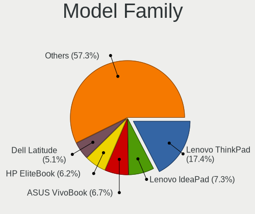
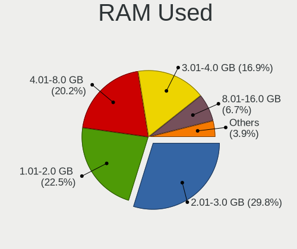
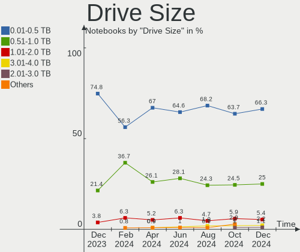
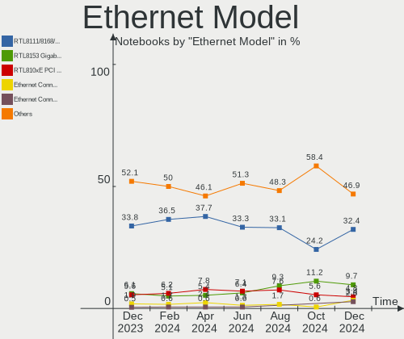

Debian Hardware Trends (Notebook)
---------------------------------

A project to identify most popular hardware characteristics and track their change
over time based on data collected by Debian users at https://Linux-Hardware.org.

Anyone can contribute to the study by uploading probes of their computers by
the [hw-probe](https://github.com/linuxhw/hw-probe) tool:

    sudo -E hw-probe -all -upload

Full-feature report is available here: https://linux-hardware.org/?view=trends&formfactor=notebook

Period: Nov, 2020.

Contents
--------

- [ OS                       ](#os)
- [ OS Family                ](#os-family)
- [ Kernel                   ](#kernel)
- [ Kernel Family            ](#kernel-family)
- [ Kernel Major Ver.        ](#kernel-major-ver)
- [ Arch                     ](#arch)
- [ DE                       ](#de)
- [ Display Server           ](#display-server)
- [ Display Manager          ](#display-manager)
- [ OS Lang                  ](#os-lang)
- [ Boot Mode                ](#boot-mode)
- [ Filesystem               ](#filesystem)
- [ Part. scheme             ](#part-scheme)
- [ Dual Boot with Linux/BSD ](#dual-boot-with-linux/bsd)
- [ Dual Boot (Win)          ](#dual-boot-win)
- [ Country                  ](#country)
- [ City                     ](#city)
- [ Vendor                   ](#vendor)
- [ Model                    ](#model)
- [ Model Family             ](#model-family)
- [ MFG Year                 ](#mfg-year)
- [ Form Factor              ](#form-factor)
- [ Secure Boot              ](#secure-boot)
- [ Coreboot                 ](#coreboot)
- [ RAM Size                 ](#ram-size)
- [ RAM Used                 ](#ram-used)
- [ Has CD-ROM               ](#has-cd-rom)
- [ Total Drives             ](#total-drives)
- [ Has Ethernet             ](#has-ethernet)
- [ Drive Vendor             ](#drive-vendor)
- [ Drive Model              ](#drive-model)
- [ HDD Vendor               ](#hdd-vendor)
- [ SSD Vendor               ](#ssd-vendor)
- [ Drive Kind               ](#drive-kind)
- [ Drive Connector          ](#drive-connector)
- [ Drive Size               ](#drive-size)
- [ Space Total              ](#space-total)
- [ Space Used               ](#space-used)
- [ Malfunc. Drives          ](#malfunc-drives)
- [ Malfunc. Drive Vendor    ](#malfunc-drive-vendor)
- [ Malfunc. HDD Vendor      ](#malfunc-hdd-vendor)
- [ Malfunc. Drive Kind      ](#malfunc-drive-kind)
- [ Failed Drives            ](#failed-drives)
- [ Failed Drive Vendor      ](#failed-drive-vendor)
- [ Drive Status             ](#drive-status)
- [ Storage Vendor           ](#storage-vendor)
- [ Storage Model            ](#storage-model)
- [ Storage Kind             ](#storage-kind)
- [ CPU Vendor               ](#cpu-vendor)
- [ CPU Model                ](#cpu-model)
- [ CPU Model Family         ](#cpu-model-family)
- [ CPU Cores                ](#cpu-cores)
- [ CPU Sockets              ](#cpu-sockets)
- [ CPU Threads              ](#cpu-threads)
- [ CPU Op-Modes             ](#cpu-op-modes)
- [ CPU Microcode            ](#cpu-microcode)
- [ CPU Microarch            ](#cpu-microarch)
- [ GPU Vendor               ](#gpu-vendor)
- [ GPU Model                ](#gpu-model)
- [ GPU Combo                ](#gpu-combo)
- [ GPU Driver               ](#gpu-driver)
- [ GPU Memory               ](#gpu-memory)
- [ Monitor Vendor           ](#monitor-vendor)
- [ Monitor Model            ](#monitor-model)
- [ Monitor Resolution       ](#monitor-resolution)
- [ Monitor Diagonal         ](#monitor-diagonal)
- [ Monitor Width            ](#monitor-width)
- [ Aspect Ratio             ](#aspect-ratio)
- [ Monitor Area             ](#monitor-area)
- [ Pixel Density            ](#pixel-density)
- [ Multiple Monitors        ](#multiple-monitors)
- [ Net Controller Vendor    ](#net-controller-vendor)
- [ Net Controller Model     ](#net-controller-model)
- [ Wireless Vendor          ](#wireless-vendor)
- [ Wireless Model           ](#wireless-model)
- [ Ethernet Vendor          ](#ethernet-vendor)
- [ Ethernet Model           ](#ethernet-model)
- [ Net Controller Kind      ](#net-controller-kind)
- [ Used Controller          ](#used-controller)
- [ NICs                     ](#nics)
- [ Memory Vendor            ](#memory-vendor)
- [ Memory Model             ](#memory-model)
- [ Memory Kind              ](#memory-kind)
- [ Memory Form Factor       ](#memory-form-factor)
- [ Memory Size              ](#memory-size)
- [ Memory Speed             ](#memory-speed)
- [ Sound Vendor             ](#sound-vendor)
- [ Sound Model              ](#sound-model)
- [ Camera Vendor            ](#camera-vendor)
- [ Camera Model             ](#camera-model)
- [ Fingerprint Vendor       ](#fingerprint-vendor)
- [ Fingerprint Model        ](#fingerprint-model)
- [ Chipcard Vendor          ](#chipcard-vendor)
- [ Chipcard Model           ](#chipcard-model)
- [ Printer Vendor           ](#printer-vendor)
- [ Printer Model            ](#printer-model)
- [ Scanner Vendor           ](#scanner-vendor)
- [ Scanner Model            ](#scanner-model)
- [ Bluetooth Vendor         ](#bluetooth-vendor)
- [ Bluetooth Model          ](#bluetooth-model)
- [ Unsupported Devices      ](#unsupported-devices)
- [ Unsupported Device Types ](#unsupported-device-types)

OS
--

Installed operating systems

| Name            | Notebooks | Percent |
|-----------------|-----------|---------|
| Debian 10       | 48        | 60%     |
| Debian Testing  | 20        | 25%     |
| Debian          | 7         | 8.75%   |
| Debian Unstable | 4         | 5%      |
| Debian 9        | 1         | 1.25%   |

OS Family
---------

OS without a version

| Name   | Notebooks | Percent |
|--------|-----------|---------|
| Debian | 80        | 100%    |

Kernel
------

Version of the Linux kernel

| Version                   | Notebooks | Percent |
|---------------------------|-----------|---------|
| 4.19.0-12-amd64           | 31        | 38.75%  |
| 5.9.0-1-amd64             | 14        | 17.5%   |
| 5.8.0-0.bpo.2-amd64       | 7         | 8.75%   |
| 5.9.0-2-amd64             | 5         | 6.25%   |
| 5.9.0-3-amd64             | 4         | 5%      |
| 5.8.0-3-amd64             | 2         | 2.5%    |
| 5.9.0-4-amd64             | 1         | 1.25%   |
| 5.9.0-1-686-pae           | 1         | 1.25%   |
| 5.8.0-2-amd64             | 1         | 1.25%   |
| 5.8.0-16.1-liquorix-amd64 | 1         | 1.25%   |
| 5.8.0-1-amd64             | 1         | 1.25%   |
| 5.7.0-0.bpo.2-amd64       | 1         | 1.25%   |
| 5.6.0-2-amd64             | 1         | 1.25%   |
| 5.4.75-amd64              | 1         | 1.25%   |
| 5.10.0-rc42               | 1         | 1.25%   |
| 5.0.0                     | 1         | 1.25%   |
| 4.9.0-8-amd64             | 1         | 1.25%   |
| 4.9.0-14-amd64            | 1         | 1.25%   |
| 4.9.0-13-686              | 1         | 1.25%   |
| 4.19.0-12-rt-686-pae      | 1         | 1.25%   |
| 4.19.0-12-686-pae         | 1         | 1.25%   |
| 4.19.0-11-amd64           | 1         | 1.25%   |
| 4.18.0-3-686-pae          | 1         | 1.25%   |

Kernel Family
-------------

Linux kernel without a distro release

| Version | Notebooks | Percent |
|---------|-----------|---------|
| 4.19.0  | 34        | 42.5%   |
| 5.9.0   | 25        | 31.25%  |
| 5.8.0   | 12        | 15%     |
| 4.9.0   | 3         | 3.75%   |
| 5.7.0   | 1         | 1.25%   |
| 5.6.0   | 1         | 1.25%   |
| 5.4.75  | 1         | 1.25%   |
| 5.10.0  | 1         | 1.25%   |
| 5.0.0   | 1         | 1.25%   |
| 4.18.0  | 1         | 1.25%   |

Kernel Major Ver.
-----------------

Linux kernel major version

| Version | Notebooks | Percent |
|---------|-----------|---------|
| 4.19    | 34        | 42.5%   |
| 5.9     | 25        | 31.25%  |
| 5.8     | 12        | 15%     |
| 4.9     | 3         | 3.75%   |
| 5.7     | 1         | 1.25%   |
| 5.6     | 1         | 1.25%   |
| 5.4     | 1         | 1.25%   |
| 5.10    | 1         | 1.25%   |
| 5.0     | 1         | 1.25%   |
| 4.18    | 1         | 1.25%   |

Arch
----

OS architecture (x86_64, i586, etc.)

| Name   | Notebooks | Percent |
|--------|-----------|---------|
| x86_64 | 75        | 93.75%  |
| i686   | 5         | 6.25%   |

DE
--

Desktop Environment

| Name             | Notebooks | Percent |
|------------------|-----------|---------|
| GNOME            | 25        | 31.25%  |
| XFCE             | 15        | 18.75%  |
| MATE             | 7         | 8.75%   |
| KDE              | 7         | 8.75%   |
| X-Cinnamon       | 6         | 7.5%    |
| KDE5             | 4         | 5%      |
| i3               | 3         | 3.75%   |
| Cinnamon         | 3         | 3.75%   |
| GNOME Flashback  | 2         | 2.5%    |
| Unknown          | 2         | 2.5%    |
| LXQt             | 1         | 1.25%   |
| LXDE             | 1         | 1.25%   |
| lightdm-xsession | 1         | 1.25%   |
| ICEWM            | 1         | 1.25%   |
| Fluxbox          | 1         | 1.25%   |
| Budgie           | 1         | 1.25%   |

Display Server
--------------

X11 or Wayland

| Name    | Notebooks | Percent |
|---------|-----------|---------|
| X11     | 58        | 72.5%   |
| Wayland | 17        | 21.25%  |
| Tty     | 4         | 5%      |
| Unknown | 1         | 1.25%   |

Display Manager
---------------

SDDM, LightDM, etc.

| Name    | Notebooks | Percent |
|---------|-----------|---------|
| Unknown | 33        | 41.25%  |
| TDM     | 25        | 31.25%  |
| GDM     | 15        | 18.75%  |
| SDDM    | 5         | 6.25%   |
| XDM     | 1         | 1.25%   |
| LightDM | 1         | 1.25%   |

OS Lang
-------

Language

| Lang       | Notebooks | Percent |
|------------|-----------|---------|
| en_US      | 23        | 28.75%  |
| en_GB      | 7         | 8.75%   |
| fr_FR      | 6         | 7.5%    |
| de_DE      | 5         | 6.25%   |
| pt_BR      | 4         | 5%      |
| es_ES      | 3         | 3.75%   |
| Unknown    | 3         | 3.75%   |
| ru_UA      | 2         | 2.5%    |
| ru_RU      | 2         | 2.5%    |
| pt_PT      | 2         | 2.5%    |
| it_IT      | 2         | 2.5%    |
| fr_CH      | 2         | 2.5%    |
| C          | 2         | 2.5%    |
| C          | 2         | 2.5%    |
| zh_CN      | 1         | 1.25%   |
| tr_TR      | 1         | 1.25%   |
| nl_NL      | 1         | 1.25%   |
| fr_FR.utf8 | 1         | 1.25%   |
| es_MX      | 1         | 1.25%   |
| es_ES.utf8 | 1         | 1.25%   |
| es_EC      | 1         | 1.25%   |
| es_CL      | 1         | 1.25%   |
| es_AR      | 1         | 1.25%   |
| en_ZA      | 1         | 1.25%   |
| en_IN      | 1         | 1.25%   |
| en_IE      | 1         | 1.25%   |
| en_GB.utf8 | 1         | 1.25%   |
| en_CA      | 1         | 1.25%   |
| cs_CZ      | 1         | 1.25%   |

Boot Mode
---------

EFI or BIOS

| Mode | Notebooks | Percent |
|------|-----------|---------|
| BIOS | 44        | 55%     |
| EFI  | 36        | 45%     |

Filesystem
----------

Type of filesystem

| Type  | Notebooks | Percent |
|-------|-----------|---------|
| Ext4  | 76        | 95%     |
| Xfs   | 2         | 2.5%    |
| Btrfs | 2         | 2.5%    |

Part. scheme
------------

Scheme of partitioning

| Type    | Notebooks | Percent |
|---------|-----------|---------|
| GPT     | 34        | 42.5%   |
| Unknown | 31        | 38.75%  |
| MBR     | 15        | 18.75%  |

Dual Boot with Linux/BSD
------------------------

Hosting more than one Linux/BSD

| Dual boot | Notebooks | Percent |
|-----------|-----------|---------|
| No        | 73        | 91.25%  |
| Yes       | 7         | 8.75%   |

Dual Boot (Win)
---------------

Hosting Linux and Windows

| Dual boot | Notebooks | Percent |
|-----------|-----------|---------|
| No        | 61        | 76.25%  |
| Yes       | 19        | 23.75%  |

Country
-------

Geographic location (country)

| Country                | Notebooks | Percent |
|------------------------|-----------|---------|
| France                 | 10        | 12.5%   |
| Russia                 | 8         | 10%     |
| USA                    | 7         | 8.75%   |
| Spain                  | 7         | 8.75%   |
| Germany                | 6         | 7.5%    |
| Brazil                 | 5         | 6.25%   |
| Netherlands            | 3         | 3.75%   |
| UK                     | 2         | 2.5%    |
| Switzerland            | 2         | 2.5%    |
| Portugal               | 2         | 2.5%    |
| Norway                 | 2         | 2.5%    |
| Italy                  | 2         | 2.5%    |
| Chile                  | 2         | 2.5%    |
| Belarus                | 2         | 2.5%    |
| Argentina              | 2         | 2.5%    |
| Ukraine                | 1         | 1.25%   |
| Turkey                 | 1         | 1.25%   |
| South Africa           | 1         | 1.25%   |
| Romania                | 1         | 1.25%   |
| Poland                 | 1         | 1.25%   |
| Mexico                 | 1         | 1.25%   |
| Ireland                | 1         | 1.25%   |
| Indonesia              | 1         | 1.25%   |
| India                  | 1         | 1.25%   |
| Greece                 | 1         | 1.25%   |
| Georgia                | 1         | 1.25%   |
| Ecuador                | 1         | 1.25%   |
| Czech Republic         | 1         | 1.25%   |
| China                  | 1         | 1.25%   |
| Canada                 | 1         | 1.25%   |
| Bulgaria               | 1         | 1.25%   |
| Bosnia and Herzegovina | 1         | 1.25%   |
| Australia              | 1         | 1.25%   |

City
----

Geographic location (city)

| City                | Notebooks | Percent |
|---------------------|-----------|---------|
| Paris               | 5         | 6.25%   |
| St Petersburg       | 4         | 5%      |
| São Paulo          | 3         | 3.75%   |
| Oslo                | 2         | 2.5%    |
| Moscow              | 2         | 2.5%    |
| Minsk               | 2         | 2.5%    |
| Zeist               | 1         | 1.25%   |
| Woodstock           | 1         | 1.25%   |
| Volnay              | 1         | 1.25%   |
| Vannes              | 1         | 1.25%   |
| Tuzla               | 1         | 1.25%   |
| Tudela              | 1         | 1.25%   |
| Tbilisi             | 1         | 1.25%   |
| Talca               | 1         | 1.25%   |
| Sofia               | 1         | 1.25%   |
| Shchelkovo          | 1         | 1.25%   |
| Sete Lagoas         | 1         | 1.25%   |
| Santiago            | 1         | 1.25%   |
| Roubaix             | 1         | 1.25%   |
| Resistencia         | 1         | 1.25%   |
| Prague              | 1         | 1.25%   |
| Portland            | 1         | 1.25%   |
| Porrentruy          | 1         | 1.25%   |
| Pathanamthitta      | 1         | 1.25%   |
| Panciu              | 1         | 1.25%   |
| Oxford              | 1         | 1.25%   |
| Olot                | 1         | 1.25%   |
| Notzingen           | 1         | 1.25%   |
| Milan               | 1         | 1.25%   |
| Mexico City         | 1         | 1.25%   |
| Manta               | 1         | 1.25%   |
| Manresa             | 1         | 1.25%   |
| Madrid              | 1         | 1.25%   |
| Los Gatos           | 1         | 1.25%   |
| Lisbon              | 1         | 1.25%   |
| Leverkusen          | 1         | 1.25%   |
| Leeuwarden          | 1         | 1.25%   |
| Krasnogorsk         | 1         | 1.25%   |
| Johannesburg        | 1         | 1.25%   |
| Izmir               | 1         | 1.25%   |
| Irving              | 1         | 1.25%   |
| Hennigsdorf         | 1         | 1.25%   |
| Gijón              | 1         | 1.25%   |
| Gartringen          | 1         | 1.25%   |
| Galway              | 1         | 1.25%   |
| Froissy             | 1         | 1.25%   |
| Frankfurt am Main   | 1         | 1.25%   |
| Finchley            | 1         | 1.25%   |
| Fayetteville        | 1         | 1.25%   |
| el Masnou           | 1         | 1.25%   |
| Dongguan            | 1         | 1.25%   |
| Dnipro              | 1         | 1.25%   |
| Didsbury            | 1         | 1.25%   |
| Courtland           | 1         | 1.25%   |
| Cham                | 1         | 1.25%   |
| Cesenatico          | 1         | 1.25%   |
| Caraguatatuba       | 1         | 1.25%   |
| Caldas de Sao Jorge | 1         | 1.25%   |
| Bielsk Podlaski     | 1         | 1.25%   |
| Benavidez           | 1         | 1.25%   |

Vendor
------

Motherboard manufacturer

| Name                | Notebooks | Percent |
|---------------------|-----------|---------|
| Lenovo              | 22        | 27.5%   |
| Hewlett-Packard     | 16        | 20%     |
| Dell                | 16        | 20%     |
| ASUSTek Computer    | 8         | 10%     |
| Acer                | 6         | 7.5%    |
| Toshiba             | 1         | 1.25%   |
| Samsung Electronics | 1         | 1.25%   |
| Razer               | 1         | 1.25%   |
| Packard Bell        | 1         | 1.25%   |
| MSI                 | 1         | 1.25%   |
| Intel               | 1         | 1.25%   |
| HUAWEI              | 1         | 1.25%   |
| DataLogic           | 1         | 1.25%   |
| Apple               | 1         | 1.25%   |
| AMI                 | 1         | 1.25%   |
| Alienware           | 1         | 1.25%   |
| Unknown             | 1         | 1.25%   |

Model
-----

Motherboard model

| Name                                               | Notebooks | Percent |
|----------------------------------------------------|-----------|---------|
| Toshiba Satellite C55-C                            | 1         | 1.25%   |
| Samsung 940Z5L                                     | 1         | 1.25%   |
| Razer Blade 15 Base Model (Early 2020) - RZ09-0328 | 1         | 1.25%   |
| Packard Bell EasyNote LM81                         | 1         | 1.25%   |
| MSI GS43VR 7RE                                     | 1         | 1.25%   |
| Lenovo ThinkPad X240 20AM0012UK                    | 1         | 1.25%   |
| Lenovo ThinkPad X220 4290RV5                       | 1         | 1.25%   |
| Lenovo ThinkPad X1 Carbon 3443CTO                  | 1         | 1.25%   |
| Lenovo ThinkPad T60 1951WJ1                        | 1         | 1.25%   |
| Lenovo ThinkPad T500 20828YG                       | 1         | 1.25%   |
| Lenovo ThinkPad T470 20HE0055IT                    | 1         | 1.25%   |
| Lenovo ThinkPad T430 2349V4B                       | 1         | 1.25%   |
| Lenovo ThinkPad T420 4236S3C                       | 1         | 1.25%   |
| Lenovo ThinkPad T420 4180AG3                       | 1         | 1.25%   |
| Lenovo ThinkPad L15 Gen 1 20U3CTO1WW               | 1         | 1.25%   |
| Lenovo ThinkPad E590 20NB0012RT                    | 1         | 1.25%   |
| Lenovo ThinkPad E14 Gen 2 20T60026RT               | 1         | 1.25%   |
| Lenovo ThinkPad E14 20RAS0D800                     | 1         | 1.25%   |
| Lenovo ThinkPad E14 20RA001LMC                     | 1         | 1.25%   |
| Lenovo ThinkPad E14 20RA001HRT                     | 1         | 1.25%   |
| Lenovo Legion Y9000X 2020 81TH                     | 1         | 1.25%   |
| Lenovo K2450 20243                                 | 1         | 1.25%   |
| Lenovo IdeaPad Y470 0855                           | 1         | 1.25%   |
| Lenovo IdeaPad L340-17API 81LY                     | 1         | 1.25%   |
| Lenovo IdeaPad 520-15IKB 81BF                      | 1         | 1.25%   |
| Lenovo IdeaPad 330-15IKB 81DE                      | 1         | 1.25%   |
| Lenovo IdeaPad 310-15ABR 80ST                      | 1         | 1.25%   |
| Intel SharkBay Platform                            | 1         | 1.25%   |
| HUAWEI BOHK-WAX9X                                  | 1         | 1.25%   |
| HP ProBook 440 G6                                  | 1         | 1.25%   |
| HP Pavilion Notebook                               | 1         | 1.25%   |
| HP Pavilion dv5                                    | 1         | 1.25%   |
| HP OMEN by HP Laptop 15-dc0xxx                     | 1         | 1.25%   |
| HP Mini 110-3100                                   | 1         | 1.25%   |
| HP Laptop 17-by1xxx                                | 1         | 1.25%   |
| HP Laptop 15s-fq1xxx                               | 1         | 1.25%   |
| HP Laptop 15s-fq0xxx                               | 1         | 1.25%   |
| HP Laptop 15-bs0xx                                 | 1         | 1.25%   |
| HP ENVY 17                                         | 1         | 1.25%   |
| HP ENVY 14 SPECTRE                                 | 1         | 1.25%   |
| HP EliteBook Folio 1040 G1                         | 1         | 1.25%   |
| HP EliteBook 830 G7 Notebook PC                    | 1         | 1.25%   |
| HP EliteBook 820 G1                                | 1         | 1.25%   |
| HP Compaq nc4400 (EY605EA)                         | 1         | 1.25%   |
| HP 255 G7 Notebook PC                              | 1         | 1.25%   |
| Dell XPS L502X                                     | 1         | 1.25%   |
| Dell XPS 13 9360                                   | 1         | 1.25%   |
| Dell XPS 13 9310                                   | 1         | 1.25%   |
| Dell Vostro 5490                                   | 1         | 1.25%   |
| Dell Vostro 3450                                   | 1         | 1.25%   |
| Dell Studio 1737                                   | 1         | 1.25%   |
| Dell Precision M6800                               | 1         | 1.25%   |
| Dell Latitude E7450                                | 1         | 1.25%   |
| Dell Latitude E6530                                | 1         | 1.25%   |
| Dell Latitude E5420                                | 1         | 1.25%   |
| Dell Latitude 7400                                 | 1         | 1.25%   |
| Dell Inspiron 5593                                 | 1         | 1.25%   |
| Dell Inspiron 5575                                 | 1         | 1.25%   |
| Dell Inspiron 5458                                 | 1         | 1.25%   |
| Dell Inspiron 5370                                 | 1         | 1.25%   |

Model Family
------------

Motherboard model prefix

| Name                  | Notebooks | Percent |
|-----------------------|-----------|---------|
| Lenovo ThinkPad       | 15        | 18.75%  |
| Lenovo IdeaPad        | 5         | 6.25%   |
| Dell Inspiron         | 5         | 6.25%   |
| HP Laptop             | 4         | 5%      |
| Dell Latitude         | 4         | 5%      |
| HP EliteBook          | 3         | 3.75%   |
| Dell XPS              | 3         | 3.75%   |
| Acer Aspire           | 3         | 3.75%   |
| HP Pavilion           | 2         | 2.5%    |
| HP ENVY               | 2         | 2.5%    |
| Dell Vostro           | 2         | 2.5%    |
| Toshiba Satellite     | 1         | 1.25%   |
| Samsung 940Z5L        | 1         | 1.25%   |
| Razer Blade           | 1         | 1.25%   |
| Packard Bell EasyNote | 1         | 1.25%   |
| MSI GS43VR            | 1         | 1.25%   |
| Lenovo Legion         | 1         | 1.25%   |
| Lenovo K2450          | 1         | 1.25%   |
| Intel SharkBay        | 1         | 1.25%   |
| HUAWEI BOHK-WAX9X     | 1         | 1.25%   |
| HP ProBook            | 1         | 1.25%   |
| HP OMEN               | 1         | 1.25%   |
| HP Mini               | 1         | 1.25%   |
| HP Compaq             | 1         | 1.25%   |
| HP 255                | 1         | 1.25%   |
| Dell Studio           | 1         | 1.25%   |
| Dell Precision        | 1         | 1.25%   |
| DataLogic U50SI       | 1         | 1.25%   |
| ASUS ZenBook          | 1         | 1.25%   |
| ASUS X555YI           | 1         | 1.25%   |
| ASUS X405UA           | 1         | 1.25%   |
| ASUS X205TAW          | 1         | 1.25%   |
| ASUS TUF              | 1         | 1.25%   |
| ASUS S551LN           | 1         | 1.25%   |
| ASUS P751JA           | 1         | 1.25%   |
| ASUS E203NAS          | 1         | 1.25%   |
| Apple MacBookPro10    | 1         | 1.25%   |
| AMI Intel             | 1         | 1.25%   |
| Alienware M14xR1      | 1         | 1.25%   |
| Acer TMP453-MG        | 1         | 1.25%   |
| Acer Predator         | 1         | 1.25%   |
| Acer AO722            | 1         | 1.25%   |
| Unknown               | 1         | 1.25%   |

MFG Year
--------

Motherboard manufacture year

| Year | Notebooks | Percent |
|------|-----------|---------|
| 2020 | 18        | 22.5%   |
| 2019 | 15        | 18.75%  |
| 2018 | 8         | 10%     |
| 2011 | 7         | 8.75%   |
| 2017 | 6         | 7.5%    |
| 2015 | 6         | 7.5%    |
| 2012 | 4         | 5%      |
| 2009 | 4         | 5%      |
| 2014 | 3         | 3.75%   |
| 2013 | 3         | 3.75%   |
| 2016 | 2         | 2.5%    |
| 2008 | 2         | 2.5%    |
| 2010 | 1         | 1.25%   |
| 2006 | 1         | 1.25%   |

Form Factor
-----------

Physical design of the computer

| Name     | Notebooks | Percent |
|----------|-----------|---------|
| Notebook | 80        | 100%    |

Secure Boot
-----------

Enabled or disabled

| State    | Notebooks | Percent |
|----------|-----------|---------|
| Disabled | 74        | 92.5%   |
| Enabled  | 6         | 7.5%    |

Coreboot
--------

Have coreboot on board

| Used | Notebooks | Percent |
|------|-----------|---------|
| No   | 80        | 100%    |

RAM Size
--------

Total RAM memory

| Size in GB | Notebooks | Percent |
|------------|-----------|---------|
| 4.01-8.0   | 21        | 26.25%  |
| 16.01-24.0 | 18        | 22.5%   |
| 8.01-16.0  | 17        | 21.25%  |
| 3.01-4.0   | 13        | 16.25%  |
| 1.01-2.0   | 6         | 7.5%    |
| 2.01-3.0   | 3         | 3.75%   |
| 32.01-64.0 | 2         | 2.5%    |

RAM Used
--------

Used RAM memory

| Used GB   | Notebooks | Percent |
|-----------|-----------|---------|
| 1.01-2.0  | 25        | 31.25%  |
| 2.01-3.0  | 17        | 21.25%  |
| 4.01-8.0  | 14        | 17.5%   |
| 3.01-4.0  | 12        | 15%     |
| 0.01-1.0  | 7         | 8.75%   |
| 8.01-16.0 | 5         | 6.25%   |

Has CD-ROM
----------

Has CD-ROM on board

| Presented | Notebooks | Percent |
|-----------|-----------|---------|
| No        | 52        | 65%     |
| Yes       | 28        | 35%     |

Total Drives
------------

Number of drives on board

| Drives | Notebooks | Percent |
|--------|-----------|---------|
| 1      | 54        | 67.5%   |
| 2      | 23        | 28.75%  |
| 3      | 2         | 2.5%    |
| 4      | 1         | 1.25%   |

Has Ethernet
------------

Has Ethernet on board

| Presented | Notebooks | Percent |
|-----------|-----------|---------|
| Yes       | 65        | 81.25%  |
| No        | 15        | 18.75%  |

Drive Vendor
------------

Hard drive vendors

| Vendor                    | Notebooks | Drives | Percent |
|---------------------------|-----------|--------|---------|
| Samsung Electronics       | 15        | 16     | 14.42%  |
| WDC                       | 14        | 14     | 13.46%  |
| Seagate                   | 13        | 14     | 12.5%   |
| Unknown                   | 8         | 8      | 7.69%   |
| SK Hynix                  | 7         | 7      | 6.73%   |
| Toshiba                   | 5         | 5      | 4.81%   |
| HGST                      | 5         | 5      | 4.81%   |
| Crucial                   | 5         | 5      | 4.81%   |
| SanDisk                   | 3         | 3      | 2.88%   |
| Kingston                  | 3         | 3      | 2.88%   |
| Intel                     | 3         | 3      | 2.88%   |
| Hitachi                   | 3         | 3      | 2.88%   |
| A-DATA Technology         | 3         | 3      | 2.88%   |
| Micron Technology         | 2         | 2      | 1.92%   |
| Fujitsu                   | 2         | 2      | 1.92%   |
| Transcend                 | 1         | 1      | 0.96%   |
| Team                      | 1         | 1      | 0.96%   |
| SPCC                      | 1         | 1      | 0.96%   |
| PNY                       | 1         | 1      | 0.96%   |
| Micron/Crucial Technology | 1         | 1      | 0.96%   |
| LITEON                    | 1         | 1      | 0.96%   |
| Leven                     | 1         | 1      | 0.96%   |
| KIOXIA                    | 1         | 1      | 0.96%   |
| Hewlett-Packard           | 1         | 1      | 0.96%   |
| Dogfish                   | 1         | 1      | 0.96%   |
| China                     | 1         | 1      | 0.96%   |
| Apple                     | 1         | 1      | 0.96%   |
| ADATA Technology          | 1         | 1      | 0.96%   |

Drive Model
-----------

Hard drive models

| Model                                   | Notebooks | Percent |
|-----------------------------------------|-----------|---------|
| Unknown MMC Card  32GB                  | 3         | 2.86%   |
| SK Hynix BC501 HFM512GDJTNG-8310A 512GB | 3         | 2.86%   |
| Unknown MMC Card  64GB                  | 2         | 1.9%    |
| Toshiba MQ01ABD100 1TB                  | 2         | 1.9%    |
| Seagate ST1000LM035-1RK172 1TB          | 2         | 1.9%    |
| Seagate ST1000LM024 HN-M101MBB 1TB      | 2         | 1.9%    |
| HGST HTS721010A9E630 1TB                | 2         | 1.9%    |
| HGST HTS545050A7E680 500GB              | 2         | 1.9%    |
| Crucial CT500MX500SSD1 500GB            | 2         | 1.9%    |
| WDC WDS240G2G0B-00EPW0 240GB SSD        | 1         | 0.95%   |
| WDC WDS240G2G0A-00JH30 240GB SSD        | 1         | 0.95%   |
| WDC WD7500BPKT-75PK4T0 752GB            | 1         | 0.95%   |
| WDC WD5000LPCX-21VHAT0 500GB            | 1         | 0.95%   |
| WDC WD3200BEVT-22A23T0 320GB            | 1         | 0.95%   |
| WDC WD10SPZX-24Z10 1TB                  | 1         | 0.95%   |
| WDC WD10SPZX-00Z10T0 1TB                | 1         | 0.95%   |
| WDC WD10JPVX-60JC3T1 1TB                | 1         | 0.95%   |
| WDC WD10JPVX-60JC3T0 1TB                | 1         | 0.95%   |
| WDC WD10 JPVX-22JC3T0 1TB               | 1         | 0.95%   |
| WDC PC SN730 SDBQNTY-512G-1001 512GB    | 1         | 0.95%   |
| WDC PC SN730 SDBPNTY-256G-1027 256GB    | 1         | 0.95%   |
| WDC PC SN530 SDBPNPZ-512G-1006 512GB    | 1         | 0.95%   |
| WDC PC SN520 SDAPNUW-256G-1006 256GB    | 1         | 0.95%   |
| Unknown MMC Card  256GB                 | 1         | 0.95%   |
| Unknown MMC Card  128GB                 | 1         | 0.95%   |
| Unknown MMC Card  126MB                 | 1         | 0.95%   |
| Transcend TS256GMTS400S 256GB SSD       | 1         | 0.95%   |
| Toshiba THNSN5256GPU7 256GB             | 1         | 0.95%   |
| Toshiba NVMe SSD Drive 256GB            | 1         | 0.95%   |
| Toshiba KXG60ZNV1T02 NVMe KIOXIA 1024GB | 1         | 0.95%   |
| Team T253TD240G 240GB SSD               | 1         | 0.95%   |
| SPCC Solid State Disk 128GB             | 1         | 0.95%   |
| SK Hynix SC311 SATA 256GB SSD           | 1         | 0.95%   |
| SK Hynix HFM512GDJTNG-8310A 512GB       | 1         | 0.95%   |
| SK Hynix HFM256GDHTNG-8510B 256GB       | 1         | 0.95%   |
| SK Hynix BC511 HFM512GDJTNI-82A0A 512GB | 1         | 0.95%   |
| Seagate ST9500424AS 500GB               | 1         | 0.95%   |
| Seagate ST9500423AS 500GB               | 1         | 0.95%   |
| Seagate ST9500325AS 500GB               | 1         | 0.95%   |
| Seagate ST9250410AS 250GB               | 1         | 0.95%   |
| Seagate ST9160314AS 160GB               | 1         | 0.95%   |
| Seagate ST6000VN 0033-2EE110 6TB        | 1         | 0.95%   |
| Seagate ST500LT012-9WS142 500GB         | 1         | 0.95%   |
| Seagate ST320LT020-9YG142 320GB         | 1         | 0.95%   |
| Seagate ST1000LM049-2GH172 1TB          | 1         | 0.95%   |
| SanDisk SSD U110 16GB                   | 1         | 0.95%   |
| SanDisk SSD U100 24GB                   | 1         | 0.95%   |
| SanDisk SD5SG2128G1052E 128GB SSD       | 1         | 0.95%   |
| Samsung SSD SM841 2.5 7mm 128GB         | 1         | 0.95%   |
| Samsung SSD 970 EVO Plus 250GB          | 1         | 0.95%   |
| Samsung SSD 860 QVO 1TB                 | 1         | 0.95%   |
| Samsung SSD 860 EVO 500GB               | 1         | 0.95%   |
| Samsung SSD 860 EVO 250GB               | 1         | 0.95%   |
| Samsung SSD 860 EVO 1TB                 | 1         | 0.95%   |
| Samsung SSD 850 EVO 250GB               | 1         | 0.95%   |
| Samsung PM991 NVMe 512GB                | 1         | 0.95%   |
| Samsung MZVLB512HBJQ-00A00 512GB        | 1         | 0.95%   |
| Samsung MZVLB1T0HBLR-000L2 1TB          | 1         | 0.95%   |
| Samsung MZMPA128HMFU-000H1 128GB SSD    | 1         | 0.95%   |
| Samsung MZALQ512HALU-000L1 512GB        | 1         | 0.95%   |

HDD Vendor
----------

Hard disk drive vendors

| Vendor              | Notebooks | Drives | Percent |
|---------------------|-----------|--------|---------|
| Seagate             | 13        | 14     | 38.24%  |
| WDC                 | 8         | 8      | 23.53%  |
| HGST                | 5         | 5      | 14.71%  |
| Hitachi             | 3         | 3      | 8.82%   |
| Toshiba             | 2         | 2      | 5.88%   |
| Fujitsu             | 2         | 2      | 5.88%   |
| Samsung Electronics | 1         | 1      | 2.94%   |

SSD Vendor
----------

Solid state drive vendors

| Vendor              | Notebooks | Drives | Percent |
|---------------------|-----------|--------|---------|
| Samsung Electronics | 9         | 9      | 24.32%  |
| Crucial             | 5         | 5      | 13.51%  |
| SanDisk             | 3         | 3      | 8.11%   |
| A-DATA Technology   | 3         | 3      | 8.11%   |
| WDC                 | 2         | 2      | 5.41%   |
| Micron Technology   | 2         | 2      | 5.41%   |
| Kingston            | 2         | 2      | 5.41%   |
| Transcend           | 1         | 1      | 2.7%    |
| Team                | 1         | 1      | 2.7%    |
| SPCC                | 1         | 1      | 2.7%    |
| SK Hynix            | 1         | 1      | 2.7%    |
| LITEON              | 1         | 1      | 2.7%    |
| Leven               | 1         | 1      | 2.7%    |
| Intel               | 1         | 1      | 2.7%    |
| Hewlett-Packard     | 1         | 1      | 2.7%    |
| Dogfish             | 1         | 1      | 2.7%    |
| China               | 1         | 1      | 2.7%    |
| Apple               | 1         | 1      | 2.7%    |

Drive Kind
----------

HDD or SSD

| Kind | Notebooks | Drives | Percent |
|------|-----------|--------|---------|
| SSD  | 36        | 37     | 34.62%  |
| HDD  | 34        | 35     | 32.69%  |
| NVMe | 26        | 26     | 25%     |
| MMC  | 8         | 8      | 7.69%   |

Drive Connector
---------------

SATA, SAS, NVMe, etc.

| Type | Notebooks | Drives | Percent |
|------|-----------|--------|---------|
| SATA | 60        | 69     | 62.5%   |
| NVMe | 26        | 26     | 27.08%  |
| MMC  | 8         | 8      | 8.33%   |
| SAS  | 2         | 3      | 2.08%   |

Drive Size
----------

Size of hard drive

| Size in TB | Notebooks | Drives | Percent |
|------------|-----------|--------|---------|
| 0.01-0.5   | 43        | 49     | 68.25%  |
| 0.51-1.0   | 19        | 21     | 30.16%  |
| 4.01-10.0  | 1         | 2      | 1.59%   |

Space Total
-----------

Amount of disk space available on the file system

| Size in GB     | Notebooks | Percent |
|----------------|-----------|---------|
| 251-500        | 25        | 31.25%  |
| 101-250        | 23        | 28.75%  |
| 501-1000       | 19        | 23.75%  |
| 51-100         | 5         | 6.25%   |
| More than 3000 | 3         | 3.75%   |
| 21-50          | 1         | 1.25%   |
| 2001-3000      | 1         | 1.25%   |
| 1001-2000      | 1         | 1.25%   |
| 1-20           | 1         | 1.25%   |
| Unknown        | 1         | 1.25%   |

Space Used
----------

Amount of used disk space

| Used GB        | Notebooks | Percent |
|----------------|-----------|---------|
| 1-20           | 18        | 22.5%   |
| 101-250        | 15        | 18.75%  |
| 251-500        | 12        | 15%     |
| 51-100         | 12        | 15%     |
| 21-50          | 10        | 12.5%   |
| 501-1000       | 8         | 10%     |
| 1001-2000      | 2         | 2.5%    |
| More than 3000 | 1         | 1.25%   |
| 2001-3000      | 1         | 1.25%   |
| Unknown        | 1         | 1.25%   |

Malfunc. Drives
---------------

Drive models with a malfunction

| Model                              | Notebooks | Drives | Percent |
|------------------------------------|-----------|--------|---------|
| WDC WD7500BPKT-75PK4T0 752GB       | 1         | 1      | 20%     |
| Seagate ST1000LM024 HN-M101MBB 1TB | 1         | 1      | 20%     |
| Hitachi HTS727550A9E364 500GB      | 1         | 1      | 20%     |
| Fujitsu MHV2080BH PL 80GB          | 1         | 1      | 20%     |
| Crucial CT1050MX300SSD1 1TB        | 1         | 1      | 20%     |

Malfunc. Drive Vendor
---------------------

Vendors of faulty drives

| Vendor  | Notebooks | Drives | Percent |
|---------|-----------|--------|---------|
| WDC     | 1         | 1      | 20%     |
| Seagate | 1         | 1      | 20%     |
| Hitachi | 1         | 1      | 20%     |
| Fujitsu | 1         | 1      | 20%     |
| Crucial | 1         | 1      | 20%     |

Malfunc. HDD Vendor
-------------------

Vendors of faulty HDD drives

| Vendor  | Notebooks | Drives | Percent |
|---------|-----------|--------|---------|
| WDC     | 1         | 1      | 25%     |
| Seagate | 1         | 1      | 25%     |
| Hitachi | 1         | 1      | 25%     |
| Fujitsu | 1         | 1      | 25%     |

Malfunc. Drive Kind
-------------------

Kinds of faulty drives

| Kind | Notebooks | Drives | Percent |
|------|-----------|--------|---------|
| HDD  | 4         | 4      | 80%     |
| SSD  | 1         | 1      | 20%     |

Failed Drives
-------------

Failed drive models

Zero info for selected period =(

Failed Drive Vendor
-------------------

Failed drive vendors

Zero info for selected period =(

Drive Status
------------

Number of failed and malfunc. drives

| Status   | Notebooks | Drives | Percent |
|----------|-----------|--------|---------|
| Works    | 44        | 52     | 51.16%  |
| Detected | 37        | 49     | 43.02%  |
| Malfunc  | 5         | 5      | 5.81%   |

Storage Vendor
--------------

Storage controller vendors

| Vendor                           | Notebooks | Percent |
|----------------------------------|-----------|---------|
| Intel                            | 59        | 64.13%  |
| AMD                              | 8         | 8.7%    |
| SK Hynix                         | 6         | 6.52%   |
| Samsung Electronics              | 6         | 6.52%   |
| Sandisk                          | 4         | 4.35%   |
| Toshiba America Info Systems     | 3         | 3.26%   |
| Silicon Integrated Systems [SiS] | 1         | 1.09%   |
| Phison Electronics               | 1         | 1.09%   |
| Micron/Crucial Technology        | 1         | 1.09%   |
| KIOXIA                           | 1         | 1.09%   |
| Kingston Technology Company      | 1         | 1.09%   |
| ADATA Technology                 | 1         | 1.09%   |

Storage Model
-------------

Storage controller models

| Model                                                                            | Notebooks | Percent |
|----------------------------------------------------------------------------------|-----------|---------|
| Intel 6 Series/C200 Series Chipset Family 6 port Mobile SATA AHCI Controller     | 9         | 9.28%   |
| Intel 8 Series SATA Controller 1 [AHCI mode]                                     | 7         | 7.22%   |
| Intel Sunrise Point-LP SATA Controller [AHCI mode]                               | 6         | 6.19%   |
| Intel 82801 Mobile SATA Controller [RAID mode]                                   | 6         | 6.19%   |
| Intel 7 Series Chipset Family 6-port SATA Controller [AHCI mode]                 | 6         | 6.19%   |
| AMD FCH SATA Controller [AHCI mode]                                              | 6         | 6.19%   |
| SK Hynix BC501 NVMe Solid State Drive 512GB                                      | 5         | 5.15%   |
| Intel Comet Lake SATA AHCI Controller                                            | 4         | 4.12%   |
| Intel 82801IBM/IEM (ICH9M/ICH9M-E) 4 port SATA Controller [AHCI mode]            | 4         | 4.12%   |
| Samsung Electronics NVMe SSD Controller SM981/PM981/PM983                        | 3         | 3.09%   |
| Samsung Electronics Electronics Non-Volatile memory controller                   | 3         | 3.09%   |
| Intel 8 Series/C220 Series Chipset Family 6-port SATA Controller 1 [AHCI mode]   | 3         | 3.09%   |
| Toshiba America Info Systems Toshiba America Info Non-Volatile memory controller | 2         | 2.06%   |
| Sandisk WD Black 2019/PC SN750 NVMe SSD                                          | 2         | 2.06%   |
| Intel Wildcat Point-LP SATA Controller [AHCI Mode]                               | 2         | 2.06%   |
| Intel HM170/QM170 Chipset SATA Controller [AHCI Mode]                            | 2         | 2.06%   |
| Intel Celeron N3350/Pentium N4200/Atom E3900 Series SATA AHCI Controller         | 2         | 2.06%   |
| AMD SB7x0/SB8x0/SB9x0 SATA Controller [AHCI mode]                                | 2         | 2.06%   |
| Toshiba America Info Systems NVMe Controller                                     | 1         | 1.03%   |
| SK Hynix Non-Volatile memory controller                                          | 1         | 1.03%   |
| Silicon Integrated Systems [SiS] SATA Controller / IDE mode                      | 1         | 1.03%   |
| Silicon Integrated Systems [SiS] 5513 IDE Controller                             | 1         | 1.03%   |
| Sandisk WD Blue SN550 NVMe SSD                                                   | 1         | 1.03%   |
| Sandisk WD Black 2018 / PC SN520 NVMe SSD                                        | 1         | 1.03%   |
| Phison Electronics E12 NVMe Controller                                           | 1         | 1.03%   |
| Micron/Crucial Technology P1 NVMe PCIe SSD                                       | 1         | 1.03%   |
| KIOXIA Non-Volatile memory controller                                            | 1         | 1.03%   |
| Kingston Technology Company Non-Volatile memory controller                       | 1         | 1.03%   |
| Intel SSD 600P Series                                                            | 1         | 1.03%   |
| Intel SATA controller                                                            | 1         | 1.03%   |
| Intel NVMe Optane Memory Series                                                  | 1         | 1.03%   |
| Intel NM10/ICH7 Family SATA Controller [AHCI mode]                               | 1         | 1.03%   |
| Intel Ice Lake-LP SATA Controller [AHCI mode]                                    | 1         | 1.03%   |
| Intel Cannon Point-LP SATA Controller [AHCI Mode]                                | 1         | 1.03%   |
| Intel Atom/Celeron/Pentium Processor x5-E8000/J3xxx/N3xxx Series SATA Controller | 1         | 1.03%   |
| Intel 82801GBM/GHM (ICH7-M Family) SATA Controller [IDE mode]                    | 1         | 1.03%   |
| Intel 82801GBM/GHM (ICH7-M Family) SATA Controller [AHCI mode]                   | 1         | 1.03%   |
| Intel 82801G (ICH7 Family) IDE Controller                                        | 1         | 1.03%   |
| Intel 400 Series Chipset Family SATA AHCI Controller                             | 1         | 1.03%   |
| AMD SB7x0/SB8x0/SB9x0 IDE Controller                                             | 1         | 1.03%   |
| ADATA Technology Non-Volatile memory controller                                  | 1         | 1.03%   |

Storage Kind
------------

Kind of storage controller (IDE, SATA, NVMe, SAS, ...)

| Kind | Notebooks | Percent |
|------|-----------|---------|
| SATA | 60        | 62.5%   |
| NVMe | 26        | 27.08%  |
| RAID | 6         | 6.25%   |
| IDE  | 4         | 4.17%   |

CPU Vendor
----------

Processor vendors

| Vendor | Notebooks | Percent |
|--------|-----------|---------|
| Intel  | 69        | 86.25%  |
| AMD    | 11        | 13.75%  |

CPU Model
---------

Processor models

| Model                                         | Notebooks | Percent |
|-----------------------------------------------|-----------|---------|
| Intel Core i7-10510U CPU @ 1.80GHz            | 4         | 5%      |
| Intel Core i5-2520M CPU @ 2.50GHz             | 4         | 5%      |
| Intel Core i7-8550U CPU @ 1.80GHz             | 3         | 3.75%   |
| Intel Core i7-8565U CPU @ 1.80GHz             | 2         | 2.5%    |
| Intel Core i7-7700HQ CPU @ 2.80GHz            | 2         | 2.5%    |
| Intel Core i7-7500U CPU @ 2.70GHz             | 2         | 2.5%    |
| Intel Core i5-8250U CPU @ 1.60GHz             | 2         | 2.5%    |
| Intel Core i5-4300U CPU @ 1.90GHz             | 2         | 2.5%    |
| Intel Core i5-4210U CPU @ 1.70GHz             | 2         | 2.5%    |
| Intel Core i5-2450M CPU @ 2.50GHz             | 2         | 2.5%    |
| AMD Ryzen 5 3500U with Radeon Vega Mobile Gfx | 2         | 2.5%    |
| AMD Ryzen 5 2500U with Radeon Vega Mobile Gfx | 2         | 2.5%    |
| Intel Pentium Dual-Core CPU T4400 @ 2.20GHz   | 1         | 1.25%   |
| Intel Pentium Dual-Core CPU T4300 @ 2.10GHz   | 1         | 1.25%   |
| Intel Pentium Dual CPU T3200 @ 2.00GHz        | 1         | 1.25%   |
| Intel Pentium Dual CPU T2370 @ 1.73GHz        | 1         | 1.25%   |
| Intel Pentium CPU N3700 @ 1.60GHz             | 1         | 1.25%   |
| Intel Genuine CPU T2400 @ 1.83GHz             | 1         | 1.25%   |
| Intel Core i7-9750H CPU @ 2.60GHz             | 1         | 1.25%   |
| Intel Core i7-8665U CPU @ 1.90GHz             | 1         | 1.25%   |
| Intel Core i7-6700HQ CPU @ 2.60GHz            | 1         | 1.25%   |
| Intel Core i7-4800MQ CPU @ 2.70GHz            | 1         | 1.25%   |
| Intel Core i7-4700MQ CPU @ 2.40GHz            | 1         | 1.25%   |
| Intel Core i7-4600U CPU @ 2.10GHz             | 1         | 1.25%   |
| Intel Core i7-4510U CPU @ 2.00GHz             | 1         | 1.25%   |
| Intel Core i7-3720QM CPU @ 2.60GHz            | 1         | 1.25%   |
| Intel Core i7-3540M CPU @ 3.00GHz             | 1         | 1.25%   |
| Intel Core i7-2677M CPU @ 1.80GHz             | 1         | 1.25%   |
| Intel Core i7-2670QM CPU @ 2.20GHz            | 1         | 1.25%   |
| Intel Core i7-10750H CPU @ 2.60GHz            | 1         | 1.25%   |
| Intel Core i7-1065G7 CPU @ 1.30GHz            | 1         | 1.25%   |
| Intel Core i5-8300H CPU @ 2.30GHz             | 1         | 1.25%   |
| Intel Core i5-8265U CPU @ 1.60GHz             | 1         | 1.25%   |
| Intel Core i5-7300U CPU @ 2.60GHz             | 1         | 1.25%   |
| Intel Core i5-7200U CPU @ 2.50GHz             | 1         | 1.25%   |
| Intel Core i5-5300U CPU @ 2.30GHz             | 1         | 1.25%   |
| Intel Core i5-5200U CPU @ 2.20GHz             | 1         | 1.25%   |
| Intel Core i5-4310U CPU @ 2.00GHz             | 1         | 1.25%   |
| Intel Core i5-4210M CPU @ 2.60GHz             | 1         | 1.25%   |
| Intel Core i5-3337U CPU @ 1.80GHz             | 1         | 1.25%   |
| Intel Core i5-3320M CPU @ 2.60GHz             | 1         | 1.25%   |
| Intel Core i5-3210M CPU @ 2.50GHz             | 1         | 1.25%   |
| Intel Core i5-2410M CPU @ 2.30GHz             | 1         | 1.25%   |
| Intel Core i5-1035G1 CPU @ 1.00GHz            | 1         | 1.25%   |
| Intel Core i5-10210U CPU @ 1.60GHz            | 1         | 1.25%   |
| Intel Core i3-10110U CPU @ 2.10GHz            | 1         | 1.25%   |
| Intel Core 2 Duo CPU P8700 @ 2.53GHz          | 1         | 1.25%   |
| Intel Core 2 CPU T5600 @ 1.83GHz              | 1         | 1.25%   |
| Intel Celeron N4000 CPU @ 1.10GHz             | 1         | 1.25%   |
| Intel Celeron CPU N3450 @ 1.10GHz             | 1         | 1.25%   |
| Intel Celeron CPU N3350 @ 1.10GHz             | 1         | 1.25%   |
| Intel Celeron CPU 1019Y @ 1.00GHz             | 1         | 1.25%   |
| Intel Atom CPU Z3745 @ 1.33GHz                | 1         | 1.25%   |
| Intel Atom CPU Z3735F @ 1.33GHz               | 1         | 1.25%   |
| Intel Atom CPU N455 @ 1.66GHz                 | 1         | 1.25%   |
| Intel 11th Gen Core i5-1135G7 @ 2.40GHz       | 1         | 1.25%   |
| AMD V120 Processor                            | 1         | 1.25%   |
| AMD Ryzen 7 3700U with Radeon Vega Mobile Gfx | 1         | 1.25%   |
| AMD Ryzen 5 4500U with Radeon Graphics        | 1         | 1.25%   |
| AMD Ryzen 5 3550H with Radeon Vega Mobile Gfx | 1         | 1.25%   |

CPU Model Family
----------------

Processor model prefix

| Model                   | Notebooks | Percent |
|-------------------------|-----------|---------|
| Intel Core i7           | 26        | 32.5%   |
| Intel Core i5           | 26        | 32.5%   |
| AMD Ryzen 5             | 6         | 7.5%    |
| Intel Celeron           | 4         | 5%      |
| Intel Atom              | 3         | 3.75%   |
| Intel Pentium Dual-Core | 2         | 2.5%    |
| Intel Pentium Dual      | 2         | 2.5%    |
| Other                   | 1         | 1.25%   |
| Intel Pentium           | 1         | 1.25%   |
| Intel Genuine           | 1         | 1.25%   |
| Intel Core i3           | 1         | 1.25%   |
| Intel Core 2 Duo        | 1         | 1.25%   |
| Intel Core 2            | 1         | 1.25%   |
| AMD V120                | 1         | 1.25%   |
| AMD Ryzen 7             | 1         | 1.25%   |
| AMD C-50                | 1         | 1.25%   |
| AMD A8                  | 1         | 1.25%   |
| AMD A12                 | 1         | 1.25%   |

CPU Cores
---------

Number of processor cores

| Number | Notebooks | Percent |
|--------|-----------|---------|
| 2      | 39        | 48.75%  |
| 4      | 36        | 45%     |
| 6      | 3         | 3.75%   |
| 1      | 2         | 2.5%    |

CPU Sockets
-----------

Number of sockets

| Number | Notebooks | Percent |
|--------|-----------|---------|
| 1      | 80        | 100%    |

CPU Threads
-----------

Threads per core (Hyper-Threading)

| Number | Notebooks | Percent |
|--------|-----------|---------|
| 2      | 61        | 76.25%  |
| 1      | 19        | 23.75%  |

CPU Op-Modes
------------

CPU Operation Modes (32-bit, 64-bit)

| Op mode        | Notebooks | Percent |
|----------------|-----------|---------|
| 32-bit, 64-bit | 79        | 98.75%  |
| 32-bit         | 1         | 1.25%   |

CPU Microcode
-------------

Microcode number

| Number     | Notebooks | Percent |
|------------|-----------|---------|
| Unknown    | 30        | 37.5%   |
| 0x806ec    | 6         | 7.5%    |
| 0x206a7    | 6         | 7.5%    |
| 0x806ea    | 3         | 3.75%   |
| 0x40651    | 3         | 3.75%   |
| 0x906ea    | 2         | 2.5%    |
| 0x706e5    | 2         | 2.5%    |
| 0x506c9    | 2         | 2.5%    |
| 0x306c3    | 2         | 2.5%    |
| 0x1067a    | 2         | 2.5%    |
| 0x08108109 | 2         | 2.5%    |
| 0x08108102 | 2         | 2.5%    |
| 0x0810100b | 2         | 2.5%    |
| 0x906e9    | 1         | 1.25%   |
| 0x806eb    | 1         | 1.25%   |
| 0x806c1    | 1         | 1.25%   |
| 0x706a1    | 1         | 1.25%   |
| 0x6fd      | 1         | 1.25%   |
| 0x6f6      | 1         | 1.25%   |
| 0x6e8      | 1         | 1.25%   |
| 0x506e3    | 1         | 1.25%   |
| 0x406c3    | 1         | 1.25%   |
| 0x306d4    | 1         | 1.25%   |
| 0x306a9    | 1         | 1.25%   |
| 0x30678    | 1         | 1.25%   |
| 0x08600103 | 1         | 1.25%   |
| 0x07030105 | 1         | 1.25%   |
| 0x06006118 | 1         | 1.25%   |
| 0x010000c8 | 1         | 1.25%   |

CPU Microarch
-------------

Microarchitecture

| Name          | Notebooks | Percent |
|---------------|-----------|---------|
| KabyLake      | 23        | 28.75%  |
| Haswell       | 10        | 12.5%   |
| SandyBridge   | 9         | 11.25%  |
| IvyBridge     | 6         | 7.5%    |
| Zen+          | 4         | 5%      |
| Silvermont    | 3         | 3.75%   |
| Penryn        | 3         | 3.75%   |
| Core          | 3         | 3.75%   |
| Zen           | 2         | 2.5%    |
| IceLake       | 2         | 2.5%    |
| Goldmont      | 2         | 2.5%    |
| Broadwell     | 2         | 2.5%    |
| Zen 2         | 1         | 1.25%   |
| TigerLake     | 1         | 1.25%   |
| Skylake       | 1         | 1.25%   |
| Puma          | 1         | 1.25%   |
| P6            | 1         | 1.25%   |
| K10           | 1         | 1.25%   |
| Goldmont plus | 1         | 1.25%   |
| Excavator     | 1         | 1.25%   |
| CometLake     | 1         | 1.25%   |
| Bonnell       | 1         | 1.25%   |
| Bobcat        | 1         | 1.25%   |

GPU Vendor
----------

Vendors of graphics cards

| Vendor                           | Notebooks | Percent |
|----------------------------------|-----------|---------|
| Intel                            | 64        | 63.37%  |
| Nvidia                           | 22        | 21.78%  |
| AMD                              | 14        | 13.86%  |
| Silicon Integrated Systems [SiS] | 1         | 0.99%   |

GPU Model
---------

Graphics card models

| Model                                                                                    | Notebooks | Percent |
|------------------------------------------------------------------------------------------|-----------|---------|
| Intel 2nd Generation Core Processor Family Integrated Graphics Controller                | 9         | 8.49%   |
| Intel UHD Graphics                                                                       | 7         | 6.6%    |
| Intel Haswell-ULT Integrated Graphics Controller                                         | 7         | 6.6%    |
| Intel UHD Graphics 620                                                                   | 5         | 4.72%   |
| Intel 3rd Gen Core processor Graphics Controller                                         | 5         | 4.72%   |
| Intel UHD Graphics 620 (Whiskey Lake)                                                    | 4         | 3.77%   |
| Intel HD Graphics 620                                                                    | 4         | 3.77%   |
| AMD Picasso                                                                              | 4         | 3.77%   |
| Intel Mobile 4 Series Chipset Integrated Graphics Controller                             | 3         | 2.83%   |
| Nvidia GP108M [GeForce MX230]                                                            | 2         | 1.89%   |
| Nvidia GM108M [GeForce 840M]                                                             | 2         | 1.89%   |
| Intel UHD Graphics 630 (Mobile)                                                          | 2         | 1.89%   |
| Intel Mobile 945GM/GMS/GME, 943/940GML Express Integrated Graphics Controller            | 2         | 1.89%   |
| Intel Mobile 945GM/GMS, 943/940GML Express Integrated Graphics Controller                | 2         | 1.89%   |
| Intel HD Graphics 5500                                                                   | 2         | 1.89%   |
| Intel HD Graphics 500                                                                    | 2         | 1.89%   |
| Intel Atom Processor Z36xxx/Z37xxx Series Graphics & Display                             | 2         | 1.89%   |
| Intel 4th Gen Core Processor Integrated Graphics Controller                              | 2         | 1.89%   |
| AMD Raven Ridge [Radeon Vega Series / Radeon Vega Mobile Series]                         | 2         | 1.89%   |
| Silicon Integrated Systems [SiS] 771/671 PCIE VGA Display Adapter                        | 1         | 0.94%   |
| Nvidia TU106M [GeForce RTX 2060 Mobile]                                                  | 1         | 0.94%   |
| Nvidia GP108M [GeForce MX150]                                                            | 1         | 0.94%   |
| Nvidia GP107M [GeForce GTX 1050 Mobile]                                                  | 1         | 0.94%   |
| Nvidia GP106M [GeForce GTX 1060 Mobile]                                                  | 1         | 0.94%   |
| Nvidia GP106BM [GeForce GTX 1060 Mobile 6GB]                                             | 1         | 0.94%   |
| Nvidia GM108M [GeForce 940M]                                                             | 1         | 0.94%   |
| Nvidia GM108M [GeForce 940MX]                                                            | 1         | 0.94%   |
| Nvidia GM107M [GeForce GTX 950M]                                                         | 1         | 0.94%   |
| Nvidia GK208M [GeForce GT 740M]                                                          | 1         | 0.94%   |
| Nvidia GK208BM [GeForce 920M]                                                            | 1         | 0.94%   |
| Nvidia GK107M [GeForce GT 650M Mac Edition]                                              | 1         | 0.94%   |
| Nvidia GK104GLM [Quadro K3100M]                                                          | 1         | 0.94%   |
| Nvidia GF108M [GeForce GT 620M/630M/635M/640M LE]                                        | 1         | 0.94%   |
| Nvidia GF108M [GeForce GT 550M]                                                          | 1         | 0.94%   |
| Nvidia GF108M [GeForce GT 525M]                                                          | 1         | 0.94%   |
| Nvidia GF108GLM [NVS 5200M]                                                              | 1         | 0.94%   |
| Nvidia GF106M [GeForce GT 555M]                                                          | 1         | 0.94%   |
| Nvidia G98M [GeForce 9200M GS]                                                           | 1         | 0.94%   |
| Intel UHD Graphics 605                                                                   | 1         | 0.94%   |
| Intel Iris Xe Graphics                                                                   | 1         | 0.94%   |
| Intel Iris Plus Graphics G7                                                              | 1         | 0.94%   |
| Intel Iris Plus Graphics G1 (Ice Lake)                                                   | 1         | 0.94%   |
| Intel HD Graphics 630                                                                    | 1         | 0.94%   |
| Intel HD Graphics 530                                                                    | 1         | 0.94%   |
| Intel Atom/Celeron/Pentium Processor x5-E8000/J3xxx/N3xxx Integrated Graphics Controller | 1         | 0.94%   |
| Intel Atom Processor D4xx/D5xx/N4xx/N5xx Integrated Graphics Controller                  | 1         | 0.94%   |
| AMD Wrestler [Radeon HD 6250]                                                            | 1         | 0.94%   |
| AMD Wani [Radeon R5/R6/R7 Graphics]                                                      | 1         | 0.94%   |
| AMD Topaz XT [Radeon R7 M260/M265 / M340/M360 / M440/M445 / 530/535 / 620/625 Mobile]    | 1         | 0.94%   |
| AMD Sun XT [Radeon HD 8670A/8670M/8690M / R5 M330 / M430 / Radeon 520 Mobile]            | 1         | 0.94%   |
| AMD RS880M [Mobility Radeon HD 4225/4250]                                                | 1         | 0.94%   |
| AMD Renoir                                                                               | 1         | 0.94%   |
| AMD Mullins [Radeon R4/R5 Graphics]                                                      | 1         | 0.94%   |
| AMD Lexa [Radeon 540X/550X/630 / RX 640 / E9171 MCM]                                     | 1         | 0.94%   |
| AMD Lexa PRO [Radeon 540/540X/550/550X / RX 540X/550/550X]                               | 1         | 0.94%   |
| AMD Jet PRO [Radeon R5 M230 / R7 M260DX / Radeon 520 Mobile]                             | 1         | 0.94%   |
| AMD Baffin [Radeon RX 460/560D / Pro 450/455/460/555/555X/560/560X]                      | 1         | 0.94%   |

GPU Combo
---------

Combinations of graphics cards

| Name           | Notebooks | Percent |
|----------------|-----------|---------|
| 1 x Intel      | 43        | 53.75%  |
| Intel + Nvidia | 18        | 22.5%   |
| 1 x AMD        | 8         | 10%     |
| 1 x Nvidia     | 4         | 5%      |
| 2 x AMD        | 3         | 3.75%   |
| Intel + AMD    | 3         | 3.75%   |
| 1 x SiS        | 1         | 1.25%   |

GPU Driver
----------

Free vs proprietary

| Driver      | Notebooks | Percent |
|-------------|-----------|---------|
| Free        | 69        | 86.25%  |
| Proprietary | 10        | 12.5%   |
| Unknown     | 1         | 1.25%   |

GPU Memory
----------

Total video memory

| Size in GB | Notebooks | Percent |
|------------|-----------|---------|
| Unknown    | 62        | 77.5%   |
| 0.51-1.0   | 5         | 6.25%   |
| 1.01-2.0   | 4         | 5%      |
| 0.01-0.5   | 4         | 5%      |
| 3.01-4.0   | 3         | 3.75%   |
| 5.01-6.0   | 2         | 2.5%    |

Monitor Vendor
--------------

Monitor vendors

| Vendor                  | Notebooks | Percent |
|-------------------------|-----------|---------|
| AU Optronics            | 21        | 21.43%  |
| BOE                     | 17        | 17.35%  |
| LG Display              | 11        | 11.22%  |
| Chimei Innolux          | 11        | 11.22%  |
| Samsung Electronics     | 9         | 9.18%   |
| Lenovo                  | 3         | 3.06%   |
| Chi Mei Optoelectronics | 3         | 3.06%   |
| AOC                     | 3         | 3.06%   |
| Acer                    | 3         | 3.06%   |
| Sony                    | 2         | 2.04%   |
| Sharp                   | 2         | 2.04%   |
| InfoVision              | 2         | 2.04%   |
| Dell                    | 2         | 2.04%   |
| Quanta Display          | 1         | 1.02%   |
| Philips                 | 1         | 1.02%   |
| PANDA                   | 1         | 1.02%   |
| LGD                     | 1         | 1.02%   |
| Hewlett-Packard         | 1         | 1.02%   |
| Goldstar                | 1         | 1.02%   |
| Eizo                    | 1         | 1.02%   |
| ASUSTek Computer        | 1         | 1.02%   |
| Apple                   | 1         | 1.02%   |

Monitor Model
-------------

Monitor models

| Model                                                                    | Notebooks | Percent |
|--------------------------------------------------------------------------|-----------|---------|
| AU Optronics LCD Monitor AUO38ED 1920x1080 340x190mm 15.3-inch           | 3         | 3.03%   |
| Samsung Electronics LCD Monitor SEC544B 1600x900 382x214mm 17.2-inch     | 2         | 2.02%   |
| BOE LCD Monitor BOE07C9 1920x1080 309x173mm 13.9-inch                    | 2         | 2.02%   |
| AU Optronics LCD Monitor AUO61ED 1920x1080 340x190mm 15.3-inch           | 2         | 2.02%   |
| AU Optronics LCD Monitor AUO213E 1600x900 309x174mm 14.0-inch            | 2         | 2.02%   |
| AU Optronics LCD Monitor AUO193C 1366x768 309x173mm 13.9-inch            | 2         | 2.02%   |
| Sony TV SNYEF03 1680x1050 1600x900mm 72.3-inch                           | 1         | 1.01%   |
| Sony AVAMP SNY0F02 640x480 530x398mm 26.1-inch                           | 1         | 1.01%   |
| Sharp LCD Monitor SHP14F9 1920x1200 288x180mm 13.4-inch                  | 1         | 1.01%   |
| Sharp LCD Monitor SHP1449 1920x1080 294x165mm 13.3-inch                  | 1         | 1.01%   |
| Samsung Electronics SyncMaster SAM02B6 1920x1200 518x324mm 24.1-inch     | 1         | 1.01%   |
| Samsung Electronics SyncMaster SAM02B5 1920x1200 518x324mm 24.1-inch     | 1         | 1.01%   |
| Samsung Electronics LCD Monitor SEC3241 1024x768 246x184mm 12.1-inch     | 1         | 1.01%   |
| Samsung Electronics LCD Monitor SDC4C48 1920x1080 409x230mm 18.5-inch    | 1         | 1.01%   |
| Samsung Electronics LCD Monitor SDC414A 3840x2160 344x194mm 15.5-inch    | 1         | 1.01%   |
| Samsung Electronics LCD Monitor SDC4141 1366x768 340x190mm 15.3-inch     | 1         | 1.01%   |
| Samsung Electronics LCD Monitor SAM069B 1920x1080 1020x570mm 46.0-inch   | 1         | 1.01%   |
| Samsung Electronics C27F390 SAM0D32 1920x1080 600x340mm 27.2-inch        | 1         | 1.01%   |
| Quanta Display LCD Monitor QDS004B 1280x800 331x207mm 15.4-inch          | 1         | 1.01%   |
| Philips PHL 245B1 PHL094C 2560x1440 527x296mm 23.8-inch                  | 1         | 1.01%   |
| PANDA LCD Monitor NCP0035 1920x1080 309x174mm 14.0-inch                  | 1         | 1.01%   |
| LGD LCD Monitor 1920x1080                                                | 1         | 1.01%   |
| LG Display LCD Monitor LGD40A0 1366x768 310x174mm 14.0-inch              | 1         | 1.01%   |
| LG Display LCD Monitor LGD05FA 1920x1080 309x174mm 14.0-inch             | 1         | 1.01%   |
| LG Display LCD Monitor LGD05CE 1920x1080 344x194mm 15.5-inch             | 1         | 1.01%   |
| LG Display LCD Monitor LGD046D 1920x1080 309x174mm 14.0-inch             | 1         | 1.01%   |
| LG Display LCD Monitor LGD0469 1920x1080 382x215mm 17.3-inch             | 1         | 1.01%   |
| LG Display LCD Monitor LGD0404 1366x768 277x156mm 12.5-inch              | 1         | 1.01%   |
| LG Display LCD Monitor LGD03ED 1366x768 277x156mm 12.5-inch              | 1         | 1.01%   |
| LG Display LCD Monitor LGD03C8 1366x768 220x130mm 10.1-inch              | 1         | 1.01%   |
| LG Display LCD Monitor LGD0382 1600x900 310x170mm 13.9-inch              | 1         | 1.01%   |
| LG Display LCD Monitor LGD02D8 1366x768 277x156mm 12.5-inch              | 1         | 1.01%   |
| LG Display LCD Monitor LGD021D 1600x900 382x215mm 17.3-inch              | 1         | 1.01%   |
| Lenovo LCD Monitor LEN40BA 1920x1080 344x194mm 15.5-inch                 | 1         | 1.01%   |
| Lenovo LCD Monitor LEN4053 1680x1050 331x207mm 15.4-inch                 | 1         | 1.01%   |
| Lenovo LCD Monitor LEN4020 1024x768 286x214mm 14.1-inch                  | 1         | 1.01%   |
| InfoVision LCD Monitor IVO04E3 1366x768 277x156mm 12.5-inch              | 1         | 1.01%   |
| InfoVision LCD Monitor IVO03F4 1920x1200 263x164mm 12.2-inch             | 1         | 1.01%   |
| Hewlett-Packard Z34c HWP3201 3440x1440 797x333mm 34.0-inch               | 1         | 1.01%   |
| Goldstar L1750SQ GSM43E8 1280x1024 338x270mm 17.0-inch                   | 1         | 1.01%   |
| Eizo CS2730 ENC2781 2560x1440 597x336mm 27.0-inch                        | 1         | 1.01%   |
| Dell U2718Q DELA0EC 3840x2160 609x349mm 27.6-inch                        | 1         | 1.01%   |
| Dell SE2717H/HX DELD0A1 1920x1080 600x340mm 27.2-inch                    | 1         | 1.01%   |
| Chimei Innolux LCD Monitor CMN175A 1920x1080 381x214mm 17.2-inch         | 1         | 1.01%   |
| Chimei Innolux LCD Monitor CMN1733 1600x900 382x215mm 17.3-inch          | 1         | 1.01%   |
| Chimei Innolux LCD Monitor CMN1729 1600x900 382x214mm 17.2-inch          | 1         | 1.01%   |
| Chimei Innolux LCD Monitor CMN15E8 1920x1080 344x193mm 15.5-inch         | 1         | 1.01%   |
| Chimei Innolux LCD Monitor CMN15D9 1920x1080 340x190mm 15.3-inch         | 1         | 1.01%   |
| Chimei Innolux LCD Monitor CMN15C9 1366x768 344x193mm 15.5-inch          | 1         | 1.01%   |
| Chimei Innolux LCD Monitor CMN14E8 1920x1080 309x173mm 13.9-inch         | 1         | 1.01%   |
| Chimei Innolux LCD Monitor CMN1482 1600x900 309x174mm 14.0-inch          | 1         | 1.01%   |
| Chimei Innolux LCD Monitor CMN13AA 1920x1080 293x165mm 13.2-inch         | 1         | 1.01%   |
| Chimei Innolux LCD Monitor CMN1375 1920x1080 293x165mm 13.2-inch         | 1         | 1.01%   |
| Chimei Innolux LCD Monitor CMN1363 1920x1080 293x165mm 13.2-inch         | 1         | 1.01%   |
| Chi Mei Optoelectronics LCD Monitor CMO15A3 1366x768 344x193mm 15.5-inch | 1         | 1.01%   |
| Chi Mei Optoelectronics LCD Monitor CMO1554 1280x800 331x207mm 15.4-inch | 1         | 1.01%   |
| Chi Mei Optoelectronics LCD Monitor CMO1466 1366x768 309x174mm 14.0-inch | 1         | 1.01%   |
| BOE LCD Monitor BOE08C2 1920x1080 344x194mm 15.5-inch                    | 1         | 1.01%   |
| BOE LCD Monitor BOE0872 1920x1080 344x194mm 15.5-inch                    | 1         | 1.01%   |
| BOE LCD Monitor BOE0868 1920x1080 309x174mm 14.0-inch                    | 1         | 1.01%   |

Monitor Resolution
------------------

Monitor screen resolution

| Resolution         | Notebooks | Percent |
|--------------------|-----------|---------|
| 1920x1080 (FHD)    | 37        | 39.78%  |
| 1366x768 (WXGA)    | 22        | 23.66%  |
| 1600x900 (HD+)     | 13        | 13.98%  |
| 3840x2160 (4K)     | 3         | 3.23%   |
| 2560x1440 (QHD)    | 3         | 3.23%   |
| 1920x1200 (WUXGA)  | 3         | 3.23%   |
| 1440x900 (WXGA+)   | 2         | 2.15%   |
| 1280x800 (WXGA)    | 2         | 2.15%   |
| 1024x768 (XGA)     | 2         | 2.15%   |
| 640x480            | 1         | 1.08%   |
| 3440x1440          | 1         | 1.08%   |
| 2880x1920          | 1         | 1.08%   |
| 2880x1800          | 1         | 1.08%   |
| 1680x1050 (WSXGA+) | 1         | 1.08%   |
| 1280x1024 (SXGA)   | 1         | 1.08%   |

Monitor Diagonal
----------------

Diagonal size in inches

| Inches  | Notebooks | Percent |
|---------|-----------|---------|
| 15      | 30        | 30.93%  |
| 14      | 13        | 13.4%   |
| 13      | 13        | 13.4%   |
| 17      | 12        | 12.37%  |
| 12      | 6         | 6.19%   |
| 27      | 5         | 5.15%   |
| 11      | 4         | 4.12%   |
| 18      | 3         | 3.09%   |
| 72      | 1         | 1.03%   |
| 46      | 1         | 1.03%   |
| 34      | 1         | 1.03%   |
| 33      | 1         | 1.03%   |
| 26      | 1         | 1.03%   |
| 24      | 1         | 1.03%   |
| 23      | 1         | 1.03%   |
| 21      | 1         | 1.03%   |
| 19      | 1         | 1.03%   |
| 10      | 1         | 1.03%   |
| Unknown | 1         | 1.03%   |

Monitor Width
-------------

Physical width

| Width in mm | Notebooks | Percent |
|-------------|-----------|---------|
| 301-350     | 50        | 52.08%  |
| 201-300     | 17        | 17.71%  |
| 351-400     | 11        | 11.46%  |
| 501-600     | 7         | 7.29%   |
| 401-500     | 5         | 5.21%   |
| 701-800     | 2         | 2.08%   |
| 601-700     | 1         | 1.04%   |
| 1501-2000   | 1         | 1.04%   |
| 1001-1500   | 1         | 1.04%   |
| Unknown     | 1         | 1.04%   |

Aspect Ratio
------------

Proportional relationship between the width and the height

| Ratio   | Notebooks | Percent |
|---------|-----------|---------|
| 16/9    | 71        | 82.56%  |
| 16/10   | 8         | 9.3%    |
| 4/3     | 3         | 3.49%   |
| 5/4     | 1         | 1.16%   |
| 3/2     | 1         | 1.16%   |
| 21/9    | 1         | 1.16%   |
| Unknown | 1         | 1.16%   |

Monitor Area
------------

Area in inch²

| Area in inch² | Notebooks | Percent |
|----------------|-----------|---------|
| 101-110        | 30        | 30.61%  |
| 81-90          | 20        | 20.41%  |
| 121-130        | 9         | 9.18%   |
| 71-80          | 6         | 6.12%   |
| 61-70          | 6         | 6.12%   |
| 301-350        | 6         | 6.12%   |
| 51-60          | 4         | 4.08%   |
| 151-200        | 3         | 3.06%   |
| 141-150        | 3         | 3.06%   |
| 351-500        | 2         | 2.04%   |
| 131-140        | 2         | 2.04%   |
| More than 1000 | 1         | 1.02%   |
| 41-50          | 1         | 1.02%   |
| 251-300        | 1         | 1.02%   |
| 201-250        | 1         | 1.02%   |
| 501-1000       | 1         | 1.02%   |
| 91-100         | 1         | 1.02%   |
| Unknown        | 1         | 1.02%   |

Pixel Density
-------------

Pixels per inch

| Density       | Notebooks | Percent |
|---------------|-----------|---------|
| 121-160       | 45        | 46.88%  |
| 101-120       | 24        | 25%     |
| 51-100        | 14        | 14.58%  |
| 161-240       | 6         | 6.25%   |
| More than 240 | 3         | 3.13%   |
| 1-50          | 3         | 3.13%   |
| Unknown       | 1         | 1.04%   |

Multiple Monitors
-----------------

Total monitors connected

| Total | Notebooks | Percent |
|-------|-----------|---------|
| 1     | 62        | 77.5%   |
| 2     | 16        | 20%     |
| 3     | 2         | 2.5%    |

Net Controller Vendor
---------------------

Controller vendors

| Vendor                            | Notebooks | Percent |
|-----------------------------------|-----------|---------|
| Realtek Semiconductor             | 43        | 34.96%  |
| Intel                             | 42        | 34.15%  |
| Qualcomm Atheros                  | 17        | 13.82%  |
| Broadcom Limited                  | 7         | 5.69%   |
| Broadcom Inc. and subsidiaries    | 6         | 4.88%   |
| Ericsson Business Mobile Networks | 2         | 1.63%   |
| TP-Link                           | 1         | 0.81%   |
| Silicon Integrated Systems [SiS]  | 1         | 0.81%   |
| Marvell Technology Group          | 1         | 0.81%   |
| Hewlett-Packard                   | 1         | 0.81%   |
| Dell                              | 1         | 0.81%   |
| Broadcom                          | 1         | 0.81%   |

Net Controller Model
--------------------

Controller models

| Model                                                                     | Notebooks | Percent |
|---------------------------------------------------------------------------|-----------|---------|
| Realtek RTL8111/8168/8411 PCI Express Gigabit Ethernet Controller         | 31        | 21.09%  |
| Qualcomm Atheros QCA9377 802.11ac Wireless Network Adapter                | 7         | 4.76%   |
| Realtek RTL810xE PCI Express Fast Ethernet controller                     | 6         | 4.08%   |
| Intel Wireless 7260                                                       | 5         | 3.4%    |
| Intel Comet Lake PCH-LP CNVi WiFi                                         | 5         | 3.4%    |
| Intel 82579LM Gigabit Network Connection (Lewisville)                     | 5         | 3.4%    |
| Realtek RTL8821CE 802.11ac PCIe Wireless Network Adapter                  | 4         | 2.72%   |
| Intel Wireless 8265 / 8275                                                | 4         | 2.72%   |
| Intel Wi-Fi 6 AX200                                                       | 4         | 2.72%   |
| Intel Ethernet Connection I218-LM                                         | 3         | 2.04%   |
| Intel Centrino Ultimate-N 6300                                            | 3         | 2.04%   |
| Intel Centrino Advanced-N 6205 [Taylor Peak]                              | 3         | 2.04%   |
| Realtek RTL8822CE 802.11ac PCIe Wireless Network Adapter                  | 2         | 1.36%   |
| Realtek RTL8822BE 802.11a/b/g/n/ac WiFi adapter                           | 2         | 1.36%   |
| Realtek RTL8723DE Wireless Network Adapter                                | 2         | 1.36%   |
| Realtek RTL8723BE PCIe Wireless Network Adapter                           | 2         | 1.36%   |
| Qualcomm Atheros QCA9565 / AR9565 Wireless Network Adapter                | 2         | 1.36%   |
| Qualcomm Atheros QCA6174 802.11ac Wireless Network Adapter                | 2         | 1.36%   |
| Qualcomm Atheros AR8151 v2.0 Gigabit Ethernet                             | 2         | 1.36%   |
| Intel Wireless 3160                                                       | 2         | 1.36%   |
| Intel PRO/Wireless 3945ABG [Golan] Network Connection                     | 2         | 1.36%   |
| Intel Centrino Wireless-N 1000 [Condor Peak]                              | 2         | 1.36%   |
| Intel Centrino Advanced-N 6230 [Rainbow Peak]                             | 2         | 1.36%   |
| Broadcom Limited BCM4312 802.11b/g LP-PHY                                 | 2         | 1.36%   |
| Broadcom Inc. and subsidiaries BCM4313 802.11bgn Wireless Network Adapter | 2         | 1.36%   |
| TP-Link 802.11ac WLAN Adapter                                             | 1         | 0.68%   |
| Silicon Integrated Systems [SiS] 191 Gigabit Ethernet Adapter             | 1         | 0.68%   |
| Realtek RTL8188CUS 802.11n WLAN Adapter                                   | 1         | 0.68%   |
| Realtek RTL8188CE 802.11b/g/n WiFi Adapter                                | 1         | 0.68%   |
| Realtek RTL8153 Gigabit Ethernet Adapter                                  | 1         | 0.68%   |
| Qualcomm Atheros Killer E2500 Gigabit Ethernet Controller                 | 1         | 0.68%   |
| Qualcomm Atheros Killer E2400 Gigabit Ethernet Controller                 | 1         | 0.68%   |
| Qualcomm Atheros AR9462 Wireless Network Adapter                          | 1         | 0.68%   |
| Qualcomm Atheros AR928X Wireless Network Adapter (PCI-Express)            | 1         | 0.68%   |
| Qualcomm Atheros AR9285 Wireless Network Adapter (PCI-Express)            | 1         | 0.68%   |
| Qualcomm Atheros AR8152 v2.0 Fast Ethernet                                | 1         | 0.68%   |
| Marvell Group 88E8040 PCI-E Fast Ethernet Controller                      | 1         | 0.68%   |
| Intel Wireless-AC 9560 [Jefferson Peak]                                   | 1         | 0.68%   |
| Intel Wireless-AC 9260                                                    | 1         | 0.68%   |
| Intel Wireless 7265                                                       | 1         | 0.68%   |
| Intel Wireless 3165                                                       | 1         | 0.68%   |
| Intel Wi-Fi 6 AX201                                                       | 1         | 0.68%   |
| Intel Ultimate N WiFi Link 5300                                           | 1         | 0.68%   |
| Intel Ethernet Connection I217-LM                                         | 1         | 0.68%   |
| Intel Ethernet Connection (4) I219-LM                                     | 1         | 0.68%   |
| Intel Ethernet Connection (3) I218-LM                                     | 1         | 0.68%   |
| Intel Ethernet Connection (10) I219-V                                     | 1         | 0.68%   |
| Intel Comet Lake PCH CNVi WiFi                                            | 1         | 0.68%   |
| Intel Centrino Wireless-N 1030 [Rainbow Peak]                             | 1         | 0.68%   |
| Intel Cannon Point-LP CNVi [Wireless-AC]                                  | 1         | 0.68%   |
| Intel 82573L Gigabit Ethernet Controller                                  | 1         | 0.68%   |
| Intel 82567LF Gigabit Network Connection                                  | 1         | 0.68%   |
| HP lt4112 Gobi 4G Module Network Device                                   | 1         | 0.68%   |
| Ericsson Business Mobile Networks H5321 gw Mobile Broadband Module        | 1         | 0.68%   |
| Ericsson Business Mobile Networks F3507g Mobile Broadband Module          | 1         | 0.68%   |
| Dell F3607gw v2 Mobile Broadband Module                                   | 1         | 0.68%   |
| Broadcom NetLink BCM5784M Gigabit Ethernet PCIe                           | 1         | 0.68%   |
| Broadcom Limited NetXtreme BCM5761 Gigabit Ethernet PCIe                  | 1         | 0.68%   |
| Broadcom Limited NetXtreme BCM5753M Gigabit Ethernet PCI Express          | 1         | 0.68%   |
| Broadcom Limited NetLink BCM57781 Gigabit Ethernet PCIe                   | 1         | 0.68%   |

Wireless Vendor
---------------

Wireless vendors

| Vendor                         | Notebooks | Percent |
|--------------------------------|-----------|---------|
| Intel                          | 41        | 51.9%   |
| Realtek Semiconductor          | 14        | 17.72%  |
| Qualcomm Atheros               | 14        | 17.72%  |
| Broadcom Limited               | 4         | 5.06%   |
| Broadcom Inc. and subsidiaries | 4         | 5.06%   |
| TP-Link                        | 1         | 1.27%   |
| Hewlett-Packard                | 1         | 1.27%   |

Wireless Model
--------------

Wireless models

| Model                                                                     | Notebooks | Percent |
|---------------------------------------------------------------------------|-----------|---------|
| Qualcomm Atheros QCA9377 802.11ac Wireless Network Adapter                | 7         | 8.86%   |
| Intel Wireless 7260                                                       | 5         | 6.33%   |
| Intel Comet Lake PCH-LP CNVi WiFi                                         | 5         | 6.33%   |
| Realtek RTL8821CE 802.11ac PCIe Wireless Network Adapter                  | 4         | 5.06%   |
| Intel Wireless 8265 / 8275                                                | 4         | 5.06%   |
| Intel Wi-Fi 6 AX200                                                       | 4         | 5.06%   |
| Intel Centrino Ultimate-N 6300                                            | 3         | 3.8%    |
| Intel Centrino Advanced-N 6205 [Taylor Peak]                              | 3         | 3.8%    |
| Realtek RTL8822CE 802.11ac PCIe Wireless Network Adapter                  | 2         | 2.53%   |
| Realtek RTL8822BE 802.11a/b/g/n/ac WiFi adapter                           | 2         | 2.53%   |
| Realtek RTL8723DE Wireless Network Adapter                                | 2         | 2.53%   |
| Realtek RTL8723BE PCIe Wireless Network Adapter                           | 2         | 2.53%   |
| Qualcomm Atheros QCA9565 / AR9565 Wireless Network Adapter                | 2         | 2.53%   |
| Qualcomm Atheros QCA6174 802.11ac Wireless Network Adapter                | 2         | 2.53%   |
| Intel Wireless 3160                                                       | 2         | 2.53%   |
| Intel PRO/Wireless 3945ABG [Golan] Network Connection                     | 2         | 2.53%   |
| Intel Centrino Wireless-N 1000 [Condor Peak]                              | 2         | 2.53%   |
| Intel Centrino Advanced-N 6230 [Rainbow Peak]                             | 2         | 2.53%   |
| Broadcom Limited BCM4312 802.11b/g LP-PHY                                 | 2         | 2.53%   |
| Broadcom Inc. and subsidiaries BCM4313 802.11bgn Wireless Network Adapter | 2         | 2.53%   |
| TP-Link 802.11ac WLAN Adapter                                             | 1         | 1.27%   |
| Realtek RTL8188CUS 802.11n WLAN Adapter                                   | 1         | 1.27%   |
| Realtek RTL8188CE 802.11b/g/n WiFi Adapter                                | 1         | 1.27%   |
| Qualcomm Atheros AR9462 Wireless Network Adapter                          | 1         | 1.27%   |
| Qualcomm Atheros AR928X Wireless Network Adapter (PCI-Express)            | 1         | 1.27%   |
| Qualcomm Atheros AR9285 Wireless Network Adapter (PCI-Express)            | 1         | 1.27%   |
| Intel Wireless-AC 9560 [Jefferson Peak]                                   | 1         | 1.27%   |
| Intel Wireless-AC 9260                                                    | 1         | 1.27%   |
| Intel Wireless 7265                                                       | 1         | 1.27%   |
| Intel Wireless 3165                                                       | 1         | 1.27%   |
| Intel Wi-Fi 6 AX201                                                       | 1         | 1.27%   |
| Intel Ultimate N WiFi Link 5300                                           | 1         | 1.27%   |
| Intel Comet Lake PCH CNVi WiFi                                            | 1         | 1.27%   |
| Intel Centrino Wireless-N 1030 [Rainbow Peak]                             | 1         | 1.27%   |
| Intel Cannon Point-LP CNVi [Wireless-AC]                                  | 1         | 1.27%   |
| HP lt4112 Gobi 4G Module Network Device                                   | 1         | 1.27%   |
| Broadcom Limited BCM4331 802.11a/b/g/n                                    | 1         | 1.27%   |
| Broadcom Limited BCM43228 802.11a/b/g/n                                   | 1         | 1.27%   |
| Broadcom Inc. and subsidiaries BCM43142 802.11b/g/n                       | 1         | 1.27%   |
| Broadcom Inc. and subsidiaries BCM4312 802.11b/g LP-PHY                   | 1         | 1.27%   |

Ethernet Vendor
---------------

Ethernet vendors

| Vendor                           | Notebooks | Percent |
|----------------------------------|-----------|---------|
| Realtek Semiconductor            | 38        | 58.46%  |
| Intel                            | 14        | 21.54%  |
| Qualcomm Atheros                 | 5         | 7.69%   |
| Broadcom Limited                 | 3         | 4.62%   |
| Broadcom Inc. and subsidiaries   | 2         | 3.08%   |
| Silicon Integrated Systems [SiS] | 1         | 1.54%   |
| Marvell Technology Group         | 1         | 1.54%   |
| Broadcom                         | 1         | 1.54%   |

Ethernet Model
--------------

Ethernet models

| Model                                                                   | Notebooks | Percent |
|-------------------------------------------------------------------------|-----------|---------|
| Realtek RTL8111/8168/8411 PCI Express Gigabit Ethernet Controller       | 31        | 47.69%  |
| Realtek RTL810xE PCI Express Fast Ethernet controller                   | 6         | 9.23%   |
| Intel 82579LM Gigabit Network Connection (Lewisville)                   | 5         | 7.69%   |
| Intel Ethernet Connection I218-LM                                       | 3         | 4.62%   |
| Qualcomm Atheros AR8151 v2.0 Gigabit Ethernet                           | 2         | 3.08%   |
| Silicon Integrated Systems [SiS] 191 Gigabit Ethernet Adapter           | 1         | 1.54%   |
| Realtek RTL8153 Gigabit Ethernet Adapter                                | 1         | 1.54%   |
| Qualcomm Atheros Killer E2500 Gigabit Ethernet Controller               | 1         | 1.54%   |
| Qualcomm Atheros Killer E2400 Gigabit Ethernet Controller               | 1         | 1.54%   |
| Qualcomm Atheros AR8152 v2.0 Fast Ethernet                              | 1         | 1.54%   |
| Marvell Group 88E8040 PCI-E Fast Ethernet Controller                    | 1         | 1.54%   |
| Intel Ethernet Connection I217-LM                                       | 1         | 1.54%   |
| Intel Ethernet Connection (4) I219-LM                                   | 1         | 1.54%   |
| Intel Ethernet Connection (3) I218-LM                                   | 1         | 1.54%   |
| Intel Ethernet Connection (10) I219-V                                   | 1         | 1.54%   |
| Intel 82573L Gigabit Ethernet Controller                                | 1         | 1.54%   |
| Intel 82567LF Gigabit Network Connection                                | 1         | 1.54%   |
| Broadcom NetLink BCM5784M Gigabit Ethernet PCIe                         | 1         | 1.54%   |
| Broadcom Limited NetXtreme BCM5761 Gigabit Ethernet PCIe                | 1         | 1.54%   |
| Broadcom Limited NetXtreme BCM5753M Gigabit Ethernet PCI Express        | 1         | 1.54%   |
| Broadcom Limited NetLink BCM57781 Gigabit Ethernet PCIe                 | 1         | 1.54%   |
| Broadcom Inc. and subsidiaries NetXtreme BCM57786 Gigabit Ethernet PCIe | 1         | 1.54%   |
| Broadcom Inc. and subsidiaries NetLink BCM57780 Gigabit Ethernet PCIe   | 1         | 1.54%   |

Net Controller Kind
-------------------

Ethernet, WiFi or modem

| Kind     | Notebooks | Percent |
|----------|-----------|---------|
| WiFi     | 78        | 53.42%  |
| Ethernet | 65        | 44.52%  |
| Modem    | 3         | 2.05%   |

Used Controller
---------------

Currently used network controller

| Kind     | Notebooks | Percent |
|----------|-----------|---------|
| WiFi     | 72        | 59.02%  |
| Ethernet | 49        | 40.16%  |
| Modem    | 1         | 0.82%   |

NICs
----

Total network controllers on board

| Total | Notebooks | Percent |
|-------|-----------|---------|
| 2     | 62        | 77.5%   |
| 1     | 16        | 20%     |
| 0     | 2         | 2.5%    |

Memory Vendor
-------------

Memory module vendors

| Vendor              | Notebooks | Percent |
|---------------------|-----------|---------|
| Samsung Electronics | 18        | 27.27%  |
| SK Hynix            | 14        | 21.21%  |
| Unknown             | 8         | 12.12%  |
| Micron Technology   | 8         | 12.12%  |
| Kingston            | 6         | 9.09%   |
| Ramaxel Technology  | 3         | 4.55%   |
| Elpida              | 3         | 4.55%   |
| Crucial             | 2         | 3.03%   |
| A-DATA Technology   | 2         | 3.03%   |
| Goldkey             | 1         | 1.52%   |
| Corsair             | 1         | 1.52%   |

Memory Model
------------

Memory module models

| Model                                                         | Notebooks | Percent |
|---------------------------------------------------------------|-----------|---------|
| SK Hynix RAM HMA81GS6AFR8N-UH 8192MB SODIMM DDR4 2667MT/s     | 3         | 4.55%   |
| Samsung RAM M471A5244CB0-CRC 4GB SODIMM DDR4 2667MT/s         | 3         | 4.55%   |
| SK Hynix RAM HMT451S6BFR8A-PB 4GB SODIMM DDR3 1600MT/s        | 2         | 3.03%   |
| Samsung RAM M471B5273CH0-CH9 4GB SODIMM DDR3 1334MT/s         | 2         | 3.03%   |
| Unknown RAM Module 4GB SODIMM DDR3 1866MT/s                   | 1         | 1.52%   |
| Unknown RAM Module 4GB SODIMM DDR3 1600MT/s                   | 1         | 1.52%   |
| Unknown RAM Module 4GB SODIMM DDR3 1333MT/s                   | 1         | 1.52%   |
| Unknown RAM Module 4096MB SODIMM DDR3 1600MT/s                | 1         | 1.52%   |
| Unknown RAM Module 2048MB SODIMM DRAM                         | 1         | 1.52%   |
| Unknown RAM Module 2048MB SODIMM DDR3 1333MT/s                | 1         | 1.52%   |
| Unknown RAM Module 2048MB Row Of Chips LPDDR4 4267MT/s        | 1         | 1.52%   |
| Unknown RAM Module 1024MB SODIMM DDR2                         | 1         | 1.52%   |
| SK Hynix RAM Module 16384MB SODIMM DDR4 2667MT/s              | 1         | 1.52%   |
| SK Hynix RAM HYMP112S64CP6-S6 1GB SODIMM DDR2 975MT/s         | 1         | 1.52%   |
| SK Hynix RAM HMT41GS6AFR8A-PB 8192MB SODIMM DDR3 1600MT/s     | 1         | 1.52%   |
| SK Hynix RAM HMT351S6CFR8C-H9 4GB SODIMM DDR3 1333MT/s        | 1         | 1.52%   |
| SK Hynix RAM HMA851S6CJR6N-VK 4GB Row Of Chips DDR4 2667MT/s  | 1         | 1.52%   |
| SK Hynix RAM HMA81GS6JJR8N-VK 8GB SODIMM DDR4 2667MT/s        | 1         | 1.52%   |
| SK Hynix RAM HMA81GS6DJR8N-VK 8GB SODIMM DDR4 2400MT/s        | 1         | 1.52%   |
| SK Hynix RAM HMA81GS6CJR8N-VK 8GB SODIMM DDR4 2667MT/s        | 1         | 1.52%   |
| SK Hynix RAM HMA81GS6CJR8N-VK 8192MB SODIMM DDR4 2667MT/s     | 1         | 1.52%   |
| Samsung RAM M471B5673FH0-CH9 2GB SODIMM DDR3 1333MT/s         | 1         | 1.52%   |
| Samsung RAM M471B5273DH0-CH9 4096MB SODIMM DDR3 1334MT/s      | 1         | 1.52%   |
| Samsung RAM M471B5173QHY-YK0 4096MB SODIMM DDR3 1600MT/s      | 1         | 1.52%   |
| Samsung RAM M471B1G73QH0-YK0 8192MB SODIMM DDR3 1600MT/s      | 1         | 1.52%   |
| Samsung RAM M471B1G73EB0-YK0 8192MB SODIMM DDR3 1600MT/s      | 1         | 1.52%   |
| Samsung RAM M471A5244BB0-CPB 4GB SODIMM DDR4 2400MT/s         | 1         | 1.52%   |
| Samsung RAM M471A2K43DB1-CWE 16384MB SODIMM DDR4 3200MT/s     | 1         | 1.52%   |
| Samsung RAM M471A1K43DB1-CWE 8192MB SODIMM DDR4 3200MT/s      | 1         | 1.52%   |
| Samsung RAM M471A1K43CB1-CRC 8GB SODIMM DDR4 2667MT/s         | 1         | 1.52%   |
| Samsung RAM M471A1G44AB0-CWE 8GB SODIMM DDR4 3200MT/s         | 1         | 1.52%   |
| Samsung RAM M471A1G44AB0-CTD 8GB Row Of Chips DDR4 2667MT/s   | 1         | 1.52%   |
| Samsung RAM M4 70T2953CZ3-CD5 1GB SODIMM DDR2 533MT/s         | 1         | 1.52%   |
| Samsung RAM M4 70T2864EH3-CF7 1024MB SODIMM DDR 2048MT/s      | 1         | 1.52%   |
| Ramaxel RAM RMSA3300ME78HBF-2666 16384MB SODIMM DDR4 2667MT/s | 1         | 1.52%   |
| Ramaxel RAM RMSA3270ME86H9F-2666 4GB SODIMM DDR4 2667MT/s     | 1         | 1.52%   |
| Ramaxel RAM RMSA3260MB78HAF2400 8GB SODIMM DDR4 2400MT/s      | 1         | 1.52%   |
| Micron RAM 8KTF51264HDZ-1G6E1 4096MB SODIMM DDR3 1600MT/s     | 1         | 1.52%   |
| Micron RAM 8ATF51264HZ-2G3B1 4096MB SODIMM DDR4 2400MT/s      | 1         | 1.52%   |
| Micron RAM 8ATF1G64HZ-2G6E1 8GB SODIMM DDR4 2667MT/s          | 1         | 1.52%   |
| Micron RAM 4ATF51264HZ-3G2J1 4096MB SODIMM DDR4 2400MT/s      | 1         | 1.52%   |
| Micron RAM 4ATF51264HZ-2G6E1 4096MB SODIMM DDR4 2667MT/s      | 1         | 1.52%   |
| Micron RAM 4ATF51264HZ-2G3E1 4GB SODIMM DDR4 2667MT/s         | 1         | 1.52%   |
| Micron RAM 4ATF1G64HZ-3G2E1 8GB SODIMM DDR4 3200MT/s          | 1         | 1.52%   |
| Micron RAM 16ATF2G64HZ-2G6J1 16GB SODIMM DDR4 2667MT/s        | 1         | 1.52%   |
| Kingston RAM KHYXPX-MIE 8GB SODIMM DDR4 2667MT/s              | 1         | 1.52%   |
| Kingston RAM KHX2666C15S4/16G 16GB SODIMM DDR4 2667MT/s       | 1         | 1.52%   |
| Kingston RAM HP26D4S9S8ME-8 8GB SODIMM DDR4 2667MT/s          | 1         | 1.52%   |
| Kingston RAM 99U5469-045.A00LF 4096MB SODIMM DDR3 1600MT/s    | 1         | 1.52%   |
| Kingston RAM 9905624-054.A00G 8192MB SODIMM DDR4 2400MT/s     | 1         | 1.52%   |
| Kingston RAM 9905428-417.A00LF 8192MB SODIMM DDR3 1600MT/s    | 1         | 1.52%   |
| Goldkey RAM GKH800SO51208-1600 8192MB SODIMM DDR3 1600MT/s    | 1         | 1.52%   |
| Elpida RAM EBJ41UF8BDU0-DJ-F 2GB Chip DDR3 1333MT/s           | 1         | 1.52%   |
| Elpida RAM EBJ40UG8BBU0-GN-F 4GB SODIMM DDR3 1600MT/s         | 1         | 1.52%   |
| Elpida RAM EBJ10UE8BDS0-AE-F 1024MB SODIMM 1067MT/s           | 1         | 1.52%   |
| Crucial RAM CT16G4SFRA266.C8FE 16GB SODIMM DDR4 2667MT/s      | 1         | 1.52%   |
| Crucial RAM CT16G4SFD824A.C16FHD 16GB SODIMM DDR4 2400MT/s    | 1         | 1.52%   |
| Corsair RAM CMSO8GX3M1A1333C9 8192MB SODIMM DDR3 1333MT/s     | 1         | 1.52%   |
| A-DATA RAM Module 16GB SODIMM DDR4 2667MT/s                   | 1         | 1.52%   |
| A-DATA RAM AO1P24HC4U1-BQWS 4GB SODIMM DDR4 2133MT/s          | 1         | 1.52%   |

Memory Kind
-----------

Memory module kinds

| Kind   | Notebooks | Percent |
|--------|-----------|---------|
| DDR4   | 29        | 55.77%  |
| DDR3   | 18        | 34.62%  |
| DDR2   | 2         | 3.85%   |
| SDRAM  | 1         | 1.92%   |
| LPDDR4 | 1         | 1.92%   |
| DRAM   | 1         | 1.92%   |

Memory Form Factor
------------------

Physical design of the memory module

| Name         | Notebooks | Percent |
|--------------|-----------|---------|
| SODIMM       | 48        | 92.31%  |
| Row Of Chips | 3         | 5.77%   |
| Chip         | 1         | 1.92%   |

Memory Size
-----------

Memory module size

| Size  | Notebooks | Percent |
|-------|-----------|---------|
| 8192  | 22        | 37.93%  |
| 4096  | 20        | 34.48%  |
| 16384 | 8         | 13.79%  |
| 2048  | 4         | 6.9%    |
| 1024  | 4         | 6.9%    |

Memory Speed
------------

Memory module speed

| Speed   | Notebooks | Percent |
|---------|-----------|---------|
| 2667    | 21        | 36.84%  |
| 1600    | 10        | 17.54%  |
| 2400    | 5         | 8.77%   |
| 3200    | 4         | 7.02%   |
| 1334    | 4         | 7.02%   |
| 1333    | 4         | 7.02%   |
| Unknown | 2         | 3.51%   |
| 4267    | 1         | 1.75%   |
| 2133    | 1         | 1.75%   |
| 2048    | 1         | 1.75%   |
| 1866    | 1         | 1.75%   |
| 1067    | 1         | 1.75%   |
| 975     | 1         | 1.75%   |
| 533     | 1         | 1.75%   |

Sound Vendor
------------

Sound card vendors

| Vendor                           | Notebooks | Percent |
|----------------------------------|-----------|---------|
| Intel                            | 66        | 68.75%  |
| Nvidia                           | 12        | 12.5%   |
| AMD                              | 11        | 11.46%  |
| Veho                             | 1         | 1.04%   |
| Texas Instruments                | 1         | 1.04%   |
| Silicon Integrated Systems [SiS] | 1         | 1.04%   |
| Razer USA                        | 1         | 1.04%   |
| Plantronics                      | 1         | 1.04%   |
| ESI Audiotechnik                 | 1         | 1.04%   |
| C-Media Electronics              | 1         | 1.04%   |

Sound Model
-----------

Sound card models

| Model                                                                                             | Notebooks | Percent |
|---------------------------------------------------------------------------------------------------|-----------|---------|
| Intel Sunrise Point-LP HD Audio                                                                   | 9         | 7.63%   |
| Intel 6 Series/C200 Series Chipset Family High Definition Audio Controller                        | 9         | 7.63%   |
| Intel Haswell-ULT HD Audio Controller                                                             | 7         | 5.93%   |
| Intel 8 Series HD Audio Controller                                                                | 7         | 5.93%   |
| AMD Family 17h (Models 10h-1fh) HD Audio Controller                                               | 7         | 5.93%   |
| Intel Comet Lake PCH-LP cAVS                                                                      | 6         | 5.08%   |
| Intel 7 Series/C216 Chipset Family High Definition Audio Controller                               | 6         | 5.08%   |
| AMD Raven/Raven2/Fenghuang HDMI/DP Audio Controller                                               | 6         | 5.08%   |
| Nvidia GF108 High Definition Audio Controller                                                     | 4         | 3.39%   |
| Intel Cannon Point-LP High Definition Audio Controller                                            | 4         | 3.39%   |
| Intel 82801I (ICH9 Family) HD Audio Controller                                                    | 4         | 3.39%   |
| Intel NM10/ICH7 Family High Definition Audio Controller                                           | 3         | 2.54%   |
| Intel 8 Series/C220 Series Chipset High Definition Audio Controller                               | 3         | 2.54%   |
| Nvidia GP106 High Definition Audio Controller                                                     | 2         | 1.69%   |
| Intel Xeon E3-1200 v3/4th Gen Core Processor HD Audio Controller                                  | 2         | 1.69%   |
| Intel Wildcat Point-LP High Definition Audio Controller                                           | 2         | 1.69%   |
| Intel Smart Sound Technology Audio Controller                                                     | 2         | 1.69%   |
| Intel CM238 HD Audio Controller                                                                   | 2         | 1.69%   |
| Intel Celeron N3350/Pentium N4200/Atom E3900 Series Audio Cluster                                 | 2         | 1.69%   |
| Intel Cannon Lake PCH cAVS                                                                        | 2         | 1.69%   |
| Intel Broadwell-U Audio Controller                                                                | 2         | 1.69%   |
| AMD SBx00 Azalia (Intel HDA)                                                                      | 2         | 1.69%   |
| AMD Kabini HDMI/DP Audio                                                                          | 2         | 1.69%   |
| Veho 2.4G Wireless Headset                                                                        | 1         | 0.85%   |
| Texas Instruments PCM2902C Audio CODEC                                                            | 1         | 0.85%   |
| Silicon Integrated Systems [SiS] Azalia Audio Controller                                          | 1         | 0.85%   |
| Razer USA Nari (Wireless)                                                                         | 1         | 0.85%   |
| Plantronics Blackwire 3225 Series                                                                 | 1         | 0.85%   |
| Nvidia TU106 High Definition Audio Controller                                                     | 1         | 0.85%   |
| Nvidia GP107GL High Definition Audio Controller                                                   | 1         | 0.85%   |
| Nvidia GK208 HDMI/DP Audio Controller                                                             | 1         | 0.85%   |
| Nvidia GK107 HDMI Audio Controller                                                                | 1         | 0.85%   |
| Nvidia GK104 HDMI Audio Controller                                                                | 1         | 0.85%   |
| Nvidia GF106 High Definition Audio Controller                                                     | 1         | 0.85%   |
| Intel Tiger Lake-LP Smart Sound Technology Audio Controller                                       | 1         | 0.85%   |
| Intel Comet Lake PCH cAVS                                                                         | 1         | 0.85%   |
| Intel Celeron/Pentium Silver Processor High Definition Audio                                      | 1         | 0.85%   |
| Intel Atom/Celeron/Pentium Processor x5-E8000/J3xxx/N3xxx Series High Definition Audio Controller | 1         | 0.85%   |
| Intel 100 Series/C230 Series Chipset Family HD Audio Controller                                   | 1         | 0.85%   |
| ESI Audiotechnik GIGAPort HD+                                                                     | 1         | 0.85%   |
| C-Media Electronics Audio Adapter                                                                 | 1         | 0.85%   |
| AMD Wrestler HDMI Audio                                                                           | 1         | 0.85%   |
| AMD RS880 HDMI Audio [Radeon HD 4200 Series]                                                      | 1         | 0.85%   |
| AMD Renoir Radeon High Definition Audio Controller                                                | 1         | 0.85%   |
| AMD FCH Azalia Controller                                                                         | 1         | 0.85%   |
| AMD Family 15h (Models 60h-6fh) Audio Controller                                                  | 1         | 0.85%   |

Camera Vendor
-------------

Camera device vendors

| Vendor                                 | Notebooks | Percent |
|----------------------------------------|-----------|---------|
| Chicony Electronics                    | 17        | 24.29%  |
| IMC Networks                           | 10        | 14.29%  |
| Realtek Semiconductor                  | 7         | 10%     |
| Sunplus Innovation Technology          | 6         | 8.57%   |
| Acer                                   | 5         | 7.14%   |
| Quanta                                 | 4         | 5.71%   |
| Microdia                               | 4         | 5.71%   |
| Suyin                                  | 3         | 4.29%   |
| Ricoh                                  | 2         | 2.86%   |
| Lite-On Technology                     | 2         | 2.86%   |
| Cheng Uei Precision Industry (Foxlink) | 2         | 2.86%   |
| Syntek                                 | 1         | 1.43%   |
| Spreadtrum Communications              | 1         | 1.43%   |
| Silicon Motion                         | 1         | 1.43%   |
| Logitech                               | 1         | 1.43%   |
| Lenovo                                 | 1         | 1.43%   |
| Apple                                  | 1         | 1.43%   |
| ALi                                    | 1         | 1.43%   |
| Alcor Micro                            | 1         | 1.43%   |

Camera Model
------------

Camera device models

| Model                                                       | Notebooks | Percent |
|-------------------------------------------------------------|-----------|---------|
| Chicony integrated camera                                   | 5         | 7.14%   |
| IMC Networks Integrated Camera                              | 4         | 5.71%   |
| Realtek Integrated_Webcam_HD                                | 3         | 4.29%   |
| Acer Integrated Camera                                      | 3         | 4.29%   |
| Sunplus Laptop_Integrated_Webcam_FHD                        | 2         | 2.86%   |
| Sunplus Integrated_Webcam_HD                                | 2         | 2.86%   |
| Realtek USB Camera                                          | 2         | 2.86%   |
| Realtek EasyCamera                                          | 2         | 2.86%   |
| Microdia Integrated_Webcam_HD                               | 2         | 2.86%   |
| IMC Networks USB2.0 HD UVC WebCam                           | 2         | 2.86%   |
| Chicony USB2.0 VGA UVC WebCam                               | 2         | 2.86%   |
| Chicony HD WebCam                                           | 2         | 2.86%   |
| Syntek HP Webcam                                            | 1         | 1.43%   |
| Suyin HP webcam [dv6-1190en]                                | 1         | 1.43%   |
| Suyin HD WebCam                                             | 1         | 1.43%   |
| Suyin 1.3M WebCam (notebook emachines E730, Acer sub-brand) | 1         | 1.43%   |
| Sunplus HP Wide Vision HD                                   | 1         | 1.43%   |
| Sunplus HD WebCam                                           | 1         | 1.43%   |
| Spreadtrum Spreadtrum Phone                                 | 1         | 1.43%   |
| Silicon Motion ATIV Real HD Camera                          | 1         | 1.43%   |
| Ricoh Integrated_Webcam_1.3M                                | 1         | 1.43%   |
| Ricoh Integrated Webcam                                     | 1         | 1.43%   |
| Quanta Laptop_Integrated_Webcam_2HDM                        | 1         | 1.43%   |
| Quanta HP Webcam                                            | 1         | 1.43%   |
| Quanta HP TrueVision HD Camera                              | 1         | 1.43%   |
| Quanta HP HD Camera                                         | 1         | 1.43%   |
| Microdia Laptop_Integrated_Webcam_HD                        | 1         | 1.43%   |
| Microdia Laptop_Integrated_Webcam_2M                        | 1         | 1.43%   |
| Logitech Webcam C310                                        | 1         | 1.43%   |
| Lite-On HP Wide Vision HD Camera                            | 1         | 1.43%   |
| Lite-On HP HD Webcam                                        | 1         | 1.43%   |
| Lenovo UVC Camera                                           | 1         | 1.43%   |
| IMC Networks USB2.0 VGA UVC WebCam                          | 1         | 1.43%   |
| IMC Networks USB Camera                                     | 1         | 1.43%   |
| IMC Networks ov9734_azurewave_camera                        | 1         | 1.43%   |
| IMC Networks HP TrueVision HD Camera                        | 1         | 1.43%   |
| Chicony USB2.0 HD UVC WebCam                                | 1         | 1.43%   |
| Chicony TOSHIBA Web Camera - HD                             | 1         | 1.43%   |
| Chicony Lenovo Integrated Camera (0.3MP)                    | 1         | 1.43%   |
| Chicony Integrated Camera (1280x720@30)                     | 1         | 1.43%   |
| Chicony HP TrueVision HD Camera                             | 1         | 1.43%   |
| Chicony HP Truevision HD                                    | 1         | 1.43%   |
| Chicony HP HD Camera                                        | 1         | 1.43%   |
| Chicony EasyCamera                                          | 1         | 1.43%   |
| Cheng Uei Precision Industry (Foxlink) Webcam               | 1         | 1.43%   |
| Cheng Uei Precision Industry (Foxlink) HP Webcam            | 1         | 1.43%   |
| Apple FaceTime HD Camera (Built-in)                         | 1         | 1.43%   |
| ALi WebCam                                                  | 1         | 1.43%   |
| Alcor Micro USB 2.0 Camera                                  | 1         | 1.43%   |
| Acer Lenovo EasyCamera                                      | 1         | 1.43%   |
| Acer BisonCam, NB Pro                                       | 1         | 1.43%   |

Fingerprint Vendor
------------------

Fingerprint sensor vendors

| Vendor                     | Notebooks | Percent |
|----------------------------|-----------|---------|
| Validity Sensors           | 5         | 25%     |
| Shenzhen Goodix Technology | 5         | 25%     |
| AuthenTec                  | 3         | 15%     |
| Upek                       | 2         | 10%     |
| Synaptics                  | 2         | 10%     |
| STMicroelectronics         | 1         | 5%      |
| Microsoft                  | 1         | 5%      |
| Elan Microelectronics      | 1         | 5%      |

Fingerprint Model
-----------------

Fingerprint sensor models

| Model                                                                      | Notebooks | Percent |
|----------------------------------------------------------------------------|-----------|---------|
| Shenzhen Goodix  FingerPrint Device                                        | 4         | 20%     |
| Upek Biometric Touchchip/Touchstrip Fingerprint Sensor                     | 2         | 10%     |
| AuthenTec AES2810                                                          | 2         | 10%     |
| Validity Sensors VFS5011 Fingerprint Reader                                | 1         | 5%      |
| Validity Sensors VFS495 Fingerprint Reader                                 | 1         | 5%      |
| Validity Sensors VFS 5011 fingerprint sensor                               | 1         | 5%      |
| Validity Sensors Synaptics VFS7552 Touch Fingerprint Sensor with PurePrint | 1         | 5%      |
| Validity Sensors Swipe Fingerprint Sensor                                  | 1         | 5%      |
| Synaptics  WBDI                                                            | 1         | 5%      |
| Synaptics Metallica MOH Touch Fingerprint Reader                           | 1         | 5%      |
| STMicroelectronics Fingerprint Reader                                      | 1         | 5%      |
| Shenzhen Goodix Fingerprint Reader                                         | 1         | 5%      |
| Microsoft Fingerprint Reader                                               | 1         | 5%      |
| Elan ELAN:Fingerprint                                                      | 1         | 5%      |
| AuthenTec AES2501 Fingerprint Sensor                                       | 1         | 5%      |

Chipcard Vendor
---------------

Chipcard module vendors

| Vendor      | Notebooks | Percent |
|-------------|-----------|---------|
| Broadcom    | 3         | 42.86%  |
| Lenovo      | 2         | 28.57%  |
| Upek        | 1         | 14.29%  |
| Alcor Micro | 1         | 14.29%  |

Chipcard Model
--------------

Chipcard module models

| Model                                                      | Notebooks | Percent |
|------------------------------------------------------------|-----------|---------|
| Lenovo Integrated Smart Card Reader                        | 2         | 28.57%  |
| Broadcom BCM5880 Secure Applications Processor             | 2         | 28.57%  |
| Upek TouchChip Fingerprint Coprocessor (WBF advanced mode) | 1         | 14.29%  |
| Broadcom 58200                                             | 1         | 14.29%  |
| Alcor Micro AU9540 Smartcard Reader                        | 1         | 14.29%  |

Printer Vendor
--------------

Printer device vendors

Zero info for selected period =(

Printer Model
-------------

Printer device models

Zero info for selected period =(

Scanner Vendor
--------------

Scanner device vendors

Zero info for selected period =(

Scanner Model
-------------

Scanner device models

Zero info for selected period =(

Bluetooth Vendor
----------------

Controller vendors

| Vendor                          | Notebooks | Percent |
|---------------------------------|-----------|---------|
| Intel                           | 24        | 38.1%   |
| Qualcomm Atheros Communications | 10        | 15.87%  |
| Realtek Semiconductor           | 9         | 14.29%  |
| Broadcom                        | 5         | 7.94%   |
| IMC Networks                    | 3         | 4.76%   |
| Dell                            | 3         | 4.76%   |
| Foxconn / Hon Hai               | 2         | 3.17%   |
| Toshiba                         | 1         | 1.59%   |
| Realtek                         | 1         | 1.59%   |
| Lite-On Technology              | 1         | 1.59%   |
| Hewlett-Packard                 | 1         | 1.59%   |
| Cambridge Silicon Radio         | 1         | 1.59%   |
| ASUSTek Computer                | 1         | 1.59%   |
| Apple                           | 1         | 1.59%   |

Bluetooth Model
---------------

Controller models

| Model                                               | Notebooks | Percent |
|-----------------------------------------------------|-----------|---------|
| Intel Bluetooth wireless interface                  | 10        | 15.87%  |
| Qualcomm Atheros  Bluetooth Device                  | 9         | 14.29%  |
| Realtek  Bluetooth 4.2 Adapter                      | 5         | 7.94%   |
| Realtek Bluetooth Radio                             | 4         | 6.35%   |
| Intel Bluetooth Device                              | 4         | 6.35%   |
| Intel AX200 Bluetooth                               | 4         | 6.35%   |
| Intel Centrino Advanced-N 6230 Bluetooth adapter    | 3         | 4.76%   |
| Broadcom BCM2045B (BDC-2.1)                         | 3         | 4.76%   |
| Intel Bluetooth 9460/9560 Jefferson Peak (JfP)      | 2         | 3.17%   |
| IMC Networks Bluetooth Radio                        | 2         | 3.17%   |
| Dell DW375 Bluetooth Module                         | 2         | 3.17%   |
| Toshiba BCM43142A0                                  | 1         | 1.59%   |
| Realtek Bluetooth Radio                             | 1         | 1.59%   |
| Qualcomm Atheros AR3011 Bluetooth                   | 1         | 1.59%   |
| Lite-On Atheros AR3012 Bluetooth                    | 1         | 1.59%   |
| Intel Wireless-AC 9260 Bluetooth Adapter            | 1         | 1.59%   |
| IMC Networks Bluetooth Device                       | 1         | 1.59%   |
| HP Bluetooth 2.0 Interface [Broadcom BCM2045]       | 1         | 1.59%   |
| Foxconn / Hon Hai Broadcom Bluetooth 2.1 Device     | 1         | 1.59%   |
| Foxconn / Hon Hai Bluetooth Device                  | 1         | 1.59%   |
| Dell BCM20702A0 Bluetooth Module                    | 1         | 1.59%   |
| Cambridge Silicon Radio Bluetooth Dongle (HCI mode) | 1         | 1.59%   |
| Broadcom BCM20702A0 Bluetooth 4.0                   | 1         | 1.59%   |
| Broadcom BCM2045B (BDC-2.1) [Bluetooth Controller]  | 1         | 1.59%   |
| ASUS Broadcom BCM20702A0 Bluetooth                  | 1         | 1.59%   |
| Apple Bluetooth Host Controller                     | 1         | 1.59%   |

Unsupported Devices
-------------------

Total unsupported devices on board

| Total | Notebooks | Percent |
|-------|-----------|---------|
| 0     | 45        | 56.25%  |
| 1     | 28        | 35%     |
| 2     | 7         | 8.75%   |

Unsupported Device Types
------------------------

Types of unsupported devices

| Type                     | Notebooks | Percent |
|--------------------------|-----------|---------|
| Fingerprint reader       | 18        | 43.9%   |
| Multimedia controller    | 5         | 12.2%   |
| Graphics card            | 5         | 12.2%   |
| Chipcard                 | 5         | 12.2%   |
| Net/wireless             | 2         | 4.88%   |
| Storage                  | 1         | 2.44%   |
| Net/ethernet             | 1         | 2.44%   |
| Communication controller | 1         | 2.44%   |
| Card reader              | 1         | 2.44%   |
| Camera                   | 1         | 2.44%   |
| Bluetooth                | 1         | 2.44%   |

