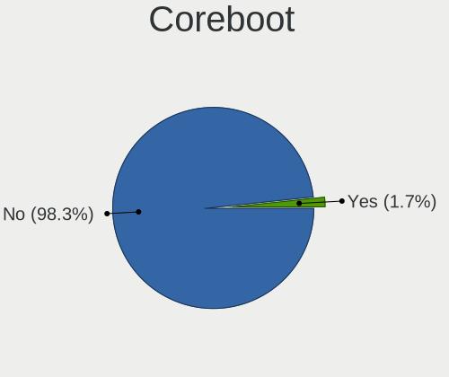
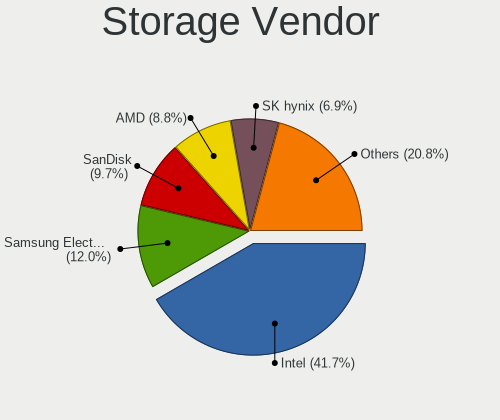
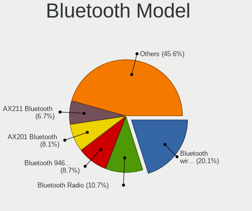
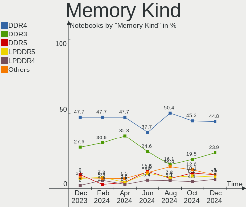

Debian Hardware Trends (Notebooks)
----------------------------------

A project to identify most popular hardware characteristics and track their change
over time based on data collected by Debian users at https://Linux-Hardware.org.

Anyone can contribute to this report by the [hw-probe](https://github.com/linuxhw/hw-probe) tool:

    sudo -E hw-probe -all -upload

Full-feature report is available here: https://linux-hardware.org/?view=trends

Period: Dec, 2021.

Contents
--------

* [ System ](#system)
  - [ OS                       ](#os)
  - [ OS Family                ](#os-family)
  - [ Kernel                   ](#kernel)
  - [ Kernel Family            ](#kernel-family)
  - [ Kernel Major Ver.        ](#kernel-major-ver)
  - [ Arch                     ](#arch)
  - [ DE                       ](#de)
  - [ Display Server           ](#display-server)
  - [ Display Manager          ](#display-manager)
  - [ OS Lang                  ](#os-lang)
  - [ Boot Mode                ](#boot-mode)
  - [ Filesystem               ](#filesystem)
  - [ Part. scheme             ](#part-scheme)
  - [ Dual Boot with Linux/BSD ](#dual-boot-with-linuxbsd)
  - [ Dual Boot (Win)          ](#dual-boot-win)

* [ Board ](#board)
  - [ Vendor                   ](#vendor)
  - [ Model                    ](#model)
  - [ Model Family             ](#model-family)
  - [ MFG Year                 ](#mfg-year)
  - [ Form Factor              ](#form-factor)
  - [ Secure Boot              ](#secure-boot)
  - [ Coreboot                 ](#coreboot)
  - [ RAM Size                 ](#ram-size)
  - [ RAM Used                 ](#ram-used)
  - [ Total Drives             ](#total-drives)
  - [ Has CD-ROM               ](#has-cd-rom)
  - [ Has Ethernet             ](#has-ethernet)
  - [ Has WiFi                 ](#has-wifi)
  - [ Has Bluetooth            ](#has-bluetooth)

* [ Location ](#location)
  - [ Country                  ](#country)
  - [ City                     ](#city)

* [ Drives ](#drives)
  - [ Drive Vendor             ](#drive-vendor)
  - [ Drive Model              ](#drive-model)
  - [ HDD Vendor               ](#hdd-vendor)
  - [ SSD Vendor               ](#ssd-vendor)
  - [ Drive Kind               ](#drive-kind)
  - [ Drive Connector          ](#drive-connector)
  - [ Drive Size               ](#drive-size)
  - [ Space Total              ](#space-total)
  - [ Space Used               ](#space-used)
  - [ Malfunc. Drives          ](#malfunc-drives)
  - [ Malfunc. Drive Vendor    ](#malfunc-drive-vendor)
  - [ Malfunc. HDD Vendor      ](#malfunc-hdd-vendor)
  - [ Malfunc. Drive Kind      ](#malfunc-drive-kind)
  - [ Failed Drives            ](#failed-drives)
  - [ Failed Drive Vendor      ](#failed-drive-vendor)
  - [ Drive Status             ](#drive-status)

* [ Storage controller ](#storage-controller)
  - [ Storage Vendor           ](#storage-vendor)
  - [ Storage Model            ](#storage-model)
  - [ Storage Kind             ](#storage-kind)

* [ Processor ](#processor)
  - [ CPU Vendor               ](#cpu-vendor)
  - [ CPU Model                ](#cpu-model)
  - [ CPU Model Family         ](#cpu-model-family)
  - [ CPU Cores                ](#cpu-cores)
  - [ CPU Sockets              ](#cpu-sockets)
  - [ CPU Threads              ](#cpu-threads)
  - [ CPU Op-Modes             ](#cpu-op-modes)
  - [ CPU Microcode            ](#cpu-microcode)
  - [ CPU Microarch            ](#cpu-microarch)

* [ Graphics ](#graphics)
  - [ GPU Vendor               ](#gpu-vendor)
  - [ GPU Model                ](#gpu-model)
  - [ GPU Combo                ](#gpu-combo)
  - [ GPU Driver               ](#gpu-driver)
  - [ GPU Memory               ](#gpu-memory)

* [ Monitor ](#monitor)
  - [ Monitor Vendor           ](#monitor-vendor)
  - [ Monitor Model            ](#monitor-model)
  - [ Monitor Resolution       ](#monitor-resolution)
  - [ Monitor Diagonal         ](#monitor-diagonal)
  - [ Monitor Width            ](#monitor-width)
  - [ Aspect Ratio             ](#aspect-ratio)
  - [ Monitor Area             ](#monitor-area)
  - [ Pixel Density            ](#pixel-density)
  - [ Multiple Monitors        ](#multiple-monitors)

* [ Network ](#network)
  - [ Net Controller Vendor    ](#net-controller-vendor)
  - [ Net Controller Model     ](#net-controller-model)
  - [ Wireless Vendor          ](#wireless-vendor)
  - [ Wireless Model           ](#wireless-model)
  - [ Ethernet Vendor          ](#ethernet-vendor)
  - [ Ethernet Model           ](#ethernet-model)
  - [ Net Controller Kind      ](#net-controller-kind)
  - [ Used Controller          ](#used-controller)
  - [ NICs                     ](#nics)
  - [ IPv6                     ](#ipv6)

* [ Bluetooth ](#bluetooth)
  - [ Bluetooth Vendor         ](#bluetooth-vendor)
  - [ Bluetooth Model          ](#bluetooth-model)

* [ Sound ](#sound)
  - [ Sound Vendor             ](#sound-vendor)
  - [ Sound Model              ](#sound-model)

* [ Memory ](#memory)
  - [ Memory Vendor            ](#memory-vendor)
  - [ Memory Model             ](#memory-model)
  - [ Memory Kind              ](#memory-kind)
  - [ Memory Form Factor       ](#memory-form-factor)
  - [ Memory Size              ](#memory-size)
  - [ Memory Speed             ](#memory-speed)

* [ Printers & scanners ](#printers--scanners)
  - [ Printer Vendor           ](#printer-vendor)
  - [ Printer Model            ](#printer-model)
  - [ Scanner Vendor           ](#scanner-vendor)
  - [ Scanner Model            ](#scanner-model)

* [ Camera ](#camera)
  - [ Camera Vendor            ](#camera-vendor)
  - [ Camera Model             ](#camera-model)

* [ Security ](#security)
  - [ Fingerprint Vendor       ](#fingerprint-vendor)
  - [ Fingerprint Model        ](#fingerprint-model)
  - [ Chipcard Vendor          ](#chipcard-vendor)
  - [ Chipcard Model           ](#chipcard-model)

* [ Unsupported ](#unsupported)
  - [ Unsupported Devices      ](#unsupported-devices)
  - [ Unsupported Device Types ](#unsupported-device-types)

System
------

OS
--

Installed operating systems

| Name                            | Notebooks | Percent |
|---------------------------------|-----------|---------|
| Debian 11                       | 122       | 78.21%  |
| Debian Testing                  | 17        | 10.9%   |
| Debian 10                       | 7         | 4.49%   |
| Debian Unstable                 | 6         | 3.85%   |
| Debian 11-updates               | 2         | 1.28%   |
| Debian Testing-proposed-updates | 1         | 0.64%   |
| Debian 9                        | 1         | 0.64%   |

OS Family
---------

OS without a version

| Name   | Notebooks | Percent |
|--------|-----------|---------|
| Debian | 156       | 100%    |

Kernel
------

Version of the Linux kernel

| Version                   | Notebooks | Percent |
|---------------------------|-----------|---------|
| 5.10.0-9-amd64            | 45        | 28.85%  |
| 5.10.0-8-amd64            | 28        | 17.95%  |
| 5.10.0-10-amd64           | 23        | 14.74%  |
| 5.15.0-2-amd64            | 20        | 12.82%  |
| 5.14.0-0.bpo.2-amd64      | 12        | 7.69%   |
| 5.15.0-1-amd64            | 4         | 2.56%   |
| 4.19.0-18-amd64           | 4         | 2.56%   |
| 5.14.0-2-amd64            | 2         | 1.28%   |
| 5.10.0-7-amd64            | 2         | 1.28%   |
| 5.4.21                    | 1         | 0.64%   |
| 5.16.0-rc6-amd64          | 1         | 0.64%   |
| 5.15.8-edge               | 1         | 0.64%   |
| 5.15.7-xanmod1            | 1         | 0.64%   |
| 5.15.5                    | 1         | 0.64%   |
| 5.15.10-xanmod1           | 1         | 0.64%   |
| 5.15.0-6.1-liquorix-amd64 | 1         | 0.64%   |
| 5.14.7-ct                 | 1         | 0.64%   |
| 5.10.88                   | 1         | 0.64%   |
| 5.10.23                   | 1         | 0.64%   |
| 5.10.0-9-686-pae          | 1         | 0.64%   |
| 5.10.0-10-rt-amd64        | 1         | 0.64%   |
| 5.10.0-10-686-pae         | 1         | 0.64%   |
| 4.9.0-15-amd64            | 1         | 0.64%   |
| 4.19.0-18-rt-amd64        | 1         | 0.64%   |
| 4.19.0-17-amd64           | 1         | 0.64%   |

Kernel Family
-------------

Linux kernel without a distro release

| Version | Notebooks | Percent |
|---------|-----------|---------|
| 5.10.0  | 101       | 64.74%  |
| 5.15.0  | 25        | 16.03%  |
| 5.14.0  | 14        | 8.97%   |
| 4.19.0  | 6         | 3.85%   |
| 5.4.21  | 1         | 0.64%   |
| 5.16.0  | 1         | 0.64%   |
| 5.15.8  | 1         | 0.64%   |
| 5.15.7  | 1         | 0.64%   |
| 5.15.5  | 1         | 0.64%   |
| 5.15.10 | 1         | 0.64%   |
| 5.14.7  | 1         | 0.64%   |
| 5.10.88 | 1         | 0.64%   |
| 5.10.23 | 1         | 0.64%   |
| 4.9.0   | 1         | 0.64%   |

Kernel Major Ver.
-----------------

Linux kernel major version

| Version | Notebooks | Percent |
|---------|-----------|---------|
| 5.10    | 103       | 66.03%  |
| 5.15    | 29        | 18.59%  |
| 5.14    | 15        | 9.62%   |
| 4.19    | 6         | 3.85%   |
| 5.4     | 1         | 0.64%   |
| 5.16    | 1         | 0.64%   |
| 4.9     | 1         | 0.64%   |

Arch
----

OS architecture (x86_64, i586, etc.)

| Name   | Notebooks | Percent |
|--------|-----------|---------|
| x86_64 | 154       | 98.72%  |
| i686   | 2         | 1.28%   |

DE
--

Desktop Environment

| Name             | Notebooks | Percent |
|------------------|-----------|---------|
| GNOME            | 42        | 26.92%  |
| Unknown          | 33        | 21.15%  |
| KDE5             | 19        | 12.18%  |
| XFCE             | 15        | 9.62%   |
| LXDE             | 15        | 9.62%   |
| MATE             | 9         | 5.77%   |
| Cinnamon         | 6         | 3.85%   |
| X-Cinnamon       | 5         | 3.21%   |
| i3               | 4         | 2.56%   |
| DWM              | 2         | 1.28%   |
| wmaker-common    | 1         | 0.64%   |
| trinity          | 1         | 0.64%   |
| openbox          | 1         | 0.64%   |
| lightdm-xsession | 1         | 0.64%   |
| KDE              | 1         | 0.64%   |
| GNOME Flashback  | 1         | 0.64%   |

Display Server
--------------

X11 or Wayland

| Name    | Notebooks | Percent |
|---------|-----------|---------|
| X11     | 94        | 60.26%  |
| Wayland | 30        | 19.23%  |
| Unknown | 29        | 18.59%  |
| Tty     | 3         | 1.92%   |

Display Manager
---------------

SDDM, LightDM, etc.

| Name    | Notebooks | Percent |
|---------|-----------|---------|
| Unknown | 51        | 32.69%  |
| LightDM | 34        | 21.79%  |
| SDDM    | 32        | 20.51%  |
| GDM     | 29        | 18.59%  |
| GDM3    | 8         | 5.13%   |
| XDM     | 1         | 0.64%   |
| SLiM    | 1         | 0.64%   |

OS Lang
-------

Language

| Lang    | Notebooks | Percent |
|---------|-----------|---------|
| en_US   | 39        | 25%     |
| Unknown | 28        | 17.95%  |
| pl_PL   | 17        | 10.9%   |
| de_DE   | 13        | 8.33%   |
| fr_FR   | 10        | 6.41%   |
| en_GB   | 10        | 6.41%   |
| zh_CN   | 5         | 3.21%   |
| ru_RU   | 5         | 3.21%   |
| pt_BR   | 3         | 1.92%   |
| en_CA   | 3         | 1.92%   |
| pt_PT   | 2         | 1.28%   |
| it_IT   | 2         | 1.28%   |
| es_CL   | 2         | 1.28%   |
| en_NZ   | 2         | 1.28%   |
| C       | 2         | 1.28%   |
| ja_JP   | 1         | 0.64%   |
| fr_CH   | 1         | 0.64%   |
| fr_BE   | 1         | 0.64%   |
| es_PE   | 1         | 0.64%   |
| es_MX   | 1         | 0.64%   |
| es_ES   | 1         | 0.64%   |
| es_EC   | 1         | 0.64%   |
| en_NG   | 1         | 0.64%   |
| en_IN   | 1         | 0.64%   |
| en_AU   | 1         | 0.64%   |
| de_CH   | 1         | 0.64%   |
| cs_CZ   | 1         | 0.64%   |
| bg_BG   | 1         | 0.64%   |

Boot Mode
---------

EFI or BIOS

| Mode | Notebooks | Percent |
|------|-----------|---------|
| EFI  | 98        | 62.82%  |
| BIOS | 58        | 37.18%  |

Filesystem
----------

Type of filesystem

| Type    | Notebooks | Percent |
|---------|-----------|---------|
| Ext4    | 117       | 75%     |
| Overlay | 32        | 20.51%  |
| Btrfs   | 5         | 3.21%   |
| Zfs     | 1         | 0.64%   |
| Xfs     | 1         | 0.64%   |

Part. scheme
------------

Scheme of partitioning

| Type    | Notebooks | Percent |
|---------|-----------|---------|
| GPT     | 108       | 69.23%  |
| MBR     | 24        | 15.38%  |
| Unknown | 24        | 15.38%  |

Dual Boot with Linux/BSD
------------------------

Hosting more than one Linux/BSD

| Dual boot | Notebooks | Percent |
|-----------|-----------|---------|
| No        | 143       | 91.67%  |
| Yes       | 13        | 8.33%   |

Dual Boot (Win)
---------------

Hosting Linux and Windows

| Dual boot | Notebooks | Percent |
|-----------|-----------|---------|
| No        | 104       | 66.67%  |
| Yes       | 52        | 33.33%  |

Board
-----

Vendor
------

Motherboard manufacturer

| Name                  | Notebooks | Percent |
|-----------------------|-----------|---------|
| Lenovo                | 55        | 35.26%  |
| Hewlett-Packard       | 36        | 23.08%  |
| Dell                  | 16        | 10.26%  |
| ASUSTek Computer      | 11        | 7.05%   |
| Acer                  | 7         | 4.49%   |
| HUAWEI                | 4         | 2.56%   |
| Google                | 4         | 2.56%   |
| Apple                 | 4         | 2.56%   |
| Toshiba               | 3         | 1.92%   |
| Schenker              | 1         | 0.64%   |
| Positivo Bahia - VAIO | 1         | 0.64%   |
| Packard Bell          | 1         | 0.64%   |
| Notebook              | 1         | 0.64%   |
| MSI                   | 1         | 0.64%   |
| Maibenben             | 1         | 0.64%   |
| LG Electronics        | 1         | 0.64%   |
| Insyde                | 1         | 0.64%   |
| IBM                   | 1         | 0.64%   |
| HONOR                 | 1         | 0.64%   |
| HASEE Computer        | 1         | 0.64%   |
| Framework             | 1         | 0.64%   |
| CSL-Computer          | 1         | 0.64%   |
| Chuwi                 | 1         | 0.64%   |
| AXDIA International   | 1         | 0.64%   |
| Advent                | 1         | 0.64%   |

Model
-----

Motherboard model

| Name                                              | Notebooks | Percent |
|---------------------------------------------------|-----------|---------|
| Lenovo ThinkPad E475 20H40006US                   | 19        | 12.18%  |
| HP Pavilion Gaming Laptop 15-ec1xxx               | 5         | 3.21%   |
| HP Laptop 15-db1xxx                               | 5         | 3.21%   |
| HP Laptop 15-db0xxx                               | 3         | 1.92%   |
| ASUS ZenBook UX325EA_UX325EA                      | 3         | 1.92%   |
| Lenovo ThinkPad 13 2nd Gen 20J10046US             | 2         | 1.28%   |
| Lenovo IdeaPad S540-13API 81XC                    | 2         | 1.28%   |
| Google Enguarde                                   | 2         | 1.28%   |
| Dell XPS 17 9700                                  | 2         | 1.28%   |
| Apple MacBookAir7,1                               | 2         | 1.28%   |
| Toshiba Satellite L775D                           | 1         | 0.64%   |
| Toshiba Satellite L755D                           | 1         | 0.64%   |
| Toshiba Satellite E205                            | 1         | 0.64%   |
| Schenker VIA 15 Pro                               | 1         | 0.64%   |
| Positivo Bahia - VAIO VJFE42F11X-XXXXXX           | 1         | 0.64%   |
| Packard Bell EasyNote TM85                        | 1         | 0.64%   |
| Notebook NV4XMB,ME,MZ                             | 1         | 0.64%   |
| MSI PS42 8RB                                      | 1         | 0.64%   |
| Maibenben E5100                                   | 1         | 0.64%   |
| LG 15Z95P-P.AAE8U1                                | 1         | 0.64%   |
| Lenovo Z51-70 80K6                                | 1         | 0.64%   |
| Lenovo V130-15IGM 81HL                            | 1         | 0.64%   |
| Lenovo ThinkPad X280 20KES94F05                   | 1         | 0.64%   |
| Lenovo ThinkPad X230 232578G                      | 1         | 0.64%   |
| Lenovo ThinkPad X220 4291W99                      | 1         | 0.64%   |
| Lenovo ThinkPad X1 Carbon Gen 8 20UAS2MQ00        | 1         | 0.64%   |
| Lenovo ThinkPad X1 Carbon 3460AE4                 | 1         | 0.64%   |
| Lenovo ThinkPad W520 4284D47                      | 1         | 0.64%   |
| Lenovo ThinkPad T590 20N4001NUS                   | 1         | 0.64%   |
| Lenovo ThinkPad T580 20L9CTO1WW                   | 1         | 0.64%   |
| Lenovo ThinkPad T495s 20QKS01E00                  | 1         | 0.64%   |
| Lenovo ThinkPad T480s 20L7CTO1WW                  | 1         | 0.64%   |
| Lenovo ThinkPad T450s 20BWS2US00                  | 1         | 0.64%   |
| Lenovo ThinkPad T450 20BV000EUS                   | 1         | 0.64%   |
| Lenovo ThinkPad T450 20BUS46900                   | 1         | 0.64%   |
| Lenovo ThinkPad T450 20BUS09X01                   | 1         | 0.64%   |
| Lenovo ThinkPad T430 2349S9E                      | 1         | 0.64%   |
| Lenovo ThinkPad T410 2522Y15                      | 1         | 0.64%   |
| Lenovo ThinkPad T14s Gen 2i 20WM004NUK            | 1         | 0.64%   |
| Lenovo ThinkPad T14s Gen 1 20UHCTO1WW             | 1         | 0.64%   |
| Lenovo ThinkPad T14 Gen 1 20S1SB7743              | 1         | 0.64%   |
| Lenovo ThinkPad P51s 20HB000URT                   | 1         | 0.64%   |
| Lenovo ThinkPad L15 Gen 1 20U7001VMH              | 1         | 0.64%   |
| Lenovo ThinkPad Edge E430 3254A68                 | 1         | 0.64%   |
| Lenovo ThinkPad E14 20RA001LMC                    | 1         | 0.64%   |
| Lenovo ThinkPad A485 20MU000CMH                   | 1         | 0.64%   |
| Lenovo Legion 5 Pro 16ITH6 82JF                   | 1         | 0.64%   |
| Lenovo IdeaPad Yoga 11S 20246                     | 1         | 0.64%   |
| Lenovo IdeaPad S145-15API 81V7                    | 1         | 0.64%   |
| Lenovo G585 2181                                  | 1         | 0.64%   |
| Lenovo B50-70 20384                               | 1         | 0.64%   |
| Lenovo B50-30 20382                               | 1         | 0.64%   |
| Insyde CherryTrail                                | 1         | 0.64%   |
| IBM ThinkPad T43 2668BU7                          | 1         | 0.64%   |
| HUAWEI HVY-WXX9                                   | 1         | 0.64%   |
| HUAWEI HKD-WXX                                    | 1         | 0.64%   |
| HUAWEI BOHK-WAX9X                                 | 1         | 0.64%   |
| HUAWEI BOHB-WAX9                                  | 1         | 0.64%   |
| HONOR HLYL-WXX9                                   | 1         | 0.64%   |
| HP ZBook Firefly 15 inch G8 Mobile Workstation PC | 1         | 0.64%   |

Model Family
------------

Motherboard model prefix

| Name                                    | Notebooks | Percent |
|-----------------------------------------|-----------|---------|
| Lenovo ThinkPad                         | 45        | 28.85%  |
| HP Laptop                               | 12        | 7.69%   |
| HP EliteBook                            | 7         | 4.49%   |
| Acer Aspire                             | 7         | 4.49%   |
| HP Pavilion                             | 6         | 3.85%   |
| Dell Latitude                           | 6         | 3.85%   |
| Dell Inspiron                           | 5         | 3.21%   |
| Lenovo IdeaPad                          | 4         | 2.56%   |
| ASUS ZenBook                            | 4         | 2.56%   |
| Toshiba Satellite                       | 3         | 1.92%   |
| HP ProBook                              | 3         | 1.92%   |
| Dell XPS                                | 3         | 1.92%   |
| HP ZBook                                | 2         | 1.28%   |
| HP Compaq                               | 2         | 1.28%   |
| Google Enguarde                         | 2         | 1.28%   |
| ASUS ASUS                               | 2         | 1.28%   |
| Apple MacBookAir7                       | 2         | 1.28%   |
| Schenker VIA                            | 1         | 0.64%   |
| Positivo Bahia - VAIO VJFE42F11X-XXXXXX | 1         | 0.64%   |
| Packard Bell EasyNote                   | 1         | 0.64%   |
| Notebook NV4XMB                         | 1         | 0.64%   |
| MSI PS42                                | 1         | 0.64%   |
| Maibenben E5100                         | 1         | 0.64%   |
| LG 15Z95P-P.AAE8U1                      | 1         | 0.64%   |
| Lenovo Z51-70                           | 1         | 0.64%   |
| Lenovo V130-15IGM                       | 1         | 0.64%   |
| Lenovo Legion                           | 1         | 0.64%   |
| Lenovo G585                             | 1         | 0.64%   |
| Lenovo B50-70                           | 1         | 0.64%   |
| Lenovo B50-30                           | 1         | 0.64%   |
| Insyde CherryTrail                      | 1         | 0.64%   |
| IBM ThinkPad                            | 1         | 0.64%   |
| HUAWEI HVY-WXX9                         | 1         | 0.64%   |
| HUAWEI HKD-WXX                          | 1         | 0.64%   |
| HUAWEI BOHK-WAX9X                       | 1         | 0.64%   |
| HUAWEI BOHB-WAX9                        | 1         | 0.64%   |
| HONOR HLYL-WXX9                         | 1         | 0.64%   |
| HP Presario                             | 1         | 0.64%   |
| HP Notebook                             | 1         | 0.64%   |
| HP G61                                  | 1         | 0.64%   |
| HASEE E400                              | 1         | 0.64%   |
| Google Barla                            | 1         | 0.64%   |
| Google Akemi                            | 1         | 0.64%   |
| Framework Laptop                        | 1         | 0.64%   |
| Dell Vostro                             | 1         | 0.64%   |
| Dell Precision                          | 1         | 0.64%   |
| CSL-Computer R                          | 1         | 0.64%   |
| Chuwi LarkBook                          | 1         | 0.64%   |
| AXDIA International MYBOOK              | 1         | 0.64%   |
| ASUS X756UQ                             | 1         | 0.64%   |
| ASUS X542UA                             | 1         | 0.64%   |
| ASUS UX303LAB                           | 1         | 0.64%   |
| ASUS A7V                                | 1         | 0.64%   |
| ASUS 1015CX                             | 1         | 0.64%   |
| Apple MacBookPro3                       | 1         | 0.64%   |
| Apple MacBookPro12                      | 1         | 0.64%   |
| Advent Tacto                            | 1         | 0.64%   |
| Unknown                                 | 1         | 0.64%   |

MFG Year
--------

Motherboard manufacture year

| Year | Notebooks | Percent |
|------|-----------|---------|
| 2021 | 39        | 25%     |
| 2020 | 36        | 23.08%  |
| 2019 | 26        | 16.67%  |
| 2018 | 9         | 5.77%   |
| 2013 | 8         | 5.13%   |
| 2012 | 8         | 5.13%   |
| 2011 | 8         | 5.13%   |
| 2016 | 5         | 3.21%   |
| 2015 | 5         | 3.21%   |
| 2010 | 4         | 2.56%   |
| 2009 | 3         | 1.92%   |
| 2017 | 1         | 0.64%   |
| 2014 | 1         | 0.64%   |
| 2008 | 1         | 0.64%   |
| 2006 | 1         | 0.64%   |
| 2005 | 1         | 0.64%   |

Form Factor
-----------

Physical design of the computer

| Name     | Notebooks | Percent |
|----------|-----------|---------|
| Notebook | 156       | 100%    |

Secure Boot
-----------

Enabled or disabled

| State    | Notebooks | Percent |
|----------|-----------|---------|
| Disabled | 126       | 80.77%  |
| Enabled  | 30        | 19.23%  |

Coreboot
--------

Have coreboot on board

| Used | Notebooks | Percent |
|------|-----------|---------|
| No   | 152       | 97.44%  |
| Yes  | 4         | 2.56%   |

RAM Size
--------

Total RAM memory

| Size in GB  | Notebooks | Percent |
|-------------|-----------|---------|
| 4.01-8.0    | 49        | 31.41%  |
| 16.01-24.0  | 32        | 20.51%  |
| 3.01-4.0    | 25        | 16.03%  |
| 8.01-16.0   | 22        | 14.1%   |
| 32.01-64.0  | 15        | 9.62%   |
| 24.01-32.0  | 7         | 4.49%   |
| 2.01-3.0    | 2         | 1.28%   |
| 1.01-2.0    | 2         | 1.28%   |
| 64.01-256.0 | 1         | 0.64%   |
| 0.51-1.0    | 1         | 0.64%   |

RAM Used
--------

Used RAM memory

| Used GB   | Notebooks | Percent |
|-----------|-----------|---------|
| 1.01-2.0  | 63        | 40.38%  |
| 4.01-8.0  | 35        | 22.44%  |
| 2.01-3.0  | 27        | 17.31%  |
| 3.01-4.0  | 14        | 8.97%   |
| 0.51-1.0  | 9         | 5.77%   |
| 8.01-16.0 | 6         | 3.85%   |
| 0.01-0.5  | 2         | 1.28%   |

Total Drives
------------

Number of drives on board

| Drives | Notebooks | Percent |
|--------|-----------|---------|
| 1      | 124       | 79.49%  |
| 2      | 31        | 19.87%  |
| 3      | 1         | 0.64%   |

Has CD-ROM
----------

Has CD-ROM on board

| Presented | Notebooks | Percent |
|-----------|-----------|---------|
| No        | 115       | 73.72%  |
| Yes       | 41        | 26.28%  |

Has Ethernet
------------

Has Ethernet on board

| Presented | Notebooks | Percent |
|-----------|-----------|---------|
| Yes       | 124       | 79.49%  |
| No        | 32        | 20.51%  |

Has WiFi
--------

Has WiFi module

| Presented | Notebooks | Percent |
|-----------|-----------|---------|
| Yes       | 152       | 97.44%  |
| No        | 4         | 2.56%   |

Has Bluetooth
-------------

Has Bluetooth module

| Presented | Notebooks | Percent |
|-----------|-----------|---------|
| Yes       | 127       | 81.41%  |
| No        | 29        | 18.59%  |

Location
--------

Country
-------

Geographic location (country)

| Country            | Notebooks | Percent |
|--------------------|-----------|---------|
| USA                | 38        | 24.36%  |
| Poland             | 16        | 10.26%  |
| Germany            | 15        | 9.62%   |
| France             | 12        | 7.69%   |
| China              | 6         | 3.85%   |
| Russia             | 5         | 3.21%   |
| Brazil             | 5         | 3.21%   |
| UK                 | 4         | 2.56%   |
| Netherlands        | 3         | 1.92%   |
| Italy              | 3         | 1.92%   |
| Croatia            | 3         | 1.92%   |
| Canada             | 3         | 1.92%   |
| Austria            | 3         | 1.92%   |
| Switzerland        | 2         | 1.28%   |
| Sweden             | 2         | 1.28%   |
| Spain              | 2         | 1.28%   |
| Portugal           | 2         | 1.28%   |
| Japan              | 2         | 1.28%   |
| Dominican Republic | 2         | 1.28%   |
| Czechia            | 2         | 1.28%   |
| Chile              | 2         | 1.28%   |
| Ukraine            | 1         | 0.64%   |
| Uganda             | 1         | 0.64%   |
| Turkey             | 1         | 0.64%   |
| Singapore          | 1         | 0.64%   |
| Peru               | 1         | 0.64%   |
| Nigeria            | 1         | 0.64%   |
| New Zealand        | 1         | 0.64%   |
| Morocco            | 1         | 0.64%   |
| Mexico             | 1         | 0.64%   |
| Lithuania          | 1         | 0.64%   |
| Kenya              | 1         | 0.64%   |
| Ireland            | 1         | 0.64%   |
| India              | 1         | 0.64%   |
| Finland            | 1         | 0.64%   |
| Ecuador            | 1         | 0.64%   |
| Denmark            | 1         | 0.64%   |
| Cyprus             | 1         | 0.64%   |
| Cuba               | 1         | 0.64%   |
| Colombia           | 1         | 0.64%   |
| Bulgaria           | 1         | 0.64%   |
| Belgium            | 1         | 0.64%   |
| Belarus            | 1         | 0.64%   |
| Australia          | 1         | 0.64%   |
| Argentina          | 1         | 0.64%   |

City
----

Geographic location (city)

| City                   | Notebooks | Percent |
|------------------------|-----------|---------|
| Bangor                 | 19        | 12.18%  |
| Warsaw                 | 13        | 8.33%   |
| Eliot                  | 8         | 5.13%   |
| Munich                 | 3         | 1.92%   |
| Leimen                 | 3         | 1.92%   |
| Hohhot                 | 3         | 1.92%   |
| Zagreb                 | 2         | 1.28%   |
| Voronezh               | 2         | 1.28%   |
| Santo Domingo Este     | 2         | 1.28%   |
| Prague                 | 2         | 1.28%   |
| Paris                  | 2         | 1.28%   |
| Milan                  | 2         | 1.28%   |
| London                 | 2         | 1.28%   |
| Hangzhou               | 2         | 1.28%   |
| Wisconsin Rapids       | 1         | 0.64%   |
| Winnipeg               | 1         | 0.64%   |
| Villingen-Schwenningen | 1         | 0.64%   |
| Vila-seca              | 1         | 0.64%   |
| Vila Nova de Gaia      | 1         | 0.64%   |
| Vienna                 | 1         | 0.64%   |
| Upplands Vasby         | 1         | 0.64%   |
| Tucson                 | 1         | 0.64%   |
| Toronto                | 1         | 0.64%   |
| Tarn??w                | 1         | 0.64%   |
| Southwold              | 1         | 0.64%   |
| Sokoto                 | 1         | 0.64%   |
| Slatina                | 1         | 0.64%   |
| Singapore              | 1         | 0.64%   |
| S??o Paulo             | 1         | 0.64%   |
| S??o Jos?© dos Campos  | 1         | 0.64%   |
| Santiago               | 1         | 0.64%   |
| Saint-Martory          | 1         | 0.64%   |
| Rosario                | 1         | 0.64%   |
| Rijeka                 | 1         | 0.64%   |
| Puybegon               | 1         | 0.64%   |
| Pune                   | 1         | 0.64%   |
| Pubersdorf             | 1         | 0.64%   |
| Poechlarn              | 1         | 0.64%   |
| Pian di Sc??           | 1         | 0.64%   |
| Perm                   | 1         | 0.64%   |
| Peine                  | 1         | 0.64%   |
| Overveen               | 1         | 0.64%   |
| Odense                 | 1         | 0.64%   |
| Nuremberg              | 1         | 0.64%   |
| Nieuw-Lekkerland       | 1         | 0.64%   |
| Nicosia                | 1         | 0.64%   |
| Neuenstein             | 1         | 0.64%   |
| Nelson                 | 1         | 0.64%   |
| Navapolatsk            | 1         | 0.64%   |
| Natal                  | 1         | 0.64%   |
| Nairobi                | 1         | 0.64%   |
| Moscow                 | 1         | 0.64%   |
| Montreuil              | 1         | 0.64%   |
| Millersville           | 1         | 0.64%   |
| Maipu                  | 1         | 0.64%   |
| Lisbon                 | 1         | 0.64%   |
| Lima                   | 1         | 0.64%   |
| Leipzig                | 1         | 0.64%   |
| La Ciotat              | 1         | 0.64%   |
| Korolyov               | 1         | 0.64%   |

Drives
------

Drive Vendor
------------

Hard drive vendors

| Vendor              | Notebooks | Drives | Percent |
|---------------------|-----------|--------|---------|
| Samsung Electronics | 39        | 40     | 21.79%  |
| Kingston            | 27        | 27     | 15.08%  |
| WDC                 | 24        | 25     | 13.41%  |
| Unknown             | 9         | 12     | 5.03%   |
| SK Hynix            | 8         | 8      | 4.47%   |
| Intel               | 8         | 8      | 4.47%   |
| Seagate             | 7         | 7      | 3.91%   |
| Toshiba             | 6         | 6      | 3.35%   |
| SanDisk             | 6         | 6      | 3.35%   |
| Hitachi             | 5         | 5      | 2.79%   |
| A-DATA Technology   | 5         | 5      | 2.79%   |
| Crucial             | 4         | 4      | 2.23%   |
| Transcend           | 3         | 3      | 1.68%   |
| Micron Technology   | 3         | 3      | 1.68%   |
| HGST                | 3         | 3      | 1.68%   |
| Apple               | 3         | 3      | 1.68%   |
| Silicon Motion      | 2         | 2      | 1.12%   |
| Netac               | 2         | 2      | 1.12%   |
| KIOXIA              | 2         | 2      | 1.12%   |
| Intenso             | 2         | 2      | 1.12%   |
| XPG                 | 1         | 1      | 0.56%   |
| Vaseky              | 1         | 1      | 0.56%   |
| Teclast             | 1         | 1      | 0.56%   |
| Team                | 1         | 1      | 0.56%   |
| PLEXTOR             | 1         | 1      | 0.56%   |
| MAXTOR              | 1         | 1      | 0.56%   |
| Maxone              | 1         | 1      | 0.56%   |
| LITEON              | 1         | 1      | 0.56%   |
| Dogeish             | 1         | 1      | 0.56%   |
| ASMT                | 1         | 1      | 0.56%   |
| Unknown             | 1         | 1      | 0.56%   |

Drive Model
-----------

Hard drive models

| Model                                   | Notebooks | Percent |
|-----------------------------------------|-----------|---------|
| Kingston SA400S37120G 120GB SSD         | 19        | 10.33%  |
| WDC PC SN530 SDBPNPZ-512G-1006 512GB    | 5         | 2.72%   |
| Intel SSDPEKNW512G8H 512GB              | 4         | 2.17%   |
| Samsung MZVLQ512HALU-000H1 512GB        | 3         | 1.63%   |
| WDC WD10SPZX-24Z10 1TB                  | 2         | 1.09%   |
| Unknown AGND3R  16GB                    | 2         | 1.09%   |
| SK Hynix BC511 HFM256GDJTNI-82A0A 256GB | 2         | 1.09%   |
| Seagate Expansion 1TB                   | 2         | 1.09%   |
| Samsung SSD 970 EVO Plus 1TB            | 2         | 1.09%   |
| Samsung SSD 870 QVO 1TB                 | 2         | 1.09%   |
| Samsung SSD 860 QVO 1TB                 | 2         | 1.09%   |
| Samsung SSD 860 EVO 250GB               | 2         | 1.09%   |
| Samsung MZVLB512HBJQ-000L7 512GB        | 2         | 1.09%   |
| Samsung MZVLB1T0HALR-00000 1TB          | 2         | 1.09%   |
| Samsung MZNTY128HDHP-000L1 128GB SSD    | 2         | 1.09%   |
| Kingston SA400S37240G 240GB SSD         | 2         | 1.09%   |
| Intel SSDPEKNW512G8 512GB               | 2         | 1.09%   |
| Apple SSD AP0128H 121GB                 | 2         | 1.09%   |
| XPG GAMMIX S11 Pro 1TB                  | 1         | 0.54%   |
| WDC WDS240G2G0A-00JH30 240GB SSD        | 1         | 0.54%   |
| WDC WDS100T3X0C-00SJG0 1TB              | 1         | 0.54%   |
| WDC WDBNCE5000PNC 500GB SSD             | 1         | 0.54%   |
| WDC WD5000LUCT-62C26Y0 500GB            | 1         | 0.54%   |
| WDC WD1600BJKT-75F4T0 160GB             | 1         | 0.54%   |
| WDC WD10SPZX-60Z10T0 1TB                | 1         | 0.54%   |
| WDC WD10SPZX-22Z10T1 1TB                | 1         | 0.54%   |
| WDC WD10JPVX-22JC3T0 1TB                | 1         | 0.54%   |
| WDC WD10JPLX-00MBPT0 1TB                | 1         | 0.54%   |
| WDC PC SN730 SDBQNTY-512G-1001 512GB    | 1         | 0.54%   |
| WDC PC SN730 SDBQNTY-256G-1001 256GB    | 1         | 0.54%   |
| WDC PC SN730 SDBPNTY-512G-1027 512GB    | 1         | 0.54%   |
| WDC PC SN730 SDBPNTY-256G-1027 256GB    | 1         | 0.54%   |
| WDC PC SN730 NVMe 1024GB                | 1         | 0.54%   |
| WDC PC SN720 SDAPNTW-512G               | 1         | 0.54%   |
| WDC PC SN530 SDBPNPZ-512G-1002 512GB    | 1         | 0.54%   |
| WDC PC SN530 SDBPNPZ-512G               | 1         | 0.54%   |
| WDC PC SN520 NVMe 512GB                 | 1         | 0.54%   |
| Vaseky V800/1TB SSD                     | 1         | 0.54%   |
| Unknown SU02G  2GB                      | 1         | 0.54%   |
| Unknown SD64G  64GB                     | 1         | 0.54%   |
| Unknown SD/MMC/MS PRO 7GB               | 1         | 0.54%   |
| Unknown NVMe SSD Drive 512GB            | 1         | 0.54%   |
| Unknown MMC64G  64GB                    | 1         | 0.54%   |
| Unknown MMC Card  64GB                  | 1         | 0.54%   |
| Unknown MMC Card  32GB                  | 1         | 0.54%   |
| Unknown MMC Card  128GB                 | 1         | 0.54%   |
| Unknown DA4032  32GB                    | 1         | 0.54%   |
| Unknown ACLCE  64GB                     | 1         | 0.54%   |
| Transcend TS240GMTS420S 240GB SSD       | 1         | 0.54%   |
| Transcend TS1TMTE220S 1TB               | 1         | 0.54%   |
| Transcend TS128GMTS430S 128GB SSD       | 1         | 0.54%   |
| Toshiba THNSNX032GMCT 32GB SSD          | 1         | 0.54%   |
| Toshiba MQ04ABF100 1TB                  | 1         | 0.54%   |
| Toshiba MQ01ACF032 320GB                | 1         | 0.54%   |
| Toshiba MQ01ABF050 500GB                | 1         | 0.54%   |
| Toshiba MQ01ABD100 1TB                  | 1         | 0.54%   |
| Toshiba MK3275GSX 320GB                 | 1         | 0.54%   |
| Teclast 480GB A900 SSD                  | 1         | 0.54%   |
| Team T253TD001T 1TB SSD                 | 1         | 0.54%   |
| SK Hynix PC611 NVMe 1TB                 | 1         | 0.54%   |

HDD Vendor
----------

Hard disk drive vendors

| Vendor              | Notebooks | Drives | Percent |
|---------------------|-----------|--------|---------|
| WDC                 | 8         | 8      | 25%     |
| Seagate             | 7         | 7      | 21.88%  |
| Toshiba             | 5         | 5      | 15.63%  |
| Hitachi             | 5         | 5      | 15.63%  |
| HGST                | 3         | 3      | 9.38%   |
| Unknown             | 1         | 1      | 3.13%   |
| Samsung Electronics | 1         | 1      | 3.13%   |
| Maxone              | 1         | 1      | 3.13%   |
| Intenso             | 1         | 1      | 3.13%   |

SSD Vendor
----------

Solid state drive vendors

| Vendor              | Notebooks | Drives | Percent |
|---------------------|-----------|--------|---------|
| Kingston            | 26        | 26     | 36.11%  |
| Samsung Electronics | 17        | 17     | 23.61%  |
| SanDisk             | 5         | 5      | 6.94%   |
| A-DATA Technology   | 3         | 3      | 4.17%   |
| WDC                 | 2         | 2      | 2.78%   |
| Transcend           | 2         | 2      | 2.78%   |
| Netac               | 2         | 2      | 2.78%   |
| Micron Technology   | 2         | 2      | 2.78%   |
| Crucial             | 2         | 2      | 2.78%   |
| Vaseky              | 1         | 1      | 1.39%   |
| Toshiba             | 1         | 1      | 1.39%   |
| Teclast             | 1         | 1      | 1.39%   |
| Team                | 1         | 1      | 1.39%   |
| SK Hynix            | 1         | 1      | 1.39%   |
| PLEXTOR             | 1         | 1      | 1.39%   |
| MAXTOR              | 1         | 1      | 1.39%   |
| LITEON              | 1         | 1      | 1.39%   |
| Intenso             | 1         | 1      | 1.39%   |
| Dogeish             | 1         | 1      | 1.39%   |
| Apple               | 1         | 1      | 1.39%   |

Drive Kind
----------

HDD or SSD

| Kind    | Notebooks | Drives | Percent |
|---------|-----------|--------|---------|
| NVMe    | 68        | 68     | 39.53%  |
| SSD     | 66        | 72     | 38.37%  |
| HDD     | 29        | 32     | 16.86%  |
| MMC     | 8         | 11     | 4.65%   |
| Unknown | 1         | 1      | 0.58%   |

Drive Connector
---------------

SATA, SAS, NVMe, etc.

| Type | Notebooks | Drives | Percent |
|------|-----------|--------|---------|
| SATA | 91        | 98     | 52.6%   |
| NVMe | 68        | 68     | 39.31%  |
| MMC  | 8         | 11     | 4.62%   |
| SAS  | 6         | 7      | 3.47%   |

Drive Size
----------

Size of hard drive

| Size in TB | Notebooks | Drives | Percent |
|------------|-----------|--------|---------|
| 0.01-0.5   | 70        | 75     | 70.71%  |
| 0.51-1.0   | 29        | 29     | 29.29%  |

Space Total
-----------

Amount of disk space available on the file system

| Size in GB     | Notebooks | Percent |
|----------------|-----------|---------|
| 101-250        | 36        | 23.08%  |
| 251-500        | 33        | 21.15%  |
| 501-1000       | 27        | 17.31%  |
| Unknown        | 27        | 17.31%  |
| 51-100         | 15        | 9.62%   |
| 1001-2000      | 9         | 5.77%   |
| 1-20           | 5         | 3.21%   |
| 21-50          | 3         | 1.92%   |
| More than 3000 | 1         | 0.64%   |

Space Used
----------

Amount of used disk space

| Used GB        | Notebooks | Percent |
|----------------|-----------|---------|
| 1-20           | 46        | 29.49%  |
| 21-50          | 29        | 18.59%  |
| Unknown        | 27        | 17.31%  |
| 101-250        | 16        | 10.26%  |
| 51-100         | 16        | 10.26%  |
| 251-500        | 12        | 7.69%   |
| 501-1000       | 8         | 5.13%   |
| More than 3000 | 1         | 0.64%   |
| 1001-2000      | 1         | 0.64%   |

Malfunc. Drives
---------------

Drive models with a malfunction

| Model                               | Notebooks | Drives | Percent |
|-------------------------------------|-----------|--------|---------|
| WDC WD1600BJKT-75F4T0 160GB         | 1         | 1      | 8.33%   |
| WDC WD10SPZX-60Z10T0 1TB            | 1         | 1      | 8.33%   |
| Toshiba MK3275GSX 320GB             | 1         | 1      | 8.33%   |
| Samsung Electronics SSD 850 EVO 1TB | 1         | 1      | 8.33%   |
| Samsung Electronics HM500JI 500GB   | 1         | 1      | 8.33%   |
| Kingston SHFS37A120G 120GB SSD      | 1         | 1      | 8.33%   |
| Hitachi HTS723232A7A364 320GB       | 1         | 1      | 8.33%   |
| Hitachi HTS545050B9A300 500GB       | 1         | 1      | 8.33%   |
| Hitachi HTS545032B9A300 320GB       | 1         | 1      | 8.33%   |
| Hitachi HTS541060G9AT00 64GB        | 1         | 1      | 8.33%   |
| HGST HTS725050A7E630 500GB          | 1         | 1      | 8.33%   |
| A-DATA Technology SX6000NP 128GB    | 1         | 1      | 8.33%   |

Malfunc. Drive Vendor
---------------------

Vendors of faulty drives

| Vendor              | Notebooks | Drives | Percent |
|---------------------|-----------|--------|---------|
| Hitachi             | 4         | 4      | 33.33%  |
| WDC                 | 2         | 2      | 16.67%  |
| Samsung Electronics | 2         | 2      | 16.67%  |
| Toshiba             | 1         | 1      | 8.33%   |
| Kingston            | 1         | 1      | 8.33%   |
| HGST                | 1         | 1      | 8.33%   |
| A-DATA Technology   | 1         | 1      | 8.33%   |

Malfunc. HDD Vendor
-------------------

Vendors of faulty HDD drives

| Vendor              | Notebooks | Drives | Percent |
|---------------------|-----------|--------|---------|
| Hitachi             | 4         | 4      | 44.44%  |
| WDC                 | 2         | 2      | 22.22%  |
| Toshiba             | 1         | 1      | 11.11%  |
| Samsung Electronics | 1         | 1      | 11.11%  |
| HGST                | 1         | 1      | 11.11%  |

Malfunc. Drive Kind
-------------------

Kinds of faulty drives

| Kind | Notebooks | Drives | Percent |
|------|-----------|--------|---------|
| HDD  | 9         | 9      | 75%     |
| SSD  | 2         | 2      | 16.67%  |
| NVMe | 1         | 1      | 8.33%   |

Failed Drives
-------------

Failed drive models

Zero info for selected period =(

Failed Drive Vendor
-------------------

Failed drive vendors

Zero info for selected period =(

Drive Status
------------

Number of failed and malfunc. drives

| Status   | Notebooks | Drives | Percent |
|----------|-----------|--------|---------|
| Works    | 117       | 128    | 71.78%  |
| Detected | 34        | 44     | 20.86%  |
| Malfunc  | 12        | 12     | 7.36%   |

Storage controller
------------------

Storage Vendor
--------------

Storage controller vendors

| Vendor                       | Notebooks | Percent |
|------------------------------|-----------|---------|
| Intel                        | 80        | 44.44%  |
| AMD                          | 37        | 20.56%  |
| Samsung Electronics          | 23        | 12.78%  |
| Sandisk                      | 16        | 8.89%   |
| SK Hynix                     | 7         | 3.89%   |
| Silicon Motion               | 3         | 1.67%   |
| Toshiba America Info Systems | 2         | 1.11%   |
| Micron/Crucial Technology    | 2         | 1.11%   |
| Apple                        | 2         | 1.11%   |
| ADATA Technology             | 2         | 1.11%   |
| Realtek Semiconductor        | 1         | 0.56%   |
| Nvidia                       | 1         | 0.56%   |
| Micron Technology            | 1         | 0.56%   |
| Kingston Technology Company  | 1         | 0.56%   |
| ASMedia Technology           | 1         | 0.56%   |
| Unknown                      | 1         | 0.56%   |

Storage Model
-------------

Storage controller models

| Model                                                                                  | Notebooks | Percent |
|----------------------------------------------------------------------------------------|-----------|---------|
| AMD FCH SATA Controller [AHCI mode]                                                    | 36        | 18.75%  |
| Samsung NVMe SSD Controller SM981/PM981/PM983                                          | 14        | 7.29%   |
| Intel 7 Series Chipset Family 6-port SATA Controller [AHCI mode]                       | 9         | 4.69%   |
| Intel Volume Management Device NVMe RAID Controller                                    | 8         | 4.17%   |
| Intel Sunrise Point-LP SATA Controller [AHCI mode]                                     | 8         | 4.17%   |
| Sandisk WD Blue SN550 NVMe SSD                                                         | 7         | 3.65%   |
| Sandisk WD Black SN750 / PC SN730 NVMe SSD                                             | 7         | 3.65%   |
| Samsung NVMe SSD Controller 980                                                        | 7         | 3.65%   |
| Intel Wildcat Point-LP SATA Controller [AHCI Mode]                                     | 7         | 3.65%   |
| Intel SSD 660P Series                                                                  | 7         | 3.65%   |
| Intel 6 Series/C200 Series Chipset Family 6 port Mobile SATA AHCI Controller           | 5         | 2.6%    |
| SK Hynix BC511                                                                         | 4         | 2.08%   |
| Intel Comet Lake SATA AHCI Controller                                                  | 4         | 2.08%   |
| Intel 82801 Mobile SATA Controller [RAID mode]                                         | 4         | 2.08%   |
| Intel 5 Series/3400 Series Chipset 6 port SATA AHCI Controller                         | 4         | 2.08%   |
| Intel Celeron/Pentium Silver Processor SATA Controller                                 | 3         | 1.56%   |
| Intel Cannon Point-LP SATA Controller [AHCI Mode]                                      | 3         | 1.56%   |
| Intel 82801IBM/IEM (ICH9M/ICH9M-E) 4 port SATA Controller [AHCI mode]                  | 3         | 1.56%   |
| Intel 8 Series SATA Controller 1 [AHCI mode]                                           | 3         | 1.56%   |
| Intel 5 Series/3400 Series Chipset 4 port SATA AHCI Controller                         | 3         | 1.56%   |
| Toshiba America Info Systems XG6 NVMe SSD Controller                                   | 2         | 1.04%   |
| SK Hynix BC501 NVMe Solid State Drive                                                  | 2         | 1.04%   |
| Intel Tiger Lake-LP SATA Controller [AHCI mode]                                        | 2         | 1.04%   |
| Intel SSD Pro 7600p/760p/E 6100p Series                                                | 2         | 1.04%   |
| Intel Atom Processor E3800 Series SATA AHCI Controller                                 | 2         | 1.04%   |
| Intel 82801HM/HEM (ICH8M/ICH8M-E) SATA Controller [AHCI mode]                          | 2         | 1.04%   |
| Intel 82801HM/HEM (ICH8M/ICH8M-E) IDE Controller                                       | 2         | 1.04%   |
| Apple S1X NVMe Controller                                                              | 2         | 1.04%   |
| SK Hynix Non-Volatile memory controller                                                | 1         | 0.52%   |
| Silicon Motion SM2263EN/SM2263XT SSD Controller                                        | 1         | 0.52%   |
| Silicon Motion SM2262/SM2262EN SSD Controller                                          | 1         | 0.52%   |
| Silicon Motion Non-Volatile memory controller                                          | 1         | 0.52%   |
| Sandisk WD Black 2018/SN750 / PC SN720 NVMe SSD                                        | 1         | 0.52%   |
| Sandisk PC SN520 NVMe SSD                                                              | 1         | 0.52%   |
| Samsung NVMe SSD Controller PM9A1/PM9A3/980PRO                                         | 1         | 0.52%   |
| Samsung Electronics SATA controller                                                    | 1         | 0.52%   |
| Realtek Realtek Non-Volatile memory controller                                         | 1         | 0.52%   |
| Nvidia MCP65 SATA Controller                                                           | 1         | 0.52%   |
| Nvidia MCP65 IDE                                                                       | 1         | 0.52%   |
| Micron/Crucial P2 NVMe PCIe SSD                                                        | 1         | 0.52%   |
| Micron/Crucial Non-Volatile memory controller                                          | 1         | 0.52%   |
| Micron Non-Volatile memory controller                                                  | 1         | 0.52%   |
| Kingston Company Company Non-Volatile memory controller                                | 1         | 0.52%   |
| Intel NM10/ICH7 Family SATA Controller [AHCI mode]                                     | 1         | 0.52%   |
| Intel Ice Lake-LP SATA Controller [AHCI mode]                                          | 1         | 0.52%   |
| Intel Celeron N3350/Pentium N4200/Atom E3900 Series SATA AHCI Controller               | 1         | 0.52%   |
| Intel 82801FBM (ICH6M) SATA Controller                                                 | 1         | 0.52%   |
| Intel 82801FB/FBM/FR/FW/FRW (ICH6 Family) IDE Controller                               | 1         | 0.52%   |
| Intel 8 Series/C220 Series Chipset Family 6-port SATA Controller 1 [AHCI mode]         | 1         | 0.52%   |
| Intel 6 Series/C200 Series Chipset Family Mobile SATA Controller (IDE mode, ports 4-5) | 1         | 0.52%   |
| Intel 6 Series/C200 Series Chipset Family Mobile SATA Controller (IDE mode, ports 0-3) | 1         | 0.52%   |
| Intel 500 Series Chipset Family SATA AHCI Controller                                   | 1         | 0.52%   |
| ASMedia ASM1062 Serial ATA Controller                                                  | 1         | 0.52%   |
| AMD SB7x0/SB8x0/SB9x0 SATA Controller [AHCI mode]                                      | 1         | 0.52%   |
| AMD FCH IDE Controller                                                                 | 1         | 0.52%   |
| ADATA XPG SX8200 Pro PCIe Gen3x4 M.2 2280 Solid State Drive                            | 1         | 0.52%   |
| ADATA Non-Volatile memory controller                                                   | 1         | 0.52%   |
| Unknown                                                                                | 1         | 0.52%   |

Storage Kind
------------

Kind of storage controller (IDE, SATA, NVMe, SAS, ...)

| Kind | Notebooks | Percent |
|------|-----------|---------|
| SATA | 102       | 53.68%  |
| NVMe | 69        | 36.32%  |
| RAID | 12        | 6.32%   |
| IDE  | 7         | 3.68%   |

Processor
---------

CPU Vendor
----------

Processor vendors

| Vendor | Notebooks | Percent |
|--------|-----------|---------|
| Intel  | 102       | 65.38%  |
| AMD    | 54        | 34.62%  |

CPU Model
---------

Processor models

| Model                                         | Notebooks | Percent |
|-----------------------------------------------|-----------|---------|
| AMD PRO A6-9500B R5, 6 COMPUTE CORES 2C+4G    | 19        | 12.18%  |
| AMD Ryzen 5 3500U with Radeon Vega Mobile Gfx | 9         | 5.77%   |
| Intel 11th Gen Core i7-1165G7 @ 2.80GHz       | 6         | 3.85%   |
| AMD Ryzen 5 4600H with Radeon Graphics        | 6         | 3.85%   |
| Intel Core i7-10510U CPU @ 1.80GHz            | 4         | 2.56%   |
| Intel 11th Gen Core i5-1135G7 @ 2.40GHz       | 4         | 2.56%   |
| Intel Core i7-8565U CPU @ 1.80GHz             | 3         | 1.92%   |
| Intel Core i7-7500U CPU @ 2.70GHz             | 3         | 1.92%   |
| Intel Core i5-5300U CPU @ 2.30GHz             | 3         | 1.92%   |
| Intel Core i5-10210U CPU @ 1.60GHz            | 3         | 1.92%   |
| AMD Ryzen 5 2500U with Radeon Vega Mobile Gfx | 3         | 1.92%   |
| Intel Core i7-8650U CPU @ 1.90GHz             | 2         | 1.28%   |
| Intel Core i5-8265U CPU @ 1.60GHz             | 2         | 1.28%   |
| Intel Core i5-5250U CPU @ 1.60GHz             | 2         | 1.28%   |
| Intel Core i5-5200U CPU @ 2.20GHz             | 2         | 1.28%   |
| Intel Core i5-3320M CPU @ 2.60GHz             | 2         | 1.28%   |
| Intel Core i5-2540M CPU @ 2.60GHz             | 2         | 1.28%   |
| Intel Core i5-2520M CPU @ 2.50GHz             | 2         | 1.28%   |
| Intel Core i5 CPU M 520 @ 2.40GHz             | 2         | 1.28%   |
| Intel Core i5 CPU M 430 @ 2.27GHz             | 2         | 1.28%   |
| Intel Celeron N4120 CPU @ 1.10GHz             | 2         | 1.28%   |
| Intel Celeron CPU N2840 @ 2.16GHz             | 2         | 1.28%   |
| Intel Celeron CPU 3865U @ 1.80GHz             | 2         | 1.28%   |
| Intel 11th Gen Core i7-1185G7 @ 3.00GHz       | 2         | 1.28%   |
| AMD Ryzen 7 4800H with Radeon Graphics        | 2         | 1.28%   |
| AMD Ryzen 7 3750H with Radeon Vega Mobile Gfx | 2         | 1.28%   |
| AMD E1-1200 APU with Radeon HD Graphics       | 2         | 1.28%   |
| AMD A6-3400M APU with Radeon HD Graphics      | 2         | 1.28%   |
| Intel Pentium M processor 1.86GHz             | 1         | 0.64%   |
| Intel Pentium M processor 1.73GHz             | 1         | 0.64%   |
| Intel Pentium Dual-Core CPU T4500 @ 2.30GHz   | 1         | 0.64%   |
| Intel Pentium CPU B960 @ 2.20GHz              | 1         | 0.64%   |
| Intel Pentium CPU 6405U @ 2.40GHz             | 1         | 0.64%   |
| Intel Core i9-9980HK CPU @ 2.40GHz            | 1         | 0.64%   |
| Intel Core i7-8550U CPU @ 1.80GHz             | 1         | 0.64%   |
| Intel Core i7-5500U CPU @ 2.40GHz             | 1         | 0.64%   |
| Intel Core i7-4600U CPU @ 2.10GHz             | 1         | 0.64%   |
| Intel Core i7-3632QM CPU @ 2.20GHz            | 1         | 0.64%   |
| Intel Core i7-3630QM CPU @ 2.40GHz            | 1         | 0.64%   |
| Intel Core i7-3520M CPU @ 2.90GHz             | 1         | 0.64%   |
| Intel Core i7-2820QM CPU @ 2.30GHz            | 1         | 0.64%   |
| Intel Core i7-2760QM CPU @ 2.40GHz            | 1         | 0.64%   |
| Intel Core i7-10875H CPU @ 2.30GHz            | 1         | 0.64%   |
| Intel Core i7-10750H CPU @ 2.60GHz            | 1         | 0.64%   |
| Intel Core i7-1065G7 CPU @ 1.30GHz            | 1         | 0.64%   |
| Intel Core i7 CPU L 640 @ 2.13GHz             | 1         | 0.64%   |
| Intel Core i5-8365U CPU @ 1.60GHz             | 1         | 0.64%   |
| Intel Core i5-8350U CPU @ 1.70GHz             | 1         | 0.64%   |
| Intel Core i5-8250U CPU @ 1.60GHz             | 1         | 0.64%   |
| Intel Core i5-7200U CPU @ 2.50GHz             | 1         | 0.64%   |
| Intel Core i5-6300U CPU @ 2.40GHz             | 1         | 0.64%   |
| Intel Core i5-6200U CPU @ 2.30GHz             | 1         | 0.64%   |
| Intel Core i5-5257U CPU @ 2.70GHz             | 1         | 0.64%   |
| Intel Core i5-4210Y CPU @ 1.50GHz             | 1         | 0.64%   |
| Intel Core i5-3427U CPU @ 1.80GHz             | 1         | 0.64%   |
| Intel Core i5-3210M CPU @ 2.50GHz             | 1         | 0.64%   |
| Intel Core i5-10310U CPU @ 1.70GHz            | 1         | 0.64%   |
| Intel Core i5 CPU M 450 @ 2.40GHz             | 1         | 0.64%   |
| Intel Core i3-5010U CPU @ 2.10GHz             | 1         | 0.64%   |
| Intel Core i3-4005U CPU @ 1.70GHz             | 1         | 0.64%   |

CPU Model Family
----------------

Processor model prefix

| Model                   | Notebooks | Percent |
|-------------------------|-----------|---------|
| Other                   | 34        | 21.79%  |
| Intel Core i5           | 34        | 21.79%  |
| Intel Core i7           | 24        | 15.38%  |
| AMD Ryzen 5             | 19        | 12.18%  |
| Intel Celeron           | 11        | 7.05%   |
| Intel Core i3           | 5         | 3.21%   |
| Intel Core 2 Duo        | 5         | 3.21%   |
| AMD Ryzen 7             | 5         | 3.21%   |
| Intel Pentium M         | 2         | 1.28%   |
| Intel Pentium           | 2         | 1.28%   |
| Intel Atom              | 2         | 1.28%   |
| AMD Ryzen 7 PRO         | 2         | 1.28%   |
| AMD Ryzen 5 PRO         | 2         | 1.28%   |
| AMD E1                  | 2         | 1.28%   |
| AMD A6                  | 2         | 1.28%   |
| Intel Pentium Dual-Core | 1         | 0.64%   |
| Intel Core i9           | 1         | 0.64%   |
| AMD Turion 64 X2 Mobile | 1         | 0.64%   |
| AMD E                   | 1         | 0.64%   |
| AMD A4                  | 1         | 0.64%   |

CPU Cores
---------

Number of processor cores

| Number | Notebooks | Percent |
|--------|-----------|---------|
| 4      | 61        | 39.1%   |
| 2      | 58        | 37.18%  |
| 1      | 21        | 13.46%  |
| 6      | 9         | 5.77%   |
| 8      | 7         | 4.49%   |

CPU Sockets
-----------

Number of sockets

| Number | Notebooks | Percent |
|--------|-----------|---------|
| 1      | 156       | 100%    |

CPU Threads
-----------

Threads per core (Hyper-Threading)

| Number | Notebooks | Percent |
|--------|-----------|---------|
| 2      | 126       | 80.77%  |
| 1      | 30        | 19.23%  |

CPU Op-Modes
------------

CPU Operation Modes (32-bit, 64-bit)

| Op mode        | Notebooks | Percent |
|----------------|-----------|---------|
| 32-bit, 64-bit | 154       | 98.72%  |
| 32-bit         | 2         | 1.28%   |

CPU Microcode
-------------

Microcode number

| Number     | Notebooks | Percent |
|------------|-----------|---------|
| Unknown    | 38        | 24.36%  |
| 0x0600611a | 19        | 12.18%  |
| 0x806ec    | 11        | 7.05%   |
| 0x806c1    | 10        | 6.41%   |
| 0x306d4    | 8         | 5.13%   |
| 0x806e9    | 6         | 3.85%   |
| 0x306a9    | 5         | 3.21%   |
| 0x806ea    | 4         | 2.56%   |
| 0x30678    | 4         | 2.56%   |
| 0x206a7    | 4         | 2.56%   |
| 0x1067a    | 4         | 2.56%   |
| 0x08600106 | 4         | 2.56%   |
| 0x08108102 | 4         | 2.56%   |
| 0x20655    | 3         | 1.92%   |
| 0x20652    | 3         | 1.92%   |
| 0xa0652    | 2         | 1.28%   |
| 0x706a8    | 2         | 1.28%   |
| 0x6d8      | 2         | 1.28%   |
| 0x406e3    | 2         | 1.28%   |
| 0x40651    | 2         | 1.28%   |
| 0x08608103 | 2         | 1.28%   |
| 0x08108109 | 2         | 1.28%   |
| 0x906ed    | 1         | 0.64%   |
| 0x806eb    | 1         | 0.64%   |
| 0x806c2    | 1         | 0.64%   |
| 0x706e5    | 1         | 0.64%   |
| 0x6fb      | 1         | 0.64%   |
| 0x506c9    | 1         | 0.64%   |
| 0x406c3    | 1         | 0.64%   |
| 0x30661    | 1         | 0.64%   |
| 0x08600104 | 1         | 0.64%   |
| 0x08600103 | 1         | 0.64%   |
| 0x0810100b | 1         | 0.64%   |
| 0x06006704 | 1         | 0.64%   |
| 0x05000119 | 1         | 0.64%   |
| 0x0500010d | 1         | 0.64%   |
| 0x03000027 | 1         | 0.64%   |

CPU Microarch
-------------

Microarchitecture

| Name          | Notebooks | Percent |
|---------------|-----------|---------|
| KabyLake      | 27        | 17.31%  |
| Excavator     | 20        | 12.82%  |
| TigerLake     | 14        | 8.97%   |
| Zen+          | 12        | 7.69%   |
| Zen 2         | 10        | 6.41%   |
| Broadwell     | 10        | 6.41%   |
| SandyBridge   | 8         | 5.13%   |
| IvyBridge     | 8         | 5.13%   |
| Westmere      | 7         | 4.49%   |
| Silvermont    | 5         | 3.21%   |
| Penryn        | 5         | 3.21%   |
| Zen           | 4         | 2.56%   |
| Haswell       | 4         | 2.56%   |
| Goldmont plus | 3         | 1.92%   |
| Bobcat        | 3         | 1.92%   |
| Unknown       | 3         | 1.92%   |
| Skylake       | 2         | 1.28%   |
| P6            | 2         | 1.28%   |
| K10 Llano     | 2         | 1.28%   |
| CometLake     | 2         | 1.28%   |
| K8 Hammer     | 1         | 0.64%   |
| IceLake       | 1         | 0.64%   |
| Goldmont      | 1         | 0.64%   |
| Core          | 1         | 0.64%   |
| Bonnell       | 1         | 0.64%   |

Graphics
--------

GPU Vendor
----------

Vendors of graphics cards

| Vendor | Notebooks | Percent |
|--------|-----------|---------|
| Intel  | 92        | 50.83%  |
| AMD    | 64        | 35.36%  |
| Nvidia | 25        | 13.81%  |

GPU Model
---------

Graphics card models

| Model                                                                                    | Notebooks | Percent |
|------------------------------------------------------------------------------------------|-----------|---------|
| AMD Wani [Radeon R5/R6/R7 Graphics]                                                      | 19        | 10.38%  |
| Intel TigerLake-LP GT2 [Iris Xe Graphics]                                                | 14        | 7.65%   |
| AMD Picasso/Raven 2 [Radeon Vega Series / Radeon Vega Mobile Series]                     | 12        | 6.56%   |
| AMD Renoir                                                                               | 10        | 5.46%   |
| Intel CometLake-U GT2 [UHD Graphics]                                                     | 8         | 4.37%   |
| Intel HD Graphics 5500                                                                   | 7         | 3.83%   |
| Intel 3rd Gen Core processor Graphics Controller                                         | 7         | 3.83%   |
| Intel 2nd Generation Core Processor Family Integrated Graphics Controller                | 7         | 3.83%   |
| Nvidia TU117M [GeForce GTX 1650 Ti Mobile]                                               | 6         | 3.28%   |
| Intel WhiskeyLake-U GT2 [UHD Graphics 620]                                               | 6         | 3.28%   |
| Intel UHD Graphics 620                                                                   | 5         | 2.73%   |
| Intel HD Graphics 620                                                                    | 4         | 2.19%   |
| Intel Core Processor Integrated Graphics Controller                                      | 4         | 2.19%   |
| Intel Atom Processor Z36xxx/Z37xxx Series Graphics & Display                             | 4         | 2.19%   |
| AMD Raven Ridge [Radeon Vega Series / Radeon Vega Mobile Series]                         | 4         | 2.19%   |
| Nvidia GP108M [GeForce MX150]                                                            | 3         | 1.64%   |
| Intel GeminiLake [UHD Graphics 600]                                                      | 3         | 1.64%   |
| Nvidia GM107 [GeForce 940MX]                                                             | 2         | 1.09%   |
| Intel Skylake GT2 [HD Graphics 520]                                                      | 2         | 1.09%   |
| Intel Mobile 4 Series Chipset Integrated Graphics Controller                             | 2         | 1.09%   |
| Intel Kaby Lake-U GT1 Integrated Graphics Controller                                     | 2         | 1.09%   |
| Intel HD Graphics 6000                                                                   | 2         | 1.09%   |
| Intel Haswell-ULT Integrated Graphics Controller                                         | 2         | 1.09%   |
| Intel CometLake-H GT2 [UHD Graphics]                                                     | 2         | 1.09%   |
| AMD Wrestler [Radeon HD 7310]                                                            | 2         | 1.09%   |
| AMD Topaz XT [Radeon R7 M260/M265 / M340/M360 / M440/M445 / 530/535 / 620/625 Mobile]    | 2         | 1.09%   |
| AMD Sumo [Radeon HD 6520G]                                                               | 2         | 1.09%   |
| AMD Lucienne                                                                             | 2         | 1.09%   |
| Nvidia TU117GLM [Quadro T500 Mobile]                                                     | 1         | 0.55%   |
| Nvidia TU106M [GeForce RTX 2060 Mobile]                                                  | 1         | 0.55%   |
| Nvidia TU106M [GeForce RTX 2060 Max-Q]                                                   | 1         | 0.55%   |
| Nvidia GT216M [GeForce GT 320M]                                                          | 1         | 0.55%   |
| Nvidia GP107M [GeForce MX350]                                                            | 1         | 0.55%   |
| Nvidia GM108M [GeForce MX130]                                                            | 1         | 0.55%   |
| Nvidia GM108GLM [Quadro M520 Mobile]                                                     | 1         | 0.55%   |
| Nvidia GF108GLM [Quadro 1000M]                                                           | 1         | 0.55%   |
| Nvidia GA107BM [GeForce RTX 3050 Mobile]                                                 | 1         | 0.55%   |
| Nvidia G98M [Quadro NVS 160M]                                                            | 1         | 0.55%   |
| Nvidia G98M [GeForce G 103M]                                                             | 1         | 0.55%   |
| Nvidia G92GLM [Quadro FX 2800M]                                                          | 1         | 0.55%   |
| Nvidia G86M [GeForce 8400M GS]                                                           | 1         | 0.55%   |
| Nvidia G84M [GeForce 8600M GT]                                                           | 1         | 0.55%   |
| Intel TigerLake-H GT1 [UHD Graphics]                                                     | 1         | 0.55%   |
| Intel Mobile GM965/GL960 Integrated Graphics Controller (secondary)                      | 1         | 0.55%   |
| Intel Mobile GM965/GL960 Integrated Graphics Controller (primary)                        | 1         | 0.55%   |
| Intel Iris Plus Graphics G7                                                              | 1         | 0.55%   |
| Intel Iris Graphics 6100                                                                 | 1         | 0.55%   |
| Intel HD Graphics 500                                                                    | 1         | 0.55%   |
| Intel Haswell-ULT High Definition Audio Controller [HD Graphics]                         | 1         | 0.55%   |
| Intel Comet Lake UHD Graphics                                                            | 1         | 0.55%   |
| Intel CoffeeLake-H GT2 [UHD Graphics 630]                                                | 1         | 0.55%   |
| Intel Atom/Celeron/Pentium Processor x5-E8000/J3xxx/N3xxx Integrated Graphics Controller | 1         | 0.55%   |
| Intel Atom Processor D2xxx/N2xxx Integrated Graphics Controller                          | 1         | 0.55%   |
| Intel 4th Gen Core Processor Integrated Graphics Controller                              | 1         | 0.55%   |
| AMD Wrestler [Radeon HD 6320]                                                            | 1         | 0.55%   |
| AMD Venus XTX [Radeon HD 8890M / R9 M275X/M375X]                                         | 1         | 0.55%   |
| AMD Thames [Radeon HD 7550M/7570M/7650M]                                                 | 1         | 0.55%   |
| AMD Thames [Radeon HD 7500M/7600M Series]                                                | 1         | 0.55%   |
| AMD Stoney [Radeon R2/R3/R4/R5 Graphics]                                                 | 1         | 0.55%   |
| AMD Seymour [Radeon HD 6400M/7400M Series]                                               | 1         | 0.55%   |

GPU Combo
---------

Combinations of graphics cards

| Name           | Notebooks | Percent |
|----------------|-----------|---------|
| 1 x Intel      | 72        | 46.15%  |
| 1 x AMD        | 52        | 33.33%  |
| Intel + Nvidia | 14        | 8.97%   |
| 1 x Nvidia     | 6         | 3.85%   |
| Intel + AMD    | 6         | 3.85%   |
| AMD + Nvidia   | 5         | 3.21%   |
| 2 x AMD        | 1         | 0.64%   |

GPU Driver
----------

Free vs proprietary

| Driver      | Notebooks | Percent |
|-------------|-----------|---------|
| Free        | 142       | 91.03%  |
| Proprietary | 10        | 6.41%   |
| Unknown     | 4         | 2.56%   |

GPU Memory
----------

Total video memory

| Size in GB | Notebooks | Percent |
|------------|-----------|---------|
| Unknown    | 101       | 64.74%  |
| 0.01-0.5   | 32        | 20.51%  |
| 1.01-2.0   | 8         | 5.13%   |
| 3.01-4.0   | 7         | 4.49%   |
| 0.51-1.0   | 7         | 4.49%   |
| 5.01-6.0   | 1         | 0.64%   |

Monitor
-------

Monitor Vendor
--------------

Monitor vendors

| Vendor                  | Notebooks | Percent |
|-------------------------|-----------|---------|
| BOE                     | 50        | 26.74%  |
| AU Optronics            | 36        | 19.25%  |
| Chimei Innolux          | 19        | 10.16%  |
| Samsung Electronics     | 17        | 9.09%   |
| LG Display              | 14        | 7.49%   |
| BenQ                    | 7         | 3.74%   |
| Dell                    | 6         | 3.21%   |
| Lenovo                  | 5         | 2.67%   |
| Goldstar                | 5         | 2.67%   |
| Sharp                   | 4         | 2.14%   |
| InfoVision              | 4         | 2.14%   |
| Apple                   | 4         | 2.14%   |
| Chi Mei Optoelectronics | 3         | 1.6%    |
| Hewlett-Packard         | 2         | 1.07%   |
| Acer                    | 2         | 1.07%   |
| Unknown                 | 1         | 0.53%   |
| TMX                     | 1         | 0.53%   |
| Sony                    | 1         | 0.53%   |
| Philips                 | 1         | 0.53%   |
| PANDA                   | 1         | 0.53%   |
| ITE                     | 1         | 0.53%   |
| HannStar                | 1         | 0.53%   |
| Green House             | 1         | 0.53%   |
| AOC                     | 1         | 0.53%   |

Monitor Model
-------------

Monitor models

| Model                                                                 | Notebooks | Percent |
|-----------------------------------------------------------------------|-----------|---------|
| BOE LCD Monitor BOE06B3 1366x768 309x173mm 13.9-inch                  | 19        | 10.11%  |
| BOE LCD Monitor BOE0687 1920x1080 344x193mm 15.5-inch                 | 6         | 3.19%   |
| BenQ GW2470 BNQ78E4 1920x1080 527x296mm 23.8-inch                     | 4         | 2.13%   |
| Chimei Innolux LCD Monitor CMN1521 1920x1080 344x193mm 15.5-inch      | 3         | 1.6%    |
| AU Optronics LCD Monitor AUO38ED 1920x1080 340x190mm 15.3-inch        | 3         | 1.6%    |
| Samsung Electronics LCD Monitor SDC4155 1920x1080 294x165mm 13.3-inch | 2         | 1.06%   |
| Samsung Electronics LCD Monitor SAM052F 1360x768 410x256mm 19.0-inch  | 2         | 1.06%   |
| Lenovo LCD Monitor LEN40BA 1920x1080 344x194mm 15.5-inch              | 2         | 1.06%   |
| Goldstar FULL HD GSM5B55 1920x1080 480x270mm 21.7-inch                | 2         | 1.06%   |
| Chimei Innolux LCD Monitor CMN15C4 1920x1080 344x193mm 15.5-inch      | 2         | 1.06%   |
| Chimei Innolux LCD Monitor CMN1515 1920x1080 344x193mm 15.5-inch      | 2         | 1.06%   |
| BOE LCD Monitor BOE0878 1920x1080 355x200mm 16.0-inch                 | 2         | 1.06%   |
| BOE LCD Monitor BOE0791 1920x1080 309x173mm 13.9-inch                 | 2         | 1.06%   |
| BOE LCD Monitor BOE0718 1920x1080 309x173mm 13.9-inch                 | 2         | 1.06%   |
| AU Optronics LCD Monitor AUO235C 1366x768 260x140mm 11.6-inch         | 2         | 1.06%   |
| AU Optronics LCD Monitor AUO21ED 1920x1080 344x194mm 15.5-inch        | 2         | 1.06%   |
| AU Optronics LCD Monitor AUO2026 2560x1600 286x178mm 13.3-inch        | 2         | 1.06%   |
| Unknown LCD Monitor FFFF 2288x1287 2550x2550mm 142.0-inch             | 1         | 0.53%   |
| TMX TL142GDXP02-0 TMX1420 2520x1680 300x200mm 14.2-inch               | 1         | 0.53%   |
| Sony TV SNY1703 1360x768 1600x900mm 72.3-inch                         | 1         | 0.53%   |
| Sharp LQ156M1JW01 SHP14C3 1920x1080 344x194mm 15.5-inch               | 1         | 0.53%   |
| Sharp LCD Monitor SHP14FA 3840x2400 288x180mm 13.4-inch               | 1         | 0.53%   |
| Sharp LCD Monitor SHP14D7 1920x1200 366x229mm 17.0-inch               | 1         | 0.53%   |
| Sharp LCD Monitor SHP14D6 3840x2400 366x229mm 17.0-inch               | 1         | 0.53%   |
| Samsung Electronics SyncMaster SAM0582 1680x1050 480x270mm 21.7-inch  | 1         | 0.53%   |
| Samsung Electronics SyncMaster SAM04EA 1680x1050 478x300mm 22.2-inch  | 1         | 0.53%   |
| Samsung Electronics SyncMaster SAM02B5 1920x1200 518x324mm 24.1-inch  | 1         | 0.53%   |
| Samsung Electronics S24E450 SAM0C81 1920x1080 531x299mm 24.0-inch     | 1         | 0.53%   |
| Samsung Electronics LCD Monitor SEC5541 1366x768 344x193mm 15.5-inch  | 1         | 0.53%   |
| Samsung Electronics LCD Monitor SEC544B 1600x900 382x214mm 17.2-inch  | 1         | 0.53%   |
| Samsung Electronics LCD Monitor SEC5448 1920x1080 344x194mm 15.5-inch | 1         | 0.53%   |
| Samsung Electronics LCD Monitor SEC5441 1366x768 344x194mm 15.5-inch  | 1         | 0.53%   |
| Samsung Electronics LCD Monitor SEC3358 1280x800 331x207mm 15.4-inch  | 1         | 0.53%   |
| Samsung Electronics LCD Monitor SEC315A 1366x768 344x194mm 15.5-inch  | 1         | 0.53%   |
| Samsung Electronics LCD Monitor SEC3047 1366x768 277x156mm 12.5-inch  | 1         | 0.53%   |
| Samsung Electronics LCD Monitor SDC4158 1920x1080 294x165mm 13.3-inch | 1         | 0.53%   |
| Samsung Electronics LCD Monitor SDC3652 1366x768 340x190mm 15.3-inch  | 1         | 0.53%   |
| Samsung Electronics Color LCD SDCA029 2160x1440 252x168mm 11.9-inch   | 1         | 0.53%   |
| Philips PHL 243V7 PHLC155 1920x1080 530x300mm 24.0-inch               | 1         | 0.53%   |
| PANDA LCD Monitor NCP0058 1920x1080 344x194mm 15.5-inch               | 1         | 0.53%   |
| LG Display LCD Monitor LGD7B93 1440x900 370x230mm 17.2-inch           | 1         | 0.53%   |
| LG Display LCD Monitor LGD06F1 1920x1080 309x174mm 14.0-inch          | 1         | 0.53%   |
| LG Display LCD Monitor LGD0643 1920x1080 344x194mm 15.5-inch          | 1         | 0.53%   |
| LG Display LCD Monitor LGD05FA 1920x1080 309x174mm 14.0-inch          | 1         | 0.53%   |
| LG Display LCD Monitor LGD05F1 1920x1080 309x174mm 14.0-inch          | 1         | 0.53%   |
| LG Display LCD Monitor LGD05C4 1920x1080 344x194mm 15.5-inch          | 1         | 0.53%   |
| LG Display LCD Monitor LGD0541 1920x1080 344x194mm 15.5-inch          | 1         | 0.53%   |
| LG Display LCD Monitor LGD03EA 1920x1080 309x174mm 14.0-inch          | 1         | 0.53%   |
| LG Display LCD Monitor LGD0382 1600x900 310x170mm 13.9-inch           | 1         | 0.53%   |
| LG Display LCD Monitor LGD033A 1366x768 340x190mm 15.3-inch           | 1         | 0.53%   |
| LG Display LCD Monitor LGD02F7 1600x900 382x215mm 17.3-inch           | 1         | 0.53%   |
| LG Display LCD Monitor LGD02DC 1366x768 344x194mm 15.5-inch           | 1         | 0.53%   |
| LG Display LCD Monitor LGD02D8 1366x768 277x156mm 12.5-inch           | 1         | 0.53%   |
| LG Display LCD Monitor LGD024F 1280x800 260x160mm 12.0-inch           | 1         | 0.53%   |
| Lenovo LEN L28u-30 LEN65FA 3840x2160 620x340mm 27.8-inch              | 1         | 0.53%   |
| Lenovo LCD Monitor LEN40B1 1600x900 344x194mm 15.5-inch               | 1         | 0.53%   |
| Lenovo LCD Monitor LEN4036 1440x900 304x190mm 14.1-inch               | 1         | 0.53%   |
| ITE HDMI2VGAV108 ITE40D6 1440x900 600x340mm 27.2-inch                 | 1         | 0.53%   |
| InfoVision LCD Monitor IVO8544 1920x1080 294x165mm 13.3-inch          | 1         | 0.53%   |
| InfoVision LCD Monitor IVO057D 1920x1080 309x174mm 14.0-inch          | 1         | 0.53%   |

Monitor Resolution
------------------

Monitor screen resolution

| Resolution         | Notebooks | Percent |
|--------------------|-----------|---------|
| 1920x1080 (FHD)    | 92        | 53.49%  |
| 1366x768 (WXGA)    | 35        | 20.35%  |
| 1600x900 (HD+)     | 9         | 5.23%   |
| 3840x2160 (4K)     | 5         | 2.91%   |
| 2560x1440 (QHD)    | 5         | 2.91%   |
| 2560x1600          | 4         | 2.33%   |
| 1440x900 (WXGA+)   | 4         | 2.33%   |
| 1360x768           | 3         | 1.74%   |
| 1280x800 (WXGA)    | 3         | 1.74%   |
| 3840x2400          | 2         | 1.16%   |
| 1920x1200 (WUXGA)  | 2         | 1.16%   |
| 3840x1100          | 1         | 0.58%   |
| 2560x1080          | 1         | 0.58%   |
| 2520x1680          | 1         | 0.58%   |
| 2288x1287          | 1         | 0.58%   |
| 2256x1504          | 1         | 0.58%   |
| 1680x1050 (WSXGA+) | 1         | 0.58%   |
| 1280x1024 (SXGA)   | 1         | 0.58%   |
| 1024x600           | 1         | 0.58%   |

Monitor Diagonal
----------------

Diagonal size in inches

| Inches | Notebooks | Percent |
|--------|-----------|---------|
| 15     | 57        | 30.32%  |
| 13     | 47        | 25%     |
| 14     | 24        | 12.77%  |
| 24     | 12        | 6.38%   |
| 17     | 9         | 4.79%   |
| 11     | 7         | 3.72%   |
| 27     | 6         | 3.19%   |
| 21     | 5         | 2.66%   |
| 12     | 5         | 2.66%   |
| 16     | 3         | 1.6%    |
| 23     | 2         | 1.06%   |
| 19     | 2         | 1.06%   |
| 18     | 2         | 1.06%   |
| 142    | 1         | 0.53%   |
| 72     | 1         | 0.53%   |
| 34     | 1         | 0.53%   |
| 31     | 1         | 0.53%   |
| 22     | 1         | 0.53%   |
| 20     | 1         | 0.53%   |
| 10     | 1         | 0.53%   |

Monitor Width
-------------

Physical width

| Width in mm    | Notebooks | Percent |
|----------------|-----------|---------|
| 301-350        | 112       | 60.54%  |
| 201-300        | 28        | 15.14%  |
| 501-600        | 18        | 9.73%   |
| 401-500        | 11        | 5.95%   |
| 351-400        | 11        | 5.95%   |
| 601-700        | 2         | 1.08%   |
| More than 2000 | 1         | 0.54%   |
| 701-800        | 1         | 0.54%   |
| 1501-2000      | 1         | 0.54%   |

Aspect Ratio
------------

Proportional relationship between the width and the height

| Ratio | Notebooks | Percent |
|-------|-----------|---------|
| 16/9  | 139       | 85.28%  |
| 16/10 | 18        | 11.04%  |
| 3/2   | 2         | 1.23%   |
| 5/4   | 1         | 0.61%   |
| 3.40  | 1         | 0.61%   |
| 21/9  | 1         | 0.61%   |
| 1.00  | 1         | 0.61%   |

Monitor Area
------------

Area in inch²

| Area in inch² | Notebooks | Percent |
|----------------|-----------|---------|
| 101-110        | 58        | 31.02%  |
| 81-90          | 57        | 30.48%  |
| 201-250        | 17        | 9.09%   |
| 71-80          | 12        | 6.42%   |
| 51-60          | 8         | 4.28%   |
| 301-350        | 6         | 3.21%   |
| 121-130        | 6         | 3.21%   |
| 61-70          | 5         | 2.67%   |
| 151-200        | 5         | 2.67%   |
| More than 1000 | 2         | 1.07%   |
| 351-500        | 2         | 1.07%   |
| 141-150        | 2         | 1.07%   |
| 131-140        | 2         | 1.07%   |
| 91-100         | 2         | 1.07%   |
| 41-50          | 1         | 0.53%   |
| 251-300        | 1         | 0.53%   |
| 111-120        | 1         | 0.53%   |

Pixel Density
-------------

Pixels per inch

| Density       | Notebooks | Percent |
|---------------|-----------|---------|
| 121-160       | 81        | 44.26%  |
| 101-120       | 55        | 30.05%  |
| 51-100        | 27        | 14.75%  |
| 161-240       | 15        | 8.2%    |
| More than 240 | 3         | 1.64%   |
| 1-50          | 2         | 1.09%   |

Multiple Monitors
-----------------

Total monitors connected

| Total | Notebooks | Percent |
|-------|-----------|---------|
| 1     | 117       | 75%     |
| 2     | 34        | 21.79%  |
| 0     | 3         | 1.92%   |
| 3     | 2         | 1.28%   |

Network
-------

Net Controller Vendor
---------------------

Controller vendors

| Vendor                            | Notebooks | Percent |
|-----------------------------------|-----------|---------|
| Realtek Semiconductor             | 87        | 36.86%  |
| Intel                             | 73        | 30.93%  |
| Qualcomm Atheros                  | 42        | 17.8%   |
| Broadcom                          | 12        | 5.08%   |
| Broadcom Limited                  | 6         | 2.54%   |
| Ralink                            | 2         | 0.85%   |
| Xiaomi                            | 1         | 0.42%   |
| Sierra Wireless                   | 1         | 0.42%   |
| Samsung Electronics               | 1         | 0.42%   |
| Ralink Technology                 | 1         | 0.42%   |
| Qualcomm                          | 1         | 0.42%   |
| Nvidia                            | 1         | 0.42%   |
| MEDIATEK                          | 1         | 0.42%   |
| Marvell Technology Group          | 1         | 0.42%   |
| LG Electronics                    | 1         | 0.42%   |
| Lenovo                            | 1         | 0.42%   |
| FIBOCOM                           | 1         | 0.42%   |
| Ericsson Business Mobile Networks | 1         | 0.42%   |
| Dell                              | 1         | 0.42%   |
| Attansic Technology               | 1         | 0.42%   |

Net Controller Model
--------------------

Controller models

| Model                                                                                 | Notebooks | Percent |
|---------------------------------------------------------------------------------------|-----------|---------|
| Realtek RTL8111/8168/8411 PCI Express Gigabit Ethernet Controller                     | 56        | 19.38%  |
| Qualcomm Atheros QCA9377 802.11ac Wireless Network Adapter                            | 25        | 8.65%   |
| Realtek RTL810xE PCI Express Fast Ethernet controller                                 | 12        | 4.15%   |
| Realtek RTL8822CE 802.11ac PCIe Wireless Network Adapter                              | 9         | 3.11%   |
| Realtek RTL8153 Gigabit Ethernet Adapter                                              | 9         | 3.11%   |
| Intel Wi-Fi 6 AX201                                                                   | 9         | 3.11%   |
| Intel Wireless 8265 / 8275                                                            | 8         | 2.77%   |
| Intel Comet Lake PCH-LP CNVi WiFi                                                     | 8         | 2.77%   |
| Intel 82579LM Gigabit Network Connection (Lewisville)                                 | 8         | 2.77%   |
| Intel Wi-Fi 6 AX200                                                                   | 7         | 2.42%   |
| Intel Centrino Advanced-N 6205 [Taylor Peak]                                          | 7         | 2.42%   |
| Realtek RTL8821CE 802.11ac PCIe Wireless Network Adapter                              | 6         | 2.08%   |
| Qualcomm Atheros AR9285 Wireless Network Adapter (PCI-Express)                        | 6         | 2.08%   |
| Intel Wireless 7265                                                                   | 6         | 2.08%   |
| Realtek RTL8822BE 802.11a/b/g/n/ac WiFi adapter                                       | 5         | 1.73%   |
| Realtek RTL8188CE 802.11b/g/n WiFi Adapter                                            | 4         | 1.38%   |
| Intel Ethernet Connection (4) I219-V                                                  | 4         | 1.38%   |
| Intel Ethernet Connection (3) I218-LM                                                 | 4         | 1.38%   |
| Qualcomm Atheros QCA9565 / AR9565 Wireless Network Adapter                            | 3         | 1.04%   |
| Intel Wireless 7260                                                                   | 3         | 1.04%   |
| Intel Wi-Fi 6 AX210/AX211/AX411 160MHz                                                | 3         | 1.04%   |
| Intel Ethernet Connection (6) I219-V                                                  | 3         | 1.04%   |
| Intel Ethernet Connection (4) I219-LM                                                 | 3         | 1.04%   |
| Broadcom NetLink BCM57780 Gigabit Ethernet PCIe                                       | 3         | 1.04%   |
| Broadcom Limited BCM4360 802.11ac Wireless Network Adapter                            | 3         | 1.04%   |
| Qualcomm Atheros QCA6174 802.11ac Wireless Network Adapter                            | 2         | 0.69%   |
| Qualcomm Atheros AR8152 v2.0 Fast Ethernet                                            | 2         | 0.69%   |
| Intel Wireless-AC 9260                                                                | 2         | 0.69%   |
| Intel Ethernet Connection (13) I219-V                                                 | 2         | 0.69%   |
| Intel Ethernet Connection (10) I219-V                                                 | 2         | 0.69%   |
| Intel Comet Lake PCH CNVi WiFi                                                        | 2         | 0.69%   |
| Intel Centrino Ultimate-N 6300                                                        | 2         | 0.69%   |
| Intel Cannon Point-LP CNVi [Wireless-AC]                                              | 2         | 0.69%   |
| Intel 82577LM Gigabit Network Connection                                              | 2         | 0.69%   |
| Broadcom BCM43228 802.11a/b/g/n                                                       | 2         | 0.69%   |
| Broadcom BCM43142 802.11b/g/n                                                         | 2         | 0.69%   |
| Xiaomi Mi/Redmi series (RNDIS + ADB)                                                  | 1         | 0.35%   |
| Sierra Wireless EM7345 4G LTE                                                         | 1         | 0.35%   |
| Samsung GT-I9070 (network tethering, USB debugging enabled)                           | 1         | 0.35%   |
| Realtek RTL8814AU 802.11a/b/g/n/ac Wireless Adapter                                   | 1         | 0.35%   |
| Realtek RTL8723BU 802.11b/g/n WLAN Adapter                                            | 1         | 0.35%   |
| Realtek RTL8723BE PCIe Wireless Network Adapter                                       | 1         | 0.35%   |
| Realtek RTL8723AU 802.11n WLAN Adapter                                                | 1         | 0.35%   |
| Realtek RTL-8100/8101L/8139 PCI Fast Ethernet Adapter                                 | 1         | 0.35%   |
| Ralink RT5370 Wireless Adapter                                                        | 1         | 0.35%   |
| Ralink RT3290 Wireless 802.11n 1T/1R PCIe                                             | 1         | 0.35%   |
| Ralink RT3090 Wireless 802.11n 1T/1R PCIe                                             | 1         | 0.35%   |
| Qualcomm QCA6390 Wireless Network Adapter [AX500-DBS (2x2)]                           | 1         | 0.35%   |
| Qualcomm Atheros AR9485 Wireless Network Adapter                                      | 1         | 0.35%   |
| Qualcomm Atheros AR928X Wireless Network Adapter (PCI-Express)                        | 1         | 0.35%   |
| Qualcomm Atheros AR8152 v1.1 Fast Ethernet                                            | 1         | 0.35%   |
| Qualcomm Atheros AR5418 Wireless Network Adapter [AR5008E 802.11(a)bgn] (PCI-Express) | 1         | 0.35%   |
| Qualcomm Atheros AR242x / AR542x Wireless Network Adapter (PCI-Express)               | 1         | 0.35%   |
| Nvidia MCP65 Ethernet                                                                 | 1         | 0.35%   |
| MEDIATEK Network controller                                                           | 1         | 0.35%   |
| Marvell Group 88E8058 PCI-E Gigabit Ethernet Controller                               | 1         | 0.35%   |
| LG G2 Android Phone [tethering mode]                                                  | 1         | 0.35%   |
| Lenovo USB-C Dock Ethernet                                                            | 1         | 0.35%   |
| Intel Wireless 3165                                                                   | 1         | 0.35%   |
| Intel Wireless 3160                                                                   | 1         | 0.35%   |

Wireless Vendor
---------------

Wireless vendors

| Vendor                | Notebooks | Percent |
|-----------------------|-----------|---------|
| Intel                 | 69        | 44.81%  |
| Qualcomm Atheros      | 40        | 25.97%  |
| Realtek Semiconductor | 27        | 17.53%  |
| Broadcom              | 8         | 5.19%   |
| Broadcom Limited      | 4         | 2.6%    |
| Ralink                | 2         | 1.3%    |
| Ralink Technology     | 1         | 0.65%   |
| Qualcomm              | 1         | 0.65%   |
| MEDIATEK              | 1         | 0.65%   |
| FIBOCOM               | 1         | 0.65%   |

Wireless Model
--------------

Wireless models

| Model                                                                                 | Notebooks | Percent |
|---------------------------------------------------------------------------------------|-----------|---------|
| Qualcomm Atheros QCA9377 802.11ac Wireless Network Adapter                            | 25        | 16.03%  |
| Realtek RTL8822CE 802.11ac PCIe Wireless Network Adapter                              | 9         | 5.77%   |
| Intel Wi-Fi 6 AX201                                                                   | 9         | 5.77%   |
| Intel Wireless 8265 / 8275                                                            | 8         | 5.13%   |
| Intel Comet Lake PCH-LP CNVi WiFi                                                     | 8         | 5.13%   |
| Intel Wi-Fi 6 AX200                                                                   | 7         | 4.49%   |
| Intel Centrino Advanced-N 6205 [Taylor Peak]                                          | 7         | 4.49%   |
| Realtek RTL8821CE 802.11ac PCIe Wireless Network Adapter                              | 6         | 3.85%   |
| Qualcomm Atheros AR9285 Wireless Network Adapter (PCI-Express)                        | 6         | 3.85%   |
| Intel Wireless 7265                                                                   | 6         | 3.85%   |
| Realtek RTL8822BE 802.11a/b/g/n/ac WiFi adapter                                       | 5         | 3.21%   |
| Realtek RTL8188CE 802.11b/g/n WiFi Adapter                                            | 4         | 2.56%   |
| Qualcomm Atheros QCA9565 / AR9565 Wireless Network Adapter                            | 3         | 1.92%   |
| Intel Wireless 7260                                                                   | 3         | 1.92%   |
| Intel Wi-Fi 6 AX210/AX211/AX411 160MHz                                                | 3         | 1.92%   |
| Broadcom Limited BCM4360 802.11ac Wireless Network Adapter                            | 3         | 1.92%   |
| Qualcomm Atheros QCA6174 802.11ac Wireless Network Adapter                            | 2         | 1.28%   |
| Intel Wireless-AC 9260                                                                | 2         | 1.28%   |
| Intel Comet Lake PCH CNVi WiFi                                                        | 2         | 1.28%   |
| Intel Centrino Ultimate-N 6300                                                        | 2         | 1.28%   |
| Intel Cannon Point-LP CNVi [Wireless-AC]                                              | 2         | 1.28%   |
| Broadcom BCM43228 802.11a/b/g/n                                                       | 2         | 1.28%   |
| Broadcom BCM43142 802.11b/g/n                                                         | 2         | 1.28%   |
| Realtek RTL8814AU 802.11a/b/g/n/ac Wireless Adapter                                   | 1         | 0.64%   |
| Realtek RTL8723BU 802.11b/g/n WLAN Adapter                                            | 1         | 0.64%   |
| Realtek RTL8723BE PCIe Wireless Network Adapter                                       | 1         | 0.64%   |
| Realtek RTL8723AU 802.11n WLAN Adapter                                                | 1         | 0.64%   |
| Ralink RT5370 Wireless Adapter                                                        | 1         | 0.64%   |
| Ralink RT3290 Wireless 802.11n 1T/1R PCIe                                             | 1         | 0.64%   |
| Ralink RT3090 Wireless 802.11n 1T/1R PCIe                                             | 1         | 0.64%   |
| Qualcomm QCA6390 Wireless Network Adapter [AX500-DBS (2x2)]                           | 1         | 0.64%   |
| Qualcomm Atheros AR9485 Wireless Network Adapter                                      | 1         | 0.64%   |
| Qualcomm Atheros AR928X Wireless Network Adapter (PCI-Express)                        | 1         | 0.64%   |
| Qualcomm Atheros AR5418 Wireless Network Adapter [AR5008E 802.11(a)bgn] (PCI-Express) | 1         | 0.64%   |
| Qualcomm Atheros AR242x / AR542x Wireless Network Adapter (PCI-Express)               | 1         | 0.64%   |
| MEDIATEK Network controller                                                           | 1         | 0.64%   |
| Intel Wireless 3165                                                                   | 1         | 0.64%   |
| Intel Wireless 3160                                                                   | 1         | 0.64%   |
| Intel WiFi Link 5100                                                                  | 1         | 0.64%   |
| Intel Tiger Lake PCH CNVi WiFi                                                        | 1         | 0.64%   |
| Intel PRO/Wireless 3945ABG [Golan] Network Connection                                 | 1         | 0.64%   |
| Intel PRO/Wireless 2200BG [Calexico2] Network Connection                              | 1         | 0.64%   |
| Intel Dual Band Wireless-AC 3168NGW [Stone Peak]                                      | 1         | 0.64%   |
| Intel Centrino Wireless-N 2230                                                        | 1         | 0.64%   |
| Intel Centrino Wireless-N 1030 [Rainbow Peak]                                         | 1         | 0.64%   |
| Intel Centrino Advanced-N 6235                                                        | 1         | 0.64%   |
| Intel Centrino Advanced-N 6200                                                        | 1         | 0.64%   |
| FIBOCOM L830-EB                                                                       | 1         | 0.64%   |
| Broadcom Limited BCM43228 802.11a/b/g/n                                               | 1         | 0.64%   |
| Broadcom BCM43602 802.11ac Wireless LAN SoC                                           | 1         | 0.64%   |
| Broadcom BCM4322 802.11a/b/g/n Wireless LAN Controller                                | 1         | 0.64%   |
| Broadcom BCM4318 [AirForce One 54g] 802.11g Wireless LAN Controller                   | 1         | 0.64%   |
| Broadcom BCM4312 802.11b/g LP-PHY                                                     | 1         | 0.64%   |

Ethernet Vendor
---------------

Ethernet vendors

| Vendor                   | Notebooks | Percent |
|--------------------------|-----------|---------|
| Realtek Semiconductor    | 77        | 59.69%  |
| Intel                    | 34        | 26.36%  |
| Broadcom                 | 5         | 3.88%   |
| Qualcomm Atheros         | 3         | 2.33%   |
| Broadcom Limited         | 2         | 1.55%   |
| Xiaomi                   | 1         | 0.78%   |
| Sierra Wireless          | 1         | 0.78%   |
| Samsung Electronics      | 1         | 0.78%   |
| Nvidia                   | 1         | 0.78%   |
| Marvell Technology Group | 1         | 0.78%   |
| LG Electronics           | 1         | 0.78%   |
| Lenovo                   | 1         | 0.78%   |
| Attansic Technology      | 1         | 0.78%   |

Ethernet Model
--------------

Ethernet models

| Model                                                             | Notebooks | Percent |
|-------------------------------------------------------------------|-----------|---------|
| Realtek RTL8111/8168/8411 PCI Express Gigabit Ethernet Controller | 56        | 43.08%  |
| Realtek RTL810xE PCI Express Fast Ethernet controller             | 12        | 9.23%   |
| Realtek RTL8153 Gigabit Ethernet Adapter                          | 9         | 6.92%   |
| Intel 82579LM Gigabit Network Connection (Lewisville)             | 8         | 6.15%   |
| Intel Ethernet Connection (4) I219-V                              | 4         | 3.08%   |
| Intel Ethernet Connection (3) I218-LM                             | 4         | 3.08%   |
| Intel Ethernet Connection (6) I219-V                              | 3         | 2.31%   |
| Intel Ethernet Connection (4) I219-LM                             | 3         | 2.31%   |
| Broadcom NetLink BCM57780 Gigabit Ethernet PCIe                   | 3         | 2.31%   |
| Qualcomm Atheros AR8152 v2.0 Fast Ethernet                        | 2         | 1.54%   |
| Intel Ethernet Connection (13) I219-V                             | 2         | 1.54%   |
| Intel Ethernet Connection (10) I219-V                             | 2         | 1.54%   |
| Intel 82577LM Gigabit Network Connection                          | 2         | 1.54%   |
| Xiaomi Mi/Redmi series (RNDIS + ADB)                              | 1         | 0.77%   |
| Sierra Wireless EM7345 4G LTE                                     | 1         | 0.77%   |
| Samsung GT-I9070 (network tethering, USB debugging enabled)       | 1         | 0.77%   |
| Realtek RTL-8100/8101L/8139 PCI Fast Ethernet Adapter             | 1         | 0.77%   |
| Qualcomm Atheros AR8152 v1.1 Fast Ethernet                        | 1         | 0.77%   |
| Nvidia MCP65 Ethernet                                             | 1         | 0.77%   |
| Marvell Group 88E8058 PCI-E Gigabit Ethernet Controller           | 1         | 0.77%   |
| LG G2 Android Phone [tethering mode]                              | 1         | 0.77%   |
| Lenovo USB-C Dock Ethernet                                        | 1         | 0.77%   |
| Intel Ethernet Connection I219-LM                                 | 1         | 0.77%   |
| Intel Ethernet Connection I218-LM                                 | 1         | 0.77%   |
| Intel Ethernet Connection (6) I219-LM                             | 1         | 0.77%   |
| Intel Ethernet Connection (3) I218-V                              | 1         | 0.77%   |
| Intel Ethernet Connection (10) I219-LM                            | 1         | 0.77%   |
| Intel 82567LM Gigabit Network Connection                          | 1         | 0.77%   |
| Broadcom NetXtreme BCM5761e Gigabit Ethernet PCIe                 | 1         | 0.77%   |
| Broadcom NetXtreme BCM5751M Gigabit Ethernet PCI Express          | 1         | 0.77%   |
| Broadcom Limited NetXtreme BCM5761 Gigabit Ethernet PCIe          | 1         | 0.77%   |
| Broadcom Limited NetLink BCM5787M Gigabit Ethernet PCI Express    | 1         | 0.77%   |
| Attansic AR8152 v2.0 Fast Ethernet                                | 1         | 0.77%   |

Net Controller Kind
-------------------

Ethernet, WiFi or modem

| Kind     | Notebooks | Percent |
|----------|-----------|---------|
| WiFi     | 152       | 54.48%  |
| Ethernet | 124       | 44.44%  |
| Modem    | 3         | 1.08%   |

Used Controller
---------------

Currently used network controller

| Kind     | Notebooks | Percent |
|----------|-----------|---------|
| WiFi     | 139       | 59.4%   |
| Ethernet | 95        | 40.6%   |

NICs
----

Total network controllers on board

| Total | Notebooks | Percent |
|-------|-----------|---------|
| 2     | 111       | 71.15%  |
| 1     | 40        | 25.64%  |
| 0     | 3         | 1.92%   |
| 3     | 2         | 1.28%   |

IPv6
----

IPv6 vs IPv4

| Used | Notebooks | Percent |
|------|-----------|---------|
| No   | 119       | 76.28%  |
| Yes  | 37        | 23.72%  |

Bluetooth
---------

Bluetooth Vendor
----------------

Controller vendors

| Vendor                          | Notebooks | Percent |
|---------------------------------|-----------|---------|
| Intel                           | 53        | 41.09%  |
| Qualcomm Atheros Communications | 26        | 20.16%  |
| Realtek Semiconductor           | 20        | 15.5%   |
| Broadcom                        | 7         | 5.43%   |
| Apple                           | 5         | 3.88%   |
| IMC Networks                    | 4         | 3.1%    |
| Lite-On Technology              | 3         | 2.33%   |
| Dell                            | 3         | 2.33%   |
| Realtek                         | 2         | 1.55%   |
| Ralink Technology               | 1         | 0.78%   |
| Ralink                          | 1         | 0.78%   |
| Hewlett-Packard                 | 1         | 0.78%   |
| Foxconn / Hon Hai               | 1         | 0.78%   |
| Cambridge Silicon Radio         | 1         | 0.78%   |
| ASUSTek Computer                | 1         | 0.78%   |

Bluetooth Model
---------------

Controller models

| Model                                               | Notebooks | Percent |
|-----------------------------------------------------|-----------|---------|
| Intel Bluetooth Device                              | 32        | 24.81%  |
| Qualcomm Atheros  Bluetooth Device                  | 23        | 17.83%  |
| Realtek Bluetooth Radio                             | 10        | 7.75%   |
| Realtek  Bluetooth 4.2 Adapter                      | 9         | 6.98%   |
| Intel Bluetooth wireless interface                  | 9         | 6.98%   |
| Intel AX200 Bluetooth                               | 7         | 5.43%   |
| IMC Networks Bluetooth Device                       | 3         | 2.33%   |
| Broadcom BCM2045B (BDC-2.1)                         | 3         | 2.33%   |
| Apple Bluetooth USB Host Controller                 | 3         | 2.33%   |
| Realtek Bluetooth Radio                             | 2         | 1.55%   |
| Qualcomm Atheros AR3012 Bluetooth 4.0               | 2         | 1.55%   |
| Intel Centrino Bluetooth Wireless Transceiver       | 2         | 1.55%   |
| Broadcom BCM43142 Bluetooth 4.0                     | 2         | 1.55%   |
| Realtek RTL8822BE Bluetooth 4.2 Adapter             | 1         | 0.78%   |
| Ralink Motorola BC4 Bluetooth 3.0+HS Adapter        | 1         | 0.78%   |
| Ralink RT3290 Bluetooth                             | 1         | 0.78%   |
| Qualcomm Atheros AR3011 Bluetooth                   | 1         | 0.78%   |
| Lite-On Wireless_Device                             | 1         | 0.78%   |
| Lite-On Qualcomm Atheros QCA9377 Bluetooth          | 1         | 0.78%   |
| Lite-On Atheros AR3012 Bluetooth                    | 1         | 0.78%   |
| Intel Wireless-AC 9260 Bluetooth Adapter            | 1         | 0.78%   |
| Intel Wireless-AC 3168 Bluetooth                    | 1         | 0.78%   |
| Intel Centrino Advanced-N 6230 Bluetooth adapter    | 1         | 0.78%   |
| IMC Networks Atheros AR3012 Bluetooth 4.0 Adapter   | 1         | 0.78%   |
| HP Bluetooth 2.0 Interface [Broadcom BCM2045]       | 1         | 0.78%   |
| Foxconn / Hon Hai Acer Bluetooth module             | 1         | 0.78%   |
| Dell Wireless 370 Bluetooth Mini-card               | 1         | 0.78%   |
| Dell Wireless 365 Bluetooth                         | 1         | 0.78%   |
| Dell DW375 Bluetooth Module                         | 1         | 0.78%   |
| Cambridge Silicon Radio Bluetooth Dongle (HCI mode) | 1         | 0.78%   |
| Broadcom BCM20702A0                                 | 1         | 0.78%   |
| Broadcom BCM20702 Bluetooth 4.0 [ThinkPad]          | 1         | 0.78%   |
| ASUS BT-183 Bluetooth 2.0+EDR adapter               | 1         | 0.78%   |
| Apple Bluetooth Host Controller                     | 1         | 0.78%   |
| Apple Bluetooth HCI                                 | 1         | 0.78%   |

Sound
-----

Sound Vendor
------------

Sound card vendors

| Vendor                    | Notebooks | Percent |
|---------------------------|-----------|---------|
| Intel                     | 101       | 54.59%  |
| AMD                       | 56        | 30.27%  |
| Nvidia                    | 13        | 7.03%   |
| Logitech                  | 3         | 1.62%   |
| SteelSeries ApS           | 1         | 0.54%   |
| Sennheiser Communications | 1         | 0.54%   |
| Roland                    | 1         | 0.54%   |
| Plantronics               | 1         | 0.54%   |
| Pixart Imaging            | 1         | 0.54%   |
| Lenovo                    | 1         | 0.54%   |
| JMTek                     | 1         | 0.54%   |
| Hewlett-Packard           | 1         | 0.54%   |
| GN Netcom                 | 1         | 0.54%   |
| ESS Technology            | 1         | 0.54%   |
| C-Media Electronics       | 1         | 0.54%   |
| Blue Microphones          | 1         | 0.54%   |

Sound Model
-----------

Sound card models

| Model                                                                      | Notebooks | Percent |
|----------------------------------------------------------------------------|-----------|---------|
| AMD Family 17h (Models 10h-1fh) HD Audio Controller                        | 27        | 11.11%  |
| AMD Kabini HDMI/DP Audio                                                   | 19        | 7.82%   |
| AMD Family 15h (Models 60h-6fh) Audio Controller                           | 19        | 7.82%   |
| AMD Raven/Raven2/Fenghuang HDMI/DP Audio Controller                        | 16        | 6.58%   |
| Intel Tiger Lake-LP Smart Sound Technology Audio Controller                | 14        | 5.76%   |
| Intel Sunrise Point-LP HD Audio                                            | 13        | 5.35%   |
| Intel Wildcat Point-LP High Definition Audio Controller                    | 10        | 4.12%   |
| Intel Broadwell-U Audio Controller                                         | 10        | 4.12%   |
| Intel 7 Series/C216 Chipset Family High Definition Audio Controller        | 10        | 4.12%   |
| Intel Comet Lake PCH-LP cAVS                                               | 9         | 3.7%    |
| Intel 5 Series/3400 Series Chipset High Definition Audio                   | 7         | 2.88%   |
| AMD Renoir Radeon High Definition Audio Controller                         | 7         | 2.88%   |
| Intel 6 Series/C200 Series Chipset Family High Definition Audio Controller | 6         | 2.47%   |
| Nvidia TU107 GeForce GTX 1650 High Definition Audio Controller             | 5         | 2.06%   |
| Intel Cannon Point-LP High Definition Audio Controller                     | 5         | 2.06%   |
| Intel Atom Processor Z36xxx/Z37xxx Series High Definition Audio Controller | 4         | 1.65%   |
| Intel 82801I (ICH9 Family) HD Audio Controller                             | 4         | 1.65%   |
| AMD FCH Azalia Controller                                                  | 4         | 1.65%   |
| Intel Haswell-ULT HD Audio Controller                                      | 3         | 1.23%   |
| Intel Celeron/Pentium Silver Processor High Definition Audio               | 3         | 1.23%   |
| Intel 8 Series HD Audio Controller                                         | 3         | 1.23%   |
| Nvidia TU106 High Definition Audio Controller                              | 2         | 0.82%   |
| Nvidia GM107 High Definition Audio Controller [GeForce 940MX]              | 2         | 0.82%   |
| Intel Comet Lake PCH cAVS                                                  | 2         | 0.82%   |
| Intel 82801H (ICH8 Family) HD Audio Controller                             | 2         | 0.82%   |
| AMD BeaverCreek HDMI Audio [Radeon HD 6500D and 6400G-6600G series]        | 2         | 0.82%   |
| SteelSeries ApS SteelSeries Arctis 5                                       | 1         | 0.41%   |
| Sennheiser Communications BTD-800                                          | 1         | 0.41%   |
| Roland EDIROL UA-25EX (Advanced mode)                                      | 1         | 0.41%   |
| Plantronics BT600                                                          | 1         | 0.41%   |
| Pixart Imaging Multimedia audio controller                                 | 1         | 0.41%   |
| Nvidia MCP65 High Definition Audio                                         | 1         | 0.41%   |
| Nvidia GT216 HDMI Audio Controller                                         | 1         | 0.41%   |
| Nvidia GF108 High Definition Audio Controller                              | 1         | 0.41%   |
| Nvidia Audio device                                                        | 1         | 0.41%   |
| Logitech [G533 Wireless Headset Dongle]                                    | 1         | 0.41%   |
| Logitech G430 Surround Sound Gaming Headset                                | 1         | 0.41%   |
| Logitech 960 Headset                                                       | 1         | 0.41%   |
| Lenovo ThinkPad USB-C Dock Gen2 USB Audio                                  | 1         | 0.41%   |
| JMTek USB PnP Audio Device                                                 | 1         | 0.41%   |
| Intel Xeon E3-1200 v3/4th Gen Core Processor HD Audio Controller           | 1         | 0.41%   |
| Intel USB2.0 Device                                                        | 1         | 0.41%   |
| Intel Tiger Lake-H HD Audio Controller                                     | 1         | 0.41%   |
| Intel NM10/ICH7 Family High Definition Audio Controller                    | 1         | 0.41%   |
| Intel Ice Lake-LP Smart Sound Technology Audio Controller                  | 1         | 0.41%   |
| Intel Celeron N3350/Pentium N4200/Atom E3900 Series Audio Cluster          | 1         | 0.41%   |
| Intel Cannon Lake PCH cAVS                                                 | 1         | 0.41%   |
| Intel 82801FB/FBM/FR/FW/FRW (ICH6 Family) High Definition Audio Controller | 1         | 0.41%   |
| Intel 82801FB/FBM/FR/FW/FRW (ICH6 Family) AC'97 Audio Controller           | 1         | 0.41%   |
| Intel 8 Series/C220 Series Chipset High Definition Audio Controller        | 1         | 0.41%   |
| Hewlett-Packard USB Audio                                                  | 1         | 0.41%   |
| GN Netcom Jabra Evolve2 40                                                 | 1         | 0.41%   |
| ESS Technology Asus USB DAC                                                | 1         | 0.41%   |
| C-Media Electronics Audio Adapter (Unitek Y-247A)                          | 1         | 0.41%   |
| Blue Microphones Yeti Stereo Microphone                                    | 1         | 0.41%   |
| AMD Wrestler HDMI Audio                                                    | 1         | 0.41%   |
| AMD Turks HDMI Audio [Radeon HD 6500/6600 / 6700M Series]                  | 1         | 0.41%   |
| AMD SBx00 Azalia (Intel HDA)                                               | 1         | 0.41%   |
| AMD High Definition Audio Controller                                       | 1         | 0.41%   |
| AMD Cedar HDMI Audio [Radeon HD 5400/6300/7300 Series]                     | 1         | 0.41%   |

Memory
------

Memory Vendor
-------------

Memory module vendors

| Vendor                       | Notebooks | Percent |
|------------------------------|-----------|---------|
| Samsung Electronics          | 53        | 37.06%  |
| SK Hynix                     | 20        | 13.99%  |
| Micron Technology            | 16        | 11.19%  |
| Kingston                     | 15        | 10.49%  |
| Crucial                      | 8         | 5.59%   |
| GOODRAM                      | 7         | 4.9%    |
| Unknown                      | 6         | 4.2%    |
| Ramaxel Technology           | 3         | 2.1%    |
| A-DATA Technology            | 3         | 2.1%    |
| Unknown (ABCD)               | 2         | 1.4%    |
| Transcend                    | 2         | 1.4%    |
| Nanya Technology             | 2         | 1.4%    |
| G.Skill                      | 2         | 1.4%    |
| Unknown (0x08A4FFFFFFFFFFFF) | 1         | 0.7%    |
| Elpida                       | 1         | 0.7%    |
| AXIOM                        | 1         | 0.7%    |
| Unknown                      | 1         | 0.7%    |

Memory Model
------------

Memory module models

| Model                                                            | Notebooks | Percent |
|------------------------------------------------------------------|-----------|---------|
| Samsung RAM M471A5143SB1-CRC 4GB SODIMM DDR4 2400MT/s            | 10        | 6.67%   |
| Samsung RAM M471A5244BB0-CRC 4GB SODIMM DDR4 2667MT/s            | 7         | 4.67%   |
| Crucial RAM CT8G4SFS824A.M8FE 8GB SODIMM DDR4 2667MT/s           | 5         | 3.33%   |
| Kingston RAM KHX2400C14S4/16G 16GB SODIMM DDR4 2667MT/s          | 4         | 2.67%   |
| Micron RAM 53E1G32D2NP-046 2GB Row Of Chips LPDDR4 4267MT/s      | 3         | 2%      |
| GOODRAM RAM GR3200S464L22/16G 16384MB SODIMM DDR4 3200MT/s       | 3         | 2%      |
| GOODRAM RAM GR2666S464L19/16G 16GB SODIMM DDR4 2667MT/s          | 3         | 2%      |
| Unknown (ABCD) RAM 123456789012345678 2GB SODIMM LPDDR4 2400MT/s | 2         | 1.33%   |
| SK Hynix RAM HMT41GS6BFR8A-PB 8192MB SODIMM DDR3 1600MT/s        | 2         | 1.33%   |
| SK Hynix RAM HMT351S6EFR8C-PB 4096MB SODIMM DDR3 1600MT/s        | 2         | 1.33%   |
| SK Hynix RAM HMT351S6CFR8C-PB 4GB SODIMM DDR3 1600MT/s           | 2         | 1.33%   |
| SK Hynix RAM HMA81GS6DJR8N-XN 8192MB SODIMM DDR4 3200MT/s        | 2         | 1.33%   |
| SK Hynix RAM HMA81GS6DJR8N-VK 8GB SODIMM DDR4 2667MT/s           | 2         | 1.33%   |
| Samsung RAM UBE3D4AA-MGCR 2GB Row Of Chips LPDDR4 4267MT/s       | 2         | 1.33%   |
| Samsung RAM Module 2GB SODIMM DDR3 1600MT/s                      | 2         | 1.33%   |
| Samsung RAM M471B5674QH0-YK0 2GB SODIMM DDR3 1600MT/s            | 2         | 1.33%   |
| Samsung RAM M471B5173EB0-YK0 4GB SODIMM DDR3 1600MT/s            | 2         | 1.33%   |
| Samsung RAM M471A2K43CB1-CRC 16GB SODIMM DDR4 2667MT/s           | 2         | 1.33%   |
| Micron RAM 8ATF1G64HZ-2G6E1 8GB SODIMM DDR4 2667MT/s             | 2         | 1.33%   |
| Micron RAM 4ATF51264HZ-3G2J1 4GB Row Of Chips DDR4 3200MT/s      | 2         | 1.33%   |
| Micron RAM 4ATF1G64HZ-3G2E1 8GB Row Of Chips DDR4 3200MT/s       | 2         | 1.33%   |
| Unknown RAM Module 4GB SODIMM DDR4 2400MT/s                      | 1         | 0.67%   |
| Unknown RAM Module 4GB SODIMM DDR3 1600MT/s                      | 1         | 0.67%   |
| Unknown RAM Module 4GB Row Of Chips LPDDR4 4267MT/s              | 1         | 0.67%   |
| Unknown RAM Module 32GB SODIMM DDR4 2667MT/s                     | 1         | 0.67%   |
| Unknown RAM Module 1GB SODIMM SDRAM                              | 1         | 0.67%   |
| Unknown RAM Module 1GB SODIMM DDR                                | 1         | 0.67%   |
| Unknown (0x08A4FFFFFFFFFFFF) RAM Module 4GB SODIMM DDR2 667MT/s  | 1         | 0.67%   |
| Transcend RAM JM800QSU-2G 2GB SODIMM DDR2 975MT/s                | 1         | 0.67%   |
| Transcend RAM JM1333KSN-4G 4GB SODIMM DDR3 1334MT/s              | 1         | 0.67%   |
| SK Hynix RAM Module 8GB SODIMM DDR4 2133MT/s                     | 1         | 0.67%   |
| SK Hynix RAM Module 16GB SODIMM DDR4 3200MT/s                    | 1         | 0.67%   |
| SK Hynix RAM HYMP125S64CP8-S6 2GB SODIMM DDR2 800MT/s            | 1         | 0.67%   |
| SK Hynix RAM HMT451S6BFR8A-PB 4GB SODIMM DDR3 1600MT/s           | 1         | 0.67%   |
| SK Hynix RAM HMAB2GS6AMR6N-XN 16GB SODIMM DDR4 3200MT/s          | 1         | 0.67%   |
| SK Hynix RAM HMA851S6CJR6N-VK 4GB Row Of Chips DDR4 2667MT/s     | 1         | 0.67%   |
| SK Hynix RAM HMA82GS6AFR8N-UH 16GB SODIMM DDR4 2667MT/s          | 1         | 0.67%   |
| SK Hynix RAM HMA81GS6CJR8N-VK 8GB SODIMM DDR4 2667MT/s           | 1         | 0.67%   |
| SK Hynix RAM HMA81GS6AFR8N-UH 8GB SODIMM DDR4 2667MT/s           | 1         | 0.67%   |
| SK Hynix RAM H9CCNNNCLGALAR-NVD 8GB Row Of Chips LPDDR3 2133MT/s | 1         | 0.67%   |
| Samsung RAM Module 8GB SODIMM DDR4 3200MT/s                      | 1         | 0.67%   |
| Samsung RAM Module 8GB SODIMM DDR4 2667MT/s                      | 1         | 0.67%   |
| Samsung RAM Module 8GB Row Of Chips LPDDR3 2133MT/s              | 1         | 0.67%   |
| Samsung RAM Module 4GB SODIMM DDR4 2133MT/s                      | 1         | 0.67%   |
| Samsung RAM Module 2GB SODIMM DDR2 667MT/s                       | 1         | 0.67%   |
| Samsung RAM Module 16GB SODIMM DDR4 2400MT/s                     | 1         | 0.67%   |
| Samsung RAM M473B5273DH0-YK0 4GB SODIMM DDR3 1600MT/s            | 1         | 0.67%   |
| Samsung RAM M471B5773DH0-CH9 2048MB SODIMM DDR3 1600MT/s         | 1         | 0.67%   |
| Samsung RAM M471B5674BH0-YH9 2GB Chip DDR3 1333MT/s              | 1         | 0.67%   |
| Samsung RAM M471B5673FH0-CF8 2GB SODIMM DDR3 1067MT/s            | 1         | 0.67%   |
| Samsung RAM M471B5273EB0-CK0 4096MB SODIMM DDR3 4199MT/s         | 1         | 0.67%   |
| Samsung RAM M471B5273DH0-CK0 4096MB SODIMM DDR3 1600MT/s         | 1         | 0.67%   |
| Samsung RAM M471B5173QH0-YK0 4GB SODIMM DDR3 1600MT/s            | 1         | 0.67%   |
| Samsung RAM M471B1G73QH0-YK0 8192MB SODIMM DDR3 2667MT/s         | 1         | 0.67%   |
| Samsung RAM M471B1G73DB0-YK0 8192MB SODIMM DDR3 1600MT/s         | 1         | 0.67%   |
| Samsung RAM M471A5143EB0-CPB 4GB SODIMM DDR4 2133MT/s            | 1         | 0.67%   |
| Samsung RAM M471A4G43AB1-CWE 32GB SODIMM DDR4 3200MT/s           | 1         | 0.67%   |
| Samsung RAM M471A2K43DB1-CTD 16384MB SODIMM DDR4 2667MT/s        | 1         | 0.67%   |
| Samsung RAM M471A2K43CB1-CTD 16GB SODIMM DDR4 2667MT/s           | 1         | 0.67%   |
| Samsung RAM M471A2G44AM0-CWE 16GB SODIMM DDR4 3200MT/s           | 1         | 0.67%   |

Memory Kind
-----------

Memory module kinds

| Kind   | Notebooks | Percent |
|--------|-----------|---------|
| DDR4   | 81        | 61.36%  |
| DDR3   | 32        | 24.24%  |
| LPDDR4 | 8         | 6.06%   |
| SDRAM  | 5         | 3.79%   |
| DDR2   | 3         | 2.27%   |
| LPDDR3 | 2         | 1.52%   |
| DDR    | 1         | 0.76%   |

Memory Form Factor
------------------

Physical design of the memory module

| Name         | Notebooks | Percent |
|--------------|-----------|---------|
| SODIMM       | 116       | 89.23%  |
| Row Of Chips | 13        | 10%     |
| Chip         | 1         | 0.77%   |

Memory Size
-----------

Memory module size

| Size  | Notebooks | Percent |
|-------|-----------|---------|
| 8192  | 52        | 37.96%  |
| 4096  | 43        | 31.39%  |
| 16384 | 25        | 18.25%  |
| 2048  | 12        | 8.76%   |
| 32768 | 3         | 2.19%   |
| 1024  | 2         | 1.46%   |

Memory Speed
------------

Memory module speed

| Speed   | Notebooks | Percent |
|---------|-----------|---------|
| 2667    | 46        | 33.58%  |
| 1600    | 26        | 18.98%  |
| 3200    | 22        | 16.06%  |
| 2400    | 17        | 12.41%  |
| 4267    | 6         | 4.38%   |
| 2133    | 4         | 2.92%   |
| 1334    | 3         | 2.19%   |
| 4199    | 2         | 1.46%   |
| 800     | 2         | 1.46%   |
| Unknown | 2         | 1.46%   |
| 2048    | 1         | 0.73%   |
| 1867    | 1         | 0.73%   |
| 1333    | 1         | 0.73%   |
| 1067    | 1         | 0.73%   |
| 975     | 1         | 0.73%   |
| 933     | 1         | 0.73%   |
| 667     | 1         | 0.73%   |

Printers & scanners
-------------------

Printer Vendor
--------------

Printer device vendors

Zero info for selected period =(

Printer Model
-------------

Printer device models

Zero info for selected period =(

Scanner Vendor
--------------

Scanner device vendors

Zero info for selected period =(

Scanner Model
-------------

Scanner device models

Zero info for selected period =(

Camera
------

Camera Vendor
-------------

Camera device vendors

| Vendor                                 | Notebooks | Percent |
|----------------------------------------|-----------|---------|
| Chicony Electronics                    | 46        | 31.29%  |
| IMC Networks                           | 16        | 10.88%  |
| Acer                                   | 13        | 8.84%   |
| Quanta                                 | 11        | 7.48%   |
| Microdia                               | 10        | 6.8%    |
| Luxvisions Innotech Limited            | 8         | 5.44%   |
| Cheng Uei Precision Industry (Foxlink) | 8         | 5.44%   |
| Realtek Semiconductor                  | 6         | 4.08%   |
| Suyin                                  | 5         | 3.4%    |
| Sunplus Innovation Technology          | 3         | 2.04%   |
| Logitech                               | 3         | 2.04%   |
| Lite-On Technology                     | 3         | 2.04%   |
| Silicon Motion                         | 2         | 1.36%   |
| Apple                                  | 2         | 1.36%   |
| Syntek                                 | 1         | 0.68%   |
| Samsung Electronics                    | 1         | 0.68%   |
| Ricoh                                  | 1         | 0.68%   |
| Mimaki Engineering                     | 1         | 0.68%   |
| Lenovo                                 | 1         | 0.68%   |
| Intel                                  | 1         | 0.68%   |
| Importek                               | 1         | 0.68%   |
| Genesys Logic                          | 1         | 0.68%   |
| DLEQNA1G4FA2WJ                         | 1         | 0.68%   |
| ARC International                      | 1         | 0.68%   |
| Alcor Micro                            | 1         | 0.68%   |

Camera Model
------------

Camera device models

| Model                                                          | Notebooks | Percent |
|----------------------------------------------------------------|-----------|---------|
| Chicony Integrated Camera                                      | 26        | 17.69%  |
| Acer Integrated Camera                                         | 8         | 5.44%   |
| Quanta HP TrueVision HD Camera                                 | 7         | 4.76%   |
| IMC Networks Integrated Camera                                 | 6         | 4.08%   |
| Luxvisions Innotech Limited HP TrueVision HD Camera            | 5         | 3.4%    |
| Cheng Uei Precision Industry (Foxlink) HP TrueVision HD Camera | 5         | 3.4%    |
| IMC Networks USB2.0 HD UVC WebCam                              | 4         | 2.72%   |
| Microdia Integrated_Webcam_HD                                  | 3         | 2.04%   |
| Realtek Integrated_Webcam_HD                                   | 2         | 1.36%   |
| Quanta Chromebook HD Camera                                    | 2         | 1.36%   |
| Microdia Sonix USB 2.0 Camera                                  | 2         | 1.36%   |
| Microdia Laptop_Integrated_Webcam_HD                           | 2         | 1.36%   |
| Luxvisions Innotech Limited HP HD Camera                       | 2         | 1.36%   |
| Logitech HD Pro Webcam C920                                    | 2         | 1.36%   |
| IMC Networks USB2.0 HD IR UVC WebCam                           | 2         | 1.36%   |
| IMC Networks HD Camera                                         | 2         | 1.36%   |
| Chicony Lenovo Integrated Camera (0.3MP)                       | 2         | 1.36%   |
| Chicony Integrated Camera (1280x720@30)                        | 2         | 1.36%   |
| Chicony HD WebCam                                              | 2         | 1.36%   |
| Acer SunplusIT Integrated Camera                               | 2         | 1.36%   |
| Syntek Integrated Camera                                       | 1         | 0.68%   |
| Suyin Integrated Webcam                                        | 1         | 0.68%   |
| Suyin Asus Integrated Webcam                                   | 1         | 0.68%   |
| Suyin Acer/Lenovo Webcam [CN0316]                              | 1         | 0.68%   |
| Suyin 1.3M WebCam (notebook emachines E730, Acer sub-brand)    | 1         | 0.68%   |
| Suyin 1.3M HD WebCam                                           | 1         | 0.68%   |
| Sunplus Laptop_Integrated_Webcam_FHD                           | 1         | 0.68%   |
| Sunplus Laptop Integrated Webcam HD                            | 1         | 0.68%   |
| Sunplus HP HD Webcam [Fixed]                                   | 1         | 0.68%   |
| Silicon Motion HP Webcam-101                                   | 1         | 0.68%   |
| Silicon Motion 300k Pixel Camera                               | 1         | 0.68%   |
| Samsung Galaxy A5 (MTP)                                        | 1         | 0.68%   |
| Ricoh Dell Laptop Integrated Webcam                            | 1         | 0.68%   |
| Realtek MTD Camera                                             | 1         | 0.68%   |
| Realtek LG Camera                                              | 1         | 0.68%   |
| Realtek Lenovo EasyCamera                                      | 1         | 0.68%   |
| Realtek HD WebCam                                              | 1         | 0.68%   |
| Quanta VGA WebCam                                              | 1         | 0.68%   |
| Quanta HD Camera                                               | 1         | 0.68%   |
| Mimaki Engineering USB 2.0 Camera                              | 1         | 0.68%   |
| Microdia USB 2.0 Camera                                        | 1         | 0.68%   |
| Microdia Laptop_Integrated_Webcam_E4HD                         | 1         | 0.68%   |
| Microdia Integrated Webcam                                     | 1         | 0.68%   |
| Luxvisions Innotech Limited USB Camera                         | 1         | 0.68%   |
| Logitech HD Webcam C525                                        | 1         | 0.68%   |
| Lite-On Integrated Camera                                      | 1         | 0.68%   |
| Lite-On HP HD Webcam                                           | 1         | 0.68%   |
| Lite-On HP HD Camera                                           | 1         | 0.68%   |
| Lenovo Integrated Webcam [R5U877]                              | 1         | 0.68%   |
| Intel RealSense 3D Camera (Front F200)                         | 1         | 0.68%   |
| Importek USB Video Device                                      | 1         | 0.68%   |
| IMC Networks USB2.0 VGA UVC WebCam                             | 1         | 0.68%   |
| IMC Networks ov9734_azurewave_camera                           | 1         | 0.68%   |
| Genesys Logic Camera                                           | 1         | 0.68%   |
| DLEQNA1G4FA2WJ HP TrueVision HD Camera                         | 1         | 0.68%   |
| Chicony WebCam                                                 | 1         | 0.68%   |
| Chicony USB2.0 VGA UVC WebCam                                  | 1         | 0.68%   |
| Chicony USB2.0 HD UVC WebCam                                   | 1         | 0.68%   |
| Chicony USB2.0 0.3M UVC WebCam                                 | 1         | 0.68%   |
| Chicony TOSHIBA Web Camera - MP                                | 1         | 0.68%   |

Security
--------

Fingerprint Vendor
------------------

Fingerprint sensor vendors

| Vendor                     | Notebooks | Percent |
|----------------------------|-----------|---------|
| Validity Sensors           | 10        | 32.26%  |
| Synaptics                  | 10        | 32.26%  |
| Shenzhen Goodix Technology | 8         | 25.81%  |
| Upek                       | 2         | 6.45%   |
| AuthenTec                  | 1         | 3.23%   |

Fingerprint Model
-----------------

Fingerprint sensor models

| Model                                                                      | Notebooks | Percent |
|----------------------------------------------------------------------------|-----------|---------|
| Validity Sensors VFS5011 Fingerprint Reader                                | 4         | 12.9%   |
| Synaptics Prometheus MIS Touch Fingerprint Reader                          | 4         | 12.9%   |
| Synaptics Metallica MIS Touch Fingerprint Reader                           | 3         | 9.68%   |
| Shenzhen Goodix  Fingerprint Device                                        | 3         | 9.68%   |
| Shenzhen Goodix FingerPrint                                                | 3         | 9.68%   |
| Validity Sensors VFS 5011 fingerprint sensor                               | 2         | 6.45%   |
| Upek Biometric Touchchip/Touchstrip Fingerprint Sensor                     | 2         | 6.45%   |
| Shenzhen Goodix Fingerprint Reader                                         | 2         | 6.45%   |
| Validity Sensors VFS495 Fingerprint Reader                                 | 1         | 3.23%   |
| Validity Sensors VFS491                                                    | 1         | 3.23%   |
| Validity Sensors Synaptics WBDI                                            | 1         | 3.23%   |
| Validity Sensors Synaptics VFS7552 Touch Fingerprint Sensor with PurePrint | 1         | 3.23%   |
| Synaptics  VFS7552 Touch Fingerprint Sensor with PurePrint                 | 1         | 3.23%   |
| Synaptics  FS7604 Touch Fingerprint Sensor with PurePrint                  | 1         | 3.23%   |
| AuthenTec AES2501 Fingerprint Sensor                                       | 1         | 3.23%   |
| Unknown                                                                    | 1         | 3.23%   |

Chipcard Vendor
---------------

Chipcard module vendors

| Vendor                | Notebooks | Percent |
|-----------------------|-----------|---------|
| Alcor Micro           | 12        | 63.16%  |
| Broadcom              | 3         | 15.79%  |
| Upek                  | 2         | 10.53%  |
| Lenovo                | 1         | 5.26%   |
| Advanced Card Systems | 1         | 5.26%   |

Chipcard Model
--------------

Chipcard module models

| Model                                                                        | Notebooks | Percent |
|------------------------------------------------------------------------------|-----------|---------|
| Alcor Micro AU9540 Smartcard Reader                                          | 12        | 63.16%  |
| Upek TouchChip Fingerprint Coprocessor (WBF advanced mode)                   | 2         | 10.53%  |
| Lenovo Integrated Smart Card Reader                                          | 1         | 5.26%   |
| Broadcom BCM5880 Secure Applications Processor with fingerprint swipe sensor | 1         | 5.26%   |
| Broadcom BCM5880 Secure Applications Processor                               | 1         | 5.26%   |
| Broadcom 58200                                                               | 1         | 5.26%   |
| Advanced Card Systems ACR38 SmartCard Reader                                 | 1         | 5.26%   |

Unsupported
-----------

Unsupported Devices
-------------------

Total unsupported devices on board

| Total | Notebooks | Percent |
|-------|-----------|---------|
| 0     | 97        | 62.18%  |
| 1     | 45        | 28.85%  |
| 2     | 10        | 6.41%   |
| 3     | 3         | 1.92%   |
| 4     | 1         | 0.64%   |

Unsupported Device Types
------------------------

Types of unsupported devices

| Type                     | Notebooks | Percent |
|--------------------------|-----------|---------|
| Fingerprint reader       | 31        | 40.26%  |
| Chipcard                 | 16        | 20.78%  |
| Graphics card            | 12        | 15.58%  |
| Net/wireless             | 5         | 6.49%   |
| Multimedia controller    | 3         | 3.9%    |
| Bluetooth                | 3         | 3.9%    |
| Communication controller | 2         | 2.6%    |
| Wireless                 | 1         | 1.3%    |
| Storage/ide              | 1         | 1.3%    |
| Storage                  | 1         | 1.3%    |
| Card reader              | 1         | 1.3%    |
| Camera                   | 1         | 1.3%    |

