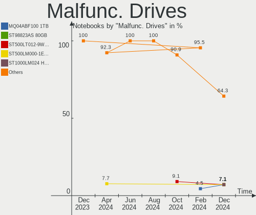
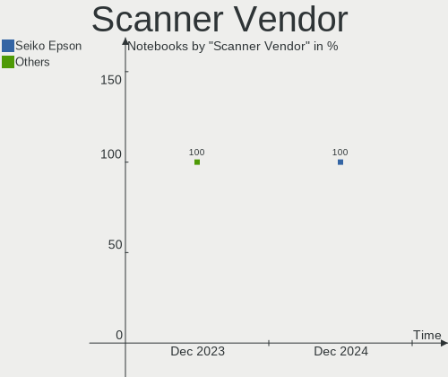
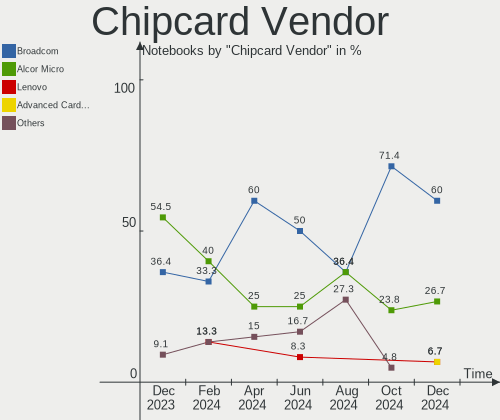

Debian Hardware Trends (Notebooks)
----------------------------------

A project to identify most popular hardware characteristics and track their change
over time based on data collected by Debian users at https://Linux-Hardware.org.

Anyone can contribute to this report by the [hw-probe](https://github.com/linuxhw/hw-probe) tool:

    sudo -E hw-probe -all -upload

Full-feature report is available here: https://linux-hardware.org/?view=trends

Period: Mar, 2022.

Contents
--------

* [ System ](#system)
  - [ OS                       ](#os)
  - [ OS Family                ](#os-family)
  - [ Kernel                   ](#kernel)
  - [ Kernel Family            ](#kernel-family)
  - [ Kernel Major Ver.        ](#kernel-major-ver)
  - [ Arch                     ](#arch)
  - [ DE                       ](#de)
  - [ Display Server           ](#display-server)
  - [ Display Manager          ](#display-manager)
  - [ OS Lang                  ](#os-lang)
  - [ Boot Mode                ](#boot-mode)
  - [ Filesystem               ](#filesystem)
  - [ Part. scheme             ](#part-scheme)
  - [ Dual Boot with Linux/BSD ](#dual-boot-with-linuxbsd)
  - [ Dual Boot (Win)          ](#dual-boot-win)

* [ Board ](#board)
  - [ Vendor                   ](#vendor)
  - [ Model                    ](#model)
  - [ Model Family             ](#model-family)
  - [ MFG Year                 ](#mfg-year)
  - [ Form Factor              ](#form-factor)
  - [ Secure Boot              ](#secure-boot)
  - [ Coreboot                 ](#coreboot)
  - [ RAM Size                 ](#ram-size)
  - [ RAM Used                 ](#ram-used)
  - [ Total Drives             ](#total-drives)
  - [ Has CD-ROM               ](#has-cd-rom)
  - [ Has Ethernet             ](#has-ethernet)
  - [ Has WiFi                 ](#has-wifi)
  - [ Has Bluetooth            ](#has-bluetooth)

* [ Location ](#location)
  - [ Country                  ](#country)
  - [ City                     ](#city)

* [ Drives ](#drives)
  - [ Drive Vendor             ](#drive-vendor)
  - [ Drive Model              ](#drive-model)
  - [ HDD Vendor               ](#hdd-vendor)
  - [ SSD Vendor               ](#ssd-vendor)
  - [ Drive Kind               ](#drive-kind)
  - [ Drive Connector          ](#drive-connector)
  - [ Drive Size               ](#drive-size)
  - [ Space Total              ](#space-total)
  - [ Space Used               ](#space-used)
  - [ Malfunc. Drives          ](#malfunc-drives)
  - [ Malfunc. Drive Vendor    ](#malfunc-drive-vendor)
  - [ Malfunc. HDD Vendor      ](#malfunc-hdd-vendor)
  - [ Malfunc. Drive Kind      ](#malfunc-drive-kind)
  - [ Failed Drives            ](#failed-drives)
  - [ Failed Drive Vendor      ](#failed-drive-vendor)
  - [ Drive Status             ](#drive-status)

* [ Storage controller ](#storage-controller)
  - [ Storage Vendor           ](#storage-vendor)
  - [ Storage Model            ](#storage-model)
  - [ Storage Kind             ](#storage-kind)

* [ Processor ](#processor)
  - [ CPU Vendor               ](#cpu-vendor)
  - [ CPU Model                ](#cpu-model)
  - [ CPU Model Family         ](#cpu-model-family)
  - [ CPU Cores                ](#cpu-cores)
  - [ CPU Sockets              ](#cpu-sockets)
  - [ CPU Threads              ](#cpu-threads)
  - [ CPU Op-Modes             ](#cpu-op-modes)
  - [ CPU Microcode            ](#cpu-microcode)
  - [ CPU Microarch            ](#cpu-microarch)

* [ Graphics ](#graphics)
  - [ GPU Vendor               ](#gpu-vendor)
  - [ GPU Model                ](#gpu-model)
  - [ GPU Combo                ](#gpu-combo)
  - [ GPU Driver               ](#gpu-driver)
  - [ GPU Memory               ](#gpu-memory)

* [ Monitor ](#monitor)
  - [ Monitor Vendor           ](#monitor-vendor)
  - [ Monitor Model            ](#monitor-model)
  - [ Monitor Resolution       ](#monitor-resolution)
  - [ Monitor Diagonal         ](#monitor-diagonal)
  - [ Monitor Width            ](#monitor-width)
  - [ Aspect Ratio             ](#aspect-ratio)
  - [ Monitor Area             ](#monitor-area)
  - [ Pixel Density            ](#pixel-density)
  - [ Multiple Monitors        ](#multiple-monitors)

* [ Network ](#network)
  - [ Net Controller Vendor    ](#net-controller-vendor)
  - [ Net Controller Model     ](#net-controller-model)
  - [ Wireless Vendor          ](#wireless-vendor)
  - [ Wireless Model           ](#wireless-model)
  - [ Ethernet Vendor          ](#ethernet-vendor)
  - [ Ethernet Model           ](#ethernet-model)
  - [ Net Controller Kind      ](#net-controller-kind)
  - [ Used Controller          ](#used-controller)
  - [ NICs                     ](#nics)
  - [ IPv6                     ](#ipv6)

* [ Bluetooth ](#bluetooth)
  - [ Bluetooth Vendor         ](#bluetooth-vendor)
  - [ Bluetooth Model          ](#bluetooth-model)

* [ Sound ](#sound)
  - [ Sound Vendor             ](#sound-vendor)
  - [ Sound Model              ](#sound-model)

* [ Memory ](#memory)
  - [ Memory Vendor            ](#memory-vendor)
  - [ Memory Model             ](#memory-model)
  - [ Memory Kind              ](#memory-kind)
  - [ Memory Form Factor       ](#memory-form-factor)
  - [ Memory Size              ](#memory-size)
  - [ Memory Speed             ](#memory-speed)

* [ Printers & scanners ](#printers--scanners)
  - [ Printer Vendor           ](#printer-vendor)
  - [ Printer Model            ](#printer-model)
  - [ Scanner Vendor           ](#scanner-vendor)
  - [ Scanner Model            ](#scanner-model)

* [ Camera ](#camera)
  - [ Camera Vendor            ](#camera-vendor)
  - [ Camera Model             ](#camera-model)

* [ Security ](#security)
  - [ Fingerprint Vendor       ](#fingerprint-vendor)
  - [ Fingerprint Model        ](#fingerprint-model)
  - [ Chipcard Vendor          ](#chipcard-vendor)
  - [ Chipcard Model           ](#chipcard-model)

* [ Unsupported ](#unsupported)
  - [ Unsupported Devices      ](#unsupported-devices)
  - [ Unsupported Device Types ](#unsupported-device-types)

System
------

OS
--

Installed operating systems

| Name            | Notebooks | Percent |
|-----------------|-----------|---------|
| Debian 11       | 490       | 97.42%  |
| Debian 10       | 5         | 0.99%   |
| Debian Unstable | 4         | 0.8%    |
| Debian Testing  | 4         | 0.8%    |

OS Family
---------

OS without a version

| Name   | Notebooks | Percent |
|--------|-----------|---------|
| Debian | 503       | 100%    |

Kernel
------

Version of the Linux kernel

| Version               | Notebooks | Percent |
|-----------------------|-----------|---------|
| 5.10.0-10-amd64       | 377       | 74.95%  |
| 5.10.0-12-amd64       | 35        | 6.96%   |
| 5.10.0-11-amd64       | 21        | 4.17%   |
| 5.10.0-13-amd64       | 12        | 2.39%   |
| 5.10.0-7-amd64        | 10        | 1.99%   |
| 5.10.0-13-686-pae     | 10        | 1.99%   |
| 5.16.0-5-amd64        | 5         | 0.99%   |
| 5.15.0-2-amd64        | 4         | 0.8%    |
| 5.16.0-3-amd64        | 3         | 0.6%    |
| 5.10.0-8-amd64        | 3         | 0.6%    |
| 4.19.0-19-amd64       | 3         | 0.6%    |
| 5.16.0-4-amd64        | 2         | 0.4%    |
| 5.10.0-9-amd64        | 2         | 0.4%    |
| 5.10.0-11-686         | 2         | 0.4%    |
| 5.16.0-4mx-amd64      | 1         | 0.2%    |
| 5.16.0-1-amd64        | 1         | 0.2%    |
| 5.16.0-0.bpo.4-amd64  | 1         | 0.2%    |
| 5.16.0-0.bpo.3-amd64  | 1         | 0.2%    |
| 5.15.6.1-march        | 1         | 0.2%    |
| 5.15.0-3mx-amd64      | 1         | 0.2%    |
| 5.15.0-0.bpo.3-amd64  | 1         | 0.2%    |
| 5.14.0-2-amd64        | 1         | 0.2%    |
| 5.10.0-13-686         | 1         | 0.2%    |
| 5.10.0-11-rt-amd64    | 1         | 0.2%    |
| 5.10.0-11-686-pae     | 1         | 0.2%    |
| 5.10.0-0.bpo.11-amd64 | 1         | 0.2%    |
| 4.19.0-6-amd64        | 1         | 0.2%    |
| 4.19.0-20-amd64       | 1         | 0.2%    |

Kernel Family
-------------

Linux kernel without a distro release

| Version  | Notebooks | Percent |
|----------|-----------|---------|
| 5.10.0   | 476       | 94.63%  |
| 5.16.0   | 14        | 2.78%   |
| 5.15.0   | 6         | 1.19%   |
| 4.19.0   | 5         | 0.99%   |
| 5.15.6.1 | 1         | 0.2%    |
| 5.14.0   | 1         | 0.2%    |

Kernel Major Ver.
-----------------

Linux kernel major version

| Version | Notebooks | Percent |
|---------|-----------|---------|
| 5.10    | 476       | 94.63%  |
| 5.16    | 14        | 2.78%   |
| 5.15    | 6         | 1.19%   |
| 4.19    | 5         | 0.99%   |
| 5.15.6  | 1         | 0.2%    |
| 5.14    | 1         | 0.2%    |

Arch
----

OS architecture (x86_64, i586, etc.)

| Name   | Notebooks | Percent |
|--------|-----------|---------|
| x86_64 | 489       | 97.22%  |
| i686   | 14        | 2.78%   |

DE
--

Desktop Environment

| Name             | Notebooks | Percent |
|------------------|-----------|---------|
| Unknown          | 399       | 79.32%  |
| GNOME            | 42        | 8.35%   |
| XFCE             | 17        | 3.38%   |
| KDE5             | 17        | 3.38%   |
| MATE             | 6         | 1.19%   |
| LXQt             | 4         | 0.8%    |
| i3               | 3         | 0.6%    |
| X-Cinnamon       | 2         | 0.4%    |
| trinity          | 2         | 0.4%    |
| lightdm-xsession | 2         | 0.4%    |
| GNOME Flashback  | 2         | 0.4%    |
| Budgie           | 2         | 0.4%    |
| sway             | 1         | 0.2%    |
| LXDE             | 1         | 0.2%    |
| KDE              | 1         | 0.2%    |
| GNOME Classic    | 1         | 0.2%    |
| Cinnamon         | 1         | 0.2%    |

Display Server
--------------

X11 or Wayland

| Name    | Notebooks | Percent |
|---------|-----------|---------|
| Unknown | 395       | 78.53%  |
| X11     | 66        | 13.12%  |
| Wayland | 38        | 7.55%   |
| Tty     | 4         | 0.8%    |

Display Manager
---------------

SDDM, LightDM, etc.

| Name    | Notebooks | Percent |
|---------|-----------|---------|
| Unknown | 426       | 84.69%  |
| GDM     | 31        | 6.16%   |
| LightDM | 25        | 4.97%   |
| SDDM    | 15        | 2.98%   |
| GDM3    | 6         | 1.19%   |

OS Lang
-------

Language

| Lang    | Notebooks | Percent |
|---------|-----------|---------|
| Unknown | 368       | 73.16%  |
| en_US   | 58        | 11.53%  |
| ru_RU   | 15        | 2.98%   |
| de_DE   | 9         | 1.79%   |
| pt_BR   | 6         | 1.19%   |
| fr_FR   | 6         | 1.19%   |
| en_GB   | 5         | 0.99%   |
| it_IT   | 4         | 0.8%    |
| zh_CN   | 3         | 0.6%    |
| hu_HU   | 3         | 0.6%    |
| es_ES   | 3         | 0.6%    |
| es_VE   | 2         | 0.4%    |
| es_MX   | 2         | 0.4%    |
| es_CL   | 2         | 0.4%    |
| en_CA   | 2         | 0.4%    |
| sv_SE   | 1         | 0.2%    |
| pt_PT   | 1         | 0.2%    |
| nl_BE   | 1         | 0.2%    |
| ko_KR   | 1         | 0.2%    |
| hr_HR   | 1         | 0.2%    |
| fr_CA   | 1         | 0.2%    |
| fr_BE   | 1         | 0.2%    |
| eu_ES   | 1         | 0.2%    |
| es_PY   | 1         | 0.2%    |
| es_PE   | 1         | 0.2%    |
| en_ZA   | 1         | 0.2%    |
| en_SG   | 1         | 0.2%    |
| en_IE   | 1         | 0.2%    |
| en_AU   | 1         | 0.2%    |
| da_DK   | 1         | 0.2%    |

Boot Mode
---------

EFI or BIOS

| Mode | Notebooks | Percent |
|------|-----------|---------|
| EFI  | 440       | 87.48%  |
| BIOS | 63        | 12.52%  |

Filesystem
----------

Type of filesystem

| Type    | Notebooks | Percent |
|---------|-----------|---------|
| Overlay | 397       | 78.93%  |
| Ext4    | 100       | 19.88%  |
| Btrfs   | 6         | 1.19%   |

Part. scheme
------------

Scheme of partitioning

| Type    | Notebooks | Percent |
|---------|-----------|---------|
| GPT     | 421       | 83.7%   |
| Unknown | 56        | 11.13%  |
| MBR     | 26        | 5.17%   |

Dual Boot with Linux/BSD
------------------------

Hosting more than one Linux/BSD

| Dual boot | Notebooks | Percent |
|-----------|-----------|---------|
| Yes       | 356       | 70.78%  |
| No        | 147       | 29.22%  |

Dual Boot (Win)
---------------

Hosting Linux and Windows

| Dual boot | Notebooks | Percent |
|-----------|-----------|---------|
| No        | 455       | 90.46%  |
| Yes       | 48        | 9.54%   |

Board
-----

Vendor
------

Motherboard manufacturer

| Name                   | Notebooks | Percent |
|------------------------|-----------|---------|
| Apple                  | 367       | 72.96%  |
| Lenovo                 | 33        | 6.56%   |
| Dell                   | 30        | 5.96%   |
| Hewlett-Packard        | 23        | 4.57%   |
| ASUSTek Computer       | 11        | 2.19%   |
| Acer                   | 10        | 1.99%   |
| Aquarius               | 4         | 0.8%    |
| Samsung Electronics    | 3         | 0.6%    |
| MSI                    | 2         | 0.4%    |
| HUAWEI                 | 2         | 0.4%    |
| Toshiba                | 1         | 0.2%    |
| Timi                   | 1         | 0.2%    |
| System76               | 1         | 0.2%    |
| Philco                 | 1         | 0.2%    |
| Packard Bell           | 1         | 0.2%    |
| Notebook               | 1         | 0.2%    |
| Multilaser             | 1         | 0.2%    |
| MicronPc_MPC           | 1         | 0.2%    |
| IPASON                 | 1         | 0.2%    |
| Getac                  | 1         | 0.2%    |
| Fujitsu Siemens        | 1         | 0.2%    |
| Fujitsu                | 1         | 0.2%    |
| Eluktronics            | 1         | 0.2%    |
| Elife                  | 1         | 0.2%    |
| BUYMPC MicronPC_MPC    | 1         | 0.2%    |
| AXDIA International    | 1         | 0.2%    |
| Avell High Performance | 1         | 0.2%    |
| AMI                    | 1         | 0.2%    |

Model
-----

Motherboard model

| Name                                       | Notebooks | Percent |
|--------------------------------------------|-----------|---------|
| Apple MacBook5,2                           | 285       | 56.66%  |
| Apple MacBook2,1                           | 52        | 10.34%  |
| Apple MacBook4,1                           | 21        | 4.17%   |
| Dell Inspiron 5100                         | 6         | 1.19%   |
| Apple MacBook7,1                           | 6         | 1.19%   |
| Aquarius NS585                             | 4         | 0.8%    |
| Dell Latitude E6420                        | 3         | 0.6%    |
| Lenovo ThinkPad 13 2nd Gen 20J10046US      | 2         | 0.4%    |
| HP Pavilion g6                             | 2         | 0.4%    |
| HP Laptop 15-bw0xx                         | 2         | 0.4%    |
| HP Compaq nx6125 (PZ849UA#ABA)             | 2         | 0.4%    |
| HP Compaq nx6110 (PZ065UA#ABA)             | 2         | 0.4%    |
| Dell Latitude E6330                        | 2         | 0.4%    |
| Dell Inspiron 5502                         | 2         | 0.4%    |
| Toshiba Satellite P850                     | 1         | 0.2%    |
| Timi A7S                                   | 1         | 0.2%    |
| System76 Kudu Professional                 | 1         | 0.2%    |
| Samsung RC530/RC730                        | 1         | 0.2%    |
| Samsung R509                               | 1         | 0.2%    |
| Samsung 300V3A/300V4A/300V5A               | 1         | 0.2%    |
| Philco O E M                               | 1         | 0.2%    |
| Packard Bell EasyNote TK85                 | 1         | 0.2%    |
| Notebook PCx0Dx                            | 1         | 0.2%    |
| Multilaser MLSH1H LINUX                    | 1         | 0.2%    |
| MSI Prestige 14Evo A11M                    | 1         | 0.2%    |
| MSI Katana GF66 12UC                       | 1         | 0.2%    |
| MicronPc_MPC EU3G00                        | 1         | 0.2%    |
| Lenovo ThinkPad X270 W10DG 20K5S0B700      | 1         | 0.2%    |
| Lenovo ThinkPad X230 23259S9               | 1         | 0.2%    |
| Lenovo ThinkPad X220 4291G26               | 1         | 0.2%    |
| Lenovo ThinkPad X140e 20BLA00C00           | 1         | 0.2%    |
| Lenovo ThinkPad X1 Carbon Gen 9 20XWS01000 | 1         | 0.2%    |
| Lenovo ThinkPad X1 Carbon 7th 20QES01M00   | 1         | 0.2%    |
| Lenovo ThinkPad T61 7661WE7                | 1         | 0.2%    |
| Lenovo ThinkPad T495 20NKS13Q00            | 1         | 0.2%    |
| Lenovo ThinkPad T495 20NJ000XRT            | 1         | 0.2%    |
| Lenovo ThinkPad T450s 20BXCTO1WW           | 1         | 0.2%    |
| Lenovo ThinkPad T440s 20ARS08Q00           | 1         | 0.2%    |
| Lenovo ThinkPad T430 2349GCG               | 1         | 0.2%    |
| Lenovo ThinkPad T410 2522DK2               | 1         | 0.2%    |
| Lenovo ThinkPad P53 20QQA004CD             | 1         | 0.2%    |
| Lenovo ThinkPad P51s 20HB000URT            | 1         | 0.2%    |
| Lenovo ThinkPad P15v Gen 1 20TQCTO1WW      | 1         | 0.2%    |
| Lenovo ThinkPad L470 20J4003WGE            | 1         | 0.2%    |
| Lenovo ThinkPad E14 Gen 3 20YDS00G00       | 1         | 0.2%    |
| Lenovo Legion Y540-17IRH 81Q4              | 1         | 0.2%    |
| Lenovo IdeaPad S540-13API 81XC             | 1         | 0.2%    |
| Lenovo IdeaPad S145-15API 81V7             | 1         | 0.2%    |
| Lenovo IdeaPad L3 15ITL6 82HL              | 1         | 0.2%    |
| Lenovo IdeaPad 5 14ALC05 82LM              | 1         | 0.2%    |
| Lenovo IdeaPad 330S-15ARR 81FB             | 1         | 0.2%    |
| Lenovo IdeaPad 330S-14IKB 81F4             | 1         | 0.2%    |
| Lenovo IdeaPad 330-14AST 81D5              | 1         | 0.2%    |
| Lenovo IdeaPad 3 15IML05 82BS              | 1         | 0.2%    |
| Lenovo G505 20240                          | 1         | 0.2%    |
| Lenovo E31-80 80MX                         | 1         | 0.2%    |
| Lenovo B50-30 20382                        | 1         | 0.2%    |
| IPASON MaxBook P1                          | 1         | 0.2%    |
| HUAWEI MACH-WX9                            | 1         | 0.2%    |
| HUAWEI BOHK-WAX9X                          | 1         | 0.2%    |

Model Family
------------

Motherboard model prefix

| Name                       | Notebooks | Percent |
|----------------------------|-----------|---------|
| Apple MacBook5             | 285       | 56.66%  |
| Apple MacBook2             | 52        | 10.34%  |
| Apple MacBook4             | 21        | 4.17%   |
| Lenovo ThinkPad            | 20        | 3.98%   |
| Dell Latitude              | 14        | 2.78%   |
| Dell Inspiron              | 13        | 2.58%   |
| Acer Aspire                | 10        | 1.99%   |
| Lenovo IdeaPad             | 8         | 1.59%   |
| Apple MacBook7             | 6         | 1.19%   |
| HP Compaq                  | 5         | 0.99%   |
| HP ProBook                 | 4         | 0.8%    |
| HP Pavilion                | 4         | 0.8%    |
| HP Laptop                  | 4         | 0.8%    |
| Aquarius NS585             | 4         | 0.8%    |
| Dell XPS                   | 2         | 0.4%    |
| Toshiba Satellite          | 1         | 0.2%    |
| Timi A7S                   | 1         | 0.2%    |
| System76 Kudu              | 1         | 0.2%    |
| Samsung RC530              | 1         | 0.2%    |
| Samsung R509               | 1         | 0.2%    |
| Samsung 300V3A             | 1         | 0.2%    |
| Philco O                   | 1         | 0.2%    |
| Packard Bell EasyNote      | 1         | 0.2%    |
| Notebook PCx0Dx            | 1         | 0.2%    |
| Multilaser MLSH1H          | 1         | 0.2%    |
| MSI Prestige               | 1         | 0.2%    |
| MSI Katana                 | 1         | 0.2%    |
| MicronPc_MPC EU3G00        | 1         | 0.2%    |
| Lenovo Legion              | 1         | 0.2%    |
| Lenovo G505                | 1         | 0.2%    |
| Lenovo E31-80              | 1         | 0.2%    |
| Lenovo B50-30              | 1         | 0.2%    |
| IPASON MaxBook             | 1         | 0.2%    |
| HUAWEI MACH-WX9            | 1         | 0.2%    |
| HUAWEI BOHK-WAX9X          | 1         | 0.2%    |
| HP HDX18                   | 1         | 0.2%    |
| HP ENVY                    | 1         | 0.2%    |
| HP EliteBook               | 1         | 0.2%    |
| HP 255                     | 1         | 0.2%    |
| HP 250                     | 1         | 0.2%    |
| HP 2140                    | 1         | 0.2%    |
| Getac B300G5               | 1         | 0.2%    |
| Fujitsu Siemens LIFEBOOK   | 1         | 0.2%    |
| Fujitsu LIFEBOOK           | 1         | 0.2%    |
| Eluktronics MAG-15u        | 1         | 0.2%    |
| Elife series               | 1         | 0.2%    |
| Dell Precision             | 1         | 0.2%    |
| BUYMPC MicronPC_MPC EU3G00 | 1         | 0.2%    |
| AXDIA International MYBOOK | 1         | 0.2%    |
| Avell High Performance A40 | 1         | 0.2%    |
| ASUS Zephyrus              | 1         | 0.2%    |
| ASUS X751MD                | 1         | 0.2%    |
| ASUS X551MA                | 1         | 0.2%    |
| ASUS X550VXK               | 1         | 0.2%    |
| ASUS X441NA                | 1         | 0.2%    |
| ASUS X200MA                | 1         | 0.2%    |
| ASUS VivoBook              | 1         | 0.2%    |
| ASUS N550JV                | 1         | 0.2%    |
| ASUS G750JM                | 1         | 0.2%    |
| ASUS BU401LA               | 1         | 0.2%    |

MFG Year
--------

Motherboard manufacture year

| Year | Notebooks | Percent |
|------|-----------|---------|
| 2009 | 289       | 57.46%  |
| 2007 | 57        | 11.33%  |
| 2008 | 26        | 5.17%   |
| 2020 | 17        | 3.38%   |
| 2019 | 17        | 3.38%   |
| 2021 | 14        | 2.78%   |
| 2011 | 13        | 2.58%   |
| 2017 | 10        | 1.99%   |
| 2012 | 9         | 1.79%   |
| 2018 | 8         | 1.59%   |
| 2014 | 8         | 1.59%   |
| 2003 | 8         | 1.59%   |
| 2016 | 7         | 1.39%   |
| 2010 | 7         | 1.39%   |
| 2015 | 6         | 1.19%   |
| 2013 | 4         | 0.8%    |
| 2005 | 3         | 0.6%    |

Form Factor
-----------

Physical design of the computer

| Name     | Notebooks | Percent |
|----------|-----------|---------|
| Notebook | 503       | 100%    |

Secure Boot
-----------

Enabled or disabled

| State    | Notebooks | Percent |
|----------|-----------|---------|
| Disabled | 489       | 97.22%  |
| Enabled  | 14        | 2.78%   |

Coreboot
--------

Have coreboot on board

| Used | Notebooks | Percent |
|------|-----------|---------|
| No   | 502       | 99.8%   |
| Yes  | 1         | 0.2%    |

RAM Size
--------

Total RAM memory

| Size in GB  | Notebooks | Percent |
|-------------|-----------|---------|
| 1.01-2.0    | 339       | 67.4%   |
| 4.01-8.0    | 39        | 7.75%   |
| 3.01-4.0    | 38        | 7.55%   |
| 16.01-24.0  | 27        | 5.37%   |
| 8.01-16.0   | 19        | 3.78%   |
| 2.01-3.0    | 13        | 2.58%   |
| 0.51-1.0    | 13        | 2.58%   |
| 0.01-0.5    | 6         | 1.19%   |
| 32.01-64.0  | 4         | 0.8%    |
| 64.01-256.0 | 3         | 0.6%    |
| 24.01-32.0  | 2         | 0.4%    |

RAM Used
--------

Used RAM memory

| Used GB    | Notebooks | Percent |
|------------|-----------|---------|
| 1.01-2.0   | 398       | 79.13%  |
| 2.01-3.0   | 33        | 6.56%   |
| 0.51-1.0   | 26        | 5.17%   |
| 4.01-8.0   | 16        | 3.18%   |
| 0.01-0.5   | 15        | 2.98%   |
| 3.01-4.0   | 13        | 2.58%   |
| 16.01-24.0 | 1         | 0.2%    |
| 8.01-16.0  | 1         | 0.2%    |

Total Drives
------------

Number of drives on board

| Drives | Notebooks | Percent |
|--------|-----------|---------|
| 1      | 467       | 92.84%  |
| 2      | 24        | 4.77%   |
| 0      | 7         | 1.39%   |
| 3      | 3         | 0.6%    |
| 4      | 2         | 0.4%    |

Has CD-ROM
----------

Has CD-ROM on board

| Presented | Notebooks | Percent |
|-----------|-----------|---------|
| Yes       | 412       | 81.91%  |
| No        | 91        | 18.09%  |

Has Ethernet
------------

Has Ethernet on board

| Presented | Notebooks | Percent |
|-----------|-----------|---------|
| Yes       | 484       | 96.22%  |
| No        | 19        | 3.78%   |

Has WiFi
--------

Has WiFi module

| Presented | Notebooks | Percent |
|-----------|-----------|---------|
| Yes       | 498       | 99.01%  |
| No        | 5         | 0.99%   |

Has Bluetooth
-------------

Has Bluetooth module

| Presented | Notebooks | Percent |
|-----------|-----------|---------|
| Yes       | 463       | 92.05%  |
| No        | 40        | 7.95%   |

Location
--------

Country
-------

Geographic location (country)

| Country      | Notebooks | Percent |
|--------------|-----------|---------|
| USA          | 396       | 78.73%  |
| Russia       | 17        | 3.38%   |
| Germany      | 10        | 1.99%   |
| France       | 10        | 1.99%   |
| Brazil       | 8         | 1.59%   |
| Italy        | 6         | 1.19%   |
| Spain        | 4         | 0.8%    |
| UK           | 3         | 0.6%    |
| Turkey       | 3         | 0.6%    |
| Mexico       | 3         | 0.6%    |
| Hungary      | 3         | 0.6%    |
| China        | 3         | 0.6%    |
| Canada       | 3         | 0.6%    |
| Venezuela    | 2         | 0.4%    |
| Switzerland  | 2         | 0.4%    |
| Sweden       | 2         | 0.4%    |
| Portugal     | 2         | 0.4%    |
| Paraguay     | 2         | 0.4%    |
| Czechia      | 2         | 0.4%    |
| Chile        | 2         | 0.4%    |
| Belgium      | 2         | 0.4%    |
| Tunisia      | 1         | 0.2%    |
| Thailand     | 1         | 0.2%    |
| South Korea  | 1         | 0.2%    |
| South Africa | 1         | 0.2%    |
| Slovenia     | 1         | 0.2%    |
| Romania      | 1         | 0.2%    |
| Poland       | 1         | 0.2%    |
| Peru         | 1         | 0.2%    |
| Nigeria      | 1         | 0.2%    |
| Morocco      | 1         | 0.2%    |
| Kyrgyzstan   | 1         | 0.2%    |
| Iran         | 1         | 0.2%    |
| Indonesia    | 1         | 0.2%    |
| Denmark      | 1         | 0.2%    |
| Croatia      | 1         | 0.2%    |
| Bulgaria     | 1         | 0.2%    |
| Australia    | 1         | 0.2%    |
| Argentina    | 1         | 0.2%    |

City
----

Geographic location (city)

| City                    | Notebooks | Percent |
|-------------------------|-----------|---------|
| Bangor                  | 385       | 76.54%  |
| Voronezh                | 11        | 2.19%   |
| Paris                   | 4         | 0.8%    |
| Berlin                  | 4         | 0.8%    |
| Villa Elisa             | 2         | 0.4%    |
| Prague                  | 2         | 0.4%    |
| Perm                    | 2         | 0.4%    |
| Brasília               | 2         | 0.4%    |
| Zaragoza                | 1         | 0.2%    |
| Zapopan                 | 1         | 0.2%    |
| Zagreb                  | 1         | 0.2%    |
| Yutz                    | 1         | 0.2%    |
| Yambol                  | 1         | 0.2%    |
| Xining                  | 1         | 0.2%    |
| Winfield                | 1         | 0.2%    |
| Waregem                 | 1         | 0.2%    |
| Vladivostok             | 1         | 0.2%    |
| Vitória                | 1         | 0.2%    |
| Victorville             | 1         | 0.2%    |
| Venda Nova do Imigrante | 1         | 0.2%    |
| Urbandale               | 1         | 0.2%    |
| Turin                   | 1         | 0.2%    |
| Tunis                   | 1         | 0.2%    |
| Trenton                 | 1         | 0.2%    |
| Tehran                  | 1         | 0.2%    |
| Sylvan Lake             | 1         | 0.2%    |
| Surabaya                | 1         | 0.2%    |
| Shenzhen                | 1         | 0.2%    |
| Seocho-gu               | 1         | 0.2%    |
| Sartrouville            | 1         | 0.2%    |
| Sao Luís               | 1         | 0.2%    |
| Santiago                | 1         | 0.2%    |
| Saint Augustine         | 1         | 0.2%    |
| Punta Arenas            | 1         | 0.2%    |
| Pont-Audemer            | 1         | 0.2%    |
| Pisa                    | 1         | 0.2%    |
| Pescara                 | 1         | 0.2%    |
| Pavia di Udine          | 1         | 0.2%    |
| Odense                  | 1         | 0.2%    |
| Oberhausen              | 1         | 0.2%    |
| Nova Iguaçu            | 1         | 0.2%    |
| Newberg                 | 1         | 0.2%    |
| New Cross               | 1         | 0.2%    |
| Nev'yansk               | 1         | 0.2%    |
| Natal                   | 1         | 0.2%    |
| Naessjoe                | 1         | 0.2%    |
| Mutilva Baja            | 1         | 0.2%    |
| Munich                  | 1         | 0.2%    |
| Mount Olivet            | 1         | 0.2%    |
| Moscow                  | 1         | 0.2%    |
| Morges                  | 1         | 0.2%    |
| Montreal                | 1         | 0.2%    |
| Milton Keynes           | 1         | 0.2%    |
| Mexico                  | 1         | 0.2%    |
| Mersin                  | 1         | 0.2%    |
| Mérida                 | 1         | 0.2%    |
| Melbourne               | 1         | 0.2%    |
| Lyon                    | 1         | 0.2%    |
| Ljubljana               | 1         | 0.2%    |
| Lima                    | 1         | 0.2%    |

Drives
------

Drive Vendor
------------

Hard drive vendors

| Vendor              | Notebooks | Drives | Percent |
|---------------------|-----------|--------|---------|
| Fujitsu             | 208       | 208    | 39.1%   |
| Toshiba             | 110       | 110    | 20.68%  |
| Seagate             | 44        | 45     | 8.27%   |
| WDC                 | 33        | 34     | 6.2%    |
| Samsung Electronics | 26        | 26     | 4.89%   |
| Hitachi             | 21        | 21     | 3.95%   |
| SanDisk             | 16        | 16     | 3.01%   |
| Kingston            | 9         | 9      | 1.69%   |
| Intel               | 9         | 9      | 1.69%   |
| A-DATA Technology   | 9         | 9      | 1.69%   |
| Crucial             | 8         | 9      | 1.5%    |
| Unknown             | 7         | 9      | 1.32%   |
| SK Hynix            | 5         | 6      | 0.94%   |
| Micron Technology   | 3         | 3      | 0.56%   |
| GOODRAM             | 3         | 3      | 0.56%   |
| KIOXIA-EXCERIA      | 2         | 2      | 0.38%   |
| HGST                | 2         | 2      | 0.38%   |
| China               | 2         | 2      | 0.38%   |
| ZTC                 | 1         | 1      | 0.19%   |
| XPG                 | 1         | 1      | 0.19%   |
| UMIS                | 1         | 1      | 0.19%   |
| Transcend           | 1         | 1      | 0.19%   |
| Team                | 1         | 1      | 0.19%   |
| SSSTC               | 1         | 1      | 0.19%   |
| SPCC                | 1         | 1      | 0.19%   |
| PNY                 | 1         | 1      | 0.19%   |
| MAXTOR              | 1         | 1      | 0.19%   |
| M4-CT256            | 1         | 1      | 0.19%   |
| Lenovo              | 1         | 1      | 0.19%   |
| KIOXIA              | 1         | 1      | 0.19%   |
| DOGFISH             | 1         | 1      | 0.19%   |
| Apple               | 1         | 1      | 0.19%   |
| Unknown             | 1         | 1      | 0.19%   |

Drive Model
-----------

Hard drive models

| Model                                | Notebooks | Percent |
|--------------------------------------|-----------|---------|
| Fujitsu MHZ2160BH FFS G1 160GB       | 185       | 34.45%  |
| Toshiba MK1655GSXF 160GB             | 43        | 8.01%   |
| Toshiba MK1653GSX 160GB              | 40        | 7.45%   |
| WDC WD1600BUDT-63DPZY0 160GB         | 16        | 2.98%   |
| Seagate ST980811AS 80GB              | 10        | 1.86%   |
| SanDisk SD8SBAT128G1122 128GB SSD    | 10        | 1.86%   |
| Fujitsu MHY2120BH 120GB              | 10        | 1.86%   |
| Toshiba MK5065GSXF 500GB             | 9         | 1.68%   |
| Fujitsu MHY2080BH 80GB               | 9         | 1.68%   |
| Hitachi HTS543216L9SA02 160GB        | 7         | 1.3%    |
| Seagate ST94811A 40GB                | 6         | 1.12%   |
| Seagate ST500LT012-1DG142 500GB      | 5         | 0.93%   |
| Hitachi HTS542512K9SA00 120GB        | 5         | 0.93%   |
| Seagate ST9160314AS 160GB            | 4         | 0.74%   |
| A-DATA SU800 512GB SSD               | 4         | 0.74%   |
| Toshiba MQ01ABF050 500GB             | 3         | 0.56%   |
| Toshiba MK2555GSXF 250GB             | 3         | 0.56%   |
| Hitachi HTS545025B9SA02 250GB        | 3         | 0.56%   |
| WDC WDS240G2G0A-00JH30 240GB SSD     | 2         | 0.37%   |
| WDC WD10SPZX-24Z10 1TB               | 2         | 0.37%   |
| Unknown MMC Card  64GB               | 2         | 0.37%   |
| Unknown MMC Card  32GB               | 2         | 0.37%   |
| Toshiba MQ04ABF100 1TB               | 2         | 0.37%   |
| Toshiba MK2561GSYN 250GB             | 2         | 0.37%   |
| Seagate ST320LT007-9ZV142 320GB      | 2         | 0.37%   |
| Seagate ST1000LM035-1RK172 1TB       | 2         | 0.37%   |
| Seagate ST1000LM024 HN-M101MBB 1TB   | 2         | 0.37%   |
| SanDisk SD8SN8U128G1001 128GB SSD    | 2         | 0.37%   |
| Samsung SSD 970 EVO Plus 1TB         | 2         | 0.37%   |
| Samsung MZNLN128HAHQ-000H1 128GB SSD | 2         | 0.37%   |
| Kingston SV300S37A120G 120GB SSD     | 2         | 0.37%   |
| Kingston SA400S37480G 480GB SSD      | 2         | 0.37%   |
| Kingston SA400S37240G 240GB SSD      | 2         | 0.37%   |
| Hitachi HTS541040G9AT00 40GB         | 2         | 0.37%   |
| HGST HTS721010A9E630 1TB             | 2         | 0.37%   |
| Fujitsu MHW2080BHPL 80GB             | 2         | 0.37%   |
| Crucial CT500MX500SSD4 500GB         | 2         | 0.37%   |
| ZTC SM201-512G                       | 1         | 0.19%   |
| XPG NVMe SSD Drive 512GB             | 1         | 0.19%   |
| WDC WDS500G2B0C-00PXH0 500GB         | 1         | 0.19%   |
| WDC WDS500G2B0B-00YS70 500GB SSD     | 1         | 0.19%   |
| WDC WDS200T2B0C-00PXH0 2TB           | 1         | 0.19%   |
| WDC WD600UE-22HCT0 64GB              | 1         | 0.19%   |
| WDC WD5000LPCX-24C6HT0 500GB         | 1         | 0.19%   |
| WDC WD3200BEVT-22ZCT0 320GB          | 1         | 0.19%   |
| WDC WD2500BEKT-75PVMT0 250GB         | 1         | 0.19%   |
| WDC WD1600BUDT-73DPZY0 160GB         | 1         | 0.19%   |
| WDC WD1600BEVS-07RST0 160GB          | 1         | 0.19%   |
| WDC PC SN730 SDBQNTY-512G-1001 512GB | 1         | 0.19%   |
| WDC PC SN730 SDBPNTY-256G-1027 256GB | 1         | 0.19%   |
| WDC PC SN530 SDBPNPZ-512G-1027 512GB | 1         | 0.19%   |
| WDC PC SN530 SDBPNPZ-512G-1006 512GB | 1         | 0.19%   |
| WDC PC SN520 SDAPMUW-256G-1101 256GB | 1         | 0.19%   |
| Unknown SD/MMC/MS PRO 32GB           | 1         | 0.19%   |
| Unknown QSSDS25240G 240GB            | 1         | 0.19%   |
| Unknown MMC Card  256GB              | 1         | 0.19%   |
| Unknown CUTB42  64GB                 | 1         | 0.19%   |
| UMIS RPETJ256MGE2MDQ 256GB           | 1         | 0.19%   |
| Transcend TS240GMTS420S 240GB SSD    | 1         | 0.19%   |
| Toshiba NVMe SSD Drive 512GB         | 1         | 0.19%   |

HDD Vendor
----------

Hard disk drive vendors

| Vendor              | Notebooks | Drives | Percent |
|---------------------|-----------|--------|---------|
| Fujitsu             | 208       | 208    | 50.73%  |
| Toshiba             | 107       | 107    | 26.1%   |
| Seagate             | 44        | 45     | 10.73%  |
| WDC                 | 24        | 24     | 5.85%   |
| Hitachi             | 21        | 21     | 5.12%   |
| Samsung Electronics | 3         | 3      | 0.73%   |
| HGST                | 2         | 2      | 0.49%   |
| Unknown             | 1         | 1      | 0.24%   |

SSD Vendor
----------

Solid state drive vendors

| Vendor              | Notebooks | Drives | Percent |
|---------------------|-----------|--------|---------|
| SanDisk             | 15        | 15     | 21.43%  |
| Samsung Electronics | 11        | 11     | 15.71%  |
| Kingston            | 8         | 8      | 11.43%  |
| Crucial             | 8         | 9      | 11.43%  |
| A-DATA Technology   | 6         | 6      | 8.57%   |
| WDC                 | 3         | 3      | 4.29%   |
| GOODRAM             | 3         | 3      | 4.29%   |
| Intel               | 2         | 2      | 2.86%   |
| China               | 2         | 2      | 2.86%   |
| ZTC                 | 1         | 1      | 1.43%   |
| Unknown             | 1         | 1      | 1.43%   |
| Transcend           | 1         | 1      | 1.43%   |
| Team                | 1         | 1      | 1.43%   |
| SPCC                | 1         | 1      | 1.43%   |
| PNY                 | 1         | 1      | 1.43%   |
| Micron Technology   | 1         | 1      | 1.43%   |
| MAXTOR              | 1         | 1      | 1.43%   |
| M4-CT256            | 1         | 1      | 1.43%   |
| KIOXIA-EXCERIA      | 1         | 1      | 1.43%   |
| DOGFISH             | 1         | 1      | 1.43%   |
| Apple               | 1         | 1      | 1.43%   |

Drive Kind
----------

HDD or SSD

| Kind    | Notebooks | Drives | Percent |
|---------|-----------|--------|---------|
| HDD     | 404       | 411    | 77.99%  |
| SSD     | 65        | 71     | 12.55%  |
| NVMe    | 41        | 46     | 7.92%   |
| MMC     | 7         | 9      | 1.35%   |
| Unknown | 1         | 1      | 0.19%   |

Drive Connector
---------------

SATA, SAS, NVMe, etc.

| Type | Notebooks | Drives | Percent |
|------|-----------|--------|---------|
| SATA | 459       | 479    | 89.82%  |
| NVMe | 41        | 46     | 8.02%   |
| MMC  | 7         | 9      | 1.37%   |
| SAS  | 4         | 4      | 0.78%   |

Drive Size
----------

Size of hard drive

| Size in TB | Notebooks | Drives | Percent |
|------------|-----------|--------|---------|
| 0.01-0.5   | 438       | 449    | 93.39%  |
| 0.51-1.0   | 28        | 30     | 5.97%   |
| 1.01-2.0   | 2         | 2      | 0.43%   |
| 3.01-4.0   | 1         | 1      | 0.21%   |

Space Total
-----------

Amount of disk space available on the file system

| Size in GB     | Notebooks | Percent |
|----------------|-----------|---------|
| Unknown        | 388       | 77.14%  |
| 101-250        | 37        | 7.36%   |
| 251-500        | 31        | 6.16%   |
| 501-1000       | 18        | 3.58%   |
| 1-20           | 11        | 2.19%   |
| 51-100         | 7         | 1.39%   |
| 21-50          | 4         | 0.8%    |
| 2001-3000      | 3         | 0.6%    |
| 1001-2000      | 3         | 0.6%    |
| More than 3000 | 1         | 0.2%    |

Space Used
----------

Amount of used disk space

| Used GB        | Notebooks | Percent |
|----------------|-----------|---------|
| Unknown        | 388       | 77.14%  |
| 1-20           | 51        | 10.14%  |
| 51-100         | 17        | 3.38%   |
| 21-50          | 16        | 3.18%   |
| 101-250        | 13        | 2.58%   |
| 251-500        | 8         | 1.59%   |
| 501-1000       | 6         | 1.19%   |
| 1001-2000      | 2         | 0.4%    |
| More than 3000 | 1         | 0.2%    |
| 0              | 1         | 0.2%    |

Malfunc. Drives
---------------

Drive models with a malfunction

| Model                                  | Notebooks | Drives | Percent |
|----------------------------------------|-----------|--------|---------|
| Fujitsu MHZ2160BH FFS G1 160GB         | 19        | 19     | 27.14%  |
| Toshiba MK1653GSX 160GB                | 9         | 9      | 12.86%  |
| Toshiba MK1655GSXF 160GB               | 6         | 6      | 8.57%   |
| Hitachi HTS543216L9SA02 160GB          | 6         | 6      | 8.57%   |
| Hitachi HTS542512K9SA00 120GB          | 5         | 5      | 7.14%   |
| WDC WD1600BUDT-63DPZY0 160GB           | 4         | 4      | 5.71%   |
| Seagate ST980811AS 80GB                | 2         | 2      | 2.86%   |
| Seagate ST94811A 40GB                  | 2         | 2      | 2.86%   |
| Seagate ST500LT012-1DG142 500GB        | 2         | 2      | 2.86%   |
| WDC WD1600BUDT-73DPZY0 160GB           | 1         | 1      | 1.43%   |
| Toshiba MQ04ABF100 1TB                 | 1         | 1      | 1.43%   |
| Toshiba MK2561GSYN 250GB               | 1         | 1      | 1.43%   |
| Seagate ST9500420AS 500GB              | 1         | 1      | 1.43%   |
| Seagate ST92011A 20GB                  | 1         | 1      | 1.43%   |
| Seagate ST320LT007-9ZV142 320GB        | 1         | 1      | 1.43%   |
| Seagate ST1000LX015-1U7172-SSHD 1TB    | 1         | 1      | 1.43%   |
| Seagate ST1000LM024 HN-M101MBB 1TB     | 1         | 1      | 1.43%   |
| Hitachi HTS725032A9A364 320GB          | 1         | 1      | 1.43%   |
| Hitachi HTS545025B9A300 250GB          | 1         | 1      | 1.43%   |
| Hitachi HTS541040G9AT00 40GB           | 1         | 1      | 1.43%   |
| Fujitsu MHY2120BH 120GB                | 1         | 1      | 1.43%   |
| Fujitsu MHW2080BHPL 80GB               | 1         | 1      | 1.43%   |
| Fujitsu MHV2080BHPL 80GB               | 1         | 1      | 1.43%   |
| A-DATA Technology IM2P33F3A NVMe 512GB | 1         | 1      | 1.43%   |

Malfunc. Drive Vendor
---------------------

Vendors of faulty drives

| Vendor            | Notebooks | Drives | Percent |
|-------------------|-----------|--------|---------|
| Fujitsu           | 22        | 22     | 31.88%  |
| Toshiba           | 17        | 17     | 24.64%  |
| Hitachi           | 14        | 14     | 20.29%  |
| Seagate           | 10        | 11     | 14.49%  |
| WDC               | 5         | 5      | 7.25%   |
| A-DATA Technology | 1         | 1      | 1.45%   |

Malfunc. HDD Vendor
-------------------

Vendors of faulty HDD drives

| Vendor  | Notebooks | Drives | Percent |
|---------|-----------|--------|---------|
| Fujitsu | 22        | 22     | 32.35%  |
| Toshiba | 17        | 17     | 25%     |
| Hitachi | 14        | 14     | 20.59%  |
| Seagate | 10        | 11     | 14.71%  |
| WDC     | 5         | 5      | 7.35%   |

Malfunc. Drive Kind
-------------------

Kinds of faulty drives

| Kind | Notebooks | Drives | Percent |
|------|-----------|--------|---------|
| HDD  | 68        | 69     | 98.55%  |
| NVMe | 1         | 1      | 1.45%   |

Failed Drives
-------------

Failed drive models

| Model                           | Notebooks | Drives | Percent |
|---------------------------------|-----------|--------|---------|
| Seagate ST500LT012-1DG142 500GB | 1         | 1      | 100%    |

Failed Drive Vendor
-------------------

Failed drive vendors

| Vendor  | Notebooks | Drives | Percent |
|---------|-----------|--------|---------|
| Seagate | 1         | 1      | 100%    |

Drive Status
------------

Number of failed and malfunc. drives

| Status   | Notebooks | Drives | Percent |
|----------|-----------|--------|---------|
| Works    | 393       | 409    | 77.51%  |
| Malfunc  | 69        | 70     | 13.61%  |
| Detected | 43        | 57     | 8.48%   |
| Failed   | 1         | 1      | 0.2%    |
| Limited  | 1         | 1      | 0.2%    |

Storage controller
------------------

Storage Vendor
--------------

Storage controller vendors

| Vendor                         | Notebooks | Percent |
|--------------------------------|-----------|---------|
| Nvidia                         | 292       | 55.62%  |
| Intel                          | 168       | 32%     |
| AMD                            | 24        | 4.57%   |
| Samsung Electronics            | 13        | 2.48%   |
| Sandisk                        | 7         | 1.33%   |
| SK Hynix                       | 5         | 0.95%   |
| Toshiba America Info Systems   | 3         | 0.57%   |
| ADATA Technology               | 3         | 0.57%   |
| ULi Electronics                | 2         | 0.38%   |
| Micron Technology              | 2         | 0.38%   |
| Union Memory (Shenzhen)        | 1         | 0.19%   |
| Solid State Storage Technology | 1         | 0.19%   |
| Silicon Motion                 | 1         | 0.19%   |
| Realtek Semiconductor          | 1         | 0.19%   |
| KIOXIA                         | 1         | 0.19%   |
| Kingston Technology Company    | 1         | 0.19%   |

Storage Model
-------------

Storage controller models

| Model                                                                          | Notebooks | Percent |
|--------------------------------------------------------------------------------|-----------|---------|
| Nvidia MCP79 AHCI Controller                                                   | 286       | 46.96%  |
| Intel 82801GBM/GHM (ICH7-M Family) SATA Controller [AHCI mode]                 | 53        | 8.7%    |
| Intel 82801G (ICH7 Family) IDE Controller                                      | 53        | 8.7%    |
| Intel 82801HM/HEM (ICH8M/ICH8M-E) IDE Controller                               | 24        | 3.94%   |
| Intel 82801HM/HEM (ICH8M/ICH8M-E) SATA Controller [AHCI mode]                  | 23        | 3.78%   |
| AMD FCH SATA Controller [AHCI mode]                                            | 20        | 3.28%   |
| Intel Sunrise Point-LP SATA Controller [AHCI mode]                             | 15        | 2.46%   |
| Intel 82801 Mobile SATA Controller [RAID mode]                                 | 8         | 1.31%   |
| Intel 6 Series/C200 Series Chipset Family 6 port Mobile SATA AHCI Controller   | 8         | 1.31%   |
| Intel 7 Series Chipset Family 6-port SATA Controller [AHCI mode]               | 7         | 1.15%   |
| Samsung NVMe SSD Controller SM981/PM981/PM983                                  | 6         | 0.99%   |
| Nvidia MCP89 SATA Controller (AHCI mode)                                       | 6         | 0.99%   |
| Intel 82801DB (ICH4) IDE Controller                                            | 6         | 0.99%   |
| Samsung NVMe SSD Controller 980                                                | 5         | 0.82%   |
| Intel Cannon Lake PCH SATA AHCI Controller                                     | 4         | 0.66%   |
| Intel Atom Processor E3800 Series SATA AHCI Controller                         | 4         | 0.66%   |
| Intel 8 Series/C220 Series Chipset Family 6-port SATA Controller 1 [AHCI mode] | 4         | 0.66%   |
| SK Hynix Gold P31 SSD                                                          | 3         | 0.49%   |
| Sandisk WD Blue SN550 NVMe SSD                                                 | 3         | 0.49%   |
| Intel Wildcat Point-LP SATA Controller [AHCI Mode]                             | 3         | 0.49%   |
| Intel Volume Management Device NVMe RAID Controller                            | 3         | 0.49%   |
| Intel SSD 660P Series                                                          | 3         | 0.49%   |
| Intel Cannon Lake Mobile PCH SATA AHCI Controller                              | 3         | 0.49%   |
| Intel 82801FB/FBM/FR/FW/FRW (ICH6 Family) IDE Controller                       | 3         | 0.49%   |
| ULi M5229 IDE                                                                  | 2         | 0.33%   |
| Toshiba America Info Systems XG6 NVMe SSD Controller                           | 2         | 0.33%   |
| Sandisk WD Black SN750 / PC SN730 NVMe SSD                                     | 2         | 0.33%   |
| Micron Non-Volatile memory controller                                          | 2         | 0.33%   |
| Intel Tiger Lake-LP SATA Controller [AHCI mode]                                | 2         | 0.33%   |
| Intel SSD Pro 7600p/760p/E 6100p Series                                        | 2         | 0.33%   |
| Intel Comet Lake SATA AHCI Controller                                          | 2         | 0.33%   |
| Intel Celeron N3350/Pentium N4200/Atom E3900 Series SATA AHCI Controller       | 2         | 0.33%   |
| Intel 82801IBM/IEM (ICH9M/ICH9M-E) 4 port SATA Controller [AHCI mode]          | 2         | 0.33%   |
| Intel 82801HM/HEM (ICH8M/ICH8M-E) SATA Controller [IDE mode]                   | 2         | 0.33%   |
| Intel 8 Series SATA Controller 1 [AHCI mode]                                   | 2         | 0.33%   |
| AMD IXP SB4x0 IDE Controller                                                   | 2         | 0.33%   |
| ADATA Non-Volatile memory controller                                           | 2         | 0.33%   |
| Union Memory (Shenzhen) Non-Volatile memory controller                         | 1         | 0.16%   |
| Toshiba America Info Systems BG3 NVMe SSD Controller                           | 1         | 0.16%   |
| Solid State Storage Non-Volatile memory controller                             | 1         | 0.16%   |
| SK Hynix PC401 NVMe Solid State Drive 256GB                                    | 1         | 0.16%   |
| SK Hynix BC501 NVMe Solid State Drive                                          | 1         | 0.16%   |
| Silicon Motion SM2263EN/SM2263XT SSD Controller                                | 1         | 0.16%   |
| Sandisk PC SN520 NVMe SSD                                                      | 1         | 0.16%   |
| Sandisk Non-Volatile memory controller                                         | 1         | 0.16%   |
| Samsung NVMe SSD Controller PM9A1/PM9A3/980PRO                                 | 1         | 0.16%   |
| Samsung Electronics SATA controller                                            | 1         | 0.16%   |
| Realtek RTS5763DL NVMe SSD Controller                                          | 1         | 0.16%   |
| KIOXIA Non-Volatile memory controller                                          | 1         | 0.16%   |
| Kingston Company SNVS2000G [NV1 NVMe PCIe SSD 2TB]                             | 1         | 0.16%   |
| Intel US15W/US15X/US15L/UL11L SCH [Poulsbo] IDE Controller                     | 1         | 0.16%   |
| Intel SSD 600P Series                                                          | 1         | 0.16%   |
| Intel Q170/Q150/B150/H170/H110/Z170/CM236 Chipset SATA Controller [AHCI Mode]  | 1         | 0.16%   |
| Intel NVMe Optane Memory Series                                                | 1         | 0.16%   |
| Intel NM10/ICH7 Family SATA Controller [AHCI mode]                             | 1         | 0.16%   |
| Intel Ice Lake-LP SATA Controller [AHCI mode]                                  | 1         | 0.16%   |
| Intel HM170/QM170 Chipset SATA Controller [AHCI Mode]                          | 1         | 0.16%   |
| Intel Celeron/Pentium Silver Processor SATA Controller                         | 1         | 0.16%   |
| Intel Cannon Point-LP SATA Controller [AHCI Mode]                              | 1         | 0.16%   |
| Intel Alder Lake-P SATA AHCI Controller                                        | 1         | 0.16%   |

Storage Kind
------------

Kind of storage controller (IDE, SATA, NVMe, SAS, ...)

| Kind | Notebooks | Percent |
|------|-----------|---------|
| SATA | 460       | 76.16%  |
| IDE  | 93        | 15.4%   |
| NVMe | 41        | 6.79%   |
| RAID | 10        | 1.66%   |

Processor
---------

CPU Vendor
----------

Processor vendors

| Vendor | Notebooks | Percent |
|--------|-----------|---------|
| Intel  | 474       | 94.23%  |
| AMD    | 29        | 5.77%   |

CPU Model
---------

Processor models

| Model                                           | Notebooks | Percent |
|-------------------------------------------------|-----------|---------|
| Intel Core 2 Duo CPU P7450 @ 2.13GHz            | 285       | 56.66%  |
| Intel Core 2 CPU T7200 @ 2.00GHz                | 52        | 10.34%  |
| Intel Core 2 Duo CPU T8100 @ 2.10GHz            | 21        | 4.17%   |
| Intel Pentium 4 CPU 2.66GHz                     | 6         | 1.19%   |
| Intel Core 2 Duo CPU P8600 @ 2.40GHz            | 6         | 1.19%   |
| AMD Ryzen 5 3500U with Radeon Vega Mobile Gfx   | 5         | 0.99%   |
| Intel Core i3-9100 CPU @ 3.60GHz                | 4         | 0.8%    |
| Intel 11th Gen Core i7-1165G7 @ 2.80GHz         | 4         | 0.8%    |
| AMD Ryzen 5 5500U with Radeon Graphics          | 4         | 0.8%    |
| Intel Core i7-9750H CPU @ 2.60GHz               | 3         | 0.6%    |
| Intel Core i5-8250U CPU @ 1.60GHz               | 3         | 0.6%    |
| Intel Core i5-6200U CPU @ 2.30GHz               | 3         | 0.6%    |
| Intel Core i5-3320M CPU @ 2.60GHz               | 3         | 0.6%    |
| Intel Pentium M processor 1.73GHz               | 2         | 0.4%    |
| Intel Mobile Pentium 4 - M CPU 2.40GHz          | 2         | 0.4%    |
| Intel Core i7-8565U CPU @ 1.80GHz               | 2         | 0.4%    |
| Intel Core i7-7500U CPU @ 2.70GHz               | 2         | 0.4%    |
| Intel Core i7-4700HQ CPU @ 2.40GHz              | 2         | 0.4%    |
| Intel Core i7-2620M CPU @ 2.70GHz               | 2         | 0.4%    |
| Intel Core i7-10510U CPU @ 1.80GHz              | 2         | 0.4%    |
| Intel Core i5-3210M CPU @ 2.50GHz               | 2         | 0.4%    |
| Intel Core i5-2540M CPU @ 2.60GHz               | 2         | 0.4%    |
| Intel Core i5-2520M CPU @ 2.50GHz               | 2         | 0.4%    |
| Intel Core i5-2410M CPU @ 2.30GHz               | 2         | 0.4%    |
| Intel Core i3-6100U CPU @ 2.30GHz               | 2         | 0.4%    |
| Intel Core 2 Duo CPU T7500 @ 2.20GHz            | 2         | 0.4%    |
| Intel Celeron CPU 3865U @ 1.80GHz               | 2         | 0.4%    |
| Intel 11th Gen Core i5-1135G7 @ 2.40GHz         | 2         | 0.4%    |
| AMD Turion 64 Mobile ML-30                      | 2         | 0.4%    |
| AMD Ryzen 5 PRO 3500U w/ Radeon Vega Mobile Gfx | 2         | 0.4%    |
| Intel Pentium Silver N6000 @ 1.10GHz            | 1         | 0.2%    |
| Intel Pentium M processor 1.60GHz               | 1         | 0.2%    |
| Intel Pentium Dual CPU T3200 @ 2.00GHz          | 1         | 0.2%    |
| Intel Pentium Dual CPU T2390 @ 1.86GHz          | 1         | 0.2%    |
| Intel Pentium CPU N3530 @ 2.16GHz               | 1         | 0.2%    |
| Intel Pentium CPU B960 @ 2.20GHz                | 1         | 0.2%    |
| Intel Pentium CPU 3825U @ 1.90GHz               | 1         | 0.2%    |
| Intel Core i7-8750H CPU @ 2.20GHz               | 1         | 0.2%    |
| Intel Core i7-7700HQ CPU @ 2.80GHz              | 1         | 0.2%    |
| Intel Core i7-6600U CPU @ 2.60GHz               | 1         | 0.2%    |
| Intel Core i7-4810MQ CPU @ 2.80GHz              | 1         | 0.2%    |
| Intel Core i7-3840QM CPU @ 2.80GHz              | 1         | 0.2%    |
| Intel Core i7-3630QM CPU @ 2.40GHz              | 1         | 0.2%    |
| Intel Core i7-3520M CPU @ 2.90GHz               | 1         | 0.2%    |
| Intel Core i7-2670QM CPU @ 2.20GHz              | 1         | 0.2%    |
| Intel Core i7-10870H CPU @ 2.20GHz              | 1         | 0.2%    |
| Intel Core i7-10850H CPU @ 2.70GHz              | 1         | 0.2%    |
| Intel Core i7-1065G7 CPU @ 1.30GHz              | 1         | 0.2%    |
| Intel Core i5-8365U CPU @ 1.60GHz               | 1         | 0.2%    |
| Intel Core i5-8265U CPU @ 1.60GHz               | 1         | 0.2%    |
| Intel Core i5-6300HQ CPU @ 2.30GHz              | 1         | 0.2%    |
| Intel Core i5-5350U CPU @ 1.80GHz               | 1         | 0.2%    |
| Intel Core i5-5300U CPU @ 2.30GHz               | 1         | 0.2%    |
| Intel Core i5-5200U CPU @ 2.20GHz               | 1         | 0.2%    |
| Intel Core i5-4300U CPU @ 1.90GHz               | 1         | 0.2%    |
| Intel Core i5-4300M CPU @ 2.60GHz               | 1         | 0.2%    |
| Intel Core i5-4200U CPU @ 1.60GHz               | 1         | 0.2%    |
| Intel Core i5-3340M CPU @ 2.70GHz               | 1         | 0.2%    |
| Intel Core i5-1035G1 CPU @ 1.00GHz              | 1         | 0.2%    |
| Intel Core i5-10210U CPU @ 1.60GHz              | 1         | 0.2%    |

CPU Model Family
----------------

Processor model prefix

| Model                   | Notebooks | Percent |
|-------------------------|-----------|---------|
| Intel Core 2 Duo        | 316       | 62.82%  |
| Intel Core 2            | 52        | 10.34%  |
| Intel Core i5           | 30        | 5.96%   |
| Intel Core i7           | 24        | 4.77%   |
| Other                   | 11        | 2.19%   |
| Intel Core i3           | 11        | 2.19%   |
| AMD Ryzen 5             | 10        | 1.99%   |
| Intel Celeron           | 9         | 1.79%   |
| Intel Pentium 4         | 6         | 1.19%   |
| Intel Atom              | 5         | 0.99%   |
| Intel Pentium M         | 3         | 0.6%    |
| Intel Pentium           | 3         | 0.6%    |
| AMD Ryzen 7             | 3         | 0.6%    |
| AMD A6                  | 3         | 0.6%    |
| Intel Pentium Dual      | 2         | 0.4%    |
| Intel Mobile Pentium 4  | 2         | 0.4%    |
| AMD Turion 64 Mobile    | 2         | 0.4%    |
| AMD Ryzen 5 PRO         | 2         | 0.4%    |
| AMD E1                  | 2         | 0.4%    |
| Intel Pentium Silver    | 1         | 0.2%    |
| Intel Core 2 Quad       | 1         | 0.2%    |
| AMD Turion 64 X2 Mobile | 1         | 0.2%    |
| AMD Athlon X2           | 1         | 0.2%    |
| AMD A4                  | 1         | 0.2%    |
| AMD A12                 | 1         | 0.2%    |
| AMD A10                 | 1         | 0.2%    |

CPU Cores
---------

Number of processor cores

| Number | Notebooks | Percent |
|--------|-----------|---------|
| 2      | 425       | 84.49%  |
| 4      | 49        | 9.74%   |
| 1      | 16        | 3.18%   |
| 6      | 9         | 1.79%   |
| 8      | 3         | 0.6%    |
| 14     | 1         | 0.2%    |

CPU Sockets
-----------

Number of sockets

| Number | Notebooks | Percent |
|--------|-----------|---------|
| 1      | 503       | 100%    |

CPU Threads
-----------

Threads per core (Hyper-Threading)

| Number | Notebooks | Percent |
|--------|-----------|---------|
| 1      | 415       | 82.5%   |
| 2      | 88        | 17.5%   |

CPU Op-Modes
------------

CPU Operation Modes (32-bit, 64-bit)

| Op mode        | Notebooks | Percent |
|----------------|-----------|---------|
| 32-bit, 64-bit | 490       | 97.42%  |
| 32-bit         | 13        | 2.58%   |

CPU Microcode
-------------

Microcode number

| Number     | Notebooks | Percent |
|------------|-----------|---------|
| 0x1067a    | 293       | 58.25%  |
| 0x6f6      | 52        | 10.34%  |
| Unknown    | 29        | 5.77%   |
| 0x10676    | 21        | 4.17%   |
| 0x206a7    | 9         | 1.79%   |
| 0xf29      | 8         | 1.59%   |
| 0x806c1    | 7         | 1.39%   |
| 0x806ec    | 6         | 1.19%   |
| 0x406e3    | 5         | 0.99%   |
| 0x906eb    | 4         | 0.8%    |
| 0x806e9    | 4         | 0.8%    |
| 0x306a9    | 4         | 0.8%    |
| 0x30678    | 4         | 0.8%    |
| 0x08608103 | 4         | 0.8%    |
| 0x08108102 | 4         | 0.8%    |
| 0x06006705 | 4         | 0.8%    |
| 0x906ea    | 3         | 0.6%    |
| 0x806ea    | 3         | 0.6%    |
| 0x306d4    | 3         | 0.6%    |
| 0x08108109 | 3         | 0.6%    |
| 0xa0652    | 2         | 0.4%    |
| 0x706e5    | 2         | 0.4%    |
| 0x706a8    | 2         | 0.4%    |
| 0x6fd      | 2         | 0.4%    |
| 0x6d8      | 2         | 0.4%    |
| 0x506c9    | 2         | 0.4%    |
| 0x40651    | 2         | 0.4%    |
| 0x906e9    | 1         | 0.2%    |
| 0x906c0    | 1         | 0.2%    |
| 0x906a3    | 1         | 0.2%    |
| 0x6fb      | 1         | 0.2%    |
| 0x6fa      | 1         | 0.2%    |
| 0x506e3    | 1         | 0.2%    |
| 0x406c4    | 1         | 0.2%    |
| 0x306c3    | 1         | 0.2%    |
| 0x30673    | 1         | 0.2%    |
| 0x20655    | 1         | 0.2%    |
| 0x106ca    | 1         | 0.2%    |
| 0x106c2    | 1         | 0.2%    |
| 0x0a50000c | 1         | 0.2%    |
| 0x07000110 | 1         | 0.2%    |
| 0x0700010f | 1         | 0.2%    |
| 0x0600611a | 1         | 0.2%    |
| 0x06006110 | 1         | 0.2%    |
| 0x03000027 | 1         | 0.2%    |
| 0x02000057 | 1         | 0.2%    |

CPU Microarch
-------------

Microarchitecture

| Name            | Notebooks | Percent |
|-----------------|-----------|---------|
| Penryn          | 315       | 62.62%  |
| Core            | 56        | 11.13%  |
| KabyLake        | 26        | 5.17%   |
| SandyBridge     | 10        | 1.99%   |
| IvyBridge       | 9         | 1.79%   |
| Zen+            | 8         | 1.59%   |
| TigerLake       | 8         | 1.59%   |
| NetBurst        | 8         | 1.59%   |
| Skylake         | 7         | 1.39%   |
| Silvermont      | 6         | 1.19%   |
| Haswell         | 6         | 1.19%   |
| Excavator       | 6         | 1.19%   |
| Unknown         | 6         | 1.19%   |
| Broadwell       | 5         | 0.99%   |
| P6              | 3         | 0.6%    |
| K8 Hammer       | 3         | 0.6%    |
| Bonnell         | 3         | 0.6%    |
| Westmere        | 2         | 0.4%    |
| K10 Llano       | 2         | 0.4%    |
| Jaguar          | 2         | 0.4%    |
| IceLake         | 2         | 0.4%    |
| Goldmont plus   | 2         | 0.4%    |
| Goldmont        | 2         | 0.4%    |
| CometLake       | 2         | 0.4%    |
| Zen 3           | 1         | 0.2%    |
| Zen             | 1         | 0.2%    |
| Tremont         | 1         | 0.2%    |
| K8 & K10 hybrid | 1         | 0.2%    |

Graphics
--------

GPU Vendor
----------

Vendors of graphics cards

| Vendor | Notebooks | Percent |
|--------|-----------|---------|
| Nvidia | 323       | 60.37%  |
| Intel  | 171       | 31.96%  |
| AMD    | 41        | 7.66%   |

GPU Model
---------

Graphics card models

| Model                                                                                 | Notebooks | Percent |
|---------------------------------------------------------------------------------------|-----------|---------|
| Nvidia C79 [GeForce 9400M G]                                                          | 285       | 46.34%  |
| Intel Mobile 945GM/GMS/GME, 943/940GML Express Integrated Graphics Controller         | 53        | 8.62%   |
| Intel Mobile 945GM/GMS, 943/940GML Express Integrated Graphics Controller             | 52        | 8.46%   |
| Intel Mobile GM965/GL960 Integrated Graphics Controller (secondary)                   | 24        | 3.9%    |
| Intel Mobile GM965/GL960 Integrated Graphics Controller (primary)                     | 24        | 3.9%    |
| Intel 3rd Gen Core processor Graphics Controller                                      | 9         | 1.46%   |
| Intel 2nd Generation Core Processor Family Integrated Graphics Controller             | 9         | 1.46%   |
| AMD Picasso/Raven 2 [Radeon Vega Series / Radeon Vega Mobile Series]                  | 8         | 1.3%    |
| Intel TigerLake-LP GT2 [Iris Xe Graphics]                                             | 7         | 1.14%   |
| Nvidia MCP89 [GeForce 320M]                                                           | 6         | 0.98%   |
| Intel Skylake GT2 [HD Graphics 520]                                                   | 6         | 0.98%   |
| AMD RV200/M7 [Mobility Radeon 7500]                                                   | 6         | 0.98%   |
| Intel UHD Graphics 620                                                                | 5         | 0.81%   |
| Intel Atom Processor Z36xxx/Z37xxx Series Graphics & Display                          | 5         | 0.81%   |
| AMD Lucienne                                                                          | 5         | 0.81%   |
| Intel WhiskeyLake-U GT2 [UHD Graphics 620]                                            | 4         | 0.65%   |
| Intel CoffeeLake-S GT2 [UHD Graphics 630]                                             | 4         | 0.65%   |
| Intel CoffeeLake-H GT2 [UHD Graphics 630]                                             | 4         | 0.65%   |
| Intel 4th Gen Core Processor Integrated Graphics Controller                           | 4         | 0.65%   |
| AMD Stoney [Radeon R2/R3/R4/R5 Graphics]                                              | 4         | 0.65%   |
| Nvidia GP108M [GeForce MX250]                                                         | 3         | 0.49%   |
| Intel Mobile 915GM/GMS/910GML Express Graphics Controller                             | 3         | 0.49%   |
| Intel HD Graphics 620                                                                 | 3         | 0.49%   |
| Intel HD Graphics 5500                                                                | 3         | 0.49%   |
| Intel CometLake-U GT2 [UHD Graphics]                                                  | 3         | 0.49%   |
| Nvidia GP107M [GeForce MX350]                                                         | 2         | 0.33%   |
| Nvidia GM107M [GeForce GTX 950M]                                                      | 2         | 0.33%   |
| Intel Kaby Lake-U GT1 Integrated Graphics Controller                                  | 2         | 0.33%   |
| Intel HD Graphics 500                                                                 | 2         | 0.33%   |
| Intel Haswell-ULT Integrated Graphics Controller                                      | 2         | 0.33%   |
| Intel GeminiLake [UHD Graphics 600]                                                   | 2         | 0.33%   |
| Intel CometLake-H GT2 [UHD Graphics]                                                  | 2         | 0.33%   |
| AMD Wani [Radeon R5/R6/R7 Graphics]                                                   | 2         | 0.33%   |
| AMD Topaz XT [Radeon R7 M260/M265 / M340/M360 / M440/M445 / 530/535 / 620/625 Mobile] | 2         | 0.33%   |
| AMD Seymour [Radeon HD 6400M/7400M Series]                                            | 2         | 0.33%   |
| AMD RV250/M9 GL [Mobility FireGL 9000/Radeon 9000]                                    | 2         | 0.33%   |
| AMD RS480M [Mobility Radeon Xpress 200]                                               | 2         | 0.33%   |
| Nvidia TU117M [GeForce GTX 1650 Mobile / Max-Q]                                       | 1         | 0.16%   |
| Nvidia TU117GLM [Quadro T1000 Mobile]                                                 | 1         | 0.16%   |
| Nvidia TU106M [GeForce RTX 2070 Mobile]                                               | 1         | 0.16%   |
| Nvidia TU106M [GeForce RTX 2060 Mobile]                                               | 1         | 0.16%   |
| Nvidia GP108M [GeForce MX150]                                                         | 1         | 0.16%   |
| Nvidia GP107M [GeForce GTX 1050 Ti Mobile]                                            | 1         | 0.16%   |
| Nvidia GP107GLM [Quadro P620]                                                         | 1         | 0.16%   |
| Nvidia GM108M [GeForce MX130]                                                         | 1         | 0.16%   |
| Nvidia GM108M [GeForce 930MX]                                                         | 1         | 0.16%   |
| Nvidia GM108GLM [Quadro M520 Mobile]                                                  | 1         | 0.16%   |
| Nvidia GM107M [GeForce GTX 860M]                                                      | 1         | 0.16%   |
| Nvidia GM107GLM [Quadro M1000M]                                                       | 1         | 0.16%   |
| Nvidia GK208BM [GeForce 920M]                                                         | 1         | 0.16%   |
| Nvidia GK107M [GeForce GT 750M]                                                       | 1         | 0.16%   |
| Nvidia GF119M [NVS 4200M]                                                             | 1         | 0.16%   |
| Nvidia GF119M [GeForce GT 520MX]                                                      | 1         | 0.16%   |
| Nvidia GF117M [GeForce 610M/710M/810M/820M / GT 620M/625M/630M/720M]                  | 1         | 0.16%   |
| Nvidia GF108M [GeForce GT 620M/630M/635M/640M LE]                                     | 1         | 0.16%   |
| Nvidia GF108M [GeForce GT 540M]                                                       | 1         | 0.16%   |
| Nvidia GA107M [GeForce RTX 3050 Mobile]                                               | 1         | 0.16%   |
| Nvidia GA106M [GeForce RTX 3060 Mobile / Max-Q]                                       | 1         | 0.16%   |
| Nvidia GA104M [GeForce RTX 3070 Mobile / Max-Q]                                       | 1         | 0.16%   |
| Nvidia G96CM [GeForce GT 130M]                                                        | 1         | 0.16%   |

GPU Combo
---------

Combinations of graphics cards

| Name           | Notebooks | Percent |
|----------------|-----------|---------|
| 1 x Nvidia     | 294       | 58.45%  |
| 1 x Intel      | 143       | 28.43%  |
| 1 x AMD        | 33        | 6.56%   |
| Intel + Nvidia | 25        | 4.97%   |
| 2 x AMD        | 3         | 0.6%    |
| AMD + Nvidia   | 3         | 0.6%    |
| Intel + AMD    | 2         | 0.4%    |

GPU Driver
----------

Free vs proprietary

| Driver      | Notebooks | Percent |
|-------------|-----------|---------|
| Free        | 486       | 96.62%  |
| Unknown     | 12        | 2.39%   |
| Proprietary | 5         | 0.99%   |

GPU Memory
----------

Total video memory

| Size in GB | Notebooks | Percent |
|------------|-----------|---------|
| 0.01-0.5   | 315       | 62.62%  |
| Unknown    | 168       | 33.4%   |
| 1.01-2.0   | 9         | 1.79%   |
| 0.51-1.0   | 6         | 1.19%   |
| 3.01-4.0   | 3         | 0.6%    |
| 7.01-8.0   | 1         | 0.2%    |
| 5.01-6.0   | 1         | 0.2%    |

Monitor
-------

Monitor Vendor
--------------

Monitor vendors

| Vendor                  | Notebooks | Percent |
|-------------------------|-----------|---------|
| Apple                   | 366       | 73.35%  |
| AU Optronics            | 27        | 5.41%   |
| LG Display              | 21        | 4.21%   |
| Chimei Innolux          | 19        | 3.81%   |
| Samsung Electronics     | 13        | 2.61%   |
| BOE                     | 13        | 2.61%   |
| Sharp                   | 5         | 1%      |
| Dell                    | 5         | 1%      |
| Chi Mei Optoelectronics | 5         | 1%      |
| Philips                 | 3         | 0.6%    |
| LG Philips              | 3         | 0.6%    |
| Goldstar                | 3         | 0.6%    |
| Lenovo                  | 2         | 0.4%    |
| InfoVision              | 2         | 0.4%    |
| Ancor Communications    | 2         | 0.4%    |
| Sanyo                   | 1         | 0.2%    |
| SAC                     | 1         | 0.2%    |
| NEC Computers           | 1         | 0.2%    |
| MStar                   | 1         | 0.2%    |
| Hitachi                 | 1         | 0.2%    |
| Hewlett-Packard         | 1         | 0.2%    |
| Fujitsu Siemens         | 1         | 0.2%    |
| CSO                     | 1         | 0.2%    |
| CPT                     | 1         | 0.2%    |
| BenQ                    | 1         | 0.2%    |

Monitor Model
-------------

Monitor models

| Model                                                                 | Notebooks | Percent |
|-----------------------------------------------------------------------|-----------|---------|
| Apple Color LCD APP9C5B 1280x800 286x179mm 13.3-inch                  | 187       | 37.25%  |
| Apple LCD Monitor APP9C5F 1280x800 286x179mm 13.3-inch                | 141       | 28.09%  |
| Apple Color LCD APP9C5C 1280x800 286x179mm 13.3-inch                  | 18        | 3.59%   |
| Apple Color LCD APP9C5E 1280x800 286x178mm 13.3-inch                  | 11        | 2.19%   |
| AU Optronics LCD Monitor AUO10EC 1366x768 344x193mm 15.5-inch         | 3         | 0.6%    |
| Apple Color LCD APP9CC0 1280x800 261x163mm 12.1-inch                  | 3         | 0.6%    |
| Samsung Electronics S24F350 SAM0D20 1920x1080 521x293mm 23.5-inch     | 2         | 0.4%    |
| Samsung Electronics LCD Monitor SEC5441 1366x768 256x144mm 11.6-inch  | 2         | 0.4%    |
| Philips PHL 243V7 PHLC155 1920x1080 527x296mm 23.8-inch               | 2         | 0.4%    |
| LG Philips LCD Monitor LPL1151 1024x768 304x228mm 15.0-inch           | 2         | 0.4%    |
| LG Display LCD Monitor LGD034C 1366x768 293x165mm 13.2-inch           | 2         | 0.4%    |
| LG Display LCD Monitor LGD02EB 1366x768 309x174mm 14.0-inch           | 2         | 0.4%    |
| Chimei Innolux LCD Monitor CMN15E6 1366x768 344x193mm 15.5-inch       | 2         | 0.4%    |
| BOE LCD Monitor BOE06CF 1366x768 277x156mm 12.5-inch                  | 2         | 0.4%    |
| AU Optronics LCD Monitor AUO61ED 1920x1080 344x193mm 15.5-inch        | 2         | 0.4%    |
| Apple LCD Monitor APP9CD1 1280x800 286x179mm 13.3-inch                | 2         | 0.4%    |
| Apple LCD Monitor APP9CBE 1280x800 286x179mm 13.3-inch                | 2         | 0.4%    |
| Sharp LQ156M1JW09 SHP14D3 1920x1080 344x194mm 15.5-inch               | 1         | 0.2%    |
| Sharp LQ156M1JW03 SHP14C5 1920x1080 344x194mm 15.5-inch               | 1         | 0.2%    |
| Sharp LCD Monitor SHP14F9 1920x1200 288x180mm 13.4-inch               | 1         | 0.2%    |
| Sharp LCD Monitor SHP149A 1920x1080 344x194mm 15.5-inch               | 1         | 0.2%    |
| Sharp LCD Monitor SHP1453 1920x1080 346x194mm 15.6-inch               | 1         | 0.2%    |
| Sanyo LCD Monitor SAN0348 1024x768                                    | 1         | 0.2%    |
| Samsung Electronics S24F350 SAM0D21 1920x1080 521x293mm 23.5-inch     | 1         | 0.2%    |
| Samsung Electronics S22F350 SAM0D1A 1920x1080 477x268mm 21.5-inch     | 1         | 0.2%    |
| Samsung Electronics LCD Monitor SEC544B 1600x900 310x174mm 14.0-inch  | 1         | 0.2%    |
| Samsung Electronics LCD Monitor SEC4B45 1280x800 331x207mm 15.4-inch  | 1         | 0.2%    |
| Samsung Electronics LCD Monitor SEC3245 1366x768 344x194mm 15.5-inch  | 1         | 0.2%    |
| Samsung Electronics LCD Monitor SEC314A 1920x1080 408x230mm 18.4-inch | 1         | 0.2%    |
| Samsung Electronics LCD Monitor SEC3047 1366x768 277x156mm 12.5-inch  | 1         | 0.2%    |
| Samsung Electronics LCD Monitor SDC834E 1920x1080 309x174mm 14.0-inch | 1         | 0.2%    |
| Samsung Electronics LCD Monitor SDC4C48 1920x1080 309x174mm 14.0-inch | 1         | 0.2%    |
| Samsung Electronics LCD Monitor SDC4752 1366x768 344x194mm 15.5-inch  | 1         | 0.2%    |
| SAC LED MONITOR SAC952D 1920x1080 443x249mm 20.0-inch                 | 1         | 0.2%    |
| Philips PHL 246E9Q PHLC17C 1920x1080 527x296mm 23.8-inch              | 1         | 0.2%    |
| NEC Computers EA231WMi NEC6772 1920x1080 510x287mm 23.0-inch          | 1         | 0.2%    |
| MStar Demo MST0030 1920x540 1150x650mm 52.0-inch                      | 1         | 0.2%    |
| LG Philips LCD Monitor LPLE300 1280x800 331x207mm 15.4-inch           | 1         | 0.2%    |
| LG Display LP156WH2-TLQ1 LGD021B 1366x768 344x194mm 15.5-inch         | 1         | 0.2%    |
| LG Display LP101WS1-TLB1 LGDB601 1024x576 224x126mm 10.1-inch         | 1         | 0.2%    |
| LG Display LCD Monitor LGD0659 2560x1600 312x195mm 14.5-inch          | 1         | 0.2%    |
| LG Display LCD Monitor LGD05FA 1920x1080 309x174mm 14.0-inch          | 1         | 0.2%    |
| LG Display LCD Monitor LGD05F2 1920x1080 344x194mm 15.5-inch          | 1         | 0.2%    |
| LG Display LCD Monitor LGD05EC 1920x1080 309x174mm 14.0-inch          | 1         | 0.2%    |
| LG Display LCD Monitor LGD0541 1920x1080 344x194mm 15.5-inch          | 1         | 0.2%    |
| LG Display LCD Monitor LGD0504 1366x768 344x194mm 15.5-inch           | 1         | 0.2%    |
| LG Display LCD Monitor LGD04E3 1366x768 309x174mm 14.0-inch           | 1         | 0.2%    |
| LG Display LCD Monitor LGD0395 1366x768 344x194mm 15.5-inch           | 1         | 0.2%    |
| LG Display LCD Monitor LGD0386 1366x768 309x174mm 14.0-inch           | 1         | 0.2%    |
| LG Display LCD Monitor LGD0323 1920x1080 345x194mm 15.6-inch          | 1         | 0.2%    |
| LG Display LCD Monitor LGD0306 1600x900 310x174mm 14.0-inch           | 1         | 0.2%    |
| LG Display LCD Monitor LGD02F2 1366x768 344x194mm 15.5-inch           | 1         | 0.2%    |
| LG Display LCD Monitor LGD02DF 1600x900 310x174mm 14.0-inch           | 1         | 0.2%    |
| LG Display LCD Monitor LGD02D8 1366x768 277x156mm 12.5-inch           | 1         | 0.2%    |
| LG Display LCD Monitor LGD027A 1600x900 382x215mm 17.3-inch           | 1         | 0.2%    |
| Lenovo LCD Monitor LEN4035 1280x800 304x190mm 14.1-inch               | 1         | 0.2%    |
| Lenovo LCD Monitor LEN4033 1440x900 303x190mm 14.1-inch               | 1         | 0.2%    |
| InfoVision LCD Monitor IVO0533 1366x768 293x165mm 13.2-inch           | 1         | 0.2%    |
| InfoVision LCD Monitor IVO03F4 1024x600 223x125mm 10.1-inch           | 1         | 0.2%    |
| Hitachi LCD Monitor HTC1C6C 1280x800 331x207mm 15.4-inch              | 1         | 0.2%    |

Monitor Resolution
------------------

Monitor screen resolution

| Resolution         | Notebooks | Percent |
|--------------------|-----------|---------|
| 1280x800 (WXGA)    | 369       | 75.15%  |
| 1920x1080 (FHD)    | 53        | 10.79%  |
| 1366x768 (WXGA)    | 41        | 8.35%   |
| 1600x900 (HD+)     | 7         | 1.43%   |
| 3840x2160 (4K)     | 5         | 1.02%   |
| 1024x768 (XGA)     | 4         | 0.81%   |
| 1920x1200 (WUXGA)  | 3         | 0.61%   |
| 2560x1600          | 2         | 0.41%   |
| 2560x1440 (QHD)    | 2         | 0.41%   |
| 1440x900 (WXGA+)   | 2         | 0.41%   |
| 1680x1050 (WSXGA+) | 1         | 0.2%    |
| 1280x1024 (SXGA)   | 1         | 0.2%    |
| 1024x576           | 1         | 0.2%    |

Monitor Diagonal
----------------

Diagonal size in inches

| Inches  | Notebooks | Percent |
|---------|-----------|---------|
| 13      | 379       | 75.65%  |
| 15      | 53        | 10.58%  |
| 14      | 22        | 4.39%   |
| 12      | 8         | 1.6%    |
| 23      | 7         | 1.4%    |
| 17      | 7         | 1.4%    |
| 24      | 5         | 1%      |
| 27      | 4         | 0.8%    |
| 21      | 4         | 0.8%    |
| 11      | 4         | 0.8%    |
| 18      | 3         | 0.6%    |
| 52      | 1         | 0.2%    |
| 22      | 1         | 0.2%    |
| 16      | 1         | 0.2%    |
| 10      | 1         | 0.2%    |
| Unknown | 1         | 0.2%    |

Monitor Width
-------------

Physical width

| Width in mm | Notebooks | Percent |
|-------------|-----------|---------|
| 201-300     | 383       | 77.06%  |
| 301-350     | 82        | 16.5%   |
| 501-600     | 13        | 2.62%   |
| 351-400     | 9         | 1.81%   |
| 401-500     | 8         | 1.61%   |
| 1001-1500   | 1         | 0.2%    |
| Unknown     | 1         | 0.2%    |

Aspect Ratio
------------

Proportional relationship between the width and the height

| Ratio | Notebooks | Percent |
|-------|-----------|---------|
| 16/10 | 378       | 78.1%   |
| 16/9  | 101       | 20.87%  |
| 4/3   | 4         | 0.83%   |
| 5/4   | 1         | 0.21%   |

Monitor Area
------------

Area in inch²

| Area in inch² | Notebooks | Percent |
|----------------|-----------|---------|
| 81-90          | 382       | 76.71%  |
| 101-110        | 54        | 10.84%  |
| 71-80          | 18        | 3.61%   |
| 201-250        | 14        | 2.81%   |
| 61-70          | 8         | 1.61%   |
| 121-130        | 6         | 1.2%    |
| 51-60          | 4         | 0.8%    |
| 301-350        | 4         | 0.8%    |
| 141-150        | 4         | 0.8%    |
| More than 1000 | 1         | 0.2%    |
| 41-50          | 1         | 0.2%    |
| 91-100         | 1         | 0.2%    |
| Unknown        | 1         | 0.2%    |

Pixel Density
-------------

Pixels per inch

| Density       | Notebooks | Percent |
|---------------|-----------|---------|
| 101-120       | 402       | 81.21%  |
| 121-160       | 57        | 11.52%  |
| 51-100        | 25        | 5.05%   |
| 161-240       | 8         | 1.62%   |
| More than 240 | 1         | 0.2%    |
| 1-50          | 1         | 0.2%    |
| Unknown       | 1         | 0.2%    |

Multiple Monitors
-----------------

Total monitors connected

| Total | Notebooks | Percent |
|-------|-----------|---------|
| 1     | 463       | 92.05%  |
| 0     | 20        | 3.98%   |
| 2     | 16        | 3.18%   |
| 3     | 4         | 0.8%    |

Network
-------

Net Controller Vendor
---------------------

Controller vendors

| Vendor                    | Notebooks | Percent |
|---------------------------|-----------|---------|
| Broadcom                  | 336       | 34.71%  |
| Nvidia                    | 292       | 30.17%  |
| Intel                     | 83        | 8.57%   |
| Qualcomm Atheros          | 77        | 7.95%   |
| Marvell Technology Group  | 74        | 7.64%   |
| Realtek Semiconductor     | 67        | 6.92%   |
| Broadcom Limited          | 6         | 0.62%   |
| Samsung Electronics       | 3         | 0.31%   |
| Dell                      | 3         | 0.31%   |
| Xiaomi                    | 2         | 0.21%   |
| ULi Electronics           | 2         | 0.21%   |
| Ralink                    | 2         | 0.21%   |
| National Semiconductor    | 2         | 0.21%   |
| ICS Advent                | 2         | 0.21%   |
| Fibocom                   | 2         | 0.21%   |
| AMD                       | 2         | 0.21%   |
| Z-Com                     | 1         | 0.1%    |
| U-Blox                    | 1         | 0.1%    |
| TP-Link                   | 1         | 0.1%    |
| Spreadtrum Communications | 1         | 0.1%    |
| OPPO Electronics          | 1         | 0.1%    |
| Lenovo                    | 1         | 0.1%    |
| JMicron Technology        | 1         | 0.1%    |
| Huawei Technologies       | 1         | 0.1%    |
| DisplayLink               | 1         | 0.1%    |
| Davicom Semiconductor     | 1         | 0.1%    |
| ASUSTek Computer          | 1         | 0.1%    |
| ASIX Electronics          | 1         | 0.1%    |
| 3Com                      | 1         | 0.1%    |

Net Controller Model
--------------------

Controller models

| Model                                                                                 | Notebooks | Percent |
|---------------------------------------------------------------------------------------|-----------|---------|
| Nvidia MCP79 Ethernet                                                                 | 286       | 28.18%  |
| Broadcom BCM4322 802.11a/b/g/n Wireless LAN Controller                                | 285       | 28.08%  |
| Qualcomm Atheros AR5418 Wireless Network Adapter [AR5008E 802.11(a)bgn] (PCI-Express) | 52        | 5.12%   |
| Marvell Group 88E8053 PCI-E Gigabit Ethernet Controller                               | 52        | 5.12%   |
| Realtek RTL8111/8168/8411 PCI Express Gigabit Ethernet Controller                     | 45        | 4.43%   |
| Broadcom BCM4321 802.11a/b/g/n                                                        | 21        | 2.07%   |
| Marvell Group 88E8058 PCI-E Gigabit Ethernet Controller                               | 20        | 1.97%   |
| Realtek RTL810xE PCI Express Fast Ethernet controller                                 | 11        | 1.08%   |
| Qualcomm Atheros QCA9377 802.11ac Wireless Network Adapter                            | 10        | 0.99%   |
| Intel 82579LM Gigabit Network Connection (Lewisville)                                 | 10        | 0.99%   |
| Intel Wi-Fi 6 AX201                                                                   | 8         | 0.79%   |
| Intel Wireless 8265 / 8275                                                            | 7         | 0.69%   |
| Intel Centrino Advanced-N 6205 [Taylor Peak]                                          | 7         | 0.69%   |
| Broadcom BCM43224 802.11a/b/g/n                                                       | 7         | 0.69%   |
| Nvidia MCP89 Ethernet                                                                 | 6         | 0.59%   |
| Intel Cannon Lake PCH CNVi WiFi                                                       | 6         | 0.59%   |
| Intel 82801DB/DBL/DBM (ICH4/ICH4-L/ICH4-M) AC'97 Modem Controller                     | 6         | 0.59%   |
| Broadcom BCM4401 100Base-T                                                            | 6         | 0.59%   |
| Realtek RTL8153 Gigabit Ethernet Adapter                                              | 5         | 0.49%   |
| Qualcomm Atheros AR9485 Wireless Network Adapter                                      | 5         | 0.49%   |
| Intel Wireless 7260                                                                   | 5         | 0.49%   |
| Intel PRO/Wireless 2200BG [Calexico2] Network Connection                              | 5         | 0.49%   |
| Broadcom BCM43228 802.11a/b/g/n                                                       | 5         | 0.49%   |
| Realtek RTL8822CE 802.11ac PCIe Wireless Network Adapter                              | 4         | 0.39%   |
| Intel Wireless 8260                                                                   | 4         | 0.39%   |
| Intel Ethernet Connection (4) I219-V                                                  | 4         | 0.39%   |
| Intel Cannon Point-LP CNVi [Wireless-AC]                                              | 4         | 0.39%   |
| Qualcomm Atheros QCA9565 / AR9565 Wireless Network Adapter                            | 3         | 0.3%    |
| Intel Wi-Fi 6 AX200                                                                   | 3         | 0.3%    |
| Intel Dual Band Wireless-AC 3168NGW [Stone Peak]                                      | 3         | 0.3%    |
| Intel Comet Lake PCH-LP CNVi WiFi                                                     | 3         | 0.3%    |
| Broadcom BCM4312 802.11b/g LP-PHY                                                     | 3         | 0.3%    |
| ULi M5457 AC'97 Modem Controller                                                      | 2         | 0.2%    |
| Samsung GT-I9070 (network tethering, USB debugging enabled)                           | 2         | 0.2%    |
| Realtek RTL8852AE 802.11ax PCIe Wireless Network Adapter                              | 2         | 0.2%    |
| Realtek RTL8821CE 802.11ac PCIe Wireless Network Adapter                              | 2         | 0.2%    |
| Realtek RTL8723BE PCIe Wireless Network Adapter                                       | 2         | 0.2%    |
| Qualcomm Atheros QCA6174 802.11ac Wireless Network Adapter                            | 2         | 0.2%    |
| Qualcomm Atheros AR242x / AR542x Wireless Network Adapter (PCI-Express)               | 2         | 0.2%    |
| National DP83815 (MacPhyter) Ethernet Controller                                      | 2         | 0.2%    |
| Intel Wireless-AC 9260                                                                | 2         | 0.2%    |
| Intel PRO/Wireless 4965 AG or AGN [Kedron] Network Connection                         | 2         | 0.2%    |
| Intel PRO/Wireless 2915ABG [Calexico2] Network Connection                             | 2         | 0.2%    |
| Intel Ethernet Connection I219-V                                                      | 2         | 0.2%    |
| Intel Comet Lake PCH CNVi WiFi                                                        | 2         | 0.2%    |
| Intel Centrino Wireless-N 130                                                         | 2         | 0.2%    |
| Intel 82801FB/FBM/FR/FW/FRW (ICH6 Family) AC'97 Modem Controller                      | 2         | 0.2%    |
| ICS Advent USB 10/100 LAN                                                             | 2         | 0.2%    |
| Fibocom L831-EAU-00                                                                   | 2         | 0.2%    |
| Dell DW5560 miniPCIe HSPA+ Mobile Broadband Modem                                     | 2         | 0.2%    |
| Broadcom NetXtreme BCM5788 Gigabit Ethernet                                           | 2         | 0.2%    |
| Broadcom Limited BCM4318 [AirForce 54g] 802.11a/b/g PCI Express Transceiver           | 2         | 0.2%    |
| Broadcom BCM4401-B0 100Base-TX                                                        | 2         | 0.2%    |
| Broadcom BCM43142 802.11b/g/n                                                         | 2         | 0.2%    |
| AMD IXP SB400 AC'97 Modem Controller                                                  | 2         | 0.2%    |
| Z-Com XG-705A 802.11g Wireless Adapter [Intersil ISL3887]                             | 1         | 0.1%    |
| Xiaomi Mi/Redmi series (RNDIS)                                                        | 1         | 0.1%    |
| Xiaomi Mi/Redmi series (RNDIS + ADB)                                                  | 1         | 0.1%    |
| U-Blox [u-blox 7]                                                                     | 1         | 0.1%    |
| TP-Link UE300 10/100/1000 LAN (ethernet mode) [Realtek RTL8153]                       | 1         | 0.1%    |

Wireless Vendor
---------------

Wireless vendors

| Vendor                | Notebooks | Percent |
|-----------------------|-----------|---------|
| Broadcom              | 325       | 64.74%  |
| Qualcomm Atheros      | 75        | 14.94%  |
| Intel                 | 74        | 14.74%  |
| Realtek Semiconductor | 18        | 3.59%   |
| Broadcom Limited      | 4         | 0.8%    |
| Ralink                | 2         | 0.4%    |
| Z-Com                 | 1         | 0.2%    |
| Dell                  | 1         | 0.2%    |
| ASUSTek Computer      | 1         | 0.2%    |
| 3Com                  | 1         | 0.2%    |

Wireless Model
--------------

Wireless models

| Model                                                                                 | Notebooks | Percent |
|---------------------------------------------------------------------------------------|-----------|---------|
| Broadcom BCM4322 802.11a/b/g/n Wireless LAN Controller                                | 285       | 56.66%  |
| Qualcomm Atheros AR5418 Wireless Network Adapter [AR5008E 802.11(a)bgn] (PCI-Express) | 52        | 10.34%  |
| Broadcom BCM4321 802.11a/b/g/n                                                        | 21        | 4.17%   |
| Qualcomm Atheros QCA9377 802.11ac Wireless Network Adapter                            | 10        | 1.99%   |
| Intel Wi-Fi 6 AX201                                                                   | 8         | 1.59%   |
| Intel Wireless 8265 / 8275                                                            | 7         | 1.39%   |
| Intel Centrino Advanced-N 6205 [Taylor Peak]                                          | 7         | 1.39%   |
| Broadcom BCM43224 802.11a/b/g/n                                                       | 7         | 1.39%   |
| Intel Cannon Lake PCH CNVi WiFi                                                       | 6         | 1.19%   |
| Qualcomm Atheros AR9485 Wireless Network Adapter                                      | 5         | 0.99%   |
| Intel Wireless 7260                                                                   | 5         | 0.99%   |
| Intel PRO/Wireless 2200BG [Calexico2] Network Connection                              | 5         | 0.99%   |
| Broadcom BCM43228 802.11a/b/g/n                                                       | 5         | 0.99%   |
| Realtek RTL8822CE 802.11ac PCIe Wireless Network Adapter                              | 4         | 0.8%    |
| Intel Wireless 8260                                                                   | 4         | 0.8%    |
| Intel Cannon Point-LP CNVi [Wireless-AC]                                              | 4         | 0.8%    |
| Qualcomm Atheros QCA9565 / AR9565 Wireless Network Adapter                            | 3         | 0.6%    |
| Intel Wi-Fi 6 AX200                                                                   | 3         | 0.6%    |
| Intel Dual Band Wireless-AC 3168NGW [Stone Peak]                                      | 3         | 0.6%    |
| Intel Comet Lake PCH-LP CNVi WiFi                                                     | 3         | 0.6%    |
| Broadcom BCM4312 802.11b/g LP-PHY                                                     | 3         | 0.6%    |
| Realtek RTL8852AE 802.11ax PCIe Wireless Network Adapter                              | 2         | 0.4%    |
| Realtek RTL8821CE 802.11ac PCIe Wireless Network Adapter                              | 2         | 0.4%    |
| Realtek RTL8723BE PCIe Wireless Network Adapter                                       | 2         | 0.4%    |
| Qualcomm Atheros QCA6174 802.11ac Wireless Network Adapter                            | 2         | 0.4%    |
| Qualcomm Atheros AR242x / AR542x Wireless Network Adapter (PCI-Express)               | 2         | 0.4%    |
| Intel Wireless-AC 9260                                                                | 2         | 0.4%    |
| Intel PRO/Wireless 4965 AG or AGN [Kedron] Network Connection                         | 2         | 0.4%    |
| Intel PRO/Wireless 2915ABG [Calexico2] Network Connection                             | 2         | 0.4%    |
| Intel Comet Lake PCH CNVi WiFi                                                        | 2         | 0.4%    |
| Intel Centrino Wireless-N 130                                                         | 2         | 0.4%    |
| Broadcom Limited BCM4318 [AirForce 54g] 802.11a/b/g PCI Express Transceiver           | 2         | 0.4%    |
| Broadcom BCM43142 802.11b/g/n                                                         | 2         | 0.4%    |
| Z-Com XG-705A 802.11g Wireless Adapter [Intersil ISL3887]                             | 1         | 0.2%    |
| Realtek RTL8821AE 802.11ac PCIe Wireless Network Adapter                              | 1         | 0.2%    |
| Realtek RTL8723DE Wireless Network Adapter                                            | 1         | 0.2%    |
| Realtek RTL8723BU 802.11b/g/n WLAN Adapter                                            | 1         | 0.2%    |
| Realtek RTL8723AE PCIe Wireless Network Adapter                                       | 1         | 0.2%    |
| Realtek RTL8188EUS 802.11n Wireless Network Adapter                                   | 1         | 0.2%    |
| Realtek RTL8188EE Wireless Network Adapter                                            | 1         | 0.2%    |
| Realtek RTL8188CE 802.11b/g/n WiFi Adapter                                            | 1         | 0.2%    |
| Realtek 802.11n WLAN Adapter                                                          | 1         | 0.2%    |
| Ralink RT5390 Wireless 802.11n 1T/1R PCIe                                             | 1         | 0.2%    |
| Ralink RT2561/RT61 802.11g PCI                                                        | 1         | 0.2%    |
| Qualcomm Atheros AR9285 Wireless Network Adapter (PCI-Express)                        | 1         | 0.2%    |
| Intel Wireless 7265                                                                   | 1         | 0.2%    |
| Intel Wireless 3165                                                                   | 1         | 0.2%    |
| Intel Wireless 3160                                                                   | 1         | 0.2%    |
| Intel Wi-Fi 6 AX210/AX211/AX411 160MHz                                                | 1         | 0.2%    |
| Intel Wi-Fi 6 AX201 160MHz                                                            | 1         | 0.2%    |
| Intel Ice Lake-LP PCH CNVi WiFi                                                       | 1         | 0.2%    |
| Intel Gemini Lake PCH CNVi WiFi                                                       | 1         | 0.2%    |
| Intel Centrino Wireless-N 1030 [Rainbow Peak]                                         | 1         | 0.2%    |
| Intel Centrino Wireless-N 1000 [Condor Peak]                                          | 1         | 0.2%    |
| Intel Alder Lake-P PCH CNVi WiFi                                                      | 1         | 0.2%    |
| Dell Wireless 5809e Gobi™ 4G LTE Mobile Broadband Card                           | 1         | 0.2%    |
| Broadcom Limited BCM4360 802.11ac Wireless Network Adapter                            | 1         | 0.2%    |
| Broadcom Limited BCM4352 802.11ac Wireless Network Adapter                            | 1         | 0.2%    |
| Broadcom BCM4331 802.11a/b/g/n                                                        | 1         | 0.2%    |
| Broadcom BCM4311 802.11b/g WLAN                                                       | 1         | 0.2%    |

Ethernet Vendor
---------------

Ethernet vendors

| Vendor                    | Notebooks | Percent |
|---------------------------|-----------|---------|
| Nvidia                    | 292       | 58.99%  |
| Marvell Technology Group  | 74        | 14.95%  |
| Realtek Semiconductor     | 61        | 12.32%  |
| Intel                     | 30        | 6.06%   |
| Broadcom                  | 13        | 2.63%   |
| Samsung Electronics       | 3         | 0.61%   |
| Qualcomm Atheros          | 3         | 0.61%   |
| Xiaomi                    | 2         | 0.4%    |
| National Semiconductor    | 2         | 0.4%    |
| ICS Advent                | 2         | 0.4%    |
| Fibocom                   | 2         | 0.4%    |
| Broadcom Limited          | 2         | 0.4%    |
| TP-Link                   | 1         | 0.2%    |
| Spreadtrum Communications | 1         | 0.2%    |
| OPPO Electronics          | 1         | 0.2%    |
| Lenovo                    | 1         | 0.2%    |
| JMicron Technology        | 1         | 0.2%    |
| Huawei Technologies       | 1         | 0.2%    |
| DisplayLink               | 1         | 0.2%    |
| Davicom Semiconductor     | 1         | 0.2%    |
| ASIX Electronics          | 1         | 0.2%    |

Ethernet Model
--------------

Ethernet models

| Model                                                             | Notebooks | Percent |
|-------------------------------------------------------------------|-----------|---------|
| Nvidia MCP79 Ethernet                                             | 286       | 57.55%  |
| Marvell Group 88E8053 PCI-E Gigabit Ethernet Controller           | 52        | 10.46%  |
| Realtek RTL8111/8168/8411 PCI Express Gigabit Ethernet Controller | 45        | 9.05%   |
| Marvell Group 88E8058 PCI-E Gigabit Ethernet Controller           | 20        | 4.02%   |
| Realtek RTL810xE PCI Express Fast Ethernet controller             | 11        | 2.21%   |
| Intel 82579LM Gigabit Network Connection (Lewisville)             | 10        | 2.01%   |
| Nvidia MCP89 Ethernet                                             | 6         | 1.21%   |
| Broadcom BCM4401 100Base-T                                        | 6         | 1.21%   |
| Realtek RTL8153 Gigabit Ethernet Adapter                          | 5         | 1.01%   |
| Intel Ethernet Connection (4) I219-V                              | 4         | 0.8%    |
| Samsung GT-I9070 (network tethering, USB debugging enabled)       | 2         | 0.4%    |
| National DP83815 (MacPhyter) Ethernet Controller                  | 2         | 0.4%    |
| Intel Ethernet Connection I219-V                                  | 2         | 0.4%    |
| ICS Advent USB 10/100 LAN                                         | 2         | 0.4%    |
| Fibocom L831-EAU-00                                               | 2         | 0.4%    |
| Broadcom NetXtreme BCM5788 Gigabit Ethernet                       | 2         | 0.4%    |
| Broadcom BCM4401-B0 100Base-TX                                    | 2         | 0.4%    |
| Xiaomi Mi/Redmi series (RNDIS)                                    | 1         | 0.2%    |
| Xiaomi Mi/Redmi series (RNDIS + ADB)                              | 1         | 0.2%    |
| TP-Link UE300 10/100/1000 LAN (ethernet mode) [Realtek RTL8153]   | 1         | 0.2%    |
| Spreadtrum Spreadtrum Phone                                       | 1         | 0.2%    |
| Samsung Galaxy series, misc. (tethering mode)                     | 1         | 0.2%    |
| Realtek RTL8152 Fast Ethernet Adapter                             | 1         | 0.2%    |
| Realtek RTL-8100/8101L/8139 PCI Fast Ethernet Adapter             | 1         | 0.2%    |
| Qualcomm Atheros QCA8172 Fast Ethernet                            | 1         | 0.2%    |
| Qualcomm Atheros QCA8171 Gigabit Ethernet                         | 1         | 0.2%    |
| Qualcomm Atheros AR8132 Fast Ethernet                             | 1         | 0.2%    |
| OPPO RMX2001                                                      | 1         | 0.2%    |
| Marvell Group 88E8055 PCI-E Gigabit Ethernet Controller           | 1         | 0.2%    |
| Marvell Group 88E8042 PCI-E Fast Ethernet Controller              | 1         | 0.2%    |
| Lenovo ThinkPad TBT 3 Dock                                        | 1         | 0.2%    |
| JMicron JMC250 PCI Express Gigabit Ethernet Controller            | 1         | 0.2%    |
| Intel I210 Gigabit Network Connection                             | 1         | 0.2%    |
| Intel Ethernet Connection I219-LM                                 | 1         | 0.2%    |
| Intel Ethernet Connection I218-V                                  | 1         | 0.2%    |
| Intel Ethernet Connection I218-LM                                 | 1         | 0.2%    |
| Intel Ethernet Connection I217-LM                                 | 1         | 0.2%    |
| Intel Ethernet Connection (7) I219-V                              | 1         | 0.2%    |
| Intel Ethernet Connection (6) I219-V                              | 1         | 0.2%    |
| Intel Ethernet Connection (3) I218-V                              | 1         | 0.2%    |
| Intel Ethernet Connection (3) I218-LM                             | 1         | 0.2%    |
| Intel Ethernet Connection (11) I219-LM                            | 1         | 0.2%    |
| Intel 82579V Gigabit Network Connection                           | 1         | 0.2%    |
| Intel 82577LM Gigabit Network Connection                          | 1         | 0.2%    |
| Intel 82566MM Gigabit Network Connection                          | 1         | 0.2%    |
| Intel 82566MC Gigabit Network Connection                          | 1         | 0.2%    |
| Huawei SNE-LX3                                                    | 1         | 0.2%    |
| DisplayLink USB3.0 dock                                           | 1         | 0.2%    |
| Davicom DM9621A USB To FastEther                                  | 1         | 0.2%    |
| Broadcom NetXtreme BCM57765 Gigabit Ethernet PCIe                 | 1         | 0.2%    |
| Broadcom NetXtreme BCM5761 Gigabit Ethernet PCIe                  | 1         | 0.2%    |
| Broadcom NetLink BCM57780 Gigabit Ethernet PCIe                   | 1         | 0.2%    |
| Broadcom Limited NetXtreme BCM5755M Gigabit Ethernet PCI Express  | 1         | 0.2%    |
| Broadcom Limited BCM4401-B0 100Base-TX                            | 1         | 0.2%    |
| ASIX AX88179 Gigabit Ethernet                                     | 1         | 0.2%    |

Net Controller Kind
-------------------

Ethernet, WiFi or modem

| Kind     | Notebooks | Percent |
|----------|-----------|---------|
| WiFi     | 498       | 50%     |
| Ethernet | 483       | 48.49%  |
| Modem    | 15        | 1.51%   |

Used Controller
---------------

Currently used network controller

| Kind     | Notebooks | Percent |
|----------|-----------|---------|
| WiFi     | 461       | 87.81%  |
| Ethernet | 63        | 12%     |
| Modem    | 1         | 0.19%   |

NICs
----

Total network controllers on board

| Total | Notebooks | Percent |
|-------|-----------|---------|
| 2     | 468       | 93.04%  |
| 1     | 30        | 5.96%   |
| 0     | 3         | 0.6%    |
| 3     | 2         | 0.4%    |

IPv6
----

IPv6 vs IPv4

| Used | Notebooks | Percent |
|------|-----------|---------|
| No   | 476       | 94.63%  |
| Yes  | 27        | 5.37%   |

Bluetooth
---------

Bluetooth Vendor
----------------

Controller vendors

| Vendor                          | Notebooks | Percent |
|---------------------------------|-----------|---------|
| Apple                           | 362       | 78.02%  |
| Intel                           | 54        | 11.64%  |
| Qualcomm Atheros Communications | 11        | 2.37%   |
| Realtek Semiconductor           | 9         | 1.94%   |
| Lite-On Technology              | 7         | 1.51%   |
| Dell                            | 5         | 1.08%   |
| Broadcom                        | 4         | 0.86%   |
| Hewlett-Packard                 | 3         | 0.65%   |
| IMC Networks                    | 2         | 0.43%   |
| Toshiba                         | 1         | 0.22%   |
| Taiyo Yuden                     | 1         | 0.22%   |
| Realtek                         | 1         | 0.22%   |
| Opticis                         | 1         | 0.22%   |
| Foxconn International           | 1         | 0.22%   |
| Cambridge Silicon Radio         | 1         | 0.22%   |
| ASUSTek Computer                | 1         | 0.22%   |

Bluetooth Model
---------------

Controller models

| Model                                               | Notebooks | Percent |
|-----------------------------------------------------|-----------|---------|
| Apple Built-in Bluetooth 2.0+EDR HCI                | 280       | 60.22%  |
| Apple Bluetooth HCI MacBookPro (HID mode)           | 73        | 15.7%   |
| Intel Bluetooth wireless interface                  | 19        | 4.09%   |
| Intel Bluetooth 9460/9560 Jefferson Peak (JfP)      | 14        | 3.01%   |
| Intel AX201 Bluetooth                               | 11        | 2.37%   |
| Qualcomm Atheros  Bluetooth Device                  | 7         | 1.51%   |
| Apple Bluetooth Host Controller                     | 7         | 1.51%   |
| Realtek Bluetooth Radio                             | 6         | 1.29%   |
| Lite-On Qualcomm Atheros QCA9377 Bluetooth          | 4         | 0.86%   |
| Intel Wireless-AC 3168 Bluetooth                    | 3         | 0.65%   |
| Intel AX200 Bluetooth                               | 3         | 0.65%   |
| Dell BCM20702A0 Bluetooth Module                    | 3         | 0.65%   |
| Realtek  Bluetooth 4.2 Adapter                      | 2         | 0.43%   |
| Qualcomm Atheros QCA61x4 Bluetooth 4.0              | 2         | 0.43%   |
| Qualcomm Atheros Bluetooth USB Host Controller      | 2         | 0.43%   |
| Intel Centrino Advanced-N 6230 Bluetooth adapter    | 2         | 0.43%   |
| Intel Bluetooth Device                              | 2         | 0.43%   |
| HP Broadcom 2070 Bluetooth Combo                    | 2         | 0.43%   |
| Dell DW375 Bluetooth Module                         | 2         | 0.43%   |
| Apple Bluetooth USB Host Controller                 | 2         | 0.43%   |
| Toshiba RT Bluetooth Radio                          | 1         | 0.22%   |
| Taiyo Yuden Bluetooth Device (V2.0+EDR)             | 1         | 0.22%   |
| Realtek RTL8723B Bluetooth                          | 1         | 0.22%   |
| Realtek Bluetooth Radio                             | 1         | 0.22%   |
| Opticis Bluetooth Radio                             | 1         | 0.22%   |
| Lite-On Broadcom BCM43142A0 Bluetooth Device        | 1         | 0.22%   |
| Lite-On Bluetooth Device                            | 1         | 0.22%   |
| Lite-On Atheros AR3012 Bluetooth                    | 1         | 0.22%   |
| Intel AX210 Bluetooth                               | 1         | 0.22%   |
| IMC Networks Bluetooth USB Host Controller          | 1         | 0.22%   |
| IMC Networks Bluetooth Radio                        | 1         | 0.22%   |
| HP Bluetooth 2.0 Interface [Broadcom BCM2045]       | 1         | 0.22%   |
| Foxconn International BCM43142A0 Bluetooth module   | 1         | 0.22%   |
| Cambridge Silicon Radio Bluetooth Dongle (HCI mode) | 1         | 0.22%   |
| Broadcom HP Portable SoftSailing                    | 1         | 0.22%   |
| Broadcom BCM20702A0 Bluetooth                       | 1         | 0.22%   |
| Broadcom BCM2045B (BDC-2.1)                         | 1         | 0.22%   |
| Broadcom BCM2045B (BDC-2) [Bluetooth Controller]    | 1         | 0.22%   |
| ASUS Broadcom Bluetooth 2.1                         | 1         | 0.22%   |

Sound
-----

Sound Vendor
------------

Sound card vendors

| Vendor                 | Notebooks | Percent |
|------------------------|-----------|---------|
| Nvidia                 | 301       | 57.66%  |
| Intel                  | 180       | 34.48%  |
| AMD                    | 31        | 5.94%   |
| Logitech               | 3         | 0.57%   |
| ULi Electronics        | 2         | 0.38%   |
| RODE Microphones       | 1         | 0.19%   |
| Plantronics            | 1         | 0.19%   |
| Lenovo                 | 1         | 0.19%   |
| JMTek                  | 1         | 0.19%   |
| Generalplus Technology | 1         | 0.19%   |

Sound Model
-----------

Sound card models

| Model                                                                      | Notebooks | Percent |
|----------------------------------------------------------------------------|-----------|---------|
| Nvidia MCP79 High Definition Audio                                         | 286       | 51.25%  |
| Intel NM10/ICH7 Family High Definition Audio Controller                    | 54        | 9.68%   |
| Intel 82801H (ICH8 Family) HD Audio Controller                             | 25        | 4.48%   |
| Intel Sunrise Point-LP HD Audio                                            | 17        | 3.05%   |
| AMD Family 17h/19h HD Audio Controller                                     | 15        | 2.69%   |
| Intel 6 Series/C200 Series Chipset Family High Definition Audio Controller | 10        | 1.79%   |
| Intel 7 Series/C216 Chipset Family High Definition Audio Controller        | 9         | 1.61%   |
| AMD Raven/Raven2/Fenghuang HDMI/DP Audio Controller                        | 9         | 1.61%   |
| Intel Tiger Lake-LP Smart Sound Technology Audio Controller                | 8         | 1.43%   |
| Intel Cannon Lake PCH cAVS                                                 | 8         | 1.43%   |
| Nvidia MCP89 High Definition Audio                                         | 6         | 1.08%   |
| Intel 82801DB/DBL/DBM (ICH4/ICH4-L/ICH4-M) AC'97 Audio Controller          | 6         | 1.08%   |
| AMD Renoir Radeon High Definition Audio Controller                         | 6         | 1.08%   |
| AMD Family 15h (Models 60h-6fh) Audio Controller                           | 6         | 1.08%   |
| Intel Wildcat Point-LP High Definition Audio Controller                    | 5         | 0.9%    |
| Intel Broadwell-U Audio Controller                                         | 5         | 0.9%    |
| Intel Xeon E3-1200 v3/4th Gen Core Processor HD Audio Controller           | 4         | 0.72%   |
| Intel Cannon Point-LP High Definition Audio Controller                     | 4         | 0.72%   |
| Intel Atom Processor Z36xxx/Z37xxx Series High Definition Audio Controller | 4         | 0.72%   |
| Intel 8 Series/C220 Series Chipset High Definition Audio Controller        | 4         | 0.72%   |
| AMD Kabini HDMI/DP Audio                                                   | 4         | 0.72%   |
| AMD High Definition Audio Controller                                       | 4         | 0.72%   |
| AMD FCH Azalia Controller                                                  | 4         | 0.72%   |
| Intel Comet Lake PCH-LP cAVS                                               | 3         | 0.54%   |
| ULi Electronics M5451 PCI AC-Link Controller Audio Device                  | 2         | 0.36%   |
| Nvidia TU106 High Definition Audio Controller                              | 2         | 0.36%   |
| Nvidia GF108 High Definition Audio Controller                              | 2         | 0.36%   |
| Intel Ice Lake-LP Smart Sound Technology Audio Controller                  | 2         | 0.36%   |
| Intel Haswell-ULT HD Audio Controller                                      | 2         | 0.36%   |
| Intel Comet Lake PCH cAVS                                                  | 2         | 0.36%   |
| Intel Celeron/Pentium Silver Processor High Definition Audio               | 2         | 0.36%   |
| Intel Celeron N3350/Pentium N4200/Atom E3900 Series Audio Cluster          | 2         | 0.36%   |
| Intel 82801I (ICH9 Family) HD Audio Controller                             | 2         | 0.36%   |
| Intel 82801FB/FBM/FR/FW/FRW (ICH6 Family) AC'97 Audio Controller           | 2         | 0.36%   |
| Intel 8 Series HD Audio Controller                                         | 2         | 0.36%   |
| Intel 5 Series/3400 Series Chipset High Definition Audio                   | 2         | 0.36%   |
| AMD SBx00 Azalia (Intel HDA)                                               | 2         | 0.36%   |
| AMD IXP SB400 AC'97 Audio Controller                                       | 2         | 0.36%   |
| AMD BeaverCreek HDMI Audio [Radeon HD 6500D and 6400G-6600G series]        | 2         | 0.36%   |
| RODE Microphones RODE NT-USB Mini                                          | 1         | 0.18%   |
| Plantronics BT600                                                          | 1         | 0.18%   |
| Nvidia TU107 GeForce GTX 1650 High Definition Audio Controller             | 1         | 0.18%   |
| Nvidia GK208 HDMI/DP Audio Controller                                      | 1         | 0.18%   |
| Nvidia GF119 HDMI Audio Controller                                         | 1         | 0.18%   |
| Nvidia GA104 High Definition Audio Controller                              | 1         | 0.18%   |
| Nvidia Audio device                                                        | 1         | 0.18%   |
| Logitech H600 [Wireless Headset]                                           | 1         | 0.18%   |
| Logitech Blue Microphones                                                  | 1         | 0.18%   |
| Logitech 960 Headset                                                       | 1         | 0.18%   |
| Lenovo ThinkPad Thunderbolt 3 Dock USB Audio                               | 1         | 0.18%   |
| JMTek USB PnP Audio Device                                                 | 1         | 0.18%   |
| Intel USB2.0 Device                                                        | 1         | 0.18%   |
| Intel US15W/US15X/US15L/UL11L SCH [Poulsbo] HD Audio Controller            | 1         | 0.18%   |
| Intel Jasper Lake HD Audio                                                 | 1         | 0.18%   |
| Intel CM238 HD Audio Controller                                            | 1         | 0.18%   |
| Intel Alder Lake PCH-P High Definition Audio Controller                    | 1         | 0.18%   |
| Intel 82801FB/FBM/FR/FW/FRW (ICH6 Family) High Definition Audio Controller | 1         | 0.18%   |
| Intel 100 Series/C230 Series Chipset Family HD Audio Controller            | 1         | 0.18%   |
| Generalplus Technology USB Audio Device                                    | 1         | 0.18%   |
| AMD Cedar HDMI Audio [Radeon HD 5400/6300/7300 Series]                     | 1         | 0.18%   |

Memory
------

Memory Vendor
-------------

Memory module vendors

| Vendor              | Notebooks | Percent |
|---------------------|-----------|---------|
| SK Hynix            | 364       | 73.24%  |
| Samsung Electronics | 62        | 12.47%  |
| Micron Technology   | 14        | 2.82%   |
| Unknown             | 13        | 2.62%   |
| Crucial             | 10        | 2.01%   |
| Kingston            | 7         | 1.41%   |
| Nanya Technology    | 6         | 1.21%   |
| Ramaxel Technology  | 5         | 1.01%   |
| A-DATA Technology   | 5         | 1.01%   |
| Elpida              | 3         | 0.6%    |
| Unknown (ABCD)      | 1         | 0.2%    |
| Transcend           | 1         | 0.2%    |
| Smart Brazil        | 1         | 0.2%    |
| Infineon            | 1         | 0.2%    |
| Essencore           | 1         | 0.2%    |
| Corsair             | 1         | 0.2%    |
| Apacer              | 1         | 0.2%    |
| AMD                 | 1         | 0.2%    |

Memory Model
------------

Memory module models

| Model                                                               | Notebooks | Percent |
|---------------------------------------------------------------------|-----------|---------|
| SK Hynix RAM Module 1GB SODIMM DDR2 800MT/s                         | 239       | 46.86%  |
| SK Hynix RAM Module 1GB SODIMM DDR2 667MT/s                         | 66        | 12.94%  |
| Samsung RAM Module 1GB SODIMM DDR2 800MT/s                          | 29        | 5.69%   |
| SK Hynix RAM Module 2GB SODIMM DDR2 800MT/s                         | 24        | 4.71%   |
| Unknown RAM Module 256MB SODIMM DDR 266MT/s                         | 6         | 1.18%   |
| SK Hynix RAM Module 512MB SODIMM DDR2 667MT/s                       | 6         | 1.18%   |
| SK Hynix RAM Module 1GB SODIMM DDR3 1067MT/s                        | 4         | 0.78%   |
| Samsung RAM M471B5773DH0-CH9 2GB SODIMM DDR3 1600MT/s               | 4         | 0.78%   |
| Crucial RAM CT8G4SFRA266.C8FD1 8GB SODIMM DDR4 2667MT/s             | 4         | 0.78%   |
| Samsung RAM Module 1GB SODIMM DDR2 667MT/s                          | 3         | 0.59%   |
| Micron RAM Module 1GB SODIMM DDR3 1067MT/s                          | 3         | 0.59%   |
| Crucial RAM CT8G4SFS824A.M8FE 8GB SODIMM DDR4 2667MT/s              | 3         | 0.59%   |
| Unknown RAM Module 2GB SODIMM DDR2 667MT/s                          | 2         | 0.39%   |
| SK Hynix RAM HMT425S6AFR6A-PB 2GB SODIMM DDR3 1600MT/s              | 2         | 0.39%   |
| SK Hynix RAM HMA81GS6JJR8N-VK 8GB SODIMM DDR4 2667MT/s              | 2         | 0.39%   |
| SK Hynix RAM HMA81GS6AFR8N-UH 8192MB SODIMM DDR4 2400MT/s           | 2         | 0.39%   |
| SK Hynix RAM HCNNNCPMMLXR-NEE 2GB Row Of Chips LPDDR4 4267MT/s      | 2         | 0.39%   |
| Samsung RAM M471A5244CB0-CTD 4096MB SODIMM DDR4 3266MT/s            | 2         | 0.39%   |
| Samsung RAM M471A4G43MB1-CTD 32GB SODIMM DDR4 2667MT/s              | 2         | 0.39%   |
| Samsung RAM M471A1G44AB0-CWE 8GB SODIMM DDR4 3200MT/s               | 2         | 0.39%   |
| Samsung RAM M4 70L6524CU0-CB3 512MB SODIMM DDR 333MT/s              | 2         | 0.39%   |
| Ramaxel RAM RMSA3270ME86H9F-2666 4GB SODIMM DDR4 2667MT/s           | 2         | 0.39%   |
| Nanya RAM NT512D64SH8B0GN-6K 512MB SODIMM DDR 333MT/s               | 2         | 0.39%   |
| Micron RAM 4ATF51264HZ-3G2J1 4GB Row Of Chips DDR4 3200MT/s         | 2         | 0.39%   |
| Unknown RAM Module 8GB SODIMM DDR3 1600MT/s                         | 1         | 0.2%    |
| Unknown RAM Module 512MB SODIMM DRAM                                | 1         | 0.2%    |
| Unknown RAM Module 512MB SODIMM DDR 266MT/s                         | 1         | 0.2%    |
| Unknown RAM Module 2GB SODIMM DDR2 800MT/s                          | 1         | 0.2%    |
| Unknown RAM Module 2GB SODIMM DDR2 533MT/s                          | 1         | 0.2%    |
| Unknown RAM Module 256MB SODIMM DRAM                                | 1         | 0.2%    |
| Unknown RAM Module 1GB SODIMM DDR2 533MT/s                          | 1         | 0.2%    |
| Unknown (ABCD) RAM 123456789012345678 2048MB SODIMM LPDDR4 2400MT/s | 1         | 0.2%    |
| Transcend RAM JM2400HSB-8G 8GB SODIMM DDR4 2400MT/s                 | 1         | 0.2%    |
| Smart Brazil RAM SDQC8G8W16XCWE9N1T 4GB Row Of Chips DDR4 2667MT/s  | 1         | 0.2%    |
| SK Hynix RAM Module 8GB Row Of Chips LPDDR3 2133MT/s                | 1         | 0.2%    |
| SK Hynix RAM Module 4GB SODIMM DDR3 1600MT/s                        | 1         | 0.2%    |
| SK Hynix RAM Module 4GB DIMM DDR3 1066MT/s                          | 1         | 0.2%    |
| SK Hynix RAM Module 4096MB DIMM DDR3 1066MT/s                       | 1         | 0.2%    |
| SK Hynix RAM Module 2GB SODIMM DDR2 667MT/s                         | 1         | 0.2%    |
| SK Hynix RAM Module 2GB Row Of Chips LPDDR3 1600MT/s                | 1         | 0.2%    |
| SK Hynix RAM HMT451S6BFR8A-PB 4GB SODIMM DDR3 1600MT/s              | 1         | 0.2%    |
| SK Hynix RAM HMT451S6AFR8A-PB 4GB SODIMM DDR3 1600MT/s              | 1         | 0.2%    |
| SK Hynix RAM HMT41GS6BFR8A-PB 8192MB SODIMM DDR3 1600MT/s           | 1         | 0.2%    |
| SK Hynix RAM HMT41GS6AFR8C-PB 8GB SODIMM DDR3 1333MT/s              | 1         | 0.2%    |
| SK Hynix RAM HMT351S6EFR8C-PB 4GB SODIMM DDR3 1600MT/s              | 1         | 0.2%    |
| SK Hynix RAM HMT325S6EFR8A-H9 2GB SODIMM DDR3 1333MT/s              | 1         | 0.2%    |
| SK Hynix RAM HMAA1GS6CJR6N-XN 8GB SODIMM DDR4 3200MT/s              | 1         | 0.2%    |
| SK Hynix RAM HMA851S6DJR6N-XN 4GB SODIMM DDR4 3200MT/s              | 1         | 0.2%    |
| SK Hynix RAM HMA851S6CJR6N-XN 4GB SODIMM DDR4 3200MT/s              | 1         | 0.2%    |
| SK Hynix RAM HMA851S6CJR6N-XN 4096MB Row Of Chips DDR4 3200MT/s     | 1         | 0.2%    |
| SK Hynix RAM HMA851S6CJR6N-VK 4GB Row Of Chips DDR4 2667MT/s        | 1         | 0.2%    |
| SK Hynix RAM HMA851S6AFR6N-UH 4GB SODIMM DDR4 2400MT/s              | 1         | 0.2%    |
| SK Hynix RAM HMA851S6AFR6N-UH 4096MB SODIMM DDR4 2667MT/s           | 1         | 0.2%    |
| SK Hynix RAM HMA82GS6JJR8N-VK 16GB SODIMM DDR4 2667MT/s             | 1         | 0.2%    |
| SK Hynix RAM HMA82GS6AFR8N-UH 16GB SODIMM DDR4 2667MT/s             | 1         | 0.2%    |
| SK Hynix RAM HMA81GS6DJR8N-XN 8GB SODIMM DDR4 3200MT/s              | 1         | 0.2%    |
| SK Hynix RAM HMA81GS6CJR8N-VK 8192MB SODIMM DDR4 2667MT/s           | 1         | 0.2%    |
| SK Hynix RAM HMA81GS6AFR8N-UH 8GB SODIMM DDR4 2667MT/s              | 1         | 0.2%    |
| SK Hynix RAM HMA425S6AFR6N-UH 2048MB SODIMM DDR4 2400MT/s           | 1         | 0.2%    |
| SK Hynix RAM HMA41GS6AFR8N-TF 8192MB SODIMM DDR4 2667MT/s           | 1         | 0.2%    |

Memory Kind
-----------

Memory module kinds

| Kind   | Notebooks | Percent |
|--------|-----------|---------|
| DDR2   | 363       | 76.91%  |
| DDR4   | 48        | 10.17%  |
| DDR3   | 38        | 8.05%   |
| DDR    | 10        | 2.12%   |
| LPDDR4 | 6         | 1.27%   |
| LPDDR3 | 3         | 0.64%   |
| SDRAM  | 2         | 0.42%   |
| DRAM   | 2         | 0.42%   |

Memory Form Factor
------------------

Physical design of the memory module

| Name         | Notebooks | Percent |
|--------------|-----------|---------|
| SODIMM       | 458       | 97.03%  |
| Row Of Chips | 12        | 2.54%   |
| DIMM         | 1         | 0.21%   |
| Chip         | 1         | 0.21%   |

Memory Size
-----------

Memory module size

| Size  | Notebooks | Percent |
|-------|-----------|---------|
| 1024  | 348       | 70.73%  |
| 8192  | 42        | 8.54%   |
| 2048  | 40        | 8.13%   |
| 4096  | 33        | 6.71%   |
| 512   | 12        | 2.44%   |
| 256   | 8         | 1.63%   |
| 16384 | 5         | 1.02%   |
| 32768 | 4         | 0.81%   |

Memory Speed
------------

Memory module speed

| Speed   | Notebooks | Percent |
|---------|-----------|---------|
| 800     | 286       | 59.34%  |
| 667     | 77        | 15.98%  |
| 2667    | 32        | 6.64%   |
| 1600    | 23        | 4.77%   |
| 3200    | 14        | 2.9%    |
| 1334    | 8         | 1.66%   |
| 1067    | 8         | 1.66%   |
| 2400    | 6         | 1.24%   |
| 266     | 6         | 1.24%   |
| 4267    | 4         | 0.83%   |
| 2133    | 3         | 0.62%   |
| 333     | 3         | 0.62%   |
| 3266    | 2         | 0.41%   |
| 1333    | 2         | 0.41%   |
| Unknown | 2         | 0.41%   |
| 4199    | 1         | 0.21%   |
| 2048    | 1         | 0.21%   |
| 1867    | 1         | 0.21%   |
| 1066    | 1         | 0.21%   |
| 533     | 1         | 0.21%   |
| 400     | 1         | 0.21%   |

Printers & scanners
-------------------

Printer Vendor
--------------

Printer device vendors

Zero info for selected period =(

Printer Model
-------------

Printer device models

Zero info for selected period =(

Scanner Vendor
--------------

Scanner device vendors

| Vendor | Notebooks | Percent |
|--------|-----------|---------|
| Canon  | 2         | 100%    |

Scanner Model
-------------

Scanner device models

| Model                   | Notebooks | Percent |
|-------------------------|-----------|---------|
| Canon CanoScan LIDE 25  | 1         | 50%     |
| Canon CanoScan LiDE 120 | 1         | 50%     |

Camera
------

Camera Vendor
-------------

Camera device vendors

| Vendor                                 | Notebooks | Percent |
|----------------------------------------|-----------|---------|
| Chicony Electronics                    | 19        | 15.08%  |
| Acer                                   | 18        | 14.29%  |
| Microdia                               | 15        | 11.9%   |
| IMC Networks                           | 13        | 10.32%  |
| Realtek Semiconductor                  | 12        | 9.52%   |
| Apple                                  | 12        | 9.52%   |
| Quanta                                 | 8         | 6.35%   |
| Sunplus Innovation Technology          | 5         | 3.97%   |
| Logitech                               | 3         | 2.38%   |
| Lite-On Technology                     | 3         | 2.38%   |
| Cheng Uei Precision Industry (Foxlink) | 3         | 2.38%   |
| Syntek                                 | 2         | 1.59%   |
| Ricoh                                  | 2         | 1.59%   |
| Alcor Micro                            | 2         | 1.59%   |
| Y Media                                | 1         | 0.79%   |
| U0AS01A-0                              | 1         | 0.79%   |
| Suyin                                  | 1         | 0.79%   |
| Silicon Motion                         | 1         | 0.79%   |
| Primax Electronics                     | 1         | 0.79%   |
| OmniVision Technologies                | 1         | 0.79%   |
| Luxvisions Innotech Limited            | 1         | 0.79%   |
| LG Electronics                         | 1         | 0.79%   |
| Unknown                                | 1         | 0.79%   |

Camera Model
------------

Camera device models

| Model                                                       | Notebooks | Percent |
|-------------------------------------------------------------|-----------|---------|
| Chicony Integrated Camera                                   | 9         | 7.14%   |
| Acer Integrated Camera                                      | 9         | 7.14%   |
| Microdia Integrated_Webcam_HD                               | 8         | 6.35%   |
| Apple Built-in iSight                                       | 7         | 5.56%   |
| IMC Networks Integrated Camera                              | 5         | 3.97%   |
| Acer BisonCam, NB Pro                                       | 5         | 3.97%   |
| Realtek Integrated_Webcam_HD                                | 4         | 3.17%   |
| Quanta VGA WebCam                                           | 3         | 2.38%   |
| Syntek Lenovo EasyCamera                                    | 2         | 1.59%   |
| Sunplus HP HD Webcam [Fixed]                                | 2         | 1.59%   |
| Ricoh Laptop_Integrated_Webcam_FHD                          | 2         | 1.59%   |
| Realtek USB Camera                                          | 2         | 1.59%   |
| Realtek HD Webcam - Realtek                                 | 2         | 1.59%   |
| Quanta HP Webcam                                            | 2         | 1.59%   |
| Quanta HD User Facing                                       | 2         | 1.59%   |
| Microdia Laptop_Integrated_Webcam_E4HD                      | 2         | 1.59%   |
| IMC Networks USB2.0 VGA UVC WebCam                          | 2         | 1.59%   |
| Chicony USB2.0 HD UVC WebCam                                | 2         | 1.59%   |
| Chicony HD Webcam                                           | 2         | 1.59%   |
| Cheng Uei Precision Industry (Foxlink) HP Webcam-101        | 2         | 1.59%   |
| Apple iPhone 5/5C/5S/6/SE                                   | 2         | 1.59%   |
| Apple Built-in iSight [Micron]                              | 2         | 1.59%   |
| Y Media USB Camera                                          | 1         | 0.79%   |
| U0AS01A-0 U0AS01A-0                                         | 1         | 0.79%   |
| Suyin 1.3M WebCam (notebook emachines E730, Acer sub-brand) | 1         | 0.79%   |
| Sunplus Laptop_Integrated_Webcam_FHD                        | 1         | 0.79%   |
| Sunplus Integrated_Webcam_HD                                | 1         | 0.79%   |
| Sunplus HD WebCam                                           | 1         | 0.79%   |
| Silicon Motion WebCam SCB-1100N                             | 1         | 0.79%   |
| Realtek USB2.0 VGA UVC WebCam                               | 1         | 0.79%   |
| Realtek USB2.0 HD UVC WebCam                                | 1         | 0.79%   |
| Realtek HP Webcam                                           | 1         | 0.79%   |
| Realtek Acer 640 x 480 laptop camera                        | 1         | 0.79%   |
| Quanta HP TrueVision HD Camera                              | 1         | 0.79%   |
| Primax HP HD Webcam [Fixed]                                 | 1         | 0.79%   |
| OmniVision OV2640 Webcam                                    | 1         | 0.79%   |
| Microdia Lenovo EasyCamera                                  | 1         | 0.79%   |
| Microdia Laptop_Integrated_Webcam_HD                        | 1         | 0.79%   |
| Microdia Laptop Integrated Webcam HD (Composite Device)     | 1         | 0.79%   |
| Microdia Integrated Webcam HD                               | 1         | 0.79%   |
| Microdia Integrated Webcam                                  | 1         | 0.79%   |
| Luxvisions Innotech Limited HP TrueVision HD Camera         | 1         | 0.79%   |
| Logitech HD Webcam B910                                     | 1         | 0.79%   |
| Logitech Fujitsu Webcam                                     | 1         | 0.79%   |
| Logitech C922 Pro Stream Webcam                             | 1         | 0.79%   |
| Lite-On Integrated Camera                                   | 1         | 0.79%   |
| Lite-On HP TrueVision HD Camera                             | 1         | 0.79%   |
| Lite-On HP HD Camera                                        | 1         | 0.79%   |
| LG LM-X420xxx/G2/G3 Android Phone (MTP/download mode)       | 1         | 0.79%   |
| IMC Networks XiaoMi Webcam                                  | 1         | 0.79%   |
| IMC Networks USB2.0 UVC HD Webcam                           | 1         | 0.79%   |
| IMC Networks USB2.0 UVC 1.3M WebCam                         | 1         | 0.79%   |
| IMC Networks ov9734_azurewave_camera                        | 1         | 0.79%   |
| IMC Networks HD Camera                                      | 1         | 0.79%   |
| IMC Networks EasyCamera                                     | 1         | 0.79%   |
| Chicony VGA 24fps UVC Webcam                                | 1         | 0.79%   |
| Chicony TOSHIBA Web Camera - HD                             | 1         | 0.79%   |
| Chicony Integrated Camera [ThinkPad]                        | 1         | 0.79%   |
| Chicony HP Webcam                                           | 1         | 0.79%   |
| Chicony CNF8243 Webcam                                      | 1         | 0.79%   |

Security
--------

Fingerprint Vendor
------------------

Fingerprint sensor vendors

| Vendor                     | Notebooks | Percent |
|----------------------------|-----------|---------|
| Validity Sensors           | 11        | 40.74%  |
| Synaptics                  | 7         | 25.93%  |
| Shenzhen Goodix Technology | 3         | 11.11%  |
| STMicroelectronics         | 2         | 7.41%   |
| AuthenTec                  | 2         | 7.41%   |
| Upek                       | 1         | 3.7%    |
| LighTuning Technology      | 1         | 3.7%    |

Fingerprint Model
-----------------

Fingerprint sensor models

| Model                                                  | Notebooks | Percent |
|--------------------------------------------------------|-----------|---------|
| Validity Sensors VFS5011 Fingerprint Reader            | 5         | 18.52%  |
| Synaptics Prometheus MIS Touch Fingerprint Reader      | 4         | 14.81%  |
| Unknown                                                | 3         | 11.11%  |
| Validity Sensors Synaptics WBDI                        | 2         | 7.41%   |
| STMicroelectronics TouchChip Fingerprint Reader      | 2         | 7.41%   |
| Shenzhen Goodix  Fingerprint Device                    | 2         | 7.41%   |
| AuthenTec AES2501 Fingerprint Sensor                   | 2         | 7.41%   |
| Validity Sensors VFS495 Fingerprint Reader             | 1         | 3.7%    |
| Validity Sensors VFS101 Fingerprint Reader             | 1         | 3.7%    |
| Validity Sensors VFS Fingerprint sensor                | 1         | 3.7%    |
| Validity Sensors VFS 5011 fingerprint sensor           | 1         | 3.7%    |
| Upek Biometric Touchchip/Touchstrip Fingerprint Sensor | 1         | 3.7%    |
| Shenzhen Goodix FingerPrint                            | 1         | 3.7%    |
| LighTuning ES603 Swipe Fingerprint Sensor              | 1         | 3.7%    |

Chipcard Vendor
---------------

Chipcard module vendors

| Vendor                | Notebooks | Percent |
|-----------------------|-----------|---------|
| Broadcom              | 7         | 41.18%  |
| Alcor Micro           | 3         | 17.65%  |
| O2 Micro              | 2         | 11.76%  |
| Upek                  | 1         | 5.88%   |
| SCM Microsystems      | 1         | 5.88%   |
| Lenovo                | 1         | 5.88%   |
| Gemalto (was Gemplus) | 1         | 5.88%   |
| Clay Logic            | 1         | 5.88%   |

Chipcard Model
--------------

Chipcard module models

| Model                                                                        | Notebooks | Percent |
|------------------------------------------------------------------------------|-----------|---------|
| Broadcom BCM5880 Secure Applications Processor                               | 5         | 29.41%  |
| Alcor Micro AU9540 Smartcard Reader                                          | 3         | 17.65%  |
| O2 Micro OZ776 CCID Smartcard Reader                                         | 2         | 11.76%  |
| Upek TouchChip Fingerprint Coprocessor (WBF advanced mode)                   | 1         | 5.88%   |
| SCM Microsystems uTrust FIDO2 Security Key                                   | 1         | 5.88%   |
| Lenovo Integrated Smart Card Reader                                          | 1         | 5.88%   |
| Gemalto (was Gemplus) GemPC Twin SmartCard Reader                            | 1         | 5.88%   |
| Clay Logic Nitrokey Pro                                                      | 1         | 5.88%   |
| Broadcom BCM5880 Secure Applications Processor with fingerprint swipe sensor | 1         | 5.88%   |
| Broadcom 5880                                                                | 1         | 5.88%   |

Unsupported
-----------

Unsupported Devices
-------------------

Total unsupported devices on board

| Total | Notebooks | Percent |
|-------|-----------|---------|
| 0     | 442       | 87.87%  |
| 1     | 37        | 7.36%   |
| 2     | 19        | 3.78%   |
| 3     | 4         | 0.8%    |
| 4     | 1         | 0.2%    |

Unsupported Device Types
------------------------

Types of unsupported devices

| Type                  | Notebooks | Percent |
|-----------------------|-----------|---------|
| Fingerprint reader    | 27        | 32.53%  |
| Graphics card         | 19        | 22.89%  |
| Chipcard              | 15        | 18.07%  |
| Net/wireless          | 6         | 7.23%   |
| Storage               | 4         | 4.82%   |
| Multimedia controller | 3         | 3.61%   |
| Modem                 | 3         | 3.61%   |
| Card reader           | 2         | 2.41%   |
| Camera                | 2         | 2.41%   |
| Network               | 1         | 1.2%    |
| Bluetooth             | 1         | 1.2%    |

