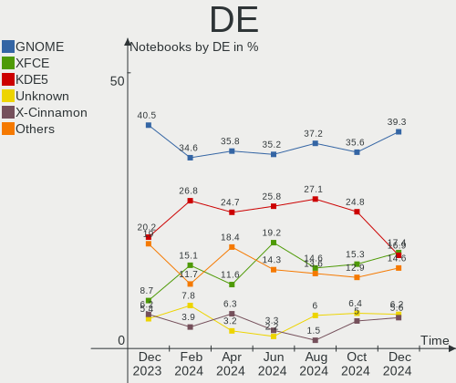
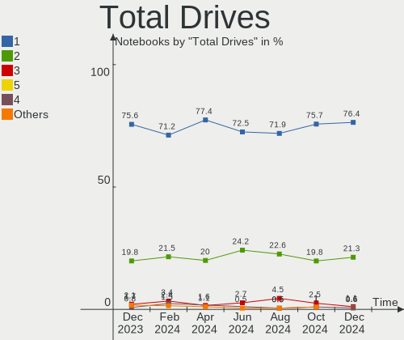
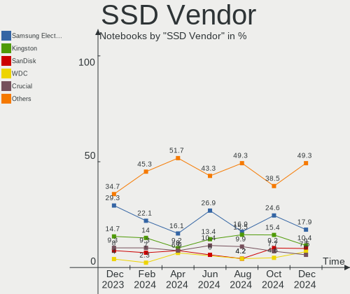
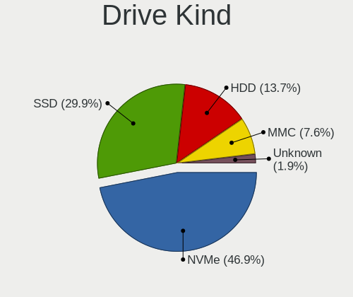
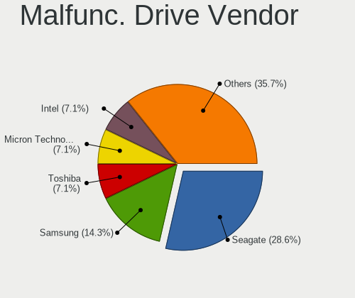
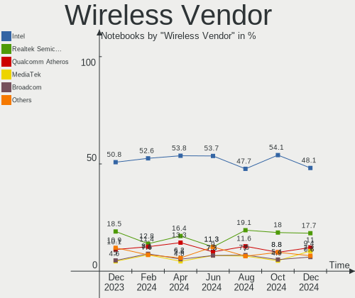
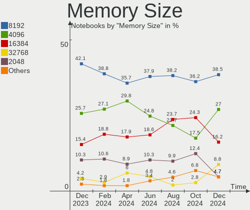
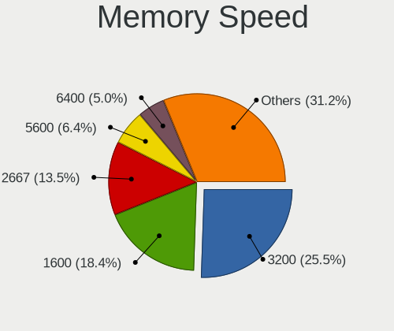
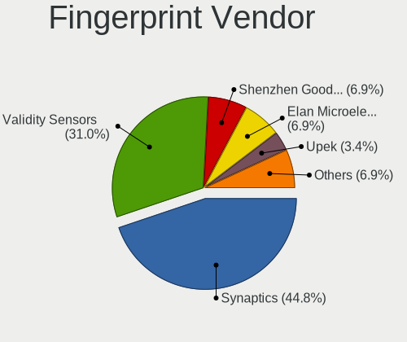

Debian - Hardware Trends (Notebooks)
------------------------------------

A project to identify most popular hardware characteristics and track their change
over time based on data collected by Linux users at https://Linux-Hardware.org.

Anyone can contribute to this report by the [hw-probe](https://github.com/linuxhw/hw-probe) tool:

    sudo -E hw-probe -all -upload

This report is for one last month. Overall report since the beginning of time: [TestDays](https://github.com/linuxhw/TestDays)

Period: Oct, 2023.

Contents
--------

* [ System ](#system)
  - [ OS                       ](#os)
  - [ OS Family                ](#os-family)
  - [ Kernel                   ](#kernel)
  - [ Kernel Family            ](#kernel-family)
  - [ Kernel Major Ver.        ](#kernel-major-ver)
  - [ Arch                     ](#arch)
  - [ DE                       ](#de)
  - [ Display Server           ](#display-server)
  - [ Display Manager          ](#display-manager)
  - [ OS Lang                  ](#os-lang)
  - [ Boot Mode                ](#boot-mode)
  - [ Filesystem               ](#filesystem)
  - [ Part. scheme             ](#part-scheme)
  - [ Dual Boot with Linux/BSD ](#dual-boot-with-linuxbsd)
  - [ Dual Boot (Win)          ](#dual-boot-win)

* [ Board ](#board)
  - [ Vendor                   ](#vendor)
  - [ Model                    ](#model)
  - [ Model Family             ](#model-family)
  - [ MFG Year                 ](#mfg-year)
  - [ Form Factor              ](#form-factor)
  - [ Secure Boot              ](#secure-boot)
  - [ Coreboot                 ](#coreboot)
  - [ RAM Size                 ](#ram-size)
  - [ RAM Used                 ](#ram-used)
  - [ Total Drives             ](#total-drives)
  - [ Has CD-ROM               ](#has-cd-rom)
  - [ Has Ethernet             ](#has-ethernet)
  - [ Has WiFi                 ](#has-wifi)
  - [ Has Bluetooth            ](#has-bluetooth)

* [ Location ](#location)
  - [ Country                  ](#country)
  - [ City                     ](#city)

* [ Drives ](#drives)
  - [ Drive Vendor             ](#drive-vendor)
  - [ Drive Model              ](#drive-model)
  - [ HDD Vendor               ](#hdd-vendor)
  - [ SSD Vendor               ](#ssd-vendor)
  - [ Drive Kind               ](#drive-kind)
  - [ Drive Connector          ](#drive-connector)
  - [ Drive Size               ](#drive-size)
  - [ Space Total              ](#space-total)
  - [ Space Used               ](#space-used)
  - [ Malfunc. Drives          ](#malfunc-drives)
  - [ Malfunc. Drive Vendor    ](#malfunc-drive-vendor)
  - [ Malfunc. HDD Vendor      ](#malfunc-hdd-vendor)
  - [ Malfunc. Drive Kind      ](#malfunc-drive-kind)
  - [ Failed Drives            ](#failed-drives)
  - [ Failed Drive Vendor      ](#failed-drive-vendor)
  - [ Drive Status             ](#drive-status)

* [ Storage controller ](#storage-controller)
  - [ Storage Vendor           ](#storage-vendor)
  - [ Storage Model            ](#storage-model)
  - [ Storage Kind             ](#storage-kind)

* [ Processor ](#processor)
  - [ CPU Vendor               ](#cpu-vendor)
  - [ CPU Model                ](#cpu-model)
  - [ CPU Model Family         ](#cpu-model-family)
  - [ CPU Cores                ](#cpu-cores)
  - [ CPU Sockets              ](#cpu-sockets)
  - [ CPU Threads              ](#cpu-threads)
  - [ CPU Op-Modes             ](#cpu-op-modes)
  - [ CPU Microcode            ](#cpu-microcode)
  - [ CPU Microarch            ](#cpu-microarch)

* [ Graphics ](#graphics)
  - [ GPU Vendor               ](#gpu-vendor)
  - [ GPU Model                ](#gpu-model)
  - [ GPU Combo                ](#gpu-combo)
  - [ GPU Driver               ](#gpu-driver)
  - [ GPU Memory               ](#gpu-memory)

* [ Monitor ](#monitor)
  - [ Monitor Vendor           ](#monitor-vendor)
  - [ Monitor Model            ](#monitor-model)
  - [ Monitor Resolution       ](#monitor-resolution)
  - [ Monitor Diagonal         ](#monitor-diagonal)
  - [ Monitor Width            ](#monitor-width)
  - [ Aspect Ratio             ](#aspect-ratio)
  - [ Monitor Area             ](#monitor-area)
  - [ Pixel Density            ](#pixel-density)
  - [ Multiple Monitors        ](#multiple-monitors)

* [ Network ](#network)
  - [ Net Controller Vendor    ](#net-controller-vendor)
  - [ Net Controller Model     ](#net-controller-model)
  - [ Wireless Vendor          ](#wireless-vendor)
  - [ Wireless Model           ](#wireless-model)
  - [ Ethernet Vendor          ](#ethernet-vendor)
  - [ Ethernet Model           ](#ethernet-model)
  - [ Net Controller Kind      ](#net-controller-kind)
  - [ Used Controller          ](#used-controller)
  - [ NICs                     ](#nics)
  - [ IPv6                     ](#ipv6)

* [ Bluetooth ](#bluetooth)
  - [ Bluetooth Vendor         ](#bluetooth-vendor)
  - [ Bluetooth Model          ](#bluetooth-model)

* [ Sound ](#sound)
  - [ Sound Vendor             ](#sound-vendor)
  - [ Sound Model              ](#sound-model)

* [ Memory ](#memory)
  - [ Memory Vendor            ](#memory-vendor)
  - [ Memory Model             ](#memory-model)
  - [ Memory Kind              ](#memory-kind)
  - [ Memory Form Factor       ](#memory-form-factor)
  - [ Memory Size              ](#memory-size)
  - [ Memory Speed             ](#memory-speed)

* [ Printers & scanners ](#printers--scanners)
  - [ Printer Vendor           ](#printer-vendor)
  - [ Printer Model            ](#printer-model)
  - [ Scanner Vendor           ](#scanner-vendor)
  - [ Scanner Model            ](#scanner-model)

* [ Camera ](#camera)
  - [ Camera Vendor            ](#camera-vendor)
  - [ Camera Model             ](#camera-model)

* [ Security ](#security)
  - [ Fingerprint Vendor       ](#fingerprint-vendor)
  - [ Fingerprint Model        ](#fingerprint-model)
  - [ Chipcard Vendor          ](#chipcard-vendor)
  - [ Chipcard Model           ](#chipcard-model)

* [ Unsupported ](#unsupported)
  - [ Unsupported Devices      ](#unsupported-devices)
  - [ Unsupported Device Types ](#unsupported-device-types)

System
------

OS
--

Installed operating systems

| Name      | Notebooks | Percent |
|-----------|-----------|---------|
| Debian 12 | 220       | 81.18%  |
| Debian 11 | 26        | 9.59%   |
| Debian    | 23        | 8.49%   |
| Debian 23 | 2         | 0.74%   |

OS Family
---------

OS without a version

| Name   | Notebooks | Percent |
|--------|-----------|---------|
| Debian | 271       | 100%    |

Kernel
------

Version of the Linux kernel

| Version                | Notebooks | Percent |
|------------------------|-----------|---------|
| 6.1.0-13-amd64         | 128       | 47.23%  |
| 6.1.0-12-amd64         | 58        | 21.4%   |
| 6.1.0-10-amd64         | 12        | 4.43%   |
| 6.5.0-1-amd64          | 8         | 2.95%   |
| 6.5.0-2-amd64          | 7         | 2.58%   |
| 5.10.0-26-amd64        | 7         | 2.58%   |
| 5.10.0-25-amd64        | 7         | 2.58%   |
| 6.4.0-0.deb12.2-amd64  | 6         | 2.21%   |
| 6.5.0-3-amd64          | 5         | 1.85%   |
| 6.1.0-4-amd64          | 3         | 1.11%   |
| 6.1.0-0.deb11.11-amd64 | 3         | 1.11%   |
| 6.1.0-12-686-pae       | 2         | 0.74%   |
| 6.1.0-11-amd64         | 2         | 0.74%   |
| 5.10.0-23-amd64        | 2         | 0.74%   |
| 5.10.0-22-amd64        | 2         | 0.74%   |
| 6.5.6-hpelite          | 1         | 0.37%   |
| 6.5.5-x64v3-xanmod1    | 1         | 0.37%   |
| 6.5.5+                 | 1         | 0.37%   |
| 6.5.4-chrultrabook     | 1         | 0.37%   |
| 6.5.0-0.deb12.1-amd64  | 1         | 0.37%   |
| 6.4.12-surface         | 1         | 0.37%   |
| 6.4.0-1mx-ahs-amd64    | 1         | 0.37%   |
| 6.3.0-1-amd64          | 1         | 0.37%   |
| 6.2.16-3-pve           | 1         | 0.37%   |
| 6.2.16-15-pve          | 1         | 0.37%   |
| 6.1.0-9-amd64          | 1         | 0.37%   |
| 6.1.0-13-686-pae       | 1         | 0.37%   |
| 6.1.0-0.deb11.7-amd64  | 1         | 0.37%   |
| 5.10.197-loc-os        | 1         | 0.37%   |
| 5.10.191-loc-os        | 1         | 0.37%   |
| 5.10.0-26-686          | 1         | 0.37%   |
| 5.10.0-21-amd64        | 1         | 0.37%   |
| 5.10.0-18-amd64        | 1         | 0.37%   |
| 5.10.0-15-amd64        | 1         | 0.37%   |

Kernel Family
-------------

Linux kernel without a distro release

| Version  | Notebooks | Percent |
|----------|-----------|---------|
| 6.1.0    | 211       | 77.86%  |
| 5.10.0   | 22        | 8.12%   |
| 6.5.0    | 21        | 7.75%   |
| 6.4.0    | 7         | 2.58%   |
| 6.5.5    | 2         | 0.74%   |
| 6.2.16   | 2         | 0.74%   |
| 6.5.6    | 1         | 0.37%   |
| 6.5.4    | 1         | 0.37%   |
| 6.4.12   | 1         | 0.37%   |
| 6.3.0    | 1         | 0.37%   |
| 5.10.197 | 1         | 0.37%   |
| 5.10.191 | 1         | 0.37%   |

Kernel Major Ver.
-----------------

Linux kernel major version

| Version | Notebooks | Percent |
|---------|-----------|---------|
| 6.1     | 211       | 77.86%  |
| 6.5     | 25        | 9.23%   |
| 5.10    | 24        | 8.86%   |
| 6.4     | 8         | 2.95%   |
| 6.2     | 2         | 0.74%   |
| 6.3     | 1         | 0.37%   |

Arch
----

OS architecture (x86_64, i586, etc.)

| Name   | Notebooks | Percent |
|--------|-----------|---------|
| x86_64 | 267       | 98.52%  |
| i686   | 4         | 1.48%   |

DE
--

Desktop Environment

| Name              | Notebooks | Percent |
|-------------------|-----------|---------|
| GNOME             | 77        | 28.41%  |
| Unknown           | 64        | 23.62%  |
| KDE5              | 60        | 22.14%  |
| XFCE              | 23        | 8.49%   |
| MATE              | 12        | 4.43%   |
| X-Cinnamon        | 9         | 3.32%   |
| LXDE              | 7         | 2.58%   |
| Cinnamon          | 5         | 1.85%   |
| LXQt              | 3         | 1.11%   |
| i3                | 3         | 1.11%   |
| KDE               | 2         | 0.74%   |
| x-session-manager | 1         | 0.37%   |
| lightdm-xsession  | 1         | 0.37%   |
| Hyprland          | 1         | 0.37%   |
| GNOME Flashback   | 1         | 0.37%   |
| Budgie            | 1         | 0.37%   |
| awesome           | 1         | 0.37%   |

Display Server
--------------

X11 or Wayland

| Name    | Notebooks | Percent |
|---------|-----------|---------|
| X11     | 104       | 38.38%  |
| Wayland | 96        | 35.42%  |
| Unknown | 63        | 23.25%  |
| Tty     | 8         | 2.95%   |

Display Manager
---------------

SDDM, LightDM, etc.

| Name    | Notebooks | Percent |
|---------|-----------|---------|
| Unknown | 120       | 44.28%  |
| GDM3    | 59        | 21.77%  |
| SDDM    | 43        | 15.87%  |
| LightDM | 39        | 14.39%  |
| GDM     | 7         | 2.58%   |
| LXDM    | 2         | 0.74%   |
| XDM     | 1         | 0.37%   |

OS Lang
-------

Language

| Lang    | Notebooks | Percent |
|---------|-----------|---------|
| en_US   | 102       | 37.64%  |
| Unknown | 58        | 21.4%   |
| de_DE   | 19        | 7.01%   |
| fr_FR   | 12        | 4.43%   |
| en_GB   | 12        | 4.43%   |
| es_ES   | 10        | 3.69%   |
| it_IT   | 9         | 3.32%   |
| ru_RU   | 7         | 2.58%   |
| es_AR   | 5         | 1.85%   |
| pt_BR   | 4         | 1.48%   |
| es_MX   | 4         | 1.48%   |
| en_IN   | 4         | 1.48%   |
| pl_PL   | 3         | 1.11%   |
| en_CA   | 3         | 1.11%   |
| sv_SE   | 2         | 0.74%   |
| hu_HU   | 2         | 0.74%   |
| en_AU   | 2         | 0.74%   |
| C       | 2         | 0.74%   |
| tr_TR   | 1         | 0.37%   |
| nl_NL   | 1         | 0.37%   |
| fi_FI   | 1         | 0.37%   |
| eu_ES   | 1         | 0.37%   |
| es_CL   | 1         | 0.37%   |
| es_BO   | 1         | 0.37%   |
| en_NL   | 1         | 0.37%   |
| en_IE   | 1         | 0.37%   |
| de_AT   | 1         | 0.37%   |
| cs_CZ   | 1         | 0.37%   |
| ca_ES   | 1         | 0.37%   |

Boot Mode
---------

EFI or BIOS

| Mode | Notebooks | Percent |
|------|-----------|---------|
| EFI  | 178       | 65.68%  |
| BIOS | 93        | 34.32%  |

Filesystem
----------

Type of filesystem

| Type    | Notebooks | Percent |
|---------|-----------|---------|
| Ext4    | 173       | 63.84%  |
| Overlay | 70        | 25.83%  |
| Btrfs   | 14        | 5.17%   |
| Tmpfs   | 7         | 2.58%   |
| Xfs     | 3         | 1.11%   |
| Zfs     | 2         | 0.74%   |
| Jfs     | 1         | 0.37%   |
| Ext3    | 1         | 0.37%   |

Part. scheme
------------

Scheme of partitioning

| Type    | Notebooks | Percent |
|---------|-----------|---------|
| GPT     | 185       | 68.27%  |
| Unknown | 55        | 20.3%   |
| MBR     | 31        | 11.44%  |

Dual Boot with Linux/BSD
------------------------

Hosting more than one Linux/BSD

| Dual boot | Notebooks | Percent |
|-----------|-----------|---------|
| No        | 248       | 91.51%  |
| Yes       | 23        | 8.49%   |

Dual Boot (Win)
---------------

Hosting Linux and Windows

| Dual boot | Notebooks | Percent |
|-----------|-----------|---------|
| No        | 185       | 68.27%  |
| Yes       | 86        | 31.73%  |

Board
-----

Vendor
------

Motherboard manufacturer

| Name                           | Notebooks | Percent |
|--------------------------------|-----------|---------|
| Lenovo                         | 86        | 31.73%  |
| Google                         | 35        | 12.92%  |
| Hewlett-Packard                | 31        | 11.44%  |
| Dell                           | 24        | 8.86%   |
| ASUSTek Computer               | 22        | 8.12%   |
| Acer                           | 18        | 6.64%   |
| MSI                            | 7         | 2.58%   |
| Toshiba                        | 6         | 2.21%   |
| Apple                          | 6         | 2.21%   |
| HUAWEI                         | 4         | 1.48%   |
| Timi                           | 2         | 0.74%   |
| Packard Bell                   | 2         | 0.74%   |
| Notebook                       | 2         | 0.74%   |
| Exo                            | 2         | 0.74%   |
| Aquarius                       | 2         | 0.74%   |
| Unknown                        | 2         | 0.74%   |
| VANT                           | 1         | 0.37%   |
| VALE                           | 1         | 0.37%   |
| TUXEDO                         | 1         | 0.37%   |
| THUNDEROBOT                    | 1         | 0.37%   |
| TELECOMITALIA                  | 1         | 0.37%   |
| Teclast                        | 1         | 0.37%   |
| Razer                          | 1         | 0.37%   |
| Prestigio                      | 1         | 0.37%   |
| Philco Informatica             | 1         | 0.37%   |
| Medion                         | 1         | 0.37%   |
| Matsushita Electric Industrial | 1         | 0.37%   |
| Juana Manso                    | 1         | 0.37%   |
| IX1401                         | 1         | 0.37%   |
| GPU Company                    | 1         | 0.37%   |
| Gigabyte Technology            | 1         | 0.37%   |
| Fujitsu                        | 1         | 0.37%   |
| Direkt-Tek                     | 1         | 0.37%   |
| Compaq                         | 1         | 0.37%   |
| AXDIA International            | 1         | 0.37%   |
| Alienware                      | 1         | 0.37%   |

Model
-----

Motherboard model

| Name                                        | Notebooks | Percent |
|---------------------------------------------|-----------|---------|
| Google Reks                                 | 32        | 11.81%  |
| Lenovo ThinkPad E475 20H40006US             | 22        | 8.12%   |
| Lenovo ThinkPad 13 2nd Gen 20J10046US       | 4         | 1.48%   |
| Unknown                                     | 4         | 1.48%   |
| HUAWEI KLVL-WXXW                            | 2         | 0.74%   |
| HP Victus by Gaming Laptop 15-fb0xxx        | 2         | 0.74%   |
| HP Laptop 15-dw3xxx                         | 2         | 0.74%   |
| ASUS VivoBook_ASUSLaptop X7400PC_N7400PC    | 2         | 0.74%   |
| Aquarius NS585                              | 2         | 0.74%   |
| VANT MOOVE3-15                              | 1         | 0.37%   |
| VALE Notebook Classic C140                  | 1         | 0.37%   |
| TUXEDO InfinityBook S 14 v5                 | 1         | 0.37%   |
| Toshiba TECRA R950                          | 1         | 0.37%   |
| Toshiba Satellite P75-A                     | 1         | 0.37%   |
| Toshiba Satellite L845                      | 1         | 0.37%   |
| Toshiba Satellite L755                      | 1         | 0.37%   |
| Toshiba Satellite L455D                     | 1         | 0.37%   |
| Toshiba Satellite A205                      | 1         | 0.37%   |
| Timi RedmiBook Pro 14S                      | 1         | 0.37%   |
| Timi Mi NoteBook Pro                        | 1         | 0.37%   |
| THUNDEROBOT 911AirD                         | 1         | 0.37%   |
| TELECOMITALIA M7x0S                         | 1         | 0.37%   |
| Teclast F15Plus 2                           | 1         | 0.37%   |
| Razer Blade 14 (2022) - RZ09-0427           | 1         | 0.37%   |
| Prestigio Visconte Quad 3GK                 | 1         | 0.37%   |
| Philco Informatica EC10IS2                  | 1         | 0.37%   |
| Packard Bell EasyNote TE11HC                | 1         | 0.37%   |
| Packard Bell EasyNote LM98                  | 1         | 0.37%   |
| Notebook W65_67SJ                           | 1         | 0.37%   |
| Notebook P7xxDM(-G)                         | 1         | 0.37%   |
| MSI WS63 7RK                                | 1         | 0.37%   |
| MSI Katana GF76 11SC                        | 1         | 0.37%   |
| MSI Katana GF66 11UG                        | 1         | 0.37%   |
| MSI GT62VR 6RD                              | 1         | 0.37%   |
| MSI GF63 Thin 9SC                           | 1         | 0.37%   |
| MSI GF63 Thin 11SC                          | 1         | 0.37%   |
| MSI Alpha 17 B5EEK                          | 1         | 0.37%   |
| Matsushita Electric Industrial CF-30CTWAZBM | 1         | 0.37%   |
| Lenovo Yoga Slim 7 ProX 14IAH7 82TK         | 1         | 0.37%   |
| Lenovo V17 G4 IRU 83A2                      | 1         | 0.37%   |

Model Family
------------

Motherboard model prefix

| Name                  | Notebooks | Percent |
|-----------------------|-----------|---------|
| Lenovo ThinkPad       | 69        | 25.46%  |
| Google Reks           | 32        | 11.81%  |
| Acer Aspire           | 13        | 4.8%    |
| ASUS VivoBook         | 10        | 3.69%   |
| HP Laptop             | 7         | 2.58%   |
| Dell Latitude         | 7         | 2.58%   |
| Dell XPS              | 6         | 2.21%   |
| Toshiba Satellite     | 5         | 1.85%   |
| Lenovo IdeaPad        | 5         | 1.85%   |
| HP EliteBook          | 5         | 1.85%   |
| ASUS ASUS             | 5         | 1.85%   |
| Lenovo Legion         | 4         | 1.48%   |
| HP Pavilion           | 4         | 1.48%   |
| Dell Inspiron         | 4         | 1.48%   |
| Unknown               | 4         | 1.48%   |
| HP Victus             | 3         | 1.11%   |
| HP ProBook            | 3         | 1.11%   |
| Dell Vostro           | 3         | 1.11%   |
| Acer Swift            | 3         | 1.11%   |
| Packard Bell EasyNote | 2         | 0.74%   |
| MSI Katana            | 2         | 0.74%   |
| MSI GF63              | 2         | 0.74%   |
| HUAWEI KLVL-WXXW      | 2         | 0.74%   |
| HP ZBook              | 2         | 0.74%   |
| HP 255                | 2         | 0.74%   |
| Exo Smart             | 2         | 0.74%   |
| Dell Precision        | 2         | 0.74%   |
| ASUS ROG              | 2         | 0.74%   |
| Aquarius NS585        | 2         | 0.74%   |
| Apple MacBookPro9     | 2         | 0.74%   |
| VANT MOOVE3-15        | 1         | 0.37%   |
| VALE Notebook         | 1         | 0.37%   |
| TUXEDO InfinityBook   | 1         | 0.37%   |
| Toshiba TECRA         | 1         | 0.37%   |
| Timi RedmiBook        | 1         | 0.37%   |
| Timi Mi               | 1         | 0.37%   |
| THUNDEROBOT 911AirD   | 1         | 0.37%   |
| TELECOMITALIA M7x0S   | 1         | 0.37%   |
| Teclast F15Plus       | 1         | 0.37%   |
| Razer Blade           | 1         | 0.37%   |

MFG Year
--------

Motherboard manufacture year

| Year | Notebooks | Percent |
|------|-----------|---------|
| 2023 | 44        | 16.24%  |
| 2021 | 41        | 15.13%  |
| 2019 | 39        | 14.39%  |
| 2022 | 28        | 10.33%  |
| 2020 | 18        | 6.64%   |
| 2018 | 15        | 5.54%   |
| 2017 | 15        | 5.54%   |
| 2012 | 12        | 4.43%   |
| 2011 | 12        | 4.43%   |
| 2015 | 11        | 4.06%   |
| 2014 | 10        | 3.69%   |
| 2013 | 7         | 2.58%   |
| 2016 | 6         | 2.21%   |
| 2010 | 5         | 1.85%   |
| 2009 | 3         | 1.11%   |
| 2008 | 2         | 0.74%   |
| 2007 | 2         | 0.74%   |
| 2005 | 1         | 0.37%   |

Form Factor
-----------

Physical design of the computer

| Name     | Notebooks | Percent |
|----------|-----------|---------|
| Notebook | 271       | 100%    |

Secure Boot
-----------

Enabled or disabled

| State    | Notebooks | Percent |
|----------|-----------|---------|
| Disabled | 235       | 86.72%  |
| Enabled  | 36        | 13.28%  |

Coreboot
--------

Have coreboot on board

| Used | Notebooks | Percent |
|------|-----------|---------|
| No   | 236       | 87.08%  |
| Yes  | 35        | 12.92%  |

RAM Size
--------

Total RAM memory

| Size in GB  | Notebooks | Percent |
|-------------|-----------|---------|
| 4.01-8.0    | 68        | 25.09%  |
| 3.01-4.0    | 65        | 23.99%  |
| 16.01-24.0  | 52        | 19.19%  |
| 8.01-16.0   | 41        | 15.13%  |
| 32.01-64.0  | 26        | 9.59%   |
| 64.01-256.0 | 9         | 3.32%   |
| 1.01-2.0    | 5         | 1.85%   |
| 24.01-32.0  | 2         | 0.74%   |
| 0.51-1.0    | 2         | 0.74%   |
| 0.01-0.5    | 1         | 0.37%   |

RAM Used
--------

Used RAM memory

| Used GB    | Notebooks | Percent |
|------------|-----------|---------|
| 1.01-2.0   | 94        | 34.69%  |
| 4.01-8.0   | 53        | 19.56%  |
| 2.01-3.0   | 47        | 17.34%  |
| 3.01-4.0   | 41        | 15.13%  |
| 8.01-16.0  | 15        | 5.54%   |
| 0.51-1.0   | 15        | 5.54%   |
| 0.01-0.5   | 4         | 1.48%   |
| 24.01-32.0 | 1         | 0.37%   |
| 16.01-24.0 | 1         | 0.37%   |

Total Drives
------------

Number of drives on board

| Drives | Notebooks | Percent |
|--------|-----------|---------|
| 1      | 208       | 76.75%  |
| 2      | 55        | 20.3%   |
| 3      | 6         | 2.21%   |
| 4      | 1         | 0.37%   |
| 0      | 1         | 0.37%   |

Has CD-ROM
----------

Has CD-ROM on board

| Presented | Notebooks | Percent |
|-----------|-----------|---------|
| No        | 231       | 85.24%  |
| Yes       | 40        | 14.76%  |

Has Ethernet
------------

Has Ethernet on board

| Presented | Notebooks | Percent |
|-----------|-----------|---------|
| Yes       | 187       | 69%     |
| No        | 84        | 31%     |

Has WiFi
--------

Has WiFi module

| Presented | Notebooks | Percent |
|-----------|-----------|---------|
| Yes       | 267       | 98.52%  |
| No        | 4         | 1.48%   |

Has Bluetooth
-------------

Has Bluetooth module

| Presented | Notebooks | Percent |
|-----------|-----------|---------|
| Yes       | 229       | 84.5%   |
| No        | 42        | 15.5%   |

Location
--------

Country
-------

Geographic location (country)

| Country       | Notebooks | Percent |
|---------------|-----------|---------|
| USA           | 96        | 35.42%  |
| Germany       | 24        | 8.86%   |
| Russia        | 17        | 6.27%   |
| France        | 17        | 6.27%   |
| Spain         | 14        | 5.17%   |
| Italy         | 14        | 5.17%   |
| UK            | 8         | 2.95%   |
| Brazil        | 7         | 2.58%   |
| Netherlands   | 5         | 1.85%   |
| Mexico        | 5         | 1.85%   |
| India         | 5         | 1.85%   |
| Argentina     | 5         | 1.85%   |
| Portugal      | 4         | 1.48%   |
| Austria       | 4         | 1.48%   |
| Sweden        | 3         | 1.11%   |
| Poland        | 3         | 1.11%   |
| Finland       | 3         | 1.11%   |
| Czechia       | 3         | 1.11%   |
| Canada        | 3         | 1.11%   |
| Belgium       | 3         | 1.11%   |
| UAE           | 2         | 0.74%   |
| New Caledonia | 2         | 0.74%   |
| Indonesia     | 2         | 0.74%   |
| Hungary       | 2         | 0.74%   |
| Australia     | 2         | 0.74%   |
| Vietnam       | 1         | 0.37%   |
| Ukraine       | 1         | 0.37%   |
| Turkey        | 1         | 0.37%   |
| Switzerland   | 1         | 0.37%   |
| Romania       | 1         | 0.37%   |
| Philippines   | 1         | 0.37%   |
| Norway        | 1         | 0.37%   |
| Kenya         | 1         | 0.37%   |
| Ivory Coast   | 1         | 0.37%   |
| Ireland       | 1         | 0.37%   |
| Greece        | 1         | 0.37%   |
| Ecuador       | 1         | 0.37%   |
| Denmark       | 1         | 0.37%   |
| Croatia       | 1         | 0.37%   |
| Colombia      | 1         | 0.37%   |

City
----

Geographic location (city)

| City               | Notebooks | Percent |
|--------------------|-----------|---------|
| Bangor             | 60        | 22.14%  |
| Paris              | 4         | 1.48%   |
| Moscow             | 4         | 1.48%   |
| Voronezh           | 3         | 1.11%   |
| Rome               | 3         | 1.11%   |
| Perm               | 3         | 1.11%   |
| Milan              | 3         | 1.11%   |
| Mesa               | 3         | 1.11%   |
| Madrid             | 3         | 1.11%   |
| Berlin             | 3         | 1.11%   |
| Yerres             | 2         | 0.74%   |
| Vienna             | 2         | 0.74%   |
| Turin              | 2         | 0.74%   |
| Toulouse           | 2         | 0.74%   |
| Tampere            | 2         | 0.74%   |
| Sydney             | 2         | 0.74%   |
| St Petersburg      | 2         | 0.74%   |
| Portland           | 2         | 0.74%   |
| Pittsburgh         | 2         | 0.74%   |
| Phoenix            | 2         | 0.74%   |
| Paços de Ferreira | 2         | 0.74%   |
| Noumea             | 2         | 0.74%   |
| Milano             | 2         | 0.74%   |
| Mexico City        | 2         | 0.74%   |
| Lisbon             | 2         | 0.74%   |
| Leipzig            | 2         | 0.74%   |
| Fort Wayne         | 2         | 0.74%   |
| Essen              | 2         | 0.74%   |
| Dubai              | 2         | 0.74%   |
| Budapest           | 2         | 0.74%   |
| Amsterdam          | 2         | 0.74%   |
| Zagreb             | 1         | 0.37%   |
| Whitechapel        | 1         | 0.37%   |
| Westminster        | 1         | 0.37%   |
| Warsaw             | 1         | 0.37%   |
| Waremme            | 1         | 0.37%   |
| Waldkraiburg       | 1         | 0.37%   |
| Vigo               | 1         | 0.37%   |
| Valencia           | 1         | 0.37%   |
| Tuxtla Gutiérrez  | 1         | 0.37%   |

Drives
------

Drive Vendor
------------

Hard drive vendors

| Vendor                      | Notebooks | Drives | Percent |
|-----------------------------|-----------|--------|---------|
| Samsung Electronics         | 63        | 74     | 19.15%  |
| Kingston                    | 38        | 38     | 11.55%  |
| Unknown                     | 37        | 37     | 11.25%  |
| WDC                         | 20        | 21     | 6.08%   |
| SanDisk                     | 17        | 17     | 5.17%   |
| Unknown                     | 16        | 16     | 4.86%   |
| Toshiba                     | 15        | 15     | 4.56%   |
| Seagate                     | 14        | 15     | 4.26%   |
| Crucial                     | 11        | 12     | 3.34%   |
| Intel                       | 10        | 11     | 3.04%   |
| Micron Technology           | 9         | 9      | 2.74%   |
| SK hynix                    | 7         | 7      | 2.13%   |
| KIOXIA                      | 7         | 7      | 2.13%   |
| Hitachi                     | 7         | 7      | 2.13%   |
| A-DATA Technology           | 7         | 7      | 2.13%   |
| Phison Electronics          | 4         | 4      | 1.22%   |
| Phison                      | 4         | 4      | 1.22%   |
| HGST                        | 4         | 4      | 1.22%   |
| China                       | 4         | 4      | 1.22%   |
| UMIS                        | 2         | 2      | 0.61%   |
| Transcend                   | 2         | 2      | 0.61%   |
| SPCC                        | 2         | 2      | 0.61%   |
| Micron/Crucial Technology   | 2         | 2      | 0.61%   |
| LaCie                       | 2         | 2      | 0.61%   |
| Apple                       | 2         | 2      | 0.61%   |
| Apacer                      | 2         | 2      | 0.61%   |
| YMTC                        | 1         | 1      | 0.3%    |
| Wibtek                      | 1         | 1      | 0.3%    |
| Union Memory (Shenzhen)     | 1         | 1      | 0.3%    |
| Teclast                     | 1         | 1      | 0.3%    |
| Super Talent                | 1         | 1      | 0.3%    |
| Silicon Motion              | 1         | 1      | 0.3%    |
| PNY                         | 1         | 1      | 0.3%    |
| NT-512                      | 1         | 1      | 0.3%    |
| MAXIO Technology (Hangzhou) | 1         | 1      | 0.3%    |
| Lexar                       | 1         | 1      | 0.3%    |
| Lenovo                      | 1         | 1      | 0.3%    |
| KIOXIA-EXCERIA              | 1         | 1      | 0.3%    |
| Kimtigo                     | 1         | 1      | 0.3%    |
| JMicron Technology          | 1         | 1      | 0.3%    |

Drive Model
-----------

Hard drive models

| Model                                              | Notebooks | Percent |
|----------------------------------------------------|-----------|---------|
| Kingston SA400S37120G 120GB SSD                    | 24        | 7%      |
| Unknown DF4016  16GB                               | 22        | 6.41%   |
| Unknown                                            | 16        | 4.66%   |
| Seagate ST1000LM035-1RK172 1TB                     | 4         | 1.17%   |
| Samsung NVMe SSD Controller SM981/PM981/PM983 1TB  | 4         | 1.17%   |
| Unknown MMC Card  64GB                             | 3         | 0.87%   |
| Samsung SSD 860 EVO 250GB                          | 3         | 0.87%   |
| Samsung MZVL21T0HCLR-00BL7 1TB                     | 3         | 0.87%   |
| Phison E12 NVMe Controller 1TB                     | 3         | 0.87%   |
| WDC PC SN520 SDAPMUW-128G-1101 128GB               | 2         | 0.58%   |
| Toshiba MQ04ABF100 1TB                             | 2         | 0.58%   |
| Toshiba MQ01ABF050 500GB                           | 2         | 0.58%   |
| Seagate ST2000LM015-2E8174 2TB                     | 2         | 0.58%   |
| Seagate Expansion Desk 3TB                         | 2         | 0.58%   |
| SanDisk SD8SN8U128G1001 128GB SSD                  | 2         | 0.58%   |
| SanDisk NVMe SSD Drive 500GB                       | 2         | 0.58%   |
| SanDisk NVMe SSD Drive 1TB                         | 2         | 0.58%   |
| Samsung SSD 970 EVO Plus 2TB                       | 2         | 0.58%   |
| Samsung SSD 970 EVO Plus 1TB                       | 2         | 0.58%   |
| Samsung SSD 970 EVO 500GB                          | 2         | 0.58%   |
| Samsung NVMe SSD Controller PM9A1/PM9A3/980PRO 1TB | 2         | 0.58%   |
| Samsung MZVLQ512HALU-00000 512GB                   | 2         | 0.58%   |
| Samsung MZVLQ256HBJD-00BH1 256GB                   | 2         | 0.58%   |
| Samsung MZVLB1T0HBLR-000L7 1TB                     | 2         | 0.58%   |
| Samsung MZVL21T0HCLR-00BL2 1TB                     | 2         | 0.58%   |
| Samsung MZNTY128HDHP-000L1 128GB SSD               | 2         | 0.58%   |
| Samsung MZALQ512HALU-000L2 512GB                   | 2         | 0.58%   |
| Phison 311CD0512GB                                 | 2         | 0.58%   |
| Micron/Crucial P2 NVMe PCIe SSD 500GB              | 2         | 0.58%   |
| Micron 2400_MTFDKBA512QFM 512GB                    | 2         | 0.58%   |
| Micron 2210_MTFDHBA512QFD 512GB                    | 2         | 0.58%   |
| Kingston SA400S37240G 240GB SSD                    | 2         | 0.58%   |
| HGST HTS721010A9E630 1TB                           | 2         | 0.58%   |
| Crucial CT2000P5PSSD8 2TB                          | 2         | 0.58%   |
| China SATA SSD 256GB                               | 2         | 0.58%   |
| A-DATA SU800 512GB SSD                             | 2         | 0.58%   |
| A-DATA SU650 120GB SSD                             | 2         | 0.58%   |
| YMTC PC005 512GB                                   | 1         | 0.29%   |
| Wibtek W800S 512GB SSD                             | 1         | 0.29%   |
| WDC WDS500G2B0A-00SM50 500GB SSD                   | 1         | 0.29%   |

HDD Vendor
----------

Hard disk drive vendors

| Vendor              | Notebooks | Drives | Percent |
|---------------------|-----------|--------|---------|
| Seagate             | 13        | 14     | 30.23%  |
| WDC                 | 8         | 8      | 18.6%   |
| Toshiba             | 8         | 8      | 18.6%   |
| Hitachi             | 7         | 7      | 16.28%  |
| HGST                | 4         | 4      | 9.3%    |
| Unknown             | 1         | 1      | 2.33%   |
| Samsung Electronics | 1         | 1      | 2.33%   |
| LaCie               | 1         | 1      | 2.33%   |

SSD Vendor
----------

Solid state drive vendors

| Vendor              | Notebooks | Drives | Percent |
|---------------------|-----------|--------|---------|
| Kingston            | 32        | 32     | 33.68%  |
| Samsung Electronics | 18        | 20     | 18.95%  |
| A-DATA Technology   | 7         | 7      | 7.37%   |
| SanDisk             | 6         | 6      | 6.32%   |
| Crucial             | 5         | 5      | 5.26%   |
| China               | 4         | 4      | 4.21%   |
| WDC                 | 2         | 2      | 2.11%   |
| Transcend           | 2         | 2      | 2.11%   |
| SPCC                | 2         | 2      | 2.11%   |
| Apple               | 2         | 2      | 2.11%   |
| Wibtek              | 1         | 1      | 1.05%   |
| Teclast             | 1         | 1      | 1.05%   |
| Super Talent        | 1         | 1      | 1.05%   |
| SK hynix            | 1         | 1      | 1.05%   |
| PNY                 | 1         | 1      | 1.05%   |
| NT-512              | 1         | 1      | 1.05%   |
| Lexar               | 1         | 1      | 1.05%   |
| Intenso             | 1         | 1      | 1.05%   |
| Intel               | 1         | 1      | 1.05%   |
| INNOVATION IT       | 1         | 1      | 1.05%   |
| Hewlett-Packard     | 1         | 1      | 1.05%   |
| HECTRON             | 1         | 1      | 1.05%   |
| GLOWAY              | 1         | 1      | 1.05%   |
| Dogfish             | 1         | 1      | 1.05%   |
| Apacer              | 1         | 1      | 1.05%   |

Drive Kind
----------

HDD or SSD

| Kind    | Notebooks | Drives | Percent |
|---------|-----------|--------|---------|
| NVMe    | 122       | 147    | 39.74%  |
| SSD     | 90        | 97     | 29.32%  |
| MMC     | 53        | 55     | 17.26%  |
| HDD     | 41        | 44     | 13.36%  |
| Unknown | 1         | 1      | 0.33%   |

Drive Connector
---------------

SATA, SAS, NVMe, etc.

| Type | Notebooks | Drives | Percent |
|------|-----------|--------|---------|
| NVMe | 121       | 145    | 39.67%  |
| SATA | 121       | 134    | 39.67%  |
| MMC  | 53        | 55     | 17.38%  |
| SAS  | 10        | 10     | 3.28%   |

Drive Size
----------

Size of hard drive

| Size in TB | Notebooks | Drives | Percent |
|------------|-----------|--------|---------|
| 0.01-0.5   | 95        | 100    | 70.9%   |
| 0.51-1.0   | 30        | 32     | 22.39%  |
| 1.01-2.0   | 6         | 6      | 4.48%   |
| 2.01-3.0   | 2         | 2      | 1.49%   |
| 4.01-10.0  | 1         | 1      | 0.75%   |

Space Total
-----------

Amount of disk space available on the file system

| Size in GB     | Notebooks | Percent |
|----------------|-----------|---------|
| 251-500        | 67        | 24.72%  |
| 101-250        | 51        | 18.82%  |
| 1-20           | 42        | 15.5%   |
| 501-1000       | 35        | 12.92%  |
| Unknown        | 32        | 11.81%  |
| 1001-2000      | 14        | 5.17%   |
| 51-100         | 11        | 4.06%   |
| 21-50          | 9         | 3.32%   |
| 2001-3000      | 7         | 2.58%   |
| More than 3000 | 3         | 1.11%   |

Space Used
----------

Amount of used disk space

| Used GB        | Notebooks | Percent |
|----------------|-----------|---------|
| 1-20           | 113       | 41.7%   |
| 21-50          | 35        | 12.92%  |
| Unknown        | 32        | 11.81%  |
| 51-100         | 30        | 11.07%  |
| 101-250        | 24        | 8.86%   |
| 251-500        | 21        | 7.75%   |
| 1001-2000      | 8         | 2.95%   |
| 501-1000       | 7         | 2.58%   |
| More than 3000 | 1         | 0.37%   |

Malfunc. Drives
---------------

Drive models with a malfunction

| Model                                                 | Notebooks | Drives | Percent |
|-------------------------------------------------------|-----------|--------|---------|
| WDC WD6400BPVT-22HXZT3 640GB                          | 1         | 1      | 4.76%   |
| Toshiba MQ01ABF050 500GB                              | 1         | 1      | 4.76%   |
| Toshiba MQ01ABD100 1TB                                | 1         | 1      | 4.76%   |
| Toshiba MK6475GSX 640GB                               | 1         | 1      | 4.76%   |
| Seagate ST9500420ASG 500GB                            | 1         | 1      | 4.76%   |
| Seagate ST1000LM035-1RK172 1TB                        | 1         | 1      | 4.76%   |
| Samsung Electronics SSD PM810 2.5 128GB               | 1         | 1      | 4.76%   |
| Samsung Electronics SSD 970 EVO 500GB S5H7NS0N586263N | 1         | 1      | 4.76%   |
| Samsung Electronics SSD 970 EVO 500GB                 | 1         | 1      | 4.76%   |
| Samsung Electronics SSD 870 EVO 1TB                   | 1         | 1      | 4.76%   |
| Samsung Electronics MZVLQ512HBLU-00B00 512GB          | 1         | 1      | 4.76%   |
| Samsung Electronics HN-M101MBB 1TB                    | 1         | 1      | 4.76%   |
| Lenovo LENSE20512GMSP34MEAT2TA 512GB                  | 1         | 1      | 4.76%   |
| Kingston SV300S37A120G 120GB SSD                      | 1         | 1      | 4.76%   |
| Kimtigo SSD 256GB                                     | 1         | 1      | 4.76%   |
| Hitachi HTS545050B9SA02 500GB                         | 1         | 1      | 4.76%   |
| Hitachi HTS542525K9SA00 250GB                         | 1         | 1      | 4.76%   |
| HGST HTS725050A7E630 500GB                            | 1         | 1      | 4.76%   |
| HGST HTS725032A7E630 320GB                            | 1         | 1      | 4.76%   |
| HECTRON HECX1-60G SSD                                 | 1         | 1      | 4.76%   |
| Dogfish SSD 128GB                                     | 1         | 1      | 4.76%   |

Malfunc. Drive Vendor
---------------------

Vendors of faulty drives

| Vendor              | Notebooks | Drives | Percent |
|---------------------|-----------|--------|---------|
| Samsung Electronics | 6         | 6      | 28.57%  |
| Toshiba             | 3         | 3      | 14.29%  |
| Seagate             | 2         | 2      | 9.52%   |
| Hitachi             | 2         | 2      | 9.52%   |
| HGST                | 2         | 2      | 9.52%   |
| WDC                 | 1         | 1      | 4.76%   |
| Lenovo              | 1         | 1      | 4.76%   |
| Kingston            | 1         | 1      | 4.76%   |
| Kimtigo             | 1         | 1      | 4.76%   |
| HECTRON             | 1         | 1      | 4.76%   |
| Dogfish             | 1         | 1      | 4.76%   |

Malfunc. HDD Vendor
-------------------

Vendors of faulty HDD drives

| Vendor              | Notebooks | Drives | Percent |
|---------------------|-----------|--------|---------|
| Toshiba             | 3         | 3      | 27.27%  |
| Seagate             | 2         | 2      | 18.18%  |
| Hitachi             | 2         | 2      | 18.18%  |
| HGST                | 2         | 2      | 18.18%  |
| WDC                 | 1         | 1      | 9.09%   |
| Samsung Electronics | 1         | 1      | 9.09%   |

Malfunc. Drive Kind
-------------------

Kinds of faulty drives

| Kind | Notebooks | Drives | Percent |
|------|-----------|--------|---------|
| HDD  | 11        | 11     | 52.38%  |
| NVMe | 5         | 5      | 23.81%  |
| SSD  | 5         | 5      | 23.81%  |

Failed Drives
-------------

Failed drive models

Zero info for selected period =(

Failed Drive Vendor
-------------------

Failed drive vendors

Zero info for selected period =(

Drive Status
------------

Number of failed and malfunc. drives

| Status   | Notebooks | Drives | Percent |
|----------|-----------|--------|---------|
| Works    | 153       | 183    | 52.22%  |
| Detected | 119       | 140    | 40.61%  |
| Malfunc  | 21        | 21     | 7.17%   |

Storage controller
------------------

Storage Vendor
--------------

Storage controller vendors

| Vendor                           | Notebooks | Percent |
|----------------------------------|-----------|---------|
| Intel                            | 130       | 43.77%  |
| Samsung Electronics              | 44        | 14.81%  |
| AMD                              | 38        | 12.79%  |
| SanDisk                          | 20        | 6.73%   |
| Micron/Crucial Technology        | 9         | 3.03%   |
| Micron Technology                | 9         | 3.03%   |
| KIOXIA                           | 9         | 3.03%   |
| Phison Electronics               | 8         | 2.69%   |
| Toshiba America Info Systems     | 6         | 2.02%   |
| SK hynix                         | 6         | 2.02%   |
| Kingston Technology Company      | 6         | 2.02%   |
| Union Memory (Shenzhen)          | 2         | 0.67%   |
| Silicon Motion                   | 2         | 0.67%   |
| Yangtze Memory Technologies      | 1         | 0.34%   |
| Silicon Integrated Systems [SiS] | 1         | 0.34%   |
| ShenZhen TIGO Semiconductor      | 1         | 0.34%   |
| Seagate Technology               | 1         | 0.34%   |
| MAXIO Technology (Hangzhou)      | 1         | 0.34%   |
| Lenovo                           | 1         | 0.34%   |
| ASMedia Technology               | 1         | 0.34%   |
| ADATA Technology                 | 1         | 0.34%   |

Storage Model
-------------

Storage controller models

| Model                                                                          | Notebooks | Percent |
|--------------------------------------------------------------------------------|-----------|---------|
| AMD FCH SATA Controller [AHCI mode]                                            | 37        | 11.67%  |
| Samsung NVMe SSD Controller SM981/PM981/PM983                                  | 16        | 5.05%   |
| Intel Volume Management Device NVMe RAID Controller                            | 15        | 4.73%   |
| Samsung NVMe SSD Controller 980 (DRAM-less)                                    | 13        | 4.1%    |
| Samsung NVMe SSD Controller PM9A1/PM9A3/980PRO                                 | 12        | 3.79%   |
| Intel Sunrise Point-LP SATA Controller [AHCI mode]                             | 12        | 3.79%   |
| Intel 7 Series Chipset Family 6-port SATA Controller [AHCI mode]               | 12        | 3.79%   |
| Intel Celeron/Pentium Silver Processor SATA Controller                         | 11        | 3.47%   |
| Intel 82801 Mobile SATA Controller [RAID mode]                                 | 8         | 2.52%   |
| Intel 6 Series/C200 Series Chipset Family 6 port Mobile SATA AHCI Controller   | 8         | 2.52%   |
| Micron/Crucial P2 [Nick P2] / P3 / P3 Plus NVMe PCIe SSD (DRAM-less)           | 7         | 2.21%   |
| Intel Tiger Lake-LP SATA Controller                                            | 7         | 2.21%   |
| Intel Wildcat Point-LP SATA Controller [AHCI Mode]                             | 6         | 1.89%   |
| Intel 8 Series/C220 Series Chipset Family 6-port SATA Controller 1 [AHCI mode] | 6         | 1.89%   |
| Intel Tiger Lake SATA AHCI Controller                                          | 5         | 1.58%   |
| Intel SSD 670p Series [Keystone Harbor]                                        | 5         | 1.58%   |
| SanDisk WD Black SN770 / PC SN740 256GB / PC SN560 (DRAM-less) NVMe SSD        | 4         | 1.26%   |
| Intel Q170/Q150/B150/H170/H110/Z170/CM236 Chipset SATA Controller [AHCI Mode]  | 4         | 1.26%   |
| Intel Alder Lake-P SATA AHCI Controller                                        | 4         | 1.26%   |
| SK hynix Gold P31/BC711/PC711 NVMe Solid State Drive                           | 3         | 0.95%   |
| SanDisk PC SN520 x2 M.2 2242 NVMe SSD                                          | 3         | 0.95%   |
| Phison PS5013-E13 PCIe3 NVMe Controller (DRAM-less)                            | 3         | 0.95%   |
| Phison E12 NVMe Controller                                                     | 3         | 0.95%   |
| Micron 2210 NVMe SSD [Cobain]                                                  | 3         | 0.95%   |
| KIOXIA NVMe SSD Controller BG5 (DRAM-less)                                     | 3         | 0.95%   |
| KIOXIA NVMe SSD Controller BG4 (DRAM-less)                                     | 3         | 0.95%   |
| Intel HM170/QM170 Chipset SATA Controller [AHCI Mode]                          | 3         | 0.95%   |
| Intel 5 Series/3400 Series Chipset 4 port SATA AHCI Controller                 | 3         | 0.95%   |
| Toshiba America Info Systems BG3 x2 NVMe SSD Controller (DRAM-less)            | 2         | 0.63%   |
| SK hynix Platinum P41/PC801 NVMe Solid State Drive                             | 2         | 0.63%   |
| Silicon Motion SM2263EN/SM2263XT (DRAM-less) NVMe SSD Controllers              | 2         | 0.63%   |
| SanDisk WD PC SN810 / Black SN850 NVMe SSD                                     | 2         | 0.63%   |
| Sandisk WD PC SN740 NVMe SSD 512GB (DRAM-less)                                 | 2         | 0.63%   |
| SanDisk Ultra 3D / WD Blue SN550 NVMe SSD                                      | 2         | 0.63%   |
| SanDisk Extreme Pro / WD Black SN750 / PC SN730 / Red SN700 NVMe SSD           | 2         | 0.63%   |
| Samsung NVMe SSD Controller SM961/PM961/SM963                                  | 2         | 0.63%   |
| Phison PS5019-E19 PCIe4 NVMe Controller (DRAM-less)                            | 2         | 0.63%   |
| Micron/Crucial P5 Plus NVMe PCIe SSD                                           | 2         | 0.63%   |
| Micron 3400 NVMe SSD [Hendrix]                                                 | 2         | 0.63%   |
| Micron 2450 NVMe SSD [HendrixV] (DRAM-less)                                    | 2         | 0.63%   |

Storage Kind
------------

Kind of storage controller (IDE, SATA, NVMe, SAS, ...)

| Kind | Notebooks | Percent |
|------|-----------|---------|
| SATA | 141       | 47.64%  |
| NVMe | 120       | 40.54%  |
| RAID | 25        | 8.45%   |
| IDE  | 10        | 3.38%   |

Processor
---------

CPU Vendor
----------

Processor vendors

| Vendor | Notebooks | Percent |
|--------|-----------|---------|
| Intel  | 208       | 76.75%  |
| AMD    | 63        | 23.25%  |

CPU Model
---------

Processor models

| Model                                      | Notebooks | Percent |
|--------------------------------------------|-----------|---------|
| Intel Celeron CPU N3060 @ 1.60GHz          | 33        | 12.18%  |
| AMD PRO A6-9500B R5, 6 COMPUTE CORES 2C+4G | 22        | 8.12%   |
| Intel 12th Gen Core i7-12700H              | 6         | 2.21%   |
| Intel 12th Gen Core i5-1235U               | 6         | 2.21%   |
| Intel Celeron N4020 CPU @ 1.10GHz          | 5         | 1.85%   |
| Intel Core i5-7200U CPU @ 2.50GHz          | 4         | 1.48%   |
| Intel Celeron CPU 3865U @ 1.80GHz          | 4         | 1.48%   |
| Intel 11th Gen Core i7-11800H @ 2.30GHz    | 4         | 1.48%   |
| Intel 11th Gen Core i5-1135G7 @ 2.40GHz    | 4         | 1.48%   |
| AMD Ryzen 7 5700U with Radeon Graphics     | 4         | 1.48%   |
| AMD Ryzen 5 5500U with Radeon Graphics     | 4         | 1.48%   |
| Intel Core i7-8565U CPU @ 1.80GHz          | 3         | 1.11%   |
| Intel Core i5-8350U CPU @ 1.70GHz          | 3         | 1.11%   |
| Intel Core i5-7300U CPU @ 2.60GHz          | 3         | 1.11%   |
| Intel Core i5-5200U CPU @ 2.20GHz          | 3         | 1.11%   |
| Intel Core i5-2450M CPU @ 2.50GHz          | 3         | 1.11%   |
| Intel Core i5-1035G1 CPU @ 1.00GHz         | 3         | 1.11%   |
| Intel Celeron N4120 CPU @ 1.10GHz          | 3         | 1.11%   |
| Intel 13th Gen Core i5-1335U               | 3         | 1.11%   |
| Intel 11th Gen Core i7-1165G7 @ 2.80GHz    | 3         | 1.11%   |
| AMD Ryzen 5 4600H with Radeon Graphics     | 3         | 1.11%   |
| Intel Core i7-9750H CPU @ 2.60GHz          | 2         | 0.74%   |
| Intel Core i7-8665U CPU @ 1.90GHz          | 2         | 0.74%   |
| Intel Core i7-8650U CPU @ 1.90GHz          | 2         | 0.74%   |
| Intel Core i7-7820HQ CPU @ 2.90GHz         | 2         | 0.74%   |
| Intel Core i7-7700HQ CPU @ 2.80GHz         | 2         | 0.74%   |
| Intel Core i7-7500U CPU @ 2.70GHz          | 2         | 0.74%   |
| Intel Core i7-4710MQ CPU @ 2.50GHz         | 2         | 0.74%   |
| Intel Core i7-4700MQ CPU @ 2.40GHz         | 2         | 0.74%   |
| Intel Core i7-10510U CPU @ 1.80GHz         | 2         | 0.74%   |
| Intel Core i5-3320M CPU @ 2.60GHz          | 2         | 0.74%   |
| Intel Core i5-3210M CPU @ 2.50GHz          | 2         | 0.74%   |
| Intel Core i5-10210U CPU @ 1.60GHz         | 2         | 0.74%   |
| Intel Core i3-9100 CPU @ 3.60GHz           | 2         | 0.74%   |
| Intel Atom x5-Z8350 CPU @ 1.44GHz          | 2         | 0.74%   |
| Intel 13th Gen Core i7-1355U               | 2         | 0.74%   |
| Intel 11th Gen Core i7-11850H @ 2.50GHz    | 2         | 0.74%   |
| Intel 11th Gen Core i7-11370H @ 3.30GHz    | 2         | 0.74%   |
| Intel 11th Gen Core i5-11400H @ 2.70GHz    | 2         | 0.74%   |
| Intel 11th Gen Core i3-1115G4 @ 3.00GHz    | 2         | 0.74%   |

CPU Model Family
----------------

Processor model prefix

| Model                | Notebooks | Percent |
|----------------------|-----------|---------|
| Other                | 72        | 26.57%  |
| Intel Celeron        | 53        | 19.56%  |
| Intel Core i5        | 40        | 14.76%  |
| Intel Core i7        | 38        | 14.02%  |
| AMD Ryzen 7          | 11        | 4.06%   |
| AMD Ryzen 5          | 10        | 3.69%   |
| Intel Atom           | 7         | 2.58%   |
| Intel Core i3        | 6         | 2.21%   |
| AMD Ryzen 7 PRO      | 6         | 2.21%   |
| Intel Pentium        | 5         | 1.85%   |
| Intel Core 2 Duo     | 3         | 1.11%   |
| AMD Ryzen 9          | 3         | 1.11%   |
| Intel Pentium Silver | 2         | 0.74%   |
| AMD Ryzen 3          | 2         | 0.74%   |
| AMD A8               | 2         | 0.74%   |
| AMD A6               | 2         | 0.74%   |
| AMD A4               | 2         | 0.74%   |
| Intel Xeon           | 1         | 0.37%   |
| Intel Core m5        | 1         | 0.37%   |
| Intel Core Duo       | 1         | 0.37%   |
| Intel Celeron M      | 1         | 0.37%   |
| AMD Sempron          | 1         | 0.37%   |
| AMD Ryzen 3 PRO      | 1         | 0.37%   |
| AMD Athlon           | 1         | 0.37%   |

CPU Cores
---------

Number of processor cores

| Number | Notebooks | Percent |
|--------|-----------|---------|
| 2      | 103       | 38.01%  |
| 4      | 73        | 26.94%  |
| 8      | 27        | 9.96%   |
| 1      | 26        | 9.59%   |
| 10     | 15        | 5.54%   |
| 6      | 15        | 5.54%   |
| 14     | 8         | 2.95%   |
| 12     | 2         | 0.74%   |
| 24     | 1         | 0.37%   |
| 5      | 1         | 0.37%   |

CPU Sockets
-----------

Number of sockets

| Number | Notebooks | Percent |
|--------|-----------|---------|
| 1      | 271       | 100%    |

CPU Threads
-----------

Threads per core (Hyper-Threading)

| Number | Notebooks | Percent |
|--------|-----------|---------|
| 2      | 189       | 69.74%  |
| 1      | 82        | 30.26%  |

CPU Op-Modes
------------

CPU Operation Modes (32-bit, 64-bit)

| Op mode        | Notebooks | Percent |
|----------------|-----------|---------|
| 32-bit, 64-bit | 268       | 98.89%  |
| 32-bit         | 3         | 1.11%   |

CPU Microcode
-------------

Microcode number

| Number     | Notebooks | Percent |
|------------|-----------|---------|
| Unknown    | 86        | 31.73%  |
| 0x406c4    | 35        | 12.92%  |
| 0x0600611a | 23        | 8.49%   |
| 0x206a7    | 10        | 3.69%   |
| 0x906a3    | 9         | 3.32%   |
| 0x806e9    | 8         | 2.95%   |
| 0x806d1    | 7         | 2.58%   |
| 0x906a4    | 6         | 2.21%   |
| 0x306a9    | 6         | 2.21%   |
| 0xb06a3    | 5         | 1.85%   |
| 0x806c1    | 5         | 1.85%   |
| 0x906e9    | 4         | 1.48%   |
| 0x706a8    | 4         | 1.48%   |
| 0x306d4    | 4         | 1.48%   |
| 0x08608103 | 4         | 1.48%   |
| 0x306c3    | 3         | 1.11%   |
| 0x30678    | 3         | 1.11%   |
| 0x0a404102 | 3         | 1.11%   |
| 0x08608102 | 3         | 1.11%   |
| 0x08600106 | 3         | 1.11%   |
| 0x906eb    | 2         | 0.74%   |
| 0x806ec    | 2         | 0.74%   |
| 0x806eb    | 2         | 0.74%   |
| 0x806ea    | 2         | 0.74%   |
| 0x706e5    | 2         | 0.74%   |
| 0x706a1    | 2         | 0.74%   |
| 0x1067a    | 2         | 0.74%   |
| 0x08600104 | 2         | 0.74%   |
| 0x08108109 | 2         | 0.74%   |
| 0xb06a2    | 1         | 0.37%   |
| 0xb0671    | 1         | 0.37%   |
| 0xa0652    | 1         | 0.37%   |
| 0x906ea    | 1         | 0.37%   |
| 0x906c0    | 1         | 0.37%   |
| 0x6fd      | 1         | 0.37%   |
| 0x6ec      | 1         | 0.37%   |
| 0x6d8      | 1         | 0.37%   |
| 0x506e3    | 1         | 0.37%   |
| 0x506c9    | 1         | 0.37%   |
| 0x406e3    | 1         | 0.37%   |

CPU Microarch
-------------

Microarchitecture

| Name             | Notebooks | Percent |
|------------------|-----------|---------|
| KabyLake         | 40        | 14.76%  |
| Silvermont       | 39        | 14.39%  |
| Alderlake Hybrid | 25        | 9.23%   |
| Excavator        | 24        | 8.86%   |
| Unknown          | 21        | 7.75%   |
| SandyBridge      | 16        | 5.9%    |
| TigerLake        | 13        | 4.8%    |
| Goldmont plus    | 12        | 4.43%   |
| Icelake          | 11        | 4.06%   |
| Zen 2            | 9         | 3.32%   |
| Zen 3            | 8         | 2.95%   |
| IvyBridge        | 8         | 2.95%   |
| Haswell          | 8         | 2.95%   |
| Skylake          | 7         | 2.58%   |
| Broadwell        | 7         | 2.58%   |
| Westmere         | 3         | 1.11%   |
| Bonnell          | 3         | 1.11%   |
| Zen+             | 2         | 0.74%   |
| Penryn           | 2         | 0.74%   |
| P6               | 2         | 0.74%   |
| Jaguar           | 2         | 0.74%   |
| Core             | 2         | 0.74%   |
| Tremont          | 1         | 0.37%   |
| Puma             | 1         | 0.37%   |
| Piledriver       | 1         | 0.37%   |
| Nehalem          | 1         | 0.37%   |
| K8 & K10 hybrid  | 1         | 0.37%   |
| Goldmont         | 1         | 0.37%   |
| CometLake        | 1         | 0.37%   |

Graphics
--------

GPU Vendor
----------

Vendors of graphics cards

| Vendor                           | Notebooks | Percent |
|----------------------------------|-----------|---------|
| Intel                            | 199       | 59.94%  |
| AMD                              | 70        | 21.08%  |
| Nvidia                           | 62        | 18.67%  |
| Silicon Integrated Systems [SiS] | 1         | 0.3%    |

GPU Model
---------

Graphics card models

| Model                                                                                    | Notebooks | Percent |
|------------------------------------------------------------------------------------------|-----------|---------|
| Intel Atom/Celeron/Pentium Processor x5-E8000/J3xxx/N3xxx Integrated Graphics Controller | 36        | 10.65%  |
| AMD Wani [Radeon R5/R6/R7 Graphics]                                                      | 23        | 6.8%    |
| Intel 2nd Generation Core Processor Family Integrated Graphics Controller                | 16        | 4.73%   |
| Intel TigerLake-LP GT2 [Iris Xe Graphics]                                                | 11        | 3.25%   |
| Intel GeminiLake [UHD Graphics 600]                                                      | 10        | 2.96%   |
| Intel HD Graphics 620                                                                    | 9         | 2.66%   |
| AMD Renoir [Radeon RX Vega 6 (Ryzen 4000/5000 Mobile Series)]                            | 9         | 2.66%   |
| AMD Lucienne                                                                             | 9         | 2.66%   |
| Intel TigerLake-H GT1 [UHD Graphics]                                                     | 8         | 2.37%   |
| Intel 3rd Gen Core processor Graphics Controller                                         | 8         | 2.37%   |
| Nvidia TU117M [GeForce GTX 1650 Mobile / Max-Q]                                          | 7         | 2.07%   |
| Intel WhiskeyLake-U GT2 [UHD Graphics 620]                                               | 7         | 2.07%   |
| Intel Alder Lake-P GT2 [Iris Xe Graphics]                                                | 7         | 2.07%   |
| Intel UHD Graphics 620                                                                   | 6         | 1.78%   |
| Intel HD Graphics 5500                                                                   | 6         | 1.78%   |
| AMD Cezanne [Radeon Vega Series / Radeon Vega Mobile Series]                             | 6         | 1.78%   |
| Nvidia GA107M [GeForce RTX 3050 Mobile]                                                  | 5         | 1.48%   |
| Intel Raptor Lake-P [Iris Xe Graphics]                                                   | 5         | 1.48%   |
| Intel Alder Lake-UP3 GT2 [Iris Xe Graphics]                                              | 5         | 1.48%   |
| Intel 4th Gen Core Processor Integrated Graphics Controller                              | 5         | 1.48%   |
| Nvidia GA104M [GeForce RTX 3070 Mobile / Max-Q]                                          | 4         | 1.18%   |
| Intel HD Graphics 630                                                                    | 4         | 1.18%   |
| Intel HD Graphics 610                                                                    | 4         | 1.18%   |
| Intel CometLake-U GT2 [UHD Graphics]                                                     | 4         | 1.18%   |
| Nvidia GA107M [GeForce RTX 3050 Ti Mobile]                                               | 3         | 0.89%   |
| Nvidia GA106M [GeForce RTX 3060 Mobile / Max-Q]                                          | 3         | 0.89%   |
| Intel Skylake GT2 [HD Graphics 520]                                                      | 3         | 0.89%   |
| Intel Iris Plus Graphics G1 (Ice Lake)                                                   | 3         | 0.89%   |
| Intel CoffeeLake-H GT2 [UHD Graphics 630]                                                | 3         | 0.89%   |
| Intel Atom Processor Z36xxx/Z37xxx Series Graphics & Display                             | 3         | 0.89%   |
| Intel Alder Lake-UP3 GT2 [UHD Graphics]                                                  | 3         | 0.89%   |
| AMD Rembrandt [Radeon 680M]                                                              | 3         | 0.89%   |
| Nvidia GP108M [GeForce MX150]                                                            | 2         | 0.59%   |
| Nvidia GP107M [GeForce GTX 1050 Mobile]                                                  | 2         | 0.59%   |
| Nvidia GM107M [GeForce GTX 850M]                                                         | 2         | 0.59%   |
| Nvidia GK208M [GeForce GT 730M]                                                          | 2         | 0.59%   |
| Intel Tiger Lake-LP GT2 [UHD Graphics G4]                                                | 2         | 0.59%   |
| Intel Raptor Lake-P [UHD Graphics]                                                       | 2         | 0.59%   |
| Intel Mobile 945GM/GMS/GME, 943/940GML Express Integrated Graphics Controller            | 2         | 0.59%   |
| Intel Haswell-ULT Integrated Graphics Controller                                         | 2         | 0.59%   |

GPU Combo
---------

Combinations of graphics cards

| Name           | Notebooks | Percent |
|----------------|-----------|---------|
| 1 x Intel      | 142       | 52.4%   |
| 1 x AMD        | 54        | 19.93%  |
| Intel + Nvidia | 48        | 17.71%  |
| AMD + Nvidia   | 8         | 2.95%   |
| 1 x Nvidia     | 6         | 2.21%   |
| Intel + AMD    | 5         | 1.85%   |
| 2 x Intel      | 3         | 1.11%   |
| 2 x AMD        | 3         | 1.11%   |
| Other          | 1         | 0.37%   |
| 1 x SiS        | 1         | 0.37%   |

GPU Driver
----------

Free vs proprietary

| Driver      | Notebooks | Percent |
|-------------|-----------|---------|
| Free        | 218       | 80.44%  |
| Unknown     | 29        | 10.7%   |
| Proprietary | 24        | 8.86%   |

GPU Memory
----------

Total video memory

| Size in GB | Notebooks | Percent |
|------------|-----------|---------|
| Unknown    | 200       | 73.8%   |
| 0.01-0.5   | 38        | 14.02%  |
| 3.01-4.0   | 13        | 4.8%    |
| 5.01-6.0   | 7         | 2.58%   |
| 1.01-2.0   | 6         | 2.21%   |
| 0.51-1.0   | 5         | 1.85%   |
| 7.01-8.0   | 2         | 0.74%   |

Monitor
-------

Monitor Vendor
--------------

Monitor vendors

| Vendor                  | Notebooks | Percent |
|-------------------------|-----------|---------|
| BOE                     | 77        | 26.28%  |
| AU Optronics            | 48        | 16.38%  |
| Chimei Innolux          | 43        | 14.68%  |
| LG Display              | 29        | 9.9%    |
| Samsung Electronics     | 20        | 6.83%   |
| InfoVision              | 11        | 3.75%   |
| Sharp                   | 6         | 2.05%   |
| Apple                   | 6         | 2.05%   |
| PANDA                   | 5         | 1.71%   |
| Dell                    | 5         | 1.71%   |
| CSO                     | 5         | 1.71%   |
| AOC                     | 4         | 1.37%   |
| Iiyama                  | 3         | 1.02%   |
| Goldstar                | 3         | 1.02%   |
| Chi Mei Optoelectronics | 3         | 1.02%   |
| Acer                    | 3         | 1.02%   |
| ViewSonic               | 2         | 0.68%   |
| Philips                 | 2         | 0.68%   |
| Lenovo                  | 2         | 0.68%   |
| HannStar                | 2         | 0.68%   |
| Eizo                    | 2         | 0.68%   |
| Vizio                   | 1         | 0.34%   |
| TMX                     | 1         | 0.34%   |
| STA                     | 1         | 0.34%   |
| SGT                     | 1         | 0.34%   |
| NEC Computers           | 1         | 0.34%   |
| MSI                     | 1         | 0.34%   |
| HKC                     | 1         | 0.34%   |
| Hewlett-Packard         | 1         | 0.34%   |
| CPT                     | 1         | 0.34%   |
| BenQ                    | 1         | 0.34%   |
| Ancor Communications    | 1         | 0.34%   |
| Unknown                 | 1         | 0.34%   |

Monitor Model
-------------

Monitor models

| Model                                                                | Notebooks | Percent |
|----------------------------------------------------------------------|-----------|---------|
| BOE LCD Monitor BOE06B3 1920x1080                                    | 22        | 7.51%   |
| BOE LCD Monitor BOE0609 1366x768 256x144mm 11.6-inch                 | 17        | 5.8%    |
| Chimei Innolux LCD Monitor CMN1132 1366x768 256x144mm 11.6-inch      | 9         | 3.07%   |
| InfoVision LCD Monitor IVO048E 1366x768 256x144mm 11.6-inch          | 5         | 1.71%   |
| InfoVision LCD Monitor IVO0533 1366x768 293x165mm 13.2-inch          | 3         | 1.02%   |
| Chimei Innolux LCD Monitor CMN1521 1920x1080 344x193mm 15.5-inch     | 3         | 1.02%   |
| Chimei Innolux LCD Monitor CMN14C9 1920x1080 309x173mm 13.9-inch     | 3         | 1.02%   |
| BOE LCD Monitor BOE0893 2160x1440 296x197mm 14.0-inch                | 3         | 1.02%   |
| Samsung Electronics LCD Monitor SEC3047 1366x768 277x156mm 12.5-inch | 2         | 0.68%   |
| LG Display LCD Monitor LGD046C 1920x1080 380x210mm 17.1-inch         | 2         | 0.68%   |
| Dell P2419H DELD0DA 1920x1080 527x296mm 23.8-inch                    | 2         | 0.68%   |
| CSO LCD Monitor CSO1500 3840x2160 344x194mm 15.5-inch                | 2         | 0.68%   |
| CSO LCD Monitor CSO1404 1920x1200 302x189mm 14.0-inch                | 2         | 0.68%   |
| Chimei Innolux LCD Monitor CMN15F5 1920x1080 344x193mm 15.5-inch     | 2         | 0.68%   |
| Chimei Innolux LCD Monitor CMN153B 1920x1080 344x193mm 15.5-inch     | 2         | 0.68%   |
| Chimei Innolux LCD Monitor CMN1538 1920x1080 344x193mm 15.5-inch     | 2         | 0.68%   |
| Chimei Innolux LCD Monitor CMN14FF 1920x1080 309x173mm 13.9-inch     | 2         | 0.68%   |
| Chimei Innolux LCD Monitor CMN14D4 1920x1080 309x173mm 13.9-inch     | 2         | 0.68%   |
| BOE LCD Monitor BOE0812 1920x1080 344x194mm 15.5-inch                | 2         | 0.68%   |
| BOE LCD Monitor BOE07CB 1920x1080 344x193mm 15.5-inch                | 2         | 0.68%   |
| AU Optronics LCD Monitor AUOFA9B 1920x1200 301x188mm 14.0-inch       | 2         | 0.68%   |
| AU Optronics LCD Monitor AUO499F 1920x1080 344x194mm 15.5-inch       | 2         | 0.68%   |
| AU Optronics LCD Monitor AUO46EC 1366x768 344x193mm 15.5-inch        | 2         | 0.68%   |
| AU Optronics LCD Monitor AUO103D 1920x1080 309x173mm 13.9-inch       | 2         | 0.68%   |
| Vizio V705-H3 VIZ1039 3840x2160 1538x865mm 69.5-inch                 | 1         | 0.34%   |
| ViewSonic VG3456 VSC653B 3440x1440 800x340mm 34.2-inch               | 1         | 0.34%   |
| ViewSonic VA2718-FHD VSCD839 1920x1080 598x336mm 27.0-inch           | 1         | 0.34%   |
| TMX TL140BDXP01-0 TMX1400 2560x1440 310x174mm 14.0-inch              | 1         | 0.34%   |
| STA LCD Monitor STA8CA7 1366x768 256x144mm 11.6-inch                 | 1         | 0.34%   |
| Sharp LQ140M1JW49 SHP1523 1920x1080 309x174mm 14.0-inch              | 1         | 0.34%   |
| Sharp LCD Monitor SHP14CC 3840x2400 288x180mm 13.4-inch              | 1         | 0.34%   |
| Sharp LCD Monitor SHP149A 1920x1080 344x194mm 15.5-inch              | 1         | 0.34%   |
| Sharp LCD Monitor SHP1453 1920x1080 346x194mm 15.6-inch              | 1         | 0.34%   |
| Sharp LCD Monitor SHP144F 1920x1080 276x156mm 12.5-inch              | 1         | 0.34%   |
| Sharp LCD Monitor SHP143B 3840x2160 346x194mm 15.6-inch              | 1         | 0.34%   |
| SGT F156P1 SGT1600 1920x1080 345x194mm 15.6-inch                     | 1         | 0.34%   |
| Samsung Electronics SyncMaster SAM03EE 1680x1050                     | 1         | 0.34%   |
| Samsung Electronics S27R65 SAM1045 1920x1080 598x336mm 27.0-inch     | 1         | 0.34%   |
| Samsung Electronics S27E510 SAM0C5F 1920x1080 598x336mm 27.0-inch    | 1         | 0.34%   |
| Samsung Electronics S22D300 SAM0B3F 1920x1080 477x268mm 21.5-inch    | 1         | 0.34%   |

Monitor Resolution
------------------

Monitor screen resolution

| Resolution         | Notebooks | Percent |
|--------------------|-----------|---------|
| 1920x1080 (FHD)    | 135       | 49.09%  |
| 1366x768 (WXGA)    | 80        | 29.09%  |
| 1920x1200 (WUXGA)  | 13        | 4.73%   |
| 3840x2160 (4K)     | 10        | 3.64%   |
| 2560x1440 (QHD)    | 7         | 2.55%   |
| 2560x1600          | 4         | 1.45%   |
| 1280x800 (WXGA)    | 4         | 1.45%   |
| 2880x1800          | 3         | 1.09%   |
| 2160x1440          | 3         | 1.09%   |
| 1680x1050 (WSXGA+) | 3         | 1.09%   |
| 1600x900 (HD+)     | 3         | 1.09%   |
| 3440x1440          | 2         | 0.73%   |
| 1024x600           | 2         | 0.73%   |
| 3840x2400          | 1         | 0.36%   |
| 3200x2000          | 1         | 0.36%   |
| 3072x1920          | 1         | 0.36%   |
| 2880x1620          | 1         | 0.36%   |
| 1600x1200          | 1         | 0.36%   |
| 1440x900 (WXGA+)   | 1         | 0.36%   |

Monitor Diagonal
----------------

Diagonal size in inches

| Inches  | Notebooks | Percent |
|---------|-----------|---------|
| 15      | 88        | 30.34%  |
| 13      | 58        | 20%     |
| 14      | 37        | 12.76%  |
| 11      | 37        | 12.76%  |
| 17      | 15        | 5.17%   |
| 27      | 9         | 3.1%    |
| 16      | 9         | 3.1%    |
| 12      | 9         | 3.1%    |
| 24      | 6         | 2.07%   |
| 23      | 4         | 1.38%   |
| 21      | 4         | 1.38%   |
| 31      | 3         | 1.03%   |
| 34      | 2         | 0.69%   |
| Unknown | 2         | 0.69%   |
| 69      | 1         | 0.34%   |
| 33      | 1         | 0.34%   |
| 25      | 1         | 0.34%   |
| 22      | 1         | 0.34%   |
| 18      | 1         | 0.34%   |
| 10      | 1         | 0.34%   |
| 8       | 1         | 0.34%   |

Monitor Width
-------------

Physical width

| Width in mm | Notebooks | Percent |
|-------------|-----------|---------|
| 301-350     | 173       | 59.66%  |
| 201-300     | 62        | 21.38%  |
| 501-600     | 20        | 6.9%    |
| 351-400     | 19        | 6.55%   |
| 401-500     | 6         | 2.07%   |
| 701-800     | 3         | 1.03%   |
| 601-700     | 3         | 1.03%   |
| Unknown     | 2         | 0.69%   |
| 1501-2000   | 1         | 0.34%   |
| 101-200     | 1         | 0.34%   |

Aspect Ratio
------------

Proportional relationship between the width and the height

| Ratio   | Notebooks | Percent |
|---------|-----------|---------|
| 16/9    | 227       | 85.66%  |
| 16/10   | 31        | 11.7%   |
| 3/2     | 3         | 1.13%   |
| 21/9    | 2         | 0.75%   |
| 4/3     | 1         | 0.38%   |
| Unknown | 1         | 0.38%   |

Monitor Area
------------

Area in inch²

| Area in inch² | Notebooks | Percent |
|----------------|-----------|---------|
| 101-110        | 92        | 31.72%  |
| 81-90          | 85        | 29.31%  |
| 51-60          | 37        | 12.76%  |
| 201-250        | 15        | 5.17%   |
| 121-130        | 14        | 4.83%   |
| 71-80          | 9         | 3.1%    |
| 61-70          | 9         | 3.1%    |
| 301-350        | 9         | 3.1%    |
| 351-500        | 6         | 2.07%   |
| 111-120        | 5         | 1.72%   |
| Unknown        | 2         | 0.69%   |
| More than 1000 | 1         | 0.34%   |
| 41-50          | 1         | 0.34%   |
| 1-40           | 1         | 0.34%   |
| 251-300        | 1         | 0.34%   |
| 141-150        | 1         | 0.34%   |
| 131-140        | 1         | 0.34%   |
| 91-100         | 1         | 0.34%   |

Pixel Density
-------------

Pixels per inch

| Density       | Notebooks | Percent |
|---------------|-----------|---------|
| 121-160       | 155       | 54.01%  |
| 101-120       | 65        | 22.65%  |
| 51-100        | 33        | 11.5%   |
| 161-240       | 21        | 7.32%   |
| More than 240 | 11        | 3.83%   |
| Unknown       | 2         | 0.7%    |

Multiple Monitors
-----------------

Total monitors connected

| Total | Notebooks | Percent |
|-------|-----------|---------|
| 1     | 226       | 83.39%  |
| 2     | 31        | 11.44%  |
| 0     | 9         | 3.32%   |
| 3     | 5         | 1.85%   |

Network
-------

Net Controller Vendor
---------------------

Controller vendors

| Vendor                           | Notebooks | Percent |
|----------------------------------|-----------|---------|
| Intel                            | 147       | 35.94%  |
| Realtek Semiconductor            | 133       | 32.52%  |
| Qualcomm Atheros                 | 51        | 12.47%  |
| Broadcom                         | 21        | 5.13%   |
| MediaTek                         | 15        | 3.67%   |
| Qualcomm                         | 4         | 0.98%   |
| ASIX Electronics                 | 4         | 0.98%   |
| Xiaomi                           | 3         | 0.73%   |
| Sierra Wireless                  | 3         | 0.73%   |
| Lenovo                           | 3         | 0.73%   |
| Hewlett-Packard                  | 3         | 0.73%   |
| Fibocom                          | 3         | 0.73%   |
| Samsung Electronics              | 2         | 0.49%   |
| Ralink Technology                | 2         | 0.49%   |
| Google                           | 2         | 0.49%   |
| DisplayLink                      | 2         | 0.49%   |
| Broadcom Limited                 | 2         | 0.49%   |
| Silicon Integrated Systems [SiS] | 1         | 0.24%   |
| Ralink                           | 1         | 0.24%   |
| NetGear                          | 1         | 0.24%   |
| Motorola PCS                     | 1         | 0.24%   |
| Marvell Technology Group         | 1         | 0.24%   |
| Linksys                          | 1         | 0.24%   |
| Huawei Technologies              | 1         | 0.24%   |
| Dell                             | 1         | 0.24%   |
| D-Link                           | 1         | 0.24%   |

Net Controller Model
--------------------

Controller models

| Model                                                             | Notebooks | Percent |
|-------------------------------------------------------------------|-----------|---------|
| Realtek RTL8111/8168/8411 PCI Express Gigabit Ethernet Controller | 84        | 17.14%  |
| Intel Wireless 7265                                               | 35        | 7.14%   |
| Qualcomm Atheros QCA9377 802.11ac Wireless Network Adapter        | 28        | 5.71%   |
| Intel Wireless 8265 / 8275                                        | 16        | 3.27%   |
| Intel Alder Lake-P PCH CNVi WiFi                                  | 15        | 3.06%   |
| Realtek RTL8822CE 802.11ac PCIe Wireless Network Adapter          | 13        | 2.65%   |
| Realtek RTL810xE PCI Express Fast Ethernet controller             | 13        | 2.65%   |
| Realtek RTL8153 Gigabit Ethernet Adapter                          | 11        | 2.24%   |
| MediaTek MT7921 802.11ax PCI Express Wireless Network Adapter     | 10        | 2.04%   |
| Intel Wi-Fi 6 AX200                                               | 10        | 2.04%   |
| Qualcomm Atheros QCA6174 802.11ac Wireless Network Adapter        | 8         | 1.63%   |
| Intel Wireless 7260                                               | 8         | 1.63%   |
| Intel Wi-Fi 6 AX201                                               | 8         | 1.63%   |
| Intel Ethernet Connection (4) I219-LM                             | 8         | 1.63%   |
| Realtek RTL8821CE 802.11ac PCIe Wireless Network Adapter          | 6         | 1.22%   |
| Realtek RTL8188CE 802.11b/g/n WiFi Adapter                        | 6         | 1.22%   |
| Intel Wireless 3165                                               | 6         | 1.22%   |
| Intel Ethernet Connection (4) I219-V                              | 6         | 1.22%   |
| Intel Wireless 8260                                               | 5         | 1.02%   |
| Intel Wi-Fi 6 AX210/AX211/AX411 160MHz                            | 5         | 1.02%   |
| Intel Cannon Point-LP CNVi [Wireless-AC]                          | 5         | 1.02%   |
| Intel 82579LM Gigabit Network Connection (Lewisville)             | 5         | 1.02%   |
| Broadcom BCM4313 802.11bgn Wireless Network Adapter               | 5         | 1.02%   |
| Realtek 802.11n WLAN Adapter                                      | 4         | 0.82%   |
| Qualcomm QCNFA765 Wireless Network Adapter                        | 4         | 0.82%   |
| Intel Tiger Lake PCH CNVi WiFi                                    | 4         | 0.82%   |
| Intel Raptor Lake PCH CNVi WiFi                                   | 4         | 0.82%   |
| Broadcom NetLink BCM57785 Gigabit Ethernet PCIe                   | 4         | 0.82%   |
| Realtek RTL8852BE PCIe 802.11ax Wireless Network Controller       | 3         | 0.61%   |
| Qualcomm Atheros AR9462 Wireless Network Adapter                  | 3         | 0.61%   |
| Lenovo USB-C Dock Ethernet                                        | 3         | 0.61%   |
| Intel Ethernet Connection (6) I219-LM                             | 3         | 0.61%   |
| Intel Ethernet Connection (16) I219-V                             | 3         | 0.61%   |
| Intel Cannon Lake PCH CNVi WiFi                                   | 3         | 0.61%   |
| Broadcom NetXtreme BCM57765 Gigabit Ethernet PCIe                 | 3         | 0.61%   |
| Broadcom BCM4331 802.11a/b/g/n                                    | 3         | 0.61%   |
| ASIX AX88179 Gigabit Ethernet                                     | 3         | 0.61%   |
| Xiaomi Mi/Redmi series (RNDIS)                                    | 2         | 0.41%   |
| Sierra Wireless EM7455                                            | 2         | 0.41%   |
| Samsung Galaxy series, misc. (tethering mode)                     | 2         | 0.41%   |

Wireless Vendor
---------------

Wireless vendors

| Vendor                | Notebooks | Percent |
|-----------------------|-----------|---------|
| Intel                 | 143       | 50.71%  |
| Qualcomm Atheros      | 47        | 16.67%  |
| Realtek Semiconductor | 40        | 14.18%  |
| Broadcom              | 17        | 6.03%   |
| MediaTek              | 15        | 5.32%   |
| Qualcomm              | 4         | 1.42%   |
| Sierra Wireless       | 3         | 1.06%   |
| Fibocom               | 3         | 1.06%   |
| Ralink Technology     | 2         | 0.71%   |
| Hewlett-Packard       | 2         | 0.71%   |
| Ralink                | 1         | 0.35%   |
| NetGear               | 1         | 0.35%   |
| Linksys               | 1         | 0.35%   |
| Dell                  | 1         | 0.35%   |
| D-Link                | 1         | 0.35%   |
| Broadcom Limited      | 1         | 0.35%   |

Wireless Model
--------------

Wireless models

| Model                                                                   | Notebooks | Percent |
|-------------------------------------------------------------------------|-----------|---------|
| Intel Wireless 7265                                                     | 35        | 12.41%  |
| Qualcomm Atheros QCA9377 802.11ac Wireless Network Adapter              | 28        | 9.93%   |
| Intel Wireless 8265 / 8275                                              | 16        | 5.67%   |
| Intel Alder Lake-P PCH CNVi WiFi                                        | 15        | 5.32%   |
| Realtek RTL8822CE 802.11ac PCIe Wireless Network Adapter                | 13        | 4.61%   |
| MediaTek MT7921 802.11ax PCI Express Wireless Network Adapter           | 10        | 3.55%   |
| Intel Wi-Fi 6 AX200                                                     | 10        | 3.55%   |
| Qualcomm Atheros QCA6174 802.11ac Wireless Network Adapter              | 8         | 2.84%   |
| Intel Wireless 7260                                                     | 8         | 2.84%   |
| Intel Wi-Fi 6 AX201                                                     | 8         | 2.84%   |
| Realtek RTL8821CE 802.11ac PCIe Wireless Network Adapter                | 6         | 2.13%   |
| Realtek RTL8188CE 802.11b/g/n WiFi Adapter                              | 6         | 2.13%   |
| Intel Wireless 3165                                                     | 6         | 2.13%   |
| Intel Wireless 8260                                                     | 5         | 1.77%   |
| Intel Wi-Fi 6 AX210/AX211/AX411 160MHz                                  | 5         | 1.77%   |
| Intel Cannon Point-LP CNVi [Wireless-AC]                                | 5         | 1.77%   |
| Broadcom BCM4313 802.11bgn Wireless Network Adapter                     | 5         | 1.77%   |
| Realtek 802.11n WLAN Adapter                                            | 4         | 1.42%   |
| Qualcomm QCNFA765 Wireless Network Adapter                              | 4         | 1.42%   |
| Intel Tiger Lake PCH CNVi WiFi                                          | 4         | 1.42%   |
| Intel Raptor Lake PCH CNVi WiFi                                         | 4         | 1.42%   |
| Realtek RTL8852BE PCIe 802.11ax Wireless Network Controller             | 3         | 1.06%   |
| Qualcomm Atheros AR9462 Wireless Network Adapter                        | 3         | 1.06%   |
| Intel Cannon Lake PCH CNVi WiFi                                         | 3         | 1.06%   |
| Broadcom BCM4331 802.11a/b/g/n                                          | 3         | 1.06%   |
| Sierra Wireless EM7455                                                  | 2         | 0.71%   |
| Realtek RTL8852AE 802.11ax PCIe Wireless Network Adapter                | 2         | 0.71%   |
| Realtek RTL8822BE 802.11a/b/g/n/ac WiFi adapter                         | 2         | 0.71%   |
| Qualcomm Atheros QCA9565 / AR9565 Wireless Network Adapter              | 2         | 0.71%   |
| Qualcomm Atheros AR9485 Wireless Network Adapter                        | 2         | 0.71%   |
| Qualcomm Atheros AR242x / AR542x Wireless Network Adapter (PCI-Express) | 2         | 0.71%   |
| MediaTek Wi-Fi 6E MT7902 Wireless Network Adapter                       | 2         | 0.71%   |
| Intel Wireless-AC 9260                                                  | 2         | 0.71%   |
| Intel PRO/Wireless 3945ABG [Golan] Network Connection                   | 2         | 0.71%   |
| Intel Ice Lake-LP PCH CNVi WiFi                                         | 2         | 0.71%   |
| Intel Gemini Lake PCH CNVi WiFi                                         | 2         | 0.71%   |
| Intel Comet Lake PCH-LP CNVi WiFi                                       | 2         | 0.71%   |
| Intel Centrino Ultimate-N 6300                                          | 2         | 0.71%   |
| Intel Centrino Advanced-N 6205 [Taylor Peak]                            | 2         | 0.71%   |
| HP lt4112 Gobi 4G Module Network Device                                 | 2         | 0.71%   |

Ethernet Vendor
---------------

Ethernet vendors

| Vendor                           | Notebooks | Percent |
|----------------------------------|-----------|---------|
| Realtek Semiconductor            | 109       | 54.23%  |
| Intel                            | 53        | 26.37%  |
| Broadcom                         | 10        | 4.98%   |
| Qualcomm Atheros                 | 9         | 4.48%   |
| ASIX Electronics                 | 4         | 1.99%   |
| Xiaomi                           | 3         | 1.49%   |
| Lenovo                           | 3         | 1.49%   |
| Samsung Electronics              | 2         | 1%      |
| Google                           | 2         | 1%      |
| DisplayLink                      | 2         | 1%      |
| Silicon Integrated Systems [SiS] | 1         | 0.5%    |
| Marvell Technology Group         | 1         | 0.5%    |
| Hewlett-Packard                  | 1         | 0.5%    |
| Broadcom Limited                 | 1         | 0.5%    |

Ethernet Model
--------------

Ethernet models

| Model                                                             | Notebooks | Percent |
|-------------------------------------------------------------------|-----------|---------|
| Realtek RTL8111/8168/8411 PCI Express Gigabit Ethernet Controller | 84        | 40.98%  |
| Realtek RTL810xE PCI Express Fast Ethernet controller             | 13        | 6.34%   |
| Realtek RTL8153 Gigabit Ethernet Adapter                          | 11        | 5.37%   |
| Intel Ethernet Connection (4) I219-LM                             | 8         | 3.9%    |
| Intel Ethernet Connection (4) I219-V                              | 6         | 2.93%   |
| Intel 82579LM Gigabit Network Connection (Lewisville)             | 5         | 2.44%   |
| Broadcom NetLink BCM57785 Gigabit Ethernet PCIe                   | 4         | 1.95%   |
| Lenovo USB-C Dock Ethernet                                        | 3         | 1.46%   |
| Intel Ethernet Connection (6) I219-LM                             | 3         | 1.46%   |
| Intel Ethernet Connection (16) I219-V                             | 3         | 1.46%   |
| Broadcom NetXtreme BCM57765 Gigabit Ethernet PCIe                 | 3         | 1.46%   |
| ASIX AX88179 Gigabit Ethernet                                     | 3         | 1.46%   |
| Xiaomi Mi/Redmi series (RNDIS)                                    | 2         | 0.98%   |
| Samsung Galaxy series, misc. (tethering mode)                     | 2         | 0.98%   |
| Realtek RTL8152 Fast Ethernet Adapter                             | 2         | 0.98%   |
| Realtek RTL8125 2.5GbE Controller                                 | 2         | 0.98%   |
| Qualcomm Atheros Killer E2400 Gigabit Ethernet Controller         | 2         | 0.98%   |
| Qualcomm Atheros AR8152 v2.0 Fast Ethernet                        | 2         | 0.98%   |
| Qualcomm Atheros AR8151 v2.0 Gigabit Ethernet                     | 2         | 0.98%   |
| Intel Ethernet Controller I225-V                                  | 2         | 0.98%   |
| Intel Ethernet Controller I225-LM                                 | 2         | 0.98%   |
| Intel Ethernet Connection I219-LM                                 | 2         | 0.98%   |
| Intel Ethernet Connection I217-LM                                 | 2         | 0.98%   |
| Intel Ethernet Connection (3) I218-V                              | 2         | 0.98%   |
| Intel Ethernet Connection (3) I218-LM                             | 2         | 0.98%   |
| Intel Ethernet Connection (23) I219-V                             | 2         | 0.98%   |
| Intel Ethernet Connection (2) I219-LM                             | 2         | 0.98%   |
| Intel Ethernet Connection (16) I219-LM                            | 2         | 0.98%   |
| Xiaomi Mi/Redmi series (RNDIS + ADB)                              | 1         | 0.49%   |
| Silicon Integrated Systems [SiS] 191 Gigabit Ethernet Adapter     | 1         | 0.49%   |
| Realtek Killer E2600 Gigabit Ethernet Controller                  | 1         | 0.49%   |
| Qualcomm Atheros Killer E2500 Gigabit Ethernet Controller         | 1         | 0.49%   |
| Qualcomm Atheros AR8161 Gigabit Ethernet                          | 1         | 0.49%   |
| Qualcomm Atheros AR8132 Fast Ethernet                             | 1         | 0.49%   |
| Marvell Group 88E8055 PCI-E Gigabit Ethernet Controller           | 1         | 0.49%   |
| Intel Ethernet Connection I219-V                                  | 1         | 0.49%   |
| Intel Ethernet Connection I218-LM                                 | 1         | 0.49%   |
| Intel Ethernet Connection (5) I219-LM                             | 1         | 0.49%   |
| Intel Ethernet Connection (14) I219-LM                            | 1         | 0.49%   |
| Intel Ethernet Connection (13) I219-V                             | 1         | 0.49%   |

Net Controller Kind
-------------------

Ethernet, WiFi or modem

| Kind     | Notebooks | Percent |
|----------|-----------|---------|
| WiFi     | 267       | 58.55%  |
| Ethernet | 186       | 40.79%  |
| Modem    | 2         | 0.44%   |
| Unknown  | 1         | 0.22%   |

Used Controller
---------------

Currently used network controller

| Kind     | Notebooks | Percent |
|----------|-----------|---------|
| WiFi     | 223       | 75.08%  |
| Ethernet | 74        | 24.92%  |

NICs
----

Total network controllers on board

| Total | Notebooks | Percent |
|-------|-----------|---------|
| 2     | 171       | 63.1%   |
| 1     | 91        | 33.58%  |
| 0     | 8         | 2.95%   |
| 3     | 1         | 0.37%   |

IPv6
----

IPv6 vs IPv4

| Used | Notebooks | Percent |
|------|-----------|---------|
| No   | 206       | 76.01%  |
| Yes  | 65        | 23.99%  |

Bluetooth
---------

Bluetooth Vendor
----------------

Controller vendors

| Vendor                          | Notebooks | Percent |
|---------------------------------|-----------|---------|
| Intel                           | 126       | 54.78%  |
| Qualcomm Atheros Communications | 34        | 14.78%  |
| Realtek Semiconductor           | 19        | 8.26%   |
| IMC Networks                    | 17        | 7.39%   |
| Lite-On Technology              | 8         | 3.48%   |
| Foxconn / Hon Hai               | 5         | 2.17%   |
| Apple                           | 5         | 2.17%   |
| USI                             | 4         | 1.74%   |
| Broadcom                        | 3         | 1.3%    |
| Realtek                         | 2         | 0.87%   |
| Toshiba                         | 1         | 0.43%   |
| Taiyo Yuden                     | 1         | 0.43%   |
| Ralink Technology               | 1         | 0.43%   |
| Opticis                         | 1         | 0.43%   |
| MediaTek                        | 1         | 0.43%   |
| Hewlett-Packard                 | 1         | 0.43%   |
| Dell                            | 1         | 0.43%   |

Bluetooth Model
---------------

Controller models

| Model                                           | Notebooks | Percent |
|-------------------------------------------------|-----------|---------|
| Intel Bluetooth wireless interface              | 64        | 27.83%  |
| Qualcomm Atheros  Bluetooth Device              | 25        | 10.87%  |
| Intel AX201 Bluetooth                           | 19        | 8.26%   |
| Realtek Bluetooth Radio                         | 17        | 7.39%   |
| Intel Bluetooth 9460/9560 Jefferson Peak (JfP)  | 17        | 7.39%   |
| IMC Networks Wireless_Device                    | 11        | 4.78%   |
| Intel AX200 Bluetooth                           | 10        | 4.35%   |
| Intel Bluetooth Device                          | 9         | 3.91%   |
| Qualcomm Atheros QCA61x4 Bluetooth 4.0          | 7         | 3.04%   |
| USI Bluetooth Device                            | 4         | 1.74%   |
| Intel AX210 Bluetooth                           | 4         | 1.74%   |
| IMC Networks Bluetooth Radio                    | 4         | 1.74%   |
| Realtek Bluetooth Radio                         | 2         | 0.87%   |
| Qualcomm Atheros AR3012 Bluetooth 4.0           | 2         | 0.87%   |
| Lite-On Wireless_Device                         | 2         | 0.87%   |
| Lite-On Qualcomm Atheros QCA9377 Bluetooth      | 2         | 0.87%   |
| Lite-On Bluetooth Radio                         | 2         | 0.87%   |
| Intel Wireless-AC 9260 Bluetooth Adapter        | 2         | 0.87%   |
| Foxconn / Hon Hai Bluetooth Device              | 2         | 0.87%   |
| Apple Bluetooth USB Host Controller             | 2         | 0.87%   |
| Apple Bluetooth Host Controller                 | 2         | 0.87%   |
| Toshiba Bluetooth USB Host Controller           | 1         | 0.43%   |
| Taiyo Yuden Bluetooth Device(BC04-External)     | 1         | 0.43%   |
| Realtek RTL8822BE Bluetooth 4.2 Adapter         | 1         | 0.43%   |
| Realtek  Bluetooth 4.2 Adapter                  | 1         | 0.43%   |
| Ralink CSR BS8510                               | 1         | 0.43%   |
| Opticis Bluetooth Radio                         | 1         | 0.43%   |
| MediaTek Wireless_Device                        | 1         | 0.43%   |
| Lite-On Bluetooth Device                        | 1         | 0.43%   |
| Lite-On BCM43142A0                              | 1         | 0.43%   |
| Intel Centrino Bluetooth Wireless Transceiver   | 1         | 0.43%   |
| IMC Networks Bluetooth module                   | 1         | 0.43%   |
| IMC Networks Bluetooth Device                   | 1         | 0.43%   |
| HP Broadcom 2070 Bluetooth Combo                | 1         | 0.43%   |
| Foxconn / Hon Hai Wireless_Device               | 1         | 0.43%   |
| Foxconn / Hon Hai Bluetooth USB Host Controller | 1         | 0.43%   |
| Foxconn / Hon Hai BCM2045A0                     | 1         | 0.43%   |
| Dell DW375 Bluetooth Module                     | 1         | 0.43%   |
| Broadcom HP Portable Valentine                  | 1         | 0.43%   |
| Broadcom HP Portable Bumble Bee                 | 1         | 0.43%   |

Sound
-----

Sound Vendor
------------

Sound card vendors

| Vendor                           | Notebooks | Percent |
|----------------------------------|-----------|---------|
| Intel                            | 203       | 63.44%  |
| AMD                              | 65        | 20.31%  |
| Nvidia                           | 37        | 11.56%  |
| Lenovo                           | 3         | 0.94%   |
| C-Media Electronics              | 3         | 0.94%   |
| JMTek                            | 2         | 0.63%   |
| SteelSeries ApS                  | 1         | 0.31%   |
| Silicon Integrated Systems [SiS] | 1         | 0.31%   |
| Realtek Semiconductor            | 1         | 0.31%   |
| GN Netcom                        | 1         | 0.31%   |
| Generalplus Technology           | 1         | 0.31%   |
| CMX Systems                      | 1         | 0.31%   |
| ASUSTek Computer                 | 1         | 0.31%   |

Sound Model
-----------

Sound card models

| Model                                                                                             | Notebooks | Percent |
|---------------------------------------------------------------------------------------------------|-----------|---------|
| Intel Atom/Celeron/Pentium Processor x5-E8000/J3xxx/N3xxx Series High Definition Audio Controller | 34        | 8.61%   |
| AMD Family 17h/19h HD Audio Controller                                                            | 31        | 7.85%   |
| AMD Kabini HDMI/DP Audio                                                                          | 26        | 6.58%   |
| AMD Renoir Radeon High Definition Audio Controller                                                | 25        | 6.33%   |
| Intel Sunrise Point-LP HD Audio                                                                   | 23        | 5.82%   |
| AMD Family 15h (Models 60h-6fh) Audio Controller                                                  | 23        | 5.82%   |
| Intel Alder Lake PCH-P High Definition Audio Controller                                           | 19        | 4.81%   |
| Intel Tiger Lake-LP Smart Sound Technology Audio Controller                                       | 13        | 3.29%   |
| Intel Celeron/Pentium Silver Processor High Definition Audio                                      | 12        | 3.04%   |
| Intel 7 Series/C216 Chipset Family High Definition Audio Controller                               | 12        | 3.04%   |
| Intel 6 Series/C200 Series Chipset Family High Definition Audio Controller                        | 12        | 3.04%   |
| Intel Tiger Lake-H HD Audio Controller                                                            | 10        | 2.53%   |
| Nvidia GA104 High Definition Audio Controller                                                     | 7         | 1.77%   |
| Nvidia Audio device                                                                               | 7         | 1.77%   |
| Intel Wildcat Point-LP High Definition Audio Controller                                           | 7         | 1.77%   |
| Intel Raptor Lake-P/U/H cAVS                                                                      | 7         | 1.77%   |
| Intel Cannon Point-LP High Definition Audio Controller                                            | 7         | 1.77%   |
| Intel Broadwell-U Audio Controller                                                                | 7         | 1.77%   |
| Intel 8 Series/C220 Series Chipset High Definition Audio Controller                               | 6         | 1.52%   |
| AMD Rembrandt Radeon High Definition Audio Controller                                             | 6         | 1.52%   |
| Intel Xeon E3-1200 v3/4th Gen Core Processor HD Audio Controller                                  | 5         | 1.27%   |
| Intel CM238 HD Audio Controller                                                                   | 5         | 1.27%   |
| Intel Cannon Lake PCH cAVS                                                                        | 5         | 1.27%   |
| Nvidia TU107 GeForce GTX 1650 High Definition Audio Controller                                    | 4         | 1.01%   |
| Intel NM10/ICH7 Family High Definition Audio Controller                                           | 4         | 1.01%   |
| Intel Ice Lake-LP Smart Sound Technology Audio Controller                                         | 4         | 1.01%   |
| Intel Comet Lake PCH-LP cAVS                                                                      | 4         | 1.01%   |
| Intel 5 Series/3400 Series Chipset High Definition Audio                                          | 4         | 1.01%   |
| AMD FCH Azalia Controller                                                                         | 4         | 1.01%   |
| Nvidia GA106 High Definition Audio Controller                                                     | 3         | 0.76%   |
| Lenovo ThinkPad USB-C Dock Gen2 USB Audio                                                         | 3         | 0.76%   |
| Intel 100 Series/C230 Series Chipset Family HD Audio Controller                                   | 3         | 0.76%   |
| Nvidia GP104 High Definition Audio Controller                                                     | 2         | 0.51%   |
| Nvidia GM107 High Definition Audio Controller [GeForce 940MX]                                     | 2         | 0.51%   |
| Nvidia GK208 HDMI/DP Audio Controller                                                             | 2         | 0.51%   |
| Nvidia GF108 High Definition Audio Controller                                                     | 2         | 0.51%   |
| JMTek USB PnP Audio Device                                                                        | 2         | 0.51%   |
| Intel Haswell-ULT HD Audio Controller                                                             | 2         | 0.51%   |
| Intel 82801H (ICH8 Family) HD Audio Controller                                                    | 2         | 0.51%   |
| Intel 8 Series HD Audio Controller                                                                | 2         | 0.51%   |

Memory
------

Memory Vendor
-------------

Memory module vendors

| Vendor              | Notebooks | Percent |
|---------------------|-----------|---------|
| Samsung Electronics | 97        | 39.92%  |
| Micron Technology   | 32        | 13.17%  |
| SK hynix            | 31        | 12.76%  |
| Crucial             | 23        | 9.47%   |
| Kingston            | 17        | 7%      |
| Unknown             | 8         | 3.29%   |
| Ramaxel Technology  | 6         | 2.47%   |
| Corsair             | 6         | 2.47%   |
| Unknown (ABCD)      | 4         | 1.65%   |
| Elpida              | 3         | 1.23%   |
| Transcend           | 2         | 0.82%   |
| Nanya Technology    | 2         | 0.82%   |
| Unknown             | 2         | 0.82%   |
| Toshiba             | 1         | 0.41%   |
| Timetec             | 1         | 0.41%   |
| Teikon              | 1         | 0.41%   |
| Team                | 1         | 0.41%   |
| Sesame              | 1         | 0.41%   |
| King Tiger          | 1         | 0.41%   |
| ff                  | 1         | 0.41%   |
| A-DATA Technology   | 1         | 0.41%   |
| 4ea5                | 1         | 0.41%   |
| 2B0B00000000        | 1         | 0.41%   |

Memory Model
------------

Memory module models

| Model                                                            | Notebooks | Percent |
|------------------------------------------------------------------|-----------|---------|
| Samsung RAM K4E8E324EB-EGCF 2GB LPDDR3 1867MT/s                  | 32        | 12.85%  |
| Samsung RAM M471A5143SB1-CRC 4GB SODIMM DDR4 2400MT/s            | 12        | 4.82%   |
| Samsung RAM M471A5244BB0-CRC 4GB SODIMM DDR4 2667MT/s            | 8         | 3.21%   |
| Crucial RAM CT8G4SFS824A.M8FE 8GB SODIMM DDR4 2667MT/s           | 7         | 2.81%   |
| Samsung RAM M471A1K43EB1-CWE 8GB SODIMM DDR4 3200MT/s            | 6         | 2.41%   |
| Crucial RAM CT8G4SFRA266.C8FD1 8GB SODIMM DDR4 2667MT/s          | 4         | 1.61%   |
| Unknown (ABCD) RAM 123456789012345678 2GB SODIMM LPDDR4 2400MT/s | 3         | 1.2%    |
| SK hynix RAM HMAA1GS6CJR6N-XN 8GB SODIMM DDR4 3200MT/s           | 3         | 1.2%    |
| SK hynix RAM HMA81GS6AFR8N-UH 8GB SODIMM DDR4 2667MT/s           | 3         | 1.2%    |
| Samsung RAM M471A5244CB0-CWE 4GB SODIMM DDR4 3200MT/s            | 3         | 1.2%    |
| Samsung RAM M471A1G44BB0-CWE 8GB SODIMM DDR4 3200MT/s            | 3         | 1.2%    |
| Micron RAM 4ATF1G64HZ-3G2F1 8GB SODIMM DDR4 3200MT/s             | 3         | 1.2%    |
| Unknown RAM Module 8GB SODIMM DDR3 1600MT/s                      | 2         | 0.8%    |
| Unknown RAM Module 2GB SODIMM DDR2 667MT/s                       | 2         | 0.8%    |
| SK hynix RAM HMT351S6CFR8C-PB 4GB SODIMM DDR3 1600MT/s           | 2         | 0.8%    |
| SK hynix RAM HMCG78MEBSA092N 16GB SODIMM DDR5 4800MT/s           | 2         | 0.8%    |
| SK hynix RAM H9JCNNNFA5MLYR-N6E 8GB SODIMM LPDDR5 6400MT/s       | 2         | 0.8%    |
| Samsung RAM M471B1G73QH0-YK0 8GB SODIMM DDR3 1867MT/s            | 2         | 0.8%    |
| Samsung RAM M471B1G73BH0-YK0 8GB SODIMM DDR3 1600MT/s            | 2         | 0.8%    |
| Samsung RAM M471A5244CB0-CTD 4GB Row Of Chips DDR4 2667MT/s      | 2         | 0.8%    |
| Samsung RAM M471A2K43CB1-CRC 16GB SODIMM DDR4 2667MT/s           | 2         | 0.8%    |
| Samsung RAM M471A1G44AB0-CWE 8GB SODIMM DDR4 3200MT/s            | 2         | 0.8%    |
| Samsung RAM M471A1G44AB0-CWE 8GB Row Of Chips DDR4 3200MT/s      | 2         | 0.8%    |
| Samsung RAM M425R2GA3BB0-CQKOD 16GB SODIMM DDR5 4800MT/s         | 2         | 0.8%    |
| Micron RAM MT62F4G32D8DV-026 WT 16GB SODIMM LPDDR5 6400MT/s      | 2         | 0.8%    |
| Micron RAM 8ATF1G64HZ-3G2R1 8GB SODIMM DDR4 3200MT/s             | 2         | 0.8%    |
| Micron RAM 4ATS2G64HZ-3G2B1 16GB SODIMM DDR4 3200MT/s            | 2         | 0.8%    |
| Micron RAM 4ATF51264HZ-3G2J1 4GB SODIMM DDR4 3200MT/s            | 2         | 0.8%    |
| Micron RAM 4ATF51264HZ-2G6E1 4GB SODIMM DDR4 2667MT/s            | 2         | 0.8%    |
| Micron RAM 4ATF1G64HZ-3G2E2 8GB SODIMM DDR4 3200MT/s             | 2         | 0.8%    |
| Micron RAM 4ATF1G64HZ-3G2E1 8GB Row Of Chips DDR4 3200MT/s       | 2         | 0.8%    |
| Kingston RAM KNWMX1-ETB 4GB SODIMM DDR3 1600MT/s                 | 2         | 0.8%    |
| Crucial RAM CT16G4SFRA32A.M16FR 16GB SODIMM DDR4 3200MT/s        | 2         | 0.8%    |
| Crucial RAM BLS8G3N169ES4.16FE 8GB SODIMM DDR3 1600MT/s          | 2         | 0.8%    |
| Unknown                                                          | 2         | 0.8%    |
| Unknown RAM Module 2GB SODIMM DRAM                               | 1         | 0.4%    |
| Unknown RAM Module 2GB SODIMM DDR2                               | 1         | 0.4%    |
| Unknown RAM Module 1GB SODIMM DDR3 1333MT/s                      | 1         | 0.4%    |
| Unknown RAM Module 1GB SODIMM DDR3 1066MT/s                      | 1         | 0.4%    |
| Unknown (ABCD) RAM 123456789012345678 2GB DIMM LPDDR4 2400MT/s   | 1         | 0.4%    |

Memory Kind
-----------

Memory module kinds

| Kind   | Notebooks | Percent |
|--------|-----------|---------|
| DDR4   | 105       | 49.07%  |
| DDR3   | 37        | 17.29%  |
| LPDDR3 | 36        | 16.82%  |
| DDR5   | 10        | 4.67%   |
| LPDDR5 | 9         | 4.21%   |
| LPDDR4 | 9         | 4.21%   |
| DDR2   | 5         | 2.34%   |
| SDRAM  | 1         | 0.47%   |
| DRAM   | 1         | 0.47%   |
| DDR    | 1         | 0.47%   |

Memory Form Factor
------------------

Physical design of the memory module

| Name         | Notebooks | Percent |
|--------------|-----------|---------|
| SODIMM       | 163       | 75.12%  |
| Unknown      | 33        | 15.21%  |
| Row Of Chips | 20        | 9.22%   |
| DIMM         | 1         | 0.46%   |

Memory Size
-----------

Memory module size

| Size  | Notebooks | Percent |
|-------|-----------|---------|
| 8192  | 89        | 38.86%  |
| 2048  | 46        | 20.09%  |
| 4096  | 43        | 18.78%  |
| 16384 | 34        | 14.85%  |
| 32768 | 11        | 4.8%    |
| 1024  | 3         | 1.31%   |
| 1536  | 1         | 0.44%   |
| 512   | 1         | 0.44%   |
| 256   | 1         | 0.44%   |

Memory Speed
------------

Memory module speed

| Speed   | Notebooks | Percent |
|---------|-----------|---------|
| 3200    | 51        | 22.27%  |
| 2667    | 41        | 17.9%   |
| 1867    | 34        | 14.85%  |
| 1600    | 29        | 12.66%  |
| 2400    | 28        | 12.23%  |
| 6400    | 9         | 3.93%   |
| 4800    | 8         | 3.49%   |
| 2133    | 6         | 2.62%   |
| 1334    | 5         | 2.18%   |
| 5600    | 2         | 0.87%   |
| 1333    | 2         | 0.87%   |
| 1067    | 2         | 0.87%   |
| 1066    | 2         | 0.87%   |
| 667     | 2         | 0.87%   |
| Unknown | 2         | 0.87%   |
| 4267    | 1         | 0.44%   |
| 4266    | 1         | 0.44%   |
| 4199    | 1         | 0.44%   |
| 3266    | 1         | 0.44%   |
| 533     | 1         | 0.44%   |
| 400     | 1         | 0.44%   |

Printers & scanners
-------------------

Printer Vendor
--------------

Printer device vendors

| Vendor             | Notebooks | Percent |
|--------------------|-----------|---------|
| Seiko Epson        | 1         | 33.33%  |
| Hewlett-Packard    | 1         | 33.33%  |
| Brother Industries | 1         | 33.33%  |

Printer Model
-------------

Printer device models

| Model                    | Notebooks | Percent |
|--------------------------|-----------|---------|
| Seiko Epson Printer      | 1         | 33.33%  |
| HP Printing Support      | 1         | 33.33%  |
| Brother HL-L2340D series | 1         | 33.33%  |

Scanner Vendor
--------------

Scanner device vendors

| Vendor | Notebooks | Percent |
|--------|-----------|---------|
| Canon  | 1         | 100%    |

Scanner Model
-------------

Scanner device models

| Model                   | Notebooks | Percent |
|-------------------------|-----------|---------|
| Canon CanoScan LiDE 210 | 1         | 100%    |

Camera
------

Camera Vendor
-------------

Camera device vendors

| Vendor                                 | Notebooks | Percent |
|----------------------------------------|-----------|---------|
| Chicony Electronics                    | 60        | 23.62%  |
| Quanta                                 | 44        | 17.32%  |
| IMC Networks                           | 22        | 8.66%   |
| Bison Electronics                      | 20        | 7.87%   |
| Sunplus Innovation Technology          | 12        | 4.72%   |
| Realtek Semiconductor                  | 10        | 3.94%   |
| Acer                                   | 10        | 3.94%   |
| Microdia                               | 9         | 3.54%   |
| Cheng Uei Precision Industry (Foxlink) | 9         | 3.54%   |
| Luxvisions Innotech Limited            | 8         | 3.15%   |
| Syntek                                 | 7         | 2.76%   |
| Sonix Technology                       | 7         | 2.76%   |
| Lite-On Technology                     | 6         | 2.36%   |
| Apple                                  | 6         | 2.36%   |
| Suyin                                  | 3         | 1.18%   |
| ShineTech                              | 2         | 0.79%   |
| Samsung Electronics                    | 2         | 0.79%   |
| Logitech                               | 2         | 0.79%   |
| icSpring                               | 2         | 0.79%   |
| Alcor Micro                            | 2         | 0.79%   |
| Z-Star Microelectronics                | 1         | 0.39%   |
| ValueHD                                | 1         | 0.39%   |
| SunplusIT                              | 1         | 0.39%   |
| SHENZHEN AONI ELECTRONIC               | 1         | 0.39%   |
| Ruision                                | 1         | 0.39%   |
| Razer USA                              | 1         | 0.39%   |
| Lenovo                                 | 1         | 0.39%   |
| Google                                 | 1         | 0.39%   |
| GenesysLogic Technology                | 1         | 0.39%   |
| BKX-210918                             | 1         | 0.39%   |
| 8SSC21D67422V1SR28902JL                | 1         | 0.39%   |

Camera Model
------------

Camera device models

| Model                                                | Notebooks | Percent |
|------------------------------------------------------|-----------|---------|
| Chicony Integrated Camera                            | 37        | 14.45%  |
| Quanta Chromebook HD Camera                          | 32        | 12.5%   |
| IMC Networks Integrated Camera                       | 9         | 3.52%   |
| Microdia Integrated_Webcam_HD                        | 7         | 2.73%   |
| IMC Networks USB2.0 HD UVC WebCam                    | 6         | 2.34%   |
| Bison Integrated Camera                              | 6         | 2.34%   |
| Syntek Integrated Camera                             | 4         | 1.56%   |
| Realtek Integrated_Webcam_HD                         | 4         | 1.56%   |
| Acer Integrated Camera                               | 4         | 1.56%   |
| Sonix USB2.0 HD UVC WebCam                           | 3         | 1.17%   |
| Quanta HP TrueVision HD Camera                       | 3         | 1.17%   |
| Chicony HP Wide Vision HD Camera                     | 3         | 1.17%   |
| Bison SunplusIT Integrated Camera                    | 3         | 1.17%   |
| Bison HD Webcam                                      | 3         | 1.17%   |
| Apple FaceTime HD Camera                             | 3         | 1.17%   |
| Acer BisonCam, NB Pro                                | 3         | 1.17%   |
| Syntek Lenovo EasyCamera                             | 2         | 0.78%   |
| Sunplus XiaoMi USB 2.0 Webcam                        | 2         | 0.78%   |
| Sunplus HD WebCam                                    | 2         | 0.78%   |
| Sonix USB2.0 VGAUVC WebCam                           | 2         | 0.78%   |
| Sonix USB2.0 FHD UVC WebCam                          | 2         | 0.78%   |
| ShineTech USB2.0 HD UVC WebCam                       | 2         | 0.78%   |
| Samsung Galaxy series, misc. (MTP mode)              | 2         | 0.78%   |
| Realtek USB2.0 camera                                | 2         | 0.78%   |
| Realtek Integrated Webcam                            | 2         | 0.78%   |
| Quanta HD User Facing                                | 2         | 0.78%   |
| Luxvisions Innotech Limited HP Wide Vision HD Camera | 2         | 0.78%   |
| Luxvisions Innotech Limited HP TrueVision HD Camera  | 2         | 0.78%   |
| Lite-On Integrated Camera                            | 2         | 0.78%   |
| IMC Networks HD Camera                               | 2         | 0.78%   |
| icSpring camera                                      | 2         | 0.78%   |
| Chicony USB2.0 Camera                                | 2         | 0.78%   |
| Chicony Integrated Camera (1280x720@30)              | 2         | 0.78%   |
| Chicony HP TrueVision HD Camera                      | 2         | 0.78%   |
| Chicony HD WebCam (Asus N-series)                    | 2         | 0.78%   |
| Chicony HD WebCam                                    | 2         | 0.78%   |
| Cheng Uei Precision Industry (Foxlink) HP HD Webcam  | 2         | 0.78%   |
| Cheng Uei Precision Industry (Foxlink) HD Camera     | 2         | 0.78%   |
| Bison BisonCam, NB Pro                               | 2         | 0.78%   |
| Z-Star Sirius USB2.0 Camera                          | 1         | 0.39%   |

Security
--------

Fingerprint Vendor
------------------

Fingerprint sensor vendors

| Vendor                             | Notebooks | Percent |
|------------------------------------|-----------|---------|
| Validity Sensors                   | 17        | 36.17%  |
| Synaptics                          | 16        | 34.04%  |
| Shenzhen Goodix Technology         | 5         | 10.64%  |
| Elan Microelectronics              | 3         | 6.38%   |
| LighTuning Technology              | 2         | 4.26%   |
| AuthenTec                          | 2         | 4.26%   |
| Realtek USB2.0 Finger Print Bridge | 1         | 2.13%   |
| DigitalPersona                     | 1         | 2.13%   |

Fingerprint Model
-----------------

Fingerprint sensor models

| Model                                                           | Notebooks | Percent |
|-----------------------------------------------------------------|-----------|---------|
| Synaptics Prometheus MIS Touch Fingerprint Reader               | 6         | 12.77%  |
| Validity Sensors VFS5011 Fingerprint Reader                     | 4         | 8.51%   |
| Synaptics Metallica MIS Touch Fingerprint Reader                | 4         | 8.51%   |
| Shenzhen Goodix  Fingerprint Device                             | 4         | 8.51%   |
| Validity Sensors VFS495 Fingerprint Reader                      | 3         | 6.38%   |
| Validity Sensors VFS 5011 fingerprint sensor                    | 3         | 6.38%   |
| Validity Sensors Synaptics WBDI                                 | 3         | 6.38%   |
| Synaptics UWP WBDI Device                                       | 2         | 4.26%   |
| Synaptics Fingerprint reader [HP G6]                            | 2         | 4.26%   |
| Elan ELAN:ARM-M4                                                | 2         | 4.26%   |
| Validity Sensors VFS7500 Touch Fingerprint Sensor               | 1         | 2.13%   |
| Validity Sensors VFS471 Fingerprint Reader                      | 1         | 2.13%   |
| Validity Sensors VFS451 Fingerprint Reader                      | 1         | 2.13%   |
| Validity Sensors VFS Fingerprint sensor                         | 1         | 2.13%   |
| Synaptics UWP WBDI                                              | 1         | 2.13%   |
| Synaptics Metallica MOH Touch Fingerprint Reader                | 1         | 2.13%   |
| Shenzhen Goodix FingerPrint                                     | 1         | 2.13%   |
| Realtek USB2.0 Finger Print Bridge FocalTech Fingerprint Device | 1         | 2.13%   |
| LighTuning ES603 Swipe Fingerprint Sensor                       | 1         | 2.13%   |
| LighTuning EgisTec Touch Fingerprint Sensor                     | 1         | 2.13%   |
| Elan ELAN:Fingerprint                                           | 1         | 2.13%   |
| DigitalPersona Fingerprint Reader                               | 1         | 2.13%   |
| AuthenTec Fingerprint Sensor                                    | 1         | 2.13%   |
| AuthenTec AES2550 Fingerprint Sensor                            | 1         | 2.13%   |

Chipcard Vendor
---------------

Chipcard module vendors

| Vendor      | Notebooks | Percent |
|-------------|-----------|---------|
| Alcor Micro | 13        | 59.09%  |
| Broadcom    | 7         | 31.82%  |
| Yubico.com  | 1         | 4.55%   |
| Upek        | 1         | 4.55%   |

Chipcard Model
--------------

Chipcard module models

| Model                                                                        | Notebooks | Percent |
|------------------------------------------------------------------------------|-----------|---------|
| Alcor Micro AU9540 Smartcard Reader                                          | 13        | 59.09%  |
| Broadcom BCM5880 Secure Applications Processor                               | 2         | 9.09%   |
| Broadcom 5880                                                                | 2         | 9.09%   |
| Broadcom 58200                                                               | 2         | 9.09%   |
| Yubico.com Yubikey 4/5 U2F+CCID                                              | 1         | 4.55%   |
| Upek TouchChip Fingerprint Coprocessor (WBF advanced mode)                   | 1         | 4.55%   |
| Broadcom BCM5880 Secure Applications Processor with fingerprint swipe sensor | 1         | 4.55%   |

Unsupported
-----------

Unsupported Devices
-------------------

Total unsupported devices on board

| Total | Notebooks | Percent |
|-------|-----------|---------|
| 0     | 149       | 54.98%  |
| 1     | 95        | 35.06%  |
| 2     | 20        | 7.38%   |
| 3     | 5         | 1.85%   |
| 4     | 2         | 0.74%   |

Unsupported Device Types
------------------------

Types of unsupported devices

| Type                     | Notebooks | Percent |
|--------------------------|-----------|---------|
| Graphics card            | 49        | 32.03%  |
| Fingerprint reader       | 47        | 30.72%  |
| Chipcard                 | 19        | 12.42%  |
| Net/wireless             | 10        | 6.54%   |
| Camera                   | 8         | 5.23%   |
| Multimedia controller    | 7         | 4.58%   |
| Card reader              | 5         | 3.27%   |
| Storage                  | 3         | 1.96%   |
| Wireless                 | 1         | 0.65%   |
| Net/ethernet             | 1         | 0.65%   |
| Modem                    | 1         | 0.65%   |
| Communication controller | 1         | 0.65%   |
| Bluetooth                | 1         | 0.65%   |

