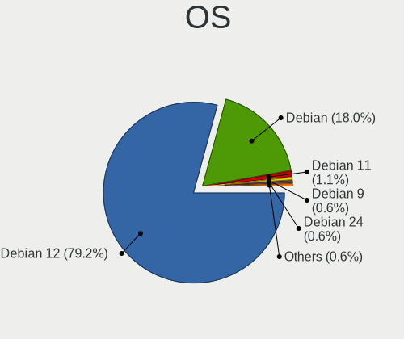
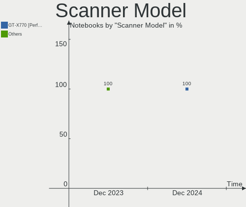

Debian Hardware Trends (Notebooks)
----------------------------------

A project to identify most popular hardware characteristics and track their change
over time based on data collected by Debian users at https://Linux-Hardware.org.

Anyone can contribute to this report by the [hw-probe](https://github.com/linuxhw/hw-probe) tool:

    sudo -E hw-probe -all -upload

Full-feature report is available here: https://linux-hardware.org/?view=trends

Period: Nov, 2021.

Contents
--------

* [ System ](#system)
  - [ OS                       ](#os)
  - [ OS Family                ](#os-family)
  - [ Kernel                   ](#kernel)
  - [ Kernel Family            ](#kernel-family)
  - [ Kernel Major Ver.        ](#kernel-major-ver)
  - [ Arch                     ](#arch)
  - [ DE                       ](#de)
  - [ Display Server           ](#display-server)
  - [ Display Manager          ](#display-manager)
  - [ OS Lang                  ](#os-lang)
  - [ Boot Mode                ](#boot-mode)
  - [ Filesystem               ](#filesystem)
  - [ Part. scheme             ](#part-scheme)
  - [ Dual Boot with Linux/BSD ](#dual-boot-with-linuxbsd)
  - [ Dual Boot (Win)          ](#dual-boot-win)

* [ Board ](#board)
  - [ Vendor                   ](#vendor)
  - [ Model                    ](#model)
  - [ Model Family             ](#model-family)
  - [ MFG Year                 ](#mfg-year)
  - [ Form Factor              ](#form-factor)
  - [ Secure Boot              ](#secure-boot)
  - [ Coreboot                 ](#coreboot)
  - [ RAM Size                 ](#ram-size)
  - [ RAM Used                 ](#ram-used)
  - [ Total Drives             ](#total-drives)
  - [ Has CD-ROM               ](#has-cd-rom)
  - [ Has Ethernet             ](#has-ethernet)
  - [ Has WiFi                 ](#has-wifi)
  - [ Has Bluetooth            ](#has-bluetooth)

* [ Location ](#location)
  - [ Country                  ](#country)
  - [ City                     ](#city)

* [ Drives ](#drives)
  - [ Drive Vendor             ](#drive-vendor)
  - [ Drive Model              ](#drive-model)
  - [ HDD Vendor               ](#hdd-vendor)
  - [ SSD Vendor               ](#ssd-vendor)
  - [ Drive Kind               ](#drive-kind)
  - [ Drive Connector          ](#drive-connector)
  - [ Drive Size               ](#drive-size)
  - [ Space Total              ](#space-total)
  - [ Space Used               ](#space-used)
  - [ Malfunc. Drives          ](#malfunc-drives)
  - [ Malfunc. Drive Vendor    ](#malfunc-drive-vendor)
  - [ Malfunc. HDD Vendor      ](#malfunc-hdd-vendor)
  - [ Malfunc. Drive Kind      ](#malfunc-drive-kind)
  - [ Failed Drives            ](#failed-drives)
  - [ Failed Drive Vendor      ](#failed-drive-vendor)
  - [ Drive Status             ](#drive-status)

* [ Storage controller ](#storage-controller)
  - [ Storage Vendor           ](#storage-vendor)
  - [ Storage Model            ](#storage-model)
  - [ Storage Kind             ](#storage-kind)

* [ Processor ](#processor)
  - [ CPU Vendor               ](#cpu-vendor)
  - [ CPU Model                ](#cpu-model)
  - [ CPU Model Family         ](#cpu-model-family)
  - [ CPU Cores                ](#cpu-cores)
  - [ CPU Sockets              ](#cpu-sockets)
  - [ CPU Threads              ](#cpu-threads)
  - [ CPU Op-Modes             ](#cpu-op-modes)
  - [ CPU Microcode            ](#cpu-microcode)
  - [ CPU Microarch            ](#cpu-microarch)

* [ Graphics ](#graphics)
  - [ GPU Vendor               ](#gpu-vendor)
  - [ GPU Model                ](#gpu-model)
  - [ GPU Combo                ](#gpu-combo)
  - [ GPU Driver               ](#gpu-driver)
  - [ GPU Memory               ](#gpu-memory)

* [ Monitor ](#monitor)
  - [ Monitor Vendor           ](#monitor-vendor)
  - [ Monitor Model            ](#monitor-model)
  - [ Monitor Resolution       ](#monitor-resolution)
  - [ Monitor Diagonal         ](#monitor-diagonal)
  - [ Monitor Width            ](#monitor-width)
  - [ Aspect Ratio             ](#aspect-ratio)
  - [ Monitor Area             ](#monitor-area)
  - [ Pixel Density            ](#pixel-density)
  - [ Multiple Monitors        ](#multiple-monitors)

* [ Network ](#network)
  - [ Net Controller Vendor    ](#net-controller-vendor)
  - [ Net Controller Model     ](#net-controller-model)
  - [ Wireless Vendor          ](#wireless-vendor)
  - [ Wireless Model           ](#wireless-model)
  - [ Ethernet Vendor          ](#ethernet-vendor)
  - [ Ethernet Model           ](#ethernet-model)
  - [ Net Controller Kind      ](#net-controller-kind)
  - [ Used Controller          ](#used-controller)
  - [ NICs                     ](#nics)
  - [ IPv6                     ](#ipv6)

* [ Bluetooth ](#bluetooth)
  - [ Bluetooth Vendor         ](#bluetooth-vendor)
  - [ Bluetooth Model          ](#bluetooth-model)

* [ Sound ](#sound)
  - [ Sound Vendor             ](#sound-vendor)
  - [ Sound Model              ](#sound-model)

* [ Memory ](#memory)
  - [ Memory Vendor            ](#memory-vendor)
  - [ Memory Model             ](#memory-model)
  - [ Memory Kind              ](#memory-kind)
  - [ Memory Form Factor       ](#memory-form-factor)
  - [ Memory Size              ](#memory-size)
  - [ Memory Speed             ](#memory-speed)

* [ Printers & scanners ](#printers--scanners)
  - [ Printer Vendor           ](#printer-vendor)
  - [ Printer Model            ](#printer-model)
  - [ Scanner Vendor           ](#scanner-vendor)
  - [ Scanner Model            ](#scanner-model)

* [ Camera ](#camera)
  - [ Camera Vendor            ](#camera-vendor)
  - [ Camera Model             ](#camera-model)

* [ Security ](#security)
  - [ Fingerprint Vendor       ](#fingerprint-vendor)
  - [ Fingerprint Model        ](#fingerprint-model)
  - [ Chipcard Vendor          ](#chipcard-vendor)
  - [ Chipcard Model           ](#chipcard-model)

* [ Unsupported ](#unsupported)
  - [ Unsupported Devices      ](#unsupported-devices)
  - [ Unsupported Device Types ](#unsupported-device-types)

System
------

OS
--

Installed operating systems

| Name              | Notebooks | Percent |
|-------------------|-----------|---------|
| Debian 11         | 125       | 76.69%  |
| Debian Testing    | 14        | 8.59%   |
| Debian 10         | 13        | 7.98%   |
| Debian Unstable   | 3         | 1.84%   |
| Debian 5          | 3         | 1.84%   |
| Debian 9          | 2         | 1.23%   |
| Debian 11-updates | 2         | 1.23%   |
| Debian 8          | 1         | 0.61%   |

OS Family
---------

OS without a version

| Name   | Notebooks | Percent |
|--------|-----------|---------|
| Debian | 163       | 100%    |

Kernel
------

Version of the Linux kernel

| Version                     | Notebooks | Percent |
|-----------------------------|-----------|---------|
| 5.10.0-9-amd64              | 80        | 49.08%  |
| 5.10.0-8-amd64              | 18        | 11.04%  |
| 5.14.0-4-amd64              | 6         | 3.68%   |
| 5.14.0-2-amd64              | 6         | 3.68%   |
| 5.10.0-9-686-pae            | 5         | 3.07%   |
| 4.19.0-18-amd64             | 5         | 3.07%   |
| 5.10.0-9-686                | 4         | 2.45%   |
| 5.10.0-7-amd64              | 4         | 2.45%   |
| 5.15.0-1-amd64              | 3         | 1.84%   |
| 5.14.0-9parrot1-amd64       | 3         | 1.84%   |
| 5.15.0-trunk-amd64          | 2         | 1.23%   |
| 5.14.0-3-amd64              | 2         | 1.23%   |
| 5.14.0-16.4-liquorix-amd64  | 2         | 1.23%   |
| 5.14.0-0.bpo.2-amd64        | 2         | 1.23%   |
| 4.9.0-16-amd64              | 2         | 1.23%   |
| 4.19.0-17-amd64             | 2         | 1.23%   |
| 5.15.3-edge                 | 1         | 0.61%   |
| 5.15.0-2-amd64              | 1         | 0.61%   |
| 5.14.12.1-sleek-amd64       | 1         | 0.61%   |
| 5.14.0-1-amd64              | 1         | 0.61%   |
| 5.13.19-1-pve               | 1         | 0.61%   |
| 5.10.79stripped             | 1         | 0.61%   |
| 5.10.78-ndmnet-stableconf-1 | 1         | 0.61%   |
| 5.10.0-8-2-amd64            | 1         | 0.61%   |
| 5.10.0-5mx-amd64            | 1         | 0.61%   |
| 5.10.0-0.bpo.9-rt-amd64     | 1         | 0.61%   |
| 5.10.0-0.bpo.8-amd64        | 1         | 0.61%   |
| 5.10.0-0.bpo.5-amd64        | 1         | 0.61%   |
| 4.19.0-18-rt-amd64          | 1         | 0.61%   |
| 4.19.0-18-686-pae           | 1         | 0.61%   |
| 4.19.0-18-686               | 1         | 0.61%   |
| 4.19.0-13-amd64             | 1         | 0.61%   |
| 3.10.65+                    | 1         | 0.61%   |

Kernel Family
-------------

Linux kernel without a distro release

| Version   | Notebooks | Percent |
|-----------|-----------|---------|
| 5.10.0    | 116       | 71.17%  |
| 5.14.0    | 22        | 13.5%   |
| 4.19.0    | 11        | 6.75%   |
| 5.15.0    | 6         | 3.68%   |
| 4.9.0     | 2         | 1.23%   |
| 5.15.3    | 1         | 0.61%   |
| 5.14.12.1 | 1         | 0.61%   |
| 5.13.19   | 1         | 0.61%   |
| 5.10.79   | 1         | 0.61%   |
| 5.10.78   | 1         | 0.61%   |
| 3.10.65   | 1         | 0.61%   |

Kernel Major Ver.
-----------------

Linux kernel major version

| Version | Notebooks | Percent |
|---------|-----------|---------|
| 5.10    | 118       | 72.39%  |
| 5.14    | 22        | 13.5%   |
| 4.19    | 11        | 6.75%   |
| 5.15    | 7         | 4.29%   |
| 4.9     | 2         | 1.23%   |
| 5.14.12 | 1         | 0.61%   |
| 5.13    | 1         | 0.61%   |
| 3.10    | 1         | 0.61%   |

Arch
----

OS architecture (x86_64, i586, etc.)

| Name   | Notebooks | Percent |
|--------|-----------|---------|
| x86_64 | 151       | 92.64%  |
| i686   | 11        | 6.75%   |
| armv7l | 1         | 0.61%   |

DE
--

Desktop Environment

| Name             | Notebooks | Percent |
|------------------|-----------|---------|
| GNOME            | 43        | 26.38%  |
| KDE5             | 32        | 19.63%  |
| Unknown          | 30        | 18.4%   |
| XFCE             | 24        | 14.72%  |
| MATE             | 6         | 3.68%   |
| LXQt             | 4         | 2.45%   |
| lightdm-xsession | 4         | 2.45%   |
| i3               | 4         | 2.45%   |
| GNOME Classic    | 3         | 1.84%   |
| X-Cinnamon       | 2         | 1.23%   |
| trinity          | 2         | 1.23%   |
| LXDE             | 2         | 1.23%   |
| GNOME Flashback  | 2         | 1.23%   |
| Cinnamon         | 2         | 1.23%   |
| Unity            | 1         | 0.61%   |
| Openbox          | 1         | 0.61%   |
| KDE              | 1         | 0.61%   |

Display Server
--------------

X11 or Wayland

| Name    | Notebooks | Percent |
|---------|-----------|---------|
| X11     | 103       | 63.19%  |
| Wayland | 31        | 19.02%  |
| Unknown | 23        | 14.11%  |
| Tty     | 6         | 3.68%   |

Display Manager
---------------

SDDM, LightDM, etc.

| Name    | Notebooks | Percent |
|---------|-----------|---------|
| Unknown | 59        | 36.2%   |
| LightDM | 38        | 23.31%  |
| GDM     | 33        | 20.25%  |
| SDDM    | 26        | 15.95%  |
| GDM3    | 7         | 4.29%   |

OS Lang
-------

Language

| Lang    | Notebooks | Percent |
|---------|-----------|---------|
| en_US   | 57        | 34.97%  |
| Unknown | 18        | 11.04%  |
| fr_FR   | 16        | 9.82%   |
| ru_RU   | 14        | 8.59%   |
| de_DE   | 13        | 7.98%   |
| pt_BR   | 6         | 3.68%   |
| it_IT   | 6         | 3.68%   |
| es_ES   | 5         | 3.07%   |
| en_GB   | 4         | 2.45%   |
| zh_CN   | 2         | 1.23%   |
| pt_PT   | 2         | 1.23%   |
| pl_PL   | 2         | 1.23%   |
| es_CL   | 2         | 1.23%   |
| en_AU   | 2         | 1.23%   |
| uk_UA   | 1         | 0.61%   |
| tr_TR   | 1         | 0.61%   |
| th_TH   | 1         | 0.61%   |
| sv_SE   | 1         | 0.61%   |
| nl_BE   | 1         | 0.61%   |
| lt_LT   | 1         | 0.61%   |
| fi_FI   | 1         | 0.61%   |
| es_VE   | 1         | 0.61%   |
| es_MX   | 1         | 0.61%   |
| es_CO   | 1         | 0.61%   |
| en_HK   | 1         | 0.61%   |
| en_DK   | 1         | 0.61%   |
| cs_CZ   | 1         | 0.61%   |
| be_BY   | 1         | 0.61%   |

Boot Mode
---------

EFI or BIOS

| Mode | Notebooks | Percent |
|------|-----------|---------|
| EFI  | 91        | 55.83%  |
| BIOS | 72        | 44.17%  |

Filesystem
----------

Type of filesystem

| Type    | Notebooks | Percent |
|---------|-----------|---------|
| Ext4    | 128       | 78.53%  |
| Overlay | 23        | 14.11%  |
| Btrfs   | 10        | 6.13%   |
| Zfs     | 1         | 0.61%   |
| Xfs     | 1         | 0.61%   |

Part. scheme
------------

Scheme of partitioning

| Type    | Notebooks | Percent |
|---------|-----------|---------|
| GPT     | 91        | 55.83%  |
| Unknown | 42        | 25.77%  |
| MBR     | 30        | 18.4%   |

Dual Boot with Linux/BSD
------------------------

Hosting more than one Linux/BSD

| Dual boot | Notebooks | Percent |
|-----------|-----------|---------|
| No        | 149       | 91.41%  |
| Yes       | 14        | 8.59%   |

Dual Boot (Win)
---------------

Hosting Linux and Windows

| Dual boot | Notebooks | Percent |
|-----------|-----------|---------|
| No        | 119       | 73.01%  |
| Yes       | 44        | 26.99%  |

Board
-----

Vendor
------

Motherboard manufacturer

| Name                   | Notebooks | Percent |
|------------------------|-----------|---------|
| Lenovo                 | 35        | 21.47%  |
| Hewlett-Packard        | 26        | 15.95%  |
| Dell                   | 26        | 15.95%  |
| ASUSTek Computer       | 19        | 11.66%  |
| Apple                  | 14        | 8.59%   |
| Acer                   | 12        | 7.36%   |
| MSI                    | 6         | 3.68%   |
| Samsung Electronics    | 3         | 1.84%   |
| IBM                    | 3         | 1.84%   |
| Sony                   | 2         | 1.23%   |
| HUAWEI                 | 2         | 1.23%   |
| Google                 | 2         | 1.23%   |
| AXDIA International    | 2         | 1.23%   |
| Toshiba                | 1         | 0.61%   |
| Timi                   | 1         | 0.61%   |
| Tablet                 | 1         | 0.61%   |
| Philco                 | 1         | 0.61%   |
| Panasonic              | 1         | 0.61%   |
| Fujitsu Siemens        | 1         | 0.61%   |
| Compal                 | 1         | 0.61%   |
| Celestica              | 1         | 0.61%   |
| Avell High Performance | 1         | 0.61%   |
| Aquarius               | 1         | 0.61%   |
| Unknown                | 1         | 0.61%   |

Model
-----

Motherboard model

| Name                                              | Notebooks | Percent |
|---------------------------------------------------|-----------|---------|
| Apple MacBookAir7,1                               | 11        | 6.75%   |
| Samsung 300E4C/300E5C/300E7C                      | 2         | 1.23%   |
| HP Pavilion Gaming Laptop 15-ec1xxx               | 2         | 1.23%   |
| HP Pavilion dv6                                   | 2         | 1.23%   |
| HP Laptop 15-bw0xx                                | 2         | 1.23%   |
| Toshiba Satellite L40                             | 1         | 0.61%   |
| Timi A7S                                          | 1         | 0.61%   |
| Tablet 8                                          | 1         | 0.61%   |
| Sony VGN-NS30E_S                                  | 1         | 0.61%   |
| Sony SVE1712E1RB                                  | 1         | 0.61%   |
| Samsung RV420/RV520/RV720/E3530/S3530/E3420/E3520 | 1         | 0.61%   |
| Philco OEM                                        | 1         | 0.61%   |
| Panasonic CF-54-1                                 | 1         | 0.61%   |
| MSI Prestige 15 A10SC                             | 1         | 0.61%   |
| MSI MS-N014                                       | 1         | 0.61%   |
| MSI GS65 Stealth 9SE                              | 1         | 0.61%   |
| MSI GE60 2PL                                      | 1         | 0.61%   |
| MSI GE60 2OC\2OD\2OE                              | 1         | 0.61%   |
| MSI Creator Z16 Hiroshi F A11UE                   | 1         | 0.61%   |
| Lenovo V330-15IKB 81AX                            | 1         | 0.61%   |
| Lenovo V14-IIL 82C4                               | 1         | 0.61%   |
| Lenovo ThinkPad X250 20CM004UGE                   | 1         | 0.61%   |
| Lenovo ThinkPad X201 3626GG3                      | 1         | 0.61%   |
| Lenovo ThinkPad X1 Carbon 6th 20KHCTO1WW          | 1         | 0.61%   |
| Lenovo ThinkPad W540 20BG0042FR                   | 1         | 0.61%   |
| Lenovo ThinkPad T490 20N2CTO1WW                   | 1         | 0.61%   |
| Lenovo ThinkPad T480s 20L8S31E00                  | 1         | 0.61%   |
| Lenovo ThinkPad T480 20L6SCYP00                   | 1         | 0.61%   |
| Lenovo ThinkPad T480 20L50009MX                   | 1         | 0.61%   |
| Lenovo ThinkPad T460s 20FACTO1WW                  | 1         | 0.61%   |
| Lenovo ThinkPad T460 20FMS66R00                   | 1         | 0.61%   |
| Lenovo ThinkPad T440s 20AR003RMS                  | 1         | 0.61%   |
| Lenovo ThinkPad T440p 20AWS18U00                  | 1         | 0.61%   |
| Lenovo ThinkPad T430 2349S9E                      | 1         | 0.61%   |
| Lenovo ThinkPad T430 2347G61                      | 1         | 0.61%   |
| Lenovo ThinkPad T420 4180ED3                      | 1         | 0.61%   |
| Lenovo ThinkPad T410 2522Y15                      | 1         | 0.61%   |
| Lenovo ThinkPad T14 Gen 2i 20W0S00K00             | 1         | 0.61%   |
| Lenovo ThinkPad T14 Gen 1 20S00012IX              | 1         | 0.61%   |
| Lenovo ThinkPad L470 W10DG 20JVA05KCL             | 1         | 0.61%   |
| Lenovo ThinkPad L15 Gen 1 20U7001VMH              | 1         | 0.61%   |
| Lenovo ThinkPad Edge E431 627748G                 | 1         | 0.61%   |
| Lenovo ThinkPad E450 20DCS01J00                   | 1         | 0.61%   |
| Lenovo ThinkPad E15 Gen 3 20YGCTO1WW              | 1         | 0.61%   |
| Lenovo ThinkPad E15 Gen 2 20TES29500              | 1         | 0.61%   |
| Lenovo ThinkPad 20J10046US                        | 1         | 0.61%   |
| Lenovo ThinkPad 13 2nd Gen 20J10046US             | 1         | 0.61%   |
| Lenovo IdeaPad 5 14ALC05 82LM                     | 1         | 0.61%   |
| Lenovo IdeaPad 330S-15ARR 81FB                    | 1         | 0.61%   |
| Lenovo IdeaPad 3 15IIL05 81WE                     | 1         | 0.61%   |
| Lenovo G50-30 80G0                                | 1         | 0.61%   |
| Lenovo B50-10 80QR                                | 1         | 0.61%   |
| Lenovo B40-70 20392                               | 1         | 0.61%   |
| Lenovo 14w 81MQ00AHAR                             | 1         | 0.61%   |
| IBM ThinkPad T43 2668BU7                          | 1         | 0.61%   |
| IBM ThinkPad T43 26688AG                          | 1         | 0.61%   |
| IBM ThinkPad T43 26686ZG                          | 1         | 0.61%   |
| HUAWEI HVY-WXX9                                   | 1         | 0.61%   |
| HUAWEI BOHK-WAX9X                                 | 1         | 0.61%   |
| HP ZBook Studio G4                                | 1         | 0.61%   |

Model Family
------------

Motherboard model prefix

| Name                        | Notebooks | Percent |
|-----------------------------|-----------|---------|
| Lenovo ThinkPad             | 26        | 15.95%  |
| Apple MacBookAir7           | 12        | 7.36%   |
| Dell Latitude               | 8         | 4.91%   |
| HP Pavilion                 | 7         | 4.29%   |
| HP ProBook                  | 6         | 3.68%   |
| Acer Aspire                 | 6         | 3.68%   |
| Dell Inspiron               | 5         | 3.07%   |
| HP EliteBook                | 4         | 2.45%   |
| Dell XPS                    | 4         | 2.45%   |
| Dell Vostro                 | 4         | 2.45%   |
| Dell Precision              | 4         | 2.45%   |
| Lenovo IdeaPad              | 3         | 1.84%   |
| IBM ThinkPad                | 3         | 1.84%   |
| HP Laptop                   | 3         | 1.84%   |
| ASUS ZenBook                | 3         | 1.84%   |
| ASUS VivoBook               | 3         | 1.84%   |
| Acer TravelMate             | 3         | 1.84%   |
| Samsung 300E4C              | 2         | 1.23%   |
| MSI GE60                    | 2         | 1.23%   |
| HP ZBook                    | 2         | 1.23%   |
| ASUS ASUS                   | 2         | 1.23%   |
| Toshiba Satellite           | 1         | 0.61%   |
| Timi A7S                    | 1         | 0.61%   |
| Tablet 8                    | 1         | 0.61%   |
| Sony VGN-NS30E              | 1         | 0.61%   |
| Sony SVE1712E1RB            | 1         | 0.61%   |
| Samsung RV420               | 1         | 0.61%   |
| Philco OEM                  | 1         | 0.61%   |
| Panasonic CF-54-1           | 1         | 0.61%   |
| MSI Prestige                | 1         | 0.61%   |
| MSI MS-N014                 | 1         | 0.61%   |
| MSI GS65                    | 1         | 0.61%   |
| MSI Creator                 | 1         | 0.61%   |
| Lenovo V330-15IKB           | 1         | 0.61%   |
| Lenovo V14-IIL              | 1         | 0.61%   |
| Lenovo G50-30               | 1         | 0.61%   |
| Lenovo B50-10               | 1         | 0.61%   |
| Lenovo B40-70               | 1         | 0.61%   |
| Lenovo 14w                  | 1         | 0.61%   |
| HUAWEI HVY-WXX9             | 1         | 0.61%   |
| HUAWEI BOHK-WAX9X           | 1         | 0.61%   |
| HP Stream                   | 1         | 0.61%   |
| HP Presario                 | 1         | 0.61%   |
| HP ENVY                     | 1         | 0.61%   |
| HP 255                      | 1         | 0.61%   |
| Google Stout                | 1         | 0.61%   |
| Google Relm                 | 1         | 0.61%   |
| Fujitsu Siemens AMILO       | 1         | 0.61%   |
| Dell System                 | 1         | 0.61%   |
| Compal QAL51                | 1         | 0.61%   |
| Celestica D4040             | 1         | 0.61%   |
| AXDIA International Wintab  | 1         | 0.61%   |
| AXDIA International MYBOOK  | 1         | 0.61%   |
| Avell High Performance B.ON | 1         | 0.61%   |
| ASUS X555LD                 | 1         | 0.61%   |
| ASUS X555BA                 | 1         | 0.61%   |
| ASUS UX31A                  | 1         | 0.61%   |
| ASUS T100TA                 | 1         | 0.61%   |
| ASUS ROG                    | 1         | 0.61%   |
| ASUS N56VM                  | 1         | 0.61%   |

MFG Year
--------

Motherboard manufacture year

| Year    | Notebooks | Percent |
|---------|-----------|---------|
| 2021    | 38        | 23.31%  |
| 2019    | 28        | 17.18%  |
| 2020    | 19        | 11.66%  |
| 2018    | 12        | 7.36%   |
| 2013    | 11        | 6.75%   |
| 2014    | 9         | 5.52%   |
| 2015    | 7         | 4.29%   |
| 2011    | 7         | 4.29%   |
| 2012    | 6         | 3.68%   |
| 2010    | 5         | 3.07%   |
| 2006    | 5         | 3.07%   |
| 2017    | 4         | 2.45%   |
| 2016    | 4         | 2.45%   |
| 2009    | 4         | 2.45%   |
| 2008    | 2         | 1.23%   |
| 2005    | 1         | 0.61%   |
| Unknown | 1         | 0.61%   |

Form Factor
-----------

Physical design of the computer

| Name     | Notebooks | Percent |
|----------|-----------|---------|
| Notebook | 163       | 100%    |

Secure Boot
-----------

Enabled or disabled

| State    | Notebooks | Percent |
|----------|-----------|---------|
| Disabled | 148       | 90.8%   |
| Enabled  | 15        | 9.2%    |

Coreboot
--------

Have coreboot on board

| Used | Notebooks | Percent |
|------|-----------|---------|
| No   | 161       | 98.77%  |
| Yes  | 2         | 1.23%   |

RAM Size
--------

Total RAM memory

| Size in GB | Notebooks | Percent |
|------------|-----------|---------|
| 3.01-4.0   | 40        | 24.54%  |
| 4.01-8.0   | 33        | 20.25%  |
| 16.01-24.0 | 28        | 17.18%  |
| 8.01-16.0  | 28        | 17.18%  |
| 32.01-64.0 | 16        | 9.82%   |
| 1.01-2.0   | 9         | 5.52%   |
| 2.01-3.0   | 6         | 3.68%   |
| 0.51-1.0   | 3         | 1.84%   |

RAM Used
--------

Used RAM memory

| Used GB    | Notebooks | Percent |
|------------|-----------|---------|
| 1.01-2.0   | 57        | 34.97%  |
| 2.01-3.0   | 32        | 19.63%  |
| 4.01-8.0   | 28        | 17.18%  |
| 3.01-4.0   | 21        | 12.88%  |
| 0.51-1.0   | 19        | 11.66%  |
| 8.01-16.0  | 2         | 1.23%   |
| 0.01-0.5   | 2         | 1.23%   |
| 24.01-32.0 | 1         | 0.61%   |
| Unknown    | 1         | 0.61%   |

Total Drives
------------

Number of drives on board

| Drives | Notebooks | Percent |
|--------|-----------|---------|
| 1      | 131       | 80.37%  |
| 2      | 27        | 16.56%  |
| 3      | 4         | 2.45%   |
| 5      | 1         | 0.61%   |

Has CD-ROM
----------

Has CD-ROM on board

| Presented | Notebooks | Percent |
|-----------|-----------|---------|
| No        | 111       | 68.1%   |
| Yes       | 52        | 31.9%   |

Has Ethernet
------------

Has Ethernet on board

| Presented | Notebooks | Percent |
|-----------|-----------|---------|
| Yes       | 123       | 75.46%  |
| No        | 40        | 24.54%  |

Has WiFi
--------

Has WiFi module

| Presented | Notebooks | Percent |
|-----------|-----------|---------|
| Yes       | 156       | 95.71%  |
| No        | 7         | 4.29%   |

Has Bluetooth
-------------

Has Bluetooth module

| Presented | Notebooks | Percent |
|-----------|-----------|---------|
| Yes       | 120       | 73.62%  |
| No        | 43        | 26.38%  |

Location
--------

Country
-------

Geographic location (country)

| Country     | Notebooks | Percent |
|-------------|-----------|---------|
| USA         | 36        | 22.09%  |
| Germany     | 18        | 11.04%  |
| France      | 17        | 10.43%  |
| Russia      | 15        | 9.2%    |
| Brazil      | 7         | 4.29%   |
| Spain       | 6         | 3.68%   |
| Netherlands | 5         | 3.07%   |
| Italy       | 5         | 3.07%   |
| China       | 5         | 3.07%   |
| Poland      | 4         | 2.45%   |
| Ukraine     | 3         | 1.84%   |
| UK          | 3         | 1.84%   |
| Switzerland | 3         | 1.84%   |
| Sweden      | 3         | 1.84%   |
| Mexico      | 3         | 1.84%   |
| Colombia    | 3         | 1.84%   |
| Turkey      | 2         | 1.23%   |
| Portugal    | 2         | 1.23%   |
| Czechia     | 2         | 1.23%   |
| Chile       | 2         | 1.23%   |
| Belgium     | 2         | 1.23%   |
| Australia   | 2         | 1.23%   |
| Thailand    | 1         | 0.61%   |
| Taiwan      | 1         | 0.61%   |
| Romania     | 1         | 0.61%   |
| Luxembourg  | 1         | 0.61%   |
| Lithuania   | 1         | 0.61%   |
| Latvia      | 1         | 0.61%   |
| Kazakhstan  | 1         | 0.61%   |
| Hungary     | 1         | 0.61%   |
| Greece      | 1         | 0.61%   |
| Finland     | 1         | 0.61%   |
| Denmark     | 1         | 0.61%   |
| Cuba        | 1         | 0.61%   |
| Croatia     | 1         | 0.61%   |
| Belarus     | 1         | 0.61%   |
| Argentina   | 1         | 0.61%   |

City
----

Geographic location (city)

| City                   | Notebooks | Percent |
|------------------------|-----------|---------|
| Eliot                  | 15        | 9.2%    |
| St Petersburg          | 5         | 3.07%   |
| Paris                  | 5         | 3.07%   |
| Voronezh               | 4         | 2.45%   |
| Warsaw                 | 2         | 1.23%   |
| Moscow                 | 2         | 1.23%   |
| Madrid                 | 2         | 1.23%   |
| Lyon                   | 2         | 1.23%   |
| Leimen                 | 2         | 1.23%   |
| Dallas                 | 2         | 1.23%   |
| Zurich                 | 1         | 0.61%   |
| Zuchwil                | 1         | 0.61%   |
| Zagreb                 | 1         | 0.61%   |
| Yekaterinburg          | 1         | 0.61%   |
| Wilmette               | 1         | 0.61%   |
| Wiesloch               | 1         | 0.61%   |
| Warrenton              | 1         | 0.61%   |
| Waregem                | 1         | 0.61%   |
| Vilnius                | 1         | 0.61%   |
| Villingen-Schwenningen | 1         | 0.61%   |
| Vi?±a del Mar          | 1         | 0.61%   |
| Vianden                | 1         | 0.61%   |
| Ufa                    | 1         | 0.61%   |
| Toluca                 | 1         | 0.61%   |
| Tienen                 | 1         | 0.61%   |
| Taichung               | 1         | 0.61%   |
| Tacoma                 | 1         | 0.61%   |
| Sydney                 | 1         | 0.61%   |
| Stein                  | 1         | 0.61%   |
| Shenzhen               | 1         | 0.61%   |
| Shenyang               | 1         | 0.61%   |
| Shanghai               | 1         | 0.61%   |
| Seville                | 1         | 0.61%   |
| Sens-de-Bretagne       | 1         | 0.61%   |
| Seattle                | 1         | 0.61%   |
| S??o Paulo             | 1         | 0.61%   |
| S??o Carlos            | 1         | 0.61%   |
| Santiago de Cali       | 1         | 0.61%   |
| Sant Just Desvern      | 1         | 0.61%   |
| San Pedro              | 1         | 0.61%   |
| San Jose               | 1         | 0.61%   |
| San Agustin            | 1         | 0.61%   |
| Roubaix                | 1         | 0.61%   |
| Riga                   | 1         | 0.61%   |
| Regen                  | 1         | 0.61%   |
| Recke                  | 1         | 0.61%   |
| Pullach im Isartal     | 1         | 0.61%   |
| Prague                 | 1         | 0.61%   |
| Pozzuolo del Friuli    | 1         | 0.61%   |
| Poznan                 | 1         | 0.61%   |
| Portland               | 1         | 0.61%   |
| Pirna                  | 1         | 0.61%   |
| Phoenix                | 1         | 0.61%   |
| Oulu                   | 1         | 0.61%   |
| Osnabr??ck             | 1         | 0.61%   |
| Odense                 | 1         | 0.61%   |
| Oakland                | 1         | 0.61%   |
| Nurlu                  | 1         | 0.61%   |
| Nuremberg              | 1         | 0.61%   |
| New Rochelle           | 1         | 0.61%   |

Drives
------

Drive Vendor
------------

Hard drive vendors

| Vendor                    | Notebooks | Drives | Percent |
|---------------------------|-----------|--------|---------|
| WDC                       | 34        | 35     | 17.26%  |
| Samsung Electronics       | 32        | 33     | 16.24%  |
| Seagate                   | 15        | 15     | 7.61%   |
| Toshiba                   | 14        | 14     | 7.11%   |
| SanDisk                   | 14        | 15     | 7.11%   |
| Apple                     | 12        | 12     | 6.09%   |
| Unknown                   | 10        | 11     | 5.08%   |
| Kingston                  | 9         | 9      | 4.57%   |
| Crucial                   | 7         | 7      | 3.55%   |
| Micron Technology         | 5         | 5      | 2.54%   |
| A-DATA Technology         | 5         | 5      | 2.54%   |
| SK Hynix                  | 4         | 4      | 2.03%   |
| KIOXIA                    | 4         | 4      | 2.03%   |
| Hitachi                   | 4         | 4      | 2.03%   |
| LITEON                    | 3         | 3      | 1.52%   |
| Intenso                   | 2         | 2      | 1.02%   |
| IBM/Hitachi               | 2         | 2      | 1.02%   |
| YMTC                      | 1         | 1      | 0.51%   |
| SPCC                      | 1         | 1      | 0.51%   |
| SABRENT                   | 1         | 2      | 0.51%   |
| RAVPOWER                  | 1         | 1      | 0.51%   |
| PNY                       | 1         | 1      | 0.51%   |
| Patriot                   | 1         | 1      | 0.51%   |
| Mushkin                   | 1         | 1      | 0.51%   |
| Micron/Crucial Technology | 1         | 1      | 0.51%   |
| MAXTOR                    | 1         | 1      | 0.51%   |
| Mass                      | 1         | 1      | 0.51%   |
| Intel                     | 1         | 1      | 0.51%   |
| InnoDisk                  | 1         | 1      | 0.51%   |
| GOODRAM                   | 1         | 1      | 0.51%   |
| Gigabyte Technology       | 1         | 1      | 0.51%   |
| Fujitsu                   | 1         | 1      | 0.51%   |
| FORESEE                   | 1         | 1      | 0.51%   |
| EMTEC                     | 1         | 1      | 0.51%   |
| Corsair                   | 1         | 1      | 0.51%   |
| BHT                       | 1         | 1      | 0.51%   |
| ASMT                      | 1         | 2      | 0.51%   |
| Apacer                    | 1         | 1      | 0.51%   |

Drive Model
-----------

Hard drive models

| Model                                | Notebooks | Percent |
|--------------------------------------|-----------|---------|
| Apple SSD AP0128H 121GB              | 11        | 5.5%    |
| Unknown MMC Card  32GB               | 3         | 1.5%    |
| Toshiba MQ01ABF050 500GB             | 3         | 1.5%    |
| Seagate ST320LM001 HN-M320MBB 320GB  | 3         | 1.5%    |
| Samsung SSD 860 EVO 250GB            | 3         | 1.5%    |
| Samsung MZVLB1T0HALR-00000 1TB       | 3         | 1.5%    |
| Kingston SV300S37A120G 120GB SSD     | 3         | 1.5%    |
| WDC PC SN530 NVMe 256GB              | 2         | 1%      |
| Toshiba MQ04ABF100 1TB               | 2         | 1%      |
| Seagate ST500LT012-1DG142 500GB      | 2         | 1%      |
| Seagate ST500LM012 HN-M500MBB 500GB  | 2         | 1%      |
| Samsung SSD 860 EVO 500GB            | 2         | 1%      |
| Samsung PM991a NVMe 512GB            | 2         | 1%      |
| Samsung MZALQ128HBHQ-000L2 128GB     | 2         | 1%      |
| KIOXIA KBG40ZNV256G 256GB            | 2         | 1%      |
| Kingston RBUSNS8154P3128GJ1 128GB    | 2         | 1%      |
| A-DATA SU800 512GB SSD               | 2         | 1%      |
| YMTC PC005 512GB                     | 1         | 0.5%    |
| WDC WDS500G2B0B-00YS70 500GB SSD     | 1         | 0.5%    |
| WDC WDS250G2B0A-00SM50 250GB SSD     | 1         | 0.5%    |
| WDC WDS100T2B0A-00SM50 1TB SSD       | 1         | 0.5%    |
| WDC WD7500BPKT-75PK4T0 752GB         | 1         | 0.5%    |
| WDC WD7500BPKT-22PK4T0 752GB         | 1         | 0.5%    |
| WDC WD6400BPVT-60HXZT1 640GB         | 1         | 0.5%    |
| WDC WD5000LUCT-63RC2Y0 500GB         | 1         | 0.5%    |
| WDC WD5000LPVX-22V0TT0 500GB         | 1         | 0.5%    |
| WDC WD5000LPLX-60ZNTT1 500GB         | 1         | 0.5%    |
| WDC WD5000LPCX-22VHAT1 500GB         | 1         | 0.5%    |
| WDC WD5000BEVT-35A0RT0 500GB         | 1         | 0.5%    |
| WDC WD5000BEVT-22ZAT0 500GB          | 1         | 0.5%    |
| WDC WD3200BPVT-80ZEST0 320GB         | 1         | 0.5%    |
| WDC WD3200BEKT-08PVMT1 320GB         | 1         | 0.5%    |
| WDC WD2500BEVT-60A23T0 250GB         | 1         | 0.5%    |
| WDC WD10SPZX-80Z10T2 1TB             | 1         | 0.5%    |
| WDC WD10SPZX-75Z10T3 1TB             | 1         | 0.5%    |
| WDC WD10SPZX-75Z10T2 1TB             | 1         | 0.5%    |
| WDC WD10SPZX-75Z10T1 1TB             | 1         | 0.5%    |
| WDC WD10JPVX-60JC3T0 1TB             | 1         | 0.5%    |
| WDC WD10JPVX-22JC3T0 1TB             | 1         | 0.5%    |
| WDC WD10JPLX-00MBPT0 1TB             | 1         | 0.5%    |
| WDC PC SN730 SDBQNTY-512G-1001 512GB | 1         | 0.5%    |
| WDC PC SN730 SDBPNTY-256G-1027 256GB | 1         | 0.5%    |
| WDC PC SN730 SDBPNTY-1T00-1032 1TB   | 1         | 0.5%    |
| WDC PC SN730 NVMe 512GB              | 1         | 0.5%    |
| WDC PC SN720 SED SDAQNTW-1T00 1TB    | 1         | 0.5%    |
| WDC PC SN720 SDAQNTW-512G-1001 512GB | 1         | 0.5%    |
| WDC PC SN530 SDBPNPZ-512G-1006 512GB | 1         | 0.5%    |
| WDC PC SN530 SDBPNPZ-512G-1002 512GB | 1         | 0.5%    |
| WDC PC SN530 SDBPNPZ-256G-1006 256GB | 1         | 0.5%    |
| WDC PC SN530 SDBPMPZ-512G-1101 512GB | 1         | 0.5%    |
| WDC PC SN530 SDBPMPZ-512G-1001 512GB | 1         | 0.5%    |
| Unknown SF128  128GB                 | 1         | 0.5%    |
| Unknown SB64G  64GB                  | 1         | 0.5%    |
| Unknown SB32G  32GB                  | 1         | 0.5%    |
| Unknown MMC Card  7GB                | 1         | 0.5%    |
| Unknown MMC Card  64GB               | 1         | 0.5%    |
| Unknown MMC Card  4GB                | 1         | 0.5%    |
| Unknown MMC Card  128GB              | 1         | 0.5%    |
| Unknown BJNB4R  32GB                 | 1         | 0.5%    |
| Toshiba THNSNH128GCST 128GB SSD      | 1         | 0.5%    |

HDD Vendor
----------

Hard disk drive vendors

| Vendor              | Notebooks | Drives | Percent |
|---------------------|-----------|--------|---------|
| WDC                 | 19        | 19     | 35.85%  |
| Seagate             | 14        | 14     | 26.42%  |
| Toshiba             | 11        | 11     | 20.75%  |
| Hitachi             | 4         | 4      | 7.55%   |
| IBM/Hitachi         | 2         | 2      | 3.77%   |
| Samsung Electronics | 1         | 1      | 1.89%   |
| Fujitsu             | 1         | 1      | 1.89%   |
| ASMT                | 1         | 2      | 1.89%   |

SSD Vendor
----------

Solid state drive vendors

| Vendor              | Notebooks | Drives | Percent |
|---------------------|-----------|--------|---------|
| Samsung Electronics | 13        | 13     | 22.41%  |
| SanDisk             | 10        | 11     | 17.24%  |
| Kingston            | 6         | 6      | 10.34%  |
| Crucial             | 5         | 5      | 8.62%   |
| WDC                 | 3         | 3      | 5.17%   |
| A-DATA Technology   | 3         | 3      | 5.17%   |
| SK Hynix            | 2         | 2      | 3.45%   |
| LITEON              | 2         | 2      | 3.45%   |
| Intenso             | 2         | 2      | 3.45%   |
| Toshiba             | 1         | 1      | 1.72%   |
| SPCC                | 1         | 1      | 1.72%   |
| PNY                 | 1         | 1      | 1.72%   |
| Patriot             | 1         | 1      | 1.72%   |
| Mushkin             | 1         | 1      | 1.72%   |
| Micron Technology   | 1         | 1      | 1.72%   |
| MAXTOR              | 1         | 1      | 1.72%   |
| InnoDisk            | 1         | 1      | 1.72%   |
| GOODRAM             | 1         | 1      | 1.72%   |
| EMTEC               | 1         | 1      | 1.72%   |
| Corsair             | 1         | 1      | 1.72%   |
| Apple               | 1         | 1      | 1.72%   |

Drive Kind
----------

HDD or SSD

| Kind    | Notebooks | Drives | Percent |
|---------|-----------|--------|---------|
| NVMe    | 66        | 74     | 35.48%  |
| SSD     | 53        | 59     | 28.49%  |
| HDD     | 53        | 54     | 28.49%  |
| MMC     | 11        | 12     | 5.91%   |
| Unknown | 3         | 4      | 1.61%   |

Drive Connector
---------------

SATA, SAS, NVMe, etc.

| Type | Notebooks | Drives | Percent |
|------|-----------|--------|---------|
| SATA | 98        | 110    | 54.44%  |
| NVMe | 66        | 72     | 36.67%  |
| MMC  | 11        | 12     | 6.11%   |
| SAS  | 5         | 9      | 2.78%   |

Drive Size
----------

Size of hard drive

| Size in TB | Notebooks | Drives | Percent |
|------------|-----------|--------|---------|
| 0.01-0.5   | 78        | 84     | 74.29%  |
| 0.51-1.0   | 25        | 26     | 23.81%  |
| 1.01-2.0   | 1         | 1      | 0.95%   |
| 4.01-10.0  | 1         | 2      | 0.95%   |

Space Total
-----------

Amount of disk space available on the file system

| Size in GB     | Notebooks | Percent |
|----------------|-----------|---------|
| 101-250        | 57        | 34.97%  |
| 251-500        | 42        | 25.77%  |
| 501-1000       | 15        | 9.2%    |
| 51-100         | 11        | 6.75%   |
| 21-50          | 10        | 6.13%   |
| Unknown        | 9         | 5.52%   |
| 1001-2000      | 8         | 4.91%   |
| 1-20           | 6         | 3.68%   |
| More than 3000 | 3         | 1.84%   |
| 2001-3000      | 2         | 1.23%   |

Space Used
----------

Amount of used disk space

| Used GB        | Notebooks | Percent |
|----------------|-----------|---------|
| 1-20           | 71        | 43.56%  |
| 21-50          | 28        | 17.18%  |
| 101-250        | 17        | 10.43%  |
| 51-100         | 15        | 9.2%    |
| 251-500        | 10        | 6.13%   |
| Unknown        | 9         | 5.52%   |
| 501-1000       | 8         | 4.91%   |
| 1001-2000      | 4         | 2.45%   |
| More than 3000 | 1         | 0.61%   |

Malfunc. Drives
---------------

Drive models with a malfunction

| Model                             | Notebooks | Drives | Percent |
|-----------------------------------|-----------|--------|---------|
| Toshiba MK5065GSXF 500GB          | 1         | 1      | 9.09%   |
| Toshiba MK2555GSX 250GB           | 1         | 1      | 9.09%   |
| Toshiba MK1633GSG 160GB           | 1         | 1      | 9.09%   |
| Seagate ST9250315AS 250GB         | 1         | 1      | 9.09%   |
| Seagate ST500LM000-1EJ162 500GB   | 1         | 1      | 9.09%   |
| SanDisk SSD PLUS 480GB            | 1         | 1      | 9.09%   |
| IBM/Hitachi IC25N060ATMR04-0 64GB | 1         | 1      | 9.09%   |
| Hitachi HTS541660J9AT00 64GB      | 1         | 1      | 9.09%   |
| Hitachi HTS541060G9AT00 64GB      | 1         | 1      | 9.09%   |
| Crucial CT500P1SSD8 500GB         | 1         | 1      | 9.09%   |
| A-DATA Technology SP900 256GB SSD | 1         | 1      | 9.09%   |

Malfunc. Drive Vendor
---------------------

Vendors of faulty drives

| Vendor            | Notebooks | Drives | Percent |
|-------------------|-----------|--------|---------|
| Toshiba           | 3         | 3      | 27.27%  |
| Seagate           | 2         | 2      | 18.18%  |
| Hitachi           | 2         | 2      | 18.18%  |
| SanDisk           | 1         | 1      | 9.09%   |
| IBM/Hitachi       | 1         | 1      | 9.09%   |
| Crucial           | 1         | 1      | 9.09%   |
| A-DATA Technology | 1         | 1      | 9.09%   |

Malfunc. HDD Vendor
-------------------

Vendors of faulty HDD drives

| Vendor      | Notebooks | Drives | Percent |
|-------------|-----------|--------|---------|
| Toshiba     | 3         | 3      | 37.5%   |
| Seagate     | 2         | 2      | 25%     |
| Hitachi     | 2         | 2      | 25%     |
| IBM/Hitachi | 1         | 1      | 12.5%   |

Malfunc. Drive Kind
-------------------

Kinds of faulty drives

| Kind | Notebooks | Drives | Percent |
|------|-----------|--------|---------|
| HDD  | 8         | 8      | 72.73%  |
| SSD  | 2         | 2      | 18.18%  |
| NVMe | 1         | 1      | 9.09%   |

Failed Drives
-------------

Failed drive models

| Model                        | Notebooks | Drives | Percent |
|------------------------------|-----------|--------|---------|
| WDC WD5000BEVT-35A0RT0 500GB | 1         | 1      | 100%    |

Failed Drive Vendor
-------------------

Failed drive vendors

| Vendor | Notebooks | Drives | Percent |
|--------|-----------|--------|---------|
| WDC    | 1         | 1      | 100%    |

Drive Status
------------

Number of failed and malfunc. drives

| Status   | Notebooks | Drives | Percent |
|----------|-----------|--------|---------|
| Works    | 113       | 132    | 64.2%   |
| Detected | 51        | 59     | 28.98%  |
| Malfunc  | 11        | 11     | 6.25%   |
| Failed   | 1         | 1      | 0.57%   |

Storage controller
------------------

Storage Vendor
--------------

Storage controller vendors

| Vendor                       | Notebooks | Percent |
|------------------------------|-----------|---------|
| Intel                        | 108       | 55.96%  |
| Samsung Electronics          | 19        | 9.84%   |
| Sandisk                      | 14        | 7.25%   |
| AMD                          | 14        | 7.25%   |
| Apple                        | 11        | 5.7%    |
| Micron Technology            | 4         | 2.07%   |
| Toshiba America Info Systems | 3         | 1.55%   |
| Micron/Crucial Technology    | 3         | 1.55%   |
| KIOXIA                       | 3         | 1.55%   |
| Kingston Technology Company  | 3         | 1.55%   |
| SK Hynix                     | 2         | 1.04%   |
| Yangtze Memory Technologies  | 1         | 0.52%   |
| Silicon Motion               | 1         | 0.52%   |
| Silicon Image                | 1         | 0.52%   |
| Shenzhen Longsys Electronics | 1         | 0.52%   |
| Realtek Semiconductor        | 1         | 0.52%   |
| Phison Electronics           | 1         | 0.52%   |
| Nvidia                       | 1         | 0.52%   |
| Lite-On Technology           | 1         | 0.52%   |
| ADATA Technology             | 1         | 0.52%   |

Storage Model
-------------

Storage controller models

| Model                                                                            | Notebooks | Percent |
|----------------------------------------------------------------------------------|-----------|---------|
| AMD FCH SATA Controller [AHCI mode]                                              | 13        | 6.47%   |
| Intel Sunrise Point-LP SATA Controller [AHCI mode]                               | 12        | 5.97%   |
| Apple S1X NVMe Controller                                                        | 11        | 5.47%   |
| Samsung NVMe SSD Controller SM981/PM981/PM983                                    | 9         | 4.48%   |
| Intel 7 Series Chipset Family 6-port SATA Controller [AHCI mode]                 | 9         | 4.48%   |
| Intel 6 Series/C200 Series Chipset Family 6 port Mobile SATA AHCI Controller     | 9         | 4.48%   |
| Intel 8 Series/C220 Series Chipset Family 6-port SATA Controller 1 [AHCI mode]   | 8         | 3.98%   |
| Samsung NVMe SSD Controller 980                                                  | 7         | 3.48%   |
| Intel Volume Management Device NVMe RAID Controller                              | 7         | 3.48%   |
| Intel Wildcat Point-LP SATA Controller [AHCI Mode]                               | 6         | 2.99%   |
| Intel 82801IBM/IEM (ICH9M/ICH9M-E) 4 port SATA Controller [AHCI mode]            | 6         | 2.99%   |
| Intel Cannon Lake Mobile PCH SATA AHCI Controller                                | 5         | 2.49%   |
| Sandisk WD Blue SN550 NVMe SSD                                                   | 4         | 1.99%   |
| Sandisk WD Black SN750 / PC SN730 NVMe SSD                                       | 4         | 1.99%   |
| Sandisk Non-Volatile memory controller                                           | 4         | 1.99%   |
| Micron Non-Volatile memory controller                                            | 4         | 1.99%   |
| Intel Q170/Q150/B150/H170/H110/Z170/CM236 Chipset SATA Controller [AHCI Mode]    | 4         | 1.99%   |
| Intel Ice Lake-LP SATA Controller [AHCI mode]                                    | 4         | 1.99%   |
| Intel 82801 Mobile SATA Controller [RAID mode]                                   | 4         | 1.99%   |
| Intel 5 Series/3400 Series Chipset 6 port SATA AHCI Controller                   | 4         | 1.99%   |
| KIOXIA Non-Volatile memory controller                                            | 3         | 1.49%   |
| Intel Tiger Lake-LP SATA Controller [AHCI mode]                                  | 3         | 1.49%   |
| Intel NM10/ICH7 Family SATA Controller [AHCI mode]                               | 3         | 1.49%   |
| Intel 82801FBM (ICH6M) SATA Controller                                           | 3         | 1.49%   |
| Intel 8 Series SATA Controller 1 [AHCI mode]                                     | 3         | 1.49%   |
| Toshiba America Info Systems Toshiba America Info Non-Volatile memory controller | 2         | 1%      |
| Sandisk WD Black 2018/SN750 / PC SN720 NVMe SSD                                  | 2         | 1%      |
| Kingston Company U-SNS8154P3 NVMe SSD                                            | 2         | 1%      |
| Intel Celeron N3350/Pentium N4200/Atom E3900 Series SATA AHCI Controller         | 2         | 1%      |
| Intel Cannon Point-LP SATA Controller [AHCI Mode]                                | 2         | 1%      |
| Intel 82801HM/HEM (ICH8M/ICH8M-E) SATA Controller [AHCI mode]                    | 2         | 1%      |
| Intel 82801HM/HEM (ICH8M/ICH8M-E) IDE Controller                                 | 2         | 1%      |
| Intel 400 Series Chipset Family SATA AHCI Controller                             | 2         | 1%      |
| Yangtze Memory Non-Volatile memory controller                                    | 1         | 0.5%    |
| Toshiba America Info Systems XG6 NVMe SSD Controller                             | 1         | 0.5%    |
| SK Hynix PC401 NVMe Solid State Drive 256GB                                      | 1         | 0.5%    |
| SK Hynix Non-Volatile memory controller                                          | 1         | 0.5%    |
| Silicon Motion SM2263EN/SM2263XT SSD Controller                                  | 1         | 0.5%    |
| Silicon Image SiI 3531 [SATALink/SATARaid] Serial ATA Controller                 | 1         | 0.5%    |
| Shenzhen Longsys Non-Volatile memory controller                                  | 1         | 0.5%    |
| Samsung NVMe SSD Controller SM961/PM961/SM963                                    | 1         | 0.5%    |
| Samsung NVMe SSD Controller PM9A1/PM9A3/980PRO                                   | 1         | 0.5%    |
| Samsung Electronics SATA controller                                              | 1         | 0.5%    |
| Realtek Realtek Non-Volatile memory controller                                   | 1         | 0.5%    |
| Phison PS5013 E13 NVMe Controller                                                | 1         | 0.5%    |
| Nvidia MCP79 SATA Controller                                                     | 1         | 0.5%    |
| Micron/Crucial P2 NVMe PCIe SSD                                                  | 1         | 0.5%    |
| Micron/Crucial P1 NVMe PCIe SSD                                                  | 1         | 0.5%    |
| Micron/Crucial NVMe Controller                                                   | 1         | 0.5%    |
| Lite-On Lite-On Non-Volatile memory controller                                   | 1         | 0.5%    |
| Kingston Company SNVS2000G [NV1 NVMe PCIe SSD 2TB]                               | 1         | 0.5%    |
| Intel SSD Pro 7600p/760p/E 6100p Series                                          | 1         | 0.5%    |
| Intel HM170/QM170 Chipset SATA Controller [AHCI Mode]                            | 1         | 0.5%    |
| Intel Comet Lake SATA AHCI Controller                                            | 1         | 0.5%    |
| Intel Cannon Lake PCH SATA AHCI Controller                                       | 1         | 0.5%    |
| Intel Atom/Celeron/Pentium Processor x5-E8000/J3xxx/N3xxx Series SATA Controller | 1         | 0.5%    |
| Intel Atom Processor E3800 Series SATA IDE Controller                            | 1         | 0.5%    |
| Intel Atom Processor E3800 Series SATA AHCI Controller                           | 1         | 0.5%    |
| Intel Atom processor C2000 AHCI SATA3 Controller                                 | 1         | 0.5%    |
| Intel Atom processor C2000 AHCI SATA2 Controller                                 | 1         | 0.5%    |

Storage Kind
------------

Kind of storage controller (IDE, SATA, NVMe, SAS, ...)

| Kind | Notebooks | Percent |
|------|-----------|---------|
| SATA | 106       | 54.08%  |
| NVMe | 66        | 33.67%  |
| RAID | 12        | 6.12%   |
| IDE  | 12        | 6.12%   |

Processor
---------

CPU Vendor
----------

Processor vendors

| Vendor | Notebooks | Percent |
|--------|-----------|---------|
| Intel  | 143       | 87.73%  |
| AMD    | 19        | 11.66%  |
| ARM    | 1         | 0.61%   |

CPU Model
---------

Processor models

| Model                                       | Notebooks | Percent |
|---------------------------------------------|-----------|---------|
| Intel Core i5-5250U CPU @ 1.60GHz           | 11        | 6.75%   |
| Intel 11th Gen Core i7-1165G7 @ 2.80GHz     | 5         | 3.07%   |
| Intel Core i7-9750H CPU @ 2.60GHz           | 4         | 2.45%   |
| Intel Core i7-8550U CPU @ 1.80GHz           | 4         | 2.45%   |
| Intel Core i5 CPU M 520 @ 2.40GHz           | 4         | 2.45%   |
| Intel 11th Gen Core i5-1135G7 @ 2.40GHz     | 4         | 2.45%   |
| Intel Pentium M processor 1.86GHz           | 3         | 1.84%   |
| Intel Core i7-8650U CPU @ 1.90GHz           | 3         | 1.84%   |
| Intel Core i7-6600U CPU @ 2.60GHz           | 3         | 1.84%   |
| Intel Core i5-3320M CPU @ 2.60GHz           | 3         | 1.84%   |
| Intel Core i5-2520M CPU @ 2.50GHz           | 3         | 1.84%   |
| Intel Core i7-7500U CPU @ 2.70GHz           | 2         | 1.23%   |
| Intel Core i7-5500U CPU @ 2.40GHz           | 2         | 1.23%   |
| Intel Core i7-4700MQ CPU @ 2.40GHz          | 2         | 1.23%   |
| Intel Core i7-3630QM CPU @ 2.40GHz          | 2         | 1.23%   |
| Intel Core i5-8300H CPU @ 2.30GHz           | 2         | 1.23%   |
| Intel Core i5-7200U CPU @ 2.50GHz           | 2         | 1.23%   |
| Intel Core i5-5300U CPU @ 2.30GHz           | 2         | 1.23%   |
| Intel Core i3-7020U CPU @ 2.30GHz           | 2         | 1.23%   |
| Intel Core i3-2310M CPU @ 2.10GHz           | 2         | 1.23%   |
| Intel Core i3-1005G1 CPU @ 1.20GHz          | 2         | 1.23%   |
| Intel Celeron CPU N3060 @ 1.60GHz           | 2         | 1.23%   |
| Intel Celeron CPU N2840 @ 2.16GHz           | 2         | 1.23%   |
| Intel Celeron CPU 3865U @ 1.80GHz           | 2         | 1.23%   |
| AMD Ryzen 5 5500U with Radeon Graphics      | 2         | 1.23%   |
| AMD Ryzen 5 4600H with Radeon Graphics      | 2         | 1.23%   |
| Intel Xeon CPU E3-1505M v6 @ 3.00GHz        | 1         | 0.61%   |
| Intel Pentium M processor 1.70GHz           | 1         | 0.61%   |
| Intel Pentium Dual-Core CPU T4500 @ 2.30GHz | 1         | 0.61%   |
| Intel Pentium Dual-Core CPU T4200 @ 2.00GHz | 1         | 0.61%   |
| Intel Pentium Dual CPU T2310 @ 1.46GHz      | 1         | 0.61%   |
| Intel Pentium CPU N4200 @ 1.10GHz           | 1         | 0.61%   |
| Intel Pentium CPU N3710 @ 1.60GHz           | 1         | 0.61%   |
| Intel Pentium CPU B980 @ 2.40GHz            | 1         | 0.61%   |
| Intel Pentium CPU 6805 @ 1.10GHz            | 1         | 0.61%   |
| Intel Pentium CPU 6405U @ 2.40GHz           | 1         | 0.61%   |
| Intel Genuine CPU U7300 @ 1.30GHz           | 1         | 0.61%   |
| Intel Genuine CPU T2300 @ 1.66GHz           | 1         | 0.61%   |
| Intel Genuine CPU T2250 @ 1.73GHz           | 1         | 0.61%   |
| Intel Core i9-9980HK CPU @ 2.40GHz          | 1         | 0.61%   |
| Intel Core i9-10980HK CPU @ 2.40GHz         | 1         | 0.61%   |
| Intel Core i7-8565U CPU @ 1.80GHz           | 1         | 0.61%   |
| Intel Core i7-7820HQ CPU @ 2.90GHz          | 1         | 0.61%   |
| Intel Core i7-7700HQ CPU @ 2.80GHz          | 1         | 0.61%   |
| Intel Core i7-6500U CPU @ 2.50GHz           | 1         | 0.61%   |
| Intel Core i7-5600U CPU @ 2.60GHz           | 1         | 0.61%   |
| Intel Core i7-4910MQ CPU @ 2.90GHz          | 1         | 0.61%   |
| Intel Core i7-4800MQ CPU @ 2.70GHz          | 1         | 0.61%   |
| Intel Core i7-4720HQ CPU @ 2.60GHz          | 1         | 0.61%   |
| Intel Core i7-4702MQ CPU @ 2.20GHz          | 1         | 0.61%   |
| Intel Core i7-3632QM CPU @ 2.20GHz          | 1         | 0.61%   |
| Intel Core i7-3610QM CPU @ 2.30GHz          | 1         | 0.61%   |
| Intel Core i7-10850H CPU @ 2.70GHz          | 1         | 0.61%   |
| Intel Core i7-10710U CPU @ 1.10GHz          | 1         | 0.61%   |
| Intel Core i7-1065G7 CPU @ 1.30GHz          | 1         | 0.61%   |
| Intel Core i7-10510U CPU @ 1.80GHz          | 1         | 0.61%   |
| Intel Core i5-8265U CPU @ 1.60GHz           | 1         | 0.61%   |
| Intel Core i5-7440HQ CPU @ 2.80GHz          | 1         | 0.61%   |
| Intel Core i5-6440HQ CPU @ 2.60GHz          | 1         | 0.61%   |
| Intel Core i5-6300U CPU @ 2.40GHz           | 1         | 0.61%   |

CPU Model Family
----------------

Processor model prefix

| Model                   | Notebooks | Percent |
|-------------------------|-----------|---------|
| Intel Core i5           | 43        | 26.38%  |
| Intel Core i7           | 37        | 22.7%   |
| Other                   | 13        | 7.98%   |
| Intel Core i3           | 12        | 7.36%   |
| Intel Celeron           | 10        | 6.13%   |
| Intel Atom              | 7         | 4.29%   |
| AMD Ryzen 5             | 7         | 4.29%   |
| Intel Pentium           | 5         | 3.07%   |
| Intel Pentium M         | 4         | 2.45%   |
| Intel Core 2 Duo        | 4         | 2.45%   |
| Intel Genuine           | 3         | 1.84%   |
| Intel Pentium Dual-Core | 2         | 1.23%   |
| Intel Core i9           | 2         | 1.23%   |
| AMD Ryzen 7             | 2         | 1.23%   |
| Intel Xeon              | 1         | 0.61%   |
| Intel Pentium Dual      | 1         | 0.61%   |
| ARM ARMv7               | 1         | 0.61%   |
| AMD Ryzen 5 PRO         | 1         | 0.61%   |
| AMD Ryzen 3             | 1         | 0.61%   |
| AMD PRO A8              | 1         | 0.61%   |
| AMD E2                  | 1         | 0.61%   |
| AMD E                   | 1         | 0.61%   |
| AMD A6                  | 1         | 0.61%   |
| AMD A4                  | 1         | 0.61%   |
| AMD A12                 | 1         | 0.61%   |
| AMD A10                 | 1         | 0.61%   |

CPU Cores
---------

Number of processor cores

| Number | Notebooks | Percent |
|--------|-----------|---------|
| 2      | 86        | 52.76%  |
| 4      | 52        | 31.9%   |
| 6      | 13        | 7.98%   |
| 1      | 7         | 4.29%   |
| 8      | 5         | 3.07%   |

CPU Sockets
-----------

Number of sockets

| Number | Notebooks | Percent |
|--------|-----------|---------|
| 1      | 163       | 100%    |

CPU Threads
-----------

Threads per core (Hyper-Threading)

| Number | Notebooks | Percent |
|--------|-----------|---------|
| 2      | 118       | 72.39%  |
| 1      | 45        | 27.61%  |

CPU Op-Modes
------------

CPU Operation Modes (32-bit, 64-bit)

| Op mode        | Notebooks | Percent |
|----------------|-----------|---------|
| 32-bit, 64-bit | 156       | 95.71%  |
| 32-bit         | 6         | 3.68%   |
| Unknown        | 1         | 0.61%   |

CPU Microcode
-------------

Microcode number

| Number     | Notebooks | Percent |
|------------|-----------|---------|
| Unknown    | 34        | 20.86%  |
| 0x306d4    | 16        | 9.82%   |
| 0x806c1    | 10        | 6.13%   |
| 0x806ea    | 7         | 4.29%   |
| 0x806e9    | 7         | 4.29%   |
| 0x206a7    | 7         | 4.29%   |
| 0x306a9    | 6         | 3.68%   |
| 0x806ec    | 5         | 3.07%   |
| 0x406e3    | 5         | 3.07%   |
| 0x306c3    | 5         | 3.07%   |
| 0x08600106 | 5         | 3.07%   |
| 0x706e5    | 4         | 2.45%   |
| 0x1067a    | 4         | 2.45%   |
| 0xa0652    | 3         | 1.84%   |
| 0x906ea    | 3         | 1.84%   |
| 0x906e9    | 3         | 1.84%   |
| 0x6d8      | 3         | 1.84%   |
| 0x406c4    | 3         | 1.84%   |
| 0x30678    | 3         | 1.84%   |
| 0x106ca    | 3         | 1.84%   |
| 0x06006705 | 3         | 1.84%   |
| 0x906ed    | 2         | 1.23%   |
| 0x806d1    | 2         | 1.23%   |
| 0x6fd      | 2         | 1.23%   |
| 0x506c9    | 2         | 1.23%   |
| 0x40651    | 2         | 1.23%   |
| 0x20655    | 2         | 1.23%   |
| 0x08608103 | 2         | 1.23%   |
| 0xa0660    | 1         | 0.61%   |
| 0x906eb    | 1         | 0.61%   |
| 0x806eb    | 1         | 0.61%   |
| 0x6e8      | 1         | 0.61%   |
| 0x406d8    | 1         | 0.61%   |
| 0x30673    | 1         | 0.61%   |
| 0x0a50000c | 1         | 0.61%   |
| 0x08108109 | 1         | 0.61%   |
| 0x0810100b | 1         | 0.61%   |
| 0x06006110 | 1         | 0.61%   |

CPU Microarch
-------------

Microarchitecture

| Name        | Notebooks | Percent |
|-------------|-----------|---------|
| KabyLake    | 33        | 20.25%  |
| Broadwell   | 18        | 11.04%  |
| SandyBridge | 11        | 6.75%   |
| Haswell     | 11        | 6.75%   |
| TigerLake   | 10        | 6.13%   |
| IvyBridge   | 10        | 6.13%   |
| Silvermont  | 9         | 5.52%   |
| Penryn      | 7         | 4.29%   |
| Zen 2       | 6         | 3.68%   |
| Skylake     | 6         | 3.68%   |
| P6          | 6         | 3.68%   |
| IceLake     | 6         | 3.68%   |
| Excavator   | 6         | 3.68%   |
| Westmere    | 5         | 3.07%   |
| CometLake   | 4         | 2.45%   |
| Bonnell     | 3         | 1.84%   |
| Unknown     | 3         | 1.84%   |
| Goldmont    | 2         | 1.23%   |
| Core        | 2         | 1.23%   |
| Zen+        | 1         | 0.61%   |
| Zen 3       | 1         | 0.61%   |
| Zen         | 1         | 0.61%   |
| Puma        | 1         | 0.61%   |
| Bobcat      | 1         | 0.61%   |

Graphics
--------

GPU Vendor
----------

Vendors of graphics cards

| Vendor | Notebooks | Percent |
|--------|-----------|---------|
| Intel  | 132       | 65.02%  |
| Nvidia | 41        | 20.2%   |
| AMD    | 30        | 14.78%  |

GPU Model
---------

Graphics card models

| Model                                                                                    | Notebooks | Percent |
|------------------------------------------------------------------------------------------|-----------|---------|
| Intel HD Graphics 6000                                                                   | 12        | 5.8%    |
| Intel TigerLake-LP GT2 [Iris Xe Graphics]                                                | 10        | 4.83%   |
| Intel 2nd Generation Core Processor Family Integrated Graphics Controller                | 10        | 4.83%   |
| Intel 4th Gen Core Processor Integrated Graphics Controller                              | 8         | 3.86%   |
| Intel 3rd Gen Core processor Graphics Controller                                         | 8         | 3.86%   |
| Intel UHD Graphics 620                                                                   | 7         | 3.38%   |
| Intel CoffeeLake-H GT2 [UHD Graphics 630]                                                | 7         | 3.38%   |
| Intel HD Graphics 5500                                                                   | 6         | 2.9%    |
| AMD Renoir                                                                               | 6         | 2.9%    |
| Intel Skylake GT2 [HD Graphics 520]                                                      | 5         | 2.42%   |
| Intel Mobile 4 Series Chipset Integrated Graphics Controller                             | 5         | 2.42%   |
| Intel Core Processor Integrated Graphics Controller                                      | 5         | 2.42%   |
| Intel Atom Processor Z36xxx/Z37xxx Series Graphics & Display                             | 5         | 2.42%   |
| Nvidia TU106M [GeForce RTX 2060 Mobile]                                                  | 4         | 1.93%   |
| Intel HD Graphics 620                                                                    | 4         | 1.93%   |
| Nvidia GP107M [GeForce GTX 1050 Mobile]                                                  | 3         | 1.45%   |
| Intel WhiskeyLake-U GT2 [UHD Graphics 620]                                               | 3         | 1.45%   |
| Intel Iris Plus Graphics G1 (Ice Lake)                                                   | 3         | 1.45%   |
| Intel HD Graphics 630                                                                    | 3         | 1.45%   |
| Intel Haswell-ULT Integrated Graphics Controller                                         | 3         | 1.45%   |
| Intel CometLake-H GT2 [UHD Graphics]                                                     | 3         | 1.45%   |
| Intel Atom/Celeron/Pentium Processor x5-E8000/J3xxx/N3xxx Integrated Graphics Controller | 3         | 1.45%   |
| Intel Atom Processor D4xx/D5xx/N4xx/N5xx Integrated Graphics Controller                  | 3         | 1.45%   |
| AMD Wani [Radeon R5/R6/R7 Graphics]                                                      | 3         | 1.45%   |
| AMD Topaz XT [Radeon R7 M260/M265 / M340/M360 / M440/M445 / 530/535 / 620/625 Mobile]    | 3         | 1.45%   |
| AMD Stoney [Radeon R2/R3/R4/R5 Graphics]                                                 | 3         | 1.45%   |
| AMD RV370/M22 [Mobility Radeon X300]                                                     | 3         | 1.45%   |
| Nvidia TU117M [GeForce MX450]                                                            | 2         | 0.97%   |
| Nvidia TU117M [GeForce GTX 1650 Ti Mobile]                                               | 2         | 0.97%   |
| Nvidia TU117M [GeForce GTX 1650 Mobile / Max-Q]                                          | 2         | 0.97%   |
| Nvidia GM107M [GeForce GTX 950M]                                                         | 2         | 0.97%   |
| Nvidia GM107GLM [Quadro M1200 Mobile]                                                    | 2         | 0.97%   |
| Nvidia GA106M [GeForce RTX 3060 Mobile / Max-Q]                                          | 2         | 0.97%   |
| Intel TigerLake-H GT1 [UHD Graphics]                                                     | 2         | 0.97%   |
| Intel Mobile GM965/GL960 Integrated Graphics Controller (secondary)                      | 2         | 0.97%   |
| Intel Mobile GM965/GL960 Integrated Graphics Controller (primary)                        | 2         | 0.97%   |
| Intel Kaby Lake-U GT2f HD 620 Graphics Controller                                        | 2         | 0.97%   |
| Intel Kaby Lake-U GT1 Integrated Graphics Controller                                     | 2         | 0.97%   |
| Intel CometLake-U GT2 [UHD Graphics]                                                     | 2         | 0.97%   |
| Intel Comet Lake UHD Graphics                                                            | 2         | 0.97%   |
| AMD Lucienne                                                                             | 2         | 0.97%   |
| Nvidia TU117M                                                                            | 1         | 0.48%   |
| Nvidia TU116M [GeForce GTX 1660 Ti Mobile]                                               | 1         | 0.48%   |
| Nvidia GP108M [GeForce MX150]                                                            | 1         | 0.48%   |
| Nvidia GP108GLM [Quadro P520]                                                            | 1         | 0.48%   |
| Nvidia GM108M [GeForce MX130]                                                            | 1         | 0.48%   |
| Nvidia GM108M [GeForce MX110]                                                            | 1         | 0.48%   |
| Nvidia GM108M [GeForce 940MX]                                                            | 1         | 0.48%   |
| Nvidia GM108M [GeForce 840M]                                                             | 1         | 0.48%   |
| Nvidia GM107M [GeForce GTX 850M]                                                         | 1         | 0.48%   |
| Nvidia GK208M [GeForce GT 740M]                                                          | 1         | 0.48%   |
| Nvidia GK208M [GeForce GT 730M]                                                          | 1         | 0.48%   |
| Nvidia GK107M [GeForce GT 750M]                                                          | 1         | 0.48%   |
| Nvidia GK107M [GeForce GT 650M]                                                          | 1         | 0.48%   |
| Nvidia GK107GLM [Quadro K1100M]                                                          | 1         | 0.48%   |
| Nvidia GK106M [GeForce GTX 765M]                                                         | 1         | 0.48%   |
| Nvidia GK106GLM [Quadro K2100M]                                                          | 1         | 0.48%   |
| Nvidia GF119M [GeForce GT 520M]                                                          | 1         | 0.48%   |
| Nvidia GF117M [GeForce 610M/710M/810M/820M / GT 620M/625M/630M/720M]                     | 1         | 0.48%   |
| Nvidia GF108M [GeForce GT 620M/630M/635M/640M LE]                                        | 1         | 0.48%   |

GPU Combo
---------

Combinations of graphics cards

| Name           | Notebooks | Percent |
|----------------|-----------|---------|
| 1 x Intel      | 93        | 57.06%  |
| Intel + Nvidia | 34        | 20.86%  |
| 1 x AMD        | 21        | 12.88%  |
| Intel + AMD    | 5         | 3.07%   |
| 1 x Nvidia     | 4         | 2.45%   |
| AMD + Nvidia   | 3         | 1.84%   |
| Other          | 2         | 1.23%   |
| 2 x AMD        | 1         | 0.61%   |

GPU Driver
----------

Free vs proprietary

| Driver      | Notebooks | Percent |
|-------------|-----------|---------|
| Free        | 139       | 85.28%  |
| Proprietary | 16        | 9.82%   |
| Unknown     | 8         | 4.91%   |

GPU Memory
----------

Total video memory

| Size in GB | Notebooks | Percent |
|------------|-----------|---------|
| Unknown    | 133       | 81.6%   |
| 0.01-0.5   | 12        | 7.36%   |
| 3.01-4.0   | 8         | 4.91%   |
| 0.51-1.0   | 5         | 3.07%   |
| 1.01-2.0   | 4         | 2.45%   |
| 5.01-6.0   | 1         | 0.61%   |

Monitor
-------

Monitor Vendor
--------------

Monitor vendors

| Vendor                  | Notebooks | Percent |
|-------------------------|-----------|---------|
| AU Optronics            | 37        | 21.64%  |
| BOE                     | 27        | 15.79%  |
| LG Display              | 25        | 14.62%  |
| Chimei Innolux          | 14        | 8.19%   |
| Apple                   | 14        | 8.19%   |
| Samsung Electronics     | 12        | 7.02%   |
| Sharp                   | 6         | 3.51%   |
| Lenovo                  | 3         | 1.75%   |
| Dell                    | 3         | 1.75%   |
| PANDA                   | 2         | 1.17%   |
| InfoVision              | 2         | 1.17%   |
| HannStar                | 2         | 1.17%   |
| Goldstar                | 2         | 1.17%   |
| Chi Mei Optoelectronics | 2         | 1.17%   |
| Unknown                 | 1         | 0.58%   |
| Toshiba                 | 1         | 0.58%   |
| Sony                    | 1         | 0.58%   |
| RX_                     | 1         | 0.58%   |
| REG                     | 1         | 0.58%   |
| Quanta Display          | 1         | 0.58%   |
| Philips                 | 1         | 0.58%   |
| Panasonic               | 1         | 0.58%   |
| Olevia                  | 1         | 0.58%   |
| NECCI                   | 1         | 0.58%   |
| LG Philips              | 1         | 0.58%   |
| Insignia                | 1         | 0.58%   |
| Iiyama                  | 1         | 0.58%   |
| HYD                     | 1         | 0.58%   |
| Hewlett-Packard         | 1         | 0.58%   |
| Denver                  | 1         | 0.58%   |
| CPT                     | 1         | 0.58%   |
| ASUSTek Computer        | 1         | 0.58%   |
| AOC                     | 1         | 0.58%   |
| Ancor Communications    | 1         | 0.58%   |

Monitor Model
-------------

Monitor models

| Model                                                                 | Notebooks | Percent |
|-----------------------------------------------------------------------|-----------|---------|
| Apple Color LCD APP9CF3 1366x768 260x140mm 11.6-inch                  | 7         | 4.05%   |
| LG Display LCD Monitor LGD045E 1366x768 309x174mm 14.0-inch           | 4         | 2.31%   |
| AU Optronics LCD Monitor AUO38ED 1920x1080 340x190mm 15.3-inch        | 4         | 2.31%   |
| Apple Color LCD APP9CF2 1366x768 260x140mm 11.6-inch                  | 4         | 2.31%   |
| Samsung Electronics Color LCD SDCA029 2160x1440 252x168mm 11.9-inch   | 2         | 1.16%   |
| HannStar LCD Monitor HSD03E9 1024x600 220x129mm 10.0-inch             | 2         | 1.16%   |
| Chimei Innolux LCD Monitor CMN14C9 1920x1080 309x173mm 13.9-inch      | 2         | 1.16%   |
| BOE LCD Monitor BOE085F 3840x1100 340x100mm 14.0-inch                 | 2         | 1.16%   |
| BOE LCD Monitor BOE07D3 1920x1080 309x174mm 14.0-inch                 | 2         | 1.16%   |
| BOE LCD Monitor BOE06CF 1366x768 277x156mm 12.5-inch                  | 2         | 1.16%   |
| AU Optronics LCD Monitor AUO235C 1366x768 260x140mm 11.6-inch         | 2         | 1.16%   |
| AU Optronics LCD Monitor AUO22EC 1366x768 344x193mm 15.5-inch         | 2         | 1.16%   |
| AU Optronics LCD Monitor AUO213E 1600x900 309x174mm 14.0-inch         | 2         | 1.16%   |
| Unknown LCD Monitor FFFF 2288x1287 2550x2550mm 142.0-inch             | 1         | 0.58%   |
| Toshiba LCD Monitor LCD0307 1280x800 287x180mm 13.3-inch              | 1         | 0.58%   |
| Sony SDM-HS75 SNY2400 1280x1024 338x270mm 17.0-inch                   | 1         | 0.58%   |
| Sharp LQ156M1JW03 SHP14C5 1920x1080 344x194mm 15.5-inch               | 1         | 0.58%   |
| Sharp LCD Monitor SHP14FA 3840x2400 288x180mm 13.4-inch               | 1         | 0.58%   |
| Sharp LCD Monitor SHP14BA 1920x1080 344x194mm 15.5-inch               | 1         | 0.58%   |
| Sharp LCD Monitor SHP14A1 3840x2160 344x194mm 15.5-inch               | 1         | 0.58%   |
| Sharp LCD Monitor SHP1476 3840x2160 346x194mm 15.6-inch               | 1         | 0.58%   |
| Sharp LCD Monitor SHP1453 1920x1080 346x194mm 15.6-inch               | 1         | 0.58%   |
| Samsung Electronics SyncMaster SAM022B 1280x1024 338x270mm 17.0-inch  | 1         | 0.58%   |
| Samsung Electronics S24R65x SAM1026 1920x1080 530x300mm 24.0-inch     | 1         | 0.58%   |
| Samsung Electronics S24R65x SAM1025 1920x1080 527x296mm 23.8-inch     | 1         | 0.58%   |
| Samsung Electronics LCD Monitor SEC5541 1366x768 344x193mm 15.5-inch  | 1         | 0.58%   |
| Samsung Electronics LCD Monitor SEC5441 1366x768 344x194mm 15.5-inch  | 1         | 0.58%   |
| Samsung Electronics LCD Monitor SEC4249 1366x768 309x174mm 14.0-inch  | 1         | 0.58%   |
| Samsung Electronics LCD Monitor SEC4149 1366x768 292x174mm 13.4-inch  | 1         | 0.58%   |
| Samsung Electronics LCD Monitor SEC3845 1280x800 331x207mm 15.4-inch  | 1         | 0.58%   |
| Samsung Electronics LCD Monitor SEC3130 1024x600 223x125mm 10.1-inch  | 1         | 0.58%   |
| Samsung Electronics LCD Monitor SEC3051 1600x900 398x232mm 18.1-inch  | 1         | 0.58%   |
| Samsung Electronics LCD Monitor SDC4852 3840x2160 340x190mm 15.3-inch | 1         | 0.58%   |
| RX_ HD270 HDMI RX_2700 2560x1440 597x336mm 27.0-inch                  | 1         | 0.58%   |
| REG Duex Pro REG0527 1920x1080 270x150mm 12.2-inch                    | 1         | 0.58%   |
| Quanta Display LCD Monitor QDS0040 1280x800 331x207mm 15.4-inch       | 1         | 0.58%   |
| Philips PHL 244E5 PHLC0C0 1920x1080 530x300mm 24.0-inch               | 1         | 0.58%   |
| Philips 227E4LH PHLC0AC 1920x1080 477x268mm 21.5-inch                 | 1         | 0.58%   |
| PANDA LCD Monitor NCP0040 1920x1080 344x194mm 15.5-inch               | 1         | 0.58%   |
| PANDA LCD Monitor NCP002E 1920x1080 344x194mm 15.5-inch               | 1         | 0.58%   |
| Panasonic VVX13F009G00 MEI96A2 1920x1080 290x170mm 13.2-inch          | 1         | 0.58%   |
| Olevia Non-PnP SYN3000 1920x1080 530x290mm 23.8-inch                  | 1         | 0.58%   |
| NECCI NEC LV17m NCI4017 1280x1024 337x270mm 17.0-inch                 | 1         | 0.58%   |
| LG Philips LCD Monitor LPLDD00 1280x800 331x207mm 15.4-inch           | 1         | 0.58%   |
| LG Display LCD Monitor LGD068D 1920x1080 309x174mm 14.0-inch          | 1         | 0.58%   |
| LG Display LCD Monitor LGD064C 1920x1080 344x194mm 15.5-inch          | 1         | 0.58%   |
| LG Display LCD Monitor LGD0608 1920x1080 309x174mm 14.0-inch          | 1         | 0.58%   |
| LG Display LCD Monitor LGD05F6 1920x1080 309x174mm 14.0-inch          | 1         | 0.58%   |
| LG Display LCD Monitor LGD057E 1920x1080 344x194mm 15.5-inch          | 1         | 0.58%   |
| LG Display LCD Monitor LGD053C 1920x1080 309x174mm 14.0-inch          | 1         | 0.58%   |
| LG Display LCD Monitor LGD04FF 1920x1080 309x174mm 14.0-inch          | 1         | 0.58%   |
| LG Display LCD Monitor LGD04B7 1366x768 344x194mm 15.5-inch           | 1         | 0.58%   |
| LG Display LCD Monitor LGD049B 1920x1080 340x190mm 15.3-inch          | 1         | 0.58%   |
| LG Display LCD Monitor LGD045D 1366x768 345x194mm 15.6-inch           | 1         | 0.58%   |
| LG Display LCD Monitor LGD0437 1920x1080 276x156mm 12.5-inch          | 1         | 0.58%   |
| LG Display LCD Monitor LGD040A 1920x1080 310x170mm 13.9-inch          | 1         | 0.58%   |
| LG Display LCD Monitor LGD0395 1366x768 344x194mm 15.5-inch           | 1         | 0.58%   |
| LG Display LCD Monitor LGD0362 1600x900 309x174mm 14.0-inch           | 1         | 0.58%   |
| LG Display LCD Monitor LGD034C 1366x768 293x165mm 13.2-inch           | 1         | 0.58%   |
| LG Display LCD Monitor LGD033B 1366x768 344x194mm 15.5-inch           | 1         | 0.58%   |

Monitor Resolution
------------------

Monitor screen resolution

| Resolution        | Notebooks | Percent |
|-------------------|-----------|---------|
| 1920x1080 (FHD)   | 67        | 40.36%  |
| 1366x768 (WXGA)   | 53        | 31.93%  |
| 1600x900 (HD+)    | 8         | 4.82%   |
| 1280x800 (WXGA)   | 8         | 4.82%   |
| 3840x2160 (4K)    | 6         | 3.61%   |
| 2560x1440 (QHD)   | 5         | 3.01%   |
| 1280x1024 (SXGA)  | 3         | 1.81%   |
| 1024x600          | 3         | 1.81%   |
| 3840x1100         | 2         | 1.2%    |
| 1920x1200 (WUXGA) | 2         | 1.2%    |
| 1440x900 (WXGA+)  | 2         | 1.2%    |
| 1360x768          | 2         | 1.2%    |
| 3840x2400         | 1         | 0.6%    |
| 3840x1200         | 1         | 0.6%    |
| 2560x1600         | 1         | 0.6%    |
| 2288x1287         | 1         | 0.6%    |
| 1920x515          | 1         | 0.6%    |

Monitor Diagonal
----------------

Diagonal size in inches

| Inches  | Notebooks | Percent |
|---------|-----------|---------|
| 15      | 57        | 32.95%  |
| 14      | 31        | 17.92%  |
| 13      | 25        | 14.45%  |
| 11      | 16        | 9.25%   |
| 17      | 9         | 5.2%    |
| 23      | 7         | 4.05%   |
| 12      | 6         | 3.47%   |
| 16      | 4         | 2.31%   |
| 27      | 3         | 1.73%   |
| 24      | 3         | 1.73%   |
| 10      | 3         | 1.73%   |
| 21      | 2         | 1.16%   |
| 18      | 2         | 1.16%   |
| 142     | 1         | 0.58%   |
| 43      | 1         | 0.58%   |
| 32      | 1         | 0.58%   |
| 25      | 1         | 0.58%   |
| Unknown | 1         | 0.58%   |

Monitor Width
-------------

Physical width

| Width in mm    | Notebooks | Percent |
|----------------|-----------|---------|
| 301-350        | 102       | 60%     |
| 201-300        | 36        | 21.18%  |
| 501-600        | 14        | 8.24%   |
| 351-400        | 11        | 6.47%   |
| 401-500        | 3         | 1.76%   |
| More than 2000 | 1         | 0.59%   |
| 701-800        | 1         | 0.59%   |
| 1001-1500      | 1         | 0.59%   |
| Unknown        | 1         | 0.59%   |

Aspect Ratio
------------

Proportional relationship between the width and the height

| Ratio | Notebooks | Percent |
|-------|-----------|---------|
| 16/9  | 133       | 85.81%  |
| 16/10 | 13        | 8.39%   |
| 5/4   | 3         | 1.94%   |
| 3.40  | 2         | 1.29%   |
| 3/2   | 1         | 0.65%   |
| 3.73  | 1         | 0.65%   |
| 3.20  | 1         | 0.65%   |
| 1.00  | 1         | 0.65%   |

Monitor Area
------------

Area in inch²

| Area in inch² | Notebooks | Percent |
|----------------|-----------|---------|
| 101-110        | 59        | 34.1%   |
| 81-90          | 46        | 26.59%  |
| 51-60          | 18        | 10.4%   |
| 201-250        | 10        | 5.78%   |
| 71-80          | 8         | 4.62%   |
| 61-70          | 6         | 3.47%   |
| 121-130        | 6         | 3.47%   |
| 141-150        | 5         | 2.89%   |
| 41-50          | 3         | 1.73%   |
| 301-350        | 3         | 1.73%   |
| 251-300        | 2         | 1.16%   |
| 111-120        | 2         | 1.16%   |
| More than 1000 | 1         | 0.58%   |
| 351-500        | 1         | 0.58%   |
| 151-200        | 1         | 0.58%   |
| 501-1000       | 1         | 0.58%   |
| Unknown        | 1         | 0.58%   |

Pixel Density
-------------

Pixels per inch

| Density       | Notebooks | Percent |
|---------------|-----------|---------|
| 121-160       | 86        | 51.19%  |
| 101-120       | 44        | 26.19%  |
| 51-100        | 22        | 13.1%   |
| 161-240       | 7         | 4.17%   |
| More than 240 | 6         | 3.57%   |
| 1-50          | 2         | 1.19%   |
| Unknown       | 1         | 0.6%    |

Multiple Monitors
-----------------

Total monitors connected

| Total | Notebooks | Percent |
|-------|-----------|---------|
| 1     | 132       | 80.98%  |
| 2     | 19        | 11.66%  |
| 0     | 8         | 4.91%   |
| 3     | 3         | 1.84%   |
| 5     | 1         | 0.61%   |

Network
-------

Net Controller Vendor
---------------------

Controller vendors

| Vendor                          | Notebooks | Percent |
|---------------------------------|-----------|---------|
| Intel                           | 91        | 35.97%  |
| Realtek Semiconductor           | 71        | 28.06%  |
| Qualcomm Atheros                | 38        | 15.02%  |
| Broadcom Limited                | 14        | 5.53%   |
| Broadcom                        | 14        | 5.53%   |
| Dell                            | 3         | 1.19%   |
| MEDIATEK                        | 2         | 0.79%   |
| Marvell Technology Group        | 2         | 0.79%   |
| JMicron Technology              | 2         | 0.79%   |
| ASIX Electronics                | 2         | 0.79%   |
| Winbond Electronics             | 1         | 0.4%    |
| TP-Link                         | 1         | 0.4%    |
| Sierra Wireless                 | 1         | 0.4%    |
| Samsung Electronics             | 1         | 0.4%    |
| Ralink                          | 1         | 0.4%    |
| Qualcomm Atheros Communications | 1         | 0.4%    |
| Qualcomm                        | 1         | 0.4%    |
| Nvidia                          | 1         | 0.4%    |
| ICS Advent                      | 1         | 0.4%    |
| Huawei Technologies             | 1         | 0.4%    |
| Hewlett-Packard                 | 1         | 0.4%    |
| Fibocom                         | 1         | 0.4%    |
| D-Link                          | 1         | 0.4%    |
| Attansic Technology             | 1         | 0.4%    |

Net Controller Model
--------------------

Controller models

| Model                                                             | Notebooks | Percent |
|-------------------------------------------------------------------|-----------|---------|
| Realtek RTL8111/8168/8411 PCI Express Gigabit Ethernet Controller | 47        | 15.61%  |
| Intel Wi-Fi 6 AX200                                               | 12        | 3.99%   |
| Broadcom Limited BCM4360 802.11ac Wireless Network Adapter        | 12        | 3.99%   |
| Intel Wireless 8265 / 8275                                        | 10        | 3.32%   |
| Qualcomm Atheros QCA9377 802.11ac Wireless Network Adapter        | 8         | 2.66%   |
| Intel Centrino Advanced-N 6205 [Taylor Peak]                      | 7         | 2.33%   |
| Intel 82579LM Gigabit Network Connection (Lewisville)             | 7         | 2.33%   |
| Realtek RTL8153 Gigabit Ethernet Adapter                          | 6         | 1.99%   |
| Realtek RTL810xE PCI Express Fast Ethernet controller             | 6         | 1.99%   |
| Intel Wireless 7265                                               | 6         | 1.99%   |
| Qualcomm Atheros QCA9565 / AR9565 Wireless Network Adapter        | 5         | 1.66%   |
| Qualcomm Atheros AR9285 Wireless Network Adapter (PCI-Express)    | 5         | 1.66%   |
| Realtek RTL8723BE PCIe Wireless Network Adapter                   | 4         | 1.33%   |
| Qualcomm Atheros QCA6174 802.11ac Wireless Network Adapter        | 4         | 1.33%   |
| Qualcomm Atheros AR9485 Wireless Network Adapter                  | 4         | 1.33%   |
| Intel Wireless 8260                                               | 4         | 1.33%   |
| Intel Wireless 7260                                               | 4         | 1.33%   |
| Intel Wi-Fi 6 AX201                                               | 4         | 1.33%   |
| Intel Cannon Lake PCH CNVi WiFi                                   | 4         | 1.33%   |
| Intel 82577LM Gigabit Network Connection                          | 4         | 1.33%   |
| Realtek RTL8822CE 802.11ac PCIe Wireless Network Adapter          | 3         | 1%      |
| Qualcomm Atheros AR9462 Wireless Network Adapter                  | 3         | 1%      |
| Intel Ethernet Connection I219-LM                                 | 3         | 1%      |
| Intel Ethernet Connection I217-LM                                 | 3         | 1%      |
| Intel Ethernet Connection (4) I219-V                              | 3         | 1%      |
| Intel Ethernet Connection (4) I219-LM                             | 3         | 1%      |
| Intel Ethernet Connection (3) I218-LM                             | 3         | 1%      |
| Intel Comet Lake PCH-LP CNVi WiFi                                 | 3         | 1%      |
| Intel Centrino Advanced-N 6200                                    | 3         | 1%      |
| Intel 82801FB/FBM/FR/FW/FRW (ICH6 Family) AC'97 Modem Controller  | 3         | 1%      |
| Broadcom NetXtreme BCM5751M Gigabit Ethernet PCI Express          | 3         | 1%      |
| Realtek RTL8852AE 802.11ax PCIe Wireless Network Adapter          | 2         | 0.66%   |
| Realtek RTL8723DE Wireless Network Adapter                        | 2         | 0.66%   |
| Realtek RTL-8100/8101L/8139 PCI Fast Ethernet Adapter             | 2         | 0.66%   |
| Qualcomm Atheros Killer E2500 Gigabit Ethernet Controller         | 2         | 0.66%   |
| Qualcomm Atheros Killer E220x Gigabit Ethernet Controller         | 2         | 0.66%   |
| Qualcomm Atheros AR928X Wireless Network Adapter (PCI-Express)    | 2         | 0.66%   |
| MEDIATEK Network controller                                       | 2         | 0.66%   |
| Marvell Group 88E8055 PCI-E Gigabit Ethernet Controller           | 2         | 0.66%   |
| Intel Wi-Fi 6 AX210/AX211/AX411 160MHz                            | 2         | 0.66%   |
| Intel PRO/Wireless 3945ABG [Golan] Network Connection             | 2         | 0.66%   |
| Intel Ice Lake-LP PCH CNVi WiFi                                   | 2         | 0.66%   |
| Intel Ethernet Connection (2) I219-LM                             | 2         | 0.66%   |
| Intel Ethernet Connection (13) I219-V                             | 2         | 0.66%   |
| Intel Comet Lake PCH CNVi WiFi                                    | 2         | 0.66%   |
| Intel Cannon Point-LP CNVi [Wireless-AC]                          | 2         | 0.66%   |
| Broadcom BCM43142 802.11b/g/n                                     | 2         | 0.66%   |
| Broadcom BCM4313 802.11bgn Wireless Network Adapter               | 2         | 0.66%   |
| ASIX AX88179 Gigabit Ethernet                                     | 2         | 0.66%   |
| Winbond Virtual Com Port                                          | 1         | 0.33%   |
| TP-Link 802.11ac WLAN Adapter                                     | 1         | 0.33%   |
| Sierra Wireless EM7345 4G LTE                                     | 1         | 0.33%   |
| Samsung Galaxy series, misc. (tethering mode)                     | 1         | 0.33%   |
| Realtek RTL8821CE 802.11ac PCIe Wireless Network Adapter          | 1         | 0.33%   |
| Realtek RTL8821AE 802.11ac PCIe Wireless Network Adapter          | 1         | 0.33%   |
| Realtek RTL8812AU 802.11a/b/g/n/ac 2T2R DB WLAN Adapter           | 1         | 0.33%   |
| Realtek RTL8723BU 802.11b/g/n WLAN Adapter                        | 1         | 0.33%   |
| Realtek RTL8723AE PCIe Wireless Network Adapter                   | 1         | 0.33%   |
| Realtek RTL8191SEvB Wireless LAN Controller                       | 1         | 0.33%   |
| Realtek RTL8191SEvA Wireless LAN Controller                       | 1         | 0.33%   |

Wireless Vendor
---------------

Wireless vendors

| Vendor                          | Notebooks | Percent |
|---------------------------------|-----------|---------|
| Intel                           | 80        | 48.78%  |
| Qualcomm Atheros                | 32        | 19.51%  |
| Realtek Semiconductor           | 20        | 12.2%   |
| Broadcom Limited                | 13        | 7.93%   |
| Broadcom                        | 10        | 6.1%    |
| MEDIATEK                        | 2         | 1.22%   |
| TP-Link                         | 1         | 0.61%   |
| Sierra Wireless                 | 1         | 0.61%   |
| Ralink                          | 1         | 0.61%   |
| Qualcomm Atheros Communications | 1         | 0.61%   |
| Qualcomm                        | 1         | 0.61%   |
| Fibocom                         | 1         | 0.61%   |
| Dell                            | 1         | 0.61%   |

Wireless Model
--------------

Wireless models

| Model                                                          | Notebooks | Percent |
|----------------------------------------------------------------|-----------|---------|
| Intel Wi-Fi 6 AX200                                            | 12        | 7.32%   |
| Broadcom Limited BCM4360 802.11ac Wireless Network Adapter     | 12        | 7.32%   |
| Intel Wireless 8265 / 8275                                     | 10        | 6.1%    |
| Qualcomm Atheros QCA9377 802.11ac Wireless Network Adapter     | 8         | 4.88%   |
| Intel Centrino Advanced-N 6205 [Taylor Peak]                   | 7         | 4.27%   |
| Intel Wireless 7265                                            | 6         | 3.66%   |
| Qualcomm Atheros QCA9565 / AR9565 Wireless Network Adapter     | 5         | 3.05%   |
| Qualcomm Atheros AR9285 Wireless Network Adapter (PCI-Express) | 5         | 3.05%   |
| Realtek RTL8723BE PCIe Wireless Network Adapter                | 4         | 2.44%   |
| Qualcomm Atheros QCA6174 802.11ac Wireless Network Adapter     | 4         | 2.44%   |
| Qualcomm Atheros AR9485 Wireless Network Adapter               | 4         | 2.44%   |
| Intel Wireless 8260                                            | 4         | 2.44%   |
| Intel Wireless 7260                                            | 4         | 2.44%   |
| Intel Wi-Fi 6 AX201                                            | 4         | 2.44%   |
| Intel Cannon Lake PCH CNVi WiFi                                | 4         | 2.44%   |
| Realtek RTL8822CE 802.11ac PCIe Wireless Network Adapter       | 3         | 1.83%   |
| Qualcomm Atheros AR9462 Wireless Network Adapter               | 3         | 1.83%   |
| Intel Comet Lake PCH-LP CNVi WiFi                              | 3         | 1.83%   |
| Intel Centrino Advanced-N 6200                                 | 3         | 1.83%   |
| Realtek RTL8852AE 802.11ax PCIe Wireless Network Adapter       | 2         | 1.22%   |
| Realtek RTL8723DE Wireless Network Adapter                     | 2         | 1.22%   |
| Qualcomm Atheros AR928X Wireless Network Adapter (PCI-Express) | 2         | 1.22%   |
| MEDIATEK Network controller                                    | 2         | 1.22%   |
| Intel Wi-Fi 6 AX210/AX211/AX411 160MHz                         | 2         | 1.22%   |
| Intel PRO/Wireless 3945ABG [Golan] Network Connection          | 2         | 1.22%   |
| Intel Ice Lake-LP PCH CNVi WiFi                                | 2         | 1.22%   |
| Intel Comet Lake PCH CNVi WiFi                                 | 2         | 1.22%   |
| Intel Cannon Point-LP CNVi [Wireless-AC]                       | 2         | 1.22%   |
| Broadcom BCM43142 802.11b/g/n                                  | 2         | 1.22%   |
| Broadcom BCM4313 802.11bgn Wireless Network Adapter            | 2         | 1.22%   |
| TP-Link 802.11ac WLAN Adapter                                  | 1         | 0.61%   |
| Sierra Wireless EM7345 4G LTE                                  | 1         | 0.61%   |
| Realtek RTL8821CE 802.11ac PCIe Wireless Network Adapter       | 1         | 0.61%   |
| Realtek RTL8821AE 802.11ac PCIe Wireless Network Adapter       | 1         | 0.61%   |
| Realtek RTL8812AU 802.11a/b/g/n/ac 2T2R DB WLAN Adapter        | 1         | 0.61%   |
| Realtek RTL8723BU 802.11b/g/n WLAN Adapter                     | 1         | 0.61%   |
| Realtek RTL8723AE PCIe Wireless Network Adapter                | 1         | 0.61%   |
| Realtek RTL8191SEvB Wireless LAN Controller                    | 1         | 0.61%   |
| Realtek RTL8191SEvA Wireless LAN Controller                    | 1         | 0.61%   |
| Realtek RTL8188EUS 802.11n Wireless Network Adapter            | 1         | 0.61%   |
| Realtek RTL8187B Wireless Adapter                              | 1         | 0.61%   |
| Ralink RT3090 Wireless 802.11n 1T/1R PCIe                      | 1         | 0.61%   |
| Qualcomm QCA6390 Wireless Network Adapter [AX500-DBS (2x2)]    | 1         | 0.61%   |
| Qualcomm Atheros AR9271 802.11n                                | 1         | 0.61%   |
| Qualcomm Atheros AR93xx Wireless Network Adapter               | 1         | 0.61%   |
| Intel Wireless 3165                                            | 1         | 0.61%   |
| Intel Wireless 3160                                            | 1         | 0.61%   |
| Intel WiFi Link 5100                                           | 1         | 0.61%   |
| Intel Tiger Lake PCH CNVi WiFi                                 | 1         | 0.61%   |
| Intel PRO/Wireless 4965 AG or AGN [Kedron] Network Connection  | 1         | 0.61%   |
| Intel PRO/Wireless 2915ABG [Calexico2] Network Connection      | 1         | 0.61%   |
| Intel PRO/Wireless 2200BG [Calexico2] Network Connection       | 1         | 0.61%   |
| Intel Dual Band Wireless-AC 3168NGW [Stone Peak]               | 1         | 0.61%   |
| Intel Centrino Wireless-N 2230                                 | 1         | 0.61%   |
| Intel Centrino Wireless-N 1030 [Rainbow Peak]                  | 1         | 0.61%   |
| Intel Centrino Ultimate-N 6300                                 | 1         | 0.61%   |
| Intel Centrino Advanced-N 6235                                 | 1         | 0.61%   |
| Intel Centrino Advanced-N 6230 [Rainbow Peak]                  | 1         | 0.61%   |
| Fibocom L830-EB-00 LTE WWAN Modem                              | 1         | 0.61%   |
| Dell DW5820e L850-GL                                           | 1         | 0.61%   |

Ethernet Vendor
---------------

Ethernet vendors

| Vendor                   | Notebooks | Percent |
|--------------------------|-----------|---------|
| Realtek Semiconductor    | 61        | 47.66%  |
| Intel                    | 41        | 32.03%  |
| Qualcomm Atheros         | 7         | 5.47%   |
| Broadcom                 | 6         | 4.69%   |
| Marvell Technology Group | 2         | 1.56%   |
| JMicron Technology       | 2         | 1.56%   |
| ASIX Electronics         | 2         | 1.56%   |
| Samsung Electronics      | 1         | 0.78%   |
| Nvidia                   | 1         | 0.78%   |
| ICS Advent               | 1         | 0.78%   |
| Huawei Technologies      | 1         | 0.78%   |
| D-Link                   | 1         | 0.78%   |
| Broadcom Limited         | 1         | 0.78%   |
| Attansic Technology      | 1         | 0.78%   |

Ethernet Model
--------------

Ethernet models

| Model                                                             | Notebooks | Percent |
|-------------------------------------------------------------------|-----------|---------|
| Realtek RTL8111/8168/8411 PCI Express Gigabit Ethernet Controller | 47        | 36.72%  |
| Intel 82579LM Gigabit Network Connection (Lewisville)             | 7         | 5.47%   |
| Realtek RTL8153 Gigabit Ethernet Adapter                          | 6         | 4.69%   |
| Realtek RTL810xE PCI Express Fast Ethernet controller             | 6         | 4.69%   |
| Intel 82577LM Gigabit Network Connection                          | 4         | 3.13%   |
| Intel Ethernet Connection I219-LM                                 | 3         | 2.34%   |
| Intel Ethernet Connection I217-LM                                 | 3         | 2.34%   |
| Intel Ethernet Connection (4) I219-V                              | 3         | 2.34%   |
| Intel Ethernet Connection (4) I219-LM                             | 3         | 2.34%   |
| Intel Ethernet Connection (3) I218-LM                             | 3         | 2.34%   |
| Broadcom NetXtreme BCM5751M Gigabit Ethernet PCI Express          | 3         | 2.34%   |
| Realtek RTL-8100/8101L/8139 PCI Fast Ethernet Adapter             | 2         | 1.56%   |
| Qualcomm Atheros Killer E2500 Gigabit Ethernet Controller         | 2         | 1.56%   |
| Qualcomm Atheros Killer E220x Gigabit Ethernet Controller         | 2         | 1.56%   |
| Marvell Group 88E8055 PCI-E Gigabit Ethernet Controller           | 2         | 1.56%   |
| Intel Ethernet Connection (2) I219-LM                             | 2         | 1.56%   |
| Intel Ethernet Connection (13) I219-V                             | 2         | 1.56%   |
| ASIX AX88179 Gigabit Ethernet                                     | 2         | 1.56%   |
| Samsung Galaxy series, misc. (tethering mode)                     | 1         | 0.78%   |
| Qualcomm Atheros AR8161 Gigabit Ethernet                          | 1         | 0.78%   |
| Qualcomm Atheros AR8151 v2.0 Gigabit Ethernet                     | 1         | 0.78%   |
| Qualcomm Atheros AR8132 Fast Ethernet                             | 1         | 0.78%   |
| Nvidia MCP79 Ethernet                                             | 1         | 0.78%   |
| JMicron JMC260 PCI Express Fast Ethernet Controller               | 1         | 0.78%   |
| JMicron JMC250 PCI Express Gigabit Ethernet Controller            | 1         | 0.78%   |
| Intel Ethernet Connection I354                                    | 1         | 0.78%   |
| Intel Ethernet Connection I219-V                                  | 1         | 0.78%   |
| Intel Ethernet Connection I218-LM                                 | 1         | 0.78%   |
| Intel Ethernet Connection I217-V                                  | 1         | 0.78%   |
| Intel Ethernet Connection (6) I219-V                              | 1         | 0.78%   |
| Intel Ethernet Connection (5) I219-LM                             | 1         | 0.78%   |
| Intel Ethernet Connection (3) I218-V                              | 1         | 0.78%   |
| Intel Ethernet Connection (14) I219-LM                            | 1         | 0.78%   |
| Intel Ethernet Connection (11) I219-LM                            | 1         | 0.78%   |
| Intel Ethernet Connection (10) I219-V                             | 1         | 0.78%   |
| Intel 82567LM Gigabit Network Connection                          | 1         | 0.78%   |
| ICS Advent DM9601 Fast Ethernet Adapter                           | 1         | 0.78%   |
| Huawei DRA-L01                                                    | 1         | 0.78%   |
| D-Link DUB-1312 Gigabit Ethernet Adapter                          | 1         | 0.78%   |
| Broadcom NetXtreme BCM57765 Gigabit Ethernet PCIe                 | 1         | 0.78%   |
| Broadcom NetXtreme BCM5705M Gigabit Ethernet                      | 1         | 0.78%   |
| Broadcom Limited NetLink BCM57780 Gigabit Ethernet PCIe           | 1         | 0.78%   |
| Broadcom BCM4401-B0 100Base-TX                                    | 1         | 0.78%   |
| Attansic AR8152 v2.0 Fast Ethernet                                | 1         | 0.78%   |

Net Controller Kind
-------------------

Ethernet, WiFi or modem

| Kind     | Notebooks | Percent |
|----------|-----------|---------|
| WiFi     | 156       | 54.17%  |
| Ethernet | 123       | 42.71%  |
| Modem    | 8         | 2.78%   |
| Unknown  | 1         | 0.35%   |

Used Controller
---------------

Currently used network controller

| Kind     | Notebooks | Percent |
|----------|-----------|---------|
| WiFi     | 144       | 60.5%   |
| Ethernet | 94        | 39.5%   |

NICs
----

Total network controllers on board

| Total | Notebooks | Percent |
|-------|-----------|---------|
| 2     | 111       | 68.1%   |
| 1     | 45        | 27.61%  |
| 0     | 5         | 3.07%   |
| 4     | 1         | 0.61%   |
| 3     | 1         | 0.61%   |

IPv6
----

IPv6 vs IPv4

| Used | Notebooks | Percent |
|------|-----------|---------|
| No   | 122       | 74.85%  |
| Yes  | 41        | 25.15%  |

Bluetooth
---------

Bluetooth Vendor
----------------

Controller vendors

| Vendor                          | Notebooks | Percent |
|---------------------------------|-----------|---------|
| Intel                           | 56        | 46.67%  |
| Qualcomm Atheros Communications | 16        | 13.33%  |
| Apple                           | 14        | 11.67%  |
| IMC Networks                    | 8         | 6.67%   |
| Realtek Semiconductor           | 7         | 5.83%   |
| Lite-On Technology              | 4         | 3.33%   |
| Broadcom                        | 4         | 3.33%   |
| Foxconn / Hon Hai               | 3         | 2.5%    |
| Hewlett-Packard                 | 2         | 1.67%   |
| Dell                            | 2         | 1.67%   |
| Cambridge Silicon Radio         | 2         | 1.67%   |
| Realtek                         | 1         | 0.83%   |
| Opticis                         | 1         | 0.83%   |

Bluetooth Model
---------------

Controller models

| Model                                               | Notebooks | Percent |
|-----------------------------------------------------|-----------|---------|
| Intel Bluetooth wireless interface                  | 21        | 17.5%   |
| Intel AX200 Bluetooth                               | 12        | 10%     |
| Apple Bluetooth USB Host Controller                 | 12        | 10%     |
| Intel Bluetooth Device                              | 11        | 9.17%   |
| Qualcomm Atheros  Bluetooth Device                  | 9         | 7.5%    |
| Intel Bluetooth 9460/9560 Jefferson Peak (JfP)      | 7         | 5.83%   |
| Qualcomm Atheros AR3012 Bluetooth 4.0               | 5         | 4.17%   |
| Realtek Bluetooth Radio                             | 4         | 3.33%   |
| IMC Networks Bluetooth Radio                        | 4         | 3.33%   |
| Realtek 802.11n WLAN Adapter                        | 2         | 1.67%   |
| Lite-On Bluetooth Device                            | 2         | 1.67%   |
| Intel Centrino Advanced-N 6230 Bluetooth adapter    | 2         | 1.67%   |
| Intel AX210 Bluetooth                               | 2         | 1.67%   |
| IMC Networks Bluetooth Device                       | 2         | 1.67%   |
| Cambridge Silicon Radio Bluetooth Dongle (HCI mode) | 2         | 1.67%   |
| Apple Bluetooth Host Controller                     | 2         | 1.67%   |
| Realtek RTL8723B Bluetooth                          | 1         | 0.83%   |
| Realtek Bluetooth Radio                             | 1         | 0.83%   |
| Qualcomm Atheros QCA61x4 Bluetooth 4.0              | 1         | 0.83%   |
| Qualcomm Atheros Bluetooth                          | 1         | 0.83%   |
| Opticis Bluetooth Radio                             | 1         | 0.83%   |
| Lite-On Broadcom BCM43142A0 Bluetooth Device        | 1         | 0.83%   |
| Lite-On BCM43142A0                                  | 1         | 0.83%   |
| Intel Wireless-AC 3168 Bluetooth                    | 1         | 0.83%   |
| IMC Networks Wireless_Device                        | 1         | 0.83%   |
| IMC Networks Bluetooth                              | 1         | 0.83%   |
| HP Broadcom 2070 Bluetooth Combo                    | 1         | 0.83%   |
| HP Atheros AR9285 Malbec Bluetooth Adapter          | 1         | 0.83%   |
| Foxconn / Hon Hai Wireless_Device                   | 1         | 0.83%   |
| Foxconn / Hon Hai Bluetooth USB Host Controller     | 1         | 0.83%   |
| Foxconn / Hon Hai Bluetooth Device                  | 1         | 0.83%   |
| Dell DW375 Bluetooth Module                         | 1         | 0.83%   |
| Dell BCM20702A0                                     | 1         | 0.83%   |
| Broadcom HP Portable Bumble Bee                     | 1         | 0.83%   |
| Broadcom Bluetooth                                  | 1         | 0.83%   |
| Broadcom BCM20702A0                                 | 1         | 0.83%   |
| Broadcom BCM2045B (BDC-2.1)                         | 1         | 0.83%   |

Sound
-----

Sound Vendor
------------

Sound card vendors

| Vendor                | Notebooks | Percent |
|-----------------------|-----------|---------|
| Intel                 | 138       | 74.19%  |
| AMD                   | 21        | 11.29%  |
| Nvidia                | 19        | 10.22%  |
| Realtek Semiconductor | 3         | 1.61%   |
| Logitech              | 2         | 1.08%   |
| Samsung Electronics   | 1         | 0.54%   |
| Microdia              | 1         | 0.54%   |
| C-Media Electronics   | 1         | 0.54%   |

Sound Model
-----------

Sound card models

| Model                                                                                             | Notebooks | Percent |
|---------------------------------------------------------------------------------------------------|-----------|---------|
| Intel Sunrise Point-LP HD Audio                                                                   | 20        | 8.62%   |
| Intel Wildcat Point-LP High Definition Audio Controller                                           | 18        | 7.76%   |
| Intel Broadwell-U Audio Controller                                                                | 18        | 7.76%   |
| Intel 7 Series/C216 Chipset Family High Definition Audio Controller                               | 12        | 5.17%   |
| Intel Tiger Lake-LP Smart Sound Technology Audio Controller                                       | 10        | 4.31%   |
| AMD Family 17h (Models 10h-1fh) HD Audio Controller                                               | 10        | 4.31%   |
| Intel 6 Series/C200 Series Chipset Family High Definition Audio Controller                        | 9         | 3.88%   |
| Intel Xeon E3-1200 v3/4th Gen Core Processor HD Audio Controller                                  | 8         | 3.45%   |
| Intel Cannon Lake PCH cAVS                                                                        | 8         | 3.45%   |
| Intel 8 Series/C220 Series Chipset High Definition Audio Controller                               | 8         | 3.45%   |
| AMD Renoir Radeon High Definition Audio Controller                                                | 7         | 3.02%   |
| Intel 82801I (ICH9 Family) HD Audio Controller                                                    | 6         | 2.59%   |
| AMD Family 15h (Models 60h-6fh) Audio Controller                                                  | 6         | 2.59%   |
| Intel NM10/ICH7 Family High Definition Audio Controller                                           | 5         | 2.16%   |
| Intel 5 Series/3400 Series Chipset High Definition Audio                                          | 5         | 2.16%   |
| Nvidia TU106 High Definition Audio Controller                                                     | 4         | 1.72%   |
| Intel Ice Lake-LP Smart Sound Technology Audio Controller                                         | 4         | 1.72%   |
| Intel Comet Lake PCH-LP cAVS                                                                      | 4         | 1.72%   |
| Intel CM238 HD Audio Controller                                                                   | 4         | 1.72%   |
| AMD Kabini HDMI/DP Audio                                                                          | 4         | 1.72%   |
| Realtek Semiconductor USB Audio                                                                   | 3         | 1.29%   |
| Nvidia TU107 GeForce GTX 1650 High Definition Audio Controller                                    | 3         | 1.29%   |
| Intel Haswell-ULT HD Audio Controller                                                             | 3         | 1.29%   |
| Intel Comet Lake PCH cAVS                                                                         | 3         | 1.29%   |
| Intel Cannon Point-LP High Definition Audio Controller                                            | 3         | 1.29%   |
| Intel Atom/Celeron/Pentium Processor x5-E8000/J3xxx/N3xxx Series High Definition Audio Controller | 3         | 1.29%   |
| Intel 82801FB/FBM/FR/FW/FRW (ICH6 Family) AC'97 Audio Controller                                  | 3         | 1.29%   |
| Intel 8 Series HD Audio Controller                                                                | 3         | 1.29%   |
| AMD High Definition Audio Controller                                                              | 3         | 1.29%   |
| Nvidia GP107GL High Definition Audio Controller                                                   | 2         | 0.86%   |
| Nvidia GK107 HDMI Audio Controller                                                                | 2         | 0.86%   |
| Nvidia GF108 High Definition Audio Controller                                                     | 2         | 0.86%   |
| Nvidia Audio device                                                                               | 2         | 0.86%   |
| Intel Tiger Lake-H HD Audio Controller                                                            | 2         | 0.86%   |
| Intel Celeron N3350/Pentium N4200/Atom E3900 Series Audio Cluster                                 | 2         | 0.86%   |
| Intel Atom Processor Z36xxx/Z37xxx Series High Definition Audio Controller                        | 2         | 0.86%   |
| Intel 82801H (ICH8 Family) HD Audio Controller                                                    | 2         | 0.86%   |
| AMD Raven/Raven2/Fenghuang HDMI/DP Audio Controller                                               | 2         | 0.86%   |
| Samsung Electronics USBC Headset                                                                  | 1         | 0.43%   |
| Realtek Semiconductor TX-384Khz Hifi Type-C Audio                                                 | 1         | 0.43%   |
| Nvidia MCP79 High Definition Audio                                                                | 1         | 0.43%   |
| Nvidia GM107 High Definition Audio Controller [GeForce 940MX]                                     | 1         | 0.43%   |
| Nvidia GK106 HDMI Audio Controller                                                                | 1         | 0.43%   |
| Nvidia GF119 HDMI Audio Controller                                                                | 1         | 0.43%   |
| Microdia USB Audio                                                                                | 1         | 0.43%   |
| Logitech USB Headset                                                                              | 1         | 0.43%   |
| Logitech G433 Gaming Headset                                                                      | 1         | 0.43%   |
| Intel 82801DB/DBL/DBM (ICH4/ICH4-L/ICH4-M) AC'97 Audio Controller                                 | 1         | 0.43%   |
| Intel 100 Series/C230 Series Chipset Family HD Audio Controller                                   | 1         | 0.43%   |
| C-Media Electronics Audio Adapter                                                                 | 1         | 0.43%   |
| AMD Wrestler HDMI Audio                                                                           | 1         | 0.43%   |
| AMD SBx00 Azalia (Intel HDA)                                                                      | 1         | 0.43%   |
| AMD RV710/730 HDMI Audio [Radeon HD 4000 series]                                                  | 1         | 0.43%   |
| AMD Oland/Hainan/Cape Verde/Pitcairn HDMI Audio [Radeon HD 7000 Series]                           | 1         | 0.43%   |
| AMD FCH Azalia Controller                                                                         | 1         | 0.43%   |

Memory
------

Memory Vendor
-------------

Memory module vendors

| Vendor              | Notebooks | Percent |
|---------------------|-----------|---------|
| Samsung Electronics | 45        | 30.61%  |
| SK Hynix            | 32        | 21.77%  |
| Unknown             | 17        | 11.56%  |
| Kingston            | 17        | 11.56%  |
| Micron Technology   | 13        | 8.84%   |
| Crucial             | 9         | 6.12%   |
| Elpida              | 4         | 2.72%   |
| GOODRAM             | 2         | 1.36%   |
| Team                | 1         | 0.68%   |
| Smart               | 1         | 0.68%   |
| Nanya Technology    | 1         | 0.68%   |
| G.Skill             | 1         | 0.68%   |
| Essencore           | 1         | 0.68%   |
| Corsair             | 1         | 0.68%   |
| Avant               | 1         | 0.68%   |
| A-DATA Technology   | 1         | 0.68%   |

Memory Model
------------

Memory module models

| Model                                                        | Notebooks | Percent |
|--------------------------------------------------------------|-----------|---------|
| Samsung RAM Module 2GB SODIMM DDR3 1600MT/s                  | 10        | 6.54%   |
| SK Hynix RAM HMAB2GS6AMR6N-XN 16GB SODIMM DDR4 3200MT/s      | 4         | 2.61%   |
| Unknown RAM Module 1GB SODIMM DDR                            | 3         | 1.96%   |
| Samsung RAM M471B5173EB0-YK0 4096MB SODIMM DDR3 1600MT/s     | 3         | 1.96%   |
| Samsung RAM M471A5244CB0-CTD 4GB SODIMM DDR4 3266MT/s        | 3         | 1.96%   |
| SK Hynix RAM HMT41GS6AFR8A-PB 8GB SODIMM DDR3 1600MT/s       | 2         | 1.31%   |
| SK Hynix RAM HMT351S6CFR8C-PB 4GB SODIMM DDR3 1600MT/s       | 2         | 1.31%   |
| SK Hynix RAM HMA81GS6AFR8N-UH 8192MB SODIMM DDR4 2667MT/s    | 2         | 1.31%   |
| Samsung RAM M471B5173DB0-YK0 4GB SODIMM DDR3 1600MT/s        | 2         | 1.31%   |
| Samsung RAM M471B1G73BH0-YK0 8GB SODIMM DDR3 1600MT/s        | 2         | 1.31%   |
| Samsung RAM M471A1K43BB1-CRC 8GB SODIMM DDR4 2667MT/s        | 2         | 1.31%   |
| Kingston RAM 99U5428-018.A00LF 8GB SODIMM DDR3 1600MT/s      | 2         | 1.31%   |
| Elpida RAM Module 2GB SODIMM DDR3 1600MT/s                   | 2         | 1.31%   |
| Crucial RAM CT8G4SFS8266.M8FD 8GB SODIMM DDR4 2667MT/s       | 2         | 1.31%   |
| Crucial RAM CT8G4SFS824A.M8FE 8GB SODIMM DDR4 2667MT/s       | 2         | 1.31%   |
| Unknown RAM Module 8GB SODIMM DDR4 2133MT/s                  | 1         | 0.65%   |
| Unknown RAM Module 512MB SODIMM DDR 266MT/s                  | 1         | 0.65%   |
| Unknown RAM Module 4GB SODIMM DDR3 1600MT/s                  | 1         | 0.65%   |
| Unknown RAM Module 4GB Row Of Chips LPDDR4 4267MT/s          | 1         | 0.65%   |
| Unknown RAM Module 4GB Chip DDR4 2133MT/s                    | 1         | 0.65%   |
| Unknown RAM Module 2GB SODIMM DDR2 667MT/s                   | 1         | 0.65%   |
| Unknown RAM Module 2GB SODIMM 667MT/s                        | 1         | 0.65%   |
| Unknown RAM Module 2GB DDR3 1600MT/s                         | 1         | 0.65%   |
| Unknown RAM Module 2048MB SODIMM DDR2                        | 1         | 0.65%   |
| Unknown RAM Module 2048MB SODIMM 667MT/s                     | 1         | 0.65%   |
| Unknown RAM Module 1GB SODIMM DDR2 667MT/s                   | 1         | 0.65%   |
| Unknown RAM Module 1GB SODIMM DDR2                           | 1         | 0.65%   |
| Unknown RAM Module 1GB SODIMM 667MT/s                        | 1         | 0.65%   |
| Unknown RAM Module 1GB Row Of Chips LPDDR4 4267MT/s          | 1         | 0.65%   |
| Unknown RAM Module 1GB DIMM DDR3 1333MT/s                    | 1         | 0.65%   |
| Unknown RAM Module 1024MB SODIMM DDR2                        | 1         | 0.65%   |
| Team RAM TEAMGROUP-SD4-2400 16GB SODIMM DDR4 2667MT/s        | 1         | 0.65%   |
| Smart RAM SF4641G8CK8IEHLSBG 8192MB SODIMM DDR4 2667MT/s     | 1         | 0.65%   |
| SK Hynix RAM Module 2048MB Row Of Chips DDR3 1600MT/s        | 1         | 0.65%   |
| SK Hynix RAM Module 16GB SODIMM DDR4 3200MT/s                | 1         | 0.65%   |
| SK Hynix RAM HYMP125S64CP8-S6 2048MB SODIMM DDR 975MT/s      | 1         | 0.65%   |
| SK Hynix RAM HMT451S6BFR8A-PB 4GB SODIMM DDR3 1600MT/s       | 1         | 0.65%   |
| SK Hynix RAM HMT451S6AFR8A-PB 4096MB SODIMM DDR3 1600MT/s    | 1         | 0.65%   |
| SK Hynix RAM HMT41GS6BFR8A-PB 8GB SODIMM DDR3 1600MT/s       | 1         | 0.65%   |
| SK Hynix RAM HMT351S6EFR8A-PB 4096MB SODIMM DDR3 1600MT/s    | 1         | 0.65%   |
| SK Hynix RAM HMT351S6CFR8C-H9 4GB SODIMM DDR3 1334MT/s       | 1         | 0.65%   |
| SK Hynix RAM HMT351S6CFR8C-H9 4096MB SODIMM DDR3 1600MT/s    | 1         | 0.65%   |
| SK Hynix RAM HMT351S6CFR8C-H9 4096MB SODIMM DDR3 1333MT/s    | 1         | 0.65%   |
| SK Hynix RAM HMT351S6CFR8A-PB 4GB SODIMM DDR3 1600MT/s       | 1         | 0.65%   |
| SK Hynix RAM HMT351S6BFR8C-H9 4GB SODIMM DDR3 1333MT/s       | 1         | 0.65%   |
| SK Hynix RAM HMT325S6BFR8C-H9 2GB SODIMM DDR3 1600MT/s       | 1         | 0.65%   |
| SK Hynix RAM HMAA2GS6AJR8N-XN 16GB SODIMM DDR4 3200MT/s      | 1         | 0.65%   |
| SK Hynix RAM HMAA1GS6CJR6N-XN 8GB SODIMM DDR4 3200MT/s       | 1         | 0.65%   |
| SK Hynix RAM HMA851S6DJR6N-XN 4GB SODIMM DDR4 3200MT/s       | 1         | 0.65%   |
| SK Hynix RAM HMA851S6CJR6N-VK 4GB Row Of Chips DDR4 2667MT/s | 1         | 0.65%   |
| SK Hynix RAM HMA851S6CJR6N-VK 4096MB SODIMM DDR4 2667MT/s    | 1         | 0.65%   |
| SK Hynix RAM HMA851S6AFR6N-UH 4096MB SODIMM DDR4 2667MT/s    | 1         | 0.65%   |
| SK Hynix RAM HMA82GS6AFR8N-UH 16GB SODIMM DDR4 2667MT/s      | 1         | 0.65%   |
| SK Hynix RAM HMA81GS6JJR8N-VK 8GB SODIMM DDR4 2667MT/s       | 1         | 0.65%   |
| SK Hynix RAM HMA81GS6DJR8N-XN 8GB SODIMM DDR4 3200MT/s       | 1         | 0.65%   |
| SK Hynix RAM H9CCNNN8GTMLAR-NUD 2GB LPDDR3 1600MT/s          | 1         | 0.65%   |
| Samsung RAM Module 8GB SODIMM DDR4 3200MT/s                  | 1         | 0.65%   |
| Samsung RAM Module 2GB SODIMM DDR3 1333MT/s                  | 1         | 0.65%   |
| Samsung RAM Module 16GB SODIMM DDR4 2400MT/s                 | 1         | 0.65%   |
| Samsung RAM M471B5773EB0-CH9 2GB SODIMM DDR3 1333MT/s        | 1         | 0.65%   |

Memory Kind
-----------

Memory module kinds

| Kind    | Notebooks | Percent |
|---------|-----------|---------|
| DDR4    | 59        | 45.74%  |
| DDR3    | 49        | 37.98%  |
| LPDDR4  | 5         | 3.88%   |
| DDR2    | 5         | 3.88%   |
| DDR     | 4         | 3.1%    |
| Unknown | 3         | 2.33%   |
| SDRAM   | 2         | 1.55%   |
| LPDDR3  | 2         | 1.55%   |

Memory Form Factor
------------------

Physical design of the memory module

| Name         | Notebooks | Percent |
|--------------|-----------|---------|
| SODIMM       | 113       | 88.28%  |
| Row Of Chips | 10        | 7.81%   |
| Chip         | 2         | 1.56%   |
| Unknown      | 2         | 1.56%   |
| DIMM         | 1         | 0.78%   |

Memory Size
-----------

Memory module size

| Size  | Notebooks | Percent |
|-------|-----------|---------|
| 8192  | 41        | 29.29%  |
| 4096  | 36        | 25.71%  |
| 2048  | 31        | 22.14%  |
| 16384 | 21        | 15%     |
| 1024  | 9         | 6.43%   |
| 32768 | 1         | 0.71%   |
| 512   | 1         | 0.71%   |

Memory Speed
------------

Memory module speed

| Speed   | Notebooks | Percent |
|---------|-----------|---------|
| 1600    | 40        | 28.17%  |
| 2667    | 29        | 20.42%  |
| 3200    | 23        | 16.2%   |
| 2400    | 10        | 7.04%   |
| 2133    | 6         | 4.23%   |
| 1334    | 6         | 4.23%   |
| 1333    | 6         | 4.23%   |
| Unknown | 5         | 3.52%   |
| 4267    | 4         | 2.82%   |
| 667     | 4         | 2.82%   |
| 3266    | 3         | 2.11%   |
| 975     | 2         | 1.41%   |
| 4199    | 1         | 0.7%    |
| 2048    | 1         | 0.7%    |
| 1067    | 1         | 0.7%    |
| 266     | 1         | 0.7%    |

Printers & scanners
-------------------

Printer Vendor
--------------

Printer device vendors

Zero info for selected period =(

Printer Model
-------------

Printer device models

Zero info for selected period =(

Scanner Vendor
--------------

Scanner device vendors

| Vendor | Notebooks | Percent |
|--------|-----------|---------|
| Canon  | 1         | 100%    |

Scanner Model
-------------

Scanner device models

| Model                   | Notebooks | Percent |
|-------------------------|-----------|---------|
| Canon CanoScan LiDE 120 | 1         | 100%    |

Camera
------

Camera Vendor
-------------

Camera device vendors

| Vendor                                 | Notebooks | Percent |
|----------------------------------------|-----------|---------|
| Chicony Electronics                    | 26        | 22.03%  |
| IMC Networks                           | 15        | 12.71%  |
| Acer                                   | 15        | 12.71%  |
| Sunplus Innovation Technology          | 12        | 10.17%  |
| Realtek Semiconductor                  | 9         | 7.63%   |
| Microdia                               | 9         | 7.63%   |
| Quanta                                 | 7         | 5.93%   |
| Luxvisions Innotech Limited            | 3         | 2.54%   |
| Cheng Uei Precision Industry (Foxlink) | 3         | 2.54%   |
| Silicon Motion                         | 2         | 1.69%   |
| Lite-On Technology                     | 2         | 1.69%   |
| Lenovo                                 | 2         | 1.69%   |
| Apple                                  | 2         | 1.69%   |
| Alcor Micro                            | 2         | 1.69%   |
| Z-Star Microelectronics                | 1         | 0.85%   |
| Syntek                                 | 1         | 0.85%   |
| Suyin                                  | 1         | 0.85%   |
| Sonix Technology                       | 1         | 0.85%   |
| SHENZHEN Fullhan                       | 1         | 0.85%   |
| Ricoh                                  | 1         | 0.85%   |
| Primax Electronics                     | 1         | 0.85%   |
| Importek                               | 1         | 0.85%   |
| ALi                                    | 1         | 0.85%   |

Camera Model
------------

Camera device models

| Model                                                | Notebooks | Percent |
|------------------------------------------------------|-----------|---------|
| Chicony Integrated Camera                            | 12        | 10%     |
| Acer Integrated Camera                               | 8         | 6.67%   |
| Microdia Integrated_Webcam_HD                        | 6         | 5%      |
| IMC Networks Integrated Camera                       | 5         | 4.17%   |
| Sunplus Integrated_Webcam_HD                         | 4         | 3.33%   |
| IMC Networks USB2.0 HD UVC WebCam                    | 4         | 3.33%   |
| Quanta HD Webcam                                     | 3         | 2.5%    |
| Chicony HP HD Camera                                 | 3         | 2.5%    |
| Sunplus FHD Camera Microphone                        | 2         | 1.67%   |
| Realtek Integrated_Webcam_HD                         | 2         | 1.67%   |
| Chicony HD WebCam                                    | 2         | 1.67%   |
| Chicony HD User Facing                               | 2         | 1.67%   |
| Z-Star WebCam SC-03FFL11739P                         | 1         | 0.83%   |
| Syntek Lenovo EasyCamera                             | 1         | 0.83%   |
| Suyin HP webcam [dv6-1190en]                         | 1         | 0.83%   |
| Sunplus Integrated Camera                            | 1         | 0.83%   |
| Sunplus HP Wide Vision HD                            | 1         | 0.83%   |
| Sunplus HP TrueVision HD Camera                      | 1         | 0.83%   |
| Sunplus HD WebCam                                    | 1         | 0.83%   |
| Sunplus Dell E5570 integrated webcam                 | 1         | 0.83%   |
| Sunplus Asus Webcam                                  | 1         | 0.83%   |
| Sonix USB2.0 HD UVC WebCam                           | 1         | 0.83%   |
| Silicon Motion WebCam SC-13HDL11939N                 | 1         | 0.83%   |
| Silicon Motion WebCam SC-0311139N                    | 1         | 0.83%   |
| SHENZHEN Fullhan webcam                              | 1         | 0.83%   |
| Ricoh Sony Vaio Integrated Webcam                    | 1         | 0.83%   |
| Realtek USB2.0 HD UVC WebCam                         | 1         | 0.83%   |
| Realtek USB Boot                                     | 1         | 0.83%   |
| Realtek Lenovo EasyCamera                            | 1         | 0.83%   |
| Realtek Integrated Webcam HD                         | 1         | 0.83%   |
| Realtek Integrated Webcam                            | 1         | 0.83%   |
| Realtek Integrated Camera                            | 1         | 0.83%   |
| Realtek HD WebCam                                    | 1         | 0.83%   |
| Quanta WEBCAM                                        | 1         | 0.83%   |
| Quanta HP TrueVision HD Camera                       | 1         | 0.83%   |
| Quanta HP HD Camera                                  | 1         | 0.83%   |
| Quanta Chromebook HD Camera                          | 1         | 0.83%   |
| Primax HP HD Webcam [Fixed]                          | 1         | 0.83%   |
| Microdia Laptop_Integrated_Webcam_E4HD               | 1         | 0.83%   |
| Microdia Integrated Webcam                           | 1         | 0.83%   |
| Microdia HP Webcam                                   | 1         | 0.83%   |
| Luxvisions Innotech Limited HP Wide Vision HD Camera | 1         | 0.83%   |
| Luxvisions Innotech Limited HP TrueVision HD Camera  | 1         | 0.83%   |
| Luxvisions Innotech Limited HP HD Camera             | 1         | 0.83%   |
| Lite-On Integrated Camera                            | 1         | 0.83%   |
| Lite-On HP Webcam                                    | 1         | 0.83%   |
| Lenovo Integrated Webcam [R5U877]                    | 1         | 0.83%   |
| Lenovo Integrated Webcam                             | 1         | 0.83%   |
| Importek HP Truevision HD                            | 1         | 0.83%   |
| IMC Networks XiaoMi Webcam                           | 1         | 0.83%   |
| IMC Networks USB2.0 VGA UVC WebCam                   | 1         | 0.83%   |
| IMC Networks USB2.0 UVC PC Camera                    | 1         | 0.83%   |
| IMC Networks USB2.0 HD IR UVC WebCam                 | 1         | 0.83%   |
| IMC Networks ov9734_azurewave_camera                 | 1         | 0.83%   |
| IMC Networks HD Camera                               | 1         | 0.83%   |
| Chicony Webcam                                       | 1         | 0.83%   |
| Chicony USB2.0 VGA UVC WebCam                        | 1         | 0.83%   |
| Chicony USB2.0 0.3M UVC WebCam                       | 1         | 0.83%   |
| Chicony Integrated IR Camera                         | 1         | 0.83%   |
| Chicony Integrated HP HD Webcam                      | 1         | 0.83%   |

Security
--------

Fingerprint Vendor
------------------

Fingerprint sensor vendors

| Vendor                     | Notebooks | Percent |
|----------------------------|-----------|---------|
| Validity Sensors           | 13        | 37.14%  |
| Synaptics                  | 11        | 31.43%  |
| Shenzhen Goodix Technology | 5         | 14.29%  |
| LighTuning Technology      | 2         | 5.71%   |
| Upek                       | 1         | 2.86%   |
| STMicroelectronics         | 1         | 2.86%   |
| Elan Microelectronics      | 1         | 2.86%   |
| AuthenTec                  | 1         | 2.86%   |

Fingerprint Model
-----------------

Fingerprint sensor models

| Model                                                     | Notebooks | Percent |
|-----------------------------------------------------------|-----------|---------|
| Validity Sensors VFS5011 Fingerprint Reader               | 4         | 11.43%  |
| Shenzhen Goodix  Fingerprint Device                       | 4         | 11.43%  |
| Validity Sensors VFS 5011 fingerprint sensor              | 3         | 8.57%   |
| Synaptics Prometheus MIS Touch Fingerprint Reader         | 3         | 8.57%   |
| Synaptics Metallica MIS Touch Fingerprint Reader          | 3         | 8.57%   |
| Synaptics  FS7604 Touch Fingerprint Sensor with PurePrint | 2         | 5.71%   |
| Unknown                                                   | 2         | 5.71%   |
| Validity Sensors VFS7552 Touch Fingerprint Sensor         | 1         | 2.86%   |
| Validity Sensors VFS495 Fingerprint Reader                | 1         | 2.86%   |
| Validity Sensors VFS471 Fingerprint Reader                | 1         | 2.86%   |
| Validity Sensors VFS451 Fingerprint Reader                | 1         | 2.86%   |
| Validity Sensors VFS Fingerprint sensor                   | 1         | 2.86%   |
| Validity Sensors Fingerprint scanner                      | 1         | 2.86%   |
| Upek Biometric Touchchip/Touchstrip Fingerprint Sensor    | 1         | 2.86%   |
| Synaptics  WBDI                                           | 1         | 2.86%   |
| STMicroelectronics Fingerprint Reader                     | 1         | 2.86%   |
| Shenzhen Goodix FingerPrint                               | 1         | 2.86%   |
| LighTuning Fingerprint Reader                             | 1         | 2.86%   |
| LighTuning EgisTec Touch Fingerprint Sensor               | 1         | 2.86%   |
| Elan ELAN:Fingerprint                                     | 1         | 2.86%   |
| AuthenTec AES1660 Fingerprint Sensor                      | 1         | 2.86%   |

Chipcard Vendor
---------------

Chipcard module vendors

| Vendor                | Notebooks | Percent |
|-----------------------|-----------|---------|
| Broadcom              | 9         | 47.37%  |
| Alcor Micro           | 8         | 42.11%  |
| Lenovo                | 1         | 5.26%   |
| Gemalto (was Gemplus) | 1         | 5.26%   |

Chipcard Model
--------------

Chipcard module models

| Model                                                                        | Notebooks | Percent |
|------------------------------------------------------------------------------|-----------|---------|
| Alcor Micro AU9540 Smartcard Reader                                          | 8         | 42.11%  |
| Broadcom BCM5880 Secure Applications Processor with fingerprint swipe sensor | 3         | 15.79%  |
| Broadcom 5880                                                                | 3         | 15.79%  |
| Broadcom 58200                                                               | 2         | 10.53%  |
| Lenovo Integrated Smart Card Reader                                          | 1         | 5.26%   |
| Gemalto (was Gemplus) Compact Smart Card Reader Writer                       | 1         | 5.26%   |
| Broadcom BCM5880 Secure Applications Processor                               | 1         | 5.26%   |

Unsupported
-----------

Unsupported Devices
-------------------

Total unsupported devices on board

| Total | Notebooks | Percent |
|-------|-----------|---------|
| 0     | 89        | 54.6%   |
| 1     | 57        | 34.97%  |
| 2     | 14        | 8.59%   |
| 3     | 3         | 1.84%   |

Unsupported Device Types
------------------------

Types of unsupported devices

| Type                  | Notebooks | Percent |
|-----------------------|-----------|---------|
| Fingerprint reader    | 34        | 36.96%  |
| Graphics card         | 17        | 18.48%  |
| Chipcard              | 15        | 16.3%   |
| Multimedia controller | 14        | 15.22%  |
| Net/wireless          | 5         | 5.43%   |
| Camera                | 2         | 2.17%   |
| Storage               | 1         | 1.09%   |
| Sound                 | 1         | 1.09%   |
| Net/ethernet          | 1         | 1.09%   |
| Flash memory          | 1         | 1.09%   |
| Card reader           | 1         | 1.09%   |

