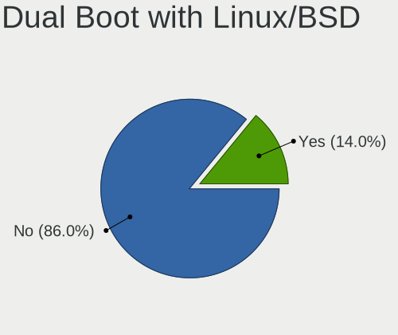
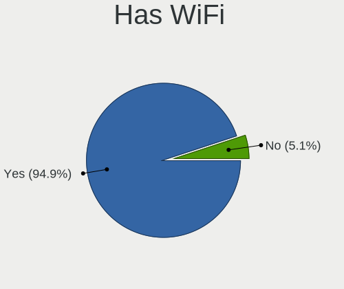
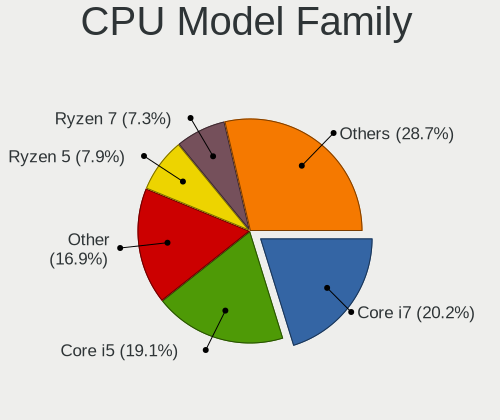
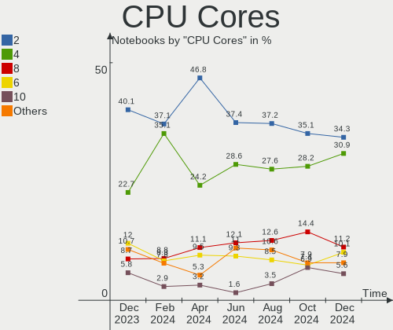
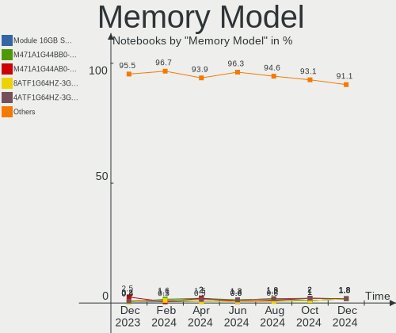

Debian - Hardware Trends (Notebooks)
------------------------------------

A project to identify most popular hardware characteristics and track their change
over time based on data collected by Linux users at https://Linux-Hardware.org.

Anyone can contribute to this report by the [hw-probe](https://github.com/linuxhw/hw-probe) tool:

    sudo -E hw-probe -all -upload

This report is for one last month. Overall report since the beginning of time: [TestDays](https://github.com/linuxhw/TestDays)

Period: Jun, 2023.

Contents
--------

* [ System ](#system)
  - [ OS                       ](#os)
  - [ OS Family                ](#os-family)
  - [ Kernel                   ](#kernel)
  - [ Kernel Family            ](#kernel-family)
  - [ Kernel Major Ver.        ](#kernel-major-ver)
  - [ Arch                     ](#arch)
  - [ DE                       ](#de)
  - [ Display Server           ](#display-server)
  - [ Display Manager          ](#display-manager)
  - [ OS Lang                  ](#os-lang)
  - [ Boot Mode                ](#boot-mode)
  - [ Filesystem               ](#filesystem)
  - [ Part. scheme             ](#part-scheme)
  - [ Dual Boot with Linux/BSD ](#dual-boot-with-linuxbsd)
  - [ Dual Boot (Win)          ](#dual-boot-win)

* [ Board ](#board)
  - [ Vendor                   ](#vendor)
  - [ Model                    ](#model)
  - [ Model Family             ](#model-family)
  - [ MFG Year                 ](#mfg-year)
  - [ Form Factor              ](#form-factor)
  - [ Secure Boot              ](#secure-boot)
  - [ Coreboot                 ](#coreboot)
  - [ RAM Size                 ](#ram-size)
  - [ RAM Used                 ](#ram-used)
  - [ Total Drives             ](#total-drives)
  - [ Has CD-ROM               ](#has-cd-rom)
  - [ Has Ethernet             ](#has-ethernet)
  - [ Has WiFi                 ](#has-wifi)
  - [ Has Bluetooth            ](#has-bluetooth)

* [ Location ](#location)
  - [ Country                  ](#country)
  - [ City                     ](#city)

* [ Drives ](#drives)
  - [ Drive Vendor             ](#drive-vendor)
  - [ Drive Model              ](#drive-model)
  - [ HDD Vendor               ](#hdd-vendor)
  - [ SSD Vendor               ](#ssd-vendor)
  - [ Drive Kind               ](#drive-kind)
  - [ Drive Connector          ](#drive-connector)
  - [ Drive Size               ](#drive-size)
  - [ Space Total              ](#space-total)
  - [ Space Used               ](#space-used)
  - [ Malfunc. Drives          ](#malfunc-drives)
  - [ Malfunc. Drive Vendor    ](#malfunc-drive-vendor)
  - [ Malfunc. HDD Vendor      ](#malfunc-hdd-vendor)
  - [ Malfunc. Drive Kind      ](#malfunc-drive-kind)
  - [ Failed Drives            ](#failed-drives)
  - [ Failed Drive Vendor      ](#failed-drive-vendor)
  - [ Drive Status             ](#drive-status)

* [ Storage controller ](#storage-controller)
  - [ Storage Vendor           ](#storage-vendor)
  - [ Storage Model            ](#storage-model)
  - [ Storage Kind             ](#storage-kind)

* [ Processor ](#processor)
  - [ CPU Vendor               ](#cpu-vendor)
  - [ CPU Model                ](#cpu-model)
  - [ CPU Model Family         ](#cpu-model-family)
  - [ CPU Cores                ](#cpu-cores)
  - [ CPU Sockets              ](#cpu-sockets)
  - [ CPU Threads              ](#cpu-threads)
  - [ CPU Op-Modes             ](#cpu-op-modes)
  - [ CPU Microcode            ](#cpu-microcode)
  - [ CPU Microarch            ](#cpu-microarch)

* [ Graphics ](#graphics)
  - [ GPU Vendor               ](#gpu-vendor)
  - [ GPU Model                ](#gpu-model)
  - [ GPU Combo                ](#gpu-combo)
  - [ GPU Driver               ](#gpu-driver)
  - [ GPU Memory               ](#gpu-memory)

* [ Monitor ](#monitor)
  - [ Monitor Vendor           ](#monitor-vendor)
  - [ Monitor Model            ](#monitor-model)
  - [ Monitor Resolution       ](#monitor-resolution)
  - [ Monitor Diagonal         ](#monitor-diagonal)
  - [ Monitor Width            ](#monitor-width)
  - [ Aspect Ratio             ](#aspect-ratio)
  - [ Monitor Area             ](#monitor-area)
  - [ Pixel Density            ](#pixel-density)
  - [ Multiple Monitors        ](#multiple-monitors)

* [ Network ](#network)
  - [ Net Controller Vendor    ](#net-controller-vendor)
  - [ Net Controller Model     ](#net-controller-model)
  - [ Wireless Vendor          ](#wireless-vendor)
  - [ Wireless Model           ](#wireless-model)
  - [ Ethernet Vendor          ](#ethernet-vendor)
  - [ Ethernet Model           ](#ethernet-model)
  - [ Net Controller Kind      ](#net-controller-kind)
  - [ Used Controller          ](#used-controller)
  - [ NICs                     ](#nics)
  - [ IPv6                     ](#ipv6)

* [ Bluetooth ](#bluetooth)
  - [ Bluetooth Vendor         ](#bluetooth-vendor)
  - [ Bluetooth Model          ](#bluetooth-model)

* [ Sound ](#sound)
  - [ Sound Vendor             ](#sound-vendor)
  - [ Sound Model              ](#sound-model)

* [ Memory ](#memory)
  - [ Memory Vendor            ](#memory-vendor)
  - [ Memory Model             ](#memory-model)
  - [ Memory Kind              ](#memory-kind)
  - [ Memory Form Factor       ](#memory-form-factor)
  - [ Memory Size              ](#memory-size)
  - [ Memory Speed             ](#memory-speed)

* [ Printers & scanners ](#printers--scanners)
  - [ Printer Vendor           ](#printer-vendor)
  - [ Printer Model            ](#printer-model)
  - [ Scanner Vendor           ](#scanner-vendor)
  - [ Scanner Model            ](#scanner-model)

* [ Camera ](#camera)
  - [ Camera Vendor            ](#camera-vendor)
  - [ Camera Model             ](#camera-model)

* [ Security ](#security)
  - [ Fingerprint Vendor       ](#fingerprint-vendor)
  - [ Fingerprint Model        ](#fingerprint-model)
  - [ Chipcard Vendor          ](#chipcard-vendor)
  - [ Chipcard Model           ](#chipcard-model)

* [ Unsupported ](#unsupported)
  - [ Unsupported Devices      ](#unsupported-devices)
  - [ Unsupported Device Types ](#unsupported-device-types)

System
------

OS
--

Installed operating systems

| Name      | Notebooks | Percent |
|-----------|-----------|---------|
| Debian 12 | 123       | 57.48%  |
| Debian 11 | 82        | 38.32%  |
| Debian    | 7         | 3.27%   |
| Debian 22 | 1         | 0.47%   |
| Debian 10 | 1         | 0.47%   |

OS Family
---------

OS without a version

| Name   | Notebooks | Percent |
|--------|-----------|---------|
| Debian | 214       | 100%    |

Kernel
------

Version of the Linux kernel

| Version                    | Notebooks | Percent |
|----------------------------|-----------|---------|
| 6.1.0-9-amd64              | 102       | 47.66%  |
| 5.10.0-23-amd64            | 47        | 21.96%  |
| 6.1.0-4-amd64              | 13        | 6.07%   |
| 5.10.0-22-amd64            | 6         | 2.8%    |
| 6.3.0-1-amd64              | 5         | 2.34%   |
| 6.1.0-0.deb11.7-amd64      | 4         | 1.87%   |
| 5.10.0-20-amd64            | 3         | 1.4%    |
| 6.3.9-1-liquorix-amd64     | 2         | 0.93%   |
| 6.1.0-9-686-pae            | 2         | 0.93%   |
| 6.0.0-6mx-amd64            | 2         | 0.93%   |
| 5.10.0-23-686              | 2         | 0.93%   |
| 5.10.0-15-amd64            | 2         | 0.93%   |
| 6.3.8-1-liquorix-amd64     | 1         | 0.47%   |
| 6.3.5-titanide             | 1         | 0.47%   |
| 6.3.10-x64v3-xanmod1       | 1         | 0.47%   |
| 6.2.8-safran               | 1         | 0.47%   |
| 6.2.8                      | 1         | 0.47%   |
| 6.2.16-dell-latitude-e5510 | 1         | 0.47%   |
| 6.1.31-dell-latitude-e5510 | 1         | 0.47%   |
| 6.1.0-9-rt-amd64           | 1         | 0.47%   |
| 6.1.0-6-amd64              | 1         | 0.47%   |
| 6.1.0-3-amd64              | 1         | 0.47%   |
| 6.1.0-1-amd64              | 1         | 0.47%   |
| 6.0.0-0.deb11.6-amd64      | 1         | 0.47%   |
| 5.15.94-x86                | 1         | 0.47%   |
| 5.15.108-1-pve             | 1         | 0.47%   |
| 5.10.181-loc-os            | 1         | 0.47%   |
| 5.10.0-9-686               | 1         | 0.47%   |
| 5.10.0-8-amd64             | 1         | 0.47%   |
| 5.10.0-23-rt-amd64         | 1         | 0.47%   |
| 5.10.0-21-amd64            | 1         | 0.47%   |
| 5.10.0-21-686-pae          | 1         | 0.47%   |
| 5.10.0-21-686              | 1         | 0.47%   |
| 5.10.0-12-amd64            | 1         | 0.47%   |
| 5.10.0-11-amd64            | 1         | 0.47%   |
| 5.10.0-0.bpo.9-amd64       | 1         | 0.47%   |

Kernel Family
-------------

Linux kernel without a distro release

| Version  | Notebooks | Percent |
|----------|-----------|---------|
| 6.1.0    | 125       | 58.41%  |
| 5.10.0   | 69        | 32.24%  |
| 6.3.0    | 5         | 2.34%   |
| 6.0.0    | 3         | 1.4%    |
| 6.3.9    | 2         | 0.93%   |
| 6.2.8    | 2         | 0.93%   |
| 6.3.8    | 1         | 0.47%   |
| 6.3.5    | 1         | 0.47%   |
| 6.3.10   | 1         | 0.47%   |
| 6.2.16   | 1         | 0.47%   |
| 6.1.31   | 1         | 0.47%   |
| 5.15.94  | 1         | 0.47%   |
| 5.15.108 | 1         | 0.47%   |
| 5.10.181 | 1         | 0.47%   |

Kernel Major Ver.
-----------------

Linux kernel major version

| Version | Notebooks | Percent |
|---------|-----------|---------|
| 6.1     | 126       | 58.88%  |
| 5.10    | 70        | 32.71%  |
| 6.3     | 10        | 4.67%   |
| 6.2     | 3         | 1.4%    |
| 6.0     | 3         | 1.4%    |
| 5.15    | 2         | 0.93%   |

Arch
----

OS architecture (x86_64, i586, etc.)

| Name   | Notebooks | Percent |
|--------|-----------|---------|
| x86_64 | 207       | 96.73%  |
| i686   | 7         | 3.27%   |

DE
--

Desktop Environment

| Name             | Notebooks | Percent |
|------------------|-----------|---------|
| GNOME            | 73        | 34.11%  |
| KDE5             | 37        | 17.29%  |
| Unknown          | 33        | 15.42%  |
| XFCE             | 29        | 13.55%  |
| X-Cinnamon       | 12        | 5.61%   |
| MATE             | 10        | 4.67%   |
| LXDE             | 5         | 2.34%   |
| LXQt             | 3         | 1.4%    |
| lightdm-xsession | 2         | 0.93%   |
| i3               | 2         | 0.93%   |
| GNOME Classic    | 2         | 0.93%   |
| Openbox          | 1         | 0.47%   |
| KDE              | 1         | 0.47%   |
| GNOME Flashback  | 1         | 0.47%   |
| Dwm              | 1         | 0.47%   |
| Cinnamon         | 1         | 0.47%   |
| Budgie           | 1         | 0.47%   |

Display Server
--------------

X11 or Wayland

| Name    | Notebooks | Percent |
|---------|-----------|---------|
| X11     | 114       | 53.27%  |
| Wayland | 68        | 31.78%  |
| Unknown | 27        | 12.62%  |
| Tty     | 5         | 2.34%   |

Display Manager
---------------

SDDM, LightDM, etc.

| Name    | Notebooks | Percent |
|---------|-----------|---------|
| Unknown | 82        | 38.32%  |
| LightDM | 50        | 23.36%  |
| GDM3    | 39        | 18.22%  |
| SDDM    | 24        | 11.21%  |
| GDM     | 16        | 7.48%   |
| LXDM    | 3         | 1.4%    |

OS Lang
-------

Language

| Lang    | Notebooks | Percent |
|---------|-----------|---------|
| en_US   | 72        | 33.64%  |
| ru_RU   | 25        | 11.68%  |
| de_DE   | 20        | 9.35%   |
| en_GB   | 14        | 6.54%   |
| Unknown | 12        | 5.61%   |
| fr_FR   | 10        | 4.67%   |
| pt_BR   | 8         | 3.74%   |
| it_IT   | 7         | 3.27%   |
| en_CA   | 5         | 2.34%   |
| en_AU   | 4         | 1.87%   |
| zh_CN   | 3         | 1.4%    |
| es_AR   | 3         | 1.4%    |
| tr_TR   | 2         | 0.93%   |
| pl_PL   | 2         | 0.93%   |
| es_VE   | 2         | 0.93%   |
| es_ES   | 2         | 0.93%   |
| en_IN   | 2         | 0.93%   |
| en_IE   | 2         | 0.93%   |
| de_AT   | 2         | 0.93%   |
| C       | 2         | 0.93%   |
| zh_TW   | 1         | 0.47%   |
| ru_UA   | 1         | 0.47%   |
| pt_PT   | 1         | 0.47%   |
| nl_NL   | 1         | 0.47%   |
| fr_CH   | 1         | 0.47%   |
| fi_FI   | 1         | 0.47%   |
| eu_ES   | 1         | 0.47%   |
| es_US   | 1         | 0.47%   |
| es_MX   | 1         | 0.47%   |
| es_CO   | 1         | 0.47%   |
| en_ZA   | 1         | 0.47%   |
| en_SG   | 1         | 0.47%   |
| en_DK   | 1         | 0.47%   |
| da_DK   | 1         | 0.47%   |
| ca_ES   | 1         | 0.47%   |

Boot Mode
---------

EFI or BIOS

| Mode | Notebooks | Percent |
|------|-----------|---------|
| EFI  | 119       | 55.61%  |
| BIOS | 95        | 44.39%  |

Filesystem
----------

Type of filesystem

| Type    | Notebooks | Percent |
|---------|-----------|---------|
| Ext4    | 169       | 78.97%  |
| Overlay | 33        | 15.42%  |
| Btrfs   | 8         | 3.74%   |
| Zfs     | 1         | 0.47%   |
| Xfs     | 1         | 0.47%   |
| Tmpfs   | 1         | 0.47%   |
| Ext2    | 1         | 0.47%   |

Part. scheme
------------

Scheme of partitioning

| Type    | Notebooks | Percent |
|---------|-----------|---------|
| GPT     | 118       | 55.14%  |
| Unknown | 55        | 25.7%   |
| MBR     | 41        | 19.16%  |

Dual Boot with Linux/BSD
------------------------

Hosting more than one Linux/BSD

| Dual boot | Notebooks | Percent |
|-----------|-----------|---------|
| No        | 190       | 88.79%  |
| Yes       | 24        | 11.21%  |

Dual Boot (Win)
---------------

Hosting Linux and Windows

| Dual boot | Notebooks | Percent |
|-----------|-----------|---------|
| No        | 148       | 69.16%  |
| Yes       | 66        | 30.84%  |

Board
-----

Vendor
------

Motherboard manufacturer

| Name                   | Notebooks | Percent |
|------------------------|-----------|---------|
| Lenovo                 | 50        | 23.36%  |
| Dell                   | 36        | 16.82%  |
| Hewlett-Packard        | 30        | 14.02%  |
| Apple                  | 16        | 7.48%   |
| Acer                   | 16        | 7.48%   |
| ASUSTek Computer       | 14        | 6.54%   |
| Aquarius               | 11        | 5.14%   |
| MSI                    | 5         | 2.34%   |
| HUAWEI                 | 4         | 1.87%   |
| Fujitsu                | 3         | 1.4%    |
| Toshiba                | 2         | 0.93%   |
| Pegatron               | 2         | 0.93%   |
| Packard Bell           | 2         | 0.93%   |
| Intel                  | 2         | 0.93%   |
| HONOR                  | 2         | 0.93%   |
| Google                 | 2         | 0.93%   |
| VIT                    | 1         | 0.47%   |
| Sony                   | 1         | 0.47%   |
| Semp Toshiba           | 1         | 0.47%   |
| Samsung Electronics    | 1         | 0.47%   |
| Positivo               | 1         | 0.47%   |
| NEC Computers          | 1         | 0.47%   |
| Medion                 | 1         | 0.47%   |
| LG Electronics         | 1         | 0.47%   |
| IT Channel Pty         | 1         | 0.47%   |
| Hampoo                 | 1         | 0.47%   |
| Digibras               | 1         | 0.47%   |
| Coradir                | 1         | 0.47%   |
| Clevo                  | 1         | 0.47%   |
| AVITA                  | 1         | 0.47%   |
| Avell High Performance | 1         | 0.47%   |
| Acidanthera            | 1         | 0.47%   |
| Unknown                | 1         | 0.47%   |

Model
-----

Motherboard model

| Name                                       | Notebooks | Percent |
|--------------------------------------------|-----------|---------|
| Aquarius NS585                             | 11        | 5.14%   |
| Apple MacBookAir7,2                        | 6         | 2.8%    |
| HUAWEI BOHK-WAX9X                          | 3         | 1.4%    |
| Pegatron Spring Peak                       | 2         | 0.93%   |
| Lenovo IdeaPad Gaming 3 15ACH6 82K2        | 2         | 0.93%   |
| HP Pavilion dv6                            | 2         | 0.93%   |
| HP EliteBook 845 G8 Notebook PC            | 2         | 0.93%   |
| Dell Latitude E7450                        | 2         | 0.93%   |
| Dell Latitude E6430                        | 2         | 0.93%   |
| Dell Latitude E6400                        | 2         | 0.93%   |
| Dell Latitude 5480                         | 2         | 0.93%   |
| Dell Latitude 3320                         | 2         | 0.93%   |
| Apple MacBookPro5,5                        | 2         | 0.93%   |
| VIT P2423                                  | 1         | 0.47%   |
| Toshiba WT8-A                              | 1         | 0.47%   |
| Toshiba Satellite L45-B                    | 1         | 0.47%   |
| Sony SVE11116FGW                           | 1         | 0.47%   |
| Semp Toshiba IS 1413G                      | 1         | 0.47%   |
| Samsung 750XED                             | 1         | 0.47%   |
| Positivo C500                              | 1         | 0.47%   |
| Packard Bell EasyNote TE11HC               | 1         | 0.47%   |
| Packard Bell EasyNote ENTF71BM             | 1         | 0.47%   |
| NEC Computers VERSA P91 series             | 1         | 0.47%   |
| MSI Pulse GL66 12UDK                       | 1         | 0.47%   |
| MSI Prestige 15 A10SC                      | 1         | 0.47%   |
| MSI GL75 Leopard 10SER                     | 1         | 0.47%   |
| MSI GE62 6QC                               | 1         | 0.47%   |
| MSI GE60 2PL                               | 1         | 0.47%   |
| Medion E6214                               | 1         | 0.47%   |
| LG 17Z90R-G.AD79F                          | 1         | 0.47%   |
| Lenovo Yoga Slim 7 Pro 14ACH5 OD 82NK      | 1         | 0.47%   |
| Lenovo V15 G2 ALC 82KD                     | 1         | 0.47%   |
| Lenovo V14 G2 ITL 82NM                     | 1         | 0.47%   |
| Lenovo ThinkPad X280 20KF001RUK            | 1         | 0.47%   |
| Lenovo ThinkPad X270 W10DG 20K5S5QD00      | 1         | 0.47%   |
| Lenovo ThinkPad X230 2325SRQ               | 1         | 0.47%   |
| Lenovo ThinkPad X131e 3374A17              | 1         | 0.47%   |
| Lenovo ThinkPad X120e 0611AN2              | 1         | 0.47%   |
| Lenovo ThinkPad X1 Carbon Gen 9 20XW00FWUS | 1         | 0.47%   |
| Lenovo ThinkPad X1 Carbon 5th 20HR0013AU   | 1         | 0.47%   |

Model Family
------------

Motherboard model prefix

| Name                  | Notebooks | Percent |
|-----------------------|-----------|---------|
| Lenovo ThinkPad       | 29        | 13.55%  |
| Dell Latitude         | 20        | 9.35%   |
| Aquarius NS585        | 11        | 5.14%   |
| Acer Aspire           | 11        | 5.14%   |
| Lenovo IdeaPad        | 10        | 4.67%   |
| HP EliteBook          | 10        | 4.67%   |
| Dell Inspiron         | 8         | 3.74%   |
| HP Pavilion           | 7         | 3.27%   |
| Apple MacBookAir7     | 7         | 3.27%   |
| HP Laptop             | 4         | 1.87%   |
| Dell XPS              | 4         | 1.87%   |
| ASUS VivoBook         | 4         | 1.87%   |
| Acer TravelMate       | 4         | 1.87%   |
| HUAWEI BOHK-WAX9X     | 3         | 1.4%    |
| Fujitsu LIFEBOOK      | 3         | 1.4%    |
| ASUS ZenBook          | 3         | 1.4%    |
| Pegatron Spring       | 2         | 0.93%   |
| Packard Bell EasyNote | 2         | 0.93%   |
| Lenovo Legion         | 2         | 0.93%   |
| HP OMEN               | 2         | 0.93%   |
| Apple MacBookPro5     | 2         | 0.93%   |
| VIT P2423             | 1         | 0.47%   |
| Toshiba WT8-A         | 1         | 0.47%   |
| Toshiba Satellite     | 1         | 0.47%   |
| Sony SVE11116FGW      | 1         | 0.47%   |
| Semp Toshiba IS       | 1         | 0.47%   |
| Samsung 750XED        | 1         | 0.47%   |
| Positivo C500         | 1         | 0.47%   |
| NEC Computers VERSA   | 1         | 0.47%   |
| MSI Pulse             | 1         | 0.47%   |
| MSI Prestige          | 1         | 0.47%   |
| MSI GL75              | 1         | 0.47%   |
| MSI GE62              | 1         | 0.47%   |
| MSI GE60              | 1         | 0.47%   |
| Medion E6214          | 1         | 0.47%   |
| LG 17Z90R-G.AD79F     | 1         | 0.47%   |
| Lenovo Yoga           | 1         | 0.47%   |
| Lenovo V15            | 1         | 0.47%   |
| Lenovo V14            | 1         | 0.47%   |
| Lenovo S40-70         | 1         | 0.47%   |

MFG Year
--------

Motherboard manufacture year

| Year | Notebooks | Percent |
|------|-----------|---------|
| 2019 | 30        | 14.02%  |
| 2021 | 20        | 9.35%   |
| 2020 | 19        | 8.88%   |
| 2015 | 16        | 7.48%   |
| 2010 | 15        | 7.01%   |
| 2022 | 14        | 6.54%   |
| 2017 | 14        | 6.54%   |
| 2014 | 14        | 6.54%   |
| 2012 | 14        | 6.54%   |
| 2018 | 12        | 5.61%   |
| 2008 | 10        | 4.67%   |
| 2013 | 8         | 3.74%   |
| 2009 | 8         | 3.74%   |
| 2011 | 7         | 3.27%   |
| 2016 | 5         | 2.34%   |
| 2023 | 4         | 1.87%   |
| 2007 | 3         | 1.4%    |
| 2006 | 1         | 0.47%   |

Form Factor
-----------

Physical design of the computer

| Name     | Notebooks | Percent |
|----------|-----------|---------|
| Notebook | 214       | 100%    |

Secure Boot
-----------

Enabled or disabled

| State    | Notebooks | Percent |
|----------|-----------|---------|
| Disabled | 194       | 90.65%  |
| Enabled  | 20        | 9.35%   |

Coreboot
--------

Have coreboot on board

| Used | Notebooks | Percent |
|------|-----------|---------|
| No   | 212       | 99.07%  |
| Yes  | 2         | 0.93%   |

RAM Size
--------

Total RAM memory

| Size in GB  | Notebooks | Percent |
|-------------|-----------|---------|
| 4.01-8.0    | 81        | 37.85%  |
| 3.01-4.0    | 38        | 17.76%  |
| 8.01-16.0   | 30        | 14.02%  |
| 16.01-24.0  | 27        | 12.62%  |
| 32.01-64.0  | 21        | 9.81%   |
| 1.01-2.0    | 9         | 4.21%   |
| 2.01-3.0    | 5         | 2.34%   |
| 24.01-32.0  | 1         | 0.47%   |
| 64.01-256.0 | 1         | 0.47%   |
| 0.51-1.0    | 1         | 0.47%   |

RAM Used
--------

Used RAM memory

| Used GB    | Notebooks | Percent |
|------------|-----------|---------|
| 2.01-3.0   | 59        | 27.57%  |
| 1.01-2.0   | 56        | 26.17%  |
| 4.01-8.0   | 31        | 14.49%  |
| 0.51-1.0   | 28        | 13.08%  |
| 3.01-4.0   | 27        | 12.62%  |
| 8.01-16.0  | 9         | 4.21%   |
| 0.01-0.5   | 3         | 1.4%    |
| 16.01-24.0 | 1         | 0.47%   |

Total Drives
------------

Number of drives on board

| Drives | Notebooks | Percent |
|--------|-----------|---------|
| 1      | 160       | 74.77%  |
| 2      | 47        | 21.96%  |
| 3      | 6         | 2.8%    |
| 0      | 1         | 0.47%   |

Has CD-ROM
----------

Has CD-ROM on board

| Presented | Notebooks | Percent |
|-----------|-----------|---------|
| No        | 160       | 74.77%  |
| Yes       | 54        | 25.23%  |

Has Ethernet
------------

Has Ethernet on board

| Presented | Notebooks | Percent |
|-----------|-----------|---------|
| Yes       | 172       | 80.37%  |
| No        | 42        | 19.63%  |

Has WiFi
--------

Has WiFi module

| Presented | Notebooks | Percent |
|-----------|-----------|---------|
| Yes       | 205       | 95.79%  |
| No        | 9         | 4.21%   |

Has Bluetooth
-------------

Has Bluetooth module

| Presented | Notebooks | Percent |
|-----------|-----------|---------|
| Yes       | 168       | 78.5%   |
| No        | 46        | 21.5%   |

Location
--------

Country
-------

Geographic location (country)

| Country      | Notebooks | Percent |
|--------------|-----------|---------|
| USA          | 29        | 13.55%  |
| Russia       | 26        | 12.15%  |
| Germany      | 25        | 11.68%  |
| Brazil       | 15        | 7.01%   |
| France       | 11        | 5.14%   |
| Italy        | 9         | 4.21%   |
| UK           | 8         | 3.74%   |
| Canada       | 6         | 2.8%    |
| Australia    | 6         | 2.8%    |
| Spain        | 5         | 2.34%   |
| Netherlands  | 5         | 2.34%   |
| China        | 5         | 2.34%   |
| Sweden       | 4         | 1.87%   |
| Poland       | 3         | 1.4%    |
| Mexico       | 3         | 1.4%    |
| India        | 3         | 1.4%    |
| Denmark      | 3         | 1.4%    |
| Austria      | 3         | 1.4%    |
| Argentina    | 3         | 1.4%    |
| Venezuela    | 2         | 0.93%   |
| Ukraine      | 2         | 0.93%   |
| Turkey       | 2         | 0.93%   |
| Switzerland  | 2         | 0.93%   |
| Romania      | 2         | 0.93%   |
| Myanmar      | 2         | 0.93%   |
| Israel       | 2         | 0.93%   |
| Czechia      | 2         | 0.93%   |
| Bulgaria     | 2         | 0.93%   |
| Belgium      | 2         | 0.93%   |
| Taiwan       | 1         | 0.47%   |
| South Africa | 1         | 0.47%   |
| Singapore    | 1         | 0.47%   |
| Portugal     | 1         | 0.47%   |
| Pakistan     | 1         | 0.47%   |
| Norway       | 1         | 0.47%   |
| Morocco      | 1         | 0.47%   |
| Malaysia     | 1         | 0.47%   |
| Malawi       | 1         | 0.47%   |
| Latvia       | 1         | 0.47%   |
| Kenya        | 1         | 0.47%   |

City
----

Geographic location (city)

| City             | Notebooks | Percent |
|------------------|-----------|---------|
| Voronezh         | 13        | 6.07%   |
| Bangor           | 13        | 6.07%   |
| Samara           | 3         | 1.4%    |
| Paris            | 3         | 1.4%    |
| Moscow           | 3         | 1.4%    |
| London           | 3         | 1.4%    |
| Karlsruhe        | 3         | 1.4%    |
| Beijing          | 3         | 1.4%    |
| Yangon           | 2         | 0.93%   |
| Vila Velha       | 2         | 0.93%   |
| Toronto          | 2         | 0.93%   |
| St Petersburg    | 2         | 0.93%   |
| Milan            | 2         | 0.93%   |
| Melbourne        | 2         | 0.93%   |
| Marseille        | 2         | 0.93%   |
| Malmo            | 2         | 0.93%   |
| Istanbul         | 2         | 0.93%   |
| Indianapolis     | 2         | 0.93%   |
| Brasília        | 2         | 0.93%   |
| Bonn             | 2         | 0.93%   |
| Berlin           | 2         | 0.93%   |
| Amsterdam        | 2         | 0.93%   |
| Zhangzhou        | 1         | 0.47%   |
| Zehdenick        | 1         | 0.47%   |
| Wroclaw          | 1         | 0.47%   |
| Whitby           | 1         | 0.47%   |
| Westlake         | 1         | 0.47%   |
| Warsaw           | 1         | 0.47%   |
| Volendam         | 1         | 0.47%   |
| Villa de Cura    | 1         | 0.47%   |
| Vienna           | 1         | 0.47%   |
| Vernon           | 1         | 0.47%   |
| Venice           | 1         | 0.47%   |
| Venado Tuerto    | 1         | 0.47%   |
| Varna            | 1         | 0.47%   |
| Turin            | 1         | 0.47%   |
| Thrissur         | 1         | 0.47%   |
| Tbilisi          | 1         | 0.47%   |
| Taoyuan District | 1         | 0.47%   |
| Stuttgart        | 1         | 0.47%   |

Drives
------

Drive Vendor
------------

Hard drive vendors

| Vendor                      | Notebooks | Drives | Percent |
|-----------------------------|-----------|--------|---------|
| Samsung Electronics         | 41        | 43     | 16.08%  |
| WDC                         | 29        | 33     | 11.37%  |
| Seagate                     | 18        | 18     | 7.06%   |
| Toshiba                     | 15        | 15     | 5.88%   |
| A-DATA Technology           | 13        | 13     | 5.1%    |
| Unknown                     | 12        | 12     | 4.71%   |
| Crucial                     | 11        | 12     | 4.31%   |
| SanDisk                     | 10        | 11     | 3.92%   |
| Kingston                    | 10        | 11     | 3.92%   |
| Apple                       | 10        | 10     | 3.92%   |
| SK hynix                    | 9         | 9      | 3.53%   |
| Intel                       | 9         | 9      | 3.53%   |
| Micron Technology           | 7         | 7      | 2.75%   |
| KIOXIA                      | 6         | 6      | 2.35%   |
| Hitachi                     | 5         | 5      | 1.96%   |
| HGST                        | 5         | 5      | 1.96%   |
| Kingston Technology Company | 3         | 3      | 1.18%   |
| JMicron Technology          | 3         | 3      | 1.18%   |
| Fujitsu                     | 3         | 3      | 1.18%   |
| PNY                         | 2         | 2      | 0.78%   |
| Patriot                     | 2         | 2      | 0.78%   |
| Netac                       | 2         | 2      | 0.78%   |
| Intenso                     | 2         | 2      | 0.78%   |
| China                       | 2         | 2      | 0.78%   |
| ADATA Technology            | 2         | 2      | 0.78%   |
| YMTC                        | 1         | 1      | 0.39%   |
| Wellcomm                    | 1         | 1      | 0.39%   |
| UMIS                        | 1         | 1      | 0.39%   |
| Transcend                   | 1         | 1      | 0.39%   |
| T-FORCE                     | 1         | 1      | 0.39%   |
| SSSTC                       | 1         | 1      | 0.39%   |
| SPCC                        | 1         | 1      | 0.39%   |
| ShiJi                       | 1         | 1      | 0.39%   |
| S3+                         | 1         | 1      | 0.39%   |
| Realtek Semiconductor       | 1         | 1      | 0.39%   |
| Realtek                     | 1         | 1      | 0.39%   |
| Pioneer                     | 1         | 1      | 0.39%   |
| Phison Electronics          | 1         | 1      | 0.39%   |
| Origin                      | 1         | 1      | 0.39%   |
| MicroFrom                   | 1         | 1      | 0.39%   |

Drive Model
-----------

Hard drive models

| Model                                               | Notebooks | Percent |
|-----------------------------------------------------|-----------|---------|
| A-DATA SU800 512GB SSD                              | 11        | 4.23%   |
| Samsung NVMe SSD Controller SM981/PM981/PM983 250GB | 6         | 2.31%   |
| Apple SSD SM0128G 121GB                             | 6         | 2.31%   |
| Crucial CT1000MX500SSD1 1TB                         | 4         | 1.54%   |
| HGST HTS721010A9E630 1TB                            | 3         | 1.15%   |
| Crucial CT500MX500SSD1 500GB                        | 3         | 1.15%   |
| WDC WDS240G2G0A-00JH30 240GB SSD                    | 2         | 0.77%   |
| WDC WD10JPVX-22JC3T0 1TB                            | 2         | 0.77%   |
| WDC PC SN730 SDBPNTY-256G-1027 256GB                | 2         | 0.77%   |
| Toshiba MQ01ABF050 500GB                            | 2         | 0.77%   |
| SK hynix HFS256G39TND-N210A 256GB SSD               | 2         | 0.77%   |
| Seagate ST9500420AS 500GB                           | 2         | 0.77%   |
| Seagate ST9500325AS 500GB                           | 2         | 0.77%   |
| Samsung SSD 980 1TB                                 | 2         | 0.77%   |
| Samsung SSD 860 EVO 500GB                           | 2         | 0.77%   |
| Samsung MZALQ512HBLU-00BL2 512GB                    | 2         | 0.77%   |
| Micron 2450_MTFDKBA512TFK 512GB                     | 2         | 0.77%   |
| KIOXIA KBG50ZNS256G NVMe 256GB                      | 2         | 0.77%   |
| KIOXIA KBG40ZNS256G NVMe 256GB                      | 2         | 0.77%   |
| Kingston SA400S37480G 480GB SSD                     | 2         | 0.77%   |
| Kingston SA400S37120G 120GB SSD                     | 2         | 0.77%   |
| JMicron Tech 250GB                                  | 2         | 0.77%   |
| Intel SSDPEKNW512G8 512GB                           | 2         | 0.77%   |
| Fujitsu MHZ2160BH FFS G1 160GB                      | 2         | 0.77%   |
| YMTC PC210-512GB-B                                  | 1         | 0.38%   |
| Wellcomm Master 256GB SSD                           | 1         | 0.38%   |
| WDC WDS500G2B0A-00SM50 500GB SSD                    | 1         | 0.38%   |
| WDC WDS250G2B0A-00SM50 250GB SSD                    | 1         | 0.38%   |
| WDC WDS120G2G0A-00JH30 128GB SSD                    | 1         | 0.38%   |
| WDC WDS100T3X0C-00SJG0 1TB                          | 1         | 0.38%   |
| WDC WD7500BPVT-22HXZT3 752GB                        | 1         | 0.38%   |
| WDC WD5000LPVX-22V0TT0 500GB                        | 1         | 0.38%   |
| WDC WD5000LPVT-08G33T1 500GB                        | 1         | 0.38%   |
| WDC WD5000LPLX-00ZNTT0 500GB                        | 1         | 0.38%   |
| WDC WD5000LPCX-22VHAT0 500GB                        | 1         | 0.38%   |
| WDC WD5000LPCX-00VHAT0 500GB                        | 1         | 0.38%   |
| WDC WD5000BEVT-22ZAT0 500GB                         | 1         | 0.38%   |
| WDC WD3200LPCX-24C6HT0 320GB                        | 1         | 0.38%   |
| WDC WD3200BPVT-80ZEST0 320GB                        | 1         | 0.38%   |
| WDC WD3200BPVT-75JJ5T0 320GB                        | 1         | 0.38%   |

HDD Vendor
----------

Hard disk drive vendors

| Vendor  | Notebooks | Drives | Percent |
|---------|-----------|--------|---------|
| WDC     | 17        | 18     | 28.81%  |
| Seagate | 17        | 17     | 28.81%  |
| Toshiba | 11        | 11     | 18.64%  |
| Hitachi | 5         | 5      | 8.47%   |
| HGST    | 5         | 5      | 8.47%   |
| Fujitsu | 3         | 3      | 5.08%   |
| Unknown | 1         | 1      | 1.69%   |

SSD Vendor
----------

Solid state drive vendors

| Vendor              | Notebooks | Drives | Percent |
|---------------------|-----------|--------|---------|
| Samsung Electronics | 14        | 14     | 15.22%  |
| A-DATA Technology   | 11        | 11     | 11.96%  |
| Crucial             | 9         | 9      | 9.78%   |
| Apple               | 9         | 9      | 9.78%   |
| Kingston            | 7         | 8      | 7.61%   |
| WDC                 | 5         | 5      | 5.43%   |
| SanDisk             | 4         | 4      | 4.35%   |
| Intel               | 3         | 3      | 3.26%   |
| SK hynix            | 2         | 2      | 2.17%   |
| PNY                 | 2         | 2      | 2.17%   |
| Patriot             | 2         | 2      | 2.17%   |
| Micron Technology   | 2         | 2      | 2.17%   |
| Intenso             | 2         | 2      | 2.17%   |
| China               | 2         | 2      | 2.17%   |
| Wellcomm            | 1         | 1      | 1.09%   |
| Transcend           | 1         | 1      | 1.09%   |
| Toshiba             | 1         | 1      | 1.09%   |
| SPCC                | 1         | 1      | 1.09%   |
| Seagate             | 1         | 1      | 1.09%   |
| S3+                 | 1         | 1      | 1.09%   |
| Pioneer             | 1         | 1      | 1.09%   |
| Origin              | 1         | 1      | 1.09%   |
| Netac               | 1         | 1      | 1.09%   |
| MicroFrom           | 1         | 1      | 1.09%   |
| Lenovo              | 1         | 1      | 1.09%   |
| KIOXIA-EXCERIA      | 1         | 1      | 1.09%   |
| Hewlett-Packard     | 1         | 1      | 1.09%   |
| GOODRAM             | 1         | 1      | 1.09%   |
| FORESEE             | 1         | 1      | 1.09%   |
| ASMT                | 1         | 1      | 1.09%   |
| Apacer              | 1         | 1      | 1.09%   |
| Acer                | 1         | 1      | 1.09%   |

Drive Kind
----------

HDD or SSD

| Kind    | Notebooks | Drives | Percent |
|---------|-----------|--------|---------|
| SSD     | 89        | 93     | 35.32%  |
| NVMe    | 87        | 94     | 34.52%  |
| HDD     | 59        | 60     | 23.41%  |
| MMC     | 14        | 14     | 5.56%   |
| Unknown | 3         | 3      | 1.19%   |

Drive Connector
---------------

SATA, SAS, NVMe, etc.

| Type | Notebooks | Drives | Percent |
|------|-----------|--------|---------|
| SATA | 134       | 150    | 55.37%  |
| NVMe | 86        | 92     | 35.54%  |
| MMC  | 14        | 14     | 5.79%   |
| SAS  | 8         | 8      | 3.31%   |

Drive Size
----------

Size of hard drive

| Size in TB | Notebooks | Drives | Percent |
|------------|-----------|--------|---------|
| 0.01-0.5   | 103       | 109    | 72.03%  |
| 0.51-1.0   | 36        | 39     | 25.17%  |
| 1.01-2.0   | 3         | 4      | 2.1%    |
| 3.01-4.0   | 1         | 1      | 0.7%    |

Space Total
-----------

Amount of disk space available on the file system

| Size in GB     | Notebooks | Percent |
|----------------|-----------|---------|
| 251-500        | 57        | 26.64%  |
| 101-250        | 54        | 25.23%  |
| 501-1000       | 29        | 13.55%  |
| Unknown        | 28        | 13.08%  |
| 1001-2000      | 14        | 6.54%   |
| 51-100         | 12        | 5.61%   |
| 1-20           | 9         | 4.21%   |
| 21-50          | 7         | 3.27%   |
| More than 3000 | 3         | 1.4%    |
| 2001-3000      | 1         | 0.47%   |

Space Used
----------

Amount of used disk space

| Used GB        | Notebooks | Percent |
|----------------|-----------|---------|
| 1-20           | 77        | 35.98%  |
| 21-50          | 37        | 17.29%  |
| Unknown        | 28        | 13.08%  |
| 101-250        | 26        | 12.15%  |
| 251-500        | 19        | 8.88%   |
| 51-100         | 17        | 7.94%   |
| 501-1000       | 8         | 3.74%   |
| More than 3000 | 1         | 0.47%   |
| 2001-3000      | 1         | 0.47%   |

Malfunc. Drives
---------------

Drive models with a malfunction

| Model                                | Notebooks | Drives | Percent |
|--------------------------------------|-----------|--------|---------|
| WDC WD5000LPVT-08G33T1 500GB         | 1         | 1      | 5.88%   |
| Toshiba MQ01ABD050V 500GB            | 1         | 1      | 5.88%   |
| Toshiba MK7559GSXP 752GB             | 1         | 1      | 5.88%   |
| Toshiba MK2565GSX 250GB              | 1         | 1      | 5.88%   |
| SK hynix PC711 HFS512GDE9X073N 512GB | 1         | 1      | 5.88%   |
| ShiJi 1TB                            | 1         | 1      | 5.88%   |
| Seagate ST980411ASG 80GB             | 1         | 1      | 5.88%   |
| Seagate ST9500420AS 500GB            | 1         | 1      | 5.88%   |
| Seagate ST9500325AS 500GB            | 1         | 1      | 5.88%   |
| Seagate ST9320325AS 320GB            | 1         | 1      | 5.88%   |
| Seagate ST9250414ASG 250GB           | 1         | 1      | 5.88%   |
| JMicron Technology Tech 250GB        | 1         | 1      | 5.88%   |
| Intel SSDSC2BF240A4L 240GB           | 1         | 1      | 5.88%   |
| Hitachi HTS545050B9A300 500GB        | 1         | 1      | 5.88%   |
| Hitachi HTS543232A7A384 320GB        | 1         | 1      | 5.88%   |
| HGST HTS545050A7E680 500GB           | 1         | 1      | 5.88%   |
| Fujitsu MHW2160BJ G2 160GB           | 1         | 1      | 5.88%   |

Malfunc. Drive Vendor
---------------------

Vendors of faulty drives

| Vendor             | Notebooks | Drives | Percent |
|--------------------|-----------|--------|---------|
| Seagate            | 5         | 5      | 29.41%  |
| Toshiba            | 3         | 3      | 17.65%  |
| Hitachi            | 2         | 2      | 11.76%  |
| WDC                | 1         | 1      | 5.88%   |
| SK hynix           | 1         | 1      | 5.88%   |
| ShiJi              | 1         | 1      | 5.88%   |
| JMicron Technology | 1         | 1      | 5.88%   |
| Intel              | 1         | 1      | 5.88%   |
| HGST               | 1         | 1      | 5.88%   |
| Fujitsu            | 1         | 1      | 5.88%   |

Malfunc. HDD Vendor
-------------------

Vendors of faulty HDD drives

| Vendor  | Notebooks | Drives | Percent |
|---------|-----------|--------|---------|
| Seagate | 5         | 5      | 38.46%  |
| Toshiba | 3         | 3      | 23.08%  |
| Hitachi | 2         | 2      | 15.38%  |
| WDC     | 1         | 1      | 7.69%   |
| HGST    | 1         | 1      | 7.69%   |
| Fujitsu | 1         | 1      | 7.69%   |

Malfunc. Drive Kind
-------------------

Kinds of faulty drives

| Kind    | Notebooks | Drives | Percent |
|---------|-----------|--------|---------|
| HDD     | 13        | 13     | 76.47%  |
| NVMe    | 2         | 2      | 11.76%  |
| SSD     | 1         | 1      | 5.88%   |
| Unknown | 1         | 1      | 5.88%   |

Failed Drives
-------------

Failed drive models

Zero info for selected period =(

Failed Drive Vendor
-------------------

Failed drive vendors

Zero info for selected period =(

Drive Status
------------

Number of failed and malfunc. drives

| Status   | Notebooks | Drives | Percent |
|----------|-----------|--------|---------|
| Works    | 137       | 160    | 60.09%  |
| Detected | 74        | 87     | 32.46%  |
| Malfunc  | 17        | 17     | 7.46%   |

Storage controller
------------------

Storage Vendor
--------------

Storage controller vendors

| Vendor                         | Notebooks | Percent |
|--------------------------------|-----------|---------|
| Intel                          | 134       | 54.25%  |
| Samsung Electronics            | 33        | 13.36%  |
| AMD                            | 18        | 7.29%   |
| SanDisk                        | 15        | 6.07%   |
| SK hynix                       | 6         | 2.43%   |
| Kingston Technology Company    | 6         | 2.43%   |
| Nvidia                         | 5         | 2.02%   |
| Micron Technology              | 5         | 2.02%   |
| KIOXIA                         | 5         | 2.02%   |
| Toshiba America Info Systems   | 4         | 1.62%   |
| ADATA Technology               | 4         | 1.62%   |
| Micron/Crucial Technology      | 3         | 1.21%   |
| Silicon Motion                 | 2         | 0.81%   |
| Yangtze Memory Technologies    | 1         | 0.4%    |
| VIA Technologies               | 1         | 0.4%    |
| Union Memory (Shenzhen)        | 1         | 0.4%    |
| Solid State Storage Technology | 1         | 0.4%    |
| Realtek Semiconductor          | 1         | 0.4%    |
| Phison Electronics             | 1         | 0.4%    |
| Apple                          | 1         | 0.4%    |

Storage Model
-------------

Storage controller models

| Model                                                                          | Notebooks | Percent |
|--------------------------------------------------------------------------------|-----------|---------|
| Intel Sunrise Point-LP SATA Controller [AHCI mode]                             | 14        | 5.3%    |
| AMD FCH SATA Controller [AHCI mode]                                            | 14        | 5.3%    |
| Intel 7 Series Chipset Family 6-port SATA Controller [AHCI mode]               | 13        | 4.92%   |
| Intel Cannon Lake PCH SATA AHCI Controller                                     | 11        | 4.17%   |
| Intel 5 Series/3400 Series Chipset 4 port SATA AHCI Controller                 | 11        | 4.17%   |
| Samsung NVMe SSD Controller SM981/PM981/PM983                                  | 10        | 3.79%   |
| Samsung NVMe SSD Controller 980                                                | 8         | 3.03%   |
| Intel 82801 Mobile SATA Controller [RAID mode]                                 | 7         | 2.65%   |
| Intel 8 Series SATA Controller 1 [AHCI mode]                                   | 7         | 2.65%   |
| Samsung Electronics SATA controller                                            | 6         | 2.27%   |
| Intel Volume Management Device NVMe RAID Controller                            | 6         | 2.27%   |
| Samsung NVMe SSD Controller SM961/PM961/SM963                                  | 5         | 1.89%   |
| Intel Tiger Lake-LP SATA Controller                                            | 5         | 1.89%   |
| Intel Comet Lake SATA AHCI Controller                                          | 5         | 1.89%   |
| Intel Cannon Lake Mobile PCH SATA AHCI Controller                              | 5         | 1.89%   |
| Intel 82801IBM/IEM (ICH9M/ICH9M-E) 4 port SATA Controller [AHCI mode]          | 5         | 1.89%   |
| Intel 8 Series/C220 Series Chipset Family 6-port SATA Controller 1 [AHCI mode] | 5         | 1.89%   |
| Intel 6 Series/C200 Series Chipset Family 6 port Mobile SATA AHCI Controller   | 5         | 1.89%   |
| SanDisk WD Blue SN550 NVMe SSD                                                 | 4         | 1.52%   |
| SanDisk WD Black SN750 / PC SN730 NVMe SSD                                     | 4         | 1.52%   |
| Nvidia MCP79 AHCI Controller                                                   | 4         | 1.52%   |
| Intel 82801HM/HEM (ICH8M/ICH8M-E) SATA Controller [AHCI mode]                  | 4         | 1.52%   |
| Intel 82801HM/HEM (ICH8M/ICH8M-E) IDE Controller                               | 4         | 1.52%   |
| SK hynix Gold P31/BC711/PC711 NVMe Solid State Drive                           | 3         | 1.14%   |
| Micron/Crucial P2 NVMe PCIe SSD                                                | 3         | 1.14%   |
| Micron NVMe Storage Controller                                                 | 3         | 1.14%   |
| KIOXIA NVMe SSD Controller BG4                                                 | 3         | 1.14%   |
| Kingston Company Company Non-Volatile memory controller                        | 3         | 1.14%   |
| Intel Wildcat Point-LP SATA Controller [AHCI Mode]                             | 3         | 1.14%   |
| Intel SSD 660P Series                                                          | 3         | 1.14%   |
| Intel HM170/QM170 Chipset SATA Controller [AHCI Mode]                          | 3         | 1.14%   |
| Intel 5 Series/3400 Series Chipset 6 port SATA AHCI Controller                 | 3         | 1.14%   |
| AMD SB7x0/SB8x0/SB9x0 SATA Controller [AHCI mode]                              | 3         | 1.14%   |
| Toshiba America Info Systems XG6 NVMe SSD Controller                           | 2         | 0.76%   |
| SanDisk PC SN530 NVMe SSD (DRAM-less)                                          | 2         | 0.76%   |
| SanDisk PC SN520 NVMe SSD                                                      | 2         | 0.76%   |
| Samsung NVMe SSD Controller PM9A1/PM9A3/980PRO                                 | 2         | 0.76%   |
| Micron 2450 NVMe SSD (DRAM-less)                                               | 2         | 0.76%   |
| KIOXIA Non-Volatile memory controller                                          | 2         | 0.76%   |
| Intel Non-Volatile memory controller                                           | 2         | 0.76%   |

Storage Kind
------------

Kind of storage controller (IDE, SATA, NVMe, SAS, ...)

| Kind | Notebooks | Percent |
|------|-----------|---------|
| SATA | 144       | 55.81%  |
| NVMe | 86        | 33.33%  |
| RAID | 14        | 5.43%   |
| IDE  | 14        | 5.43%   |

Processor
---------

CPU Vendor
----------

Processor vendors

| Vendor | Notebooks | Percent |
|--------|-----------|---------|
| Intel  | 179       | 83.64%  |
| AMD    | 35        | 16.36%  |

CPU Model
---------

Processor models

| Model                                         | Notebooks | Percent |
|-----------------------------------------------|-----------|---------|
| Intel Core i3-9100 CPU @ 3.60GHz              | 11        | 5.14%   |
| Intel 11th Gen Core i5-1135G7 @ 2.40GHz       | 10        | 4.67%   |
| Intel Core i5-5250U CPU @ 1.60GHz             | 7         | 3.27%   |
| AMD Ryzen 5 3500U with Radeon Vega Mobile Gfx | 5         | 2.34%   |
| Intel Core i7-10510U CPU @ 1.80GHz            | 4         | 1.87%   |
| Intel Core i5-6200U CPU @ 2.30GHz             | 4         | 1.87%   |
| Intel Core 2 Duo CPU P8700 @ 2.53GHz          | 4         | 1.87%   |
| Intel Core i7-7500U CPU @ 2.70GHz             | 3         | 1.4%    |
| Intel Core i7-6700HQ CPU @ 2.60GHz            | 3         | 1.4%    |
| Intel Core i5-7300U CPU @ 2.60GHz             | 3         | 1.4%    |
| Intel Core i5-3320M CPU @ 2.60GHz             | 3         | 1.4%    |
| Intel Core i5-10210U CPU @ 1.60GHz            | 3         | 1.4%    |
| Intel Pentium CPU P6200 @ 2.13GHz             | 2         | 0.93%   |
| Intel Core i7-9750H CPU @ 2.60GHz             | 2         | 0.93%   |
| Intel Core i7-8750H CPU @ 2.20GHz             | 2         | 0.93%   |
| Intel Core i7-8650U CPU @ 1.90GHz             | 2         | 0.93%   |
| Intel Core i7-3520M CPU @ 2.90GHz             | 2         | 0.93%   |
| Intel Core i7-10750H CPU @ 2.60GHz            | 2         | 0.93%   |
| Intel Core i7 CPU M 640 @ 2.80GHz             | 2         | 0.93%   |
| Intel Core i7 CPU M 620 @ 2.67GHz             | 2         | 0.93%   |
| Intel Core i5-8350U CPU @ 1.70GHz             | 2         | 0.93%   |
| Intel Core i5-8265U CPU @ 1.60GHz             | 2         | 0.93%   |
| Intel Core i5-7200U CPU @ 2.50GHz             | 2         | 0.93%   |
| Intel Core 2 Duo CPU P7450 @ 2.13GHz          | 2         | 0.93%   |
| Intel Celeron N4120 CPU @ 1.10GHz             | 2         | 0.93%   |
| Intel Celeron CPU N2830 @ 2.16GHz             | 2         | 0.93%   |
| Intel Atom CPU Z3740 @ 1.33GHz                | 2         | 0.93%   |
| Intel 12th Gen Core i7-12700H                 | 2         | 0.93%   |
| Intel 12th Gen Core i5-1235U                  | 2         | 0.93%   |
| AMD Ryzen 7 5800H with Radeon Graphics        | 2         | 0.93%   |
| AMD Ryzen 7 5700U with Radeon Graphics        | 2         | 0.93%   |
| AMD Ryzen 5 5500U with Radeon Graphics        | 2         | 0.93%   |
| AMD E2-1800 APU with Radeon HD Graphics       | 2         | 0.93%   |
| AMD Athlon II P340 Dual-Core Processor        | 2         | 0.93%   |
| AMD A6-9225 RADEON R4, 5 COMPUTE CORES 2C+3G  | 2         | 0.93%   |
| Intel Pentium Dual CPU T2330 @ 1.60GHz        | 1         | 0.47%   |
| Intel Pentium CPU N3700 @ 1.60GHz             | 1         | 0.47%   |
| Intel Pentium CPU B960 @ 2.20GHz              | 1         | 0.47%   |
| Intel Pentium CPU B950 @ 2.10GHz              | 1         | 0.47%   |
| Intel Pentium 3558U @ 1.70GHz                 | 1         | 0.47%   |

CPU Model Family
----------------

Processor model prefix

| Model                   | Notebooks | Percent |
|-------------------------|-----------|---------|
| Intel Core i5           | 49        | 22.9%   |
| Intel Core i7           | 37        | 17.29%  |
| Intel Core i3           | 28        | 13.08%  |
| Other                   | 23        | 10.75%  |
| Intel Core 2 Duo        | 16        | 7.48%   |
| Intel Celeron           | 9         | 4.21%   |
| AMD Ryzen 5             | 9         | 4.21%   |
| AMD Ryzen 7             | 8         | 3.74%   |
| Intel Pentium           | 6         | 2.8%    |
| Intel Atom              | 5         | 2.34%   |
| AMD Ryzen 5 PRO         | 3         | 1.4%    |
| Intel Core i9           | 2         | 0.93%   |
| AMD Ryzen 9             | 2         | 0.93%   |
| AMD Ryzen 7 PRO         | 2         | 0.93%   |
| AMD E2                  | 2         | 0.93%   |
| AMD Athlon II           | 2         | 0.93%   |
| AMD A6                  | 2         | 0.93%   |
| Intel Pentium Dual      | 1         | 0.47%   |
| Intel Genuine           | 1         | 0.47%   |
| Intel Core m5           | 1         | 0.47%   |
| Intel Core 2            | 1         | 0.47%   |
| AMD Turion 64 X2 Mobile | 1         | 0.47%   |
| AMD Ryzen 3             | 1         | 0.47%   |
| AMD E                   | 1         | 0.47%   |
| AMD C-60                | 1         | 0.47%   |
| AMD A8                  | 1         | 0.47%   |

CPU Cores
---------

Number of processor cores

| Number | Notebooks | Percent |
|--------|-----------|---------|
| 2      | 111       | 51.87%  |
| 4      | 65        | 30.37%  |
| 8      | 14        | 6.54%   |
| 6      | 14        | 6.54%   |
| 10     | 4         | 1.87%   |
| 14     | 3         | 1.4%    |
| 12     | 2         | 0.93%   |
| 1      | 1         | 0.47%   |

CPU Sockets
-----------

Number of sockets

| Number | Notebooks | Percent |
|--------|-----------|---------|
| 1      | 214       | 100%    |

CPU Threads
-----------

Threads per core (Hyper-Threading)

| Number | Notebooks | Percent |
|--------|-----------|---------|
| 2      | 150       | 70.09%  |
| 1      | 64        | 29.91%  |

CPU Op-Modes
------------

CPU Operation Modes (32-bit, 64-bit)

| Op mode        | Notebooks | Percent |
|----------------|-----------|---------|
| 32-bit, 64-bit | 212       | 99.07%  |
| 32-bit         | 2         | 0.93%   |

CPU Microcode
-------------

Microcode number

| Number     | Notebooks | Percent |
|------------|-----------|---------|
| Unknown    | 71        | 33.18%  |
| 0x906eb    | 11        | 5.14%   |
| 0x806e9    | 8         | 3.74%   |
| 0x806c1    | 8         | 3.74%   |
| 0x206a7    | 8         | 3.74%   |
| 0x20655    | 8         | 3.74%   |
| 0x806ec    | 7         | 3.27%   |
| 0x306d4    | 7         | 3.27%   |
| 0x1067a    | 7         | 3.27%   |
| 0x08108109 | 6         | 2.8%    |
| 0x406e3    | 5         | 2.34%   |
| 0x306c3    | 5         | 2.34%   |
| 0x306a9    | 5         | 2.34%   |
| 0x806ea    | 4         | 1.87%   |
| 0x906ea    | 3         | 1.4%    |
| 0x906a3    | 3         | 1.4%    |
| 0x40651    | 3         | 1.4%    |
| 0x0a50000c | 3         | 1.4%    |
| 0x08608103 | 3         | 1.4%    |
| 0xa0652    | 2         | 0.93%   |
| 0x906a4    | 2         | 0.93%   |
| 0x706a8    | 2         | 0.93%   |
| 0x6fd      | 2         | 0.93%   |
| 0x506e3    | 2         | 0.93%   |
| 0x406c3    | 2         | 0.93%   |
| 0x30673    | 2         | 0.93%   |
| 0x20652    | 2         | 0.93%   |
| 0x0a404102 | 2         | 0.93%   |
| 0x08600106 | 2         | 0.93%   |
| 0x05000119 | 2         | 0.93%   |
| 0xb06a3    | 1         | 0.47%   |
| 0xb06a2    | 1         | 0.47%   |
| 0xa0660    | 1         | 0.47%   |
| 0x906e9    | 1         | 0.47%   |
| 0x806eb    | 1         | 0.47%   |
| 0x806d1    | 1         | 0.47%   |
| 0x6e8      | 1         | 0.47%   |
| 0x30678    | 1         | 0.47%   |
| 0x30661    | 1         | 0.47%   |
| 0x106c2    | 1         | 0.47%   |

CPU Microarch
-------------

Microarchitecture

| Name             | Notebooks | Percent |
|------------------|-----------|---------|
| KabyLake         | 48        | 22.43%  |
| Westmere         | 14        | 6.54%   |
| TigerLake        | 13        | 6.07%   |
| Skylake          | 12        | 5.61%   |
| Penryn           | 12        | 5.61%   |
| Haswell          | 12        | 5.61%   |
| Broadwell        | 12        | 5.61%   |
| IvyBridge        | 11        | 5.14%   |
| SandyBridge      | 10        | 4.67%   |
| Unknown          | 10        | 4.67%   |
| Zen 3            | 8         | 3.74%   |
| Silvermont       | 7         | 3.27%   |
| Alderlake Hybrid | 7         | 3.27%   |
| Zen+             | 6         | 2.8%    |
| Core             | 6         | 2.8%    |
| IceLake          | 4         | 1.87%   |
| Bobcat           | 4         | 1.87%   |
| Zen 2            | 3         | 1.4%    |
| Goldmont plus    | 3         | 1.4%    |
| CometLake        | 3         | 1.4%    |
| K10              | 2         | 0.93%   |
| Excavator        | 2         | 0.93%   |
| Bonnell          | 2         | 0.93%   |
| Puma             | 1         | 0.47%   |
| P6               | 1         | 0.47%   |
| K8 Hammer        | 1         | 0.47%   |

Graphics
--------

GPU Vendor
----------

Vendors of graphics cards

| Vendor | Notebooks | Percent |
|--------|-----------|---------|
| Intel  | 164       | 63.08%  |
| Nvidia | 49        | 18.85%  |
| AMD    | 47        | 18.08%  |

GPU Model
---------

Graphics card models

| Model                                                                                 | Notebooks | Percent |
|---------------------------------------------------------------------------------------|-----------|---------|
| Intel TigerLake-LP GT2 [Iris Xe Graphics]                                             | 12        | 4.49%   |
| Intel Core Processor Integrated Graphics Controller                                   | 11        | 4.12%   |
| Intel CoffeeLake-S GT2 [UHD Graphics 630]                                             | 11        | 4.12%   |
| Intel 3rd Gen Core processor Graphics Controller                                      | 11        | 4.12%   |
| Intel HD Graphics 620                                                                 | 10        | 3.75%   |
| Intel 2nd Generation Core Processor Family Integrated Graphics Controller             | 10        | 3.75%   |
| Intel CometLake-U GT2 [UHD Graphics]                                                  | 8         | 3%      |
| Intel Skylake GT2 [HD Graphics 520]                                                   | 7         | 2.62%   |
| Intel HD Graphics 6000                                                                | 7         | 2.62%   |
| Intel Haswell-ULT Integrated Graphics Controller                                      | 7         | 2.62%   |
| Intel CoffeeLake-H GT2 [UHD Graphics 630]                                             | 7         | 2.62%   |
| AMD Cezanne [Radeon Vega Series / Radeon Vega Mobile Series]                          | 7         | 2.62%   |
| Intel UHD Graphics 620                                                                | 6         | 2.25%   |
| AMD Picasso/Raven 2 [Radeon Vega Series / Radeon Vega Mobile Series]                  | 6         | 2.25%   |
| Intel Atom Processor Z36xxx/Z37xxx Series Graphics & Display                          | 5         | 1.87%   |
| Intel 4th Gen Core Processor Integrated Graphics Controller                           | 5         | 1.87%   |
| AMD Lucienne                                                                          | 5         | 1.87%   |
| Intel Mobile 4 Series Chipset Integrated Graphics Controller                          | 4         | 1.5%    |
| Intel HD Graphics 5500                                                                | 4         | 1.5%    |
| AMD Topaz XT [Radeon R7 M260/M265 / M340/M360 / M440/M445 / 530/535 / 620/625 Mobile] | 4         | 1.5%    |
| Nvidia TU117M [GeForce GTX 1650 Mobile / Max-Q]                                       | 3         | 1.12%   |
| Nvidia TU106M [GeForce RTX 2060 Mobile]                                               | 3         | 1.12%   |
| Nvidia G86M [GeForce 8400M GS]                                                        | 3         | 1.12%   |
| Nvidia C79 [GeForce 9400M]                                                            | 3         | 1.12%   |
| Intel WhiskeyLake-U GT2 [UHD Graphics 620]                                            | 3         | 1.12%   |
| Intel Raptor Lake-P [Iris Xe Graphics]                                                | 3         | 1.12%   |
| Intel Mobile 945GM/GMS/GME, 943/940GML Express Integrated Graphics Controller         | 3         | 1.12%   |
| Intel HD Graphics 530                                                                 | 3         | 1.12%   |
| Intel GeminiLake [UHD Graphics 600]                                                   | 3         | 1.12%   |
| Intel Alder Lake-P Integrated Graphics Controller                                     | 3         | 1.12%   |
| AMD Renoir                                                                            | 3         | 1.12%   |
| Nvidia GP108M [GeForce MX230]                                                         | 2         | 0.75%   |
| Nvidia GP107M [GeForce MX350]                                                         | 2         | 0.75%   |
| Nvidia GP107M [GeForce GTX 1050 Ti Mobile]                                            | 2         | 0.75%   |
| Nvidia GM108M [GeForce 930MX]                                                         | 2         | 0.75%   |
| Nvidia GM107M [GeForce GTX 960M]                                                      | 2         | 0.75%   |
| Nvidia GM107M [GeForce GTX 950M]                                                      | 2         | 0.75%   |
| Intel Mobile 945GM/GMS, 943/940GML Express Integrated Graphics Controller             | 2         | 0.75%   |
| Intel Iris Plus Graphics G1 (Ice Lake)                                                | 2         | 0.75%   |
| Intel HD Graphics 630                                                                 | 2         | 0.75%   |

GPU Combo
---------

Combinations of graphics cards

| Name           | Notebooks | Percent |
|----------------|-----------|---------|
| 1 x Intel      | 121       | 56.54%  |
| Intel + Nvidia | 32        | 14.95%  |
| 1 x AMD        | 32        | 14.95%  |
| 1 x Nvidia     | 12        | 5.61%   |
| Intel + AMD    | 8         | 3.74%   |
| AMD + Nvidia   | 4         | 1.87%   |
| 2 x AMD        | 3         | 1.4%    |
| 2 x Intel      | 2         | 0.93%   |

GPU Driver
----------

Free vs proprietary

| Driver      | Notebooks | Percent |
|-------------|-----------|---------|
| Free        | 186       | 86.92%  |
| Unknown     | 16        | 7.48%   |
| Proprietary | 12        | 5.61%   |

GPU Memory
----------

Total video memory

| Size in GB | Notebooks | Percent |
|------------|-----------|---------|
| Unknown    | 162       | 75.7%   |
| 0.01-0.5   | 21        | 9.81%   |
| 1.01-2.0   | 12        | 5.61%   |
| 0.51-1.0   | 10        | 4.67%   |
| 3.01-4.0   | 6         | 2.8%    |
| 5.01-6.0   | 2         | 0.93%   |
| 7.01-8.0   | 1         | 0.47%   |

Monitor
-------

Monitor Vendor
--------------

Monitor vendors

| Vendor                  | Notebooks | Percent |
|-------------------------|-----------|---------|
| AU Optronics            | 50        | 22.83%  |
| BOE                     | 36        | 16.44%  |
| LG Display              | 25        | 11.42%  |
| Chimei Innolux          | 24        | 10.96%  |
| Samsung Electronics     | 23        | 10.5%   |
| Apple                   | 16        | 7.31%   |
| Sharp                   | 4         | 1.83%   |
| Lenovo                  | 4         | 1.83%   |
| Hewlett-Packard         | 4         | 1.83%   |
| Dell                    | 4         | 1.83%   |
| Chi Mei Optoelectronics | 4         | 1.83%   |
| PANDA                   | 3         | 1.37%   |
| InfoVision              | 3         | 1.37%   |
| Toshiba                 | 2         | 0.91%   |
| LG Philips              | 2         | 0.91%   |
| AOC                     | 2         | 0.91%   |
| ViewSonic               | 1         | 0.46%   |
| Vestel Elektronik       | 1         | 0.46%   |
| MSI                     | 1         | 0.46%   |
| KIG                     | 1         | 0.46%   |
| IPS                     | 1         | 0.46%   |
| Goldstar                | 1         | 0.46%   |
| Fujitsu Siemens         | 1         | 0.46%   |
| CSO                     | 1         | 0.46%   |
| CPT                     | 1         | 0.46%   |
| BOE Technology Group    | 1         | 0.46%   |
| BenQ                    | 1         | 0.46%   |
| Ancor Communications    | 1         | 0.46%   |
| Acer                    | 1         | 0.46%   |

Monitor Model
-------------

Monitor models

| Model                                                                | Notebooks | Percent |
|----------------------------------------------------------------------|-----------|---------|
| Chimei Innolux LCD Monitor CMN14D4 1920x1080 309x173mm 13.9-inch     | 3         | 1.36%   |
| BOE LCD Monitor BOE0872 1920x1080 344x194mm 15.5-inch                | 3         | 1.36%   |
| AU Optronics LCD Monitor AUO22EC 1366x768 344x193mm 15.5-inch        | 3         | 1.36%   |
| Apple Color LCD APP9CF0 1440x900 290x180mm 13.4-inch                 | 3         | 1.36%   |
| Apple Color LCD APP9CDF 1440x900 286x179mm 13.3-inch                 | 3         | 1.36%   |
| LG Display LCD Monitor LGD05FA 1920x1080 309x174mm 14.0-inch         | 2         | 0.9%    |
| LG Display LCD Monitor LGD0590 1920x1080 344x194mm 15.5-inch         | 2         | 0.9%    |
| LG Display LCD Monitor LGD04B1 1366x768 310x174mm 14.0-inch          | 2         | 0.9%    |
| Lenovo LCD Monitor LEN40D1 1366x768 256x144mm 11.6-inch              | 2         | 0.9%    |
| Chimei Innolux LCD Monitor CMN14C3 1366x768 309x173mm 13.9-inch      | 2         | 0.9%    |
| BOE LCD Monitor BOE08D5 1920x1080 344x194mm 15.5-inch                | 2         | 0.9%    |
| AU Optronics LCD Monitor AUO38ED 1920x1080 344x193mm 15.5-inch       | 2         | 0.9%    |
| AU Optronics LCD Monitor AUO2B99 1920x1080 293x165mm 13.2-inch       | 2         | 0.9%    |
| AU Optronics LCD Monitor AUO243D 1920x1080 309x173mm 13.9-inch       | 2         | 0.9%    |
| AU Optronics LCD Monitor AUO23EC 1366x768 344x193mm 15.5-inch        | 2         | 0.9%    |
| Apple LCD Monitor APP9C5F 1280x800 286x179mm 13.3-inch               | 2         | 0.9%    |
| ViewSonic VA2446 SERIES VSC732E 1920x1080 521x293mm 23.5-inch        | 1         | 0.45%   |
| Vestel Elektronik 32FHD_LCD_TV VES3700 1920x1080 700x400mm 31.7-inch | 1         | 0.45%   |
| Toshiba TV TSB0108 1360x768 698x393mm 31.5-inch                      | 1         | 0.45%   |
| Toshiba ScreenXpert TSB8888 1080x2160                                | 1         | 0.45%   |
| Sharp LCD Monitor SHP14BA 1920x1080 344x194mm 15.5-inch              | 1         | 0.45%   |
| Sharp LCD Monitor SHP14A1 3840x2160 344x194mm 15.5-inch              | 1         | 0.45%   |
| Sharp LCD Monitor SHP148D 3840x2160 344x194mm 15.5-inch              | 1         | 0.45%   |
| Sharp LCD Monitor SHP1460 1920x1080 294x165mm 13.3-inch              | 1         | 0.45%   |
| Samsung Electronics U28E590 SAM0C4D 3840x2160 607x345mm 27.5-inch    | 1         | 0.45%   |
| Samsung Electronics T24B350 SAM093E 1920x1080 531x299mm 24.0-inch    | 1         | 0.45%   |
| Samsung Electronics S24R35x SAM100E 1920x1080 527x296mm 23.8-inch    | 1         | 0.45%   |
| Samsung Electronics S24D330 SAM0D92 1920x1080 531x299mm 24.0-inch    | 1         | 0.45%   |
| Samsung Electronics LU28R55 SAM1017 3840x2160 632x360mm 28.6-inch    | 1         | 0.45%   |
| Samsung Electronics LU28R55 SAM1015 3840x2160 632x360mm 28.6-inch    | 1         | 0.45%   |
| Samsung Electronics LCD Monitor SEC5742 1366x768 309x174mm 14.0-inch | 1         | 0.45%   |
| Samsung Electronics LCD Monitor SEC5441 1366x768 293x165mm 13.2-inch | 1         | 0.45%   |
| Samsung Electronics LCD Monitor SEC4251 1366x768 344x194mm 15.5-inch | 1         | 0.45%   |
| Samsung Electronics LCD Monitor SEC3847 1440x900 367x230mm 17.1-inch | 1         | 0.45%   |
| Samsung Electronics LCD Monitor SEC3642 1366x768 309x174mm 14.0-inch | 1         | 0.45%   |
| Samsung Electronics LCD Monitor SEC344C 1366x768 353x198mm 15.9-inch | 1         | 0.45%   |
| Samsung Electronics LCD Monitor SEC3258 1440x900 370x230mm 17.2-inch | 1         | 0.45%   |
| Samsung Electronics LCD Monitor SEC324C 1600x900 310x174mm 14.0-inch | 1         | 0.45%   |
| Samsung Electronics LCD Monitor SEC304C 1366x768 309x174mm 14.0-inch | 1         | 0.45%   |
| Samsung Electronics LCD Monitor SEC3030 1024x600 223x125mm 10.1-inch | 1         | 0.45%   |

Monitor Resolution
------------------

Monitor screen resolution

| Resolution        | Notebooks | Percent |
|-------------------|-----------|---------|
| 1920x1080 (FHD)   | 89        | 43%     |
| 1366x768 (WXGA)   | 54        | 26.09%  |
| 1280x800 (WXGA)   | 12        | 5.8%    |
| 3840x2160 (4K)    | 11        | 5.31%   |
| 1440x900 (WXGA+)  | 11        | 5.31%   |
| 1600x900 (HD+)    | 10        | 4.83%   |
| 1920x1200 (WUXGA) | 4         | 1.93%   |
| 2560x1600         | 3         | 1.45%   |
| 2880x1800         | 2         | 0.97%   |
| 2560x1440 (QHD)   | 2         | 0.97%   |
| 1280x1024 (SXGA)  | 2         | 0.97%   |
| 1024x600          | 2         | 0.97%   |
| 3840x1100         | 1         | 0.48%   |
| 3456x2160         | 1         | 0.48%   |
| 3440x1440         | 1         | 0.48%   |
| 2880x1620         | 1         | 0.48%   |
| 1920x540          | 1         | 0.48%   |

Monitor Diagonal
----------------

Diagonal size in inches

| Inches  | Notebooks | Percent |
|---------|-----------|---------|
| 15      | 86        | 39.27%  |
| 14      | 42        | 19.18%  |
| 13      | 37        | 16.89%  |
| 17      | 10        | 4.57%   |
| 24      | 8         | 3.65%   |
| 27      | 5         | 2.28%   |
| 11      | 5         | 2.28%   |
| 12      | 4         | 1.83%   |
| 84      | 2         | 0.91%   |
| 28      | 2         | 0.91%   |
| 23      | 2         | 0.91%   |
| 21      | 2         | 0.91%   |
| 19      | 2         | 0.91%   |
| 16      | 2         | 0.91%   |
| 10      | 2         | 0.91%   |
| 72      | 1         | 0.46%   |
| 42      | 1         | 0.46%   |
| 34      | 1         | 0.46%   |
| 31      | 1         | 0.46%   |
| 26      | 1         | 0.46%   |
| 20      | 1         | 0.46%   |
| 18      | 1         | 0.46%   |
| Unknown | 1         | 0.46%   |

Monitor Width
-------------

Physical width

| Width in mm | Notebooks | Percent |
|-------------|-----------|---------|
| 301-350     | 140       | 64.81%  |
| 201-300     | 32        | 14.81%  |
| 501-600     | 15        | 6.94%   |
| 351-400     | 15        | 6.94%   |
| 401-500     | 5         | 2.31%   |
| 601-700     | 3         | 1.39%   |
| 1501-2000   | 3         | 1.39%   |
| 701-800     | 1         | 0.46%   |
| 901-1000    | 1         | 0.46%   |
| Unknown     | 1         | 0.46%   |

Aspect Ratio
------------

Proportional relationship between the width and the height

| Ratio   | Notebooks | Percent |
|---------|-----------|---------|
| 16/9    | 159       | 80.71%  |
| 16/10   | 33        | 16.75%  |
| 5/4     | 1         | 0.51%   |
| 4/3     | 1         | 0.51%   |
| 3.40    | 1         | 0.51%   |
| 21/9    | 1         | 0.51%   |
| Unknown | 1         | 0.51%   |

Monitor Area
------------

Area in inch²

| Area in inch² | Notebooks | Percent |
|----------------|-----------|---------|
| 101-110        | 87        | 39.55%  |
| 81-90          | 67        | 30.45%  |
| 71-80          | 11        | 5%      |
| 201-250        | 10        | 4.55%   |
| 121-130        | 8         | 3.64%   |
| 51-60          | 6         | 2.73%   |
| 301-350        | 6         | 2.73%   |
| 151-200        | 5         | 2.27%   |
| 61-70          | 4         | 1.82%   |
| 351-500        | 4         | 1.82%   |
| More than 1000 | 3         | 1.36%   |
| 41-50          | 2         | 0.91%   |
| 131-140        | 2         | 0.91%   |
| 251-300        | 1         | 0.45%   |
| 141-150        | 1         | 0.45%   |
| 111-120        | 1         | 0.45%   |
| 501-1000       | 1         | 0.45%   |
| Unknown        | 1         | 0.45%   |

Pixel Density
-------------

Pixels per inch

| Density       | Notebooks | Percent |
|---------------|-----------|---------|
| 121-160       | 97        | 45.54%  |
| 101-120       | 62        | 29.11%  |
| 51-100        | 29        | 13.62%  |
| 161-240       | 17        | 7.98%   |
| More than 240 | 6         | 2.82%   |
| 1-50          | 1         | 0.47%   |
| Unknown       | 1         | 0.47%   |

Multiple Monitors
-----------------

Total monitors connected

| Total | Notebooks | Percent |
|-------|-----------|---------|
| 1     | 167       | 78.04%  |
| 2     | 26        | 12.15%  |
| 0     | 18        | 8.41%   |
| 3     | 3         | 1.4%    |

Network
-------

Net Controller Vendor
---------------------

Controller vendors

| Vendor                            | Notebooks | Percent |
|-----------------------------------|-----------|---------|
| Intel                             | 111       | 32.55%  |
| Realtek Semiconductor             | 107       | 31.38%  |
| Qualcomm Atheros                  | 35        | 10.26%  |
| Broadcom                          | 30        | 8.8%    |
| Broadcom Limited                  | 14        | 4.11%   |
| MediaTek                          | 7         | 2.05%   |
| Nvidia                            | 4         | 1.17%   |
| Samsung Electronics               | 3         | 0.88%   |
| Ralink                            | 3         | 0.88%   |
| Qualcomm                          | 3         | 0.88%   |
| Marvell Technology Group          | 3         | 0.88%   |
| JMicron Technology                | 3         | 0.88%   |
| ASIX Electronics                  | 3         | 0.88%   |
| Sierra Wireless                   | 2         | 0.59%   |
| Google                            | 2         | 0.59%   |
| Xiaomi                            | 1         | 0.29%   |
| Wacom                             | 1         | 0.29%   |
| VIA Technologies                  | 1         | 0.29%   |
| U-Blox                            | 1         | 0.29%   |
| Ralink Technology                 | 1         | 0.29%   |
| OPPO Electronics                  | 1         | 0.29%   |
| Microsoft                         | 1         | 0.29%   |
| Lenovo                            | 1         | 0.29%   |
| Ericsson Business Mobile Networks | 1         | 0.29%   |
| DisplayLink                       | 1         | 0.29%   |
| Dell                              | 1         | 0.29%   |

Net Controller Model
--------------------

Controller models

| Model                                                             | Notebooks | Percent |
|-------------------------------------------------------------------|-----------|---------|
| Realtek RTL8111/8168/8411 PCI Express Gigabit Ethernet Controller | 69        | 17%     |
| Intel Cannon Lake PCH CNVi WiFi                                   | 14        | 3.45%   |
| Realtek RTL810xE PCI Express Fast Ethernet controller             | 13        | 3.2%    |
| Intel Wireless 8265 / 8275                                        | 12        | 2.96%   |
| Realtek RTL8153 Gigabit Ethernet Adapter                          | 10        | 2.46%   |
| Intel Wi-Fi 6 AX201                                               | 9         | 2.22%   |
| Intel Ethernet Connection (4) I219-LM                             | 9         | 2.22%   |
| Broadcom BCM4313 802.11bgn Wireless Network Adapter               | 9         | 2.22%   |
| Realtek RTL8822CE 802.11ac PCIe Wireless Network Adapter          | 8         | 1.97%   |
| Qualcomm Atheros QCA9377 802.11ac Wireless Network Adapter        | 8         | 1.97%   |
| Intel Wi-Fi 6 AX200                                               | 7         | 1.72%   |
| Intel 82579LM Gigabit Network Connection (Lewisville)             | 7         | 1.72%   |
| Broadcom Limited BCM4360 802.11ac Wireless Network Adapter        | 7         | 1.72%   |
| Intel Wireless 7260                                               | 6         | 1.48%   |
| Intel Comet Lake PCH-LP CNVi WiFi                                 | 6         | 1.48%   |
| Realtek RTL8188CE 802.11b/g/n WiFi Adapter                        | 5         | 1.23%   |
| Qualcomm Atheros AR9462 Wireless Network Adapter                  | 5         | 1.23%   |
| Intel Wireless 7265                                               | 5         | 1.23%   |
| Intel Alder Lake-P PCH CNVi WiFi                                  | 5         | 1.23%   |
| Broadcom BCM4312 802.11b/g LP-PHY                                 | 5         | 1.23%   |
| Realtek RTL8852BE PCIe 802.11ax Wireless Network Controller       | 4         | 0.99%   |
| Nvidia MCP79 Ethernet                                             | 4         | 0.99%   |
| Intel Wireless 8260                                               | 4         | 0.99%   |
| Intel Wireless 3165                                               | 4         | 0.99%   |
| Intel Centrino Advanced-N 6205 [Taylor Peak]                      | 4         | 0.99%   |
| Broadcom BCM4322 802.11a/b/g/n Wireless LAN Controller            | 4         | 0.99%   |
| Samsung GT-I9070 (network tethering, USB debugging enabled)       | 3         | 0.74%   |
| Realtek RTL8852AE 802.11ax PCIe Wireless Network Adapter          | 3         | 0.74%   |
| Realtek RTL8821CE 802.11ac PCIe Wireless Network Adapter          | 3         | 0.74%   |
| Realtek RTL8152 Fast Ethernet Adapter                             | 3         | 0.74%   |
| Qualcomm Atheros QCA9565 / AR9565 Wireless Network Adapter        | 3         | 0.74%   |
| Qualcomm Atheros QCA6174 802.11ac Wireless Network Adapter        | 3         | 0.74%   |
| Qualcomm Atheros AR9485 Wireless Network Adapter                  | 3         | 0.74%   |
| MediaTek MT7921 802.11ax PCI Express Wireless Network Adapter     | 3         | 0.74%   |
| JMicron JMC250 PCI Express Gigabit Ethernet Controller            | 3         | 0.74%   |
| Intel Ethernet Connection (3) I218-LM                             | 3         | 0.74%   |
| Intel Alder Lake-U CNVi: Wireless-AC                              | 3         | 0.74%   |
| Intel 82577LM Gigabit Network Connection                          | 3         | 0.74%   |
| Intel 82567LM Gigabit Network Connection                          | 3         | 0.74%   |
| ASIX AX88179 Gigabit Ethernet                                     | 3         | 0.74%   |

Wireless Vendor
---------------

Wireless vendors

| Vendor                | Notebooks | Percent |
|-----------------------|-----------|---------|
| Intel                 | 106       | 49.77%  |
| Realtek Semiconductor | 31        | 14.55%  |
| Qualcomm Atheros      | 27        | 12.68%  |
| Broadcom              | 24        | 11.27%  |
| Broadcom Limited      | 9         | 4.23%   |
| MediaTek              | 5         | 2.35%   |
| Ralink                | 3         | 1.41%   |
| Sierra Wireless       | 2         | 0.94%   |
| Qualcomm              | 2         | 0.94%   |
| Wacom                 | 1         | 0.47%   |
| Ralink Technology     | 1         | 0.47%   |
| Microsoft             | 1         | 0.47%   |
| Dell                  | 1         | 0.47%   |

Wireless Model
--------------

Wireless models

| Model                                                          | Notebooks | Percent |
|----------------------------------------------------------------|-----------|---------|
| Intel Cannon Lake PCH CNVi WiFi                                | 14        | 6.48%   |
| Intel Wireless 8265 / 8275                                     | 12        | 5.56%   |
| Intel Wi-Fi 6 AX201                                            | 9         | 4.17%   |
| Broadcom BCM4313 802.11bgn Wireless Network Adapter            | 9         | 4.17%   |
| Realtek RTL8822CE 802.11ac PCIe Wireless Network Adapter       | 8         | 3.7%    |
| Qualcomm Atheros QCA9377 802.11ac Wireless Network Adapter     | 8         | 3.7%    |
| Intel Wi-Fi 6 AX200                                            | 7         | 3.24%   |
| Broadcom Limited BCM4360 802.11ac Wireless Network Adapter     | 7         | 3.24%   |
| Intel Wireless 7260                                            | 6         | 2.78%   |
| Intel Comet Lake PCH-LP CNVi WiFi                              | 6         | 2.78%   |
| Realtek RTL8188CE 802.11b/g/n WiFi Adapter                     | 5         | 2.31%   |
| Qualcomm Atheros AR9462 Wireless Network Adapter               | 5         | 2.31%   |
| Intel Wireless 7265                                            | 5         | 2.31%   |
| Intel Alder Lake-P PCH CNVi WiFi                               | 5         | 2.31%   |
| Broadcom BCM4312 802.11b/g LP-PHY                              | 5         | 2.31%   |
| Realtek RTL8852BE PCIe 802.11ax Wireless Network Controller    | 4         | 1.85%   |
| Intel Wireless 8260                                            | 4         | 1.85%   |
| Intel Wireless 3165                                            | 4         | 1.85%   |
| Intel Centrino Advanced-N 6205 [Taylor Peak]                   | 4         | 1.85%   |
| Broadcom BCM4322 802.11a/b/g/n Wireless LAN Controller         | 4         | 1.85%   |
| Realtek RTL8852AE 802.11ax PCIe Wireless Network Adapter       | 3         | 1.39%   |
| Realtek RTL8821CE 802.11ac PCIe Wireless Network Adapter       | 3         | 1.39%   |
| Qualcomm Atheros QCA9565 / AR9565 Wireless Network Adapter     | 3         | 1.39%   |
| Qualcomm Atheros QCA6174 802.11ac Wireless Network Adapter     | 3         | 1.39%   |
| Qualcomm Atheros AR9485 Wireless Network Adapter               | 3         | 1.39%   |
| MediaTek MT7921 802.11ax PCI Express Wireless Network Adapter  | 3         | 1.39%   |
| Intel Alder Lake-U CNVi: Wireless-AC                           | 3         | 1.39%   |
| Realtek RTL8723BE PCIe Wireless Network Adapter                | 2         | 0.93%   |
| Realtek RTL8188CUS 802.11n WLAN Adapter                        | 2         | 0.93%   |
| Realtek 802.11ac NIC                                           | 2         | 0.93%   |
| Ralink RT3090 Wireless 802.11n 1T/1R PCIe                      | 2         | 0.93%   |
| Qualcomm QCNFA765 Wireless Network Adapter                     | 2         | 0.93%   |
| Qualcomm Atheros AR9285 Wireless Network Adapter (PCI-Express) | 2         | 0.93%   |
| MediaTek MT7922 802.11ax PCI Express Wireless Network Adapter  | 2         | 0.93%   |
| Intel Wireless 3160                                            | 2         | 0.93%   |
| Intel Wi-Fi 6 AX210/AX211/AX411 160MHz                         | 2         | 0.93%   |
| Intel Ultimate N WiFi Link 5300                                | 2         | 0.93%   |
| Intel PRO/Wireless 3945ABG [Golan] Network Connection          | 2         | 0.93%   |
| Intel Ice Lake-LP PCH CNVi WiFi                                | 2         | 0.93%   |
| Intel Dual Band Wireless-AC 3165 Plus Bluetooth                | 2         | 0.93%   |

Ethernet Vendor
---------------

Ethernet vendors

| Vendor                   | Notebooks | Percent |
|--------------------------|-----------|---------|
| Realtek Semiconductor    | 95        | 52.2%   |
| Intel                    | 41        | 22.53%  |
| Qualcomm Atheros         | 9         | 4.95%   |
| Broadcom                 | 9         | 4.95%   |
| Broadcom Limited         | 5         | 2.75%   |
| Nvidia                   | 4         | 2.2%    |
| Marvell Technology Group | 3         | 1.65%   |
| JMicron Technology       | 3         | 1.65%   |
| ASIX Electronics         | 3         | 1.65%   |
| MediaTek                 | 2         | 1.1%    |
| Google                   | 2         | 1.1%    |
| Xiaomi                   | 1         | 0.55%   |
| VIA Technologies         | 1         | 0.55%   |
| Qualcomm                 | 1         | 0.55%   |
| OPPO Electronics         | 1         | 0.55%   |
| Lenovo                   | 1         | 0.55%   |
| DisplayLink              | 1         | 0.55%   |

Ethernet Model
--------------

Ethernet models

| Model                                                             | Notebooks | Percent |
|-------------------------------------------------------------------|-----------|---------|
| Realtek RTL8111/8168/8411 PCI Express Gigabit Ethernet Controller | 69        | 37.3%   |
| Realtek RTL810xE PCI Express Fast Ethernet controller             | 13        | 7.03%   |
| Realtek RTL8153 Gigabit Ethernet Adapter                          | 10        | 5.41%   |
| Intel Ethernet Connection (4) I219-LM                             | 9         | 4.86%   |
| Intel 82579LM Gigabit Network Connection (Lewisville)             | 7         | 3.78%   |
| Nvidia MCP79 Ethernet                                             | 4         | 2.16%   |
| Realtek RTL8152 Fast Ethernet Adapter                             | 3         | 1.62%   |
| JMicron JMC250 PCI Express Gigabit Ethernet Controller            | 3         | 1.62%   |
| Intel Ethernet Connection (3) I218-LM                             | 3         | 1.62%   |
| Intel 82577LM Gigabit Network Connection                          | 3         | 1.62%   |
| Intel 82567LM Gigabit Network Connection                          | 3         | 1.62%   |
| ASIX AX88179 Gigabit Ethernet                                     | 3         | 1.62%   |
| Realtek RTL8125 2.5GbE Controller                                 | 2         | 1.08%   |
| Qualcomm Atheros AR8121/AR8113/AR8114 Gigabit or Fast Ethernet    | 2         | 1.08%   |
| MediaTek Armor X10 Pro                                            | 2         | 1.08%   |
| Marvell Group 88E8040 PCI-E Fast Ethernet Controller              | 2         | 1.08%   |
| Intel Ethernet Connection I219-V                                  | 2         | 1.08%   |
| Intel Ethernet Connection I219-LM                                 | 2         | 1.08%   |
| Intel Ethernet Connection I217-LM                                 | 2         | 1.08%   |
| Intel Ethernet Connection (13) I219-LM                            | 2         | 1.08%   |
| Google Nexus/Pixel Device (tether)                                | 2         | 1.08%   |
| Broadcom NetLink BCM57785 Gigabit Ethernet PCIe                   | 2         | 1.08%   |
| Broadcom Limited NetLink BCM57780 Gigabit Ethernet PCIe           | 2         | 1.08%   |
| Broadcom Limited BCM4401-B0 100Base-TX                            | 2         | 1.08%   |
| Xiaomi Mi/Redmi series (RNDIS)                                    | 1         | 0.54%   |
| VIA VT6102/VT6103 [Rhine-II]                                      | 1         | 0.54%   |
| Realtek Killer E2600 Gigabit Ethernet Controller                  | 1         | 0.54%   |
| Qualcomm Nokia G400 5G                                            | 1         | 0.54%   |
| Qualcomm Atheros QCA8171 Gigabit Ethernet                         | 1         | 0.54%   |
| Qualcomm Atheros Killer E2400 Gigabit Ethernet Controller         | 1         | 0.54%   |
| Qualcomm Atheros Killer E220x Gigabit Ethernet Controller         | 1         | 0.54%   |
| Qualcomm Atheros AR8161 Gigabit Ethernet                          | 1         | 0.54%   |
| Qualcomm Atheros AR8152 v1.1 Fast Ethernet                        | 1         | 0.54%   |
| Qualcomm Atheros AR8132 Fast Ethernet                             | 1         | 0.54%   |
| Qualcomm Atheros AR8131 Gigabit Ethernet                          | 1         | 0.54%   |
| OPPO CPH2411                                                      | 1         | 0.54%   |
| Marvell Group 88E8053 PCI-E Gigabit Ethernet Controller           | 1         | 0.54%   |
| Lenovo ThinkPad TBT 3 Dock                                        | 1         | 0.54%   |
| Intel Ethernet Connection I218-LM                                 | 1         | 0.54%   |
| Intel Ethernet Connection (6) I219-LM                             | 1         | 0.54%   |

Net Controller Kind
-------------------

Ethernet, WiFi or modem

| Kind     | Notebooks | Percent |
|----------|-----------|---------|
| WiFi     | 205       | 53.66%  |
| Ethernet | 172       | 45.03%  |
| Modem    | 5         | 1.31%   |

Used Controller
---------------

Currently used network controller

| Kind     | Notebooks | Percent |
|----------|-----------|---------|
| WiFi     | 148       | 67.27%  |
| Ethernet | 72        | 32.73%  |

NICs
----

Total network controllers on board

| Total | Notebooks | Percent |
|-------|-----------|---------|
| 2     | 153       | 71.5%   |
| 1     | 55        | 25.7%   |
| 0     | 4         | 1.87%   |
| 3     | 2         | 0.93%   |

IPv6
----

IPv6 vs IPv4

| Used | Notebooks | Percent |
|------|-----------|---------|
| No   | 159       | 74.3%   |
| Yes  | 55        | 25.7%   |

Bluetooth
---------

Bluetooth Vendor
----------------

Controller vendors

| Vendor                          | Notebooks | Percent |
|---------------------------------|-----------|---------|
| Intel                           | 86        | 50.89%  |
| Realtek Semiconductor           | 17        | 10.06%  |
| Apple                           | 16        | 9.47%   |
| Qualcomm Atheros Communications | 12        | 7.1%    |
| Foxconn / Hon Hai               | 7         | 4.14%   |
| Lite-On Technology              | 5         | 2.96%   |
| IMC Networks                    | 5         | 2.96%   |
| Broadcom                        | 5         | 2.96%   |
| Realtek                         | 3         | 1.78%   |
| Toshiba                         | 2         | 1.18%   |
| Ralink Technology               | 2         | 1.18%   |
| Hewlett-Packard                 | 2         | 1.18%   |
| Micro Star International        | 1         | 0.59%   |
| Fujitsu                         | 1         | 0.59%   |
| Foxconn International           | 1         | 0.59%   |
| Dell                            | 1         | 0.59%   |
| Corsair                         | 1         | 0.59%   |
| ASUSTek Computer                | 1         | 0.59%   |
| Askey Computer                  | 1         | 0.59%   |

Bluetooth Model
---------------

Controller models

| Model                                             | Notebooks | Percent |
|---------------------------------------------------|-----------|---------|
| Intel Bluetooth wireless interface                | 31        | 18.34%  |
| Intel AX201 Bluetooth                             | 20        | 11.83%  |
| Intel Bluetooth 9460/9560 Jefferson Peak (JfP)    | 19        | 11.24%  |
| Realtek Bluetooth Radio                           | 16        | 9.47%   |
| Qualcomm Atheros  Bluetooth Device                | 7         | 4.14%   |
| Intel AX200 Bluetooth                             | 7         | 4.14%   |
| Apple Bluetooth USB Host Controller               | 7         | 4.14%   |
| Apple Bluetooth Host Controller                   | 7         | 4.14%   |
| Realtek Bluetooth Radio                           | 3         | 1.78%   |
| Qualcomm Atheros AR3012 Bluetooth 4.0             | 3         | 1.78%   |
| Intel Bluetooth Device                            | 3         | 1.78%   |
| Foxconn / Hon Hai Bluetooth Device                | 3         | 1.78%   |
| Ralink Motorola BC4 Bluetooth 3.0+HS Adapter      | 2         | 1.18%   |
| Lite-On Atheros AR3012 Bluetooth                  | 2         | 1.18%   |
| Intel Wireless-AC 9260 Bluetooth Adapter          | 2         | 1.18%   |
| Intel AX210 Bluetooth                             | 2         | 1.18%   |
| IMC Networks Broadcom Bluetooth 2.1               | 2         | 1.18%   |
| IMC Networks Bluetooth Radio                      | 2         | 1.18%   |
| Foxconn / Hon Hai Wireless_Device                 | 2         | 1.18%   |
| Foxconn / Hon Hai MediaTek Bluetooth Adapter      | 2         | 1.18%   |
| Broadcom BCM2070 Bluetooth 2.1 + EDR              | 2         | 1.18%   |
| Toshiba Bluetooth Device                          | 1         | 0.59%   |
| Toshiba Atheros AR3012 Bluetooth                  | 1         | 0.59%   |
| Realtek  Bluetooth 4.2 Adapter                    | 1         | 0.59%   |
| Qualcomm Atheros QCA61x4 Bluetooth 4.0            | 1         | 0.59%   |
| Qualcomm Atheros AR3011 Bluetooth                 | 1         | 0.59%   |
| Micro Star International Bluetooth EDR Device     | 1         | 0.59%   |
| Lite-On Wireless_Device                           | 1         | 0.59%   |
| Lite-On Qualcomm Atheros QCA9377 Bluetooth        | 1         | 0.59%   |
| Lite-On Bluetooth Device                          | 1         | 0.59%   |
| Intel Wireless-AC 3168 Bluetooth                  | 1         | 0.59%   |
| Intel Centrino Advanced-N 6230 Bluetooth adapter  | 1         | 0.59%   |
| IMC Networks Bluetooth Device                     | 1         | 0.59%   |
| HP Broadcom 2070 Bluetooth Combo                  | 1         | 0.59%   |
| HP Bluetooth 2.0 Interface [Broadcom BCM2045]     | 1         | 0.59%   |
| Fujitsu Bluetooth Device                          | 1         | 0.59%   |
| Foxconn International BCM43142A0 Bluetooth module | 1         | 0.59%   |
| Dell BCM20702A0 Bluetooth Module                  | 1         | 0.59%   |
| Corsair HS70 BLUETOOTH Gaming Headset             | 1         | 0.59%   |
| Broadcom HP Portable SoftSailing                  | 1         | 0.59%   |

Sound
-----

Sound Vendor
------------

Sound card vendors

| Vendor                  | Notebooks | Percent |
|-------------------------|-----------|---------|
| Intel                   | 169       | 68.15%  |
| AMD                     | 40        | 16.13%  |
| Nvidia                  | 23        | 9.27%   |
| C-Media Electronics     | 3         | 1.21%   |
| Plantronics             | 2         | 0.81%   |
| Lenovo                  | 2         | 0.81%   |
| Yamaha                  | 1         | 0.4%    |
| VIA Technologies        | 1         | 0.4%    |
| Samson Technologies     | 1         | 0.4%    |
| Realtek Semiconductor   | 1         | 0.4%    |
| Logitech                | 1         | 0.4%    |
| Hewlett-Packard         | 1         | 0.4%    |
| Fujitsu                 | 1         | 0.4%    |
| Cambridge Silicon Radio | 1         | 0.4%    |
| Audient                 | 1         | 0.4%    |

Sound Model
-----------

Sound card models

| Model                                                                      | Notebooks | Percent |
|----------------------------------------------------------------------------|-----------|---------|
| Intel Sunrise Point-LP HD Audio                                            | 25        | 8.14%   |
| AMD Family 17h/19h HD Audio Controller                                     | 25        | 8.14%   |
| Intel Cannon Lake PCH cAVS                                                 | 18        | 5.86%   |
| AMD Renoir Radeon High Definition Audio Controller                         | 16        | 5.21%   |
| Intel 7 Series/C216 Chipset Family High Definition Audio Controller        | 15        | 4.89%   |
| Intel Tiger Lake-LP Smart Sound Technology Audio Controller                | 13        | 4.23%   |
| Intel 5 Series/3400 Series Chipset High Definition Audio                   | 13        | 4.23%   |
| Intel Wildcat Point-LP High Definition Audio Controller                    | 12        | 3.91%   |
| Intel Broadwell-U Audio Controller                                         | 12        | 3.91%   |
| Intel Comet Lake PCH-LP cAVS                                               | 9         | 2.93%   |
| Intel Haswell-ULT HD Audio Controller                                      | 7         | 2.28%   |
| Intel 82801I (ICH9 Family) HD Audio Controller                             | 7         | 2.28%   |
| Intel 8 Series HD Audio Controller                                         | 7         | 2.28%   |
| Intel Alder Lake PCH-P High Definition Audio Controller                    | 6         | 1.95%   |
| Intel 6 Series/C200 Series Chipset Family High Definition Audio Controller | 6         | 1.95%   |
| AMD Raven/Raven2/Fenghuang HDMI/DP Audio Controller                        | 6         | 1.95%   |
| Intel Xeon E3-1200 v3/4th Gen Core Processor HD Audio Controller           | 5         | 1.63%   |
| Intel 8 Series/C220 Series Chipset High Definition Audio Controller        | 5         | 1.63%   |
| Nvidia MCP79 High Definition Audio                                         | 4         | 1.3%    |
| Intel NM10/ICH7 Family High Definition Audio Controller                    | 4         | 1.3%    |
| Intel Cannon Point-LP High Definition Audio Controller                     | 4         | 1.3%    |
| Intel 82801H (ICH8 Family) HD Audio Controller                             | 4         | 1.3%    |
| AMD Wrestler HDMI Audio                                                    | 4         | 1.3%    |
| AMD SBx00 Azalia (Intel HDA)                                               | 4         | 1.3%    |
| AMD FCH Azalia Controller                                                  | 4         | 1.3%    |
| Nvidia TU106 High Definition Audio Controller                              | 3         | 0.98%   |
| Nvidia GM107 High Definition Audio Controller [GeForce 940MX]              | 3         | 0.98%   |
| Intel Ice Lake-LP Smart Sound Technology Audio Controller                  | 3         | 0.98%   |
| Intel Celeron/Pentium Silver Processor High Definition Audio               | 3         | 0.98%   |
| Intel Atom Processor Z36xxx/Z37xxx Series High Definition Audio Controller | 3         | 0.98%   |
| Intel Alder Lake-U cAVS (Audio, Voice, Speech)                             | 3         | 0.98%   |
| Intel 100 Series/C230 Series Chipset Family HD Audio Controller            | 3         | 0.98%   |
| AMD RV710/730 HDMI Audio [Radeon HD 4000 series]                           | 3         | 0.98%   |
| AMD Rembrandt Radeon High Definition Audio Controller                      | 3         | 0.98%   |
| Plantronics BT600                                                          | 2         | 0.65%   |
| Nvidia GP107GL High Definition Audio Controller                            | 2         | 0.65%   |
| Nvidia GA104 High Definition Audio Controller                              | 2         | 0.65%   |
| Intel Comet Lake PCH cAVS                                                  | 2         | 0.65%   |
| Intel CM238 HD Audio Controller                                            | 2         | 0.65%   |
| C-Media Electronics Audio Adapter (Unitek Y-247A)                          | 2         | 0.65%   |

Memory
------

Memory Vendor
-------------

Memory module vendors

| Vendor              | Notebooks | Percent |
|---------------------|-----------|---------|
| Samsung Electronics | 49        | 26.63%  |
| SK hynix            | 39        | 21.2%   |
| Kingston            | 19        | 10.33%  |
| Micron Technology   | 18        | 9.78%   |
| Crucial             | 18        | 9.78%   |
| Unknown             | 15        | 8.15%   |
| Ramaxel Technology  | 5         | 2.72%   |
| A-DATA Technology   | 4         | 2.17%   |
| Elpida              | 3         | 1.63%   |
| Corsair             | 3         | 1.63%   |
| Transcend           | 2         | 1.09%   |
| Unknown             | 2         | 1.09%   |
| Team                | 1         | 0.54%   |
| Smart               | 1         | 0.54%   |
| Silicon Power       | 1         | 0.54%   |
| PKI                 | 1         | 0.54%   |
| Kingmax             | 1         | 0.54%   |
| ASint Technology    | 1         | 0.54%   |
| A Force             | 1         | 0.54%   |

Memory Model
------------

Memory module models

| Model                                                        | Notebooks | Percent |
|--------------------------------------------------------------|-----------|---------|
| Crucial RAM CT8G4SFRA266.C8FD1 8GB SODIMM DDR4 2667MT/s      | 11        | 5.56%   |
| Samsung RAM M471A1K43EB1-CWE 8GB SODIMM DDR4 3200MT/s        | 4         | 2.02%   |
| SK hynix RAM Module 4GB SODIMM DDR3 1600MT/s                 | 3         | 1.52%   |
| Samsung RAM M471B5273DH0-CH9 4GB SODIMM DDR3 1334MT/s        | 3         | 1.52%   |
| Unknown RAM Module 4GB Row Of Chips LPDDR4 4267MT/s          | 2         | 1.01%   |
| Unknown RAM Module 2GB SODIMM DDR3 1066MT/s                  | 2         | 1.01%   |
| Unknown RAM Module 1GB SODIMM DDR3 1066MT/s                  | 2         | 1.01%   |
| SK hynix RAM HMT451S6AFR8A-PB 4GB SODIMM DDR3 1600MT/s       | 2         | 1.01%   |
| SK hynix RAM HMT41GS6BFR8A-PB 8GB SODIMM DDR3 1600MT/s       | 2         | 1.01%   |
| SK hynix RAM HMAA2GS6CJR8N-XN 16GB SODIMM DDR4 3200MT/s      | 2         | 1.01%   |
| SK hynix RAM HMA851S6CJR6N-VK 4GB Row Of Chips DDR4 2667MT/s | 2         | 1.01%   |
| Samsung RAM Module 4GB SODIMM DDR3 1600MT/s                  | 2         | 1.01%   |
| Samsung RAM M471B5673FH0-CF8 2GB SODIMM DDR3 1067MT/s        | 2         | 1.01%   |
| Samsung RAM M471A5244CB0-CWE 4GB SODIMM DDR4 3200MT/s        | 2         | 1.01%   |
| Samsung RAM M471A5244CB0-CTD 4GB SODIMM DDR4 3266MT/s        | 2         | 1.01%   |
| Samsung RAM M471A5244BB0-CPB 4GB SODIMM DDR4 2400MT/s        | 2         | 1.01%   |
| Samsung RAM M471A2K43CB1-CTD 16GB SODIMM DDR4 8400MT/s       | 2         | 1.01%   |
| Samsung RAM M471A1K44BM0-CRC 8GB SODIMM DDR4 2400MT/s        | 2         | 1.01%   |
| Samsung RAM M471A1K43DB1-CWE 8GB SODIMM DDR4 3200MT/s        | 2         | 1.01%   |
| Samsung RAM M471A1K43CB1-CRC 8GB SODIMM DDR4 2667MT/s        | 2         | 1.01%   |
| Samsung RAM M471A1K43BB1-CRC 8GB SODIMM DDR4 2667MT/s        | 2         | 1.01%   |
| Samsung RAM M471A1G44AB0-CWE 8GB Row Of Chips DDR4 3200MT/s  | 2         | 1.01%   |
| Kingston RAM ACR16D3LS1KFG/8G 8GB SODIMM DDR3 1600MT/s       | 2         | 1.01%   |
| Elpida RAM Module 4GB SODIMM DDR3 1600MT/s                   | 2         | 1.01%   |
| Unknown                                                      | 2         | 1.01%   |
| Unknown RAM Module 4GB SODIMM LPDDR3 1600MT/s                | 1         | 0.51%   |
| Unknown RAM Module 4GB SODIMM DDR4 2400MT/s                  | 1         | 0.51%   |
| Unknown RAM Module 4GB SODIMM DDR3 1600MT/s                  | 1         | 0.51%   |
| Unknown RAM Module 4GB SODIMM DDR3                           | 1         | 0.51%   |
| Unknown RAM Module 2GB SODIMM SDRAM                          | 1         | 0.51%   |
| Unknown RAM Module 2GB SODIMM DRAM                           | 1         | 0.51%   |
| Unknown RAM Module 2GB SODIMM DDR3 1600MT/s                  | 1         | 0.51%   |
| Unknown RAM Module 2GB SODIMM DDR2                           | 1         | 0.51%   |
| Unknown RAM Module 2GB DDR3 1600MT/s                         | 1         | 0.51%   |
| Unknown RAM Module 1GB SODIMM DRAM                           | 1         | 0.51%   |
| Transcend RAM TS128MSQ64V6J 1GB SODIMM DDR 667MT/s           | 1         | 0.51%   |
| Transcend RAM JM3200HSE-32G 32GB SODIMM DDR4 3200MT/s        | 1         | 0.51%   |
| Team RAM TEAMGROUP-SD4-2400 16GB SODIMM DDR4 8400MT/s        | 1         | 0.51%   |
| Smart RAM SF4641G8CK8IEHLSBG 8GB SODIMM DDR4 2667MT/s        | 1         | 0.51%   |
| SK hynix RAM Module 8GB LPDDR5 6400MT/s                      | 1         | 0.51%   |

Memory Kind
-----------

Memory module kinds

| Kind    | Notebooks | Percent |
|---------|-----------|---------|
| DDR4    | 77        | 49.04%  |
| DDR3    | 52        | 33.12%  |
| DDR2    | 8         | 5.1%    |
| LPDDR4  | 4         | 2.55%   |
| LPDDR3  | 4         | 2.55%   |
| DDR5    | 4         | 2.55%   |
| SDRAM   | 3         | 1.91%   |
| LPDDR5  | 2         | 1.27%   |
| Unknown | 2         | 1.27%   |
| DRAM    | 1         | 0.64%   |

Memory Form Factor
------------------

Physical design of the memory module

| Name         | Notebooks | Percent |
|--------------|-----------|---------|
| SODIMM       | 138       | 87.34%  |
| Row Of Chips | 15        | 9.49%   |
| Unknown      | 3         | 1.9%    |
| DIMM         | 1         | 0.63%   |
| Chip         | 1         | 0.63%   |

Memory Size
-----------

Memory module size

| Size  | Notebooks | Percent |
|-------|-----------|---------|
| 8192  | 57        | 32.57%  |
| 4096  | 49        | 28%     |
| 16384 | 26        | 14.86%  |
| 2048  | 26        | 14.86%  |
| 1024  | 10        | 5.71%   |
| 32768 | 5         | 2.86%   |
| 8072  | 1         | 0.57%   |
| 512   | 1         | 0.57%   |

Memory Speed
------------

Memory module speed

| Speed   | Notebooks | Percent |
|---------|-----------|---------|
| 2667    | 31        | 18.67%  |
| 3200    | 30        | 18.07%  |
| 1600    | 30        | 18.07%  |
| 2400    | 12        | 7.23%   |
| 1067    | 8         | 4.82%   |
| 1334    | 7         | 4.22%   |
| 2133    | 6         | 3.61%   |
| 1066    | 5         | 3.01%   |
| 4800    | 4         | 2.41%   |
| 4267    | 4         | 2.41%   |
| 1333    | 4         | 2.41%   |
| Unknown | 4         | 2.41%   |
| 8400    | 3         | 1.81%   |
| 6400    | 3         | 1.81%   |
| 800     | 3         | 1.81%   |
| 667     | 3         | 1.81%   |
| 3266    | 2         | 1.2%    |
| 1867    | 2         | 1.2%    |
| 975     | 2         | 1.2%    |
| 4199    | 1         | 0.6%    |
| 2666    | 1         | 0.6%    |
| 2048    | 1         | 0.6%    |

Printers & scanners
-------------------

Printer Vendor
--------------

Printer device vendors

Zero info for selected period =(

Printer Model
-------------

Printer device models

Zero info for selected period =(

Scanner Vendor
--------------

Scanner device vendors

| Vendor      | Notebooks | Percent |
|-------------|-----------|---------|
| Seiko Epson | 1         | 100%    |

Scanner Model
-------------

Scanner device models

| Model                                       | Notebooks | Percent |
|---------------------------------------------|-----------|---------|
| Seiko Epson GT-X800 [Perfection 4990 PHOTO] | 1         | 100%    |

Camera
------

Camera Vendor
-------------

Camera device vendors

| Vendor                                 | Notebooks | Percent |
|----------------------------------------|-----------|---------|
| Chicony Electronics                    | 43        | 24.16%  |
| IMC Networks                           | 22        | 12.36%  |
| Acer                                   | 21        | 11.8%   |
| Sunplus Innovation Technology          | 14        | 7.87%   |
| Realtek Semiconductor                  | 12        | 6.74%   |
| Microdia                               | 10        | 5.62%   |
| Bison Electronics                      | 8         | 4.49%   |
| Quanta                                 | 7         | 3.93%   |
| Syntek                                 | 6         | 3.37%   |
| Lite-On Technology                     | 6         | 3.37%   |
| Suyin                                  | 5         | 2.81%   |
| Apple                                  | 5         | 2.81%   |
| Cheng Uei Precision Industry (Foxlink) | 4         | 2.25%   |
| OmniVision Technologies                | 3         | 1.69%   |
| Luxvisions Innotech Limited            | 3         | 1.69%   |
| Alcor Micro                            | 3         | 1.69%   |
| GEMBIRD                                | 2         | 1.12%   |
| SunplusIT                              | 1         | 0.56%   |
| Silicon Motion                         | 1         | 0.56%   |
| Lenovo                                 | 1         | 0.56%   |
| ALi                                    | 1         | 0.56%   |

Camera Model
------------

Camera device models

| Model                                             | Notebooks | Percent |
|---------------------------------------------------|-----------|---------|
| Acer BisonCam, NB Pro                             | 12        | 6.74%   |
| Chicony Integrated Camera                         | 8         | 4.49%   |
| Microdia Integrated_Webcam_HD                     | 7         | 3.93%   |
| IMC Networks Integrated Camera                    | 7         | 3.93%   |
| Sunplus Integrated_Webcam_HD                      | 6         | 3.37%   |
| Syntek Integrated Camera                          | 5         | 2.81%   |
| Realtek Integrated_Webcam_HD                      | 5         | 2.81%   |
| Chicony HD Webcam                                 | 5         | 2.81%   |
| Sunplus HD WebCam                                 | 4         | 2.25%   |
| IMC Networks USB2.0 HD UVC WebCam                 | 4         | 2.25%   |
| Bison Integrated Camera                           | 4         | 2.25%   |
| Apple Built-in iSight                             | 4         | 2.25%   |
| OmniVision OV2640 Webcam                          | 3         | 1.69%   |
| Lite-On Integrated Camera                         | 3         | 1.69%   |
| IMC Networks ov9734_azurewave_camera              | 3         | 1.69%   |
| Chicony Integrated Camera (1280x720@30)           | 3         | 1.69%   |
| Chicony HP Wide Vision HD Camera                  | 3         | 1.69%   |
| Chicony HD User Facing                            | 3         | 1.69%   |
| Chicony FJ Camera                                 | 3         | 1.69%   |
| Acer Lenovo EasyCamera                            | 3         | 1.69%   |
| Acer Integrated Camera                            | 3         | 1.69%   |
| Suyin USB 2.0 UVC 1.3M WebCam                     | 2         | 1.12%   |
| Realtek Integrated Webcam                         | 2         | 1.12%   |
| Realtek HP Truevision HD                          | 2         | 1.12%   |
| Quanta VGA WebCam                                 | 2         | 1.12%   |
| Quanta ov9734_techfront_camera                    | 2         | 1.12%   |
| Lite-On HP HD Camera                              | 2         | 1.12%   |
| IMC Networks USB2.0 VGA UVC WebCam                | 2         | 1.12%   |
| GEMBIRD Generic UVC 1.00 camera [AppoTech AX2311] | 2         | 1.12%   |
| Chicony USB 2.0 Camera                            | 2         | 1.12%   |
| Chicony Lenovo Integrated Camera                  | 2         | 1.12%   |
| Chicony Integrated HP HD Webcam                   | 2         | 1.12%   |
| Chicony HP HD Camera                              | 2         | 1.12%   |
| Bison Lenovo Integrated Webcam                    | 2         | 1.12%   |
| Acer HD Webcam                                    | 2         | 1.12%   |
| Syntek Lenovo EasyCamera                          | 1         | 0.56%   |
| Suyin UVC HD Webcam                               | 1         | 0.56%   |
| Suyin HP TrueVision HD                            | 1         | 0.56%   |
| Suyin Acer/HP Integrated Webcam [CN0314]          | 1         | 0.56%   |
| SunplusIT 720p HD Camera                          | 1         | 0.56%   |

Security
--------

Fingerprint Vendor
------------------

Fingerprint sensor vendors

| Vendor                             | Notebooks | Percent |
|------------------------------------|-----------|---------|
| Synaptics                          | 14        | 33.33%  |
| Validity Sensors                   | 9         | 21.43%  |
| Shenzhen Goodix Technology         | 6         | 14.29%  |
| AuthenTec                          | 4         | 9.52%   |
| Upek                               | 3         | 7.14%   |
| LighTuning Technology              | 2         | 4.76%   |
| STMicroelectronics                 | 1         | 2.38%   |
| Realtek USB2.0 Finger Print Bridge | 1         | 2.38%   |
| Focal-systems.Corp                 | 1         | 2.38%   |
| Elan Microelectronics              | 1         | 2.38%   |

Fingerprint Model
-----------------

Fingerprint sensor models

| Model                                                                      | Notebooks | Percent |
|----------------------------------------------------------------------------|-----------|---------|
| Shenzhen Goodix  Fingerprint Device                                        | 6         | 14.29%  |
| Synaptics Prometheus MIS Touch Fingerprint Reader                          | 5         | 11.9%   |
| Validity Sensors Synaptics WBDI                                            | 4         | 9.52%   |
| Synaptics Metallica MIS Touch Fingerprint Reader                           | 3         | 7.14%   |
| Synaptics FS7604 Touch Fingerprint Sensor with PurePrint                   | 3         | 7.14%   |
| Validity Sensors Synaptics VFS7552 Touch Fingerprint Sensor with PurePrint | 2         | 4.76%   |
| Upek Biometric Touchchip/Touchstrip Fingerprint Sensor                     | 2         | 4.76%   |
| Validity Sensors VFS7500 Touch Fingerprint Sensor                          | 1         | 2.38%   |
| Validity Sensors VFS495 Fingerprint Reader                                 | 1         | 2.38%   |
| Validity Sensors VFS451 Fingerprint Reader                                 | 1         | 2.38%   |
| Upek TCS5B Fingerprint sensor                                              | 1         | 2.38%   |
| Synaptics WBDI Fingerprint Reader USB 086                                  | 1         | 2.38%   |
| Synaptics UWP WBDI                                                         | 1         | 2.38%   |
| Synaptics  VFS7552 Touch Fingerprint Sensor with PurePrint                 | 1         | 2.38%   |
| STMicroelectronics Fingerprint Reader                                      | 1         | 2.38%   |
| Realtek USB2.0 Finger Print Bridge FocalTech Fingerprint Device            | 1         | 2.38%   |
| LighTuning ES603 Swipe Fingerprint Sensor                                  | 1         | 2.38%   |
| LighTuning EgisTec Touch Fingerprint Sensor                                | 1         | 2.38%   |
| Focal-systems.Corp FT9201Fingerprint.                                      | 1         | 2.38%   |
| Elan ELAN:ARM-M4                                                           | 1         | 2.38%   |
| AuthenTec Fingerprint Sensor                                               | 1         | 2.38%   |
| AuthenTec AES2810                                                          | 1         | 2.38%   |
| AuthenTec AES2550 Fingerprint Sensor                                       | 1         | 2.38%   |
| AuthenTec AES1600                                                          | 1         | 2.38%   |

Chipcard Vendor
---------------

Chipcard module vendors

| Vendor      | Notebooks | Percent |
|-------------|-----------|---------|
| Broadcom    | 11        | 50%     |
| Alcor Micro | 8         | 36.36%  |
| Upek        | 1         | 4.55%   |
| O2 Micro    | 1         | 4.55%   |
| Lenovo      | 1         | 4.55%   |

Chipcard Model
--------------

Chipcard module models

| Model                                                                        | Notebooks | Percent |
|------------------------------------------------------------------------------|-----------|---------|
| Alcor Micro AU9540 Smartcard Reader                                          | 8         | 36.36%  |
| Broadcom BCM5880 Secure Applications Processor with fingerprint swipe sensor | 6         | 27.27%  |
| Broadcom 5880                                                                | 3         | 13.64%  |
| Broadcom 58200                                                               | 2         | 9.09%   |
| Upek TouchChip Fingerprint Coprocessor (WBF advanced mode)                   | 1         | 4.55%   |
| O2 Micro Oz776 SmartCard Reader                                              | 1         | 4.55%   |
| Lenovo Integrated Smart Card Reader                                          | 1         | 4.55%   |

Unsupported
-----------

Unsupported Devices
-------------------

Total unsupported devices on board

| Total | Notebooks | Percent |
|-------|-----------|---------|
| 0     | 105       | 49.07%  |
| 1     | 87        | 40.65%  |
| 2     | 20        | 9.35%   |
| 3     | 2         | 0.93%   |

Unsupported Device Types
------------------------

Types of unsupported devices

| Type                  | Notebooks | Percent |
|-----------------------|-----------|---------|
| Fingerprint reader    | 42        | 32.31%  |
| Graphics card         | 25        | 19.23%  |
| Chipcard              | 21        | 16.15%  |
| Net/wireless          | 11        | 8.46%   |
| Multimedia controller | 11        | 8.46%   |
| Camera                | 10        | 7.69%   |
| Storage               | 2         | 1.54%   |
| Net/ethernet          | 2         | 1.54%   |
| Card reader           | 2         | 1.54%   |
| Bluetooth             | 2         | 1.54%   |
| Network               | 1         | 0.77%   |
| Flash memory          | 1         | 0.77%   |

