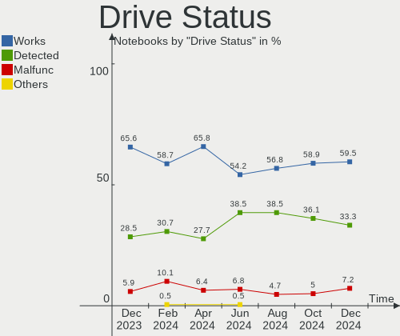
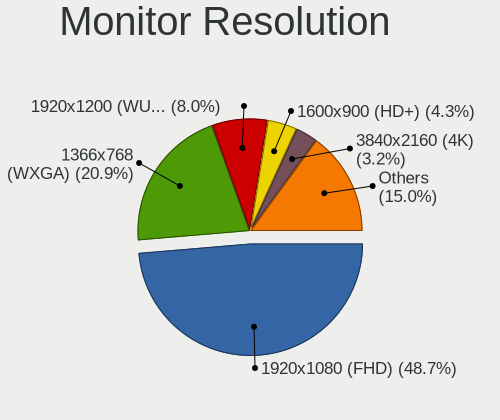
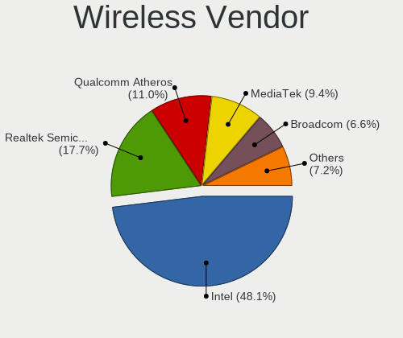
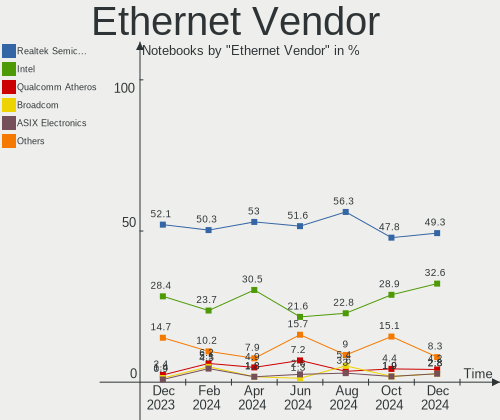
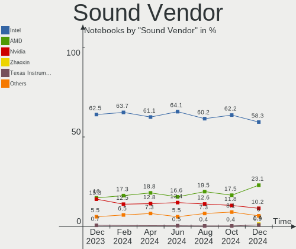

Debian - Hardware Trends (Notebooks)
------------------------------------

A project to identify most popular hardware characteristics and track their change
over time based on data collected by Linux users at https://Linux-Hardware.org.

Anyone can contribute to this report by the [hw-probe](https://github.com/linuxhw/hw-probe) tool:

    sudo -E hw-probe -all -upload

This report is for one last month. Overall report since the beginning of time: [TestDays](https://github.com/linuxhw/TestDays)

Period: Apr, 2024.

Contents
--------

* [ System ](#system)
  - [ OS                       ](#os)
  - [ OS Family                ](#os-family)
  - [ Kernel                   ](#kernel)
  - [ Kernel Family            ](#kernel-family)
  - [ Kernel Major Ver.        ](#kernel-major-ver)
  - [ Arch                     ](#arch)
  - [ DE                       ](#de)
  - [ Display Server           ](#display-server)
  - [ Display Manager          ](#display-manager)
  - [ OS Lang                  ](#os-lang)
  - [ Boot Mode                ](#boot-mode)
  - [ Filesystem               ](#filesystem)
  - [ Part. scheme             ](#part-scheme)
  - [ Dual Boot with Linux/BSD ](#dual-boot-with-linuxbsd)
  - [ Dual Boot (Win)          ](#dual-boot-win)

* [ Board ](#board)
  - [ Vendor                   ](#vendor)
  - [ Model                    ](#model)
  - [ Model Family             ](#model-family)
  - [ MFG Year                 ](#mfg-year)
  - [ Form Factor              ](#form-factor)
  - [ Secure Boot              ](#secure-boot)
  - [ Coreboot                 ](#coreboot)
  - [ RAM Size                 ](#ram-size)
  - [ RAM Used                 ](#ram-used)
  - [ Total Drives             ](#total-drives)
  - [ Has CD-ROM               ](#has-cd-rom)
  - [ Has Ethernet             ](#has-ethernet)
  - [ Has WiFi                 ](#has-wifi)
  - [ Has Bluetooth            ](#has-bluetooth)

* [ Location ](#location)
  - [ Country                  ](#country)
  - [ City                     ](#city)

* [ Drives ](#drives)
  - [ Drive Vendor             ](#drive-vendor)
  - [ Drive Model              ](#drive-model)
  - [ HDD Vendor               ](#hdd-vendor)
  - [ SSD Vendor               ](#ssd-vendor)
  - [ Drive Kind               ](#drive-kind)
  - [ Drive Connector          ](#drive-connector)
  - [ Drive Size               ](#drive-size)
  - [ Space Total              ](#space-total)
  - [ Space Used               ](#space-used)
  - [ Malfunc. Drives          ](#malfunc-drives)
  - [ Malfunc. Drive Vendor    ](#malfunc-drive-vendor)
  - [ Malfunc. HDD Vendor      ](#malfunc-hdd-vendor)
  - [ Malfunc. Drive Kind      ](#malfunc-drive-kind)
  - [ Failed Drives            ](#failed-drives)
  - [ Failed Drive Vendor      ](#failed-drive-vendor)
  - [ Drive Status             ](#drive-status)

* [ Storage controller ](#storage-controller)
  - [ Storage Vendor           ](#storage-vendor)
  - [ Storage Model            ](#storage-model)
  - [ Storage Kind             ](#storage-kind)

* [ Processor ](#processor)
  - [ CPU Vendor               ](#cpu-vendor)
  - [ CPU Model                ](#cpu-model)
  - [ CPU Model Family         ](#cpu-model-family)
  - [ CPU Cores                ](#cpu-cores)
  - [ CPU Sockets              ](#cpu-sockets)
  - [ CPU Threads              ](#cpu-threads)
  - [ CPU Op-Modes             ](#cpu-op-modes)
  - [ CPU Microcode            ](#cpu-microcode)
  - [ CPU Microarch            ](#cpu-microarch)

* [ Graphics ](#graphics)
  - [ GPU Vendor               ](#gpu-vendor)
  - [ GPU Model                ](#gpu-model)
  - [ GPU Combo                ](#gpu-combo)
  - [ GPU Driver               ](#gpu-driver)
  - [ GPU Memory               ](#gpu-memory)

* [ Monitor ](#monitor)
  - [ Monitor Vendor           ](#monitor-vendor)
  - [ Monitor Model            ](#monitor-model)
  - [ Monitor Resolution       ](#monitor-resolution)
  - [ Monitor Diagonal         ](#monitor-diagonal)
  - [ Monitor Width            ](#monitor-width)
  - [ Aspect Ratio             ](#aspect-ratio)
  - [ Monitor Area             ](#monitor-area)
  - [ Pixel Density            ](#pixel-density)
  - [ Multiple Monitors        ](#multiple-monitors)

* [ Network ](#network)
  - [ Net Controller Vendor    ](#net-controller-vendor)
  - [ Net Controller Model     ](#net-controller-model)
  - [ Wireless Vendor          ](#wireless-vendor)
  - [ Wireless Model           ](#wireless-model)
  - [ Ethernet Vendor          ](#ethernet-vendor)
  - [ Ethernet Model           ](#ethernet-model)
  - [ Net Controller Kind      ](#net-controller-kind)
  - [ Used Controller          ](#used-controller)
  - [ NICs                     ](#nics)
  - [ IPv6                     ](#ipv6)

* [ Bluetooth ](#bluetooth)
  - [ Bluetooth Vendor         ](#bluetooth-vendor)
  - [ Bluetooth Model          ](#bluetooth-model)

* [ Sound ](#sound)
  - [ Sound Vendor             ](#sound-vendor)
  - [ Sound Model              ](#sound-model)

* [ Memory ](#memory)
  - [ Memory Vendor            ](#memory-vendor)
  - [ Memory Model             ](#memory-model)
  - [ Memory Kind              ](#memory-kind)
  - [ Memory Form Factor       ](#memory-form-factor)
  - [ Memory Size              ](#memory-size)
  - [ Memory Speed             ](#memory-speed)

* [ Printers & scanners ](#printers--scanners)
  - [ Printer Vendor           ](#printer-vendor)
  - [ Printer Model            ](#printer-model)
  - [ Scanner Vendor           ](#scanner-vendor)
  - [ Scanner Model            ](#scanner-model)

* [ Camera ](#camera)
  - [ Camera Vendor            ](#camera-vendor)
  - [ Camera Model             ](#camera-model)

* [ Security ](#security)
  - [ Fingerprint Vendor       ](#fingerprint-vendor)
  - [ Fingerprint Model        ](#fingerprint-model)
  - [ Chipcard Vendor          ](#chipcard-vendor)
  - [ Chipcard Model           ](#chipcard-model)

* [ Unsupported ](#unsupported)
  - [ Unsupported Devices      ](#unsupported-devices)
  - [ Unsupported Device Types ](#unsupported-device-types)

System
------

OS
--

Installed operating systems

| Name      | Notebooks | Percent |
|-----------|-----------|---------|
| Debian 12 | 146       | 76.84%  |
| Debian    | 25        | 13.16%  |
| Debian 11 | 18        | 9.47%   |
| Debian 6  | 1         | 0.53%   |

OS Family
---------

OS without a version

| Name   | Notebooks | Percent |
|--------|-----------|---------|
| Debian | 190       | 100%    |

Kernel
------

Version of the Linux kernel

| Version                 | Notebooks | Percent |
|-------------------------|-----------|---------|
| 6.1.0-18-amd64          | 66        | 34.74%  |
| 6.1.0-20-amd64          | 48        | 25.26%  |
| 6.6.15-amd64            | 14        | 7.37%   |
| 5.10.0-28-amd64         | 11        | 5.79%   |
| 6.1.0-17-amd64          | 5         | 2.63%   |
| 6.6.13+bpo-amd64        | 3         | 1.58%   |
| 6.1.0-19-amd64          | 3         | 1.58%   |
| 6.8.4-zabbly+           | 2         | 1.05%   |
| 6.8.4-060804-generic    | 2         | 1.05%   |
| 6.7.9-amd64             | 2         | 1.05%   |
| 6.6.11-amd64            | 2         | 1.05%   |
| 6.5.3-custom            | 2         | 1.05%   |
| 6.1.0-4-amd64           | 2         | 1.05%   |
| 6.9.0-rc4+              | 1         | 0.53%   |
| 6.9.0-rc3+              | 1         | 0.53%   |
| 6.8.7-lqx2              | 1         | 0.53%   |
| 6.8.6-3-liquorix-amd64  | 1         | 0.53%   |
| 6.8.5-060805-generic    | 1         | 0.53%   |
| 6.8.4-x64v3-xanmod1     | 1         | 0.53%   |
| 6.8.4-sal               | 1         | 0.53%   |
| 6.8.4-2-pve             | 1         | 0.53%   |
| 6.7.12-amd64            | 1         | 0.53%   |
| 6.7.10-1-liquorix-amd64 | 1         | 0.53%   |
| 6.7.0                   | 1         | 0.53%   |
| 6.6.28-x64v3-xanmod2    | 1         | 0.53%   |
| 6.6.25-x64v3-xanmod1    | 1         | 0.53%   |
| 6.6.13-amd64            | 1         | 0.53%   |
| 6.5.13-custom-v35       | 1         | 0.53%   |
| 6.5.0-5-amd64           | 1         | 0.53%   |
| 6.1.0-20-686-pae        | 1         | 0.53%   |
| 6.1.0-18-686-pae        | 1         | 0.53%   |
| 6.1.0-16-amd64          | 1         | 0.53%   |
| 6.1.0-11-amd64          | 1         | 0.53%   |
| 6.1.0-0.deb11.17-amd64  | 1         | 0.53%   |
| 6.0.0-6-amd64           | 1         | 0.53%   |
| 5.10.162                | 1         | 0.53%   |
| 5.10.0-8-amd64          | 1         | 0.53%   |
| 5.10.0-28-686-pae       | 1         | 0.53%   |
| 5.10.0-27-amd64         | 1         | 0.53%   |
| 5.10.0-15-amd64         | 1         | 0.53%   |

Kernel Family
-------------

Linux kernel without a distro release

| Version  | Notebooks | Percent |
|----------|-----------|---------|
| 6.1.0    | 129       | 67.89%  |
| 5.10.0   | 16        | 8.42%   |
| 6.6.15   | 14        | 7.37%   |
| 6.8.4    | 7         | 3.68%   |
| 6.6.13   | 4         | 2.11%   |
| 6.9.0    | 2         | 1.05%   |
| 6.7.9    | 2         | 1.05%   |
| 6.6.11   | 2         | 1.05%   |
| 6.5.3    | 2         | 1.05%   |
| 6.8.7    | 1         | 0.53%   |
| 6.8.6    | 1         | 0.53%   |
| 6.8.5    | 1         | 0.53%   |
| 6.7.12   | 1         | 0.53%   |
| 6.7.10   | 1         | 0.53%   |
| 6.7.0    | 1         | 0.53%   |
| 6.6.28   | 1         | 0.53%   |
| 6.6.25   | 1         | 0.53%   |
| 6.5.13   | 1         | 0.53%   |
| 6.5.0    | 1         | 0.53%   |
| 6.0.0    | 1         | 0.53%   |
| 5.10.162 | 1         | 0.53%   |

Kernel Major Ver.
-----------------

Linux kernel major version

| Version | Notebooks | Percent |
|---------|-----------|---------|
| 6.1     | 129       | 67.89%  |
| 6.6     | 22        | 11.58%  |
| 5.10    | 17        | 8.95%   |
| 6.8     | 10        | 5.26%   |
| 6.7     | 5         | 2.63%   |
| 6.5     | 4         | 2.11%   |
| 6.9     | 2         | 1.05%   |
| 6.0     | 1         | 0.53%   |

Arch
----

OS architecture (x86_64, i586, etc.)

| Name   | Notebooks | Percent |
|--------|-----------|---------|
| x86_64 | 187       | 98.42%  |
| i686   | 3         | 1.58%   |

DE
--

Desktop Environment

| Name            | Notebooks | Percent |
|-----------------|-----------|---------|
| GNOME           | 68        | 35.79%  |
| KDE5            | 47        | 24.74%  |
| XFCE            | 22        | 11.58%  |
| MATE            | 14        | 7.37%   |
| X-Cinnamon      | 12        | 6.32%   |
| LXDE            | 6         | 3.16%   |
| Unknown         | 6         | 3.16%   |
| LXQt            | 3         | 1.58%   |
| Cinnamon        | 3         | 1.58%   |
| Trinity         | 2         | 1.05%   |
| Openbox         | 2         | 1.05%   |
| i3              | 2         | 1.05%   |
| GNOME Flashback | 2         | 1.05%   |
| KDE             | 1         | 0.53%   |

Display Server
--------------

X11 or Wayland

| Name    | Notebooks | Percent |
|---------|-----------|---------|
| X11     | 101       | 53.16%  |
| Wayland | 76        | 40%     |
| Tty     | 9         | 4.74%   |
| Unknown | 4         | 2.11%   |

Display Manager
---------------

SDDM, LightDM, etc.

| Name    | Notebooks | Percent |
|---------|-----------|---------|
| LightDM | 51        | 26.84%  |
| GDM3    | 50        | 26.32%  |
| Unknown | 46        | 24.21%  |
| SDDM    | 36        | 18.95%  |
| GDM     | 4         | 2.11%   |
| LXDM    | 2         | 1.05%   |
| SLiM    | 1         | 0.53%   |

OS Lang
-------

Language

| Lang    | Notebooks | Percent |
|---------|-----------|---------|
| en_US   | 83        | 43.68%  |
| fr_FR   | 14        | 7.37%   |
| de_DE   | 9         | 4.74%   |
| ru_RU   | 8         | 4.21%   |
| pl_PL   | 8         | 4.21%   |
| en_GB   | 8         | 4.21%   |
| C       | 8         | 4.21%   |
| pt_BR   | 7         | 3.68%   |
| it_IT   | 6         | 3.16%   |
| en_CA   | 5         | 2.63%   |
| es_CL   | 3         | 1.58%   |
| cs_CZ   | 3         | 1.58%   |
| Unknown | 3         | 1.58%   |
| zh_CN   | 2         | 1.05%   |
| sk_SK   | 2         | 1.05%   |
| nl_NL   | 2         | 1.05%   |
| es_MX   | 2         | 1.05%   |
| es_ES   | 2         | 1.05%   |
| en_AU   | 2         | 1.05%   |
| tr_TR   | 1         | 0.53%   |
| sv_SE   | 1         | 0.53%   |
| sr_RS   | 1         | 0.53%   |
| pt_PT   | 1         | 0.53%   |
| nl_BE   | 1         | 0.53%   |
| es_UY   | 1         | 0.53%   |
| es_SV   | 1         | 0.53%   |
| es_CO   | 1         | 0.53%   |
| es_AR   | 1         | 0.53%   |
| en_NZ   | 1         | 0.53%   |
| en_IN   | 1         | 0.53%   |
| en_IE   | 1         | 0.53%   |
| en_DK   | 1         | 0.53%   |

Boot Mode
---------

EFI or BIOS

| Mode | Notebooks | Percent |
|------|-----------|---------|
| EFI  | 119       | 62.63%  |
| BIOS | 71        | 37.37%  |

Filesystem
----------

Type of filesystem

| Type    | Notebooks | Percent |
|---------|-----------|---------|
| Ext4    | 171       | 90%     |
| Overlay | 11        | 5.79%   |
| Btrfs   | 4         | 2.11%   |
| Tmpfs   | 2         | 1.05%   |
| Zfs     | 1         | 0.53%   |
| Xfs     | 1         | 0.53%   |

Part. scheme
------------

Scheme of partitioning

| Type    | Notebooks | Percent |
|---------|-----------|---------|
| GPT     | 123       | 64.74%  |
| Unknown | 39        | 20.53%  |
| MBR     | 28        | 14.74%  |

Dual Boot with Linux/BSD
------------------------

Hosting more than one Linux/BSD

| Dual boot | Notebooks | Percent |
|-----------|-----------|---------|
| No        | 173       | 91.05%  |
| Yes       | 17        | 8.95%   |

Dual Boot (Win)
---------------

Hosting Linux and Windows

| Dual boot | Notebooks | Percent |
|-----------|-----------|---------|
| No        | 139       | 73.16%  |
| Yes       | 51        | 26.84%  |

Board
-----

Vendor
------

Motherboard manufacturer

| Name                | Notebooks | Percent |
|---------------------|-----------|---------|
| Lenovo              | 51        | 26.84%  |
| Hewlett-Packard     | 31        | 16.32%  |
| Dell                | 30        | 15.79%  |
| ASUSTek Computer    | 25        | 13.16%  |
| Acer                | 13        | 6.84%   |
| MSI                 | 7         | 3.68%   |
| Samsung Electronics | 5         | 2.63%   |
| Apple               | 5         | 2.63%   |
| Fujitsu             | 3         | 1.58%   |
| Toshiba             | 2         | 1.05%   |
| HUAWEI              | 2         | 1.05%   |
| Google              | 2         | 1.05%   |
| Unknown             | 2         | 1.05%   |
| TUXEDO              | 1         | 0.53%   |
| Sony                | 1         | 0.53%   |
| Schenker            | 1         | 0.53%   |
| Panasonic           | 1         | 0.53%   |
| Notebook            | 1         | 0.53%   |
| MobileDemand        | 1         | 0.53%   |
| LNV                 | 1         | 0.53%   |
| Jumper              | 1         | 0.53%   |
| Juana Manso         | 1         | 0.53%   |
| Itautec             | 1         | 0.53%   |
| Digma               | 1         | 0.53%   |
| Digibras            | 1         | 0.53%   |

Model
-----

Motherboard model

| Name                                        | Notebooks | Percent |
|---------------------------------------------|-----------|---------|
| Samsung RV411/RV511/E3511/S3511/RV711/E3411 | 2         | 1.05%   |
| HP Pavilion Gaming Laptop 15-ec1xxx         | 2         | 1.05%   |
| HP Laptop 15-db0xxx                         | 2         | 1.05%   |
| Dell Latitude E7440                         | 2         | 1.05%   |
| Dell Latitude E6400                         | 2         | 1.05%   |
| ASUS Vivobook Go E1504GA_E1504GA            | 2         | 1.05%   |
| ASUS K53E                                   | 2         | 1.05%   |
| Apple MacBook6,1                            | 2         | 1.05%   |
| Unknown                                     | 2         | 1.05%   |
| TUXEDO Aura 15 Gen1                         | 1         | 0.53%   |
| Toshiba Satellite C870-192                  | 1         | 0.53%   |
| Toshiba PORTEGE Z30-A                       | 1         | 0.53%   |
| Sony SVF15A17CLB                            | 1         | 0.53%   |
| Schenker XMG FUSION 15 (XFU15L19)           | 1         | 0.53%   |
| Samsung 750XED                              | 1         | 0.53%   |
| Samsung 550XDA                              | 1         | 0.53%   |
| Samsung 300E4A/300E5A/300E7A/3430EA/3530EA  | 1         | 0.53%   |
| Panasonic CF-C1BTCREFF                      | 1         | 0.53%   |
| Notebook NS5x_NS7xAU                        | 1         | 0.53%   |
| MSI Thin GF63 12VE                          | 1         | 0.53%   |
| MSI Prestige 16 AI Studio B1VGG             | 1         | 0.53%   |
| MSI Prestige 13Evo A13M                     | 1         | 0.53%   |
| MSI Modern 15 B12M                          | 1         | 0.53%   |
| MSI GF63 Thin 8SC                           | 1         | 0.53%   |
| MSI GE62 2QC                                | 1         | 0.53%   |
| MSI CR70 2M/CX70 2OC/CX70 2OD               | 1         | 0.53%   |
| MobileDemand xTablet T1540                  | 1         | 0.53%   |
| LNV M14LC2-256                              | 1         | 0.53%   |
| Lenovo Z50-75 80EC                          | 1         | 0.53%   |
| Lenovo XiaoXinPro 16 AHP9 83D5              | 1         | 0.53%   |
| Lenovo ThinkPad X390 20Q1S62G00             | 1         | 0.53%   |
| Lenovo ThinkPad X1 Extreme 2nd 20QWS06B00   | 1         | 0.53%   |
| Lenovo ThinkPad T570 20HAS03W00             | 1         | 0.53%   |
| Lenovo ThinkPad T550 20CKCTO1WW             | 1         | 0.53%   |
| Lenovo ThinkPad T480s 20L8S6BW14            | 1         | 0.53%   |
| Lenovo ThinkPad T470s 20HGS6Y801            | 1         | 0.53%   |
| Lenovo ThinkPad T470 20HES6VG00             | 1         | 0.53%   |
| Lenovo ThinkPad T460s 20FAS5NN00            | 1         | 0.53%   |
| Lenovo ThinkPad T460s 20FAS21A00            | 1         | 0.53%   |
| Lenovo ThinkPad T460s 20FAS1QU00            | 1         | 0.53%   |

Model Family
------------

Motherboard model prefix

| Name                   | Notebooks | Percent |
|------------------------|-----------|---------|
| Lenovo ThinkPad        | 34        | 17.89%  |
| Dell Latitude          | 14        | 7.37%   |
| Acer Aspire            | 10        | 5.26%   |
| Dell Inspiron          | 8         | 4.21%   |
| HP Laptop              | 7         | 3.68%   |
| HP EliteBook           | 7         | 3.68%   |
| HP Pavilion            | 6         | 3.16%   |
| ASUS VivoBook          | 6         | 3.16%   |
| Lenovo IdeaPad         | 5         | 2.63%   |
| Dell XPS               | 4         | 2.11%   |
| ASUS ROG               | 4         | 2.11%   |
| Lenovo Legion          | 3         | 1.58%   |
| HP ZBook               | 3         | 1.58%   |
| Fujitsu LIFEBOOK       | 3         | 1.58%   |
| Dell Precision         | 3         | 1.58%   |
| ASUS ASUS              | 3         | 1.58%   |
| Samsung RV411          | 2         | 1.05%   |
| MSI Prestige           | 2         | 1.05%   |
| Lenovo IdeaPadFlex     | 2         | 1.05%   |
| HP ProBook             | 2         | 1.05%   |
| ASUS K53E              | 2         | 1.05%   |
| Apple MacBookPro11     | 2         | 1.05%   |
| Apple MacBook6         | 2         | 1.05%   |
| Unknown                | 2         | 1.05%   |
| TUXEDO Aura            | 1         | 0.53%   |
| Toshiba Satellite      | 1         | 0.53%   |
| Toshiba PORTEGE        | 1         | 0.53%   |
| Sony SVF15A17CLB       | 1         | 0.53%   |
| Schenker XMG           | 1         | 0.53%   |
| Samsung 750XED         | 1         | 0.53%   |
| Samsung 550XDA         | 1         | 0.53%   |
| Samsung 300E4A         | 1         | 0.53%   |
| Panasonic CF-C1BTCREFF | 1         | 0.53%   |
| Notebook NS5x          | 1         | 0.53%   |
| MSI Thin               | 1         | 0.53%   |
| MSI Modern             | 1         | 0.53%   |
| MSI GF63               | 1         | 0.53%   |
| MSI GE62               | 1         | 0.53%   |
| MSI CR70               | 1         | 0.53%   |
| MobileDemand xTablet   | 1         | 0.53%   |

MFG Year
--------

Motherboard manufacture year

| Year | Notebooks | Percent |
|------|-----------|---------|
| 2021 | 27        | 14.21%  |
| 2013 | 18        | 9.47%   |
| 2023 | 17        | 8.95%   |
| 2020 | 17        | 8.95%   |
| 2016 | 17        | 8.95%   |
| 2018 | 16        | 8.42%   |
| 2011 | 14        | 7.37%   |
| 2017 | 12        | 6.32%   |
| 2014 | 9         | 4.74%   |
| 2022 | 8         | 4.21%   |
| 2019 | 8         | 4.21%   |
| 2012 | 8         | 4.21%   |
| 2015 | 5         | 2.63%   |
| 2009 | 4         | 2.11%   |
| 2008 | 4         | 2.11%   |
| 2024 | 2         | 1.05%   |
| 2007 | 2         | 1.05%   |
| 2010 | 1         | 0.53%   |
| 2006 | 1         | 0.53%   |

Form Factor
-----------

Physical design of the computer

| Name     | Notebooks | Percent |
|----------|-----------|---------|
| Notebook | 190       | 100%    |

Secure Boot
-----------

Enabled or disabled

| State    | Notebooks | Percent |
|----------|-----------|---------|
| Disabled | 169       | 88.95%  |
| Enabled  | 21        | 11.05%  |

Coreboot
--------

Have coreboot on board

| Used | Notebooks | Percent |
|------|-----------|---------|
| No   | 188       | 98.95%  |
| Yes  | 2         | 1.05%   |

RAM Size
--------

Total RAM memory

| Size in GB  | Notebooks | Percent |
|-------------|-----------|---------|
| 4.01-8.0    | 54        | 28.42%  |
| 16.01-24.0  | 45        | 23.68%  |
| 3.01-4.0    | 28        | 14.74%  |
| 8.01-16.0   | 28        | 14.74%  |
| 32.01-64.0  | 17        | 8.95%   |
| 24.01-32.0  | 9         | 4.74%   |
| 64.01-256.0 | 5         | 2.63%   |
| 2.01-3.0    | 3         | 1.58%   |
| 1.01-2.0    | 1         | 0.53%   |

RAM Used
--------

Used RAM memory

| Used GB    | Notebooks | Percent |
|------------|-----------|---------|
| 1.01-2.0   | 47        | 24.74%  |
| 4.01-8.0   | 42        | 22.11%  |
| 3.01-4.0   | 42        | 22.11%  |
| 2.01-3.0   | 39        | 20.53%  |
| 8.01-16.0  | 9         | 4.74%   |
| 0.51-1.0   | 8         | 4.21%   |
| 32.01-64.0 | 1         | 0.53%   |
| 16.01-24.0 | 1         | 0.53%   |
| 0.01-0.5   | 1         | 0.53%   |

Total Drives
------------

Number of drives on board

| Drives | Notebooks | Percent |
|--------|-----------|---------|
| 1      | 147       | 77.37%  |
| 2      | 38        | 20%     |
| 3      | 3         | 1.58%   |
| 0      | 2         | 1.05%   |

Has CD-ROM
----------

Has CD-ROM on board

| Presented | Notebooks | Percent |
|-----------|-----------|---------|
| No        | 142       | 74.74%  |
| Yes       | 48        | 25.26%  |

Has Ethernet
------------

Has Ethernet on board

| Presented | Notebooks | Percent |
|-----------|-----------|---------|
| Yes       | 155       | 81.58%  |
| No        | 35        | 18.42%  |

Has WiFi
--------

Has WiFi module

| Presented | Notebooks | Percent |
|-----------|-----------|---------|
| Yes       | 187       | 98.42%  |
| No        | 3         | 1.58%   |

Has Bluetooth
-------------

Has Bluetooth module

| Presented | Notebooks | Percent |
|-----------|-----------|---------|
| Yes       | 168       | 88.42%  |
| No        | 22        | 11.58%  |

Location
--------

Country
-------

Geographic location (country)

| Country          | Notebooks | Percent |
|------------------|-----------|---------|
| USA              | 21        | 11.05%  |
| Germany          | 18        | 9.47%   |
| France           | 17        | 8.95%   |
| Russia           | 16        | 8.42%   |
| Poland           | 12        | 6.32%   |
| Canada           | 9         | 4.74%   |
| Brazil           | 9         | 4.74%   |
| Italy            | 8         | 4.21%   |
| Spain            | 5         | 2.63%   |
| Portugal         | 5         | 2.63%   |
| Netherlands      | 5         | 2.63%   |
| Serbia           | 4         | 2.11%   |
| Mexico           | 4         | 2.11%   |
| UK               | 3         | 1.58%   |
| Sweden           | 3         | 1.58%   |
| Slovakia         | 3         | 1.58%   |
| Romania          | 3         | 1.58%   |
| Paraguay         | 3         | 1.58%   |
| Indonesia        | 3         | 1.58%   |
| Czechia          | 3         | 1.58%   |
| Chile            | 3         | 1.58%   |
| Uruguay          | 2         | 1.05%   |
| Tunisia          | 2         | 1.05%   |
| India            | 2         | 1.05%   |
| Colombia         | 2         | 1.05%   |
| China            | 2         | 1.05%   |
| Belarus          | 2         | 1.05%   |
| Austria          | 2         | 1.05%   |
| Turkey           | 1         | 0.53%   |
| The Netherlands  | 1         | 0.53%   |
| Switzerland      | 1         | 0.53%   |
| Papua New Guinea | 1         | 0.53%   |
| Oman             | 1         | 0.53%   |
| Norway           | 1         | 0.53%   |
| New Zealand      | 1         | 0.53%   |
| Nepal            | 1         | 0.53%   |
| Japan            | 1         | 0.53%   |
| Ireland          | 1         | 0.53%   |
| Iraq             | 1         | 0.53%   |
| Guatemala        | 1         | 0.53%   |

City
----

Geographic location (city)

| City                | Notebooks | Percent |
|---------------------|-----------|---------|
| Moscow              | 5         | 2.63%   |
| Belgrade            | 4         | 2.11%   |
| Amsterdam           | 4         | 2.11%   |
| Santiago            | 3         | 1.58%   |
| Madrid              | 3         | 1.58%   |
| Berlin              | 3         | 1.58%   |
| Aurich              | 3         | 1.58%   |
| Asunción           | 3         | 1.58%   |
| Argenteuil          | 3         | 1.58%   |
| Wroclaw             | 2         | 1.05%   |
| Warsaw              | 2         | 1.05%   |
| Voronezh            | 2         | 1.05%   |
| Vienna              | 2         | 1.05%   |
| Querétaro City     | 2         | 1.05%   |
| Prague              | 2         | 1.05%   |
| Murino              | 2         | 1.05%   |
| Lyon                | 2         | 1.05%   |
| Jaworzno            | 2         | 1.05%   |
| Elblag              | 2         | 1.05%   |
| Bangor              | 2         | 1.05%   |
| Athens              | 2         | 1.05%   |
| Zurich              | 1         | 0.53%   |
| West Valley City    | 1         | 0.53%   |
| Wellington          | 1         | 0.53%   |
| Vila Franca de Xira | 1         | 0.53%   |
| Vadodara            | 1         | 0.53%   |
| Umeå               | 1         | 0.53%   |
| Uberlândia         | 1         | 0.53%   |
| Tyumen              | 1         | 0.53%   |
| Turnhout            | 1         | 0.53%   |
| Tunis               | 1         | 0.53%   |
| Trondheim           | 1         | 0.53%   |
| Trnava              | 1         | 0.53%   |
| Toronto             | 1         | 0.53%   |
| Tokyo               | 1         | 0.53%   |
| Tallinn             | 1         | 0.53%   |
| Swindon             | 1         | 0.53%   |
| Surabaya            | 1         | 0.53%   |
| Sundbyberg          | 1         | 0.53%   |
| Straengnaes         | 1         | 0.53%   |

Drives
------

Drive Vendor
------------

Hard drive vendors

| Vendor                      | Notebooks | Drives | Percent |
|-----------------------------|-----------|--------|---------|
| Samsung Electronics         | 47        | 48     | 20.17%  |
| SK hynix                    | 22        | 22     | 9.44%   |
| WDC                         | 17        | 18     | 7.3%    |
| Seagate                     | 17        | 17     | 7.3%    |
| SanDisk                     | 17        | 17     | 7.3%    |
| Toshiba                     | 14        | 14     | 6.01%   |
| Micron Technology           | 11        | 11     | 4.72%   |
| Kingston                    | 11        | 11     | 4.72%   |
| Intel                       | 9         | 9      | 3.86%   |
| Crucial                     | 9         | 10     | 3.86%   |
| Unknown                     | 5         | 5      | 2.15%   |
| Hitachi                     | 4         | 4      | 1.72%   |
| SSSTC                       | 3         | 3      | 1.29%   |
| GOODRAM                     | 3         | 3      | 1.29%   |
| Apple                       | 3         | 3      | 1.29%   |
| A-DATA Technology           | 3         | 3      | 1.29%   |
| Unknown                     | 3         | 3      | 1.29%   |
| Patriot                     | 2         | 2      | 0.86%   |
| Netac                       | 2         | 2      | 0.86%   |
| Lexar                       | 2         | 2      | 0.86%   |
| Fanxiang                    | 2         | 2      | 0.86%   |
| China                       | 2         | 2      | 0.86%   |
| AMD                         | 2         | 2      | 0.86%   |
| Zheino                      | 1         | 1      | 0.43%   |
| XPG                         | 1         | 1      | 0.43%   |
| Wibtek                      | 1         | 1      | 0.43%   |
| Union Memory                | 1         | 1      | 0.43%   |
| Transcend                   | 1         | 1      | 0.43%   |
| StoreJet                    | 1         | 1      | 0.43%   |
| STEC                        | 1         | 1      | 0.43%   |
| S3+                         | 1         | 1      | 0.43%   |
| Realtek Semiconductor       | 1         | 1      | 0.43%   |
| POWER                       | 1         | 1      | 0.43%   |
| Neo                         | 1         | 1      | 0.43%   |
| LITEON                      | 1         | 1      | 0.43%   |
| KLEVV                       | 1         | 1      | 0.43%   |
| KIOXIA                      | 1         | 1      | 0.43%   |
| Kingston Technology Company | 1         | 1      | 0.43%   |
| KBM                         | 1         | 1      | 0.43%   |
| Jumper                      | 1         | 1      | 0.43%   |

Drive Model
-----------

Hard drive models

| Model                                             | Notebooks | Percent |
|---------------------------------------------------|-----------|---------|
| Toshiba MQ01ABD100 1TB                            | 4         | 1.7%    |
| Samsung NVMe SSD Controller SM981/PM981/PM983 1TB | 4         | 1.7%    |
| Unknown                                           | 3         | 1.28%   |
| WDC WD5000LPVX-22V0TT0 500GB                      | 2         | 0.85%   |
| SK hynix SKHynix_HFS256GD9TNI-L2B0B 256GB         | 2         | 0.85%   |
| SK hynix SKHynix_HFS001TDE9X084N 1TB              | 2         | 0.85%   |
| SK hynix HN8T15DEHKX075 256GB SSD                 | 2         | 0.85%   |
| SK hynix HFM512GD3JX013N 512GB                    | 2         | 0.85%   |
| SK hynix BC711 NVMe 512GB                         | 2         | 0.85%   |
| Seagate ST1000LM035-1RK172 1TB                    | 2         | 0.85%   |
| Seagate ST1000LM024 HN-M101MBB 1TB                | 2         | 0.85%   |
| Sandisk WD PC SN740 SDDQMQD-512G-1201 512GB       | 2         | 0.85%   |
| SanDisk SD9SN8W-128G-1006 128GB SSD               | 2         | 0.85%   |
| SanDisk NVMe SSD Drive 512GB                      | 2         | 0.85%   |
| SanDisk NVMe SSD Drive 1TB                        | 2         | 0.85%   |
| Samsung SSD 980 500GB                             | 2         | 0.85%   |
| Samsung SSD 870 EVO 500GB                         | 2         | 0.85%   |
| Samsung SSD 870 EVO 1TB                           | 2         | 0.85%   |
| Samsung NVMe SSD Controller SM961/PM961/SM963 1TB | 2         | 0.85%   |
| Samsung MZVLB512HBJQ-000L7 512GB                  | 2         | 0.85%   |
| Samsung MZVLB512HAJQ-000L7 512GB                  | 2         | 0.85%   |
| Micron 2400_MTFDKBA512QFM 512GB                   | 2         | 0.85%   |
| Kingston SA400S37480G 480GB SSD                   | 2         | 0.85%   |
| Kingston SA400S37240G 240GB SSD                   | 2         | 0.85%   |
| Kingston SA400S37120G 120GB SSD                   | 2         | 0.85%   |
| Crucial CT2000MX500SSD1 2TB                       | 2         | 0.85%   |
| Zheino CHN-25SATAC3-480 480GB                     | 1         | 0.43%   |
| XPG GAMMIX S11 Pro 512GB                          | 1         | 0.43%   |
| Wibtek W800S 256GB SSD                            | 1         | 0.43%   |
| WDC WDS500G2B0C-00PXH0 500GB                      | 1         | 0.43%   |
| WDC WDS480G2G0B-00EPW0 480GB SSD                  | 1         | 0.43%   |
| WDC WDS120G2G0A-00JH30 120GB SSD                  | 1         | 0.43%   |
| WDC WDS120G1G0A-00SS50 120GB SSD                  | 1         | 0.43%   |
| WDC WDS100T2B0A-00SM50 1TB SSD                    | 1         | 0.43%   |
| WDC WD5000LPVX-08V0TT5 500GB                      | 1         | 0.43%   |
| WDC WD5000LPLX-00ZNTT0 500GB                      | 1         | 0.43%   |
| WDC WD20SPZX-22UA7T0 2TB                          | 1         | 0.43%   |
| WDC WD10SPSX-60A6WT0 1TB                          | 1         | 0.43%   |
| WDC WD10JPVX-75JC3T0 1TB                          | 1         | 0.43%   |
| WDC WD Green M.2 2280 240GB                       | 1         | 0.43%   |

HDD Vendor
----------

Hard disk drive vendors

| Vendor              | Notebooks | Drives | Percent |
|---------------------|-----------|--------|---------|
| Seagate             | 16        | 16     | 40%     |
| WDC                 | 8         | 8      | 20%     |
| Toshiba             | 6         | 6      | 15%     |
| Hitachi             | 4         | 4      | 10%     |
| STEC                | 1         | 1      | 2.5%    |
| Samsung Electronics | 1         | 1      | 2.5%    |
| JMicron Technology  | 1         | 1      | 2.5%    |
| HGST                | 1         | 1      | 2.5%    |
| ASMT                | 1         | 1      | 2.5%    |
| Unknown             | 1         | 1      | 2.5%    |

SSD Vendor
----------

Solid state drive vendors

| Vendor              | Notebooks | Drives | Percent |
|---------------------|-----------|--------|---------|
| Samsung Electronics | 14        | 14     | 16.47%  |
| Kingston            | 8         | 8      | 9.41%   |
| SanDisk             | 7         | 7      | 8.24%   |
| Crucial             | 7         | 7      | 8.24%   |
| WDC                 | 5         | 5      | 5.88%   |
| Toshiba             | 4         | 4      | 4.71%   |
| SK hynix            | 3         | 3      | 3.53%   |
| GOODRAM             | 3         | 3      | 3.53%   |
| Apple               | 3         | 3      | 3.53%   |
| A-DATA Technology   | 3         | 3      | 3.53%   |
| Patriot             | 2         | 2      | 2.35%   |
| Netac               | 2         | 2      | 2.35%   |
| Intel               | 2         | 2      | 2.35%   |
| Fanxiang            | 2         | 2      | 2.35%   |
| China               | 2         | 2      | 2.35%   |
| AMD                 | 2         | 2      | 2.35%   |
| Unknown             | 2         | 2      | 2.35%   |
| Wibtek              | 1         | 1      | 1.18%   |
| Union Memory        | 1         | 1      | 1.18%   |
| Transcend           | 1         | 1      | 1.18%   |
| StoreJet            | 1         | 1      | 1.18%   |
| Seagate             | 1         | 1      | 1.18%   |
| S3+                 | 1         | 1      | 1.18%   |
| POWER               | 1         | 1      | 1.18%   |
| Micron Technology   | 1         | 1      | 1.18%   |
| LITEON              | 1         | 1      | 1.18%   |
| KLEVV               | 1         | 1      | 1.18%   |
| KBM                 | 1         | 1      | 1.18%   |
| Jumper              | 1         | 1      | 1.18%   |
| Intenso             | 1         | 1      | 1.18%   |
| Hewlett-Packard     | 1         | 1      | 1.18%   |

Drive Kind
----------

HDD or SSD

| Kind    | Notebooks | Drives | Percent |
|---------|-----------|--------|---------|
| NVMe    | 90        | 102    | 41.1%   |
| SSD     | 82        | 85     | 37.44%  |
| HDD     | 38        | 40     | 17.35%  |
| MMC     | 6         | 6      | 2.74%   |
| Unknown | 3         | 3      | 1.37%   |

Drive Connector
---------------

SATA, SAS, NVMe, etc.

| Type | Notebooks | Drives | Percent |
|------|-----------|--------|---------|
| SATA | 106       | 119    | 50.24%  |
| NVMe | 90        | 102    | 42.65%  |
| SAS  | 9         | 9      | 4.27%   |
| MMC  | 6         | 6      | 2.84%   |

Drive Size
----------

Size of hard drive

| Size in TB | Notebooks | Drives | Percent |
|------------|-----------|--------|---------|
| 0.01-0.5   | 78        | 88     | 68.42%  |
| 0.51-1.0   | 28        | 29     | 24.56%  |
| 1.01-2.0   | 6         | 6      | 5.26%   |
| 3.01-4.0   | 1         | 1      | 0.88%   |
| 0          | 1         | 1      | 0.88%   |

Space Total
-----------

Amount of disk space available on the file system

| Size in GB     | Notebooks | Percent |
|----------------|-----------|---------|
| 101-250        | 65        | 34.21%  |
| 251-500        | 58        | 30.53%  |
| 501-1000       | 30        | 15.79%  |
| 51-100         | 9         | 4.74%   |
| 1001-2000      | 8         | 4.21%   |
| 1-20           | 7         | 3.68%   |
| 21-50          | 4         | 2.11%   |
| More than 3000 | 3         | 1.58%   |
| 2001-3000      | 3         | 1.58%   |
| Unknown        | 3         | 1.58%   |

Space Used
----------

Amount of used disk space

| Used GB        | Notebooks | Percent |
|----------------|-----------|---------|
| 1-20           | 59        | 31.05%  |
| 101-250        | 38        | 20%     |
| 21-50          | 34        | 17.89%  |
| 51-100         | 23        | 12.11%  |
| 251-500        | 18        | 9.47%   |
| 501-1000       | 8         | 4.21%   |
| 2001-3000      | 3         | 1.58%   |
| 1001-2000      | 3         | 1.58%   |
| Unknown        | 3         | 1.58%   |
| More than 3000 | 1         | 0.53%   |

Malfunc. Drives
---------------

Drive models with a malfunction

| Model                                                 | Notebooks | Drives | Percent |
|-------------------------------------------------------|-----------|--------|---------|
| Toshiba MQ01ABF050 500GB                              | 1         | 1      | 7.69%   |
| SK hynix SC401 SATA 512GB SSD                         | 1         | 1      | 7.69%   |
| Seagate ST9320325AS 320GB                             | 1         | 1      | 7.69%   |
| Seagate ST9120821AS 120GB                             | 1         | 1      | 7.69%   |
| Seagate ST500LM000-1EJ162 500GB                       | 1         | 1      | 7.69%   |
| Seagate ST320LT020-9YG142 320GB                       | 1         | 1      | 7.69%   |
| Seagate ST160LT000-9VL14D 160GB                       | 1         | 1      | 7.69%   |
| Samsung Electronics SSD 980 PRO 500GB S5GYNX0TA36756D | 1         | 1      | 7.69%   |
| Samsung Electronics MZVLQ512HBLU-00B00 512GB          | 1         | 1      | 7.69%   |
| Hitachi HTS541612J9SA00 120GB                         | 1         | 1      | 7.69%   |
| Apple SSD SM0512F 500GB                               | 1         | 1      | 7.69%   |
| Apple SSD SD0128F 121GB                               | 1         | 1      | 7.69%   |
| Unknown                                               | 1         | 1      | 7.69%   |

Malfunc. Drive Vendor
---------------------

Vendors of faulty drives

| Vendor              | Notebooks | Drives | Percent |
|---------------------|-----------|--------|---------|
| Seagate             | 5         | 5      | 38.46%  |
| Samsung Electronics | 2         | 2      | 15.38%  |
| Apple               | 2         | 2      | 15.38%  |
| Toshiba             | 1         | 1      | 7.69%   |
| SK hynix            | 1         | 1      | 7.69%   |
| Hitachi             | 1         | 1      | 7.69%   |
| Unknown             | 1         | 1      | 7.69%   |

Malfunc. HDD Vendor
-------------------

Vendors of faulty HDD drives

| Vendor  | Notebooks | Drives | Percent |
|---------|-----------|--------|---------|
| Seagate | 5         | 5      | 71.43%  |
| Toshiba | 1         | 1      | 14.29%  |
| Hitachi | 1         | 1      | 14.29%  |

Malfunc. Drive Kind
-------------------

Kinds of faulty drives

| Kind | Notebooks | Drives | Percent |
|------|-----------|--------|---------|
| HDD  | 7         | 7      | 53.85%  |
| SSD  | 4         | 4      | 30.77%  |
| NVMe | 2         | 2      | 15.38%  |

Failed Drives
-------------

Failed drive models

Zero info for selected period =(

Failed Drive Vendor
-------------------

Failed drive vendors

Zero info for selected period =(

Drive Status
------------

Number of failed and malfunc. drives

| Status   | Notebooks | Drives | Percent |
|----------|-----------|--------|---------|
| Works    | 133       | 156    | 65.84%  |
| Detected | 56        | 67     | 27.72%  |
| Malfunc  | 13        | 13     | 6.44%   |

Storage controller
------------------

Storage Vendor
--------------

Storage controller vendors

| Vendor                         | Notebooks | Percent |
|--------------------------------|-----------|---------|
| Intel                          | 112       | 47.86%  |
| Samsung Electronics            | 32        | 13.68%  |
| AMD                            | 24        | 10.26%  |
| SK hynix                       | 19        | 8.12%   |
| SanDisk                        | 13        | 5.56%   |
| Micron Technology              | 10        | 4.27%   |
| Toshiba America Info Systems   | 4         | 1.71%   |
| Nvidia                         | 4         | 1.71%   |
| Solid State Storage Technology | 3         | 1.28%   |
| Kingston Technology Company    | 3         | 1.28%   |
| Micron/Crucial Technology      | 2         | 0.85%   |
| Solidigm                       | 1         | 0.43%   |
| Silicon Motion                 | 1         | 0.43%   |
| Realtek Semiconductor          | 1         | 0.43%   |
| Phison Electronics             | 1         | 0.43%   |
| MAXIO Technology (Hangzhou)    | 1         | 0.43%   |
| Marvell Technology Group       | 1         | 0.43%   |
| KIOXIA                         | 1         | 0.43%   |
| ADATA Technology               | 1         | 0.43%   |

Storage Model
-------------

Storage controller models

| Model                                                                            | Notebooks | Percent |
|----------------------------------------------------------------------------------|-----------|---------|
| AMD FCH SATA Controller [AHCI mode]                                              | 24        | 9.76%   |
| Intel Sunrise Point-LP SATA Controller [AHCI mode]                               | 17        | 6.91%   |
| Samsung NVMe SSD Controller SM981/PM981/PM983                                    | 13        | 5.28%   |
| Intel 8 Series SATA Controller 1 [AHCI mode]                                     | 12        | 4.88%   |
| Intel 6 Series/C200 Series Chipset Family 6 port Mobile SATA AHCI Controller     | 12        | 4.88%   |
| Intel 7 Series Chipset Family 6-port SATA Controller [AHCI mode]                 | 10        | 4.07%   |
| SK hynix Gold P31/BC711/PC711 NVMe Solid State Drive                             | 9         | 3.66%   |
| Intel Volume Management Device NVMe RAID Controller                              | 9         | 3.66%   |
| Intel 82801 Mobile SATA Controller [RAID mode]                                   | 8         | 3.25%   |
| Samsung NVMe SSD Controller 980 (DRAM-less)                                      | 6         | 2.44%   |
| Intel Wildcat Point-LP SATA Controller [AHCI Mode]                               | 6         | 2.44%   |
| Samsung NVMe SSD Controller PM9A1/PM9A3/980PRO                                   | 5         | 2.03%   |
| Intel Tiger Lake-LP SATA Controller                                              | 5         | 2.03%   |
| Intel Comet Lake SATA AHCI Controller                                            | 5         | 2.03%   |
| Intel Cannon Lake Mobile PCH SATA AHCI Controller                                | 5         | 2.03%   |
| Micron 2450 NVMe SSD [HendrixV] (DRAM-less)                                      | 4         | 1.63%   |
| Intel 8 Series/C220 Series Chipset Family 6-port SATA Controller 1 [AHCI mode]   | 4         | 1.63%   |
| Toshiba America Info Systems BG3 x2 NVMe SSD Controller (DRAM-less)              | 3         | 1.22%   |
| SK hynix PC611 NVMe Solid State Drive                                            | 3         | 1.22%   |
| Sandisk WD PC SN740 NVMe SSD 512GB (DRAM-less)                                   | 3         | 1.22%   |
| Nvidia MCP79 AHCI Controller                                                     | 3         | 1.22%   |
| Intel Volume Management Device NVMe RAID Controller Intel Corporation            | 3         | 1.22%   |
| Intel Atom/Celeron/Pentium Processor x5-E8000/J3xxx/N3xxx Series SATA Controller | 3         | 1.22%   |
| Solid State Storage CL1-3D256-Q11 NVMe SSD M.2                                   | 2         | 0.81%   |
| SK hynix BC901 NVMe Solid State Drive (DRAM-less)                                | 2         | 0.81%   |
| SK hynix BC511 NVMe SSD                                                          | 2         | 0.81%   |
| SK hynix BC501 NVMe Solid State Drive                                            | 2         | 0.81%   |
| SanDisk Ultra 3D / WD Blue SN550 NVMe SSD                                        | 2         | 0.81%   |
| Sandisk PC SN740 NVMe SSD (DRAM-less)                                            | 2         | 0.81%   |
| SanDisk Extreme Pro / WD Black SN750 / PC SN730 / Red SN700 NVMe SSD             | 2         | 0.81%   |
| Samsung NVMe SSD Controller SM961/PM961/SM963                                    | 2         | 0.81%   |
| Samsung NVMe SSD Controller SM951/PM951                                          | 2         | 0.81%   |
| Micron/Crucial P2 [Nick P2] / P3 / P3 Plus NVMe PCIe SSD (DRAM-less)             | 2         | 0.81%   |
| Micron 2550 NVMe SSD (DRAM-less)                                                 | 2         | 0.81%   |
| Micron 2400 NVMe SSD (DRAM-less)                                                 | 2         | 0.81%   |
| Intel SSD DC P4101/Pro 7600p/760p/E 6100p Series                                 | 2         | 0.81%   |
| Intel SSD 670p Series [Keystone Harbor]                                          | 2         | 0.81%   |
| Intel Q170/Q150/B150/H170/H110/Z170/CM236 Chipset SATA Controller [AHCI Mode]    | 2         | 0.81%   |
| Intel Celeron/Pentium Silver Processor SATA Controller                           | 2         | 0.81%   |
| Intel 82801G (ICH7 Family) IDE Controller                                        | 2         | 0.81%   |

Storage Kind
------------

Kind of storage controller (IDE, SATA, NVMe, SAS, ...)

| Kind | Notebooks | Percent |
|------|-----------|---------|
| SATA | 122       | 51.91%  |
| NVMe | 88        | 37.45%  |
| RAID | 20        | 8.51%   |
| IDE  | 5         | 2.13%   |

Processor
---------

CPU Vendor
----------

Processor vendors

| Vendor | Notebooks | Percent |
|--------|-----------|---------|
| Intel  | 149       | 78.42%  |
| AMD    | 41        | 21.58%  |

CPU Model
---------

Processor models

| Model                                         | Notebooks | Percent |
|-----------------------------------------------|-----------|---------|
| Intel Core i5-7200U CPU @ 2.50GHz             | 5         | 2.63%   |
| Intel Core i7-7500U CPU @ 2.70GHz             | 4         | 2.11%   |
| Intel Core i5-6300U CPU @ 2.40GHz             | 4         | 2.11%   |
| Intel Core i5-5200U CPU @ 2.20GHz             | 4         | 2.11%   |
| Intel Core i5-2520M CPU @ 2.50GHz             | 4         | 2.11%   |
| Intel 11th Gen Core i7-1165G7 @ 2.80GHz       | 4         | 2.11%   |
| Intel 11th Gen Core i5-1135G7 @ 2.40GHz       | 4         | 2.11%   |
| AMD Ryzen 7 5700U with Radeon Graphics        | 4         | 2.11%   |
| Intel Core i7-9750H CPU @ 2.60GHz             | 3         | 1.58%   |
| Intel Core i3-N305                            | 3         | 1.58%   |
| Intel Atom x5-Z8350 CPU @ 1.44GHz             | 3         | 1.58%   |
| AMD Ryzen 7 5800H with Radeon Graphics        | 3         | 1.58%   |
| Intel Core i7-8750H CPU @ 2.20GHz             | 2         | 1.05%   |
| Intel Core i7-8665U CPU @ 1.90GHz             | 2         | 1.05%   |
| Intel Core i7-8650U CPU @ 1.90GHz             | 2         | 1.05%   |
| Intel Core i7-8550U CPU @ 1.80GHz             | 2         | 1.05%   |
| Intel Core i7-7600U CPU @ 2.80GHz             | 2         | 1.05%   |
| Intel Core i7-4500U CPU @ 1.80GHz             | 2         | 1.05%   |
| Intel Core i7-2670QM CPU @ 2.20GHz            | 2         | 1.05%   |
| Intel Core i7-10510U CPU @ 1.80GHz            | 2         | 1.05%   |
| Intel Core i5-8350U CPU @ 1.70GHz             | 2         | 1.05%   |
| Intel Core i5-8250U CPU @ 1.60GHz             | 2         | 1.05%   |
| Intel Core i5-4310U CPU @ 2.00GHz             | 2         | 1.05%   |
| Intel Core i5-4300U CPU @ 1.90GHz             | 2         | 1.05%   |
| Intel Core i5-10300H CPU @ 2.50GHz            | 2         | 1.05%   |
| Intel Core i5-10210U CPU @ 1.60GHz            | 2         | 1.05%   |
| Intel Core 2 Duo CPU P7550 @ 2.26GHz          | 2         | 1.05%   |
| Intel Celeron CPU N3060 @ 1.60GHz             | 2         | 1.05%   |
| Intel Celeron CPU B830 @ 1.80GHz              | 2         | 1.05%   |
| Intel 13th Gen Core i7-1360P                  | 2         | 1.05%   |
| Intel 12th Gen Core i5-1235U                  | 2         | 1.05%   |
| Intel 11th Gen Core i5-11400H @ 2.70GHz       | 2         | 1.05%   |
| AMD Ryzen 7 7730U with Radeon Graphics        | 2         | 1.05%   |
| AMD Ryzen 5 5600H with Radeon Graphics        | 2         | 1.05%   |
| AMD Ryzen 5 5500U with Radeon Graphics        | 2         | 1.05%   |
| AMD Ryzen 5 4600H with Radeon Graphics        | 2         | 1.05%   |
| AMD Ryzen 5 2500U with Radeon Vega Mobile Gfx | 2         | 1.05%   |
| AMD E2-9000e RADEON R2, 4 COMPUTE CORES 2C+2G | 2         | 1.05%   |
| Intel Xeon CPU E3-1505M v5 @ 2.80GHz          | 1         | 0.53%   |
| Intel Pentium Gold 7505 @ 2.00GHz             | 1         | 0.53%   |

CPU Model Family
----------------

Processor model prefix

| Model                   | Notebooks | Percent |
|-------------------------|-----------|---------|
| Intel Core i5           | 46        | 24.21%  |
| Intel Core i7           | 34        | 17.89%  |
| Other                   | 25        | 13.16%  |
| AMD Ryzen 7             | 16        | 8.42%   |
| Intel Core i3           | 13        | 6.84%   |
| AMD Ryzen 5             | 10        | 5.26%   |
| Intel Celeron           | 9         | 4.74%   |
| Intel Pentium           | 6         | 3.16%   |
| Intel Core 2 Duo        | 5         | 2.63%   |
| Intel Atom              | 4         | 2.11%   |
| AMD Ryzen 3             | 4         | 2.11%   |
| Intel Core              | 2         | 1.05%   |
| AMD Ryzen 7 PRO         | 2         | 1.05%   |
| AMD E2                  | 2         | 1.05%   |
| AMD A8                  | 2         | 1.05%   |
| Intel Xeon              | 1         | 0.53%   |
| Intel Pentium Gold      | 1         | 0.53%   |
| Intel Pentium Dual-Core | 1         | 0.53%   |
| Intel Core 2            | 1         | 0.53%   |
| Intel Celeron M         | 1         | 0.53%   |
| AMD Turion 64 X2 Mobile | 1         | 0.53%   |
| AMD Ryzen 5 PRO         | 1         | 0.53%   |
| AMD FX                  | 1         | 0.53%   |
| AMD A6                  | 1         | 0.53%   |
| AMD A10                 | 1         | 0.53%   |

CPU Cores
---------

Number of processor cores

| Number | Notebooks | Percent |
|--------|-----------|---------|
| 2      | 89        | 46.84%  |
| 4      | 46        | 24.21%  |
| 8      | 21        | 11.05%  |
| 6      | 18        | 9.47%   |
| 10     | 6         | 3.16%   |
| 14     | 3         | 1.58%   |
| 1      | 3         | 1.58%   |
| 16     | 2         | 1.05%   |
| 12     | 2         | 1.05%   |

CPU Sockets
-----------

Number of sockets

| Number | Notebooks | Percent |
|--------|-----------|---------|
| 1      | 190       | 100%    |

CPU Threads
-----------

Threads per core (Hyper-Threading)

| Number | Notebooks | Percent |
|--------|-----------|---------|
| 2      | 149       | 78.42%  |
| 1      | 41        | 21.58%  |

CPU Op-Modes
------------

CPU Operation Modes (32-bit, 64-bit)

| Op mode        | Notebooks | Percent |
|----------------|-----------|---------|
| 32-bit, 64-bit | 188       | 98.95%  |
| 32-bit         | 2         | 1.05%   |

CPU Microcode
-------------

Microcode number

| Number     | Notebooks | Percent |
|------------|-----------|---------|
| Unknown    | 79        | 41.58%  |
| 0x206a7    | 11        | 5.79%   |
| 0x806c1    | 9         | 4.74%   |
| 0x40651    | 8         | 4.21%   |
| 0x806ec    | 5         | 2.63%   |
| 0x806ea    | 5         | 2.63%   |
| 0x406e3    | 5         | 2.63%   |
| 0x306c3    | 5         | 2.63%   |
| 0x1067a    | 5         | 2.63%   |
| 0x08608103 | 5         | 2.63%   |
| 0x406c4    | 4         | 2.11%   |
| 0x806e9    | 3         | 1.58%   |
| 0x306a9    | 3         | 1.58%   |
| 0x08600106 | 3         | 1.58%   |
| 0x08600104 | 3         | 1.58%   |
| 0x906ea    | 2         | 1.05%   |
| 0x906a4    | 2         | 1.05%   |
| 0x40661    | 2         | 1.05%   |
| 0x306d4    | 2         | 1.05%   |
| 0x20655    | 2         | 1.05%   |
| 0x0a50000d | 2         | 1.05%   |
| 0x0a50000c | 2         | 1.05%   |
| 0x08101016 | 2         | 1.05%   |
| 0x06006705 | 2         | 1.05%   |
| 0xb06a3    | 1         | 0.53%   |
| 0xb06a2    | 1         | 0.53%   |
| 0xa0652    | 1         | 0.53%   |
| 0x906ed    | 1         | 0.53%   |
| 0x6f2      | 1         | 0.53%   |
| 0x6ec      | 1         | 0.53%   |
| 0x506c9    | 1         | 0.53%   |
| 0x406c3    | 1         | 0.53%   |
| 0x106c2    | 1         | 0.53%   |
| 0x0a705203 | 1         | 0.53%   |
| 0x0a704101 | 1         | 0.53%   |
| 0x0a50000b | 1         | 0.53%   |
| 0x0a404102 | 1         | 0.53%   |
| 0x08608104 | 1         | 0.53%   |
| 0x08108102 | 1         | 0.53%   |
| 0x08101007 | 1         | 0.53%   |

CPU Microarch
-------------

Microarchitecture

| Name              | Notebooks | Percent |
|-------------------|-----------|---------|
| KabyLake          | 35        | 18.42%  |
| Haswell           | 19        | 10%     |
| Unknown           | 18        | 9.47%   |
| SandyBridge       | 15        | 7.89%   |
| TigerLake         | 11        | 5.79%   |
| Skylake           | 10        | 5.26%   |
| Zen 3             | 9         | 4.74%   |
| Zen 2             | 9         | 4.74%   |
| IvyBridge         | 8         | 4.21%   |
| Silvermont        | 7         | 3.68%   |
| Alderlake Hybrid  | 7         | 3.68%   |
| Penryn            | 6         | 3.16%   |
| Broadwell         | 6         | 3.16%   |
| Zen               | 4         | 2.11%   |
| Westmere          | 3         | 1.58%   |
| Gracemont         | 3         | 1.58%   |
| Piledriver        | 2         | 1.05%   |
| Icelake           | 2         | 1.05%   |
| Goldmont plus     | 2         | 1.05%   |
| Excavator         | 2         | 1.05%   |
| CometLake         | 2         | 1.05%   |
| Zen+              | 1         | 0.53%   |
| Steamroller       | 1         | 0.53%   |
| Puma              | 1         | 0.53%   |
| P6                | 1         | 0.53%   |
| Meteorlake Hybrid | 1         | 0.53%   |
| K8 Hammer         | 1         | 0.53%   |
| K10 Llano         | 1         | 0.53%   |
| Goldmont          | 1         | 0.53%   |
| Core              | 1         | 0.53%   |
| Bonnell           | 1         | 0.53%   |

Graphics
--------

GPU Vendor
----------

Vendors of graphics cards

| Vendor | Notebooks | Percent |
|--------|-----------|---------|
| Intel  | 140       | 59.07%  |
| AMD    | 51        | 21.52%  |
| Nvidia | 46        | 19.41%  |

GPU Model
---------

Graphics card models

| Model                                                                                    | Notebooks | Percent |
|------------------------------------------------------------------------------------------|-----------|---------|
| Intel 2nd Generation Core Processor Family Integrated Graphics Controller                | 15        | 6.12%   |
| Intel Haswell-ULT Integrated Graphics Controller                                         | 12        | 4.9%    |
| Intel HD Graphics 620                                                                    | 11        | 4.49%   |
| Intel TigerLake-LP GT2 [Iris Xe Graphics]                                                | 9         | 3.67%   |
| AMD Renoir [Radeon RX Vega 6 (Ryzen 4000/5000 Mobile Series)]                            | 9         | 3.67%   |
| Intel UHD Graphics 620                                                                   | 8         | 3.27%   |
| Intel 3rd Gen Core processor Graphics Controller                                         | 8         | 3.27%   |
| Intel Skylake GT2 [HD Graphics 520]                                                      | 7         | 2.86%   |
| Intel Raptor Lake-P [Iris Xe Graphics]                                                   | 7         | 2.86%   |
| Intel CoffeeLake-H GT2 [UHD Graphics 630]                                                | 7         | 2.86%   |
| AMD Lucienne                                                                             | 7         | 2.86%   |
| Intel HD Graphics 5500                                                                   | 6         | 2.45%   |
| Intel Atom/Celeron/Pentium Processor x5-E8000/J3xxx/N3xxx Integrated Graphics Controller | 6         | 2.45%   |
| AMD Cezanne [Radeon Vega Series / Radeon Vega Mobile Series]                             | 6         | 2.45%   |
| Nvidia GF117M [GeForce 610M/710M/810M/820M / GT 620M/625M/630M/720M]                     | 5         | 2.04%   |
| Intel CometLake-U GT2 [UHD Graphics]                                                     | 5         | 2.04%   |
| Nvidia TU117M [GeForce GTX 1650 Mobile / Max-Q]                                          | 4         | 1.63%   |
| Intel Alder Lake-N [UHD Graphics]                                                        | 4         | 1.63%   |
| Intel 4th Gen Core Processor Integrated Graphics Controller                              | 4         | 1.63%   |
| AMD Topaz XT [Radeon R7 M260/M265 / M340/M360 / M440/M445 / 530/535 / 620/625 Mobile]    | 4         | 1.63%   |
| AMD Raven Ridge [Radeon Vega Series / Radeon Vega Mobile Series]                         | 4         | 1.63%   |
| Nvidia GA106M [GeForce RTX 3060 Mobile / Max-Q]                                          | 3         | 1.22%   |
| Nvidia C79 [GeForce 9400M]                                                               | 3         | 1.22%   |
| Intel Mobile 945GM/GMS/GME, 943/940GML Express Integrated Graphics Controller            | 3         | 1.22%   |
| Intel Alder Lake-UP3 GT2 [Iris Xe Graphics]                                              | 3         | 1.22%   |
| AMD Sun XT [Radeon HD 8670A/8670M/8690M / R5 M330 / M430 / Radeon 520 Mobile]            | 3         | 1.22%   |
| AMD Barcelo                                                                              | 3         | 1.22%   |
| Nvidia TU117M [GeForce GTX 1650 Ti Mobile]                                               | 2         | 0.82%   |
| Nvidia TU116M [GeForce GTX 1660 Ti Mobile]                                               | 2         | 0.82%   |
| Nvidia GT218M [GeForce 315M]                                                             | 2         | 0.82%   |
| Nvidia GM107GLM [Quadro M1000M]                                                          | 2         | 0.82%   |
| Nvidia AD107M [GeForce RTX 4050 Max-Q / Mobile]                                          | 2         | 0.82%   |
| Nvidia AD106M [GeForce RTX 4070 Max-Q / Mobile]                                          | 2         | 0.82%   |
| Intel WhiskeyLake-U GT2 [UHD Graphics 620]                                               | 2         | 0.82%   |
| Intel TigerLake-H GT1 [UHD Graphics]                                                     | 2         | 0.82%   |
| Intel Tiger Lake-LP GT2 [UHD Graphics G4]                                                | 2         | 0.82%   |
| Intel Mobile 945GM/GMS, 943/940GML Express Integrated Graphics Controller                | 2         | 0.82%   |
| Intel Mobile 4 Series Chipset Integrated Graphics Controller                             | 2         | 0.82%   |
| Intel Meteor Lake-P [Intel Arc Graphics]                                                 | 2         | 0.82%   |
| Intel GeminiLake [UHD Graphics 600]                                                      | 2         | 0.82%   |

GPU Combo
---------

Combinations of graphics cards

| Name           | Notebooks | Percent |
|----------------|-----------|---------|
| 1 x Intel      | 99        | 52.11%  |
| Intel + Nvidia | 29        | 15.26%  |
| 1 x AMD        | 29        | 15.26%  |
| Intel + AMD    | 9         | 4.74%   |
| 1 x Nvidia     | 8         | 4.21%   |
| AMD + Nvidia   | 8         | 4.21%   |
| 2 x AMD        | 4         | 2.11%   |
| 2 x Intel      | 3         | 1.58%   |
| 2 x Nvidia     | 1         | 0.53%   |

GPU Driver
----------

Free vs proprietary

| Driver      | Notebooks | Percent |
|-------------|-----------|---------|
| Free        | 168       | 88.42%  |
| Proprietary | 19        | 10%     |
| Unknown     | 3         | 1.58%   |

GPU Memory
----------

Total video memory

| Size in GB | Notebooks | Percent |
|------------|-----------|---------|
| Unknown    | 143       | 75.26%  |
| 0.01-0.5   | 19        | 10%     |
| 1.01-2.0   | 14        | 7.37%   |
| 0.51-1.0   | 8         | 4.21%   |
| 3.01-4.0   | 4         | 2.11%   |
| 5.01-6.0   | 2         | 1.05%   |

Monitor
-------

Monitor Vendor
--------------

Monitor vendors

| Vendor                  | Notebooks | Percent |
|-------------------------|-----------|---------|
| BOE                     | 42        | 17.87%  |
| Chimei Innolux          | 36        | 15.32%  |
| AU Optronics            | 34        | 14.47%  |
| Samsung Electronics     | 32        | 13.62%  |
| LG Display              | 21        | 8.94%   |
| Dell                    | 10        | 4.26%   |
| Sharp                   | 7         | 2.98%   |
| BenQ                    | 7         | 2.98%   |
| InfoVision              | 6         | 2.55%   |
| Apple                   | 5         | 2.13%   |
| Goldstar                | 4         | 1.7%    |
| Philips                 | 3         | 1.28%   |
| PANDA                   | 2         | 0.85%   |
| LG Philips              | 2         | 0.85%   |
| Lenovo                  | 2         | 0.85%   |
| Chi Mei Optoelectronics | 2         | 0.85%   |
| Ancor Communications    | 2         | 0.85%   |
| Acer                    | 2         | 0.85%   |
| UHD                     | 1         | 0.43%   |
| Toshiba                 | 1         | 0.43%   |
| STA                     | 1         | 0.43%   |
| Multilaser              | 1         | 0.43%   |
| Mi                      | 1         | 0.43%   |
| InnoLux Display         | 1         | 0.43%   |
| Huion                   | 1         | 0.43%   |
| HUAWEI                  | 1         | 0.43%   |
| Hewlett-Packard         | 1         | 0.43%   |
| HannStar                | 1         | 0.43%   |
| GreenWood               | 1         | 0.43%   |
| Element                 | 1         | 0.43%   |
| CSO                     | 1         | 0.43%   |
| BOE Technology Group    | 1         | 0.43%   |
| AOC                     | 1         | 0.43%   |
| Unknown                 | 1         | 0.43%   |

Monitor Model
-------------

Monitor models

| Model                                                                 | Notebooks | Percent |
|-----------------------------------------------------------------------|-----------|---------|
| Chimei Innolux LCD Monitor CMN15F5 1920x1080 344x193mm 15.5-inch      | 3         | 1.27%   |
| Chimei Innolux LCD Monitor CMN14D4 1920x1080 309x173mm 13.9-inch      | 3         | 1.27%   |
| BOE LCD Monitor BOE07CB 1920x1080 344x193mm 15.5-inch                 | 3         | 1.27%   |
| Samsung Electronics SA300/SA350 SAM0849 1920x1080 480x270mm 21.7-inch | 2         | 0.85%   |
| Samsung Electronics LCD Monitor SEC5441 1366x768 344x194mm 15.5-inch  | 2         | 0.85%   |
| Samsung Electronics LCD Monitor SEC324A 1366x768 344x194mm 15.5-inch  | 2         | 0.85%   |
| Samsung Electronics LCD Monitor SEC304C 1366x768 353x198mm 15.9-inch  | 2         | 0.85%   |
| Samsung Electronics LCD Monitor SDC4951 1366x768 344x194mm 15.5-inch  | 2         | 0.85%   |
| LG Display LCD Monitor LGD0563 1920x1080 344x194mm 15.5-inch          | 2         | 0.85%   |
| LG Display LCD Monitor LGD0458 1366x768 310x174mm 14.0-inch           | 2         | 0.85%   |
| LG Display LCD Monitor LGD0357 1600x900 382x215mm 17.3-inch           | 2         | 0.85%   |
| Goldstar W2242 GSM5677 1680x1050 474x296mm 22.0-inch                  | 2         | 0.85%   |
| Dell U2211H DEL405F 1920x1080 480x270mm 21.7-inch                     | 2         | 0.85%   |
| Chimei Innolux LCD Monitor CMN15E8 1920x1080 344x193mm 15.5-inch      | 2         | 0.85%   |
| Chimei Innolux LCD Monitor CMN14C3 1366x768 309x173mm 13.9-inch       | 2         | 0.85%   |
| Chimei Innolux LCD Monitor CMN14C0 1920x1080 308x173mm 13.9-inch      | 2         | 0.85%   |
| Chimei Innolux LCD Monitor CMN1375 1920x1080 293x165mm 13.2-inch      | 2         | 0.85%   |
| BOE LCD Monitor BOE0AC1 2560x1600 344x215mm 16.0-inch                 | 2         | 0.85%   |
| BOE LCD Monitor BOE090F 1920x1080 344x194mm 15.5-inch                 | 2         | 0.85%   |
| BOE LCD Monitor BOE08D5 1920x1080 344x194mm 15.5-inch                 | 2         | 0.85%   |
| BOE LCD Monitor BOE0812 1920x1080 344x194mm 15.5-inch                 | 2         | 0.85%   |
| BenQ GW2270 BNQ78DB 1920x1080 476x268mm 21.5-inch                     | 2         | 0.85%   |
| AU Optronics LCD Monitor AUO403D 1920x1080 309x174mm 14.0-inch        | 2         | 0.85%   |
| AU Optronics LCD Monitor AUO133D 1920x1080 309x173mm 13.9-inch        | 2         | 0.85%   |
| Ancor Communications VE228 ACI22FA 1920x1080 477x268mm 21.5-inch      | 2         | 0.85%   |
| UHD UHD UHD0D42 3840x2160 890x500mm 40.2-inch                         | 1         | 0.42%   |
| Toshiba TV TSB0206 1920x1080                                          | 1         | 0.42%   |
| STA LCD Monitor STA8CA7 1366x768 256x144mm 11.6-inch                  | 1         | 0.42%   |
| Sharp LQ173M1JW04 SHP14E1 1920x1080 382x215mm 17.3-inch               | 1         | 0.42%   |
| Sharp LQ133M1JW02 SHP141A 1920x1080 294x165mm 13.3-inch               | 1         | 0.42%   |
| Sharp LCD Monitor SHP1593 1920x1200 288x180mm 13.4-inch               | 1         | 0.42%   |
| Sharp LCD Monitor SHP14B9 3840x2160 344x194mm 15.5-inch               | 1         | 0.42%   |
| Sharp LCD Monitor SHP1484 1920x1080 294x165mm 13.3-inch               | 1         | 0.42%   |
| Sharp LCD Monitor SHP144A 3200x1800 294x165mm 13.3-inch               | 1         | 0.42%   |
| Sharp LCD Monitor SHP143E 3840x2160 346x194mm 15.6-inch               | 1         | 0.42%   |
| Samsung Electronics SyncMaster SAM05E8 1920x1080                      | 1         | 0.42%   |
| Samsung Electronics SyncMaster SAM0585 2048x1152 510x287mm 23.0-inch  | 1         | 0.42%   |
| Samsung Electronics S24A31x SAM7115 1920x1080 527x296mm 23.8-inch     | 1         | 0.42%   |
| Samsung Electronics LCD Monitor SEC544B 1600x900 310x174mm 14.0-inch  | 1         | 0.42%   |
| Samsung Electronics LCD Monitor SEC5448 1920x1080 344x194mm 15.5-inch | 1         | 0.42%   |

Monitor Resolution
------------------

Monitor screen resolution

| Resolution         | Notebooks | Percent |
|--------------------|-----------|---------|
| 1920x1080 (FHD)    | 111       | 52.36%  |
| 1366x768 (WXGA)    | 45        | 21.23%  |
| 1600x900 (HD+)     | 10        | 4.72%   |
| 1920x1200 (WUXGA)  | 8         | 3.77%   |
| 2560x1440 (QHD)    | 7         | 3.3%    |
| 3840x2160 (4K)     | 5         | 2.36%   |
| 1280x800 (WXGA)    | 5         | 2.36%   |
| 2560x1600          | 4         | 1.89%   |
| 1680x1050 (WSXGA+) | 3         | 1.42%   |
| 1440x900 (WXGA+)   | 3         | 1.42%   |
| 2880x1800          | 2         | 0.94%   |
| 1280x1024 (SXGA)   | 2         | 0.94%   |
| 3840x2400          | 1         | 0.47%   |
| 3440x1440          | 1         | 0.47%   |
| 3200x1800 (QHD+)   | 1         | 0.47%   |
| 2560x1080          | 1         | 0.47%   |
| 2520x1680          | 1         | 0.47%   |
| 2048x1152          | 1         | 0.47%   |
| 1024x600           | 1         | 0.47%   |

Monitor Diagonal
----------------

Diagonal size in inches

| Inches  | Notebooks | Percent |
|---------|-----------|---------|
| 15      | 86        | 36.44%  |
| 13      | 39        | 16.53%  |
| 14      | 29        | 12.29%  |
| 17      | 16        | 6.78%   |
| 24      | 11        | 4.66%   |
| 21      | 9         | 3.81%   |
| 16      | 9         | 3.81%   |
| 23      | 7         | 2.97%   |
| 27      | 6         | 2.54%   |
| 11      | 4         | 1.69%   |
| Unknown | 4         | 1.69%   |
| 31      | 3         | 1.27%   |
| 19      | 2         | 0.85%   |
| 18      | 2         | 0.85%   |
| 12      | 2         | 0.85%   |
| 74      | 1         | 0.42%   |
| 46      | 1         | 0.42%   |
| 40      | 1         | 0.42%   |
| 34      | 1         | 0.42%   |
| 28      | 1         | 0.42%   |
| 22      | 1         | 0.42%   |
| 8       | 1         | 0.42%   |

Monitor Width
-------------

Physical width

| Width in mm | Notebooks | Percent |
|-------------|-----------|---------|
| 301-350     | 142       | 61.74%  |
| 351-400     | 22        | 9.57%   |
| 501-600     | 21        | 9.13%   |
| 201-300     | 20        | 8.7%    |
| 401-500     | 12        | 5.22%   |
| 601-700     | 4         | 1.74%   |
| Unknown     | 4         | 1.74%   |
| 801-900     | 1         | 0.43%   |
| 701-800     | 1         | 0.43%   |
| 1501-2000   | 1         | 0.43%   |
| 101-200     | 1         | 0.43%   |
| 1001-1500   | 1         | 0.43%   |

Aspect Ratio
------------

Proportional relationship between the width and the height

| Ratio   | Notebooks | Percent |
|---------|-----------|---------|
| 16/9    | 167       | 83.08%  |
| 16/10   | 25        | 12.44%  |
| 3/2     | 3         | 1.49%   |
| 5/4     | 2         | 1%      |
| 21/9    | 2         | 1%      |
| Unknown | 2         | 1%      |

Monitor Area
------------

Area in inch²

| Area in inch² | Notebooks | Percent |
|----------------|-----------|---------|
| 101-110        | 86        | 36.91%  |
| 81-90          | 54        | 23.18%  |
| 201-250        | 22        | 9.44%   |
| 121-130        | 14        | 6.01%   |
| 71-80          | 13        | 5.58%   |
| 111-120        | 8         | 3.43%   |
| 301-350        | 6         | 2.58%   |
| 51-60          | 4         | 1.72%   |
| 351-500        | 4         | 1.72%   |
| 251-300        | 4         | 1.72%   |
| 131-140        | 4         | 1.72%   |
| Unknown        | 4         | 1.72%   |
| 151-200        | 3         | 1.29%   |
| 61-70          | 2         | 0.86%   |
| 501-1000       | 2         | 0.86%   |
| More than 1000 | 1         | 0.43%   |
| 1-40           | 1         | 0.43%   |
| 141-150        | 1         | 0.43%   |

Pixel Density
-------------

Pixels per inch

| Density       | Notebooks | Percent |
|---------------|-----------|---------|
| 121-160       | 100       | 44.25%  |
| 101-120       | 63        | 27.88%  |
| 51-100        | 30        | 13.27%  |
| 161-240       | 21        | 9.29%   |
| More than 240 | 4         | 1.77%   |
| 1-50          | 4         | 1.77%   |
| Unknown       | 4         | 1.77%   |

Multiple Monitors
-----------------

Total monitors connected

| Total | Notebooks | Percent |
|-------|-----------|---------|
| 1     | 150       | 78.95%  |
| 2     | 29        | 15.26%  |
| 3     | 8         | 4.21%   |
| 0     | 2         | 1.05%   |
| 4     | 1         | 0.53%   |

Network
-------

Net Controller Vendor
---------------------

Controller vendors

| Vendor                            | Notebooks | Percent |
|-----------------------------------|-----------|---------|
| Intel                             | 111       | 37.63%  |
| Realtek Semiconductor             | 98        | 33.22%  |
| Qualcomm Atheros                  | 29        | 9.83%   |
| Broadcom                          | 14        | 4.75%   |
| MediaTek                          | 11        | 3.73%   |
| TP-Link                           | 4         | 1.36%   |
| Nvidia                            | 4         | 1.36%   |
| Broadcom Limited                  | 3         | 1.02%   |
| ASIX Electronics                  | 3         | 1.02%   |
| Sierra Wireless                   | 2         | 0.68%   |
| Hewlett-Packard                   | 2         | 0.68%   |
| Ericsson Business Mobile Networks | 2         | 0.68%   |
| U-Blox                            | 1         | 0.34%   |
| T & A Mobile Phones               | 1         | 0.34%   |
| STMicroelectronics                | 1         | 0.34%   |
| Samsung Electronics               | 1         | 0.34%   |
| Ralink                            | 1         | 0.34%   |
| Marvell Technology Group          | 1         | 0.34%   |
| Lenovo                            | 1         | 0.34%   |
| Google                            | 1         | 0.34%   |
| FIBOCOM                           | 1         | 0.34%   |
| Dresden Elektronik                | 1         | 0.34%   |
| DisplayLink                       | 1         | 0.34%   |
| D-Link                            | 1         | 0.34%   |

Net Controller Model
--------------------

Controller models

| Model                                                                  | Notebooks | Percent |
|------------------------------------------------------------------------|-----------|---------|
| Realtek RTL8111/8168/8211/8411 PCI Express Gigabit Ethernet Controller | 63        | 17.07%  |
| Intel Wireless 8265 / 8275                                             | 14        | 3.79%   |
| Realtek RTL810xE PCI Express Fast Ethernet controller                  | 13        | 3.52%   |
| Intel Wi-Fi 6 AX200                                                    | 13        | 3.52%   |
| Intel Wi-Fi 6 AX201                                                    | 10        | 2.71%   |
| Realtek RTL8153 Gigabit Ethernet Adapter                               | 9         | 2.44%   |
| Qualcomm Atheros QCA9565 / AR9565 Wireless Network Adapter             | 9         | 2.44%   |
| Realtek RTL8822CE 802.11ac PCIe Wireless Network Adapter               | 7         | 1.9%    |
| Intel Wireless 8260                                                    | 7         | 1.9%    |
| Intel 82579LM Gigabit Network Connection (Lewisville)                  | 7         | 1.9%    |
| Intel Wireless 7260                                                    | 6         | 1.63%   |
| Intel Ethernet Connection (4) I219-LM                                  | 6         | 1.63%   |
| Realtek RTL8723BE PCIe Wireless Network Adapter                        | 5         | 1.36%   |
| MediaTek MT7921 802.11ax PCI Express Wireless Network Adapter          | 5         | 1.36%   |
| Intel Wireless 7265                                                    | 5         | 1.36%   |
| Intel Raptor Lake PCH CNVi WiFi                                        | 5         | 1.36%   |
| Intel Ethernet Connection I218-LM                                      | 5         | 1.36%   |
| Intel Comet Lake PCH-LP CNVi WiFi                                      | 5         | 1.36%   |
| Intel Alder Lake-P PCH CNVi WiFi                                       | 5         | 1.36%   |
| Realtek RTL8821CE 802.11ac PCIe Wireless Network Adapter               | 4         | 1.08%   |
| Realtek RTL8723DE Wireless Network Adapter                             | 4         | 1.08%   |
| Qualcomm Atheros QCA9377 802.11ac Wireless Network Adapter             | 4         | 1.08%   |
| Qualcomm Atheros AR9285 Wireless Network Adapter (PCI-Express)         | 4         | 1.08%   |
| Qualcomm Atheros AR8151 v2.0 Gigabit Ethernet                          | 4         | 1.08%   |
| Intel Ethernet Connection I219-LM                                      | 4         | 1.08%   |
| Intel Ethernet Connection (4) I219-V                                   | 4         | 1.08%   |
| Intel Centrino Advanced-N 6205 [Taylor Peak]                           | 4         | 1.08%   |
| Intel Cannon Lake PCH CNVi WiFi                                        | 4         | 1.08%   |
| Realtek RTL8188EUS 802.11n Wireless Network Adapter                    | 3         | 0.81%   |
| Qualcomm Atheros QCA6174 802.11ac Wireless Network Adapter             | 3         | 0.81%   |
| Qualcomm Atheros AR9485 Wireless Network Adapter                       | 3         | 0.81%   |
| Qualcomm Atheros AR9462 Wireless Network Adapter                       | 3         | 0.81%   |
| Nvidia MCP79 Ethernet                                                  | 3         | 0.81%   |
| MediaTek Wi-Fi 6E MT7902 Wireless Network Adapter                      | 3         | 0.81%   |
| MediaTek MT7922 802.11ax PCI Express Wireless Network Adapter          | 3         | 0.81%   |
| Intel Ethernet Connection (7) I219-LM                                  | 3         | 0.81%   |
| Broadcom BCM43224 802.11a/b/g/n                                        | 3         | 0.81%   |
| ASIX AX88179 Gigabit Ethernet                                          | 3         | 0.81%   |
| TP-Link AC600 wireless Realtek RTL8811AU [Archer T2U Nano]             | 2         | 0.54%   |
| Realtek RTL8852AE 802.11ax PCIe Wireless Network Adapter               | 2         | 0.54%   |

Wireless Vendor
---------------

Wireless vendors

| Vendor                | Notebooks | Percent |
|-----------------------|-----------|---------|
| Intel                 | 104       | 53.06%  |
| Realtek Semiconductor | 32        | 16.33%  |
| Qualcomm Atheros      | 26        | 13.27%  |
| MediaTek              | 11        | 5.61%   |
| Broadcom              | 11        | 5.61%   |
| TP-Link               | 3         | 1.53%   |
| Broadcom Limited      | 3         | 1.53%   |
| Sierra Wireless       | 2         | 1.02%   |
| Ralink                | 1         | 0.51%   |
| Hewlett-Packard       | 1         | 0.51%   |
| FIBOCOM               | 1         | 0.51%   |
| D-Link                | 1         | 0.51%   |

Wireless Model
--------------

Wireless models

| Model                                                          | Notebooks | Percent |
|----------------------------------------------------------------|-----------|---------|
| Intel Wireless 8265 / 8275                                     | 14        | 7.14%   |
| Intel Wi-Fi 6 AX200                                            | 13        | 6.63%   |
| Intel Wi-Fi 6 AX201                                            | 10        | 5.1%    |
| Qualcomm Atheros QCA9565 / AR9565 Wireless Network Adapter     | 9         | 4.59%   |
| Realtek RTL8822CE 802.11ac PCIe Wireless Network Adapter       | 7         | 3.57%   |
| Intel Wireless 8260                                            | 7         | 3.57%   |
| Intel Wireless 7260                                            | 6         | 3.06%   |
| Realtek RTL8723BE PCIe Wireless Network Adapter                | 5         | 2.55%   |
| MediaTek MT7921 802.11ax PCI Express Wireless Network Adapter  | 5         | 2.55%   |
| Intel Wireless 7265                                            | 5         | 2.55%   |
| Intel Raptor Lake PCH CNVi WiFi                                | 5         | 2.55%   |
| Intel Comet Lake PCH-LP CNVi WiFi                              | 5         | 2.55%   |
| Intel Alder Lake-P PCH CNVi WiFi                               | 5         | 2.55%   |
| Realtek RTL8821CE 802.11ac PCIe Wireless Network Adapter       | 4         | 2.04%   |
| Realtek RTL8723DE Wireless Network Adapter                     | 4         | 2.04%   |
| Qualcomm Atheros QCA9377 802.11ac Wireless Network Adapter     | 4         | 2.04%   |
| Qualcomm Atheros AR9285 Wireless Network Adapter (PCI-Express) | 4         | 2.04%   |
| Intel Centrino Advanced-N 6205 [Taylor Peak]                   | 4         | 2.04%   |
| Intel Cannon Lake PCH CNVi WiFi                                | 4         | 2.04%   |
| Realtek RTL8188EUS 802.11n Wireless Network Adapter            | 3         | 1.53%   |
| Qualcomm Atheros QCA6174 802.11ac Wireless Network Adapter     | 3         | 1.53%   |
| Qualcomm Atheros AR9485 Wireless Network Adapter               | 3         | 1.53%   |
| Qualcomm Atheros AR9462 Wireless Network Adapter               | 3         | 1.53%   |
| MediaTek Wi-Fi 6E MT7902 Wireless Network Adapter              | 3         | 1.53%   |
| MediaTek MT7922 802.11ax PCI Express Wireless Network Adapter  | 3         | 1.53%   |
| Broadcom BCM43224 802.11a/b/g/n                                | 3         | 1.53%   |
| TP-Link AC600 wireless Realtek RTL8811AU [Archer T2U Nano]     | 2         | 1.02%   |
| Realtek RTL8852AE 802.11ax PCIe Wireless Network Adapter       | 2         | 1.02%   |
| Realtek RTL8723AE PCIe Wireless Network Adapter                | 2         | 1.02%   |
| Realtek RTL8188CE 802.11b/g/n WiFi Adapter                     | 2         | 1.02%   |
| Intel Wireless 3165                                            | 2         | 1.02%   |
| Intel Wireless 3160                                            | 2         | 1.02%   |
| Intel Comet Lake PCH CNVi WiFi                                 | 2         | 1.02%   |
| Intel Centrino Ultimate-N 6300                                 | 2         | 1.02%   |
| Intel Centrino Advanced-N 6235                                 | 2         | 1.02%   |
| Intel Cannon Point-LP CNVi [Wireless-AC]                       | 2         | 1.02%   |
| Broadcom BCM43142 802.11b/g/n                                  | 2         | 1.02%   |
| TP-Link TL-WN823N v2/v3 [Realtek RTL8192EU]                    | 1         | 0.51%   |
| Sierra Wireless EM7455                                         | 1         | 0.51%   |
| Sierra Wireless EM7305                                         | 1         | 0.51%   |

Ethernet Vendor
---------------

Ethernet vendors

| Vendor                   | Notebooks | Percent |
|--------------------------|-----------|---------|
| Realtek Semiconductor    | 87        | 53.05%  |
| Intel                    | 51        | 31.1%   |
| Qualcomm Atheros         | 8         | 4.88%   |
| Nvidia                   | 4         | 2.44%   |
| Broadcom                 | 3         | 1.83%   |
| ASIX Electronics         | 3         | 1.83%   |
| TP-Link                  | 1         | 0.61%   |
| Samsung Electronics      | 1         | 0.61%   |
| MediaTek                 | 1         | 0.61%   |
| Marvell Technology Group | 1         | 0.61%   |
| Lenovo                   | 1         | 0.61%   |
| Hewlett-Packard          | 1         | 0.61%   |
| Google                   | 1         | 0.61%   |
| DisplayLink              | 1         | 0.61%   |

Ethernet Model
--------------

Ethernet models

| Model                                                                  | Notebooks | Percent |
|------------------------------------------------------------------------|-----------|---------|
| Realtek RTL8111/8168/8211/8411 PCI Express Gigabit Ethernet Controller | 63        | 37.72%  |
| Realtek RTL810xE PCI Express Fast Ethernet controller                  | 13        | 7.78%   |
| Realtek RTL8153 Gigabit Ethernet Adapter                               | 9         | 5.39%   |
| Intel 82579LM Gigabit Network Connection (Lewisville)                  | 7         | 4.19%   |
| Intel Ethernet Connection (4) I219-LM                                  | 6         | 3.59%   |
| Intel Ethernet Connection I218-LM                                      | 5         | 2.99%   |
| Qualcomm Atheros AR8151 v2.0 Gigabit Ethernet                          | 4         | 2.4%    |
| Intel Ethernet Connection I219-LM                                      | 4         | 2.4%    |
| Intel Ethernet Connection (4) I219-V                                   | 4         | 2.4%    |
| Nvidia MCP79 Ethernet                                                  | 3         | 1.8%    |
| Intel Ethernet Connection (7) I219-LM                                  | 3         | 1.8%    |
| ASIX AX88179 Gigabit Ethernet                                          | 3         | 1.8%    |
| Realtek RTL8152 Fast Ethernet Adapter                                  | 2         | 1.2%    |
| Qualcomm Atheros AR8161 Gigabit Ethernet                               | 2         | 1.2%    |
| Intel Ethernet Connection I217-LM                                      | 2         | 1.2%    |
| Intel Ethernet Connection (16) I219-V                                  | 2         | 1.2%    |
| Intel Ethernet Connection (13) I219-V                                  | 2         | 1.2%    |
| Intel Ethernet Connection (13) I219-LM                                 | 2         | 1.2%    |
| Intel 82567LM Gigabit Network Connection                               | 2         | 1.2%    |
| TP-Link UE300 10/100/1000 LAN (ethernet mode) [Realtek RTL8153]        | 1         | 0.6%    |
| Samsung GT-I9070 (network tethering, USB debugging enabled)            | 1         | 0.6%    |
| Realtek USB 10/100/1G/2.5G LAN                                         | 1         | 0.6%    |
| Realtek PCIe GbE Family Controller                                     | 1         | 0.6%    |
| Realtek Killer E2600 GbE Controller                                    | 1         | 0.6%    |
| Qualcomm Atheros QCA8172 Fast Ethernet                                 | 1         | 0.6%    |
| Qualcomm Atheros Killer E220x Gigabit Ethernet Controller              | 1         | 0.6%    |
| Nvidia MCP67 Ethernet                                                  | 1         | 0.6%    |
| MediaTek RMX3085                                                       | 1         | 0.6%    |
| Marvell Group 88E8072 PCI-E Gigabit Ethernet Controller                | 1         | 0.6%    |
| Lenovo ThinkPad Dock Ethernet [Realtek RTL8153B]                       | 1         | 0.6%    |
| Intel Wi-Fi 7(802.11be) AX1775*/AX1790*/BE20*/BE401/BE1750* 2x2        | 1         | 0.6%    |
| Intel PRO/100 VE Network Connection                                    | 1         | 0.6%    |
| Intel Ethernet Controller I219-V                                       | 1         | 0.6%    |
| Intel Ethernet Connection I219-V                                       | 1         | 0.6%    |
| Intel Ethernet Connection (6) I219-LM                                  | 1         | 0.6%    |
| Intel Ethernet Connection (3) I218-V                                   | 1         | 0.6%    |
| Intel Ethernet Connection (3) I218-LM                                  | 1         | 0.6%    |
| Intel Ethernet Connection (23) I219-LM                                 | 1         | 0.6%    |
| Intel Ethernet Connection (2) I219-LM                                  | 1         | 0.6%    |
| Intel Ethernet Connection (11) I219-V                                  | 1         | 0.6%    |

Net Controller Kind
-------------------

Ethernet, WiFi or modem

| Kind     | Notebooks | Percent |
|----------|-----------|---------|
| WiFi     | 187       | 53.74%  |
| Ethernet | 155       | 44.54%  |
| Modem    | 6         | 1.72%   |

Used Controller
---------------

Currently used network controller

| Kind     | Notebooks | Percent |
|----------|-----------|---------|
| WiFi     | 152       | 76.77%  |
| Ethernet | 45        | 22.73%  |
| Modem    | 1         | 0.51%   |

NICs
----

Total network controllers on board

| Total | Notebooks | Percent |
|-------|-----------|---------|
| 2     | 137       | 72.11%  |
| 1     | 49        | 25.79%  |
| 3     | 2         | 1.05%   |
| 0     | 2         | 1.05%   |

IPv6
----

IPv6 vs IPv4

| Used | Notebooks | Percent |
|------|-----------|---------|
| No   | 127       | 66.84%  |
| Yes  | 63        | 33.16%  |

Bluetooth
---------

Bluetooth Vendor
----------------

Controller vendors

| Vendor                          | Notebooks | Percent |
|---------------------------------|-----------|---------|
| Intel                           | 87        | 50.88%  |
| Realtek Semiconductor           | 23        | 13.45%  |
| Qualcomm Atheros Communications | 14        | 8.19%   |
| IMC Networks                    | 13        | 7.6%    |
| Foxconn / Hon Hai               | 7         | 4.09%   |
| Broadcom                        | 5         | 2.92%   |
| Apple                           | 5         | 2.92%   |
| Cambridge Silicon Radio         | 4         | 2.34%   |
| Dell                            | 3         | 1.75%   |
| Lite-On Technology              | 2         | 1.17%   |
| Hewlett-Packard                 | 2         | 1.17%   |
| Foxconn International           | 2         | 1.17%   |
| TP-Link                         | 1         | 0.58%   |
| Integrated System Solution      | 1         | 0.58%   |
| ASUSTek Computer                | 1         | 0.58%   |
| Alps Electric                   | 1         | 0.58%   |

Bluetooth Model
---------------

Controller models

| Model                                                 | Notebooks | Percent |
|-------------------------------------------------------|-----------|---------|
| Intel Bluetooth Device                                | 22        | 12.87%  |
| Intel AX201 Bluetooth                                 | 17        | 9.94%   |
| Intel Bluetooth wireless interface                    | 14        | 8.19%   |
| Realtek Bluetooth Radio                               | 13        | 7.6%    |
| Intel AX200 Bluetooth                                 | 13        | 7.6%    |
| Intel Bluetooth 9460/9560 Jefferson Peak (JfP)        | 12        | 7.02%   |
| IMC Networks Wireless_Device                          | 6         | 3.51%   |
| Realtek  Bluetooth 4.2 Adapter                        | 5         | 2.92%   |
| Apple Bluetooth Host Controller                       | 5         | 2.92%   |
| Qualcomm Atheros  Bluetooth Device                    | 4         | 2.34%   |
| Qualcomm Atheros AR9462 Bluetooth                     | 4         | 2.34%   |
| Intel AX211 Bluetooth                                 | 4         | 2.34%   |
| IMC Networks Bluetooth Device                         | 4         | 2.34%   |
| Cambridge Silicon Radio Bluetooth Dongle (HCI mode)   | 4         | 2.34%   |
| Realtek 802.11ac WLAN Adapter                         | 3         | 1.75%   |
| Qualcomm Atheros AR3011 Bluetooth                     | 3         | 1.75%   |
| Foxconn / Hon Hai Wireless_Device                     | 3         | 1.75%   |
| Broadcom BCM2045B (BDC-2.1)                           | 3         | 1.75%   |
| Qualcomm Atheros AR3012 Bluetooth 4.0                 | 2         | 1.17%   |
| Intel Centrino Advanced-N 6230 Bluetooth adapter      | 2         | 1.17%   |
| IMC Networks Bluetooth Radio                          | 2         | 1.17%   |
| Foxconn International BCM43142A0 Bluetooth module     | 2         | 1.17%   |
| Foxconn / Hon Hai MediaTek Bluetooth Adapter          | 2         | 1.17%   |
| Foxconn / Hon Hai Bluetooth Device                    | 2         | 1.17%   |
| Dell Wireless 370 Bluetooth Mini-card                 | 2         | 1.17%   |
| TP-Link UB500 Adapter                                 | 1         | 0.58%   |
| Realtek RTL8723B Bluetooth                            | 1         | 0.58%   |
| Realtek RTL8723A Bluetooth                            | 1         | 0.58%   |
| Qualcomm Atheros QCA61x4 Bluetooth 4.0                | 1         | 0.58%   |
| Lite-On Bluetooth USB Host Controller                 | 1         | 0.58%   |
| Lite-On Atheros AR3012 Bluetooth                      | 1         | 0.58%   |
| Intel Wireless-AC 9260 Bluetooth Adapter              | 1         | 0.58%   |
| Intel Wireless-AC 3168 Bluetooth                      | 1         | 0.58%   |
| Intel Centrino Bluetooth Wireless Transceiver         | 1         | 0.58%   |
| Integrated System Solution KY-BT100 Bluetooth Adapter | 1         | 0.58%   |
| IMC Networks Bluetooth                                | 1         | 0.58%   |
| HP Broadcom 2070 Bluetooth Combo                      | 1         | 0.58%   |
| HP Bluetooth 2.0 Interface [Broadcom BCM2045]         | 1         | 0.58%   |
| Dell Broadcom BCM20702A0 Bluetooth                    | 1         | 0.58%   |
| Broadcom BCM20702 Bluetooth 4.0 [ThinkPad]            | 1         | 0.58%   |

Sound
-----

Sound Vendor
------------

Sound card vendors

| Vendor                 | Notebooks | Percent |
|------------------------|-----------|---------|
| Intel                  | 143       | 61.11%  |
| AMD                    | 44        | 18.8%   |
| Nvidia                 | 30        | 12.82%  |
| Realtek Semiconductor  | 2         | 0.85%   |
| Logitech               | 2         | 0.85%   |
| GN Netcom              | 2         | 0.85%   |
| Generalplus Technology | 2         | 0.85%   |
| C-Media Electronics    | 2         | 0.85%   |
| Tenx Technology        | 1         | 0.43%   |
| SteelSeries ApS        | 1         | 0.43%   |
| Sonix Technology       | 1         | 0.43%   |
| Solid State Logic      | 1         | 0.43%   |
| Lenovo                 | 1         | 0.43%   |
| Hewlett-Packard        | 1         | 0.43%   |
| Conexant Systems       | 1         | 0.43%   |

Sound Model
-----------

Sound card models

| Model                                                                                             | Notebooks | Percent |
|---------------------------------------------------------------------------------------------------|-----------|---------|
| AMD Family 17h/19h HD Audio Controller                                                            | 33        | 11.26%  |
| Intel Sunrise Point-LP HD Audio                                                                   | 29        | 9.9%    |
| AMD Renoir Radeon High Definition Audio Controller                                                | 21        | 7.17%   |
| Intel 6 Series/C200 Series Chipset Family High Definition Audio Controller                        | 13        | 4.44%   |
| Intel Haswell-ULT HD Audio Controller                                                             | 12        | 4.1%    |
| Intel 8 Series HD Audio Controller                                                                | 12        | 4.1%    |
| Intel Tiger Lake-LP Smart Sound Technology Audio Controller                                       | 11        | 3.75%   |
| Intel 7 Series/C216 Chipset Family High Definition Audio Controller                               | 10        | 3.41%   |
| Nvidia Audio device                                                                               | 7         | 2.39%   |
| Intel Raptor Lake-P/U/H cAVS                                                                      | 7         | 2.39%   |
| Intel Cannon Lake PCH cAVS                                                                        | 7         | 2.39%   |
| Intel 8 Series/C220 Series Chipset High Definition Audio Controller                               | 7         | 2.39%   |
| Intel Wildcat Point-LP High Definition Audio Controller                                           | 6         | 2.05%   |
| Intel Broadwell-U Audio Controller                                                                | 6         | 2.05%   |
| Intel Xeon E3-1200 v3/4th Gen Core Processor HD Audio Controller                                  | 5         | 1.71%   |
| Intel Comet Lake PCH-LP cAVS                                                                      | 5         | 1.71%   |
| Intel Alder Lake PCH-P High Definition Audio Controller                                           | 5         | 1.71%   |
| AMD Raven/Raven2/Fenghuang HDMI/DP Audio Controller                                               | 5         | 1.71%   |
| AMD FCH Azalia Controller                                                                         | 5         | 1.71%   |
| Nvidia TU107 GeForce GTX 1650 High Definition Audio Controller                                    | 4         | 1.37%   |
| Intel Alder Lake-N PCH High Definition Audio Controller                                           | 4         | 1.37%   |
| Nvidia TU116 High Definition Audio Controller                                                     | 3         | 1.02%   |
| Nvidia MCP79 High Definition Audio                                                                | 3         | 1.02%   |
| Nvidia GA106 High Definition Audio Controller                                                     | 3         | 1.02%   |
| Intel NM10/ICH7 Family High Definition Audio Controller                                           | 3         | 1.02%   |
| Intel Atom/Celeron/Pentium Processor x5-E8000/J3xxx/N3xxx Series High Definition Audio Controller | 3         | 1.02%   |
| Intel 82801I (ICH9 Family) HD Audio Controller                                                    | 3         | 1.02%   |
| Intel 5 Series/3400 Series Chipset High Definition Audio                                          | 3         | 1.02%   |
| AMD Rembrandt Radeon High Definition Audio Controller                                             | 3         | 1.02%   |
| Nvidia High Definition Audio Controller                                                           | 2         | 0.68%   |
| Nvidia GP107GL High Definition Audio Controller                                                   | 2         | 0.68%   |
| Nvidia GM107 High Definition Audio Controller [GeForce 940MX]                                     | 2         | 0.68%   |
| Intel Tiger Lake-H HD Audio Controller                                                            | 2         | 0.68%   |
| Intel Meteor Lake-P HD Audio Controller                                                           | 2         | 0.68%   |
| Intel Comet Lake PCH cAVS                                                                         | 2         | 0.68%   |
| Intel Celeron/Pentium Silver Processor High Definition Audio                                      | 2         | 0.68%   |
| Intel Cannon Point-LP High Definition Audio Controller                                            | 2         | 0.68%   |
| Intel 100 Series/C230 Series Chipset Family HD Audio Controller                                   | 2         | 0.68%   |
| Generalplus Technology USB Audio Device                                                           | 2         | 0.68%   |
| AMD Trinity HDMI Audio Controller                                                                 | 2         | 0.68%   |

Memory
------

Memory Vendor
-------------

Memory module vendors

| Vendor              | Notebooks | Percent |
|---------------------|-----------|---------|
| SK hynix            | 50        | 26.74%  |
| Samsung Electronics | 48        | 25.67%  |
| Micron Technology   | 25        | 13.37%  |
| Kingston            | 17        | 9.09%   |
| Unknown             | 12        | 6.42%   |
| Crucial             | 10        | 5.35%   |
| Ramaxel Technology  | 6         | 3.21%   |
| Unknown             | 4         | 2.14%   |
| GOODRAM             | 3         | 1.6%    |
| Corsair             | 3         | 1.6%    |
| Elpida              | 2         | 1.07%   |
| A-DATA Technology   | 2         | 1.07%   |
| Timetec             | 1         | 0.53%   |
| Team                | 1         | 0.53%   |
| Smart Brazil        | 1         | 0.53%   |
| Silicon Power       | 1         | 0.53%   |
| RZX                 | 1         | 0.53%   |

Memory Model
------------

Memory module models

| Model                                                            | Notebooks | Percent |
|------------------------------------------------------------------|-----------|---------|
| SK hynix RAM HMT451S6BFR8A-PB 4GB SODIMM DDR3 1600MT/s           | 5         | 2.55%   |
| SK hynix RAM HMA81GS6AFR8N-UH 8GB SODIMM DDR4 2667MT/s           | 5         | 2.55%   |
| Samsung RAM M471B5173DB0-YK0 4GB SODIMM DDR3 1600MT/s            | 4         | 2.04%   |
| Samsung RAM M471A1G44BB0-CWE 8GB SODIMM DDR4 3200MT/s            | 4         | 2.04%   |
| Samsung RAM M471A1G44AB0-CWE 8192MB SODIMM DDR4 3200MT/s         | 4         | 2.04%   |
| Unknown                                                          | 4         | 2.04%   |
| SK hynix RAM HMT41GS6AFR8A-PB 8GB SODIMM DDR3 1600MT/s           | 3         | 1.53%   |
| Samsung RAM M471A1K43DB1-CWE 8GB SODIMM DDR4 3200MT/s            | 3         | 1.53%   |
| Micron RAM 4ATF1G64HZ-3G2F1 8GB SODIMM DDR4 3200MT/s             | 3         | 1.53%   |
| Unknown RAM Module 4GB SODIMM DDR3 1333MT/s                      | 2         | 1.02%   |
| Unknown RAM Module 4GB Chip DDR4 2133MT/s                        | 2         | 1.02%   |
| SK hynix RAM Module 8GB SODIMM DDR3 1600MT/s                     | 2         | 1.02%   |
| SK hynix RAM HYMP125S64CP8-S6 2GB SODIMM DDR2 975MT/s            | 2         | 1.02%   |
| SK hynix RAM HMT351S6BFR8C-H9 4GB SODIMM DDR3 1333MT/s           | 2         | 1.02%   |
| SK hynix RAM HMAA2GS6CJR8N-XN 16GB SODIMM DDR4 3200MT/s          | 2         | 1.02%   |
| SK hynix RAM HMA82GS6DJR8N-VK 16GB SODIMM DDR4 2667MT/s          | 2         | 1.02%   |
| Samsung RAM Module 8GB SODIMM DDR4 2133MT/s                      | 2         | 1.02%   |
| Samsung RAM M471B5273DH0-CH9 4GB SODIMM DDR3 1334MT/s            | 2         | 1.02%   |
| Samsung RAM M471B5273CH0-CH9 4GB SODIMM DDR3 1334MT/s            | 2         | 1.02%   |
| Samsung RAM M471B5173EB0-YK0 4GB SODIMM DDR3 1600MT/s            | 2         | 1.02%   |
| Samsung RAM M471A4G43AB1-CWE 32GB SODIMM DDR4 3200MT/s           | 2         | 1.02%   |
| Samsung RAM M471A1K43EB1-CWE 8GB SODIMM DDR4 3200MT/s            | 2         | 1.02%   |
| Samsung RAM M471A1G44AB0-CWE 8GB Row Of Chips DDR4 3200MT/s      | 2         | 1.02%   |
| Ramaxel RAM RMT3170EF68F9W1600 4GB SODIMM DDR3 1600MT/s          | 2         | 1.02%   |
| Micron RAM MT62F2G32D4DS-026 WT 8GB Row Of Chips LPDDR5 6400MT/s | 2         | 1.02%   |
| Elpida RAM EBJ41UF8BCS0-DJ-F 4GB SODIMM DDR3 1334MT/s            | 2         | 1.02%   |
| Crucial RAM CT32G48C40S5.M16A1 32GB SODIMM DDR5 4800MT/s         | 2         | 1.02%   |
| Unknown RAM Module 8GB SODIMM DDR4 3200MT/s                      | 1         | 0.51%   |
| Unknown RAM Module 8GB SODIMM DDR3 1600MT/s                      | 1         | 0.51%   |
| Unknown RAM Module 8GB Chip DDR4 2133MT/s                        | 1         | 0.51%   |
| Unknown RAM Module 512MB SODIMM DDR2 533MT/s                     | 1         | 0.51%   |
| Unknown RAM Module 4GB SODIMM DDR3                               | 1         | 0.51%   |
| Unknown RAM Module 4096MB SODIMM DDR3 1333MT/s                   | 1         | 0.51%   |
| Unknown RAM Module 2GB SODIMM DDR2 667MT/s                       | 1         | 0.51%   |
| Unknown RAM Module 2GB SODIMM DDR2 533MT/s                       | 1         | 0.51%   |
| Unknown RAM Module 1GB SODIMM DDR2                               | 1         | 0.51%   |
| Unknown RAM DDR4 NB 16G 2666 16384MB SODIMM DDR4 2667MT/s        | 1         | 0.51%   |
| Timetec RAM A8G-1866 8GB SODIMM DDR3 1600MT/s                    | 1         | 0.51%   |
| Team RAM TEAMGROUP-SD4-3200 16384MB SODIMM DDR4 3200MT/s         | 1         | 0.51%   |
| Smart Brazil RAM Module 4GB Row Of Chips DDR4 3200MT/s           | 1         | 0.51%   |

Memory Kind
-----------

Memory module kinds

| Kind   | Notebooks | Percent |
|--------|-----------|---------|
| DDR4   | 73        | 48.03%  |
| DDR3   | 54        | 35.53%  |
| LPDDR5 | 6         | 3.95%   |
| DDR5   | 5         | 3.29%   |
| DDR2   | 5         | 3.29%   |
| LPDDR4 | 4         | 2.63%   |
| LPDDR3 | 3         | 1.97%   |
| SDRAM  | 2         | 1.32%   |

Memory Form Factor
------------------

Physical design of the memory module

| Name         | Notebooks | Percent |
|--------------|-----------|---------|
| SODIMM       | 139       | 88.54%  |
| Row Of Chips | 14        | 8.92%   |
| Chip         | 3         | 1.91%   |
| Unknown      | 1         | 0.64%   |

Memory Size
-----------

Memory module size

| Size  | Notebooks | Percent |
|-------|-----------|---------|
| 8192  | 60        | 35.71%  |
| 4096  | 50        | 29.76%  |
| 16384 | 31        | 18.45%  |
| 2048  | 15        | 8.93%   |
| 32768 | 10        | 5.95%   |
| 1024  | 1         | 0.6%    |
| 512   | 1         | 0.6%    |

Memory Speed
------------

Memory module speed

| Speed   | Notebooks | Percent |
|---------|-----------|---------|
| 3200    | 40        | 24.1%   |
| 1600    | 35        | 21.08%  |
| 2667    | 24        | 14.46%  |
| 2400    | 10        | 6.02%   |
| 2133    | 9         | 5.42%   |
| 1334    | 9         | 5.42%   |
| 1333    | 8         | 4.82%   |
| 6400    | 5         | 3.01%   |
| 4800    | 4         | 2.41%   |
| 4266    | 2         | 1.2%    |
| 1867    | 2         | 1.2%    |
| 1067    | 2         | 1.2%    |
| 1066    | 2         | 1.2%    |
| 975     | 2         | 1.2%    |
| Unknown | 2         | 1.2%    |
| 7467    | 1         | 0.6%    |
| 5600    | 1         | 0.6%    |
| 4267    | 1         | 0.6%    |
| 4199    | 1         | 0.6%    |
| 3266    | 1         | 0.6%    |
| 2666    | 1         | 0.6%    |
| 2048    | 1         | 0.6%    |
| 1866    | 1         | 0.6%    |
| 667     | 1         | 0.6%    |
| 533     | 1         | 0.6%    |

Printers & scanners
-------------------

Printer Vendor
--------------

Printer device vendors

| Vendor          | Notebooks | Percent |
|-----------------|-----------|---------|
| Hewlett-Packard | 1         | 50%     |
| Canon           | 1         | 50%     |

Printer Model
-------------

Printer device models

| Model                    | Notebooks | Percent |
|--------------------------|-----------|---------|
| HP LaserJet P2055 series | 1         | 50%     |
| Canon LiDE 400           | 1         | 50%     |

Scanner Vendor
--------------

Scanner device vendors

Zero info for selected period =(

Scanner Model
-------------

Scanner device models

Zero info for selected period =(

Camera
------

Camera Vendor
-------------

Camera device vendors

| Vendor                                 | Notebooks | Percent |
|----------------------------------------|-----------|---------|
| Chicony Electronics                    | 48        | 28.07%  |
| IMC Networks                           | 17        | 9.94%   |
| Realtek Semiconductor                  | 14        | 8.19%   |
| Quanta                                 | 14        | 8.19%   |
| Sunplus Innovation Technology          | 13        | 7.6%    |
| Bison Electronics                      | 10        | 5.85%   |
| Microdia                               | 9         | 5.26%   |
| Acer                                   | 6         | 3.51%   |
| Silicon Motion                         | 4         | 2.34%   |
| ShineTech                              | 4         | 2.34%   |
| Syntek                                 | 3         | 1.75%   |
| SunplusIT                              | 3         | 1.75%   |
| Sonix Technology                       | 3         | 1.75%   |
| Luxvisions Innotech Limited            | 3         | 1.75%   |
| Apple                                  | 3         | 1.75%   |
| Suyin                                  | 2         | 1.17%   |
| Samsung Electronics                    | 2         | 1.17%   |
| Logitech                               | 2         | 1.17%   |
| Lite-On Technology                     | 2         | 1.17%   |
| Alcor Micro                            | 2         | 1.17%   |
| WaveRider Communications               | 1         | 0.58%   |
| Trust                                  | 1         | 0.58%   |
| kingcome                               | 1         | 0.58%   |
| icSpring                               | 1         | 0.58%   |
| eMeet                                  | 1         | 0.58%   |
| Cubeternet                             | 1         | 0.58%   |
| Cheng Uei Precision Industry (Foxlink) | 1         | 0.58%   |

Camera Model
------------

Camera device models

| Model                                             | Notebooks | Percent |
|---------------------------------------------------|-----------|---------|
| Chicony Integrated Camera                         | 13        | 7.6%    |
| IMC Networks Integrated Camera                    | 10        | 5.85%   |
| Realtek Integrated_Webcam_HD                      | 6         | 3.51%   |
| Quanta HP TrueVision HD Camera                    | 5         | 2.92%   |
| Microdia Integrated_Webcam_HD                     | 5         | 2.92%   |
| Chicony HP HD Camera                              | 5         | 2.92%   |
| Sunplus Laptop Integrated Webcam HD               | 3         | 1.75%   |
| ShineTech USB2.0 HD UVC WebCam                    | 3         | 1.75%   |
| Quanta HD User Facing                             | 3         | 1.75%   |
| IMC Networks USB2.0 HD UVC WebCam                 | 3         | 1.75%   |
| Chicony USB2.0 VGA UVC WebCam                     | 3         | 1.75%   |
| Chicony Integrated Camera (1280x720@30)           | 3         | 1.75%   |
| Chicony HP Truevision HD camera                   | 3         | 1.75%   |
| Chicony FJ Camera                                 | 3         | 1.75%   |
| Bison Integrated Camera                           | 3         | 1.75%   |
| Apple Built-in iSight                             | 3         | 1.75%   |
| Syntek Integrated Camera                          | 2         | 1.17%   |
| Sunplus Laptop_Integrated_Webcam_FHD              | 2         | 1.17%   |
| Sonix USB2.0 HD UVC WebCam                        | 2         | 1.17%   |
| Silicon Motion WebCam SC-0311139N                 | 2         | 1.17%   |
| Samsung Galaxy series, misc. (MTP mode)           | 2         | 1.17%   |
| Quanta HP HD Camera                               | 2         | 1.17%   |
| Luxvisions Innotech Limited Integrated RGB Camera | 2         | 1.17%   |
| Chicony HD Webcam                                 | 2         | 1.17%   |
| Acer Lenovo Integrated Webcam                     | 2         | 1.17%   |
| WaveRider USB 2.0 Camera                          | 1         | 0.58%   |
| Trust HD Webcam                                   | 1         | 0.58%   |
| Syntek Lenovo EasyCamera                          | 1         | 0.58%   |
| Suyin LG Webcam                                   | 1         | 0.58%   |
| Suyin HD WebCam                                   | 1         | 0.58%   |
| SunplusIT USB 2M Camera                           | 1         | 0.58%   |
| SunplusIT Integrated Camera                       | 1         | 0.58%   |
| SunplusIT 720p HD Camera                          | 1         | 0.58%   |
| Sunplus MTD camera                                | 1         | 0.58%   |
| Sunplus Laptop_Integrated_Webcam_HD               | 1         | 0.58%   |
| Sunplus Integrated_Webcam_HD                      | 1         | 0.58%   |
| Sunplus Integrated Camera                         | 1         | 0.58%   |
| Sunplus HD WebCam                                 | 1         | 0.58%   |
| Sunplus Dell Integrated Webcam                    | 1         | 0.58%   |
| Sunplus Asus Webcam                               | 1         | 0.58%   |

Security
--------

Fingerprint Vendor
------------------

Fingerprint sensor vendors

| Vendor                     | Notebooks | Percent |
|----------------------------|-----------|---------|
| Validity Sensors           | 12        | 52.17%  |
| Synaptics                  | 10        | 43.48%  |
| Shenzhen Goodix Technology | 1         | 4.35%   |

Fingerprint Model
-----------------

Fingerprint sensor models

| Model                                                                      | Notebooks | Percent |
|----------------------------------------------------------------------------|-----------|---------|
| Synaptics Prometheus MIS Touch Fingerprint Reader                          | 6         | 26.09%  |
| Validity Sensors VFS495 Fingerprint Reader                                 | 3         | 13.04%  |
| Validity Sensors VFS7500 Touch Fingerprint Sensor                          | 2         | 8.7%    |
| Validity Sensors VFS 5011 fingerprint sensor                               | 2         | 8.7%    |
| Validity Sensors Synaptics VFS7552 Touch Fingerprint Sensor with PurePrint | 2         | 8.7%    |
| Validity Sensors VFS Fingerprint sensor                                    | 1         | 4.35%   |
| Validity Sensors Synaptics WBDI                                            | 1         | 4.35%   |
| Validity Sensors Fingerprint scanner                                       | 1         | 4.35%   |
| Synaptics UWP WBDI Device                                                  | 1         | 4.35%   |
| Synaptics Metallica MOH Touch Fingerprint Reader                           | 1         | 4.35%   |
| Synaptics Metallica MIS Touch Fingerprint Reader                           | 1         | 4.35%   |
| Synaptics FS7604 Touch Fingerprint Sensor with PurePrint                   | 1         | 4.35%   |
| Shenzhen Goodix  Fingerprint Device                                        | 1         | 4.35%   |

Chipcard Vendor
---------------

Chipcard module vendors

| Vendor      | Notebooks | Percent |
|-------------|-----------|---------|
| Broadcom    | 12        | 60%     |
| Alcor Micro | 5         | 25%     |
| O2 Micro    | 2         | 10%     |
| Upek        | 1         | 5%      |

Chipcard Model
--------------

Chipcard module models

| Model                                                                        | Notebooks | Percent |
|------------------------------------------------------------------------------|-----------|---------|
| Alcor Micro AU9540 Smartcard Reader                                          | 5         | 25%     |
| Broadcom BCM5880 Secure Applications Processor                               | 4         | 20%     |
| Broadcom 58200                                                               | 3         | 15%     |
| O2 Micro OZ776 CCID Smartcard Reader                                         | 2         | 10%     |
| Broadcom BCM5880 Secure Applications Processor with fingerprint swipe sensor | 2         | 10%     |
| Broadcom 5880                                                                | 2         | 10%     |
| Upek TouchChip Fingerprint Coprocessor (WBF advanced mode)                   | 1         | 5%      |
| Broadcom BCM5880 Secure Applications Processor with fingerprint touch sensor | 1         | 5%      |

Unsupported
-----------

Unsupported Devices
-------------------

Total unsupported devices on board

| Total | Notebooks | Percent |
|-------|-----------|---------|
| 0     | 124       | 65.26%  |
| 1     | 51        | 26.84%  |
| 2     | 14        | 7.37%   |
| 3     | 1         | 0.53%   |

Unsupported Device Types
------------------------

Types of unsupported devices

| Type                  | Notebooks | Percent |
|-----------------------|-----------|---------|
| Fingerprint reader    | 22        | 27.85%  |
| Chipcard              | 19        | 24.05%  |
| Graphics card         | 18        | 22.78%  |
| Net/wireless          | 9         | 11.39%  |
| Multimedia controller | 7         | 8.86%   |
| Storage               | 2         | 2.53%   |
| Modem                 | 1         | 1.27%   |
| Flash memory          | 1         | 1.27%   |

