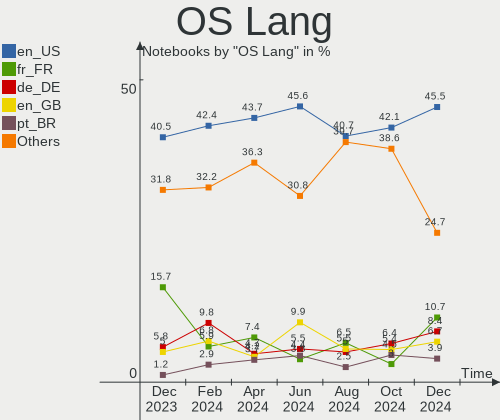
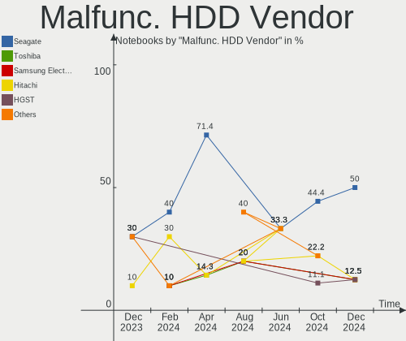
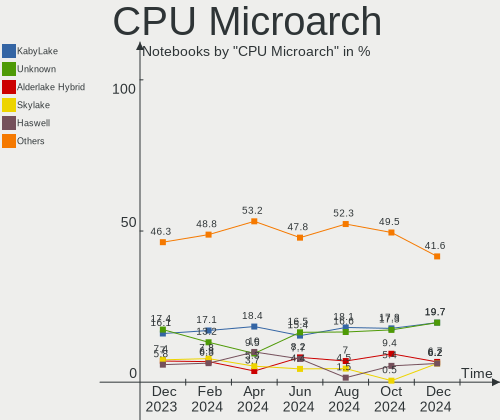
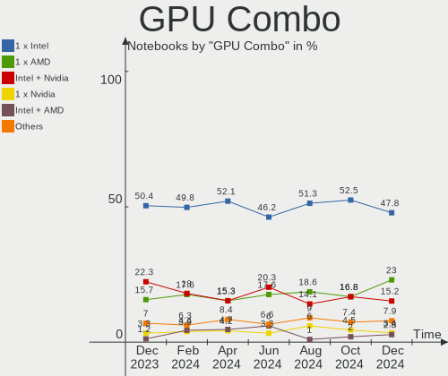

Debian Hardware Trends (Notebook)
---------------------------------

A project to identify most popular hardware characteristics and track their change
over time based on data collected by Debian users at https://Linux-Hardware.org.

Anyone can contribute to the study by uploading probes of their computers by
the [hw-probe](https://github.com/linuxhw/hw-probe) tool:

    sudo -E hw-probe -all -upload

Full-feature report is available here: https://linux-hardware.org/?view=trends&formfactor=notebook

Period: Jan, 2021.

Contents
--------

- [ OS                       ](#os)
- [ OS Family                ](#os-family)
- [ Kernel                   ](#kernel)
- [ Kernel Family            ](#kernel-family)
- [ Kernel Major Ver.        ](#kernel-major-ver)
- [ Arch                     ](#arch)
- [ DE                       ](#de)
- [ Display Server           ](#display-server)
- [ Display Manager          ](#display-manager)
- [ OS Lang                  ](#os-lang)
- [ Boot Mode                ](#boot-mode)
- [ Filesystem               ](#filesystem)
- [ Part. scheme             ](#part-scheme)
- [ Dual Boot with Linux/BSD ](#dual-boot-with-linux/bsd)
- [ Dual Boot (Win)          ](#dual-boot-win)
- [ Country                  ](#country)
- [ City                     ](#city)
- [ Vendor                   ](#vendor)
- [ Model                    ](#model)
- [ Model Family             ](#model-family)
- [ MFG Year                 ](#mfg-year)
- [ Form Factor              ](#form-factor)
- [ Secure Boot              ](#secure-boot)
- [ Coreboot                 ](#coreboot)
- [ RAM Size                 ](#ram-size)
- [ RAM Used                 ](#ram-used)
- [ Has CD-ROM               ](#has-cd-rom)
- [ Total Drives             ](#total-drives)
- [ Has Ethernet             ](#has-ethernet)
- [ Drive Vendor             ](#drive-vendor)
- [ Drive Model              ](#drive-model)
- [ HDD Vendor               ](#hdd-vendor)
- [ SSD Vendor               ](#ssd-vendor)
- [ Drive Kind               ](#drive-kind)
- [ Drive Connector          ](#drive-connector)
- [ Drive Size               ](#drive-size)
- [ Space Total              ](#space-total)
- [ Space Used               ](#space-used)
- [ Malfunc. Drives          ](#malfunc-drives)
- [ Malfunc. Drive Vendor    ](#malfunc-drive-vendor)
- [ Malfunc. HDD Vendor      ](#malfunc-hdd-vendor)
- [ Malfunc. Drive Kind      ](#malfunc-drive-kind)
- [ Failed Drives            ](#failed-drives)
- [ Failed Drive Vendor      ](#failed-drive-vendor)
- [ Drive Status             ](#drive-status)
- [ Storage Vendor           ](#storage-vendor)
- [ Storage Model            ](#storage-model)
- [ Storage Kind             ](#storage-kind)
- [ CPU Vendor               ](#cpu-vendor)
- [ CPU Model                ](#cpu-model)
- [ CPU Model Family         ](#cpu-model-family)
- [ CPU Cores                ](#cpu-cores)
- [ CPU Sockets              ](#cpu-sockets)
- [ CPU Threads              ](#cpu-threads)
- [ CPU Op-Modes             ](#cpu-op-modes)
- [ CPU Microcode            ](#cpu-microcode)
- [ CPU Microarch            ](#cpu-microarch)
- [ GPU Vendor               ](#gpu-vendor)
- [ GPU Model                ](#gpu-model)
- [ GPU Combo                ](#gpu-combo)
- [ GPU Driver               ](#gpu-driver)
- [ GPU Memory               ](#gpu-memory)
- [ Monitor Vendor           ](#monitor-vendor)
- [ Monitor Model            ](#monitor-model)
- [ Monitor Resolution       ](#monitor-resolution)
- [ Monitor Diagonal         ](#monitor-diagonal)
- [ Monitor Width            ](#monitor-width)
- [ Aspect Ratio             ](#aspect-ratio)
- [ Monitor Area             ](#monitor-area)
- [ Pixel Density            ](#pixel-density)
- [ Multiple Monitors        ](#multiple-monitors)
- [ Net Controller Vendor    ](#net-controller-vendor)
- [ Net Controller Model     ](#net-controller-model)
- [ Wireless Vendor          ](#wireless-vendor)
- [ Wireless Model           ](#wireless-model)
- [ Ethernet Vendor          ](#ethernet-vendor)
- [ Ethernet Model           ](#ethernet-model)
- [ Net Controller Kind      ](#net-controller-kind)
- [ Used Controller          ](#used-controller)
- [ NICs                     ](#nics)
- [ Memory Vendor            ](#memory-vendor)
- [ Memory Model             ](#memory-model)
- [ Memory Kind              ](#memory-kind)
- [ Memory Form Factor       ](#memory-form-factor)
- [ Memory Size              ](#memory-size)
- [ Memory Speed             ](#memory-speed)
- [ Sound Vendor             ](#sound-vendor)
- [ Sound Model              ](#sound-model)
- [ Camera Vendor            ](#camera-vendor)
- [ Camera Model             ](#camera-model)
- [ Fingerprint Vendor       ](#fingerprint-vendor)
- [ Fingerprint Model        ](#fingerprint-model)
- [ Chipcard Vendor          ](#chipcard-vendor)
- [ Chipcard Model           ](#chipcard-model)
- [ Printer Vendor           ](#printer-vendor)
- [ Printer Model            ](#printer-model)
- [ Scanner Vendor           ](#scanner-vendor)
- [ Scanner Model            ](#scanner-model)
- [ Bluetooth Vendor         ](#bluetooth-vendor)
- [ Bluetooth Model          ](#bluetooth-model)
- [ Unsupported Devices      ](#unsupported-devices)
- [ Unsupported Device Types ](#unsupported-device-types)

OS
--

Installed operating systems

| Name            | Notebooks | Percent |
|-----------------|-----------|---------|
| Debian 10       | 44        | 55%     |
| Debian Testing  | 19        | 23.75%  |
| Debian          | 8         | 10%     |
| Debian Unstable | 5         | 6.25%   |
| Debian 9.13     | 3         | 3.75%   |
| Debian 9        | 1         | 1.25%   |

OS Family
---------

OS without a version

| Name   | Notebooks | Percent |
|--------|-----------|---------|
| Debian | 80        | 100%    |

Kernel
------

Version of the Linux kernel

| Version                     | Notebooks | Percent |
|-----------------------------|-----------|---------|
| 4.19.0-13-amd64             | 29        | 36.25%  |
| 5.10.0-1-amd64              | 14        | 17.5%   |
| 5.9.0-5-amd64               | 12        | 15%     |
| 5.9.0-0.bpo.2-amd64         | 4         | 5%      |
| 4.19.0-13-686-pae           | 3         | 3.75%   |
| 5.9.0-0.bpo.5-amd64         | 2         | 2.5%    |
| 5.10.0-2-amd64              | 2         | 2.5%    |
| 4.19.0-13-686               | 2         | 2.5%    |
| 5.9.0-8.3-liquorix-amd64    | 1         | 1.25%   |
| 5.9.0-5-686-pae             | 1         | 1.25%   |
| 5.9.0-4-amd64               | 1         | 1.25%   |
| 5.6.0-2-amd64               | 1         | 1.25%   |
| 5.4.89                      | 1         | 1.25%   |
| 5.10.4shjk                  | 1         | 1.25%   |
| 5.10.0-1-rt-amd64           | 1         | 1.25%   |
| 4.9.0-14-amd64              | 1         | 1.25%   |
| 4.9.0-14-686-pae            | 1         | 1.25%   |
| 4.19.128-microsoft-standard | 1         | 1.25%   |
| 4.19.0-9-amd64              | 1         | 1.25%   |
| 4.19.0-0.bpo.9-rt-amd64     | 1         | 1.25%   |

Kernel Family
-------------

Linux kernel without a distro release

| Version  | Notebooks | Percent |
|----------|-----------|---------|
| 4.19.0   | 36        | 45%     |
| 5.9.0    | 21        | 26.25%  |
| 5.10.0   | 17        | 21.25%  |
| 4.9.0    | 2         | 2.5%    |
| 5.6.0    | 1         | 1.25%   |
| 5.4.89   | 1         | 1.25%   |
| 5.10.4   | 1         | 1.25%   |
| 4.19.128 | 1         | 1.25%   |

Kernel Major Ver.
-----------------

Linux kernel major version

| Version | Notebooks | Percent |
|---------|-----------|---------|
| 4.19    | 37        | 46.25%  |
| 5.9     | 21        | 26.25%  |
| 5.10    | 18        | 22.5%   |
| 4.9     | 2         | 2.5%    |
| 5.6     | 1         | 1.25%   |
| 5.4     | 1         | 1.25%   |

Arch
----

OS architecture (x86_64, i586, etc.)

| Name   | Notebooks | Percent |
|--------|-----------|---------|
| x86_64 | 72        | 90%     |
| i686   | 7         | 8.75%   |
| armv7l | 1         | 1.25%   |

DE
--

Desktop Environment

| Name            | Notebooks | Percent |
|-----------------|-----------|---------|
| GNOME           | 32        | 40%     |
| XFCE            | 15        | 18.75%  |
| Unknown         | 13        | 16.25%  |
| KDE             | 5         | 6.25%   |
| LXDE            | 4         | 5%      |
| X-Cinnamon      | 3         | 3.75%   |
| KDE5            | 2         | 2.5%    |
| trinity         | 1         | 1.25%   |
| sway            | 1         | 1.25%   |
| MATE            | 1         | 1.25%   |
| LXQt            | 1         | 1.25%   |
| GNOME Flashback | 1         | 1.25%   |
| Cinnamon        | 1         | 1.25%   |

Display Server
--------------

X11 or Wayland

| Name    | Notebooks | Percent |
|---------|-----------|---------|
| X11     | 57        | 71.25%  |
| Wayland | 18        | 22.5%   |
| Tty     | 3         | 3.75%   |
| Unknown | 2         | 2.5%    |

Display Manager
---------------

SDDM, LightDM, etc.

| Name    | Notebooks | Percent |
|---------|-----------|---------|
| Unknown | 35        | 43.75%  |
| TDM     | 21        | 26.25%  |
| GDM     | 19        | 23.75%  |
| SDDM    | 3         | 3.75%   |
| GDM3    | 2         | 2.5%    |

OS Lang
-------

Language

| Lang    | Notebooks | Percent |
|---------|-----------|---------|
| en_US   | 24        | 30%     |
| pt_BR   | 10        | 12.5%   |
| de_DE   | 9         | 11.25%  |
| ru_RU   | 8         | 10%     |
| en_GB   | 7         | 8.75%   |
| es_ES   | 4         | 5%      |
| fr_FR   | 3         | 3.75%   |
| pt_PT   | 2         | 2.5%    |
| en_CA   | 2         | 2.5%    |
| en_AU   | 2         | 2.5%    |
| tr_TR   | 1         | 1.25%   |
| sv_SE   | 1         | 1.25%   |
| ja_JP   | 1         | 1.25%   |
| it_IT   | 1         | 1.25%   |
| hu_HU   | 1         | 1.25%   |
| es_CL   | 1         | 1.25%   |
| el_GR   | 1         | 1.25%   |
| C       | 1         | 1.25%   |
| Unknown | 1         | 1.25%   |

Boot Mode
---------

EFI or BIOS

| Mode | Notebooks | Percent |
|------|-----------|---------|
| BIOS | 45        | 56.25%  |
| EFI  | 35        | 43.75%  |

Filesystem
----------

Type of filesystem

| Type  | Notebooks | Percent |
|-------|-----------|---------|
| Ext4  | 76        | 95%     |
| Btrfs | 3         | 3.75%   |
| Xfs   | 1         | 1.25%   |

Part. scheme
------------

Scheme of partitioning

| Type    | Notebooks | Percent |
|---------|-----------|---------|
| GPT     | 34        | 42.5%   |
| Unknown | 34        | 42.5%   |
| MBR     | 12        | 15%     |

Dual Boot with Linux/BSD
------------------------

Hosting more than one Linux/BSD

| Dual boot | Notebooks | Percent |
|-----------|-----------|---------|
| No        | 71        | 88.75%  |
| Yes       | 9         | 11.25%  |

Dual Boot (Win)
---------------

Hosting Linux and Windows

| Dual boot | Notebooks | Percent |
|-----------|-----------|---------|
| No        | 52        | 65%     |
| Yes       | 28        | 35%     |

Country
-------

Geographic location (country)

| Country     | Notebooks | Percent |
|-------------|-----------|---------|
| Brazil      | 11        | 13.75%  |
| Russia      | 10        | 12.5%   |
| Germany     | 9         | 11.25%  |
| USA         | 8         | 10%     |
| Spain       | 5         | 6.25%   |
| UK          | 4         | 5%      |
| France      | 4         | 5%      |
| India       | 3         | 3.75%   |
| Hungary     | 3         | 3.75%   |
| Portugal    | 2         | 2.5%    |
| Italy       | 2         | 2.5%    |
| Finland     | 2         | 2.5%    |
| Canada      | 2         | 2.5%    |
| Australia   | 2         | 2.5%    |
| Ukraine     | 1         | 1.25%   |
| Turkey      | 1         | 1.25%   |
| Switzerland | 1         | 1.25%   |
| Sweden      | 1         | 1.25%   |
| Netherlands | 1         | 1.25%   |
| Myanmar     | 1         | 1.25%   |
| Mexico      | 1         | 1.25%   |
| Latvia      | 1         | 1.25%   |
| Japan       | 1         | 1.25%   |
| Iran        | 1         | 1.25%   |
| Indonesia   | 1         | 1.25%   |
| Greece      | 1         | 1.25%   |
| Chile       | 1         | 1.25%   |

City
----

Geographic location (city)

| City                 | Notebooks | Percent |
|----------------------|-----------|---------|
| St Petersburg        | 6         | 7.5%    |
| Hyderabad            | 2         | 2.5%    |
| Halstead             | 2         | 2.5%    |
| Yangon               | 1         | 1.25%   |
| Washington           | 1         | 1.25%   |
| Valencia             | 1         | 1.25%   |
| Temuco               | 1         | 1.25%   |
| Tehran               | 1         | 1.25%   |
| São Caetano do Sul  | 1         | 1.25%   |
| Stuhr                | 1         | 1.25%   |
| Shchelkovo           | 1         | 1.25%   |
| Sendai               | 1         | 1.25%   |
| Sao Vicente          | 1         | 1.25%   |
| Saint-Dié           | 1         | 1.25%   |
| Ringwood             | 1         | 1.25%   |
| Riga                 | 1         | 1.25%   |
| Riachao              | 1         | 1.25%   |
| Puebla               | 1         | 1.25%   |
| Pieve Emanuele       | 1         | 1.25%   |
| Perm                 | 1         | 1.25%   |
| Nurtingen            | 1         | 1.25%   |
| Novosibirsk          | 1         | 1.25%   |
| Norwich              | 1         | 1.25%   |
| Noisy-le-Grand       | 1         | 1.25%   |
| New York             | 1         | 1.25%   |
| Moscow               | 1         | 1.25%   |
| Montreal             | 1         | 1.25%   |
| Minneapolis          | 1         | 1.25%   |
| Mars                 | 1         | 1.25%   |
| Manauli              | 1         | 1.25%   |
| Maceió              | 1         | 1.25%   |
| Macaparana           | 1         | 1.25%   |
| Lisbon               | 1         | 1.25%   |
| Lilienthal           | 1         | 1.25%   |
| Lempäälä          | 1         | 1.25%   |
| Leipzig              | 1         | 1.25%   |
| Laguna Hills         | 1         | 1.25%   |
| L'Ametlla del Valles | 1         | 1.25%   |
| Kyiv                 | 1         | 1.25%   |
| Komárom             | 1         | 1.25%   |
| Kansas City          | 1         | 1.25%   |
| Ingenio              | 1         | 1.25%   |
| Ignace               | 1         | 1.25%   |
| Herten               | 1         | 1.25%   |
| Helsinki             | 1         | 1.25%   |
| Haßfurt             | 1         | 1.25%   |
| Hatboro              | 1         | 1.25%   |
| Geneva               | 1         | 1.25%   |
| Geesthacht           | 1         | 1.25%   |
| Fuenlabrada          | 1         | 1.25%   |
| Frederick            | 1         | 1.25%   |
| Farsta strand        | 1         | 1.25%   |
| Eppelheim            | 1         | 1.25%   |
| Dulwich              | 1         | 1.25%   |
| Dona Ines            | 1         | 1.25%   |
| Curitiba             | 1         | 1.25%   |
| Courbevoie           | 1         | 1.25%   |
| Cotia                | 1         | 1.25%   |
| Conceicao            | 1         | 1.25%   |
| Cartagena            | 1         | 1.25%   |

Vendor
------

Motherboard manufacturer

| Name                | Notebooks | Percent |
|---------------------|-----------|---------|
| Dell                | 20        | 25%     |
| Lenovo              | 17        | 21.25%  |
| Hewlett-Packard     | 14        | 17.5%   |
| ASUSTek Computer    | 8         | 10%     |
| Acer                | 6         | 7.5%    |
| Unknown             | 3         | 3.75%   |
| Toshiba             | 2         | 2.5%    |
| Schenker            | 1         | 1.25%   |
| Samsung Electronics | 1         | 1.25%   |
| Positivo            | 1         | 1.25%   |
| OEM                 | 1         | 1.25%   |
| MSI                 | 1         | 1.25%   |
| IT Channel Pty      | 1         | 1.25%   |
| IBM                 | 1         | 1.25%   |
| HUAWEI              | 1         | 1.25%   |
| Hampoo              | 1         | 1.25%   |
| Fujitsu             | 1         | 1.25%   |

Model
-----

Motherboard model

| Name                                 | Notebooks | Percent |
|--------------------------------------|-----------|---------|
| Unknown                              | 3         | 3.75%   |
| Lenovo IdeaPad 700-15ISK 80RU        | 2         | 2.5%    |
| HP Pavilion g4                       | 2         | 2.5%    |
| Dell Latitude E6330                  | 2         | 2.5%    |
| Toshiba PORTEGE Z30-E                | 1         | 1.25%   |
| Toshiba PORTEGE R935                 | 1         | 1.25%   |
| Schenker SCHENKER_SLIM_SERIES_L18    | 1         | 1.25%   |
| Samsung 530XBB                       | 1         | 1.25%   |
| Positivo C14CR21                     | 1         | 1.25%   |
| OEM I42IL1                           | 1         | 1.25%   |
| MSI GE60 2PL                         | 1         | 1.25%   |
| Lenovo Y50-70 20378                  | 1         | 1.25%   |
| Lenovo ThinkPad X260 20F5S13G00      | 1         | 1.25%   |
| Lenovo ThinkPad X220 4291G26         | 1         | 1.25%   |
| Lenovo ThinkPad T510 4384GEG         | 1         | 1.25%   |
| Lenovo ThinkPad T450s 20BXCTO1WW     | 1         | 1.25%   |
| Lenovo ThinkPad T430s 2356A89        | 1         | 1.25%   |
| Lenovo ThinkPad T430 2349W2P         | 1         | 1.25%   |
| Lenovo ThinkPad T430 2349V4B         | 1         | 1.25%   |
| Lenovo ThinkPad T420 4236WS7         | 1         | 1.25%   |
| Lenovo ThinkPad T14 Gen 1 20UDCTO1WW | 1         | 1.25%   |
| Lenovo ThinkPad P72 20MBCTO1WW       | 1         | 1.25%   |
| Lenovo ThinkPad E590 20NB0012RT      | 1         | 1.25%   |
| Lenovo IdeaPad 5-14ARE05 81YH        | 1         | 1.25%   |
| Lenovo IdeaPad 310-15ABR 80ST        | 1         | 1.25%   |
| Lenovo G470 4328                     | 1         | 1.25%   |
| IT Channel Pty N8xEJEK               | 1         | 1.25%   |
| IBM ThinkPad X31 2673PBU             | 1         | 1.25%   |
| HUAWEI BOHK-WAX9X                    | 1         | 1.25%   |
| HP ZBook 15 G2                       | 1         | 1.25%   |
| HP ProBook 450 G5                    | 1         | 1.25%   |
| HP ProBook 4430s                     | 1         | 1.25%   |
| HP Pavilion Sleekbook 15 PC          | 1         | 1.25%   |
| HP Laptop 17-ca1xxx                  | 1         | 1.25%   |
| HP Laptop 17-by1xxx                  | 1         | 1.25%   |
| HP Laptop 15-bs0xx                   | 1         | 1.25%   |
| HP EliteBook 840 G7 Notebook PC      | 1         | 1.25%   |
| HP EliteBook 840 G4                  | 1         | 1.25%   |
| HP Compaq Presario CQ40              | 1         | 1.25%   |
| HP 2000                              | 1         | 1.25%   |
| HP 14                                | 1         | 1.25%   |
| Hampoo C3W6_AP108_4GB                | 1         | 1.25%   |
| Fujitsu LIFEBOOK T936                | 1         | 1.25%   |
| Dell XPS L321X                       | 1         | 1.25%   |
| Dell XPS 13 9370                     | 1         | 1.25%   |
| Dell XPS 13 9310                     | 1         | 1.25%   |
| Dell Vostro 5581                     | 1         | 1.25%   |
| Dell Vostro 5568                     | 1         | 1.25%   |
| Dell Vostro 5490                     | 1         | 1.25%   |
| Dell Latitude E7450                  | 1         | 1.25%   |
| Dell Latitude E7250                  | 1         | 1.25%   |
| Dell Latitude E5410                  | 1         | 1.25%   |
| Dell Latitude 5590                   | 1         | 1.25%   |
| Dell Latitude 5500                   | 1         | 1.25%   |
| Dell Inspiron MM061                  | 1         | 1.25%   |
| Dell Inspiron 5759                   | 1         | 1.25%   |
| Dell Inspiron 5758                   | 1         | 1.25%   |
| Dell Inspiron 5437                   | 1         | 1.25%   |
| Dell Inspiron 3542                   | 1         | 1.25%   |
| Dell Inspiron 3476                   | 1         | 1.25%   |

Model Family
------------

Motherboard model prefix

| Name                   | Notebooks | Percent |
|------------------------|-----------|---------|
| Lenovo ThinkPad        | 11        | 13.75%  |
| Dell Latitude          | 7         | 8.75%   |
| Dell Inspiron          | 7         | 8.75%   |
| Lenovo IdeaPad         | 4         | 5%      |
| Acer Aspire            | 4         | 5%      |
| HP Pavilion            | 3         | 3.75%   |
| HP Laptop              | 3         | 3.75%   |
| Dell XPS               | 3         | 3.75%   |
| Dell Vostro            | 3         | 3.75%   |
| Unknown                | 3         | 3.75%   |
| Toshiba PORTEGE        | 2         | 2.5%    |
| HP ProBook             | 2         | 2.5%    |
| HP EliteBook           | 2         | 2.5%    |
| ASUS ROG               | 2         | 2.5%    |
| Schenker SCHENKER      | 1         | 1.25%   |
| Samsung 530XBB         | 1         | 1.25%   |
| Positivo C14CR21       | 1         | 1.25%   |
| OEM I42IL1             | 1         | 1.25%   |
| MSI GE60               | 1         | 1.25%   |
| Lenovo Y50-70          | 1         | 1.25%   |
| Lenovo G470            | 1         | 1.25%   |
| IT Channel Pty N8xEJEK | 1         | 1.25%   |
| IBM ThinkPad           | 1         | 1.25%   |
| HUAWEI BOHK-WAX9X      | 1         | 1.25%   |
| HP ZBook               | 1         | 1.25%   |
| HP Compaq              | 1         | 1.25%   |
| HP 2000                | 1         | 1.25%   |
| HP 14                  | 1         | 1.25%   |
| Hampoo C3W6            | 1         | 1.25%   |
| Fujitsu LIFEBOOK       | 1         | 1.25%   |
| ASUS ZenBook           | 1         | 1.25%   |
| ASUS VivoBook          | 1         | 1.25%   |
| ASUS TUF               | 1         | 1.25%   |
| ASUS K72Dr             | 1         | 1.25%   |
| ASUS A6JC              | 1         | 1.25%   |
| ASUS 1005HA            | 1         | 1.25%   |
| Acer Nitro             | 1         | 1.25%   |
| Acer AOD260            | 1         | 1.25%   |

MFG Year
--------

Motherboard manufacture year

| Year    | Notebooks | Percent |
|---------|-----------|---------|
| 2020    | 18        | 22.5%   |
| 2019    | 16        | 20%     |
| 2018    | 8         | 10%     |
| 2017    | 5         | 6.25%   |
| 2013    | 5         | 6.25%   |
| 2012    | 5         | 6.25%   |
| 2016    | 4         | 5%      |
| 2015    | 3         | 3.75%   |
| 2014    | 3         | 3.75%   |
| 2009    | 3         | 3.75%   |
| 2011    | 2         | 2.5%    |
| 2010    | 2         | 2.5%    |
| 2006    | 2         | 2.5%    |
| Unknown | 2         | 2.5%    |
| 2005    | 1         | 1.25%   |
| 2004    | 1         | 1.25%   |

Form Factor
-----------

Physical design of the computer

| Name     | Notebooks | Percent |
|----------|-----------|---------|
| Notebook | 80        | 100%    |

Secure Boot
-----------

Enabled or disabled

| State    | Notebooks | Percent |
|----------|-----------|---------|
| Disabled | 77        | 96.25%  |
| Enabled  | 3         | 3.75%   |

Coreboot
--------

Have coreboot on board

| Used | Notebooks | Percent |
|------|-----------|---------|
| No   | 80        | 100%    |

RAM Size
--------

Total RAM memory

| Size in GB | Notebooks | Percent |
|------------|-----------|---------|
| 16.01-24.0 | 22        | 27.5%   |
| 4.01-8.0   | 19        | 23.75%  |
| 8.01-16.0  | 14        | 17.5%   |
| 3.01-4.0   | 13        | 16.25%  |
| 32.01-64.0 | 5         | 6.25%   |
| 2.01-3.0   | 4         | 5%      |
| 0.01-0.5   | 2         | 2.5%    |
| 1.01-2.0   | 1         | 1.25%   |

RAM Used
--------

Used RAM memory

| Used GB   | Notebooks | Percent |
|-----------|-----------|---------|
| 1.01-2.0  | 25        | 31.25%  |
| 2.01-3.0  | 17        | 21.25%  |
| 4.01-8.0  | 15        | 18.75%  |
| 0.51-1.0  | 8         | 10%     |
| 3.01-4.0  | 6         | 7.5%    |
| 0.01-0.5  | 5         | 6.25%   |
| 8.01-16.0 | 4         | 5%      |

Has CD-ROM
----------

Has CD-ROM on board

| Presented | Notebooks | Percent |
|-----------|-----------|---------|
| No        | 55        | 68.75%  |
| Yes       | 25        | 31.25%  |

Total Drives
------------

Number of drives on board

| Drives | Notebooks | Percent |
|--------|-----------|---------|
| 1      | 56        | 70%     |
| 2      | 19        | 23.75%  |
| 3      | 4         | 5%      |
| 7      | 1         | 1.25%   |

Has Ethernet
------------

Has Ethernet on board

| Presented | Notebooks | Percent |
|-----------|-----------|---------|
| Yes       | 70        | 87.5%   |
| No        | 10        | 12.5%   |

Drive Vendor
------------

Hard drive vendors

| Vendor              | Notebooks | Drives | Percent |
|---------------------|-----------|--------|---------|
| Samsung Electronics | 19        | 19     | 17.76%  |
| Toshiba             | 13        | 13     | 12.15%  |
| WDC                 | 11        | 12     | 10.28%  |
| Seagate             | 10        | 12     | 9.35%   |
| Unknown             | 8         | 9      | 7.48%   |
| Kingston            | 7         | 7      | 6.54%   |
| SK Hynix            | 5         | 5      | 4.67%   |
| Hitachi             | 5         | 5      | 4.67%   |
| Crucial             | 5         | 5      | 4.67%   |
| Sandisk             | 4         | 4      | 3.74%   |
| Intenso             | 3         | 3      | 2.8%    |
| Micron Technology   | 2         | 2      | 1.87%   |
| ZTC                 | 1         | 1      | 0.93%   |
| XPG                 | 1         | 2      | 0.93%   |
| Transcend           | 1         | 1      | 0.93%   |
| Team                | 1         | 1      | 0.93%   |
| SNR-ML              | 1         | 1      | 0.93%   |
| Silicon Motion      | 1         | 1      | 0.93%   |
| OCZ                 | 1         | 1      | 0.93%   |
| Msft                | 1         | 2      | 0.93%   |
| LITEONIT            | 1         | 1      | 0.93%   |
| Lexar               | 1         | 1      | 0.93%   |
| Intel               | 1         | 1      | 0.93%   |
| Integral            | 1         | 1      | 0.93%   |
| Hoodisk             | 1         | 1      | 0.93%   |
| Dell                | 1         | 1      | 0.93%   |
| Apple               | 1         | 1      | 0.93%   |

Drive Model
-----------

Hard drive models

| Model                                   | Notebooks | Percent |
|-----------------------------------------|-----------|---------|
| Toshiba MQ01ABD100 1TB                  | 3         | 2.73%   |
| WDC WDS240G2G0A-00JH30 240GB SSD        | 2         | 1.82%   |
| Samsung SSD PM871b M.2 2280 256GB       | 2         | 1.82%   |
| Samsung SSD PM871 mSATA 256GB           | 2         | 1.82%   |
| Kingston SUV400S37240G 240GB SSD        | 2         | 1.82%   |
| Kingston OM8PCP3512F-AB 512GB           | 2         | 1.82%   |
| Crucial CT240BX500SSD1 240GB            | 2         | 1.82%   |
| ZTC SM201-512G                          | 1         | 0.91%   |
| XPG NVMe SSD Drive 512GB                | 1         | 0.91%   |
| WDC WD7500BPVX-60JC3T0 752GB            | 1         | 0.91%   |
| WDC WD5000BEVT-22ZAT0 500GB             | 1         | 0.91%   |
| WDC WD50 00LPCX-24VHA 500GB             | 1         | 0.91%   |
| WDC WD10SPZX-60Z10T0 1TB                | 1         | 0.91%   |
| WDC WD10SPCX-24HWST1 1TB                | 1         | 0.91%   |
| WDC WD10JUCT-63CYNY0 1TB                | 1         | 0.91%   |
| WDC WD10JPVX-75J 1TB                    | 1         | 0.91%   |
| WDC WD10JPLX-00MBPT0 1TB                | 1         | 0.91%   |
| WDC PC SN730 SDBPNTY-256G-1027 256GB    | 1         | 0.91%   |
| WDC PC SN520 SDAPNUW-256G-1006 256GB    | 1         | 0.91%   |
| Unknown SD64G  64GB                     | 1         | 0.91%   |
| Unknown SD256  256GB                    | 1         | 0.91%   |
| Unknown SC256  256GB                    | 1         | 0.91%   |
| Unknown MMC Card  64GB                  | 1         | 0.91%   |
| Unknown MMC Card  256GB                 | 1         | 0.91%   |
| Unknown HAG2e  16GB                     | 1         | 0.91%   |
| Unknown DA4064  64GB                    | 1         | 0.91%   |
| Unknown CKTM4R  64GB                    | 1         | 0.91%   |
| Unknown 00000  4GB                      | 1         | 0.91%   |
| Transcend TS512GSSD370S 512GB           | 1         | 0.91%   |
| Toshiba NVMe SSD Drive 512GB            | 1         | 0.91%   |
| Toshiba MQ01ACF032 320GB                | 1         | 0.91%   |
| Toshiba MK8025GAS 80GB                  | 1         | 0.91%   |
| Toshiba MK6461GSYN 640GB                | 1         | 0.91%   |
| Toshiba MK5076GSX 500GB                 | 1         | 0.91%   |
| Toshiba MK3252GSX 320GB                 | 1         | 0.91%   |
| Toshiba KXG60ZNV512G KIOXIA 512GB       | 1         | 0.91%   |
| Toshiba KXG50ZNV512G NVMe 512GB         | 1         | 0.91%   |
| Toshiba KXG50ZNV512G 512GB              | 1         | 0.91%   |
| Toshiba KBG40ZNS256G NVMe 256GB         | 1         | 0.91%   |
| Team T253LE120G 120GB SSD               | 1         | 0.91%   |
| SNR-ML SSD 240 240GB                    | 1         | 0.91%   |
| SK Hynix SKHynix_HFS001TD9TNI-L2B0B 1TB | 1         | 0.91%   |
| SK Hynix HFS256G39TND-N210A 256GB SSD   | 1         | 0.91%   |
| SK Hynix HFM512GDJTNG-8310A 512GB       | 1         | 0.91%   |
| SK Hynix HFM256GDHTNG-8510B 256GB       | 1         | 0.91%   |
| SK Hynix BC501 HFM512GDJTNG-8310A 512GB | 1         | 0.91%   |
| Silicon Motion NVMe SSD Drive 512GB     | 1         | 0.91%   |
| Seagate Ultra Slim MT 2TB               | 1         | 0.91%   |
| Seagate ST9320325AS 320GB               | 1         | 0.91%   |
| Seagate ST500VT000-1DK142 500GB         | 1         | 0.91%   |
| Seagate ST500LM012 HN-M500MBB 500GB     | 1         | 0.91%   |
| Seagate ST320LT007-9ZV142 320GB         | 1         | 0.91%   |
| Seagate ST2000LM015-2E8174 2TB          | 1         | 0.91%   |
| Seagate ST1000LM048-2E7172 1TB          | 1         | 0.91%   |
| Seagate ST1000LM035-1RK172 1TB          | 1         | 0.91%   |
| Seagate ST1000LM024 HN-M101MBB 1TB      | 1         | 0.91%   |
| Seagate Desktop 8TB                     | 1         | 0.91%   |
| Seagate BUP BK 5TB                      | 1         | 0.91%   |
| SanDisk SSD PLUS 120GB                  | 1         | 0.91%   |
| SanDisk SL32G  32GB                     | 1         | 0.91%   |

HDD Vendor
----------

Hard disk drive vendors

| Vendor              | Notebooks | Drives | Percent |
|---------------------|-----------|--------|---------|
| Seagate             | 9         | 10     | 26.47%  |
| WDC                 | 8         | 8      | 23.53%  |
| Toshiba             | 8         | 8      | 23.53%  |
| Hitachi             | 5         | 5      | 14.71%  |
| Samsung Electronics | 1         | 1      | 2.94%   |
| Msft                | 1         | 2      | 2.94%   |
| Intenso             | 1         | 1      | 2.94%   |
| Apple               | 1         | 1      | 2.94%   |

SSD Vendor
----------

Solid state drive vendors

| Vendor              | Notebooks | Drives | Percent |
|---------------------|-----------|--------|---------|
| Samsung Electronics | 15        | 15     | 36.59%  |
| Kingston            | 5         | 5      | 12.2%   |
| Crucial             | 5         | 5      | 12.2%   |
| WDC                 | 2         | 2      | 4.88%   |
| SanDisk             | 2         | 2      | 4.88%   |
| ZTC                 | 1         | 1      | 2.44%   |
| Transcend           | 1         | 1      | 2.44%   |
| Team                | 1         | 1      | 2.44%   |
| SNR-ML              | 1         | 1      | 2.44%   |
| SK Hynix            | 1         | 1      | 2.44%   |
| OCZ                 | 1         | 1      | 2.44%   |
| Micron Technology   | 1         | 1      | 2.44%   |
| LITEONIT            | 1         | 1      | 2.44%   |
| Lexar               | 1         | 1      | 2.44%   |
| Intenso             | 1         | 1      | 2.44%   |
| Integral            | 1         | 1      | 2.44%   |
| Hoodisk             | 1         | 1      | 2.44%   |

Drive Kind
----------

HDD or SSD

| Kind    | Notebooks | Drives | Percent |
|---------|-----------|--------|---------|
| SSD     | 37        | 41     | 36.27%  |
| HDD     | 32        | 36     | 31.37%  |
| NVMe    | 21        | 22     | 20.59%  |
| MMC     | 9         | 10     | 8.82%   |
| Unknown | 3         | 4      | 2.94%   |

Drive Connector
---------------

SATA, SAS, NVMe, etc.

| Type | Notebooks | Drives | Percent |
|------|-----------|--------|---------|
| SATA | 59        | 71     | 62.77%  |
| NVMe | 21        | 22     | 22.34%  |
| MMC  | 9         | 10     | 9.57%   |
| SAS  | 5         | 10     | 5.32%   |

Drive Size
----------

Size of hard drive

| Size in TB | Notebooks | Drives | Percent |
|------------|-----------|--------|---------|
| 0.01-0.5   | 45        | 50     | 64.29%  |
| 0.51-1.0   | 21        | 21     | 30%     |
| 1.01-2.0   | 2         | 3      | 2.86%   |
| 3.01-4.0   | 1         | 1      | 1.43%   |
| 4.01-10.0  | 1         | 2      | 1.43%   |

Space Total
-----------

Amount of disk space available on the file system

| Size in GB     | Notebooks | Percent |
|----------------|-----------|---------|
| 101-250        | 26        | 32.5%   |
| 251-500        | 19        | 23.75%  |
| 501-1000       | 10        | 12.5%   |
| 1001-2000      | 7         | 8.75%   |
| 51-100         | 6         | 7.5%    |
| 1-20           | 4         | 5%      |
| More than 3000 | 3         | 3.75%   |
| 21-50          | 3         | 3.75%   |
| Unknown        | 2         | 2.5%    |

Space Used
----------

Amount of used disk space

| Used GB        | Notebooks | Percent |
|----------------|-----------|---------|
| 1-20           | 28        | 35%     |
| 101-250        | 15        | 18.75%  |
| 21-50          | 13        | 16.25%  |
| 251-500        | 8         | 10%     |
| 51-100         | 6         | 7.5%    |
| 501-1000       | 5         | 6.25%   |
| 1001-2000      | 2         | 2.5%    |
| Unknown        | 2         | 2.5%    |
| More than 3000 | 1         | 1.25%   |

Malfunc. Drives
---------------

Drive models with a malfunction

| Model                           | Notebooks | Drives | Percent |
|---------------------------------|-----------|--------|---------|
| WDC WD5000BEVT-22ZAT0 500GB     | 1         | 1      | 16.67%  |
| WDC WD10JUCT-63CYNY0 1TB        | 1         | 1      | 16.67%  |
| Toshiba MQ01ABD100 1TB          | 1         | 1      | 16.67%  |
| Seagate ST9320325AS 320GB       | 1         | 1      | 16.67%  |
| Seagate ST320LT007-9ZV142 320GB | 1         | 1      | 16.67%  |
| Hitachi HTS541680J9SA00 80GB    | 1         | 1      | 16.67%  |

Malfunc. Drive Vendor
---------------------

Vendors of faulty drives

| Vendor  | Notebooks | Drives | Percent |
|---------|-----------|--------|---------|
| WDC     | 2         | 2      | 33.33%  |
| Seagate | 2         | 2      | 33.33%  |
| Toshiba | 1         | 1      | 16.67%  |
| Hitachi | 1         | 1      | 16.67%  |

Malfunc. HDD Vendor
-------------------

Vendors of faulty HDD drives

| Vendor  | Notebooks | Drives | Percent |
|---------|-----------|--------|---------|
| WDC     | 2         | 2      | 33.33%  |
| Seagate | 2         | 2      | 33.33%  |
| Toshiba | 1         | 1      | 16.67%  |
| Hitachi | 1         | 1      | 16.67%  |

Malfunc. Drive Kind
-------------------

Kinds of faulty drives

| Kind | Notebooks | Drives | Percent |
|------|-----------|--------|---------|
| HDD  | 6         | 6      | 100%    |

Failed Drives
-------------

Failed drive models

Zero info for selected period =(

Failed Drive Vendor
-------------------

Failed drive vendors

Zero info for selected period =(

Drive Status
------------

Number of failed and malfunc. drives

| Status   | Notebooks | Drives | Percent |
|----------|-----------|--------|---------|
| Works    | 43        | 54     | 48.31%  |
| Detected | 40        | 53     | 44.94%  |
| Malfunc  | 6         | 6      | 6.74%   |

Storage Vendor
--------------

Storage controller vendors

| Vendor                       | Notebooks | Percent |
|------------------------------|-----------|---------|
| Intel                        | 62        | 68.13%  |
| AMD                          | 9         | 9.89%   |
| Toshiba America Info Systems | 4         | 4.4%    |
| SK Hynix                     | 4         | 4.4%    |
| Sandisk                      | 3         | 3.3%    |
| Samsung Electronics          | 3         | 3.3%    |
| Kingston Technology Company  | 2         | 2.2%    |
| Silicon Motion               | 1         | 1.1%    |
| Micron Technology            | 1         | 1.1%    |
| KIOXIA                       | 1         | 1.1%    |
| ADATA Technology             | 1         | 1.1%    |

Storage Model
-------------

Storage controller models

| Model                                                                                  | Notebooks | Percent |
|----------------------------------------------------------------------------------------|-----------|---------|
| Intel Sunrise Point-LP SATA Controller [AHCI mode]                                     | 10        | 10.64%  |
| AMD FCH SATA Controller [AHCI mode]                                                    | 8         | 8.51%   |
| Intel 7 Series Chipset Family 6-port SATA Controller [AHCI mode]                       | 7         | 7.45%   |
| Intel 82801 Mobile SATA Controller [RAID mode]                                         | 6         | 6.38%   |
| Intel 6 Series/C200 Series Chipset Family 6 port Mobile SATA AHCI Controller           | 5         | 5.32%   |
| Intel Cannon Lake Mobile PCH SATA AHCI Controller                                      | 4         | 4.26%   |
| SK Hynix BC501 NVMe Solid State Drive 512GB                                            | 3         | 3.19%   |
| Samsung NVMe SSD Controller SM981/PM981/PM983                                          | 3         | 3.19%   |
| Intel Wildcat Point-LP SATA Controller [AHCI Mode]                                     | 3         | 3.19%   |
| Intel Cannon Point-LP SATA Controller [AHCI Mode]                                      | 3         | 3.19%   |
| Intel 8 Series/C220 Series Chipset Family 6-port SATA Controller 1 [AHCI mode]         | 3         | 3.19%   |
| Intel 5 Series/3400 Series Chipset 4 port SATA AHCI Controller                         | 3         | 3.19%   |
| Toshiba America Info Systems XG6 NVMe SSD Controller                                   | 2         | 2.13%   |
| Toshiba America Info Systems Toshiba America Info Non-Volatile memory controller       | 2         | 2.13%   |
| Kingston Company Company Non-Volatile memory controller                                | 2         | 2.13%   |
| Intel HM170/QM170 Chipset SATA Controller [AHCI Mode]                                  | 2         | 2.13%   |
| Intel Celeron N3350/Pentium N4200/Atom E3900 Series SATA AHCI Controller               | 2         | 2.13%   |
| Intel 82801IBM/IEM (ICH9M/ICH9M-E) 4 port SATA Controller [AHCI mode]                  | 2         | 2.13%   |
| Intel 82801G (ICH7 Family) IDE Controller                                              | 2         | 2.13%   |
| Intel 8 Series SATA Controller 1 [AHCI mode]                                           | 2         | 2.13%   |
| SK Hynix Non-Volatile memory controller                                                | 1         | 1.06%   |
| Silicon Motion SM2263EN/SM2263XT SSD Controller                                        | 1         | 1.06%   |
| Sandisk WD Blue SN500 / PC SN520 NVMe SSD                                              | 1         | 1.06%   |
| Sandisk WD Black SN750 / PC SN730 NVMe SSD                                             | 1         | 1.06%   |
| Sandisk PC SN520 NVMe SSD                                                              | 1         | 1.06%   |
| Micron Non-Volatile memory controller                                                  | 1         | 1.06%   |
| KIOXIA Non-Volatile memory controller                                                  | 1         | 1.06%   |
| Intel SSD 660P Series                                                                  | 1         | 1.06%   |
| Intel NM10/ICH7 Family SATA Controller [AHCI mode]                                     | 1         | 1.06%   |
| Intel Comet Lake SATA AHCI Controller                                                  | 1         | 1.06%   |
| Intel Celeron/Pentium Silver Processor SATA Controller                                 | 1         | 1.06%   |
| Intel 82801GBM/GHM (ICH7-M Family) SATA Controller [IDE mode]                          | 1         | 1.06%   |
| Intel 82801GBM/GHM (ICH7-M Family) SATA Controller [AHCI mode]                         | 1         | 1.06%   |
| Intel 82801FB/FBM/FR/FW/FRW (ICH6 Family) IDE Controller                               | 1         | 1.06%   |
| Intel 82801DBM (ICH4-M) IDE Controller                                                 | 1         | 1.06%   |
| Intel 6 Series/C200 Series Chipset Family Mobile SATA Controller (IDE mode, ports 4-5) | 1         | 1.06%   |
| Intel 6 Series/C200 Series Chipset Family Mobile SATA Controller (IDE mode, ports 0-3) | 1         | 1.06%   |
| Intel 5 Series/3400 Series Chipset 6 port SATA AHCI Controller                         | 1         | 1.06%   |
| AMD SB7x0/SB8x0/SB9x0 SATA Controller [AHCI mode]                                      | 1         | 1.06%   |
| ADATA XPG SX8200 Pro PCIe Gen3x4 M.2 2280 Solid State Drive                            | 1         | 1.06%   |

Storage Kind
------------

Kind of storage controller (IDE, SATA, NVMe, SAS, ...)

| Kind | Notebooks | Percent |
|------|-----------|---------|
| SATA | 60        | 64.52%  |
| NVMe | 21        | 22.58%  |
| RAID | 6         | 6.45%   |
| IDE  | 6         | 6.45%   |

CPU Vendor
----------

Processor vendors

| Vendor | Notebooks | Percent |
|--------|-----------|---------|
| Intel  | 68        | 85%     |
| AMD    | 11        | 13.75%  |
| ARM    | 1         | 1.25%   |

CPU Model
---------

Processor models

| Model                                         | Notebooks | Percent |
|-----------------------------------------------|-----------|---------|
| Intel Core i5-3320M CPU @ 2.60GHz             | 4         | 5%      |
| AMD Ryzen 5 3500U with Radeon Vega Mobile Gfx | 3         | 3.75%   |
| Intel Core i7-9750H CPU @ 2.60GHz             | 2         | 2.5%    |
| Intel Core i7-8750H CPU @ 2.20GHz             | 2         | 2.5%    |
| Intel Core i7-8565U CPU @ 1.80GHz             | 2         | 2.5%    |
| Intel Core i7-8550U CPU @ 1.80GHz             | 2         | 2.5%    |
| Intel Core i5-8265U CPU @ 1.60GHz             | 2         | 2.5%    |
| Intel Core i5-8250U CPU @ 1.60GHz             | 2         | 2.5%    |
| Intel Core i5-7200U CPU @ 2.50GHz             | 2         | 2.5%    |
| Intel Core i5-5200U CPU @ 2.20GHz             | 2         | 2.5%    |
| Intel Core i5-3230M CPU @ 2.60GHz             | 2         | 2.5%    |
| Intel Core i5-2520M CPU @ 2.50GHz             | 2         | 2.5%    |
| Intel Core i5-2410M CPU @ 2.30GHz             | 2         | 2.5%    |
| Intel Pentium M processor 1600MHz             | 1         | 1.25%   |
| Intel Pentium M processor 1.73GHz             | 1         | 1.25%   |
| Intel Pentium CPU B960 @ 2.20GHz              | 1         | 1.25%   |
| Intel Pentium CPU 2020M @ 2.40GHz             | 1         | 1.25%   |
| Intel Genuine CPU T2050 @ 1.60GHz             | 1         | 1.25%   |
| Intel Core i7-7500U CPU @ 2.70GHz             | 1         | 1.25%   |
| Intel Core i7-6700HQ CPU @ 2.60GHz            | 1         | 1.25%   |
| Intel Core i7-6500U CPU @ 2.50GHz             | 1         | 1.25%   |
| Intel Core i7-5600U CPU @ 2.60GHz             | 1         | 1.25%   |
| Intel Core i7-4810MQ CPU @ 2.80GHz            | 1         | 1.25%   |
| Intel Core i7-4710HQ CPU @ 2.50GHz            | 1         | 1.25%   |
| Intel Core i7-4500U CPU @ 1.80GHz             | 1         | 1.25%   |
| Intel Core i7-1065G7 CPU @ 1.30GHz            | 1         | 1.25%   |
| Intel Core i7-10510U CPU @ 1.80GHz            | 1         | 1.25%   |
| Intel Core i7 CPU M 620 @ 2.67GHz             | 1         | 1.25%   |
| Intel Core i5-8365U CPU @ 1.60GHz             | 1         | 1.25%   |
| Intel Core i5-8350U CPU @ 1.70GHz             | 1         | 1.25%   |
| Intel Core i5-7300U CPU @ 2.60GHz             | 1         | 1.25%   |
| Intel Core i5-6300HQ CPU @ 2.30GHz            | 1         | 1.25%   |
| Intel Core i5-6200U CPU @ 2.30GHz             | 1         | 1.25%   |
| Intel Core i5-5300U CPU @ 2.30GHz             | 1         | 1.25%   |
| Intel Core i5-4200H CPU @ 2.80GHz             | 1         | 1.25%   |
| Intel Core i5-3340M CPU @ 2.70GHz             | 1         | 1.25%   |
| Intel Core i5-2467M CPU @ 1.60GHz             | 1         | 1.25%   |
| Intel Core i5-10210U CPU @ 1.60GHz            | 1         | 1.25%   |
| Intel Core i5 CPU M 560 @ 2.67GHz             | 1         | 1.25%   |
| Intel Core i5 CPU M 450 @ 2.40GHz             | 1         | 1.25%   |
| Intel Core i3-6100U CPU @ 2.30GHz             | 1         | 1.25%   |
| Intel Core i3-4005U CPU @ 1.70GHz             | 1         | 1.25%   |
| Intel Core i3-3217U CPU @ 1.80GHz             | 1         | 1.25%   |
| Intel Core i3-3110M CPU @ 2.40GHz             | 1         | 1.25%   |
| Intel Core i3 CPU M 380 @ 2.53GHz             | 1         | 1.25%   |
| Intel Core 2 Duo CPU T5750 @ 2.00GHz          | 1         | 1.25%   |
| Intel Core 2 CPU T5500 @ 1.66GHz              | 1         | 1.25%   |
| Intel Celeron N4000 CPU @ 1.10GHz             | 1         | 1.25%   |
| Intel Celeron CPU N3450 @ 1.10GHz             | 1         | 1.25%   |
| Intel Celeron CPU J3455 @ 1.50GHz             | 1         | 1.25%   |
| Intel Celeron CPU B800 @ 1.50GHz              | 1         | 1.25%   |
| Intel Celeron CPU 900 @ 2.20GHz               | 1         | 1.25%   |
| Intel Atom CPU N450 @ 1.66GHz                 | 1         | 1.25%   |
| Intel Atom CPU N270 @ 1.60GHz                 | 1         | 1.25%   |
| Intel 11th Gen Core i7-1165G7 @ 2.80GHz       | 1         | 1.25%   |
| ARM Rockchip (Device Tree) Processor          | 1         | 1.25%   |
| AMD Ryzen 7 PRO 4750U with Radeon Graphics    | 1         | 1.25%   |
| AMD Ryzen 7 4800H with Radeon Graphics        | 1         | 1.25%   |
| AMD Ryzen 7 3700U with Radeon Vega Mobile Gfx | 1         | 1.25%   |
| AMD Ryzen 5 2500U with Radeon Vega Mobile Gfx | 1         | 1.25%   |

CPU Model Family
----------------

Processor model prefix

| Model            | Notebooks | Percent |
|------------------|-----------|---------|
| Intel Core i5    | 30        | 37.5%   |
| Intel Core i7    | 18        | 22.5%   |
| Intel Core i3    | 5         | 6.25%   |
| Intel Celeron    | 5         | 6.25%   |
| AMD Ryzen 5      | 4         | 5%      |
| Other            | 2         | 2.5%    |
| Intel Pentium M  | 2         | 2.5%    |
| Intel Pentium    | 2         | 2.5%    |
| Intel Atom       | 2         | 2.5%    |
| AMD Ryzen 7      | 2         | 2.5%    |
| Intel Genuine    | 1         | 1.25%   |
| Intel Core 2 Duo | 1         | 1.25%   |
| Intel Core 2     | 1         | 1.25%   |
| AMD Ryzen 7 PRO  | 1         | 1.25%   |
| AMD Phenom II    | 1         | 1.25%   |
| AMD E1           | 1         | 1.25%   |
| AMD A8           | 1         | 1.25%   |
| AMD A12          | 1         | 1.25%   |

CPU Cores
---------

Number of processor cores

| Number | Notebooks | Percent |
|--------|-----------|---------|
| 2      | 41        | 51.25%  |
| 4      | 27        | 33.75%  |
| 1      | 5         | 6.25%   |
| 6      | 4         | 5%      |
| 8      | 2         | 2.5%    |
| 3      | 1         | 1.25%   |

CPU Sockets
-----------

Number of sockets

| Number | Notebooks | Percent |
|--------|-----------|---------|
| 1      | 80        | 100%    |

CPU Threads
-----------

Threads per core (Hyper-Threading)

| Number | Notebooks | Percent |
|--------|-----------|---------|
| 2      | 63        | 78.75%  |
| 1      | 17        | 21.25%  |

CPU Op-Modes
------------

CPU Operation Modes (32-bit, 64-bit)

| Op mode        | Notebooks | Percent |
|----------------|-----------|---------|
| 32-bit, 64-bit | 75        | 93.75%  |
| 32-bit         | 4         | 5%      |
| Unknown        | 1         | 1.25%   |

CPU Microcode
-------------

Microcode number

| Number     | Notebooks | Percent |
|------------|-----------|---------|
| Unknown    | 29        | 36.25%  |
| 0x306a9    | 5         | 6.25%   |
| 0x206a7    | 5         | 6.25%   |
| 0x806ea    | 4         | 5%      |
| 0x306d4    | 4         | 5%      |
| 0x20655    | 3         | 3.75%   |
| 0x08108109 | 3         | 3.75%   |
| 0x906ea    | 2         | 2.5%    |
| 0x806ec    | 2         | 2.5%    |
| 0x806eb    | 2         | 2.5%    |
| 0x40651    | 2         | 2.5%    |
| 0x306c3    | 2         | 2.5%    |
| 0x906ed    | 1         | 1.25%   |
| 0x806e9    | 1         | 1.25%   |
| 0x806c1    | 1         | 1.25%   |
| 0x706a1    | 1         | 1.25%   |
| 0x6fd      | 1         | 1.25%   |
| 0x6f6      | 1         | 1.25%   |
| 0x6e8      | 1         | 1.25%   |
| 0x695      | 1         | 1.25%   |
| 0x506c9    | 1         | 1.25%   |
| 0x406e3    | 1         | 1.25%   |
| 0x1067a    | 1         | 1.25%   |
| 0x08600106 | 1         | 1.25%   |
| 0x08600104 | 1         | 1.25%   |
| 0x08108102 | 1         | 1.25%   |
| 0x06006118 | 1         | 1.25%   |
| 0x05000119 | 1         | 1.25%   |
| 0x010000c8 | 1         | 1.25%   |

CPU Microarch
-------------

Microarchitecture

| Name          | Notebooks | Percent |
|---------------|-----------|---------|
| KabyLake      | 20        | 25%     |
| IvyBridge     | 10        | 12.5%   |
| SandyBridge   | 7         | 8.75%   |
| Skylake       | 5         | 6.25%   |
| Haswell       | 5         | 6.25%   |
| Zen+          | 4         | 5%      |
| Westmere      | 4         | 5%      |
| Broadwell     | 4         | 5%      |
| P6            | 3         | 3.75%   |
| Zen 2         | 2         | 2.5%    |
| Goldmont      | 2         | 2.5%    |
| Core          | 2         | 2.5%    |
| Bonnell       | 2         | 2.5%    |
| Zen           | 1         | 1.25%   |
| TigerLake     | 1         | 1.25%   |
| Puma          | 1         | 1.25%   |
| Penryn        | 1         | 1.25%   |
| K10           | 1         | 1.25%   |
| IceLake       | 1         | 1.25%   |
| Goldmont plus | 1         | 1.25%   |
| Excavator     | 1         | 1.25%   |
| Bobcat        | 1         | 1.25%   |
| Unknown       | 1         | 1.25%   |

GPU Vendor
----------

Vendors of graphics cards

| Vendor | Notebooks | Percent |
|--------|-----------|---------|
| Intel  | 63        | 63.64%  |
| Nvidia | 19        | 19.19%  |
| AMD    | 17        | 17.17%  |

GPU Model
---------

Graphics card models

| Model                                                                                 | Notebooks | Percent |
|---------------------------------------------------------------------------------------|-----------|---------|
| Intel 3rd Gen Core processor Graphics Controller                                      | 9         | 8.74%   |
| Intel 2nd Generation Core Processor Family Integrated Graphics Controller             | 7         | 6.8%    |
| Intel UHD Graphics 620 (Whiskey Lake)                                                 | 5         | 4.85%   |
| Intel UHD Graphics 620                                                                | 5         | 4.85%   |
| Intel HD Graphics 620                                                                 | 4         | 3.88%   |
| Intel HD Graphics 5500                                                                | 4         | 3.88%   |
| Intel Core Processor Integrated Graphics Controller                                   | 4         | 3.88%   |
| AMD Picasso                                                                           | 4         | 3.88%   |
| Intel UHD Graphics 630 (Mobile)                                                       | 3         | 2.91%   |
| Intel Skylake GT2 [HD Graphics 520]                                                   | 3         | 2.91%   |
| Intel 4th Gen Core Processor Integrated Graphics Controller                           | 3         | 2.91%   |
| Nvidia TU117M [GeForce GTX 1650 Mobile / Max-Q]                                       | 2         | 1.94%   |
| Nvidia GM107M [GeForce GTX 950M]                                                      | 2         | 1.94%   |
| Nvidia GF117M [GeForce 610M/710M/810M/820M / GT 620M/625M/630M/720M]                  | 2         | 1.94%   |
| Intel Mobile 945GM/GMS/GME, 943/940GML Express Integrated Graphics Controller         | 2         | 1.94%   |
| Intel Mobile 4 Series Chipset Integrated Graphics Controller                          | 2         | 1.94%   |
| Intel HD Graphics 530                                                                 | 2         | 1.94%   |
| Intel HD Graphics 500                                                                 | 2         | 1.94%   |
| Intel Haswell-ULT Integrated Graphics Controller                                      | 2         | 1.94%   |
| Intel CometLake-U GT2 [UHD Graphics]                                                  | 2         | 1.94%   |
| AMD Sun XT [Radeon HD 8670A/8670M/8690M / R5 M330 / M430 / Radeon 520 Mobile]         | 2         | 1.94%   |
| AMD Renoir                                                                            | 2         | 1.94%   |
| Nvidia TU116M [GeForce GTX 1660 Ti Mobile]                                            | 1         | 0.97%   |
| Nvidia GT218M [NVS 3100M]                                                             | 1         | 0.97%   |
| Nvidia GP108M [GeForce MX230]                                                         | 1         | 0.97%   |
| Nvidia GP107M [GeForce MX350]                                                         | 1         | 0.97%   |
| Nvidia GP107M [GeForce GTX 1050 Mobile]                                               | 1         | 0.97%   |
| Nvidia GP107GLM [Quadro P2000 Mobile]                                                 | 1         | 0.97%   |
| Nvidia GM108M [GeForce 930MX]                                                         | 1         | 0.97%   |
| Nvidia GM107M [GeForce GTX 960M]                                                      | 1         | 0.97%   |
| Nvidia GM107M [GeForce GTX 850M]                                                      | 1         | 0.97%   |
| Nvidia GK208BM [GeForce 920M]                                                         | 1         | 0.97%   |
| Nvidia GK107M [GeForce GT 750M]                                                       | 1         | 0.97%   |
| Nvidia GK107GLM [Quadro K1100M]                                                       | 1         | 0.97%   |
| Nvidia G72M [Quadro NVS 110M/GeForce Go 7300]                                         | 1         | 0.97%   |
| Intel UHD Graphics 605                                                                | 1         | 0.97%   |
| Intel TigerLake GT2 [Iris Xe Graphics]                                                | 1         | 0.97%   |
| Intel Mobile 945GSE Express Integrated Graphics Controller                            | 1         | 0.97%   |
| Intel Mobile 945GM/GMS, 943/940GML Express Integrated Graphics Controller             | 1         | 0.97%   |
| Intel Iris Plus Graphics G7                                                           | 1         | 0.97%   |
| Intel Atom Processor D4xx/D5xx/N4xx/N5xx Integrated Graphics Controller               | 1         | 0.97%   |
| AMD Wrestler [Radeon HD 7310]                                                         | 1         | 0.97%   |
| AMD Wani [Radeon R5/R6/R7 Graphics]                                                   | 1         | 0.97%   |
| AMD Topaz XT [Radeon R7 M260/M265 / M340/M360 / M440/M445 / 530/535 / 620/625 Mobile] | 1         | 0.97%   |
| AMD RV410/M26 [Mobility Radeon X700]                                                  | 1         | 0.97%   |
| AMD RV100/M6 [Rage/Radeon Mobility Series]                                            | 1         | 0.97%   |
| AMD Raven Ridge [Radeon Vega Series / Radeon Vega Mobile Series]                      | 1         | 0.97%   |
| AMD Park [Mobility Radeon HD 5430/5450/5470]                                          | 1         | 0.97%   |
| AMD Mullins [Radeon R4/R5 Graphics]                                                   | 1         | 0.97%   |
| AMD Lexa PRO [Radeon 540/540X/550/550X / RX 540X/550/550X]                            | 1         | 0.97%   |
| AMD Jet PRO [Radeon R5 M230 / R7 M260DX / Radeon 520 Mobile]                          | 1         | 0.97%   |
| AMD Baffin [Radeon RX 460/560D / Pro 450/455/460/555/555X/560/560X]                   | 1         | 0.97%   |

GPU Combo
---------

Combinations of graphics cards

| Name           | Notebooks | Percent |
|----------------|-----------|---------|
| 1 x Intel      | 43        | 53.75%  |
| Intel + Nvidia | 16        | 20%     |
| 1 x AMD        | 10        | 12.5%   |
| Intel + AMD    | 4         | 5%      |
| Other          | 2         | 2.5%    |
| 2 x AMD        | 2         | 2.5%    |
| 1 x Nvidia     | 2         | 2.5%    |
| AMD + Nvidia   | 1         | 1.25%   |

GPU Driver
----------

Free vs proprietary

| Driver      | Notebooks | Percent |
|-------------|-----------|---------|
| Free        | 71        | 88.75%  |
| Proprietary | 6         | 7.5%    |
| Unknown     | 3         | 3.75%   |

GPU Memory
----------

Total video memory

| Size in GB | Notebooks | Percent |
|------------|-----------|---------|
| Unknown    | 67        | 83.75%  |
| 1.01-2.0   | 7         | 8.75%   |
| 0.01-0.5   | 4         | 5%      |
| 0.51-1.0   | 2         | 2.5%    |

Monitor Vendor
--------------

Monitor vendors

| Vendor               | Notebooks | Percent |
|----------------------|-----------|---------|
| AU Optronics         | 17        | 19.54%  |
| LG Display           | 15        | 17.24%  |
| Chimei Innolux       | 11        | 12.64%  |
| BOE                  | 10        | 11.49%  |
| Samsung Electronics  | 7         | 8.05%   |
| PANDA                | 4         | 4.6%    |
| Sharp                | 3         | 3.45%   |
| Dell                 | 3         | 3.45%   |
| Philips              | 2         | 2.3%    |
| Lenovo               | 2         | 2.3%    |
| Goldstar             | 2         | 2.3%    |
| ViewSonic            | 1         | 1.15%   |
| Quanta Display       | 1         | 1.15%   |
| LG Philips           | 1         | 1.15%   |
| Iiyama               | 1         | 1.15%   |
| HannStar             | 1         | 1.15%   |
| Fujitsu Siemens      | 1         | 1.15%   |
| Eizo                 | 1         | 1.15%   |
| CPT                  | 1         | 1.15%   |
| AOC                  | 1         | 1.15%   |
| Ancor Communications | 1         | 1.15%   |
| Acer                 | 1         | 1.15%   |

Monitor Model
-------------

Monitor models

| Model                                                                 | Notebooks | Percent |
|-----------------------------------------------------------------------|-----------|---------|
| AU Optronics LCD Monitor AUO213E 1600x900 309x174mm 14.0-inch         | 3         | 3.41%   |
| LG Display LCD Monitor LGD02E9 1366x768 309x174mm 14.0-inch           | 2         | 2.27%   |
| Goldstar 23MP65 GSM5A45 1920x1080 510x290mm 23.1-inch                 | 2         | 2.27%   |
| BOE LCD Monitor BOE065D 1920x1080 344x194mm 15.5-inch                 | 2         | 2.27%   |
| AU Optronics LCD Monitor AUO38ED 1920x1080 340x190mm 15.3-inch        | 2         | 2.27%   |
| ViewSonic VA2265 SERIES VSCB330 1920x1080 476x268mm 21.5-inch         | 1         | 1.14%   |
| Sharp LQ133M1JW01 SHP141B 1920x1080 294x165mm 13.3-inch               | 1         | 1.14%   |
| Sharp LCD Monitor SHP14F9 1920x1200 288x180mm 13.4-inch               | 1         | 1.14%   |
| Sharp LCD Monitor SHP148B 3840x2160 294x165mm 13.3-inch               | 1         | 1.14%   |
| Samsung Electronics S34J55x SAM0F71 3440x1440 797x333mm 34.0-inch     | 1         | 1.14%   |
| Samsung Electronics LCD Monitor SEC5842 1366x768 309x174mm 14.0-inch  | 1         | 1.14%   |
| Samsung Electronics LCD Monitor SEC5441 1366x768 344x194mm 15.5-inch  | 1         | 1.14%   |
| Samsung Electronics LCD Monitor SEC4D42 1280x800 303x190mm 14.1-inch  | 1         | 1.14%   |
| Samsung Electronics LCD Monitor SEC335A 1366x768 309x174mm 14.0-inch  | 1         | 1.14%   |
| Samsung Electronics LCD Monitor SEC3047 1366x768 277x156mm 12.5-inch  | 1         | 1.14%   |
| Samsung Electronics LCD Monitor SDC4852 3840x2160 340x190mm 15.3-inch | 1         | 1.14%   |
| Quanta Display LCD Monitor QDS001F 1280x800 304x190mm 14.1-inch       | 1         | 1.14%   |
| Philips PHL 244E5 PHLC0C0 1920x1080 530x300mm 24.0-inch               | 1         | 1.14%   |
| Philips 170S PHL082B 1280x1024 338x270mm 17.0-inch                    | 1         | 1.14%   |
| PANDA LM156LF1L03 NCP001C 1920x1080 344x194mm 15.5-inch               | 1         | 1.14%   |
| PANDA LCD Monitor NCP0042 1920x1080 344x194mm 15.5-inch               | 1         | 1.14%   |
| PANDA LCD Monitor NCP0035 1920x1080 309x174mm 14.0-inch               | 1         | 1.14%   |
| PANDA LCD Monitor NCP0004 1920x1080 294x165mm 13.3-inch               | 1         | 1.14%   |
| LG Philips LCD Monitor LPLA900 1280x800 331x207mm 15.4-inch           | 1         | 1.14%   |
| LG Display LCD Monitor LGD40A0 1366x768 310x174mm 14.0-inch           | 1         | 1.14%   |
| LG Display LCD Monitor LGD05C4 1920x1080 344x194mm 15.5-inch          | 1         | 1.14%   |
| LG Display LCD Monitor LGD05BE 1920x1080 382x215mm 17.3-inch          | 1         | 1.14%   |
| LG Display LCD Monitor LGD0590 1920x1080 344x194mm 15.5-inch          | 1         | 1.14%   |
| LG Display LCD Monitor LGD046D 1920x1080 309x174mm 14.0-inch          | 1         | 1.14%   |
| LG Display LCD Monitor LGD0456 1366x768 344x194mm 15.5-inch           | 1         | 1.14%   |
| LG Display LCD Monitor LGD0436 1920x1080 276x156mm 12.5-inch          | 1         | 1.14%   |
| LG Display LCD Monitor LGD03CD 1366x768 277x156mm 12.5-inch           | 1         | 1.14%   |
| LG Display LCD Monitor LGD0395 1366x768 344x194mm 15.5-inch           | 1         | 1.14%   |
| LG Display LCD Monitor LGD0384 1366x768 344x194mm 15.5-inch           | 1         | 1.14%   |
| LG Display LCD Monitor LGD034C 1366x768 293x165mm 13.2-inch           | 1         | 1.14%   |
| LG Display LCD Monitor LGD02DC 1366x768 344x194mm 15.5-inch           | 1         | 1.14%   |
| LG Display LCD Monitor LGD0249 1280x800 304x190mm 14.1-inch           | 1         | 1.14%   |
| Lenovo LCD Monitor LEN40BA 1920x1080 344x194mm 15.5-inch              | 1         | 1.14%   |
| Lenovo LCD Monitor LEN40B2 1920x1080 344x193mm 15.5-inch              | 1         | 1.14%   |
| Iiyama PLE2483H-DP IVM611E 1920x1080 531x299mm 24.0-inch              | 1         | 1.14%   |
| HannStar LCD Monitor HSD03E9 1024x600 220x129mm 10.0-inch             | 1         | 1.14%   |
| Fujitsu Siemens B27T-7 Pro FUS0891 1920x1200 598x336mm 27.0-inch      | 1         | 1.14%   |
| Fujitsu Siemens B27T-7 Pro FUS088F 1920x1200 598x336mm 27.0-inch      | 1         | 1.14%   |
| Eizo EV2736W ENC2382 1920x1080 600x340mm 27.2-inch                    | 1         | 1.14%   |
| Dell U2419H DEL415D 1920x1080 527x296mm 23.8-inch                     | 1         | 1.14%   |
| Dell ST2220L DELA065 1920x1080 477x268mm 21.5-inch                    | 1         | 1.14%   |
| Dell E2414H DEL4091 1920x1080 530x300mm 24.0-inch                     | 1         | 1.14%   |
| CPT LCD Monitor CPT13B1 1280x800 330x210mm 15.4-inch                  | 1         | 1.14%   |
| Chimei Innolux LCD Monitor CMN175E 1920x1080 381x214mm 17.2-inch      | 1         | 1.14%   |
| Chimei Innolux LCD Monitor CMN175A 1920x1080 381x214mm 17.2-inch      | 1         | 1.14%   |
| Chimei Innolux LCD Monitor CMN1734 1600x900 382x214mm 17.2-inch       | 1         | 1.14%   |
| Chimei Innolux LCD Monitor CMN15F4 1920x1080 344x193mm 15.5-inch      | 1         | 1.14%   |
| Chimei Innolux LCD Monitor CMN15E8 1920x1080 344x193mm 15.5-inch      | 1         | 1.14%   |
| Chimei Innolux LCD Monitor CMN15D9 1920x1080 340x190mm 15.3-inch      | 1         | 1.14%   |
| Chimei Innolux LCD Monitor CMN15D3 1920x1080 344x193mm 15.5-inch      | 1         | 1.14%   |
| Chimei Innolux LCD Monitor CMN15AB 1366x768 350x190mm 15.7-inch       | 1         | 1.14%   |
| Chimei Innolux LCD Monitor CMN1476 1366x768 309x174mm 14.0-inch       | 1         | 1.14%   |
| Chimei Innolux LCD Monitor CMN1371 1920x1080 293x165mm 13.2-inch      | 1         | 1.14%   |
| Chimei Innolux LCD Monitor CMN1338 1366x768 293x164mm 13.2-inch       | 1         | 1.14%   |
| BOE LCD Monitor BOE08D7 1920x1080 309x174mm 14.0-inch                 | 1         | 1.14%   |

Monitor Resolution
------------------

Monitor screen resolution

| Resolution        | Notebooks | Percent |
|-------------------|-----------|---------|
| 1920x1080 (FHD)   | 42        | 50.6%   |
| 1366x768 (WXGA)   | 23        | 27.71%  |
| 1280x800 (WXGA)   | 6         | 7.23%   |
| 1600x900 (HD+)    | 4         | 4.82%   |
| 3840x2160 (4K)    | 2         | 2.41%   |
| 1024x600          | 2         | 2.41%   |
| 3440x1440         | 1         | 1.2%    |
| 2560x1440 (QHD)   | 1         | 1.2%    |
| 1920x1200 (WUXGA) | 1         | 1.2%    |
| 1280x1024 (SXGA)  | 1         | 1.2%    |

Monitor Diagonal
----------------

Diagonal size in inches

| Inches | Notebooks | Percent |
|--------|-----------|---------|
| 15     | 31        | 35.63%  |
| 14     | 18        | 20.69%  |
| 13     | 11        | 12.64%  |
| 17     | 8         | 9.2%    |
| 24     | 4         | 4.6%    |
| 23     | 3         | 3.45%   |
| 21     | 3         | 3.45%   |
| 12     | 3         | 3.45%   |
| 27     | 2         | 2.3%    |
| 10     | 2         | 2.3%    |
| 34     | 1         | 1.15%   |
| 18     | 1         | 1.15%   |

Monitor Width
-------------

Physical width

| Width in mm | Notebooks | Percent |
|-------------|-----------|---------|
| 301-350     | 52        | 60.47%  |
| 201-300     | 12        | 13.95%  |
| 501-600     | 9         | 10.47%  |
| 351-400     | 8         | 9.3%    |
| 401-500     | 4         | 4.65%   |
| 701-800     | 1         | 1.16%   |

Aspect Ratio
------------

Proportional relationship between the width and the height

| Ratio | Notebooks | Percent |
|-------|-----------|---------|
| 16/9  | 68        | 88.31%  |
| 16/10 | 7         | 9.09%   |
| 5/4   | 1         | 1.3%    |
| 21/9  | 1         | 1.3%    |

Monitor Area
------------

Area in inch²

| Area in inch² | Notebooks | Percent |
|----------------|-----------|---------|
| 101-110        | 31        | 35.63%  |
| 81-90          | 22        | 25.29%  |
| 201-250        | 8         | 9.2%    |
| 71-80          | 7         | 8.05%   |
| 121-130        | 7         | 8.05%   |
| 61-70          | 3         | 3.45%   |
| 41-50          | 2         | 2.3%    |
| 301-350        | 2         | 2.3%    |
| 151-200        | 2         | 2.3%    |
| 141-150        | 2         | 2.3%    |
| 351-500        | 1         | 1.15%   |

Pixel Density
-------------

Pixels per inch

| Density       | Notebooks | Percent |
|---------------|-----------|---------|
| 121-160       | 36        | 41.86%  |
| 101-120       | 30        | 34.88%  |
| 51-100        | 14        | 16.28%  |
| 161-240       | 5         | 5.81%   |
| More than 240 | 1         | 1.16%   |

Multiple Monitors
-----------------

Total monitors connected

| Total | Notebooks | Percent |
|-------|-----------|---------|
| 1     | 64        | 80%     |
| 2     | 12        | 15%     |
| 0     | 3         | 3.75%   |
| 3     | 1         | 1.25%   |

Net Controller Vendor
---------------------

Controller vendors

| Vendor                            | Notebooks | Percent |
|-----------------------------------|-----------|---------|
| Intel                             | 45        | 35.43%  |
| Realtek Semiconductor             | 41        | 32.28%  |
| Qualcomm Atheros                  | 20        | 15.75%  |
| Broadcom Inc. and subsidiaries    | 12        | 9.45%   |
| Ralink                            | 2         | 1.57%   |
| Ericsson Business Mobile Networks | 2         | 1.57%   |
| OPPO Electronics                  | 1         | 0.79%   |
| Lenovo                            | 1         | 0.79%   |
| JMicron Technology                | 1         | 0.79%   |
| Hewlett-Packard                   | 1         | 0.79%   |
| Edimax Technology                 | 1         | 0.79%   |

Net Controller Model
--------------------

Controller models

| Model                                                                     | Notebooks | Percent |
|---------------------------------------------------------------------------|-----------|---------|
| Realtek RTL8111/8168/8411 PCI Express Gigabit Ethernet Controller         | 23        | 14.56%  |
| Realtek RTL810xE PCI Express Fast Ethernet controller                     | 12        | 7.59%   |
| Qualcomm Atheros QCA9565 / AR9565 Wireless Network Adapter                | 7         | 4.43%   |
| Intel 82579LM Gigabit Network Connection (Lewisville)                     | 7         | 4.43%   |
| Qualcomm Atheros AR9285 Wireless Network Adapter (PCI-Express)            | 4         | 2.53%   |
| Intel Wireless-AC 9560 [Jefferson Peak]                                   | 4         | 2.53%   |
| Intel Wireless 8265 / 8275                                                | 4         | 2.53%   |
| Intel Centrino Ultimate-N 6300                                            | 4         | 2.53%   |
| Intel Centrino Advanced-N 6205 [Taylor Peak]                              | 4         | 2.53%   |
| Realtek RTL8822CE 802.11ac PCIe Wireless Network Adapter                  | 3         | 1.9%    |
| Realtek RTL8153 Gigabit Ethernet Adapter                                  | 3         | 1.9%    |
| Intel Wireless 7265                                                       | 3         | 1.9%    |
| Intel Wireless 3165                                                       | 3         | 1.9%    |
| Intel Cannon Point-LP CNVi [Wireless-AC]                                  | 3         | 1.9%    |
| Realtek RTL8723DE Wireless Network Adapter                                | 2         | 1.27%   |
| Ralink RT3290 Wireless 802.11n 1T/1R PCIe                                 | 2         | 1.27%   |
| Qualcomm Atheros QCA9377 802.11ac Wireless Network Adapter                | 2         | 1.27%   |
| Qualcomm Atheros QCA6174 802.11ac Wireless Network Adapter                | 2         | 1.27%   |
| Qualcomm Atheros AR8132 Fast Ethernet                                     | 2         | 1.27%   |
| Intel Wireless 7260                                                       | 2         | 1.27%   |
| Intel PRO/Wireless 3945ABG [Golan] Network Connection                     | 2         | 1.27%   |
| Intel Ethernet Connection (4) I219-LM                                     | 2         | 1.27%   |
| Intel Ethernet Connection (3) I218-LM                                     | 2         | 1.27%   |
| Intel Dual Band Wireless-AC 3165 Plus Bluetooth                           | 2         | 1.27%   |
| Intel Comet Lake PCH-LP CNVi WiFi                                         | 2         | 1.27%   |
| Broadcom Inc. and subsidiaries NetLink BCM57785 Gigabit Ethernet PCIe     | 2         | 1.27%   |
| Broadcom Inc. and subsidiaries BCM4313 802.11bgn Wireless Network Adapter | 2         | 1.27%   |
| Realtek RTL8822BE 802.11a/b/g/n/ac WiFi adapter                           | 1         | 0.63%   |
| Realtek RTL8188CE 802.11b/g/n WiFi Adapter                                | 1         | 0.63%   |
| Realtek RTL8187SE Wireless LAN Controller                                 | 1         | 0.63%   |
| Qualcomm Atheros Killer E220x Gigabit Ethernet Controller                 | 1         | 0.63%   |
| Qualcomm Atheros AR9485 Wireless Network Adapter                          | 1         | 0.63%   |
| Qualcomm Atheros AR9462 Wireless Network Adapter                          | 1         | 0.63%   |
| Qualcomm Atheros AR928X Wireless Network Adapter (PCI-Express)            | 1         | 0.63%   |
| Qualcomm Atheros AR9287 Wireless Network Adapter (PCI-Express)            | 1         | 0.63%   |
| Qualcomm Atheros AR8152 v2.0 Fast Ethernet                                | 1         | 0.63%   |
| Qualcomm Atheros AR8131 Gigabit Ethernet                                  | 1         | 0.63%   |
| OPPO USB Host-to-Host link                                                | 1         | 0.63%   |
| Lenovo ThinkPad Lan                                                       | 1         | 0.63%   |
| JMicron JMC250 PCI Express Gigabit Ethernet Controller                    | 1         | 0.63%   |
| Intel Wireless-AC 9260                                                    | 1         | 0.63%   |
| Intel Wireless 8260                                                       | 1         | 0.63%   |
| Intel Wireless 3160                                                       | 1         | 0.63%   |
| Intel Wi-Fi 6 AX201                                                       | 1         | 0.63%   |
| Intel Wi-Fi 6 AX200                                                       | 1         | 0.63%   |
| Intel PRO/Wireless LAN 2100 3B Mini PCI Adapter                           | 1         | 0.63%   |
| Intel PRO/Wireless 2200BG [Calexico2] Network Connection                  | 1         | 0.63%   |
| Intel Killer Wi-Fi 6 AX1650i 160MHz Wireless Network Adapter (201NGW)     | 1         | 0.63%   |
| Intel Ethernet Connection I219-V                                          | 1         | 0.63%   |
| Intel Ethernet Connection I219-LM                                         | 1         | 0.63%   |
| Intel Ethernet Connection I217-LM                                         | 1         | 0.63%   |
| Intel Ethernet Connection (7) I219-V                                      | 1         | 0.63%   |
| Intel Ethernet Connection (6) I219-LM                                     | 1         | 0.63%   |
| Intel Ethernet Connection (4) I219-V                                      | 1         | 0.63%   |
| Intel Ethernet Connection (3) I218-V                                      | 1         | 0.63%   |
| Intel Dual Band Wireless-AC 3168NGW [Stone Peak]                          | 1         | 0.63%   |
| Intel Centrino Advanced-N 6230 [Rainbow Peak]                             | 1         | 0.63%   |
| Intel AC 1550i Wireless                                                   | 1         | 0.63%   |
| Intel 82801FB/FBM/FR/FW/FRW (ICH6 Family) AC'97 Modem Controller          | 1         | 0.63%   |
| Intel 82801DB/DBL/DBM (ICH4/ICH4-L/ICH4-M) AC'97 Modem Controller         | 1         | 0.63%   |

Wireless Vendor
---------------

Wireless vendors

| Vendor                         | Notebooks | Percent |
|--------------------------------|-----------|---------|
| Intel                          | 44        | 55%     |
| Qualcomm Atheros               | 19        | 23.75%  |
| Realtek Semiconductor          | 8         | 10%     |
| Broadcom Inc. and subsidiaries | 6         | 7.5%    |
| Ralink                         | 2         | 2.5%    |
| Edimax Technology              | 1         | 1.25%   |

Wireless Model
--------------

Wireless models

| Model                                                                     | Notebooks | Percent |
|---------------------------------------------------------------------------|-----------|---------|
| Qualcomm Atheros QCA9565 / AR9565 Wireless Network Adapter                | 7         | 8.75%   |
| Qualcomm Atheros AR9285 Wireless Network Adapter (PCI-Express)            | 4         | 5%      |
| Intel Wireless-AC 9560 [Jefferson Peak]                                   | 4         | 5%      |
| Intel Wireless 8265 / 8275                                                | 4         | 5%      |
| Intel Centrino Ultimate-N 6300                                            | 4         | 5%      |
| Intel Centrino Advanced-N 6205 [Taylor Peak]                              | 4         | 5%      |
| Realtek RTL8822CE 802.11ac PCIe Wireless Network Adapter                  | 3         | 3.75%   |
| Intel Wireless 7265                                                       | 3         | 3.75%   |
| Intel Wireless 3165                                                       | 3         | 3.75%   |
| Intel Cannon Point-LP CNVi [Wireless-AC]                                  | 3         | 3.75%   |
| Realtek RTL8723DE Wireless Network Adapter                                | 2         | 2.5%    |
| Ralink RT3290 Wireless 802.11n 1T/1R PCIe                                 | 2         | 2.5%    |
| Qualcomm Atheros QCA9377 802.11ac Wireless Network Adapter                | 2         | 2.5%    |
| Qualcomm Atheros QCA6174 802.11ac Wireless Network Adapter                | 2         | 2.5%    |
| Intel Wireless 7260                                                       | 2         | 2.5%    |
| Intel PRO/Wireless 3945ABG [Golan] Network Connection                     | 2         | 2.5%    |
| Intel Dual Band Wireless-AC 3165 Plus Bluetooth                           | 2         | 2.5%    |
| Intel Comet Lake PCH-LP CNVi WiFi                                         | 2         | 2.5%    |
| Broadcom Inc. and subsidiaries BCM4313 802.11bgn Wireless Network Adapter | 2         | 2.5%    |
| Realtek RTL8822BE 802.11a/b/g/n/ac WiFi adapter                           | 1         | 1.25%   |
| Realtek RTL8188CE 802.11b/g/n WiFi Adapter                                | 1         | 1.25%   |
| Realtek RTL8187SE Wireless LAN Controller                                 | 1         | 1.25%   |
| Qualcomm Atheros AR9485 Wireless Network Adapter                          | 1         | 1.25%   |
| Qualcomm Atheros AR9462 Wireless Network Adapter                          | 1         | 1.25%   |
| Qualcomm Atheros AR928X Wireless Network Adapter (PCI-Express)            | 1         | 1.25%   |
| Qualcomm Atheros AR9287 Wireless Network Adapter (PCI-Express)            | 1         | 1.25%   |
| Intel Wireless-AC 9260                                                    | 1         | 1.25%   |
| Intel Wireless 8260                                                       | 1         | 1.25%   |
| Intel Wireless 3160                                                       | 1         | 1.25%   |
| Intel Wi-Fi 6 AX201                                                       | 1         | 1.25%   |
| Intel Wi-Fi 6 AX200                                                       | 1         | 1.25%   |
| Intel PRO/Wireless LAN 2100 3B Mini PCI Adapter                           | 1         | 1.25%   |
| Intel PRO/Wireless 2200BG [Calexico2] Network Connection                  | 1         | 1.25%   |
| Intel Killer Wi-Fi 6 AX1650i 160MHz Wireless Network Adapter (201NGW)     | 1         | 1.25%   |
| Intel Dual Band Wireless-AC 3168NGW [Stone Peak]                          | 1         | 1.25%   |
| Intel Centrino Advanced-N 6230 [Rainbow Peak]                             | 1         | 1.25%   |
| Intel AC 1550i Wireless                                                   | 1         | 1.25%   |
| Edimax EW-7811Un 802.11n Wireless Adapter [Realtek RTL8188CUS]            | 1         | 1.25%   |
| Broadcom Inc. and subsidiaries BCM4356 802.11ac Wireless Network Adapter  | 1         | 1.25%   |
| Broadcom Inc. and subsidiaries BCM43225 802.11b/g/n                       | 1         | 1.25%   |
| Broadcom Inc. and subsidiaries BCM43142 802.11b/g/n                       | 1         | 1.25%   |
| Broadcom Inc. and subsidiaries BCM4312 802.11b/g LP-PHY                   | 1         | 1.25%   |

Ethernet Vendor
---------------

Ethernet vendors

| Vendor                         | Notebooks | Percent |
|--------------------------------|-----------|---------|
| Realtek Semiconductor          | 38        | 51.35%  |
| Intel                          | 21        | 28.38%  |
| Broadcom Inc. and subsidiaries | 6         | 8.11%   |
| Qualcomm Atheros               | 5         | 6.76%   |
| OPPO Electronics               | 1         | 1.35%   |
| Lenovo                         | 1         | 1.35%   |
| JMicron Technology             | 1         | 1.35%   |
| Hewlett-Packard                | 1         | 1.35%   |

Ethernet Model
--------------

Ethernet models

| Model                                                                   | Notebooks | Percent |
|-------------------------------------------------------------------------|-----------|---------|
| Realtek RTL8111/8168/8411 PCI Express Gigabit Ethernet Controller       | 23        | 31.08%  |
| Realtek RTL810xE PCI Express Fast Ethernet controller                   | 12        | 16.22%  |
| Intel 82579LM Gigabit Network Connection (Lewisville)                   | 7         | 9.46%   |
| Realtek RTL8153 Gigabit Ethernet Adapter                                | 3         | 4.05%   |
| Qualcomm Atheros AR8132 Fast Ethernet                                   | 2         | 2.7%    |
| Intel Ethernet Connection (4) I219-LM                                   | 2         | 2.7%    |
| Intel Ethernet Connection (3) I218-LM                                   | 2         | 2.7%    |
| Broadcom Inc. and subsidiaries NetLink BCM57785 Gigabit Ethernet PCIe   | 2         | 2.7%    |
| Qualcomm Atheros Killer E220x Gigabit Ethernet Controller               | 1         | 1.35%   |
| Qualcomm Atheros AR8152 v2.0 Fast Ethernet                              | 1         | 1.35%   |
| Qualcomm Atheros AR8131 Gigabit Ethernet                                | 1         | 1.35%   |
| OPPO USB Host-to-Host link                                              | 1         | 1.35%   |
| Lenovo ThinkPad Lan                                                     | 1         | 1.35%   |
| JMicron JMC250 PCI Express Gigabit Ethernet Controller                  | 1         | 1.35%   |
| Intel Ethernet Connection I219-V                                        | 1         | 1.35%   |
| Intel Ethernet Connection I219-LM                                       | 1         | 1.35%   |
| Intel Ethernet Connection I217-LM                                       | 1         | 1.35%   |
| Intel Ethernet Connection (7) I219-V                                    | 1         | 1.35%   |
| Intel Ethernet Connection (6) I219-LM                                   | 1         | 1.35%   |
| Intel Ethernet Connection (4) I219-V                                    | 1         | 1.35%   |
| Intel Ethernet Connection (3) I218-V                                    | 1         | 1.35%   |
| Intel 82579V Gigabit Network Connection                                 | 1         | 1.35%   |
| Intel 82577LM Gigabit Network Connection                                | 1         | 1.35%   |
| Intel 82540EP Gigabit Ethernet Controller (Mobile)                      | 1         | 1.35%   |
| HP lt4211 Gobi 4G Module                                                | 1         | 1.35%   |
| Broadcom Inc. and subsidiaries NetXtreme BCM5788 Gigabit Ethernet       | 1         | 1.35%   |
| Broadcom Inc. and subsidiaries NetXtreme BCM5761e Gigabit Ethernet PCIe | 1         | 1.35%   |
| Broadcom Inc. and subsidiaries NetLink BCM57780 Gigabit Ethernet PCIe   | 1         | 1.35%   |
| Broadcom Inc. and subsidiaries BCM4401-B0 100Base-TX                    | 1         | 1.35%   |

Net Controller Kind
-------------------

Ethernet, WiFi or modem

| Kind     | Notebooks | Percent |
|----------|-----------|---------|
| WiFi     | 78        | 51.32%  |
| Ethernet | 70        | 46.05%  |
| Modem    | 4         | 2.63%   |

Used Controller
---------------

Currently used network controller

| Kind     | Notebooks | Percent |
|----------|-----------|---------|
| WiFi     | 72        | 58.54%  |
| Ethernet | 50        | 40.65%  |
| Modem    | 1         | 0.81%   |

NICs
----

Total network controllers on board

| Total | Notebooks | Percent |
|-------|-----------|---------|
| 2     | 67        | 83.75%  |
| 1     | 10        | 12.5%   |
| 0     | 2         | 2.5%    |
| 3     | 1         | 1.25%   |

Memory Vendor
-------------

Memory module vendors

| Vendor              | Notebooks | Percent |
|---------------------|-----------|---------|
| SK Hynix            | 20        | 30.3%   |
| Micron Technology   | 9         | 13.64%  |
| Samsung Electronics | 8         | 12.12%  |
| Unknown             | 5         | 7.58%   |
| Kingston            | 5         | 7.58%   |
| Smart               | 4         | 6.06%   |
| Unknown (ABCD)      | 2         | 3.03%   |
| Ramaxel Technology  | 2         | 3.03%   |
| Crucial             | 2         | 3.03%   |
| Transcend           | 1         | 1.52%   |
| Team                | 1         | 1.52%   |
| Silicon Power       | 1         | 1.52%   |
| Qimonda             | 1         | 1.52%   |
| ELPIDA              | 1         | 1.52%   |
| Corsair             | 1         | 1.52%   |
| Apacer              | 1         | 1.52%   |
| AMD                 | 1         | 1.52%   |
| A-DATA Technology   | 1         | 1.52%   |

Memory Model
------------

Memory module models

| Model                                                               | Notebooks | Percent |
|---------------------------------------------------------------------|-----------|---------|
| SK Hynix RAM HMA81GS6AFR8N-UH 8GB SODIMM DDR4 2667MT/s              | 2         | 2.9%    |
| Micron RAM 8ATF1G64HZ-3G2J1 8GB SODIMM DDR4 3200MT/s                | 2         | 2.9%    |
| Kingston RAM 99U5428-063.A00LF 8192MB SODIMM DDR3 1600MT/s          | 2         | 2.9%    |
| Unknown SODIMM 2GB SODIMM DDR2 667MT/s                              | 1         | 1.45%   |
| Unknown RAM Module 2GB Row Of Chips LPDDR4 4267MT/s                 | 1         | 1.45%   |
| Unknown RAM Module 256MB SODIMM DDR                                 | 1         | 1.45%   |
| Unknown RAM Module 2048MB SODIMM SDRAM                              | 1         | 1.45%   |
| Unknown RAM LD4AS008G-H3200GST 8GB SODIMM DDR4 3200MT/s             | 1         | 1.45%   |
| Unknown (ABCD) RAM 123456789012345678 2GB DIMM DDR3 2400MT/s        | 1         | 1.45%   |
| Unknown (ABCD) RAM 123456789012345678 1024MB SODIMM LPDDR4 2400MT/s | 1         | 1.45%   |
| Transcend RAM JM2400HSB-8G 8192MB SODIMM DDR4 2400MT/s              | 1         | 1.45%   |
| Team RAM TEAMGROUP-SD4-2400 16384MB SODIMM DDR4 2400MT/s            | 1         | 1.45%   |
| Smart RAM SH564568FH8NZPHSCG 2048MB SODIMM DDR3 1333MT/s            | 1         | 1.45%   |
| Smart RAM SH564568FH8NWPHSFR 2048MB SODIMM DDR3 1334MT/s            | 1         | 1.45%   |
| Smart RAM SH564128FJ8NZRNSDR 4GB SODIMM DDR3 1600MT/s               | 1         | 1.45%   |
| Smart RAM SH564128FH8NZQNSCG 4GB SODIMM DDR3 1600MT/s               | 1         | 1.45%   |
| Smart RAM SH564128FH8NZPHSCG 4096MB SODIMM DDR3 1333MT/s            | 1         | 1.45%   |
| Smart RAM SG564568FG8NWKF-Z1 2048MB SODIMM DDR2 800MT/s             | 1         | 1.45%   |
| SK Hynix RAM HMT851S6CMR6A-PB 4GB SODIMM DDR3 1600MT/s              | 1         | 1.45%   |
| SK Hynix RAM HMT451S6BFR8A-PB 4GB SODIMM DDR3 1600MT/s              | 1         | 1.45%   |
| SK Hynix RAM HMT451S6AFR8A-PB 4GB SODIMM DDR3 1600MT/s              | 1         | 1.45%   |
| SK Hynix RAM HMT41GS6BFR8A-PB 8192MB SODIMM DDR3 1600MT/s           | 1         | 1.45%   |
| SK Hynix RAM HMT351S6EFR8A-PB 4096MB SODIMM DDR3 1600MT/s           | 1         | 1.45%   |
| SK Hynix RAM HMT351S6CFR8C-PB 4096MB SODIMM DDR3 1600MT/s           | 1         | 1.45%   |
| SK Hynix RAM HMT351S6CFR8C-H9 4096MB SODIMM DDR3 1333MT/s           | 1         | 1.45%   |
| SK Hynix RAM HMT351S6BFR8C-H9 4GB SODIMM DDR3 1334MT/s              | 1         | 1.45%   |
| SK Hynix RAM HMT325S6BFR8C-H9 2GB SODIMM DDR3 1600MT/s              | 1         | 1.45%   |
| SK Hynix RAM HMT125S6BFR8C-H9 2GB SODIMM DDR3 1333MT/s              | 1         | 1.45%   |
| SK Hynix RAM HMA851S6DJR6N-XN 4GB SODIMM DDR4 3200MT/s              | 1         | 1.45%   |
| SK Hynix RAM HMA851S6CJR6N-VK 4GB Row Of Chips DDR4 2667MT/s        | 1         | 1.45%   |
| SK Hynix RAM HMA851S6CJR6N-UH 4096MB SODIMM DDR4 2400MT/s           | 1         | 1.45%   |
| SK Hynix RAM HMA81GS6JJR8N-VK 8GB SODIMM DDR4 2667MT/s              | 1         | 1.45%   |
| SK Hynix RAM HMA81GS6JJR8N-VK 8192MB SODIMM DDR4 2667MT/s           | 1         | 1.45%   |
| SK Hynix RAM HMA81GS6CJR8N-VK 8192MB SODIMM DDR4 2667MT/s           | 1         | 1.45%   |
| SK Hynix RAM HMA41GS6AFR8N-TF 8GB SODIMM DDR4 2133MT/s              | 1         | 1.45%   |
| SK Hynix RAM H9CCNNNCLGALAR-NVD 8192MB Row Of Chips LPDDR3 2133MT/s | 1         | 1.45%   |
| Silicon Power RAM SP004GBSFU240N02 4096MB SODIMM DDR4 2400MT/s      | 1         | 1.45%   |
| Samsung RAM M471B5674QH0-YK0 2GB SODIMM DDR3 1600MT/s               | 1         | 1.45%   |
| Samsung RAM M471B5273DH0-CH9 4GB SODIMM DDR3 1334MT/s               | 1         | 1.45%   |
| Samsung RAM M471B5273CH0-CH9 4096MB SODIMM DDR3 1334MT/s            | 1         | 1.45%   |
| Samsung RAM M471A5244CB0-CRC 4096MB SODIMM DDR4 2667MT/s            | 1         | 1.45%   |
| Samsung RAM M471A5244BB0-CPB 4GB SODIMM DDR4 2400MT/s               | 1         | 1.45%   |
| Samsung RAM M471A2K43DB1-CTD 16384MB SODIMM DDR4 2667MT/s           | 1         | 1.45%   |
| Samsung RAM M471A2K43CB1-CRC 16384MB SODIMM DDR4 2667MT/s           | 1         | 1.45%   |
| Samsung RAM M471A1G43DB0-CPB 8192MB SODIMM DDR4 2133MT/s            | 1         | 1.45%   |
| Ramaxel RAM RMT3170EB68F9W1600 4096MB SODIMM DDR3 1600MT/s          | 1         | 1.45%   |
| Ramaxel RAM RMSA3260MB78HAF2400 8GB SODIMM DDR4 2400MT/s            | 1         | 1.45%   |
| Qimonda RAM 64T64020HDL3.7B 512MB SODIMM DDR 533MT/s                | 1         | 1.45%   |
| Micron RAM Module 8192MB SODIMM DDR4 2133MT/s                       | 1         | 1.45%   |
| Micron RAM 8KTF51264HZ-1G6N1 4GB SODIMM DDR3 1600MT/s               | 1         | 1.45%   |
| Micron RAM 8KTF51264HZ-1G6E1 4GB SODIMM DDR3 1600MT/s               | 1         | 1.45%   |
| Micron RAM 8ATF2G64HZ-3G2E1 16GB SODIMM DDR4 3200MT/s               | 1         | 1.45%   |
| Micron RAM 4ATS2G64HZ-3G2B1 16GB SODIMM DDR4 3200MT/s               | 1         | 1.45%   |
| Micron RAM 4ATF51264HZ-2G6E1 4GB SODIMM DDR4 2667MT/s               | 1         | 1.45%   |
| Micron RAM 4ATF1G64HZ-3G2E1 8192MB Row Of Chips DDR4 3200MT/s       | 1         | 1.45%   |
| Micron RAM 16KTF1G64HZ-1G6N1 8GB SODIMM DDR3 1600MT/s               | 1         | 1.45%   |
| Kingston RAM Module 8GB SODIMM DDR4 2400MT/s                        | 1         | 1.45%   |
| Kingston RAM KHX2133C11S3L/8G 8GB SODIMM DDR3 2133MT/s              | 1         | 1.45%   |
| Kingston RAM 99U5428-018.A00LF 8192MB SODIMM DDR3 1600MT/s          | 1         | 1.45%   |
| ELPIDA RAM EBJ21UE8BDS0-DJ-F 2GB SODIMM DDR3 1334MT/s               | 1         | 1.45%   |

Memory Kind
-----------

Memory module kinds

| Kind   | Notebooks | Percent |
|--------|-----------|---------|
| DDR4   | 25        | 46.3%   |
| DDR3   | 20        | 37.04%  |
| LPDDR4 | 3         | 5.56%   |
| DDR2   | 3         | 5.56%   |
| SDRAM  | 1         | 1.85%   |
| LPDDR3 | 1         | 1.85%   |
| DDR    | 1         | 1.85%   |

Memory Form Factor
------------------

Physical design of the memory module

| Name         | Notebooks | Percent |
|--------------|-----------|---------|
| SODIMM       | 49        | 90.74%  |
| Row Of Chips | 4         | 7.41%   |
| DIMM         | 1         | 1.85%   |

Memory Size
-----------

Memory module size

| Size  | Notebooks | Percent |
|-------|-----------|---------|
| 8192  | 25        | 39.06%  |
| 4096  | 19        | 29.69%  |
| 2048  | 10        | 15.63%  |
| 16384 | 8         | 12.5%   |
| 512   | 1         | 1.56%   |
| 256   | 1         | 1.56%   |

Memory Speed
------------

Memory module speed

| Speed   | Notebooks | Percent |
|---------|-----------|---------|
| 1600    | 16        | 26.23%  |
| 2667    | 12        | 19.67%  |
| 2400    | 8         | 13.11%  |
| 3200    | 5         | 8.2%    |
| 2133    | 5         | 8.2%    |
| 1334    | 5         | 8.2%    |
| 1333    | 4         | 6.56%   |
| Unknown | 2         | 3.28%   |
| 4267    | 1         | 1.64%   |
| 800     | 1         | 1.64%   |
| 667     | 1         | 1.64%   |
| 533     | 1         | 1.64%   |

Sound Vendor
------------

Sound card vendors

| Vendor              | Notebooks | Percent |
|---------------------|-----------|---------|
| Intel               | 67        | 71.28%  |
| AMD                 | 11        | 11.7%   |
| Nvidia              | 8         | 8.51%   |
| C-Media Electronics | 3         | 3.19%   |
| Texas Instruments   | 1         | 1.06%   |
| Native Instruments  | 1         | 1.06%   |
| JMTek               | 1         | 1.06%   |
| GN Netcom           | 1         | 1.06%   |
| Dell                | 1         | 1.06%   |

Sound Model
-----------

Sound card models

| Model                                                                      | Notebooks | Percent |
|----------------------------------------------------------------------------|-----------|---------|
| Intel Sunrise Point-LP HD Audio                                            | 12        | 10.62%  |
| Intel 7 Series/C216 Chipset Family High Definition Audio Controller        | 10        | 8.85%   |
| AMD Family 17h (Models 10h-1fh) HD Audio Controller                        | 7         | 6.19%   |
| Intel 6 Series/C200 Series Chipset Family High Definition Audio Controller | 6         | 5.31%   |
| Intel Cannon Point-LP High Definition Audio Controller                     | 5         | 4.42%   |
| AMD Raven/Raven2/Fenghuang HDMI/DP Audio Controller                        | 5         | 4.42%   |
| Intel Wildcat Point-LP High Definition Audio Controller                    | 4         | 3.54%   |
| Intel NM10/ICH7 Family High Definition Audio Controller                    | 4         | 3.54%   |
| Intel Cannon Lake PCH cAVS                                                 | 4         | 3.54%   |
| Intel Broadwell-U Audio Controller                                         | 4         | 3.54%   |
| Intel 5 Series/3400 Series Chipset High Definition Audio                   | 4         | 3.54%   |
| Intel 8 Series/C220 Series Chipset High Definition Audio Controller        | 3         | 2.65%   |
| Nvidia TU107 GeForce GTX 1650 High Definition Audio Controller             | 2         | 1.77%   |
| Nvidia GK107 HDMI Audio Controller                                         | 2         | 1.77%   |
| Intel Xeon E3-1200 v3/4th Gen Core Processor HD Audio Controller           | 2         | 1.77%   |
| Intel Haswell-ULT HD Audio Controller                                      | 2         | 1.77%   |
| Intel Comet Lake PCH-LP cAVS                                               | 2         | 1.77%   |
| Intel Celeron N3350/Pentium N4200/Atom E3900 Series Audio Cluster          | 2         | 1.77%   |
| Intel 82801I (ICH9 Family) HD Audio Controller                             | 2         | 1.77%   |
| Intel 8 Series HD Audio Controller                                         | 2         | 1.77%   |
| Intel 100 Series/C230 Series Chipset Family HD Audio Controller            | 2         | 1.77%   |
| C-Media Electronics Audio Adapter (Unitek Y-247A)                          | 2         | 1.77%   |
| AMD Renoir Radeon High Definition Audio Controller                         | 2         | 1.77%   |
| AMD Kabini HDMI/DP Audio                                                   | 2         | 1.77%   |
| AMD FCH Azalia Controller                                                  | 2         | 1.77%   |
| Texas Instruments PCM2902C Audio CODEC                                     | 1         | 0.88%   |
| Nvidia TU116 High Definition Audio Controller                              | 1         | 0.88%   |
| Nvidia High Definition Audio Controller                                    | 1         | 0.88%   |
| Nvidia GP107GL High Definition Audio Controller                            | 1         | 0.88%   |
| Nvidia GK208 HDMI/DP Audio Controller                                      | 1         | 0.88%   |
| Native Instruments Komplete Audio 6                                        | 1         | 0.88%   |
| JMTek USB PnP Audio Device                                                 | 1         | 0.88%   |
| Intel Tiger Lake-LP Smart Sound Technology Audio Controller                | 1         | 0.88%   |
| Intel Ice Lake-LP Smart Sound Technology Audio Controller                  | 1         | 0.88%   |
| Intel Celeron/Pentium Silver Processor High Definition Audio               | 1         | 0.88%   |
| Intel 82801FB/FBM/FR/FW/FRW (ICH6 Family) AC'97 Audio Controller           | 1         | 0.88%   |
| Intel 82801DB/DBL/DBM (ICH4/ICH4-L/ICH4-M) AC'97 Audio Controller          | 1         | 0.88%   |
| GN Netcom Jabra SPEAK 410 USB                                              | 1         | 0.88%   |
| Dell AC511 Sound Bar                                                       | 1         | 0.88%   |
| C-Media Electronics CM108 Audio Controller                                 | 1         | 0.88%   |
| AMD Wrestler HDMI Audio                                                    | 1         | 0.88%   |
| AMD SBx00 Azalia (Intel HDA)                                               | 1         | 0.88%   |
| AMD Family 15h (Models 60h-6fh) Audio Controller                           | 1         | 0.88%   |
| AMD Cedar HDMI Audio [Radeon HD 5400/6300/7300 Series]                     | 1         | 0.88%   |

Camera Vendor
-------------

Camera device vendors

| Vendor                                 | Notebooks | Percent |
|----------------------------------------|-----------|---------|
| Chicony Electronics                    | 23        | 31.08%  |
| Realtek Semiconductor                  | 10        | 13.51%  |
| IMC Networks                           | 7         | 9.46%   |
| Suyin                                  | 5         | 6.76%   |
| Microdia                               | 5         | 6.76%   |
| Acer                                   | 5         | 6.76%   |
| Sunplus Innovation Technology          | 4         | 5.41%   |
| Cheng Uei Precision Industry (Foxlink) | 4         | 5.41%   |
| Logitech                               | 3         | 4.05%   |
| Lite-On Technology                     | 2         | 2.7%    |
| YGTek                                  | 1         | 1.35%   |
| Syntek                                 | 1         | 1.35%   |
| Silicon Motion                         | 1         | 1.35%   |
| Samsung Electronics                    | 1         | 1.35%   |
| Lenovo                                 | 1         | 1.35%   |
| Apple                                  | 1         | 1.35%   |

Camera Model
------------

Camera device models

| Model                                               | Notebooks | Percent |
|-----------------------------------------------------|-----------|---------|
| Realtek Integrated_Webcam_HD                        | 6         | 8%      |
| IMC Networks USB2.0 HD UVC WebCam                   | 4         | 5.33%   |
| Sunplus Integrated_Webcam_HD                        | 3         | 4%      |
| Chicony Integrated Camera                           | 3         | 4%      |
| Suyin Integrated_Webcam_HD                          | 2         | 2.67%   |
| Chicony Lenovo EasyCamera                           | 2         | 2.67%   |
| Chicony HP Truevision HD                            | 2         | 2.67%   |
| Chicony HP HD Camera                                | 2         | 2.67%   |
| Chicony HD WebCam                                   | 2         | 2.67%   |
| Cheng Uei Precision Industry (Foxlink) HP Webcam    | 2         | 2.67%   |
| Acer Lenovo EasyCamera                              | 2         | 2.67%   |
| Acer Integrated Camera                              | 2         | 2.67%   |
| YGTek webcam                                        | 1         | 1.33%   |
| Syntek Integrated Camera                            | 1         | 1.33%   |
| Suyin HP Webcam 101                                 | 1         | 1.33%   |
| Suyin HP TrueVision HD Integrated Webcam            | 1         | 1.33%   |
| Suyin 1.3M HD WebCam                                | 1         | 1.33%   |
| Sunplus Laptop_Integrated_Webcam_1.3M               | 1         | 1.33%   |
| Silicon Motion Web Camera                           | 1         | 1.33%   |
| Samsung Galaxy series, misc. (MTP mode)             | 1         | 1.33%   |
| Realtek Integrated Webcam_HD                        | 1         | 1.33%   |
| Realtek Integrated Webcam                           | 1         | 1.33%   |
| Realtek FJ Camera                                   | 1         | 1.33%   |
| Realtek EasyCamera                                  | 1         | 1.33%   |
| Microdia Laptop_Integrated_Webcam_HD                | 1         | 1.33%   |
| Microdia Integrated_Webcam_HD                       | 1         | 1.33%   |
| Microdia Integrated Webcam                          | 1         | 1.33%   |
| Microdia HP Webcam-101                              | 1         | 1.33%   |
| Microdia Dell Integrated HD Webcam                  | 1         | 1.33%   |
| Logitech Webcam C270                                | 1         | 1.33%   |
| Logitech HD Pro Webcam C920                         | 1         | 1.33%   |
| Logitech C922 Pro Stream Webcam                     | 1         | 1.33%   |
| Lite-On Integrated Camera                           | 1         | 1.33%   |
| Lite-On HP HD Camera                                | 1         | 1.33%   |
| Lenovo Integrated Webcam [R5U877]                   | 1         | 1.33%   |
| IMC Networks USB 2.0 Camera                         | 1         | 1.33%   |
| IMC Networks ov9734_azurewave_camera                | 1         | 1.33%   |
| IMC Networks Integrated Camera                      | 1         | 1.33%   |
| Chicony WebCam                                      | 1         | 1.33%   |
| Chicony USB2.0 0.3M UVC WebCam                      | 1         | 1.33%   |
| Chicony USB 2.0 Camera                              | 1         | 1.33%   |
| Chicony TOSHIBA Web Camera - HD                     | 1         | 1.33%   |
| Chicony TOSHIBA Web Camera - FHD                    | 1         | 1.33%   |
| Chicony Thinkpad T430 camera                        | 1         | 1.33%   |
| Chicony Integrated IR Camera                        | 1         | 1.33%   |
| Chicony Integrated HP HD Webcam                     | 1         | 1.33%   |
| Chicony Integrated Camera [ThinkPad]                | 1         | 1.33%   |
| Chicony Integrated Camera (1280x720@30)             | 1         | 1.33%   |
| Chicony HP TrueVision HD Camera                     | 1         | 1.33%   |
| Chicony CNF8111                                     | 1         | 1.33%   |
| Chicony 1.3M Webcam                                 | 1         | 1.33%   |
| Cheng Uei Precision Industry (Foxlink) Webcam       | 1         | 1.33%   |
| Cheng Uei Precision Industry (Foxlink) HP HD Camera | 1         | 1.33%   |
| Apple iPhone 5/5C/5S/6/SE                           | 1         | 1.33%   |
| Acer BisonCam, NB Pro                               | 1         | 1.33%   |

Fingerprint Vendor
------------------

Fingerprint sensor vendors

| Vendor                     | Notebooks | Percent |
|----------------------------|-----------|---------|
| Validity Sensors           | 6         | 37.5%   |
| Synaptics                  | 3         | 18.75%  |
| Upek                       | 2         | 12.5%   |
| Shenzhen Goodix Technology | 2         | 12.5%   |
| Samsung Electronics        | 1         | 6.25%   |
| LighTuning Technology      | 1         | 6.25%   |
| Elan Microelectronics      | 1         | 6.25%   |

Fingerprint Model
-----------------

Fingerprint sensor models

| Model                                                  | Notebooks | Percent |
|--------------------------------------------------------|-----------|---------|
| Validity Sensors VFS495 Fingerprint Reader             | 3         | 18.75%  |
| Upek Biometric Touchchip/Touchstrip Fingerprint Sensor | 2         | 12.5%   |
| Validity Sensors VFS471 Fingerprint Reader             | 1         | 6.25%   |
| Validity Sensors VFS 5011 fingerprint sensor           | 1         | 6.25%   |
| Validity Sensors Swipe Fingerprint Sensor              | 1         | 6.25%   |
| Synaptics Prometheus MIS Touch Fingerprint Reader      | 1         | 6.25%   |
| Synaptics Metallica MOH Touch Fingerprint Reader       | 1         | 6.25%   |
| Synaptics Metallica MIS Touch Fingerprint Reader       | 1         | 6.25%   |
| Shenzhen Goodix  Fingerprint Device                    | 1         | 6.25%   |
| Shenzhen Goodix FingerPrint                            | 1         | 6.25%   |
| Samsung Fingerprint Device                             | 1         | 6.25%   |
| LighTuning ES603 Swipe Fingerprint Sensor              | 1         | 6.25%   |
| Elan ELAN:Fingerprint                                  | 1         | 6.25%   |

Chipcard Vendor
---------------

Chipcard module vendors

| Vendor      | Notebooks | Percent |
|-------------|-----------|---------|
| Lenovo      | 4         | 33.33%  |
| Broadcom    | 4         | 33.33%  |
| Alcor Micro | 2         | 16.67%  |
| Upek        | 1         | 8.33%   |
| O2 Micro    | 1         | 8.33%   |

Chipcard Model
--------------

Chipcard module models

| Model                                                                        | Notebooks | Percent |
|------------------------------------------------------------------------------|-----------|---------|
| Lenovo Integrated Smart Card Reader                                          | 4         | 33.33%  |
| Alcor Micro AU9540 Smartcard Reader                                          | 2         | 16.67%  |
| Upek TouchChip Fingerprint Coprocessor (WBF advanced mode)                   | 1         | 8.33%   |
| O2 Micro OZ776 CCID Smartcard Reader                                         | 1         | 8.33%   |
| Broadcom BCM5880 Secure Applications Processor with fingerprint swipe sensor | 1         | 8.33%   |
| Broadcom BCM5880 Secure Applications Processor                               | 1         | 8.33%   |
| Broadcom 5880                                                                | 1         | 8.33%   |
| Broadcom 58200                                                               | 1         | 8.33%   |

Printer Vendor
--------------

Printer device vendors

Zero info for selected period =(

Printer Model
-------------

Printer device models

Zero info for selected period =(

Scanner Vendor
--------------

Scanner device vendors

Zero info for selected period =(

Scanner Model
-------------

Scanner device models

Zero info for selected period =(

Bluetooth Vendor
----------------

Controller vendors

| Vendor                          | Notebooks | Percent |
|---------------------------------|-----------|---------|
| Intel                           | 30        | 49.18%  |
| Qualcomm Atheros Communications | 9         | 14.75%  |
| Broadcom                        | 7         | 11.48%  |
| Realtek Semiconductor           | 3         | 4.92%   |
| ASUSTek Computer                | 3         | 4.92%   |
| Ralink                          | 2         | 3.28%   |
| Lite-On Technology              | 2         | 3.28%   |
| Foxconn / Hon Hai               | 2         | 3.28%   |
| Realtek                         | 1         | 1.64%   |
| IMC Networks                    | 1         | 1.64%   |
| Hewlett-Packard                 | 1         | 1.64%   |

Bluetooth Model
---------------

Controller models

| Model                                            | Notebooks | Percent |
|--------------------------------------------------|-----------|---------|
| Intel Bluetooth wireless interface               | 15        | 24.59%  |
| Intel Bluetooth 9460/9560 Jefferson Peak (JfP)   | 8         | 13.11%  |
| Qualcomm Atheros  Bluetooth Device               | 5         | 8.2%    |
| Intel Bluetooth Device                           | 3         | 4.92%   |
| Realtek 802.11n WLAN Adapter                     | 2         | 3.28%   |
| Ralink RT3290 Bluetooth                          | 2         | 3.28%   |
| Qualcomm Atheros AR9462 Bluetooth                | 2         | 3.28%   |
| Foxconn / Hon Hai Bluetooth Device               | 2         | 3.28%   |
| Broadcom BCM20702 Bluetooth 4.0 [ThinkPad]       | 2         | 3.28%   |
| Broadcom BCM2045B (BDC-2.1)                      | 2         | 3.28%   |
| ASUS Broadcom BCM20702A0 Bluetooth               | 2         | 3.28%   |
| Realtek  Bluetooth 4.2 Adapter                   | 1         | 1.64%   |
| Realtek Bluetooth Radio                          | 1         | 1.64%   |
| Qualcomm Atheros AR3012 Bluetooth 4.0            | 1         | 1.64%   |
| Qualcomm Atheros AR3011 Bluetooth                | 1         | 1.64%   |
| Lite-On Bluetooth Radio                          | 1         | 1.64%   |
| Lite-On Bluetooth Device                         | 1         | 1.64%   |
| Intel Wireless-AC 9260 Bluetooth Adapter         | 1         | 1.64%   |
| Intel Wireless-AC 3168 Bluetooth                 | 1         | 1.64%   |
| Intel Centrino Advanced-N 6230 Bluetooth adapter | 1         | 1.64%   |
| Intel AX200 Bluetooth                            | 1         | 1.64%   |
| IMC Networks Bluetooth Radio                     | 1         | 1.64%   |
| HP Atheros AR9285 Malbec Bluetooth Adapter       | 1         | 1.64%   |
| Broadcom BCM43142 Bluetooth 4.0                  | 1         | 1.64%   |
| Broadcom BCM2070 Bluetooth 2.1 + EDR             | 1         | 1.64%   |
| Broadcom BCM2045 Bluetooth                       | 1         | 1.64%   |
| ASUS BT-183 Bluetooth 2.0+EDR adapter            | 1         | 1.64%   |

Unsupported Devices
-------------------

Total unsupported devices on board

| Total | Notebooks | Percent |
|-------|-----------|---------|
| 0     | 46        | 57.5%   |
| 1     | 22        | 27.5%   |
| 2     | 12        | 15%     |

Unsupported Device Types
------------------------

Types of unsupported devices

| Type                  | Notebooks | Percent |
|-----------------------|-----------|---------|
| Fingerprint reader    | 16        | 37.21%  |
| Graphics card         | 10        | 23.26%  |
| Chipcard              | 9         | 20.93%  |
| Bluetooth             | 3         | 6.98%   |
| Multimedia controller | 2         | 4.65%   |
| Net/wireless          | 1         | 2.33%   |
| Flash memory          | 1         | 2.33%   |
| Camera                | 1         | 2.33%   |

