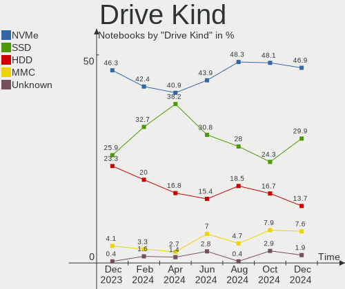
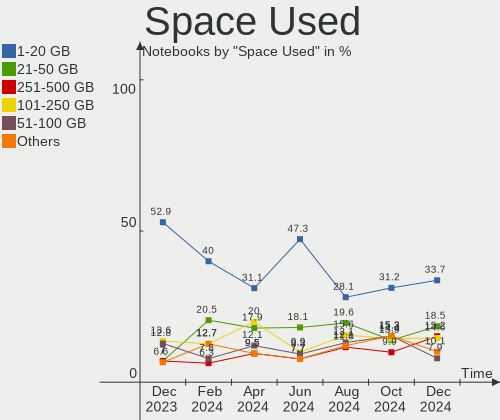
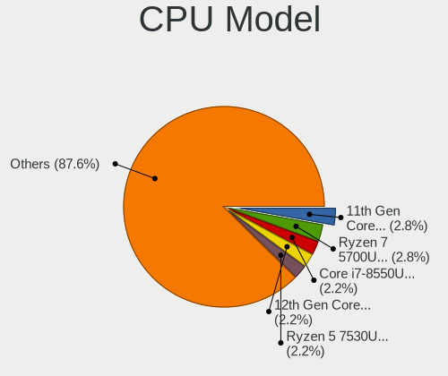
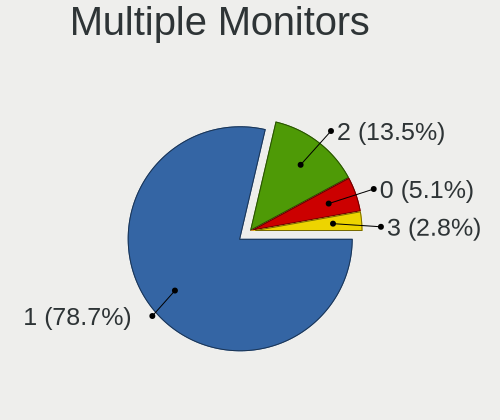
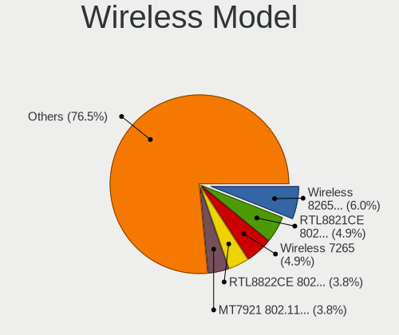

Debian Hardware Trends (Notebook)
---------------------------------

A project to identify most popular hardware characteristics and track their change
over time based on data collected by Debian users at https://Linux-Hardware.org.

Anyone can contribute to the study by uploading probes of their computers by
the [hw-probe](https://github.com/linuxhw/hw-probe) tool:

    sudo -E hw-probe -all -upload

Full-feature report is available here: https://linux-hardware.org/?view=trends&formfactor=notebook

Period: Dec, 2020.

Contents
--------

- [ OS                       ](#os)
- [ OS Family                ](#os-family)
- [ Kernel                   ](#kernel)
- [ Kernel Family            ](#kernel-family)
- [ Kernel Major Ver.        ](#kernel-major-ver)
- [ Arch                     ](#arch)
- [ DE                       ](#de)
- [ Display Server           ](#display-server)
- [ Display Manager          ](#display-manager)
- [ OS Lang                  ](#os-lang)
- [ Boot Mode                ](#boot-mode)
- [ Filesystem               ](#filesystem)
- [ Part. scheme             ](#part-scheme)
- [ Dual Boot with Linux/BSD ](#dual-boot-with-linux/bsd)
- [ Dual Boot (Win)          ](#dual-boot-win)
- [ Country                  ](#country)
- [ City                     ](#city)
- [ Vendor                   ](#vendor)
- [ Model                    ](#model)
- [ Model Family             ](#model-family)
- [ MFG Year                 ](#mfg-year)
- [ Form Factor              ](#form-factor)
- [ Secure Boot              ](#secure-boot)
- [ Coreboot                 ](#coreboot)
- [ RAM Size                 ](#ram-size)
- [ RAM Used                 ](#ram-used)
- [ Has CD-ROM               ](#has-cd-rom)
- [ Total Drives             ](#total-drives)
- [ Has Ethernet             ](#has-ethernet)
- [ Drive Vendor             ](#drive-vendor)
- [ Drive Model              ](#drive-model)
- [ HDD Vendor               ](#hdd-vendor)
- [ SSD Vendor               ](#ssd-vendor)
- [ Drive Kind               ](#drive-kind)
- [ Drive Connector          ](#drive-connector)
- [ Drive Size               ](#drive-size)
- [ Space Total              ](#space-total)
- [ Space Used               ](#space-used)
- [ Malfunc. Drives          ](#malfunc-drives)
- [ Malfunc. Drive Vendor    ](#malfunc-drive-vendor)
- [ Malfunc. HDD Vendor      ](#malfunc-hdd-vendor)
- [ Malfunc. Drive Kind      ](#malfunc-drive-kind)
- [ Failed Drives            ](#failed-drives)
- [ Failed Drive Vendor      ](#failed-drive-vendor)
- [ Drive Status             ](#drive-status)
- [ Storage Vendor           ](#storage-vendor)
- [ Storage Model            ](#storage-model)
- [ Storage Kind             ](#storage-kind)
- [ CPU Vendor               ](#cpu-vendor)
- [ CPU Model                ](#cpu-model)
- [ CPU Model Family         ](#cpu-model-family)
- [ CPU Cores                ](#cpu-cores)
- [ CPU Sockets              ](#cpu-sockets)
- [ CPU Threads              ](#cpu-threads)
- [ CPU Op-Modes             ](#cpu-op-modes)
- [ CPU Microcode            ](#cpu-microcode)
- [ CPU Microarch            ](#cpu-microarch)
- [ GPU Vendor               ](#gpu-vendor)
- [ GPU Model                ](#gpu-model)
- [ GPU Combo                ](#gpu-combo)
- [ GPU Driver               ](#gpu-driver)
- [ GPU Memory               ](#gpu-memory)
- [ Monitor Vendor           ](#monitor-vendor)
- [ Monitor Model            ](#monitor-model)
- [ Monitor Resolution       ](#monitor-resolution)
- [ Monitor Diagonal         ](#monitor-diagonal)
- [ Monitor Width            ](#monitor-width)
- [ Aspect Ratio             ](#aspect-ratio)
- [ Monitor Area             ](#monitor-area)
- [ Pixel Density            ](#pixel-density)
- [ Multiple Monitors        ](#multiple-monitors)
- [ Net Controller Vendor    ](#net-controller-vendor)
- [ Net Controller Model     ](#net-controller-model)
- [ Wireless Vendor          ](#wireless-vendor)
- [ Wireless Model           ](#wireless-model)
- [ Ethernet Vendor          ](#ethernet-vendor)
- [ Ethernet Model           ](#ethernet-model)
- [ Net Controller Kind      ](#net-controller-kind)
- [ Used Controller          ](#used-controller)
- [ NICs                     ](#nics)
- [ Memory Vendor            ](#memory-vendor)
- [ Memory Model             ](#memory-model)
- [ Memory Kind              ](#memory-kind)
- [ Memory Form Factor       ](#memory-form-factor)
- [ Memory Size              ](#memory-size)
- [ Memory Speed             ](#memory-speed)
- [ Sound Vendor             ](#sound-vendor)
- [ Sound Model              ](#sound-model)
- [ Camera Vendor            ](#camera-vendor)
- [ Camera Model             ](#camera-model)
- [ Fingerprint Vendor       ](#fingerprint-vendor)
- [ Fingerprint Model        ](#fingerprint-model)
- [ Chipcard Vendor          ](#chipcard-vendor)
- [ Chipcard Model           ](#chipcard-model)
- [ Printer Vendor           ](#printer-vendor)
- [ Printer Model            ](#printer-model)
- [ Scanner Vendor           ](#scanner-vendor)
- [ Scanner Model            ](#scanner-model)
- [ Bluetooth Vendor         ](#bluetooth-vendor)
- [ Bluetooth Model          ](#bluetooth-model)
- [ Unsupported Devices      ](#unsupported-devices)
- [ Unsupported Device Types ](#unsupported-device-types)

OS
--

Installed operating systems

| Name            | Notebooks | Percent |
|-----------------|-----------|---------|
| Debian 10       | 50        | 61.73%  |
| Debian Testing  | 17        | 20.99%  |
| Debian          | 9         | 11.11%  |
| Debian Unstable | 3         | 3.7%    |
| Debian 9.13     | 1         | 1.23%   |
| Debian 9.12     | 1         | 1.23%   |

OS Family
---------

OS without a version

| Name   | Notebooks | Percent |
|--------|-----------|---------|
| Debian | 81        | 100%    |

Kernel
------

Version of the Linux kernel

| Version                                     | Notebooks | Percent |
|---------------------------------------------|-----------|---------|
| 4.19.0-13-amd64                             | 29        | 35.8%   |
| 5.9.0-4-amd64                               | 13        | 16.05%  |
| 4.19.0-12-amd64                             | 11        | 13.58%  |
| 5.9.0-5-amd64                               | 7         | 8.64%   |
| 5.9.0-3-amd64                               | 2         | 2.47%   |
| 4.19.0-9-amd64                              | 2         | 2.47%   |
| 5.9.15-xanmod1                              | 1         | 1.23%   |
| 5.9.14-xanmod1                              | 1         | 1.23%   |
| 5.9.11-amd64                                | 1         | 1.23%   |
| 5.9.0-4-686-pae                             | 1         | 1.23%   |
| 5.9.0-2-amd64                               | 1         | 1.23%   |
| 5.9.0-0.bpo.2-amd64                         | 1         | 1.23%   |
| 5.8.0-3-amd64                               | 1         | 1.23%   |
| 5.8.0-0.bpo.2-amd64                         | 1         | 1.23%   |
| 5.7.0-1-amd64                               | 1         | 1.23%   |
| 5.4.0-8.2-liquorix-amd64                    | 1         | 1.23%   |
| 5.10.0-rc6-hpdv2k-00060-g34816d20f173-dirty | 1         | 1.23%   |
| 4.9.0-8-amd64                               | 1         | 1.23%   |
| 4.9.0-14-amd64                              | 1         | 1.23%   |
| 4.9.0-11-amd64                              | 1         | 1.23%   |
| 4.19.0-6-amd64                              | 1         | 1.23%   |
| 4.19.0-12-lzk-bl-amd64                      | 1         | 1.23%   |
| 4.19.0-11-amd64                             | 1         | 1.23%   |

Kernel Family
-------------

Linux kernel without a distro release

| Version | Notebooks | Percent |
|---------|-----------|---------|
| 4.19.0  | 45        | 55.56%  |
| 5.9.0   | 25        | 30.86%  |
| 4.9.0   | 3         | 3.7%    |
| 5.8.0   | 2         | 2.47%   |
| 5.9.15  | 1         | 1.23%   |
| 5.9.14  | 1         | 1.23%   |
| 5.9.11  | 1         | 1.23%   |
| 5.7.0   | 1         | 1.23%   |
| 5.4.0   | 1         | 1.23%   |
| 5.10.0  | 1         | 1.23%   |

Kernel Major Ver.
-----------------

Linux kernel major version

| Version | Notebooks | Percent |
|---------|-----------|---------|
| 4.19    | 45        | 55.56%  |
| 5.9     | 28        | 34.57%  |
| 4.9     | 3         | 3.7%    |
| 5.8     | 2         | 2.47%   |
| 5.7     | 1         | 1.23%   |
| 5.4     | 1         | 1.23%   |
| 5.10    | 1         | 1.23%   |

Arch
----

OS architecture (x86_64, i586, etc.)

| Name   | Notebooks | Percent |
|--------|-----------|---------|
| x86_64 | 80        | 98.77%  |
| i686   | 1         | 1.23%   |

DE
--

Desktop Environment

| Name             | Notebooks | Percent |
|------------------|-----------|---------|
| GNOME            | 18        | 22.22%  |
| XFCE             | 12        | 14.81%  |
| KDE              | 12        | 14.81%  |
| KDE5             | 9         | 11.11%  |
| MATE             | 8         | 9.88%   |
| Unknown          | 8         | 9.88%   |
| X-Cinnamon       | 3         | 3.7%    |
| Cinnamon         | 3         | 3.7%    |
| i3               | 2         | 2.47%   |
| LXQt             | 1         | 1.23%   |
| LXDE             | 1         | 1.23%   |
| lightdm-xsession | 1         | 1.23%   |
| GNOME Flashback  | 1         | 1.23%   |
| default          | 1         | 1.23%   |
| Budgie           | 1         | 1.23%   |

Display Server
--------------

X11 or Wayland

| Name    | Notebooks | Percent |
|---------|-----------|---------|
| X11     | 61        | 75.31%  |
| Wayland | 14        | 17.28%  |
| Tty     | 4         | 4.94%   |
| Unknown | 2         | 2.47%   |

Display Manager
---------------

SDDM, LightDM, etc.

| Name    | Notebooks | Percent |
|---------|-----------|---------|
| Unknown | 36        | 44.44%  |
| TDM     | 17        | 20.99%  |
| GDM     | 14        | 17.28%  |
| SDDM    | 12        | 14.81%  |
| LightDM | 1         | 1.23%   |
| GDM3    | 1         | 1.23%   |

OS Lang
-------

Language

| Lang       | Notebooks | Percent |
|------------|-----------|---------|
| en_US      | 23        | 28.4%   |
| de_DE      | 12        | 14.81%  |
| fr_FR      | 7         | 8.64%   |
| es_ES      | 6         | 7.41%   |
| Unknown    | 4         | 4.94%   |
| ru_RU      | 3         | 3.7%    |
| it_IT      | 3         | 3.7%    |
| en_GB      | 3         | 3.7%    |
| pt_PT      | 2         | 2.47%   |
| pt_BR      | 2         | 2.47%   |
| en_US.utf8 | 2         | 2.47%   |
| en_CA      | 2         | 2.47%   |
| zh_TW      | 1         | 1.23%   |
| tr_TR      | 1         | 1.23%   |
| sk_SK      | 1         | 1.23%   |
| ro_RO      | 1         | 1.23%   |
| nl_BE      | 1         | 1.23%   |
| hu_HU      | 1         | 1.23%   |
| fr_CH      | 1         | 1.23%   |
| es_MX      | 1         | 1.23%   |
| es_CL      | 1         | 1.23%   |
| en_IN      | 1         | 1.23%   |
| en_DK      | 1         | 1.23%   |
| en_AU      | 1         | 1.23%   |

Boot Mode
---------

EFI or BIOS

| Mode | Notebooks | Percent |
|------|-----------|---------|
| EFI  | 41        | 50.62%  |
| BIOS | 40        | 49.38%  |

Filesystem
----------

Type of filesystem

| Type  | Notebooks | Percent |
|-------|-----------|---------|
| Ext4  | 78        | 96.3%   |
| Xfs   | 1         | 1.23%   |
| Ext3  | 1         | 1.23%   |
| Btrfs | 1         | 1.23%   |

Part. scheme
------------

Scheme of partitioning

| Type    | Notebooks | Percent |
|---------|-----------|---------|
| GPT     | 40        | 49.38%  |
| Unknown | 32        | 39.51%  |
| MBR     | 9         | 11.11%  |

Dual Boot with Linux/BSD
------------------------

Hosting more than one Linux/BSD

| Dual boot | Notebooks | Percent |
|-----------|-----------|---------|
| No        | 76        | 93.83%  |
| Yes       | 5         | 6.17%   |

Dual Boot (Win)
---------------

Hosting Linux and Windows

| Dual boot | Notebooks | Percent |
|-----------|-----------|---------|
| No        | 62        | 76.54%  |
| Yes       | 19        | 23.46%  |

Country
-------

Geographic location (country)

| Country        | Notebooks | Percent |
|----------------|-----------|---------|
| Germany        | 13        | 16.05%  |
| USA            | 10        | 12.35%  |
| France         | 8         | 9.88%   |
| Spain          | 7         | 8.64%   |
| Russia         | 5         | 6.17%   |
| Italy          | 4         | 4.94%   |
| Switzerland    | 3         | 3.7%    |
| Portugal       | 2         | 2.47%   |
| India          | 2         | 2.47%   |
| Denmark        | 2         | 2.47%   |
| Chile          | 2         | 2.47%   |
| Canada         | 2         | 2.47%   |
| Brazil         | 2         | 2.47%   |
| UK             | 1         | 1.23%   |
| Turkey         | 1         | 1.23%   |
| Thailand       | 1         | 1.23%   |
| Taiwan         | 1         | 1.23%   |
| Slovakia       | 1         | 1.23%   |
| Romania        | 1         | 1.23%   |
| Norway         | 1         | 1.23%   |
| Nepal          | 1         | 1.23%   |
| Mexico         | 1         | 1.23%   |
| Japan          | 1         | 1.23%   |
| Iran           | 1         | 1.23%   |
| Hungary        | 1         | 1.23%   |
| Greece         | 1         | 1.23%   |
| Finland        | 1         | 1.23%   |
| Czech Republic | 1         | 1.23%   |
| Croatia        | 1         | 1.23%   |
| China          | 1         | 1.23%   |
| Belgium        | 1         | 1.23%   |
| Australia      | 1         | 1.23%   |

City
----

Geographic location (city)

| City               | Notebooks | Percent |
|--------------------|-----------|---------|
| Moscow             | 3         | 3.7%    |
| Wuppertal          | 2         | 2.47%   |
| Oberwil            | 2         | 2.47%   |
| New York           | 2         | 2.47%   |
| Fruitland          | 2         | 2.47%   |
| Zaragoza           | 1         | 1.23%   |
| Wangen             | 1         | 1.23%   |
| Vigo               | 1         | 1.23%   |
| Vevey              | 1         | 1.23%   |
| Verona             | 1         | 1.23%   |
| Varaždin          | 1         | 1.23%   |
| Tweed Heads        | 1         | 1.23%   |
| Trebišov          | 1         | 1.23%   |
| Tellico Plains     | 1         | 1.23%   |
| Taipei             | 1         | 1.23%   |
| Syntagma           | 1         | 1.23%   |
| Stuttgart          | 1         | 1.23%   |
| St Petersburg      | 1         | 1.23%   |
| Silver Spring      | 1         | 1.23%   |
| Siegburg           | 1         | 1.23%   |
| Shenzhen           | 1         | 1.23%   |
| Santiago           | 1         | 1.23%   |
| Saint-Ouen         | 1         | 1.23%   |
| Saint James        | 1         | 1.23%   |
| Sabadell           | 1         | 1.23%   |
| Roubaix            | 1         | 1.23%   |
| Rome               | 1         | 1.23%   |
| Rio de Janeiro     | 1         | 1.23%   |
| Puymirol           | 1         | 1.23%   |
| Pattaya            | 1         | 1.23%   |
| Parla              | 1         | 1.23%   |
| Padova             | 1         | 1.23%   |
| Oxford             | 1         | 1.23%   |
| Ostrava            | 1         | 1.23%   |
| Ny Norup           | 1         | 1.23%   |
| Novosibirsk        | 1         | 1.23%   |
| North Royalton     | 1         | 1.23%   |
| Nivala             | 1         | 1.23%   |
| Muenster-Sarmsheim | 1         | 1.23%   |
| Mougins            | 1         | 1.23%   |
| Mississauga        | 1         | 1.23%   |
| Milan              | 1         | 1.23%   |
| Mennecy            | 1         | 1.23%   |
| Madrid             | 1         | 1.23%   |
| Lisbon             | 1         | 1.23%   |
| Le Mans            | 1         | 1.23%   |
| Kathmandu          | 1         | 1.23%   |
| Istanbul           | 1         | 1.23%   |
| Ingenio            | 1         | 1.23%   |
| Hoshiarpur         | 1         | 1.23%   |
| Honcho             | 1         | 1.23%   |
| Holstebro          | 1         | 1.23%   |
| Heinsberg          | 1         | 1.23%   |
| Hamburg            | 1         | 1.23%   |
| Grasberg           | 1         | 1.23%   |
| Fredrikstad        | 1         | 1.23%   |
| Eppelheim          | 1         | 1.23%   |
| Derecske           | 1         | 1.23%   |
| Cuernavaca         | 1         | 1.23%   |
| Courbevoie         | 1         | 1.23%   |

Vendor
------

Motherboard manufacturer

| Name                | Notebooks | Percent |
|---------------------|-----------|---------|
| Lenovo              | 28        | 34.57%  |
| Hewlett-Packard     | 16        | 19.75%  |
| Dell                | 9         | 11.11%  |
| ASUSTek Computer    | 9         | 11.11%  |
| Acer                | 6         | 7.41%   |
| Toshiba             | 2         | 2.47%   |
| HUAWEI              | 2         | 2.47%   |
| Unknown             | 2         | 2.47%   |
| TUXEDO              | 1         | 1.23%   |
| Samsung Electronics | 1         | 1.23%   |
| Razer               | 1         | 1.23%   |
| LG Electronics      | 1         | 1.23%   |
| HKC                 | 1         | 1.23%   |
| HASEE Computer      | 1         | 1.23%   |
| Apple               | 1         | 1.23%   |

Model
-----

Motherboard model

| Name                                       | Notebooks | Percent |
|--------------------------------------------|-----------|---------|
| HUAWEI BOHK-WAX9X                          | 2         | 2.47%   |
| Unknown                                    | 2         | 2.47%   |
| TUXEDO BC1510 1710                         | 1         | 1.23%   |
| Toshiba TECRA R840                         | 1         | 1.23%   |
| Toshiba QOSMIO X500                        | 1         | 1.23%   |
| Samsung 700T1C                             | 1         | 1.23%   |
| Razer Blade Stealth                        | 1         | 1.23%   |
| LG 17Z990-R.AAS8U1                         | 1         | 1.23%   |
| Lenovo Y50-70 20378                        | 1         | 1.23%   |
| Lenovo ThinkPad X1 Carbon Gen 8 20U90003GE | 1         | 1.23%   |
| Lenovo ThinkPad T60 1951WJ1                | 1         | 1.23%   |
| Lenovo ThinkPad T510 4384GEG               | 1         | 1.23%   |
| Lenovo ThinkPad T500 20828YG               | 1         | 1.23%   |
| Lenovo ThinkPad T495 20NJCTO1WW            | 1         | 1.23%   |
| Lenovo ThinkPad T490s 20NYS7K900           | 1         | 1.23%   |
| Lenovo ThinkPad T490s 20NX001PMD           | 1         | 1.23%   |
| Lenovo ThinkPad T490 20N2000FIX            | 1         | 1.23%   |
| Lenovo ThinkPad T460s 20FAS3KA00           | 1         | 1.23%   |
| Lenovo ThinkPad T460 20FMS08Q1B            | 1         | 1.23%   |
| Lenovo ThinkPad T450s 20BWS01300           | 1         | 1.23%   |
| Lenovo ThinkPad T440s 20ARS30Q00           | 1         | 1.23%   |
| Lenovo ThinkPad T400 6475WJE               | 1         | 1.23%   |
| Lenovo ThinkPad T14s Gen 1 20UJ001CMX      | 1         | 1.23%   |
| Lenovo ThinkPad T14 Gen 1 20UDCTO1WW       | 1         | 1.23%   |
| Lenovo ThinkPad S1 Yoga 20CD0038MN         | 1         | 1.23%   |
| Lenovo ThinkPad E590 20NB0012RT            | 1         | 1.23%   |
| Lenovo ThinkPad 11e 20DAS0PS00             | 1         | 1.23%   |
| Lenovo ThinkBook 13s-IWL 20R9              | 1         | 1.23%   |
| Lenovo K2450 20243                         | 1         | 1.23%   |
| Lenovo IdeaPad Z400 20201                  | 1         | 1.23%   |
| Lenovo IdeaPad Y560                        | 1         | 1.23%   |
| Lenovo IdeaPad 5 15ARE05 81YQ              | 1         | 1.23%   |
| Lenovo IdeaPad 320-15IKB 81BT              | 1         | 1.23%   |
| Lenovo IdeaPad 110-15IBR 80T7              | 1         | 1.23%   |
| Lenovo G50-80 80E5                         | 1         | 1.23%   |
| Lenovo G470 4328                           | 1         | 1.23%   |
| HKC N14DC                                  | 1         | 1.23%   |
| HP ProBook 4330s                           | 1         | 1.23%   |
| HP Pavilion Gaming Laptop 15-dk0xxx        | 1         | 1.23%   |
| HP Pavilion dv2000 (RN081EA#UUW)           | 1         | 1.23%   |
| HP NOTEBOOK                                | 1         | 1.23%   |
| HP Laptop 17-ca1xxx                        | 1         | 1.23%   |
| HP Laptop 17-by1xxx                        | 1         | 1.23%   |
| HP Laptop 17-by0xxx                        | 1         | 1.23%   |
| HP Laptop 15-ra0xx                         | 1         | 1.23%   |
| HP Laptop 15-bs0xx                         | 1         | 1.23%   |
| HP EliteBook 850 G7 Notebook PC            | 1         | 1.23%   |
| HP EliteBook 840 G4                        | 1         | 1.23%   |
| HP EliteBook 2530p                         | 1         | 1.23%   |
| HP 250 G7 Notebook PC                      | 1         | 1.23%   |
| HP 2000                                    | 1         | 1.23%   |
| HP 15 Notebook PC                          | 1         | 1.23%   |
| HP 15                                      | 1         | 1.23%   |
| HASEE PF4WN2F                              | 1         | 1.23%   |
| Dell XPS L702X                             | 1         | 1.23%   |
| Dell Vostro 3500                           | 1         | 1.23%   |
| Dell Latitude E7470                        | 1         | 1.23%   |
| Dell Latitude E7270                        | 1         | 1.23%   |
| Dell Latitude 7490                         | 1         | 1.23%   |
| Dell Latitude 5410                         | 1         | 1.23%   |

Model Family
------------

Motherboard model prefix

| Name               | Notebooks | Percent |
|--------------------|-----------|---------|
| Lenovo ThinkPad    | 18        | 22.22%  |
| Lenovo IdeaPad     | 5         | 6.17%   |
| HP Laptop          | 5         | 6.17%   |
| Dell Latitude      | 5         | 6.17%   |
| Acer Aspire        | 5         | 6.17%   |
| HP EliteBook       | 3         | 3.7%    |
| HUAWEI BOHK-WAX9X  | 2         | 2.47%   |
| HP Pavilion        | 2         | 2.47%   |
| HP 15              | 2         | 2.47%   |
| Dell Inspiron      | 2         | 2.47%   |
| Unknown            | 2         | 2.47%   |
| TUXEDO BC1510      | 1         | 1.23%   |
| Toshiba TECRA      | 1         | 1.23%   |
| Toshiba QOSMIO     | 1         | 1.23%   |
| Samsung 700T1C     | 1         | 1.23%   |
| Razer Blade        | 1         | 1.23%   |
| LG 17Z990-R.AAS8U1 | 1         | 1.23%   |
| Lenovo Y50-70      | 1         | 1.23%   |
| Lenovo ThinkBook   | 1         | 1.23%   |
| Lenovo K2450       | 1         | 1.23%   |
| Lenovo G50-80      | 1         | 1.23%   |
| Lenovo G470        | 1         | 1.23%   |
| HKC N14DC          | 1         | 1.23%   |
| HP ProBook         | 1         | 1.23%   |
| HP NOTEBOOK        | 1         | 1.23%   |
| HP 250             | 1         | 1.23%   |
| HP 2000            | 1         | 1.23%   |
| HASEE PF4WN2F      | 1         | 1.23%   |
| Dell XPS           | 1         | 1.23%   |
| Dell Vostro        | 1         | 1.23%   |
| ASUS ZenBook       | 1         | 1.23%   |
| ASUS X555UJ        | 1         | 1.23%   |
| ASUS X550CA        | 1         | 1.23%   |
| ASUS X540LJ        | 1         | 1.23%   |
| ASUS VivoBook      | 1         | 1.23%   |
| ASUS UX303LN       | 1         | 1.23%   |
| ASUS U47A          | 1         | 1.23%   |
| ASUS U36SD         | 1         | 1.23%   |
| ASUS PU403UA       | 1         | 1.23%   |
| Apple MacBook5     | 1         | 1.23%   |
| Acer Nitro         | 1         | 1.23%   |

MFG Year
--------

Motherboard manufacture year

| Year    | Notebooks | Percent |
|---------|-----------|---------|
| 2020    | 22        | 27.16%  |
| 2019    | 12        | 14.81%  |
| 2014    | 9         | 11.11%  |
| 2017    | 7         | 8.64%   |
| 2016    | 5         | 6.17%   |
| 2013    | 5         | 6.17%   |
| 2015    | 4         | 4.94%   |
| 2012    | 4         | 4.94%   |
| 2010    | 3         | 3.7%    |
| 2009    | 3         | 3.7%    |
| 2018    | 2         | 2.47%   |
| 2011    | 2         | 2.47%   |
| 2008    | 1         | 1.23%   |
| 2006    | 1         | 1.23%   |
| Unknown | 1         | 1.23%   |

Form Factor
-----------

Physical design of the computer

| Name     | Notebooks | Percent |
|----------|-----------|---------|
| Notebook | 81        | 100%    |

Secure Boot
-----------

Enabled or disabled

| State    | Notebooks | Percent |
|----------|-----------|---------|
| Disabled | 71        | 87.65%  |
| Enabled  | 10        | 12.35%  |

Coreboot
--------

Have coreboot on board

| Used | Notebooks | Percent |
|------|-----------|---------|
| No   | 80        | 98.77%  |
| Yes  | 1         | 1.23%   |

RAM Size
--------

Total RAM memory

| Size in GB | Notebooks | Percent |
|------------|-----------|---------|
| 4.01-8.0   | 22        | 27.16%  |
| 8.01-16.0  | 18        | 22.22%  |
| 3.01-4.0   | 16        | 19.75%  |
| 16.01-24.0 | 16        | 19.75%  |
| 32.01-64.0 | 4         | 4.94%   |
| 1.01-2.0   | 4         | 4.94%   |
| 2.01-3.0   | 1         | 1.23%   |

RAM Used
--------

Used RAM memory

| Used GB   | Notebooks | Percent |
|-----------|-----------|---------|
| 2.01-3.0  | 27        | 33.33%  |
| 1.01-2.0  | 25        | 30.86%  |
| 4.01-8.0  | 9         | 11.11%  |
| 3.01-4.0  | 8         | 9.88%   |
| 0.51-1.0  | 7         | 8.64%   |
| 8.01-16.0 | 4         | 4.94%   |
| 0.01-0.5  | 1         | 1.23%   |

Has CD-ROM
----------

Has CD-ROM on board

| Presented | Notebooks | Percent |
|-----------|-----------|---------|
| No        | 51        | 62.96%  |
| Yes       | 30        | 37.04%  |

Total Drives
------------

Number of drives on board

| Drives | Notebooks | Percent |
|--------|-----------|---------|
| 1      | 67        | 82.72%  |
| 2      | 11        | 13.58%  |
| 3      | 3         | 3.7%    |

Has Ethernet
------------

Has Ethernet on board

| Presented | Notebooks | Percent |
|-----------|-----------|---------|
| Yes       | 70        | 86.42%  |
| No        | 11        | 13.58%  |

Drive Vendor
------------

Hard drive vendors

| Vendor              | Notebooks | Drives | Percent |
|---------------------|-----------|--------|---------|
| Samsung Electronics | 19        | 20     | 19.79%  |
| WDC                 | 14        | 15     | 14.58%  |
| Toshiba             | 10        | 10     | 10.42%  |
| Seagate             | 10        | 10     | 10.42%  |
| Kingston            | 8         | 9      | 8.33%   |
| Unknown             | 7         | 7      | 7.29%   |
| Crucial             | 5         | 5      | 5.21%   |
| SK Hynix            | 4         | 4      | 4.17%   |
| SanDisk             | 4         | 4      | 4.17%   |
| Intel               | 3         | 3      | 3.13%   |
| Micron Technology   | 2         | 2      | 2.08%   |
| Hitachi             | 2         | 2      | 2.08%   |
| HGST                | 2         | 2      | 2.08%   |
| SPCC                | 1         | 1      | 1.04%   |
| Phison Electronics  | 1         | 1      | 1.04%   |
| Patriot             | 1         | 2      | 1.04%   |
| ORICO               | 1         | 1      | 1.04%   |
| Jmicron             | 1         | 1      | 1.04%   |
| AMD                 | 1         | 1      | 1.04%   |

Drive Model
-----------

Hard drive models

| Model                                   | Notebooks | Percent |
|-----------------------------------------|-----------|---------|
| Seagate ST1000LM024 HN-M101MBB 1TB      | 3         | 3.03%   |
| Unknown MMC Card  64GB                  | 2         | 2.02%   |
| Unknown MMC Card  32GB                  | 2         | 2.02%   |
| Toshiba MQ01ABD100 1TB                  | 2         | 2.02%   |
| Toshiba MQ01ABD050 500GB                | 2         | 2.02%   |
| Seagate ST500LT012-1DG142 500GB         | 2         | 2.02%   |
| Samsung SSD 860 EVO 250GB               | 2         | 2.02%   |
| Samsung SSD 850 EVO 1TB                 | 2         | 2.02%   |
| Samsung NVMe SSD Drive 512GB            | 2         | 2.02%   |
| Kingston SA400S37240G 240GB SSD         | 2         | 2.02%   |
| HGST HTS545050A7E680 500GB              | 2         | 2.02%   |
| Crucial CT500MX500SSD1 500GB            | 2         | 2.02%   |
| WDC WDS240G2G0A-00JH30 240GB SSD        | 1         | 1.01%   |
| WDC WDS100T2B0A-00SM50 1TB SSD          | 1         | 1.01%   |
| WDC WD5000LPVX-80V0TT0 500GB            | 1         | 1.01%   |
| WDC WD5000LPVT-60G33T0 500GB            | 1         | 1.01%   |
| WDC WD5000LPCX-24VHAT0 500GB            | 1         | 1.01%   |
| WDC WD2500BEVT-60A23T0 250GB            | 1         | 1.01%   |
| WDC WD10SPZX-60Z10T0 1TB                | 1         | 1.01%   |
| WDC WD10SPZX-21Z10T0 1TB                | 1         | 1.01%   |
| WDC WD10S21X-24R1BT0-SSHD-8GB           | 1         | 1.01%   |
| WDC WD10JPVX-60JC3T1 1TB                | 1         | 1.01%   |
| WDC PC SN730 SDBPNTY-256G-1027 256GB    | 1         | 1.01%   |
| WDC PC SN720 SDAQNTW-512G-1001 512GB    | 1         | 1.01%   |
| WDC PC SN530 SDBPNPZ-512G-1006 512GB    | 1         | 1.01%   |
| WDC PC SN520 SDAPNUW-256G-1006 256GB    | 1         | 1.01%   |
| WDC PC SN520 SDAPMUW-512G-1101 512GB    | 1         | 1.01%   |
| Unknown SD/MMC/MS PRO 128GB             | 1         | 1.01%   |
| Unknown SA64G  64GB                     | 1         | 1.01%   |
| Unknown MMC Card  7GB                   | 1         | 1.01%   |
| Toshiba THNSN5512GPUK NVMe 512GB        | 1         | 1.01%   |
| Toshiba MQ01ACF050 500GB                | 1         | 1.01%   |
| Toshiba MQ01ABF050 500GB                | 1         | 1.01%   |
| Toshiba MK3252GSX 320GB                 | 1         | 1.01%   |
| Toshiba MK1629GSG 160GB                 | 1         | 1.01%   |
| Toshiba KBG40ZNT512G MEMORY 512GB       | 1         | 1.01%   |
| SPCC Solid State Disk 128GB             | 1         | 1.01%   |
| SK Hynix PC611 NVMe 1TB                 | 1         | 1.01%   |
| SK Hynix HFM256GDHTNG-8510B 256GB       | 1         | 1.01%   |
| SK Hynix HCG8e  64GB                    | 1         | 1.01%   |
| SK Hynix BC501 HFM512GDJTNG-8310A 512GB | 1         | 1.01%   |
| Seagate ST9500325AS 500GB               | 1         | 1.01%   |
| Seagate ST9160412AS 160GB               | 1         | 1.01%   |
| Seagate ST500LM012 HN-M500MBB 500GB     | 1         | 1.01%   |
| Seagate ST2000LM015-2E8174 2TB          | 1         | 1.01%   |
| Seagate ST1000LM049-2GH172 1TB          | 1         | 1.01%   |
| SanDisk SSD PLUS 120GB                  | 1         | 1.01%   |
| SanDisk SDSSDA480G 480GB                | 1         | 1.01%   |
| SanDisk SD6SB1M256G1002 256GB SSD       | 1         | 1.01%   |
| SanDisk DF4032  32GB                    | 1         | 1.01%   |
| Samsung SSD 980 PRO 250GB               | 1         | 1.01%   |
| Samsung SSD 970 EVO 1TB                 | 1         | 1.01%   |
| Samsung SSD 860 EVO M.2 2TB             | 1         | 1.01%   |
| Samsung SSD 860 EVO 1TB                 | 1         | 1.01%   |
| Samsung NVMe SSD Drive 256GB            | 1         | 1.01%   |
| Samsung NVMe SSD Drive 1TB              | 1         | 1.01%   |
| Samsung MZVLW256HEHP-000H1 256GB        | 1         | 1.01%   |
| Samsung MZVLB512HBJQ-000L7 512GB        | 1         | 1.01%   |
| Samsung MZVLB256HBHQ-000L7 256GB        | 1         | 1.01%   |
| Samsung MZVLB256HBHQ-00000 256GB        | 1         | 1.01%   |

HDD Vendor
----------

Hard disk drive vendors

| Vendor  | Notebooks | Drives | Percent |
|---------|-----------|--------|---------|
| Seagate | 10        | 10     | 33.33%  |
| WDC     | 8         | 8      | 26.67%  |
| Toshiba | 8         | 8      | 26.67%  |
| Hitachi | 2         | 2      | 6.67%   |
| HGST    | 2         | 2      | 6.67%   |

SSD Vendor
----------

Solid state drive vendors

| Vendor              | Notebooks | Drives | Percent |
|---------------------|-----------|--------|---------|
| Kingston            | 8         | 9      | 25%     |
| Samsung Electronics | 7         | 7      | 21.88%  |
| Crucial             | 5         | 5      | 15.63%  |
| SanDisk             | 3         | 3      | 9.38%   |
| WDC                 | 2         | 2      | 6.25%   |
| Intel               | 2         | 2      | 6.25%   |
| SPCC                | 1         | 1      | 3.13%   |
| Patriot             | 1         | 2      | 3.13%   |
| ORICO               | 1         | 1      | 3.13%   |
| Micron Technology   | 1         | 1      | 3.13%   |
| AMD                 | 1         | 1      | 3.13%   |

Drive Kind
----------

HDD or SSD

| Kind    | Notebooks | Drives | Percent |
|---------|-----------|--------|---------|
| SSD     | 31        | 34     | 32.29%  |
| HDD     | 29        | 30     | 30.21%  |
| NVMe    | 26        | 26     | 27.08%  |
| MMC     | 8         | 8      | 8.33%   |
| Unknown | 2         | 2      | 2.08%   |

Drive Connector
---------------

SATA, SAS, NVMe, etc.

| Type | Notebooks | Drives | Percent |
|------|-----------|--------|---------|
| SATA | 55        | 64     | 60.44%  |
| NVMe | 26        | 26     | 28.57%  |
| MMC  | 8         | 8      | 8.79%   |
| SAS  | 2         | 2      | 2.2%    |

Drive Size
----------

Size of hard drive

| Size in TB | Notebooks | Drives | Percent |
|------------|-----------|--------|---------|
| 0.01-0.5   | 38        | 44     | 65.52%  |
| 0.51-1.0   | 18        | 18     | 31.03%  |
| 1.01-2.0   | 2         | 2      | 3.45%   |

Space Total
-----------

Amount of disk space available on the file system

| Size in GB | Notebooks | Percent |
|------------|-----------|---------|
| 101-250    | 29        | 35.8%   |
| 251-500    | 24        | 29.63%  |
| 501-1000   | 9         | 11.11%  |
| 1001-2000  | 5         | 6.17%   |
| 51-100     | 5         | 6.17%   |
| Unknown    | 5         | 6.17%   |
| 21-50      | 3         | 3.7%    |
| 2001-3000  | 1         | 1.23%   |

Space Used
----------

Amount of used disk space

| Used GB   | Notebooks | Percent |
|-----------|-----------|---------|
| 1-20      | 30        | 37.04%  |
| 101-250   | 16        | 19.75%  |
| 21-50     | 9         | 11.11%  |
| 51-100    | 9         | 11.11%  |
| 251-500   | 7         | 8.64%   |
| Unknown   | 5         | 6.17%   |
| 501-1000  | 4         | 4.94%   |
| 1001-2000 | 1         | 1.23%   |

Malfunc. Drives
---------------

Drive models with a malfunction

| Model                          | Notebooks | Drives | Percent |
|--------------------------------|-----------|--------|---------|
| WDC WD2500BEVT-60A23T0 250GB   | 1         | 1      | 20%     |
| Toshiba MQ01ACF050 500GB       | 1         | 1      | 20%     |
| Seagate ST9160412AS 160GB      | 1         | 1      | 20%     |
| SanDisk SDSSDA480G 480GB       | 1         | 1      | 20%     |
| Intel SSDSC2KF256H6 SATA 256GB | 1         | 1      | 20%     |

Malfunc. Drive Vendor
---------------------

Vendors of faulty drives

| Vendor  | Notebooks | Drives | Percent |
|---------|-----------|--------|---------|
| WDC     | 1         | 1      | 20%     |
| Toshiba | 1         | 1      | 20%     |
| Seagate | 1         | 1      | 20%     |
| SanDisk | 1         | 1      | 20%     |
| Intel   | 1         | 1      | 20%     |

Malfunc. HDD Vendor
-------------------

Vendors of faulty HDD drives

| Vendor  | Notebooks | Drives | Percent |
|---------|-----------|--------|---------|
| WDC     | 1         | 1      | 33.33%  |
| Toshiba | 1         | 1      | 33.33%  |
| Seagate | 1         | 1      | 33.33%  |

Malfunc. Drive Kind
-------------------

Kinds of faulty drives

| Kind | Notebooks | Drives | Percent |
|------|-----------|--------|---------|
| HDD  | 3         | 3      | 60%     |
| SSD  | 2         | 2      | 40%     |

Failed Drives
-------------

Failed drive models

Zero info for selected period =(

Failed Drive Vendor
-------------------

Failed drive vendors

Zero info for selected period =(

Drive Status
------------

Number of failed and malfunc. drives

| Status   | Notebooks | Drives | Percent |
|----------|-----------|--------|---------|
| Works    | 43        | 48     | 51.19%  |
| Detected | 36        | 47     | 42.86%  |
| Malfunc  | 5         | 5      | 5.95%   |

Storage Vendor
--------------

Storage controller vendors

| Vendor                       | Notebooks | Percent |
|------------------------------|-----------|---------|
| Intel                        | 56        | 64.37%  |
| Samsung Electronics          | 13        | 14.94%  |
| Sandisk                      | 5         | 5.75%   |
| AMD                          | 4         | 4.6%    |
| SK Hynix                     | 3         | 3.45%   |
| Nvidia                       | 2         | 2.3%    |
| Toshiba America Info Systems | 1         | 1.15%   |
| Phison Electronics           | 1         | 1.15%   |
| Micron Technology            | 1         | 1.15%   |
| KIOXIA                       | 1         | 1.15%   |

Storage Model
-------------

Storage controller models

| Model                                                                                  | Notebooks | Percent |
|----------------------------------------------------------------------------------------|-----------|---------|
| Intel Sunrise Point-LP SATA Controller [AHCI mode]                                     | 13        | 14.29%  |
| Samsung NVMe SSD Controller SM981/PM981/PM983                                          | 8         | 8.79%   |
| Intel 7 Series Chipset Family 6-port SATA Controller [AHCI mode]                       | 6         | 6.59%   |
| Intel Wildcat Point-LP SATA Controller [AHCI Mode]                                     | 5         | 5.49%   |
| Intel 8 Series SATA Controller 1 [AHCI mode]                                           | 5         | 5.49%   |
| Intel 6 Series/C200 Series Chipset Family 6 port Mobile SATA AHCI Controller           | 5         | 5.49%   |
| Intel 82801 Mobile SATA Controller [RAID mode]                                         | 4         | 4.4%    |
| AMD FCH SATA Controller [AHCI mode]                                                    | 4         | 4.4%    |
| Intel Atom/Celeron/Pentium Processor x5-E8000/J3xxx/N3xxx Series SATA Controller       | 3         | 3.3%    |
| Intel 82801IBM/IEM (ICH9M/ICH9M-E) 4 port SATA Controller [AHCI mode]                  | 3         | 3.3%    |
| Intel 5 Series/3400 Series Chipset 6 port SATA AHCI Controller                         | 3         | 3.3%    |
| SK Hynix BC501 NVMe Solid State Drive 512GB                                            | 2         | 2.2%    |
| Samsung NVMe SSD Controller SM961/PM961/SM963                                          | 2         | 2.2%    |
| Samsung NVMe SSD Controller SM951/PM951                                                | 2         | 2.2%    |
| Toshiba America Info Systems XG4 NVMe SSD Controller                                   | 1         | 1.1%    |
| SK Hynix Non-Volatile memory controller                                                | 1         | 1.1%    |
| Sandisk WD Blue SN550 NVMe SSD                                                         | 1         | 1.1%    |
| Sandisk WD Blue SN500 / PC SN520 NVMe SSD                                              | 1         | 1.1%    |
| Sandisk WD Black SN750 / PC SN730 NVMe SSD                                             | 1         | 1.1%    |
| Sandisk WD Black 2018 / PC SN720 NVMe SSD                                              | 1         | 1.1%    |
| Sandisk PC SN520 NVMe SSD                                                              | 1         | 1.1%    |
| Samsung Electronics Non-Volatile memory controller                                     | 1         | 1.1%    |
| Phison NVMe Storage Controller                                                         | 1         | 1.1%    |
| Nvidia MCP79 AHCI Controller                                                           | 1         | 1.1%    |
| Nvidia MCP51 Serial ATA Controller                                                     | 1         | 1.1%    |
| Nvidia MCP51 IDE                                                                       | 1         | 1.1%    |
| Micron Non-Volatile memory controller                                                  | 1         | 1.1%    |
| KIOXIA Non-Volatile memory controller                                                  | 1         | 1.1%    |
| Intel SSD 660P Series                                                                  | 1         | 1.1%    |
| Intel Mobile 4 Series Chipset PT IDER Controller                                       | 1         | 1.1%    |
| Intel HM170/QM170 Chipset SATA Controller [AHCI Mode]                                  | 1         | 1.1%    |
| Intel Comet Lake SATA AHCI Controller                                                  | 1         | 1.1%    |
| Intel Cannon Point-LP SATA Controller [AHCI Mode]                                      | 1         | 1.1%    |
| Intel Cannon Lake Mobile PCH SATA AHCI Controller                                      | 1         | 1.1%    |
| Intel Atom Processor E3800 Series SATA AHCI Controller                                 | 1         | 1.1%    |
| Intel 82801GBM/GHM (ICH7-M Family) SATA Controller [IDE mode]                          | 1         | 1.1%    |
| Intel 8 Series/C220 Series Chipset Family 6-port SATA Controller 1 [AHCI mode]         | 1         | 1.1%    |
| Intel 6 Series/C200 Series Chipset Family Mobile SATA Controller (IDE mode, ports 4-5) | 1         | 1.1%    |
| Intel 6 Series/C200 Series Chipset Family Mobile SATA Controller (IDE mode, ports 0-3) | 1         | 1.1%    |
| Intel 5 Series/3400 Series Chipset 4 port SATA AHCI Controller                         | 1         | 1.1%    |

Storage Kind
------------

Kind of storage controller (IDE, SATA, NVMe, SAS, ...)

| Kind | Notebooks | Percent |
|------|-----------|---------|
| SATA | 55        | 61.8%   |
| NVMe | 26        | 29.21%  |
| RAID | 4         | 4.49%   |
| IDE  | 4         | 4.49%   |

CPU Vendor
----------

Processor vendors

| Vendor | Notebooks | Percent |
|--------|-----------|---------|
| Intel  | 71        | 87.65%  |
| AMD    | 10        | 12.35%  |

CPU Model
---------

Processor models

| Model                                           | Notebooks | Percent |
|-------------------------------------------------|-----------|---------|
| Intel Core i5-7200U CPU @ 2.50GHz               | 5         | 6.17%   |
| Intel Core i5-8265U CPU @ 1.60GHz               | 4         | 4.94%   |
| Intel Core i5-6300U CPU @ 2.40GHz               | 3         | 3.7%    |
| AMD Ryzen 5 3500U with Radeon Vega Mobile Gfx   | 3         | 3.7%    |
| Intel Core i7-9750H CPU @ 2.60GHz               | 2         | 2.47%   |
| Intel Core i7-8565U CPU @ 1.80GHz               | 2         | 2.47%   |
| Intel Core i7-7500U CPU @ 2.70GHz               | 2         | 2.47%   |
| Intel Core i7-5500U CPU @ 2.40GHz               | 2         | 2.47%   |
| Intel Core i5-8250U CPU @ 1.60GHz               | 2         | 2.47%   |
| Intel Core i5-2410M CPU @ 2.30GHz               | 2         | 2.47%   |
| Intel Core i3-3110M CPU @ 2.40GHz               | 2         | 2.47%   |
| Intel Celeron CPU N3060 @ 1.60GHz               | 2         | 2.47%   |
| AMD Ryzen 7 PRO 4750U with Radeon Graphics      | 2         | 2.47%   |
| Intel Pentium CPU 5405U @ 2.30GHz               | 1         | 1.23%   |
| Intel Genuine CPU T2400 @ 1.83GHz               | 1         | 1.23%   |
| Intel Core i9-10980HK CPU @ 2.40GHz             | 1         | 1.23%   |
| Intel Core i7-8665U CPU @ 1.90GHz               | 1         | 1.23%   |
| Intel Core i7-8650U CPU @ 1.90GHz               | 1         | 1.23%   |
| Intel Core i7-7700HQ CPU @ 2.80GHz              | 1         | 1.23%   |
| Intel Core i7-6600U CPU @ 2.60GHz               | 1         | 1.23%   |
| Intel Core i7-6500U CPU @ 2.50GHz               | 1         | 1.23%   |
| Intel Core i7-5600U CPU @ 2.60GHz               | 1         | 1.23%   |
| Intel Core i7-4720HQ CPU @ 2.60GHz              | 1         | 1.23%   |
| Intel Core i7-4510U CPU @ 2.00GHz               | 1         | 1.23%   |
| Intel Core i7-4500U CPU @ 1.80GHz               | 1         | 1.23%   |
| Intel Core i7-2640M CPU @ 2.80GHz               | 1         | 1.23%   |
| Intel Core i7-10810U CPU @ 1.10GHz              | 1         | 1.23%   |
| Intel Core i7-10710U CPU @ 1.10GHz              | 1         | 1.23%   |
| Intel Core i7-1065G7 CPU @ 1.30GHz              | 1         | 1.23%   |
| Intel Core i7-10510U CPU @ 1.80GHz              | 1         | 1.23%   |
| Intel Core i7 CPU Q 740 @ 1.73GHz               | 1         | 1.23%   |
| Intel Core i7 CPU Q 720 @ 1.60GHz               | 1         | 1.23%   |
| Intel Core i7 CPU M 620 @ 2.67GHz               | 1         | 1.23%   |
| Intel Core i5-6200U CPU @ 2.30GHz               | 1         | 1.23%   |
| Intel Core i5-4300U CPU @ 1.90GHz               | 1         | 1.23%   |
| Intel Core i5-4200U CPU @ 1.60GHz               | 1         | 1.23%   |
| Intel Core i5-3317U CPU @ 1.70GHz               | 1         | 1.23%   |
| Intel Core i5-2450M CPU @ 2.50GHz               | 1         | 1.23%   |
| Intel Core i5-2430M CPU @ 2.40GHz               | 1         | 1.23%   |
| Intel Core i5 CPU M 430 @ 2.27GHz               | 1         | 1.23%   |
| Intel Core i3-5005U CPU @ 2.00GHz               | 1         | 1.23%   |
| Intel Core i3-4005U CPU @ 1.70GHz               | 1         | 1.23%   |
| Intel Core i3-3217U CPU @ 1.80GHz               | 1         | 1.23%   |
| Intel Core i3-3120M CPU @ 2.50GHz               | 1         | 1.23%   |
| Intel Core i3-2330M CPU @ 2.20GHz               | 1         | 1.23%   |
| Intel Core i3-2310M CPU @ 2.10GHz               | 1         | 1.23%   |
| Intel Core 2 Duo CPU P8700 @ 2.53GHz            | 1         | 1.23%   |
| Intel Core 2 Duo CPU P8600 @ 2.40GHz            | 1         | 1.23%   |
| Intel Core 2 Duo CPU L9600 @ 2.13GHz            | 1         | 1.23%   |
| Intel Core 2 CPU T9900 @ 3.06GHz                | 1         | 1.23%   |
| Intel Celeron CPU N3050 @ 1.60GHz               | 1         | 1.23%   |
| Intel Celeron CPU N2940 @ 1.83GHz               | 1         | 1.23%   |
| Intel Celeron 3205U @ 1.50GHz                   | 1         | 1.23%   |
| Intel Atom x5-Z8350 CPU @ 1.44GHz               | 1         | 1.23%   |
| Intel Atom x5-Z8300 CPU @ 1.44GHz               | 1         | 1.23%   |
| Intel Atom CPU Z3745 @ 1.33GHz                  | 1         | 1.23%   |
| AMD Turion 64 X2                                | 1         | 1.23%   |
| AMD Ryzen 7 PRO 3700U w/ Radeon Vega Mobile Gfx | 1         | 1.23%   |
| AMD Ryzen 7 3700U with Radeon Vega Mobile Gfx   | 1         | 1.23%   |
| AMD Ryzen 5 4600U with Radeon Graphics          | 1         | 1.23%   |

CPU Model Family
----------------

Processor model prefix

| Model            | Notebooks | Percent |
|------------------|-----------|---------|
| Intel Core i7    | 25        | 30.86%  |
| Intel Core i5    | 23        | 28.4%   |
| Intel Core i3    | 8         | 9.88%   |
| Intel Celeron    | 5         | 6.17%   |
| AMD Ryzen 5      | 4         | 4.94%   |
| Intel Core 2 Duo | 3         | 3.7%    |
| Intel Atom       | 3         | 3.7%    |
| AMD Ryzen 7 PRO  | 3         | 3.7%    |
| Intel Pentium    | 1         | 1.23%   |
| Intel Genuine    | 1         | 1.23%   |
| Intel Core i9    | 1         | 1.23%   |
| Intel Core 2     | 1         | 1.23%   |
| AMD Turion 64 X2 | 1         | 1.23%   |
| AMD Ryzen 7      | 1         | 1.23%   |
| AMD A6           | 1         | 1.23%   |

CPU Cores
---------

Number of processor cores

| Number | Notebooks | Percent |
|--------|-----------|---------|
| 2      | 47        | 58.02%  |
| 4      | 26        | 32.1%   |
| 6      | 5         | 6.17%   |
| 8      | 3         | 3.7%    |

CPU Sockets
-----------

Number of sockets

| Number | Notebooks | Percent |
|--------|-----------|---------|
| 1      | 81        | 100%    |

CPU Threads
-----------

Threads per core (Hyper-Threading)

| Number | Notebooks | Percent |
|--------|-----------|---------|
| 2      | 65        | 80.25%  |
| 1      | 16        | 19.75%  |

CPU Op-Modes
------------

CPU Operation Modes (32-bit, 64-bit)

| Op mode        | Notebooks | Percent |
|----------------|-----------|---------|
| 32-bit, 64-bit | 80        | 98.77%  |
| 32-bit         | 1         | 1.23%   |

CPU Microcode
-------------

Microcode number

| Number     | Notebooks | Percent |
|------------|-----------|---------|
| Unknown    | 32        | 39.51%  |
| 0x806ec    | 4         | 4.94%   |
| 0x806eb    | 3         | 3.7%    |
| 0x806ea    | 3         | 3.7%    |
| 0x806e9    | 3         | 3.7%    |
| 0x406e3    | 3         | 3.7%    |
| 0x406c4    | 3         | 3.7%    |
| 0x40651    | 3         | 3.7%    |
| 0x206a7    | 3         | 3.7%    |
| 0x08108109 | 3         | 3.7%    |
| 0x906ea    | 2         | 2.47%   |
| 0x306d4    | 2         | 2.47%   |
| 0x306a9    | 2         | 2.47%   |
| 0xa0660    | 1         | 1.23%   |
| 0x706e5    | 1         | 1.23%   |
| 0x6e8      | 1         | 1.23%   |
| 0x406c3    | 1         | 1.23%   |
| 0x306c3    | 1         | 1.23%   |
| 0x30678    | 1         | 1.23%   |
| 0x20652    | 1         | 1.23%   |
| 0x106e5    | 1         | 1.23%   |
| 0x1067a    | 1         | 1.23%   |
| 0x10676    | 1         | 1.23%   |
| 0x08600106 | 1         | 1.23%   |
| 0x08600104 | 1         | 1.23%   |
| 0x08600102 | 1         | 1.23%   |
| 0x08108102 | 1         | 1.23%   |
| 0x0700010b | 1         | 1.23%   |

CPU Microarch
-------------

Microarchitecture

| Name        | Notebooks | Percent |
|-------------|-----------|---------|
| KabyLake    | 22        | 27.16%  |
| Silvermont  | 7         | 8.64%   |
| SandyBridge | 7         | 8.64%   |
| Skylake     | 6         | 7.41%   |
| Haswell     | 6         | 7.41%   |
| Zen+        | 5         | 6.17%   |
| IvyBridge   | 5         | 6.17%   |
| Broadwell   | 5         | 6.17%   |
| Penryn      | 4         | 4.94%   |
| Zen 2       | 3         | 3.7%    |
| CometLake   | 3         | 3.7%    |
| Westmere    | 2         | 2.47%   |
| Nehalem     | 2         | 2.47%   |
| P6          | 1         | 1.23%   |
| K8 Hammer   | 1         | 1.23%   |
| Jaguar      | 1         | 1.23%   |
| IceLake     | 1         | 1.23%   |

GPU Vendor
----------

Vendors of graphics cards

| Vendor | Notebooks | Percent |
|--------|-----------|---------|
| Intel  | 68        | 65.38%  |
| Nvidia | 19        | 18.27%  |
| AMD    | 17        | 16.35%  |

GPU Model
---------

Graphics card models

| Model                                                                                    | Notebooks | Percent |
|------------------------------------------------------------------------------------------|-----------|---------|
| Intel UHD Graphics 620 (Whiskey Lake)                                                    | 7         | 6.67%   |
| Intel HD Graphics 620                                                                    | 7         | 6.67%   |
| Intel 2nd Generation Core Processor Family Integrated Graphics Controller                | 7         | 6.67%   |
| Intel Skylake GT2 [HD Graphics 520]                                                      | 6         | 5.71%   |
| Intel Haswell-ULT Integrated Graphics Controller                                         | 5         | 4.76%   |
| Intel Atom/Celeron/Pentium Processor x5-E8000/J3xxx/N3xxx Integrated Graphics Controller | 5         | 4.76%   |
| Intel 3rd Gen Core processor Graphics Controller                                         | 5         | 4.76%   |
| AMD Picasso                                                                              | 5         | 4.76%   |
| Intel UHD Graphics                                                                       | 4         | 3.81%   |
| Intel HD Graphics 5500                                                                   | 4         | 3.81%   |
| Intel UHD Graphics 620                                                                   | 3         | 2.86%   |
| Intel Mobile 4 Series Chipset Integrated Graphics Controller                             | 3         | 2.86%   |
| AMD Topaz XT [Radeon R7 M260/M265 / M340/M360 / M440/M445 / 530/535 / 620/625 Mobile]    | 3         | 2.86%   |
| AMD Renoir                                                                               | 3         | 2.86%   |
| Nvidia GP108M [GeForce MX250]                                                            | 2         | 1.9%    |
| Nvidia GK208BM [GeForce 920M]                                                            | 2         | 1.9%    |
| Nvidia GF117M [GeForce 610M/710M/810M/820M / GT 620M/625M/630M/720M]                     | 2         | 1.9%    |
| Intel UHD Graphics 630 (Mobile)                                                          | 2         | 1.9%    |
| Intel Core Processor Integrated Graphics Controller                                      | 2         | 1.9%    |
| Intel Atom Processor Z36xxx/Z37xxx Series Graphics & Display                             | 2         | 1.9%    |
| Nvidia TU116M [GeForce GTX 1660 Ti Mobile]                                               | 1         | 0.95%   |
| Nvidia TU106M [GeForce RTX 2060 Mobile]                                                  | 1         | 0.95%   |
| Nvidia GT218M [NVS 3100M]                                                                | 1         | 0.95%   |
| Nvidia GT215M [GeForce GTS 360M]                                                         | 1         | 0.95%   |
| Nvidia GP107M [GeForce GTX 1050 Ti Mobile]                                               | 1         | 0.95%   |
| Nvidia GM108M [GeForce 840M]                                                             | 1         | 0.95%   |
| Nvidia GM107M [GeForce GTX 960M]                                                         | 1         | 0.95%   |
| Nvidia GM107 [GeForce 940MX]                                                             | 1         | 0.95%   |
| Nvidia GK208M [GeForce GT 740M]                                                          | 1         | 0.95%   |
| Nvidia GF119M [GeForce GT 520M]                                                          | 1         | 0.95%   |
| Nvidia GF116M [GeForce GT 550M]                                                          | 1         | 0.95%   |
| Nvidia C79 [GeForce 9400M]                                                               | 1         | 0.95%   |
| Nvidia C51 [GeForce Go 6150]                                                             | 1         | 0.95%   |
| Intel Mobile 945GM/GMS/GME, 943/940GML Express Integrated Graphics Controller            | 1         | 0.95%   |
| Intel Mobile 945GM/GMS, 943/940GML Express Integrated Graphics Controller                | 1         | 0.95%   |
| Intel Iris Plus Graphics G7                                                              | 1         | 0.95%   |
| Intel HD Graphics 630                                                                    | 1         | 0.95%   |
| Intel HD Graphics                                                                        | 1         | 0.95%   |
| Intel Coffee Lake UHD Graphics                                                           | 1         | 0.95%   |
| Intel 4th Gen Core Processor Integrated Graphics Controller                              | 1         | 0.95%   |
| AMD Sun XT [Radeon HD 8670A/8670M/8690M / R5 M330 / M430 / Radeon 520 Mobile]            | 1         | 0.95%   |
| AMD Seymour [Radeon HD 6400M/7400M Series]                                               | 1         | 0.95%   |
| AMD RV635/M86 [Mobility Radeon HD 3650]                                                  | 1         | 0.95%   |
| AMD Madison [Mobility Radeon HD 5730 / 6570M]                                            | 1         | 0.95%   |
| AMD Lexa PRO [Radeon 540/540X/550/550X / RX 540X/550/550X]                               | 1         | 0.95%   |
| AMD Kabini [Radeon HD 8400 / R3 Series]                                                  | 1         | 0.95%   |

GPU Combo
---------

Combinations of graphics cards

| Name           | Notebooks | Percent |
|----------------|-----------|---------|
| 1 x Intel      | 45        | 55.56%  |
| Intel + Nvidia | 16        | 19.75%  |
| 1 x AMD        | 10        | 12.35%  |
| Intel + AMD    | 7         | 8.64%   |
| 1 x Nvidia     | 3         | 3.7%    |

GPU Driver
----------

Free vs proprietary

| Driver      | Notebooks | Percent |
|-------------|-----------|---------|
| Free        | 75        | 92.59%  |
| Proprietary | 5         | 6.17%   |
| Unknown     | 1         | 1.23%   |

GPU Memory
----------

Total video memory

| Size in GB | Notebooks | Percent |
|------------|-----------|---------|
| Unknown    | 63        | 77.78%  |
| 0.51-1.0   | 6         | 7.41%   |
| 0.01-0.5   | 6         | 7.41%   |
| 1.01-2.0   | 5         | 6.17%   |
| 3.01-4.0   | 1         | 1.23%   |

Monitor Vendor
--------------

Monitor vendors

| Vendor                  | Notebooks | Percent |
|-------------------------|-----------|---------|
| AU Optronics            | 19        | 20.43%  |
| LG Display              | 17        | 18.28%  |
| Chimei Innolux          | 13        | 13.98%  |
| BOE                     | 11        | 11.83%  |
| Samsung Electronics     | 8         | 8.6%    |
| Lenovo                  | 5         | 5.38%   |
| Dell                    | 3         | 3.23%   |
| InfoVision              | 2         | 2.15%   |
| CPT                     | 2         | 2.15%   |
| Sony                    | 1         | 1.08%   |
| Sharp                   | 1         | 1.08%   |
| LOE                     | 1         | 1.08%   |
| Iiyama                  | 1         | 1.08%   |
| Hewlett-Packard         | 1         | 1.08%   |
| Goldstar                | 1         | 1.08%   |
| Eizo                    | 1         | 1.08%   |
| Denver                  | 1         | 1.08%   |
| Chi Mei Optoelectronics | 1         | 1.08%   |
| ASUSTek Computer        | 1         | 1.08%   |
| Apple                   | 1         | 1.08%   |
| AOC                     | 1         | 1.08%   |
| Ancor Communications    | 1         | 1.08%   |

Monitor Model
-------------

Monitor models

| Model                                                                 | Notebooks | Percent |
|-----------------------------------------------------------------------|-----------|---------|
| Chimei Innolux LCD Monitor CMN14F2 1920x1080 309x173mm 13.9-inch      | 2         | 2.15%   |
| BOE LCD Monitor BOE0872 1920x1080 344x194mm 15.5-inch                 | 2         | 2.15%   |
| AU Optronics LCD Monitor AUO38ED 1920x1080 340x190mm 15.3-inch        | 2         | 2.15%   |
| AU Optronics LCD Monitor AUO22EC 1366x768 344x193mm 15.5-inch         | 2         | 2.15%   |
| Sony TV SNYEF03 1680x1050 1600x900mm 72.3-inch                        | 1         | 1.08%   |
| Sharp LQ133Z1JW26 SHP1493 3200x1800 294x165mm 13.3-inch               | 1         | 1.08%   |
| Samsung Electronics U28E590 SAM0C4C 3840x2160 608x345mm 27.5-inch     | 1         | 1.08%   |
| Samsung Electronics SyncMaster SAM0486 1920x1080                      | 1         | 1.08%   |
| Samsung Electronics LCD Monitor SEC3448 1920x1200 367x230mm 17.1-inch | 1         | 1.08%   |
| Samsung Electronics LCD Monitor SDC4852 3840x2160 340x190mm 15.3-inch | 1         | 1.08%   |
| Samsung Electronics LCD Monitor SDC424A 3200x1800 293x165mm 13.2-inch | 1         | 1.08%   |
| Samsung Electronics EPSON PJ SECA606 1920x1080 1600x900mm 72.3-inch   | 1         | 1.08%   |
| Samsung Electronics Color LCD SDCA029 2160x1440 252x168mm 11.9-inch   | 1         | 1.08%   |
| Samsung Electronics C24F390 SAM0D2D 1920x1080 521x293mm 23.5-inch     | 1         | 1.08%   |
| LOE LOEWE TV LOEF409 1360x768 700x394mm 31.6-inch                     | 1         | 1.08%   |
| LG Display LCD Monitor LGD40BA 1920x1080 344x194mm 15.5-inch          | 1         | 1.08%   |
| LG Display LCD Monitor LGD2298 1366x768 345x194mm 15.6-inch           | 1         | 1.08%   |
| LG Display LCD Monitor LGD064C 1920x1080 344x194mm 15.5-inch          | 1         | 1.08%   |
| LG Display LCD Monitor LGD05FA 1920x1080 309x174mm 14.0-inch          | 1         | 1.08%   |
| LG Display LCD Monitor LGD05F8 2560x1600 366x229mm 17.0-inch          | 1         | 1.08%   |
| LG Display LCD Monitor LGD0557 1920x1080 309x174mm 14.0-inch          | 1         | 1.08%   |
| LG Display LCD Monitor LGD0514 1920x1080 309x174mm 14.0-inch          | 1         | 1.08%   |
| LG Display LCD Monitor LGD04F9 1920x1080 309x174mm 14.0-inch          | 1         | 1.08%   |
| LG Display LCD Monitor LGD0493 1366x768 344x194mm 15.5-inch           | 1         | 1.08%   |
| LG Display LCD Monitor LGD0490 1920x1080 309x174mm 14.0-inch          | 1         | 1.08%   |
| LG Display LCD Monitor LGD0414 1920x1080 276x156mm 12.5-inch          | 1         | 1.08%   |
| LG Display LCD Monitor LGD040A 1920x1080 310x170mm 13.9-inch          | 1         | 1.08%   |
| LG Display LCD Monitor LGD03F8 1366x768 345x194mm 15.6-inch           | 1         | 1.08%   |
| LG Display LCD Monitor LGD03C8 1366x768 220x130mm 10.1-inch           | 1         | 1.08%   |
| LG Display LCD Monitor LGD03B3 1366x768 309x174mm 14.0-inch           | 1         | 1.08%   |
| LG Display LCD Monitor LGD034D 1366x768 344x194mm 15.5-inch           | 1         | 1.08%   |
| LG Display LCD Monitor LGD02E9 1366x768 309x174mm 14.0-inch           | 1         | 1.08%   |
| Lenovo LCD Monitor LEN40BA 1920x1080 344x194mm 15.5-inch              | 1         | 1.08%   |
| Lenovo LCD Monitor LEN40B2 1920x1080 344x193mm 15.5-inch              | 1         | 1.08%   |
| Lenovo LCD Monitor LEN4053 1680x1050 331x207mm 15.4-inch              | 1         | 1.08%   |
| Lenovo LCD Monitor LEN4036 1440x900 304x190mm 14.1-inch               | 1         | 1.08%   |
| Lenovo LCD Monitor LEN4020 1024x768 286x214mm 14.1-inch               | 1         | 1.08%   |
| InfoVision LCD Monitor IVO057D 1920x1080 309x174mm 14.0-inch          | 1         | 1.08%   |
| InfoVision LCD Monitor IVO04E3 1366x768 277x156mm 12.5-inch           | 1         | 1.08%   |
| Iiyama PL2409HD IVM560C 1920x1080 521x293mm 23.5-inch                 | 1         | 1.08%   |
| Hewlett-Packard E232 HWP3279 1920x1080 509x286mm 23.0-inch            | 1         | 1.08%   |
| Goldstar LG ULTRAWIDE GSM59F1 1920x1080 580x240mm 24.7-inch           | 1         | 1.08%   |
| Eizo EV2736W ENC2382 1920x1080 600x340mm 27.2-inch                    | 1         | 1.08%   |
| Denver N27QW LHC2700 2560x1440 597x336mm 27.0-inch                    | 1         | 1.08%   |
| Dell P2419HC DELA11C 1920x1080 527x296mm 23.8-inch                    | 1         | 1.08%   |
| Dell P170S DEL4059 1280x1024 338x270mm 17.0-inch                      | 1         | 1.08%   |
| Dell E1609W DELD021 1366x768 344x194mm 15.5-inch                      | 1         | 1.08%   |
| CPT LCD Monitor COR17D8 1366x768 293x165mm 13.2-inch                  | 1         | 1.08%   |
| CPT LCD Monitor COR0207 1366x768 309x174mm 14.0-inch                  | 1         | 1.08%   |
| Chimei Innolux LCD Monitor CMN175E 1920x1080 381x214mm 17.2-inch      | 1         | 1.08%   |
| Chimei Innolux LCD Monitor CMN175A 1920x1080 381x214mm 17.2-inch      | 1         | 1.08%   |
| Chimei Innolux LCD Monitor CMN15DB 1366x768 344x193mm 15.5-inch       | 1         | 1.08%   |
| Chimei Innolux LCD Monitor CMN15D5 1920x1080 340x190mm 15.3-inch      | 1         | 1.08%   |
| Chimei Innolux LCD Monitor CMN15D3 1920x1080 344x193mm 15.5-inch      | 1         | 1.08%   |
| Chimei Innolux LCD Monitor CMN15D2 1920x1080 340x190mm 15.3-inch      | 1         | 1.08%   |
| Chimei Innolux LCD Monitor CMN15CA 1366x768 340x190mm 15.3-inch       | 1         | 1.08%   |
| Chimei Innolux LCD Monitor CMN15AB 1366x768 350x190mm 15.7-inch       | 1         | 1.08%   |
| Chimei Innolux LCD Monitor CMN1490 1366x768 309x173mm 13.9-inch       | 1         | 1.08%   |
| Chimei Innolux LCD Monitor CMN1482 1600x900 309x174mm 14.0-inch       | 1         | 1.08%   |
| Chimei Innolux LCD Monitor CMN1409 1920x1080 309x173mm 13.9-inch      | 1         | 1.08%   |

Monitor Resolution
------------------

Monitor screen resolution

| Resolution         | Notebooks | Percent |
|--------------------|-----------|---------|
| 1920x1080 (FHD)    | 37        | 42.53%  |
| 1366x768 (WXGA)    | 27        | 31.03%  |
| 1600x900 (HD+)     | 4         | 4.6%    |
| 3840x2160 (4K)     | 3         | 3.45%   |
| 3200x1800 (QHD+)   | 2         | 2.3%    |
| 2560x1440 (QHD)    | 2         | 2.3%    |
| 1920x1200 (WUXGA)  | 2         | 2.3%    |
| 1280x800 (WXGA)    | 2         | 2.3%    |
| 3840x1100          | 1         | 1.15%   |
| 2560x1600          | 1         | 1.15%   |
| 2560x1080          | 1         | 1.15%   |
| 1680x1050 (WSXGA+) | 1         | 1.15%   |
| 1440x900 (WXGA+)   | 1         | 1.15%   |
| 1360x768           | 1         | 1.15%   |
| 1280x1024 (SXGA)   | 1         | 1.15%   |
| 1024x768 (XGA)     | 1         | 1.15%   |

Monitor Diagonal
----------------

Diagonal size in inches

| Inches  | Notebooks | Percent |
|---------|-----------|---------|
| 15      | 30        | 32.26%  |
| 14      | 18        | 19.35%  |
| 13      | 14        | 15.05%  |
| 17      | 7         | 7.53%   |
| 12      | 5         | 5.38%   |
| 27      | 4         | 4.3%    |
| 23      | 3         | 3.23%   |
| 72      | 2         | 2.15%   |
| 24      | 2         | 2.15%   |
| 11      | 2         | 2.15%   |
| 34      | 1         | 1.08%   |
| 31      | 1         | 1.08%   |
| 19      | 1         | 1.08%   |
| 18      | 1         | 1.08%   |
| 10      | 1         | 1.08%   |
| Unknown | 1         | 1.08%   |

Monitor Width
-------------

Physical width

| Width in mm | Notebooks | Percent |
|-------------|-----------|---------|
| 301-350     | 55        | 59.78%  |
| 201-300     | 15        | 16.3%   |
| 501-600     | 8         | 8.7%    |
| 351-400     | 6         | 6.52%   |
| 601-700     | 2         | 2.17%   |
| 401-500     | 2         | 2.17%   |
| 1501-2000   | 2         | 2.17%   |
| 701-800     | 1         | 1.09%   |
| Unknown     | 1         | 1.09%   |

Aspect Ratio
------------

Proportional relationship between the width and the height

| Ratio | Notebooks | Percent |
|-------|-----------|---------|
| 16/9  | 71        | 87.65%  |
| 16/10 | 5         | 6.17%   |
| 5/4   | 1         | 1.23%   |
| 4/3   | 1         | 1.23%   |
| 3/2   | 1         | 1.23%   |
| 3.40  | 1         | 1.23%   |
| 21/9  | 1         | 1.23%   |

Monitor Area
------------

Area in inch²

| Area in inch² | Notebooks | Percent |
|----------------|-----------|---------|
| 101-110        | 30        | 32.26%  |
| 81-90          | 24        | 25.81%  |
| 71-80          | 6         | 6.45%   |
| 121-130        | 6         | 6.45%   |
| 61-70          | 5         | 5.38%   |
| 301-350        | 4         | 4.3%    |
| 201-250        | 4         | 4.3%    |
| 51-60          | 3         | 3.23%   |
| More than 1000 | 2         | 2.15%   |
| 351-500        | 2         | 2.15%   |
| 141-150        | 2         | 2.15%   |
| 41-50          | 1         | 1.08%   |
| 251-300        | 1         | 1.08%   |
| 151-200        | 1         | 1.08%   |
| 91-100         | 1         | 1.08%   |
| Unknown        | 1         | 1.08%   |

Pixel Density
-------------

Pixels per inch

| Density       | Notebooks | Percent |
|---------------|-----------|---------|
| 121-160       | 39        | 43.82%  |
| 101-120       | 28        | 31.46%  |
| 51-100        | 10        | 11.24%  |
| 161-240       | 5         | 5.62%   |
| More than 240 | 3         | 3.37%   |
| 1-50          | 3         | 3.37%   |
| Unknown       | 1         | 1.12%   |

Multiple Monitors
-----------------

Total monitors connected

| Total | Notebooks | Percent |
|-------|-----------|---------|
| 1     | 65        | 80.25%  |
| 2     | 12        | 14.81%  |
| 3     | 2         | 2.47%   |
| 0     | 2         | 2.47%   |

Net Controller Vendor
---------------------

Controller vendors

| Vendor                            | Notebooks | Percent |
|-----------------------------------|-----------|---------|
| Realtek Semiconductor             | 44        | 34.38%  |
| Intel                             | 43        | 33.59%  |
| Qualcomm Atheros                  | 17        | 13.28%  |
| Broadcom Inc. and subsidiaries    | 4         | 3.13%   |
| Lenovo                            | 3         | 2.34%   |
| Nvidia                            | 2         | 1.56%   |
| Dell                              | 2         | 1.56%   |
| Broadcom Limited                  | 2         | 1.56%   |
| Toshiba                           | 1         | 0.78%   |
| Ralink Technology                 | 1         | 0.78%   |
| Ralink                            | 1         | 0.78%   |
| Qualcomm Atheros Communications   | 1         | 0.78%   |
| Motorola PCS                      | 1         | 0.78%   |
| Huawei Technologies               | 1         | 0.78%   |
| Fibocom                           | 1         | 0.78%   |
| Ericsson Business Mobile Networks | 1         | 0.78%   |
| Edimax Technology                 | 1         | 0.78%   |
| ASIX Electronics                  | 1         | 0.78%   |
| Android                           | 1         | 0.78%   |

Net Controller Model
--------------------

Controller models

| Model                                                                     | Notebooks | Percent |
|---------------------------------------------------------------------------|-----------|---------|
| Realtek RTL8111/8168/8411 PCI Express Gigabit Ethernet Controller         | 31        | 19.25%  |
| Realtek RTL810xE PCI Express Fast Ethernet controller                     | 7         | 4.35%   |
| Qualcomm Atheros QCA9565 / AR9565 Wireless Network Adapter                | 6         | 3.73%   |
| Intel Cannon Point-LP CNVi [Wireless-AC]                                  | 6         | 3.73%   |
| Intel Wireless 8260                                                       | 5         | 3.11%   |
| Intel Wireless 7260                                                       | 5         | 3.11%   |
| Qualcomm Atheros QCA9377 802.11ac Wireless Network Adapter                | 4         | 2.48%   |
| Qualcomm Atheros AR9285 Wireless Network Adapter (PCI-Express)            | 4         | 2.48%   |
| Intel Wi-Fi 6 AX200                                                       | 4         | 2.48%   |
| Intel Ethernet Connection I219-LM                                         | 4         | 2.48%   |
| Realtek RTL8821CE 802.11ac PCIe Wireless Network Adapter                  | 3         | 1.86%   |
| Realtek RTL8723DE Wireless Network Adapter                                | 3         | 1.86%   |
| Intel Comet Lake PCH-LP CNVi WiFi                                         | 3         | 1.86%   |
| Realtek RTL8822CE 802.11ac PCIe Wireless Network Adapter                  | 2         | 1.24%   |
| Qualcomm Atheros AR8151 v2.0 Gigabit Ethernet                             | 2         | 1.24%   |
| Intel Wireless-AC 9260                                                    | 2         | 1.24%   |
| Intel Wireless 8265 / 8275                                                | 2         | 1.24%   |
| Intel Wireless 7265                                                       | 2         | 1.24%   |
| Intel Wireless 3160                                                       | 2         | 1.24%   |
| Intel Ethernet Connection (6) I219-V                                      | 2         | 1.24%   |
| Intel Dual Band Wireless-AC 3168NGW [Stone Peak]                          | 2         | 1.24%   |
| Intel 82567LM Gigabit Network Connection                                  | 2         | 1.24%   |
| Broadcom Inc. and subsidiaries BCM4313 802.11bgn Wireless Network Adapter | 2         | 1.24%   |
| Toshiba F5521gw                                                           | 1         | 0.62%   |
| Realtek RTL8822BE 802.11a/b/g/n/ac WiFi adapter                           | 1         | 0.62%   |
| Realtek RTL8723BE PCIe Wireless Network Adapter                           | 1         | 0.62%   |
| Realtek RTL8191SEvB Wireless LAN Controller                               | 1         | 0.62%   |
| Realtek RTL8188EE Wireless Network Adapter                                | 1         | 0.62%   |
| Realtek RTL8188CUS 802.11n WLAN Adapter                                   | 1         | 0.62%   |
| Realtek RTL8188CE 802.11b/g/n WiFi Adapter                                | 1         | 0.62%   |
| Realtek RTL8153 Gigabit Ethernet Adapter                                  | 1         | 0.62%   |
| Realtek RTL8150 Fast Ethernet Adapter                                     | 1         | 0.62%   |
| Ralink MT7601U Wireless Adapter                                           | 1         | 0.62%   |
| Ralink RT5390 Wireless 802.11n 1T/1R PCIe                                 | 1         | 0.62%   |
| Qualcomm Atheros QCA8171 Gigabit Ethernet                                 | 1         | 0.62%   |
| Qualcomm Atheros QCA6174 802.11ac Wireless Network Adapter                | 1         | 0.62%   |
| Qualcomm Atheros AR9271 802.11n                                           | 1         | 0.62%   |
| Qualcomm Atheros AR8152 v2.0 Fast Ethernet                                | 1         | 0.62%   |
| Qualcomm Atheros AR8131 Gigabit Ethernet                                  | 1         | 0.62%   |
| Nvidia MCP79 Ethernet                                                     | 1         | 0.62%   |
| Nvidia MCP51 Ethernet Controller                                          | 1         | 0.62%   |
| Motorola PCS moto g(8) power                                              | 1         | 0.62%   |
| Lenovo Thinkpad USB LAN                                                   | 1         | 0.62%   |
| Lenovo ThinkPad TBT 3 Dock                                                | 1         | 0.62%   |
| Lenovo RTL8153 Gigabit Ethernet [ThinkPad OneLink Pro Dock]               | 1         | 0.62%   |
| Intel Wireless Gigabit 17265 Device                                       | 1         | 0.62%   |
| Intel Ultimate N WiFi Link 5300                                           | 1         | 0.62%   |
| Intel PRO/Wireless 5100 AGN [Shiloh] Network Connection                   | 1         | 0.62%   |
| Intel PRO/Wireless 3945ABG [Golan] Network Connection                     | 1         | 0.62%   |
| Intel Ethernet Connection I218-V                                          | 1         | 0.62%   |
| Intel Ethernet Connection (6) I219-LM                                     | 1         | 0.62%   |
| Intel Ethernet Connection (4) I219-V                                      | 1         | 0.62%   |
| Intel Ethernet Connection (4) I219-LM                                     | 1         | 0.62%   |
| Intel Ethernet Connection (3) I218-LM                                     | 1         | 0.62%   |
| Intel Ethernet Connection (10) I219-V                                     | 1         | 0.62%   |
| Intel Ethernet Connection (10) I219-LM                                    | 1         | 0.62%   |
| Intel Comet Lake PCH CNVi WiFi                                            | 1         | 0.62%   |
| Intel Centrino Wireless-N 2230                                            | 1         | 0.62%   |
| Intel Centrino Wireless-N 1030 [Rainbow Peak]                             | 1         | 0.62%   |
| Intel Centrino Ultimate-N 6300                                            | 1         | 0.62%   |

Wireless Vendor
---------------

Wireless vendors

| Vendor                          | Notebooks | Percent |
|---------------------------------|-----------|---------|
| Intel                           | 42        | 50.6%   |
| Qualcomm Atheros                | 15        | 18.07%  |
| Realtek Semiconductor           | 14        | 16.87%  |
| Broadcom Inc. and subsidiaries  | 4         | 4.82%   |
| Dell                            | 2         | 2.41%   |
| Ralink Technology               | 1         | 1.2%    |
| Ralink                          | 1         | 1.2%    |
| Qualcomm Atheros Communications | 1         | 1.2%    |
| Fibocom                         | 1         | 1.2%    |
| Edimax Technology               | 1         | 1.2%    |
| Broadcom Limited                | 1         | 1.2%    |

Wireless Model
--------------

Wireless models

| Model                                                                        | Notebooks | Percent |
|------------------------------------------------------------------------------|-----------|---------|
| Qualcomm Atheros QCA9565 / AR9565 Wireless Network Adapter                   | 6         | 7.14%   |
| Intel Cannon Point-LP CNVi [Wireless-AC]                                     | 6         | 7.14%   |
| Intel Wireless 8260                                                          | 5         | 5.95%   |
| Intel Wireless 7260                                                          | 5         | 5.95%   |
| Qualcomm Atheros QCA9377 802.11ac Wireless Network Adapter                   | 4         | 4.76%   |
| Qualcomm Atheros AR9285 Wireless Network Adapter (PCI-Express)               | 4         | 4.76%   |
| Intel Wi-Fi 6 AX200                                                          | 4         | 4.76%   |
| Realtek RTL8821CE 802.11ac PCIe Wireless Network Adapter                     | 3         | 3.57%   |
| Realtek RTL8723DE Wireless Network Adapter                                   | 3         | 3.57%   |
| Intel Comet Lake PCH-LP CNVi WiFi                                            | 3         | 3.57%   |
| Realtek RTL8822CE 802.11ac PCIe Wireless Network Adapter                     | 2         | 2.38%   |
| Intel Wireless-AC 9260                                                       | 2         | 2.38%   |
| Intel Wireless 8265 / 8275                                                   | 2         | 2.38%   |
| Intel Wireless 7265                                                          | 2         | 2.38%   |
| Intel Wireless 3160                                                          | 2         | 2.38%   |
| Intel Dual Band Wireless-AC 3168NGW [Stone Peak]                             | 2         | 2.38%   |
| Broadcom Inc. and subsidiaries BCM4313 802.11bgn Wireless Network Adapter    | 2         | 2.38%   |
| Realtek RTL8822BE 802.11a/b/g/n/ac WiFi adapter                              | 1         | 1.19%   |
| Realtek RTL8723BE PCIe Wireless Network Adapter                              | 1         | 1.19%   |
| Realtek RTL8191SEvB Wireless LAN Controller                                  | 1         | 1.19%   |
| Realtek RTL8188EE Wireless Network Adapter                                   | 1         | 1.19%   |
| Realtek RTL8188CUS 802.11n WLAN Adapter                                      | 1         | 1.19%   |
| Realtek RTL8188CE 802.11b/g/n WiFi Adapter                                   | 1         | 1.19%   |
| Ralink MT7601U Wireless Adapter                                              | 1         | 1.19%   |
| Ralink RT5390 Wireless 802.11n 1T/1R PCIe                                    | 1         | 1.19%   |
| Qualcomm Atheros QCA6174 802.11ac Wireless Network Adapter                   | 1         | 1.19%   |
| Qualcomm Atheros AR9271 802.11n                                              | 1         | 1.19%   |
| Intel Wireless Gigabit 17265 Device                                          | 1         | 1.19%   |
| Intel Ultimate N WiFi Link 5300                                              | 1         | 1.19%   |
| Intel PRO/Wireless 5100 AGN [Shiloh] Network Connection                      | 1         | 1.19%   |
| Intel PRO/Wireless 3945ABG [Golan] Network Connection                        | 1         | 1.19%   |
| Intel Comet Lake PCH CNVi WiFi                                               | 1         | 1.19%   |
| Intel Centrino Wireless-N 2230                                               | 1         | 1.19%   |
| Intel Centrino Wireless-N 1030 [Rainbow Peak]                                | 1         | 1.19%   |
| Intel Centrino Ultimate-N 6300                                               | 1         | 1.19%   |
| Intel Centrino Advanced-N 6235                                               | 1         | 1.19%   |
| Intel Centrino Advanced-N 6230 [Rainbow Peak]                                | 1         | 1.19%   |
| Fibocom L830-EB-00 LTE WWAN Modem                                            | 1         | 1.19%   |
| Edimax EW-7811Un 802.11n Wireless Adapter [Realtek RTL8188CUS]               | 1         | 1.19%   |
| Dell Wireless 5570e HSPA+ (42Mbps) Mobile Broadband Card                     | 1         | 1.19%   |
| Dell DW5811e Snapdragon™ X7 LTE                                         | 1         | 1.19%   |
| Broadcom Limited BCM4311 802.11a/b/g                                         | 1         | 1.19%   |
| Broadcom Inc. and subsidiaries BCM4322 802.11a/b/g/n Wireless LAN Controller | 1         | 1.19%   |
| Broadcom Inc. and subsidiaries BCM43142 802.11b/g/n                          | 1         | 1.19%   |

Ethernet Vendor
---------------

Ethernet vendors

| Vendor                         | Notebooks | Percent |
|--------------------------------|-----------|---------|
| Realtek Semiconductor          | 40        | 54.05%  |
| Intel                          | 19        | 25.68%  |
| Qualcomm Atheros               | 5         | 6.76%   |
| Lenovo                         | 3         | 4.05%   |
| Nvidia                         | 2         | 2.7%    |
| Motorola PCS                   | 1         | 1.35%   |
| Broadcom Limited               | 1         | 1.35%   |
| Broadcom Inc. and subsidiaries | 1         | 1.35%   |
| ASIX Electronics               | 1         | 1.35%   |
| Android                        | 1         | 1.35%   |

Ethernet Model
--------------

Ethernet models

| Model                                                                 | Notebooks | Percent |
|-----------------------------------------------------------------------|-----------|---------|
| Realtek RTL8111/8168/8411 PCI Express Gigabit Ethernet Controller     | 31        | 41.89%  |
| Realtek RTL810xE PCI Express Fast Ethernet controller                 | 7         | 9.46%   |
| Intel Ethernet Connection I219-LM                                     | 4         | 5.41%   |
| Qualcomm Atheros AR8151 v2.0 Gigabit Ethernet                         | 2         | 2.7%    |
| Intel Ethernet Connection (6) I219-V                                  | 2         | 2.7%    |
| Intel 82567LM Gigabit Network Connection                              | 2         | 2.7%    |
| Realtek RTL8153 Gigabit Ethernet Adapter                              | 1         | 1.35%   |
| Realtek RTL8150 Fast Ethernet Adapter                                 | 1         | 1.35%   |
| Qualcomm Atheros QCA8171 Gigabit Ethernet                             | 1         | 1.35%   |
| Qualcomm Atheros AR8152 v2.0 Fast Ethernet                            | 1         | 1.35%   |
| Qualcomm Atheros AR8131 Gigabit Ethernet                              | 1         | 1.35%   |
| Nvidia MCP79 Ethernet                                                 | 1         | 1.35%   |
| Nvidia MCP51 Ethernet Controller                                      | 1         | 1.35%   |
| Motorola PCS moto g(8) power                                          | 1         | 1.35%   |
| Lenovo Thinkpad USB LAN                                               | 1         | 1.35%   |
| Lenovo ThinkPad TBT 3 Dock                                            | 1         | 1.35%   |
| Lenovo RTL8153 Gigabit Ethernet [ThinkPad OneLink Pro Dock]           | 1         | 1.35%   |
| Intel Ethernet Connection I218-V                                      | 1         | 1.35%   |
| Intel Ethernet Connection (6) I219-LM                                 | 1         | 1.35%   |
| Intel Ethernet Connection (4) I219-V                                  | 1         | 1.35%   |
| Intel Ethernet Connection (4) I219-LM                                 | 1         | 1.35%   |
| Intel Ethernet Connection (3) I218-LM                                 | 1         | 1.35%   |
| Intel Ethernet Connection (10) I219-V                                 | 1         | 1.35%   |
| Intel Ethernet Connection (10) I219-LM                                | 1         | 1.35%   |
| Intel 82579V Gigabit Network Connection                               | 1         | 1.35%   |
| Intel 82577LM Gigabit Network Connection                              | 1         | 1.35%   |
| Intel 82573L Gigabit Ethernet Controller                              | 1         | 1.35%   |
| Intel 82567LF Gigabit Network Connection                              | 1         | 1.35%   |
| Broadcom Limited NetLink BCM57780 Gigabit Ethernet PCIe               | 1         | 1.35%   |
| Broadcom Inc. and subsidiaries NetLink BCM57785 Gigabit Ethernet PCIe | 1         | 1.35%   |
| ASIX 10/100 Ethernet                                                  | 1         | 1.35%   |
| Android Android                                                       | 1         | 1.35%   |

Net Controller Kind
-------------------

Ethernet, WiFi or modem

| Kind     | Notebooks | Percent |
|----------|-----------|---------|
| WiFi     | 78        | 51.66%  |
| Ethernet | 70        | 46.36%  |
| Modem    | 3         | 1.99%   |

Used Controller
---------------

Currently used network controller

| Kind     | Notebooks | Percent |
|----------|-----------|---------|
| WiFi     | 65        | 54.62%  |
| Ethernet | 54        | 45.38%  |

NICs
----

Total network controllers on board

| Total | Notebooks | Percent |
|-------|-----------|---------|
| 2     | 61        | 75.31%  |
| 1     | 14        | 17.28%  |
| 3     | 3         | 3.7%    |
| 0     | 3         | 3.7%    |

Memory Vendor
-------------

Memory module vendors

| Vendor              | Notebooks | Percent |
|---------------------|-----------|---------|
| Samsung Electronics | 24        | 42.11%  |
| SK Hynix            | 14        | 24.56%  |
| Micron Technology   | 10        | 17.54%  |
| Unknown             | 4         | 7.02%   |
| Kingston            | 2         | 3.51%   |
| G.Skill             | 1         | 1.75%   |
| Elpida              | 1         | 1.75%   |
| A-DATA Technology   | 1         | 1.75%   |

Memory Model
------------

Memory module models

| Model                                                           | Notebooks | Percent |
|-----------------------------------------------------------------|-----------|---------|
| SK Hynix RAM HMA851S6CJR6N-VK 4096MB Row Of Chips DDR4 2667MT/s | 2         | 3.33%   |
| Samsung RAM M471B5273CH0-CH9 4096MB SODIMM DDR3 1334MT/s        | 2         | 3.33%   |
| Samsung RAM M471B1G73EB0-YK0 8GB SODIMM DDR3 1600MT/s           | 2         | 3.33%   |
| Samsung RAM M471A5244CB0-CRC 4096MB SODIMM DDR4 2667MT/s        | 2         | 3.33%   |
| Micron RAM 8ATF1G64HZ-2G6E1 8192MB SODIMM DDR4 2667MT/s         | 2         | 3.33%   |
| Unknown RAM Module 4096MB SODIMM DDR3 1333MT/s                  | 1         | 1.67%   |
| Unknown RAM Module 2048MB SODIMM DDR3 1600MT/s                  | 1         | 1.67%   |
| Unknown RAM Module 1GB SODIMM DDR2                              | 1         | 1.67%   |
| Unknown RAM Module 1GB SODIMM DDR 667MT/s                       | 1         | 1.67%   |
| SK Hynix RAM Module 4096MB SODIMM DDR3 1600MT/s                 | 1         | 1.67%   |
| SK Hynix RAM HMT851S6AMR6R-PB 4GB Chip DDR3 1600MT/s            | 1         | 1.67%   |
| SK Hynix RAM HMT851S6AMR6A-PB 4GB Chip DDR3 1600MT/s            | 1         | 1.67%   |
| SK Hynix RAM HMT41GS6AFR8A-PB 8192MB SODIMM DDR3 1600MT/s       | 1         | 1.67%   |
| SK Hynix RAM HMT351S6EFR8A-PB 4GB Chip DDR3 1600MT/s            | 1         | 1.67%   |
| SK Hynix RAM HMT351S6CFR8C-PB 4096MB SODIMM DDR3 1600MT/s       | 1         | 1.67%   |
| SK Hynix RAM HMAA1GS6CMR6N-XN 8GB SODIMM DDR4 3200MT/s          | 1         | 1.67%   |
| SK Hynix RAM HMA851S6DJR6N-XN 4GB SODIMM DDR4 3200MT/s          | 1         | 1.67%   |
| SK Hynix RAM HMA851S6AFR6N-UH 4GB SODIMM DDR4 2667MT/s          | 1         | 1.67%   |
| SK Hynix RAM HMA82GS6DJR8N-XN 16384MB SODIMM DDR4 3200MT/s      | 1         | 1.67%   |
| SK Hynix RAM HMA81GS6JJR8N-VK 8GB SODIMM DDR4 2667MT/s          | 1         | 1.67%   |
| SK Hynix RAM HMA81GS6CJR8N-VK 8192MB SODIMM DDR4 2667MT/s       | 1         | 1.67%   |
| SK Hynix RAM HMA41GS6AFR8N-TF 8GB SODIMM DDR4 2133MT/s          | 1         | 1.67%   |
| Samsung RAM Module 8GB Row Of Chips LPDDR3 2133MT/s             | 1         | 1.67%   |
| Samsung RAM Module 8192MB SODIMM DDR4 2133MT/s                  | 1         | 1.67%   |
| Samsung RAM Module 16GB SODIMM DDR4 2667MT/s                    | 1         | 1.67%   |
| Samsung RAM M471B5773DH0-CH9 2048MB SODIMM DDR3 1600MT/s        | 1         | 1.67%   |
| Samsung RAM M471B5273DH0-CH9 4GB SODIMM DDR3 1334MT/s           | 1         | 1.67%   |
| Samsung RAM M471B5173EB0-YK0 4096MB SODIMM DDR3 1600MT/s        | 1         | 1.67%   |
| Samsung RAM M471B5173DB0-YK0 4GB SODIMM DDR3 1600MT/s           | 1         | 1.67%   |
| Samsung RAM M471A5244CB0-CTD 4096MB SODIMM DDR4 2667MT/s        | 1         | 1.67%   |
| Samsung RAM M471A5244BB0-CPB 4096MB SODIMM DDR4 2400MT/s        | 1         | 1.67%   |
| Samsung RAM M471A5143SB1-CRC 4096MB SODIMM DDR4 2400MT/s        | 1         | 1.67%   |
| Samsung RAM M471A2K43DB1-CWE 16384MB SODIMM DDR4 3200MT/s       | 1         | 1.67%   |
| Samsung RAM M471A2K43CB1-CTD 16GB SODIMM DDR4 2667MT/s          | 1         | 1.67%   |
| Samsung RAM M471A2G44AM0-CWE 16GB SODIMM DDR4 3200MT/s          | 1         | 1.67%   |
| Samsung RAM M471A2G44AM0-CTD 16GB SODIMM DDR4 2667MT/s          | 1         | 1.67%   |
| Samsung RAM M471A1K43DB1-CWE 8GB SODIMM DDR4 3200MT/s           | 1         | 1.67%   |
| Samsung RAM M471A1K43DB1-CTD 8GB SODIMM DDR4 2667MT/s           | 1         | 1.67%   |
| Samsung RAM M471A1K43CB1-CTD 8GB SODIMM DDR4 2667MT/s           | 1         | 1.67%   |
| Samsung RAM M471A1K43BB1-CTD 8192MB SODIMM DDR4 2667MT/s        | 1         | 1.67%   |
| Samsung RAM M471A1K43BB1-CRC 8192MB SODIMM DDR4 2667MT/s        | 1         | 1.67%   |
| Samsung RAM M471A1G44AB0-CWE 8GB Row Of Chips DDR4 3200MT/s     | 1         | 1.67%   |
| Micron RAM Module 4GB SODIMM DDR3 1600MT/s                      | 1         | 1.67%   |
| Micron RAM 8KTF51264HZ-1G6N1 4096MB SODIMM DDR3 1600MT/s        | 1         | 1.67%   |
| Micron RAM 8KTF51264HZ-1G6E1 4GB SODIMM DDR3 1600MT/s           | 1         | 1.67%   |
| Micron RAM 8KTF51264HDZ-1G6E1 4GB SODIMM DDR3 1600MT/s          | 1         | 1.67%   |
| Micron RAM 8ATF1G64HZ-3G2J1 8192MB SODIMM DDR4 3200MT/s         | 1         | 1.67%   |
| Micron RAM 4KTF25664HZ-1G9P1 2GB SODIMM DDR3 1776MT/s           | 1         | 1.67%   |
| Micron RAM 4ATS1G64HZ-2G6E1 8192MB SODIMM DDR4 2667MT/s         | 1         | 1.67%   |
| Micron RAM 16KTF1G64HZ-1G6E1 8192MB SODIMM DDR3 1600MT/s        | 1         | 1.67%   |
| Kingston RAM ASU1333S9-4G-ECEWG 4GB SODIMM DDR3 1333MT/s        | 1         | 1.67%   |
| Kingston RAM 9905624-033.A00G 8GB SODIMM DDR4 2400MT/s          | 1         | 1.67%   |
| G.Skill RAM Module 2048MB SODIMM DDR3 1067MT/s                  | 1         | 1.67%   |
| Elpida RAM EBE21UE8AESA-8G-E 2048MB SODIMM DDR2 800MT/s         | 1         | 1.67%   |
| A-DATA RAM AM1L16BC4R1-B1GS 4096MB SODIMM DDR3 1600MT/s         | 1         | 1.67%   |

Memory Kind
-----------

Memory module kinds

| Kind   | Notebooks | Percent |
|--------|-----------|---------|
| DDR4   | 26        | 50.98%  |
| DDR3   | 20        | 39.22%  |
| DDR2   | 2         | 3.92%   |
| LPDDR4 | 1         | 1.96%   |
| LPDDR3 | 1         | 1.96%   |
| DDR    | 1         | 1.96%   |

Memory Form Factor
------------------

Physical design of the memory module

| Name         | Notebooks | Percent |
|--------------|-----------|---------|
| SODIMM       | 45        | 88.24%  |
| Row Of Chips | 4         | 7.84%   |
| Chip         | 2         | 3.92%   |

Memory Size
-----------

Memory module size

| Size  | Notebooks | Percent |
|-------|-----------|---------|
| 8192  | 20        | 37.74%  |
| 4096  | 20        | 37.74%  |
| 16384 | 6         | 11.32%  |
| 2048  | 5         | 9.43%   |
| 1024  | 2         | 3.77%   |

Memory Speed
------------

Memory module speed

| Speed   | Notebooks | Percent |
|---------|-----------|---------|
| 2667    | 17        | 31.48%  |
| 1600    | 15        | 27.78%  |
| 3200    | 7         | 12.96%  |
| 2133    | 3         | 5.56%   |
| 1334    | 3         | 5.56%   |
| 2400    | 2         | 3.7%    |
| 1333    | 2         | 3.7%    |
| 1776    | 1         | 1.85%   |
| 1067    | 1         | 1.85%   |
| 800     | 1         | 1.85%   |
| 667     | 1         | 1.85%   |
| Unknown | 1         | 1.85%   |

Sound Vendor
------------

Sound card vendors

| Vendor                      | Notebooks | Percent |
|-----------------------------|-----------|---------|
| Intel                       | 67        | 71.28%  |
| Nvidia                      | 11        | 11.7%   |
| AMD                         | 10        | 10.64%  |
| Lenovo                      | 2         | 2.13%   |
| Logitech                    | 1         | 1.06%   |
| Earth Computer Technologies | 1         | 1.06%   |
| C-Media Electronics         | 1         | 1.06%   |
| BEHRINGER International     | 1         | 1.06%   |

Sound Model
-----------

Sound card models

| Model                                                                                             | Notebooks | Percent |
|---------------------------------------------------------------------------------------------------|-----------|---------|
| Intel Sunrise Point-LP HD Audio                                                                   | 16        | 14.04%  |
| Intel Cannon Point-LP High Definition Audio Controller                                            | 8         | 7.02%   |
| AMD Family 17h (Models 10h-1fh) HD Audio Controller                                               | 8         | 7.02%   |
| Intel 7 Series/C216 Chipset Family High Definition Audio Controller                               | 6         | 5.26%   |
| Intel 6 Series/C200 Series Chipset Family High Definition Audio Controller                        | 6         | 5.26%   |
| Intel Wildcat Point-LP High Definition Audio Controller                                           | 5         | 4.39%   |
| Intel Haswell-ULT HD Audio Controller                                                             | 5         | 4.39%   |
| Intel Broadwell-U Audio Controller                                                                | 5         | 4.39%   |
| Intel 8 Series HD Audio Controller                                                                | 5         | 4.39%   |
| AMD Raven/Raven2/Fenghuang HDMI/DP Audio Controller                                               | 5         | 4.39%   |
| Intel 5 Series/3400 Series Chipset High Definition Audio                                          | 4         | 3.51%   |
| Intel Comet Lake PCH-LP cAVS                                                                      | 3         | 2.63%   |
| Intel Atom/Celeron/Pentium Processor x5-E8000/J3xxx/N3xxx Series High Definition Audio Controller | 3         | 2.63%   |
| Intel 82801I (ICH9 Family) HD Audio Controller                                                    | 3         | 2.63%   |
| AMD Renoir Radeon High Definition Audio Controller                                                | 3         | 2.63%   |
| Nvidia High Definition Audio Controller                                                           | 2         | 1.75%   |
| Nvidia GK208 HDMI/DP Audio Controller                                                             | 2         | 1.75%   |
| Intel Cannon Lake PCH cAVS                                                                        | 2         | 1.75%   |
| Nvidia TU116 High Definition Audio Controller                                                     | 1         | 0.88%   |
| Nvidia TU106 High Definition Audio Controller                                                     | 1         | 0.88%   |
| Nvidia MCP79 High Definition Audio                                                                | 1         | 0.88%   |
| Nvidia MCP51 High Definition Audio                                                                | 1         | 0.88%   |
| Nvidia GP107GL High Definition Audio Controller                                                   | 1         | 0.88%   |
| Nvidia GM107 High Definition Audio Controller [GeForce 940MX]                                     | 1         | 0.88%   |
| Nvidia GF116 High Definition Audio Controller                                                     | 1         | 0.88%   |
| Logitech Headset H390                                                                             | 1         | 0.88%   |
| Lenovo ThinkPad Thunderbolt 3 Dock USB Audio                                                      | 1         | 0.88%   |
| Lenovo ThinkPad OneLink Pro Dock Audio                                                            | 1         | 0.88%   |
| Intel Xeon E3-1200 v3/4th Gen Core Processor HD Audio Controller                                  | 1         | 0.88%   |
| Intel NM10/ICH7 Family High Definition Audio Controller                                           | 1         | 0.88%   |
| Intel Ice Lake-LP Smart Sound Technology Audio Controller                                         | 1         | 0.88%   |
| Intel Comet Lake PCH cAVS                                                                         | 1         | 0.88%   |
| Intel CM238 HD Audio Controller                                                                   | 1         | 0.88%   |
| Intel Atom Processor Z36xxx/Z37xxx Series High Definition Audio Controller                        | 1         | 0.88%   |
| Intel 8 Series/C220 Series Chipset High Definition Audio Controller                               | 1         | 0.88%   |
| Earth Computer Technologies USB Microphone                                                        | 1         | 0.88%   |
| C-Media Electronics USB Advanced Audio Device                                                     | 1         | 0.88%   |
| BEHRINGER International X18/XR18                                                                  | 1         | 0.88%   |
| AMD Redwood HDMI Audio [Radeon HD 5000 Series]                                                    | 1         | 0.88%   |
| AMD Kabini HDMI/DP Audio                                                                          | 1         | 0.88%   |
| AMD FCH Azalia Controller                                                                         | 1         | 0.88%   |

Camera Vendor
-------------

Camera device vendors

| Vendor                                 | Notebooks | Percent |
|----------------------------------------|-----------|---------|
| Chicony Electronics                    | 24        | 31.58%  |
| IMC Networks                           | 10        | 13.16%  |
| Realtek Semiconductor                  | 8         | 10.53%  |
| Cheng Uei Precision Industry (Foxlink) | 6         | 7.89%   |
| Acer                                   | 6         | 7.89%   |
| Sunplus Innovation Technology          | 5         | 6.58%   |
| Quanta                                 | 3         | 3.95%   |
| Microdia                               | 3         | 3.95%   |
| Suyin                                  | 2         | 2.63%   |
| Samsung Electronics                    | 2         | 2.63%   |
| Lite-On Technology                     | 2         | 2.63%   |
| Silicon Motion                         | 1         | 1.32%   |
| Logitech                               | 1         | 1.32%   |
| Lenovo                                 | 1         | 1.32%   |
| GEMBIRD                                | 1         | 1.32%   |
| Apple                                  | 1         | 1.32%   |

Camera Model
------------

Camera device models

| Model                                                                      | Notebooks | Percent |
|----------------------------------------------------------------------------|-----------|---------|
| Chicony Integrated Camera                                                  | 6         | 7.79%   |
| IMC Networks Integrated Camera                                             | 5         | 6.49%   |
| Chicony HD Webcam                                                          | 5         | 6.49%   |
| Realtek Integrated_Webcam_HD                                               | 4         | 5.19%   |
| Acer Lenovo EasyCamera                                                     | 4         | 5.19%   |
| Chicony HP TrueVision HD Camera                                            | 3         | 3.9%    |
| Cheng Uei Precision Industry (Foxlink) HP Webcam                           | 3         | 3.9%    |
| Sunplus HD WebCam                                                          | 2         | 2.6%    |
| Samsung Galaxy A5 (MTP)                                                    | 2         | 2.6%    |
| Lite-On Integrated Camera                                                  | 2         | 2.6%    |
| IMC Networks USB2.0 HD UVC WebCam                                          | 2         | 2.6%    |
| Suyin HP TrueVision HD Integrated Webcam                                   | 1         | 1.3%    |
| Suyin Asus Integrated Webcam                                               | 1         | 1.3%    |
| Sunplus USB Camera                                                         | 1         | 1.3%    |
| Sunplus Integrated_Webcam_HD                                               | 1         | 1.3%    |
| Sunplus HP HD Webcam [Fixed]                                               | 1         | 1.3%    |
| Silicon Motion WebCam SC-50AFL11C54N                                       | 1         | 1.3%    |
| Silicon Motion WebCam SC-20HDM12347N                                       | 1         | 1.3%    |
| Realtek USB2.0 VGA UVC WebCam                                              | 1         | 1.3%    |
| Realtek USB2.0 HD UVC WebCam                                               | 1         | 1.3%    |
| Realtek Integrated Webcam_HD                                               | 1         | 1.3%    |
| Realtek EasyCamera                                                         | 1         | 1.3%    |
| Quanta ov9734_techfront_camera                                             | 1         | 1.3%    |
| Quanta Laptop_Integrated_Webcam_2HDM                                       | 1         | 1.3%    |
| Quanta HP HD Camera                                                        | 1         | 1.3%    |
| Microdia Sonix USB 2.0 Camera                                              | 1         | 1.3%    |
| Microdia Laptop_Integrated_Webcam_HD                                       | 1         | 1.3%    |
| Microdia HP Webcam                                                         | 1         | 1.3%    |
| Logitech HD Pro Webcam C920                                                | 1         | 1.3%    |
| Lenovo Integrated Webcam [R5U877]                                          | 1         | 1.3%    |
| IMC Networks USB2.0 VGA Webcam                                             | 1         | 1.3%    |
| IMC Networks ov9734_azurewave_camera                                       | 1         | 1.3%    |
| IMC Networks Lenovo EasyCamera                                             | 1         | 1.3%    |
| GEMBIRD Generic UVC 1.00 camera [AppoTech AX2311]                          | 1         | 1.3%    |
| Chicony USB2.0 UVC WebCam                                                  | 1         | 1.3%    |
| Chicony USB2.0 HD UVC WebCam                                               | 1         | 1.3%    |
| Chicony USB2.0 Camera                                                      | 1         | 1.3%    |
| Chicony ThinkPad T490 Webcam                                               | 1         | 1.3%    |
| Chicony LG Camera                                                          | 1         | 1.3%    |
| Chicony HP HD Camera                                                       | 1         | 1.3%    |
| Chicony EasyCamera                                                         | 1         | 1.3%    |
| Chicony CNF9055 Toshiba Webcam                                             | 1         | 1.3%    |
| Chicony CKA7227                                                            | 1         | 1.3%    |
| Chicony Asus Integrated Webcam                                             | 1         | 1.3%    |
| Cheng Uei Precision Industry (Foxlink) Webcam                              | 1         | 1.3%    |
| Cheng Uei Precision Industry (Foxlink) HP Wide Vision HD Integrated Webcam | 1         | 1.3%    |
| Cheng Uei Precision Industry (Foxlink) HP TrueVision HD Camera             | 1         | 1.3%    |
| Apple Built-in iSight                                                      | 1         | 1.3%    |
| Acer SunplusIT Integrated Camera                                           | 1         | 1.3%    |
| Acer Integrated Camera                                                     | 1         | 1.3%    |

Fingerprint Vendor
------------------

Fingerprint sensor vendors

| Vendor                     | Notebooks | Percent |
|----------------------------|-----------|---------|
| Synaptics                  | 7         | 30.43%  |
| AuthenTec                  | 6         | 26.09%  |
| Validity Sensors           | 4         | 17.39%  |
| Shenzhen Goodix Technology | 4         | 17.39%  |
| Upek                       | 1         | 4.35%   |
| STMicroelectronics         | 1         | 4.35%   |

Fingerprint Model
-----------------

Fingerprint sensor models

| Model                                                  | Notebooks | Percent |
|--------------------------------------------------------|-----------|---------|
| Synaptics Prometheus MIS Touch Fingerprint Reader      | 5         | 21.74%  |
| Shenzhen Goodix  FingerPrint Device                    | 4         | 17.39%  |
| AuthenTec AES2810                                      | 3         | 13.04%  |
| Validity Sensors VFS7500 Touch Fingerprint Sensor      | 1         | 4.35%   |
| Validity Sensors VFS495 Fingerprint Reader             | 1         | 4.35%   |
| Validity Sensors VFS Fingerprint sensor                | 1         | 4.35%   |
| Validity Sensors VFS 5011 fingerprint sensor           | 1         | 4.35%   |
| Upek Biometric Touchchip/Touchstrip Fingerprint Sensor | 1         | 4.35%   |
| Synaptics Metallica MOH Touch Fingerprint Reader       | 1         | 4.35%   |
| STMicroelectronics Fingerprint Reader                  | 1         | 4.35%   |
| AuthenTec Fingerprint Sensor                           | 1         | 4.35%   |
| AuthenTec AES2550 Fingerprint Sensor                   | 1         | 4.35%   |
| AuthenTec AES1660 Fingerprint Sensor                   | 1         | 4.35%   |
| Unknown                                                | 1         | 4.35%   |

Chipcard Vendor
---------------

Chipcard module vendors

| Vendor      | Notebooks | Percent |
|-------------|-----------|---------|
| Alcor Micro | 4         | 66.67%  |
| Broadcom    | 2         | 33.33%  |

Chipcard Model
--------------

Chipcard module models

| Model                               | Notebooks | Percent |
|-------------------------------------|-----------|---------|
| Alcor Micro AU9540 Smartcard Reader | 4         | 66.67%  |
| Broadcom 5880                       | 2         | 33.33%  |

Printer Vendor
--------------

Printer device vendors

Zero info for selected period =(

Printer Model
-------------

Printer device models

Zero info for selected period =(

Scanner Vendor
--------------

Scanner device vendors

Zero info for selected period =(

Scanner Model
-------------

Scanner device models

Zero info for selected period =(

Bluetooth Vendor
----------------

Controller vendors

| Vendor                          | Notebooks | Percent |
|---------------------------------|-----------|---------|
| Intel                           | 32        | 49.23%  |
| Realtek Semiconductor           | 8         | 12.31%  |
| Qualcomm Atheros Communications | 6         | 9.23%   |
| IMC Networks                    | 4         | 6.15%   |
| Broadcom                        | 4         | 6.15%   |
| Foxconn / Hon Hai               | 3         | 4.62%   |
| Realtek                         | 2         | 3.08%   |
| Toshiba                         | 1         | 1.54%   |
| Lite-On Technology              | 1         | 1.54%   |
| Hewlett-Packard                 | 1         | 1.54%   |
| Foxconn International           | 1         | 1.54%   |
| Dell                            | 1         | 1.54%   |
| Apple                           | 1         | 1.54%   |

Bluetooth Model
---------------

Controller models

| Model                                                  | Notebooks | Percent |
|--------------------------------------------------------|-----------|---------|
| Intel Bluetooth Device                                 | 13        | 20%     |
| Intel Bluetooth wireless interface                     | 7         | 10.77%  |
| Realtek  Bluetooth 4.2 Adapter                         | 6         | 9.23%   |
| Qualcomm Atheros  Bluetooth Device                     | 4         | 6.15%   |
| Intel Bluetooth 9460/9560 Jefferson Peak (JfP)         | 4         | 6.15%   |
| IMC Networks Bluetooth Device                          | 3         | 4.62%   |
| Realtek Bluetooth Radio                                | 2         | 3.08%   |
| Realtek Bluetooth Radio                                | 2         | 3.08%   |
| Intel Wireless-AC 9260 Bluetooth Adapter               | 2         | 3.08%   |
| Intel Wireless-AC 3168 Bluetooth                       | 2         | 3.08%   |
| Intel Centrino Bluetooth Wireless Transceiver          | 2         | 3.08%   |
| Intel Centrino Advanced-N 6230 Bluetooth adapter       | 2         | 3.08%   |
| Foxconn / Hon Hai Broadcom Bluetooth 2.1 Device        | 2         | 3.08%   |
| Broadcom BCM2045B (BDC-2.1) [Bluetooth Controller]     | 2         | 3.08%   |
| Toshiba Askey for                                      | 1         | 1.54%   |
| Qualcomm Atheros QCA61x4 Bluetooth 4.0                 | 1         | 1.54%   |
| Qualcomm Atheros AR3012 Bluetooth 4.0                  | 1         | 1.54%   |
| Lite-On Qualcomm Atheros QCA9377 Bluetooth             | 1         | 1.54%   |
| IMC Networks Asus Integrated Bluetooth module [AR3011] | 1         | 1.54%   |
| HP Bluetooth 2.0 Interface [Broadcom BCM2045]          | 1         | 1.54%   |
| Foxconn International BCM43142A0 Bluetooth module      | 1         | 1.54%   |
| Foxconn / Hon Hai Bluetooth Device                     | 1         | 1.54%   |
| Dell Wireless 365 Bluetooth                            | 1         | 1.54%   |
| Broadcom BCM2070 Bluetooth 2.1 + EDR                   | 1         | 1.54%   |
| Broadcom BCM2045B (BDC-2.1)                            | 1         | 1.54%   |
| Apple Bluetooth Host Controller                        | 1         | 1.54%   |

Unsupported Devices
-------------------

Total unsupported devices on board

| Total | Notebooks | Percent |
|-------|-----------|---------|
| 0     | 47        | 58.02%  |
| 1     | 24        | 29.63%  |
| 2     | 8         | 9.88%   |
| 4     | 1         | 1.23%   |
| 3     | 1         | 1.23%   |

Unsupported Device Types
------------------------

Types of unsupported devices

| Type                     | Notebooks | Percent |
|--------------------------|-----------|---------|
| Fingerprint reader       | 23        | 48.94%  |
| Graphics card            | 6         | 12.77%  |
| Chipcard                 | 6         | 12.77%  |
| Net/wireless             | 3         | 6.38%   |
| Multimedia controller    | 2         | 4.26%   |
| Card reader              | 2         | 4.26%   |
| Camera                   | 2         | 4.26%   |
| Storage                  | 1         | 2.13%   |
| Sound                    | 1         | 2.13%   |
| Communication controller | 1         | 2.13%   |

