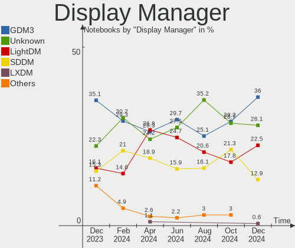
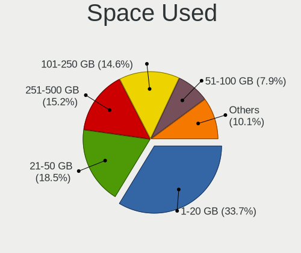
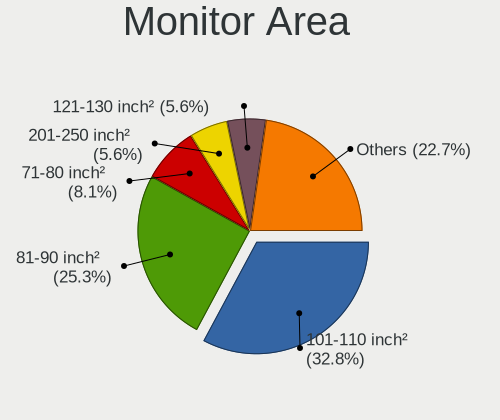
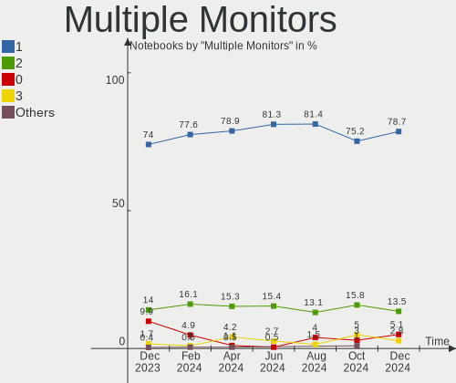
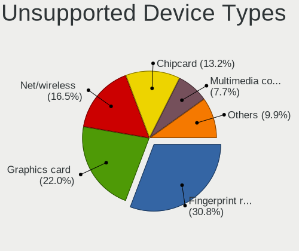

Debian Hardware Trends (Notebook)
---------------------------------

A project to identify most popular hardware characteristics and track their change
over time based on data collected by Debian users at https://Linux-Hardware.org.

Anyone can contribute to the study by uploading probes of their computers by
the [hw-probe](https://github.com/linuxhw/hw-probe) tool:

    sudo hw-probe -all -upload

Full-feature report is available here: https://linux-hardware.org/?view=trends&formfactor=notebook

Period: Apr, 2020.

Contents
--------

- [ OS                       ](#os)
- [ OS Family                ](#os-family)
- [ Kernel                   ](#kernel)
- [ Kernel Family            ](#kernel-family)
- [ Kernel Major Ver.        ](#kernel-major-ver)
- [ Arch                     ](#arch)
- [ DE                       ](#de)
- [ Display Server           ](#display-server)
- [ Display Manager          ](#display-manager)
- [ OS Lang                  ](#os-lang)
- [ Boot Mode                ](#boot-mode)
- [ Filesystem               ](#filesystem)
- [ Dual Boot with Linux/BSD ](#dual-boot-with-linux/bsd)
- [ Dual Boot (Win)          ](#dual-boot-win)
- [ Country                  ](#country)
- [ City                     ](#city)
- [ Vendor                   ](#vendor)
- [ Model                    ](#model)
- [ Model Family             ](#model-family)
- [ MFG Year                 ](#mfg-year)
- [ Form Factor              ](#form-factor)
- [ Secure Boot              ](#secure-boot)
- [ Coreboot                 ](#coreboot)
- [ RAM Size                 ](#ram-size)
- [ RAM Used                 ](#ram-used)
- [ Drive Vendor             ](#drive-vendor)
- [ Drive Model              ](#drive-model)
- [ Drive Kind               ](#drive-kind)
- [ Drive Connector          ](#drive-connector)
- [ Drive Size               ](#drive-size)
- [ Space Total              ](#space-total)
- [ Space Used               ](#space-used)
- [ Malfunc. Drives          ](#malfunc-drives)
- [ Malfunc. Drive Vendor    ](#malfunc-drive-vendor)
- [ Malfunc. Drive Kind      ](#malfunc-drive-kind)
- [ Failed Drives            ](#failed-drives)
- [ Failed Drive Vendor      ](#failed-drive-vendor)
- [ Drive Status             ](#drive-status)
- [ Storage Vendor           ](#storage-vendor)
- [ Storage Model            ](#storage-model)
- [ Storage Kind             ](#storage-kind)
- [ CPU Vendor               ](#cpu-vendor)
- [ CPU Model                ](#cpu-model)
- [ CPU Model Family         ](#cpu-model-family)
- [ CPU Cores                ](#cpu-cores)
- [ CPU Sockets              ](#cpu-sockets)
- [ CPU Threads              ](#cpu-threads)
- [ CPU Op-Modes             ](#cpu-op-modes)
- [ CPU Microarch            ](#cpu-microarch)
- [ CPU Microcode            ](#cpu-microcode)
- [ GPU Vendor               ](#gpu-vendor)
- [ GPU Model                ](#gpu-model)
- [ GPU Combo                ](#gpu-combo)
- [ GPU Driver               ](#gpu-driver)
- [ GPU Memory               ](#gpu-memory)
- [ Monitor Vendor           ](#monitor-vendor)
- [ Monitor Model            ](#monitor-model)
- [ Monitor Resolution       ](#monitor-resolution)
- [ Monitor Diagonal         ](#monitor-diagonal)
- [ Monitor Width            ](#monitor-width)
- [ Aspect Ratio             ](#aspect-ratio)
- [ Monitor Area             ](#monitor-area)
- [ Pixel Density            ](#pixel-density)
- [ Multiple Monitors        ](#multiple-monitors)
- [ Net Controller Vendor    ](#net-controller-vendor)
- [ Net Controller Model     ](#net-controller-model)
- [ Net Controller Kind      ](#net-controller-kind)
- [ Used Controller          ](#used-controller)
- [ NICs                     ](#nics)
- [ Unsupported Devices      ](#unsupported-devices)
- [ Unsupported Device Types ](#unsupported-device-types)

OS
--

Installed operating systems

| Name            | Computers | Percent |
|-----------------|-----------|---------|
| Debian 10       | 49        | 68.06%  |
| Debian          | 9         | 12.5%   |
| Debian Testing  | 6         | 8.33%   |
| Debian Unstable | 3         | 4.17%   |
| Debian 9.12     | 3         | 4.17%   |
| Debian 9        | 2         | 2.78%   |

OS Family
---------

OS without a version

| Name   | Computers | Percent |
|--------|-----------|---------|
| Debian | 72        | 100%    |

Kernel
------

Version of the Linux kernel

| Version                | Computers | Percent |
|------------------------|-----------|---------|
| 4.19.0-8-amd64         | 32        | 44.44%  |
| 5.4.0-4-amd64          | 7         | 9.72%   |
| 4.19.0-6-amd64         | 5         | 6.94%   |
| 4.9.0-12-amd64         | 4         | 5.56%   |
| 4.19.0-8-686           | 4         | 5.56%   |
| 5.4.0-0.bpo.4-amd64    | 3         | 4.17%   |
| 5.5.0-2-amd64          | 2         | 2.78%   |
| 4.9.0-12-686           | 2         | 2.78%   |
| 5.6.2                  | 1         | 1.39%   |
| 5.5.13                 | 1         | 1.39%   |
| 5.5.10-20.03.19.amdgpu | 1         | 1.39%   |
| 5.5.0-1-amd64          | 1         | 1.39%   |
| 5.4.0-kali4-amd64      | 1         | 1.39%   |
| 5.4.0-4-686-pae        | 1         | 1.39%   |
| 5.4.0-3-amd64          | 1         | 1.39%   |
| 5.4.0-0.bpo.2-amd64    | 1         | 1.39%   |
| 5.3.5-64               | 1         | 1.39%   |
| 5.2.0                  | 1         | 1.39%   |
| 4.19.0-6-686-pae       | 1         | 1.39%   |
| 4.19.0-1-amd64         | 1         | 1.39%   |
| 3.10.72                | 1         | 1.39%   |

Kernel Family
-------------

Linux kernel without a distro release

| Version | Computers | Percent |
|---------|-----------|---------|
| 4.19.0  | 43        | 59.72%  |
| 5.4.0   | 14        | 19.44%  |
| 4.9.0   | 6         | 8.33%   |
| 5.5.0   | 3         | 4.17%   |
| 5.6.2   | 1         | 1.39%   |
| 5.5.13  | 1         | 1.39%   |
| 5.5.10  | 1         | 1.39%   |
| 5.3.5   | 1         | 1.39%   |
| 5.2.0   | 1         | 1.39%   |
| 3.10.72 | 1         | 1.39%   |

Kernel Major Ver.
-----------------

Linux kernel major version

| Version | Computers | Percent |
|---------|-----------|---------|
| 4.19    | 43        | 59.72%  |
| 5.4     | 14        | 19.44%  |
| 4.9     | 6         | 8.33%   |
| 5.5     | 5         | 6.94%   |
| 5.6     | 1         | 1.39%   |
| 5.3     | 1         | 1.39%   |
| 5.2     | 1         | 1.39%   |
| 3.10    | 1         | 1.39%   |

Arch
----

OS architecture (x86_64, i586, etc.)

| Name   | Computers | Percent |
|--------|-----------|---------|
| x86_64 | 63        | 87.5%   |
| i686   | 8         | 11.11%  |
| armv7l | 1         | 1.39%   |

DE
--

Desktop Environment

| Name       | Computers | Percent |
|------------|-----------|---------|
| GNOME      | 17        | 23.61%  |
| XFCE       | 16        | 22.22%  |
| KDE5       | 9         | 12.5%   |
| Unknown    | 7         | 9.72%   |
| X-Cinnamon | 5         | 6.94%   |
| KDE        | 5         | 6.94%   |
| MATE       | 3         | 4.17%   |
| LXDE       | 2         | 2.78%   |
| i3         | 2         | 2.78%   |
| Cinnamon   | 2         | 2.78%   |
| Budgie     | 2         | 2.78%   |
| Trinity    | 1         | 1.39%   |
| i3-gaps    | 1         | 1.39%   |

Display Server
--------------

X11 or Wayland

| Name    | Computers | Percent |
|---------|-----------|---------|
| X11     | 58        | 80.56%  |
| Wayland | 9         | 12.5%   |
| Tty     | 3         | 4.17%   |
| Unknown | 2         | 2.78%   |

Display Manager
---------------

SDDM, LightDM, etc.

| Name    | Computers | Percent |
|---------|-----------|---------|
| Unknown | 36        | 50%     |
| GDM     | 15        | 20.83%  |
| LightDM | 11        | 15.28%  |
| SDDM    | 9         | 12.5%   |
| NODM    | 1         | 1.39%   |

OS Lang
-------

Language

| Lang       | Computers | Percent |
|------------|-----------|---------|
| en_US      | 21        | 29.17%  |
| de_DE      | 6         | 8.33%   |
| pt_BR      | 5         | 6.94%   |
| it_IT      | 5         | 6.94%   |
| en_GB      | 5         | 6.94%   |
| fr_FR      | 4         | 5.56%   |
| Unknown    | 3         | 4.17%   |
| ru_RU      | 2         | 2.78%   |
| es_CO      | 2         | 2.78%   |
| es_AR      | 2         | 2.78%   |
| da_DK      | 2         | 2.78%   |
| tr_TR      | 1         | 1.39%   |
| ru_UA      | 1         | 1.39%   |
| pt_BR.utf8 | 1         | 1.39%   |
| pl_PL.utf8 | 1         | 1.39%   |
| pl_PL      | 1         | 1.39%   |
| nl_NL      | 1         | 1.39%   |
| nl_BE      | 1         | 1.39%   |
| fr_FR.utf8 | 1         | 1.39%   |
| es_PE      | 1         | 1.39%   |
| es_ES      | 1         | 1.39%   |
| es_CL      | 1         | 1.39%   |
| en_US.utf8 | 1         | 1.39%   |
| en_CA      | 1         | 1.39%   |
| de_DE.utf8 | 1         | 1.39%   |
| C          | 1         | 1.39%   |

Boot Mode
---------

EFI or BIOS

| Mode | Computers | Percent |
|------|-----------|---------|
| BIOS | 48        | 66.67%  |
| EFI  | 24        | 33.33%  |

Filesystem
----------

Type of filesystem

| Type    | Computers | Percent |
|---------|-----------|---------|
| Ext4    | 70        | 97.22%  |
| Rootfs  | 1         | 1.39%   |
| Overlay | 1         | 1.39%   |

Dual Boot with Linux/BSD
------------------------

Hosting more than one Linux/BSD

| Dual boot | Computers | Percent |
|-----------|-----------|---------|
| No        | 60        | 83.33%  |
| Yes       | 12        | 16.67%  |

Dual Boot (Win)
---------------

Hosting Linux and Windows

| Dual boot | Computers | Percent |
|-----------|-----------|---------|
| No        | 53        | 73.61%  |
| Yes       | 19        | 26.39%  |

Country
-------

Geographic location (country)

| Country            | Computers | Percent |
|--------------------|-----------|---------|
| France             | 8         | 11.11%  |
| Germany            | 7         | 9.72%   |
| USA                | 6         | 8.33%   |
| Russia             | 6         | 8.33%   |
| Brazil             | 6         | 8.33%   |
| Italy              | 5         | 6.94%   |
| Canada             | 3         | 4.17%   |
| Vietnam            | 2         | 2.78%   |
| UK                 | 2         | 2.78%   |
| Turkey             | 2         | 2.78%   |
| Spain              | 2         | 2.78%   |
| Poland             | 2         | 2.78%   |
| Netherlands        | 2         | 2.78%   |
| Denmark            | 2         | 2.78%   |
| Colombia           | 2         | 2.78%   |
| Argentina          | 2         | 2.78%   |
| Ukraine            | 1         | 1.39%   |
| Uganda             | 1         | 1.39%   |
| Portugal           | 1         | 1.39%   |
| Peru               | 1         | 1.39%   |
| Indonesia          | 1         | 1.39%   |
| India              | 1         | 1.39%   |
| Ethiopia           | 1         | 1.39%   |
| Dominican Republic | 1         | 1.39%   |
| Cyprus             | 1         | 1.39%   |
| Chile              | 1         | 1.39%   |
| Bulgaria           | 1         | 1.39%   |
| Belgium            | 1         | 1.39%   |
| Belarus            | 1         | 1.39%   |

City
----

Geographic location (city)

| City                  | Computers | Percent |
|-----------------------|-----------|---------|
| Windsor               | 2         | 2.78%   |
| Shchelkovo            | 2         | 2.78%   |
| Rome                  | 2         | 2.78%   |
| Paris                 | 2         | 2.78%   |
| Meudon                | 2         | 2.78%   |
| Zeist                 | 1         | 1.39%   |
| Vernon                | 1         | 1.39%   |
| Tver                  | 1         | 1.39%   |
| Thanh Hóa            | 1         | 1.39%   |
| St Petersburg         | 1         | 1.39%   |
| Sofia                 | 1         | 1.39%   |
| Sheffield             | 1         | 1.39%   |
| Sens                  | 1         | 1.39%   |
| Seattle               | 1         | 1.39%   |
| Santo Domingo         | 1         | 1.39%   |
| Santiago              | 1         | 1.39%   |
| San Mateo             | 1         | 1.39%   |
| Salvador              | 1         | 1.39%   |
| Royal Tunbridge Wells | 1         | 1.39%   |
| Rio de Janeiro        | 1         | 1.39%   |
| Rio das Ostras        | 1         | 1.39%   |
| Poznan                | 1         | 1.39%   |
| Piracicaba            | 1         | 1.39%   |
| Paphos                | 1         | 1.39%   |
| Ozarow Mazowiecki     | 1         | 1.39%   |
| Oulx                  | 1         | 1.39%   |
| Odesa                 | 1         | 1.39%   |
| Nefteyugansk          | 1         | 1.39%   |
| Munich                | 1         | 1.39%   |
| Mountain Home         | 1         | 1.39%   |
| Moscow                | 1         | 1.39%   |
| Minsk                 | 1         | 1.39%   |
| Maia                  | 1         | 1.39%   |
| Madrid                | 1         | 1.39%   |
| Lyon                  | 1         | 1.39%   |
| Lunel-Viel            | 1         | 1.39%   |
| Lima                  | 1         | 1.39%   |
| La Rioja              | 1         | 1.39%   |
| Kobenhavn S           | 1         | 1.39%   |
| Kobenhavn N           | 1         | 1.39%   |
| Kampala               | 1         | 1.39%   |
| Kaiserslautern        | 1         | 1.39%   |
| Julianadorp           | 1         | 1.39%   |
| Jakarta               | 1         | 1.39%   |
| Istanbul              | 1         | 1.39%   |
| Ingolstadt            | 1         | 1.39%   |
| Indaiatuba            | 1         | 1.39%   |
| Huntington            | 1         | 1.39%   |
| Herzogenaurach        | 1         | 1.39%   |
| Hanoi                 | 1         | 1.39%   |
| Hamburg               | 1         | 1.39%   |
| Gilbert               | 1         | 1.39%   |
| Gaas                  | 1         | 1.39%   |
| Facatativá           | 1         | 1.39%   |
| Dresden               | 1         | 1.39%   |
| Delton                | 1         | 1.39%   |
| Curitiba              | 1         | 1.39%   |
| Cordova               | 1         | 1.39%   |
| Bursa                 | 1         | 1.39%   |
| Bremen                | 1         | 1.39%   |

Vendor
------

Motherboard manufacturer

| Name                | Computers | Percent |
|---------------------|-----------|---------|
| Dell                | 19        | 26.39%  |
| Lenovo              | 15        | 20.83%  |
| Hewlett-Packard     | 14        | 19.44%  |
| ASUSTek Computer    | 7         | 9.72%   |
| Acer                | 3         | 4.17%   |
| Unknown             | 3         | 4.17%   |
| Fujitsu Siemens     | 2         | 2.78%   |
| Toshiba             | 1         | 1.39%   |
| Sony                | 1         | 1.39%   |
| SLIMBOOK            | 1         | 1.39%   |
| Samsung Electronics | 1         | 1.39%   |
| MSI                 | 1         | 1.39%   |
| Intel               | 1         | 1.39%   |
| IBM                 | 1         | 1.39%   |
| Hometech            | 1         | 1.39%   |
| Gateway             | 1         | 1.39%   |

Model
-----

Motherboard model

| Name                                     | Computers | Percent |
|------------------------------------------|-----------|---------|
| Unknown                                  | 3         | 4.17%   |
| Lenovo Legion Y530-15ICH-1060 81LB       | 2         | 2.78%   |
| HP EliteBook 840 G1                      | 2         | 2.78%   |
| Dell Precision 5530                      | 2         | 2.78%   |
| Dell Latitude E6410                      | 2         | 2.78%   |
| Toshiba Satellite L515                   | 1         | 1.39%   |
| Sony VGN-NR220E                          | 1         | 1.39%   |
| SLIMBOOK PROX14                          | 1         | 1.39%   |
| Samsung Electronics RF510/RF410/RF710    | 1         | 1.39%   |
| MSI GF62 7RE                             | 1         | 1.39%   |
| Lenovo Z50-75 80EC                       | 1         | 1.39%   |
| Lenovo Yoga 2 11 20332                   | 1         | 1.39%   |
| Lenovo ThinkPad X230 23259H1             | 1         | 1.39%   |
| Lenovo ThinkPad X230 2324EW3             | 1         | 1.39%   |
| Lenovo ThinkPad X1 Carbon 3rd 20BTS1D900 | 1         | 1.39%   |
| Lenovo ThinkPad W700 2752RZ2             | 1         | 1.39%   |
| Lenovo ThinkPad T495s 20QKS01E00         | 1         | 1.39%   |
| Lenovo ThinkPad L390 20NRCTO1WW          | 1         | 1.39%   |
| Lenovo ThinkBook 14-IML 20RV             | 1         | 1.39%   |
| Lenovo Legion Y530-15ICH 81FV            | 1         | 1.39%   |
| Lenovo IdeaPad U430p 20269               | 1         | 1.39%   |
| Lenovo IdeaPad S145-15API 81V7           | 1         | 1.39%   |
| Lenovo G550 2958                         | 1         | 1.39%   |
| Intel AHV                                | 1         | 1.39%   |
| IBM ThinkPad T42 2373FWG                 | 1         | 1.39%   |
| Hometech HT Book 14B                     | 1         | 1.39%   |
| HP ProBook 645 G1                        | 1         | 1.39%   |
| HP ProBook 4710s                         | 1         | 1.39%   |
| HP ProBook 470 G1                        | 1         | 1.39%   |
| HP Presario CQ57                         | 1         | 1.39%   |
| HP Pavilion dv6                          | 1         | 1.39%   |
| HP Notebook                              | 1         | 1.39%   |
| HP Mini 110-3100                         | 1         | 1.39%   |
| HP Laptop 15-da0xxx                      | 1         | 1.39%   |
| HP EliteBook 8470p                       | 1         | 1.39%   |
| HP EliteBook 8460p                       | 1         | 1.39%   |
| HP EliteBook 840 G6                      | 1         | 1.39%   |
| HP 2000                                  | 1         | 1.39%   |
| Gateway NV78                             | 1         | 1.39%   |
| Fujitsu Siemens ESPRIMO Mobile V5535     | 1         | 1.39%   |
| Fujitsu Siemens AMILO Pa 2510            | 1         | 1.39%   |
| Dell XPS L322X                           | 1         | 1.39%   |
| Dell XPS 13 9360                         | 1         | 1.39%   |
| Dell Vostro 3478                         | 1         | 1.39%   |
| Dell Precision M6600                     | 1         | 1.39%   |
| Dell Precision 5520                      | 1         | 1.39%   |
| Dell Latitude E7240                      | 1         | 1.39%   |
| Dell Latitude E6430                      | 1         | 1.39%   |
| Dell Latitude E5520                      | 1         | 1.39%   |
| Dell Inspiron 7559                       | 1         | 1.39%   |
| Dell Inspiron 3542                       | 1         | 1.39%   |
| Dell Inspiron 3520                       | 1         | 1.39%   |
| Dell Inspiron 3481                       | 1         | 1.39%   |
| Dell Inspiron 3421                       | 1         | 1.39%   |
| Dell Inspiron 1545                       | 1         | 1.39%   |
| Dell Inspiron 15-3552                    | 1         | 1.39%   |
| ASUS ZenBook UX431DA_UM431DA             | 1         | 1.39%   |
| ASUS X453SA                              | 1         | 1.39%   |
| ASUS X442UR                              | 1         | 1.39%   |
| ASUS N751JX                              | 1         | 1.39%   |

Model Family
------------

Motherboard model prefix

| Name                      | Computers | Percent |
|---------------------------|-----------|---------|
| Dell Inspiron             | 7         | 9.72%   |
| Lenovo ThinkPad           | 6         | 8.33%   |
| HP EliteBook              | 5         | 6.94%   |
| Dell Latitude             | 5         | 6.94%   |
| Dell Precision            | 4         | 5.56%   |
| Lenovo Legion             | 3         | 4.17%   |
| HP ProBook                | 3         | 4.17%   |
| Unknown                   | 3         | 4.17%   |
| Lenovo IdeaPad            | 2         | 2.78%   |
| Dell XPS                  | 2         | 2.78%   |
| Acer Aspire               | 2         | 2.78%   |
| Toshiba Satellite         | 1         | 1.39%   |
| Sony VGN-NR220E           | 1         | 1.39%   |
| SLIMBOOK PROX14           | 1         | 1.39%   |
| Samsung Electronics RF510 | 1         | 1.39%   |
| MSI GF62                  | 1         | 1.39%   |
| Lenovo Z50-75             | 1         | 1.39%   |
| Lenovo Yoga               | 1         | 1.39%   |
| Lenovo ThinkBook          | 1         | 1.39%   |
| Lenovo G550               | 1         | 1.39%   |
| Intel AHV                 | 1         | 1.39%   |
| IBM ThinkPad              | 1         | 1.39%   |
| Hometech HT               | 1         | 1.39%   |
| HP Presario               | 1         | 1.39%   |
| HP Pavilion               | 1         | 1.39%   |
| HP Notebook               | 1         | 1.39%   |
| HP Mini                   | 1         | 1.39%   |
| HP Laptop                 | 1         | 1.39%   |
| HP 2000                   | 1         | 1.39%   |
| Gateway NV78              | 1         | 1.39%   |
| Fujitsu Siemens ESPRIMO   | 1         | 1.39%   |
| Fujitsu Siemens AMILO     | 1         | 1.39%   |
| Dell Vostro               | 1         | 1.39%   |
| ASUS ZenBook              | 1         | 1.39%   |
| ASUS X453SA               | 1         | 1.39%   |
| ASUS X442UR               | 1         | 1.39%   |
| ASUS N751JX               | 1         | 1.39%   |
| ASUS M3N                  | 1         | 1.39%   |
| ASUS BU403UA              | 1         | 1.39%   |
| ASUS 901                  | 1         | 1.39%   |
| Acer Nitro                | 1         | 1.39%   |

MFG Year
--------

Motherboard manufacture year

| Year    | Computers | Percent |
|---------|-----------|---------|
| 2019    | 18        | 25%     |
| 2011    | 10        | 13.89%  |
| 2018    | 8         | 11.11%  |
| 2015    | 7         | 9.72%   |
| 2013    | 4         | 5.56%   |
| 2008    | 4         | 5.56%   |
| 2016    | 3         | 4.17%   |
| 2014    | 3         | 4.17%   |
| 2012    | 3         | 4.17%   |
| 2009    | 3         | 4.17%   |
| 2017    | 2         | 2.78%   |
| 2010    | 2         | 2.78%   |
| 2007    | 2         | 2.78%   |
| 2020    | 1         | 1.39%   |
| 2004    | 1         | 1.39%   |
| Unknown | 1         | 1.39%   |

Form Factor
-----------

Physical design of the computer

| Name     | Computers | Percent |
|----------|-----------|---------|
| Notebook | 72        | 100%    |

Secure Boot
-----------

Enabled or disabled

| State    | Computers | Percent |
|----------|-----------|---------|
| Disabled | 70        | 97.22%  |
| Enabled  | 2         | 2.78%   |

Coreboot
--------

Have coreboot on board

| Used | Computers | Percent |
|------|-----------|---------|
| No   | 72        | 100%    |

RAM Size
--------

Total RAM memory

| Size in GB | Computers | Percent |
|------------|-----------|---------|
| 3.01-4.0   | 20        | 27.78%  |
| 4.01-8.0   | 15        | 20.83%  |
| 8.01-16.0  | 15        | 20.83%  |
| 32.01-64.0 | 5         | 6.94%   |
| 16.01-24.0 | 5         | 6.94%   |
| 1.01-2.0   | 5         | 6.94%   |
| 2.01-3.0   | 3         | 4.17%   |
| 0.01-1.0   | 3         | 4.17%   |
| 24.01-32.0 | 1         | 1.39%   |

RAM Used
--------

Used RAM memory

| Used GB   | Computers | Percent |
|-----------|-----------|---------|
| 1.01-2.0  | 26        | 36.11%  |
| 2.01-3.0  | 20        | 27.78%  |
| 3.01-4.0  | 11        | 15.28%  |
| 4.01-8.0  | 7         | 9.72%   |
| 0.01-1.0  | 5         | 6.94%   |
| 8.01-16.0 | 2         | 2.78%   |
| Unknown   | 1         | 1.39%   |

Drive Vendor
------------

Hard drive vendors

| Vendor              | Computers | Drives  | Percent |
|---------------------|-----------|---------|---------|
| Seagate             | 18        | 19      | 20.22%  |
| WDC                 | 12        | 12      | 13.48%  |
| Toshiba             | 10        | 10      | 11.24%  |
| Samsung Electronics | 10        | 10      | 11.24%  |
| Kingston            | 8         | 8       | 8.99%   |
| SanDisk             | 5         | 5       | 5.62%   |
| Crucial             | 5         | 5       | 5.62%   |
| Unknown             | 4         | 4       | 4.49%   |
| HGST                | 4         | 4       | 4.49%   |
| SK Hynix            | 2         | 2       | 2.25%   |
| HL-DT-ST            | 2         | Unknown | 2.25%   |
| Fujitsu             | 2         | 2       | 2.25%   |
| Silicon Motion      | 1         | 1       | 1.12%   |
| PNY                 | 1         | 1       | 1.12%   |
| PLEXTOR             | 1         | 1       | 1.12%   |
| LITEONIT            | 1         | 1       | 1.12%   |
| Hitachi             | 1         | 1       | 1.12%   |
| ASUS-PHISON         | 1         | 1       | 1.12%   |
| A-DATA Technology   | 1         | 1       | 1.12%   |

Drive Model
-----------

Hard drive models

| Model                            | Computers | Percent |
|----------------------------------|-----------|---------|
| ST1000LM024 HN-M101MBB 1TB       | 5         | 5.56%   |
| SA400S37120G 120GB SSD           | 3         | 3.33%   |
| MQ01ABD100 1TB                   | 3         | 3.33%   |
| WD5000LPLX-75ZNTT0 500GB         | 2         | 2.22%   |
| ST500LT012-9WS142 500GB          | 2         | 2.22%   |
| ST500LM012 HN-M500MBB 500GB      | 2         | 2.22%   |
| SD9SB8W512G1101 512GB SSD        | 2         | 2.22%   |
| PM981 NVMe 256GB                 | 2         | 2.22%   |
| DVDRAM GUE1N 3GB                 | 2         | 2.22%   |
| CT500MX500SSD1 500GB             | 2         | 2.22%   |
| WD7500BPKX-75HPJT0 752GB         | 1         | 1.11%   |
| WD5000LPCX-21VHAT0 500GB         | 1         | 1.11%   |
| WD5000BPVT-60HXZT1 500GB         | 1         | 1.11%   |
| WD5000BEVT-22ZAT0 500GB          | 1         | 1.11%   |
| WD1600BEVS-22RST0 160GB          | 1         | 1.11%   |
| WD1200BEVS-22UST0 120GB          | 1         | 1.11%   |
| WD10SPZX-75Z10T3 1TB             | 1         | 1.11%   |
| WD10JPVX-22JC3T0 1TB             | 1         | 1.11%   |
| WD10JPCX-24UE4T0 1TB             | 1         | 1.11%   |
| SV300S37A480G 480GB SSD          | 1         | 1.11%   |
| SV300S37A120G 120GB SSD          | 1         | 1.11%   |
| SU650 120GB SSD                  | 1         | 1.11%   |
| SU02G  2GB                       | 1         | 1.11%   |
| STT_FPM64GLSE 64GB SSD           | 1         | 1.11%   |
| ST95005620AS 500GB               | 1         | 1.11%   |
| ST9250410AS 250GB                | 1         | 1.11%   |
| ST9250315AS 250GB                | 1         | 1.11%   |
| ST500LT032-1E9142 500GB          | 1         | 1.11%   |
| ST500LT012-1DG142 500GB          | 1         | 1.11%   |
| ST500LM000-SSHD-8GB              | 1         | 1.11%   |
| ST1000LM048-2E7172 1TB           | 1         | 1.11%   |
| ST1000LM035-1RK172 1TB           | 1         | 1.11%   |
| SSD 860 EVO mSATA 250GB          | 1         | 1.11%   |
| SSD 850 EVO mSATA 500GB          | 1         | 1.11%   |
| SSD 850 EVO 250GB                | 1         | 1.11%   |
| SSD 840 EVO 120GB                | 1         | 1.11%   |
| SSD 4GB                          | 1         | 1.11%   |
| SD8SNAT-256G-1006 256GB SSD      | 1         | 1.11%   |
| SD8SB8U1T002000 1024GB SSD       | 1         | 1.11%   |
| SA400S37240G 240GB SSD           | 1         | 1.11%   |
| SA2000M8250G 250GB               | 1         | 1.11%   |
| RBU-SC100S37128GD 128GB SSD      | 1         | 1.11%   |
| PX-128M6S 128GB SSD              | 1         | 1.11%   |
| PC SN720 SDAQNTW-512G-1001 512GB | 1         | 1.11%   |
| MZVLB512HAJQ-000H1 512GB         | 1         | 1.11%   |
| MZVLB1T0HBLR-000L7 1TB           | 1         | 1.11%   |
| MZNLN256HCHP-000L7 256GB SSD     | 1         | 1.11%   |
| MZ7PD128HCFV-000H1 128GB SSD     | 1         | 1.11%   |
| MQ01ABF050 500GB                 | 1         | 1.11%   |
| MMC Card  4GB                    | 1         | 1.11%   |
| MK5061GSY 500GB                  | 1         | 1.11%   |
| MK3261GSYN 320GB                 | 1         | 1.11%   |
| MK2561GSYN 250GB                 | 1         | 1.11%   |
| MK2016GAP 20GB                   | 1         | 1.11%   |
| MK1637GSX 160GB                  | 1         | 1.11%   |
| MJA2320BH G2 320GB               | 1         | 1.11%   |
| MHV2120AH 120GB                  | 1         | 1.11%   |
| LMT-256M6M mSATA 256GB SSD       | 1         | 1.11%   |
| KXG50ZNV256G NVMe 256GB          | 1         | 1.11%   |
| JAMESDONKEY JD512 512GB          | 1         | 1.11%   |

Drive Kind
----------

HDD or SSD

| Kind    | Computers | Drives | Percent |
|---------|-----------|--------|---------|
| HDD     | 44        | 45     | 52.38%  |
| SSD     | 25        | 28     | 29.76%  |
| NVMe    | 9         | 10     | 10.71%  |
| MMC     | 3         | 4      | 3.57%   |
| Unknown | 3         | 1      | 3.57%   |

Drive Connector
---------------

SATA, SAS, NVMe, etc.

| Type | Computers | Drives | Percent |
|------|-----------|--------|---------|
| SATA | 62        | 73     | 80.52%  |
| NVMe | 9         | 10     | 11.69%  |
| SAS  | 3         | 1      | 3.9%    |
| MMC  | 3         | 4      | 3.9%    |

Drive Size
----------

Size of hard drive

| Size in TB | Computers | Drives | Percent |
|------------|-----------|--------|---------|
| 0.01-0.5   | 51        | 61     | 68%     |
| 0.51-1.0   | 22        | 24     | 29.33%  |
| 1.01-2.0   | 2         | 3      | 2.67%   |

Space Total
-----------

Amount of disk space available on the file system

| Size in GB | Computers | Percent |
|------------|-----------|---------|
| 101-250    | 23        | 31.94%  |
| 251-500    | 21        | 29.17%  |
| 501-1000   | 12        | 16.67%  |
| 51-100     | 8         | 11.11%  |
| 1-20       | 5         | 6.94%   |
| Unknown    | 3         | 4.17%   |

Space Used
----------

Amount of used disk space

| Used GB  | Computers | Percent |
|----------|-----------|---------|
| 1-20     | 23        | 31.94%  |
| 101-250  | 16        | 22.22%  |
| 21-50    | 12        | 16.67%  |
| 51-100   | 8         | 11.11%  |
| 251-500  | 7         | 9.72%   |
| 501-1000 | 3         | 4.17%   |
| Unknown  | 3         | 4.17%   |

Malfunc. Drives
---------------

Drive models with a malfunction

| Model                      | Computers | Drives | Percent |
|----------------------------|-----------|--------|---------|
| ST9250410AS 250GB          | 1         | 1      | 12.5%   |
| ST500LT012-9WS142 500GB    | 1         | 1      | 12.5%   |
| ST1000LM024 HN-M101MBB 1TB | 1         | 1      | 12.5%   |
| MK3261GSYN 320GB           | 1         | 1      | 12.5%   |
| MK1637GSX 160GB            | 1         | 1      | 12.5%   |
| MJA2320BH G2 320GB         | 1         | 1      | 12.5%   |
| HTS725050A7E630 500GB      | 1         | 1      | 12.5%   |
| HTS543232A7A384 320GB      | 1         | 1      | 12.5%   |

Malfunc. Drive Vendor
---------------------

Vendors of faulty drives

| Vendor  | Computers | Drives | Percent |
|---------|-----------|--------|---------|
| Seagate | 3         | 3      | 37.5%   |
| Toshiba | 2         | 2      | 25%     |
| Hitachi | 1         | 1      | 12.5%   |
| HGST    | 1         | 1      | 12.5%   |
| Fujitsu | 1         | 1      | 12.5%   |

Malfunc. Drive Kind
-------------------

Kinds of faulty drives

| Kind | Computers | Drives | Percent |
|------|-----------|--------|---------|
| HDD  | 8         | 8      | 100%    |

Failed Drives
-------------

Failed drive models

Zero info for selected period =(

Failed Drive Vendor
-------------------

Failed drive vendors

Zero info for selected period =(

Drive Status
------------

Number of failed and malfunc. drives

| Status   | Computers | Drives | Percent |
|----------|-----------|--------|---------|
| Works    | 35        | 42     | 46.05%  |
| Detected | 33        | 38     | 43.42%  |
| Malfunc  | 8         | 8      | 10.53%  |

Storage Vendor
--------------

Storage controller vendors

| Vendor                           | Computers | Percent |
|----------------------------------|-----------|---------|
| Intel                            | 58        | 74.36%  |
| AMD                              | 6         | 7.69%   |
| Samsung Electronics              | 5         | 6.41%   |
| Toshiba America Info Systems     | 2         | 2.56%   |
| SK Hynix                         | 2         | 2.56%   |
| Silicon Motion                   | 1         | 1.28%   |
| Silicon Integrated Systems [SiS] | 1         | 1.28%   |
| Sandisk                          | 1         | 1.28%   |
| Phison Electronics               | 1         | 1.28%   |
| Kingston Technology Company      | 1         | 1.28%   |

Storage Model
-------------

Storage controller models

| Model                                                                            | Computers | Percent |
|----------------------------------------------------------------------------------|-----------|---------|
| 7 Series Chipset Family 6-port SATA Controller [AHCI mode]                       | 8         | 9.41%   |
| Sunrise Point-LP SATA Controller [AHCI mode]                                     | 6         | 7.06%   |
| 82801IBM/IEM (ICH9M/ICH9M-E) 4 port SATA Controller [AHCI mode]                  | 6         | 7.06%   |
| NVMe SSD Controller SM981/PM981/PM983                                            | 5         | 5.88%   |
| Cannon Lake Mobile PCH SATA AHCI Controller                                      | 5         | 5.88%   |
| FCH SATA Controller [AHCI mode]                                                  | 4         | 4.71%   |
| 82801 Mobile SATA Controller [RAID mode]                                         | 4         | 4.71%   |
| 8 Series SATA Controller 1 [AHCI mode]                                           | 4         | 4.71%   |
| 6 Series/C200 Series Chipset Family 6 port Mobile SATA AHCI Controller           | 4         | 4.71%   |
| Toshiba America Info Non-Volatile memory controller                              | 2         | 2.35%   |
| HM170/QM170 Chipset SATA Controller [AHCI Mode]                                  | 2         | 2.35%   |
| BC501 NVMe Solid State Drive 512GB                                               | 2         | 2.35%   |
| Atom/Celeron/Pentium Processor x5-E8000/J3xxx/N3xxx Series SATA Controller       | 2         | 2.35%   |
| 82801IBM/IEM (ICH9M/ICH9M-E) 2 port SATA Controller [IDE mode]                   | 2         | 2.35%   |
| 82801DBM (ICH4-M) IDE Controller                                                 | 2         | 2.35%   |
| 8 Series/C220 Series Chipset Family 6-port SATA Controller 1 [AHCI mode]         | 2         | 2.35%   |
| Wildcat Point-LP SATA Controller [AHCI Mode]                                     | 1         | 1.18%   |
| WD Black 2018/PC SN720 NVMe SSD                                                  | 1         | 1.18%   |
| Technology Company Non-Volatile memory controller                                | 1         | 1.18%   |
| SB7x0/SB8x0/SB9x0 SATA Controller [AHCI mode]                                    | 1         | 1.18%   |
| SB600 Non-Raid-5 SATA                                                            | 1         | 1.18%   |
| SB600 IDE                                                                        | 1         | 1.18%   |
| SATA Controller / IDE mode                                                       | 1         | 1.18%   |
| Q170/Q150/B150/H170/H110/Z170/CM236 Chipset SATA Controller [AHCI Mode]          | 1         | 1.18%   |
| Non-Volatile memory controller                                                   | 1         | 1.18%   |
| NM10/ICH7 Family SATA Controller [AHCI mode]                                     | 1         | 1.18%   |
| E12 NVMe Controller                                                              | 1         | 1.18%   |
| Comet Lake SATA AHCI Controller                                                  | 1         | 1.18%   |
| Cannon Point-LP SATA Controller [AHCI Mode]                                      | 1         | 1.18%   |
| Atom Processor E3800 Series SATA AHCI Controller                                 | 1         | 1.18%   |
| 82801HM/HEM (ICH8M/ICH8M-E) SATA Controller [AHCI mode]                          | 1         | 1.18%   |
| 82801HM/HEM (ICH8M/ICH8M-E) IDE Controller                                       | 1         | 1.18%   |
| 82801GBM/GHM (ICH7-M Family) SATA Controller [IDE mode]                          | 1         | 1.18%   |
| 6 Series/C200 Series Chipset Family Mobile SATA Controller (IDE mode, ports 4-5) | 1         | 1.18%   |
| 6 Series/C200 Series Chipset Family Mobile SATA Controller (IDE mode, ports 0-3) | 1         | 1.18%   |
| 5513 IDE Controller                                                              | 1         | 1.18%   |
| 5 Series/3400 Series Chipset PT IDER Controller                                  | 1         | 1.18%   |
| 5 Series/3400 Series Chipset 6 port SATA AHCI Controller                         | 1         | 1.18%   |
| 5 Series/3400 Series Chipset 4 port SATA IDE Controller                          | 1         | 1.18%   |
| 5 Series/3400 Series Chipset 4 port SATA AHCI Controller                         | 1         | 1.18%   |
| 5 Series/3400 Series Chipset 2 port SATA IDE Controller                          | 1         | 1.18%   |

Storage Kind
------------

Kind of storage controller (IDE, SATA, NVMe, SAS, ...)

| Kind | Computers | Percent |
|------|-----------|---------|
| SATA | 54        | 66.67%  |
| NVMe | 12        | 14.81%  |
| IDE  | 11        | 13.58%  |
| RAID | 4         | 4.94%   |

CPU Vendor
----------

Processor vendors

| Vendor | Computers | Percent |
|--------|-----------|---------|
| Intel  | 63        | 87.5%   |
| AMD    | 8         | 11.11%  |
| ARM    | 1         | 1.39%   |

CPU Model
---------

Processor models

| Model                                           | Computers | Percent |
|-------------------------------------------------|-----------|---------|
| Intel Core i7-8565U CPU @ 1.80GHz               | 3         | 4.17%   |
| Intel Core i5-3320M CPU @ 2.60GHz               | 3         | 4.17%   |
| Intel Core 2 Duo CPU T6600 @ 2.20GHz            | 3         | 4.17%   |
| Intel Core i7-8850H CPU @ 2.60GHz               | 2         | 2.78%   |
| Intel Core i7-8750H CPU @ 2.20GHz               | 2         | 2.78%   |
| Intel Core i7-7500U CPU @ 2.70GHz               | 2         | 2.78%   |
| Intel Core i5-8250U CPU @ 1.60GHz               | 2         | 2.78%   |
| Intel Core i5-4210U CPU @ 1.70GHz               | 2         | 2.78%   |
| Intel Celeron CPU N3050 @ 1.60GHz               | 2         | 2.78%   |
| AMD E-300 APU with Radeon HD Graphics           | 2         | 2.78%   |
| Intel Pentium M processor 1600MHz               | 1         | 1.39%   |
| Intel Pentium M processor 1.60GHz               | 1         | 1.39%   |
| Intel Pentium Dual-Core CPU T4400 @ 2.20GHz     | 1         | 1.39%   |
| Intel Pentium Dual-Core CPU T4200 @ 2.00GHz     | 1         | 1.39%   |
| Intel Pentium Dual CPU T3400 @ 2.16GHz          | 1         | 1.39%   |
| Intel Pentium Dual CPU T2370 @ 1.73GHz          | 1         | 1.39%   |
| Intel Pentium Dual CPU T2330 @ 1.60GHz          | 1         | 1.39%   |
| Intel Pentium CPU N3540 @ 2.16GHz               | 1         | 1.39%   |
| Intel Pentium CPU B960 @ 2.20GHz                | 1         | 1.39%   |
| Intel Core i7-8550U CPU @ 1.80GHz               | 1         | 1.39%   |
| Intel Core i7-7820HQ CPU @ 2.90GHz              | 1         | 1.39%   |
| Intel Core i7-7700HQ CPU @ 2.80GHz              | 1         | 1.39%   |
| Intel Core i7-6500U CPU @ 2.50GHz               | 1         | 1.39%   |
| Intel Core i7-5600U CPU @ 2.60GHz               | 1         | 1.39%   |
| Intel Core i7-4720HQ CPU @ 2.60GHz              | 1         | 1.39%   |
| Intel Core i7-4702MQ CPU @ 2.20GHz              | 1         | 1.39%   |
| Intel Core i7-4600U CPU @ 2.10GHz               | 1         | 1.39%   |
| Intel Core i7-3740QM CPU @ 2.70GHz              | 1         | 1.39%   |
| Intel Core i7-3537U CPU @ 2.00GHz               | 1         | 1.39%   |
| Intel Core i7-2820QM CPU @ 2.30GHz              | 1         | 1.39%   |
| Intel Core i7 CPU Q 720 @ 1.60GHz               | 1         | 1.39%   |
| Intel Core i5-9300H CPU @ 2.40GHz               | 1         | 1.39%   |
| Intel Core i5-8300H CPU @ 2.30GHz               | 1         | 1.39%   |
| Intel Core i5-6300HQ CPU @ 2.30GHz              | 1         | 1.39%   |
| Intel Core i5-4300U CPU @ 1.90GHz               | 1         | 1.39%   |
| Intel Core i5-2540M CPU @ 2.60GHz               | 1         | 1.39%   |
| Intel Core i5-2520M CPU @ 2.50GHz               | 1         | 1.39%   |
| Intel Core i5-2410M CPU @ 2.30GHz               | 1         | 1.39%   |
| Intel Core i5 CPU M 560 @ 2.67GHz               | 1         | 1.39%   |
| Intel Core i5 CPU M 520 @ 2.40GHz               | 1         | 1.39%   |
| Intel Core i3-7020U CPU @ 2.30GHz               | 1         | 1.39%   |
| Intel Core i3-6100U CPU @ 2.30GHz               | 1         | 1.39%   |
| Intel Core i3-4005U CPU @ 1.70GHz               | 1         | 1.39%   |
| Intel Core i3-3217U CPU @ 1.80GHz               | 1         | 1.39%   |
| Intel Core i3-2310M CPU @ 2.10GHz               | 1         | 1.39%   |
| Intel Core i3-10110U CPU @ 2.10GHz              | 1         | 1.39%   |
| Intel Core 2 Duo CPU T9600 @ 2.80GHz            | 1         | 1.39%   |
| Intel Core 2 Duo CPU T6570 @ 2.10GHz            | 1         | 1.39%   |
| Intel Celeron CPU 1017U @ 1.60GHz               | 1         | 1.39%   |
| Intel Atom CPU Z3735F @ 1.33GHz                 | 1         | 1.39%   |
| Intel Atom CPU N455 @ 1.66GHz                   | 1         | 1.39%   |
| Intel Atom CPU N270 @ 1.60GHz                   | 1         | 1.39%   |
| ARM ARMv7 Processor rev 3 (v7l)                 | 1         | 1.39%   |
| AMD Turion 64 X2 Mobile Technology TL-52        | 1         | 1.39%   |
| AMD Ryzen 7 PRO 3700U w/ Radeon Vega Mobile Gfx | 1         | 1.39%   |
| AMD Ryzen 7 3700U with Radeon Vega Mobile Gfx   | 1         | 1.39%   |
| AMD Ryzen 5 3500U with Radeon Vega Mobile Gfx   | 1         | 1.39%   |
| AMD FX-7500 Radeon R7, 10 Compute Cores 4C+6G   | 1         | 1.39%   |
| AMD A8-5550M APU with Radeon HD Graphics        | 1         | 1.39%   |

CPU Model Family
----------------

Processor model prefix

| Model                   | Computers | Percent |
|-------------------------|-----------|---------|
| Intel Core i7           | 21        | 29.17%  |
| Intel Core i5           | 16        | 22.22%  |
| Intel Core i3           | 6         | 8.33%   |
| Intel Core 2 Duo        | 5         | 6.94%   |
| Intel Pentium Dual      | 3         | 4.17%   |
| Intel Celeron           | 3         | 4.17%   |
| Intel Atom              | 3         | 4.17%   |
| Intel Pentium M         | 2         | 2.78%   |
| Intel Pentium Dual-Core | 2         | 2.78%   |
| Intel Pentium           | 2         | 2.78%   |
| AMD E                   | 2         | 2.78%   |
| ARM ARMv7               | 1         | 1.39%   |
| AMD Turion 64 X2 Mobile | 1         | 1.39%   |
| AMD Ryzen 7 PRO         | 1         | 1.39%   |
| AMD Ryzen 7             | 1         | 1.39%   |
| AMD Ryzen 5             | 1         | 1.39%   |
| AMD FX                  | 1         | 1.39%   |
| AMD A8                  | 1         | 1.39%   |

CPU Cores
---------

Number of processor cores

| Number | Computers | Percent |
|--------|-----------|---------|
| 2      | 43        | 59.72%  |
| 4      | 21        | 29.17%  |
| 6      | 4         | 5.56%   |
| 1      | 4         | 5.56%   |

CPU Sockets
-----------

Number of sockets

| Number | Computers | Percent |
|--------|-----------|---------|
| 1      | 72        | 100%    |

CPU Threads
-----------

Threads per core (Hyper-Threading)

| Number | Computers | Percent |
|--------|-----------|---------|
| 2      | 49        | 68.06%  |
| 1      | 23        | 31.94%  |

CPU Op-Modes
------------

CPU Operation Modes (32-bit, 64-bit)

| Op mode        | Computers | Percent |
|----------------|-----------|---------|
| 32-bit, 64-bit | 68        | 94.44%  |
| 32-bit         | 3         | 4.17%   |
| Unknown        | 1         | 1.39%   |

CPU Microarch
-------------

Microarchitecture

| Name        | Computers | Percent |
|-------------|-----------|---------|
| Skylake     | 12        | 16.67%  |
| KabyLake    | 9         | 12.5%   |
| IvyBridge   | 7         | 9.72%   |
| Haswell     | 7         | 9.72%   |
| Core        | 7         | 9.72%   |
| SandyBridge | 6         | 8.33%   |
| Silvermont  | 4         | 5.56%   |
| Zen+        | 3         | 4.17%   |
| Penryn      | 3         | 4.17%   |
| Westmere    | 2         | 2.78%   |
| P6          | 2         | 2.78%   |
| Bonnell     | 2         | 2.78%   |
| Bobcat      | 2         | 2.78%   |
| Steamroller | 1         | 1.39%   |
| Piledriver  | 1         | 1.39%   |
| Nehalem     | 1         | 1.39%   |
| K8 Hammer   | 1         | 1.39%   |
| Broadwell   | 1         | 1.39%   |
| Unknown     | 1         | 1.39%   |

CPU Microcode
-------------

Microcode number

| Number     | Computers | Percent |
|------------|-----------|---------|
| Unknown    | 25        | 34.72%  |
| 0x306a9    | 5         | 6.94%   |
| 0x40651    | 4         | 5.56%   |
| 0x206a7    | 4         | 5.56%   |
| 0x906ea    | 3         | 4.17%   |
| 0x806ec    | 3         | 4.17%   |
| 0x6fd      | 3         | 4.17%   |
| 0x1067a    | 3         | 4.17%   |
| 0x906e9    | 2         | 2.78%   |
| 0x806ea    | 2         | 2.78%   |
| 0x406c3    | 2         | 2.78%   |
| 0x306c3    | 2         | 2.78%   |
| 0x30678    | 2         | 2.78%   |
| 0x05000119 | 2         | 2.78%   |
| 0x806e9    | 1         | 1.39%   |
| 0x695      | 1         | 1.39%   |
| 0x406e3    | 1         | 1.39%   |
| 0x306d4    | 1         | 1.39%   |
| 0x106e5    | 1         | 1.39%   |
| 0x106c2    | 1         | 1.39%   |
| 0x10676    | 1         | 1.39%   |
| 0x08108109 | 1         | 1.39%   |
| 0x08108102 | 1         | 1.39%   |
| 0x06003106 | 1         | 1.39%   |

GPU Vendor
----------

Vendors of graphics cards

| Vendor                           | Computers | Percent |
|----------------------------------|-----------|---------|
| Intel                            | 56        | 63.64%  |
| AMD                              | 16        | 18.18%  |
| Nvidia                           | 15        | 17.05%  |
| Silicon Integrated Systems [SiS] | 1         | 1.14%   |

GPU Model
---------

Graphics card models

| Model                                                                              | Computers | Percent |
|------------------------------------------------------------------------------------|-----------|---------|
| 3rd Gen Core processor Graphics Controller                                         | 7         | 7.78%   |
| UHD Graphics 630 (Mobile)                                                          | 6         | 6.67%   |
| Mobile 4 Series Chipset Integrated Graphics Controller                             | 6         | 6.67%   |
| Haswell-ULT Integrated Graphics Controller                                         | 5         | 5.56%   |
| 2nd Generation Core Processor Family Integrated Graphics Controller                | 4         | 4.44%   |
| UHD Graphics 620 (Whiskey Lake)                                                    | 3         | 3.33%   |
| UHD Graphics 620                                                                   | 3         | 3.33%   |
| Picasso                                                                            | 3         | 3.33%   |
| Wrestler [Radeon HD 6310]                                                          | 2         | 2.22%   |
| Skylake GT2 [HD Graphics 520]                                                      | 2         | 2.22%   |
| HD Graphics 630                                                                    | 2         | 2.22%   |
| HD Graphics 620                                                                    | 2         | 2.22%   |
| GP107GLM [Quadro P1000 Mobile]                                                     | 2         | 2.22%   |
| GP106M [GeForce GTX 1060 Mobile]                                                   | 2         | 2.22%   |
| Core Processor Integrated Graphics Controller                                      | 2         | 2.22%   |
| Atom/Celeron/Pentium Processor x5-E8000/J3xxx/N3xxx Integrated Graphics Controller | 2         | 2.22%   |
| Atom Processor Z36xxx/Z37xxx Series Graphics & Display                             | 2         | 2.22%   |
| 4th Gen Core Processor Integrated Graphics Controller                              | 2         | 2.22%   |
| Whistler [Radeon HD 6730M/6770M/7690M XT]                                          | 1         | 1.11%   |
| UHD Graphics                                                                       | 1         | 1.11%   |
| TU117M [GeForce GTX 1650 Mobile / Max-Q]                                           | 1         | 1.11%   |
| Sun XT [Radeon HD 8670A/8670M/8690M / R5 M330 / M430 / Radeon 520 Mobile]          | 1         | 1.11%   |
| Seymour [Radeon HD 6400M/7400M Series]                                             | 1         | 1.11%   |
| RV710/M92 [Mobility Radeon HD 4330/4350/4550]                                      | 1         | 1.11%   |
| RV200/M7 [Mobility Radeon 7500]                                                    | 1         | 1.11%   |
| RS690M [Radeon Xpress 1200/1250/1270]                                              | 1         | 1.11%   |
| Richland [Radeon HD 8550G]                                                         | 1         | 1.11%   |
| Mobile GM965/GL960 Integrated Graphics Controller (secondary)                      | 1         | 1.11%   |
| Mobile GM965/GL960 Integrated Graphics Controller (primary)                        | 1         | 1.11%   |
| Mobile 945GSE Express Integrated Graphics Controller                               | 1         | 1.11%   |
| Mobile 945GM/GMS/GME, 943/940GML Express Integrated Graphics Controller            | 1         | 1.11%   |
| Mars [Radeon HD 8670A/8670M/8750M]                                                 | 1         | 1.11%   |
| Kaveri [Radeon R6/R7 Graphics]                                                     | 1         | 1.11%   |
| Kaby Lake-U GT2f Integrated Graphics Controller                                    | 1         | 1.11%   |
| Jet PRO [Radeon R5 M230 / R7 M260DX / Radeon 520 Mobile]                           | 1         | 1.11%   |
| HD Graphics 5500                                                                   | 1         | 1.11%   |
| HD Graphics 530                                                                    | 1         | 1.11%   |
| GP108M [GeForce MX250]                                                             | 1         | 1.11%   |
| GP107M [GeForce GTX 1050 Ti Mobile]                                                | 1         | 1.11%   |
| GP107M [GeForce GTX 1050 Mobile]                                                   | 1         | 1.11%   |
| GM108M [GeForce 930MX]                                                             | 1         | 1.11%   |
| GM107M [GeForce GTX 960M]                                                          | 1         | 1.11%   |
| GM107M [GeForce GTX 950M]                                                          | 1         | 1.11%   |
| GM107GLM [Quadro M1200 Mobile]                                                     | 1         | 1.11%   |
| GF108M [GeForce GT 420M]                                                           | 1         | 1.11%   |
| GF108GLM [NVS 5200M]                                                               | 1         | 1.11%   |
| G92GLM [Quadro FX 3700M]                                                           | 1         | 1.11%   |
| Blackcomb [Radeon HD 6970M/6990M]                                                  | 1         | 1.11%   |
| Atom Processor D4xx/D5xx/N4xx/N5xx Integrated Graphics Controller                  | 1         | 1.11%   |
| 82852/855GM Integrated Graphics Device                                             | 1         | 1.11%   |
| 771/671 PCIE VGA Display Adapter                                                   | 1         | 1.11%   |

GPU Combo
---------

Combinations of graphics cards

| Name           | Computers | Percent |
|----------------|-----------|---------|
| 1 x Intel      | 38        | 52.78%  |
| Intel + Nvidia | 13        | 18.06%  |
| 1 x AMD        | 12        | 16.67%  |
| Intel + AMD    | 4         | 5.56%   |
| Other          | 2         | 2.78%   |
| 1 x Nvidia     | 2         | 2.78%   |
| 1 x SiS        | 1         | 1.39%   |

GPU Driver
----------

Free vs proprietary

| Driver      | Computers | Percent |
|-------------|-----------|---------|
| Free        | 62        | 86.11%  |
| Proprietary | 7         | 9.72%   |
| Unknown     | 3         | 4.17%   |

GPU Memory
----------

Total video memory

| Size in GB | Computers | Percent |
|------------|-----------|---------|
| Unknown    | 52        | 72.22%  |
| 1.01-2.0   | 10        | 13.89%  |
| 0.01-0.5   | 4         | 5.56%   |
| 3.01-4.0   | 3         | 4.17%   |
| 0.51-1.0   | 3         | 4.17%   |

Monitor Vendor
--------------

Monitor vendors

| Vendor                  | Computers | Percent |
|-------------------------|-----------|---------|
| AU Optronics            | 15        | 18.99%  |
| LG Display              | 14        | 17.72%  |
| BOE                     | 13        | 16.46%  |
| Samsung Electronics     | 12        | 15.19%  |
| Chimei Innolux          | 6         | 7.59%   |
| Sharp                   | 4         | 5.06%   |
| Dell                    | 3         | 3.8%    |
| Chi Mei Optoelectronics | 3         | 3.8%    |
| Wacom                   | 1         | 1.27%   |
| Seiko/Epson             | 1         | 1.27%   |
| PANDA                   | 1         | 1.27%   |
| Lenovo                  | 1         | 1.27%   |
| InfoVision              | 1         | 1.27%   |
| Hewlett-Packard         | 1         | 1.27%   |
| Goldstar                | 1         | 1.27%   |
| ASUSTek Computer        | 1         | 1.27%   |
| Acer                    | 1         | 1.27%   |

Monitor Model
-------------

Monitor models

| Model                                              | Computers | Percent |
|----------------------------------------------------|-----------|---------|
| LCD Monitor SHP149A 1920x1080 344x194mm 15.5-inch  | 2         | 2.53%   |
| LCD Monitor BOE06FB 1920x1080 344x194mm 15.5-inch  | 2         | 2.53%   |
| LCD Monitor AUO183C 1366x768 309x173mm 13.9-inch   | 2         | 2.53%   |
| VZ239 AUS23CC 1920x1080 509x286mm 23.0-inch        | 1         | 1.27%   |
| U2412M DELA07B 1920x1200 518x324mm 24.1-inch       | 1         | 1.27%   |
| TV GSM5696 1680x1050 473x296mm 22.0-inch           | 1         | 1.27%   |
| SyncMaster SAM05CD 1920x1080                       | 1         | 1.27%   |
| SyncMaster SAM04D5 1920x540                        | 1         | 1.27%   |
| P2419H DELD0D9 1920x1080 527x296mm 23.8-inch       | 1         | 1.27%   |
| LP156WH2-TLAA LGD0230 1366x768 344x194mm 15.5-inch | 1         | 1.27%   |
| LCD Monitor SHP1453 1920x1080 346x194mm 15.6-inch  | 1         | 1.27%   |
| LCD Monitor SHP1449 1920x1080 294x165mm 13.3-inch  | 1         | 1.27%   |
| LCD Monitor SEC544B 1600x900 382x214mm 17.2-inch   | 1         | 1.27%   |
| LCD Monitor SEC5442 1440x900 367x230mm 17.1-inch   | 1         | 1.27%   |
| LCD Monitor SEC5441 1366x768 344x194mm 15.5-inch   | 1         | 1.27%   |
| LCD Monitor SEC4D42 1280x800 303x190mm 14.1-inch   | 1         | 1.27%   |
| LCD Monitor SEC3051 1600x900 398x232mm 18.1-inch   | 1         | 1.27%   |
| LCD Monitor SDC4A42 1366x768 309x174mm 14.0-inch   | 1         | 1.27%   |
| LCD Monitor SDC484E 1600x900 309x174mm 14.0-inch   | 1         | 1.27%   |
| LCD Monitor SDC3754 1600x900 382x215mm 17.3-inch   | 1         | 1.27%   |
| LCD Monitor SDC314D 1366x768 309x174mm 14.0-inch   | 1         | 1.27%   |
| LCD Monitor NCP0035 1920x1080 309x174mm 14.0-inch  | 1         | 1.27%   |
| LCD Monitor LGD05E5 1920x1080 344x194mm 15.5-inch  | 1         | 1.27%   |
| LCD Monitor LGD053B 1920x1080 294x165mm 13.3-inch  | 1         | 1.27%   |
| LCD Monitor LGD0502 2560x1440 310x174mm 14.0-inch  | 1         | 1.27%   |
| LCD Monitor LGD0484 1366x768 344x194mm 15.5-inch   | 1         | 1.27%   |
| LCD Monitor LGD045E 1366x768 309x174mm 14.0-inch   | 1         | 1.27%   |
| LCD Monitor LGD03DC 1366x768 277x156mm 12.5-inch   | 1         | 1.27%   |
| LCD Monitor LGD0384 1366x768 344x194mm 15.5-inch   | 1         | 1.27%   |
| LCD Monitor LGD034C 1366x768 293x165mm 13.2-inch   | 1         | 1.27%   |
| LCD Monitor LGD02DA 1920x1080 380x220mm 17.3-inch  | 1         | 1.27%   |
| LCD Monitor LGD02D9 1920x1080 350x190mm 15.7-inch  | 1         | 1.27%   |
| LCD Monitor LGD02D8 1366x768 277x156mm 12.5-inch   | 1         | 1.27%   |
| LCD Monitor LGD02AC 1366x768 344x194mm 15.5-inch   | 1         | 1.27%   |
| LCD Monitor LGD01DE 1600x900 382x215mm 17.3-inch   | 1         | 1.27%   |
| LCD Monitor LEN4067 1920x1200 370x230mm 17.2-inch  | 1         | 1.27%   |
| LCD Monitor IVO03F4 1920x1200 263x164mm 12.2-inch  | 1         | 1.27%   |
| LCD Monitor CMO15A2 1366x768 344x193mm 15.5-inch   | 1         | 1.27%   |
| LCD Monitor CMO1467 1366x768 309x174mm 14.0-inch   | 1         | 1.27%   |
| LCD Monitor CMN1738 1920x1080 381x214mm 17.2-inch  | 1         | 1.27%   |
| LCD Monitor CMN15D6 1920x1080 344x193mm 15.5-inch  | 1         | 1.27%   |
| LCD Monitor CMN14E5 1920x1080 309x173mm 13.9-inch  | 1         | 1.27%   |
| LCD Monitor CMN14C4 1366x768 309x173mm 13.9-inch   | 1         | 1.27%   |
| LCD Monitor CMN14A7 1920x1080 308x173mm 13.9-inch  | 1         | 1.27%   |
| LCD Monitor CMN1345 1920x1080 293x165mm 13.2-inch  | 1         | 1.27%   |
| LCD Monitor BOE0868 1920x1080 309x174mm 14.0-inch  | 1         | 1.27%   |
| LCD Monitor BOE084C 1920x1080 310x174mm 14.0-inch  | 1         | 1.27%   |
| LCD Monitor BOE0812 1920x1080 344x194mm 15.5-inch  | 1         | 1.27%   |
| LCD Monitor BOE070D 1366x768 309x173mm 13.9-inch   | 1         | 1.27%   |
| LCD Monitor BOE06A6 1366x768 309x174mm 14.0-inch   | 1         | 1.27%   |
| LCD Monitor BOE0687 1920x1080 344x193mm 15.5-inch  | 1         | 1.27%   |
| LCD Monitor BOE0644 1366x768 309x173mm 13.9-inch   | 1         | 1.27%   |
| LCD Monitor BOE062F 1920x1080 344x194mm 15.5-inch  | 1         | 1.27%   |
| LCD Monitor BOE061D 1366x768 309x173mm 13.9-inch   | 1         | 1.27%   |
| LCD Monitor BOE0610 1920x1080 344x193mm 15.5-inch  | 1         | 1.27%   |
| LCD Monitor BOE0602 1366x768 344x193mm 15.5-inch   | 1         | 1.27%   |
| LCD Monitor AUO573D 1920x1080 309x174mm 14.0-inch  | 1         | 1.27%   |
| LCD Monitor AUO40EC 1366x768 340x190mm 15.3-inch   | 1         | 1.27%   |
| LCD Monitor AUO313E 1600x900 309x174mm 14.0-inch   | 1         | 1.27%   |
| LCD Monitor AUO2E3C 1366x768 309x173mm 13.9-inch   | 1         | 1.27%   |

Monitor Resolution
------------------

Monitor screen resolution

| Resolution         | Computers | Percent |
|--------------------|-----------|---------|
| 1366x768 (WXGA)    | 28        | 38.36%  |
| 1920x1080 (FHD)    | 25        | 34.25%  |
| 1600x900 (HD+)     | 8         | 10.96%  |
| 1920x1200 (WUXGA)  | 2         | 2.74%   |
| 1280x800 (WXGA)    | 2         | 2.74%   |
| 1280x1024 (SXGA)   | 2         | 2.74%   |
| 2560x1440 (QHD)    | 1         | 1.37%   |
| 1920x540           | 1         | 1.37%   |
| 1680x1050 (WSXGA+) | 1         | 1.37%   |
| 1600x1200          | 1         | 1.37%   |
| 1440x900 (WXGA+)   | 1         | 1.37%   |
| 1024x600           | 1         | 1.37%   |

Monitor Diagonal
----------------

Diagonal size in inches

| Inches  | Computers | Percent |
|---------|-----------|---------|
| 15      | 23        | 29.11%  |
| 14      | 16        | 20.25%  |
| 13      | 15        | 18.99%  |
| 17      | 7         | 8.86%   |
| 23      | 3         | 3.8%    |
| 12      | 3         | 3.8%    |
| Unknown | 3         | 3.8%    |
| 27      | 1         | 1.27%   |
| 24      | 1         | 1.27%   |
| 22      | 1         | 1.27%   |
| 21      | 1         | 1.27%   |
| 20      | 1         | 1.27%   |
| 19      | 1         | 1.27%   |
| 18      | 1         | 1.27%   |
| 11      | 1         | 1.27%   |
| 8       | 1         | 1.27%   |

Monitor Width
-------------

Physical width

| Width in mm | Computers | Percent |
|-------------|-----------|---------|
| 301-350     | 49        | 62.03%  |
| 201-300     | 10        | 12.66%  |
| 351-400     | 8         | 10.13%  |
| 501-600     | 5         | 6.33%   |
| 401-500     | 3         | 3.8%    |
| Unknown     | 3         | 3.8%    |
| 101-200     | 1         | 1.27%   |

Aspect Ratio
------------

Proportional relationship between the width and the height

| Ratio   | Computers | Percent |
|---------|-----------|---------|
| 16/9    | 63        | 85.14%  |
| 16/10   | 6         | 8.11%   |
| 5/4     | 2         | 2.7%    |
| 4/3     | 1         | 1.35%   |
| 32/9    | 1         | 1.35%   |
| Unknown | 1         | 1.35%   |

Monitor Area
------------

Area in inch²

| Area in inch² | Computers | Percent |
|----------------|-----------|---------|
| 81-90          | 26        | 33.33%  |
| 101-110        | 23        | 29.49%  |
| 71-80          | 5         | 6.41%   |
| 201-250        | 5         | 6.41%   |
| 121-130        | 5         | 6.41%   |
| 61-70          | 3         | 3.85%   |
| Unknown        | 3         | 3.85%   |
| 151-200        | 2         | 2.56%   |
| 51-60          | 1         | 1.28%   |
| 1-40           | 1         | 1.28%   |
| 301-350        | 1         | 1.28%   |
| 251-300        | 1         | 1.28%   |
| 141-150        | 1         | 1.28%   |
| 131-140        | 1         | 1.28%   |

Pixel Density
-------------

Pixels per inch

| Density | Computers | Percent |
|---------|-----------|---------|
| 121-160 | 33        | 41.77%  |
| 101-120 | 29        | 36.71%  |
| 51-100  | 10        | 12.66%  |
| 161-240 | 4         | 5.06%   |
| Unknown | 3         | 3.8%    |

Multiple Monitors
-----------------

Total monitors connected

| Total | Computers | Percent |
|-------|-----------|---------|
| 1     | 59        | 81.94%  |
| 2     | 11        | 15.28%  |
| 0     | 2         | 2.78%   |

Net Controller Vendor
---------------------

Controller vendors

| Vendor                            | Computers | Percent |
|-----------------------------------|-----------|---------|
| Intel                             | 14        | 51.85%  |
| Realtek Semiconductor             | 7         | 25.93%  |
| Dell                              | 2         | 7.41%   |
| Sierra Wireless                   | 1         | 3.7%    |
| Samsung Electronics               | 1         | 3.7%    |
| Foxconn / Hon Hai                 | 1         | 3.7%    |
| Ericsson Business Mobile Networks | 1         | 3.7%    |

Net Controller Model
--------------------

Controller models

| Model                                                       | Computers | Percent |
|-------------------------------------------------------------|-----------|---------|
| 82579LM Gigabit Network Connection (Lewisville)             | 6         | 18.75%  |
| RTL8153 Gigabit Ethernet Adapter                            | 4         | 12.5%   |
| Centrino Advanced-N 6205 [Taylor Peak]                      | 3         | 9.38%   |
| RTL8152 Fast Ethernet Adapter                               | 2         | 6.25%   |
| Centrino Advanced-N 6200                                    | 2         | 6.25%   |
| 82801DB/DBL/DBM (ICH4/ICH4-L/ICH4-M) AC'97 Modem Controller | 2         | 6.25%   |
| 82577LM Gigabit Network Connection                          | 2         | 6.25%   |
| Wi-Fi 6 AX200                                               | 1         | 3.13%   |
| RTL8723DE Wireless Network Adapter                          | 1         | 3.13%   |
| Nokia 8                                                     | 1         | 3.13%   |
| H5321 gw Mobile Broadband Driver                            | 1         | 3.13%   |
| GT-I9070 (network tethering, USB debugging enabled)         | 1         | 3.13%   |
| F3607gw v2 Mobile Broadband Module                          | 1         | 3.13%   |
| F3507g Mobile Broadband Module                              | 1         | 3.13%   |
| EM7345 4G LTE                                               | 1         | 3.13%   |
| Centrino Ultimate-N 6300                                    | 1         | 3.13%   |
| Centrino Advanced-N 6235                                    | 1         | 3.13%   |
| 82567LM Gigabit Network Connection                          | 1         | 3.13%   |

Net Controller Kind
-------------------

Ethernet, WiFi or modem

| Kind     | Computers | Percent |
|----------|-----------|---------|
| Ethernet | 16        | 50%     |
| WiFi     | 11        | 34.38%  |
| Modem    | 5         | 15.63%  |

Used Controller
---------------

Currently used network controller

| Kind     | Computers | Percent |
|----------|-----------|---------|
| WiFi     | 8         | 80%     |
| Ethernet | 2         | 20%     |

NICs
----

Total network controllers on board

| Total | Computers | Percent |
|-------|-----------|---------|
| 2     | 59        | 81.94%  |
| 1     | 11        | 15.28%  |
| 0     | 2         | 2.78%   |

Unsupported Devices
-------------------

Total unsupported devices on board

| Total | Computers | Percent |
|-------|-----------|---------|
| 0     | 44        | 61.11%  |
| 1     | 18        | 25%     |
| 2     | 8         | 11.11%  |
| 4     | 1         | 1.39%   |
| 3     | 1         | 1.39%   |

Unsupported Device Types
------------------------

Types of unsupported devices

| Type                     | Computers | Percent |
|--------------------------|-----------|---------|
| Fingerprint reader       | 13        | 33.33%  |
| Chipcard                 | 9         | 23.08%  |
| Graphics card            | 7         | 17.95%  |
| Net/wireless             | 3         | 7.69%   |
| Storage                  | 2         | 5.13%   |
| Communication controller | 2         | 5.13%   |
| Card reader              | 2         | 5.13%   |
| Multimedia controller    | 1         | 2.56%   |

