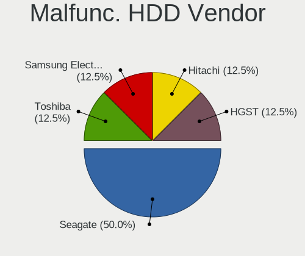
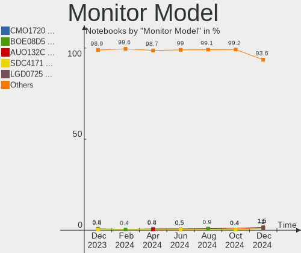
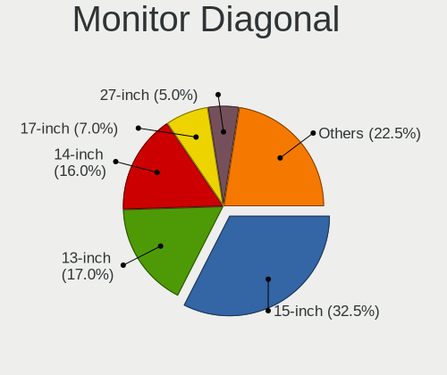
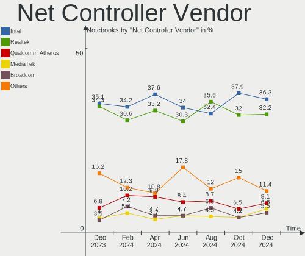

Debian - Hardware Trends (Notebooks)
------------------------------------

A project to identify most popular hardware characteristics and track their change
over time based on data collected by Linux users at https://Linux-Hardware.org.

Anyone can contribute to this report by the [hw-probe](https://github.com/linuxhw/hw-probe) tool:

    sudo -E hw-probe -all -upload

This report is for one last month. Overall report since the beginning of time: [TestCoverage](https://github.com/linuxhw/TestCoverage)

Period: Jul, 2022.

Contents
--------

* [ System ](#system)
  - [ OS                       ](#os)
  - [ OS Family                ](#os-family)
  - [ Kernel                   ](#kernel)
  - [ Kernel Family            ](#kernel-family)
  - [ Kernel Major Ver.        ](#kernel-major-ver)
  - [ Arch                     ](#arch)
  - [ DE                       ](#de)
  - [ Display Server           ](#display-server)
  - [ Display Manager          ](#display-manager)
  - [ OS Lang                  ](#os-lang)
  - [ Boot Mode                ](#boot-mode)
  - [ Filesystem               ](#filesystem)
  - [ Part. scheme             ](#part-scheme)
  - [ Dual Boot with Linux/BSD ](#dual-boot-with-linuxbsd)
  - [ Dual Boot (Win)          ](#dual-boot-win)

* [ Board ](#board)
  - [ Vendor                   ](#vendor)
  - [ Model                    ](#model)
  - [ Model Family             ](#model-family)
  - [ MFG Year                 ](#mfg-year)
  - [ Form Factor              ](#form-factor)
  - [ Secure Boot              ](#secure-boot)
  - [ Coreboot                 ](#coreboot)
  - [ RAM Size                 ](#ram-size)
  - [ RAM Used                 ](#ram-used)
  - [ Total Drives             ](#total-drives)
  - [ Has CD-ROM               ](#has-cd-rom)
  - [ Has Ethernet             ](#has-ethernet)
  - [ Has WiFi                 ](#has-wifi)
  - [ Has Bluetooth            ](#has-bluetooth)

* [ Location ](#location)
  - [ Country                  ](#country)
  - [ City                     ](#city)

* [ Drives ](#drives)
  - [ Drive Vendor             ](#drive-vendor)
  - [ Drive Model              ](#drive-model)
  - [ HDD Vendor               ](#hdd-vendor)
  - [ SSD Vendor               ](#ssd-vendor)
  - [ Drive Kind               ](#drive-kind)
  - [ Drive Connector          ](#drive-connector)
  - [ Drive Size               ](#drive-size)
  - [ Space Total              ](#space-total)
  - [ Space Used               ](#space-used)
  - [ Malfunc. Drives          ](#malfunc-drives)
  - [ Malfunc. Drive Vendor    ](#malfunc-drive-vendor)
  - [ Malfunc. HDD Vendor      ](#malfunc-hdd-vendor)
  - [ Malfunc. Drive Kind      ](#malfunc-drive-kind)
  - [ Failed Drives            ](#failed-drives)
  - [ Failed Drive Vendor      ](#failed-drive-vendor)
  - [ Drive Status             ](#drive-status)

* [ Storage controller ](#storage-controller)
  - [ Storage Vendor           ](#storage-vendor)
  - [ Storage Model            ](#storage-model)
  - [ Storage Kind             ](#storage-kind)

* [ Processor ](#processor)
  - [ CPU Vendor               ](#cpu-vendor)
  - [ CPU Model                ](#cpu-model)
  - [ CPU Model Family         ](#cpu-model-family)
  - [ CPU Cores                ](#cpu-cores)
  - [ CPU Sockets              ](#cpu-sockets)
  - [ CPU Threads              ](#cpu-threads)
  - [ CPU Op-Modes             ](#cpu-op-modes)
  - [ CPU Microcode            ](#cpu-microcode)
  - [ CPU Microarch            ](#cpu-microarch)

* [ Graphics ](#graphics)
  - [ GPU Vendor               ](#gpu-vendor)
  - [ GPU Model                ](#gpu-model)
  - [ GPU Combo                ](#gpu-combo)
  - [ GPU Driver               ](#gpu-driver)
  - [ GPU Memory               ](#gpu-memory)

* [ Monitor ](#monitor)
  - [ Monitor Vendor           ](#monitor-vendor)
  - [ Monitor Model            ](#monitor-model)
  - [ Monitor Resolution       ](#monitor-resolution)
  - [ Monitor Diagonal         ](#monitor-diagonal)
  - [ Monitor Width            ](#monitor-width)
  - [ Aspect Ratio             ](#aspect-ratio)
  - [ Monitor Area             ](#monitor-area)
  - [ Pixel Density            ](#pixel-density)
  - [ Multiple Monitors        ](#multiple-monitors)

* [ Network ](#network)
  - [ Net Controller Vendor    ](#net-controller-vendor)
  - [ Net Controller Model     ](#net-controller-model)
  - [ Wireless Vendor          ](#wireless-vendor)
  - [ Wireless Model           ](#wireless-model)
  - [ Ethernet Vendor          ](#ethernet-vendor)
  - [ Ethernet Model           ](#ethernet-model)
  - [ Net Controller Kind      ](#net-controller-kind)
  - [ Used Controller          ](#used-controller)
  - [ NICs                     ](#nics)
  - [ IPv6                     ](#ipv6)

* [ Bluetooth ](#bluetooth)
  - [ Bluetooth Vendor         ](#bluetooth-vendor)
  - [ Bluetooth Model          ](#bluetooth-model)

* [ Sound ](#sound)
  - [ Sound Vendor             ](#sound-vendor)
  - [ Sound Model              ](#sound-model)

* [ Memory ](#memory)
  - [ Memory Vendor            ](#memory-vendor)
  - [ Memory Model             ](#memory-model)
  - [ Memory Kind              ](#memory-kind)
  - [ Memory Form Factor       ](#memory-form-factor)
  - [ Memory Size              ](#memory-size)
  - [ Memory Speed             ](#memory-speed)

* [ Printers & scanners ](#printers--scanners)
  - [ Printer Vendor           ](#printer-vendor)
  - [ Printer Model            ](#printer-model)
  - [ Scanner Vendor           ](#scanner-vendor)
  - [ Scanner Model            ](#scanner-model)

* [ Camera ](#camera)
  - [ Camera Vendor            ](#camera-vendor)
  - [ Camera Model             ](#camera-model)

* [ Security ](#security)
  - [ Fingerprint Vendor       ](#fingerprint-vendor)
  - [ Fingerprint Model        ](#fingerprint-model)
  - [ Chipcard Vendor          ](#chipcard-vendor)
  - [ Chipcard Model           ](#chipcard-model)

* [ Unsupported ](#unsupported)
  - [ Unsupported Devices      ](#unsupported-devices)
  - [ Unsupported Device Types ](#unsupported-device-types)

System
------

OS
--

Installed operating systems

| Name              | Notebooks | Percent |
|-------------------|-----------|---------|
| Debian 11         | 81        | 74.31%  |
| Debian Testing    | 17        | 15.6%   |
| Debian Unstable   | 5         | 4.59%   |
| Debian 11-updates | 3         | 2.75%   |
| Debian 10         | 2         | 1.83%   |
| Debian 8          | 1         | 0.92%   |

OS Family
---------

OS without a version

| Name   | Notebooks | Percent |
|--------|-----------|---------|
| Debian | 109       | 100%    |

Kernel
------

Version of the Linux kernel

| Version              | Notebooks | Percent |
|----------------------|-----------|---------|
| 5.10.0-16-amd64      | 36        | 33.03%  |
| 5.18.0-2-amd64       | 25        | 22.94%  |
| 5.10.0-15-amd64      | 17        | 15.6%   |
| 5.10.0-13-amd64      | 6         | 5.5%    |
| 5.18.0-0.bpo.1-amd64 | 3         | 2.75%   |
| 5.18.0-2-686-pae     | 2         | 1.83%   |
| 5.18.0-1-amd64       | 2         | 1.83%   |
| 5.16.0-0.bpo.4-amd64 | 2         | 1.83%   |
| 5.10.0-7-amd64       | 2         | 1.83%   |
| 4.19.0-21-amd64      | 2         | 1.83%   |
| 5.19.0-rc4-amd64     | 1         | 0.92%   |
| 5.18.0-3-amd64       | 1         | 0.92%   |
| 5.17.0-3-amd64       | 1         | 0.92%   |
| 5.16.0-5mx-amd64     | 1         | 0.92%   |
| 5.16.0-3-amd64       | 1         | 0.92%   |
| 5.10.60              | 1         | 0.92%   |
| 5.10.0-6-amd64       | 1         | 0.92%   |
| 5.10.0-16-rt-amd64   | 1         | 0.92%   |
| 5.10.0-16-686-pae    | 1         | 0.92%   |
| 5.10.0-15-686-pae    | 1         | 0.92%   |
| 5.10.0-14-amd64      | 1         | 0.92%   |
| 3.0.21-perf          | 1         | 0.92%   |

Kernel Family
-------------

Linux kernel without a distro release

| Version | Notebooks | Percent |
|---------|-----------|---------|
| 5.10.0  | 66        | 60.55%  |
| 5.18.0  | 33        | 30.28%  |
| 5.16.0  | 4         | 3.67%   |
| 4.19.0  | 2         | 1.83%   |
| 5.19.0  | 1         | 0.92%   |
| 5.17.0  | 1         | 0.92%   |
| 5.10.60 | 1         | 0.92%   |
| 3.0.21  | 1         | 0.92%   |

Kernel Major Ver.
-----------------

Linux kernel major version

| Version | Notebooks | Percent |
|---------|-----------|---------|
| 5.10    | 67        | 61.47%  |
| 5.18    | 33        | 30.28%  |
| 5.16    | 4         | 3.67%   |
| 4.19    | 2         | 1.83%   |
| 5.19    | 1         | 0.92%   |
| 5.17    | 1         | 0.92%   |
| 3.0     | 1         | 0.92%   |

Arch
----

OS architecture (x86_64, i586, etc.)

| Name   | Notebooks | Percent |
|--------|-----------|---------|
| x86_64 | 104       | 95.41%  |
| i686   | 4         | 3.67%   |
| armv7l | 1         | 0.92%   |

DE
--

Desktop Environment

| Name            | Notebooks | Percent |
|-----------------|-----------|---------|
| GNOME           | 38        | 34.86%  |
| KDE5            | 20        | 18.35%  |
| XFCE            | 17        | 15.6%   |
| Unknown         | 7         | 6.42%   |
| X-Cinnamon      | 5         | 4.59%   |
| MATE            | 5         | 4.59%   |
| LXDE            | 4         | 3.67%   |
| Cinnamon        | 3         | 2.75%   |
| Openbox         | 2         | 1.83%   |
| LXQt            | 2         | 1.83%   |
| GNOME Flashback | 2         | 1.83%   |
| bspwm           | 2         | 1.83%   |
| trinity         | 1         | 0.92%   |
| i3              | 1         | 0.92%   |

Display Server
--------------

X11 or Wayland

| Name    | Notebooks | Percent |
|---------|-----------|---------|
| X11     | 76        | 69.72%  |
| Wayland | 26        | 23.85%  |
| Unknown | 5         | 4.59%   |
| Tty     | 2         | 1.83%   |

Display Manager
---------------

SDDM, LightDM, etc.

| Name    | Notebooks | Percent |
|---------|-----------|---------|
| LightDM | 32        | 29.36%  |
| Unknown | 26        | 23.85%  |
| GDM     | 23        | 21.1%   |
| SDDM    | 16        | 14.68%  |
| GDM3    | 12        | 11.01%  |

OS Lang
-------

Language

| Lang    | Notebooks | Percent |
|---------|-----------|---------|
| en_US   | 39        | 35.78%  |
| de_DE   | 11        | 10.09%  |
| ru_RU   | 9         | 8.26%   |
| fr_FR   | 7         | 6.42%   |
| en_GB   | 7         | 6.42%   |
| pt_BR   | 3         | 2.75%   |
| es_ES   | 3         | 2.75%   |
| en_CA   | 3         | 2.75%   |
| it_IT   | 2         | 1.83%   |
| hu_HU   | 2         | 1.83%   |
| en_SG   | 2         | 1.83%   |
| C       | 2         | 1.83%   |
| zh_CN   | 1         | 0.92%   |
| pt_PT   | 1         | 0.92%   |
| pl_PL   | 1         | 0.92%   |
| nl_NL   | 1         | 0.92%   |
| hr_HR   | 1         | 0.92%   |
| es_UY   | 1         | 0.92%   |
| es_PE   | 1         | 0.92%   |
| es_MX   | 1         | 0.92%   |
| es_CO   | 1         | 0.92%   |
| es_CL   | 1         | 0.92%   |
| es_AR   | 1         | 0.92%   |
| en_ZA   | 1         | 0.92%   |
| en_IN   | 1         | 0.92%   |
| en_IE   | 1         | 0.92%   |
| en_DE   | 1         | 0.92%   |
| en_AU   | 1         | 0.92%   |
| el_GR   | 1         | 0.92%   |
| cs_CZ   | 1         | 0.92%   |
| Unknown | 1         | 0.92%   |

Boot Mode
---------

EFI or BIOS

| Mode | Notebooks | Percent |
|------|-----------|---------|
| EFI  | 67        | 61.47%  |
| BIOS | 42        | 38.53%  |

Filesystem
----------

Type of filesystem

| Type    | Notebooks | Percent |
|---------|-----------|---------|
| Ext4    | 101       | 92.66%  |
| Overlay | 4         | 3.67%   |
| Btrfs   | 3         | 2.75%   |
| Xfs     | 1         | 0.92%   |

Part. scheme
------------

Scheme of partitioning

| Type    | Notebooks | Percent |
|---------|-----------|---------|
| GPT     | 61        | 55.96%  |
| MBR     | 25        | 22.94%  |
| Unknown | 23        | 21.1%   |

Dual Boot with Linux/BSD
------------------------

Hosting more than one Linux/BSD

| Dual boot | Notebooks | Percent |
|-----------|-----------|---------|
| No        | 105       | 96.33%  |
| Yes       | 4         | 3.67%   |

Dual Boot (Win)
---------------

Hosting Linux and Windows

| Dual boot | Notebooks | Percent |
|-----------|-----------|---------|
| No        | 80        | 73.39%  |
| Yes       | 29        | 26.61%  |

Board
-----

Vendor
------

Motherboard manufacturer

| Name                   | Notebooks | Percent |
|------------------------|-----------|---------|
| Lenovo                 | 23        | 21.1%   |
| Hewlett-Packard        | 20        | 18.35%  |
| Dell                   | 19        | 17.43%  |
| ASUSTek Computer       | 12        | 11.01%  |
| Acer                   | 9         | 8.26%   |
| HUAWEI                 | 6         | 5.5%    |
| Google                 | 4         | 3.67%   |
| Unknown                | 4         | 3.67%   |
| Sony                   | 1         | 0.92%   |
| Samsung Electronics    | 1         | 0.92%   |
| Razer                  | 1         | 0.92%   |
| Panasonic              | 1         | 0.92%   |
| Notebook               | 1         | 0.92%   |
| Medion                 | 1         | 0.92%   |
| HONOR                  | 1         | 0.92%   |
| GPU Company            | 1         | 0.92%   |
| Fujitsu                | 1         | 0.92%   |
| AZW                    | 1         | 0.92%   |
| AXDIA International    | 1         | 0.92%   |
| Avell High Performance | 1         | 0.92%   |

Model
-----

Motherboard model

| Name                                                  | Notebooks | Percent |
|-------------------------------------------------------|-----------|---------|
| Unknown                                               | 5         | 4.59%   |
| HP Notebook                                           | 2         | 1.83%   |
| Dell Vostro 3550                                      | 2         | 1.83%   |
| Sony VPCEH37FJ                                        | 1         | 0.92%   |
| Samsung R505                                          | 1         | 0.92%   |
| Razer Blade 15 Advanced Model (Early 2021) - RZ09-036 | 1         | 0.92%   |
| Panasonic CF-53SJCZYLM                                | 1         | 0.92%   |
| Notebook V15x_V17xPNKPNJPNH                           | 1         | 0.92%   |
| Medion E122X                                          | 1         | 0.92%   |
| Lenovo ThinkPad X140e 20BLA00C00                      | 1         | 0.92%   |
| Lenovo ThinkPad X1 Carbon Gen 8 20U9CTO1WW            | 1         | 0.92%   |
| Lenovo ThinkPad T490 20N3SEYA00                       | 1         | 0.92%   |
| Lenovo ThinkPad T490 20N2000FIX                       | 1         | 0.92%   |
| Lenovo ThinkPad T400 2768WGB                          | 1         | 0.92%   |
| Lenovo ThinkPad T15 Gen 1 20S6001SUS                  | 1         | 0.92%   |
| Lenovo ThinkPad T14 Gen 2a 20XL0014GE                 | 1         | 0.92%   |
| Lenovo ThinkPad T14 Gen 2a 20XK0019US                 | 1         | 0.92%   |
| Lenovo ThinkPad P51s 20HB000URT                       | 1         | 0.92%   |
| Lenovo ThinkPad P15v Gen 3 21D8A00ACD                 | 1         | 0.92%   |
| Lenovo ThinkPad L480 20LS002CPB                       | 1         | 0.92%   |
| Lenovo ThinkPad L14 Gen 1 20U50001GE                  | 1         | 0.92%   |
| Lenovo ThinkPad E14 Gen 4 21E3005DGE                  | 1         | 0.92%   |
| Lenovo ThinkPad E14 Gen 3 20YDS00G00                  | 1         | 0.92%   |
| Lenovo ThinkBook 16p Gen 2 20YM                       | 1         | 0.92%   |
| Lenovo ThinkBook 15 G2 ARE 20VG                       | 1         | 0.92%   |
| Lenovo S21e-20 80M4                                   | 1         | 0.92%   |
| Lenovo IdeaPad L340-15IWL 81LG                        | 1         | 0.92%   |
| Lenovo IdeaPad 5 Pro 14ACN6 82L7                      | 1         | 0.92%   |
| Lenovo IdeaPad 3 15ALC6 82MF                          | 1         | 0.92%   |
| Lenovo G550 2958                                      | 1         | 0.92%   |
| Lenovo G410 20237                                     | 1         | 0.92%   |
| Lenovo B50-30 80ES                                    | 1         | 0.92%   |
| HUAWEI WRTB-WXX9                                      | 1         | 0.92%   |
| HUAWEI NBLB-WAX9N                                     | 1         | 0.92%   |
| HUAWEI KLVD-WXX9                                      | 1         | 0.92%   |
| HUAWEI BOM-WXX9                                       | 1         | 0.92%   |
| HUAWEI BOHK-WAX9X                                     | 1         | 0.92%   |
| HUAWEI BOD-WXX9                                       | 1         | 0.92%   |
| HONOR BBR-WAX9                                        | 1         | 0.92%   |
| HP ZBook Power 15.6 inch G8 Mobile Workstation PC     | 1         | 0.92%   |
| HP ZBook 15 G3                                        | 1         | 0.92%   |
| HP Stream Notebook PC 11                              | 1         | 0.92%   |
| HP ProBook 450 G3                                     | 1         | 0.92%   |
| HP ProBook 4310s                                      | 1         | 0.92%   |
| HP Pavilion g4                                        | 1         | 0.92%   |
| HP Pavilion Aero Laptop 13-be0xxx                     | 1         | 0.92%   |
| HP Laptop 15-ef2xxx                                   | 1         | 0.92%   |
| HP Laptop 15-bw0xx                                    | 1         | 0.92%   |
| HP EliteBook 845 G8 Notebook PC                       | 1         | 0.92%   |
| HP EliteBook 820 G2                                   | 1         | 0.92%   |
| HP EliteBook 2530p                                    | 1         | 0.92%   |
| HP Compaq Presario C700                               | 1         | 0.92%   |
| HP Compaq 8510p                                       | 1         | 0.92%   |
| HP Compaq 6910p                                       | 1         | 0.92%   |
| HP 255 G8 Notebook PC                                 | 1         | 0.92%   |
| HP 250 G8 Notebook PC                                 | 1         | 0.92%   |
| GPU Company GWTN156-9                                 | 1         | 0.92%   |
| Google Terra                                          | 1         | 0.92%   |
| Google Peppy                                          | 1         | 0.92%   |
| Google Enguarde                                       | 1         | 0.92%   |

Model Family
------------

Motherboard model prefix

| Name                       | Notebooks | Percent |
|----------------------------|-----------|---------|
| Lenovo ThinkPad            | 14        | 12.84%  |
| Dell Latitude              | 11        | 10.09%  |
| Acer Aspire                | 5         | 4.59%   |
| Unknown                    | 5         | 4.59%   |
| Dell Vostro                | 4         | 3.67%   |
| Lenovo IdeaPad             | 3         | 2.75%   |
| HP EliteBook               | 3         | 2.75%   |
| HP Compaq                  | 3         | 2.75%   |
| Lenovo ThinkBook           | 2         | 1.83%   |
| HP ZBook                   | 2         | 1.83%   |
| HP ProBook                 | 2         | 1.83%   |
| HP Pavilion                | 2         | 1.83%   |
| HP Notebook                | 2         | 1.83%   |
| HP Laptop                  | 2         | 1.83%   |
| Dell Inspiron              | 2         | 1.83%   |
| ASUS ZenBook               | 2         | 1.83%   |
| ASUS VivoBook              | 2         | 1.83%   |
| Sony VPCEH37FJ             | 1         | 0.92%   |
| Samsung R505               | 1         | 0.92%   |
| Razer Blade                | 1         | 0.92%   |
| Panasonic CF-53SJCZYLM     | 1         | 0.92%   |
| Notebook V15x              | 1         | 0.92%   |
| Medion E122X               | 1         | 0.92%   |
| Lenovo S21e-20             | 1         | 0.92%   |
| Lenovo G550                | 1         | 0.92%   |
| Lenovo G410                | 1         | 0.92%   |
| Lenovo B50-30              | 1         | 0.92%   |
| HUAWEI WRTB-WXX9           | 1         | 0.92%   |
| HUAWEI NBLB-WAX9N          | 1         | 0.92%   |
| HUAWEI KLVD-WXX9           | 1         | 0.92%   |
| HUAWEI BOM-WXX9            | 1         | 0.92%   |
| HUAWEI BOHK-WAX9X          | 1         | 0.92%   |
| HUAWEI BOD-WXX9            | 1         | 0.92%   |
| HONOR BBR-WAX9             | 1         | 0.92%   |
| HP Stream                  | 1         | 0.92%   |
| HP 255                     | 1         | 0.92%   |
| HP 250                     | 1         | 0.92%   |
| GPU Company GWTN156-9      | 1         | 0.92%   |
| Google Terra               | 1         | 0.92%   |
| Google Peppy               | 1         | 0.92%   |
| Google Enguarde            | 1         | 0.92%   |
| Google Coral               | 1         | 0.92%   |
| Fujitsu FMVNP7HER          | 1         | 0.92%   |
| Dell XPS                   | 1         | 0.92%   |
| Dell Precision             | 1         | 0.92%   |
| AZW Z83                    | 1         | 0.92%   |
| AXDIA International MYBOOK | 1         | 0.92%   |
| Avell High Performance A40 | 1         | 0.92%   |
| ASUS Zephyrus              | 1         | 0.92%   |
| ASUS X756UQK               | 1         | 0.92%   |
| ASUS X541UVK               | 1         | 0.92%   |
| ASUS X541UJ                | 1         | 0.92%   |
| ASUS ROG                   | 1         | 0.92%   |
| ASUS GL553VE               | 1         | 0.92%   |
| ASUS G55VW                 | 1         | 0.92%   |
| ASUS 1215P                 | 1         | 0.92%   |
| Acer TravelMate            | 1         | 0.92%   |
| Acer Nitro                 | 1         | 0.92%   |
| Acer AOD257                | 1         | 0.92%   |
| Acer AO756                 | 1         | 0.92%   |

MFG Year
--------

Motherboard manufacture year

| Year    | Notebooks | Percent |
|---------|-----------|---------|
| 2021    | 28        | 25.69%  |
| 2020    | 17        | 15.6%   |
| 2019    | 10        | 9.17%   |
| 2022    | 6         | 5.5%    |
| 2018    | 6         | 5.5%    |
| 2012    | 6         | 5.5%    |
| 2017    | 4         | 3.67%   |
| 2016    | 4         | 3.67%   |
| 2014    | 4         | 3.67%   |
| 2011    | 4         | 3.67%   |
| 2010    | 4         | 3.67%   |
| 2008    | 4         | 3.67%   |
| 2015    | 3         | 2.75%   |
| 2007    | 3         | 2.75%   |
| 2013    | 2         | 1.83%   |
| 2009    | 2         | 1.83%   |
| 2006    | 1         | 0.92%   |
| Unknown | 1         | 0.92%   |

Form Factor
-----------

Physical design of the computer

| Name     | Notebooks | Percent |
|----------|-----------|---------|
| Notebook | 109       | 100%    |

Secure Boot
-----------

Enabled or disabled

| State    | Notebooks | Percent |
|----------|-----------|---------|
| Disabled | 95        | 87.16%  |
| Enabled  | 14        | 12.84%  |

Coreboot
--------

Have coreboot on board

| Used | Notebooks | Percent |
|------|-----------|---------|
| No   | 105       | 96.33%  |
| Yes  | 4         | 3.67%   |

RAM Size
--------

Total RAM memory

| Size in GB  | Notebooks | Percent |
|-------------|-----------|---------|
| 4.01-8.0    | 27        | 24.77%  |
| 3.01-4.0    | 22        | 20.18%  |
| 8.01-16.0   | 22        | 20.18%  |
| 16.01-24.0  | 17        | 15.6%   |
| 32.01-64.0  | 7         | 6.42%   |
| 1.01-2.0    | 5         | 4.59%   |
| 2.01-3.0    | 4         | 3.67%   |
| 24.01-32.0  | 2         | 1.83%   |
| 64.01-256.0 | 1         | 0.92%   |
| 0.51-1.0    | 1         | 0.92%   |
| 0.01-0.5    | 1         | 0.92%   |

RAM Used
--------

Used RAM memory

| Used GB    | Notebooks | Percent |
|------------|-----------|---------|
| 1.01-2.0   | 36        | 33.03%  |
| 2.01-3.0   | 29        | 26.61%  |
| 3.01-4.0   | 12        | 11.01%  |
| 4.01-8.0   | 11        | 10.09%  |
| 8.01-16.0  | 8         | 7.34%   |
| 0.51-1.0   | 8         | 7.34%   |
| 0.01-0.5   | 3         | 2.75%   |
| 16.01-24.0 | 1         | 0.92%   |
| Unknown    | 1         | 0.92%   |

Total Drives
------------

Number of drives on board

| Drives | Notebooks | Percent |
|--------|-----------|---------|
| 1      | 87        | 79.82%  |
| 2      | 20        | 18.35%  |
| 3      | 2         | 1.83%   |

Has CD-ROM
----------

Has CD-ROM on board

| Presented | Notebooks | Percent |
|-----------|-----------|---------|
| No        | 84        | 77.06%  |
| Yes       | 25        | 22.94%  |

Has Ethernet
------------

Has Ethernet on board

| Presented | Notebooks | Percent |
|-----------|-----------|---------|
| Yes       | 89        | 81.65%  |
| No        | 20        | 18.35%  |

Has WiFi
--------

Has WiFi module

| Presented | Notebooks | Percent |
|-----------|-----------|---------|
| Yes       | 107       | 98.17%  |
| No        | 2         | 1.83%   |

Has Bluetooth
-------------

Has Bluetooth module

| Presented | Notebooks | Percent |
|-----------|-----------|---------|
| Yes       | 87        | 79.82%  |
| No        | 22        | 20.18%  |

Location
--------

Country
-------

Geographic location (country)

| Country      | Notebooks | Percent |
|--------------|-----------|---------|
| Germany      | 17        | 15.6%   |
| USA          | 16        | 14.68%  |
| Russia       | 9         | 8.26%   |
| Brazil       | 6         | 5.5%    |
| Italy        | 5         | 4.59%   |
| France       | 5         | 4.59%   |
| Netherlands  | 4         | 3.67%   |
| Canada       | 4         | 3.67%   |
| UK           | 3         | 2.75%   |
| Sweden       | 3         | 2.75%   |
| Spain        | 3         | 2.75%   |
| China        | 3         | 2.75%   |
| Thailand     | 2         | 1.83%   |
| Taiwan       | 2         | 1.83%   |
| Poland       | 2         | 1.83%   |
| Morocco      | 2         | 1.83%   |
| Hungary      | 2         | 1.83%   |
| Czechia      | 2         | 1.83%   |
| Colombia     | 2         | 1.83%   |
| Argentina    | 2         | 1.83%   |
| Uruguay      | 1         | 0.92%   |
| Turkey       | 1         | 0.92%   |
| Switzerland  | 1         | 0.92%   |
| South Africa | 1         | 0.92%   |
| Singapore    | 1         | 0.92%   |
| Portugal     | 1         | 0.92%   |
| Peru         | 1         | 0.92%   |
| Mexico       | 1         | 0.92%   |
| Malaysia     | 1         | 0.92%   |
| Jersey       | 1         | 0.92%   |
| India        | 1         | 0.92%   |
| Greece       | 1         | 0.92%   |
| Croatia      | 1         | 0.92%   |
| Chile        | 1         | 0.92%   |
| Australia    | 1         | 0.92%   |

City
----

Geographic location (city)

| City                | Notebooks | Percent |
|---------------------|-----------|---------|
| Berlin              | 3         | 2.75%   |
| Voronezh            | 2         | 1.83%   |
| Taipei              | 2         | 1.83%   |
| Milan               | 2         | 1.83%   |
| Hamburg             | 2         | 1.83%   |
| Clinton Township    | 2         | 1.83%   |
| Bangor              | 2         | 1.83%   |
| Bangkok             | 2         | 1.83%   |
| Amsterdam           | 2         | 1.83%   |
| Zdar                | 1         | 0.92%   |
| Wola Krzysztoporska | 1         | 0.92%   |
| Warsaw              | 1         | 0.92%   |
| Vitória            | 1         | 0.92%   |
| Viña del Mar       | 1         | 0.92%   |
| Valley View         | 1         | 0.92%   |
| Ulyanovsk           | 1         | 0.92%   |
| Trets               | 1         | 0.92%   |
| Toronto             | 1         | 0.92%   |
| The Hague           | 1         | 0.92%   |
| Sydney              | 1         | 0.92%   |
| Stuttgart           | 1         | 0.92%   |
| St Petersburg       | 1         | 0.92%   |
| Sollentuna          | 1         | 0.92%   |
| Singapore           | 1         | 0.92%   |
| Shenzhen            | 1         | 0.92%   |
| Serpukhov           | 1         | 0.92%   |
| Sarnia              | 1         | 0.92%   |
| Santiago de Cali    | 1         | 0.92%   |
| Santa Rosa Beach    | 1         | 0.92%   |
| San Isidro          | 1         | 0.92%   |
| Saint Helier        | 1         | 0.92%   |
| Roeulx              | 1         | 0.92%   |
| Roesrath            | 1         | 0.92%   |
| Reus                | 1         | 0.92%   |
| Ranchi              | 1         | 0.92%   |
| Poxdorf             | 1         | 0.92%   |
| Polysayevo          | 1         | 0.92%   |
| Perm                | 1         | 0.92%   |
| Ottawa              | 1         | 0.92%   |
| Oroszlany           | 1         | 0.92%   |
| Nyack               | 1         | 0.92%   |
| Nuremberg           | 1         | 0.92%   |
| Natal               | 1         | 0.92%   |
| Nakhabino           | 1         | 0.92%   |
| Nador               | 1         | 0.92%   |
| Münster            | 1         | 0.92%   |
| Munich              | 1         | 0.92%   |
| Moscow              | 1         | 0.92%   |
| Montevideo          | 1         | 0.92%   |
| Meylan              | 1         | 0.92%   |
| Mesa                | 1         | 0.92%   |
| Marktredwitz        | 1         | 0.92%   |
| Maringá            | 1         | 0.92%   |
| Manizales           | 1         | 0.92%   |
| Malmo               | 1         | 0.92%   |
| Madrid              | 1         | 0.92%   |
| Maarssen            | 1         | 0.92%   |
| Lowell              | 1         | 0.92%   |
| London              | 1         | 0.92%   |
| Leipzig             | 1         | 0.92%   |

Drives
------

Drive Vendor
------------

Hard drive vendors

| Vendor                       | Notebooks | Drives | Percent |
|------------------------------|-----------|--------|---------|
| Samsung Electronics          | 24        | 28     | 19.35%  |
| WDC                          | 16        | 16     | 12.9%   |
| Unknown                      | 9         | 11     | 7.26%   |
| SK hynix                     | 9         | 9      | 7.26%   |
| SanDisk                      | 8         | 8      | 6.45%   |
| Toshiba                      | 6         | 6      | 4.84%   |
| Seagate                      | 6         | 6      | 4.84%   |
| KIOXIA                       | 5         | 5      | 4.03%   |
| Phison                       | 3         | 3      | 2.42%   |
| Kingston                     | 3         | 3      | 2.42%   |
| Hitachi                      | 3         | 3      | 2.42%   |
| HGST                         | 3         | 3      | 2.42%   |
| Crucial                      | 3         | 3      | 2.42%   |
| Transcend                    | 2         | 2      | 1.61%   |
| Micron Technology            | 2         | 2      | 1.61%   |
| Intenso                      | 2         | 2      | 1.61%   |
| ADATA Technology             | 2         | 2      | 1.61%   |
| A-DATA Technology            | 2         | 2      | 1.61%   |
| Unknown                      | 2         | 2      | 1.61%   |
| W800SH                       | 1         | 1      | 0.81%   |
| TOPMORE                      | 1         | 1      | 0.81%   |
| SSSTC                        | 1         | 1      | 0.81%   |
| SPCC                         | 1         | 1      | 0.81%   |
| ShiJi                        | 1         | 1      | 0.81%   |
| Shenzhen Longsys Electronics | 1         | 1      | 0.81%   |
| S3+                          | 1         | 1      | 0.81%   |
| PNY                          | 1         | 1      | 0.81%   |
| Lenovo                       | 1         | 1      | 0.81%   |
| Hewlett-Packard              | 1         | 1      | 0.81%   |
| GOODRAM                      | 1         | 1      | 0.81%   |
| Fujitsu                      | 1         | 1      | 0.81%   |
| China                        | 1         | 1      | 0.81%   |
| addlink                      | 1         | 1      | 0.81%   |

Drive Model
-----------

Hard drive models

| Model                                 | Notebooks | Percent |
|---------------------------------------|-----------|---------|
| Phison 311CD0512GB                    | 3         | 2.33%   |
| WDC WDS240G2G0A-00JH30 240GB SSD      | 2         | 1.55%   |
| SK hynix NVMe SSD Drive 512GB         | 2         | 1.55%   |
| Samsung SSD 970 EVO Plus 1TB          | 2         | 1.55%   |
| Samsung SSD 870 EVO 1TB               | 2         | 1.55%   |
| Samsung MZVLB512HAJQ-00000 512GB      | 2         | 1.55%   |
| ADATA NVMe SSD Drive 256GB            | 2         | 1.55%   |
| Unknown                               | 2         | 1.55%   |
| WDC WD5000LPCX-21VHAT0 500GB          | 1         | 0.78%   |
| WDC WD3200BEKT-75PVMT1 320GB          | 1         | 0.78%   |
| WDC WD20SPZX-00UA7T0 2TB              | 1         | 0.78%   |
| WDC WD1600BEVS-60VAT0 160GB           | 1         | 0.78%   |
| WDC WD10SPZX-80Z10T0 1TB              | 1         | 0.78%   |
| WDC WD10SPZX-75Z10T3 1TB              | 1         | 0.78%   |
| WDC WD10SPZX-60Z10T0 1TB              | 1         | 0.78%   |
| WDC PC SN730 SDBQNTY-512G-1001 512GB  | 1         | 0.78%   |
| WDC PC SN730 SDBPNTY-512G-1101 512GB  | 1         | 0.78%   |
| WDC PC SN730 SDBPNTY-256G-1027 256GB  | 1         | 0.78%   |
| WDC PC SN530 SDBPNPZ-256G-1114 256GB  | 1         | 0.78%   |
| WDC PC SN530 SDBPNPZ-1T00-1006 1TB    | 1         | 0.78%   |
| WDC PC SN530 NVMe 256GB               | 1         | 0.78%   |
| WDC PC SN520 SDAPMUW-128G-1101 128GB  | 1         | 0.78%   |
| W800SH 512GB SSD                      | 1         | 0.78%   |
| Unknown SDW16G  16GB                  | 1         | 0.78%   |
| Unknown SD16G  16GB                   | 1         | 0.78%   |
| Unknown SB64G  64GB                   | 1         | 0.78%   |
| Unknown MMC Card  64GB                | 1         | 0.78%   |
| Unknown MMC Card  4GB                 | 1         | 0.78%   |
| Unknown MMC Card  32GB                | 1         | 0.78%   |
| Unknown MBG4GC  32GB                  | 1         | 0.78%   |
| Unknown Biwin  64GB                   | 1         | 0.78%   |
| Unknown BGND3R  32GB                  | 1         | 0.78%   |
| Unknown AGND3R  16GB                  | 1         | 0.78%   |
| Transcend TS240GMTS420S 240GB SSD     | 1         | 0.78%   |
| Transcend TS128GMTS400S 128GB SSD     | 1         | 0.78%   |
| Toshiba TR200 240GB SSD               | 1         | 0.78%   |
| Toshiba MQ04ABF100 1TB                | 1         | 0.78%   |
| Toshiba MQ01ABF050 500GB              | 1         | 0.78%   |
| Toshiba MK2529GSG 250GB               | 1         | 0.78%   |
| Toshiba KXG6AZNV1T02 1TB              | 1         | 0.78%   |
| Toshiba KXG60ZNV512G 512GB            | 1         | 0.78%   |
| TOPMORE TU200 240GB SSD               | 1         | 0.78%   |
| SSSTC CL1-3D128-Q11 NVMe 128GB        | 1         | 0.78%   |
| SPCC Solid State Disk 128GB           | 1         | 0.78%   |
| SK hynix PC801 NVMe 1TB               | 1         | 0.78%   |
| SK hynix HFS128G39TND-N210A 128GB SSD | 1         | 0.78%   |
| SK hynix HFM512GDJTNG-8310A 512GB     | 1         | 0.78%   |
| SK hynix HFM512GD3JX013N 512GB        | 1         | 0.78%   |
| SK hynix HFM128GDJTNG-8310A 128GB     | 1         | 0.78%   |
| SK hynix BC711 NVMe 512GB             | 1         | 0.78%   |
| SK hynix BC711 NVMe 256GB             | 1         | 0.78%   |
| ShiJi 1TB                             | 1         | 0.78%   |
| Shenzhen Longsys NVMe SSD Drive 128GB | 1         | 0.78%   |
| Seagate ST9250315AS 250GB             | 1         | 0.78%   |
| Seagate ST750LM028-1KK162 752GB       | 1         | 0.78%   |
| Seagate ST500LT012-1DG142 500GB       | 1         | 0.78%   |
| Seagate ST2000LX001-1RG174 2TB        | 1         | 0.78%   |
| Seagate ST1000LM035-1RK172 1TB        | 1         | 0.78%   |
| Seagate BUP BK 4TB                    | 1         | 0.78%   |
| SanDisk SSD U100 8GB                  | 1         | 0.78%   |

HDD Vendor
----------

Hard disk drive vendors

| Vendor              | Notebooks | Drives | Percent |
|---------------------|-----------|--------|---------|
| WDC                 | 7         | 7      | 29.17%  |
| Seagate             | 6         | 6      | 25%     |
| Toshiba             | 3         | 3      | 12.5%   |
| Hitachi             | 3         | 3      | 12.5%   |
| HGST                | 3         | 3      | 12.5%   |
| Samsung Electronics | 1         | 1      | 4.17%   |
| Fujitsu             | 1         | 1      | 4.17%   |

SSD Vendor
----------

Solid state drive vendors

| Vendor              | Notebooks | Drives | Percent |
|---------------------|-----------|--------|---------|
| Samsung Electronics | 9         | 10     | 24.32%  |
| SanDisk             | 5         | 5      | 13.51%  |
| Kingston            | 3         | 3      | 8.11%   |
| Crucial             | 3         | 3      | 8.11%   |
| WDC                 | 2         | 2      | 5.41%   |
| Transcend           | 2         | 2      | 5.41%   |
| Intenso             | 2         | 2      | 5.41%   |
| W800SH              | 1         | 1      | 2.7%    |
| Toshiba             | 1         | 1      | 2.7%    |
| TOPMORE             | 1         | 1      | 2.7%    |
| SPCC                | 1         | 1      | 2.7%    |
| SK hynix            | 1         | 1      | 2.7%    |
| S3+                 | 1         | 1      | 2.7%    |
| PNY                 | 1         | 1      | 2.7%    |
| Micron Technology   | 1         | 1      | 2.7%    |
| Lenovo              | 1         | 1      | 2.7%    |
| China               | 1         | 1      | 2.7%    |
| Unknown             | 1         | 1      | 2.7%    |

Drive Kind
----------

HDD or SSD

| Kind | Notebooks | Drives | Percent |
|------|-----------|--------|---------|
| NVMe | 53        | 55     | 42.74%  |
| SSD  | 37        | 38     | 29.84%  |
| HDD  | 23        | 24     | 18.55%  |
| MMC  | 11        | 13     | 8.87%   |

Drive Connector
---------------

SATA, SAS, NVMe, etc.

| Type | Notebooks | Drives | Percent |
|------|-----------|--------|---------|
| NVMe | 53        | 55     | 44.54%  |
| SATA | 53        | 60     | 44.54%  |
| MMC  | 11        | 13     | 9.24%   |
| SAS  | 2         | 2      | 1.68%   |

Drive Size
----------

Size of hard drive

| Size in TB | Notebooks | Drives | Percent |
|------------|-----------|--------|---------|
| 0.01-0.5   | 37        | 39     | 62.71%  |
| 0.51-1.0   | 19        | 20     | 32.2%   |
| 1.01-2.0   | 2         | 2      | 3.39%   |
| 3.01-4.0   | 1         | 1      | 1.69%   |

Space Total
-----------

Amount of disk space available on the file system

| Size in GB | Notebooks | Percent |
|------------|-----------|---------|
| 101-250    | 33        | 30.28%  |
| 251-500    | 30        | 27.52%  |
| 501-1000   | 15        | 13.76%  |
| 51-100     | 9         | 8.26%   |
| 1001-2000  | 8         | 7.34%   |
| 21-50      | 6         | 5.5%    |
| 1-20       | 4         | 3.67%   |
| Unknown    | 4         | 3.67%   |

Space Used
----------

Amount of used disk space

| Used GB   | Notebooks | Percent |
|-----------|-----------|---------|
| 1-20      | 46        | 42.2%   |
| 21-50     | 22        | 20.18%  |
| 51-100    | 14        | 12.84%  |
| 101-250   | 13        | 11.93%  |
| 251-500   | 6         | 5.5%    |
| Unknown   | 4         | 3.67%   |
| 501-1000  | 3         | 2.75%   |
| 1001-2000 | 1         | 0.92%   |

Malfunc. Drives
---------------

Drive models with a malfunction

| Model                              | Notebooks | Drives | Percent |
|------------------------------------|-----------|--------|---------|
| ShiJi 1TB                          | 1         | 1      | 16.67%  |
| Seagate ST750LM028-1KK162 752GB    | 1         | 1      | 16.67%  |
| Samsung Electronics HN-M101MBB 1TB | 1         | 1      | 16.67%  |
| Lenovo SSD SL700 120G              | 1         | 1      | 16.67%  |
| Kingston SNS4151S316GD 16GB SSD    | 1         | 1      | 16.67%  |
| Fujitsu MHW2120BH 120GB            | 1         | 1      | 16.67%  |

Malfunc. Drive Vendor
---------------------

Vendors of faulty drives

| Vendor              | Notebooks | Drives | Percent |
|---------------------|-----------|--------|---------|
| ShiJi               | 1         | 1      | 16.67%  |
| Seagate             | 1         | 1      | 16.67%  |
| Samsung Electronics | 1         | 1      | 16.67%  |
| Lenovo              | 1         | 1      | 16.67%  |
| Kingston            | 1         | 1      | 16.67%  |
| Fujitsu             | 1         | 1      | 16.67%  |

Malfunc. HDD Vendor
-------------------

Vendors of faulty HDD drives

| Vendor              | Notebooks | Drives | Percent |
|---------------------|-----------|--------|---------|
| Seagate             | 1         | 1      | 33.33%  |
| Samsung Electronics | 1         | 1      | 33.33%  |
| Fujitsu             | 1         | 1      | 33.33%  |

Malfunc. Drive Kind
-------------------

Kinds of faulty drives

| Kind | Notebooks | Drives | Percent |
|------|-----------|--------|---------|
| HDD  | 3         | 3      | 50%     |
| SSD  | 2         | 2      | 33.33%  |
| NVMe | 1         | 1      | 16.67%  |

Failed Drives
-------------

Failed drive models

Zero info for selected period =(

Failed Drive Vendor
-------------------

Failed drive vendors

Zero info for selected period =(

Drive Status
------------

Number of failed and malfunc. drives

| Status   | Notebooks | Drives | Percent |
|----------|-----------|--------|---------|
| Works    | 76        | 85     | 66.67%  |
| Detected | 32        | 39     | 28.07%  |
| Malfunc  | 6         | 6      | 5.26%   |

Storage controller
------------------

Storage Vendor
--------------

Storage controller vendors

| Vendor                         | Notebooks | Percent |
|--------------------------------|-----------|---------|
| Intel                          | 60        | 47.62%  |
| Samsung Electronics            | 16        | 12.7%   |
| AMD                            | 12        | 9.52%   |
| SanDisk                        | 9         | 7.14%   |
| SK hynix                       | 8         | 6.35%   |
| Phison Electronics             | 4         | 3.17%   |
| KIOXIA                         | 4         | 3.17%   |
| ADATA Technology               | 4         | 3.17%   |
| Toshiba America Info Systems   | 3         | 2.38%   |
| Silicon Motion                 | 2         | 1.59%   |
| Solid State Storage Technology | 1         | 0.79%   |
| Shenzhen Longsys Electronics   | 1         | 0.79%   |
| Micron Technology              | 1         | 0.79%   |
| Biwin Storage Technology       | 1         | 0.79%   |

Storage Model
-------------

Storage controller models

| Model                                                                          | Notebooks | Percent |
|--------------------------------------------------------------------------------|-----------|---------|
| AMD FCH SATA Controller [AHCI mode]                                            | 11        | 8.15%   |
| Samsung NVMe SSD Controller SM981/PM981/PM983                                  | 9         | 6.67%   |
| Intel Sunrise Point-LP SATA Controller [AHCI mode]                             | 8         | 5.93%   |
| Samsung NVMe SSD Controller 980                                                | 7         | 5.19%   |
| Intel 82801IBM/IEM (ICH9M/ICH9M-E) 4 port SATA Controller [AHCI mode]          | 6         | 4.44%   |
| Intel Volume Management Device NVMe RAID Controller                            | 5         | 3.7%    |
| Intel 7 Series Chipset Family 6-port SATA Controller [AHCI mode]               | 5         | 3.7%    |
| SK hynix Gold P31 SSD                                                          | 4         | 2.96%   |
| Intel Comet Lake SATA AHCI Controller                                          | 4         | 2.96%   |
| Intel 82801 Mobile SATA Controller [RAID mode]                                 | 4         | 2.96%   |
| Intel 6 Series/C200 Series Chipset Family 6 port Mobile SATA AHCI Controller   | 4         | 2.96%   |
| Toshiba America Info Systems XG6 NVMe SSD Controller                           | 3         | 2.22%   |
| SanDisk WD Blue SN550 NVMe SSD                                                 | 3         | 2.22%   |
| SanDisk WD Black SN750 / PC SN730 NVMe SSD                                     | 3         | 2.22%   |
| Phison PS5013 E13 NVMe Controller                                              | 3         | 2.22%   |
| KIOXIA NVMe SSD Controller BG4                                                 | 3         | 2.22%   |
| Intel Wildcat Point-LP SATA Controller [AHCI Mode]                             | 3         | 2.22%   |
| Intel 82801HM/HEM (ICH8M/ICH8M-E) SATA Controller [AHCI mode]                  | 3         | 2.22%   |
| Intel 82801HM/HEM (ICH8M/ICH8M-E) IDE Controller                               | 3         | 2.22%   |
| ADATA Non-Volatile memory controller                                           | 3         | 2.22%   |
| SK hynix BC501 NVMe Solid State Drive                                          | 2         | 1.48%   |
| Silicon Motion SM2263EN/SM2263XT SSD Controller                                | 2         | 1.48%   |
| Intel Tiger Lake-LP SATA Controller                                            | 2         | 1.48%   |
| Intel NM10/ICH7 Family SATA Controller [AHCI mode]                             | 2         | 1.48%   |
| Intel Mobile PM965/GM965 PT IDER Controller                                    | 2         | 1.48%   |
| Intel Cannon Point-LP SATA Controller [AHCI Mode]                              | 2         | 1.48%   |
| Intel 5 Series/3400 Series Chipset 4 port SATA AHCI Controller                 | 2         | 1.48%   |
| Solid State Storage Non-Volatile memory controller                             | 1         | 0.74%   |
| SK hynix Non-Volatile memory controller                                        | 1         | 0.74%   |
| SK hynix BC511                                                                 | 1         | 0.74%   |
| Shenzhen Longsys Non-Volatile memory controller                                | 1         | 0.74%   |
| SanDisk WD Black 2018/SN750 / PC SN720 NVMe SSD                                | 1         | 0.74%   |
| SanDisk PC SN520 NVMe SSD                                                      | 1         | 0.74%   |
| SanDisk Non-Volatile memory controller                                         | 1         | 0.74%   |
| Samsung NVMe SSD Controller SM961/PM961/SM963                                  | 1         | 0.74%   |
| Phison E12 NVMe Controller                                                     | 1         | 0.74%   |
| Micron Non-Volatile memory controller                                          | 1         | 0.74%   |
| KIOXIA Non-Volatile memory controller                                          | 1         | 0.74%   |
| Intel Q170/Q150/B150/H170/H110/Z170/CM236 Chipset SATA Controller [AHCI Mode]  | 1         | 0.74%   |
| Intel NM10/ICH7 Family SATA Controller [IDE mode]                              | 1         | 0.74%   |
| Intel Mobile 4 Series Chipset PT IDER Controller                               | 1         | 0.74%   |
| Intel Ice Lake-LP SATA Controller [AHCI mode]                                  | 1         | 0.74%   |
| Intel HM170/QM170 Chipset SATA Controller [AHCI Mode]                          | 1         | 0.74%   |
| Intel Celeron/Pentium Silver Processor SATA Controller                         | 1         | 0.74%   |
| Intel Celeron N3350/Pentium N4200/Atom E3900 Series SATA AHCI Controller       | 1         | 0.74%   |
| Intel Atom Processor E3800 Series SATA AHCI Controller                         | 1         | 0.74%   |
| Intel Alder Lake-P SATA AHCI Controller                                        | 1         | 0.74%   |
| Intel 82801GBM/GHM (ICH7-M Family) SATA Controller [IDE mode]                  | 1         | 0.74%   |
| Intel 8 Series/C220 Series Chipset Family 6-port SATA Controller 1 [AHCI mode] | 1         | 0.74%   |
| Intel 8 Series SATA Controller 1 [AHCI mode]                                   | 1         | 0.74%   |
| Intel 400 Series Chipset Family SATA AHCI Controller                           | 1         | 0.74%   |
| Biwin Storage Non-Volatile memory controller                                   | 1         | 0.74%   |
| AMD SB7x0/SB8x0/SB9x0 SATA Controller [AHCI mode]                              | 1         | 0.74%   |
| ADATA A Non-Volatile memory controller                                         | 1         | 0.74%   |

Storage Kind
------------

Kind of storage controller (IDE, SATA, NVMe, SAS, ...)

| Kind | Notebooks | Percent |
|------|-----------|---------|
| SATA | 63        | 48.09%  |
| NVMe | 53        | 40.46%  |
| RAID | 9         | 6.87%   |
| IDE  | 6         | 4.58%   |

Processor
---------

CPU Vendor
----------

Processor vendors

| Vendor | Notebooks | Percent |
|--------|-----------|---------|
| Intel  | 84        | 77.06%  |
| AMD    | 24        | 22.02%  |
| ARM    | 1         | 0.92%   |

CPU Model
---------

Processor models

| Model                                         | Notebooks | Percent |
|-----------------------------------------------|-----------|---------|
| AMD Ryzen 5 5500U with Radeon Graphics        | 5         | 4.59%   |
| Intel Core i5-10210U CPU @ 1.60GHz            | 4         | 3.67%   |
| Intel Core i7-7500U CPU @ 2.70GHz             | 3         | 2.75%   |
| Intel Core i7-10510U CPU @ 1.80GHz            | 3         | 2.75%   |
| Intel Celeron CPU N2840 @ 2.16GHz             | 3         | 2.75%   |
| Intel 11th Gen Core i5-1135G7 @ 2.40GHz       | 3         | 2.75%   |
| AMD Ryzen 5 3500U with Radeon Vega Mobile Gfx | 3         | 2.75%   |
| Intel Core i7-8565U CPU @ 1.80GHz             | 2         | 1.83%   |
| Intel Core i7-10875H CPU @ 2.30GHz            | 2         | 1.83%   |
| Intel Core i5-3340M CPU @ 2.70GHz             | 2         | 1.83%   |
| Intel Core i3-6006U CPU @ 2.00GHz             | 2         | 1.83%   |
| Intel Core i3-2350M CPU @ 2.30GHz             | 2         | 1.83%   |
| Intel Atom CPU N570 @ 1.66GHz                 | 2         | 1.83%   |
| Intel 11th Gen Core i7-1165G7 @ 2.80GHz       | 2         | 1.83%   |
| AMD Ryzen 7 PRO 5850U with Radeon Graphics    | 2         | 1.83%   |
| Intel Xeon W-11955M CPU @ 2.60GHz             | 1         | 0.92%   |
| Intel Pentium Silver N6000 @ 1.10GHz          | 1         | 0.92%   |
| Intel Pentium Dual-Core CPU T4400 @ 2.20GHz   | 1         | 0.92%   |
| Intel Pentium Dual CPU T2390 @ 1.86GHz        | 1         | 0.92%   |
| Intel Pentium CPU N4200 @ 1.10GHz             | 1         | 0.92%   |
| Intel Pentium CPU 987 @ 1.50GHz               | 1         | 0.92%   |
| Intel Pentium CPU 6805 @ 1.10GHz              | 1         | 0.92%   |
| Intel Pentium CPU 5405U @ 2.30GHz             | 1         | 0.92%   |
| Intel Genuine CPU U7300 @ 1.30GHz             | 1         | 0.92%   |
| Intel Genuine CPU T2300 @ 1.66GHz             | 1         | 0.92%   |
| Intel Core i7-8750H CPU @ 2.20GHz             | 1         | 0.92%   |
| Intel Core i7-8550U CPU @ 1.80GHz             | 1         | 0.92%   |
| Intel Core i7-6700HQ CPU @ 2.60GHz            | 1         | 0.92%   |
| Intel Core i7-6500U CPU @ 2.50GHz             | 1         | 0.92%   |
| Intel Core i7-5600U CPU @ 2.60GHz             | 1         | 0.92%   |
| Intel Core i7-3630QM CPU @ 2.40GHz            | 1         | 0.92%   |
| Intel Core i7-2620M CPU @ 2.70GHz             | 1         | 0.92%   |
| Intel Core i7-10750H CPU @ 2.60GHz            | 1         | 0.92%   |
| Intel Core i5-9300H CPU @ 2.40GHz             | 1         | 0.92%   |
| Intel Core i5-8365U CPU @ 1.60GHz             | 1         | 0.92%   |
| Intel Core i5-8265U CPU @ 1.60GHz             | 1         | 0.92%   |
| Intel Core i5-8250U CPU @ 1.60GHz             | 1         | 0.92%   |
| Intel Core i5-7300HQ CPU @ 2.50GHz            | 1         | 0.92%   |
| Intel Core i5-5200U CPU @ 2.20GHz             | 1         | 0.92%   |
| Intel Core i5-4200M CPU @ 2.50GHz             | 1         | 0.92%   |
| Intel Core i5-3320M CPU @ 2.60GHz             | 1         | 0.92%   |
| Intel Core i5-3230M CPU @ 2.60GHz             | 1         | 0.92%   |
| Intel Core i5-2410M CPU @ 2.30GHz             | 1         | 0.92%   |
| Intel Core i5-1035G7 CPU @ 1.20GHz            | 1         | 0.92%   |
| Intel Core i5-1035G1 CPU @ 1.00GHz            | 1         | 0.92%   |
| Intel Core i5-10310U CPU @ 1.70GHz            | 1         | 0.92%   |
| Intel Core i5 CPU M 460 @ 2.53GHz             | 1         | 0.92%   |
| Intel Core i3-7100U CPU @ 2.40GHz             | 1         | 0.92%   |
| Intel Core i3-5005U CPU @ 2.00GHz             | 1         | 0.92%   |
| Intel Core i3 CPU M 370 @ 2.40GHz             | 1         | 0.92%   |
| Intel Core 2 Duo CPU T8300 @ 2.40GHz          | 1         | 0.92%   |
| Intel Core 2 Duo CPU T7300 @ 2.00GHz          | 1         | 0.92%   |
| Intel Core 2 Duo CPU P8600 @ 2.40GHz          | 1         | 0.92%   |
| Intel Core 2 Duo CPU P7570 @ 2.26GHz          | 1         | 0.92%   |
| Intel Core 2 Duo CPU L9400 @ 1.86GHz          | 1         | 0.92%   |
| Intel Celeron N4020 CPU @ 1.10GHz             | 1         | 0.92%   |
| Intel Celeron CPU N3450 @ 1.10GHz             | 1         | 0.92%   |
| Intel Celeron CPU N3060 @ 1.60GHz             | 1         | 0.92%   |
| Intel Celeron CPU N2815 @ 1.86GHz             | 1         | 0.92%   |
| Intel Celeron CPU 900 @ 2.20GHz               | 1         | 0.92%   |

CPU Model Family
----------------

Processor model prefix

| Model                          | Notebooks | Percent |
|--------------------------------|-----------|---------|
| Intel Core i5                  | 20        | 18.35%  |
| Intel Core i7                  | 18        | 16.51%  |
| Other                          | 11        | 10.09%  |
| AMD Ryzen 5                    | 11        | 10.09%  |
| Intel Celeron                  | 9         | 8.26%   |
| Intel Core i3                  | 7         | 6.42%   |
| Intel Core 2 Duo               | 5         | 4.59%   |
| Intel Pentium                  | 4         | 3.67%   |
| Intel Atom                     | 4         | 3.67%   |
| AMD Ryzen 7 PRO                | 3         | 2.75%   |
| AMD Ryzen 7                    | 3         | 2.75%   |
| Intel Genuine                  | 2         | 1.83%   |
| Intel Xeon                     | 1         | 0.92%   |
| Intel Pentium Silver           | 1         | 0.92%   |
| Intel Pentium Dual-Core        | 1         | 0.92%   |
| Intel Pentium Dual             | 1         | 0.92%   |
| ARM ARMv7                      | 1         | 0.92%   |
| AMD Turion X2 Dual-Core Mobile | 1         | 0.92%   |
| AMD Ryzen 9                    | 1         | 0.92%   |
| AMD Ryzen 5 PRO                | 1         | 0.92%   |
| AMD Ryzen 3                    | 1         | 0.92%   |
| AMD E1                         | 1         | 0.92%   |
| AMD Athlon                     | 1         | 0.92%   |
| AMD A6                         | 1         | 0.92%   |

CPU Cores
---------

Number of processor cores

| Number | Notebooks | Percent |
|--------|-----------|---------|
| 2      | 47        | 43.12%  |
| 4      | 33        | 30.28%  |
| 8      | 12        | 11.01%  |
| 6      | 11        | 10.09%  |
| 1      | 3         | 2.75%   |
| 14     | 1         | 0.92%   |
| 12     | 1         | 0.92%   |
| 10     | 1         | 0.92%   |

CPU Sockets
-----------

Number of sockets

| Number | Notebooks | Percent |
|--------|-----------|---------|
| 1      | 109       | 100%    |

CPU Threads
-----------

Threads per core (Hyper-Threading)

| Number | Notebooks | Percent |
|--------|-----------|---------|
| 2      | 78        | 71.56%  |
| 1      | 30        | 27.52%  |
| 4      | 1         | 0.92%   |

CPU Op-Modes
------------

CPU Operation Modes (32-bit, 64-bit)

| Op mode        | Notebooks | Percent |
|----------------|-----------|---------|
| 32-bit, 64-bit | 107       | 98.17%  |
| 32-bit         | 1         | 0.92%   |
| Unknown        | 1         | 0.92%   |

CPU Microcode
-------------

Microcode number

| Number     | Notebooks | Percent |
|------------|-----------|---------|
| Unknown    | 18        | 16.51%  |
| 0x806ec    | 10        | 9.17%   |
| 0x0a50000c | 7         | 6.42%   |
| 0x806c1    | 6         | 5.5%    |
| 0x1067a    | 6         | 5.5%    |
| 0x306a9    | 4         | 3.67%   |
| 0x08608103 | 4         | 3.67%   |
| 0x806e9    | 3         | 2.75%   |
| 0x306d4    | 3         | 2.75%   |
| 0x30678    | 3         | 2.75%   |
| 0x106ca    | 3         | 2.75%   |
| 0x08108109 | 3         | 2.75%   |
| 0xa0652    | 2         | 1.83%   |
| 0x906ea    | 2         | 1.83%   |
| 0x906a3    | 2         | 1.83%   |
| 0x806eb    | 2         | 1.83%   |
| 0x806d1    | 2         | 1.83%   |
| 0x706e5    | 2         | 1.83%   |
| 0x506c9    | 2         | 1.83%   |
| 0x406c4    | 2         | 1.83%   |
| 0x206a7    | 2         | 1.83%   |
| 0x08600106 | 2         | 1.83%   |
| 0x906c0    | 1         | 0.92%   |
| 0x906a4    | 1         | 0.92%   |
| 0x806ea    | 1         | 0.92%   |
| 0x706a8    | 1         | 0.92%   |
| 0x6fd      | 1         | 0.92%   |
| 0x6e8      | 1         | 0.92%   |
| 0x506e3    | 1         | 0.92%   |
| 0x406e3    | 1         | 0.92%   |
| 0x40651    | 1         | 0.92%   |
| 0x306c3    | 1         | 0.92%   |
| 0x30673    | 1         | 0.92%   |
| 0x20655    | 1         | 0.92%   |
| 0x10676    | 1         | 0.92%   |
| 0x0a50000d | 1         | 0.92%   |
| 0x08608102 | 1         | 0.92%   |
| 0x08108102 | 1         | 0.92%   |
| 0x07000110 | 1         | 0.92%   |
| 0x06006705 | 1         | 0.92%   |
| 0x02000032 | 1         | 0.92%   |

CPU Microarch
-------------

Microarchitecture

| Name             | Notebooks | Percent |
|------------------|-----------|---------|
| KabyLake         | 22        | 20.18%  |
| Unknown          | 9         | 8.26%   |
| Zen 3            | 8         | 7.34%   |
| Penryn           | 7         | 6.42%   |
| TigerLake        | 6         | 5.5%    |
| Silvermont       | 6         | 5.5%    |
| Zen+             | 5         | 4.59%   |
| SandyBridge      | 5         | 4.59%   |
| IvyBridge        | 5         | 4.59%   |
| Icelake          | 5         | 4.59%   |
| Skylake          | 4         | 3.67%   |
| CometLake        | 3         | 2.75%   |
| Broadwell        | 3         | 2.75%   |
| Bonnell          | 3         | 2.75%   |
| Zen 2            | 2         | 1.83%   |
| Westmere         | 2         | 1.83%   |
| Haswell          | 2         | 1.83%   |
| Goldmont         | 2         | 1.83%   |
| Core             | 2         | 1.83%   |
| Alderlake Hybrid | 2         | 1.83%   |
| Tremont          | 1         | 0.92%   |
| P6               | 1         | 0.92%   |
| K8 & K10 hybrid  | 1         | 0.92%   |
| Jaguar           | 1         | 0.92%   |
| Goldmont plus    | 1         | 0.92%   |
| Excavator        | 1         | 0.92%   |

Graphics
--------

GPU Vendor
----------

Vendors of graphics cards

| Vendor | Notebooks | Percent |
|--------|-----------|---------|
| Intel  | 79        | 60.77%  |
| AMD    | 31        | 23.85%  |
| Nvidia | 20        | 15.38%  |

GPU Model
---------

Graphics card models

| Model                                                                                    | Notebooks | Percent |
|------------------------------------------------------------------------------------------|-----------|---------|
| Intel CometLake-U GT2 [UHD Graphics]                                                     | 8         | 5.93%   |
| AMD Cezanne                                                                              | 8         | 5.93%   |
| Intel TigerLake-LP GT2 [Iris Xe Graphics]                                                | 6         | 4.44%   |
| AMD Lucienne                                                                             | 6         | 4.44%   |
| Intel Mobile 4 Series Chipset Integrated Graphics Controller                             | 5         | 3.7%    |
| Intel 2nd Generation Core Processor Family Integrated Graphics Controller                | 5         | 3.7%    |
| AMD Picasso/Raven 2 [Radeon Vega Series / Radeon Vega Mobile Series]                     | 5         | 3.7%    |
| Intel WhiskeyLake-U GT2 [UHD Graphics 620]                                               | 4         | 2.96%   |
| Intel HD Graphics 620                                                                    | 4         | 2.96%   |
| Intel Atom Processor Z36xxx/Z37xxx Series Graphics & Display                             | 4         | 2.96%   |
| Intel 3rd Gen Core processor Graphics Controller                                         | 4         | 2.96%   |
| Intel Skylake GT2 [HD Graphics 520]                                                      | 3         | 2.22%   |
| Intel HD Graphics 5500                                                                   | 3         | 2.22%   |
| Intel Atom Processor D4xx/D5xx/N4xx/N5xx Integrated Graphics Controller                  | 3         | 2.22%   |
| AMD Topaz XT [Radeon R7 M260/M265 / M340/M360 / M440/M445 / 530/535 / 620/625 Mobile]    | 3         | 2.22%   |
| Nvidia GP108M [GeForce MX250]                                                            | 2         | 1.48%   |
| Nvidia GK208BM [GeForce 920M]                                                            | 2         | 1.48%   |
| Intel UHD Graphics 620                                                                   | 2         | 1.48%   |
| Intel TigerLake-H GT1 [UHD Graphics]                                                     | 2         | 1.48%   |
| Intel Mobile GM965/GL960 Integrated Graphics Controller (secondary)                      | 2         | 1.48%   |
| Intel Mobile GM965/GL960 Integrated Graphics Controller (primary)                        | 2         | 1.48%   |
| Intel Iris Plus Graphics G1 (Ice Lake)                                                   | 2         | 1.48%   |
| Intel CometLake-H GT2 [UHD Graphics]                                                     | 2         | 1.48%   |
| Intel CoffeeLake-H GT2 [UHD Graphics 630]                                                | 2         | 1.48%   |
| Intel Atom/Celeron/Pentium Processor x5-E8000/J3xxx/N3xxx Integrated Graphics Controller | 2         | 1.48%   |
| Intel Alder Lake-P Integrated Graphics Controller                                        | 2         | 1.48%   |
| AMD RV620/M82 [Mobility Radeon HD 3450/3470]                                             | 2         | 1.48%   |
| AMD Renoir                                                                               | 2         | 1.48%   |
| Nvidia TU117M [GeForce GTX 1650 Mobile / Max-Q]                                          | 1         | 0.74%   |
| Nvidia TU117M                                                                            | 1         | 0.74%   |
| Nvidia TU117GLM [T600 Mobile]                                                            | 1         | 0.74%   |
| Nvidia TU117GLM [T600 Laptop GPU]                                                        | 1         | 0.74%   |
| Nvidia TU116M [GeForce GTX 1660 Ti Mobile]                                               | 1         | 0.74%   |
| Nvidia TU106M [GeForce RTX 2070 Mobile / Max-Q Refresh]                                  | 1         | 0.74%   |
| Nvidia GP107M [GeForce GTX 1050 Ti Mobile]                                               | 1         | 0.74%   |
| Nvidia GP104M [GeForce GTX 1070 Mobile]                                                  | 1         | 0.74%   |
| Nvidia GM108M [GeForce 920MX]                                                            | 1         | 0.74%   |
| Nvidia GM108GLM [Quadro M520 Mobile]                                                     | 1         | 0.74%   |
| Nvidia GM107 [GeForce 940MX]                                                             | 1         | 0.74%   |
| Nvidia GK107M [GeForce GTX 660M]                                                         | 1         | 0.74%   |
| Nvidia GF119M [GeForce GT 520M]                                                          | 1         | 0.74%   |
| Nvidia GA106M [GeForce RTX 3060 Mobile / Max-Q]                                          | 1         | 0.74%   |
| Nvidia GA104M [GeForce RTX 3070 Mobile / Max-Q]                                          | 1         | 0.74%   |
| Nvidia GA104GLM [RTX A5000 Mobile]                                                       | 1         | 0.74%   |
| Intel VGA compatible controller                                                          | 1         | 0.74%   |
| Intel Mobile 945GM/GMS/GME, 943/940GML Express Integrated Graphics Controller            | 1         | 0.74%   |
| Intel Mobile 945GM/GMS, 943/940GML Express Integrated Graphics Controller                | 1         | 0.74%   |
| Intel JasperLake [UHD Graphics]                                                          | 1         | 0.74%   |
| Intel Iris Plus Graphics G7                                                              | 1         | 0.74%   |
| Intel HD Graphics 630                                                                    | 1         | 0.74%   |
| Intel HD Graphics 530                                                                    | 1         | 0.74%   |
| Intel HD Graphics 500                                                                    | 1         | 0.74%   |
| Intel Haswell-ULT Integrated Graphics Controller                                         | 1         | 0.74%   |
| Intel GeminiLake [UHD Graphics 600]                                                      | 1         | 0.74%   |
| Intel Core Processor Integrated Graphics Controller                                      | 1         | 0.74%   |
| Intel Coffee Lake UHD 610 Graphics Controller                                            | 1         | 0.74%   |
| Intel Celeron N3350/Pentium N4200/Atom E3900 Series Integrated Graphics Controller       | 1         | 0.74%   |
| Intel Alder Lake-UP3 GT2 [Iris Xe Graphics]                                              | 1         | 0.74%   |
| Intel 4th Gen Core Processor Integrated Graphics Controller                              | 1         | 0.74%   |
| AMD Sun XT [Radeon HD 8670A/8670M/8690M / R5 M330 / M430 / Radeon 520 Mobile]            | 1         | 0.74%   |

GPU Combo
---------

Combinations of graphics cards

| Name           | Notebooks | Percent |
|----------------|-----------|---------|
| 1 x Intel      | 59        | 54.13%  |
| 1 x AMD        | 23        | 21.1%   |
| Intel + Nvidia | 16        | 14.68%  |
| Intel + AMD    | 4         | 3.67%   |
| 2 x AMD        | 2         | 1.83%   |
| 1 x Nvidia     | 2         | 1.83%   |
| AMD + Nvidia   | 2         | 1.83%   |
| Other          | 1         | 0.92%   |

GPU Driver
----------

Free vs proprietary

| Driver      | Notebooks | Percent |
|-------------|-----------|---------|
| Free        | 96        | 88.07%  |
| Proprietary | 7         | 6.42%   |
| Unknown     | 6         | 5.5%    |

GPU Memory
----------

Total video memory

| Size in GB | Notebooks | Percent |
|------------|-----------|---------|
| Unknown    | 84        | 77.06%  |
| 0.01-0.5   | 11        | 10.09%  |
| 1.01-2.0   | 8         | 7.34%   |
| 3.01-4.0   | 2         | 1.83%   |
| 0.51-1.0   | 2         | 1.83%   |
| 7.01-8.0   | 1         | 0.92%   |
| 5.01-6.0   | 1         | 0.92%   |

Monitor
-------

Monitor Vendor
--------------

Monitor vendors

| Vendor                  | Notebooks | Percent |
|-------------------------|-----------|---------|
| AU Optronics            | 33        | 26.4%   |
| BOE                     | 19        | 15.2%   |
| Chimei Innolux          | 15        | 12%     |
| Samsung Electronics     | 9         | 7.2%    |
| LG Display              | 8         | 6.4%    |
| Dell                    | 5         | 4%      |
| Goldstar                | 4         | 3.2%    |
| Sharp                   | 3         | 2.4%    |
| PANDA                   | 3         | 2.4%    |
| Lenovo                  | 3         | 2.4%    |
| CSO                     | 2         | 1.6%    |
| Chi Mei Optoelectronics | 2         | 1.6%    |
| BenQ                    | 2         | 1.6%    |
| ViewSonic               | 1         | 0.8%    |
| TMX                     | 1         | 0.8%    |
| Sony                    | 1         | 0.8%    |
| SLD                     | 1         | 0.8%    |
| Quanta Display          | 1         | 0.8%    |
| Pixio                   | 1         | 0.8%    |
| Philips                 | 1         | 0.8%    |
| MSI                     | 1         | 0.8%    |
| LG Philips              | 1         | 0.8%    |
| JDI                     | 1         | 0.8%    |
| InfoVision              | 1         | 0.8%    |
| Iiyama                  | 1         | 0.8%    |
| HannStar                | 1         | 0.8%    |
| Fujitsu Siemens         | 1         | 0.8%    |
| Eizo                    | 1         | 0.8%    |
| Ancor Communications    | 1         | 0.8%    |
| Acer                    | 1         | 0.8%    |

Monitor Model
-------------

Monitor models

| Model                                                                 | Notebooks | Percent |
|-----------------------------------------------------------------------|-----------|---------|
| BOE LCD Monitor BOE0872 1920x1080 344x194mm 15.5-inch                 | 3         | 2.34%   |
| AU Optronics LCD Monitor AUO235C 1366x768 256x144mm 11.6-inch         | 3         | 2.34%   |
| PANDA LCD Monitor NCP0046 1920x1080 344x194mm 15.5-inch               | 2         | 1.56%   |
| Chimei Innolux LCD Monitor CMN14C9 1920x1080 309x173mm 13.9-inch      | 2         | 1.56%   |
| BOE LCD Monitor BOE069C 1920x1080 344x193mm 15.5-inch                 | 2         | 1.56%   |
| AU Optronics LCD Monitor AUO8074 1280x800 331x207mm 15.4-inch         | 2         | 1.56%   |
| AU Optronics LCD Monitor AUO71EC 1366x768 344x193mm 15.5-inch         | 2         | 1.56%   |
| AU Optronics LCD Monitor AUO61D2 1024x600 222x125mm 10.0-inch         | 2         | 1.56%   |
| AU Optronics LCD Monitor AUO573D 1920x1080 309x174mm 14.0-inch        | 2         | 1.56%   |
| AU Optronics LCD Monitor AUO3791 1920x1080 344x194mm 15.5-inch        | 2         | 1.56%   |
| AU Optronics LCD Monitor AUO315C 1366x768 256x144mm 11.6-inch         | 2         | 1.56%   |
| ViewSonic VX3218-PC-mhd VSCEB3A 1920x1080 609x348mm 27.6-inch         | 1         | 0.78%   |
| TMX LCD Monitor TMX1560 1920x1080 340x190mm 15.3-inch                 | 1         | 0.78%   |
| Sony TV SNYEF01 1360x768                                              | 1         | 0.78%   |
| SLD LCD Monitor SLD003C 1366x768 309x173mm 13.9-inch                  | 1         | 0.78%   |
| Sharp LQ156M1JW09 SHP14D3 1920x1080 344x194mm 15.5-inch               | 1         | 0.78%   |
| Sharp LCD Monitor SHP1525 1920x1080 344x194mm 15.5-inch               | 1         | 0.78%   |
| Sharp LCD Monitor SHP1479 1920x1280 259x173mm 12.3-inch               | 1         | 0.78%   |
| Samsung Electronics S24D590 SAM0B47 1920x1080 520x290mm 23.4-inch     | 1         | 0.78%   |
| Samsung Electronics S22E310 SAM0C2C 1920x1080 477x268mm 21.5-inch     | 1         | 0.78%   |
| Samsung Electronics LCD Monitor SEC3253 1366x768 344x194mm 15.5-inch  | 1         | 0.78%   |
| Samsung Electronics LCD Monitor SEC3245 1280x800 331x207mm 15.4-inch  | 1         | 0.78%   |
| Samsung Electronics LCD Monitor SEC314C 1920x1080 344x194mm 15.5-inch | 1         | 0.78%   |
| Samsung Electronics LCD Monitor SDC4161 1920x1080 344x194mm 15.5-inch | 1         | 0.78%   |
| Samsung Electronics LCD Monitor SDC4158 1920x1080 294x165mm 13.3-inch | 1         | 0.78%   |
| Samsung Electronics LCD Monitor SAM07BA 1920x1080 480x270mm 21.7-inch | 1         | 0.78%   |
| Samsung Electronics C24F390 SAM0D2C 1920x1080 521x293mm 23.5-inch     | 1         | 0.78%   |
| Quanta Display LCD Monitor QDS0027 1280x800 331x207mm 15.4-inch       | 1         | 0.78%   |
| Pixio U29I WAM2900 2560x1080 690x260mm 29.0-inch                      | 1         | 0.78%   |
| Philips PHL 243V7 PHLC155 1920x1080 527x296mm 23.8-inch               | 1         | 0.78%   |
| PANDA LCD Monitor NCP0064 1920x1080 344x194mm 15.5-inch               | 1         | 0.78%   |
| MSI G271 MSI3CB5 1920x1080 600x340mm 27.2-inch                        | 1         | 0.78%   |
| LG Philips LCD Monitor LPL8D00 1280x800 304x190mm 14.1-inch           | 1         | 0.78%   |
| LG Display LCD Monitor LGD06FF 1920x1080 344x194mm 15.5-inch          | 1         | 0.78%   |
| LG Display LCD Monitor LGD065A 1920x1080 344x194mm 15.5-inch          | 1         | 0.78%   |
| LG Display LCD Monitor LGD0541 1920x1080 344x194mm 15.5-inch          | 1         | 0.78%   |
| LG Display LCD Monitor LGD0439 1366x768 344x194mm 15.5-inch           | 1         | 0.78%   |
| LG Display LCD Monitor LGD03EE 1366x768 277x156mm 12.5-inch           | 1         | 0.78%   |
| LG Display LCD Monitor LGD033C 1366x768 309x174mm 14.0-inch           | 1         | 0.78%   |
| LG Display LCD Monitor LGD02B2 1366x768 310x174mm 14.0-inch           | 1         | 0.78%   |
| LG Display LCD Monitor LGD022C 1366x768 294x166mm 13.3-inch           | 1         | 0.78%   |
| Lenovo LCD Monitor LEN40BA 1920x1080 344x194mm 15.5-inch              | 1         | 0.78%   |
| Lenovo LCD Monitor LEN40B0 1366x768 344x194mm 15.5-inch               | 1         | 0.78%   |
| Lenovo LCD Monitor LEN4036 1440x900 303x189mm 14.1-inch               | 1         | 0.78%   |
| JDI LCD Monitor JDI385A 3840x2160 294x165mm 13.3-inch                 | 1         | 0.78%   |
| InfoVision LCD Monitor IVO057D 1920x1080 309x174mm 14.0-inch          | 1         | 0.78%   |
| Iiyama PL2474H IVM6137 1920x1080 520x290mm 23.4-inch                  | 1         | 0.78%   |
| HannStar HSD121PHW1 HSD04B6 1366x768 270x150mm 12.2-inch              | 1         | 0.78%   |
| Goldstar ULTRAWIDE GSM59F1 2560x1080 673x284mm 28.8-inch              | 1         | 0.78%   |
| Goldstar ULTRAGEAR GSM5BB3 2560x1440 597x336mm 27.0-inch              | 1         | 0.78%   |
| Goldstar 24MB35 GSM5A49 1920x1080 510x290mm 23.1-inch                 | 1         | 0.78%   |
| Goldstar 23MP65 GSM5A45 1920x1080 510x290mm 23.1-inch                 | 1         | 0.78%   |
| Goldstar 20M35 GSM4EED 1600x900 433x236mm 19.4-inch                   | 1         | 0.78%   |
| Fujitsu Siemens A17-2A FUS0659 1280x1024 338x270mm 17.0-inch          | 1         | 0.78%   |
| Eizo EV2785 ENC2908 3840x2160 597x336mm 27.0-inch                     | 1         | 0.78%   |
| Dell U2713HM DEL4080 2560x1440 597x336mm 27.0-inch                    | 1         | 0.78%   |
| Dell U2421HE DEL41E5 1920x1080 527x296mm 23.8-inch                    | 1         | 0.78%   |
| Dell U2421HE DEL41E2 1920x1080 527x296mm 23.8-inch                    | 1         | 0.78%   |
| Dell SE2216H DELF071 1920x1080 476x268mm 21.5-inch                    | 1         | 0.78%   |
| Dell P2720DC DELD0FC 2560x1440 597x336mm 27.0-inch                    | 1         | 0.78%   |

Monitor Resolution
------------------

Monitor screen resolution

| Resolution       | Notebooks | Percent |
|------------------|-----------|---------|
| 1920x1080 (FHD)  | 58        | 50%     |
| 1366x768 (WXGA)  | 27        | 23.28%  |
| 1280x800 (WXGA)  | 6         | 5.17%   |
| 2560x1440 (QHD)  | 5         | 4.31%   |
| 3840x2160 (4K)   | 4         | 3.45%   |
| 2560x1600        | 2         | 1.72%   |
| 2560x1080        | 2         | 1.72%   |
| 2160x1440        | 2         | 1.72%   |
| 1600x900 (HD+)   | 2         | 1.72%   |
| 1024x600         | 2         | 1.72%   |
| 2240x1400        | 1         | 0.86%   |
| 2048x1152        | 1         | 0.86%   |
| 1920x1280        | 1         | 0.86%   |
| 1440x900 (WXGA+) | 1         | 0.86%   |
| 1360x768         | 1         | 0.86%   |
| 1280x1024 (SXGA) | 1         | 0.86%   |

Monitor Diagonal
----------------

Diagonal size in inches

| Inches  | Notebooks | Percent |
|---------|-----------|---------|
| 15      | 47        | 37.6%   |
| 13      | 20        | 16%     |
| 14      | 14        | 11.2%   |
| 23      | 8         | 6.4%    |
| 11      | 8         | 6.4%    |
| 27      | 7         | 5.6%    |
| 17      | 5         | 4%      |
| 12      | 4         | 3.2%    |
| 19      | 2         | 1.6%    |
| 10      | 2         | 1.6%    |
| 46      | 1         | 0.8%    |
| 34      | 1         | 0.8%    |
| 31      | 1         | 0.8%    |
| 29      | 1         | 0.8%    |
| 24      | 1         | 0.8%    |
| 21      | 1         | 0.8%    |
| 16      | 1         | 0.8%    |
| Unknown | 1         | 0.8%    |

Monitor Width
-------------

Physical width

| Width in mm | Notebooks | Percent |
|-------------|-----------|---------|
| 301-350     | 71        | 58.2%   |
| 201-300     | 24        | 19.67%  |
| 501-600     | 13        | 10.66%  |
| 351-400     | 6         | 4.92%   |
| 601-700     | 3         | 2.46%   |
| 401-500     | 2         | 1.64%   |
| 701-800     | 1         | 0.82%   |
| 1001-1500   | 1         | 0.82%   |
| Unknown     | 1         | 0.82%   |

Aspect Ratio
------------

Proportional relationship between the width and the height

| Ratio | Notebooks | Percent |
|-------|-----------|---------|
| 16/9  | 89        | 84.76%  |
| 16/10 | 10        | 9.52%   |
| 3/2   | 3         | 2.86%   |
| 5/4   | 1         | 0.95%   |
| 21/9  | 1         | 0.95%   |
| 2.65  | 1         | 0.95%   |

Monitor Area
------------

Area in inch²

| Area in inch² | Notebooks | Percent |
|----------------|-----------|---------|
| 101-110        | 46        | 36.8%   |
| 81-90          | 25        | 20%     |
| 71-80          | 9         | 7.2%    |
| 201-250        | 9         | 7.2%    |
| 51-60          | 8         | 6.4%    |
| 301-350        | 7         | 5.6%    |
| 61-70          | 4         | 3.2%    |
| 121-130        | 4         | 3.2%    |
| 151-200        | 3         | 2.4%    |
| 351-500        | 2         | 1.6%    |
| 41-50          | 2         | 1.6%    |
| 251-300        | 1         | 0.8%    |
| 141-150        | 1         | 0.8%    |
| 111-120        | 1         | 0.8%    |
| 501-1000       | 1         | 0.8%    |
| 91-100         | 1         | 0.8%    |
| Unknown        | 1         | 0.8%    |

Pixel Density
-------------

Pixels per inch

| Density       | Notebooks | Percent |
|---------------|-----------|---------|
| 121-160       | 61        | 49.59%  |
| 101-120       | 25        | 20.33%  |
| 51-100        | 21        | 17.07%  |
| 161-240       | 11        | 8.94%   |
| More than 240 | 3         | 2.44%   |
| 1-50          | 1         | 0.81%   |
| Unknown       | 1         | 0.81%   |

Multiple Monitors
-----------------

Total monitors connected

| Total | Notebooks | Percent |
|-------|-----------|---------|
| 1     | 83        | 76.15%  |
| 2     | 17        | 15.6%   |
| 3     | 5         | 4.59%   |
| 0     | 4         | 3.67%   |

Network
-------

Net Controller Vendor
---------------------

Controller vendors

| Vendor                   | Notebooks | Percent |
|--------------------------|-----------|---------|
| Intel                    | 62        | 37.58%  |
| Realtek Semiconductor    | 53        | 32.12%  |
| Qualcomm Atheros         | 16        | 9.7%    |
| Broadcom                 | 11        | 6.67%   |
| ASIX Electronics         | 3         | 1.82%   |
| Qualcomm                 | 2         | 1.21%   |
| Marvell Technology Group | 2         | 1.21%   |
| ICS Advent               | 2         | 1.21%   |
| Dell                     | 2         | 1.21%   |
| Xiaomi                   | 1         | 0.61%   |
| Ralink Technology        | 1         | 0.61%   |
| NetGear                  | 1         | 0.61%   |
| MediaTek                 | 1         | 0.61%   |
| Lenovo                   | 1         | 0.61%   |
| InterBiometrics          | 1         | 0.61%   |
| Hewlett-Packard          | 1         | 0.61%   |
| Fibocom                  | 1         | 0.61%   |
| Cypress Semiconductor    | 1         | 0.61%   |
| Broadcom Limited         | 1         | 0.61%   |
| Attansic Technology      | 1         | 0.61%   |
| Apple                    | 1         | 0.61%   |

Net Controller Model
--------------------

Controller models

| Model                                                                   | Notebooks | Percent |
|-------------------------------------------------------------------------|-----------|---------|
| Realtek RTL8111/8168/8411 PCI Express Gigabit Ethernet Controller       | 28        | 13.33%  |
| Realtek RTL810xE PCI Express Fast Ethernet controller                   | 9         | 4.29%   |
| Intel Comet Lake PCH-LP CNVi WiFi                                       | 7         | 3.33%   |
| Realtek RTL8822CE 802.11ac PCIe Wireless Network Adapter                | 6         | 2.86%   |
| Realtek RTL8153 Gigabit Ethernet Adapter                                | 6         | 2.86%   |
| Intel Wi-Fi 6 AX201                                                     | 6         | 2.86%   |
| Intel Wi-Fi 6 AX200                                                     | 6         | 2.86%   |
| Realtek RTL8723BE PCIe Wireless Network Adapter                         | 5         | 2.38%   |
| Intel Cannon Point-LP CNVi [Wireless-AC]                                | 5         | 2.38%   |
| Realtek RTL8821CE 802.11ac PCIe Wireless Network Adapter                | 4         | 1.9%    |
| Intel Wireless 8265 / 8275                                              | 4         | 1.9%    |
| Intel Wireless 7265                                                     | 4         | 1.9%    |
| Intel Wi-Fi 6 AX210/AX211/AX411 160MHz                                  | 4         | 1.9%    |
| Qualcomm Atheros AR9485 Wireless Network Adapter                        | 3         | 1.43%   |
| Intel Ethernet Connection (10) I219-V                                   | 3         | 1.43%   |
| Intel Alder Lake-P PCH CNVi WiFi                                        | 3         | 1.43%   |
| Broadcom BCM43142 802.11b/g/n                                           | 3         | 1.43%   |
| ASIX AX88179 Gigabit Ethernet                                           | 3         | 1.43%   |
| Realtek RTL8852AE 802.11ax PCIe Wireless Network Adapter                | 2         | 0.95%   |
| Qualcomm BENGAL-QRD _SN:C5464635                                        | 2         | 0.95%   |
| Qualcomm Atheros QCA9565 / AR9565 Wireless Network Adapter              | 2         | 0.95%   |
| Qualcomm Atheros QCA9377 802.11ac Wireless Network Adapter              | 2         | 0.95%   |
| Qualcomm Atheros QCA6174 802.11ac Wireless Network Adapter              | 2         | 0.95%   |
| Qualcomm Atheros AR9462 Wireless Network Adapter                        | 2         | 0.95%   |
| Qualcomm Atheros AR9285 Wireless Network Adapter (PCI-Express)          | 2         | 0.95%   |
| Qualcomm Atheros AR8151 v2.0 Gigabit Ethernet                           | 2         | 0.95%   |
| Qualcomm Atheros AR242x / AR542x Wireless Network Adapter (PCI-Express) | 2         | 0.95%   |
| Intel Wireless 3165                                                     | 2         | 0.95%   |
| Intel PRO/Wireless 5100 AGN [Shiloh] Network Connection                 | 2         | 0.95%   |
| Intel PRO/Wireless 4965 AG or AGN [Kedron] Network Connection           | 2         | 0.95%   |
| Intel Ethernet Connection (4) I219-V                                    | 2         | 0.95%   |
| Intel Ethernet Connection (16) I219-V                                   | 2         | 0.95%   |
| Intel Ethernet Connection (14) I219-LM                                  | 2         | 0.95%   |
| Intel Comet Lake PCH CNVi WiFi                                          | 2         | 0.95%   |
| Intel Centrino Wireless-N 1030 [Rainbow Peak]                           | 2         | 0.95%   |
| Intel Centrino Advanced-N 6205 [Taylor Peak]                            | 2         | 0.95%   |
| Intel 82579V Gigabit Network Connection                                 | 2         | 0.95%   |
| Intel 82567LM Gigabit Network Connection                                | 2         | 0.95%   |
| Intel 82566MM Gigabit Network Connection                                | 2         | 0.95%   |
| ICS Advent 10/100M LAN                                                  | 2         | 0.95%   |
| Broadcom NetXtreme BCM5761 Gigabit Ethernet PCIe                        | 2         | 0.95%   |
| Broadcom BCM4313 802.11bgn Wireless Network Adapter                     | 2         | 0.95%   |
| Xiaomi Mi/Redmi series (RNDIS)                                          | 1         | 0.48%   |
| Realtek RTL88x2bu [AC1200 Techkey]                                      | 1         | 0.48%   |
| Realtek RTL8812AU 802.11a/b/g/n/ac 2T2R DB WLAN Adapter                 | 1         | 0.48%   |
| Realtek RTL8723DE Wireless Network Adapter                              | 1         | 0.48%   |
| Realtek RTL8723BU 802.11b/g/n WLAN Adapter                              | 1         | 0.48%   |
| Realtek RTL8152 Fast Ethernet Adapter                                   | 1         | 0.48%   |
| Realtek RTL8125 2.5GbE Controller                                       | 1         | 0.48%   |
| Realtek RTL-8100/8101L/8139 PCI Fast Ethernet Adapter                   | 1         | 0.48%   |
| Realtek Killer E2600 Gigabit Ethernet Controller                        | 1         | 0.48%   |
| Realtek 802.11n WLAN Adapter                                            | 1         | 0.48%   |
| Ralink RT5370 Wireless Adapter                                          | 1         | 0.48%   |
| Qualcomm Atheros QCA8172 Fast Ethernet                                  | 1         | 0.48%   |
| Qualcomm Atheros AR93xx Wireless Network Adapter                        | 1         | 0.48%   |
| NetGear A6210                                                           | 1         | 0.48%   |
| MediaTek MT7921 802.11ax PCI Express Wireless Network Adapter           | 1         | 0.48%   |
| Marvell Group 88E8072 PCI-E Gigabit Ethernet Controller                 | 1         | 0.48%   |
| Marvell Group 88E8057 PCI-E Gigabit Ethernet Controller                 | 1         | 0.48%   |
| Lenovo Thinkpad LAN                                                     | 1         | 0.48%   |

Wireless Vendor
---------------

Wireless vendors

| Vendor                | Notebooks | Percent |
|-----------------------|-----------|---------|
| Intel                 | 61        | 53.51%  |
| Realtek Semiconductor | 22        | 19.3%   |
| Qualcomm Atheros      | 16        | 14.04%  |
| Broadcom              | 7         | 6.14%   |
| Dell                  | 2         | 1.75%   |
| Ralink Technology     | 1         | 0.88%   |
| NetGear               | 1         | 0.88%   |
| MediaTek              | 1         | 0.88%   |
| Hewlett-Packard       | 1         | 0.88%   |
| Fibocom               | 1         | 0.88%   |
| Broadcom Limited      | 1         | 0.88%   |

Wireless Model
--------------

Wireless models

| Model                                                                   | Notebooks | Percent |
|-------------------------------------------------------------------------|-----------|---------|
| Intel Comet Lake PCH-LP CNVi WiFi                                       | 7         | 6.14%   |
| Realtek RTL8822CE 802.11ac PCIe Wireless Network Adapter                | 6         | 5.26%   |
| Intel Wi-Fi 6 AX201                                                     | 6         | 5.26%   |
| Intel Wi-Fi 6 AX200                                                     | 6         | 5.26%   |
| Realtek RTL8723BE PCIe Wireless Network Adapter                         | 5         | 4.39%   |
| Intel Cannon Point-LP CNVi [Wireless-AC]                                | 5         | 4.39%   |
| Realtek RTL8821CE 802.11ac PCIe Wireless Network Adapter                | 4         | 3.51%   |
| Intel Wireless 8265 / 8275                                              | 4         | 3.51%   |
| Intel Wireless 7265                                                     | 4         | 3.51%   |
| Intel Wi-Fi 6 AX210/AX211/AX411 160MHz                                  | 4         | 3.51%   |
| Qualcomm Atheros AR9485 Wireless Network Adapter                        | 3         | 2.63%   |
| Intel Alder Lake-P PCH CNVi WiFi                                        | 3         | 2.63%   |
| Broadcom BCM43142 802.11b/g/n                                           | 3         | 2.63%   |
| Realtek RTL8852AE 802.11ax PCIe Wireless Network Adapter                | 2         | 1.75%   |
| Qualcomm Atheros QCA9565 / AR9565 Wireless Network Adapter              | 2         | 1.75%   |
| Qualcomm Atheros QCA9377 802.11ac Wireless Network Adapter              | 2         | 1.75%   |
| Qualcomm Atheros QCA6174 802.11ac Wireless Network Adapter              | 2         | 1.75%   |
| Qualcomm Atheros AR9462 Wireless Network Adapter                        | 2         | 1.75%   |
| Qualcomm Atheros AR9285 Wireless Network Adapter (PCI-Express)          | 2         | 1.75%   |
| Qualcomm Atheros AR242x / AR542x Wireless Network Adapter (PCI-Express) | 2         | 1.75%   |
| Intel Wireless 3165                                                     | 2         | 1.75%   |
| Intel PRO/Wireless 5100 AGN [Shiloh] Network Connection                 | 2         | 1.75%   |
| Intel PRO/Wireless 4965 AG or AGN [Kedron] Network Connection           | 2         | 1.75%   |
| Intel Comet Lake PCH CNVi WiFi                                          | 2         | 1.75%   |
| Intel Centrino Wireless-N 1030 [Rainbow Peak]                           | 2         | 1.75%   |
| Intel Centrino Advanced-N 6205 [Taylor Peak]                            | 2         | 1.75%   |
| Broadcom BCM4313 802.11bgn Wireless Network Adapter                     | 2         | 1.75%   |
| Realtek RTL88x2bu [AC1200 Techkey]                                      | 1         | 0.88%   |
| Realtek RTL8812AU 802.11a/b/g/n/ac 2T2R DB WLAN Adapter                 | 1         | 0.88%   |
| Realtek RTL8723DE Wireless Network Adapter                              | 1         | 0.88%   |
| Realtek RTL8723BU 802.11b/g/n WLAN Adapter                              | 1         | 0.88%   |
| Realtek 802.11n WLAN Adapter                                            | 1         | 0.88%   |
| Ralink RT5370 Wireless Adapter                                          | 1         | 0.88%   |
| Qualcomm Atheros AR93xx Wireless Network Adapter                        | 1         | 0.88%   |
| NetGear A6210                                                           | 1         | 0.88%   |
| MediaTek MT7921 802.11ax PCI Express Wireless Network Adapter           | 1         | 0.88%   |
| Intel Wireless 8260                                                     | 1         | 0.88%   |
| Intel Wireless 7260                                                     | 1         | 0.88%   |
| Intel WiFi Link 5100                                                    | 1         | 0.88%   |
| Intel Wi-Fi 6 AX201 160MHz                                              | 1         | 0.88%   |
| Intel Tiger Lake PCH CNVi WiFi                                          | 1         | 0.88%   |
| Intel PRO/Wireless 3945ABG [Golan] Network Connection                   | 1         | 0.88%   |
| Intel Dual Band Wireless-AC 3168NGW [Stone Peak]                        | 1         | 0.88%   |
| Intel Centrino Wireless-N 1000 [Condor Peak]                            | 1         | 0.88%   |
| Intel Centrino Advanced-N 6235                                          | 1         | 0.88%   |
| Intel Cannon Lake PCH CNVi WiFi                                         | 1         | 0.88%   |
| HP lt4112 Gobi 4G Module Network Device                                 | 1         | 0.88%   |
| Fibocom L830-EB-00 LTE WWAN Modem                                       | 1         | 0.88%   |
| Dell DW5820e L850-GL                                                    | 1         | 0.88%   |
| Dell DW5811e Snapdragon™ X7 LTE                                    | 1         | 0.88%   |
| Broadcom Limited BCM4312 802.11b/g LP-PHY                               | 1         | 0.88%   |
| Broadcom BCM43228 802.11a/b/g/n                                         | 1         | 0.88%   |
| Broadcom BCM4312 802.11b/g LP-PHY                                       | 1         | 0.88%   |

Ethernet Vendor
---------------

Ethernet vendors

| Vendor                   | Notebooks | Percent |
|--------------------------|-----------|---------|
| Realtek Semiconductor    | 45        | 48.91%  |
| Intel                    | 23        | 25%     |
| Broadcom                 | 7         | 7.61%   |
| Qualcomm Atheros         | 3         | 3.26%   |
| ASIX Electronics         | 3         | 3.26%   |
| Qualcomm                 | 2         | 2.17%   |
| Marvell Technology Group | 2         | 2.17%   |
| ICS Advent               | 2         | 2.17%   |
| Xiaomi                   | 1         | 1.09%   |
| Lenovo                   | 1         | 1.09%   |
| Cypress Semiconductor    | 1         | 1.09%   |
| Attansic Technology      | 1         | 1.09%   |
| Apple                    | 1         | 1.09%   |

Ethernet Model
--------------

Ethernet models

| Model                                                             | Notebooks | Percent |
|-------------------------------------------------------------------|-----------|---------|
| Realtek RTL8111/8168/8411 PCI Express Gigabit Ethernet Controller | 28        | 29.47%  |
| Realtek RTL810xE PCI Express Fast Ethernet controller             | 9         | 9.47%   |
| Realtek RTL8153 Gigabit Ethernet Adapter                          | 6         | 6.32%   |
| Intel Ethernet Connection (10) I219-V                             | 3         | 3.16%   |
| ASIX AX88179 Gigabit Ethernet                                     | 3         | 3.16%   |
| Qualcomm BENGAL-QRD _SN:C5464635                                  | 2         | 2.11%   |
| Qualcomm Atheros AR8151 v2.0 Gigabit Ethernet                     | 2         | 2.11%   |
| Intel Ethernet Connection (4) I219-V                              | 2         | 2.11%   |
| Intel Ethernet Connection (16) I219-V                             | 2         | 2.11%   |
| Intel Ethernet Connection (14) I219-LM                            | 2         | 2.11%   |
| Intel 82579V Gigabit Network Connection                           | 2         | 2.11%   |
| Intel 82567LM Gigabit Network Connection                          | 2         | 2.11%   |
| Intel 82566MM Gigabit Network Connection                          | 2         | 2.11%   |
| ICS Advent 10/100M LAN                                            | 2         | 2.11%   |
| Broadcom NetXtreme BCM5761 Gigabit Ethernet PCIe                  | 2         | 2.11%   |
| Xiaomi Mi/Redmi series (RNDIS)                                    | 1         | 1.05%   |
| Realtek RTL8152 Fast Ethernet Adapter                             | 1         | 1.05%   |
| Realtek RTL8125 2.5GbE Controller                                 | 1         | 1.05%   |
| Realtek RTL-8100/8101L/8139 PCI Fast Ethernet Adapter             | 1         | 1.05%   |
| Realtek Killer E2600 Gigabit Ethernet Controller                  | 1         | 1.05%   |
| Qualcomm Atheros QCA8172 Fast Ethernet                            | 1         | 1.05%   |
| Marvell Group 88E8072 PCI-E Gigabit Ethernet Controller           | 1         | 1.05%   |
| Marvell Group 88E8057 PCI-E Gigabit Ethernet Controller           | 1         | 1.05%   |
| Lenovo Thinkpad LAN                                               | 1         | 1.05%   |
| Intel I210 Gigabit Network Connection                             | 1         | 1.05%   |
| Intel Ethernet Connection (6) I219-V                              | 1         | 1.05%   |
| Intel Ethernet Connection (6) I219-LM                             | 1         | 1.05%   |
| Intel Ethernet Connection (3) I218-LM                             | 1         | 1.05%   |
| Intel Ethernet Connection (2) I219-LM                             | 1         | 1.05%   |
| Intel Ethernet Connection (14) I219-V                             | 1         | 1.05%   |
| Intel Ethernet Connection (13) I219-LM                            | 1         | 1.05%   |
| Intel Ethernet Connection (10) I219-LM                            | 1         | 1.05%   |
| Intel 82579LM Gigabit Network Connection (Lewisville)             | 1         | 1.05%   |
| Cypress K38231_03                                                 | 1         | 1.05%   |
| Broadcom NetXtreme BCM5761e Gigabit Ethernet PCIe                 | 1         | 1.05%   |
| Broadcom NetXtreme BCM5752 Gigabit Ethernet PCI Express           | 1         | 1.05%   |
| Broadcom NetLink BCM5906M Fast Ethernet PCI Express               | 1         | 1.05%   |
| Broadcom NetLink BCM57785 Gigabit Ethernet PCIe                   | 1         | 1.05%   |
| Broadcom NetLink BCM57780 Gigabit Ethernet PCIe                   | 1         | 1.05%   |
| Attansic AR8152 v2.0 Fast Ethernet                                | 1         | 1.05%   |
| Apple Ethernet Adapter [A1277]                                    | 1         | 1.05%   |

Net Controller Kind
-------------------

Ethernet, WiFi or modem

| Kind     | Notebooks | Percent |
|----------|-----------|---------|
| WiFi     | 107       | 54.31%  |
| Ethernet | 89        | 45.18%  |
| Modem    | 1         | 0.51%   |

Used Controller
---------------

Currently used network controller

| Kind     | Notebooks | Percent |
|----------|-----------|---------|
| WiFi     | 76        | 64.41%  |
| Ethernet | 42        | 35.59%  |

NICs
----

Total network controllers on board

| Total | Notebooks | Percent |
|-------|-----------|---------|
| 2     | 71        | 65.14%  |
| 1     | 32        | 29.36%  |
| 3     | 3         | 2.75%   |
| 0     | 3         | 2.75%   |

IPv6
----

IPv6 vs IPv4

| Used | Notebooks | Percent |
|------|-----------|---------|
| No   | 72        | 66.06%  |
| Yes  | 37        | 33.94%  |

Bluetooth
---------

Bluetooth Vendor
----------------

Controller vendors

| Vendor                          | Notebooks | Percent |
|---------------------------------|-----------|---------|
| Intel                           | 48        | 54.55%  |
| Realtek Semiconductor           | 15        | 17.05%  |
| Lite-On Technology              | 4         | 4.55%   |
| IMC Networks                    | 4         | 4.55%   |
| Hewlett-Packard                 | 3         | 3.41%   |
| Broadcom                        | 3         | 3.41%   |
| Realtek                         | 2         | 2.27%   |
| Qualcomm Atheros Communications | 2         | 2.27%   |
| Foxconn / Hon Hai               | 2         | 2.27%   |
| Dell                            | 2         | 2.27%   |
| Cambridge Silicon Radio         | 2         | 2.27%   |
| Foxconn International           | 1         | 1.14%   |

Bluetooth Model
---------------

Controller models

| Model                                               | Notebooks | Percent |
|-----------------------------------------------------|-----------|---------|
| Intel Bluetooth wireless interface                  | 13        | 14.77%  |
| Realtek Bluetooth Radio                             | 12        | 13.64%  |
| Intel Bluetooth 9460/9560 Jefferson Peak (JfP)      | 11        | 12.5%   |
| Intel AX201 Bluetooth                               | 10        | 11.36%  |
| Intel AX200 Bluetooth                               | 6         | 6.82%   |
| Intel Bluetooth Device                              | 4         | 4.55%   |
| Intel AX210 Bluetooth                               | 3         | 3.41%   |
| Realtek  Bluetooth 4.2 Adapter                      | 2         | 2.27%   |
| Realtek Bluetooth Radio                             | 2         | 2.27%   |
| Lite-On Bluetooth Device                            | 2         | 2.27%   |
| HP Bluetooth 2.0 Interface [Broadcom BCM2045]       | 2         | 2.27%   |
| Cambridge Silicon Radio Bluetooth Dongle (HCI mode) | 2         | 2.27%   |
| Realtek RTL8723B Bluetooth                          | 1         | 1.14%   |
| Qualcomm Atheros  Bluetooth Device                  | 1         | 1.14%   |
| Qualcomm Atheros AR3012 Bluetooth 4.0               | 1         | 1.14%   |
| Lite-On Qualcomm Atheros QCA9377 Bluetooth          | 1         | 1.14%   |
| Lite-On Broadcom BCM43142A0 Bluetooth Device        | 1         | 1.14%   |
| Intel Centrino Bluetooth Wireless Transceiver       | 1         | 1.14%   |
| IMC Networks Bluetooth Radio                        | 1         | 1.14%   |
| IMC Networks Bluetooth module                       | 1         | 1.14%   |
| IMC Networks Bluetooth Device                       | 1         | 1.14%   |
| IMC Networks Atheros AR3012 Bluetooth 4.0 Adapter   | 1         | 1.14%   |
| HP Broadcom 2070 Bluetooth Combo                    | 1         | 1.14%   |
| Foxconn International BCM43142A0 Bluetooth module   | 1         | 1.14%   |
| Foxconn / Hon Hai Wireless_Device                   | 1         | 1.14%   |
| Foxconn / Hon Hai Bluetooth Device                  | 1         | 1.14%   |
| Dell Wireless 350 Bluetooth                         | 1         | 1.14%   |
| Dell BCM20702A0 Bluetooth Module                    | 1         | 1.14%   |
| Broadcom Bluetooth                                  | 1         | 1.14%   |
| Broadcom BCM43142A0 Bluetooth Device                | 1         | 1.14%   |
| Broadcom BCM20702A0 Bluetooth 4.0                   | 1         | 1.14%   |

Sound
-----

Sound Vendor
------------

Sound card vendors

| Vendor                | Notebooks | Percent |
|-----------------------|-----------|---------|
| Intel                 | 83        | 63.36%  |
| AMD                   | 26        | 19.85%  |
| Nvidia                | 11        | 8.4%    |
| C-Media Electronics   | 3         | 2.29%   |
| RODE Microphones      | 2         | 1.53%   |
| Texas Instruments     | 1         | 0.76%   |
| Realtek Semiconductor | 1         | 0.76%   |
| Logitech              | 1         | 0.76%   |
| GN Netcom             | 1         | 0.76%   |
| Elgato Systems        | 1         | 0.76%   |
| Cambridge Audio       | 1         | 0.76%   |

Sound Model
-----------

Sound card models

| Model                                                                                             | Notebooks | Percent |
|---------------------------------------------------------------------------------------------------|-----------|---------|
| AMD Family 17h/19h HD Audio Controller                                                            | 20        | 12.66%  |
| AMD Renoir Radeon High Definition Audio Controller                                                | 15        | 9.49%   |
| Intel Sunrise Point-LP HD Audio                                                                   | 9         | 5.7%    |
| Intel Comet Lake PCH-LP cAVS                                                                      | 8         | 5.06%   |
| Intel Tiger Lake-LP Smart Sound Technology Audio Controller                                       | 6         | 3.8%    |
| Intel 82801I (ICH9 Family) HD Audio Controller                                                    | 6         | 3.8%    |
| Intel 7 Series/C216 Chipset Family High Definition Audio Controller                               | 6         | 3.8%    |
| Intel Cannon Point-LP High Definition Audio Controller                                            | 5         | 3.16%   |
| AMD Raven/Raven2/Fenghuang HDMI/DP Audio Controller                                               | 5         | 3.16%   |
| Intel NM10/ICH7 Family High Definition Audio Controller                                           | 4         | 2.53%   |
| Intel Atom Processor Z36xxx/Z37xxx Series High Definition Audio Controller                        | 4         | 2.53%   |
| Intel 6 Series/C200 Series Chipset Family High Definition Audio Controller                        | 4         | 2.53%   |
| Intel Wildcat Point-LP High Definition Audio Controller                                           | 3         | 1.9%    |
| Intel Tiger Lake-H HD Audio Controller                                                            | 3         | 1.9%    |
| Intel Ice Lake-LP Smart Sound Technology Audio Controller                                         | 3         | 1.9%    |
| Intel Comet Lake PCH cAVS                                                                         | 3         | 1.9%    |
| Intel Broadwell-U Audio Controller                                                                | 3         | 1.9%    |
| Intel Alder Lake PCH-P High Definition Audio Controller                                           | 3         | 1.9%    |
| Intel 82801H (ICH8 Family) HD Audio Controller                                                    | 3         | 1.9%    |
| RODE Microphones RODE NT-USB Mini                                                                 | 2         | 1.27%   |
| Nvidia GK208 HDMI/DP Audio Controller                                                             | 2         | 1.27%   |
| Nvidia GA104 High Definition Audio Controller                                                     | 2         | 1.27%   |
| Intel Celeron N3350/Pentium N4200/Atom E3900 Series Audio Cluster                                 | 2         | 1.27%   |
| Intel Cannon Lake PCH cAVS                                                                        | 2         | 1.27%   |
| Intel 5 Series/3400 Series Chipset High Definition Audio                                          | 2         | 1.27%   |
| Texas Instruments PCM2912A Audio Codec                                                            | 1         | 0.63%   |
| Realtek Semiconductor USB Audio                                                                   | 1         | 0.63%   |
| Nvidia TU116 High Definition Audio Controller                                                     | 1         | 0.63%   |
| Nvidia TU107 GeForce GTX 1650 High Definition Audio Controller                                    | 1         | 0.63%   |
| Nvidia TU106 High Definition Audio Controller                                                     | 1         | 0.63%   |
| Nvidia GP104 High Definition Audio Controller                                                     | 1         | 0.63%   |
| Nvidia GM107 High Definition Audio Controller [GeForce 940MX]                                     | 1         | 0.63%   |
| Nvidia GK107 HDMI Audio Controller                                                                | 1         | 0.63%   |
| Nvidia GA106 High Definition Audio Controller                                                     | 1         | 0.63%   |
| Logitech 960 Headset                                                                              | 1         | 0.63%   |
| Intel Xeon E3-1200 v3/4th Gen Core Processor HD Audio Controller                                  | 1         | 0.63%   |
| Intel Jasper Lake HD Audio                                                                        | 1         | 0.63%   |
| Intel Haswell-ULT HD Audio Controller                                                             | 1         | 0.63%   |
| Intel CM238 HD Audio Controller                                                                   | 1         | 0.63%   |
| Intel Celeron/Pentium Silver Processor High Definition Audio                                      | 1         | 0.63%   |
| Intel Atom/Celeron/Pentium Processor x5-E8000/J3xxx/N3xxx Series High Definition Audio Controller | 1         | 0.63%   |
| Intel 8 Series/C220 Series Chipset High Definition Audio Controller                               | 1         | 0.63%   |
| Intel 8 Series HD Audio Controller                                                                | 1         | 0.63%   |
| Intel 100 Series/C230 Series Chipset Family HD Audio Controller                                   | 1         | 0.63%   |
| GN Netcom Jabra Evolve2 85                                                                        | 1         | 0.63%   |
| Elgato Systems USB Audio                                                                          | 1         | 0.63%   |
| Cambridge Audio Azur DacMagic 100                                                                 | 1         | 0.63%   |
| C-Media Electronics USB Audio Device                                                              | 1         | 0.63%   |
| C-Media Electronics Blue Snowball                                                                 | 1         | 0.63%   |
| C-Media Electronics Audio Adapter                                                                 | 1         | 0.63%   |
| AMD SBx00 Azalia (Intel HDA)                                                                      | 1         | 0.63%   |
| AMD RV630 HDMI Audio [Radeon HD 2600 PRO/XT / HD 3610]                                            | 1         | 0.63%   |
| AMD RV620 HDMI Audio [Radeon HD 3450/3470/3550/3570]                                              | 1         | 0.63%   |
| AMD Redwood HDMI Audio [Radeon HD 5000 Series]                                                    | 1         | 0.63%   |
| AMD Kabini HDMI/DP Audio                                                                          | 1         | 0.63%   |
| AMD High Definition Audio Controller                                                              | 1         | 0.63%   |
| AMD FCH Azalia Controller                                                                         | 1         | 0.63%   |
| AMD Family 15h (Models 60h-6fh) Audio Controller                                                  | 1         | 0.63%   |

Memory
------

Memory Vendor
-------------

Memory module vendors

| Vendor              | Notebooks | Percent |
|---------------------|-----------|---------|
| Samsung Electronics | 33        | 30.56%  |
| SK hynix            | 31        | 28.7%   |
| Micron Technology   | 13        | 12.04%  |
| Unknown             | 7         | 6.48%   |
| Kingston            | 7         | 6.48%   |
| A-DATA Technology   | 5         | 4.63%   |
| Elpida              | 2         | 1.85%   |
| Crucial             | 2         | 1.85%   |
| Unknown (ABCD)      | 1         | 0.93%   |
| Ramaxel Technology  | 1         | 0.93%   |
| Neo Forza           | 1         | 0.93%   |
| Nanya Technology    | 1         | 0.93%   |
| G.Skill             | 1         | 0.93%   |
| Corsair             | 1         | 0.93%   |
| Apacer              | 1         | 0.93%   |
| Unknown             | 1         | 0.93%   |

Memory Model
------------

Memory module models

| Model                                                            | Notebooks | Percent |
|------------------------------------------------------------------|-----------|---------|
| SK hynix RAM HMAA1GS6CJR6N-XN 8GB SODIMM DDR4 3200MT/s           | 3         | 2.61%   |
| Samsung RAM M471A2K43DB1-CWE 16GB SODIMM DDR4 3200MT/s           | 3         | 2.61%   |
| Samsung RAM M471A1G44AB0-CWE 8192MB SODIMM DDR4 3200MT/s         | 3         | 2.61%   |
| SK hynix RAM HMT425S6AFR6A-PB 2GB SODIMM DDR3 1600MT/s           | 2         | 1.74%   |
| SK hynix RAM HMAA2GS6AJR8N-XN 16384MB SODIMM DDR4 3200MT/s       | 2         | 1.74%   |
| Samsung RAM M471B5673FH0-CF8 2GB SODIMM DDR3 1067MT/s            | 2         | 1.74%   |
| Samsung RAM M471B5173QH0-YK0 4GB SODIMM DDR3 1600MT/s            | 2         | 1.74%   |
| Samsung RAM K4EBE304EC-EGCG 8GB Row Of Chips LPDDR3 2133MT/s     | 2         | 1.74%   |
| Samsung RAM K4A8G165WC-BCTD 4GB Row Of Chips DDR4 2667MT/s       | 2         | 1.74%   |
| Unknown RAM Module 8GB SODIMM DDR4 2667MT/s                      | 1         | 0.87%   |
| Unknown RAM Module 8GB Row Of Chips LPDDR4 4267MT/s              | 1         | 0.87%   |
| Unknown RAM Module 4GB SODIMM DDR3 1066MT/s                      | 1         | 0.87%   |
| Unknown RAM Module 2GB SODIMM DDR3 667MT/s                       | 1         | 0.87%   |
| Unknown RAM Module 2GB SODIMM DDR2                               | 1         | 0.87%   |
| Unknown RAM Module 2GB Row Of Chips LPDDR3 1867MT/s              | 1         | 0.87%   |
| Unknown RAM Module 1GB SODIMM DDR3 667MT/s                       | 1         | 0.87%   |
| Unknown (ABCD) RAM 123456789012345678 4GB SODIMM LPDDR4 2400MT/s | 1         | 0.87%   |
| SK hynix RAM Module 8GB SODIMM DDR3 1600MT/s                     | 1         | 0.87%   |
| SK hynix RAM Module 8GB Row Of Chips LPDDR4 3733MT/s             | 1         | 0.87%   |
| SK hynix RAM Module 4GB DIMM DDR3 1066MT/s                       | 1         | 0.87%   |
| SK hynix RAM Module 1GB SODIMM DDR2 533MT/s                      | 1         | 0.87%   |
| SK hynix RAM Module 16GB SODIMM DDR4 3200MT/s                    | 1         | 0.87%   |
| SK hynix RAM HYMP125S64CP8-S6 2GB SODIMM DDR2 800MT/s            | 1         | 0.87%   |
| SK hynix RAM HMT451S6BFR8A-PB 4GB SODIMM DDR3 1600MT/s           | 1         | 0.87%   |
| SK hynix RAM HMT451S6AFR8A-PB 4GB SODIMM DDR3 1600MT/s           | 1         | 0.87%   |
| SK hynix RAM HMT351S6EFR8A-PB 4GB SODIMM DDR3 1600MT/s           | 1         | 0.87%   |
| SK hynix RAM HMT351S6CFR8C-PB 4GB SODIMM DDR3 1600MT/s           | 1         | 0.87%   |
| SK hynix RAM HMT351S6CFR8C-H9 4GB SODIMM DDR3 1333MT/s           | 1         | 0.87%   |
| SK hynix RAM HMT325S6CFR8C-H9 2048MB SODIMM DDR3 1333MT/s        | 1         | 0.87%   |
| SK hynix RAM HMT325S6BFR8C-H9 2GB SODIMM DDR3 1600MT/s           | 1         | 0.87%   |
| SK hynix RAM HMT125S6BFR8C-H9 2GB SODIMM DDR3 1333MT/s           | 1         | 0.87%   |
| SK hynix RAM HMT112S6BFR6C-H9 1GB SODIMM DDR3 1333MT/s           | 1         | 0.87%   |
| SK hynix RAM HMAB2GS6CMR6N-XN 16GB SODIMM DDR4 3200MT/s          | 1         | 0.87%   |
| SK hynix RAM HMAA4GS6AJR8N-XN 32GB SODIMM DDR4 3200MT/s          | 1         | 0.87%   |
| SK hynix RAM HMAA2GS6CJR8N-XN 16GB SODIMM DDR4 3200MT/s          | 1         | 0.87%   |
| SK hynix RAM HMAA1GS6CJR6N-XN 8GB Row Of Chips DDR4 3200MT/s     | 1         | 0.87%   |
| SK hynix RAM HMA851S6CJR6N-VK 4GB Row Of Chips DDR4 2667MT/s     | 1         | 0.87%   |
| SK hynix RAM HMA82GS6AFR8N-UH 16GB SODIMM DDR4 2667MT/s          | 1         | 0.87%   |
| SK hynix RAM HMA81GS6CJR8N-XN 8192MB SODIMM DDR4 3200MT/s        | 1         | 0.87%   |
| SK hynix RAM HMA81GS6AFR8N-UH 8GB SODIMM DDR4 2667MT/s           | 1         | 0.87%   |
| SK hynix RAM HCNNNBKMMLXR-NEE 4GB Row Of Chips LPDDR4 4267MT/s   | 1         | 0.87%   |
| SK hynix RAM H9HCNNNCPMMLXR-NEE 8GB SODIMM LPDDR4 4266MT/s       | 1         | 0.87%   |
| SK hynix RAM H9HCNNN8KUMLHR 1GB 2400MT/s                         | 1         | 0.87%   |
| SK hynix RAM H5AN8G6NCJR-VKC 4GB SODIMM DDR4 2667MT/s            | 1         | 0.87%   |
| Samsung RAM Module 8GB SODIMM DDR4 3200MT/s                      | 1         | 0.87%   |
| Samsung RAM Module 8GB Row Of Chips LPDDR3 2133MT/s              | 1         | 0.87%   |
| Samsung RAM M471B5674QH0-YK0 2GB SODIMM DDR3 1600MT/s            | 1         | 0.87%   |
| Samsung RAM M471B5673EH1-CF8 2GB SODIMM DDR3 4199MT/s            | 1         | 0.87%   |
| Samsung RAM M471B5273DH0-CH9 4GB SODIMM DDR3 1334MT/s            | 1         | 0.87%   |
| Samsung RAM M471B5173EB0-YK0 4GB SODIMM DDR3 1600MT/s            | 1         | 0.87%   |
| Samsung RAM M471B2874EH1-CF8 1GB SODIMM 1067MT/s                 | 1         | 0.87%   |
| Samsung RAM M471B1G73QH0-YK0 8GB SODIMM DDR3 1600MT/s            | 1         | 0.87%   |
| Samsung RAM M471A5644EB0-CRC 2GB SODIMM DDR4 2400MT/s            | 1         | 0.87%   |
| Samsung RAM M471A5244CB0-CTD 4096MB SODIMM DDR4 3266MT/s         | 1         | 0.87%   |
| Samsung RAM M471A5244CB0-CRC 4GB SODIMM DDR4 2667MT/s            | 1         | 0.87%   |
| Samsung RAM M471A5143EB0-CPB 4GB SODIMM DDR4 2133MT/s            | 1         | 0.87%   |
| Samsung RAM M471A2K43CB1-CTD 16GB SODIMM DDR4 8400MT/s           | 1         | 0.87%   |
| Samsung RAM M471A2K43BB1-CPB 16GB SODIMM DDR4 2133MT/s           | 1         | 0.87%   |
| Samsung RAM M471A2G43AB2-CWE 16GB SODIMM DDR4 3200MT/s           | 1         | 0.87%   |
| Samsung RAM M471A1K43CB1-CTD 8GB SODIMM DDR4 2667MT/s            | 1         | 0.87%   |

Memory Kind
-----------

Memory module kinds

| Kind   | Notebooks | Percent |
|--------|-----------|---------|
| DDR4   | 43        | 48.31%  |
| DDR3   | 25        | 28.09%  |
| LPDDR4 | 7         | 7.87%   |
| LPDDR3 | 6         | 6.74%   |
| DDR2   | 4         | 4.49%   |
| SDRAM  | 3         | 3.37%   |
| DDR5   | 1         | 1.12%   |

Memory Form Factor
------------------

Physical design of the memory module

| Name         | Notebooks | Percent |
|--------------|-----------|---------|
| SODIMM       | 72        | 80.9%   |
| Row Of Chips | 14        | 15.73%  |
| Unknown      | 2         | 2.25%   |
| DIMM         | 1         | 1.12%   |

Memory Size
-----------

Memory module size

| Size  | Notebooks | Percent |
|-------|-----------|---------|
| 8192  | 30        | 30%     |
| 4096  | 27        | 27%     |
| 2048  | 20        | 20%     |
| 16384 | 14        | 14%     |
| 1024  | 6         | 6%      |
| 32768 | 3         | 3%      |

Memory Speed
------------

Memory module speed

| Speed   | Notebooks | Percent |
|---------|-----------|---------|
| 3200    | 26        | 26.8%   |
| 2667    | 14        | 14.43%  |
| 1600    | 14        | 14.43%  |
| 2133    | 9         | 9.28%   |
| 2400    | 5         | 5.15%   |
| 1333    | 4         | 4.12%   |
| 1067    | 3         | 3.09%   |
| 667     | 3         | 3.09%   |
| 4267    | 2         | 2.06%   |
| 1334    | 2         | 2.06%   |
| 1066    | 2         | 2.06%   |
| 8400    | 1         | 1.03%   |
| 4800    | 1         | 1.03%   |
| 4266    | 1         | 1.03%   |
| 4199    | 1         | 1.03%   |
| 3733    | 1         | 1.03%   |
| 3266    | 1         | 1.03%   |
| 2048    | 1         | 1.03%   |
| 1867    | 1         | 1.03%   |
| 1639    | 1         | 1.03%   |
| 975     | 1         | 1.03%   |
| 800     | 1         | 1.03%   |
| 533     | 1         | 1.03%   |
| Unknown | 1         | 1.03%   |

Printers & scanners
-------------------

Printer Vendor
--------------

Printer device vendors

| Vendor          | Notebooks | Percent |
|-----------------|-----------|---------|
| Hewlett-Packard | 1         | 100%    |

Printer Model
-------------

Printer device models

| Model                              | Notebooks | Percent |
|------------------------------------|-----------|---------|
| HP DeskJet 2620 All-in-One Printer | 1         | 100%    |

Scanner Vendor
--------------

Scanner device vendors

Zero info for selected period =(

Scanner Model
-------------

Scanner device models

Zero info for selected period =(

Camera
------

Camera Vendor
-------------

Camera device vendors

| Vendor                                 | Notebooks | Percent |
|----------------------------------------|-----------|---------|
| Chicony Electronics                    | 22        | 22.68%  |
| IMC Networks                           | 16        | 16.49%  |
| Microdia                               | 13        | 13.4%   |
| Acer                                   | 9         | 9.28%   |
| Quanta                                 | 7         | 7.22%   |
| Sunplus Innovation Technology          | 5         | 5.15%   |
| Realtek Semiconductor                  | 5         | 5.15%   |
| Syntek                                 | 3         | 3.09%   |
| Suyin                                  | 3         | 3.09%   |
| Logitech                               | 2         | 2.06%   |
| Cheng Uei Precision Industry (Foxlink) | 2         | 2.06%   |
| ALi                                    | 2         | 2.06%   |
| Z-Star Microelectronics                | 1         | 1.03%   |
| Sonix Technology                       | 1         | 1.03%   |
| Ricoh                                  | 1         | 1.03%   |
| Luxvisions Innotech Limited            | 1         | 1.03%   |
| Lenovo                                 | 1         | 1.03%   |
| Foxconn / Hon Hai                      | 1         | 1.03%   |
| Dell                                   | 1         | 1.03%   |
| Alcor Micro                            | 1         | 1.03%   |

Camera Model
------------

Camera device models

| Model                                               | Notebooks | Percent |
|-----------------------------------------------------|-----------|---------|
| Microdia Integrated_Webcam_HD                       | 10        | 10.31%  |
| Chicony Integrated Camera                           | 8         | 8.25%   |
| IMC Networks HD Camera                              | 5         | 5.15%   |
| IMC Networks USB2.0 HD UVC WebCam                   | 4         | 4.12%   |
| Quanta HD User Facing                               | 3         | 3.09%   |
| IMC Networks Integrated Camera                      | 3         | 3.09%   |
| Acer Integrated Camera                              | 3         | 3.09%   |
| Syntek Integrated Camera                            | 2         | 2.06%   |
| Suyin HP Truevision HD                              | 2         | 2.06%   |
| Realtek MTD camera                                  | 2         | 2.06%   |
| Quanta HP TrueVision HD Camera                      | 2         | 2.06%   |
| Chicony HP Webcam                                   | 2         | 2.06%   |
| Cheng Uei Precision Industry (Foxlink) HP HD Camera | 2         | 2.06%   |
| Acer SunplusIT Integrated Camera                    | 2         | 2.06%   |
| Acer Lenovo EasyCamera                              | 2         | 2.06%   |
| Z-Star Vega USB 2.0 Camera                          | 1         | 1.03%   |
| Syntek Lenovo EasyCamera                            | 1         | 1.03%   |
| Suyin HD WebCam                                     | 1         | 1.03%   |
| Sunplus Laptop_Integrated_Webcam_FHD                | 1         | 1.03%   |
| Sunplus Integrated_Webcam_HD                        | 1         | 1.03%   |
| Sunplus HD WebCam                                   | 1         | 1.03%   |
| Sunplus HD 720P webcam                              | 1         | 1.03%   |
| Sunplus ASUS Webcam                                 | 1         | 1.03%   |
| Sonix USB2.0 HD UVC WebCam                          | 1         | 1.03%   |
| Ricoh Integrated Webcam                             | 1         | 1.03%   |
| Realtek USB2.0 VGA UVC WebCam                       | 1         | 1.03%   |
| Realtek USB2.0 HD UVC WebCam                        | 1         | 1.03%   |
| Realtek Integrated_Webcam_HD                        | 1         | 1.03%   |
| Quanta VGA WebCam                                   | 1         | 1.03%   |
| Quanta ov9734_techfront_camera                      | 1         | 1.03%   |
| Microdia Sony Visual Communication Camera           | 1         | 1.03%   |
| Microdia Sonix USB 2.0 Camera                       | 1         | 1.03%   |
| Microdia Integrated Webcam                          | 1         | 1.03%   |
| Luxvisions Innotech Limited HP HD Camera            | 1         | 1.03%   |
| Logitech HD Pro Webcam C920                         | 1         | 1.03%   |
| Logitech BRIO Ultra HD Webcam                       | 1         | 1.03%   |
| Lenovo Integrated Webcam                            | 1         | 1.03%   |
| IMC Networks UVC VGA Webcam                         | 1         | 1.03%   |
| IMC Networks USB2.0 VGA UVC WebCam                  | 1         | 1.03%   |
| IMC Networks ov9734_azurewave_camera                | 1         | 1.03%   |
| IMC Networks Lenovo EasyCamera                      | 1         | 1.03%   |
| Foxconn / Hon Hai Rollei Compactline (Video Mode)   | 1         | 1.03%   |
| Dell Webcam WB7022                                  | 1         | 1.03%   |
| Chicony Webcam                                      | 1         | 1.03%   |
| Chicony USB2.0 HD UVC WebCam                        | 1         | 1.03%   |
| Chicony Integrated HP HD Webcam                     | 1         | 1.03%   |
| Chicony HP Wide Vision HD Camera                    | 1         | 1.03%   |
| Chicony HP TrueVision HD                            | 1         | 1.03%   |
| Chicony HP HD Webcam                                | 1         | 1.03%   |
| Chicony HP HD Camera                                | 1         | 1.03%   |
| Chicony HD WebCam                                   | 1         | 1.03%   |
| Chicony HD User Facing                              | 1         | 1.03%   |
| Chicony CNF8243 Webcam                              | 1         | 1.03%   |
| Chicony CKA7227                                     | 1         | 1.03%   |
| Chicony Chromebook HD Camera                        | 1         | 1.03%   |
| ALi WebCam                                          | 1         | 1.03%   |
| ALi Gateway Webcam                                  | 1         | 1.03%   |
| Alcor Micro USB 2.0 PC cam                          | 1         | 1.03%   |
| Acer Lenovo Integrated Webcam                       | 1         | 1.03%   |
| Acer BisonCam,NB Pro                                | 1         | 1.03%   |

Security
--------

Fingerprint Vendor
------------------

Fingerprint sensor vendors

| Vendor                     | Notebooks | Percent |
|----------------------------|-----------|---------|
| Synaptics                  | 10        | 37.04%  |
| Validity Sensors           | 6         | 22.22%  |
| Shenzhen Goodix Technology | 6         | 22.22%  |
| AuthenTec                  | 3         | 11.11%  |
| LighTuning Technology      | 1         | 3.7%    |
| Elan Microelectronics      | 1         | 3.7%    |

Fingerprint Model
-----------------

Fingerprint sensor models

| Model                                                     | Notebooks | Percent |
|-----------------------------------------------------------|-----------|---------|
| Synaptics Prometheus MIS Touch Fingerprint Reader         | 7         | 25.93%  |
| Shenzhen Goodix  Fingerprint Device                       | 4         | 14.81%  |
| Validity Sensors VFS495 Fingerprint Reader                | 3         | 11.11%  |
| Validity Sensors VFS5011 Fingerprint Reader               | 2         | 7.41%   |
| Shenzhen Goodix Fingerprint Reader                        | 2         | 7.41%   |
| AuthenTec AES2501 Fingerprint Sensor                      | 2         | 7.41%   |
| Validity Sensors Synaptics WBDI                           | 1         | 3.7%    |
| Synaptics  FS7604 Touch Fingerprint Sensor with PurePrint | 1         | 3.7%    |
| Synaptics Metallica MIS Touch Fingerprint Reader          | 1         | 3.7%    |
| LighTuning Fingerprint Reader                             | 1         | 3.7%    |
| Elan ELAN:ARM-M4                                          | 1         | 3.7%    |
| AuthenTec AES2810                                         | 1         | 3.7%    |
| Unknown                                                   | 1         | 3.7%    |

Chipcard Vendor
---------------

Chipcard module vendors

| Vendor      | Notebooks | Percent |
|-------------|-----------|---------|
| Broadcom    | 5         | 38.46%  |
| Alcor Micro | 5         | 38.46%  |
| O2 Micro    | 2         | 15.38%  |
| Lenovo      | 1         | 7.69%   |

Chipcard Model
--------------

Chipcard module models

| Model                                | Notebooks | Percent |
|--------------------------------------|-----------|---------|
| Broadcom 58200                       | 5         | 38.46%  |
| Alcor Micro AU9540 Smartcard Reader  | 5         | 38.46%  |
| O2 Micro Oz776 SmartCard Reader      | 1         | 7.69%   |
| O2 Micro OZ776 CCID Smartcard Reader | 1         | 7.69%   |
| Lenovo Integrated Smart Card Reader  | 1         | 7.69%   |

Unsupported
-----------

Unsupported Devices
-------------------

Total unsupported devices on board

| Total | Notebooks | Percent |
|-------|-----------|---------|
| 0     | 55        | 50.46%  |
| 1     | 40        | 36.7%   |
| 2     | 11        | 10.09%  |
| 3     | 2         | 1.83%   |
| 4     | 1         | 0.92%   |

Unsupported Device Types
------------------------

Types of unsupported devices

| Type                  | Notebooks | Percent |
|-----------------------|-----------|---------|
| Fingerprint reader    | 26        | 37.14%  |
| Graphics card         | 14        | 20%     |
| Chipcard              | 12        | 17.14%  |
| Net/wireless          | 10        | 14.29%  |
| Multimedia controller | 6         | 8.57%   |
| Camera                | 2         | 2.86%   |

