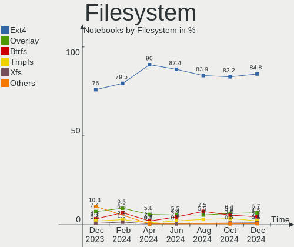
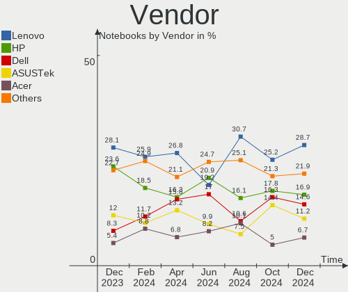
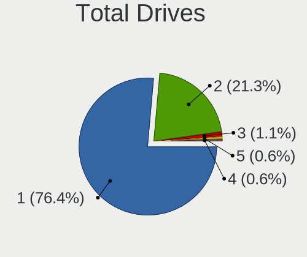
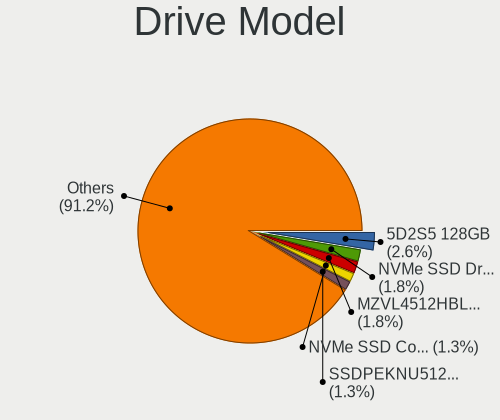
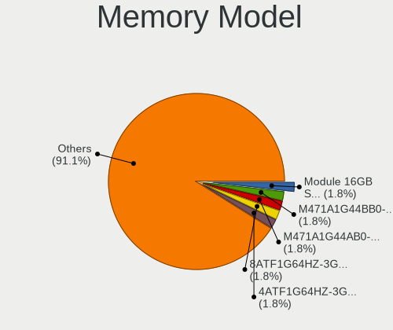
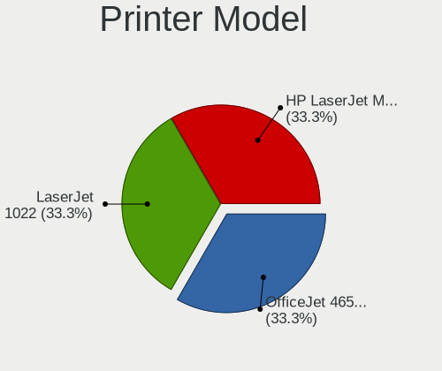

Debian Hardware Trends (Notebooks)
----------------------------------

A project to identify most popular hardware characteristics and track their change
over time based on data collected by Debian users at https://Linux-Hardware.org.

Anyone can contribute to this report by the [hw-probe](https://github.com/linuxhw/hw-probe) tool:

    sudo -E hw-probe -all -upload

Full-feature report is available here: https://linux-hardware.org/?view=trends

Period: Feb, 2022.

Contents
--------

* [ System ](#system)
  - [ OS                       ](#os)
  - [ OS Family                ](#os-family)
  - [ Kernel                   ](#kernel)
  - [ Kernel Family            ](#kernel-family)
  - [ Kernel Major Ver.        ](#kernel-major-ver)
  - [ Arch                     ](#arch)
  - [ DE                       ](#de)
  - [ Display Server           ](#display-server)
  - [ Display Manager          ](#display-manager)
  - [ OS Lang                  ](#os-lang)
  - [ Boot Mode                ](#boot-mode)
  - [ Filesystem               ](#filesystem)
  - [ Part. scheme             ](#part-scheme)
  - [ Dual Boot with Linux/BSD ](#dual-boot-with-linuxbsd)
  - [ Dual Boot (Win)          ](#dual-boot-win)

* [ Board ](#board)
  - [ Vendor                   ](#vendor)
  - [ Model                    ](#model)
  - [ Model Family             ](#model-family)
  - [ MFG Year                 ](#mfg-year)
  - [ Form Factor              ](#form-factor)
  - [ Secure Boot              ](#secure-boot)
  - [ Coreboot                 ](#coreboot)
  - [ RAM Size                 ](#ram-size)
  - [ RAM Used                 ](#ram-used)
  - [ Total Drives             ](#total-drives)
  - [ Has CD-ROM               ](#has-cd-rom)
  - [ Has Ethernet             ](#has-ethernet)
  - [ Has WiFi                 ](#has-wifi)
  - [ Has Bluetooth            ](#has-bluetooth)

* [ Location ](#location)
  - [ Country                  ](#country)
  - [ City                     ](#city)

* [ Drives ](#drives)
  - [ Drive Vendor             ](#drive-vendor)
  - [ Drive Model              ](#drive-model)
  - [ HDD Vendor               ](#hdd-vendor)
  - [ SSD Vendor               ](#ssd-vendor)
  - [ Drive Kind               ](#drive-kind)
  - [ Drive Connector          ](#drive-connector)
  - [ Drive Size               ](#drive-size)
  - [ Space Total              ](#space-total)
  - [ Space Used               ](#space-used)
  - [ Malfunc. Drives          ](#malfunc-drives)
  - [ Malfunc. Drive Vendor    ](#malfunc-drive-vendor)
  - [ Malfunc. HDD Vendor      ](#malfunc-hdd-vendor)
  - [ Malfunc. Drive Kind      ](#malfunc-drive-kind)
  - [ Failed Drives            ](#failed-drives)
  - [ Failed Drive Vendor      ](#failed-drive-vendor)
  - [ Drive Status             ](#drive-status)

* [ Storage controller ](#storage-controller)
  - [ Storage Vendor           ](#storage-vendor)
  - [ Storage Model            ](#storage-model)
  - [ Storage Kind             ](#storage-kind)

* [ Processor ](#processor)
  - [ CPU Vendor               ](#cpu-vendor)
  - [ CPU Model                ](#cpu-model)
  - [ CPU Model Family         ](#cpu-model-family)
  - [ CPU Cores                ](#cpu-cores)
  - [ CPU Sockets              ](#cpu-sockets)
  - [ CPU Threads              ](#cpu-threads)
  - [ CPU Op-Modes             ](#cpu-op-modes)
  - [ CPU Microcode            ](#cpu-microcode)
  - [ CPU Microarch            ](#cpu-microarch)

* [ Graphics ](#graphics)
  - [ GPU Vendor               ](#gpu-vendor)
  - [ GPU Model                ](#gpu-model)
  - [ GPU Combo                ](#gpu-combo)
  - [ GPU Driver               ](#gpu-driver)
  - [ GPU Memory               ](#gpu-memory)

* [ Monitor ](#monitor)
  - [ Monitor Vendor           ](#monitor-vendor)
  - [ Monitor Model            ](#monitor-model)
  - [ Monitor Resolution       ](#monitor-resolution)
  - [ Monitor Diagonal         ](#monitor-diagonal)
  - [ Monitor Width            ](#monitor-width)
  - [ Aspect Ratio             ](#aspect-ratio)
  - [ Monitor Area             ](#monitor-area)
  - [ Pixel Density            ](#pixel-density)
  - [ Multiple Monitors        ](#multiple-monitors)

* [ Network ](#network)
  - [ Net Controller Vendor    ](#net-controller-vendor)
  - [ Net Controller Model     ](#net-controller-model)
  - [ Wireless Vendor          ](#wireless-vendor)
  - [ Wireless Model           ](#wireless-model)
  - [ Ethernet Vendor          ](#ethernet-vendor)
  - [ Ethernet Model           ](#ethernet-model)
  - [ Net Controller Kind      ](#net-controller-kind)
  - [ Used Controller          ](#used-controller)
  - [ NICs                     ](#nics)
  - [ IPv6                     ](#ipv6)

* [ Bluetooth ](#bluetooth)
  - [ Bluetooth Vendor         ](#bluetooth-vendor)
  - [ Bluetooth Model          ](#bluetooth-model)

* [ Sound ](#sound)
  - [ Sound Vendor             ](#sound-vendor)
  - [ Sound Model              ](#sound-model)

* [ Memory ](#memory)
  - [ Memory Vendor            ](#memory-vendor)
  - [ Memory Model             ](#memory-model)
  - [ Memory Kind              ](#memory-kind)
  - [ Memory Form Factor       ](#memory-form-factor)
  - [ Memory Size              ](#memory-size)
  - [ Memory Speed             ](#memory-speed)

* [ Printers & scanners ](#printers--scanners)
  - [ Printer Vendor           ](#printer-vendor)
  - [ Printer Model            ](#printer-model)
  - [ Scanner Vendor           ](#scanner-vendor)
  - [ Scanner Model            ](#scanner-model)

* [ Camera ](#camera)
  - [ Camera Vendor            ](#camera-vendor)
  - [ Camera Model             ](#camera-model)

* [ Security ](#security)
  - [ Fingerprint Vendor       ](#fingerprint-vendor)
  - [ Fingerprint Model        ](#fingerprint-model)
  - [ Chipcard Vendor          ](#chipcard-vendor)
  - [ Chipcard Model           ](#chipcard-model)

* [ Unsupported ](#unsupported)
  - [ Unsupported Devices      ](#unsupported-devices)
  - [ Unsupported Device Types ](#unsupported-device-types)

System
------

OS
--

Installed operating systems

| Name              | Notebooks | Percent |
|-------------------|-----------|---------|
| Debian 11         | 97        | 85.09%  |
| Debian Testing    | 9         | 7.89%   |
| Debian Unstable   | 4         | 3.51%   |
| Debian 10         | 3         | 2.63%   |
| Debian 11-updates | 1         | 0.88%   |

OS Family
---------

OS without a version

| Name   | Notebooks | Percent |
|--------|-----------|---------|
| Debian | 114       | 100%    |

Kernel
------

Version of the Linux kernel

| Version                   | Notebooks | Percent |
|---------------------------|-----------|---------|
| 5.10.0-11-amd64           | 55        | 48.25%  |
| 5.15.0-3-amd64            | 11        | 9.65%   |
| 5.10.0-10-amd64           | 8         | 7.02%   |
| 5.10.0-7-amd64            | 6         | 5.26%   |
| 5.16.0-1-amd64            | 5         | 4.39%   |
| 5.15.0-2-amd64            | 4         | 3.51%   |
| 5.15.0-0.bpo.3-amd64      | 3         | 2.63%   |
| 5.15.0-0.bpo.2-amd64      | 3         | 2.63%   |
| 5.10.0-11-686-pae         | 3         | 2.63%   |
| 5.16.0-trunk-amd64        | 2         | 1.75%   |
| 5.10.0-9-amd64            | 2         | 1.75%   |
| 4.19.0-18-amd64           | 2         | 1.75%   |
| 5.16.5-titanide           | 1         | 0.88%   |
| 5.16.0-rc8-amd64          | 1         | 0.88%   |
| 5.16.0-8.1-liquorix-amd64 | 1         | 0.88%   |
| 5.16.0-7.1-liquorix-amd64 | 1         | 0.88%   |
| 5.16.0-5.1-liquorix-amd64 | 1         | 0.88%   |
| 5.15.17-xanmod2-tt        | 1         | 0.88%   |
| 5.13.19-4-pve             | 1         | 0.88%   |
| 5.10.10-64                | 1         | 0.88%   |
| 5.10.0-8-amd64            | 1         | 0.88%   |
| 5.10.0-11-686             | 1         | 0.88%   |

Kernel Family
-------------

Linux kernel without a distro release

| Version | Notebooks | Percent |
|---------|-----------|---------|
| 5.10.0  | 76        | 66.67%  |
| 5.15.0  | 21        | 18.42%  |
| 5.16.0  | 11        | 9.65%   |
| 4.19.0  | 2         | 1.75%   |
| 5.16.5  | 1         | 0.88%   |
| 5.15.17 | 1         | 0.88%   |
| 5.13.19 | 1         | 0.88%   |
| 5.10.10 | 1         | 0.88%   |

Kernel Major Ver.
-----------------

Linux kernel major version

| Version | Notebooks | Percent |
|---------|-----------|---------|
| 5.10    | 77        | 67.54%  |
| 5.15    | 22        | 19.3%   |
| 5.16    | 12        | 10.53%  |
| 4.19    | 2         | 1.75%   |
| 5.13    | 1         | 0.88%   |

Arch
----

OS architecture (x86_64, i586, etc.)

| Name   | Notebooks | Percent |
|--------|-----------|---------|
| x86_64 | 110       | 96.49%  |
| i686   | 4         | 3.51%   |

DE
--

Desktop Environment

| Name             | Notebooks | Percent |
|------------------|-----------|---------|
| GNOME            | 41        | 35.96%  |
| XFCE             | 16        | 14.04%  |
| KDE5             | 15        | 13.16%  |
| Unknown          | 11        | 9.65%   |
| MATE             | 8         | 7.02%   |
| X-Cinnamon       | 7         | 6.14%   |
| Cinnamon         | 5         | 4.39%   |
| LXDE             | 4         | 3.51%   |
| KDE              | 2         | 1.75%   |
| GNOME Flashback  | 2         | 1.75%   |
| lightdm-xsession | 1         | 0.88%   |
| GNOME Classic    | 1         | 0.88%   |
| Cutefish         | 1         | 0.88%   |

Display Server
--------------

X11 or Wayland

| Name    | Notebooks | Percent |
|---------|-----------|---------|
| X11     | 77        | 67.54%  |
| Wayland | 27        | 23.68%  |
| Unknown | 8         | 7.02%   |
| Tty     | 2         | 1.75%   |

Display Manager
---------------

SDDM, LightDM, etc.

| Name    | Notebooks | Percent |
|---------|-----------|---------|
| LightDM | 35        | 30.7%   |
| Unknown | 32        | 28.07%  |
| GDM     | 28        | 24.56%  |
| SDDM    | 10        | 8.77%   |
| GDM3    | 7         | 6.14%   |
| SLiM    | 1         | 0.88%   |
| KDM     | 1         | 0.88%   |

OS Lang
-------

Language

| Lang    | Notebooks | Percent |
|---------|-----------|---------|
| en_US   | 34        | 29.82%  |
| ru_RU   | 16        | 14.04%  |
| de_DE   | 15        | 13.16%  |
| it_IT   | 8         | 7.02%   |
| pt_BR   | 6         | 5.26%   |
| fr_FR   | 6         | 5.26%   |
| en_GB   | 5         | 4.39%   |
| pl_PL   | 4         | 3.51%   |
| es_MX   | 4         | 3.51%   |
| en_IE   | 2         | 1.75%   |
| Unknown | 2         | 1.75%   |
| sl_SI   | 1         | 0.88%   |
| nl_NL   | 1         | 0.88%   |
| nl_BE   | 1         | 0.88%   |
| ja_JP   | 1         | 0.88%   |
| hu_HU   | 1         | 0.88%   |
| es_VE   | 1         | 0.88%   |
| es_CL   | 1         | 0.88%   |
| es_AR   | 1         | 0.88%   |
| en_SG   | 1         | 0.88%   |
| en_IN   | 1         | 0.88%   |
| da_DK   | 1         | 0.88%   |
| C       | 1         | 0.88%   |

Boot Mode
---------

EFI or BIOS

| Mode | Notebooks | Percent |
|------|-----------|---------|
| EFI  | 66        | 57.89%  |
| BIOS | 48        | 42.11%  |

Filesystem
----------

Type of filesystem

| Type    | Notebooks | Percent |
|---------|-----------|---------|
| Ext4    | 96        | 84.21%  |
| Overlay | 10        | 8.77%   |
| Btrfs   | 5         | 4.39%   |
| Zfs     | 1         | 0.88%   |
| Rootfs  | 1         | 0.88%   |
| Ext2    | 1         | 0.88%   |

Part. scheme
------------

Scheme of partitioning

| Type    | Notebooks | Percent |
|---------|-----------|---------|
| GPT     | 62        | 54.39%  |
| MBR     | 28        | 24.56%  |
| Unknown | 24        | 21.05%  |

Dual Boot with Linux/BSD
------------------------

Hosting more than one Linux/BSD

| Dual boot | Notebooks | Percent |
|-----------|-----------|---------|
| No        | 101       | 88.6%   |
| Yes       | 13        | 11.4%   |

Dual Boot (Win)
---------------

Hosting Linux and Windows

| Dual boot | Notebooks | Percent |
|-----------|-----------|---------|
| No        | 82        | 71.93%  |
| Yes       | 32        | 28.07%  |

Board
-----

Vendor
------

Motherboard manufacturer

| Name                | Notebooks | Percent |
|---------------------|-----------|---------|
| Lenovo              | 29        | 25.44%  |
| Hewlett-Packard     | 23        | 20.18%  |
| Dell                | 15        | 13.16%  |
| ASUSTek Computer    | 13        | 11.4%   |
| Acer                | 10        | 8.77%   |
| Samsung Electronics | 4         | 3.51%   |
| Fujitsu             | 3         | 2.63%   |
| Toshiba             | 2         | 1.75%   |
| GPU Company         | 2         | 1.75%   |
| TUXEDO              | 1         | 0.88%   |
| Timi                | 1         | 0.88%   |
| System76            | 1         | 0.88%   |
| Sony                | 1         | 0.88%   |
| Positivo            | 1         | 0.88%   |
| Packard Bell        | 1         | 0.88%   |
| Notebook            | 1         | 0.88%   |
| MSI                 | 1         | 0.88%   |
| Google              | 1         | 0.88%   |
| eMachines           | 1         | 0.88%   |
| Chuwi               | 1         | 0.88%   |
| Apple               | 1         | 0.88%   |
| Unknown             | 1         | 0.88%   |

Model
-----

Motherboard model

| Name                                              | Notebooks | Percent |
|---------------------------------------------------|-----------|---------|
| Lenovo IdeaPad S540-13API 81XC                    | 2         | 1.75%   |
| Lenovo G580 20157                                 | 2         | 1.75%   |
| HP Laptop 15-db1xxx                               | 2         | 1.75%   |
| GPU Company GWTC116-2                             | 2         | 1.75%   |
| TUXEDO Pulse 15 Gen1                              | 1         | 0.88%   |
| Toshiba Satellite L775D                           | 1         | 0.88%   |
| Toshiba Satellite E45DW-C                         | 1         | 0.88%   |
| Timi RedmiBook 16                                 | 1         | 0.88%   |
| System76 Gazelle Professional                     | 1         | 0.88%   |
| Sony SVE1713F1EW                                  | 1         | 0.88%   |
| Samsung RC530/RC730                               | 1         | 0.88%   |
| Samsung N230                                      | 1         | 0.88%   |
| Samsung N150P/N210P/N220P                         | 1         | 0.88%   |
| Samsung 355V4C/356V4C/3445VC/3545VC               | 1         | 0.88%   |
| Positivo CHT12CP                                  | 1         | 0.88%   |
| Packard Bell EasyNote TE11HC                      | 1         | 0.88%   |
| Notebook W65_W670SR                               | 1         | 0.88%   |
| MSI GP72M 7RDX                                    | 1         | 0.88%   |
| Lenovo V14-ARE 82DQ                               | 1         | 0.88%   |
| Lenovo ThinkPad X230 2325V4D                      | 1         | 0.88%   |
| Lenovo ThinkPad X220 4291Q50                      | 1         | 0.88%   |
| Lenovo ThinkPad X200 7459ZC2                      | 1         | 0.88%   |
| Lenovo ThinkPad T490 20RXS0VX00                   | 1         | 0.88%   |
| Lenovo ThinkPad T410 2537A12                      | 1         | 0.88%   |
| Lenovo ThinkPad R61e 7649AL6                      | 1         | 0.88%   |
| Lenovo ThinkPad L530 24813QG                      | 1         | 0.88%   |
| Lenovo ThinkPad L440 20ASS3A300                   | 1         | 0.88%   |
| Lenovo ThinkPad L15 Gen 2 20X4S8YL00              | 1         | 0.88%   |
| Lenovo ThinkPad E475 20H40006US                   | 1         | 0.88%   |
| Lenovo ThinkPad E15 Gen 3 20YHS01S00              | 1         | 0.88%   |
| Lenovo ThinkPad E15 Gen 3 20YGCTO1WW              | 1         | 0.88%   |
| Lenovo ThinkBook 14 G2 ARE 20VF                   | 1         | 0.88%   |
| Lenovo Legion 5 15IMH05H 81Y6                     | 1         | 0.88%   |
| Lenovo IdeaPad Z460 20059                         | 1         | 0.88%   |
| Lenovo IdeaPad S145-15API 81V7                    | 1         | 0.88%   |
| Lenovo IdeaPad L340-15API 81LW                    | 1         | 0.88%   |
| Lenovo IdeaPad 5 Pro 16ACH6 82L5                  | 1         | 0.88%   |
| Lenovo IdeaPad 330-15IGM 81D1                     | 1         | 0.88%   |
| Lenovo IdeaPad 330-14AST 81D5                     | 1         | 0.88%   |
| Lenovo IdeaPad 320S-14IKB 81BN                    | 1         | 0.88%   |
| Lenovo IdeaPad 100-15IBD 80QQ                     | 1         | 0.88%   |
| Lenovo B590 20206                                 | 1         | 0.88%   |
| Lenovo B50-80 80LT                                | 1         | 0.88%   |
| HP ZBook Studio G3                                | 1         | 0.88%   |
| HP ZBook Fury 17.3 inch G8 Mobile Workstation PC  | 1         | 0.88%   |
| HP ZBook Firefly 15 inch G8 Mobile Workstation PC | 1         | 0.88%   |
| HP ZBook Firefly 14 G7 Mobile Workstation         | 1         | 0.88%   |
| HP Presario CQ61                                  | 1         | 0.88%   |
| HP Pavilion TS 15                                 | 1         | 0.88%   |
| HP Pavilion Gaming Laptop 17-cd2xxx               | 1         | 0.88%   |
| HP Pavilion g6                                    | 1         | 0.88%   |
| HP Pavilion 17                                    | 1         | 0.88%   |
| HP OMEN Laptop 15-ek0xxx                          | 1         | 0.88%   |
| HP OMEN by Laptop                                 | 1         | 0.88%   |
| HP Laptop 15-dw0xxx                               | 1         | 0.88%   |
| HP Laptop 15-db0xxx                               | 1         | 0.88%   |
| HP Laptop 15-da0xxx                               | 1         | 0.88%   |
| HP Laptop 14s-fq0xxx                              | 1         | 0.88%   |
| HP EliteBook Revolve 810 G1                       | 1         | 0.88%   |
| HP EliteBook 8570p                                | 1         | 0.88%   |

Model Family
------------

Motherboard model prefix

| Name                  | Notebooks | Percent |
|-----------------------|-----------|---------|
| Lenovo ThinkPad       | 12        | 10.53%  |
| Lenovo IdeaPad        | 10        | 8.77%   |
| HP Laptop             | 6         | 5.26%   |
| Dell Latitude         | 6         | 5.26%   |
| Acer Aspire           | 6         | 5.26%   |
| Dell XPS              | 5         | 4.39%   |
| HP ZBook              | 4         | 3.51%   |
| HP Pavilion           | 4         | 3.51%   |
| HP EliteBook          | 4         | 3.51%   |
| Dell Inspiron         | 3         | 2.63%   |
| Toshiba Satellite     | 2         | 1.75%   |
| Lenovo G580           | 2         | 1.75%   |
| HP OMEN               | 2         | 1.75%   |
| GPU Company GWTC116-2 | 2         | 1.75%   |
| Fujitsu LIFEBOOK      | 2         | 1.75%   |
| Acer Swift            | 2         | 1.75%   |
| TUXEDO Pulse          | 1         | 0.88%   |
| Timi RedmiBook        | 1         | 0.88%   |
| System76 Gazelle      | 1         | 0.88%   |
| Sony SVE1713F1EW      | 1         | 0.88%   |
| Samsung RC530         | 1         | 0.88%   |
| Samsung N230          | 1         | 0.88%   |
| Samsung N150P         | 1         | 0.88%   |
| Samsung 355V4C        | 1         | 0.88%   |
| Positivo CHT12CP      | 1         | 0.88%   |
| Packard Bell EasyNote | 1         | 0.88%   |
| Notebook W65          | 1         | 0.88%   |
| MSI GP72M             | 1         | 0.88%   |
| Lenovo V14-ARE        | 1         | 0.88%   |
| Lenovo ThinkBook      | 1         | 0.88%   |
| Lenovo Legion         | 1         | 0.88%   |
| Lenovo B590           | 1         | 0.88%   |
| Lenovo B50-80         | 1         | 0.88%   |
| HP Presario           | 1         | 0.88%   |
| HP Compaq             | 1         | 0.88%   |
| HP 250                | 1         | 0.88%   |
| Google Barla          | 1         | 0.88%   |
| Fujitsu FMVA05007     | 1         | 0.88%   |
| eMachines eME728      | 1         | 0.88%   |
| Dell Vostro           | 1         | 0.88%   |
| Chuwi GemiBook        | 1         | 0.88%   |
| ASUS ZenBook          | 1         | 0.88%   |
| ASUS X756UXK          | 1         | 0.88%   |
| ASUS X751LK           | 1         | 0.88%   |
| ASUS X751LD           | 1         | 0.88%   |
| ASUS X55C             | 1         | 0.88%   |
| ASUS X555LD           | 1         | 0.88%   |
| ASUS X401A            | 1         | 0.88%   |
| ASUS TP550LAB         | 1         | 0.88%   |
| ASUS N82JV            | 1         | 0.88%   |
| ASUS M70Vn            | 1         | 0.88%   |
| ASUS K52F             | 1         | 0.88%   |
| ASUS BU203UA          | 1         | 0.88%   |
| ASUS 1015BX           | 1         | 0.88%   |
| Apple MacBook8        | 1         | 0.88%   |
| Acer TravelMate       | 1         | 0.88%   |
| Acer Nitro            | 1         | 0.88%   |
| Unknown               | 1         | 0.88%   |

MFG Year
--------

Motherboard manufacture year

| Year | Notebooks | Percent |
|------|-----------|---------|
| 2021 | 16        | 14.04%  |
| 2020 | 16        | 14.04%  |
| 2012 | 16        | 14.04%  |
| 2019 | 13        | 11.4%   |
| 2013 | 7         | 6.14%   |
| 2015 | 6         | 5.26%   |
| 2014 | 6         | 5.26%   |
| 2010 | 6         | 5.26%   |
| 2018 | 5         | 4.39%   |
| 2017 | 5         | 4.39%   |
| 2016 | 5         | 4.39%   |
| 2011 | 5         | 4.39%   |
| 2009 | 4         | 3.51%   |
| 2008 | 2         | 1.75%   |
| 2007 | 2         | 1.75%   |

Form Factor
-----------

Physical design of the computer

| Name     | Notebooks | Percent |
|----------|-----------|---------|
| Notebook | 114       | 100%    |

Secure Boot
-----------

Enabled or disabled

| State    | Notebooks | Percent |
|----------|-----------|---------|
| Disabled | 102       | 89.47%  |
| Enabled  | 12        | 10.53%  |

Coreboot
--------

Have coreboot on board

| Used | Notebooks | Percent |
|------|-----------|---------|
| No   | 112       | 98.25%  |
| Yes  | 2         | 1.75%   |

RAM Size
--------

Total RAM memory

| Size in GB  | Notebooks | Percent |
|-------------|-----------|---------|
| 4.01-8.0    | 42        | 36.84%  |
| 3.01-4.0    | 28        | 24.56%  |
| 8.01-16.0   | 20        | 17.54%  |
| 16.01-24.0  | 11        | 9.65%   |
| 32.01-64.0  | 6         | 5.26%   |
| 1.01-2.0    | 5         | 4.39%   |
| 24.01-32.0  | 1         | 0.88%   |
| 64.01-256.0 | 1         | 0.88%   |

RAM Used
--------

Used RAM memory

| Used GB    | Notebooks | Percent |
|------------|-----------|---------|
| 1.01-2.0   | 43        | 37.72%  |
| 2.01-3.0   | 23        | 20.18%  |
| 4.01-8.0   | 16        | 14.04%  |
| 3.01-4.0   | 15        | 13.16%  |
| 0.51-1.0   | 14        | 12.28%  |
| 0.01-0.5   | 2         | 1.75%   |
| 32.01-64.0 | 1         | 0.88%   |

Total Drives
------------

Number of drives on board

| Drives | Notebooks | Percent |
|--------|-----------|---------|
| 1      | 92        | 80.7%   |
| 2      | 18        | 15.79%  |
| 3      | 2         | 1.75%   |
| 0      | 2         | 1.75%   |

Has CD-ROM
----------

Has CD-ROM on board

| Presented | Notebooks | Percent |
|-----------|-----------|---------|
| No        | 74        | 64.91%  |
| Yes       | 40        | 35.09%  |

Has Ethernet
------------

Has Ethernet on board

| Presented | Notebooks | Percent |
|-----------|-----------|---------|
| Yes       | 99        | 86.84%  |
| No        | 15        | 13.16%  |

Has WiFi
--------

Has WiFi module

| Presented | Notebooks | Percent |
|-----------|-----------|---------|
| Yes       | 112       | 98.25%  |
| No        | 2         | 1.75%   |

Has Bluetooth
-------------

Has Bluetooth module

| Presented | Notebooks | Percent |
|-----------|-----------|---------|
| Yes       | 78        | 68.42%  |
| No        | 36        | 31.58%  |

Location
--------

Country
-------

Geographic location (country)

| Country     | Notebooks | Percent |
|-------------|-----------|---------|
| Germany     | 18        | 15.79%  |
| Russia      | 15        | 13.16%  |
| USA         | 12        | 10.53%  |
| Italy       | 11        | 9.65%   |
| UK          | 6         | 5.26%   |
| France      | 6         | 5.26%   |
| Brazil      | 6         | 5.26%   |
| Mexico      | 5         | 4.39%   |
| Poland      | 3         | 2.63%   |
| Indonesia   | 3         | 2.63%   |
| Belgium     | 3         | 2.63%   |
| Netherlands | 2         | 1.75%   |
| Hungary     | 2         | 1.75%   |
| Chile       | 2         | 1.75%   |
| Venezuela   | 1         | 0.88%   |
| Ukraine     | 1         | 0.88%   |
| Turkey      | 1         | 0.88%   |
| Sweden      | 1         | 0.88%   |
| Slovenia    | 1         | 0.88%   |
| Slovakia    | 1         | 0.88%   |
| Singapore   | 1         | 0.88%   |
| Romania     | 1         | 0.88%   |
| Morocco     | 1         | 0.88%   |
| Moldova     | 1         | 0.88%   |
| Latvia      | 1         | 0.88%   |
| Japan       | 1         | 0.88%   |
| India       | 1         | 0.88%   |
| Iceland     | 1         | 0.88%   |
| Guatemala   | 1         | 0.88%   |
| Denmark     | 1         | 0.88%   |
| Czechia     | 1         | 0.88%   |
| Croatia     | 1         | 0.88%   |
| Costa Rica  | 1         | 0.88%   |
| Argentina   | 1         | 0.88%   |

City
----

Geographic location (city)

| City             | Notebooks | Percent |
|------------------|-----------|---------|
| Voronezh         | 7         | 6.14%   |
| Paris            | 3         | 2.63%   |
| Ivanovo          | 3         | 2.63%   |
| Berlin           | 3         | 2.63%   |
| Moscow           | 2         | 1.75%   |
| Milan            | 2         | 1.75%   |
| Jemgum           | 2         | 1.75%   |
| Blizniew         | 2         | 1.75%   |
| Zumpango         | 1         | 0.88%   |
| Zagreb           | 1         | 0.88%   |
| Yerba Buena      | 1         | 0.88%   |
| Weselberg        | 1         | 0.88%   |
| Watertown        | 1         | 0.88%   |
| Washington       | 1         | 0.88%   |
| Waregem          | 1         | 0.88%   |
| Ulyanovsk        | 1         | 0.88%   |
| Tizayuca         | 1         | 0.88%   |
| Taurisano        | 1         | 0.88%   |
| Szolnok          | 1         | 0.88%   |
| Syeverodonets'k  | 1         | 0.88%   |
| Stockholm        | 1         | 0.88%   |
| St Petersburg    | 1         | 0.88%   |
| Southampton      | 1         | 0.88%   |
| Sosnowiec        | 1         | 0.88%   |
| Somers           | 1         | 0.88%   |
| Skocjan          | 1         | 0.88%   |
| Singapore        | 1         | 0.88%   |
| Senec            | 1         | 0.88%   |
| São Paulo     | 1         | 0.88%   |
| San Cristóbal | 1         | 0.88%   |
| San Bernardo     | 1         | 0.88%   |
| Rome             | 1         | 0.88%   |
| Rio Rancho       | 1         | 0.88%   |
| Rio de Janeiro   | 1         | 0.88%   |
| Riga             | 1         | 0.88%   |
| Reykjavik        | 1         | 0.88%   |
| Pudahuel         | 1         | 0.88%   |
| Prague           | 1         | 0.88%   |
| Pozza di Fassa   | 1         | 0.88%   |
| Port Ludlow      | 1         | 0.88%   |
| Phoenix          | 1         | 0.88%   |
| Petrozavodsk     | 1         | 0.88%   |
| Palmanova        | 1         | 0.88%   |
| Palembang        | 1         | 0.88%   |
| Oujda            | 1         | 0.88%   |
| Nantes           | 1         | 0.88%   |
| Munich           | 1         | 0.88%   |
| Mumbai           | 1         | 0.88%   |
| Morelia          | 1         | 0.88%   |
| Mito             | 1         | 0.88%   |
| Midlothian       | 1         | 0.88%   |
| Mexico City      | 1         | 0.88%   |
| Merate           | 1         | 0.88%   |
| Markelsheim      | 1         | 0.88%   |
| Mannheim         | 1         | 0.88%   |
| Manchester       | 1         | 0.88%   |
| Maikammer        | 1         | 0.88%   |
| Maceió        | 1         | 0.88%   |
| Maastricht       | 1         | 0.88%   |
| Lys-lez-Lannoy   | 1         | 0.88%   |

Drives
------

Drive Vendor
------------

Hard drive vendors

| Vendor              | Notebooks | Drives | Percent |
|---------------------|-----------|--------|---------|
| Samsung Electronics | 24        | 24     | 18.05%  |
| WDC                 | 21        | 21     | 15.79%  |
| Seagate             | 20        | 21     | 15.04%  |
| Kingston            | 10        | 10     | 7.52%   |
| SanDisk             | 8         | 8      | 6.02%   |
| Crucial             | 8         | 8      | 6.02%   |
| Toshiba             | 7         | 7      | 5.26%   |
| SK Hynix            | 7         | 7      | 5.26%   |
| Unknown             | 6         | 6      | 4.51%   |
| Intel               | 3         | 3      | 2.26%   |
| Hitachi             | 3         | 3      | 2.26%   |
| HGST                | 3         | 3      | 2.26%   |
| Micron Technology   | 2         | 2      | 1.5%    |
| PNY                 | 1         | 1      | 0.75%   |
| Phison              | 1         | 1      | 0.75%   |
| Netac               | 1         | 1      | 0.75%   |
| KIOXIA              | 1         | 1      | 0.75%   |
| JMicron             | 1         | 1      | 0.75%   |
| GOODRAM             | 1         | 1      | 0.75%   |
| Gigabyte Technology | 1         | 1      | 0.75%   |
| Fujitsu             | 1         | 1      | 0.75%   |
| Apple               | 1         | 1      | 0.75%   |
| A-DATA Technology   | 1         | 1      | 0.75%   |
| Unknown             | 1         | 1      | 0.75%   |

Drive Model
-----------

Hard drive models

| Model                                     | Notebooks | Percent |
|-------------------------------------------|-----------|---------|
| Seagate ST1000LM035-1RK172 1TB            | 4         | 3.01%   |
| Kingston SA400S37240G 240GB SSD           | 4         | 3.01%   |
| Toshiba MQ01ABF050 500GB                  | 3         | 2.26%   |
| Seagate ST1000LM024 HN-M101MBB 1TB        | 3         | 2.26%   |
| WDC WDS240G2G0A-00JH30 240GB SSD          | 2         | 1.5%    |
| WDC PC SN530 SDBPNPZ-512G-1114 512GB      | 2         | 1.5%    |
| Unknown Biwin  64GB                       | 2         | 1.5%    |
| SK Hynix SKHynix_HFM512GDHTNI-87A0B 512GB | 2         | 1.5%    |
| Seagate ST500LT012-1DG142 500GB           | 2         | 1.5%    |
| Samsung SSD 970 EVO Plus 1TB              | 2         | 1.5%    |
| Kingston SA400S37120G 120GB SSD           | 2         | 1.5%    |
| Hitachi HTS545025B9A300 250GB             | 2         | 1.5%    |
| Crucial CT500MX500SSD1 500GB              | 2         | 1.5%    |
| Crucial CT1000MX500SSD1 1TB               | 2         | 1.5%    |
| WDC WDS120G1G0A-00SS50 120GB SSD          | 1         | 0.75%   |
| WDC WDS100T2B0A-00SM50 1TB SSD            | 1         | 0.75%   |
| WDC WD7500BPVX-22JC3T0 752GB              | 1         | 0.75%   |
| WDC WD5000LPVX-80V0TT0 500GB              | 1         | 0.75%   |
| WDC WD5000LPVX-60V0TT0 500GB              | 1         | 0.75%   |
| WDC WD5000LPLX-00ZNTT0 500GB              | 1         | 0.75%   |
| WDC WD3200BPVT-80JJ5T0 320GB              | 1         | 0.75%   |
| WDC WD10SPZX-08Z10 1TB                    | 1         | 0.75%   |
| WDC WD10JPVX-60JC3T0 1TB                  | 1         | 0.75%   |
| WDC PC SN730 SDBQNTY-512G-1001 512GB      | 1         | 0.75%   |
| WDC PC SN730 SDBPNTY-512G-1006 512GB      | 1         | 0.75%   |
| WDC PC SN730 SDBPNTY-1T00-1006 1TB        | 1         | 0.75%   |
| WDC PC SN530 SDBPNPZ-512G-1014 512GB      | 1         | 0.75%   |
| WDC PC SN530 SDBPMPZ-512G-1101 512GB      | 1         | 0.75%   |
| WDC PC SN530 SDBPMPZ-512G-1001 512GB      | 1         | 0.75%   |
| WDC PC SN530 SDBPMPZ-256G-1101 256GB      | 1         | 0.75%   |
| WDC PC SN520 SDAPNUW-256G-1006 256GB      | 1         | 0.75%   |
| Unknown MMC Card  128GB                   | 1         | 0.75%   |
| Unknown DA4032  32GB                      | 1         | 0.75%   |
| Unknown BGND3R  32GB                      | 1         | 0.75%   |
| Unknown 00000  4GB                        | 1         | 0.75%   |
| Toshiba NVMe SSD Drive 1024GB             | 1         | 0.75%   |
| Toshiba MQ01ABD100 1TB                    | 1         | 0.75%   |
| Toshiba MQ01ABD050 500GB                  | 1         | 0.75%   |
| Toshiba MK3259GSXP 320GB                  | 1         | 0.75%   |
| SK Hynix PC711 HFS512GDE9X073N 512GB      | 1         | 0.75%   |
| SK Hynix PC601 NVMe 512GB                 | 1         | 0.75%   |
| SK Hynix HFS256G39MND-2300A 256GB SSD     | 1         | 0.75%   |
| SK Hynix HFM256GDJTNG-8310A 256GB         | 1         | 0.75%   |
| SK Hynix BC511 NVMe 256GB                 | 1         | 0.75%   |
| Seagate ST9500423AS 500GB                 | 1         | 0.75%   |
| Seagate ST9500325AS 500GB                 | 1         | 0.75%   |
| Seagate ST9250320AS 250GB                 | 1         | 0.75%   |
| Seagate ST750LM022 HN-M750MBB 752GB       | 1         | 0.75%   |
| Seagate ST500VT000-1DK142 500GB           | 1         | 0.75%   |
| Seagate ST500LT012-9WS142 500GB           | 1         | 0.75%   |
| Seagate ST500LM000-SSHD-8GB               | 1         | 0.75%   |
| Seagate ST320LT020-9YG142 320GB           | 1         | 0.75%   |
| Seagate ST320LT012-1DG14C 320GB           | 1         | 0.75%   |
| Seagate ST320LT009-9WC142 320GB           | 1         | 0.75%   |
| Seagate ST1000LM048-2E7172 1TB            | 1         | 0.75%   |
| SanDisk SSD U100 24GB                     | 1         | 0.75%   |
| SanDisk SSD PLUS 240GB                    | 1         | 0.75%   |
| SanDisk SDSSDA240G 240GB                  | 1         | 0.75%   |
| SanDisk SDSSDA120G 120GB                  | 1         | 0.75%   |
| SanDisk SD8SN8U-128G-1006 128GB SSD       | 1         | 0.75%   |

HDD Vendor
----------

Hard disk drive vendors

| Vendor              | Notebooks | Drives | Percent |
|---------------------|-----------|--------|---------|
| Seagate             | 20        | 21     | 48.78%  |
| WDC                 | 7         | 7      | 17.07%  |
| Toshiba             | 6         | 6      | 14.63%  |
| Hitachi             | 3         | 3      | 7.32%   |
| HGST                | 3         | 3      | 7.32%   |
| Samsung Electronics | 1         | 1      | 2.44%   |
| Fujitsu             | 1         | 1      | 2.44%   |

SSD Vendor
----------

Solid state drive vendors

| Vendor              | Notebooks | Drives | Percent |
|---------------------|-----------|--------|---------|
| Kingston            | 9         | 9      | 20.93%  |
| Samsung Electronics | 8         | 8      | 18.6%   |
| Crucial             | 8         | 8      | 18.6%   |
| SanDisk             | 6         | 6      | 13.95%  |
| WDC                 | 4         | 4      | 9.3%    |
| Micron Technology   | 2         | 2      | 4.65%   |
| SK Hynix            | 1         | 1      | 2.33%   |
| PNY                 | 1         | 1      | 2.33%   |
| Netac               | 1         | 1      | 2.33%   |
| Intel               | 1         | 1      | 2.33%   |
| GOODRAM             | 1         | 1      | 2.33%   |
| Gigabyte Technology | 1         | 1      | 2.33%   |

Drive Kind
----------

HDD or SSD

| Kind | Notebooks | Drives | Percent |
|------|-----------|--------|---------|
| SSD  | 42        | 43     | 32.56%  |
| HDD  | 40        | 42     | 31.01%  |
| NVMe | 39        | 41     | 30.23%  |
| MMC  | 8         | 8      | 6.2%    |

Drive Connector
---------------

SATA, SAS, NVMe, etc.

| Type | Notebooks | Drives | Percent |
|------|-----------|--------|---------|
| SATA | 73        | 84     | 60.33%  |
| NVMe | 38        | 40     | 31.4%   |
| MMC  | 8         | 8      | 6.61%   |
| SAS  | 2         | 2      | 1.65%   |

Drive Size
----------

Size of hard drive

| Size in TB | Notebooks | Drives | Percent |
|------------|-----------|--------|---------|
| 0.01-0.5   | 57        | 65     | 74.03%  |
| 0.51-1.0   | 20        | 20     | 25.97%  |

Space Total
-----------

Amount of disk space available on the file system

| Size in GB     | Notebooks | Percent |
|----------------|-----------|---------|
| 101-250        | 34        | 29.82%  |
| 251-500        | 26        | 22.81%  |
| 501-1000       | 25        | 21.93%  |
| Unknown        | 10        | 8.77%   |
| 21-50          | 6         | 5.26%   |
| 51-100         | 5         | 4.39%   |
| 1001-2000      | 4         | 3.51%   |
| 1-20           | 3         | 2.63%   |
| More than 3000 | 1         | 0.88%   |

Space Used
----------

Amount of used disk space

| Used GB   | Notebooks | Percent |
|-----------|-----------|---------|
| 1-20      | 39        | 34.21%  |
| 51-100    | 19        | 16.67%  |
| 101-250   | 15        | 13.16%  |
| 21-50     | 14        | 12.28%  |
| 251-500   | 13        | 11.4%   |
| Unknown   | 10        | 8.77%   |
| 501-1000  | 3         | 2.63%   |
| 2001-3000 | 1         | 0.88%   |

Malfunc. Drives
---------------

Drive models with a malfunction

| Model                                               | Notebooks | Drives | Percent |
|-----------------------------------------------------|-----------|--------|---------|
| Toshiba MQ01ABD050 500GB                            | 1         | 1      | 11.11%  |
| SK Hynix HFS256G39MND-2300A 256GB SSD               | 1         | 1      | 11.11%  |
| Seagate ST9500325AS 500GB                           | 1         | 1      | 11.11%  |
| Seagate ST500VT000-1DK142 500GB                     | 1         | 1      | 11.11%  |
| Seagate ST500LM000-SSHD-8GB                         | 1         | 1      | 11.11%  |
| Seagate ST320LT020-9YG142 320GB                     | 1         | 1      | 11.11%  |
| Micron Technology MTFDDAV256TDL-1AW1ZABHA 256GB SSD | 1         | 1      | 11.11%  |
| HGST HTS725050A7E630 500GB                          | 1         | 1      | 11.11%  |
| Fujitsu MHZ2160BH G2 160GB                          | 1         | 1      | 11.11%  |

Malfunc. Drive Vendor
---------------------

Vendors of faulty drives

| Vendor            | Notebooks | Drives | Percent |
|-------------------|-----------|--------|---------|
| Seagate           | 4         | 4      | 44.44%  |
| Toshiba           | 1         | 1      | 11.11%  |
| SK Hynix          | 1         | 1      | 11.11%  |
| Micron Technology | 1         | 1      | 11.11%  |
| HGST              | 1         | 1      | 11.11%  |
| Fujitsu           | 1         | 1      | 11.11%  |

Malfunc. HDD Vendor
-------------------

Vendors of faulty HDD drives

| Vendor  | Notebooks | Drives | Percent |
|---------|-----------|--------|---------|
| Seagate | 4         | 4      | 57.14%  |
| Toshiba | 1         | 1      | 14.29%  |
| HGST    | 1         | 1      | 14.29%  |
| Fujitsu | 1         | 1      | 14.29%  |

Malfunc. Drive Kind
-------------------

Kinds of faulty drives

| Kind | Notebooks | Drives | Percent |
|------|-----------|--------|---------|
| HDD  | 7         | 7      | 77.78%  |
| SSD  | 2         | 2      | 22.22%  |

Failed Drives
-------------

Failed drive models

Zero info for selected period =(

Failed Drive Vendor
-------------------

Failed drive vendors

Zero info for selected period =(

Drive Status
------------

Number of failed and malfunc. drives

| Status   | Notebooks | Drives | Percent |
|----------|-----------|--------|---------|
| Works    | 76        | 85     | 64.96%  |
| Detected | 32        | 40     | 27.35%  |
| Malfunc  | 9         | 9      | 7.69%   |

Storage controller
------------------

Storage Vendor
--------------

Storage controller vendors

| Vendor                       | Notebooks | Percent |
|------------------------------|-----------|---------|
| Intel                        | 74        | 55.64%  |
| AMD                          | 21        | 15.79%  |
| Samsung Electronics          | 15        | 11.28%  |
| Sandisk                      | 11        | 8.27%   |
| SK Hynix                     | 6         | 4.51%   |
| Toshiba America Info Systems | 1         | 0.75%   |
| Phison Electronics           | 1         | 0.75%   |
| KIOXIA                       | 1         | 0.75%   |
| Kingston Technology Company  | 1         | 0.75%   |
| Apple                        | 1         | 0.75%   |
| ADATA Technology             | 1         | 0.75%   |

Storage Model
-------------

Storage controller models

| Model                                                                          | Notebooks | Percent |
|--------------------------------------------------------------------------------|-----------|---------|
| AMD FCH SATA Controller [AHCI mode]                                            | 19        | 13.67%  |
| Intel 7 Series Chipset Family 6-port SATA Controller [AHCI mode]               | 15        | 10.79%  |
| Samsung NVMe SSD Controller SM981/PM981/PM983                                  | 8         | 5.76%   |
| Intel 82801 Mobile SATA Controller [RAID mode]                                 | 7         | 5.04%   |
| Intel 8 Series SATA Controller 1 [AHCI mode]                                   | 6         | 4.32%   |
| Intel Celeron/Pentium Silver Processor SATA Controller                         | 5         | 3.6%    |
| Sandisk Non-Volatile memory controller                                         | 4         | 2.88%   |
| Samsung NVMe SSD Controller 980                                                | 4         | 2.88%   |
| Intel Wildcat Point-LP SATA Controller [AHCI Mode]                             | 4         | 2.88%   |
| Intel Volume Management Device NVMe RAID Controller                            | 4         | 2.88%   |
| Intel Sunrise Point-LP SATA Controller [AHCI mode]                             | 4         | 2.88%   |
| SK Hynix BC511                                                                 | 3         | 2.16%   |
| Sandisk WD Blue SN550 NVMe SSD                                                 | 3         | 2.16%   |
| Sandisk WD Black SN750 / PC SN730 NVMe SSD                                     | 3         | 2.16%   |
| Intel Tiger Lake-LP SATA Controller [AHCI mode]                                | 3         | 2.16%   |
| Intel HM170/QM170 Chipset SATA Controller [AHCI Mode]                          | 3         | 2.16%   |
| Intel 8 Series/C220 Series Chipset Family 6-port SATA Controller 1 [AHCI mode] | 3         | 2.16%   |
| Intel 5 Series/3400 Series Chipset 4 port SATA AHCI Controller                 | 3         | 2.16%   |
| Intel SSD 660P Series                                                          | 2         | 1.44%   |
| Intel NM10/ICH7 Family SATA Controller [AHCI mode]                             | 2         | 1.44%   |
| Intel 82801IBM/IEM (ICH9M/ICH9M-E) 4 port SATA Controller [AHCI mode]          | 2         | 1.44%   |
| Intel 82801HM/HEM (ICH8M/ICH8M-E) IDE Controller                               | 2         | 1.44%   |
| Intel 6 Series/C200 Series Chipset Family 6 port Mobile SATA AHCI Controller   | 2         | 1.44%   |
| Intel 5 Series/3400 Series Chipset 6 port SATA AHCI Controller                 | 2         | 1.44%   |
| AMD SB7x0/SB8x0/SB9x0 SATA Controller [AHCI mode]                              | 2         | 1.44%   |
| Toshiba America Info Systems XG4 NVMe SSD Controller                           | 1         | 0.72%   |
| SK Hynix Non-Volatile memory controller                                        | 1         | 0.72%   |
| SK Hynix Gold P31 SSD                                                          | 1         | 0.72%   |
| SK Hynix BC501 NVMe Solid State Drive                                          | 1         | 0.72%   |
| Sandisk WD Blue SN500 / PC SN520 NVMe SSD                                      | 1         | 0.72%   |
| Samsung NVMe SSD Controller SM961/PM961/SM963                                  | 1         | 0.72%   |
| Samsung NVMe SSD Controller SM951/PM951                                        | 1         | 0.72%   |
| Samsung NVMe SSD Controller PM9A1/PM9A3/980PRO                                 | 1         | 0.72%   |
| Phison E12 NVMe Controller                                                     | 1         | 0.72%   |
| KIOXIA Non-Volatile memory controller                                          | 1         | 0.72%   |
| Kingston Company U-SNS8154P3 NVMe SSD                                          | 1         | 0.72%   |
| Intel Q170/Q150/B150/H170/H110/Z170/CM236 Chipset SATA Controller [AHCI Mode]  | 1         | 0.72%   |
| Intel Ice Lake-LP SATA Controller [AHCI mode]                                  | 1         | 0.72%   |
| Intel Comet Lake SATA AHCI Controller                                          | 1         | 0.72%   |
| Intel Comet Lake PCH-LP SATA RAID Premium Controller                           | 1         | 0.72%   |
| Intel 82801IBM/IEM (ICH9M/ICH9M-E) 2 port SATA Controller [IDE mode]           | 1         | 0.72%   |
| Intel 82801HM/HEM (ICH8M/ICH8M-E) SATA Controller [IDE mode]                   | 1         | 0.72%   |
| Intel 82801HM/HEM (ICH8M/ICH8M-E) SATA Controller [AHCI mode]                  | 1         | 0.72%   |
| Intel 7 Series Chipset Family 4-port SATA Controller [IDE mode]                | 1         | 0.72%   |
| Intel 7 Series Chipset Family 2-port SATA Controller [IDE mode]                | 1         | 0.72%   |
| Intel 400 Series Chipset Family SATA AHCI Controller                           | 1         | 0.72%   |
| Apple S1X NVMe Controller                                                      | 1         | 0.72%   |
| AMD FCH IDE Controller                                                         | 1         | 0.72%   |
| ADATA Non-Volatile memory controller                                           | 1         | 0.72%   |

Storage Kind
------------

Kind of storage controller (IDE, SATA, NVMe, SAS, ...)

| Kind | Notebooks | Percent |
|------|-----------|---------|
| SATA | 80        | 59.26%  |
| NVMe | 38        | 28.15%  |
| RAID | 12        | 8.89%   |
| IDE  | 5         | 3.7%    |

Processor
---------

CPU Vendor
----------

Processor vendors

| Vendor  | Notebooks | Percent |
|---------|-----------|---------|
| Intel   | 83        | 72.81%  |
| AMD     | 30        | 26.32%  |
| Unknown | 1         | 0.88%   |

CPU Model
---------

Processor models

| Model                                         | Notebooks | Percent |
|-----------------------------------------------|-----------|---------|
| Intel Core i5-7200U CPU @ 2.50GHz             | 3         | 2.63%   |
| Intel Core i5-3230M CPU @ 2.60GHz             | 3         | 2.63%   |
| Intel Core i3-4030U CPU @ 1.90GHz             | 3         | 2.63%   |
| AMD Ryzen 5 3500U with Radeon Vega Mobile Gfx | 3         | 2.63%   |
| Intel Pentium CPU 3825U @ 1.90GHz             | 2         | 1.75%   |
| Intel Core i7-7700HQ CPU @ 2.80GHz            | 2         | 1.75%   |
| Intel Core i7-10750H CPU @ 2.60GHz            | 2         | 1.75%   |
| Intel Core i7-10510U CPU @ 1.80GHz            | 2         | 1.75%   |
| Intel Core i5-3320M CPU @ 2.60GHz             | 2         | 1.75%   |
| Intel Core i5-10210U CPU @ 1.60GHz            | 2         | 1.75%   |
| Intel Core i5 CPU M 520 @ 2.40GHz             | 2         | 1.75%   |
| Intel Celeron N4020 CPU @ 1.10GHz             | 2         | 1.75%   |
| Intel Celeron N4000 CPU @ 1.10GHz             | 2         | 1.75%   |
| Intel Atom x5-Z8350 CPU @ 1.44GHz             | 2         | 1.75%   |
| Intel 11th Gen Core i7-1185G7 @ 3.00GHz       | 2         | 1.75%   |
| Intel 11th Gen Core i5-1135G7 @ 2.40GHz       | 2         | 1.75%   |
| AMD Ryzen 7 4700U with Radeon Graphics        | 2         | 1.75%   |
| AMD Ryzen 7 3750H with Radeon Vega Mobile Gfx | 2         | 1.75%   |
| AMD Ryzen 5 5500U with Radeon Graphics        | 2         | 1.75%   |
| AMD Ryzen 5 4500U with Radeon Graphics        | 2         | 1.75%   |
| Intel Xeon CPU E3-1505M v5 @ 2.80GHz          | 1         | 0.88%   |
| Intel Pentium Gold 7505 @ 2.00GHz             | 1         | 0.88%   |
| Intel Pentium Dual-Core CPU T4500 @ 2.30GHz   | 1         | 0.88%   |
| Intel Pentium CPU P6200 @ 2.13GHz             | 1         | 0.88%   |
| Intel Pentium CPU P6100 @ 2.00GHz             | 1         | 0.88%   |
| Intel Pentium CPU B960 @ 2.20GHz              | 1         | 0.88%   |
| Intel Pentium CPU 3550M @ 2.30GHz             | 1         | 0.88%   |
| Intel Pentium CPU 2020M @ 2.40GHz             | 1         | 0.88%   |
| Intel Core M-5Y51 CPU @ 1.10GHz               | 1         | 0.88%   |
| Intel Core i7-8565U CPU @ 1.80GHz             | 1         | 0.88%   |
| Intel Core i7-8550U CPU @ 1.80GHz             | 1         | 0.88%   |
| Intel Core i7-7500U CPU @ 2.70GHz             | 1         | 0.88%   |
| Intel Core i7-6500U CPU @ 2.50GHz             | 1         | 0.88%   |
| Intel Core i7-4700MQ CPU @ 2.40GHz            | 1         | 0.88%   |
| Intel Core i7-4510U CPU @ 2.00GHz             | 1         | 0.88%   |
| Intel Core i7-3610QM CPU @ 2.30GHz            | 1         | 0.88%   |
| Intel Core i7-3537U CPU @ 2.00GHz             | 1         | 0.88%   |
| Intel Core i7-2670QM CPU @ 2.20GHz            | 1         | 0.88%   |
| Intel Core i7 CPU M 640 @ 2.80GHz             | 1         | 0.88%   |
| Intel Core i5-8350U CPU @ 1.70GHz             | 1         | 0.88%   |
| Intel Core i5-8265U CPU @ 1.60GHz             | 1         | 0.88%   |
| Intel Core i5-8250U CPU @ 1.60GHz             | 1         | 0.88%   |
| Intel Core i5-6300HQ CPU @ 2.30GHz            | 1         | 0.88%   |
| Intel Core i5-5300U CPU @ 2.30GHz             | 1         | 0.88%   |
| Intel Core i5-5200U CPU @ 2.20GHz             | 1         | 0.88%   |
| Intel Core i5-4210U CPU @ 1.70GHz             | 1         | 0.88%   |
| Intel Core i5-4200U CPU @ 1.60GHz             | 1         | 0.88%   |
| Intel Core i5-3437U CPU @ 1.90GHz             | 1         | 0.88%   |
| Intel Core i5-3337U CPU @ 1.80GHz             | 1         | 0.88%   |
| Intel Core i5-3210M CPU @ 2.50GHz             | 1         | 0.88%   |
| Intel Core i5-2520M CPU @ 2.50GHz             | 1         | 0.88%   |
| Intel Core i5-1035G1 CPU @ 1.00GHz            | 1         | 0.88%   |
| Intel Core i3-4000M CPU @ 2.40GHz             | 1         | 0.88%   |
| Intel Core i3-2370M CPU @ 2.40GHz             | 1         | 0.88%   |
| Intel Core i3-2350M CPU @ 2.30GHz             | 1         | 0.88%   |
| Intel Core i3-2348M CPU @ 2.30GHz             | 1         | 0.88%   |
| Intel Core i3-2328M CPU @ 2.20GHz             | 1         | 0.88%   |
| Intel Core i3-1005G1 CPU @ 1.20GHz            | 1         | 0.88%   |
| Intel Core 2 Duo CPU T9500 @ 2.60GHz          | 1         | 0.88%   |
| Intel Core 2 Duo CPU T7500 @ 2.20GHz          | 1         | 0.88%   |

CPU Model Family
----------------

Processor model prefix

| Model                   | Notebooks | Percent |
|-------------------------|-----------|---------|
| Intel Core i5           | 25        | 21.93%  |
| Intel Core i7           | 16        | 14.04%  |
| Other                   | 9         | 7.89%   |
| Intel Core i3           | 9         | 7.89%   |
| AMD Ryzen 5             | 9         | 7.89%   |
| Intel Pentium           | 7         | 6.14%   |
| Intel Celeron           | 7         | 6.14%   |
| AMD Ryzen 7             | 6         | 5.26%   |
| Intel Core 2 Duo        | 5         | 4.39%   |
| Intel Atom              | 3         | 2.63%   |
| AMD A6                  | 3         | 2.63%   |
| AMD E1                  | 2         | 1.75%   |
| AMD A4                  | 2         | 1.75%   |
| Intel Xeon              | 1         | 0.88%   |
| Intel Pentium Gold      | 1         | 0.88%   |
| Intel Pentium Dual-Core | 1         | 0.88%   |
| Intel Core M            | 1         | 0.88%   |
| AMD Sempron             | 1         | 0.88%   |
| AMD Ryzen 7 PRO         | 1         | 0.88%   |
| AMD Ryzen 5 PRO         | 1         | 0.88%   |
| AMD Ryzen 3             | 1         | 0.88%   |
| AMD FX                  | 1         | 0.88%   |
| AMD C-60                | 1         | 0.88%   |
| AMD Athlon              | 1         | 0.88%   |

CPU Cores
---------

Number of processor cores

| Number | Notebooks | Percent |
|--------|-----------|---------|
| 2      | 61        | 53.51%  |
| 4      | 34        | 29.82%  |
| 6      | 8         | 7.02%   |
| 8      | 6         | 5.26%   |
| 1      | 5         | 4.39%   |

CPU Sockets
-----------

Number of sockets

| Number | Notebooks | Percent |
|--------|-----------|---------|
| 1      | 114       | 100%    |

CPU Threads
-----------

Threads per core (Hyper-Threading)

| Number | Notebooks | Percent |
|--------|-----------|---------|
| 2      | 81        | 71.05%  |
| 1      | 33        | 28.95%  |

CPU Op-Modes
------------

CPU Operation Modes (32-bit, 64-bit)

| Op mode        | Notebooks | Percent |
|----------------|-----------|---------|
| 32-bit, 64-bit | 114       | 100%    |

CPU Microcode
-------------

Microcode number

| Number     | Notebooks | Percent |
|------------|-----------|---------|
| Unknown    | 26        | 22.81%  |
| 0x306a9    | 8         | 7.02%   |
| 0x806c1    | 6         | 5.26%   |
| 0x806ec    | 5         | 4.39%   |
| 0x40651    | 5         | 4.39%   |
| 0x306d4    | 4         | 3.51%   |
| 0x206a7    | 4         | 3.51%   |
| 0x08108102 | 4         | 3.51%   |
| 0x806e9    | 3         | 2.63%   |
| 0x706a8    | 3         | 2.63%   |
| 0x306c3    | 3         | 2.63%   |
| 0x20655    | 3         | 2.63%   |
| 0x10676    | 3         | 2.63%   |
| 0x0a50000c | 3         | 2.63%   |
| 0x08600106 | 3         | 2.63%   |
| 0x05000119 | 3         | 2.63%   |
| 0xa0652    | 2         | 1.75%   |
| 0x706e5    | 2         | 1.75%   |
| 0x506e3    | 2         | 1.75%   |
| 0x406c4    | 2         | 1.75%   |
| 0x1067a    | 2         | 1.75%   |
| 0x08608103 | 2         | 1.75%   |
| 0x906e9    | 1         | 0.88%   |
| 0x806ea    | 1         | 0.88%   |
| 0x806d1    | 1         | 0.88%   |
| 0x806c2    | 1         | 0.88%   |
| 0x706a1    | 1         | 0.88%   |
| 0x6fb      | 1         | 0.88%   |
| 0x20652    | 1         | 0.88%   |
| 0x106ca    | 1         | 0.88%   |
| 0x08600103 | 1         | 0.88%   |
| 0x08108109 | 1         | 0.88%   |
| 0x0700010b | 1         | 0.88%   |
| 0x06006705 | 1         | 0.88%   |
| 0x06006704 | 1         | 0.88%   |
| 0x0600611a | 1         | 0.88%   |
| 0x06006110 | 1         | 0.88%   |
| 0x06001119 | 1         | 0.88%   |

CPU Microarch
-------------

Microarchitecture

| Name          | Notebooks | Percent |
|---------------|-----------|---------|
| KabyLake      | 15        | 13.16%  |
| IvyBridge     | 12        | 10.53%  |
| Haswell       | 9         | 7.89%   |
| SandyBridge   | 8         | 7.02%   |
| Zen+          | 7         | 6.14%   |
| TigerLake     | 7         | 6.14%   |
| Zen 2         | 6         | 5.26%   |
| Westmere      | 5         | 4.39%   |
| Penryn        | 5         | 4.39%   |
| Goldmont plus | 5         | 4.39%   |
| Broadwell     | 5         | 4.39%   |
| Excavator     | 4         | 3.51%   |
| Zen 3         | 3         | 2.63%   |
| Skylake       | 3         | 2.63%   |
| IceLake       | 3         | 2.63%   |
| Bobcat        | 3         | 2.63%   |
| Silvermont    | 2         | 1.75%   |
| CometLake     | 2         | 1.75%   |
| Bonnell       | 2         | 1.75%   |
| Unknown       | 2         | 1.75%   |
| Zen           | 1         | 0.88%   |
| Piledriver    | 1         | 0.88%   |
| K10 Llano     | 1         | 0.88%   |
| K10           | 1         | 0.88%   |
| Jaguar        | 1         | 0.88%   |
| Core          | 1         | 0.88%   |

Graphics
--------

GPU Vendor
----------

Vendors of graphics cards

| Vendor | Notebooks | Percent |
|--------|-----------|---------|
| Intel  | 81        | 55.86%  |
| AMD    | 36        | 24.83%  |
| Nvidia | 28        | 19.31%  |

GPU Model
---------

Graphics card models

| Model                                                                                    | Notebooks | Percent |
|------------------------------------------------------------------------------------------|-----------|---------|
| Intel 3rd Gen Core processor Graphics Controller                                         | 11        | 7.38%   |
| Intel 2nd Generation Core Processor Family Integrated Graphics Controller                | 8         | 5.37%   |
| AMD Picasso/Raven 2 [Radeon Vega Series / Radeon Vega Mobile Series]                     | 8         | 5.37%   |
| Intel TigerLake-LP GT2 [Iris Xe Graphics]                                                | 6         | 4.03%   |
| Intel Haswell-ULT Integrated Graphics Controller                                         | 6         | 4.03%   |
| AMD Renoir                                                                               | 6         | 4.03%   |
| Nvidia GF117M [GeForce 610M/710M/810M/820M / GT 620M/625M/630M/720M]                     | 5         | 3.36%   |
| Intel GeminiLake [UHD Graphics 600]                                                      | 5         | 3.36%   |
| Intel Core Processor Integrated Graphics Controller                                      | 5         | 3.36%   |
| Intel HD Graphics 620                                                                    | 4         | 2.68%   |
| Intel CometLake-U GT2 [UHD Graphics]                                                     | 4         | 2.68%   |
| Nvidia GM107M [GeForce GTX 950M]                                                         | 3         | 2.01%   |
| Intel UHD Graphics 620                                                                   | 3         | 2.01%   |
| Intel Mobile 4 Series Chipset Integrated Graphics Controller                             | 3         | 2.01%   |
| AMD Cezanne                                                                              | 3         | 2.01%   |
| Nvidia GP107M [GeForce GTX 1050 Mobile]                                                  | 2         | 1.34%   |
| Nvidia GK208BM [GeForce 920M]                                                            | 2         | 1.34%   |
| Intel WhiskeyLake-U GT2 [UHD Graphics 620]                                               | 2         | 1.34%   |
| Intel Mobile GM965/GL960 Integrated Graphics Controller (secondary)                      | 2         | 1.34%   |
| Intel Mobile GM965/GL960 Integrated Graphics Controller (primary)                        | 2         | 1.34%   |
| Intel Iris Plus Graphics G1 (Ice Lake)                                                   | 2         | 1.34%   |
| Intel HD Graphics 630                                                                    | 2         | 1.34%   |
| Intel HD Graphics 5500                                                                   | 2         | 1.34%   |
| Intel HD Graphics                                                                        | 2         | 1.34%   |
| Intel Atom/Celeron/Pentium Processor x5-E8000/J3xxx/N3xxx Integrated Graphics Controller | 2         | 1.34%   |
| Intel Atom Processor D4xx/D5xx/N4xx/N5xx Integrated Graphics Controller                  | 2         | 1.34%   |
| Intel 4th Gen Core Processor Integrated Graphics Controller                              | 2         | 1.34%   |
| AMD Wrestler [Radeon HD 7310]                                                            | 2         | 1.34%   |
| AMD Wani [Radeon R5/R6/R7 Graphics]                                                      | 2         | 1.34%   |
| AMD Sun XT [Radeon HD 8670A/8670M/8690M / R5 M330 / M430 / Radeon 520 Mobile]            | 2         | 1.34%   |
| AMD Stoney [Radeon R2/R3/R4/R5 Graphics]                                                 | 2         | 1.34%   |
| AMD Lucienne                                                                             | 2         | 1.34%   |
| Nvidia TU117M [GeForce MX450]                                                            | 1         | 0.67%   |
| Nvidia TU117M                                                                            | 1         | 0.67%   |
| Nvidia TU117GLM [Quadro T500 Mobile]                                                     | 1         | 0.67%   |
| Nvidia TU106M [GeForce RTX 2060 Mobile]                                                  | 1         | 0.67%   |
| Nvidia TU104BM [GeForce RTX 2070 SUPER Mobile / Max-Q]                                   | 1         | 0.67%   |
| Nvidia GT215M [GeForce GT 335M]                                                          | 1         | 0.67%   |
| Nvidia GP108GLM [Quadro P520]                                                            | 1         | 0.67%   |
| Nvidia GM108M [GeForce 920MX]                                                            | 1         | 0.67%   |
| Nvidia GM108M [GeForce 830M]                                                             | 1         | 0.67%   |
| Nvidia GM107M [GeForce GTX 960M]                                                         | 1         | 0.67%   |
| Nvidia GM107M [GeForce GTX 850M]                                                         | 1         | 0.67%   |
| Nvidia GM107GLM [Quadro M1000M]                                                          | 1         | 0.67%   |
| Nvidia GK107M [GeForce GT 750M]                                                          | 1         | 0.67%   |
| Nvidia GF108M [GeForce GT 540M]                                                          | 1         | 0.67%   |
| Nvidia GA107M [GeForce RTX 3050 Mobile]                                                  | 1         | 0.67%   |
| Nvidia G96CM [GeForce 9650M GT]                                                          | 1         | 0.67%   |
| Intel TigerLake-H GT1 [UHD Graphics]                                                     | 1         | 0.67%   |
| Intel Tiger Lake UHD Graphics                                                            | 1         | 0.67%   |
| Intel Skylake GT2 [HD Graphics 520]                                                      | 1         | 0.67%   |
| Intel HD Graphics P530                                                                   | 1         | 0.67%   |
| Intel HD Graphics 5300                                                                   | 1         | 0.67%   |
| Intel HD Graphics 530                                                                    | 1         | 0.67%   |
| Intel Haswell Integrated Graphics Controller                                             | 1         | 0.67%   |
| Intel CometLake-H GT2 [UHD Graphics]                                                     | 1         | 0.67%   |
| AMD Wrestler [Radeon HD 6290]                                                            | 1         | 0.67%   |
| AMD Trinity 2 [Radeon HD 7520G]                                                          | 1         | 0.67%   |
| AMD Topaz XT [Radeon R7 M260/M265 / M340/M360 / M440/M445 / 530/535 / 620/625 Mobile]    | 1         | 0.67%   |
| AMD Thames [Radeon HD 7550M/7570M/7650M]                                                 | 1         | 0.67%   |

GPU Combo
---------

Combinations of graphics cards

| Name           | Notebooks | Percent |
|----------------|-----------|---------|
| 1 x Intel      | 52        | 45.61%  |
| 1 x AMD        | 28        | 24.56%  |
| Intel + Nvidia | 25        | 21.93%  |
| Intel + AMD    | 4         | 3.51%   |
| 2 x AMD        | 2         | 1.75%   |
| 1 x Nvidia     | 2         | 1.75%   |
| AMD + Nvidia   | 1         | 0.88%   |

GPU Driver
----------

Free vs proprietary

| Driver      | Notebooks | Percent |
|-------------|-----------|---------|
| Free        | 100       | 87.72%  |
| Unknown     | 8         | 7.02%   |
| Proprietary | 6         | 5.26%   |

GPU Memory
----------

Total video memory

| Size in GB | Notebooks | Percent |
|------------|-----------|---------|
| Unknown    | 83        | 72.81%  |
| 0.01-0.5   | 10        | 8.77%   |
| 1.01-2.0   | 7         | 6.14%   |
| 0.51-1.0   | 7         | 6.14%   |
| 3.01-4.0   | 5         | 4.39%   |
| 7.01-8.0   | 1         | 0.88%   |
| 5.01-6.0   | 1         | 0.88%   |

Monitor
-------

Monitor Vendor
--------------

Monitor vendors

| Vendor                  | Notebooks | Percent |
|-------------------------|-----------|---------|
| AU Optronics            | 26        | 21.31%  |
| Chimei Innolux          | 22        | 18.03%  |
| LG Display              | 19        | 15.57%  |
| Samsung Electronics     | 13        | 10.66%  |
| BOE                     | 12        | 9.84%   |
| Goldstar                | 7         | 5.74%   |
| Lenovo                  | 5         | 4.1%    |
| Sharp                   | 4         | 3.28%   |
| Chi Mei Optoelectronics | 3         | 2.46%   |
| BenQ                    | 3         | 2.46%   |
| Toshiba                 | 1         | 0.82%   |
| Philips                 | 1         | 0.82%   |
| LG Philips              | 1         | 0.82%   |
| InfoVision              | 1         | 0.82%   |
| Iiyama                  | 1         | 0.82%   |
| Hewlett-Packard         | 1         | 0.82%   |
| CSO                     | 1         | 0.82%   |
| Apple                   | 1         | 0.82%   |

Monitor Model
-------------

Monitor models

| Model                                                                 | Notebooks | Percent |
|-----------------------------------------------------------------------|-----------|---------|
| Samsung Electronics LCD Monitor SEC3152 1366x768 344x194mm 15.5-inch  | 2         | 1.64%   |
| LG Display LCD Monitor LGD045E 1366x768 310x174mm 14.0-inch           | 2         | 1.64%   |
| LG Display LCD Monitor LGD0365 1600x900 382x215mm 17.3-inch           | 2         | 1.64%   |
| Goldstar LG FULL HD GSM5B55 1920x1080 480x270mm 21.7-inch             | 2         | 1.64%   |
| Chimei Innolux LCD Monitor CMN1735 1920x1080 382x215mm 17.3-inch      | 2         | 1.64%   |
| Chimei Innolux LCD Monitor CMN15F5 1920x1080 344x193mm 15.5-inch      | 2         | 1.64%   |
| Chimei Innolux LCD Monitor CMN14D6 1366x768 309x173mm 13.9-inch       | 2         | 1.64%   |
| Chimei Innolux LCD Monitor CMN14D4 1920x1080 309x173mm 13.9-inch      | 2         | 1.64%   |
| BOE LCD Monitor BOE0771 1366x768 256x144mm 11.6-inch                  | 2         | 1.64%   |
| BOE LCD Monitor BOE0687 1920x1080 344x193mm 15.5-inch                 | 2         | 1.64%   |
| AU Optronics LCD Monitor AUO26EC 1366x768 344x193mm 15.5-inch         | 2         | 1.64%   |
| AU Optronics LCD Monitor AUO2026 2560x1600 286x178mm 13.3-inch        | 2         | 1.64%   |
| AU Optronics LCD Monitor AUO106C 1366x768 277x156mm 12.5-inch         | 2         | 1.64%   |
| Toshiba LCD Monitor LCD2207 1280x800 287x180mm 13.3-inch              | 1         | 0.82%   |
| Sharp LQ156M1JW01 SHP14C3 1920x1080 344x194mm 15.5-inch               | 1         | 0.82%   |
| Sharp LCD Monitor SHP14FA 3840x2400 288x180mm 13.4-inch               | 1         | 0.82%   |
| Sharp LCD Monitor SHP1484 1920x1080 294x165mm 13.3-inch               | 1         | 0.82%   |
| Sharp LCD Monitor SHP1476 3840x2160 346x194mm 15.6-inch               | 1         | 0.82%   |
| Samsung Electronics SMT27A550 SAM07B8 1920x1080 598x336mm 27.0-inch   | 1         | 0.82%   |
| Samsung Electronics SMBX2440 SAM068B 1920x1080 531x299mm 24.0-inch    | 1         | 0.82%   |
| Samsung Electronics SMBX2231 SAM076D 1920x1080 477x268mm 21.5-inch    | 1         | 0.82%   |
| Samsung Electronics LCD Monitor SEC544B 1600x900 382x214mm 17.2-inch  | 1         | 0.82%   |
| Samsung Electronics LCD Monitor SEC5441 1366x768 344x194mm 15.5-inch  | 1         | 0.82%   |
| Samsung Electronics LCD Monitor SEC4252 1366x768 344x194mm 15.5-inch  | 1         | 0.82%   |
| Samsung Electronics LCD Monitor SEC3052 1366x768 256x144mm 11.6-inch  | 1         | 0.82%   |
| Samsung Electronics LCD Monitor SDC4C48 1920x1080 293x165mm 13.2-inch | 1         | 0.82%   |
| Samsung Electronics LCD Monitor SAM0B54 1366x768 609x347mm 27.6-inch  | 1         | 0.82%   |
| Samsung Electronics LCD Monitor SAM0678 1360x768                      | 1         | 0.82%   |
| Samsung Electronics LCD Monitor SAM052F 1360x768 410x256mm 19.0-inch  | 1         | 0.82%   |
| Philips PHL 203V5 PHLC0CE 1600x900 434x236mm 19.4-inch                | 1         | 0.82%   |
| LG Philips LCD Monitor LPLA101 1440x900 367x230mm 17.1-inch           | 1         | 0.82%   |
| LG Display LP156WH1-TLA3 LGD01C2 1366x768 344x194mm 15.5-inch         | 1         | 0.82%   |
| LG Display LCD Monitor LGD0680 1920x1080 344x194mm 15.5-inch          | 1         | 0.82%   |
| LG Display LCD Monitor LGD0676 1920x1080 309x174mm 14.0-inch          | 1         | 0.82%   |
| LG Display LCD Monitor LGD065A 1920x1080 344x194mm 15.5-inch          | 1         | 0.82%   |
| LG Display LCD Monitor LGD05FE 1920x1080 344x194mm 15.5-inch          | 1         | 0.82%   |
| LG Display LCD Monitor LGD04CC 1366x768 309x174mm 14.0-inch           | 1         | 0.82%   |
| LG Display LCD Monitor LGD038E 1366x768 344x194mm 15.5-inch           | 1         | 0.82%   |
| LG Display LCD Monitor LGD0372 1600x900 382x215mm 17.3-inch           | 1         | 0.82%   |
| LG Display LCD Monitor LGD034D 1366x768 344x194mm 15.5-inch           | 1         | 0.82%   |
| LG Display LCD Monitor LGD034C 1366x768 293x165mm 13.2-inch           | 1         | 0.82%   |
| LG Display LCD Monitor LGD033B 1366x768 344x194mm 15.5-inch           | 1         | 0.82%   |
| LG Display LCD Monitor LGD02F7 1600x900 382x215mm 17.3-inch           | 1         | 0.82%   |
| LG Display LCD Monitor LGD02DC 1366x768 344x194mm 15.5-inch           | 1         | 0.82%   |
| LG Display LCD Monitor LGD0258 1600x900 345x194mm 15.6-inch           | 1         | 0.82%   |
| LG Display LCD Monitor LGD01E9 1920x1080 350x190mm 15.7-inch          | 1         | 0.82%   |
| Lenovo LCD Monitor LEN40B1 1600x900 345x194mm 15.6-inch               | 1         | 0.82%   |
| Lenovo LCD Monitor LEN40A0 1366x768 309x174mm 14.0-inch               | 1         | 0.82%   |
| Lenovo LCD Monitor LEN4050 1280x800 331x207mm 15.4-inch               | 1         | 0.82%   |
| Lenovo LCD Monitor LEN4035 1280x800 303x189mm 14.1-inch               | 1         | 0.82%   |
| Lenovo LCD Monitor LEN4010 1280x800 261x163mm 12.1-inch               | 1         | 0.82%   |
| InfoVision LCD Monitor IVO03F4 1024x600 223x125mm 10.1-inch           | 1         | 0.82%   |
| Iiyama PL2783Q IVM661E 2560x1440 597x336mm 27.0-inch                  | 1         | 0.82%   |
| Hewlett-Packard VH240a HPN3499 1920x1080 530x300mm 24.0-inch          | 1         | 0.82%   |
| Goldstar W1642 GSM3E86 1360x768 344x194mm 15.5-inch                   | 1         | 0.82%   |
| Goldstar PJTR GSM36C7 1680x1050 1150x650mm 52.0-inch                  | 1         | 0.82%   |
| Goldstar MP59G GSM5B34 1920x1080 480x270mm 21.7-inch                  | 1         | 0.82%   |
| Goldstar L1710B GSM4356 1280x1024 359x287mm 18.1-inch                 | 1         | 0.82%   |
| Goldstar FULL HD GSM5B54 1920x1080 480x270mm 21.7-inch                | 1         | 0.82%   |
| CSO LCD Monitor CSO1602 2560x1600 344x215mm 16.0-inch                 | 1         | 0.82%   |

Monitor Resolution
------------------

Monitor screen resolution

| Resolution        | Notebooks | Percent |
|-------------------|-----------|---------|
| 1366x768 (WXGA)   | 45        | 39.13%  |
| 1920x1080 (FHD)   | 37        | 32.17%  |
| 1600x900 (HD+)    | 10        | 8.7%    |
| 1280x800 (WXGA)   | 5         | 4.35%   |
| 3840x2160 (4K)    | 4         | 3.48%   |
| 2560x1600         | 3         | 2.61%   |
| 1360x768          | 3         | 2.61%   |
| 3840x2400         | 1         | 0.87%   |
| 2560x1440 (QHD)   | 1         | 0.87%   |
| 2304x1440         | 1         | 0.87%   |
| 2160x1440         | 1         | 0.87%   |
| 1920x1200 (WUXGA) | 1         | 0.87%   |
| 1440x900 (WXGA+)  | 1         | 0.87%   |
| 1400x1050         | 1         | 0.87%   |
| 1280x1024 (SXGA)  | 1         | 0.87%   |

Monitor Diagonal
----------------

Diagonal size in inches

| Inches  | Notebooks | Percent |
|---------|-----------|---------|
| 15      | 46        | 37.7%   |
| 13      | 21        | 17.21%  |
| 17      | 13        | 10.66%  |
| 14      | 11        | 9.02%   |
| 21      | 7         | 5.74%   |
| 12      | 5         | 4.1%    |
| 11      | 5         | 4.1%    |
| 27      | 4         | 3.28%   |
| 24      | 3         | 2.46%   |
| 19      | 2         | 1.64%   |
| 18      | 2         | 1.64%   |
| 52      | 1         | 0.82%   |
| 16      | 1         | 0.82%   |
| Unknown | 1         | 0.82%   |

Monitor Width
-------------

Physical width

| Width in mm | Notebooks | Percent |
|-------------|-----------|---------|
| 301-350     | 69        | 57.02%  |
| 201-300     | 18        | 14.88%  |
| 351-400     | 15        | 12.4%   |
| 401-500     | 10        | 8.26%   |
| 501-600     | 6         | 4.96%   |
| 601-700     | 1         | 0.83%   |
| 1001-1500   | 1         | 0.83%   |
| Unknown     | 1         | 0.83%   |

Aspect Ratio
------------

Proportional relationship between the width and the height

| Ratio | Notebooks | Percent |
|-------|-----------|---------|
| 16/9  | 95        | 87.16%  |
| 16/10 | 12        | 11.01%  |
| 5/4   | 1         | 0.92%   |
| 3/2   | 1         | 0.92%   |

Monitor Area
------------

Area in inch²

| Area in inch² | Notebooks | Percent |
|----------------|-----------|---------|
| 101-110        | 46        | 38.02%  |
| 81-90          | 24        | 19.83%  |
| 121-130        | 11        | 9.09%   |
| 201-250        | 9         | 7.44%   |
| 71-80          | 8         | 6.61%   |
| 61-70          | 5         | 4.13%   |
| 51-60          | 5         | 4.13%   |
| 301-350        | 4         | 3.31%   |
| 151-200        | 3         | 2.48%   |
| 131-140        | 2         | 1.65%   |
| More than 1000 | 1         | 0.83%   |
| 141-150        | 1         | 0.83%   |
| 111-120        | 1         | 0.83%   |
| Unknown        | 1         | 0.83%   |

Pixel Density
-------------

Pixels per inch

| Density       | Notebooks | Percent |
|---------------|-----------|---------|
| 101-120       | 53        | 44.54%  |
| 121-160       | 38        | 31.93%  |
| 51-100        | 15        | 12.61%  |
| 161-240       | 8         | 6.72%   |
| More than 240 | 3         | 2.52%   |
| 1-50          | 1         | 0.84%   |
| Unknown       | 1         | 0.84%   |

Multiple Monitors
-----------------

Total monitors connected

| Total | Notebooks | Percent |
|-------|-----------|---------|
| 1     | 88        | 77.19%  |
| 2     | 18        | 15.79%  |
| 0     | 8         | 7.02%   |

Network
-------

Net Controller Vendor
---------------------

Controller vendors

| Vendor                   | Notebooks | Percent |
|--------------------------|-----------|---------|
| Realtek Semiconductor    | 72        | 38.5%   |
| Intel                    | 42        | 22.46%  |
| Qualcomm Atheros         | 34        | 18.18%  |
| Broadcom                 | 13        | 6.95%   |
| Ralink                   | 4         | 2.14%   |
| TP-Link                  | 3         | 1.6%    |
| Samsung Electronics      | 2         | 1.07%   |
| MEDIATEK                 | 2         | 1.07%   |
| Marvell Technology Group | 2         | 1.07%   |
| U-Blox                   | 1         | 0.53%   |
| Ralink Technology        | 1         | 0.53%   |
| Qualcomm                 | 1         | 0.53%   |
| NetGear                  | 1         | 0.53%   |
| Motorola PCS             | 1         | 0.53%   |
| JMicron Technology       | 1         | 0.53%   |
| ICS Advent               | 1         | 0.53%   |
| Huawei Technologies      | 1         | 0.53%   |
| Hewlett-Packard          | 1         | 0.53%   |
| Dell                     | 1         | 0.53%   |
| Broadcom Limited         | 1         | 0.53%   |
| Attansic Technology      | 1         | 0.53%   |
| ASIX Electronics         | 1         | 0.53%   |

Net Controller Model
--------------------

Controller models

| Model                                                               | Notebooks | Percent |
|---------------------------------------------------------------------|-----------|---------|
| Realtek RTL8111/8168/8411 PCI Express Gigabit Ethernet Controller   | 42        | 18.67%  |
| Realtek RTL810xE PCI Express Fast Ethernet controller               | 13        | 5.78%   |
| Realtek RTL8153 Gigabit Ethernet Adapter                            | 9         | 4%      |
| Qualcomm Atheros QCA9377 802.11ac Wireless Network Adapter          | 8         | 3.56%   |
| Qualcomm Atheros AR9485 Wireless Network Adapter                    | 6         | 2.67%   |
| Qualcomm Atheros QCA6174 802.11ac Wireless Network Adapter          | 5         | 2.22%   |
| Qualcomm Atheros AR9285 Wireless Network Adapter (PCI-Express)      | 5         | 2.22%   |
| Intel 82579LM Gigabit Network Connection (Lewisville)               | 5         | 2.22%   |
| Qualcomm Atheros AR9462 Wireless Network Adapter                    | 4         | 1.78%   |
| Intel Wi-Fi 6 AX201                                                 | 4         | 1.78%   |
| Intel Wi-Fi 6 AX200                                                 | 4         | 1.78%   |
| Intel Comet Lake PCH-LP CNVi WiFi                                   | 4         | 1.78%   |
| Broadcom BCM43142 802.11b/g/n                                       | 4         | 1.78%   |
| Broadcom BCM4313 802.11bgn Wireless Network Adapter                 | 4         | 1.78%   |
| Realtek RTL8852AE 802.11ax PCIe Wireless Network Adapter            | 3         | 1.33%   |
| Realtek RTL8822CE 802.11ac PCIe Wireless Network Adapter            | 3         | 1.33%   |
| Realtek RTL8723DE Wireless Network Adapter                          | 3         | 1.33%   |
| Ralink RT5390 Wireless 802.11n 1T/1R PCIe                           | 3         | 1.33%   |
| Intel Centrino Advanced-N 6205 [Taylor Peak]                        | 3         | 1.33%   |
| Realtek RTL8821CE 802.11ac PCIe Wireless Network Adapter            | 2         | 0.89%   |
| Realtek RTL8821AE 802.11ac PCIe Wireless Network Adapter            | 2         | 0.89%   |
| Realtek RTL8188CE 802.11b/g/n WiFi Adapter                          | 2         | 0.89%   |
| Realtek 802.11n WLAN Adapter                                        | 2         | 0.89%   |
| Realtek 802.11ac NIC                                                | 2         | 0.89%   |
| Qualcomm Atheros QCA9565 / AR9565 Wireless Network Adapter          | 2         | 0.89%   |
| Qualcomm Atheros AR8162 Fast Ethernet                               | 2         | 0.89%   |
| Qualcomm Atheros AR8131 Gigabit Ethernet                            | 2         | 0.89%   |
| MEDIATEK MT7921 802.11ax PCI Express Wireless Network Adapter       | 2         | 0.89%   |
| Marvell Group 88E8040 PCI-E Fast Ethernet Controller                | 2         | 0.89%   |
| Intel Wireless 8265 / 8275                                          | 2         | 0.89%   |
| Intel Wireless 8260                                                 | 2         | 0.89%   |
| Intel WiFi Link 5100                                                | 2         | 0.89%   |
| Intel Ice Lake-LP PCH CNVi WiFi                                     | 2         | 0.89%   |
| Intel Comet Lake PCH CNVi WiFi                                      | 2         | 0.89%   |
| Intel Centrino Advanced-N 6200                                      | 2         | 0.89%   |
| Intel 82577LM Gigabit Network Connection                            | 2         | 0.89%   |
| Intel 82567LM Gigabit Network Connection                            | 2         | 0.89%   |
| Broadcom NetLink BCM57785 Gigabit Ethernet PCIe                     | 2         | 0.89%   |
| U-Blox [u-blox 8]                                                   | 1         | 0.44%   |
| TP-Link UE300 10/100/1000 LAN (ethernet mode) [Realtek RTL8153]     | 1         | 0.44%   |
| TP-Link TL-WN722N v2/v3 [Realtek RTL8188EUS]                        | 1         | 0.44%   |
| TP-Link Archer T1U 802.11a/n/ac Wireless Adapter [MediaTek MT7610U] | 1         | 0.44%   |
| Samsung GT-I9070 (network tethering, USB debugging enabled)         | 1         | 0.44%   |
| Samsung Galaxy series, misc. (tethering mode)                       | 1         | 0.44%   |
| Realtek RTL88x2bu [AC1200 Techkey]                                  | 1         | 0.44%   |
| Realtek RTL8822BE 802.11a/b/g/n/ac WiFi adapter                     | 1         | 0.44%   |
| Realtek RTL8814AU 802.11a/b/g/n/ac Wireless Adapter                 | 1         | 0.44%   |
| Realtek RTL8723BE PCIe Wireless Network Adapter                     | 1         | 0.44%   |
| Realtek RTL8723AE PCIe Wireless Network Adapter                     | 1         | 0.44%   |
| Realtek RTL8192EE PCIe Wireless Network Adapter                     | 1         | 0.44%   |
| Realtek RTL8188EE Wireless Network Adapter                          | 1         | 0.44%   |
| Realtek Realtek Network controller                                  | 1         | 0.44%   |
| Realtek Killer E2600 Gigabit Ethernet Controller                    | 1         | 0.44%   |
| Ralink RT5370 Wireless Adapter                                      | 1         | 0.44%   |
| Ralink RT3290 Wireless 802.11n 1T/1R PCIe                           | 1         | 0.44%   |
| Qualcomm QCA6390 Wireless Network Adapter [AX500-DBS (2x2)]         | 1         | 0.44%   |
| Qualcomm Atheros Killer E2400 Gigabit Ethernet Controller           | 1         | 0.44%   |
| Qualcomm Atheros AR928X Wireless Network Adapter (PCI-Express)      | 1         | 0.44%   |
| Qualcomm Atheros AR8161 Gigabit Ethernet                            | 1         | 0.44%   |
| NetGear A6150                                                       | 1         | 0.44%   |

Wireless Vendor
---------------

Wireless vendors

| Vendor                | Notebooks | Percent |
|-----------------------|-----------|---------|
| Intel                 | 40        | 34.19%  |
| Qualcomm Atheros      | 31        | 26.5%   |
| Realtek Semiconductor | 25        | 21.37%  |
| Broadcom              | 9         | 7.69%   |
| Ralink                | 4         | 3.42%   |
| TP-Link               | 2         | 1.71%   |
| MEDIATEK              | 2         | 1.71%   |
| Ralink Technology     | 1         | 0.85%   |
| Qualcomm              | 1         | 0.85%   |
| NetGear               | 1         | 0.85%   |
| Broadcom Limited      | 1         | 0.85%   |

Wireless Model
--------------

Wireless models

| Model                                                               | Notebooks | Percent |
|---------------------------------------------------------------------|-----------|---------|
| Qualcomm Atheros QCA9377 802.11ac Wireless Network Adapter          | 8         | 6.72%   |
| Qualcomm Atheros AR9485 Wireless Network Adapter                    | 6         | 5.04%   |
| Qualcomm Atheros QCA6174 802.11ac Wireless Network Adapter          | 5         | 4.2%    |
| Qualcomm Atheros AR9285 Wireless Network Adapter (PCI-Express)      | 5         | 4.2%    |
| Qualcomm Atheros AR9462 Wireless Network Adapter                    | 4         | 3.36%   |
| Intel Wi-Fi 6 AX201                                                 | 4         | 3.36%   |
| Intel Wi-Fi 6 AX200                                                 | 4         | 3.36%   |
| Intel Comet Lake PCH-LP CNVi WiFi                                   | 4         | 3.36%   |
| Broadcom BCM43142 802.11b/g/n                                       | 4         | 3.36%   |
| Broadcom BCM4313 802.11bgn Wireless Network Adapter                 | 4         | 3.36%   |
| Realtek RTL8852AE 802.11ax PCIe Wireless Network Adapter            | 3         | 2.52%   |
| Realtek RTL8822CE 802.11ac PCIe Wireless Network Adapter            | 3         | 2.52%   |
| Realtek RTL8723DE Wireless Network Adapter                          | 3         | 2.52%   |
| Ralink RT5390 Wireless 802.11n 1T/1R PCIe                           | 3         | 2.52%   |
| Intel Centrino Advanced-N 6205 [Taylor Peak]                        | 3         | 2.52%   |
| Realtek RTL8821CE 802.11ac PCIe Wireless Network Adapter            | 2         | 1.68%   |
| Realtek RTL8821AE 802.11ac PCIe Wireless Network Adapter            | 2         | 1.68%   |
| Realtek RTL8188CE 802.11b/g/n WiFi Adapter                          | 2         | 1.68%   |
| Realtek 802.11n WLAN Adapter                                        | 2         | 1.68%   |
| Realtek 802.11ac NIC                                                | 2         | 1.68%   |
| Qualcomm Atheros QCA9565 / AR9565 Wireless Network Adapter          | 2         | 1.68%   |
| MEDIATEK MT7921 802.11ax PCI Express Wireless Network Adapter       | 2         | 1.68%   |
| Intel Wireless 8265 / 8275                                          | 2         | 1.68%   |
| Intel Wireless 8260                                                 | 2         | 1.68%   |
| Intel WiFi Link 5100                                                | 2         | 1.68%   |
| Intel Ice Lake-LP PCH CNVi WiFi                                     | 2         | 1.68%   |
| Intel Comet Lake PCH CNVi WiFi                                      | 2         | 1.68%   |
| Intel Centrino Advanced-N 6200                                      | 2         | 1.68%   |
| TP-Link TL-WN722N v2/v3 [Realtek RTL8188EUS]                        | 1         | 0.84%   |
| TP-Link Archer T1U 802.11a/n/ac Wireless Adapter [MediaTek MT7610U] | 1         | 0.84%   |
| Realtek RTL88x2bu [AC1200 Techkey]                                  | 1         | 0.84%   |
| Realtek RTL8822BE 802.11a/b/g/n/ac WiFi adapter                     | 1         | 0.84%   |
| Realtek RTL8814AU 802.11a/b/g/n/ac Wireless Adapter                 | 1         | 0.84%   |
| Realtek RTL8723BE PCIe Wireless Network Adapter                     | 1         | 0.84%   |
| Realtek RTL8723AE PCIe Wireless Network Adapter                     | 1         | 0.84%   |
| Realtek RTL8192EE PCIe Wireless Network Adapter                     | 1         | 0.84%   |
| Realtek RTL8188EE Wireless Network Adapter                          | 1         | 0.84%   |
| Realtek Realtek Network controller                                  | 1         | 0.84%   |
| Ralink RT5370 Wireless Adapter                                      | 1         | 0.84%   |
| Ralink RT3290 Wireless 802.11n 1T/1R PCIe                           | 1         | 0.84%   |
| Qualcomm QCA6390 Wireless Network Adapter [AX500-DBS (2x2)]         | 1         | 0.84%   |
| Qualcomm Atheros AR928X Wireless Network Adapter (PCI-Express)      | 1         | 0.84%   |
| NetGear A6150                                                       | 1         | 0.84%   |
| Intel Wireless-AC 9260                                              | 1         | 0.84%   |
| Intel Wireless 7265                                                 | 1         | 0.84%   |
| Intel Wireless 7260                                                 | 1         | 0.84%   |
| Intel Wireless 3165                                                 | 1         | 0.84%   |
| Intel Ultimate N WiFi Link 5300                                     | 1         | 0.84%   |
| Intel Tiger Lake PCH CNVi WiFi                                      | 1         | 0.84%   |
| Intel PRO/Wireless 3945ABG [Golan] Network Connection               | 1         | 0.84%   |
| Intel Dual Band Wireless-AC 3168NGW [Stone Peak]                    | 1         | 0.84%   |
| Intel Dual Band Wireless-AC 3165 Plus Bluetooth                     | 1         | 0.84%   |
| Intel Centrino Wireless-N 2200                                      | 1         | 0.84%   |
| Intel Centrino Wireless-N 130                                       | 1         | 0.84%   |
| Intel Centrino Wireless-N 1030 [Rainbow Peak]                       | 1         | 0.84%   |
| Intel Centrino Advanced-N 6235                                      | 1         | 0.84%   |
| Broadcom Limited BCM43142 802.11b/g/n                               | 1         | 0.84%   |
| Broadcom BCM4350 802.11ac Wireless Network Adapter                  | 1         | 0.84%   |

Ethernet Vendor
---------------

Ethernet vendors

| Vendor                   | Notebooks | Percent |
|--------------------------|-----------|---------|
| Realtek Semiconductor    | 65        | 63.73%  |
| Intel                    | 17        | 16.67%  |
| Qualcomm Atheros         | 6         | 5.88%   |
| Broadcom                 | 4         | 3.92%   |
| Samsung Electronics      | 2         | 1.96%   |
| Marvell Technology Group | 2         | 1.96%   |
| TP-Link                  | 1         | 0.98%   |
| Motorola PCS             | 1         | 0.98%   |
| JMicron Technology       | 1         | 0.98%   |
| ICS Advent               | 1         | 0.98%   |
| Attansic Technology      | 1         | 0.98%   |
| ASIX Electronics         | 1         | 0.98%   |

Ethernet Model
--------------

Ethernet models

| Model                                                             | Notebooks | Percent |
|-------------------------------------------------------------------|-----------|---------|
| Realtek RTL8111/8168/8411 PCI Express Gigabit Ethernet Controller | 42        | 41.18%  |
| Realtek RTL810xE PCI Express Fast Ethernet controller             | 13        | 12.75%  |
| Realtek RTL8153 Gigabit Ethernet Adapter                          | 9         | 8.82%   |
| Intel 82579LM Gigabit Network Connection (Lewisville)             | 5         | 4.9%    |
| Qualcomm Atheros AR8162 Fast Ethernet                             | 2         | 1.96%   |
| Qualcomm Atheros AR8131 Gigabit Ethernet                          | 2         | 1.96%   |
| Marvell Group 88E8040 PCI-E Fast Ethernet Controller              | 2         | 1.96%   |
| Intel 82577LM Gigabit Network Connection                          | 2         | 1.96%   |
| Intel 82567LM Gigabit Network Connection                          | 2         | 1.96%   |
| Broadcom NetLink BCM57785 Gigabit Ethernet PCIe                   | 2         | 1.96%   |
| TP-Link UE300 10/100/1000 LAN (ethernet mode) [Realtek RTL8153]   | 1         | 0.98%   |
| Samsung GT-I9070 (network tethering, USB debugging enabled)       | 1         | 0.98%   |
| Samsung Galaxy series, misc. (tethering mode)                     | 1         | 0.98%   |
| Realtek Killer E2600 Gigabit Ethernet Controller                  | 1         | 0.98%   |
| Qualcomm Atheros Killer E2400 Gigabit Ethernet Controller         | 1         | 0.98%   |
| Qualcomm Atheros AR8161 Gigabit Ethernet                          | 1         | 0.98%   |
| Motorola PCS motorola edge                                        | 1         | 0.98%   |
| JMicron JMC250 PCI Express Gigabit Ethernet Controller            | 1         | 0.98%   |
| Intel Ethernet Connection I219-V                                  | 1         | 0.98%   |
| Intel Ethernet Connection I217-V                                  | 1         | 0.98%   |
| Intel Ethernet Connection (6) I219-V                              | 1         | 0.98%   |
| Intel Ethernet Connection (4) I219-LM                             | 1         | 0.98%   |
| Intel Ethernet Connection (3) I218-LM                             | 1         | 0.98%   |
| Intel Ethernet Connection (2) I219-LM                             | 1         | 0.98%   |
| Intel Ethernet Connection (14) I219-LM                            | 1         | 0.98%   |
| Intel 82579V Gigabit Network Connection                           | 1         | 0.98%   |
| ICS Advent 10/100M LAN                                            | 1         | 0.98%   |
| Broadcom NetXtreme BCM5755M Gigabit Ethernet PCI Express          | 1         | 0.98%   |
| Broadcom NetLink BCM5787M Gigabit Ethernet PCI Express            | 1         | 0.98%   |
| Attansic AR8152 v2.0 Fast Ethernet                                | 1         | 0.98%   |
| ASIX AX88772B                                                     | 1         | 0.98%   |

Net Controller Kind
-------------------

Ethernet, WiFi or modem

| Kind     | Notebooks | Percent |
|----------|-----------|---------|
| WiFi     | 112       | 51.85%  |
| Ethernet | 100       | 46.3%   |
| Modem    | 4         | 1.85%   |

Used Controller
---------------

Currently used network controller

| Kind     | Notebooks | Percent |
|----------|-----------|---------|
| WiFi     | 88        | 51.76%  |
| Ethernet | 80        | 47.06%  |
| Modem    | 2         | 1.18%   |

NICs
----

Total network controllers on board

| Total | Notebooks | Percent |
|-------|-----------|---------|
| 2     | 84        | 73.68%  |
| 1     | 25        | 21.93%  |
| 0     | 5         | 4.39%   |

IPv6
----

IPv6 vs IPv4

| Used | Notebooks | Percent |
|------|-----------|---------|
| No   | 88        | 77.19%  |
| Yes  | 26        | 22.81%  |

Bluetooth
---------

Bluetooth Vendor
----------------

Controller vendors

| Vendor                          | Notebooks | Percent |
|---------------------------------|-----------|---------|
| Intel                           | 24        | 30.38%  |
| Realtek Semiconductor           | 14        | 17.72%  |
| Qualcomm Atheros Communications | 9         | 11.39%  |
| Lite-On Technology              | 6         | 7.59%   |
| Foxconn / Hon Hai               | 6         | 7.59%   |
| Broadcom                        | 6         | 7.59%   |
| Qualcomm Atheros                | 3         | 3.8%    |
| IMC Networks                    | 2         | 2.53%   |
| Cambridge Silicon Radio         | 2         | 2.53%   |
| ASUSTek Computer                | 2         | 2.53%   |
| Toshiba                         | 1         | 1.27%   |
| Realtek                         | 1         | 1.27%   |
| Ralink                          | 1         | 1.27%   |
| Fujitsu                         | 1         | 1.27%   |
| Dell                            | 1         | 1.27%   |

Bluetooth Model
---------------

Controller models

| Model                                               | Notebooks | Percent |
|-----------------------------------------------------|-----------|---------|
| Realtek Bluetooth Radio                             | 9         | 11.39%  |
| Qualcomm Atheros  Bluetooth Device                  | 9         | 11.39%  |
| Intel AX201 Bluetooth                               | 8         | 10.13%  |
| Intel Bluetooth Device                              | 6         | 7.59%   |
| Realtek  Bluetooth 4.2 Adapter                      | 4         | 5.06%   |
| Intel Bluetooth wireless interface                  | 4         | 5.06%   |
| Intel AX200 Bluetooth                               | 4         | 5.06%   |
| Qualcomm Atheros AR3012 Bluetooth 4.0               | 3         | 3.8%    |
| Lite-On Broadcom BCM43142A0 Bluetooth Device        | 3         | 3.8%    |
| Lite-On Bluetooth Device                            | 3         | 3.8%    |
| Foxconn / Hon Hai Bluetooth Device                  | 3         | 3.8%    |
| Foxconn / Hon Hai Wireless_Device                   | 2         | 2.53%   |
| Cambridge Silicon Radio Bluetooth Dongle (HCI mode) | 2         | 2.53%   |
| Broadcom BCM20702 Bluetooth 4.0 [ThinkPad]          | 2         | 2.53%   |
| Toshiba Bluetooth Radio                             | 1         | 1.27%   |
| Realtek RTL8723A Bluetooth                          | 1         | 1.27%   |
| Realtek Bluetooth Radio                             | 1         | 1.27%   |
| Ralink RT3290 Bluetooth                             | 1         | 1.27%   |
| Intel Wireless-AC 3168 Bluetooth                    | 1         | 1.27%   |
| Intel Centrino Bluetooth Wireless Transceiver       | 1         | 1.27%   |
| IMC Networks Bluetooth Device                       | 1         | 1.27%   |
| IMC Networks Atheros AR3012 Bluetooth               | 1         | 1.27%   |
| Fujitsu Bluetooth Device                            | 1         | 1.27%   |
| Foxconn / Hon Hai BCM20702A0                        | 1         | 1.27%   |
| Dell Wireless 360 Bluetooth                         | 1         | 1.27%   |
| Broadcom HP Portable SoftSailing                    | 1         | 1.27%   |
| Broadcom BCM43142A0 Bluetooth Device                | 1         | 1.27%   |
| Broadcom BCM43142 Bluetooth 4.0                     | 1         | 1.27%   |
| Broadcom BCM2070 Bluetooth Device                   | 1         | 1.27%   |
| ASUS BT-270 Bluetooth Adapter                       | 1         | 1.27%   |
| ASUS BT-253 Bluetooth Adapter                       | 1         | 1.27%   |

Sound
-----

Sound Vendor
------------

Sound card vendors

| Vendor              | Notebooks | Percent |
|---------------------|-----------|---------|
| Intel               | 84        | 63.16%  |
| AMD                 | 33        | 24.81%  |
| Nvidia              | 10        | 7.52%   |
| Texas Instruments   | 1         | 0.75%   |
| Logitech            | 1         | 0.75%   |
| Hewlett-Packard     | 1         | 0.75%   |
| Creative Technology | 1         | 0.75%   |
| CMX Systems         | 1         | 0.75%   |
| C-Media Electronics | 1         | 0.75%   |

Sound Model
-----------

Sound card models

| Model                                                                      | Notebooks | Percent |
|----------------------------------------------------------------------------|-----------|---------|
| AMD Family 17h/19h HD Audio Controller                                     | 20        | 11.36%  |
| Intel 7 Series/C216 Chipset Family High Definition Audio Controller        | 18        | 10.23%  |
| AMD Renoir Radeon High Definition Audio Controller                         | 10        | 5.68%   |
| AMD Raven/Raven2/Fenghuang HDMI/DP Audio Controller                        | 9         | 5.11%   |
| Intel Sunrise Point-LP HD Audio                                            | 8         | 4.55%   |
| Intel Tiger Lake-LP Smart Sound Technology Audio Controller                | 7         | 3.98%   |
| Intel Haswell-ULT HD Audio Controller                                      | 6         | 3.41%   |
| Intel 8 Series HD Audio Controller                                         | 6         | 3.41%   |
| Intel Wildcat Point-LP High Definition Audio Controller                    | 5         | 2.84%   |
| Intel Celeron/Pentium Silver Processor High Definition Audio               | 5         | 2.84%   |
| Intel Broadwell-U Audio Controller                                         | 5         | 2.84%   |
| Intel 5 Series/3400 Series Chipset High Definition Audio                   | 5         | 2.84%   |
| AMD FCH Azalia Controller                                                  | 5         | 2.84%   |
| Intel Comet Lake PCH-LP cAVS                                               | 4         | 2.27%   |
| Intel 82801I (ICH9 Family) HD Audio Controller                             | 4         | 2.27%   |
| Nvidia GM107 High Definition Audio Controller [GeForce 940MX]              | 3         | 1.7%    |
| Intel Xeon E3-1200 v3/4th Gen Core Processor HD Audio Controller           | 3         | 1.7%    |
| Intel 8 Series/C220 Series Chipset High Definition Audio Controller        | 3         | 1.7%    |
| AMD Wrestler HDMI Audio                                                    | 3         | 1.7%    |
| AMD Kabini HDMI/DP Audio                                                   | 3         | 1.7%    |
| AMD Family 15h (Models 60h-6fh) Audio Controller                           | 3         | 1.7%    |
| Nvidia GK208 HDMI/DP Audio Controller                                      | 2         | 1.14%   |
| Intel USB2.0 Device                                                        | 2         | 1.14%   |
| Intel NM10/ICH7 Family High Definition Audio Controller                    | 2         | 1.14%   |
| Intel Ice Lake-LP Smart Sound Technology Audio Controller                  | 2         | 1.14%   |
| Intel Comet Lake PCH cAVS                                                  | 2         | 1.14%   |
| Intel CM238 HD Audio Controller                                            | 2         | 1.14%   |
| Intel Cannon Point-LP High Definition Audio Controller                     | 2         | 1.14%   |
| Intel 82801H (ICH8 Family) HD Audio Controller                             | 2         | 1.14%   |
| Intel 6 Series/C200 Series Chipset Family High Definition Audio Controller | 2         | 1.14%   |
| Intel 100 Series/C230 Series Chipset Family HD Audio Controller            | 2         | 1.14%   |
| AMD SBx00 Azalia (Intel HDA)                                               | 2         | 1.14%   |
| AMD High Definition Audio Controller                                       | 2         | 1.14%   |
| Texas Instruments PCM2902 Audio Codec                                      | 1         | 0.57%   |
| Nvidia TU107 GeForce GTX 1650 High Definition Audio Controller             | 1         | 0.57%   |
| Nvidia TU106 High Definition Audio Controller                              | 1         | 0.57%   |
| Nvidia TU104 HD Audio Controller                                           | 1         | 0.57%   |
| Nvidia High Definition Audio Controller                                    | 1         | 0.57%   |
| Nvidia GF108 High Definition Audio Controller                              | 1         | 0.57%   |
| Logitech H390 headset with microphone                                      | 1         | 0.57%   |
| Intel Tiger Lake-H HD Audio Controller                                     | 1         | 0.57%   |
| Hewlett-Packard USB Audio                                                  | 1         | 0.57%   |
| Creative Technology Sound Blaster Play!                                    | 1         | 0.57%   |
| CMX Systems USB PnP Audio Device                                           | 1         | 0.57%   |
| C-Media Electronics Audio Adapter (Unitek Y-247A)                          | 1         | 0.57%   |
| AMD Turks HDMI Audio [Radeon HD 6500/6600 / 6700M Series]                  | 1         | 0.57%   |
| AMD Trinity HDMI Audio Controller                                          | 1         | 0.57%   |
| AMD RS880 HDMI Audio [Radeon HD 4200 Series]                               | 1         | 0.57%   |
| AMD Navi 21 HDMI Audio [Radeon RX 6800/6800 XT / 6900 XT]                  | 1         | 0.57%   |
| AMD BeaverCreek HDMI Audio [Radeon HD 6500D and 6400G-6600G series]        | 1         | 0.57%   |

Memory
------

Memory Vendor
-------------

Memory module vendors

| Vendor              | Notebooks | Percent |
|---------------------|-----------|---------|
| Samsung Electronics | 28        | 25.69%  |
| SK Hynix            | 24        | 22.02%  |
| Micron Technology   | 13        | 11.93%  |
| Kingston            | 9         | 8.26%   |
| Unknown             | 6         | 5.5%    |
| Elpida              | 5         | 4.59%   |
| A-DATA Technology   | 4         | 3.67%   |
| Unknown (ABCD)      | 3         | 2.75%   |
| Ramaxel Technology  | 3         | 2.75%   |
| Nanya Technology    | 2         | 1.83%   |
| Crucial             | 2         | 1.83%   |
| Corsair             | 2         | 1.83%   |
| 48spaces            | 2         | 1.83%   |
| Unknown (08C8)      | 1         | 0.92%   |
| Teikon              | 1         | 0.92%   |
| Smart               | 1         | 0.92%   |
| Patriot             | 1         | 0.92%   |
| ASint Technology    | 1         | 0.92%   |
| Unknown             | 1         | 0.92%   |

Memory Model
------------

Memory module models

| Model                                                                     | Notebooks | Percent |
|---------------------------------------------------------------------------|-----------|---------|
| Unknown (ABCD) RAM 123456789012345678 2GB SODIMM LPDDR4 2400MT/s          | 3         | 2.54%   |
| SK Hynix RAM HMAA1GS6CJR6N-XN 8GB SODIMM DDR4 3200MT/s                    | 3         | 2.54%   |
| SK Hynix RAM HMA851S6CJR6N-VK 4GB SODIMM DDR4 2667MT/s                    | 3         | 2.54%   |
| Samsung RAM M471B5173DB0-YK0 4GB SODIMM DDR3 1600MT/s                     | 3         | 2.54%   |
| Samsung RAM M471A1G44AB0-CWE 8GB SODIMM DDR4 3200MT/s                     | 3         | 2.54%   |
| Micron RAM 4ATF51264HZ-3G2J1 4GB Row Of Chips DDR4 3200MT/s               | 3         | 2.54%   |
| SK Hynix RAM Module 16GB SODIMM DDR4 3200MT/s                             | 2         | 1.69%   |
| Samsung RAM M471A5244CB0-CTD 4096MB SODIMM DDR4 3266MT/s                  | 2         | 1.69%   |
| Samsung RAM M471A5143EB0-CPB 4GB SODIMM DDR4 2133MT/s                     | 2         | 1.69%   |
| Samsung RAM M471A1K43EB1-CWE 8GB SODIMM DDR4 3200MT/s                     | 2         | 1.69%   |
| Samsung RAM M471A1K43DB1-CTD 8GB SODIMM DDR4 2667MT/s                     | 2         | 1.69%   |
| Samsung RAM M471A1K43BB1-CTD 8GB SODIMM DDR4 2667MT/s                     | 2         | 1.69%   |
| Nanya RAM NT4GC64B8HG0NS-CG 4GB SODIMM DDR3 1334MT/s                      | 2         | 1.69%   |
| Elpida RAM EBJ21UE8BDS0-AE-F 2GB SODIMM DDR3 1067MT/s                     | 2         | 1.69%   |
| 48spaces RAM 012345678901234567890123456789012345 2GB SODIMM DDR2 667MT/s | 2         | 1.69%   |
| Unknown RAM Module 8GB SODIMM DDR4 2133MT/s                               | 1         | 0.85%   |
| Unknown RAM Module 4GB SODIMM DDR3 1067MT/s                               | 1         | 0.85%   |
| Unknown RAM Module 4GB SODIMM DDR3 1066MT/s                               | 1         | 0.85%   |
| Unknown RAM Module 4GB Row Of Chips LPDDR4 4267MT/s                       | 1         | 0.85%   |
| Unknown RAM Module 2GB SODIMM 800MT/s                                     | 1         | 0.85%   |
| Unknown RAM Module 2048MB SODIMM DDR3 1600MT/s                            | 1         | 0.85%   |
| Unknown (08C8) RAM Module 16GB SODIMM DDR4 2667MT/s                       | 1         | 0.85%   |
| Teikon RAM TMA81GS6AFR8N-UHSC 8GB SODIMM DDR4 2400MT/s                    | 1         | 0.85%   |
| Smart RAM SMS4WEC8C2K0446FCG 16GB SODIMM DDR4 3200MT/s                    | 1         | 0.85%   |
| SK Hynix RAM Module 8GB SODIMM DDR4 3200MT/s                              | 1         | 0.85%   |
| SK Hynix RAM Module 8GB SODIMM DDR4 2667MT/s                              | 1         | 0.85%   |
| SK Hynix RAM Module 2GB SODIMM DDR3 1066MT/s                              | 1         | 0.85%   |
| SK Hynix RAM Module 16GB SODIMM DDR4 2133MT/s                             | 1         | 0.85%   |
| SK Hynix RAM HYMP125S64CP8-S6 2GB SODIMM DDR2 975MT/s                     | 1         | 0.85%   |
| SK Hynix RAM HYMP112S64CP6-S6 1GB SODIMM DDR 975MT/s                      | 1         | 0.85%   |
| SK Hynix RAM HMT451S6MFR8C-PB 4096MB SODIMM DDR3 1600MT/s                 | 1         | 0.85%   |
| SK Hynix RAM HMT451S6MFR8A-PB 4GB SODIMM DDR3 1600MT/s                    | 1         | 0.85%   |
| SK Hynix RAM HMT425S6CFR6A-PB 2GB SODIMM DDR3 1600MT/s                    | 1         | 0.85%   |
| SK Hynix RAM HMT425S6AFR6A-PB 2GB SODIMM DDR3 1600MT/s                    | 1         | 0.85%   |
| SK Hynix RAM HMT351S6EFR8A-PB 4GB SODIMM DDR3 1600MT/s                    | 1         | 0.85%   |
| SK Hynix RAM HMT351S6CFR8C-PB 4GB SODIMM DDR3 1600MT/s                    | 1         | 0.85%   |
| SK Hynix RAM HMT351S6CFR8C-PB 4096MB SODIMM DDR3 1600MT/s                 | 1         | 0.85%   |
| SK Hynix RAM HMT325S6CFR8C-PB 2GB SODIMM DDR3 1600MT/s                    | 1         | 0.85%   |
| SK Hynix RAM HMAA2GS6AJR8N-XN 16GB SODIMM DDR4 3200MT/s                   | 1         | 0.85%   |
| SK Hynix RAM HMA81GS6DJR8N-XN 8192MB SODIMM DDR4 3200MT/s                 | 1         | 0.85%   |
| SK Hynix RAM HMA81GS6DJR8N-VK 8GB SODIMM DDR4 2667MT/s                    | 1         | 0.85%   |
| SK Hynix RAM H9HCNNNCPMALHR-NEE 8GB Row Of Chips LPDDR4 4267MT/s          | 1         | 0.85%   |
| Samsung RAM M471B5773DH0-CK0 2GB SODIMM DDR3 1600MT/s                     | 1         | 0.85%   |
| Samsung RAM M471B5673FH0-CH9 2048MB SODIMM DDR3 1334MT/s                  | 1         | 0.85%   |
| Samsung RAM M471B5273EB0-CK0 4GB SODIMM DDR3 4199MT/s                     | 1         | 0.85%   |
| Samsung RAM M471B5273DH0-YK0 4096MB SODIMM DDR3 1600MT/s                  | 1         | 0.85%   |
| Samsung RAM M471B5273DH0-CH9 4GB SODIMM DDR3 1334MT/s                     | 1         | 0.85%   |
| Samsung RAM M471B5273CH0-YK0 4GB SODIMM DDR3 1600MT/s                     | 1         | 0.85%   |
| Samsung RAM M471B5273CH0-CH9 4GB SODIMM DDR3 1334MT/s                     | 1         | 0.85%   |
| Samsung RAM M471B5173EB0-YK0 4GB SODIMM DDR3 1600MT/s                     | 1         | 0.85%   |
| Samsung RAM M471B5173BH0-YK0 4GB SODIMM DDR3 1600MT/s                     | 1         | 0.85%   |
| Samsung RAM M471B1G73EB0-YK0 8192MB SODIMM DDR3 1600MT/s                  | 1         | 0.85%   |
| Samsung RAM M471A5244CB0-CWE 4GB SODIMM DDR4 3200MT/s                     | 1         | 0.85%   |
| Samsung RAM M471A5244CB0-CWE 4GB Row Of Chips DDR4 3200MT/s               | 1         | 0.85%   |
| Samsung RAM M471A5244CB0-CRC 4096MB SODIMM DDR4 2667MT/s                  | 1         | 0.85%   |
| Samsung RAM M471A5244BB0-CPB 4GB SODIMM DDR4 2400MT/s                     | 1         | 0.85%   |
| Samsung RAM M471A5143SB1-CRC 4GB SODIMM DDR4 2400MT/s                     | 1         | 0.85%   |
| Samsung RAM M471A1K43BB0-CPB 8192MB SODIMM DDR4 2133MT/s                  | 1         | 0.85%   |
| Samsung RAM M471A1G44AB0-CTD 8GB SODIMM DDR4 2667MT/s                     | 1         | 0.85%   |
| Samsung RAM K4E6E304EC-EGCG 4GB Row Of Chips LPDDR3 2133MT/s              | 1         | 0.85%   |

Memory Kind
-----------

Memory module kinds

| Kind    | Notebooks | Percent |
|---------|-----------|---------|
| DDR4    | 45        | 48.91%  |
| DDR3    | 36        | 39.13%  |
| LPDDR4  | 5         | 5.43%   |
| SDRAM   | 2         | 2.17%   |
| LPDDR3  | 1         | 1.09%   |
| DDR2    | 1         | 1.09%   |
| DDR     | 1         | 1.09%   |
| Unknown | 1         | 1.09%   |

Memory Form Factor
------------------

Physical design of the memory module

| Name         | Notebooks | Percent |
|--------------|-----------|---------|
| SODIMM       | 85        | 91.4%   |
| Row Of Chips | 8         | 8.6%    |

Memory Size
-----------

Memory module size

| Size  | Notebooks | Percent |
|-------|-----------|---------|
| 4096  | 49        | 47.57%  |
| 8192  | 29        | 28.16%  |
| 2048  | 15        | 14.56%  |
| 16384 | 8         | 7.77%   |
| 32768 | 1         | 0.97%   |
| 1024  | 1         | 0.97%   |

Memory Speed
------------

Memory module speed

| Speed | Notebooks | Percent |
|-------|-----------|---------|
| 1600  | 23        | 23.96%  |
| 3200  | 22        | 22.92%  |
| 2667  | 14        | 14.58%  |
| 2400  | 8         | 8.33%   |
| 1334  | 7         | 7.29%   |
| 2133  | 5         | 5.21%   |
| 1067  | 3         | 3.13%   |
| 1066  | 3         | 3.13%   |
| 4267  | 2         | 2.08%   |
| 4199  | 2         | 2.08%   |
| 3266  | 2         | 2.08%   |
| 667   | 2         | 2.08%   |
| 975   | 1         | 1.04%   |
| 933   | 1         | 1.04%   |
| 800   | 1         | 1.04%   |

Printers & scanners
-------------------

Printer Vendor
--------------

Printer device vendors

| Vendor             | Notebooks | Percent |
|--------------------|-----------|---------|
| Xiaomi             | 1         | 33.33%  |
| Canon              | 1         | 33.33%  |
| Brother Industries | 1         | 33.33%  |

Printer Model
-------------

Printer device models

| Model                         | Notebooks | Percent |
|-------------------------------|-----------|---------|
| Xiaomi MiMouse 2              | 1         | 33.33%  |
| Canon LBP3010/LBP3018/LBP3050 | 1         | 33.33%  |
| Brother PT-9500PC             | 1         | 33.33%  |

Scanner Vendor
--------------

Scanner device vendors

Zero info for selected period =(

Scanner Model
-------------

Scanner device models

Zero info for selected period =(

Camera
------

Camera Vendor
-------------

Camera device vendors

| Vendor                                 | Notebooks | Percent |
|----------------------------------------|-----------|---------|
| Chicony Electronics                    | 25        | 24.04%  |
| Realtek Semiconductor                  | 14        | 13.46%  |
| Quanta                                 | 9         | 8.65%   |
| IMC Networks                           | 9         | 8.65%   |
| Acer                                   | 8         | 7.69%   |
| Syntek                                 | 6         | 5.77%   |
| Sunplus Innovation Technology          | 6         | 5.77%   |
| Microdia                               | 6         | 5.77%   |
| Suyin                                  | 4         | 3.85%   |
| Luxvisions Innotech Limited            | 3         | 2.88%   |
| Cheng Uei Precision Industry (Foxlink) | 3         | 2.88%   |
| SunplusIT                              | 2         | 1.92%   |
| Lite-On Technology                     | 2         | 1.92%   |
| Lenovo                                 | 2         | 1.92%   |
| Z-Star Microelectronics                | 1         | 0.96%   |
| Samsung Electronics                    | 1         | 0.96%   |
| Ricoh                                  | 1         | 0.96%   |
| Alcor Micro                            | 1         | 0.96%   |
| 8SSC20F27145V1SR18P0H10                | 1         | 0.96%   |

Camera Model
------------

Camera device models

| Model                                               | Notebooks | Percent |
|-----------------------------------------------------|-----------|---------|
| Syntek Integrated Camera                            | 4         | 3.85%   |
| Sunplus Integrated_Webcam_HD                        | 4         | 3.85%   |
| Realtek Integrated_Webcam_HD                        | 4         | 3.85%   |
| IMC Networks Integrated Camera                      | 4         | 3.85%   |
| Chicony HD WebCam                                   | 4         | 3.85%   |
| Realtek USB Camera                                  | 3         | 2.88%   |
| Quanta HP HD Camera                                 | 3         | 2.88%   |
| Acer Lenovo Integrated Webcam                       | 3         | 2.88%   |
| Acer Integrated Camera                              | 3         | 2.88%   |
| Suyin HP Truevision HD                              | 2         | 1.92%   |
| SunplusIT MTD camera                                | 2         | 1.92%   |
| Sunplus HD WebCam                                   | 2         | 1.92%   |
| Quanta HP TrueVision HD Camera                      | 2         | 1.92%   |
| Quanta HD User Facing                               | 2         | 1.92%   |
| Microdia Laptop_Integrated_Webcam_1.3M              | 2         | 1.92%   |
| Luxvisions Innotech Limited HP TrueVision HD Camera | 2         | 1.92%   |
| Chicony Integrated Camera [ThinkPad]                | 2         | 1.92%   |
| Chicony Integrated Camera                           | 2         | 1.92%   |
| Chicony HP Webcam                                   | 2         | 1.92%   |
| Chicony FJ Camera                                   | 2         | 1.92%   |
| Z-Star Webcam                                       | 1         | 0.96%   |
| Syntek USB2.0 Camera                                | 1         | 0.96%   |
| Syntek EasyCamera                                   | 1         | 0.96%   |
| Suyin USB2.0 UVC 1.3M WebCam                        | 1         | 0.96%   |
| Suyin HP Webcam                                     | 1         | 0.96%   |
| Samsung Galaxy A5 (MTP)                             | 1         | 0.96%   |
| Ricoh HD Webcam                                     | 1         | 0.96%   |
| Realtek USB2.0 VGA UVC WebCam                       | 1         | 0.96%   |
| Realtek USB2.0 HD UVC WebCam                        | 1         | 0.96%   |
| Realtek Lenovo EasyCamera                           | 1         | 0.96%   |
| Realtek Integrated Camera                           | 1         | 0.96%   |
| Realtek HP Truevision HD                            | 1         | 0.96%   |
| Realtek HD Webcam - Realtek                         | 1         | 0.96%   |
| Realtek HD WebCam                                   | 1         | 0.96%   |
| Quanta VGA WebCam                                   | 1         | 0.96%   |
| Quanta HP Wide Vision HD Camera                     | 1         | 0.96%   |
| Microdia Webcam Vitade AF                           | 1         | 0.96%   |
| Microdia WebCam SC-13HDL12639P                      | 1         | 0.96%   |
| Microdia Laptop_Integrated_Webcam_E4HD              | 1         | 0.96%   |
| Microdia Dell Laptop Integrated Webcam HD           | 1         | 0.96%   |
| Luxvisions Innotech Limited HP HD Camera            | 1         | 0.96%   |
| Lite-On HP Wide Vision HD Camera                    | 1         | 0.96%   |
| Lite-On HP TrueVision HD Camera                     | 1         | 0.96%   |
| Lenovo Integrated Webcam [R5U877]                   | 1         | 0.96%   |
| Lenovo Integrated Webcam                            | 1         | 0.96%   |
| IMC Networks USB2.0 VGA UVC WebCam                  | 1         | 0.96%   |
| IMC Networks USB Camera                             | 1         | 0.96%   |
| IMC Networks USB 2.0 UVC VGA WebCam                 | 1         | 0.96%   |
| IMC Networks Lenovo EasyCamera                      | 1         | 0.96%   |
| IMC Networks Integrated Webcam                      | 1         | 0.96%   |
| Chicony UVC 1.00 device HD UVC WebCam               | 1         | 0.96%   |
| Chicony USB2.0 HD UVC WebCam                        | 1         | 0.96%   |
| Chicony USB 2.0 Webcam Device                       | 1         | 0.96%   |
| Chicony TOSHIBA Web Camera - MP                     | 1         | 0.96%   |
| Chicony TOSHIBA Web Camera - HD                     | 1         | 0.96%   |
| Chicony Lenovo EasyCamera                           | 1         | 0.96%   |
| Chicony HP Truevision HD                            | 1         | 0.96%   |
| Chicony HD User Facing                              | 1         | 0.96%   |
| Chicony EasyCamera                                  | 1         | 0.96%   |
| Chicony CNF8052                                     | 1         | 0.96%   |

Security
--------

Fingerprint Vendor
------------------

Fingerprint sensor vendors

| Vendor                     | Notebooks | Percent |
|----------------------------|-----------|---------|
| Synaptics                  | 6         | 37.5%   |
| Validity Sensors           | 3         | 18.75%  |
| Upek                       | 2         | 12.5%   |
| Shenzhen Goodix Technology | 2         | 12.5%   |
| LighTuning Technology      | 2         | 12.5%   |
| AuthenTec                  | 1         | 6.25%   |

Fingerprint Model
-----------------

Fingerprint sensor models

| Model                                                     | Notebooks | Percent |
|-----------------------------------------------------------|-----------|---------|
| Upek Biometric Touchchip/Touchstrip Fingerprint Sensor    | 2         | 12.5%   |
| Synaptics  FS7604 Touch Fingerprint Sensor with PurePrint | 2         | 12.5%   |
| Synaptics Prometheus MIS Touch Fingerprint Reader         | 2         | 12.5%   |
| LighTuning EgisTec Touch Fingerprint Sensor               | 2         | 12.5%   |
| Unknown                                                   | 2         | 12.5%   |
| Validity Sensors VFS7552 Touch Fingerprint Sensor         | 1         | 6.25%   |
| Validity Sensors VFS5011 Fingerprint Reader               | 1         | 6.25%   |
| Validity Sensors VFS Fingerprint sensor                   | 1         | 6.25%   |
| Shenzhen Goodix  FingerPrint Device                       | 1         | 6.25%   |
| Shenzhen Goodix FingerPrint                               | 1         | 6.25%   |
| AuthenTec AES1600                                         | 1         | 6.25%   |

Chipcard Vendor
---------------

Chipcard module vendors

| Vendor      | Notebooks | Percent |
|-------------|-----------|---------|
| Broadcom    | 4         | 40%     |
| O2 Micro    | 2         | 20%     |
| Alcor Micro | 2         | 20%     |
| Upek        | 1         | 10%     |
| Lenovo      | 1         | 10%     |

Chipcard Model
--------------

Chipcard module models

| Model                                                                        | Notebooks | Percent |
|------------------------------------------------------------------------------|-----------|---------|
| O2 Micro OZ776 CCID Smartcard Reader                                         | 2         | 20%     |
| Broadcom BCM5880 Secure Applications Processor                               | 2         | 20%     |
| Alcor Micro AU9540 Smartcard Reader                                          | 2         | 20%     |
| Upek TouchChip Fingerprint Coprocessor (WBF advanced mode)                   | 1         | 10%     |
| Lenovo Integrated Smart Card Reader                                          | 1         | 10%     |
| Broadcom BCM5880 Secure Applications Processor with fingerprint swipe sensor | 1         | 10%     |
| Broadcom 5880                                                                | 1         | 10%     |

Unsupported
-----------

Unsupported Devices
-------------------

Total unsupported devices on board

| Total | Notebooks | Percent |
|-------|-----------|---------|
| 0     | 67        | 58.77%  |
| 1     | 33        | 28.95%  |
| 2     | 9         | 7.89%   |
| 3     | 5         | 4.39%   |

Unsupported Device Types
------------------------

Types of unsupported devices

| Type                  | Notebooks | Percent |
|-----------------------|-----------|---------|
| Graphics card         | 20        | 31.75%  |
| Fingerprint reader    | 16        | 25.4%   |
| Net/wireless          | 10        | 15.87%  |
| Chipcard              | 10        | 15.87%  |
| Multimedia controller | 2         | 3.17%   |
| Bluetooth             | 2         | 3.17%   |
| Net/ethernet          | 1         | 1.59%   |
| Card reader           | 1         | 1.59%   |
| Camera                | 1         | 1.59%   |

