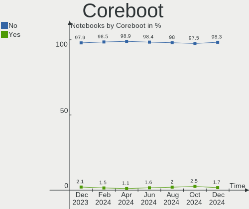
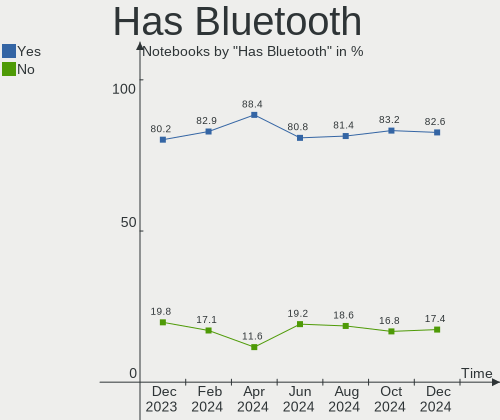
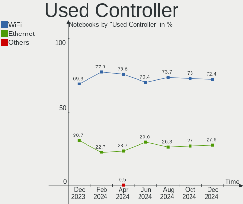
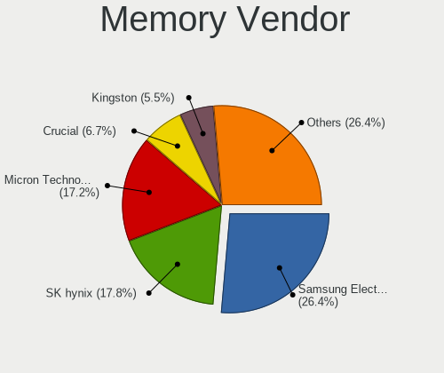

Debian - Hardware Trends (Notebooks)
------------------------------------

A project to identify most popular hardware characteristics and track their change
over time based on data collected by Linux users at https://Linux-Hardware.org.

Anyone can contribute to this report by the [hw-probe](https://github.com/linuxhw/hw-probe) tool:

    sudo -E hw-probe -all -upload

This report is for one last month. Overall report since the beginning of time: [TestDays](https://github.com/linuxhw/TestDays)

Period: Jan, 2024.

Contents
--------

* [ System ](#system)
  - [ OS                       ](#os)
  - [ OS Family                ](#os-family)
  - [ Kernel                   ](#kernel)
  - [ Kernel Family            ](#kernel-family)
  - [ Kernel Major Ver.        ](#kernel-major-ver)
  - [ Arch                     ](#arch)
  - [ DE                       ](#de)
  - [ Display Server           ](#display-server)
  - [ Display Manager          ](#display-manager)
  - [ OS Lang                  ](#os-lang)
  - [ Boot Mode                ](#boot-mode)
  - [ Filesystem               ](#filesystem)
  - [ Part. scheme             ](#part-scheme)
  - [ Dual Boot with Linux/BSD ](#dual-boot-with-linuxbsd)
  - [ Dual Boot (Win)          ](#dual-boot-win)

* [ Board ](#board)
  - [ Vendor                   ](#vendor)
  - [ Model                    ](#model)
  - [ Model Family             ](#model-family)
  - [ MFG Year                 ](#mfg-year)
  - [ Form Factor              ](#form-factor)
  - [ Secure Boot              ](#secure-boot)
  - [ Coreboot                 ](#coreboot)
  - [ RAM Size                 ](#ram-size)
  - [ RAM Used                 ](#ram-used)
  - [ Total Drives             ](#total-drives)
  - [ Has CD-ROM               ](#has-cd-rom)
  - [ Has Ethernet             ](#has-ethernet)
  - [ Has WiFi                 ](#has-wifi)
  - [ Has Bluetooth            ](#has-bluetooth)

* [ Location ](#location)
  - [ Country                  ](#country)
  - [ City                     ](#city)

* [ Drives ](#drives)
  - [ Drive Vendor             ](#drive-vendor)
  - [ Drive Model              ](#drive-model)
  - [ HDD Vendor               ](#hdd-vendor)
  - [ SSD Vendor               ](#ssd-vendor)
  - [ Drive Kind               ](#drive-kind)
  - [ Drive Connector          ](#drive-connector)
  - [ Drive Size               ](#drive-size)
  - [ Space Total              ](#space-total)
  - [ Space Used               ](#space-used)
  - [ Malfunc. Drives          ](#malfunc-drives)
  - [ Malfunc. Drive Vendor    ](#malfunc-drive-vendor)
  - [ Malfunc. HDD Vendor      ](#malfunc-hdd-vendor)
  - [ Malfunc. Drive Kind      ](#malfunc-drive-kind)
  - [ Failed Drives            ](#failed-drives)
  - [ Failed Drive Vendor      ](#failed-drive-vendor)
  - [ Drive Status             ](#drive-status)

* [ Storage controller ](#storage-controller)
  - [ Storage Vendor           ](#storage-vendor)
  - [ Storage Model            ](#storage-model)
  - [ Storage Kind             ](#storage-kind)

* [ Processor ](#processor)
  - [ CPU Vendor               ](#cpu-vendor)
  - [ CPU Model                ](#cpu-model)
  - [ CPU Model Family         ](#cpu-model-family)
  - [ CPU Cores                ](#cpu-cores)
  - [ CPU Sockets              ](#cpu-sockets)
  - [ CPU Threads              ](#cpu-threads)
  - [ CPU Op-Modes             ](#cpu-op-modes)
  - [ CPU Microcode            ](#cpu-microcode)
  - [ CPU Microarch            ](#cpu-microarch)

* [ Graphics ](#graphics)
  - [ GPU Vendor               ](#gpu-vendor)
  - [ GPU Model                ](#gpu-model)
  - [ GPU Combo                ](#gpu-combo)
  - [ GPU Driver               ](#gpu-driver)
  - [ GPU Memory               ](#gpu-memory)

* [ Monitor ](#monitor)
  - [ Monitor Vendor           ](#monitor-vendor)
  - [ Monitor Model            ](#monitor-model)
  - [ Monitor Resolution       ](#monitor-resolution)
  - [ Monitor Diagonal         ](#monitor-diagonal)
  - [ Monitor Width            ](#monitor-width)
  - [ Aspect Ratio             ](#aspect-ratio)
  - [ Monitor Area             ](#monitor-area)
  - [ Pixel Density            ](#pixel-density)
  - [ Multiple Monitors        ](#multiple-monitors)

* [ Network ](#network)
  - [ Net Controller Vendor    ](#net-controller-vendor)
  - [ Net Controller Model     ](#net-controller-model)
  - [ Wireless Vendor          ](#wireless-vendor)
  - [ Wireless Model           ](#wireless-model)
  - [ Ethernet Vendor          ](#ethernet-vendor)
  - [ Ethernet Model           ](#ethernet-model)
  - [ Net Controller Kind      ](#net-controller-kind)
  - [ Used Controller          ](#used-controller)
  - [ NICs                     ](#nics)
  - [ IPv6                     ](#ipv6)

* [ Bluetooth ](#bluetooth)
  - [ Bluetooth Vendor         ](#bluetooth-vendor)
  - [ Bluetooth Model          ](#bluetooth-model)

* [ Sound ](#sound)
  - [ Sound Vendor             ](#sound-vendor)
  - [ Sound Model              ](#sound-model)

* [ Memory ](#memory)
  - [ Memory Vendor            ](#memory-vendor)
  - [ Memory Model             ](#memory-model)
  - [ Memory Kind              ](#memory-kind)
  - [ Memory Form Factor       ](#memory-form-factor)
  - [ Memory Size              ](#memory-size)
  - [ Memory Speed             ](#memory-speed)

* [ Printers & scanners ](#printers--scanners)
  - [ Printer Vendor           ](#printer-vendor)
  - [ Printer Model            ](#printer-model)
  - [ Scanner Vendor           ](#scanner-vendor)
  - [ Scanner Model            ](#scanner-model)

* [ Camera ](#camera)
  - [ Camera Vendor            ](#camera-vendor)
  - [ Camera Model             ](#camera-model)

* [ Security ](#security)
  - [ Fingerprint Vendor       ](#fingerprint-vendor)
  - [ Fingerprint Model        ](#fingerprint-model)
  - [ Chipcard Vendor          ](#chipcard-vendor)
  - [ Chipcard Model           ](#chipcard-model)

* [ Unsupported ](#unsupported)
  - [ Unsupported Devices      ](#unsupported-devices)
  - [ Unsupported Device Types ](#unsupported-device-types)

System
------

OS
--

Installed operating systems

| Name      | Notebooks | Percent |
|-----------|-----------|---------|
| Debian 12 | 176       | 75.54%  |
| Debian    | 33        | 14.16%  |
| Debian 11 | 22        | 9.44%   |
| Debian 23 | 1         | 0.43%   |
| Debian 10 | 1         | 0.43%   |

OS Family
---------

OS without a version

| Name   | Notebooks | Percent |
|--------|-----------|---------|
| Debian | 233       | 100%    |

Kernel
------

Version of the Linux kernel

| Version                         | Notebooks | Percent |
|---------------------------------|-----------|---------|
| 6.1.0-17-amd64                  | 106       | 45.49%  |
| 6.1.0-16-amd64                  | 16        | 6.87%   |
| 6.1.0-15-amd64                  | 14        | 6.01%   |
| 6.5.0-5-amd64                   | 12        | 5.15%   |
| 6.1.0-4-amd64                   | 12        | 5.15%   |
| 5.10.0-27-amd64                 | 10        | 4.29%   |
| 6.6.9-amd64                     | 8         | 3.43%   |
| 6.6.11-amd64                    | 5         | 2.15%   |
| 6.5.0-0.deb12.4-amd64           | 5         | 2.15%   |
| 6.1.0-13-amd64                  | 5         | 2.15%   |
| 6.7-amd64                       | 3         | 1.29%   |
| 6.6.13-amd64                    | 3         | 1.29%   |
| 5.10.0-26-amd64                 | 3         | 1.29%   |
| 6.6.12-1-liquorix-amd64         | 2         | 0.86%   |
| 6.1.0-10-amd64                  | 2         | 0.86%   |
| 6.7.2-tereszkiewicz             | 1         | 0.43%   |
| 6.7.2-3-liquorix-amd64          | 1         | 0.43%   |
| 6.7.1-1-liquorix-amd64          | 1         | 0.43%   |
| 6.7.0-keepos                    | 1         | 0.43%   |
| 6.6.13-x64v2-xanmod1            | 1         | 0.43%   |
| 6.6.10-chrultrabook             | 1         | 0.43%   |
| 6.6.0-chrultrabook              | 1         | 0.43%   |
| 6.5.0-asahi-00780-g62806c2c6f29 | 1         | 0.43%   |
| 6.5.0-0.deb12.1-amd64           | 1         | 0.43%   |
| 6.3.0-1-amd64                   | 1         | 0.43%   |
| 6.2.16-3-pve                    | 1         | 0.43%   |
| 6.1.69-x64v1-xanmod1            | 1         | 0.43%   |
| 6.1.69-hard-full-kicksecure     | 1         | 0.43%   |
| 6.1.42-antix.1-amd64-smp        | 1         | 0.43%   |
| 6.1.0-17-686-pae                | 1         | 0.43%   |
| 6.1.0-14-686-pae                | 1         | 0.43%   |
| 6.1.0-12-amd64                  | 1         | 0.43%   |
| 6.1.0-0.deb11.13-amd64          | 1         | 0.43%   |
| 5.18.0-0.deb11.4-amd64          | 1         | 0.43%   |
| 5.10.200-loc-os                 | 1         | 0.43%   |
| 5.10.0-27-686-pae               | 1         | 0.43%   |
| 5.10.0-26-rt-amd64              | 1         | 0.43%   |
| 5.10.0-23-amd64                 | 1         | 0.43%   |
| 5.10.0-20-amd64                 | 1         | 0.43%   |
| 5.10.0-19-amd64                 | 1         | 0.43%   |

Kernel Family
-------------

Linux kernel without a distro release

| Version  | Notebooks | Percent |
|----------|-----------|---------|
| 6.1.0    | 159       | 68.24%  |
| 6.5.0    | 19        | 8.15%   |
| 5.10.0   | 19        | 8.15%   |
| 6.6.9    | 8         | 3.43%   |
| 6.6.11   | 5         | 2.15%   |
| 6.6.13   | 4         | 1.72%   |
| 6.7      | 3         | 1.29%   |
| 6.7.2    | 2         | 0.86%   |
| 6.6.12   | 2         | 0.86%   |
| 6.1.69   | 2         | 0.86%   |
| 6.7.1    | 1         | 0.43%   |
| 6.7.0    | 1         | 0.43%   |
| 6.6.10   | 1         | 0.43%   |
| 6.6.0    | 1         | 0.43%   |
| 6.3.0    | 1         | 0.43%   |
| 6.2.16   | 1         | 0.43%   |
| 6.1.42   | 1         | 0.43%   |
| 5.18.0   | 1         | 0.43%   |
| 5.10.200 | 1         | 0.43%   |
| 4.19.0   | 1         | 0.43%   |

Kernel Major Ver.
-----------------

Linux kernel major version

| Version | Notebooks | Percent |
|---------|-----------|---------|
| 6.1     | 162       | 69.53%  |
| 6.6     | 21        | 9.01%   |
| 5.10    | 20        | 8.58%   |
| 6.5     | 19        | 8.15%   |
| 6.7     | 4         | 1.72%   |
| 6       | 3         | 1.29%   |
| 6.3     | 1         | 0.43%   |
| 6.2     | 1         | 0.43%   |
| 5.18    | 1         | 0.43%   |
| 4.19    | 1         | 0.43%   |

Arch
----

OS architecture (x86_64, i586, etc.)

| Name    | Notebooks | Percent |
|---------|-----------|---------|
| x86_64  | 229       | 98.28%  |
| i686    | 3         | 1.29%   |
| aarch64 | 1         | 0.43%   |

DE
--

Desktop Environment

| Name             | Notebooks | Percent |
|------------------|-----------|---------|
| GNOME            | 83        | 35.62%  |
| KDE5             | 57        | 24.46%  |
| XFCE             | 29        | 12.45%  |
| Unknown          | 24        | 10.3%   |
| X-Cinnamon       | 9         | 3.86%   |
| MATE             | 6         | 2.58%   |
| LXDE             | 6         | 2.58%   |
| LXQt             | 5         | 2.15%   |
| lightdm-xsession | 2         | 0.86%   |
| GNOME Flashback  | 2         | 0.86%   |
| Cinnamon         | 2         | 0.86%   |
| Trinity          | 1         | 0.43%   |
| sway             | 1         | 0.43%   |
| icewm            | 1         | 0.43%   |
| i3               | 1         | 0.43%   |
| GNUstep          | 1         | 0.43%   |
| GNOME Classic    | 1         | 0.43%   |
| Enlightenment    | 1         | 0.43%   |
| Budgie           | 1         | 0.43%   |

Display Server
--------------

X11 or Wayland

| Name    | Notebooks | Percent |
|---------|-----------|---------|
| X11     | 121       | 51.93%  |
| Wayland | 83        | 35.62%  |
| Unknown | 21        | 9.01%   |
| Tty     | 7         | 3%      |
| Web     | 1         | 0.43%   |

Display Manager
---------------

SDDM, LightDM, etc.

| Name          | Notebooks | Percent |
|---------------|-----------|---------|
| Unknown       | 72        | 30.9%   |
| GDM3          | 66        | 28.33%  |
| LightDM       | 47        | 20.17%  |
| SDDM          | 36        | 15.45%  |
| GDM           | 7         | 3%      |
| XDM           | 1         | 0.43%   |
| WDM           | 1         | 0.43%   |
| TDM           | 1         | 0.43%   |
| NODM          | 1         | 0.43%   |
| DARKDM_ON_TTY | 1         | 0.43%   |

OS Lang
-------

Language

| Lang       | Notebooks | Percent |
|------------|-----------|---------|
| en_US      | 93        | 39.91%  |
| de_DE      | 25        | 10.73%  |
| ru_RU      | 20        | 8.58%   |
| fr_FR      | 17        | 7.3%    |
| it_IT      | 11        | 4.72%   |
| Unknown    | 10        | 4.29%   |
| en_GB      | 8         | 3.43%   |
| es_ES      | 7         | 3%      |
| en_AU      | 6         | 2.58%   |
| en_CA      | 4         | 1.72%   |
| C          | 4         | 1.72%   |
| zh_CN      | 3         | 1.29%   |
| pl_PL      | 3         | 1.29%   |
| es_MX      | 3         | 1.29%   |
| en_IN      | 3         | 1.29%   |
| pt_BR      | 2         | 0.86%   |
| es_CO      | 2         | 0.86%   |
| de_CH      | 2         | 0.86%   |
| tr_TR      | 1         | 0.43%   |
| pt_PT      | 1         | 0.43%   |
| nb_NO      | 1         | 0.43%   |
| ko_KR      | 1         | 0.43%   |
| hu_HU      | 1         | 0.43%   |
| hr_HR      | 1         | 0.43%   |
| fr_BE      | 1         | 0.43%   |
| es_AR      | 1         | 0.43%   |
| de_CH.UTF8 | 1         | 0.43%   |
| ca_AD      | 1         | 0.43%   |

Boot Mode
---------

EFI or BIOS

| Mode | Notebooks | Percent |
|------|-----------|---------|
| EFI  | 141       | 60.52%  |
| BIOS | 92        | 39.48%  |

Filesystem
----------

Type of filesystem

| Type    | Notebooks | Percent |
|---------|-----------|---------|
| Ext4    | 185       | 79.4%   |
| Overlay | 27        | 11.59%  |
| Btrfs   | 11        | 4.72%   |
| Tmpfs   | 7         | 3%      |
| F2fs    | 2         | 0.86%   |
| Zfs     | 1         | 0.43%   |

Part. scheme
------------

Scheme of partitioning

| Type    | Notebooks | Percent |
|---------|-----------|---------|
| GPT     | 146       | 62.66%  |
| Unknown | 48        | 20.6%   |
| MBR     | 39        | 16.74%  |

Dual Boot with Linux/BSD
------------------------

Hosting more than one Linux/BSD

| Dual boot | Notebooks | Percent |
|-----------|-----------|---------|
| No        | 216       | 92.7%   |
| Yes       | 17        | 7.3%    |

Dual Boot (Win)
---------------

Hosting Linux and Windows

| Dual boot | Notebooks | Percent |
|-----------|-----------|---------|
| No        | 166       | 71.24%  |
| Yes       | 67        | 28.76%  |

Board
-----

Vendor
------

Motherboard manufacturer

| Name                | Notebooks | Percent |
|---------------------|-----------|---------|
| Lenovo              | 58        | 24.89%  |
| Hewlett-Packard     | 49        | 21.03%  |
| Dell                | 33        | 14.16%  |
| ASUSTek Computer    | 13        | 5.58%   |
| Acer                | 13        | 5.58%   |
| Apple               | 11        | 4.72%   |
| Aquarius            | 9         | 3.86%   |
| Google              | 6         | 2.58%   |
| Medion              | 4         | 1.72%   |
| HUAWEI              | 4         | 1.72%   |
| Unknown             | 4         | 1.72%   |
| TUXEDO              | 3         | 1.29%   |
| Toshiba             | 3         | 1.29%   |
| Samsung Electronics | 2         | 0.86%   |
| MSI                 | 2         | 0.86%   |
| Thomson             | 1         | 0.43%   |
| Sony                | 1         | 0.43%   |
| Schenker            | 1         | 0.43%   |
| Razer               | 1         | 0.43%   |
| Positivo            | 1         | 0.43%   |
| Pegatron            | 1         | 0.43%   |
| Panasonic           | 1         | 0.43%   |
| OriginPC            | 1         | 0.43%   |
| Novatech            | 1         | 0.43%   |
| Multilaser          | 1         | 0.43%   |
| Monster             | 1         | 0.43%   |
| LG Electronics      | 1         | 0.43%   |
| HONOR               | 1         | 0.43%   |
| GTZS                | 1         | 0.43%   |
| Gateway             | 1         | 0.43%   |
| Fujitsu             | 1         | 0.43%   |
| Dynabook            | 1         | 0.43%   |
| COIN COMPUTERS      | 1         | 0.43%   |
| Clevo               | 1         | 0.43%   |

Model
-----

Motherboard model

| Name                                  | Notebooks | Percent |
|---------------------------------------|-----------|---------|
| Aquarius NS585                        | 9         | 3.86%   |
| Unknown                               | 5         | 2.15%   |
| HP 15                                 | 3         | 1.29%   |
| Apple MacBookAir7,2                   | 3         | 1.29%   |
| Lenovo ThinkPad 13 2nd Gen 20J10046US | 2         | 0.86%   |
| HP Victus by Gaming Laptop 16-r0xxx   | 2         | 0.86%   |
| HP Pavilion Laptop 15-eh1xxx          | 2         | 0.86%   |
| HP Pavilion g4                        | 2         | 0.86%   |
| HP Laptop 15-db0xxx                   | 2         | 0.86%   |
| HP EliteBook 745 G3                   | 2         | 0.86%   |
| HP EliteBook 2570p                    | 2         | 0.86%   |
| Dell XPS 9315                         | 2         | 0.86%   |
| Dell XPS 13 9360                      | 2         | 0.86%   |
| Dell Latitude 3320                    | 2         | 0.86%   |
| Acer Aspire A515-43                   | 2         | 0.86%   |
| TUXEDO Pulse 14 Gen3                  | 1         | 0.43%   |
| TUXEDO N8xxEZ                         | 1         | 0.43%   |
| TUXEDO Aura 14 Gen3                   | 1         | 0.43%   |
| Toshiba Satellite L40                 | 1         | 0.43%   |
| Toshiba PORTEGE R500                  | 1         | 0.43%   |
| Toshiba PORTEGE R30-A                 | 1         | 0.43%   |
| Thomson N17V3C8WH512                  | 1         | 0.43%   |
| Sony VPCSA2CFX                        | 1         | 0.43%   |
| Schenker N13xWU                       | 1         | 0.43%   |
| Samsung RC530/RC730                   | 1         | 0.43%   |
| Samsung R780                          | 1         | 0.43%   |
| Razer Blade Stealth                   | 1         | 0.43%   |
| Positivo Mobile                       | 1         | 0.43%   |
| Pegatron C15B                         | 1         | 0.43%   |
| Panasonic CF-31ATAAX1M                | 1         | 0.43%   |
| OriginPC EVO16-S                      | 1         | 0.43%   |
| Novatech C141EK3-CI3TX                | 1         | 0.43%   |
| Multilaser MLGW08                     | 1         | 0.43%   |
| MSI GL62M 7RDX                        | 1         | 0.43%   |
| MSI Alpha 17 C7VG                     | 1         | 0.43%   |
| Monster ABRA A5 V16.6                 | 1         | 0.43%   |
| Medion S4216                          | 1         | 0.43%   |
| Medion E15423                         | 1         | 0.43%   |
| Medion Crawler E30e                   | 1         | 0.43%   |
| Medion Akoya P7628                    | 1         | 0.43%   |

Model Family
------------

Motherboard model prefix

| Name                 | Notebooks | Percent |
|----------------------|-----------|---------|
| Lenovo ThinkPad      | 33        | 14.16%  |
| Lenovo IdeaPad       | 10        | 4.29%   |
| HP Pavilion          | 10        | 4.29%   |
| HP EliteBook         | 10        | 4.29%   |
| Dell Latitude        | 10        | 4.29%   |
| Dell XPS             | 9         | 3.86%   |
| Aquarius NS585       | 9         | 3.86%   |
| HP ProBook           | 8         | 3.43%   |
| HP Laptop            | 6         | 2.58%   |
| Dell Inspiron        | 6         | 2.58%   |
| ASUS VivoBook        | 5         | 2.15%   |
| Acer Aspire          | 5         | 2.15%   |
| Unknown              | 5         | 2.15%   |
| Lenovo ThinkBook     | 4         | 1.72%   |
| Dell Precision       | 4         | 1.72%   |
| Lenovo Yoga          | 3         | 1.29%   |
| HP 15                | 3         | 1.29%   |
| Apple MacBookAir7    | 3         | 1.29%   |
| Toshiba PORTEGE      | 2         | 0.86%   |
| Lenovo Legion        | 2         | 0.86%   |
| HP Victus            | 2         | 0.86%   |
| HP Compaq            | 2         | 0.86%   |
| Dell G3              | 2         | 0.86%   |
| Apple MacBookPro5    | 2         | 0.86%   |
| Apple MacBookPro11   | 2         | 0.86%   |
| Acer TravelMate      | 2         | 0.86%   |
| Acer Swift           | 2         | 0.86%   |
| Acer Nitro           | 2         | 0.86%   |
| TUXEDO Pulse         | 1         | 0.43%   |
| TUXEDO N8xxEZ        | 1         | 0.43%   |
| TUXEDO Aura          | 1         | 0.43%   |
| Toshiba Satellite    | 1         | 0.43%   |
| Thomson N17V3C8WH512 | 1         | 0.43%   |
| Sony VPCSA2CFX       | 1         | 0.43%   |
| Schenker N13xWU      | 1         | 0.43%   |
| Samsung RC530        | 1         | 0.43%   |
| Samsung R780         | 1         | 0.43%   |
| Razer Blade          | 1         | 0.43%   |
| Positivo Mobile      | 1         | 0.43%   |
| Pegatron C15B        | 1         | 0.43%   |

MFG Year
--------

Motherboard manufacture year

| Year    | Notebooks | Percent |
|---------|-----------|---------|
| 2019    | 32        | 13.73%  |
| 2023    | 23        | 9.87%   |
| 2022    | 21        | 9.01%   |
| 2021    | 21        | 9.01%   |
| 2018    | 17        | 7.3%    |
| 2013    | 16        | 6.87%   |
| 2016    | 14        | 6.01%   |
| 2020    | 13        | 5.58%   |
| 2012    | 13        | 5.58%   |
| 2011    | 13        | 5.58%   |
| 2007    | 10        | 4.29%   |
| 2017    | 7         | 3%      |
| 2014    | 7         | 3%      |
| 2010    | 6         | 2.58%   |
| 2009    | 6         | 2.58%   |
| 2008    | 6         | 2.58%   |
| 2015    | 4         | 1.72%   |
| 2006    | 3         | 1.29%   |
| Unknown | 1         | 0.43%   |

Form Factor
-----------

Physical design of the computer

| Name     | Notebooks | Percent |
|----------|-----------|---------|
| Notebook | 233       | 100%    |

Secure Boot
-----------

Enabled or disabled

| State    | Notebooks | Percent |
|----------|-----------|---------|
| Disabled | 217       | 93.13%  |
| Enabled  | 16        | 6.87%   |

Coreboot
--------

Have coreboot on board

| Used | Notebooks | Percent |
|------|-----------|---------|
| No   | 226       | 97%     |
| Yes  | 7         | 3%      |

RAM Size
--------

Total RAM memory

| Size in GB  | Notebooks | Percent |
|-------------|-----------|---------|
| 4.01-8.0    | 75        | 32.19%  |
| 16.01-24.0  | 44        | 18.88%  |
| 3.01-4.0    | 41        | 17.6%   |
| 8.01-16.0   | 31        | 13.3%   |
| 32.01-64.0  | 17        | 7.3%    |
| 1.01-2.0    | 10        | 4.29%   |
| 24.01-32.0  | 8         | 3.43%   |
| 64.01-256.0 | 4         | 1.72%   |
| 2.01-3.0    | 3         | 1.29%   |

RAM Used
--------

Used RAM memory

| Used GB    | Notebooks | Percent |
|------------|-----------|---------|
| 1.01-2.0   | 72        | 30.9%   |
| 2.01-3.0   | 52        | 22.32%  |
| 3.01-4.0   | 36        | 15.45%  |
| 4.01-8.0   | 30        | 12.88%  |
| 0.51-1.0   | 25        | 10.73%  |
| 8.01-16.0  | 13        | 5.58%   |
| 16.01-24.0 | 2         | 0.86%   |
| 0.01-0.5   | 2         | 0.86%   |
| 24.01-32.0 | 1         | 0.43%   |

Total Drives
------------

Number of drives on board

| Drives | Notebooks | Percent |
|--------|-----------|---------|
| 1      | 180       | 77.25%  |
| 2      | 43        | 18.45%  |
| 3      | 6         | 2.58%   |
| 4      | 2         | 0.86%   |
| 0      | 2         | 0.86%   |

Has CD-ROM
----------

Has CD-ROM on board

| Presented | Notebooks | Percent |
|-----------|-----------|---------|
| No        | 175       | 75.11%  |
| Yes       | 58        | 24.89%  |

Has Ethernet
------------

Has Ethernet on board

| Presented | Notebooks | Percent |
|-----------|-----------|---------|
| Yes       | 180       | 77.25%  |
| No        | 53        | 22.75%  |

Has WiFi
--------

Has WiFi module

| Presented | Notebooks | Percent |
|-----------|-----------|---------|
| Yes       | 230       | 98.71%  |
| No        | 3         | 1.29%   |

Has Bluetooth
-------------

Has Bluetooth module

| Presented | Notebooks | Percent |
|-----------|-----------|---------|
| Yes       | 195       | 83.69%  |
| No        | 38        | 16.31%  |

Location
--------

Country
-------

Geographic location (country)

| Country            | Notebooks | Percent |
|--------------------|-----------|---------|
| USA                | 42        | 18.03%  |
| Germany            | 33        | 14.16%  |
| Russia             | 26        | 11.16%  |
| France             | 21        | 9.01%   |
| Italy              | 18        | 7.73%   |
| Poland             | 7         | 3%      |
| Spain              | 6         | 2.58%   |
| Australia          | 6         | 2.58%   |
| UK                 | 5         | 2.15%   |
| Turkey             | 5         | 2.15%   |
| Switzerland        | 5         | 2.15%   |
| Canada             | 5         | 2.15%   |
| Brazil             | 5         | 2.15%   |
| Sweden             | 4         | 1.72%   |
| Netherlands        | 4         | 1.72%   |
| China              | 4         | 1.72%   |
| India              | 3         | 1.29%   |
| Greece             | 3         | 1.29%   |
| Colombia           | 3         | 1.29%   |
| Chile              | 3         | 1.29%   |
| Mexico             | 2         | 0.86%   |
| Indonesia          | 2         | 0.86%   |
| Hungary            | 2         | 0.86%   |
| Venezuela          | 1         | 0.43%   |
| The Netherlands    | 1         | 0.43%   |
| South Korea        | 1         | 0.43%   |
| Portugal           | 1         | 0.43%   |
| Pakistan           | 1         | 0.43%   |
| Norway             | 1         | 0.43%   |
| Nicaragua          | 1         | 0.43%   |
| Iran               | 1         | 0.43%   |
| Finland            | 1         | 0.43%   |
| Egypt              | 1         | 0.43%   |
| Ecuador            | 1         | 0.43%   |
| Dominican Republic | 1         | 0.43%   |
| Czechia            | 1         | 0.43%   |
| Cyprus             | 1         | 0.43%   |
| Croatia            | 1         | 0.43%   |
| Costa Rica         | 1         | 0.43%   |
| Belgium            | 1         | 0.43%   |

City
----

Geographic location (city)

| City                   | Notebooks | Percent |
|------------------------|-----------|---------|
| Voronezh               | 12        | 5.15%   |
| Bangor                 | 7         | 3%      |
| Moscow                 | 4         | 1.72%   |
| Milan                  | 4         | 1.72%   |
| Berlin                 | 4         | 1.72%   |
| Zurich                 | 3         | 1.29%   |
| St Petersburg          | 3         | 1.29%   |
| Paris                  | 3         | 1.29%   |
| Istanbul               | 3         | 1.29%   |
| Hamburg                | 3         | 1.29%   |
| Villeurbanne           | 2         | 0.86%   |
| Stockholm              | 2         | 0.86%   |
| Samara                 | 2         | 0.86%   |
| Oldenburg              | 2         | 0.86%   |
| Los Angeles            | 2         | 0.86%   |
| Leinster               | 2         | 0.86%   |
| Krakow                 | 2         | 0.86%   |
| Frankfurt am Main      | 2         | 0.86%   |
| Fortaleza              | 2         | 0.86%   |
| Florence               | 2         | 0.86%   |
| Elblag                 | 2         | 0.86%   |
| Dallas                 | 2         | 0.86%   |
| Budapest               | 2         | 0.86%   |
| Bremen                 | 2         | 0.86%   |
| Bologna                | 2         | 0.86%   |
| Bogotá                | 2         | 0.86%   |
| Zinapecuaro            | 1         | 0.43%   |
| Zakynthos              | 1         | 0.43%   |
| Zagreb                 | 1         | 0.43%   |
| Yeongdeungpo-gu        | 1         | 0.43%   |
| Winnipeg               | 1         | 0.43%   |
| Wieliczka              | 1         | 0.43%   |
| Wetzlar                | 1         | 0.43%   |
| Vladimir               | 1         | 0.43%   |
| Vitebsk                | 1         | 0.43%   |
| Villingen-Schwenningen | 1         | 0.43%   |
| Vila Franca de Xira    | 1         | 0.43%   |
| Vigo                   | 1         | 0.43%   |
| Verona                 | 1         | 0.43%   |
| Vancouver              | 1         | 0.43%   |

Drives
------

Drive Vendor
------------

Hard drive vendors

| Vendor                      | Notebooks | Drives | Percent |
|-----------------------------|-----------|--------|---------|
| Samsung Electronics         | 50        | 53     | 17.92%  |
| WDC                         | 28        | 28     | 10.04%  |
| Sandisk                     | 18        | 18     | 6.45%   |
| Unknown                     | 17        | 18     | 6.09%   |
| SK hynix                    | 16        | 16     | 5.73%   |
| Seagate                     | 16        | 17     | 5.73%   |
| Toshiba                     | 14        | 14     | 5.02%   |
| Intel                       | 13        | 14     | 4.66%   |
| A-DATA Technology           | 13        | 13     | 4.66%   |
| Crucial                     | 11        | 11     | 3.94%   |
| KIOXIA                      | 8         | 8      | 2.87%   |
| Micron Technology           | 6         | 6      | 2.15%   |
| Kingston                    | 6         | 6      | 2.15%   |
| HGST                        | 6         | 6      | 2.15%   |
| Apple                       | 6         | 8      | 2.15%   |
| Hitachi                     | 4         | 4      | 1.43%   |
| Silicon Motion              | 3         | 3      | 1.08%   |
| JMicron Technology          | 3         | 3      | 1.08%   |
| Intenso                     | 3         | 4      | 1.08%   |
| Fanxiang                    | 3         | 3      | 1.08%   |
| PNY                         | 2         | 2      | 0.72%   |
| Phison Electronics          | 2         | 2      | 0.72%   |
| MAXIO Technology (Hangzhou) | 2         | 2      | 0.72%   |
| KLEVV                       | 2         | 2      | 0.72%   |
| Corsair                     | 2         | 2      | 0.72%   |
| Unknown                     | 2         | 2      | 0.72%   |
| XrayDisk                    | 1         | 1      | 0.36%   |
| Wodposit                    | 1         | 1      | 0.36%   |
| UMIS                        | 1         | 1      | 0.36%   |
| Team                        | 1         | 1      | 0.36%   |
| SSSTC                       | 1         | 1      | 0.36%   |
| SPCC                        | 1         | 1      | 0.36%   |
| Realtek Semiconductor       | 1         | 1      | 0.36%   |
| Phison                      | 1         | 1      | 0.36%   |
| Patriot                     | 1         | 1      | 0.36%   |
| Netac                       | 1         | 1      | 0.36%   |
| MS310                       | 1         | 1      | 0.36%   |
| Min Yi U                    | 1         | 1      | 0.36%   |
| Micron/Crucial Technology   | 1         | 1      | 0.36%   |
| LaCie                       | 1         | 1      | 0.36%   |

Drive Model
-----------

Hard drive models

| Model                                             | Notebooks | Percent |
|---------------------------------------------------|-----------|---------|
| A-DATA SU800 512GB SSD                            | 9         | 3.16%   |
| SanDisk NVMe SSD Drive 1TB                        | 4         | 1.4%    |
| Samsung NVMe SSD Controller SM981/PM981/PM983 1TB | 4         | 1.4%    |
| Unknown MMC Card  64GB                            | 3         | 1.05%   |
| Toshiba MQ01ABF050 500GB                          | 3         | 1.05%   |
| Seagate ST9500325AS 500GB                         | 3         | 1.05%   |
| Samsung SSD 860 EVO 250GB                         | 3         | 1.05%   |
| Apple SSD SM0128G 121GB                           | 3         | 1.05%   |
| WDC WDS500G2B0A-00SM50 500GB SSD                  | 2         | 0.7%    |
| WDC WD5000LPVX-22V0TT0 500GB                      | 2         | 0.7%    |
| WDC WD10SPZX-60Z10T0 1TB                          | 2         | 0.7%    |
| Unknown SD64G  64GB                               | 2         | 0.7%    |
| Toshiba MQ04ABF100 1TB                            | 2         | 0.7%    |
| Seagate ST1000LM035-1RK172 1TB                    | 2         | 0.7%    |
| Sandisk WD Blue SN550 NVMe SSD 512GB              | 2         | 0.7%    |
| Sandisk WD Black SN750 / PC SN730 NVMe SSD 512GB  | 2         | 0.7%    |
| SanDisk SD9SN8W-128G-1006 128GB SSD               | 2         | 0.7%    |
| Samsung SSD 980 PRO 1TB                           | 2         | 0.7%    |
| Samsung SSD 850 PRO 256GB                         | 2         | 0.7%    |
| Samsung PSSD T7 1TB                               | 2         | 0.7%    |
| Samsung MZVLQ512HALU-000H1 512GB                  | 2         | 0.7%    |
| Samsung MZAL4512HBLU-00BL2 512GB                  | 2         | 0.7%    |
| KIOXIA KXG80ZNV1T02 NVMe 1024GB                   | 2         | 0.7%    |
| Kingston SA400S37480G 480GB SSD                   | 2         | 0.7%    |
| Kingston SA400S37240G 240GB SSD                   | 2         | 0.7%    |
| JMicron Tech 250GB                                | 2         | 0.7%    |
| Intel SSDPEKNW512G8H 512GB                        | 2         | 0.7%    |
| Hitachi HTS541680J9SA00 80GB                      | 2         | 0.7%    |
| HGST HTS721010A9E630 1TB                          | 2         | 0.7%    |
| Crucial CT500MX500SSD1 500GB                      | 2         | 0.7%    |
| Crucial CT500BX500SSD1 500GB                      | 2         | 0.7%    |
| Crucial CT120BX500SSD1 120GB                      | 2         | 0.7%    |
| Unknown                                           | 2         | 0.7%    |
| XrayDisk SSD 240GB                                | 1         | 0.35%   |
| Wodposit SSD 256GB                                | 1         | 0.35%   |
| WDC WDS200T2B0A-00SM50 2TB SSD                    | 1         | 0.35%   |
| WDC WDS120G2G0B-00EPW0 120GB SSD                  | 1         | 0.35%   |
| WDC WDS120G1G0A-00SS50 120GB SSD                  | 1         | 0.35%   |
| WDC WDS100T3X0C-00SJG0 1TB                        | 1         | 0.35%   |
| WDC WD5000LPVX-60V0TT0 500GB                      | 1         | 0.35%   |

HDD Vendor
----------

Hard disk drive vendors

| Vendor             | Notebooks | Drives | Percent |
|--------------------|-----------|--------|---------|
| Seagate            | 16        | 17     | 30.19%  |
| WDC                | 13        | 13     | 24.53%  |
| Toshiba            | 10        | 10     | 18.87%  |
| HGST               | 6         | 6      | 11.32%  |
| Hitachi            | 4         | 4      | 7.55%   |
| LaCie              | 1         | 1      | 1.89%   |
| JMicron Technology | 1         | 1      | 1.89%   |
| Fujitsu            | 1         | 1      | 1.89%   |
| Unknown            | 1         | 1      | 1.89%   |

SSD Vendor
----------

Solid state drive vendors

| Vendor              | Notebooks | Drives | Percent |
|---------------------|-----------|--------|---------|
| Samsung Electronics | 22        | 24     | 22.22%  |
| A-DATA Technology   | 12        | 12     | 12.12%  |
| Crucial             | 9         | 9      | 9.09%   |
| SanDisk             | 8         | 8      | 8.08%   |
| WDC                 | 6         | 6      | 6.06%   |
| Kingston            | 6         | 6      | 6.06%   |
| Apple               | 5         | 5      | 5.05%   |
| SK hynix            | 3         | 3      | 3.03%   |
| Intenso             | 3         | 4      | 3.03%   |
| PNY                 | 2         | 2      | 2.02%   |
| Intel               | 2         | 2      | 2.02%   |
| XrayDisk            | 1         | 1      | 1.01%   |
| Wodposit            | 1         | 1      | 1.01%   |
| Toshiba             | 1         | 1      | 1.01%   |
| SSSTC               | 1         | 1      | 1.01%   |
| SPCC                | 1         | 1      | 1.01%   |
| Phison              | 1         | 1      | 1.01%   |
| Patriot             | 1         | 1      | 1.01%   |
| Netac               | 1         | 1      | 1.01%   |
| MS310               | 1         | 1      | 1.01%   |
| Min Yi U            | 1         | 1      | 1.01%   |
| Micron Technology   | 1         | 1      | 1.01%   |
| KLEVV               | 1         | 1      | 1.01%   |
| Indilinx            | 1         | 1      | 1.01%   |
| Hised               | 1         | 1      | 1.01%   |
| GOODRAM             | 1         | 1      | 1.01%   |
| Fanxiang            | 1         | 1      | 1.01%   |
| Dogfish             | 1         | 1      | 1.01%   |
| Corsair             | 1         | 1      | 1.01%   |
| China               | 1         | 1      | 1.01%   |
| Aura                | 1         | 1      | 1.01%   |
| AMD                 | 1         | 1      | 1.01%   |

Drive Kind
----------

HDD or SSD

| Kind    | Notebooks | Drives | Percent |
|---------|-----------|--------|---------|
| NVMe    | 101       | 111    | 37.55%  |
| SSD     | 95        | 102    | 35.32%  |
| HDD     | 53        | 54     | 19.7%   |
| MMC     | 18        | 19     | 6.69%   |
| Unknown | 2         | 2      | 0.74%   |

Drive Connector
---------------

SATA, SAS, NVMe, etc.

| Type | Notebooks | Drives | Percent |
|------|-----------|--------|---------|
| SATA | 129       | 147    | 49.81%  |
| NVMe | 101       | 110    | 39%     |
| MMC  | 18        | 19     | 6.95%   |
| SAS  | 11        | 12     | 4.25%   |

Drive Size
----------

Size of hard drive

| Size in TB | Notebooks | Drives | Percent |
|------------|-----------|--------|---------|
| 0.01-0.5   | 98        | 110    | 68.53%  |
| 0.51-1.0   | 40        | 41     | 27.97%  |
| 1.01-2.0   | 4         | 4      | 2.8%    |
| 3.01-4.0   | 1         | 1      | 0.7%    |

Space Total
-----------

Amount of disk space available on the file system

| Size in GB     | Notebooks | Percent |
|----------------|-----------|---------|
| 101-250        | 73        | 31.33%  |
| 251-500        | 61        | 26.18%  |
| 501-1000       | 39        | 16.74%  |
| Unknown        | 16        | 6.87%   |
| 1-20           | 13        | 5.58%   |
| 51-100         | 9         | 3.86%   |
| 1001-2000      | 8         | 3.43%   |
| More than 3000 | 6         | 2.58%   |
| 21-50          | 6         | 2.58%   |
| 2001-3000      | 2         | 0.86%   |

Space Used
----------

Amount of used disk space

| Used GB   | Notebooks | Percent |
|-----------|-----------|---------|
| 1-20      | 88        | 37.77%  |
| 101-250   | 39        | 16.74%  |
| 21-50     | 33        | 14.16%  |
| 51-100    | 31        | 13.3%   |
| Unknown   | 16        | 6.87%   |
| 251-500   | 12        | 5.15%   |
| 1001-2000 | 7         | 3%      |
| 501-1000  | 5         | 2.15%   |
| 2001-3000 | 2         | 0.86%   |

Malfunc. Drives
---------------

Drive models with a malfunction

| Model                                 | Notebooks | Drives | Percent |
|---------------------------------------|-----------|--------|---------|
| Hitachi HTS541680J9SA00 80GB          | 2         | 2      | 6.9%    |
| WDC WD3200BPVT-75ZEST0 320GB          | 1         | 1      | 3.45%   |
| WDC WD1600BEVT-60A23T0 160GB          | 1         | 1      | 3.45%   |
| WDC WD10SPZX-60Z10T0 1TB              | 1         | 1      | 3.45%   |
| Toshiba MQ01ABF050 500GB              | 1         | 1      | 3.45%   |
| Toshiba MQ01ABD050V 500GB             | 1         | 1      | 3.45%   |
| SK hynix HFS128G39TND-N210A 128GB SSD | 1         | 1      | 3.45%   |
| SK hynix HFS060G32MNB-2000A 64GB SSD  | 1         | 1      | 3.45%   |
| Seagate ST9500325AS 500GB             | 1         | 1      | 3.45%   |
| Seagate ST9250827AS 250GB             | 1         | 1      | 3.45%   |
| Seagate ST500LT012-9WS142 500GB       | 1         | 1      | 3.45%   |
| Seagate ST500LT012-1DG142 500GB       | 1         | 1      | 3.45%   |
| Seagate ST320LT007-9ZV142 320GB       | 1         | 1      | 3.45%   |
| Seagate ST1000LM024 HN-M101MBB 1TB    | 1         | 1      | 3.45%   |
| Seagate ST1000LM014-1EJ164 1TB        | 1         | 1      | 3.45%   |
| SanDisk SSD PLUS 1000GB               | 1         | 1      | 3.45%   |
| SanDisk SD9SN8W-128G-1006 128GB SSD   | 1         | 1      | 3.45%   |
| SanDisk SD6SB2M-512G-1006 512GB SSD   | 1         | 1      | 3.45%   |
| Samsung Electronics SSD 870 EVO 500GB | 1         | 1      | 3.45%   |
| KLEVV CRAS C710 M.2 NVMe SSD 1TB      | 1         | 1      | 3.45%   |
| Intel SSDSC2KF256H6 SATA 256GB        | 1         | 1      | 3.45%   |
| Intel SSDMAEMC080G2 80GB              | 1         | 1      | 3.45%   |
| Hitachi HTS545050B9SA02 500GB         | 1         | 1      | 3.45%   |
| Hitachi HTS545016B9A300 160GB         | 1         | 1      | 3.45%   |
| HGST HTS721075A9E630 752GB            | 1         | 1      | 3.45%   |
| HGST HTS721010A9E630 1TB              | 1         | 1      | 3.45%   |
| HGST HTS541010A9E680 1TB              | 1         | 1      | 3.45%   |
| Fujitsu MHW2160BJ G2 160GB            | 1         | 1      | 3.45%   |

Malfunc. Drive Vendor
---------------------

Vendors of faulty drives

| Vendor              | Notebooks | Drives | Percent |
|---------------------|-----------|--------|---------|
| Seagate             | 7         | 7      | 24.14%  |
| Hitachi             | 4         | 4      | 13.79%  |
| WDC                 | 3         | 3      | 10.34%  |
| SanDisk             | 3         | 3      | 10.34%  |
| HGST                | 3         | 3      | 10.34%  |
| Toshiba             | 2         | 2      | 6.9%    |
| SK hynix            | 2         | 2      | 6.9%    |
| Intel               | 2         | 2      | 6.9%    |
| Samsung Electronics | 1         | 1      | 3.45%   |
| KLEVV               | 1         | 1      | 3.45%   |
| Fujitsu             | 1         | 1      | 3.45%   |

Malfunc. HDD Vendor
-------------------

Vendors of faulty HDD drives

| Vendor  | Notebooks | Drives | Percent |
|---------|-----------|--------|---------|
| Seagate | 7         | 7      | 35%     |
| Hitachi | 4         | 4      | 20%     |
| WDC     | 3         | 3      | 15%     |
| HGST    | 3         | 3      | 15%     |
| Toshiba | 2         | 2      | 10%     |
| Fujitsu | 1         | 1      | 5%      |

Malfunc. Drive Kind
-------------------

Kinds of faulty drives

| Kind | Notebooks | Drives | Percent |
|------|-----------|--------|---------|
| HDD  | 20        | 20     | 68.97%  |
| SSD  | 8         | 8      | 27.59%  |
| NVMe | 1         | 1      | 3.45%   |

Failed Drives
-------------

Failed drive models

Zero info for selected period =(

Failed Drive Vendor
-------------------

Failed drive vendors

Zero info for selected period =(

Drive Status
------------

Number of failed and malfunc. drives

| Status   | Notebooks | Drives | Percent |
|----------|-----------|--------|---------|
| Works    | 143       | 170    | 58.61%  |
| Detected | 74        | 89     | 30.33%  |
| Malfunc  | 27        | 29     | 11.07%  |

Storage controller
------------------

Storage Vendor
--------------

Storage controller vendors

| Vendor                       | Notebooks | Percent |
|------------------------------|-----------|---------|
| Intel                        | 137       | 51.89%  |
| Samsung Electronics          | 33        | 12.5%   |
| AMD                          | 25        | 9.47%   |
| SanDisk                      | 18        | 6.82%   |
| SK hynix                     | 13        | 4.92%   |
| KIOXIA                       | 8         | 3.03%   |
| Micron Technology            | 5         | 1.89%   |
| Silicon Motion               | 4         | 1.52%   |
| MAXIO Technology (Hangzhou)  | 4         | 1.52%   |
| Toshiba America Info Systems | 3         | 1.14%   |
| Phison Electronics           | 3         | 1.14%   |
| Nvidia                       | 3         | 1.14%   |
| Micron/Crucial Technology    | 3         | 1.14%   |
| Realtek Semiconductor        | 2         | 0.76%   |
| Union Memory (Shenzhen)      | 1         | 0.38%   |
| Marvell Technology Group     | 1         | 0.38%   |
| ADATA Technology             | 1         | 0.38%   |

Storage Model
-------------

Storage controller models

| Model                                                                          | Notebooks | Percent |
|--------------------------------------------------------------------------------|-----------|---------|
| AMD FCH SATA Controller [AHCI mode]                                            | 19        | 6.76%   |
| Intel Sunrise Point-LP SATA Controller [AHCI mode]                             | 16        | 5.69%   |
| Samsung NVMe SSD Controller 980 (DRAM-less)                                    | 11        | 3.91%   |
| Intel 82801 Mobile SATA Controller [RAID mode]                                 | 10        | 3.56%   |
| Intel 7 Series Chipset Family 6-port SATA Controller [AHCI mode]               | 10        | 3.56%   |
| Intel 6 Series/C200 Series Chipset Family 6 port Mobile SATA AHCI Controller   | 10        | 3.56%   |
| Intel Cannon Lake PCH SATA AHCI Controller                                     | 9         | 3.2%    |
| Intel Volume Management Device NVMe RAID Controller                            | 8         | 2.85%   |
| Intel Cannon Lake Mobile PCH SATA AHCI Controller                              | 8         | 2.85%   |
| Samsung NVMe SSD Controller SM981/PM981/PM983                                  | 6         | 2.14%   |
| Samsung NVMe SSD Controller PM9A1/PM9A3/980PRO                                 | 6         | 2.14%   |
| Intel Tiger Lake-LP SATA Controller                                            | 6         | 2.14%   |
| SK hynix Gold P31/BC711/PC711 NVMe Solid State Drive                           | 5         | 1.78%   |
| SanDisk Extreme Pro / WD Black SN750 / PC SN730 / Red SN700 NVMe SSD           | 5         | 1.78%   |
| Intel NM10/ICH7 Family SATA Controller [AHCI mode]                             | 5         | 1.78%   |
| Intel 82801IBM/IEM (ICH9M/ICH9M-E) 4 port SATA Controller [AHCI mode]          | 5         | 1.78%   |
| Intel 82801HM/HEM (ICH8M/ICH8M-E) SATA Controller [AHCI mode]                  | 5         | 1.78%   |
| Intel 8 Series SATA Controller 1 [AHCI mode]                                   | 5         | 1.78%   |
| AMD SB7x0/SB8x0/SB9x0 SATA Controller [AHCI mode]                              | 5         | 1.78%   |
| SK hynix BC501 NVMe Solid State Drive                                          | 4         | 1.42%   |
| SanDisk Ultra 3D / WD Blue SN550 NVMe SSD                                      | 4         | 1.42%   |
| Intel Cannon Point-LP SATA Controller [AHCI Mode]                              | 4         | 1.42%   |
| Intel 82801HM/HEM (ICH8M/ICH8M-E) IDE Controller                               | 4         | 1.42%   |
| Intel 8 Series/C220 Series Chipset Family 6-port SATA Controller 1 [AHCI mode] | 4         | 1.42%   |
| Silicon Motion SM2263EN/SM2263XT (DRAM-less) NVMe SSD Controllers              | 3         | 1.07%   |
| Samsung S4LN058A01[SSUBX] AHCI SSD Controller (Apple slot)                     | 3         | 1.07%   |
| Samsung NVMe SSD Controller PM9B1 (DRAM-less)                                  | 3         | 1.07%   |
| KIOXIA NVMe SSD Controller XG8                                                 | 3         | 1.07%   |
| KIOXIA NVMe SSD Controller BG5 (DRAM-less)                                     | 3         | 1.07%   |
| Intel SSD DC P4101/Pro 7600p/760p/E 6100p Series                               | 3         | 1.07%   |
| Intel SSD 670p Series [Keystone Harbor]                                        | 3         | 1.07%   |
| Intel SSD 660P Series                                                          | 3         | 1.07%   |
| Intel HM170/QM170 Chipset SATA Controller [AHCI Mode]                          | 3         | 1.07%   |
| Intel Comet Lake SATA AHCI Controller                                          | 3         | 1.07%   |
| Intel Celeron N3350/Pentium N4200/Atom E3900 Series SATA AHCI Controller       | 3         | 1.07%   |
| Intel 5 Series/3400 Series Chipset 4 port SATA AHCI Controller                 | 3         | 1.07%   |
| Toshiba America Info Systems XG6 NVMe SSD Controller                           | 2         | 0.71%   |
| SK hynix Platinum P41/PC801 NVMe Solid State Drive                             | 2         | 0.71%   |
| SanDisk WD PC SN810 / Black SN850 NVMe SSD                                     | 2         | 0.71%   |
| Phison PS5021-E21 PCIe4 NVMe Controller (DRAM-less)                            | 2         | 0.71%   |

Storage Kind
------------

Kind of storage controller (IDE, SATA, NVMe, SAS, ...)

| Kind | Notebooks | Percent |
|------|-----------|---------|
| SATA | 142       | 52.01%  |
| NVMe | 99        | 36.26%  |
| RAID | 20        | 7.33%   |
| IDE  | 12        | 4.4%    |

Processor
---------

CPU Vendor
----------

Processor vendors

| Vendor  | Notebooks | Percent |
|---------|-----------|---------|
| Intel   | 183       | 78.54%  |
| AMD     | 49        | 21.03%  |
| Unknown | 1         | 0.43%   |

CPU Model
---------

Processor models

| Model                                      | Notebooks | Percent |
|--------------------------------------------|-----------|---------|
| Intel Core i3-9100 CPU @ 3.60GHz           | 9         | 3.86%   |
| Intel 11th Gen Core i5-1135G7 @ 2.40GHz    | 7         | 3%      |
| Intel Core i7-8565U CPU @ 1.80GHz          | 4         | 1.72%   |
| Intel Core i7-7500U CPU @ 2.70GHz          | 4         | 1.72%   |
| Intel Core i7-8665U CPU @ 1.90GHz          | 3         | 1.29%   |
| Intel Core i7-2620M CPU @ 2.70GHz          | 3         | 1.29%   |
| Intel Core i5-8350U CPU @ 1.70GHz          | 3         | 1.29%   |
| Intel Core i5-8300H CPU @ 2.30GHz          | 3         | 1.29%   |
| Intel Core i5-5250U CPU @ 1.60GHz          | 3         | 1.29%   |
| Intel Celeron CPU N3060 @ 1.60GHz          | 3         | 1.29%   |
| Intel 13th Gen Core i5-13500H              | 3         | 1.29%   |
| Intel 12th Gen Core i7-1255U               | 3         | 1.29%   |
| AMD Ryzen 7 5700U with Radeon Graphics     | 3         | 1.29%   |
| AMD E-450 APU with Radeon HD Graphics      | 3         | 1.29%   |
| Intel Core i7-8750H CPU @ 2.20GHz          | 2         | 0.86%   |
| Intel Core i7-8550U CPU @ 1.80GHz          | 2         | 0.86%   |
| Intel Core i7-6700HQ CPU @ 2.60GHz         | 2         | 0.86%   |
| Intel Core i7-6500U CPU @ 2.50GHz          | 2         | 0.86%   |
| Intel Core i5-9300H CPU @ 2.40GHz          | 2         | 0.86%   |
| Intel Core i5-8250U CPU @ 1.60GHz          | 2         | 0.86%   |
| Intel Core i5-7200U CPU @ 2.50GHz          | 2         | 0.86%   |
| Intel Core i5-4300U CPU @ 1.90GHz          | 2         | 0.86%   |
| Intel Core i5-4210M CPU @ 2.60GHz          | 2         | 0.86%   |
| Intel Core i5-4200U CPU @ 1.60GHz          | 2         | 0.86%   |
| Intel Core i5-3320M CPU @ 2.60GHz          | 2         | 0.86%   |
| Intel Core i5-2450M CPU @ 2.50GHz          | 2         | 0.86%   |
| Intel Core i5-2430M CPU @ 2.40GHz          | 2         | 0.86%   |
| Intel Core i5-1035G1 CPU @ 1.00GHz         | 2         | 0.86%   |
| Intel Core i5-10210U CPU @ 1.60GHz         | 2         | 0.86%   |
| Intel Core 2 Duo CPU T5450 @ 1.66GHz       | 2         | 0.86%   |
| Intel Core 2 Duo CPU P8700 @ 2.53GHz       | 2         | 0.86%   |
| Intel Celeron CPU J3455 @ 1.50GHz          | 2         | 0.86%   |
| Intel Celeron CPU 3865U @ 1.80GHz          | 2         | 0.86%   |
| Intel Atom CPU N450 @ 1.66GHz              | 2         | 0.86%   |
| Intel 13th Gen Core i7-13700H              | 2         | 0.86%   |
| Intel 13th Gen Core i7-1355U               | 2         | 0.86%   |
| Intel 12th Gen Core i5-1235U               | 2         | 0.86%   |
| Intel 11th Gen Core i7-1165G7 @ 2.80GHz    | 2         | 0.86%   |
| AMD Ryzen 7 PRO 6850U with Radeon Graphics | 2         | 0.86%   |
| AMD Ryzen 7 6800H with Radeon Graphics     | 2         | 0.86%   |

CPU Model Family
----------------

Processor model prefix

| Model                   | Notebooks | Percent |
|-------------------------|-----------|---------|
| Intel Core i7           | 43        | 18.45%  |
| Intel Core i5           | 43        | 18.45%  |
| Other                   | 42        | 18.03%  |
| Intel Core i3           | 19        | 8.15%   |
| Intel Celeron           | 14        | 6.01%   |
| AMD Ryzen 7             | 10        | 4.29%   |
| Intel Core 2 Duo        | 9         | 3.86%   |
| AMD Ryzen 5             | 9         | 3.86%   |
| AMD Ryzen 7 PRO         | 7         | 3%      |
| Intel Atom              | 6         | 2.58%   |
| AMD E                   | 4         | 1.72%   |
| Intel Core 2            | 3         | 1.29%   |
| Intel Pentium Dual-Core | 2         | 0.86%   |
| Intel Pentium           | 2         | 0.86%   |
| AMD Ryzen 5 PRO         | 2         | 0.86%   |
| AMD Ryzen 3             | 2         | 0.86%   |
| AMD PRO A10             | 2         | 0.86%   |
| AMD E1                  | 2         | 0.86%   |
| AMD A6                  | 2         | 0.86%   |
| Intel Pentium Gold      | 1         | 0.43%   |
| Intel Pentium Dual      | 1         | 0.43%   |
| Intel Core m3           | 1         | 0.43%   |
| Intel Celeron M         | 1         | 0.43%   |
| AMD Turion II Dual-Core | 1         | 0.43%   |
| AMD Turion 64 X2 Mobile | 1         | 0.43%   |
| AMD Ryzen 9             | 1         | 0.43%   |
| AMD Mobile Sempron      | 1         | 0.43%   |
| AMD A8                  | 1         | 0.43%   |
| AMD A10                 | 1         | 0.43%   |

CPU Cores
---------

Number of processor cores

| Number | Notebooks | Percent |
|--------|-----------|---------|
| 2      | 95        | 40.77%  |
| 4      | 84        | 36.05%  |
| 8      | 17        | 7.3%    |
| 10     | 10        | 4.29%   |
| 6      | 10        | 4.29%   |
| 14     | 6         | 2.58%   |
| 12     | 5         | 2.15%   |
| 1      | 5         | 2.15%   |
| 16     | 1         | 0.43%   |

CPU Sockets
-----------

Number of sockets

| Number | Notebooks | Percent |
|--------|-----------|---------|
| 1      | 233       | 100%    |

CPU Threads
-----------

Threads per core (Hyper-Threading)

| Number | Notebooks | Percent |
|--------|-----------|---------|
| 2      | 171       | 73.39%  |
| 1      | 62        | 26.61%  |

CPU Op-Modes
------------

CPU Operation Modes (32-bit, 64-bit)

| Op mode        | Notebooks | Percent |
|----------------|-----------|---------|
| 32-bit, 64-bit | 230       | 98.71%  |
| 32-bit         | 2         | 0.86%   |
| 64-bit         | 1         | 0.43%   |

CPU Microcode
-------------

Microcode number

| Number     | Notebooks | Percent |
|------------|-----------|---------|
| Unknown    | 94        | 40.34%  |
| 0x906eb    | 9         | 3.86%   |
| 0x206a7    | 9         | 3.86%   |
| 0x306a9    | 7         | 3%      |
| 0x806ec    | 6         | 2.58%   |
| 0x806e9    | 6         | 2.58%   |
| 0xb06a2    | 5         | 2.15%   |
| 0x406e3    | 5         | 2.15%   |
| 0x906a4    | 4         | 1.72%   |
| 0x906a3    | 4         | 1.72%   |
| 0x806c1    | 4         | 1.72%   |
| 0x306d4    | 4         | 1.72%   |
| 0x306c3    | 4         | 1.72%   |
| 0x20655    | 4         | 1.72%   |
| 0xb06a3    | 3         | 1.29%   |
| 0x906ea    | 3         | 1.29%   |
| 0x106ca    | 3         | 1.29%   |
| 0x1067a    | 3         | 1.29%   |
| 0x0a50000d | 3         | 1.29%   |
| 0x0a404102 | 3         | 1.29%   |
| 0x08600106 | 3         | 1.29%   |
| 0x08108102 | 3         | 1.29%   |
| 0x806ea    | 2         | 0.86%   |
| 0x6fd      | 2         | 0.86%   |
| 0x6f2      | 2         | 0.86%   |
| 0x40651    | 2         | 0.86%   |
| 0x10676    | 2         | 0.86%   |
| 0x08608104 | 2         | 0.86%   |
| 0x08608103 | 2         | 0.86%   |
| 0x08108109 | 2         | 0.86%   |
| 0x07030104 | 2         | 0.86%   |
| 0x06006705 | 2         | 0.86%   |
| 0x0600611a | 2         | 0.86%   |
| 0xa0652    | 1         | 0.43%   |
| 0x806eb    | 1         | 0.43%   |
| 0x806d1    | 1         | 0.43%   |
| 0x806c2    | 1         | 0.43%   |
| 0x706e5    | 1         | 0.43%   |
| 0x706a1    | 1         | 0.43%   |
| 0x6ec      | 1         | 0.43%   |

CPU Microarch
-------------

Microarchitecture

| Name             | Notebooks | Percent |
|------------------|-----------|---------|
| KabyLake         | 51        | 21.89%  |
| Alderlake Hybrid | 19        | 8.15%   |
| TigerLake        | 16        | 6.87%   |
| Unknown          | 16        | 6.87%   |
| SandyBridge      | 13        | 5.58%   |
| Haswell          | 13        | 5.58%   |
| Skylake          | 10        | 4.29%   |
| IvyBridge        | 10        | 4.29%   |
| Penryn           | 8         | 3.43%   |
| Zen 3            | 7         | 3%      |
| Core             | 7         | 3%      |
| Zen+             | 6         | 2.58%   |
| Silvermont       | 6         | 2.58%   |
| Westmere         | 5         | 2.15%   |
| Bonnell          | 5         | 2.15%   |
| Zen 2            | 4         | 1.72%   |
| Goldmont plus    | 4         | 1.72%   |
| Excavator        | 4         | 1.72%   |
| Broadwell        | 4         | 1.72%   |
| Bobcat           | 4         | 1.72%   |
| Zen              | 3         | 1.29%   |
| Puma             | 3         | 1.29%   |
| IceLake          | 3         | 1.29%   |
| Goldmont         | 3         | 1.29%   |
| K8 Hammer        | 2         | 0.86%   |
| Jaguar           | 2         | 0.86%   |
| CometLake        | 2         | 0.86%   |
| Piledriver       | 1         | 0.43%   |
| P6               | 1         | 0.43%   |
| K10              | 1         | 0.43%   |

Graphics
--------

GPU Vendor
----------

Vendors of graphics cards

| Vendor | Notebooks | Percent |
|--------|-----------|---------|
| Intel  | 173       | 62.01%  |
| AMD    | 57        | 20.43%  |
| Nvidia | 49        | 17.56%  |

GPU Model
---------

Graphics card models

| Model                                                                                    | Notebooks | Percent |
|------------------------------------------------------------------------------------------|-----------|---------|
| Intel TigerLake-LP GT2 [Iris Xe Graphics]                                                | 14        | 4.88%   |
| Intel 2nd Generation Core Processor Family Integrated Graphics Controller                | 13        | 4.53%   |
| Intel Raptor Lake-P [Iris Xe Graphics]                                                   | 11        | 3.83%   |
| Intel WhiskeyLake-U GT2 [UHD Graphics 620]                                               | 10        | 3.48%   |
| Intel 3rd Gen Core processor Graphics Controller                                         | 10        | 3.48%   |
| Intel CoffeeLake-S GT2 [UHD Graphics 630]                                                | 9         | 3.14%   |
| Intel UHD Graphics 620                                                                   | 8         | 2.79%   |
| Intel CoffeeLake-H GT2 [UHD Graphics 630]                                                | 8         | 2.79%   |
| Intel HD Graphics 620                                                                    | 7         | 2.44%   |
| AMD Picasso/Raven 2 [Radeon Vega Series / Radeon Vega Mobile Series]                     | 7         | 2.44%   |
| Intel Skylake GT2 [HD Graphics 520]                                                      | 6         | 2.09%   |
| Intel Haswell-ULT Integrated Graphics Controller                                         | 6         | 2.09%   |
| Intel 4th Gen Core Processor Integrated Graphics Controller                              | 5         | 1.74%   |
| AMD Lucienne                                                                             | 5         | 1.74%   |
| Nvidia GP107M [GeForce GTX 1050 Mobile]                                                  | 4         | 1.39%   |
| Intel Mobile 945GM/GMS/GME, 943/940GML Express Integrated Graphics Controller            | 4         | 1.39%   |
| Intel Mobile 945GM/GMS, 943/940GML Express Integrated Graphics Controller                | 4         | 1.39%   |
| Intel GeminiLake [UHD Graphics 600]                                                      | 4         | 1.39%   |
| Intel Atom/Celeron/Pentium Processor x5-E8000/J3xxx/N3xxx Integrated Graphics Controller | 4         | 1.39%   |
| Intel Atom Processor D4xx/D5xx/N4xx/N5xx Integrated Graphics Controller                  | 4         | 1.39%   |
| Intel Alder Lake-UP3 GT2 [Iris Xe Graphics]                                              | 4         | 1.39%   |
| AMD Renoir [Radeon RX Vega 6 (Ryzen 4000/5000 Mobile Series)]                            | 4         | 1.39%   |
| AMD Rembrandt [Radeon 680M]                                                              | 4         | 1.39%   |
| AMD Cezanne [Radeon Vega Series / Radeon Vega Mobile Series]                             | 4         | 1.39%   |
| Intel Mobile 4 Series Chipset Integrated Graphics Controller                             | 3         | 1.05%   |
| Intel HD Graphics 6000                                                                   | 3         | 1.05%   |
| Intel HD Graphics 500                                                                    | 3         | 1.05%   |
| Intel Core Processor Integrated Graphics Controller                                      | 3         | 1.05%   |
| Intel CometLake-U GT2 [UHD Graphics]                                                     | 3         | 1.05%   |
| AMD Wrestler [Radeon HD 6320]                                                            | 3         | 1.05%   |
| AMD Seymour [Radeon HD 6400M/7400M Series]                                               | 3         | 1.05%   |
| AMD Barcelo                                                                              | 3         | 1.05%   |
| Nvidia TU106M [GeForce RTX 2060 Mobile]                                                  | 2         | 0.7%    |
| Nvidia GM108M [GeForce MX130]                                                            | 2         | 0.7%    |
| Nvidia GM108M [GeForce 940MX]                                                            | 2         | 0.7%    |
| Nvidia GM108M [GeForce 840M]                                                             | 2         | 0.7%    |
| Nvidia GM107M [GeForce GTX 960M]                                                         | 2         | 0.7%    |
| Nvidia GA107M [GeForce RTX 3050 Mobile]                                                  | 2         | 0.7%    |
| Nvidia C79 [GeForce 9400M]                                                               | 2         | 0.7%    |
| Nvidia AD107M [GeForce RTX 4050 Max-Q / Mobile]                                          | 2         | 0.7%    |

GPU Combo
---------

Combinations of graphics cards

| Name           | Notebooks | Percent |
|----------------|-----------|---------|
| 1 x Intel      | 125       | 53.65%  |
| 1 x AMD        | 46        | 19.74%  |
| Intel + Nvidia | 38        | 16.31%  |
| 1 x Nvidia     | 8         | 3.43%   |
| Intel + AMD    | 6         | 2.58%   |
| 2 x Intel      | 3         | 1.29%   |
| AMD + Nvidia   | 3         | 1.29%   |
| Other          | 2         | 0.86%   |
| 2 x AMD        | 2         | 0.86%   |

GPU Driver
----------

Free vs proprietary

| Driver      | Notebooks | Percent |
|-------------|-----------|---------|
| Free        | 195       | 83.69%  |
| Proprietary | 19        | 8.15%   |
| Unknown     | 19        | 8.15%   |

GPU Memory
----------

Total video memory

| Size in GB | Notebooks | Percent |
|------------|-----------|---------|
| Unknown    | 179       | 76.82%  |
| 0.01-0.5   | 26        | 11.16%  |
| 1.01-2.0   | 11        | 4.72%   |
| 0.51-1.0   | 10        | 4.29%   |
| 3.01-4.0   | 5         | 2.15%   |
| 7.01-8.0   | 1         | 0.43%   |
| 5.01-6.0   | 1         | 0.43%   |

Monitor
-------

Monitor Vendor
--------------

Monitor vendors

| Vendor                  | Notebooks | Percent |
|-------------------------|-----------|---------|
| AU Optronics            | 48        | 19.67%  |
| BOE                     | 47        | 19.26%  |
| Chimei Innolux          | 30        | 12.3%   |
| LG Display              | 29        | 11.89%  |
| Samsung Electronics     | 20        | 8.2%    |
| Apple                   | 10        | 4.1%    |
| Sharp                   | 7         | 2.87%   |
| PANDA                   | 5         | 2.05%   |
| Dell                    | 5         | 2.05%   |
| Chi Mei Optoelectronics | 4         | 1.64%   |
| AOC                     | 4         | 1.64%   |
| Lenovo                  | 3         | 1.23%   |
| Ancor Communications    | 3         | 1.23%   |
| Acer                    | 3         | 1.23%   |
| Quanta Display          | 2         | 0.82%   |
| Philips                 | 2         | 0.82%   |
| LG Philips              | 2         | 0.82%   |
| InfoVision              | 2         | 0.82%   |
| Goldstar                | 2         | 0.82%   |
| ZLX                     | 1         | 0.41%   |
| ViewSonic               | 1         | 0.41%   |
| TMX                     | 1         | 0.41%   |
| SKY                     | 1         | 0.41%   |
| Semp Toshiba            | 1         | 0.41%   |
| Pixio                   | 1         | 0.41%   |
| NEC Computers           | 1         | 0.41%   |
| KK@                     | 1         | 0.41%   |
| Hewlett-Packard         | 1         | 0.41%   |
| HannStar                | 1         | 0.41%   |
| GreenWood               | 1         | 0.41%   |
| Denver                  | 1         | 0.41%   |
| CSO                     | 1         | 0.41%   |
| BOE Technology Group    | 1         | 0.41%   |
| BenQ                    | 1         | 0.41%   |
| ASUSTek Computer        | 1         | 0.41%   |

Monitor Model
-------------

Monitor models

| Model                                                                | Notebooks | Percent |
|----------------------------------------------------------------------|-----------|---------|
| Sharp LCD Monitor SHP144A 3200x1800 294x165mm 13.3-inch              | 2         | 0.82%   |
| Samsung Electronics S24F350 SAM0D21 1920x1080 520x290mm 23.4-inch    | 2         | 0.82%   |
| PANDA LM156LF9L01 NCP0028 1920x1080 344x194mm 15.5-inch              | 2         | 0.82%   |
| LG Display LCD Monitor LGD06B3 1920x1200 336x210mm 15.6-inch         | 2         | 0.82%   |
| LG Display LCD Monitor LGD02E9 1366x768 309x174mm 14.0-inch          | 2         | 0.82%   |
| LG Display LCD Monitor LGD02D8 1366x768 277x156mm 12.5-inch          | 2         | 0.82%   |
| Chimei Innolux LCD Monitor CMN162E 1920x1080 355x199mm 16.0-inch     | 2         | 0.82%   |
| Chimei Innolux LCD Monitor CMN15C2 1920x1080 344x194mm 15.5-inch     | 2         | 0.82%   |
| Chimei Innolux LCD Monitor CMN14D6 1366x768 309x173mm 13.9-inch      | 2         | 0.82%   |
| Chimei Innolux LCD Monitor CMN14D4 1920x1080 309x173mm 13.9-inch     | 2         | 0.82%   |
| Chimei Innolux LCD Monitor CMN14C9 1920x1080 309x173mm 13.9-inch     | 2         | 0.82%   |
| BOE LCD Monitor BOE09CA 1920x1080 344x194mm 15.5-inch                | 2         | 0.82%   |
| BOE LCD Monitor BOE07C9 1920x1080 309x173mm 13.9-inch                | 2         | 0.82%   |
| BOE LCD Monitor BOE0687 1920x1080 344x193mm 15.5-inch                | 2         | 0.82%   |
| AU Optronics LCD Monitor AUO7AA7 2560x1600 312x195mm 14.5-inch       | 2         | 0.82%   |
| AU Optronics LCD Monitor AUO683D 1920x1080 309x174mm 14.0-inch       | 2         | 0.82%   |
| AU Optronics LCD Monitor AUO61ED 1920x1080 344x194mm 15.5-inch       | 2         | 0.82%   |
| AU Optronics LCD Monitor AUO573D 1920x1080 309x174mm 14.0-inch       | 2         | 0.82%   |
| AU Optronics LCD Monitor AUO42EC 1366x768 344x193mm 15.5-inch        | 2         | 0.82%   |
| AU Optronics LCD Monitor AUO2E3C 1366x768 309x173mm 13.9-inch        | 2         | 0.82%   |
| AU Optronics LCD Monitor AUO2B99 1920x1080 293x165mm 13.2-inch       | 2         | 0.82%   |
| AU Optronics LCD Monitor AUO21ED 1920x1080 344x193mm 15.5-inch       | 2         | 0.82%   |
| AU Optronics LCD Monitor AUO206C 1366x768 277x156mm 12.5-inch        | 2         | 0.82%   |
| Apple Color LCD APP9CF0 1440x900 290x180mm 13.4-inch                 | 2         | 0.82%   |
| ZLX Dummy display ZLX0301 1920x1080 480x270mm 21.7-inch              | 1         | 0.41%   |
| ViewSonic Q2201wb VSC7A21 1680x1050 474x296mm 22.0-inch              | 1         | 0.41%   |
| TMX TL142GDXP04-0 TMX2008 2520x1680 300x200mm 14.2-inch              | 1         | 0.41%   |
| SKY TV-monitor SKY1202 1920x1080 890x500mm 40.2-inch                 | 1         | 0.41%   |
| Sharp LQ133Z1JW26 SHP1493 3200x1800 294x165mm 13.3-inch              | 1         | 0.41%   |
| Sharp LCD Monitor SHP1548 1920x1200 288x180mm 13.4-inch              | 1         | 0.41%   |
| Sharp LCD Monitor SHP14FA 3840x2400 288x180mm 13.4-inch              | 1         | 0.41%   |
| Sharp LCD Monitor SHP14B9 3840x2160 344x194mm 15.5-inch              | 1         | 0.41%   |
| Sharp LCD Monitor SHP149A 1920x1080 344x194mm 15.5-inch              | 1         | 0.41%   |
| Semp Toshiba MLE1951 STI1951 1366x768 410x230mm 18.5-inch            | 1         | 0.41%   |
| Samsung Electronics S24E390 SAM0C1A 1920x1080 521x293mm 23.5-inch    | 1         | 0.41%   |
| Samsung Electronics LCD Monitor SEC5442 1440x900 367x230mm 17.1-inch | 1         | 0.41%   |
| Samsung Electronics LCD Monitor SEC4445 1280x800 331x207mm 15.4-inch | 1         | 0.41%   |
| Samsung Electronics LCD Monitor SEC4251 1366x768 344x194mm 15.5-inch | 1         | 0.41%   |
| Samsung Electronics LCD Monitor SEC3847 1440x900 367x230mm 17.1-inch | 1         | 0.41%   |
| Samsung Electronics LCD Monitor SEC3258 1440x900 367x230mm 17.1-inch | 1         | 0.41%   |

Monitor Resolution
------------------

Monitor screen resolution

| Resolution         | Notebooks | Percent |
|--------------------|-----------|---------|
| 1920x1080 (FHD)    | 95        | 40.77%  |
| 1366x768 (WXGA)    | 57        | 24.46%  |
| 1440x900 (WXGA+)   | 12        | 5.15%   |
| 1920x1200 (WUXGA)  | 11        | 4.72%   |
| 1600x900 (HD+)     | 9         | 3.86%   |
| 2560x1440 (QHD)    | 8         | 3.43%   |
| 1280x800 (WXGA)    | 7         | 3%      |
| 3840x2160 (4K)     | 6         | 2.58%   |
| 3200x1800 (QHD+)   | 4         | 1.72%   |
| 2560x1600          | 4         | 1.72%   |
| 1024x600           | 4         | 1.72%   |
| 2880x1800          | 3         | 1.29%   |
| 1680x1050 (WSXGA+) | 3         | 1.29%   |
| 4480x1600          | 1         | 0.43%   |
| 3840x2400          | 1         | 0.43%   |
| 3840x1600          | 1         | 0.43%   |
| 3440x1440          | 1         | 0.43%   |
| 2560x1080          | 1         | 0.43%   |
| 2520x1680          | 1         | 0.43%   |
| 2160x1440          | 1         | 0.43%   |
| 1600x1200          | 1         | 0.43%   |
| 1400x1050          | 1         | 0.43%   |
| Unknown            | 1         | 0.43%   |

Monitor Diagonal
----------------

Diagonal size in inches

| Inches  | Notebooks | Percent |
|---------|-----------|---------|
| 15      | 85        | 35.12%  |
| 13      | 42        | 17.36%  |
| 14      | 37        | 15.29%  |
| 17      | 14        | 5.79%   |
| 12      | 12        | 4.96%   |
| 27      | 7         | 2.89%   |
| 21      | 7         | 2.89%   |
| 11      | 6         | 2.48%   |
| 23      | 5         | 2.07%   |
| 16      | 5         | 2.07%   |
| 24      | 4         | 1.65%   |
| 10      | 4         | 1.65%   |
| 31      | 3         | 1.24%   |
| 19      | 3         | 1.24%   |
| 40      | 1         | 0.41%   |
| 37      | 1         | 0.41%   |
| 34      | 1         | 0.41%   |
| 29      | 1         | 0.41%   |
| 28      | 1         | 0.41%   |
| 22      | 1         | 0.41%   |
| 18      | 1         | 0.41%   |
| Unknown | 1         | 0.41%   |

Monitor Width
-------------

Physical width

| Width in mm | Notebooks | Percent |
|-------------|-----------|---------|
| 301-350     | 141       | 58.75%  |
| 201-300     | 46        | 19.17%  |
| 351-400     | 17        | 7.08%   |
| 501-600     | 14        | 5.83%   |
| 401-500     | 12        | 5%      |
| 601-700     | 6         | 2.5%    |
| 801-900     | 2         | 0.83%   |
| 701-800     | 1         | 0.42%   |
| Unknown     | 1         | 0.42%   |

Aspect Ratio
------------

Proportional relationship between the width and the height

| Ratio   | Notebooks | Percent |
|---------|-----------|---------|
| 16/9    | 174       | 77.68%  |
| 16/10   | 42        | 18.75%  |
| 3/2     | 3         | 1.34%   |
| 21/9    | 2         | 0.89%   |
| 4/3     | 1         | 0.45%   |
| 2.65    | 1         | 0.45%   |
| Unknown | 1         | 0.45%   |

Monitor Area
------------

Area in inch²

| Area in inch² | Notebooks | Percent |
|----------------|-----------|---------|
| 101-110        | 88        | 36.36%  |
| 81-90          | 57        | 23.55%  |
| 71-80          | 19        | 7.85%   |
| 61-70          | 12        | 4.96%   |
| 201-250        | 11        | 4.55%   |
| 121-130        | 11        | 4.55%   |
| 301-350        | 7         | 2.89%   |
| 151-200        | 7         | 2.89%   |
| 51-60          | 6         | 2.48%   |
| 351-500        | 5         | 2.07%   |
| 41-50          | 4         | 1.65%   |
| 251-300        | 3         | 1.24%   |
| 131-140        | 3         | 1.24%   |
| 91-100         | 3         | 1.24%   |
| 111-120        | 2         | 0.83%   |
| 501-1000       | 2         | 0.83%   |
| 141-150        | 1         | 0.41%   |
| Unknown        | 1         | 0.41%   |

Pixel Density
-------------

Pixels per inch

| Density       | Notebooks | Percent |
|---------------|-----------|---------|
| 121-160       | 106       | 45.3%   |
| 101-120       | 67        | 28.63%  |
| 161-240       | 26        | 11.11%  |
| 51-100        | 24        | 10.26%  |
| More than 240 | 9         | 3.85%   |
| 1-50          | 1         | 0.43%   |
| Unknown       | 1         | 0.43%   |

Multiple Monitors
-----------------

Total monitors connected

| Total | Notebooks | Percent |
|-------|-----------|---------|
| 1     | 189       | 81.12%  |
| 2     | 24        | 10.3%   |
| 0     | 16        | 6.87%   |
| 3     | 3         | 1.29%   |
| 4     | 1         | 0.43%   |

Network
-------

Net Controller Vendor
---------------------

Controller vendors

| Vendor                            | Notebooks | Percent |
|-----------------------------------|-----------|---------|
| Intel                             | 130       | 35.71%  |
| Realtek Semiconductor             | 112       | 30.77%  |
| Qualcomm Atheros                  | 31        | 8.52%   |
| Broadcom                          | 29        | 7.97%   |
| MediaTek                          | 13        | 3.57%   |
| Broadcom Limited                  | 10        | 2.75%   |
| Qualcomm                          | 5         | 1.37%   |
| ASIX Electronics                  | 4         | 1.1%    |
| Nvidia                            | 3         | 0.82%   |
| Marvell Technology Group          | 3         | 0.82%   |
| Xiaomi                            | 2         | 0.55%   |
| TP-Link                           | 2         | 0.55%   |
| Ralink Technology                 | 2         | 0.55%   |
| Ralink                            | 2         | 0.55%   |
| JMicron Technology                | 2         | 0.55%   |
| Hewlett-Packard                   | 2         | 0.55%   |
| Fibocom                           | 2         | 0.55%   |
| Ericsson Business Mobile Networks | 2         | 0.55%   |
| Sierra Wireless                   | 1         | 0.27%   |
| Samsung Electronics               | 1         | 0.27%   |
| Qualcomm Technologies             | 1         | 0.27%   |
| Qualcomm Atheros Communications   | 1         | 0.27%   |
| OPPO Electronics                  | 1         | 0.27%   |
| Lenovo                            | 1         | 0.27%   |
| Cypress Semiconductor             | 1         | 0.27%   |
| Attansic Technology               | 1         | 0.27%   |

Net Controller Model
--------------------

Controller models

| Model                                                                  | Notebooks | Percent |
|------------------------------------------------------------------------|-----------|---------|
| Realtek RTL8111/8168/8211/8411 PCI Express Gigabit Ethernet Controller | 69        | 15.97%  |
| Realtek RTL810xE PCI Express Fast Ethernet controller                  | 14        | 3.24%   |
| Realtek RTL8153 Gigabit Ethernet Adapter                               | 12        | 2.78%   |
| Intel Wireless 8265 / 8275                                             | 12        | 2.78%   |
| Intel Wireless 7265                                                    | 11        | 2.55%   |
| Intel Cannon Lake PCH CNVi WiFi                                        | 11        | 2.55%   |
| Intel Wi-Fi 6 AX201                                                    | 10        | 2.31%   |
| Intel 82579LM Gigabit Network Connection (Lewisville)                  | 10        | 2.31%   |
| Intel Raptor Lake PCH CNVi WiFi                                        | 9         | 2.08%   |
| Intel Alder Lake-P PCH CNVi WiFi                                       | 9         | 2.08%   |
| Qualcomm Atheros QCA6174 802.11ac Wireless Network Adapter             | 8         | 1.85%   |
| Intel Wi-Fi 6 AX200                                                    | 8         | 1.85%   |
| Realtek RTL8821CE 802.11ac PCIe Wireless Network Adapter               | 7         | 1.62%   |
| Qualcomm Atheros AR9485 Wireless Network Adapter                       | 7         | 1.62%   |
| Intel Cannon Point-LP CNVi [Wireless-AC]                               | 7         | 1.62%   |
| Realtek RTL8822CE 802.11ac PCIe Wireless Network Adapter               | 6         | 1.39%   |
| Qualcomm Atheros QCA9377 802.11ac Wireless Network Adapter             | 6         | 1.39%   |
| MediaTek MT7921 802.11ax PCI Express Wireless Network Adapter          | 6         | 1.39%   |
| MediaTek MT7922 802.11ax PCI Express Wireless Network Adapter          | 5         | 1.16%   |
| Intel Wireless 8260                                                    | 5         | 1.16%   |
| Intel Wireless 7260                                                    | 5         | 1.16%   |
| Intel Centrino Advanced-N 6205 [Taylor Peak]                           | 5         | 1.16%   |
| Realtek RTL8723DE Wireless Network Adapter                             | 4         | 0.93%   |
| Intel Ethernet Connection (6) I219-LM                                  | 4         | 0.93%   |
| Intel Ethernet Connection (4) I219-V                                   | 4         | 0.93%   |
| Intel Ethernet Connection (4) I219-LM                                  | 4         | 0.93%   |
| Intel Ethernet Connection (16) I219-V                                  | 4         | 0.93%   |
| Intel Comet Lake PCH-LP CNVi WiFi                                      | 4         | 0.93%   |
| Broadcom Limited BCM4360 802.11ac Dual Band Wireless Network Adapter   | 4         | 0.93%   |
| Broadcom BCM4313 802.11bgn Wireless Network Adapter                    | 4         | 0.93%   |
| Broadcom BCM4312 802.11b/g LP-PHY                                      | 4         | 0.93%   |
| Qualcomm Atheros QCA9565 / AR9565 Wireless Network Adapter             | 3         | 0.69%   |
| Qualcomm Atheros QCA8172 Fast Ethernet                                 | 3         | 0.69%   |
| Intel 82567LM Gigabit Network Connection                               | 3         | 0.69%   |
| ASIX AX88179 Gigabit Ethernet                                          | 3         | 0.69%   |
| Xiaomi Mi/Redmi series (RNDIS)                                         | 2         | 0.46%   |
| Realtek RTL8852BE PCIe 802.11ax Wireless Network Controller            | 2         | 0.46%   |
| Realtek RTL8822BE 802.11a/b/g/n/ac WiFi adapter                        | 2         | 0.46%   |
| Realtek RTL8723BE PCIe Wireless Network Adapter                        | 2         | 0.46%   |
| Realtek RTL8188CE 802.11b/g/n WiFi Adapter                             | 2         | 0.46%   |

Wireless Vendor
---------------

Wireless vendors

| Vendor                          | Notebooks | Percent |
|---------------------------------|-----------|---------|
| Intel                           | 121       | 50.63%  |
| Realtek Semiconductor           | 33        | 13.81%  |
| Qualcomm Atheros                | 26        | 10.88%  |
| Broadcom                        | 25        | 10.46%  |
| MediaTek                        | 13        | 5.44%   |
| Broadcom Limited                | 7         | 2.93%   |
| Qualcomm                        | 4         | 1.67%   |
| TP-Link                         | 2         | 0.84%   |
| Ralink Technology               | 2         | 0.84%   |
| Ralink                          | 2         | 0.84%   |
| Fibocom                         | 2         | 0.84%   |
| Sierra Wireless                 | 1         | 0.42%   |
| Qualcomm Atheros Communications | 1         | 0.42%   |

Wireless Model
--------------

Wireless models

| Model                                                                | Notebooks | Percent |
|----------------------------------------------------------------------|-----------|---------|
| Intel Wireless 8265 / 8275                                           | 12        | 5.02%   |
| Intel Wireless 7265                                                  | 11        | 4.6%    |
| Intel Cannon Lake PCH CNVi WiFi                                      | 11        | 4.6%    |
| Intel Wi-Fi 6 AX201                                                  | 10        | 4.18%   |
| Intel Raptor Lake PCH CNVi WiFi                                      | 9         | 3.77%   |
| Intel Alder Lake-P PCH CNVi WiFi                                     | 9         | 3.77%   |
| Qualcomm Atheros QCA6174 802.11ac Wireless Network Adapter           | 8         | 3.35%   |
| Intel Wi-Fi 6 AX200                                                  | 8         | 3.35%   |
| Realtek RTL8821CE 802.11ac PCIe Wireless Network Adapter             | 7         | 2.93%   |
| Qualcomm Atheros AR9485 Wireless Network Adapter                     | 7         | 2.93%   |
| Intel Cannon Point-LP CNVi [Wireless-AC]                             | 7         | 2.93%   |
| Realtek RTL8822CE 802.11ac PCIe Wireless Network Adapter             | 6         | 2.51%   |
| Qualcomm Atheros QCA9377 802.11ac Wireless Network Adapter           | 6         | 2.51%   |
| MediaTek MT7921 802.11ax PCI Express Wireless Network Adapter        | 6         | 2.51%   |
| MediaTek MT7922 802.11ax PCI Express Wireless Network Adapter        | 5         | 2.09%   |
| Intel Wireless 8260                                                  | 5         | 2.09%   |
| Intel Wireless 7260                                                  | 5         | 2.09%   |
| Intel Centrino Advanced-N 6205 [Taylor Peak]                         | 5         | 2.09%   |
| Realtek RTL8723DE Wireless Network Adapter                           | 4         | 1.67%   |
| Intel Comet Lake PCH-LP CNVi WiFi                                    | 4         | 1.67%   |
| Broadcom Limited BCM4360 802.11ac Dual Band Wireless Network Adapter | 4         | 1.67%   |
| Broadcom BCM4313 802.11bgn Wireless Network Adapter                  | 4         | 1.67%   |
| Broadcom BCM4312 802.11b/g LP-PHY                                    | 4         | 1.67%   |
| Qualcomm Atheros QCA9565 / AR9565 Wireless Network Adapter           | 3         | 1.26%   |
| Realtek RTL8852BE PCIe 802.11ax Wireless Network Controller          | 2         | 0.84%   |
| Realtek RTL8822BE 802.11a/b/g/n/ac WiFi adapter                      | 2         | 0.84%   |
| Realtek RTL8723BE PCIe Wireless Network Adapter                      | 2         | 0.84%   |
| Realtek RTL8188CE 802.11b/g/n WiFi Adapter                           | 2         | 0.84%   |
| Qualcomm QCNFA765 Wireless Network Adapter                           | 2         | 0.84%   |
| Qualcomm Gobi 2000                                                   | 2         | 0.84%   |
| MediaTek MT7921K (RZ608) Wi-Fi 6E 80MHz                              | 2         | 0.84%   |
| Intel Wi-Fi 6E(802.11ax) AX210/AX1675* 2x2 [Typhoon Peak]            | 2         | 0.84%   |
| Intel PRO/Wireless 3945ABG [Golan] Network Connection                | 2         | 0.84%   |
| Intel Gemini Lake PCH CNVi WiFi                                      | 2         | 0.84%   |
| Intel Comet Lake PCH CNVi WiFi                                       | 2         | 0.84%   |
| Intel Centrino Wireless-N 1000 [Condor Peak]                         | 2         | 0.84%   |
| Intel Centrino Ultimate-N 6300                                       | 2         | 0.84%   |
| Broadcom BCM4331 802.11a/b/g/n                                       | 2         | 0.84%   |
| Broadcom BCM43228 802.11a/b/g/n                                      | 2         | 0.84%   |
| Broadcom BCM43224 802.11a/b/g/n                                      | 2         | 0.84%   |

Ethernet Vendor
---------------

Ethernet vendors

| Vendor                   | Notebooks | Percent |
|--------------------------|-----------|---------|
| Realtek Semiconductor    | 96        | 52.17%  |
| Intel                    | 48        | 26.09%  |
| Broadcom                 | 10        | 5.43%   |
| Qualcomm Atheros         | 7         | 3.8%    |
| ASIX Electronics         | 4         | 2.17%   |
| Nvidia                   | 3         | 1.63%   |
| Marvell Technology Group | 3         | 1.63%   |
| Broadcom Limited         | 3         | 1.63%   |
| Xiaomi                   | 2         | 1.09%   |
| JMicron Technology       | 2         | 1.09%   |
| Samsung Electronics      | 1         | 0.54%   |
| Qualcomm                 | 1         | 0.54%   |
| OPPO Electronics         | 1         | 0.54%   |
| Lenovo                   | 1         | 0.54%   |
| Cypress Semiconductor    | 1         | 0.54%   |
| Attansic Technology      | 1         | 0.54%   |

Ethernet Model
--------------

Ethernet models

| Model                                                                          | Notebooks | Percent |
|--------------------------------------------------------------------------------|-----------|---------|
| Realtek RTL8111/8168/8211/8411 PCI Express Gigabit Ethernet Controller         | 69        | 36.9%   |
| Realtek RTL810xE PCI Express Fast Ethernet controller                          | 14        | 7.49%   |
| Realtek RTL8153 Gigabit Ethernet Adapter                                       | 12        | 6.42%   |
| Intel 82579LM Gigabit Network Connection (Lewisville)                          | 10        | 5.35%   |
| Intel Ethernet Connection (6) I219-LM                                          | 4         | 2.14%   |
| Intel Ethernet Connection (4) I219-V                                           | 4         | 2.14%   |
| Intel Ethernet Connection (4) I219-LM                                          | 4         | 2.14%   |
| Intel Ethernet Connection (16) I219-V                                          | 4         | 2.14%   |
| Qualcomm Atheros QCA8172 Fast Ethernet                                         | 3         | 1.6%    |
| Intel 82567LM Gigabit Network Connection                                       | 3         | 1.6%    |
| ASIX AX88179 Gigabit Ethernet                                                  | 3         | 1.6%    |
| Xiaomi Mi/Redmi series (RNDIS)                                                 | 2         | 1.07%   |
| Realtek RTL-8100/8101L/8139 PCI Fast Ethernet Adapter                          | 2         | 1.07%   |
| Nvidia MCP79 Ethernet                                                          | 2         | 1.07%   |
| Marvell Group 88E8072 PCI-E Gigabit Ethernet Controller                        | 2         | 1.07%   |
| Intel Ethernet Connection I219-LM                                              | 2         | 1.07%   |
| Intel Ethernet Connection I217-V                                               | 2         | 1.07%   |
| Intel Ethernet Connection I217-LM                                              | 2         | 1.07%   |
| Intel Ethernet Connection (23) I219-LM                                         | 2         | 1.07%   |
| Broadcom NetXtreme BCM57765 Gigabit Ethernet PCIe                              | 2         | 1.07%   |
| Broadcom NetXtreme BCM5762 Gigabit Ethernet PCIe                               | 2         | 1.07%   |
| Samsung Galaxy series, misc. (tethering mode)                                  | 1         | 0.53%   |
| Realtek RTL8152 Fast Ethernet Adapter                                          | 1         | 0.53%   |
| Realtek RTL8125 2.5GbE Controller                                              | 1         | 0.53%   |
| Qualcomm Atheros QCA8171 Gigabit Ethernet                                      | 1         | 0.53%   |
| Qualcomm Atheros Killer E2500 Gigabit Ethernet Controller                      | 1         | 0.53%   |
| Qualcomm Atheros AR8162 Fast Ethernet                                          | 1         | 0.53%   |
| Qualcomm Atheros AR8152 v1.1 Fast Ethernet                                     | 1         | 0.53%   |
| Qualcomm Android                                                               | 1         | 0.53%   |
| OPPO SM8350-IDP _SN:361A1B3C                                                   | 1         | 0.53%   |
| Nvidia MCP67 Ethernet                                                          | 1         | 0.53%   |
| Marvell Group Yukon Optima 88E8059 [PCIe Gigabit Ethernet Controller with AVB] | 1         | 0.53%   |
| Lenovo ThinkPad Lan                                                            | 1         | 0.53%   |
| JMicron JMC260 PCI Express Fast Ethernet Controller                            | 1         | 0.53%   |
| JMicron JMC250 PCI Express Gigabit Ethernet Controller                         | 1         | 0.53%   |
| Intel Ethernet Connection I219-V                                               | 1         | 0.53%   |
| Intel Ethernet Connection I218-LM                                              | 1         | 0.53%   |
| Intel Ethernet Connection (6) I219-V                                           | 1         | 0.53%   |
| Intel Ethernet Connection (23) I219-V                                          | 1         | 0.53%   |
| Intel Ethernet Connection (14) I219-LM                                         | 1         | 0.53%   |

Net Controller Kind
-------------------

Ethernet, WiFi or modem

| Kind     | Notebooks | Percent |
|----------|-----------|---------|
| WiFi     | 230       | 55.56%  |
| Ethernet | 178       | 43%     |
| Modem    | 4         | 0.97%   |
| Unknown  | 2         | 0.48%   |

Used Controller
---------------

Currently used network controller

| Kind     | Notebooks | Percent |
|----------|-----------|---------|
| WiFi     | 180       | 74.07%  |
| Ethernet | 63        | 25.93%  |

NICs
----

Total network controllers on board

| Total | Notebooks | Percent |
|-------|-----------|---------|
| 2     | 156       | 66.95%  |
| 1     | 72        | 30.9%   |
| 3     | 3         | 1.29%   |
| 0     | 2         | 0.86%   |

IPv6
----

IPv6 vs IPv4

| Used | Notebooks | Percent |
|------|-----------|---------|
| No   | 162       | 69.53%  |
| Yes  | 71        | 30.47%  |

Bluetooth
---------

Bluetooth Vendor
----------------

Controller vendors

| Vendor                          | Notebooks | Percent |
|---------------------------------|-----------|---------|
| Intel                           | 97        | 49.49%  |
| Realtek Semiconductor           | 19        | 9.69%   |
| Qualcomm Atheros Communications | 15        | 7.65%   |
| Apple                           | 11        | 5.61%   |
| IMC Networks                    | 10        | 5.1%    |
| Broadcom                        | 9         | 4.59%   |
| Foxconn / Hon Hai               | 8         | 4.08%   |
| Hewlett-Packard                 | 7         | 3.57%   |
| Cambridge Silicon Radio         | 6         | 3.06%   |
| Dell                            | 5         | 2.55%   |
| MediaTek                        | 3         | 1.53%   |
| USI                             | 2         | 1.02%   |
| Realtek                         | 1         | 0.51%   |
| Lite-On Technology              | 1         | 0.51%   |
| Chicony Electronics             | 1         | 0.51%   |
| Alps Electric                   | 1         | 0.51%   |

Bluetooth Model
---------------

Controller models

| Model                                                       | Notebooks | Percent |
|-------------------------------------------------------------|-----------|---------|
| Intel Bluetooth wireless interface                          | 31        | 15.82%  |
| Intel Bluetooth 9460/9560 Jefferson Peak (JfP)              | 25        | 12.76%  |
| Realtek Bluetooth Radio                                     | 14        | 7.14%   |
| Intel Bluetooth Device                                      | 14        | 7.14%   |
| Intel AX201 Bluetooth                                       | 13        | 6.63%   |
| Intel AX200 Bluetooth                                       | 8         | 4.08%   |
| Cambridge Silicon Radio Bluetooth Dongle (HCI mode)         | 6         | 3.06%   |
| Apple Bluetooth Host Controller                             | 6         | 3.06%   |
| Realtek  Bluetooth 4.2 Adapter                              | 5         | 2.55%   |
| Qualcomm Atheros  Bluetooth Device                          | 5         | 2.55%   |
| Qualcomm Atheros QCA61x4 Bluetooth 4.0                      | 5         | 2.55%   |
| IMC Networks Wireless_Device                                | 5         | 2.55%   |
| Foxconn / Hon Hai Wireless_Device                           | 5         | 2.55%   |
| Apple Bluetooth USB Host Controller                         | 5         | 2.55%   |
| HP Bluetooth 2.0 Interface [Broadcom BCM2045]               | 4         | 2.04%   |
| Qualcomm Atheros AR3012 Bluetooth 4.0                       | 3         | 1.53%   |
| MediaTek Wireless_Device                                    | 3         | 1.53%   |
| Intel Centrino Bluetooth Wireless Transceiver               | 3         | 1.53%   |
| Broadcom BCM2045B (BDC-2.1)                                 | 3         | 1.53%   |
| USI Bluetooth Device                                        | 2         | 1.02%   |
| Qualcomm Atheros Bluetooth                                  | 2         | 1.02%   |
| Intel AX210 Bluetooth                                       | 2         | 1.02%   |
| IMC Networks Bluetooth Radio                                | 2         | 1.02%   |
| IMC Networks Bluetooth Device                               | 2         | 1.02%   |
| HP Broadcom 2070 Bluetooth Combo                            | 2         | 1.02%   |
| Foxconn / Hon Hai Bluetooth Device                          | 2         | 1.02%   |
| Broadcom BCM43142A0 Bluetooth Device                        | 2         | 1.02%   |
| Broadcom BCM2070 Bluetooth 2.1 + EDR                        | 2         | 1.02%   |
| Realtek Bluetooth Radio                                     | 1         | 0.51%   |
| Lite-On Bluetooth Device                                    | 1         | 0.51%   |
| Intel Wireless-AC 3168 Bluetooth                            | 1         | 0.51%   |
| IMC Networks Bluetooth                                      | 1         | 0.51%   |
| HP Integrated Module with Bluetooth 2.1 Wireless technology | 1         | 0.51%   |
| Foxconn / Hon Hai Broadcom BCM20702 Bluetooth               | 1         | 0.51%   |
| Dell Wireless 370 Bluetooth Mini-card                       | 1         | 0.51%   |
| Dell Wireless 365 Bluetooth                                 | 1         | 0.51%   |
| Dell Wireless 360 Bluetooth                                 | 1         | 0.51%   |
| Dell Wireless 350 Bluetooth                                 | 1         | 0.51%   |
| Dell DW375 Bluetooth Module                                 | 1         | 0.51%   |
| Chicony Bluetooth Radio                                     | 1         | 0.51%   |

Sound
-----

Sound Vendor
------------

Sound card vendors

| Vendor              | Notebooks | Percent |
|---------------------|-----------|---------|
| Intel               | 180       | 66.67%  |
| AMD                 | 51        | 18.89%  |
| Nvidia              | 26        | 9.63%   |
| GN Netcom           | 3         | 1.11%   |
| C-Media Electronics | 3         | 1.11%   |
| Hewlett-Packard     | 2         | 0.74%   |
| Texas Instruments   | 1         | 0.37%   |
| SteelSeries ApS     | 1         | 0.37%   |
| RODE Microphones    | 1         | 0.37%   |
| Razer USA           | 1         | 0.37%   |
| Logitech            | 1         | 0.37%   |

Sound Model
-----------

Sound card models

| Model                                                                                             | Notebooks | Percent |
|---------------------------------------------------------------------------------------------------|-----------|---------|
| AMD Family 17h/19h HD Audio Controller                                                            | 32        | 9.61%   |
| Intel Sunrise Point-LP HD Audio                                                                   | 25        | 7.51%   |
| Intel Cannon Lake PCH cAVS                                                                        | 17        | 5.11%   |
| Intel Tiger Lake-LP Smart Sound Technology Audio Controller                                       | 16        | 4.8%    |
| AMD Renoir Radeon High Definition Audio Controller                                                | 16        | 4.8%    |
| Intel Cannon Point-LP High Definition Audio Controller                                            | 12        | 3.6%    |
| Intel 6 Series/C200 Series Chipset Family High Definition Audio Controller                        | 12        | 3.6%    |
| Intel Raptor Lake-P/U/H cAVS                                                                      | 11        | 3.3%    |
| Intel 7 Series/C216 Chipset Family High Definition Audio Controller                               | 11        | 3.3%    |
| Intel NM10/ICH7 Family High Definition Audio Controller                                           | 9         | 2.7%    |
| Intel Alder Lake PCH-P High Definition Audio Controller                                           | 9         | 2.7%    |
| AMD Raven/Raven2/Fenghuang HDMI/DP Audio Controller                                               | 9         | 2.7%    |
| Intel 8 Series/C220 Series Chipset High Definition Audio Controller                               | 7         | 2.1%    |
| AMD Kabini HDMI/DP Audio                                                                          | 7         | 2.1%    |
| Intel Haswell-ULT HD Audio Controller                                                             | 6         | 1.8%    |
| Intel 8 Series HD Audio Controller                                                                | 6         | 1.8%    |
| AMD Rembrandt Radeon High Definition Audio Controller                                             | 6         | 1.8%    |
| AMD FCH Azalia Controller                                                                         | 6         | 1.8%    |
| Nvidia Audio device                                                                               | 5         | 1.5%    |
| Intel Xeon E3-1200 v3/4th Gen Core Processor HD Audio Controller                                  | 5         | 1.5%    |
| Intel 82801I (ICH9 Family) HD Audio Controller                                                    | 5         | 1.5%    |
| Intel 82801H (ICH8 Family) HD Audio Controller                                                    | 5         | 1.5%    |
| Intel 5 Series/3400 Series Chipset High Definition Audio                                          | 5         | 1.5%    |
| AMD SBx00 Azalia (Intel HDA)                                                                      | 5         | 1.5%    |
| Intel Wildcat Point-LP High Definition Audio Controller                                           | 4         | 1.2%    |
| Intel Comet Lake PCH-LP cAVS                                                                      | 4         | 1.2%    |
| Intel Celeron/Pentium Silver Processor High Definition Audio                                      | 4         | 1.2%    |
| Intel Broadwell-U Audio Controller                                                                | 4         | 1.2%    |
| AMD Wrestler HDMI Audio                                                                           | 4         | 1.2%    |
| AMD Family 15h (Models 60h-6fh) Audio Controller                                                  | 4         | 1.2%    |
| Intel Celeron N3350/Pentium N4200/Atom E3900 Series Audio Cluster                                 | 3         | 0.9%    |
| Intel Atom/Celeron/Pentium Processor x5-E8000/J3xxx/N3xxx Series High Definition Audio Controller | 3         | 0.9%    |
| Nvidia TU106 High Definition Audio Controller                                                     | 2         | 0.6%    |
| Nvidia MCP79 High Definition Audio                                                                | 2         | 0.6%    |
| Nvidia GP107GL High Definition Audio Controller                                                   | 2         | 0.6%    |
| Nvidia GK208 HDMI/DP Audio Controller                                                             | 2         | 0.6%    |
| Nvidia GK107 HDMI Audio Controller                                                                | 2         | 0.6%    |
| Nvidia GF108 High Definition Audio Controller                                                     | 2         | 0.6%    |
| Intel Ice Lake-LP Smart Sound Technology Audio Controller                                         | 2         | 0.6%    |
| Intel Comet Lake PCH cAVS                                                                         | 2         | 0.6%    |

Memory
------

Memory Vendor
-------------

Memory module vendors

| Vendor              | Notebooks | Percent |
|---------------------|-----------|---------|
| Samsung Electronics | 58        | 26.85%  |
| SK hynix            | 46        | 21.3%   |
| Micron Technology   | 32        | 14.81%  |
| Crucial             | 19        | 8.8%    |
| Kingston            | 14        | 6.48%   |
| Unknown             | 11        | 5.09%   |
| Elpida              | 4         | 1.85%   |
| Unknown             | 4         | 1.85%   |
| Unknown (ABCD)      | 3         | 1.39%   |
| Ramaxel Technology  | 3         | 1.39%   |
| ff                  | 3         | 1.39%   |
| Corsair             | 3         | 1.39%   |
| A-DATA Technology   | 3         | 1.39%   |
| 4ea5                | 3         | 1.39%   |
| Timetec             | 2         | 0.93%   |
| Patriot             | 2         | 0.93%   |
| Transcend           | 1         | 0.46%   |
| Team                | 1         | 0.46%   |
| Nanya Technology    | 1         | 0.46%   |
| Goldkey             | 1         | 0.46%   |
| Gold Key            | 1         | 0.46%   |
| Axiom               | 1         | 0.46%   |

Memory Model
------------

Memory module models

| Model                                                               | Notebooks | Percent |
|---------------------------------------------------------------------|-----------|---------|
| Crucial RAM CT8G4SFRA266.C8FD1 8GB SODIMM DDR4 2667MT/s             | 9         | 3.96%   |
| Samsung RAM M471A5244CB0-CTD 4096MB SODIMM DDR4 3266MT/s            | 5         | 2.2%    |
| Unknown                                                             | 4         | 1.76%   |
| Samsung RAM Module 16GB SODIMM DDR4 3200MT/s                        | 3         | 1.32%   |
| Samsung RAM M471B5273DH0-CH9 4GB SODIMM DDR3 1334MT/s               | 3         | 1.32%   |
| Samsung RAM M471A1K43BB1-CTD 8GB SODIMM DDR4 2667MT/s               | 3         | 1.32%   |
| Unknown RAM Module 4GB Row Of Chips LPDDR4 4267MT/s                 | 2         | 0.88%   |
| Unknown RAM Module 2GB SODIMM DDR2 667MT/s                          | 2         | 0.88%   |
| Unknown (ABCD) RAM 123456789012345678 2048MB SODIMM LPDDR4 2400MT/s | 2         | 0.88%   |
| SK hynix RAM Module 8GB SODIMM DDR3 1600MT/s                        | 2         | 0.88%   |
| SK hynix RAM HMT451S6AFR8A-PB 4GB SODIMM DDR3 1600MT/s              | 2         | 0.88%   |
| SK hynix RAM HMT351S6CFR8C-H9 4GB SODIMM DDR3 1333MT/s              | 2         | 0.88%   |
| SK hynix RAM HMA851S6AFR6N-UH 4GB SODIMM DDR4 2667MT/s              | 2         | 0.88%   |
| SK hynix RAM HMA81GS6CJR8N-VK 8GB SODIMM DDR4 2667MT/s              | 2         | 0.88%   |
| SK hynix RAM HMA81GS6AFR8N-UH 8GB SODIMM DDR4 2667MT/s              | 2         | 0.88%   |
| SK hynix RAM H9CCNNNCLTMLAR-NUD 8GB Row Of Chips LPDDR3 1867MT/s    | 2         | 0.88%   |
| Samsung RAM Module 8GB SODIMM DDR4 2667MT/s                         | 2         | 0.88%   |
| Samsung RAM Module 8GB SODIMM DDR3 1600MT/s                         | 2         | 0.88%   |
| Samsung RAM M471A2G44AM0-CWE 16GB SODIMM DDR4 3200MT/s              | 2         | 0.88%   |
| Samsung RAM M471A1K43EB1-CWE 8GB SODIMM DDR4 3200MT/s               | 2         | 0.88%   |
| Samsung RAM M471A1K43CB1-CTD 8GB SODIMM DDR4 2667MT/s               | 2         | 0.88%   |
| Samsung RAM M471A1G44AB0-CWE 8GB SODIMM DDR4 3200MT/s               | 2         | 0.88%   |
| Samsung RAM K3LKBKB@BM-MGCP 2GB Row Of Chips LPDDR5 6400MT/s        | 2         | 0.88%   |
| Patriot RAM PSD34G13332S 4096MB SODIMM DDR3 1334MT/s                | 2         | 0.88%   |
| Micron RAM MTC8C1084S1SC48BA1 16GB SODIMM DDR5 4800MT/s             | 2         | 0.88%   |
| Micron RAM 8ATF1G64HZ-3G2R1 8GB SODIMM DDR4 3200MT/s                | 2         | 0.88%   |
| Micron RAM 4ATF1G64HZ-3G2F1 8GB SODIMM DDR4 3200MT/s                | 2         | 0.88%   |
| Micron RAM 4ATF1G64HZ-3G2E1 8GB Row Of Chips DDR4 3200MT/s          | 2         | 0.88%   |
| Micron RAM 16KTF1G64HZ-1G6E1 8GB SODIMM DDR3 1600MT/s               | 2         | 0.88%   |
| Elpida RAM EBE21UE8ACUA-8G-E 2GB SODIMM DDR2 975MT/s                | 2         | 0.88%   |
| Crucial RAM CT8G4SFS824A.M8FE 8GB SODIMM DDR4 2667MT/s              | 2         | 0.88%   |
| Unknown RAM Module 8GB SODIMM DDR4 2667MT/s                         | 1         | 0.44%   |
| Unknown RAM Module 8GB SODIMM DDR4 2400MT/s                         | 1         | 0.44%   |
| Unknown RAM Module 4GB SODIMM DDR3 1067MT/s                         | 1         | 0.44%   |
| Unknown RAM Module 2GB SODIMM DDR3 667MT/s                          | 1         | 0.44%   |
| Unknown RAM Module 2GB SODIMM DDR2 800MT/s                          | 1         | 0.44%   |
| Unknown RAM Module 2GB Row Of Chips LPDDR4 4267MT/s                 | 1         | 0.44%   |
| Unknown RAM Module 2GB DIMM DDR3 1600MT/s                           | 1         | 0.44%   |
| Unknown (ABCD) RAM 123456789012345678 2GB DIMM LPDDR4 2400MT/s      | 1         | 0.44%   |
| Transcend RAM TS128MSQ64V6J 1GB SODIMM DDR 667MT/s                  | 1         | 0.44%   |

Memory Kind
-----------

Memory module kinds

| Kind   | Notebooks | Percent |
|--------|-----------|---------|
| DDR4   | 78        | 42.86%  |
| DDR3   | 46        | 25.27%  |
| LPDDR4 | 15        | 8.24%   |
| DDR2   | 13        | 7.14%   |
| LPDDR5 | 10        | 5.49%   |
| DDR5   | 9         | 4.95%   |
| LPDDR3 | 8         | 4.4%    |
| SDRAM  | 3         | 1.65%   |

Memory Form Factor
------------------

Physical design of the memory module

| Name         | Notebooks | Percent |
|--------------|-----------|---------|
| SODIMM       | 148       | 82.22%  |
| Row Of Chips | 24        | 13.33%  |
| Unknown      | 6         | 3.33%   |
| DIMM         | 1         | 0.56%   |
| Chip         | 1         | 0.56%   |

Memory Size
-----------

Memory module size

| Size  | Notebooks | Percent |
|-------|-----------|---------|
| 8192  | 89        | 45.88%  |
| 4096  | 44        | 22.68%  |
| 16384 | 23        | 11.86%  |
| 2048  | 23        | 11.86%  |
| 1024  | 11        | 5.67%   |
| 32768 | 4         | 2.06%   |

Memory Speed
------------

Memory module speed

| Speed   | Notebooks | Percent |
|---------|-----------|---------|
| 3200    | 34        | 17.62%  |
| 2667    | 32        | 16.58%  |
| 1600    | 29        | 15.03%  |
| 2400    | 17        | 8.81%   |
| 6400    | 8         | 4.15%   |
| 667     | 8         | 4.15%   |
| 1334    | 7         | 3.63%   |
| 4800    | 6         | 3.11%   |
| 2133    | 6         | 3.11%   |
| 1867    | 6         | 3.11%   |
| 1333    | 6         | 3.11%   |
| 3266    | 5         | 2.59%   |
| 800     | 5         | 2.59%   |
| 4267    | 4         | 2.07%   |
| 1067    | 4         | 2.07%   |
| 5600    | 3         | 1.55%   |
| 975     | 3         | 1.55%   |
| 4266    | 2         | 1.04%   |
| 4199    | 2         | 1.04%   |
| 8400    | 1         | 0.52%   |
| 7500    | 1         | 0.52%   |
| 7400    | 1         | 0.52%   |
| 2800    | 1         | 0.52%   |
| 1639    | 1         | 0.52%   |
| Unknown | 1         | 0.52%   |

Printers & scanners
-------------------

Printer Vendor
--------------

Printer device vendors

| Vendor             | Notebooks | Percent |
|--------------------|-----------|---------|
| Hewlett-Packard    | 1         | 50%     |
| Brother Industries | 1         | 50%     |

Printer Model
-------------

Printer device models

| Model                     | Notebooks | Percent |
|---------------------------|-----------|---------|
| HP Officejet 4500 G510g-m | 1         | 50%     |
| Brother HL-2240D series   | 1         | 50%     |

Scanner Vendor
--------------

Scanner device vendors

| Vendor | Notebooks | Percent |
|--------|-----------|---------|
| Canon  | 1         | 100%    |

Scanner Model
-------------

Scanner device models

| Model                   | Notebooks | Percent |
|-------------------------|-----------|---------|
| Canon CanoScan LiDE 220 | 1         | 100%    |

Camera
------

Camera Vendor
-------------

Camera device vendors

| Vendor                                 | Notebooks | Percent |
|----------------------------------------|-----------|---------|
| Chicony Electronics                    | 47        | 23.27%  |
| Microdia                               | 26        | 12.87%  |
| IMC Networks                           | 17        | 8.42%   |
| Quanta                                 | 16        | 7.92%   |
| Acer                                   | 14        | 6.93%   |
| Realtek Semiconductor                  | 13        | 6.44%   |
| Sunplus Innovation Technology          | 9         | 4.46%   |
| Bison Electronics                      | 9         | 4.46%   |
| Apple                                  | 9         | 4.46%   |
| Luxvisions Innotech Limited            | 8         | 3.96%   |
| Lite-On Technology                     | 6         | 2.97%   |
| Cheng Uei Precision Industry (Foxlink) | 6         | 2.97%   |
| Syntek                                 | 3         | 1.49%   |
| Suyin                                  | 3         | 1.49%   |
| Z-Star Microelectronics                | 2         | 0.99%   |
| Sonix Technology                       | 2         | 0.99%   |
| Alcor Micro                            | 2         | 0.99%   |
| Y Media                                | 1         | 0.5%    |
| USB Camera                             | 1         | 0.5%    |
| Silicon Motion                         | 1         | 0.5%    |
| Samsung Electronics                    | 1         | 0.5%    |
| Ricoh                                  | 1         | 0.5%    |
| Primax Electronics                     | 1         | 0.5%    |
| OmniVision Technologies                | 1         | 0.5%    |
| Microsoft                              | 1         | 0.5%    |
| kingcome                               | 1         | 0.5%    |
| Denron                                 | 1         | 0.5%    |

Camera Model
------------

Camera device models

| Model                                               | Notebooks | Percent |
|-----------------------------------------------------|-----------|---------|
| Chicony Integrated Camera                           | 16        | 7.84%   |
| Microdia Integrated_Webcam_HD                       | 11        | 5.39%   |
| Acer BisonCam, NB Pro                               | 9         | 4.41%   |
| IMC Networks Integrated Camera                      | 7         | 3.43%   |
| IMC Networks USB2.0 HD UVC WebCam                   | 5         | 2.45%   |
| Quanta HD User Facing                               | 4         | 1.96%   |
| Chicony HP HD Camera                                | 4         | 1.96%   |
| Acer SunplusIT Integrated Camera                    | 4         | 1.96%   |
| Sunplus Integrated_Webcam_HD                        | 3         | 1.47%   |
| Realtek Integrated_Webcam_HD                        | 3         | 1.47%   |
| Quanta HP TrueVision HD Camera                      | 3         | 1.47%   |
| Microdia USB 2.0 Camera                             | 3         | 1.47%   |
| Apple iPhone 5/5C/5S/6/SE/7/8/X/XR                  | 3         | 1.47%   |
| Apple Built-in iSight                               | 3         | 1.47%   |
| Syntek Integrated Camera                            | 2         | 0.98%   |
| Realtek USB2.0 HD UVC WebCam                        | 2         | 0.98%   |
| Quanta HP Wide Vision HD Camera                     | 2         | 0.98%   |
| Quanta HP HD Camera                                 | 2         | 0.98%   |
| Microdia Sonix Integrated Webcam                    | 2         | 0.98%   |
| Microdia Integrated Webcam HD                       | 2         | 0.98%   |
| Microdia HP Webcam                                  | 2         | 0.98%   |
| Luxvisions Innotech Limited Integrated RGB Camera   | 2         | 0.98%   |
| Luxvisions Innotech Limited HP TrueVision HD Camera | 2         | 0.98%   |
| Chicony USB2.0 Camera                               | 2         | 0.98%   |
| Chicony Lenovo Integrated Camera (0.3MP)            | 2         | 0.98%   |
| Chicony HD WebCam                                   | 2         | 0.98%   |
| Chicony HD User Facing                              | 2         | 0.98%   |
| Chicony 1.3M Webcam                                 | 2         | 0.98%   |
| Cheng Uei Precision Industry (Foxlink) Webcam       | 2         | 0.98%   |
| Bison Integrated RGB Camera                         | 2         | 0.98%   |
| Apple FaceTime HD Camera                            | 2         | 0.98%   |
| Z-Star WebCam SCB-1900N                             | 1         | 0.49%   |
| Z-Star Vimicro USB Camera(358boot)                  | 1         | 0.49%   |
| Y Media USB Camera                                  | 1         | 0.49%   |
| USB Camera USB Camera                               | 1         | 0.49%   |
| Syntek Lenovo EasyCamera                            | 1         | 0.49%   |
| Suyin RGBIR Camera                                  | 1         | 0.49%   |
| Suyin HP Webcam-50                                  | 1         | 0.49%   |
| Suyin HP TrueVision HD Integrated Webcam            | 1         | 0.49%   |
| Sunplus XiaoMi WebCam                               | 1         | 0.49%   |

Security
--------

Fingerprint Vendor
------------------

Fingerprint sensor vendors

| Vendor                     | Notebooks | Percent |
|----------------------------|-----------|---------|
| Validity Sensors           | 13        | 30.95%  |
| Synaptics                  | 13        | 30.95%  |
| AuthenTec                  | 6         | 14.29%  |
| Shenzhen Goodix Technology | 4         | 9.52%   |
| Elan Microelectronics      | 4         | 9.52%   |
| Upek                       | 1         | 2.38%   |
| LighTuning Technology      | 1         | 2.38%   |

Fingerprint Model
-----------------

Fingerprint sensor models

| Model                                                  | Notebooks | Percent |
|--------------------------------------------------------|-----------|---------|
| Synaptics Prometheus MIS Touch Fingerprint Reader      | 7         | 16.67%  |
| Validity Sensors VFS495 Fingerprint Reader             | 4         | 9.52%   |
| Elan ELAN:ARM-M4                                       | 4         | 9.52%   |
| Validity Sensors VFS5011 Fingerprint Reader            | 3         | 7.14%   |
| Validity Sensors VFS491                                | 3         | 7.14%   |
| Synaptics Metallica MIS Touch Fingerprint Reader       | 3         | 7.14%   |
| Synaptics UWP WBDI Device                              | 2         | 4.76%   |
| Shenzhen Goodix  FingerPrint Device                    | 2         | 4.76%   |
| AuthenTec AES2810                                      | 2         | 4.76%   |
| Validity Sensors VFS451 Fingerprint Reader             | 1         | 2.38%   |
| Validity Sensors VFS 5011 fingerprint sensor           | 1         | 2.38%   |
| Validity Sensors Fingerprint scanner                   | 1         | 2.38%   |
| Upek Biometric Touchchip/Touchstrip Fingerprint Sensor | 1         | 2.38%   |
| Synaptics Fingerprint reader [HP G6]                   | 1         | 2.38%   |
| Shenzhen Goodix Fingerprint Reader                     | 1         | 2.38%   |
| Shenzhen Goodix FingerPrint                            | 1         | 2.38%   |
| LighTuning ES603 Swipe Fingerprint Sensor              | 1         | 2.38%   |
| AuthenTec Fingerprint Sensor                           | 1         | 2.38%   |
| AuthenTec AES2501 Fingerprint Sensor                   | 1         | 2.38%   |
| AuthenTec AES1660 Fingerprint Sensor                   | 1         | 2.38%   |
| AuthenTec AES1600                                      | 1         | 2.38%   |

Chipcard Vendor
---------------

Chipcard module vendors

| Vendor                | Notebooks | Percent |
|-----------------------|-----------|---------|
| Alcor Micro           | 10        | 45.45%  |
| Broadcom              | 7         | 31.82%  |
| O2 Micro              | 3         | 13.64%  |
| Upek                  | 1         | 4.55%   |
| Gemalto (was Gemplus) | 1         | 4.55%   |

Chipcard Model
--------------

Chipcard module models

| Model                                                                        | Notebooks | Percent |
|------------------------------------------------------------------------------|-----------|---------|
| Alcor Micro AU9540 Smartcard Reader                                          | 10        | 45.45%  |
| O2 Micro OZ776 CCID Smartcard Reader                                         | 2         | 9.09%   |
| Broadcom BCM5880 Secure Applications Processor with fingerprint swipe sensor | 2         | 9.09%   |
| Broadcom 5880                                                                | 2         | 9.09%   |
| Broadcom 58200                                                               | 2         | 9.09%   |
| Upek TouchChip Fingerprint Coprocessor (WBF advanced mode)                   | 1         | 4.55%   |
| O2 Micro Oz776 SmartCard Reader                                              | 1         | 4.55%   |
| Gemalto (was Gemplus) Compact Smart Card Reader Writer                       | 1         | 4.55%   |
| Broadcom BCM5880 Secure Applications Processor                               | 1         | 4.55%   |

Unsupported
-----------

Unsupported Devices
-------------------

Total unsupported devices on board

| Total | Notebooks | Percent |
|-------|-----------|---------|
| 0     | 126       | 54.08%  |
| 1     | 81        | 34.76%  |
| 2     | 25        | 10.73%  |
| 3     | 1         | 0.43%   |

Unsupported Device Types
------------------------

Types of unsupported devices

| Type                     | Notebooks | Percent |
|--------------------------|-----------|---------|
| Fingerprint reader       | 41        | 31.06%  |
| Graphics card            | 37        | 28.03%  |
| Chipcard                 | 20        | 15.15%  |
| Camera                   | 12        | 9.09%   |
| Net/wireless             | 6         | 4.55%   |
| Multimedia controller    | 6         | 4.55%   |
| Communication controller | 2         | 1.52%   |
| Card reader              | 2         | 1.52%   |
| Unassigned class         | 1         | 0.76%   |
| Storage                  | 1         | 0.76%   |
| Network                  | 1         | 0.76%   |
| Modem                    | 1         | 0.76%   |
| Flash memory             | 1         | 0.76%   |
| Bluetooth                | 1         | 0.76%   |

