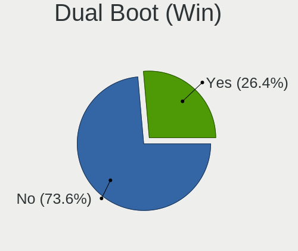
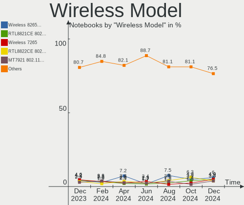
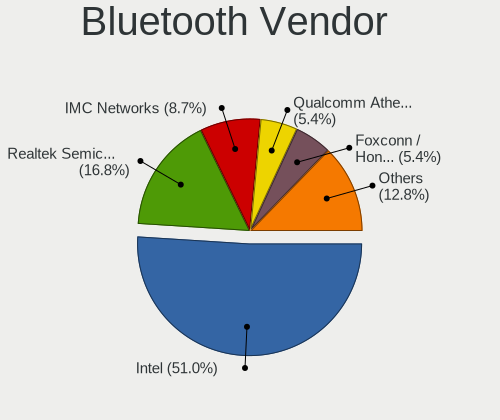

Debian - Hardware Trends (Notebooks)
------------------------------------

A project to identify most popular hardware characteristics and track their change
over time based on data collected by Linux users at https://Linux-Hardware.org.

Anyone can contribute to this report by the [hw-probe](https://github.com/linuxhw/hw-probe) tool:

    sudo -E hw-probe -all -upload

This report is for one last month. Overall report since the beginning of time: [TestDays](https://github.com/linuxhw/TestDays)

Period: Sep, 2023.

Contents
--------

* [ System ](#system)
  - [ OS                       ](#os)
  - [ OS Family                ](#os-family)
  - [ Kernel                   ](#kernel)
  - [ Kernel Family            ](#kernel-family)
  - [ Kernel Major Ver.        ](#kernel-major-ver)
  - [ Arch                     ](#arch)
  - [ DE                       ](#de)
  - [ Display Server           ](#display-server)
  - [ Display Manager          ](#display-manager)
  - [ OS Lang                  ](#os-lang)
  - [ Boot Mode                ](#boot-mode)
  - [ Filesystem               ](#filesystem)
  - [ Part. scheme             ](#part-scheme)
  - [ Dual Boot with Linux/BSD ](#dual-boot-with-linuxbsd)
  - [ Dual Boot (Win)          ](#dual-boot-win)

* [ Board ](#board)
  - [ Vendor                   ](#vendor)
  - [ Model                    ](#model)
  - [ Model Family             ](#model-family)
  - [ MFG Year                 ](#mfg-year)
  - [ Form Factor              ](#form-factor)
  - [ Secure Boot              ](#secure-boot)
  - [ Coreboot                 ](#coreboot)
  - [ RAM Size                 ](#ram-size)
  - [ RAM Used                 ](#ram-used)
  - [ Total Drives             ](#total-drives)
  - [ Has CD-ROM               ](#has-cd-rom)
  - [ Has Ethernet             ](#has-ethernet)
  - [ Has WiFi                 ](#has-wifi)
  - [ Has Bluetooth            ](#has-bluetooth)

* [ Location ](#location)
  - [ Country                  ](#country)
  - [ City                     ](#city)

* [ Drives ](#drives)
  - [ Drive Vendor             ](#drive-vendor)
  - [ Drive Model              ](#drive-model)
  - [ HDD Vendor               ](#hdd-vendor)
  - [ SSD Vendor               ](#ssd-vendor)
  - [ Drive Kind               ](#drive-kind)
  - [ Drive Connector          ](#drive-connector)
  - [ Drive Size               ](#drive-size)
  - [ Space Total              ](#space-total)
  - [ Space Used               ](#space-used)
  - [ Malfunc. Drives          ](#malfunc-drives)
  - [ Malfunc. Drive Vendor    ](#malfunc-drive-vendor)
  - [ Malfunc. HDD Vendor      ](#malfunc-hdd-vendor)
  - [ Malfunc. Drive Kind      ](#malfunc-drive-kind)
  - [ Failed Drives            ](#failed-drives)
  - [ Failed Drive Vendor      ](#failed-drive-vendor)
  - [ Drive Status             ](#drive-status)

* [ Storage controller ](#storage-controller)
  - [ Storage Vendor           ](#storage-vendor)
  - [ Storage Model            ](#storage-model)
  - [ Storage Kind             ](#storage-kind)

* [ Processor ](#processor)
  - [ CPU Vendor               ](#cpu-vendor)
  - [ CPU Model                ](#cpu-model)
  - [ CPU Model Family         ](#cpu-model-family)
  - [ CPU Cores                ](#cpu-cores)
  - [ CPU Sockets              ](#cpu-sockets)
  - [ CPU Threads              ](#cpu-threads)
  - [ CPU Op-Modes             ](#cpu-op-modes)
  - [ CPU Microcode            ](#cpu-microcode)
  - [ CPU Microarch            ](#cpu-microarch)

* [ Graphics ](#graphics)
  - [ GPU Vendor               ](#gpu-vendor)
  - [ GPU Model                ](#gpu-model)
  - [ GPU Combo                ](#gpu-combo)
  - [ GPU Driver               ](#gpu-driver)
  - [ GPU Memory               ](#gpu-memory)

* [ Monitor ](#monitor)
  - [ Monitor Vendor           ](#monitor-vendor)
  - [ Monitor Model            ](#monitor-model)
  - [ Monitor Resolution       ](#monitor-resolution)
  - [ Monitor Diagonal         ](#monitor-diagonal)
  - [ Monitor Width            ](#monitor-width)
  - [ Aspect Ratio             ](#aspect-ratio)
  - [ Monitor Area             ](#monitor-area)
  - [ Pixel Density            ](#pixel-density)
  - [ Multiple Monitors        ](#multiple-monitors)

* [ Network ](#network)
  - [ Net Controller Vendor    ](#net-controller-vendor)
  - [ Net Controller Model     ](#net-controller-model)
  - [ Wireless Vendor          ](#wireless-vendor)
  - [ Wireless Model           ](#wireless-model)
  - [ Ethernet Vendor          ](#ethernet-vendor)
  - [ Ethernet Model           ](#ethernet-model)
  - [ Net Controller Kind      ](#net-controller-kind)
  - [ Used Controller          ](#used-controller)
  - [ NICs                     ](#nics)
  - [ IPv6                     ](#ipv6)

* [ Bluetooth ](#bluetooth)
  - [ Bluetooth Vendor         ](#bluetooth-vendor)
  - [ Bluetooth Model          ](#bluetooth-model)

* [ Sound ](#sound)
  - [ Sound Vendor             ](#sound-vendor)
  - [ Sound Model              ](#sound-model)

* [ Memory ](#memory)
  - [ Memory Vendor            ](#memory-vendor)
  - [ Memory Model             ](#memory-model)
  - [ Memory Kind              ](#memory-kind)
  - [ Memory Form Factor       ](#memory-form-factor)
  - [ Memory Size              ](#memory-size)
  - [ Memory Speed             ](#memory-speed)

* [ Printers & scanners ](#printers--scanners)
  - [ Printer Vendor           ](#printer-vendor)
  - [ Printer Model            ](#printer-model)
  - [ Scanner Vendor           ](#scanner-vendor)
  - [ Scanner Model            ](#scanner-model)

* [ Camera ](#camera)
  - [ Camera Vendor            ](#camera-vendor)
  - [ Camera Model             ](#camera-model)

* [ Security ](#security)
  - [ Fingerprint Vendor       ](#fingerprint-vendor)
  - [ Fingerprint Model        ](#fingerprint-model)
  - [ Chipcard Vendor          ](#chipcard-vendor)
  - [ Chipcard Model           ](#chipcard-model)

* [ Unsupported ](#unsupported)
  - [ Unsupported Devices      ](#unsupported-devices)
  - [ Unsupported Device Types ](#unsupported-device-types)

System
------

OS
--

Installed operating systems

| Name      | Notebooks | Percent |
|-----------|-----------|---------|
| Debian 12 | 155       | 77.89%  |
| Debian 11 | 26        | 13.07%  |
| Debian    | 14        | 7.04%   |
| Debian 10 | 2         | 1.01%   |
| Debian 8  | 1         | 0.5%    |
| Debian 23 | 1         | 0.5%    |

OS Family
---------

OS without a version

| Name   | Notebooks | Percent |
|--------|-----------|---------|
| Debian | 199       | 100%    |

Kernel
------

Version of the Linux kernel

| Version                 | Notebooks | Percent |
|-------------------------|-----------|---------|
| 6.1.0-12-amd64          | 62        | 31.16%  |
| 6.1.0-11-amd64          | 58        | 29.15%  |
| 6.1.0-10-amd64          | 19        | 9.55%   |
| 5.10.0-25-amd64         | 10        | 5.03%   |
| 6.4.0-4-amd64           | 6         | 3.02%   |
| 6.5.0-1-amd64           | 5         | 2.51%   |
| 6.1.0-4-amd64           | 4         | 2.01%   |
| 5.10.0-23-amd64         | 3         | 1.51%   |
| 6.4.0-3-amd64           | 2         | 1.01%   |
| 6.4.0-0.deb12.2-amd64   | 2         | 1.01%   |
| 6.1.0-12-686-pae        | 2         | 1.01%   |
| 5.18.0-0.deb11.4-amd64  | 2         | 1.01%   |
| 5.10.0-24-amd64         | 2         | 1.01%   |
| 5.10.0-21-amd64         | 2         | 1.01%   |
| 5.10.0-20-amd64         | 2         | 1.01%   |
| 6.5.3                   | 1         | 0.5%    |
| 6.4.15-2-liquorix-amd64 | 1         | 0.5%    |
| 6.4.14-1-liquorix-amd64 | 1         | 0.5%    |
| 6.4.0-1mx-ahs-amd64     | 1         | 0.5%    |
| 6.3.0-2mx-ahs-amd64     | 1         | 0.5%    |
| 6.1.48                  | 1         | 0.5%    |
| 6.1.15-rt7-1k           | 1         | 0.5%    |
| 6.1.0-9-amd64           | 1         | 0.5%    |
| 6.1.0-11-rt-amd64       | 1         | 0.5%    |
| 6.1.0-0.deb11.11-amd64  | 1         | 0.5%    |
| 5.15.116-1-pve          | 1         | 0.5%    |
| 5.10.191-loc-os         | 1         | 0.5%    |
| 5.10.181-loc-os         | 1         | 0.5%    |
| 5.10.0-8-amd64          | 1         | 0.5%    |
| 5.10.0-22-amd64         | 1         | 0.5%    |
| 5.10.0-0.deb10.16-amd64 | 1         | 0.5%    |
| 4.19.0-25-amd64         | 1         | 0.5%    |
| 3.16.0-11-amd64         | 1         | 0.5%    |

Kernel Family
-------------

Linux kernel without a distro release

| Version  | Notebooks | Percent |
|----------|-----------|---------|
| 6.1.0    | 148       | 74.37%  |
| 5.10.0   | 22        | 11.06%  |
| 6.4.0    | 11        | 5.53%   |
| 6.5.0    | 5         | 2.51%   |
| 5.18.0   | 2         | 1.01%   |
| 6.5.3    | 1         | 0.5%    |
| 6.4.15   | 1         | 0.5%    |
| 6.4.14   | 1         | 0.5%    |
| 6.3.0    | 1         | 0.5%    |
| 6.1.48   | 1         | 0.5%    |
| 6.1.15   | 1         | 0.5%    |
| 5.15.116 | 1         | 0.5%    |
| 5.10.191 | 1         | 0.5%    |
| 5.10.181 | 1         | 0.5%    |
| 4.19.0   | 1         | 0.5%    |
| 3.16.0   | 1         | 0.5%    |

Kernel Major Ver.
-----------------

Linux kernel major version

| Version | Notebooks | Percent |
|---------|-----------|---------|
| 6.1     | 150       | 75.38%  |
| 5.10    | 24        | 12.06%  |
| 6.4     | 13        | 6.53%   |
| 6.5     | 6         | 3.02%   |
| 5.18    | 2         | 1.01%   |
| 6.3     | 1         | 0.5%    |
| 5.15    | 1         | 0.5%    |
| 4.19    | 1         | 0.5%    |
| 3.16    | 1         | 0.5%    |

Arch
----

OS architecture (x86_64, i586, etc.)

| Name   | Notebooks | Percent |
|--------|-----------|---------|
| x86_64 | 197       | 98.99%  |
| i686   | 2         | 1.01%   |

DE
--

Desktop Environment

| Name             | Notebooks | Percent |
|------------------|-----------|---------|
| GNOME            | 69        | 34.67%  |
| KDE5             | 43        | 21.61%  |
| Unknown          | 33        | 16.58%  |
| XFCE             | 23        | 11.56%  |
| MATE             | 10        | 5.03%   |
| X-Cinnamon       | 7         | 3.52%   |
| LXDE             | 3         | 1.51%   |
| i3               | 3         | 1.51%   |
| LXQt             | 2         | 1.01%   |
| lightdm-xsession | 2         | 1.01%   |
| Cinnamon         | 2         | 1.01%   |
| KDE              | 1         | 0.5%    |
| Budgie           | 1         | 0.5%    |

Display Server
--------------

X11 or Wayland

| Name    | Notebooks | Percent |
|---------|-----------|---------|
| X11     | 86        | 43.22%  |
| Wayland | 78        | 39.2%   |
| Unknown | 27        | 13.57%  |
| Tty     | 8         | 4.02%   |

Display Manager
---------------

SDDM, LightDM, etc.

| Name    | Notebooks | Percent |
|---------|-----------|---------|
| Unknown | 71        | 35.68%  |
| GDM3    | 51        | 25.63%  |
| LightDM | 37        | 18.59%  |
| SDDM    | 31        | 15.58%  |
| GDM     | 8         | 4.02%   |
| GREETD  | 1         | 0.5%    |

OS Lang
-------

Language

| Lang    | Notebooks | Percent |
|---------|-----------|---------|
| en_US   | 76        | 38.19%  |
| Unknown | 23        | 11.56%  |
| ru_RU   | 16        | 8.04%   |
| en_GB   | 12        | 6.03%   |
| de_DE   | 10        | 5.03%   |
| pt_BR   | 6         | 3.02%   |
| it_IT   | 6         | 3.02%   |
| es_ES   | 6         | 3.02%   |
| fr_FR   | 5         | 2.51%   |
| sv_SE   | 3         | 1.51%   |
| es_MX   | 3         | 1.51%   |
| es_CL   | 3         | 1.51%   |
| de_AT   | 3         | 1.51%   |
| C       | 3         | 1.51%   |
| tr_TR   | 2         | 1.01%   |
| sk_SK   | 2         | 1.01%   |
| pl_PL   | 2         | 1.01%   |
| hu_HU   | 2         | 1.01%   |
| es_CO   | 2         | 1.01%   |
| es_AR   | 2         | 1.01%   |
| en_AU   | 2         | 1.01%   |
| zh_TW   | 1         | 0.5%    |
| zh_CN   | 1         | 0.5%    |
| sl_SI   | 1         | 0.5%    |
| nn_NO   | 1         | 0.5%    |
| lv_LV   | 1         | 0.5%    |
| fr_CH   | 1         | 0.5%    |
| fr_CA   | 1         | 0.5%    |
| en_ZA   | 1         | 0.5%    |
| en_IN   | 1         | 0.5%    |
| en_IE   | 1         | 0.5%    |

Boot Mode
---------

EFI or BIOS

| Mode | Notebooks | Percent |
|------|-----------|---------|
| EFI  | 125       | 62.81%  |
| BIOS | 74        | 37.19%  |

Filesystem
----------

Type of filesystem

| Type    | Notebooks | Percent |
|---------|-----------|---------|
| Ext4    | 152       | 76.38%  |
| Overlay | 34        | 17.09%  |
| Tmpfs   | 6         | 3.02%   |
| Btrfs   | 6         | 3.02%   |
| Ext2    | 1         | 0.5%    |

Part. scheme
------------

Scheme of partitioning

| Type    | Notebooks | Percent |
|---------|-----------|---------|
| GPT     | 134       | 67.34%  |
| Unknown | 40        | 20.1%   |
| MBR     | 25        | 12.56%  |

Dual Boot with Linux/BSD
------------------------

Hosting more than one Linux/BSD

| Dual boot | Notebooks | Percent |
|-----------|-----------|---------|
| No        | 178       | 89.45%  |
| Yes       | 21        | 10.55%  |

Dual Boot (Win)
---------------

Hosting Linux and Windows

| Dual boot | Notebooks | Percent |
|-----------|-----------|---------|
| No        | 155       | 77.89%  |
| Yes       | 44        | 22.11%  |

Board
-----

Vendor
------

Motherboard manufacturer

| Name                 | Notebooks | Percent |
|----------------------|-----------|---------|
| Lenovo               | 57        | 28.64%  |
| Hewlett-Packard      | 32        | 16.08%  |
| Dell                 | 27        | 13.57%  |
| ASUSTek Computer     | 21        | 10.55%  |
| Google               | 19        | 9.55%   |
| Acer                 | 15        | 7.54%   |
| Toshiba              | 4         | 2.01%   |
| Samsung Electronics  | 3         | 1.51%   |
| Framework            | 2         | 1.01%   |
| Aquarius             | 2         | 1.01%   |
| Apple                | 2         | 1.01%   |
| Valve                | 1         | 0.5%    |
| Sony                 | 1         | 0.5%    |
| SLIMBOOK             | 1         | 0.5%    |
| Panasonic            | 1         | 0.5%    |
| Notebook             | 1         | 0.5%    |
| MSI                  | 1         | 0.5%    |
| Juana Manso          | 1         | 0.5%    |
| IX1401               | 1         | 0.5%    |
| Intel Client Systems | 1         | 0.5%    |
| HUAWEI               | 1         | 0.5%    |
| Fujitsu Siemens      | 1         | 0.5%    |
| Fujitsu              | 1         | 0.5%    |
| EUROCOM              | 1         | 0.5%    |
| eMachines            | 1         | 0.5%    |
| Alienware            | 1         | 0.5%    |

Model
-----

Motherboard model

| Name                                        | Notebooks | Percent |
|---------------------------------------------|-----------|---------|
| Google Enguarde                             | 15        | 7.54%   |
| Lenovo ThinkPad 13 2nd Gen 20J10046US       | 3         | 1.51%   |
| Acer Aspire A515-56                         | 3         | 1.51%   |
| Lenovo IdeaPad Slim 5 14ABR8 82XE           | 2         | 1.01%   |
| HP ProBook 450 G1                           | 2         | 1.01%   |
| HP EliteBook 845 G8 Notebook PC             | 2         | 1.01%   |
| Google Droid                                | 2         | 1.01%   |
| Framework Laptop (13th Gen Intel Core)      | 2         | 1.01%   |
| Dell Latitude 3320                          | 2         | 1.01%   |
| Aquarius NS585                              | 2         | 1.01%   |
| Acer Aspire E1-531                          | 2         | 1.01%   |
| Unknown                                     | 2         | 1.01%   |
| Valve Jupiter                               | 1         | 0.5%    |
| Toshiba Satellite L640                      | 1         | 0.5%    |
| Toshiba Satellite L10W-B-101                | 1         | 0.5%    |
| Toshiba Satellite A205                      | 1         | 0.5%    |
| Toshiba PORTEGE Z830                        | 1         | 0.5%    |
| Sony VGN-CS108D                             | 1         | 0.5%    |
| SLIMBOOK Essential15L                       | 1         | 0.5%    |
| Samsung RF511/RF411/RF711                   | 1         | 0.5%    |
| Samsung R505                                | 1         | 0.5%    |
| Samsung 550XED                              | 1         | 0.5%    |
| Panasonic CF-19RHR3DPM                      | 1         | 0.5%    |
| Notebook P7xxDM3(-G)                        | 1         | 0.5%    |
| MSI GS66 Stealth 11UG                       | 1         | 0.5%    |
| Lenovo Z50-75 80EC                          | 1         | 0.5%    |
| Lenovo Yoga Pro 9 16IRP8 83BY               | 1         | 0.5%    |
| Lenovo V15 G3 IAP 82TT                      | 1         | 0.5%    |
| Lenovo V14 G3 IAP 82TS                      | 1         | 0.5%    |
| Lenovo ThinkPad Z13 Gen 1 21D2000JUS        | 1         | 0.5%    |
| Lenovo ThinkPad X61s 7666Y2X                | 1         | 0.5%    |
| Lenovo ThinkPad X395 20NMS0YG00             | 1         | 0.5%    |
| Lenovo ThinkPad X270 W10DG 20K5S0CF00       | 1         | 0.5%    |
| Lenovo ThinkPad X260 VB6R77903H             | 1         | 0.5%    |
| Lenovo ThinkPad X230 232036U                | 1         | 0.5%    |
| Lenovo ThinkPad X201 3249CTO                | 1         | 0.5%    |
| Lenovo ThinkPad X1 Carbon Gen 11 21HM006EMX | 1         | 0.5%    |
| Lenovo ThinkPad X1 Carbon 6th 20KH002KUS    | 1         | 0.5%    |
| Lenovo ThinkPad X1 Carbon 6th 20KGS3RV00    | 1         | 0.5%    |
| Lenovo ThinkPad T520 4243WCR                | 1         | 0.5%    |

Model Family
------------

Motherboard model prefix

| Name                   | Notebooks | Percent |
|------------------------|-----------|---------|
| Lenovo ThinkPad        | 36        | 18.09%  |
| Google Enguarde        | 15        | 7.54%   |
| Dell Latitude          | 14        | 7.04%   |
| Lenovo IdeaPad         | 12        | 6.03%   |
| Acer Aspire            | 9         | 4.52%   |
| HP Pavilion            | 6         | 3.02%   |
| Dell XPS               | 6         | 3.02%   |
| HP Laptop              | 4         | 2.01%   |
| HP EliteBook           | 4         | 2.01%   |
| Dell Precision         | 4         | 2.01%   |
| Toshiba Satellite      | 3         | 1.51%   |
| Lenovo Legion          | 3         | 1.51%   |
| HP ProBook             | 3         | 1.51%   |
| HP 250                 | 3         | 1.51%   |
| HP ZBook               | 2         | 1.01%   |
| HP Compaq              | 2         | 1.01%   |
| Google Droid           | 2         | 1.01%   |
| Framework Laptop       | 2         | 1.01%   |
| Dell Inspiron          | 2         | 1.01%   |
| ASUS ZenBook           | 2         | 1.01%   |
| ASUS VivoBook          | 2         | 1.01%   |
| ASUS ASUS              | 2         | 1.01%   |
| Aquarius NS585         | 2         | 1.01%   |
| Acer Nitro             | 2         | 1.01%   |
| Acer Extensa           | 2         | 1.01%   |
| Unknown                | 2         | 1.01%   |
| Valve Jupiter          | 1         | 0.5%    |
| Toshiba PORTEGE        | 1         | 0.5%    |
| Sony VGN-CS108D        | 1         | 0.5%    |
| SLIMBOOK Essential15L  | 1         | 0.5%    |
| Samsung RF511          | 1         | 0.5%    |
| Samsung R505           | 1         | 0.5%    |
| Samsung 550XED         | 1         | 0.5%    |
| Panasonic CF-19RHR3DPM | 1         | 0.5%    |
| Notebook P7xxDM3(-G)   | 1         | 0.5%    |
| MSI GS66               | 1         | 0.5%    |
| Lenovo Z50-75          | 1         | 0.5%    |
| Lenovo Yoga            | 1         | 0.5%    |
| Lenovo V15             | 1         | 0.5%    |
| Lenovo V14             | 1         | 0.5%    |

MFG Year
--------

Motherboard manufacture year

| Year | Notebooks | Percent |
|------|-----------|---------|
| 2021 | 27        | 13.57%  |
| 2022 | 24        | 12.06%  |
| 2020 | 24        | 12.06%  |
| 2019 | 15        | 7.54%   |
| 2023 | 13        | 6.53%   |
| 2018 | 12        | 6.03%   |
| 2017 | 12        | 6.03%   |
| 2016 | 10        | 5.03%   |
| 2015 | 10        | 5.03%   |
| 2011 | 10        | 5.03%   |
| 2008 | 10        | 5.03%   |
| 2014 | 9         | 4.52%   |
| 2013 | 7         | 3.52%   |
| 2012 | 6         | 3.02%   |
| 2010 | 4         | 2.01%   |
| 2009 | 4         | 2.01%   |
| 2007 | 2         | 1.01%   |

Form Factor
-----------

Physical design of the computer

| Name     | Notebooks | Percent |
|----------|-----------|---------|
| Notebook | 199       | 100%    |

Secure Boot
-----------

Enabled or disabled

| State    | Notebooks | Percent |
|----------|-----------|---------|
| Disabled | 182       | 91.46%  |
| Enabled  | 17        | 8.54%   |

Coreboot
--------

Have coreboot on board

| Used | Notebooks | Percent |
|------|-----------|---------|
| No   | 180       | 90.45%  |
| Yes  | 19        | 9.55%   |

RAM Size
--------

Total RAM memory

| Size in GB  | Notebooks | Percent |
|-------------|-----------|---------|
| 4.01-8.0    | 50        | 25.13%  |
| 3.01-4.0    | 39        | 19.6%   |
| 8.01-16.0   | 34        | 17.09%  |
| 16.01-24.0  | 33        | 16.58%  |
| 32.01-64.0  | 22        | 11.06%  |
| 1.01-2.0    | 7         | 3.52%   |
| 64.01-256.0 | 6         | 3.02%   |
| 24.01-32.0  | 4         | 2.01%   |
| 2.01-3.0    | 3         | 1.51%   |
| 0.51-1.0    | 1         | 0.5%    |

RAM Used
--------

Used RAM memory

| Used GB    | Notebooks | Percent |
|------------|-----------|---------|
| 1.01-2.0   | 61        | 30.65%  |
| 2.01-3.0   | 48        | 24.12%  |
| 4.01-8.0   | 34        | 17.09%  |
| 3.01-4.0   | 33        | 16.58%  |
| 0.51-1.0   | 10        | 5.03%   |
| 8.01-16.0  | 9         | 4.52%   |
| 16.01-24.0 | 3         | 1.51%   |
| 0.01-0.5   | 1         | 0.5%    |

Total Drives
------------

Number of drives on board

| Drives | Notebooks | Percent |
|--------|-----------|---------|
| 1      | 155       | 77.89%  |
| 2      | 36        | 18.09%  |
| 3      | 7         | 3.52%   |
| 0      | 1         | 0.5%    |

Has CD-ROM
----------

Has CD-ROM on board

| Presented | Notebooks | Percent |
|-----------|-----------|---------|
| No        | 158       | 79.4%   |
| Yes       | 41        | 20.6%   |

Has Ethernet
------------

Has Ethernet on board

| Presented | Notebooks | Percent |
|-----------|-----------|---------|
| Yes       | 147       | 73.87%  |
| No        | 52        | 26.13%  |

Has WiFi
--------

Has WiFi module

| Presented | Notebooks | Percent |
|-----------|-----------|---------|
| Yes       | 196       | 98.49%  |
| No        | 3         | 1.51%   |

Has Bluetooth
-------------

Has Bluetooth module

| Presented | Notebooks | Percent |
|-----------|-----------|---------|
| Yes       | 169       | 84.92%  |
| No        | 30        | 15.08%  |

Location
--------

Country
-------

Geographic location (country)

| Country      | Notebooks | Percent |
|--------------|-----------|---------|
| USA          | 44        | 22.11%  |
| Germany      | 21        | 10.55%  |
| Russia       | 16        | 8.04%   |
| Spain        | 10        | 5.03%   |
| Italy        | 10        | 5.03%   |
| Brazil       | 8         | 4.02%   |
| UK           | 6         | 3.02%   |
| France       | 6         | 3.02%   |
| Poland       | 5         | 2.51%   |
| Turkey       | 4         | 2.01%   |
| Hungary      | 4         | 2.01%   |
| Sweden       | 3         | 1.51%   |
| Romania      | 3         | 1.51%   |
| Netherlands  | 3         | 1.51%   |
| Mexico       | 3         | 1.51%   |
| Indonesia    | 3         | 1.51%   |
| Finland      | 3         | 1.51%   |
| Colombia     | 3         | 1.51%   |
| Chile        | 3         | 1.51%   |
| Canada       | 3         | 1.51%   |
| Austria      | 3         | 1.51%   |
| Australia    | 3         | 1.51%   |
| Argentina    | 3         | 1.51%   |
| Vietnam      | 2         | 1.01%   |
| Switzerland  | 2         | 1.01%   |
| Slovakia     | 2         | 1.01%   |
| Norway       | 2         | 1.01%   |
| Ireland      | 2         | 1.01%   |
| Greece       | 2         | 1.01%   |
| Ukraine      | 1         | 0.5%    |
| Taiwan       | 1         | 0.5%    |
| South Africa | 1         | 0.5%    |
| Slovenia     | 1         | 0.5%    |
| Portugal     | 1         | 0.5%    |
| Philippines  | 1         | 0.5%    |
| New Zealand  | 1         | 0.5%    |
| Latvia       | 1         | 0.5%    |
| Iran         | 1         | 0.5%    |
| India        | 1         | 0.5%    |
| Iceland      | 1         | 0.5%    |

City
----

Geographic location (city)

| City              | Notebooks | Percent |
|-------------------|-----------|---------|
| Bangor            | 22        | 11.06%  |
| Voronezh          | 4         | 2.01%   |
| Vienna            | 3         | 1.51%   |
| Perm              | 3         | 1.51%   |
| Helsinki          | 3         | 1.51%   |
| Toulouse          | 2         | 1.01%   |
| Toronto           | 2         | 1.01%   |
| Puebla City       | 2         | 1.01%   |
| Partille          | 2         | 1.01%   |
| Moscow            | 2         | 1.01%   |
| Monza             | 2         | 1.01%   |
| Milan             | 2         | 1.01%   |
| Leeds             | 2         | 1.01%   |
| Kummersbruck      | 2         | 1.01%   |
| Ho Chi Minh City  | 2         | 1.01%   |
| Gdansk            | 2         | 1.01%   |
| Frankfurt am Main | 2         | 1.01%   |
| Düsseldorf       | 2         | 1.01%   |
| Dublin            | 2         | 1.01%   |
| Budapest          | 2         | 1.01%   |
| Bucharest         | 2         | 1.01%   |
| Amsterdam         | 2         | 1.01%   |
| Zaragoza          | 1         | 0.5%    |
| Yogyakarta        | 1         | 0.5%    |
| Warsaw            | 1         | 0.5%    |
| Waldshut-Tiengen  | 1         | 0.5%    |
| Viña del Mar     | 1         | 0.5%    |
| Varginha          | 1         | 0.5%    |
| Valencia          | 1         | 0.5%    |
| Usingen           | 1         | 0.5%    |
| Ultimo            | 1         | 0.5%    |
| Turin             | 1         | 0.5%    |
| Tullahoma         | 1         | 0.5%    |
| Trnava            | 1         | 0.5%    |
| Toledo            | 1         | 0.5%    |
| The Woodlands     | 1         | 0.5%    |
| Tehran            | 1         | 0.5%    |
| Tatabánya        | 1         | 0.5%    |
| Taichung          | 1         | 0.5%    |
| Stockbridge       | 1         | 0.5%    |

Drives
------

Drive Vendor
------------

Hard drive vendors

| Vendor                      | Notebooks | Drives | Percent |
|-----------------------------|-----------|--------|---------|
| Samsung Electronics         | 42        | 44     | 17.57%  |
| WDC                         | 28        | 29     | 11.72%  |
| Unknown                     | 25        | 28     | 10.46%  |
| Toshiba                     | 18        | 18     | 7.53%   |
| Sandisk                     | 18        | 19     | 7.53%   |
| Seagate                     | 12        | 12     | 5.02%   |
| SK hynix                    | 11        | 11     | 4.6%    |
| Micron Technology           | 10        | 10     | 4.18%   |
| Intel                       | 10        | 10     | 4.18%   |
| Crucial                     | 10        | 10     | 4.18%   |
| Kingston                    | 8         | 8      | 3.35%   |
| Hitachi                     | 6         | 6      | 2.51%   |
| HGST                        | 4         | 4      | 1.67%   |
| A-DATA Technology           | 4         | 4      | 1.67%   |
| Phison Electronics          | 3         | 3      | 1.26%   |
| Unknown                     | 3         | 3      | 1.26%   |
| Union Memory (Shenzhen)     | 2         | 2      | 0.84%   |
| UMIS                        | 2         | 2      | 0.84%   |
| SPCC                        | 2         | 2      | 0.84%   |
| KIOXIA                      | 2         | 2      | 0.84%   |
| Kingston Technology Company | 2         | 2      | 0.84%   |
| XPG                         | 1         | 1      | 0.42%   |
| Team                        | 1         | 1      | 0.42%   |
| SSK                         | 1         | 1      | 0.42%   |
| Silicon Motion              | 1         | 1      | 0.42%   |
| Patriot                     | 1         | 1      | 0.42%   |
| Neo                         | 1         | 1      | 0.42%   |
| Micron/Crucial Technology   | 1         | 1      | 0.42%   |
| Lexar                       | 1         | 1      | 0.42%   |
| KingSpec                    | 1         | 1      | 0.42%   |
| JMicron Technology          | 1         | 1      | 0.42%   |
| Intenso                     | 1         | 1      | 0.42%   |
| Hewlett-Packard             | 1         | 2      | 0.42%   |
| GLOWAY                      | 1         | 1      | 0.42%   |
| Gigabyte Technology         | 1         | 1      | 0.42%   |
| Fujitsu                     | 1         | 1      | 0.42%   |
| Dogfish                     | 1         | 1      | 0.42%   |
| Apple                       | 1         | 1      | 0.42%   |

Drive Model
-----------

Hard drive models

| Model                                               | Notebooks | Percent |
|-----------------------------------------------------|-----------|---------|
| Unknown AGND3R  16GB                                | 9         | 3.66%   |
| Unknown HAG2e  16GB                                 | 5         | 2.03%   |
| Toshiba MQ01ABD100 1TB                              | 4         | 1.63%   |
| Samsung NVMe SSD Controller SM981/PM981/PM983 256GB | 4         | 1.63%   |
| Toshiba MQ01ABF050 500GB                            | 3         | 1.22%   |
| SanDisk SD8SN8U128G1001 128GB SSD                   | 3         | 1.22%   |
| SanDisk NVMe SSD Drive 512GB                        | 3         | 1.22%   |
| Crucial CT500MX500SSD1 500GB                        | 3         | 1.22%   |
| Unknown                                             | 3         | 1.22%   |
| WDC WD20SPZX-22UA7T0 2TB                            | 2         | 0.81%   |
| WDC WD10SPZX-21Z10T0 1TB                            | 2         | 0.81%   |
| WDC WD Blue SA510 2.5 1TB                           | 2         | 0.81%   |
| WDC PC SN530 NVMe 256GB                             | 2         | 0.81%   |
| Unknown MMC Card  64GB                              | 2         | 0.81%   |
| Unknown MMC Card  32GB                              | 2         | 0.81%   |
| Seagate ST1000LM048-2E7172 1TB                      | 2         | 0.81%   |
| Seagate ST1000LM024 HN-M101MBB 1TB                  | 2         | 0.81%   |
| SanDisk NVMe SSD Drive 500GB                        | 2         | 0.81%   |
| Samsung SSD 870 EVO 1TB                             | 2         | 0.81%   |
| Samsung NVMe SSD Controller PM9A1/PM9A3/980PRO 1TB  | 2         | 0.81%   |
| Samsung MZVLQ512HBLU-00BH1 512GB                    | 2         | 0.81%   |
| Samsung MZVLB256HAHQ-000L7 256GB                    | 2         | 0.81%   |
| Samsung MZVL21T0HCLR-00BL2 1TB                      | 2         | 0.81%   |
| Samsung MZALQ256HBJD-00BL2 256GB                    | 2         | 0.81%   |
| Micron MTFDDAV256TDL-1AW1ZABHA 256GB SSD            | 2         | 0.81%   |
| Micron 3400_MTFDKBA1T0TFH 1TB                       | 2         | 0.81%   |
| Micron 2200V_MTFDHBA512TCK 512GB                    | 2         | 0.81%   |
| Kingston SA400S37480G 480GB SSD                     | 2         | 0.81%   |
| HGST HTS721010A9E630 1TB                            | 2         | 0.81%   |
| Crucial CT240BX500SSD1 240GB                        | 2         | 0.81%   |
| A-DATA SU800 512GB SSD                              | 2         | 0.81%   |
| XPG GAMMIX S11 Pro 1TB                              | 1         | 0.41%   |
| WDC WDS500G2B0A-00SM50 500GB SSD                    | 1         | 0.41%   |
| WDC WDS480G2G0C-00AJM0 480GB                        | 1         | 0.41%   |
| WDC WDS240G2G0A-00JH30 240GB SSD                    | 1         | 0.41%   |
| WDC WDS200T2B0C-00PXH0 2TB                          | 1         | 0.41%   |
| WDC WD5000LPVX-22V0TT0 500GB                        | 1         | 0.41%   |
| WDC WD5000LPCX-21VHAT0 500GB                        | 1         | 0.41%   |
| WDC WD3200BPVT-80ZEST0 320GB                        | 1         | 0.41%   |
| WDC WD3200BEVT-60ZCT1 320GB                         | 1         | 0.41%   |

HDD Vendor
----------

Hard disk drive vendors

| Vendor              | Notebooks | Drives | Percent |
|---------------------|-----------|--------|---------|
| WDC                 | 14        | 14     | 29.17%  |
| Seagate             | 12        | 12     | 25%     |
| Toshiba             | 9         | 9      | 18.75%  |
| Hitachi             | 6         | 6      | 12.5%   |
| HGST                | 4         | 4      | 8.33%   |
| Unknown             | 1         | 1      | 2.08%   |
| Samsung Electronics | 1         | 1      | 2.08%   |
| Fujitsu             | 1         | 1      | 2.08%   |

SSD Vendor
----------

Solid state drive vendors

| Vendor              | Notebooks | Drives | Percent |
|---------------------|-----------|--------|---------|
| SanDisk             | 9         | 10     | 14.52%  |
| Crucial             | 9         | 9      | 14.52%  |
| Samsung Electronics | 8         | 8      | 12.9%   |
| Kingston            | 6         | 6      | 9.68%   |
| WDC                 | 5         | 5      | 8.06%   |
| Micron Technology   | 4         | 4      | 6.45%   |
| Intel               | 4         | 4      | 6.45%   |
| A-DATA Technology   | 4         | 4      | 6.45%   |
| Toshiba             | 2         | 2      | 3.23%   |
| SPCC                | 1         | 1      | 1.61%   |
| Patriot             | 1         | 1      | 1.61%   |
| Neo                 | 1         | 1      | 1.61%   |
| Lexar               | 1         | 1      | 1.61%   |
| KingSpec            | 1         | 1      | 1.61%   |
| Intenso             | 1         | 1      | 1.61%   |
| Hewlett-Packard     | 1         | 2      | 1.61%   |
| GLOWAY              | 1         | 1      | 1.61%   |
| Gigabyte Technology | 1         | 1      | 1.61%   |
| Dogfish             | 1         | 1      | 1.61%   |
| Apple               | 1         | 1      | 1.61%   |

Drive Kind
----------

HDD or SSD

| Kind    | Notebooks | Drives | Percent |
|---------|-----------|--------|---------|
| NVMe    | 96        | 104    | 41.38%  |
| SSD     | 60        | 64     | 25.86%  |
| HDD     | 47        | 48     | 20.26%  |
| MMC     | 28        | 30     | 12.07%  |
| Unknown | 1         | 1      | 0.43%   |

Drive Connector
---------------

SATA, SAS, NVMe, etc.

| Type | Notebooks | Drives | Percent |
|------|-----------|--------|---------|
| SATA | 97        | 110    | 43.11%  |
| NVMe | 96        | 103    | 42.67%  |
| MMC  | 28        | 30     | 12.44%  |
| SAS  | 4         | 4      | 1.78%   |

Drive Size
----------

Size of hard drive

| Size in TB | Notebooks | Drives | Percent |
|------------|-----------|--------|---------|
| 0.01-0.5   | 66        | 70     | 64.08%  |
| 0.51-1.0   | 31        | 35     | 30.1%   |
| 1.01-2.0   | 5         | 6      | 4.85%   |
| 4.01-10.0  | 1         | 1      | 0.97%   |

Space Total
-----------

Amount of disk space available on the file system

| Size in GB     | Notebooks | Percent |
|----------------|-----------|---------|
| 251-500        | 52        | 26.13%  |
| 101-250        | 49        | 24.62%  |
| 501-1000       | 31        | 15.58%  |
| 1-20           | 21        | 10.55%  |
| 1001-2000      | 16        | 8.04%   |
| 51-100         | 15        | 7.54%   |
| Unknown        | 9         | 4.52%   |
| 2001-3000      | 3         | 1.51%   |
| More than 3000 | 2         | 1.01%   |
| 21-50          | 1         | 0.5%    |

Space Used
----------

Amount of used disk space

| Used GB   | Notebooks | Percent |
|-----------|-----------|---------|
| 1-20      | 82        | 41.21%  |
| 21-50     | 30        | 15.08%  |
| 101-250   | 25        | 12.56%  |
| 51-100    | 22        | 11.06%  |
| 251-500   | 16        | 8.04%   |
| Unknown   | 9         | 4.52%   |
| 1001-2000 | 7         | 3.52%   |
| 501-1000  | 6         | 3.02%   |
| 2001-3000 | 2         | 1.01%   |

Malfunc. Drives
---------------

Drive models with a malfunction

| Model                                               | Notebooks | Drives | Percent |
|-----------------------------------------------------|-----------|--------|---------|
| Toshiba MQ01ABD100 1TB                              | 2         | 2      | 13.33%  |
| Micron Technology MTFDDAV256TDL-1AW1ZABHA 256GB SSD | 2         | 2      | 13.33%  |
| WDC WD2500BEVT-22A23T0 208GB                        | 1         | 1      | 6.67%   |
| SK hynix BC711 HFM512GD3JX013N 512GB                | 1         | 1      | 6.67%   |
| Micron Technology 2200V_MTFDHBA512TCK 512GB         | 1         | 1      | 6.67%   |
| Kingston SA400S37480G 480GB SSD                     | 1         | 1      | 6.67%   |
| Intel SSDSCKKF256G8H 256GB                          | 1         | 1      | 6.67%   |
| Intel SSDSC2KW480H6 480GB                           | 1         | 1      | 6.67%   |
| Intel SSDSC2BF180A5L 180GB                          | 1         | 1      | 6.67%   |
| Hitachi HTS545050A7E380 500GB                       | 1         | 1      | 6.67%   |
| Hitachi HTS543216L9A300 160GB                       | 1         | 1      | 6.67%   |
| HGST HTS721010A9E630 1TB                            | 1         | 1      | 6.67%   |
| HGST HTS545050A7E680 500GB                          | 1         | 1      | 6.67%   |

Malfunc. Drive Vendor
---------------------

Vendors of faulty drives

| Vendor            | Notebooks | Drives | Percent |
|-------------------|-----------|--------|---------|
| Micron Technology | 3         | 3      | 20%     |
| Intel             | 3         | 3      | 20%     |
| Toshiba           | 2         | 2      | 13.33%  |
| Hitachi           | 2         | 2      | 13.33%  |
| HGST              | 2         | 2      | 13.33%  |
| WDC               | 1         | 1      | 6.67%   |
| SK hynix          | 1         | 1      | 6.67%   |
| Kingston          | 1         | 1      | 6.67%   |

Malfunc. HDD Vendor
-------------------

Vendors of faulty HDD drives

| Vendor  | Notebooks | Drives | Percent |
|---------|-----------|--------|---------|
| Toshiba | 2         | 2      | 28.57%  |
| Hitachi | 2         | 2      | 28.57%  |
| HGST    | 2         | 2      | 28.57%  |
| WDC     | 1         | 1      | 14.29%  |

Malfunc. Drive Kind
-------------------

Kinds of faulty drives

| Kind | Notebooks | Drives | Percent |
|------|-----------|--------|---------|
| HDD  | 7         | 7      | 46.67%  |
| SSD  | 6         | 6      | 40%     |
| NVMe | 2         | 2      | 13.33%  |

Failed Drives
-------------

Failed drive models

Zero info for selected period =(

Failed Drive Vendor
-------------------

Failed drive vendors

Zero info for selected period =(

Drive Status
------------

Number of failed and malfunc. drives

| Status   | Notebooks | Drives | Percent |
|----------|-----------|--------|---------|
| Works    | 118       | 136    | 55.92%  |
| Detected | 78        | 96     | 36.97%  |
| Malfunc  | 15        | 15     | 7.11%   |

Storage controller
------------------

Storage Vendor
--------------

Storage controller vendors

| Vendor                       | Notebooks | Percent |
|------------------------------|-----------|---------|
| Intel                        | 110       | 49.33%  |
| Samsung Electronics          | 34        | 15.25%  |
| SanDisk                      | 19        | 8.52%   |
| AMD                          | 14        | 6.28%   |
| SK hynix                     | 11        | 4.93%   |
| Toshiba America Info Systems | 9         | 4.04%   |
| Micron Technology            | 6         | 2.69%   |
| Union Memory (Shenzhen)      | 4         | 1.79%   |
| Phison Electronics           | 4         | 1.79%   |
| Kingston Technology Company  | 4         | 1.79%   |
| Nvidia                       | 3         | 1.35%   |
| Micron/Crucial Technology    | 2         | 0.9%    |
| Silicon Motion               | 1         | 0.45%   |
| Realtek Semiconductor        | 1         | 0.45%   |
| ADATA Technology             | 1         | 0.45%   |

Storage Model
-------------

Storage controller models

| Model                                                                          | Notebooks | Percent |
|--------------------------------------------------------------------------------|-----------|---------|
| Intel Sunrise Point-LP SATA Controller [AHCI mode]                             | 14        | 5.91%   |
| AMD FCH SATA Controller [AHCI mode]                                            | 13        | 5.49%   |
| Samsung NVMe SSD Controller SM981/PM981/PM983                                  | 11        | 4.64%   |
| Samsung NVMe SSD Controller 980                                                | 10        | 4.22%   |
| Intel 6 Series/C200 Series Chipset Family 6 port Mobile SATA AHCI Controller   | 10        | 4.22%   |
| Samsung NVMe SSD Controller PM9A1/PM9A3/980PRO                                 | 9         | 3.8%    |
| SK hynix Gold P31/BC711/PC711 NVMe Solid State Drive                           | 8         | 3.38%   |
| Intel Volume Management Device NVMe RAID Controller                            | 8         | 3.38%   |
| Intel 8 Series/C220 Series Chipset Family 6-port SATA Controller 1 [AHCI mode] | 7         | 2.95%   |
| Intel 82801 Mobile SATA Controller [RAID mode]                                 | 6         | 2.53%   |
| Intel 7 Series Chipset Family 6-port SATA Controller [AHCI mode]               | 6         | 2.53%   |
| Toshiba America Info Systems XG6 NVMe SSD Controller                           | 5         | 2.11%   |
| Intel 82801IBM/IEM (ICH9M/ICH9M-E) 4 port SATA Controller [AHCI mode]          | 5         | 2.11%   |
| Intel 82801HM/HEM (ICH8M/ICH8M-E) SATA Controller [AHCI mode]                  | 5         | 2.11%   |
| Intel 82801HM/HEM (ICH8M/ICH8M-E) IDE Controller                               | 5         | 2.11%   |
| Intel 8 Series SATA Controller 1 [AHCI mode]                                   | 5         | 2.11%   |
| SanDisk WD Black SN750 / PC SN730 NVMe SSD                                     | 4         | 1.69%   |
| Intel Wildcat Point-LP SATA Controller [AHCI Mode]                             | 4         | 1.69%   |
| Intel Tiger Lake-LP SATA Controller                                            | 4         | 1.69%   |
| Intel Cannon Point-LP SATA Controller [AHCI Mode]                              | 4         | 1.69%   |
| Intel Alder Lake-P SATA AHCI Controller                                        | 4         | 1.69%   |
| Sandisk WD PC SN740 NVMe SSD 512GB (DRAM-less)                                 | 3         | 1.27%   |
| Intel HM170/QM170 Chipset SATA Controller [AHCI Mode]                          | 3         | 1.27%   |
| Intel Celeron/Pentium Silver Processor SATA Controller                         | 3         | 1.27%   |
| Intel Celeron N3350/Pentium N4200/Atom E3900 Series SATA AHCI Controller       | 3         | 1.27%   |
| Intel 5 Series/3400 Series Chipset 6 port SATA AHCI Controller                 | 3         | 1.27%   |
| Toshiba America Info Systems XG5 NVMe SSD Controller                           | 2         | 0.84%   |
| Toshiba America Info Systems BG3 NVMe SSD Controller                           | 2         | 0.84%   |
| SanDisk WD Green SN350 NVMe SSD 240GB (DRAM-less)                              | 2         | 0.84%   |
| SanDisk WD Black SN770 / PC SN740 256GB / PC SN560 (DRAM-less) NVMe SSD        | 2         | 0.84%   |
| Sandisk PC SN740 NVMe SSD (DRAM-less)                                          | 2         | 0.84%   |
| SanDisk IX SN530 NVMe SSD (DRAM-less)                                          | 2         | 0.84%   |
| Samsung NVMe SSD Controller PM9B1                                              | 2         | 0.84%   |
| Phison PS5021-E21 PCIe4 NVMe Controller (DRAM-less)                            | 2         | 0.84%   |
| Micron 3400 NVMe SSD [Hendrix]                                                 | 2         | 0.84%   |
| Micron 2200S NVMe SSD [Cassandra]                                              | 2         | 0.84%   |
| Kingston Company OM3PDP3 NVMe SSD                                              | 2         | 0.84%   |
| Intel SSD 670p Series [Keystone Harbor]                                        | 2         | 0.84%   |
| Intel SSD 660P Series                                                          | 2         | 0.84%   |
| Intel Q170/Q150/B150/H170/H110/Z170/CM236 Chipset SATA Controller [AHCI Mode]  | 2         | 0.84%   |

Storage Kind
------------

Kind of storage controller (IDE, SATA, NVMe, SAS, ...)

| Kind | Notebooks | Percent |
|------|-----------|---------|
| SATA | 109       | 47.6%   |
| NVMe | 95        | 41.48%  |
| RAID | 15        | 6.55%   |
| IDE  | 10        | 4.37%   |

Processor
---------

CPU Vendor
----------

Processor vendors

| Vendor | Notebooks | Percent |
|--------|-----------|---------|
| Intel  | 164       | 82.41%  |
| AMD    | 35        | 17.59%  |

CPU Model
---------

Processor models

| Model                                       | Notebooks | Percent |
|---------------------------------------------|-----------|---------|
| Intel Celeron CPU N2840 @ 2.16GHz           | 17        | 8.54%   |
| Intel 11th Gen Core i5-1135G7 @ 2.40GHz     | 8         | 4.02%   |
| Intel Celeron N4020 CPU @ 1.10GHz           | 5         | 2.51%   |
| Intel Core i7-10750H CPU @ 2.60GHz          | 4         | 2.01%   |
| Intel Core i5-6300U CPU @ 2.40GHz           | 4         | 2.01%   |
| Intel Core i5-8265U CPU @ 1.60GHz           | 3         | 1.51%   |
| Intel Core i5-6200U CPU @ 2.30GHz           | 3         | 1.51%   |
| Intel Core i5-1035G1 CPU @ 1.00GHz          | 3         | 1.51%   |
| Intel Celeron CPU N3350 @ 1.10GHz           | 3         | 1.51%   |
| Intel Celeron CPU 3865U @ 1.80GHz           | 3         | 1.51%   |
| Intel 12th Gen Core i5-1235U                | 3         | 1.51%   |
| Intel Core i7-8650U CPU @ 1.90GHz           | 2         | 1.01%   |
| Intel Core i7-8565U CPU @ 1.80GHz           | 2         | 1.01%   |
| Intel Core i7-7500U CPU @ 2.70GHz           | 2         | 1.01%   |
| Intel Core i7-6700HQ CPU @ 2.60GHz          | 2         | 1.01%   |
| Intel Core i7-4702MQ CPU @ 2.20GHz          | 2         | 1.01%   |
| Intel Core i7-2670QM CPU @ 2.20GHz          | 2         | 1.01%   |
| Intel Core i7-10870H CPU @ 2.20GHz          | 2         | 1.01%   |
| Intel Core i5-8250U CPU @ 1.60GHz           | 2         | 1.01%   |
| Intel Core i5-7200U CPU @ 2.50GHz           | 2         | 1.01%   |
| Intel Core i5-4300U CPU @ 1.90GHz           | 2         | 1.01%   |
| Intel Core i5-2520M CPU @ 2.50GHz           | 2         | 1.01%   |
| Intel Core i5-10210U CPU @ 1.60GHz          | 2         | 1.01%   |
| Intel Core i3-9100 CPU @ 3.60GHz            | 2         | 1.01%   |
| Intel Core i3-4005U CPU @ 1.70GHz           | 2         | 1.01%   |
| Intel Atom CPU N270 @ 1.60GHz               | 2         | 1.01%   |
| Intel 13th Gen Core i7-1360P                | 2         | 1.01%   |
| Intel 12th Gen Core i7-12700H               | 2         | 1.01%   |
| Intel 12th Gen Core i3-1215U                | 2         | 1.01%   |
| Intel 11th Gen Core i7-1165G7 @ 2.80GHz     | 2         | 1.01%   |
| Intel 11th Gen Core i3-1115G4 @ 3.00GHz     | 2         | 1.01%   |
| AMD Ryzen 7 PRO 5850U with Radeon Graphics  | 2         | 1.01%   |
| AMD Ryzen 7 7730U with Radeon Graphics      | 2         | 1.01%   |
| AMD Ryzen 7 5800H with Radeon Graphics      | 2         | 1.01%   |
| AMD Ryzen 5 5500U with Radeon Graphics      | 2         | 1.01%   |
| Intel Xeon W-10855M CPU @ 2.80GHz           | 1         | 0.5%    |
| Intel Pentium Silver N6000 @ 1.10GHz        | 1         | 0.5%    |
| Intel Pentium Dual-Core CPU T4500 @ 2.30GHz | 1         | 0.5%    |
| Intel Pentium Dual-Core CPU T4200 @ 2.00GHz | 1         | 0.5%    |
| Intel Pentium CPU B960 @ 2.20GHz            | 1         | 0.5%    |

CPU Model Family
----------------

Processor model prefix

| Model                          | Notebooks | Percent |
|--------------------------------|-----------|---------|
| Intel Core i7                  | 38        | 19.1%   |
| Intel Core i5                  | 38        | 19.1%   |
| Other                          | 33        | 16.58%  |
| Intel Celeron                  | 32        | 16.08%  |
| AMD Ryzen 5                    | 9         | 4.52%   |
| Intel Core i3                  | 8         | 4.02%   |
| AMD Ryzen 7                    | 8         | 4.02%   |
| Intel Core 2 Duo               | 5         | 2.51%   |
| AMD Ryzen 7 PRO                | 4         | 2.01%   |
| AMD Ryzen 5 PRO                | 4         | 2.01%   |
| Intel Pentium                  | 3         | 1.51%   |
| Intel Atom                     | 3         | 1.51%   |
| Intel Pentium Dual-Core        | 2         | 1.01%   |
| Intel Xeon                     | 1         | 0.5%    |
| Intel Pentium Silver           | 1         | 0.5%    |
| Intel Genuine                  | 1         | 0.5%    |
| Intel Core m5                  | 1         | 0.5%    |
| AMD Turion X2 Dual-Core Mobile | 1         | 0.5%    |
| AMD Turion 64 X2 Mobile        | 1         | 0.5%    |
| AMD Ryzen 9                    | 1         | 0.5%    |
| AMD Ryzen 3                    | 1         | 0.5%    |
| AMD FX                         | 1         | 0.5%    |
| AMD E1                         | 1         | 0.5%    |
| AMD Athlon                     | 1         | 0.5%    |
| AMD A6                         | 1         | 0.5%    |

CPU Cores
---------

Number of processor cores

| Number | Notebooks | Percent |
|--------|-----------|---------|
| 2      | 91        | 45.73%  |
| 4      | 54        | 27.14%  |
| 6      | 19        | 9.55%   |
| 8      | 14        | 7.04%   |
| 10     | 8         | 4.02%   |
| 1      | 6         | 3.02%   |
| 14     | 3         | 1.51%   |
| 12     | 3         | 1.51%   |
| 16     | 1         | 0.5%    |

CPU Sockets
-----------

Number of sockets

| Number | Notebooks | Percent |
|--------|-----------|---------|
| 1      | 199       | 100%    |

CPU Threads
-----------

Threads per core (Hyper-Threading)

| Number | Notebooks | Percent |
|--------|-----------|---------|
| 2      | 145       | 72.86%  |
| 1      | 54        | 27.14%  |

CPU Op-Modes
------------

CPU Operation Modes (32-bit, 64-bit)

| Op mode        | Notebooks | Percent |
|----------------|-----------|---------|
| 32-bit, 64-bit | 197       | 98.99%  |
| 32-bit         | 2         | 1.01%   |

CPU Microcode
-------------

Microcode number

| Number     | Notebooks | Percent |
|------------|-----------|---------|
| Unknown    | 62        | 31.16%  |
| 0x30678    | 15        | 7.54%   |
| 0x806c1    | 8         | 4.02%   |
| 0x406e3    | 7         | 3.52%   |
| 0x806e9    | 6         | 3.02%   |
| 0x206a7    | 6         | 3.02%   |
| 0x0a50000d | 6         | 3.02%   |
| 0x906a4    | 5         | 2.51%   |
| 0x306d4    | 5         | 2.51%   |
| 0xa0652    | 4         | 2.01%   |
| 0x806ec    | 4         | 2.01%   |
| 0x706a8    | 4         | 2.01%   |
| 0x40651    | 4         | 2.01%   |
| 0x306a9    | 4         | 2.01%   |
| 0x0a50000c | 4         | 2.01%   |
| 0x08108109 | 4         | 2.01%   |
| 0xb06a2    | 3         | 1.51%   |
| 0x906a3    | 3         | 1.51%   |
| 0x806ea    | 3         | 1.51%   |
| 0x306c3    | 3         | 1.51%   |
| 0x906eb    | 2         | 1.01%   |
| 0x906ea    | 2         | 1.01%   |
| 0x906e9    | 2         | 1.01%   |
| 0x706e5    | 2         | 1.01%   |
| 0x6fd      | 2         | 1.01%   |
| 0x506e3    | 2         | 1.01%   |
| 0x506c9    | 2         | 1.01%   |
| 0x20655    | 2         | 1.01%   |
| 0x106c2    | 2         | 1.01%   |
| 0x1067a    | 2         | 1.01%   |
| 0x08608103 | 2         | 1.01%   |
| 0xb06a3    | 1         | 0.5%    |
| 0x906c0    | 1         | 0.5%    |
| 0x6fb      | 1         | 0.5%    |
| 0x40661    | 1         | 0.5%    |
| 0x10676    | 1         | 0.5%    |
| 0x10661    | 1         | 0.5%    |
| 0x0a601203 | 1         | 0.5%    |
| 0x0a50000b | 1         | 0.5%    |
| 0x0a404102 | 1         | 0.5%    |

CPU Microarch
-------------

Microarchitecture

| Name             | Notebooks | Percent |
|------------------|-----------|---------|
| KabyLake         | 30        | 15.08%  |
| Silvermont       | 18        | 9.05%   |
| Alderlake Hybrid | 14        | 7.04%   |
| Zen 3            | 13        | 6.53%   |
| TigerLake        | 13        | 6.53%   |
| Skylake          | 13        | 6.53%   |
| SandyBridge      | 13        | 6.53%   |
| Haswell          | 12        | 6.03%   |
| Unknown          | 11        | 5.53%   |
| CometLake        | 8         | 4.02%   |
| Core             | 6         | 3.02%   |
| Zen+             | 5         | 2.51%   |
| Penryn           | 5         | 2.51%   |
| IvyBridge        | 5         | 2.51%   |
| Goldmont plus    | 5         | 2.51%   |
| Broadwell        | 5         | 2.51%   |
| Westmere         | 4         | 2.01%   |
| IceLake          | 3         | 1.51%   |
| Goldmont         | 3         | 1.51%   |
| Zen 2            | 2         | 1.01%   |
| K8 & K10 hybrid  | 2         | 1.01%   |
| Excavator        | 2         | 1.01%   |
| Bonnell          | 2         | 1.01%   |
| Zen              | 1         | 0.5%    |
| Tremont          | 1         | 0.5%    |
| Steamroller      | 1         | 0.5%    |
| K8 Hammer        | 1         | 0.5%    |
| Jaguar           | 1         | 0.5%    |

Graphics
--------

GPU Vendor
----------

Vendors of graphics cards

| Vendor | Notebooks | Percent |
|--------|-----------|---------|
| Intel  | 157       | 63.56%  |
| Nvidia | 49        | 19.84%  |
| AMD    | 41        | 16.6%   |

GPU Model
---------

Graphics card models

| Model                                                                                 | Notebooks | Percent |
|---------------------------------------------------------------------------------------|-----------|---------|
| Intel Atom Processor Z36xxx/Z37xxx Series Graphics & Display                          | 18        | 7.09%   |
| Intel 2nd Generation Core Processor Family Integrated Graphics Controller             | 12        | 4.72%   |
| Intel TigerLake-LP GT2 [Iris Xe Graphics]                                             | 11        | 4.33%   |
| Intel Skylake GT2 [HD Graphics 520]                                                   | 9         | 3.54%   |
| Intel WhiskeyLake-U GT2 [UHD Graphics 620]                                            | 7         | 2.76%   |
| Intel CometLake-H GT2 [UHD Graphics]                                                  | 7         | 2.76%   |
| AMD Cezanne [Radeon Vega Series / Radeon Vega Mobile Series]                          | 7         | 2.76%   |
| Intel HD Graphics 620                                                                 | 6         | 2.36%   |
| AMD Barcelo                                                                           | 6         | 2.36%   |
| Intel UHD Graphics 620                                                                | 5         | 1.97%   |
| Intel Raptor Lake-P [Iris Xe Graphics]                                                | 5         | 1.97%   |
| Intel Mobile GM965/GL960 Integrated Graphics Controller (secondary)                   | 5         | 1.97%   |
| Intel Mobile GM965/GL960 Integrated Graphics Controller (primary)                     | 5         | 1.97%   |
| Intel Haswell-ULT Integrated Graphics Controller                                      | 5         | 1.97%   |
| Intel GeminiLake [UHD Graphics 600]                                                   | 5         | 1.97%   |
| Intel 3rd Gen Core processor Graphics Controller                                      | 5         | 1.97%   |
| AMD Picasso/Raven 2 [Radeon Vega Series / Radeon Vega Mobile Series]                  | 5         | 1.97%   |
| Intel Mobile 4 Series Chipset Integrated Graphics Controller                          | 4         | 1.57%   |
| Intel 4th Gen Core Processor Integrated Graphics Controller                           | 4         | 1.57%   |
| Nvidia TU117M [GeForce GTX 1650 Ti Mobile]                                            | 3         | 1.18%   |
| Nvidia TU117M                                                                         | 3         | 1.18%   |
| Intel Iris Plus Graphics G1 (Ice Lake)                                                | 3         | 1.18%   |
| Intel HD Graphics 610                                                                 | 3         | 1.18%   |
| Intel HD Graphics 5500                                                                | 3         | 1.18%   |
| Intel HD Graphics 530                                                                 | 3         | 1.18%   |
| Intel HD Graphics 500                                                                 | 3         | 1.18%   |
| Intel Core Processor Integrated Graphics Controller                                   | 3         | 1.18%   |
| Intel CometLake-U GT2 [UHD Graphics]                                                  | 3         | 1.18%   |
| Intel Alder Lake-P Integrated Graphics Controller                                     | 3         | 1.18%   |
| AMD Topaz XT [Radeon R7 M260/M265 / M340/M360 / M440/M445 / 530/535 / 620/625 Mobile] | 3         | 1.18%   |
| AMD Lucienne                                                                          | 3         | 1.18%   |
| Nvidia TU117M [GeForce GTX 1650 Mobile / Max-Q]                                       | 2         | 0.79%   |
| Nvidia GM108M [GeForce 940MX]                                                         | 2         | 0.79%   |
| Nvidia GM108M [GeForce 840M]                                                          | 2         | 0.79%   |
| Nvidia GM107M [GeForce GTX 950M]                                                      | 2         | 0.79%   |
| Nvidia GK208BM [GeForce 920M]                                                         | 2         | 0.79%   |
| Nvidia GF117M [GeForce 610M/710M/810M/820M / GT 620M/625M/630M/720M]                  | 2         | 0.79%   |
| Nvidia GF108GLM [NVS 5200M]                                                           | 2         | 0.79%   |
| Nvidia GA104M [GeForce RTX 3070 Mobile / Max-Q]                                       | 2         | 0.79%   |
| Nvidia AD107M [GeForce RTX 4060 Max-Q / Mobile]                                       | 2         | 0.79%   |

GPU Combo
---------

Combinations of graphics cards

| Name           | Notebooks | Percent |
|----------------|-----------|---------|
| 1 x Intel      | 108       | 54.27%  |
| Intel + Nvidia | 35        | 17.59%  |
| 1 x AMD        | 29        | 14.57%  |
| 1 x Nvidia     | 9         | 4.52%   |
| Intel + AMD    | 7         | 3.52%   |
| 2 x Intel      | 5         | 2.51%   |
| AMD + Nvidia   | 5         | 2.51%   |
| Other          | 1         | 0.5%    |

GPU Driver
----------

Free vs proprietary

| Driver      | Notebooks | Percent |
|-------------|-----------|---------|
| Free        | 180       | 90.45%  |
| Proprietary | 13        | 6.53%   |
| Unknown     | 6         | 3.02%   |

GPU Memory
----------

Total video memory

| Size in GB | Notebooks | Percent |
|------------|-----------|---------|
| Unknown    | 148       | 74.37%  |
| 1.01-2.0   | 21        | 10.55%  |
| 3.01-4.0   | 10        | 5.03%   |
| 0.01-0.5   | 10        | 5.03%   |
| 0.51-1.0   | 5         | 2.51%   |
| 5.01-6.0   | 2         | 1.01%   |
| 7.01-8.0   | 1         | 0.5%    |
| 2.01-3.0   | 1         | 0.5%    |
| 8.01-16.0  | 1         | 0.5%    |

Monitor
-------

Monitor Vendor
--------------

Monitor vendors

| Vendor                  | Notebooks | Percent |
|-------------------------|-----------|---------|
| AU Optronics            | 46        | 20.44%  |
| BOE                     | 45        | 20%     |
| Chimei Innolux          | 30        | 13.33%  |
| LG Display              | 23        | 10.22%  |
| Samsung Electronics     | 17        | 7.56%   |
| Lenovo                  | 8         | 3.56%   |
| Dell                    | 8         | 3.56%   |
| Sharp                   | 7         | 3.11%   |
| PANDA                   | 5         | 2.22%   |
| InfoVision              | 5         | 2.22%   |
| Goldstar                | 5         | 2.22%   |
| CSO                     | 4         | 1.78%   |
| Philips                 | 3         | 1.33%   |
| Hewlett-Packard         | 2         | 0.89%   |
| Chi Mei Optoelectronics | 2         | 0.89%   |
| BenQ                    | 2         | 0.89%   |
| Apple                   | 2         | 0.89%   |
| Valve                   | 1         | 0.44%   |
| Sceptre Tech            | 1         | 0.44%   |
| Pixio                   | 1         | 0.44%   |
| MSI                     | 1         | 0.44%   |
| LG Philips              | 1         | 0.44%   |
| KDB                     | 1         | 0.44%   |
| Iiyama                  | 1         | 0.44%   |
| GreenWood               | 1         | 0.44%   |
| AOC                     | 1         | 0.44%   |
| Ancor Communications    | 1         | 0.44%   |
| Acer                    | 1         | 0.44%   |

Monitor Model
-------------

Monitor models

| Model                                                                 | Notebooks | Percent |
|-----------------------------------------------------------------------|-----------|---------|
| BOE LCD Monitor BOE0609 1366x768 256x144mm 11.6-inch                  | 11        | 4.85%   |
| BOE LCD Monitor BOE06CF 1366x768 277x156mm 12.5-inch                  | 3         | 1.32%   |
| Samsung Electronics LCD Monitor SDC4187 1920x1200 302x189mm 14.0-inch | 2         | 0.88%   |
| PANDA LCD Monitor NCP004D 1920x1080 344x194mm 15.5-inch               | 2         | 0.88%   |
| LG Display LCD Monitor LGD046C 1920x1080 382x215mm 17.3-inch          | 2         | 0.88%   |
| InfoVision LCD Monitor IVO8C78 1920x1080 309x174mm 14.0-inch          | 2         | 0.88%   |
| Chimei Innolux LCD Monitor CMN15E7 1920x1080 344x193mm 15.5-inch      | 2         | 0.88%   |
| Chimei Innolux LCD Monitor CMN15CA 1366x768 344x193mm 15.5-inch       | 2         | 0.88%   |
| Chimei Innolux LCD Monitor CMN14F2 1920x1080 309x173mm 13.9-inch      | 2         | 0.88%   |
| Chimei Innolux LCD Monitor CMN14D4 1920x1080 309x173mm 13.9-inch      | 2         | 0.88%   |
| Chimei Innolux LCD Monitor CMN1132 1366x768 256x144mm 11.6-inch       | 2         | 0.88%   |
| BOE LCD Monitor BOE0BCA 2256x1504 285x190mm 13.5-inch                 | 2         | 0.88%   |
| BOE LCD Monitor BOE0700 1920x1080 344x194mm 15.5-inch                 | 2         | 0.88%   |
| AU Optronics LCD Monitor AUO8174 1280x800 331x207mm 15.4-inch         | 2         | 0.88%   |
| AU Optronics LCD Monitor AUO46EC 1366x768 344x193mm 15.5-inch         | 2         | 0.88%   |
| AU Optronics LCD Monitor AUO403D 1920x1080 309x173mm 13.9-inch        | 2         | 0.88%   |
| AU Optronics LCD Monitor AUO303E 1600x900 309x174mm 14.0-inch         | 2         | 0.88%   |
| AU Optronics LCD Monitor AUO2E3C 1366x768 309x173mm 13.9-inch         | 2         | 0.88%   |
| AU Optronics LCD Monitor AUO2B99 1920x1080 293x165mm 13.2-inch        | 2         | 0.88%   |
| AU Optronics LCD Monitor AUO235C 1366x768 256x144mm 11.6-inch         | 2         | 0.88%   |
| AU Optronics LCD Monitor AUO226D 1920x1080 276x155mm 12.5-inch        | 2         | 0.88%   |
| Valve ANX7530 U VLV3001 800x1280 100x150mm 7.1-inch                   | 1         | 0.44%   |
| Sharp LCD Monitor SHP1548 1920x1200 288x180mm 13.4-inch               | 1         | 0.44%   |
| Sharp LCD Monitor SHP1516 3840x2400 336x210mm 15.6-inch               | 1         | 0.44%   |
| Sharp LCD Monitor SHP14D1 1920x1200 336x210mm 15.6-inch               | 1         | 0.44%   |
| Sharp LCD Monitor SHP14CB 1920x1200 288x180mm 13.4-inch               | 1         | 0.44%   |
| Sharp LCD Monitor SHP148D 3840x2160 344x194mm 15.5-inch               | 1         | 0.44%   |
| Sharp LCD Monitor SHP1453 1920x1080 346x194mm 15.6-inch               | 1         | 0.44%   |
| Sharp LCD Monitor SHP1449 1920x1080 294x165mm 13.3-inch               | 1         | 0.44%   |
| Sceptre Tech Sceptre P30 SPT0BCC 2560x1080 690x291mm 29.5-inch        | 1         | 0.44%   |
| Samsung Electronics LU28R55 SAM1017 3840x2160 632x360mm 28.6-inch     | 1         | 0.44%   |
| Samsung Electronics LF24T35 SAM707D 1920x1080 528x297mm 23.9-inch     | 1         | 0.44%   |
| Samsung Electronics LCD Monitor SEC5441 1366x768 344x194mm 15.5-inch  | 1         | 0.44%   |
| Samsung Electronics LCD Monitor SEC5142 1280x800 303x190mm 14.1-inch  | 1         | 0.44%   |
| Samsung Electronics LCD Monitor SEC4845 1280x800 331x207mm 15.4-inch  | 1         | 0.44%   |
| Samsung Electronics LCD Monitor SEC364A 1366x768 344x194mm 15.5-inch  | 1         | 0.44%   |
| Samsung Electronics LCD Monitor SEC3645 1280x800 331x207mm 15.4-inch  | 1         | 0.44%   |
| Samsung Electronics LCD Monitor SEC3451 1366x768 344x194mm 15.5-inch  | 1         | 0.44%   |
| Samsung Electronics LCD Monitor SEC3352 1024x576 223x125mm 10.1-inch  | 1         | 0.44%   |
| Samsung Electronics LCD Monitor SEC324A 1366x768 344x194mm 15.5-inch  | 1         | 0.44%   |

Monitor Resolution
------------------

Monitor screen resolution

| Resolution         | Notebooks | Percent |
|--------------------|-----------|---------|
| 1920x1080 (FHD)    | 91        | 42.72%  |
| 1366x768 (WXGA)    | 58        | 27.23%  |
| 1920x1200 (WUXGA)  | 16        | 7.51%   |
| 1280x800 (WXGA)    | 11        | 5.16%   |
| 3840x2160 (4K)     | 5         | 2.35%   |
| 2560x1440 (QHD)    | 5         | 2.35%   |
| 1600x900 (HD+)     | 5         | 2.35%   |
| 2560x1080          | 4         | 1.88%   |
| 3440x1440          | 3         | 1.41%   |
| 1440x900 (WXGA+)   | 3         | 1.41%   |
| 3840x2400          | 2         | 0.94%   |
| 2256x1504          | 2         | 0.94%   |
| 800x1280           | 1         | 0.47%   |
| 3840x1080          | 1         | 0.47%   |
| 3200x2000          | 1         | 0.47%   |
| 2880x1800          | 1         | 0.47%   |
| 2560x1600          | 1         | 0.47%   |
| 1680x1050 (WSXGA+) | 1         | 0.47%   |
| 1024x600           | 1         | 0.47%   |
| 1024x576           | 1         | 0.47%   |

Monitor Diagonal
----------------

Diagonal size in inches

| Inches | Notebooks | Percent |
|--------|-----------|---------|
| 15     | 84        | 37%     |
| 13     | 37        | 16.3%   |
| 14     | 29        | 12.78%  |
| 11     | 18        | 7.93%   |
| 12     | 9         | 3.96%   |
| 27     | 8         | 3.52%   |
| 24     | 8         | 3.52%   |
| 17     | 7         | 3.08%   |
| 34     | 5         | 2.2%    |
| 23     | 5         | 2.2%    |
| 16     | 4         | 1.76%   |
| 29     | 2         | 0.88%   |
| 19     | 2         | 0.88%   |
| 10     | 2         | 0.88%   |
| 49     | 1         | 0.44%   |
| 28     | 1         | 0.44%   |
| 25     | 1         | 0.44%   |
| 22     | 1         | 0.44%   |
| 21     | 1         | 0.44%   |
| 8      | 1         | 0.44%   |
| 7      | 1         | 0.44%   |

Monitor Width
-------------

Physical width

| Width in mm | Notebooks | Percent |
|-------------|-----------|---------|
| 301-350     | 132       | 58.93%  |
| 201-300     | 49        | 21.88%  |
| 501-600     | 20        | 8.93%   |
| 351-400     | 8         | 3.57%   |
| 701-800     | 5         | 2.23%   |
| 401-500     | 4         | 1.79%   |
| 601-700     | 3         | 1.34%   |
| 101-200     | 1         | 0.45%   |
| 1001-1500   | 1         | 0.45%   |
| 1-100       | 1         | 0.45%   |

Aspect Ratio
------------

Proportional relationship between the width and the height

| Ratio | Notebooks | Percent |
|-------|-----------|---------|
| 16/9  | 157       | 76.59%  |
| 16/10 | 36        | 17.56%  |
| 21/9  | 6         | 2.93%   |
| 3/2   | 3         | 1.46%   |
| 32/9  | 1         | 0.49%   |
| 2.65  | 1         | 0.49%   |
| 0.67  | 1         | 0.49%   |

Monitor Area
------------

Area in inch²

| Area in inch² | Notebooks | Percent |
|----------------|-----------|---------|
| 101-110        | 82        | 36.28%  |
| 81-90          | 49        | 21.68%  |
| 51-60          | 18        | 7.96%   |
| 71-80          | 17        | 7.52%   |
| 61-70          | 9         | 3.98%   |
| 301-350        | 9         | 3.98%   |
| 201-250        | 9         | 3.98%   |
| 351-500        | 6         | 2.65%   |
| 251-300        | 6         | 2.65%   |
| 111-120        | 6         | 2.65%   |
| 121-130        | 5         | 2.21%   |
| 151-200        | 3         | 1.33%   |
| 41-50          | 2         | 0.88%   |
| 1-40           | 2         | 0.88%   |
| 131-140        | 2         | 0.88%   |
| 501-1000       | 1         | 0.44%   |

Pixel Density
-------------

Pixels per inch

| Density       | Notebooks | Percent |
|---------------|-----------|---------|
| 121-160       | 109       | 49.1%   |
| 101-120       | 47        | 21.17%  |
| 51-100        | 31        | 13.96%  |
| 161-240       | 29        | 13.06%  |
| More than 240 | 6         | 2.7%    |

Multiple Monitors
-----------------

Total monitors connected

| Total | Notebooks | Percent |
|-------|-----------|---------|
| 1     | 162       | 81.41%  |
| 2     | 27        | 13.57%  |
| 0     | 6         | 3.02%   |
| 3     | 3         | 1.51%   |
| 4     | 1         | 0.5%    |

Network
-------

Net Controller Vendor
---------------------

Controller vendors

| Vendor                            | Notebooks | Percent |
|-----------------------------------|-----------|---------|
| Intel                             | 118       | 39.73%  |
| Realtek Semiconductor             | 85        | 28.62%  |
| Qualcomm Atheros                  | 32        | 10.77%  |
| Broadcom                          | 16        | 5.39%   |
| MediaTek                          | 13        | 4.38%   |
| Qualcomm                          | 4         | 1.35%   |
| ASIX Electronics                  | 4         | 1.35%   |
| TP-Link                           | 3         | 1.01%   |
| Nvidia                            | 3         | 1.01%   |
| Marvell Technology Group          | 2         | 0.67%   |
| Google                            | 2         | 0.67%   |
| Xiaomi                            | 1         | 0.34%   |
| T & A Mobile Phones               | 1         | 0.34%   |
| Samsung Electronics               | 1         | 0.34%   |
| Ralink                            | 1         | 0.34%   |
| Motorola PCS                      | 1         | 0.34%   |
| Microchip Technology              | 1         | 0.34%   |
| Lenovo                            | 1         | 0.34%   |
| HMD Global                        | 1         | 0.34%   |
| Hewlett-Packard                   | 1         | 0.34%   |
| Ericsson Business Mobile Networks | 1         | 0.34%   |
| DisplayLink                       | 1         | 0.34%   |
| Dell                              | 1         | 0.34%   |
| D-Link System                     | 1         | 0.34%   |
| Cypress Semiconductor             | 1         | 0.34%   |
| Broadcom Limited                  | 1         | 0.34%   |

Net Controller Model
--------------------

Controller models

| Model                                                                   | Notebooks | Percent |
|-------------------------------------------------------------------------|-----------|---------|
| Realtek RTL8111/8168/8411 PCI Express Gigabit Ethernet Controller       | 54        | 14.79%  |
| Intel Wireless 7260                                                     | 20        | 5.48%   |
| Realtek RTL8153 Gigabit Ethernet Adapter                                | 12        | 3.29%   |
| Intel Alder Lake-P PCH CNVi WiFi                                        | 10        | 2.74%   |
| Intel Wi-Fi 6 AX201                                                     | 9         | 2.47%   |
| Realtek RTL810xE PCI Express Fast Ethernet controller                   | 8         | 2.19%   |
| Intel Wireless 8265 / 8275                                              | 8         | 2.19%   |
| Intel Wireless 8260                                                     | 8         | 2.19%   |
| Qualcomm Atheros QCA9565 / AR9565 Wireless Network Adapter              | 7         | 1.92%   |
| Realtek RTL8822CE 802.11ac PCIe Wireless Network Adapter                | 6         | 1.64%   |
| Realtek RTL8821CE 802.11ac PCIe Wireless Network Adapter                | 6         | 1.64%   |
| MediaTek MT7921 802.11ax PCI Express Wireless Network Adapter           | 6         | 1.64%   |
| Intel Wireless-AC 9260                                                  | 6         | 1.64%   |
| Intel 82579LM Gigabit Network Connection (Lewisville)                   | 6         | 1.64%   |
| Realtek RTL8723BE PCIe Wireless Network Adapter                         | 5         | 1.37%   |
| Qualcomm Atheros QCA9377 802.11ac Wireless Network Adapter              | 5         | 1.37%   |
| MediaTek MT7922 802.11ax PCI Express Wireless Network Adapter           | 5         | 1.37%   |
| Intel Ethernet Connection I219-LM                                       | 5         | 1.37%   |
| Intel Comet Lake PCH CNVi WiFi                                          | 5         | 1.37%   |
| Intel Centrino Advanced-N 6205 [Taylor Peak]                            | 5         | 1.37%   |
| Qualcomm Atheros QCA6174 802.11ac Wireless Network Adapter              | 4         | 1.1%    |
| Qualcomm Atheros AR242x / AR542x Wireless Network Adapter (PCI-Express) | 4         | 1.1%    |
| Intel Wi-Fi 6 AX210/AX211/AX411 160MHz                                  | 4         | 1.1%    |
| Intel Ethernet Connection (4) I219-V                                    | 4         | 1.1%    |
| Broadcom BCM4313 802.11bgn Wireless Network Adapter                     | 4         | 1.1%    |
| ASIX AX88179 Gigabit Ethernet                                           | 4         | 1.1%    |
| Realtek RTL8852AE 802.11ax PCIe Wireless Network Adapter                | 3         | 0.82%   |
| Qualcomm QCNFA765 Wireless Network Adapter                              | 3         | 0.82%   |
| Qualcomm Atheros AR928X Wireless Network Adapter (PCI-Express)          | 3         | 0.82%   |
| Intel Wi-Fi 6 AX200                                                     | 3         | 0.82%   |
| Intel Raptor Lake PCH CNVi WiFi                                         | 3         | 0.82%   |
| Intel Ice Lake-LP PCH CNVi WiFi                                         | 3         | 0.82%   |
| Intel Gemini Lake PCH CNVi WiFi                                         | 3         | 0.82%   |
| Intel Ethernet Connection (4) I219-LM                                   | 3         | 0.82%   |
| Intel Comet Lake PCH-LP CNVi WiFi                                       | 3         | 0.82%   |
| Intel Centrino Advanced-N 6200                                          | 3         | 0.82%   |
| Intel Cannon Point-LP CNVi [Wireless-AC]                                | 3         | 0.82%   |
| Intel Cannon Lake PCH CNVi WiFi                                         | 3         | 0.82%   |
| Intel 82577LM Gigabit Network Connection                                | 3         | 0.82%   |
| Realtek RTL8852BE PCIe 802.11ax Wireless Network Controller             | 2         | 0.55%   |

Wireless Vendor
---------------

Wireless vendors

| Vendor                | Notebooks | Percent |
|-----------------------|-----------|---------|
| Intel                 | 113       | 56.5%   |
| Qualcomm Atheros      | 28        | 14%     |
| Realtek Semiconductor | 26        | 13%     |
| Broadcom              | 13        | 6.5%    |
| MediaTek              | 12        | 6%      |
| Qualcomm              | 3         | 1.5%    |
| TP-Link               | 2         | 1%      |
| Ralink                | 1         | 0.5%    |
| D-Link System         | 1         | 0.5%    |
| Broadcom Limited      | 1         | 0.5%    |

Wireless Model
--------------

Wireless models

| Model                                                                   | Notebooks | Percent |
|-------------------------------------------------------------------------|-----------|---------|
| Intel Wireless 7260                                                     | 20        | 9.95%   |
| Intel Alder Lake-P PCH CNVi WiFi                                        | 10        | 4.98%   |
| Intel Wi-Fi 6 AX201                                                     | 9         | 4.48%   |
| Intel Wireless 8265 / 8275                                              | 8         | 3.98%   |
| Intel Wireless 8260                                                     | 8         | 3.98%   |
| Qualcomm Atheros QCA9565 / AR9565 Wireless Network Adapter              | 7         | 3.48%   |
| Realtek RTL8822CE 802.11ac PCIe Wireless Network Adapter                | 6         | 2.99%   |
| Realtek RTL8821CE 802.11ac PCIe Wireless Network Adapter                | 6         | 2.99%   |
| MediaTek MT7921 802.11ax PCI Express Wireless Network Adapter           | 6         | 2.99%   |
| Intel Wireless-AC 9260                                                  | 6         | 2.99%   |
| Realtek RTL8723BE PCIe Wireless Network Adapter                         | 5         | 2.49%   |
| Qualcomm Atheros QCA9377 802.11ac Wireless Network Adapter              | 5         | 2.49%   |
| MediaTek MT7922 802.11ax PCI Express Wireless Network Adapter           | 5         | 2.49%   |
| Intel Comet Lake PCH CNVi WiFi                                          | 5         | 2.49%   |
| Intel Centrino Advanced-N 6205 [Taylor Peak]                            | 5         | 2.49%   |
| Qualcomm Atheros QCA6174 802.11ac Wireless Network Adapter              | 4         | 1.99%   |
| Qualcomm Atheros AR242x / AR542x Wireless Network Adapter (PCI-Express) | 4         | 1.99%   |
| Intel Wi-Fi 6 AX210/AX211/AX411 160MHz                                  | 4         | 1.99%   |
| Broadcom BCM4313 802.11bgn Wireless Network Adapter                     | 4         | 1.99%   |
| Realtek RTL8852AE 802.11ax PCIe Wireless Network Adapter                | 3         | 1.49%   |
| Qualcomm QCNFA765 Wireless Network Adapter                              | 3         | 1.49%   |
| Qualcomm Atheros AR928X Wireless Network Adapter (PCI-Express)          | 3         | 1.49%   |
| Intel Wi-Fi 6 AX200                                                     | 3         | 1.49%   |
| Intel Raptor Lake PCH CNVi WiFi                                         | 3         | 1.49%   |
| Intel Ice Lake-LP PCH CNVi WiFi                                         | 3         | 1.49%   |
| Intel Gemini Lake PCH CNVi WiFi                                         | 3         | 1.49%   |
| Intel Comet Lake PCH-LP CNVi WiFi                                       | 3         | 1.49%   |
| Intel Centrino Advanced-N 6200                                          | 3         | 1.49%   |
| Intel Cannon Point-LP CNVi [Wireless-AC]                                | 3         | 1.49%   |
| Intel Cannon Lake PCH CNVi WiFi                                         | 3         | 1.49%   |
| Realtek RTL8852BE PCIe 802.11ax Wireless Network Controller             | 2         | 1%      |
| Qualcomm Atheros AR9485 Wireless Network Adapter                        | 2         | 1%      |
| Qualcomm Atheros AR9285 Wireless Network Adapter (PCI-Express)          | 2         | 1%      |
| Intel Wireless 7265                                                     | 2         | 1%      |
| Intel Wireless 3165                                                     | 2         | 1%      |
| Intel PRO/Wireless 5100 AGN [Shiloh] Network Connection                 | 2         | 1%      |
| Intel Dual Band Wireless-AC 3168NGW [Stone Peak]                        | 2         | 1%      |
| Intel Centrino Ultimate-N 6300                                          | 2         | 1%      |
| Broadcom BCM43142 802.11b/g/n                                           | 2         | 1%      |
| Broadcom BCM4312 802.11b/g LP-PHY                                       | 2         | 1%      |

Ethernet Vendor
---------------

Ethernet vendors

| Vendor                   | Notebooks | Percent |
|--------------------------|-----------|---------|
| Realtek Semiconductor    | 76        | 48.1%   |
| Intel                    | 46        | 29.11%  |
| Qualcomm Atheros         | 7         | 4.43%   |
| Broadcom                 | 6         | 3.8%    |
| ASIX Electronics         | 4         | 2.53%   |
| Nvidia                   | 3         | 1.9%    |
| Marvell Technology Group | 2         | 1.27%   |
| Google                   | 2         | 1.27%   |
| Xiaomi                   | 1         | 0.63%   |
| TP-Link                  | 1         | 0.63%   |
| Samsung Electronics      | 1         | 0.63%   |
| Qualcomm                 | 1         | 0.63%   |
| Motorola PCS             | 1         | 0.63%   |
| Microchip Technology     | 1         | 0.63%   |
| MediaTek                 | 1         | 0.63%   |
| Lenovo                   | 1         | 0.63%   |
| HMD Global               | 1         | 0.63%   |
| Hewlett-Packard          | 1         | 0.63%   |
| DisplayLink              | 1         | 0.63%   |
| Cypress Semiconductor    | 1         | 0.63%   |

Ethernet Model
--------------

Ethernet models

| Model                                                             | Notebooks | Percent |
|-------------------------------------------------------------------|-----------|---------|
| Realtek RTL8111/8168/8411 PCI Express Gigabit Ethernet Controller | 54        | 33.54%  |
| Realtek RTL8153 Gigabit Ethernet Adapter                          | 12        | 7.45%   |
| Realtek RTL810xE PCI Express Fast Ethernet controller             | 8         | 4.97%   |
| Intel 82579LM Gigabit Network Connection (Lewisville)             | 6         | 3.73%   |
| Intel Ethernet Connection I219-LM                                 | 5         | 3.11%   |
| Intel Ethernet Connection (4) I219-V                              | 4         | 2.48%   |
| ASIX AX88179 Gigabit Ethernet                                     | 4         | 2.48%   |
| Intel Ethernet Connection (4) I219-LM                             | 3         | 1.86%   |
| Intel 82577LM Gigabit Network Connection                          | 3         | 1.86%   |
| Realtek Killer E2600 Gigabit Ethernet Controller                  | 2         | 1.24%   |
| Qualcomm Atheros QCA8172 Fast Ethernet                            | 2         | 1.24%   |
| Intel Ethernet Connection I219-V                                  | 2         | 1.24%   |
| Intel Ethernet Connection I218-LM                                 | 2         | 1.24%   |
| Intel Ethernet Connection (6) I219-V                              | 2         | 1.24%   |
| Intel Ethernet Connection (16) I219-V                             | 2         | 1.24%   |
| Intel Ethernet Connection (16) I219-LM                            | 2         | 1.24%   |
| Intel 82579V Gigabit Network Connection                           | 2         | 1.24%   |
| Google Pixel 7 Pro                                                | 2         | 1.24%   |
| Broadcom NetLink BCM5787M Gigabit Ethernet PCI Express            | 2         | 1.24%   |
| Broadcom NetLink BCM57785 Gigabit Ethernet PCIe                   | 2         | 1.24%   |
| Xiaomi Mi/Redmi series (RNDIS + ADB)                              | 1         | 0.62%   |
| TP-Link UE300 10/100/1000 LAN (ethernet mode) [Realtek RTL8153]   | 1         | 0.62%   |
| Samsung GT-I9070 (network tethering, USB debugging enabled)       | 1         | 0.62%   |
| Realtek RTL8152 Fast Ethernet Adapter                             | 1         | 0.62%   |
| Realtek Killer E3000 2.5GbE Controller                            | 1         | 0.62%   |
| Qualcomm POCO M2 Pro                                              | 1         | 0.62%   |
| Qualcomm Atheros Killer E2400 Gigabit Ethernet Controller         | 1         | 0.62%   |
| Qualcomm Atheros AR8152 v1.1 Fast Ethernet                        | 1         | 0.62%   |
| Qualcomm Atheros AR8151 v2.0 Gigabit Ethernet                     | 1         | 0.62%   |
| Qualcomm Atheros AR8132 Fast Ethernet                             | 1         | 0.62%   |
| Qualcomm Atheros AR8121/AR8113/AR8114 Gigabit or Fast Ethernet    | 1         | 0.62%   |
| Nvidia MCP79 Ethernet                                             | 1         | 0.62%   |
| Nvidia MCP77 Ethernet                                             | 1         | 0.62%   |
| Nvidia MCP51 Ethernet Controller                                  | 1         | 0.62%   |
| Motorola PCS moto g51 5G                                          | 1         | 0.62%   |
| Microchip SMSC9512/9514 Fast Ethernet Adapter                     | 1         | 0.62%   |
| MediaTek Infinix SMART 6 HD                                       | 1         | 0.62%   |
| Marvell Group 88E8057 PCI-E Gigabit Ethernet Controller           | 1         | 0.62%   |
| Marvell Group 88E8040 PCI-E Fast Ethernet Controller              | 1         | 0.62%   |
| Lenovo USB-C Hub                                                  | 1         | 0.62%   |

Net Controller Kind
-------------------

Ethernet, WiFi or modem

| Kind     | Notebooks | Percent |
|----------|-----------|---------|
| WiFi     | 196       | 56.81%  |
| Ethernet | 146       | 42.32%  |
| Modem    | 3         | 0.87%   |

Used Controller
---------------

Currently used network controller

| Kind     | Notebooks | Percent |
|----------|-----------|---------|
| WiFi     | 154       | 72.64%  |
| Ethernet | 57        | 26.89%  |
| Modem    | 1         | 0.47%   |

NICs
----

Total network controllers on board

| Total | Notebooks | Percent |
|-------|-----------|---------|
| 2     | 126       | 63.32%  |
| 1     | 70        | 35.18%  |
| 0     | 2         | 1.01%   |
| 3     | 1         | 0.5%    |

IPv6
----

IPv6 vs IPv4

| Used | Notebooks | Percent |
|------|-----------|---------|
| No   | 153       | 76.88%  |
| Yes  | 46        | 23.12%  |

Bluetooth
---------

Bluetooth Vendor
----------------

Controller vendors

| Vendor                          | Notebooks | Percent |
|---------------------------------|-----------|---------|
| Intel                           | 94        | 55.29%  |
| Realtek Semiconductor           | 21        | 12.35%  |
| Qualcomm Atheros Communications | 12        | 7.06%   |
| IMC Networks                    | 11        | 6.47%   |
| Foxconn / Hon Hai               | 9         | 5.29%   |
| Broadcom                        | 7         | 4.12%   |
| Lite-On Technology              | 3         | 1.76%   |
| USI                             | 2         | 1.18%   |
| Toshiba                         | 2         | 1.18%   |
| Apple                           | 2         | 1.18%   |
| Alps Electric                   | 2         | 1.18%   |
| TP-Link                         | 1         | 0.59%   |
| Ralink                          | 1         | 0.59%   |
| Hewlett-Packard                 | 1         | 0.59%   |
| Dell                            | 1         | 0.59%   |
| Cambridge Silicon Radio         | 1         | 0.59%   |

Bluetooth Model
---------------

Controller models

| Model                                               | Notebooks | Percent |
|-----------------------------------------------------|-----------|---------|
| Intel Bluetooth wireless interface                  | 37        | 21.76%  |
| Realtek Bluetooth Radio                             | 17        | 10%     |
| Intel AX201 Bluetooth                               | 17        | 10%     |
| Intel Bluetooth 9460/9560 Jefferson Peak (JfP)      | 15        | 8.82%   |
| Intel Bluetooth Device                              | 10        | 5.88%   |
| Intel Wireless-AC 9260 Bluetooth Adapter            | 6         | 3.53%   |
| IMC Networks Bluetooth Device                       | 5         | 2.94%   |
| Foxconn / Hon Hai Wireless_Device                   | 5         | 2.94%   |
| Qualcomm Atheros  Bluetooth Device                  | 4         | 2.35%   |
| Intel AX210 Bluetooth                               | 4         | 2.35%   |
| Qualcomm Atheros QCA61x4 Bluetooth 4.0              | 3         | 1.76%   |
| Intel AX200 Bluetooth                               | 3         | 1.76%   |
| IMC Networks Wireless_Device                        | 3         | 1.76%   |
| IMC Networks Bluetooth Radio                        | 3         | 1.76%   |
| USI Bluetooth Device                                | 2         | 1.18%   |
| Realtek  Bluetooth 4.2 Adapter                      | 2         | 1.18%   |
| Qualcomm Atheros AR3012 Bluetooth 4.0               | 2         | 1.18%   |
| Qualcomm Atheros AR3012 Bluetooth                   | 2         | 1.18%   |
| Lite-On Wireless_Device                             | 2         | 1.18%   |
| Intel Wireless-AC 3168 Bluetooth                    | 2         | 1.18%   |
| Foxconn / Hon Hai Bluetooth Device                  | 2         | 1.18%   |
| Broadcom BCM43142A0 Bluetooth 4.0                   | 2         | 1.18%   |
| Broadcom BCM2045B (BDC-2.1)                         | 2         | 1.18%   |
| TP-Link UB5A Adapter                                | 1         | 0.59%   |
| Toshiba Bluetooth Radio                             | 1         | 0.59%   |
| Toshiba Askey Bluetooth Module                      | 1         | 0.59%   |
| Realtek RTL8723B Bluetooth                          | 1         | 0.59%   |
| Realtek RTL8723A Bluetooth                          | 1         | 0.59%   |
| Ralink RT3290 Bluetooth                             | 1         | 0.59%   |
| Qualcomm Atheros AR3011 Bluetooth                   | 1         | 0.59%   |
| Lite-On Bluetooth Device                            | 1         | 0.59%   |
| HP Broadcom 2070 Bluetooth Combo                    | 1         | 0.59%   |
| Foxconn / Hon Hai MediaTek Bluetooth Adapter        | 1         | 0.59%   |
| Foxconn / Hon Hai Acer Module                       | 1         | 0.59%   |
| Dell BCM20702A0 Bluetooth Module                    | 1         | 0.59%   |
| Cambridge Silicon Radio Bluetooth Dongle (HCI mode) | 1         | 0.59%   |
| Broadcom BCM2070 Bluetooth Device                   | 1         | 0.59%   |
| Broadcom BCM2045B (BDC-2.1) [Bluetooth Controller]  | 1         | 0.59%   |
| Broadcom BCM2045 Bluetooth                          | 1         | 0.59%   |
| Apple Bluetooth USB Host Controller                 | 1         | 0.59%   |

Sound
-----

Sound Vendor
------------

Sound card vendors

| Vendor                | Notebooks | Percent |
|-----------------------|-----------|---------|
| Intel                 | 163       | 69.07%  |
| AMD                   | 34        | 14.41%  |
| Nvidia                | 28        | 11.86%  |
| Realtek Semiconductor | 3         | 1.27%   |
| Logitech              | 2         | 0.85%   |
| C-Media Electronics   | 2         | 0.85%   |
| Texas Instruments     | 1         | 0.42%   |
| OPPO Electronics      | 1         | 0.42%   |
| Hewlett-Packard       | 1         | 0.42%   |
| Creative Technology   | 1         | 0.42%   |

Sound Model
-----------

Sound card models

| Model                                                                      | Notebooks | Percent |
|----------------------------------------------------------------------------|-----------|---------|
| AMD Family 17h/19h HD Audio Controller                                     | 27        | 9.71%   |
| Intel Sunrise Point-LP HD Audio                                            | 24        | 8.63%   |
| Intel Atom Processor Z36xxx/Z37xxx Series High Definition Audio Controller | 17        | 6.12%   |
| AMD Renoir Radeon High Definition Audio Controller                         | 15        | 5.4%    |
| Intel Tiger Lake-LP Smart Sound Technology Audio Controller                | 13        | 4.68%   |
| Intel 6 Series/C200 Series Chipset Family High Definition Audio Controller | 11        | 3.96%   |
| Intel Alder Lake PCH-P High Definition Audio Controller                    | 10        | 3.6%    |
| Nvidia TU107 GeForce GTX 1650 High Definition Audio Controller             | 8         | 2.88%   |
| Intel Comet Lake PCH cAVS                                                  | 8         | 2.88%   |
| Intel Cannon Point-LP High Definition Audio Controller                     | 7         | 2.52%   |
| Intel 8 Series/C220 Series Chipset High Definition Audio Controller        | 7         | 2.52%   |
| Intel 7 Series/C216 Chipset Family High Definition Audio Controller        | 7         | 2.52%   |
| Intel Wildcat Point-LP High Definition Audio Controller                    | 5         | 1.8%    |
| Intel Haswell-ULT HD Audio Controller                                      | 5         | 1.8%    |
| Intel Celeron/Pentium Silver Processor High Definition Audio               | 5         | 1.8%    |
| Intel Broadwell-U Audio Controller                                         | 5         | 1.8%    |
| Intel 82801I (ICH9 Family) HD Audio Controller                             | 5         | 1.8%    |
| Intel 82801H (ICH8 Family) HD Audio Controller                             | 5         | 1.8%    |
| Intel 8 Series HD Audio Controller                                         | 5         | 1.8%    |
| AMD Raven/Raven2/Fenghuang HDMI/DP Audio Controller                        | 5         | 1.8%    |
| Intel Xeon E3-1200 v3/4th Gen Core Processor HD Audio Controller           | 4         | 1.44%   |
| Intel Raptor Lake-P/U/H cAVS                                               | 4         | 1.44%   |
| Intel Cannon Lake PCH cAVS                                                 | 4         | 1.44%   |
| Intel 5 Series/3400 Series Chipset High Definition Audio                   | 4         | 1.44%   |
| Intel 100 Series/C230 Series Chipset Family HD Audio Controller            | 4         | 1.44%   |
| Realtek Semiconductor USB Audio                                            | 3         | 1.08%   |
| Nvidia GF108 High Definition Audio Controller                              | 3         | 1.08%   |
| Nvidia Audio device                                                        | 3         | 1.08%   |
| Intel Ice Lake-LP Smart Sound Technology Audio Controller                  | 3         | 1.08%   |
| Intel Comet Lake PCH-LP cAVS                                               | 3         | 1.08%   |
| Intel Celeron N3350/Pentium N4200/Atom E3900 Series Audio Cluster          | 3         | 1.08%   |
| AMD Rembrandt Radeon High Definition Audio Controller                      | 3         | 1.08%   |
| Nvidia GK208 HDMI/DP Audio Controller                                      | 2         | 0.72%   |
| Nvidia GK107 HDMI Audio Controller                                         | 2         | 0.72%   |
| Intel Tiger Lake-H HD Audio Controller                                     | 2         | 0.72%   |
| Intel NM10/ICH7 Family High Definition Audio Controller                    | 2         | 0.72%   |
| AMD Kabini HDMI/DP Audio                                                   | 2         | 0.72%   |
| AMD FCH Azalia Controller                                                  | 2         | 0.72%   |
| AMD Family 15h (Models 60h-6fh) Audio Controller                           | 2         | 0.72%   |
| Texas Instruments PCM2912A Audio Codec                                     | 1         | 0.36%   |

Memory
------

Memory Vendor
-------------

Memory module vendors

| Vendor              | Notebooks | Percent |
|---------------------|-----------|---------|
| Samsung Electronics | 57        | 31.32%  |
| SK hynix            | 37        | 20.33%  |
| Micron Technology   | 19        | 10.44%  |
| Crucial             | 18        | 9.89%   |
| Unknown             | 12        | 6.59%   |
| Kingston            | 12        | 6.59%   |
| Elpida              | 4         | 2.2%    |
| Smart               | 2         | 1.1%    |
| Ramaxel Technology  | 2         | 1.1%    |
| G.Skill             | 2         | 1.1%    |
| ff                  | 2         | 1.1%    |
| Corsair             | 2         | 1.1%    |
| A-DATA Technology   | 2         | 1.1%    |
| 4ea5                | 2         | 1.1%    |
| Unknown             | 2         | 1.1%    |
| Unknown (ABCD)      | 1         | 0.55%   |
| Transcend           | 1         | 0.55%   |
| Timetec             | 1         | 0.55%   |
| Team                | 1         | 0.55%   |
| Nanya Technology    | 1         | 0.55%   |
| GOODRAM             | 1         | 0.55%   |
| 2B0B00000000        | 1         | 0.55%   |

Memory Model
------------

Memory module models

| Model                                                          | Notebooks | Percent |
|----------------------------------------------------------------|-----------|---------|
| Samsung RAM M471B5674QH0-YK0 2GB SODIMM DDR3 1600MT/s          | 13        | 6.95%   |
| Samsung RAM M471B5273DH0-CH9 4GB SODIMM DDR3 1334MT/s          | 4         | 2.14%   |
| Unknown RAM Module 4GB Row Of Chips LPDDR4 4267MT/s            | 3         | 1.6%    |
| SK hynix RAM HMT451S6BFR8A-PB 4GB SODIMM DDR3 1600MT/s         | 3         | 1.6%    |
| SK hynix RAM HMT41GS6BFR8A-PB 8GB SODIMM DDR3 1600MT/s         | 3         | 1.6%    |
| SK hynix RAM HMA81GS6JJR8N-VK 8GB SODIMM DDR4 2667MT/s         | 3         | 1.6%    |
| Samsung RAM M471A1K43CB1-CRC 8GB SODIMM DDR4 2667MT/s          | 3         | 1.6%    |
| Samsung RAM M471A1G44AB0-CWE 8GB SODIMM DDR4 3200MT/s          | 3         | 1.6%    |
| Crucial RAM CT8G4SFS824A.M8FE 8GB SODIMM DDR4 2667MT/s         | 3         | 1.6%    |
| Unknown RAM Module 2GB SODIMM DDR2 667MT/s                     | 2         | 1.07%   |
| SK hynix RAM Module 4GB SODIMM DDR3 1600MT/s                   | 2         | 1.07%   |
| SK hynix RAM HMT41GS6AFR8A-PB 8192MB SODIMM DDR3 1600MT/s      | 2         | 1.07%   |
| SK hynix RAM HMAA2GS6CJR8N-XN 16GB SODIMM DDR4 3200MT/s        | 2         | 1.07%   |
| SK hynix RAM HMA81GS6AFR8N-UH 8GB SODIMM DDR4 2667MT/s         | 2         | 1.07%   |
| SK hynix RAM HMA41GS6AFR8N-TF 8GB SODIMM DDR4 2667MT/s         | 2         | 1.07%   |
| Samsung RAM M471B5173QH0-YK0 4GB SODIMM DDR3 1600MT/s          | 2         | 1.07%   |
| Samsung RAM M471B5173EB0-YK0 4GB SODIMM DDR3 1600MT/s          | 2         | 1.07%   |
| Samsung RAM M471A1K43DB1-CWE 8GB SODIMM DDR4 3200MT/s          | 2         | 1.07%   |
| Samsung RAM M471A1G44BB0-CWE 8GB SODIMM DDR4 3200MT/s          | 2         | 1.07%   |
| Samsung RAM M471A1G44BB0-CWE 8GB Row Of Chips DDR4 3200MT/s    | 2         | 1.07%   |
| Samsung RAM K4EBE304EB-EGCG 8GB Row Of Chips LPDDR3 2133MT/s   | 2         | 1.07%   |
| Micron RAM 4KTF25664HZ-1G6E 2GB SODIMM DDR3 1333MT/s           | 2         | 1.07%   |
| Micron RAM 4ATS2G64HZ-3G2B1 16GB SODIMM DDR4 3200MT/s          | 2         | 1.07%   |
| Crucial RAM CT8G4SFS832A.C8FR 8GB SODIMM DDR4 3200MT/s         | 2         | 1.07%   |
| Crucial RAM CT8G4SFRA266.C8FD1 8GB SODIMM DDR4 2667MT/s        | 2         | 1.07%   |
| Crucial RAM CT102464BF160B.M16 8GB SODIMM DDR3 1600MT/s        | 2         | 1.07%   |
| Corsair RAM CMSO16GX4M1A2133C15 16GB SODIMM DDR4 2133MT/s      | 2         | 1.07%   |
| Unknown                                                        | 2         | 1.07%   |
| Unknown RAM Module 4GB SODIMM DDR3 800MT/s                     | 1         | 0.53%   |
| Unknown RAM Module 4GB SODIMM DDR3 1333MT/s                    | 1         | 0.53%   |
| Unknown RAM Module 2GB SODIMM DDR3 1333MT/s                    | 1         | 0.53%   |
| Unknown RAM Module 2GB SODIMM DDR2 800MT/s                     | 1         | 0.53%   |
| Unknown RAM Module 2GB SODIMM DDR2 533MT/s                     | 1         | 0.53%   |
| Unknown RAM Module 2GB SODIMM DDR2                             | 1         | 0.53%   |
| Unknown RAM Module 1GB SODIMM SDRAM                            | 1         | 0.53%   |
| Unknown RAM Module 1GB SODIMM DDR2 800MT/s                     | 1         | 0.53%   |
| Unknown RAM Module 1GB SODIMM DDR2 667MT/s                     | 1         | 0.53%   |
| Unknown (ABCD) RAM 123456789012345678 4GB DIMM LPDDR4 2400MT/s | 1         | 0.53%   |
| Transcend RAM JM2400HSB-8G 8GB SODIMM DDR4 2400MT/s            | 1         | 0.53%   |
| Timetec RAM SD3-1600 8GB SODIMM DDR3 1600MT/s                  | 1         | 0.53%   |

Memory Kind
-----------

Memory module kinds

| Kind   | Notebooks | Percent |
|--------|-----------|---------|
| DDR4   | 76        | 49.03%  |
| DDR3   | 48        | 30.97%  |
| LPDDR4 | 11        | 7.1%    |
| DDR2   | 7         | 4.52%   |
| LPDDR5 | 5         | 3.23%   |
| LPDDR3 | 4         | 2.58%   |
| DDR5   | 3         | 1.94%   |
| SDRAM  | 1         | 0.65%   |

Memory Form Factor
------------------

Physical design of the memory module

| Name         | Notebooks | Percent |
|--------------|-----------|---------|
| SODIMM       | 132       | 84.08%  |
| Row Of Chips | 20        | 12.74%  |
| DIMM         | 2         | 1.27%   |
| Unknown      | 2         | 1.27%   |
| Chip         | 1         | 0.64%   |

Memory Size
-----------

Memory module size

| Size  | Notebooks | Percent |
|-------|-----------|---------|
| 8192  | 63        | 37.06%  |
| 4096  | 34        | 20%     |
| 16384 | 28        | 16.47%  |
| 2048  | 27        | 15.88%  |
| 32768 | 8         | 4.71%   |
| 1024  | 8         | 4.71%   |
| 1536  | 1         | 0.59%   |
| 512   | 1         | 0.59%   |

Memory Speed
------------

Memory module speed

| Speed   | Notebooks | Percent |
|---------|-----------|---------|
| 3200    | 43        | 26.06%  |
| 1600    | 37        | 22.42%  |
| 2667    | 29        | 17.58%  |
| 2400    | 8         | 4.85%   |
| 2133    | 8         | 4.85%   |
| 1334    | 8         | 4.85%   |
| 4267    | 6         | 3.64%   |
| 6400    | 5         | 3.03%   |
| 1333    | 4         | 2.42%   |
| 533     | 3         | 1.82%   |
| 4800    | 2         | 1.21%   |
| 800     | 2         | 1.21%   |
| 667     | 2         | 1.21%   |
| Unknown | 2         | 1.21%   |
| 5600    | 1         | 0.61%   |
| 4266    | 1         | 0.61%   |
| 3266    | 1         | 0.61%   |
| 1867    | 1         | 0.61%   |
| 1067    | 1         | 0.61%   |
| 1066    | 1         | 0.61%   |

Printers & scanners
-------------------

Printer Vendor
--------------

Printer device vendors

| Vendor                | Notebooks | Percent |
|-----------------------|-----------|---------|
| Lexmark International | 1         | 50%     |
| Dymo-CoStar           | 1         | 50%     |

Printer Model
-------------

Printer device models

| Model                            | Notebooks | Percent |
|----------------------------------|-----------|---------|
| Lexmark International E260dn     | 1         | 33.33%  |
| Dymo-CoStar DYMO XTL             | 1         | 33.33%  |
| Dymo-CoStar DYMO LabelWriter 4XL | 1         | 33.33%  |

Scanner Vendor
--------------

Scanner device vendors

| Vendor             | Notebooks | Percent |
|--------------------|-----------|---------|
| Ultima Electronics | 1         | 100%    |

Scanner Model
-------------

Scanner device models

| Model                                                                                 | Notebooks | Percent |
|---------------------------------------------------------------------------------------|-----------|---------|
| Ultima Artec Ultima 2000 (GT6801 based)/Lifetec LT9385/ScanMagic 1200 UB Plus Scanner | 1         | 100%    |

Camera
------

Camera Vendor
-------------

Camera device vendors

| Vendor                                 | Notebooks | Percent |
|----------------------------------------|-----------|---------|
| Chicony Electronics                    | 47        | 25.54%  |
| Quanta                                 | 23        | 12.5%   |
| IMC Networks                           | 18        | 9.78%   |
| Microdia                               | 13        | 7.07%   |
| Bison Electronics                      | 13        | 7.07%   |
| Sunplus Innovation Technology          | 11        | 5.98%   |
| Syntek                                 | 8         | 4.35%   |
| Realtek Semiconductor                  | 7         | 3.8%    |
| Luxvisions Innotech Limited            | 6         | 3.26%   |
| Acer                                   | 6         | 3.26%   |
| Logitech                               | 5         | 2.72%   |
| Lite-On Technology                     | 4         | 2.17%   |
| Cheng Uei Precision Industry (Foxlink) | 4         | 2.17%   |
| Apple                                  | 3         | 1.63%   |
| Suyin                                  | 2         | 1.09%   |
| SunplusIT                              | 2         | 1.09%   |
| Sonix Technology                       | 2         | 1.09%   |
| Z-Star Microelectronics                | 1         | 0.54%   |
| SN0002                                 | 1         | 0.54%   |
| Silicon Motion                         | 1         | 0.54%   |
| Ricoh                                  | 1         | 0.54%   |
| Primax Electronics                     | 1         | 0.54%   |
| Microsoft                              | 1         | 0.54%   |
| Lenovo                                 | 1         | 0.54%   |
| Importek                               | 1         | 0.54%   |
| GEMBIRD                                | 1         | 0.54%   |
| Alcor Micro                            | 1         | 0.54%   |

Camera Model
------------

Camera device models

| Model                                               | Notebooks | Percent |
|-----------------------------------------------------|-----------|---------|
| Chicony Integrated Camera                           | 14        | 7.57%   |
| Quanta Chromebook HD Camera                         | 13        | 7.03%   |
| Microdia Integrated_Webcam_HD                       | 7         | 3.78%   |
| IMC Networks Integrated Camera                      | 7         | 3.78%   |
| IMC Networks USB2.0 HD UVC WebCam                   | 6         | 3.24%   |
| Bison Integrated Camera                             | 6         | 3.24%   |
| Syntek Integrated Camera                            | 5         | 2.7%    |
| Chicony USB2.0 VGA UVC WebCam                       | 5         | 2.7%    |
| Realtek Integrated_Webcam_HD                        | 4         | 2.16%   |
| Luxvisions Innotech Limited HP TrueVision HD Camera | 4         | 2.16%   |
| Lite-On Integrated Camera                           | 4         | 2.16%   |
| Sunplus Integrated_Webcam_HD                        | 3         | 1.62%   |
| Quanta HD User Facing                               | 3         | 1.62%   |
| IMC Networks USB2.0 VGA UVC WebCam                  | 3         | 1.62%   |
| Chicony Integrated Camera (1280x720@30)             | 3         | 1.62%   |
| Chicony HD User Facing                              | 3         | 1.62%   |
| Bison Integrated RGB Camera                         | 3         | 1.62%   |
| Syntek Lenovo EasyCamera                            | 2         | 1.08%   |
| Suyin Acer CrystalEye Webcam                        | 2         | 1.08%   |
| Sunplus Laptop Integrated Webcam HD                 | 2         | 1.08%   |
| Sunplus HD WebCam                                   | 2         | 1.08%   |
| Sonix USB2.0 HD UVC WebCam                          | 2         | 1.08%   |
| Logitech C505 HD Webcam                             | 2         | 1.08%   |
| Chicony HP Webcam                                   | 2         | 1.08%   |
| Chicony HP Truevision HD                            | 2         | 1.08%   |
| Chicony HP HD Camera                                | 2         | 1.08%   |
| Chicony Chromebook HD Camera                        | 2         | 1.08%   |
| Cheng Uei Precision Industry (Foxlink) HP HD Webcam | 2         | 1.08%   |
| Apple iPhone 5/5C/5S/6/SE/7/8/X/XR                  | 2         | 1.08%   |
| Acer BisonCam, NB Pro                               | 2         | 1.08%   |
| Z-Star Vega USB 2.0 Camera                          | 1         | 0.54%   |
| Syntek USB Camera Device                            | 1         | 0.54%   |
| SunplusIT USB 2M Camera                             | 1         | 0.54%   |
| SunplusIT 720p HD Camera                            | 1         | 0.54%   |
| Sunplus TOSHIBA Web Camera - HD                     | 1         | 0.54%   |
| Sunplus HP TrueVision HD Camera                     | 1         | 0.54%   |
| Sunplus HP HD Webcam [Fixed]                        | 1         | 0.54%   |
| Sunplus Dell Integrated HD Webcam                   | 1         | 0.54%   |
| SN0002 2K USB Camera                                | 1         | 0.54%   |
| Silicon Motion WebCam SCB-1100N                     | 1         | 0.54%   |

Security
--------

Fingerprint Vendor
------------------

Fingerprint sensor vendors

| Vendor                     | Notebooks | Percent |
|----------------------------|-----------|---------|
| Synaptics                  | 16        | 37.21%  |
| Validity Sensors           | 10        | 23.26%  |
| Upek                       | 4         | 9.3%    |
| Shenzhen Goodix Technology | 4         | 9.3%    |
| Elan Microelectronics      | 4         | 9.3%    |
| LighTuning Technology      | 2         | 4.65%   |
| STMicroelectronics         | 1         | 2.33%   |
| DigitalPersona             | 1         | 2.33%   |
| AuthenTec                  | 1         | 2.33%   |

Fingerprint Model
-----------------

Fingerprint sensor models

| Model                                                  | Notebooks | Percent |
|--------------------------------------------------------|-----------|---------|
| Synaptics Prometheus MIS Touch Fingerprint Reader      | 7         | 16.28%  |
| Upek Biometric Touchchip/Touchstrip Fingerprint Sensor | 4         | 9.3%    |
| Validity Sensors VFS5011 Fingerprint Reader            | 3         | 6.98%   |
| Synaptics Metallica MOH Touch Fingerprint Reader       | 3         | 6.98%   |
| Synaptics Metallica MIS Touch Fingerprint Reader       | 3         | 6.98%   |
| Elan ELAN:ARM-M4                                       | 3         | 6.98%   |
| Validity Sensors VFS495 Fingerprint Reader             | 2         | 4.65%   |
| Synaptics UWP WBDI Device                              | 2         | 4.65%   |
| Shenzhen Goodix  FingerPrint Device                    | 2         | 4.65%   |
| Shenzhen Goodix FingerPrint                            | 2         | 4.65%   |
| Validity Sensors VFS491                                | 1         | 2.33%   |
| Validity Sensors VFS471 Fingerprint Reader             | 1         | 2.33%   |
| Validity Sensors VFS Fingerprint sensor                | 1         | 2.33%   |
| Validity Sensors VFS 5011 fingerprint sensor           | 1         | 2.33%   |
| Validity Sensors Synaptics WBDI                        | 1         | 2.33%   |
| Synaptics WBDI Device                                  | 1         | 2.33%   |
| STMicroelectronics Fingerprint Reader                  | 1         | 2.33%   |
| LighTuning Fingerprint Reader                          | 1         | 2.33%   |
| LighTuning ES603 Swipe Fingerprint Sensor              | 1         | 2.33%   |
| Elan ELAN:Fingerprint                                  | 1         | 2.33%   |
| DigitalPersona Fingerprint Reader                      | 1         | 2.33%   |
| AuthenTec AES2810                                      | 1         | 2.33%   |

Chipcard Vendor
---------------

Chipcard module vendors

| Vendor      | Notebooks | Percent |
|-------------|-----------|---------|
| Broadcom    | 9         | 50%     |
| Alcor Micro | 7         | 38.89%  |
| Upek        | 1         | 5.56%   |
| Lenovo      | 1         | 5.56%   |

Chipcard Model
--------------

Chipcard module models

| Model                                                                        | Notebooks | Percent |
|------------------------------------------------------------------------------|-----------|---------|
| Alcor Micro AU9540 Smartcard Reader                                          | 7         | 38.89%  |
| Broadcom 5880                                                                | 3         | 16.67%  |
| Broadcom 58200                                                               | 3         | 16.67%  |
| Broadcom BCM5880 Secure Applications Processor with fingerprint swipe sensor | 2         | 11.11%  |
| Upek TouchChip Fingerprint Coprocessor (WBF advanced mode)                   | 1         | 5.56%   |
| Lenovo Integrated Smart Card Reader                                          | 1         | 5.56%   |
| Broadcom BCM5880 Secure Applications Processor                               | 1         | 5.56%   |

Unsupported
-----------

Unsupported Devices
-------------------

Total unsupported devices on board

| Total | Notebooks | Percent |
|-------|-----------|---------|
| 0     | 116       | 58.29%  |
| 1     | 65        | 32.66%  |
| 2     | 15        | 7.54%   |
| 3     | 3         | 1.51%   |

Unsupported Device Types
------------------------

Types of unsupported devices

| Type                     | Notebooks | Percent |
|--------------------------|-----------|---------|
| Fingerprint reader       | 43        | 41.35%  |
| Graphics card            | 22        | 21.15%  |
| Chipcard                 | 17        | 16.35%  |
| Camera                   | 5         | 4.81%   |
| Net/wireless             | 4         | 3.85%   |
| Multimedia controller    | 4         | 3.85%   |
| Card reader              | 3         | 2.88%   |
| Sound                    | 2         | 1.92%   |
| Bluetooth                | 2         | 1.92%   |
| Storage                  | 1         | 0.96%   |
| Communication controller | 1         | 0.96%   |

