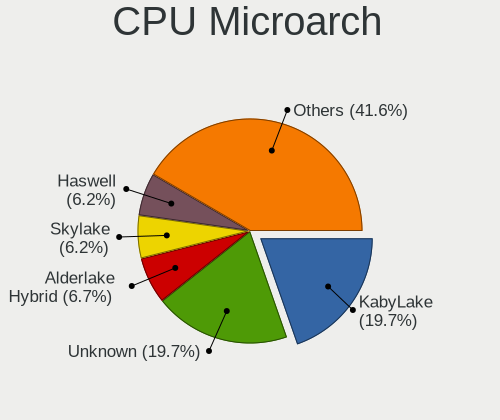
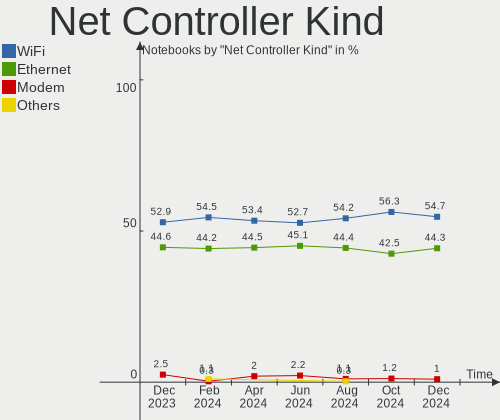

Debian Hardware Trends (Notebooks)
----------------------------------

A project to identify most popular hardware characteristics and track their change
over time based on data collected by Debian users at https://Linux-Hardware.org.

Anyone can contribute to this report by the [hw-probe](https://github.com/linuxhw/hw-probe) tool:

    sudo -E hw-probe -all -upload

Full-feature report is available here: https://linux-hardware.org/?view=trends

Period: Jan, 2022.

Contents
--------

* [ System ](#system)
  - [ OS                       ](#os)
  - [ OS Family                ](#os-family)
  - [ Kernel                   ](#kernel)
  - [ Kernel Family            ](#kernel-family)
  - [ Kernel Major Ver.        ](#kernel-major-ver)
  - [ Arch                     ](#arch)
  - [ DE                       ](#de)
  - [ Display Server           ](#display-server)
  - [ Display Manager          ](#display-manager)
  - [ OS Lang                  ](#os-lang)
  - [ Boot Mode                ](#boot-mode)
  - [ Filesystem               ](#filesystem)
  - [ Part. scheme             ](#part-scheme)
  - [ Dual Boot with Linux/BSD ](#dual-boot-with-linuxbsd)
  - [ Dual Boot (Win)          ](#dual-boot-win)

* [ Board ](#board)
  - [ Vendor                   ](#vendor)
  - [ Model                    ](#model)
  - [ Model Family             ](#model-family)
  - [ MFG Year                 ](#mfg-year)
  - [ Form Factor              ](#form-factor)
  - [ Secure Boot              ](#secure-boot)
  - [ Coreboot                 ](#coreboot)
  - [ RAM Size                 ](#ram-size)
  - [ RAM Used                 ](#ram-used)
  - [ Total Drives             ](#total-drives)
  - [ Has CD-ROM               ](#has-cd-rom)
  - [ Has Ethernet             ](#has-ethernet)
  - [ Has WiFi                 ](#has-wifi)
  - [ Has Bluetooth            ](#has-bluetooth)

* [ Location ](#location)
  - [ Country                  ](#country)
  - [ City                     ](#city)

* [ Drives ](#drives)
  - [ Drive Vendor             ](#drive-vendor)
  - [ Drive Model              ](#drive-model)
  - [ HDD Vendor               ](#hdd-vendor)
  - [ SSD Vendor               ](#ssd-vendor)
  - [ Drive Kind               ](#drive-kind)
  - [ Drive Connector          ](#drive-connector)
  - [ Drive Size               ](#drive-size)
  - [ Space Total              ](#space-total)
  - [ Space Used               ](#space-used)
  - [ Malfunc. Drives          ](#malfunc-drives)
  - [ Malfunc. Drive Vendor    ](#malfunc-drive-vendor)
  - [ Malfunc. HDD Vendor      ](#malfunc-hdd-vendor)
  - [ Malfunc. Drive Kind      ](#malfunc-drive-kind)
  - [ Failed Drives            ](#failed-drives)
  - [ Failed Drive Vendor      ](#failed-drive-vendor)
  - [ Drive Status             ](#drive-status)

* [ Storage controller ](#storage-controller)
  - [ Storage Vendor           ](#storage-vendor)
  - [ Storage Model            ](#storage-model)
  - [ Storage Kind             ](#storage-kind)

* [ Processor ](#processor)
  - [ CPU Vendor               ](#cpu-vendor)
  - [ CPU Model                ](#cpu-model)
  - [ CPU Model Family         ](#cpu-model-family)
  - [ CPU Cores                ](#cpu-cores)
  - [ CPU Sockets              ](#cpu-sockets)
  - [ CPU Threads              ](#cpu-threads)
  - [ CPU Op-Modes             ](#cpu-op-modes)
  - [ CPU Microcode            ](#cpu-microcode)
  - [ CPU Microarch            ](#cpu-microarch)

* [ Graphics ](#graphics)
  - [ GPU Vendor               ](#gpu-vendor)
  - [ GPU Model                ](#gpu-model)
  - [ GPU Combo                ](#gpu-combo)
  - [ GPU Driver               ](#gpu-driver)
  - [ GPU Memory               ](#gpu-memory)

* [ Monitor ](#monitor)
  - [ Monitor Vendor           ](#monitor-vendor)
  - [ Monitor Model            ](#monitor-model)
  - [ Monitor Resolution       ](#monitor-resolution)
  - [ Monitor Diagonal         ](#monitor-diagonal)
  - [ Monitor Width            ](#monitor-width)
  - [ Aspect Ratio             ](#aspect-ratio)
  - [ Monitor Area             ](#monitor-area)
  - [ Pixel Density            ](#pixel-density)
  - [ Multiple Monitors        ](#multiple-monitors)

* [ Network ](#network)
  - [ Net Controller Vendor    ](#net-controller-vendor)
  - [ Net Controller Model     ](#net-controller-model)
  - [ Wireless Vendor          ](#wireless-vendor)
  - [ Wireless Model           ](#wireless-model)
  - [ Ethernet Vendor          ](#ethernet-vendor)
  - [ Ethernet Model           ](#ethernet-model)
  - [ Net Controller Kind      ](#net-controller-kind)
  - [ Used Controller          ](#used-controller)
  - [ NICs                     ](#nics)
  - [ IPv6                     ](#ipv6)

* [ Bluetooth ](#bluetooth)
  - [ Bluetooth Vendor         ](#bluetooth-vendor)
  - [ Bluetooth Model          ](#bluetooth-model)

* [ Sound ](#sound)
  - [ Sound Vendor             ](#sound-vendor)
  - [ Sound Model              ](#sound-model)

* [ Memory ](#memory)
  - [ Memory Vendor            ](#memory-vendor)
  - [ Memory Model             ](#memory-model)
  - [ Memory Kind              ](#memory-kind)
  - [ Memory Form Factor       ](#memory-form-factor)
  - [ Memory Size              ](#memory-size)
  - [ Memory Speed             ](#memory-speed)

* [ Printers & scanners ](#printers--scanners)
  - [ Printer Vendor           ](#printer-vendor)
  - [ Printer Model            ](#printer-model)
  - [ Scanner Vendor           ](#scanner-vendor)
  - [ Scanner Model            ](#scanner-model)

* [ Camera ](#camera)
  - [ Camera Vendor            ](#camera-vendor)
  - [ Camera Model             ](#camera-model)

* [ Security ](#security)
  - [ Fingerprint Vendor       ](#fingerprint-vendor)
  - [ Fingerprint Model        ](#fingerprint-model)
  - [ Chipcard Vendor          ](#chipcard-vendor)
  - [ Chipcard Model           ](#chipcard-model)

* [ Unsupported ](#unsupported)
  - [ Unsupported Devices      ](#unsupported-devices)
  - [ Unsupported Device Types ](#unsupported-device-types)

System
------

OS
--

Installed operating systems

| Name              | Notebooks | Percent |
|-------------------|-----------|---------|
| Debian 11         | 132       | 79.04%  |
| Debian Unstable   | 11        | 6.59%   |
| Debian Testing    | 11        | 6.59%   |
| Debian 10         | 5         | 2.99%   |
| Debian 5          | 3         | 1.8%    |
| Debian 11-updates | 3         | 1.8%    |
| Debian 99         | 1         | 0.6%    |
| Debian 9          | 1         | 0.6%    |

OS Family
---------

OS without a version

| Name   | Notebooks | Percent |
|--------|-----------|---------|
| Debian | 167       | 100%    |

Kernel
------

Version of the Linux kernel

| Version                      | Notebooks | Percent |
|------------------------------|-----------|---------|
| 5.10.0-10-amd64              | 63        | 37.72%  |
| 5.10.0-11-amd64              | 21        | 12.57%  |
| 5.15.0-2-amd64               | 20        | 11.98%  |
| 5.10.0-7-amd64               | 12        | 7.19%   |
| 5.15.0-0.bpo.2-amd64         | 6         | 3.59%   |
| 5.15.0-3-amd64               | 5         | 2.99%   |
| 5.10.0-9-amd64               | 4         | 2.4%    |
| 5.10.0-8-amd64               | 4         | 2.4%    |
| 5.14.0-9parrot1-amd64        | 3         | 1.8%    |
| 5.10.0-10-686-pae            | 3         | 1.8%    |
| 4.19.0-18-amd64              | 3         | 1.8%    |
| 5.16.0-rc8-amd64             | 2         | 1.2%    |
| 5.10.0-6-amd64               | 2         | 1.2%    |
| 5.8.0-3-amd64                | 1         | 0.6%    |
| 5.15.5-custom-v16            | 1         | 0.6%    |
| 5.15.13titanide-1            | 1         | 0.6%    |
| 5.15.11-bully-1.0            | 1         | 0.6%    |
| 5.15.0-2mx-amd64             | 1         | 0.6%    |
| 5.15.0-16.2-liquorix-amd64   | 1         | 0.6%    |
| 5.15.0-13.1-liquorix-amd64   | 1         | 0.6%    |
| 5.15.0-12.2-liquorix-amd64   | 1         | 0.6%    |
| 5.14.21                      | 1         | 0.6%    |
| 5.14.0-0.bpo.2-amd64         | 1         | 0.6%    |
| 5.14.0-0.bpo.2-686-pae       | 1         | 0.6%    |
| 5.13.19-3-pve                | 1         | 0.6%    |
| 5.10.0-9-686                 | 1         | 0.6%    |
| 5.10.0-11-686                | 1         | 0.6%    |
| 5.10.0-10-686                | 1         | 0.6%    |
| 5.10.0-0.bpo.9-amd64         | 1         | 0.6%    |
| 4.9.0-8-amd64                | 1         | 0.6%    |
| 4.19.202-antix.1-686-smp-pae | 1         | 0.6%    |
| 4.19.0-0.bpo.9-amd64         | 1         | 0.6%    |

Kernel Family
-------------

Linux kernel without a distro release

| Version  | Notebooks | Percent |
|----------|-----------|---------|
| 5.10.0   | 113       | 67.66%  |
| 5.15.0   | 35        | 20.96%  |
| 5.14.0   | 5         | 2.99%   |
| 4.19.0   | 4         | 2.4%    |
| 5.16.0   | 2         | 1.2%    |
| 5.8.0    | 1         | 0.6%    |
| 5.15.5   | 1         | 0.6%    |
| 5.15.13  | 1         | 0.6%    |
| 5.15.11  | 1         | 0.6%    |
| 5.14.21  | 1         | 0.6%    |
| 5.13.19  | 1         | 0.6%    |
| 4.9.0    | 1         | 0.6%    |
| 4.19.202 | 1         | 0.6%    |

Kernel Major Ver.
-----------------

Linux kernel major version

| Version | Notebooks | Percent |
|---------|-----------|---------|
| 5.10    | 113       | 67.66%  |
| 5.15    | 38        | 22.75%  |
| 5.14    | 6         | 3.59%   |
| 4.19    | 5         | 2.99%   |
| 5.16    | 2         | 1.2%    |
| 5.8     | 1         | 0.6%    |
| 5.13    | 1         | 0.6%    |
| 4.9     | 1         | 0.6%    |

Arch
----

OS architecture (x86_64, i586, etc.)

| Name   | Notebooks | Percent |
|--------|-----------|---------|
| x86_64 | 159       | 95.21%  |
| i686   | 8         | 4.79%   |

DE
--

Desktop Environment

| Name             | Notebooks | Percent |
|------------------|-----------|---------|
| GNOME            | 49        | 29.34%  |
| KDE5             | 29        | 17.37%  |
| Unknown          | 27        | 16.17%  |
| XFCE             | 25        | 14.97%  |
| MATE             | 8         | 4.79%   |
| LXDE             | 7         | 4.19%   |
| X-Cinnamon       | 6         | 3.59%   |
| Cinnamon         | 5         | 2.99%   |
| lightdm-xsession | 3         | 1.8%    |
| KDE              | 2         | 1.2%    |
| trinity          | 1         | 0.6%    |
| LXQt             | 1         | 0.6%    |
| i3               | 1         | 0.6%    |
| GNOME Flashback  | 1         | 0.6%    |
| GNOME Classic    | 1         | 0.6%    |
| awesome          | 1         | 0.6%    |

Display Server
--------------

X11 or Wayland

| Name    | Notebooks | Percent |
|---------|-----------|---------|
| X11     | 100       | 59.88%  |
| Wayland | 40        | 23.95%  |
| Unknown | 17        | 10.18%  |
| Tty     | 10        | 5.99%   |

Display Manager
---------------

SDDM, LightDM, etc.

| Name    | Notebooks | Percent |
|---------|-----------|---------|
| Unknown | 54        | 32.34%  |
| LightDM | 44        | 26.35%  |
| GDM     | 34        | 20.36%  |
| SDDM    | 19        | 11.38%  |
| GDM3    | 13        | 7.78%   |
| SLiM    | 2         | 1.2%    |
| NODM    | 1         | 0.6%    |

OS Lang
-------

Language

| Lang    | Notebooks | Percent |
|---------|-----------|---------|
| en_US   | 57        | 34.13%  |
| de_DE   | 20        | 11.98%  |
| ru_RU   | 17        | 10.18%  |
| fr_FR   | 12        | 7.19%   |
| en_GB   | 9         | 5.39%   |
| pt_BR   | 8         | 4.79%   |
| pl_PL   | 5         | 2.99%   |
| it_IT   | 5         | 2.99%   |
| es_ES   | 4         | 2.4%    |
| Unknown | 4         | 2.4%    |
| en_IN   | 3         | 1.8%    |
| zh_CN   | 2         | 1.2%    |
| es_MX   | 2         | 1.2%    |
| es_CL   | 2         | 1.2%    |
| en_CA   | 2         | 1.2%    |
| en_AU   | 2         | 1.2%    |
| zh_TW   | 1         | 0.6%    |
| nl_NL   | 1         | 0.6%    |
| nl_BE   | 1         | 0.6%    |
| id_ID   | 1         | 0.6%    |
| hu_HU   | 1         | 0.6%    |
| et_EE   | 1         | 0.6%    |
| es_VE   | 1         | 0.6%    |
| es_PY   | 1         | 0.6%    |
| es_BO   | 1         | 0.6%    |
| es_AR   | 1         | 0.6%    |
| en_NG   | 1         | 0.6%    |
| de_CH   | 1         | 0.6%    |
| C       | 1         | 0.6%    |

Boot Mode
---------

EFI or BIOS

| Mode | Notebooks | Percent |
|------|-----------|---------|
| EFI  | 92        | 55.09%  |
| BIOS | 75        | 44.91%  |

Filesystem
----------

Type of filesystem

| Type    | Notebooks | Percent |
|---------|-----------|---------|
| Ext4    | 134       | 80.24%  |
| Overlay | 19        | 11.38%  |
| Btrfs   | 9         | 5.39%   |
| Xfs     | 2         | 1.2%    |
| Zfs     | 1         | 0.6%    |
| Tmpfs   | 1         | 0.6%    |
| Ext2    | 1         | 0.6%    |

Part. scheme
------------

Scheme of partitioning

| Type    | Notebooks | Percent |
|---------|-----------|---------|
| GPT     | 95        | 56.89%  |
| MBR     | 38        | 22.75%  |
| Unknown | 34        | 20.36%  |

Dual Boot with Linux/BSD
------------------------

Hosting more than one Linux/BSD

| Dual boot | Notebooks | Percent |
|-----------|-----------|---------|
| No        | 149       | 89.22%  |
| Yes       | 18        | 10.78%  |

Dual Boot (Win)
---------------

Hosting Linux and Windows

| Dual boot | Notebooks | Percent |
|-----------|-----------|---------|
| No        | 113       | 67.66%  |
| Yes       | 54        | 32.34%  |

Board
-----

Vendor
------

Motherboard manufacturer

| Name                | Notebooks | Percent |
|---------------------|-----------|---------|
| Lenovo              | 44        | 26.35%  |
| Dell                | 27        | 16.17%  |
| Hewlett-Packard     | 25        | 14.97%  |
| ASUSTek Computer    | 12        | 7.19%   |
| Acer                | 11        | 6.59%   |
| Toshiba             | 6         | 3.59%   |
| Aquarius            | 6         | 3.59%   |
| Sony                | 5         | 2.99%   |
| Samsung Electronics | 5         | 2.99%   |
| MSI                 | 3         | 1.8%    |
| Apple               | 3         | 1.8%    |
| Medion              | 2         | 1.2%    |
| Compal              | 2         | 1.2%    |
| Alienware           | 2         | 1.2%    |
| Unknown             | 2         | 1.2%    |
| YiFang              | 1         | 0.6%    |
| TUXEDO              | 1         | 0.6%    |
| Timi                | 1         | 0.6%    |
| Positivo            | 1         | 0.6%    |
| Packard Bell        | 1         | 0.6%    |
| Notebook            | 1         | 0.6%    |
| Micro Electronics   | 1         | 0.6%    |
| Lex BayTrail        | 1         | 0.6%    |
| Jumper              | 1         | 0.6%    |
| IBM                 | 1         | 0.6%    |
| HUAWEI              | 1         | 0.6%    |
| AXDIA International | 1         | 0.6%    |

Model
-----

Motherboard model

| Name                                     | Notebooks | Percent |
|------------------------------------------|-----------|---------|
| Aquarius NS585                           | 6         | 3.59%   |
| Lenovo ThinkPad E475 20H40006US          | 3         | 1.8%    |
| Samsung N150P/N210P/N220P                | 2         | 1.2%    |
| Lenovo IdeaPad Slim 1-14AST-05 81VS      | 2         | 1.2%    |
| Lenovo IdeaPad S540-13API 81XC           | 2         | 1.2%    |
| HP ProBook 650 G5                        | 2         | 1.2%    |
| HP Pavilion Gaming Laptop 15-ec2xxx      | 2         | 1.2%    |
| HP Laptop 15-db0xxx                      | 2         | 1.2%    |
| HP EliteBook 8440p                       | 2         | 1.2%    |
| HP 250 G7 Notebook PC                    | 2         | 1.2%    |
| Dell Inspiron 5580                       | 2         | 1.2%    |
| Dell Inspiron 15-3567                    | 2         | 1.2%    |
| Acer Aspire A515-56                      | 2         | 1.2%    |
| Unknown                                  | 2         | 1.2%    |
| YiFang NXW9QC132                         | 1         | 0.6%    |
| TUXEDO Polaris 15 AMD Gen1               | 1         | 0.6%    |
| Toshiba TECRA R950                       | 1         | 0.6%    |
| Toshiba TECRA A50-C                      | 1         | 0.6%    |
| Toshiba Satellite P850                   | 1         | 0.6%    |
| Toshiba Satellite L775D                  | 1         | 0.6%    |
| Toshiba Satellite L50-B                  | 1         | 0.6%    |
| Toshiba Satellite C660D                  | 1         | 0.6%    |
| Timi A7S                                 | 1         | 0.6%    |
| Sony VPCS13V9E                           | 1         | 0.6%    |
| Sony VPCF12C5E                           | 1         | 0.6%    |
| Sony VPCEB3S1E                           | 1         | 0.6%    |
| Sony SVS13A1C5E                          | 1         | 0.6%    |
| Sony SVE15127CDS                         | 1         | 0.6%    |
| Samsung 750XDA                           | 1         | 0.6%    |
| Samsung 535U3C                           | 1         | 0.6%    |
| Samsung 340XAA/350XAA/550XAA             | 1         | 0.6%    |
| Positivo Harrison                        | 1         | 0.6%    |
| Packard Bell EasyNote LM98               | 1         | 0.6%    |
| Notebook W65_67SZ                        | 1         | 0.6%    |
| MSI MS-1454                              | 1         | 0.6%    |
| MSI GL65 9SC                             | 1         | 0.6%    |
| MSI GE70 2OC\2OD\2OE                     | 1         | 0.6%    |
| Micro MG-VCTR002-2060                    | 1         | 0.6%    |
| Medion P6620                             | 1         | 0.6%    |
| Medion Akoya P7818                       | 1         | 0.6%    |
| Lex BayTrail 3I380A                      | 1         | 0.6%    |
| Lenovo Y520-15IKBN 80WK                  | 1         | 0.6%    |
| Lenovo V510-15IKB 80WQ                   | 1         | 0.6%    |
| Lenovo V14-IIL 82C4                      | 1         | 0.6%    |
| Lenovo V130-15IGM 81HL                   | 1         | 0.6%    |
| Lenovo ThinkPad X250 20CMS02F00          | 1         | 0.6%    |
| Lenovo ThinkPad X230 23252EG             | 1         | 0.6%    |
| Lenovo ThinkPad X230 23202DG             | 1         | 0.6%    |
| Lenovo ThinkPad X1 Carbon 5th 20HRCTO1WW | 1         | 0.6%    |
| Lenovo ThinkPad X1 Carbon 3rd 20BTS2EJ00 | 1         | 0.6%    |
| Lenovo ThinkPad X1 Carbon 2nd 20A8S1AW11 | 1         | 0.6%    |
| Lenovo ThinkPad W530 24382HU             | 1         | 0.6%    |
| Lenovo ThinkPad T580 20LAS4KG0Q          | 1         | 0.6%    |
| Lenovo ThinkPad T530 24296HG             | 1         | 0.6%    |
| Lenovo ThinkPad T480 20L6A0UGCL          | 1         | 0.6%    |
| Lenovo ThinkPad T450s 20BXCTO1WW         | 1         | 0.6%    |
| Lenovo ThinkPad T430s 2356A89            | 1         | 0.6%    |
| Lenovo ThinkPad T430 2349GCG             | 1         | 0.6%    |
| Lenovo ThinkPad T14 Gen 2a 20XLS0CK00    | 1         | 0.6%    |
| Lenovo ThinkPad T14 Gen 2a 20XL0014GE    | 1         | 0.6%    |

Model Family
------------

Motherboard model prefix

| Name                  | Notebooks | Percent |
|-----------------------|-----------|---------|
| Lenovo ThinkPad       | 24        | 14.37%  |
| Dell Inspiron         | 12        | 7.19%   |
| Lenovo IdeaPad        | 11        | 6.59%   |
| Dell Latitude         | 8         | 4.79%   |
| Acer Aspire           | 8         | 4.79%   |
| HP Pavilion           | 6         | 3.59%   |
| Aquarius NS585        | 6         | 3.59%   |
| Toshiba Satellite     | 4         | 2.4%    |
| HP Laptop             | 4         | 2.4%    |
| HP EliteBook          | 4         | 2.4%    |
| HP ProBook            | 3         | 1.8%    |
| HP 250                | 3         | 1.8%    |
| Dell Vostro           | 3         | 1.8%    |
| Toshiba TECRA         | 2         | 1.2%    |
| Samsung N150P         | 2         | 1.2%    |
| Dell XPS              | 2         | 1.2%    |
| Dell Precision        | 2         | 1.2%    |
| ASUS ZenBook          | 2         | 1.2%    |
| Acer Swift            | 2         | 1.2%    |
| Unknown               | 2         | 1.2%    |
| YiFang NXW9QC132      | 1         | 0.6%    |
| TUXEDO Polaris        | 1         | 0.6%    |
| Timi A7S              | 1         | 0.6%    |
| Sony VPCS13V9E        | 1         | 0.6%    |
| Sony VPCF12C5E        | 1         | 0.6%    |
| Sony VPCEB3S1E        | 1         | 0.6%    |
| Sony SVS13A1C5E       | 1         | 0.6%    |
| Sony SVE15127CDS      | 1         | 0.6%    |
| Samsung 750XDA        | 1         | 0.6%    |
| Samsung 535U3C        | 1         | 0.6%    |
| Samsung 340XAA        | 1         | 0.6%    |
| Positivo Harrison     | 1         | 0.6%    |
| Packard Bell EasyNote | 1         | 0.6%    |
| Notebook W65          | 1         | 0.6%    |
| MSI MS-1454           | 1         | 0.6%    |
| MSI GL65              | 1         | 0.6%    |
| MSI GE70              | 1         | 0.6%    |
| Micro MG-VCTR002-2060 | 1         | 0.6%    |
| Medion P6620          | 1         | 0.6%    |
| Medion Akoya          | 1         | 0.6%    |
| Lex BayTrail 3I380A   | 1         | 0.6%    |
| Lenovo Y520-15IKBN    | 1         | 0.6%    |
| Lenovo V510-15IKB     | 1         | 0.6%    |
| Lenovo V14-IIL        | 1         | 0.6%    |
| Lenovo V130-15IGM     | 1         | 0.6%    |
| Lenovo ThinkBook      | 1         | 0.6%    |
| Lenovo G580           | 1         | 0.6%    |
| Lenovo G50-70         | 1         | 0.6%    |
| Lenovo B490           | 1         | 0.6%    |
| Lenovo B475           | 1         | 0.6%    |
| Jumper EZbook         | 1         | 0.6%    |
| IBM 2647QU6           | 1         | 0.6%    |
| HUAWEI HKD-WXX        | 1         | 0.6%    |
| HP Presario           | 1         | 0.6%    |
| HP OMEN               | 1         | 0.6%    |
| HP Notebook           | 1         | 0.6%    |
| HP Mini               | 1         | 0.6%    |
| HP 15                 | 1         | 0.6%    |
| Compal QAL51          | 1         | 0.6%    |
| Compal NCL60          | 1         | 0.6%    |

MFG Year
--------

Motherboard manufacture year

| Year | Notebooks | Percent |
|------|-----------|---------|
| 2021 | 25        | 14.97%  |
| 2020 | 21        | 12.57%  |
| 2019 | 21        | 12.57%  |
| 2012 | 15        | 8.98%   |
| 2010 | 15        | 8.98%   |
| 2017 | 12        | 7.19%   |
| 2016 | 11        | 6.59%   |
| 2018 | 10        | 5.99%   |
| 2015 | 8         | 4.79%   |
| 2014 | 8         | 4.79%   |
| 2013 | 7         | 4.19%   |
| 2011 | 7         | 4.19%   |
| 2009 | 3         | 1.8%    |
| 2005 | 2         | 1.2%    |
| 2008 | 1         | 0.6%    |
| 2002 | 1         | 0.6%    |

Form Factor
-----------

Physical design of the computer

| Name     | Notebooks | Percent |
|----------|-----------|---------|
| Notebook | 167       | 100%    |

Secure Boot
-----------

Enabled or disabled

| State    | Notebooks | Percent |
|----------|-----------|---------|
| Disabled | 151       | 90.42%  |
| Enabled  | 16        | 9.58%   |

Coreboot
--------

Have coreboot on board

| Used | Notebooks | Percent |
|------|-----------|---------|
| No   | 167       | 100%    |

RAM Size
--------

Total RAM memory

| Size in GB  | Notebooks | Percent |
|-------------|-----------|---------|
| 4.01-8.0    | 57        | 34.13%  |
| 8.01-16.0   | 34        | 20.36%  |
| 16.01-24.0  | 30        | 17.96%  |
| 3.01-4.0    | 23        | 13.77%  |
| 32.01-64.0  | 5         | 2.99%   |
| 64.01-256.0 | 5         | 2.99%   |
| 24.01-32.0  | 4         | 2.4%    |
| 2.01-3.0    | 4         | 2.4%    |
| 1.01-2.0    | 3         | 1.8%    |
| 0.51-1.0    | 2         | 1.2%    |

RAM Used
--------

Used RAM memory

| Used GB    | Notebooks | Percent |
|------------|-----------|---------|
| 1.01-2.0   | 46        | 27.54%  |
| 2.01-3.0   | 40        | 23.95%  |
| 4.01-8.0   | 29        | 17.37%  |
| 0.51-1.0   | 25        | 14.97%  |
| 3.01-4.0   | 18        | 10.78%  |
| 8.01-16.0  | 5         | 2.99%   |
| 0.01-0.5   | 3         | 1.8%    |
| 24.01-32.0 | 1         | 0.6%    |

Total Drives
------------

Number of drives on board

| Drives | Notebooks | Percent |
|--------|-----------|---------|
| 1      | 121       | 72.46%  |
| 2      | 38        | 22.75%  |
| 3      | 5         | 2.99%   |
| 4      | 3         | 1.8%    |

Has CD-ROM
----------

Has CD-ROM on board

| Presented | Notebooks | Percent |
|-----------|-----------|---------|
| No        | 117       | 70.06%  |
| Yes       | 50        | 29.94%  |

Has Ethernet
------------

Has Ethernet on board

| Presented | Notebooks | Percent |
|-----------|-----------|---------|
| Yes       | 135       | 80.84%  |
| No        | 32        | 19.16%  |

Has WiFi
--------

Has WiFi module

| Presented | Notebooks | Percent |
|-----------|-----------|---------|
| Yes       | 163       | 97.6%   |
| No        | 4         | 2.4%    |

Has Bluetooth
-------------

Has Bluetooth module

| Presented | Notebooks | Percent |
|-----------|-----------|---------|
| Yes       | 132       | 79.04%  |
| No        | 35        | 20.96%  |

Location
--------

Country
-------

Geographic location (country)

| Country      | Notebooks | Percent |
|--------------|-----------|---------|
| Germany      | 27        | 16.17%  |
| USA          | 19        | 11.38%  |
| Russia       | 19        | 11.38%  |
| France       | 13        | 7.78%   |
| Brazil       | 9         | 5.39%   |
| Italy        | 8         | 4.79%   |
| UK           | 7         | 4.19%   |
| Poland       | 6         | 3.59%   |
| Switzerland  | 5         | 2.99%   |
| Spain        | 4         | 2.4%    |
| India        | 4         | 2.4%    |
| Belgium      | 4         | 2.4%    |
| Netherlands  | 3         | 1.8%    |
| Mexico       | 3         | 1.8%    |
| Czechia      | 3         | 1.8%    |
| Canada       | 3         | 1.8%    |
| Turkey       | 2         | 1.2%    |
| Norway       | 2         | 1.2%    |
| Indonesia    | 2         | 1.2%    |
| China        | 2         | 1.2%    |
| Chile        | 2         | 1.2%    |
| Australia    | 2         | 1.2%    |
| Venezuela    | 1         | 0.6%    |
| Taiwan       | 1         | 0.6%    |
| Sweden       | 1         | 0.6%    |
| South Africa | 1         | 0.6%    |
| Slovenia     | 1         | 0.6%    |
| Slovakia     | 1         | 0.6%    |
| Saudi Arabia | 1         | 0.6%    |
| Paraguay     | 1         | 0.6%    |
| Nigeria      | 1         | 0.6%    |
| Madagascar   | 1         | 0.6%    |
| Latvia       | 1         | 0.6%    |
| Iran         | 1         | 0.6%    |
| Hungary      | 1         | 0.6%    |
| Hong Kong    | 1         | 0.6%    |
| Estonia      | 1         | 0.6%    |
| Bolivia      | 1         | 0.6%    |
| Bangladesh   | 1         | 0.6%    |
| Argentina    | 1         | 0.6%    |

City
----

Geographic location (city)

| City                     | Notebooks | Percent |
|--------------------------|-----------|---------|
| Voronezh                 | 12        | 7.19%   |
| Berlin                   | 6         | 3.59%   |
| Bangor                   | 4         | 2.4%    |
| Warsaw                   | 3         | 1.8%    |
| Prague                   | 3         | 1.8%    |
| Frankfurt am Main        | 3         | 1.8%    |
| Turin                    | 2         | 1.2%    |
| Paris                    | 2         | 1.2%    |
| Oslo                     | 2         | 1.2%    |
| London                   | 2         | 1.2%    |
| Grenoble                 | 2         | 1.2%    |
| Fenstanton               | 2         | 1.2%    |
| Donostia / San Sebastian | 2         | 1.2%    |
| Darmstadt                | 2         | 1.2%    |
| Brussels                 | 2         | 1.2%    |
| Biancavilla              | 2         | 1.2%    |
| Zvenigorod               | 1         | 0.6%    |
| Zurich                   | 1         | 0.6%    |
| Yekaterinburg            | 1         | 0.6%    |
| Wo?‚omin                 | 1         | 0.6%    |
| Wildwood                 | 1         | 0.6%    |
| Wheaton                  | 1         | 0.6%    |
| Waregem                  | 1         | 0.6%    |
| Ungurpils                | 1         | 0.6%    |
| Toulouse                 | 1         | 0.6%    |
| Thaleischweiler-Froschen | 1         | 0.6%    |
| Tehran                   | 1         | 0.6%    |
| T??bingen                | 1         | 0.6%    |
| Tallinn                  | 1         | 0.6%    |
| Surabaya                 | 1         | 0.6%    |
| St Petersburg            | 1         | 0.6%    |
| Sokoto                   | 1         | 0.6%    |
| Shenzhen                 | 1         | 0.6%    |
| Seattle                  | 1         | 0.6%    |
| Schashagen               | 1         | 0.6%    |
| S??o Paulo               | 1         | 0.6%    |
| S??o Jos?© dos Campos    | 1         | 0.6%    |
| Santiago                 | 1         | 0.6%    |
| San Miguel de Allende    | 1         | 0.6%    |
| San Antonio              | 1         | 0.6%    |
| Salt Lake City           | 1         | 0.6%    |
| Saint Paul               | 1         | 0.6%    |
| Saint Clair Shores       | 1         | 0.6%    |
| Roaring River            | 1         | 0.6%    |
| Riyadh                   | 1         | 0.6%    |
| Red Deer                 | 1         | 0.6%    |
| Pune                     | 1         | 0.6%    |
| Pretoria                 | 1         | 0.6%    |
| Poznan                   | 1         | 0.6%    |
| Porto Alegre             | 1         | 0.6%    |
| Playa del Carmen         | 1         | 0.6%    |
| Plano                    | 1         | 0.6%    |
| Palembang                | 1         | 0.6%    |
| Paderno Dugnano          | 1         | 0.6%    |
| Orenburg                 | 1         | 0.6%    |
| Obertshausen             | 1         | 0.6%    |
| Noyabrsk                 | 1         | 0.6%    |
| North Point              | 1         | 0.6%    |
| Nizhniy Novgorod         | 1         | 0.6%    |
| Newport Beach            | 1         | 0.6%    |

Drives
------

Drive Vendor
------------

Hard drive vendors

| Vendor              | Notebooks | Drives | Percent |
|---------------------|-----------|--------|---------|
| Samsung Electronics | 40        | 42     | 19.05%  |
| WDC                 | 21        | 23     | 10%     |
| Seagate             | 16        | 17     | 7.62%   |
| Unknown             | 13        | 14     | 6.19%   |
| SK Hynix            | 13        | 13     | 6.19%   |
| Crucial             | 13        | 13     | 6.19%   |
| Toshiba             | 11        | 12     | 5.24%   |
| Kingston            | 11        | 11     | 5.24%   |
| SanDisk             | 10        | 12     | 4.76%   |
| A-DATA Technology   | 10        | 10     | 4.76%   |
| KIOXIA              | 6         | 6      | 2.86%   |
| Hitachi             | 6         | 6      | 2.86%   |
| Micron Technology   | 5         | 5      | 2.38%   |
| SSSTC               | 3         | 3      | 1.43%   |
| Intel               | 3         | 3      | 1.43%   |
| UMIS                | 2         | 2      | 0.95%   |
| Patriot             | 2         | 2      | 0.95%   |
| JetFlash            | 2         | 2      | 0.95%   |
| China               | 2         | 2      | 0.95%   |
| Apple               | 2         | 2      | 0.95%   |
| Unknown             | 2         | 2      | 0.95%   |
| ZTC                 | 1         | 1      | 0.48%   |
| XPG                 | 1         | 1      | 0.48%   |
| Vaseky              | 1         | 1      | 0.48%   |
| Silicon Motion      | 1         | 1      | 0.48%   |
| Realtek             | 1         | 1      | 0.48%   |
| PNY                 | 1         | 1      | 0.48%   |
| PLEXTOR             | 1         | 1      | 0.48%   |
| Phison Electronics  | 1         | 1      | 0.48%   |
| Netac               | 1         | 1      | 0.48%   |
| Lexar               | 1         | 1      | 0.48%   |
| Lenovo              | 1         | 1      | 0.48%   |
| KingSpec            | 1         | 1      | 0.48%   |
| Integral            | 1         | 1      | 0.48%   |
| GOODRAM             | 1         | 1      | 0.48%   |
| BIWIN               | 1         | 1      | 0.48%   |
| ASMT                | 1         | 1      | 0.48%   |
| 2.5"                | 1         | 1      | 0.48%   |

Drive Model
-----------

Hard drive models

| Model                                | Notebooks | Percent |
|--------------------------------------|-----------|---------|
| A-DATA SU800 512GB SSD               | 6         | 2.76%   |
| Toshiba MQ01ABD100 1TB               | 4         | 1.84%   |
| WDC WD10SPZX-24Z10 1TB               | 3         | 1.38%   |
| Unknown SD/MMC/MS PRO 128GB          | 3         | 1.38%   |
| Samsung SSD 970 EVO Plus 1TB         | 3         | 1.38%   |
| Samsung SSD 850 EVO 250GB            | 3         | 1.38%   |
| Kingston SA400S37120G 120GB SSD      | 3         | 1.38%   |
| Crucial CT120BX500SSD1 120GB         | 3         | 1.38%   |
| WDC WDS240G2G0A-00JH30 240GB SSD     | 2         | 0.92%   |
| UMIS RPFTJ128PDD2EWX 128GB           | 2         | 0.92%   |
| SK Hynix PC711 HFS512GDE9X073N 512GB | 2         | 0.92%   |
| SK Hynix HFM512GD3JX013N 512GB       | 2         | 0.92%   |
| Seagate ST1000LM024 HN-M101MBB 1TB   | 2         | 0.92%   |
| SanDisk 3.2 Gen 1 250GB SSD          | 2         | 0.92%   |
| Samsung SSD 860 EVO 500GB            | 2         | 0.92%   |
| Samsung MZALQ512HBLU-00BL1 512GB     | 2         | 0.92%   |
| Patriot P210 256GB SSD               | 2         | 0.92%   |
| KIOXIA KBG40ZNS512G NVMe 512GB       | 2         | 0.92%   |
| Kingston SA400S37960G 960GB SSD      | 2         | 0.92%   |
| Kingston SA400S37240G 240GB SSD      | 2         | 0.92%   |
| JetFlash Transcend 128GB             | 2         | 0.92%   |
| Crucial CT480BX500SSD1 480GB         | 2         | 0.92%   |
| Crucial CT1000MX500SSD1 1TB          | 2         | 0.92%   |
| Unknown                              | 2         | 0.92%   |
| ZTC SM201-512G                       | 1         | 0.46%   |
| XPG GAMMIX S11 Pro 2TB               | 1         | 0.46%   |
| WDC WDS500G2B0C-00PXH0 500GB         | 1         | 0.46%   |
| WDC WDS120G2G0A-00JH30 120GB SSD     | 1         | 0.46%   |
| WDC WDS100T2B0C-00PXH0 1TB           | 1         | 0.46%   |
| WDC WD600UE-22HCT0 64GB              | 1         | 0.46%   |
| WDC WD5000LPVX-22V0TT0 500GB         | 1         | 0.46%   |
| WDC WD5000BPVT-08HXZT1 500GB         | 1         | 0.46%   |
| WDC WD5000BPKX-22HPJT0 500GB         | 1         | 0.46%   |
| WDC WD5000BEVT-22ZAT0 500GB          | 1         | 0.46%   |
| WDC WD2500BEKT-75PVMT0 250GB         | 1         | 0.46%   |
| WDC WD10SPZX-60Z10T1 1TB             | 1         | 0.46%   |
| WDC WD10JPVX-60JC3T0 1TB             | 1         | 0.46%   |
| WDC WD My Passport 264F 4TB          | 1         | 0.46%   |
| WDC PC SN730 SDBQNTY-512G-1001 512GB | 1         | 0.46%   |
| WDC PC SN730 SDBQNTY-1T00-1001 1TB   | 1         | 0.46%   |
| WDC PC SN730 SDBPNTY-512G-1101 512GB | 1         | 0.46%   |
| WDC PC SN530 NVMe 256GB              | 1         | 0.46%   |
| WDC PC SN520 SDAPNUW-256G-1006 256GB | 1         | 0.46%   |
| WDC PC SN520 SDAPMUW-128G-1101 128GB | 1         | 0.46%   |
| Vaseky V800/1TB SSD                  | 1         | 0.46%   |
| Unknown SM32G  32GB                  | 1         | 0.46%   |
| Unknown SDC  32GB                    | 1         | 0.46%   |
| Unknown SA32G  32GB                  | 1         | 0.46%   |
| Unknown NVMe SSD Drive 512GB         | 1         | 0.46%   |
| Unknown MMC Card  64GB               | 1         | 0.46%   |
| Unknown MMC Card  32GB               | 1         | 0.46%   |
| Unknown MMC Card  256GB              | 1         | 0.46%   |
| Unknown MMC Card  129GB              | 1         | 0.46%   |
| Unknown HBG4a2  32GB                 | 1         | 0.46%   |
| Unknown DA4128  128GB                | 1         | 0.46%   |
| Unknown BWBC3R  32GB                 | 1         | 0.46%   |
| Toshiba THNSNS256GMCP 256GB SSD      | 1         | 0.46%   |
| Toshiba THNSNK512GVN8 512GB SSD      | 1         | 0.46%   |
| Toshiba MQ01ACF050 500GB             | 1         | 0.46%   |
| Toshiba MQ01ACF032 320GB             | 1         | 0.46%   |

HDD Vendor
----------

Hard disk drive vendors

| Vendor              | Notebooks | Drives | Percent |
|---------------------|-----------|--------|---------|
| Seagate             | 15        | 15     | 32.61%  |
| WDC                 | 11        | 11     | 23.91%  |
| Toshiba             | 9         | 9      | 19.57%  |
| Hitachi             | 6         | 6      | 13.04%  |
| Unknown             | 3         | 3      | 6.52%   |
| Samsung Electronics | 2         | 2      | 4.35%   |

SSD Vendor
----------

Solid state drive vendors

| Vendor              | Notebooks | Drives | Percent |
|---------------------|-----------|--------|---------|
| Samsung Electronics | 22        | 24     | 25%     |
| Crucial             | 13        | 13     | 14.77%  |
| Kingston            | 9         | 9      | 10.23%  |
| SanDisk             | 8         | 9      | 9.09%   |
| A-DATA Technology   | 8         | 8      | 9.09%   |
| WDC                 | 3         | 3      | 3.41%   |
| Toshiba             | 2         | 2      | 2.27%   |
| SK Hynix            | 2         | 2      | 2.27%   |
| Patriot             | 2         | 2      | 2.27%   |
| Micron Technology   | 2         | 2      | 2.27%   |
| China               | 2         | 2      | 2.27%   |
| ZTC                 | 1         | 1      | 1.14%   |
| Vaseky              | 1         | 1      | 1.14%   |
| Seagate             | 1         | 1      | 1.14%   |
| PNY                 | 1         | 1      | 1.14%   |
| PLEXTOR             | 1         | 1      | 1.14%   |
| Netac               | 1         | 1      | 1.14%   |
| Lexar               | 1         | 1      | 1.14%   |
| KingSpec            | 1         | 1      | 1.14%   |
| Integral            | 1         | 1      | 1.14%   |
| GOODRAM             | 1         | 1      | 1.14%   |
| BIWIN               | 1         | 1      | 1.14%   |
| ASMT                | 1         | 1      | 1.14%   |
| Apple               | 1         | 1      | 1.14%   |
| 2.5"                | 1         | 1      | 1.14%   |
| Unknown             | 1         | 1      | 1.14%   |

Drive Kind
----------

HDD or SSD

| Kind    | Notebooks | Drives | Percent |
|---------|-----------|--------|---------|
| SSD     | 83        | 91     | 41.71%  |
| NVMe    | 60        | 65     | 30.15%  |
| HDD     | 41        | 46     | 20.6%   |
| MMC     | 11        | 13     | 5.53%   |
| Unknown | 4         | 4      | 2.01%   |

Drive Connector
---------------

SATA, SAS, NVMe, etc.

| Type | Notebooks | Drives | Percent |
|------|-----------|--------|---------|
| SATA | 112       | 126    | 57.44%  |
| NVMe | 60        | 64     | 30.77%  |
| SAS  | 12        | 16     | 6.15%   |
| MMC  | 11        | 13     | 5.64%   |

Drive Size
----------

Size of hard drive

| Size in TB | Notebooks | Drives | Percent |
|------------|-----------|--------|---------|
| 0.01-0.5   | 78        | 86     | 61.42%  |
| 0.51-1.0   | 45        | 47     | 35.43%  |
| 1.01-2.0   | 2         | 2      | 1.57%   |
| 4.01-10.0  | 2         | 2      | 1.57%   |

Space Total
-----------

Amount of disk space available on the file system

| Size in GB     | Notebooks | Percent |
|----------------|-----------|---------|
| 101-250        | 51        | 30.54%  |
| 251-500        | 43        | 25.75%  |
| 501-1000       | 24        | 14.37%  |
| Unknown        | 20        | 11.98%  |
| 51-100         | 10        | 5.99%   |
| 1001-2000      | 6         | 3.59%   |
| 21-50          | 5         | 2.99%   |
| More than 3000 | 4         | 2.4%    |
| 1-20           | 3         | 1.8%    |
| 2001-3000      | 1         | 0.6%    |

Space Used
----------

Amount of used disk space

| Used GB        | Notebooks | Percent |
|----------------|-----------|---------|
| 1-20           | 41        | 24.55%  |
| 51-100         | 30        | 17.96%  |
| 21-50          | 29        | 17.37%  |
| 101-250        | 24        | 14.37%  |
| Unknown        | 20        | 11.98%  |
| 251-500        | 10        | 5.99%   |
| 501-1000       | 7         | 4.19%   |
| More than 3000 | 3         | 1.8%    |
| 1001-2000      | 2         | 1.2%    |
| 0              | 1         | 0.6%    |

Malfunc. Drives
---------------

Drive models with a malfunction

| Model                                | Notebooks | Drives | Percent |
|--------------------------------------|-----------|--------|---------|
| SK Hynix PC711 HFS512GDE9X073N 512GB | 2         | 2      | 16.67%  |
| WDC WD5000BPVT-08HXZT1 500GB         | 1         | 1      | 8.33%   |
| SK Hynix SC210 mSATA 128GB SSD       | 1         | 1      | 8.33%   |
| Seagate ST9500325AS 500GB            | 1         | 1      | 8.33%   |
| Seagate ST1000LM024 HN-M101MBB 1TB   | 1         | 1      | 8.33%   |
| SanDisk SSD U100 24GB                | 1         | 1      | 8.33%   |
| Kingston SA400S37960G 960GB SSD      | 1         | 1      | 8.33%   |
| Hitachi HTS545032B9A300 320GB        | 1         | 1      | 8.33%   |
| Hitachi HTE725032A9A364 320GB        | 1         | 1      | 8.33%   |
| GOODRAM C40 120GB SSD                | 1         | 1      | 8.33%   |
| Crucial M4-CT512M4SSD2 512GB         | 1         | 1      | 8.33%   |

Malfunc. Drive Vendor
---------------------

Vendors of faulty drives

| Vendor   | Notebooks | Drives | Percent |
|----------|-----------|--------|---------|
| SK Hynix | 3         | 3      | 25%     |
| Seagate  | 2         | 2      | 16.67%  |
| Hitachi  | 2         | 2      | 16.67%  |
| WDC      | 1         | 1      | 8.33%   |
| SanDisk  | 1         | 1      | 8.33%   |
| Kingston | 1         | 1      | 8.33%   |
| GOODRAM  | 1         | 1      | 8.33%   |
| Crucial  | 1         | 1      | 8.33%   |

Malfunc. HDD Vendor
-------------------

Vendors of faulty HDD drives

| Vendor  | Notebooks | Drives | Percent |
|---------|-----------|--------|---------|
| Seagate | 2         | 2      | 40%     |
| Hitachi | 2         | 2      | 40%     |
| WDC     | 1         | 1      | 20%     |

Malfunc. Drive Kind
-------------------

Kinds of faulty drives

| Kind | Notebooks | Drives | Percent |
|------|-----------|--------|---------|
| SSD  | 5         | 5      | 41.67%  |
| HDD  | 5         | 5      | 41.67%  |
| NVMe | 2         | 2      | 16.67%  |

Failed Drives
-------------

Failed drive models

Zero info for selected period =(

Failed Drive Vendor
-------------------

Failed drive vendors

Zero info for selected period =(

Drive Status
------------

Number of failed and malfunc. drives

| Status   | Notebooks | Drives | Percent |
|----------|-----------|--------|---------|
| Works    | 119       | 143    | 65.38%  |
| Detected | 52        | 64     | 28.57%  |
| Malfunc  | 11        | 12     | 6.04%   |

Storage controller
------------------

Storage Vendor
--------------

Storage controller vendors

| Vendor                         | Notebooks | Percent |
|--------------------------------|-----------|---------|
| Intel                          | 113       | 56.5%   |
| AMD                            | 25        | 12.5%   |
| Samsung Electronics            | 15        | 7.5%    |
| SK Hynix                       | 11        | 5.5%    |
| Sandisk                        | 9         | 4.5%    |
| KIOXIA                         | 4         | 2%      |
| Toshiba America Info Systems   | 3         | 1.5%    |
| Solid State Storage Technology | 3         | 1.5%    |
| Micron Technology              | 3         | 1.5%    |
| ADATA Technology               | 3         | 1.5%    |
| Union Memory (Shenzhen)        | 2         | 1%      |
| Silicon Motion                 | 2         | 1%      |
| Kingston Technology Company    | 2         | 1%      |
| Phison Electronics             | 1         | 0.5%    |
| Nvidia                         | 1         | 0.5%    |
| Marvell Technology Group       | 1         | 0.5%    |
| Apple                          | 1         | 0.5%    |
| Unknown                        | 1         | 0.5%    |

Storage Model
-------------

Storage controller models

| Model                                                                          | Notebooks | Percent |
|--------------------------------------------------------------------------------|-----------|---------|
| AMD FCH SATA Controller [AHCI mode]                                            | 23        | 11%     |
| Intel Sunrise Point-LP SATA Controller [AHCI mode]                             | 15        | 7.18%   |
| Intel 7 Series Chipset Family 6-port SATA Controller [AHCI mode]               | 13        | 6.22%   |
| Intel 82801 Mobile SATA Controller [RAID mode]                                 | 12        | 5.74%   |
| SK Hynix Gold P31 SSD                                                          | 7         | 3.35%   |
| Samsung NVMe SSD Controller 980                                                | 7         | 3.35%   |
| Intel 8 Series SATA Controller 1 [AHCI mode]                                   | 7         | 3.35%   |
| Samsung NVMe SSD Controller SM981/PM981/PM983                                  | 6         | 2.87%   |
| Intel Cannon Lake PCH SATA AHCI Controller                                     | 6         | 2.87%   |
| Intel Wildcat Point-LP SATA Controller [AHCI Mode]                             | 5         | 2.39%   |
| Intel Cannon Point-LP SATA Controller [AHCI Mode]                              | 5         | 2.39%   |
| Intel 5 Series/3400 Series Chipset 4 port SATA AHCI Controller                 | 5         | 2.39%   |
| Sandisk WD Black SN750 / PC SN730 NVMe SSD                                     | 4         | 1.91%   |
| KIOXIA Non-Volatile memory controller                                          | 4         | 1.91%   |
| Intel Volume Management Device NVMe RAID Controller                            | 4         | 1.91%   |
| Intel Tiger Lake-LP SATA Controller [AHCI mode]                                | 4         | 1.91%   |
| Toshiba America Info Systems XG6 NVMe SSD Controller                           | 3         | 1.44%   |
| Solid State Storage Non-Volatile memory controller                             | 3         | 1.44%   |
| SK Hynix BC501 NVMe Solid State Drive                                          | 3         | 1.44%   |
| Sandisk Non-Volatile memory controller                                         | 3         | 1.44%   |
| Micron Non-Volatile memory controller                                          | 3         | 1.44%   |
| Intel NM10/ICH7 Family SATA Controller [AHCI mode]                             | 3         | 1.44%   |
| Intel Ice Lake-LP SATA Controller [AHCI mode]                                  | 3         | 1.44%   |
| Intel Celeron/Pentium Silver Processor SATA Controller                         | 3         | 1.44%   |
| Intel Celeron N3350/Pentium N4200/Atom E3900 Series SATA AHCI Controller       | 3         | 1.44%   |
| Intel Cannon Lake Mobile PCH SATA AHCI Controller                              | 3         | 1.44%   |
| Union Memory (Shenzhen) Non-Volatile memory controller                         | 2         | 0.96%   |
| Silicon Motion SM2263EN/SM2263XT SSD Controller                                | 2         | 0.96%   |
| Samsung NVMe SSD Controller PM9A1/PM9A3/980PRO                                 | 2         | 0.96%   |
| Kingston Company OM3PDP3 NVMe SSD                                              | 2         | 0.96%   |
| Intel HM170/QM170 Chipset SATA Controller [AHCI Mode]                          | 2         | 0.96%   |
| Intel 82801IBM/IEM (ICH9M/ICH9M-E) 4 port SATA Controller [AHCI mode]          | 2         | 0.96%   |
| Intel 8 Series/C220 Series Chipset Family 6-port SATA Controller 1 [AHCI mode] | 2         | 0.96%   |
| Intel 6 Series/C200 Series Chipset Family 6 port Mobile SATA AHCI Controller   | 2         | 0.96%   |
| Intel 5 Series/3400 Series Chipset 6 port SATA AHCI Controller                 | 2         | 0.96%   |
| AMD SB7x0/SB8x0/SB9x0 SATA Controller [AHCI mode]                              | 2         | 0.96%   |
| ADATA XPG SX8200 Pro PCIe Gen3x4 M.2 2280 Solid State Drive                    | 2         | 0.96%   |
| SK Hynix BC511                                                                 | 1         | 0.48%   |
| Sandisk WD Blue SN500 / PC SN520 NVMe SSD                                      | 1         | 0.48%   |
| Sandisk PC SN520 NVMe SSD                                                      | 1         | 0.48%   |
| Phison E12 NVMe Controller                                                     | 1         | 0.48%   |
| Nvidia MCP79 AHCI Controller                                                   | 1         | 0.48%   |
| Marvell Group 88SS9183 PCIe SSD Controller                                     | 1         | 0.48%   |
| Intel SSD 660P Series                                                          | 1         | 0.48%   |
| Intel SSD 600P Series                                                          | 1         | 0.48%   |
| Intel Non-Volatile memory controller                                           | 1         | 0.48%   |
| Intel Atom Processor E3800 Series SATA IDE Controller                          | 1         | 0.48%   |
| Intel Atom Processor E3800 Series SATA AHCI Controller                         | 1         | 0.48%   |
| Intel 82801HM/HEM (ICH8M/ICH8M-E) SATA Controller [AHCI mode]                  | 1         | 0.48%   |
| Intel 82801HM/HEM (ICH8M/ICH8M-E) IDE Controller                               | 1         | 0.48%   |
| Intel 82801GBM/GHM (ICH7-M Family) SATA Controller [AHCI mode]                 | 1         | 0.48%   |
| Intel 82801FBM (ICH6M) SATA Controller                                         | 1         | 0.48%   |
| Intel 82801FB/FBM/FR/FW/FRW (ICH6 Family) IDE Controller                       | 1         | 0.48%   |
| Intel 82801CAM IDE U100 Controller                                             | 1         | 0.48%   |
| Intel 8 Series/C220 Series Chipset Family 2-port SATA Controller 2 [IDE mode]  | 1         | 0.48%   |
| Intel 8 Series Chipset Family 4-port SATA Controller 1 [IDE mode] - Mobile     | 1         | 0.48%   |
| Intel 7 Series Chipset Family 4-port SATA Controller [IDE mode]                | 1         | 0.48%   |
| Intel 7 Series Chipset Family 2-port SATA Controller [IDE mode]                | 1         | 0.48%   |
| Intel 500 Series Chipset Family SATA AHCI Controller                           | 1         | 0.48%   |
| Intel 5 Series/3400 Series Chipset 4 port SATA IDE Controller                  | 1         | 0.48%   |

Storage Kind
------------

Kind of storage controller (IDE, SATA, NVMe, SAS, ...)

| Kind | Notebooks | Percent |
|------|-----------|---------|
| SATA | 117       | 57.92%  |
| NVMe | 59        | 29.21%  |
| RAID | 16        | 7.92%   |
| IDE  | 10        | 4.95%   |

Processor
---------

CPU Vendor
----------

Processor vendors

| Vendor | Notebooks | Percent |
|--------|-----------|---------|
| Intel  | 129       | 77.25%  |
| AMD    | 38        | 22.75%  |

CPU Model
---------

Processor models

| Model                                         | Notebooks | Percent |
|-----------------------------------------------|-----------|---------|
| Intel Core i5-8265U CPU @ 1.60GHz             | 6         | 3.59%   |
| Intel Core i3-9100 CPU @ 3.60GHz              | 6         | 3.59%   |
| AMD Ryzen 5 5500U with Radeon Graphics        | 5         | 2.99%   |
| Intel Core i7-8550U CPU @ 1.80GHz             | 4         | 2.4%    |
| Intel Core i5-8250U CPU @ 1.60GHz             | 4         | 2.4%    |
| Intel Core i5-7200U CPU @ 2.50GHz             | 4         | 2.4%    |
| Intel 11th Gen Core i5-1135G7 @ 2.40GHz       | 4         | 2.4%    |
| Intel Core i7-9750H CPU @ 2.60GHz             | 3         | 1.8%    |
| Intel Core i7-3630QM CPU @ 2.40GHz            | 3         | 1.8%    |
| Intel Core i5-5200U CPU @ 2.20GHz             | 3         | 1.8%    |
| Intel Core i5-3320M CPU @ 2.60GHz             | 3         | 1.8%    |
| Intel 11th Gen Core i7-1165G7 @ 2.80GHz       | 3         | 1.8%    |
| AMD PRO A6-9500B R5, 6 COMPUTE CORES 2C+4G    | 3         | 1.8%    |
| Intel Core i7-8565U CPU @ 1.80GHz             | 2         | 1.2%    |
| Intel Core i7-7500U CPU @ 2.70GHz             | 2         | 1.2%    |
| Intel Core i7-6700HQ CPU @ 2.60GHz            | 2         | 1.2%    |
| Intel Core i7-6500U CPU @ 2.50GHz             | 2         | 1.2%    |
| Intel Core i7-4600U CPU @ 2.10GHz             | 2         | 1.2%    |
| Intel Core i7-4510U CPU @ 2.00GHz             | 2         | 1.2%    |
| Intel Core i7-3520M CPU @ 2.90GHz             | 2         | 1.2%    |
| Intel Core i7-10750H CPU @ 2.60GHz            | 2         | 1.2%    |
| Intel Core i5-4210U CPU @ 1.70GHz             | 2         | 1.2%    |
| Intel Core i5-3210M CPU @ 2.50GHz             | 2         | 1.2%    |
| Intel Core i5 CPU M 560 @ 2.67GHz             | 2         | 1.2%    |
| Intel Core i5 CPU M 520 @ 2.40GHz             | 2         | 1.2%    |
| Intel Core i5 CPU M 460 @ 2.53GHz             | 2         | 1.2%    |
| Intel Celeron N4000 CPU @ 1.10GHz             | 2         | 1.2%    |
| Intel Celeron CPU N3450 @ 1.10GHz             | 2         | 1.2%    |
| Intel Atom CPU N450 @ 1.66GHz                 | 2         | 1.2%    |
| AMD Ryzen 7 PRO 5850U with Radeon Graphics    | 2         | 1.2%    |
| AMD Ryzen 7 5800U with Radeon Graphics        | 2         | 1.2%    |
| AMD Ryzen 7 5800H with Radeon Graphics        | 2         | 1.2%    |
| AMD Ryzen 7 3750H with Radeon Vega Mobile Gfx | 2         | 1.2%    |
| AMD Ryzen 5 5600H with Radeon Graphics        | 2         | 1.2%    |
| AMD Ryzen 5 3500U with Radeon Vega Mobile Gfx | 2         | 1.2%    |
| AMD A9-9420e RADEON R5, 5 COMPUTE CORES 2C+3G | 2         | 1.2%    |
| Intel Pentium Silver N6000 @ 1.10GHz          | 1         | 0.6%    |
| Intel Pentium Silver N5030 CPU @ 1.10GHz      | 1         | 0.6%    |
| Intel Pentium M processor 2.00GHz             | 1         | 0.6%    |
| Intel Pentium M processor 1.60GHz             | 1         | 0.6%    |
| Intel Pentium III Mobile CPU 1133MHz          | 1         | 0.6%    |
| Intel Pentium Gold 7505 @ 2.00GHz             | 1         | 0.6%    |
| Intel Pentium Dual-Core CPU T4500 @ 2.30GHz   | 1         | 0.6%    |
| Intel Pentium CPU 2030M @ 2.50GHz             | 1         | 0.6%    |
| Intel Core i7-8650U CPU @ 1.90GHz             | 1         | 0.6%    |
| Intel Core i7-7700HQ CPU @ 2.80GHz            | 1         | 0.6%    |
| Intel Core i7-7600U CPU @ 2.80GHz             | 1         | 0.6%    |
| Intel Core i7-6600U CPU @ 2.60GHz             | 1         | 0.6%    |
| Intel Core i7-5600U CPU @ 2.60GHz             | 1         | 0.6%    |
| Intel Core i7-4702MQ CPU @ 2.20GHz            | 1         | 0.6%    |
| Intel Core i7-4700MQ CPU @ 2.40GHz            | 1         | 0.6%    |
| Intel Core i7-3720QM CPU @ 2.60GHz            | 1         | 0.6%    |
| Intel Core i7-3537U CPU @ 2.00GHz             | 1         | 0.6%    |
| Intel Core i7-1065G7 CPU @ 1.30GHz            | 1         | 0.6%    |
| Intel Core i7-10610U CPU @ 1.80GHz            | 1         | 0.6%    |
| Intel Core i5-7300U CPU @ 2.60GHz             | 1         | 0.6%    |
| Intel Core i5-6300U CPU @ 2.40GHz             | 1         | 0.6%    |
| Intel Core i5-6200U CPU @ 2.30GHz             | 1         | 0.6%    |
| Intel Core i5-5300U CPU @ 2.30GHz             | 1         | 0.6%    |
| Intel Core i5-5250U CPU @ 1.60GHz             | 1         | 0.6%    |

CPU Model Family
----------------

Processor model prefix

| Model                   | Notebooks | Percent |
|-------------------------|-----------|---------|
| Intel Core i5           | 42        | 25.15%  |
| Intel Core i7           | 37        | 22.16%  |
| Other                   | 21        | 12.57%  |
| Intel Core i3           | 12        | 7.19%   |
| AMD Ryzen 5             | 11        | 6.59%   |
| AMD Ryzen 7             | 8         | 4.79%   |
| Intel Celeron           | 7         | 4.19%   |
| Intel Atom              | 7         | 4.19%   |
| Intel Core 2 Duo        | 3         | 1.8%    |
| AMD A6                  | 3         | 1.8%    |
| Intel Pentium Silver    | 2         | 1.2%    |
| Intel Pentium M         | 2         | 1.2%    |
| AMD Ryzen 7 PRO         | 2         | 1.2%    |
| AMD A8                  | 2         | 1.2%    |
| Intel Pentium III       | 1         | 0.6%    |
| Intel Pentium Gold      | 1         | 0.6%    |
| Intel Pentium Dual-Core | 1         | 0.6%    |
| Intel Pentium           | 1         | 0.6%    |
| AMD V140                | 1         | 0.6%    |
| AMD E2                  | 1         | 0.6%    |
| AMD C-50                | 1         | 0.6%    |
| AMD A10                 | 1         | 0.6%    |

CPU Cores
---------

Number of processor cores

| Number | Notebooks | Percent |
|--------|-----------|---------|
| 2      | 70        | 41.92%  |
| 4      | 62        | 37.13%  |
| 6      | 12        | 7.19%   |
| 1      | 12        | 7.19%   |
| 8      | 11        | 6.59%   |

CPU Sockets
-----------

Number of sockets

| Number | Notebooks | Percent |
|--------|-----------|---------|
| 1      | 167       | 100%    |

CPU Threads
-----------

Threads per core (Hyper-Threading)

| Number | Notebooks | Percent |
|--------|-----------|---------|
| 2      | 128       | 76.65%  |
| 1      | 39        | 23.35%  |

CPU Op-Modes
------------

CPU Operation Modes (32-bit, 64-bit)

| Op mode        | Notebooks | Percent |
|----------------|-----------|---------|
| 32-bit, 64-bit | 163       | 97.6%   |
| 32-bit         | 4         | 2.4%    |

CPU Microcode
-------------

Microcode number

| Number     | Notebooks | Percent |
|------------|-----------|---------|
| Unknown    | 32        | 19.16%  |
| 0x306a9    | 10        | 5.99%   |
| 0x806c1    | 9         | 5.39%   |
| 0x806e9    | 8         | 4.79%   |
| 0x40651    | 8         | 4.79%   |
| 0x20655    | 7         | 4.19%   |
| 0x0a50000c | 7         | 4.19%   |
| 0x906eb    | 6         | 3.59%   |
| 0x306d4    | 6         | 3.59%   |
| 0x806ec    | 5         | 2.99%   |
| 0x806ea    | 4         | 2.4%    |
| 0x08608103 | 4         | 2.4%    |
| 0x06006705 | 4         | 2.4%    |
| 0x706e5    | 3         | 1.8%    |
| 0x506c9    | 3         | 1.8%    |
| 0x406e3    | 3         | 1.8%    |
| 0x306c3    | 3         | 1.8%    |
| 0x106ca    | 3         | 1.8%    |
| 0x1067a    | 3         | 1.8%    |
| 0x0600611a | 3         | 1.8%    |
| 0xa0652    | 2         | 1.2%    |
| 0x906ea    | 2         | 1.2%    |
| 0x806eb    | 2         | 1.2%    |
| 0x506e3    | 2         | 1.2%    |
| 0x30678    | 2         | 1.2%    |
| 0x08108109 | 2         | 1.2%    |
| 0x08108102 | 2         | 1.2%    |
| 0x906e9    | 1         | 0.6%    |
| 0x906c0    | 1         | 0.6%    |
| 0x806d1    | 1         | 0.6%    |
| 0x806c2    | 1         | 0.6%    |
| 0x706a8    | 1         | 0.6%    |
| 0x706a1    | 1         | 0.6%    |
| 0x6d8      | 1         | 0.6%    |
| 0x6b1      | 1         | 0.6%    |
| 0x406c4    | 1         | 0.6%    |
| 0x206a7    | 1         | 0.6%    |
| 0x20652    | 1         | 0.6%    |
| 0x0a50000b | 1         | 0.6%    |
| 0x08608102 | 1         | 0.6%    |
| 0x08600103 | 1         | 0.6%    |
| 0x08200103 | 1         | 0.6%    |
| 0x0810100b | 1         | 0.6%    |
| 0x07030106 | 1         | 0.6%    |
| 0x06001119 | 1         | 0.6%    |
| 0x06001116 | 1         | 0.6%    |
| 0x05000029 | 1         | 0.6%    |
| 0x03000014 | 1         | 0.6%    |
| 0x010000b6 | 1         | 0.6%    |

CPU Microarch
-------------

Microarchitecture

| Name          | Notebooks | Percent |
|---------------|-----------|---------|
| KabyLake      | 36        | 21.56%  |
| IvyBridge     | 15        | 8.98%   |
| TigerLake     | 11        | 6.59%   |
| Haswell       | 11        | 6.59%   |
| Westmere      | 9         | 5.39%   |
| Zen 3         | 8         | 4.79%   |
| Skylake       | 8         | 4.79%   |
| Unknown       | 8         | 4.79%   |
| Excavator     | 7         | 4.19%   |
| Broadwell     | 6         | 3.59%   |
| Zen+          | 5         | 2.99%   |
| Silvermont    | 4         | 2.4%    |
| IceLake       | 4         | 2.4%    |
| Bonnell       | 4         | 2.4%    |
| SandyBridge   | 3         | 1.8%    |
| Penryn        | 3         | 1.8%    |
| P6            | 3         | 1.8%    |
| K10 Llano     | 3         | 1.8%    |
| Goldmont plus | 3         | 1.8%    |
| Goldmont      | 3         | 1.8%    |
| Zen           | 2         | 1.2%    |
| Puma          | 2         | 1.2%    |
| Piledriver    | 2         | 1.2%    |
| CometLake     | 2         | 1.2%    |
| Zen 2         | 1         | 0.6%    |
| Tremont       | 1         | 0.6%    |
| K10           | 1         | 0.6%    |
| Core          | 1         | 0.6%    |
| Bobcat        | 1         | 0.6%    |

Graphics
--------

GPU Vendor
----------

Vendors of graphics cards

| Vendor      | Notebooks | Percent |
|-------------|-----------|---------|
| Intel       | 116       | 56.59%  |
| AMD         | 46        | 22.44%  |
| Nvidia      | 42        | 20.49%  |
| S3 Graphics | 1         | 0.49%   |

GPU Model
---------

Graphics card models

| Model                                                                                 | Notebooks | Percent |
|---------------------------------------------------------------------------------------|-----------|---------|
| Intel 3rd Gen Core processor Graphics Controller                                      | 12        | 5.74%   |
| Intel TigerLake-LP GT2 [Iris Xe Graphics]                                             | 10        | 4.78%   |
| Intel UHD Graphics 620                                                                | 9         | 4.31%   |
| Intel WhiskeyLake-U GT2 [UHD Graphics 620]                                            | 8         | 3.83%   |
| Intel HD Graphics 620                                                                 | 8         | 3.83%   |
| Intel Haswell-ULT Integrated Graphics Controller                                      | 8         | 3.83%   |
| AMD Cezanne                                                                           | 8         | 3.83%   |
| Intel Skylake GT2 [HD Graphics 520]                                                   | 6         | 2.87%   |
| Intel CoffeeLake-S GT2 [UHD Graphics 630]                                             | 6         | 2.87%   |
| AMD Picasso/Raven 2 [Radeon Vega Series / Radeon Vega Mobile Series]                  | 6         | 2.87%   |
| AMD Lucienne                                                                          | 6         | 2.87%   |
| Intel HD Graphics 5500                                                                | 5         | 2.39%   |
| Intel Core Processor Integrated Graphics Controller                                   | 4         | 1.91%   |
| AMD Stoney [Radeon R2/R3/R4/R5 Graphics]                                              | 4         | 1.91%   |
| Nvidia TU106M [GeForce RTX 2060 Mobile]                                               | 3         | 1.44%   |
| Nvidia GP108M [GeForce MX150]                                                         | 3         | 1.44%   |
| Intel TigerLake-H GT1 [UHD Graphics]                                                  | 3         | 1.44%   |
| Intel HD Graphics 500                                                                 | 3         | 1.44%   |
| Intel CoffeeLake-H GT2 [UHD Graphics 630]                                             | 3         | 1.44%   |
| Intel Atom Processor Z36xxx/Z37xxx Series Graphics & Display                          | 3         | 1.44%   |
| Intel Atom Processor D4xx/D5xx/N4xx/N5xx Integrated Graphics Controller               | 3         | 1.44%   |
| Intel 2nd Generation Core Processor Family Integrated Graphics Controller             | 3         | 1.44%   |
| AMD Wani [Radeon R5/R6/R7 Graphics]                                                   | 3         | 1.44%   |
| AMD Topaz XT [Radeon R7 M260/M265 / M340/M360 / M440/M445 / 530/535 / 620/625 Mobile] | 3         | 1.44%   |
| Nvidia TU117M [GeForce GTX 1650 Mobile / Max-Q]                                       | 2         | 0.96%   |
| Nvidia TU117M                                                                         | 2         | 0.96%   |
| Nvidia GM107M [GeForce GTX 950M]                                                      | 2         | 0.96%   |
| Nvidia GF117M [GeForce 610M/710M/810M/820M / GT 620M/625M/630M/720M]                  | 2         | 0.96%   |
| Nvidia GA106M [GeForce RTX 3060 Mobile / Max-Q]                                       | 2         | 0.96%   |
| Intel Mobile 915GM/GMS/910GML Express Graphics Controller                             | 2         | 0.96%   |
| Intel Iris Plus Graphics G1 (Ice Lake)                                                | 2         | 0.96%   |
| Intel HD Graphics 530                                                                 | 2         | 0.96%   |
| Intel GeminiLake [UHD Graphics 600]                                                   | 2         | 0.96%   |
| Intel 4th Gen Core Processor Integrated Graphics Controller                           | 2         | 0.96%   |
| AMD Sun XT [Radeon HD 8670A/8670M/8690M / R5 M330 / M430 / Radeon 520 Mobile]         | 2         | 0.96%   |
| AMD Sumo [Radeon HD 6520G]                                                            | 2         | 0.96%   |
| AMD Mullins [Radeon R4/R5 Graphics]                                                   | 2         | 0.96%   |
| S3 Graphics SuperSavage IX/C SDR                                                      | 1         | 0.48%   |
| Nvidia TU117GLM [T600 Mobile]                                                         | 1         | 0.48%   |
| Nvidia TU117GLM [Quadro T500 Mobile]                                                  | 1         | 0.48%   |
| Nvidia TU117GLM [Quadro T1000 Mobile]                                                 | 1         | 0.48%   |
| Nvidia GT218M [NVS 3100M]                                                             | 1         | 0.48%   |
| Nvidia GT218M [GeForce 310M]                                                          | 1         | 0.48%   |
| Nvidia GT216M [GeForce GT 330M]                                                       | 1         | 0.48%   |
| Nvidia GP108M [GeForce MX250]                                                         | 1         | 0.48%   |
| Nvidia GP107M [GeForce GTX 1050 Mobile]                                               | 1         | 0.48%   |
| Nvidia GM204M [GeForce GTX 970M]                                                      | 1         | 0.48%   |
| Nvidia GM108M [GeForce MX110]                                                         | 1         | 0.48%   |
| Nvidia GM108M [GeForce 940MX]                                                         | 1         | 0.48%   |
| Nvidia GM108M [GeForce 920MX]                                                         | 1         | 0.48%   |
| Nvidia GM107M [GeForce GTX 850M]                                                      | 1         | 0.48%   |
| Nvidia GK208M [GeForce GT 740M]                                                       | 1         | 0.48%   |
| Nvidia GK107M [GeForce GT 730M]                                                       | 1         | 0.48%   |
| Nvidia GK107M [GeForce GT 650M]                                                       | 1         | 0.48%   |
| Nvidia GK107M [GeForce GT 640M LE]                                                    | 1         | 0.48%   |
| Nvidia GK107GLM [Quadro K1000M]                                                       | 1         | 0.48%   |
| Nvidia GK106M [GeForce GTX 765M]                                                      | 1         | 0.48%   |
| Nvidia GK106M [GeForce GTX 760M]                                                      | 1         | 0.48%   |
| Nvidia GF108M [GeForce GT 620M/630M/635M/640M LE]                                     | 1         | 0.48%   |
| Nvidia GF108M [GeForce GT 540M]                                                       | 1         | 0.48%   |

GPU Combo
---------

Combinations of graphics cards

| Name            | Notebooks | Percent |
|-----------------|-----------|---------|
| 1 x Intel       | 83        | 49.7%   |
| 1 x AMD         | 34        | 20.36%  |
| Intel + Nvidia  | 29        | 17.37%  |
| 1 x Nvidia      | 8         | 4.79%   |
| AMD + Nvidia    | 5         | 2.99%   |
| Intel + AMD     | 4         | 2.4%    |
| 2 x AMD         | 3         | 1.8%    |
| 1 x S3 Graphics | 1         | 0.6%    |

GPU Driver
----------

Free vs proprietary

| Driver      | Notebooks | Percent |
|-------------|-----------|---------|
| Free        | 133       | 79.64%  |
| Unknown     | 19        | 11.38%  |
| Proprietary | 15        | 8.98%   |

GPU Memory
----------

Total video memory

| Size in GB | Notebooks | Percent |
|------------|-----------|---------|
| Unknown    | 125       | 74.85%  |
| 0.01-0.5   | 16        | 9.58%   |
| 1.01-2.0   | 10        | 5.99%   |
| 0.51-1.0   | 10        | 5.99%   |
| 3.01-4.0   | 4         | 2.4%    |
| 5.01-6.0   | 1         | 0.6%    |
| 2.01-3.0   | 1         | 0.6%    |

Monitor
-------

Monitor Vendor
--------------

Monitor vendors

| Vendor                  | Notebooks | Percent |
|-------------------------|-----------|---------|
| AU Optronics            | 35        | 19.34%  |
| LG Display              | 24        | 13.26%  |
| Chimei Innolux          | 22        | 12.15%  |
| BOE                     | 21        | 11.6%   |
| Samsung Electronics     | 17        | 9.39%   |
| Goldstar                | 9         | 4.97%   |
| Chi Mei Optoelectronics | 7         | 3.87%   |
| Lenovo                  | 4         | 2.21%   |
| Hewlett-Packard         | 4         | 2.21%   |
| Philips                 | 3         | 1.66%   |
| Dell                    | 3         | 1.66%   |
| CSO                     | 3         | 1.66%   |
| Apple                   | 3         | 1.66%   |
| AOC                     | 3         | 1.66%   |
| Unknown                 | 2         | 1.1%    |
| Sharp                   | 2         | 1.1%    |
| LG Philips              | 2         | 1.1%    |
| BenQ                    | 2         | 1.1%    |
| TMX                     | 1         | 0.55%   |
| Sony                    | 1         | 0.55%   |
| SLD                     | 1         | 0.55%   |
| Quanta Display          | 1         | 0.55%   |
| PHA                     | 1         | 0.55%   |
| PANDA                   | 1         | 0.55%   |
| Panasonic               | 1         | 0.55%   |
| ITE                     | 1         | 0.55%   |
| InnoLux Display         | 1         | 0.55%   |
| InfoVision              | 1         | 0.55%   |
| Iiyama                  | 1         | 0.55%   |
| HannStar                | 1         | 0.55%   |
| Grundig                 | 1         | 0.55%   |
| Ancor Communications    | 1         | 0.55%   |
| Acer                    | 1         | 0.55%   |

Monitor Model
-------------

Monitor models

| Model                                                                     | Notebooks | Percent |
|---------------------------------------------------------------------------|-----------|---------|
| AU Optronics LCD Monitor AUO38ED 1920x1080 344x193mm 15.5-inch            | 4         | 2.19%   |
| Chimei Innolux LCD Monitor CMN15DB 1366x768 344x193mm 15.5-inch           | 3         | 1.64%   |
| Chi Mei Optoelectronics LCD Monitor CMO1720 1920x1080 382x215mm 17.3-inch | 3         | 1.64%   |
| BOE LCD Monitor BOE06B3 1366x768 309x173mm 13.9-inch                      | 3         | 1.64%   |
| Unknown LCD Monitor FFFF 2288x1287 2550x2550mm 142.0-inch                 | 2         | 1.09%   |
| LG Display LCD Monitor LGD06E8 1920x1080 344x194mm 15.5-inch              | 2         | 1.09%   |
| Lenovo LCD Monitor LEN40B2 1920x1080 344x193mm 15.5-inch                  | 2         | 1.09%   |
| Goldstar LG FULL HD GSM5B55 1920x1080 480x270mm 21.7-inch                 | 2         | 1.09%   |
| CSO LCD Monitor CSO1407 3840x2160 309x174mm 14.0-inch                     | 2         | 1.09%   |
| Chimei Innolux LCD Monitor CMN1735 1920x1080 382x215mm 17.3-inch          | 2         | 1.09%   |
| Chimei Innolux LCD Monitor CMN14D4 1920x1080 309x173mm 13.9-inch          | 2         | 1.09%   |
| Chimei Innolux LCD Monitor CMN14C9 1920x1080 309x173mm 13.9-inch          | 2         | 1.09%   |
| BOE LCD Monitor BOE084D 1920x1080 344x193mm 15.5-inch                     | 2         | 1.09%   |
| AU Optronics LCD Monitor AUO81EC 1366x768 344x193mm 15.5-inch             | 2         | 1.09%   |
| AU Optronics LCD Monitor AUO71EC 1366x768 344x193mm 15.5-inch             | 2         | 1.09%   |
| AU Optronics LCD Monitor AUO2E3C 1366x768 309x173mm 13.9-inch             | 2         | 1.09%   |
| AU Optronics LCD Monitor AUO213E 1600x900 309x174mm 14.0-inch             | 2         | 1.09%   |
| AU Optronics LCD Monitor AUO203D 1920x1080 309x174mm 14.0-inch            | 2         | 1.09%   |
| AU Optronics LCD Monitor AUO2026 2560x1600 286x178mm 13.3-inch            | 2         | 1.09%   |
| TMX TL142GDXP02-0 TMX1420 2520x1680 300x200mm 14.2-inch                   | 1         | 0.55%   |
| Sony Nvidia Defaul SNY05FA 1366x768 290x170mm 13.2-inch                   | 1         | 0.55%   |
| SLD LCD Monitor SLD003C 1366x768 309x173mm 13.9-inch                      | 1         | 0.55%   |
| Sharp LQ173M1JW04 SHP14E1 1920x1080 382x215mm 17.3-inch                   | 1         | 0.55%   |
| Sharp LCD Monitor SHP1516 3840x2400 336x210mm 15.6-inch                   | 1         | 0.55%   |
| Samsung Electronics U28E590 SAM0C4C 3840x2160 608x345mm 27.5-inch         | 1         | 0.55%   |
| Samsung Electronics SMT27A550 SAM07B8 1920x1080 598x336mm 27.0-inch       | 1         | 0.55%   |
| Samsung Electronics S22B300 SAM08AC 1920x1080 477x268mm 21.5-inch         | 1         | 0.55%   |
| Samsung Electronics LCD Monitor SEC434E 1600x900 310x170mm 13.9-inch      | 1         | 0.55%   |
| Samsung Electronics LCD Monitor SEC3642 1366x768 309x174mm 14.0-inch      | 1         | 0.55%   |
| Samsung Electronics LCD Monitor SEC3246 1366x768 293x165mm 13.2-inch      | 1         | 0.55%   |
| Samsung Electronics LCD Monitor SEC3152 1366x768 344x194mm 15.5-inch      | 1         | 0.55%   |
| Samsung Electronics LCD Monitor SEC3052 1024x600 223x125mm 10.1-inch      | 1         | 0.55%   |
| Samsung Electronics LCD Monitor SEC304C 1366x768 353x198mm 15.9-inch      | 1         | 0.55%   |
| Samsung Electronics LCD Monitor SDC4C48 1920x1080 293x165mm 13.2-inch     | 1         | 0.55%   |
| Samsung Electronics LCD Monitor SDC484E 1600x900 309x174mm 14.0-inch      | 1         | 0.55%   |
| Samsung Electronics LCD Monitor SDC4158 1920x1080 294x165mm 13.3-inch     | 1         | 0.55%   |
| Samsung Electronics LCD Monitor SDC4152 2880x1800 302x189mm 14.0-inch     | 1         | 0.55%   |
| Samsung Electronics LCD Monitor SDC354A 1366x768 344x194mm 15.5-inch      | 1         | 0.55%   |
| Samsung Electronics LCD Monitor SAM0659 1920x1080                         | 1         | 0.55%   |
| Samsung Electronics Color LCD SDCA029 2160x1440 252x168mm 11.9-inch       | 1         | 0.55%   |
| Samsung Electronics C27F390 SAM0D32 1920x1080 598x336mm 27.0-inch         | 1         | 0.55%   |
| Quanta Display LCD Monitor QDS0014 1280x800 331x207mm 15.4-inch           | 1         | 0.55%   |
| Philips PHL 346B1C PHL093E 3440x1440 797x334mm 34.0-inch                  | 1         | 0.55%   |
| Philips PHL 203V5 PHLC0CE 1600x900 434x236mm 19.4-inch                    | 1         | 0.55%   |
| Philips 241E PHLC035 1920x1080 520x290mm 23.4-inch                        | 1         | 0.55%   |
| PHA 24PHA4100/98 PHA2400 1360x768 708x398mm 32.0-inch                     | 1         | 0.55%   |
| PANDA LM133LF1L01 NCP13FB 1920x1080 294x165mm 13.3-inch                   | 1         | 0.55%   |
| Panasonic TV MEIC328 1920x1080 698x392mm 31.5-inch                        | 1         | 0.55%   |
| LG Philips LCD Monitor LPLE300 1280x800 331x207mm 15.4-inch               | 1         | 0.55%   |
| LG Philips LCD Monitor LPLA002 1440x900 367x230mm 17.1-inch               | 1         | 0.55%   |
| LG Display LP101WSB-TLN1 LGD026E 1024x600 224x126mm 10.1-inch             | 1         | 0.55%   |
| LG Display LCD Monitor LGD0690 2560x1440 344x194mm 15.5-inch              | 1         | 0.55%   |
| LG Display LCD Monitor LGD068B 1920x1080 309x174mm 14.0-inch              | 1         | 0.55%   |
| LG Display LCD Monitor LGD060F 1920x1080 309x174mm 14.0-inch              | 1         | 0.55%   |
| LG Display LCD Monitor LGD05FE 1920x1080 344x194mm 15.5-inch              | 1         | 0.55%   |
| LG Display LCD Monitor LGD05DB 1920x1080 294x165mm 13.3-inch              | 1         | 0.55%   |
| LG Display LCD Monitor LGD05C4 1920x1080 344x194mm 15.5-inch              | 1         | 0.55%   |
| LG Display LCD Monitor LGD0590 1920x1080 344x194mm 15.5-inch              | 1         | 0.55%   |
| LG Display LCD Monitor LGD0557 1920x1080 309x174mm 14.0-inch              | 1         | 0.55%   |
| LG Display LCD Monitor LGD0521 1920x1080 309x174mm 14.0-inch              | 1         | 0.55%   |

Monitor Resolution
------------------

Monitor screen resolution

| Resolution        | Notebooks | Percent |
|-------------------|-----------|---------|
| 1920x1080 (FHD)   | 76        | 46.06%  |
| 1366x768 (WXGA)   | 40        | 24.24%  |
| 1600x900 (HD+)    | 13        | 7.88%   |
| 3840x2160 (4K)    | 9         | 5.45%   |
| 2560x1600         | 5         | 3.03%   |
| 2560x1440 (QHD)   | 5         | 3.03%   |
| 1280x800 (WXGA)   | 3         | 1.82%   |
| 1280x1024 (SXGA)  | 3         | 1.82%   |
| 2288x1287         | 2         | 1.21%   |
| 1024x600          | 2         | 1.21%   |
| 3840x2400         | 1         | 0.61%   |
| 3440x1440         | 1         | 0.61%   |
| 2880x1800         | 1         | 0.61%   |
| 2520x1680         | 1         | 0.61%   |
| 1920x1200 (WUXGA) | 1         | 0.61%   |
| 1440x900 (WXGA+)  | 1         | 0.61%   |
| 1360x768          | 1         | 0.61%   |

Monitor Diagonal
----------------

Diagonal size in inches

| Inches  | Notebooks | Percent |
|---------|-----------|---------|
| 15      | 62        | 34.25%  |
| 13      | 30        | 16.57%  |
| 14      | 25        | 13.81%  |
| 17      | 13        | 7.18%   |
| 21      | 11        | 6.08%   |
| 27      | 10        | 5.52%   |
| 24      | 6         | 3.31%   |
| 19      | 4         | 2.21%   |
| 12      | 4         | 2.21%   |
| 142     | 2         | 1.1%    |
| 18      | 2         | 1.1%    |
| 11      | 2         | 1.1%    |
| 10      | 2         | 1.1%    |
| 54      | 1         | 0.55%   |
| 34      | 1         | 0.55%   |
| 32      | 1         | 0.55%   |
| 31      | 1         | 0.55%   |
| 23      | 1         | 0.55%   |
| 20      | 1         | 0.55%   |
| 16      | 1         | 0.55%   |
| Unknown | 1         | 0.55%   |

Monitor Width
-------------

Physical width

| Width in mm    | Notebooks | Percent |
|----------------|-----------|---------|
| 301-350        | 102       | 56.67%  |
| 201-300        | 23        | 12.78%  |
| 401-500        | 16        | 8.89%   |
| 351-400        | 16        | 8.89%   |
| 501-600        | 15        | 8.33%   |
| More than 2000 | 2         | 1.11%   |
| 701-800        | 2         | 1.11%   |
| 601-700        | 2         | 1.11%   |
| 1001-1500      | 1         | 0.56%   |
| Unknown        | 1         | 0.56%   |

Aspect Ratio
------------

Proportional relationship between the width and the height

| Ratio | Notebooks | Percent |
|-------|-----------|---------|
| 16/9  | 132       | 86.84%  |
| 16/10 | 13        | 8.55%   |
| 5/4   | 3         | 1.97%   |
| 1.00  | 2         | 1.32%   |
| 3/2   | 1         | 0.66%   |
| 21/9  | 1         | 0.66%   |

Monitor Area
------------

Area in inch²

| Area in inch² | Notebooks | Percent |
|----------------|-----------|---------|
| 101-110        | 62        | 34.44%  |
| 81-90          | 41        | 22.78%  |
| 201-250        | 14        | 7.78%   |
| 71-80          | 13        | 7.22%   |
| 121-130        | 11        | 6.11%   |
| 301-350        | 10        | 5.56%   |
| 151-200        | 6         | 3.33%   |
| 61-70          | 4         | 2.22%   |
| More than 1000 | 3         | 1.67%   |
| 351-500        | 3         | 1.67%   |
| 141-150        | 3         | 1.67%   |
| 51-60          | 2         | 1.11%   |
| 41-50          | 2         | 1.11%   |
| 251-300        | 2         | 1.11%   |
| 91-100         | 2         | 1.11%   |
| 131-140        | 1         | 0.56%   |
| Unknown        | 1         | 0.56%   |

Pixel Density
-------------

Pixels per inch

| Density       | Notebooks | Percent |
|---------------|-----------|---------|
| 121-160       | 72        | 40.68%  |
| 101-120       | 55        | 31.07%  |
| 51-100        | 27        | 15.25%  |
| 161-240       | 13        | 7.34%   |
| More than 240 | 6         | 3.39%   |
| 1-50          | 3         | 1.69%   |
| Unknown       | 1         | 0.56%   |

Multiple Monitors
-----------------

Total monitors connected

| Total | Notebooks | Percent |
|-------|-----------|---------|
| 1     | 117       | 70.06%  |
| 2     | 28        | 16.77%  |
| 0     | 18        | 10.78%  |
| 3     | 4         | 2.4%    |

Network
-------

Net Controller Vendor
---------------------

Controller vendors

| Vendor                          | Notebooks | Percent |
|---------------------------------|-----------|---------|
| Realtek Semiconductor           | 92        | 34.98%  |
| Intel                           | 84        | 31.94%  |
| Qualcomm Atheros                | 35        | 13.31%  |
| Broadcom                        | 11        | 4.18%   |
| MEDIATEK                        | 9         | 3.42%   |
| Broadcom Limited                | 8         | 3.04%   |
| Ralink Technology               | 4         | 1.52%   |
| Marvell Technology Group        | 4         | 1.52%   |
| TP-Link                         | 3         | 1.14%   |
| Ralink                          | 3         | 1.14%   |
| Dell                            | 3         | 1.14%   |
| Xiaomi                          | 1         | 0.38%   |
| Samsung Electronics             | 1         | 0.38%   |
| Qualcomm Atheros Communications | 1         | 0.38%   |
| Nvidia                          | 1         | 0.38%   |
| ICS Advent                      | 1         | 0.38%   |
| DisplayLink                     | 1         | 0.38%   |
| ASUSTek Computer                | 1         | 0.38%   |

Net Controller Model
--------------------

Controller models

| Model                                                             | Notebooks | Percent |
|-------------------------------------------------------------------|-----------|---------|
| Realtek RTL8111/8168/8411 PCI Express Gigabit Ethernet Controller | 58        | 18.13%  |
| Realtek RTL810xE PCI Express Fast Ethernet controller             | 19        | 5.94%   |
| Realtek RTL8153 Gigabit Ethernet Adapter                          | 10        | 3.13%   |
| Qualcomm Atheros QCA9377 802.11ac Wireless Network Adapter        | 10        | 3.13%   |
| MEDIATEK MT7921 802.11ax PCI Express Wireless Network Adapter     | 9         | 2.81%   |
| Intel Wireless 8265 / 8275                                        | 8         | 2.5%    |
| Intel Wi-Fi 6 AX201                                               | 7         | 2.19%   |
| Intel Wi-Fi 6 AX200                                               | 7         | 2.19%   |
| Intel Centrino Advanced-N 6205 [Taylor Peak]                      | 7         | 2.19%   |
| Intel Cannon Lake PCH CNVi WiFi                                   | 7         | 2.19%   |
| Intel 82579LM Gigabit Network Connection (Lewisville)             | 7         | 2.19%   |
| Realtek RTL8821CE 802.11ac PCIe Wireless Network Adapter          | 6         | 1.88%   |
| Qualcomm Atheros QCA6174 802.11ac Wireless Network Adapter        | 6         | 1.88%   |
| Realtek RTL8852AE 802.11ax PCIe Wireless Network Adapter          | 5         | 1.56%   |
| Realtek RTL8723BE PCIe Wireless Network Adapter                   | 4         | 1.25%   |
| Qualcomm Atheros AR9485 Wireless Network Adapter                  | 4         | 1.25%   |
| Qualcomm Atheros AR9285 Wireless Network Adapter (PCI-Express)    | 4         | 1.25%   |
| Intel Wireless 7260                                               | 4         | 1.25%   |
| Intel Centrino Advanced-N 6200                                    | 4         | 1.25%   |
| Broadcom BCM4313 802.11bgn Wireless Network Adapter               | 4         | 1.25%   |
| Ralink RT2870/RT3070 Wireless Adapter                             | 3         | 0.94%   |
| Qualcomm Atheros QCA9565 / AR9565 Wireless Network Adapter        | 3         | 0.94%   |
| Intel Wireless 8260                                               | 3         | 0.94%   |
| Intel Wireless 7265                                               | 3         | 0.94%   |
| Intel Wireless 3165                                               | 3         | 0.94%   |
| Intel Ethernet Connection (3) I218-LM                             | 3         | 0.94%   |
| Intel Dual Band Wireless-AC 3165 Plus Bluetooth                   | 3         | 0.94%   |
| Intel Cannon Point-LP CNVi [Wireless-AC]                          | 3         | 0.94%   |
| Intel 82577LM Gigabit Network Connection                          | 3         | 0.94%   |
| TP-Link 802.11ac WLAN Adapter                                     | 2         | 0.63%   |
| Realtek RTL8723BU 802.11b/g/n WLAN Adapter                        | 2         | 0.63%   |
| Realtek RTL8723AE PCIe Wireless Network Adapter                   | 2         | 0.63%   |
| Ralink RT3090 Wireless 802.11n 1T/1R PCIe                         | 2         | 0.63%   |
| Qualcomm Atheros AR9462 Wireless Network Adapter                  | 2         | 0.63%   |
| Marvell Group 88E8040 PCI-E Fast Ethernet Controller              | 2         | 0.63%   |
| Intel Wireless-AC 9260                                            | 2         | 0.63%   |
| Intel Wireless 3160                                               | 2         | 0.63%   |
| Intel Tiger Lake PCH CNVi WiFi                                    | 2         | 0.63%   |
| Intel PRO/Wireless 2200BG [Calexico2] Network Connection          | 2         | 0.63%   |
| Intel Ethernet Connection I219-LM                                 | 2         | 0.63%   |
| Intel Ethernet Connection I218-LM                                 | 2         | 0.63%   |
| Intel Ethernet Connection (6) I219-V                              | 2         | 0.63%   |
| Intel Ethernet Connection (4) I219-V                              | 2         | 0.63%   |
| Intel Ethernet Connection (3) I218-V                              | 2         | 0.63%   |
| Intel Ethernet Connection (13) I219-V                             | 2         | 0.63%   |
| Intel Comet Lake PCH CNVi WiFi                                    | 2         | 0.63%   |
| Intel Centrino Advanced-N 6235                                    | 2         | 0.63%   |
| Broadcom Limited BCM4360 802.11ac Wireless Network Adapter        | 2         | 0.63%   |
| Xiaomi Mi/Redmi series (RNDIS)                                    | 1         | 0.31%   |
| TP-Link UE300 10/100/1000 LAN (ethernet mode) [Realtek RTL8153]   | 1         | 0.31%   |
| Samsung GT-I9070 (network tethering, USB debugging enabled)       | 1         | 0.31%   |
| Realtek RTL8822CE 802.11ac PCIe Wireless Network Adapter          | 1         | 0.31%   |
| Realtek RTL8822BE 802.11a/b/g/n/ac WiFi adapter                   | 1         | 0.31%   |
| Realtek RTL8821AE 802.11ac PCIe Wireless Network Adapter          | 1         | 0.31%   |
| Realtek RTL8814AU 802.11a/b/g/n/ac Wireless Adapter               | 1         | 0.31%   |
| Realtek RTL8812AU 802.11a/b/g/n/ac 2T2R DB WLAN Adapter           | 1         | 0.31%   |
| Realtek RTL8191SEvB Wireless LAN Controller                       | 1         | 0.31%   |
| Realtek RTL8188EE Wireless Network Adapter                        | 1         | 0.31%   |
| Realtek RTL8188CE 802.11b/g/n WiFi Adapter                        | 1         | 0.31%   |
| Realtek RTL-8100/8101L/8139 PCI Fast Ethernet Adapter             | 1         | 0.31%   |

Wireless Vendor
---------------

Wireless vendors

| Vendor                          | Notebooks | Percent |
|---------------------------------|-----------|---------|
| Intel                           | 79        | 45.93%  |
| Qualcomm Atheros                | 31        | 18.02%  |
| Realtek Semiconductor           | 28        | 16.28%  |
| Broadcom                        | 9         | 5.23%   |
| MEDIATEK                        | 8         | 4.65%   |
| Broadcom Limited                | 5         | 2.91%   |
| Ralink Technology               | 4         | 2.33%   |
| Ralink                          | 3         | 1.74%   |
| TP-Link                         | 2         | 1.16%   |
| Qualcomm Atheros Communications | 1         | 0.58%   |
| Dell                            | 1         | 0.58%   |
| ASUSTek Computer                | 1         | 0.58%   |

Wireless Model
--------------

Wireless models

| Model                                                                  | Notebooks | Percent |
|------------------------------------------------------------------------|-----------|---------|
| Qualcomm Atheros QCA9377 802.11ac Wireless Network Adapter             | 10        | 5.78%   |
| MEDIATEK MT7921 802.11ax PCI Express Wireless Network Adapter          | 8         | 4.62%   |
| Intel Wireless 8265 / 8275                                             | 8         | 4.62%   |
| Intel Wi-Fi 6 AX201                                                    | 7         | 4.05%   |
| Intel Wi-Fi 6 AX200                                                    | 7         | 4.05%   |
| Intel Centrino Advanced-N 6205 [Taylor Peak]                           | 7         | 4.05%   |
| Intel Cannon Lake PCH CNVi WiFi                                        | 7         | 4.05%   |
| Realtek RTL8821CE 802.11ac PCIe Wireless Network Adapter               | 6         | 3.47%   |
| Qualcomm Atheros QCA6174 802.11ac Wireless Network Adapter             | 6         | 3.47%   |
| Realtek RTL8852AE 802.11ax PCIe Wireless Network Adapter               | 5         | 2.89%   |
| Realtek RTL8723BE PCIe Wireless Network Adapter                        | 4         | 2.31%   |
| Qualcomm Atheros AR9485 Wireless Network Adapter                       | 4         | 2.31%   |
| Qualcomm Atheros AR9285 Wireless Network Adapter (PCI-Express)         | 4         | 2.31%   |
| Intel Wireless 7260                                                    | 4         | 2.31%   |
| Intel Centrino Advanced-N 6200                                         | 4         | 2.31%   |
| Broadcom BCM4313 802.11bgn Wireless Network Adapter                    | 4         | 2.31%   |
| Ralink RT2870/RT3070 Wireless Adapter                                  | 3         | 1.73%   |
| Qualcomm Atheros QCA9565 / AR9565 Wireless Network Adapter             | 3         | 1.73%   |
| Intel Wireless 8260                                                    | 3         | 1.73%   |
| Intel Wireless 7265                                                    | 3         | 1.73%   |
| Intel Wireless 3165                                                    | 3         | 1.73%   |
| Intel Dual Band Wireless-AC 3165 Plus Bluetooth                        | 3         | 1.73%   |
| Intel Cannon Point-LP CNVi [Wireless-AC]                               | 3         | 1.73%   |
| TP-Link 802.11ac WLAN Adapter                                          | 2         | 1.16%   |
| Realtek RTL8723BU 802.11b/g/n WLAN Adapter                             | 2         | 1.16%   |
| Realtek RTL8723AE PCIe Wireless Network Adapter                        | 2         | 1.16%   |
| Ralink RT3090 Wireless 802.11n 1T/1R PCIe                              | 2         | 1.16%   |
| Qualcomm Atheros AR9462 Wireless Network Adapter                       | 2         | 1.16%   |
| Intel Wireless-AC 9260                                                 | 2         | 1.16%   |
| Intel Wireless 3160                                                    | 2         | 1.16%   |
| Intel Tiger Lake PCH CNVi WiFi                                         | 2         | 1.16%   |
| Intel PRO/Wireless 2200BG [Calexico2] Network Connection               | 2         | 1.16%   |
| Intel Comet Lake PCH CNVi WiFi                                         | 2         | 1.16%   |
| Intel Centrino Advanced-N 6235                                         | 2         | 1.16%   |
| Broadcom Limited BCM4360 802.11ac Wireless Network Adapter             | 2         | 1.16%   |
| Realtek RTL8822CE 802.11ac PCIe Wireless Network Adapter               | 1         | 0.58%   |
| Realtek RTL8822BE 802.11a/b/g/n/ac WiFi adapter                        | 1         | 0.58%   |
| Realtek RTL8821AE 802.11ac PCIe Wireless Network Adapter               | 1         | 0.58%   |
| Realtek RTL8814AU 802.11a/b/g/n/ac Wireless Adapter                    | 1         | 0.58%   |
| Realtek RTL8812AU 802.11a/b/g/n/ac 2T2R DB WLAN Adapter                | 1         | 0.58%   |
| Realtek RTL8191SEvB Wireless LAN Controller                            | 1         | 0.58%   |
| Realtek RTL8188EE Wireless Network Adapter                             | 1         | 0.58%   |
| Realtek RTL8188CE 802.11b/g/n WiFi Adapter                             | 1         | 0.58%   |
| Realtek Realtek Network controller                                     | 1         | 0.58%   |
| Realtek 802.11ac NIC                                                   | 1         | 0.58%   |
| Ralink MT7610U ("Archer T2U" 2.4G+5G WLAN Adapter                      | 1         | 0.58%   |
| Ralink RT5390 Wireless 802.11n 1T/1R PCIe                              | 1         | 0.58%   |
| Qualcomm Atheros AR9271 802.11n                                        | 1         | 0.58%   |
| Qualcomm Atheros AR928X Wireless Network Adapter (PCI-Express)         | 1         | 0.58%   |
| Qualcomm Atheros AR9160 Wireless Network Adapter [AR9001 802.11(a)bgn] | 1         | 0.58%   |
| Intel Wi-Fi 6 AX210/AX211/AX411 160MHz                                 | 1         | 0.58%   |
| Intel Wi-Fi 6 AX201 160MHz                                             | 1         | 0.58%   |
| Intel PRO/Wireless 4965 AG or AGN [Kedron] Network Connection          | 1         | 0.58%   |
| Intel Ice Lake-LP PCH CNVi WiFi                                        | 1         | 0.58%   |
| Intel Dual Band Wireless-AC 3168NGW [Stone Peak]                       | 1         | 0.58%   |
| Intel Comet Lake PCH-LP CNVi WiFi                                      | 1         | 0.58%   |
| Intel Centrino Wireless-N 2230                                         | 1         | 0.58%   |
| Intel Centrino Ultimate-N 6300                                         | 1         | 0.58%   |
| Dell DW5820e L850-GL                                                   | 1         | 0.58%   |
| Broadcom Limited BCM43142 802.11b/g/n                                  | 1         | 0.58%   |

Ethernet Vendor
---------------

Ethernet vendors

| Vendor                   | Notebooks | Percent |
|--------------------------|-----------|---------|
| Realtek Semiconductor    | 86        | 60.99%  |
| Intel                    | 33        | 23.4%   |
| Qualcomm Atheros         | 6         | 4.26%   |
| Marvell Technology Group | 4         | 2.84%   |
| Broadcom Limited         | 3         | 2.13%   |
| Broadcom                 | 3         | 2.13%   |
| Xiaomi                   | 1         | 0.71%   |
| TP-Link                  | 1         | 0.71%   |
| Samsung Electronics      | 1         | 0.71%   |
| Nvidia                   | 1         | 0.71%   |
| ICS Advent               | 1         | 0.71%   |
| DisplayLink              | 1         | 0.71%   |

Ethernet Model
--------------

Ethernet models

| Model                                                                          | Notebooks | Percent |
|--------------------------------------------------------------------------------|-----------|---------|
| Realtek RTL8111/8168/8411 PCI Express Gigabit Ethernet Controller              | 58        | 40.56%  |
| Realtek RTL810xE PCI Express Fast Ethernet controller                          | 19        | 13.29%  |
| Realtek RTL8153 Gigabit Ethernet Adapter                                       | 10        | 6.99%   |
| Intel 82579LM Gigabit Network Connection (Lewisville)                          | 7         | 4.9%    |
| Intel Ethernet Connection (3) I218-LM                                          | 3         | 2.1%    |
| Intel 82577LM Gigabit Network Connection                                       | 3         | 2.1%    |
| Marvell Group 88E8040 PCI-E Fast Ethernet Controller                           | 2         | 1.4%    |
| Intel Ethernet Connection I219-LM                                              | 2         | 1.4%    |
| Intel Ethernet Connection I218-LM                                              | 2         | 1.4%    |
| Intel Ethernet Connection (6) I219-V                                           | 2         | 1.4%    |
| Intel Ethernet Connection (4) I219-V                                           | 2         | 1.4%    |
| Intel Ethernet Connection (3) I218-V                                           | 2         | 1.4%    |
| Intel Ethernet Connection (13) I219-V                                          | 2         | 1.4%    |
| Xiaomi Mi/Redmi series (RNDIS)                                                 | 1         | 0.7%    |
| TP-Link UE300 10/100/1000 LAN (ethernet mode) [Realtek RTL8153]                | 1         | 0.7%    |
| Samsung GT-I9070 (network tethering, USB debugging enabled)                    | 1         | 0.7%    |
| Realtek RTL-8100/8101L/8139 PCI Fast Ethernet Adapter                          | 1         | 0.7%    |
| Qualcomm Atheros Killer E2400 Gigabit Ethernet Controller                      | 1         | 0.7%    |
| Qualcomm Atheros Killer E220x Gigabit Ethernet Controller                      | 1         | 0.7%    |
| Qualcomm Atheros AR8162 Fast Ethernet                                          | 1         | 0.7%    |
| Qualcomm Atheros AR8152 v1.1 Fast Ethernet                                     | 1         | 0.7%    |
| Qualcomm Atheros AR8132 Fast Ethernet                                          | 1         | 0.7%    |
| Qualcomm Atheros AR8131 Gigabit Ethernet                                       | 1         | 0.7%    |
| Nvidia MCP79 Ethernet                                                          | 1         | 0.7%    |
| Marvell Group Yukon Optima 88E8059 [PCIe Gigabit Ethernet Controller with AVB] | 1         | 0.7%    |
| Marvell Group 88E8057 PCI-E Gigabit Ethernet Controller                        | 1         | 0.7%    |
| Intel I210 Gigabit Network Connection                                          | 1         | 0.7%    |
| Intel Ethernet Connection (7) I219-V                                           | 1         | 0.7%    |
| Intel Ethernet Connection (4) I219-LM                                          | 1         | 0.7%    |
| Intel Ethernet Connection (14) I219-LM                                         | 1         | 0.7%    |
| Intel Ethernet Connection (13) I219-LM                                         | 1         | 0.7%    |
| Intel Ethernet Connection (10) I219-LM                                         | 1         | 0.7%    |
| Intel 82801CAM (ICH3) PRO/100 VE (LOM) Ethernet Controller                     | 1         | 0.7%    |
| Intel 82579V Gigabit Network Connection                                        | 1         | 0.7%    |
| ICS Advent USB 10/100 LAN                                                      | 1         | 0.7%    |
| DisplayLink ThinkPad USB 3.0 Dock                                              | 1         | 0.7%    |
| Broadcom NetLink BCM5787M Gigabit Ethernet PCI Express                         | 1         | 0.7%    |
| Broadcom NetLink BCM57785 Gigabit Ethernet PCIe                                | 1         | 0.7%    |
| Broadcom NetLink BCM57780 Gigabit Ethernet PCIe                                | 1         | 0.7%    |
| Broadcom Limited NetXtreme BCM5761 Gigabit Ethernet PCIe                       | 1         | 0.7%    |
| Broadcom Limited NetLink BCM57780 Gigabit Ethernet PCIe                        | 1         | 0.7%    |
| Broadcom Limited BCM4401-B0 100Base-TX                                         | 1         | 0.7%    |

Net Controller Kind
-------------------

Ethernet, WiFi or modem

| Kind     | Notebooks | Percent |
|----------|-----------|---------|
| WiFi     | 164       | 54.13%  |
| Ethernet | 135       | 44.55%  |
| Modem    | 3         | 0.99%   |
| Unknown  | 1         | 0.33%   |

Used Controller
---------------

Currently used network controller

| Kind     | Notebooks | Percent |
|----------|-----------|---------|
| WiFi     | 137       | 57.56%  |
| Ethernet | 101       | 42.44%  |

NICs
----

Total network controllers on board

| Total | Notebooks | Percent |
|-------|-----------|---------|
| 2     | 122       | 73.05%  |
| 1     | 40        | 23.95%  |
| 0     | 3         | 1.8%    |
| 3     | 2         | 1.2%    |

IPv6
----

IPv6 vs IPv4

| Used | Notebooks | Percent |
|------|-----------|---------|
| No   | 123       | 73.65%  |
| Yes  | 44        | 26.35%  |

Bluetooth
---------

Bluetooth Vendor
----------------

Controller vendors

| Vendor                          | Notebooks | Percent |
|---------------------------------|-----------|---------|
| Intel                           | 56        | 41.48%  |
| Qualcomm Atheros Communications | 18        | 13.33%  |
| Realtek Semiconductor           | 15        | 11.11%  |
| Foxconn / Hon Hai               | 11        | 8.15%   |
| IMC Networks                    | 7         | 5.19%   |
| Broadcom                        | 7         | 5.19%   |
| Lite-On Technology              | 6         | 4.44%   |
| Cambridge Silicon Radio         | 4         | 2.96%   |
| Apple                           | 3         | 2.22%   |
| Toshiba                         | 2         | 1.48%   |
| Hewlett-Packard                 | 2         | 1.48%   |
| Ralink Technology               | 1         | 0.74%   |
| Opticis                         | 1         | 0.74%   |
| Foxconn International           | 1         | 0.74%   |
| ASUSTek Computer                | 1         | 0.74%   |

Bluetooth Model
---------------

Controller models

| Model                                                                               | Notebooks | Percent |
|-------------------------------------------------------------------------------------|-----------|---------|
| Intel Bluetooth Device                                                              | 30        | 22.22%  |
| Realtek Bluetooth Radio                                                             | 11        | 8.15%   |
| Intel Bluetooth 9460/9560 Jefferson Peak (JfP)                                      | 11        | 8.15%   |
| Qualcomm Atheros  Bluetooth Device                                                  | 10        | 7.41%   |
| Intel Bluetooth wireless interface                                                  | 9         | 6.67%   |
| Qualcomm Atheros QCA61x4 Bluetooth 4.0                                              | 5         | 3.7%    |
| Foxconn / Hon Hai Wireless_Device                                                   | 4         | 2.96%   |
| Cambridge Silicon Radio Bluetooth Dongle (HCI mode)                                 | 4         | 2.96%   |
| Broadcom BCM20702 Bluetooth 4.0 [ThinkPad]                                          | 4         | 2.96%   |
| Realtek  Bluetooth 4.2 Adapter                                                      | 3         | 2.22%   |
| Lite-On Wireless_Device                                                             | 3         | 2.22%   |
| Intel Centrino Bluetooth Wireless Transceiver                                       | 3         | 2.22%   |
| Foxconn / Hon Hai Foxconn T77H114 BCM2070 [Single-Chip Bluetooth 2.1 + EDR Adapter] | 3         | 2.22%   |
| Broadcom BCM2070 Bluetooth Device                                                   | 3         | 2.22%   |
| Qualcomm Atheros Bluetooth USB Host Controller                                      | 2         | 1.48%   |
| IMC Networks Wireless_Device                                                        | 2         | 1.48%   |
| IMC Networks Bluetooth Radio                                                        | 2         | 1.48%   |
| Apple Bluetooth Host Controller                                                     | 2         | 1.48%   |
| Toshiba RT Bluetooth Radio                                                          | 1         | 0.74%   |
| Toshiba Askey Bluetooth Module                                                      | 1         | 0.74%   |
| Realtek RTL8723B Bluetooth                                                          | 1         | 0.74%   |
| Ralink Motorola BC4 Bluetooth 3.0+HS Adapter                                        | 1         | 0.74%   |
| Qualcomm Atheros AR3011 Bluetooth                                                   | 1         | 0.74%   |
| Opticis Bluetooth Radio                                                             | 1         | 0.74%   |
| Lite-On Qualcomm Atheros QCA9377 Bluetooth                                          | 1         | 0.74%   |
| Lite-On Broadcom BCM43142A0 Bluetooth Device                                        | 1         | 0.74%   |
| Lite-On Atheros AR3012 Bluetooth                                                    | 1         | 0.74%   |
| Intel Wireless-AC 9260 Bluetooth Adapter                                            | 1         | 0.74%   |
| Intel Wireless-AC 3168 Bluetooth                                                    | 1         | 0.74%   |
| Intel AX210 Bluetooth                                                               | 1         | 0.74%   |
| IMC Networks Bluetooth Device                                                       | 1         | 0.74%   |
| IMC Networks Bluetooth                                                              | 1         | 0.74%   |
| IMC Networks Atheros AR3012 Bluetooth 4.0 Adapter                                   | 1         | 0.74%   |
| HP Integrated Module with Bluetooth 2.1 Wireless technology                         | 1         | 0.74%   |
| HP Broadcom 2070 Bluetooth Combo                                                    | 1         | 0.74%   |
| Foxconn International BCM43142A0 Bluetooth module                                   | 1         | 0.74%   |
| Foxconn / Hon Hai Bluetooth USB Host Controller                                     | 1         | 0.74%   |
| Foxconn / Hon Hai Bluetooth Device                                                  | 1         | 0.74%   |
| Foxconn / Hon Hai BCM2045A0                                                         | 1         | 0.74%   |
| Foxconn / Hon Hai Acer Module                                                       | 1         | 0.74%   |
| ASUS Broadcom BCM20702A0 Bluetooth                                                  | 1         | 0.74%   |
| Apple Bluetooth USB Host Controller                                                 | 1         | 0.74%   |

Sound
-----

Sound Vendor
------------

Sound card vendors

| Vendor                 | Notebooks | Percent |
|------------------------|-----------|---------|
| Intel                  | 127       | 65.13%  |
| AMD                    | 42        | 21.54%  |
| Nvidia                 | 19        | 9.74%   |
| Texas Instruments      | 2         | 1.03%   |
| Logitech               | 2         | 1.03%   |
| Thomann                | 1         | 0.51%   |
| Generalplus Technology | 1         | 0.51%   |
| C-Media Electronics    | 1         | 0.51%   |

Sound Model
-----------

Sound card models

| Model                                                                      | Notebooks | Percent |
|----------------------------------------------------------------------------|-----------|---------|
| Intel Sunrise Point-LP HD Audio                                            | 23        | 9.35%   |
| AMD Family 17h (Models 10h-1fh) HD Audio Controller                        | 22        | 8.94%   |
| Intel 7 Series/C216 Chipset Family High Definition Audio Controller        | 16        | 6.5%    |
| AMD Renoir Radeon High Definition Audio Controller                         | 12        | 4.88%   |
| Intel Tiger Lake-LP Smart Sound Technology Audio Controller                | 11        | 4.47%   |
| Intel Cannon Lake PCH cAVS                                                 | 9         | 3.66%   |
| Intel 5 Series/3400 Series Chipset High Definition Audio                   | 9         | 3.66%   |
| Intel Haswell-ULT HD Audio Controller                                      | 8         | 3.25%   |
| Intel 8 Series HD Audio Controller                                         | 8         | 3.25%   |
| Intel Cannon Point-LP High Definition Audio Controller                     | 7         | 2.85%   |
| AMD Raven/Raven2/Fenghuang HDMI/DP Audio Controller                        | 7         | 2.85%   |
| AMD FCH Azalia Controller                                                  | 7         | 2.85%   |
| AMD Family 15h (Models 60h-6fh) Audio Controller                           | 7         | 2.85%   |
| Intel Wildcat Point-LP High Definition Audio Controller                    | 6         | 2.44%   |
| Intel Broadwell-U Audio Controller                                         | 6         | 2.44%   |
| AMD Kabini HDMI/DP Audio                                                   | 5         | 2.03%   |
| Intel NM10/ICH7 Family High Definition Audio Controller                    | 4         | 1.63%   |
| AMD High Definition Audio Controller                                       | 4         | 1.63%   |
| Nvidia TU107 GeForce GTX 1650 High Definition Audio Controller             | 3         | 1.22%   |
| Nvidia TU106 High Definition Audio Controller                              | 3         | 1.22%   |
| Intel Xeon E3-1200 v3/4th Gen Core Processor HD Audio Controller           | 3         | 1.22%   |
| Intel Tiger Lake-H HD Audio Controller                                     | 3         | 1.22%   |
| Intel Ice Lake-LP Smart Sound Technology Audio Controller                  | 3         | 1.22%   |
| Intel Celeron/Pentium Silver Processor High Definition Audio               | 3         | 1.22%   |
| Intel Celeron N3350/Pentium N4200/Atom E3900 Series Audio Cluster          | 3         | 1.22%   |
| Intel 8 Series/C220 Series Chipset High Definition Audio Controller        | 3         | 1.22%   |
| AMD BeaverCreek HDMI Audio [Radeon HD 6500D and 6400G-6600G series]        | 3         | 1.22%   |
| Texas Instruments PCM2902 Audio Codec                                      | 2         | 0.81%   |
| Nvidia High Definition Audio Controller                                    | 2         | 0.81%   |
| Nvidia GK107 HDMI Audio Controller                                         | 2         | 0.81%   |
| Nvidia GF108 High Definition Audio Controller                              | 2         | 0.81%   |
| Nvidia Audio device                                                        | 2         | 0.81%   |
| Logitech 960 Headset                                                       | 2         | 0.81%   |
| Intel USB2.0 Device                                                        | 2         | 0.81%   |
| Intel Comet Lake PCH cAVS                                                  | 2         | 0.81%   |
| Intel Atom Processor Z36xxx/Z37xxx Series High Definition Audio Controller | 2         | 0.81%   |
| Intel 82801I (ICH9 Family) HD Audio Controller                             | 2         | 0.81%   |
| Intel 6 Series/C200 Series Chipset Family High Definition Audio Controller | 2         | 0.81%   |
| Intel 100 Series/C230 Series Chipset Family HD Audio Controller            | 2         | 0.81%   |
| AMD Trinity HDMI Audio Controller                                          | 2         | 0.81%   |
| AMD SBx00 Azalia (Intel HDA)                                               | 2         | 0.81%   |
| Thomann SC450USB                                                           | 1         | 0.41%   |
| Nvidia MCP79 High Definition Audio                                         | 1         | 0.41%   |
| Nvidia GT216 HDMI Audio Controller                                         | 1         | 0.41%   |
| Nvidia GM204 High Definition Audio Controller                              | 1         | 0.41%   |
| Nvidia GM107 High Definition Audio Controller [GeForce 940MX]              | 1         | 0.41%   |
| Nvidia GA104 High Definition Audio Controller                              | 1         | 0.41%   |
| Intel Jasper Lake HD Audio                                                 | 1         | 0.41%   |
| Intel Comet Lake PCH-LP cAVS                                               | 1         | 0.41%   |
| Intel CM238 HD Audio Controller                                            | 1         | 0.41%   |
| Intel 82801H (ICH8 Family) HD Audio Controller                             | 1         | 0.41%   |
| Intel 82801FB/FBM/FR/FW/FRW (ICH6 Family) High Definition Audio Controller | 1         | 0.41%   |
| Intel 82801FB/FBM/FR/FW/FRW (ICH6 Family) AC'97 Audio Controller           | 1         | 0.41%   |
| Intel 82801CA/CAM AC'97 Audio Controller                                   | 1         | 0.41%   |
| Generalplus Technology Usb Audio Device                                    | 1         | 0.41%   |
| C-Media Electronics Audio Adapter (Unitek Y-247A)                          | 1         | 0.41%   |
| AMD Wrestler HDMI Audio                                                    | 1         | 0.41%   |
| AMD Turks HDMI Audio [Radeon HD 6500/6600 / 6700M Series]                  | 1         | 0.41%   |
| AMD Redwood HDMI Audio [Radeon HD 5000 Series]                             | 1         | 0.41%   |
| AMD Oland/Hainan/Cape Verde/Pitcairn HDMI Audio [Radeon HD 7000 Series]    | 1         | 0.41%   |

Memory
------

Memory Vendor
-------------

Memory module vendors

| Vendor              | Notebooks | Percent |
|---------------------|-----------|---------|
| Samsung Electronics | 37        | 23.87%  |
| SK Hynix            | 34        | 21.94%  |
| Micron Technology   | 23        | 14.84%  |
| Crucial             | 14        | 9.03%   |
| Unknown             | 10        | 6.45%   |
| Kingston            | 8         | 5.16%   |
| A-DATA Technology   | 7         | 4.52%   |
| Ramaxel Technology  | 4         | 2.58%   |
| Corsair             | 3         | 1.94%   |
| Unknown (ABCD)      | 2         | 1.29%   |
| Transcend           | 2         | 1.29%   |
| Smart               | 2         | 1.29%   |
| GOODRAM             | 2         | 1.29%   |
| 48spaces            | 2         | 1.29%   |
| Teikon              | 1         | 0.65%   |
| Nanya Technology    | 1         | 0.65%   |
| G.Skill             | 1         | 0.65%   |
| Essencore           | 1         | 0.65%   |
| ASint Technology    | 1         | 0.65%   |

Memory Model
------------

Memory module models

| Model                                                                     | Notebooks | Percent |
|---------------------------------------------------------------------------|-----------|---------|
| Crucial RAM CT8G4SFRA266.C8FD1 8GB SODIMM DDR4 2667MT/s                   | 6         | 3.59%   |
| SK Hynix RAM HMT351S6CFR8C-PB 4GB SODIMM DDR3 1600MT/s                    | 4         | 2.4%    |
| Unknown RAM Module 4GB SODIMM DDR3                                        | 3         | 1.8%    |
| SK Hynix RAM HMAA1GS6CJR6N-XN 8192MB SODIMM DDR4 3200MT/s                 | 3         | 1.8%    |
| SK Hynix RAM HMA81GS6CJR8N-VK 8GB SODIMM DDR4 2667MT/s                    | 3         | 1.8%    |
| Micron RAM 4ATS2G64HZ-3G2B1 16GB SODIMM DDR4 3200MT/s                     | 3         | 1.8%    |
| Micron RAM 4ATF51264HZ-3G2J1 4GB SODIMM DDR4 3200MT/s                     | 3         | 1.8%    |
| Unknown RAM Module 2GB SODIMM DDR3                                        | 2         | 1.2%    |
| Unknown (ABCD) RAM 123456789012345678 4GB SODIMM LPDDR3 2400MT/s          | 2         | 1.2%    |
| SK Hynix RAM HMT851S6AMR6R-PB N0 4GB Chip DDR3 1600MT/s                   | 2         | 1.2%    |
| SK Hynix RAM HMT451S6BFR8A-PB 4096MB SODIMM DDR3 1600MT/s                 | 2         | 1.2%    |
| SK Hynix RAM HMA851S6CJR6N-VK 4GB SODIMM DDR4 2667MT/s                    | 2         | 1.2%    |
| SK Hynix RAM HMA851S6CJR6N-VK 4GB Row Of Chips DDR4 1866MT/s              | 2         | 1.2%    |
| Samsung RAM M471B5773CHS-CH9 2GB SODIMM DDR3 4199MT/s                     | 2         | 1.2%    |
| Samsung RAM M471B5173EB0-YK0 4GB SODIMM DDR3 1600MT/s                     | 2         | 1.2%    |
| Samsung RAM M471B1G73DB0-YK0 8GB SODIMM DDR3 1600MT/s                     | 2         | 1.2%    |
| Samsung RAM M471A5143SB1-CRC 4GB SODIMM DDR4 2400MT/s                     | 2         | 1.2%    |
| Samsung RAM M471A4G43MB1-CTD 32GB SODIMM DDR4 2667MT/s                    | 2         | 1.2%    |
| Samsung RAM M471A1G44AB0-CWE 8192MB SODIMM DDR4 3200MT/s                  | 2         | 1.2%    |
| Ramaxel RAM RMSA3320ME88HBF-3200 16GB SODIMM DDR4 3200MT/s                | 2         | 1.2%    |
| Micron RAM 8ATF1G64HZ-2G6E1 8192MB SODIMM DDR4 2667MT/s                   | 2         | 1.2%    |
| Micron RAM 4ATF51264HZ-3G2J1 4GB Row Of Chips DDR4 3200MT/s               | 2         | 1.2%    |
| Crucial RAM CT102464BF160B.C16 8GB SODIMM DDR3 1600MT/s                   | 2         | 1.2%    |
| A-DATA RAM AO1P24HC8T1-BSFS 8GB SODIMM DDR4 2400MT/s                      | 2         | 1.2%    |
| 48spaces RAM 012345678901234567890123456789012345 2GB SODIMM DDR2 667MT/s | 2         | 1.2%    |
| Unknown RAM Module 8GB DIMM DDR3 1066MT/s                                 | 1         | 0.6%    |
| Unknown RAM Module 512MB SODIMM SDRAM                                     | 1         | 0.6%    |
| Unknown RAM Module 4GB SODIMM DDR3 800MT/s                                | 1         | 0.6%    |
| Unknown RAM Module 2GB SODIMM DDR3 667MT/s                                | 1         | 0.6%    |
| Unknown RAM Module 1GB SODIMM DDR3 1333MT/s                               | 1         | 0.6%    |
| Unknown RAM Module 16GB Row Of Chips LPDDR4 4267MT/s                      | 1         | 0.6%    |
| Transcend RAM TS1GSK64W6H-I 8GB SODIMM DDR3 1333MT/s                      | 1         | 0.6%    |
| Transcend RAM TS1GSK64W6H 8GB SODIMM DDR3 1600MT/s                        | 1         | 0.6%    |
| Teikon RAM TMA81GS6AFR8N-UHSC 8GB SODIMM DDR4 2400MT/s                    | 1         | 0.6%    |
| Smart RAM SH564568FH8NZPHSCR 2GB SODIMM DDR3 1333MT/s                     | 1         | 0.6%    |
| Smart RAM SH564128FH8NZPHSCR 4GB SODIMM DDR3 1333MT/s                     | 1         | 0.6%    |
| Smart RAM SF464128CKHIWDFSEG 4GB SODIMM DDR4 2133MT/s                     | 1         | 0.6%    |
| SK Hynix RAM Module 4GB SODIMM DDR3 1600MT/s                              | 1         | 0.6%    |
| SK Hynix RAM HYMP125S64CP8-S6 2048MB SODIMM DDR2 800MT/s                  | 1         | 0.6%    |
| SK Hynix RAM HT5SMRAP 4GB SODIMM DDR3 1600MT/s                            | 1         | 0.6%    |
| SK Hynix RAM HMT451S6MFR8C-H9 4GB SODIMM DDR3 1333MT/s                    | 1         | 0.6%    |
| SK Hynix RAM HMT451S6BFR8A-PB 4GB SODIMM DDR3 1600MT/s                    | 1         | 0.6%    |
| SK Hynix RAM HMT351S6EFR8A-PB 4096MB SODIMM DDR3 1600MT/s                 | 1         | 0.6%    |
| SK Hynix RAM HMT325S6BFR8C-H9 2GB SODIMM DDR3 1600MT/s                    | 1         | 0.6%    |
| SK Hynix RAM HMAA4GS6AJR8N-XN 32GB SODIMM DDR4 3200MT/s                   | 1         | 0.6%    |
| SK Hynix RAM HMA851S6DJR6N-XN 4GB SODIMM DDR4 3200MT/s                    | 1         | 0.6%    |
| SK Hynix RAM HMA851S6DJR6N-XN 4GB Row Of Chips DDR4 3200MT/s              | 1         | 0.6%    |
| SK Hynix RAM HMA851S6AFR6N-UH 4096MB SODIMM DDR4 2667MT/s                 | 1         | 0.6%    |
| SK Hynix RAM HMA82GS6CJR8N-VK 16384MB SODIMM DDR4 2667MT/s                | 1         | 0.6%    |
| SK Hynix RAM HMA81GS6DJR8N-VK 8GB SODIMM DDR4 2667MT/s                    | 1         | 0.6%    |
| SK Hynix RAM HMA81GS6AFR8N-UH 8192MB SODIMM DDR4 2667MT/s                 | 1         | 0.6%    |
| SK Hynix RAM HMA41GS6AFR8N-TF 8192MB SODIMM DDR4 2667MT/s                 | 1         | 0.6%    |
| SK Hynix RAM HCNNNCPMMLXR-NEE 8GB Row Of Chips LPDDR4 4267MT/s            | 1         | 0.6%    |
| SK Hynix RAM HCNNNCPMBLHR-NEE 2GB Row Of Chips LPDDR4 4267MT/s            | 1         | 0.6%    |
| SK Hynix RAM H9HCNNNCPMMLXR-NEE 8192MB SODIMM LPDDR4 4266MT/s             | 1         | 0.6%    |
| Samsung RAM U6E3S4AA-MGCR 1024MB Row Of Chips LPDDR4 4267MT/s             | 1         | 0.6%    |
| Samsung RAM Module 8GB SODIMM DDR4 2667MT/s                               | 1         | 0.6%    |
| Samsung RAM Module 8GB SODIMM DDR4 2400MT/s                               | 1         | 0.6%    |
| Samsung RAM Module 2GB SODIMM DDR3 1600MT/s                               | 1         | 0.6%    |
| Samsung RAM Module 1GB SODIMM DDR 667MT/s                                 | 1         | 0.6%    |

Memory Kind
-----------

Memory module kinds

| Kind   | Notebooks | Percent |
|--------|-----------|---------|
| DDR4   | 68        | 50.37%  |
| DDR3   | 48        | 35.56%  |
| LPDDR4 | 11        | 8.15%   |
| SDRAM  | 4         | 2.96%   |
| LPDDR3 | 2         | 1.48%   |
| DDR2   | 1         | 0.74%   |
| DDR    | 1         | 0.74%   |

Memory Form Factor
------------------

Physical design of the memory module

| Name         | Notebooks | Percent |
|--------------|-----------|---------|
| SODIMM       | 119       | 88.15%  |
| Row Of Chips | 13        | 9.63%   |
| Chip         | 2         | 1.48%   |
| DIMM         | 1         | 0.74%   |

Memory Size
-----------

Memory module size

| Size  | Notebooks | Percent |
|-------|-----------|---------|
| 8192  | 60        | 40.54%  |
| 4096  | 47        | 31.76%  |
| 16384 | 16        | 10.81%  |
| 2048  | 16        | 10.81%  |
| 32768 | 5         | 3.38%   |
| 1024  | 3         | 2.03%   |
| 512   | 1         | 0.68%   |

Memory Speed
------------

Memory module speed

| Speed   | Notebooks | Percent |
|---------|-----------|---------|
| 1600    | 34        | 23.29%  |
| 2667    | 33        | 22.6%   |
| 3200    | 26        | 17.81%  |
| 2400    | 13        | 8.9%    |
| 2133    | 6         | 4.11%   |
| 1333    | 5         | 3.42%   |
| Unknown | 5         | 3.42%   |
| 4267    | 4         | 2.74%   |
| 667     | 4         | 2.74%   |
| 4266    | 3         | 2.05%   |
| 1334    | 3         | 2.05%   |
| 4199    | 2         | 1.37%   |
| 1866    | 2         | 1.37%   |
| 800     | 2         | 1.37%   |
| 2048    | 1         | 0.68%   |
| 1867    | 1         | 0.68%   |
| 1067    | 1         | 0.68%   |
| 1066    | 1         | 0.68%   |

Printers & scanners
-------------------

Printer Vendor
--------------

Printer device vendors

| Vendor          | Notebooks | Percent |
|-----------------|-----------|---------|
| Xerox           | 2         | 66.67%  |
| Hewlett-Packard | 1         | 33.33%  |

Printer Model
-------------

Printer device models

| Model                  | Notebooks | Percent |
|------------------------|-----------|---------|
| Xerox B205             | 2         | 66.67%  |
| HP Ink Tank 110 series | 1         | 33.33%  |

Scanner Vendor
--------------

Scanner device vendors

Zero info for selected period =(

Scanner Model
-------------

Scanner device models

Zero info for selected period =(

Camera
------

Camera Vendor
-------------

Camera device vendors

| Vendor                                 | Notebooks | Percent |
|----------------------------------------|-----------|---------|
| Chicony Electronics                    | 35        | 23.49%  |
| Acer                                   | 16        | 10.74%  |
| Microdia                               | 14        | 9.4%    |
| IMC Networks                           | 14        | 9.4%    |
| Realtek Semiconductor                  | 13        | 8.72%   |
| Sunplus Innovation Technology          | 10        | 6.71%   |
| Quanta                                 | 7         | 4.7%    |
| Lite-On Technology                     | 6         | 4.03%   |
| Cheng Uei Precision Industry (Foxlink) | 5         | 3.36%   |
| Luxvisions Innotech Limited            | 4         | 2.68%   |
| Logitech                               | 4         | 2.68%   |
| Syntek                                 | 3         | 2.01%   |
| Alcor Micro                            | 3         | 2.01%   |
| Z-Star Microelectronics                | 2         | 1.34%   |
| Suyin                                  | 2         | 1.34%   |
| Silicon Motion                         | 2         | 1.34%   |
| Apple                                  | 2         | 1.34%   |
| USB2.0 Webcamera                       | 1         | 0.67%   |
| SunplusIT                              | 1         | 0.67%   |
| Samsung Electronics                    | 1         | 0.67%   |
| Ricoh                                  | 1         | 0.67%   |
| MacroSilicon                           | 1         | 0.67%   |
| GenesysLogic Technology                | 1         | 0.67%   |
| Creative Technology                    | 1         | 0.67%   |

Camera Model
------------

Camera device models

| Model                                                | Notebooks | Percent |
|------------------------------------------------------|-----------|---------|
| Chicony Integrated Camera                            | 12        | 8.05%   |
| Microdia Integrated_Webcam_HD                        | 9         | 6.04%   |
| IMC Networks Integrated Camera                       | 8         | 5.37%   |
| Acer BisonCam, NB Pro                                | 6         | 4.03%   |
| Sunplus Integrated_Webcam_HD                         | 5         | 3.36%   |
| Acer Integrated Camera                               | 5         | 3.36%   |
| Chicony HD Webcam                                    | 4         | 2.68%   |
| Realtek Integrated_Webcam_HD                         | 3         | 2.01%   |
| Realtek EasyCamera                                   | 3         | 2.01%   |
| Quanta HP TrueVision HD Camera                       | 3         | 2.01%   |
| Lite-On Integrated Camera                            | 3         | 2.01%   |
| Chicony HD User Facing                               | 3         | 2.01%   |
| Acer EasyCamera                                      | 3         | 2.01%   |
| Z-Star Webcam                                        | 2         | 1.34%   |
| Realtek USB2.0 VGA UVC WebCam                        | 2         | 1.34%   |
| Realtek USB Camera                                   | 2         | 1.34%   |
| Microdia USB 2.0 Camera                              | 2         | 1.34%   |
| Luxvisions Innotech Limited HP Wide Vision HD Camera | 2         | 1.34%   |
| Lite-On HP TrueVision HD Camera                      | 2         | 1.34%   |
| IMC Networks USB2.0 HD UVC WebCam                    | 2         | 1.34%   |
| Chicony TOSHIBA Web Camera - HD                      | 2         | 1.34%   |
| Cheng Uei Precision Industry (Foxlink) HP Webcam-101 | 2         | 1.34%   |
| Alcor Micro USB 2.0 Web Camera                       | 2         | 1.34%   |
| USB2.0 Webcamera USB2.0 Webcamera                    | 1         | 0.67%   |
| Syntek Integrated Camera                             | 1         | 0.67%   |
| Syntek HP Webcam                                     | 1         | 0.67%   |
| Syntek EasyCamera                                    | 1         | 0.67%   |
| Suyin Sony Visual Communication Camera               | 1         | 0.67%   |
| Suyin HP Truevision HD                               | 1         | 0.67%   |
| SunplusIT 720p HD Camera                             | 1         | 0.67%   |
| Sunplus USB2.0 Camera                                | 1         | 0.67%   |
| Sunplus Laptop_Integrated_Webcam_FHD                 | 1         | 0.67%   |
| Sunplus Laptop Integrated Webcam HD                  | 1         | 0.67%   |
| Sunplus Dell E5570 integrated webcam                 | 1         | 0.67%   |
| Sunplus 1.3M HD WebCam                               | 1         | 0.67%   |
| Silicon Motion WebCam SC-13HDL12131N                 | 1         | 0.67%   |
| Silicon Motion Web Camera                            | 1         | 0.67%   |
| Samsung Galaxy A5 (MTP)                              | 1         | 0.67%   |
| Ricoh Sony Visual Communication Camera               | 1         | 0.67%   |
| Realtek USB2.0 HD UVC WebCam                         | 1         | 0.67%   |
| Realtek Lenovo EasyCamera                            | 1         | 0.67%   |
| Realtek HP Webcam                                    | 1         | 0.67%   |
| Quanta VGA WebCam                                    | 1         | 0.67%   |
| Quanta HP Webcam                                     | 1         | 0.67%   |
| Quanta HP HD Camera                                  | 1         | 0.67%   |
| Quanta HD User Facing                                | 1         | 0.67%   |
| Microdia Webcam                                      | 1         | 0.67%   |
| Microdia Laptop_Integrated_Webcam_E4HD               | 1         | 0.67%   |
| Microdia 1.3 MPixel Integrated Webcam                | 1         | 0.67%   |
| MacroSilicon MiraBox Capture                         | 1         | 0.67%   |
| Luxvisions Innotech Limited USB Camera               | 1         | 0.67%   |
| Luxvisions Innotech Limited HP TrueVision HD Camera  | 1         | 0.67%   |
| Logitech Webcam C270                                 | 1         | 0.67%   |
| Logitech Webcam C170                                 | 1         | 0.67%   |
| Logitech HD Webcam C615                              | 1         | 0.67%   |
| Logitech HD Pro Webcam C920                          | 1         | 0.67%   |
| Lite-On HP HD Webcam                                 | 1         | 0.67%   |
| IMC Networks XiaoMi Webcam                           | 1         | 0.67%   |
| IMC Networks XHC Camera                              | 1         | 0.67%   |
| IMC Networks VGA UVC WebCam                          | 1         | 0.67%   |

Security
--------

Fingerprint Vendor
------------------

Fingerprint sensor vendors

| Vendor                     | Notebooks | Percent |
|----------------------------|-----------|---------|
| Synaptics                  | 8         | 33.33%  |
| Validity Sensors           | 6         | 25%     |
| Shenzhen Goodix Technology | 4         | 16.67%  |
| AuthenTec                  | 3         | 12.5%   |
| Upek                       | 2         | 8.33%   |
| LighTuning Technology      | 1         | 4.17%   |

Fingerprint Model
-----------------

Fingerprint sensor models

| Model                                                      | Notebooks | Percent |
|------------------------------------------------------------|-----------|---------|
| Synaptics Prometheus MIS Touch Fingerprint Reader          | 5         | 20.83%  |
| Shenzhen Goodix  FingerPrint Device                        | 3         | 12.5%   |
| Validity Sensors VFS5011 Fingerprint Reader                | 2         | 8.33%   |
| Validity Sensors VFS 5011 fingerprint sensor               | 2         | 8.33%   |
| AuthenTec AES1660 Fingerprint Sensor                       | 2         | 8.33%   |
| Validity Sensors VFS495 Fingerprint Reader                 | 1         | 4.17%   |
| Validity Sensors VFS Fingerprint sensor                    | 1         | 4.17%   |
| Upek TCS5B Fingerprint sensor                              | 1         | 4.17%   |
| Upek Biometric Touchchip/Touchstrip Fingerprint Sensor     | 1         | 4.17%   |
| Synaptics  WBDI                                            | 1         | 4.17%   |
| Synaptics  VFS7552 Touch Fingerprint Sensor with PurePrint | 1         | 4.17%   |
| Synaptics Metallica MIS Touch Fingerprint Reader           | 1         | 4.17%   |
| Shenzhen Goodix Fingerprint Reader                         | 1         | 4.17%   |
| LighTuning ES603 Swipe Fingerprint Sensor                  | 1         | 4.17%   |
| AuthenTec Fingerprint Sensor                               | 1         | 4.17%   |

Chipcard Vendor
---------------

Chipcard module vendors

| Vendor                    | Notebooks | Percent |
|---------------------------|-----------|---------|
| Upek                      | 5         | 27.78%  |
| Broadcom                  | 5         | 27.78%  |
| Alcor Micro               | 3         | 16.67%  |
| O2 Micro                  | 2         | 11.11%  |
| Aladdin Knowledge Systems | 2         | 11.11%  |
| Lenovo                    | 1         | 5.56%   |

Chipcard Model
--------------

Chipcard module models

| Model                                                                        | Notebooks | Percent |
|------------------------------------------------------------------------------|-----------|---------|
| Upek TouchChip Fingerprint Coprocessor (WBF advanced mode)                   | 5         | 27.78%  |
| Alcor Micro AU9540 Smartcard Reader                                          | 3         | 16.67%  |
| O2 Micro OZ776 CCID Smartcard Reader                                         | 2         | 11.11%  |
| Broadcom 5880                                                                | 2         | 11.11%  |
| Aladdin Knowledge Systems Token JC                                           | 2         | 11.11%  |
| Lenovo Integrated Smart Card Reader                                          | 1         | 5.56%   |
| Broadcom BCM5880 Secure Applications Processor with fingerprint swipe sensor | 1         | 5.56%   |
| Broadcom BCM5880 Secure Applications Processor                               | 1         | 5.56%   |
| Broadcom 58200                                                               | 1         | 5.56%   |

Unsupported
-----------

Unsupported Devices
-------------------

Total unsupported devices on board

| Total | Notebooks | Percent |
|-------|-----------|---------|
| 0     | 90        | 53.89%  |
| 1     | 59        | 35.33%  |
| 2     | 15        | 8.98%   |
| 3     | 3         | 1.8%    |

Unsupported Device Types
------------------------

Types of unsupported devices

| Type                     | Notebooks | Percent |
|--------------------------|-----------|---------|
| Graphics card            | 32        | 33.68%  |
| Fingerprint reader       | 24        | 25.26%  |
| Chipcard                 | 17        | 17.89%  |
| Net/wireless             | 9         | 9.47%   |
| Multimedia controller    | 2         | 2.11%   |
| Communication controller | 2         | 2.11%   |
| Bluetooth                | 2         | 2.11%   |
| Unassigned class         | 1         | 1.05%   |
| Storage                  | 1         | 1.05%   |
| Network                  | 1         | 1.05%   |
| Net/ethernet             | 1         | 1.05%   |
| Modem                    | 1         | 1.05%   |
| Card reader              | 1         | 1.05%   |
| Camera                   | 1         | 1.05%   |

