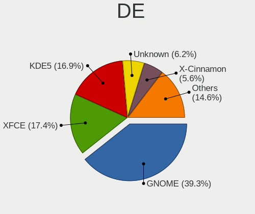
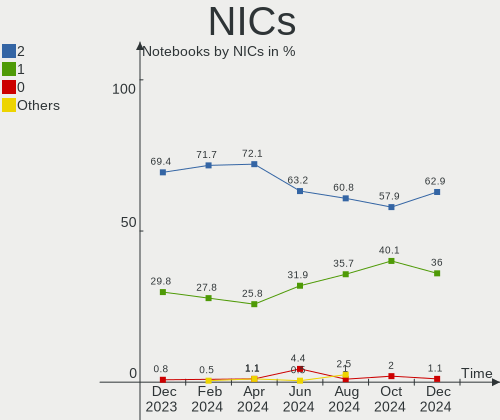

Debian - Hardware Trends (Notebooks)
------------------------------------

A project to identify most popular hardware characteristics and track their change
over time based on data collected by Linux users at https://Linux-Hardware.org.

Anyone can contribute to this report by the [hw-probe](https://github.com/linuxhw/hw-probe) tool:

    sudo -E hw-probe -all -upload

This report is for one last month. Overall report since the beginning of time: [TestCoverage](https://github.com/linuxhw/TestCoverage)

Period: Oct, 2022.

Contents
--------

* [ System ](#system)
  - [ OS                       ](#os)
  - [ OS Family                ](#os-family)
  - [ Kernel                   ](#kernel)
  - [ Kernel Family            ](#kernel-family)
  - [ Kernel Major Ver.        ](#kernel-major-ver)
  - [ Arch                     ](#arch)
  - [ DE                       ](#de)
  - [ Display Server           ](#display-server)
  - [ Display Manager          ](#display-manager)
  - [ OS Lang                  ](#os-lang)
  - [ Boot Mode                ](#boot-mode)
  - [ Filesystem               ](#filesystem)
  - [ Part. scheme             ](#part-scheme)
  - [ Dual Boot with Linux/BSD ](#dual-boot-with-linuxbsd)
  - [ Dual Boot (Win)          ](#dual-boot-win)

* [ Board ](#board)
  - [ Vendor                   ](#vendor)
  - [ Model                    ](#model)
  - [ Model Family             ](#model-family)
  - [ MFG Year                 ](#mfg-year)
  - [ Form Factor              ](#form-factor)
  - [ Secure Boot              ](#secure-boot)
  - [ Coreboot                 ](#coreboot)
  - [ RAM Size                 ](#ram-size)
  - [ RAM Used                 ](#ram-used)
  - [ Total Drives             ](#total-drives)
  - [ Has CD-ROM               ](#has-cd-rom)
  - [ Has Ethernet             ](#has-ethernet)
  - [ Has WiFi                 ](#has-wifi)
  - [ Has Bluetooth            ](#has-bluetooth)

* [ Location ](#location)
  - [ Country                  ](#country)
  - [ City                     ](#city)

* [ Drives ](#drives)
  - [ Drive Vendor             ](#drive-vendor)
  - [ Drive Model              ](#drive-model)
  - [ HDD Vendor               ](#hdd-vendor)
  - [ SSD Vendor               ](#ssd-vendor)
  - [ Drive Kind               ](#drive-kind)
  - [ Drive Connector          ](#drive-connector)
  - [ Drive Size               ](#drive-size)
  - [ Space Total              ](#space-total)
  - [ Space Used               ](#space-used)
  - [ Malfunc. Drives          ](#malfunc-drives)
  - [ Malfunc. Drive Vendor    ](#malfunc-drive-vendor)
  - [ Malfunc. HDD Vendor      ](#malfunc-hdd-vendor)
  - [ Malfunc. Drive Kind      ](#malfunc-drive-kind)
  - [ Failed Drives            ](#failed-drives)
  - [ Failed Drive Vendor      ](#failed-drive-vendor)
  - [ Drive Status             ](#drive-status)

* [ Storage controller ](#storage-controller)
  - [ Storage Vendor           ](#storage-vendor)
  - [ Storage Model            ](#storage-model)
  - [ Storage Kind             ](#storage-kind)

* [ Processor ](#processor)
  - [ CPU Vendor               ](#cpu-vendor)
  - [ CPU Model                ](#cpu-model)
  - [ CPU Model Family         ](#cpu-model-family)
  - [ CPU Cores                ](#cpu-cores)
  - [ CPU Sockets              ](#cpu-sockets)
  - [ CPU Threads              ](#cpu-threads)
  - [ CPU Op-Modes             ](#cpu-op-modes)
  - [ CPU Microcode            ](#cpu-microcode)
  - [ CPU Microarch            ](#cpu-microarch)

* [ Graphics ](#graphics)
  - [ GPU Vendor               ](#gpu-vendor)
  - [ GPU Model                ](#gpu-model)
  - [ GPU Combo                ](#gpu-combo)
  - [ GPU Driver               ](#gpu-driver)
  - [ GPU Memory               ](#gpu-memory)

* [ Monitor ](#monitor)
  - [ Monitor Vendor           ](#monitor-vendor)
  - [ Monitor Model            ](#monitor-model)
  - [ Monitor Resolution       ](#monitor-resolution)
  - [ Monitor Diagonal         ](#monitor-diagonal)
  - [ Monitor Width            ](#monitor-width)
  - [ Aspect Ratio             ](#aspect-ratio)
  - [ Monitor Area             ](#monitor-area)
  - [ Pixel Density            ](#pixel-density)
  - [ Multiple Monitors        ](#multiple-monitors)

* [ Network ](#network)
  - [ Net Controller Vendor    ](#net-controller-vendor)
  - [ Net Controller Model     ](#net-controller-model)
  - [ Wireless Vendor          ](#wireless-vendor)
  - [ Wireless Model           ](#wireless-model)
  - [ Ethernet Vendor          ](#ethernet-vendor)
  - [ Ethernet Model           ](#ethernet-model)
  - [ Net Controller Kind      ](#net-controller-kind)
  - [ Used Controller          ](#used-controller)
  - [ NICs                     ](#nics)
  - [ IPv6                     ](#ipv6)

* [ Bluetooth ](#bluetooth)
  - [ Bluetooth Vendor         ](#bluetooth-vendor)
  - [ Bluetooth Model          ](#bluetooth-model)

* [ Sound ](#sound)
  - [ Sound Vendor             ](#sound-vendor)
  - [ Sound Model              ](#sound-model)

* [ Memory ](#memory)
  - [ Memory Vendor            ](#memory-vendor)
  - [ Memory Model             ](#memory-model)
  - [ Memory Kind              ](#memory-kind)
  - [ Memory Form Factor       ](#memory-form-factor)
  - [ Memory Size              ](#memory-size)
  - [ Memory Speed             ](#memory-speed)

* [ Printers & scanners ](#printers--scanners)
  - [ Printer Vendor           ](#printer-vendor)
  - [ Printer Model            ](#printer-model)
  - [ Scanner Vendor           ](#scanner-vendor)
  - [ Scanner Model            ](#scanner-model)

* [ Camera ](#camera)
  - [ Camera Vendor            ](#camera-vendor)
  - [ Camera Model             ](#camera-model)

* [ Security ](#security)
  - [ Fingerprint Vendor       ](#fingerprint-vendor)
  - [ Fingerprint Model        ](#fingerprint-model)
  - [ Chipcard Vendor          ](#chipcard-vendor)
  - [ Chipcard Model           ](#chipcard-model)

* [ Unsupported ](#unsupported)
  - [ Unsupported Devices      ](#unsupported-devices)
  - [ Unsupported Device Types ](#unsupported-device-types)

System
------

OS
--

Installed operating systems

| Name              | Notebooks | Percent |
|-------------------|-----------|---------|
| Debian 11         | 155       | 82.45%  |
| Debian Testing    | 17        | 9.04%   |
| Debian            | 12        | 6.38%   |
| Debian 10         | 2         | 1.06%   |
| Debian Sid        | 1         | 0.53%   |
| Debian 11-updates | 1         | 0.53%   |

OS Family
---------

OS without a version

| Name   | Notebooks | Percent |
|--------|-----------|---------|
| Debian | 188       | 100%    |

Kernel
------

Version of the Linux kernel

| Version                   | Notebooks | Percent |
|---------------------------|-----------|---------|
| 5.10.0-18-amd64           | 70        | 37.23%  |
| 5.10.0-19-amd64           | 34        | 18.09%  |
| 5.19.0-2-amd64            | 20        | 10.64%  |
| 5.10.0-16-amd64           | 13        | 6.91%   |
| 5.18.0-0.deb11.4-amd64    | 10        | 5.32%   |
| 6.0.0-2-amd64             | 8         | 4.26%   |
| 6.0.0-1-amd64             | 4         | 2.13%   |
| 5.10.0-7-amd64            | 4         | 2.13%   |
| 5.10.0-18-686-pae         | 4         | 2.13%   |
| 5.19.0-1-amd64            | 3         | 1.6%    |
| 5.10.0-19-686             | 2         | 1.06%   |
| 5.10.0-13-amd64           | 2         | 1.06%   |
| 4.19.0-22-amd64           | 2         | 1.06%   |
| 6.0.2                     | 1         | 0.53%   |
| 6.0.1                     | 1         | 0.53%   |
| 6.0.0                     | 1         | 0.53%   |
| 5.19.11                   | 1         | 0.53%   |
| 5.19.10-titanide          | 1         | 0.53%   |
| 5.19.0-0.deb11.2-rt-amd64 | 1         | 0.53%   |
| 5.10.0-19-686-pae         | 1         | 0.53%   |
| 5.10.0-17-amd64           | 1         | 0.53%   |
| 5.10.0-16-rt-amd64        | 1         | 0.53%   |
| 5.10.0-14-amd64           | 1         | 0.53%   |
| 5.10.0-10-amd64           | 1         | 0.53%   |
| 5.10.0-10-686-pae         | 1         | 0.53%   |

Kernel Family
-------------

Linux kernel without a distro release

| Version | Notebooks | Percent |
|---------|-----------|---------|
| 5.10.0  | 135       | 71.81%  |
| 5.19.0  | 24        | 12.77%  |
| 6.0.0   | 13        | 6.91%   |
| 5.18.0  | 10        | 5.32%   |
| 4.19.0  | 2         | 1.06%   |
| 6.0.2   | 1         | 0.53%   |
| 6.0.1   | 1         | 0.53%   |
| 5.19.11 | 1         | 0.53%   |
| 5.19.10 | 1         | 0.53%   |

Kernel Major Ver.
-----------------

Linux kernel major version

| Version | Notebooks | Percent |
|---------|-----------|---------|
| 5.10    | 135       | 71.81%  |
| 5.19    | 26        | 13.83%  |
| 6.0     | 15        | 7.98%   |
| 5.18    | 10        | 5.32%   |
| 4.19    | 2         | 1.06%   |

Arch
----

OS architecture (x86_64, i586, etc.)

| Name   | Notebooks | Percent |
|--------|-----------|---------|
| x86_64 | 180       | 95.74%  |
| i686   | 8         | 4.26%   |

DE
--

Desktop Environment

| Name            | Notebooks | Percent |
|-----------------|-----------|---------|
| GNOME           | 68        | 36.17%  |
| Unknown         | 32        | 17.02%  |
| KDE5            | 24        | 12.77%  |
| XFCE            | 23        | 12.23%  |
| X-Cinnamon      | 7         | 3.72%   |
| LXDE            | 7         | 3.72%   |
| MATE            | 6         | 3.19%   |
| i3              | 6         | 3.19%   |
| LXQt            | 5         | 2.66%   |
| GNOME Flashback | 4         | 2.13%   |
| trinity         | 2         | 1.06%   |
| Cinnamon        | 2         | 1.06%   |
| openbox         | 1         | 0.53%   |
| KDE             | 1         | 0.53%   |

Display Server
--------------

X11 or Wayland

| Name    | Notebooks | Percent |
|---------|-----------|---------|
| X11     | 106       | 56.38%  |
| Wayland | 46        | 24.47%  |
| Unknown | 26        | 13.83%  |
| Tty     | 10        | 5.32%   |

Display Manager
---------------

SDDM, LightDM, etc.

| Name    | Notebooks | Percent |
|---------|-----------|---------|
| Unknown | 60        | 31.91%  |
| GDM     | 43        | 22.87%  |
| LightDM | 40        | 21.28%  |
| SDDM    | 23        | 12.23%  |
| GDM3    | 21        | 11.17%  |
| XDM     | 1         | 0.53%   |

OS Lang
-------

Language

| Lang       | Notebooks | Percent |
|------------|-----------|---------|
| en_US      | 66        | 35.11%  |
| Unknown    | 22        | 11.7%   |
| fr_FR      | 16        | 8.51%   |
| it_IT      | 15        | 7.98%   |
| ru_RU      | 10        | 5.32%   |
| es_ES      | 8         | 4.26%   |
| en_GB      | 8         | 4.26%   |
| de_DE      | 6         | 3.19%   |
| pt_BR      | 4         | 2.13%   |
| pl_PL      | 4         | 2.13%   |
| es_VE      | 3         | 1.6%    |
| es_MX      | 3         | 1.6%    |
| en_PH      | 3         | 1.6%    |
| nb_NO      | 2         | 1.06%   |
| en_SG      | 2         | 1.06%   |
| zh_TW      | 1         | 0.53%   |
| zh_CN      | 1         | 0.53%   |
| nl_NL      | 1         | 0.53%   |
| nl_BE      | 1         | 0.53%   |
| es_PE      | 1         | 0.53%   |
| es_CO      | 1         | 0.53%   |
| es_CL      | 1         | 0.53%   |
| es_AR      | 1         | 0.53%   |
| en_US.UTF8 | 1         | 0.53%   |
| en_IE      | 1         | 0.53%   |
| en_DK      | 1         | 0.53%   |
| en_DE      | 1         | 0.53%   |
| en_CA      | 1         | 0.53%   |
| en_AU      | 1         | 0.53%   |
| ca_ES      | 1         | 0.53%   |
| C          | 1         | 0.53%   |

Boot Mode
---------

EFI or BIOS

| Mode | Notebooks | Percent |
|------|-----------|---------|
| EFI  | 132       | 70.21%  |
| BIOS | 56        | 29.79%  |

Filesystem
----------

Type of filesystem

| Type    | Notebooks | Percent |
|---------|-----------|---------|
| Ext4    | 143       | 76.06%  |
| Overlay | 33        | 17.55%  |
| Btrfs   | 7         | 3.72%   |
| Xfs     | 3         | 1.6%    |
| Zfs     | 1         | 0.53%   |
| Tmpfs   | 1         | 0.53%   |

Part. scheme
------------

Scheme of partitioning

| Type    | Notebooks | Percent |
|---------|-----------|---------|
| GPT     | 135       | 71.81%  |
| Unknown | 31        | 16.49%  |
| MBR     | 22        | 11.7%   |

Dual Boot with Linux/BSD
------------------------

Hosting more than one Linux/BSD

| Dual boot | Notebooks | Percent |
|-----------|-----------|---------|
| No        | 171       | 90.96%  |
| Yes       | 17        | 9.04%   |

Dual Boot (Win)
---------------

Hosting Linux and Windows

| Dual boot | Notebooks | Percent |
|-----------|-----------|---------|
| No        | 113       | 60.11%  |
| Yes       | 75        | 39.89%  |

Board
-----

Vendor
------

Motherboard manufacturer

| Name                           | Notebooks | Percent |
|--------------------------------|-----------|---------|
| Lenovo                         | 55        | 29.26%  |
| Dell                           | 31        | 16.49%  |
| ASUSTek Computer               | 24        | 12.77%  |
| Hewlett-Packard                | 22        | 11.7%   |
| Acer                           | 12        | 6.38%   |
| Toshiba                        | 9         | 4.79%   |
| MSI                            | 6         | 3.19%   |
| Apple                          | 5         | 2.66%   |
| Google                         | 4         | 2.13%   |
| Aquarius                       | 3         | 1.6%    |
| Shanghai Zhaoxin Semiconductor | 2         | 1.06%   |
| Packard Bell                   | 2         | 1.06%   |
| HUAWEI                         | 2         | 1.06%   |
| Thomson                        | 1         | 0.53%   |
| Sony                           | 1         | 0.53%   |
| SLIMBOOK                       | 1         | 0.53%   |
| SANTECH                        | 1         | 0.53%   |
| Samsung Electronics            | 1         | 0.53%   |
| Panasonic                      | 1         | 0.53%   |
| Notebook                       | 1         | 0.53%   |
| Insyde                         | 1         | 0.53%   |
| Fujitsu                        | 1         | 0.53%   |
| Chuwi                          | 1         | 0.53%   |
| Alienware                      | 1         | 0.53%   |

Model
-----

Motherboard model

| Name                                  | Notebooks | Percent |
|---------------------------------------|-----------|---------|
| Lenovo ThinkPad E475 20H40006US       | 14        | 7.45%   |
| Lenovo ThinkPad 13 2nd Gen 20J10046US | 3         | 1.6%    |
| HP EliteBook 8460p                    | 3         | 1.6%    |
| Aquarius NS585                        | 3         | 1.6%    |
| Shanghai Zhaoxin ZXE CRB              | 2         | 1.06%   |
| Lenovo ThinkPad L14 Gen 1 20U50001GE  | 2         | 1.06%   |
| Lenovo ThinkBook 15 G2 ITL 20VE       | 2         | 1.06%   |
| HUAWEI NBLB-WAX9N                     | 2         | 1.06%   |
| HP EliteBook 745 G3                   | 2         | 1.06%   |
| Dell Precision 7520                   | 2         | 1.06%   |
| Dell Latitude 3320                    | 2         | 1.06%   |
| ASUS G75VW                            | 2         | 1.06%   |
| Apple MacBookAir7,2                   | 2         | 1.06%   |
| Apple MacBook5,2                      | 2         | 1.06%   |
| Toshiba Satellite P50-B-103           | 1         | 0.53%   |
| Toshiba Satellite L855                | 1         | 0.53%   |
| Toshiba Satellite L755                | 1         | 0.53%   |
| Toshiba Satellite L45                 | 1         | 0.53%   |
| Toshiba Satellite L40                 | 1         | 0.53%   |
| Toshiba Satellite C650D               | 1         | 0.53%   |
| Toshiba Satellite A100                | 1         | 0.53%   |
| Toshiba NB505                         | 1         | 0.53%   |
| Toshiba dynabook MX/33KBL             | 1         | 0.53%   |
| Thomson N14C4WH64                     | 1         | 0.53%   |
| Sony VPCEH3U1E                        | 1         | 0.53%   |
| SLIMBOOK TITAN                        | 1         | 0.53%   |
| SANTECH NHx0DB,DE                     | 1         | 0.53%   |
| Samsung 300V3A/300V4A/300V5A          | 1         | 0.53%   |
| Panasonic CF-LX3J-50M3                | 1         | 0.53%   |
| Packard Bell H17HV                    | 1         | 0.53%   |
| Packard Bell DOT S                    | 1         | 0.53%   |
| Notebook W230SD                       | 1         | 0.53%   |
| MSI Pulse GL76 12UEK                  | 1         | 0.53%   |
| MSI Prestige 14Evo A11M               | 1         | 0.53%   |
| MSI MS-N014                           | 1         | 0.53%   |
| MSI Modern 15 A10RBS                  | 1         | 0.53%   |
| MSI GF65 Thin 10SDR                   | 1         | 0.53%   |
| MSI GE72 2QF                          | 1         | 0.53%   |
| Lenovo Z50-70 20354                   | 1         | 0.53%   |
| Lenovo Yoga 900S-12ISK 80ML           | 1         | 0.53%   |

Model Family
------------

Motherboard model prefix

| Name                   | Notebooks | Percent |
|------------------------|-----------|---------|
| Lenovo ThinkPad        | 39        | 20.74%  |
| Dell Latitude          | 12        | 6.38%   |
| HP EliteBook           | 11        | 5.85%   |
| Acer Aspire            | 9         | 4.79%   |
| Lenovo IdeaPad         | 8         | 4.26%   |
| Toshiba Satellite      | 7         | 3.72%   |
| Dell Precision         | 7         | 3.72%   |
| HP Pavilion            | 6         | 3.19%   |
| Dell Inspiron          | 6         | 3.19%   |
| Lenovo ThinkBook       | 3         | 1.6%    |
| Dell XPS               | 3         | 1.6%    |
| Dell Vostro            | 3         | 1.6%    |
| ASUS ZenBook           | 3         | 1.6%    |
| Aquarius NS585         | 3         | 1.6%    |
| Shanghai Zhaoxin ZXE   | 2         | 1.06%   |
| HUAWEI NBLB-WAX9N      | 2         | 1.06%   |
| ASUS VivoBook          | 2         | 1.06%   |
| ASUS G75VW             | 2         | 1.06%   |
| ASUS ASUS              | 2         | 1.06%   |
| Apple MacBookAir7      | 2         | 1.06%   |
| Apple MacBook5         | 2         | 1.06%   |
| Acer Swift             | 2         | 1.06%   |
| Toshiba NB505          | 1         | 0.53%   |
| Toshiba dynabook       | 1         | 0.53%   |
| Thomson N14C4WH64      | 1         | 0.53%   |
| Sony VPCEH3U1E         | 1         | 0.53%   |
| SLIMBOOK TITAN         | 1         | 0.53%   |
| SANTECH NHx0DB         | 1         | 0.53%   |
| Samsung 300V3A         | 1         | 0.53%   |
| Panasonic CF-LX3J-50M3 | 1         | 0.53%   |
| Packard Bell H17HV     | 1         | 0.53%   |
| Packard Bell DOT       | 1         | 0.53%   |
| Notebook W230SD        | 1         | 0.53%   |
| MSI Pulse              | 1         | 0.53%   |
| MSI Prestige           | 1         | 0.53%   |
| MSI MS-N014            | 1         | 0.53%   |
| MSI Modern             | 1         | 0.53%   |
| MSI GF65               | 1         | 0.53%   |
| MSI GE72               | 1         | 0.53%   |
| Lenovo Z50-70          | 1         | 0.53%   |

MFG Year
--------

Motherboard manufacture year

| Year | Notebooks | Percent |
|------|-----------|---------|
| 2019 | 33        | 17.55%  |
| 2020 | 26        | 13.83%  |
| 2021 | 17        | 9.04%   |
| 2022 | 16        | 8.51%   |
| 2012 | 14        | 7.45%   |
| 2011 | 14        | 7.45%   |
| 2017 | 12        | 6.38%   |
| 2016 | 10        | 5.32%   |
| 2015 | 10        | 5.32%   |
| 2013 | 8         | 4.26%   |
| 2010 | 7         | 3.72%   |
| 2009 | 6         | 3.19%   |
| 2014 | 4         | 2.13%   |
| 2018 | 3         | 1.6%    |
| 2008 | 3         | 1.6%    |
| 2007 | 3         | 1.6%    |
| 2006 | 2         | 1.06%   |

Form Factor
-----------

Physical design of the computer

| Name     | Notebooks | Percent |
|----------|-----------|---------|
| Notebook | 188       | 100%    |

Secure Boot
-----------

Enabled or disabled

| State    | Notebooks | Percent |
|----------|-----------|---------|
| Disabled | 160       | 85.11%  |
| Enabled  | 28        | 14.89%  |

Coreboot
--------

Have coreboot on board

| Used | Notebooks | Percent |
|------|-----------|---------|
| No   | 184       | 97.87%  |
| Yes  | 4         | 2.13%   |

RAM Size
--------

Total RAM memory

| Size in GB  | Notebooks | Percent |
|-------------|-----------|---------|
| 4.01-8.0    | 69        | 36.7%   |
| 16.01-24.0  | 39        | 20.74%  |
| 3.01-4.0    | 24        | 12.77%  |
| 8.01-16.0   | 22        | 11.7%   |
| 32.01-64.0  | 15        | 7.98%   |
| 2.01-3.0    | 6         | 3.19%   |
| 1.01-2.0    | 6         | 3.19%   |
| 64.01-256.0 | 4         | 2.13%   |
| 0.51-1.0    | 2         | 1.06%   |
| 24.01-32.0  | 1         | 0.53%   |

RAM Used
--------

Used RAM memory

| Used GB    | Notebooks | Percent |
|------------|-----------|---------|
| 1.01-2.0   | 67        | 35.64%  |
| 2.01-3.0   | 42        | 22.34%  |
| 3.01-4.0   | 27        | 14.36%  |
| 4.01-8.0   | 25        | 13.3%   |
| 0.51-1.0   | 12        | 6.38%   |
| 8.01-16.0  | 9         | 4.79%   |
| 0.01-0.5   | 5         | 2.66%   |
| 16.01-24.0 | 1         | 0.53%   |

Total Drives
------------

Number of drives on board

| Drives | Notebooks | Percent |
|--------|-----------|---------|
| 1      | 141       | 75%     |
| 2      | 40        | 21.28%  |
| 3      | 5         | 2.66%   |
| 0      | 2         | 1.06%   |

Has CD-ROM
----------

Has CD-ROM on board

| Presented | Notebooks | Percent |
|-----------|-----------|---------|
| No        | 148       | 78.72%  |
| Yes       | 40        | 21.28%  |

Has Ethernet
------------

Has Ethernet on board

| Presented | Notebooks | Percent |
|-----------|-----------|---------|
| Yes       | 161       | 85.64%  |
| No        | 27        | 14.36%  |

Has WiFi
--------

Has WiFi module

| Presented | Notebooks | Percent |
|-----------|-----------|---------|
| Yes       | 185       | 98.4%   |
| No        | 3         | 1.6%    |

Has Bluetooth
-------------

Has Bluetooth module

| Presented | Notebooks | Percent |
|-----------|-----------|---------|
| Yes       | 150       | 79.79%  |
| No        | 38        | 20.21%  |

Location
--------

Country
-------

Geographic location (country)

| Country            | Notebooks | Percent |
|--------------------|-----------|---------|
| USA                | 47        | 25%     |
| Italy              | 21        | 11.17%  |
| Germany            | 19        | 10.11%  |
| France             | 17        | 9.04%   |
| Russia             | 11        | 5.85%   |
| Spain              | 10        | 5.32%   |
| Poland             | 7         | 3.72%   |
| Brazil             | 7         | 3.72%   |
| Venezuela          | 3         | 1.6%    |
| UK                 | 3         | 1.6%    |
| Netherlands        | 3         | 1.6%    |
| Mexico             | 3         | 1.6%    |
| Slovenia           | 2         | 1.06%   |
| Singapore          | 2         | 1.06%   |
| Norway             | 2         | 1.06%   |
| Denmark            | 2         | 1.06%   |
| Vietnam            | 1         | 0.53%   |
| Taiwan             | 1         | 0.53%   |
| Switzerland        | 1         | 0.53%   |
| Sweden             | 1         | 0.53%   |
| Qatar              | 1         | 0.53%   |
| Puerto Rico        | 1         | 0.53%   |
| Portugal           | 1         | 0.53%   |
| Philippines        | 1         | 0.53%   |
| Peru               | 1         | 0.53%   |
| New Zealand        | 1         | 0.53%   |
| Morocco            | 1         | 0.53%   |
| Malaysia           | 1         | 0.53%   |
| Madagascar         | 1         | 0.53%   |
| Kuwait             | 1         | 0.53%   |
| Iraq               | 1         | 0.53%   |
| Iran               | 1         | 0.53%   |
| Indonesia          | 1         | 0.53%   |
| Dominican Republic | 1         | 0.53%   |
| Costa Rica         | 1         | 0.53%   |
| Colombia           | 1         | 0.53%   |
| China              | 1         | 0.53%   |
| Chile              | 1         | 0.53%   |
| Canada             | 1         | 0.53%   |
| Bulgaria           | 1         | 0.53%   |

City
----

Geographic location (city)

| City                    | Notebooks | Percent |
|-------------------------|-----------|---------|
| Bangor                  | 25        | 13.3%   |
| Voronezh                | 4         | 2.13%   |
| Seville                 | 4         | 2.13%   |
| Milan                   | 4         | 2.13%   |
| Frankfurt am Main       | 3         | 1.6%    |
| Barcelona               | 3         | 1.6%    |
| Turin                   | 2         | 1.06%   |
| St Petersburg           | 2         | 1.06%   |
| Singapore               | 2         | 1.06%   |
| Sao Paulo               | 2         | 1.06%   |
| Poljane nad Skofjo Loko | 2         | 1.06%   |
| Dunedin                 | 2         | 1.06%   |
| Caracas                 | 2         | 1.06%   |
| Zurich                  | 1         | 0.53%   |
| Zuidland                | 1         | 0.53%   |
| Zanevka                 | 1         | 0.53%   |
| Yerres                  | 1         | 0.53%   |
| Wrzesnia                | 1         | 0.53%   |
| Warsaw                  | 1         | 0.53%   |
| Waregem                 | 1         | 0.53%   |
| Wallingford             | 1         | 0.53%   |
| Vienna                  | 1         | 0.53%   |
| Valladolid              | 1         | 0.53%   |
| Valenciennes            | 1         | 0.53%   |
| Tuapse                  | 1         | 0.53%   |
| Toulouse                | 1         | 0.53%   |
| The Hague               | 1         | 0.53%   |
| Tacoma                  | 1         | 0.53%   |
| Szprotawa               | 1         | 0.53%   |
| Sydney                  | 1         | 0.53%   |
| Sulaymaniyah            | 1         | 0.53%   |
| Stolzenau               | 1         | 0.53%   |
| Staten Island           | 1         | 0.53%   |
| Stade                   | 1         | 0.53%   |
| Sorocaba                | 1         | 0.53%   |
| Siegburg                | 1         | 0.53%   |
| Sarrebourg              | 1         | 0.53%   |
| Santo Domingo Este      | 1         | 0.53%   |
| Santiago                | 1         | 0.53%   |
| Santa Maria             | 1         | 0.53%   |

Drives
------

Drive Vendor
------------

Hard drive vendors

| Vendor              | Notebooks | Drives  | Percent |
|---------------------|-----------|---------|---------|
| Samsung Electronics | 38        | 39      | 16.52%  |
| WDC                 | 24        | 24      | 10.43%  |
| Kingston            | 23        | 23      | 10%     |
| Seagate             | 18        | 19      | 7.83%   |
| Sandisk             | 17        | 17      | 7.39%   |
| Unknown             | 13        | 13      | 5.65%   |
| Crucial             | 12        | 13      | 5.22%   |
| Micron Technology   | 10        | 10      | 4.35%   |
| SK hynix            | 9         | 9       | 3.91%   |
| A-DATA Technology   | 9         | 9       | 3.91%   |
| Toshiba             | 8         | 8       | 3.48%   |
| Intel               | 8         | 8       | 3.48%   |
| HGST                | 6         | 7       | 2.61%   |
| Hitachi             | 4         | 4       | 1.74%   |
| SPCC                | 3         | 3       | 1.3%    |
| SSSTC               | 2         | 2       | 0.87%   |
| Phison Electronics  | 2         | 2       | 0.87%   |
| Phison              | 2         | 2       | 0.87%   |
| Netac               | 2         | 2       | 0.87%   |
| LITEON              | 2         | 2       | 0.87%   |
| XrayDisk            | 1         | 1       | 0.43%   |
| UMIS                | 1         | 1       | 0.43%   |
| Transcend           | 1         | 1       | 0.43%   |
| Team                | 1         | 1       | 0.43%   |
| Solid State Storage | 1         | 1       | 0.43%   |
| PNY                 | 1         | 1       | 0.43%   |
| LITEONIT            | 1         | 1       | 0.43%   |
| KIOXIA              | 1         | 1       | 0.43%   |
| Kingchuxing         | 1         | 1       | 0.43%   |
| HS-SSD-C100         | 1         | 1       | 0.43%   |
| Hewlett-Packard     | 1         | Unknown | 0.43%   |
| Fujitsu             | 1         | 1       | 0.43%   |
| Fanxiang            | 1         | 1       | 0.43%   |
| Dogfish             | 1         | 1       | 0.43%   |
| China               | 1         | 1       | 0.43%   |
| Apple               | 1         | 1       | 0.43%   |
| Apacer              | 1         | 1       | 0.43%   |
| Unknown             | 1         | 1       | 0.43%   |

Drive Model
-----------

Hard drive models

| Model                                  | Notebooks | Percent |
|----------------------------------------|-----------|---------|
| Kingston SA400S37120G 120GB SSD        | 14        | 6.09%   |
| Seagate ST1000LM024 HN-M101MBB 1TB     | 3         | 1.3%    |
| Samsung MZVLB512HBJQ-000L7 512GB       | 3         | 1.3%    |
| HGST HTS721010A9E630 1TB               | 3         | 1.3%    |
| Crucial CT500MX500SSD1 500GB           | 3         | 1.3%    |
| A-DATA SU800 512GB SSD                 | 3         | 1.3%    |
| WDC WD10JPCX-24UE4T0 1TB               | 2         | 0.87%   |
| Unknown NVMe SSD Drive 512GB           | 2         | 0.87%   |
| Toshiba MQ01ABF050 500GB               | 2         | 0.87%   |
| SK hynix SKHynix_HFM256GD3HX015N 256GB | 2         | 0.87%   |
| Seagate ST1000LM035-1RK172 1TB         | 2         | 0.87%   |
| SanDisk SD8SN8U128G1001 128GB SSD      | 2         | 0.87%   |
| SanDisk SD8SN8U-256G-1006 256GB SSD    | 2         | 0.87%   |
| Samsung SSD 970 EVO Plus 1TB           | 2         | 0.87%   |
| Samsung MZVL21T0HCLR-00BL7 1TB         | 2         | 0.87%   |
| Kingston SV300S37A120G 120GB SSD       | 2         | 0.87%   |
| Kingston SA400S37240G 240GB SSD        | 2         | 0.87%   |
| Intel SSDPEKNW512G8 512GB              | 2         | 0.87%   |
| Hitachi HTS723232A7A364 320GB          | 2         | 0.87%   |
| HGST HTS725050A7E630 500GB             | 2         | 0.87%   |
| Crucial CT1000MX500SSD1 1TB            | 2         | 0.87%   |
| XrayDisk SSD 128GB                     | 1         | 0.43%   |
| WDC WDS500G2B0C-00PXH0 500GB           | 1         | 0.43%   |
| WDC WDS500G2B0B-00YS70 500GB SSD       | 1         | 0.43%   |
| WDC WDS500G1R0B-68A4Z0 500GB SSD       | 1         | 0.43%   |
| WDC WDS240G2G0A-00JH30 240GB SSD       | 1         | 0.43%   |
| WDC WDS100T3X0C-00SJG0 1TB             | 1         | 0.43%   |
| WDC WD5000BPVT-24HXZT1 500GB           | 1         | 0.43%   |
| WDC WD3200BPVT-22ZEST0 320GB           | 1         | 0.43%   |
| WDC WD3200BPVT-22JJ5T0 320GB           | 1         | 0.43%   |
| WDC WD3200BEKT-75PVMT1 320GB           | 1         | 0.43%   |
| WDC WD2500BEVT-22A23T0 250GB           | 1         | 0.43%   |
| WDC WD2500BEVS-22UST0 250GB            | 1         | 0.43%   |
| WDC WD10SPZX-80Z10T2 1TB               | 1         | 0.43%   |
| WDC WD10SPCX-21KHST0 1TB               | 1         | 0.43%   |
| WDC WD10JPLX-00MBPT0 1TB               | 1         | 0.43%   |
| WDC WD10 JPVX-60JC3T0 1TB              | 1         | 0.43%   |
| WDC PC SN730 SDBPNTY-512G-1027 512GB   | 1         | 0.43%   |
| WDC PC SN730 SDBPNTY-256G              | 1         | 0.43%   |
| WDC PC SN730 SDBPNTY-1T00-1101 1TB     | 1         | 0.43%   |

HDD Vendor
----------

Hard disk drive vendors

| Vendor              | Notebooks | Drives | Percent |
|---------------------|-----------|--------|---------|
| Seagate             | 17        | 18     | 36.17%  |
| WDC                 | 12        | 12     | 25.53%  |
| Toshiba             | 6         | 6      | 12.77%  |
| HGST                | 6         | 7      | 12.77%  |
| Hitachi             | 4         | 4      | 8.51%   |
| Samsung Electronics | 1         | 1      | 2.13%   |
| Fujitsu             | 1         | 1      | 2.13%   |

SSD Vendor
----------

Solid state drive vendors

| Vendor              | Notebooks | Drives | Percent |
|---------------------|-----------|--------|---------|
| Kingston            | 23        | 23     | 25.56%  |
| Samsung Electronics | 15        | 15     | 16.67%  |
| SanDisk             | 12        | 12     | 13.33%  |
| Crucial             | 11        | 12     | 12.22%  |
| WDC                 | 3         | 3      | 3.33%   |
| A-DATA Technology   | 3         | 3      | 3.33%   |
| SPCC                | 2         | 2      | 2.22%   |
| SK hynix            | 2         | 2      | 2.22%   |
| Netac               | 2         | 2      | 2.22%   |
| Micron Technology   | 2         | 2      | 2.22%   |
| LITEON              | 2         | 2      | 2.22%   |
| XrayDisk            | 1         | 1      | 1.11%   |
| Transcend           | 1         | 1      | 1.11%   |
| Team                | 1         | 1      | 1.11%   |
| PNY                 | 1         | 1      | 1.11%   |
| LITEONIT            | 1         | 1      | 1.11%   |
| Kingchuxing         | 1         | 1      | 1.11%   |
| Intel               | 1         | 1      | 1.11%   |
| HS-SSD-C100         | 1         | 1      | 1.11%   |
| Fanxiang            | 1         | 1      | 1.11%   |
| Dogfish             | 1         | 1      | 1.11%   |
| China               | 1         | 1      | 1.11%   |
| Apple               | 1         | 1      | 1.11%   |
| Apacer              | 1         | 1      | 1.11%   |

Drive Kind
----------

HDD or SSD

| Kind    | Notebooks | Drives | Percent |
|---------|-----------|--------|---------|
| SSD     | 84        | 91     | 38.53%  |
| NVMe    | 75        | 79     | 34.4%   |
| HDD     | 45        | 49     | 20.64%  |
| MMC     | 12        | 13     | 5.5%    |
| Unknown | 2         | 1      | 0.92%   |

Drive Connector
---------------

SATA, SAS, NVMe, etc.

| Type | Notebooks | Drives | Percent |
|------|-----------|--------|---------|
| SATA | 118       | 135    | 55.92%  |
| NVMe | 75        | 79     | 35.55%  |
| MMC  | 12        | 13     | 5.69%   |
| SAS  | 6         | 6      | 2.84%   |

Drive Size
----------

Size of hard drive

| Size in TB | Notebooks | Drives | Percent |
|------------|-----------|--------|---------|
| 0.01-0.5   | 87        | 96     | 68.5%   |
| 0.51-1.0   | 37        | 41     | 29.13%  |
| 1.01-2.0   | 2         | 2      | 1.57%   |
| 3.01-4.0   | 1         | 1      | 0.79%   |

Space Total
-----------

Amount of disk space available on the file system

| Size in GB     | Notebooks | Percent |
|----------------|-----------|---------|
| 101-250        | 49        | 26.06%  |
| 251-500        | 44        | 23.4%   |
| 501-1000       | 30        | 15.96%  |
| Unknown        | 28        | 14.89%  |
| 51-100         | 18        | 9.57%   |
| 1001-2000      | 6         | 3.19%   |
| 1-20           | 6         | 3.19%   |
| 2001-3000      | 4         | 2.13%   |
| 21-50          | 2         | 1.06%   |
| More than 3000 | 1         | 0.53%   |

Space Used
----------

Amount of used disk space

| Used GB   | Notebooks | Percent |
|-----------|-----------|---------|
| 1-20      | 66        | 35.11%  |
| Unknown   | 28        | 14.89%  |
| 21-50     | 23        | 12.23%  |
| 101-250   | 23        | 12.23%  |
| 51-100    | 22        | 11.7%   |
| 251-500   | 16        | 8.51%   |
| 501-1000  | 7         | 3.72%   |
| 1001-2000 | 2         | 1.06%   |
| 0         | 1         | 0.53%   |

Malfunc. Drives
---------------

Drive models with a malfunction

| Model                                 | Notebooks | Drives | Percent |
|---------------------------------------|-----------|--------|---------|
| WDC WD10JPCX-24UE4T0 1TB              | 2         | 2      | 13.33%  |
| Toshiba MQ01ABF050 500GB              | 1         | 1      | 6.67%   |
| Toshiba MK3265GSXN 320GB              | 1         | 1      | 6.67%   |
| SK hynix HFS256G39MND-2300A 256GB SSD | 1         | 1      | 6.67%   |
| Seagate ST9500325AS 500GB             | 1         | 1      | 6.67%   |
| Seagate ST500LT012-1DG142 500GB       | 1         | 1      | 6.67%   |
| Seagate ST1000LM049-2GH172 1TB        | 1         | 1      | 6.67%   |
| Seagate ST1000LM035-1RK172 1TB        | 1         | 1      | 6.67%   |
| SanDisk SSD U110 16GB                 | 1         | 1      | 6.67%   |
| Samsung Electronics SSD 870 EVO 500GB | 1         | 1      | 6.67%   |
| Samsung Electronics SSD 840 EVO 500GB | 1         | 1      | 6.67%   |
| LITEONIT LAT-256M3S 256GB SSD         | 1         | 1      | 6.67%   |
| Hitachi HTS727575A9E364 752GB         | 1         | 1      | 6.67%   |
| HGST HTS721010A9E630 1TB              | 1         | 1      | 6.67%   |

Malfunc. Drive Vendor
---------------------

Vendors of faulty drives

| Vendor              | Notebooks | Drives | Percent |
|---------------------|-----------|--------|---------|
| Seagate             | 4         | 4      | 26.67%  |
| WDC                 | 2         | 2      | 13.33%  |
| Toshiba             | 2         | 2      | 13.33%  |
| Samsung Electronics | 2         | 2      | 13.33%  |
| SK hynix            | 1         | 1      | 6.67%   |
| SanDisk             | 1         | 1      | 6.67%   |
| LITEONIT            | 1         | 1      | 6.67%   |
| Hitachi             | 1         | 1      | 6.67%   |
| HGST                | 1         | 1      | 6.67%   |

Malfunc. HDD Vendor
-------------------

Vendors of faulty HDD drives

| Vendor  | Notebooks | Drives | Percent |
|---------|-----------|--------|---------|
| Seagate | 4         | 4      | 40%     |
| WDC     | 2         | 2      | 20%     |
| Toshiba | 2         | 2      | 20%     |
| Hitachi | 1         | 1      | 10%     |
| HGST    | 1         | 1      | 10%     |

Malfunc. Drive Kind
-------------------

Kinds of faulty drives

| Kind | Notebooks | Drives | Percent |
|------|-----------|--------|---------|
| HDD  | 10        | 10     | 66.67%  |
| SSD  | 5         | 5      | 33.33%  |

Failed Drives
-------------

Failed drive models

Zero info for selected period =(

Failed Drive Vendor
-------------------

Failed drive vendors

Zero info for selected period =(

Drive Status
------------

Number of failed and malfunc. drives

| Status   | Notebooks | Drives | Percent |
|----------|-----------|--------|---------|
| Works    | 138       | 159    | 70.05%  |
| Detected | 45        | 59     | 22.84%  |
| Malfunc  | 14        | 15     | 7.11%   |

Storage controller
------------------

Storage Vendor
--------------

Storage controller vendors

| Vendor                         | Notebooks | Percent |
|--------------------------------|-----------|---------|
| Intel                          | 118       | 53.39%  |
| AMD                            | 29        | 13.12%  |
| Samsung Electronics            | 23        | 10.41%  |
| SanDisk                        | 13        | 5.88%   |
| Micron Technology              | 8         | 3.62%   |
| SK hynix                       | 6         | 2.71%   |
| Phison Electronics             | 5         | 2.26%   |
| ADATA Technology               | 5         | 2.26%   |
| Solid State Storage Technology | 3         | 1.36%   |
| Nvidia                         | 3         | 1.36%   |
| Toshiba America Info Systems   | 2         | 0.9%    |
| Unknown                        | 2         | 0.9%    |
| Union Memory (Shenzhen)        | 1         | 0.45%   |
| Realtek Semiconductor          | 1         | 0.45%   |
| Micron/Crucial Technology      | 1         | 0.45%   |
| KIOXIA                         | 1         | 0.45%   |

Storage Model
-------------

Storage controller models

| Model                                                                            | Notebooks | Percent |
|----------------------------------------------------------------------------------|-----------|---------|
| AMD FCH SATA Controller [AHCI mode]                                              | 27        | 11.59%  |
| Intel 7 Series Chipset Family 6-port SATA Controller [AHCI mode]                 | 15        | 6.44%   |
| Intel Volume Management Device NVMe RAID Controller                              | 13        | 5.58%   |
| Samsung NVMe SSD Controller SM981/PM981/PM983                                    | 11        | 4.72%   |
| Intel Sunrise Point-LP SATA Controller [AHCI mode]                               | 10        | 4.29%   |
| Intel 82801 Mobile SATA Controller [RAID mode]                                   | 10        | 4.29%   |
| Intel 6 Series/C200 Series Chipset Family 6 port Mobile SATA AHCI Controller     | 9         | 3.86%   |
| Micron Non-Volatile memory controller                                            | 8         | 3.43%   |
| Samsung NVMe SSD Controller 980                                                  | 6         | 2.58%   |
| SK hynix Gold P31 SSD                                                            | 5         | 2.15%   |
| Intel Tiger Lake-LP SATA Controller                                              | 5         | 2.15%   |
| Intel Q170/Q150/B150/H170/H110/Z170/CM236 Chipset SATA Controller [AHCI Mode]    | 5         | 2.15%   |
| Intel Cannon Lake Mobile PCH SATA AHCI Controller                                | 5         | 2.15%   |
| Intel 8 Series SATA Controller 1 [AHCI mode]                                     | 5         | 2.15%   |
| SanDisk WD Black SN750 / PC SN730 NVMe SSD                                       | 4         | 1.72%   |
| SanDisk Non-Volatile memory controller                                           | 4         | 1.72%   |
| Samsung NVMe SSD Controller PM9A1/PM9A3/980PRO                                   | 4         | 1.72%   |
| Intel SSD 660P Series                                                            | 4         | 1.72%   |
| Intel Comet Lake SATA AHCI Controller                                            | 4         | 1.72%   |
| Intel 82801IBM/IEM (ICH9M/ICH9M-E) 4 port SATA Controller [AHCI mode]            | 4         | 1.72%   |
| Intel 8 Series/C220 Series Chipset Family 6-port SATA Controller 1 [AHCI mode]   | 4         | 1.72%   |
| ADATA Non-Volatile memory controller                                             | 4         | 1.72%   |
| Solid State Storage Non-Volatile memory controller                               | 3         | 1.29%   |
| SanDisk WD Blue SN550 NVMe SSD                                                   | 3         | 1.29%   |
| Intel NM10/ICH7 Family SATA Controller [AHCI mode]                               | 3         | 1.29%   |
| Intel Celeron N3350/Pentium N4200/Atom E3900 Series SATA AHCI Controller         | 3         | 1.29%   |
| Intel Cannon Lake PCH SATA AHCI Controller                                       | 3         | 1.29%   |
| Intel 82801GBM/GHM (ICH7-M Family) SATA Controller [AHCI mode]                   | 3         | 1.29%   |
| Phison PS5013 E13 NVMe Controller                                                | 2         | 0.86%   |
| Nvidia MCP79 AHCI Controller                                                     | 2         | 0.86%   |
| Intel Ice Lake-LP SATA Controller [AHCI mode]                                    | 2         | 0.86%   |
| Intel 82801GBM/GHM (ICH7-M Family) SATA Controller [IDE mode]                    | 2         | 0.86%   |
| Intel 5 Series/3400 Series Chipset 4 port SATA AHCI Controller                   | 2         | 0.86%   |
| Intel 400 Series Chipset Family SATA AHCI Controller                             | 2         | 0.86%   |
| AMD SB7x0/SB8x0/SB9x0 SATA Controller [AHCI mode]                                | 2         | 0.86%   |
| Unknown                                                                          | 2         | 0.86%   |
| Union Memory (Shenzhen) AM630 PCIe 4.0 x4 NVMe SSD Controller                    | 1         | 0.43%   |
| Toshiba America Info Systems XG6 NVMe SSD Controller                             | 1         | 0.43%   |
| Toshiba America Info Systems Toshiba America Info Non-Volatile memory controller | 1         | 0.43%   |
| SK hynix BC501 NVMe Solid State Drive                                            | 1         | 0.43%   |

Storage Kind
------------

Kind of storage controller (IDE, SATA, NVMe, SAS, ...)

| Kind | Notebooks | Percent |
|------|-----------|---------|
| SATA | 125       | 54.35%  |
| NVMe | 75        | 32.61%  |
| RAID | 24        | 10.43%  |
| IDE  | 6         | 2.61%   |

Processor
---------

CPU Vendor
----------

Processor vendors

| Vendor       | Notebooks | Percent |
|--------------|-----------|---------|
| Intel        | 145       | 77.13%  |
| AMD          | 41        | 21.81%  |
| CentaurHauls | 2         | 1.06%   |

CPU Model
---------

Processor models

| Model                                          | Notebooks | Percent |
|------------------------------------------------|-----------|---------|
| AMD PRO A6-9500B R5, 6 COMPUTE CORES 2C+4G     | 14        | 7.45%   |
| Intel 11th Gen Core i5-1135G7 @ 2.40GHz        | 8         | 4.26%   |
| Intel Core i7-10510U CPU @ 1.80GHz             | 6         | 3.19%   |
| Intel Core i7-7500U CPU @ 2.70GHz              | 4         | 2.13%   |
| Intel Core i7-6820HQ CPU @ 2.70GHz             | 4         | 2.13%   |
| Intel Core i5-3320M CPU @ 2.60GHz              | 4         | 2.13%   |
| Intel 11th Gen Core i7-1165G7 @ 2.80GHz        | 4         | 2.13%   |
| Intel Core i7-3610QM CPU @ 2.30GHz             | 3         | 1.6%    |
| Intel Core i7-10750H CPU @ 2.60GHz             | 3         | 1.6%    |
| Intel Core i5-2520M CPU @ 2.50GHz              | 3         | 1.6%    |
| Intel Core i5-1035G1 CPU @ 1.00GHz             | 3         | 1.6%    |
| Intel Core i3-9100 CPU @ 3.60GHz               | 3         | 1.6%    |
| Intel Core 2 Duo CPU P7450 @ 2.13GHz           | 3         | 1.6%    |
| Intel Celeron CPU 3865U @ 1.80GHz              | 3         | 1.6%    |
| AMD Ryzen 7 PRO 4750U with Radeon Graphics     | 3         | 1.6%    |
| Intel Pentium CPU N4200 @ 1.10GHz              | 2         | 1.06%   |
| Intel Core i7-9750H CPU @ 2.60GHz              | 2         | 1.06%   |
| Intel Core i5-7300U CPU @ 2.60GHz              | 2         | 1.06%   |
| Intel Core i5-6200U CPU @ 2.30GHz              | 2         | 1.06%   |
| Intel Core i5-5350U CPU @ 1.80GHz              | 2         | 1.06%   |
| Intel Core i3-2370M CPU @ 2.40GHz              | 2         | 1.06%   |
| Intel Celeron CPU N3350 @ 1.10GHz              | 2         | 1.06%   |
| Intel Celeron CPU N3060 @ 1.60GHz              | 2         | 1.06%   |
| Intel Atom CPU N455 @ 1.66GHz                  | 2         | 1.06%   |
| Intel 12th Gen Core i7-1260P                   | 2         | 1.06%   |
| Intel 12th Gen Core i7-1255U                   | 2         | 1.06%   |
| Intel 11th Gen Core i7-1185G7 @ 3.00GHz        | 2         | 1.06%   |
| CentaurHauls ZHAOXIN KaiXian KX-6640MA@2.2+GHz | 2         | 1.06%   |
| AMD Ryzen 7 5800H with Radeon Graphics         | 2         | 1.06%   |
| AMD Ryzen 7 5700U with Radeon Graphics         | 2         | 1.06%   |
| AMD Ryzen 5 4500U with Radeon Graphics         | 2         | 1.06%   |
| AMD Ryzen 5 3550H with Radeon Vega Mobile Gfx  | 2         | 1.06%   |
| AMD Ryzen 5 3500U with Radeon Vega Mobile Gfx  | 2         | 1.06%   |
| AMD PRO A10-8700B R6, 10 Compute Cores 4C+6G   | 2         | 1.06%   |
| Intel Xeon W-10885M CPU @ 2.40GHz              | 1         | 0.53%   |
| Intel Pentium Dual CPU T3400 @ 2.16GHz         | 1         | 0.53%   |
| Intel Pentium Dual CPU T2310 @ 1.46GHz         | 1         | 0.53%   |
| Intel Genuine CPU T2300 @ 1.66GHz              | 1         | 0.53%   |
| Intel Genuine CPU T2250 @ 1.73GHz              | 1         | 0.53%   |
| Intel Core m5-6Y54 CPU @ 1.10GHz               | 1         | 0.53%   |

CPU Model Family
----------------

Processor model prefix

| Model              | Notebooks | Percent |
|--------------------|-----------|---------|
| Intel Core i7      | 48        | 25.53%  |
| Other              | 41        | 21.81%  |
| Intel Core i5      | 28        | 14.89%  |
| Intel Celeron      | 13        | 6.91%   |
| Intel Core i3      | 10        | 5.32%   |
| Intel Atom         | 7         | 3.72%   |
| AMD Ryzen 5        | 7         | 3.72%   |
| AMD Ryzen 7        | 6         | 3.19%   |
| AMD Ryzen 7 PRO    | 5         | 2.66%   |
| Intel Core 2 Duo   | 4         | 2.13%   |
| Intel Pentium Dual | 2         | 1.06%   |
| Intel Pentium      | 2         | 1.06%   |
| Intel Genuine      | 2         | 1.06%   |
| Intel Core i9      | 2         | 1.06%   |
| AMD PRO A10        | 2         | 1.06%   |
| AMD A4             | 2         | 1.06%   |
| Intel Xeon         | 1         | 0.53%   |
| Intel Core m5      | 1         | 0.53%   |
| Intel Celeron M    | 1         | 0.53%   |
| AMD Ryzen 9        | 1         | 0.53%   |
| AMD C-60           | 1         | 0.53%   |
| AMD Athlon II      | 1         | 0.53%   |
| AMD A12            | 1         | 0.53%   |

CPU Cores
---------

Number of processor cores

| Number | Notebooks | Percent |
|--------|-----------|---------|
| 2      | 67        | 35.64%  |
| 4      | 65        | 34.57%  |
| 1      | 22        | 11.7%   |
| 8      | 15        | 7.98%   |
| 6      | 12        | 6.38%   |
| 12     | 3         | 1.6%    |
| 14     | 2         | 1.06%   |
| 10     | 2         | 1.06%   |

CPU Sockets
-----------

Number of sockets

| Number | Notebooks | Percent |
|--------|-----------|---------|
| 1      | 188       | 100%    |

CPU Threads
-----------

Threads per core (Hyper-Threading)

| Number | Notebooks | Percent |
|--------|-----------|---------|
| 2      | 145       | 77.13%  |
| 1      | 43        | 22.87%  |

CPU Op-Modes
------------

CPU Operation Modes (32-bit, 64-bit)

| Op mode        | Notebooks | Percent |
|----------------|-----------|---------|
| 32-bit, 64-bit | 183       | 97.34%  |
| 32-bit         | 5         | 2.66%   |

CPU Microcode
-------------

Microcode number

| Number     | Notebooks | Percent |
|------------|-----------|---------|
| Unknown    | 26        | 13.83%  |
| 0x0600611a | 16        | 8.51%   |
| 0x806c1    | 13        | 6.91%   |
| 0x306a9    | 13        | 6.91%   |
| 0x206a7    | 11        | 5.85%   |
| 0x806e9    | 9         | 4.79%   |
| 0x806ec    | 8         | 4.26%   |
| 0x0a50000c | 5         | 2.66%   |
| 0x08600106 | 5         | 2.66%   |
| 0xa0652    | 4         | 2.13%   |
| 0x906ea    | 4         | 2.13%   |
| 0x906a3    | 4         | 2.13%   |
| 0x506e3    | 4         | 2.13%   |
| 0x40651    | 4         | 2.13%   |
| 0x08108109 | 4         | 2.13%   |
| 0x906ed    | 3         | 1.6%    |
| 0x906eb    | 3         | 1.6%    |
| 0x706e5    | 3         | 1.6%    |
| 0x506c9    | 3         | 1.6%    |
| 0x20655    | 3         | 1.6%    |
| 0x106ca    | 3         | 1.6%    |
| 0x1067a    | 3         | 1.6%    |
| 0x906a4    | 2         | 1.06%   |
| 0x806c2    | 2         | 1.06%   |
| 0x6e8      | 2         | 1.06%   |
| 0x406e3    | 2         | 1.06%   |
| 0x406c4    | 2         | 1.06%   |
| 0x406c3    | 2         | 1.06%   |
| 0x306d4    | 2         | 1.06%   |
| 0x306c3    | 2         | 1.06%   |
| 0x106c2    | 2         | 1.06%   |
| 0x08608103 | 2         | 1.06%   |
| 0xa0660    | 1         | 0.53%   |
| 0x906e9    | 1         | 0.53%   |
| 0x906c0    | 1         | 0.53%   |
| 0x806eb    | 1         | 0.53%   |
| 0x806d1    | 1         | 0.53%   |
| 0x6fd      | 1         | 0.53%   |
| 0x6ec      | 1         | 0.53%   |
| 0x506ca    | 1         | 0.53%   |

CPU Microarch
-------------

Microarchitecture

| Name             | Notebooks | Percent |
|------------------|-----------|---------|
| KabyLake         | 31        | 16.49%  |
| Excavator        | 17        | 9.04%   |
| TigerLake        | 16        | 8.51%   |
| IvyBridge        | 15        | 7.98%   |
| SandyBridge      | 14        | 7.45%   |
| Haswell          | 9         | 4.79%   |
| Unknown          | 9         | 4.79%   |
| Skylake          | 8         | 4.26%   |
| Zen 2            | 6         | 3.19%   |
| Penryn           | 6         | 3.19%   |
| CometLake        | 6         | 3.19%   |
| Bonnell          | 6         | 3.19%   |
| Zen+             | 5         | 2.66%   |
| Zen 3            | 5         | 2.66%   |
| Silvermont       | 5         | 2.66%   |
| Goldmont         | 4         | 2.13%   |
| Broadwell        | 4         | 2.13%   |
| Alderlake Hybrid | 4         | 2.13%   |
| Westmere         | 3         | 1.6%    |
| P6               | 3         | 1.6%    |
| IceLake          | 3         | 1.6%    |
| Core             | 2         | 1.06%   |
| Zen              | 1         | 0.53%   |
| Tremont          | 1         | 0.53%   |
| K10 Llano        | 1         | 0.53%   |
| K10              | 1         | 0.53%   |
| Jaguar           | 1         | 0.53%   |
| Goldmont plus    | 1         | 0.53%   |
| Bobcat           | 1         | 0.53%   |

Graphics
--------

GPU Vendor
----------

Vendors of graphics cards

| Vendor  | Notebooks | Percent |
|---------|-----------|---------|
| Intel   | 130       | 54.85%  |
| Nvidia  | 57        | 24.05%  |
| AMD     | 48        | 20.25%  |
| Zhaoxin | 2         | 0.84%   |

GPU Model
---------

Graphics card models

| Model                                                                                    | Notebooks | Percent |
|------------------------------------------------------------------------------------------|-----------|---------|
| AMD Wani [Radeon R5/R6/R7 Graphics]                                                      | 17        | 6.91%   |
| Intel TigerLake-LP GT2 [Iris Xe Graphics]                                                | 16        | 6.5%    |
| Intel 3rd Gen Core processor Graphics Controller                                         | 11        | 4.47%   |
| Intel CometLake-U GT2 [UHD Graphics]                                                     | 8         | 3.25%   |
| Intel 2nd Generation Core Processor Family Integrated Graphics Controller                | 8         | 3.25%   |
| Intel HD Graphics 620                                                                    | 7         | 2.85%   |
| Intel CoffeeLake-H GT2 [UHD Graphics 630]                                                | 6         | 2.44%   |
| AMD Renoir                                                                               | 6         | 2.44%   |
| AMD Picasso/Raven 2 [Radeon Vega Series / Radeon Vega Mobile Series]                     | 6         | 2.44%   |
| Intel Mobile 945GM/GMS/GME, 943/940GML Express Integrated Graphics Controller            | 5         | 2.03%   |
| Intel Haswell-ULT Integrated Graphics Controller                                         | 5         | 2.03%   |
| Intel Alder Lake-P Integrated Graphics Controller                                        | 5         | 2.03%   |
| Nvidia GA107M [GeForce RTX 3050 Mobile]                                                  | 4         | 1.63%   |
| Intel Mobile 4 Series Chipset Integrated Graphics Controller                             | 4         | 1.63%   |
| Intel HD Graphics 530                                                                    | 4         | 1.63%   |
| Intel CometLake-H GT2 [UHD Graphics]                                                     | 4         | 1.63%   |
| Intel Atom/Celeron/Pentium Processor x5-E8000/J3xxx/N3xxx Integrated Graphics Controller | 4         | 1.63%   |
| Intel 4th Gen Core Processor Integrated Graphics Controller                              | 4         | 1.63%   |
| Intel Mobile 945GM/GMS, 943/940GML Express Integrated Graphics Controller                | 3         | 1.22%   |
| Intel Kaby Lake-U GT1 Integrated Graphics Controller                                     | 3         | 1.22%   |
| Intel Iris Plus Graphics G1 (Ice Lake)                                                   | 3         | 1.22%   |
| Intel Core Processor Integrated Graphics Controller                                      | 3         | 1.22%   |
| Intel CoffeeLake-S GT2 [UHD Graphics 630]                                                | 3         | 1.22%   |
| Intel Atom Processor D4xx/D5xx/N4xx/N5xx Integrated Graphics Controller                  | 3         | 1.22%   |
| AMD Seymour [Radeon HD 6400M/7400M Series]                                               | 3         | 1.22%   |
| AMD Lucienne                                                                             | 3         | 1.22%   |
| AMD Cezanne                                                                              | 3         | 1.22%   |
| Zhaoxin ZX-E C-960 GPU                                                                   | 2         | 0.81%   |
| Nvidia TU117M [GeForce MX450]                                                            | 2         | 0.81%   |
| Nvidia TU117M                                                                            | 2         | 0.81%   |
| Nvidia TU116M [GeForce GTX 1660 Ti Mobile]                                               | 2         | 0.81%   |
| Nvidia TU106M [GeForce RTX 2060 Mobile]                                                  | 2         | 0.81%   |
| Nvidia GP108M [GeForce MX250]                                                            | 2         | 0.81%   |
| Nvidia GM108M [GeForce 940MX]                                                            | 2         | 0.81%   |
| Nvidia GM107M [GeForce GTX 960M]                                                         | 2         | 0.81%   |
| Nvidia GM107GLM [Quadro M2000M]                                                          | 2         | 0.81%   |
| Nvidia GF114M [GeForce GTX 670M]                                                         | 2         | 0.81%   |
| Nvidia GF108M [GeForce GT 525M]                                                          | 2         | 0.81%   |
| Nvidia GA106M [GeForce RTX 3060 Mobile / Max-Q]                                          | 2         | 0.81%   |
| Nvidia C79 [GeForce 9400M G]                                                             | 2         | 0.81%   |

GPU Combo
---------

Combinations of graphics cards

| Name           | Notebooks | Percent |
|----------------|-----------|---------|
| 1 x Intel      | 84        | 44.68%  |
| Intel + Nvidia | 42        | 22.34%  |
| 1 x AMD        | 38        | 20.21%  |
| 1 x Nvidia     | 11        | 5.85%   |
| AMD + Nvidia   | 4         | 2.13%   |
| 2 x AMD        | 3         | 1.6%    |
| Intel + AMD    | 3         | 1.6%    |
| 1 x Zhaoxin    | 2         | 1.06%   |
| Other          | 1         | 0.53%   |

GPU Driver
----------

Free vs proprietary

| Driver      | Notebooks | Percent |
|-------------|-----------|---------|
| Free        | 152       | 80.85%  |
| Proprietary | 19        | 10.11%  |
| Unknown     | 17        | 9.04%   |

GPU Memory
----------

Total video memory

| Size in GB | Notebooks | Percent |
|------------|-----------|---------|
| Unknown    | 128       | 68.09%  |
| 0.01-0.5   | 28        | 14.89%  |
| 1.01-2.0   | 12        | 6.38%   |
| 3.01-4.0   | 7         | 3.72%   |
| 0.51-1.0   | 7         | 3.72%   |
| 5.01-6.0   | 3         | 1.6%    |
| 2.01-3.0   | 2         | 1.06%   |
| 7.01-8.0   | 1         | 0.53%   |

Monitor
-------

Monitor Vendor
--------------

Monitor vendors

| Vendor                  | Notebooks | Percent |
|-------------------------|-----------|---------|
| BOE                     | 43        | 21.18%  |
| AU Optronics            | 36        | 17.73%  |
| LG Display              | 28        | 13.79%  |
| Chimei Innolux          | 20        | 9.85%   |
| Samsung Electronics     | 17        | 8.37%   |
| InfoVision              | 7         | 3.45%   |
| Hewlett-Packard         | 5         | 2.46%   |
| Goldstar                | 5         | 2.46%   |
| Sharp                   | 4         | 1.97%   |
| PANDA                   | 4         | 1.97%   |
| Dell                    | 4         | 1.97%   |
| Chi Mei Optoelectronics | 4         | 1.97%   |
| LG Philips              | 3         | 1.48%   |
| Apple                   | 3         | 1.48%   |
| Philips                 | 2         | 0.99%   |
| Iiyama                  | 2         | 0.99%   |
| HannStar                | 2         | 0.99%   |
| CSO                     | 2         | 0.99%   |
| BenQ                    | 2         | 0.99%   |
| AOC                     | 2         | 0.99%   |
| Ancor Communications    | 2         | 0.99%   |
| ViewSonic               | 1         | 0.49%   |
| RTK                     | 1         | 0.49%   |
| Lenovo                  | 1         | 0.49%   |
| IPS                     | 1         | 0.49%   |
| CS_                     | 1         | 0.49%   |
| Acer                    | 1         | 0.49%   |

Monitor Model
-------------

Monitor models

| Model                                                                    | Notebooks | Percent |
|--------------------------------------------------------------------------|-----------|---------|
| BOE LCD Monitor BOE06B3 1366x768 309x173mm 13.9-inch                     | 14        | 6.83%   |
| AU Optronics LCD Monitor AUO2E3C 1366x768 309x173mm 13.9-inch            | 4         | 1.95%   |
| Chimei Innolux LCD Monitor CMN15F5 1920x1080 344x193mm 15.5-inch         | 3         | 1.46%   |
| PANDA LCD Monitor NCP0035 1920x1080 309x174mm 14.0-inch                  | 2         | 0.98%   |
| LG Display LCD Monitor LGD065A 1920x1080 344x194mm 15.5-inch             | 2         | 0.98%   |
| InfoVision LCD Monitor IVO8C78 1920x1080 309x174mm 14.0-inch             | 2         | 0.98%   |
| InfoVision LCD Monitor IVO0533 1366x768 293x165mm 13.2-inch              | 2         | 0.98%   |
| HannStar LCD Monitor HSD03E9 1024x600 220x129mm 10.0-inch                | 2         | 0.98%   |
| Chimei Innolux LCD Monitor CMN1521 1920x1080 344x193mm 15.5-inch         | 2         | 0.98%   |
| Chimei Innolux LCD Monitor CMN14D4 1920x1080 309x173mm 13.9-inch         | 2         | 0.98%   |
| Chi Mei Optoelectronics LCD Monitor CMO1467 1366x768 309x174mm 14.0-inch | 2         | 0.98%   |
| BOE LCD Monitor BOE08D5 1920x1080 344x194mm 15.5-inch                    | 2         | 0.98%   |
| BOE LCD Monitor BOE08C7 1920x1080 309x174mm 14.0-inch                    | 2         | 0.98%   |
| BOE LCD Monitor BOE06D3 1366x768 344x194mm 15.5-inch                     | 2         | 0.98%   |
| BOE LCD Monitor BOE06A4 1366x768 344x194mm 15.5-inch                     | 2         | 0.98%   |
| AU Optronics LCD Monitor AUO30D2 1024x600 223x125mm 10.1-inch            | 2         | 0.98%   |
| AU Optronics LCD Monitor AUO303E 1600x900 309x174mm 14.0-inch            | 2         | 0.98%   |
| AU Optronics LCD Monitor AUO2B99 1920x1080 293x165mm 13.2-inch           | 2         | 0.98%   |
| Apple Color LCD APPA01B 1440x900 286x179mm 13.3-inch                     | 2         | 0.98%   |
| ViewSonic VG730m VSC951E 1280x1024 338x270mm 17.0-inch                   | 1         | 0.49%   |
| Sharp LQ173M1JW08 SHP1544 1920x1080 382x215mm 17.3-inch                  | 1         | 0.49%   |
| Sharp LCD Monitor SHP1518 1920x1200 366x229mm 17.0-inch                  | 1         | 0.49%   |
| Sharp LCD Monitor SHP14D6 3840x2400 366x229mm 17.0-inch                  | 1         | 0.49%   |
| Sharp LCD Monitor SHP1457 2560x1440 276x156mm 12.5-inch                  | 1         | 0.49%   |
| Samsung Electronics T27C310 SAM0AEB 1920x1080 598x336mm 27.0-inch        | 1         | 0.49%   |
| Samsung Electronics SMB1930N SAM0632 1366x768 410x230mm 18.5-inch        | 1         | 0.49%   |
| Samsung Electronics LCD Monitor SEC5541 1366x768 344x193mm 15.5-inch     | 1         | 0.49%   |
| Samsung Electronics LCD Monitor SEC5448 1920x1080 344x194mm 15.5-inch    | 1         | 0.49%   |
| Samsung Electronics LCD Monitor SEC3953 1366x768 256x144mm 11.6-inch     | 1         | 0.49%   |
| Samsung Electronics LCD Monitor SEC3641 1280x800 331x207mm 15.4-inch     | 1         | 0.49%   |
| Samsung Electronics LCD Monitor SEC3633 1280x800 331x207mm 15.4-inch     | 1         | 0.49%   |
| Samsung Electronics LCD Monitor SEC335A 1366x768 309x174mm 14.0-inch     | 1         | 0.49%   |
| Samsung Electronics LCD Monitor SEC3245 1366x768 344x194mm 15.5-inch     | 1         | 0.49%   |
| Samsung Electronics LCD Monitor SEC3152 1366x768 344x194mm 15.5-inch     | 1         | 0.49%   |
| Samsung Electronics LCD Monitor SEC3150 1366x768 344x193mm 15.5-inch     | 1         | 0.49%   |
| Samsung Electronics LCD Monitor SEC314F 1600x900 382x215mm 17.3-inch     | 1         | 0.49%   |
| Samsung Electronics LCD Monitor SDCA029 3840x2160 344x194mm 15.5-inch    | 1         | 0.49%   |
| Samsung Electronics LCD Monitor SDC4161 1920x1080 344x194mm 15.5-inch    | 1         | 0.49%   |
| Samsung Electronics LCD Monitor SDC324C 1920x1080 344x194mm 15.5-inch    | 1         | 0.49%   |
| Samsung Electronics LCD Monitor SAM7017 3840x2160 950x540mm 43.0-inch    | 1         | 0.49%   |

Monitor Resolution
------------------

Monitor screen resolution

| Resolution         | Notebooks | Percent |
|--------------------|-----------|---------|
| 1920x1080 (FHD)    | 100       | 52.36%  |
| 1366x768 (WXGA)    | 43        | 22.51%  |
| 1440x900 (WXGA+)   | 6         | 3.14%   |
| 1024x600           | 6         | 3.14%   |
| 3840x2160 (4K)     | 5         | 2.62%   |
| 2560x1440 (QHD)    | 5         | 2.62%   |
| 1920x1200 (WUXGA)  | 5         | 2.62%   |
| 1600x900 (HD+)     | 5         | 2.62%   |
| 1280x800 (WXGA)    | 4         | 2.09%   |
| 1280x1024 (SXGA)   | 3         | 1.57%   |
| 3840x2400          | 2         | 1.05%   |
| 2560x1080          | 2         | 1.05%   |
| 3840x1200          | 1         | 0.52%   |
| 3840x1100          | 1         | 0.52%   |
| 1680x1050 (WSXGA+) | 1         | 0.52%   |
| 1400x1050          | 1         | 0.52%   |
| 1360x768           | 1         | 0.52%   |

Monitor Diagonal
----------------

Diagonal size in inches

| Inches | Notebooks | Percent |
|--------|-----------|---------|
| 15     | 66        | 32.51%  |
| 13     | 43        | 21.18%  |
| 14     | 25        | 12.32%  |
| 17     | 17        | 8.37%   |
| 10     | 7         | 3.45%   |
| 27     | 6         | 2.96%   |
| 23     | 6         | 2.96%   |
| 12     | 6         | 2.96%   |
| 11     | 6         | 2.96%   |
| 24     | 4         | 1.97%   |
| 21     | 3         | 1.48%   |
| 19     | 3         | 1.48%   |
| 18     | 3         | 1.48%   |
| 34     | 2         | 0.99%   |
| 84     | 1         | 0.49%   |
| 46     | 1         | 0.49%   |
| 43     | 1         | 0.49%   |
| 32     | 1         | 0.49%   |
| 25     | 1         | 0.49%   |
| 22     | 1         | 0.49%   |

Monitor Width
-------------

Physical width

| Width in mm | Notebooks | Percent |
|-------------|-----------|---------|
| 301-350     | 119       | 59.2%   |
| 201-300     | 33        | 16.42%  |
| 351-400     | 17        | 8.46%   |
| 501-600     | 16        | 7.96%   |
| 401-500     | 9         | 4.48%   |
| 701-800     | 3         | 1.49%   |
| 1001-1500   | 2         | 1%      |
| 601-700     | 1         | 0.5%    |
| 1501-2000   | 1         | 0.5%    |

Aspect Ratio
------------

Proportional relationship between the width and the height

| Ratio | Notebooks | Percent |
|-------|-----------|---------|
| 16/9  | 157       | 84.86%  |
| 16/10 | 20        | 10.81%  |
| 5/4   | 3         | 1.62%   |
| 21/9  | 2         | 1.08%   |
| 4/3   | 1         | 0.54%   |
| 3.40  | 1         | 0.54%   |
| 3.20  | 1         | 0.54%   |

Monitor Area
------------

Area in inch

| Area in inch | Notebooks | Percent |
|----------------|-----------|---------|
| 101-110        | 65        | 32.18%  |
| 81-90          | 56        | 27.72%  |
| 121-130        | 13        | 6.44%   |
| 71-80          | 11        | 5.45%   |
| 201-250        | 9         | 4.46%   |
| 51-60          | 7         | 3.47%   |
| 41-50          | 7         | 3.47%   |
| 61-70          | 6         | 2.97%   |
| 301-350        | 6         | 2.97%   |
| 141-150        | 5         | 2.48%   |
| 251-300        | 4         | 1.98%   |
| 151-200        | 4         | 1.98%   |
| 351-500        | 3         | 1.49%   |
| 131-140        | 2         | 0.99%   |
| 501-1000       | 2         | 0.99%   |
| More than 1000 | 1         | 0.5%    |
| 91-100         | 1         | 0.5%    |

Pixel Density
-------------

Pixels per inch

| Density       | Notebooks | Percent |
|---------------|-----------|---------|
| 121-160       | 90        | 44.78%  |
| 101-120       | 59        | 29.35%  |
| 51-100        | 32        | 15.92%  |
| 161-240       | 15        | 7.46%   |
| More than 240 | 4         | 1.99%   |
| 1-50          | 1         | 0.5%    |

Multiple Monitors
-----------------

Total monitors connected

| Total | Notebooks | Percent |
|-------|-----------|---------|
| 1     | 141       | 75%     |
| 2     | 28        | 14.89%  |
| 0     | 16        | 8.51%   |
| 3     | 3         | 1.6%    |

Network
-------

Net Controller Vendor
---------------------

Controller vendors

| Vendor                   | Notebooks | Percent |
|--------------------------|-----------|---------|
| Intel                    | 104       | 33.12%  |
| Realtek Semiconductor    | 97        | 30.89%  |
| Qualcomm Atheros         | 49        | 15.61%  |
| Broadcom                 | 12        | 3.82%   |
| Broadcom Limited         | 10        | 3.18%   |
| MediaTek                 | 9         | 2.87%   |
| ASIX Electronics         | 7         | 2.23%   |
| Ralink                   | 4         | 1.27%   |
| Xiaomi                   | 3         | 0.96%   |
| TP-Link                  | 3         | 0.96%   |
| Nvidia                   | 3         | 0.96%   |
| Samsung Electronics      | 2         | 0.64%   |
| Dell                     | 2         | 0.64%   |
| Sierra Wireless          | 1         | 0.32%   |
| OPPO Electronics         | 1         | 0.32%   |
| MosChip Semiconductor    | 1         | 0.32%   |
| Marvell Technology Group | 1         | 0.32%   |
| Lenovo                   | 1         | 0.32%   |
| Fibocom                  | 1         | 0.32%   |
| Dresden Elektronik       | 1         | 0.32%   |
| D-Link System            | 1         | 0.32%   |
| ASUSTek Computer         | 1         | 0.32%   |

Net Controller Model
--------------------

Controller models

| Model                                                             | Notebooks | Percent |
|-------------------------------------------------------------------|-----------|---------|
| Realtek RTL8111/8168/8411 PCI Express Gigabit Ethernet Controller | 64        | 17.58%  |
| Qualcomm Atheros QCA9377 802.11ac Wireless Network Adapter        | 22        | 6.04%   |
| Intel Wi-Fi 6 AX201                                               | 14        | 3.85%   |
| Intel 82579LM Gigabit Network Connection (Lewisville)             | 13        | 3.57%   |
| Realtek RTL8153 Gigabit Ethernet Adapter                          | 11        | 3.02%   |
| Realtek RTL810xE PCI Express Fast Ethernet controller             | 11        | 3.02%   |
| Intel Wi-Fi 6 AX200                                               | 10        | 2.75%   |
| Intel Comet Lake PCH-LP CNVi WiFi                                 | 9         | 2.47%   |
| MediaTek MT7921 802.11ax PCI Express Wireless Network Adapter     | 8         | 2.2%    |
| Qualcomm Atheros AR9285 Wireless Network Adapter (PCI-Express)    | 7         | 1.92%   |
| Intel Wireless 8265 / 8275                                        | 7         | 1.92%   |
| Intel Wireless 7265                                               | 7         | 1.92%   |
| Intel Alder Lake-P PCH CNVi WiFi                                  | 7         | 1.92%   |
| ASIX AX88179 Gigabit Ethernet                                     | 7         | 1.92%   |
| Intel Centrino Advanced-N 6205 [Taylor Peak]                      | 6         | 1.65%   |
| Intel Cannon Lake PCH CNVi WiFi                                   | 6         | 1.65%   |
| Intel Wireless 8260                                               | 5         | 1.37%   |
| Qualcomm Atheros QCA9565 / AR9565 Wireless Network Adapter        | 4         | 1.1%    |
| Qualcomm Atheros QCA6174 802.11ac Wireless Network Adapter        | 4         | 1.1%    |
| Qualcomm Atheros AR8151 v2.0 Gigabit Ethernet                     | 4         | 1.1%    |
| Intel Wireless 7260                                               | 4         | 1.1%    |
| Intel Comet Lake PCH CNVi WiFi                                    | 4         | 1.1%    |
| Xiaomi Mi/Redmi series (RNDIS)                                    | 3         | 0.82%   |
| Realtek RTL8821CE 802.11ac PCIe Wireless Network Adapter          | 3         | 0.82%   |
| Qualcomm Atheros AR8132 Fast Ethernet                             | 3         | 0.82%   |
| Nvidia MCP79 Ethernet                                             | 3         | 0.82%   |
| Intel Ethernet Connection I218-LM                                 | 3         | 0.82%   |
| Intel Ethernet Connection (5) I219-LM                             | 3         | 0.82%   |
| Intel Ethernet Connection (4) I219-V                              | 3         | 0.82%   |
| Intel Ethernet Connection (4) I219-LM                             | 3         | 0.82%   |
| Broadcom Limited BCM43224 802.11a/b/g/n                           | 3         | 0.82%   |
| Broadcom BCM4322 802.11a/b/g/n Wireless LAN Controller            | 3         | 0.82%   |
| Broadcom BCM4313 802.11bgn Wireless Network Adapter               | 3         | 0.82%   |
| TP-Link UE300 10/100/1000 LAN (ethernet mode) [Realtek RTL8153]   | 2         | 0.55%   |
| Samsung Galaxy series, misc. (tethering mode)                     | 2         | 0.55%   |
| Realtek RTL8822BE 802.11a/b/g/n/ac WiFi adapter                   | 2         | 0.55%   |
| Realtek RTL8723BE PCIe Wireless Network Adapter                   | 2         | 0.55%   |
| Realtek RTL8191SEvB Wireless LAN Controller                       | 2         | 0.55%   |
| Realtek RTL8188CE 802.11b/g/n WiFi Adapter                        | 2         | 0.55%   |
| Realtek RTL-8100/8101L/8139 PCI Fast Ethernet Adapter             | 2         | 0.55%   |

Wireless Vendor
---------------

Wireless vendors

| Vendor                | Notebooks | Percent |
|-----------------------|-----------|---------|
| Intel                 | 93        | 48.44%  |
| Qualcomm Atheros      | 44        | 22.92%  |
| Realtek Semiconductor | 18        | 9.38%   |
| Broadcom Limited      | 10        | 5.21%   |
| MediaTek              | 9         | 4.69%   |
| Broadcom              | 8         | 4.17%   |
| Ralink                | 4         | 2.08%   |
| TP-Link               | 1         | 0.52%   |
| Sierra Wireless       | 1         | 0.52%   |
| Fibocom               | 1         | 0.52%   |
| Dell                  | 1         | 0.52%   |
| D-Link System         | 1         | 0.52%   |
| ASUSTek Computer      | 1         | 0.52%   |

Wireless Model
--------------

Wireless models

| Model                                                                   | Notebooks | Percent |
|-------------------------------------------------------------------------|-----------|---------|
| Qualcomm Atheros QCA9377 802.11ac Wireless Network Adapter              | 22        | 11.4%   |
| Intel Wi-Fi 6 AX201                                                     | 14        | 7.25%   |
| Intel Wi-Fi 6 AX200                                                     | 10        | 5.18%   |
| Intel Comet Lake PCH-LP CNVi WiFi                                       | 9         | 4.66%   |
| MediaTek MT7921 802.11ax PCI Express Wireless Network Adapter           | 8         | 4.15%   |
| Qualcomm Atheros AR9285 Wireless Network Adapter (PCI-Express)          | 7         | 3.63%   |
| Intel Wireless 8265 / 8275                                              | 7         | 3.63%   |
| Intel Wireless 7265                                                     | 7         | 3.63%   |
| Intel Alder Lake-P PCH CNVi WiFi                                        | 7         | 3.63%   |
| Intel Centrino Advanced-N 6205 [Taylor Peak]                            | 6         | 3.11%   |
| Intel Cannon Lake PCH CNVi WiFi                                         | 6         | 3.11%   |
| Intel Wireless 8260                                                     | 5         | 2.59%   |
| Qualcomm Atheros QCA9565 / AR9565 Wireless Network Adapter              | 4         | 2.07%   |
| Qualcomm Atheros QCA6174 802.11ac Wireless Network Adapter              | 4         | 2.07%   |
| Intel Wireless 7260                                                     | 4         | 2.07%   |
| Intel Comet Lake PCH CNVi WiFi                                          | 4         | 2.07%   |
| Realtek RTL8821CE 802.11ac PCIe Wireless Network Adapter                | 3         | 1.55%   |
| Broadcom Limited BCM43224 802.11a/b/g/n                                 | 3         | 1.55%   |
| Broadcom BCM4322 802.11a/b/g/n Wireless LAN Controller                  | 3         | 1.55%   |
| Broadcom BCM4313 802.11bgn Wireless Network Adapter                     | 3         | 1.55%   |
| Realtek RTL8822BE 802.11a/b/g/n/ac WiFi adapter                         | 2         | 1.04%   |
| Realtek RTL8723BE PCIe Wireless Network Adapter                         | 2         | 1.04%   |
| Realtek RTL8191SEvB Wireless LAN Controller                             | 2         | 1.04%   |
| Realtek RTL8188CE 802.11b/g/n WiFi Adapter                              | 2         | 1.04%   |
| Ralink RT3290 Wireless 802.11n 1T/1R PCIe                               | 2         | 1.04%   |
| Qualcomm Atheros AR9485 Wireless Network Adapter                        | 2         | 1.04%   |
| Qualcomm Atheros AR928X Wireless Network Adapter (PCI-Express)          | 2         | 1.04%   |
| Qualcomm Atheros AR242x / AR542x Wireless Network Adapter (PCI-Express) | 2         | 1.04%   |
| Intel Wireless 3160                                                     | 2         | 1.04%   |
| Intel Centrino Wireless-N 2230                                          | 2         | 1.04%   |
| Intel Centrino Advanced-N 6235                                          | 2         | 1.04%   |
| Broadcom Limited BCM4360 802.11ac Wireless Network Adapter              | 2         | 1.04%   |
| Broadcom Limited BCM4312 802.11b/g LP-PHY                               | 2         | 1.04%   |
| TP-Link Archer T3U [Realtek RTL8812BU]                                  | 1         | 0.52%   |
| Sierra Wireless EM7455 Qualcomm Snapdragon X7 LTE-A                     | 1         | 0.52%   |
| Realtek RTL8852AE 802.11ax PCIe Wireless Network Adapter                | 1         | 0.52%   |
| Realtek RTL8822CE 802.11ac PCIe Wireless Network Adapter                | 1         | 0.52%   |
| Realtek RTL8723BU 802.11b/g/n WLAN Adapter                              | 1         | 0.52%   |
| Realtek RTL8192EE PCIe Wireless Network Adapter                         | 1         | 0.52%   |
| Realtek RTL8188CUS 802.11n WLAN Adapter                                 | 1         | 0.52%   |

Ethernet Vendor
---------------

Ethernet vendors

| Vendor                   | Notebooks | Percent |
|--------------------------|-----------|---------|
| Realtek Semiconductor    | 90        | 53.57%  |
| Intel                    | 38        | 22.62%  |
| Qualcomm Atheros         | 12        | 7.14%   |
| ASIX Electronics         | 7         | 4.17%   |
| Broadcom                 | 6         | 3.57%   |
| Xiaomi                   | 3         | 1.79%   |
| Nvidia                   | 3         | 1.79%   |
| TP-Link                  | 2         | 1.19%   |
| Samsung Electronics      | 2         | 1.19%   |
| OPPO Electronics         | 1         | 0.6%    |
| MosChip Semiconductor    | 1         | 0.6%    |
| Marvell Technology Group | 1         | 0.6%    |
| Lenovo                   | 1         | 0.6%    |
| Broadcom Limited         | 1         | 0.6%    |

Ethernet Model
--------------

Ethernet models

| Model                                                             | Notebooks | Percent |
|-------------------------------------------------------------------|-----------|---------|
| Realtek RTL8111/8168/8411 PCI Express Gigabit Ethernet Controller | 64        | 37.87%  |
| Intel 82579LM Gigabit Network Connection (Lewisville)             | 13        | 7.69%   |
| Realtek RTL8153 Gigabit Ethernet Adapter                          | 11        | 6.51%   |
| Realtek RTL810xE PCI Express Fast Ethernet controller             | 11        | 6.51%   |
| ASIX AX88179 Gigabit Ethernet                                     | 7         | 4.14%   |
| Qualcomm Atheros AR8151 v2.0 Gigabit Ethernet                     | 4         | 2.37%   |
| Xiaomi Mi/Redmi series (RNDIS)                                    | 3         | 1.78%   |
| Qualcomm Atheros AR8132 Fast Ethernet                             | 3         | 1.78%   |
| Nvidia MCP79 Ethernet                                             | 3         | 1.78%   |
| Intel Ethernet Connection I218-LM                                 | 3         | 1.78%   |
| Intel Ethernet Connection (5) I219-LM                             | 3         | 1.78%   |
| Intel Ethernet Connection (4) I219-V                              | 3         | 1.78%   |
| Intel Ethernet Connection (4) I219-LM                             | 3         | 1.78%   |
| TP-Link UE300 10/100/1000 LAN (ethernet mode) [Realtek RTL8153]   | 2         | 1.18%   |
| Samsung Galaxy series, misc. (tethering mode)                     | 2         | 1.18%   |
| Realtek RTL-8100/8101L/8139 PCI Fast Ethernet Adapter             | 2         | 1.18%   |
| Qualcomm Atheros AR8161 Gigabit Ethernet                          | 2         | 1.18%   |
| Intel Ethernet Connection (7) I219-LM                             | 2         | 1.18%   |
| Intel Ethernet Connection (2) I219-LM                             | 2         | 1.18%   |
| Broadcom NetXtreme BCM5762 Gigabit Ethernet PCIe                  | 2         | 1.18%   |
| Realtek RTL8152 Fast Ethernet Adapter                             | 1         | 0.59%   |
| Realtek RTL8125 2.5GbE Controller                                 | 1         | 0.59%   |
| Realtek Killer E2600 Gigabit Ethernet Controller                  | 1         | 0.59%   |
| Qualcomm Atheros Killer E220x Gigabit Ethernet Controller         | 1         | 0.59%   |
| Qualcomm Atheros AR8152 v1.1 Fast Ethernet                        | 1         | 0.59%   |
| Qualcomm Atheros AR8131 Gigabit Ethernet                          | 1         | 0.59%   |
| OPPO RMX2180                                                      | 1         | 0.59%   |
| MosChip MCS7830 10/100 Mbps Ethernet adapter                      | 1         | 0.59%   |
| Marvell Group 88E8040 PCI-E Fast Ethernet Controller              | 1         | 0.59%   |
| Lenovo USB-C Dock Ethernet                                        | 1         | 0.59%   |
| Intel PRO/100 VE Network Connection                               | 1         | 0.59%   |
| Intel Ethernet Connection I219-V                                  | 1         | 0.59%   |
| Intel Ethernet Connection I218-V                                  | 1         | 0.59%   |
| Intel Ethernet Connection I217-LM                                 | 1         | 0.59%   |
| Intel Ethernet Connection (3) I218-LM                             | 1         | 0.59%   |
| Intel Ethernet Connection (16) I219-LM                            | 1         | 0.59%   |
| Intel Ethernet Connection (13) I219-V                             | 1         | 0.59%   |
| Intel Ethernet Connection (11) I219-LM                            | 1         | 0.59%   |
| Intel 82577LM Gigabit Network Connection                          | 1         | 0.59%   |
| Broadcom NetXtreme BCM57762 Gigabit Ethernet PCIe                 | 1         | 0.59%   |

Net Controller Kind
-------------------

Ethernet, WiFi or modem

| Kind     | Notebooks | Percent |
|----------|-----------|---------|
| WiFi     | 185       | 53.16%  |
| Ethernet | 161       | 46.26%  |
| Modem    | 2         | 0.57%   |

Used Controller
---------------

Currently used network controller

| Kind     | Notebooks | Percent |
|----------|-----------|---------|
| WiFi     | 133       | 68.91%  |
| Ethernet | 60        | 31.09%  |

NICs
----

Total network controllers on board

| Total | Notebooks | Percent |
|-------|-----------|---------|
| 2     | 134       | 71.28%  |
| 1     | 48        | 25.53%  |
| 3     | 3         | 1.6%    |
| 0     | 3         | 1.6%    |

IPv6
----

IPv6 vs IPv4

| Used | Notebooks | Percent |
|------|-----------|---------|
| No   | 140       | 74.47%  |
| Yes  | 48        | 25.53%  |

Bluetooth
---------

Bluetooth Vendor
----------------

Controller vendors

| Vendor                          | Notebooks | Percent |
|---------------------------------|-----------|---------|
| Intel                           | 75        | 49.34%  |
| Qualcomm Atheros Communications | 23        | 15.13%  |
| Realtek Semiconductor           | 8         | 5.26%   |
| Lite-On Technology              | 8         | 5.26%   |
| IMC Networks                    | 8         | 5.26%   |
| Broadcom                        | 7         | 4.61%   |
| Foxconn / Hon Hai               | 5         | 3.29%   |
| Dell                            | 5         | 3.29%   |
| Apple                           | 5         | 3.29%   |
| Ralink                          | 2         | 1.32%   |
| ASUSTek Computer                | 2         | 1.32%   |
| Toshiba                         | 1         | 0.66%   |
| Ralink Technology               | 1         | 0.66%   |
| Hewlett-Packard                 | 1         | 0.66%   |
| Cambridge Silicon Radio         | 1         | 0.66%   |

Bluetooth Model
---------------

Controller models

| Model                                               | Notebooks | Percent |
|-----------------------------------------------------|-----------|---------|
| Intel Bluetooth wireless interface                  | 24        | 15.79%  |
| Qualcomm Atheros  Bluetooth Device                  | 19        | 12.5%   |
| Intel AX201 Bluetooth                               | 19        | 12.5%   |
| Intel Bluetooth 9460/9560 Jefferson Peak (JfP)      | 15        | 9.87%   |
| Intel AX200 Bluetooth                               | 9         | 5.92%   |
| Realtek Bluetooth Radio                             | 4         | 2.63%   |
| Intel Bluetooth Device                              | 4         | 2.63%   |
| Foxconn / Hon Hai Wireless_Device                   | 4         | 2.63%   |
| Realtek  Bluetooth 4.2 Adapter                      | 3         | 1.97%   |
| Lite-On Qualcomm Atheros QCA9377 Bluetooth          | 3         | 1.97%   |
| Lite-On Bluetooth Device                            | 3         | 1.97%   |
| Intel Centrino Bluetooth Wireless Transceiver       | 3         | 1.97%   |
| IMC Networks Wireless_Device                        | 3         | 1.97%   |
| Dell BCM20702A0 Bluetooth Module                    | 3         | 1.97%   |
| Ralink RT3290 Bluetooth                             | 2         | 1.32%   |
| Qualcomm Atheros QCA61x4 Bluetooth 4.0              | 2         | 1.32%   |
| Qualcomm Atheros AR3011 Bluetooth                   | 2         | 1.32%   |
| IMC Networks Bluetooth Radio                        | 2         | 1.32%   |
| IMC Networks Bluetooth Device                       | 2         | 1.32%   |
| Broadcom HP Portable SoftSailing                    | 2         | 1.32%   |
| Broadcom BCM20702 Bluetooth 4.0 [ThinkPad]          | 2         | 1.32%   |
| Apple Built-in Bluetooth 2.0+EDR HCI                | 2         | 1.32%   |
| Apple Bluetooth USB Host Controller                 | 2         | 1.32%   |
| Toshiba Bluetooth Device                            | 1         | 0.66%   |
| Realtek RTL8723B Bluetooth                          | 1         | 0.66%   |
| Ralink CSR BS8510                                   | 1         | 0.66%   |
| Lite-On Wireless_Device                             | 1         | 0.66%   |
| Lite-On Qualcomm Atheros Bluetooth                  | 1         | 0.66%   |
| Intel Centrino Advanced-N 6230 Bluetooth adapter    | 1         | 0.66%   |
| IMC Networks Atheros AR3012 Bluetooth 4.0 Adapter   | 1         | 0.66%   |
| HP Broadcom 2070 Bluetooth Combo                    | 1         | 0.66%   |
| Foxconn / Hon Hai BT                                | 1         | 0.66%   |
| Dell DW375 Bluetooth Module                         | 1         | 0.66%   |
| Dell Broadcom BCM20702A0 Bluetooth                  | 1         | 0.66%   |
| Cambridge Silicon Radio Bluetooth Dongle (HCI mode) | 1         | 0.66%   |
| Broadcom HP Portable Bumble Bee                     | 1         | 0.66%   |
| Broadcom BCM20702A0                                 | 1         | 0.66%   |
| Broadcom BCM2045B (BDC-2.1)                         | 1         | 0.66%   |
| ASUS BT-270 Bluetooth Adapter                       | 1         | 0.66%   |
| ASUS Broadcom Bluetooth 2.1                         | 1         | 0.66%   |

Sound
-----

Sound Vendor
------------

Sound card vendors

| Vendor                | Notebooks | Percent |
|-----------------------|-----------|---------|
| Intel                 | 140       | 59.32%  |
| AMD                   | 47        | 19.92%  |
| Nvidia                | 33        | 13.98%  |
| C-Media Electronics   | 3         | 1.27%   |
| Zhaoxin               | 2         | 0.85%   |
| Logitech              | 2         | 0.85%   |
| Tenx Technology       | 1         | 0.42%   |
| Syntek                | 1         | 0.42%   |
| Realtek Semiconductor | 1         | 0.42%   |
| Plantronics           | 1         | 0.42%   |
| Lenovo                | 1         | 0.42%   |
| Kingston Technology   | 1         | 0.42%   |
| GN Netcom             | 1         | 0.42%   |
| Focusrite-Novation    | 1         | 0.42%   |
| AudioQuest            | 1         | 0.42%   |

Sound Model
-----------

Sound card models

| Model                                                                                             | Notebooks | Percent |
|---------------------------------------------------------------------------------------------------|-----------|---------|
| AMD Family 17h/19h HD Audio Controller                                                            | 20        | 6.87%   |
| Intel 7 Series/C216 Chipset Family High Definition Audio Controller                               | 19        | 6.53%   |
| AMD Kabini HDMI/DP Audio                                                                          | 18        | 6.19%   |
| AMD Family 15h (Models 60h-6fh) Audio Controller                                                  | 17        | 5.84%   |
| Intel Tiger Lake-LP Smart Sound Technology Audio Controller                                       | 15        | 5.15%   |
| Intel Sunrise Point-LP HD Audio                                                                   | 14        | 4.81%   |
| AMD Renoir Radeon High Definition Audio Controller                                                | 13        | 4.47%   |
| Intel Cannon Lake PCH cAVS                                                                        | 10        | 3.44%   |
| Intel 6 Series/C200 Series Chipset Family High Definition Audio Controller                        | 10        | 3.44%   |
| Intel NM10/ICH7 Family High Definition Audio Controller                                           | 9         | 3.09%   |
| Intel Comet Lake PCH-LP cAVS                                                                      | 9         | 3.09%   |
| Intel Alder Lake PCH-P High Definition Audio Controller                                           | 7         | 2.41%   |
| Nvidia GF108 High Definition Audio Controller                                                     | 6         | 2.06%   |
| AMD Raven/Raven2/Fenghuang HDMI/DP Audio Controller                                               | 6         | 2.06%   |
| Intel Haswell-ULT HD Audio Controller                                                             | 5         | 1.72%   |
| Intel Comet Lake PCH cAVS                                                                         | 5         | 1.72%   |
| Intel 8 Series/C220 Series Chipset High Definition Audio Controller                               | 5         | 1.72%   |
| Intel 8 Series HD Audio Controller                                                                | 5         | 1.72%   |
| Nvidia GM107 High Definition Audio Controller [GeForce 940MX]                                     | 4         | 1.37%   |
| Intel Xeon E3-1200 v3/4th Gen Core Processor HD Audio Controller                                  | 4         | 1.37%   |
| Intel Celeron N3350/Pentium N4200/Atom E3900 Series Audio Cluster                                 | 4         | 1.37%   |
| Intel Broadwell-U Audio Controller                                                                | 4         | 1.37%   |
| Intel 82801I (ICH9 Family) HD Audio Controller                                                    | 4         | 1.37%   |
| Nvidia TU106 High Definition Audio Controller                                                     | 3         | 1.03%   |
| Nvidia MCP79 High Definition Audio                                                                | 3         | 1.03%   |
| Intel Wildcat Point-LP High Definition Audio Controller                                           | 3         | 1.03%   |
| Intel Ice Lake-LP Smart Sound Technology Audio Controller                                         | 3         | 1.03%   |
| Intel CM238 HD Audio Controller                                                                   | 3         | 1.03%   |
| Intel Atom/Celeron/Pentium Processor x5-E8000/J3xxx/N3xxx Series High Definition Audio Controller | 3         | 1.03%   |
| Intel 5 Series/3400 Series Chipset High Definition Audio                                          | 3         | 1.03%   |
| Intel 100 Series/C230 Series Chipset Family HD Audio Controller                                   | 3         | 1.03%   |
| AMD Caicos HDMI Audio [Radeon HD 6450 / 7450/8450/8490 OEM / R5 230/235/235X OEM]                 | 3         | 1.03%   |
| Zhaoxin ZX-E High Definition Audio Controller                                                     | 2         | 0.69%   |
| Zhaoxin ZX-100/ZX-D/ZX-E High Definition Audio Controller                                         | 2         | 0.69%   |
| Nvidia TU116 High Definition Audio Controller                                                     | 2         | 0.69%   |
| Nvidia TU107 GeForce GTX 1650 High Definition Audio Controller                                    | 2         | 0.69%   |
| Nvidia GF119 HDMI Audio Controller                                                                | 2         | 0.69%   |
| Nvidia GF114 HDMI Audio Controller                                                                | 2         | 0.69%   |
| Nvidia GA106 High Definition Audio Controller                                                     | 2         | 0.69%   |
| Nvidia Audio device                                                                               | 2         | 0.69%   |

Memory
------

Memory Vendor
-------------

Memory module vendors

| Vendor              | Notebooks | Percent |
|---------------------|-----------|---------|
| Samsung Electronics | 58        | 31.18%  |
| SK hynix            | 39        | 20.97%  |
| Micron Technology   | 18        | 9.68%   |
| Unknown             | 16        | 8.6%    |
| Kingston            | 12        | 6.45%   |
| Crucial             | 11        | 5.91%   |
| A-DATA Technology   | 7         | 3.76%   |
| Elpida              | 5         | 2.69%   |
| Nanya Technology    | 3         | 1.61%   |
| Smart               | 2         | 1.08%   |
| Shenzhen WODPOSIT   | 2         | 1.08%   |
| Ramaxel Technology  | 2         | 1.08%   |
| Unknown (ABCD)      | 1         | 0.54%   |
| Unifosa             | 1         | 0.54%   |
| Transcend           | 1         | 0.54%   |
| Team                | 1         | 0.54%   |
| Smart Brazil        | 1         | 0.54%   |
| Qimonda             | 1         | 0.54%   |
| PUSKILL             | 1         | 0.54%   |
| GOODRAM             | 1         | 0.54%   |
| fef5                | 1         | 0.54%   |
| Corsair             | 1         | 0.54%   |
| Unknown             | 1         | 0.54%   |

Memory Model
------------

Memory module models

| Model                                                            | Notebooks | Percent |
|------------------------------------------------------------------|-----------|---------|
| Samsung RAM M471A5143SB1-CRC 4GB SODIMM DDR4 2400MT/s            | 8         | 4.19%   |
| Samsung RAM M471A5244BB0-CRC 4GB SODIMM DDR4 2667MT/s            | 6         | 3.14%   |
| SK hynix RAM HMT351S6CFR8C-PB 4GB SODIMM DDR3 1600MT/s           | 4         | 2.09%   |
| SK hynix RAM HMA81GS6AFR8N-UH 8GB SODIMM DDR4 2667MT/s           | 4         | 2.09%   |
| Samsung RAM M471B5273CH0-CH9 4GB SODIMM DDR3 1334MT/s            | 3         | 1.57%   |
| Samsung RAM M471A1G44AB0-CWE 8GB SODIMM DDR4 3200MT/s            | 3         | 1.57%   |
| Crucial RAM CT8G4SFS824A.M8FE 8GB SODIMM DDR4 2667MT/s           | 3         | 1.57%   |
| Crucial RAM CT8G4SFRA266.C8FD1 8GB SODIMM DDR4 2667MT/s          | 3         | 1.57%   |
| Unknown RAM Module 4GB Row Of Chips LPDDR4 4267MT/s              | 2         | 1.05%   |
| Unknown RAM Module 2GB SODIMM DDR3 1600MT/s                      | 2         | 1.05%   |
| Smart RAM SF4642G8CK8IEHLSBG 16GB SODIMM DDR4 2667MT/s           | 2         | 1.05%   |
| SK hynix RAM HMAA1GS6CMR6N-XN 8GB Row Of Chips DDR4 3200MT/s     | 2         | 1.05%   |
| SK hynix RAM HMAA1GS6CJR6N-XN 8GB SODIMM DDR4 3200MT/s           | 2         | 1.05%   |
| SK hynix RAM HMAA1GS6CJR6N-XN 8192MB SODIMM DDR4 3200MT/s        | 2         | 1.05%   |
| SK hynix RAM HMA81GS6DJR8N-VK 8GB SODIMM DDR4 2667MT/s           | 2         | 1.05%   |
| Shenzhen WODPOSIT RAM Module 8GB SODIMM DDR4 2666MT/s            | 2         | 1.05%   |
| Samsung RAM Module 8GB SODIMM DDR3 1600MT/s                      | 2         | 1.05%   |
| Samsung RAM M471B5173QH0-YK0 4GB SODIMM DDR3 1600MT/s            | 2         | 1.05%   |
| Samsung RAM M471A5244CB0-CTD 4GB SODIMM DDR4 3266MT/s            | 2         | 1.05%   |
| Samsung RAM M471A2K43EB1-CWE 16GB SODIMM DDR4 3200MT/s           | 2         | 1.05%   |
| Samsung RAM M471A2K43DB1-CWE 16GB SODIMM DDR4 3200MT/s           | 2         | 1.05%   |
| Samsung RAM M471A2G44AM0-CWE 16384MB SODIMM DDR4 3200MT/s        | 2         | 1.05%   |
| Samsung RAM M471A1K43DB1-CTD 8GB SODIMM DDR4 2667MT/s            | 2         | 1.05%   |
| Crucial RAM CT102464BF160B.C16 8GB SODIMM DDR3 1600MT/s          | 2         | 1.05%   |
| Unknown RAM Module 8GB SODIMM DDR3 1333MT/s                      | 1         | 0.52%   |
| Unknown RAM Module 8GB SODIMM DDR3                               | 1         | 0.52%   |
| Unknown RAM Module 512MB SODIMM DDR2 533MT/s                     | 1         | 0.52%   |
| Unknown RAM Module 4GB SODIMM DDR4 2667MT/s                      | 1         | 0.52%   |
| Unknown RAM Module 4GB SODIMM DDR3 1600MT/s                      | 1         | 0.52%   |
| Unknown RAM Module 4GB SODIMM DDR3 1333MT/s                      | 1         | 0.52%   |
| Unknown RAM Module 4GB SODIMM DDR3                               | 1         | 0.52%   |
| Unknown RAM Module 4GB Chip DDR4 2133MT/s                        | 1         | 0.52%   |
| Unknown RAM Module 2GB SODIMM SDRAM                              | 1         | 0.52%   |
| Unknown RAM Module 2GB SODIMM DDR2 533MT/s                       | 1         | 0.52%   |
| Unknown RAM Module 2GB SODIMM DDR2                               | 1         | 0.52%   |
| Unknown RAM Module 2GB SODIMM 667MT/s                            | 1         | 0.52%   |
| Unknown RAM Module 1GB SODIMM SDRAM                              | 1         | 0.52%   |
| Unknown RAM Module 1GB SODIMM 667MT/s                            | 1         | 0.52%   |
| Unknown (ABCD) RAM 123456789012345678 2GB SODIMM LPDDR4 2400MT/s | 1         | 0.52%   |
| Unifosa RAM GU672203EP0200 1GB SODIMM DDR3 1333MT/s              | 1         | 0.52%   |

Memory Kind
-----------

Memory module kinds

| Kind    | Notebooks | Percent |
|---------|-----------|---------|
| DDR4    | 86        | 53.75%  |
| DDR3    | 44        | 27.5%   |
| LPDDR4  | 10        | 6.25%   |
| DDR2    | 5         | 3.13%   |
| SDRAM   | 4         | 2.5%    |
| LPDDR3  | 4         | 2.5%    |
| LPDDR5  | 3         | 1.88%   |
| Unknown | 3         | 1.88%   |
| DDR5    | 1         | 0.63%   |

Memory Form Factor
------------------

Physical design of the memory module

| Name         | Notebooks | Percent |
|--------------|-----------|---------|
| SODIMM       | 141       | 85.98%  |
| Row Of Chips | 17        | 10.37%  |
| Chip         | 3         | 1.83%   |
| Unknown      | 3         | 1.83%   |

Memory Size
-----------

Memory module size

| Size  | Notebooks | Percent |
|-------|-----------|---------|
| 8192  | 60        | 35.29%  |
| 4096  | 60        | 35.29%  |
| 16384 | 23        | 13.53%  |
| 2048  | 16        | 9.41%   |
| 1024  | 7         | 4.12%   |
| 32768 | 3         | 1.76%   |
| 512   | 1         | 0.59%   |

Memory Speed
------------

Memory module speed

| Speed   | Notebooks | Percent |
|---------|-----------|---------|
| 2667    | 41        | 23.7%   |
| 3200    | 34        | 19.65%  |
| 1600    | 31        | 17.92%  |
| 2400    | 16        | 9.25%   |
| 1334    | 8         | 4.62%   |
| 2133    | 6         | 3.47%   |
| 4267    | 5         | 2.89%   |
| 1333    | 5         | 2.89%   |
| Unknown | 4         | 2.31%   |
| 6400    | 3         | 1.73%   |
| 667     | 3         | 1.73%   |
| 3266    | 2         | 1.16%   |
| 2666    | 2         | 1.16%   |
| 1067    | 2         | 1.16%   |
| 800     | 2         | 1.16%   |
| 533     | 2         | 1.16%   |
| 4800    | 1         | 0.58%   |
| 4199    | 1         | 0.58%   |
| 3733    | 1         | 0.58%   |
| 2933    | 1         | 0.58%   |
| 2048    | 1         | 0.58%   |
| 1867    | 1         | 0.58%   |
| 975     | 1         | 0.58%   |

Printers & scanners
-------------------

Printer Vendor
--------------

Printer device vendors

| Vendor | Notebooks | Percent |
|--------|-----------|---------|
| Canon  | 1         | 100%    |

Printer Model
-------------

Printer device models

| Model              | Notebooks | Percent |
|--------------------|-----------|---------|
| Canon G3010 series | 1         | 100%    |

Scanner Vendor
--------------

Scanner device vendors

Zero info for selected period =(

Scanner Model
-------------

Scanner device models

Zero info for selected period =(

Camera
------

Camera Vendor
-------------

Camera device vendors

| Vendor                                 | Notebooks | Percent |
|----------------------------------------|-----------|---------|
| Chicony Electronics                    | 52        | 31.52%  |
| IMC Networks                           | 24        | 14.55%  |
| Microdia                               | 19        | 11.52%  |
| Acer                                   | 19        | 11.52%  |
| Realtek Semiconductor                  | 13        | 7.88%   |
| Quanta                                 | 10        | 6.06%   |
| Sunplus Innovation Technology          | 6         | 3.64%   |
| Lite-On Technology                     | 4         | 2.42%   |
| Primax Electronics                     | 3         | 1.82%   |
| Syntek                                 | 2         | 1.21%   |
| Suyin                                  | 2         | 1.21%   |
| Importek                               | 2         | 1.21%   |
| Y Media                                | 1         | 0.61%   |
| Samsung Electronics                    | 1         | 0.61%   |
| Nebraska Furniture Mart                | 1         | 0.61%   |
| Luxvisions Innotech Limited            | 1         | 0.61%   |
| Lenovo                                 | 1         | 0.61%   |
| Cheng Uei Precision Industry (Foxlink) | 1         | 0.61%   |
| Apple                                  | 1         | 0.61%   |
| ALi                                    | 1         | 0.61%   |
| Alcor Micro                            | 1         | 0.61%   |

Camera Model
------------

Camera device models

| Model                                   | Notebooks | Percent |
|-----------------------------------------|-----------|---------|
| Chicony Integrated Camera               | 29        | 17.47%  |
| Microdia Integrated_Webcam_HD           | 8         | 4.82%   |
| IMC Networks Integrated Camera          | 8         | 4.82%   |
| Realtek Integrated_Webcam_HD            | 6         | 3.61%   |
| Acer Integrated Camera                  | 6         | 3.61%   |
| Quanta HD User Facing                   | 4         | 2.41%   |
| IMC Networks USB2.0 VGA UVC WebCam      | 4         | 2.41%   |
| IMC Networks USB2.0 HD UVC WebCam       | 4         | 2.41%   |
| Acer BisonCam, NB Pro                   | 4         | 2.41%   |
| Chicony EasyCamera                      | 3         | 1.81%   |
| Syntek Integrated Camera                | 2         | 1.2%    |
| Sunplus Integrated_Webcam_HD            | 2         | 1.2%    |
| Sunplus ASUS Webcam                     | 2         | 1.2%    |
| Quanta VGA WebCam                       | 2         | 1.2%    |
| Microdia Laptop_Integrated_Webcam_2M    | 2         | 1.2%    |
| Microdia Integrated_Webcam_FHD          | 2         | 1.2%    |
| Microdia Integrated Webcam              | 2         | 1.2%    |
| IMC Networks XHC Camera                 | 2         | 1.2%    |
| Chicony Integrated HP HD Webcam         | 2         | 1.2%    |
| Chicony Integrated Camera [ThinkPad]    | 2         | 1.2%    |
| Chicony HP HD Camera                    | 2         | 1.2%    |
| Chicony HD WebCam (Asus N-series)       | 2         | 1.2%    |
| Chicony HD Webcam                       | 2         | 1.2%    |
| Acer Integrated RGB Camera              | 2         | 1.2%    |
| Acer HD Webcam                          | 2         | 1.2%    |
| Y Media USB Camera                      | 1         | 0.6%    |
| Suyin USB 2.0 Camera                    | 1         | 0.6%    |
| Suyin HP Truevision HD                  | 1         | 0.6%    |
| Sunplus HP Universal Camera             | 1         | 0.6%    |
| Sunplus HD WebCam                       | 1         | 0.6%    |
| Samsung Galaxy series, misc. (MTP mode) | 1         | 0.6%    |
| Realtek USB2.0 VGA UVC WebCam           | 1         | 0.6%    |
| Realtek USB2.0 HD UVC WebCam            | 1         | 0.6%    |
| Realtek USB Camera                      | 1         | 0.6%    |
| Realtek MTD Camera                      | 1         | 0.6%    |
| Realtek Integrated Webcam HD            | 1         | 0.6%    |
| Realtek HP Truevision HD                | 1         | 0.6%    |
| Realtek Acer 640 x 480 laptop camera    | 1         | 0.6%    |
| Quanta HP Wide Vision HD Camera         | 1         | 0.6%    |
| Quanta HP HD Camera                     | 1         | 0.6%    |

Security
--------

Fingerprint Vendor
------------------

Fingerprint sensor vendors

| Vendor                     | Notebooks | Percent |
|----------------------------|-----------|---------|
| Validity Sensors           | 19        | 54.29%  |
| Shenzhen Goodix Technology | 7         | 20%     |
| Synaptics                  | 6         | 17.14%  |
| Upek                       | 1         | 2.86%   |
| LighTuning Technology      | 1         | 2.86%   |
| AuthenTec                  | 1         | 2.86%   |

Fingerprint Model
-----------------

Fingerprint sensor models

| Model                                                      | Notebooks | Percent |
|------------------------------------------------------------|-----------|---------|
| Validity Sensors VFS5011 Fingerprint Reader                | 5         | 14.29%  |
| Shenzhen Goodix  FingerPrint Device                        | 4         | 11.43%  |
| Validity Sensors VFS495 Fingerprint Reader                 | 3         | 8.57%   |
| Validity Sensors VFS471 Fingerprint Reader                 | 3         | 8.57%   |
| Synaptics Prometheus MIS Touch Fingerprint Reader          | 3         | 8.57%   |
| Validity Sensors VFS7500 Touch Fingerprint Sensor          | 2         | 5.71%   |
| Validity Sensors VFS491                                    | 2         | 5.71%   |
| Validity Sensors VFS 5011 fingerprint sensor               | 2         | 5.71%   |
| Shenzhen Goodix Fingerprint Reader                         | 2         | 5.71%   |
| Unknown                                                    | 2         | 5.71%   |
| Validity Sensors VFS Fingerprint sensor                    | 1         | 2.86%   |
| Validity Sensors Fingerprint scanner                       | 1         | 2.86%   |
| Upek TCS5B Fingerprint sensor                              | 1         | 2.86%   |
| Synaptics  VFS7552 Touch Fingerprint Sensor with PurePrint | 1         | 2.86%   |
| Shenzhen Goodix FingerPrint                                | 1         | 2.86%   |
| LighTuning EgisTec Touch Fingerprint Sensor                | 1         | 2.86%   |
| AuthenTec AES2501 Fingerprint Sensor                       | 1         | 2.86%   |

Chipcard Vendor
---------------

Chipcard module vendors

| Vendor                | Notebooks | Percent |
|-----------------------|-----------|---------|
| Broadcom              | 10        | 43.48%  |
| Alcor Micro           | 9         | 39.13%  |
| Upek                  | 2         | 8.7%    |
| Lenovo                | 1         | 4.35%   |
| Gemalto (was Gemplus) | 1         | 4.35%   |

Chipcard Model
--------------

Chipcard module models

| Model                                                                        | Notebooks | Percent |
|------------------------------------------------------------------------------|-----------|---------|
| Alcor Micro AU9540 Smartcard Reader                                          | 9         | 39.13%  |
| Broadcom 5880                                                                | 4         | 17.39%  |
| Upek TouchChip Fingerprint Coprocessor (WBF advanced mode)                   | 2         | 8.7%    |
| Broadcom BCM5880 Secure Applications Processor with fingerprint swipe sensor | 2         | 8.7%    |
| Broadcom BCM5880 Secure Applications Processor                               | 2         | 8.7%    |
| Broadcom 58200                                                               | 2         | 8.7%    |
| Lenovo Integrated Smart Card Reader                                          | 1         | 4.35%   |
| Gemalto (was Gemplus) Compact Smart Card Reader Writer                       | 1         | 4.35%   |

Unsupported
-----------

Unsupported Devices
-------------------

Total unsupported devices on board

| Total | Notebooks | Percent |
|-------|-----------|---------|
| 0     | 108       | 57.45%  |
| 1     | 57        | 30.32%  |
| 2     | 18        | 9.57%   |
| 3     | 4         | 2.13%   |
| 4     | 1         | 0.53%   |

Unsupported Device Types
------------------------

Types of unsupported devices

| Type                     | Notebooks | Percent |
|--------------------------|-----------|---------|
| Fingerprint reader       | 35        | 32.71%  |
| Graphics card            | 24        | 22.43%  |
| Chipcard                 | 20        | 18.69%  |
| Net/wireless             | 13        | 12.15%  |
| Bluetooth                | 4         | 3.74%   |
| Sound                    | 3         | 2.8%    |
| Card reader              | 3         | 2.8%    |
| Communication controller | 2         | 1.87%   |
| Camera                   | 2         | 1.87%   |
| Storage                  | 1         | 0.93%   |

