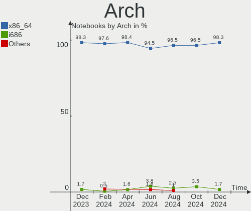
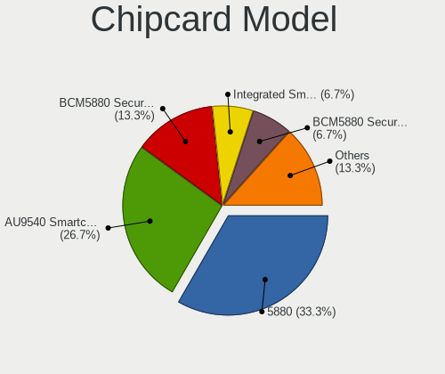

Debian Hardware Trends (Notebooks)
----------------------------------

A project to identify most popular hardware characteristics and track their change
over time based on data collected by Debian users at https://Linux-Hardware.org.

Anyone can contribute to this report by the [hw-probe](https://github.com/linuxhw/hw-probe) tool:

    sudo -E hw-probe -all -upload

This report is for one last month. Overall report since the beginning of time: [TestCoverage](https://github.com/linuxhw/TestCoverage)

Period: Apr, 2022.

Contents
--------

* [ System ](#system)
  - [ OS                       ](#os)
  - [ OS Family                ](#os-family)
  - [ Kernel                   ](#kernel)
  - [ Kernel Family            ](#kernel-family)
  - [ Kernel Major Ver.        ](#kernel-major-ver)
  - [ Arch                     ](#arch)
  - [ DE                       ](#de)
  - [ Display Server           ](#display-server)
  - [ Display Manager          ](#display-manager)
  - [ OS Lang                  ](#os-lang)
  - [ Boot Mode                ](#boot-mode)
  - [ Filesystem               ](#filesystem)
  - [ Part. scheme             ](#part-scheme)
  - [ Dual Boot with Linux/BSD ](#dual-boot-with-linuxbsd)
  - [ Dual Boot (Win)          ](#dual-boot-win)

* [ Board ](#board)
  - [ Vendor                   ](#vendor)
  - [ Model                    ](#model)
  - [ Model Family             ](#model-family)
  - [ MFG Year                 ](#mfg-year)
  - [ Form Factor              ](#form-factor)
  - [ Secure Boot              ](#secure-boot)
  - [ Coreboot                 ](#coreboot)
  - [ RAM Size                 ](#ram-size)
  - [ RAM Used                 ](#ram-used)
  - [ Total Drives             ](#total-drives)
  - [ Has CD-ROM               ](#has-cd-rom)
  - [ Has Ethernet             ](#has-ethernet)
  - [ Has WiFi                 ](#has-wifi)
  - [ Has Bluetooth            ](#has-bluetooth)

* [ Location ](#location)
  - [ Country                  ](#country)
  - [ City                     ](#city)

* [ Drives ](#drives)
  - [ Drive Vendor             ](#drive-vendor)
  - [ Drive Model              ](#drive-model)
  - [ HDD Vendor               ](#hdd-vendor)
  - [ SSD Vendor               ](#ssd-vendor)
  - [ Drive Kind               ](#drive-kind)
  - [ Drive Connector          ](#drive-connector)
  - [ Drive Size               ](#drive-size)
  - [ Space Total              ](#space-total)
  - [ Space Used               ](#space-used)
  - [ Malfunc. Drives          ](#malfunc-drives)
  - [ Malfunc. Drive Vendor    ](#malfunc-drive-vendor)
  - [ Malfunc. HDD Vendor      ](#malfunc-hdd-vendor)
  - [ Malfunc. Drive Kind      ](#malfunc-drive-kind)
  - [ Failed Drives            ](#failed-drives)
  - [ Failed Drive Vendor      ](#failed-drive-vendor)
  - [ Drive Status             ](#drive-status)

* [ Storage controller ](#storage-controller)
  - [ Storage Vendor           ](#storage-vendor)
  - [ Storage Model            ](#storage-model)
  - [ Storage Kind             ](#storage-kind)

* [ Processor ](#processor)
  - [ CPU Vendor               ](#cpu-vendor)
  - [ CPU Model                ](#cpu-model)
  - [ CPU Model Family         ](#cpu-model-family)
  - [ CPU Cores                ](#cpu-cores)
  - [ CPU Sockets              ](#cpu-sockets)
  - [ CPU Threads              ](#cpu-threads)
  - [ CPU Op-Modes             ](#cpu-op-modes)
  - [ CPU Microcode            ](#cpu-microcode)
  - [ CPU Microarch            ](#cpu-microarch)

* [ Graphics ](#graphics)
  - [ GPU Vendor               ](#gpu-vendor)
  - [ GPU Model                ](#gpu-model)
  - [ GPU Combo                ](#gpu-combo)
  - [ GPU Driver               ](#gpu-driver)
  - [ GPU Memory               ](#gpu-memory)

* [ Monitor ](#monitor)
  - [ Monitor Vendor           ](#monitor-vendor)
  - [ Monitor Model            ](#monitor-model)
  - [ Monitor Resolution       ](#monitor-resolution)
  - [ Monitor Diagonal         ](#monitor-diagonal)
  - [ Monitor Width            ](#monitor-width)
  - [ Aspect Ratio             ](#aspect-ratio)
  - [ Monitor Area             ](#monitor-area)
  - [ Pixel Density            ](#pixel-density)
  - [ Multiple Monitors        ](#multiple-monitors)

* [ Network ](#network)
  - [ Net Controller Vendor    ](#net-controller-vendor)
  - [ Net Controller Model     ](#net-controller-model)
  - [ Wireless Vendor          ](#wireless-vendor)
  - [ Wireless Model           ](#wireless-model)
  - [ Ethernet Vendor          ](#ethernet-vendor)
  - [ Ethernet Model           ](#ethernet-model)
  - [ Net Controller Kind      ](#net-controller-kind)
  - [ Used Controller          ](#used-controller)
  - [ NICs                     ](#nics)
  - [ IPv6                     ](#ipv6)

* [ Bluetooth ](#bluetooth)
  - [ Bluetooth Vendor         ](#bluetooth-vendor)
  - [ Bluetooth Model          ](#bluetooth-model)

* [ Sound ](#sound)
  - [ Sound Vendor             ](#sound-vendor)
  - [ Sound Model              ](#sound-model)

* [ Memory ](#memory)
  - [ Memory Vendor            ](#memory-vendor)
  - [ Memory Model             ](#memory-model)
  - [ Memory Kind              ](#memory-kind)
  - [ Memory Form Factor       ](#memory-form-factor)
  - [ Memory Size              ](#memory-size)
  - [ Memory Speed             ](#memory-speed)

* [ Printers & scanners ](#printers--scanners)
  - [ Printer Vendor           ](#printer-vendor)
  - [ Printer Model            ](#printer-model)
  - [ Scanner Vendor           ](#scanner-vendor)
  - [ Scanner Model            ](#scanner-model)

* [ Camera ](#camera)
  - [ Camera Vendor            ](#camera-vendor)
  - [ Camera Model             ](#camera-model)

* [ Security ](#security)
  - [ Fingerprint Vendor       ](#fingerprint-vendor)
  - [ Fingerprint Model        ](#fingerprint-model)
  - [ Chipcard Vendor          ](#chipcard-vendor)
  - [ Chipcard Model           ](#chipcard-model)

* [ Unsupported ](#unsupported)
  - [ Unsupported Devices      ](#unsupported-devices)
  - [ Unsupported Device Types ](#unsupported-device-types)

System
------

OS
--

Installed operating systems

| Name              | Notebooks | Percent |
|-------------------|-----------|---------|
| Debian 11         | 179       | 83.26%  |
| Debian Testing    | 16        | 7.44%   |
| Debian Unstable   | 10        | 4.65%   |
| Debian 10         | 8         | 3.72%   |
| Debian 8          | 1         | 0.47%   |
| Debian 11-updates | 1         | 0.47%   |

OS Family
---------

OS without a version

| Name   | Notebooks | Percent |
|--------|-----------|---------|
| Debian | 215       | 100%    |

Kernel
------

Version of the Linux kernel

| Version                   | Notebooks | Percent |
|---------------------------|-----------|---------|
| 5.10.0-13-amd64           | 100       | 46.51%  |
| 5.10.0-10-amd64           | 26        | 12.09%  |
| 5.16.0-6-amd64            | 21        | 9.77%   |
| 5.10.0-13-686-pae         | 13        | 6.05%   |
| 5.10.0-7-amd64            | 7         | 3.26%   |
| 5.10.0-11-amd64           | 6         | 2.79%   |
| 5.10.0-13-686             | 5         | 2.33%   |
| 5.16.0-0.bpo.4-amd64      | 3         | 1.4%    |
| 5.10.0-12-amd64           | 3         | 1.4%    |
| 4.19.0-20-amd64           | 3         | 1.4%    |
| 5.16.0-5-amd64            | 2         | 0.93%   |
| 5.15.32-xanmod1           | 2         | 0.93%   |
| 5.4.21                    | 1         | 0.47%   |
| 5.17.5-xanmod1            | 1         | 0.47%   |
| 5.17.4-xanmod1            | 1         | 0.47%   |
| 5.17.1-xanmod1            | 1         | 0.47%   |
| 5.17.0-trunk-amd64        | 1         | 0.47%   |
| 5.17.0-5.1-liquorix-amd64 | 1         | 0.47%   |
| 5.17.0-2.1-liquorix-amd64 | 1         | 0.47%   |
| 5.17.0-1.2-liquorix-amd64 | 1         | 0.47%   |
| 5.17.0-1-amd64            | 1         | 0.47%   |
| 5.16.0-1-rt-amd64         | 1         | 0.47%   |
| 5.16.0-1-amd64            | 1         | 0.47%   |
| 5.15.34-xanmod1           | 1         | 0.47%   |
| 5.15.15-1rodete2-amd64    | 1         | 0.47%   |
| 5.15.0-2-amd64            | 1         | 0.47%   |
| 5.14.0-trunk-amd64        | 1         | 0.47%   |
| 5.10.57-antix.1-amd64-smp | 1         | 0.47%   |
| 5.10.109-loc-os           | 1         | 0.47%   |
| 5.10.0-6-amd64            | 1         | 0.47%   |
| 5.10.0-0.bpo.12-rt-amd64  | 1         | 0.47%   |
| 4.9.0-279-antix.1-486-smp | 1         | 0.47%   |
| 4.19.0-19-amd64           | 1         | 0.47%   |
| 4.19.0-10-amd64           | 1         | 0.47%   |
| 3.8.11                    | 1         | 0.47%   |
| 3.0.21-perf               | 1         | 0.47%   |

Kernel Family
-------------

Linux kernel without a distro release

| Version  | Notebooks | Percent |
|----------|-----------|---------|
| 5.10.0   | 162       | 75.35%  |
| 5.16.0   | 28        | 13.02%  |
| 5.17.0   | 5         | 2.33%   |
| 4.19.0   | 5         | 2.33%   |
| 5.15.32  | 2         | 0.93%   |
| 5.4.21   | 1         | 0.47%   |
| 5.17.5   | 1         | 0.47%   |
| 5.17.4   | 1         | 0.47%   |
| 5.17.1   | 1         | 0.47%   |
| 5.15.34  | 1         | 0.47%   |
| 5.15.15  | 1         | 0.47%   |
| 5.15.0   | 1         | 0.47%   |
| 5.14.0   | 1         | 0.47%   |
| 5.10.57  | 1         | 0.47%   |
| 5.10.109 | 1         | 0.47%   |
| 4.9.0    | 1         | 0.47%   |
| 3.8.11   | 1         | 0.47%   |
| 3.0.21   | 1         | 0.47%   |

Kernel Major Ver.
-----------------

Linux kernel major version

| Version | Notebooks | Percent |
|---------|-----------|---------|
| 5.10    | 164       | 76.28%  |
| 5.16    | 28        | 13.02%  |
| 5.17    | 8         | 3.72%   |
| 5.15    | 5         | 2.33%   |
| 4.19    | 5         | 2.33%   |
| 5.4     | 1         | 0.47%   |
| 5.14    | 1         | 0.47%   |
| 4.9     | 1         | 0.47%   |
| 3.8     | 1         | 0.47%   |
| 3.0     | 1         | 0.47%   |

Arch
----

OS architecture (x86_64, i586, etc.)

| Name   | Notebooks | Percent |
|--------|-----------|---------|
| x86_64 | 194       | 90.23%  |
| i686   | 19        | 8.84%   |
| armv7l | 2         | 0.93%   |

DE
--

Desktop Environment

| Name             | Notebooks | Percent |
|------------------|-----------|---------|
| Unknown          | 76        | 35.35%  |
| GNOME            | 52        | 24.19%  |
| XFCE             | 25        | 11.63%  |
| KDE5             | 20        | 9.3%    |
| MATE             | 9         | 4.19%   |
| LXQt             | 6         | 2.79%   |
| LXDE             | 6         | 2.79%   |
| i3               | 5         | 2.33%   |
| Cinnamon         | 4         | 1.86%   |
| X-Cinnamon       | 3         | 1.4%    |
| Trinity          | 3         | 1.4%    |
| lightdm-xsession | 1         | 0.47%   |
| jwm              | 1         | 0.47%   |
| icewm            | 1         | 0.47%   |
| GNOME Flashback  | 1         | 0.47%   |
| DWM              | 1         | 0.47%   |
| Budgie           | 1         | 0.47%   |

Display Server
--------------

X11 or Wayland

| Name    | Notebooks | Percent |
|---------|-----------|---------|
| X11     | 97        | 45.12%  |
| Unknown | 72        | 33.49%  |
| Wayland | 40        | 18.6%   |
| Tty     | 6         | 2.79%   |

Display Manager
---------------

SDDM, LightDM, etc.

| Name    | Notebooks | Percent |
|---------|-----------|---------|
| Unknown | 107       | 49.77%  |
| LightDM | 42        | 19.53%  |
| GDM     | 29        | 13.49%  |
| GDM3    | 19        | 8.84%   |
| SDDM    | 16        | 7.44%   |
| XDM     | 1         | 0.47%   |
| SLiM    | 1         | 0.47%   |

OS Lang
-------

Language

| Lang    | Notebooks | Percent |
|---------|-----------|---------|
| en_US   | 65        | 30.23%  |
| Unknown | 52        | 24.19%  |
| fr_FR   | 12        | 5.58%   |
| ru_RU   | 11        | 5.12%   |
| en_GB   | 11        | 5.12%   |
| de_DE   | 10        | 4.65%   |
| it_IT   | 6         | 2.79%   |
| zh_CN   | 4         | 1.86%   |
| pt_BR   | 4         | 1.86%   |
| es_ES   | 4         | 1.86%   |
| pl_PL   | 3         | 1.4%    |
| pt_PT   | 2         | 0.93%   |
| ko_KR   | 2         | 0.93%   |
| es_VE   | 2         | 0.93%   |
| es_PE   | 2         | 0.93%   |
| en_SG   | 2         | 0.93%   |
| en_IN   | 2         | 0.93%   |
| en_CA   | 2         | 0.93%   |
| en_AU   | 2         | 0.93%   |
| C       | 2         | 0.93%   |
| zh_TW   | 1         | 0.47%   |
| sv_SE   | 1         | 0.47%   |
| nl_NL   | 1         | 0.47%   |
| nb_NO   | 1         | 0.47%   |
| hu_HU   | 1         | 0.47%   |
| fr_BE   | 1         | 0.47%   |
| fi_FI   | 1         | 0.47%   |
| es_SV   | 1         | 0.47%   |
| es_MX   | 1         | 0.47%   |
| es_EC   | 1         | 0.47%   |
| es_AR   | 1         | 0.47%   |
| en_IE   | 1         | 0.47%   |
| de_CH   | 1         | 0.47%   |
| cs_CZ   | 1         | 0.47%   |
| ca_ES   | 1         | 0.47%   |

Boot Mode
---------

EFI or BIOS

| Mode | Notebooks | Percent |
|------|-----------|---------|
| EFI  | 134       | 62.33%  |
| BIOS | 81        | 37.67%  |

Filesystem
----------

Type of filesystem

| Type    | Notebooks | Percent |
|---------|-----------|---------|
| Ext4    | 129       | 60%     |
| Overlay | 74        | 34.42%  |
| Btrfs   | 10        | 4.65%   |
| Xfs     | 2         | 0.93%   |

Part. scheme
------------

Scheme of partitioning

| Type    | Notebooks | Percent |
|---------|-----------|---------|
| GPT     | 138       | 64.19%  |
| MBR     | 43        | 20%     |
| Unknown | 34        | 15.81%  |

Dual Boot with Linux/BSD
------------------------

Hosting more than one Linux/BSD

| Dual boot | Notebooks | Percent |
|-----------|-----------|---------|
| No        | 177       | 82.33%  |
| Yes       | 38        | 17.67%  |

Dual Boot (Win)
---------------

Hosting Linux and Windows

| Dual boot | Notebooks | Percent |
|-----------|-----------|---------|
| No        | 159       | 73.95%  |
| Yes       | 56        | 26.05%  |

Board
-----

Vendor
------

Motherboard manufacturer

| Name                | Notebooks | Percent |
|---------------------|-----------|---------|
| Lenovo              | 40        | 18.6%   |
| Hewlett-Packard     | 37        | 17.21%  |
| Google              | 27        | 12.56%  |
| ASUSTek Computer    | 27        | 12.56%  |
| Dell                | 26        | 12.09%  |
| Apple               | 21        | 9.77%   |
| MSI                 | 5         | 2.33%   |
| Acer                | 5         | 2.33%   |
| Toshiba             | 4         | 1.86%   |
| Samsung Electronics | 3         | 1.4%    |
| Intel               | 3         | 1.4%    |
| Unknown             | 3         | 1.4%    |
| Timi                | 2         | 0.93%   |
| Sony                | 2         | 0.93%   |
| Clevo               | 2         | 0.93%   |
| TUXEDO              | 1         | 0.47%   |
| Thirdwave           | 1         | 0.47%   |
| Razer               | 1         | 0.47%   |
| Packard Bell        | 1         | 0.47%   |
| HUAWEI              | 1         | 0.47%   |
| Getac               | 1         | 0.47%   |
| Chuwi               | 1         | 0.47%   |
| Advent              | 1         | 0.47%   |

Model
-----

Motherboard model

| Name                                               | Notebooks | Percent |
|----------------------------------------------------|-----------|---------|
| Google Enguarde                                    | 26        | 12.09%  |
| Apple MacBook5,2                                   | 18        | 8.37%   |
| ASUS 1005HA                                        | 11        | 5.12%   |
| Unknown                                            | 5         | 2.33%   |
| Dell Latitude 3120                                 | 3         | 1.4%    |
| Apple MacBook2,1                                   | 3         | 1.4%    |
| Lenovo ThinkPad 13 2nd Gen 20J10046US              | 2         | 0.93%   |
| Lenovo ThinkBook 14p Gen 2 20YN                    | 2         | 0.93%   |
| Intel powered classmate PC                         | 2         | 0.93%   |
| HP Notebook                                        | 2         | 0.93%   |
| HP Laptop 15s-fq2xxx                               | 2         | 0.93%   |
| HP EliteBook 840 G8 Notebook PC                    | 2         | 0.93%   |
| HP EliteBook 840 G3                                | 2         | 0.93%   |
| TUXEDO Pulse 15 Gen1                               | 1         | 0.47%   |
| Toshiba TECRA X40-E                                | 1         | 0.47%   |
| Toshiba TECRA X40-D                                | 1         | 0.47%   |
| Toshiba Satellite L50D-B                           | 1         | 0.47%   |
| Toshiba Satellite A300                             | 1         | 0.47%   |
| Timi TM1612                                        | 1         | 0.47%   |
| Timi A7S                                           | 1         | 0.47%   |
| Thirdwave DX-T7                                    | 1         | 0.47%   |
| Sony VGN-NR31ZR_S                                  | 1         | 0.47%   |
| Sony SVE1712S1EB                                   | 1         | 0.47%   |
| Samsung RV415/RV515                                | 1         | 0.47%   |
| Samsung 300V3A/300V4A/300V5A                       | 1         | 0.47%   |
| Samsung 270E5J/2570EJ                              | 1         | 0.47%   |
| Razer Blade 15 Base Model (Early 2020) - RZ09-0328 | 1         | 0.47%   |
| Packard Bell DOTM                                  | 1         | 0.47%   |
| MSI Prestige 14Evo A11M                            | 1         | 0.47%   |
| MSI GX700                                          | 1         | 0.47%   |
| MSI GF75 Thin 10UEK                                | 1         | 0.47%   |
| MSI GE60 2PC                                       | 1         | 0.47%   |
| MSI CX61 0OC/CX61 0OD/CX61 0OL                     | 1         | 0.47%   |
| Lenovo ThinkPad Z61m 94528QG                       | 1         | 0.47%   |
| Lenovo ThinkPad X270 W10DG 20K5S00A00              | 1         | 0.47%   |
| Lenovo ThinkPad X260 20F5S6QV00                    | 1         | 0.47%   |
| Lenovo ThinkPad X230 2306CTO                       | 1         | 0.47%   |
| Lenovo ThinkPad X1 Extreme Gen 3 20TKCTO1WW        | 1         | 0.47%   |
| Lenovo ThinkPad X1 Carbon Gen 8 20UAS1H100         | 1         | 0.47%   |
| Lenovo ThinkPad X1 Carbon 4th 20FCS0TQ00           | 1         | 0.47%   |
| Lenovo ThinkPad X1 Carbon 4th 20FBCTO1WW           | 1         | 0.47%   |
| Lenovo ThinkPad W510 4391DK3                       | 1         | 0.47%   |
| Lenovo ThinkPad T540p 20BES05A00                   | 1         | 0.47%   |
| Lenovo ThinkPad T480 20L5CTO1WW                    | 1         | 0.47%   |
| Lenovo ThinkPad T470 W10DG 20JNS29X02              | 1         | 0.47%   |
| Lenovo ThinkPad T450s 20BWS2US00                   | 1         | 0.47%   |
| Lenovo ThinkPad T440 20B7S1970B                    | 1         | 0.47%   |
| Lenovo ThinkPad T440 20B6005RUS                    | 1         | 0.47%   |
| Lenovo ThinkPad T420 N1004Z1                       | 1         | 0.47%   |
| Lenovo ThinkPad T400 64754B9                       | 1         | 0.47%   |
| Lenovo ThinkPad SL 2743X12                         | 1         | 0.47%   |
| Lenovo ThinkPad P53 20QN000ESP                     | 1         | 0.47%   |
| Lenovo ThinkPad P51s 20HB000URT                    | 1         | 0.47%   |
| Lenovo ThinkPad L440 20ASS34K00                    | 1         | 0.47%   |
| Lenovo ThinkPad E580 20KS006EMZ                    | 1         | 0.47%   |
| Lenovo ThinkPad E570 20H500B5IX                    | 1         | 0.47%   |
| Lenovo Legion 5 15IMH05 82AU                       | 1         | 0.47%   |
| Lenovo IdeaPad S540-15IML D 81NG                   | 1         | 0.47%   |
| Lenovo IdeaPad S145-15API 81V7                     | 1         | 0.47%   |
| Lenovo IdeaPad S145-15API 81UT                     | 1         | 0.47%   |

Model Family
------------

Motherboard model prefix

| Name              | Notebooks | Percent |
|-------------------|-----------|---------|
| Google Enguarde   | 26        | 12.09%  |
| Lenovo ThinkPad   | 25        | 11.63%  |
| Apple MacBook5    | 18        | 8.37%   |
| ASUS 1005HA       | 11        | 5.12%   |
| Lenovo IdeaPad    | 9         | 4.19%   |
| HP Laptop         | 9         | 4.19%   |
| Dell Latitude     | 9         | 4.19%   |
| Dell Inspiron     | 9         | 4.19%   |
| HP Pavilion       | 6         | 2.79%   |
| HP EliteBook      | 6         | 2.79%   |
| Unknown           | 5         | 2.33%   |
| ASUS VivoBook     | 4         | 1.86%   |
| HP ProBook        | 3         | 1.4%    |
| Dell XPS          | 3         | 1.4%    |
| Apple MacBook2    | 3         | 1.4%    |
| Acer Aspire       | 3         | 1.4%    |
| Toshiba TECRA     | 2         | 0.93%   |
| Toshiba Satellite | 2         | 0.93%   |
| Lenovo ThinkBook  | 2         | 0.93%   |
| Lenovo G580       | 2         | 0.93%   |
| Intel powered     | 2         | 0.93%   |
| HP Stream         | 2         | 0.93%   |
| HP Notebook       | 2         | 0.93%   |
| HP ENVY           | 2         | 0.93%   |
| HP 250            | 2         | 0.93%   |
| Dell Vostro       | 2         | 0.93%   |
| Dell Precision    | 2         | 0.93%   |
| ASUS ASUS         | 2         | 0.93%   |
| TUXEDO Pulse      | 1         | 0.47%   |
| Timi TM1612       | 1         | 0.47%   |
| Timi A7S          | 1         | 0.47%   |
| Thirdwave DX-T7   | 1         | 0.47%   |
| Sony VGN-NR31ZR   | 1         | 0.47%   |
| Sony SVE1712S1EB  | 1         | 0.47%   |
| Samsung RV415     | 1         | 0.47%   |
| Samsung 300V3A    | 1         | 0.47%   |
| Samsung 270E5J    | 1         | 0.47%   |
| Razer Blade       | 1         | 0.47%   |
| Packard Bell DOTM | 1         | 0.47%   |
| MSI Prestige      | 1         | 0.47%   |
| MSI GX700         | 1         | 0.47%   |
| MSI GF75          | 1         | 0.47%   |
| MSI GE60          | 1         | 0.47%   |
| MSI CX61          | 1         | 0.47%   |
| Lenovo Legion     | 1         | 0.47%   |
| Lenovo E31-70     | 1         | 0.47%   |
| Intel Crestline   | 1         | 0.47%   |
| HUAWEI BOM-WXX9   | 1         | 0.47%   |
| HP Presario       | 1         | 0.47%   |
| HP OMEN           | 1         | 0.47%   |
| HP G72            | 1         | 0.47%   |
| HP Compaq         | 1         | 0.47%   |
| Google Cave       | 1         | 0.47%   |
| Getac S400        | 1         | 0.47%   |
| Dell G5           | 1         | 0.47%   |
| Clevo W240EU      | 1         | 0.47%   |
| Clevo M1110M      | 1         | 0.47%   |
| ASUS ZenBook      | 1         | 0.47%   |
| ASUS X756UQK      | 1         | 0.47%   |
| ASUS UX31E        | 1         | 0.47%   |

MFG Year
--------

Motherboard manufacture year

| Year    | Notebooks | Percent |
|---------|-----------|---------|
| 2009    | 32        | 14.88%  |
| 2022    | 28        | 13.02%  |
| 2021    | 20        | 9.3%    |
| 2020    | 18        | 8.37%   |
| 2018    | 14        | 6.51%   |
| 2017    | 14        | 6.51%   |
| 2016    | 11        | 5.12%   |
| 2013    | 10        | 4.65%   |
| 2012    | 10        | 4.65%   |
| 2014    | 9         | 4.19%   |
| 2007    | 9         | 4.19%   |
| 2019    | 8         | 3.72%   |
| 2011    | 8         | 3.72%   |
| 2010    | 7         | 3.26%   |
| 2015    | 6         | 2.79%   |
| 2008    | 6         | 2.79%   |
| 2005    | 2         | 0.93%   |
| Unknown | 2         | 0.93%   |
| 2006    | 1         | 0.47%   |

Form Factor
-----------

Physical design of the computer

| Name     | Notebooks | Percent |
|----------|-----------|---------|
| Notebook | 215       | 100%    |

Secure Boot
-----------

Enabled or disabled

| State    | Notebooks | Percent |
|----------|-----------|---------|
| Disabled | 202       | 93.95%  |
| Enabled  | 13        | 6.05%   |

Coreboot
--------

Have coreboot on board

| Used | Notebooks | Percent |
|------|-----------|---------|
| No   | 187       | 86.98%  |
| Yes  | 28        | 13.02%  |

RAM Size
--------

Total RAM memory

| Size in GB  | Notebooks | Percent |
|-------------|-----------|---------|
| 3.01-4.0    | 53        | 24.65%  |
| 4.01-8.0    | 48        | 22.33%  |
| 1.01-2.0    | 29        | 13.49%  |
| 16.01-24.0  | 25        | 11.63%  |
| 8.01-16.0   | 24        | 11.16%  |
| 0.51-1.0    | 16        | 7.44%   |
| 32.01-64.0  | 8         | 3.72%   |
| 64.01-256.0 | 5         | 2.33%   |
| 24.01-32.0  | 3         | 1.4%    |
| 2.01-3.0    | 2         | 0.93%   |
| 0.01-0.5    | 2         | 0.93%   |

RAM Used
--------

Used RAM memory

| Used GB    | Notebooks | Percent |
|------------|-----------|---------|
| 1.01-2.0   | 90        | 41.86%  |
| 0.51-1.0   | 32        | 14.88%  |
| 2.01-3.0   | 31        | 14.42%  |
| 4.01-8.0   | 24        | 11.16%  |
| 3.01-4.0   | 22        | 10.23%  |
| 0.01-0.5   | 7         | 3.26%   |
| 8.01-16.0  | 4         | 1.86%   |
| 16.01-24.0 | 2         | 0.93%   |
| Unknown    | 2         | 0.93%   |
| 32.01-64.0 | 1         | 0.47%   |

Total Drives
------------

Number of drives on board

| Drives | Notebooks | Percent |
|--------|-----------|---------|
| 1      | 175       | 81.4%   |
| 2      | 37        | 17.21%  |
| 3      | 2         | 0.93%   |
| 5      | 1         | 0.47%   |

Has CD-ROM
----------

Has CD-ROM on board

| Presented | Notebooks | Percent |
|-----------|-----------|---------|
| No        | 143       | 66.51%  |
| Yes       | 72        | 33.49%  |

Has Ethernet
------------

Has Ethernet on board

| Presented | Notebooks | Percent |
|-----------|-----------|---------|
| Yes       | 164       | 76.28%  |
| No        | 51        | 23.72%  |

Has WiFi
--------

Has WiFi module

| Presented | Notebooks | Percent |
|-----------|-----------|---------|
| Yes       | 212       | 98.6%   |
| No        | 3         | 1.4%    |

Has Bluetooth
-------------

Has Bluetooth module

| Presented | Notebooks | Percent |
|-----------|-----------|---------|
| Yes       | 173       | 80.47%  |
| No        | 42        | 19.53%  |

Location
--------

Country
-------

Geographic location (country)

| Country     | Notebooks | Percent |
|-------------|-----------|---------|
| USA         | 76        | 35.35%  |
| Russia      | 19        | 8.84%   |
| France      | 17        | 7.91%   |
| Germany     | 13        | 6.05%   |
| UK          | 9         | 4.19%   |
| Spain       | 9         | 4.19%   |
| Italy       | 5         | 2.33%   |
| Brazil      | 5         | 2.33%   |
| Poland      | 4         | 1.86%   |
| Japan       | 4         | 1.86%   |
| Greece      | 4         | 1.86%   |
| Venezuela   | 3         | 1.4%    |
| Switzerland | 3         | 1.4%    |
| Netherlands | 3         | 1.4%    |
| Canada      | 3         | 1.4%    |
| South Korea | 2         | 0.93%   |
| Romania     | 2         | 0.93%   |
| Portugal    | 2         | 0.93%   |
| Peru        | 2         | 0.93%   |
| Norway      | 2         | 0.93%   |
| Mexico      | 2         | 0.93%   |
| Australia   | 2         | 0.93%   |
| Argentina   | 2         | 0.93%   |
| Uzbekistan  | 1         | 0.47%   |
| Thailand    | 1         | 0.47%   |
| Taiwan      | 1         | 0.47%   |
| Sweden      | 1         | 0.47%   |
| Singapore   | 1         | 0.47%   |
| Philippines | 1         | 0.47%   |
| Latvia      | 1         | 0.47%   |
| Ireland     | 1         | 0.47%   |
| Iran        | 1         | 0.47%   |
| India       | 1         | 0.47%   |
| Hungary     | 1         | 0.47%   |
| Gambia      | 1         | 0.47%   |
| Finland     | 1         | 0.47%   |
| El Salvador | 1         | 0.47%   |
| Ecuador     | 1         | 0.47%   |
| Denmark     | 1         | 0.47%   |
| Czechia     | 1         | 0.47%   |
| Croatia     | 1         | 0.47%   |
| China       | 1         | 0.47%   |
| Belgium     | 1         | 0.47%   |
| Azerbaijan  | 1         | 0.47%   |
| Austria     | 1         | 0.47%   |

City
----

Geographic location (city)

| City                   | Notebooks | Percent |
|------------------------|-----------|---------|
| Bangor                 | 63        | 29.3%   |
| Voronezh               | 7         | 3.26%   |
| Moscow                 | 4         | 1.86%   |
| Uiwang                 | 2         | 0.93%   |
| Toulouse               | 2         | 0.93%   |
| Perm                   | 2         | 0.93%   |
| Madrid                 | 2         | 0.93%   |
| London                 | 2         | 0.93%   |
| Lima                   | 2         | 0.93%   |
| Dresden                | 2         | 0.93%   |
| Caracas                | 2         | 0.93%   |
| Barcelona              | 2         | 0.93%   |
| Athens                 | 2         | 0.93%   |
| Amsterdam              | 2         | 0.93%   |
| Zelenograd             | 1         | 0.47%   |
| Zagreb                 | 1         | 0.47%   |
| Yunlin                 | 1         | 0.47%   |
| Xuhui                  | 1         | 0.47%   |
| Wieluń                | 1         | 0.47%   |
| Warsaw                 | 1         | 0.47%   |
| Villahermosa           | 1         | 0.47%   |
| Vikhamar               | 1         | 0.47%   |
| Varginha               | 1         | 0.47%   |
| Ulm                    | 1         | 0.47%   |
| Tokyo                  | 1         | 0.47%   |
| The Hague              | 1         | 0.47%   |
| Tehran                 | 1         | 0.47%   |
| Tashkent               | 1         | 0.47%   |
| Takarazuka             | 1         | 0.47%   |
| Sydney                 | 1         | 0.47%   |
| Strasbourg             | 1         | 0.47%   |
| St Petersburg          | 1         | 0.47%   |
| St Andrews             | 1         | 0.47%   |
| Singapore              | 1         | 0.47%   |
| Shinagawa              | 1         | 0.47%   |
| Sherborne              | 1         | 0.47%   |
| Scottsdale             | 1         | 0.47%   |
| Saratov                | 1         | 0.47%   |
| Santa Cruz de Tenerife | 1         | 0.47%   |
| San Salvador           | 1         | 0.47%   |
| San Luis               | 1         | 0.47%   |
| San Francisco          | 1         | 0.47%   |
| San Fernando City      | 1         | 0.47%   |
| Røyken Municipality   | 1         | 0.47%   |
| Rubí                  | 1         | 0.47%   |
| Ripollet               | 1         | 0.47%   |
| Riga                   | 1         | 0.47%   |
| Resistencia            | 1         | 0.47%   |
| Rennes                 | 1         | 0.47%   |
| Regensdorf             | 1         | 0.47%   |
| Râmnicu Vâlcea       | 1         | 0.47%   |
| Quito                  | 1         | 0.47%   |
| Queens                 | 1         | 0.47%   |
| Puteaux                | 1         | 0.47%   |
| Purley                 | 1         | 0.47%   |
| Poza Rica Chacas       | 1         | 0.47%   |
| Porto                  | 1         | 0.47%   |
| Pontoise               | 1         | 0.47%   |
| Piraeus                | 1         | 0.47%   |
| Petrozavodsk           | 1         | 0.47%   |

Drives
------

Drive Vendor
------------

Hard drive vendors

| Vendor                       | Notebooks | Drives | Percent |
|------------------------------|-----------|--------|---------|
| Unknown                      | 35        | 37     | 14.06%  |
| Seagate                      | 29        | 29     | 11.65%  |
| Samsung Electronics          | 28        | 28     | 11.24%  |
| WDC                          | 22        | 22     | 8.84%   |
| Toshiba                      | 20        | 21     | 8.03%   |
| Fujitsu                      | 17        | 17     | 6.83%   |
| SK Hynix                     | 13        | 16     | 5.22%   |
| SanDisk                      | 9         | 9      | 3.61%   |
| Kingston                     | 9         | 9      | 3.61%   |
| Crucial                      | 9         | 9      | 3.61%   |
| KIOXIA                       | 7         | 7      | 2.81%   |
| Hitachi                      | 6         | 6      | 2.41%   |
| HGST                         | 6         | 6      | 2.41%   |
| A-DATA Technology            | 4         | 4      | 1.61%   |
| Transcend                    | 3         | 3      | 1.2%    |
| Micron Technology            | 3         | 3      | 1.2%    |
| PNY                          | 2         | 2      | 0.8%    |
| Phison                       | 2         | 2      | 0.8%    |
| LITEONIT                     | 2         | 2      | 0.8%    |
| LITEON                       | 2         | 2      | 0.8%    |
| Intel                        | 2         | 2      | 0.8%    |
| China                        | 2         | 2      | 0.8%    |
| Unknown (CF)                 | 1         | 1      | 0.4%    |
| Teclast                      | 1         | 1      | 0.4%    |
| Silicon Motion               | 1         | 1      | 0.4%    |
| Shenzhen Longsys Electronics | 1         | 1      | 0.4%    |
| S3+                          | 1         | 1      | 0.4%    |
| Realtek                      | 1         | 2      | 0.4%    |
| ORICO                        | 1         | 1      | 0.4%    |
| OCZ                          | 1         | 1      | 0.4%    |
| Micron/Crucial Technology    | 1         | 1      | 0.4%    |
| Lenovo                       | 1         | 1      | 0.4%    |
| KIOXIA-EXCERIA               | 1         | 1      | 0.4%    |
| KingFast                     | 1         | 1      | 0.4%    |
| Intenso                      | 1         | 1      | 0.4%    |
| INTEL SS                     | 1         | 1      | 0.4%    |
| ASMT                         | 1         | 1      | 0.4%    |
| Apacer                       | 1         | 1      | 0.4%    |
| Unknown                      | 1         | 1      | 0.4%    |

Drive Model
-----------

Hard drive models

| Model                                   | Notebooks | Percent |
|-----------------------------------------|-----------|---------|
| Fujitsu MHZ2160BH FFS G1 160GB          | 15        | 5.91%   |
| Unknown AGND3R  16GB                    | 13        | 5.12%   |
| Unknown HAG2e  16GB                     | 11        | 4.33%   |
| Seagate ST9160301AS 160GB               | 5         | 1.97%   |
| Seagate ST1000LM035-1RK172 1TB          | 5         | 1.97%   |
| Seagate ST9160310AS 160GB               | 4         | 1.57%   |
| WDC WD10SPZX-24Z10 1TB                  | 3         | 1.18%   |
| Toshiba MQ01ABF050 500GB                | 3         | 1.18%   |
| Toshiba MK1655GSXF 160GB                | 3         | 1.18%   |
| KIOXIA KBG40ZNS128G NVMe 128GB          | 3         | 1.18%   |
| Unknown SEM16G  16GB                    | 2         | 0.79%   |
| Unknown MMC Card  32GB                  | 2         | 0.79%   |
| Toshiba MQ01ABD100 1TB                  | 2         | 0.79%   |
| Toshiba MK1653GSX 160GB                 | 2         | 0.79%   |
| SK Hynix SKHynix_HFS512GDE9X084N 512GB  | 2         | 0.79%   |
| SK Hynix SKHynix_HFS001TD9TNI-L2B0B 1TB | 2         | 0.79%   |
| Seagate ST1000LM024 HN-M101MBB 1TB      | 2         | 0.79%   |
| Seagate BUP Portable 5TB                | 2         | 0.79%   |
| SanDisk SD8SN8U-256G-1006 256GB SSD     | 2         | 0.79%   |
| Samsung MZNTY256HDHP-000L7 256GB SSD    | 2         | 0.79%   |
| Micron 1100 SATA 256GB SSD              | 2         | 0.79%   |
| KIOXIA KBG40ZNV512G 512GB               | 2         | 0.79%   |
| Kingston SA400S37480G 480GB SSD         | 2         | 0.79%   |
| Kingston SA400S37240G 240GB SSD         | 2         | 0.79%   |
| Hitachi HTS543216L9SA00 160GB           | 2         | 0.79%   |
| HGST HTS721010A9E630 1TB                | 2         | 0.79%   |
| HGST HTS541010B7E610 1TB                | 2         | 0.79%   |
| Crucial CT500MX500SSD1 500GB            | 2         | 0.79%   |
| Crucial CT250MX500SSD1 250GB            | 2         | 0.79%   |
| WDC WDS500G2B0B-00YS70 500GB SSD        | 1         | 0.39%   |
| WDC WDS500G2B0A-00SM50 500GB SSD        | 1         | 0.39%   |
| WDC WDS240G2G0A-00JH30 240GB SSD        | 1         | 0.39%   |
| WDC WDS120G2G0A-00JH30 120GB SSD        | 1         | 0.39%   |
| WDC WDS100T2B0B-00YS70 1TB SSD          | 1         | 0.39%   |
| WDC WD5000LPVX-55V0TT0 500GB            | 1         | 0.39%   |
| WDC WD5000LPVX-22V0TT0 500GB            | 1         | 0.39%   |
| WDC WD5000BPKT-00PK4T0 500GB            | 1         | 0.39%   |
| WDC WD5000BEVT-22A0RT0 500GB            | 1         | 0.39%   |
| WDC WD2500BEVT-80A23T0 250GB            | 1         | 0.39%   |
| WDC WD2500BEVT-22ZCT0 250GB             | 1         | 0.39%   |
| WDC WD1200BEVS-00UST0 120GB             | 1         | 0.39%   |
| WDC WD10SPZX-21Z10T0 1TB                | 1         | 0.39%   |
| WDC WD10JPVX-75JC3T0 1TB                | 1         | 0.39%   |
| WDC WD10JPCX-24UE4T0 1TB                | 1         | 0.39%   |
| WDC WD10 SPZX-60Z10T0 1TB               | 1         | 0.39%   |
| WDC PC SN530 SDBPNPZ-256G-1006 256GB    | 1         | 0.39%   |
| WDC PC SN530 SDBPNPZ-1T00-1002 1TB      | 1         | 0.39%   |
| WDC PC SA530 SDASN8Y-256G-1006 256GB    | 1         | 0.39%   |
| Unknown SDW16G  16GB                    | 1         | 0.39%   |
| Unknown SD/MMC/MS PRO 16GB              | 1         | 0.39%   |
| Unknown MMC Card  64GB                  | 1         | 0.39%   |
| Unknown MMC Card  4GB                   | 1         | 0.39%   |
| Unknown MMC Card  2GB                   | 1         | 0.39%   |
| Unknown MBG4GC  32GB                    | 1         | 0.39%   |
| Unknown EB2MW  32GB                     | 1         | 0.39%   |
| Unknown DA4128  128GB                   | 1         | 0.39%   |
| Unknown (CF) 16GB                       | 1         | 0.39%   |
| Transcend TS512GMTS430S 512GB SSD       | 1         | 0.39%   |
| Transcend TS240GMTS420S 240GB SSD       | 1         | 0.39%   |
| Transcend TS128GMTS430S 128GB SSD       | 1         | 0.39%   |

HDD Vendor
----------

Hard disk drive vendors

| Vendor       | Notebooks | Drives | Percent |
|--------------|-----------|--------|---------|
| Seagate      | 29        | 29     | 31.87%  |
| Fujitsu      | 17        | 17     | 18.68%  |
| Toshiba      | 16        | 16     | 17.58%  |
| WDC          | 14        | 14     | 15.38%  |
| Hitachi      | 6         | 6      | 6.59%   |
| HGST         | 6         | 6      | 6.59%   |
| Unknown (CF) | 1         | 1      | 1.1%    |
| Unknown      | 1         | 1      | 1.1%    |
| Intenso      | 1         | 1      | 1.1%    |

SSD Vendor
----------

Solid state drive vendors

| Vendor              | Notebooks | Drives | Percent |
|---------------------|-----------|--------|---------|
| Samsung Electronics | 13        | 13     | 18.57%  |
| Crucial             | 9         | 9      | 12.86%  |
| SanDisk             | 8         | 8      | 11.43%  |
| WDC                 | 6         | 6      | 8.57%   |
| Kingston            | 6         | 6      | 8.57%   |
| Transcend           | 3         | 3      | 4.29%   |
| Micron Technology   | 3         | 3      | 4.29%   |
| A-DATA Technology   | 3         | 3      | 4.29%   |
| SK Hynix            | 2         | 2      | 2.86%   |
| LITEONIT            | 2         | 2      | 2.86%   |
| LITEON              | 2         | 2      | 2.86%   |
| China               | 2         | 2      | 2.86%   |
| Toshiba             | 1         | 1      | 1.43%   |
| Teclast             | 1         | 1      | 1.43%   |
| S3+                 | 1         | 1      | 1.43%   |
| PNY                 | 1         | 1      | 1.43%   |
| OCZ                 | 1         | 1      | 1.43%   |
| KIOXIA-EXCERIA      | 1         | 1      | 1.43%   |
| KingFast            | 1         | 1      | 1.43%   |
| INTEL SS            | 1         | 1      | 1.43%   |
| Intel               | 1         | 1      | 1.43%   |
| Apacer              | 1         | 1      | 1.43%   |
| Unknown             | 1         | 1      | 1.43%   |

Drive Kind
----------

HDD or SSD

| Kind    | Notebooks | Drives | Percent |
|---------|-----------|--------|---------|
| HDD     | 91        | 91     | 37.14%  |
| SSD     | 66        | 70     | 26.94%  |
| NVMe    | 50        | 56     | 20.41%  |
| MMC     | 36        | 37     | 14.69%  |
| Unknown | 2         | 2      | 0.82%   |

Drive Connector
---------------

SATA, SAS, NVMe, etc.

| Type | Notebooks | Drives | Percent |
|------|-----------|--------|---------|
| SATA | 142       | 155    | 60.17%  |
| NVMe | 50        | 54     | 21.19%  |
| MMC  | 36        | 37     | 15.25%  |
| SAS  | 8         | 10     | 3.39%   |

Drive Size
----------

Size of hard drive

| Size in TB | Notebooks | Drives | Percent |
|------------|-----------|--------|---------|
| 0.01-0.5   | 118       | 123    | 75.64%  |
| 0.51-1.0   | 34        | 34     | 21.79%  |
| 4.01-10.0  | 2         | 2      | 1.28%   |
| 2.01-3.0   | 1         | 1      | 0.64%   |
| 1.01-2.0   | 1         | 1      | 0.64%   |

Space Total
-----------

Amount of disk space available on the file system

| Size in GB     | Notebooks | Percent |
|----------------|-----------|---------|
| 101-250        | 45        | 20.93%  |
| Unknown        | 44        | 20.47%  |
| 1-20           | 33        | 15.35%  |
| 251-500        | 30        | 13.95%  |
| 501-1000       | 22        | 10.23%  |
| 51-100         | 15        | 6.98%   |
| 1001-2000      | 13        | 6.05%   |
| 21-50          | 8         | 3.72%   |
| More than 3000 | 4         | 1.86%   |
| 2001-3000      | 1         | 0.47%   |

Space Used
----------

Amount of used disk space

| Used GB        | Notebooks | Percent |
|----------------|-----------|---------|
| 1-20           | 82        | 38.14%  |
| Unknown        | 44        | 20.47%  |
| 101-250        | 27        | 12.56%  |
| 21-50          | 19        | 8.84%   |
| 51-100         | 19        | 8.84%   |
| 251-500        | 11        | 5.12%   |
| 501-1000       | 6         | 2.79%   |
| 1001-2000      | 3         | 1.4%    |
| More than 3000 | 2         | 0.93%   |
| 2001-3000      | 2         | 0.93%   |

Malfunc. Drives
---------------

Drive models with a malfunction

| Model                                        | Notebooks | Drives | Percent |
|----------------------------------------------|-----------|--------|---------|
| WDC WD2500BEVT-22ZCT0 250GB                  | 1         | 1      | 7.14%   |
| Toshiba MK1655GSXF 160GB                     | 1         | 1      | 7.14%   |
| SK Hynix HFS256G3BTND-N210A 256GB SSD        | 1         | 1      | 7.14%   |
| Seagate ST960822A 64GB                       | 1         | 1      | 7.14%   |
| Seagate ST9500420AS 500GB                    | 1         | 1      | 7.14%   |
| Seagate ST9500325AS 500GB                    | 1         | 1      | 7.14%   |
| Micron Technology 5100_MTFDDAK1T9TBY 2TB SSD | 1         | 1      | 7.14%   |
| LITEONIT LMT-32L3M-HP 32GB SSD               | 1         | 1      | 7.14%   |
| Kingston SHFS37A120G 120GB SSD               | 1         | 1      | 7.14%   |
| Intel SSDSA2M160G2HP 160GB                   | 1         | 1      | 7.14%   |
| HGST HTS721010A9E630 1TB                     | 1         | 1      | 7.14%   |
| HGST HTS541075A7E630 752GB                   | 1         | 1      | 7.14%   |
| Fujitsu MHZ2160BH FFS G1 160GB               | 1         | 1      | 7.14%   |
| A-DATA Technology SX900 256GB SSD            | 1         | 1      | 7.14%   |

Malfunc. Drive Vendor
---------------------

Vendors of faulty drives

| Vendor            | Notebooks | Drives | Percent |
|-------------------|-----------|--------|---------|
| Seagate           | 3         | 3      | 21.43%  |
| HGST              | 2         | 2      | 14.29%  |
| WDC               | 1         | 1      | 7.14%   |
| Toshiba           | 1         | 1      | 7.14%   |
| SK Hynix          | 1         | 1      | 7.14%   |
| Micron Technology | 1         | 1      | 7.14%   |
| LITEONIT          | 1         | 1      | 7.14%   |
| Kingston          | 1         | 1      | 7.14%   |
| Intel             | 1         | 1      | 7.14%   |
| Fujitsu           | 1         | 1      | 7.14%   |
| A-DATA Technology | 1         | 1      | 7.14%   |

Malfunc. HDD Vendor
-------------------

Vendors of faulty HDD drives

| Vendor  | Notebooks | Drives | Percent |
|---------|-----------|--------|---------|
| Seagate | 3         | 3      | 37.5%   |
| HGST    | 2         | 2      | 25%     |
| WDC     | 1         | 1      | 12.5%   |
| Toshiba | 1         | 1      | 12.5%   |
| Fujitsu | 1         | 1      | 12.5%   |

Malfunc. Drive Kind
-------------------

Kinds of faulty drives

| Kind | Notebooks | Drives | Percent |
|------|-----------|--------|---------|
| HDD  | 8         | 8      | 57.14%  |
| SSD  | 6         | 6      | 42.86%  |

Failed Drives
-------------

Failed drive models

| Model                                        | Notebooks | Drives | Percent |
|----------------------------------------------|-----------|--------|---------|
| Samsung Electronics MZVLB512HAJQ-000H1 512GB | 1         | 1      | 50%     |
| Hitachi HTS545050A7E380 500GB                | 1         | 1      | 50%     |

Failed Drive Vendor
-------------------

Failed drive vendors

| Vendor              | Notebooks | Drives | Percent |
|---------------------|-----------|--------|---------|
| Samsung Electronics | 1         | 1      | 50%     |
| Hitachi             | 1         | 1      | 50%     |

Drive Status
------------

Number of failed and malfunc. drives

| Status   | Notebooks | Drives | Percent |
|----------|-----------|--------|---------|
| Works    | 140       | 154    | 60.61%  |
| Detected | 75        | 86     | 32.47%  |
| Malfunc  | 14        | 14     | 6.06%   |
| Failed   | 2         | 2      | 0.87%   |

Storage controller
------------------

Storage Vendor
--------------

Storage controller vendors

| Vendor                       | Notebooks | Percent |
|------------------------------|-----------|---------|
| Intel                        | 120       | 57.14%  |
| AMD                          | 22        | 10.48%  |
| Nvidia                       | 18        | 8.57%   |
| Samsung Electronics          | 15        | 7.14%   |
| SK Hynix                     | 11        | 5.24%   |
| Toshiba America Info Systems | 5         | 2.38%   |
| KIOXIA                       | 5         | 2.38%   |
| Phison Electronics           | 3         | 1.43%   |
| Kingston Technology Company  | 3         | 1.43%   |
| Sandisk                      | 2         | 0.95%   |
| Silicon Motion               | 1         | 0.48%   |
| Shenzhen Longsys Electronics | 1         | 0.48%   |
| Micron/Crucial Technology    | 1         | 0.48%   |
| Lenovo                       | 1         | 0.48%   |
| JMicron Technology           | 1         | 0.48%   |
| ADATA Technology             | 1         | 0.48%   |

Storage Model
-------------

Storage controller models

| Model                                                                                  | Notebooks | Percent |
|----------------------------------------------------------------------------------------|-----------|---------|
| AMD FCH SATA Controller [AHCI mode]                                                    | 19        | 8.33%   |
| Nvidia MCP79 AHCI Controller                                                           | 18        | 7.89%   |
| Intel Sunrise Point-LP SATA Controller [AHCI mode]                                     | 16        | 7.02%   |
| Intel 82801GBM/GHM (ICH7-M Family) SATA Controller [AHCI mode]                         | 16        | 7.02%   |
| Intel 82801 Mobile SATA Controller [RAID mode]                                         | 10        | 4.39%   |
| Intel Volume Management Device NVMe RAID Controller                                    | 8         | 3.51%   |
| SK Hynix Gold P31 SSD                                                                  | 7         | 3.07%   |
| Samsung NVMe SSD Controller SM981/PM981/PM983                                          | 7         | 3.07%   |
| Intel 8 Series SATA Controller 1 [AHCI mode]                                           | 7         | 3.07%   |
| Intel 7 Series Chipset Family 6-port SATA Controller [AHCI mode]                       | 7         | 3.07%   |
| Intel 6 Series/C200 Series Chipset Family 6 port Mobile SATA AHCI Controller           | 7         | 3.07%   |
| Intel 82801HM/HEM (ICH8M/ICH8M-E) IDE Controller                                       | 6         | 2.63%   |
| KIOXIA Non-Volatile memory controller                                                  | 5         | 2.19%   |
| Intel Wildcat Point-LP SATA Controller [AHCI Mode]                                     | 5         | 2.19%   |
| Intel 82801HM/HEM (ICH8M/ICH8M-E) SATA Controller [AHCI mode]                          | 5         | 2.19%   |
| Toshiba America Info Systems XG6 NVMe SSD Controller                                   | 4         | 1.75%   |
| SK Hynix Non-Volatile memory controller                                                | 4         | 1.75%   |
| Samsung NVMe SSD Controller 980                                                        | 4         | 1.75%   |
| Intel NM10/ICH7 Family SATA Controller [AHCI mode]                                     | 4         | 1.75%   |
| Intel 82801G (ICH7 Family) IDE Controller                                              | 4         | 1.75%   |
| Intel 8 Series/C220 Series Chipset Family 6-port SATA Controller 1 [AHCI mode]         | 4         | 1.75%   |
| Samsung NVMe SSD Controller SM961/PM961/SM963                                          | 3         | 1.32%   |
| Intel HM170/QM170 Chipset SATA Controller [AHCI Mode]                                  | 3         | 1.32%   |
| Intel Celeron/Pentium Silver Processor SATA Controller                                 | 3         | 1.32%   |
| Intel 7 Series Chipset Family 4-port SATA Controller [IDE mode]                        | 3         | 1.32%   |
| Intel 7 Series Chipset Family 2-port SATA Controller [IDE mode]                        | 3         | 1.32%   |
| Intel 5 Series/3400 Series Chipset 6 port SATA AHCI Controller                         | 3         | 1.32%   |
| Intel 400 Series Chipset Family SATA AHCI Controller                                   | 3         | 1.32%   |
| Sandisk WD Blue SN550 NVMe SSD                                                         | 2         | 0.88%   |
| Phison E12 NVMe Controller                                                             | 2         | 0.88%   |
| Intel US15W/US15X/US15L/UL11L SCH [Poulsbo] IDE Controller                             | 2         | 0.88%   |
| Intel Tiger Lake-LP SATA Controller [AHCI mode]                                        | 2         | 0.88%   |
| Intel Cannon Lake Mobile PCH SATA AHCI Controller                                      | 2         | 0.88%   |
| Intel 82801IBM/IEM (ICH9M/ICH9M-E) 4 port SATA Controller [AHCI mode]                  | 2         | 0.88%   |
| Intel 5 Series/3400 Series Chipset 4 port SATA AHCI Controller                         | 2         | 0.88%   |
| AMD SB7x0/SB8x0/SB9x0 SATA Controller [AHCI mode]                                      | 2         | 0.88%   |
| Toshiba America Info Systems BG3 NVMe SSD Controller                                   | 1         | 0.44%   |
| SK Hynix BC501 NVMe Solid State Drive                                                  | 1         | 0.44%   |
| Silicon Motion SM2263EN/SM2263XT SSD Controller                                        | 1         | 0.44%   |
| Shenzhen Longsys Electronics Non-Volatile memory controller                            | 1         | 0.44%   |
| Samsung NVMe SSD Controller PM9A1/PM9A3/980PRO                                         | 1         | 0.44%   |
| Phison PS5013 E13 NVMe Controller                                                      | 1         | 0.44%   |
| Micron/Crucial Non-Volatile memory controller                                          | 1         | 0.44%   |
| Lenovo Non-Volatile memory controller                                                  | 1         | 0.44%   |
| Kingston Company U-SNS8154P3 NVMe SSD                                                  | 1         | 0.44%   |
| Kingston Company Company Non-Volatile memory controller                                | 1         | 0.44%   |
| Kingston Company OM3PDP3 NVMe SSD                                                      | 1         | 0.44%   |
| JMicron JMB360 AHCI Controller                                                         | 1         | 0.44%   |
| Intel SSD 660P Series                                                                  | 1         | 0.44%   |
| Intel Atom/Celeron/Pentium Processor x5-E8000/J3xxx/N3xxx Series SATA Controller       | 1         | 0.44%   |
| Intel 82801HM/HEM (ICH8M/ICH8M-E) SATA Controller [IDE mode]                           | 1         | 0.44%   |
| Intel 82801GBM/GHM (ICH7-M Family) SATA Controller [IDE mode]                          | 1         | 0.44%   |
| Intel 82801FB/FBM/FR/FW/FRW (ICH6 Family) IDE Controller                               | 1         | 0.44%   |
| Intel 82801DBM (ICH4-M) IDE Controller                                                 | 1         | 0.44%   |
| Intel 6 Series/C200 Series Chipset Family Mobile SATA Controller (IDE mode, ports 4-5) | 1         | 0.44%   |
| Intel 6 Series/C200 Series Chipset Family Mobile SATA Controller (IDE mode, ports 0-3) | 1         | 0.44%   |
| AMD SB7x0/SB8x0/SB9x0 IDE Controller                                                   | 1         | 0.44%   |
| AMD IXP SB4x0 IDE Controller                                                           | 1         | 0.44%   |
| AMD FCH IDE Controller                                                                 | 1         | 0.44%   |
| ADATA Non-Volatile memory controller                                                   | 1         | 0.44%   |

Storage Kind
------------

Kind of storage controller (IDE, SATA, NVMe, SAS, ...)

| Kind | Notebooks | Percent |
|------|-----------|---------|
| SATA | 132       | 59.46%  |
| NVMe | 50        | 22.52%  |
| IDE  | 22        | 9.91%   |
| RAID | 18        | 8.11%   |

Processor
---------

CPU Vendor
----------

Processor vendors

| Vendor | Notebooks | Percent |
|--------|-----------|---------|
| Intel  | 186       | 86.51%  |
| AMD    | 27        | 12.56%  |
| ARM    | 2         | 0.93%   |

CPU Model
---------

Processor models

| Model                                         | Notebooks | Percent |
|-----------------------------------------------|-----------|---------|
| Intel Celeron CPU N2840 @ 2.16GHz             | 28        | 13.02%  |
| Intel Core 2 Duo CPU P7450 @ 2.13GHz          | 18        | 8.37%   |
| Intel Atom CPU N270 @ 1.60GHz                 | 12        | 5.58%   |
| Intel 11th Gen Core i5-1135G7 @ 2.40GHz       | 4         | 1.86%   |
| Intel Core i7-7700HQ CPU @ 2.80GHz            | 3         | 1.4%    |
| Intel Core i7-7500U CPU @ 2.70GHz             | 3         | 1.4%    |
| Intel Core i7-4510U CPU @ 2.00GHz             | 3         | 1.4%    |
| Intel Core i7-10750H CPU @ 2.60GHz            | 3         | 1.4%    |
| Intel Core i5-7200U CPU @ 2.50GHz             | 3         | 1.4%    |
| Intel Core i5-6300U CPU @ 2.40GHz             | 3         | 1.4%    |
| Intel Core 2 CPU T7200 @ 2.00GHz              | 3         | 1.4%    |
| Intel 11th Gen Core i7-1165G7 @ 2.80GHz       | 3         | 1.4%    |
| AMD Ryzen 7 5800H with Radeon Graphics        | 3         | 1.4%    |
| Intel Pentium Silver N6000 @ 1.10GHz          | 2         | 0.93%   |
| Intel Pentium CPU B960 @ 2.20GHz              | 2         | 0.93%   |
| Intel Core i7-8750H CPU @ 2.20GHz             | 2         | 0.93%   |
| Intel Core i7-6600U CPU @ 2.60GHz             | 2         | 0.93%   |
| Intel Core i7 CPU M 620 @ 2.67GHz             | 2         | 0.93%   |
| Intel Core i5-8250U CPU @ 1.60GHz             | 2         | 0.93%   |
| Intel Core i5-6200U CPU @ 2.30GHz             | 2         | 0.93%   |
| Intel Core i5-5200U CPU @ 2.20GHz             | 2         | 0.93%   |
| Intel Core i5-4300U CPU @ 1.90GHz             | 2         | 0.93%   |
| Intel Core i5-3317U CPU @ 1.70GHz             | 2         | 0.93%   |
| Intel Core i5-3230M CPU @ 2.60GHz             | 2         | 0.93%   |
| Intel Core 2 Duo CPU T5550 @ 1.83GHz          | 2         | 0.93%   |
| Intel Celeron N4020 CPU @ 1.10GHz             | 2         | 0.93%   |
| Intel Celeron CPU 3865U @ 1.80GHz             | 2         | 0.93%   |
| Intel Atom CPU Z520 @ 1.33GHz                 | 2         | 0.93%   |
| Intel Atom CPU N2600 @ 1.60GHz                | 2         | 0.93%   |
| Intel 11th Gen Core i7-1185G7 @ 3.00GHz       | 2         | 0.93%   |
| AMD Ryzen 7 4800H with Radeon Graphics        | 2         | 0.93%   |
| AMD Ryzen 7 3700U with Radeon Vega Mobile Gfx | 2         | 0.93%   |
| Intel Pentium M processor 1.86GHz             | 1         | 0.47%   |
| Intel Pentium M processor 1.60GHz             | 1         | 0.47%   |
| Intel Pentium CPU P6100 @ 2.00GHz             | 1         | 0.47%   |
| Intel Pentium CPU N3710 @ 1.60GHz             | 1         | 0.47%   |
| Intel Pentium CPU B950 @ 2.10GHz              | 1         | 0.47%   |
| Intel Pentium CPU 4405Y @ 1.50GHz             | 1         | 0.47%   |
| Intel Genuine CPU T2400 @ 1.83GHz             | 1         | 0.47%   |
| Intel Genuine CPU T1300 @ 1.66GHz             | 1         | 0.47%   |
| Intel Core m3-6Y30 CPU @ 0.90GHz              | 1         | 0.47%   |
| Intel Core i9-9980HK CPU @ 2.40GHz            | 1         | 0.47%   |
| Intel Core i9-10885H CPU @ 2.40GHz            | 1         | 0.47%   |
| Intel Core i7-9750H CPU @ 2.60GHz             | 1         | 0.47%   |
| Intel Core i7-8650U CPU @ 1.90GHz             | 1         | 0.47%   |
| Intel Core i7-8565U CPU @ 1.80GHz             | 1         | 0.47%   |
| Intel Core i7-8550U CPU @ 1.80GHz             | 1         | 0.47%   |
| Intel Core i7-5600U CPU @ 2.60GHz             | 1         | 0.47%   |
| Intel Core i7-4710MQ CPU @ 2.50GHz            | 1         | 0.47%   |
| Intel Core i7-4710HQ CPU @ 2.50GHz            | 1         | 0.47%   |
| Intel Core i7-4700MQ CPU @ 2.40GHz            | 1         | 0.47%   |
| Intel Core i7-3632QM CPU @ 2.20GHz            | 1         | 0.47%   |
| Intel Core i7-2677M CPU @ 1.80GHz             | 1         | 0.47%   |
| Intel Core i7-2630QM CPU @ 2.00GHz            | 1         | 0.47%   |
| Intel Core i7-10875H CPU @ 2.30GHz            | 1         | 0.47%   |
| Intel Core i7-10810U CPU @ 1.10GHz            | 1         | 0.47%   |
| Intel Core i7-10610U CPU @ 1.80GHz            | 1         | 0.47%   |
| Intel Core i5-8350U CPU @ 1.70GHz             | 1         | 0.47%   |
| Intel Core i5-8265U CPU @ 1.60GHz             | 1         | 0.47%   |
| Intel Core i5-7300HQ CPU @ 2.50GHz            | 1         | 0.47%   |

CPU Model Family
----------------

Processor model prefix

| Model                          | Notebooks | Percent |
|--------------------------------|-----------|---------|
| Intel Celeron                  | 37        | 17.21%  |
| Intel Core i5                  | 34        | 15.81%  |
| Intel Core i7                  | 32        | 14.88%  |
| Intel Core 2 Duo               | 26        | 12.09%  |
| Intel Atom                     | 18        | 8.37%   |
| Other                          | 17        | 7.91%   |
| AMD Ryzen 7                    | 8         | 3.72%   |
| Intel Core i3                  | 7         | 3.26%   |
| Intel Pentium                  | 6         | 2.79%   |
| AMD Ryzen 5                    | 4         | 1.86%   |
| Intel Core 2                   | 3         | 1.4%    |
| Intel Pentium Silver           | 2         | 0.93%   |
| Intel Pentium M                | 2         | 0.93%   |
| Intel Genuine                  | 2         | 0.93%   |
| Intel Core i9                  | 2         | 0.93%   |
| AMD Ryzen 3                    | 2         | 0.93%   |
| AMD A8                         | 2         | 0.93%   |
| AMD A6                         | 2         | 0.93%   |
| AMD A10                        | 2         | 0.93%   |
| Intel Core m3                  | 1         | 0.47%   |
| ARM ARMv7                      | 1         | 0.47%   |
| AMD Turion X2 Dual-Core Mobile | 1         | 0.47%   |
| AMD E2                         | 1         | 0.47%   |
| AMD E                          | 1         | 0.47%   |
| AMD Athlon 64                  | 1         | 0.47%   |
| AMD A12                        | 1         | 0.47%   |

CPU Cores
---------

Number of processor cores

| Number | Notebooks | Percent |
|--------|-----------|---------|
| 2      | 133       | 61.86%  |
| 4      | 41        | 19.07%  |
| 1      | 21        | 9.77%   |
| 8      | 10        | 4.65%   |
| 6      | 10        | 4.65%   |

CPU Sockets
-----------

Number of sockets

| Number | Notebooks | Percent |
|--------|-----------|---------|
| 1      | 215       | 100%    |

CPU Threads
-----------

Threads per core (Hyper-Threading)

| Number | Notebooks | Percent |
|--------|-----------|---------|
| 2      | 126       | 58.6%   |
| 1      | 89        | 41.4%   |

CPU Op-Modes
------------

CPU Operation Modes (32-bit, 64-bit)

| Op mode        | Notebooks | Percent |
|----------------|-----------|---------|
| 32-bit, 64-bit | 195       | 90.7%   |
| 32-bit         | 18        | 8.37%   |
| Unknown        | 2         | 0.93%   |

CPU Microcode
-------------

Microcode number

| Number     | Notebooks | Percent |
|------------|-----------|---------|
| Unknown    | 44        | 20.47%  |
| 0x30678    | 27        | 12.56%  |
| 0x1067a    | 18        | 8.37%   |
| 0x106c2    | 13        | 6.05%   |
| 0x806c1    | 9         | 4.19%   |
| 0x206a7    | 9         | 4.19%   |
| 0x306a9    | 7         | 3.26%   |
| 0x806e9    | 6         | 2.79%   |
| 0x406e3    | 6         | 2.79%   |
| 0x806ea    | 5         | 2.33%   |
| 0x6fd      | 4         | 1.86%   |
| 0x40651    | 4         | 1.86%   |
| 0x306c3    | 4         | 1.86%   |
| 0x0a50000c | 4         | 1.86%   |
| 0xa0652    | 3         | 1.4%    |
| 0x906ea    | 3         | 1.4%    |
| 0x906e9    | 3         | 1.4%    |
| 0x906c0    | 3         | 1.4%    |
| 0x6f6      | 3         | 1.4%    |
| 0x306d4    | 3         | 1.4%    |
| 0x806ec    | 2         | 0.93%   |
| 0x706a8    | 2         | 0.93%   |
| 0x6e8      | 2         | 0.93%   |
| 0x20655    | 2         | 0.93%   |
| 0x106ca    | 2         | 0.93%   |
| 0x08608103 | 2         | 0.93%   |
| 0x08108109 | 2         | 0.93%   |
| 0x08108102 | 2         | 0.93%   |
| 0x06006704 | 2         | 0.93%   |
| 0x06006118 | 2         | 0.93%   |
| 0xa0660    | 1         | 0.47%   |
| 0x906ed    | 1         | 0.47%   |
| 0x806eb    | 1         | 0.47%   |
| 0x806d1    | 1         | 0.47%   |
| 0x806c2    | 1         | 0.47%   |
| 0x6d8      | 1         | 0.47%   |
| 0x6d6      | 1         | 0.47%   |
| 0x30661    | 1         | 0.47%   |
| 0x08600106 | 1         | 0.47%   |
| 0x0810100b | 1         | 0.47%   |
| 0x07030106 | 1         | 0.47%   |
| 0x07030104 | 1         | 0.47%   |
| 0x06006705 | 1         | 0.47%   |
| 0x06006110 | 1         | 0.47%   |
| 0x06003106 | 1         | 0.47%   |
| 0x05000119 | 1         | 0.47%   |
| 0x02000057 | 1         | 0.47%   |

CPU Microarch
-------------

Microarchitecture

| Name            | Notebooks | Percent |
|-----------------|-----------|---------|
| Silvermont      | 29        | 13.49%  |
| KabyLake        | 27        | 12.56%  |
| Penryn          | 20        | 9.3%    |
| Bonnell         | 18        | 8.37%   |
| TigerLake       | 12        | 5.58%   |
| IvyBridge       | 12        | 5.58%   |
| Haswell         | 11        | 5.12%   |
| Skylake         | 10        | 4.65%   |
| SandyBridge     | 9         | 4.19%   |
| Core            | 9         | 4.19%   |
| Excavator       | 7         | 3.26%   |
| CometLake       | 7         | 3.26%   |
| Zen+            | 5         | 2.33%   |
| Westmere        | 5         | 2.33%   |
| Broadwell       | 5         | 2.33%   |
| Unknown         | 5         | 2.33%   |
| Zen 3           | 4         | 1.86%   |
| P6              | 4         | 1.86%   |
| Tremont         | 3         | 1.4%    |
| Goldmont plus   | 3         | 1.4%    |
| Zen 2           | 2         | 0.93%   |
| Puma            | 2         | 0.93%   |
| Zen             | 1         | 0.47%   |
| Steamroller     | 1         | 0.47%   |
| K8 Hammer       | 1         | 0.47%   |
| K8 & K10 hybrid | 1         | 0.47%   |
| Icelake         | 1         | 0.47%   |
| Bobcat          | 1         | 0.47%   |

Graphics
--------

GPU Vendor
----------

Vendors of graphics cards

| Vendor | Notebooks | Percent |
|--------|-----------|---------|
| Intel  | 156       | 62.9%   |
| Nvidia | 54        | 21.77%  |
| AMD    | 38        | 15.32%  |

GPU Model
---------

Graphics card models

| Model                                                                         | Notebooks | Percent |
|-------------------------------------------------------------------------------|-----------|---------|
| Intel Atom Processor Z36xxx/Z37xxx Series Graphics & Display                  | 28        | 10.41%  |
| Nvidia C79 [GeForce 9400M G]                                                  | 18        | 6.69%   |
| Intel Mobile 945GM/GMS/GME, 943/940GML Express Integrated Graphics Controller | 16        | 5.95%   |
| Intel Mobile 945GSE Express Integrated Graphics Controller                    | 12        | 4.46%   |
| Intel TigerLake-LP GT2 [Iris Xe Graphics]                                     | 11        | 4.09%   |
| Intel 3rd Gen Core processor Graphics Controller                              | 11        | 4.09%   |
| Intel Skylake GT2 [HD Graphics 520]                                           | 8         | 2.97%   |
| Intel HD Graphics 620                                                         | 8         | 2.97%   |
| Intel 2nd Generation Core Processor Family Integrated Graphics Controller     | 8         | 2.97%   |
| Intel Haswell-ULT Integrated Graphics Controller                              | 7         | 2.6%    |
| Intel UHD Graphics 620                                                        | 5         | 1.86%   |
| Intel HD Graphics 5500                                                        | 5         | 1.86%   |
| Intel CometLake-H GT2 [UHD Graphics]                                          | 5         | 1.86%   |
| AMD Picasso/Raven 2 [Radeon Vega Series / Radeon Vega Mobile Series]          | 5         | 1.86%   |
| Intel Mobile 945GM/GMS, 943/940GML Express Integrated Graphics Controller     | 4         | 1.49%   |
| Intel HD Graphics 630                                                         | 4         | 1.49%   |
| Intel 4th Gen Core Processor Integrated Graphics Controller                   | 4         | 1.49%   |
| AMD Stoney [Radeon R2/R3/R4/R5 Graphics]                                      | 4         | 1.49%   |
| AMD Cezanne                                                                   | 4         | 1.49%   |
| Nvidia GA106M [GeForce RTX 3060 Mobile / Max-Q]                               | 3         | 1.12%   |
| Intel JasperLake [UHD Graphics]                                               | 3         | 1.12%   |
| Intel GeminiLake [UHD Graphics 600]                                           | 3         | 1.12%   |
| Intel Core Processor Integrated Graphics Controller                           | 3         | 1.12%   |
| Intel CoffeeLake-H GT2 [UHD Graphics 630]                                     | 3         | 1.12%   |
| AMD Wani [Radeon R5/R6/R7 Graphics]                                           | 3         | 1.12%   |
| Nvidia TU117M [GeForce MX450]                                                 | 2         | 0.74%   |
| Nvidia GP107M [GeForce GTX 1050 Ti Mobile]                                    | 2         | 0.74%   |
| Nvidia GP107M [GeForce GTX 1050 Mobile]                                       | 2         | 0.74%   |
| Nvidia GP106M [GeForce GTX 1060 Mobile]                                       | 2         | 0.74%   |
| Nvidia GM108M [GeForce 840M]                                                  | 2         | 0.74%   |
| Nvidia GF117M [GeForce 610M/710M/810M/820M / GT 620M/625M/630M/720M]          | 2         | 0.74%   |
| Intel WhiskeyLake-U GT2 [UHD Graphics 620]                                    | 2         | 0.74%   |
| Intel US15W/US15X SCH [Poulsbo] Graphics Controller                           | 2         | 0.74%   |
| Intel TigerLake-H GT1 [UHD Graphics]                                          | 2         | 0.74%   |
| Intel Mobile 4 Series Chipset Integrated Graphics Controller                  | 2         | 0.74%   |
| Intel Kaby Lake-U GT1 Integrated Graphics Controller                          | 2         | 0.74%   |
| Intel HD Graphics 515                                                         | 2         | 0.74%   |
| Intel CometLake-U GT2 [UHD Graphics]                                          | 2         | 0.74%   |
| Intel Atom Processor D4xx/D5xx/N4xx/N5xx Integrated Graphics Controller       | 2         | 0.74%   |
| Intel Atom Processor D2xxx/N2xxx Integrated Graphics Controller               | 2         | 0.74%   |
| AMD Sun XT [Radeon HD 8670A/8670M/8690M / R5 M330 / M430 / Radeon 520 Mobile] | 2         | 0.74%   |
| AMD Seymour [Radeon HD 6400M/7400M Series]                                    | 2         | 0.74%   |
| AMD Renoir                                                                    | 2         | 0.74%   |
| AMD Mullins [Radeon R4/R5 Graphics]                                           | 2         | 0.74%   |
| AMD Lucienne                                                                  | 2         | 0.74%   |
| AMD Jet PRO [Radeon R5 M230 / R7 M260DX / Radeon 520 Mobile]                  | 2         | 0.74%   |
| Nvidia TU117M [GeForce GTX 1650 Ti Mobile]                                    | 1         | 0.37%   |
| Nvidia TU117M                                                                 | 1         | 0.37%   |
| Nvidia TU117GLM [Quadro T1000 Mobile]                                         | 1         | 0.37%   |
| Nvidia TU106M [GeForce RTX 2070 Mobile / Max-Q Refresh]                       | 1         | 0.37%   |
| Nvidia TU106M [GeForce RTX 2060 Mobile]                                       | 1         | 0.37%   |
| Nvidia TU106M [GeForce RTX 2060 Max-Q]                                        | 1         | 0.37%   |
| Nvidia GT216GLM [Quadro FX 880M]                                              | 1         | 0.37%   |
| Nvidia GP108M [GeForce MX250]                                                 | 1         | 0.37%   |
| Nvidia GP108M [GeForce MX150]                                                 | 1         | 0.37%   |
| Nvidia GP107GLM [Quadro P620]                                                 | 1         | 0.37%   |
| Nvidia GM108GLM [Quadro M520 Mobile]                                          | 1         | 0.37%   |
| Nvidia GM107M [GeForce GTX 850M]                                              | 1         | 0.37%   |
| Nvidia GM107 [GeForce 940MX]                                                  | 1         | 0.37%   |
| Nvidia GK208BM [GeForce 920M]                                                 | 1         | 0.37%   |

GPU Combo
---------

Combinations of graphics cards

| Name           | Notebooks | Percent |
|----------------|-----------|---------|
| 1 x Intel      | 122       | 56.74%  |
| Intel + Nvidia | 27        | 12.56%  |
| 1 x AMD        | 26        | 12.09%  |
| 1 x Nvidia     | 25        | 11.63%  |
| Intel + AMD    | 6         | 2.79%   |
| 2 x AMD        | 4         | 1.86%   |
| Other          | 3         | 1.4%    |
| AMD + Nvidia   | 2         | 0.93%   |

GPU Driver
----------

Free vs proprietary

| Driver      | Notebooks | Percent |
|-------------|-----------|---------|
| Free        | 188       | 87.44%  |
| Unknown     | 14        | 6.51%   |
| Proprietary | 13        | 6.05%   |

GPU Memory
----------

Total video memory

| Size in GB | Notebooks | Percent |
|------------|-----------|---------|
| Unknown    | 167       | 77.67%  |
| 0.01-0.5   | 32        | 14.88%  |
| 3.01-4.0   | 7         | 3.26%   |
| 1.01-2.0   | 4         | 1.86%   |
| 0.51-1.0   | 4         | 1.86%   |
| 5.01-6.0   | 1         | 0.47%   |

Monitor
-------

Monitor Vendor
--------------

Monitor vendors

| Vendor                  | Notebooks | Percent |
|-------------------------|-----------|---------|
| BOE                     | 46        | 19.25%  |
| AU Optronics            | 33        | 13.81%  |
| LG Display              | 29        | 12.13%  |
| Apple                   | 23        | 9.62%   |
| Samsung Electronics     | 21        | 8.79%   |
| Chimei Innolux          | 20        | 8.37%   |
| HannStar                | 13        | 5.44%   |
| Lenovo                  | 6         | 2.51%   |
| Philips                 | 4         | 1.67%   |
| Goldstar                | 4         | 1.67%   |
| Dell                    | 4         | 1.67%   |
| Chi Mei Optoelectronics | 4         | 1.67%   |
| ViewSonic               | 3         | 1.26%   |
| Sharp                   | 3         | 1.26%   |
| LG Philips              | 3         | 1.26%   |
| Iiyama                  | 3         | 1.26%   |
| CSO                     | 3         | 1.26%   |
| Unknown                 | 2         | 0.84%   |
| Eizo                    | 2         | 0.84%   |
| CPT                     | 2         | 0.84%   |
| Toshiba                 | 1         | 0.42%   |
| Sony                    | 1         | 0.42%   |
| PANDA                   | 1         | 0.42%   |
| Mi                      | 1         | 0.42%   |
| InnoLux Display         | 1         | 0.42%   |
| InfoVision              | 1         | 0.42%   |
| Hewlett-Packard         | 1         | 0.42%   |
| Envision                | 1         | 0.42%   |
| BenQ                    | 1         | 0.42%   |
| Ancor Communications    | 1         | 0.42%   |
| Acer                    | 1         | 0.42%   |

Monitor Model
-------------

Monitor models

| Model                                                                 | Notebooks | Percent |
|-----------------------------------------------------------------------|-----------|---------|
| BOE LCD Monitor BOE0609 1366x768 256x144mm 11.6-inch                  | 19        | 7.95%   |
| HannStar HSD101PFW2 HSD03E9 1024x600 222x125mm 10.0-inch              | 12        | 5.02%   |
| Apple Color LCD APP9C5B 1280x800 286x179mm 13.3-inch                  | 11        | 4.6%    |
| Apple LCD Monitor APP9C5F 1280x800 286x179mm 13.3-inch                | 7         | 2.93%   |
| Chimei Innolux LCD Monitor CMN1132 1366x768 256x144mm 11.6-inch       | 4         | 1.67%   |
| AU Optronics LCD Monitor AUO235C 1366x768 256x144mm 11.6-inch         | 3         | 1.26%   |
| Unknown LCD Monitor FFFF 2288x1287 2550x2550mm 142.0-inch             | 2         | 0.84%   |
| Samsung Electronics LCD Monitor SDC4161 1920x1080 344x194mm 15.5-inch | 2         | 0.84%   |
| Philips PHL 272P7VU PHL093A 3840x2160 597x336mm 27.0-inch             | 2         | 0.84%   |
| LG Philips LP154WX4-TLC8 LPL0120 1280x800 331x207mm 15.4-inch         | 2         | 0.84%   |
| LG Display LCD Monitor LGD0575 1920x1080 309x174mm 14.0-inch          | 2         | 0.84%   |
| LG Display LCD Monitor LGD056D 1920x1080 382x215mm 17.3-inch          | 2         | 0.84%   |
| LG Display LCD Monitor LGD053F 1920x1080 344x194mm 15.5-inch          | 2         | 0.84%   |
| Lenovo LCD Monitor LEN4035 1280x800 303x190mm 14.1-inch               | 2         | 0.84%   |
| Iiyama PLE2483H IVM6113 1920x1080 530x300mm 24.0-inch                 | 2         | 0.84%   |
| Chimei Innolux LCD Monitor CMN1482 1600x900 309x174mm 14.0-inch       | 2         | 0.84%   |
| BOE LCD Monitor BOE09C3 1366x768 256x144mm 11.6-inch                  | 2         | 0.84%   |
| BOE LCD Monitor BOE0757 1366x768 344x194mm 15.5-inch                  | 2         | 0.84%   |
| BOE LCD Monitor BOE06A5 1366x768 344x194mm 15.5-inch                  | 2         | 0.84%   |
| AU Optronics LCD Monitor AUOA195 2240x1400 300x188mm 13.9-inch        | 2         | 0.84%   |
| AU Optronics LCD Monitor AUO70EC 1366x768 344x193mm 15.5-inch         | 2         | 0.84%   |
| AU Optronics LCD Monitor AUO38ED 1920x1080 344x193mm 15.5-inch        | 2         | 0.84%   |
| AU Optronics LCD Monitor AUO312C 1366x768 293x164mm 13.2-inch         | 2         | 0.84%   |
| AU Optronics LCD Monitor AUO226D 1920x1080 276x155mm 12.5-inch        | 2         | 0.84%   |
| AU Optronics LCD Monitor AUO205C 1366x768 256x144mm 11.6-inch         | 2         | 0.84%   |
| Apple Color LCD APP9C5E 1280x800 286x178mm 13.3-inch                  | 2         | 0.84%   |
| Apple Color LCD APP9C5C 1280x800 286x179mm 13.3-inch                  | 2         | 0.84%   |
| ViewSonic XG2402 SERIES VSC1B35 1920x1080 531x299mm 24.0-inch         | 1         | 0.42%   |
| ViewSonic VX2703 SERIES VSCF62B 1920x1080 597x336mm 27.0-inch         | 1         | 0.42%   |
| ViewSonic VG730m VSC951E 1280x1024 338x270mm 17.0-inch                | 1         | 0.42%   |
| Toshiba TV TSB0209 1920x1080 1594x900mm 72.1-inch                     | 1         | 0.42%   |
| Sony TV SNY3002 1920x1080 886x498mm 40.0-inch                         | 1         | 0.42%   |
| Sharp LQ156M1JW01 SHP14C3 1920x1080 344x194mm 15.5-inch               | 1         | 0.42%   |
| Sharp LCD Monitor SHP1518 1920x1200 366x229mm 17.0-inch               | 1         | 0.42%   |
| Sharp LCD Monitor SHP14D6 3840x2400 366x229mm 17.0-inch               | 1         | 0.42%   |
| Samsung Electronics U28E590 SAM0C4C 3840x2160 608x345mm 27.5-inch     | 1         | 0.42%   |
| Samsung Electronics SyncMaster SAM03E8 1920x1080                      | 1         | 0.42%   |
| Samsung Electronics SA300/SA350 SAM0788 1366x768 410x230mm 18.5-inch  | 1         | 0.42%   |
| Samsung Electronics S24H85x SAM0E0D 2560x1440 527x296mm 23.8-inch     | 1         | 0.42%   |
| Samsung Electronics S19B150 SAM08A2 1366x768 410x230mm 18.5-inch      | 1         | 0.42%   |
| Samsung Electronics LF22T35 SAM707B 1920x1080 477x268mm 21.5-inch     | 1         | 0.42%   |
| Samsung Electronics LCD Monitor SEC5441 1366x768 309x174mm 14.0-inch  | 1         | 0.42%   |
| Samsung Electronics LCD Monitor SEC4A58 1024x768 246x184mm 12.1-inch  | 1         | 0.42%   |
| Samsung Electronics LCD Monitor SEC4449 1366x768 309x174mm 14.0-inch  | 1         | 0.42%   |
| Samsung Electronics LCD Monitor SEC4252 1366x768 344x194mm 15.5-inch  | 1         | 0.42%   |
| Samsung Electronics LCD Monitor SEC4251 1366x768 344x194mm 15.5-inch  | 1         | 0.42%   |
| Samsung Electronics LCD Monitor SEC3354 1600x900 382x215mm 17.3-inch  | 1         | 0.42%   |
| Samsung Electronics LCD Monitor SEC3130 1024x600 223x125mm 10.1-inch  | 1         | 0.42%   |
| Samsung Electronics LCD Monitor SDCA029 3840x2160 344x194mm 15.5-inch | 1         | 0.42%   |
| Samsung Electronics LCD Monitor SDC4E51 1366x768 344x194mm 15.5-inch  | 1         | 0.42%   |
| Samsung Electronics LCD Monitor SDC4146 1366x768 344x194mm 15.5-inch  | 1         | 0.42%   |
| Samsung Electronics LCD Monitor SDC4141 3840x2160 344x194mm 15.5-inch | 1         | 0.42%   |
| Samsung Electronics LCD Monitor SDC280F 1366x768 344x193mm 15.5-inch  | 1         | 0.42%   |
| Samsung Electronics LCD Monitor SAM0678 1360x768                      | 1         | 0.42%   |
| Philips PHL 499P9 PHL092A 3840x1080 1193x336mm 48.8-inch              | 1         | 0.42%   |
| Philips PHL 243V7 PHLC155 1920x1080 527x296mm 23.8-inch               | 1         | 0.42%   |
| PANDA LCD Monitor NCP0056 1920x1080 309x174mm 14.0-inch               | 1         | 0.42%   |
| Mi Monitor XMI23C3 1920x1080 527x293mm 23.7-inch                      | 1         | 0.42%   |
| LG Philips LCD Monitor LPLA002 1440x900 367x230mm 17.1-inch           | 1         | 0.42%   |
| LG Display LCD Monitor LGD7B93 1440x900 367x230mm 17.1-inch           | 1         | 0.42%   |

Monitor Resolution
------------------

Monitor screen resolution

| Resolution         | Notebooks | Percent |
|--------------------|-----------|---------|
| 1366x768 (WXGA)    | 74        | 32.74%  |
| 1920x1080 (FHD)    | 70        | 30.97%  |
| 1280x800 (WXGA)    | 29        | 12.83%  |
| 1024x600           | 14        | 6.19%   |
| 1600x900 (HD+)     | 8         | 3.54%   |
| 3840x2160 (4K)     | 7         | 3.1%    |
| 1440x900 (WXGA+)   | 3         | 1.33%   |
| 2560x1440 (QHD)    | 2         | 0.88%   |
| 2288x1287          | 2         | 0.88%   |
| 2240x1400          | 2         | 0.88%   |
| 1920x1200 (WUXGA)  | 2         | 0.88%   |
| 1680x1050 (WSXGA+) | 2         | 0.88%   |
| 1360x768           | 2         | 0.88%   |
| 1024x768 (XGA)     | 2         | 0.88%   |
| 3840x2400          | 1         | 0.44%   |
| 3840x1600          | 1         | 0.44%   |
| 3840x1100          | 1         | 0.44%   |
| 3840x1080          | 1         | 0.44%   |
| 2560x1600          | 1         | 0.44%   |
| 2560x1080          | 1         | 0.44%   |
| 1280x1024 (SXGA)   | 1         | 0.44%   |

Monitor Diagonal
----------------

Diagonal size in inches

| Inches  | Notebooks | Percent |
|---------|-----------|---------|
| 15      | 61        | 25.63%  |
| 13      | 39        | 16.39%  |
| 11      | 34        | 14.29%  |
| 14      | 25        | 10.5%   |
| 10      | 15        | 6.3%    |
| 17      | 14        | 5.88%   |
| 12      | 10        | 4.2%    |
| 27      | 6         | 2.52%   |
| 24      | 6         | 2.52%   |
| 23      | 6         | 2.52%   |
| 22      | 3         | 1.26%   |
| 21      | 3         | 1.26%   |
| 18      | 3         | 1.26%   |
| 142     | 2         | 0.84%   |
| 16      | 2         | 0.84%   |
| Unknown | 2         | 0.84%   |
| 72      | 1         | 0.42%   |
| 48      | 1         | 0.42%   |
| 40      | 1         | 0.42%   |
| 37      | 1         | 0.42%   |
| 34      | 1         | 0.42%   |
| 32      | 1         | 0.42%   |
| 19      | 1         | 0.42%   |

Monitor Width
-------------

Physical width

| Width in mm    | Notebooks | Percent |
|----------------|-----------|---------|
| 201-300        | 92        | 39.15%  |
| 301-350        | 91        | 38.72%  |
| 501-600        | 15        | 6.38%   |
| 351-400        | 15        | 6.38%   |
| 401-500        | 10        | 4.26%   |
| More than 2000 | 2         | 0.85%   |
| 801-900        | 2         | 0.85%   |
| 701-800        | 2         | 0.85%   |
| 601-700        | 2         | 0.85%   |
| Unknown        | 2         | 0.85%   |
| 1501-2000      | 1         | 0.43%   |
| 1001-1500      | 1         | 0.43%   |

Aspect Ratio
------------

Proportional relationship between the width and the height

| Ratio | Notebooks | Percent |
|-------|-----------|---------|
| 16/9  | 163       | 76.53%  |
| 16/10 | 41        | 19.25%  |
| 4/3   | 2         | 0.94%   |
| 21/9  | 2         | 0.94%   |
| 1.00  | 2         | 0.94%   |
| 5/4   | 1         | 0.47%   |
| 32/9  | 1         | 0.47%   |
| 3.40  | 1         | 0.47%   |

Monitor Area
------------

Area in inch²

| Area in inch² | Notebooks | Percent |
|----------------|-----------|---------|
| 101-110        | 62        | 26.27%  |
| 81-90          | 52        | 22.03%  |
| 51-60          | 35        | 14.83%  |
| 41-50          | 15        | 6.36%   |
| 201-250        | 13        | 5.51%   |
| 71-80          | 12        | 5.08%   |
| 61-70          | 9         | 3.81%   |
| 121-130        | 9         | 3.81%   |
| 301-350        | 6         | 2.54%   |
| 141-150        | 4         | 1.69%   |
| 131-140        | 4         | 1.69%   |
| More than 1000 | 3         | 1.27%   |
| 151-200        | 3         | 1.27%   |
| 501-1000       | 3         | 1.27%   |
| 351-500        | 2         | 0.85%   |
| Unknown        | 2         | 0.85%   |
| 251-300        | 1         | 0.42%   |
| 111-120        | 1         | 0.42%   |

Pixel Density
-------------

Pixels per inch

| Density       | Notebooks | Percent |
|---------------|-----------|---------|
| 121-160       | 100       | 43.86%  |
| 101-120       | 76        | 33.33%  |
| 51-100        | 31        | 13.6%   |
| 161-240       | 11        | 4.82%   |
| More than 240 | 4         | 1.75%   |
| 1-50          | 4         | 1.75%   |
| Unknown       | 2         | 0.88%   |

Multiple Monitors
-----------------

Total monitors connected

| Total | Notebooks | Percent |
|-------|-----------|---------|
| 1     | 164       | 76.28%  |
| 2     | 35        | 16.28%  |
| 0     | 14        | 6.51%   |
| 3     | 2         | 0.93%   |

Network
-------

Net Controller Vendor
---------------------

Controller vendors

| Vendor                   | Notebooks | Percent |
|--------------------------|-----------|---------|
| Intel                    | 113       | 34.14%  |
| Realtek Semiconductor    | 88        | 26.59%  |
| Qualcomm Atheros         | 48        | 14.5%   |
| Broadcom                 | 32        | 9.67%   |
| Nvidia                   | 18        | 5.44%   |
| Marvell Technology Group | 7         | 2.11%   |
| MEDIATEK                 | 5         | 1.51%   |
| ASIX Electronics         | 4         | 1.21%   |
| TP-Link                  | 2         | 0.6%    |
| Qualcomm                 | 2         | 0.6%    |
| Lenovo                   | 2         | 0.6%    |
| Broadcom Limited         | 2         | 0.6%    |
| Xiaomi                   | 1         | 0.3%    |
| Samsung Electronics      | 1         | 0.3%    |
| Ralink Technology        | 1         | 0.3%    |
| JMicron Technology       | 1         | 0.3%    |
| Hewlett-Packard          | 1         | 0.3%    |
| Dell                     | 1         | 0.3%    |
| Apple                    | 1         | 0.3%    |
| AMD                      | 1         | 0.3%    |

Net Controller Model
--------------------

Controller models

| Model                                                                                 | Notebooks | Percent |
|---------------------------------------------------------------------------------------|-----------|---------|
| Realtek RTL8111/8168/8411 PCI Express Gigabit Ethernet Controller                     | 45        | 11.36%  |
| Intel Wireless 7260                                                                   | 30        | 7.58%   |
| Realtek RTL810xE PCI Express Fast Ethernet controller                                 | 20        | 5.05%   |
| Nvidia MCP79 Ethernet                                                                 | 18        | 4.55%   |
| Broadcom BCM4322 802.11a/b/g/n Wireless LAN Controller                                | 18        | 4.55%   |
| Qualcomm Atheros AR9285 Wireless Network Adapter (PCI-Express)                        | 17        | 4.29%   |
| Qualcomm Atheros AR8132 Fast Ethernet                                                 | 14        | 3.54%   |
| Intel Wireless 8265 / 8275                                                            | 9         | 2.27%   |
| Intel Wi-Fi 6 AX201                                                                   | 9         | 2.27%   |
| Realtek RTL8153 Gigabit Ethernet Adapter                                              | 8         | 2.02%   |
| Qualcomm Atheros QCA9377 802.11ac Wireless Network Adapter                            | 8         | 2.02%   |
| Intel Wireless 8260                                                                   | 8         | 2.02%   |
| Realtek RTL8821CE 802.11ac PCIe Wireless Network Adapter                              | 7         | 1.77%   |
| Intel Comet Lake PCH CNVi WiFi                                                        | 6         | 1.52%   |
| Qualcomm Atheros QCA9565 / AR9565 Wireless Network Adapter                            | 5         | 1.26%   |
| Qualcomm Atheros AR9485 Wireless Network Adapter                                      | 5         | 1.26%   |
| Intel Wireless 7265                                                                   | 5         | 1.26%   |
| Intel Wi-Fi 6 AX200                                                                   | 5         | 1.26%   |
| Intel Ethernet Connection I219-LM                                                     | 5         | 1.26%   |
| Realtek RTL8723DE Wireless Network Adapter                                            | 4         | 1.01%   |
| MEDIATEK MT7921 802.11ax PCI Express Wireless Network Adapter                         | 4         | 1.01%   |
| Intel PRO/Wireless 4965 AG or AGN [Kedron] Network Connection                         | 4         | 1.01%   |
| Intel PRO/Wireless 3945ABG [Golan] Network Connection                                 | 4         | 1.01%   |
| Intel 82579LM Gigabit Network Connection (Lewisville)                                 | 4         | 1.01%   |
| Broadcom BCM43142 802.11b/g/n                                                         | 4         | 1.01%   |
| Broadcom BCM4313 802.11bgn Wireless Network Adapter                                   | 4         | 1.01%   |
| Realtek RTL8822CE 802.11ac PCIe Wireless Network Adapter                              | 3         | 0.76%   |
| Qualcomm Atheros QCA6174 802.11ac Wireless Network Adapter                            | 3         | 0.76%   |
| Qualcomm Atheros AR5418 Wireless Network Adapter [AR5008E 802.11(a)bgn] (PCI-Express) | 3         | 0.76%   |
| Marvell Group 88E8053 PCI-E Gigabit Ethernet Controller                               | 3         | 0.76%   |
| Intel Wireless 3165                                                                   | 3         | 0.76%   |
| Intel Wireless 3160                                                                   | 3         | 0.76%   |
| Intel Wi-Fi 6 AX201 160MHz                                                            | 3         | 0.76%   |
| Intel Ethernet Connection (4) I219-V                                                  | 3         | 0.76%   |
| Intel Comet Lake PCH-LP CNVi WiFi                                                     | 3         | 0.76%   |
| Realtek RTL88x2bu [AC1200 Techkey]                                                    | 2         | 0.51%   |
| Realtek RTL8821AE 802.11ac PCIe Wireless Network Adapter                              | 2         | 0.51%   |
| Realtek RTL8192EE PCIe Wireless Network Adapter                                       | 2         | 0.51%   |
| Realtek RTL8188CE 802.11b/g/n WiFi Adapter                                            | 2         | 0.51%   |
| Qualcomm Atheros AR8162 Fast Ethernet                                                 | 2         | 0.51%   |
| Qualcomm Atheros AR8151 v2.0 Gigabit Ethernet                                         | 2         | 0.51%   |
| Qualcomm Atheros AR242x / AR542x Wireless Network Adapter (PCI-Express)               | 2         | 0.51%   |
| Intel PRO/Wireless 5100 AGN [Shiloh] Network Connection                               | 2         | 0.51%   |
| Intel Ethernet Connection I219-V                                                      | 2         | 0.51%   |
| Intel Ethernet Connection I218-LM                                                     | 2         | 0.51%   |
| Intel Ethernet Connection (4) I219-LM                                                 | 2         | 0.51%   |
| Intel Ethernet Connection (3) I218-LM                                                 | 2         | 0.51%   |
| Intel Ethernet Connection (10) I219-LM                                                | 2         | 0.51%   |
| Intel Centrino Wireless-N 1030 [Rainbow Peak]                                         | 2         | 0.51%   |
| Intel Centrino Advanced-N 6200                                                        | 2         | 0.51%   |
| Intel 82577LM Gigabit Network Connection                                              | 2         | 0.51%   |
| ASIX AX88179 Gigabit Ethernet                                                         | 2         | 0.51%   |
| Xiaomi Mi/Redmi series (RNDIS)                                                        | 1         | 0.25%   |
| TP-Link Archer T4U ver.3                                                              | 1         | 0.25%   |
| TP-Link 802.11n NIC                                                                   | 1         | 0.25%   |
| Samsung GT-I9070 (network tethering, USB debugging enabled)                           | 1         | 0.25%   |
| Realtek USB 10/100/1G/2.5G LAN                                                        | 1         | 0.25%   |
| Realtek RTL8852AE 802.11ax PCIe Wireless Network Adapter                              | 1         | 0.25%   |
| Realtek RTL8822BE 802.11a/b/g/n/ac WiFi adapter                                       | 1         | 0.25%   |
| Realtek RTL8723BE PCIe Wireless Network Adapter                                       | 1         | 0.25%   |

Wireless Vendor
---------------

Wireless vendors

| Vendor                | Notebooks | Percent |
|-----------------------|-----------|---------|
| Intel                 | 111       | 50.23%  |
| Qualcomm Atheros      | 44        | 19.91%  |
| Realtek Semiconductor | 29        | 13.12%  |
| Broadcom              | 27        | 12.22%  |
| MEDIATEK              | 5         | 2.26%   |
| TP-Link               | 2         | 0.9%    |
| Ralink Technology     | 1         | 0.45%   |
| Lenovo                | 1         | 0.45%   |
| Hewlett-Packard       | 1         | 0.45%   |

Wireless Model
--------------

Wireless models

| Model                                                                                         | Notebooks | Percent |
|-----------------------------------------------------------------------------------------------|-----------|---------|
| Intel Wireless 7260                                                                           | 30        | 13.57%  |
| Broadcom BCM4322 802.11a/b/g/n Wireless LAN Controller                                        | 18        | 8.14%   |
| Qualcomm Atheros AR9285 Wireless Network Adapter (PCI-Express)                                | 17        | 7.69%   |
| Intel Wireless 8265 / 8275                                                                    | 9         | 4.07%   |
| Intel Wi-Fi 6 AX201                                                                           | 9         | 4.07%   |
| Qualcomm Atheros QCA9377 802.11ac Wireless Network Adapter                                    | 8         | 3.62%   |
| Intel Wireless 8260                                                                           | 8         | 3.62%   |
| Realtek RTL8821CE 802.11ac PCIe Wireless Network Adapter                                      | 7         | 3.17%   |
| Intel Comet Lake PCH CNVi WiFi                                                                | 6         | 2.71%   |
| Qualcomm Atheros QCA9565 / AR9565 Wireless Network Adapter                                    | 5         | 2.26%   |
| Qualcomm Atheros AR9485 Wireless Network Adapter                                              | 5         | 2.26%   |
| Intel Wireless 7265                                                                           | 5         | 2.26%   |
| Intel Wi-Fi 6 AX200                                                                           | 5         | 2.26%   |
| Realtek RTL8723DE Wireless Network Adapter                                                    | 4         | 1.81%   |
| MEDIATEK MT7921 802.11ax PCI Express Wireless Network Adapter                                 | 4         | 1.81%   |
| Intel PRO/Wireless 4965 AG or AGN [Kedron] Network Connection                                 | 4         | 1.81%   |
| Intel PRO/Wireless 3945ABG [Golan] Network Connection                                         | 4         | 1.81%   |
| Broadcom BCM43142 802.11b/g/n                                                                 | 4         | 1.81%   |
| Broadcom BCM4313 802.11bgn Wireless Network Adapter                                           | 4         | 1.81%   |
| Realtek RTL8822CE 802.11ac PCIe Wireless Network Adapter                                      | 3         | 1.36%   |
| Qualcomm Atheros QCA6174 802.11ac Wireless Network Adapter                                    | 3         | 1.36%   |
| Qualcomm Atheros AR5418 Wireless Network Adapter [AR5008E 802.11(a)bgn] (PCI-Express)         | 3         | 1.36%   |
| Intel Wireless 3165                                                                           | 3         | 1.36%   |
| Intel Wireless 3160                                                                           | 3         | 1.36%   |
| Intel Wi-Fi 6 AX201 160MHz                                                                    | 3         | 1.36%   |
| Intel Comet Lake PCH-LP CNVi WiFi                                                             | 3         | 1.36%   |
| Realtek RTL88x2bu [AC1200 Techkey]                                                            | 2         | 0.9%    |
| Realtek RTL8821AE 802.11ac PCIe Wireless Network Adapter                                      | 2         | 0.9%    |
| Realtek RTL8192EE PCIe Wireless Network Adapter                                               | 2         | 0.9%    |
| Realtek RTL8188CE 802.11b/g/n WiFi Adapter                                                    | 2         | 0.9%    |
| Qualcomm Atheros AR242x / AR542x Wireless Network Adapter (PCI-Express)                       | 2         | 0.9%    |
| Intel PRO/Wireless 5100 AGN [Shiloh] Network Connection                                       | 2         | 0.9%    |
| Intel Centrino Wireless-N 1030 [Rainbow Peak]                                                 | 2         | 0.9%    |
| Intel Centrino Advanced-N 6200                                                                | 2         | 0.9%    |
| TP-Link Archer T4U ver.3                                                                      | 1         | 0.45%   |
| TP-Link 802.11n NIC                                                                           | 1         | 0.45%   |
| Realtek RTL8852AE 802.11ax PCIe Wireless Network Adapter                                      | 1         | 0.45%   |
| Realtek RTL8822BE 802.11a/b/g/n/ac WiFi adapter                                               | 1         | 0.45%   |
| Realtek RTL8723BE PCIe Wireless Network Adapter                                               | 1         | 0.45%   |
| Realtek RTL8192CU 802.11n WLAN Adapter                                                        | 1         | 0.45%   |
| Realtek RTL8192CE PCIe Wireless Network Adapter                                               | 1         | 0.45%   |
| Realtek RTL8188EE Wireless Network Adapter                                                    | 1         | 0.45%   |
| Realtek Realtek 8812AU/8821AU 802.11ac WLAN Adapter [USB Wireless Dual-Band Adapter 2.4/5Ghz] | 1         | 0.45%   |
| Ralink RT2870/RT3070 Wireless Adapter                                                         | 1         | 0.45%   |
| Qualcomm Atheros AR9462 Wireless Network Adapter                                              | 1         | 0.45%   |
| MEDIATEK MT7630e 802.11bgn Wireless Network Adapter                                           | 1         | 0.45%   |
| Lenovo OneLink+ Giga                                                                          | 1         | 0.45%   |
| Intel Ultimate N WiFi Link 5300                                                               | 1         | 0.45%   |
| Intel Tiger Lake PCH CNVi WiFi                                                                | 1         | 0.45%   |
| Intel PRO/Wireless 2915ABG [Calexico2] Network Connection                                     | 1         | 0.45%   |
| Intel PRO/Wireless 2200BG [Calexico2] Network Connection                                      | 1         | 0.45%   |
| Intel Dual Band Wireless-AC 3168NGW [Stone Peak]                                              | 1         | 0.45%   |
| Intel Dual Band Wireless-AC 3165 Plus Bluetooth                                               | 1         | 0.45%   |
| Intel Centrino Wireless-N 2230                                                                | 1         | 0.45%   |
| Intel Centrino Wireless-N 2200                                                                | 1         | 0.45%   |
| Intel Centrino Wireless-N 130                                                                 | 1         | 0.45%   |
| Intel Centrino Ultimate-N 6300                                                                | 1         | 0.45%   |
| Intel Centrino Advanced-N 6235                                                                | 1         | 0.45%   |
| Intel Centrino Advanced-N 6205 [Taylor Peak]                                                  | 1         | 0.45%   |
| Intel Cannon Lake PCH CNVi WiFi                                                               | 1         | 0.45%   |

Ethernet Vendor
---------------

Ethernet vendors

| Vendor                   | Notebooks | Percent |
|--------------------------|-----------|---------|
| Realtek Semiconductor    | 77        | 45.03%  |
| Intel                    | 31        | 18.13%  |
| Qualcomm Atheros         | 20        | 11.7%   |
| Nvidia                   | 18        | 10.53%  |
| Marvell Technology Group | 7         | 4.09%   |
| Broadcom                 | 5         | 2.92%   |
| ASIX Electronics         | 4         | 2.34%   |
| Qualcomm                 | 2         | 1.17%   |
| Broadcom Limited         | 2         | 1.17%   |
| Xiaomi                   | 1         | 0.58%   |
| Samsung Electronics      | 1         | 0.58%   |
| Lenovo                   | 1         | 0.58%   |
| JMicron Technology       | 1         | 0.58%   |
| Apple                    | 1         | 0.58%   |

Ethernet Model
--------------

Ethernet models

| Model                                                             | Notebooks | Percent |
|-------------------------------------------------------------------|-----------|---------|
| Realtek RTL8111/8168/8411 PCI Express Gigabit Ethernet Controller | 45        | 26.32%  |
| Realtek RTL810xE PCI Express Fast Ethernet controller             | 20        | 11.7%   |
| Nvidia MCP79 Ethernet                                             | 18        | 10.53%  |
| Qualcomm Atheros AR8132 Fast Ethernet                             | 14        | 8.19%   |
| Realtek RTL8153 Gigabit Ethernet Adapter                          | 8         | 4.68%   |
| Intel Ethernet Connection I219-LM                                 | 5         | 2.92%   |
| Intel 82579LM Gigabit Network Connection (Lewisville)             | 4         | 2.34%   |
| Marvell Group 88E8053 PCI-E Gigabit Ethernet Controller           | 3         | 1.75%   |
| Intel Ethernet Connection (4) I219-V                              | 3         | 1.75%   |
| Qualcomm Atheros AR8162 Fast Ethernet                             | 2         | 1.17%   |
| Qualcomm Atheros AR8151 v2.0 Gigabit Ethernet                     | 2         | 1.17%   |
| Intel Ethernet Connection I219-V                                  | 2         | 1.17%   |
| Intel Ethernet Connection I218-LM                                 | 2         | 1.17%   |
| Intel Ethernet Connection (4) I219-LM                             | 2         | 1.17%   |
| Intel Ethernet Connection (3) I218-LM                             | 2         | 1.17%   |
| Intel Ethernet Connection (10) I219-LM                            | 2         | 1.17%   |
| Intel 82577LM Gigabit Network Connection                          | 2         | 1.17%   |
| ASIX AX88179 Gigabit Ethernet                                     | 2         | 1.17%   |
| Xiaomi Mi/Redmi series (RNDIS)                                    | 1         | 0.58%   |
| Samsung GT-I9070 (network tethering, USB debugging enabled)       | 1         | 0.58%   |
| Realtek USB 10/100/1G/2.5G LAN                                    | 1         | 0.58%   |
| Realtek RTL8152 Fast Ethernet Adapter                             | 1         | 0.58%   |
| Realtek RTL-8100/8101L/8139 PCI Fast Ethernet Adapter             | 1         | 0.58%   |
| Realtek Realtek Ethernet controller                               | 1         | 0.58%   |
| Qualcomm Mobile Router                                            | 1         | 0.58%   |
| Qualcomm Mi A1                                                    | 1         | 0.58%   |
| Qualcomm Atheros Killer E2400 Gigabit Ethernet Controller         | 1         | 0.58%   |
| Qualcomm Atheros Killer E220x Gigabit Ethernet Controller         | 1         | 0.58%   |
| Marvell Group 88E8056 PCI-E Gigabit Ethernet Controller           | 1         | 0.58%   |
| Marvell Group 88E8055 PCI-E Gigabit Ethernet Controller           | 1         | 0.58%   |
| Marvell Group 88E8040T PCI-E Fast Ethernet Controller             | 1         | 0.58%   |
| Marvell Group 88E8039 PCI-E Fast Ethernet Controller              | 1         | 0.58%   |
| Lenovo USB-C Dock Ethernet                                        | 1         | 0.58%   |
| JMicron JMC260 PCI Express Fast Ethernet Controller               | 1         | 0.58%   |
| Intel I210 Gigabit Network Connection                             | 1         | 0.58%   |
| Intel Ethernet Connection I217-V                                  | 1         | 0.58%   |
| Intel Ethernet Connection I217-LM                                 | 1         | 0.58%   |
| Intel Ethernet Connection (7) I219-V                              | 1         | 0.58%   |
| Intel Ethernet Connection (13) I219-V                             | 1         | 0.58%   |
| Intel Ethernet Connection (11) I219-V                             | 1         | 0.58%   |
| Intel 82567LM Gigabit Network Connection                          | 1         | 0.58%   |
| Broadcom NetXtreme BCM57786 Gigabit Ethernet PCIe                 | 1         | 0.58%   |
| Broadcom NetXtreme BCM5761e Gigabit Ethernet PCIe                 | 1         | 0.58%   |
| Broadcom NetXtreme BCM5752 Gigabit Ethernet PCI Express           | 1         | 0.58%   |
| Broadcom NetXtreme BCM5705M Gigabit Ethernet                      | 1         | 0.58%   |
| Broadcom NetLink BCM5787M Gigabit Ethernet PCI Express            | 1         | 0.58%   |
| Broadcom Limited NetXtreme BCM5752M Gigabit Ethernet PCI Express  | 1         | 0.58%   |
| Broadcom Limited NetXtreme BCM5751M Gigabit Ethernet PCI Express  | 1         | 0.58%   |
| ASIX AX88772B Fast Ethernet Controller                            | 1         | 0.58%   |
| ASIX AX88772B                                                     | 1         | 0.58%   |
| Apple iPad 4/Mini1                                                | 1         | 0.58%   |

Net Controller Kind
-------------------

Ethernet, WiFi or modem

| Kind     | Notebooks | Percent |
|----------|-----------|---------|
| WiFi     | 212       | 55.79%  |
| Ethernet | 164       | 43.16%  |
| Modem    | 4         | 1.05%   |

Used Controller
---------------

Currently used network controller

| Kind     | Notebooks | Percent |
|----------|-----------|---------|
| WiFi     | 173       | 77.23%  |
| Ethernet | 51        | 22.77%  |

NICs
----

Total network controllers on board

| Total | Notebooks | Percent |
|-------|-----------|---------|
| 2     | 151       | 70.23%  |
| 1     | 62        | 28.84%  |
| 0     | 2         | 0.93%   |

IPv6
----

IPv6 vs IPv4

| Used | Notebooks | Percent |
|------|-----------|---------|
| No   | 173       | 80.47%  |
| Yes  | 42        | 19.53%  |

Bluetooth
---------

Bluetooth Vendor
----------------

Controller vendors

| Vendor                          | Notebooks | Percent |
|---------------------------------|-----------|---------|
| Intel                           | 90        | 51.43%  |
| Apple                           | 21        | 12%     |
| Realtek Semiconductor           | 16        | 9.14%   |
| Qualcomm Atheros Communications | 16        | 9.14%   |
| IMC Networks                    | 7         | 4%      |
| Broadcom                        | 6         | 3.43%   |
| Foxconn / Hon Hai               | 3         | 1.71%   |
| Dell                            | 3         | 1.71%   |
| Toshiba                         | 2         | 1.14%   |
| Lite-On Technology              | 2         | 1.14%   |
| Cambridge Silicon Radio         | 2         | 1.14%   |
| ASUSTek Computer                | 2         | 1.14%   |
| Realtek                         | 1         | 0.57%   |
| Opticis                         | 1         | 0.57%   |
| MediaTek                        | 1         | 0.57%   |
| Hewlett-Packard                 | 1         | 0.57%   |
| Foxconn International           | 1         | 0.57%   |

Bluetooth Model
---------------

Controller models

| Model                                               | Notebooks | Percent |
|-----------------------------------------------------|-----------|---------|
| Intel Bluetooth wireless interface                  | 56        | 32%     |
| Intel Bluetooth Device                              | 20        | 11.43%  |
| Apple Built-in Bluetooth 2.0+EDR HCI                | 18        | 10.29%  |
| Qualcomm Atheros  Bluetooth Device                  | 10        | 5.71%   |
| Realtek Bluetooth Radio                             | 8         | 4.57%   |
| Realtek  Bluetooth 4.2 Adapter                      | 6         | 3.43%   |
| Intel AX200 Bluetooth                               | 5         | 2.86%   |
| Intel Centrino Advanced-N 6230 Bluetooth adapter    | 3         | 1.71%   |
| Intel Bluetooth 9460/9560 Jefferson Peak (JfP)      | 3         | 1.71%   |
| Apple Bluetooth HCI MacBookPro (HID mode)           | 3         | 1.71%   |
| Realtek RTL8821A Bluetooth                          | 2         | 1.14%   |
| Qualcomm Atheros AR3011 Bluetooth                   | 2         | 1.14%   |
| Lite-On Bluetooth Device                            | 2         | 1.14%   |
| Intel Centrino Bluetooth Wireless Transceiver       | 2         | 1.14%   |
| IMC Networks Wireless_Device                        | 2         | 1.14%   |
| IMC Networks Bluetooth Radio                        | 2         | 1.14%   |
| IMC Networks Atheros AR3012 Bluetooth 4.0 Adapter   | 2         | 1.14%   |
| Foxconn / Hon Hai Wireless_Device                   | 2         | 1.14%   |
| Cambridge Silicon Radio Bluetooth Dongle (HCI mode) | 2         | 1.14%   |
| Broadcom BCM2045B (BDC-2.1)                         | 2         | 1.14%   |
| Toshiba Integrated Bluetooth HCI                    | 1         | 0.57%   |
| Toshiba BCM43142A0                                  | 1         | 0.57%   |
| Realtek Bluetooth Radio                             | 1         | 0.57%   |
| Qualcomm Atheros QCA61x4 Bluetooth 4.0              | 1         | 0.57%   |
| Qualcomm Atheros Bluetooth USB Host Controller      | 1         | 0.57%   |
| Qualcomm Atheros AR3012 Bluetooth 4.0               | 1         | 0.57%   |
| Qualcomm Atheros AR3012 Bluetooth                   | 1         | 0.57%   |
| Opticis Bluetooth Radio                             | 1         | 0.57%   |
| MediaTek BT                                         | 1         | 0.57%   |
| Intel Wireless-AC 3168 Bluetooth                    | 1         | 0.57%   |
| IMC Networks Bluetooth Device                       | 1         | 0.57%   |
| HP Broadcom 2070 Bluetooth Combo                    | 1         | 0.57%   |
| Foxconn International BCM43142A0 Bluetooth module   | 1         | 0.57%   |
| Foxconn / Hon Hai Bluetooth Device                  | 1         | 0.57%   |
| Dell Wireless 365 Bluetooth                         | 1         | 0.57%   |
| Dell BCM20702A0 Bluetooth Module                    | 1         | 0.57%   |
| Dell BC02 Bluetooth Adapter                         | 1         | 0.57%   |
| Broadcom HP Portable Valentine                      | 1         | 0.57%   |
| Broadcom BCM43142A0 Bluetooth Device                | 1         | 0.57%   |
| Broadcom BCM43142A0 Bluetooth 4.0                   | 1         | 0.57%   |
| Broadcom BCM2045B (BDC-2) [Bluetooth Controller]    | 1         | 0.57%   |
| ASUS BT-183 Bluetooth 2.0+EDR adapter               | 1         | 0.57%   |
| ASUS Broadcom Bluetooth 2.1                         | 1         | 0.57%   |

Sound
-----

Sound Vendor
------------

Sound card vendors

| Vendor                | Notebooks | Percent |
|-----------------------|-----------|---------|
| Intel                 | 168       | 67.47%  |
| Nvidia                | 37        | 14.86%  |
| AMD                   | 30        | 12.05%  |
| Logitech              | 3         | 1.2%    |
| Plantronics           | 2         | 0.8%    |
| Lenovo                | 2         | 0.8%    |
| Yamaha                | 1         | 0.4%    |
| Toshiba               | 1         | 0.4%    |
| Texas Instruments     | 1         | 0.4%    |
| Realtek Semiconductor | 1         | 0.4%    |
| Elite Silicon         | 1         | 0.4%    |
| Creative Technology   | 1         | 0.4%    |
| C-Media Electronics   | 1         | 0.4%    |

Sound Model
-----------

Sound card models

| Model                                                                                             | Notebooks | Percent |
|---------------------------------------------------------------------------------------------------|-----------|---------|
| Intel Atom Processor Z36xxx/Z37xxx Series High Definition Audio Controller                        | 28        | 9.66%   |
| Intel Sunrise Point-LP HD Audio                                                                   | 25        | 8.62%   |
| Intel NM10/ICH7 Family High Definition Audio Controller                                           | 21        | 7.24%   |
| Nvidia MCP79 High Definition Audio                                                                | 18        | 6.21%   |
| Intel 7 Series/C216 Chipset Family High Definition Audio Controller                               | 13        | 4.48%   |
| AMD Family 17h/19h HD Audio Controller                                                            | 13        | 4.48%   |
| Intel Tiger Lake-LP Smart Sound Technology Audio Controller                                       | 12        | 4.14%   |
| Intel 6 Series/C200 Series Chipset Family High Definition Audio Controller                        | 8         | 2.76%   |
| AMD Renoir Radeon High Definition Audio Controller                                                | 8         | 2.76%   |
| Intel Haswell-ULT HD Audio Controller                                                             | 7         | 2.41%   |
| Intel 8 Series HD Audio Controller                                                                | 7         | 2.41%   |
| AMD Family 15h (Models 60h-6fh) Audio Controller                                                  | 7         | 2.41%   |
| Intel Comet Lake PCH cAVS                                                                         | 6         | 2.07%   |
| Intel 82801H (ICH8 Family) HD Audio Controller                                                    | 6         | 2.07%   |
| AMD Raven/Raven2/Fenghuang HDMI/DP Audio Controller                                               | 6         | 2.07%   |
| Nvidia Audio device                                                                               | 5         | 1.72%   |
| Intel Wildcat Point-LP High Definition Audio Controller                                           | 5         | 1.72%   |
| Intel Broadwell-U Audio Controller                                                                | 5         | 1.72%   |
| Intel 5 Series/3400 Series Chipset High Definition Audio                                          | 5         | 1.72%   |
| AMD Kabini HDMI/DP Audio                                                                          | 5         | 1.72%   |
| Intel Xeon E3-1200 v3/4th Gen Core Processor HD Audio Controller                                  | 4         | 1.38%   |
| Intel CM238 HD Audio Controller                                                                   | 4         | 1.38%   |
| Intel Cannon Lake PCH cAVS                                                                        | 4         | 1.38%   |
| Intel 8 Series/C220 Series Chipset High Definition Audio Controller                               | 4         | 1.38%   |
| AMD High Definition Audio Controller                                                              | 4         | 1.38%   |
| Nvidia TU107 GeForce GTX 1650 High Definition Audio Controller                                    | 3         | 1.03%   |
| Nvidia TU106 High Definition Audio Controller                                                     | 3         | 1.03%   |
| Nvidia GP107GL High Definition Audio Controller                                                   | 3         | 1.03%   |
| Intel Jasper Lake HD Audio                                                                        | 3         | 1.03%   |
| Intel Comet Lake PCH-LP cAVS                                                                      | 3         | 1.03%   |
| Intel Celeron/Pentium Silver Processor High Definition Audio                                      | 3         | 1.03%   |
| AMD FCH Azalia Controller                                                                         | 3         | 1.03%   |
| Nvidia GP106 High Definition Audio Controller                                                     | 2         | 0.69%   |
| Intel US15W/US15X/US15L/UL11L SCH [Poulsbo] HD Audio Controller                                   | 2         | 0.69%   |
| Intel Tiger Lake-H HD Audio Controller                                                            | 2         | 0.69%   |
| Intel Cannon Point-LP High Definition Audio Controller                                            | 2         | 0.69%   |
| Intel 82801I (ICH9 Family) HD Audio Controller                                                    | 2         | 0.69%   |
| AMD SBx00 Azalia (Intel HDA)                                                                      | 2         | 0.69%   |
| Yamaha Steinberg UR22mkII                                                                         | 1         | 0.34%   |
| Toshiba Thunderbolt3 Dock Audio                                                                   | 1         | 0.34%   |
| Texas Instruments PCM2903C Audio CODEC                                                            | 1         | 0.34%   |
| Realtek Semiconductor USB Audio                                                                   | 1         | 0.34%   |
| Plantronics BT600                                                                                 | 1         | 0.34%   |
| Plantronics Blackwire 325.1                                                                       | 1         | 0.34%   |
| Nvidia GT216 HDMI Audio Controller                                                                | 1         | 0.34%   |
| Nvidia GM107 High Definition Audio Controller [GeForce 940MX]                                     | 1         | 0.34%   |
| Nvidia GK208 HDMI/DP Audio Controller                                                             | 1         | 0.34%   |
| Logitech USB Headset                                                                              | 1         | 0.34%   |
| Logitech H600 [Wireless Headset]                                                                  | 1         | 0.34%   |
| Logitech 960 Headset                                                                              | 1         | 0.34%   |
| Lenovo ThinkPad USB-C Dock Gen2 USB Audio                                                         | 1         | 0.34%   |
| Lenovo ThinkPad OneLink Plus Dock Audio                                                           | 1         | 0.34%   |
| Intel Atom/Celeron/Pentium Processor x5-E8000/J3xxx/N3xxx Series High Definition Audio Controller | 1         | 0.34%   |
| Intel 82801FB/FBM/FR/FW/FRW (ICH6 Family) AC'97 Audio Controller                                  | 1         | 0.34%   |
| Intel 82801DB/DBL/DBM (ICH4/ICH4-L/ICH4-M) AC'97 Audio Controller                                 | 1         | 0.34%   |
| Elite Silicon USB Audio Device                                                                    | 1         | 0.34%   |
| Creative Technology SoundBlaster MP3+                                                             | 1         | 0.34%   |
| C-Media Electronics Blue Snowball                                                                 | 1         | 0.34%   |
| AMD Wrestler HDMI Audio                                                                           | 1         | 0.34%   |
| AMD Turks HDMI Audio [Radeon HD 6500/6600 / 6700M Series]                                         | 1         | 0.34%   |

Memory
------

Memory Vendor
-------------

Memory module vendors

| Vendor              | Notebooks | Percent |
|---------------------|-----------|---------|
| Samsung Electronics | 62        | 30.1%   |
| SK Hynix            | 57        | 27.67%  |
| Unknown             | 22        | 10.68%  |
| Micron Technology   | 21        | 10.19%  |
| Kingston            | 13        | 6.31%   |
| Crucial             | 8         | 3.88%   |
| Ramaxel Technology  | 3         | 1.46%   |
| Elpida              | 3         | 1.46%   |
| Transcend           | 2         | 0.97%   |
| GOODRAM             | 2         | 0.97%   |
| Essencore           | 2         | 0.97%   |
| A-DATA Technology   | 2         | 0.97%   |
| Unknown (ABCD)      | 1         | 0.49%   |
| Team                | 1         | 0.49%   |
| Smart               | 1         | 0.49%   |
| PKI                 | 1         | 0.49%   |
| Magnum Tech         | 1         | 0.49%   |
| GSkill              | 1         | 0.49%   |
| Corsair             | 1         | 0.49%   |
| 48spaces            | 1         | 0.49%   |
| Unknown             | 1         | 0.49%   |

Memory Model
------------

Memory module models

| Model                                                            | Notebooks | Percent |
|------------------------------------------------------------------|-----------|---------|
| Samsung RAM M471B5674QH0-YK0 2GB SODIMM DDR3 1600MT/s            | 21        | 9.72%   |
| SK Hynix RAM Module 1GB SODIMM DDR2 800MT/s                      | 17        | 7.87%   |
| Unknown RAM Module 1GB SODIMM SDRAM                              | 12        | 5.56%   |
| Samsung RAM M471A5244CB0-CTD 4096MB SODIMM DDR4 3266MT/s         | 5         | 2.31%   |
| Micron RAM 4KTF25664HZ-1G6E 2GB SODIMM DDR3 1333MT/s             | 5         | 2.31%   |
| Unknown RAM Module 1GB SODIMM DDR2                               | 3         | 1.39%   |
| SK Hynix RAM HMT351S6EFR8A-PB 4GB SODIMM DDR3 1600MT/s           | 3         | 1.39%   |
| SK Hynix RAM HMAA1GS6CJR6N-XN 8GB SODIMM DDR4 3200MT/s           | 3         | 1.39%   |
| SK Hynix RAM HMA82GS6AFR8N-UH 16384MB SODIMM DDR4 2667MT/s       | 3         | 1.39%   |
| SK Hynix RAM HMA81GS6DJR8N-XN 8GB SODIMM DDR4 3200MT/s           | 3         | 1.39%   |
| Samsung RAM M471B5273CH0-CH9 4GB SODIMM DDR3 1334MT/s            | 3         | 1.39%   |
| Samsung RAM M471B5173EB0-YK0 4GB SODIMM DDR3 1600MT/s            | 3         | 1.39%   |
| Samsung RAM M471A1G44AB0-CWE 8192MB SODIMM DDR4 3200MT/s         | 3         | 1.39%   |
| Unknown RAM Module 2GB SODIMM DDR2 667MT/s                       | 2         | 0.93%   |
| Unknown RAM Module 2GB SODIMM DDR2                               | 2         | 0.93%   |
| SK Hynix RAM Module 1GB SODIMM DDR2 667MT/s                      | 2         | 0.93%   |
| SK Hynix RAM HMT351S6CFR8C-PB 4GB SODIMM DDR3 1600MT/s           | 2         | 0.93%   |
| SK Hynix RAM HMAB2GS6AMR6N-XN 16GB Row Of Chips DDR4 3200MT/s    | 2         | 0.93%   |
| SK Hynix RAM HMA81GS6AFR8N-UH 8GB SODIMM DDR4 2667MT/s           | 2         | 0.93%   |
| SK Hynix RAM HCNNNBKMMLXR-NEE 4GB Row Of Chips LPDDR4 4267MT/s   | 2         | 0.93%   |
| Samsung RAM Module 8GB SODIMM DDR4 3200MT/s                      | 2         | 0.93%   |
| Samsung RAM M471B5273DH0-CH9 4096MB SODIMM DDR3 1334MT/s         | 2         | 0.93%   |
| Samsung RAM M471B5173DB0-YK0 4096MB SODIMM DDR3 1600MT/s         | 2         | 0.93%   |
| Samsung RAM M471B1G73QH0-YK0 8GB SODIMM DDR3 1600MT/s            | 2         | 0.93%   |
| Micron RAM Module 4GB SODIMM DDR3 1600MT/s                       | 2         | 0.93%   |
| Elpida RAM EBJ41UF8BCS0-DJ-F 4GB SODIMM DDR3 1334MT/s            | 2         | 0.93%   |
| Crucial RAM CT8G4SFS824A.M8FE 8192MB SODIMM DDR4 2667MT/s        | 2         | 0.93%   |
| Unknown RAM Module 8192MB SODIMM DDR4 2133MT/s                   | 1         | 0.46%   |
| Unknown RAM Module 512MB SODIMM DRAM                             | 1         | 0.46%   |
| Unknown RAM Module 512MB SODIMM DDR 266MT/s                      | 1         | 0.46%   |
| Unknown RAM Module 4GB SODIMM DDR4 2400MT/s                      | 1         | 0.46%   |
| Unknown RAM Module 1GB SODIMM DDR2 667MT/s                       | 1         | 0.46%   |
| Unknown RAM Module 1GB SODIMM DDR 266MT/s                        | 1         | 0.46%   |
| Unknown (ABCD) RAM 123456789012345678 3GB SODIMM LPDDR4 2400MT/s | 1         | 0.46%   |
| Transcend RAM JM2666HSB-16G 16GB SODIMM DDR4 2667MT/s            | 1         | 0.46%   |
| Transcend RAM JM2400HSB-8G 8GB SODIMM DDR4 2400MT/s              | 1         | 0.46%   |
| Team RAM TEAMGROUP-SD4-2400 16GB SODIMM DDR4 8400MT/s            | 1         | 0.46%   |
| Smart RAM SH5641G8FJ8NWRNSQR 8192MB SODIMM DDR3 1600MT/s         | 1         | 0.46%   |
| SK Hynix RAM Module 8GB SODIMM DDR4 2133MT/s                     | 1         | 0.46%   |
| SK Hynix RAM Module 8GB Row Of Chips LPDDR3 2133MT/s             | 1         | 0.46%   |
| SK Hynix RAM Module 512MB SODIMM DDR2 667MT/s                    | 1         | 0.46%   |
| SK Hynix RAM HT5SMRAP 4GB SODIMM DDR3 1600MT/s                   | 1         | 0.46%   |
| SK Hynix RAM HMT425S6AFR6A-PB 2GB SODIMM DDR3 1600MT/s           | 1         | 0.46%   |
| SK Hynix RAM HMT351S6EFR8C-PB 4096MB SODIMM DDR3 1600MT/s        | 1         | 0.46%   |
| SK Hynix RAM HMT351S6BFR8C-G7 4GB SODIMM DDR3 1067MT/s           | 1         | 0.46%   |
| SK Hynix RAM HMAA4GS6AJR8N-XN 32GB SODIMM DDR4 3200MT/s          | 1         | 0.46%   |
| SK Hynix RAM HMAA1GS6CJR6N-XN 8GB Row Of Chips DDR4 3200MT/s     | 1         | 0.46%   |
| SK Hynix RAM HMA851S6DJR6N-XN 4GB SODIMM DDR4 3200MT/s           | 1         | 0.46%   |
| SK Hynix RAM HMA851S6AFR6N-UH 4GB SODIMM DDR4 2400MT/s           | 1         | 0.46%   |
| SK Hynix RAM HMA851S6AFR6N-UH 4096MB SODIMM DDR4 2667MT/s        | 1         | 0.46%   |
| SK Hynix RAM HMA82GS6DJR8N-XN 16384MB SODIMM DDR4 3200MT/s       | 1         | 0.46%   |
| SK Hynix RAM HMA82GS6CJR8N-VK 16GB SODIMM DDR4 2667MT/s          | 1         | 0.46%   |
| SK Hynix RAM HMA81GS6MFR8N-UH 8192MB SODIMM DDR4 2400MT/s        | 1         | 0.46%   |
| SK Hynix RAM HMA81GS6JJR8N-VK 8GB SODIMM DDR4 2667MT/s           | 1         | 0.46%   |
| SK Hynix RAM HMA81GS6CJR8N-VK 8192MB SODIMM DDR4 2667MT/s        | 1         | 0.46%   |
| SK Hynix RAM HCNNNCPMMLXR-NEE 2GB Row Of Chips LPDDR4 4267MT/s   | 1         | 0.46%   |
| SK Hynix RAM H9CCNNNCLTMLAR 8GB SODIMM LPDDR3 1867MT/s           | 1         | 0.46%   |
| SK Hynix RAM H9CCNNNCLTMLAR 8GB Chip LPDDR3 1867MT/s             | 1         | 0.46%   |
| SK Hynix RAM 8ATF1G64HZ-2G3B1 8192MB SODIMM DDR4 2400MT/s        | 1         | 0.46%   |
| Samsung RAM Module 8GB SODIMM DDR4 2133MT/s                      | 1         | 0.46%   |

Memory Kind
-----------

Memory module kinds

| Kind   | Notebooks | Percent |
|--------|-----------|---------|
| DDR3   | 66        | 36.46%  |
| DDR4   | 63        | 34.81%  |
| DDR2   | 27        | 14.92%  |
| SDRAM  | 13        | 7.18%   |
| LPDDR4 | 5         | 2.76%   |
| LPDDR3 | 4         | 2.21%   |
| DDR    | 2         | 1.1%    |
| DRAM   | 1         | 0.55%   |

Memory Form Factor
------------------

Physical design of the memory module

| Name         | Notebooks | Percent |
|--------------|-----------|---------|
| SODIMM       | 172       | 93.99%  |
| Row Of Chips | 9         | 4.92%   |
| Chip         | 1         | 0.55%   |
| Unknown      | 1         | 0.55%   |

Memory Size
-----------

Memory module size

| Size  | Notebooks | Percent |
|-------|-----------|---------|
| 8192  | 49        | 25.39%  |
| 4096  | 45        | 23.32%  |
| 2048  | 38        | 19.69%  |
| 1024  | 37        | 19.17%  |
| 16384 | 16        | 8.29%   |
| 32768 | 5         | 2.59%   |
| 512   | 3         | 1.55%   |

Memory Speed
------------

Memory module speed

| Speed   | Notebooks | Percent |
|---------|-----------|---------|
| 1600    | 48        | 24.74%  |
| 2667    | 28        | 14.43%  |
| 3200    | 27        | 13.92%  |
| 800     | 19        | 9.79%   |
| Unknown | 17        | 8.76%   |
| 2400    | 9         | 4.64%   |
| 1334    | 9         | 4.64%   |
| 1333    | 7         | 3.61%   |
| 667     | 7         | 3.61%   |
| 2133    | 6         | 3.09%   |
| 3266    | 5         | 2.58%   |
| 4267    | 3         | 1.55%   |
| 1867    | 3         | 1.55%   |
| 1067    | 3         | 1.55%   |
| 8400    | 1         | 0.52%   |
| 2048    | 1         | 0.52%   |
| 266     | 1         | 0.52%   |

Printers & scanners
-------------------

Printer Vendor
--------------

Printer device vendors

| Vendor             | Notebooks | Percent |
|--------------------|-----------|---------|
| Brother Industries | 1         | 100%    |

Printer Model
-------------

Printer device models

| Model                    | Notebooks | Percent |
|--------------------------|-----------|---------|
| Brother HL-L2340D series | 1         | 100%    |

Scanner Vendor
--------------

Scanner device vendors

Zero info for selected period =(

Scanner Model
-------------

Scanner device models

Zero info for selected period =(

Camera
------

Camera Vendor
-------------

Camera device vendors

| Vendor                                 | Notebooks | Percent |
|----------------------------------------|-----------|---------|
| Chicony Electronics                    | 35        | 19.55%  |
| Quanta                                 | 29        | 16.2%   |
| IMC Networks                           | 28        | 15.64%  |
| Microdia                               | 16        | 8.94%   |
| Acer                                   | 12        | 6.7%    |
| Suyin                                  | 8         | 4.47%   |
| Realtek Semiconductor                  | 8         | 4.47%   |
| Cheng Uei Precision Industry (Foxlink) | 8         | 4.47%   |
| Syntek                                 | 6         | 3.35%   |
| Sunplus Innovation Technology          | 6         | 3.35%   |
| Luxvisions Innotech Limited            | 5         | 2.79%   |
| Lite-On Technology                     | 4         | 2.23%   |
| Silicon Motion                         | 3         | 1.68%   |
| Logitech                               | 2         | 1.12%   |
| Alcor Micro                            | 2         | 1.12%   |
| USB Camera                             | 1         | 0.56%   |
| Sonix Technology                       | 1         | 0.56%   |
| Ricoh                                  | 1         | 0.56%   |
| Lenovo                                 | 1         | 0.56%   |
| Genesys Logic                          | 1         | 0.56%   |
| ARC International                      | 1         | 0.56%   |
| Apple                                  | 1         | 0.56%   |

Camera Model
------------

Camera device models

| Model                                               | Notebooks | Percent |
|-----------------------------------------------------|-----------|---------|
| Quanta Chromebook HD Camera                         | 21        | 11.6%   |
| IMC Networks USB 2.0 Camera                         | 11        | 6.08%   |
| Chicony Integrated Camera                           | 10        | 5.52%   |
| Microdia Integrated_Webcam_HD                       | 8         | 4.42%   |
| IMC Networks Integrated Camera                      | 5         | 2.76%   |
| IMC Networks USB2.0 HD UVC WebCam                   | 4         | 2.21%   |
| Chicony Chromebook HD Camera                        | 4         | 2.21%   |
| Suyin HP Truevision HD                              | 3         | 1.66%   |
| Sunplus Integrated_Webcam_HD                        | 3         | 1.66%   |
| Realtek Integrated_Webcam_HD                        | 3         | 1.66%   |
| Chicony USB 2.0 Camera                              | 3         | 1.66%   |
| Chicony TOSHIBA Web Camera - HD                     | 3         | 1.66%   |
| Chicony HP HD Camera                                | 3         | 1.66%   |
| Acer Integrated Camera                              | 3         | 1.66%   |
| Syntek Integrated Camera                            | 2         | 1.1%    |
| Syntek EasyCamera                                   | 2         | 1.1%    |
| Quanta HP Webcam                                    | 2         | 1.1%    |
| Quanta HP TrueVision HD Camera                      | 2         | 1.1%    |
| Microdia HP Webcam                                  | 2         | 1.1%    |
| Luxvisions Innotech Limited Integrated Camera       | 2         | 1.1%    |
| Luxvisions Innotech Limited HP HD Camera            | 2         | 1.1%    |
| Lite-On Integrated Camera                           | 2         | 1.1%    |
| IMC Networks UVC VGA Webcam                         | 2         | 1.1%    |
| Chicony HP TrueVision HD Camera                     | 2         | 1.1%    |
| Chicony HD WebCam                                   | 2         | 1.1%    |
| Cheng Uei Precision Industry (Foxlink) Webcam       | 2         | 1.1%    |
| Acer EasyCamera                                     | 2         | 1.1%    |
| USB Camera USB Camera                               | 1         | 0.55%   |
| Syntek USB2.0 Camera                                | 1         | 0.55%   |
| Syntek Lenovo EasyCamera                            | 1         | 0.55%   |
| Suyin UVC 0.3M Webcam                               | 1         | 0.55%   |
| Suyin Integrated_Webcam_HD                          | 1         | 0.55%   |
| Suyin Integrated Webcam                             | 1         | 0.55%   |
| Suyin Asus Integrated Webcam                        | 1         | 0.55%   |
| Suyin Acer CrystalEye Webcam                        | 1         | 0.55%   |
| Sunplus Laptop_Integrated_Webcam_1.3M               | 1         | 0.55%   |
| Sunplus HD WebCam                                   | 1         | 0.55%   |
| Sunplus Aukey-PC-LM1E Camera                        | 1         | 0.55%   |
| Sonix USB2.0 HD UVC WebCam                          | 1         | 0.55%   |
| Silicon Motion WebCam SCB-1100N                     | 1         | 0.55%   |
| Silicon Motion WebCam SC-03FFM12339N                | 1         | 0.55%   |
| Silicon Motion WebCam SC-0311139N                   | 1         | 0.55%   |
| Ricoh Dell Laptop Integrated Webcam                 | 1         | 0.55%   |
| Realtek USB2.0 VGA UVC WebCam                       | 1         | 0.55%   |
| Realtek Integrated Webcam                           | 1         | 0.55%   |
| Realtek Integrated Camera                           | 1         | 0.55%   |
| Realtek HP Wide Vision HD Camera                    | 1         | 0.55%   |
| Realtek HD WebCam                                   | 1         | 0.55%   |
| Realtek FULL HD 1080P Webcam                        | 1         | 0.55%   |
| Quanta USB2.0 HD UVC WebCam                         | 1         | 0.55%   |
| Quanta USB HD Webcam                                | 1         | 0.55%   |
| Quanta HP HD Camera                                 | 1         | 0.55%   |
| Quanta HD Camera                                    | 1         | 0.55%   |
| Microdia Webcam SC-10HDD12636P                      | 1         | 0.55%   |
| Microdia Laptop_Integrated_Webcam_E4HD              | 1         | 0.55%   |
| Microdia Integrated Webcam HD                       | 1         | 0.55%   |
| Microdia Integrated Webcam                          | 1         | 0.55%   |
| Microdia Dell Laptop Integrated Webcam HD           | 1         | 0.55%   |
| Microdia Camera                                     | 1         | 0.55%   |
| Luxvisions Innotech Limited HP TrueVision HD Camera | 1         | 0.55%   |

Security
--------

Fingerprint Vendor
------------------

Fingerprint sensor vendors

| Vendor                     | Notebooks | Percent |
|----------------------------|-----------|---------|
| Validity Sensors           | 17        | 50%     |
| Synaptics                  | 7         | 20.59%  |
| Upek                       | 3         | 8.82%   |
| Shenzhen Goodix Technology | 2         | 5.88%   |
| LighTuning Technology      | 2         | 5.88%   |
| STMicroelectronics         | 1         | 2.94%   |
| Elan Microelectronics      | 1         | 2.94%   |
| AuthenTec                  | 1         | 2.94%   |

Fingerprint Model
-----------------

Fingerprint sensor models

| Model                                                                      | Notebooks | Percent |
|----------------------------------------------------------------------------|-----------|---------|
| Validity Sensors VFS5011 Fingerprint Reader                                | 5         | 14.71%  |
| Validity Sensors VFS495 Fingerprint Reader                                 | 4         | 11.76%  |
| Upek Biometric Touchchip/Touchstrip Fingerprint Sensor                     | 3         | 8.82%   |
| Synaptics Prometheus MIS Touch Fingerprint Reader                          | 3         | 8.82%   |
| Unknown                                                                    | 3         | 8.82%   |
| Validity Sensors VFS 5011 fingerprint sensor                               | 2         | 5.88%   |
| Validity Sensors Synaptics WBDI                                            | 2         | 5.88%   |
| Validity Sensors VFS301 Fingerprint Reader                                 | 1         | 2.94%   |
| Validity Sensors Synaptics VFS7552 Touch Fingerprint Sensor with PurePrint | 1         | 2.94%   |
| Validity Sensors Swipe Fingerprint Sensor                                  | 1         | 2.94%   |
| Validity Sensors Fingerprint scanner                                       | 1         | 2.94%   |
| Synaptics Metallica MOH Touch Fingerprint Reader                           | 1         | 2.94%   |
| STMicroelectronics Fingerprint Reader                                      | 1         | 2.94%   |
| Shenzhen Goodix  Fingerprint Device                                        | 1         | 2.94%   |
| Shenzhen Goodix FingerPrint                                                | 1         | 2.94%   |
| LighTuning ES603 Swipe Fingerprint Sensor                                  | 1         | 2.94%   |
| LighTuning EgisTec Touch Fingerprint Sensor                                | 1         | 2.94%   |
| Elan ELAN:Fingerprint                                                      | 1         | 2.94%   |
| AuthenTec AES2550 Fingerprint Sensor                                       | 1         | 2.94%   |

Chipcard Vendor
---------------

Chipcard module vendors

| Vendor      | Notebooks | Percent |
|-------------|-----------|---------|
| Alcor Micro | 5         | 71.43%  |
| O2 Micro    | 1         | 14.29%  |
| Broadcom    | 1         | 14.29%  |

Chipcard Model
--------------

Chipcard module models

| Model                                          | Notebooks | Percent |
|------------------------------------------------|-----------|---------|
| Alcor Micro AU9540 Smartcard Reader            | 4         | 57.14%  |
| O2 Micro Oz776 SmartCard Reader                | 1         | 14.29%  |
| Broadcom BCM5880 Secure Applications Processor | 1         | 14.29%  |
| Alcor Micro Watchdata W 1981                   | 1         | 14.29%  |

Unsupported
-----------

Unsupported Devices
-------------------

Total unsupported devices on board

| Total | Notebooks | Percent |
|-------|-----------|---------|
| 0     | 138       | 64.19%  |
| 1     | 61        | 28.37%  |
| 2     | 13        | 6.05%   |
| 3     | 3         | 1.4%    |

Unsupported Device Types
------------------------

Types of unsupported devices

| Type                     | Notebooks | Percent |
|--------------------------|-----------|---------|
| Fingerprint reader       | 34        | 37.36%  |
| Graphics card            | 23        | 25.27%  |
| Net/wireless             | 12        | 13.19%  |
| Chipcard                 | 7         | 7.69%   |
| Multimedia controller    | 5         | 5.49%   |
| Storage                  | 2         | 2.2%    |
| Card reader              | 2         | 2.2%    |
| Camera                   | 2         | 2.2%    |
| Network                  | 1         | 1.1%    |
| Net/ethernet             | 1         | 1.1%    |
| Communication controller | 1         | 1.1%    |
| Bluetooth                | 1         | 1.1%    |

