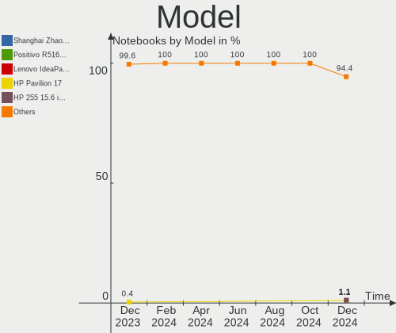
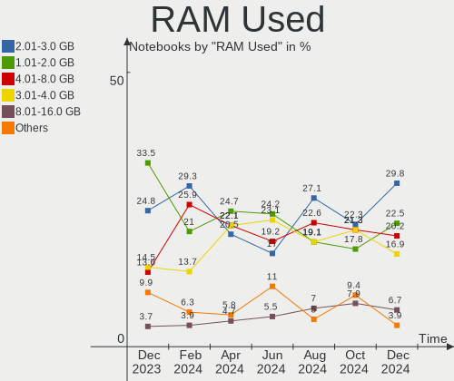
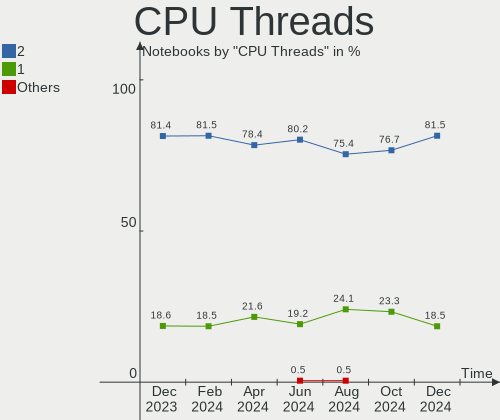
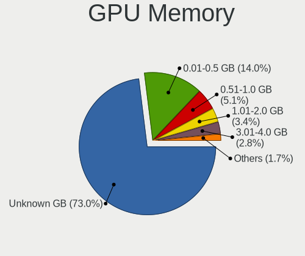

Debian - Hardware Trends (Notebooks)
------------------------------------

A project to identify most popular hardware characteristics and track their change
over time based on data collected by Linux users at https://Linux-Hardware.org.

Anyone can contribute to this report by the [hw-probe](https://github.com/linuxhw/hw-probe) tool:

    sudo -E hw-probe -all -upload

This report is for one last month. Overall report since the beginning of time: [TestDays](https://github.com/linuxhw/TestDays)

Period: Mar, 2023.

Contents
--------

* [ System ](#system)
  - [ OS                       ](#os)
  - [ OS Family                ](#os-family)
  - [ Kernel                   ](#kernel)
  - [ Kernel Family            ](#kernel-family)
  - [ Kernel Major Ver.        ](#kernel-major-ver)
  - [ Arch                     ](#arch)
  - [ DE                       ](#de)
  - [ Display Server           ](#display-server)
  - [ Display Manager          ](#display-manager)
  - [ OS Lang                  ](#os-lang)
  - [ Boot Mode                ](#boot-mode)
  - [ Filesystem               ](#filesystem)
  - [ Part. scheme             ](#part-scheme)
  - [ Dual Boot with Linux/BSD ](#dual-boot-with-linuxbsd)
  - [ Dual Boot (Win)          ](#dual-boot-win)

* [ Board ](#board)
  - [ Vendor                   ](#vendor)
  - [ Model                    ](#model)
  - [ Model Family             ](#model-family)
  - [ MFG Year                 ](#mfg-year)
  - [ Form Factor              ](#form-factor)
  - [ Secure Boot              ](#secure-boot)
  - [ Coreboot                 ](#coreboot)
  - [ RAM Size                 ](#ram-size)
  - [ RAM Used                 ](#ram-used)
  - [ Total Drives             ](#total-drives)
  - [ Has CD-ROM               ](#has-cd-rom)
  - [ Has Ethernet             ](#has-ethernet)
  - [ Has WiFi                 ](#has-wifi)
  - [ Has Bluetooth            ](#has-bluetooth)

* [ Location ](#location)
  - [ Country                  ](#country)
  - [ City                     ](#city)

* [ Drives ](#drives)
  - [ Drive Vendor             ](#drive-vendor)
  - [ Drive Model              ](#drive-model)
  - [ HDD Vendor               ](#hdd-vendor)
  - [ SSD Vendor               ](#ssd-vendor)
  - [ Drive Kind               ](#drive-kind)
  - [ Drive Connector          ](#drive-connector)
  - [ Drive Size               ](#drive-size)
  - [ Space Total              ](#space-total)
  - [ Space Used               ](#space-used)
  - [ Malfunc. Drives          ](#malfunc-drives)
  - [ Malfunc. Drive Vendor    ](#malfunc-drive-vendor)
  - [ Malfunc. HDD Vendor      ](#malfunc-hdd-vendor)
  - [ Malfunc. Drive Kind      ](#malfunc-drive-kind)
  - [ Failed Drives            ](#failed-drives)
  - [ Failed Drive Vendor      ](#failed-drive-vendor)
  - [ Drive Status             ](#drive-status)

* [ Storage controller ](#storage-controller)
  - [ Storage Vendor           ](#storage-vendor)
  - [ Storage Model            ](#storage-model)
  - [ Storage Kind             ](#storage-kind)

* [ Processor ](#processor)
  - [ CPU Vendor               ](#cpu-vendor)
  - [ CPU Model                ](#cpu-model)
  - [ CPU Model Family         ](#cpu-model-family)
  - [ CPU Cores                ](#cpu-cores)
  - [ CPU Sockets              ](#cpu-sockets)
  - [ CPU Threads              ](#cpu-threads)
  - [ CPU Op-Modes             ](#cpu-op-modes)
  - [ CPU Microcode            ](#cpu-microcode)
  - [ CPU Microarch            ](#cpu-microarch)

* [ Graphics ](#graphics)
  - [ GPU Vendor               ](#gpu-vendor)
  - [ GPU Model                ](#gpu-model)
  - [ GPU Combo                ](#gpu-combo)
  - [ GPU Driver               ](#gpu-driver)
  - [ GPU Memory               ](#gpu-memory)

* [ Monitor ](#monitor)
  - [ Monitor Vendor           ](#monitor-vendor)
  - [ Monitor Model            ](#monitor-model)
  - [ Monitor Resolution       ](#monitor-resolution)
  - [ Monitor Diagonal         ](#monitor-diagonal)
  - [ Monitor Width            ](#monitor-width)
  - [ Aspect Ratio             ](#aspect-ratio)
  - [ Monitor Area             ](#monitor-area)
  - [ Pixel Density            ](#pixel-density)
  - [ Multiple Monitors        ](#multiple-monitors)

* [ Network ](#network)
  - [ Net Controller Vendor    ](#net-controller-vendor)
  - [ Net Controller Model     ](#net-controller-model)
  - [ Wireless Vendor          ](#wireless-vendor)
  - [ Wireless Model           ](#wireless-model)
  - [ Ethernet Vendor          ](#ethernet-vendor)
  - [ Ethernet Model           ](#ethernet-model)
  - [ Net Controller Kind      ](#net-controller-kind)
  - [ Used Controller          ](#used-controller)
  - [ NICs                     ](#nics)
  - [ IPv6                     ](#ipv6)

* [ Bluetooth ](#bluetooth)
  - [ Bluetooth Vendor         ](#bluetooth-vendor)
  - [ Bluetooth Model          ](#bluetooth-model)

* [ Sound ](#sound)
  - [ Sound Vendor             ](#sound-vendor)
  - [ Sound Model              ](#sound-model)

* [ Memory ](#memory)
  - [ Memory Vendor            ](#memory-vendor)
  - [ Memory Model             ](#memory-model)
  - [ Memory Kind              ](#memory-kind)
  - [ Memory Form Factor       ](#memory-form-factor)
  - [ Memory Size              ](#memory-size)
  - [ Memory Speed             ](#memory-speed)

* [ Printers & scanners ](#printers--scanners)
  - [ Printer Vendor           ](#printer-vendor)
  - [ Printer Model            ](#printer-model)
  - [ Scanner Vendor           ](#scanner-vendor)
  - [ Scanner Model            ](#scanner-model)

* [ Camera ](#camera)
  - [ Camera Vendor            ](#camera-vendor)
  - [ Camera Model             ](#camera-model)

* [ Security ](#security)
  - [ Fingerprint Vendor       ](#fingerprint-vendor)
  - [ Fingerprint Model        ](#fingerprint-model)
  - [ Chipcard Vendor          ](#chipcard-vendor)
  - [ Chipcard Model           ](#chipcard-model)

* [ Unsupported ](#unsupported)
  - [ Unsupported Devices      ](#unsupported-devices)
  - [ Unsupported Device Types ](#unsupported-device-types)

System
------

OS
--

Installed operating systems

| Name              | Notebooks | Percent |
|-------------------|-----------|---------|
| Debian 11         | 180       | 74.69%  |
| Debian            | 36        | 14.94%  |
| Debian 12         | 20        | 8.3%    |
| Debian 10         | 3         | 1.24%   |
| Debian Sid        | 1         | 0.41%   |
| Debian 11-updates | 1         | 0.41%   |

OS Family
---------

OS without a version

| Name   | Notebooks | Percent |
|--------|-----------|---------|
| Debian | 241       | 100%    |

Kernel
------

Version of the Linux kernel

| Version                  | Notebooks | Percent |
|--------------------------|-----------|---------|
| 5.10.0-21-amd64          | 81        | 33.61%  |
| 5.10.0-20-amd64          | 61        | 25.31%  |
| 6.1.0-6-amd64            | 20        | 8.3%    |
| 6.1.0-5-amd64            | 20        | 8.3%    |
| 6.0.0-0.deb11.6-amd64    | 14        | 5.81%   |
| 6.1.0-3-amd64            | 4         | 1.66%   |
| 5.10.0-21-686-pae        | 4         | 1.66%   |
| 6.1.0-7-amd64            | 3         | 1.24%   |
| 6.0.0-6mx-amd64          | 3         | 1.24%   |
| 5.19.0-0.deb11.2-amd64   | 3         | 1.24%   |
| 5.10.0-2-amd64           | 3         | 1.24%   |
| 6.1.0-4-amd64            | 2         | 0.83%   |
| 6.0.0-6-amd64            | 2         | 0.83%   |
| 5.10.0-21-686            | 2         | 0.83%   |
| 5.10.0-18-amd64          | 2         | 0.83%   |
| 6.2.8                    | 1         | 0.41%   |
| 6.2.6-1-liquorix-amd64   | 1         | 0.41%   |
| 6.2.2-jason              | 1         | 0.41%   |
| 6.1.3                    | 1         | 0.41%   |
| 6.1.15-1-pve             | 1         | 0.41%   |
| 6.0.0-2-amd64            | 1         | 0.41%   |
| 5.3.5                    | 1         | 0.41%   |
| 5.2.5-64                 | 1         | 0.41%   |
| 5.16.0-0.bpo.4-amd64     | 1         | 0.41%   |
| 5.15.96-ROSILLO-KERNEL25 | 1         | 0.41%   |
| 5.15.95-xanmod1          | 1         | 0.41%   |
| 5.15.85-1-pve            | 1         | 0.41%   |
| 5.10.10-64               | 1         | 0.41%   |
| 5.10.0-20-686            | 1         | 0.41%   |
| 5.10.0-16-amd64          | 1         | 0.41%   |
| 5.10.0-15-amd64          | 1         | 0.41%   |
| 4.19.0-23-amd64          | 1         | 0.41%   |

Kernel Family
-------------

Linux kernel without a distro release

| Version | Notebooks | Percent |
|---------|-----------|---------|
| 5.10.0  | 156       | 64.73%  |
| 6.1.0   | 49        | 20.33%  |
| 6.0.0   | 20        | 8.3%    |
| 5.19.0  | 3         | 1.24%   |
| 6.2.8   | 1         | 0.41%   |
| 6.2.6   | 1         | 0.41%   |
| 6.2.2   | 1         | 0.41%   |
| 6.1.3   | 1         | 0.41%   |
| 6.1.15  | 1         | 0.41%   |
| 5.3.5   | 1         | 0.41%   |
| 5.2.5   | 1         | 0.41%   |
| 5.16.0  | 1         | 0.41%   |
| 5.15.96 | 1         | 0.41%   |
| 5.15.95 | 1         | 0.41%   |
| 5.15.85 | 1         | 0.41%   |
| 5.10.10 | 1         | 0.41%   |
| 4.19.0  | 1         | 0.41%   |

Kernel Major Ver.
-----------------

Linux kernel major version

| Version | Notebooks | Percent |
|---------|-----------|---------|
| 5.10    | 157       | 65.15%  |
| 6.1     | 51        | 21.16%  |
| 6.0     | 20        | 8.3%    |
| 6.2     | 3         | 1.24%   |
| 5.19    | 3         | 1.24%   |
| 5.15    | 3         | 1.24%   |
| 5.3     | 1         | 0.41%   |
| 5.2     | 1         | 0.41%   |
| 5.16    | 1         | 0.41%   |
| 4.19    | 1         | 0.41%   |

Arch
----

OS architecture (x86_64, i586, etc.)

| Name   | Notebooks | Percent |
|--------|-----------|---------|
| x86_64 | 233       | 96.68%  |
| i686   | 8         | 3.32%   |

DE
--

Desktop Environment

| Name              | Notebooks | Percent |
|-------------------|-----------|---------|
| Unknown           | 66        | 27.39%  |
| GNOME             | 61        | 25.31%  |
| KDE5              | 34        | 14.11%  |
| XFCE              | 27        | 11.2%   |
| X-Cinnamon        | 11        | 4.56%   |
| MATE              | 10        | 4.15%   |
| Cinnamon          | 9         | 3.73%   |
| LXDE              | 6         | 2.49%   |
| LXQt              | 4         | 1.66%   |
| GNOME Flashback   | 3         | 1.24%   |
| i3                | 2         | 0.83%   |
| x-session-manager | 1         | 0.41%   |
| Trinity           | 1         | 0.41%   |
| sway              | 1         | 0.41%   |
| Openbox           | 1         | 0.41%   |
| GNOME Classic     | 1         | 0.41%   |
| Enlightenment     | 1         | 0.41%   |
| Budgie            | 1         | 0.41%   |
| awesome           | 1         | 0.41%   |

Display Server
--------------

X11 or Wayland

| Name    | Notebooks | Percent |
|---------|-----------|---------|
| X11     | 127       | 52.7%   |
| Unknown | 60        | 24.9%   |
| Wayland | 46        | 19.09%  |
| Tty     | 8         | 3.32%   |

Display Manager
---------------

SDDM, LightDM, etc.

| Name    | Notebooks | Percent |
|---------|-----------|---------|
| Unknown | 93        | 38.59%  |
| LightDM | 57        | 23.65%  |
| GDM     | 30        | 12.45%  |
| SDDM    | 29        | 12.03%  |
| GDM3    | 26        | 10.79%  |
| NODM    | 2         | 0.83%   |
| GREETD  | 2         | 0.83%   |
| Ly      | 1         | 0.41%   |
| KDM     | 1         | 0.41%   |

OS Lang
-------

Language

| Lang    | Notebooks | Percent |
|---------|-----------|---------|
| en_US   | 66        | 27.39%  |
| Unknown | 51        | 21.16%  |
| de_DE   | 31        | 12.86%  |
| ru_RU   | 15        | 6.22%   |
| en_GB   | 14        | 5.81%   |
| fr_FR   | 12        | 4.98%   |
| it_IT   | 8         | 3.32%   |
| pt_BR   | 5         | 2.07%   |
| pl_PL   | 5         | 2.07%   |
| es_ES   | 4         | 1.66%   |
| fi_FI   | 3         | 1.24%   |
| es_AR   | 3         | 1.24%   |
| nl_BE   | 2         | 0.83%   |
| es_MX   | 2         | 0.83%   |
| en_CA   | 2         | 0.83%   |
| en_AU   | 2         | 0.83%   |
| C       | 2         | 0.83%   |
| uk_UA   | 1         | 0.41%   |
| sv_SE   | 1         | 0.41%   |
| oc_FR   | 1         | 0.41%   |
| nl_NL   | 1         | 0.41%   |
| ja_JP   | 1         | 0.41%   |
| fr_BE   | 1         | 0.41%   |
| es_CO   | 1         | 0.41%   |
| es_CL   | 1         | 0.41%   |
| en_SG   | 1         | 0.41%   |
| en_NZ   | 1         | 0.41%   |
| en_IL   | 1         | 0.41%   |
| de_AT   | 1         | 0.41%   |
| cs_CZ   | 1         | 0.41%   |
| be_BY   | 1         | 0.41%   |

Boot Mode
---------

EFI or BIOS

| Mode | Notebooks | Percent |
|------|-----------|---------|
| EFI  | 172       | 71.37%  |
| BIOS | 69        | 28.63%  |

Filesystem
----------

Type of filesystem

| Type    | Notebooks | Percent |
|---------|-----------|---------|
| Ext4    | 162       | 67.22%  |
| Overlay | 65        | 26.97%  |
| Btrfs   | 8         | 3.32%   |
| Rootfs  | 3         | 1.24%   |
| Xfs     | 2         | 0.83%   |
| Tmpfs   | 1         | 0.41%   |

Part. scheme
------------

Scheme of partitioning

| Type    | Notebooks | Percent |
|---------|-----------|---------|
| GPT     | 171       | 70.95%  |
| MBR     | 43        | 17.84%  |
| Unknown | 27        | 11.2%   |

Dual Boot with Linux/BSD
------------------------

Hosting more than one Linux/BSD

| Dual boot | Notebooks | Percent |
|-----------|-----------|---------|
| No        | 219       | 90.87%  |
| Yes       | 22        | 9.13%   |

Dual Boot (Win)
---------------

Hosting Linux and Windows

| Dual boot | Notebooks | Percent |
|-----------|-----------|---------|
| No        | 191       | 79.25%  |
| Yes       | 50        | 20.75%  |

Board
-----

Vendor
------

Motherboard manufacturer

| Name                | Notebooks | Percent |
|---------------------|-----------|---------|
| Apple               | 50        | 20.75%  |
| Lenovo              | 45        | 18.67%  |
| Dell                | 37        | 15.35%  |
| Hewlett-Packard     | 33        | 13.69%  |
| Acer                | 19        | 7.88%   |
| ASUSTek Computer    | 18        | 7.47%   |
| MSI                 | 5         | 2.07%   |
| Samsung Electronics | 4         | 1.66%   |
| Fujitsu             | 4         | 1.66%   |
| TUXEDO              | 3         | 1.24%   |
| Toshiba             | 3         | 1.24%   |
| Unknown             | 3         | 1.24%   |
| Medion              | 2         | 0.83%   |
| HUAWEI              | 2         | 0.83%   |
| THUNDEROBOT         | 1         | 0.41%   |
| System76            | 1         | 0.41%   |
| Sony                | 1         | 0.41%   |
| Schenker            | 1         | 0.41%   |
| SANTECH             | 1         | 0.41%   |
| PC Specialist       | 1         | 0.41%   |
| Packard Bell        | 1         | 0.41%   |
| OEGStone            | 1         | 0.41%   |
| Notebook            | 1         | 0.41%   |
| GPD                 | 1         | 0.41%   |
| Google              | 1         | 0.41%   |
| GMKtec              | 1         | 0.41%   |
| Aquarius            | 1         | 0.41%   |

Model
-----

Motherboard model

| Name                                       | Notebooks | Percent |
|--------------------------------------------|-----------|---------|
| Apple MacBook5,2                           | 47        | 19.5%   |
| Lenovo ThinkPad 13 2nd Gen 20J10046US      | 3         | 1.24%   |
| Unknown                                    | 3         | 1.24%   |
| Lenovo IdeaPad 5 15ARE05 81YQ              | 2         | 0.83%   |
| HP EliteBook 840 G6                        | 2         | 0.83%   |
| HP EliteBook 840 G3                        | 2         | 0.83%   |
| HP EliteBook 830 G5                        | 2         | 0.83%   |
| Dell Precision 5570                        | 2         | 0.83%   |
| Dell Latitude E6440                        | 2         | 0.83%   |
| Dell Latitude E6330                        | 2         | 0.83%   |
| Dell Latitude 3510                         | 2         | 0.83%   |
| Dell Latitude 3320                         | 2         | 0.83%   |
| ASUS Zenbook UX535QE_UM535QE               | 2         | 0.83%   |
| Acer Nitro AN515-43                        | 2         | 0.83%   |
| TUXEDO N13xWU                              | 1         | 0.41%   |
| TUXEDO InfinityBook Pro 14 v4              | 1         | 0.41%   |
| TUXEDO Aura 15 Gen2                        | 1         | 0.41%   |
| Toshiba Satellite C655                     | 1         | 0.41%   |
| Toshiba Satellite C50-B                    | 1         | 0.41%   |
| Toshiba Satellite A200                     | 1         | 0.41%   |
| THUNDEROBOT 911 Plus                       | 1         | 0.41%   |
| System76 Gazelle Professional              | 1         | 0.41%   |
| Sony SVE1512M6ESI                          | 1         | 0.41%   |
| Schenker VIA 15 Pro                        | 1         | 0.41%   |
| SANTECH NHx0DB,DE                          | 1         | 0.41%   |
| Samsung RF511/RF411/RF711                  | 1         | 0.41%   |
| Samsung 550XBE/350XBE                      | 1         | 0.41%   |
| Samsung 300V3A/300V4A/300V5A/200A4B/200A5B | 1         | 0.41%   |
| Samsung 300E4A/300E5A/300E7A               | 1         | 0.41%   |
| PC Specialist 14 Fusion IV                 | 1         | 0.41%   |
| Packard Bell H17HV                         | 1         | 0.41%   |
| OEGStone W54_55SU1,SUW                     | 1         | 0.41%   |
| Notebook NS5x_NS7xPU                       | 1         | 0.41%   |
| MSI PS42 8RB                               | 1         | 0.41%   |
| MSI Prestige 14Evo A11M                    | 1         | 0.41%   |
| MSI Modern 15 A5M                          | 1         | 0.41%   |
| MSI GF72 8RE                               | 1         | 0.41%   |
| MSI Creator 15M A9SD                       | 1         | 0.41%   |
| Medion P7641 MD99856                       | 1         | 0.41%   |
| Medion E122X                               | 1         | 0.41%   |

Model Family
------------

Motherboard model prefix

| Name                | Notebooks | Percent |
|---------------------|-----------|---------|
| Apple MacBook5      | 47        | 19.5%   |
| Lenovo ThinkPad     | 26        | 10.79%  |
| Dell Latitude       | 15        | 6.22%   |
| Acer Aspire         | 13        | 5.39%   |
| HP EliteBook        | 10        | 4.15%   |
| Lenovo IdeaPad      | 6         | 2.49%   |
| Dell Precision      | 6         | 2.49%   |
| Dell Inspiron       | 5         | 2.07%   |
| ASUS Zenbook        | 5         | 2.07%   |
| ASUS VivoBook       | 5         | 2.07%   |
| HP ZBook            | 4         | 1.66%   |
| HP Pavilion         | 4         | 1.66%   |
| HP Laptop           | 4         | 1.66%   |
| Fujitsu LIFEBOOK    | 4         | 1.66%   |
| Dell XPS            | 4         | 1.66%   |
| Toshiba Satellite   | 3         | 1.24%   |
| Lenovo Yoga         | 3         | 1.24%   |
| HP ProBook          | 3         | 1.24%   |
| Acer Nitro          | 3         | 1.24%   |
| Unknown             | 3         | 1.24%   |
| Lenovo ThinkBook    | 2         | 0.83%   |
| Lenovo Legion       | 2         | 0.83%   |
| HP Compaq           | 2         | 0.83%   |
| HP 255              | 2         | 0.83%   |
| Dell Vostro         | 2         | 0.83%   |
| Dell G3             | 2         | 0.83%   |
| TUXEDO N13xWU       | 1         | 0.41%   |
| TUXEDO InfinityBook | 1         | 0.41%   |
| TUXEDO Aura         | 1         | 0.41%   |
| THUNDEROBOT 911     | 1         | 0.41%   |
| System76 Gazelle    | 1         | 0.41%   |
| Sony SVE1512M6ESI   | 1         | 0.41%   |
| Schenker VIA        | 1         | 0.41%   |
| SANTECH NHx0DB      | 1         | 0.41%   |
| Samsung RF511       | 1         | 0.41%   |
| Samsung 550XBE      | 1         | 0.41%   |
| Samsung 300V3A      | 1         | 0.41%   |
| Samsung 300E4A      | 1         | 0.41%   |
| PC Specialist 14    | 1         | 0.41%   |
| Packard Bell H17HV  | 1         | 0.41%   |

MFG Year
--------

Motherboard manufacture year

| Year | Notebooks | Percent |
|------|-----------|---------|
| 2009 | 51        | 21.16%  |
| 2022 | 25        | 10.37%  |
| 2021 | 21        | 8.71%   |
| 2020 | 19        | 7.88%   |
| 2019 | 18        | 7.47%   |
| 2018 | 14        | 5.81%   |
| 2013 | 14        | 5.81%   |
| 2014 | 13        | 5.39%   |
| 2012 | 13        | 5.39%   |
| 2011 | 12        | 4.98%   |
| 2017 | 11        | 4.56%   |
| 2016 | 9         | 3.73%   |
| 2015 | 7         | 2.9%    |
| 2010 | 5         | 2.07%   |
| 2007 | 4         | 1.66%   |
| 2006 | 4         | 1.66%   |
| 2008 | 1         | 0.41%   |

Form Factor
-----------

Physical design of the computer

| Name     | Notebooks | Percent |
|----------|-----------|---------|
| Notebook | 241       | 100%    |

Secure Boot
-----------

Enabled or disabled

| State    | Notebooks | Percent |
|----------|-----------|---------|
| Disabled | 224       | 92.95%  |
| Enabled  | 17        | 7.05%   |

Coreboot
--------

Have coreboot on board

| Used | Notebooks | Percent |
|------|-----------|---------|
| No   | 239       | 99.17%  |
| Yes  | 2         | 0.83%   |

RAM Size
--------

Total RAM memory

| Size in GB  | Notebooks | Percent |
|-------------|-----------|---------|
| 3.01-4.0    | 66        | 27.39%  |
| 4.01-8.0    | 54        | 22.41%  |
| 16.01-24.0  | 46        | 19.09%  |
| 8.01-16.0   | 32        | 13.28%  |
| 1.01-2.0    | 15        | 6.22%   |
| 32.01-64.0  | 14        | 5.81%   |
| 2.01-3.0    | 5         | 2.07%   |
| 64.01-256.0 | 4         | 1.66%   |
| 24.01-32.0  | 3         | 1.24%   |
| 0.51-1.0    | 2         | 0.83%   |

RAM Used
--------

Used RAM memory

| Used GB    | Notebooks | Percent |
|------------|-----------|---------|
| 1.01-2.0   | 102       | 42.32%  |
| 2.01-3.0   | 45        | 18.67%  |
| 4.01-8.0   | 40        | 16.6%   |
| 3.01-4.0   | 19        | 7.88%   |
| 0.51-1.0   | 18        | 7.47%   |
| 8.01-16.0  | 9         | 3.73%   |
| 0.01-0.5   | 6         | 2.49%   |
| 32.01-64.0 | 1         | 0.41%   |
| 16.01-24.0 | 1         | 0.41%   |

Total Drives
------------

Number of drives on board

| Drives | Notebooks | Percent |
|--------|-----------|---------|
| 1      | 186       | 77.18%  |
| 2      | 46        | 19.09%  |
| 3      | 6         | 2.49%   |
| 0      | 2         | 0.83%   |
| 4      | 1         | 0.41%   |

Has CD-ROM
----------

Has CD-ROM on board

| Presented | Notebooks | Percent |
|-----------|-----------|---------|
| No        | 135       | 56.02%  |
| Yes       | 106       | 43.98%  |

Has Ethernet
------------

Has Ethernet on board

| Presented | Notebooks | Percent |
|-----------|-----------|---------|
| Yes       | 208       | 86.31%  |
| No        | 33        | 13.69%  |

Has WiFi
--------

Has WiFi module

| Presented | Notebooks | Percent |
|-----------|-----------|---------|
| Yes       | 240       | 99.59%  |
| No        | 1         | 0.41%   |

Has Bluetooth
-------------

Has Bluetooth module

| Presented | Notebooks | Percent |
|-----------|-----------|---------|
| Yes       | 207       | 85.89%  |
| No        | 34        | 14.11%  |

Location
--------

Country
-------

Geographic location (country)

| Country      | Notebooks | Percent |
|--------------|-----------|---------|
| USA          | 73        | 30.29%  |
| Germany      | 38        | 15.77%  |
| Russia       | 17        | 7.05%   |
| France       | 16        | 6.64%   |
| Italy        | 13        | 5.39%   |
| Poland       | 8         | 3.32%   |
| Spain        | 6         | 2.49%   |
| UK           | 5         | 2.07%   |
| Brazil       | 5         | 2.07%   |
| Mexico       | 4         | 1.66%   |
| Finland      | 4         | 1.66%   |
| Ukraine      | 3         | 1.24%   |
| Netherlands  | 3         | 1.24%   |
| Canada       | 3         | 1.24%   |
| Belgium      | 3         | 1.24%   |
| Austria      | 3         | 1.24%   |
| Argentina    | 3         | 1.24%   |
| Turkey       | 2         | 0.83%   |
| Sweden       | 2         | 0.83%   |
| Romania      | 2         | 0.83%   |
| Norway       | 2         | 0.83%   |
| Czechia      | 2         | 0.83%   |
| China        | 2         | 0.83%   |
| Belarus      | 2         | 0.83%   |
| Australia    | 2         | 0.83%   |
| Taiwan       | 1         | 0.41%   |
| Sudan        | 1         | 0.41%   |
| Singapore    | 1         | 0.41%   |
| Saudi Arabia | 1         | 0.41%   |
| New Zealand  | 1         | 0.41%   |
| Morocco      | 1         | 0.41%   |
| Kazakhstan   | 1         | 0.41%   |
| Japan        | 1         | 0.41%   |
| Israel       | 1         | 0.41%   |
| Indonesia    | 1         | 0.41%   |
| India        | 1         | 0.41%   |
| Greece       | 1         | 0.41%   |
| Ecuador      | 1         | 0.41%   |
| Croatia      | 1         | 0.41%   |
| Colombia     | 1         | 0.41%   |

City
----

Geographic location (city)

| City                  | Notebooks | Percent |
|-----------------------|-----------|---------|
| Bangor                | 51        | 21.16%  |
| Voronezh              | 6         | 2.49%   |
| Helsinki              | 4         | 1.66%   |
| Vienna                | 3         | 1.24%   |
| Paris                 | 3         | 1.24%   |
| Kirishi               | 3         | 1.24%   |
| Bonn                  | 3         | 1.24%   |
| St Petersburg         | 2         | 0.83%   |
| Nizhniy Novgorod      | 2         | 0.83%   |
| Munich                | 2         | 0.83%   |
| Milano                | 2         | 0.83%   |
| Mexico City           | 2         | 0.83%   |
| Leipzig               | 2         | 0.83%   |
| Kassel                | 2         | 0.83%   |
| Grodzisk Wielkopolski | 2         | 0.83%   |
| Frankfurt am Main     | 2         | 0.83%   |
| Donetsk               | 2         | 0.83%   |
| Brasília             | 2         | 0.83%   |
| Barcelona             | 2         | 0.83%   |
| Zuidland              | 1         | 0.41%   |
| Zagreb                | 1         | 0.41%   |
| Wroclaw               | 1         | 0.41%   |
| Whitianga             | 1         | 0.41%   |
| Wetzlar               | 1         | 0.41%   |
| Waukegan              | 1         | 0.41%   |
| Vorselaar             | 1         | 0.41%   |
| Voll                  | 1         | 0.41%   |
| Vila Velha            | 1         | 0.41%   |
| Ulm                   | 1         | 0.41%   |
| Turin                 | 1         | 0.41%   |
| Timișoara            | 1         | 0.41%   |
| Tarbes                | 1         | 0.41%   |
| Taipei                | 1         | 0.41%   |
| Sydney                | 1         | 0.41%   |
| Sutton                | 1         | 0.41%   |
| Surabaya              | 1         | 0.41%   |
| Struxdorf             | 1         | 0.41%   |
| Strausberg            | 1         | 0.41%   |
| Solna                 | 1         | 0.41%   |
| Singapore             | 1         | 0.41%   |

Drives
------

Drive Vendor
------------

Hard drive vendors

| Vendor                   | Notebooks | Drives | Percent |
|--------------------------|-----------|--------|---------|
| Samsung Electronics      | 51        | 57     | 17.47%  |
| Fujitsu                  | 36        | 36     | 12.33%  |
| WDC                      | 32        | 33     | 10.96%  |
| Seagate                  | 23        | 24     | 7.88%   |
| Toshiba                  | 20        | 20     | 6.85%   |
| Sandisk                  | 19        | 19     | 6.51%   |
| Unknown                  | 11        | 12     | 3.77%   |
| Hitachi                  | 11        | 11     | 3.77%   |
| SK hynix                 | 8         | 8      | 2.74%   |
| Micron Technology        | 8         | 8      | 2.74%   |
| Intel                    | 8         | 9      | 2.74%   |
| Crucial                  | 8         | 8      | 2.74%   |
| Kingston                 | 7         | 7      | 2.4%    |
| A-DATA Technology        | 6         | 6      | 2.05%   |
| PNY                      | 4         | 4      | 1.37%   |
| LITEON                   | 4         | 4      | 1.37%   |
| HGST                     | 3         | 3      | 1.03%   |
| TO Exter                 | 2         | 2      | 0.68%   |
| Team                     | 2         | 2      | 0.68%   |
| SSSTC                    | 2         | 2      | 0.68%   |
| Phison                   | 2         | 2      | 0.68%   |
| JMicron Technology       | 2         | 2      | 0.68%   |
| Intenso                  | 2         | 2      | 0.68%   |
| INNOVATION IT            | 2         | 2      | 0.68%   |
| Apple                    | 2         | 2      | 0.68%   |
| SPCC                     | 1         | 1      | 0.34%   |
| Silicon Motion           | 1         | 1      | 0.34%   |
| ShiJi                    | 1         | 1      | 0.34%   |
| SABRENT                  | 1         | 1      | 0.34%   |
| Phison Electronics       | 1         | 1      | 0.34%   |
| Patriot                  | 1         | 1      | 0.34%   |
| Netac                    | 1         | 1      | 0.34%   |
| LITEONIT                 | 1         | 1      | 0.34%   |
| LaCie                    | 1         | 1      | 0.34%   |
| KIOXIA                   | 1         | 1      | 0.34%   |
| Hewlett-Packard          | 1         | 1      | 0.34%   |
| Gigabyte Technology      | 1         | 1      | 0.34%   |
| Fanxiang                 | 1         | 1      | 0.34%   |
| China                    | 1         | 1      | 0.34%   |
| Biwin Storage Technology | 1         | 1      | 0.34%   |

Drive Model
-----------

Hard drive models

| Model                                               | Notebooks | Percent |
|-----------------------------------------------------|-----------|---------|
| Fujitsu MHZ2160BH FFS G1 160GB                      | 35        | 11.74%  |
| Toshiba MK1655GSXF 160GB                            | 6         | 2.01%   |
| Toshiba MQ01ABD100 1TB                              | 5         | 1.68%   |
| Hitachi HTS543216L9SA02 160GB                       | 5         | 1.68%   |
| Seagate ST1000LM035-1RK172 1TB                      | 4         | 1.34%   |
| Samsung SSD 970 EVO Plus 1TB                        | 4         | 1.34%   |
| Sandisk WD Blue SN550 NVMe SSD 256GB                | 3         | 1.01%   |
| Samsung SSD 850 EVO 250GB                           | 3         | 1.01%   |
| Samsung PM9A1 NVMe 1024GB                           | 3         | 1.01%   |
| WDC WDS240G2G0A-00JH30 240GB SSD                    | 2         | 0.67%   |
| WDC PC SN730 SDBPNTY-1T00-1102 1TB                  | 2         | 0.67%   |
| WDC PC SN530 SDBPNPZ-256G-1006 256GB                | 2         | 0.67%   |
| WDC PC SN530 NVMe 256GB                             | 2         | 0.67%   |
| Toshiba MQ01ABF050 500GB                            | 2         | 0.67%   |
| Toshiba KXG50ZNV512G 512GB                          | 2         | 0.67%   |
| TO Exter nal USB 3.0 1TB                            | 2         | 0.67%   |
| Seagate ST500LT012-1DG142 500GB                     | 2         | 0.67%   |
| Seagate ST2000LM003 HN-M201RAD 2TB                  | 2         | 0.67%   |
| Seagate ST1000LM048-2E7172 1TB                      | 2         | 0.67%   |
| Seagate ST1000LM024 HN-M101MBB 1TB                  | 2         | 0.67%   |
| SanDisk SD8SN8U128G1001 128GB SSD                   | 2         | 0.67%   |
| SanDisk SD8SN8U-256G-1006 256GB SSD                 | 2         | 0.67%   |
| Samsung SSD 980 PRO 1TB                             | 2         | 0.67%   |
| Samsung SSD 980 1TB                                 | 2         | 0.67%   |
| Samsung NVMe SSD Controller SM981/PM981/PM983 250GB | 2         | 0.67%   |
| Samsung MZVLB1T0HBLR-000L2 1TB                      | 2         | 0.67%   |
| Kingston SV300S37A120G 120GB SSD                    | 2         | 0.67%   |
| Kingston SA400S37120G 120GB SSD                     | 2         | 0.67%   |
| Intel SSDPEKNW512G8 512GB                           | 2         | 0.67%   |
| INNOVATION IT IT 512GB                              | 2         | 0.67%   |
| Crucial CT1000MX500SSD1 1TB                         | 2         | 0.67%   |
| WDC WDS960G2G0C-00AJM0 960GB                        | 1         | 0.34%   |
| WDC WDS500G2B0C-00PXH0 500GB                        | 1         | 0.34%   |
| WDC WDS100T2B0B-00YS70 1TB SSD                      | 1         | 0.34%   |
| WDC WDS100T2B0A-00SM50 1TB SSD                      | 1         | 0.34%   |
| WDC WD5000LPVX-75V0TT0 500GB                        | 1         | 0.34%   |
| WDC WD5000LPCX-24C6HT0 500GB                        | 1         | 0.34%   |
| WDC WD5000BEVT-22ZAT0 500GB                         | 1         | 0.34%   |
| WDC WD3200BPVT-24JJ5T0 320GB                        | 1         | 0.34%   |
| WDC WD3200BEKT-75KA9T0 320GB                        | 1         | 0.34%   |

HDD Vendor
----------

Hard disk drive vendors

| Vendor  | Notebooks | Drives | Percent |
|---------|-----------|--------|---------|
| Fujitsu | 36        | 36     | 33.33%  |
| Seagate | 23        | 23     | 21.3%   |
| Toshiba | 17        | 17     | 15.74%  |
| WDC     | 14        | 14     | 12.96%  |
| Hitachi | 11        | 11     | 10.19%  |
| HGST    | 3         | 3      | 2.78%   |
| Unknown | 1         | 1      | 0.93%   |
| SABRENT | 1         | 1      | 0.93%   |
| ASMT    | 1         | 1      | 0.93%   |
| Apple   | 1         | 1      | 0.93%   |

SSD Vendor
----------

Solid state drive vendors

| Vendor              | Notebooks | Drives | Percent |
|---------------------|-----------|--------|---------|
| Samsung Electronics | 16        | 16     | 20%     |
| SanDisk             | 11        | 11     | 13.75%  |
| Kingston            | 6         | 6      | 7.5%    |
| Crucial             | 6         | 6      | 7.5%    |
| WDC                 | 4         | 4      | 5%      |
| PNY                 | 4         | 4      | 5%      |
| A-DATA Technology   | 4         | 4      | 5%      |
| LITEON              | 3         | 3      | 3.75%   |
| Intel               | 3         | 3      | 3.75%   |
| TO Exter            | 2         | 2      | 2.5%    |
| Team                | 2         | 2      | 2.5%    |
| SK hynix            | 2         | 2      | 2.5%    |
| Intenso             | 2         | 2      | 2.5%    |
| INNOVATION IT       | 2         | 2      | 2.5%    |
| Toshiba             | 1         | 1      | 1.25%   |
| ShiJi               | 1         | 1      | 1.25%   |
| Phison              | 1         | 1      | 1.25%   |
| Patriot             | 1         | 1      | 1.25%   |
| Netac               | 1         | 1      | 1.25%   |
| Micron Technology   | 1         | 1      | 1.25%   |
| LITEONIT            | 1         | 1      | 1.25%   |
| JMicron Technology  | 1         | 1      | 1.25%   |
| Hewlett-Packard     | 1         | 1      | 1.25%   |
| Gigabyte Technology | 1         | 1      | 1.25%   |
| China               | 1         | 1      | 1.25%   |
| Apple               | 1         | 1      | 1.25%   |
| ADATA SU            | 1         | 1      | 1.25%   |

Drive Kind
----------

HDD or SSD

| Kind    | Notebooks | Drives | Percent |
|---------|-----------|--------|---------|
| HDD     | 105       | 108    | 36.84%  |
| NVMe    | 91        | 100    | 31.93%  |
| SSD     | 76        | 80     | 26.67%  |
| MMC     | 10        | 11     | 3.51%   |
| Unknown | 3         | 3      | 1.05%   |

Drive Connector
---------------

SATA, SAS, NVMe, etc.

| Type | Notebooks | Drives | Percent |
|------|-----------|--------|---------|
| SATA | 164       | 178    | 58.99%  |
| NVMe | 91        | 100    | 32.73%  |
| SAS  | 13        | 13     | 4.68%   |
| MMC  | 10        | 11     | 3.6%    |

Drive Size
----------

Size of hard drive

| Size in TB | Notebooks | Drives | Percent |
|------------|-----------|--------|---------|
| 0.01-0.5   | 134       | 139    | 74.03%  |
| 0.51-1.0   | 42        | 44     | 23.2%   |
| 1.01-2.0   | 4         | 4      | 2.21%   |
| 4.01-10.0  | 1         | 1      | 0.55%   |

Space Total
-----------

Amount of disk space available on the file system

| Size in GB     | Notebooks | Percent |
|----------------|-----------|---------|
| Unknown        | 57        | 23.65%  |
| 101-250        | 52        | 21.58%  |
| 251-500        | 48        | 19.92%  |
| 501-1000       | 33        | 13.69%  |
| 1001-2000      | 21        | 8.71%   |
| 51-100         | 10        | 4.15%   |
| 21-50          | 8         | 3.32%   |
| 1-20           | 5         | 2.07%   |
| More than 3000 | 4         | 1.66%   |
| 2001-3000      | 3         | 1.24%   |

Space Used
----------

Amount of used disk space

| Used GB        | Notebooks | Percent |
|----------------|-----------|---------|
| 1-20           | 66        | 27.39%  |
| Unknown        | 57        | 23.65%  |
| 101-250        | 37        | 15.35%  |
| 21-50          | 23        | 9.54%   |
| 51-100         | 21        | 8.71%   |
| 501-1000       | 15        | 6.22%   |
| 251-500        | 13        | 5.39%   |
| 1001-2000      | 6         | 2.49%   |
| More than 3000 | 2         | 0.83%   |
| 2001-3000      | 1         | 0.41%   |

Malfunc. Drives
---------------

Drive models with a malfunction

| Model                               | Notebooks | Drives | Percent |
|-------------------------------------|-----------|--------|---------|
| Hitachi HTS543216L9SA02 160GB       | 5         | 5      | 16.67%  |
| Fujitsu MHZ2160BH FFS G1 160GB      | 5         | 5      | 16.67%  |
| Toshiba MQ01ABD100 1TB              | 3         | 3      | 10%     |
| WDC WD10SPZX-60Z10T0 1TB            | 1         | 1      | 3.33%   |
| Toshiba MQ02ABD100H 1TB             | 1         | 1      | 3.33%   |
| Toshiba MK1655GSXF 160GB            | 1         | 1      | 3.33%   |
| Seagate ST9320423AS 320GB           | 1         | 1      | 3.33%   |
| Seagate ST9250827AS 250GB           | 1         | 1      | 3.33%   |
| Seagate ST500LM021-1KJ152 500GB     | 1         | 1      | 3.33%   |
| Seagate ST500LM012 HN-M500MBB 500GB | 1         | 1      | 3.33%   |
| Seagate ST1000LM049-2GH172 1TB      | 1         | 1      | 3.33%   |
| Seagate ST1000LM035-1RK172 1TB      | 1         | 1      | 3.33%   |
| SanDisk SDSSDXPS960G 960GB          | 1         | 1      | 3.33%   |
| SanDisk SD9TN8W-256G-1006 256GB SSD | 1         | 1      | 3.33%   |
| SanDisk SD7SB2Q512G1001 512GB SSD   | 1         | 1      | 3.33%   |
| SanDisk SD6SP1M256G1012 256GB SSD   | 1         | 1      | 3.33%   |
| Kingston SV300S37A120G 120GB SSD    | 1         | 1      | 3.33%   |
| Kingston SA400S37120G 120GB SSD     | 1         | 1      | 3.33%   |
| Hitachi HTS727550A9E364 500GB       | 1         | 1      | 3.33%   |
| Hitachi HTS421210H9AT00 100GB       | 1         | 1      | 3.33%   |

Malfunc. Drive Vendor
---------------------

Vendors of faulty drives

| Vendor   | Notebooks | Drives | Percent |
|----------|-----------|--------|---------|
| Hitachi  | 7         | 7      | 23.33%  |
| Seagate  | 6         | 6      | 20%     |
| Toshiba  | 5         | 5      | 16.67%  |
| Fujitsu  | 5         | 5      | 16.67%  |
| SanDisk  | 4         | 4      | 13.33%  |
| Kingston | 2         | 2      | 6.67%   |
| WDC      | 1         | 1      | 3.33%   |

Malfunc. HDD Vendor
-------------------

Vendors of faulty HDD drives

| Vendor  | Notebooks | Drives | Percent |
|---------|-----------|--------|---------|
| Hitachi | 7         | 7      | 29.17%  |
| Seagate | 6         | 6      | 25%     |
| Toshiba | 5         | 5      | 20.83%  |
| Fujitsu | 5         | 5      | 20.83%  |
| WDC     | 1         | 1      | 4.17%   |

Malfunc. Drive Kind
-------------------

Kinds of faulty drives

| Kind | Notebooks | Drives | Percent |
|------|-----------|--------|---------|
| HDD  | 24        | 24     | 80%     |
| SSD  | 6         | 6      | 20%     |

Failed Drives
-------------

Failed drive models

Zero info for selected period =(

Failed Drive Vendor
-------------------

Failed drive vendors

Zero info for selected period =(

Drive Status
------------

Number of failed and malfunc. drives

| Status   | Notebooks | Drives | Percent |
|----------|-----------|--------|---------|
| Works    | 185       | 212    | 70.61%  |
| Detected | 47        | 60     | 17.94%  |
| Malfunc  | 30        | 30     | 11.45%  |

Storage controller
------------------

Storage Vendor
--------------

Storage controller vendors

| Vendor                         | Notebooks | Percent |
|--------------------------------|-----------|---------|
| Intel                          | 123       | 43.16%  |
| Nvidia                         | 48        | 16.84%  |
| Samsung Electronics            | 37        | 12.98%  |
| AMD                            | 25        | 8.77%   |
| SanDisk                        | 22        | 7.72%   |
| Micron Technology              | 7         | 2.46%   |
| SK hynix                       | 6         | 2.11%   |
| Toshiba America Info Systems   | 2         | 0.7%    |
| Solid State Storage Technology | 2         | 0.7%    |
| Phison Electronics             | 2         | 0.7%    |
| Micron/Crucial Technology      | 2         | 0.7%    |
| ADATA Technology               | 2         | 0.7%    |
| Silicon Motion                 | 1         | 0.35%   |
| Realtek Semiconductor          | 1         | 0.35%   |
| Lite-On Technology             | 1         | 0.35%   |
| KIOXIA                         | 1         | 0.35%   |
| Kingston Technology Company    | 1         | 0.35%   |
| INNOGRIT                       | 1         | 0.35%   |
| Biwin Storage Technology       | 1         | 0.35%   |

Storage Model
-------------

Storage controller models

| Model                                                                            | Notebooks | Percent |
|----------------------------------------------------------------------------------|-----------|---------|
| Nvidia MCP79 AHCI Controller                                                     | 48        | 16.22%  |
| AMD FCH SATA Controller [AHCI mode]                                              | 23        | 7.77%   |
| Samsung NVMe SSD Controller SM981/PM981/PM983                                    | 16        | 5.41%   |
| Intel Sunrise Point-LP SATA Controller [AHCI mode]                               | 16        | 5.41%   |
| Intel 82801 Mobile SATA Controller [RAID mode]                                   | 16        | 5.41%   |
| Samsung NVMe SSD Controller PM9A1/PM9A3/980PRO                                   | 11        | 3.72%   |
| Intel 7 Series Chipset Family 6-port SATA Controller [AHCI mode]                 | 10        | 3.38%   |
| Intel 6 Series/C200 Series Chipset Family 6 port Mobile SATA AHCI Controller     | 9         | 3.04%   |
| Intel 8 Series/C220 Series Chipset Family 6-port SATA Controller 1 [AHCI mode]   | 8         | 2.7%    |
| SanDisk WD Blue SN550 NVMe SSD                                                   | 7         | 2.36%   |
| Micron NVMe Storage Controller                                                   | 7         | 2.36%   |
| Samsung NVMe SSD Controller 980                                                  | 6         | 2.03%   |
| SanDisk Non-Volatile memory controller                                           | 5         | 1.69%   |
| Intel Comet Lake SATA AHCI Controller                                            | 5         | 1.69%   |
| Intel 8 Series SATA Controller 1 [AHCI mode]                                     | 5         | 1.69%   |
| SK hynix Gold P31/PC711 NVMe Solid State Drive                                   | 4         | 1.35%   |
| SanDisk WD Black SN750 / PC SN730 NVMe SSD                                       | 4         | 1.35%   |
| Intel Volume Management Device NVMe RAID Controller                              | 4         | 1.35%   |
| Intel Cannon Lake Mobile PCH SATA AHCI Controller                                | 4         | 1.35%   |
| Intel 82801HM/HEM (ICH8M/ICH8M-E) SATA Controller [AHCI mode]                    | 4         | 1.35%   |
| Intel 82801HM/HEM (ICH8M/ICH8M-E) IDE Controller                                 | 4         | 1.35%   |
| Intel 82801GBM/GHM (ICH7-M Family) SATA Controller [AHCI mode]                   | 4         | 1.35%   |
| Intel 82801G (ICH7 Family) IDE Controller                                        | 4         | 1.35%   |
| Intel 5 Series/3400 Series Chipset 4 port SATA AHCI Controller                   | 4         | 1.35%   |
| SanDisk WD Blue SN500 / PC SN520 NVMe SSD                                        | 3         | 1.01%   |
| Intel Wildcat Point-LP SATA Controller [AHCI Mode]                               | 3         | 1.01%   |
| Intel SSD 660P Series                                                            | 3         | 1.01%   |
| Intel Q170/Q150/B150/H170/H110/Z170/CM236 Chipset SATA Controller [AHCI Mode]    | 3         | 1.01%   |
| Intel Atom Processor E3800 Series SATA AHCI Controller                           | 3         | 1.01%   |
| Intel 400 Series Chipset Family SATA AHCI Controller                             | 3         | 1.01%   |
| Toshiba America Info Systems XG5 NVMe SSD Controller                             | 2         | 0.68%   |
| Solid State Storage Non-Volatile memory controller                               | 2         | 0.68%   |
| Micron/Crucial P5 Plus NVMe PCIe SSD                                             | 2         | 0.68%   |
| Intel Tiger Lake-LP SATA Controller                                              | 2         | 0.68%   |
| Intel Ice Lake-LP SATA Controller [AHCI mode]                                    | 2         | 0.68%   |
| Intel Celeron/Pentium Silver Processor SATA Controller                           | 2         | 0.68%   |
| Intel Cannon Point-LP SATA Controller [AHCI Mode]                                | 2         | 0.68%   |
| Intel Atom/Celeron/Pentium Processor x5-E8000/J3xxx/N3xxx Series SATA Controller | 2         | 0.68%   |
| Intel 82801IBM/IEM (ICH9M/ICH9M-E) 4 port SATA Controller [AHCI mode]            | 2         | 0.68%   |
| AMD SB7x0/SB8x0/SB9x0 SATA Controller [AHCI mode]                                | 2         | 0.68%   |

Storage Kind
------------

Kind of storage controller (IDE, SATA, NVMe, SAS, ...)

| Kind | Notebooks | Percent |
|------|-----------|---------|
| SATA | 173       | 59.04%  |
| NVMe | 90        | 30.72%  |
| RAID | 20        | 6.83%   |
| IDE  | 10        | 3.41%   |

Processor
---------

CPU Vendor
----------

Processor vendors

| Vendor | Notebooks | Percent |
|--------|-----------|---------|
| Intel  | 207       | 85.89%  |
| AMD    | 34        | 14.11%  |

CPU Model
---------

Processor models

| Model                                         | Notebooks | Percent |
|-----------------------------------------------|-----------|---------|
| Intel Core 2 Duo CPU P7450 @ 2.13GHz          | 49        | 20.33%  |
| Intel Core i5-10210U CPU @ 1.60GHz            | 7         | 2.9%    |
| Intel Core i5-8250U CPU @ 1.60GHz             | 5         | 2.07%   |
| Intel Core i7-8750H CPU @ 2.20GHz             | 4         | 1.66%   |
| Intel Core i7-4710MQ CPU @ 2.50GHz            | 4         | 1.66%   |
| Intel 11th Gen Core i7-1165G7 @ 2.80GHz       | 4         | 1.66%   |
| AMD Ryzen 7 5700U with Radeon Graphics        | 4         | 1.66%   |
| Intel Core i7-6820HQ CPU @ 2.70GHz            | 3         | 1.24%   |
| Intel Core i7-6500U CPU @ 2.50GHz             | 3         | 1.24%   |
| Intel Core i7-10510U CPU @ 1.80GHz            | 3         | 1.24%   |
| Intel Core i5-4300M CPU @ 2.60GHz             | 3         | 1.24%   |
| Intel Core i5-3320M CPU @ 2.60GHz             | 3         | 1.24%   |
| Intel Celeron CPU 3865U @ 1.80GHz             | 3         | 1.24%   |
| Intel 12th Gen Core i7-12700H                 | 3         | 1.24%   |
| Intel 11th Gen Core i7-1185G7 @ 3.00GHz       | 3         | 1.24%   |
| Intel 11th Gen Core i5-1135G7 @ 2.40GHz       | 3         | 1.24%   |
| AMD Ryzen 5 5500U with Radeon Graphics        | 3         | 1.24%   |
| Intel Core i7-9750H CPU @ 2.60GHz             | 2         | 0.83%   |
| Intel Core i7-8665U CPU @ 1.90GHz             | 2         | 0.83%   |
| Intel Core i7-8565U CPU @ 1.80GHz             | 2         | 0.83%   |
| Intel Core i7-8550U CPU @ 1.80GHz             | 2         | 0.83%   |
| Intel Core i7-3630QM CPU @ 2.40GHz            | 2         | 0.83%   |
| Intel Core i7-10750H CPU @ 2.60GHz            | 2         | 0.83%   |
| Intel Core i5-6300U CPU @ 2.40GHz             | 2         | 0.83%   |
| Intel Core i5-6200U CPU @ 2.30GHz             | 2         | 0.83%   |
| Intel Core i5-4200U CPU @ 1.60GHz             | 2         | 0.83%   |
| Intel Core i5-2520M CPU @ 2.50GHz             | 2         | 0.83%   |
| Intel Core i5-1035G1 CPU @ 1.00GHz            | 2         | 0.83%   |
| Intel Core i3-2350M CPU @ 2.30GHz             | 2         | 0.83%   |
| Intel Core i3-1005G1 CPU @ 1.20GHz            | 2         | 0.83%   |
| Intel Celeron CPU N2840 @ 2.16GHz             | 2         | 0.83%   |
| Intel Atom CPU N450 @ 1.66GHz                 | 2         | 0.83%   |
| Intel 12th Gen Core i7-1260P                  | 2         | 0.83%   |
| Intel 12th Gen Core i7-1255U                  | 2         | 0.83%   |
| Intel 12th Gen Core i5-1235U                  | 2         | 0.83%   |
| AMD Ryzen 9 5900HX with Radeon Graphics       | 2         | 0.83%   |
| AMD Ryzen 5 3500U with Radeon Vega Mobile Gfx | 2         | 0.83%   |
| Intel Pentium Silver N6000 @ 1.10GHz          | 1         | 0.41%   |
| Intel Pentium Silver N5030 CPU @ 1.10GHz      | 1         | 0.41%   |
| Intel Pentium M processor 1.80GHz             | 1         | 0.41%   |

CPU Model Family
----------------

Processor model prefix

| Model                   | Notebooks | Percent |
|-------------------------|-----------|---------|
| Intel Core 2 Duo        | 54        | 22.41%  |
| Intel Core i7           | 44        | 18.26%  |
| Intel Core i5           | 44        | 18.26%  |
| Other                   | 26        | 10.79%  |
| Intel Core i3           | 14        | 5.81%   |
| Intel Celeron           | 11        | 4.56%   |
| AMD Ryzen 7             | 9         | 3.73%   |
| AMD Ryzen 5             | 8         | 3.32%   |
| Intel Genuine           | 3         | 1.24%   |
| Intel Atom              | 3         | 1.24%   |
| Intel Pentium Silver    | 2         | 0.83%   |
| Intel Pentium           | 2         | 0.83%   |
| AMD Ryzen 9             | 2         | 0.83%   |
| AMD Ryzen 7 PRO         | 2         | 0.83%   |
| AMD Ryzen 5 PRO         | 2         | 0.83%   |
| AMD E1                  | 2         | 0.83%   |
| AMD A10                 | 2         | 0.83%   |
| Intel Pentium M         | 1         | 0.41%   |
| Intel Core M            | 1         | 0.41%   |
| Intel Core i9           | 1         | 0.41%   |
| Intel Core Duo          | 1         | 0.41%   |
| AMD Turion II Dual-Core | 1         | 0.41%   |
| AMD Ryzen 3 PRO         | 1         | 0.41%   |
| AMD FX                  | 1         | 0.41%   |
| AMD E                   | 1         | 0.41%   |
| AMD A8                  | 1         | 0.41%   |
| AMD A6                  | 1         | 0.41%   |
| AMD A4                  | 1         | 0.41%   |

CPU Cores
---------

Number of processor cores

| Number | Notebooks | Percent |
|--------|-----------|---------|
| 2      | 125       | 51.87%  |
| 4      | 70        | 29.05%  |
| 6      | 16        | 6.64%   |
| 8      | 14        | 5.81%   |
| 10     | 5         | 2.07%   |
| 14     | 4         | 1.66%   |
| 12     | 3         | 1.24%   |
| 1      | 3         | 1.24%   |
| 16     | 1         | 0.41%   |

CPU Sockets
-----------

Number of sockets

| Number | Notebooks | Percent |
|--------|-----------|---------|
| 1      | 241       | 100%    |

CPU Threads
-----------

Threads per core (Hyper-Threading)

| Number | Notebooks | Percent |
|--------|-----------|---------|
| 2      | 149       | 61.83%  |
| 1      | 92        | 38.17%  |

CPU Op-Modes
------------

CPU Operation Modes (32-bit, 64-bit)

| Op mode        | Notebooks | Percent |
|----------------|-----------|---------|
| 32-bit, 64-bit | 236       | 97.93%  |
| 32-bit         | 5         | 2.07%   |

CPU Microcode
-------------

Microcode number

| Number     | Notebooks | Percent |
|------------|-----------|---------|
| 0x1067a    | 48        | 19.92%  |
| Unknown    | 38        | 15.77%  |
| 0x306c3    | 10        | 4.15%   |
| 0x206a7    | 10        | 4.15%   |
| 0x806ec    | 9         | 3.73%   |
| 0x306a9    | 9         | 3.73%   |
| 0x906a3    | 8         | 3.32%   |
| 0x806ea    | 8         | 3.32%   |
| 0x806c1    | 8         | 3.32%   |
| 0x406e3    | 7         | 2.9%    |
| 0x906a4    | 6         | 2.49%   |
| 0x806e9    | 5         | 2.07%   |
| 0x706e5    | 5         | 2.07%   |
| 0x08608103 | 5         | 2.07%   |
| 0x40651    | 4         | 1.66%   |
| 0x20655    | 4         | 1.66%   |
| 0x0a50000d | 4         | 1.66%   |
| 0x0a50000c | 4         | 1.66%   |
| 0xa0652    | 3         | 1.24%   |
| 0x906ea    | 3         | 1.24%   |
| 0x6e8      | 3         | 1.24%   |
| 0x406c4    | 3         | 1.24%   |
| 0x306d4    | 3         | 1.24%   |
| 0x30678    | 3         | 1.24%   |
| 0x08600106 | 3         | 1.24%   |
| 0x6fd      | 2         | 0.83%   |
| 0x506e3    | 2         | 0.83%   |
| 0x08108102 | 2         | 0.83%   |
| 0x906eb    | 1         | 0.41%   |
| 0x906e9    | 1         | 0.41%   |
| 0x906c0    | 1         | 0.41%   |
| 0x90672    | 1         | 0.41%   |
| 0x806eb    | 1         | 0.41%   |
| 0x706a8    | 1         | 0.41%   |
| 0x706a1    | 1         | 0.41%   |
| 0x6fa      | 1         | 0.41%   |
| 0x6d8      | 1         | 0.41%   |
| 0x40661    | 1         | 0.41%   |
| 0x106ca    | 1         | 0.41%   |
| 0x10676    | 1         | 0.41%   |

CPU Microarch
-------------

Microarchitecture

| Name             | Notebooks | Percent |
|------------------|-----------|---------|
| Penryn           | 51        | 21.16%  |
| KabyLake         | 40        | 16.6%   |
| Haswell          | 19        | 7.88%   |
| SandyBridge      | 13        | 5.39%   |
| Unknown          | 12        | 4.98%   |
| TigerLake        | 11        | 4.56%   |
| Skylake          | 11        | 4.56%   |
| Alderlake Hybrid | 11        | 4.56%   |
| IvyBridge        | 10        | 4.15%   |
| Zen 3            | 8         | 3.32%   |
| Silvermont       | 7         | 2.9%    |
| Zen 2            | 5         | 2.07%   |
| Westmere         | 5         | 2.07%   |
| P6               | 5         | 2.07%   |
| IceLake          | 5         | 2.07%   |
| Zen+             | 4         | 1.66%   |
| Core             | 3         | 1.24%   |
| CometLake        | 3         | 1.24%   |
| Broadwell        | 3         | 1.24%   |
| Puma             | 2         | 0.83%   |
| Jaguar           | 2         | 0.83%   |
| Goldmont plus    | 2         | 0.83%   |
| Excavator        | 2         | 0.83%   |
| Bonnell          | 2         | 0.83%   |
| Tremont          | 1         | 0.41%   |
| Steamroller      | 1         | 0.41%   |
| Piledriver       | 1         | 0.41%   |
| K10              | 1         | 0.41%   |
| Bobcat           | 1         | 0.41%   |

Graphics
--------

GPU Vendor
----------

Vendors of graphics cards

| Vendor | Notebooks | Percent |
|--------|-----------|---------|
| Intel  | 148       | 49.83%  |
| Nvidia | 102       | 34.34%  |
| AMD    | 47        | 15.82%  |

GPU Model
---------

Graphics card models

| Model                                                                                    | Notebooks | Percent |
|------------------------------------------------------------------------------------------|-----------|---------|
| Nvidia C79 [GeForce 9400M G]                                                             | 47        | 15.51%  |
| Intel 4th Gen Core Processor Integrated Graphics Controller                              | 11        | 3.63%   |
| Intel 2nd Generation Core Processor Family Integrated Graphics Controller                | 11        | 3.63%   |
| Intel TigerLake-LP GT2 [Iris Xe Graphics]                                                | 10        | 3.3%    |
| Intel CometLake-U GT2 [UHD Graphics]                                                     | 10        | 3.3%    |
| Intel 3rd Gen Core processor Graphics Controller                                         | 10        | 3.3%    |
| Intel UHD Graphics 620                                                                   | 9         | 2.97%   |
| Intel Skylake GT2 [HD Graphics 520]                                                      | 8         | 2.64%   |
| Intel CoffeeLake-H GT2 [UHD Graphics 630]                                                | 7         | 2.31%   |
| AMD Lucienne                                                                             | 7         | 2.31%   |
| Intel Alder Lake-P Integrated Graphics Controller                                        | 6         | 1.98%   |
| AMD Cezanne [Radeon Vega Series / Radeon Vega Mobile Series]                             | 6         | 1.98%   |
| Intel WhiskeyLake-U GT2 [UHD Graphics 620]                                               | 5         | 1.65%   |
| Intel Haswell-ULT Integrated Graphics Controller                                         | 5         | 1.65%   |
| AMD Renoir                                                                               | 5         | 1.65%   |
| Intel Iris Plus Graphics G1 (Ice Lake)                                                   | 4         | 1.32%   |
| Intel Core Processor Integrated Graphics Controller                                      | 4         | 1.32%   |
| Intel Atom Processor Z36xxx/Z37xxx Series Graphics & Display                             | 4         | 1.32%   |
| Intel Alder Lake-UP3 GT2 [Iris Xe Graphics]                                              | 4         | 1.32%   |
| AMD Picasso/Raven 2 [Radeon Vega Series / Radeon Vega Mobile Series]                     | 4         | 1.32%   |
| Nvidia GP106M [GeForce GTX 1060 Mobile]                                                  | 3         | 0.99%   |
| Nvidia GA107M [GeForce RTX 3050 Ti Mobile]                                               | 3         | 0.99%   |
| Intel HD Graphics 620                                                                    | 3         | 0.99%   |
| Intel HD Graphics 610                                                                    | 3         | 0.99%   |
| Intel HD Graphics 530                                                                    | 3         | 0.99%   |
| Intel CometLake-H GT2 [UHD Graphics]                                                     | 3         | 0.99%   |
| Intel Atom/Celeron/Pentium Processor x5-E8000/J3xxx/N3xxx Integrated Graphics Controller | 3         | 0.99%   |
| AMD Topaz XT [Radeon R7 M260/M265 / M340/M360 / M440/M445 / 530/535 / 620/625 Mobile]    | 3         | 0.99%   |
| AMD Seymour [Radeon HD 6400M/7400M Series]                                               | 3         | 0.99%   |
| Nvidia GT216M [GeForce GT 330M]                                                          | 2         | 0.66%   |
| Nvidia GP108M [GeForce MX230]                                                            | 2         | 0.66%   |
| Nvidia GP108M [GeForce MX150]                                                            | 2         | 0.66%   |
| Nvidia GP107M [GeForce GTX 1050 Ti Mobile]                                               | 2         | 0.66%   |
| Nvidia GK208M [GeForce GT 730M]                                                          | 2         | 0.66%   |
| Nvidia GF119M [GeForce GT 520MX]                                                         | 2         | 0.66%   |
| Nvidia GA107GLM [RTX A1000 Laptop GPU]                                                   | 2         | 0.66%   |
| Intel Mobile GM965/GL960 Integrated Graphics Controller (secondary)                      | 2         | 0.66%   |
| Intel Mobile GM965/GL960 Integrated Graphics Controller (primary)                        | 2         | 0.66%   |
| Intel JasperLake [UHD Graphics]                                                          | 2         | 0.66%   |
| Intel HD Graphics 5500                                                                   | 2         | 0.66%   |

GPU Combo
---------

Combinations of graphics cards

| Name           | Notebooks | Percent |
|----------------|-----------|---------|
| 1 x Intel      | 95        | 39.42%  |
| 1 x Nvidia     | 53        | 21.99%  |
| Intel + Nvidia | 45        | 18.67%  |
| 1 x AMD        | 33        | 13.69%  |
| Intel + AMD    | 7         | 2.9%    |
| AMD + Nvidia   | 4         | 1.66%   |
| 2 x AMD        | 3         | 1.24%   |
| 2 x Intel      | 1         | 0.41%   |

GPU Driver
----------

Free vs proprietary

| Driver      | Notebooks | Percent |
|-------------|-----------|---------|
| Free        | 209       | 86.72%  |
| Proprietary | 19        | 7.88%   |
| Unknown     | 13        | 5.39%   |

GPU Memory
----------

Total video memory

| Size in GB | Notebooks | Percent |
|------------|-----------|---------|
| Unknown    | 140       | 58.09%  |
| 0.01-0.5   | 68        | 28.22%  |
| 1.01-2.0   | 11        | 4.56%   |
| 0.51-1.0   | 10        | 4.15%   |
| 3.01-4.0   | 8         | 3.32%   |
| 7.01-8.0   | 2         | 0.83%   |
| 5.01-6.0   | 2         | 0.83%   |

Monitor
-------

Monitor Vendor
--------------

Monitor vendors

| Vendor                  | Notebooks | Percent |
|-------------------------|-----------|---------|
| Apple                   | 50        | 18.66%  |
| AU Optronics            | 49        | 18.28%  |
| LG Display              | 27        | 10.07%  |
| BOE                     | 27        | 10.07%  |
| Chimei Innolux          | 25        | 9.33%   |
| Samsung Electronics     | 19        | 7.09%   |
| Sharp                   | 7         | 2.61%   |
| Chi Mei Optoelectronics | 7         | 2.61%   |
| Philips                 | 6         | 2.24%   |
| PANDA                   | 4         | 1.49%   |
| InfoVision              | 4         | 1.49%   |
| Goldstar                | 4         | 1.49%   |
| Dell                    | 4         | 1.49%   |
| BenQ                    | 3         | 1.12%   |
| ViewSonic               | 2         | 0.75%   |
| LG Philips              | 2         | 0.75%   |
| Lenovo                  | 2         | 0.75%   |
| Iiyama                  | 2         | 0.75%   |
| Hewlett-Packard         | 2         | 0.75%   |
| CSO                     | 2         | 0.75%   |
| Ancor Communications    | 2         | 0.75%   |
| Acer                    | 2         | 0.75%   |
| Unknown                 | 1         | 0.37%   |
| Sony                    | 1         | 0.37%   |
| Quanta Display          | 1         | 0.37%   |
| Pixio                   | 1         | 0.37%   |
| Panasonic               | 1         | 0.37%   |
| NEC Computers           | 1         | 0.37%   |
| MSI                     | 1         | 0.37%   |
| Mi                      | 1         | 0.37%   |
| MacroSilicon            | 1         | 0.37%   |
| LGD                     | 1         | 0.37%   |
| HannStar                | 1         | 0.37%   |
| Green House             | 1         | 0.37%   |
| CTV                     | 1         | 0.37%   |
| CPT                     | 1         | 0.37%   |
| ASUSTek Computer        | 1         | 0.37%   |
| Unknown                 | 1         | 0.37%   |

Monitor Model
-------------

Monitor models

| Model                                                                 | Notebooks | Percent |
|-----------------------------------------------------------------------|-----------|---------|
| Apple LCD Monitor APP9C5F 1280x800 286x179mm 13.3-inch                | 36        | 13.33%  |
| Apple Color LCD APP9C5B 1280x800 286x179mm 13.3-inch                  | 10        | 3.7%    |
| Dell U2412M DELA07A 1920x1200 518x324mm 24.1-inch                     | 3         | 1.11%   |
| Chimei Innolux LCD Monitor CMN14D5 1920x1080 309x173mm 13.9-inch      | 3         | 1.11%   |
| Sharp LCD Monitor SHP1516 3840x2400 336x210mm 15.6-inch               | 2         | 0.74%   |
| Samsung Electronics LCD Monitor SDC4161 1920x1080 344x194mm 15.5-inch | 2         | 0.74%   |
| Philips 236VL PHLC082 1920x1080 509x286mm 23.0-inch                   | 2         | 0.74%   |
| PANDA LCD Monitor NCP0035 1920x1080 309x174mm 14.0-inch               | 2         | 0.74%   |
| LG Display LCD Monitor LGD04E1 1366x768 344x194mm 15.5-inch           | 2         | 0.74%   |
| LG Display LCD Monitor LGD046F 1920x1080 344x194mm 15.5-inch          | 2         | 0.74%   |
| LG Display LCD Monitor LGD034C 1366x768 293x165mm 13.2-inch           | 2         | 0.74%   |
| InfoVision LCD Monitor IVO0533 1366x768 293x165mm 13.2-inch           | 2         | 0.74%   |
| CSO LCD Monitor CSO1411 3840x2400 302x189mm 14.0-inch                 | 2         | 0.74%   |
| Chimei Innolux LCD Monitor CMN1738 1920x1080 381x214mm 17.2-inch      | 2         | 0.74%   |
| Chimei Innolux LCD Monitor CMN15E5 1920x1080 344x193mm 15.5-inch      | 2         | 0.74%   |
| BOE LCD Monitor BOE07D8 1920x1080 344x194mm 15.5-inch                 | 2         | 0.74%   |
| BOE LCD Monitor BOE0747 1920x1080 344x194mm 15.5-inch                 | 2         | 0.74%   |
| BenQ GW2480 BNQ78E7 1920x1080 527x296mm 23.8-inch                     | 2         | 0.74%   |
| AU Optronics LCD Monitor AUOE48D 1920x1080 344x194mm 15.5-inch        | 2         | 0.74%   |
| AU Optronics LCD Monitor AUO623D 1920x1080 309x174mm 14.0-inch        | 2         | 0.74%   |
| AU Optronics LCD Monitor AUO36ED 1920x1080 344x193mm 15.5-inch        | 2         | 0.74%   |
| AU Optronics LCD Monitor AUO2B99 1920x1080 293x165mm 13.2-inch        | 2         | 0.74%   |
| AU Optronics LCD Monitor AUO26EC 1366x768 344x193mm 15.5-inch         | 2         | 0.74%   |
| AU Optronics LCD Monitor AUO22EC 1366x768 344x193mm 15.5-inch         | 2         | 0.74%   |
| AU Optronics LCD Monitor AUO133D 1920x1080 309x173mm 13.9-inch        | 2         | 0.74%   |
| AU Optronics LCD Monitor AUO109D 1920x1080 381x214mm 17.2-inch        | 2         | 0.74%   |
| ViewSonic VX2453 Series VSC0C28 1920x1080 520x290mm 23.4-inch         | 1         | 0.37%   |
| ViewSonic VG730m VSC951E 1280x1024 338x270mm 17.0-inch                | 1         | 0.37%   |
| Unknown LCD Monitor FFFF 2288x1287 2550x2550mm 142.0-inch             | 1         | 0.37%   |
| Sony JDI_8.9_LCD MS_0003 2560x1600 192x120mm 8.9-inch                 | 1         | 0.37%   |
| Sharp LQ156M1JW01 SHP14C3 1920x1080 344x194mm 15.5-inch               | 1         | 0.37%   |
| Sharp LCD Monitor SHP1515 1920x1200 336x210mm 15.6-inch               | 1         | 0.37%   |
| Sharp LCD Monitor SHP14AE 1920x1080 294x165mm 13.3-inch               | 1         | 0.37%   |
| Sharp LCD Monitor SHP149A 1920x1080 344x194mm 15.5-inch               | 1         | 0.37%   |
| Sharp LCD Monitor SHP1482 2880x1920 259x173mm 12.3-inch               | 1         | 0.37%   |
| Samsung Electronics U28E590 SAM0C4C 3840x2160 608x345mm 27.5-inch     | 1         | 0.37%   |
| Samsung Electronics S32B80P SAM71F0 3840x2160 698x393mm 31.5-inch     | 1         | 0.37%   |
| Samsung Electronics S24E650 SAM0CB8 1920x1080 521x293mm 23.5-inch     | 1         | 0.37%   |
| Samsung Electronics LCD Monitor SEC3847 1440x900 367x230mm 17.1-inch  | 1         | 0.37%   |
| Samsung Electronics LCD Monitor SEC3549 1366x768 309x174mm 14.0-inch  | 1         | 0.37%   |

Monitor Resolution
------------------

Monitor screen resolution

| Resolution         | Notebooks | Percent |
|--------------------|-----------|---------|
| 1920x1080 (FHD)    | 102       | 40.32%  |
| 1280x800 (WXGA)    | 52        | 20.55%  |
| 1366x768 (WXGA)    | 48        | 18.97%  |
| 3840x2160 (4K)     | 6         | 2.37%   |
| 2560x1440 (QHD)    | 6         | 2.37%   |
| 1920x1200 (WUXGA)  | 6         | 2.37%   |
| 3840x2400          | 5         | 1.98%   |
| 1600x900 (HD+)     | 4         | 1.58%   |
| 1440x900 (WXGA+)   | 4         | 1.58%   |
| 3440x1440          | 2         | 0.79%   |
| 2880x1800          | 2         | 0.79%   |
| 1680x1050 (WSXGA+) | 2         | 0.79%   |
| 1280x1024 (SXGA)   | 2         | 0.79%   |
| 1024x600           | 2         | 0.79%   |
| 3840x1200          | 1         | 0.4%    |
| 3456x2160          | 1         | 0.4%    |
| 3200x1800 (QHD+)   | 1         | 0.4%    |
| 2966x900           | 1         | 0.4%    |
| 2880x1920          | 1         | 0.4%    |
| 2560x1600          | 1         | 0.4%    |
| 2288x1287          | 1         | 0.4%    |
| 1280x720 (HD)      | 1         | 0.4%    |
| 1024x768 (XGA)     | 1         | 0.4%    |
| Unknown            | 1         | 0.4%    |

Monitor Diagonal
----------------

Diagonal size in inches

| Inches  | Notebooks | Percent |
|---------|-----------|---------|
| 13      | 91        | 33.83%  |
| 15      | 74        | 27.51%  |
| 14      | 25        | 9.29%   |
| 17      | 18        | 6.69%   |
| 24      | 10        | 3.72%   |
| 23      | 10        | 3.72%   |
| 27      | 5         | 1.86%   |
| 12      | 4         | 1.49%   |
| 11      | 4         | 1.49%   |
| Unknown | 4         | 1.49%   |
| 31      | 3         | 1.12%   |
| 16      | 3         | 1.12%   |
| 10      | 3         | 1.12%   |
| 54      | 2         | 0.74%   |
| 34      | 2         | 0.74%   |
| 32      | 2         | 0.74%   |
| 21      | 2         | 0.74%   |
| 142     | 1         | 0.37%   |
| 43      | 1         | 0.37%   |
| 40      | 1         | 0.37%   |
| 26      | 1         | 0.37%   |
| 25      | 1         | 0.37%   |
| 20      | 1         | 0.37%   |
| 18      | 1         | 0.37%   |

Monitor Width
-------------

Physical width

| Width in mm    | Notebooks | Percent |
|----------------|-----------|---------|
| 301-350        | 120       | 45.28%  |
| 201-300        | 83        | 31.32%  |
| 501-600        | 22        | 8.3%    |
| 351-400        | 18        | 6.79%   |
| 401-500        | 5         | 1.89%   |
| 701-800        | 4         | 1.51%   |
| 601-700        | 4         | 1.51%   |
| Unknown        | 4         | 1.51%   |
| 1001-1500      | 3         | 1.13%   |
| More than 2000 | 1         | 0.38%   |
| 801-900        | 1         | 0.38%   |

Aspect Ratio
------------

Proportional relationship between the width and the height

| Ratio   | Notebooks | Percent |
|---------|-----------|---------|
| 16/9    | 153       | 64.02%  |
| 16/10   | 73        | 30.54%  |
| Unknown | 4         | 1.67%   |
| 5/4     | 2         | 0.84%   |
| 4/3     | 2         | 0.84%   |
| 21/9    | 2         | 0.84%   |
| 3/2     | 1         | 0.42%   |
| 3.20    | 1         | 0.42%   |
| 1.00    | 1         | 0.42%   |

Monitor Area
------------

Area in inch²

| Area in inch² | Notebooks | Percent |
|----------------|-----------|---------|
| 81-90          | 92        | 34.33%  |
| 101-110        | 72        | 26.87%  |
| 71-80          | 23        | 8.58%   |
| 201-250        | 16        | 5.97%   |
| 121-130        | 12        | 4.48%   |
| 351-500        | 7         | 2.61%   |
| 251-300        | 7         | 2.61%   |
| 301-350        | 5         | 1.87%   |
| 111-120        | 5         | 1.87%   |
| 61-70          | 4         | 1.49%   |
| 51-60          | 4         | 1.49%   |
| 131-140        | 4         | 1.49%   |
| Unknown        | 4         | 1.49%   |
| More than 1000 | 3         | 1.12%   |
| 41-50          | 3         | 1.12%   |
| 141-150        | 3         | 1.12%   |
| 501-1000       | 2         | 0.75%   |
| 151-200        | 1         | 0.37%   |
| 91-100         | 1         | 0.37%   |

Pixel Density
-------------

Pixels per inch

| Density       | Notebooks | Percent |
|---------------|-----------|---------|
| 101-120       | 101       | 38.4%   |
| 121-160       | 89        | 33.84%  |
| 51-100        | 38        | 14.45%  |
| 161-240       | 17        | 6.46%   |
| More than 240 | 11        | 4.18%   |
| Unknown       | 4         | 1.52%   |
| 1-50          | 3         | 1.14%   |

Multiple Monitors
-----------------

Total monitors connected

| Total | Notebooks | Percent |
|-------|-----------|---------|
| 1     | 184       | 76.35%  |
| 2     | 40        | 16.6%   |
| 0     | 15        | 6.22%   |
| 3     | 2         | 0.83%   |

Network
-------

Net Controller Vendor
---------------------

Controller vendors

| Vendor                            | Notebooks | Percent |
|-----------------------------------|-----------|---------|
| Intel                             | 123       | 29.85%  |
| Realtek Semiconductor             | 93        | 22.57%  |
| Broadcom                          | 65        | 15.78%  |
| Nvidia                            | 48        | 11.65%  |
| Qualcomm Atheros                  | 36        | 8.74%   |
| ASIX Electronics                  | 9         | 2.18%   |
| MediaTek                          | 7         | 1.7%    |
| Broadcom Limited                  | 7         | 1.7%    |
| Dell                              | 5         | 1.21%   |
| Sierra Wireless                   | 2         | 0.49%   |
| OPPO Electronics                  | 2         | 0.49%   |
| Motorola PCS                      | 2         | 0.49%   |
| TP-Link                           | 1         | 0.24%   |
| Samsung Electronics               | 1         | 0.24%   |
| Ralink Technology                 | 1         | 0.24%   |
| Ralink                            | 1         | 0.24%   |
| Quectel Wireless Solutions        | 1         | 0.24%   |
| Qualcomm Atheros Communications   | 1         | 0.24%   |
| Qualcomm                          | 1         | 0.24%   |
| Marvell Technology Group          | 1         | 0.24%   |
| Ericsson Business Mobile Networks | 1         | 0.24%   |
| Edimax Technology                 | 1         | 0.24%   |
| Dresden Elektronik                | 1         | 0.24%   |
| D-Link                            | 1         | 0.24%   |
| ASUSTek Computer                  | 1         | 0.24%   |

Net Controller Model
--------------------

Controller models

| Model                                                             | Notebooks | Percent |
|-------------------------------------------------------------------|-----------|---------|
| Realtek RTL8111/8168/8411 PCI Express Gigabit Ethernet Controller | 55        | 11.43%  |
| Nvidia MCP79 Ethernet                                             | 48        | 9.98%   |
| Broadcom BCM4322 802.11a/b/g/n Wireless LAN Controller            | 48        | 9.98%   |
| Realtek RTL810xE PCI Express Fast Ethernet controller             | 15        | 3.12%   |
| Intel Alder Lake-P PCH CNVi WiFi                                  | 13        | 2.7%    |
| Intel Wireless 8265 / 8275                                        | 12        | 2.49%   |
| Realtek RTL8153 Gigabit Ethernet Adapter                          | 11        | 2.29%   |
| Intel Wi-Fi 6 AX200                                               | 11        | 2.29%   |
| Intel Wi-Fi 6 AX201                                               | 10        | 2.08%   |
| Qualcomm Atheros QCA9377 802.11ac Wireless Network Adapter        | 9         | 1.87%   |
| Intel Wireless 7260                                               | 9         | 1.87%   |
| ASIX AX88179 Gigabit Ethernet                                     | 9         | 1.87%   |
| Qualcomm Atheros AR9485 Wireless Network Adapter                  | 8         | 1.66%   |
| Intel Comet Lake PCH-LP CNVi WiFi                                 | 8         | 1.66%   |
| Qualcomm Atheros QCA9565 / AR9565 Wireless Network Adapter        | 7         | 1.46%   |
| Intel 82579LM Gigabit Network Connection (Lewisville)             | 7         | 1.46%   |
| Intel Wireless 8260                                               | 6         | 1.25%   |
| Intel Ethernet Connection I217-LM                                 | 6         | 1.25%   |
| Intel Ethernet Connection (4) I219-V                              | 6         | 1.25%   |
| Realtek RTL8852AE 802.11ax PCIe Wireless Network Adapter          | 5         | 1.04%   |
| Realtek RTL8723BE PCIe Wireless Network Adapter                   | 5         | 1.04%   |
| Intel Wireless 7265                                               | 5         | 1.04%   |
| Intel PRO/Wireless 3945ABG [Golan] Network Connection             | 5         | 1.04%   |
| Intel Cannon Lake PCH CNVi WiFi                                   | 5         | 1.04%   |
| Realtek RTL8821CE 802.11ac PCIe Wireless Network Adapter          | 4         | 0.83%   |
| Intel Wireless 3165                                               | 4         | 0.83%   |
| Intel Ethernet Connection (4) I219-LM                             | 4         | 0.83%   |
| Broadcom BCM4313 802.11bgn Wireless Network Adapter               | 4         | 0.83%   |
| Qualcomm Atheros QCA8171 Gigabit Ethernet                         | 3         | 0.62%   |
| Qualcomm Atheros QCA6174 802.11ac Wireless Network Adapter        | 3         | 0.62%   |
| Qualcomm Atheros AR9285 Wireless Network Adapter (PCI-Express)    | 3         | 0.62%   |
| MediaTek MT7921 802.11ax PCI Express Wireless Network Adapter     | 3         | 0.62%   |
| Intel Wireless-AC 9260                                            | 3         | 0.62%   |
| Intel Wireless 3160                                               | 3         | 0.62%   |
| Intel Ethernet Connection (2) I219-LM                             | 3         | 0.62%   |
| Intel Ethernet Connection (16) I219-V                             | 3         | 0.62%   |
| Intel Centrino Advanced-N 6205 [Taylor Peak]                      | 3         | 0.62%   |
| Broadcom NetLink BCM57785 Gigabit Ethernet PCIe                   | 3         | 0.62%   |
| Realtek RTL8822CE 802.11ac PCIe Wireless Network Adapter          | 2         | 0.42%   |
| Realtek RTL8723DE Wireless Network Adapter                        | 2         | 0.42%   |

Wireless Vendor
---------------

Wireless vendors

| Vendor                          | Notebooks | Percent |
|---------------------------------|-----------|---------|
| Intel                           | 116       | 45.67%  |
| Broadcom                        | 57        | 22.44%  |
| Qualcomm Atheros                | 33        | 12.99%  |
| Realtek Semiconductor           | 24        | 9.45%   |
| MediaTek                        | 5         | 1.97%   |
| Broadcom Limited                | 5         | 1.97%   |
| Dell                            | 4         | 1.57%   |
| Sierra Wireless                 | 2         | 0.79%   |
| Ralink Technology               | 1         | 0.39%   |
| Ralink                          | 1         | 0.39%   |
| Quectel Wireless Solutions      | 1         | 0.39%   |
| Qualcomm Atheros Communications | 1         | 0.39%   |
| Qualcomm                        | 1         | 0.39%   |
| Edimax Technology               | 1         | 0.39%   |
| D-Link                          | 1         | 0.39%   |
| ASUSTek Computer                | 1         | 0.39%   |

Wireless Model
--------------

Wireless models

| Model                                                          | Notebooks | Percent |
|----------------------------------------------------------------|-----------|---------|
| Broadcom BCM4322 802.11a/b/g/n Wireless LAN Controller         | 48        | 18.75%  |
| Intel Alder Lake-P PCH CNVi WiFi                               | 13        | 5.08%   |
| Intel Wireless 8265 / 8275                                     | 12        | 4.69%   |
| Intel Wi-Fi 6 AX200                                            | 11        | 4.3%    |
| Intel Wi-Fi 6 AX201                                            | 10        | 3.91%   |
| Qualcomm Atheros QCA9377 802.11ac Wireless Network Adapter     | 9         | 3.52%   |
| Intel Wireless 7260                                            | 9         | 3.52%   |
| Qualcomm Atheros AR9485 Wireless Network Adapter               | 8         | 3.13%   |
| Intel Comet Lake PCH-LP CNVi WiFi                              | 8         | 3.13%   |
| Qualcomm Atheros QCA9565 / AR9565 Wireless Network Adapter     | 7         | 2.73%   |
| Intel Wireless 8260                                            | 6         | 2.34%   |
| Realtek RTL8852AE 802.11ax PCIe Wireless Network Adapter       | 5         | 1.95%   |
| Realtek RTL8723BE PCIe Wireless Network Adapter                | 5         | 1.95%   |
| Intel Wireless 7265                                            | 5         | 1.95%   |
| Intel PRO/Wireless 3945ABG [Golan] Network Connection          | 5         | 1.95%   |
| Intel Cannon Lake PCH CNVi WiFi                                | 5         | 1.95%   |
| Realtek RTL8821CE 802.11ac PCIe Wireless Network Adapter       | 4         | 1.56%   |
| Intel Wireless 3165                                            | 4         | 1.56%   |
| Broadcom BCM4313 802.11bgn Wireless Network Adapter            | 4         | 1.56%   |
| Qualcomm Atheros QCA6174 802.11ac Wireless Network Adapter     | 3         | 1.17%   |
| Qualcomm Atheros AR9285 Wireless Network Adapter (PCI-Express) | 3         | 1.17%   |
| MediaTek MT7921 802.11ax PCI Express Wireless Network Adapter  | 3         | 1.17%   |
| Intel Wireless-AC 9260                                         | 3         | 1.17%   |
| Intel Wireless 3160                                            | 3         | 1.17%   |
| Intel Centrino Advanced-N 6205 [Taylor Peak]                   | 3         | 1.17%   |
| Realtek RTL8822CE 802.11ac PCIe Wireless Network Adapter       | 2         | 0.78%   |
| Realtek RTL8723DE Wireless Network Adapter                     | 2         | 0.78%   |
| Realtek RTL8191SEvB Wireless LAN Controller                    | 2         | 0.78%   |
| Qualcomm Atheros AR9462 Wireless Network Adapter               | 2         | 0.78%   |
| Intel WiFi Link 5100                                           | 2         | 0.78%   |
| Intel Wi-Fi 6 AX210/AX211/AX411 160MHz                         | 2         | 0.78%   |
| Intel Centrino Wireless-N 130                                  | 2         | 0.78%   |
| Intel Centrino Ultimate-N 6300                                 | 2         | 0.78%   |
| Intel Cannon Point-LP CNVi [Wireless-AC]                       | 2         | 0.78%   |
| Dell Hub of E-Port Replicator                                  | 2         | 0.78%   |
| Broadcom Limited BCM43224 802.11a/b/g/n                        | 2         | 0.78%   |
| Broadcom BCM43228 802.11a/b/g/n                                | 2         | 0.78%   |
| Sierra Wireless EM7345 4G LTE                                  | 1         | 0.39%   |
| Sierra Wireless EM7305 Modem                                   | 1         | 0.39%   |
| Realtek RTL8852BE PCIe 802.11ax Wireless Network Controller    | 1         | 0.39%   |

Ethernet Vendor
---------------

Ethernet vendors

| Vendor                   | Notebooks | Percent |
|--------------------------|-----------|---------|
| Realtek Semiconductor    | 83        | 37.9%   |
| Intel                    | 50        | 22.83%  |
| Nvidia                   | 48        | 21.92%  |
| Qualcomm Atheros         | 10        | 4.57%   |
| Broadcom                 | 9         | 4.11%   |
| ASIX Electronics         | 9         | 4.11%   |
| OPPO Electronics         | 2         | 0.91%   |
| MediaTek                 | 2         | 0.91%   |
| Broadcom Limited         | 2         | 0.91%   |
| TP-Link                  | 1         | 0.46%   |
| Samsung Electronics      | 1         | 0.46%   |
| Motorola PCS             | 1         | 0.46%   |
| Marvell Technology Group | 1         | 0.46%   |

Ethernet Model
--------------

Ethernet models

| Model                                                             | Notebooks | Percent |
|-------------------------------------------------------------------|-----------|---------|
| Realtek RTL8111/8168/8411 PCI Express Gigabit Ethernet Controller | 55        | 24.89%  |
| Nvidia MCP79 Ethernet                                             | 48        | 21.72%  |
| Realtek RTL810xE PCI Express Fast Ethernet controller             | 15        | 6.79%   |
| Realtek RTL8153 Gigabit Ethernet Adapter                          | 11        | 4.98%   |
| ASIX AX88179 Gigabit Ethernet                                     | 9         | 4.07%   |
| Intel 82579LM Gigabit Network Connection (Lewisville)             | 7         | 3.17%   |
| Intel Ethernet Connection I217-LM                                 | 6         | 2.71%   |
| Intel Ethernet Connection (4) I219-V                              | 6         | 2.71%   |
| Intel Ethernet Connection (4) I219-LM                             | 4         | 1.81%   |
| Qualcomm Atheros QCA8171 Gigabit Ethernet                         | 3         | 1.36%   |
| Intel Ethernet Connection (2) I219-LM                             | 3         | 1.36%   |
| Intel Ethernet Connection (16) I219-V                             | 3         | 1.36%   |
| Broadcom NetLink BCM57785 Gigabit Ethernet PCIe                   | 3         | 1.36%   |
| Realtek RTL8152 Fast Ethernet Adapter                             | 2         | 0.9%    |
| Qualcomm Atheros AR8152 v2.0 Fast Ethernet                        | 2         | 0.9%    |
| OPPO RMX3263                                                      | 2         | 0.9%    |
| MediaTek U318AA                                                   | 2         | 0.9%    |
| Intel Ethernet Connection I219-LM                                 | 2         | 0.9%    |
| Intel Ethernet Connection I218-LM                                 | 2         | 0.9%    |
| Intel Ethernet Connection (6) I219-LM                             | 2         | 0.9%    |
| Intel Ethernet Connection (16) I219-LM                            | 2         | 0.9%    |
| Intel Ethernet Connection (13) I219-V                             | 2         | 0.9%    |
| Intel 82579V Gigabit Network Connection                           | 2         | 0.9%    |
| Broadcom NetLink BCM5787M Gigabit Ethernet PCI Express            | 2         | 0.9%    |
| Broadcom Limited NetXtreme BCM5753M Gigabit Ethernet PCI Express  | 2         | 0.9%    |
| TP-Link UE300 10/100/1000 LAN (ethernet mode) [Realtek RTL8153]   | 1         | 0.45%   |
| Samsung GT-I9070 (network tethering, USB debugging enabled)       | 1         | 0.45%   |
| Realtek RTL-8100/8101L/8139 PCI Fast Ethernet Adapter             | 1         | 0.45%   |
| Realtek Killer E2500 Gigabit Ethernet Controller                  | 1         | 0.45%   |
| Qualcomm Atheros Killer E2400 Gigabit Ethernet Controller         | 1         | 0.45%   |
| Qualcomm Atheros AR8162 Fast Ethernet                             | 1         | 0.45%   |
| Qualcomm Atheros AR8161 Gigabit Ethernet                          | 1         | 0.45%   |
| Qualcomm Atheros AR8152 v1.1 Fast Ethernet                        | 1         | 0.45%   |
| Qualcomm Atheros AR8132 Fast Ethernet                             | 1         | 0.45%   |
| Motorola PCS moto g pure                                          | 1         | 0.45%   |
| Marvell Group 88E8072 PCI-E Gigabit Ethernet Controller           | 1         | 0.45%   |
| Intel PRO/100 VE Network Connection                               | 1         | 0.45%   |
| Intel Ethernet Controller I225-V                                  | 1         | 0.45%   |
| Intel Ethernet Connection I217-V                                  | 1         | 0.45%   |
| Intel Ethernet Connection (7) I219-V                              | 1         | 0.45%   |

Net Controller Kind
-------------------

Ethernet, WiFi or modem

| Kind     | Notebooks | Percent |
|----------|-----------|---------|
| WiFi     | 241       | 53.32%  |
| Ethernet | 207       | 45.8%   |
| Modem    | 3         | 0.66%   |
| Unknown  | 1         | 0.22%   |

Used Controller
---------------

Currently used network controller

| Kind     | Notebooks | Percent |
|----------|-----------|---------|
| WiFi     | 179       | 70.2%   |
| Ethernet | 76        | 29.8%   |

NICs
----

Total network controllers on board

| Total | Notebooks | Percent |
|-------|-----------|---------|
| 2     | 187       | 77.59%  |
| 1     | 48        | 19.92%  |
| 3     | 5         | 2.07%   |
| 0     | 1         | 0.41%   |

IPv6
----

IPv6 vs IPv4

| Used | Notebooks | Percent |
|------|-----------|---------|
| No   | 180       | 74.69%  |
| Yes  | 61        | 25.31%  |

Bluetooth
---------

Bluetooth Vendor
----------------

Controller vendors

| Vendor                          | Notebooks | Percent |
|---------------------------------|-----------|---------|
| Intel                           | 94        | 44.76%  |
| Apple                           | 50        | 23.81%  |
| Realtek Semiconductor           | 17        | 8.1%    |
| Qualcomm Atheros Communications | 11        | 5.24%   |
| Lite-On Technology              | 10        | 4.76%   |
| IMC Networks                    | 7         | 3.33%   |
| Foxconn / Hon Hai               | 6         | 2.86%   |
| Hewlett-Packard                 | 4         | 1.9%    |
| Dell                            | 4         | 1.9%    |
| Broadcom                        | 2         | 0.95%   |
| MediaTek                        | 1         | 0.48%   |
| Chicony Electronics             | 1         | 0.48%   |
| Cambridge Silicon Radio         | 1         | 0.48%   |
| ASUSTek Computer                | 1         | 0.48%   |
| Unknown                         | 1         | 0.48%   |

Bluetooth Model
---------------

Controller models

| Model                                             | Notebooks | Percent |
|---------------------------------------------------|-----------|---------|
| Apple Built-in Bluetooth 2.0+EDR HCI              | 47        | 22.38%  |
| Intel Bluetooth wireless interface                | 35        | 16.67%  |
| Intel AX201 Bluetooth                             | 19        | 9.05%   |
| Intel Bluetooth 9460/9560 Jefferson Peak (JfP)    | 12        | 5.71%   |
| Intel AX200 Bluetooth                             | 11        | 5.24%   |
| Realtek Bluetooth Radio                           | 10        | 4.76%   |
| Intel Bluetooth Device                            | 9         | 4.29%   |
| Qualcomm Atheros  Bluetooth Device                | 7         | 3.33%   |
| Realtek  Bluetooth 4.2 Adapter                    | 4         | 1.9%    |
| Lite-On Atheros AR3012 Bluetooth                  | 4         | 1.9%    |
| Intel Wireless-AC 9260 Bluetooth Adapter          | 3         | 1.43%   |
| HP Broadcom 2070 Bluetooth Combo                  | 3         | 1.43%   |
| Dell BCM20702A0 Bluetooth Module                  | 3         | 1.43%   |
| Apple Bluetooth Host Controller                   | 3         | 1.43%   |
| Realtek RTL8723B Bluetooth                        | 2         | 0.95%   |
| Qualcomm Atheros AR3012 Bluetooth 4.0             | 2         | 0.95%   |
| Lite-On Qualcomm Atheros QCA9377 Bluetooth        | 2         | 0.95%   |
| Lite-On Bluetooth Device                          | 2         | 0.95%   |
| Intel Centrino Advanced-N 6230 Bluetooth adapter  | 2         | 0.95%   |
| IMC Networks Bluetooth Module                     | 2         | 0.95%   |
| Foxconn / Hon Hai Wireless_Device                 | 2         | 0.95%   |
| Foxconn / Hon Hai Bluetooth Device                | 2         | 0.95%   |
| Realtek RT Bluetooth Radio                        | 1         | 0.48%   |
| Qualcomm Atheros QCA61x4 Bluetooth 4.0            | 1         | 0.48%   |
| Qualcomm Atheros AR3011 Bluetooth                 | 1         | 0.48%   |
| MediaTek Wireless_Device                          | 1         | 0.48%   |
| Lite-On Wireless_Device                           | 1         | 0.48%   |
| Lite-On Atheros Bluetooth                         | 1         | 0.48%   |
| Intel Wireless-AC 3168 Bluetooth                  | 1         | 0.48%   |
| Intel Centrino Bluetooth Wireless Transceiver     | 1         | 0.48%   |
| Intel AX210 Bluetooth                             | 1         | 0.48%   |
| IMC Networks Wireless_Device                      | 1         | 0.48%   |
| IMC Networks Bluetooth USB Host Controller        | 1         | 0.48%   |
| IMC Networks Bluetooth Radio                      | 1         | 0.48%   |
| IMC Networks Bluetooth Device                     | 1         | 0.48%   |
| IMC Networks Atheros AR3012 Bluetooth 4.0 Adapter | 1         | 0.48%   |
| HP Bluetooth 2.0 Interface [Broadcom BCM2045]     | 1         | 0.48%   |
| Foxconn / Hon Hai Bluetooth USB Host Controller   | 1         | 0.48%   |
| Foxconn / Hon Hai BCM20702A0                      | 1         | 0.48%   |
| Dell Broadcom BCM20702A0 Bluetooth                | 1         | 0.48%   |

Sound
-----

Sound Vendor
------------

Sound card vendors

| Vendor                                       | Notebooks | Percent |
|----------------------------------------------|-----------|---------|
| Intel                                        | 158       | 56.03%  |
| Nvidia                                       | 73        | 25.89%  |
| AMD                                          | 37        | 13.12%  |
| Lenovo                                       | 3         | 1.06%   |
| Logitech                                     | 2         | 0.71%   |
| JMTek                                        | 2         | 0.71%   |
| Zoran Co. Personal Media Division (Nogatech) | 1         | 0.35%   |
| Texas Instruments                            | 1         | 0.35%   |
| SteelSeries ApS                              | 1         | 0.35%   |
| Plantronics                                  | 1         | 0.35%   |
| Phoenix Audio Technologies                   | 1         | 0.35%   |
| Creative Technology                          | 1         | 0.35%   |
| C-Media Electronics                          | 1         | 0.35%   |

Sound Model
-----------

Sound card models

| Model                                                                                             | Notebooks | Percent |
|---------------------------------------------------------------------------------------------------|-----------|---------|
| Nvidia MCP79 High Definition Audio                                                                | 48        | 14.24%  |
| Intel Sunrise Point-LP HD Audio                                                                   | 24        | 7.12%   |
| AMD Family 17h/19h HD Audio Controller                                                            | 24        | 7.12%   |
| AMD Renoir Radeon High Definition Audio Controller                                                | 19        | 5.64%   |
| Intel Alder Lake PCH-P High Definition Audio Controller                                           | 14        | 4.15%   |
| Intel 7 Series/C216 Chipset Family High Definition Audio Controller                               | 14        | 4.15%   |
| Intel 8 Series/C220 Series Chipset High Definition Audio Controller                               | 13        | 3.86%   |
| Intel Xeon E3-1200 v3/4th Gen Core Processor HD Audio Controller                                  | 11        | 3.26%   |
| Intel Tiger Lake-LP Smart Sound Technology Audio Controller                                       | 11        | 3.26%   |
| Intel Comet Lake PCH-LP cAVS                                                                      | 10        | 2.97%   |
| Intel 6 Series/C200 Series Chipset Family High Definition Audio Controller                        | 9         | 2.67%   |
| Intel Cannon Lake PCH cAVS                                                                        | 8         | 2.37%   |
| Intel NM10/ICH7 Family High Definition Audio Controller                                           | 6         | 1.78%   |
| Intel Haswell-ULT HD Audio Controller                                                             | 6         | 1.78%   |
| Intel 8 Series HD Audio Controller                                                                | 6         | 1.78%   |
| AMD FCH Azalia Controller                                                                         | 6         | 1.78%   |
| Intel Ice Lake-LP Smart Sound Technology Audio Controller                                         | 5         | 1.48%   |
| Intel Cannon Point-LP High Definition Audio Controller                                            | 5         | 1.48%   |
| Intel 5 Series/3400 Series Chipset High Definition Audio                                          | 5         | 1.48%   |
| AMD Kabini HDMI/DP Audio                                                                          | 5         | 1.48%   |
| Nvidia GF108 High Definition Audio Controller                                                     | 4         | 1.19%   |
| Intel Atom Processor Z36xxx/Z37xxx Series High Definition Audio Controller                        | 4         | 1.19%   |
| Intel 82801H (ICH8 Family) HD Audio Controller                                                    | 4         | 1.19%   |
| AMD Raven/Raven2/Fenghuang HDMI/DP Audio Controller                                               | 4         | 1.19%   |
| Nvidia GP106 High Definition Audio Controller                                                     | 3         | 0.89%   |
| Intel Wildcat Point-LP High Definition Audio Controller                                           | 3         | 0.89%   |
| Intel Comet Lake PCH cAVS                                                                         | 3         | 0.89%   |
| Intel Broadwell-U Audio Controller                                                                | 3         | 0.89%   |
| Intel 100 Series/C230 Series Chipset Family HD Audio Controller                                   | 3         | 0.89%   |
| Nvidia GT216 HDMI Audio Controller                                                                | 2         | 0.59%   |
| Nvidia GP107GL High Definition Audio Controller                                                   | 2         | 0.59%   |
| Nvidia GM107 High Definition Audio Controller [GeForce 940MX]                                     | 2         | 0.59%   |
| Nvidia GK107 HDMI Audio Controller                                                                | 2         | 0.59%   |
| Nvidia Audio device                                                                               | 2         | 0.59%   |
| Lenovo ThinkPad Dock USB Audio                                                                    | 2         | 0.59%   |
| JMTek USB PnP Audio Device                                                                        | 2         | 0.59%   |
| Intel Jasper Lake HD Audio                                                                        | 2         | 0.59%   |
| Intel Celeron/Pentium Silver Processor High Definition Audio                                      | 2         | 0.59%   |
| Intel Atom/Celeron/Pentium Processor x5-E8000/J3xxx/N3xxx Series High Definition Audio Controller | 2         | 0.59%   |
| Intel 82801I (ICH9 Family) HD Audio Controller                                                    | 2         | 0.59%   |

Memory
------

Memory Vendor
-------------

Memory module vendors

| Vendor              | Notebooks | Percent |
|---------------------|-----------|---------|
| SK hynix            | 59        | 25.11%  |
| Samsung Electronics | 53        | 22.55%  |
| Micron Technology   | 40        | 17.02%  |
| Unknown             | 32        | 13.62%  |
| Kingston            | 18        | 7.66%   |
| Crucial             | 9         | 3.83%   |
| Elpida              | 7         | 2.98%   |
| Ramaxel Technology  | 5         | 2.13%   |
| A-DATA Technology   | 3         | 1.28%   |
| Unknown (ABCD)      | 1         | 0.43%   |
| Timetec             | 1         | 0.43%   |
| Smart               | 1         | 0.43%   |
| SHARETRONIC         | 1         | 0.43%   |
| Nanya Technology    | 1         | 0.43%   |
| Infineon            | 1         | 0.43%   |
| Goldkey             | 1         | 0.43%   |
| Corsair             | 1         | 0.43%   |
| Apacer              | 1         | 0.43%   |

Memory Model
------------

Memory module models

| Model                                                            | Notebooks | Percent |
|------------------------------------------------------------------|-----------|---------|
| Unknown RAM Module 2GB SODIMM DDR2 800MT/s                       | 23        | 9.43%   |
| Micron RAM Module 2GB SODIMM DDR2 800MT/s                        | 17        | 6.97%   |
| SK hynix RAM Module 1GB SODIMM DDR2 800MT/s                      | 6         | 2.46%   |
| SK hynix RAM HMT41GS6BFR8A-PB 8GB SODIMM DDR3 1600MT/s           | 4         | 1.64%   |
| Samsung RAM M471B5273DH0-CH9 4GB SODIMM DDR3 1334MT/s            | 4         | 1.64%   |
| Samsung RAM M471A1G44BB0-CWE 8GB SODIMM DDR4 3200MT/s            | 4         | 1.64%   |
| SK hynix RAM HMA81GS6DJR8N-XN 8GB SODIMM DDR4 3200MT/s           | 3         | 1.23%   |
| Samsung RAM M471A1K43CB1-CTD 8GB SODIMM DDR4 2667MT/s            | 3         | 1.23%   |
| Elpida RAM EBJ41UF8BCS0-DJ-F 4GB SODIMM DDR3 1334MT/s            | 3         | 1.23%   |
| Crucial RAM CT8G4SFS824A.M8FE 8GB SODIMM DDR4 2667MT/s           | 3         | 1.23%   |
| Unknown RAM Module 4GB Row Of Chips LPDDR4 4267MT/s              | 2         | 0.82%   |
| Unknown RAM Module 1GB SODIMM DDR2 667MT/s                       | 2         | 0.82%   |
| Unknown RAM Module 1GB SODIMM DDR2                               | 2         | 0.82%   |
| SK hynix RAM Module 4GB SODIMM DDR3 1600MT/s                     | 2         | 0.82%   |
| SK hynix RAM Module 16GB SODIMM DDR4 2667MT/s                    | 2         | 0.82%   |
| SK hynix RAM HMT425S6AFR6A-PB 2GB SODIMM DDR3 3200MT/s           | 2         | 0.82%   |
| SK hynix RAM HMT351S6CFR8C-PB 4GB SODIMM DDR3 1600MT/s           | 2         | 0.82%   |
| SK hynix RAM HMAA1GS6CJR6N-XN 8GB Row Of Chips DDR4 3200MT/s     | 2         | 0.82%   |
| SK hynix RAM H9HCNNNCPMMLXR-NEE 8GB SODIMM LPDDR4 4266MT/s       | 2         | 0.82%   |
| SK hynix RAM H9CCNNNCLGALAR-NVD 8GB Row Of Chips LPDDR3 2133MT/s | 2         | 0.82%   |
| Samsung RAM Module 8GB SODIMM DDR4 2400MT/s                      | 2         | 0.82%   |
| Samsung RAM M471B5773CHS-CH9 2GB SODIMM DDR3 4199MT/s            | 2         | 0.82%   |
| Samsung RAM M471B5273CH0-CH9 4GB SODIMM DDR3 1334MT/s            | 2         | 0.82%   |
| Samsung RAM M471B5173QH0-YK0 4GB SODIMM DDR3 1600MT/s            | 2         | 0.82%   |
| Samsung RAM M471B1G73QH0-YK0 8GB SODIMM DDR3 1867MT/s            | 2         | 0.82%   |
| Samsung RAM M471B1G73DB0-YK0 8GB SODIMM DDR3 1600MT/s            | 2         | 0.82%   |
| Samsung RAM M471A2G44AM0-CWE 16GB SODIMM DDR4 3200MT/s           | 2         | 0.82%   |
| Samsung RAM M471A1K43EB1-CWE 8GB SODIMM DDR4 3200MT/s            | 2         | 0.82%   |
| Samsung RAM M471A1K43DB1-CWE 8GB SODIMM DDR4 3200MT/s            | 2         | 0.82%   |
| Samsung RAM M471A1G44AB0-CWE 8GB Row Of Chips DDR4 3200MT/s      | 2         | 0.82%   |
| Ramaxel RAM RMSA3320ME88HBF-3200 16GB SODIMM DDR4 3200MT/s       | 2         | 0.82%   |
| Micron RAM 4ATF51264HZ-3G2J1 4GB SODIMM DDR4 3200MT/s            | 2         | 0.82%   |
| Micron RAM 4ATF51264HZ-2G6E1 4GB SODIMM DDR4 2667MT/s            | 2         | 0.82%   |
| Micron RAM 16KTF1G64HZ-1G6N1 8GB SODIMM DDR3 1600MT/s            | 2         | 0.82%   |
| Unknown RAM Module 8GB SODIMM DDR4 2667MT/s                      | 1         | 0.41%   |
| Unknown RAM Module 2GB SODIMM DDR3                               | 1         | 0.41%   |
| Unknown RAM Module 2GB SODIMM                                    | 1         | 0.41%   |
| Unknown (ABCD) RAM 123456789012345678 2GB SODIMM LPDDR4 2400MT/s | 1         | 0.41%   |
| Timetec RAM SD3-1600 8GB SODIMM DDR3 1600MT/s                    | 1         | 0.41%   |
| Smart RAM SH5641G8FJ8NWRNSQG 8GB SODIMM DDR3 1600MT/s            | 1         | 0.41%   |

Memory Kind
-----------

Memory module kinds

| Kind    | Notebooks | Percent |
|---------|-----------|---------|
| DDR4    | 71        | 33.49%  |
| DDR2    | 57        | 26.89%  |
| DDR3    | 54        | 25.47%  |
| LPDDR4  | 11        | 5.19%   |
| LPDDR3  | 8         | 3.77%   |
| DDR5    | 4         | 1.89%   |
| LPDDR5  | 3         | 1.42%   |
| SDRAM   | 2         | 0.94%   |
| Unknown | 2         | 0.94%   |

Memory Form Factor
------------------

Physical design of the memory module

| Name         | Notebooks | Percent |
|--------------|-----------|---------|
| SODIMM       | 188       | 88.68%  |
| Row Of Chips | 23        | 10.85%  |
| DIMM         | 1         | 0.47%   |

Memory Size
-----------

Memory module size

| Size  | Notebooks | Percent |
|-------|-----------|---------|
| 8192  | 74        | 33.79%  |
| 2048  | 59        | 26.94%  |
| 4096  | 44        | 20.09%  |
| 16384 | 22        | 10.05%  |
| 1024  | 16        | 7.31%   |
| 32768 | 4         | 1.83%   |

Memory Speed
------------

Memory module speed

| Speed   | Notebooks | Percent |
|---------|-----------|---------|
| 800     | 49        | 22.07%  |
| 1600    | 42        | 18.92%  |
| 3200    | 35        | 15.77%  |
| 2667    | 26        | 11.71%  |
| 2133    | 12        | 5.41%   |
| 2400    | 10        | 4.5%    |
| 1334    | 10        | 4.5%    |
| 667     | 6         | 2.7%    |
| 4800    | 5         | 2.25%   |
| 4267    | 5         | 2.25%   |
| Unknown | 4         | 1.8%    |
| 6400    | 3         | 1.35%   |
| 4266    | 3         | 1.35%   |
| 4199    | 2         | 0.9%    |
| 1867    | 2         | 0.9%    |
| 1333    | 2         | 0.9%    |
| 8400    | 1         | 0.45%   |
| 3733    | 1         | 0.45%   |
| 3266    | 1         | 0.45%   |
| 1067    | 1         | 0.45%   |
| 1066    | 1         | 0.45%   |
| 975     | 1         | 0.45%   |

Printers & scanners
-------------------

Printer Vendor
--------------

Printer device vendors

| Vendor          | Notebooks | Percent |
|-----------------|-----------|---------|
| Hewlett-Packard | 1         | 100%    |

Printer Model
-------------

Printer device models

| Model            | Notebooks | Percent |
|------------------|-----------|---------|
| HP LaserJet 1150 | 1         | 100%    |

Scanner Vendor
--------------

Scanner device vendors

Zero info for selected period =(

Scanner Model
-------------

Scanner device models

Zero info for selected period =(

Camera
------

Camera Vendor
-------------

Camera device vendors

| Vendor                                 | Notebooks | Percent |
|----------------------------------------|-----------|---------|
| Chicony Electronics                    | 41        | 23.43%  |
| Microdia                               | 23        | 13.14%  |
| IMC Networks                           | 17        | 9.71%   |
| Acer                                   | 16        | 9.14%   |
| Sunplus Innovation Technology          | 11        | 6.29%   |
| Realtek Semiconductor                  | 10        | 5.71%   |
| Quanta                                 | 10        | 5.71%   |
| Apple                                  | 9         | 5.14%   |
| Suyin                                  | 6         | 3.43%   |
| Silicon Motion                         | 6         | 3.43%   |
| Luxvisions Innotech Limited            | 5         | 2.86%   |
| Syntek                                 | 4         | 2.29%   |
| Lite-On Technology                     | 4         | 2.29%   |
| Logitech                               | 2         | 1.14%   |
| Cheng Uei Precision Industry (Foxlink) | 2         | 1.14%   |
| USB Camera                             | 1         | 0.57%   |
| Sonix Technology                       | 1         | 0.57%   |
| Importek                               | 1         | 0.57%   |
| Huawei Technologies                    | 1         | 0.57%   |
| BRS 2Mp Camera                         | 1         | 0.57%   |
| Bison Electronics                      | 1         | 0.57%   |
| Arkmicro Technologies                  | 1         | 0.57%   |
| Alpha Imaging Technology               | 1         | 0.57%   |
| Alcor Micro                            | 1         | 0.57%   |

Camera Model
------------

Camera device models

| Model                                    | Notebooks | Percent |
|------------------------------------------|-----------|---------|
| Chicony Integrated Camera                | 15        | 8.52%   |
| Microdia Integrated_Webcam_HD            | 13        | 7.39%   |
| IMC Networks USB2.0 HD UVC WebCam        | 6         | 3.41%   |
| Apple Built-in iSight [Micron]           | 6         | 3.41%   |
| IMC Networks Integrated Camera           | 5         | 2.84%   |
| Sunplus Integrated_Webcam_HD             | 4         | 2.27%   |
| Chicony HP HD Camera                     | 4         | 2.27%   |
| Microdia Integrated Webcam               | 3         | 1.7%    |
| IMC Networks USB2.0 VGA UVC WebCam       | 3         | 1.7%    |
| Chicony USB2.0 Camera                    | 3         | 1.7%    |
| Chicony HD WebCam                        | 3         | 1.7%    |
| Syntek Lenovo EasyCamera                 | 2         | 1.14%   |
| Syntek Integrated Camera                 | 2         | 1.14%   |
| Suyin Acer CrystalEye Webcam             | 2         | 1.14%   |
| Sunplus HD WebCam                        | 2         | 1.14%   |
| Silicon Motion WebCam SCB-1100N          | 2         | 1.14%   |
| Realtek Integrated_Webcam_HD             | 2         | 1.14%   |
| Realtek Integrated Webcam                | 2         | 1.14%   |
| Quanta HP HD Camera                      | 2         | 1.14%   |
| Quanta HD User Facing                    | 2         | 1.14%   |
| Microdia Dell Integrated HD Webcam       | 2         | 1.14%   |
| Lite-On HP HD Camera                     | 2         | 1.14%   |
| IMC Networks USB2.0 HD IR UVC WebCam     | 2         | 1.14%   |
| Chicony USB 2.0 Camera                   | 2         | 1.14%   |
| Chicony FJ Camera                        | 2         | 1.14%   |
| Apple Built-in iSight                    | 2         | 1.14%   |
| Acer Lenovo EasyCamera integrated webcam | 2         | 1.14%   |
| Acer Lenovo EasyCamera                   | 2         | 1.14%   |
| Acer HD Webcam                           | 2         | 1.14%   |
| Acer BisonCam,NB Pro                     | 2         | 1.14%   |
| Acer BisonCam, NB Pro                    | 2         | 1.14%   |
| USB Camera USB Camera                    | 1         | 0.57%   |
| Suyin USB 2.0 UVC 1.3M WebCam            | 1         | 0.57%   |
| Suyin RGBIR Camera                       | 1         | 0.57%   |
| Suyin HD WebCam                          | 1         | 0.57%   |
| Suyin Acer/HP Integrated Webcam [CN0314] | 1         | 0.57%   |
| Sunplus Laptop_Integrated_Webcam_HD      | 1         | 0.57%   |
| Sunplus Laptop Integrated WebCam HD      | 1         | 0.57%   |
| Sunplus HP Universal Camera              | 1         | 0.57%   |
| Sunplus Asus Webcam                      | 1         | 0.57%   |

Security
--------

Fingerprint Vendor
------------------

Fingerprint sensor vendors

| Vendor                     | Notebooks | Percent |
|----------------------------|-----------|---------|
| Validity Sensors           | 12        | 44.44%  |
| Synaptics                  | 11        | 40.74%  |
| Shenzhen Goodix Technology | 3         | 11.11%  |
| Upek                       | 1         | 3.7%    |

Fingerprint Model
-----------------

Fingerprint sensor models

| Model                                                      | Notebooks | Percent |
|------------------------------------------------------------|-----------|---------|
| Validity Sensors VFS5011 Fingerprint Reader                | 4         | 14.81%  |
| Validity Sensors VFS 5011 fingerprint sensor               | 4         | 14.81%  |
| Synaptics Prometheus MIS Touch Fingerprint Reader          | 4         | 14.81%  |
| Synaptics WBDI Fingerprint Reader USB 086                  | 2         | 7.41%   |
| Shenzhen Goodix  FingerPrint Device                        | 2         | 7.41%   |
| Validity Sensors VFS495 Fingerprint Reader                 | 1         | 3.7%    |
| Validity Sensors VFS471 Fingerprint Reader                 | 1         | 3.7%    |
| Validity Sensors Synaptics WBDI                            | 1         | 3.7%    |
| Validity Sensors Swipe Fingerprint Sensor                  | 1         | 3.7%    |
| Upek Biometric Touchchip/Touchstrip Fingerprint Sensor     | 1         | 3.7%    |
| Synaptics UWP WBDI Device                                  | 1         | 3.7%    |
| Synaptics  VFS7552 Touch Fingerprint Sensor with PurePrint | 1         | 3.7%    |
| Synaptics Metallica MIS Touch Fingerprint Reader           | 1         | 3.7%    |
| Synaptics FS7604 Touch Fingerprint Sensor with PurePrint   | 1         | 3.7%    |
| Shenzhen Goodix FingerPrint                                | 1         | 3.7%    |
| Unknown                                                    | 1         | 3.7%    |

Chipcard Vendor
---------------

Chipcard module vendors

| Vendor      | Notebooks | Percent |
|-------------|-----------|---------|
| Broadcom    | 9         | 45%     |
| Alcor Micro | 9         | 45%     |
| Upek        | 1         | 5%      |
| O2 Micro    | 1         | 5%      |

Chipcard Model
--------------

Chipcard module models

| Model                                                                        | Notebooks | Percent |
|------------------------------------------------------------------------------|-----------|---------|
| Alcor Micro AU9540 Smartcard Reader                                          | 8         | 40%     |
| Broadcom BCM5880 Secure Applications Processor with fingerprint swipe sensor | 5         | 25%     |
| Broadcom BCM5880 Secure Applications Processor                               | 3         | 15%     |
| Upek TouchChip Fingerprint Coprocessor (WBF advanced mode)                   | 1         | 5%      |
| O2 Micro OZ776 CCID Smartcard Reader                                         | 1         | 5%      |
| Broadcom 58200                                                               | 1         | 5%      |
| Alcor Micro Watchdata W 1981                                                 | 1         | 5%      |

Unsupported
-----------

Unsupported Devices
-------------------

Total unsupported devices on board

| Total | Notebooks | Percent |
|-------|-----------|---------|
| 0     | 163       | 67.63%  |
| 1     | 58        | 24.07%  |
| 2     | 13        | 5.39%   |
| 3     | 7         | 2.9%    |

Unsupported Device Types
------------------------

Types of unsupported devices

| Type                     | Notebooks | Percent |
|--------------------------|-----------|---------|
| Fingerprint reader       | 27        | 27%     |
| Graphics card            | 26        | 26%     |
| Chipcard                 | 18        | 18%     |
| Net/wireless             | 13        | 13%     |
| Multimedia controller    | 4         | 4%      |
| Camera                   | 4         | 4%      |
| Storage                  | 2         | 2%      |
| Sound                    | 2         | 2%      |
| Communication controller | 2         | 2%      |
| Card reader              | 1         | 1%      |
| Bluetooth                | 1         | 1%      |

