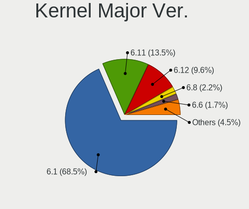
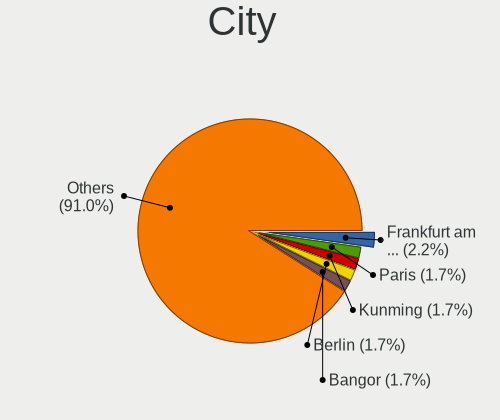
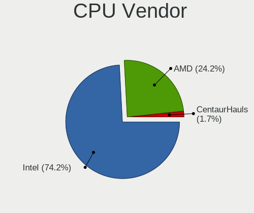
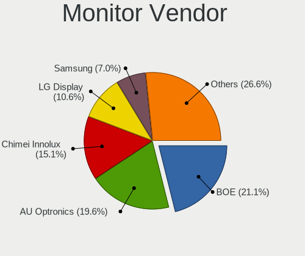
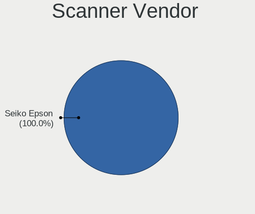

Debian Hardware Trends (Notebooks)
----------------------------------

A project to identify most popular hardware characteristics and track their change
over time based on data collected by Debian users at https://Linux-Hardware.org.

Anyone can contribute to this report by the [hw-probe](https://github.com/linuxhw/hw-probe) tool:

    sudo -E hw-probe -all -upload

Full-feature report is available here: https://linux-hardware.org/?view=trends&formfactor=notebook

Period: Aug, 2021.

Contents
--------

* [ System ](#system)
  - [ OS                       ](#os)
  - [ OS Family                ](#os-family)
  - [ Kernel                   ](#kernel)
  - [ Kernel Family            ](#kernel-family)
  - [ Kernel Major Ver.        ](#kernel-major-ver)
  - [ Arch                     ](#arch)
  - [ DE                       ](#de)
  - [ Display Server           ](#display-server)
  - [ Display Manager          ](#display-manager)
  - [ OS Lang                  ](#os-lang)
  - [ Boot Mode                ](#boot-mode)
  - [ Filesystem               ](#filesystem)
  - [ Part. scheme             ](#part-scheme)
  - [ Dual Boot with Linux/BSD ](#dual-boot-with-linuxbsd)
  - [ Dual Boot (Win)          ](#dual-boot-win)

* [ Board ](#board)
  - [ Vendor                   ](#vendor)
  - [ Model                    ](#model)
  - [ Model Family             ](#model-family)
  - [ MFG Year                 ](#mfg-year)
  - [ Form Factor              ](#form-factor)
  - [ Secure Boot              ](#secure-boot)
  - [ Coreboot                 ](#coreboot)
  - [ RAM Size                 ](#ram-size)
  - [ RAM Used                 ](#ram-used)
  - [ Total Drives             ](#total-drives)
  - [ Has CD-ROM               ](#has-cd-rom)
  - [ Has Ethernet             ](#has-ethernet)
  - [ Has WiFi                 ](#has-wifi)
  - [ Has Bluetooth            ](#has-bluetooth)

* [ Location ](#location)
  - [ Country                  ](#country)
  - [ City                     ](#city)

* [ Drives ](#drives)
  - [ Drive Vendor             ](#drive-vendor)
  - [ Drive Model              ](#drive-model)
  - [ HDD Vendor               ](#hdd-vendor)
  - [ SSD Vendor               ](#ssd-vendor)
  - [ Drive Kind               ](#drive-kind)
  - [ Drive Connector          ](#drive-connector)
  - [ Drive Size               ](#drive-size)
  - [ Space Total              ](#space-total)
  - [ Space Used               ](#space-used)
  - [ Malfunc. Drives          ](#malfunc-drives)
  - [ Malfunc. Drive Vendor    ](#malfunc-drive-vendor)
  - [ Malfunc. HDD Vendor      ](#malfunc-hdd-vendor)
  - [ Malfunc. Drive Kind      ](#malfunc-drive-kind)
  - [ Failed Drives            ](#failed-drives)
  - [ Failed Drive Vendor      ](#failed-drive-vendor)
  - [ Drive Status             ](#drive-status)

* [ Storage controller ](#storage-controller)
  - [ Storage Vendor           ](#storage-vendor)
  - [ Storage Model            ](#storage-model)
  - [ Storage Kind             ](#storage-kind)

* [ Processor ](#processor)
  - [ CPU Vendor               ](#cpu-vendor)
  - [ CPU Model                ](#cpu-model)
  - [ CPU Model Family         ](#cpu-model-family)
  - [ CPU Cores                ](#cpu-cores)
  - [ CPU Sockets              ](#cpu-sockets)
  - [ CPU Threads              ](#cpu-threads)
  - [ CPU Op-Modes             ](#cpu-op-modes)
  - [ CPU Microcode            ](#cpu-microcode)
  - [ CPU Microarch            ](#cpu-microarch)

* [ Graphics ](#graphics)
  - [ GPU Vendor               ](#gpu-vendor)
  - [ GPU Model                ](#gpu-model)
  - [ GPU Combo                ](#gpu-combo)
  - [ GPU Driver               ](#gpu-driver)
  - [ GPU Memory               ](#gpu-memory)

* [ Monitor ](#monitor)
  - [ Monitor Vendor           ](#monitor-vendor)
  - [ Monitor Model            ](#monitor-model)
  - [ Monitor Resolution       ](#monitor-resolution)
  - [ Monitor Diagonal         ](#monitor-diagonal)
  - [ Monitor Width            ](#monitor-width)
  - [ Aspect Ratio             ](#aspect-ratio)
  - [ Monitor Area             ](#monitor-area)
  - [ Pixel Density            ](#pixel-density)
  - [ Multiple Monitors        ](#multiple-monitors)

* [ Network ](#network)
  - [ Net Controller Vendor    ](#net-controller-vendor)
  - [ Net Controller Model     ](#net-controller-model)
  - [ Wireless Vendor          ](#wireless-vendor)
  - [ Wireless Model           ](#wireless-model)
  - [ Ethernet Vendor          ](#ethernet-vendor)
  - [ Ethernet Model           ](#ethernet-model)
  - [ Net Controller Kind      ](#net-controller-kind)
  - [ Used Controller          ](#used-controller)
  - [ NICs                     ](#nics)
  - [ IPv6                     ](#ipv6)

* [ Bluetooth ](#bluetooth)
  - [ Bluetooth Vendor         ](#bluetooth-vendor)
  - [ Bluetooth Model          ](#bluetooth-model)

* [ Sound ](#sound)
  - [ Sound Vendor             ](#sound-vendor)
  - [ Sound Model              ](#sound-model)

* [ Memory ](#memory)
  - [ Memory Vendor            ](#memory-vendor)
  - [ Memory Model             ](#memory-model)
  - [ Memory Kind              ](#memory-kind)
  - [ Memory Form Factor       ](#memory-form-factor)
  - [ Memory Size              ](#memory-size)
  - [ Memory Speed             ](#memory-speed)

* [ Printers & scanners ](#printers--scanners)
  - [ Printer Vendor           ](#printer-vendor)
  - [ Printer Model            ](#printer-model)
  - [ Scanner Vendor           ](#scanner-vendor)
  - [ Scanner Model            ](#scanner-model)

* [ Camera ](#camera)
  - [ Camera Vendor            ](#camera-vendor)
  - [ Camera Model             ](#camera-model)

* [ Security ](#security)
  - [ Fingerprint Vendor       ](#fingerprint-vendor)
  - [ Fingerprint Model        ](#fingerprint-model)
  - [ Chipcard Vendor          ](#chipcard-vendor)
  - [ Chipcard Model           ](#chipcard-model)

* [ Unsupported ](#unsupported)
  - [ Unsupported Devices      ](#unsupported-devices)
  - [ Unsupported Device Types ](#unsupported-device-types)

System
------

OS
--

Installed operating systems

| Name        | Notebooks | Percent |
|-------------|-----------|---------|
| Debian 11   | 344       | 92.47%  |
| Debian 10   | 23        | 6.18%   |
| Debian      | 4         | 1.08%   |
| Debian 11.0 | 1         | 0.27%   |

OS Family
---------

OS without a version

| Name   | Notebooks | Percent |
|--------|-----------|---------|
| Debian | 372       | 100%    |

Kernel
------

Version of the Linux kernel

| Version                    | Notebooks | Percent |
|----------------------------|-----------|---------|
| 5.10.0-8-amd64             | 328       | 88.17%  |
| 4.19.0-17-amd64            | 16        | 4.3%    |
| 5.10.0-7-amd64             | 7         | 1.88%   |
| 5.10.0-8-686-pae           | 4         | 1.08%   |
| 5.8.0-3-amd64              | 3         | 0.81%   |
| 5.10.0-8-686               | 2         | 0.54%   |
| 5.13.8-xanmod1             | 1         | 0.27%   |
| 5.13.8                     | 1         | 0.27%   |
| 5.13.0-13.1-liquorix-amd64 | 1         | 0.27%   |
| 5.12.14-amd64-desktop      | 1         | 0.27%   |
| 5.12.0-19.3-liquorix-amd64 | 1         | 0.27%   |
| 5.10.10-64                 | 1         | 0.27%   |
| 5.10.0-5-amd64             | 1         | 0.27%   |
| 5.10.0-0.bpo.8-rt-amd64    | 1         | 0.27%   |
| 5.10.0-0.bpo.8-amd64       | 1         | 0.27%   |
| 5.10.0-0.bpo.7-amd64       | 1         | 0.27%   |
| 4.9.0-16-686               | 1         | 0.27%   |
| 4.19.0-14-amd64            | 1         | 0.27%   |

Kernel Family
-------------

Linux kernel without a distro release

| Version | Notebooks | Percent |
|---------|-----------|---------|
| 5.10.0  | 345       | 92.74%  |
| 4.19.0  | 17        | 4.57%   |
| 5.8.0   | 3         | 0.81%   |
| 5.13.8  | 2         | 0.54%   |
| 5.13.0  | 1         | 0.27%   |
| 5.12.14 | 1         | 0.27%   |
| 5.12.0  | 1         | 0.27%   |
| 5.10.10 | 1         | 0.27%   |
| 4.9.0   | 1         | 0.27%   |

Kernel Major Ver.
-----------------

Linux kernel major version

| Version | Notebooks | Percent |
|---------|-----------|---------|
| 5.10    | 346       | 93.01%  |
| 4.19    | 17        | 4.57%   |
| 5.8     | 3         | 0.81%   |
| 5.13    | 3         | 0.81%   |
| 5.12    | 2         | 0.54%   |
| 4.9     | 1         | 0.27%   |

Arch
----

OS architecture (x86_64, i586, etc.)

| Name   | Notebooks | Percent |
|--------|-----------|---------|
| x86_64 | 365       | 98.12%  |
| i686   | 7         | 1.88%   |

DE
--

Desktop Environment

| Name             | Notebooks | Percent |
|------------------|-----------|---------|
| Unknown          | 231       | 62.1%   |
| GNOME            | 47        | 12.63%  |
| KDE5             | 34        | 9.14%   |
| XFCE             | 28        | 7.53%   |
| KDE              | 8         | 2.15%   |
| MATE             | 5         | 1.34%   |
| i3               | 5         | 1.34%   |
| Cinnamon         | 4         | 1.08%   |
| X-Cinnamon       | 3         | 0.81%   |
| Enlightenment    | 2         | 0.54%   |
| LXQt             | 1         | 0.27%   |
| LXDE             | 1         | 0.27%   |
| lightdm-xsession | 1         | 0.27%   |
| ICEWM            | 1         | 0.27%   |
| Deepin           | 1         | 0.27%   |

Display Server
--------------

X11 or Wayland

| Name    | Notebooks | Percent |
|---------|-----------|---------|
| Unknown | 225       | 60.48%  |
| X11     | 104       | 27.96%  |
| Wayland | 35        | 9.41%   |
| Tty     | 8         | 2.15%   |

Display Manager
---------------

SDDM, LightDM, etc.

| Name    | Notebooks | Percent |
|---------|-----------|---------|
| Unknown | 252       | 67.74%  |
| GDM     | 42        | 11.29%  |
| SDDM    | 36        | 9.68%   |
| TDM     | 28        | 7.53%   |
| LightDM | 12        | 3.23%   |
| KDM     | 1         | 0.27%   |
| GDM3    | 1         | 0.27%   |

OS Lang
-------

Language

| Lang    | Notebooks | Percent |
|---------|-----------|---------|
| Unknown | 210       | 56.45%  |
| en_US   | 70        | 18.82%  |
| ru_RU   | 12        | 3.23%   |
| fr_FR   | 11        | 2.96%   |
| de_DE   | 8         | 2.15%   |
| es_ES   | 7         | 1.88%   |
| sv_SE   | 5         | 1.34%   |
| en_GB   | 5         | 1.34%   |
| pt_BR   | 4         | 1.08%   |
| pl_PL   | 4         | 1.08%   |
| en_CA   | 4         | 1.08%   |
| nn_NO   | 3         | 0.81%   |
| es_MX   | 3         | 0.81%   |
| zh_CN   | 2         | 0.54%   |
| pt_PT   | 2         | 0.54%   |
| nl_NL   | 2         | 0.54%   |
| es_CL   | 2         | 0.54%   |
| de_CH   | 2         | 0.54%   |
| de_AT   | 2         | 0.54%   |
| C       | 2         | 0.54%   |
| tr_TR   | 1         | 0.27%   |
| sk_SK   | 1         | 0.27%   |
| nl_BE   | 1         | 0.27%   |
| ja_JP   | 1         | 0.27%   |
| fi_FI   | 1         | 0.27%   |
| es_UY   | 1         | 0.27%   |
| es_GT   | 1         | 0.27%   |
| es_CO   | 1         | 0.27%   |
| en_NZ   | 1         | 0.27%   |
| en_NG   | 1         | 0.27%   |
| en_IE   | 1         | 0.27%   |
| bg_BG   | 1         | 0.27%   |

Boot Mode
---------

EFI or BIOS

| Mode | Notebooks | Percent |
|------|-----------|---------|
| EFI  | 293       | 78.76%  |
| BIOS | 79        | 21.24%  |

Filesystem
----------

Type of filesystem

| Type    | Notebooks | Percent |
|---------|-----------|---------|
| Overlay | 229       | 61.56%  |
| Ext4    | 134       | 36.02%  |
| Btrfs   | 7         | 1.88%   |
| Xfs     | 1         | 0.27%   |
| Rootfs  | 1         | 0.27%   |

Part. scheme
------------

Scheme of partitioning

| Type    | Notebooks | Percent |
|---------|-----------|---------|
| GPT     | 304       | 81.72%  |
| MBR     | 43        | 11.56%  |
| Unknown | 25        | 6.72%   |

Dual Boot with Linux/BSD
------------------------

Hosting more than one Linux/BSD

| Dual boot | Notebooks | Percent |
|-----------|-----------|---------|
| No        | 355       | 95.43%  |
| Yes       | 17        | 4.57%   |

Dual Boot (Win)
---------------

Hosting Linux and Windows

| Dual boot | Notebooks | Percent |
|-----------|-----------|---------|
| No        | 331       | 88.98%  |
| Yes       | 41        | 11.02%  |

Board
-----

Vendor
------

Motherboard manufacturer

| Name                | Notebooks | Percent |
|---------------------|-----------|---------|
| Apple               | 145       | 38.98%  |
| Lenovo              | 68        | 18.28%  |
| Google              | 50        | 13.44%  |
| Hewlett-Packard     | 33        | 8.87%   |
| Dell                | 25        | 6.72%   |
| ASUSTek Computer    | 14        | 3.76%   |
| Acer                | 10        | 2.69%   |
| Sony                | 3         | 0.81%   |
| Notebook            | 3         | 0.81%   |
| Clevo               | 3         | 0.81%   |
| Toshiba             | 2         | 0.54%   |
| Samsung Electronics | 2         | 0.54%   |
| HUAWEI              | 2         | 0.54%   |
| YJKC                | 1         | 0.27%   |
| TUXEDO              | 1         | 0.27%   |
| TQ-Group            | 1         | 0.27%   |
| Timi                | 1         | 0.27%   |
| SLIMBOOK            | 1         | 0.27%   |
| MSI                 | 1         | 0.27%   |
| Itautec             | 1         | 0.27%   |
| Gigabyte Technology | 1         | 0.27%   |
| Gateway             | 1         | 0.27%   |
| Fujitsu Siemens     | 1         | 0.27%   |
| Fujitsu             | 1         | 0.27%   |
| DNS                 | 1         | 0.27%   |

Model
-----

Motherboard model

| Name                                       | Notebooks | Percent |
|--------------------------------------------|-----------|---------|
| Apple MacBookAir7,1                        | 74        | 19.89%  |
| Apple MacBookAir7,2                        | 63        | 16.94%  |
| Google Enguarde                            | 47        | 12.63%  |
| Lenovo ThinkPad 13 2nd Gen 20J10046US      | 13        | 3.49%   |
| Lenovo ThinkPad E475 20H40006US            | 2         | 0.54%   |
| Lenovo ThinkBook 14 G2 ARE 20VF            | 2         | 0.54%   |
| HP Laptop 15s-eq1xxx                       | 2         | 0.54%   |
| HP EliteBook 8460p                         | 2         | 0.54%   |
| HP Compaq nx6125 (PZ849UA#ABA)             | 2         | 0.54%   |
| HP Compaq nx6110 (PZ065UA#ABA)             | 2         | 0.54%   |
| Dell Inspiron 15 7000 Gaming               | 2         | 0.54%   |
| Dell G3 3590                               | 2         | 0.54%   |
| Apple MacBook7,1                           | 2         | 0.54%   |
| Apple MacBook5,2                           | 2         | 0.54%   |
| Acer Aspire 5315                           | 2         | 0.54%   |
| YJKC vBOOK Plus                            | 1         | 0.27%   |
| TUXEDO Pulse 15 Gen1                       | 1         | 0.27%   |
| TQ-Group TQMxE39S                          | 1         | 0.27%   |
| Toshiba Satellite C55D-B                   | 1         | 0.27%   |
| Toshiba Satellite C55-B                    | 1         | 0.27%   |
| Timi TM1612                                | 1         | 0.27%   |
| Sony VPCS110FL                             | 1         | 0.27%   |
| Sony VPCF21AFX                             | 1         | 0.27%   |
| Sony VPCF115FM                             | 1         | 0.27%   |
| SLIMBOOK TITAN                             | 1         | 0.27%   |
| Samsung 900X3C/900X3D/900X3E/900X4C/900X4D | 1         | 0.27%   |
| Samsung 300E5M/300E5L                      | 1         | 0.27%   |
| Notebook NL4x_NL5xLU                       | 1         | 0.27%   |
| Notebook NJ50_70CU                         | 1         | 0.27%   |
| Notebook N13_N140ZU                        | 1         | 0.27%   |
| MSI GP60 2PE                               | 1         | 0.27%   |
| Lenovo V510-15IKB 80WQ                     | 1         | 0.27%   |
| Lenovo V14 G2 ITL 82KA                     | 1         | 0.27%   |
| Lenovo ThinkPad X260 20F5S3J00D            | 1         | 0.27%   |
| Lenovo ThinkPad X250 20CM001RMS            | 1         | 0.27%   |
| Lenovo ThinkPad X250 20CLS4WV08            | 1         | 0.27%   |
| Lenovo ThinkPad X250 20CLS2DK00            | 1         | 0.27%   |
| Lenovo ThinkPad X240 20AMS0BU0T            | 1         | 0.27%   |
| Lenovo ThinkPad X230 2325AT6               | 1         | 0.27%   |
| Lenovo ThinkPad X230 23252FG               | 1         | 0.27%   |
| Lenovo ThinkPad X220 Tablet 4298A24        | 1         | 0.27%   |
| Lenovo ThinkPad X220 429044C               | 1         | 0.27%   |
| Lenovo ThinkPad X200 7458B64               | 1         | 0.27%   |
| Lenovo ThinkPad X1 Carbon 5th 20HQ0008VN   | 1         | 0.27%   |
| Lenovo ThinkPad W520 4284CY1               | 1         | 0.27%   |
| Lenovo ThinkPad W500 406152G               | 1         | 0.27%   |
| Lenovo ThinkPad T61 7661BK7                | 1         | 0.27%   |
| Lenovo ThinkPad T61 7661BF3                | 1         | 0.27%   |
| Lenovo ThinkPad T580 20L9001AUS            | 1         | 0.27%   |
| Lenovo ThinkPad T550 20CK0002MZ            | 1         | 0.27%   |
| Lenovo ThinkPad T495 20NJCTO1WW            | 1         | 0.27%   |
| Lenovo ThinkPad T490 20N2CTO1WW            | 1         | 0.27%   |
| Lenovo ThinkPad T480s 20L7002AUS           | 1         | 0.27%   |
| Lenovo ThinkPad T470s 20HGS3R800           | 1         | 0.27%   |
| Lenovo ThinkPad T450s 20BXCTO1WW           | 1         | 0.27%   |
| Lenovo ThinkPad T450 20BUS16700            | 1         | 0.27%   |
| Lenovo ThinkPad T440s 20ARA1DJMN           | 1         | 0.27%   |
| Lenovo ThinkPad T440s 20AR0011MD           | 1         | 0.27%   |
| Lenovo ThinkPad T440p 20AN006GUS           | 1         | 0.27%   |
| Lenovo ThinkPad T430 2349V4B               | 1         | 0.27%   |

Model Family
------------

Motherboard model prefix

| Name                     | Notebooks | Percent |
|--------------------------|-----------|---------|
| Apple MacBookAir7        | 137       | 36.83%  |
| Lenovo ThinkPad          | 54        | 14.52%  |
| Google Enguarde          | 47        | 12.63%  |
| Lenovo IdeaPad           | 8         | 2.15%   |
| Dell Latitude            | 7         | 1.88%   |
| Dell Inspiron            | 7         | 1.88%   |
| HP EliteBook             | 6         | 1.61%   |
| Acer Aspire              | 6         | 1.61%   |
| HP ProBook               | 5         | 1.34%   |
| HP Pavilion              | 5         | 1.34%   |
| HP Compaq                | 5         | 1.34%   |
| HP Laptop                | 4         | 1.08%   |
| Dell Precision           | 4         | 1.08%   |
| Lenovo ThinkBook         | 3         | 0.81%   |
| Dell G3                  | 3         | 0.81%   |
| ASUS ROG                 | 3         | 0.81%   |
| Toshiba Satellite        | 2         | 0.54%   |
| HP 250                   | 2         | 0.54%   |
| Dell XPS                 | 2         | 0.54%   |
| Apple MacBook7           | 2         | 0.54%   |
| Apple MacBook5           | 2         | 0.54%   |
| Acer TravelMate          | 2         | 0.54%   |
| Acer Swift               | 2         | 0.54%   |
| YJKC vBOOK               | 1         | 0.27%   |
| TUXEDO Pulse             | 1         | 0.27%   |
| TQ-Group TQMxE39S        | 1         | 0.27%   |
| Timi TM1612              | 1         | 0.27%   |
| Sony VPCS110FL           | 1         | 0.27%   |
| Sony VPCF21AFX           | 1         | 0.27%   |
| Sony VPCF115FM           | 1         | 0.27%   |
| SLIMBOOK TITAN           | 1         | 0.27%   |
| Samsung 900X3C           | 1         | 0.27%   |
| Samsung 300E5M           | 1         | 0.27%   |
| Notebook NL4x            | 1         | 0.27%   |
| Notebook NJ50            | 1         | 0.27%   |
| Notebook N13             | 1         | 0.27%   |
| MSI GP60                 | 1         | 0.27%   |
| Lenovo V510-15IKB        | 1         | 0.27%   |
| Lenovo V14               | 1         | 0.27%   |
| Lenovo B51-35            | 1         | 0.27%   |
| Itautec Infoway          | 1         | 0.27%   |
| HUAWEI WRT-WX9           | 1         | 0.27%   |
| HUAWEI BOHK-WAX9X        | 1         | 0.27%   |
| HP Presario              | 1         | 0.27%   |
| HP Mini                  | 1         | 0.27%   |
| HP ENVY                  | 1         | 0.27%   |
| HP 630                   | 1         | 0.27%   |
| HP 2000                  | 1         | 0.27%   |
| HP 14s-dq2003nw          | 1         | 0.27%   |
| Google Stout             | 1         | 0.27%   |
| Google Parrot            | 1         | 0.27%   |
| Google Careena           | 1         | 0.27%   |
| Gigabyte AORUS           | 1         | 0.27%   |
| Gateway MD7811U          | 1         | 0.27%   |
| Fujitsu Siemens LIFEBOOK | 1         | 0.27%   |
| Fujitsu LIFEBOOK         | 1         | 0.27%   |
| DNS 101                  | 1         | 0.27%   |
| Dell Studio              | 1         | 0.27%   |
| Dell G7                  | 1         | 0.27%   |
| Clevo W55xEU             | 1         | 0.27%   |

MFG Year
--------

Motherboard manufacture year

| Year    | Notebooks | Percent |
|---------|-----------|---------|
| 2020    | 104       | 27.96%  |
| 2021    | 91        | 24.46%  |
| 2019    | 79        | 21.24%  |
| 2018    | 13        | 3.49%   |
| 2011    | 13        | 3.49%   |
| 2008    | 10        | 2.69%   |
| 2015    | 9         | 2.42%   |
| 2017    | 8         | 2.15%   |
| 2013    | 7         | 1.88%   |
| 2012    | 7         | 1.88%   |
| 2009    | 7         | 1.88%   |
| 2014    | 6         | 1.61%   |
| 2010    | 6         | 1.61%   |
| 2016    | 5         | 1.34%   |
| 2005    | 3         | 0.81%   |
| 2006    | 2         | 0.54%   |
| 2007    | 1         | 0.27%   |
| Unknown | 1         | 0.27%   |

Form Factor
-----------

Physical design of the computer

| Name     | Notebooks | Percent |
|----------|-----------|---------|
| Notebook | 372       | 100%    |

Secure Boot
-----------

Enabled or disabled

| State    | Notebooks | Percent |
|----------|-----------|---------|
| Disabled | 354       | 95.16%  |
| Enabled  | 18        | 4.84%   |

Coreboot
--------

Have coreboot on board

| Used | Notebooks | Percent |
|------|-----------|---------|
| No   | 322       | 86.56%  |
| Yes  | 50        | 13.44%  |

RAM Size
--------

Total RAM memory

| Size in GB  | Notebooks | Percent |
|-------------|-----------|---------|
| 3.01-4.0    | 145       | 38.98%  |
| 4.01-8.0    | 124       | 33.33%  |
| 16.01-24.0  | 38        | 10.22%  |
| 8.01-16.0   | 32        | 8.6%    |
| 1.01-2.0    | 13        | 3.49%   |
| 32.01-64.0  | 11        | 2.96%   |
| 0.51-1.0    | 4         | 1.08%   |
| 2.01-3.0    | 3         | 0.81%   |
| 64.01-256.0 | 1         | 0.27%   |
| 0.01-0.5    | 1         | 0.27%   |

RAM Used
--------

Used RAM memory

| Used GB   | Notebooks | Percent |
|-----------|-----------|---------|
| 1.01-2.0  | 253       | 68.01%  |
| 2.01-3.0  | 48        | 12.9%   |
| 0.51-1.0  | 24        | 6.45%   |
| 4.01-8.0  | 21        | 5.65%   |
| 3.01-4.0  | 10        | 2.69%   |
| 8.01-16.0 | 9         | 2.42%   |
| 0.01-0.5  | 7         | 1.88%   |

Total Drives
------------

Number of drives on board

| Drives | Notebooks | Percent |
|--------|-----------|---------|
| 1      | 324       | 87.1%   |
| 2      | 46        | 12.37%  |
| 3      | 2         | 0.54%   |

Has CD-ROM
----------

Has CD-ROM on board

| Presented | Notebooks | Percent |
|-----------|-----------|---------|
| No        | 311       | 83.6%   |
| Yes       | 61        | 16.4%   |

Has Ethernet
------------

Has Ethernet on board

| Presented | Notebooks | Percent |
|-----------|-----------|---------|
| No        | 206       | 55.38%  |
| Yes       | 166       | 44.62%  |

Has WiFi
--------

Has WiFi module

| Presented | Notebooks | Percent |
|-----------|-----------|---------|
| Yes       | 367       | 98.66%  |
| No        | 5         | 1.34%   |

Has Bluetooth
-------------

Has Bluetooth module

| Presented | Notebooks | Percent |
|-----------|-----------|---------|
| Yes       | 330       | 88.71%  |
| No        | 42        | 11.29%  |

Location
--------

Country
-------

Geographic location (country)

| Country     | Notebooks | Percent |
|-------------|-----------|---------|
| USA         | 247       | 66.4%   |
| France      | 15        | 4.03%   |
| Germany     | 10        | 2.69%   |
| Spain       | 9         | 2.42%   |
| Russia      | 8         | 2.15%   |
| Poland      | 7         | 1.88%   |
| Sweden      | 6         | 1.61%   |
| Ukraine     | 5         | 1.34%   |
| Mexico      | 5         | 1.34%   |
| Canada      | 5         | 1.34%   |
| Switzerland | 4         | 1.08%   |
| China       | 4         | 1.08%   |
| Brazil      | 4         | 1.08%   |
| UK          | 3         | 0.81%   |
| Turkey      | 3         | 0.81%   |
| Portugal    | 3         | 0.81%   |
| Norway      | 3         | 0.81%   |
| Netherlands | 3         | 0.81%   |
| Austria     | 3         | 0.81%   |
| Chile       | 2         | 0.54%   |
| Belgium     | 2         | 0.54%   |
| Uruguay     | 1         | 0.27%   |
| South Sudan | 1         | 0.27%   |
| Slovakia    | 1         | 0.27%   |
| Romania     | 1         | 0.27%   |
| Nigeria     | 1         | 0.27%   |
| New Zealand | 1         | 0.27%   |
| Morocco     | 1         | 0.27%   |
| Lebanon     | 1         | 0.27%   |
| Kazakhstan  | 1         | 0.27%   |
| Japan       | 1         | 0.27%   |
| Italy       | 1         | 0.27%   |
| Ireland     | 1         | 0.27%   |
| Indonesia   | 1         | 0.27%   |
| Guatemala   | 1         | 0.27%   |
| Finland     | 1         | 0.27%   |
| Croatia     | 1         | 0.27%   |
| Colombia    | 1         | 0.27%   |
| Bulgaria    | 1         | 0.27%   |
| Azerbaijan  | 1         | 0.27%   |
| Australia   | 1         | 0.27%   |
| Aruba       | 1         | 0.27%   |

City
----

Geographic location (city)

| City                   | Notebooks | Percent |
|------------------------|-----------|---------|
| Portland               | 217       | 58.33%  |
| St Petersburg          | 5         | 1.34%   |
| Hampden                | 4         | 1.08%   |
| Vienna                 | 3         | 0.81%   |
| Sevastopol             | 3         | 0.81%   |
| Lyon                   | 3         | 0.81%   |
| Frankfort              | 3         | 0.81%   |
| Zurich                 | 2         | 0.54%   |
| Yevpatoriya            | 2         | 0.54%   |
| Valencia               | 2         | 0.54%   |
| Tyreso Strand          | 2         | 0.54%   |
| Thermopolis            | 2         | 0.54%   |
| S??o Paulo             | 2         | 0.54%   |
| Port Montt             | 2         | 0.54%   |
| Paris                  | 2         | 0.54%   |
| Offenburg              | 2         | 0.54%   |
| Molde                  | 2         | 0.54%   |
| London                 | 2         | 0.54%   |
| Izmir                  | 2         | 0.54%   |
| Halifax                | 2         | 0.54%   |
| Coatzacoalcos          | 2         | 0.54%   |
| Atlanta                | 2         | 0.54%   |
| Zhuhai                 | 1         | 0.27%   |
| Zeist                  | 1         | 0.27%   |
| Yekaterinburg          | 1         | 0.27%   |
| Xalapa                 | 1         | 0.27%   |
| Wroclaw                | 1         | 0.27%   |
| Warsaw                 | 1         | 0.27%   |
| Waregem                | 1         | 0.27%   |
| Voronezh               | 1         | 0.27%   |
| Villingen-Schwenningen | 1         | 0.27%   |
| Vigo                   | 1         | 0.27%   |
| Vernon                 | 1         | 0.27%   |
| Tucson                 | 1         | 0.27%   |
| Touques                | 1         | 0.27%   |
| Toronto                | 1         | 0.27%   |
| Taiyuan                | 1         | 0.27%   |
| Sucy-en-Brie           | 1         | 0.27%   |
| Stockholm              | 1         | 0.27%   |
| Soyen                  | 1         | 0.27%   |
| Solymar                | 1         | 0.27%   |
| Slavonski Brod         | 1         | 0.27%   |
| Shenzhen               | 1         | 0.27%   |
| Senica                 | 1         | 0.27%   |
| Secaucus               | 1         | 0.27%   |
| Schwindratzheim        | 1         | 0.27%   |
| Saratov                | 1         | 0.27%   |
| Sarasota               | 1         | 0.27%   |
| Sant Joan Desp?­       | 1         | 0.27%   |
| San Miguel de Cozumel  | 1         | 0.27%   |
| San Jose               | 1         | 0.27%   |
| Runding                | 1         | 0.27%   |
| Roseville              | 1         | 0.27%   |
| Rinteln                | 1         | 0.27%   |
| Riegelwood             | 1         | 0.27%   |
| Racib??rz              | 1         | 0.27%   |
| Queens                 | 1         | 0.27%   |
| Puszczykowo            | 1         | 0.27%   |
| Poznan                 | 1         | 0.27%   |
| Oslo                   | 1         | 0.27%   |

Drives
------

Drive Vendor
------------

Hard drive vendors

| Vendor                    | Notebooks | Drives | Percent |
|---------------------------|-----------|--------|---------|
| Apple                     | 138       | 138    | 32.86%  |
| Samsung Electronics       | 55        | 57     | 13.1%   |
| Unknown                   | 54        | 55     | 12.86%  |
| WDC                       | 23        | 23     | 5.48%   |
| SanDisk                   | 20        | 21     | 4.76%   |
| Seagate                   | 19        | 20     | 4.52%   |
| Kingston                  | 16        | 16     | 3.81%   |
| SABRENT                   | 13        | 13     | 3.1%    |
| Toshiba                   | 10        | 11     | 2.38%   |
| Crucial                   | 10        | 10     | 2.38%   |
| Hitachi                   | 9         | 9      | 2.14%   |
| Micron Technology         | 6         | 6      | 1.43%   |
| SK Hynix                  | 5         | 5      | 1.19%   |
| Intel                     | 5         | 5      | 1.19%   |
| Fujitsu                   | 4         | 4      | 0.95%   |
| A-DATA Technology         | 4         | 4      | 0.95%   |
| Union Memory              | 2         | 2      | 0.48%   |
| PNY                       | 2         | 2      | 0.48%   |
| LITEON                    | 2         | 2      | 0.48%   |
| KIOXIA                    | 2         | 2      | 0.48%   |
| HGST                      | 2         | 2      | 0.48%   |
| China                     | 2         | 2      | 0.48%   |
| ZTC                       | 1         | 1      | 0.24%   |
| XPG                       | 1         | 1      | 0.24%   |
| TurXun                    | 1         | 1      | 0.24%   |
| Transcend                 | 1         | 1      | 0.24%   |
| SPCC                      | 1         | 1      | 0.24%   |
| Smartbuy                  | 1         | 1      | 0.24%   |
| OCZ                       | 1         | 1      | 0.24%   |
| MyDigitalSSD              | 1         | 1      | 0.24%   |
| Micron/Crucial Technology | 1         | 1      | 0.24%   |
| Maxtor                    | 1         | 1      | 0.24%   |
| KIOXIA-EXCERIA            | 1         | 1      | 0.24%   |
| KingSpec                  | 1         | 1      | 0.24%   |
| JMicron                   | 1         | 1      | 0.24%   |
| GOODRAM                   | 1         | 1      | 0.24%   |
| FORESEE                   | 1         | 1      | 0.24%   |
| Corsair                   | 1         | 1      | 0.24%   |
| AMD                       | 1         | 1      | 0.24%   |

Drive Model
-----------

Hard drive models

| Model                                   | Notebooks | Percent |
|-----------------------------------------|-----------|---------|
| Apple SSD AP0128H 121GB                 | 74        | 17.49%  |
| Apple SSD SM0128G 121GB                 | 62        | 14.66%  |
| Unknown AGND3R  16GB                    | 25        | 5.91%   |
| Unknown HAG2e  16GB                     | 19        | 4.49%   |
| SABRENT Disk 1TB                        | 13        | 3.07%   |
| SanDisk SD8SN8U128G1001 128GB SSD       | 8         | 1.89%   |
| Samsung MZNTY128HDHP-000L1 128GB SSD    | 6         | 1.42%   |
| Seagate ST1000LM035-1RK172 1TB          | 4         | 0.95%   |
| Samsung SSD 850 PRO 1TB                 | 4         | 0.95%   |
| Kingston SA400S37120G 120GB SSD         | 4         | 0.95%   |
| Crucial CT500MX500SSD1 500GB            | 4         | 0.95%   |
| Unknown SDW16G  16GB                    | 3         | 0.71%   |
| Samsung SSD 970 EVO Plus 500GB          | 3         | 0.71%   |
| Kingston SA400S37240G 240GB SSD         | 3         | 0.71%   |
| Hitachi HTS543216L9A300 160GB           | 3         | 0.71%   |
| Unknown SD32G  32GB                     | 2         | 0.47%   |
| Union Memory UMIS RPJTJ256MEE1OWX 256GB | 2         | 0.47%   |
| SanDisk SD8SBAT128G1122 128GB SSD       | 2         | 0.47%   |
| Samsung SSD 980 1TB                     | 2         | 0.47%   |
| Samsung SSD 860 EVO 500GB               | 2         | 0.47%   |
| Samsung SSD 850 EVO 500GB               | 2         | 0.47%   |
| Samsung MZ7TE256HMHP-000L7 256GB SSD    | 2         | 0.47%   |
| Kingston SV300S37A120G 120GB SSD        | 2         | 0.47%   |
| Hitachi HTS541040G9AT00 40GB            | 2         | 0.47%   |
| Fujitsu MHZ2160BH FFS G1 160GB          | 2         | 0.47%   |
| Crucial M4-CT256M4SSD2 256GB            | 2         | 0.47%   |
| ZTC SM201-512G SSD                      | 1         | 0.24%   |
| XPG NVMe SSD Drive 1024GB               | 1         | 0.24%   |
| WDC WDS500G3X0C-00SJG0 500GB            | 1         | 0.24%   |
| WDC WDS500G2B0C-00PXH0 500GB            | 1         | 0.24%   |
| WDC WDS250G2B0A-00SM50 250GB SSD        | 1         | 0.24%   |
| WDC WDS120G2G0A-00JH30 120GB SSD        | 1         | 0.24%   |
| WDC WDS100T2G0A-00JH30 1TB SSD          | 1         | 0.24%   |
| WDC WD7500BPVX-22JC3T0 752GB            | 1         | 0.24%   |
| WDC WD5000LPVX-55V0TT0 500GB            | 1         | 0.24%   |
| WDC WD3200BPVT-00ZEST0 320GB            | 1         | 0.24%   |
| WDC WD2500BEKT-00PVMT0 250GB            | 1         | 0.24%   |
| WDC WD1600BUDT-63DPZY0 160GB            | 1         | 0.24%   |
| WDC WD10SPZX-60Z10T0 1TB                | 1         | 0.24%   |
| WDC WD10SPZX-24Z10 1TB                  | 1         | 0.24%   |
| WDC WD10JPVX-75JC3T0 1TB                | 1         | 0.24%   |
| WDC WD10JPVX-60J 1TB                    | 1         | 0.24%   |
| WDC WD10JPVX-22JC3T0 1TB                | 1         | 0.24%   |
| WDC PC SN730 SDBPNTY-512G-1006 512GB    | 1         | 0.24%   |
| WDC PC SN730 SDBPNTY-256G-1027 256GB    | 1         | 0.24%   |
| WDC PC SN720 SDAPNTW-512G-1027 512GB    | 1         | 0.24%   |
| WDC PC SN530 SDBPNPZ-512G-1014 512GB    | 1         | 0.24%   |
| WDC PC SN530 SDBPMPZ-512G-1101 512GB    | 1         | 0.24%   |
| WDC PC SN530 NVMe 256GB                 | 1         | 0.24%   |
| WDC PC SN520 SDAPMUW-128G-1101 128GB    | 1         | 0.24%   |
| WDC PC SN520 NVMe 256GB                 | 1         | 0.24%   |
| Unknown SM32G  32GB                     | 1         | 0.24%   |
| Unknown SD256  256GB                    | 1         | 0.24%   |
| Unknown SC64G  64GB                     | 1         | 0.24%   |
| Unknown MMC Card  256GB                 | 1         | 0.24%   |
| Unknown DG4008  8GB                     | 1         | 0.24%   |
| Unknown DA4064  64GB                    | 1         | 0.24%   |
| TurXun S500 256GB SSD                   | 1         | 0.24%   |
| Transcend TS128GSSD720 128GB            | 1         | 0.24%   |
| Toshiba TR150 480GB SSD                 | 1         | 0.24%   |

HDD Vendor
----------

Hard disk drive vendors

| Vendor              | Notebooks | Drives | Percent |
|---------------------|-----------|--------|---------|
| Seagate             | 19        | 20     | 38%     |
| WDC                 | 10        | 10     | 20%     |
| Hitachi             | 9         | 9      | 18%     |
| Toshiba             | 5         | 5      | 10%     |
| Fujitsu             | 4         | 4      | 8%      |
| HGST                | 2         | 2      | 4%      |
| Samsung Electronics | 1         | 1      | 2%      |

SSD Vendor
----------

Solid state drive vendors

| Vendor              | Notebooks | Drives | Percent |
|---------------------|-----------|--------|---------|
| Apple               | 64        | 64     | 34.78%  |
| Samsung Electronics | 36        | 36     | 19.57%  |
| SanDisk             | 17        | 18     | 9.24%   |
| Kingston            | 14        | 14     | 7.61%   |
| SABRENT             | 13        | 13     | 7.07%   |
| Crucial             | 9         | 9      | 4.89%   |
| WDC                 | 3         | 3      | 1.63%   |
| Toshiba             | 2         | 2      | 1.09%   |
| SK Hynix            | 2         | 2      | 1.09%   |
| PNY                 | 2         | 2      | 1.09%   |
| Micron Technology   | 2         | 2      | 1.09%   |
| LITEON              | 2         | 2      | 1.09%   |
| China               | 2         | 2      | 1.09%   |
| A-DATA Technology   | 2         | 2      | 1.09%   |
| ZTC                 | 1         | 1      | 0.54%   |
| TurXun              | 1         | 1      | 0.54%   |
| Transcend           | 1         | 1      | 0.54%   |
| SPCC                | 1         | 1      | 0.54%   |
| Smartbuy            | 1         | 1      | 0.54%   |
| OCZ                 | 1         | 1      | 0.54%   |
| MyDigitalSSD        | 1         | 1      | 0.54%   |
| Maxtor              | 1         | 1      | 0.54%   |
| KingSpec            | 1         | 1      | 0.54%   |
| JMicron             | 1         | 1      | 0.54%   |
| Intel               | 1         | 1      | 0.54%   |
| GOODRAM             | 1         | 1      | 0.54%   |
| FORESEE             | 1         | 1      | 0.54%   |
| AMD                 | 1         | 1      | 0.54%   |

Drive Kind
----------

HDD or SSD

| Kind | Notebooks | Drives | Percent |
|------|-----------|--------|---------|
| SSD  | 175       | 185    | 42.79%  |
| NVMe | 129       | 134    | 31.54%  |
| MMC  | 55        | 56     | 13.45%  |
| HDD  | 50        | 51     | 12.22%  |

Drive Connector
---------------

SATA, SAS, NVMe, etc.

| Type | Notebooks | Drives | Percent |
|------|-----------|--------|---------|
| SATA | 205       | 221    | 50.74%  |
| NVMe | 129       | 134    | 31.93%  |
| MMC  | 55        | 56     | 13.61%  |
| SAS  | 15        | 15     | 3.71%   |

Drive Size
----------

Size of hard drive

| Size in TB | Notebooks | Drives | Percent |
|------------|-----------|--------|---------|
| 0.01-0.5   | 181       | 186    | 79.04%  |
| 0.51-1.0   | 43        | 44     | 18.78%  |
| 1.01-2.0   | 3         | 4      | 1.31%   |
| 3.01-4.0   | 1         | 1      | 0.44%   |
| 4.01-10.0  | 1         | 1      | 0.44%   |

Space Total
-----------

Amount of disk space available on the file system

| Size in GB     | Notebooks | Percent |
|----------------|-----------|---------|
| 101-250        | 230       | 61.83%  |
| 1-20           | 56        | 15.05%  |
| 251-500        | 36        | 9.68%   |
| 501-1000       | 16        | 4.3%    |
| 51-100         | 9         | 2.42%   |
| Unknown        | 9         | 2.42%   |
| 1001-2000      | 7         | 1.88%   |
| 21-50          | 6         | 1.61%   |
| More than 3000 | 2         | 0.54%   |
| 2001-3000      | 1         | 0.27%   |

Space Used
----------

Amount of used disk space

| Used GB   | Notebooks | Percent |
|-----------|-----------|---------|
| 1-20      | 263       | 70.7%   |
| 101-250   | 31        | 8.33%   |
| 51-100    | 22        | 5.91%   |
| 21-50     | 21        | 5.65%   |
| 251-500   | 17        | 4.57%   |
| Unknown   | 9         | 2.42%   |
| 501-1000  | 5         | 1.34%   |
| 1001-2000 | 3         | 0.81%   |
| 0         | 1         | 0.27%   |

Malfunc. Drives
---------------

Drive models with a malfunction

| Model                                          | Notebooks | Drives | Percent |
|------------------------------------------------|-----------|--------|---------|
| WDC WD10JPVX-22JC3T0 1TB                       | 1         | 1      | 5%      |
| SK Hynix HFS256G39TND-N210A 256GB SSD          | 1         | 1      | 5%      |
| Seagate ST960822A 64GB                         | 1         | 1      | 5%      |
| Seagate ST500LM021-1KJ152 500GB                | 1         | 1      | 5%      |
| Seagate ST1000LX015-1U7172 1TB                 | 1         | 1      | 5%      |
| SanDisk SD7SB3Q128G1002 128GB SSD              | 1         | 1      | 5%      |
| Samsung Electronics SSD 870 EVO 500GB          | 1         | 1      | 5%      |
| Samsung Electronics SSD 850 EVO 1TB            | 1         | 1      | 5%      |
| Samsung Electronics HM321HI 320GB              | 1         | 1      | 5%      |
| Micron Technology 1100_MTFDDAV256TBN 256GB SSD | 1         | 1      | 5%      |
| Kingston SV300S37A120G 120GB SSD               | 1         | 1      | 5%      |
| Kingston SA400S37240G 240GB SSD                | 1         | 1      | 5%      |
| Kingston SA400S37120G 120GB SSD                | 1         | 1      | 5%      |
| Intel SSDSA2M160G2HP 160GB                     | 1         | 1      | 5%      |
| Intel SSDPEKKF256G7H 256GB                     | 1         | 1      | 5%      |
| Hitachi HTS725050A9A364 500GB                  | 1         | 1      | 5%      |
| Hitachi HTS543225L9A300 250GB                  | 1         | 1      | 5%      |
| Hitachi HTS542516K9SA00 160GB                  | 1         | 1      | 5%      |
| Hitachi HTS542512K9SA00 120GB                  | 1         | 1      | 5%      |
| Hitachi HTS541040G9AT00 40GB                   | 1         | 1      | 5%      |

Malfunc. Drive Vendor
---------------------

Vendors of faulty drives

| Vendor              | Notebooks | Drives | Percent |
|---------------------|-----------|--------|---------|
| Hitachi             | 5         | 5      | 25%     |
| Seagate             | 3         | 3      | 15%     |
| Samsung Electronics | 3         | 3      | 15%     |
| Kingston            | 3         | 3      | 15%     |
| Intel               | 2         | 2      | 10%     |
| WDC                 | 1         | 1      | 5%      |
| SK Hynix            | 1         | 1      | 5%      |
| SanDisk             | 1         | 1      | 5%      |
| Micron Technology   | 1         | 1      | 5%      |

Malfunc. HDD Vendor
-------------------

Vendors of faulty HDD drives

| Vendor              | Notebooks | Drives | Percent |
|---------------------|-----------|--------|---------|
| Hitachi             | 5         | 5      | 50%     |
| Seagate             | 3         | 3      | 30%     |
| WDC                 | 1         | 1      | 10%     |
| Samsung Electronics | 1         | 1      | 10%     |

Malfunc. Drive Kind
-------------------

Kinds of faulty drives

| Kind | Notebooks | Drives | Percent |
|------|-----------|--------|---------|
| HDD  | 10        | 10     | 50%     |
| SSD  | 9         | 9      | 45%     |
| NVMe | 1         | 1      | 5%      |

Failed Drives
-------------

Failed drive models

Zero info for selected period =(

Failed Drive Vendor
-------------------

Failed drive vendors

Zero info for selected period =(

Drive Status
------------

Number of failed and malfunc. drives

| Status   | Notebooks | Drives | Percent |
|----------|-----------|--------|---------|
| Works    | 280       | 302    | 71.07%  |
| Detected | 94        | 104    | 23.86%  |
| Malfunc  | 20        | 20     | 5.08%   |

Storage controller
------------------

Storage Vendor
--------------

Storage controller vendors

| Vendor                       | Notebooks | Percent |
|------------------------------|-----------|---------|
| Intel                        | 141       | 39.5%   |
| Samsung Electronics          | 83        | 23.25%  |
| Apple                        | 74        | 20.73%  |
| AMD                          | 20        | 5.6%    |
| Sandisk                      | 12        | 3.36%   |
| Nvidia                       | 4         | 1.12%   |
| Micron Technology            | 4         | 1.12%   |
| Toshiba America Info Systems | 3         | 0.84%   |
| SK Hynix                     | 3         | 0.84%   |
| KIOXIA                       | 3         | 0.84%   |
| ADATA Technology             | 3         | 0.84%   |
| Union Memory (Shenzhen)      | 2         | 0.56%   |
| Micron/Crucial Technology    | 2         | 0.56%   |
| Kingston Technology Company  | 2         | 0.56%   |
| Phison Electronics           | 1         | 0.28%   |

Storage Model
-------------

Storage controller models

| Model                                                                            | Notebooks | Percent |
|----------------------------------------------------------------------------------|-----------|---------|
| Apple S1X NVMe Controller                                                        | 74        | 20%     |
| Samsung Electronics SATA controller                                              | 63        | 17.03%  |
| Intel Sunrise Point-LP SATA Controller [AHCI mode]                               | 29        | 7.84%   |
| AMD FCH SATA Controller [AHCI mode]                                              | 16        | 4.32%   |
| Intel 7 Series Chipset Family 6-port SATA Controller [AHCI mode]                 | 15        | 4.05%   |
| Intel 6 Series/C200 Series Chipset Family 6 port Mobile SATA AHCI Controller     | 13        | 3.51%   |
| Samsung NVMe SSD Controller SM981/PM981/PM983                                    | 10        | 2.7%    |
| Intel 8 Series SATA Controller 1 [AHCI mode]                                     | 10        | 2.7%    |
| Intel Wildcat Point-LP SATA Controller [AHCI Mode]                               | 7         | 1.89%   |
| Intel Cannon Lake Mobile PCH SATA AHCI Controller                                | 7         | 1.89%   |
| Samsung NVMe Controller                                                          | 6         | 1.62%   |
| Intel 82801IBM/IEM (ICH9M/ICH9M-E) 4 port SATA Controller [AHCI mode]            | 6         | 1.62%   |
| Intel 82801HM/HEM (ICH8M/ICH8M-E) SATA Controller [AHCI mode]                    | 6         | 1.62%   |
| Intel 82801HM/HEM (ICH8M/ICH8M-E) IDE Controller                                 | 6         | 1.62%   |
| Intel 82801 Mobile SATA Controller [RAID mode]                                   | 6         | 1.62%   |
| Intel Volume Management Device NVMe RAID Controller                              | 5         | 1.35%   |
| Sandisk WD Black SN750 / PC SN730 NVMe SSD                                       | 4         | 1.08%   |
| Micron Non-Volatile memory controller                                            | 4         | 1.08%   |
| Intel 8 Series/C220 Series Chipset Family 6-port SATA Controller 1 [AHCI mode]   | 4         | 1.08%   |
| Intel 5 Series/3400 Series Chipset 6 port SATA AHCI Controller                   | 4         | 1.08%   |
| Sandisk PC SN520 NVMe SSD                                                        | 3         | 0.81%   |
| KIOXIA Non-Volatile memory controller                                            | 3         | 0.81%   |
| Intel Ice Lake-LP SATA Controller [AHCI mode]                                    | 3         | 0.81%   |
| Intel Comet Lake SATA AHCI Controller                                            | 3         | 0.81%   |
| Intel 82801GBM/GHM (ICH7-M Family) SATA Controller [AHCI mode]                   | 3         | 0.81%   |
| Intel 82801FB/FBM/FR/FW/FRW (ICH6 Family) IDE Controller                         | 3         | 0.81%   |
| AMD IXP SB4x0 IDE Controller                                                     | 3         | 0.81%   |
| ADATA XPG SX8200 Pro PCIe Gen3x4 M.2 2280 Solid State Drive                      | 3         | 0.81%   |
| Union Memory (Shenzhen) Non-Volatile memory controller                           | 2         | 0.54%   |
| Toshiba America Info Systems Toshiba America Info Non-Volatile memory controller | 2         | 0.54%   |
| Sandisk WD Blue SN550 NVMe SSD                                                   | 2         | 0.54%   |
| Sandisk Non-Volatile memory controller                                           | 2         | 0.54%   |
| Nvidia MCP89 SATA Controller (AHCI mode)                                         | 2         | 0.54%   |
| Nvidia MCP79 AHCI Controller                                                     | 2         | 0.54%   |
| Intel SSD 660P Series                                                            | 2         | 0.54%   |
| Intel SSD 600P Series                                                            | 2         | 0.54%   |
| Intel NM10/ICH7 Family SATA Controller [AHCI mode]                               | 2         | 0.54%   |
| Intel HM170/QM170 Chipset SATA Controller [AHCI Mode]                            | 2         | 0.54%   |
| Intel Atom/Celeron/Pentium Processor x5-E8000/J3xxx/N3xxx Series SATA Controller | 2         | 0.54%   |
| Intel 82801G (ICH7 Family) IDE Controller                                        | 2         | 0.54%   |
| Intel 5 Series/3400 Series Chipset 4 port SATA AHCI Controller                   | 2         | 0.54%   |
| Intel 400 Series Chipset Family SATA AHCI Controller                             | 2         | 0.54%   |
| Toshiba America Info Systems XG6 NVMe SSD Controller                             | 1         | 0.27%   |
| SK Hynix NVMe SSD Controller                                                     | 1         | 0.27%   |
| SK Hynix BC511                                                                   | 1         | 0.27%   |
| SK Hynix BC501 NVMe Solid State Drive                                            | 1         | 0.27%   |
| Sandisk WD Black 2018/SN750 / PC SN720 NVMe SSD                                  | 1         | 0.27%   |
| Samsung NVMe SSD Controller SM961/PM961/SM963                                    | 1         | 0.27%   |
| Samsung NVMe SSD Controller SM951/PM951                                          | 1         | 0.27%   |
| Samsung NVMe SSD Controller PM9A1/PM9A3/980PRO                                   | 1         | 0.27%   |
| Samsung Apple PCIe SSD                                                           | 1         | 0.27%   |
| Phison E7 NVMe Controller                                                        | 1         | 0.27%   |
| Micron/Crucial P2 NVMe PCIe SSD                                                  | 1         | 0.27%   |
| Micron/Crucial P1 NVMe PCIe SSD                                                  | 1         | 0.27%   |
| Kingston Company U-SNS8154P3 NVMe SSD                                            | 1         | 0.27%   |
| Kingston Company A2000 NVMe SSD                                                  | 1         | 0.27%   |
| Intel Tiger Lake-LP SATA Controller [AHCI mode]                                  | 1         | 0.27%   |
| Intel Q170/Q150/B150/H170/H110/Z170/CM236 Chipset SATA Controller [AHCI Mode]    | 1         | 0.27%   |
| Intel Mobile PM965/GM965 PT IDER Controller                                      | 1         | 0.27%   |
| Intel Celeron/Pentium Silver Processor SATA Controller                           | 1         | 0.27%   |

Storage Kind
------------

Kind of storage controller (IDE, SATA, NVMe, SAS, ...)

| Kind | Notebooks | Percent |
|------|-----------|---------|
| SATA | 210       | 57.38%  |
| NVMe | 129       | 35.25%  |
| IDE  | 16        | 4.37%   |
| RAID | 11        | 3.01%   |

Processor
---------

CPU Vendor
----------

Processor vendors

| Vendor | Notebooks | Percent |
|--------|-----------|---------|
| Intel  | 345       | 92.74%  |
| AMD    | 27        | 7.26%   |

CPU Model
---------

Processor models

| Model                                         | Notebooks | Percent |
|-----------------------------------------------|-----------|---------|
| Intel Core i5-5250U CPU @ 1.60GHz             | 136       | 36.56%  |
| Intel Celeron CPU N2840 @ 2.16GHz             | 47        | 12.63%  |
| Intel Celeron CPU 3865U @ 1.80GHz             | 14        | 3.76%   |
| Intel Core i5-8250U CPU @ 1.60GHz             | 5         | 1.34%   |
| Intel Core i5-2520M CPU @ 2.50GHz             | 5         | 1.34%   |
| Intel Core i5-4210U CPU @ 1.70GHz             | 4         | 1.08%   |
| Intel Core i5-3320M CPU @ 2.60GHz             | 4         | 1.08%   |
| Intel 11th Gen Core i5-1135G7 @ 2.40GHz       | 4         | 1.08%   |
| Intel Core i7-9750H CPU @ 2.60GHz             | 3         | 0.81%   |
| Intel Core i7-7500U CPU @ 2.70GHz             | 3         | 0.81%   |
| Intel Core i7-3630QM CPU @ 2.40GHz            | 3         | 0.81%   |
| Intel Core i5-3210M CPU @ 2.50GHz             | 3         | 0.81%   |
| Intel Core i5-10210U CPU @ 1.60GHz            | 3         | 0.81%   |
| Intel Core i5 CPU M 520 @ 2.40GHz             | 3         | 0.81%   |
| Intel Core 2 Duo CPU P8600 @ 2.40GHz          | 3         | 0.81%   |
| Intel Pentium M processor 1.73GHz             | 2         | 0.54%   |
| Intel Genuine CPU T1400 @ 1.73GHz             | 2         | 0.54%   |
| Intel Core i7-6600U CPU @ 2.60GHz             | 2         | 0.54%   |
| Intel Core i7-5600U CPU @ 2.60GHz             | 2         | 0.54%   |
| Intel Core i7-4710HQ CPU @ 2.50GHz            | 2         | 0.54%   |
| Intel Core i7-4600U CPU @ 2.10GHz             | 2         | 0.54%   |
| Intel Core i7-10850H CPU @ 2.70GHz            | 2         | 0.54%   |
| Intel Core i5-8265U CPU @ 1.60GHz             | 2         | 0.54%   |
| Intel Core i5-7300U CPU @ 2.60GHz             | 2         | 0.54%   |
| Intel Core i5-7200U CPU @ 2.50GHz             | 2         | 0.54%   |
| Intel Core i5-6300U CPU @ 2.40GHz             | 2         | 0.54%   |
| Intel Core i5-5300U CPU @ 2.30GHz             | 2         | 0.54%   |
| Intel Core i5-5200U CPU @ 2.20GHz             | 2         | 0.54%   |
| Intel Core i5-4300U CPU @ 1.90GHz             | 2         | 0.54%   |
| Intel Core 2 Duo CPU T7300 @ 2.00GHz          | 2         | 0.54%   |
| Intel Core 2 Duo CPU P7450 @ 2.13GHz          | 2         | 0.54%   |
| AMD Turion 64 Mobile ML-30                    | 2         | 0.54%   |
| AMD Ryzen 9 5900HX with Radeon Graphics       | 2         | 0.54%   |
| AMD Ryzen 7 4800H with Radeon Graphics        | 2         | 0.54%   |
| AMD Ryzen 5 3500U with Radeon Vega Mobile Gfx | 2         | 0.54%   |
| AMD PRO A6-9500B R5, 6 COMPUTE CORES 2C+4G    | 2         | 0.54%   |
| Intel Pentium Silver N5030 CPU @ 1.10GHz      | 1         | 0.27%   |
| Intel Pentium M processor 2.00GHz             | 1         | 0.27%   |
| Intel Pentium Gold 7505 @ 2.00GHz             | 1         | 0.27%   |
| Intel Pentium Dual CPU T2390 @ 1.86GHz        | 1         | 0.27%   |
| Intel Pentium CPU B950 @ 2.10GHz              | 1         | 0.27%   |
| Intel Pentium CPU B940 @ 2.00GHz              | 1         | 0.27%   |
| Intel Core m7-6Y75 CPU @ 1.20GHz              | 1         | 0.27%   |
| Intel Core m3-6Y30 CPU @ 0.90GHz              | 1         | 0.27%   |
| Intel Core i7-8850H CPU @ 2.60GHz             | 1         | 0.27%   |
| Intel Core i7-8750H CPU @ 2.20GHz             | 1         | 0.27%   |
| Intel Core i7-8665U CPU @ 1.90GHz             | 1         | 0.27%   |
| Intel Core i7-8650U CPU @ 1.90GHz             | 1         | 0.27%   |
| Intel Core i7-8565U CPU @ 1.80GHz             | 1         | 0.27%   |
| Intel Core i7-8550U CPU @ 1.80GHz             | 1         | 0.27%   |
| Intel Core i7-7820HQ CPU @ 2.90GHz            | 1         | 0.27%   |
| Intel Core i7-7700HQ CPU @ 2.80GHz            | 1         | 0.27%   |
| Intel Core i7-7600U CPU @ 2.80GHz             | 1         | 0.27%   |
| Intel Core i7-6500U CPU @ 2.50GHz             | 1         | 0.27%   |
| Intel Core i7-4870HQ CPU @ 2.50GHz            | 1         | 0.27%   |
| Intel Core i7-2720QM CPU @ 2.20GHz            | 1         | 0.27%   |
| Intel Core i7-2640M CPU @ 2.80GHz             | 1         | 0.27%   |
| Intel Core i7-2620M CPU @ 2.70GHz             | 1         | 0.27%   |
| Intel Core i7-10750H CPU @ 2.60GHz            | 1         | 0.27%   |
| Intel Core i7-1065G7 CPU @ 1.30GHz            | 1         | 0.27%   |

CPU Model Family
----------------

Processor model prefix

| Model                | Notebooks | Percent |
|----------------------|-----------|---------|
| Intel Core i5        | 192       | 51.61%  |
| Intel Celeron        | 67        | 18.01%  |
| Intel Core i7        | 38        | 10.22%  |
| Intel Core 2 Duo     | 14        | 3.76%   |
| Intel Core i3        | 10        | 2.69%   |
| Other                | 7         | 1.88%   |
| AMD Ryzen 5          | 6         | 1.61%   |
| Intel Atom           | 4         | 1.08%   |
| AMD Ryzen 7          | 4         | 1.08%   |
| Intel Pentium M      | 3         | 0.81%   |
| AMD Ryzen 9          | 3         | 0.81%   |
| AMD A8               | 3         | 0.81%   |
| Intel Pentium        | 2         | 0.54%   |
| Intel Genuine        | 2         | 0.54%   |
| Intel Core 2         | 2         | 0.54%   |
| AMD Turion 64 Mobile | 2         | 0.54%   |
| AMD A6               | 2         | 0.54%   |
| Intel Pentium Silver | 1         | 0.27%   |
| Intel Pentium Gold   | 1         | 0.27%   |
| Intel Pentium Dual   | 1         | 0.27%   |
| Intel Core m7        | 1         | 0.27%   |
| Intel Core m3        | 1         | 0.27%   |
| Intel Celeron M      | 1         | 0.27%   |
| AMD Ryzen 7 PRO      | 1         | 0.27%   |
| AMD E                | 1         | 0.27%   |
| AMD Athlon 64        | 1         | 0.27%   |
| AMD Athlon           | 1         | 0.27%   |
| AMD A12              | 1         | 0.27%   |

CPU Cores
---------

Number of processor cores

| Number | Notebooks | Percent |
|--------|-----------|---------|
| 2      | 297       | 79.84%  |
| 4      | 45        | 12.1%   |
| 1      | 12        | 3.23%   |
| 6      | 11        | 2.96%   |
| 8      | 7         | 1.88%   |

CPU Sockets
-----------

Number of sockets

| Number | Notebooks | Percent |
|--------|-----------|---------|
| 1      | 372       | 100%    |

CPU Threads
-----------

Threads per core (Hyper-Threading)

| Number | Notebooks | Percent |
|--------|-----------|---------|
| 2      | 265       | 71.24%  |
| 1      | 107       | 28.76%  |

CPU Op-Modes
------------

CPU Operation Modes (32-bit, 64-bit)

| Op mode        | Notebooks | Percent |
|----------------|-----------|---------|
| 32-bit, 64-bit | 367       | 98.66%  |
| 32-bit         | 5         | 1.34%   |

CPU Microcode
-------------

Microcode number

| Number     | Notebooks | Percent |
|------------|-----------|---------|
| 0x306d4    | 143       | 38.44%  |
| 0x30678    | 47        | 12.63%  |
| Unknown    | 34        | 9.14%   |
| 0x806e9    | 22        | 5.91%   |
| 0x206a7    | 13        | 3.49%   |
| 0x306a9    | 10        | 2.69%   |
| 0x1067a    | 9         | 2.42%   |
| 0x406e3    | 7         | 1.88%   |
| 0x40651    | 7         | 1.88%   |
| 0x906ea    | 6         | 1.61%   |
| 0x806c1    | 6         | 1.61%   |
| 0x806ec    | 5         | 1.34%   |
| 0x806ea    | 5         | 1.34%   |
| 0xa0652    | 4         | 1.08%   |
| 0x6fd      | 4         | 1.08%   |
| 0x6d8      | 4         | 1.08%   |
| 0x306c3    | 4         | 1.08%   |
| 0x806eb    | 3         | 0.81%   |
| 0x0a50000b | 3         | 0.81%   |
| 0x906e9    | 2         | 0.54%   |
| 0x6f6      | 2         | 0.54%   |
| 0x20655    | 2         | 0.54%   |
| 0x10676    | 2         | 0.54%   |
| 0x08608103 | 2         | 0.54%   |
| 0x08600104 | 2         | 0.54%   |
| 0x08108109 | 2         | 0.54%   |
| 0x07030105 | 2         | 0.54%   |
| 0x0600611a | 2         | 0.54%   |
| 0x706e5    | 1         | 0.27%   |
| 0x706a8    | 1         | 0.27%   |
| 0x6fb      | 1         | 0.27%   |
| 0x6fa      | 1         | 0.27%   |
| 0x506ca    | 1         | 0.27%   |
| 0x406c4    | 1         | 0.27%   |
| 0x40661    | 1         | 0.27%   |
| 0x20652    | 1         | 0.27%   |
| 0x106e5    | 1         | 0.27%   |
| 0x106ca    | 1         | 0.27%   |
| 0x106c2    | 1         | 0.27%   |
| 0x0a50000c | 1         | 0.27%   |
| 0x08600103 | 1         | 0.27%   |
| 0x08108102 | 1         | 0.27%   |
| 0x06006705 | 1         | 0.27%   |
| 0x06006704 | 1         | 0.27%   |
| 0x05000101 | 1         | 0.27%   |
| 0x03000027 | 1         | 0.27%   |

CPU Microarch
-------------

Microarchitecture

| Name          | Notebooks | Percent |
|---------------|-----------|---------|
| Broadwell     | 144       | 38.71%  |
| KabyLake      | 51        | 13.71%  |
| Silvermont    | 49        | 13.17%  |
| Haswell       | 16        | 4.3%    |
| IvyBridge     | 15        | 4.03%   |
| SandyBridge   | 14        | 3.76%   |
| Penryn        | 11        | 2.96%   |
| Skylake       | 8         | 2.15%   |
| Core          | 8         | 2.15%   |
| Westmere      | 6         | 1.61%   |
| TigerLake     | 6         | 1.61%   |
| Excavator     | 5         | 1.34%   |
| Zen+          | 4         | 1.08%   |
| Zen 3         | 4         | 1.08%   |
| Zen 2         | 4         | 1.08%   |
| P6            | 4         | 1.08%   |
| CometLake     | 4         | 1.08%   |
| K8 Hammer     | 3         | 0.81%   |
| IceLake       | 3         | 0.81%   |
| Bonnell       | 3         | 0.81%   |
| Puma          | 2         | 0.54%   |
| Unknown       | 2         | 0.54%   |
| Zen           | 1         | 0.27%   |
| Nehalem       | 1         | 0.27%   |
| K10 Llano     | 1         | 0.27%   |
| Goldmont plus | 1         | 0.27%   |
| Goldmont      | 1         | 0.27%   |
| Bobcat        | 1         | 0.27%   |

Graphics
--------

GPU Vendor
----------

Vendors of graphics cards

| Vendor | Notebooks | Percent |
|--------|-----------|---------|
| Intel  | 331       | 82.13%  |
| Nvidia | 37        | 9.18%   |
| AMD    | 35        | 8.68%   |

GPU Model
---------

Graphics card models

| Model                                                                                    | Notebooks | Percent |
|------------------------------------------------------------------------------------------|-----------|---------|
| Intel HD Graphics 6000                                                                   | 137       | 33.01%  |
| Intel Atom Processor Z36xxx/Z37xxx Series Graphics & Display                             | 47        | 11.33%  |
| Intel Kaby Lake-U GT1 Integrated Graphics Controller                                     | 14        | 3.37%   |
| Intel 3rd Gen Core processor Graphics Controller                                         | 14        | 3.37%   |
| Intel Haswell-ULT Integrated Graphics Controller                                         | 11        | 2.65%   |
| Intel 2nd Generation Core Processor Family Integrated Graphics Controller                | 10        | 2.41%   |
| Intel HD Graphics 620                                                                    | 9         | 2.17%   |
| Intel UHD Graphics 620                                                                   | 8         | 1.93%   |
| Intel Mobile GM965/GL960 Integrated Graphics Controller (secondary)                      | 7         | 1.69%   |
| Intel Mobile GM965/GL960 Integrated Graphics Controller (primary)                        | 7         | 1.69%   |
| Intel HD Graphics 5500                                                                   | 7         | 1.69%   |
| Intel CoffeeLake-H GT2 [UHD Graphics 630]                                                | 7         | 1.69%   |
| Intel Skylake GT2 [HD Graphics 520]                                                      | 6         | 1.45%   |
| Intel Core Processor Integrated Graphics Controller                                      | 6         | 1.45%   |
| Intel WhiskeyLake-U GT2 [UHD Graphics 620]                                               | 5         | 1.2%    |
| Intel CometLake-U GT2 [UHD Graphics]                                                     | 5         | 1.2%    |
| AMD Picasso                                                                              | 5         | 1.2%    |
| Nvidia GP107M [GeForce GTX 1050 Mobile]                                                  | 4         | 0.96%   |
| Intel TigerLake-LP GT2 [Iris Xe Graphics]                                                | 4         | 0.96%   |
| Intel Mobile 915GM/GMS/910GML Express Graphics Controller                                | 4         | 0.96%   |
| Intel CometLake-H GT2 [UHD Graphics]                                                     | 4         | 0.96%   |
| Intel 4th Gen Core Processor Integrated Graphics Controller                              | 4         | 0.96%   |
| AMD Seymour [Radeon HD 6400M/7400M Series]                                               | 4         | 0.96%   |
| AMD Renoir                                                                               | 4         | 0.96%   |
| Nvidia TU106M [GeForce RTX 2060 Mobile]                                                  | 3         | 0.72%   |
| Nvidia GM108M [GeForce 840M]                                                             | 3         | 0.72%   |
| Intel Mobile 945GM/GMS/GME, 943/940GML Express Integrated Graphics Controller            | 3         | 0.72%   |
| Intel Mobile 4 Series Chipset Integrated Graphics Controller                             | 3         | 0.72%   |
| Intel HD Graphics 630                                                                    | 3         | 0.72%   |
| AMD Wani [Radeon R5/R6/R7 Graphics]                                                      | 3         | 0.72%   |
| AMD RS480M [Mobility Radeon Xpress 200]                                                  | 3         | 0.72%   |
| AMD Cezanne                                                                              | 3         | 0.72%   |
| Nvidia TU117M                                                                            | 2         | 0.48%   |
| Nvidia MCP89 [GeForce 320M]                                                              | 2         | 0.48%   |
| Nvidia GK107M [GeForce GT 650M]                                                          | 2         | 0.48%   |
| Nvidia C79 [GeForce 9400M G]                                                             | 2         | 0.48%   |
| Intel Tiger Lake UHD Graphics                                                            | 2         | 0.48%   |
| Intel Mobile 945GM/GMS, 943/940GML Express Integrated Graphics Controller                | 2         | 0.48%   |
| Intel Iris Plus Graphics G1 (Ice Lake)                                                   | 2         | 0.48%   |
| Intel HD Graphics 515                                                                    | 2         | 0.48%   |
| Intel Atom/Celeron/Pentium Processor x5-E8000/J3xxx/N3xxx Integrated Graphics Controller | 2         | 0.48%   |
| Intel Atom Processor D4xx/D5xx/N4xx/N5xx Integrated Graphics Controller                  | 2         | 0.48%   |
| AMD Stoney [Radeon R2/R3/R4/R5 Graphics]                                                 | 2         | 0.48%   |
| AMD RV635/M86 [Mobility Radeon HD 3650]                                                  | 2         | 0.48%   |
| AMD Mullins [Radeon R4/R5 Graphics]                                                      | 2         | 0.48%   |
| AMD Lucienne                                                                             | 2         | 0.48%   |
| Nvidia TU117M [GeForce GTX 1650 Mobile / Max-Q]                                          | 1         | 0.24%   |
| Nvidia TU117GLM [Quadro T2000 Mobile / Max-Q]                                            | 1         | 0.24%   |
| Nvidia TU116M [GeForce GTX 1660 Ti Mobile]                                               | 1         | 0.24%   |
| Nvidia GT218M [ION]                                                                      | 1         | 0.24%   |
| Nvidia GT216M [GeForce GT 330M]                                                          | 1         | 0.24%   |
| Nvidia GP108M [GeForce MX250]                                                            | 1         | 0.24%   |
| Nvidia GP107M [GeForce GTX 1050 Ti Mobile]                                               | 1         | 0.24%   |
| Nvidia GP107M [GeForce GTX 1050 3 GB Max-Q]                                              | 1         | 0.24%   |
| Nvidia GP107GLM [Quadro P620]                                                            | 1         | 0.24%   |
| Nvidia GP107GLM [Quadro P600 Mobile]                                                     | 1         | 0.24%   |
| Nvidia GM107M [GeForce GTX 950M]                                                         | 1         | 0.24%   |
| Nvidia GM107M [GeForce GTX 860M]                                                         | 1         | 0.24%   |
| Nvidia GK107M [GeForce GT 750M Mac Edition]                                              | 1         | 0.24%   |
| Nvidia GK107M [GeForce GT 740M]                                                          | 1         | 0.24%   |

GPU Combo
---------

Combinations of graphics cards

| Name           | Notebooks | Percent |
|----------------|-----------|---------|
| 1 x Intel      | 304       | 81.72%  |
| 1 x AMD        | 27        | 7.26%   |
| Intel + Nvidia | 24        | 6.45%   |
| 1 x Nvidia     | 9         | 2.42%   |
| AMD + Nvidia   | 4         | 1.08%   |
| Intel + AMD    | 3         | 0.81%   |
| 2 x AMD        | 1         | 0.27%   |

GPU Driver
----------

Free vs proprietary

| Driver      | Notebooks | Percent |
|-------------|-----------|---------|
| Free        | 354       | 95.16%  |
| Proprietary | 16        | 4.3%    |
| Unknown     | 2         | 0.54%   |

GPU Memory
----------

Total video memory

| Size in GB | Notebooks | Percent |
|------------|-----------|---------|
| Unknown    | 329       | 88.44%  |
| 0.01-0.5   | 22        | 5.91%   |
| 3.01-4.0   | 7         | 1.88%   |
| 0.51-1.0   | 7         | 1.88%   |
| 1.01-2.0   | 6         | 1.61%   |
| 2.01-3.0   | 1         | 0.27%   |

Monitor
-------

Monitor Vendor
--------------

Monitor vendors

| Vendor                  | Notebooks | Percent |
|-------------------------|-----------|---------|
| Apple                   | 145       | 35.98%  |
| BOE                     | 67        | 16.63%  |
| AU Optronics            | 49        | 12.16%  |
| Chimei Innolux          | 29        | 7.2%    |
| LG Display              | 23        | 5.71%   |
| Samsung Electronics     | 17        | 4.22%   |
| Lenovo                  | 10        | 2.48%   |
| InfoVision              | 9         | 2.23%   |
| Sharp                   | 7         | 1.74%   |
| Philips                 | 6         | 1.49%   |
| Goldstar                | 6         | 1.49%   |
| Dell                    | 4         | 0.99%   |
| Chi Mei Optoelectronics | 4         | 0.99%   |
| PANDA                   | 3         | 0.74%   |
| NEC Computers           | 3         | 0.74%   |
| LG Philips              | 3         | 0.74%   |
| ViewSonic               | 2         | 0.5%    |
| Sony                    | 2         | 0.5%    |
| Hewlett-Packard         | 2         | 0.5%    |
| Acer                    | 2         | 0.5%    |
| Vestel Elektronik       | 1         | 0.25%   |
| Unknown                 | 1         | 0.25%   |
| Quanta Display          | 1         | 0.25%   |
| IOD                     | 1         | 0.25%   |
| InnoLux Display         | 1         | 0.25%   |
| Iiyama                  | 1         | 0.25%   |
| HannStar                | 1         | 0.25%   |
| FOX                     | 1         | 0.25%   |
| Compaq Computer         | 1         | 0.25%   |
| Ancor Communications    | 1         | 0.25%   |

Monitor Model
-------------

Monitor models

| Model                                                                    | Notebooks | Percent |
|--------------------------------------------------------------------------|-----------|---------|
| Apple Color LCD APP9CF3 1366x768 260x140mm 11.6-inch                     | 40        | 9.83%   |
| Apple Color LCD APP9CDF 1440x900 286x179mm 13.3-inch                     | 36        | 8.85%   |
| Apple Color LCD APP9CF2 1366x768 260x140mm 11.6-inch                     | 34        | 8.35%   |
| BOE LCD Monitor BOE0609 1366x768 256x144mm 11.6-inch                     | 29        | 7.13%   |
| Apple Color LCD APP9CF0 1440x900 290x180mm 13.4-inch                     | 23        | 5.65%   |
| Chimei Innolux LCD Monitor CMN1132 1366x768 260x140mm 11.6-inch          | 10        | 2.46%   |
| BOE LCD Monitor BOE06CF 1366x768 277x156mm 12.5-inch                     | 9         | 2.21%   |
| AU Optronics LCD Monitor AUO235C 1366x768 260x140mm 11.6-inch            | 7         | 1.72%   |
| InfoVision LCD Monitor IVO0533 1366x768 293x164mm 13.2-inch              | 5         | 1.23%   |
| Philips PHL 243V7 PHLC155 1920x1080 530x300mm 24.0-inch                  | 4         | 0.98%   |
| Apple Color LCD APPA01B 1440x900 286x179mm 13.3-inch                     | 4         | 0.98%   |
| AU Optronics LCD Monitor AUO61ED 1920x1080 340x190mm 15.3-inch           | 3         | 0.74%   |
| Samsung Electronics LCD Monitor SEC5441 1366x768 344x194mm 15.5-inch     | 2         | 0.49%   |
| Samsung Electronics LCD Monitor SEC4351 1366x768 344x194mm 15.5-inch     | 2         | 0.49%   |
| NEC Computers EA244WMi NEC68D7 1920x1080 520x320mm 24.0-inch             | 2         | 0.49%   |
| NEC Computers EA244WMi NEC68D5 1920x1200 520x320mm 24.0-inch             | 2         | 0.49%   |
| LG Philips LCD Monitor LPL1151 1024x768 304x228mm 15.0-inch              | 2         | 0.49%   |
| LG Display LCD Monitor LGD0437 1920x1080 276x156mm 12.5-inch             | 2         | 0.49%   |
| LG Display LCD Monitor LGD033A 1366x768 340x190mm 15.3-inch              | 2         | 0.49%   |
| Chimei Innolux LCD Monitor CMN15DB 1366x768 344x193mm 15.5-inch          | 2         | 0.49%   |
| Chimei Innolux LCD Monitor CMN14D5 1920x1080 309x173mm 13.9-inch         | 2         | 0.49%   |
| Chimei Innolux LCD Monitor CMN14D4 1920x1080 309x173mm 13.9-inch         | 2         | 0.49%   |
| Chi Mei Optoelectronics LCD Monitor CMO1467 1366x768 309x174mm 14.0-inch | 2         | 0.49%   |
| BOE LCD Monitor BOE06B3 1366x768 309x173mm 13.9-inch                     | 2         | 0.49%   |
| AU Optronics LCD Monitor AUO8174 1280x800 331x207mm 15.4-inch            | 2         | 0.49%   |
| AU Optronics LCD Monitor AUO403D 1920x1080 309x173mm 13.9-inch           | 2         | 0.49%   |
| AU Optronics LCD Monitor AUO38ED 1920x1080 340x190mm 15.3-inch           | 2         | 0.49%   |
| AU Optronics LCD Monitor AUO303E 1600x900 309x174mm 14.0-inch            | 2         | 0.49%   |
| AU Optronics LCD Monitor AUO243D 1920x1080 309x173mm 13.9-inch           | 2         | 0.49%   |
| AU Optronics LCD Monitor AUO213E 1600x900 309x174mm 14.0-inch            | 2         | 0.49%   |
| AU Optronics LCD Monitor AUO133D 1920x1080 309x173mm 13.9-inch           | 2         | 0.49%   |
| AU Optronics LCD Monitor AUO106C 1366x768 277x156mm 12.5-inch            | 2         | 0.49%   |
| Apple LCD Monitor APP9C5F 1280x800 286x179mm 13.3-inch                   | 2         | 0.49%   |
| ViewSonic XG2402 SERIES VSC1B35 1920x1080 531x299mm 24.0-inch            | 1         | 0.25%   |
| ViewSonic VG730m VSC951E 1280x1024 338x270mm 17.0-inch                   | 1         | 0.25%   |
| Vestel Elektronik 50UHD_LCD_TV VES3700 3840x2160 1872x1053mm 84.6-inch   | 1         | 0.25%   |
| Unknown LCD Monitor FFFF 2288x1287 2550x2550mm 142.0-inch                | 1         | 0.25%   |
| Sony PCVD-15XA1 SNY1A52 1024x768 304x228mm 15.0-inch                     | 1         | 0.25%   |
| Sony Nvidia Defaul t Flat Panel MS_0025 1920x1080 531x299mm 24.0-inch    | 1         | 0.25%   |
| Sharp LQ173M1JW04 SHP14E1 1920x1080 382x215mm 17.3-inch                  | 1         | 0.25%   |
| Sharp LQ156M1JW03 SHP14C5 1920x1080 344x194mm 15.5-inch                  | 1         | 0.25%   |
| Sharp LQ156M1JW01 SHP14C3 1920x1080 344x194mm 15.5-inch                  | 1         | 0.25%   |
| Sharp LQ140M1JW49 SHP1523 1920x1080 309x174mm 14.0-inch                  | 1         | 0.25%   |
| Sharp LCD Monitor SHP1484 1920x1080 294x165mm 13.3-inch                  | 1         | 0.25%   |
| Sharp LCD Monitor SHP144A 3200x1800 294x165mm 13.3-inch                  | 1         | 0.25%   |
| Sharp LCD Monitor SHP1430 3840x2160 350x190mm 15.7-inch                  | 1         | 0.25%   |
| Samsung Electronics SyncMaster SAM0124 1280x1024 338x270mm 17.0-inch     | 1         | 0.25%   |
| Samsung Electronics SMS22A100 SAM0868 1920x1080 477x268mm 21.5-inch      | 1         | 0.25%   |
| Samsung Electronics LCD Monitor SEC5842 1366x768 309x174mm 14.0-inch     | 1         | 0.25%   |
| Samsung Electronics LCD Monitor SEC3152 1366x768 344x194mm 15.5-inch     | 1         | 0.25%   |
| Samsung Electronics LCD Monitor SEC314C 1920x1080 344x194mm 15.5-inch    | 1         | 0.25%   |
| Samsung Electronics LCD Monitor SEC304A 1920x1080 367x230mm 17.1-inch    | 1         | 0.25%   |
| Samsung Electronics LCD Monitor SDC4C51 1366x768 344x194mm 15.5-inch     | 1         | 0.25%   |
| Samsung Electronics LCD Monitor SDC4347 1366x768 340x190mm 15.3-inch     | 1         | 0.25%   |
| Samsung Electronics LCD Monitor SDC374A 3200x1800 293x165mm 13.2-inch    | 1         | 0.25%   |
| Samsung Electronics LCD Monitor SAM0B32 1920x1080 890x500mm 40.2-inch    | 1         | 0.25%   |
| Samsung Electronics LCD Monitor SAM0902 1920x1080 1020x570mm 46.0-inch   | 1         | 0.25%   |
| Samsung Electronics C49J89x SAM0F20 3840x1080 1196x336mm 48.9-inch       | 1         | 0.25%   |
| Samsung Electronics C24F390 SAM0D2C 1920x1080 520x290mm 23.4-inch        | 1         | 0.25%   |
| Quanta Display LCD Monitor QDS0014 1280x800 331x207mm 15.4-inch          | 1         | 0.25%   |

Monitor Resolution
------------------

Monitor screen resolution

| Resolution         | Notebooks | Percent |
|--------------------|-----------|---------|
| 1366x768 (WXGA)    | 181       | 46.29%  |
| 1920x1080 (FHD)    | 89        | 22.76%  |
| 1440x900 (WXGA+)   | 66        | 16.88%  |
| 1280x800 (WXGA)    | 16        | 4.09%   |
| 1600x900 (HD+)     | 8         | 2.05%   |
| 1920x1200 (WUXGA)  | 6         | 1.53%   |
| 1024x768 (XGA)     | 5         | 1.28%   |
| 2560x1440 (QHD)    | 4         | 1.02%   |
| 1280x1024 (SXGA)   | 4         | 1.02%   |
| 3840x2160 (4K)     | 2         | 0.51%   |
| 3200x1800 (QHD+)   | 2         | 0.51%   |
| 3840x1080          | 1         | 0.26%   |
| 3440x1440          | 1         | 0.26%   |
| 2880x1920          | 1         | 0.26%   |
| 2880x1800          | 1         | 0.26%   |
| 2288x1287          | 1         | 0.26%   |
| 2160x1440          | 1         | 0.26%   |
| 1680x1050 (WSXGA+) | 1         | 0.26%   |
| 1024x600           | 1         | 0.26%   |

Monitor Diagonal
----------------

Diagonal size in inches

| Inches | Notebooks | Percent |
|--------|-----------|---------|
| 11     | 125       | 31.09%  |
| 13     | 104       | 25.87%  |
| 15     | 71        | 17.66%  |
| 14     | 26        | 6.47%   |
| 12     | 23        | 5.72%   |
| 17     | 14        | 3.48%   |
| 24     | 12        | 2.99%   |
| 21     | 5         | 1.24%   |
| 23     | 4         | 1%      |
| 27     | 3         | 0.75%   |
| 25     | 3         | 0.75%   |
| 142    | 1         | 0.25%   |
| 84     | 1         | 0.25%   |
| 48     | 1         | 0.25%   |
| 46     | 1         | 0.25%   |
| 40     | 1         | 0.25%   |
| 34     | 1         | 0.25%   |
| 32     | 1         | 0.25%   |
| 31     | 1         | 0.25%   |
| 22     | 1         | 0.25%   |
| 19     | 1         | 0.25%   |
| 16     | 1         | 0.25%   |
| 10     | 1         | 0.25%   |

Monitor Width
-------------

Physical width

| Width in mm    | Notebooks | Percent |
|----------------|-----------|---------|
| 201-300        | 233       | 58.4%   |
| 301-350        | 116       | 29.07%  |
| 501-600        | 20        | 5.01%   |
| 351-400        | 15        | 3.76%   |
| 401-500        | 7         | 1.75%   |
| 701-800        | 2         | 0.5%    |
| 1001-1500      | 2         | 0.5%    |
| More than 2000 | 1         | 0.25%   |
| 801-900        | 1         | 0.25%   |
| 601-700        | 1         | 0.25%   |
| 1501-2000      | 1         | 0.25%   |

Aspect Ratio
------------

Proportional relationship between the width and the height

| Ratio | Notebooks | Percent |
|-------|-----------|---------|
| 16/9  | 278       | 73.16%  |
| 16/10 | 89        | 23.42%  |
| 4/3   | 5         | 1.32%   |
| 5/4   | 4         | 1.05%   |
| 32/9  | 1         | 0.26%   |
| 3/2   | 1         | 0.26%   |
| 21/9  | 1         | 0.26%   |
| 1.00  | 1         | 0.26%   |

Monitor Area
------------

Area in inch²

| Area in inch² | Notebooks | Percent |
|----------------|-----------|---------|
| 51-60          | 125       | 31.02%  |
| 81-90          | 80        | 19.85%  |
| 101-110        | 72        | 17.87%  |
| 71-80          | 50        | 12.41%  |
| 61-70          | 22        | 5.46%   |
| 201-250        | 19        | 4.71%   |
| 121-130        | 10        | 2.48%   |
| 251-300        | 6         | 1.49%   |
| 141-150        | 4         | 0.99%   |
| 351-500        | 3         | 0.74%   |
| 301-350        | 3         | 0.74%   |
| 501-1000       | 3         | 0.74%   |
| More than 1000 | 2         | 0.5%    |
| 41-50          | 1         | 0.25%   |
| 151-200        | 1         | 0.25%   |
| 131-140        | 1         | 0.25%   |
| 91-100         | 1         | 0.25%   |

Pixel Density
-------------

Pixels per inch

| Density       | Notebooks | Percent |
|---------------|-----------|---------|
| 121-160       | 285       | 71.25%  |
| 101-120       | 56        | 14%     |
| 51-100        | 41        | 10.25%  |
| 161-240       | 11        | 2.75%   |
| 1-50          | 4         | 1%      |
| More than 240 | 3         | 0.75%   |

Multiple Monitors
-----------------

Total monitors connected

| Total | Notebooks | Percent |
|-------|-----------|---------|
| 1     | 331       | 88.98%  |
| 2     | 32        | 8.6%    |
| 3     | 5         | 1.34%   |
| 0     | 4         | 1.08%   |

Network
-------

Net Controller Vendor
---------------------

Controller vendors

| Vendor                            | Notebooks | Percent |
|-----------------------------------|-----------|---------|
| Intel                             | 161       | 33.82%  |
| Broadcom Limited                  | 144       | 30.25%  |
| Realtek Semiconductor             | 78        | 16.39%  |
| Qualcomm Atheros                  | 38        | 7.98%   |
| Broadcom                          | 26        | 5.46%   |
| Marvell Technology Group          | 5         | 1.05%   |
| Sierra Wireless                   | 4         | 0.84%   |
| Nvidia                            | 4         | 0.84%   |
| Dell                              | 3         | 0.63%   |
| AMD                               | 3         | 0.63%   |
| TP-Link                           | 2         | 0.42%   |
| JMicron Technology                | 2         | 0.42%   |
| Ralink Technology                 | 1         | 0.21%   |
| Qualcomm Atheros Communications   | 1         | 0.21%   |
| MEDIATEK                          | 1         | 0.21%   |
| Lenovo                            | 1         | 0.21%   |
| Ericsson Business Mobile Networks | 1         | 0.21%   |
| DisplayLink                       | 1         | 0.21%   |

Net Controller Model
--------------------

Controller models

| Model                                                             | Notebooks | Percent |
|-------------------------------------------------------------------|-----------|---------|
| Broadcom Limited BCM4360 802.11ac Wireless Network Adapter        | 137       | 24.46%  |
| Intel Wireless 7260                                               | 56        | 10%     |
| Realtek RTL8111/8168/8411 PCI Express Gigabit Ethernet Controller | 52        | 9.29%   |
| Intel Wireless 8265 / 8275                                        | 25        | 4.46%   |
| Intel Ethernet Connection (4) I219-V                              | 16        | 2.86%   |
| Qualcomm Atheros QCA9377 802.11ac Wireless Network Adapter        | 12        | 2.14%   |
| Intel 82579LM Gigabit Network Connection (Lewisville)             | 10        | 1.79%   |
| Realtek RTL8822CE 802.11ac PCIe Wireless Network Adapter          | 9         | 1.61%   |
| Realtek RTL810xE PCI Express Fast Ethernet controller             | 9         | 1.61%   |
| Intel Wireless 7265                                               | 8         | 1.43%   |
| Intel Wi-Fi 6 AX200                                               | 7         | 1.25%   |
| Intel Centrino Advanced-N 6205 [Taylor Peak]                      | 7         | 1.25%   |
| Intel Ethernet Connection (4) I219-LM                             | 6         | 1.07%   |
| Realtek RTL8153 Gigabit Ethernet Adapter                          | 5         | 0.89%   |
| Qualcomm Atheros AR9285 Wireless Network Adapter (PCI-Express)    | 5         | 0.89%   |
| Intel Wireless 8260                                               | 5         | 0.89%   |
| Intel Ethernet Connection I218-LM                                 | 5         | 0.89%   |
| Intel Ethernet Connection (3) I218-LM                             | 5         | 0.89%   |
| Sierra Wireless EM7345 4G LTE                                     | 4         | 0.71%   |
| Realtek RTL8821CE 802.11ac PCIe Wireless Network Adapter          | 4         | 0.71%   |
| Qualcomm Atheros QCA9565 / AR9565 Wireless Network Adapter        | 4         | 0.71%   |
| Intel Wireless-AC 9260                                            | 4         | 0.71%   |
| Intel Ultimate N WiFi Link 5300                                   | 4         | 0.71%   |
| Intel PRO/Wireless 4965 AG or AGN [Kedron] Network Connection     | 4         | 0.71%   |
| Qualcomm Atheros QCA6174 802.11ac Wireless Network Adapter        | 3         | 0.54%   |
| Qualcomm Atheros AR9485 Wireless Network Adapter                  | 3         | 0.54%   |
| Qualcomm Atheros AR9287 Wireless Network Adapter (PCI-Express)    | 3         | 0.54%   |
| Intel Wi-Fi 6 AX201                                               | 3         | 0.54%   |
| Intel PRO/Wireless 3945ABG [Golan] Network Connection             | 3         | 0.54%   |
| Intel Comet Lake PCH-LP CNVi WiFi                                 | 3         | 0.54%   |
| Intel Comet Lake PCH CNVi WiFi                                    | 3         | 0.54%   |
| Intel Centrino Wireless-N 2230                                    | 3         | 0.54%   |
| Intel Cannon Point-LP CNVi [Wireless-AC]                          | 3         | 0.54%   |
| Intel Cannon Lake PCH CNVi WiFi                                   | 3         | 0.54%   |
| Intel 82801FB/FBM/FR/FW/FRW (ICH6 Family) AC'97 Modem Controller  | 3         | 0.54%   |
| Intel 82577LM Gigabit Network Connection                          | 3         | 0.54%   |
| Broadcom BCM43142 802.11b/g/n                                     | 3         | 0.54%   |
| Broadcom BCM4313 802.11bgn Wireless Network Adapter               | 3         | 0.54%   |
| AMD IXP SB400 AC'97 Modem Controller                              | 3         | 0.54%   |
| Realtek RTL8723BE PCIe Wireless Network Adapter                   | 2         | 0.36%   |
| Realtek RTL8188CE 802.11b/g/n WiFi Adapter                        | 2         | 0.36%   |
| Realtek RTL8152 Fast Ethernet Adapter                             | 2         | 0.36%   |
| Qualcomm Atheros AR9462 Wireless Network Adapter                  | 2         | 0.36%   |
| Qualcomm Atheros AR8161 Gigabit Ethernet                          | 2         | 0.36%   |
| Qualcomm Atheros AR8151 v2.0 Gigabit Ethernet                     | 2         | 0.36%   |
| Nvidia MCP89 Ethernet                                             | 2         | 0.36%   |
| Nvidia MCP79 Ethernet                                             | 2         | 0.36%   |
| Marvell Group 88E8057 PCI-E Gigabit Ethernet Controller           | 2         | 0.36%   |
| JMicron JMC250 PCI Express Gigabit Ethernet Controller            | 2         | 0.36%   |
| Intel Wireless 3165                                               | 2         | 0.36%   |
| Intel Wireless 3160                                               | 2         | 0.36%   |
| Intel PRO/Wireless 2915ABG [Calexico2] Network Connection         | 2         | 0.36%   |
| Intel Ethernet Connection I219-LM                                 | 2         | 0.36%   |
| Intel Ethernet Connection (11) I219-LM                            | 2         | 0.36%   |
| Intel Centrino Ultimate-N 6300                                    | 2         | 0.36%   |
| Intel Centrino Advanced-N 6200                                    | 2         | 0.36%   |
| Intel 82567LM Gigabit Network Connection                          | 2         | 0.36%   |
| Intel 82566MM Gigabit Network Connection                          | 2         | 0.36%   |
| Broadcom NetXtreme BCM5788 Gigabit Ethernet                       | 2         | 0.36%   |
| Broadcom NetLink BCM5906M Fast Ethernet PCI Express               | 2         | 0.36%   |

Wireless Vendor
---------------

Wireless vendors

| Vendor                          | Notebooks | Percent |
|---------------------------------|-----------|---------|
| Intel                           | 156       | 41.94%  |
| Broadcom Limited                | 141       | 37.9%   |
| Qualcomm Atheros                | 35        | 9.41%   |
| Realtek Semiconductor           | 17        | 4.57%   |
| Broadcom                        | 17        | 4.57%   |
| Dell                            | 2         | 0.54%   |
| TP-Link                         | 1         | 0.27%   |
| Ralink Technology               | 1         | 0.27%   |
| Qualcomm Atheros Communications | 1         | 0.27%   |
| MEDIATEK                        | 1         | 0.27%   |

Wireless Model
--------------

Wireless models

| Model                                                                                 | Notebooks | Percent |
|---------------------------------------------------------------------------------------|-----------|---------|
| Broadcom Limited BCM4360 802.11ac Wireless Network Adapter                            | 137       | 36.73%  |
| Intel Wireless 7260                                                                   | 56        | 15.01%  |
| Intel Wireless 8265 / 8275                                                            | 25        | 6.7%    |
| Qualcomm Atheros QCA9377 802.11ac Wireless Network Adapter                            | 12        | 3.22%   |
| Intel Wireless 7265                                                                   | 8         | 2.14%   |
| Intel Wi-Fi 6 AX200                                                                   | 7         | 1.88%   |
| Intel Centrino Advanced-N 6205 [Taylor Peak]                                          | 7         | 1.88%   |
| Realtek RTL8822CE 802.11ac PCIe Wireless Network Adapter                              | 6         | 1.61%   |
| Qualcomm Atheros AR9285 Wireless Network Adapter (PCI-Express)                        | 5         | 1.34%   |
| Intel Wireless 8260                                                                   | 5         | 1.34%   |
| Realtek RTL8821CE 802.11ac PCIe Wireless Network Adapter                              | 4         | 1.07%   |
| Qualcomm Atheros QCA9565 / AR9565 Wireless Network Adapter                            | 4         | 1.07%   |
| Intel Wireless-AC 9260                                                                | 4         | 1.07%   |
| Intel Ultimate N WiFi Link 5300                                                       | 4         | 1.07%   |
| Intel PRO/Wireless 4965 AG or AGN [Kedron] Network Connection                         | 4         | 1.07%   |
| Qualcomm Atheros QCA6174 802.11ac Wireless Network Adapter                            | 3         | 0.8%    |
| Qualcomm Atheros AR9485 Wireless Network Adapter                                      | 3         | 0.8%    |
| Qualcomm Atheros AR9287 Wireless Network Adapter (PCI-Express)                        | 3         | 0.8%    |
| Intel Wi-Fi 6 AX201                                                                   | 3         | 0.8%    |
| Intel PRO/Wireless 3945ABG [Golan] Network Connection                                 | 3         | 0.8%    |
| Intel Comet Lake PCH-LP CNVi WiFi                                                     | 3         | 0.8%    |
| Intel Comet Lake PCH CNVi WiFi                                                        | 3         | 0.8%    |
| Intel Centrino Wireless-N 2230                                                        | 3         | 0.8%    |
| Intel Cannon Point-LP CNVi [Wireless-AC]                                              | 3         | 0.8%    |
| Intel Cannon Lake PCH CNVi WiFi                                                       | 3         | 0.8%    |
| Broadcom BCM43142 802.11b/g/n                                                         | 3         | 0.8%    |
| Broadcom BCM4313 802.11bgn Wireless Network Adapter                                   | 3         | 0.8%    |
| Realtek RTL8723BE PCIe Wireless Network Adapter                                       | 2         | 0.54%   |
| Realtek RTL8188CE 802.11b/g/n WiFi Adapter                                            | 2         | 0.54%   |
| Qualcomm Atheros AR9462 Wireless Network Adapter                                      | 2         | 0.54%   |
| Intel Wireless 3165                                                                   | 2         | 0.54%   |
| Intel Wireless 3160                                                                   | 2         | 0.54%   |
| Intel PRO/Wireless 2915ABG [Calexico2] Network Connection                             | 2         | 0.54%   |
| Intel Centrino Ultimate-N 6300                                                        | 2         | 0.54%   |
| Intel Centrino Advanced-N 6200                                                        | 2         | 0.54%   |
| Broadcom Limited BCM43224 802.11a/b/g/n                                               | 2         | 0.54%   |
| Broadcom Limited BCM4318 [AirForce 54g] 802.11a/b/g PCI Express Transceiver           | 2         | 0.54%   |
| Broadcom BCM43224 802.11a/b/g/n                                                       | 2         | 0.54%   |
| Broadcom BCM4322 802.11a/b/g/n Wireless LAN Controller                                | 2         | 0.54%   |
| Broadcom BCM4318 [AirForce One 54g] 802.11g Wireless LAN Controller                   | 2         | 0.54%   |
| TP-Link AC600 wireless Realtek RTL8811AU [Archer T2U Nano]                            | 1         | 0.27%   |
| Realtek RTL8852AE 802.11ax PCIe Wireless Network Adapter                              | 1         | 0.27%   |
| Realtek RTL8822BE 802.11a/b/g/n/ac WiFi adapter                                       | 1         | 0.27%   |
| Realtek RTL8723DE Wireless Network Adapter                                            | 1         | 0.27%   |
| Ralink RT5370 Wireless Adapter                                                        | 1         | 0.27%   |
| Qualcomm Atheros QCA986x/988x 802.11ac Wireless Network Adapter                       | 1         | 0.27%   |
| Qualcomm Atheros AR9271 802.11n                                                       | 1         | 0.27%   |
| Qualcomm Atheros AR928X Wireless Network Adapter (PCI-Express)                        | 1         | 0.27%   |
| Qualcomm Atheros AR5418 Wireless Network Adapter [AR5008E 802.11(a)bgn] (PCI-Express) | 1         | 0.27%   |
| MEDIATEK Network controller                                                           | 1         | 0.27%   |
| Intel WiFi Link 5100                                                                  | 1         | 0.27%   |
| Intel PRO/Wireless 2200BG [Calexico2] Network Connection                              | 1         | 0.27%   |
| Intel Ice Lake-LP PCH CNVi WiFi                                                       | 1         | 0.27%   |
| Intel Centrino Wireless-N 135                                                         | 1         | 0.27%   |
| Intel Centrino Advanced-N 6235                                                        | 1         | 0.27%   |
| Intel Centrino Advanced-N + WiMAX 6250 [Kilmer Peak]                                  | 1         | 0.27%   |
| Dell DW5816e Snapdragon???„?? X7 LTE                                                  | 1         | 0.27%   |
| Dell DW5811e Snapdragon???„?? X7 LTE                                                  | 1         | 0.27%   |
| Broadcom BCM4360 802.11ac Wireless Network Adapter                                    | 1         | 0.27%   |
| Broadcom BCM4356 802.11ac Wireless Network Adapter                                    | 1         | 0.27%   |

Ethernet Vendor
---------------

Ethernet vendors

| Vendor                   | Notebooks | Percent |
|--------------------------|-----------|---------|
| Realtek Semiconductor    | 71        | 40.8%   |
| Intel                    | 64        | 36.78%  |
| Broadcom                 | 11        | 6.32%   |
| Qualcomm Atheros         | 7         | 4.02%   |
| Marvell Technology Group | 5         | 2.87%   |
| Sierra Wireless          | 4         | 2.3%    |
| Nvidia                   | 4         | 2.3%    |
| Broadcom Limited         | 3         | 1.72%   |
| JMicron Technology       | 2         | 1.15%   |
| TP-Link                  | 1         | 0.57%   |
| Lenovo                   | 1         | 0.57%   |
| DisplayLink              | 1         | 0.57%   |

Ethernet Model
--------------

Ethernet models

| Model                                                             | Notebooks | Percent |
|-------------------------------------------------------------------|-----------|---------|
| Realtek RTL8111/8168/8411 PCI Express Gigabit Ethernet Controller | 52        | 29.05%  |
| Intel Ethernet Connection (4) I219-V                              | 16        | 8.94%   |
| Intel 82579LM Gigabit Network Connection (Lewisville)             | 10        | 5.59%   |
| Realtek RTL810xE PCI Express Fast Ethernet controller             | 9         | 5.03%   |
| Intel Ethernet Connection (4) I219-LM                             | 6         | 3.35%   |
| Realtek RTL8153 Gigabit Ethernet Adapter                          | 5         | 2.79%   |
| Intel Ethernet Connection I218-LM                                 | 5         | 2.79%   |
| Intel Ethernet Connection (3) I218-LM                             | 5         | 2.79%   |
| Sierra Wireless EM7345 4G LTE                                     | 4         | 2.23%   |
| Realtek RTL8822CE 802.11ac PCIe Wireless Network Adapter          | 3         | 1.68%   |
| Intel 82577LM Gigabit Network Connection                          | 3         | 1.68%   |
| Realtek RTL8152 Fast Ethernet Adapter                             | 2         | 1.12%   |
| Qualcomm Atheros AR8161 Gigabit Ethernet                          | 2         | 1.12%   |
| Qualcomm Atheros AR8151 v2.0 Gigabit Ethernet                     | 2         | 1.12%   |
| Nvidia MCP89 Ethernet                                             | 2         | 1.12%   |
| Nvidia MCP79 Ethernet                                             | 2         | 1.12%   |
| Marvell Group 88E8057 PCI-E Gigabit Ethernet Controller           | 2         | 1.12%   |
| JMicron JMC250 PCI Express Gigabit Ethernet Controller            | 2         | 1.12%   |
| Intel Ethernet Connection I219-LM                                 | 2         | 1.12%   |
| Intel Ethernet Connection (11) I219-LM                            | 2         | 1.12%   |
| Intel 82567LM Gigabit Network Connection                          | 2         | 1.12%   |
| Intel 82566MM Gigabit Network Connection                          | 2         | 1.12%   |
| Broadcom NetXtreme BCM5788 Gigabit Ethernet                       | 2         | 1.12%   |
| Broadcom NetLink BCM5906M Fast Ethernet PCI Express               | 2         | 1.12%   |
| Broadcom NetLink BCM5787M Gigabit Ethernet PCI Express            | 2         | 1.12%   |
| Broadcom Limited BCM4401-B0 100Base-TX                            | 2         | 1.12%   |
| Broadcom BCM4401-B0 100Base-TX                                    | 2         | 1.12%   |
| TP-Link USB 10/100/1000 LAN                                       | 1         | 0.56%   |
| Realtek RTL8125 2.5GbE Controller                                 | 1         | 0.56%   |
| Realtek RTL-8100/8101L/8139 PCI Fast Ethernet Adapter             | 1         | 0.56%   |
| Realtek Killer E2600 Gigabit Ethernet Controller                  | 1         | 0.56%   |
| Realtek Killer E2500 Gigabit Ethernet Controller                  | 1         | 0.56%   |
| Qualcomm Atheros Killer E220x Gigabit Ethernet Controller         | 1         | 0.56%   |
| Qualcomm Atheros AR8132 Fast Ethernet                             | 1         | 0.56%   |
| Qualcomm Atheros AR8131 Gigabit Ethernet                          | 1         | 0.56%   |
| Marvell Group 88E8058 PCI-E Gigabit Ethernet Controller           | 1         | 0.56%   |
| Marvell Group 88E8055 PCI-E Gigabit Ethernet Controller           | 1         | 0.56%   |
| Marvell Group 88E8053 PCI-E Gigabit Ethernet Controller           | 1         | 0.56%   |
| Lenovo ThinkPad Dock Ethernet [Realtek RTL8153B]                  | 1         | 0.56%   |
| Intel I210 Gigabit Network Connection                             | 1         | 0.56%   |
| Intel Ethernet Connection I219-V                                  | 1         | 0.56%   |
| Intel Ethernet Connection I217-LM                                 | 1         | 0.56%   |
| Intel Ethernet Connection (7) I219-LM                             | 1         | 0.56%   |
| Intel Ethernet Connection (6) I219-V                              | 1         | 0.56%   |
| Intel Ethernet Connection (6) I219-LM                             | 1         | 0.56%   |
| Intel Ethernet Connection (5) I219-LM                             | 1         | 0.56%   |
| Intel Ethernet Connection (3) I218-V                              | 1         | 0.56%   |
| Intel Centrino Advanced-N + WiMAX 6250                            | 1         | 0.56%   |
| Intel 82579V Gigabit Network Connection                           | 1         | 0.56%   |
| Intel 82577LC Gigabit Network Connection                          | 1         | 0.56%   |
| Intel 82567LF Gigabit Network Connection                          | 1         | 0.56%   |
| DisplayLink Plugable UD-3900                                      | 1         | 0.56%   |
| Broadcom NetXtreme BCM57765 Gigabit Ethernet PCIe                 | 1         | 0.56%   |
| Broadcom NetXtreme BCM57762 Gigabit Ethernet PCIe                 | 1         | 0.56%   |
| Broadcom NetLink BCM57785 Gigabit Ethernet PCIe                   | 1         | 0.56%   |
| Broadcom Limited NetXtreme BCM5788 Gigabit Ethernet               | 1         | 0.56%   |

Net Controller Kind
-------------------

Ethernet, WiFi or modem

| Kind     | Notebooks | Percent |
|----------|-----------|---------|
| WiFi     | 367       | 67.84%  |
| Ethernet | 166       | 30.68%  |
| Modem    | 8         | 1.48%   |

Used Controller
---------------

Currently used network controller

| Kind     | Notebooks | Percent |
|----------|-----------|---------|
| WiFi     | 356       | 74.01%  |
| Ethernet | 124       | 25.78%  |
| Modem    | 1         | 0.21%   |

NICs
----

Total network controllers on board

| Total | Notebooks | Percent |
|-------|-----------|---------|
| 1     | 214       | 57.53%  |
| 2     | 156       | 41.94%  |
| 5     | 1         | 0.27%   |
| 3     | 1         | 0.27%   |

IPv6
----

IPv6 vs IPv4

| Used | Notebooks | Percent |
|------|-----------|---------|
| No   | 343       | 92.2%   |
| Yes  | 29        | 7.8%    |

Bluetooth
---------

Bluetooth Vendor
----------------

Controller vendors

| Vendor                          | Notebooks | Percent |
|---------------------------------|-----------|---------|
| Apple                           | 144       | 43.64%  |
| Intel                           | 117       | 35.45%  |
| Qualcomm Atheros Communications | 17        | 5.15%   |
| Realtek Semiconductor           | 15        | 4.55%   |
| Broadcom                        | 10        | 3.03%   |
| IMC Networks                    | 5         | 1.52%   |
| Foxconn / Hon Hai               | 5         | 1.52%   |
| Lite-On Technology              | 4         | 1.21%   |
| Hewlett-Packard                 | 4         | 1.21%   |
| Cambridge Silicon Radio         | 3         | 0.91%   |
| Taiyo Yuden                     | 2         | 0.61%   |
| Dell                            | 2         | 0.61%   |
| Toshiba                         | 1         | 0.3%    |
| Realtek                         | 1         | 0.3%    |

Bluetooth Model
---------------

Controller models

| Model                                                                               | Notebooks | Percent |
|-------------------------------------------------------------------------------------|-----------|---------|
| Apple Bluetooth USB Host Controller                                                 | 137       | 41.52%  |
| Intel Bluetooth wireless interface                                                  | 89        | 26.97%  |
| Realtek Bluetooth Radio                                                             | 13        | 3.94%   |
| Qualcomm Atheros  Bluetooth Device                                                  | 12        | 3.64%   |
| Intel Bluetooth Device                                                              | 11        | 3.33%   |
| Intel Bluetooth 9460/9560 Jefferson Peak (JfP)                                      | 8         | 2.42%   |
| Intel AX200 Bluetooth                                                               | 7         | 2.12%   |
| HP Broadcom 2070 Bluetooth Combo                                                    | 4         | 1.21%   |
| Broadcom BCM2045B (BDC-2.1)                                                         | 4         | 1.21%   |
| Qualcomm Atheros AR3011 Bluetooth                                                   | 3         | 0.91%   |
| Cambridge Silicon Radio Bluetooth Dongle (HCI mode)                                 | 3         | 0.91%   |
| Apple Bluetooth Host Controller                                                     | 3         | 0.91%   |
| Intel Centrino Bluetooth Wireless Transceiver                                       | 2         | 0.61%   |
| IMC Networks Atheros AR3012 Bluetooth 4.0 Adapter                                   | 2         | 0.61%   |
| Foxconn / Hon Hai Foxconn T77H114 BCM2070 [Single-Chip Bluetooth 2.1 + EDR Adapter] | 2         | 0.61%   |
| Foxconn / Hon Hai Bluetooth Device                                                  | 2         | 0.61%   |
| Broadcom BCM2045B (BDC-2) [Bluetooth Controller]                                    | 2         | 0.61%   |
| Apple Built-in Bluetooth 2.0+EDR HCI                                                | 2         | 0.61%   |
| Apple Bluetooth HCI MacBookPro (HID mode)                                           | 2         | 0.61%   |
| Toshiba Bluetooth Device                                                            | 1         | 0.3%    |
| Taiyo Yuden Bluetooth Device (V2.1+EDR)                                             | 1         | 0.3%    |
| Taiyo Yuden Bluetooth Device                                                        | 1         | 0.3%    |
| Realtek  Bluetooth 4.2 Adapter                                                      | 1         | 0.3%    |
| Realtek 802.11n WLAN Adapter                                                        | 1         | 0.3%    |
| Realtek Bluetooth Radio                                                             | 1         | 0.3%    |
| Qualcomm Atheros QCA61x4 Bluetooth 4.0                                              | 1         | 0.3%    |
| Qualcomm Atheros AR3012 Bluetooth 4.0                                               | 1         | 0.3%    |
| Lite-On Qualcomm Atheros QCA9377 Bluetooth                                          | 1         | 0.3%    |
| Lite-On Bluetooth Device                                                            | 1         | 0.3%    |
| Lite-On BCM43142A0                                                                  | 1         | 0.3%    |
| Lite-On Atheros AR3012 Bluetooth                                                    | 1         | 0.3%    |
| IMC Networks Wireless_Device                                                        | 1         | 0.3%    |
| IMC Networks Bluetooth Radio                                                        | 1         | 0.3%    |
| IMC Networks Bluetooth module                                                       | 1         | 0.3%    |
| Foxconn / Hon Hai Acer Module                                                       | 1         | 0.3%    |
| Dell Wireless 370 Bluetooth Mini-card                                               | 1         | 0.3%    |
| Dell BCM20702A0 Bluetooth Module                                                    | 1         | 0.3%    |
| Broadcom BCM43142A0 Bluetooth 4.0                                                   | 1         | 0.3%    |
| Broadcom BCM43142 Bluetooth 4.0                                                     | 1         | 0.3%    |
| Broadcom BCM20702 Bluetooth 4.0 [ThinkPad]                                          | 1         | 0.3%    |
| Broadcom BCM2045B (BDC-2.1) [Bluetooth Controller]                                  | 1         | 0.3%    |

Sound
-----

Sound Vendor
------------

Sound card vendors

| Vendor                 | Notebooks | Percent |
|------------------------|-----------|---------|
| Intel                  | 341       | 82.97%  |
| AMD                    | 32        | 7.79%   |
| Nvidia                 | 28        | 6.81%   |
| GN Netcom              | 2         | 0.49%   |
| Generalplus Technology | 2         | 0.49%   |
| SAVITECH               | 1         | 0.24%   |
| Plantronics            | 1         | 0.24%   |
| Logitech               | 1         | 0.24%   |
| Lenovo                 | 1         | 0.24%   |
| Creative Technology    | 1         | 0.24%   |
| CMX Systems            | 1         | 0.24%   |

Sound Model
-----------

Sound card models

| Model                                                                                             | Notebooks | Percent |
|---------------------------------------------------------------------------------------------------|-----------|---------|
| Intel Wildcat Point-LP High Definition Audio Controller                                           | 144       | 24.32%  |
| Intel Broadwell-U Audio Controller                                                                | 144       | 24.32%  |
| Intel Atom Processor Z36xxx/Z37xxx Series High Definition Audio Controller                        | 47        | 7.94%   |
| Intel Sunrise Point-LP HD Audio                                                                   | 39        | 6.59%   |
| Intel 7 Series/C216 Chipset Family High Definition Audio Controller                               | 16        | 2.7%    |
| AMD Family 17h (Models 10h-1fh) HD Audio Controller                                               | 15        | 2.53%   |
| Intel 6 Series/C200 Series Chipset Family High Definition Audio Controller                        | 13        | 2.2%    |
| Intel Haswell-ULT HD Audio Controller                                                             | 11        | 1.86%   |
| Intel 8 Series HD Audio Controller                                                                | 11        | 1.86%   |
| AMD Renoir Radeon High Definition Audio Controller                                                | 8         | 1.35%   |
| Intel Cannon Lake PCH cAVS                                                                        | 7         | 1.18%   |
| Intel 82801H (ICH8 Family) HD Audio Controller                                                    | 7         | 1.18%   |
| Intel 5 Series/3400 Series Chipset High Definition Audio                                          | 7         | 1.18%   |
| Intel Tiger Lake-LP Smart Sound Technology Audio Controller                                       | 6         | 1.01%   |
| Intel 82801I (ICH9 Family) HD Audio Controller                                                    | 6         | 1.01%   |
| AMD Raven/Raven2/Fenghuang HDMI/DP Audio Controller                                               | 6         | 1.01%   |
| Nvidia GP107GL High Definition Audio Controller                                                   | 5         | 0.84%   |
| Intel NM10/ICH7 Family High Definition Audio Controller                                           | 5         | 0.84%   |
| Intel Comet Lake PCH-LP cAVS                                                                      | 5         | 0.84%   |
| Intel Cannon Point-LP High Definition Audio Controller                                            | 5         | 0.84%   |
| Intel 8 Series/C220 Series Chipset High Definition Audio Controller                               | 5         | 0.84%   |
| AMD Kabini HDMI/DP Audio                                                                          | 5         | 0.84%   |
| Nvidia TU107 GeForce GTX 1650 High Definition Audio Controller                                    | 4         | 0.68%   |
| Nvidia GK107 HDMI Audio Controller                                                                | 4         | 0.68%   |
| Intel Xeon E3-1200 v3/4th Gen Core Processor HD Audio Controller                                  | 4         | 0.68%   |
| Intel Comet Lake PCH cAVS                                                                         | 4         | 0.68%   |
| AMD Family 15h (Models 60h-6fh) Audio Controller                                                  | 4         | 0.68%   |
| Nvidia TU106 High Definition Audio Controller                                                     | 3         | 0.51%   |
| Intel Ice Lake-LP Smart Sound Technology Audio Controller                                         | 3         | 0.51%   |
| Intel CM238 HD Audio Controller                                                                   | 3         | 0.51%   |
| Intel 82801FB/FBM/FR/FW/FRW (ICH6 Family) AC'97 Audio Controller                                  | 3         | 0.51%   |
| AMD IXP SB400 AC'97 Audio Controller                                                              | 3         | 0.51%   |
| AMD FCH Azalia Controller                                                                         | 3         | 0.51%   |
| AMD Caicos HDMI Audio [Radeon HD 6450 / 7450/8450/8490 OEM / R5 230/235/235X OEM]                 | 3         | 0.51%   |
| Nvidia MCP89 High Definition Audio                                                                | 2         | 0.34%   |
| Nvidia MCP79 High Definition Audio                                                                | 2         | 0.34%   |
| Nvidia GF108 High Definition Audio Controller                                                     | 2         | 0.34%   |
| Nvidia GA104 High Definition Audio Controller                                                     | 2         | 0.34%   |
| Intel Atom/Celeron/Pentium Processor x5-E8000/J3xxx/N3xxx Series High Definition Audio Controller | 2         | 0.34%   |
| Generalplus Technology USB Audio Device                                                           | 2         | 0.34%   |
| AMD High Definition Audio Controller                                                              | 2         | 0.34%   |
| SAVITECH SA9023 audio controller                                                                  | 1         | 0.17%   |
| Plantronics Blackwire 315.1                                                                       | 1         | 0.17%   |
| Nvidia TU116 High Definition Audio Controller                                                     | 1         | 0.17%   |
| Nvidia High Definition Audio Controller                                                           | 1         | 0.17%   |
| Nvidia GT216 HDMI Audio Controller                                                                | 1         | 0.17%   |
| Nvidia Audio device                                                                               | 1         | 0.17%   |
| Logitech [G533 Wireless Headset Dongle]                                                           | 1         | 0.17%   |
| Lenovo ThinkPad Dock Audio                                                                        | 1         | 0.17%   |
| Intel Celeron/Pentium Silver Processor High Definition Audio                                      | 1         | 0.17%   |
| Intel Celeron N3350/Pentium N4200/Atom E3900 Series Audio Cluster                                 | 1         | 0.17%   |
| Intel 82801FB/FBM/FR/FW/FRW (ICH6 Family) High Definition Audio Controller                        | 1         | 0.17%   |
| GN Netcom Jabra UC VOICE 550 MS USB                                                               | 1         | 0.17%   |
| GN Netcom Jabra SPEAK 410 USB                                                                     | 1         | 0.17%   |
| Creative Technology Sound Blaster Premium HD [SBX]                                                | 1         | 0.17%   |
| CMX Systems USB PnP Audio Device                                                                  | 1         | 0.17%   |
| AMD Wrestler HDMI Audio                                                                           | 1         | 0.17%   |
| AMD SBx00 Azalia (Intel HDA)                                                                      | 1         | 0.17%   |
| AMD RV710/730 HDMI Audio [Radeon HD 4000 series]                                                  | 1         | 0.17%   |
| AMD RV635 HDMI Audio [Radeon HD 3650/3730/3750]                                                   | 1         | 0.17%   |

Memory
------

Memory Vendor
-------------

Memory module vendors

| Vendor                 | Notebooks | Percent |
|------------------------|-----------|---------|
| Samsung Electronics    | 159       | 42.51%  |
| SK Hynix               | 60        | 16.04%  |
| Elpida                 | 48        | 12.83%  |
| Micron Technology      | 24        | 6.42%   |
| Crucial                | 24        | 6.42%   |
| Kingston               | 19        | 5.08%   |
| Unknown                | 17        | 4.55%   |
| Nanya Technology       | 4         | 1.07%   |
| Ramaxel Technology     | 3         | 0.8%    |
| A-DATA Technology      | 3         | 0.8%    |
| Corsair                | 2         | 0.53%   |
| Wilk                   | 1         | 0.27%   |
| Unknown (0080000080AD) | 1         | 0.27%   |
| Team                   | 1         | 0.27%   |
| Smart                  | 1         | 0.27%   |
| Silicon Power          | 1         | 0.27%   |
| Sesame                 | 1         | 0.27%   |
| PNY                    | 1         | 0.27%   |
| Infineon               | 1         | 0.27%   |
| GOODRAM                | 1         | 0.27%   |
| G.Skill                | 1         | 0.27%   |
| AMD                    | 1         | 0.27%   |

Memory Model
------------

Memory module models

| Model                                                                 | Notebooks | Percent |
|-----------------------------------------------------------------------|-----------|---------|
| Samsung RAM Module 2GB SODIMM DDR3 1600MT/s                           | 59        | 15.36%  |
| Samsung RAM M471B5674QH0-YK0 2GB SODIMM DDR3 1600MT/s                 | 37        | 9.64%   |
| Elpida RAM Module 4GB SODIMM DDR3 1600MT/s                            | 28        | 7.29%   |
| Samsung RAM Module 4GB SODIMM DDR3 1600MT/s                           | 18        | 4.69%   |
| SK Hynix RAM Module 4GB SODIMM DDR3 1600MT/s                          | 17        | 4.43%   |
| Elpida RAM Module 2GB SODIMM DDR3 1600MT/s                            | 15        | 3.91%   |
| Crucial RAM CT8G4SFS824A.M8FE 8GB SODIMM DDR4 2667MT/s                | 15        | 3.91%   |
| Micron RAM 4KTF25664HZ-1G6E 2GB SODIMM DDR3 1333MT/s                  | 10        | 2.6%    |
| Samsung RAM M471B5273DH0-CH9 4GB SODIMM DDR3 1334MT/s                 | 4         | 1.04%   |
| SK Hynix RAM HMT41GS6BFR8A-PB 8GB SODIMM DDR3 1600MT/s                | 3         | 0.78%   |
| SK Hynix RAM HMA81GS6AFR8N-UH 8GB SODIMM DDR4 2667MT/s                | 3         | 0.78%   |
| Samsung RAM M471B5273CH0-CH9 4096MB SODIMM DDR3 1334MT/s              | 3         | 0.78%   |
| Samsung RAM M471B5173DB0-YK0 4GB SODIMM DDR3 1600MT/s                 | 3         | 0.78%   |
| Samsung RAM M471B1G73DB0-YK0 8GB SODIMM DDR3 1600MT/s                 | 3         | 0.78%   |
| Micron RAM 4ATF1G64HZ-3G2E1 8192MB SODIMM DDR4 3200MT/s               | 3         | 0.78%   |
| Unknown RAM Module 4GB SODIMM DDR3                                    | 2         | 0.52%   |
| Unknown RAM Module 2GB SODIMM DDR2 667MT/s                            | 2         | 0.52%   |
| Unknown RAM Module 2048MB SODIMM DDR2 667MT/s                         | 2         | 0.52%   |
| SK Hynix RAM Module 1GB SODIMM DDR2 800MT/s                           | 2         | 0.52%   |
| SK Hynix RAM Module 1GB SODIMM DDR2 667MT/s                           | 2         | 0.52%   |
| SK Hynix RAM HMT351S6EFR8C-PB 4GB SODIMM DDR3 1600MT/s                | 2         | 0.52%   |
| SK Hynix RAM HMT351S6CFR8C-PB 4GB SODIMM DDR3 1600MT/s                | 2         | 0.52%   |
| SK Hynix RAM HMT325S6BFR8C-H9 2GB SODIMM DDR3 1600MT/s                | 2         | 0.52%   |
| SK Hynix RAM HMA81GS6JJR8N-VK 8GB SODIMM DDR4 2667MT/s                | 2         | 0.52%   |
| SK Hynix RAM HMA81GS6DJR8N-VK 8GB SODIMM DDR4 2667MT/s                | 2         | 0.52%   |
| SK Hynix RAM HMA81GS6CJR8N-VK 8GB SODIMM DDR4 2667MT/s                | 2         | 0.52%   |
| Samsung RAM Module 1GB SODIMM DDR2 533MT/s                            | 2         | 0.52%   |
| Samsung RAM M471B5173QH0-YK0 4GB SODIMM DDR3 1600MT/s                 | 2         | 0.52%   |
| Samsung RAM M471A5244CB0-CTD 4096MB SODIMM DDR4 2667MT/s              | 2         | 0.52%   |
| Samsung RAM M471A2K43DB1-CWE 16GB SODIMM DDR4 3200MT/s                | 2         | 0.52%   |
| Samsung RAM M471A1K43BB1-CRC 8192MB SODIMM DDR4 2667MT/s              | 2         | 0.52%   |
| Samsung RAM M471A1G44AB0-CWE 8GB SODIMM DDR4 3200MT/s                 | 2         | 0.52%   |
| Samsung RAM M4 70L6524CU0-CB3 512MB SODIMM DDR 333MT/s                | 2         | 0.52%   |
| Nanya RAM NT512D64SH8B0GN-6K 512MB SODIMM DDR 333MT/s                 | 2         | 0.52%   |
| Micron RAM 4ATF51264HZ-3G2J1 4096MB SODIMM DDR4 3200MT/s              | 2         | 0.52%   |
| Wilk RAM GR2666S464L19/16G 16384MB SODIMM DDR4 2667MT/s               | 1         | 0.26%   |
| Unknown SODIMM 1GB SODIMM DDR2 667MT/s                                | 1         | 0.26%   |
| Unknown RAM Module 8GB SODIMM DDR3 1333MT/s                           | 1         | 0.26%   |
| Unknown RAM Module 512MB SODIMM LPDDR4 2133MT/s                       | 1         | 0.26%   |
| Unknown RAM Module 512MB SODIMM DRAM                                  | 1         | 0.26%   |
| Unknown RAM Module 4GB SODIMM DDR3 1333MT/s                           | 1         | 0.26%   |
| Unknown RAM Module 2GB SODIMM 533MT/s                                 | 1         | 0.26%   |
| Unknown RAM Module 2GB DDR3 1600MT/s                                  | 1         | 0.26%   |
| Unknown RAM Module 2048MB SODIMM DDR3                                 | 1         | 0.26%   |
| Unknown RAM Module 1GB SODIMM SDRAM                                   | 1         | 0.26%   |
| Unknown RAM Module 1GB SODIMM DDR2 533MT/s                            | 1         | 0.26%   |
| Unknown RAM EE73I1B1674EU 2GB SODIMM DDR3 1334MT/s                    | 1         | 0.26%   |
| Unknown (0080000080AD) RAM ATECH16GPC42400S 16GB SODIMM DDR4 2133MT/s | 1         | 0.26%   |
| Team RAM Elite-1333 4GB SODIMM DDR3 1334MT/s                          | 1         | 0.26%   |
| Smart RAM SF464128CKHIWDFSEG 4GB SODIMM DDR4 2133MT/s                 | 1         | 0.26%   |
| SK Hynix RAM Module 8GB SODIMM DDR4 2133MT/s                          | 1         | 0.26%   |
| SK Hynix RAM Module 8GB SODIMM DDR3 1600MT/s                          | 1         | 0.26%   |
| SK Hynix RAM Module 1GB SODIMM DDR3 1067MT/s                          | 1         | 0.26%   |
| SK Hynix RAM HMT851S6CMR6A-PB 4GB SODIMM DDR3 1600MT/s                | 1         | 0.26%   |
| SK Hynix RAM HMT851S6AMR6A-PB 4GB Chip DDR3 1600MT/s                  | 1         | 0.26%   |
| SK Hynix RAM HMT451S6BFR8A-PB 4096MB SODIMM DDR3 1600MT/s             | 1         | 0.26%   |
| SK Hynix RAM HMT425S6AFR6A-PB 2GB SODIMM DDR3 1600MT/s                | 1         | 0.26%   |
| SK Hynix RAM HMT351S6EFR8A-PB 4GB SODIMM DDR3 1600MT/s                | 1         | 0.26%   |
| SK Hynix RAM HMT351S6BFR8C-H9 4GB SODIMM DDR3 1334MT/s                | 1         | 0.26%   |
| SK Hynix RAM HMT325S6EFR8A-PB 2GB SODIMM DDR3 1600MT/s                | 1         | 0.26%   |

Memory Kind
-----------

Memory module kinds

| Kind    | Notebooks | Percent |
|---------|-----------|---------|
| DDR3    | 243       | 69.43%  |
| DDR4    | 72        | 20.57%  |
| DDR2    | 13        | 3.71%   |
| LPDDR3  | 10        | 2.86%   |
| DDR     | 6         | 1.71%   |
| LPDDR4  | 3         | 0.86%   |
| SDRAM   | 1         | 0.29%   |
| DRAM    | 1         | 0.29%   |
| Unknown | 1         | 0.29%   |

Memory Form Factor
------------------

Physical design of the memory module

| Name         | Notebooks | Percent |
|--------------|-----------|---------|
| SODIMM       | 337       | 95.47%  |
| Row Of Chips | 11        | 3.12%   |
| Chip         | 4         | 1.13%   |
| Unknown      | 1         | 0.28%   |

Memory Size
-----------

Memory module size

| Size  | Notebooks | Percent |
|-------|-----------|---------|
| 2048  | 142       | 38.8%   |
| 4096  | 122       | 33.33%  |
| 8192  | 64        | 17.49%  |
| 16384 | 17        | 4.64%   |
| 1024  | 13        | 3.55%   |
| 512   | 5         | 1.37%   |
| 32768 | 2         | 0.55%   |
| 256   | 1         | 0.27%   |

Memory Speed
------------

Memory module speed

| Speed   | Notebooks | Percent |
|---------|-----------|---------|
| 1600    | 213       | 59.5%   |
| 2667    | 42        | 11.73%  |
| 3200    | 18        | 5.03%   |
| 1334    | 14        | 3.91%   |
| 1333    | 14        | 3.91%   |
| 2133    | 10        | 2.79%   |
| 667     | 10        | 2.79%   |
| 2400    | 9         | 2.51%   |
| 1867    | 7         | 1.96%   |
| Unknown | 5         | 1.4%    |
| 533     | 4         | 1.12%   |
| 1067    | 3         | 0.84%   |
| 333     | 3         | 0.84%   |
| 800     | 2         | 0.56%   |
| 4267    | 1         | 0.28%   |
| 1866    | 1         | 0.28%   |
| 933     | 1         | 0.28%   |
| 400     | 1         | 0.28%   |

Printers & scanners
-------------------

Printer Vendor
--------------

Printer device vendors

| Vendor              | Notebooks | Percent |
|---------------------|-----------|---------|
| Samsung Electronics | 1         | 50%     |
| Brother Industries  | 1         | 50%     |

Printer Model
-------------

Printer device models

| Model                               | Notebooks | Percent |
|-------------------------------------|-----------|---------|
| Samsung ML-2010P Mono Laser Printer | 1         | 50%     |
| Brother MFC-L2707DW                 | 1         | 50%     |

Scanner Vendor
--------------

Scanner device vendors

| Vendor      | Notebooks | Percent |
|-------------|-----------|---------|
| Seiko Epson | 1         | 100%    |

Scanner Model
-------------

Scanner device models

| Model                                   | Notebooks | Percent |
|-----------------------------------------|-----------|---------|
| Seiko Epson GT-7700U [Perfection 1240U] | 1         | 100%    |

Camera
------

Camera Vendor
-------------

Camera device vendors

| Vendor                                 | Notebooks | Percent |
|----------------------------------------|-----------|---------|
| Chicony Electronics                    | 58        | 28.16%  |
| Quanta                                 | 42        | 20.39%  |
| Acer                                   | 18        | 8.74%   |
| Realtek Semiconductor                  | 17        | 8.25%   |
| IMC Networks                           | 14        | 6.8%    |
| Microdia                               | 11        | 5.34%   |
| Cheng Uei Precision Industry (Foxlink) | 5         | 2.43%   |
| Syntek                                 | 4         | 1.94%   |
| Suyin                                  | 4         | 1.94%   |
| Sunplus Innovation Technology          | 4         | 1.94%   |
| Lite-On Technology                     | 4         | 1.94%   |
| Lenovo                                 | 4         | 1.94%   |
| Apple                                  | 4         | 1.94%   |
| Ricoh                                  | 3         | 1.46%   |
| Logitech                               | 3         | 1.46%   |
| Silicon Motion                         | 2         | 0.97%   |
| Primax Electronics                     | 2         | 0.97%   |
| Z-Star Microelectronics                | 1         | 0.49%   |
| Xiongmai                               | 1         | 0.49%   |
| Samsung Electronics                    | 1         | 0.49%   |
| Luxvisions Innotech Limited            | 1         | 0.49%   |
| Fitipower Integrated Technology        | 1         | 0.49%   |
| DLEQNA1RSF8M7D                         | 1         | 0.49%   |
| 8SSC20F27114V1SR11K1SE2                | 1         | 0.49%   |

Camera Model
------------

Camera device models

| Model                                                   | Notebooks | Percent |
|---------------------------------------------------------|-----------|---------|
| Quanta Chromebook HD Camera                             | 37        | 17.87%  |
| Chicony Integrated Camera                               | 23        | 11.11%  |
| Chicony Chromebook HD Camera                            | 10        | 4.83%   |
| Realtek Integrated_Webcam_HD                            | 8         | 3.86%   |
| Acer Integrated Camera                                  | 7         | 3.38%   |
| Chicony HD WebCam                                       | 6         | 2.9%    |
| Microdia Integrated_Webcam_HD                           | 5         | 2.42%   |
| Syntek Integrated Camera                                | 3         | 1.45%   |
| Lenovo Integrated Webcam                                | 3         | 1.45%   |
| IMC Networks USB2.0 HD UVC WebCam                       | 3         | 1.45%   |
| IMC Networks Integrated Camera                          | 3         | 1.45%   |
| Acer Lenovo EasyCamera                                  | 3         | 1.45%   |
| Sunplus HP Universal Camera                             | 2         | 0.97%   |
| Realtek USB Camera                                      | 2         | 0.97%   |
| Realtek Integrated Webcam_HD                            | 2         | 0.97%   |
| Quanta HP TrueVision HD Camera                          | 2         | 0.97%   |
| Microdia HP Webcam                                      | 2         | 0.97%   |
| Lite-On HP HD Camera                                    | 2         | 0.97%   |
| IMC Networks UVC VGA Webcam                             | 2         | 0.97%   |
| IMC Networks HP TrueVision HD Camera                    | 2         | 0.97%   |
| Chicony USB2.0 Camera                                   | 2         | 0.97%   |
| Chicony ThinkPad T490 Webcam                            | 2         | 0.97%   |
| Chicony Lenovo Integrated Camera (0.3MP)                | 2         | 0.97%   |
| Chicony Integrated Camera (1280x720@30)                 | 2         | 0.97%   |
| Chicony EasyCamera                                      | 2         | 0.97%   |
| Apple Built-in iSight                                   | 2         | 0.97%   |
| Acer SunplusIT Integrated Camera                        | 2         | 0.97%   |
| Acer BisonCam, NB Pro                                   | 2         | 0.97%   |
| Z-Star Sirius USB2.0 Camera                             | 1         | 0.48%   |
| Xiongmai web camera                                     | 1         | 0.48%   |
| Syntek HP Webcam                                        | 1         | 0.48%   |
| Suyin Sony Visual Communication Camera                  | 1         | 0.48%   |
| Suyin HP TrueVision HD Integrated Webcam                | 1         | 0.48%   |
| Suyin HD WebCam                                         | 1         | 0.48%   |
| Suyin Acer/HP Integrated Webcam [CN0314]                | 1         | 0.48%   |
| Sunplus Integrated_Webcam_HD                            | 1         | 0.48%   |
| Sunplus Asus Webcam                                     | 1         | 0.48%   |
| Silicon Motion Webcam SC-13HDL11624N [Namuga Co., Ltd.] | 1         | 0.48%   |
| Silicon Motion Web Camera                               | 1         | 0.48%   |
| Samsung Galaxy series, misc. (MTP mode)                 | 1         | 0.48%   |
| Ricoh USB2.0 Camera                                     | 1         | 0.48%   |
| Ricoh Sony Visual Communication Camera                  | 1         | 0.48%   |
| Ricoh Integrated Webcam                                 | 1         | 0.48%   |
| Realtek USB2.0 HD UVC WebCam                            | 1         | 0.48%   |
| Realtek Integrated Webcam HD                            | 1         | 0.48%   |
| Realtek Integrated Webcam                               | 1         | 0.48%   |
| Realtek Integrated Camera                               | 1         | 0.48%   |
| Realtek HP Wide Vision HD Camera                        | 1         | 0.48%   |
| Quanta USB2.0 HD UVC WebCam                             | 1         | 0.48%   |
| Quanta HP Webcam                                        | 1         | 0.48%   |
| Quanta HD WebCam                                        | 1         | 0.48%   |
| Primax HP HD Webcam [Fixed]                             | 1         | 0.48%   |
| Primax Dell Laptop Integrated Webcam 2Mpix              | 1         | 0.48%   |
| Microdia Webcam Vitade AF                               | 1         | 0.48%   |
| Microdia Laptop_Integrated_Webcam_E4HD                  | 1         | 0.48%   |
| Microdia JOYACCESS JA-Webcam                            | 1         | 0.48%   |
| Microdia Integrated Webcam HD                           | 1         | 0.48%   |
| Microdia Integrated Webcam                              | 1         | 0.48%   |
| Luxvisions Innotech Limited HP HD Camera                | 1         | 0.48%   |
| Logitech Webcam C270                                    | 1         | 0.48%   |

Security
--------

Fingerprint Vendor
------------------

Fingerprint sensor vendors

| Vendor                     | Notebooks | Percent |
|----------------------------|-----------|---------|
| Validity Sensors           | 28        | 52.83%  |
| Synaptics                  | 6         | 11.32%  |
| Upek                       | 5         | 9.43%   |
| Shenzhen Goodix Technology | 5         | 9.43%   |
| AuthenTec                  | 5         | 9.43%   |
| Elan Microelectronics      | 2         | 3.77%   |
| STMicroelectronics         | 1         | 1.89%   |
| LighTuning Technology      | 1         | 1.89%   |

Fingerprint Model
-----------------

Fingerprint sensor models

| Model                                                  | Notebooks | Percent |
|--------------------------------------------------------|-----------|---------|
| Validity Sensors VFS5011 Fingerprint Reader            | 15        | 28.3%   |
| Validity Sensors VFS 5011 fingerprint sensor           | 7         | 13.21%  |
| Upek Biometric Touchchip/Touchstrip Fingerprint Sensor | 4         | 7.55%   |
| AuthenTec AES2501 Fingerprint Sensor                   | 4         | 7.55%   |
| Validity Sensors VFS471 Fingerprint Reader             | 3         | 5.66%   |
| Synaptics Prometheus MIS Touch Fingerprint Reader      | 3         | 5.66%   |
| Shenzhen Goodix  FingerPrint Device                    | 3         | 5.66%   |
| Synaptics Metallica MIS Touch Fingerprint Reader       | 2         | 3.77%   |
| Shenzhen Goodix Fingerprint Reader                     | 2         | 3.77%   |
| Elan ELAN:Fingerprint                                  | 2         | 3.77%   |
| Validity Sensors VFS495 Fingerprint Reader             | 1         | 1.89%   |
| Validity Sensors VFS301 Fingerprint Reader             | 1         | 1.89%   |
| Validity Sensors Synaptics WBDI                        | 1         | 1.89%   |
| Upek TCS5B Fingerprint sensor                          | 1         | 1.89%   |
| Synaptics Metallica MOH Touch Fingerprint Reader       | 1         | 1.89%   |
| STMicroelectronics Fingerprint Reader                  | 1         | 1.89%   |
| LighTuning EgisTec Touch Fingerprint Sensor            | 1         | 1.89%   |
| AuthenTec AES2550 Fingerprint Sensor                   | 1         | 1.89%   |

Chipcard Vendor
---------------

Chipcard module vendors

| Vendor      | Notebooks | Percent |
|-------------|-----------|---------|
| Broadcom    | 7         | 36.84%  |
| Alcor Micro | 6         | 31.58%  |
| Upek        | 2         | 10.53%  |
| Lenovo      | 2         | 10.53%  |
| OmniKey     | 1         | 5.26%   |
| Cherry      | 1         | 5.26%   |

Chipcard Model
--------------

Chipcard module models

| Model                                                                        | Notebooks | Percent |
|------------------------------------------------------------------------------|-----------|---------|
| Alcor Micro AU9540 Smartcard Reader                                          | 6         | 31.58%  |
| Broadcom 5880                                                                | 4         | 21.05%  |
| Upek TouchChip Fingerprint Coprocessor (WBF advanced mode)                   | 2         | 10.53%  |
| Lenovo Integrated Smart Card Reader                                          | 2         | 10.53%  |
| OmniKey CardMan 4321                                                         | 1         | 5.26%   |
| Cherry SmartCard Reader Keyboard KC 1000 SC                                  | 1         | 5.26%   |
| Broadcom BCM5880 Secure Applications Processor with fingerprint swipe sensor | 1         | 5.26%   |
| Broadcom BCM5880 Secure Applications Processor                               | 1         | 5.26%   |
| Broadcom 58200                                                               | 1         | 5.26%   |

Unsupported
-----------

Unsupported Devices
-------------------

Total unsupported devices on board

| Total | Notebooks | Percent |
|-------|-----------|---------|
| 1     | 200       | 53.76%  |
| 0     | 155       | 41.67%  |
| 2     | 16        | 4.3%    |
| 4     | 1         | 0.27%   |

Unsupported Device Types
------------------------

Types of unsupported devices

| Type                     | Notebooks | Percent |
|--------------------------|-----------|---------|
| Multimedia controller    | 140       | 60.09%  |
| Fingerprint reader       | 53        | 22.75%  |
| Chipcard                 | 16        | 6.87%   |
| Graphics card            | 10        | 4.29%   |
| Storage                  | 3         | 1.29%   |
| Net/wireless             | 3         | 1.29%   |
| Network                  | 2         | 0.86%   |
| Communication controller | 2         | 0.86%   |
| Bluetooth                | 2         | 0.86%   |
| Card reader              | 1         | 0.43%   |
| Camera                   | 1         | 0.43%   |

