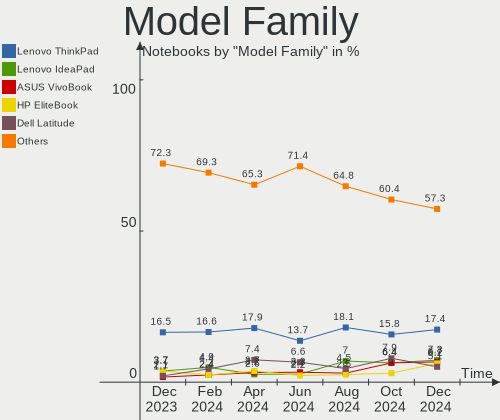
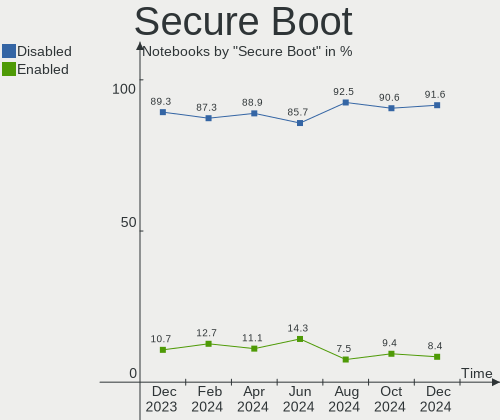
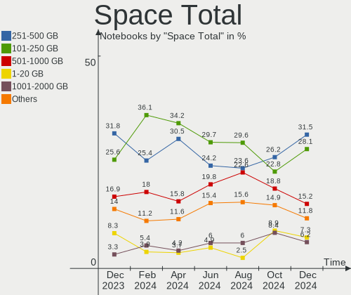
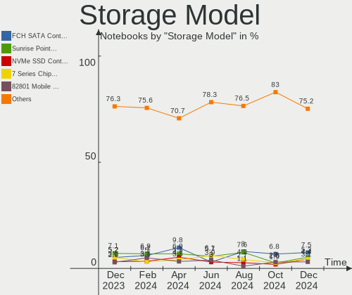
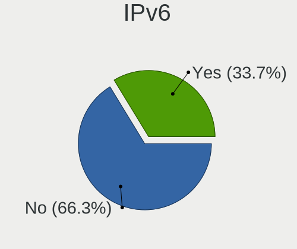
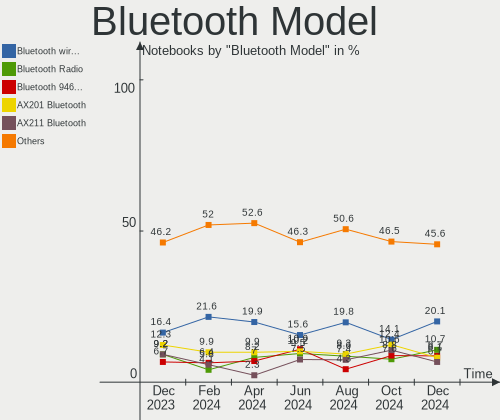
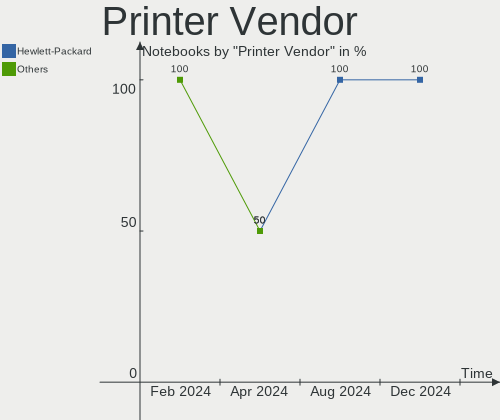

Debian Hardware Trends (Notebooks)
----------------------------------

A project to identify most popular hardware characteristics and track their change
over time based on data collected by Debian users at https://Linux-Hardware.org.

Anyone can contribute to this report by the [hw-probe](https://github.com/linuxhw/hw-probe) tool:

    sudo -E hw-probe -all -upload

Full-feature report is available here: https://linux-hardware.org/?view=trends&formfactor=notebook

Period: Oct, 2021.

Contents
--------

* [ System ](#system)
  - [ OS                       ](#os)
  - [ OS Family                ](#os-family)
  - [ Kernel                   ](#kernel)
  - [ Kernel Family            ](#kernel-family)
  - [ Kernel Major Ver.        ](#kernel-major-ver)
  - [ Arch                     ](#arch)
  - [ DE                       ](#de)
  - [ Display Server           ](#display-server)
  - [ Display Manager          ](#display-manager)
  - [ OS Lang                  ](#os-lang)
  - [ Boot Mode                ](#boot-mode)
  - [ Filesystem               ](#filesystem)
  - [ Part. scheme             ](#part-scheme)
  - [ Dual Boot with Linux/BSD ](#dual-boot-with-linuxbsd)
  - [ Dual Boot (Win)          ](#dual-boot-win)

* [ Board ](#board)
  - [ Vendor                   ](#vendor)
  - [ Model                    ](#model)
  - [ Model Family             ](#model-family)
  - [ MFG Year                 ](#mfg-year)
  - [ Form Factor              ](#form-factor)
  - [ Secure Boot              ](#secure-boot)
  - [ Coreboot                 ](#coreboot)
  - [ RAM Size                 ](#ram-size)
  - [ RAM Used                 ](#ram-used)
  - [ Total Drives             ](#total-drives)
  - [ Has CD-ROM               ](#has-cd-rom)
  - [ Has Ethernet             ](#has-ethernet)
  - [ Has WiFi                 ](#has-wifi)
  - [ Has Bluetooth            ](#has-bluetooth)

* [ Location ](#location)
  - [ Country                  ](#country)
  - [ City                     ](#city)

* [ Drives ](#drives)
  - [ Drive Vendor             ](#drive-vendor)
  - [ Drive Model              ](#drive-model)
  - [ HDD Vendor               ](#hdd-vendor)
  - [ SSD Vendor               ](#ssd-vendor)
  - [ Drive Kind               ](#drive-kind)
  - [ Drive Connector          ](#drive-connector)
  - [ Drive Size               ](#drive-size)
  - [ Space Total              ](#space-total)
  - [ Space Used               ](#space-used)
  - [ Malfunc. Drives          ](#malfunc-drives)
  - [ Malfunc. Drive Vendor    ](#malfunc-drive-vendor)
  - [ Malfunc. HDD Vendor      ](#malfunc-hdd-vendor)
  - [ Malfunc. Drive Kind      ](#malfunc-drive-kind)
  - [ Failed Drives            ](#failed-drives)
  - [ Failed Drive Vendor      ](#failed-drive-vendor)
  - [ Drive Status             ](#drive-status)

* [ Storage controller ](#storage-controller)
  - [ Storage Vendor           ](#storage-vendor)
  - [ Storage Model            ](#storage-model)
  - [ Storage Kind             ](#storage-kind)

* [ Processor ](#processor)
  - [ CPU Vendor               ](#cpu-vendor)
  - [ CPU Model                ](#cpu-model)
  - [ CPU Model Family         ](#cpu-model-family)
  - [ CPU Cores                ](#cpu-cores)
  - [ CPU Sockets              ](#cpu-sockets)
  - [ CPU Threads              ](#cpu-threads)
  - [ CPU Op-Modes             ](#cpu-op-modes)
  - [ CPU Microcode            ](#cpu-microcode)
  - [ CPU Microarch            ](#cpu-microarch)

* [ Graphics ](#graphics)
  - [ GPU Vendor               ](#gpu-vendor)
  - [ GPU Model                ](#gpu-model)
  - [ GPU Combo                ](#gpu-combo)
  - [ GPU Driver               ](#gpu-driver)
  - [ GPU Memory               ](#gpu-memory)

* [ Monitor ](#monitor)
  - [ Monitor Vendor           ](#monitor-vendor)
  - [ Monitor Model            ](#monitor-model)
  - [ Monitor Resolution       ](#monitor-resolution)
  - [ Monitor Diagonal         ](#monitor-diagonal)
  - [ Monitor Width            ](#monitor-width)
  - [ Aspect Ratio             ](#aspect-ratio)
  - [ Monitor Area             ](#monitor-area)
  - [ Pixel Density            ](#pixel-density)
  - [ Multiple Monitors        ](#multiple-monitors)

* [ Network ](#network)
  - [ Net Controller Vendor    ](#net-controller-vendor)
  - [ Net Controller Model     ](#net-controller-model)
  - [ Wireless Vendor          ](#wireless-vendor)
  - [ Wireless Model           ](#wireless-model)
  - [ Ethernet Vendor          ](#ethernet-vendor)
  - [ Ethernet Model           ](#ethernet-model)
  - [ Net Controller Kind      ](#net-controller-kind)
  - [ Used Controller          ](#used-controller)
  - [ NICs                     ](#nics)
  - [ IPv6                     ](#ipv6)

* [ Bluetooth ](#bluetooth)
  - [ Bluetooth Vendor         ](#bluetooth-vendor)
  - [ Bluetooth Model          ](#bluetooth-model)

* [ Sound ](#sound)
  - [ Sound Vendor             ](#sound-vendor)
  - [ Sound Model              ](#sound-model)

* [ Memory ](#memory)
  - [ Memory Vendor            ](#memory-vendor)
  - [ Memory Model             ](#memory-model)
  - [ Memory Kind              ](#memory-kind)
  - [ Memory Form Factor       ](#memory-form-factor)
  - [ Memory Size              ](#memory-size)
  - [ Memory Speed             ](#memory-speed)

* [ Printers & scanners ](#printers--scanners)
  - [ Printer Vendor           ](#printer-vendor)
  - [ Printer Model            ](#printer-model)
  - [ Scanner Vendor           ](#scanner-vendor)
  - [ Scanner Model            ](#scanner-model)

* [ Camera ](#camera)
  - [ Camera Vendor            ](#camera-vendor)
  - [ Camera Model             ](#camera-model)

* [ Security ](#security)
  - [ Fingerprint Vendor       ](#fingerprint-vendor)
  - [ Fingerprint Model        ](#fingerprint-model)
  - [ Chipcard Vendor          ](#chipcard-vendor)
  - [ Chipcard Model           ](#chipcard-model)

* [ Unsupported ](#unsupported)
  - [ Unsupported Devices      ](#unsupported-devices)
  - [ Unsupported Device Types ](#unsupported-device-types)

System
------

OS
--

Installed operating systems

| Name              | Notebooks | Percent |
|-------------------|-----------|---------|
| Debian 11         | 118       | 77.12%  |
| Debian 10         | 18        | 11.76%  |
| Debian Testing    | 11        | 7.19%   |
| Debian Unstable   | 3         | 1.96%   |
| Debian 9          | 2         | 1.31%   |
| Debian 11-updates | 1         | 0.65%   |

OS Family
---------

OS without a version

| Name   | Notebooks | Percent |
|--------|-----------|---------|
| Debian | 153       | 100%    |

Kernel
------

Version of the Linux kernel

| Version                     | Notebooks | Percent |
|-----------------------------|-----------|---------|
| 5.10.0-9-amd64              | 46        | 30.07%  |
| 5.10.0-8-amd64              | 44        | 28.76%  |
| 5.10.0-7-amd64              | 17        | 11.11%  |
| 5.14.0-2-amd64              | 8         | 5.23%   |
| 4.19.0-18-amd64             | 5         | 3.27%   |
| 4.19.0-17-amd64             | 4         | 2.61%   |
| 5.14.0-12.1-liquorix-amd64  | 3         | 1.96%   |
| 5.10.0-9-686-pae            | 3         | 1.96%   |
| 5.14.0-1-amd64              | 2         | 1.31%   |
| 5.10.0-9-686                | 2         | 1.31%   |
| 5.10.0-0.bpo.8-amd64        | 2         | 1.31%   |
| 5.9.0-2-amd64               | 1         | 0.65%   |
| 5.6.19-daveiii-pyradef-aufs | 1         | 0.65%   |
| 5.6.0-0.bpo.2-amd64         | 1         | 0.65%   |
| 5.4.21                      | 1         | 0.65%   |
| 5.4.143-1-pve               | 1         | 0.65%   |
| 5.14.9-xanmod1-cacule       | 1         | 0.65%   |
| 5.14.0-2mx-amd64            | 1         | 0.65%   |
| 5.14.0-14.1-liquorix-amd64  | 1         | 0.65%   |
| 5.10.0-8-686-pae            | 1         | 0.65%   |
| 5.10.0-5mx-amd64            | 1         | 0.65%   |
| 5.10.0-0.bpo.7-amd64        | 1         | 0.65%   |
| 4.9.0-16-amd64              | 1         | 0.65%   |
| 4.9.0-16-686                | 1         | 0.65%   |
| 4.19.0-6-amd64              | 1         | 0.65%   |
| 4.19.0-18-686-pae           | 1         | 0.65%   |
| 4.19.0-17-686               | 1         | 0.65%   |
| 3.10.54                     | 1         | 0.65%   |

Kernel Family
-------------

Linux kernel without a distro release

| Version | Notebooks | Percent |
|---------|-----------|---------|
| 5.10.0  | 117       | 76.47%  |
| 5.14.0  | 15        | 9.8%    |
| 4.19.0  | 12        | 7.84%   |
| 4.9.0   | 2         | 1.31%   |
| 5.9.0   | 1         | 0.65%   |
| 5.6.19  | 1         | 0.65%   |
| 5.6.0   | 1         | 0.65%   |
| 5.4.21  | 1         | 0.65%   |
| 5.4.143 | 1         | 0.65%   |
| 5.14.9  | 1         | 0.65%   |
| 3.10.54 | 1         | 0.65%   |

Kernel Major Ver.
-----------------

Linux kernel major version

| Version | Notebooks | Percent |
|---------|-----------|---------|
| 5.10    | 117       | 76.47%  |
| 5.14    | 16        | 10.46%  |
| 4.19    | 12        | 7.84%   |
| 5.6     | 2         | 1.31%   |
| 5.4     | 2         | 1.31%   |
| 4.9     | 2         | 1.31%   |
| 5.9     | 1         | 0.65%   |
| 3.10    | 1         | 0.65%   |

Arch
----

OS architecture (x86_64, i586, etc.)

| Name   | Notebooks | Percent |
|--------|-----------|---------|
| x86_64 | 142       | 92.81%  |
| i686   | 9         | 5.88%   |
| armv7l | 2         | 1.31%   |

DE
--

Desktop Environment

| Name       | Notebooks | Percent |
|------------|-----------|---------|
| GNOME      | 54        | 35.29%  |
| Unknown    | 29        | 18.95%  |
| KDE5       | 23        | 15.03%  |
| XFCE       | 19        | 12.42%  |
| MATE       | 7         | 4.58%   |
| LXDE       | 7         | 4.58%   |
| X-Cinnamon | 4         | 2.61%   |
| Cinnamon   | 4         | 2.61%   |
| i3         | 3         | 1.96%   |
| Trinity    | 1         | 0.65%   |
| Openbox    | 1         | 0.65%   |
| LXQt       | 1         | 0.65%   |

Display Server
--------------

X11 or Wayland

| Name    | Notebooks | Percent |
|---------|-----------|---------|
| X11     | 88        | 57.52%  |
| Wayland | 33        | 21.57%  |
| Unknown | 24        | 15.69%  |
| Tty     | 8         | 5.23%   |

Display Manager
---------------

SDDM, LightDM, etc.

| Name    | Notebooks | Percent |
|---------|-----------|---------|
| Unknown | 51        | 33.33%  |
| GDM     | 40        | 26.14%  |
| LightDM | 33        | 21.57%  |
| SDDM    | 23        | 15.03%  |
| GDM3    | 6         | 3.92%   |

OS Lang
-------

Language

| Lang    | Notebooks | Percent |
|---------|-----------|---------|
| en_US   | 45        | 29.41%  |
| ru_RU   | 22        | 14.38%  |
| fr_FR   | 9         | 5.88%   |
| de_DE   | 9         | 5.88%   |
| Unknown | 9         | 5.88%   |
| pt_BR   | 7         | 4.58%   |
| es_ES   | 7         | 4.58%   |
| it_IT   | 6         | 3.92%   |
| pl_PL   | 5         | 3.27%   |
| en_GB   | 5         | 3.27%   |
| es_CL   | 3         | 1.96%   |
| en_CA   | 3         | 1.96%   |
| pt_PT   | 2         | 1.31%   |
| hu_HU   | 2         | 1.31%   |
| es_MX   | 2         | 1.31%   |
| es_AR   | 2         | 1.31%   |
| en_AU   | 2         | 1.31%   |
| de_AT   | 2         | 1.31%   |
| zh_TW   | 1         | 0.65%   |
| zh_CN   | 1         | 0.65%   |
| ru_UA   | 1         | 0.65%   |
| nl_BE   | 1         | 0.65%   |
| ja_JP   | 1         | 0.65%   |
| fr_BE   | 1         | 0.65%   |
| es_CR   | 1         | 0.65%   |
| en_ZA   | 1         | 0.65%   |
| en_DK   | 1         | 0.65%   |
| cs_CZ   | 1         | 0.65%   |
| bg_BG   | 1         | 0.65%   |

Boot Mode
---------

EFI or BIOS

| Mode | Notebooks | Percent |
|------|-----------|---------|
| EFI  | 85        | 55.56%  |
| BIOS | 68        | 44.44%  |

Filesystem
----------

Type of filesystem

| Type    | Notebooks | Percent |
|---------|-----------|---------|
| Ext4    | 120       | 78.43%  |
| Overlay | 25        | 16.34%  |
| Btrfs   | 4         | 2.61%   |
| Xfs     | 3         | 1.96%   |
| F2fs    | 1         | 0.65%   |

Part. scheme
------------

Scheme of partitioning

| Type    | Notebooks | Percent |
|---------|-----------|---------|
| GPT     | 87        | 56.86%  |
| MBR     | 36        | 23.53%  |
| Unknown | 30        | 19.61%  |

Dual Boot with Linux/BSD
------------------------

Hosting more than one Linux/BSD

| Dual boot | Notebooks | Percent |
|-----------|-----------|---------|
| No        | 133       | 86.93%  |
| Yes       | 20        | 13.07%  |

Dual Boot (Win)
---------------

Hosting Linux and Windows

| Dual boot | Notebooks | Percent |
|-----------|-----------|---------|
| No        | 102       | 66.67%  |
| Yes       | 51        | 33.33%  |

Board
-----

Vendor
------

Motherboard manufacturer

| Name                | Notebooks | Percent |
|---------------------|-----------|---------|
| Lenovo              | 32        | 20.92%  |
| Hewlett-Packard     | 32        | 20.92%  |
| Dell                | 25        | 16.34%  |
| ASUSTek Computer    | 15        | 9.8%    |
| Acer                | 13        | 8.5%    |
| Aquarius            | 11        | 7.19%   |
| Apple               | 8         | 5.23%   |
| MSI                 | 4         | 2.61%   |
| Samsung Electronics | 3         | 1.96%   |
| Toshiba             | 2         | 1.31%   |
| Unknown             | 2         | 1.31%   |
| TrekStor            | 1         | 0.65%   |
| Sony                | 1         | 0.65%   |
| LG Electronics      | 1         | 0.65%   |
| Jumper              | 1         | 0.65%   |
| HUAWEI              | 1         | 0.65%   |
| Compal              | 1         | 0.65%   |

Model
-----

Motherboard model

| Name                                                                                     | Notebooks | Percent |
|------------------------------------------------------------------------------------------|-----------|---------|
| Aquarius NS585                                                                           | 11        | 7.19%   |
| Apple MacBookAir7,2                                                                      | 4         | 2.61%   |
| HP Pavilion Gaming Laptop 15-ec1xxx                                                      | 3         | 1.96%   |
| Lenovo IdeaPad S145-15API 81V7                                                           | 2         | 1.31%   |
| HP Pavilion g6                                                                           | 2         | 1.31%   |
| HP EliteBook 8460p                                                                       | 2         | 1.31%   |
| Apple MacBook3,1                                                                         | 2         | 1.31%   |
| Acer Aspire A515-51G                                                                     | 2         | 1.31%   |
| Unknown                                                                                  | 2         | 1.31%   |
| TrekStor Surfbook A13                                                                    | 1         | 0.65%   |
| Toshiba Satellite A215                                                                   | 1         | 0.65%   |
| Toshiba Satellite A205                                                                   | 1         | 0.65%   |
| Sony SVE14A15FLB                                                                         | 1         | 0.65%   |
| Samsung 350V5C/350V5X/350V4C/350V4X/351V5C/351V5X/351V4C/351V4X/3540VC/3540VX/3440VC/344 | 1         | 0.65%   |
| Samsung 300E4Z/300E5Z/300E7Z                                                             | 1         | 0.65%   |
| Samsung 300E4C/300E5C/300E7C                                                             | 1         | 0.65%   |
| MSI GF75 Thin 9SC                                                                        | 1         | 0.65%   |
| MSI GF63 8RD                                                                             | 1         | 0.65%   |
| MSI GE72 6QD                                                                             | 1         | 0.65%   |
| MSI Bravo 15 A4DDR                                                                       | 1         | 0.65%   |
| LG X120-L.C7L1A9                                                                         | 1         | 0.65%   |
| Lenovo Y520-15IKBN 80WK                                                                  | 1         | 0.65%   |
| Lenovo V330-15IKB 81AX                                                                   | 1         | 0.65%   |
| Lenovo ThinkPad X60 17068GG                                                              | 1         | 0.65%   |
| Lenovo ThinkPad X140e 20BL000BUS                                                         | 1         | 0.65%   |
| Lenovo ThinkPad X1 Carbon Gen 9 20XWCTO1WW                                               | 1         | 0.65%   |
| Lenovo ThinkPad X1 Carbon Gen 9 20XWA003CD                                               | 1         | 0.65%   |
| Lenovo ThinkPad X1 Carbon Gen 9 20XW003HUS                                               | 1         | 0.65%   |
| Lenovo ThinkPad X1 Carbon 7th 20QD00L7GE                                                 | 1         | 0.65%   |
| Lenovo ThinkPad W530 244743G                                                             | 1         | 0.65%   |
| Lenovo ThinkPad T61 8895WFJ                                                              | 1         | 0.65%   |
| Lenovo ThinkPad T540p 20BFS05B0Q                                                         | 1         | 0.65%   |
| Lenovo ThinkPad T520 4242W9B                                                             | 1         | 0.65%   |
| Lenovo ThinkPad T490 20N2000KGE                                                          | 1         | 0.65%   |
| Lenovo ThinkPad T480s 20L7002AUS                                                         | 1         | 0.65%   |
| Lenovo ThinkPad T480 20L5000AMC                                                          | 1         | 0.65%   |
| Lenovo ThinkPad T440 20B7S1X108                                                          | 1         | 0.65%   |
| Lenovo ThinkPad T400 2768WGB                                                             | 1         | 0.65%   |
| Lenovo ThinkPad T14 Gen 2i 20W0A007CD                                                    | 1         | 0.65%   |
| Lenovo ThinkPad L15 Gen 2 20X4S27200                                                     | 1         | 0.65%   |
| Lenovo ThinkPad E15 Gen 3 20YGCTO1WW                                                     | 1         | 0.65%   |
| Lenovo ThinkPad 20J10046US                                                               | 1         | 0.65%   |
| Lenovo ThinkPad 13 2nd Gen 20J10046US                                                    | 1         | 0.65%   |
| Lenovo ThinkBook 16p Gen 2 20YM                                                          | 1         | 0.65%   |
| Lenovo S10-3                                                                             | 1         | 0.65%   |
| Lenovo IdeaPad Yoga 13 20175                                                             | 1         | 0.65%   |
| Lenovo IdeaPad Slim 1-11AST-05 81VR                                                      | 1         | 0.65%   |
| Lenovo IdeaPad 3 14ADA05 81W0                                                            | 1         | 0.65%   |
| Lenovo G570 4334                                                                         | 1         | 0.65%   |
| Lenovo G50-45 80E3                                                                       | 1         | 0.65%   |
| Lenovo B50-30 20382                                                                      | 1         | 0.65%   |
| Jumper EZbook                                                                            | 1         | 0.65%   |
| HUAWEI BOHK-WAX9X                                                                        | 1         | 0.65%   |
| HP ZHAN 66 Pro A 14 G3                                                                   | 1         | 0.65%   |
| HP TouchSmart tm2                                                                        | 1         | 0.65%   |
| HP ProBook 430 G6                                                                        | 1         | 0.65%   |
| HP ProBook 430 G5                                                                        | 1         | 0.65%   |
| HP Pavilion x2 Detachable                                                                | 1         | 0.65%   |
| HP OMEN Laptop 15-en1xxx                                                                 | 1         | 0.65%   |
| HP Notebook                                                                              | 1         | 0.65%   |

Model Family
------------

Motherboard model prefix

| Name               | Notebooks | Percent |
|--------------------|-----------|---------|
| Lenovo ThinkPad    | 20        | 13.07%  |
| Dell Inspiron      | 11        | 7.19%   |
| Aquarius NS585     | 11        | 7.19%   |
| HP EliteBook       | 8         | 5.23%   |
| Acer Aspire        | 7         | 4.58%   |
| HP Pavilion        | 6         | 3.92%   |
| Dell Latitude      | 6         | 3.92%   |
| Lenovo IdeaPad     | 5         | 3.27%   |
| HP Laptop          | 5         | 3.27%   |
| Apple MacBookAir7  | 5         | 3.27%   |
| Dell XPS           | 4         | 2.61%   |
| ASUS ROG           | 3         | 1.96%   |
| Toshiba Satellite  | 2         | 1.31%   |
| HP ProBook         | 2         | 1.31%   |
| HP Compaq          | 2         | 1.31%   |
| HP 250             | 2         | 1.31%   |
| Dell Vostro        | 2         | 1.31%   |
| Apple MacBook3     | 2         | 1.31%   |
| Acer Nitro         | 2         | 1.31%   |
| Unknown            | 2         | 1.31%   |
| TrekStor Surfbook  | 1         | 0.65%   |
| Sony SVE14A15FLB   | 1         | 0.65%   |
| Samsung 350V5C     | 1         | 0.65%   |
| Samsung 300E4Z     | 1         | 0.65%   |
| Samsung 300E4C     | 1         | 0.65%   |
| MSI GF75           | 1         | 0.65%   |
| MSI GF63           | 1         | 0.65%   |
| MSI GE72           | 1         | 0.65%   |
| MSI Bravo          | 1         | 0.65%   |
| LG X120-L.C7L1A9   | 1         | 0.65%   |
| Lenovo Y520-15IKBN | 1         | 0.65%   |
| Lenovo V330-15IKB  | 1         | 0.65%   |
| Lenovo ThinkBook   | 1         | 0.65%   |
| Lenovo S10-3       | 1         | 0.65%   |
| Lenovo G570        | 1         | 0.65%   |
| Lenovo G50-45      | 1         | 0.65%   |
| Lenovo B50-30      | 1         | 0.65%   |
| Jumper EZbook      | 1         | 0.65%   |
| HUAWEI BOHK-WAX9X  | 1         | 0.65%   |
| HP ZHAN            | 1         | 0.65%   |
| HP TouchSmart      | 1         | 0.65%   |
| HP OMEN            | 1         | 0.65%   |
| HP Notebook        | 1         | 0.65%   |
| HP Mini            | 1         | 0.65%   |
| HP G62             | 1         | 0.65%   |
| HP 650             | 1         | 0.65%   |
| Dell MXG071        | 1         | 0.65%   |
| Dell G7            | 1         | 0.65%   |
| Compal QAL51       | 1         | 0.65%   |
| ASUS ZenBook       | 1         | 0.65%   |
| ASUS UX303LAB      | 1         | 0.65%   |
| ASUS TUF           | 1         | 0.65%   |
| ASUS TP201SA       | 1         | 0.65%   |
| ASUS Strix         | 1         | 0.65%   |
| ASUS N551JW        | 1         | 0.65%   |
| ASUS N501VW        | 1         | 0.65%   |
| ASUS N10Jh         | 1         | 0.65%   |
| ASUS K54C          | 1         | 0.65%   |
| ASUS GL553VE       | 1         | 0.65%   |
| ASUS 1015PE        | 1         | 0.65%   |

MFG Year
--------

Motherboard manufacture year

| Year    | Notebooks | Percent |
|---------|-----------|---------|
| 2021    | 37        | 24.18%  |
| 2020    | 28        | 18.3%   |
| 2019    | 15        | 9.8%    |
| 2018    | 12        | 7.84%   |
| 2012    | 10        | 6.54%   |
| 2008    | 8         | 5.23%   |
| 2013    | 7         | 4.58%   |
| 2016    | 6         | 3.92%   |
| 2011    | 6         | 3.92%   |
| 2010    | 5         | 3.27%   |
| 2015    | 4         | 2.61%   |
| 2014    | 4         | 2.61%   |
| 2009    | 4         | 2.61%   |
| 2017    | 3         | 1.96%   |
| Unknown | 2         | 1.31%   |
| 2007    | 1         | 0.65%   |
| 2005    | 1         | 0.65%   |

Form Factor
-----------

Physical design of the computer

| Name     | Notebooks | Percent |
|----------|-----------|---------|
| Notebook | 153       | 100%    |

Secure Boot
-----------

Enabled or disabled

| State    | Notebooks | Percent |
|----------|-----------|---------|
| Disabled | 143       | 93.46%  |
| Enabled  | 10        | 6.54%   |

Coreboot
--------

Have coreboot on board

| Used | Notebooks | Percent |
|------|-----------|---------|
| No   | 153       | 100%    |

RAM Size
--------

Total RAM memory

| Size in GB | Notebooks | Percent |
|------------|-----------|---------|
| 4.01-8.0   | 49        | 32.03%  |
| 3.01-4.0   | 27        | 17.65%  |
| 16.01-24.0 | 25        | 16.34%  |
| 8.01-16.0  | 25        | 16.34%  |
| 32.01-64.0 | 12        | 7.84%   |
| 1.01-2.0   | 6         | 3.92%   |
| 2.01-3.0   | 5         | 3.27%   |
| 0.51-1.0   | 4         | 2.61%   |

RAM Used
--------

Used RAM memory

| Used GB   | Notebooks | Percent |
|-----------|-----------|---------|
| 1.01-2.0  | 59        | 38.56%  |
| 0.51-1.0  | 28        | 18.3%   |
| 2.01-3.0  | 22        | 14.38%  |
| 4.01-8.0  | 21        | 13.73%  |
| 3.01-4.0  | 15        | 9.8%    |
| 0.01-0.5  | 5         | 3.27%   |
| 8.01-16.0 | 3         | 1.96%   |

Total Drives
------------

Number of drives on board

| Drives | Notebooks | Percent |
|--------|-----------|---------|
| 1      | 117       | 76.47%  |
| 2      | 34        | 22.22%  |
| 3      | 2         | 1.31%   |

Has CD-ROM
----------

Has CD-ROM on board

| Presented | Notebooks | Percent |
|-----------|-----------|---------|
| No        | 113       | 73.86%  |
| Yes       | 40        | 26.14%  |

Has Ethernet
------------

Has Ethernet on board

| Presented | Notebooks | Percent |
|-----------|-----------|---------|
| Yes       | 123       | 80.39%  |
| No        | 30        | 19.61%  |

Has WiFi
--------

Has WiFi module

| Presented | Notebooks | Percent |
|-----------|-----------|---------|
| Yes       | 152       | 99.35%  |
| No        | 1         | 0.65%   |

Has Bluetooth
-------------

Has Bluetooth module

| Presented | Notebooks | Percent |
|-----------|-----------|---------|
| Yes       | 126       | 82.35%  |
| No        | 27        | 17.65%  |

Location
--------

Country
-------

Geographic location (country)

| Country      | Notebooks | Percent |
|--------------|-----------|---------|
| USA          | 23        | 15.03%  |
| Russia       | 20        | 13.07%  |
| Germany      | 11        | 7.19%   |
| France       | 10        | 6.54%   |
| Brazil       | 9         | 5.88%   |
| Spain        | 7         | 4.58%   |
| Italy        | 7         | 4.58%   |
| Poland       | 5         | 3.27%   |
| Ukraine      | 4         | 2.61%   |
| Netherlands  | 4         | 2.61%   |
| Mexico       | 4         | 2.61%   |
| Canada       | 4         | 2.61%   |
| Sweden       | 3         | 1.96%   |
| Hungary      | 3         | 1.96%   |
| China        | 3         | 1.96%   |
| Chile        | 3         | 1.96%   |
| Austria      | 3         | 1.96%   |
| Argentina    | 3         | 1.96%   |
| UK           | 2         | 1.31%   |
| Switzerland  | 2         | 1.31%   |
| Portugal     | 2         | 1.31%   |
| Czechia      | 2         | 1.31%   |
| Belgium      | 2         | 1.31%   |
| Venezuela    | 1         | 0.65%   |
| UAE          | 1         | 0.65%   |
| Tunisia      | 1         | 0.65%   |
| Taiwan       | 1         | 0.65%   |
| South Africa | 1         | 0.65%   |
| Philippines  | 1         | 0.65%   |
| Libya        | 1         | 0.65%   |
| Latvia       | 1         | 0.65%   |
| Japan        | 1         | 0.65%   |
| Indonesia    | 1         | 0.65%   |
| Guam         | 1         | 0.65%   |
| Finland      | 1         | 0.65%   |
| Croatia      | 1         | 0.65%   |
| Costa Rica   | 1         | 0.65%   |
| Bulgaria     | 1         | 0.65%   |
| Belarus      | 1         | 0.65%   |
| Australia    | 1         | 0.65%   |

City
----

Geographic location (city)

| City                 | Notebooks | Percent |
|----------------------|-----------|---------|
| Voronezh             | 16        | 10.46%  |
| Portland             | 5         | 3.27%   |
| Santiago             | 4         | 2.61%   |
| M??laga              | 3         | 1.96%   |
| Zerkow               | 2         | 1.31%   |
| St Petersburg        | 2         | 1.31%   |
| S??o Paulo           | 2         | 1.31%   |
| Moscow               | 2         | 1.31%   |
| Kyiv                 | 2         | 1.31%   |
| Chengdu              | 2         | 1.31%   |
| Catania              | 2         | 1.31%   |
| Buenos Aires         | 2         | 1.31%   |
| Albuquerque          | 2         | 1.31%   |
| Zeist                | 1         | 0.65%   |
| Zagreb               | 1         | 0.65%   |
| Yuma                 | 1         | 0.65%   |
| Yuanlin              | 1         | 0.65%   |
| Yerba Buena          | 1         | 0.65%   |
| Warsaw               | 1         | 0.65%   |
| Wanroij              | 1         | 0.65%   |
| Vienna               | 1         | 0.65%   |
| Tripoli              | 1         | 0.65%   |
| Trieste              | 1         | 0.65%   |
| Torres de la Alameda | 1         | 0.65%   |
| Toronto              | 1         | 0.65%   |
| Thonon-les-Bains     | 1         | 0.65%   |
| Thermopolis          | 1         | 0.65%   |
| Tatab??nya           | 1         | 0.65%   |
| Tancrou              | 1         | 0.65%   |
| Surabaya             | 1         | 0.65%   |
| Stockholm            | 1         | 0.65%   |
| St Louis             | 1         | 0.65%   |
| Sofia                | 1         | 0.65%   |
| Sion                 | 1         | 0.65%   |
| Shanghai             | 1         | 0.65%   |
| Selene               | 1         | 0.65%   |
| Seara                | 1         | 0.65%   |
| Schifferstadt        | 1         | 0.65%   |
| Salvador             | 1         | 0.65%   |
| Salt Lake City       | 1         | 0.65%   |
| Salon-de-Provence    | 1         | 0.65%   |
| Sacramento           | 1         | 0.65%   |
| Roubaix              | 1         | 0.65%   |
| Rome                 | 1         | 0.65%   |
| Riga                 | 1         | 0.65%   |
| Rennes               | 1         | 0.65%   |
| Regina               | 1         | 0.65%   |
| Quemado              | 1         | 0.65%   |
| Prague               | 1         | 0.65%   |
| Petr??polis          | 1         | 0.65%   |
| Perugia              | 1         | 0.65%   |
| Pekin                | 1         | 0.65%   |
| Paris                | 1         | 0.65%   |
| Pabianice            | 1         | 0.65%   |
| Noisy-le-Sec         | 1         | 0.65%   |
| Nice                 | 1         | 0.65%   |
| Nadudvar             | 1         | 0.65%   |
| Munich               | 1         | 0.65%   |
| Mourisca do Vouga    | 1         | 0.65%   |
| Montreal             | 1         | 0.65%   |

Drives
------

Drive Vendor
------------

Hard drive vendors

| Vendor              | Notebooks | Drives | Percent |
|---------------------|-----------|--------|---------|
| WDC                 | 25        | 29     | 13.74%  |
| Samsung Electronics | 22        | 22     | 12.09%  |
| A-DATA Technology   | 16        | 16     | 8.79%   |
| Seagate             | 14        | 14     | 7.69%   |
| SK Hynix            | 11        | 11     | 6.04%   |
| SanDisk             | 11        | 11     | 6.04%   |
| Hitachi             | 10        | 10     | 5.49%   |
| Crucial             | 10        | 10     | 5.49%   |
| Unknown             | 9         | 9      | 4.95%   |
| Kingston            | 8         | 8      | 4.4%    |
| Micron Technology   | 7         | 7      | 3.85%   |
| HGST                | 7         | 7      | 3.85%   |
| Toshiba             | 6         | 6      | 3.3%    |
| Apple               | 6         | 7      | 3.3%    |
| Intel               | 4         | 4      | 2.2%    |
| SPCC                | 2         | 2      | 1.1%    |
| KIOXIA              | 2         | 2      | 1.1%    |
| TrekStor            | 1         | 1      | 0.55%   |
| Transcend           | 1         | 1      | 0.55%   |
| SABRENT             | 1         | 1      | 0.55%   |
| PNY                 | 1         | 1      | 0.55%   |
| Mushkin             | 1         | 1      | 0.55%   |
| MAXTOR              | 1         | 1      | 0.55%   |
| KingSpec            | 1         | 1      | 0.55%   |
| IBM/Hitachi         | 1         | 1      | 0.55%   |
| GOODRAM             | 1         | 1      | 0.55%   |
| GALAX               | 1         | 1      | 0.55%   |
| Fujitsu             | 1         | 1      | 0.55%   |
| Unknown             | 1         | 1      | 0.55%   |

Drive Model
-----------

Hard drive models

| Model                                 | Notebooks | Percent |
|---------------------------------------|-----------|---------|
| A-DATA SU800 512GB SSD                | 12        | 6.45%   |
| Apple SSD SM0128G 121GB               | 4         | 2.15%   |
| Toshiba MQ01ABF050 500GB              | 3         | 1.61%   |
| Seagate ST1000LM035-1RK172 1TB        | 3         | 1.61%   |
| HGST HTS721010A9E630 1TB              | 3         | 1.61%   |
| Crucial CT1000MX500SSD1 1TB           | 3         | 1.61%   |
| WDC WD10SPZX-60Z10T0 1TB              | 2         | 1.08%   |
| WDC PC SN720 SDAPNTW-512G-1006 512GB  | 2         | 1.08%   |
| WDC PC SN520 SDAPNUW-256G-1006 256GB  | 2         | 1.08%   |
| Unknown MMC Card  128GB               | 2         | 1.08%   |
| SPCC Solid State Disk 512GB           | 2         | 1.08%   |
| SK Hynix HFM512GDJTNI-82A0A 512GB     | 2         | 1.08%   |
| Seagate ST9250315AS 250GB             | 2         | 1.08%   |
| SanDisk SSD PLUS 240GB                | 2         | 1.08%   |
| SanDisk SD8SN8U128G1001 128GB SSD     | 2         | 1.08%   |
| Sandisk NVMe SSD Drive 256GB          | 2         | 1.08%   |
| Samsung MZVLQ512HALU-000H1 512GB      | 2         | 1.08%   |
| Samsung MZVL21T0HCLR-00BL7 1TB        | 2         | 1.08%   |
| Kingston SA400S37960G 960GB SSD       | 2         | 1.08%   |
| Crucial CT500MX500SSD1 500GB          | 2         | 1.08%   |
| Crucial CT275MX300SSD1 275GB          | 2         | 1.08%   |
| Crucial CT120BX500SSD1 120GB          | 2         | 1.08%   |
| WDC WDS240G2G0B-00EPW0 240GB SSD      | 1         | 0.54%   |
| WDC WDS240G2G0A-00JH30 240GB SSD      | 1         | 0.54%   |
| WDC WDS200T2B0A 2TB SSD               | 1         | 0.54%   |
| WDC WDBNCE0010PNC 1TB SSD             | 1         | 0.54%   |
| WDC WD7500BPKX-22HPJT0 752GB          | 1         | 0.54%   |
| WDC WD5000LPCX-24C6HT0 500GB          | 1         | 0.54%   |
| WDC WD3200BEKT-60V5T1 320GB           | 1         | 0.54%   |
| WDC WD2500LPCX-24C6HT0 250GB          | 1         | 0.54%   |
| WDC WD1600BEVT-75ZCT2 160GB           | 1         | 0.54%   |
| WDC WD1600BEVT-75A23T0 160GB          | 1         | 0.54%   |
| WDC WD1600BEVT-24A23T0 160GB          | 1         | 0.54%   |
| WDC WD10SPZX-75Z10T2 1TB              | 1         | 0.54%   |
| WDC WD10SPZX-21Z10T0 1TB              | 1         | 0.54%   |
| WDC WD10JPVX-75JC3T0 1TB              | 1         | 0.54%   |
| WDC WD10JPVX-60JC3T0 1TB              | 1         | 0.54%   |
| WDC WD My Passport 261B 1TB           | 1         | 0.54%   |
| WDC PC SN730 SDBQNTY-512G-1001 512GB  | 1         | 0.54%   |
| WDC PC SN730 SDBPNTY-512G-1032 512GB  | 1         | 0.54%   |
| WDC PC SN730 SDBPNTY-256G-1027 256GB  | 1         | 0.54%   |
| WDC PC SN730 SDBPNTY-1T00-1101 1TB    | 1         | 0.54%   |
| WDC PC SN530 SDBPMPZ-512G-1001 512GB  | 1         | 0.54%   |
| WDC PC SN530 NVMe 256GB               | 1         | 0.54%   |
| WDC PC SN520 SDAPNUW-256G             | 1         | 0.54%   |
| Unknown xD/SD/M.S.                    | 1         | 0.54%   |
| Unknown SD16G  16GB                   | 1         | 0.54%   |
| Unknown SD04G  4GB                    | 1         | 0.54%   |
| Unknown NVMe SSD Drive 512GB          | 1         | 0.54%   |
| Unknown MMC64G  64GB                  | 1         | 0.54%   |
| Unknown MMC Card  8GB                 | 1         | 0.54%   |
| Unknown HBG4a2  32GB                  | 1         | 0.54%   |
| TrekStor TREKSTORSSD256GB 250GB       | 1         | 0.54%   |
| Transcend TS1TSSD370 1TB              | 1         | 0.54%   |
| Toshiba THNSNJ128G8NU 128GB SSD       | 1         | 0.54%   |
| Toshiba NVMe SSD Drive 1024GB         | 1         | 0.54%   |
| Toshiba KXG6AZNV1T02 1TB              | 1         | 0.54%   |
| SK Hynix SHGP31-500GM-2 500GB         | 1         | 0.54%   |
| SK Hynix PC711 HFS512GDE9X073N 512GB  | 1         | 0.54%   |
| SK Hynix HFS256G39TND-N210A 256GB SSD | 1         | 0.54%   |

HDD Vendor
----------

Hard disk drive vendors

| Vendor      | Notebooks | Drives | Percent |
|-------------|-----------|--------|---------|
| Seagate     | 14        | 14     | 28%     |
| WDC         | 13        | 13     | 26%     |
| Hitachi     | 10        | 10     | 20%     |
| HGST        | 7         | 7      | 14%     |
| Toshiba     | 3         | 3      | 6%      |
| SABRENT     | 1         | 1      | 2%      |
| IBM/Hitachi | 1         | 1      | 2%      |
| Fujitsu     | 1         | 1      | 2%      |

SSD Vendor
----------

Solid state drive vendors

| Vendor              | Notebooks | Drives | Percent |
|---------------------|-----------|--------|---------|
| A-DATA Technology   | 15        | 15     | 20.55%  |
| Crucial             | 10        | 10     | 13.7%   |
| Samsung Electronics | 9         | 9      | 12.33%  |
| SanDisk             | 8         | 8      | 10.96%  |
| Kingston            | 5         | 5      | 6.85%   |
| WDC                 | 4         | 4      | 5.48%   |
| Apple               | 4         | 4      | 5.48%   |
| SK Hynix            | 3         | 3      | 4.11%   |
| Micron Technology   | 3         | 3      | 4.11%   |
| SPCC                | 2         | 2      | 2.74%   |
| TrekStor            | 1         | 1      | 1.37%   |
| Transcend           | 1         | 1      | 1.37%   |
| Toshiba             | 1         | 1      | 1.37%   |
| PNY                 | 1         | 1      | 1.37%   |
| Mushkin             | 1         | 1      | 1.37%   |
| MAXTOR              | 1         | 1      | 1.37%   |
| KingSpec            | 1         | 1      | 1.37%   |
| Intel               | 1         | 1      | 1.37%   |
| GOODRAM             | 1         | 1      | 1.37%   |
| GALAX               | 1         | 1      | 1.37%   |

Drive Kind
----------

HDD or SSD

| Kind    | Notebooks | Drives | Percent |
|---------|-----------|--------|---------|
| SSD     | 72        | 73     | 39.56%  |
| HDD     | 50        | 50     | 27.47%  |
| NVMe    | 49        | 52     | 26.92%  |
| MMC     | 9         | 10     | 4.95%   |
| Unknown | 2         | 2      | 1.1%    |

Drive Connector
---------------

SATA, SAS, NVMe, etc.

| Type | Notebooks | Drives | Percent |
|------|-----------|--------|---------|
| SATA | 108       | 121    | 63.53%  |
| NVMe | 49        | 52     | 28.82%  |
| MMC  | 9         | 10     | 5.29%   |
| SAS  | 4         | 4      | 2.35%   |

Drive Size
----------

Size of hard drive

| Size in TB | Notebooks | Drives | Percent |
|------------|-----------|--------|---------|
| 0.01-0.5   | 79        | 83     | 66.39%  |
| 0.51-1.0   | 38        | 38     | 31.93%  |
| 1.01-2.0   | 2         | 2      | 1.68%   |

Space Total
-----------

Amount of disk space available on the file system

| Size in GB | Notebooks | Percent |
|------------|-----------|---------|
| 101-250    | 47        | 30.72%  |
| 251-500    | 41        | 26.8%   |
| 501-1000   | 24        | 15.69%  |
| Unknown    | 19        | 12.42%  |
| 1001-2000  | 7         | 4.58%   |
| 51-100     | 7         | 4.58%   |
| 21-50      | 4         | 2.61%   |
| 1-20       | 4         | 2.61%   |

Space Used
----------

Amount of used disk space

| Used GB  | Notebooks | Percent |
|----------|-----------|---------|
| 1-20     | 60        | 39.22%  |
| 21-50    | 20        | 13.07%  |
| 51-100   | 20        | 13.07%  |
| Unknown  | 19        | 12.42%  |
| 101-250  | 16        | 10.46%  |
| 251-500  | 12        | 7.84%   |
| 501-1000 | 6         | 3.92%   |

Malfunc. Drives
---------------

Drive models with a malfunction

| Model                                 | Notebooks | Drives | Percent |
|---------------------------------------|-----------|--------|---------|
| Crucial CT275MX300SSD1 275GB          | 2         | 2      | 12.5%   |
| Toshiba MQ01ABF050 500GB              | 1         | 1      | 6.25%   |
| SK Hynix HFS256G39MND-2300A 256GB SSD | 1         | 1      | 6.25%   |
| SK Hynix HFS128G39TND-N210A 128GB SSD | 1         | 1      | 6.25%   |
| Seagate ST9500420AS 500GB             | 1         | 1      | 6.25%   |
| Seagate ST9250315AS 250GB             | 1         | 1      | 6.25%   |
| Micron Technology 2300 NVMe 512GB     | 1         | 1      | 6.25%   |
| Micron Technology 1100 SATA 256GB SSD | 1         | 1      | 6.25%   |
| Hitachi HTS547575A9E384 752GB         | 1         | 1      | 6.25%   |
| Hitachi HTS547550A9E384 500GB         | 1         | 1      | 6.25%   |
| Hitachi HTS543216L9A300 160GB         | 1         | 1      | 6.25%   |
| Hitachi HTS542516K9SA00 160GB         | 1         | 1      | 6.25%   |
| Hitachi HTS541010G9SA00 100GB         | 1         | 1      | 6.25%   |
| HGST HTS545050A7E680 500GB            | 1         | 1      | 6.25%   |
| HGST HTS545050A7E380 500GB            | 1         | 1      | 6.25%   |

Malfunc. Drive Vendor
---------------------

Vendors of faulty drives

| Vendor            | Notebooks | Drives | Percent |
|-------------------|-----------|--------|---------|
| Hitachi           | 5         | 5      | 31.25%  |
| SK Hynix          | 2         | 2      | 12.5%   |
| Seagate           | 2         | 2      | 12.5%   |
| Micron Technology | 2         | 2      | 12.5%   |
| HGST              | 2         | 2      | 12.5%   |
| Crucial           | 2         | 2      | 12.5%   |
| Toshiba           | 1         | 1      | 6.25%   |

Malfunc. HDD Vendor
-------------------

Vendors of faulty HDD drives

| Vendor  | Notebooks | Drives | Percent |
|---------|-----------|--------|---------|
| Hitachi | 5         | 5      | 50%     |
| Seagate | 2         | 2      | 20%     |
| HGST    | 2         | 2      | 20%     |
| Toshiba | 1         | 1      | 10%     |

Malfunc. Drive Kind
-------------------

Kinds of faulty drives

| Kind | Notebooks | Drives | Percent |
|------|-----------|--------|---------|
| HDD  | 10        | 10     | 62.5%   |
| SSD  | 5         | 5      | 31.25%  |
| NVMe | 1         | 1      | 6.25%   |

Failed Drives
-------------

Failed drive models

Zero info for selected period =(

Failed Drive Vendor
-------------------

Failed drive vendors

Zero info for selected period =(

Drive Status
------------

Number of failed and malfunc. drives

| Status   | Notebooks | Drives | Percent |
|----------|-----------|--------|---------|
| Works    | 103       | 119    | 63.58%  |
| Detected | 43        | 52     | 26.54%  |
| Malfunc  | 16        | 16     | 9.88%   |

Storage controller
------------------

Storage Vendor
--------------

Storage controller vendors

| Vendor                         | Notebooks | Percent |
|--------------------------------|-----------|---------|
| Intel                          | 107       | 60.45%  |
| AMD                            | 18        | 10.17%  |
| Samsung Electronics            | 17        | 9.6%    |
| Sandisk                        | 12        | 6.78%   |
| SK Hynix                       | 7         | 3.95%   |
| Micron Technology              | 4         | 2.26%   |
| Toshiba America Info Systems   | 3         | 1.69%   |
| Kingston Technology Company    | 3         | 1.69%   |
| Apple                          | 2         | 1.13%   |
| Solid State Storage Technology | 1         | 0.56%   |
| Nvidia                         | 1         | 0.56%   |
| KIOXIA                         | 1         | 0.56%   |
| ADATA Technology               | 1         | 0.56%   |

Storage Model
-------------

Storage controller models

| Model                                                                                  | Notebooks | Percent |
|----------------------------------------------------------------------------------------|-----------|---------|
| AMD FCH SATA Controller [AHCI mode]                                                    | 17        | 8.95%   |
| Intel 7 Series Chipset Family 6-port SATA Controller [AHCI mode]                       | 12        | 6.32%   |
| Intel Cannon Lake PCH SATA AHCI Controller                                             | 11        | 5.79%   |
| Intel Sunrise Point-LP SATA Controller [AHCI mode]                                     | 9         | 4.74%   |
| Intel 82801 Mobile SATA Controller [RAID mode]                                         | 7         | 3.68%   |
| Intel 6 Series/C200 Series Chipset Family 6 port Mobile SATA AHCI Controller           | 7         | 3.68%   |
| Samsung NVMe SSD Controller 980                                                        | 6         | 3.16%   |
| Intel Volume Management Device NVMe RAID Controller                                    | 6         | 3.16%   |
| Intel Cannon Lake Mobile PCH SATA AHCI Controller                                      | 6         | 3.16%   |
| Intel 82801HM/HEM (ICH8M/ICH8M-E) IDE Controller                                       | 6         | 3.16%   |
| Sandisk WD Black SN750 / PC SN730 NVMe SSD                                             | 5         | 2.63%   |
| Samsung NVMe SSD Controller SM981/PM981/PM983                                          | 5         | 2.63%   |
| Intel HM170/QM170 Chipset SATA Controller [AHCI Mode]                                  | 5         | 2.63%   |
| Intel 82801HM/HEM (ICH8M/ICH8M-E) SATA Controller [AHCI mode]                          | 5         | 2.63%   |
| Samsung Electronics SATA controller                                                    | 4         | 2.11%   |
| Micron Non-Volatile memory controller                                                  | 4         | 2.11%   |
| Intel Atom/Celeron/Pentium Processor x5-E8000/J3xxx/N3xxx Series SATA Controller       | 4         | 2.11%   |
| Intel 82801IBM/IEM (ICH9M/ICH9M-E) 4 port SATA Controller [AHCI mode]                  | 4         | 2.11%   |
| Intel 82801GBM/GHM (ICH7-M Family) SATA Controller [AHCI mode]                         | 4         | 2.11%   |
| SK Hynix Gold P31 SSD                                                                  | 3         | 1.58%   |
| SK Hynix BC511                                                                         | 3         | 1.58%   |
| Sandisk WD Blue SN500 / PC SN520 NVMe SSD                                              | 3         | 1.58%   |
| Intel NM10/ICH7 Family SATA Controller [AHCI mode]                                     | 3         | 1.58%   |
| Toshiba America Info Systems XG6 NVMe SSD Controller                                   | 2         | 1.05%   |
| Sandisk WD Black 2018/SN750 / PC SN720 NVMe SSD                                        | 2         | 1.05%   |
| Sandisk Non-Volatile memory controller                                                 | 2         | 1.05%   |
| Samsung NVMe SSD Controller PM9A1/PM9A3/980PRO                                         | 2         | 1.05%   |
| Intel Wildcat Point-LP SATA Controller [AHCI Mode]                                     | 2         | 1.05%   |
| Intel Tiger Lake-LP SATA Controller [AHCI mode]                                        | 2         | 1.05%   |
| Intel SSD 660P Series                                                                  | 2         | 1.05%   |
| Intel Celeron N3350/Pentium N4200/Atom E3900 Series SATA AHCI Controller               | 2         | 1.05%   |
| Intel Atom Processor E3800 Series SATA AHCI Controller                                 | 2         | 1.05%   |
| Intel 82801HM/HEM (ICH8M/ICH8M-E) SATA Controller [IDE mode]                           | 2         | 1.05%   |
| Intel 8 Series/C220 Series Chipset Family 6-port SATA Controller 1 [AHCI mode]         | 2         | 1.05%   |
| Intel 8 Series SATA Controller 1 [AHCI mode]                                           | 2         | 1.05%   |
| Intel 6 Series/C200 Series Chipset Family Mobile SATA Controller (IDE mode, ports 4-5) | 2         | 1.05%   |
| Intel 6 Series/C200 Series Chipset Family Mobile SATA Controller (IDE mode, ports 0-3) | 2         | 1.05%   |
| Intel 400 Series Chipset Family SATA AHCI Controller                                   | 2         | 1.05%   |
| Toshiba America Info Systems XG4 NVMe SSD Controller                                   | 1         | 0.53%   |
| Solid State Storage Non-Volatile memory controller                                     | 1         | 0.53%   |
| SK Hynix BC501 NVMe Solid State Drive                                                  | 1         | 0.53%   |
| Nvidia MCP78S [GeForce 8200] SATA Controller (non-AHCI mode)                           | 1         | 0.53%   |
| Nvidia MCP78S [GeForce 8200] IDE                                                       | 1         | 0.53%   |
| KIOXIA Non-Volatile memory controller                                                  | 1         | 0.53%   |
| Kingston Company U-SNS8154P3 NVMe SSD                                                  | 1         | 0.53%   |
| Kingston Company Company Non-Volatile memory controller                                | 1         | 0.53%   |
| Kingston Company A2000 NVMe SSD                                                        | 1         | 0.53%   |
| Intel SSD Pro 7600p/760p/E 6100p Series                                                | 1         | 0.53%   |
| Intel Celeron/Pentium Silver Processor SATA Controller                                 | 1         | 0.53%   |
| Intel Cannon Point-LP SATA Controller [AHCI Mode]                                      | 1         | 0.53%   |
| Intel 82801GBM/GHM (ICH7-M Family) SATA Controller [IDE mode]                          | 1         | 0.53%   |
| Intel 82801G (ICH7 Family) IDE Controller                                              | 1         | 0.53%   |
| Intel 82801DBM (ICH4-M) IDE Controller                                                 | 1         | 0.53%   |
| Intel 5 Series/3400 Series Chipset 4 port SATA AHCI Controller                         | 1         | 0.53%   |
| Apple S3X NVMe Controller                                                              | 1         | 0.53%   |
| Apple S1X NVMe Controller                                                              | 1         | 0.53%   |
| AMD SB600 Non-Raid-5 SATA                                                              | 1         | 0.53%   |
| AMD SB600 IDE                                                                          | 1         | 0.53%   |
| ADATA Non-Volatile memory controller                                                   | 1         | 0.53%   |

Storage Kind
------------

Kind of storage controller (IDE, SATA, NVMe, SAS, ...)

| Kind | Notebooks | Percent |
|------|-----------|---------|
| SATA | 109       | 58.92%  |
| NVMe | 49        | 26.49%  |
| IDE  | 14        | 7.57%   |
| RAID | 13        | 7.03%   |

Processor
---------

CPU Vendor
----------

Processor vendors

| Vendor | Notebooks | Percent |
|--------|-----------|---------|
| Intel  | 124       | 81.05%  |
| AMD    | 27        | 17.65%  |
| ARM    | 2         | 1.31%   |

CPU Model
---------

Processor models

| Model                                         | Notebooks | Percent |
|-----------------------------------------------|-----------|---------|
| Intel Core i3-9100 CPU @ 3.60GHz              | 11        | 7.19%   |
| Intel 11th Gen Core i7-1165G7 @ 2.80GHz       | 6         | 3.92%   |
| AMD Ryzen 5 3500U with Radeon Vega Mobile Gfx | 6         | 3.92%   |
| Intel Core i5-5250U CPU @ 1.60GHz             | 5         | 3.27%   |
| Intel Core i5-8250U CPU @ 1.60GHz             | 4         | 2.61%   |
| Intel Core i5-2520M CPU @ 2.50GHz             | 4         | 2.61%   |
| Intel Core i7-9750H CPU @ 2.60GHz             | 3         | 1.96%   |
| Intel Core i7-8565U CPU @ 1.80GHz             | 3         | 1.96%   |
| Intel Core i7-8550U CPU @ 1.80GHz             | 3         | 1.96%   |
| Intel Atom CPU N455 @ 1.66GHz                 | 3         | 1.96%   |
| Intel 11th Gen Core i5-1135G7 @ 2.40GHz       | 3         | 1.96%   |
| Intel Pentium Dual-Core CPU T4300 @ 2.10GHz   | 2         | 1.31%   |
| Intel Pentium CPU N3710 @ 1.60GHz             | 2         | 1.31%   |
| Intel Core i7-8750H CPU @ 2.20GHz             | 2         | 1.31%   |
| Intel Core i7-7700HQ CPU @ 2.80GHz            | 2         | 1.31%   |
| Intel Core i7-6700HQ CPU @ 2.60GHz            | 2         | 1.31%   |
| Intel Core i7-3630QM CPU @ 2.40GHz            | 2         | 1.31%   |
| Intel Core i7-10750H CPU @ 2.60GHz            | 2         | 1.31%   |
| Intel Core i5-8265U CPU @ 1.60GHz             | 2         | 1.31%   |
| Intel Core i5-2450M CPU @ 2.50GHz             | 2         | 1.31%   |
| Intel Core i3-2350M CPU @ 2.30GHz             | 2         | 1.31%   |
| Intel Core 2 Duo CPU T9300 @ 2.50GHz          | 2         | 1.31%   |
| Intel Core 2 Duo CPU T7500 @ 2.20GHz          | 2         | 1.31%   |
| Intel Celeron CPU 3865U @ 1.80GHz             | 2         | 1.31%   |
| Intel Atom CPU N280 @ 1.66GHz                 | 2         | 1.31%   |
| Intel Atom CPU N270 @ 1.60GHz                 | 2         | 1.31%   |
| Intel 11th Gen Core i7-1185G7 @ 3.00GHz       | 2         | 1.31%   |
| AMD Ryzen 7 5800H with Radeon Graphics        | 2         | 1.31%   |
| AMD Ryzen 7 4800H with Radeon Graphics        | 2         | 1.31%   |
| AMD Ryzen 5 5500U with Radeon Graphics        | 2         | 1.31%   |
| AMD Ryzen 5 4600H with Radeon Graphics        | 2         | 1.31%   |
| AMD Ryzen 5 2500U with Radeon Vega Mobile Gfx | 2         | 1.31%   |
| Intel Pentium M processor 1.70GHz             | 1         | 0.65%   |
| Intel Pentium CPU N4200 @ 1.10GHz             | 1         | 0.65%   |
| Intel Pentium CPU N3700 @ 1.60GHz             | 1         | 0.65%   |
| Intel Pentium CPU N3530 @ 2.16GHz             | 1         | 0.65%   |
| Intel Genuine CPU U7300 @ 1.30GHz             | 1         | 0.65%   |
| Intel Genuine CPU T2400 @ 1.83GHz             | 1         | 0.65%   |
| Intel Core i7-6500U CPU @ 2.50GHz             | 1         | 0.65%   |
| Intel Core i7-5500U CPU @ 2.40GHz             | 1         | 0.65%   |
| Intel Core i7-4810MQ CPU @ 2.80GHz            | 1         | 0.65%   |
| Intel Core i7-4720HQ CPU @ 2.60GHz            | 1         | 0.65%   |
| Intel Core i7-3820QM CPU @ 2.70GHz            | 1         | 0.65%   |
| Intel Core i7-3667U CPU @ 2.00GHz             | 1         | 0.65%   |
| Intel Core i7-2720QM CPU @ 2.20GHz            | 1         | 0.65%   |
| Intel Core i7-10870H CPU @ 2.20GHz            | 1         | 0.65%   |
| Intel Core i7-10510U CPU @ 1.80GHz            | 1         | 0.65%   |
| Intel Core i5-9300H CPU @ 2.40GHz             | 1         | 0.65%   |
| Intel Core i5-7360U CPU @ 2.30GHz             | 1         | 0.65%   |
| Intel Core i5-7300HQ CPU @ 2.50GHz            | 1         | 0.65%   |
| Intel Core i5-7200U CPU @ 2.50GHz             | 1         | 0.65%   |
| Intel Core i5-6300U CPU @ 2.40GHz             | 1         | 0.65%   |
| Intel Core i5-5300U CPU @ 2.30GHz             | 1         | 0.65%   |
| Intel Core i5-4300U CPU @ 1.90GHz             | 1         | 0.65%   |
| Intel Core i5-4300M CPU @ 2.60GHz             | 1         | 0.65%   |
| Intel Core i5-4210U CPU @ 1.70GHz             | 1         | 0.65%   |
| Intel Core i5-3337U CPU @ 1.80GHz             | 1         | 0.65%   |
| Intel Core i5-3320M CPU @ 2.60GHz             | 1         | 0.65%   |
| Intel Core i5-3317U CPU @ 1.70GHz             | 1         | 0.65%   |
| Intel Core i5-3230M CPU @ 2.60GHz             | 1         | 0.65%   |

CPU Model Family
----------------

Processor model prefix

| Model                   | Notebooks | Percent |
|-------------------------|-----------|---------|
| Intel Core i5           | 31        | 20.26%  |
| Intel Core i7           | 28        | 18.3%   |
| Intel Core i3           | 19        | 12.42%  |
| Other                   | 12        | 7.84%   |
| AMD Ryzen 5             | 12        | 7.84%   |
| Intel Celeron           | 9         | 5.88%   |
| Intel Core 2 Duo        | 8         | 5.23%   |
| Intel Atom              | 8         | 5.23%   |
| AMD Ryzen 7             | 6         | 3.92%   |
| Intel Pentium           | 5         | 3.27%   |
| Intel Pentium Dual-Core | 2         | 1.31%   |
| Intel Genuine           | 2         | 1.31%   |
| AMD Ryzen 9             | 2         | 1.31%   |
| AMD E1                  | 2         | 1.31%   |
| Intel Pentium M         | 1         | 0.65%   |
| ARM ARMv7               | 1         | 0.65%   |
| AMD Ryzen 5 PRO         | 1         | 0.65%   |
| AMD Athlon 64 X2        | 1         | 0.65%   |
| AMD Athlon              | 1         | 0.65%   |
| AMD A6                  | 1         | 0.65%   |
| AMD A4                  | 1         | 0.65%   |

CPU Cores
---------

Number of processor cores

| Number | Notebooks | Percent |
|--------|-----------|---------|
| 4      | 65        | 42.48%  |
| 2      | 61        | 39.87%  |
| 6      | 11        | 7.19%   |
| 8      | 8         | 5.23%   |
| 1      | 8         | 5.23%   |

CPU Sockets
-----------

Number of sockets

| Number | Notebooks | Percent |
|--------|-----------|---------|
| 1      | 153       | 100%    |

CPU Threads
-----------

Threads per core (Hyper-Threading)

| Number | Notebooks | Percent |
|--------|-----------|---------|
| 2      | 103       | 67.32%  |
| 1      | 50        | 32.68%  |

CPU Op-Modes
------------

CPU Operation Modes (32-bit, 64-bit)

| Op mode        | Notebooks | Percent |
|----------------|-----------|---------|
| 32-bit, 64-bit | 145       | 94.77%  |
| 32-bit         | 6         | 3.92%   |
| Unknown        | 2         | 1.31%   |

CPU Microcode
-------------

Microcode number

| Number     | Notebooks | Percent |
|------------|-----------|---------|
| Unknown    | 35        | 22.88%  |
| 0x906eb    | 11        | 7.19%   |
| 0x206a7    | 11        | 7.19%   |
| 0x806c1    | 9         | 5.88%   |
| 0x306d4    | 6         | 3.92%   |
| 0x806ec    | 5         | 3.27%   |
| 0x806ea    | 5         | 3.27%   |
| 0x08108109 | 5         | 3.27%   |
| 0x806e9    | 4         | 2.61%   |
| 0x306a9    | 4         | 2.61%   |
| 0xa0652    | 3         | 1.96%   |
| 0x906ed    | 3         | 1.96%   |
| 0x406e3    | 3         | 1.96%   |
| 0x40651    | 3         | 1.96%   |
| 0x106c2    | 3         | 1.96%   |
| 0x1067a    | 3         | 1.96%   |
| 0x0a50000c | 3         | 1.96%   |
| 0x906ea    | 2         | 1.31%   |
| 0x906e9    | 2         | 1.31%   |
| 0x6fd      | 2         | 1.31%   |
| 0x6fb      | 2         | 1.31%   |
| 0x406c4    | 2         | 1.31%   |
| 0x406c3    | 2         | 1.31%   |
| 0x30678    | 2         | 1.31%   |
| 0x106ca    | 2         | 1.31%   |
| 0x10676    | 2         | 1.31%   |
| 0x08600106 | 2         | 1.31%   |
| 0x08600104 | 2         | 1.31%   |
| 0x706a1    | 1         | 0.65%   |
| 0x6e8      | 1         | 0.65%   |
| 0x6d6      | 1         | 0.65%   |
| 0x506e3    | 1         | 0.65%   |
| 0x506c9    | 1         | 0.65%   |
| 0x306c3    | 1         | 0.65%   |
| 0x20655    | 1         | 0.65%   |
| 0x0a50000b | 1         | 0.65%   |
| 0x08608103 | 1         | 0.65%   |
| 0x08608102 | 1         | 0.65%   |
| 0x08108102 | 1         | 0.65%   |
| 0x07000110 | 1         | 0.65%   |
| 0x06006705 | 1         | 0.65%   |
| 0x05000119 | 1         | 0.65%   |
| 0x02000057 | 1         | 0.65%   |

CPU Microarch
-------------

Microarchitecture

| Name            | Notebooks | Percent |
|-----------------|-----------|---------|
| KabyLake        | 38        | 24.84%  |
| SandyBridge     | 14        | 9.15%   |
| TigerLake       | 11        | 7.19%   |
| IvyBridge       | 9         | 5.88%   |
| Zen+            | 8         | 5.23%   |
| Silvermont      | 7         | 4.58%   |
| Broadwell       | 7         | 4.58%   |
| Bonnell         | 7         | 4.58%   |
| Penryn          | 6         | 3.92%   |
| Haswell         | 6         | 3.92%   |
| Zen 2           | 5         | 3.27%   |
| Skylake         | 5         | 3.27%   |
| Core            | 5         | 3.27%   |
| Zen 3           | 4         | 2.61%   |
| Unknown         | 4         | 2.61%   |
| CometLake       | 3         | 1.96%   |
| Zen             | 2         | 1.31%   |
| P6              | 2         | 1.31%   |
| Goldmont        | 2         | 1.31%   |
| Westmere        | 1         | 0.65%   |
| Puma            | 1         | 0.65%   |
| K8 Hammer       | 1         | 0.65%   |
| K8 & K10 hybrid | 1         | 0.65%   |
| Jaguar          | 1         | 0.65%   |
| Goldmont plus   | 1         | 0.65%   |
| Excavator       | 1         | 0.65%   |
| Bobcat          | 1         | 0.65%   |

Graphics
--------

GPU Vendor
----------

Vendors of graphics cards

| Vendor | Notebooks | Percent |
|--------|-----------|---------|
| Intel  | 117       | 62.9%   |
| AMD    | 36        | 19.35%  |
| Nvidia | 33        | 17.74%  |

GPU Model
---------

Graphics card models

| Model                                                                                    | Notebooks | Percent |
|------------------------------------------------------------------------------------------|-----------|---------|
| Intel 2nd Generation Core Processor Family Integrated Graphics Controller                | 12        | 6.03%   |
| Intel TigerLake-LP GT2 [Iris Xe Graphics]                                                | 11        | 5.53%   |
| Intel CoffeeLake-S GT2 [UHD Graphics 630]                                                | 11        | 5.53%   |
| Intel 3rd Gen Core processor Graphics Controller                                         | 8         | 4.02%   |
| AMD Picasso                                                                              | 8         | 4.02%   |
| Intel UHD Graphics 620                                                                   | 7         | 3.52%   |
| Intel WhiskeyLake-U GT2 [UHD Graphics 620]                                               | 6         | 3.02%   |
| Intel Mobile GM965/GL960 Integrated Graphics Controller (secondary)                      | 6         | 3.02%   |
| Intel Mobile GM965/GL960 Integrated Graphics Controller (primary)                        | 6         | 3.02%   |
| Intel CoffeeLake-H GT2 [UHD Graphics 630]                                                | 6         | 3.02%   |
| Intel HD Graphics 6000                                                                   | 5         | 2.51%   |
| Intel Atom/Celeron/Pentium Processor x5-E8000/J3xxx/N3xxx Integrated Graphics Controller | 5         | 2.51%   |
| AMD Renoir                                                                               | 5         | 2.51%   |
| Intel Mobile 945GM/GMS/GME, 943/940GML Express Integrated Graphics Controller            | 4         | 2.01%   |
| AMD Cezanne                                                                              | 4         | 2.01%   |
| Nvidia TU117M [GeForce GTX 1650 Ti Mobile]                                               | 3         | 1.51%   |
| Nvidia TU117M [GeForce GTX 1650 Mobile / Max-Q]                                          | 3         | 1.51%   |
| Nvidia GM107M [GeForce GTX 960M]                                                         | 3         | 1.51%   |
| Intel Skylake GT2 [HD Graphics 520]                                                      | 3         | 1.51%   |
| Intel Mobile 945GSE Express Integrated Graphics Controller                               | 3         | 1.51%   |
| Intel Mobile 4 Series Chipset Integrated Graphics Controller                             | 3         | 1.51%   |
| Intel HD Graphics 630                                                                    | 3         | 1.51%   |
| Intel Haswell-ULT Integrated Graphics Controller                                         | 3         | 1.51%   |
| Intel CometLake-H GT2 [UHD Graphics]                                                     | 3         | 1.51%   |
| Intel Atom Processor D4xx/D5xx/N4xx/N5xx Integrated Graphics Controller                  | 3         | 1.51%   |
| Intel 4th Gen Core Processor Integrated Graphics Controller                              | 3         | 1.51%   |
| AMD Topaz XT [Radeon R7 M260/M265 / M340/M360 / M440/M445 / 530/535 / 620/625 Mobile]    | 3         | 1.51%   |
| AMD Thames [Radeon HD 7500M/7600M Series]                                                | 3         | 1.51%   |
| Nvidia TU116M [GeForce GTX 1660 Ti Mobile]                                               | 2         | 1.01%   |
| Nvidia GP108M [GeForce MX150]                                                            | 2         | 1.01%   |
| Nvidia GP107M [GeForce GTX 1050 Ti Mobile]                                               | 2         | 1.01%   |
| Nvidia GP107M [GeForce GTX 1050 Mobile]                                                  | 2         | 1.01%   |
| Nvidia GK107M [GeForce GT 650M]                                                          | 2         | 1.01%   |
| Nvidia GF117M [GeForce 610M/710M/810M/820M / GT 620M/625M/630M/720M]                     | 2         | 1.01%   |
| Nvidia GA106M [GeForce RTX 3060 Mobile / Max-Q]                                          | 2         | 1.01%   |
| Intel Kaby Lake-U GT1 Integrated Graphics Controller                                     | 2         | 1.01%   |
| Intel HD Graphics 5500                                                                   | 2         | 1.01%   |
| Intel HD Graphics 530                                                                    | 2         | 1.01%   |
| Intel Atom Processor Z36xxx/Z37xxx Series Graphics & Display                             | 2         | 1.01%   |
| AMD Raven Ridge [Radeon Vega Series / Radeon Vega Mobile Series]                         | 2         | 1.01%   |
| AMD Lucienne                                                                             | 2         | 1.01%   |
| Nvidia TU117M [GeForce MX450]                                                            | 1         | 0.5%    |
| Nvidia TU117M                                                                            | 1         | 0.5%    |
| Nvidia TU106M [GeForce RTX 2070 Mobile / Max-Q Refresh]                                  | 1         | 0.5%    |
| Nvidia GP107M [GeForce GTX 1050 Ti Max-Q]                                                | 1         | 0.5%    |
| Nvidia GK107GLM [Quadro K2000M]                                                          | 1         | 0.5%    |
| Nvidia GF119M [NVS 4200M]                                                                | 1         | 0.5%    |
| Nvidia GA104M [GeForce RTX 3070 Mobile / Max-Q]                                          | 1         | 0.5%    |
| Nvidia G98M [GeForce G 105M]                                                             | 1         | 0.5%    |
| Nvidia G84M [GeForce 8700M GT]                                                           | 1         | 0.5%    |
| Nvidia C77 [GeForce 8200M G]                                                             | 1         | 0.5%    |
| Intel Mobile 945GM/GMS, 943/940GML Express Integrated Graphics Controller                | 1         | 0.5%    |
| Intel Iris Plus Graphics 640                                                             | 1         | 0.5%    |
| Intel HD Graphics 620                                                                    | 1         | 0.5%    |
| Intel HD Graphics 500                                                                    | 1         | 0.5%    |
| Intel GeminiLake [UHD Graphics 600]                                                      | 1         | 0.5%    |
| Intel Core Processor Integrated Graphics Controller                                      | 1         | 0.5%    |
| Intel CometLake-U GT2 [UHD Graphics]                                                     | 1         | 0.5%    |
| Intel Celeron N3350/Pentium N4200/Atom E3900 Series Integrated Graphics Controller       | 1         | 0.5%    |
| AMD Wrestler [Radeon HD 7310]                                                            | 1         | 0.5%    |

GPU Combo
---------

Combinations of graphics cards

| Name           | Notebooks | Percent |
|----------------|-----------|---------|
| 1 x Intel      | 88        | 57.52%  |
| Intel + Nvidia | 22        | 14.38%  |
| 1 x AMD        | 20        | 13.07%  |
| Intel + AMD    | 7         | 4.58%   |
| AMD + Nvidia   | 6         | 3.92%   |
| 1 x Nvidia     | 5         | 3.27%   |
| 2 x AMD        | 3         | 1.96%   |
| Other          | 2         | 1.31%   |

GPU Driver
----------

Free vs proprietary

| Driver      | Notebooks | Percent |
|-------------|-----------|---------|
| Free        | 113       | 73.86%  |
| Unknown     | 22        | 14.38%  |
| Proprietary | 18        | 11.76%  |

GPU Memory
----------

Total video memory

| Size in GB | Notebooks | Percent |
|------------|-----------|---------|
| Unknown    | 125       | 81.7%   |
| 0.01-0.5   | 13        | 8.5%    |
| 3.01-4.0   | 6         | 3.92%   |
| 1.01-2.0   | 6         | 3.92%   |
| 0.51-1.0   | 2         | 1.31%   |
| 7.01-8.0   | 1         | 0.65%   |

Monitor
-------

Monitor Vendor
--------------

Monitor vendors

| Vendor                  | Notebooks | Percent |
|-------------------------|-----------|---------|
| AU Optronics            | 24        | 16.11%  |
| LG Display              | 21        | 14.09%  |
| BOE                     | 20        | 13.42%  |
| Chimei Innolux          | 19        | 12.75%  |
| Samsung Electronics     | 12        | 8.05%   |
| Apple                   | 8         | 5.37%   |
| InfoVision              | 5         | 3.36%   |
| PANDA                   | 4         | 2.68%   |
| Lenovo                  | 4         | 2.68%   |
| Hewlett-Packard         | 4         | 2.68%   |
| Dell                    | 4         | 2.68%   |
| Sharp                   | 3         | 2.01%   |
| CSO                     | 3         | 2.01%   |
| BenQ                    | 3         | 2.01%   |
| HannStar                | 2         | 1.34%   |
| Chi Mei Optoelectronics | 2         | 1.34%   |
| ___                     | 1         | 0.67%   |
| Unknown                 | 1         | 0.67%   |
| Philips                 | 1         | 0.67%   |
| LG Philips              | 1         | 0.67%   |
| Goldstar                | 1         | 0.67%   |
| Eizo                    | 1         | 0.67%   |
| CPT                     | 1         | 0.67%   |
| ASUSTek Computer        | 1         | 0.67%   |
| Ancor Communications    | 1         | 0.67%   |
| Acer                    | 1         | 0.67%   |
| Unknown                 | 1         | 0.67%   |

Monitor Model
-------------

Monitor models

| Model                                                                 | Notebooks | Percent |
|-----------------------------------------------------------------------|-----------|---------|
| Apple Color LCD APP9CDF 1440x900 286x179mm 13.3-inch                  | 4         | 2.67%   |
| Samsung Electronics LCD Monitor SDC324C 1920x1080 344x194mm 15.5-inch | 2         | 1.33%   |
| LG Display LCD Monitor LGD0590 1920x1080 344x194mm 15.5-inch          | 2         | 1.33%   |
| LG Display LCD Monitor LGD02E3 1366x768 344x194mm 15.5-inch           | 2         | 1.33%   |
| InfoVision LCD Monitor IVO8C78 1920x1080 309x174mm 14.0-inch          | 2         | 1.33%   |
| HannStar LCD Monitor HSD03E9 1024x600 220x129mm 10.0-inch             | 2         | 1.33%   |
| Chimei Innolux LCD Monitor CMN139E 1920x1080 293x165mm 13.2-inch      | 2         | 1.33%   |
| BOE LCD Monitor BOE097D 1920x1080 344x194mm 15.5-inch                 | 2         | 1.33%   |
| BOE LCD Monitor BOE0818 1920x1080 344x194mm 15.5-inch                 | 2         | 1.33%   |
| BOE LCD Monitor BOE0757 1366x768 344x194mm 15.5-inch                  | 2         | 1.33%   |
| BOE LCD Monitor BOE06CF 1366x768 277x156mm 12.5-inch                  | 2         | 1.33%   |
| BOE LCD Monitor BOE06A9 1920x1080 344x193mm 15.5-inch                 | 2         | 1.33%   |
| BOE LCD Monitor BOE06A5 1366x768 344x194mm 15.5-inch                  | 2         | 1.33%   |
| AU Optronics LCD Monitor AUO479D 1920x1080 382x215mm 17.3-inch        | 2         | 1.33%   |
| AU Optronics LCD Monitor AUO183C 1366x768 309x173mm 13.9-inch         | 2         | 1.33%   |
| ___ LCDTV16 ___3393 1600x1200 1600x900mm 72.3-inch                    | 1         | 0.67%   |
| Unknown LCDTV16 3393 1920x1080 1600x900mm 72.3-inch                   | 1         | 0.67%   |
| Sharp LCD Monitor SHP14BA 1920x1080 344x194mm 15.5-inch               | 1         | 0.67%   |
| Sharp LCD Monitor SHP1476 3840x2160 346x194mm 15.6-inch               | 1         | 0.67%   |
| Sharp LCD Monitor SHP13CF 1280x800 331x207mm 15.4-inch                | 1         | 0.67%   |
| Samsung Electronics SyncMaster SAM011F 1280x1024 376x301mm 19.0-inch  | 1         | 0.67%   |
| Samsung Electronics S24R35x SAM100E 1920x1080 530x300mm 24.0-inch     | 1         | 0.67%   |
| Samsung Electronics LCD Monitor SEC5448 1920x1080 344x194mm 15.5-inch | 1         | 0.67%   |
| Samsung Electronics LCD Monitor SEC5441 1366x768 344x194mm 15.5-inch  | 1         | 0.67%   |
| Samsung Electronics LCD Monitor SEC4D41 1280x800 261x163mm 12.1-inch  | 1         | 0.67%   |
| Samsung Electronics LCD Monitor SEC3651 1366x768 344x194mm 15.5-inch  | 1         | 0.67%   |
| Samsung Electronics LCD Monitor SEC3633 1280x800 331x207mm 15.4-inch  | 1         | 0.67%   |
| Samsung Electronics LCD Monitor SEC325A 1366x768 344x194mm 15.5-inch  | 1         | 0.67%   |
| Samsung Electronics LCD Monitor SDC8B4F 1920x1080 344x194mm 15.5-inch | 1         | 0.67%   |
| Samsung Electronics LCD Monitor SAM0B54 1366x768 609x347mm 27.6-inch  | 1         | 0.67%   |
| Philips PHL 244E5 PHLC0C0 1920x1080 530x300mm 24.0-inch               | 1         | 0.67%   |
| PANDA LM156LF1L03 NCP001C 1920x1080 344x194mm 15.5-inch               | 1         | 0.67%   |
| PANDA LCD Monitor NCP0058 1920x1080 344x194mm 15.5-inch               | 1         | 0.67%   |
| PANDA LCD Monitor NCP004D 1920x1080 344x194mm 15.5-inch               | 1         | 0.67%   |
| PANDA LC133LF2L03 NCP0015 1920x1080 294x165mm 13.3-inch               | 1         | 0.67%   |
| LG Philips LCD Monitor LPLDF00 1440x900 331x207mm 15.4-inch           | 1         | 0.67%   |
| LG Display LP156WH1-TLA1 LGD6301 1366x768 344x194mm 15.5-inch         | 1         | 0.67%   |
| LG Display LCD Monitor LGD0619 1920x1080 309x174mm 14.0-inch          | 1         | 0.67%   |
| LG Display LCD Monitor LGD060F 1920x1080 309x174mm 14.0-inch          | 1         | 0.67%   |
| LG Display LCD Monitor LGD0608 1920x1080 309x174mm 14.0-inch          | 1         | 0.67%   |
| LG Display LCD Monitor LGD05FE 1920x1080 344x194mm 15.5-inch          | 1         | 0.67%   |
| LG Display LCD Monitor LGD0563 1920x1080 344x194mm 15.5-inch          | 1         | 0.67%   |
| LG Display LCD Monitor LGD052D 1920x1080 294x165mm 13.3-inch          | 1         | 0.67%   |
| LG Display LCD Monitor LGD0468 1366x768 340x190mm 15.3-inch           | 1         | 0.67%   |
| LG Display LCD Monitor LGD045E 1366x768 309x174mm 14.0-inch           | 1         | 0.67%   |
| LG Display LCD Monitor LGD0456 1366x768 344x194mm 15.5-inch           | 1         | 0.67%   |
| LG Display LCD Monitor LGD03B7 1366x768 309x174mm 14.0-inch           | 1         | 0.67%   |
| LG Display LCD Monitor LGD0395 1366x768 344x194mm 15.5-inch           | 1         | 0.67%   |
| LG Display LCD Monitor LGD038E 1366x768 340x190mm 15.3-inch           | 1         | 0.67%   |
| LG Display LCD Monitor LGD0360 1600x900 294x166mm 13.3-inch           | 1         | 0.67%   |
| LG Display LCD Monitor LGD034C 1366x768 293x165mm 13.2-inch           | 1         | 0.67%   |
| LG Display LCD Monitor LGD02DC 1366x768 344x194mm 15.5-inch           | 1         | 0.67%   |
| LG Display LCD Monitor LGD01E9 1920x1080 345x194mm 15.6-inch          | 1         | 0.67%   |
| Lenovo LCD Monitor LEN40B2 1920x1080 344x193mm 15.5-inch              | 1         | 0.67%   |
| Lenovo LCD Monitor LEN4046 1600x1200 304x228mm 15.0-inch              | 1         | 0.67%   |
| Lenovo LCD Monitor LEN4036 1440x900 304x190mm 14.1-inch               | 1         | 0.67%   |
| Lenovo LCD Monitor LEN4022 1400x1050 287x215mm 14.1-inch              | 1         | 0.67%   |
| Lenovo LCD Monitor LEN4000 1024x768 246x185mm 12.1-inch               | 1         | 0.67%   |
| InfoVision LCD Monitor IVO8C44 1920x1200 302x189mm 14.0-inch          | 1         | 0.67%   |
| InfoVision LCD Monitor IVO048C 1366x768 260x140mm 11.6-inch           | 1         | 0.67%   |

Monitor Resolution
------------------

Monitor screen resolution

| Resolution         | Notebooks | Percent |
|--------------------|-----------|---------|
| 1920x1080 (FHD)    | 61        | 43.57%  |
| 1366x768 (WXGA)    | 40        | 28.57%  |
| 1440x900 (WXGA+)   | 7         | 5%      |
| 1280x800 (WXGA)    | 6         | 4.29%   |
| 1920x1200 (WUXGA)  | 5         | 3.57%   |
| 1024x600           | 5         | 3.57%   |
| 3840x2160 (4K)     | 4         | 2.86%   |
| 1600x900 (HD+)     | 3         | 2.14%   |
| 2560x1440 (QHD)    | 2         | 1.43%   |
| 3840x2400          | 1         | 0.71%   |
| 2880x1800          | 1         | 0.71%   |
| 1680x1050 (WSXGA+) | 1         | 0.71%   |
| 1600x1200          | 1         | 0.71%   |
| 1400x1050          | 1         | 0.71%   |
| 1360x768           | 1         | 0.71%   |
| 1280x1024 (SXGA)   | 1         | 0.71%   |

Monitor Diagonal
----------------

Diagonal size in inches

| Inches  | Notebooks | Percent |
|---------|-----------|---------|
| 15      | 58        | 38.93%  |
| 13      | 27        | 18.12%  |
| 14      | 18        | 12.08%  |
| 17      | 8         | 5.37%   |
| 24      | 6         | 4.03%   |
| 10      | 5         | 3.36%   |
| 27      | 4         | 2.68%   |
| 23      | 4         | 2.68%   |
| 12      | 4         | 2.68%   |
| 11      | 4         | 2.68%   |
| 21      | 2         | 1.34%   |
| 18      | 2         | 1.34%   |
| Unknown | 2         | 1.34%   |
| 72      | 1         | 0.67%   |
| 32      | 1         | 0.67%   |
| 22      | 1         | 0.67%   |
| 19      | 1         | 0.67%   |
| 8       | 1         | 0.67%   |

Monitor Width
-------------

Physical width

| Width in mm | Notebooks | Percent |
|-------------|-----------|---------|
| 301-350     | 86        | 57.72%  |
| 201-300     | 29        | 19.46%  |
| 501-600     | 12        | 8.05%   |
| 351-400     | 10        | 6.71%   |
| 401-500     | 5         | 3.36%   |
| 601-700     | 2         | 1.34%   |
| Unknown     | 2         | 1.34%   |
| 701-800     | 1         | 0.67%   |
| 1501-2000   | 1         | 0.67%   |
| 101-200     | 1         | 0.67%   |

Aspect Ratio
------------

Proportional relationship between the width and the height

| Ratio   | Notebooks | Percent |
|---------|-----------|---------|
| 16/9    | 110       | 82.71%  |
| 16/10   | 20        | 15.04%  |
| 5/4     | 1         | 0.75%   |
| 4/3     | 1         | 0.75%   |
| Unknown | 1         | 0.75%   |

Monitor Area
------------

Area in inch

| Area in inch | Notebooks | Percent |
|----------------|-----------|---------|
| 101-110        | 58        | 38.67%  |
| 81-90          | 31        | 20.67%  |
| 71-80          | 13        | 8.67%   |
| 201-250        | 11        | 7.33%   |
| 121-130        | 8         | 5.33%   |
| 41-50          | 5         | 3.33%   |
| 61-70          | 4         | 2.67%   |
| 51-60          | 4         | 2.67%   |
| 301-350        | 4         | 2.67%   |
| 251-300        | 2         | 1.33%   |
| 151-200        | 2         | 1.33%   |
| 91-100         | 2         | 1.33%   |
| Unknown        | 2         | 1.33%   |
| More than 1000 | 1         | 0.67%   |
| 351-500        | 1         | 0.67%   |
| 1-40           | 1         | 0.67%   |
| 141-150        | 1         | 0.67%   |

Pixel Density
-------------

Pixels per inch

| Density       | Notebooks | Percent |
|---------------|-----------|---------|
| 121-160       | 69        | 46.94%  |
| 101-120       | 42        | 28.57%  |
| 51-100        | 20        | 13.61%  |
| 161-240       | 9         | 6.12%   |
| More than 240 | 4         | 2.72%   |
| Unknown       | 2         | 1.36%   |
| 1-50          | 1         | 0.68%   |

Multiple Monitors
-----------------

Total monitors connected

| Total | Notebooks | Percent |
|-------|-----------|---------|
| 1     | 111       | 72.55%  |
| 0     | 21        | 13.73%  |
| 2     | 19        | 12.42%  |
| 3     | 2         | 1.31%   |

Network
-------

Net Controller Vendor
---------------------

Controller vendors

| Vendor                          | Notebooks | Percent |
|---------------------------------|-----------|---------|
| Realtek Semiconductor           | 89        | 34.9%   |
| Intel                           | 81        | 31.76%  |
| Qualcomm Atheros                | 41        | 16.08%  |
| Broadcom                        | 10        | 3.92%   |
| Broadcom Limited                | 8         | 3.14%   |
| Marvell Technology Group        | 5         | 1.96%   |
| Ralink                          | 4         | 1.57%   |
| MEDIATEK                        | 4         | 1.57%   |
| Qualcomm Atheros Communications | 2         | 0.78%   |
| Ralink Technology               | 1         | 0.39%   |
| Quectel Wireless Solutions      | 1         | 0.39%   |
| Nvidia                          | 1         | 0.39%   |
| NetGear                         | 1         | 0.39%   |
| Lenovo                          | 1         | 0.39%   |
| Hewlett-Packard                 | 1         | 0.39%   |
| Fibocom                         | 1         | 0.39%   |
| Dell                            | 1         | 0.39%   |
| Cinterion                       | 1         | 0.39%   |
| Belkin Components               | 1         | 0.39%   |
| ASIX Electronics                | 1         | 0.39%   |

Net Controller Model
--------------------

Controller models

| Model                                                                   | Notebooks | Percent |
|-------------------------------------------------------------------------|-----------|---------|
| Realtek RTL8111/8168/8411 PCI Express Gigabit Ethernet Controller       | 58        | 20.07%  |
| Realtek RTL810xE PCI Express Fast Ethernet controller                   | 19        | 6.57%   |
| Intel Cannon Lake PCH CNVi WiFi                                         | 15        | 5.19%   |
| Qualcomm Atheros QCA9377 802.11ac Wireless Network Adapter              | 11        | 3.81%   |
| Intel Wi-Fi 6 AX200                                                     | 8         | 2.77%   |
| Qualcomm Atheros AR9485 Wireless Network Adapter                        | 7         | 2.42%   |
| Intel Wireless 8265 / 8275                                              | 7         | 2.42%   |
| Intel 82579LM Gigabit Network Connection (Lewisville)                   | 7         | 2.42%   |
| Intel Wi-Fi 6 AX201                                                     | 6         | 2.08%   |
| Qualcomm Atheros QCA6174 802.11ac Wireless Network Adapter              | 5         | 1.73%   |
| Intel Wireless 7265                                                     | 5         | 1.73%   |
| Intel Cannon Point-LP CNVi [Wireless-AC]                                | 5         | 1.73%   |
| Broadcom Limited BCM4360 802.11ac Wireless Network Adapter              | 5         | 1.73%   |
| Realtek RTL8153 Gigabit Ethernet Adapter                                | 4         | 1.38%   |
| Qualcomm Atheros QCA9565 / AR9565 Wireless Network Adapter              | 4         | 1.38%   |
| Intel Wireless 3165                                                     | 4         | 1.38%   |
| Intel Ethernet Connection (4) I219-V                                    | 4         | 1.38%   |
| Intel Centrino Advanced-N 6205 [Taylor Peak]                            | 4         | 1.38%   |
| Realtek RTL8822CE 802.11ac PCIe Wireless Network Adapter                | 3         | 1.04%   |
| Realtek RTL8821CE 802.11ac PCIe Wireless Network Adapter                | 3         | 1.04%   |
| Realtek RTL8723DE Wireless Network Adapter                              | 3         | 1.04%   |
| Ralink RT3290 Wireless 802.11n 1T/1R PCIe                               | 3         | 1.04%   |
| Qualcomm Atheros AR928X Wireless Network Adapter (PCI-Express)          | 3         | 1.04%   |
| Qualcomm Atheros AR9285 Wireless Network Adapter (PCI-Express)          | 3         | 1.04%   |
| Intel Wireless 7260                                                     | 3         | 1.04%   |
| Intel Ethernet Connection I218-LM                                       | 3         | 1.04%   |
| Intel Ethernet Connection (6) I219-V                                    | 3         | 1.04%   |
| Intel Comet Lake PCH CNVi WiFi                                          | 3         | 1.04%   |
| Broadcom BCM4313 802.11bgn Wireless Network Adapter                     | 3         | 1.04%   |
| Qualcomm Atheros AR9271 802.11n                                         | 2         | 0.69%   |
| Qualcomm Atheros AR9462 Wireless Network Adapter                        | 2         | 0.69%   |
| Qualcomm Atheros AR8132 Fast Ethernet                                   | 2         | 0.69%   |
| Qualcomm Atheros AR242x / AR542x Wireless Network Adapter (PCI-Express) | 2         | 0.69%   |
| MEDIATEK Network controller                                             | 2         | 0.69%   |
| Marvell Group 88E8058 PCI-E Gigabit Ethernet Controller                 | 2         | 0.69%   |
| Marvell Group 88E8040 PCI-E Fast Ethernet Controller                    | 2         | 0.69%   |
| Intel PRO/Wireless 3945ABG [Golan] Network Connection                   | 2         | 0.69%   |
| Intel Ethernet Connection I217-LM                                       | 2         | 0.69%   |
| Intel Ethernet Connection (13) I219-V                                   | 2         | 0.69%   |
| Intel Centrino Ultimate-N 6300                                          | 2         | 0.69%   |
| Broadcom Limited BCM4312 802.11b/g LP-PHY                               | 2         | 0.69%   |
| Broadcom BCM4321 802.11a/b/g/n                                          | 2         | 0.69%   |
| Realtek RTL8852AE 802.11ax PCIe Wireless Network Adapter                | 1         | 0.35%   |
| Realtek RTL8812AU 802.11a/b/g/n/ac 2T2R DB WLAN Adapter                 | 1         | 0.35%   |
| Realtek RTL8723BE PCIe Wireless Network Adapter                         | 1         | 0.35%   |
| Realtek RTL8723AU 802.11n WLAN Adapter                                  | 1         | 0.35%   |
| Realtek RTL8192EE PCIe Wireless Network Adapter                         | 1         | 0.35%   |
| Realtek RTL8188CE 802.11b/g/n WiFi Adapter                              | 1         | 0.35%   |
| Realtek RTL8187SE Wireless LAN Controller                               | 1         | 0.35%   |
| Realtek RTL8187B Wireless Adapter                                       | 1         | 0.35%   |
| Realtek Realtek Ethernet controller                                     | 1         | 0.35%   |
| Realtek Killer E2500 Gigabit Ethernet Controller                        | 1         | 0.35%   |
| Realtek 802.11ac NIC                                                    | 1         | 0.35%   |
| Ralink RT5370 Wireless Adapter                                          | 1         | 0.35%   |
| Ralink RT5390 Wireless 802.11n 1T/1R PCIe                               | 1         | 0.35%   |
| Quectel Wireless Solutions Quectel EM05-CE                              | 1         | 0.35%   |
| Qualcomm Atheros QCA8171 Gigabit Ethernet                               | 1         | 0.35%   |
| Qualcomm Atheros Killer E2400 Gigabit Ethernet Controller               | 1         | 0.35%   |
| Qualcomm Atheros AR8152 v2.0 Fast Ethernet                              | 1         | 0.35%   |
| Qualcomm Atheros AR8151 v2.0 Gigabit Ethernet                           | 1         | 0.35%   |

Wireless Vendor
---------------

Wireless vendors

| Vendor                          | Notebooks | Percent |
|---------------------------------|-----------|---------|
| Intel                           | 74        | 45.96%  |
| Qualcomm Atheros                | 37        | 22.98%  |
| Realtek Semiconductor           | 18        | 11.18%  |
| Broadcom                        | 9         | 5.59%   |
| Broadcom Limited                | 8         | 4.97%   |
| Ralink                          | 4         | 2.48%   |
| MEDIATEK                        | 3         | 1.86%   |
| Qualcomm Atheros Communications | 2         | 1.24%   |
| Ralink Technology               | 1         | 0.62%   |
| Quectel Wireless Solutions      | 1         | 0.62%   |
| NetGear                         | 1         | 0.62%   |
| Fibocom                         | 1         | 0.62%   |
| Cinterion                       | 1         | 0.62%   |
| Belkin Components               | 1         | 0.62%   |

Wireless Model
--------------

Wireless models

| Model                                                                   | Notebooks | Percent |
|-------------------------------------------------------------------------|-----------|---------|
| Intel Cannon Lake PCH CNVi WiFi                                         | 15        | 9.32%   |
| Qualcomm Atheros QCA9377 802.11ac Wireless Network Adapter              | 11        | 6.83%   |
| Intel Wi-Fi 6 AX200                                                     | 8         | 4.97%   |
| Qualcomm Atheros AR9485 Wireless Network Adapter                        | 7         | 4.35%   |
| Intel Wireless 8265 / 8275                                              | 7         | 4.35%   |
| Intel Wi-Fi 6 AX201                                                     | 6         | 3.73%   |
| Qualcomm Atheros QCA6174 802.11ac Wireless Network Adapter              | 5         | 3.11%   |
| Intel Wireless 7265                                                     | 5         | 3.11%   |
| Intel Cannon Point-LP CNVi [Wireless-AC]                                | 5         | 3.11%   |
| Broadcom Limited BCM4360 802.11ac Wireless Network Adapter              | 5         | 3.11%   |
| Qualcomm Atheros QCA9565 / AR9565 Wireless Network Adapter              | 4         | 2.48%   |
| Intel Wireless 3165                                                     | 4         | 2.48%   |
| Intel Centrino Advanced-N 6205 [Taylor Peak]                            | 4         | 2.48%   |
| Realtek RTL8822CE 802.11ac PCIe Wireless Network Adapter                | 3         | 1.86%   |
| Realtek RTL8821CE 802.11ac PCIe Wireless Network Adapter                | 3         | 1.86%   |
| Realtek RTL8723DE Wireless Network Adapter                              | 3         | 1.86%   |
| Ralink RT3290 Wireless 802.11n 1T/1R PCIe                               | 3         | 1.86%   |
| Qualcomm Atheros AR928X Wireless Network Adapter (PCI-Express)          | 3         | 1.86%   |
| Qualcomm Atheros AR9285 Wireless Network Adapter (PCI-Express)          | 3         | 1.86%   |
| Intel Wireless 7260                                                     | 3         | 1.86%   |
| Intel Comet Lake PCH CNVi WiFi                                          | 3         | 1.86%   |
| Broadcom BCM4313 802.11bgn Wireless Network Adapter                     | 3         | 1.86%   |
| Qualcomm Atheros AR9271 802.11n                                         | 2         | 1.24%   |
| Qualcomm Atheros AR9462 Wireless Network Adapter                        | 2         | 1.24%   |
| Qualcomm Atheros AR242x / AR542x Wireless Network Adapter (PCI-Express) | 2         | 1.24%   |
| MEDIATEK Network controller                                             | 2         | 1.24%   |
| Intel PRO/Wireless 3945ABG [Golan] Network Connection                   | 2         | 1.24%   |
| Intel Centrino Ultimate-N 6300                                          | 2         | 1.24%   |
| Broadcom Limited BCM4312 802.11b/g LP-PHY                               | 2         | 1.24%   |
| Broadcom BCM4321 802.11a/b/g/n                                          | 2         | 1.24%   |
| Realtek RTL8852AE 802.11ax PCIe Wireless Network Adapter                | 1         | 0.62%   |
| Realtek RTL8812AU 802.11a/b/g/n/ac 2T2R DB WLAN Adapter                 | 1         | 0.62%   |
| Realtek RTL8723BE PCIe Wireless Network Adapter                         | 1         | 0.62%   |
| Realtek RTL8723AU 802.11n WLAN Adapter                                  | 1         | 0.62%   |
| Realtek RTL8192EE PCIe Wireless Network Adapter                         | 1         | 0.62%   |
| Realtek RTL8188CE 802.11b/g/n WiFi Adapter                              | 1         | 0.62%   |
| Realtek RTL8187SE Wireless LAN Controller                               | 1         | 0.62%   |
| Realtek RTL8187B Wireless Adapter                                       | 1         | 0.62%   |
| Realtek 802.11ac NIC                                                    | 1         | 0.62%   |
| Ralink RT5370 Wireless Adapter                                          | 1         | 0.62%   |
| Ralink RT5390 Wireless 802.11n 1T/1R PCIe                               | 1         | 0.62%   |
| Quectel Wireless Solutions Quectel EM05-CE                              | 1         | 0.62%   |
| NetGear WG111v2 54 Mbps Wireless [RealTek RTL8187L]                     | 1         | 0.62%   |
| MediaTek WiFi                                                           | 1         | 0.62%   |
| Intel Wireless-AC 9260                                                  | 1         | 0.62%   |
| Intel Wireless 3160                                                     | 1         | 0.62%   |
| Intel Wi-Fi 6 AX210/AX211/AX411 160MHz                                  | 1         | 0.62%   |
| Intel PRO/Wireless 5100 AGN [Shiloh] Network Connection                 | 1         | 0.62%   |
| Intel PRO/Wireless 4965 AG or AGN [Kedron] Network Connection           | 1         | 0.62%   |
| Intel Dual Band Wireless-AC 3165 Plus Bluetooth                         | 1         | 0.62%   |
| Intel Comet Lake PCH-LP CNVi WiFi                                       | 1         | 0.62%   |
| Intel Centrino Wireless-N 2230                                          | 1         | 0.62%   |
| Intel Centrino Wireless-N 130                                           | 1         | 0.62%   |
| Intel Centrino Wireless-N 1030 [Rainbow Peak]                           | 1         | 0.62%   |
| Fibocom L830-EB-00 LTE WWAN Modem                                       | 1         | 0.62%   |
| Cinterion LTE Modem                                                     | 1         | 0.62%   |
| Broadcom Limited BCM43225 802.11b/g/n                                   | 1         | 0.62%   |
| Broadcom BCM4350 802.11ac Wireless Network Adapter                      | 1         | 0.62%   |
| Broadcom BCM43142 802.11b/g/n                                           | 1         | 0.62%   |
| Broadcom BCM4312 802.11b/g LP-PHY                                       | 1         | 0.62%   |

Ethernet Vendor
---------------

Ethernet vendors

| Vendor                   | Notebooks | Percent |
|--------------------------|-----------|---------|
| Realtek Semiconductor    | 81        | 65.85%  |
| Intel                    | 25        | 20.33%  |
| Qualcomm Atheros         | 6         | 4.88%   |
| Marvell Technology Group | 5         | 4.07%   |
| Broadcom                 | 2         | 1.63%   |
| Nvidia                   | 1         | 0.81%   |
| MediaTek                 | 1         | 0.81%   |
| Lenovo                   | 1         | 0.81%   |
| ASIX Electronics         | 1         | 0.81%   |

Ethernet Model
--------------

Ethernet models

| Model                                                             | Notebooks | Percent |
|-------------------------------------------------------------------|-----------|---------|
| Realtek RTL8111/8168/8411 PCI Express Gigabit Ethernet Controller | 58        | 46.4%   |
| Realtek RTL810xE PCI Express Fast Ethernet controller             | 19        | 15.2%   |
| Intel 82579LM Gigabit Network Connection (Lewisville)             | 7         | 5.6%    |
| Realtek RTL8153 Gigabit Ethernet Adapter                          | 4         | 3.2%    |
| Intel Ethernet Connection (4) I219-V                              | 4         | 3.2%    |
| Intel Ethernet Connection I218-LM                                 | 3         | 2.4%    |
| Intel Ethernet Connection (6) I219-V                              | 3         | 2.4%    |
| Qualcomm Atheros AR8132 Fast Ethernet                             | 2         | 1.6%    |
| Marvell Group 88E8058 PCI-E Gigabit Ethernet Controller           | 2         | 1.6%    |
| Marvell Group 88E8040 PCI-E Fast Ethernet Controller              | 2         | 1.6%    |
| Intel Ethernet Connection I217-LM                                 | 2         | 1.6%    |
| Intel Ethernet Connection (13) I219-V                             | 2         | 1.6%    |
| Realtek Realtek Ethernet controller                               | 1         | 0.8%    |
| Realtek Killer E2500 Gigabit Ethernet Controller                  | 1         | 0.8%    |
| Qualcomm Atheros QCA8171 Gigabit Ethernet                         | 1         | 0.8%    |
| Qualcomm Atheros Killer E2400 Gigabit Ethernet Controller         | 1         | 0.8%    |
| Qualcomm Atheros AR8152 v2.0 Fast Ethernet                        | 1         | 0.8%    |
| Qualcomm Atheros AR8151 v2.0 Gigabit Ethernet                     | 1         | 0.8%    |
| Nvidia MCP77 Ethernet                                             | 1         | 0.8%    |
| MediaTek moto g(8) power lite                                     | 1         | 0.8%    |
| Marvell Group 88E8039 PCI-E Fast Ethernet Controller              | 1         | 0.8%    |
| Lenovo USB-C Dock Ethernet                                        | 1         | 0.8%    |
| Intel Ethernet Connection (3) I218-LM                             | 1         | 0.8%    |
| Intel 82573L Gigabit Ethernet Controller                          | 1         | 0.8%    |
| Intel 82567LM Gigabit Network Connection                          | 1         | 0.8%    |
| Intel 82566MM Gigabit Network Connection                          | 1         | 0.8%    |
| Broadcom NetXtreme BCM5754M Gigabit Ethernet PCI Express          | 1         | 0.8%    |
| Broadcom NetXtreme BCM5705M Gigabit Ethernet                      | 1         | 0.8%    |
| ASIX AX88772B Fast Ethernet Controller                            | 1         | 0.8%    |

Net Controller Kind
-------------------

Ethernet, WiFi or modem

| Kind     | Notebooks | Percent |
|----------|-----------|---------|
| WiFi     | 152       | 54.87%  |
| Ethernet | 122       | 44.04%  |
| Modem    | 3         | 1.08%   |

Used Controller
---------------

Currently used network controller

| Kind     | Notebooks | Percent |
|----------|-----------|---------|
| WiFi     | 117       | 52.94%  |
| Ethernet | 104       | 47.06%  |

NICs
----

Total network controllers on board

| Total | Notebooks | Percent |
|-------|-----------|---------|
| 2     | 116       | 75.82%  |
| 1     | 34        | 22.22%  |
| 0     | 3         | 1.96%   |

IPv6
----

IPv6 vs IPv4

| Used | Notebooks | Percent |
|------|-----------|---------|
| No   | 118       | 77.12%  |
| Yes  | 35        | 22.88%  |

Bluetooth
---------

Bluetooth Vendor
----------------

Controller vendors

| Vendor                          | Notebooks | Percent |
|---------------------------------|-----------|---------|
| Intel                           | 62        | 49.21%  |
| Qualcomm Atheros Communications | 18        | 14.29%  |
| Realtek Semiconductor           | 10        | 7.94%   |
| Lite-On Technology              | 7         | 5.56%   |
| Apple                           | 7         | 5.56%   |
| Dell                            | 5         | 3.97%   |
| IMC Networks                    | 4         | 3.17%   |
| Ralink                          | 3         | 2.38%   |
| Foxconn / Hon Hai               | 2         | 1.59%   |
| Broadcom                        | 2         | 1.59%   |
| ASUSTek Computer                | 2         | 1.59%   |
| Unknown                         | 1         | 0.79%   |
| Realtek                         | 1         | 0.79%   |
| Qcom                            | 1         | 0.79%   |
| Cambridge Silicon Radio         | 1         | 0.79%   |

Bluetooth Model
---------------

Controller models

| Model                                               | Notebooks | Percent |
|-----------------------------------------------------|-----------|---------|
| Intel Bluetooth 9460/9560 Jefferson Peak (JfP)      | 20        | 15.87%  |
| Intel Bluetooth wireless interface                  | 13        | 10.32%  |
| Intel Bluetooth Device                              | 10        | 7.94%   |
| Intel AX201 Bluetooth                               | 10        | 7.94%   |
| Qualcomm Atheros  Bluetooth Device                  | 9         | 7.14%   |
| Intel AX200 Bluetooth                               | 8         | 6.35%   |
| Lite-On Bluetooth Device                            | 6         | 4.76%   |
| Realtek  Bluetooth 4.2 Adapter                      | 5         | 3.97%   |
| Realtek Bluetooth Radio                             | 5         | 3.97%   |
| Qualcomm Atheros AR3012 Bluetooth 4.0               | 5         | 3.97%   |
| Apple Bluetooth USB Host Controller                 | 5         | 3.97%   |
| Ralink RT3290 Bluetooth                             | 3         | 2.38%   |
| Qualcomm Atheros QCA61x4 Bluetooth 4.0              | 2         | 1.59%   |
| Apple Bluetooth HCI                                 | 2         | 1.59%   |
| Unknown Bluetooth Device                            | 1         | 0.79%   |
| Realtek Bluetooth Radio                             | 1         | 0.79%   |
| Qualcomm Atheros Bluetooth USB Host Controller      | 1         | 0.79%   |
| Qualcomm Atheros AR3011 Bluetooth                   | 1         | 0.79%   |
| Qcom Broadcom Bluetooth USB                         | 1         | 0.79%   |
| Lite-On Atheros AR3012 Bluetooth                    | 1         | 0.79%   |
| Intel Wireless-AC 9260 Bluetooth Adapter            | 1         | 0.79%   |
| IMC Networks Wireless_Device                        | 1         | 0.79%   |
| IMC Networks Bluetooth USB Host Controller          | 1         | 0.79%   |
| IMC Networks Bluetooth Radio                        | 1         | 0.79%   |
| IMC Networks Bluetooth Device                       | 1         | 0.79%   |
| Foxconn / Hon Hai Wireless_Device                   | 1         | 0.79%   |
| Foxconn / Hon Hai Bluetooth USB Host Controller     | 1         | 0.79%   |
| Dell Wireless 365 Bluetooth                         | 1         | 0.79%   |
| Dell Wireless 360 Bluetooth                         | 1         | 0.79%   |
| Dell Wireless 355 Bluetooth                         | 1         | 0.79%   |
| Dell DW375 Bluetooth Module                         | 1         | 0.79%   |
| Dell BCM20702A0 Bluetooth Module                    | 1         | 0.79%   |
| Cambridge Silicon Radio Bluetooth Dongle (HCI mode) | 1         | 0.79%   |
| Broadcom BCM43142A0 Bluetooth 4.0                   | 1         | 0.79%   |
| Broadcom BCM2045B (BDC-2.1)                         | 1         | 0.79%   |
| ASUS BT-183 Bluetooth 2.0+EDR adapter               | 1         | 0.79%   |
| ASUS Broadcom Bluetooth 2.1                         | 1         | 0.79%   |

Sound
-----

Sound Vendor
------------

Sound card vendors

| Vendor                 | Notebooks | Percent |
|------------------------|-----------|---------|
| Intel                  | 123       | 72.78%  |
| AMD                    | 27        | 15.98%  |
| Nvidia                 | 15        | 8.88%   |
| Lenovo                 | 1         | 0.59%   |
| Hewlett-Packard        | 1         | 0.59%   |
| GN Netcom              | 1         | 0.59%   |
| Generalplus Technology | 1         | 0.59%   |

Sound Model
-----------

Sound card models

| Model                                                                                             | Notebooks | Percent |
|---------------------------------------------------------------------------------------------------|-----------|---------|
| AMD Family 17h (Models 10h-1fh) HD Audio Controller                                               | 21        | 10.4%   |
| Intel Cannon Lake PCH cAVS                                                                        | 17        | 8.42%   |
| Intel Sunrise Point-LP HD Audio                                                                   | 14        | 6.93%   |
| Intel 7 Series/C216 Chipset Family High Definition Audio Controller                               | 14        | 6.93%   |
| Intel Tiger Lake-LP Smart Sound Technology Audio Controller                                       | 11        | 5.45%   |
| AMD Raven/Raven2/Fenghuang HDMI/DP Audio Controller                                               | 10        | 4.95%   |
| Intel 6 Series/C200 Series Chipset Family High Definition Audio Controller                        | 9         | 4.46%   |
| Intel NM10/ICH7 Family High Definition Audio Controller                                           | 8         | 3.96%   |
| Intel Wildcat Point-LP High Definition Audio Controller                                           | 7         | 3.47%   |
| Intel Broadwell-U Audio Controller                                                                | 7         | 3.47%   |
| Intel 82801H (ICH8 Family) HD Audio Controller                                                    | 7         | 3.47%   |
| Intel Cannon Point-LP High Definition Audio Controller                                            | 6         | 2.97%   |
| Nvidia TU107 GeForce GTX 1650 High Definition Audio Controller                                    | 5         | 2.48%   |
| AMD Renoir Radeon High Definition Audio Controller                                                | 5         | 2.48%   |
| Intel Atom/Celeron/Pentium Processor x5-E8000/J3xxx/N3xxx Series High Definition Audio Controller | 4         | 1.98%   |
| Intel 82801I (ICH9 Family) HD Audio Controller                                                    | 4         | 1.98%   |
| Intel Xeon E3-1200 v3/4th Gen Core Processor HD Audio Controller                                  | 3         | 1.49%   |
| Intel Haswell-ULT HD Audio Controller                                                             | 3         | 1.49%   |
| Intel Comet Lake PCH cAVS                                                                         | 3         | 1.49%   |
| Intel CM238 HD Audio Controller                                                                   | 3         | 1.49%   |
| Intel 8 Series/C220 Series Chipset High Definition Audio Controller                               | 3         | 1.49%   |
| Intel 8 Series HD Audio Controller                                                                | 3         | 1.49%   |
| AMD FCH Azalia Controller                                                                         | 3         | 1.49%   |
| Nvidia GK107 HDMI Audio Controller                                                                | 2         | 0.99%   |
| Nvidia Audio device                                                                               | 2         | 0.99%   |
| Intel Celeron N3350/Pentium N4200/Atom E3900 Series Audio Cluster                                 | 2         | 0.99%   |
| Intel Atom Processor Z36xxx/Z37xxx Series High Definition Audio Controller                        | 2         | 0.99%   |
| Intel 100 Series/C230 Series Chipset Family HD Audio Controller                                   | 2         | 0.99%   |
| AMD Kabini HDMI/DP Audio                                                                          | 2         | 0.99%   |
| Nvidia TU116 High Definition Audio Controller                                                     | 1         | 0.5%    |
| Nvidia TU106 High Definition Audio Controller                                                     | 1         | 0.5%    |
| Nvidia MCP72XE/MCP72P/MCP78U/MCP78S High Definition Audio                                         | 1         | 0.5%    |
| Nvidia GM107 High Definition Audio Controller [GeForce 940MX]                                     | 1         | 0.5%    |
| Nvidia GF119 HDMI Audio Controller                                                                | 1         | 0.5%    |
| Nvidia GA104 High Definition Audio Controller                                                     | 1         | 0.5%    |
| Lenovo ThinkPad USB-C Dock Gen2 USB Audio                                                         | 1         | 0.5%    |
| Intel Comet Lake PCH-LP cAVS                                                                      | 1         | 0.5%    |
| Intel Celeron/Pentium Silver Processor High Definition Audio                                      | 1         | 0.5%    |
| Intel 82801DB/DBL/DBM (ICH4/ICH4-L/ICH4-M) AC'97 Audio Controller                                 | 1         | 0.5%    |
| Intel 5 Series/3400 Series Chipset High Definition Audio                                          | 1         | 0.5%    |
| Hewlett-Packard USB Audio                                                                         | 1         | 0.5%    |
| GN Netcom Jabra EVOLVE 20                                                                         | 1         | 0.5%    |
| Generalplus Technology Usb Audio Device                                                           | 1         | 0.5%    |
| AMD Wrestler HDMI Audio                                                                           | 1         | 0.5%    |
| AMD SBx00 Azalia (Intel HDA)                                                                      | 1         | 0.5%    |
| AMD Navi 10 HDMI Audio                                                                            | 1         | 0.5%    |
| AMD High Definition Audio Controller                                                              | 1         | 0.5%    |
| AMD Family 15h (Models 60h-6fh) Audio Controller                                                  | 1         | 0.5%    |
| AMD Caicos HDMI Audio [Radeon HD 6450 / 7450/8450/8490 OEM / R5 230/235/235X OEM]                 | 1         | 0.5%    |

Memory
------

Memory Vendor
-------------

Memory module vendors

| Vendor              | Notebooks | Percent |
|---------------------|-----------|---------|
| Samsung Electronics | 31        | 22.14%  |
| SK Hynix            | 29        | 20.71%  |
| Micron Technology   | 21        | 15%     |
| Crucial             | 16        | 11.43%  |
| Unknown             | 15        | 10.71%  |
| A-DATA Technology   | 6         | 4.29%   |
| Kingston            | 5         | 3.57%   |
| Elpida              | 3         | 2.14%   |
| Ramaxel Technology  | 2         | 1.43%   |
| GOODRAM             | 2         | 1.43%   |
| Corsair             | 2         | 1.43%   |
| Unknown (ABCD)      | 1         | 0.71%   |
| Transcend           | 1         | 0.71%   |
| Teikon              | 1         | 0.71%   |
| SMART Brazil        | 1         | 0.71%   |
| Smart               | 1         | 0.71%   |
| Patriot             | 1         | 0.71%   |
| Nanya Technology    | 1         | 0.71%   |
| G.Skill             | 1         | 0.71%   |

Memory Model
------------

Memory module models

| Model                                                             | Notebooks | Percent |
|-------------------------------------------------------------------|-----------|---------|
| Crucial RAM CT8G4SFRA266.C8FD1 8GB SODIMM DDR4 2667MT/s           | 11        | 7.38%   |
| Samsung RAM M471A1G44AB0-CWE 8GB SODIMM DDR4 3200MT/s             | 3         | 2.01%   |
| Micron RAM 8ATF1G64HZ-3G2J1 8GB SODIMM DDR4 3200MT/s              | 3         | 2.01%   |
| Micron RAM 4ATF1G64HZ-3G2E2 8GB SODIMM DDR4 3200MT/s              | 3         | 2.01%   |
| Unknown RAM Module 1GB SODIMM DDR2                                | 2         | 1.34%   |
| SK Hynix RAM HMAA1GS6CJR6N-XN 8GB SODIMM DDR4 3200MT/s            | 2         | 1.34%   |
| SK Hynix RAM HMA81GS6JJR8N-VK 8192MB SODIMM DDR4 2667MT/s         | 2         | 1.34%   |
| SK Hynix RAM HMA81GS6CJR8N-VK 8GB SODIMM DDR4 2667MT/s            | 2         | 1.34%   |
| SK Hynix RAM HMA41GS6AFR8N-TF 8192MB SODIMM DDR4 2667MT/s         | 2         | 1.34%   |
| Samsung RAM Module 4GB SODIMM DDR3 1600MT/s                       | 2         | 1.34%   |
| Samsung RAM M471B5273DH0-CK0 4GB SODIMM DDR3 1600MT/s             | 2         | 1.34%   |
| Samsung RAM M471B5173DB0-YK0 4GB SODIMM DDR3 1600MT/s             | 2         | 1.34%   |
| Samsung RAM M471A5244CB0-CRC 4GB SODIMM DDR4 2667MT/s             | 2         | 1.34%   |
| Samsung RAM M471A4G43MB1-CTD 32GB SODIMM DDR4 2667MT/s            | 2         | 1.34%   |
| Samsung RAM M471A2K43CB1-CTD 16GB SODIMM DDR4 2667MT/s            | 2         | 1.34%   |
| Micron RAM Module 2GB SODIMM DDR2 667MT/s                         | 2         | 1.34%   |
| Micron RAM 53E1G32D2NP-046 2048MB Row Of Chips LPDDR4 4267MT/s    | 2         | 1.34%   |
| Micron RAM 4ATF51264HZ-3G2J1 4GB SODIMM DDR4 3200MT/s             | 2         | 1.34%   |
| Elpida RAM Module 4GB SODIMM DDR3 1600MT/s                        | 2         | 1.34%   |
| Crucial RAM CT8G4SFS824A.M8FE 8GB SODIMM DDR4 2667MT/s            | 2         | 1.34%   |
| Unknown SODIMM 1GB SODIMM DDR2 667MT/s                            | 1         | 0.67%   |
| Unknown RAM Module 8GB SODIMM DDR3 1600MT/s                       | 1         | 0.67%   |
| Unknown RAM Module 512MB SODIMM DDR 266MT/s                       | 1         | 0.67%   |
| Unknown RAM Module 4GB SODIMM DDR2 667MT/s                        | 1         | 0.67%   |
| Unknown RAM Module 4096MB SODIMM DDR3 1333MT/s                    | 1         | 0.67%   |
| Unknown RAM Module 2GB SODIMM DDR3                                | 1         | 0.67%   |
| Unknown RAM Module 2GB SODIMM DDR2 667MT/s                        | 1         | 0.67%   |
| Unknown RAM Module 2GB SODIMM DDR                                 | 1         | 0.67%   |
| Unknown RAM Module 2GB Row Of Chips LPDDR4 4267MT/s               | 1         | 0.67%   |
| Unknown RAM Module 2048MB SODIMM DRAM 667MT/s                     | 1         | 0.67%   |
| Unknown RAM Module 2048MB SODIMM DDR2 667MT/s                     | 1         | 0.67%   |
| Unknown RAM Module 2048MB SODIMM DDR2                             | 1         | 0.67%   |
| Unknown RAM Module 2048MB SODIMM 667MT/s                          | 1         | 0.67%   |
| Unknown RAM Module 1GB SODIMM SDRAM                               | 1         | 0.67%   |
| Unknown (ABCD) RAM 123456789012345678 2048MB SODIMM DDR3 2400MT/s | 1         | 0.67%   |
| Transcend RAM JM1066KSU-2G 2GB SODIMM DDR3 1067MT/s               | 1         | 0.67%   |
| Teikon RAM TMT251S6FR8C-H9HC 4GB SODIMM DDR3 1333MT/s             | 1         | 0.67%   |
| Smart RAM SH564128FH8NZPHSCG 4GB SODIMM DDR3 1333MT/s             | 1         | 0.67%   |
| Smart Brazil RAM SMS4WEC8C1K0446FCG 8192MB SODIMM DDR4 2933MT/s   | 1         | 0.67%   |
| SMART Brazil RAM SMS4TDC3C0K0446SCG 4GB SODIMM DDR4 2667MT/s      | 1         | 0.67%   |
| SK Hynix RAM Module 512MB SODIMM DDR2 533MT/s                     | 1         | 0.67%   |
| SK Hynix RAM Module 4GB SODIMM DDR4 2400MT/s                      | 1         | 0.67%   |
| SK Hynix RAM Module 1GB SODIMM DDR2 533MT/s                       | 1         | 0.67%   |
| SK Hynix RAM Module 16GB SODIMM DDR4 3200MT/s                     | 1         | 0.67%   |
| SK Hynix RAM HYMP325S64AMP8-Y5 2GB SODIMM DDR 667MT/s             | 1         | 0.67%   |
| SK Hynix RAM HYMP125S64CP8-S6 2GB SODIMM DDR2 975MT/s             | 1         | 0.67%   |
| SK Hynix RAM HMT451S6BFR8A-PB 4GB SODIMM DDR3 1600MT/s            | 1         | 0.67%   |
| SK Hynix RAM HMT451S6BFR8A-PB 4096MB SODIMM DDR3 1600MT/s         | 1         | 0.67%   |
| SK Hynix RAM HMT451S6AFR8A-PB 4GB SODIMM DDR3 1600MT/s            | 1         | 0.67%   |
| SK Hynix RAM HMT451S6AFR6A-PB 4GB SODIMM DDR3 1600MT/s            | 1         | 0.67%   |
| SK Hynix RAM HMT41GS6BFR8A-PB 8GB SODIMM DDR3 1600MT/s            | 1         | 0.67%   |
| SK Hynix RAM HMT351S6EFR8A-PB 4096MB SODIMM DDR3 1600MT/s         | 1         | 0.67%   |
| SK Hynix RAM HMT351S6CFR8C-PB 4096MB SODIMM DDR3 1600MT/s         | 1         | 0.67%   |
| SK Hynix RAM HMT351S6CFR8C-H9 4096MB SODIMM DDR3 1334MT/s         | 1         | 0.67%   |
| SK Hynix RAM HMT351S6BFR8C-H9 4GB SODIMM DDR3 1333MT/s            | 1         | 0.67%   |
| SK Hynix RAM HMT125S6TFR8C-G7 2GB SODIMM DDR3 1067MT/s            | 1         | 0.67%   |
| SK Hynix RAM HMAB2GS6AMR6N-XN 16GB SODIMM DDR4 3200MT/s           | 1         | 0.67%   |
| SK Hynix RAM HMA851S6DJR6N-XN 4GB SODIMM DDR4 3200MT/s            | 1         | 0.67%   |
| SK Hynix RAM HMA851S6CJR6N-VK 4GB SODIMM DDR4 2667MT/s            | 1         | 0.67%   |
| SK Hynix RAM HMA851S6CJR6N-VK 4GB Row Of Chips DDR4 2667MT/s      | 1         | 0.67%   |

Memory Kind
-----------

Memory module kinds

| Kind    | Notebooks | Percent |
|---------|-----------|---------|
| DDR4    | 61        | 50.41%  |
| DDR3    | 34        | 28.1%   |
| DDR2    | 10        | 8.26%   |
| LPDDR4  | 7         | 5.79%   |
| DDR     | 3         | 2.48%   |
| SDRAM   | 2         | 1.65%   |
| LPDDR3  | 2         | 1.65%   |
| DRAM    | 1         | 0.83%   |
| Unknown | 1         | 0.83%   |

Memory Form Factor
------------------

Physical design of the memory module

| Name         | Notebooks | Percent |
|--------------|-----------|---------|
| SODIMM       | 112       | 91.8%   |
| Row Of Chips | 10        | 8.2%    |

Memory Size
-----------

Memory module size

| Size  | Notebooks | Percent |
|-------|-----------|---------|
| 8192  | 50        | 37.88%  |
| 4096  | 40        | 30.3%   |
| 2048  | 20        | 15.15%  |
| 16384 | 12        | 9.09%   |
| 1024  | 5         | 3.79%   |
| 32768 | 3         | 2.27%   |
| 512   | 2         | 1.52%   |

Memory Speed
------------

Memory module speed

| Speed   | Notebooks | Percent |
|---------|-----------|---------|
| 2667    | 33        | 24.26%  |
| 1600    | 26        | 19.12%  |
| 3200    | 22        | 16.18%  |
| 2400    | 11        | 8.09%   |
| 667     | 9         | 6.62%   |
| 1333    | 6         | 4.41%   |
| Unknown | 6         | 4.41%   |
| 4267    | 5         | 3.68%   |
| 2133    | 5         | 3.68%   |
| 1334    | 4         | 2.94%   |
| 1067    | 2         | 1.47%   |
| 4266    | 1         | 0.74%   |
| 4199    | 1         | 0.74%   |
| 2933    | 1         | 0.74%   |
| 1866    | 1         | 0.74%   |
| 975     | 1         | 0.74%   |
| 533     | 1         | 0.74%   |
| 266     | 1         | 0.74%   |

Printers & scanners
-------------------

Printer Vendor
--------------

Printer device vendors

| Vendor          | Notebooks | Percent |
|-----------------|-----------|---------|
| Hewlett-Packard | 1         | 50%     |
| Canon           | 1         | 50%     |

Printer Model
-------------

Printer device models

| Model                    | Notebooks | Percent |
|--------------------------|-----------|---------|
| HP DeskJet 2130 series   | 1         | 50%     |
| Canon PIXMA MX920 Series | 1         | 50%     |

Scanner Vendor
--------------

Scanner device vendors

Zero info for selected period =(

Scanner Model
-------------

Scanner device models

Zero info for selected period =(

Camera
------

Camera Vendor
-------------

Camera device vendors

| Vendor                                 | Notebooks | Percent |
|----------------------------------------|-----------|---------|
| Chicony Electronics                    | 27        | 20.45%  |
| Acer                                   | 18        | 13.64%  |
| Quanta                                 | 14        | 10.61%  |
| Microdia                               | 12        | 9.09%   |
| Realtek Semiconductor                  | 7         | 5.3%    |
| IMC Networks                           | 7         | 5.3%    |
| Syntek                                 | 6         | 4.55%   |
| Cheng Uei Precision Industry (Foxlink) | 6         | 4.55%   |
| Suyin                                  | 5         | 3.79%   |
| Sunplus Innovation Technology          | 5         | 3.79%   |
| Silicon Motion                         | 3         | 2.27%   |
| Lite-On Technology                     | 3         | 2.27%   |
| Apple                                  | 3         | 2.27%   |
| Alcor Micro                            | 3         | 2.27%   |
| Ricoh                                  | 2         | 1.52%   |
| OmniVision Technologies                | 2         | 1.52%   |
| Logitech                               | 2         | 1.52%   |
| Z-Star Microelectronics                | 1         | 0.76%   |
| Luxvisions Innotech Limited            | 1         | 0.76%   |
| Lenovo                                 | 1         | 0.76%   |
| Intel                                  | 1         | 0.76%   |
| Holitech                               | 1         | 0.76%   |
| Generalplus Technology                 | 1         | 0.76%   |
| Anker                                  | 1         | 0.76%   |

Camera Model
------------

Camera device models

| Model                                                                      | Notebooks | Percent |
|----------------------------------------------------------------------------|-----------|---------|
| Acer BisonCam, NB Pro                                                      | 12        | 9.09%   |
| Chicony Integrated Camera                                                  | 8         | 6.06%   |
| Microdia Integrated_Webcam_HD                                              | 5         | 3.79%   |
| Syntek Integrated Camera                                                   | 4         | 3.03%   |
| Quanta HP TrueVision HD Camera                                             | 4         | 3.03%   |
| Quanta VGA WebCam                                                          | 3         | 2.27%   |
| Quanta HD User Facing                                                      | 3         | 2.27%   |
| Chicony HD WebCam                                                          | 3         | 2.27%   |
| Syntek HP Webcam                                                           | 2         | 1.52%   |
| Suyin HP TrueVision HD Integrated Webcam                                   | 2         | 1.52%   |
| Sunplus Integrated_Webcam_HD                                               | 2         | 1.52%   |
| OmniVision OV2640 Webcam                                                   | 2         | 1.52%   |
| Microdia Laptop_Integrated_Webcam_1.3M                                     | 2         | 1.52%   |
| Microdia Integrated Webcam                                                 | 2         | 1.52%   |
| Lite-On HP HD Camera                                                       | 2         | 1.52%   |
| IMC Networks USB2.0 HD UVC WebCam                                          | 2         | 1.52%   |
| IMC Networks Integrated Camera                                             | 2         | 1.52%   |
| Chicony USB 2.0 Camera                                                     | 2         | 1.52%   |
| Chicony Lenovo EasyCamera                                                  | 2         | 1.52%   |
| Chicony Integrated Camera (1280x720@30)                                    | 2         | 1.52%   |
| Chicony HD WebCam (Asus N-series)                                          | 2         | 1.52%   |
| Cheng Uei Precision Industry (Foxlink) HP Wide Vision HD Integrated Webcam | 2         | 1.52%   |
| Apple iPhone 5/5C/5S/6/SE                                                  | 2         | 1.52%   |
| Acer Lenovo EasyCamera                                                     | 2         | 1.52%   |
| Acer Integrated Camera                                                     | 2         | 1.52%   |
| Z-Star WebCam SC-03FFL11739P                                               | 1         | 0.76%   |
| Suyin UVC 1.3MPixel WebCam                                                 | 1         | 0.76%   |
| Suyin Asus Integrated Webcam                                               | 1         | 0.76%   |
| Suyin Acer CrystalEye Webcam                                               | 1         | 0.76%   |
| Sunplus Laptop_Integrated_Webcam_FHD                                       | 1         | 0.76%   |
| Sunplus Integrated Webcam                                                  | 1         | 0.76%   |
| Sunplus HD WebCam                                                          | 1         | 0.76%   |
| Silicon Motion WebCam SC-13HDL11939N                                       | 1         | 0.76%   |
| Silicon Motion WebCam SC-03FFL11939N                                       | 1         | 0.76%   |
| Silicon Motion HP Webcam-101                                               | 1         | 0.76%   |
| Ricoh Integrated_Webcam_1.3M                                               | 1         | 0.76%   |
| Ricoh Integrated Webcam                                                    | 1         | 0.76%   |
| Realtek USB2.0 VGA UVC WebCam                                              | 1         | 0.76%   |
| Realtek USB2.0 HD UVC WebCam                                               | 1         | 0.76%   |
| Realtek TOSHIBA Web Camera                                                 | 1         | 0.76%   |
| Realtek Integrated_Webcam_HD                                               | 1         | 0.76%   |
| Realtek Integrated Webcam HD                                               | 1         | 0.76%   |
| Realtek Integrated Webcam                                                  | 1         | 0.76%   |
| Realtek HD WebCam                                                          | 1         | 0.76%   |
| Quanta HP Wide Vision HD Camera                                            | 1         | 0.76%   |
| Quanta HP Webcam                                                           | 1         | 0.76%   |
| Quanta HP HD Camera                                                        | 1         | 0.76%   |
| Quanta HD Webcam                                                           | 1         | 0.76%   |
| Microdia Lenovo EasyCamera                                                 | 1         | 0.76%   |
| Microdia Laptop_Integrated_Webcam_HD                                       | 1         | 0.76%   |
| Microdia Laptop_Integrated_Webcam_E4HD                                     | 1         | 0.76%   |
| Luxvisions Innotech Limited Integrated Camera                              | 1         | 0.76%   |
| Logitech Webcam C170                                                       | 1         | 0.76%   |
| Logitech C505 HD Webcam                                                    | 1         | 0.76%   |
| Lite-On HP TrueVision HD Camera                                            | 1         | 0.76%   |
| Lenovo Integrated Webcam                                                   | 1         | 0.76%   |
| Intel RealSense 3D Camera (Front F200)                                     | 1         | 0.76%   |
| IMC Networks USB2.0 UVC 1.3M WebCam                                        | 1         | 0.76%   |
| IMC Networks ov9734_azurewave_camera                                       | 1         | 0.76%   |
| IMC Networks HP TrueVision HD Camera                                       | 1         | 0.76%   |

Security
--------

Fingerprint Vendor
------------------

Fingerprint sensor vendors

| Vendor                     | Notebooks | Percent |
|----------------------------|-----------|---------|
| Synaptics                  | 8         | 38.1%   |
| Validity Sensors           | 7         | 33.33%  |
| Shenzhen Goodix Technology | 2         | 9.52%   |
| Upek                       | 1         | 4.76%   |
| STMicroelectronics         | 1         | 4.76%   |
| LighTuning Technology      | 1         | 4.76%   |
| AuthenTec                  | 1         | 4.76%   |

Fingerprint Model
-----------------

Fingerprint sensor models

| Model                                                                      | Notebooks | Percent |
|----------------------------------------------------------------------------|-----------|---------|
| Synaptics Prometheus MIS Touch Fingerprint Reader                          | 4         | 19.05%  |
| Validity Sensors VFS5011 Fingerprint Reader                                | 2         | 9.52%   |
| Synaptics Metallica MIS Touch Fingerprint Reader                           | 2         | 9.52%   |
| Shenzhen Goodix  Fingerprint Device                                        | 2         | 9.52%   |
| Validity Sensors VFS7552 Touch Fingerprint Sensor                          | 1         | 4.76%   |
| Validity Sensors VFS491                                                    | 1         | 4.76%   |
| Validity Sensors VFS471 Fingerprint Reader                                 | 1         | 4.76%   |
| Validity Sensors VFS301 Fingerprint Reader                                 | 1         | 4.76%   |
| Validity Sensors Synaptics VFS7552 Touch Fingerprint Sensor with PurePrint | 1         | 4.76%   |
| Upek Biometric Touchchip/Touchstrip Fingerprint Sensor                     | 1         | 4.76%   |
| Synaptics  WBDI                                                            | 1         | 4.76%   |
| Synaptics  FS7604 Touch Fingerprint Sensor with PurePrint                  | 1         | 4.76%   |
| STMicroelectronics Fingerprint Reader                                      | 1         | 4.76%   |
| LighTuning ES603 Swipe Fingerprint Sensor                                  | 1         | 4.76%   |
| AuthenTec AES1660 Fingerprint Sensor                                       | 1         | 4.76%   |

Chipcard Vendor
---------------

Chipcard module vendors

| Vendor      | Notebooks | Percent |
|-------------|-----------|---------|
| Alcor Micro | 4         | 44.44%  |
| Broadcom    | 3         | 33.33%  |
| Upek        | 1         | 11.11%  |
| Lenovo      | 1         | 11.11%  |

Chipcard Model
--------------

Chipcard module models

| Model                                                                        | Notebooks | Percent |
|------------------------------------------------------------------------------|-----------|---------|
| Alcor Micro AU9540 Smartcard Reader                                          | 3         | 33.33%  |
| Upek TouchChip Fingerprint Coprocessor (WBF advanced mode)                   | 1         | 11.11%  |
| Lenovo Integrated Smart Card Reader                                          | 1         | 11.11%  |
| Broadcom BCM5880 Secure Applications Processor with fingerprint touch sensor | 1         | 11.11%  |
| Broadcom BCM5880 Secure Applications Processor with fingerprint swipe sensor | 1         | 11.11%  |
| Broadcom 5880                                                                | 1         | 11.11%  |
| Alcor Micro Watchdata W 1981                                                 | 1         | 11.11%  |

Unsupported
-----------

Unsupported Devices
-------------------

Total unsupported devices on board

| Total | Notebooks | Percent |
|-------|-----------|---------|
| 0     | 85        | 55.56%  |
| 1     | 52        | 33.99%  |
| 2     | 12        | 7.84%   |
| 3     | 4         | 2.61%   |

Unsupported Device Types
------------------------

Types of unsupported devices

| Type                     | Notebooks | Percent |
|--------------------------|-----------|---------|
| Graphics card            | 29        | 34.52%  |
| Fingerprint reader       | 20        | 23.81%  |
| Net/wireless             | 8         | 9.52%   |
| Multimedia controller    | 8         | 9.52%   |
| Chipcard                 | 8         | 9.52%   |
| Bluetooth                | 5         | 5.95%   |
| Communication controller | 2         | 2.38%   |
| Card reader              | 2         | 2.38%   |
| Storage                  | 1         | 1.19%   |
| Camera                   | 1         | 1.19%   |

