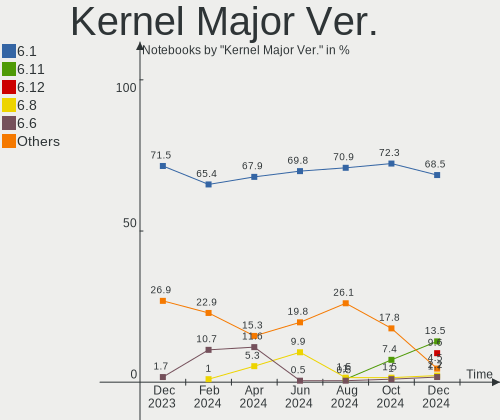
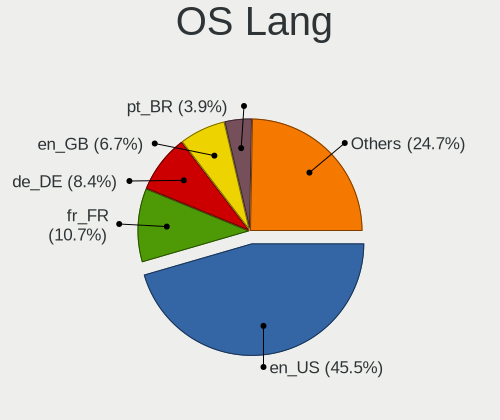
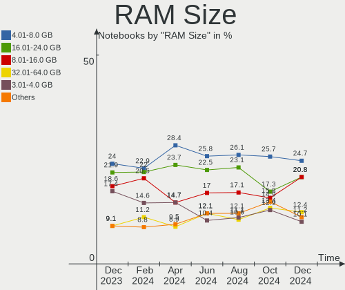
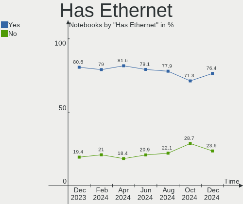
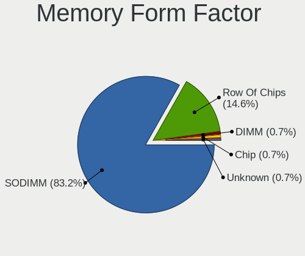

Debian Hardware Trends (Notebook)
---------------------------------

A project to identify most popular hardware characteristics and track their change
over time based on data collected by Debian users at https://Linux-Hardware.org.

Anyone can contribute to the study by uploading probes of their computers by
the [hw-probe](https://github.com/linuxhw/hw-probe) tool:

    sudo -E hw-probe -all -upload

Full-feature report is available here: https://linux-hardware.org/?view=trends&formfactor=notebook

Period: Apr, 2021.

Contents
--------

- [ OS                       ](#os)
- [ OS Family                ](#os-family)
- [ Kernel                   ](#kernel)
- [ Kernel Family            ](#kernel-family)
- [ Kernel Major Ver.        ](#kernel-major-ver)
- [ Arch                     ](#arch)
- [ DE                       ](#de)
- [ Display Server           ](#display-server)
- [ Display Manager          ](#display-manager)
- [ OS Lang                  ](#os-lang)
- [ Boot Mode                ](#boot-mode)
- [ Filesystem               ](#filesystem)
- [ Part. scheme             ](#part-scheme)
- [ Dual Boot with Linux/BSD ](#dual-boot-with-linux/bsd)
- [ Dual Boot (Win)          ](#dual-boot-win)
- [ Country                  ](#country)
- [ City                     ](#city)
- [ Vendor                   ](#vendor)
- [ Model                    ](#model)
- [ Model Family             ](#model-family)
- [ MFG Year                 ](#mfg-year)
- [ Form Factor              ](#form-factor)
- [ Secure Boot              ](#secure-boot)
- [ Coreboot                 ](#coreboot)
- [ RAM Size                 ](#ram-size)
- [ RAM Used                 ](#ram-used)
- [ Has CD-ROM               ](#has-cd-rom)
- [ Total Drives             ](#total-drives)
- [ Has Ethernet             ](#has-ethernet)
- [ Has WiFi                 ](#has-wifi)
- [ Has Bluetooth            ](#has-bluetooth)
- [ Drive Vendor             ](#drive-vendor)
- [ Drive Model              ](#drive-model)
- [ HDD Vendor               ](#hdd-vendor)
- [ SSD Vendor               ](#ssd-vendor)
- [ Drive Kind               ](#drive-kind)
- [ Drive Connector          ](#drive-connector)
- [ Drive Size               ](#drive-size)
- [ Space Total              ](#space-total)
- [ Space Used               ](#space-used)
- [ Malfunc. Drives          ](#malfunc-drives)
- [ Malfunc. Drive Vendor    ](#malfunc-drive-vendor)
- [ Malfunc. HDD Vendor      ](#malfunc-hdd-vendor)
- [ Malfunc. Drive Kind      ](#malfunc-drive-kind)
- [ Failed Drives            ](#failed-drives)
- [ Failed Drive Vendor      ](#failed-drive-vendor)
- [ Drive Status             ](#drive-status)
- [ Storage Vendor           ](#storage-vendor)
- [ Storage Model            ](#storage-model)
- [ Storage Kind             ](#storage-kind)
- [ CPU Vendor               ](#cpu-vendor)
- [ CPU Model                ](#cpu-model)
- [ CPU Model Family         ](#cpu-model-family)
- [ CPU Cores                ](#cpu-cores)
- [ CPU Sockets              ](#cpu-sockets)
- [ CPU Threads              ](#cpu-threads)
- [ CPU Op-Modes             ](#cpu-op-modes)
- [ CPU Microcode            ](#cpu-microcode)
- [ CPU Microarch            ](#cpu-microarch)
- [ GPU Vendor               ](#gpu-vendor)
- [ GPU Model                ](#gpu-model)
- [ GPU Combo                ](#gpu-combo)
- [ GPU Driver               ](#gpu-driver)
- [ GPU Memory               ](#gpu-memory)
- [ Monitor Vendor           ](#monitor-vendor)
- [ Monitor Model            ](#monitor-model)
- [ Monitor Resolution       ](#monitor-resolution)
- [ Monitor Diagonal         ](#monitor-diagonal)
- [ Monitor Width            ](#monitor-width)
- [ Aspect Ratio             ](#aspect-ratio)
- [ Monitor Area             ](#monitor-area)
- [ Pixel Density            ](#pixel-density)
- [ Multiple Monitors        ](#multiple-monitors)
- [ Net Controller Vendor    ](#net-controller-vendor)
- [ Net Controller Model     ](#net-controller-model)
- [ Wireless Vendor          ](#wireless-vendor)
- [ Wireless Model           ](#wireless-model)
- [ Ethernet Vendor          ](#ethernet-vendor)
- [ Ethernet Model           ](#ethernet-model)
- [ Net Controller Kind      ](#net-controller-kind)
- [ Used Controller          ](#used-controller)
- [ NICs                     ](#nics)
- [ IPv6                     ](#ipv6)
- [ Memory Vendor            ](#memory-vendor)
- [ Memory Model             ](#memory-model)
- [ Memory Kind              ](#memory-kind)
- [ Memory Form Factor       ](#memory-form-factor)
- [ Memory Size              ](#memory-size)
- [ Memory Speed             ](#memory-speed)
- [ Sound Vendor             ](#sound-vendor)
- [ Sound Model              ](#sound-model)
- [ Camera Vendor            ](#camera-vendor)
- [ Camera Model             ](#camera-model)
- [ Fingerprint Vendor       ](#fingerprint-vendor)
- [ Fingerprint Model        ](#fingerprint-model)
- [ Chipcard Vendor          ](#chipcard-vendor)
- [ Chipcard Model           ](#chipcard-model)
- [ Printer Vendor           ](#printer-vendor)
- [ Printer Model            ](#printer-model)
- [ Scanner Vendor           ](#scanner-vendor)
- [ Scanner Model            ](#scanner-model)
- [ Bluetooth Vendor         ](#bluetooth-vendor)
- [ Bluetooth Model          ](#bluetooth-model)
- [ Unsupported Devices      ](#unsupported-devices)
- [ Unsupported Device Types ](#unsupported-device-types)

OS
--

Installed operating systems

| Name            | Notebooks | Percent |
|-----------------|-----------|---------|
| Debian 10       | 45        | 48.91%  |
| Debian Testing  | 20        | 21.74%  |
| Debian          | 14        | 15.22%  |
| Debian 11       | 8         | 8.7%    |
| Debian 8.6      | 2         | 2.17%   |
| Debian 8.11     | 2         | 2.17%   |
| Debian Unstable | 1         | 1.09%   |

OS Family
---------

OS without a version

| Name   | Notebooks | Percent |
|--------|-----------|---------|
| Debian | 92        | 100%    |

Kernel
------

Version of the Linux kernel

| Version                    | Notebooks | Percent |
|----------------------------|-----------|---------|
| 4.19.0-16-amd64            | 30        | 32.61%  |
| 5.10.0-6-amd64             | 13        | 14.13%  |
| 5.10.0-5-amd64             | 12        | 13.04%  |
| 5.10.0-2-amd64             | 8         | 8.7%    |
| 4.19.0-14-amd64            | 3         | 3.26%   |
| 4.19.0-13-amd64            | 3         | 3.26%   |
| 5.11.0-051100-generic      | 2         | 2.17%   |
| 4.19.0-16-686-pae          | 2         | 2.17%   |
| 5.7.0-2-pinebookpro-arm64  | 1         | 1.09%   |
| 5.6.0-0.bpo.2-amd64        | 1         | 1.09%   |
| 5.4.104.1.pm64-smp         | 1         | 1.09%   |
| 5.4.0-0.bpo.4-amd64        | 1         | 1.09%   |
| 5.12.0-gnu                 | 1         | 1.09%   |
| 5.11.9+                    | 1         | 1.09%   |
| 5.11.15-051115-generic     | 1         | 1.09%   |
| 5.11.14                    | 1         | 1.09%   |
| 5.11.10-xanmod1            | 1         | 1.09%   |
| 5.11.0-rc6                 | 1         | 1.09%   |
| 5.11.0-11.1-liquorix-amd64 | 1         | 1.09%   |
| 5.10.0-5mx-amd64           | 1         | 1.09%   |
| 5.10.0-0.bpo.3-amd64       | 1         | 1.09%   |
| 4.19.0-6-amd64             | 1         | 1.09%   |
| 4.19.0-16-686              | 1         | 1.09%   |
| 3.16.0-4-686-pae           | 1         | 1.09%   |
| 3.16.0-11-686-pae          | 1         | 1.09%   |
| 3.10.65+                   | 1         | 1.09%   |
| 3.0.21-perf                | 1         | 1.09%   |

Kernel Family
-------------

Linux kernel without a distro release

| Version   | Notebooks | Percent |
|-----------|-----------|---------|
| 4.19.0    | 40        | 43.48%  |
| 5.10.0    | 35        | 38.04%  |
| 5.11.0    | 4         | 4.35%   |
| 3.16.0    | 2         | 2.17%   |
| 5.7.0     | 1         | 1.09%   |
| 5.6.0     | 1         | 1.09%   |
| 5.4.104.1 | 1         | 1.09%   |
| 5.4.0     | 1         | 1.09%   |
| 5.12.0    | 1         | 1.09%   |
| 5.11.9    | 1         | 1.09%   |
| 5.11.15   | 1         | 1.09%   |
| 5.11.14   | 1         | 1.09%   |
| 5.11.10   | 1         | 1.09%   |
| 3.10.65   | 1         | 1.09%   |
| 3.0.21    | 1         | 1.09%   |

Kernel Major Ver.
-----------------

Linux kernel major version

| Version | Notebooks | Percent |
|---------|-----------|---------|
| 4.19    | 40        | 43.48%  |
| 5.10    | 35        | 38.04%  |
| 5.11    | 8         | 8.7%    |
| 3.16    | 2         | 2.17%   |
| 5.7     | 1         | 1.09%   |
| 5.6     | 1         | 1.09%   |
| 5.4.104 | 1         | 1.09%   |
| 5.4     | 1         | 1.09%   |
| 5.12    | 1         | 1.09%   |
| 3.10    | 1         | 1.09%   |
| 3.0     | 1         | 1.09%   |

Arch
----

OS architecture (x86_64, i586, etc.)

| Name    | Notebooks | Percent |
|---------|-----------|---------|
| x86_64  | 84        | 91.3%   |
| i686    | 5         | 5.43%   |
| armv7l  | 2         | 2.17%   |
| aarch64 | 1         | 1.09%   |

DE
--

Desktop Environment

| Name             | Notebooks | Percent |
|------------------|-----------|---------|
| GNOME            | 31        | 33.7%   |
| XFCE             | 14        | 15.22%  |
| Unknown          | 14        | 15.22%  |
| KDE5             | 9         | 9.78%   |
| MATE             | 5         | 5.43%   |
| Cinnamon         | 4         | 4.35%   |
| LXDE             | 3         | 3.26%   |
| KDE              | 3         | 3.26%   |
| X-Cinnamon       | 2         | 2.17%   |
| LXQt             | 2         | 2.17%   |
| i3               | 2         | 2.17%   |
| awesome          | 2         | 2.17%   |
| lightdm-xsession | 1         | 1.09%   |

Display Server
--------------

X11 or Wayland

| Name    | Notebooks | Percent |
|---------|-----------|---------|
| X11     | 60        | 65.22%  |
| Wayland | 17        | 18.48%  |
| Tty     | 8         | 8.7%    |
| Unknown | 7         | 7.61%   |

Display Manager
---------------

SDDM, LightDM, etc.

| Name    | Notebooks | Percent |
|---------|-----------|---------|
| Unknown | 36        | 39.13%  |
| TDM     | 26        | 28.26%  |
| GDM     | 18        | 19.57%  |
| SDDM    | 9         | 9.78%   |
| LightDM | 2         | 2.17%   |
| GDM3    | 1         | 1.09%   |

OS Lang
-------

Language

| Lang    | Notebooks | Percent |
|---------|-----------|---------|
| en_US   | 30        | 32.61%  |
| ru_RU   | 14        | 15.22%  |
| pt_BR   | 7         | 7.61%   |
| de_DE   | 5         | 5.43%   |
| sv_SE   | 3         | 3.26%   |
| es_MX   | 3         | 3.26%   |
| es_ES   | 3         | 3.26%   |
| ru_UA   | 2         | 2.17%   |
| pt_PT   | 2         | 2.17%   |
| it_IT   | 2         | 2.17%   |
| fr_FR   | 2         | 2.17%   |
| es_CL   | 2         | 2.17%   |
| de_CH   | 2         | 2.17%   |
| sk_SK   | 1         | 1.09%   |
| pl_PL   | 1         | 1.09%   |
| nl_BE   | 1         | 1.09%   |
| ko_KR   | 1         | 1.09%   |
| ja_JP   | 1         | 1.09%   |
| hr_HR   | 1         | 1.09%   |
| fr_BE   | 1         | 1.09%   |
| eo      | 1         | 1.09%   |
| en_ZA   | 1         | 1.09%   |
| en_IN   | 1         | 1.09%   |
| en_IE   | 1         | 1.09%   |
| en_GB   | 1         | 1.09%   |
| en_AU   | 1         | 1.09%   |
| C       | 1         | 1.09%   |
| Unknown | 1         | 1.09%   |

Boot Mode
---------

EFI or BIOS

| Mode | Notebooks | Percent |
|------|-----------|---------|
| BIOS | 50        | 54.35%  |
| EFI  | 42        | 45.65%  |

Filesystem
----------

Type of filesystem

| Type    | Notebooks | Percent |
|---------|-----------|---------|
| Ext4    | 78        | 84.78%  |
| Overlay | 9         | 9.78%   |
| Btrfs   | 2         | 2.17%   |
| Zfs     | 1         | 1.09%   |
| Xfs     | 1         | 1.09%   |
| Tmpfs   | 1         | 1.09%   |

Part. scheme
------------

Scheme of partitioning

| Type    | Notebooks | Percent |
|---------|-----------|---------|
| GPT     | 39        | 42.39%  |
| MBR     | 28        | 30.43%  |
| Unknown | 25        | 27.17%  |

Dual Boot with Linux/BSD
------------------------

Hosting more than one Linux/BSD

| Dual boot | Notebooks | Percent |
|-----------|-----------|---------|
| No        | 80        | 86.96%  |
| Yes       | 12        | 13.04%  |

Dual Boot (Win)
---------------

Hosting Linux and Windows

| Dual boot | Notebooks | Percent |
|-----------|-----------|---------|
| No        | 58        | 63.04%  |
| Yes       | 34        | 36.96%  |

Country
-------

Geographic location (country)

| Country      | Notebooks | Percent |
|--------------|-----------|---------|
| Russia       | 15        | 16.3%   |
| USA          | 12        | 13.04%  |
| Germany      | 11        | 11.96%  |
| Brazil       | 7         | 7.61%   |
| Spain        | 4         | 4.35%   |
| Ukraine      | 3         | 3.26%   |
| Sweden       | 3         | 3.26%   |
| Mexico       | 3         | 3.26%   |
| Italy        | 3         | 3.26%   |
| France       | 3         | 3.26%   |
| Switzerland  | 2         | 2.17%   |
| South Korea  | 2         | 2.17%   |
| Portugal     | 2         | 2.17%   |
| Poland       | 2         | 2.17%   |
| Chile        | 2         | 2.17%   |
| Belgium      | 2         | 2.17%   |
| UK           | 1         | 1.09%   |
| Turkey       | 1         | 1.09%   |
| Thailand     | 1         | 1.09%   |
| South Africa | 1         | 1.09%   |
| Slovakia     | 1         | 1.09%   |
| Romania      | 1         | 1.09%   |
| Netherlands  | 1         | 1.09%   |
| Japan        | 1         | 1.09%   |
| Ireland      | 1         | 1.09%   |
| India        | 1         | 1.09%   |
| Hungary      | 1         | 1.09%   |
| Greece       | 1         | 1.09%   |
| Estonia      | 1         | 1.09%   |
| Ecuador      | 1         | 1.09%   |
| Croatia      | 1         | 1.09%   |
| Australia    | 1         | 1.09%   |

City
----

Geographic location (city)

| City                   | Notebooks | Percent |
|------------------------|-----------|---------|
| Voronezh               | 8         | 8.7%    |
| Wooster                | 6         | 6.52%   |
| Madrid                 | 3         | 3.26%   |
| Perm                   | 2         | 2.17%   |
| Moscow                 | 2         | 2.17%   |
| Lisbon                 | 2         | 2.17%   |
| Danyang                | 2         | 2.17%   |
| Berlin                 | 2         | 2.17%   |
| Belo Horizonte         | 2         | 2.17%   |
| Zagreb                 | 1         | 1.09%   |
| Xalapa                 | 1         | 1.09%   |
| Wroclaw                | 1         | 1.09%   |
| Waregem                | 1         | 1.09%   |
| Vitória               | 1         | 1.09%   |
| Vaestra Froelunda      | 1         | 1.09%   |
| Uppsala                | 1         | 1.09%   |
| Turin                  | 1         | 1.09%   |
| The Hague              | 1         | 1.09%   |
| Tallinn                | 1         | 1.09%   |
| Tallard                | 1         | 1.09%   |
| Soyen                  | 1         | 1.09%   |
| Shizuoka               | 1         | 1.09%   |
| Sevenoaks              | 1         | 1.09%   |
| Santiago               | 1         | 1.09%   |
| Santa Ursula           | 1         | 1.09%   |
| Salvador               | 1         | 1.09%   |
| Rome                   | 1         | 1.09%   |
| Rocky Point            | 1         | 1.09%   |
| Ramos Arizpe           | 1         | 1.09%   |
| Quito                  | 1         | 1.09%   |
| Pompano Beach          | 1         | 1.09%   |
| Pavlohrad              | 1         | 1.09%   |
| Panama City            | 1         | 1.09%   |
| Othmarsingen           | 1         | 1.09%   |
| Nuremberg              | 1         | 1.09%   |
| Nova Porteirinha       | 1         | 1.09%   |
| Newtown                | 1         | 1.09%   |
| Navalcarnero           | 1         | 1.09%   |
| Melipilla              | 1         | 1.09%   |
| Marseille              | 1         | 1.09%   |
| Ludwigshafen am Rhein  | 1         | 1.09%   |
| Lodz                   | 1         | 1.09%   |
| Lingolsheim            | 1         | 1.09%   |
| Leingarten             | 1         | 1.09%   |
| Kyiv                   | 1         | 1.09%   |
| Komárom               | 1         | 1.09%   |
| Kherson                | 1         | 1.09%   |
| Kaluga                 | 1         | 1.09%   |
| Juiz de Fora           | 1         | 1.09%   |
| Hombrechtikon          | 1         | 1.09%   |
| Hochstadt an der Aisch | 1         | 1.09%   |
| Hilo                   | 1         | 1.09%   |
| Hautrage               | 1         | 1.09%   |
| Halle                  | 1         | 1.09%   |
| Grand Rapids           | 1         | 1.09%   |
| George                 | 1         | 1.09%   |
| Fayetteville           | 1         | 1.09%   |
| Dublin                 | 1         | 1.09%   |
| Curitiba               | 1         | 1.09%   |
| Cheboksary             | 1         | 1.09%   |

Vendor
------

Motherboard manufacturer

| Name                | Notebooks | Percent |
|---------------------|-----------|---------|
| Lenovo              | 22        | 23.91%  |
| Dell                | 15        | 16.3%   |
| Hewlett-Packard     | 14        | 15.22%  |
| ASUSTek Computer    | 8         | 8.7%    |
| Acer                | 8         | 8.7%    |
| Toshiba             | 4         | 4.35%   |
| Sony                | 3         | 3.26%   |
| Unknown             | 3         | 3.26%   |
| Notebook            | 2         | 2.17%   |
| HUAWEI              | 2         | 2.17%   |
| Fujitsu             | 2         | 2.17%   |
| TUXEDO              | 1         | 1.09%   |
| TQ-Group            | 1         | 1.09%   |
| Samsung Electronics | 1         | 1.09%   |
| Positivo            | 1         | 1.09%   |
| Pine Microsystems   | 1         | 1.09%   |
| MSI                 | 1         | 1.09%   |
| LG Electronics      | 1         | 1.09%   |
| Google              | 1         | 1.09%   |
| Apple               | 1         | 1.09%   |

Model
-----

Motherboard model

| Name                                       | Notebooks | Percent |
|--------------------------------------------|-----------|---------|
| Unknown                                    | 3         | 3.26%   |
| HUAWEI BOHK-WAX9X                          | 2         | 2.17%   |
| TUXEDO Pulse 15 Gen1                       | 1         | 1.09%   |
| TQ-Group TQMxE39S                          | 1         | 1.09%   |
| Toshiba Satellite M505D                    | 1         | 1.09%   |
| Toshiba Satellite L505D                    | 1         | 1.09%   |
| Toshiba Satellite Click W35Dt-A            | 1         | 1.09%   |
| Toshiba Satellite C50-A-K9K                | 1         | 1.09%   |
| Sony VPCM120AL                             | 1         | 1.09%   |
| Sony VPCEJ3S1R                             | 1         | 1.09%   |
| Sony VGN-FW31ZJ                            | 1         | 1.09%   |
| Samsung 300E4A/300E5A/300E7A/3430EA/3530EA | 1         | 1.09%   |
| Positivo C14CR21                           | 1         | 1.09%   |
| Pine Microsystems Pine64 Pinebook Pro      | 1         | 1.09%   |
| Notebook NJ5x_NJ7xLU                       | 1         | 1.09%   |
| Notebook N650DU                            | 1         | 1.09%   |
| MSI Bravo 15 A4DDR                         | 1         | 1.09%   |
| LG 15ND530-GX30K                           | 1         | 1.09%   |
| Lenovo ThinkPad X1 Carbon 20HRCT01WW       | 1         | 1.09%   |
| Lenovo ThinkPad W520 42844LG               | 1         | 1.09%   |
| Lenovo ThinkPad T530 24297XG               | 1         | 1.09%   |
| Lenovo ThinkPad T530 24296HG               | 1         | 1.09%   |
| Lenovo ThinkPad T490 20N2007JPB            | 1         | 1.09%   |
| Lenovo ThinkPad T470 W10DG 20JNS1C905      | 1         | 1.09%   |
| Lenovo ThinkPad T460 20FMS0X022            | 1         | 1.09%   |
| Lenovo ThinkPad T450s 20BXCTO1WW           | 1         | 1.09%   |
| Lenovo ThinkPad T450s 20BWS2KM00           | 1         | 1.09%   |
| Lenovo ThinkPad T440s 20AR003RMS           | 1         | 1.09%   |
| Lenovo ThinkPad T430s 23533KJ              | 1         | 1.09%   |
| Lenovo ThinkPad T420 4236WS7               | 1         | 1.09%   |
| Lenovo ThinkPad T15 Gen 1 20S7S5GE00       | 1         | 1.09%   |
| Lenovo ThinkPad T14 Gen 1 20S1S17600       | 1         | 1.09%   |
| Lenovo ThinkPad P51s 20HB000URT            | 1         | 1.09%   |
| Lenovo ThinkPad E470 20H2S00400            | 1         | 1.09%   |
| Lenovo IdeaPad Z500 20202                  | 1         | 1.09%   |
| Lenovo IdeaPad Slim 1-14AST-05 81VS        | 1         | 1.09%   |
| Lenovo IdeaPad Gaming 3 15IMH05 81Y4       | 1         | 1.09%   |
| Lenovo IdeaPad 320-15IKB 81BG              | 1         | 1.09%   |
| Lenovo IdeaPad 310-15ISK 80UH              | 1         | 1.09%   |
| Lenovo G550 20023                          | 1         | 1.09%   |
| HP Stream Notebook PC 13                   | 1         | 1.09%   |
| HP ProBook 6460b                           | 1         | 1.09%   |
| HP Pavilion Laptop 15-cc1xx                | 1         | 1.09%   |
| HP Pavilion g6                             | 1         | 1.09%   |
| HP Pavilion 17                             | 1         | 1.09%   |
| HP ENVY TS 15                              | 1         | 1.09%   |
| HP ENVY Notebook                           | 1         | 1.09%   |
| HP EliteBook Folio 1040 G1                 | 1         | 1.09%   |
| HP EliteBook 8460p                         | 1         | 1.09%   |
| HP EliteBook 2170p                         | 1         | 1.09%   |
| HP Compaq nx6120 (PV170PA#UUF)             | 1         | 1.09%   |
| HP Compaq CQ58                             | 1         | 1.09%   |
| HP 430                                     | 1         | 1.09%   |
| HP 2133                                    | 1         | 1.09%   |
| Google Chell                               | 1         | 1.09%   |
| Fujitsu LIFEBOOK S761                      | 1         | 1.09%   |
| Fujitsu LIFEBOOK BH531                     | 1         | 1.09%   |
| Dell Vostro 5471                           | 1         | 1.09%   |
| Dell Precision M4600                       | 1         | 1.09%   |
| Dell Precision M4400                       | 1         | 1.09%   |

Model Family
------------

Motherboard model prefix

| Name                     | Notebooks | Percent |
|--------------------------|-----------|---------|
| Lenovo ThinkPad          | 16        | 17.39%  |
| Dell Latitude            | 6         | 6.52%   |
| Dell Inspiron            | 6         | 6.52%   |
| Lenovo IdeaPad           | 5         | 5.43%   |
| Acer Aspire              | 5         | 5.43%   |
| Toshiba Satellite        | 4         | 4.35%   |
| HP Pavilion              | 3         | 3.26%   |
| HP EliteBook             | 3         | 3.26%   |
| Unknown                  | 3         | 3.26%   |
| HUAWEI BOHK-WAX9X        | 2         | 2.17%   |
| HP ENVY                  | 2         | 2.17%   |
| HP Compaq                | 2         | 2.17%   |
| Fujitsu LIFEBOOK         | 2         | 2.17%   |
| Dell Precision           | 2         | 2.17%   |
| ASUS ZenBook             | 2         | 2.17%   |
| TUXEDO Pulse             | 1         | 1.09%   |
| TQ-Group TQMxE39S        | 1         | 1.09%   |
| Sony VPCM120AL           | 1         | 1.09%   |
| Sony VPCEJ3S1R           | 1         | 1.09%   |
| Sony VGN-FW31ZJ          | 1         | 1.09%   |
| Samsung 300E4A           | 1         | 1.09%   |
| Positivo C14CR21         | 1         | 1.09%   |
| Pine Microsystems Pine64 | 1         | 1.09%   |
| Notebook NJ5x            | 1         | 1.09%   |
| Notebook N650DU          | 1         | 1.09%   |
| MSI Bravo                | 1         | 1.09%   |
| LG 15ND530-GX30K         | 1         | 1.09%   |
| Lenovo G550              | 1         | 1.09%   |
| HP Stream                | 1         | 1.09%   |
| HP ProBook               | 1         | 1.09%   |
| HP 430                   | 1         | 1.09%   |
| HP 2133                  | 1         | 1.09%   |
| Google Chell             | 1         | 1.09%   |
| Dell Vostro              | 1         | 1.09%   |
| ASUS VivoBook            | 1         | 1.09%   |
| ASUS UX550VD             | 1         | 1.09%   |
| ASUS U32U                | 1         | 1.09%   |
| ASUS ROG                 | 1         | 1.09%   |
| ASUS N501VW              | 1         | 1.09%   |
| ASUS G751JY              | 1         | 1.09%   |
| Apple MacBook4           | 1         | 1.09%   |
| Acer TravelMate          | 1         | 1.09%   |
| Acer Predator            | 1         | 1.09%   |
| Acer Nitro               | 1         | 1.09%   |

MFG Year
--------

Motherboard manufacture year

| Year    | Notebooks | Percent |
|---------|-----------|---------|
| 2020    | 24        | 26.09%  |
| 2013    | 11        | 11.96%  |
| 2019    | 9         | 9.78%   |
| 2017    | 8         | 8.7%    |
| 2018    | 6         | 6.52%   |
| 2012    | 6         | 6.52%   |
| 2011    | 6         | 6.52%   |
| 2016    | 5         | 5.43%   |
| 2014    | 4         | 4.35%   |
| 2009    | 4         | 4.35%   |
| 2008    | 3         | 3.26%   |
| Unknown | 3         | 3.26%   |
| 2021    | 1         | 1.09%   |
| 2015    | 1         | 1.09%   |
| 2010    | 1         | 1.09%   |

Form Factor
-----------

Physical design of the computer

| Name     | Notebooks | Percent |
|----------|-----------|---------|
| Notebook | 92        | 100%    |

Secure Boot
-----------

Enabled or disabled

| State    | Notebooks | Percent |
|----------|-----------|---------|
| Disabled | 87        | 94.57%  |
| Enabled  | 5         | 5.43%   |

Coreboot
--------

Have coreboot on board

| Used | Notebooks | Percent |
|------|-----------|---------|
| No   | 91        | 98.91%  |
| Yes  | 1         | 1.09%   |

RAM Size
--------

Total RAM memory

| Size in GB | Notebooks | Percent |
|------------|-----------|---------|
| 4.01-8.0   | 27        | 29.35%  |
| 8.01-16.0  | 20        | 21.74%  |
| 16.01-24.0 | 19        | 20.65%  |
| 3.01-4.0   | 13        | 14.13%  |
| 1.01-2.0   | 5         | 5.43%   |
| 32.01-64.0 | 2         | 2.17%   |
| 2.01-3.0   | 2         | 2.17%   |
| 0.51-1.0   | 2         | 2.17%   |
| 24.01-32.0 | 1         | 1.09%   |
| 0.01-0.5   | 1         | 1.09%   |

RAM Used
--------

Used RAM memory

| Used GB   | Notebooks | Percent |
|-----------|-----------|---------|
| 1.01-2.0  | 28        | 30.43%  |
| 4.01-8.0  | 17        | 18.48%  |
| 2.01-3.0  | 16        | 17.39%  |
| 3.01-4.0  | 12        | 13.04%  |
| 0.51-1.0  | 10        | 10.87%  |
| 8.01-16.0 | 6         | 6.52%   |
| Unknown   | 2         | 2.17%   |
| 0.01-0.5  | 1         | 1.09%   |

Has CD-ROM
----------

Has CD-ROM on board

| Presented | Notebooks | Percent |
|-----------|-----------|---------|
| No        | 58        | 63.04%  |
| Yes       | 34        | 36.96%  |

Total Drives
------------

Number of drives on board

| Drives | Notebooks | Percent |
|--------|-----------|---------|
| 1      | 63        | 68.48%  |
| 2      | 24        | 26.09%  |
| 3      | 4         | 4.35%   |
| 4      | 1         | 1.09%   |

Has Ethernet
------------

Has Ethernet on board

| Presented | Notebooks | Percent |
|-----------|-----------|---------|
| Yes       | 79        | 85.87%  |
| No        | 13        | 14.13%  |

Has WiFi
--------

Has WiFi module

| Presented | Notebooks | Percent |
|-----------|-----------|---------|
| Yes       | 87        | 94.57%  |
| No        | 5         | 5.43%   |

Has Bluetooth
-------------

Has Bluetooth module

| Presented | Notebooks | Percent |
|-----------|-----------|---------|
| Yes       | 71        | 77.17%  |
| No        | 21        | 22.83%  |

Drive Vendor
------------

Hard drive vendors

| Vendor              | Notebooks | Drives | Percent |
|---------------------|-----------|--------|---------|
| Samsung Electronics | 24        | 25     | 19.83%  |
| WDC                 | 22        | 23     | 18.18%  |
| Unknown             | 12        | 15     | 9.92%   |
| Seagate             | 10        | 10     | 8.26%   |
| Kingston            | 7         | 7      | 5.79%   |
| Toshiba             | 6         | 6      | 4.96%   |
| Intel               | 6         | 7      | 4.96%   |
| SK Hynix            | 4         | 4      | 3.31%   |
| SanDisk             | 3         | 3      | 2.48%   |
| Hitachi             | 3         | 3      | 2.48%   |
| HGST                | 3         | 3      | 2.48%   |
| Union Memory        | 2         | 2      | 1.65%   |
| OCZ                 | 2         | 2      | 1.65%   |
| Micron Technology   | 2         | 2      | 1.65%   |
| Gigabyte Technology | 2         | 2      | 1.65%   |
| Fujitsu             | 2         | 2      | 1.65%   |
| ZTC                 | 1         | 1      | 0.83%   |
| USB30               | 1         | 1      | 0.83%   |
| TAMMUZ              | 1         | 1      | 0.83%   |
| Mass                | 1         | 1      | 0.83%   |
| LDLC                | 1         | 1      | 0.83%   |
| Intenso             | 1         | 1      | 0.83%   |
| CIE                 | 1         | 1      | 0.83%   |
| China               | 1         | 1      | 0.83%   |
| ASMT                | 1         | 2      | 0.83%   |
| AMD                 | 1         | 1      | 0.83%   |
| A-DATA Technology   | 1         | 1      | 0.83%   |

Drive Model
-----------

Hard drive models

| Model                                   | Notebooks | Percent |
|-----------------------------------------|-----------|---------|
| Kingston SA400S37240G 240GB SSD         | 4         | 3.2%    |
| Samsung SSD 870 EVO 500GB               | 3         | 2.4%    |
| WDC WDS240G2G0A-00JH30 240GB SSD        | 2         | 1.6%    |
| WDC WD50 00LPVX-22V0TT0 500GB           | 2         | 1.6%    |
| WDC WD10JPVX-22JC3T0 1TB                | 2         | 1.6%    |
| WDC PC SN730 SDBPNTY-256G-1027 256GB    | 2         | 1.6%    |
| Unknown MMC Card  4GB                   | 2         | 1.6%    |
| Seagate ST9500325AS 500GB               | 2         | 1.6%    |
| Seagate ST1000LM048-2E7172 1TB          | 2         | 1.6%    |
| Samsung SSD 860 EVO 1TB                 | 2         | 1.6%    |
| Samsung MZVLB1T0HBLR-000L7 1TB          | 2         | 1.6%    |
| HGST HTS721010A9E630 1TB                | 2         | 1.6%    |
| ZTC SM201-512G                          | 1         | 0.8%    |
| WDC WDS250G2B0B 250GB SSD               | 1         | 0.8%    |
| WDC WDS240G1G0B-00RC30 240GB SSD        | 1         | 0.8%    |
| WDC WD7500BPVX-60JC3T0 752GB            | 1         | 0.8%    |
| WDC WD5000MPCK-22AWHT0 500GB            | 1         | 0.8%    |
| WDC WD5000BEVT-60ZAT1 500GB             | 1         | 0.8%    |
| WDC WD3200BEVT-22A23T0 320GB            | 1         | 0.8%    |
| WDC WD2500BEVT-75A23T0 250GB            | 1         | 0.8%    |
| WDC WD10SPZX-21Z10T0 1TB                | 1         | 0.8%    |
| WDC WD10SPCX-60KHST0 1TB                | 1         | 0.8%    |
| WDC WD10JPVX-75JC3T0 1TB                | 1         | 0.8%    |
| WDC WD10JPCX-24UE4T0 1TB                | 1         | 0.8%    |
| WDC WD10 SPZX-21Z10T0 1TB               | 1         | 0.8%    |
| WDC PC SN720 SED SDAQNTW-1T00 1TB       | 1         | 0.8%    |
| WDC PC SN530 SDBPNPZ-512G-1032 512GB    | 1         | 0.8%    |
| WDC PC SN520 SDAPNUW-256G-1002 256GB    | 1         | 0.8%    |
| USB30 Disk 500GB                        | 1         | 0.8%    |
| Unknown USD00  16GB                     | 1         | 0.8%    |
| Unknown SD  16GB                        | 1         | 0.8%    |
| Unknown SA32G  32GB                     | 1         | 0.8%    |
| Unknown MMC Card  7GB                   | 1         | 0.8%    |
| Unknown MMC Card  64GB                  | 1         | 0.8%    |
| Unknown MMC Card  32GB                  | 1         | 0.8%    |
| Unknown MMC Card  256GB                 | 1         | 0.8%    |
| Unknown DG4008  8GB                     | 1         | 0.8%    |
| Unknown DA4064  64GB                    | 1         | 0.8%    |
| Unknown APPSD  272GB                    | 1         | 0.8%    |
| Unknown 00000  8GB                      | 1         | 0.8%    |
| Union Memory UMIS RPJTJ256MEE1OWX 256GB | 1         | 0.8%    |
| Union Memory RPFTJ128PDD2EWX 128GB      | 1         | 0.8%    |
| Toshiba THNSNH128GCST 128GB SSD         | 1         | 0.8%    |
| Toshiba MQ04ABD200 2TB                  | 1         | 0.8%    |
| Toshiba MQ01ABU050W 500GB               | 1         | 0.8%    |
| Toshiba MQ01ABD100 1TB                  | 1         | 0.8%    |
| Toshiba MK3265GSXF 320GB                | 1         | 0.8%    |
| Toshiba External USB 3.0 120GB          | 1         | 0.8%    |
| TAMMUZ SSD 128GB                        | 1         | 0.8%    |
| SK Hynix SC311 SATA 512GB SSD           | 1         | 0.8%    |
| SK Hynix HFS256G39TND-N210A 256GB SSD   | 1         | 0.8%    |
| SK Hynix HFS256G39MND-2300A 256GB SSD   | 1         | 0.8%    |
| SK Hynix HBG4e  32GB                    | 1         | 0.8%    |
| Seagate ST9320325AS 320GB               | 1         | 0.8%    |
| Seagate ST9120822AS 120GB               | 1         | 0.8%    |
| Seagate ST9120817AS 120GB               | 1         | 0.8%    |
| Seagate ST250LT003-9YG14C 250GB         | 1         | 0.8%    |
| Seagate ST2000LX001-1RG174 2TB          | 1         | 0.8%    |
| Seagate BarraCuda SSD ZA1000CM10002 1TB | 1         | 0.8%    |
| SanDisk SSD PLUS 480GB                  | 1         | 0.8%    |

HDD Vendor
----------

Hard disk drive vendors

| Vendor  | Notebooks | Drives | Percent |
|---------|-----------|--------|---------|
| WDC     | 14        | 14     | 38.89%  |
| Seagate | 9         | 9      | 25%     |
| Toshiba | 4         | 4      | 11.11%  |
| Hitachi | 3         | 3      | 8.33%   |
| HGST    | 3         | 3      | 8.33%   |
| Fujitsu | 2         | 2      | 5.56%   |
| ASMT    | 1         | 2      | 2.78%   |

SSD Vendor
----------

Solid state drive vendors

| Vendor              | Notebooks | Drives | Percent |
|---------------------|-----------|--------|---------|
| Samsung Electronics | 17        | 18     | 34%     |
| Kingston            | 6         | 6      | 12%     |
| WDC                 | 4         | 4      | 8%      |
| SK Hynix            | 3         | 3      | 6%      |
| SanDisk             | 2         | 2      | 4%      |
| OCZ                 | 2         | 2      | 4%      |
| Micron Technology   | 2         | 2      | 4%      |
| Intel               | 2         | 2      | 4%      |
| ZTC                 | 1         | 1      | 2%      |
| USB30               | 1         | 1      | 2%      |
| Toshiba             | 1         | 1      | 2%      |
| TAMMUZ              | 1         | 1      | 2%      |
| Seagate             | 1         | 1      | 2%      |
| LDLC                | 1         | 1      | 2%      |
| Intenso             | 1         | 1      | 2%      |
| Gigabyte Technology | 1         | 1      | 2%      |
| CIE                 | 1         | 1      | 2%      |
| China               | 1         | 1      | 2%      |
| AMD                 | 1         | 1      | 2%      |
| A-DATA Technology   | 1         | 1      | 2%      |

Drive Kind
----------

HDD or SSD

| Kind    | Notebooks | Drives | Percent |
|---------|-----------|--------|---------|
| SSD     | 44        | 51     | 39.29%  |
| HDD     | 34        | 37     | 30.36%  |
| NVMe    | 20        | 22     | 17.86%  |
| MMC     | 12        | 16     | 10.71%  |
| Unknown | 2         | 2      | 1.79%   |

Drive Connector
---------------

SATA, SAS, NVMe, etc.

| Type | Notebooks | Drives | Percent |
|------|-----------|--------|---------|
| SATA | 69        | 81     | 63.3%   |
| NVMe | 20        | 22     | 18.35%  |
| MMC  | 12        | 16     | 11.01%  |
| SAS  | 8         | 9      | 7.34%   |

Drive Size
----------

Size of hard drive

| Size in TB | Notebooks | Drives | Percent |
|------------|-----------|--------|---------|
| 0.01-0.5   | 57        | 63     | 70.37%  |
| 0.51-1.0   | 21        | 22     | 25.93%  |
| 1.01-2.0   | 3         | 3      | 3.7%    |

Space Total
-----------

Amount of disk space available on the file system

| Size in GB     | Notebooks | Percent |
|----------------|-----------|---------|
| 101-250        | 28        | 30.43%  |
| 251-500        | 15        | 16.3%   |
| 501-1000       | 14        | 15.22%  |
| Unknown        | 9         | 9.78%   |
| 1001-2000      | 8         | 8.7%    |
| 51-100         | 8         | 8.7%    |
| 21-50          | 4         | 4.35%   |
| More than 3000 | 3         | 3.26%   |
| 1-20           | 3         | 3.26%   |

Space Used
----------

Amount of used disk space

| Used GB        | Notebooks | Percent |
|----------------|-----------|---------|
| 1-20           | 21        | 22.83%  |
| 101-250        | 19        | 20.65%  |
| 21-50          | 15        | 16.3%   |
| Unknown        | 9         | 9.78%   |
| 251-500        | 8         | 8.7%    |
| 51-100         | 8         | 8.7%    |
| 501-1000       | 7         | 7.61%   |
| 1001-2000      | 3         | 3.26%   |
| More than 3000 | 1         | 1.09%   |
| 2001-3000      | 1         | 1.09%   |

Malfunc. Drives
---------------

Drive models with a malfunction

| Model                                        | Notebooks | Drives | Percent |
|----------------------------------------------|-----------|--------|---------|
| Seagate ST9500325AS 500GB                    | 2         | 2      | 18.18%  |
| WDC WD3200BEVT-22A23T0 320GB                 | 1         | 1      | 9.09%   |
| Toshiba MQ01ABU050W 500GB                    | 1         | 1      | 9.09%   |
| SK Hynix HFS256G39MND-2300A 256GB SSD        | 1         | 1      | 9.09%   |
| Seagate ST9320325AS 320GB                    | 1         | 1      | 9.09%   |
| Seagate ST9120822AS 120GB                    | 1         | 1      | 9.09%   |
| SanDisk SSD PLUS 480GB                       | 1         | 1      | 9.09%   |
| Samsung Electronics SSD 840 PRO Series 256GB | 1         | 1      | 9.09%   |
| Hitachi HTS721080G9SA00 80GB                 | 1         | 1      | 9.09%   |
| Fujitsu MHT2040AH PL 40GB                    | 1         | 1      | 9.09%   |

Malfunc. Drive Vendor
---------------------

Vendors of faulty drives

| Vendor              | Notebooks | Drives | Percent |
|---------------------|-----------|--------|---------|
| Seagate             | 4         | 4      | 36.36%  |
| WDC                 | 1         | 1      | 9.09%   |
| Toshiba             | 1         | 1      | 9.09%   |
| SK Hynix            | 1         | 1      | 9.09%   |
| SanDisk             | 1         | 1      | 9.09%   |
| Samsung Electronics | 1         | 1      | 9.09%   |
| Hitachi             | 1         | 1      | 9.09%   |
| Fujitsu             | 1         | 1      | 9.09%   |

Malfunc. HDD Vendor
-------------------

Vendors of faulty HDD drives

| Vendor  | Notebooks | Drives | Percent |
|---------|-----------|--------|---------|
| Seagate | 4         | 4      | 50%     |
| WDC     | 1         | 1      | 12.5%   |
| Toshiba | 1         | 1      | 12.5%   |
| Hitachi | 1         | 1      | 12.5%   |
| Fujitsu | 1         | 1      | 12.5%   |

Malfunc. Drive Kind
-------------------

Kinds of faulty drives

| Kind | Notebooks | Drives | Percent |
|------|-----------|--------|---------|
| HDD  | 8         | 8      | 72.73%  |
| SSD  | 3         | 3      | 27.27%  |

Failed Drives
-------------

Failed drive models

Zero info for selected period =(

Failed Drive Vendor
-------------------

Failed drive vendors

Zero info for selected period =(

Drive Status
------------

Number of failed and malfunc. drives

| Status   | Notebooks | Drives | Percent |
|----------|-----------|--------|---------|
| Works    | 56        | 70     | 54.37%  |
| Detected | 36        | 47     | 34.95%  |
| Malfunc  | 11        | 11     | 10.68%  |

Storage Vendor
--------------

Storage controller vendors

| Vendor                      | Notebooks | Percent |
|-----------------------------|-----------|---------|
| Intel                       | 67        | 69.79%  |
| AMD                         | 10        | 10.42%  |
| Samsung Electronics         | 8         | 8.33%   |
| Sandisk                     | 6         | 6.25%   |
| Union Memory (Shenzhen)     | 2         | 2.08%   |
| VIA Technologies            | 1         | 1.04%   |
| Phison Electronics          | 1         | 1.04%   |
| Kingston Technology Company | 1         | 1.04%   |

Storage Model
-------------

Storage controller models

| Model                                                                                  | Notebooks | Percent |
|----------------------------------------------------------------------------------------|-----------|---------|
| Intel Sunrise Point-LP SATA Controller [AHCI mode]                                     | 12        | 11.76%  |
| Intel 7 Series Chipset Family 6-port SATA Controller [AHCI mode]                       | 12        | 11.76%  |
| Intel 6 Series/C200 Series Chipset Family 6 port Mobile SATA AHCI Controller           | 8         | 7.84%   |
| AMD FCH SATA Controller [AHCI mode]                                                    | 7         | 6.86%   |
| Intel 82801 Mobile SATA Controller [RAID mode]                                         | 5         | 4.9%    |
| Samsung NVMe SSD Controller SM981/PM981/PM983                                          | 4         | 3.92%   |
| Intel 8 Series/C220 Series Chipset Family 6-port SATA Controller 1 [AHCI mode]         | 4         | 3.92%   |
| Intel Wildcat Point-LP SATA Controller [AHCI Mode]                                     | 3         | 2.94%   |
| Intel 82801IBM/IEM (ICH9M/ICH9M-E) 4 port SATA Controller [AHCI mode]                  | 3         | 2.94%   |
| Intel 8 Series SATA Controller 1 [AHCI mode]                                           | 3         | 2.94%   |
| AMD SB7x0/SB8x0/SB9x0 SATA Controller [AHCI mode]                                      | 3         | 2.94%   |
| Union Memory (Shenzhen) Non-Volatile memory controller                                 | 2         | 1.96%   |
| Sandisk WD Blue SN550 NVMe SSD                                                         | 2         | 1.96%   |
| Sandisk WD Black SN750 / PC SN730 NVMe SSD                                             | 2         | 1.96%   |
| Samsung NVMe SSD Controller SM961/PM961/SM963                                          | 2         | 1.96%   |
| Intel SSD Pro 7600p/760p/E 6100p Series                                                | 2         | 1.96%   |
| Intel Ice Lake-LP SATA Controller [AHCI mode]                                          | 2         | 1.96%   |
| Intel Cannon Lake Mobile PCH SATA AHCI Controller                                      | 2         | 1.96%   |
| Intel 82801HM/HEM (ICH8M/ICH8M-E) SATA Controller [AHCI mode]                          | 2         | 1.96%   |
| Intel 82801HM/HEM (ICH8M/ICH8M-E) IDE Controller                                       | 2         | 1.96%   |
| AMD SB7x0/SB8x0/SB9x0 IDE Controller                                                   | 2         | 1.96%   |
| VIA VT8237/8251 Serial ATA Controller                                                  | 1         | 0.98%   |
| Sandisk WD Blue SN500 / PC SN520 NVMe SSD                                              | 1         | 0.98%   |
| Sandisk WD Black 2018/SN750 / PC SN720 NVMe SSD                                        | 1         | 0.98%   |
| Samsung NVMe Controller                                                                | 1         | 0.98%   |
| Samsung Electronics SATA controller                                                    | 1         | 0.98%   |
| Phison PS5013 E13 NVMe Controller                                                      | 1         | 0.98%   |
| Kingston Company Company Non-Volatile memory controller                                | 1         | 0.98%   |
| Intel SSD 660P Series                                                                  | 1         | 0.98%   |
| Intel Q170/Q150/B150/H170/H110/Z170/CM236 Chipset SATA Controller [AHCI Mode]          | 1         | 0.98%   |
| Intel Non-Volatile memory controller                                                   | 1         | 0.98%   |
| Intel NM10/ICH7 Family SATA Controller [IDE mode]                                      | 1         | 0.98%   |
| Intel NM10/ICH7 Family SATA Controller [AHCI mode]                                     | 1         | 0.98%   |
| Intel HM170/QM170 Chipset SATA Controller [AHCI Mode]                                  | 1         | 0.98%   |
| Intel Celeron N3350/Pentium N4200/Atom E3900 Series SATA AHCI Controller               | 1         | 0.98%   |
| Intel 82801FB/FBM/FR/FW/FRW (ICH6 Family) IDE Controller                               | 1         | 0.98%   |
| Intel 6 Series/C200 Series Chipset Family Mobile SATA Controller (IDE mode, ports 0-3) | 1         | 0.98%   |
| Intel 5 Series/3400 Series Chipset 4 port SATA AHCI Controller                         | 1         | 0.98%   |
| Intel 400 Series Chipset Family SATA AHCI Controller                                   | 1         | 0.98%   |

Storage Kind
------------

Kind of storage controller (IDE, SATA, NVMe, SAS, ...)

| Kind | Notebooks | Percent |
|------|-----------|---------|
| SATA | 67        | 67%     |
| NVMe | 20        | 20%     |
| IDE  | 8         | 8%      |
| RAID | 5         | 5%      |

CPU Vendor
----------

Processor vendors

| Vendor       | Notebooks | Percent |
|--------------|-----------|---------|
| Intel        | 76        | 82.61%  |
| AMD          | 12        | 13.04%  |
| ARM          | 3         | 3.26%   |
| CentaurHauls | 1         | 1.09%   |

CPU Model
---------

Processor models

| Model                                         | Notebooks | Percent |
|-----------------------------------------------|-----------|---------|
| Intel Core i5-8250U CPU @ 1.60GHz             | 4         | 4.35%   |
| Intel Core i5-2520M CPU @ 2.50GHz             | 4         | 4.35%   |
| Intel Core i7-8565U CPU @ 1.80GHz             | 3         | 3.26%   |
| Intel Core i5-7200U CPU @ 2.50GHz             | 3         | 3.26%   |
| Intel Core i5-6300U CPU @ 2.40GHz             | 3         | 3.26%   |
| Intel Core i7-9750H CPU @ 2.60GHz             | 2         | 2.17%   |
| Intel Core i7-7500U CPU @ 2.70GHz             | 2         | 2.17%   |
| Intel Core i7-3630QM CPU @ 2.40GHz            | 2         | 2.17%   |
| Intel Core i7-10510U CPU @ 1.80GHz            | 2         | 2.17%   |
| Intel Core i5-5200U CPU @ 2.20GHz             | 2         | 2.17%   |
| Intel Core i5-4310U CPU @ 2.00GHz             | 2         | 2.17%   |
| Intel Core i5-3320M CPU @ 2.60GHz             | 2         | 2.17%   |
| Intel Core i5-3230M CPU @ 2.60GHz             | 2         | 2.17%   |
| Intel Core i3-4000M CPU @ 2.40GHz             | 2         | 2.17%   |
| Intel Core 2 Duo CPU T9550 @ 2.66GHz          | 2         | 2.17%   |
| AMD Ryzen 7 4800H with Radeon Graphics        | 2         | 2.17%   |
| AMD Ryzen 5 3500U with Radeon Vega Mobile Gfx | 2         | 2.17%   |
| Intel Pentium M processor 2.13GHz             | 1         | 1.09%   |
| Intel Pentium Dual-Core CPU T4300 @ 2.10GHz   | 1         | 1.09%   |
| Intel Core m7-6Y75 CPU @ 1.20GHz              | 1         | 1.09%   |
| Intel Core i7-7700HQ CPU @ 2.80GHz            | 1         | 1.09%   |
| Intel Core i7-7600U CPU @ 2.80GHz             | 1         | 1.09%   |
| Intel Core i7-6700T CPU @ 2.80GHz             | 1         | 1.09%   |
| Intel Core i7-6700HQ CPU @ 2.60GHz            | 1         | 1.09%   |
| Intel Core i7-6500U CPU @ 2.50GHz             | 1         | 1.09%   |
| Intel Core i7-5600U CPU @ 2.60GHz             | 1         | 1.09%   |
| Intel Core i7-4720HQ CPU @ 2.60GHz            | 1         | 1.09%   |
| Intel Core i7-4700MQ CPU @ 2.40GHz            | 1         | 1.09%   |
| Intel Core i7-3632QM CPU @ 2.20GHz            | 1         | 1.09%   |
| Intel Core i7-3612QM CPU @ 2.10GHz            | 1         | 1.09%   |
| Intel Core i7-3537U CPU @ 2.00GHz             | 1         | 1.09%   |
| Intel Core i7-2760QM CPU @ 2.40GHz            | 1         | 1.09%   |
| Intel Core i7-2720QM CPU @ 2.20GHz            | 1         | 1.09%   |
| Intel Core i7-1065G7 CPU @ 1.30GHz            | 1         | 1.09%   |
| Intel Core i5-6200U CPU @ 2.30GHz             | 1         | 1.09%   |
| Intel Core i5-4300U CPU @ 1.90GHz             | 1         | 1.09%   |
| Intel Core i5-4210U CPU @ 1.70GHz             | 1         | 1.09%   |
| Intel Core i5-3427U CPU @ 1.80GHz             | 1         | 1.09%   |
| Intel Core i5-3210M CPU @ 2.50GHz             | 1         | 1.09%   |
| Intel Core i5-2540M CPU @ 2.60GHz             | 1         | 1.09%   |
| Intel Core i5-2450M CPU @ 2.50GHz             | 1         | 1.09%   |
| Intel Core i5-2410M CPU @ 2.30GHz             | 1         | 1.09%   |
| Intel Core i5-10300H CPU @ 2.50GHz            | 1         | 1.09%   |
| Intel Core i3-6006U CPU @ 2.00GHz             | 1         | 1.09%   |
| Intel Core i3-2365M CPU @ 1.40GHz             | 1         | 1.09%   |
| Intel Core i3-2350M CPU @ 2.30GHz             | 1         | 1.09%   |
| Intel Core i3-1005G1 CPU @ 1.20GHz            | 1         | 1.09%   |
| Intel Core i3 CPU M 370 @ 2.40GHz             | 1         | 1.09%   |
| Intel Core 2 Duo CPU T8300 @ 2.40GHz          | 1         | 1.09%   |
| Intel Core 2 Duo CPU T7500 @ 2.20GHz          | 1         | 1.09%   |
| Intel Celeron CPU N2840 @ 2.16GHz             | 1         | 1.09%   |
| Intel Celeron CPU B830 @ 1.80GHz              | 1         | 1.09%   |
| Intel Atom x5-Z8350 CPU @ 1.44GHz             | 1         | 1.09%   |
| Intel Atom Processor E3940 @ 1.60GHz          | 1         | 1.09%   |
| Intel Atom CPU N550 @ 1.50GHz                 | 1         | 1.09%   |
| Intel Atom CPU N470 @ 1.83GHz                 | 1         | 1.09%   |
| CentaurHauls VIA C7-M Processor 1600MHz       | 1         | 1.09%   |
| ARM Processor                                 | 1         | 1.09%   |
| ARM ARMv7 Processor rev 4 (v7l)               | 1         | 1.09%   |
| ARM ARMv7 Processor rev 1 (v7l)               | 1         | 1.09%   |

CPU Model Family
----------------

Processor model prefix

| Model                          | Notebooks | Percent |
|--------------------------------|-----------|---------|
| Intel Core i5                  | 31        | 33.7%   |
| Intel Core i7                  | 25        | 27.17%  |
| Intel Core i3                  | 7         | 7.61%   |
| Intel Core 2 Duo               | 4         | 4.35%   |
| Intel Atom                     | 4         | 4.35%   |
| AMD Ryzen 7                    | 3         | 3.26%   |
| AMD Ryzen 5                    | 3         | 3.26%   |
| Other                          | 2         | 2.17%   |
| Intel Celeron                  | 2         | 2.17%   |
| ARM ARMv7                      | 2         | 2.17%   |
| Intel Pentium M                | 1         | 1.09%   |
| Intel Pentium Dual-Core        | 1         | 1.09%   |
| Intel Core m7                  | 1         | 1.09%   |
| CentaurHauls VIA C7            | 1         | 1.09%   |
| AMD Turion X2 Dual-Core Mobile | 1         | 1.09%   |
| AMD E                          | 1         | 1.09%   |
| AMD Athlon II Dual-Core        | 1         | 1.09%   |
| AMD A8                         | 1         | 1.09%   |
| AMD A4                         | 1         | 1.09%   |

CPU Cores
---------

Number of processor cores

| Number | Notebooks | Percent |
|--------|-----------|---------|
| 2      | 54        | 58.7%   |
| 4      | 28        | 30.43%  |
| 1      | 4         | 4.35%   |
| 8      | 3         | 3.26%   |
| 6      | 3         | 3.26%   |

CPU Sockets
-----------

Number of sockets

| Number | Notebooks | Percent |
|--------|-----------|---------|
| 1      | 91        | 98.91%  |
| 2      | 1         | 1.09%   |

CPU Threads
-----------

Threads per core (Hyper-Threading)

| Number | Notebooks | Percent |
|--------|-----------|---------|
| 2      | 70        | 76.09%  |
| 1      | 22        | 23.91%  |

CPU Op-Modes
------------

CPU Operation Modes (32-bit, 64-bit)

| Op mode        | Notebooks | Percent |
|----------------|-----------|---------|
| 32-bit, 64-bit | 87        | 94.57%  |
| 32-bit         | 2         | 2.17%   |
| Unknown        | 2         | 2.17%   |
| 64-bit         | 1         | 1.09%   |

CPU Microcode
-------------

Microcode number

| Number     | Notebooks | Percent |
|------------|-----------|---------|
| Unknown    | 30        | 32.61%  |
| 0x306a9    | 8         | 8.7%    |
| 0x206a7    | 7         | 7.61%   |
| 0x806e9    | 4         | 4.35%   |
| 0x806ec    | 3         | 3.26%   |
| 0x806ea    | 3         | 3.26%   |
| 0x406e3    | 3         | 3.26%   |
| 0x306c3    | 3         | 3.26%   |
| 0x1067a    | 3         | 3.26%   |
| 0x706e5    | 2         | 2.17%   |
| 0x506e3    | 2         | 2.17%   |
| 0x40651    | 2         | 2.17%   |
| 0x306d4    | 2         | 2.17%   |
| 0x106ca    | 2         | 2.17%   |
| 0x906ed    | 1         | 1.09%   |
| 0x906ea    | 1         | 1.09%   |
| 0x806eb    | 1         | 1.09%   |
| 0x6fb      | 1         | 1.09%   |
| 0x6d8      | 1         | 1.09%   |
| 0x506ca    | 1         | 1.09%   |
| 0x406c4    | 1         | 1.09%   |
| 0x30678    | 1         | 1.09%   |
| 0x20655    | 1         | 1.09%   |
| 0x08600104 | 1         | 1.09%   |
| 0x08600103 | 1         | 1.09%   |
| 0x08108109 | 1         | 1.09%   |
| 0x0810100b | 1         | 1.09%   |
| 0x0700010b | 1         | 1.09%   |
| 0x06006705 | 1         | 1.09%   |
| 0x05000119 | 1         | 1.09%   |
| 0x03000014 | 1         | 1.09%   |
| 0x02000057 | 1         | 1.09%   |

CPU Microarch
-------------

Microarchitecture

| Name            | Notebooks | Percent |
|-----------------|-----------|---------|
| KabyLake        | 18        | 19.57%  |
| SandyBridge     | 12        | 13.04%  |
| IvyBridge       | 11        | 11.96%  |
| Skylake         | 9         | 9.78%   |
| Haswell         | 8         | 8.7%    |
| Penryn          | 4         | 4.35%   |
| Unknown         | 4         | 4.35%   |
| Zen 2           | 3         | 3.26%   |
| Broadwell       | 3         | 3.26%   |
| Zen+            | 2         | 2.17%   |
| Silvermont      | 2         | 2.17%   |
| IceLake         | 2         | 2.17%   |
| Bonnell         | 2         | 2.17%   |
| Zen             | 1         | 1.09%   |
| Westmere        | 1         | 1.09%   |
| P6              | 1         | 1.09%   |
| K8 & K10 hybrid | 1         | 1.09%   |
| K10 Llano       | 1         | 1.09%   |
| K10             | 1         | 1.09%   |
| Jaguar          | 1         | 1.09%   |
| Goldmont        | 1         | 1.09%   |
| Excavator       | 1         | 1.09%   |
| Core            | 1         | 1.09%   |
| CometLake       | 1         | 1.09%   |
| Bobcat          | 1         | 1.09%   |

GPU Vendor
----------

Vendors of graphics cards

| Vendor           | Notebooks | Percent |
|------------------|-----------|---------|
| Intel            | 71        | 61.21%  |
| Nvidia           | 29        | 25%     |
| AMD              | 15        | 12.93%  |
| VIA Technologies | 1         | 0.86%   |

GPU Model
---------

Graphics card models

| Model                                                                                    | Notebooks | Percent |
|------------------------------------------------------------------------------------------|-----------|---------|
| Intel 2nd Generation Core Processor Family Integrated Graphics Controller                | 11        | 9.09%   |
| Intel 3rd Gen Core processor Graphics Controller                                         | 10        | 8.26%   |
| Intel Skylake GT2 [HD Graphics 520]                                                      | 6         | 4.96%   |
| Intel HD Graphics 620                                                                    | 6         | 4.96%   |
| Nvidia GP108M [GeForce MX150]                                                            | 4         | 3.31%   |
| Intel UHD Graphics 620                                                                   | 4         | 3.31%   |
| Intel Haswell-ULT Integrated Graphics Controller                                         | 4         | 3.31%   |
| Intel WhiskeyLake-U GT2 [UHD Graphics 620]                                               | 3         | 2.48%   |
| Intel HD Graphics 5500                                                                   | 3         | 2.48%   |
| Intel 4th Gen Core Processor Integrated Graphics Controller                              | 3         | 2.48%   |
| AMD Renoir                                                                               | 3         | 2.48%   |
| Nvidia TU106M [GeForce RTX 2060 Mobile]                                                  | 2         | 1.65%   |
| Nvidia GM108M [GeForce 940MX]                                                            | 2         | 1.65%   |
| Nvidia GF119M [GeForce 410M]                                                             | 2         | 1.65%   |
| Nvidia GF117M [GeForce 610M/710M/810M/820M / GT 620M/625M/630M/720M]                     | 2         | 1.65%   |
| Nvidia GF108M [NVS 5400M]                                                                | 2         | 1.65%   |
| Intel Mobile GM965/GL960 Integrated Graphics Controller (secondary)                      | 2         | 1.65%   |
| Intel Mobile GM965/GL960 Integrated Graphics Controller (primary)                        | 2         | 1.65%   |
| Intel HD Graphics 530                                                                    | 2         | 1.65%   |
| Intel CometLake-U GT2 [UHD Graphics]                                                     | 2         | 1.65%   |
| Intel CoffeeLake-H GT2 [UHD Graphics 630]                                                | 2         | 1.65%   |
| Intel Atom Processor D4xx/D5xx/N4xx/N5xx Integrated Graphics Controller                  | 2         | 1.65%   |
| AMD Picasso                                                                              | 2         | 1.65%   |
| VIA Technologies CN896/VN896/P4M900 [Chrome 9 HC]                                        | 1         | 0.83%   |
| Nvidia TU117M                                                                            | 1         | 0.83%   |
| Nvidia GP108M [GeForce MX330]                                                            | 1         | 0.83%   |
| Nvidia GP107M [GeForce GTX 1050 Mobile]                                                  | 1         | 0.83%   |
| Nvidia GM204M [GeForce GTX 980M]                                                         | 1         | 0.83%   |
| Nvidia GM108M [GeForce 940M]                                                             | 1         | 0.83%   |
| Nvidia GM108M [GeForce 840M]                                                             | 1         | 0.83%   |
| Nvidia GM108GLM [Quadro M520 Mobile]                                                     | 1         | 0.83%   |
| Nvidia GM107M [GeForce GTX 960M]                                                         | 1         | 0.83%   |
| Nvidia GK208M [GeForce GT 740M]                                                          | 1         | 0.83%   |
| Nvidia GK208BM [GeForce 920M]                                                            | 1         | 0.83%   |
| Nvidia GF119M [NVS 4200M]                                                                | 1         | 0.83%   |
| Nvidia GF119M [GeForce GT 520MX]                                                         | 1         | 0.83%   |
| Nvidia GF108M [GeForce GT 620M/630M/635M/640M LE]                                        | 1         | 0.83%   |
| Nvidia GF108GLM [Quadro 1000M]                                                           | 1         | 0.83%   |
| Nvidia G96GLM [Quadro FX 1700M]                                                          | 1         | 0.83%   |
| Intel Mobile 915GM/GMS/910GML Express Graphics Controller                                | 1         | 0.83%   |
| Intel Mobile 4 Series Chipset Integrated Graphics Controller                             | 1         | 0.83%   |
| Intel Iris Plus Graphics G7                                                              | 1         | 0.83%   |
| Intel Iris Plus Graphics G1 (Ice Lake)                                                   | 1         | 0.83%   |
| Intel HD Graphics 630                                                                    | 1         | 0.83%   |
| Intel HD Graphics 515                                                                    | 1         | 0.83%   |
| Intel HD Graphics 500                                                                    | 1         | 0.83%   |
| Intel Core Processor Integrated Graphics Controller                                      | 1         | 0.83%   |
| Intel CometLake-H GT2 [UHD Graphics]                                                     | 1         | 0.83%   |
| Intel Atom/Celeron/Pentium Processor x5-E8000/J3xxx/N3xxx Integrated Graphics Controller | 1         | 0.83%   |
| Intel Atom Processor Z36xxx/Z37xxx Series Graphics & Display                             | 1         | 0.83%   |
| AMD Wrestler [Radeon HD 6320]                                                            | 1         | 0.83%   |
| AMD Topaz XT [Radeon R7 M260/M265 / M340/M360 / M440/M445 / 530/535 / 620/625 Mobile]    | 1         | 0.83%   |
| AMD Sumo [Radeon HD 6620G]                                                               | 1         | 0.83%   |
| AMD Stoney [Radeon R2/R3/R4/R5 Graphics]                                                 | 1         | 0.83%   |
| AMD Seymour [Radeon HD 6400M/7400M Series]                                               | 1         | 0.83%   |
| AMD RV635/M86 [Mobility Radeon HD 3650]                                                  | 1         | 0.83%   |
| AMD RS880M [Mobility Radeon HD 4225/4250]                                                | 1         | 0.83%   |
| AMD RS780MC [Mobility Radeon HD 3100]                                                    | 1         | 0.83%   |
| AMD Raven Ridge [Radeon Vega Series / Radeon Vega Mobile Series]                         | 1         | 0.83%   |
| AMD Navi 14 [Radeon RX 5500/5500M / Pro 5500M]                                           | 1         | 0.83%   |

GPU Combo
---------

Combinations of graphics cards

| Name           | Notebooks | Percent |
|----------------|-----------|---------|
| 1 x Intel      | 44        | 47.83%  |
| Intel + Nvidia | 25        | 27.17%  |
| 1 x AMD        | 10        | 10.87%  |
| 1 x Nvidia     | 4         | 4.35%   |
| Other          | 3         | 3.26%   |
| 2 x AMD        | 3         | 3.26%   |
| Intel + AMD    | 2         | 2.17%   |
| 1 x VIA        | 1         | 1.09%   |

GPU Driver
----------

Free vs proprietary

| Driver      | Notebooks | Percent |
|-------------|-----------|---------|
| Free        | 69        | 75%     |
| Unknown     | 14        | 15.22%  |
| Proprietary | 9         | 9.78%   |

GPU Memory
----------

Total video memory

| Size in GB | Notebooks | Percent |
|------------|-----------|---------|
| Unknown    | 71        | 77.17%  |
| 0.01-0.5   | 9         | 9.78%   |
| 3.01-4.0   | 4         | 4.35%   |
| 1.01-2.0   | 4         | 4.35%   |
| 0.51-1.0   | 3         | 3.26%   |
| 5.01-6.0   | 1         | 1.09%   |

Monitor Vendor
--------------

Monitor vendors

| Vendor                  | Notebooks | Percent |
|-------------------------|-----------|---------|
| AU Optronics            | 21        | 21.43%  |
| LG Display              | 18        | 18.37%  |
| Samsung Electronics     | 13        | 13.27%  |
| Chimei Innolux          | 11        | 11.22%  |
| BOE                     | 6         | 6.12%   |
| Goldstar                | 4         | 4.08%   |
| Dell                    | 4         | 4.08%   |
| Lenovo                  | 3         | 3.06%   |
| Chi Mei Optoelectronics | 2         | 2.04%   |
| Ancor Communications    | 2         | 2.04%   |
| Xiaomi                  | 1         | 1.02%   |
| Unknown (XXX)           | 1         | 1.02%   |
| Sharp                   | 1         | 1.02%   |
| Philips                 | 1         | 1.02%   |
| NEC Computers           | 1         | 1.02%   |
| InnoLux Display         | 1         | 1.02%   |
| Iiyama                  | 1         | 1.02%   |
| Higer                   | 1         | 1.02%   |
| Hewlett-Packard         | 1         | 1.02%   |
| HannStar                | 1         | 1.02%   |
| BenQ                    | 1         | 1.02%   |
| ASUSTek Computer        | 1         | 1.02%   |
| Apple                   | 1         | 1.02%   |
| AOC                     | 1         | 1.02%   |

Monitor Model
-------------

Monitor models

| Model                                                                 | Notebooks | Percent |
|-----------------------------------------------------------------------|-----------|---------|
| Goldstar 23MP65 GSM5A45 1920x1080 510x290mm 23.1-inch                 | 2         | 2.04%   |
| Xiaomi Mi TV XMD00E1 3840x2160 708x398mm 32.0-inch                    | 1         | 1.02%   |
| Unknown (XXX) Union TV XXX2841 1920x1080 1209x680mm 54.6-inch         | 1         | 1.02%   |
| Sharp LQ156M1JW01 SHP14C3 1920x1080 344x194mm 15.5-inch               | 1         | 1.02%   |
| Samsung Electronics SyncMaster SAM011F 1280x1024 376x301mm 19.0-inch  | 1         | 1.02%   |
| Samsung Electronics SMBX2350 SAM071E 1920x1080 509x286mm 23.0-inch    | 1         | 1.02%   |
| Samsung Electronics S24F350 SAM0D20 1920x1080 521x293mm 23.5-inch     | 1         | 1.02%   |
| Samsung Electronics LU28R55 SAM1015 3840x2160 632x360mm 28.6-inch     | 1         | 1.02%   |
| Samsung Electronics LCD Monitor SEC5742 1366x768 309x174mm 14.0-inch  | 1         | 1.02%   |
| Samsung Electronics LCD Monitor SEC5442 1440x900 367x230mm 17.1-inch  | 1         | 1.02%   |
| Samsung Electronics LCD Monitor SEC3754 1366x768 293x165mm 13.2-inch  | 1         | 1.02%   |
| Samsung Electronics LCD Monitor SEC3649 1366x768 309x174mm 14.0-inch  | 1         | 1.02%   |
| Samsung Electronics LCD Monitor SEC3350 1680x1050 331x207mm 15.4-inch | 1         | 1.02%   |
| Samsung Electronics LCD Monitor SDC4447 1366x768 340x190mm 15.3-inch  | 1         | 1.02%   |
| Samsung Electronics LCD Monitor SDC4249 1920x1080 276x155mm 12.5-inch | 1         | 1.02%   |
| Samsung Electronics LCD Monitor SDC415A 3200x1800 293x165mm 13.2-inch | 1         | 1.02%   |
| Samsung Electronics LCD Monitor SDC324C 1920x1080 344x194mm 15.5-inch | 1         | 1.02%   |
| Philips PHL 243V7 PHLC155 1920x1080 530x300mm 24.0-inch               | 1         | 1.02%   |
| NEC Computers EA241WM NEC674F 1920x1200 520x320mm 24.0-inch           | 1         | 1.02%   |
| LG Display LCD Monitor LGDD801 1366x768 344x194mm 15.5-inch           | 1         | 1.02%   |
| LG Display LCD Monitor LGD40A0 1366x768 310x174mm 14.0-inch           | 1         | 1.02%   |
| LG Display LCD Monitor LGD0590 1920x1080 344x194mm 15.5-inch          | 1         | 1.02%   |
| LG Display LCD Monitor LGD0558 1920x1080 309x174mm 14.0-inch          | 1         | 1.02%   |
| LG Display LCD Monitor LGD0541 1920x1080 344x194mm 15.5-inch          | 1         | 1.02%   |
| LG Display LCD Monitor LGD0521 1920x1080 309x174mm 14.0-inch          | 1         | 1.02%   |
| LG Display LCD Monitor LGD046F 1920x1080 344x194mm 15.5-inch          | 1         | 1.02%   |
| LG Display LCD Monitor LGD046D 1920x1080 309x174mm 14.0-inch          | 1         | 1.02%   |
| LG Display LCD Monitor LGD046C 1920x1080 380x210mm 17.1-inch          | 1         | 1.02%   |
| LG Display LCD Monitor LGD03EA 1920x1080 309x174mm 14.0-inch          | 1         | 1.02%   |
| LG Display LCD Monitor LGD03E9 1366x768 350x190mm 15.7-inch           | 1         | 1.02%   |
| LG Display LCD Monitor LGD03C4 1366x768 345x194mm 15.6-inch           | 1         | 1.02%   |
| LG Display LCD Monitor LGD039F 1366x768 345x194mm 15.6-inch           | 1         | 1.02%   |
| LG Display LCD Monitor LGD0362 1600x900 309x174mm 14.0-inch           | 1         | 1.02%   |
| LG Display LCD Monitor LGD034C 1366x768 293x165mm 13.2-inch           | 1         | 1.02%   |
| LG Display LCD Monitor LGD030A 1366x768 350x190mm 15.7-inch           | 1         | 1.02%   |
| LG Display LCD Monitor LGD02D9 1920x1080 350x190mm 15.7-inch          | 1         | 1.02%   |
| LG Display LCD Monitor LGD01E6 1366x768 309x174mm 14.0-inch           | 1         | 1.02%   |
| Lenovo LEN L24q-30 LEN65FB 2560x1440 527x296mm 23.8-inch              | 1         | 1.02%   |
| Lenovo LCD Monitor LEN40B2 1920x1080 344x193mm 15.5-inch              | 1         | 1.02%   |
| Lenovo LCD Monitor LEN40B1 1600x900 344x194mm 15.5-inch               | 1         | 1.02%   |
| InnoLux Display LCD Monitor INL0028 1366x768 309x174mm 14.0-inch      | 1         | 1.02%   |
| Iiyama PL2474H IVM6146 1920x1080 521x293mm 23.5-inch                  | 1         | 1.02%   |
| Higer HJ17W HII20B2 1280x720 372x210mm 16.8-inch                      | 1         | 1.02%   |
| Hewlett-Packard Z34c HWP3202 3440x1440 800x330mm 34.1-inch            | 1         | 1.02%   |
| HannStar LCD Monitor HSD03E9 1024x600 220x129mm 10.0-inch             | 1         | 1.02%   |
| Goldstar FULL HD GSM5B55 1920x1080 480x270mm 21.7-inch                | 1         | 1.02%   |
| Goldstar 27GL650F GSM5B70 1920x1080 531x298mm 24.0-inch               | 1         | 1.02%   |
| Dell U2721DE DEL41E0 2560x1440 597x336mm 27.0-inch                    | 1         | 1.02%   |
| Dell U2715H DELD067 2560x1440 597x336mm 27.0-inch                     | 1         | 1.02%   |
| Dell P2219H DELA115 1920x1080 476x267mm 21.5-inch                     | 1         | 1.02%   |
| Dell 1908FP DEL4026 1280x1024 376x301mm 19.0-inch                     | 1         | 1.02%   |
| Chimei Innolux LCD Monitor CMN1728 1600x900 382x215mm 17.3-inch       | 1         | 1.02%   |
| Chimei Innolux LCD Monitor CMN15E8 1920x1080 344x193mm 15.5-inch      | 1         | 1.02%   |
| Chimei Innolux LCD Monitor CMN15E7 1920x1080 344x193mm 15.5-inch      | 1         | 1.02%   |
| Chimei Innolux LCD Monitor CMN15CC 1366x768 344x193mm 15.5-inch       | 1         | 1.02%   |
| Chimei Innolux LCD Monitor CMN15C6 1366x768 340x190mm 15.3-inch       | 1         | 1.02%   |
| Chimei Innolux LCD Monitor CMN151D 1920x1080 344x193mm 15.5-inch      | 1         | 1.02%   |
| Chimei Innolux LCD Monitor CMN14F2 1920x1080 309x173mm 13.9-inch      | 1         | 1.02%   |
| Chimei Innolux LCD Monitor CMN14B1 1920x1080 308x173mm 13.9-inch      | 1         | 1.02%   |
| Chimei Innolux LCD Monitor CMN1496 1366x768 309x173mm 13.9-inch       | 1         | 1.02%   |

Monitor Resolution
------------------

Monitor screen resolution

| Resolution         | Notebooks | Percent |
|--------------------|-----------|---------|
| 1920x1080 (FHD)    | 40        | 44.94%  |
| 1366x768 (WXGA)    | 26        | 29.21%  |
| 1600x900 (HD+)     | 6         | 6.74%   |
| 3840x2160 (4K)     | 3         | 3.37%   |
| 2560x1440 (QHD)    | 3         | 3.37%   |
| 1024x600           | 3         | 3.37%   |
| 3440x1440          | 1         | 1.12%   |
| 3200x1800 (QHD+)   | 1         | 1.12%   |
| 1920x1200 (WUXGA)  | 1         | 1.12%   |
| 1680x1050 (WSXGA+) | 1         | 1.12%   |
| 1440x900 (WXGA+)   | 1         | 1.12%   |
| 1280x800 (WXGA)    | 1         | 1.12%   |
| 1280x720 (HD)      | 1         | 1.12%   |
| 1280x1024 (SXGA)   | 1         | 1.12%   |

Monitor Diagonal
----------------

Diagonal size in inches

| Inches | Notebooks | Percent |
|--------|-----------|---------|
| 15     | 32        | 32.99%  |
| 14     | 19        | 19.59%  |
| 13     | 13        | 13.4%   |
| 23     | 7         | 7.22%   |
| 24     | 5         | 5.15%   |
| 17     | 4         | 4.12%   |
| 27     | 3         | 3.09%   |
| 21     | 2         | 2.06%   |
| 10     | 2         | 2.06%   |
| 54     | 1         | 1.03%   |
| 43     | 1         | 1.03%   |
| 34     | 1         | 1.03%   |
| 28     | 1         | 1.03%   |
| 19     | 1         | 1.03%   |
| 18     | 1         | 1.03%   |
| 16     | 1         | 1.03%   |
| 12     | 1         | 1.03%   |
| 11     | 1         | 1.03%   |
| 9      | 1         | 1.03%   |

Monitor Width
-------------

Physical width

| Width in mm | Notebooks | Percent |
|-------------|-----------|---------|
| 301-350     | 57        | 59.38%  |
| 501-600     | 14        | 14.58%  |
| 201-300     | 11        | 11.46%  |
| 351-400     | 6         | 6.25%   |
| 401-500     | 3         | 3.13%   |
| 701-800     | 1         | 1.04%   |
| 601-700     | 1         | 1.04%   |
| 101-200     | 1         | 1.04%   |
| 1001-1500   | 1         | 1.04%   |
| 901-1000    | 1         | 1.04%   |

Aspect Ratio
------------

Proportional relationship between the width and the height

| Ratio | Notebooks | Percent |
|-------|-----------|---------|
| 16/9  | 74        | 92.5%   |
| 16/10 | 4         | 5%      |
| 5/4   | 1         | 1.25%   |
| 21/9  | 1         | 1.25%   |

Monitor Area
------------

Area in inch²

| Area in inch² | Notebooks | Percent |
|----------------|-----------|---------|
| 101-110        | 32        | 33.33%  |
| 81-90          | 26        | 27.08%  |
| 201-250        | 12        | 12.5%   |
| 71-80          | 6         | 6.25%   |
| 301-350        | 3         | 3.13%   |
| 121-130        | 3         | 3.13%   |
| 351-500        | 2         | 2.08%   |
| 41-50          | 2         | 2.08%   |
| 131-140        | 2         | 2.08%   |
| More than 1000 | 1         | 1.04%   |
| 61-70          | 1         | 1.04%   |
| 51-60          | 1         | 1.04%   |
| 1-40           | 1         | 1.04%   |
| 251-300        | 1         | 1.04%   |
| 151-200        | 1         | 1.04%   |
| 141-150        | 1         | 1.04%   |
| 501-1000       | 1         | 1.04%   |

Pixel Density
-------------

Pixels per inch

| Density       | Notebooks | Percent |
|---------------|-----------|---------|
| 121-160       | 40        | 43.48%  |
| 101-120       | 31        | 33.7%   |
| 51-100        | 17        | 18.48%  |
| 161-240       | 2         | 2.17%   |
| More than 240 | 1         | 1.09%   |
| 1-50          | 1         | 1.09%   |

Multiple Monitors
-----------------

Total monitors connected

| Total | Notebooks | Percent |
|-------|-----------|---------|
| 1     | 61        | 66.3%   |
| 2     | 20        | 21.74%  |
| 0     | 11        | 11.96%  |

Net Controller Vendor
---------------------

Controller vendors

| Vendor                            | Notebooks | Percent |
|-----------------------------------|-----------|---------|
| Intel                             | 52        | 34.44%  |
| Realtek Semiconductor             | 42        | 27.81%  |
| Qualcomm Atheros                  | 21        | 13.91%  |
| Broadcom                          | 9         | 5.96%   |
| Ralink                            | 4         | 2.65%   |
| Broadcom Limited                  | 4         | 2.65%   |
| Huawei Technologies               | 3         | 1.99%   |
| Marvell Technology Group          | 2         | 1.32%   |
| JMicron Technology                | 2         | 1.32%   |
| Ericsson Business Mobile Networks | 2         | 1.32%   |
| Dell                              | 2         | 1.32%   |
| ASIX Electronics                  | 2         | 1.32%   |
| TP-Link                           | 1         | 0.66%   |
| Sierra Wireless                   | 1         | 0.66%   |
| Ralink Technology                 | 1         | 0.66%   |
| Motorola PCS                      | 1         | 0.66%   |
| Hewlett-Packard                   | 1         | 0.66%   |
| Fibocom                           | 1         | 0.66%   |

Net Controller Model
--------------------

Controller models

| Model                                                                 | Notebooks | Percent |
|-----------------------------------------------------------------------|-----------|---------|
| Realtek RTL8111/8168/8411 PCI Express Gigabit Ethernet Controller     | 24        | 12.9%   |
| Realtek RTL810xE PCI Express Fast Ethernet controller                 | 12        | 6.45%   |
| Intel 82579LM Gigabit Network Connection (Lewisville)                 | 10        | 5.38%   |
| Qualcomm Atheros QCA9565 / AR9565 Wireless Network Adapter            | 7         | 3.76%   |
| Intel Centrino Advanced-N 6205 [Taylor Peak]                          | 7         | 3.76%   |
| Intel Wireless 7265                                                   | 5         | 2.69%   |
| Intel Wireless 7260                                                   | 5         | 2.69%   |
| Qualcomm Atheros AR9285 Wireless Network Adapter (PCI-Express)        | 4         | 2.15%   |
| Intel Wireless 8265 / 8275                                            | 4         | 2.15%   |
| Intel Wireless 8260                                                   | 4         | 2.15%   |
| Intel Wi-Fi 6 AX200                                                   | 4         | 2.15%   |
| Qualcomm Atheros QCA9377 802.11ac Wireless Network Adapter            | 3         | 1.61%   |
| Intel Ethernet Connection I219-LM                                     | 3         | 1.61%   |
| Intel Ethernet Connection I218-LM                                     | 3         | 1.61%   |
| Broadcom BCM4312 802.11b/g LP-PHY                                     | 3         | 1.61%   |
| Realtek RTL8822CE 802.11ac PCIe Wireless Network Adapter              | 2         | 1.08%   |
| Realtek RTL8153 Gigabit Ethernet Adapter                              | 2         | 1.08%   |
| Ralink RT3290 Wireless 802.11n 1T/1R PCIe                             | 2         | 1.08%   |
| Qualcomm Atheros QCA6174 802.11ac Wireless Network Adapter            | 2         | 1.08%   |
| Qualcomm Atheros AR9462 Wireless Network Adapter                      | 2         | 1.08%   |
| Intel Ethernet Connection (10) I219-V                                 | 2         | 1.08%   |
| Intel Dual Band Wireless-AC 3168NGW [Stone Peak]                      | 2         | 1.08%   |
| Intel Comet Lake PCH-LP CNVi WiFi                                     | 2         | 1.08%   |
| Intel Centrino Ultimate-N 6300                                        | 2         | 1.08%   |
| Intel Cannon Point-LP CNVi [Wireless-AC]                              | 2         | 1.08%   |
| Intel 82579V Gigabit Network Connection                               | 2         | 1.08%   |
| Huawei E353/E3131                                                     | 2         | 1.08%   |
| ASIX AX88179 Gigabit Ethernet                                         | 2         | 1.08%   |
| TP-Link UE300 10/100/1000 LAN (ethernet mode) [Realtek RTL8153]       | 1         | 0.54%   |
| Sierra Wireless AirPrime MC7455 3G/4G LTE Modem                       | 1         | 0.54%   |
| Realtek RTL88x2bu [AC1200 Techkey]                                    | 1         | 0.54%   |
| Realtek RTL8723BE PCIe Wireless Network Adapter                       | 1         | 0.54%   |
| Realtek RTL8192E/RTL8192SE Wireless LAN Controller                    | 1         | 0.54%   |
| Realtek RTL8188EUS 802.11n Wireless Network Adapter                   | 1         | 0.54%   |
| Realtek RTL8188EE Wireless Network Adapter                            | 1         | 0.54%   |
| Realtek RTL8188CE 802.11b/g/n WiFi Adapter                            | 1         | 0.54%   |
| Realtek RTL8187SE Wireless LAN Controller                             | 1         | 0.54%   |
| Realtek RTL8152 Fast Ethernet Adapter                                 | 1         | 0.54%   |
| Ralink RT2870/RT3070 Wireless Adapter                                 | 1         | 0.54%   |
| Ralink RT5390R 802.11bgn PCIe Wireless Network Adapter                | 1         | 0.54%   |
| Ralink RT3090 Wireless 802.11n 1T/1R PCIe                             | 1         | 0.54%   |
| Qualcomm Atheros QCA8172 Fast Ethernet                                | 1         | 0.54%   |
| Qualcomm Atheros Killer E2500 Gigabit Ethernet Controller             | 1         | 0.54%   |
| Qualcomm Atheros AR9485 Wireless Network Adapter                      | 1         | 0.54%   |
| Qualcomm Atheros AR9287 Wireless Network Adapter (PCI-Express)        | 1         | 0.54%   |
| Qualcomm Atheros AR8151 v2.0 Gigabit Ethernet                         | 1         | 0.54%   |
| Motorola PCS Moto G (5S)                                              | 1         | 0.54%   |
| Marvell Group 88E8058 PCI-E Gigabit Ethernet Controller               | 1         | 0.54%   |
| Marvell Group 88E8055 PCI-E Gigabit Ethernet Controller               | 1         | 0.54%   |
| JMicron JMC260 PCI Express Fast Ethernet Controller                   | 1         | 0.54%   |
| JMicron JMC250 PCI Express Gigabit Ethernet Controller                | 1         | 0.54%   |
| Intel Wireless-AC 9560 [Jefferson Peak]                               | 1         | 0.54%   |
| Intel Wireless-AC 9260                                                | 1         | 0.54%   |
| Intel Wireless 3165                                                   | 1         | 0.54%   |
| Intel WiFi Link 5100                                                  | 1         | 0.54%   |
| Intel PRO/Wireless 2200BG [Calexico2] Network Connection              | 1         | 0.54%   |
| Intel Killer Wi-Fi 6 AX1650i 160MHz Wireless Network Adapter (201NGW) | 1         | 0.54%   |
| Intel I210 Gigabit Unprogrammed                                       | 1         | 0.54%   |
| Intel I210 Gigabit Network Connection                                 | 1         | 0.54%   |
| Intel Ethernet Connection (6) I219-V                                  | 1         | 0.54%   |

Wireless Vendor
---------------

Wireless vendors

| Vendor                | Notebooks | Percent |
|-----------------------|-----------|---------|
| Intel                 | 48        | 51.06%  |
| Qualcomm Atheros      | 20        | 21.28%  |
| Realtek Semiconductor | 8         | 8.51%   |
| Broadcom              | 8         | 8.51%   |
| Ralink                | 4         | 4.26%   |
| Sierra Wireless       | 1         | 1.06%   |
| Ralink Technology     | 1         | 1.06%   |
| Hewlett-Packard       | 1         | 1.06%   |
| Fibocom               | 1         | 1.06%   |
| Dell                  | 1         | 1.06%   |
| Broadcom Limited      | 1         | 1.06%   |

Wireless Model
--------------

Wireless models

| Model                                                                 | Notebooks | Percent |
|-----------------------------------------------------------------------|-----------|---------|
| Qualcomm Atheros QCA9565 / AR9565 Wireless Network Adapter            | 7         | 7.37%   |
| Intel Centrino Advanced-N 6205 [Taylor Peak]                          | 7         | 7.37%   |
| Intel Wireless 7265                                                   | 5         | 5.26%   |
| Intel Wireless 7260                                                   | 5         | 5.26%   |
| Qualcomm Atheros AR9285 Wireless Network Adapter (PCI-Express)        | 4         | 4.21%   |
| Intel Wireless 8265 / 8275                                            | 4         | 4.21%   |
| Intel Wireless 8260                                                   | 4         | 4.21%   |
| Intel Wi-Fi 6 AX200                                                   | 4         | 4.21%   |
| Qualcomm Atheros QCA9377 802.11ac Wireless Network Adapter            | 3         | 3.16%   |
| Broadcom BCM4312 802.11b/g LP-PHY                                     | 3         | 3.16%   |
| Realtek RTL8822CE 802.11ac PCIe Wireless Network Adapter              | 2         | 2.11%   |
| Ralink RT3290 Wireless 802.11n 1T/1R PCIe                             | 2         | 2.11%   |
| Qualcomm Atheros QCA6174 802.11ac Wireless Network Adapter            | 2         | 2.11%   |
| Qualcomm Atheros AR9462 Wireless Network Adapter                      | 2         | 2.11%   |
| Intel Dual Band Wireless-AC 3168NGW [Stone Peak]                      | 2         | 2.11%   |
| Intel Comet Lake PCH-LP CNVi WiFi                                     | 2         | 2.11%   |
| Intel Centrino Ultimate-N 6300                                        | 2         | 2.11%   |
| Intel Cannon Point-LP CNVi [Wireless-AC]                              | 2         | 2.11%   |
| Sierra Wireless AirPrime MC7455 3G/4G LTE Modem                       | 1         | 1.05%   |
| Realtek RTL88x2bu [AC1200 Techkey]                                    | 1         | 1.05%   |
| Realtek RTL8723BE PCIe Wireless Network Adapter                       | 1         | 1.05%   |
| Realtek RTL8192E/RTL8192SE Wireless LAN Controller                    | 1         | 1.05%   |
| Realtek RTL8188EUS 802.11n Wireless Network Adapter                   | 1         | 1.05%   |
| Realtek RTL8188EE Wireless Network Adapter                            | 1         | 1.05%   |
| Realtek RTL8188CE 802.11b/g/n WiFi Adapter                            | 1         | 1.05%   |
| Realtek RTL8187SE Wireless LAN Controller                             | 1         | 1.05%   |
| Ralink RT2870/RT3070 Wireless Adapter                                 | 1         | 1.05%   |
| Ralink RT5390R 802.11bgn PCIe Wireless Network Adapter                | 1         | 1.05%   |
| Ralink RT3090 Wireless 802.11n 1T/1R PCIe                             | 1         | 1.05%   |
| Qualcomm Atheros AR9485 Wireless Network Adapter                      | 1         | 1.05%   |
| Qualcomm Atheros AR9287 Wireless Network Adapter (PCI-Express)        | 1         | 1.05%   |
| Intel Wireless-AC 9560 [Jefferson Peak]                               | 1         | 1.05%   |
| Intel Wireless-AC 9260                                                | 1         | 1.05%   |
| Intel Wireless 3165                                                   | 1         | 1.05%   |
| Intel WiFi Link 5100                                                  | 1         | 1.05%   |
| Intel PRO/Wireless 2200BG [Calexico2] Network Connection              | 1         | 1.05%   |
| Intel Killer Wi-Fi 6 AX1650i 160MHz Wireless Network Adapter (201NGW) | 1         | 1.05%   |
| Intel Dual Band Wireless-AC 3165 Plus Bluetooth                       | 1         | 1.05%   |
| Intel Comet Lake PCH CNVi WiFi                                        | 1         | 1.05%   |
| Intel Centrino Wireless-N 2230                                        | 1         | 1.05%   |
| Intel Centrino Wireless-N 130                                         | 1         | 1.05%   |
| Intel Centrino Advanced-N 6235                                        | 1         | 1.05%   |
| HP lt4112 Gobi 4G Module Network Device                               | 1         | 1.05%   |
| Fibocom L830-EB-00 LTE WWAN Modem                                     | 1         | 1.05%   |
| Dell Wireless 5570 HSPA+ (42Mbps) Mobile Broadband Card               | 1         | 1.05%   |
| Broadcom Limited BCM4312 802.11b/g LP-PHY                             | 1         | 1.05%   |
| Broadcom BCM43227 802.11b/g/n                                         | 1         | 1.05%   |
| Broadcom BCM43224 802.11a/b/g/n                                       | 1         | 1.05%   |
| Broadcom BCM4321 802.11a/b/g/n                                        | 1         | 1.05%   |
| Broadcom BCM43142 802.11b/g/n                                         | 1         | 1.05%   |
| Broadcom BCM4313 802.11bgn Wireless Network Adapter                   | 1         | 1.05%   |

Ethernet Vendor
---------------

Ethernet vendors

| Vendor                   | Notebooks | Percent |
|--------------------------|-----------|---------|
| Realtek Semiconductor    | 38        | 44.71%  |
| Intel                    | 27        | 31.76%  |
| Qualcomm Atheros         | 3         | 3.53%   |
| Huawei Technologies      | 3         | 3.53%   |
| Broadcom Limited         | 3         | 3.53%   |
| Broadcom                 | 3         | 3.53%   |
| Marvell Technology Group | 2         | 2.35%   |
| JMicron Technology       | 2         | 2.35%   |
| ASIX Electronics         | 2         | 2.35%   |
| TP-Link                  | 1         | 1.18%   |
| Motorola PCS             | 1         | 1.18%   |

Ethernet Model
--------------

Ethernet models

| Model                                                             | Notebooks | Percent |
|-------------------------------------------------------------------|-----------|---------|
| Realtek RTL8111/8168/8411 PCI Express Gigabit Ethernet Controller | 24        | 27.59%  |
| Realtek RTL810xE PCI Express Fast Ethernet controller             | 12        | 13.79%  |
| Intel 82579LM Gigabit Network Connection (Lewisville)             | 10        | 11.49%  |
| Intel Ethernet Connection I219-LM                                 | 3         | 3.45%   |
| Intel Ethernet Connection I218-LM                                 | 3         | 3.45%   |
| Realtek RTL8153 Gigabit Ethernet Adapter                          | 2         | 2.3%    |
| Intel Ethernet Connection (10) I219-V                             | 2         | 2.3%    |
| Intel 82579V Gigabit Network Connection                           | 2         | 2.3%    |
| Huawei E353/E3131                                                 | 2         | 2.3%    |
| ASIX AX88179 Gigabit Ethernet                                     | 2         | 2.3%    |
| TP-Link UE300 10/100/1000 LAN (ethernet mode) [Realtek RTL8153]   | 1         | 1.15%   |
| Realtek RTL8152 Fast Ethernet Adapter                             | 1         | 1.15%   |
| Qualcomm Atheros QCA8172 Fast Ethernet                            | 1         | 1.15%   |
| Qualcomm Atheros Killer E2500 Gigabit Ethernet Controller         | 1         | 1.15%   |
| Qualcomm Atheros AR8151 v2.0 Gigabit Ethernet                     | 1         | 1.15%   |
| Motorola PCS Moto G (5S)                                          | 1         | 1.15%   |
| Marvell Group 88E8058 PCI-E Gigabit Ethernet Controller           | 1         | 1.15%   |
| Marvell Group 88E8055 PCI-E Gigabit Ethernet Controller           | 1         | 1.15%   |
| JMicron JMC260 PCI Express Fast Ethernet Controller               | 1         | 1.15%   |
| JMicron JMC250 PCI Express Gigabit Ethernet Controller            | 1         | 1.15%   |
| Intel I210 Gigabit Unprogrammed                                   | 1         | 1.15%   |
| Intel I210 Gigabit Network Connection                             | 1         | 1.15%   |
| Intel Ethernet Connection (6) I219-V                              | 1         | 1.15%   |
| Intel Ethernet Connection (4) I219-V                              | 1         | 1.15%   |
| Intel Ethernet Connection (4) I219-LM                             | 1         | 1.15%   |
| Intel Ethernet Connection (3) I218-V                              | 1         | 1.15%   |
| Intel Ethernet Connection (3) I218-LM                             | 1         | 1.15%   |
| Intel 82567LM Gigabit Network Connection                          | 1         | 1.15%   |
| Huawei Ideos (tethering mode)                                     | 1         | 1.15%   |
| Broadcom NetXtreme BCM57760 Gigabit Ethernet PCIe                 | 1         | 1.15%   |
| Broadcom NetXtreme BCM5705M_2 Gigabit Ethernet                    | 1         | 1.15%   |
| Broadcom NetLink BCM5906M Fast Ethernet PCI Express               | 1         | 1.15%   |
| Broadcom Limited NetXtreme BCM5788 Gigabit Ethernet               | 1         | 1.15%   |
| Broadcom Limited NetXtreme BCM5755M Gigabit Ethernet PCI Express  | 1         | 1.15%   |
| Broadcom Limited NetLink BCM57785 Gigabit Ethernet PCIe           | 1         | 1.15%   |

Net Controller Kind
-------------------

Ethernet, WiFi or modem

| Kind     | Notebooks | Percent |
|----------|-----------|---------|
| WiFi     | 87        | 51.18%  |
| Ethernet | 79        | 46.47%  |
| Modem    | 4         | 2.35%   |

Used Controller
---------------

Currently used network controller

| Kind     | Notebooks | Percent |
|----------|-----------|---------|
| WiFi     | 66        | 51.16%  |
| Ethernet | 62        | 48.06%  |
| Modem    | 1         | 0.78%   |

NICs
----

Total network controllers on board

| Total | Notebooks | Percent |
|-------|-----------|---------|
| 2     | 75        | 81.52%  |
| 1     | 12        | 13.04%  |
| 0     | 4         | 4.35%   |
| 3     | 1         | 1.09%   |

IPv6
----

IPv6 vs IPv4

| Used | Notebooks | Percent |
|------|-----------|---------|
| No   | 71        | 77.17%  |
| Yes  | 21        | 22.83%  |

Memory Vendor
-------------

Memory module vendors

| Vendor              | Notebooks | Percent |
|---------------------|-----------|---------|
| SK Hynix            | 25        | 29.41%  |
| Samsung Electronics | 19        | 22.35%  |
| Micron Technology   | 9         | 10.59%  |
| Kingston            | 7         | 8.24%   |
| Unknown             | 5         | 5.88%   |
| A-DATA Technology   | 4         | 4.71%   |
| Ramaxel Technology  | 3         | 3.53%   |
| Nanya Technology    | 3         | 3.53%   |
| Elpida              | 3         | 3.53%   |
| Crucial             | 3         | 3.53%   |
| Unknown (8C97)      | 1         | 1.18%   |
| Teikon              | 1         | 1.18%   |
| PNY                 | 1         | 1.18%   |
| Kllisre             | 1         | 1.18%   |

Memory Model
------------

Memory module models

| Model                                                          | Notebooks | Percent |
|----------------------------------------------------------------|-----------|---------|
| SK Hynix RAM HMT41GS6BFR8A-PB 8GB SODIMM DDR3 1600MT/s         | 3         | 3.19%   |
| Samsung RAM M471B5273CH0-CH9 4GB SODIMM DDR3 1334MT/s          | 3         | 3.19%   |
| SK Hynix RAM HMT41GS6MFR8C-PB 8192MB SODIMM DDR3 1600MT/s      | 2         | 2.13%   |
| SK Hynix RAM HMA851S6CJR6N-VK 4GB Row Of Chips DDR4 2667MT/s   | 2         | 2.13%   |
| SK Hynix RAM HMA81GS6JJR8N-VK 8GB SODIMM DDR4 2667MT/s         | 2         | 2.13%   |
| Samsung RAM M471B5173DB0-YK0 4GB SODIMM DDR3 1600MT/s          | 2         | 2.13%   |
| Samsung RAM M471B1G73EB0-YK0 8192MB SODIMM DDR3 1600MT/s       | 2         | 2.13%   |
| Micron RAM 8ATF1G64HZ-2G6E1 8GB SODIMM DDR4 2667MT/s           | 2         | 2.13%   |
| Unknown RAM Module 8192MB SODIMM DDR3                          | 1         | 1.06%   |
| Unknown RAM Module 512MB SODIMM LPDDR4 2133MT/s                | 1         | 1.06%   |
| Unknown RAM Module 4096MB SODIMM DDR3                          | 1         | 1.06%   |
| Unknown RAM Module 2048MB SODIMM RAM                           | 1         | 1.06%   |
| Unknown RAM Module 2048MB SODIMM DDR2 400MT/s                  | 1         | 1.06%   |
| Unknown RAM Module 1024MB SODIMM DDR2                          | 1         | 1.06%   |
| Unknown (8C97) RAM TXS8G1M2666C19 8GB SODIMM DDR4 2667MT/s     | 1         | 1.06%   |
| Teikon RAM TMA41GS6AFR8N-TFSC 8192MB SODIMM DDR4 2133MT/s      | 1         | 1.06%   |
| SK Hynix RAM Module 4GB SODIMM DDR3 1600MT/s                   | 1         | 1.06%   |
| SK Hynix RAM HYMP125S64CP8-S6 2GB SODIMM DDR2 975MT/s          | 1         | 1.06%   |
| SK Hynix RAM HYMP112S64CP6-Y5 1024MB SODIMM DDR2 667MT/s       | 1         | 1.06%   |
| SK Hynix RAM HMT451S6DFR8A-PB 4GB SODIMM DDR3 1600MT/s         | 1         | 1.06%   |
| SK Hynix RAM HMT451S6BFR8A-PB 4096MB SODIMM DDR3 1600MT/s      | 1         | 1.06%   |
| SK Hynix RAM HMT451S6AFR8A-PB 4096MB SODIMM DDR3 1600MT/s      | 1         | 1.06%   |
| SK Hynix RAM HMT451S6AFR8A-G7 4096MB SODIMM DDR3 1066MT/s      | 1         | 1.06%   |
| SK Hynix RAM HMT351S6EFR8A-PB 4096MB SODIMM DDR3 1600MT/s      | 1         | 1.06%   |
| SK Hynix RAM HMT351S6CFR8C-PB 4096MB SODIMM DDR3 1600MT/s      | 1         | 1.06%   |
| SK Hynix RAM HMT325S6EFR8A-PB 2048MB SODIMM DDR3 1600MT/s      | 1         | 1.06%   |
| SK Hynix RAM HMT325S6BFR8C-H9 2048MB SODIMM DDR3 1600MT/s      | 1         | 1.06%   |
| SK Hynix RAM HMT125S6BFR8C-H9 2GB SODIMM DDR3 1333MT/s         | 1         | 1.06%   |
| SK Hynix RAM HMA851S6CJR6N-VK 4GB Row Of Chips DDR4 1866MT/s   | 1         | 1.06%   |
| SK Hynix RAM HMA851S6AFR6N-UH 4096MB SODIMM DDR4 2400MT/s      | 1         | 1.06%   |
| SK Hynix RAM HMA82GS6AFR8N-UH 16GB SODIMM DDR4 2400MT/s        | 1         | 1.06%   |
| SK Hynix RAM HMA81GS6AFR8N-UH 8192MB SODIMM DDR4 2667MT/s      | 1         | 1.06%   |
| SK Hynix RAM HMA425S6BJR6N-UH 2048MB SODIMM DDR4 2667MT/s      | 1         | 1.06%   |
| SK Hynix RAM HMA425S6AFR6N-UH 2048MB SODIMM DDR4 2133MT/s      | 1         | 1.06%   |
| Samsung RAM M471B5773DH0-CH9 2048MB SODIMM DDR3 1600MT/s       | 1         | 1.06%   |
| Samsung RAM M471B5273DH0-CK0 4GB SODIMM DDR3 1600MT/s          | 1         | 1.06%   |
| Samsung RAM M471B5273DH0-CH9 4GB SODIMM DDR3 1334MT/s          | 1         | 1.06%   |
| Samsung RAM M471B5173QHY-YK0 4096MB SODIMM DDR3 1600MT/s       | 1         | 1.06%   |
| Samsung RAM M471B2874EH1-CF8 1024MB SODIMM 1067MT/s            | 1         | 1.06%   |
| Samsung RAM M471B1G73BH0-YK0 8192MB SODIMM DDR3 1600MT/s       | 1         | 1.06%   |
| Samsung RAM M471B1G73BH0-CK0 8GB SODIMM DDR3 1600MT/s          | 1         | 1.06%   |
| Samsung RAM M471A5244CB0-CRC 4096MB SODIMM DDR4 2667MT/s       | 1         | 1.06%   |
| Samsung RAM M471A2K43DB1-CWE 16384MB SODIMM DDR4 3200MT/s      | 1         | 1.06%   |
| Samsung RAM M471A2G44AM0-CWE 16384MB SODIMM DDR4 3200MT/s      | 1         | 1.06%   |
| Samsung RAM M471A1K44BM0-CRC 8GB SODIMM DDR4 2400MT/s          | 1         | 1.06%   |
| Samsung RAM M471A1K43BB1-CRC 8GB SODIMM DDR4 2667MT/s          | 1         | 1.06%   |
| Samsung RAM M471A1G44AB0-CWE 8GB SODIMM DDR4 3200MT/s          | 1         | 1.06%   |
| Samsung RAM M4 70T5663QZ3-CE6 2048MB SODIMM DDR2 667MT/s       | 1         | 1.06%   |
| Samsung RAM M4 70T5663EH3-CF7 2048MB SODIMM DDR 2048MT/s       | 1         | 1.06%   |
| Samsung RAM K4UBE3D4AA-MGCL 8GB SODIMM LPDDR4 4266MT/s         | 1         | 1.06%   |
| Ramaxel RAM RMT3170EF68F9W1600 4GB SODIMM DDR3 1600MT/s        | 1         | 1.06%   |
| Ramaxel RAM RMT3160MP68FAF1600 8192MB SODIMM DDR3 1600MT/s     | 1         | 1.06%   |
| Ramaxel RAM RMSA3260MH78HAF-2666 8GB SODIMM DDR4 2667MT/s      | 1         | 1.06%   |
| PNY RAM Module 4096MB SODIMM DDR3 1333MT/s                     | 1         | 1.06%   |
| Nanya RAM NT4GC64B8HG0NS-CG 4GB SODIMM DDR3 1333MT/s           | 1         | 1.06%   |
| Nanya RAM NT2GC64B88B0NS-CG 2GB SODIMM DDR3 1334MT/s           | 1         | 1.06%   |
| Nanya RAM M2S8G64CC8HD5N-DI 8192MB SODIMM DDR3 1600MT/s        | 1         | 1.06%   |
| Micron RAM Ve.pIqTRr.EPqQfI 8192MB SODIMM DDR4 2133MT/s        | 1         | 1.06%   |
| Micron RAM MT52L512M32D2PF-09 4GB Row Of Chips LPDDR3 2133MT/s | 1         | 1.06%   |
| Micron RAM 4KTF25664HZ-1G6E1 2048MB SODIMM DDR3 1600MT/s       | 1         | 1.06%   |

Memory Kind
-----------

Memory module kinds

| Kind   | Notebooks | Percent |
|--------|-----------|---------|
| DDR3   | 31        | 43.66%  |
| DDR4   | 28        | 39.44%  |
| DDR2   | 5         | 7.04%   |
| SDRAM  | 2         | 2.82%   |
| LPDDR4 | 2         | 2.82%   |
| RAM    | 1         | 1.41%   |
| LPDDR3 | 1         | 1.41%   |
| DDR    | 1         | 1.41%   |

Memory Form Factor
------------------

Physical design of the memory module

| Name         | Notebooks | Percent |
|--------------|-----------|---------|
| SODIMM       | 65        | 92.86%  |
| Row Of Chips | 4         | 5.71%   |
| Chip         | 1         | 1.43%   |

Memory Size
-----------

Memory module size

| Size  | Notebooks | Percent |
|-------|-----------|---------|
| 8192  | 30        | 37.97%  |
| 4096  | 27        | 34.18%  |
| 2048  | 13        | 16.46%  |
| 16384 | 4         | 5.06%   |
| 1024  | 4         | 5.06%   |
| 512   | 1         | 1.27%   |

Memory Speed
------------

Memory module speed

| Speed   | Notebooks | Percent |
|---------|-----------|---------|
| 1600    | 23        | 29.11%  |
| 2667    | 13        | 16.46%  |
| 2133    | 8         | 10.13%  |
| 2400    | 7         | 8.86%   |
| 3200    | 5         | 6.33%   |
| 1333    | 5         | 6.33%   |
| 1334    | 4         | 5.06%   |
| Unknown | 3         | 3.8%    |
| 2048    | 2         | 2.53%   |
| 667     | 2         | 2.53%   |
| 400     | 2         | 2.53%   |
| 4266    | 1         | 1.27%   |
| 1866    | 1         | 1.27%   |
| 1067    | 1         | 1.27%   |
| 1066    | 1         | 1.27%   |
| 975     | 1         | 1.27%   |

Sound Vendor
------------

Sound card vendors

| Vendor              | Notebooks | Percent |
|---------------------|-----------|---------|
| Intel               | 75        | 72.12%  |
| AMD                 | 13        | 12.5%   |
| Nvidia              | 11        | 10.58%  |
| VIA Technologies    | 1         | 0.96%   |
| Texas Instruments   | 1         | 0.96%   |
| Logitech            | 1         | 0.96%   |
| Dell                | 1         | 0.96%   |
| C-Media Electronics | 1         | 0.96%   |

Sound Model
-----------

Sound card models

| Model                                                                      | Notebooks | Percent |
|----------------------------------------------------------------------------|-----------|---------|
| Intel Sunrise Point-LP HD Audio                                            | 17        | 13.6%   |
| Intel 7 Series/C216 Chipset Family High Definition Audio Controller        | 13        | 10.4%   |
| Intel 6 Series/C200 Series Chipset Family High Definition Audio Controller | 10        | 8%      |
| AMD Family 17h (Models 10h-1fh) HD Audio Controller                        | 6         | 4.8%    |
| Nvidia GF108 High Definition Audio Controller                              | 4         | 3.2%    |
| Intel Haswell-ULT HD Audio Controller                                      | 4         | 3.2%    |
| Intel 8 Series/C220 Series Chipset High Definition Audio Controller        | 4         | 3.2%    |
| Intel 8 Series HD Audio Controller                                         | 4         | 3.2%    |
| Intel Xeon E3-1200 v3/4th Gen Core Processor HD Audio Controller           | 3         | 2.4%    |
| Intel Wildcat Point-LP High Definition Audio Controller                    | 3         | 2.4%    |
| Intel Cannon Point-LP High Definition Audio Controller                     | 3         | 2.4%    |
| Intel Broadwell-U Audio Controller                                         | 3         | 2.4%    |
| Intel 82801I (ICH9 Family) HD Audio Controller                             | 3         | 2.4%    |
| AMD SBx00 Azalia (Intel HDA)                                               | 3         | 2.4%    |
| AMD Raven/Raven2/Fenghuang HDMI/DP Audio Controller                        | 3         | 2.4%    |
| Nvidia TU106 High Definition Audio Controller                              | 2         | 1.6%    |
| Nvidia GF119 HDMI Audio Controller                                         | 2         | 1.6%    |
| Intel NM10/ICH7 Family High Definition Audio Controller                    | 2         | 1.6%    |
| Intel Ice Lake-LP Smart Sound Technology Audio Controller                  | 2         | 1.6%    |
| Intel Comet Lake PCH-LP cAVS                                               | 2         | 1.6%    |
| Intel Cannon Lake PCH cAVS                                                 | 2         | 1.6%    |
| Intel 82801H (ICH8 Family) HD Audio Controller                             | 2         | 1.6%    |
| Intel 100 Series/C230 Series Chipset Family HD Audio Controller            | 2         | 1.6%    |
| AMD Renoir Radeon High Definition Audio Controller                         | 2         | 1.6%    |
| AMD FCH Azalia Controller                                                  | 2         | 1.6%    |
| VIA Technologies VX900/VT8xxx High Definition Audio Controller             | 1         | 0.8%    |
| Texas Instruments PCM2902 Audio Codec                                      | 1         | 0.8%    |
| Nvidia TU107 GeForce GTX 1650 High Definition Audio Controller             | 1         | 0.8%    |
| Nvidia GM204 High Definition Audio Controller                              | 1         | 0.8%    |
| Nvidia GK208 HDMI/DP Audio Controller                                      | 1         | 0.8%    |
| Logitech 960 Headset                                                       | 1         | 0.8%    |
| Intel Comet Lake PCH cAVS                                                  | 1         | 0.8%    |
| Intel CM238 HD Audio Controller                                            | 1         | 0.8%    |
| Intel Celeron N3350/Pentium N4200/Atom E3900 Series Audio Cluster          | 1         | 0.8%    |
| Intel Atom Processor Z36xxx/Z37xxx Series High Definition Audio Controller | 1         | 0.8%    |
| Intel 82801FB/FBM/FR/FW/FRW (ICH6 Family) AC'97 Audio Controller           | 1         | 0.8%    |
| Intel 5 Series/3400 Series Chipset High Definition Audio                   | 1         | 0.8%    |
| Dell PROFESSIONAL SOUND BAR AE515                                          | 1         | 0.8%    |
| C-Media Electronics Audio Adapter (Unitek Y-247A)                          | 1         | 0.8%    |
| AMD Wrestler HDMI Audio                                                    | 1         | 0.8%    |
| AMD RV635 HDMI Audio [Radeon HD 3650/3730/3750]                            | 1         | 0.8%    |
| AMD RS880 HDMI Audio [Radeon HD 4200 Series]                               | 1         | 0.8%    |
| AMD Navi 10 HDMI Audio                                                     | 1         | 0.8%    |
| AMD Kabini HDMI/DP Audio                                                   | 1         | 0.8%    |
| AMD High Definition Audio Controller                                       | 1         | 0.8%    |
| AMD Family 15h (Models 60h-6fh) Audio Controller                           | 1         | 0.8%    |
| AMD BeaverCreek HDMI Audio [Radeon HD 6500D and 6400G-6600G series]        | 1         | 0.8%    |

Camera Vendor
-------------

Camera device vendors

| Vendor                                 | Notebooks | Percent |
|----------------------------------------|-----------|---------|
| Chicony Electronics                    | 22        | 29.33%  |
| Realtek Semiconductor                  | 9         | 12%     |
| IMC Networks                           | 8         | 10.67%  |
| Acer                                   | 8         | 10.67%  |
| Microdia                               | 6         | 8%      |
| Suyin                                  | 4         | 5.33%   |
| Syntek                                 | 3         | 4%      |
| Lite-On Technology                     | 3         | 4%      |
| Sunplus Innovation Technology          | 2         | 2.67%   |
| Quanta                                 | 2         | 2.67%   |
| Logitech                               | 2         | 2.67%   |
| Xiongmai                               | 1         | 1.33%   |
| Silicon Motion                         | 1         | 1.33%   |
| Ricoh                                  | 1         | 1.33%   |
| Cheng Uei Precision Industry (Foxlink) | 1         | 1.33%   |
| Aveo Technology                        | 1         | 1.33%   |
| Alcor Micro                            | 1         | 1.33%   |

Camera Model
------------

Camera device models

| Model                                                   | Notebooks | Percent |
|---------------------------------------------------------|-----------|---------|
| Acer Integrated Camera                                  | 5         | 6.67%   |
| Chicony integrated camera                               | 4         | 5.33%   |
| Chicony HD WebCam                                       | 3         | 4%      |
| Realtek Integrated_Webcam_HD                            | 2         | 2.67%   |
| Microdia Integrated Webcam HD                           | 2         | 2.67%   |
| Lite-On Integrated Camera                               | 2         | 2.67%   |
| IMC Networks USB2.0 HD UVC WebCam                       | 2         | 2.67%   |
| IMC Networks ov9734_azurewave_camera                    | 2         | 2.67%   |
| Chicony USB2.0 Camera                                   | 2         | 2.67%   |
| Xiongmai web camera                                     | 1         | 1.33%   |
| Syntek Lenovo EasyCamera                                | 1         | 1.33%   |
| Syntek Integrated Camera                                | 1         | 1.33%   |
| Syntek EasyCamera                                       | 1         | 1.33%   |
| Suyin Lenovo EasyCamera                                 | 1         | 1.33%   |
| Suyin Integrated_Webcam_HD                              | 1         | 1.33%   |
| Suyin HP Truevision HD                                  | 1         | 1.33%   |
| Suyin 1.3M HD WebCam                                    | 1         | 1.33%   |
| Sunplus Laptop_Integrated_Webcam_FHD                    | 1         | 1.33%   |
| Sunplus HD WebCam                                       | 1         | 1.33%   |
| Silicon Motion WebCam SC-0311139N                       | 1         | 1.33%   |
| Ricoh Sony Vaio Integrated Webcam                       | 1         | 1.33%   |
| Realtek USB2.0 HD UVC WebCam                            | 1         | 1.33%   |
| Realtek USB Boot                                        | 1         | 1.33%   |
| Realtek HP Wide Vision HD Camera                        | 1         | 1.33%   |
| Realtek HP Webcam-101                                   | 1         | 1.33%   |
| Realtek HP Truevision HD                                | 1         | 1.33%   |
| Realtek HP "Truevision HD" laptop camera                | 1         | 1.33%   |
| Realtek EasyCamera                                      | 1         | 1.33%   |
| Quanta VGA WebCam                                       | 1         | 1.33%   |
| Quanta HP Truevision HD                                 | 1         | 1.33%   |
| Microdia Laptop_Integrated_Webcam_E4HD                  | 1         | 1.33%   |
| Microdia Integrated_Webcam_HD                           | 1         | 1.33%   |
| Microdia Integrated Webcam                              | 1         | 1.33%   |
| Microdia Dell Laptop Integrated Webcam HD               | 1         | 1.33%   |
| Logitech HD Pro Webcam C920                             | 1         | 1.33%   |
| Logitech C922 Pro Stream Webcam                         | 1         | 1.33%   |
| Lite-On TOSHIBA Web Camera - HD                         | 1         | 1.33%   |
| IMC Networks USB2.0 VGA UVC WebCam                      | 1         | 1.33%   |
| IMC Networks USB2.0 HD IR UVC WebCam                    | 1         | 1.33%   |
| IMC Networks USB HD Webcam                              | 1         | 1.33%   |
| IMC Networks Integrated Camera                          | 1         | 1.33%   |
| Chicony USB2.0 UVC WebCam                               | 1         | 1.33%   |
| Chicony USB2.0 HD UVC WebCam                            | 1         | 1.33%   |
| Chicony USB 2.0 Camera                                  | 1         | 1.33%   |
| Chicony TOSHIBA Web Camera - HD                         | 1         | 1.33%   |
| Chicony ThinkPad T490 Webcam                            | 1         | 1.33%   |
| Chicony Sony Visual Communication Camera                | 1         | 1.33%   |
| Chicony Lenovo Integrated Camera (0.3MP)                | 1         | 1.33%   |
| Chicony HP Wide Vision HD                               | 1         | 1.33%   |
| Chicony HP Webcam-101                                   | 1         | 1.33%   |
| Chicony HP Truevision HD                                | 1         | 1.33%   |
| Chicony HP HD Webcam [Fixed]                            | 1         | 1.33%   |
| Chicony HD User Facing                                  | 1         | 1.33%   |
| Chicony CNF7070 Webcam                                  | 1         | 1.33%   |
| Cheng Uei Precision Industry (Foxlink) HP Truevision HD | 1         | 1.33%   |
| Aveo USB2.0 Camera                                      | 1         | 1.33%   |
| Alcor Micro Asus Integrated Webcam                      | 1         | 1.33%   |
| Acer ThinkPad Integrated Camera                         | 1         | 1.33%   |
| Acer HD Webcam                                          | 1         | 1.33%   |
| Acer EasyCamera                                         | 1         | 1.33%   |

Fingerprint Vendor
------------------

Fingerprint sensor vendors

| Vendor                     | Notebooks | Percent |
|----------------------------|-----------|---------|
| Validity Sensors           | 6         | 42.86%  |
| Synaptics                  | 3         | 21.43%  |
| Upek                       | 2         | 14.29%  |
| Shenzhen Goodix Technology | 2         | 14.29%  |
| Elan Microelectronics      | 1         | 7.14%   |

Fingerprint Model
-----------------

Fingerprint sensor models

| Model                                                  | Notebooks | Percent |
|--------------------------------------------------------|-----------|---------|
| Validity Sensors VFS 5011 fingerprint sensor           | 2         | 14.29%  |
| Upek Biometric Touchchip/Touchstrip Fingerprint Sensor | 2         | 14.29%  |
| Synaptics Prometheus MIS Touch Fingerprint Reader      | 2         | 14.29%  |
| Shenzhen Goodix  Fingerprint Device                    | 2         | 14.29%  |
| Validity Sensors VFS495 Fingerprint Reader             | 1         | 7.14%   |
| Validity Sensors VFS471 Fingerprint Reader             | 1         | 7.14%   |
| Validity Sensors Synaptics WBDI                        | 1         | 7.14%   |
| Validity Sensors Swipe Fingerprint Sensor              | 1         | 7.14%   |
| Synaptics  WBDI                                        | 1         | 7.14%   |
| Elan ELAN:Fingerprint                                  | 1         | 7.14%   |

Chipcard Vendor
---------------

Chipcard module vendors

| Vendor                | Notebooks | Percent |
|-----------------------|-----------|---------|
| Broadcom              | 5         | 35.71%  |
| Alcor Micro           | 4         | 28.57%  |
| Lenovo                | 2         | 14.29%  |
| Upek                  | 1         | 7.14%   |
| O2 Micro              | 1         | 7.14%   |
| Gemalto (was Gemplus) | 1         | 7.14%   |

Chipcard Model
--------------

Chipcard module models

| Model                                                                        | Notebooks | Percent |
|------------------------------------------------------------------------------|-----------|---------|
| Alcor Micro AU9540 Smartcard Reader                                          | 4         | 28.57%  |
| Lenovo Integrated Smart Card Reader                                          | 2         | 14.29%  |
| Broadcom BCM5880 Secure Applications Processor with fingerprint swipe sensor | 2         | 14.29%  |
| Broadcom BCM5880 Secure Applications Processor                               | 2         | 14.29%  |
| Upek TouchChip Fingerprint Coprocessor (WBF advanced mode)                   | 1         | 7.14%   |
| O2 Micro OZ776 CCID Smartcard Reader                                         | 1         | 7.14%   |
| Gemalto (was Gemplus) Compact Smart Card Reader Writer                       | 1         | 7.14%   |
| Broadcom 5880                                                                | 1         | 7.14%   |

Printer Vendor
--------------

Printer device vendors

| Vendor          | Notebooks | Percent |
|-----------------|-----------|---------|
| Hewlett-Packard | 1         | 100%    |

Printer Model
-------------

Printer device models

| Model      | Notebooks | Percent |
|------------|-----------|---------|
| HP EWS UPD | 1         | 100%    |

Scanner Vendor
--------------

Scanner device vendors

Zero info for selected period =(

Scanner Model
-------------

Scanner device models

Zero info for selected period =(

Bluetooth Vendor
----------------

Controller vendors

| Vendor                          | Notebooks | Percent |
|---------------------------------|-----------|---------|
| Intel                           | 36        | 50%     |
| Qualcomm Atheros Communications | 10        | 13.89%  |
| Broadcom                        | 5         | 6.94%   |
| Lite-On Technology              | 3         | 4.17%   |
| Foxconn / Hon Hai               | 3         | 4.17%   |
| Dell                            | 3         | 4.17%   |
| Toshiba                         | 2         | 2.78%   |
| Realtek                         | 2         | 2.78%   |
| Ralink                          | 2         | 2.78%   |
| Realtek Semiconductor           | 1         | 1.39%   |
| Cambridge Silicon Radio         | 1         | 1.39%   |
| ASUSTek Computer                | 1         | 1.39%   |
| Askey Computer                  | 1         | 1.39%   |
| Apple                           | 1         | 1.39%   |
| Alps Electric                   | 1         | 1.39%   |

Bluetooth Model
---------------

Controller models

| Model                                               | Notebooks | Percent |
|-----------------------------------------------------|-----------|---------|
| Intel Bluetooth Device                              | 22        | 30.56%  |
| Intel Bluetooth wireless interface                  | 7         | 9.72%   |
| Qualcomm Atheros  Bluetooth Device                  | 6         | 8.33%   |
| Intel Bluetooth 9460/9560 Jefferson Peak (JfP)      | 3         | 4.17%   |
| Toshiba Bluetooth Device                            | 2         | 2.78%   |
| Realtek Bluetooth Radio                             | 2         | 2.78%   |
| Ralink RT3290 Bluetooth                             | 2         | 2.78%   |
| Qualcomm Atheros AR3011 Bluetooth                   | 2         | 2.78%   |
| Lite-On Bluetooth Device                            | 2         | 2.78%   |
| Intel Wireless-AC 3168 Bluetooth                    | 2         | 2.78%   |
| Foxconn / Hon Hai Bluetooth Device                  | 2         | 2.78%   |
| Dell DW375 Bluetooth Module                         | 2         | 2.78%   |
| Broadcom BCM20702 Bluetooth 4.0 [ThinkPad]          | 2         | 2.78%   |
| Broadcom BCM2045B (BDC-2.1)                         | 2         | 2.78%   |
| Realtek Bluetooth Radio                             | 1         | 1.39%   |
| Qualcomm Atheros QCA61x4 Bluetooth 4.0              | 1         | 1.39%   |
| Qualcomm Atheros AR3012 Bluetooth 4.0               | 1         | 1.39%   |
| Lite-On Qualcomm Atheros Bluetooth                  | 1         | 1.39%   |
| Intel Wireless-AC 9260 Bluetooth Adapter            | 1         | 1.39%   |
| Intel Centrino Advanced-N 6230 Bluetooth adapter    | 1         | 1.39%   |
| Foxconn / Hon Hai BCM20702A0                        | 1         | 1.39%   |
| Dell BCM20702A0 Bluetooth Module                    | 1         | 1.39%   |
| Cambridge Silicon Radio Bluetooth Dongle (HCI mode) | 1         | 1.39%   |
| Broadcom BCM43142 Bluetooth 4.0                     | 1         | 1.39%   |
| ASUS Broadcom BCM20702A0 Bluetooth                  | 1         | 1.39%   |
| Askey Bluetooth Device                              | 1         | 1.39%   |
| Apple Bluetooth HCI                                 | 1         | 1.39%   |
| Alps Electric BCM2046 Bluetooth Device              | 1         | 1.39%   |

Unsupported Devices
-------------------

Total unsupported devices on board

| Total | Notebooks | Percent |
|-------|-----------|---------|
| 0     | 50        | 54.35%  |
| 1     | 27        | 29.35%  |
| 2     | 12        | 13.04%  |
| 3     | 2         | 2.17%   |
| 4     | 1         | 1.09%   |

Unsupported Device Types
------------------------

Types of unsupported devices

| Type                     | Notebooks | Percent |
|--------------------------|-----------|---------|
| Graphics card            | 18        | 30.51%  |
| Fingerprint reader       | 14        | 23.73%  |
| Chipcard                 | 12        | 20.34%  |
| Net/wireless             | 4         | 6.78%   |
| Bluetooth                | 3         | 5.08%   |
| Storage                  | 2         | 3.39%   |
| Card reader              | 2         | 3.39%   |
| Sound                    | 1         | 1.69%   |
| Network                  | 1         | 1.69%   |
| Multimedia controller    | 1         | 1.69%   |
| Communication controller | 1         | 1.69%   |

