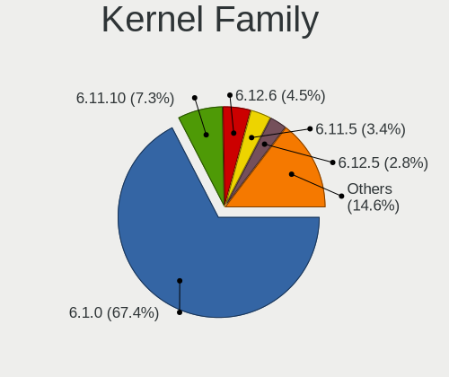
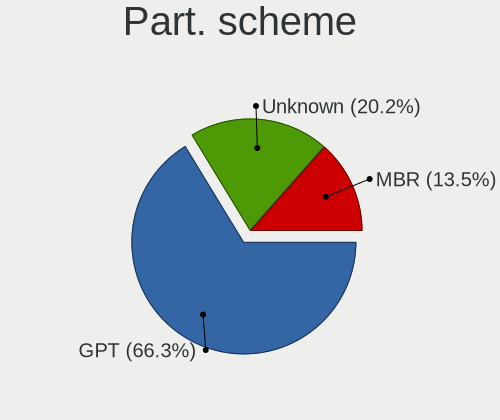
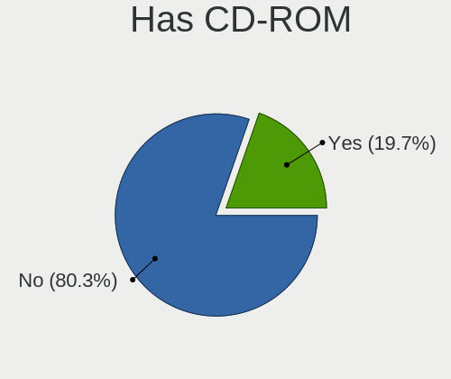
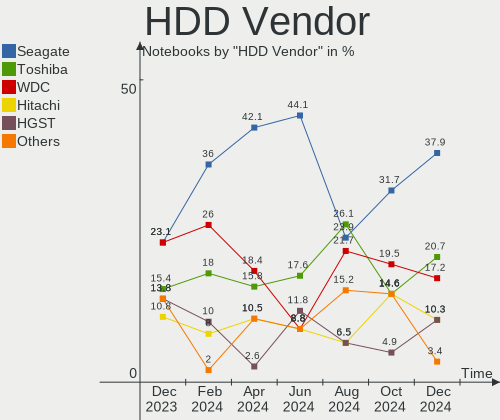
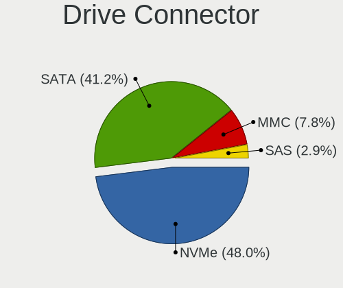
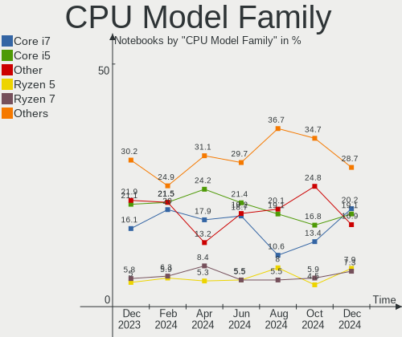
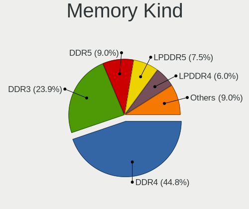
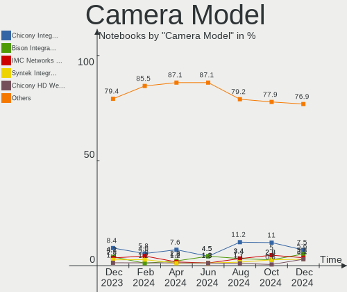
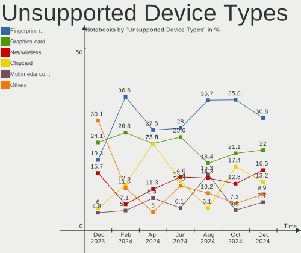

Debian - Hardware Trends (Notebooks)
------------------------------------

A project to identify most popular hardware characteristics and track their change
over time based on data collected by Linux users at https://Linux-Hardware.org.

Anyone can contribute to this report by the [hw-probe](https://github.com/linuxhw/hw-probe) tool:

    sudo -E hw-probe -all -upload

This report is for one last month. Overall report since the beginning of time: [TestCoverage](https://github.com/linuxhw/TestCoverage)

Period: Nov, 2022.

Contents
--------

* [ System ](#system)
  - [ OS                       ](#os)
  - [ OS Family                ](#os-family)
  - [ Kernel                   ](#kernel)
  - [ Kernel Family            ](#kernel-family)
  - [ Kernel Major Ver.        ](#kernel-major-ver)
  - [ Arch                     ](#arch)
  - [ DE                       ](#de)
  - [ Display Server           ](#display-server)
  - [ Display Manager          ](#display-manager)
  - [ OS Lang                  ](#os-lang)
  - [ Boot Mode                ](#boot-mode)
  - [ Filesystem               ](#filesystem)
  - [ Part. scheme             ](#part-scheme)
  - [ Dual Boot with Linux/BSD ](#dual-boot-with-linuxbsd)
  - [ Dual Boot (Win)          ](#dual-boot-win)

* [ Board ](#board)
  - [ Vendor                   ](#vendor)
  - [ Model                    ](#model)
  - [ Model Family             ](#model-family)
  - [ MFG Year                 ](#mfg-year)
  - [ Form Factor              ](#form-factor)
  - [ Secure Boot              ](#secure-boot)
  - [ Coreboot                 ](#coreboot)
  - [ RAM Size                 ](#ram-size)
  - [ RAM Used                 ](#ram-used)
  - [ Total Drives             ](#total-drives)
  - [ Has CD-ROM               ](#has-cd-rom)
  - [ Has Ethernet             ](#has-ethernet)
  - [ Has WiFi                 ](#has-wifi)
  - [ Has Bluetooth            ](#has-bluetooth)

* [ Location ](#location)
  - [ Country                  ](#country)
  - [ City                     ](#city)

* [ Drives ](#drives)
  - [ Drive Vendor             ](#drive-vendor)
  - [ Drive Model              ](#drive-model)
  - [ HDD Vendor               ](#hdd-vendor)
  - [ SSD Vendor               ](#ssd-vendor)
  - [ Drive Kind               ](#drive-kind)
  - [ Drive Connector          ](#drive-connector)
  - [ Drive Size               ](#drive-size)
  - [ Space Total              ](#space-total)
  - [ Space Used               ](#space-used)
  - [ Malfunc. Drives          ](#malfunc-drives)
  - [ Malfunc. Drive Vendor    ](#malfunc-drive-vendor)
  - [ Malfunc. HDD Vendor      ](#malfunc-hdd-vendor)
  - [ Malfunc. Drive Kind      ](#malfunc-drive-kind)
  - [ Failed Drives            ](#failed-drives)
  - [ Failed Drive Vendor      ](#failed-drive-vendor)
  - [ Drive Status             ](#drive-status)

* [ Storage controller ](#storage-controller)
  - [ Storage Vendor           ](#storage-vendor)
  - [ Storage Model            ](#storage-model)
  - [ Storage Kind             ](#storage-kind)

* [ Processor ](#processor)
  - [ CPU Vendor               ](#cpu-vendor)
  - [ CPU Model                ](#cpu-model)
  - [ CPU Model Family         ](#cpu-model-family)
  - [ CPU Cores                ](#cpu-cores)
  - [ CPU Sockets              ](#cpu-sockets)
  - [ CPU Threads              ](#cpu-threads)
  - [ CPU Op-Modes             ](#cpu-op-modes)
  - [ CPU Microcode            ](#cpu-microcode)
  - [ CPU Microarch            ](#cpu-microarch)

* [ Graphics ](#graphics)
  - [ GPU Vendor               ](#gpu-vendor)
  - [ GPU Model                ](#gpu-model)
  - [ GPU Combo                ](#gpu-combo)
  - [ GPU Driver               ](#gpu-driver)
  - [ GPU Memory               ](#gpu-memory)

* [ Monitor ](#monitor)
  - [ Monitor Vendor           ](#monitor-vendor)
  - [ Monitor Model            ](#monitor-model)
  - [ Monitor Resolution       ](#monitor-resolution)
  - [ Monitor Diagonal         ](#monitor-diagonal)
  - [ Monitor Width            ](#monitor-width)
  - [ Aspect Ratio             ](#aspect-ratio)
  - [ Monitor Area             ](#monitor-area)
  - [ Pixel Density            ](#pixel-density)
  - [ Multiple Monitors        ](#multiple-monitors)

* [ Network ](#network)
  - [ Net Controller Vendor    ](#net-controller-vendor)
  - [ Net Controller Model     ](#net-controller-model)
  - [ Wireless Vendor          ](#wireless-vendor)
  - [ Wireless Model           ](#wireless-model)
  - [ Ethernet Vendor          ](#ethernet-vendor)
  - [ Ethernet Model           ](#ethernet-model)
  - [ Net Controller Kind      ](#net-controller-kind)
  - [ Used Controller          ](#used-controller)
  - [ NICs                     ](#nics)
  - [ IPv6                     ](#ipv6)

* [ Bluetooth ](#bluetooth)
  - [ Bluetooth Vendor         ](#bluetooth-vendor)
  - [ Bluetooth Model          ](#bluetooth-model)

* [ Sound ](#sound)
  - [ Sound Vendor             ](#sound-vendor)
  - [ Sound Model              ](#sound-model)

* [ Memory ](#memory)
  - [ Memory Vendor            ](#memory-vendor)
  - [ Memory Model             ](#memory-model)
  - [ Memory Kind              ](#memory-kind)
  - [ Memory Form Factor       ](#memory-form-factor)
  - [ Memory Size              ](#memory-size)
  - [ Memory Speed             ](#memory-speed)

* [ Printers & scanners ](#printers--scanners)
  - [ Printer Vendor           ](#printer-vendor)
  - [ Printer Model            ](#printer-model)
  - [ Scanner Vendor           ](#scanner-vendor)
  - [ Scanner Model            ](#scanner-model)

* [ Camera ](#camera)
  - [ Camera Vendor            ](#camera-vendor)
  - [ Camera Model             ](#camera-model)

* [ Security ](#security)
  - [ Fingerprint Vendor       ](#fingerprint-vendor)
  - [ Fingerprint Model        ](#fingerprint-model)
  - [ Chipcard Vendor          ](#chipcard-vendor)
  - [ Chipcard Model           ](#chipcard-model)

* [ Unsupported ](#unsupported)
  - [ Unsupported Devices      ](#unsupported-devices)
  - [ Unsupported Device Types ](#unsupported-device-types)

System
------

OS
--

Installed operating systems

| Name            | Notebooks | Percent |
|-----------------|-----------|---------|
| Debian 11       | 149       | 78.01%  |
| Debian          | 34        | 17.8%   |
| Debian 10       | 5         | 2.62%   |
| Debian Unstable | 1         | 0.52%   |
| Debian Testing  | 1         | 0.52%   |
| Debian Sid      | 1         | 0.52%   |

OS Family
---------

OS without a version

| Name   | Notebooks | Percent |
|--------|-----------|---------|
| Debian | 191       | 100%    |

Kernel
------

Version of the Linux kernel

| Version                 | Notebooks | Percent |
|-------------------------|-----------|---------|
| 5.10.0-19-amd64         | 77        | 40.31%  |
| 5.10.0-18-amd64         | 28        | 14.66%  |
| 6.0.0-4-amd64           | 16        | 8.38%   |
| 6.0.0-2-amd64           | 11        | 5.76%   |
| 5.10.0-7-amd64          | 9         | 4.71%   |
| 5.19.0-0.deb11.2-amd64  | 7         | 3.66%   |
| 6.0.0-3-amd64           | 5         | 2.62%   |
| 5.10.0-16-amd64         | 5         | 2.62%   |
| 6.0.0-0.deb11.2-amd64   | 3         | 1.57%   |
| 5.10.0-19-686-pae       | 3         | 1.57%   |
| 5.18.0-0.deb11.4-amd64  | 2         | 1.05%   |
| 5.10.0-19-686           | 2         | 1.05%   |
| 5.10.0-15-amd64         | 2         | 1.05%   |
| 6.1.0-rc1+              | 1         | 0.52%   |
| 6.0.9-tereszkiewicz     | 1         | 0.52%   |
| 6.0.7                   | 1         | 0.52%   |
| 6.0.2-titanide          | 1         | 0.52%   |
| 5.9.0-0.bpo.2-amd64     | 1         | 0.52%   |
| 5.19.0-2-amd64          | 1         | 0.52%   |
| 5.17.0-1-amd64          | 1         | 0.52%   |
| 5.15.75-xanmod1         | 1         | 0.52%   |
| 5.15.54-yocto-standard  | 1         | 0.52%   |
| 5.15.39-4-pve           | 1         | 0.52%   |
| 5.14.14                 | 1         | 0.52%   |
| 5.14.0-0.bpo.2-amd64    | 1         | 0.52%   |
| 5.10.35-wb122           | 1         | 0.52%   |
| 5.10.0-18-686           | 1         | 0.52%   |
| 5.10.0-17-amd64         | 1         | 0.52%   |
| 5.10.0-13-amd64         | 1         | 0.52%   |
| 5.10.0-0.deb10.16-amd64 | 1         | 0.52%   |
| 4.19.0-8-amd64          | 1         | 0.52%   |
| 4.19.0-22-amd64         | 1         | 0.52%   |
| 4.19.0-22-686-pae       | 1         | 0.52%   |
| 4.19.0-16-amd64         | 1         | 0.52%   |

Kernel Family
-------------

Linux kernel without a distro release

| Version | Notebooks | Percent |
|---------|-----------|---------|
| 5.10.0  | 130       | 68.06%  |
| 6.0.0   | 35        | 18.32%  |
| 5.19.0  | 8         | 4.19%   |
| 4.19.0  | 4         | 2.09%   |
| 5.18.0  | 2         | 1.05%   |
| 6.1.0   | 1         | 0.52%   |
| 6.0.9   | 1         | 0.52%   |
| 6.0.7   | 1         | 0.52%   |
| 6.0.2   | 1         | 0.52%   |
| 5.9.0   | 1         | 0.52%   |
| 5.17.0  | 1         | 0.52%   |
| 5.15.75 | 1         | 0.52%   |
| 5.15.54 | 1         | 0.52%   |
| 5.15.39 | 1         | 0.52%   |
| 5.14.14 | 1         | 0.52%   |
| 5.14.0  | 1         | 0.52%   |
| 5.10.35 | 1         | 0.52%   |

Kernel Major Ver.
-----------------

Linux kernel major version

| Version | Notebooks | Percent |
|---------|-----------|---------|
| 5.10    | 131       | 68.59%  |
| 6.0     | 38        | 19.9%   |
| 5.19    | 8         | 4.19%   |
| 4.19    | 4         | 2.09%   |
| 5.15    | 3         | 1.57%   |
| 5.18    | 2         | 1.05%   |
| 5.14    | 2         | 1.05%   |
| 6.1     | 1         | 0.52%   |
| 5.9     | 1         | 0.52%   |
| 5.17    | 1         | 0.52%   |

Arch
----

OS architecture (x86_64, i586, etc.)

| Name   | Notebooks | Percent |
|--------|-----------|---------|
| x86_64 | 183       | 95.81%  |
| i686   | 7         | 3.66%   |
| armv7l | 1         | 0.52%   |

DE
--

Desktop Environment

| Name             | Notebooks | Percent |
|------------------|-----------|---------|
| GNOME            | 60        | 31.41%  |
| Unknown          | 34        | 17.8%   |
| KDE5             | 29        | 15.18%  |
| XFCE             | 26        | 13.61%  |
| LXDE             | 9         | 4.71%   |
| X-Cinnamon       | 6         | 3.14%   |
| MATE             | 6         | 3.14%   |
| i3               | 5         | 2.62%   |
| Cinnamon         | 5         | 2.62%   |
| LXQt             | 3         | 1.57%   |
| KDE              | 3         | 1.57%   |
| trinity          | 1         | 0.52%   |
| Openbox          | 1         | 0.52%   |
| lightdm-xsession | 1         | 0.52%   |
| GNOME Flashback  | 1         | 0.52%   |
| fluxbox          | 1         | 0.52%   |

Display Server
--------------

X11 or Wayland

| Name    | Notebooks | Percent |
|---------|-----------|---------|
| X11     | 113       | 59.16%  |
| Wayland | 38        | 19.9%   |
| Unknown | 28        | 14.66%  |
| Tty     | 12        | 6.28%   |

Display Manager
---------------

SDDM, LightDM, etc.

| Name    | Notebooks | Percent |
|---------|-----------|---------|
| LightDM | 57        | 29.84%  |
| Unknown | 53        | 27.75%  |
| GDM     | 41        | 21.47%  |
| SDDM    | 27        | 14.14%  |
| GDM3    | 13        | 6.81%   |

OS Lang
-------

Language

| Lang    | Notebooks | Percent |
|---------|-----------|---------|
| en_US   | 63        | 32.98%  |
| Unknown | 20        | 10.47%  |
| ru_RU   | 15        | 7.85%   |
| it_IT   | 14        | 7.33%   |
| de_DE   | 14        | 7.33%   |
| fr_FR   | 10        | 5.24%   |
| es_ES   | 7         | 3.66%   |
| pl_PL   | 5         | 2.62%   |
| pt_BR   | 4         | 2.09%   |
| en_GB   | 4         | 2.09%   |
| en_CA   | 4         | 2.09%   |
| es_MX   | 3         | 1.57%   |
| es_AR   | 3         | 1.57%   |
| zh_CN   | 2         | 1.05%   |
| pt_PT   | 2         | 1.05%   |
| hu_HU   | 2         | 1.05%   |
| en_IN   | 2         | 1.05%   |
| en_AU   | 2         | 1.05%   |
| zh_TW   | 1         | 0.52%   |
| tr_TR   | 1         | 0.52%   |
| nl_NL   | 1         | 0.52%   |
| ja_JP   | 1         | 0.52%   |
| es_PY   | 1         | 0.52%   |
| es_CL   | 1         | 0.52%   |
| en_ZW   | 1         | 0.52%   |
| en_SG   | 1         | 0.52%   |
| en_PH   | 1         | 0.52%   |
| en_NZ   | 1         | 0.52%   |
| en_IE   | 1         | 0.52%   |
| en_EN   | 1         | 0.52%   |
| cs_CZ   | 1         | 0.52%   |
| C       | 1         | 0.52%   |
| be_BY   | 1         | 0.52%   |

Boot Mode
---------

EFI or BIOS

| Mode | Notebooks | Percent |
|------|-----------|---------|
| EFI  | 135       | 70.68%  |
| BIOS | 56        | 29.32%  |

Filesystem
----------

Type of filesystem

| Type    | Notebooks | Percent |
|---------|-----------|---------|
| Ext4    | 148       | 77.49%  |
| Overlay | 32        | 16.75%  |
| Btrfs   | 8         | 4.19%   |
| Zfs     | 2         | 1.05%   |
| Xfs     | 1         | 0.52%   |

Part. scheme
------------

Scheme of partitioning

| Type    | Notebooks | Percent |
|---------|-----------|---------|
| GPT     | 141       | 73.82%  |
| MBR     | 28        | 14.66%  |
| Unknown | 22        | 11.52%  |

Dual Boot with Linux/BSD
------------------------

Hosting more than one Linux/BSD

| Dual boot | Notebooks | Percent |
|-----------|-----------|---------|
| No        | 173       | 90.58%  |
| Yes       | 18        | 9.42%   |

Dual Boot (Win)
---------------

Hosting Linux and Windows

| Dual boot | Notebooks | Percent |
|-----------|-----------|---------|
| No        | 125       | 65.45%  |
| Yes       | 66        | 34.55%  |

Board
-----

Vendor
------

Motherboard manufacturer

| Name                  | Notebooks | Percent |
|-----------------------|-----------|---------|
| Lenovo                | 50        | 26.18%  |
| Hewlett-Packard       | 35        | 18.32%  |
| ASUSTek Computer      | 27        | 14.14%  |
| Dell                  | 24        | 12.57%  |
| Google                | 6         | 3.14%   |
| Acer                  | 6         | 3.14%   |
| Unknown               | 5         | 2.62%   |
| MSI                   | 4         | 2.09%   |
| Aquarius              | 4         | 2.09%   |
| HUAWEI                | 3         | 1.57%   |
| Toshiba               | 2         | 1.05%   |
| Samsung Electronics   | 2         | 1.05%   |
| MPMAN                 | 2         | 1.05%   |
| GPU Company           | 2         | 1.05%   |
| Fujitsu               | 2         | 1.05%   |
| Apple                 | 2         | 1.05%   |
| Tactus                | 1         | 0.52%   |
| SK hynix              | 1         | 0.52%   |
| SAGER                 | 1         | 0.52%   |
| Razer                 | 1         | 0.52%   |
| Positivo Bahia - VAIO | 1         | 0.52%   |
| Notebook              | 1         | 0.52%   |
| NCA Group             | 1         | 0.52%   |
| Micro Electronics     | 1         | 0.52%   |
| Juana Manso           | 1         | 0.52%   |
| IBM                   | 1         | 0.52%   |
| Gigabyte Technology   | 1         | 0.52%   |
| Dynabook              | 1         | 0.52%   |
| Digma                 | 1         | 0.52%   |
| Chuwi                 | 1         | 0.52%   |
| AXDIA International   | 1         | 0.52%   |

Model
-----

Motherboard model

| Name                                                  | Notebooks | Percent |
|-------------------------------------------------------|-----------|---------|
| Lenovo ThinkPad E475 20H40006US                       | 8         | 4.19%   |
| Google Terra                                          | 6         | 3.14%   |
| Lenovo ThinkPad 13 2nd Gen 20J10046US                 | 5         | 2.62%   |
| Unknown                                               | 5         | 2.62%   |
| Aquarius NS585                                        | 4         | 2.09%   |
| HUAWEI BOHK-WAX9X                                     | 2         | 1.05%   |
| HP Laptop 15-db0xxx                                   | 2         | 1.05%   |
| HP 255 G7 Notebook PC                                 | 2         | 1.05%   |
| Dell XPS 15 9500                                      | 2         | 1.05%   |
| Dell Latitude E6530                                   | 2         | 1.05%   |
| Dell Latitude 5310                                    | 2         | 1.05%   |
| Dell Latitude 3320                                    | 2         | 1.05%   |
| ASUS K53SD                                            | 2         | 1.05%   |
| ASUS GL752VW                                          | 2         | 1.05%   |
| Toshiba Satellite P50-B-10Q                           | 1         | 0.52%   |
| Toshiba Satellite L755                                | 1         | 0.52%   |
| Tactus GeoBook 140                                    | 1         | 0.52%   |
| SK hynix HyBook                                       | 1         | 0.52%   |
| Samsung 300E4C/300E5C/300E7C                          | 1         | 0.52%   |
| Samsung 300E4A/300E5A/300E7A                          | 1         | 0.52%   |
| SAGER D900F                                           | 1         | 0.52%   |
| Razer Blade 15 Advanced Model (Early 2020) - RZ09-033 | 1         | 0.52%   |
| Positivo Bahia - VAIO VJFE53F11X-XXXXXX               | 1         | 0.52%   |
| Notebook RIM2520                                      | 1         | 0.52%   |
| NCA Group iRU_Notebook                                | 1         | 0.52%   |
| MSI Prestige 14Evo A11M                               | 1         | 0.52%   |
| MSI Modern 14 A10M                                    | 1         | 0.52%   |
| MSI GF63 8RD                                          | 1         | 0.52%   |
| MSI Creator 15M A9SD                                  | 1         | 0.52%   |
| MPMAN CONVERTER8                                      | 1         | 0.52%   |
| MPMAN CONVERTER 102                                   | 1         | 0.52%   |
| Micro MG-VCTR002-2060                                 | 1         | 0.52%   |
| Lenovo Y520-15IKBA 80WY                               | 1         | 0.52%   |
| Lenovo V310-14IKB 80T2                                | 1         | 0.52%   |
| Lenovo V14-ADA 82C6                                   | 1         | 0.52%   |
| Lenovo ThinkPad X301 2776LEG                          | 1         | 0.52%   |
| Lenovo ThinkPad X1 Carbon Gen 8 20UAS1QG0C            | 1         | 0.52%   |
| Lenovo ThinkPad X1 Carbon Gen 10 21CB001KMX           | 1         | 0.52%   |
| Lenovo ThinkPad W700 275236U                          | 1         | 0.52%   |
| Lenovo ThinkPad T520 4243F53                          | 1         | 0.52%   |

Model Family
------------

Motherboard model prefix

| Name                                    | Notebooks | Percent |
|-----------------------------------------|-----------|---------|
| Lenovo ThinkPad                         | 38        | 19.9%   |
| Dell Latitude                           | 14        | 7.33%   |
| ASUS VivoBook                           | 8         | 4.19%   |
| HP Laptop                               | 6         | 3.14%   |
| Google Terra                            | 6         | 3.14%   |
| HP EliteBook                            | 5         | 2.62%   |
| Dell Inspiron                           | 5         | 2.62%   |
| Unknown                                 | 5         | 2.62%   |
| Lenovo IdeaPad                          | 4         | 2.09%   |
| HP Pavilion                             | 4         | 2.09%   |
| Aquarius NS585                          | 4         | 2.09%   |
| Acer Aspire                             | 4         | 2.09%   |
| HP ProBook                              | 3         | 1.57%   |
| HP ENVY                                 | 3         | 1.57%   |
| HP 255                                  | 3         | 1.57%   |
| Dell XPS                                | 3         | 1.57%   |
| Toshiba Satellite                       | 2         | 1.05%   |
| Lenovo Legion                           | 2         | 1.05%   |
| HUAWEI BOHK-WAX9X                       | 2         | 1.05%   |
| HP Compaq                               | 2         | 1.05%   |
| ASUS ZenBook                            | 2         | 1.05%   |
| ASUS K53SD                              | 2         | 1.05%   |
| ASUS GL752VW                            | 2         | 1.05%   |
| ASUS ASUS                               | 2         | 1.05%   |
| Tactus GeoBook                          | 1         | 0.52%   |
| SK hynix HyBook                         | 1         | 0.52%   |
| Samsung 300E4C                          | 1         | 0.52%   |
| Samsung 300E4A                          | 1         | 0.52%   |
| SAGER D900F                             | 1         | 0.52%   |
| Razer Blade                             | 1         | 0.52%   |
| Positivo Bahia - VAIO VJFE53F11X-XXXXXX | 1         | 0.52%   |
| Notebook RIM2520                        | 1         | 0.52%   |
| NCA Group iRU                           | 1         | 0.52%   |
| MSI Prestige                            | 1         | 0.52%   |
| MSI Modern                              | 1         | 0.52%   |
| MSI GF63                                | 1         | 0.52%   |
| MSI Creator                             | 1         | 0.52%   |
| MPMAN CONVERTER8                        | 1         | 0.52%   |
| MPMAN CONVERTER                         | 1         | 0.52%   |
| Micro MG-VCTR002-2060                   | 1         | 0.52%   |

MFG Year
--------

Motherboard manufacture year

| Year    | Notebooks | Percent |
|---------|-----------|---------|
| 2019    | 33        | 17.28%  |
| 2021    | 27        | 14.14%  |
| 2020    | 22        | 11.52%  |
| 2022    | 16        | 8.38%   |
| 2011    | 12        | 6.28%   |
| 2018    | 10        | 5.24%   |
| 2017    | 10        | 5.24%   |
| 2016    | 10        | 5.24%   |
| 2015    | 10        | 5.24%   |
| 2013    | 10        | 5.24%   |
| 2012    | 9         | 4.71%   |
| 2009    | 5         | 2.62%   |
| 2010    | 4         | 2.09%   |
| 2008    | 4         | 2.09%   |
| 2014    | 2         | 1.05%   |
| 2006    | 2         | 1.05%   |
| 2004    | 2         | 1.05%   |
| 2007    | 1         | 0.52%   |
| 2005    | 1         | 0.52%   |
| Unknown | 1         | 0.52%   |

Form Factor
-----------

Physical design of the computer

| Name     | Notebooks | Percent |
|----------|-----------|---------|
| Notebook | 191       | 100%    |

Secure Boot
-----------

Enabled or disabled

| State    | Notebooks | Percent |
|----------|-----------|---------|
| Disabled | 165       | 86.39%  |
| Enabled  | 26        | 13.61%  |

Coreboot
--------

Have coreboot on board

| Used | Notebooks | Percent |
|------|-----------|---------|
| No   | 185       | 96.86%  |
| Yes  | 6         | 3.14%   |

RAM Size
--------

Total RAM memory

| Size in GB  | Notebooks | Percent |
|-------------|-----------|---------|
| 4.01-8.0    | 63        | 32.98%  |
| 3.01-4.0    | 37        | 19.37%  |
| 16.01-24.0  | 36        | 18.85%  |
| 8.01-16.0   | 25        | 13.09%  |
| 32.01-64.0  | 14        | 7.33%   |
| 1.01-2.0    | 5         | 2.62%   |
| 2.01-3.0    | 3         | 1.57%   |
| 0.51-1.0    | 3         | 1.57%   |
| 24.01-32.0  | 2         | 1.05%   |
| 64.01-256.0 | 2         | 1.05%   |
| 0.01-0.5    | 1         | 0.52%   |

RAM Used
--------

Used RAM memory

| Used GB   | Notebooks | Percent |
|-----------|-----------|---------|
| 1.01-2.0  | 63        | 32.98%  |
| 2.01-3.0  | 43        | 22.51%  |
| 0.51-1.0  | 26        | 13.61%  |
| 3.01-4.0  | 21        | 10.99%  |
| 4.01-8.0  | 19        | 9.95%   |
| 8.01-16.0 | 12        | 6.28%   |
| 0.01-0.5  | 7         | 3.66%   |

Total Drives
------------

Number of drives on board

| Drives | Notebooks | Percent |
|--------|-----------|---------|
| 1      | 150       | 78.53%  |
| 2      | 36        | 18.85%  |
| 3      | 3         | 1.57%   |
| 0      | 2         | 1.05%   |

Has CD-ROM
----------

Has CD-ROM on board

| Presented | Notebooks | Percent |
|-----------|-----------|---------|
| No        | 148       | 77.49%  |
| Yes       | 43        | 22.51%  |

Has Ethernet
------------

Has Ethernet on board

| Presented | Notebooks | Percent |
|-----------|-----------|---------|
| Yes       | 145       | 75.92%  |
| No        | 46        | 24.08%  |

Has WiFi
--------

Has WiFi module

| Presented | Notebooks | Percent |
|-----------|-----------|---------|
| Yes       | 183       | 95.81%  |
| No        | 8         | 4.19%   |

Has Bluetooth
-------------

Has Bluetooth module

| Presented | Notebooks | Percent |
|-----------|-----------|---------|
| Yes       | 148       | 77.49%  |
| No        | 43        | 22.51%  |

Location
--------

Country
-------

Geographic location (country)

| Country     | Notebooks | Percent |
|-------------|-----------|---------|
| USA         | 38        | 19.9%   |
| Russia      | 20        | 10.47%  |
| Germany     | 20        | 10.47%  |
| Italy       | 15        | 7.85%   |
| France      | 13        | 6.81%   |
| Spain       | 9         | 4.71%   |
| Poland      | 7         | 3.66%   |
| Mexico      | 5         | 2.62%   |
| Portugal    | 4         | 2.09%   |
| Netherlands | 4         | 2.09%   |
| Canada      | 4         | 2.09%   |
| Brazil      | 4         | 2.09%   |
| Argentina   | 4         | 2.09%   |
| Australia   | 3         | 1.57%   |
| Taiwan      | 2         | 1.05%   |
| Switzerland | 2         | 1.05%   |
| Romania     | 2         | 1.05%   |
| Norway      | 2         | 1.05%   |
| Iran        | 2         | 1.05%   |
| India       | 2         | 1.05%   |
| Hungary     | 2         | 1.05%   |
| Czechia     | 2         | 1.05%   |
| China       | 2         | 1.05%   |
| Chile       | 2         | 1.05%   |
| Austria     | 2         | 1.05%   |
| Zimbabwe    | 1         | 0.52%   |
| UK          | 1         | 0.52%   |
| Turkey      | 1         | 0.52%   |
| Sweden      | 1         | 0.52%   |
| Philippines | 1         | 0.52%   |
| Peru        | 1         | 0.52%   |
| Paraguay    | 1         | 0.52%   |
| Pakistan    | 1         | 0.52%   |
| Malta       | 1         | 0.52%   |
| Malaysia    | 1         | 0.52%   |
| Kazakhstan  | 1         | 0.52%   |
| Japan       | 1         | 0.52%   |
| Indonesia   | 1         | 0.52%   |
| Greece      | 1         | 0.52%   |
| Egypt       | 1         | 0.52%   |

City
----

Geographic location (city)

| City                    | Notebooks | Percent |
|-------------------------|-----------|---------|
| Bangor                  | 18        | 9.42%   |
| Voronezh                | 9         | 4.71%   |
| Seville                 | 3         | 1.57%   |
| Moscow                  | 3         | 1.57%   |
| Frankfurt am Main       | 3         | 1.57%   |
| Warsaw                  | 2         | 1.05%   |
| Tehran                  | 2         | 1.05%   |
| Suhr                    | 2         | 1.05%   |
| Rome                    | 2         | 1.05%   |
| Perm                    | 2         | 1.05%   |
| Mülheim                | 2         | 1.05%   |
| Monterrey               | 2         | 1.05%   |
| Milan                   | 2         | 1.05%   |
| Janikowo                | 2         | 1.05%   |
| Budapest                | 2         | 1.05%   |
| Zagreb                  | 1         | 0.52%   |
| Witkowo                 | 1         | 0.52%   |
| Vienna                  | 1         | 0.52%   |
| Valdivia                | 1         | 0.52%   |
| Urbino                  | 1         | 0.52%   |
| Tyumen                  | 1         | 0.52%   |
| Tukwila                 | 1         | 0.52%   |
| Tualatin                | 1         | 0.52%   |
| Trondheim               | 1         | 0.52%   |
| Toronto                 | 1         | 0.52%   |
| Timișoara              | 1         | 0.52%   |
| Taganrog                | 1         | 0.52%   |
| Taby                    | 1         | 0.52%   |
| Sydney                  | 1         | 0.52%   |
| Stade                   | 1         | 0.52%   |
| St Petersburg           | 1         | 0.52%   |
| Southwark               | 1         | 0.52%   |
| Shenzhen                | 1         | 0.52%   |
| Seattle                 | 1         | 0.52%   |
| Schwielowsee            | 1         | 0.52%   |
| Sartrouville            | 1         | 0.52%   |
| Sao Jose                | 1         | 0.52%   |
| Santiago                | 1         | 0.52%   |
| Santa Margherita Ligure | 1         | 0.52%   |
| San Francisco           | 1         | 0.52%   |

Drives
------

Drive Vendor
------------

Hard drive vendors

| Vendor              | Notebooks | Drives | Percent |
|---------------------|-----------|--------|---------|
| Samsung Electronics | 32        | 33     | 14.35%  |
| WDC                 | 24        | 25     | 10.76%  |
| Unknown             | 24        | 25     | 10.76%  |
| Kingston            | 18        | 18     | 8.07%   |
| Seagate             | 14        | 14     | 6.28%   |
| SK hynix            | 12        | 12     | 5.38%   |
| SanDisk             | 12        | 12     | 5.38%   |
| Toshiba             | 11        | 11     | 4.93%   |
| Intel               | 10        | 10     | 4.48%   |
| A-DATA Technology   | 8         | 10     | 3.59%   |
| Micron Technology   | 7         | 7      | 3.14%   |
| Crucial             | 6         | 6      | 2.69%   |
| HGST                | 5         | 5      | 2.24%   |
| Hitachi             | 4         | 4      | 1.79%   |
| Unknown             | 4         | 4      | 1.79%   |
| Transcend           | 2         | 2      | 0.9%    |
| SPCC                | 2         | 2      | 0.9%    |
| LITEONIT            | 2         | 2      | 0.9%    |
| KIOXIA              | 2         | 2      | 0.9%    |
| Intenso             | 2         | 2      | 0.9%    |
| Apple               | 2         | 2      | 0.9%    |
| UMIS                | 1         | 1      | 0.45%   |
| SUNEAST             | 1         | 1      | 0.45%   |
| SSSTC               | 1         | 1      | 0.45%   |
| Space ke            | 1         | 1      | 0.45%   |
| SAGE                | 1         | 1      | 0.45%   |
| S3+                 | 1         | 1      | 0.45%   |
| Phison Electronics  | 1         | 1      | 0.45%   |
| Netac               | 1         | 1      | 0.45%   |
| Neo                 | 1         | 1      | 0.45%   |
| LITEON              | 1         | 1      | 0.45%   |
| KingDian            | 1         | 1      | 0.45%   |
| KEEPDATA            | 1         | 1      | 0.45%   |
| GOODRAM             | 1         | 1      | 0.45%   |
| GLOBAL              | 1         | 1      | 0.45%   |
| Fujitsu             | 1         | 1      | 0.45%   |
| Dogfish             | 1         | 1      | 0.45%   |
| Colorful            | 1         | 1      | 0.45%   |
| China               | 1         | 1      | 0.45%   |
| BIWIN               | 1         | 1      | 0.45%   |

Drive Model
-----------

Hard drive models

| Model                                             | Notebooks | Percent |
|---------------------------------------------------|-----------|---------|
| Kingston SA400S37120G 120GB SSD                   | 8         | 3.54%   |
| Unknown SDW16G  16GB                              | 5         | 2.21%   |
| Kingston SA400S37240G 240GB SSD                   | 4         | 1.77%   |
| A-DATA SU800 512GB SSD                            | 4         | 1.77%   |
| Unknown                                           | 4         | 1.77%   |
| Unknown MMC Card  64GB                            | 3         | 1.33%   |
| Toshiba MQ01ABF050 500GB                          | 3         | 1.33%   |
| SanDisk SD8SN8U128G1001 128GB SSD                 | 3         | 1.33%   |
| Intel SSDPEKNW512G8 512GB                         | 3         | 1.33%   |
| HGST HTS721010A9E630 1TB                          | 3         | 1.33%   |
| WDC WDS500G2B0B-00YS70 500GB SSD                  | 2         | 0.88%   |
| WDC WD10JPCX-24UE4T0 1TB                          | 2         | 0.88%   |
| WDC PC SN530 NVMe 256GB                           | 2         | 0.88%   |
| Unknown MMC64G  64GB                              | 2         | 0.88%   |
| Unknown Biwin  64GB                               | 2         | 0.88%   |
| SK hynix SKHynix_HFS001TD9TNI-L2B0B 1TB           | 2         | 0.88%   |
| Seagate ST320LT007-9ZV142 320GB                   | 2         | 0.88%   |
| Seagate ST2000LM003 HN-M201RAD 2TB                | 2         | 0.88%   |
| Samsung SSD 860 EVO 250GB                         | 2         | 0.88%   |
| Samsung SSD 850 EVO 500GB                         | 2         | 0.88%   |
| Samsung SSD 850 EVO 120GB                         | 2         | 0.88%   |
| Samsung NVMe SSD Controller SM981/PM981/PM983 1TB | 2         | 0.88%   |
| Samsung MZNTY128HDHP-000L1 128GB SSD              | 2         | 0.88%   |
| Samsung MZNLN256HAJQ-000H1 256GB SSD              | 2         | 0.88%   |
| Crucial CT250MX500SSD1 250GB                      | 2         | 0.88%   |
| WDC WDS100T3XHC-00SJG0 1TB                        | 1         | 0.44%   |
| WDC WDBNCE0010PNC 1TB SSD                         | 1         | 0.44%   |
| WDC WD600UE-22HCT0 64GB                           | 1         | 0.44%   |
| WDC WD5000LPLX-08ZNTT0 500GB                      | 1         | 0.44%   |
| WDC WD5000LPCX-60VHAT0 500GB                      | 1         | 0.44%   |
| WDC WD5000LPCX-21VHAT0 500GB                      | 1         | 0.44%   |
| WDC WD5000BPVT-24HXZT3 500GB                      | 1         | 0.44%   |
| WDC WD3200BEKT-60KA9T0 320GB                      | 1         | 0.44%   |
| WDC WD10SPSX-08A6W 1TB                            | 1         | 0.44%   |
| WDC WD10JPLX-00MBPT1 1TB                          | 1         | 0.44%   |
| WDC PC SN730 SDBQNTY-256G-1001 256GB              | 1         | 0.44%   |
| WDC PC SN730 SDBPNTY-256G-1027 256GB              | 1         | 0.44%   |
| WDC PC SN730 SDBPNTY-1T00-1101 1TB                | 1         | 0.44%   |
| WDC PC SN730 NVMe 512GB                           | 1         | 0.44%   |
| WDC PC SN530 SDBPNPZ-512G-1032 512GB              | 1         | 0.44%   |

HDD Vendor
----------

Hard disk drive vendors

| Vendor              | Notebooks | Drives | Percent |
|---------------------|-----------|--------|---------|
| Seagate             | 14        | 14     | 32.56%  |
| WDC                 | 10        | 10     | 23.26%  |
| Toshiba             | 6         | 6      | 13.95%  |
| HGST                | 5         | 5      | 11.63%  |
| Hitachi             | 4         | 4      | 9.3%    |
| Samsung Electronics | 1         | 1      | 2.33%   |
| SAGE                | 1         | 1      | 2.33%   |
| Fujitsu             | 1         | 1      | 2.33%   |
| ASMT                | 1         | 1      | 2.33%   |

SSD Vendor
----------

Solid state drive vendors

| Vendor              | Notebooks | Drives | Percent |
|---------------------|-----------|--------|---------|
| Kingston            | 17        | 17     | 20%     |
| Samsung Electronics | 14        | 14     | 16.47%  |
| SanDisk             | 11        | 11     | 12.94%  |
| A-DATA Technology   | 7         | 9      | 8.24%   |
| Crucial             | 5         | 5      | 5.88%   |
| WDC                 | 3         | 3      | 3.53%   |
| Intel               | 3         | 3      | 3.53%   |
| Transcend           | 2         | 2      | 2.35%   |
| Toshiba             | 2         | 2      | 2.35%   |
| SPCC                | 2         | 2      | 2.35%   |
| Micron Technology   | 2         | 2      | 2.35%   |
| LITEONIT            | 2         | 2      | 2.35%   |
| Intenso             | 2         | 2      | 2.35%   |
| Apple               | 2         | 2      | 2.35%   |
| Unknown             | 2         | 2      | 2.35%   |
| SUNEAST             | 1         | 1      | 1.18%   |
| S3+                 | 1         | 1      | 1.18%   |
| Netac               | 1         | 1      | 1.18%   |
| KingDian            | 1         | 1      | 1.18%   |
| KEEPDATA            | 1         | 1      | 1.18%   |
| GLOBAL              | 1         | 1      | 1.18%   |
| Dogfish             | 1         | 1      | 1.18%   |
| Colorful            | 1         | 1      | 1.18%   |
| China               | 1         | 1      | 1.18%   |

Drive Kind
----------

HDD or SSD

| Kind    | Notebooks | Drives | Percent |
|---------|-----------|--------|---------|
| SSD     | 81        | 87     | 36.99%  |
| NVMe    | 66        | 68     | 30.14%  |
| HDD     | 43        | 43     | 19.63%  |
| MMC     | 27        | 28     | 12.33%  |
| Unknown | 2         | 2      | 0.91%   |

Drive Connector
---------------

SATA, SAS, NVMe, etc.

| Type | Notebooks | Drives | Percent |
|------|-----------|--------|---------|
| SATA | 109       | 126    | 52.4%   |
| NVMe | 66        | 68     | 31.73%  |
| MMC  | 27        | 28     | 12.98%  |
| SAS  | 6         | 6      | 2.88%   |

Drive Size
----------

Size of hard drive

| Size in TB | Notebooks | Drives | Percent |
|------------|-----------|--------|---------|
| 0.01-0.5   | 82        | 93     | 70.69%  |
| 0.51-1.0   | 30        | 33     | 25.86%  |
| 1.01-2.0   | 4         | 4      | 3.45%   |

Space Total
-----------

Amount of disk space available on the file system

| Size in GB     | Notebooks | Percent |
|----------------|-----------|---------|
| 101-250        | 55        | 28.8%   |
| 251-500        | 43        | 22.51%  |
| Unknown        | 27        | 14.14%  |
| 501-1000       | 22        | 11.52%  |
| 51-100         | 16        | 8.38%   |
| 21-50          | 8         | 4.19%   |
| 1001-2000      | 8         | 4.19%   |
| 1-20           | 7         | 3.66%   |
| 2001-3000      | 3         | 1.57%   |
| More than 3000 | 2         | 1.05%   |

Space Used
----------

Amount of used disk space

| Used GB   | Notebooks | Percent |
|-----------|-----------|---------|
| 1-20      | 67        | 35.08%  |
| 21-50     | 28        | 14.66%  |
| Unknown   | 27        | 14.14%  |
| 101-250   | 26        | 13.61%  |
| 51-100    | 20        | 10.47%  |
| 251-500   | 13        | 6.81%   |
| 501-1000  | 6         | 3.14%   |
| 1001-2000 | 2         | 1.05%   |
| 2001-3000 | 1         | 0.52%   |
| 0         | 1         | 0.52%   |

Malfunc. Drives
---------------

Drive models with a malfunction

| Model                                | Notebooks | Drives | Percent |
|--------------------------------------|-----------|--------|---------|
| Seagate ST320LT007-9ZV142 320GB      | 2         | 2      | 8%      |
| WDC WD600UE-22HCT0 64GB              | 1         | 1      | 4%      |
| WDC WD5000BPVT-24HXZT3 500GB         | 1         | 1      | 4%      |
| WDC WD3200BEKT-60KA9T0 320GB         | 1         | 1      | 4%      |
| WDC WD10JPLX-00MBPT1 1TB             | 1         | 1      | 4%      |
| WDC WD10JPCX-24UE4T0 1TB             | 1         | 1      | 4%      |
| Toshiba MQ01ABD075 752GB             | 1         | 1      | 4%      |
| SK hynix PC711 HFS512GDE9X073N 512GB | 1         | 1      | 4%      |
| Seagate ST9320325AS 320GB            | 1         | 1      | 4%      |
| Seagate ST500LM021-1KJ152 500GB      | 1         | 1      | 4%      |
| Seagate ST320LT012-9WS14C 320GB      | 1         | 1      | 4%      |
| Seagate ST250LT012-9WS141 250GB      | 1         | 1      | 4%      |
| Seagate ST2000LM003 HN-M201RAD 2TB   | 1         | 1      | 4%      |
| Seagate ST1000LM024 HN-M101MBB 1TB   | 1         | 1      | 4%      |
| Seagate ST1000LM014-1EJ164 1TB       | 1         | 1      | 4%      |
| Samsung Electronics HM100JC 100GB    | 1         | 1      | 4%      |
| LITEONIT LMT-32L3M-HP 32GB SSD       | 1         | 1      | 4%      |
| Intel SSDSC2CW060A3 64GB             | 1         | 1      | 4%      |
| Intel SSDSA1M160G2LE 160GB           | 1         | 1      | 4%      |
| Hitachi HTS547575A9E384 752GB        | 1         | 1      | 4%      |
| Hitachi HTS547564A9E384 640GB        | 1         | 1      | 4%      |
| Hitachi HTS545050B9A300 500GB        | 1         | 1      | 4%      |
| HGST HTS721010A9E630 1TB             | 1         | 1      | 4%      |
| Unknown                              | 1         | 1      | 4%      |

Malfunc. Drive Vendor
---------------------

Vendors of faulty drives

| Vendor              | Notebooks | Drives | Percent |
|---------------------|-----------|--------|---------|
| Seagate             | 9         | 9      | 36%     |
| WDC                 | 5         | 5      | 20%     |
| Hitachi             | 3         | 3      | 12%     |
| Intel               | 2         | 2      | 8%      |
| Toshiba             | 1         | 1      | 4%      |
| SK hynix            | 1         | 1      | 4%      |
| Samsung Electronics | 1         | 1      | 4%      |
| LITEONIT            | 1         | 1      | 4%      |
| HGST                | 1         | 1      | 4%      |
| Unknown             | 1         | 1      | 4%      |

Malfunc. HDD Vendor
-------------------

Vendors of faulty HDD drives

| Vendor              | Notebooks | Drives | Percent |
|---------------------|-----------|--------|---------|
| Seagate             | 9         | 9      | 45%     |
| WDC                 | 5         | 5      | 25%     |
| Hitachi             | 3         | 3      | 15%     |
| Toshiba             | 1         | 1      | 5%      |
| Samsung Electronics | 1         | 1      | 5%      |
| HGST                | 1         | 1      | 5%      |

Malfunc. Drive Kind
-------------------

Kinds of faulty drives

| Kind | Notebooks | Drives | Percent |
|------|-----------|--------|---------|
| HDD  | 20        | 20     | 80%     |
| SSD  | 4         | 4      | 16%     |
| NVMe | 1         | 1      | 4%      |

Failed Drives
-------------

Failed drive models

| Model                                           | Notebooks | Drives | Percent |
|-------------------------------------------------|-----------|--------|---------|
| Samsung Electronics MZMPC032HBCD-000H1 32GB SSD | 1         | 1      | 50%     |
| Hitachi HTS545050A7E380 500GB                   | 1         | 1      | 50%     |

Failed Drive Vendor
-------------------

Failed drive vendors

| Vendor              | Notebooks | Drives | Percent |
|---------------------|-----------|--------|---------|
| Samsung Electronics | 1         | 1      | 50%     |
| Hitachi             | 1         | 1      | 50%     |

Drive Status
------------

Number of failed and malfunc. drives

| Status   | Notebooks | Drives | Percent |
|----------|-----------|--------|---------|
| Works    | 125       | 138    | 61.58%  |
| Detected | 51        | 63     | 25.12%  |
| Malfunc  | 25        | 25     | 12.32%  |
| Failed   | 2         | 2      | 0.99%   |

Storage controller
------------------

Storage Vendor
--------------

Storage controller vendors

| Vendor                         | Notebooks | Percent |
|--------------------------------|-----------|---------|
| Intel                          | 113       | 56.5%   |
| AMD                            | 24        | 12%     |
| Samsung Electronics            | 18        | 9%      |
| SanDisk                        | 13        | 6.5%    |
| SK hynix                       | 11        | 5.5%    |
| Micron Technology              | 5         | 2.5%    |
| KIOXIA                         | 3         | 1.5%    |
| Toshiba America Info Systems   | 2         | 1%      |
| Phison Electronics             | 2         | 1%      |
| Union Memory (Shenzhen)        | 1         | 0.5%    |
| Solid State Storage Technology | 1         | 0.5%    |
| Silicon Motion                 | 1         | 0.5%    |
| Nvidia                         | 1         | 0.5%    |
| Micron/Crucial Technology      | 1         | 0.5%    |
| Marvell Technology Group       | 1         | 0.5%    |
| Lite-On Technology             | 1         | 0.5%    |
| Kingston Technology Company    | 1         | 0.5%    |
| ADATA Technology               | 1         | 0.5%    |

Storage Model
-------------

Storage controller models

| Model                                                                          | Notebooks | Percent |
|--------------------------------------------------------------------------------|-----------|---------|
| AMD FCH SATA Controller [AHCI mode]                                            | 22        | 10.48%  |
| Intel Sunrise Point-LP SATA Controller [AHCI mode]                             | 15        | 7.14%   |
| Intel 82801 Mobile SATA Controller [RAID mode]                                 | 13        | 6.19%   |
| Intel 7 Series Chipset Family 6-port SATA Controller [AHCI mode]               | 10        | 4.76%   |
| Intel 6 Series/C200 Series Chipset Family 6 port Mobile SATA AHCI Controller   | 9         | 4.29%   |
| Intel Celeron/Pentium Silver Processor SATA Controller                         | 8         | 3.81%   |
| Samsung NVMe SSD Controller SM981/PM981/PM983                                  | 7         | 3.33%   |
| Intel HM170/QM170 Chipset SATA Controller [AHCI Mode]                          | 6         | 2.86%   |
| SK hynix Gold P31/PC711 NVMe Solid State Drive                                 | 5         | 2.38%   |
| Samsung NVMe SSD Controller 980                                                | 5         | 2.38%   |
| Micron Non-Volatile memory controller                                          | 5         | 2.38%   |
| Intel Volume Management Device NVMe RAID Controller                            | 5         | 2.38%   |
| Intel SSD 660P Series                                                          | 5         | 2.38%   |
| SanDisk WD Black SN750 / PC SN730 NVMe SSD                                     | 4         | 1.9%    |
| SanDisk Non-Volatile memory controller                                         | 4         | 1.9%    |
| Intel Wildcat Point-LP SATA Controller [AHCI Mode]                             | 4         | 1.9%    |
| Intel Celeron N3350/Pentium N4200/Atom E3900 Series SATA AHCI Controller       | 4         | 1.9%    |
| Intel Cannon Lake PCH SATA AHCI Controller                                     | 4         | 1.9%    |
| Intel 82801IBM/IEM (ICH9M/ICH9M-E) 4 port SATA Controller [AHCI mode]          | 4         | 1.9%    |
| Intel 8 Series SATA Controller 1 [AHCI mode]                                   | 4         | 1.9%    |
| SK hynix Non-Volatile memory controller                                        | 3         | 1.43%   |
| Samsung NVMe SSD Controller PM9A1/PM9A3/980PRO                                 | 3         | 1.43%   |
| Intel Tiger Lake-LP SATA Controller                                            | 3         | 1.43%   |
| Intel Comet Lake SATA AHCI Controller                                          | 3         | 1.43%   |
| Intel 82801GBM/GHM (ICH7-M Family) SATA Controller [AHCI mode]                 | 3         | 1.43%   |
| Intel 8 Series/C220 Series Chipset Family 6-port SATA Controller 1 [AHCI mode] | 3         | 1.43%   |
| SK hynix BC511                                                                 | 2         | 0.95%   |
| SanDisk WD Blue SN550 NVMe SSD                                                 | 2         | 0.95%   |
| Phison E12 NVMe Controller                                                     | 2         | 0.95%   |
| KIOXIA NVMe SSD Controller BG4                                                 | 2         | 0.95%   |
| Intel SSD Pro 7600p/760p/E 6100p Series                                        | 2         | 0.95%   |
| Intel Mobile 4 Series Chipset PT IDER Controller                               | 2         | 0.95%   |
| Intel Ice Lake-LP SATA Controller [AHCI mode]                                  | 2         | 0.95%   |
| Intel 82801G (ICH7 Family) IDE Controller                                      | 2         | 0.95%   |
| Intel 82801DBM (ICH4-M) IDE Controller                                         | 2         | 0.95%   |
| Intel 5 Series/3400 Series Chipset 4 port SATA AHCI Controller                 | 2         | 0.95%   |
| Intel 400 Series Chipset Family SATA AHCI Controller                           | 2         | 0.95%   |
| Union Memory (Shenzhen) AM630 PCIe 4.0 x4 NVMe SSD Controller                  | 1         | 0.48%   |
| Toshiba America Info Systems XG6 NVMe SSD Controller                           | 1         | 0.48%   |
| Toshiba America Info Systems XG5 NVMe SSD Controller                           | 1         | 0.48%   |

Storage Kind
------------

Kind of storage controller (IDE, SATA, NVMe, SAS, ...)

| Kind | Notebooks | Percent |
|------|-----------|---------|
| SATA | 115       | 55.02%  |
| NVMe | 66        | 31.58%  |
| RAID | 19        | 9.09%   |
| IDE  | 9         | 4.31%   |

Processor
---------

CPU Vendor
----------

Processor vendors

| Vendor | Notebooks | Percent |
|--------|-----------|---------|
| Intel  | 151       | 79.06%  |
| AMD    | 39        | 20.42%  |
| ARM    | 1         | 0.52%   |

CPU Model
---------

Processor models

| Model                                           | Notebooks | Percent |
|-------------------------------------------------|-----------|---------|
| AMD PRO A6-9500B R5, 6 COMPUTE CORES 2C+4G      | 8         | 4.19%   |
| Intel Celeron CPU N3060 @ 1.60GHz               | 7         | 3.66%   |
| Intel Celeron N4020 CPU @ 1.10GHz               | 6         | 3.14%   |
| Intel Core i7-10750H CPU @ 2.60GHz              | 5         | 2.62%   |
| Intel Celeron CPU 3865U @ 1.80GHz               | 5         | 2.62%   |
| Intel 11th Gen Core i7-1165G7 @ 2.80GHz         | 5         | 2.62%   |
| AMD Ryzen 5 3500U with Radeon Vega Mobile Gfx   | 5         | 2.62%   |
| Intel Core i3-9100 CPU @ 3.60GHz                | 4         | 2.09%   |
| Intel Core i7-9750H CPU @ 2.60GHz               | 3         | 1.57%   |
| Intel Core i7-7700HQ CPU @ 2.80GHz              | 3         | 1.57%   |
| Intel Core i7-6700HQ CPU @ 2.60GHz              | 3         | 1.57%   |
| Intel Core i7-2670QM CPU @ 2.20GHz              | 3         | 1.57%   |
| Intel Core i7-10510U CPU @ 1.80GHz              | 3         | 1.57%   |
| Intel Core i5-7200U CPU @ 2.50GHz               | 3         | 1.57%   |
| Intel Core i5-1035G1 CPU @ 1.00GHz              | 3         | 1.57%   |
| Intel Core i5-10210U CPU @ 1.60GHz              | 3         | 1.57%   |
| Intel Celeron CPU N3450 @ 1.10GHz               | 3         | 1.57%   |
| AMD Ryzen 5 5500U with Radeon Graphics          | 3         | 1.57%   |
| Intel Core i7-8550U CPU @ 1.80GHz               | 2         | 1.05%   |
| Intel Core i7-7500U CPU @ 2.70GHz               | 2         | 1.05%   |
| Intel Core i5-6200U CPU @ 2.30GHz               | 2         | 1.05%   |
| Intel Core i5-5300U CPU @ 2.30GHz               | 2         | 1.05%   |
| Intel Core i5-4210U CPU @ 1.70GHz               | 2         | 1.05%   |
| Intel Core i5-3317U CPU @ 1.70GHz               | 2         | 1.05%   |
| Intel Core i5-2520M CPU @ 2.50GHz               | 2         | 1.05%   |
| Intel Core i5-10310U CPU @ 1.70GHz              | 2         | 1.05%   |
| Intel Core i3-2350M CPU @ 2.30GHz               | 2         | 1.05%   |
| Intel Core 2 Duo CPU T9600 @ 2.80GHz            | 2         | 1.05%   |
| Intel Atom CPU Z3735F @ 1.33GHz                 | 2         | 1.05%   |
| Intel 12th Gen Core i7-1260P                    | 2         | 1.05%   |
| Intel 11th Gen Core i5-1135G7 @ 2.40GHz         | 2         | 1.05%   |
| Intel 11th Gen Core i3-1125G4 @ 2.00GHz         | 2         | 1.05%   |
| AMD Ryzen 7 PRO 3700U w/ Radeon Vega Mobile Gfx | 2         | 1.05%   |
| AMD Ryzen 5 5600H with Radeon Graphics          | 2         | 1.05%   |
| AMD A9-9425 RADEON R5, 5 COMPUTE CORES 2C+3G    | 2         | 1.05%   |
| Intel Pentium M processor 1400MHz               | 1         | 0.52%   |
| Intel Pentium M processor 1.60GHz               | 1         | 0.52%   |
| Intel Pentium Dual-Core CPU T4500 @ 2.30GHz     | 1         | 0.52%   |
| Intel Pentium CPU N4200 @ 1.10GHz               | 1         | 0.52%   |
| Intel Pentium CPU 2117U @ 1.80GHz               | 1         | 0.52%   |

CPU Model Family
----------------

Processor model prefix

| Model                   | Notebooks | Percent |
|-------------------------|-----------|---------|
| Intel Core i7           | 41        | 21.47%  |
| Intel Core i5           | 33        | 17.28%  |
| Other                   | 28        | 14.66%  |
| Intel Celeron           | 25        | 13.09%  |
| AMD Ryzen 5             | 12        | 6.28%   |
| Intel Core i3           | 11        | 5.76%   |
| Intel Core 2 Duo        | 6         | 3.14%   |
| Intel Atom              | 6         | 3.14%   |
| AMD Ryzen 7 PRO         | 4         | 2.09%   |
| AMD Ryzen 7             | 4         | 2.09%   |
| AMD Ryzen 5 PRO         | 3         | 1.57%   |
| Intel Pentium M         | 2         | 1.05%   |
| Intel Pentium           | 2         | 1.05%   |
| AMD E2                  | 2         | 1.05%   |
| AMD A4                  | 2         | 1.05%   |
| Intel Pentium Dual-Core | 1         | 0.52%   |
| Intel Pentium 4         | 1         | 0.52%   |
| Intel Genuine           | 1         | 0.52%   |
| Intel Core m3           | 1         | 0.52%   |
| Intel Core M            | 1         | 0.52%   |
| Intel Core Duo          | 1         | 0.52%   |
| Intel Core 2 Quad       | 1         | 0.52%   |
| Intel Celeron M         | 1         | 0.52%   |
| ARM Allwinner           | 1         | 0.52%   |
| AMD Ryzen 9             | 1         | 0.52%   |

CPU Cores
---------

Number of processor cores

| Number | Notebooks | Percent |
|--------|-----------|---------|
| 4      | 75        | 39.27%  |
| 2      | 74        | 38.74%  |
| 6      | 15        | 7.85%   |
| 1      | 13        | 6.81%   |
| 8      | 8         | 4.19%   |
| 12     | 4         | 2.09%   |
| 14     | 1         | 0.52%   |
| 10     | 1         | 0.52%   |

CPU Sockets
-----------

Number of sockets

| Number | Notebooks | Percent |
|--------|-----------|---------|
| 1      | 191       | 100%    |

CPU Threads
-----------

Threads per core (Hyper-Threading)

| Number | Notebooks | Percent |
|--------|-----------|---------|
| 2      | 128       | 67.02%  |
| 1      | 63        | 32.98%  |

CPU Op-Modes
------------

CPU Operation Modes (32-bit, 64-bit)

| Op mode        | Notebooks | Percent |
|----------------|-----------|---------|
| 32-bit, 64-bit | 183       | 95.81%  |
| 32-bit         | 7         | 3.66%   |
| Unknown        | 1         | 0.52%   |

CPU Microcode
-------------

Microcode number

| Number     | Notebooks | Percent |
|------------|-----------|---------|
| Unknown    | 36        | 18.85%  |
| 0x806c1    | 11        | 5.76%   |
| 0x206a7    | 10        | 5.24%   |
| 0x306a9    | 9         | 4.71%   |
| 0x806ec    | 8         | 4.19%   |
| 0x406c4    | 8         | 4.19%   |
| 0x0600611a | 8         | 4.19%   |
| 0x806e9    | 7         | 3.66%   |
| 0xa0652    | 6         | 3.14%   |
| 0x08108109 | 5         | 2.62%   |
| 0x906eb    | 4         | 2.09%   |
| 0x906a3    | 4         | 2.09%   |
| 0x706a8    | 4         | 2.09%   |
| 0x406e3    | 4         | 2.09%   |
| 0x0a50000c | 4         | 2.09%   |
| 0x906ea    | 3         | 1.57%   |
| 0x806ea    | 3         | 1.57%   |
| 0x706e5    | 3         | 1.57%   |
| 0x506e3    | 3         | 1.57%   |
| 0x40651    | 3         | 1.57%   |
| 0x306d4    | 3         | 1.57%   |
| 0x10676    | 3         | 1.57%   |
| 0x08608103 | 3         | 1.57%   |
| 0x08600106 | 3         | 1.57%   |
| 0x06006705 | 3         | 1.57%   |
| 0x906e9    | 2         | 1.05%   |
| 0x6fd      | 2         | 1.05%   |
| 0x506c9    | 2         | 1.05%   |
| 0x306c3    | 2         | 1.05%   |
| 0x30678    | 2         | 1.05%   |
| 0xf29      | 1         | 0.52%   |
| 0x906a4    | 1         | 0.52%   |
| 0x806eb    | 1         | 0.52%   |
| 0x806c2    | 1         | 0.52%   |
| 0x706a1    | 1         | 0.52%   |
| 0x6ec      | 1         | 0.52%   |
| 0x6e8      | 1         | 0.52%   |
| 0x6d8      | 1         | 0.52%   |
| 0x6d6      | 1         | 0.52%   |
| 0x695      | 1         | 0.52%   |

CPU Microarch
-------------

Microarchitecture

| Name             | Notebooks | Percent |
|------------------|-----------|---------|
| KabyLake         | 37        | 19.37%  |
| SandyBridge      | 13        | 6.81%   |
| TigerLake        | 12        | 6.28%   |
| Silvermont       | 12        | 6.28%   |
| Excavator        | 12        | 6.28%   |
| IvyBridge        | 10        | 5.24%   |
| Zen+             | 8         | 4.19%   |
| Haswell          | 8         | 4.19%   |
| Goldmont plus    | 8         | 4.19%   |
| Skylake          | 7         | 3.66%   |
| CometLake        | 7         | 3.66%   |
| Penryn           | 6         | 3.14%   |
| Unknown          | 6         | 3.14%   |
| Zen 3            | 5         | 2.62%   |
| P6               | 5         | 2.62%   |
| Broadwell        | 5         | 2.62%   |
| Alderlake Hybrid | 5         | 2.62%   |
| Zen 2            | 4         | 2.09%   |
| IceLake          | 4         | 2.09%   |
| Goldmont         | 4         | 2.09%   |
| Zen              | 3         | 1.57%   |
| Westmere         | 3         | 1.57%   |
| K10 Llano        | 2         | 1.05%   |
| Core             | 2         | 1.05%   |
| NetBurst         | 1         | 0.52%   |
| Nehalem          | 1         | 0.52%   |
| Bonnell          | 1         | 0.52%   |

Graphics
--------

GPU Vendor
----------

Vendors of graphics cards

| Vendor | Notebooks | Percent |
|--------|-----------|---------|
| Intel  | 136       | 58.62%  |
| AMD    | 49        | 21.12%  |
| Nvidia | 47        | 20.26%  |

GPU Model
---------

Graphics card models

| Model                                                                                    | Notebooks | Percent |
|------------------------------------------------------------------------------------------|-----------|---------|
| Intel 2nd Generation Core Processor Family Integrated Graphics Controller                | 12        | 5.11%   |
| Intel TigerLake-LP GT2 [Iris Xe Graphics]                                                | 10        | 4.26%   |
| Intel CometLake-U GT2 [UHD Graphics]                                                     | 9         | 3.83%   |
| Intel 3rd Gen Core processor Graphics Controller                                         | 9         | 3.83%   |
| AMD Picasso/Raven 2 [Radeon Vega Series / Radeon Vega Mobile Series]                     | 9         | 3.83%   |
| Intel GeminiLake [UHD Graphics 600]                                                      | 8         | 3.4%    |
| Intel Atom/Celeron/Pentium Processor x5-E8000/J3xxx/N3xxx Integrated Graphics Controller | 8         | 3.4%    |
| AMD Wani [Radeon R5/R6/R7 Graphics]                                                      | 8         | 3.4%    |
| Intel HD Graphics 620                                                                    | 5         | 2.13%   |
| Intel HD Graphics 610                                                                    | 5         | 2.13%   |
| Intel Haswell-ULT Integrated Graphics Controller                                         | 5         | 2.13%   |
| Intel CometLake-H GT2 [UHD Graphics]                                                     | 5         | 2.13%   |
| Intel UHD Graphics 620                                                                   | 4         | 1.7%    |
| Intel CoffeeLake-S GT2 [UHD Graphics 630]                                                | 4         | 1.7%    |
| Intel Atom Processor Z36xxx/Z37xxx Series Graphics & Display                             | 4         | 1.7%    |
| Intel Alder Lake-P Integrated Graphics Controller                                        | 4         | 1.7%    |
| AMD Stoney [Radeon R2/R3/R4/R5 Graphics]                                                 | 4         | 1.7%    |
| AMD Renoir                                                                               | 4         | 1.7%    |
| AMD Cezanne [Radeon Vega Series / Radeon Vega Mobile Series]                             | 4         | 1.7%    |
| Nvidia TU106M [GeForce RTX 2060 Mobile]                                                  | 3         | 1.28%   |
| Nvidia GM107M [GeForce GTX 960M]                                                         | 3         | 1.28%   |
| Intel WhiskeyLake-U GT2 [UHD Graphics 620]                                               | 3         | 1.28%   |
| Intel Skylake GT2 [HD Graphics 520]                                                      | 3         | 1.28%   |
| Intel Mobile 4 Series Chipset Integrated Graphics Controller                             | 3         | 1.28%   |
| Intel Iris Plus Graphics G1 (Ice Lake)                                                   | 3         | 1.28%   |
| Intel HD Graphics 630                                                                    | 3         | 1.28%   |
| Intel HD Graphics 5500                                                                   | 3         | 1.28%   |
| Intel HD Graphics 530                                                                    | 3         | 1.28%   |
| Intel HD Graphics 500                                                                    | 3         | 1.28%   |
| Intel CoffeeLake-H GT2 [UHD Graphics 630]                                                | 3         | 1.28%   |
| Intel 4th Gen Core Processor Integrated Graphics Controller                              | 3         | 1.28%   |
| AMD Lucienne                                                                             | 3         | 1.28%   |
| Nvidia TU117M [GeForce GTX 1650 Ti Mobile]                                               | 2         | 0.85%   |
| Nvidia TU116M [GeForce GTX 1660 Ti Mobile]                                               | 2         | 0.85%   |
| Nvidia TU104M [GeForce RTX 2070 SUPER Mobile / Max-Q]                                    | 2         | 0.85%   |
| Nvidia GM108M [GeForce 940MX]                                                            | 2         | 0.85%   |
| Nvidia GM107M [GeForce GTX 950M]                                                         | 2         | 0.85%   |
| Nvidia GF108GLM [NVS 5200M]                                                              | 2         | 0.85%   |
| Nvidia GA107M [GeForce RTX 3050 Ti Mobile]                                               | 2         | 0.85%   |
| Nvidia G92GLM [Quadro FX 3700M]                                                          | 2         | 0.85%   |

GPU Combo
---------

Combinations of graphics cards

| Name           | Notebooks | Percent |
|----------------|-----------|---------|
| 1 x Intel      | 98        | 51.31%  |
| 1 x AMD        | 37        | 19.37%  |
| Intel + Nvidia | 31        | 16.23%  |
| 1 x Nvidia     | 11        | 5.76%   |
| Intel + AMD    | 6         | 3.14%   |
| AMD + Nvidia   | 5         | 2.62%   |
| Other          | 2         | 1.05%   |
| 2 x AMD        | 1         | 0.52%   |

GPU Driver
----------

Free vs proprietary

| Driver      | Notebooks | Percent |
|-------------|-----------|---------|
| Free        | 159       | 83.25%  |
| Proprietary | 17        | 8.9%    |
| Unknown     | 15        | 7.85%   |

GPU Memory
----------

Total video memory

| Size in GB     | Notebooks | Percent |
|----------------|-----------|---------|
| Unknown        | 140       | 73.3%   |
| 0.01-0.5       | 24        | 12.57%  |
| 1.01-2.0       | 10        | 5.24%   |
| 5.01-6.0       | 5         | 2.62%   |
| 0.51-1.0       | 5         | 2.62%   |
| 3.01-4.0       | 4         | 2.09%   |
| 7.01-8.0       | 2         | 1.05%   |
| More than 64.0 | 1         | 0.52%   |

Monitor
-------

Monitor Vendor
--------------

Monitor vendors

| Vendor                  | Notebooks | Percent |
|-------------------------|-----------|---------|
| AU Optronics            | 45        | 23.2%   |
| BOE                     | 38        | 19.59%  |
| Chimei Innolux          | 24        | 12.37%  |
| LG Display              | 23        | 11.86%  |
| Samsung Electronics     | 12        | 6.19%   |
| InfoVision              | 6         | 3.09%   |
| Lenovo                  | 5         | 2.58%   |
| Goldstar                | 4         | 2.06%   |
| Dell                    | 4         | 2.06%   |
| Sharp                   | 3         | 1.55%   |
| PANDA                   | 3         | 1.55%   |
| Hewlett-Packard         | 3         | 1.55%   |
| Eizo                    | 3         | 1.55%   |
| ViewSonic               | 2         | 1.03%   |
| Iiyama                  | 2         | 1.03%   |
| CPT                     | 2         | 1.03%   |
| Chi Mei Optoelectronics | 2         | 1.03%   |
| Apple                   | 2         | 1.03%   |
| Acer                    | 2         | 1.03%   |
| Unknown                 | 1         | 0.52%   |
| SLD                     | 1         | 0.52%   |
| Philips                 | 1         | 0.52%   |
| NEC Computers           | 1         | 0.52%   |
| LG Philips              | 1         | 0.52%   |
| HYD                     | 1         | 0.52%   |
| HannStar                | 1         | 0.52%   |
| BenQ                    | 1         | 0.52%   |
| Ancor Communications    | 1         | 0.52%   |

Monitor Model
-------------

Monitor models

| Model                                                                 | Notebooks | Percent |
|-----------------------------------------------------------------------|-----------|---------|
| BOE LCD Monitor BOE06B3 1920x1080 310x170mm 13.9-inch                 | 8         | 4.08%   |
| AU Optronics LCD Monitor AUO235C 1366x768 256x144mm 11.6-inch         | 6         | 3.06%   |
| InfoVision LCD Monitor IVO0533 1366x768 293x165mm 13.2-inch           | 3         | 1.53%   |
| Chimei Innolux LCD Monitor CMN15DC 1366x768 344x193mm 15.5-inch       | 3         | 1.53%   |
| Sharp LCD Monitor SHP14D1 1920x1200 336x210mm 15.6-inch               | 2         | 1.02%   |
| PANDA LCD Monitor NCP0046 1920x1080 344x194mm 15.5-inch               | 2         | 1.02%   |
| LG Display LCD Monitor LGD02E3 1366x768 344x194mm 15.5-inch           | 2         | 1.02%   |
| Lenovo LCD Monitor LEN40A0 1366x768 309x174mm 14.0-inch               | 2         | 1.02%   |
| InfoVision LCD Monitor IVO0489 1366x768 256x144mm 11.6-inch           | 2         | 1.02%   |
| Iiyama PL2740HS IVM6663 1920x1080 598x336mm 27.0-inch                 | 2         | 1.02%   |
| Iiyama PL2740HS IVM6662 1920x1080 598x336mm 27.0-inch                 | 2         | 1.02%   |
| Chimei Innolux LCD Monitor CMN1735 1920x1080 382x215mm 17.3-inch      | 2         | 1.02%   |
| Chimei Innolux LCD Monitor CMN15F5 1920x1080 344x193mm 15.5-inch      | 2         | 1.02%   |
| Chimei Innolux LCD Monitor CMN14D6 1366x768 309x173mm 13.9-inch       | 2         | 1.02%   |
| Chimei Innolux LCD Monitor CMN14C9 1920x1080 309x173mm 13.9-inch      | 2         | 1.02%   |
| BOE LCD Monitor BOE0A5D 1366x768 256x144mm 11.6-inch                  | 2         | 1.02%   |
| BOE LCD Monitor BOE07BD 1920x1080 309x174mm 14.0-inch                 | 2         | 1.02%   |
| BOE LCD Monitor BOE06CF 1366x768 277x156mm 12.5-inch                  | 2         | 1.02%   |
| AU Optronics LCD Monitor AUO71EC 1366x768 344x193mm 15.5-inch         | 2         | 1.02%   |
| AU Optronics LCD Monitor AUO573D 1920x1080 309x174mm 14.0-inch        | 2         | 1.02%   |
| AU Optronics LCD Monitor AUO2B99 1920x1080 293x165mm 13.2-inch        | 2         | 1.02%   |
| Apple Color LCD APP9CF0 1440x900 290x180mm 13.4-inch                  | 2         | 1.02%   |
| ViewSonic VX2457 VSCB931 1920x1080 521x293mm 23.5-inch                | 1         | 0.51%   |
| ViewSonic VA2407 Series VSC8C31 1920x1080 521x293mm 23.5-inch         | 1         | 0.51%   |
| Unknown LCD Monitor FFFF 2288x1287 2550x2550mm 142.0-inch             | 1         | 0.51%   |
| SLD LCD Monitor SLD003C 1366x768 309x173mm 13.9-inch                  | 1         | 0.51%   |
| Sharp LQ156M1JW01 SHP14C3 1920x1080 344x194mm 15.5-inch               | 1         | 0.51%   |
| Samsung Electronics U28E590 SAM0C4D 3840x2160 610x350mm 27.7-inch     | 1         | 0.51%   |
| Samsung Electronics S24A31x SAM7115 1920x1080 527x296mm 23.8-inch     | 1         | 0.51%   |
| Samsung Electronics LF24T35 SAM707D 1920x1080 528x297mm 23.9-inch     | 1         | 0.51%   |
| Samsung Electronics LCD Monitor SEC5742 1366x768 309x174mm 14.0-inch  | 1         | 0.51%   |
| Samsung Electronics LCD Monitor SEC524D 1366x768 353x198mm 15.9-inch  | 1         | 0.51%   |
| Samsung Electronics LCD Monitor SEC324C 1600x900 310x174mm 14.0-inch  | 1         | 0.51%   |
| Samsung Electronics LCD Monitor SEC324A 1366x768 344x194mm 15.5-inch  | 1         | 0.51%   |
| Samsung Electronics LCD Monitor SDC4852 1366x768 344x194mm 15.5-inch  | 1         | 0.51%   |
| Samsung Electronics LCD Monitor SDC4161 1920x1080 344x194mm 15.5-inch | 1         | 0.51%   |
| Samsung Electronics LCD Monitor SDC4158 1920x1080 294x165mm 13.3-inch | 1         | 0.51%   |
| Samsung Electronics LCD Monitor SDC4153 1920x1080 256x144mm 11.6-inch | 1         | 0.51%   |
| Samsung Electronics LCD Monitor SAM0B7C 1920x1080 890x500mm 40.2-inch | 1         | 0.51%   |
| Philips PHL 244E5 PHLC0C0 1920x1080 527x296mm 23.8-inch               | 1         | 0.51%   |

Monitor Resolution
------------------

Monitor screen resolution

| Resolution         | Notebooks | Percent |
|--------------------|-----------|---------|
| 1920x1080 (FHD)    | 86        | 46.74%  |
| 1366x768 (WXGA)    | 55        | 29.89%  |
| 1920x1200 (WUXGA)  | 10        | 5.43%   |
| 1600x900 (HD+)     | 7         | 3.8%    |
| 2560x1440 (QHD)    | 5         | 2.72%   |
| 1440x900 (WXGA+)   | 4         | 2.17%   |
| 1280x800 (WXGA)    | 4         | 2.17%   |
| 3840x2160 (4K)     | 3         | 1.63%   |
| 3440x1440          | 2         | 1.09%   |
| 1360x768           | 2         | 1.09%   |
| 1024x768 (XGA)     | 2         | 1.09%   |
| 2288x1287          | 1         | 0.54%   |
| 1920x1280          | 1         | 0.54%   |
| 1680x1050 (WSXGA+) | 1         | 0.54%   |
| 1024x600           | 1         | 0.54%   |

Monitor Diagonal
----------------

Diagonal size in inches

| Inches | Notebooks | Percent |
|--------|-----------|---------|
| 15     | 70        | 36.08%  |
| 13     | 42        | 21.65%  |
| 14     | 23        | 11.86%  |
| 17     | 11        | 5.67%   |
| 11     | 10        | 5.15%   |
| 27     | 9         | 4.64%   |
| 24     | 6         | 3.09%   |
| 12     | 6         | 3.09%   |
| 23     | 5         | 2.58%   |
| 34     | 2         | 1.03%   |
| 21     | 2         | 1.03%   |
| 18     | 2         | 1.03%   |
| 142    | 1         | 0.52%   |
| 58     | 1         | 0.52%   |
| 31     | 1         | 0.52%   |
| 22     | 1         | 0.52%   |
| 16     | 1         | 0.52%   |
| 10     | 1         | 0.52%   |

Monitor Width
-------------

Physical width

| Width in mm    | Notebooks | Percent |
|----------------|-----------|---------|
| 301-350        | 116       | 59.79%  |
| 201-300        | 34        | 17.53%  |
| 501-600        | 19        | 9.79%   |
| 351-400        | 14        | 7.22%   |
| 401-500        | 5         | 2.58%   |
| 701-800        | 2         | 1.03%   |
| 601-700        | 2         | 1.03%   |
| More than 2000 | 1         | 0.52%   |
| 1001-1500      | 1         | 0.52%   |

Aspect Ratio
------------

Proportional relationship between the width and the height

| Ratio | Notebooks | Percent |
|-------|-----------|---------|
| 16/9  | 147       | 85.47%  |
| 16/10 | 19        | 11.05%  |
| 4/3   | 2         | 1.16%   |
| 21/9  | 2         | 1.16%   |
| 3/2   | 1         | 0.58%   |
| 1.00  | 1         | 0.58%   |

Monitor Area
------------

Area in inch²

| Area in inch² | Notebooks | Percent |
|----------------|-----------|---------|
| 101-110        | 71        | 36.6%   |
| 81-90          | 50        | 25.77%  |
| 71-80          | 15        | 7.73%   |
| 201-250        | 11        | 5.67%   |
| 51-60          | 10        | 5.15%   |
| 301-350        | 9         | 4.64%   |
| 121-130        | 7         | 3.61%   |
| 61-70          | 6         | 3.09%   |
| 131-140        | 4         | 2.06%   |
| 351-500        | 3         | 1.55%   |
| 251-300        | 3         | 1.55%   |
| More than 1000 | 2         | 1.03%   |
| 141-150        | 2         | 1.03%   |
| 41-50          | 1         | 0.52%   |

Pixel Density
-------------

Pixels per inch

| Density | Notebooks | Percent |
|---------|-----------|---------|
| 121-160 | 87        | 46.03%  |
| 101-120 | 59        | 31.22%  |
| 51-100  | 26        | 13.76%  |
| 161-240 | 15        | 7.94%   |
| 1-50    | 2         | 1.06%   |

Multiple Monitors
-----------------

Total monitors connected

| Total | Notebooks | Percent |
|-------|-----------|---------|
| 1     | 151       | 79.06%  |
| 2     | 21        | 10.99%  |
| 0     | 15        | 7.85%   |
| 3     | 4         | 2.09%   |

Network
-------

Net Controller Vendor
---------------------

Controller vendors

| Vendor                            | Notebooks | Percent |
|-----------------------------------|-----------|---------|
| Realtek Semiconductor             | 111       | 38.95%  |
| Intel                             | 105       | 36.84%  |
| Qualcomm Atheros                  | 33        | 11.58%  |
| Broadcom                          | 7         | 2.46%   |
| MediaTek                          | 5         | 1.75%   |
| Broadcom Limited                  | 4         | 1.4%    |
| ASIX Electronics                  | 4         | 1.4%    |
| Ralink Technology                 | 2         | 0.7%    |
| Qualcomm                          | 2         | 0.7%    |
| Dell                              | 2         | 0.7%    |
| Sierra Wireless                   | 1         | 0.35%   |
| Ralink                            | 1         | 0.35%   |
| OPPO Electronics                  | 1         | 0.35%   |
| NetGear                           | 1         | 0.35%   |
| Linksys                           | 1         | 0.35%   |
| Huawei Technologies               | 1         | 0.35%   |
| Hewlett-Packard                   | 1         | 0.35%   |
| Ericsson Business Mobile Networks | 1         | 0.35%   |
| DisplayLink                       | 1         | 0.35%   |
| AMD                               | 1         | 0.35%   |

Net Controller Model
--------------------

Controller models

| Model                                                             | Notebooks | Percent |
|-------------------------------------------------------------------|-----------|---------|
| Realtek RTL8111/8168/8411 PCI Express Gigabit Ethernet Controller | 67        | 19.42%  |
| Qualcomm Atheros QCA9377 802.11ac Wireless Network Adapter        | 13        | 3.77%   |
| Realtek RTL810xE PCI Express Fast Ethernet controller             | 12        | 3.48%   |
| Intel Wireless 8265 / 8275                                        | 12        | 3.48%   |
| Intel Wireless 7265                                               | 12        | 3.48%   |
| Intel Wi-Fi 6 AX201                                               | 9         | 2.61%   |
| Intel Comet Lake PCH-LP CNVi WiFi                                 | 9         | 2.61%   |
| Realtek RTL8822CE 802.11ac PCIe Wireless Network Adapter          | 8         | 2.32%   |
| Realtek RTL8153 Gigabit Ethernet Adapter                          | 7         | 2.03%   |
| Intel Comet Lake PCH CNVi WiFi                                    | 7         | 2.03%   |
| Intel Cannon Lake PCH CNVi WiFi                                   | 7         | 2.03%   |
| Intel 82579LM Gigabit Network Connection (Lewisville)             | 7         | 2.03%   |
| Realtek RTL8821CE 802.11ac PCIe Wireless Network Adapter          | 6         | 1.74%   |
| Intel Ethernet Connection (4) I219-V                              | 6         | 1.74%   |
| Realtek 802.11n WLAN Adapter                                      | 5         | 1.45%   |
| Qualcomm Atheros AR9285 Wireless Network Adapter (PCI-Express)    | 5         | 1.45%   |
| Intel Wireless-AC 9260                                            | 5         | 1.45%   |
| Realtek RTL8852AE 802.11ax PCIe Wireless Network Adapter          | 4         | 1.16%   |
| MediaTek MT7921 802.11ax PCI Express Wireless Network Adapter     | 4         | 1.16%   |
| Intel Alder Lake-P PCH CNVi WiFi                                  | 4         | 1.16%   |
| ASIX AX88179 Gigabit Ethernet                                     | 4         | 1.16%   |
| Realtek RTL8188CE 802.11b/g/n WiFi Adapter                        | 3         | 0.87%   |
| Realtek RTL-8100/8101L/8139 PCI Fast Ethernet Adapter             | 3         | 0.87%   |
| Qualcomm Atheros QCA9565 / AR9565 Wireless Network Adapter        | 3         | 0.87%   |
| Qualcomm Atheros AR9485 Wireless Network Adapter                  | 3         | 0.87%   |
| Qualcomm Atheros AR8151 v2.0 Gigabit Ethernet                     | 3         | 0.87%   |
| Intel Wireless 8260                                               | 3         | 0.87%   |
| Intel Wi-Fi 6 AX200                                               | 3         | 0.87%   |
| Intel Ultimate N WiFi Link 5300                                   | 3         | 0.87%   |
| Intel PRO/Wireless 3945ABG [Golan] Network Connection             | 3         | 0.87%   |
| Intel Ethernet Connection (13) I219-V                             | 3         | 0.87%   |
| Intel Centrino Wireless-N 1000 [Condor Peak]                      | 3         | 0.87%   |
| Intel Centrino Advanced-N 6205 [Taylor Peak]                      | 3         | 0.87%   |
| Intel 82567LM Gigabit Network Connection                          | 3         | 0.87%   |
| Broadcom BCM4313 802.11bgn Wireless Network Adapter               | 3         | 0.87%   |
| Realtek RTL8821AE 802.11ac PCIe Wireless Network Adapter          | 2         | 0.58%   |
| Realtek RTL8723DE Wireless Network Adapter                        | 2         | 0.58%   |
| Realtek RTL8723BU 802.11b/g/n WLAN Adapter                        | 2         | 0.58%   |
| Realtek RTL8723BE PCIe Wireless Network Adapter                   | 2         | 0.58%   |
| Qualcomm Atheros QCA8171 Gigabit Ethernet                         | 2         | 0.58%   |

Wireless Vendor
---------------

Wireless vendors

| Vendor                | Notebooks | Percent |
|-----------------------|-----------|---------|
| Intel                 | 101       | 53.44%  |
| Realtek Semiconductor | 36        | 19.05%  |
| Qualcomm Atheros      | 28        | 14.81%  |
| Broadcom              | 7         | 3.7%    |
| MediaTek              | 5         | 2.65%   |
| Broadcom Limited      | 4         | 2.12%   |
| Ralink Technology     | 2         | 1.06%   |
| Dell                  | 2         | 1.06%   |
| Sierra Wireless       | 1         | 0.53%   |
| Ralink                | 1         | 0.53%   |
| Qualcomm              | 1         | 0.53%   |
| NetGear               | 1         | 0.53%   |

Wireless Model
--------------

Wireless models

| Model                                                          | Notebooks | Percent |
|----------------------------------------------------------------|-----------|---------|
| Qualcomm Atheros QCA9377 802.11ac Wireless Network Adapter     | 13        | 6.84%   |
| Intel Wireless 8265 / 8275                                     | 12        | 6.32%   |
| Intel Wireless 7265                                            | 12        | 6.32%   |
| Intel Wi-Fi 6 AX201                                            | 9         | 4.74%   |
| Intel Comet Lake PCH-LP CNVi WiFi                              | 9         | 4.74%   |
| Realtek RTL8822CE 802.11ac PCIe Wireless Network Adapter       | 8         | 4.21%   |
| Intel Comet Lake PCH CNVi WiFi                                 | 7         | 3.68%   |
| Intel Cannon Lake PCH CNVi WiFi                                | 7         | 3.68%   |
| Realtek RTL8821CE 802.11ac PCIe Wireless Network Adapter       | 6         | 3.16%   |
| Realtek 802.11n WLAN Adapter                                   | 5         | 2.63%   |
| Qualcomm Atheros AR9285 Wireless Network Adapter (PCI-Express) | 5         | 2.63%   |
| Intel Wireless-AC 9260                                         | 5         | 2.63%   |
| Realtek RTL8852AE 802.11ax PCIe Wireless Network Adapter       | 4         | 2.11%   |
| MediaTek MT7921 802.11ax PCI Express Wireless Network Adapter  | 4         | 2.11%   |
| Intel Alder Lake-P PCH CNVi WiFi                               | 4         | 2.11%   |
| Realtek RTL8188CE 802.11b/g/n WiFi Adapter                     | 3         | 1.58%   |
| Qualcomm Atheros QCA9565 / AR9565 Wireless Network Adapter     | 3         | 1.58%   |
| Qualcomm Atheros AR9485 Wireless Network Adapter               | 3         | 1.58%   |
| Intel Wireless 8260                                            | 3         | 1.58%   |
| Intel Wi-Fi 6 AX200                                            | 3         | 1.58%   |
| Intel Ultimate N WiFi Link 5300                                | 3         | 1.58%   |
| Intel PRO/Wireless 3945ABG [Golan] Network Connection          | 3         | 1.58%   |
| Intel Centrino Wireless-N 1000 [Condor Peak]                   | 3         | 1.58%   |
| Intel Centrino Advanced-N 6205 [Taylor Peak]                   | 3         | 1.58%   |
| Broadcom BCM4313 802.11bgn Wireless Network Adapter            | 3         | 1.58%   |
| Realtek RTL8821AE 802.11ac PCIe Wireless Network Adapter       | 2         | 1.05%   |
| Realtek RTL8723DE Wireless Network Adapter                     | 2         | 1.05%   |
| Realtek RTL8723BU 802.11b/g/n WLAN Adapter                     | 2         | 1.05%   |
| Realtek RTL8723BE PCIe Wireless Network Adapter                | 2         | 1.05%   |
| Qualcomm Atheros QCA6174 802.11ac Wireless Network Adapter     | 2         | 1.05%   |
| Qualcomm Atheros AR9462 Wireless Network Adapter               | 2         | 1.05%   |
| Intel Wireless 7260                                            | 2         | 1.05%   |
| Intel Ice Lake-LP PCH CNVi WiFi                                | 2         | 1.05%   |
| Intel Dual Band Wireless-AC 3168NGW [Stone Peak]               | 2         | 1.05%   |
| Intel Centrino Ultimate-N 6300                                 | 2         | 1.05%   |
| Intel Centrino Advanced-N 6235                                 | 2         | 1.05%   |
| Broadcom Limited BCM4360 802.11ac Wireless Network Adapter     | 2         | 1.05%   |
| Broadcom BCM43142 802.11b/g/n                                  | 2         | 1.05%   |
| Sierra Wireless MC7700                                         | 1         | 0.53%   |
| Realtek Realtek Network controller                             | 1         | 0.53%   |

Ethernet Vendor
---------------

Ethernet vendors

| Vendor                | Notebooks | Percent |
|-----------------------|-----------|---------|
| Realtek Semiconductor | 91        | 60.67%  |
| Intel                 | 39        | 26%     |
| Qualcomm Atheros      | 8         | 5.33%   |
| ASIX Electronics      | 4         | 2.67%   |
| Qualcomm              | 1         | 0.67%   |
| OPPO Electronics      | 1         | 0.67%   |
| Linksys               | 1         | 0.67%   |
| Huawei Technologies   | 1         | 0.67%   |
| Hewlett-Packard       | 1         | 0.67%   |
| DisplayLink           | 1         | 0.67%   |
| Broadcom Limited      | 1         | 0.67%   |
| Broadcom              | 1         | 0.67%   |

Ethernet Model
--------------

Ethernet models

| Model                                                                | Notebooks | Percent |
|----------------------------------------------------------------------|-----------|---------|
| Realtek RTL8111/8168/8411 PCI Express Gigabit Ethernet Controller    | 67        | 44.37%  |
| Realtek RTL810xE PCI Express Fast Ethernet controller                | 12        | 7.95%   |
| Realtek RTL8153 Gigabit Ethernet Adapter                             | 7         | 4.64%   |
| Intel 82579LM Gigabit Network Connection (Lewisville)                | 7         | 4.64%   |
| Intel Ethernet Connection (4) I219-V                                 | 6         | 3.97%   |
| ASIX AX88179 Gigabit Ethernet                                        | 4         | 2.65%   |
| Realtek RTL-8100/8101L/8139 PCI Fast Ethernet Adapter                | 3         | 1.99%   |
| Qualcomm Atheros AR8151 v2.0 Gigabit Ethernet                        | 3         | 1.99%   |
| Intel Ethernet Connection (13) I219-V                                | 3         | 1.99%   |
| Intel 82567LM Gigabit Network Connection                             | 3         | 1.99%   |
| Qualcomm Atheros QCA8171 Gigabit Ethernet                            | 2         | 1.32%   |
| Intel Ethernet Connection I219-V                                     | 2         | 1.32%   |
| Intel Ethernet Connection (3) I218-LM                                | 2         | 1.32%   |
| Intel Ethernet Connection (10) I219-LM                               | 2         | 1.32%   |
| Realtek RTL8152 Fast Ethernet Adapter                                | 1         | 0.66%   |
| Realtek Killer E2600 Gigabit Ethernet Controller                     | 1         | 0.66%   |
| Realtek Killer E2500 Gigabit Ethernet Controller                     | 1         | 0.66%   |
| Qualcomm OnePlus 6                                                   | 1         | 0.66%   |
| Qualcomm Atheros AR8152 v2.0 Fast Ethernet                           | 1         | 0.66%   |
| Qualcomm Atheros AR8132 Fast Ethernet                                | 1         | 0.66%   |
| Qualcomm Atheros AR8131 Gigabit Ethernet                             | 1         | 0.66%   |
| OPPO SDM665-IDP _SN:18689828                                         | 1         | 0.66%   |
| Linksys Gigabit Ethernet Adapter                                     | 1         | 0.66%   |
| Intel Ethernet Connection I219-LM                                    | 1         | 0.66%   |
| Intel Ethernet Connection I218-LM                                    | 1         | 0.66%   |
| Intel Ethernet Connection (7) I219-V                                 | 1         | 0.66%   |
| Intel Ethernet Connection (6) I219-LM                                | 1         | 0.66%   |
| Intel Ethernet Connection (4) I219-LM                                | 1         | 0.66%   |
| Intel Ethernet Connection (16) I219-V                                | 1         | 0.66%   |
| Intel Ethernet Connection (16) I219-LM                               | 1         | 0.66%   |
| Intel Ethernet Connection (13) I219-LM                               | 1         | 0.66%   |
| Intel Ethernet Connection (10) I219-V                                | 1         | 0.66%   |
| Intel 82577LC Gigabit Network Connection                             | 1         | 0.66%   |
| Intel 82573L Gigabit Ethernet Controller                             | 1         | 0.66%   |
| Intel 82562GT 10/100 Network Connection                              | 1         | 0.66%   |
| Intel 82562ET/EZ/GT/GZ - PRO/100 VE (LOM) Ethernet Controller Mobile | 1         | 0.66%   |
| Intel 82540EP Gigabit Ethernet Controller (Mobile)                   | 1         | 0.66%   |
| Huawei E353/E3131                                                    | 1         | 0.66%   |
| HP lt4211 Gobi 4G Module                                             | 1         | 0.66%   |
| DisplayLink Targus USB3.0 DV Dock with Power                         | 1         | 0.66%   |

Net Controller Kind
-------------------

Ethernet, WiFi or modem

| Kind     | Notebooks | Percent |
|----------|-----------|---------|
| WiFi     | 183       | 55.29%  |
| Ethernet | 144       | 43.5%   |
| Modem    | 4         | 1.21%   |

Used Controller
---------------

Currently used network controller

| Kind     | Notebooks | Percent |
|----------|-----------|---------|
| WiFi     | 136       | 71.58%  |
| Ethernet | 54        | 28.42%  |

NICs
----

Total network controllers on board

| Total | Notebooks | Percent |
|-------|-----------|---------|
| 2     | 127       | 66.49%  |
| 1     | 49        | 25.65%  |
| 0     | 12        | 6.28%   |
| 3     | 3         | 1.57%   |

IPv6
----

IPv6 vs IPv4

| Used | Notebooks | Percent |
|------|-----------|---------|
| No   | 142       | 74.35%  |
| Yes  | 49        | 25.65%  |

Bluetooth
---------

Bluetooth Vendor
----------------

Controller vendors

| Vendor                          | Notebooks | Percent |
|---------------------------------|-----------|---------|
| Intel                           | 79        | 53.38%  |
| Realtek Semiconductor           | 18        | 12.16%  |
| Qualcomm Atheros Communications | 15        | 10.14%  |
| IMC Networks                    | 8         | 5.41%   |
| Broadcom                        | 7         | 4.73%   |
| Foxconn / Hon Hai               | 6         | 4.05%   |
| Realtek                         | 4         | 2.7%    |
| Hewlett-Packard                 | 2         | 1.35%   |
| Dell                            | 2         | 1.35%   |
| Apple                           | 2         | 1.35%   |
| Toshiba                         | 1         | 0.68%   |
| Lite-On Technology              | 1         | 0.68%   |
| Fujitsu                         | 1         | 0.68%   |
| Foxconn International           | 1         | 0.68%   |
| Edimax Technology               | 1         | 0.68%   |

Bluetooth Model
---------------

Controller models

| Model                                                  | Notebooks | Percent |
|--------------------------------------------------------|-----------|---------|
| Intel Bluetooth wireless interface                     | 30        | 20.27%  |
| Intel AX201 Bluetooth                                  | 23        | 15.54%  |
| Realtek Bluetooth Radio                                | 13        | 8.78%   |
| Intel Bluetooth 9460/9560 Jefferson Peak (JfP)         | 13        | 8.78%   |
| Qualcomm Atheros  Bluetooth Device                     | 12        | 8.11%   |
| Realtek  Bluetooth 4.2 Adapter                         | 4         | 2.7%    |
| Realtek Bluetooth Radio                                | 4         | 2.7%    |
| Intel Wireless-AC 9260 Bluetooth Adapter               | 4         | 2.7%    |
| Intel Bluetooth Device                                 | 3         | 2.03%   |
| IMC Networks Bluetooth Radio                           | 3         | 2.03%   |
| Foxconn / Hon Hai Wireless_Device                      | 3         | 2.03%   |
| Foxconn / Hon Hai Bluetooth Device                     | 3         | 2.03%   |
| Intel Wireless-AC 3168 Bluetooth                       | 2         | 1.35%   |
| Intel Centrino Bluetooth Wireless Transceiver          | 2         | 1.35%   |
| IMC Networks Wireless_Device                           | 2         | 1.35%   |
| IMC Networks Bluetooth Device                          | 2         | 1.35%   |
| Broadcom BCM2045B (BDC-2.1) [Bluetooth Controller]     | 2         | 1.35%   |
| Apple Bluetooth USB Host Controller                    | 2         | 1.35%   |
| Toshiba Bluetooth Device                               | 1         | 0.68%   |
| Realtek RTL8723B Bluetooth                             | 1         | 0.68%   |
| Qualcomm Atheros QCA61x4 Bluetooth 4.0                 | 1         | 0.68%   |
| Qualcomm Atheros AR3012 Bluetooth 4.0                  | 1         | 0.68%   |
| Qualcomm Atheros AR3012 Bluetooth                      | 1         | 0.68%   |
| Lite-On Qualcomm Atheros QCA9377 Bluetooth             | 1         | 0.68%   |
| Intel Centrino Advanced-N 6230 Bluetooth adapter       | 1         | 0.68%   |
| Intel AX200 Bluetooth                                  | 1         | 0.68%   |
| IMC Networks Asus Integrated Bluetooth module [AR3011] | 1         | 0.68%   |
| HP Broadcom 2070 Bluetooth Combo                       | 1         | 0.68%   |
| HP Atheros AR9285 Malbec Bluetooth Adapter             | 1         | 0.68%   |
| Fujitsu Bluetooth Device                               | 1         | 0.68%   |
| Foxconn International BCM43142A0 Bluetooth module      | 1         | 0.68%   |
| Edimax Bluetooth Adapter                               | 1         | 0.68%   |
| Dell DW375 Bluetooth Module                            | 1         | 0.68%   |
| Dell BCM20702A0 Bluetooth Module                       | 1         | 0.68%   |
| Broadcom BCM43142 Bluetooth 4.0                        | 1         | 0.68%   |
| Broadcom BCM20702 Bluetooth 4.0 [ThinkPad]             | 1         | 0.68%   |
| Broadcom BCM2070 Bluetooth 2.1 + EDR                   | 1         | 0.68%   |
| Broadcom BCM2045B (BDC-2.1)                            | 1         | 0.68%   |
| Broadcom BCM2045 Bluetooth                             | 1         | 0.68%   |

Sound
-----

Sound Vendor
------------

Sound card vendors

| Vendor                        | Notebooks | Percent |
|-------------------------------|-----------|---------|
| Intel                         | 143       | 66.51%  |
| AMD                           | 40        | 18.6%   |
| Nvidia                        | 20        | 9.3%    |
| Plantronics                   | 2         | 0.93%   |
| ASUSTek Computer              | 2         | 0.93%   |
| Sennheiser Communications     | 1         | 0.47%   |
| SAVITECH                      | 1         | 0.47%   |
| RODE Microphones              | 1         | 0.47%   |
| OnePlus Technology (Shenzhen) | 1         | 0.47%   |
| Logitech                      | 1         | 0.47%   |
| JMTek                         | 1         | 0.47%   |
| C-Media Electronics           | 1         | 0.47%   |
| Beyerdynamic                  | 1         | 0.47%   |

Sound Model
-----------

Sound card models

| Model                                                                                             | Notebooks | Percent |
|---------------------------------------------------------------------------------------------------|-----------|---------|
| AMD Family 17h/19h HD Audio Controller                                                            | 24        | 9.06%   |
| Intel Sunrise Point-LP HD Audio                                                                   | 18        | 6.79%   |
| Intel 7 Series/C216 Chipset Family High Definition Audio Controller                               | 13        | 4.91%   |
| Intel Tiger Lake-LP Smart Sound Technology Audio Controller                                       | 12        | 4.53%   |
| AMD Family 15h (Models 60h-6fh) Audio Controller                                                  | 12        | 4.53%   |
| AMD Renoir Radeon High Definition Audio Controller                                                | 11        | 4.15%   |
| AMD Raven/Raven2/Fenghuang HDMI/DP Audio Controller                                               | 11        | 4.15%   |
| Intel 6 Series/C200 Series Chipset Family High Definition Audio Controller                        | 10        | 3.77%   |
| Intel Comet Lake PCH-LP cAVS                                                                      | 9         | 3.4%    |
| Intel Celeron/Pentium Silver Processor High Definition Audio                                      | 8         | 3.02%   |
| Intel Cannon Lake PCH cAVS                                                                        | 8         | 3.02%   |
| AMD Kabini HDMI/DP Audio                                                                          | 8         | 3.02%   |
| Intel Comet Lake PCH cAVS                                                                         | 7         | 2.64%   |
| Intel Atom/Celeron/Pentium Processor x5-E8000/J3xxx/N3xxx Series High Definition Audio Controller | 7         | 2.64%   |
| Intel 82801I (ICH9 Family) HD Audio Controller                                                    | 6         | 2.26%   |
| Intel Haswell-ULT HD Audio Controller                                                             | 5         | 1.89%   |
| Intel Broadwell-U Audio Controller                                                                | 5         | 1.89%   |
| Intel Alder Lake PCH-P High Definition Audio Controller                                           | 5         | 1.89%   |
| Intel 8 Series HD Audio Controller                                                                | 5         | 1.89%   |
| Intel Wildcat Point-LP High Definition Audio Controller                                           | 4         | 1.51%   |
| Intel Ice Lake-LP Smart Sound Technology Audio Controller                                         | 4         | 1.51%   |
| Intel Celeron N3350/Pentium N4200/Atom E3900 Series Audio Cluster                                 | 4         | 1.51%   |
| AMD High Definition Audio Controller                                                              | 4         | 1.51%   |
| Nvidia TU106 High Definition Audio Controller                                                     | 3         | 1.13%   |
| Nvidia GF108 High Definition Audio Controller                                                     | 3         | 1.13%   |
| Nvidia Audio device                                                                               | 3         | 1.13%   |
| Intel Xeon E3-1200 v3/4th Gen Core Processor HD Audio Controller                                  | 3         | 1.13%   |
| Intel NM10/ICH7 Family High Definition Audio Controller                                           | 3         | 1.13%   |
| Intel CM238 HD Audio Controller                                                                   | 3         | 1.13%   |
| Intel Cannon Point-LP High Definition Audio Controller                                            | 3         | 1.13%   |
| Intel 8 Series/C220 Series Chipset High Definition Audio Controller                               | 3         | 1.13%   |
| Intel 5 Series/3400 Series Chipset High Definition Audio                                          | 3         | 1.13%   |
| Intel 100 Series/C230 Series Chipset Family HD Audio Controller                                   | 3         | 1.13%   |
| Nvidia TU116 High Definition Audio Controller                                                     | 2         | 0.75%   |
| Nvidia TU104 HD Audio Controller                                                                  | 2         | 0.75%   |
| Intel 82801DB/DBL/DBM (ICH4/ICH4-L/ICH4-M) AC'97 Audio Controller                                 | 2         | 0.75%   |
| ASUSTek Computer C-Media Audio                                                                    | 2         | 0.75%   |
| AMD FCH Azalia Controller                                                                         | 2         | 0.75%   |
| AMD BeaverCreek HDMI Audio [Radeon HD 6500D and 6400G-6600G series]                               | 2         | 0.75%   |
| Sennheiser Communications USB Headset                                                             | 1         | 0.38%   |

Memory
------

Memory Vendor
-------------

Memory module vendors

| Vendor                     | Notebooks | Percent |
|----------------------------|-----------|---------|
| Samsung Electronics        | 56        | 28.14%  |
| SK hynix                   | 36        | 18.09%  |
| Crucial                    | 19        | 9.55%   |
| Kingston                   | 18        | 9.05%   |
| Micron Technology          | 17        | 8.54%   |
| Unknown                    | 14        | 7.04%   |
| Unknown                    | 9         | 4.52%   |
| A-DATA Technology          | 8         | 4.02%   |
| Unknown (ABCD)             | 7         | 3.52%   |
| Elpida                     | 5         | 2.51%   |
| Qimonda                    | 2         | 1.01%   |
| Unknown (7F7F7F7F7F7F7F25) | 1         | 0.5%    |
| Transcend                  | 1         | 0.5%    |
| Silicon Power              | 1         | 0.5%    |
| Ramaxel Technology         | 1         | 0.5%    |
| Nanya Technology           | 1         | 0.5%    |
| G.Skill                    | 1         | 0.5%    |
| Corsair                    | 1         | 0.5%    |
| AMD                        | 1         | 0.5%    |

Memory Model
------------

Memory module models

| Model                                                                  | Notebooks | Percent |
|------------------------------------------------------------------------|-----------|---------|
| Crucial RAM CT8G4SFS824A.M8FE 8GB SODIMM DDR4 2667MT/s                 | 9         | 4.35%   |
| Unknown                                                                | 9         | 4.35%   |
| Samsung RAM M471A1G44AB0-CWE 8GB SODIMM DDR4 3200MT/s                  | 7         | 3.38%   |
| Unknown (ABCD) RAM 123456789012345678 2GB SODIMM LPDDR4 2400MT/s       | 6         | 2.9%    |
| Unknown RAM Module 512MB SODIMM DDR                                    | 4         | 1.93%   |
| Samsung RAM M471A5143SB1-CRC 4GB SODIMM DDR4 2400MT/s                  | 4         | 1.93%   |
| Crucial RAM CT8G4SFRA266.C8FD1 8GB SODIMM DDR4 2667MT/s                | 4         | 1.93%   |
| SK hynix RAM HMA81GS6DJR8N-XN 8GB SODIMM DDR4 3200MT/s                 | 3         | 1.45%   |
| Samsung RAM M471A2K43DB1-CWE 16GB SODIMM DDR4 3200MT/s                 | 3         | 1.45%   |
| Unknown RAM Module 4GB Row Of Chips LPDDR4 4267MT/s                    | 2         | 0.97%   |
| Unknown RAM Module 1GB SODIMM DDR                                      | 2         | 0.97%   |
| SK hynix RAM HMT451S6BFR8A-PB 4GB SODIMM DDR3 1600MT/s                 | 2         | 0.97%   |
| SK hynix RAM HMAA1GS6CJR6N-XN 8GB SODIMM DDR4 3200MT/s                 | 2         | 0.97%   |
| SK hynix RAM HMA851S6CJR6N-VK 4GB Row Of Chips DDR4 2667MT/s           | 2         | 0.97%   |
| SK hynix RAM HMA81GS6CJR8N-VK 8GB SODIMM DDR4 2667MT/s                 | 2         | 0.97%   |
| SK hynix RAM HMA81GS6AFR8N-UH 8GB SODIMM DDR4 2667MT/s                 | 2         | 0.97%   |
| Samsung RAM Module 16GB SODIMM DDR4 3200MT/s                           | 2         | 0.97%   |
| Samsung RAM M471B5273CH0-CH9 4GB SODIMM DDR3 1334MT/s                  | 2         | 0.97%   |
| Samsung RAM M471B5173DB0-YK0 4096MB SODIMM DDR3 1600MT/s               | 2         | 0.97%   |
| Samsung RAM M471A5244BB0-CRC 4096MB SODIMM DDR4 2667MT/s               | 2         | 0.97%   |
| Samsung RAM M471A2K43CB1-CTD 16GB SODIMM DDR4 8400MT/s                 | 2         | 0.97%   |
| Samsung RAM M471A1K43EB1-CWE 8GB SODIMM DDR4 3200MT/s                  | 2         | 0.97%   |
| Samsung RAM M471A1K43DB1-CWE 8192MB SODIMM DDR4 3200MT/s               | 2         | 0.97%   |
| Samsung RAM M471A1K43CB1-CRC 8GB SODIMM DDR4 2667MT/s                  | 2         | 0.97%   |
| Micron RAM 4ATF1G64HZ-3G2E2 8GB SODIMM DDR4 3200MT/s                   | 2         | 0.97%   |
| Micron RAM 16JSF51264HZ-1G4D1 4096MB SODIMM DDR3 1334MT/s              | 2         | 0.97%   |
| Kingston RAM ACR256X64D3S1333C9 2GB SODIMM DDR3 1334MT/s               | 2         | 0.97%   |
| Elpida RAM EBJ41UF8BCS0-DJ-F 4GB SODIMM DDR3 1334MT/s                  | 2         | 0.97%   |
| Unknown RAM Module 8GB SODIMM DDR3 1600MT/s                            | 1         | 0.48%   |
| Unknown RAM Module 8GB Row Of Chips LPDDR4 4267MT/s                    | 1         | 0.48%   |
| Unknown RAM Module 4GB SODIMM DDR2 667MT/s                             | 1         | 0.48%   |
| Unknown RAM Module 2GB SODIMM SDRAM                                    | 1         | 0.48%   |
| Unknown RAM Module 2GB DIMM DDR3 1333MT/s                              | 1         | 0.48%   |
| Unknown RAM Module 256MB SODIMM DRAM                                   | 1         | 0.48%   |
| Unknown RAM Module 1GB SODIMM DRAM                                     | 1         | 0.48%   |
| Unknown RAM Module 1GB SODIMM DDR3 1333MT/s                            | 1         | 0.48%   |
| Unknown RAM Module 1GB SODIMM DDR3 1066MT/s                            | 1         | 0.48%   |
| Unknown (ABCD) RAM 123456789012345678 4GB DIMM DDR4 2400MT/s           | 1         | 0.48%   |
| Unknown (7F7F7F7F7F7F7F25) RAM RM1GO464CA-64FL 1GB SODIMM DDR2 667MT/s | 1         | 0.48%   |
| Transcend RAM JM3200HSE-32G 32GB SODIMM DDR4 3200MT/s                  | 1         | 0.48%   |

Memory Kind
-----------

Memory module kinds

| Kind    | Notebooks | Percent |
|---------|-----------|---------|
| DDR4    | 90        | 52.94%  |
| DDR3    | 38        | 22.35%  |
| LPDDR4  | 13        | 7.65%   |
| LPDDR3  | 10        | 5.88%   |
| DDR2    | 5         | 2.94%   |
| DDR     | 4         | 2.35%   |
| SDRAM   | 3         | 1.76%   |
| LPDDR5  | 2         | 1.18%   |
| DDR5    | 2         | 1.18%   |
| Unknown | 2         | 1.18%   |
| DRAM    | 1         | 0.59%   |

Memory Form Factor
------------------

Physical design of the memory module

| Name         | Notebooks | Percent |
|--------------|-----------|---------|
| SODIMM       | 145       | 85.8%   |
| Row Of Chips | 16        | 9.47%   |
| Unknown      | 6         | 3.55%   |
| DIMM         | 2         | 1.18%   |

Memory Size
-----------

Memory module size

| Size  | Notebooks | Percent |
|-------|-----------|---------|
| 8192  | 70        | 38.46%  |
| 4096  | 50        | 27.47%  |
| 16384 | 25        | 13.74%  |
| 2048  | 19        | 10.44%  |
| 1024  | 7         | 3.85%   |
| 32768 | 6         | 3.3%    |
| 512   | 4         | 2.2%    |
| 256   | 1         | 0.55%   |

Memory Speed
------------

Memory module speed

| Speed   | Notebooks | Percent |
|---------|-----------|---------|
| 2667    | 41        | 22.28%  |
| 3200    | 40        | 21.74%  |
| 1600    | 28        | 15.22%  |
| 2400    | 20        | 10.87%  |
| 1334    | 10        | 5.43%   |
| 2133    | 6         | 3.26%   |
| 1333    | 6         | 3.26%   |
| Unknown | 6         | 3.26%   |
| 4267    | 5         | 2.72%   |
| 667     | 4         | 2.17%   |
| 6400    | 3         | 1.63%   |
| 8400    | 2         | 1.09%   |
| 4800    | 2         | 1.09%   |
| 1867    | 2         | 1.09%   |
| 1066    | 2         | 1.09%   |
| 800     | 2         | 1.09%   |
| 4266    | 1         | 0.54%   |
| 4199    | 1         | 0.54%   |
| 2134    | 1         | 0.54%   |
| 2048    | 1         | 0.54%   |
| 133     | 1         | 0.54%   |

Printers & scanners
-------------------

Printer Vendor
--------------

Printer device vendors

Zero info for selected period =(

Printer Model
-------------

Printer device models

Zero info for selected period =(

Scanner Vendor
--------------

Scanner device vendors

Zero info for selected period =(

Scanner Model
-------------

Scanner device models

Zero info for selected period =(

Camera
------

Camera Vendor
-------------

Camera device vendors

| Vendor                                 | Notebooks | Percent |
|----------------------------------------|-----------|---------|
| Chicony Electronics                    | 53        | 32.12%  |
| IMC Networks                           | 21        | 12.73%  |
| Realtek Semiconductor                  | 14        | 8.48%   |
| Acer                                   | 13        | 7.88%   |
| Microdia                               | 9         | 5.45%   |
| Quanta                                 | 8         | 4.85%   |
| Alcor Micro                            | 7         | 4.24%   |
| Syntek                                 | 4         | 2.42%   |
| SunplusIT                              | 3         | 1.82%   |
| Sunplus Innovation Technology          | 3         | 1.82%   |
| Sonix Technology                       | 3         | 1.82%   |
| Lite-On Technology                     | 3         | 1.82%   |
| Lenovo                                 | 3         | 1.82%   |
| Cheng Uei Precision Industry (Foxlink) | 3         | 1.82%   |
| Suyin                                  | 2         | 1.21%   |
| Primax Electronics                     | 2         | 1.21%   |
| Luxvisions Innotech Limited            | 2         | 1.21%   |
| Logitech                               | 2         | 1.21%   |
| Z-Star Microelectronics                | 1         | 0.61%   |
| Y Media                                | 1         | 0.61%   |
| USB Camera CS                          | 1         | 0.61%   |
| USB Camera                             | 1         | 0.61%   |
| Silicon Motion                         | 1         | 0.61%   |
| Ricoh                                  | 1         | 0.61%   |
| Leap Motion                            | 1         | 0.61%   |
| Intel                                  | 1         | 0.61%   |
| Apple                                  | 1         | 0.61%   |
| 8SSC21D67456V1SR27F6050                | 1         | 0.61%   |

Camera Model
------------

Camera device models

| Model                                | Notebooks | Percent |
|--------------------------------------|-----------|---------|
| Chicony Integrated Camera            | 20        | 12.05%  |
| IMC Networks USB2.0 HD UVC WebCam    | 7         | 4.22%   |
| Chicony USB2.0 HD UVC WebCam         | 7         | 4.22%   |
| Realtek Integrated_Webcam_HD         | 6         | 3.61%   |
| IMC Networks Integrated Camera       | 6         | 3.61%   |
| Microdia Integrated_Webcam_HD        | 5         | 3.01%   |
| Acer BisonCam, NB Pro                | 5         | 3.01%   |
| Chicony HP TrueVision HD Camera      | 4         | 2.41%   |
| Chicony HP HD Camera                 | 4         | 2.41%   |
| Sunplus Integrated_Webcam_HD         | 3         | 1.81%   |
| Lite-On HP Webcam                    | 3         | 1.81%   |
| IMC Networks ov9734_azurewave_camera | 3         | 1.81%   |
| Chicony HP Truevision HD             | 3         | 1.81%   |
| Alcor Micro USB 2.0 Camera           | 3         | 1.81%   |
| Syntek Integrated Camera             | 2         | 1.2%    |
| SunplusIT USB camera                 | 2         | 1.2%    |
| Sonix USB2.0 HD UVC WebCam           | 2         | 1.2%    |
| Realtek USB2.0 VGA UVC WebCam        | 2         | 1.2%    |
| Quanta USB2.0 HD UVC WebCam          | 2         | 1.2%    |
| Quanta HP Wide Vision HD Camera      | 2         | 1.2%    |
| Quanta HP TrueVision HD Camera       | 2         | 1.2%    |
| Microdia Integrated Webcam           | 2         | 1.2%    |
| Logitech Webcam C270                 | 2         | 1.2%    |
| Chicony ThinkPad T490 Webcam         | 2         | 1.2%    |
| Chicony HD Webcam                    | 2         | 1.2%    |
| Alcor Micro Asus Integrated Webcam   | 2         | 1.2%    |
| Acer Integrated RGB Camera           | 2         | 1.2%    |
| Z-Star WebCam SC-03FFL11739P         | 1         | 0.6%    |
| Y Media USB Camera                   | 1         | 0.6%    |
| USB Camera USB Camera                | 1         | 0.6%    |
| USB Camera CS USB Camera CS          | 1         | 0.6%    |
| Syntek USB Video Device              | 1         | 0.6%    |
| Syntek Lenovo EasyCamera             | 1         | 0.6%    |
| Suyin Integrated_Webcam_HD           | 1         | 0.6%    |
| Suyin HP TrueVision HD               | 1         | 0.6%    |
| SunplusIT USB 2M Camera              | 1         | 0.6%    |
| Sonix USB2.0 VGAUVC WebCam           | 1         | 0.6%    |
| Silicon Motion WebCam SC-0311139N    | 1         | 0.6%    |
| Ricoh Laptop_Integrated_Webcam_FHD   | 1         | 0.6%    |
| Realtek USB Camera                   | 1         | 0.6%    |

Security
--------

Fingerprint Vendor
------------------

Fingerprint sensor vendors

| Vendor                             | Notebooks | Percent |
|------------------------------------|-----------|---------|
| Validity Sensors                   | 14        | 35.9%   |
| Synaptics                          | 11        | 28.21%  |
| Shenzhen Goodix Technology         | 8         | 20.51%  |
| Elan Microelectronics              | 2         | 5.13%   |
| AuthenTec                          | 2         | 5.13%   |
| Realtek USB2.0 Finger Print Bridge | 1         | 2.56%   |
| LighTuning Technology              | 1         | 2.56%   |

Fingerprint Model
-----------------

Fingerprint sensor models

| Model                                                                      | Notebooks | Percent |
|----------------------------------------------------------------------------|-----------|---------|
| Validity Sensors VFS5011 Fingerprint Reader                                | 7         | 17.95%  |
| Synaptics Prometheus MIS Touch Fingerprint Reader                          | 7         | 17.95%  |
| Shenzhen Goodix  Fingerprint Device                                        | 5         | 12.82%  |
| Validity Sensors Swipe Fingerprint Sensor                                  | 2         | 5.13%   |
| Shenzhen Goodix FingerPrint                                                | 2         | 5.13%   |
| Elan ELAN:ARM-M4                                                           | 2         | 5.13%   |
| AuthenTec AES2810                                                          | 2         | 5.13%   |
| Unknown                                                                    | 2         | 5.13%   |
| Validity Sensors VFS495 Fingerprint Reader                                 | 1         | 2.56%   |
| Validity Sensors VFS471 Fingerprint Reader                                 | 1         | 2.56%   |
| Validity Sensors VFS451 Fingerprint Reader                                 | 1         | 2.56%   |
| Validity Sensors VFS 5011 fingerprint sensor                               | 1         | 2.56%   |
| Validity Sensors Synaptics VFS7552 Touch Fingerprint Sensor with PurePrint | 1         | 2.56%   |
| Synaptics  FS7604 Touch Fingerprint Sensor with PurePrint                  | 1         | 2.56%   |
| Synaptics Metallica MOH Touch Fingerprint Reader                           | 1         | 2.56%   |
| Shenzhen Goodix Fingerprint Reader                                         | 1         | 2.56%   |
| Realtek USB2.0 Finger Print Bridge FocalTech Fingerprint Device            | 1         | 2.56%   |
| LighTuning ES603 Swipe Fingerprint Sensor                                  | 1         | 2.56%   |

Chipcard Vendor
---------------

Chipcard module vendors

| Vendor      | Notebooks | Percent |
|-------------|-----------|---------|
| Broadcom    | 5         | 41.67%  |
| Alcor Micro | 4         | 33.33%  |
| Lenovo      | 2         | 16.67%  |
| O2 Micro    | 1         | 8.33%   |

Chipcard Model
--------------

Chipcard module models

| Model                                                                        | Notebooks | Percent |
|------------------------------------------------------------------------------|-----------|---------|
| Alcor Micro AU9540 Smartcard Reader                                          | 4         | 33.33%  |
| Lenovo Integrated Smart Card Reader                                          | 2         | 16.67%  |
| Broadcom 58200                                                               | 2         | 16.67%  |
| O2 Micro OZ776 CCID Smartcard Reader                                         | 1         | 8.33%   |
| Broadcom BCM5880 Secure Applications Processor with fingerprint swipe sensor | 1         | 8.33%   |
| Broadcom BCM5880 Secure Applications Processor                               | 1         | 8.33%   |
| Broadcom 5880                                                                | 1         | 8.33%   |

Unsupported
-----------

Unsupported Devices
-------------------

Total unsupported devices on board

| Total | Notebooks | Percent |
|-------|-----------|---------|
| 0     | 107       | 56.02%  |
| 1     | 61        | 31.94%  |
| 2     | 20        | 10.47%  |
| 3     | 2         | 1.05%   |
| 5     | 1         | 0.52%   |

Unsupported Device Types
------------------------

Types of unsupported devices

| Type                     | Notebooks | Percent |
|--------------------------|-----------|---------|
| Fingerprint reader       | 39        | 36.45%  |
| Graphics card            | 27        | 25.23%  |
| Chipcard                 | 12        | 11.21%  |
| Net/wireless             | 11        | 10.28%  |
| Multimedia controller    | 6         | 5.61%   |
| Camera                   | 4         | 3.74%   |
| Net/ethernet             | 2         | 1.87%   |
| Bluetooth                | 2         | 1.87%   |
| Storage                  | 1         | 0.93%   |
| Network                  | 1         | 0.93%   |
| Communication controller | 1         | 0.93%   |
| Card reader              | 1         | 0.93%   |

