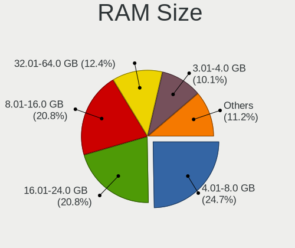
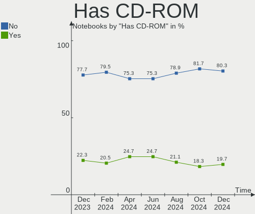
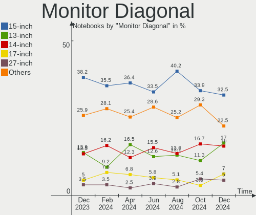

Debian Hardware Trends (Notebooks)
----------------------------------

A project to identify most popular hardware characteristics and track their change
over time based on data collected by Debian users at https://Linux-Hardware.org.

Anyone can contribute to this report by the [hw-probe](https://github.com/linuxhw/hw-probe) tool:

    sudo -E hw-probe -all -upload

Full-feature report is available here: https://linux-hardware.org/?view=trends&formfactor=notebook

Period: Sep, 2021.

Contents
--------

* [ System ](#system)
  - [ OS                       ](#os)
  - [ OS Family                ](#os-family)
  - [ Kernel                   ](#kernel)
  - [ Kernel Family            ](#kernel-family)
  - [ Kernel Major Ver.        ](#kernel-major-ver)
  - [ Arch                     ](#arch)
  - [ DE                       ](#de)
  - [ Display Server           ](#display-server)
  - [ Display Manager          ](#display-manager)
  - [ OS Lang                  ](#os-lang)
  - [ Boot Mode                ](#boot-mode)
  - [ Filesystem               ](#filesystem)
  - [ Part. scheme             ](#part-scheme)
  - [ Dual Boot with Linux/BSD ](#dual-boot-with-linuxbsd)
  - [ Dual Boot (Win)          ](#dual-boot-win)

* [ Board ](#board)
  - [ Vendor                   ](#vendor)
  - [ Model                    ](#model)
  - [ Model Family             ](#model-family)
  - [ MFG Year                 ](#mfg-year)
  - [ Form Factor              ](#form-factor)
  - [ Secure Boot              ](#secure-boot)
  - [ Coreboot                 ](#coreboot)
  - [ RAM Size                 ](#ram-size)
  - [ RAM Used                 ](#ram-used)
  - [ Total Drives             ](#total-drives)
  - [ Has CD-ROM               ](#has-cd-rom)
  - [ Has Ethernet             ](#has-ethernet)
  - [ Has WiFi                 ](#has-wifi)
  - [ Has Bluetooth            ](#has-bluetooth)

* [ Location ](#location)
  - [ Country                  ](#country)
  - [ City                     ](#city)

* [ Drives ](#drives)
  - [ Drive Vendor             ](#drive-vendor)
  - [ Drive Model              ](#drive-model)
  - [ HDD Vendor               ](#hdd-vendor)
  - [ SSD Vendor               ](#ssd-vendor)
  - [ Drive Kind               ](#drive-kind)
  - [ Drive Connector          ](#drive-connector)
  - [ Drive Size               ](#drive-size)
  - [ Space Total              ](#space-total)
  - [ Space Used               ](#space-used)
  - [ Malfunc. Drives          ](#malfunc-drives)
  - [ Malfunc. Drive Vendor    ](#malfunc-drive-vendor)
  - [ Malfunc. HDD Vendor      ](#malfunc-hdd-vendor)
  - [ Malfunc. Drive Kind      ](#malfunc-drive-kind)
  - [ Failed Drives            ](#failed-drives)
  - [ Failed Drive Vendor      ](#failed-drive-vendor)
  - [ Drive Status             ](#drive-status)

* [ Storage controller ](#storage-controller)
  - [ Storage Vendor           ](#storage-vendor)
  - [ Storage Model            ](#storage-model)
  - [ Storage Kind             ](#storage-kind)

* [ Processor ](#processor)
  - [ CPU Vendor               ](#cpu-vendor)
  - [ CPU Model                ](#cpu-model)
  - [ CPU Model Family         ](#cpu-model-family)
  - [ CPU Cores                ](#cpu-cores)
  - [ CPU Sockets              ](#cpu-sockets)
  - [ CPU Threads              ](#cpu-threads)
  - [ CPU Op-Modes             ](#cpu-op-modes)
  - [ CPU Microcode            ](#cpu-microcode)
  - [ CPU Microarch            ](#cpu-microarch)

* [ Graphics ](#graphics)
  - [ GPU Vendor               ](#gpu-vendor)
  - [ GPU Model                ](#gpu-model)
  - [ GPU Combo                ](#gpu-combo)
  - [ GPU Driver               ](#gpu-driver)
  - [ GPU Memory               ](#gpu-memory)

* [ Monitor ](#monitor)
  - [ Monitor Vendor           ](#monitor-vendor)
  - [ Monitor Model            ](#monitor-model)
  - [ Monitor Resolution       ](#monitor-resolution)
  - [ Monitor Diagonal         ](#monitor-diagonal)
  - [ Monitor Width            ](#monitor-width)
  - [ Aspect Ratio             ](#aspect-ratio)
  - [ Monitor Area             ](#monitor-area)
  - [ Pixel Density            ](#pixel-density)
  - [ Multiple Monitors        ](#multiple-monitors)

* [ Network ](#network)
  - [ Net Controller Vendor    ](#net-controller-vendor)
  - [ Net Controller Model     ](#net-controller-model)
  - [ Wireless Vendor          ](#wireless-vendor)
  - [ Wireless Model           ](#wireless-model)
  - [ Ethernet Vendor          ](#ethernet-vendor)
  - [ Ethernet Model           ](#ethernet-model)
  - [ Net Controller Kind      ](#net-controller-kind)
  - [ Used Controller          ](#used-controller)
  - [ NICs                     ](#nics)
  - [ IPv6                     ](#ipv6)

* [ Bluetooth ](#bluetooth)
  - [ Bluetooth Vendor         ](#bluetooth-vendor)
  - [ Bluetooth Model          ](#bluetooth-model)

* [ Sound ](#sound)
  - [ Sound Vendor             ](#sound-vendor)
  - [ Sound Model              ](#sound-model)

* [ Memory ](#memory)
  - [ Memory Vendor            ](#memory-vendor)
  - [ Memory Model             ](#memory-model)
  - [ Memory Kind              ](#memory-kind)
  - [ Memory Form Factor       ](#memory-form-factor)
  - [ Memory Size              ](#memory-size)
  - [ Memory Speed             ](#memory-speed)

* [ Printers & scanners ](#printers--scanners)
  - [ Printer Vendor           ](#printer-vendor)
  - [ Printer Model            ](#printer-model)
  - [ Scanner Vendor           ](#scanner-vendor)
  - [ Scanner Model            ](#scanner-model)

* [ Camera ](#camera)
  - [ Camera Vendor            ](#camera-vendor)
  - [ Camera Model             ](#camera-model)

* [ Security ](#security)
  - [ Fingerprint Vendor       ](#fingerprint-vendor)
  - [ Fingerprint Model        ](#fingerprint-model)
  - [ Chipcard Vendor          ](#chipcard-vendor)
  - [ Chipcard Model           ](#chipcard-model)

* [ Unsupported ](#unsupported)
  - [ Unsupported Devices      ](#unsupported-devices)
  - [ Unsupported Device Types ](#unsupported-device-types)

System
------

OS
--

Installed operating systems

| Name              | Notebooks | Percent |
|-------------------|-----------|---------|
| Debian 11         | 147       | 86.47%  |
| Debian 10         | 14        | 8.24%   |
| Debian Testing    | 6         | 3.53%   |
| Debian 9          | 2         | 1.18%   |
| Debian 11-updates | 1         | 0.59%   |

OS Family
---------

OS without a version

| Name   | Notebooks | Percent |
|--------|-----------|---------|
| Debian | 170       | 100%    |

Kernel
------

Version of the Linux kernel

| Version                    | Notebooks | Percent |
|----------------------------|-----------|---------|
| 5.10.0-8-amd64             | 127       | 74.71%  |
| 5.10.0-7-amd64             | 15        | 8.82%   |
| 4.19.0-17-amd64            | 4         | 2.35%   |
| 5.10.0-8-686-pae           | 3         | 1.76%   |
| 5.10.0-5mx-amd64           | 3         | 1.76%   |
| 5.14.0-1-amd64             | 2         | 1.18%   |
| 5.10.0-0.bpo.8-amd64       | 2         | 1.18%   |
| 4.9.0-16-amd64             | 2         | 1.18%   |
| 5.9.0-0.bpo.5-amd64        | 1         | 0.59%   |
| 5.8.0-3-amd64              | 1         | 0.59%   |
| 5.14.6-ndmnet-sid-1        | 1         | 0.59%   |
| 5.14.0+                    | 1         | 0.59%   |
| 5.13.3                     | 1         | 0.59%   |
| 5.13.15-xanmod1            | 1         | 0.59%   |
| 5.13.0-trunk-amd64         | 1         | 0.59%   |
| 5.13.0-12.3-liquorix-amd64 | 1         | 0.59%   |
| 5.10.0-0.bpo.5-amd64       | 1         | 0.59%   |
| 4.9.0-264-antix.1-486-smp  | 1         | 0.59%   |
| 4.19.0-17-686-pae          | 1         | 0.59%   |
| 4.19.0-17-686              | 1         | 0.59%   |

Kernel Family
-------------

Linux kernel without a distro release

| Version | Notebooks | Percent |
|---------|-----------|---------|
| 5.10.0  | 151       | 88.82%  |
| 4.19.0  | 6         | 3.53%   |
| 5.14.0  | 3         | 1.76%   |
| 4.9.0   | 3         | 1.76%   |
| 5.13.0  | 2         | 1.18%   |
| 5.9.0   | 1         | 0.59%   |
| 5.8.0   | 1         | 0.59%   |
| 5.14.6  | 1         | 0.59%   |
| 5.13.3  | 1         | 0.59%   |
| 5.13.15 | 1         | 0.59%   |

Kernel Major Ver.
-----------------

Linux kernel major version

| Version | Notebooks | Percent |
|---------|-----------|---------|
| 5.10    | 151       | 88.82%  |
| 4.19    | 6         | 3.53%   |
| 5.14    | 4         | 2.35%   |
| 5.13    | 4         | 2.35%   |
| 4.9     | 3         | 1.76%   |
| 5.9     | 1         | 0.59%   |
| 5.8     | 1         | 0.59%   |

Arch
----

OS architecture (x86_64, i586, etc.)

| Name   | Notebooks | Percent |
|--------|-----------|---------|
| x86_64 | 164       | 96.47%  |
| i686   | 6         | 3.53%   |

DE
--

Desktop Environment

| Name             | Notebooks | Percent |
|------------------|-----------|---------|
| GNOME            | 53        | 31.18%  |
| Unknown          | 43        | 25.29%  |
| XFCE             | 19        | 11.18%  |
| KDE5             | 19        | 11.18%  |
| MATE             | 8         | 4.71%   |
| KDE              | 5         | 2.94%   |
| GNOME Flashback  | 5         | 2.94%   |
| Cinnamon         | 5         | 2.94%   |
| LXDE             | 4         | 2.35%   |
| GNOME Classic    | 3         | 1.76%   |
| X-Cinnamon       | 2         | 1.18%   |
| lightdm-xsession | 2         | 1.18%   |
| i3               | 1         | 0.59%   |
| bspwm            | 1         | 0.59%   |

Display Server
--------------

X11 or Wayland

| Name    | Notebooks | Percent |
|---------|-----------|---------|
| X11     | 90        | 52.94%  |
| Wayland | 40        | 23.53%  |
| Unknown | 36        | 21.18%  |
| Tty     | 4         | 2.35%   |

Display Manager
---------------

SDDM, LightDM, etc.

| Name    | Notebooks | Percent |
|---------|-----------|---------|
| Unknown | 76        | 44.71%  |
| GDM     | 45        | 26.47%  |
| LightDM | 28        | 16.47%  |
| SDDM    | 19        | 11.18%  |
| XDM     | 1         | 0.59%   |
| GDM3    | 1         | 0.59%   |

OS Lang
-------

Language

| Lang    | Notebooks | Percent |
|---------|-----------|---------|
| en_US   | 47        | 27.65%  |
| ru_RU   | 21        | 12.35%  |
| Unknown | 20        | 11.76%  |
| es_ES   | 18        | 10.59%  |
| it_IT   | 8         | 4.71%   |
| de_DE   | 7         | 4.12%   |
| en_GB   | 6         | 3.53%   |
| pt_BR   | 5         | 2.94%   |
| zh_CN   | 4         | 2.35%   |
| pl_PL   | 4         | 2.35%   |
| pt_PT   | 3         | 1.76%   |
| fr_FR   | 3         | 1.76%   |
| uk_UA   | 2         | 1.18%   |
| es_AR   | 2         | 1.18%   |
| en_IE   | 2         | 1.18%   |
| en_AU   | 2         | 1.18%   |
| zh_TW   | 1         | 0.59%   |
| ro_RO   | 1         | 0.59%   |
| nb_NO   | 1         | 0.59%   |
| ja_JP   | 1         | 0.59%   |
| fi_FI   | 1         | 0.59%   |
| et_EE   | 1         | 0.59%   |
| es_MX   | 1         | 0.59%   |
| es_CL   | 1         | 0.59%   |
| en_ZM   | 1         | 0.59%   |
| en_ZA   | 1         | 0.59%   |
| en_IN   | 1         | 0.59%   |
| en_DK   | 1         | 0.59%   |
| en_CA   | 1         | 0.59%   |
| de_AT   | 1         | 0.59%   |
| cs_CZ   | 1         | 0.59%   |
| C       | 1         | 0.59%   |

Boot Mode
---------

EFI or BIOS

| Mode | Notebooks | Percent |
|------|-----------|---------|
| EFI  | 102       | 60%     |
| BIOS | 68        | 40%     |

Filesystem
----------

Type of filesystem

| Type    | Notebooks | Percent |
|---------|-----------|---------|
| Ext4    | 116       | 68.24%  |
| Overlay | 41        | 24.12%  |
| Btrfs   | 7         | 4.12%   |
| Xfs     | 4         | 2.35%   |
| Ext3    | 1         | 0.59%   |
| Unknown | 1         | 0.59%   |

Part. scheme
------------

Scheme of partitioning

| Type    | Notebooks | Percent |
|---------|-----------|---------|
| GPT     | 102       | 60%     |
| Unknown | 35        | 20.59%  |
| MBR     | 33        | 19.41%  |

Dual Boot with Linux/BSD
------------------------

Hosting more than one Linux/BSD

| Dual boot | Notebooks | Percent |
|-----------|-----------|---------|
| No        | 157       | 92.35%  |
| Yes       | 13        | 7.65%   |

Dual Boot (Win)
---------------

Hosting Linux and Windows

| Dual boot | Notebooks | Percent |
|-----------|-----------|---------|
| No        | 113       | 66.47%  |
| Yes       | 57        | 33.53%  |

Board
-----

Vendor
------

Motherboard manufacturer

| Name                 | Notebooks | Percent |
|----------------------|-----------|---------|
| Lenovo               | 55        | 32.35%  |
| ASUSTek Computer     | 18        | 10.59%  |
| Hewlett-Packard      | 17        | 10%     |
| Dell                 | 17        | 10%     |
| Acer                 | 17        | 10%     |
| Apple                | 13        | 7.65%   |
| Google               | 8         | 4.71%   |
| MSI                  | 5         | 2.94%   |
| Toshiba              | 4         | 2.35%   |
| Timi                 | 3         | 1.76%   |
| HUAWEI               | 3         | 1.76%   |
| Sony                 | 1         | 0.59%   |
| Schenker             | 1         | 0.59%   |
| Samsung Electronics  | 1         | 0.59%   |
| PC Specialist        | 1         | 0.59%   |
| Packard Bell         | 1         | 0.59%   |
| LG Electronics       | 1         | 0.59%   |
| Intel Client Systems | 1         | 0.59%   |
| Intel                | 1         | 0.59%   |
| GTZS                 | 1         | 0.59%   |
| Aquarius             | 1         | 0.59%   |

Model
-----

Motherboard model

| Name                                       | Notebooks | Percent |
|--------------------------------------------|-----------|---------|
| Google Enguarde                            | 8         | 4.71%   |
| Acer Aspire A315-23                        | 8         | 4.71%   |
| Apple MacBookAir7,1                        | 5         | 2.94%   |
| Apple MacBookAir7,2                        | 4         | 2.35%   |
| Timi TM1613                                | 2         | 1.18%   |
| Lenovo ThinkPad 13 2nd Gen 20J10046US      | 2         | 1.18%   |
| Lenovo IdeaPad 330-15ARR 81D2              | 2         | 1.18%   |
| Lenovo G50-45 80E3                         | 2         | 1.18%   |
| HP Pavilion Gaming Laptop 15-ec2xxx        | 2         | 1.18%   |
| Dell Latitude 7480                         | 2         | 1.18%   |
| Toshiba Satellite L500                     | 1         | 0.59%   |
| Toshiba Satellite C655D                    | 1         | 0.59%   |
| Toshiba Satellite C55-B                    | 1         | 0.59%   |
| Toshiba PORTEGE R830                       | 1         | 0.59%   |
| Timi TM1801                                | 1         | 0.59%   |
| Sony VGN-CR21Z_N                           | 1         | 0.59%   |
| Schenker XMG NEO (TGL/M21)                 | 1         | 0.59%   |
| Samsung NC10                               | 1         | 0.59%   |
| PC Specialist Standard                     | 1         | 0.59%   |
| Packard Bell EasyNote TS11HR               | 1         | 0.59%   |
| MSI U270 series                            | 1         | 0.59%   |
| MSI GF75 Thin 9SC                          | 1         | 0.59%   |
| MSI GF63 8RD                               | 1         | 0.59%   |
| MSI GE70 2QE                               | 1         | 0.59%   |
| MSI Bravo 15 A4DDR                         | 1         | 0.59%   |
| LG A410-K.BE43P1                           | 1         | 0.59%   |
| Lenovo Y520-15IKBN 80WK                    | 1         | 0.59%   |
| Lenovo V510-15IKB 80WQ                     | 1         | 0.59%   |
| Lenovo V330-15IKB 81AX                     | 1         | 0.59%   |
| Lenovo V15-IIL 82C5                        | 1         | 0.59%   |
| Lenovo V15-ADA 82C7                        | 1         | 0.59%   |
| Lenovo ThinkPad X260 20F5S08Q00            | 1         | 0.59%   |
| Lenovo ThinkPad X250 20CLS2DK00            | 1         | 0.59%   |
| Lenovo ThinkPad X230 2325B12               | 1         | 0.59%   |
| Lenovo ThinkPad X1 Carbon Gen 9 20XW004QUS | 1         | 0.59%   |
| Lenovo ThinkPad X1 Carbon 5th 20HQS15DO1   | 1         | 0.59%   |
| Lenovo ThinkPad X1 Carbon 4th 20FCS0TQ00   | 1         | 0.59%   |
| Lenovo ThinkPad T590 20N4000BFR            | 1         | 0.59%   |
| Lenovo ThinkPad T580 20L9CTO1WW            | 1         | 0.59%   |
| Lenovo ThinkPad T480S 20L7002HCA           | 1         | 0.59%   |
| Lenovo ThinkPad T480 20L5CTO1WW            | 1         | 0.59%   |
| Lenovo ThinkPad T460s 20FAS0UM00           | 1         | 0.59%   |
| Lenovo ThinkPad T430 2349N7G               | 1         | 0.59%   |
| Lenovo ThinkPad T430 2349D10               | 1         | 0.59%   |
| Lenovo ThinkPad T15 Gen 1 20S6000NIX       | 1         | 0.59%   |
| Lenovo ThinkPad T14s Gen 1 20T0004PGE      | 1         | 0.59%   |
| Lenovo ThinkPad T14 Gen 2i 20W0004MUK      | 1         | 0.59%   |
| Lenovo ThinkPad R60 9462A45                | 1         | 0.59%   |
| Lenovo ThinkPad P53 20QQA004CD             | 1         | 0.59%   |
| Lenovo ThinkPad P50 20EN0006MS             | 1         | 0.59%   |
| Lenovo ThinkPad P14s Gen 1 20Y1CTO1WW      | 1         | 0.59%   |
| Lenovo ThinkPad P14s Gen 1 20Y10004CK      | 1         | 0.59%   |
| Lenovo ThinkPad E590 20NB0029GE            | 1         | 0.59%   |
| Lenovo ThinkPad E475 20H40006US            | 1         | 0.59%   |
| Lenovo ThinkPad E460 20EUA00AAC            | 1         | 0.59%   |
| Lenovo ThinkPad E15 Gen 2 20T8000MPB       | 1         | 0.59%   |
| Lenovo ThinkPad E14 Gen 2 20TA002CPG       | 1         | 0.59%   |
| Lenovo ThinkPad E14 Gen 2 20T60029RT       | 1         | 0.59%   |
| Lenovo ThinkPad E14 20RB0028BR             | 1         | 0.59%   |
| Lenovo ThinkPad E14 20RA0036MX             | 1         | 0.59%   |

Model Family
------------

Motherboard model prefix

| Name                          | Notebooks | Percent |
|-------------------------------|-----------|---------|
| Lenovo ThinkPad               | 31        | 18.24%  |
| Acer Aspire                   | 13        | 7.65%   |
| Lenovo IdeaPad                | 11        | 6.47%   |
| Apple MacBookAir7             | 9         | 5.29%   |
| Google Enguarde               | 8         | 4.71%   |
| Dell Latitude                 | 6         | 3.53%   |
| Dell Inspiron                 | 6         | 3.53%   |
| HP Pavilion                   | 5         | 2.94%   |
| Toshiba Satellite             | 3         | 1.76%   |
| HP EliteBook                  | 3         | 1.76%   |
| ASUS TUF                      | 3         | 1.76%   |
| Timi TM1613                   | 2         | 1.18%   |
| Lenovo ThinkBook              | 2         | 1.18%   |
| Lenovo G50-45                 | 2         | 1.18%   |
| HP ProBook                    | 2         | 1.18%   |
| Dell Vostro                   | 2         | 1.18%   |
| Dell Precision                | 2         | 1.18%   |
| ASUS ASUS                     | 2         | 1.18%   |
| Acer TravelMate               | 2         | 1.18%   |
| Toshiba PORTEGE               | 1         | 0.59%   |
| Timi TM1801                   | 1         | 0.59%   |
| Sony VGN-CR21Z                | 1         | 0.59%   |
| Schenker XMG                  | 1         | 0.59%   |
| Samsung NC10                  | 1         | 0.59%   |
| PC Specialist Standard        | 1         | 0.59%   |
| Packard Bell EasyNote         | 1         | 0.59%   |
| MSI U270                      | 1         | 0.59%   |
| MSI GF75                      | 1         | 0.59%   |
| MSI GF63                      | 1         | 0.59%   |
| MSI GE70                      | 1         | 0.59%   |
| MSI Bravo                     | 1         | 0.59%   |
| LG A410-K.BE43P1              | 1         | 0.59%   |
| Lenovo Y520-15IKBN            | 1         | 0.59%   |
| Lenovo V510-15IKB             | 1         | 0.59%   |
| Lenovo V330-15IKB             | 1         | 0.59%   |
| Lenovo V15-IIL                | 1         | 0.59%   |
| Lenovo V15-ADA                | 1         | 0.59%   |
| Lenovo QIWY3                  | 1         | 0.59%   |
| Lenovo Mixx-700-12ISK         | 1         | 0.59%   |
| Lenovo G70-35                 | 1         | 0.59%   |
| Lenovo G580                   | 1         | 0.59%   |
| Intel Intel                   | 1         | 0.59%   |
| Intel Client Systems LAPBC710 | 1         | 0.59%   |
| HUAWEI NBLK-WAX9X             | 1         | 0.59%   |
| HUAWEI HN-WX9X                | 1         | 0.59%   |
| HUAWEI BOHK-WAX9X             | 1         | 0.59%   |
| HP Presario                   | 1         | 0.59%   |
| HP Notebook                   | 1         | 0.59%   |
| HP Laptop                     | 1         | 0.59%   |
| HP G61                        | 1         | 0.59%   |
| HP Compaq                     | 1         | 0.59%   |
| HP 255                        | 1         | 0.59%   |
| HP 15                         | 1         | 0.59%   |
| Dell G3                       | 1         | 0.59%   |
| ASUS ZenBook                  | 1         | 0.59%   |
| ASUS X556UAK                  | 1         | 0.59%   |
| ASUS X555LD                   | 1         | 0.59%   |
| ASUS X550CA                   | 1         | 0.59%   |
| ASUS X540YA                   | 1         | 0.59%   |
| ASUS X540NA                   | 1         | 0.59%   |

MFG Year
--------

Motherboard manufacture year

| Year | Notebooks | Percent |
|------|-----------|---------|
| 2021 | 45        | 26.47%  |
| 2020 | 42        | 24.71%  |
| 2019 | 18        | 10.59%  |
| 2018 | 9         | 5.29%   |
| 2012 | 8         | 4.71%   |
| 2011 | 8         | 4.71%   |
| 2016 | 7         | 4.12%   |
| 2013 | 7         | 4.12%   |
| 2015 | 5         | 2.94%   |
| 2014 | 5         | 2.94%   |
| 2009 | 5         | 2.94%   |
| 2010 | 4         | 2.35%   |
| 2008 | 4         | 2.35%   |
| 2006 | 2         | 1.18%   |
| 2004 | 1         | 0.59%   |

Form Factor
-----------

Physical design of the computer

| Name     | Notebooks | Percent |
|----------|-----------|---------|
| Notebook | 170       | 100%    |

Secure Boot
-----------

Enabled or disabled

| State    | Notebooks | Percent |
|----------|-----------|---------|
| Disabled | 161       | 94.71%  |
| Enabled  | 9         | 5.29%   |

Coreboot
--------

Have coreboot on board

| Used | Notebooks | Percent |
|------|-----------|---------|
| No   | 162       | 95.29%  |
| Yes  | 8         | 4.71%   |

RAM Size
--------

Total RAM memory

| Size in GB  | Notebooks | Percent |
|-------------|-----------|---------|
| 4.01-8.0    | 62        | 36.47%  |
| 3.01-4.0    | 34        | 20%     |
| 8.01-16.0   | 29        | 17.06%  |
| 16.01-24.0  | 27        | 15.88%  |
| 32.01-64.0  | 7         | 4.12%   |
| 1.01-2.0    | 5         | 2.94%   |
| 2.01-3.0    | 2         | 1.18%   |
| 64.01-256.0 | 2         | 1.18%   |
| 0.51-1.0    | 2         | 1.18%   |

RAM Used
--------

Used RAM memory

| Used GB    | Notebooks | Percent |
|------------|-----------|---------|
| 1.01-2.0   | 64        | 37.65%  |
| 2.01-3.0   | 39        | 22.94%  |
| 0.51-1.0   | 21        | 12.35%  |
| 4.01-8.0   | 20        | 11.76%  |
| 3.01-4.0   | 14        | 8.24%   |
| 0.01-0.5   | 6         | 3.53%   |
| 8.01-16.0  | 4         | 2.35%   |
| 16.01-24.0 | 2         | 1.18%   |

Total Drives
------------

Number of drives on board

| Drives | Notebooks | Percent |
|--------|-----------|---------|
| 1      | 137       | 80.59%  |
| 2      | 29        | 17.06%  |
| 4      | 2         | 1.18%   |
| 3      | 2         | 1.18%   |

Has CD-ROM
----------

Has CD-ROM on board

| Presented | Notebooks | Percent |
|-----------|-----------|---------|
| No        | 124       | 72.94%  |
| Yes       | 46        | 27.06%  |

Has Ethernet
------------

Has Ethernet on board

| Presented | Notebooks | Percent |
|-----------|-----------|---------|
| Yes       | 134       | 78.82%  |
| No        | 36        | 21.18%  |

Has WiFi
--------

Has WiFi module

| Presented | Notebooks | Percent |
|-----------|-----------|---------|
| Yes       | 169       | 99.41%  |
| No        | 1         | 0.59%   |

Has Bluetooth
-------------

Has Bluetooth module

| Presented | Notebooks | Percent |
|-----------|-----------|---------|
| Yes       | 140       | 82.35%  |
| No        | 30        | 17.65%  |

Location
--------

Country
-------

Geographic location (country)

| Country      | Notebooks | Percent |
|--------------|-----------|---------|
| USA          | 39        | 22.94%  |
| Russia       | 23        | 13.53%  |
| Spain        | 21        | 12.35%  |
| Germany      | 9         | 5.29%   |
| Brazil       | 8         | 4.71%   |
| Italy        | 6         | 3.53%   |
| France       | 6         | 3.53%   |
| Romania      | 5         | 2.94%   |
| Portugal     | 5         | 2.94%   |
| Poland       | 5         | 2.94%   |
| China        | 4         | 2.35%   |
| UK           | 3         | 1.76%   |
| Argentina    | 3         | 1.76%   |
| Ukraine      | 2         | 1.18%   |
| Ireland      | 2         | 1.18%   |
| India        | 2         | 1.18%   |
| Finland      | 2         | 1.18%   |
| Czechia      | 2         | 1.18%   |
| Chile        | 2         | 1.18%   |
| Australia    | 2         | 1.18%   |
| Zambia       | 1         | 0.59%   |
| Vietnam      | 1         | 0.59%   |
| Taiwan       | 1         | 0.59%   |
| Sweden       | 1         | 0.59%   |
| South Africa | 1         | 0.59%   |
| Pakistan     | 1         | 0.59%   |
| Norway       | 1         | 0.59%   |
| Mexico       | 1         | 0.59%   |
| Latvia       | 1         | 0.59%   |
| Japan        | 1         | 0.59%   |
| Israel       | 1         | 0.59%   |
| Indonesia    | 1         | 0.59%   |
| Guatemala    | 1         | 0.59%   |
| Georgia      | 1         | 0.59%   |
| Fiji         | 1         | 0.59%   |
| Estonia      | 1         | 0.59%   |
| Canada       | 1         | 0.59%   |
| Belgium      | 1         | 0.59%   |
| Austria      | 1         | 0.59%   |

City
----

Geographic location (city)

| City                   | Notebooks | Percent |
|------------------------|-----------|---------|
| Portland               | 20        | 11.76%  |
| Voronezh               | 15        | 8.82%   |
| M??laga                | 14        | 8.24%   |
| St Petersburg          | 3         | 1.76%   |
| Milan                  | 3         | 1.76%   |
| Iasi                   | 3         | 1.76%   |
| Hampden                | 3         | 1.76%   |
| Ternopil               | 2         | 1.18%   |
| S??o Paulo             | 2         | 1.18%   |
| San Miguel de Tucum??n | 2         | 1.18%   |
| Helsinki               | 2         | 1.18%   |
| Grand Rapids           | 2         | 1.18%   |
| Dublin                 | 2         | 1.18%   |
| Zwiesel                | 1         | 0.59%   |
| Zhengzhou              | 1         | 0.59%   |
| Yekaterinburg          | 1         | 0.59%   |
| Wroclaw                | 1         | 0.59%   |
| Warsaw                 | 1         | 0.59%   |
| Vladivostok            | 1         | 0.59%   |
| Vijayawada             | 1         | 0.59%   |
| Valencia               | 1         | 0.59%   |
| Tucson                 | 1         | 0.59%   |
| Trieste                | 1         | 0.59%   |
| Tbilisi                | 1         | 0.59%   |
| Tartu                  | 1         | 0.59%   |
| Sydney                 | 1         | 0.59%   |
| Sunnyvale              | 1         | 0.59%   |
| Sueca                  | 1         | 0.59%   |
| Suceava                | 1         | 0.59%   |
| Sherbrooke             | 1         | 0.59%   |
| Sevastopol'            | 1         | 0.59%   |
| Salzburg               | 1         | 0.59%   |
| Saint-Fons             | 1         | 0.59%   |
| Roseville              | 1         | 0.59%   |
| Rock Hill              | 1         | 0.59%   |
| Rio Grande             | 1         | 0.59%   |
| Riga                   | 1         | 0.59%   |
| Quinta Do Conde        | 1         | 0.59%   |
| Prague                 | 1         | 0.59%   |
| Porto Alegre           | 1         | 0.59%   |
| Port Montt             | 1         | 0.59%   |
| Peniche                | 1         | 0.59%   |
| Pardubice              | 1         | 0.59%   |
| Pamplona               | 1         | 0.59%   |
| Ostro?‚?™ka            | 1         | 0.59%   |
| Osnabr??ck             | 1         | 0.59%   |
| Omaha                  | 1         | 0.59%   |
| Obernfeld              | 1         | 0.59%   |
| Norheimsund            | 1         | 0.59%   |
| New Taipei             | 1         | 0.59%   |
| Netanya                | 1         | 0.59%   |
| Natal                  | 1         | 0.59%   |
| Naples                 | 1         | 0.59%   |
| Nanning                | 1         | 0.59%   |
| Nancy                  | 1         | 0.59%   |
| Nagpur                 | 1         | 0.59%   |
| Nadi                   | 1         | 0.59%   |
| Moscow                 | 1         | 0.59%   |
| Moita                  | 1         | 0.59%   |
| Matao                  | 1         | 0.59%   |

Drives
------

Drive Vendor
------------

Hard drive vendors

| Vendor                    | Notebooks | Drives | Percent |
|---------------------------|-----------|--------|---------|
| Samsung Electronics       | 27        | 28     | 13.37%  |
| WDC                       | 26        | 29     | 12.87%  |
| Seagate                   | 20        | 20     | 9.9%    |
| Kingston                  | 17        | 17     | 8.42%   |
| SK Hynix                  | 12        | 12     | 5.94%   |
| Unknown                   | 11        | 11     | 5.45%   |
| Apple                     | 11        | 12     | 5.45%   |
| HGST                      | 10        | 10     | 4.95%   |
| Crucial                   | 10        | 10     | 4.95%   |
| Toshiba                   | 9         | 10     | 4.46%   |
| Intel                     | 6         | 6      | 2.97%   |
| Hitachi                   | 6         | 6      | 2.97%   |
| Micron Technology         | 5         | 5      | 2.48%   |
| A-DATA Technology         | 5         | 5      | 2.48%   |
| SanDisk                   | 3         | 3      | 1.49%   |
| Solid State Storage       | 2         | 2      | 0.99%   |
| Silicon Motion            | 2         | 2      | 0.99%   |
| Lexar                     | 2         | 2      | 0.99%   |
| KIOXIA                    | 2         | 2      | 0.99%   |
| Fujitsu                   | 2         | 2      | 0.99%   |
| China                     | 2         | 2      | 0.99%   |
| USB3.0                    | 1         | 1      | 0.5%    |
| SABRENT                   | 1         | 1      | 0.5%    |
| RDM-II                    | 1         | 1      | 0.5%    |
| PLEXTOR                   | 1         | 1      | 0.5%    |
| Micron/Crucial Technology | 1         | 1      | 0.5%    |
| MAXTOR                    | 1         | 1      | 0.5%    |
| Mass                      | 1         | 1      | 0.5%    |
| LITEON                    | 1         | 1      | 0.5%    |
| Lenovo                    | 1         | 1      | 0.5%    |
| Corsair                   | 1         | 1      | 0.5%    |
| BIWIN                     | 1         | 1      | 0.5%    |
| Apacer                    | 1         | 1      | 0.5%    |

Drive Model
-----------

Hard drive models

| Model                                | Notebooks | Percent |
|--------------------------------------|-----------|---------|
| Seagate ST1000LM035-1RK172 1TB       | 8         | 3.86%   |
| Seagate ST1000LM024 HN-M101MBB 1TB   | 6         | 2.9%    |
| Apple SSD AP0128H 121GB              | 5         | 2.42%   |
| Unknown AGND3R  16GB                 | 4         | 1.93%   |
| Kingston SA400S37480G 480GB SSD      | 4         | 1.93%   |
| Apple SSD SM0128G 121GB              | 4         | 1.93%   |
| WDC PC SN730 SDBQNTY-512G-1001 512GB | 3         | 1.45%   |
| Unknown HAG2e  16GB                  | 3         | 1.45%   |
| HGST HTS725050A7E630 500GB           | 3         | 1.45%   |
| WDC WD10SPZX-60Z10T0 1TB             | 2         | 0.97%   |
| WDC WD10SPZX-24Z10 1TB               | 2         | 0.97%   |
| Toshiba MQ04ABF100 1TB               | 2         | 0.97%   |
| Toshiba KBG40ZNT256G MEMORY 256GB    | 2         | 0.97%   |
| Silicon Motion NVMe SSD Drive 1TB    | 2         | 0.97%   |
| Seagate ST9320325AS 320GB            | 2         | 0.97%   |
| Samsung SSD 870 EVO 500GB            | 2         | 0.97%   |
| Samsung SSD 860 EVO 500GB            | 2         | 0.97%   |
| Samsung SSD 860 EVO 1TB              | 2         | 0.97%   |
| Samsung MZVLB256HAHQ-00000 256GB     | 2         | 0.97%   |
| Samsung MZNTY128HDHP-000L1 128GB SSD | 2         | 0.97%   |
| Samsung MZ7LN256HAJQ-000L2 256GB SSD | 2         | 0.97%   |
| Micron 2210_MTFDHBA512QFD 512GB      | 2         | 0.97%   |
| Lexar 512GB SSD                      | 2         | 0.97%   |
| Kingston SA400S37960G 960GB SSD      | 2         | 0.97%   |
| Kingston SA400S37120G 120GB SSD      | 2         | 0.97%   |
| Intel SSDPEKNW512G8 512GB            | 2         | 0.97%   |
| HGST HTS721010A9E630 1TB             | 2         | 0.97%   |
| Crucial CT500MX500SSD1 500GB         | 2         | 0.97%   |
| China SATA SSD 120GB                 | 2         | 0.97%   |
| WDC WDS500G2B0B-00YS70 500GB SSD     | 1         | 0.48%   |
| WDC WDS240G2G0B-00EPW0 240GB SSD     | 1         | 0.48%   |
| WDC WDS240G2G0A-00JH30 240GB SSD     | 1         | 0.48%   |
| WDC WDS200T2B0B-00YS70 2TB SSD       | 1         | 0.48%   |
| WDC WDS100T2G0A-00JH30 1TB SSD       | 1         | 0.48%   |
| WDC WDBNCE0010PNC 1TB SSD            | 1         | 0.48%   |
| WDC WD5000LPVX-80V0TT0 500GB         | 1         | 0.48%   |
| WDC WD5000LPLX-08ZNTT0 500GB         | 1         | 0.48%   |
| WDC WD5000LPCX-24C6HT0 500GB         | 1         | 0.48%   |
| WDC WD5000BPVT-22HXZT1 500GB         | 1         | 0.48%   |
| WDC WD3200BPVT-22JJ5T0 320GB         | 1         | 0.48%   |
| WDC WD3200BEVT-60ZCT1 320GB          | 1         | 0.48%   |
| WDC WD10SPZX-75Z10T2 1TB             | 1         | 0.48%   |
| WDC WD10SPZX-22Z10T1 1TB             | 1         | 0.48%   |
| WDC WD10SPCX-24HWST1 1TB             | 1         | 0.48%   |
| WDC PC SN730 SDBPNTY-512G-1032 512GB | 1         | 0.48%   |
| WDC PC SN730 SDBPNTY-512G-1027 512GB | 1         | 0.48%   |
| WDC PC SN730 SDBPNTY-512G-1006 512GB | 1         | 0.48%   |
| WDC PC SN730 SDBPNTY-256G-1027 256GB | 1         | 0.48%   |
| WDC PC SN530 NVMe 256GB              | 1         | 0.48%   |
| WDC PC SN520 SDAPNUW-256G            | 1         | 0.48%   |
| WDC PC SN520 SDAPMUW-256G-1101 256GB | 1         | 0.48%   |
| USB3.0 Super Speed 1TB               | 1         | 0.48%   |
| Unknown SDW16G  16GB                 | 1         | 0.48%   |
| Unknown P-SSD1800 8GB                | 1         | 0.48%   |
| Unknown ED4QT  128GB                 | 1         | 0.48%   |
| Unknown EB1QT  32GB                  | 1         | 0.48%   |
| Toshiba NVMe SSD Drive 512GB         | 1         | 0.48%   |
| Toshiba MQ04ABD200 2TB               | 1         | 0.48%   |
| Toshiba MQ01ABD050 500GB             | 1         | 0.48%   |
| Toshiba MK3263GSXN 320GB             | 1         | 0.48%   |

HDD Vendor
----------

Hard disk drive vendors

| Vendor              | Notebooks | Drives | Percent |
|---------------------|-----------|--------|---------|
| Seagate             | 20        | 20     | 34.48%  |
| WDC                 | 13        | 13     | 22.41%  |
| HGST                | 10        | 10     | 17.24%  |
| Hitachi             | 6         | 6      | 10.34%  |
| Toshiba             | 5         | 5      | 8.62%   |
| Fujitsu             | 2         | 2      | 3.45%   |
| USB3.0              | 1         | 1      | 1.72%   |
| Samsung Electronics | 1         | 1      | 1.72%   |

SSD Vendor
----------

Solid state drive vendors

| Vendor              | Notebooks | Drives | Percent |
|---------------------|-----------|--------|---------|
| Samsung Electronics | 17        | 17     | 23.29%  |
| Kingston            | 15        | 15     | 20.55%  |
| Crucial             | 8         | 8      | 10.96%  |
| WDC                 | 6         | 6      | 8.22%   |
| Apple               | 5         | 5      | 6.85%   |
| SK Hynix            | 2         | 2      | 2.74%   |
| SanDisk             | 2         | 2      | 2.74%   |
| Micron Technology   | 2         | 2      | 2.74%   |
| Lexar               | 2         | 2      | 2.74%   |
| Intel               | 2         | 2      | 2.74%   |
| China               | 2         | 2      | 2.74%   |
| A-DATA Technology   | 2         | 2      | 2.74%   |
| Unknown             | 1         | 1      | 1.37%   |
| SABRENT             | 1         | 1      | 1.37%   |
| RDM-II              | 1         | 1      | 1.37%   |
| PLEXTOR             | 1         | 1      | 1.37%   |
| MAXTOR              | 1         | 1      | 1.37%   |
| LITEON              | 1         | 1      | 1.37%   |
| Corsair             | 1         | 1      | 1.37%   |
| Apacer              | 1         | 1      | 1.37%   |

Drive Kind
----------

HDD or SSD

| Kind    | Notebooks | Drives | Percent |
|---------|-----------|--------|---------|
| SSD     | 68        | 73     | 34.52%  |
| NVMe    | 61        | 66     | 30.96%  |
| HDD     | 57        | 58     | 28.93%  |
| MMC     | 10        | 10     | 5.08%   |
| Unknown | 1         | 1      | 0.51%   |

Drive Connector
---------------

SATA, SAS, NVMe, etc.

| Type | Notebooks | Drives | Percent |
|------|-----------|--------|---------|
| SATA | 114       | 127    | 60%     |
| NVMe | 61        | 66     | 32.11%  |
| MMC  | 10        | 10     | 5.26%   |
| SAS  | 5         | 5      | 2.63%   |

Drive Size
----------

Size of hard drive

| Size in TB | Notebooks | Drives | Percent |
|------------|-----------|--------|---------|
| 0.01-0.5   | 76        | 82     | 61.29%  |
| 0.51-1.0   | 45        | 46     | 36.29%  |
| 1.01-2.0   | 2         | 2      | 1.61%   |
| 3.01-4.0   | 1         | 1      | 0.81%   |

Space Total
-----------

Amount of disk space available on the file system

| Size in GB     | Notebooks | Percent |
|----------------|-----------|---------|
| 101-250        | 63        | 37.06%  |
| 251-500        | 37        | 21.76%  |
| 501-1000       | 19        | 11.18%  |
| Unknown        | 18        | 10.59%  |
| 1-20           | 13        | 7.65%   |
| 1001-2000      | 9         | 5.29%   |
| 51-100         | 5         | 2.94%   |
| 2001-3000      | 3         | 1.76%   |
| More than 3000 | 2         | 1.18%   |
| 21-50          | 1         | 0.59%   |

Space Used
----------

Amount of used disk space

| Used GB        | Notebooks | Percent |
|----------------|-----------|---------|
| 1-20           | 71        | 41.76%  |
| 51-100         | 25        | 14.71%  |
| 21-50          | 23        | 13.53%  |
| Unknown        | 18        | 10.59%  |
| 251-500        | 12        | 7.06%   |
| 101-250        | 10        | 5.88%   |
| 501-1000       | 6         | 3.53%   |
| More than 3000 | 2         | 1.18%   |
| 1001-2000      | 2         | 1.18%   |
| 0              | 1         | 0.59%   |

Malfunc. Drives
---------------

Drive models with a malfunction

| Model                                          | Notebooks | Drives | Percent |
|------------------------------------------------|-----------|--------|---------|
| WDC WD10SPZX-24Z10 1TB                         | 1         | 1      | 6.25%   |
| Toshiba MQ01ABD050 500GB                       | 1         | 1      | 6.25%   |
| SK Hynix SH920 mSATA 128GB SSD                 | 1         | 1      | 6.25%   |
| Seagate ST500LT012-9WS142 500GB                | 1         | 1      | 6.25%   |
| Seagate ST1000LM024 HN-M101MBB 1TB             | 1         | 1      | 6.25%   |
| Samsung Electronics HM251HI 250GB              | 1         | 1      | 6.25%   |
| Micron Technology 1100_MTFDDAK256TBN 256GB SSD | 1         | 1      | 6.25%   |
| LITEON IT SCS-256L9S 256GB SSD                 | 1         | 1      | 6.25%   |
| Hitachi HTS547575A9E384 752GB                  | 1         | 1      | 6.25%   |
| Hitachi HTS545050B9A300 500GB                  | 1         | 1      | 6.25%   |
| Hitachi HTS541075A9E680 752GB                  | 1         | 1      | 6.25%   |
| Hitachi HTS541060G9AT00 64GB                   | 1         | 1      | 6.25%   |
| HGST HTS545050A7 500GB                         | 1         | 1      | 6.25%   |
| HGST HTS541010A9E680 1TB                       | 1         | 1      | 6.25%   |
| Fujitsu MHZ2320BH G2 320GB                     | 1         | 1      | 6.25%   |
| Crucial CT128MX100SSD1 128GB                   | 1         | 1      | 6.25%   |

Malfunc. Drive Vendor
---------------------

Vendors of faulty drives

| Vendor              | Notebooks | Drives | Percent |
|---------------------|-----------|--------|---------|
| Hitachi             | 4         | 4      | 25%     |
| Seagate             | 2         | 2      | 12.5%   |
| HGST                | 2         | 2      | 12.5%   |
| WDC                 | 1         | 1      | 6.25%   |
| Toshiba             | 1         | 1      | 6.25%   |
| SK Hynix            | 1         | 1      | 6.25%   |
| Samsung Electronics | 1         | 1      | 6.25%   |
| Micron Technology   | 1         | 1      | 6.25%   |
| LITEON              | 1         | 1      | 6.25%   |
| Fujitsu             | 1         | 1      | 6.25%   |
| Crucial             | 1         | 1      | 6.25%   |

Malfunc. HDD Vendor
-------------------

Vendors of faulty HDD drives

| Vendor              | Notebooks | Drives | Percent |
|---------------------|-----------|--------|---------|
| Hitachi             | 4         | 4      | 33.33%  |
| Seagate             | 2         | 2      | 16.67%  |
| HGST                | 2         | 2      | 16.67%  |
| WDC                 | 1         | 1      | 8.33%   |
| Toshiba             | 1         | 1      | 8.33%   |
| Samsung Electronics | 1         | 1      | 8.33%   |
| Fujitsu             | 1         | 1      | 8.33%   |

Malfunc. Drive Kind
-------------------

Kinds of faulty drives

| Kind | Notebooks | Drives | Percent |
|------|-----------|--------|---------|
| HDD  | 12        | 12     | 75%     |
| SSD  | 4         | 4      | 25%     |

Failed Drives
-------------

Failed drive models

Zero info for selected period =(

Failed Drive Vendor
-------------------

Failed drive vendors

Zero info for selected period =(

Drive Status
------------

Number of failed and malfunc. drives

| Status   | Notebooks | Drives | Percent |
|----------|-----------|--------|---------|
| Works    | 112       | 134    | 62.57%  |
| Detected | 51        | 58     | 28.49%  |
| Malfunc  | 16        | 16     | 8.94%   |

Storage controller
------------------

Storage Vendor
--------------

Storage controller vendors

| Vendor                         | Notebooks | Percent |
|--------------------------------|-----------|---------|
| Intel                          | 94        | 48.21%  |
| AMD                            | 35        | 17.95%  |
| Samsung Electronics            | 14        | 7.18%   |
| Sandisk                        | 11        | 5.64%   |
| SK Hynix                       | 10        | 5.13%   |
| Apple                          | 6         | 3.08%   |
| Silicon Motion                 | 4         | 2.05%   |
| KIOXIA                         | 4         | 2.05%   |
| Micron/Crucial Technology      | 3         | 1.54%   |
| Micron Technology              | 3         | 1.54%   |
| ADATA Technology               | 3         | 1.54%   |
| Toshiba America Info Systems   | 2         | 1.03%   |
| Solid State Storage Technology | 2         | 1.03%   |
| Nvidia                         | 2         | 1.03%   |
| Kingston Technology Company    | 2         | 1.03%   |

Storage Model
-------------

Storage controller models

| Model                                                                          | Notebooks | Percent |
|--------------------------------------------------------------------------------|-----------|---------|
| AMD FCH SATA Controller [AHCI mode]                                            | 31        | 15.12%  |
| Intel Sunrise Point-LP SATA Controller [AHCI mode]                             | 20        | 9.76%   |
| Intel 7 Series Chipset Family 6-port SATA Controller [AHCI mode]               | 13        | 6.34%   |
| Sandisk WD Black SN750 / PC SN730 NVMe SSD                                     | 7         | 3.41%   |
| Intel Cannon Lake Mobile PCH SATA AHCI Controller                              | 7         | 3.41%   |
| Samsung Electronics SATA controller                                            | 5         | 2.44%   |
| Intel Comet Lake SATA AHCI Controller                                          | 5         | 2.44%   |
| Apple S1X NVMe Controller                                                      | 5         | 2.44%   |
| SK Hynix BC511                                                                 | 4         | 1.95%   |
| Silicon Motion SM2263EN/SM2263XT SSD Controller                                | 4         | 1.95%   |
| Samsung NVMe SSD Controller SM981/PM981/PM983                                  | 4         | 1.95%   |
| Samsung NVMe SSD Controller 980                                                | 4         | 1.95%   |
| KIOXIA Non-Volatile memory controller                                          | 4         | 1.95%   |
| Intel 8 Series/C220 Series Chipset Family 6-port SATA Controller 1 [AHCI mode] | 4         | 1.95%   |
| Intel 8 Series SATA Controller 1 [AHCI mode]                                   | 4         | 1.95%   |
| Micron Non-Volatile memory controller                                          | 3         | 1.46%   |
| Intel Wildcat Point-LP SATA Controller [AHCI Mode]                             | 3         | 1.46%   |
| Intel SSD 660P Series                                                          | 3         | 1.46%   |
| Intel Ice Lake-LP SATA Controller [AHCI mode]                                  | 3         | 1.46%   |
| Intel 82801GBM/GHM (ICH7-M Family) SATA Controller [IDE mode]                  | 3         | 1.46%   |
| Intel 6 Series/C200 Series Chipset Family 6 port Mobile SATA AHCI Controller   | 3         | 1.46%   |
| Intel 5 Series/3400 Series Chipset 4 port SATA AHCI Controller                 | 3         | 1.46%   |
| AMD SB7x0/SB8x0/SB9x0 SATA Controller [AHCI mode]                              | 3         | 1.46%   |
| Toshiba America Info Systems XG6 NVMe SSD Controller                           | 2         | 0.98%   |
| Solid State Storage Non-Volatile memory controller                             | 2         | 0.98%   |
| SK Hynix Non-Volatile memory controller                                        | 2         | 0.98%   |
| SK Hynix Gold P31 SSD                                                          | 2         | 0.98%   |
| SK Hynix BC501 NVMe Solid State Drive                                          | 2         | 0.98%   |
| Sandisk Non-Volatile memory controller                                         | 2         | 0.98%   |
| Intel HM170/QM170 Chipset SATA Controller [AHCI Mode]                          | 2         | 0.98%   |
| Intel Celeron N3350/Pentium N4200/Atom E3900 Series SATA AHCI Controller       | 2         | 0.98%   |
| Intel 82801IBM/IEM (ICH9M/ICH9M-E) 4 port SATA Controller [AHCI mode]          | 2         | 0.98%   |
| Intel 82801HM/HEM (ICH8M/ICH8M-E) SATA Controller [AHCI mode]                  | 2         | 0.98%   |
| Intel 82801HM/HEM (ICH8M/ICH8M-E) IDE Controller                               | 2         | 0.98%   |
| Intel 500 Series Chipset Family SATA AHCI Controller                           | 2         | 0.98%   |
| Intel 400 Series Chipset Family SATA AHCI Controller                           | 2         | 0.98%   |
| ADATA Non-Volatile memory controller                                           | 2         | 0.98%   |
| Sandisk WD Blue SN500 / PC SN520 NVMe SSD                                      | 1         | 0.49%   |
| Sandisk PC SN520 NVMe SSD                                                      | 1         | 0.49%   |
| Samsung NVMe SSD Controller SM961/PM961/SM963                                  | 1         | 0.49%   |
| Samsung NVMe SSD Controller PM9A1/PM9A3/980PRO                                 | 1         | 0.49%   |
| Nvidia MCP79 SATA Controller                                                   | 1         | 0.49%   |
| Nvidia MCP79 AHCI Controller                                                   | 1         | 0.49%   |
| Micron/Crucial P2 NVMe PCIe SSD                                                | 1         | 0.49%   |
| Micron/Crucial NVMe Controller                                                 | 1         | 0.49%   |
| Micron/Crucial Non-Volatile memory controller                                  | 1         | 0.49%   |
| Kingston Company Company Non-Volatile memory controller                        | 1         | 0.49%   |
| Kingston Company A2000 NVMe SSD                                                | 1         | 0.49%   |
| Intel Volume Management Device NVMe RAID Controller                            | 1         | 0.49%   |
| Intel Q170/Q150/B150/H170/H110/Z170/CM236 Chipset SATA Controller [AHCI Mode]  | 1         | 0.49%   |
| Intel Non-Volatile memory controller                                           | 1         | 0.49%   |
| Intel NM10/ICH7 Family SATA Controller [AHCI mode]                             | 1         | 0.49%   |
| Intel Cannon Point-LP SATA Controller [AHCI Mode]                              | 1         | 0.49%   |
| Intel Cannon Lake PCH SATA AHCI Controller                                     | 1         | 0.49%   |
| Intel 82801HM/HEM (ICH8M/ICH8M-E) SATA Controller [IDE mode]                   | 1         | 0.49%   |
| Intel 82801G (ICH7 Family) IDE Controller                                      | 1         | 0.49%   |
| Intel 82801DBM (ICH4-M) IDE Controller                                         | 1         | 0.49%   |
| Intel 82801 Mobile SATA Controller [RAID mode]                                 | 1         | 0.49%   |
| Intel 7 Series Chipset Family 4-port SATA Controller [IDE mode]                | 1         | 0.49%   |
| Intel 7 Series Chipset Family 2-port SATA Controller [IDE mode]                | 1         | 0.49%   |

Storage Kind
------------

Kind of storage controller (IDE, SATA, NVMe, SAS, ...)

| Kind | Notebooks | Percent |
|------|-----------|---------|
| SATA | 123       | 61.81%  |
| NVMe | 61        | 30.65%  |
| IDE  | 13        | 6.53%   |
| RAID | 2         | 1.01%   |

Processor
---------

CPU Vendor
----------

Processor vendors

| Vendor | Notebooks | Percent |
|--------|-----------|---------|
| Intel  | 126       | 74.12%  |
| AMD    | 44        | 25.88%  |

CPU Model
---------

Processor models

| Model                                         | Notebooks | Percent |
|-----------------------------------------------|-----------|---------|
| AMD Ryzen 5 3500U with Radeon Vega Mobile Gfx | 15        | 8.82%   |
| Intel Core i5-5250U CPU @ 1.60GHz             | 9         | 5.29%   |
| Intel Celeron CPU N2840 @ 2.16GHz             | 8         | 4.71%   |
| Intel Core i5-10210U CPU @ 1.60GHz            | 5         | 2.94%   |
| Intel Core i7-6600U CPU @ 2.60GHz             | 4         | 2.35%   |
| Intel Core i5-8250U CPU @ 1.60GHz             | 4         | 2.35%   |
| Intel Core i7-8750H CPU @ 2.20GHz             | 3         | 1.76%   |
| Intel Core i5-6200U CPU @ 2.30GHz             | 3         | 1.76%   |
| Intel Core i5-3210M CPU @ 2.50GHz             | 3         | 1.76%   |
| Intel Core i7-9750H CPU @ 2.60GHz             | 2         | 1.18%   |
| Intel Core i7-8565U CPU @ 1.80GHz             | 2         | 1.18%   |
| Intel Core i7-8550U CPU @ 1.80GHz             | 2         | 1.18%   |
| Intel Core i7-7500U CPU @ 2.70GHz             | 2         | 1.18%   |
| Intel Core i7-3630QM CPU @ 2.40GHz            | 2         | 1.18%   |
| Intel Core i5-6300U CPU @ 2.40GHz             | 2         | 1.18%   |
| Intel Core i5-5200U CPU @ 2.20GHz             | 2         | 1.18%   |
| Intel Core i5-3337U CPU @ 1.80GHz             | 2         | 1.18%   |
| Intel Core i5-1035G1 CPU @ 1.00GHz            | 2         | 1.18%   |
| Intel Celeron CPU 3865U @ 1.80GHz             | 2         | 1.18%   |
| Intel Atom CPU N270 @ 1.60GHz                 | 2         | 1.18%   |
| Intel 11th Gen Core i7-1165G7 @ 2.80GHz       | 2         | 1.18%   |
| Intel 11th Gen Core i5-1135G7 @ 2.40GHz       | 2         | 1.18%   |
| AMD Ryzen 7 PRO 4750U with Radeon Graphics    | 2         | 1.18%   |
| AMD Ryzen 5 4500U with Radeon Graphics        | 2         | 1.18%   |
| AMD C-60 APU with Radeon HD Graphics          | 2         | 1.18%   |
| AMD A6-6310 APU with AMD Radeon R4 Graphics   | 2         | 1.18%   |
| Intel Pentium M processor 1600MHz             | 1         | 0.59%   |
| Intel Pentium Dual CPU T3200 @ 2.00GHz        | 1         | 0.59%   |
| Intel Pentium CPU P6200 @ 2.13GHz             | 1         | 0.59%   |
| Intel Pentium CPU N4200 @ 1.10GHz             | 1         | 0.59%   |
| Intel Core m3-6Y30 CPU @ 0.90GHz              | 1         | 0.59%   |
| Intel Core i7-7700HQ CPU @ 2.80GHz            | 1         | 0.59%   |
| Intel Core i7-7600U CPU @ 2.80GHz             | 1         | 0.59%   |
| Intel Core i7-6820HQ CPU @ 2.70GHz            | 1         | 0.59%   |
| Intel Core i7-6500U CPU @ 2.50GHz             | 1         | 0.59%   |
| Intel Core i7-4800MQ CPU @ 2.70GHz            | 1         | 0.59%   |
| Intel Core i7-4720HQ CPU @ 2.60GHz            | 1         | 0.59%   |
| Intel Core i7-4700HQ CPU @ 2.40GHz            | 1         | 0.59%   |
| Intel Core i7-3720QM CPU @ 2.60GHz            | 1         | 0.59%   |
| Intel Core i7-3632QM CPU @ 2.20GHz            | 1         | 0.59%   |
| Intel Core i7-10850H CPU @ 2.70GHz            | 1         | 0.59%   |
| Intel Core i7-10750H CPU @ 2.60GHz            | 1         | 0.59%   |
| Intel Core i7-10510U CPU @ 1.80GHz            | 1         | 0.59%   |
| Intel Core i7 CPU Q 720 @ 1.60GHz             | 1         | 0.59%   |
| Intel Core i5-9300H CPU @ 2.40GHz             | 1         | 0.59%   |
| Intel Core i5-8300H CPU @ 2.30GHz             | 1         | 0.59%   |
| Intel Core i5-8265U CPU @ 1.60GHz             | 1         | 0.59%   |
| Intel Core i5-7360U CPU @ 2.30GHz             | 1         | 0.59%   |
| Intel Core i5-7200U CPU @ 2.50GHz             | 1         | 0.59%   |
| Intel Core i5-6300HQ CPU @ 2.30GHz            | 1         | 0.59%   |
| Intel Core i5-5300U CPU @ 2.30GHz             | 1         | 0.59%   |
| Intel Core i5-5257U CPU @ 2.70GHz             | 1         | 0.59%   |
| Intel Core i5-4310U CPU @ 2.00GHz             | 1         | 0.59%   |
| Intel Core i5-4300U CPU @ 1.90GHz             | 1         | 0.59%   |
| Intel Core i5-4200M CPU @ 2.50GHz             | 1         | 0.59%   |
| Intel Core i5-3320M CPU @ 2.60GHz             | 1         | 0.59%   |
| Intel Core i5-3317U CPU @ 1.70GHz             | 1         | 0.59%   |
| Intel Core i5-3230M CPU @ 2.60GHz             | 1         | 0.59%   |
| Intel Core i5-2520M CPU @ 2.50GHz             | 1         | 0.59%   |
| Intel Core i5-2450M CPU @ 2.50GHz             | 1         | 0.59%   |

CPU Model Family
----------------

Processor model prefix

| Model                   | Notebooks | Percent |
|-------------------------|-----------|---------|
| Intel Core i5           | 50        | 29.41%  |
| Intel Core i7           | 30        | 17.65%  |
| AMD Ryzen 5             | 21        | 12.35%  |
| Intel Celeron           | 12        | 7.06%   |
| Intel Core i3           | 11        | 6.47%   |
| Other                   | 8         | 4.71%   |
| Intel Core 2 Duo        | 6         | 3.53%   |
| AMD Ryzen 7             | 5         | 2.94%   |
| Intel Atom              | 3         | 1.76%   |
| AMD A6                  | 3         | 1.76%   |
| Intel Pentium           | 2         | 1.18%   |
| AMD Ryzen 7 PRO         | 2         | 1.18%   |
| AMD Ryzen 3             | 2         | 1.18%   |
| AMD C-60                | 2         | 1.18%   |
| AMD A4                  | 2         | 1.18%   |
| Intel Pentium M         | 1         | 0.59%   |
| Intel Pentium Dual      | 1         | 0.59%   |
| Intel Core m3           | 1         | 0.59%   |
| Intel Core 2            | 1         | 0.59%   |
| Intel Celeron M         | 1         | 0.59%   |
| AMD Turion II Dual-Core | 1         | 0.59%   |
| AMD E1                  | 1         | 0.59%   |
| AMD E                   | 1         | 0.59%   |
| AMD C-50                | 1         | 0.59%   |
| AMD Athlon              | 1         | 0.59%   |
| AMD A8                  | 1         | 0.59%   |

CPU Cores
---------

Number of processor cores

| Number | Notebooks | Percent |
|--------|-----------|---------|
| 2      | 84        | 49.41%  |
| 4      | 61        | 35.88%  |
| 6      | 12        | 7.06%   |
| 8      | 7         | 4.12%   |
| 1      | 6         | 3.53%   |

CPU Sockets
-----------

Number of sockets

| Number | Notebooks | Percent |
|--------|-----------|---------|
| 1      | 170       | 100%    |

CPU Threads
-----------

Threads per core (Hyper-Threading)

| Number | Notebooks | Percent |
|--------|-----------|---------|
| 2      | 127       | 74.71%  |
| 1      | 43        | 25.29%  |

CPU Op-Modes
------------

CPU Operation Modes (32-bit, 64-bit)

| Op mode        | Notebooks | Percent |
|----------------|-----------|---------|
| 32-bit, 64-bit | 166       | 97.65%  |
| 32-bit         | 4         | 2.35%   |

CPU Microcode
-------------

Microcode number

| Number     | Notebooks | Percent |
|------------|-----------|---------|
| Unknown    | 41        | 24.12%  |
| 0x08108109 | 15        | 8.82%   |
| 0x306d4    | 12        | 7.06%   |
| 0x30678    | 8         | 4.71%   |
| 0x806ec    | 7         | 4.12%   |
| 0x406e3    | 7         | 4.12%   |
| 0x306a9    | 7         | 4.12%   |
| 0x806e9    | 6         | 3.53%   |
| 0x906ea    | 4         | 2.35%   |
| 0x1067a    | 4         | 2.35%   |
| 0x806ea    | 3         | 1.76%   |
| 0x706e5    | 3         | 1.76%   |
| 0x40651    | 3         | 1.76%   |
| 0x206a7    | 3         | 1.76%   |
| 0x08108102 | 3         | 1.76%   |
| 0xa0652    | 2         | 1.18%   |
| 0x806d1    | 2         | 1.18%   |
| 0x806c1    | 2         | 1.18%   |
| 0x306c3    | 2         | 1.18%   |
| 0x20655    | 2         | 1.18%   |
| 0x106c2    | 2         | 1.18%   |
| 0x0a50000c | 2         | 1.18%   |
| 0x08600104 | 2         | 1.18%   |
| 0x08600103 | 2         | 1.18%   |
| 0x0810100b | 2         | 1.18%   |
| 0x07030105 | 2         | 1.18%   |
| 0x906ed    | 1         | 0.59%   |
| 0x906eb    | 1         | 0.59%   |
| 0x906e9    | 1         | 0.59%   |
| 0x6fd      | 1         | 0.59%   |
| 0x6f6      | 1         | 0.59%   |
| 0x6e8      | 1         | 0.59%   |
| 0x695      | 1         | 0.59%   |
| 0x506e3    | 1         | 0.59%   |
| 0x506ca    | 1         | 0.59%   |
| 0x506c9    | 1         | 0.59%   |
| 0x20652    | 1         | 0.59%   |
| 0x106e5    | 1         | 0.59%   |
| 0x106ca    | 1         | 0.59%   |
| 0x10676    | 1         | 0.59%   |
| 0x08608103 | 1         | 0.59%   |
| 0x08600106 | 1         | 0.59%   |
| 0x07030106 | 1         | 0.59%   |
| 0x06006705 | 1         | 0.59%   |
| 0x0600611a | 1         | 0.59%   |
| 0x05000119 | 1         | 0.59%   |
| 0x05000028 | 1         | 0.59%   |
| 0x03000027 | 1         | 0.59%   |

CPU Microarch
-------------

Microarchitecture

| Name        | Notebooks | Percent |
|-------------|-----------|---------|
| KabyLake    | 33        | 19.41%  |
| Zen+        | 19        | 11.18%  |
| Skylake     | 13        | 7.65%   |
| IvyBridge   | 13        | 7.65%   |
| Broadwell   | 13        | 7.65%   |
| Silvermont  | 8         | 4.71%   |
| Haswell     | 8         | 4.71%   |
| Zen 2       | 7         | 4.12%   |
| TigerLake   | 5         | 2.94%   |
| SandyBridge | 5         | 2.94%   |
| Penryn      | 5         | 2.94%   |
| IceLake     | 5         | 2.94%   |
| Westmere    | 4         | 2.35%   |
| Puma        | 4         | 2.35%   |
| Bobcat      | 4         | 2.35%   |
| Core        | 3         | 1.76%   |
| CometLake   | 3         | 1.76%   |
| Bonnell     | 3         | 1.76%   |
| Zen 3       | 2         | 1.18%   |
| Zen         | 2         | 1.18%   |
| P6          | 2         | 1.18%   |
| Goldmont    | 2         | 1.18%   |
| Excavator   | 2         | 1.18%   |
| Nehalem     | 1         | 0.59%   |
| K10 Llano   | 1         | 0.59%   |
| K10         | 1         | 0.59%   |
| Jaguar      | 1         | 0.59%   |
| Unknown     | 1         | 0.59%   |

Graphics
--------

GPU Vendor
----------

Vendors of graphics cards

| Vendor | Notebooks | Percent |
|--------|-----------|---------|
| Intel  | 116       | 54.98%  |
| AMD    | 52        | 24.64%  |
| Nvidia | 43        | 20.38%  |

GPU Model
---------

Graphics card models

| Model                                                                                 | Notebooks | Percent |
|---------------------------------------------------------------------------------------|-----------|---------|
| AMD Picasso                                                                           | 19        | 8.64%   |
| Intel 3rd Gen Core processor Graphics Controller                                      | 13        | 5.91%   |
| Intel Skylake GT2 [HD Graphics 520]                                                   | 10        | 4.55%   |
| Intel HD Graphics 6000                                                                | 9         | 4.09%   |
| Intel Atom Processor Z36xxx/Z37xxx Series Graphics & Display                          | 8         | 3.64%   |
| Intel CometLake-U GT2 [UHD Graphics]                                                  | 7         | 3.18%   |
| Intel CoffeeLake-H GT2 [UHD Graphics 630]                                             | 7         | 3.18%   |
| AMD Renoir                                                                            | 7         | 3.18%   |
| Intel UHD Graphics 620                                                                | 6         | 2.73%   |
| Nvidia GF117M [GeForce 610M/710M/810M/820M / GT 620M/625M/630M/720M]                  | 5         | 2.27%   |
| Intel TigerLake-LP GT2 [Iris Xe Graphics]                                             | 5         | 2.27%   |
| Intel 2nd Generation Core Processor Family Integrated Graphics Controller             | 5         | 2.27%   |
| Intel HD Graphics 620                                                                 | 4         | 1.82%   |
| Intel Haswell-ULT Integrated Graphics Controller                                      | 4         | 1.82%   |
| Intel 4th Gen Core Processor Integrated Graphics Controller                           | 4         | 1.82%   |
| AMD Topaz XT [Radeon R7 M260/M265 / M340/M360 / M440/M445 / 530/535 / 620/625 Mobile] | 4         | 1.82%   |
| Nvidia TU117M                                                                         | 3         | 1.36%   |
| Intel WhiskeyLake-U GT2 [UHD Graphics 620]                                            | 3         | 1.36%   |
| Intel Mobile 945GM/GMS/GME, 943/940GML Express Integrated Graphics Controller         | 3         | 1.36%   |
| Intel Iris Plus Graphics G1 (Ice Lake)                                                | 3         | 1.36%   |
| Intel HD Graphics 5500                                                                | 3         | 1.36%   |
| Intel CometLake-H GT2 [UHD Graphics]                                                  | 3         | 1.36%   |
| AMD Mullins [Radeon R4/R5 Graphics]                                                   | 3         | 1.36%   |
| Nvidia TU117M [GeForce GTX 1650 Mobile / Max-Q]                                       | 2         | 0.91%   |
| Nvidia GP108M [GeForce MX230]                                                         | 2         | 0.91%   |
| Nvidia GP107M [GeForce GTX 1050 Mobile]                                               | 2         | 0.91%   |
| Nvidia GM108M [GeForce 940MX]                                                         | 2         | 0.91%   |
| Nvidia GM107M [GeForce GTX 950M]                                                      | 2         | 0.91%   |
| Nvidia GF108M [GeForce GT 620M/630M/635M/640M LE]                                     | 2         | 0.91%   |
| Intel Mobile GM965/GL960 Integrated Graphics Controller (secondary)                   | 2         | 0.91%   |
| Intel Mobile GM965/GL960 Integrated Graphics Controller (primary)                     | 2         | 0.91%   |
| Intel Mobile 945GSE Express Integrated Graphics Controller                            | 2         | 0.91%   |
| Intel Kaby Lake-U GT1 Integrated Graphics Controller                                  | 2         | 0.91%   |
| Intel HD Graphics 530                                                                 | 2         | 0.91%   |
| Intel Core Processor Integrated Graphics Controller                                   | 2         | 0.91%   |
| AMD Wrestler [Radeon HD 6290]                                                         | 2         | 0.91%   |
| AMD Raven Ridge [Radeon Vega Series / Radeon Vega Mobile Series]                      | 2         | 0.91%   |
| AMD Lexa PRO [Radeon 540/540X/550/550X / RX 540X/550/550X]                            | 2         | 0.91%   |
| AMD Cezanne                                                                           | 2         | 0.91%   |
| Nvidia TU117M [GeForce GTX 1650 Ti Mobile]                                            | 1         | 0.45%   |
| Nvidia TU117GLM [T600 Mobile]                                                         | 1         | 0.45%   |
| Nvidia TU117GLM [Quadro T1000 Mobile]                                                 | 1         | 0.45%   |
| Nvidia GT218M [GeForce 310M]                                                          | 1         | 0.45%   |
| Nvidia GP107M [GeForce GTX 1050 Ti Mobile]                                            | 1         | 0.45%   |
| Nvidia GP107M [GeForce GTX 1050 Ti Max-Q]                                             | 1         | 0.45%   |
| Nvidia GP107M [GeForce GTX 1050 3 GB Max-Q]                                           | 1         | 0.45%   |
| Nvidia GP106M [GeForce GTX 1060 Mobile]                                               | 1         | 0.45%   |
| Nvidia GM108M [GeForce 840M]                                                          | 1         | 0.45%   |
| Nvidia GM107M [GeForce GTX 960M]                                                      | 1         | 0.45%   |
| Nvidia GM107GLM [Quadro M2000M]                                                       | 1         | 0.45%   |
| Nvidia GK107M [GeForce GT 750M]                                                       | 1         | 0.45%   |
| Nvidia GK107M [GeForce GT 650M Mac Edition]                                           | 1         | 0.45%   |
| Nvidia GK107GLM [Quadro K1100M]                                                       | 1         | 0.45%   |
| Nvidia GF119M [GeForce GT 520M]                                                       | 1         | 0.45%   |
| Nvidia GF108M [GeForce GT 635M]                                                       | 1         | 0.45%   |
| Nvidia GA107M [GeForce RTX 3050 Mobile]                                               | 1         | 0.45%   |
| Nvidia GA104M [GeForce RTX 3070 Mobile / Max-Q]                                       | 1         | 0.45%   |
| Nvidia G98M [GeForce G 103M]                                                          | 1         | 0.45%   |
| Nvidia G98M [GeForce 9200M GS]                                                        | 1         | 0.45%   |
| Nvidia G92GLM [Quadro FX 2800M]                                                       | 1         | 0.45%   |

GPU Combo
---------

Combinations of graphics cards

| Name           | Notebooks | Percent |
|----------------|-----------|---------|
| 1 x Intel      | 78        | 45.88%  |
| 1 x AMD        | 39        | 22.94%  |
| Intel + Nvidia | 32        | 18.82%  |
| 1 x Nvidia     | 7         | 4.12%   |
| Intel + AMD    | 5         | 2.94%   |
| 2 x AMD        | 4         | 2.35%   |
| AMD + Nvidia   | 4         | 2.35%   |
| Other          | 1         | 0.59%   |

GPU Driver
----------

Free vs proprietary

| Driver      | Notebooks | Percent |
|-------------|-----------|---------|
| Free        | 139       | 81.76%  |
| Unknown     | 18        | 10.59%  |
| Proprietary | 13        | 7.65%   |

GPU Memory
----------

Total video memory

| Size in GB | Notebooks | Percent |
|------------|-----------|---------|
| Unknown    | 123       | 72.35%  |
| 0.01-0.5   | 18        | 10.59%  |
| 1.01-2.0   | 11        | 6.47%   |
| 3.01-4.0   | 10        | 5.88%   |
| 0.51-1.0   | 7         | 4.12%   |
| 7.01-8.0   | 1         | 0.59%   |

Monitor
-------

Monitor Vendor
--------------

Monitor vendors

| Vendor                  | Notebooks | Percent |
|-------------------------|-----------|---------|
| AU Optronics            | 30        | 16.85%  |
| LG Display              | 27        | 15.17%  |
| Chimei Innolux          | 25        | 14.04%  |
| BOE                     | 24        | 13.48%  |
| Apple                   | 13        | 7.3%    |
| Samsung Electronics     | 12        | 6.74%   |
| PANDA                   | 6         | 3.37%   |
| Dell                    | 5         | 2.81%   |
| Goldstar                | 4         | 2.25%   |
| Lenovo                  | 3         | 1.69%   |
| InfoVision              | 3         | 1.69%   |
| Chi Mei Optoelectronics | 3         | 1.69%   |
| Sharp                   | 2         | 1.12%   |
| Philips                 | 2         | 1.12%   |
| LG Philips              | 2         | 1.12%   |
| Iiyama                  | 2         | 1.12%   |
| BenQ                    | 2         | 1.12%   |
| AOC                     | 2         | 1.12%   |
| Unknown                 | 1         | 0.56%   |
| Panasonic               | 1         | 0.56%   |
| InnoLux Display         | 1         | 0.56%   |
| Hewlett-Packard         | 1         | 0.56%   |
| HannStar                | 1         | 0.56%   |
| CSO                     | 1         | 0.56%   |
| CPT                     | 1         | 0.56%   |
| BOE Technology Group    | 1         | 0.56%   |
| ASUSTek Computer        | 1         | 0.56%   |
| Ancor Communications    | 1         | 0.56%   |
| Acer                    | 1         | 0.56%   |

Monitor Model
-------------

Monitor models

| Model                                                                    | Notebooks | Percent |
|--------------------------------------------------------------------------|-----------|---------|
| BOE LCD Monitor BOE0609 1366x768 256x144mm 11.6-inch                     | 6         | 3.3%    |
| Chimei Innolux LCD Monitor CMN15DB 1366x768 344x193mm 15.5-inch          | 3         | 1.65%   |
| AU Optronics LCD Monitor AUO38ED 1920x1080 340x190mm 15.3-inch           | 3         | 1.65%   |
| Apple Color LCD APP9CF3 1366x768 260x140mm 11.6-inch                     | 3         | 1.65%   |
| Apple Color LCD APP9CDF 1440x900 286x179mm 13.3-inch                     | 3         | 1.65%   |
| Sharp LCD Monitor SHP1447 1920x1080 290x170mm 13.2-inch                  | 2         | 1.1%    |
| PANDA LCD Monitor NCP004D 1920x1080 344x194mm 15.5-inch                  | 2         | 1.1%    |
| PANDA LCD Monitor NCP0035 1920x1080 309x174mm 14.0-inch                  | 2         | 1.1%    |
| LG Display LCD Monitor LGD0563 1920x1080 344x194mm 15.5-inch             | 2         | 1.1%    |
| InfoVision LCD Monitor IVO0533 1366x768 293x164mm 13.2-inch              | 2         | 1.1%    |
| Chimei Innolux LCD Monitor CMN15E8 1920x1080 344x193mm 15.5-inch         | 2         | 1.1%    |
| Chimei Innolux LCD Monitor CMN15C4 1920x1080 344x193mm 15.5-inch         | 2         | 1.1%    |
| Chimei Innolux LCD Monitor CMN1409 1920x1080 309x173mm 13.9-inch         | 2         | 1.1%    |
| Chimei Innolux LCD Monitor CMN1132 1366x768 260x140mm 11.6-inch          | 2         | 1.1%    |
| Chi Mei Optoelectronics LCD Monitor CMO1680 1366x768 344x193mm 15.5-inch | 2         | 1.1%    |
| AU Optronics LCD Monitor AUO403D 1920x1080 309x173mm 13.9-inch           | 2         | 1.1%    |
| AU Optronics LCD Monitor AUO21ED 1920x1080 344x194mm 15.5-inch           | 2         | 1.1%    |
| AU Optronics LCD Monitor AUO10EC 1366x768 340x190mm 15.3-inch            | 2         | 1.1%    |
| Apple Color LCD APP9CF2 1366x768 260x140mm 11.6-inch                     | 2         | 1.1%    |
| Unknown LCD Monitor FFFF 2288x1287 2550x2550mm 142.0-inch                | 1         | 0.55%   |
| Samsung Electronics U28E590 SAM0C4E 3840x2160 608x345mm 27.5-inch        | 1         | 0.55%   |
| Samsung Electronics T24B530 SAM0947 1920x1080 530x300mm 24.0-inch        | 1         | 0.55%   |
| Samsung Electronics SyncMaster SAM036F 1440x900 428x255mm 19.6-inch      | 1         | 0.55%   |
| Samsung Electronics LCD Monitor SEC4252 1366x768 344x194mm 15.5-inch     | 1         | 0.55%   |
| Samsung Electronics LCD Monitor SEC314C 1920x1080 344x194mm 15.5-inch    | 1         | 0.55%   |
| Samsung Electronics LCD Monitor SEC3030 1024x600 223x125mm 10.1-inch     | 1         | 0.55%   |
| Samsung Electronics LCD Monitor SDC4C48 1920x1080 409x230mm 18.5-inch    | 1         | 0.55%   |
| Samsung Electronics LCD Monitor SDC4852 3840x2160 340x190mm 15.3-inch    | 1         | 0.55%   |
| Samsung Electronics LCD Monitor SDC4347 1366x768 340x190mm 15.3-inch     | 1         | 0.55%   |
| Samsung Electronics LCD Monitor SDC4144 2160x1440 254x169mm 12.0-inch    | 1         | 0.55%   |
| Samsung Electronics LCD Monitor SAM0D4D 1366x768 609x347mm 27.6-inch     | 1         | 0.55%   |
| Samsung Electronics C27F591 SAM0D37 1920x1080 598x336mm 27.0-inch        | 1         | 0.55%   |
| Philips PHL 272V8 PHLC21A 1920x1080 598x336mm 27.0-inch                  | 1         | 0.55%   |
| Philips PHL 244E5 PHLC0C0 1920x1080 530x300mm 24.0-inch                  | 1         | 0.55%   |
| PANDA LM156LF9L01 NCP0028 1920x1080 344x194mm 15.5-inch                  | 1         | 0.55%   |
| PANDA LCD Monitor NCP0036 1920x1080 344x194mm 15.5-inch                  | 1         | 0.55%   |
| Panasonic TV MEIA296 1920x1080 1280x720mm 57.8-inch                      | 1         | 0.55%   |
| LG Philips LCD Monitor LPLBD00 1280x800 331x207mm 15.4-inch              | 1         | 0.55%   |
| LG Philips LCD Monitor LPL00E5 1440x900 304x190mm 14.1-inch              | 1         | 0.55%   |
| LG Display LP171WU7-TLB1 LGD022B 1920x1200 367x230mm 17.1-inch           | 1         | 0.55%   |
| LG Display LP156WH1-TLA3 LGD01C2 1366x768 344x194mm 15.5-inch            | 1         | 0.55%   |
| LG Display LCD Monitor LGD0685 1920x1080 309x174mm 14.0-inch             | 1         | 0.55%   |
| LG Display LCD Monitor LGD0684 1920x1080 344x194mm 15.5-inch             | 1         | 0.55%   |
| LG Display LCD Monitor LGD0682 1920x1200 302x188mm 14.0-inch             | 1         | 0.55%   |
| LG Display LCD Monitor LGD05FE 1920x1080 344x194mm 15.5-inch             | 1         | 0.55%   |
| LG Display LCD Monitor LGD05FA 1920x1080 309x174mm 14.0-inch             | 1         | 0.55%   |
| LG Display LCD Monitor LGD05EC 1920x1080 309x174mm 14.0-inch             | 1         | 0.55%   |
| LG Display LCD Monitor LGD0590 1920x1080 344x194mm 15.5-inch             | 1         | 0.55%   |
| LG Display LCD Monitor LGD058B 2560x1440 309x174mm 14.0-inch             | 1         | 0.55%   |
| LG Display LCD Monitor LGD054F 1920x1080 344x194mm 15.5-inch             | 1         | 0.55%   |
| LG Display LCD Monitor LGD0521 1920x1080 309x174mm 14.0-inch             | 1         | 0.55%   |
| LG Display LCD Monitor LGD0408 1920x1080 276x156mm 12.5-inch             | 1         | 0.55%   |
| LG Display LCD Monitor LGD0404 1366x768 277x156mm 12.5-inch              | 1         | 0.55%   |
| LG Display LCD Monitor LGD03B7 1366x768 309x174mm 14.0-inch              | 1         | 0.55%   |
| LG Display LCD Monitor LGD039F 1366x768 345x194mm 15.6-inch              | 1         | 0.55%   |
| LG Display LCD Monitor LGD0384 1366x768 344x194mm 15.5-inch              | 1         | 0.55%   |
| LG Display LCD Monitor LGD034D 1366x768 344x194mm 15.5-inch              | 1         | 0.55%   |
| LG Display LCD Monitor LGD033F 1366x768 309x174mm 14.0-inch              | 1         | 0.55%   |
| LG Display LCD Monitor LGD0335 1366x768 310x174mm 14.0-inch              | 1         | 0.55%   |
| LG Display LCD Monitor LGD0323 1920x1080 345x194mm 15.6-inch             | 1         | 0.55%   |

Monitor Resolution
------------------

Monitor screen resolution

| Resolution        | Notebooks | Percent |
|-------------------|-----------|---------|
| 1920x1080 (FHD)   | 77        | 46.11%  |
| 1366x768 (WXGA)   | 53        | 31.74%  |
| 1440x900 (WXGA+)  | 6         | 3.59%   |
| 3840x2160 (4K)    | 5         | 2.99%   |
| 2560x1440 (QHD)   | 4         | 2.4%    |
| 1920x1200 (WUXGA) | 4         | 2.4%    |
| 1024x600          | 4         | 2.4%    |
| 2880x1800         | 3         | 1.8%    |
| 1280x800 (WXGA)   | 3         | 1.8%    |
| 2160x1440         | 2         | 1.2%    |
| 1600x900 (HD+)    | 2         | 1.2%    |
| 2560x1600         | 1         | 0.6%    |
| 2560x1080         | 1         | 0.6%    |
| 2288x1287         | 1         | 0.6%    |
| 1024x768 (XGA)    | 1         | 0.6%    |

Monitor Diagonal
----------------

Diagonal size in inches

| Inches  | Notebooks | Percent |
|---------|-----------|---------|
| 15      | 69        | 38.76%  |
| 13      | 25        | 14.04%  |
| 14      | 20        | 11.24%  |
| 11      | 16        | 8.99%   |
| 27      | 7         | 3.93%   |
| 24      | 6         | 3.37%   |
| 17      | 6         | 3.37%   |
| 12      | 6         | 3.37%   |
| 23      | 5         | 2.81%   |
| 31      | 3         | 1.69%   |
| 21      | 3         | 1.69%   |
| 10      | 2         | 1.12%   |
| Unknown | 2         | 1.12%   |
| 142     | 1         | 0.56%   |
| 84      | 1         | 0.56%   |
| 34      | 1         | 0.56%   |
| 25      | 1         | 0.56%   |
| 19      | 1         | 0.56%   |
| 18      | 1         | 0.56%   |
| 16      | 1         | 0.56%   |
| 8       | 1         | 0.56%   |

Monitor Width
-------------

Physical width

| Width in mm    | Notebooks | Percent |
|----------------|-----------|---------|
| 301-350        | 100       | 56.5%   |
| 201-300        | 37        | 20.9%   |
| 501-600        | 17        | 9.6%    |
| 351-400        | 8         | 4.52%   |
| 401-500        | 5         | 2.82%   |
| 601-700        | 4         | 2.26%   |
| Unknown        | 2         | 1.13%   |
| More than 2000 | 1         | 0.56%   |
| 701-800        | 1         | 0.56%   |
| 1501-2000      | 1         | 0.56%   |
| 101-200        | 1         | 0.56%   |

Aspect Ratio
------------

Proportional relationship between the width and the height

| Ratio   | Notebooks | Percent |
|---------|-----------|---------|
| 16/9    | 134       | 85.35%  |
| 16/10   | 16        | 10.19%  |
| 3/2     | 2         | 1.27%   |
| Unknown | 2         | 1.27%   |
| 4/3     | 1         | 0.64%   |
| 21/9    | 1         | 0.64%   |
| 1.00    | 1         | 0.64%   |

Monitor Area
------------

Area in inch²

| Area in inch² | Notebooks | Percent |
|----------------|-----------|---------|
| 101-110        | 70        | 39.33%  |
| 81-90          | 35        | 19.66%  |
| 51-60          | 16        | 8.99%   |
| 71-80          | 10        | 5.62%   |
| 201-250        | 10        | 5.62%   |
| 301-350        | 7         | 3.93%   |
| 61-70          | 6         | 3.37%   |
| 121-130        | 5         | 2.81%   |
| 351-500        | 4         | 2.25%   |
| 251-300        | 3         | 1.69%   |
| 151-200        | 3         | 1.69%   |
| More than 1000 | 2         | 1.12%   |
| 41-50          | 2         | 1.12%   |
| Unknown        | 2         | 1.12%   |
| 1-40           | 1         | 0.56%   |
| 141-150        | 1         | 0.56%   |
| 131-140        | 1         | 0.56%   |

Pixel Density
-------------

Pixels per inch

| Density       | Notebooks | Percent |
|---------------|-----------|---------|
| 121-160       | 85        | 49.13%  |
| 101-120       | 43        | 24.86%  |
| 51-100        | 28        | 16.18%  |
| 161-240       | 11        | 6.36%   |
| More than 240 | 2         | 1.16%   |
| 1-50          | 2         | 1.16%   |
| Unknown       | 2         | 1.16%   |

Multiple Monitors
-----------------

Total monitors connected

| Total | Notebooks | Percent |
|-------|-----------|---------|
| 1     | 122       | 71.76%  |
| 2     | 25        | 14.71%  |
| 0     | 19        | 11.18%  |
| 3     | 4         | 2.35%   |

Network
-------

Net Controller Vendor
---------------------

Controller vendors

| Vendor                   | Notebooks | Percent |
|--------------------------|-----------|---------|
| Realtek Semiconductor    | 90        | 33.33%  |
| Intel                    | 84        | 31.11%  |
| Qualcomm Atheros         | 44        | 16.3%   |
| Broadcom Limited         | 14        | 5.19%   |
| Broadcom                 | 13        | 4.81%   |
| TP-Link                  | 4         | 1.48%   |
| Ralink                   | 3         | 1.11%   |
| Sierra Wireless          | 2         | 0.74%   |
| Marvell Technology Group | 2         | 0.74%   |
| Lenovo                   | 2         | 0.74%   |
| DisplayLink              | 2         | 0.74%   |
| Samsung Electronics      | 1         | 0.37%   |
| Nvidia                   | 1         | 0.37%   |
| Microsoft                | 1         | 0.37%   |
| MEDIATEK                 | 1         | 0.37%   |
| JMicron Technology       | 1         | 0.37%   |
| Google                   | 1         | 0.37%   |
| Dell                     | 1         | 0.37%   |
| Belkin Components        | 1         | 0.37%   |
| Attansic Technology      | 1         | 0.37%   |
| ASUSTek Computer         | 1         | 0.37%   |

Net Controller Model
--------------------

Controller models

| Model                                                                   | Notebooks | Percent |
|-------------------------------------------------------------------------|-----------|---------|
| Realtek RTL8111/8168/8411 PCI Express Gigabit Ethernet Controller       | 59        | 18.27%  |
| Realtek RTL810xE PCI Express Fast Ethernet controller                   | 15        | 4.64%   |
| Qualcomm Atheros QCA9377 802.11ac Wireless Network Adapter              | 15        | 4.64%   |
| Intel Wireless 7260                                                     | 10        | 3.1%    |
| Intel Wireless 8265 / 8275                                              | 9         | 2.79%   |
| Broadcom Limited BCM4360 802.11ac Wireless Network Adapter              | 9         | 2.79%   |
| Realtek RTL8822CE 802.11ac PCIe Wireless Network Adapter                | 8         | 2.48%   |
| Intel Wireless 8260                                                     | 8         | 2.48%   |
| Intel Wi-Fi 6 AX200                                                     | 8         | 2.48%   |
| Realtek RTL8821CE 802.11ac PCIe Wireless Network Adapter                | 6         | 1.86%   |
| Realtek RTL8153 Gigabit Ethernet Adapter                                | 6         | 1.86%   |
| Qualcomm Atheros AR9485 Wireless Network Adapter                        | 6         | 1.86%   |
| Intel Ethernet Connection (4) I219-V                                    | 6         | 1.86%   |
| Intel Comet Lake PCH-LP CNVi WiFi                                       | 6         | 1.86%   |
| Intel Cannon Lake PCH CNVi WiFi                                         | 6         | 1.86%   |
| Qualcomm Atheros QCA9565 / AR9565 Wireless Network Adapter              | 5         | 1.55%   |
| Qualcomm Atheros AR9285 Wireless Network Adapter (PCI-Express)          | 5         | 1.55%   |
| Intel Dual Band Wireless-AC 3165 Plus Bluetooth                         | 5         | 1.55%   |
| Intel Wireless 7265                                                     | 4         | 1.24%   |
| Intel Wi-Fi 6 AX201                                                     | 4         | 1.24%   |
| Intel Ethernet Connection I219-LM                                       | 4         | 1.24%   |
| Realtek RTL8152 Fast Ethernet Adapter                                   | 3         | 0.93%   |
| Qualcomm Atheros AR242x / AR542x Wireless Network Adapter (PCI-Express) | 3         | 0.93%   |
| Intel Centrino Advanced-N 6205 [Taylor Peak]                            | 3         | 0.93%   |
| Intel 82579LM Gigabit Network Connection (Lewisville)                   | 3         | 0.93%   |
| Realtek RTL8852AE 802.11ax PCIe Wireless Network Adapter                | 2         | 0.62%   |
| Realtek RTL8723BE PCIe Wireless Network Adapter                         | 2         | 0.62%   |
| Realtek RTL8191SEvB Wireless LAN Controller                             | 2         | 0.62%   |
| Realtek RTL8188CE 802.11b/g/n WiFi Adapter                              | 2         | 0.62%   |
| Qualcomm Atheros QCA6174 802.11ac Wireless Network Adapter              | 2         | 0.62%   |
| Qualcomm Atheros AR8162 Fast Ethernet                                   | 2         | 0.62%   |
| Qualcomm Atheros AR8161 Gigabit Ethernet                                | 2         | 0.62%   |
| Marvell Group 88E8040 PCI-E Fast Ethernet Controller                    | 2         | 0.62%   |
| Intel Tiger Lake PCH CNVi WiFi                                          | 2         | 0.62%   |
| Intel PRO/Wireless 3945ABG [Golan] Network Connection                   | 2         | 0.62%   |
| Intel Ice Lake-LP PCH CNVi WiFi                                         | 2         | 0.62%   |
| Intel Ethernet Connection I218-LM                                       | 2         | 0.62%   |
| Intel Ethernet Connection (3) I218-LM                                   | 2         | 0.62%   |
| Intel Ethernet Connection (10) I219-V                                   | 2         | 0.62%   |
| Intel Cannon Point-LP CNVi [Wireless-AC]                                | 2         | 0.62%   |
| Intel 82579V Gigabit Network Connection                                 | 2         | 0.62%   |
| Broadcom BCM4313 802.11bgn Wireless Network Adapter                     | 2         | 0.62%   |
| Broadcom BCM4312 802.11b/g LP-PHY                                       | 2         | 0.62%   |
| TP-Link USB 10/100 LAN                                                  | 1         | 0.31%   |
| TP-Link UE300 10/100/1000 LAN (ethernet mode) [Realtek RTL8153]         | 1         | 0.31%   |
| TP-Link TL-WN722N v2                                                    | 1         | 0.31%   |
| TP-Link Archer T4U ver.3                                                | 1         | 0.31%   |
| Sierra Wireless EM7455 Qualcomm Snapdragon X7 LTE-A                     | 1         | 0.31%   |
| Sierra Wireless EM7345 4G LTE                                           | 1         | 0.31%   |
| Samsung Galaxy series, misc. (tethering mode)                           | 1         | 0.31%   |
| Realtek RTL8812AU 802.11a/b/g/n/ac 2T2R DB WLAN Adapter                 | 1         | 0.31%   |
| Realtek RTL8191SEvA Wireless LAN Controller                             | 1         | 0.31%   |
| Realtek RTL8125 2.5GbE Controller                                       | 1         | 0.31%   |
| Realtek 802.11ac NIC                                                    | 1         | 0.31%   |
| Ralink RT5390R 802.11bgn PCIe Wireless Network Adapter                  | 1         | 0.31%   |
| Ralink RT3290 Wireless 802.11n 1T/1R PCIe                               | 1         | 0.31%   |
| Ralink RT3090 Wireless 802.11n 1T/1R PCIe                               | 1         | 0.31%   |
| Qualcomm Atheros QCA8171 Gigabit Ethernet                               | 1         | 0.31%   |
| Qualcomm Atheros QCA6164 802.11ac Wireless Network Adapter              | 1         | 0.31%   |
| Qualcomm Atheros Killer E220x Gigabit Ethernet Controller               | 1         | 0.31%   |

Wireless Vendor
---------------

Wireless vendors

| Vendor                | Notebooks | Percent |
|-----------------------|-----------|---------|
| Intel                 | 81        | 45.76%  |
| Qualcomm Atheros      | 40        | 22.6%   |
| Realtek Semiconductor | 24        | 13.56%  |
| Broadcom Limited      | 12        | 6.78%   |
| Broadcom              | 8         | 4.52%   |
| Ralink                | 3         | 1.69%   |
| TP-Link               | 2         | 1.13%   |
| Sierra Wireless       | 2         | 1.13%   |
| Microsoft             | 1         | 0.56%   |
| MEDIATEK              | 1         | 0.56%   |
| Dell                  | 1         | 0.56%   |
| Belkin Components     | 1         | 0.56%   |
| ASUSTek Computer      | 1         | 0.56%   |

Wireless Model
--------------

Wireless models

| Model                                                                       | Notebooks | Percent |
|-----------------------------------------------------------------------------|-----------|---------|
| Qualcomm Atheros QCA9377 802.11ac Wireless Network Adapter                  | 15        | 8.43%   |
| Intel Wireless 7260                                                         | 10        | 5.62%   |
| Intel Wireless 8265 / 8275                                                  | 9         | 5.06%   |
| Broadcom Limited BCM4360 802.11ac Wireless Network Adapter                  | 9         | 5.06%   |
| Realtek RTL8822CE 802.11ac PCIe Wireless Network Adapter                    | 8         | 4.49%   |
| Intel Wireless 8260                                                         | 8         | 4.49%   |
| Intel Wi-Fi 6 AX200                                                         | 8         | 4.49%   |
| Realtek RTL8821CE 802.11ac PCIe Wireless Network Adapter                    | 6         | 3.37%   |
| Qualcomm Atheros AR9485 Wireless Network Adapter                            | 6         | 3.37%   |
| Intel Comet Lake PCH-LP CNVi WiFi                                           | 6         | 3.37%   |
| Intel Cannon Lake PCH CNVi WiFi                                             | 6         | 3.37%   |
| Qualcomm Atheros QCA9565 / AR9565 Wireless Network Adapter                  | 5         | 2.81%   |
| Qualcomm Atheros AR9285 Wireless Network Adapter (PCI-Express)              | 5         | 2.81%   |
| Intel Dual Band Wireless-AC 3165 Plus Bluetooth                             | 5         | 2.81%   |
| Intel Wireless 7265                                                         | 4         | 2.25%   |
| Intel Wi-Fi 6 AX201                                                         | 4         | 2.25%   |
| Qualcomm Atheros AR242x / AR542x Wireless Network Adapter (PCI-Express)     | 3         | 1.69%   |
| Intel Centrino Advanced-N 6205 [Taylor Peak]                                | 3         | 1.69%   |
| Realtek RTL8852AE 802.11ax PCIe Wireless Network Adapter                    | 2         | 1.12%   |
| Realtek RTL8723BE PCIe Wireless Network Adapter                             | 2         | 1.12%   |
| Realtek RTL8191SEvB Wireless LAN Controller                                 | 2         | 1.12%   |
| Realtek RTL8188CE 802.11b/g/n WiFi Adapter                                  | 2         | 1.12%   |
| Qualcomm Atheros QCA6174 802.11ac Wireless Network Adapter                  | 2         | 1.12%   |
| Intel Tiger Lake PCH CNVi WiFi                                              | 2         | 1.12%   |
| Intel PRO/Wireless 3945ABG [Golan] Network Connection                       | 2         | 1.12%   |
| Intel Ice Lake-LP PCH CNVi WiFi                                             | 2         | 1.12%   |
| Intel Cannon Point-LP CNVi [Wireless-AC]                                    | 2         | 1.12%   |
| Broadcom BCM4313 802.11bgn Wireless Network Adapter                         | 2         | 1.12%   |
| Broadcom BCM4312 802.11b/g LP-PHY                                           | 2         | 1.12%   |
| TP-Link TL-WN722N v2                                                        | 1         | 0.56%   |
| TP-Link Archer T4U ver.3                                                    | 1         | 0.56%   |
| Sierra Wireless EM7455 Qualcomm Snapdragon X7 LTE-A                         | 1         | 0.56%   |
| Sierra Wireless EM7345 4G LTE                                               | 1         | 0.56%   |
| Realtek RTL8812AU 802.11a/b/g/n/ac 2T2R DB WLAN Adapter                     | 1         | 0.56%   |
| Realtek RTL8191SEvA Wireless LAN Controller                                 | 1         | 0.56%   |
| Realtek 802.11ac NIC                                                        | 1         | 0.56%   |
| Ralink RT5390R 802.11bgn PCIe Wireless Network Adapter                      | 1         | 0.56%   |
| Ralink RT3290 Wireless 802.11n 1T/1R PCIe                                   | 1         | 0.56%   |
| Ralink RT3090 Wireless 802.11n 1T/1R PCIe                                   | 1         | 0.56%   |
| Qualcomm Atheros QCA6164 802.11ac Wireless Network Adapter                  | 1         | 0.56%   |
| Qualcomm Atheros AR9462 Wireless Network Adapter                            | 1         | 0.56%   |
| Qualcomm Atheros AR928X Wireless Network Adapter (PCI-Express)              | 1         | 0.56%   |
| Qualcomm Atheros AR9287 Wireless Network Adapter (PCI-Express)              | 1         | 0.56%   |
| Microsoft Wireless XBox Controller Dongle                                   | 1         | 0.56%   |
| MEDIATEK Network controller                                                 | 1         | 0.56%   |
| Intel Wireless-AC 9260                                                      | 1         | 0.56%   |
| Intel Wireless 3165                                                         | 1         | 0.56%   |
| Intel Wireless 3160                                                         | 1         | 0.56%   |
| Intel Wi-Fi 6 AX210/AX211/AX411 160MHz                                      | 1         | 0.56%   |
| Intel PRO/Wireless LAN 2100 3B Mini PCI Adapter                             | 1         | 0.56%   |
| Intel PRO/Wireless 4965 AG or AGN [Kedron] Network Connection               | 1         | 0.56%   |
| Intel Comet Lake PCH CNVi WiFi                                              | 1         | 0.56%   |
| Intel Centrino Wireless-N 2230                                              | 1         | 0.56%   |
| Intel Centrino Wireless-N 2200                                              | 1         | 0.56%   |
| Intel Centrino Ultimate-N 6300                                              | 1         | 0.56%   |
| Dell Hub of E-Port Replicator                                               | 1         | 0.56%   |
| Broadcom Limited BCM4331 802.11a/b/g/n                                      | 1         | 0.56%   |
| Broadcom Limited BCM4318 [AirForce One 54g] 802.11g Wireless LAN Controller | 1         | 0.56%   |
| Broadcom Limited BCM43142 802.11b/g/n                                       | 1         | 0.56%   |
| Broadcom BCM43602 802.11ac Wireless LAN SoC                                 | 1         | 0.56%   |

Ethernet Vendor
---------------

Ethernet vendors

| Vendor                   | Notebooks | Percent |
|--------------------------|-----------|---------|
| Realtek Semiconductor    | 82        | 57.75%  |
| Intel                    | 32        | 22.54%  |
| Qualcomm Atheros         | 8         | 5.63%   |
| Broadcom                 | 5         | 3.52%   |
| TP-Link                  | 2         | 1.41%   |
| Marvell Technology Group | 2         | 1.41%   |
| Lenovo                   | 2         | 1.41%   |
| DisplayLink              | 2         | 1.41%   |
| Broadcom Limited         | 2         | 1.41%   |
| Samsung Electronics      | 1         | 0.7%    |
| Nvidia                   | 1         | 0.7%    |
| JMicron Technology       | 1         | 0.7%    |
| Google                   | 1         | 0.7%    |
| Attansic Technology      | 1         | 0.7%    |

Ethernet Model
--------------

Ethernet models

| Model                                                             | Notebooks | Percent |
|-------------------------------------------------------------------|-----------|---------|
| Realtek RTL8111/8168/8411 PCI Express Gigabit Ethernet Controller | 59        | 40.97%  |
| Realtek RTL810xE PCI Express Fast Ethernet controller             | 15        | 10.42%  |
| Realtek RTL8153 Gigabit Ethernet Adapter                          | 6         | 4.17%   |
| Intel Ethernet Connection (4) I219-V                              | 6         | 4.17%   |
| Intel Ethernet Connection I219-LM                                 | 4         | 2.78%   |
| Realtek RTL8152 Fast Ethernet Adapter                             | 3         | 2.08%   |
| Intel 82579LM Gigabit Network Connection (Lewisville)             | 3         | 2.08%   |
| Qualcomm Atheros AR8162 Fast Ethernet                             | 2         | 1.39%   |
| Qualcomm Atheros AR8161 Gigabit Ethernet                          | 2         | 1.39%   |
| Marvell Group 88E8040 PCI-E Fast Ethernet Controller              | 2         | 1.39%   |
| Intel Ethernet Connection I218-LM                                 | 2         | 1.39%   |
| Intel Ethernet Connection (3) I218-LM                             | 2         | 1.39%   |
| Intel Ethernet Connection (10) I219-V                             | 2         | 1.39%   |
| Intel 82579V Gigabit Network Connection                           | 2         | 1.39%   |
| TP-Link USB 10/100 LAN                                            | 1         | 0.69%   |
| TP-Link UE300 10/100/1000 LAN (ethernet mode) [Realtek RTL8153]   | 1         | 0.69%   |
| Samsung Galaxy series, misc. (tethering mode)                     | 1         | 0.69%   |
| Realtek RTL8125 2.5GbE Controller                                 | 1         | 0.69%   |
| Qualcomm Atheros QCA8171 Gigabit Ethernet                         | 1         | 0.69%   |
| Qualcomm Atheros Killer E220x Gigabit Ethernet Controller         | 1         | 0.69%   |
| Qualcomm Atheros AR8152 v1.1 Fast Ethernet                        | 1         | 0.69%   |
| Qualcomm Atheros AR8151 v2.0 Gigabit Ethernet                     | 1         | 0.69%   |
| Nvidia MCP79 Ethernet                                             | 1         | 0.69%   |
| Lenovo USB-C Dock Ethernet                                        | 1         | 0.69%   |
| Lenovo ThinkPad TBT3 LAN                                          | 1         | 0.69%   |
| JMicron JMC250 PCI Express Gigabit Ethernet Controller            | 1         | 0.69%   |
| Intel Ethernet Connection I219-V                                  | 1         | 0.69%   |
| Intel Ethernet Connection I217-LM                                 | 1         | 0.69%   |
| Intel Ethernet Connection (7) I219-V                              | 1         | 0.69%   |
| Intel Ethernet Connection (6) I219-V                              | 1         | 0.69%   |
| Intel Ethernet Connection (4) I219-LM                             | 1         | 0.69%   |
| Intel Ethernet Connection (2) I219-LM                             | 1         | 0.69%   |
| Intel Ethernet Connection (14) I219-LM                            | 1         | 0.69%   |
| Intel Ethernet Connection (13) I219-V                             | 1         | 0.69%   |
| Intel Ethernet Connection (11) I219-LM                            | 1         | 0.69%   |
| Intel 82801DB PRO/100 VM (MOB) Ethernet Controller                | 1         | 0.69%   |
| Intel 82577LM Gigabit Network Connection                          | 1         | 0.69%   |
| Google Nexus/Pixel Device (tether)                                | 1         | 0.69%   |
| DisplayLink ThinkPad USB 3.0 Dock                                 | 1         | 0.69%   |
| DisplayLink StarTech.com Universal Dock                           | 1         | 0.69%   |
| Broadcom NetXtreme BCM57786 Gigabit Ethernet PCIe                 | 1         | 0.69%   |
| Broadcom NetXtreme BCM5755M Gigabit Ethernet PCI Express          | 1         | 0.69%   |
| Broadcom NetLink BCM5784M Gigabit Ethernet PCIe                   | 1         | 0.69%   |
| Broadcom NetLink BCM57785 Gigabit Ethernet PCIe                   | 1         | 0.69%   |
| Broadcom Limited NetXtreme BCM5751M Gigabit Ethernet PCI Express  | 1         | 0.69%   |
| Broadcom Limited NetLink BCM57785 Gigabit Ethernet PCIe           | 1         | 0.69%   |
| Broadcom BCM4401-B0 100Base-TX                                    | 1         | 0.69%   |
| Attansic AR8152 v2.0 Fast Ethernet                                | 1         | 0.69%   |

Net Controller Kind
-------------------

Ethernet, WiFi or modem

| Kind     | Notebooks | Percent |
|----------|-----------|---------|
| WiFi     | 169       | 55.59%  |
| Ethernet | 134       | 44.08%  |
| Modem    | 1         | 0.33%   |

Used Controller
---------------

Currently used network controller

| Kind     | Notebooks | Percent |
|----------|-----------|---------|
| WiFi     | 146       | 57.71%  |
| Ethernet | 107       | 42.29%  |

NICs
----

Total network controllers on board

| Total | Notebooks | Percent |
|-------|-----------|---------|
| 2     | 123       | 72.35%  |
| 1     | 45        | 26.47%  |
| 3     | 2         | 1.18%   |

IPv6
----

IPv6 vs IPv4

| Used | Notebooks | Percent |
|------|-----------|---------|
| No   | 151       | 88.82%  |
| Yes  | 19        | 11.18%  |

Bluetooth
---------

Bluetooth Vendor
----------------

Controller vendors

| Vendor                          | Notebooks | Percent |
|---------------------------------|-----------|---------|
| Intel                           | 66        | 47.14%  |
| Qualcomm Atheros Communications | 14        | 10%     |
| Realtek Semiconductor           | 12        | 8.57%   |
| Apple                           | 12        | 8.57%   |
| Lite-On Technology              | 11        | 7.86%   |
| IMC Networks                    | 7         | 5%      |
| Broadcom                        | 6         | 4.29%   |
| Realtek                         | 3         | 2.14%   |
| Hewlett-Packard                 | 3         | 2.14%   |
| Toshiba                         | 1         | 0.71%   |
| Ralink                          | 1         | 0.71%   |
| Foxconn / Hon Hai               | 1         | 0.71%   |
| Dell                            | 1         | 0.71%   |
| Cambridge Silicon Radio         | 1         | 0.71%   |
| Alps Electric                   | 1         | 0.71%   |

Bluetooth Model
---------------

Controller models

| Model                                               | Notebooks | Percent |
|-----------------------------------------------------|-----------|---------|
| Intel Bluetooth wireless interface                  | 26        | 18.57%  |
| Intel Bluetooth 9460/9560 Jefferson Peak (JfP)      | 11        | 7.86%   |
| Realtek Bluetooth Radio                             | 10        | 7.14%   |
| Intel Bluetooth Device                              | 10        | 7.14%   |
| Intel AX201 Bluetooth                               | 10        | 7.14%   |
| Lite-On Qualcomm Atheros QCA9377 Bluetooth          | 9         | 6.43%   |
| Apple Bluetooth USB Host Controller                 | 9         | 6.43%   |
| Intel AX200 Bluetooth                               | 8         | 5.71%   |
| Qualcomm Atheros  Bluetooth Device                  | 6         | 4.29%   |
| Realtek Bluetooth Radio                             | 3         | 2.14%   |
| Qualcomm Atheros QCA61x4 Bluetooth 4.0              | 3         | 2.14%   |
| Apple Bluetooth Host Controller                     | 3         | 2.14%   |
| Realtek  Bluetooth 4.2 Adapter                      | 2         | 1.43%   |
| Qualcomm Atheros Bluetooth USB Host Controller      | 2         | 1.43%   |
| Qualcomm Atheros AR3011 Bluetooth                   | 2         | 1.43%   |
| IMC Networks Bluetooth Device                       | 2         | 1.43%   |
| HP Broadcom 2070 Bluetooth Combo                    | 2         | 1.43%   |
| Broadcom BCM20702 Bluetooth 4.0 [ThinkPad]          | 2         | 1.43%   |
| Broadcom BCM2045 Bluetooth                          | 2         | 1.43%   |
| Toshiba Integrated Bluetooth HCI                    | 1         | 0.71%   |
| Ralink RT3290 Bluetooth                             | 1         | 0.71%   |
| Qualcomm Atheros AR3012 Bluetooth 4.0               | 1         | 0.71%   |
| Lite-On Broadcom BCM43142A0 Bluetooth Device        | 1         | 0.71%   |
| Lite-On Bluetooth Radio                             | 1         | 0.71%   |
| Intel Centrino Bluetooth Wireless Transceiver       | 1         | 0.71%   |
| IMC Networks Wireless_Device                        | 1         | 0.71%   |
| IMC Networks Bluetooth USB Host Controller          | 1         | 0.71%   |
| IMC Networks Bluetooth Radio                        | 1         | 0.71%   |
| IMC Networks Bluetooth module                       | 1         | 0.71%   |
| IMC Networks Atheros AR3012 Bluetooth 4.0 Adapter   | 1         | 0.71%   |
| HP Atheros AR9285 Malbec Bluetooth Adapter          | 1         | 0.71%   |
| Foxconn / Hon Hai Bluetooth Device                  | 1         | 0.71%   |
| Dell Wireless 355 Bluetooth                         | 1         | 0.71%   |
| Cambridge Silicon Radio Bluetooth Dongle (HCI mode) | 1         | 0.71%   |
| Broadcom BCM43142A0 Bluetooth 4.0                   | 1         | 0.71%   |
| Broadcom BCM2045B (BDC-2) [Bluetooth Controller]    | 1         | 0.71%   |
| Alps Electric Bluetooth Controller (ALPS/UGPZ6)     | 1         | 0.71%   |

Sound
-----

Sound Vendor
------------

Sound card vendors

| Vendor                 | Notebooks | Percent |
|------------------------|-----------|---------|
| Intel                  | 124       | 61.39%  |
| AMD                    | 45        | 22.28%  |
| Nvidia                 | 20        | 9.9%    |
| Creative Technology    | 3         | 1.49%   |
| Realtek Semiconductor  | 2         | 0.99%   |
| Lenovo                 | 2         | 0.99%   |
| C-Media Electronics    | 2         | 0.99%   |
| Microsoft              | 1         | 0.5%    |
| GN Netcom              | 1         | 0.5%    |
| Generalplus Technology | 1         | 0.5%    |
| Dell                   | 1         | 0.5%    |

Sound Model
-----------

Sound card models

| Model                                                                      | Notebooks | Percent |
|----------------------------------------------------------------------------|-----------|---------|
| AMD Family 17h (Models 10h-1fh) HD Audio Controller                        | 31        | 11.83%  |
| Intel Sunrise Point-LP HD Audio                                            | 25        | 9.54%   |
| AMD Raven/Raven2/Fenghuang HDMI/DP Audio Controller                        | 20        | 7.63%   |
| Intel 7 Series/C216 Chipset Family High Definition Audio Controller        | 14        | 5.34%   |
| Intel Broadwell-U Audio Controller                                         | 13        | 4.96%   |
| Intel Wildcat Point-LP High Definition Audio Controller                    | 12        | 4.58%   |
| Intel Cannon Lake PCH cAVS                                                 | 8         | 3.05%   |
| Intel Atom Processor Z36xxx/Z37xxx Series High Definition Audio Controller | 8         | 3.05%   |
| Intel Comet Lake PCH-LP cAVS                                               | 7         | 2.67%   |
| AMD Renoir Radeon High Definition Audio Controller                         | 7         | 2.67%   |
| AMD FCH Azalia Controller                                                  | 7         | 2.67%   |
| Nvidia TU107 GeForce GTX 1650 High Definition Audio Controller             | 6         | 2.29%   |
| AMD Kabini HDMI/DP Audio                                                   | 6         | 2.29%   |
| Intel Tiger Lake-LP Smart Sound Technology Audio Controller                | 5         | 1.91%   |
| Intel NM10/ICH7 Family High Definition Audio Controller                    | 5         | 1.91%   |
| Intel 5 Series/3400 Series Chipset High Definition Audio                   | 5         | 1.91%   |
| Intel Xeon E3-1200 v3/4th Gen Core Processor HD Audio Controller           | 4         | 1.53%   |
| Intel Haswell-ULT HD Audio Controller                                      | 4         | 1.53%   |
| Intel 8 Series/C220 Series Chipset High Definition Audio Controller        | 4         | 1.53%   |
| Intel 8 Series HD Audio Controller                                         | 4         | 1.53%   |
| Intel 6 Series/C200 Series Chipset Family High Definition Audio Controller | 4         | 1.53%   |
| AMD SBx00 Azalia (Intel HDA)                                               | 4         | 1.53%   |
| Intel Ice Lake-LP Smart Sound Technology Audio Controller                  | 3         | 1.15%   |
| Intel Comet Lake PCH cAVS                                                  | 3         | 1.15%   |
| Intel Cannon Point-LP High Definition Audio Controller                     | 3         | 1.15%   |
| Intel 82801H (ICH8 Family) HD Audio Controller                             | 3         | 1.15%   |
| AMD Wrestler HDMI Audio                                                    | 3         | 1.15%   |
| Realtek Semiconductor USB Audio                                            | 2         | 0.76%   |
| Nvidia MCP79 High Definition Audio                                         | 2         | 0.76%   |
| Nvidia GP107GL High Definition Audio Controller                            | 2         | 0.76%   |
| Nvidia GK107 HDMI Audio Controller                                         | 2         | 0.76%   |
| Nvidia GF108 High Definition Audio Controller                              | 2         | 0.76%   |
| Intel Tiger Lake-H HD Audio Controller                                     | 2         | 0.76%   |
| Intel Celeron N3350/Pentium N4200/Atom E3900 Series Audio Cluster          | 2         | 0.76%   |
| Intel 82801I (ICH9 Family) HD Audio Controller                             | 2         | 0.76%   |
| Intel 100 Series/C230 Series Chipset Family HD Audio Controller            | 2         | 0.76%   |
| AMD Family 15h (Models 60h-6fh) Audio Controller                           | 2         | 0.76%   |
| Nvidia High Definition Audio Controller                                    | 1         | 0.38%   |
| Nvidia GP106 High Definition Audio Controller                              | 1         | 0.38%   |
| Nvidia GM107 High Definition Audio Controller [GeForce 940MX]              | 1         | 0.38%   |
| Nvidia GF119 HDMI Audio Controller                                         | 1         | 0.38%   |
| Nvidia GA104 High Definition Audio Controller                              | 1         | 0.38%   |
| Nvidia Audio device                                                        | 1         | 0.38%   |
| Microsoft LifeChat LX-6000 Headset                                         | 1         | 0.38%   |
| Lenovo ThinkPad USB-C Dock Gen2 USB Audio                                  | 1         | 0.38%   |
| Lenovo ThinkPad Thunderbolt 3 Dock Audio                                   | 1         | 0.38%   |
| Intel CM238 HD Audio Controller                                            | 1         | 0.38%   |
| Intel 82801DB/DBL/DBM (ICH4/ICH4-L/ICH4-M) AC'97 Audio Controller          | 1         | 0.38%   |
| GN Netcom Jabra SPEAK 510                                                  | 1         | 0.38%   |
| Generalplus Technology Usb Audio Device                                    | 1         | 0.38%   |
| Dell AC511 Sound Bar                                                       | 1         | 0.38%   |
| Creative Technology Sound Blaster X7                                       | 1         | 0.38%   |
| Creative Technology Sound Blaster Premium HD [SBX]                         | 1         | 0.38%   |
| Creative Technology Sound Blaster Play!                                    | 1         | 0.38%   |
| C-Media Electronics CM108 Audio Controller                                 | 1         | 0.38%   |
| C-Media Electronics CM102-A+/102S+ Audio Controller                        | 1         | 0.38%   |
| AMD RV710/730 HDMI Audio [Radeon HD 4000 series]                           | 1         | 0.38%   |
| AMD RS880 HDMI Audio [Radeon HD 4200 Series]                               | 1         | 0.38%   |
| AMD Navi 10 HDMI Audio                                                     | 1         | 0.38%   |
| AMD High Definition Audio Controller                                       | 1         | 0.38%   |

Memory
------

Memory Vendor
-------------

Memory module vendors

| Vendor              | Notebooks | Percent |
|---------------------|-----------|---------|
| Samsung Electronics | 48        | 27.12%  |
| SK Hynix            | 31        | 17.51%  |
| Micron Technology   | 25        | 14.12%  |
| Kingston            | 14        | 7.91%   |
| Crucial             | 12        | 6.78%   |
| Ramaxel Technology  | 9         | 5.08%   |
| Unknown             | 7         | 3.95%   |
| Elpida              | 6         | 3.39%   |
| Corsair             | 5         | 2.82%   |
| Smart               | 3         | 1.69%   |
| A-DATA Technology   | 3         | 1.69%   |
| Transcend           | 2         | 1.13%   |
| Team                | 2         | 1.13%   |
| Nanya Technology    | 2         | 1.13%   |
| AMD                 | 2         | 1.13%   |
| Patriot             | 1         | 0.56%   |
| Novatech            | 1         | 0.56%   |
| CSX                 | 1         | 0.56%   |
| Avant               | 1         | 0.56%   |
| ASint Technology    | 1         | 0.56%   |
| 48spaces            | 1         | 0.56%   |

Memory Model
------------

Memory module models

| Model                                                        | Notebooks | Percent |
|--------------------------------------------------------------|-----------|---------|
| Samsung RAM M471B5674QH0-YK0 2048MB SODIMM DDR3 1600MT/s     | 8         | 4.28%   |
| Micron RAM 4ATF51264HZ-3G2J1 4GB SODIMM DDR4 3200MT/s        | 8         | 4.28%   |
| Samsung RAM M471A5244CB0-CTD 4096MB SODIMM DDR4 3266MT/s     | 6         | 3.21%   |
| Samsung RAM M471A1G44AB0-CWE 8GB SODIMM DDR4 3200MT/s        | 4         | 2.14%   |
| Samsung RAM Module 4GB SODIMM DDR3 1600MT/s                  | 3         | 1.6%    |
| Samsung RAM M471B5173QH0-YK0 4GB SODIMM DDR3 1600MT/s        | 3         | 1.6%    |
| Micron RAM 4ATF51264HZ-3G2J1 4GB Row Of Chips DDR4 3200MT/s  | 3         | 1.6%    |
| Kingston RAM 99U5428-018.A00LF 8GB SODIMM DDR3 1600MT/s      | 3         | 1.6%    |
| Elpida RAM Module 2GB SODIMM DDR3 1600MT/s                   | 3         | 1.6%    |
| SK Hynix RAM HMT41GS6BFR8A-PB 8GB SODIMM DDR3 1600MT/s       | 2         | 1.07%   |
| SK Hynix RAM HMT351S6EFR8C-PB 4096MB SODIMM DDR3 1600MT/s    | 2         | 1.07%   |
| SK Hynix RAM HMA851S6AFR6N-UH 4GB SODIMM DDR4 2667MT/s       | 2         | 1.07%   |
| SK Hynix RAM HMA81GS6JJR8N-VK 8192MB SODIMM DDR4 2667MT/s    | 2         | 1.07%   |
| SK Hynix RAM HMA81GS6CJR8N-VK 8192MB SODIMM DDR4 2667MT/s    | 2         | 1.07%   |
| Samsung RAM Module 2GB SODIMM DDR3 1600MT/s                  | 2         | 1.07%   |
| Samsung RAM M471B5173DB0-YK0 4GB SODIMM DDR3 1600MT/s        | 2         | 1.07%   |
| Samsung RAM M471A2K43CB1-CTD 16GB SODIMM DDR4 2667MT/s       | 2         | 1.07%   |
| Samsung RAM M471A1K43DB1-CWE 8192MB SODIMM DDR4 3200MT/s     | 2         | 1.07%   |
| Samsung RAM M471A1K43DB1-CTD 8192MB SODIMM DDR4 2667MT/s     | 2         | 1.07%   |
| Ramaxel RAM RMT3170MN68F9F1600 4096MB SODIMM DDR3 1600MT/s   | 2         | 1.07%   |
| Micron RAM 4ATF51264HZ-2G6E1 4096MB SODIMM DDR4 2667MT/s     | 2         | 1.07%   |
| Elpida RAM Module 4GB SODIMM DDR3 1600MT/s                   | 2         | 1.07%   |
| Crucial RAM CT8G4SFS824A.M8FE 8GB SODIMM DDR4 2667MT/s       | 2         | 1.07%   |
| Unknown SODIMM 1GB SODIMM DDR2 533MT/s                       | 1         | 0.53%   |
| Unknown RAM Module 512MB SODIMM DDR2                         | 1         | 0.53%   |
| Unknown RAM Module 4GB Chip DDR4 2133MT/s                    | 1         | 0.53%   |
| Unknown RAM Module 2GB SODIMM DDR2                           | 1         | 0.53%   |
| Unknown RAM Module 1GB SODIMM SDRAM                          | 1         | 0.53%   |
| Unknown RAM Module 1GB SODIMM DDR2                           | 1         | 0.53%   |
| Unknown RAM Module 1024MB SODIMM DDR3 1866MT/s               | 1         | 0.53%   |
| Unknown RAM DDR4 NB 8G 2133 8GB SODIMM DDR4 2133MT/s         | 1         | 0.53%   |
| Transcend RAM TS1GSK64W6H 8GB SODIMM DDR3 1600MT/s           | 1         | 0.53%   |
| Transcend RAM JM800QSU-2G 2GB SODIMM DDR2 975MT/s            | 1         | 0.53%   |
| Team RAM TEAMGROUP-SD4-3200 16GB SODIMM DDR4 3200MT/s        | 1         | 0.53%   |
| Team RAM TEAMGROUP-SD4-2666 8192MB SODIMM DDR4 2667MT/s      | 1         | 0.53%   |
| Smart RAM SH564568FJ8NZRNSDR 2GB SODIMM DDR3 1600MT/s        | 1         | 0.53%   |
| Smart RAM SH564568FH8NZQNSCG 2048MB SODIMM DDR3 1600MT/s     | 1         | 0.53%   |
| Smart RAM SH564128FH8NZQNSCG 4096MB SODIMM DDR3 1600MT/s     | 1         | 0.53%   |
| Smart RAM SF4641G8CK8IEHLSBG 8192MB SODIMM DDR4 2667MT/s     | 1         | 0.53%   |
| SK Hynix RAM Module 512MB SODIMM DDR2 533MT/s                | 1         | 0.53%   |
| SK Hynix RAM HYMP125S64CP8-S6 2GB SODIMM DDR2 975MT/s        | 1         | 0.53%   |
| SK Hynix RAM HMT451S6BFR8A-PB 4096MB SODIMM DDR3 1600MT/s    | 1         | 0.53%   |
| SK Hynix RAM HMT351S6CFR8C-PB 4096MB SODIMM DDR3 1600MT/s    | 1         | 0.53%   |
| SK Hynix RAM HMT112S6TFR8C-H9 1024MB SODIMM DDR3 1333MT/s    | 1         | 0.53%   |
| SK Hynix RAM HMAB2GS6AMR6N-XN 16GB SODIMM DDR4 3200MT/s      | 1         | 0.53%   |
| SK Hynix RAM HMAA51S6AMR6N-UH 8GB SODIMM DDR4 2400MT/s       | 1         | 0.53%   |
| SK Hynix RAM HMAA2GS6CJR8N-XN 16GB SODIMM DDR4 3200MT/s      | 1         | 0.53%   |
| SK Hynix RAM HMAA1GS6CMR6N-XN 8GB SODIMM DDR4 3200MT/s       | 1         | 0.53%   |
| SK Hynix RAM HMAA1GS6CMR6N-VK 8192MB SODIMM DDR4 2667MT/s    | 1         | 0.53%   |
| SK Hynix RAM HMA851S6DJR6N-XN 4GB SODIMM DDR4 3200MT/s       | 1         | 0.53%   |
| SK Hynix RAM HMA851S6DJR6N-VK 4GB SODIMM DDR4 2667MT/s       | 1         | 0.53%   |
| SK Hynix RAM HMA851S6CJR6N-VK 4GB SODIMM DDR4 2667MT/s       | 1         | 0.53%   |
| SK Hynix RAM HMA851S6CJR6N-VK 4GB Row Of Chips DDR4 2667MT/s | 1         | 0.53%   |
| SK Hynix RAM HMA851S6AFR6N-UH 4096MB SODIMM DDR4 2400MT/s    | 1         | 0.53%   |
| SK Hynix RAM HMA82GS6JJR8N-VK 16384MB SODIMM DDR4 2667MT/s   | 1         | 0.53%   |
| SK Hynix RAM HMA82GS6DJR8N-XN 16GB SODIMM DDR4 3200MT/s      | 1         | 0.53%   |
| SK Hynix RAM HMA82GS6AFR8N-UH 16384MB SODIMM DDR4 2667MT/s   | 1         | 0.53%   |
| SK Hynix RAM HMA81GS6DJR8N-XN 8GB SODIMM DDR4 3200MT/s       | 1         | 0.53%   |
| SK Hynix RAM HMA81GS6DJR8N-VK 8GB SODIMM DDR4 2667MT/s       | 1         | 0.53%   |
| SK Hynix RAM HMA81GS6AFR8N-UH 8192MB SODIMM DDR4 2667MT/s    | 1         | 0.53%   |

Memory Kind
-----------

Memory module kinds

| Kind   | Notebooks | Percent |
|--------|-----------|---------|
| DDR4   | 72        | 50.7%   |
| DDR3   | 52        | 36.62%  |
| DDR2   | 6         | 4.23%   |
| SDRAM  | 4         | 2.82%   |
| LPDDR4 | 4         | 2.82%   |
| LPDDR3 | 3         | 2.11%   |
| DDR    | 1         | 0.7%    |

Memory Form Factor
------------------

Physical design of the memory module

| Name         | Notebooks | Percent |
|--------------|-----------|---------|
| SODIMM       | 134       | 93.06%  |
| Row Of Chips | 9         | 6.25%   |
| Chip         | 1         | 0.69%   |

Memory Size
-----------

Memory module size

| Size  | Notebooks | Percent |
|-------|-----------|---------|
| 4096  | 57        | 35.85%  |
| 8192  | 46        | 28.93%  |
| 2048  | 31        | 19.5%   |
| 16384 | 12        | 7.55%   |
| 1024  | 6         | 3.77%   |
| 32768 | 5         | 3.14%   |
| 512   | 2         | 1.26%   |

Memory Speed
------------

Memory module speed

| Speed   | Notebooks | Percent |
|---------|-----------|---------|
| 1600    | 43        | 27.56%  |
| 2667    | 36        | 23.08%  |
| 3200    | 28        | 17.95%  |
| 2400    | 11        | 7.05%   |
| 3266    | 6         | 3.85%   |
| 2133    | 5         | 3.21%   |
| 1334    | 3         | 1.92%   |
| 1333    | 3         | 1.92%   |
| 1067    | 3         | 1.92%   |
| 975     | 3         | 1.92%   |
| Unknown | 3         | 1.92%   |
| 4267    | 2         | 1.28%   |
| 1867    | 2         | 1.28%   |
| 667     | 2         | 1.28%   |
| 533     | 2         | 1.28%   |
| 4199    | 1         | 0.64%   |
| 2048    | 1         | 0.64%   |
| 1866    | 1         | 0.64%   |
| 800     | 1         | 0.64%   |

Printers & scanners
-------------------

Printer Vendor
--------------

Printer device vendors

Zero info for selected period =(

Printer Model
-------------

Printer device models

Zero info for selected period =(

Scanner Vendor
--------------

Scanner device vendors

Zero info for selected period =(

Scanner Model
-------------

Scanner device models

Zero info for selected period =(

Camera
------

Camera Vendor
-------------

Camera device vendors

| Vendor                                 | Notebooks | Percent |
|----------------------------------------|-----------|---------|
| Chicony Electronics                    | 33        | 22%     |
| IMC Networks                           | 24        | 16%     |
| Acer                                   | 18        | 12%     |
| Quanta                                 | 17        | 11.33%  |
| Realtek Semiconductor                  | 12        | 8%      |
| Microdia                               | 8         | 5.33%   |
| Cheng Uei Precision Industry (Foxlink) | 6         | 4%      |
| Suyin                                  | 5         | 3.33%   |
| Sunplus Innovation Technology          | 4         | 2.67%   |
| Luxvisions Innotech Limited            | 3         | 2%      |
| Lite-On Technology                     | 3         | 2%      |
| Syntek                                 | 2         | 1.33%   |
| Apple                                  | 2         | 1.33%   |
| Z-Star Microelectronics                | 1         | 0.67%   |
| Xiongmai                               | 1         | 0.67%   |
| Sunplus Technology                     | 1         | 0.67%   |
| Sonix Technology                       | 1         | 0.67%   |
| Silicon Motion                         | 1         | 0.67%   |
| Ricoh                                  | 1         | 0.67%   |
| Mimaki Engineering                     | 1         | 0.67%   |
| Logitech                               | 1         | 0.67%   |
| KYE Systems (Mouse Systems)            | 1         | 0.67%   |
| Intel                                  | 1         | 0.67%   |
| Importek                               | 1         | 0.67%   |
| icSpring                               | 1         | 0.67%   |
| Alcor Micro                            | 1         | 0.67%   |

Camera Model
------------

Camera device models

| Model                                                        | Notebooks | Percent |
|--------------------------------------------------------------|-----------|---------|
| Chicony Integrated Camera                                    | 16        | 10.67%  |
| Quanta VGA WebCam                                            | 9         | 6%      |
| Acer Integrated Camera                                       | 8         | 5.33%   |
| Quanta Chromebook HD Camera                                  | 7         | 4.67%   |
| IMC Networks Integrated Camera                               | 7         | 4.67%   |
| Realtek Integrated_Webcam_HD                                 | 5         | 3.33%   |
| IMC Networks USB2.0 HD UVC WebCam                            | 5         | 3.33%   |
| Microdia Integrated_Webcam_HD                                | 3         | 2%      |
| Chicony Lenovo EasyCamera                                    | 3         | 2%      |
| Chicony HD WebCam                                            | 3         | 2%      |
| Cheng Uei Precision Industry (Foxlink) XiaoMi USB 2.0 Webcam | 3         | 2%      |
| Acer ThinkPad P50 Integrated Camera                          | 3         | 2%      |
| Microdia Laptop_Integrated_Webcam_HD                         | 2         | 1.33%   |
| Microdia Integrated Webcam                                   | 2         | 1.33%   |
| Luxvisions Innotech Limited HP TrueVision HD Camera          | 2         | 1.33%   |
| Lite-On Integrated Camera                                    | 2         | 1.33%   |
| IMC Networks USB2.0 VGA UVC WebCam                           | 2         | 1.33%   |
| IMC Networks USB2.0 UVC HD Webcam                            | 2         | 1.33%   |
| IMC Networks ov9734_azurewave_camera                         | 2         | 1.33%   |
| Chicony HP TrueVision HD Camera                              | 2         | 1.33%   |
| Cheng Uei Precision Industry (Foxlink) HP Truevision HD      | 2         | 1.33%   |
| Acer EasyCamera                                              | 2         | 1.33%   |
| Acer BisonCam, NB Pro                                        | 2         | 1.33%   |
| Z-Star Namuga 1.3M Webcam                                    | 1         | 0.67%   |
| Xiongmai web camera                                          | 1         | 0.67%   |
| Syntek Integrated Camera                                     | 1         | 0.67%   |
| Syntek EasyCamera                                            | 1         | 0.67%   |
| Suyin USB 2.0 Camera                                         | 1         | 0.67%   |
| Suyin HP Webcam-101                                          | 1         | 0.67%   |
| Suyin Asus Integrated Webcam                                 | 1         | 0.67%   |
| Suyin Acer/HP Integrated Webcam [CN0314]                     | 1         | 0.67%   |
| Suyin Acer CrystalEye Webcam                                 | 1         | 0.67%   |
| Sunplus 1.3M WebCam                                          | 1         | 0.67%   |
| Sunplus Integrated_Webcam_HD                                 | 1         | 0.67%   |
| Sunplus HD WebCam                                            | 1         | 0.67%   |
| Sunplus FHD Camera Microphone                                | 1         | 0.67%   |
| Sunplus ASUS USB2.0 Webcam                                   | 1         | 0.67%   |
| Sonix USB2.0 HD UVC WebCam                                   | 1         | 0.67%   |
| Silicon Motion HP Webcam-101                                 | 1         | 0.67%   |
| Ricoh Visual Communication Camera VGP-VCC6 [R5U870]          | 1         | 0.67%   |
| Realtek USB2.0 VGA UVC WebCam                                | 1         | 0.67%   |
| Realtek USB2.0 HD UVC WebCam                                 | 1         | 0.67%   |
| Realtek USB Camera                                           | 1         | 0.67%   |
| Realtek Lenovo EasyCamera                                    | 1         | 0.67%   |
| Realtek Integrated Webcam                                    | 1         | 0.67%   |
| Realtek HD WebCam                                            | 1         | 0.67%   |
| Realtek EasyCamera                                           | 1         | 0.67%   |
| Quanta HD User Facing                                        | 1         | 0.67%   |
| Mimaki Engineering HD WEB CAMERA                             | 1         | 0.67%   |
| Microdia Lenovo EasyCamera                                   | 1         | 0.67%   |
| Luxvisions Innotech Limited Integrated Camera                | 1         | 0.67%   |
| Logitech Portable Webcam C905                                | 1         | 0.67%   |
| Lite-On HP HD Webcam                                         | 1         | 0.67%   |
| KYE Systems (Mouse Systems) AUKEY PC-LM1E Camera             | 1         | 0.67%   |
| Intel RealSense 3D Camera (Front F200)                       | 1         | 0.67%   |
| Importek TOSHIBA Web Camera                                  | 1         | 0.67%   |
| IMC Networks USB 2.0 UVC VGA WebCam                          | 1         | 0.67%   |
| IMC Networks SunplusIT Integrated Camera                     | 1         | 0.67%   |
| IMC Networks Integrated Webcam                               | 1         | 0.67%   |
| IMC Networks HP TrueVision HD Camera                         | 1         | 0.67%   |

Security
--------

Fingerprint Vendor
------------------

Fingerprint sensor vendors

| Vendor                     | Notebooks | Percent |
|----------------------------|-----------|---------|
| Synaptics                  | 12        | 40%     |
| Validity Sensors           | 10        | 33.33%  |
| Shenzhen Goodix Technology | 7         | 23.33%  |
| Elan Microelectronics      | 1         | 3.33%   |

Fingerprint Model
-----------------

Fingerprint sensor models

| Model                                             | Notebooks | Percent |
|---------------------------------------------------|-----------|---------|
| Synaptics Prometheus MIS Touch Fingerprint Reader | 7         | 23.33%  |
| Shenzhen Goodix  Fingerprint Device               | 6         | 20%     |
| Validity Sensors VFS5011 Fingerprint Reader       | 4         | 13.33%  |
| Synaptics Metallica MIS Touch Fingerprint Reader  | 3         | 10%     |
| Validity Sensors VFS7500 Touch Fingerprint Sensor | 2         | 6.67%   |
| Validity Sensors VFS495 Fingerprint Reader        | 1         | 3.33%   |
| Validity Sensors VFS471 Fingerprint Reader        | 1         | 3.33%   |
| Validity Sensors VFS451 Fingerprint Reader        | 1         | 3.33%   |
| Validity Sensors Synaptics WBDI                   | 1         | 3.33%   |
| Synaptics  WBDI                                   | 1         | 3.33%   |
| Synaptics Metallica MOH Touch Fingerprint Reader  | 1         | 3.33%   |
| Shenzhen Goodix Fingerprint Reader                | 1         | 3.33%   |
| Elan ELAN:Fingerprint                             | 1         | 3.33%   |

Chipcard Vendor
---------------

Chipcard module vendors

| Vendor      | Notebooks | Percent |
|-------------|-----------|---------|
| Broadcom    | 7         | 38.89%  |
| Alcor Micro | 7         | 38.89%  |
| Upek        | 2         | 11.11%  |
| O2 Micro    | 1         | 5.56%   |
| Lenovo      | 1         | 5.56%   |

Chipcard Model
--------------

Chipcard module models

| Model                                                                        | Notebooks | Percent |
|------------------------------------------------------------------------------|-----------|---------|
| Alcor Micro AU9540 Smartcard Reader                                          | 7         | 38.89%  |
| Broadcom BCM5880 Secure Applications Processor with fingerprint swipe sensor | 3         | 16.67%  |
| Upek TouchChip Fingerprint Coprocessor (WBF advanced mode)                   | 2         | 11.11%  |
| Broadcom 5880                                                                | 2         | 11.11%  |
| Broadcom 58200                                                               | 2         | 11.11%  |
| O2 Micro OZ776 CCID Smartcard Reader                                         | 1         | 5.56%   |
| Lenovo Integrated Smart Card Reader                                          | 1         | 5.56%   |

Unsupported
-----------

Unsupported Devices
-------------------

Total unsupported devices on board

| Total | Notebooks | Percent |
|-------|-----------|---------|
| 0     | 85        | 50%     |
| 1     | 68        | 40%     |
| 2     | 10        | 5.88%   |
| 3     | 7         | 4.12%   |

Unsupported Device Types
------------------------

Types of unsupported devices

| Type                     | Notebooks | Percent |
|--------------------------|-----------|---------|
| Fingerprint reader       | 30        | 29.13%  |
| Graphics card            | 27        | 26.21%  |
| Multimedia controller    | 16        | 15.53%  |
| Chipcard                 | 15        | 14.56%  |
| Net/wireless             | 7         | 6.8%    |
| Bluetooth                | 4         | 3.88%   |
| Tv card                  | 1         | 0.97%   |
| Net/ethernet             | 1         | 0.97%   |
| Flash memory             | 1         | 0.97%   |
| Communication controller | 1         | 0.97%   |

