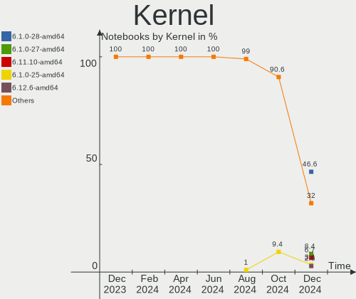
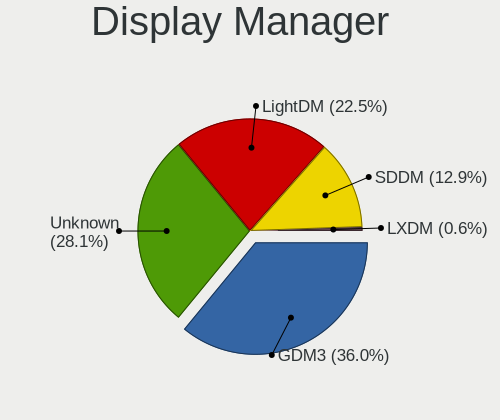
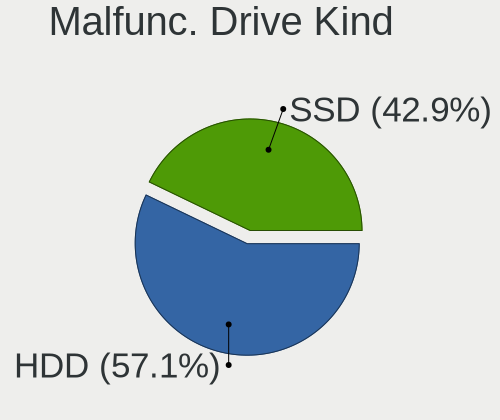
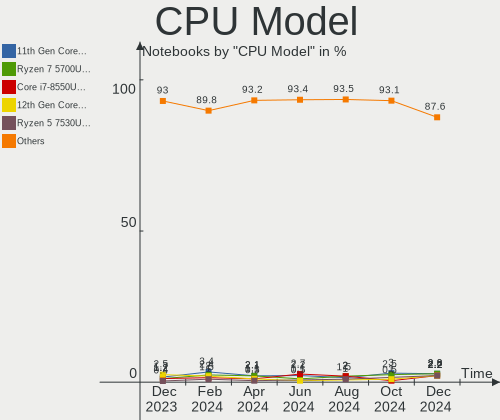
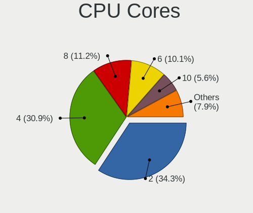
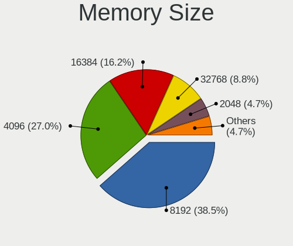

Debian - Hardware Trends (Notebooks)
------------------------------------

A project to identify most popular hardware characteristics and track their change
over time based on data collected by Linux users at https://Linux-Hardware.org.

Anyone can contribute to this report by the [hw-probe](https://github.com/linuxhw/hw-probe) tool:

    sudo -E hw-probe -all -upload

This report is for one last month. Overall report since the beginning of time: [TestCoverage](https://github.com/linuxhw/TestCoverage)

Period: Aug, 2022.

Contents
--------

* [ System ](#system)
  - [ OS                       ](#os)
  - [ OS Family                ](#os-family)
  - [ Kernel                   ](#kernel)
  - [ Kernel Family            ](#kernel-family)
  - [ Kernel Major Ver.        ](#kernel-major-ver)
  - [ Arch                     ](#arch)
  - [ DE                       ](#de)
  - [ Display Server           ](#display-server)
  - [ Display Manager          ](#display-manager)
  - [ OS Lang                  ](#os-lang)
  - [ Boot Mode                ](#boot-mode)
  - [ Filesystem               ](#filesystem)
  - [ Part. scheme             ](#part-scheme)
  - [ Dual Boot with Linux/BSD ](#dual-boot-with-linuxbsd)
  - [ Dual Boot (Win)          ](#dual-boot-win)

* [ Board ](#board)
  - [ Vendor                   ](#vendor)
  - [ Model                    ](#model)
  - [ Model Family             ](#model-family)
  - [ MFG Year                 ](#mfg-year)
  - [ Form Factor              ](#form-factor)
  - [ Secure Boot              ](#secure-boot)
  - [ Coreboot                 ](#coreboot)
  - [ RAM Size                 ](#ram-size)
  - [ RAM Used                 ](#ram-used)
  - [ Total Drives             ](#total-drives)
  - [ Has CD-ROM               ](#has-cd-rom)
  - [ Has Ethernet             ](#has-ethernet)
  - [ Has WiFi                 ](#has-wifi)
  - [ Has Bluetooth            ](#has-bluetooth)

* [ Location ](#location)
  - [ Country                  ](#country)
  - [ City                     ](#city)

* [ Drives ](#drives)
  - [ Drive Vendor             ](#drive-vendor)
  - [ Drive Model              ](#drive-model)
  - [ HDD Vendor               ](#hdd-vendor)
  - [ SSD Vendor               ](#ssd-vendor)
  - [ Drive Kind               ](#drive-kind)
  - [ Drive Connector          ](#drive-connector)
  - [ Drive Size               ](#drive-size)
  - [ Space Total              ](#space-total)
  - [ Space Used               ](#space-used)
  - [ Malfunc. Drives          ](#malfunc-drives)
  - [ Malfunc. Drive Vendor    ](#malfunc-drive-vendor)
  - [ Malfunc. HDD Vendor      ](#malfunc-hdd-vendor)
  - [ Malfunc. Drive Kind      ](#malfunc-drive-kind)
  - [ Failed Drives            ](#failed-drives)
  - [ Failed Drive Vendor      ](#failed-drive-vendor)
  - [ Drive Status             ](#drive-status)

* [ Storage controller ](#storage-controller)
  - [ Storage Vendor           ](#storage-vendor)
  - [ Storage Model            ](#storage-model)
  - [ Storage Kind             ](#storage-kind)

* [ Processor ](#processor)
  - [ CPU Vendor               ](#cpu-vendor)
  - [ CPU Model                ](#cpu-model)
  - [ CPU Model Family         ](#cpu-model-family)
  - [ CPU Cores                ](#cpu-cores)
  - [ CPU Sockets              ](#cpu-sockets)
  - [ CPU Threads              ](#cpu-threads)
  - [ CPU Op-Modes             ](#cpu-op-modes)
  - [ CPU Microcode            ](#cpu-microcode)
  - [ CPU Microarch            ](#cpu-microarch)

* [ Graphics ](#graphics)
  - [ GPU Vendor               ](#gpu-vendor)
  - [ GPU Model                ](#gpu-model)
  - [ GPU Combo                ](#gpu-combo)
  - [ GPU Driver               ](#gpu-driver)
  - [ GPU Memory               ](#gpu-memory)

* [ Monitor ](#monitor)
  - [ Monitor Vendor           ](#monitor-vendor)
  - [ Monitor Model            ](#monitor-model)
  - [ Monitor Resolution       ](#monitor-resolution)
  - [ Monitor Diagonal         ](#monitor-diagonal)
  - [ Monitor Width            ](#monitor-width)
  - [ Aspect Ratio             ](#aspect-ratio)
  - [ Monitor Area             ](#monitor-area)
  - [ Pixel Density            ](#pixel-density)
  - [ Multiple Monitors        ](#multiple-monitors)

* [ Network ](#network)
  - [ Net Controller Vendor    ](#net-controller-vendor)
  - [ Net Controller Model     ](#net-controller-model)
  - [ Wireless Vendor          ](#wireless-vendor)
  - [ Wireless Model           ](#wireless-model)
  - [ Ethernet Vendor          ](#ethernet-vendor)
  - [ Ethernet Model           ](#ethernet-model)
  - [ Net Controller Kind      ](#net-controller-kind)
  - [ Used Controller          ](#used-controller)
  - [ NICs                     ](#nics)
  - [ IPv6                     ](#ipv6)

* [ Bluetooth ](#bluetooth)
  - [ Bluetooth Vendor         ](#bluetooth-vendor)
  - [ Bluetooth Model          ](#bluetooth-model)

* [ Sound ](#sound)
  - [ Sound Vendor             ](#sound-vendor)
  - [ Sound Model              ](#sound-model)

* [ Memory ](#memory)
  - [ Memory Vendor            ](#memory-vendor)
  - [ Memory Model             ](#memory-model)
  - [ Memory Kind              ](#memory-kind)
  - [ Memory Form Factor       ](#memory-form-factor)
  - [ Memory Size              ](#memory-size)
  - [ Memory Speed             ](#memory-speed)

* [ Printers & scanners ](#printers--scanners)
  - [ Printer Vendor           ](#printer-vendor)
  - [ Printer Model            ](#printer-model)
  - [ Scanner Vendor           ](#scanner-vendor)
  - [ Scanner Model            ](#scanner-model)

* [ Camera ](#camera)
  - [ Camera Vendor            ](#camera-vendor)
  - [ Camera Model             ](#camera-model)

* [ Security ](#security)
  - [ Fingerprint Vendor       ](#fingerprint-vendor)
  - [ Fingerprint Model        ](#fingerprint-model)
  - [ Chipcard Vendor          ](#chipcard-vendor)
  - [ Chipcard Model           ](#chipcard-model)

* [ Unsupported ](#unsupported)
  - [ Unsupported Devices      ](#unsupported-devices)
  - [ Unsupported Device Types ](#unsupported-device-types)

System
------

OS
--

Installed operating systems

| Name              | Notebooks | Percent |
|-------------------|-----------|---------|
| Debian 11         | 148       | 80%     |
| Debian Testing    | 24        | 12.97%  |
| Debian Unstable   | 8         | 4.32%   |
| Debian 11-updates | 2         | 1.08%   |
| Debian 10         | 2         | 1.08%   |
| Debian 8          | 1         | 0.54%   |

OS Family
---------

OS without a version

| Name   | Notebooks | Percent |
|--------|-----------|---------|
| Debian | 185       | 100%    |

Kernel
------

Version of the Linux kernel

| Version                   | Notebooks | Percent |
|---------------------------|-----------|---------|
| 5.10.0-16-amd64           | 85        | 45.95%  |
| 5.10.0-17-amd64           | 31        | 16.76%  |
| 5.18.0-3-amd64            | 16        | 8.65%   |
| 5.18.0-4-amd64            | 15        | 8.11%   |
| 5.18.0-0.bpo.1-amd64      | 4         | 2.16%   |
| 5.10.0-7-amd64            | 4         | 2.16%   |
| 5.10.0-13-amd64           | 3         | 1.62%   |
| 5.18.0-0.deb11.3-amd64    | 2         | 1.08%   |
| 5.10.0-17-686             | 2         | 1.08%   |
| 5.19.1                    | 1         | 0.54%   |
| 5.19.0-trunk-amd64        | 1         | 0.54%   |
| 5.19.0-rc6-amd64          | 1         | 0.54%   |
| 5.19.0                    | 1         | 0.54%   |
| 5.18.6                    | 1         | 0.54%   |
| 5.18.19-hpelite           | 1         | 0.54%   |
| 5.18.16-xanmod1           | 1         | 0.54%   |
| 5.18.15-xanmod1           | 1         | 0.54%   |
| 5.17.11-1rodete2-amd64    | 1         | 0.54%   |
| 5.15.30-2-pve             | 1         | 0.54%   |
| 5.10.88-antix.1-amd64-smp | 1         | 0.54%   |
| 5.10.60                   | 1         | 0.54%   |
| 5.10.119-loc-os           | 1         | 0.54%   |
| 5.10.0-9-amd64            | 1         | 0.54%   |
| 5.10.0-17-686-pae         | 1         | 0.54%   |
| 5.10.0-16-686-pae         | 1         | 0.54%   |
| 5.10.0-16-686             | 1         | 0.54%   |
| 5.10.0-15-amd64           | 1         | 0.54%   |
| 5.10.0-12-amd64           | 1         | 0.54%   |
| 5.10.0-11-amd64           | 1         | 0.54%   |
| 4.19.0-6-amd64            | 1         | 0.54%   |
| 4.19.0-21-amd64           | 1         | 0.54%   |
| 3.10.65+                  | 1         | 0.54%   |

Kernel Family
-------------

Linux kernel without a distro release

| Version  | Notebooks | Percent |
|----------|-----------|---------|
| 5.10.0   | 132       | 71.35%  |
| 5.18.0   | 37        | 20%     |
| 5.19.0   | 3         | 1.62%   |
| 4.19.0   | 2         | 1.08%   |
| 5.19.1   | 1         | 0.54%   |
| 5.18.6   | 1         | 0.54%   |
| 5.18.19  | 1         | 0.54%   |
| 5.18.16  | 1         | 0.54%   |
| 5.18.15  | 1         | 0.54%   |
| 5.17.11  | 1         | 0.54%   |
| 5.15.30  | 1         | 0.54%   |
| 5.10.88  | 1         | 0.54%   |
| 5.10.60  | 1         | 0.54%   |
| 5.10.119 | 1         | 0.54%   |
| 3.10.65  | 1         | 0.54%   |

Kernel Major Ver.
-----------------

Linux kernel major version

| Version | Notebooks | Percent |
|---------|-----------|---------|
| 5.10    | 135       | 72.97%  |
| 5.18    | 41        | 22.16%  |
| 5.19    | 4         | 2.16%   |
| 4.19    | 2         | 1.08%   |
| 5.17    | 1         | 0.54%   |
| 5.15    | 1         | 0.54%   |
| 3.10    | 1         | 0.54%   |

Arch
----

OS architecture (x86_64, i586, etc.)

| Name   | Notebooks | Percent |
|--------|-----------|---------|
| x86_64 | 179       | 96.76%  |
| i686   | 5         | 2.7%    |
| armv7l | 1         | 0.54%   |

DE
--

Desktop Environment

| Name             | Notebooks | Percent |
|------------------|-----------|---------|
| GNOME            | 63        | 34.05%  |
| Unknown          | 35        | 18.92%  |
| KDE5             | 30        | 16.22%  |
| XFCE             | 26        | 14.05%  |
| Cinnamon         | 7         | 3.78%   |
| MATE             | 5         | 2.7%    |
| LXQt             | 5         | 2.7%    |
| LXDE             | 5         | 2.7%    |
| X-Cinnamon       | 2         | 1.08%   |
| i3               | 2         | 1.08%   |
| Budgie           | 2         | 1.08%   |
| lightdm-xsession | 1         | 0.54%   |
| KDE              | 1         | 0.54%   |
| GNOME Flashback  | 1         | 0.54%   |

Display Server
--------------

X11 or Wayland

| Name    | Notebooks | Percent |
|---------|-----------|---------|
| X11     | 95        | 51.35%  |
| Wayland | 52        | 28.11%  |
| Unknown | 34        | 18.38%  |
| Tty     | 4         | 2.16%   |

Display Manager
---------------

SDDM, LightDM, etc.

| Name    | Notebooks | Percent |
|---------|-----------|---------|
| Unknown | 55        | 29.73%  |
| GDM     | 46        | 24.86%  |
| LightDM | 38        | 20.54%  |
| GDM3    | 24        | 12.97%  |
| SDDM    | 22        | 11.89%  |

OS Lang
-------

Language

| Lang    | Notebooks | Percent |
|---------|-----------|---------|
| en_US   | 65        | 35.14%  |
| Unknown | 22        | 11.89%  |
| fr_FR   | 16        | 8.65%   |
| de_DE   | 12        | 6.49%   |
| es_ES   | 11        | 5.95%   |
| ru_RU   | 10        | 5.41%   |
| en_GB   | 6         | 3.24%   |
| pt_BR   | 5         | 2.7%    |
| pl_PL   | 4         | 2.16%   |
| en_IN   | 4         | 2.16%   |
| hu_HU   | 3         | 1.62%   |
| en_AU   | 3         | 1.62%   |
| nl_NL   | 2         | 1.08%   |
| it_IT   | 2         | 1.08%   |
| fr_CH   | 2         | 1.08%   |
| es_CL   | 2         | 1.08%   |
| en_SG   | 2         | 1.08%   |
| en_IE   | 2         | 1.08%   |
| pt_PT   | 1         | 0.54%   |
| es_MX   | 1         | 0.54%   |
| es_CO   | 1         | 0.54%   |
| es_AR   | 1         | 0.54%   |
| en_NZ   | 1         | 0.54%   |
| en_IL   | 1         | 0.54%   |
| en_CA   | 1         | 0.54%   |
| de_CH   | 1         | 0.54%   |
| de_AT   | 1         | 0.54%   |
| cs_CZ   | 1         | 0.54%   |
| C       | 1         | 0.54%   |
| ar_SA   | 1         | 0.54%   |

Boot Mode
---------

EFI or BIOS

| Mode | Notebooks | Percent |
|------|-----------|---------|
| EFI  | 136       | 73.51%  |
| BIOS | 49        | 26.49%  |

Filesystem
----------

Type of filesystem

| Type    | Notebooks | Percent |
|---------|-----------|---------|
| Ext4    | 139       | 75.14%  |
| Overlay | 39        | 21.08%  |
| Btrfs   | 5         | 2.7%    |
| Xfs     | 2         | 1.08%   |

Part. scheme
------------

Scheme of partitioning

| Type    | Notebooks | Percent |
|---------|-----------|---------|
| GPT     | 133       | 71.89%  |
| MBR     | 30        | 16.22%  |
| Unknown | 22        | 11.89%  |

Dual Boot with Linux/BSD
------------------------

Hosting more than one Linux/BSD

| Dual boot | Notebooks | Percent |
|-----------|-----------|---------|
| No        | 154       | 83.24%  |
| Yes       | 31        | 16.76%  |

Dual Boot (Win)
---------------

Hosting Linux and Windows

| Dual boot | Notebooks | Percent |
|-----------|-----------|---------|
| No        | 138       | 74.59%  |
| Yes       | 47        | 25.41%  |

Board
-----

Vendor
------

Motherboard manufacturer

| Name                | Notebooks | Percent |
|---------------------|-----------|---------|
| Lenovo              | 34        | 18.38%  |
| Dell                | 30        | 16.22%  |
| Hewlett-Packard     | 27        | 14.59%  |
| Google              | 23        | 12.43%  |
| ASUSTek Computer    | 18        | 9.73%   |
| Acer                | 10        | 5.41%   |
| HUAWEI              | 5         | 2.7%    |
| MSI                 | 4         | 2.16%   |
| Apple               | 4         | 2.16%   |
| Toshiba             | 3         | 1.62%   |
| Samsung Electronics | 3         | 1.62%   |
| Notebook            | 2         | 1.08%   |
| Alienware           | 2         | 1.08%   |
| VANT                | 1         | 0.54%   |
| TUXEDO              | 1         | 0.54%   |
| System76            | 1         | 0.54%   |
| SLIMBOOK            | 1         | 0.54%   |
| Shuttle             | 1         | 0.54%   |
| SANTECH             | 1         | 0.54%   |
| Razer               | 1         | 0.54%   |
| Positivo            | 1         | 0.54%   |
| PCBOX               | 1         | 0.54%   |
| Packard Bell        | 1         | 0.54%   |
| NVN-ED01            | 1         | 0.54%   |
| Medion              | 1         | 0.54%   |
| LG Electronics      | 1         | 0.54%   |
| ICL                 | 1         | 0.54%   |
| HONOR               | 1         | 0.54%   |
| GPU Company         | 1         | 0.54%   |
| Fujitsu Siemens     | 1         | 0.54%   |
| Casper              | 1         | 0.54%   |
| BANGHO              | 1         | 0.54%   |
| Unknown             | 1         | 0.54%   |

Model
-----

Motherboard model

| Name                                        | Notebooks | Percent |
|---------------------------------------------|-----------|---------|
| Google Terra                                | 14        | 7.57%   |
| Google Reks                                 | 7         | 3.78%   |
| Lenovo ThinkPad 13 2nd Gen 20J10046US       | 3         | 1.62%   |
| Samsung 935XDB                              | 2         | 1.08%   |
| HP EliteBook 840 G8 Notebook PC             | 2         | 1.08%   |
| Dell Vostro 15 5510                         | 2         | 1.08%   |
| Dell Latitude E6330                         | 2         | 1.08%   |
| Dell Latitude 5420                          | 2         | 1.08%   |
| Dell Latitude 3320                          | 2         | 1.08%   |
| ASUS X550CC                                 | 2         | 1.08%   |
| ASUS VivoBook 15_ASUS Laptop X540UAR        | 2         | 1.08%   |
| Apple MacBookAir7,2                         | 2         | 1.08%   |
| Unknown                                     | 2         | 1.08%   |
| VANT MOOVE3-15                              | 1         | 0.54%   |
| TUXEDO Pulse 15 Gen1                        | 1         | 0.54%   |
| Toshiba TECRA Z40-C                         | 1         | 0.54%   |
| Toshiba TECRA R950                          | 1         | 0.54%   |
| Toshiba Satellite P50-B-103                 | 1         | 0.54%   |
| System76 Oryx Pro                           | 1         | 0.54%   |
| SLIMBOOK PROX15-AMD                         | 1         | 0.54%   |
| Shuttle DS437                               | 1         | 0.54%   |
| SANTECH NHx0DB,DE                           | 1         | 0.54%   |
| Samsung 300E4C/300E5C/300E7C                | 1         | 0.54%   |
| Razer Blade 14 - RZ09-0370                  | 1         | 0.54%   |
| Positivo Mobile                             | 1         | 0.54%   |
| PCBOX Kant                                  | 1         | 0.54%   |
| Packard Bell EasyNote_MX37-U-017            | 1         | 0.54%   |
| Notebook V15x_V17xPNKPNJPNH                 | 1         | 0.54%   |
| Notebook N2x0WU                             | 1         | 0.54%   |
| MSI Pulse GL76 12UEK                        | 1         | 0.54%   |
| MSI GF75 Thin 10SCSXR                       | 1         | 0.54%   |
| MSI GF63 Thin 10SCSR                        | 1         | 0.54%   |
| MSI Creator 15 A11UH                        | 1         | 0.54%   |
| Medion Akoya P2213T                         | 1         | 0.54%   |
| LG 14Z90P-G.AA89B                           | 1         | 0.54%   |
| Lenovo ThinkPad X61 Tablet 7767BFG          | 1         | 0.54%   |
| Lenovo ThinkPad X260 20F5A050IG             | 1         | 0.54%   |
| Lenovo ThinkPad X131e 33672K5               | 1         | 0.54%   |
| Lenovo ThinkPad X13 Gen 2a 20XHCTO1WW       | 1         | 0.54%   |
| Lenovo ThinkPad X1 Carbon Gen 10 21CBCTO1WW | 1         | 0.54%   |
| Lenovo ThinkPad T61 7661CV7                 | 1         | 0.54%   |
| Lenovo ThinkPad T590 20N4001NUS             | 1         | 0.54%   |
| Lenovo ThinkPad T450s 20BXCTO1WW            | 1         | 0.54%   |
| Lenovo ThinkPad T450s 20BWS21K00            | 1         | 0.54%   |
| Lenovo ThinkPad T440s 20ARS2KU00            | 1         | 0.54%   |
| Lenovo ThinkPad T440p 20AWS17N00            | 1         | 0.54%   |
| Lenovo ThinkPad T420s 4173RT4               | 1         | 0.54%   |
| Lenovo ThinkPad T400 2768BM2                | 1         | 0.54%   |
| Lenovo ThinkPad T15 Gen 1 20S6001SUS        | 1         | 0.54%   |
| Lenovo ThinkPad P14s Gen 2i 20VX0015FR      | 1         | 0.54%   |
| Lenovo ThinkPad P1 Gen 3 20TJS2NF0A         | 1         | 0.54%   |
| Lenovo ThinkPad L490 20Q5001YPB             | 1         | 0.54%   |
| Lenovo ThinkPad L15 Gen 1 20U4S4T000        | 1         | 0.54%   |
| Lenovo ThinkPad Edge E531 6885CCU           | 1         | 0.54%   |
| Lenovo ThinkPad Edge E431 627748G           | 1         | 0.54%   |
| Lenovo ThinkPad E490 20N8001EUS             | 1         | 0.54%   |
| Lenovo ThinkPad E475 20H40006US             | 1         | 0.54%   |
| Lenovo ThinkPad E14 Gen 3 20Y7003SSP        | 1         | 0.54%   |
| Lenovo ThinkBook 15 G2 ITL 20VE             | 1         | 0.54%   |
| Lenovo IdeaPad S540-13API 81XC              | 1         | 0.54%   |

Model Family
------------

Motherboard model prefix

| Name                  | Notebooks | Percent |
|-----------------------|-----------|---------|
| Lenovo ThinkPad       | 26        | 14.05%  |
| Dell Latitude         | 16        | 8.65%   |
| Google Terra          | 14        | 7.57%   |
| Lenovo IdeaPad        | 7         | 3.78%   |
| Google Reks           | 7         | 3.78%   |
| HP EliteBook          | 6         | 3.24%   |
| Dell XPS              | 6         | 3.24%   |
| ASUS VivoBook         | 6         | 3.24%   |
| Acer Aspire           | 6         | 3.24%   |
| HP Compaq             | 4         | 2.16%   |
| Dell Vostro           | 4         | 2.16%   |
| HP Pavilion           | 3         | 1.62%   |
| HP Laptop             | 3         | 1.62%   |
| Dell Inspiron         | 3         | 1.62%   |
| Toshiba TECRA         | 2         | 1.08%   |
| Samsung 935XDB        | 2         | 1.08%   |
| HP ZBook              | 2         | 1.08%   |
| HP ProBook            | 2         | 1.08%   |
| HP 255                | 2         | 1.08%   |
| ASUS X550CC           | 2         | 1.08%   |
| Apple MacBookAir7     | 2         | 1.08%   |
| Alienware m15         | 2         | 1.08%   |
| Acer TravelMate       | 2         | 1.08%   |
| Unknown               | 2         | 1.08%   |
| VANT MOOVE3-15        | 1         | 0.54%   |
| TUXEDO Pulse          | 1         | 0.54%   |
| Toshiba Satellite     | 1         | 0.54%   |
| System76 Oryx         | 1         | 0.54%   |
| SLIMBOOK PROX15-AMD   | 1         | 0.54%   |
| Shuttle DS437         | 1         | 0.54%   |
| SANTECH NHx0DB        | 1         | 0.54%   |
| Samsung 300E4C        | 1         | 0.54%   |
| Razer Blade           | 1         | 0.54%   |
| Positivo Mobile       | 1         | 0.54%   |
| PCBOX Kant            | 1         | 0.54%   |
| Packard Bell EasyNote | 1         | 0.54%   |
| Notebook V15x         | 1         | 0.54%   |
| Notebook N2x0WU       | 1         | 0.54%   |
| MSI Pulse             | 1         | 0.54%   |
| MSI GF75              | 1         | 0.54%   |
| MSI GF63              | 1         | 0.54%   |
| MSI Creator           | 1         | 0.54%   |
| Medion Akoya          | 1         | 0.54%   |
| LG 14Z90P-G.AA89B     | 1         | 0.54%   |
| Lenovo ThinkBook      | 1         | 0.54%   |
| ICL N7x0WU            | 1         | 0.54%   |
| HUAWEI NBLBZ-WAX9N    | 1         | 0.54%   |
| HUAWEI CREM-WXX9      | 1         | 0.54%   |
| HUAWEI BOHK-WAX9X     | 1         | 0.54%   |
| HUAWEI BOHB-WAX9      | 1         | 0.54%   |
| HUAWEI BDZ-WXX9       | 1         | 0.54%   |
| HONOR BMH-WCX9        | 1         | 0.54%   |
| HP Presario           | 1         | 0.54%   |
| HP OMEN               | 1         | 0.54%   |
| HP ENVY               | 1         | 0.54%   |
| HP 620                | 1         | 0.54%   |
| HP 250                | 1         | 0.54%   |
| GPU Company GWTC116-2 | 1         | 0.54%   |
| Google Enguarde       | 1         | 0.54%   |
| Google Droid          | 1         | 0.54%   |

MFG Year
--------

Motherboard manufacture year

| Year    | Notebooks | Percent |
|---------|-----------|---------|
| 2021    | 34        | 18.38%  |
| 2022    | 31        | 16.76%  |
| 2020    | 24        | 12.97%  |
| 2019    | 12        | 6.49%   |
| 2013    | 10        | 5.41%   |
| 2012    | 10        | 5.41%   |
| 2015    | 9         | 4.86%   |
| 2018    | 8         | 4.32%   |
| 2016    | 8         | 4.32%   |
| 2007    | 8         | 4.32%   |
| 2017    | 7         | 3.78%   |
| 2014    | 6         | 3.24%   |
| 2011    | 6         | 3.24%   |
| 2010    | 4         | 2.16%   |
| 2009    | 3         | 1.62%   |
| 2006    | 2         | 1.08%   |
| 2008    | 1         | 0.54%   |
| 2005    | 1         | 0.54%   |
| Unknown | 1         | 0.54%   |

Form Factor
-----------

Physical design of the computer

| Name     | Notebooks | Percent |
|----------|-----------|---------|
| Notebook | 185       | 100%    |

Secure Boot
-----------

Enabled or disabled

| State    | Notebooks | Percent |
|----------|-----------|---------|
| Disabled | 160       | 86.49%  |
| Enabled  | 25        | 13.51%  |

Coreboot
--------

Have coreboot on board

| Used | Notebooks | Percent |
|------|-----------|---------|
| No   | 161       | 87.03%  |
| Yes  | 24        | 12.97%  |

RAM Size
--------

Total RAM memory

| Size in GB  | Notebooks | Percent |
|-------------|-----------|---------|
| 3.01-4.0    | 50        | 27.03%  |
| 4.01-8.0    | 47        | 25.41%  |
| 16.01-24.0  | 30        | 16.22%  |
| 8.01-16.0   | 22        | 11.89%  |
| 32.01-64.0  | 18        | 9.73%   |
| 1.01-2.0    | 9         | 4.86%   |
| 64.01-256.0 | 4         | 2.16%   |
| 24.01-32.0  | 2         | 1.08%   |
| 0.51-1.0    | 2         | 1.08%   |
| 2.01-3.0    | 1         | 0.54%   |

RAM Used
--------

Used RAM memory

| Used GB   | Notebooks | Percent |
|-----------|-----------|---------|
| 1.01-2.0  | 74        | 40%     |
| 2.01-3.0  | 41        | 22.16%  |
| 4.01-8.0  | 29        | 15.68%  |
| 3.01-4.0  | 23        | 12.43%  |
| 0.51-1.0  | 11        | 5.95%   |
| 8.01-16.0 | 5         | 2.7%    |
| 0.01-0.5  | 1         | 0.54%   |
| Unknown   | 1         | 0.54%   |

Total Drives
------------

Number of drives on board

| Drives | Notebooks | Percent |
|--------|-----------|---------|
| 1      | 157       | 84.86%  |
| 2      | 25        | 13.51%  |
| 3      | 3         | 1.62%   |

Has CD-ROM
----------

Has CD-ROM on board

| Presented | Notebooks | Percent |
|-----------|-----------|---------|
| No        | 141       | 76.22%  |
| Yes       | 44        | 23.78%  |

Has Ethernet
------------

Has Ethernet on board

| Presented | Notebooks | Percent |
|-----------|-----------|---------|
| Yes       | 131       | 70.81%  |
| No        | 54        | 29.19%  |

Has WiFi
--------

Has WiFi module

| Presented | Notebooks | Percent |
|-----------|-----------|---------|
| Yes       | 183       | 98.92%  |
| No        | 2         | 1.08%   |

Has Bluetooth
-------------

Has Bluetooth module

| Presented | Notebooks | Percent |
|-----------|-----------|---------|
| Yes       | 152       | 82.16%  |
| No        | 33        | 17.84%  |

Location
--------

Country
-------

Geographic location (country)

| Country     | Notebooks | Percent |
|-------------|-----------|---------|
| USA         | 52        | 28.11%  |
| France      | 17        | 9.19%   |
| Germany     | 16        | 8.65%   |
| Spain       | 10        | 5.41%   |
| Russia      | 10        | 5.41%   |
| Brazil      | 8         | 4.32%   |
| Poland      | 6         | 3.24%   |
| Italy       | 5         | 2.7%    |
| Argentina   | 5         | 2.7%    |
| India       | 4         | 2.16%   |
| Hungary     | 4         | 2.16%   |
| Australia   | 4         | 2.16%   |
| UK          | 3         | 1.62%   |
| New Zealand | 3         | 1.62%   |
| Netherlands | 3         | 1.62%   |
| Finland     | 3         | 1.62%   |
| Chile       | 3         | 1.62%   |
| Turkey      | 2         | 1.08%   |
| Switzerland | 2         | 1.08%   |
| Singapore   | 2         | 1.08%   |
| Norway      | 2         | 1.08%   |
| Mexico      | 2         | 1.08%   |
| Colombia    | 2         | 1.08%   |
| Canada      | 2         | 1.08%   |
| Belgium     | 2         | 1.08%   |
| Venezuela   | 1         | 0.54%   |
| Tunisia     | 1         | 0.54%   |
| Sweden      | 1         | 0.54%   |
| Sudan       | 1         | 0.54%   |
| Portugal    | 1         | 0.54%   |
| Peru        | 1         | 0.54%   |
| Japan       | 1         | 0.54%   |
| Israel      | 1         | 0.54%   |
| Ireland     | 1         | 0.54%   |
| Greece      | 1         | 0.54%   |
| Czechia     | 1         | 0.54%   |
| China       | 1         | 0.54%   |
| Austria     | 1         | 0.54%   |

City
----

Geographic location (city)

| City                   | Notebooks | Percent |
|------------------------|-----------|---------|
| Bangor                 | 31        | 16.76%  |
| Voronezh               | 4         | 2.16%   |
| Madrid                 | 4         | 2.16%   |
| Berlin                 | 3         | 1.62%   |
| Sydney                 | 2         | 1.08%   |
| St Petersburg          | 2         | 1.08%   |
| Singapore              | 2         | 1.08%   |
| Salford                | 2         | 1.08%   |
| Portland               | 2         | 1.08%   |
| Natal                  | 2         | 1.08%   |
| Moscow                 | 2         | 1.08%   |
| Monistrol-sur-Loire    | 2         | 1.08%   |
| İzmit                 | 2         | 1.08%   |
| Helsinki               | 2         | 1.08%   |
| Frankfurt am Main      | 2         | 1.08%   |
| Winchester             | 1         | 0.54%   |
| Willingboro            | 1         | 0.54%   |
| Wentzville             | 1         | 0.54%   |
| Weiler-Simmerberg      | 1         | 0.54%   |
| Warsaw                 | 1         | 0.54%   |
| Vienna                 | 1         | 0.54%   |
| Verona                 | 1         | 0.54%   |
| Varosfoeld             | 1         | 0.54%   |
| Valladolid             | 1         | 0.54%   |
| Valencia               | 1         | 0.54%   |
| Valdivia               | 1         | 0.54%   |
| Turin                  | 1         | 0.54%   |
| Tupper Lake            | 1         | 0.54%   |
| Toronto                | 1         | 0.54%   |
| Tijuana                | 1         | 0.54%   |
| Thrissur               | 1         | 0.54%   |
| Thessaloniki           | 1         | 0.54%   |
| The Hague              | 1         | 0.54%   |
| Terricciola            | 1         | 0.54%   |
| Tauranga               | 1         | 0.54%   |
| Tampere                | 1         | 0.54%   |
| Son                    | 1         | 0.54%   |
| Serpukhov              | 1         | 0.54%   |
| Sarge-les-le-Mans      | 1         | 0.54%   |
| Sao Goncalo            | 1         | 0.54%   |
| Santiago               | 1         | 0.54%   |
| Santander              | 1         | 0.54%   |
| Sanok                  | 1         | 0.54%   |
| San Mateo              | 1         | 0.54%   |
| Salzgitter             | 1         | 0.54%   |
| Rubí                  | 1         | 0.54%   |
| Rosario de la Frontera | 1         | 0.54%   |
| Rosario                | 1         | 0.54%   |
| Robledillo de la Jara  | 1         | 0.54%   |
| Richmond               | 1         | 0.54%   |
| Ramat Gan              | 1         | 0.54%   |
| Puspokhatvan           | 1         | 0.54%   |
| Pune                   | 1         | 0.54%   |
| Puerto Boyacá         | 1         | 0.54%   |
| Pruszcz Gdanski        | 1         | 0.54%   |
| Pribyslav              | 1         | 0.54%   |
| Praga Południe        | 1         | 0.54%   |
| Porto Alegre           | 1         | 0.54%   |
| Plaisir                | 1         | 0.54%   |
| Pereira                | 1         | 0.54%   |

Drives
------

Drive Vendor
------------

Hard drive vendors

| Vendor                    | Notebooks | Drives | Percent |
|---------------------------|-----------|--------|---------|
| Samsung Electronics       | 35        | 38     | 16.36%  |
| Unknown                   | 34        | 36     | 15.89%  |
| WDC                       | 21        | 21     | 9.81%   |
| SK hynix                  | 13        | 13     | 6.07%   |
| Crucial                   | 13        | 13     | 6.07%   |
| Kingston                  | 12        | 12     | 5.61%   |
| Toshiba                   | 10        | 10     | 4.67%   |
| Hitachi                   | 9         | 9      | 4.21%   |
| Seagate                   | 8         | 8      | 3.74%   |
| Micron Technology         | 8         | 8      | 3.74%   |
| A-DATA Technology         | 8         | 8      | 3.74%   |
| SanDisk                   | 4         | 4      | 1.87%   |
| Intel                     | 4         | 5      | 1.87%   |
| Unknown                   | 4         | 4      | 1.87%   |
| LITEONIT                  | 3         | 3      | 1.4%    |
| KIOXIA                    | 3         | 3      | 1.4%    |
| Apple                     | 3         | 4      | 1.4%    |
| Silicon Motion            | 2         | 2      | 0.93%   |
| Phison                    | 2         | 2      | 0.93%   |
| LITEON                    | 2         | 2      | 0.93%   |
| Intenso                   | 2         | 2      | 0.93%   |
| HGST                      | 2         | 2      | 0.93%   |
| ZTC                       | 1         | 1      | 0.47%   |
| Win Memory                | 1         | 1      | 0.47%   |
| SPCC                      | 1         | 1      | 0.47%   |
| S3+                       | 1         | 1      | 0.47%   |
| Plextor                   | 1         | 1      | 0.47%   |
| OCZ                       | 1         | 1      | 0.47%   |
| Micron/Crucial Technology | 1         | 1      | 0.47%   |
| HS-SSD-C100               | 1         | 1      | 0.47%   |
| Gigabyte Technology       | 1         | 1      | 0.47%   |
| China                     | 1         | 1      | 0.47%   |
| addlink                   | 1         | 1      | 0.47%   |
| ADATA Technology          | 1         | 1      | 0.47%   |

Drive Model
-----------

Hard drive models

| Model                                | Notebooks | Percent |
|--------------------------------------|-----------|---------|
| Unknown SDW16G  16GB                 | 13        | 5.94%   |
| Samsung SSD 970 EVO Plus 1TB         | 4         | 1.83%   |
| Kingston SA400S37240G 240GB SSD      | 4         | 1.83%   |
| Unknown                              | 4         | 1.83%   |
| Unknown HAG4a2  16GB                 | 3         | 1.37%   |
| Samsung SSD 860 EVO 500GB            | 3         | 1.37%   |
| Crucial CT1000MX500SSD1 1TB          | 3         | 1.37%   |
| WDC PC SN730 SDBQNTY-512G-1001 512GB | 2         | 0.91%   |
| WDC PC SN530 NVMe 256GB              | 2         | 0.91%   |
| Unknown MMC Card  64GB               | 2         | 0.91%   |
| Unknown DF4016  16GB                 | 2         | 0.91%   |
| Seagate ST500LM012 HN-M500MBB 500GB  | 2         | 0.91%   |
| SanDisk SD8SN8U128G1001 128GB SSD    | 2         | 0.91%   |
| Samsung MZVLB1T0HBLR-000H1 1TB       | 2         | 0.91%   |
| Phison NVMe SSD Drive 256GB          | 2         | 0.91%   |
| Kingston SA400S37120G 120GB SSD      | 2         | 0.91%   |
| Kingston NVMe SSD Drive 256GB        | 2         | 0.91%   |
| Hitachi HTS545032B9A300 320GB        | 2         | 0.91%   |
| Crucial CT500MX500SSD1 500GB         | 2         | 0.91%   |
| Crucial CT480BX500SSD1 480GB         | 2         | 0.91%   |
| Apple SSD SM0128G 121GB              | 2         | 0.91%   |
| A-DATA IM2P33F3A NVMe 256GB          | 2         | 0.91%   |
| ZTC SM201-512G SSD                   | 1         | 0.46%   |
| Win Memory SWR256G-301II 256GB       | 1         | 0.46%   |
| WDC WDS240G2G0A-00JH30 240GB SSD     | 1         | 0.46%   |
| WDC WDBNCE0010PNC 1TB SSD            | 1         | 0.46%   |
| WDC WD5000LPCX-60VHAT0 500GB         | 1         | 0.46%   |
| WDC WD5000BEVT-22ZAT0 500GB          | 1         | 0.46%   |
| WDC WD20SPZX-22UA7T0 2TB             | 1         | 0.46%   |
| WDC WD10SPZX-60Z10T0 1TB             | 1         | 0.46%   |
| WDC WD10SPZX-24Z10 1TB               | 1         | 0.46%   |
| WDC WD10JPVX-60JC3T0 1TB             | 1         | 0.46%   |
| WDC PC SN810 NVMe 1024GB             | 1         | 0.46%   |
| WDC PC SN730 SDBPNTY-512G-1006 512GB | 1         | 0.46%   |
| WDC PC SN730 SDBPNTY-512G            | 1         | 0.46%   |
| WDC PC SN730 SDBPNTY-256G-1027 256GB | 1         | 0.46%   |
| WDC PC SN530 SDBPNPZ-512G-1114 512GB | 1         | 0.46%   |
| WDC PC SN530 SDBPNPZ-512G-1036 512GB | 1         | 0.46%   |
| WDC PC SN530 SDBPNPZ-256G-1002 256GB | 1         | 0.46%   |
| WDC PC SN530 NVMe 512GB              | 1         | 0.46%   |
| WDC PC SN520 NVMe 512GB              | 1         | 0.46%   |
| Unknown TA2964  64GB                 | 1         | 0.46%   |
| Unknown SU08G  8GB                   | 1         | 0.46%   |
| Unknown SL16G  16GB                  | 1         | 0.46%   |
| Unknown SD32G  32GB                  | 1         | 0.46%   |
| Unknown SD256  256GB                 | 1         | 0.46%   |
| Unknown SD256  249GB                 | 1         | 0.46%   |
| Unknown SD128  128GB                 | 1         | 0.46%   |
| Unknown SC64G  64GB                  | 1         | 0.46%   |
| Unknown MMC Card  8GB                | 1         | 0.46%   |
| Unknown MMC Card  4GB                | 1         | 0.46%   |
| Unknown MMC Card  32GB               | 1         | 0.46%   |
| Unknown MMC Card  249GB              | 1         | 0.46%   |
| Unknown G1J38E  64GB                 | 1         | 0.46%   |
| Unknown DA4128  128GB                | 1         | 0.46%   |
| Unknown DA4064  64GB                 | 1         | 0.46%   |
| Unknown AGND3R  16GB                 | 1         | 0.46%   |
| Toshiba THNSNJ256G8NY 256GB SSD      | 1         | 0.46%   |
| Toshiba RC500 500GB                  | 1         | 0.46%   |
| Toshiba MQ04ABF100 1TB               | 1         | 0.46%   |

HDD Vendor
----------

Hard disk drive vendors

| Vendor  | Notebooks | Drives | Percent |
|---------|-----------|--------|---------|
| Hitachi | 9         | 9      | 29.03%  |
| Seagate | 8         | 8      | 25.81%  |
| WDC     | 6         | 6      | 19.35%  |
| Toshiba | 6         | 6      | 19.35%  |
| HGST    | 2         | 2      | 6.45%   |

SSD Vendor
----------

Solid state drive vendors

| Vendor              | Notebooks | Drives | Percent |
|---------------------|-----------|--------|---------|
| Crucial             | 12        | 12     | 19.67%  |
| Samsung Electronics | 11        | 11     | 18.03%  |
| Kingston            | 8         | 8      | 13.11%  |
| A-DATA Technology   | 4         | 4      | 6.56%   |
| SanDisk             | 3         | 3      | 4.92%   |
| LITEONIT            | 3         | 3      | 4.92%   |
| WDC                 | 2         | 2      | 3.28%   |
| Micron Technology   | 2         | 2      | 3.28%   |
| LITEON              | 2         | 2      | 3.28%   |
| Intenso             | 2         | 2      | 3.28%   |
| Apple               | 2         | 2      | 3.28%   |
| ZTC                 | 1         | 1      | 1.64%   |
| Win Memory          | 1         | 1      | 1.64%   |
| Toshiba             | 1         | 1      | 1.64%   |
| SPCC                | 1         | 1      | 1.64%   |
| SK hynix            | 1         | 1      | 1.64%   |
| S3+                 | 1         | 1      | 1.64%   |
| Plextor             | 1         | 1      | 1.64%   |
| OCZ                 | 1         | 1      | 1.64%   |
| Intel               | 1         | 1      | 1.64%   |
| China               | 1         | 1      | 1.64%   |

Drive Kind
----------

HDD or SSD

| Kind    | Notebooks | Drives | Percent |
|---------|-----------|--------|---------|
| NVMe    | 81        | 87     | 38.57%  |
| SSD     | 60        | 61     | 28.57%  |
| MMC     | 38        | 41     | 18.1%   |
| HDD     | 30        | 31     | 14.29%  |
| Unknown | 1         | 1      | 0.48%   |

Drive Connector
---------------

SATA, SAS, NVMe, etc.

| Type | Notebooks | Drives | Percent |
|------|-----------|--------|---------|
| SATA | 85        | 90     | 41.06%  |
| NVMe | 81        | 87     | 39.13%  |
| MMC  | 38        | 41     | 18.36%  |
| SAS  | 3         | 3      | 1.45%   |

Drive Size
----------

Size of hard drive

| Size in TB | Notebooks | Drives | Percent |
|------------|-----------|--------|---------|
| 0.01-0.5   | 64        | 68     | 72.73%  |
| 0.51-1.0   | 20        | 20     | 22.73%  |
| 1.01-2.0   | 4         | 4      | 4.55%   |

Space Total
-----------

Amount of disk space available on the file system

| Size in GB | Notebooks | Percent |
|------------|-----------|---------|
| 101-250    | 59        | 31.89%  |
| 251-500    | 38        | 20.54%  |
| Unknown    | 29        | 15.68%  |
| 501-1000   | 23        | 12.43%  |
| 51-100     | 14        | 7.57%   |
| 1-20       | 8         | 4.32%   |
| 1001-2000  | 7         | 3.78%   |
| 2001-3000  | 6         | 3.24%   |
| 21-50      | 1         | 0.54%   |

Space Used
----------

Amount of used disk space

| Used GB   | Notebooks | Percent |
|-----------|-----------|---------|
| 1-20      | 70        | 37.84%  |
| Unknown   | 29        | 15.68%  |
| 21-50     | 25        | 13.51%  |
| 101-250   | 21        | 11.35%  |
| 51-100    | 16        | 8.65%   |
| 251-500   | 14        | 7.57%   |
| 501-1000  | 6         | 3.24%   |
| 0         | 2         | 1.08%   |
| 2001-3000 | 1         | 0.54%   |
| 1001-2000 | 1         | 0.54%   |

Malfunc. Drives
---------------

Drive models with a malfunction

| Model                                               | Notebooks | Drives | Percent |
|-----------------------------------------------------|-----------|--------|---------|
| Hitachi HTS545032B9A300 320GB                       | 2         | 2      | 20%     |
| WDC WD10SPZX-60Z10T0 1TB                            | 1         | 1      | 10%     |
| Toshiba MQ01ABD075 752GB                            | 1         | 1      | 10%     |
| SK hynix BC711 HFM512GD3JX013N 512GB                | 1         | 1      | 10%     |
| Samsung Electronics SSD 860 EVO 500GB               | 1         | 1      | 10%     |
| Micron Technology MTFDDAV256TDL-1AW1ZABHA 256GB SSD | 1         | 1      | 10%     |
| LITEON IT SCS-128L9S 128GB SSD                      | 1         | 1      | 10%     |
| Kingston SA400S37240G 240GB SSD                     | 1         | 1      | 10%     |
| A-DATA Technology SP900 256GB SSD                   | 1         | 1      | 10%     |

Malfunc. Drive Vendor
---------------------

Vendors of faulty drives

| Vendor              | Notebooks | Drives | Percent |
|---------------------|-----------|--------|---------|
| Hitachi             | 2         | 2      | 20%     |
| WDC                 | 1         | 1      | 10%     |
| Toshiba             | 1         | 1      | 10%     |
| SK hynix            | 1         | 1      | 10%     |
| Samsung Electronics | 1         | 1      | 10%     |
| Micron Technology   | 1         | 1      | 10%     |
| LITEON              | 1         | 1      | 10%     |
| Kingston            | 1         | 1      | 10%     |
| A-DATA Technology   | 1         | 1      | 10%     |

Malfunc. HDD Vendor
-------------------

Vendors of faulty HDD drives

| Vendor  | Notebooks | Drives | Percent |
|---------|-----------|--------|---------|
| Hitachi | 2         | 2      | 50%     |
| WDC     | 1         | 1      | 25%     |
| Toshiba | 1         | 1      | 25%     |

Malfunc. Drive Kind
-------------------

Kinds of faulty drives

| Kind | Notebooks | Drives | Percent |
|------|-----------|--------|---------|
| SSD  | 5         | 5      | 50%     |
| HDD  | 4         | 4      | 40%     |
| NVMe | 1         | 1      | 10%     |

Failed Drives
-------------

Failed drive models

Zero info for selected period =(

Failed Drive Vendor
-------------------

Failed drive vendors

Zero info for selected period =(

Drive Status
------------

Number of failed and malfunc. drives

| Status   | Notebooks | Drives | Percent |
|----------|-----------|--------|---------|
| Works    | 126       | 138    | 63%     |
| Detected | 64        | 73     | 32%     |
| Malfunc  | 10        | 10     | 5%      |

Storage controller
------------------

Storage Vendor
--------------

Storage controller vendors

| Vendor                           | Notebooks | Percent |
|----------------------------------|-----------|---------|
| Intel                            | 104       | 51.23%  |
| Samsung Electronics              | 28        | 13.79%  |
| AMD                              | 18        | 8.87%   |
| SanDisk                          | 14        | 6.9%    |
| SK hynix                         | 11        | 5.42%   |
| Micron Technology                | 6         | 2.96%   |
| ADATA Technology                 | 5         | 2.46%   |
| Kingston Technology Company      | 4         | 1.97%   |
| Toshiba America Info Systems     | 3         | 1.48%   |
| Silicon Motion                   | 2         | 0.99%   |
| Phison Electronics               | 2         | 0.99%   |
| KIOXIA                           | 2         | 0.99%   |
| VIA Technologies                 | 1         | 0.49%   |
| Silicon Integrated Systems [SiS] | 1         | 0.49%   |
| Micron/Crucial Technology        | 1         | 0.49%   |
| Apple                            | 1         | 0.49%   |

Storage Model
-------------

Storage controller models

| Model                                                                            | Notebooks | Percent |
|----------------------------------------------------------------------------------|-----------|---------|
| AMD FCH SATA Controller [AHCI mode]                                              | 18        | 7.96%   |
| Intel Volume Management Device NVMe RAID Controller                              | 17        | 7.52%   |
| Samsung NVMe SSD Controller SM981/PM981/PM983                                    | 15        | 6.64%   |
| Intel Sunrise Point-LP SATA Controller [AHCI mode]                               | 15        | 6.64%   |
| Intel 82801 Mobile SATA Controller [RAID mode]                                   | 9         | 3.98%   |
| Intel 7 Series Chipset Family 6-port SATA Controller [AHCI mode]                 | 9         | 3.98%   |
| Samsung NVMe SSD Controller 980                                                  | 7         | 3.1%    |
| Intel Tiger Lake-LP SATA Controller                                              | 7         | 3.1%    |
| SK hynix Gold P31 SSD                                                            | 6         | 2.65%   |
| SanDisk WD Black SN750 / PC SN730 NVMe SSD                                       | 6         | 2.65%   |
| Micron Non-Volatile memory controller                                            | 6         | 2.65%   |
| Intel 82801IBM/IEM (ICH9M/ICH9M-E) 4 port SATA Controller [AHCI mode]            | 5         | 2.21%   |
| Intel Celeron/Pentium Silver Processor SATA Controller                           | 4         | 1.77%   |
| Intel 82801HM/HEM (ICH8M/ICH8M-E) SATA Controller [AHCI mode]                    | 4         | 1.77%   |
| Intel 82801HM/HEM (ICH8M/ICH8M-E) IDE Controller                                 | 4         | 1.77%   |
| Intel 8 Series SATA Controller 1 [AHCI mode]                                     | 4         | 1.77%   |
| Intel 6 Series/C200 Series Chipset Family 6 port Mobile SATA AHCI Controller     | 4         | 1.77%   |
| Toshiba America Info Systems XG6 NVMe SSD Controller                             | 3         | 1.33%   |
| SK hynix BC501 NVMe Solid State Drive                                            | 3         | 1.33%   |
| SanDisk WD Blue SN550 NVMe SSD                                                   | 3         | 1.33%   |
| SanDisk Non-Volatile memory controller                                           | 3         | 1.33%   |
| Intel Wildcat Point-LP SATA Controller [AHCI Mode]                               | 3         | 1.33%   |
| Intel Mobile PM965/GM965 PT IDER Controller                                      | 3         | 1.33%   |
| Intel Cannon Point-LP SATA Controller [AHCI Mode]                                | 3         | 1.33%   |
| Intel 8 Series/C220 Series Chipset Family 6-port SATA Controller 1 [AHCI mode]   | 3         | 1.33%   |
| Intel 400 Series Chipset Family SATA AHCI Controller                             | 3         | 1.33%   |
| ADATA Non-Volatile memory controller                                             | 3         | 1.33%   |
| Silicon Motion Non-Volatile memory controller                                    | 2         | 0.88%   |
| Samsung NVMe SSD Controller PM9A1/PM9A3/980PRO                                   | 2         | 0.88%   |
| Samsung Electronics SATA controller                                              | 2         | 0.88%   |
| Phison PS5013 E13 NVMe Controller                                                | 2         | 0.88%   |
| Kingston Company Company Non-Volatile memory controller                          | 2         | 0.88%   |
| Kingston Company OM3PDP3 NVMe SSD                                                | 2         | 0.88%   |
| Intel Non-Volatile memory controller                                             | 2         | 0.88%   |
| Intel Comet Lake SATA AHCI Controller                                            | 2         | 0.88%   |
| Intel Alder Lake-P SATA AHCI Controller                                          | 2         | 0.88%   |
| Intel 82801GBM/GHM (ICH7-M Family) SATA Controller [IDE mode]                    | 2         | 0.88%   |
| Intel 7 Series Chipset Family 4-port SATA Controller [IDE mode]                  | 2         | 0.88%   |
| Intel 7 Series Chipset Family 2-port SATA Controller [IDE mode]                  | 2         | 0.88%   |
| VIA VT82C586A/B/VT82C686/A/B/VT823x/A/C PIPC Bus Master IDE                      | 1         | 0.44%   |
| VIA VT8237A SATA 2-Port Controller                                               | 1         | 0.44%   |
| SK hynix Non-Volatile memory controller                                          | 1         | 0.44%   |
| SK hynix BC511                                                                   | 1         | 0.44%   |
| Silicon Integrated Systems [SiS] SATA Controller / IDE mode                      | 1         | 0.44%   |
| Silicon Integrated Systems [SiS] 5513 IDE Controller                             | 1         | 0.44%   |
| SanDisk WD PC SN810 / Black SN850 NVMe SSD                                       | 1         | 0.44%   |
| SanDisk PC SN520 NVMe SSD                                                        | 1         | 0.44%   |
| Samsung NVMe SSD Controller SM961/PM961/SM963                                    | 1         | 0.44%   |
| Samsung NVMe SSD Controller SM951/PM951                                          | 1         | 0.44%   |
| Micron/Crucial P2 NVMe PCIe SSD                                                  | 1         | 0.44%   |
| KIOXIA NVMe SSD Controller BG4                                                   | 1         | 0.44%   |
| KIOXIA NVMe SSD                                                                  | 1         | 0.44%   |
| Intel SSD 660P Series                                                            | 1         | 0.44%   |
| Intel NM10/ICH7 Family SATA Controller [AHCI mode]                               | 1         | 0.44%   |
| Intel Mobile 4 Series Chipset PT IDER Controller                                 | 1         | 0.44%   |
| Intel Jasper Lake SATA AHCI Controller                                           | 1         | 0.44%   |
| Intel Ice Lake-LP SATA Controller [AHCI mode]                                    | 1         | 0.44%   |
| Intel HM170/QM170 Chipset SATA Controller [AHCI Mode]                            | 1         | 0.44%   |
| Intel Cannon Lake Mobile PCH SATA AHCI Controller                                | 1         | 0.44%   |
| Intel Atom/Celeron/Pentium Processor x5-E8000/J3xxx/N3xxx Series SATA Controller | 1         | 0.44%   |

Storage Kind
------------

Kind of storage controller (IDE, SATA, NVMe, SAS, ...)

| Kind | Notebooks | Percent |
|------|-----------|---------|
| SATA | 98        | 44.95%  |
| NVMe | 79        | 36.24%  |
| RAID | 26        | 11.93%  |
| IDE  | 15        | 6.88%   |

Processor
---------

CPU Vendor
----------

Processor vendors

| Vendor | Notebooks | Percent |
|--------|-----------|---------|
| Intel  | 157       | 84.86%  |
| AMD    | 27        | 14.59%  |
| ARM    | 1         | 0.54%   |

CPU Model
---------

Processor models

| Model                                         | Notebooks | Percent |
|-----------------------------------------------|-----------|---------|
| Intel Celeron CPU N3060 @ 1.60GHz             | 21        | 11.35%  |
| Intel 11th Gen Core i5-1135G7 @ 2.40GHz       | 9         | 4.86%   |
| Intel 11th Gen Core i7-1165G7 @ 2.80GHz       | 6         | 3.24%   |
| Intel Celeron N4020 CPU @ 1.10GHz             | 4         | 2.16%   |
| AMD Ryzen 5 5500U with Radeon Graphics        | 4         | 2.16%   |
| Intel Core i7-10750H CPU @ 2.60GHz            | 3         | 1.62%   |
| Intel Core i5-8265U CPU @ 1.60GHz             | 3         | 1.62%   |
| Intel Core i5-8250U CPU @ 1.60GHz             | 3         | 1.62%   |
| Intel Core i5-2520M CPU @ 2.50GHz             | 3         | 1.62%   |
| Intel Core i5-10210U CPU @ 1.60GHz            | 3         | 1.62%   |
| Intel Celeron CPU 3865U @ 1.80GHz             | 3         | 1.62%   |
| AMD Ryzen 5 3500U with Radeon Vega Mobile Gfx | 3         | 1.62%   |
| Intel Core i7-6500U CPU @ 2.50GHz             | 2         | 1.08%   |
| Intel Core i5-6200U CPU @ 2.30GHz             | 2         | 1.08%   |
| Intel Core i5-5200U CPU @ 2.20GHz             | 2         | 1.08%   |
| Intel Core i5-3340M CPU @ 2.70GHz             | 2         | 1.08%   |
| Intel Core i5-10300H CPU @ 2.50GHz            | 2         | 1.08%   |
| Intel Core i3-3110M CPU @ 2.40GHz             | 2         | 1.08%   |
| Intel Celeron N4500 @ 1.10GHz                 | 2         | 1.08%   |
| Intel 12th Gen Core i7-1280P                  | 2         | 1.08%   |
| Intel 11th Gen Core i7-11800H @ 2.30GHz       | 2         | 1.08%   |
| Intel 11th Gen Core i7-11390H @ 3.40GHz       | 2         | 1.08%   |
| AMD Ryzen 9 5900HX with Radeon Graphics       | 2         | 1.08%   |
| AMD Ryzen 7 4800H with Radeon Graphics        | 2         | 1.08%   |
| AMD Ryzen 5 5600H with Radeon Graphics        | 2         | 1.08%   |
| Intel Pentium M processor 2.10GHz             | 1         | 0.54%   |
| Intel Pentium Dual-Core CPU T4500 @ 2.30GHz   | 1         | 0.54%   |
| Intel Pentium Dual-Core CPU T4200 @ 2.00GHz   | 1         | 0.54%   |
| Intel Pentium Dual CPU T2330 @ 1.60GHz        | 1         | 0.54%   |
| Intel Pentium CPU 5405U @ 2.30GHz             | 1         | 0.54%   |
| Intel Pentium CPU 4415U @ 2.30GHz             | 1         | 0.54%   |
| Intel Genuine CPU T1400 @ 1.73GHz             | 1         | 0.54%   |
| Intel Core i9-9980HK CPU @ 2.40GHz            | 1         | 0.54%   |
| Intel Core i7-8550U CPU @ 1.80GHz             | 1         | 0.54%   |
| Intel Core i7-7500U CPU @ 2.70GHz             | 1         | 0.54%   |
| Intel Core i7-6700HQ CPU @ 2.60GHz            | 1         | 0.54%   |
| Intel Core i7-5600U CPU @ 2.60GHz             | 1         | 0.54%   |
| Intel Core i7-4702MQ CPU @ 2.20GHz            | 1         | 0.54%   |
| Intel Core i7-4700HQ CPU @ 2.40GHz            | 1         | 0.54%   |
| Intel Core i7-4510U CPU @ 2.00GHz             | 1         | 0.54%   |
| Intel Core i7-3687U CPU @ 2.10GHz             | 1         | 0.54%   |
| Intel Core i7-3632QM CPU @ 2.20GHz            | 1         | 0.54%   |
| Intel Core i7-3610QM CPU @ 2.30GHz            | 1         | 0.54%   |
| Intel Core i7-3537U CPU @ 2.00GHz             | 1         | 0.54%   |
| Intel Core i7-2720QM CPU @ 2.20GHz            | 1         | 0.54%   |
| Intel Core i7-2640M CPU @ 2.80GHz             | 1         | 0.54%   |
| Intel Core i7-10875H CPU @ 2.30GHz            | 1         | 0.54%   |
| Intel Core i7-10870H CPU @ 2.20GHz            | 1         | 0.54%   |
| Intel Core i7-10850H CPU @ 2.70GHz            | 1         | 0.54%   |
| Intel Core i7-1065G7 CPU @ 1.30GHz            | 1         | 0.54%   |
| Intel Core i7-10510U CPU @ 1.80GHz            | 1         | 0.54%   |
| Intel Core i5-8365U CPU @ 1.60GHz             | 1         | 0.54%   |
| Intel Core i5-8350U CPU @ 1.70GHz             | 1         | 0.54%   |
| Intel Core i5-7360U CPU @ 2.30GHz             | 1         | 0.54%   |
| Intel Core i5-7300U CPU @ 2.60GHz             | 1         | 0.54%   |
| Intel Core i5-7200U CPU @ 2.50GHz             | 1         | 0.54%   |
| Intel Core i5-5350U CPU @ 1.80GHz             | 1         | 0.54%   |
| Intel Core i5-5300U CPU @ 2.30GHz             | 1         | 0.54%   |
| Intel Core i5-5257U CPU @ 2.70GHz             | 1         | 0.54%   |
| Intel Core i5-5250U CPU @ 1.60GHz             | 1         | 0.54%   |

CPU Model Family
----------------

Processor model prefix

| Model                   | Notebooks | Percent |
|-------------------------|-----------|---------|
| Intel Core i5           | 38        | 20.54%  |
| Intel Celeron           | 37        | 20%     |
| Other                   | 32        | 17.3%   |
| Intel Core i7           | 23        | 12.43%  |
| AMD Ryzen 5             | 11        | 5.95%   |
| Intel Core 2 Duo        | 7         | 3.78%   |
| Intel Core i3           | 6         | 3.24%   |
| AMD Ryzen 7             | 5         | 2.7%    |
| Intel Pentium Dual-Core | 2         | 1.08%   |
| Intel Pentium           | 2         | 1.08%   |
| Intel Core 2            | 2         | 1.08%   |
| Intel Celeron M         | 2         | 1.08%   |
| Intel Atom              | 2         | 1.08%   |
| AMD Ryzen 9             | 2         | 1.08%   |
| AMD Ryzen 7 PRO         | 2         | 1.08%   |
| Intel Pentium M         | 1         | 0.54%   |
| Intel Pentium Dual      | 1         | 0.54%   |
| Intel Genuine           | 1         | 0.54%   |
| Intel Core i9           | 1         | 0.54%   |
| Intel Celeron Dual-Core | 1         | 0.54%   |
| ARM ARMv7               | 1         | 0.54%   |
| AMD Ryzen 3             | 1         | 0.54%   |
| AMD PRO A10             | 1         | 0.54%   |
| AMD E1                  | 1         | 0.54%   |
| AMD A6                  | 1         | 0.54%   |
| AMD A4                  | 1         | 0.54%   |
| AMD A10                 | 1         | 0.54%   |

CPU Cores
---------

Number of processor cores

| Number | Notebooks | Percent |
|--------|-----------|---------|
| 2      | 94        | 50.81%  |
| 4      | 56        | 30.27%  |
| 8      | 14        | 7.57%   |
| 6      | 10        | 5.41%   |
| 1      | 6         | 3.24%   |
| 14     | 4         | 2.16%   |
| 12     | 1         | 0.54%   |

CPU Sockets
-----------

Number of sockets

| Number | Notebooks | Percent |
|--------|-----------|---------|
| 1      | 185       | 100%    |

CPU Threads
-----------

Threads per core (Hyper-Threading)

| Number | Notebooks | Percent |
|--------|-----------|---------|
| 2      | 124       | 67.03%  |
| 1      | 61        | 32.97%  |

CPU Op-Modes
------------

CPU Operation Modes (32-bit, 64-bit)

| Op mode        | Notebooks | Percent |
|----------------|-----------|---------|
| 32-bit, 64-bit | 182       | 98.38%  |
| 32-bit         | 2         | 1.08%   |
| Unknown        | 1         | 0.54%   |

CPU Microcode
-------------

Microcode number

| Number     | Notebooks | Percent |
|------------|-----------|---------|
| Unknown    | 27        | 14.59%  |
| 0x406c4    | 21        | 11.35%  |
| 0x806c1    | 17        | 9.19%   |
| 0x306a9    | 11        | 5.95%   |
| 0xa0652    | 8         | 4.32%   |
| 0x806e9    | 8         | 4.32%   |
| 0x806ec    | 7         | 3.78%   |
| 0x306d4    | 7         | 3.78%   |
| 0x906a3    | 5         | 2.7%    |
| 0x1067a    | 5         | 2.7%    |
| 0x08608103 | 5         | 2.7%    |
| 0x806ea    | 4         | 2.16%   |
| 0x706a8    | 4         | 2.16%   |
| 0x206a7    | 4         | 2.16%   |
| 0x806d1    | 3         | 1.62%   |
| 0x406e3    | 3         | 1.62%   |
| 0x40651    | 3         | 1.62%   |
| 0x306c3    | 3         | 1.62%   |
| 0x30678    | 3         | 1.62%   |
| 0x0a50000c | 3         | 1.62%   |
| 0x08108109 | 3         | 1.62%   |
| 0x0600611a | 3         | 1.62%   |
| 0x906c0    | 2         | 1.08%   |
| 0x706e5    | 2         | 1.08%   |
| 0x6fd      | 2         | 1.08%   |
| 0x6f6      | 2         | 1.08%   |
| 0x08600106 | 2         | 1.08%   |
| 0x08600103 | 2         | 1.08%   |
| 0x08108102 | 2         | 1.08%   |
| 0x906ed    | 1         | 0.54%   |
| 0x806eb    | 1         | 0.54%   |
| 0x806c2    | 1         | 0.54%   |
| 0x6fb      | 1         | 0.54%   |
| 0x6f2      | 1         | 0.54%   |
| 0x6e8      | 1         | 0.54%   |
| 0x6d6      | 1         | 0.54%   |
| 0x506e3    | 1         | 0.54%   |
| 0x406c3    | 1         | 0.54%   |
| 0x20655    | 1         | 0.54%   |
| 0x106ca    | 1         | 0.54%   |
| 0x07030105 | 1         | 0.54%   |
| 0x07000110 | 1         | 0.54%   |
| 0x03000027 | 1         | 0.54%   |

CPU Microarch
-------------

Microarchitecture

| Name             | Notebooks | Percent |
|------------------|-----------|---------|
| Silvermont       | 26        | 14.05%  |
| KabyLake         | 25        | 13.51%  |
| TigerLake        | 23        | 12.43%  |
| IvyBridge        | 15        | 8.11%   |
| Core             | 9         | 4.86%   |
| CometLake        | 8         | 4.32%   |
| Haswell          | 7         | 3.78%   |
| Broadwell        | 7         | 3.78%   |
| Zen+             | 6         | 3.24%   |
| Zen 3            | 6         | 3.24%   |
| Penryn           | 6         | 3.24%   |
| Unknown          | 6         | 3.24%   |
| Skylake          | 5         | 2.7%    |
| SandyBridge      | 5         | 2.7%    |
| IceLake          | 5         | 2.7%    |
| Goldmont plus    | 5         | 2.7%    |
| Alderlake Hybrid | 5         | 2.7%    |
| Zen 2            | 4         | 2.16%   |
| Excavator        | 3         | 1.62%   |
| Tremont          | 2         | 1.08%   |
| P6               | 2         | 1.08%   |
| Westmere         | 1         | 0.54%   |
| Puma             | 1         | 0.54%   |
| K10 Llano        | 1         | 0.54%   |
| Jaguar           | 1         | 0.54%   |
| Bonnell          | 1         | 0.54%   |

Graphics
--------

GPU Vendor
----------

Vendors of graphics cards

| Vendor                           | Notebooks | Percent |
|----------------------------------|-----------|---------|
| Intel                            | 148       | 66.07%  |
| Nvidia                           | 38        | 16.96%  |
| AMD                              | 36        | 16.07%  |
| VIA Technologies                 | 1         | 0.45%   |
| Silicon Integrated Systems [SiS] | 1         | 0.45%   |

GPU Model
---------

Graphics card models

| Model                                                                                    | Notebooks | Percent |
|------------------------------------------------------------------------------------------|-----------|---------|
| Intel Atom/Celeron/Pentium Processor x5-E8000/J3xxx/N3xxx Integrated Graphics Controller | 22        | 9.48%   |
| Intel TigerLake-LP GT2 [Iris Xe Graphics]                                                | 20        | 8.62%   |
| Intel 3rd Gen Core processor Graphics Controller                                         | 15        | 6.47%   |
| Intel CometLake-H GT2 [UHD Graphics]                                                     | 8         | 3.45%   |
| AMD Picasso/Raven 2 [Radeon Vega Series / Radeon Vega Mobile Series]                     | 6         | 2.59%   |
| AMD Cezanne                                                                              | 6         | 2.59%   |
| Intel WhiskeyLake-U GT2 [UHD Graphics 620]                                               | 5         | 2.16%   |
| Intel UHD Graphics 620                                                                   | 5         | 2.16%   |
| Intel Mobile 4 Series Chipset Integrated Graphics Controller                             | 5         | 2.16%   |
| Intel GeminiLake [UHD Graphics 600]                                                      | 5         | 2.16%   |
| Intel Alder Lake-P Integrated Graphics Controller                                        | 5         | 2.16%   |
| AMD Lucienne                                                                             | 5         | 2.16%   |
| Intel Skylake GT2 [HD Graphics 520]                                                      | 4         | 1.72%   |
| Intel Mobile GM965/GL960 Integrated Graphics Controller (secondary)                      | 4         | 1.72%   |
| Intel Mobile GM965/GL960 Integrated Graphics Controller (primary)                        | 4         | 1.72%   |
| Intel Kaby Lake-U GT1 Integrated Graphics Controller                                     | 4         | 1.72%   |
| Intel HD Graphics 620                                                                    | 4         | 1.72%   |
| Intel HD Graphics 5500                                                                   | 4         | 1.72%   |
| Intel Haswell-ULT Integrated Graphics Controller                                         | 4         | 1.72%   |
| Intel CometLake-U GT2 [UHD Graphics]                                                     | 4         | 1.72%   |
| Intel Atom Processor Z36xxx/Z37xxx Series Graphics & Display                             | 4         | 1.72%   |
| AMD Renoir                                                                               | 4         | 1.72%   |
| Nvidia TU117M [GeForce GTX 1650 Mobile / Max-Q]                                          | 3         | 1.29%   |
| Intel TigerLake-H GT1 [UHD Graphics]                                                     | 3         | 1.29%   |
| Intel 4th Gen Core Processor Integrated Graphics Controller                              | 3         | 1.29%   |
| Intel 2nd Generation Core Processor Family Integrated Graphics Controller                | 3         | 1.29%   |
| AMD Wani [Radeon R5/R6/R7 Graphics]                                                      | 3         | 1.29%   |
| AMD Topaz XT [Radeon R7 M260/M265 / M340/M360 / M440/M445 / 530/535 / 620/625 Mobile]    | 3         | 1.29%   |
| Nvidia TU117M [GeForce MX450]                                                            | 2         | 0.86%   |
| Nvidia TU117M [GeForce GTX 1650 Ti Mobile]                                               | 2         | 0.86%   |
| Nvidia GK208M [GeForce GT 720M]                                                          | 2         | 0.86%   |
| Nvidia GK208BM [GeForce 920M]                                                            | 2         | 0.86%   |
| Nvidia GF119M [NVS 4200M]                                                                | 2         | 0.86%   |
| Nvidia GF117M [GeForce 610M/710M/810M/820M / GT 620M/625M/630M/720M]                     | 2         | 0.86%   |
| Nvidia GA104M [GeForce RTX 3080 Mobile / Max-Q 8GB/16GB]                                 | 2         | 0.86%   |
| Nvidia GA104M [GeForce RTX 3070 Mobile / Max-Q]                                          | 2         | 0.86%   |
| Intel Tiger Lake Iris Xe Graphics                                                        | 2         | 0.86%   |
| Intel JasperLake [UHD Graphics]                                                          | 2         | 0.86%   |
| Intel HD Graphics 6000                                                                   | 2         | 0.86%   |
| AMD Seymour [Radeon HD 6400M/7400M Series]                                               | 2         | 0.86%   |
| VIA Technologies CN896/VN896/P4M900 [Chrome 9 HC]                                        | 1         | 0.43%   |
| Silicon Integrated Systems [SiS] 771/671 PCIE VGA Display Adapter                        | 1         | 0.43%   |
| Nvidia TU117M                                                                            | 1         | 0.43%   |
| Nvidia TU117GLM [Quadro T500 Mobile]                                                     | 1         | 0.43%   |
| Nvidia TU117GLM [Quadro T2000 Mobile / Max-Q]                                            | 1         | 0.43%   |
| Nvidia TU117GLM [Quadro T1000 Mobile]                                                    | 1         | 0.43%   |
| Nvidia TU116M [GeForce GTX 1650 Ti Mobile]                                               | 1         | 0.43%   |
| Nvidia TU106M [GeForce RTX 2060 Mobile]                                                  | 1         | 0.43%   |
| Nvidia GM108M [GeForce 920MX]                                                            | 1         | 0.43%   |
| Nvidia GM107M [GeForce GTX 960M]                                                         | 1         | 0.43%   |
| Nvidia GM107 [GeForce 940MX]                                                             | 1         | 0.43%   |
| Nvidia GK208M [GeForce GT 740M]                                                          | 1         | 0.43%   |
| Nvidia GK107M [GeForce GT 750M]                                                          | 1         | 0.43%   |
| Nvidia GF108M [GeForce GT 620M/630M/635M/640M LE]                                        | 1         | 0.43%   |
| Nvidia GF108GLM [NVS 5200M]                                                              | 1         | 0.43%   |
| Nvidia GA107M [GeForce RTX 3050 Ti Mobile]                                               | 1         | 0.43%   |
| Nvidia GA107GLM [RTX A2000 Mobile]                                                       | 1         | 0.43%   |
| Nvidia GA106M [GeForce RTX 3060 Mobile / Max-Q]                                          | 1         | 0.43%   |
| Nvidia GA104 [Geforce RTX 3070 Ti Laptop GPU]                                            | 1         | 0.43%   |
| Nvidia G84GLM [Quadro FX 570M]                                                           | 1         | 0.43%   |

GPU Combo
---------

Combinations of graphics cards

| Name           | Notebooks | Percent |
|----------------|-----------|---------|
| 1 x Intel      | 109       | 58.92%  |
| Intel + Nvidia | 34        | 18.38%  |
| 1 x AMD        | 27        | 14.59%  |
| Intel + AMD    | 4         | 2.16%   |
| 2 x AMD        | 3         | 1.62%   |
| Other          | 2         | 1.08%   |
| 1 x Nvidia     | 2         | 1.08%   |
| AMD + Nvidia   | 2         | 1.08%   |
| 1 x VIA        | 1         | 0.54%   |
| 1 x SiS        | 1         | 0.54%   |

GPU Driver
----------

Free vs proprietary

| Driver      | Notebooks | Percent |
|-------------|-----------|---------|
| Free        | 158       | 85.41%  |
| Unknown     | 15        | 8.11%   |
| Proprietary | 12        | 6.49%   |

GPU Memory
----------

Total video memory

| Size in GB | Notebooks | Percent |
|------------|-----------|---------|
| Unknown    | 148       | 80%     |
| 0.01-0.5   | 14        | 7.57%   |
| 1.01-2.0   | 11        | 5.95%   |
| 0.51-1.0   | 5         | 2.7%    |
| 3.01-4.0   | 4         | 2.16%   |
| 7.01-8.0   | 3         | 1.62%   |

Monitor
-------

Monitor Vendor
--------------

Monitor vendors

| Vendor                  | Notebooks | Percent |
|-------------------------|-----------|---------|
| AU Optronics            | 41        | 20.92%  |
| BOE                     | 34        | 17.35%  |
| LG Display              | 26        | 13.27%  |
| Chimei Innolux          | 20        | 10.2%   |
| Samsung Electronics     | 18        | 9.18%   |
| Sharp                   | 10        | 5.1%    |
| Lenovo                  | 5         | 2.55%   |
| Dell                    | 5         | 2.55%   |
| InfoVision              | 4         | 2.04%   |
| Goldstar                | 4         | 2.04%   |
| Apple                   | 4         | 2.04%   |
| PANDA                   | 3         | 1.53%   |
| Hewlett-Packard         | 3         | 1.53%   |
| Unknown                 | 2         | 1.02%   |
| Philips                 | 2         | 1.02%   |
| CSO                     | 2         | 1.02%   |
| Chi Mei Optoelectronics | 2         | 1.02%   |
| Ancor Communications    | 2         | 1.02%   |
| ViewSonic               | 1         | 0.51%   |
| USR                     | 1         | 0.51%   |
| TMX                     | 1         | 0.51%   |
| LG Philips              | 1         | 0.51%   |
| HUAWEI                  | 1         | 0.51%   |
| Gigabyte Technology     | 1         | 0.51%   |
| Eizo                    | 1         | 0.51%   |
| BenQ                    | 1         | 0.51%   |
| AOC                     | 1         | 0.51%   |

Monitor Model
-------------

Monitor models

| Model                                                                 | Notebooks | Percent |
|-----------------------------------------------------------------------|-----------|---------|
| AU Optronics LCD Monitor AUO235C 1366x768 256x144mm 11.6-inch         | 13        | 6.53%   |
| Chimei Innolux LCD Monitor CMN1132 1366x768 256x144mm 11.6-inch       | 4         | 2.01%   |
| Samsung Electronics LCD Monitor SDC4161 1920x1080 344x194mm 15.5-inch | 3         | 1.51%   |
| Unknown LCD Monitor FFFF 2288x1287 2550x2550mm 142.0-inch             | 2         | 1.01%   |
| Sharp LQ156M1JW01 SHP14C3 1920x1080 344x194mm 15.5-inch               | 2         | 1.01%   |
| Samsung Electronics LCD Monitor SEC544B 1600x900 382x215mm 17.3-inch  | 2         | 1.01%   |
| Samsung Electronics LCD Monitor SDC4156 1920x1080 294x165mm 13.3-inch | 2         | 1.01%   |
| LG Display LCD Monitor LGD046D 1920x1080 309x174mm 14.0-inch          | 2         | 1.01%   |
| LG Display LCD Monitor LGD0456 1366x768 344x194mm 15.5-inch           | 2         | 1.01%   |
| LG Display LCD Monitor LGD034C 1366x768 293x165mm 13.2-inch           | 2         | 1.01%   |
| Lenovo LCD Monitor LEN40BA 1920x1080 344x194mm 15.5-inch              | 2         | 1.01%   |
| InfoVision LCD Monitor IVO048E 1366x768 256x144mm 11.6-inch           | 2         | 1.01%   |
| Chimei Innolux LCD Monitor CMN1482 1600x900 309x174mm 14.0-inch       | 2         | 1.01%   |
| BOE LCD Monitor BOE0936 1920x1080 344x194mm 15.5-inch                 | 2         | 1.01%   |
| BOE LCD Monitor BOE0928 1920x1080 344x194mm 15.5-inch                 | 2         | 1.01%   |
| BOE LCD Monitor BOE08D7 1920x1080 309x174mm 14.0-inch                 | 2         | 1.01%   |
| BOE LCD Monitor BOE06CF 1366x768 277x156mm 12.5-inch                  | 2         | 1.01%   |
| BOE LCD Monitor BOE0609 1366x768 256x144mm 11.6-inch                  | 2         | 1.01%   |
| AU Optronics LCD Monitor AUO2B99 1920x1080 293x165mm 13.2-inch        | 2         | 1.01%   |
| ViewSonic VX2457 VSCB931 1920x1080 521x293mm 23.5-inch                | 1         | 0.5%    |
| USR 7CH 1080 USR0100 1920x1080 708x398mm 32.0-inch                    | 1         | 0.5%    |
| TMX TL140BDXP01-0 TMX1400 2560x1440 310x174mm 14.0-inch               | 1         | 0.5%    |
| Sharp LQ173M1JW08 SHP1544 1920x1080 382x215mm 17.3-inch               | 1         | 0.5%    |
| Sharp LCD Monitor SHP1551 3840x2400 288x180mm 13.4-inch               | 1         | 0.5%    |
| Sharp LCD Monitor SHP151C 1920x1080 340x190mm 15.3-inch               | 1         | 0.5%    |
| Sharp LCD Monitor SHP14D0 3840x2400 336x210mm 15.6-inch               | 1         | 0.5%    |
| Sharp LCD Monitor SHP14CC 3840x2400 288x180mm 13.4-inch               | 1         | 0.5%    |
| Sharp LCD Monitor SHP14B9 3840x2160 344x194mm 15.5-inch               | 1         | 0.5%    |
| Sharp LCD Monitor SHP1453 1920x1080 346x194mm 15.6-inch               | 1         | 0.5%    |
| Sharp LCD Monitor SHP1449 1920x1080 294x165mm 13.3-inch               | 1         | 0.5%    |
| Samsung Electronics SyncMaster SAM05E8 1920x1080                      | 1         | 0.5%    |
| Samsung Electronics LCD Monitor SEC554E 1024x600 223x125mm 10.1-inch  | 1         | 0.5%    |
| Samsung Electronics LCD Monitor SEC5042 1440x900 303x190mm 14.1-inch  | 1         | 0.5%    |
| Samsung Electronics LCD Monitor SEC3847 1440x900 367x230mm 17.1-inch  | 1         | 0.5%    |
| Samsung Electronics LCD Monitor SEC3454 1600x900 382x215mm 17.3-inch  | 1         | 0.5%    |
| Samsung Electronics LCD Monitor SDC5451 1366x768 344x194mm 15.5-inch  | 1         | 0.5%    |
| Samsung Electronics LCD Monitor SDC415F 3840x2160 344x194mm 15.5-inch | 1         | 0.5%    |
| Samsung Electronics LCD Monitor SDC4141 3840x2160 344x194mm 15.5-inch | 1         | 0.5%    |
| Samsung Electronics LCD Monitor SDC354A 1366x768 344x194mm 15.5-inch  | 1         | 0.5%    |
| Samsung Electronics C49RG9x SAM0F9C 3840x1080 1193x336mm 48.8-inch    | 1         | 0.5%    |
| Samsung Electronics C27JG5x SAM0F57 1680x1050 600x340mm 27.2-inch     | 1         | 0.5%    |
| Samsung Electronics C27F390 SAM0D32 1920x1080 600x340mm 27.2-inch     | 1         | 0.5%    |
| Philips PHL BDM3270 PHL08E7 2560x1440 708x398mm 32.0-inch             | 1         | 0.5%    |
| Philips 247EL PHLC084 1920x1080 521x293mm 23.5-inch                   | 1         | 0.5%    |
| PANDA LCD Monitor NCP004D 1920x1080 344x194mm 15.5-inch               | 1         | 0.5%    |
| PANDA LCD Monitor NCP0046 1920x1080 344x194mm 15.5-inch               | 1         | 0.5%    |
| PANDA LC116LF3L03 NCP000A 1920x1080 256x144mm 11.6-inch               | 1         | 0.5%    |
| LG Philips LCD Monitor LPLA101 1440x900 367x230mm 17.1-inch           | 1         | 0.5%    |
| LG Display LCD Monitor LGD06D6 1920x1080 309x174mm 14.0-inch          | 1         | 0.5%    |
| LG Display LCD Monitor LGD069C 1920x1080 309x174mm 14.0-inch          | 1         | 0.5%    |
| LG Display LCD Monitor LGD0689 1920x1200 302x188mm 14.0-inch          | 1         | 0.5%    |
| LG Display LCD Monitor LGD065A 1920x1080 344x194mm 15.5-inch          | 1         | 0.5%    |
| LG Display LCD Monitor LGD063C 1920x1080 309x174mm 14.0-inch          | 1         | 0.5%    |
| LG Display LCD Monitor LGD062E 1920x1080 344x194mm 15.5-inch          | 1         | 0.5%    |
| LG Display LCD Monitor LGD0618 1920x1080 344x194mm 15.5-inch          | 1         | 0.5%    |
| LG Display LCD Monitor LGD05FE 1920x1080 344x194mm 15.5-inch          | 1         | 0.5%    |
| LG Display LCD Monitor LGD05C8 1920x1080 344x194mm 15.5-inch          | 1         | 0.5%    |
| LG Display LCD Monitor LGD04A3 1366x768 277x156mm 12.5-inch           | 1         | 0.5%    |
| LG Display LCD Monitor LGD0498 1366x768 280x160mm 12.7-inch           | 1         | 0.5%    |
| LG Display LCD Monitor LGD0404 1366x768 277x156mm 12.5-inch           | 1         | 0.5%    |

Monitor Resolution
------------------

Monitor screen resolution

| Resolution         | Notebooks | Percent |
|--------------------|-----------|---------|
| 1920x1080 (FHD)    | 73        | 38.22%  |
| 1366x768 (WXGA)    | 60        | 31.41%  |
| 1600x900 (HD+)     | 15        | 7.85%   |
| 1440x900 (WXGA+)   | 7         | 3.66%   |
| 3840x2160 (4K)     | 6         | 3.14%   |
| 2560x1440 (QHD)    | 5         | 2.62%   |
| 3840x2400          | 4         | 2.09%   |
| 2560x1600          | 4         | 2.09%   |
| 1280x800 (WXGA)    | 3         | 1.57%   |
| 2560x1080          | 2         | 1.05%   |
| 2288x1287          | 2         | 1.05%   |
| 1920x1200 (WUXGA)  | 2         | 1.05%   |
| 1680x1050 (WSXGA+) | 2         | 1.05%   |
| 3840x1080          | 1         | 0.52%   |
| 3440x1440          | 1         | 0.52%   |
| 2880x1800          | 1         | 0.52%   |
| 1600x1200          | 1         | 0.52%   |
| 1024x768 (XGA)     | 1         | 0.52%   |
| 1024x600           | 1         | 0.52%   |

Monitor Diagonal
----------------

Diagonal size in inches

| Inches  | Notebooks | Percent |
|---------|-----------|---------|
| 15      | 61        | 30.96%  |
| 14      | 29        | 14.72%  |
| 13      | 29        | 14.72%  |
| 11      | 25        | 12.69%  |
| 17      | 16        | 8.12%   |
| 27      | 6         | 3.05%   |
| 24      | 6         | 3.05%   |
| 12      | 6         | 3.05%   |
| 23      | 4         | 2.03%   |
| 142     | 2         | 1.02%   |
| 34      | 2         | 1.02%   |
| 32      | 2         | 1.02%   |
| 48      | 1         | 0.51%   |
| 31      | 1         | 0.51%   |
| 28      | 1         | 0.51%   |
| 22      | 1         | 0.51%   |
| 21      | 1         | 0.51%   |
| 20      | 1         | 0.51%   |
| 16      | 1         | 0.51%   |
| 10      | 1         | 0.51%   |
| Unknown | 1         | 0.51%   |

Monitor Width
-------------

Physical width

| Width in mm    | Notebooks | Percent |
|----------------|-----------|---------|
| 301-350        | 103       | 52.82%  |
| 201-300        | 49        | 25.13%  |
| 351-400        | 16        | 8.21%   |
| 501-600        | 15        | 7.69%   |
| 701-800        | 3         | 1.54%   |
| 401-500        | 3         | 1.54%   |
| More than 2000 | 2         | 1.03%   |
| 601-700        | 2         | 1.03%   |
| 1001-1500      | 1         | 0.51%   |
| Unknown        | 1         | 0.51%   |

Aspect Ratio
------------

Proportional relationship between the width and the height

| Ratio | Notebooks | Percent |
|-------|-----------|---------|
| 16/9  | 151       | 82.07%  |
| 16/10 | 26        | 14.13%  |
| 21/9  | 3         | 1.63%   |
| 1.00  | 2         | 1.09%   |
| 4/3   | 1         | 0.54%   |
| 32/9  | 1         | 0.54%   |

Monitor Area
------------

Area in inch²

| Area in inch² | Notebooks | Percent |
|----------------|-----------|---------|
| 101-110        | 61        | 31.12%  |
| 81-90          | 43        | 21.94%  |
| 51-60          | 25        | 12.76%  |
| 71-80          | 15        | 7.65%   |
| 121-130        | 13        | 6.63%   |
| 201-250        | 8         | 4.08%   |
| 61-70          | 6         | 3.06%   |
| 301-350        | 6         | 3.06%   |
| 251-300        | 5         | 2.55%   |
| 351-500        | 4         | 2.04%   |
| 131-140        | 3         | 1.53%   |
| More than 1000 | 2         | 1.02%   |
| 41-50          | 1         | 0.51%   |
| 151-200        | 1         | 0.51%   |
| 111-120        | 1         | 0.51%   |
| 501-1000       | 1         | 0.51%   |
| Unknown        | 1         | 0.51%   |

Pixel Density
-------------

Pixels per inch

| Density       | Notebooks | Percent |
|---------------|-----------|---------|
| 121-160       | 99        | 51.03%  |
| 101-120       | 45        | 23.2%   |
| 51-100        | 24        | 12.37%  |
| 161-240       | 15        | 7.73%   |
| More than 240 | 8         | 4.12%   |
| 1-50          | 2         | 1.03%   |
| Unknown       | 1         | 0.52%   |

Multiple Monitors
-----------------

Total monitors connected

| Total | Notebooks | Percent |
|-------|-----------|---------|
| 1     | 148       | 80%     |
| 2     | 20        | 10.81%  |
| 0     | 12        | 6.49%   |
| 3     | 5         | 2.7%    |

Network
-------

Net Controller Vendor
---------------------

Controller vendors

| Vendor                           | Notebooks | Percent |
|----------------------------------|-----------|---------|
| Intel                            | 128       | 44.91%  |
| Realtek Semiconductor            | 86        | 30.18%  |
| Qualcomm Atheros                 | 23        | 8.07%   |
| Broadcom                         | 13        | 4.56%   |
| Broadcom Limited                 | 7         | 2.46%   |
| ASIX Electronics                 | 5         | 1.75%   |
| Samsung Electronics              | 4         | 1.4%    |
| Ralink                           | 3         | 1.05%   |
| Huawei Technologies              | 2         | 0.7%    |
| Hewlett-Packard                  | 2         | 0.7%    |
| Wilocity                         | 1         | 0.35%   |
| VIA Technologies                 | 1         | 0.35%   |
| TP-Link                          | 1         | 0.35%   |
| Silicon Integrated Systems [SiS] | 1         | 0.35%   |
| Sierra Wireless                  | 1         | 0.35%   |
| Ralink Technology                | 1         | 0.35%   |
| Motorola PCS                     | 1         | 0.35%   |
| Microchip Technology             | 1         | 0.35%   |
| MediaTek                         | 1         | 0.35%   |
| Lenovo                           | 1         | 0.35%   |
| JMicron Technology               | 1         | 0.35%   |
| Dell                             | 1         | 0.35%   |

Net Controller Model
--------------------

Controller models

| Model                                                             | Notebooks | Percent |
|-------------------------------------------------------------------|-----------|---------|
| Realtek RTL8111/8168/8411 PCI Express Gigabit Ethernet Controller | 47        | 14.03%  |
| Intel Wireless 7265                                               | 24        | 7.16%   |
| Intel Wi-Fi 6 AX201                                               | 17        | 5.07%   |
| Realtek RTL8153 Gigabit Ethernet Adapter                          | 11        | 3.28%   |
| Realtek RTL810xE PCI Express Fast Ethernet controller             | 11        | 3.28%   |
| Intel Wi-Fi 6 AX200                                               | 10        | 2.99%   |
| Realtek RTL8821CE 802.11ac PCIe Wireless Network Adapter          | 9         | 2.69%   |
| Intel Wireless 8265 / 8275                                        | 9         | 2.69%   |
| Intel 82579LM Gigabit Network Connection (Lewisville)             | 8         | 2.39%   |
| Intel Wi-Fi 6 AX210/AX211/AX411 160MHz                            | 6         | 1.79%   |
| Intel Comet Lake PCH CNVi WiFi                                    | 6         | 1.79%   |
| Qualcomm Atheros QCA9377 802.11ac Wireless Network Adapter        | 5         | 1.49%   |
| Intel Wireless 7260                                               | 5         | 1.49%   |
| Intel Alder Lake-P PCH CNVi WiFi                                  | 5         | 1.49%   |
| Samsung Galaxy series, misc. (tethering mode)                     | 4         | 1.19%   |
| Realtek RTL8822CE 802.11ac PCIe Wireless Network Adapter          | 4         | 1.19%   |
| Qualcomm Atheros AR9485 Wireless Network Adapter                  | 4         | 1.19%   |
| Intel Wireless-AC 9260                                            | 4         | 1.19%   |
| Intel PRO/Wireless 4965 AG or AGN [Kedron] Network Connection     | 4         | 1.19%   |
| Intel Cannon Point-LP CNVi [Wireless-AC]                          | 4         | 1.19%   |
| Intel 82566MM Gigabit Network Connection                          | 4         | 1.19%   |
| ASIX AX88179 Gigabit Ethernet                                     | 4         | 1.19%   |
| Realtek RTL8188CE 802.11b/g/n WiFi Adapter                        | 3         | 0.9%    |
| Qualcomm Atheros QCA9565 / AR9565 Wireless Network Adapter        | 3         | 0.9%    |
| Qualcomm Atheros AR9285 Wireless Network Adapter (PCI-Express)    | 3         | 0.9%    |
| Intel Wireless 3165                                               | 3         | 0.9%    |
| Intel Wireless 3160                                               | 3         | 0.9%    |
| Intel PRO/Wireless 3945ABG [Golan] Network Connection             | 3         | 0.9%    |
| Intel Ethernet Connection (4) I219-V                              | 3         | 0.9%    |
| Intel Ethernet Connection (13) I219-V                             | 3         | 0.9%    |
| Intel Comet Lake PCH-LP CNVi WiFi                                 | 3         | 0.9%    |
| Intel Centrino Advanced-N 6205 [Taylor Peak]                      | 3         | 0.9%    |
| Realtek RTL8723BE PCIe Wireless Network Adapter                   | 2         | 0.6%    |
| Realtek RTL8152 Fast Ethernet Adapter                             | 2         | 0.6%    |
| Realtek Killer E2600 Gigabit Ethernet Controller                  | 2         | 0.6%    |
| Ralink RT3090 Wireless 802.11n 1T/1R PCIe                         | 2         | 0.6%    |
| Qualcomm Atheros QCA6174 802.11ac Wireless Network Adapter        | 2         | 0.6%    |
| Qualcomm Atheros AR9462 Wireless Network Adapter                  | 2         | 0.6%    |
| Intel Wireless 8260                                               | 2         | 0.6%    |
| Intel Tiger Lake PCH CNVi WiFi                                    | 2         | 0.6%    |
| Intel Ethernet Connection I219-V                                  | 2         | 0.6%    |
| Intel Ethernet Connection I218-LM                                 | 2         | 0.6%    |
| Intel Ethernet Connection (6) I219-V                              | 2         | 0.6%    |
| Intel Ethernet Connection (4) I219-LM                             | 2         | 0.6%    |
| Intel Ethernet Connection (3) I218-LM                             | 2         | 0.6%    |
| Intel Ethernet Connection (10) I219-V                             | 2         | 0.6%    |
| Intel Centrino Ultimate-N 6300                                    | 2         | 0.6%    |
| Broadcom Limited BCM4360 802.11ac Wireless Network Adapter        | 2         | 0.6%    |
| Broadcom BCM4401-B0 100Base-TX                                    | 2         | 0.6%    |
| Broadcom BCM4350 802.11ac Wireless Network Adapter                | 2         | 0.6%    |
| Broadcom BCM43228 802.11a/b/g/n                                   | 2         | 0.6%    |
| Broadcom BCM43142 802.11b/g/n                                     | 2         | 0.6%    |
| Wilocity Wil6200 802.11ad Wireless Network Adapter                | 1         | 0.3%    |
| VIA VT6102/VT6103 [Rhine-II]                                      | 1         | 0.3%    |
| TP-Link TL-WN823N v2/v3 [Realtek RTL8192EU]                       | 1         | 0.3%    |
| Silicon Integrated Systems [SiS] 191 Gigabit Ethernet Adapter     | 1         | 0.3%    |
| Sierra Wireless EM7345 4G LTE                                     | 1         | 0.3%    |
| Realtek RTL8852AE 802.11ax PCIe Wireless Network Adapter          | 1         | 0.3%    |
| Realtek RTL8723BU 802.11b/g/n WLAN Adapter                        | 1         | 0.3%    |
| Realtek RTL8188EUS 802.11n Wireless Network Adapter               | 1         | 0.3%    |

Wireless Vendor
---------------

Wireless vendors

| Vendor                | Notebooks | Percent |
|-----------------------|-----------|---------|
| Intel                 | 123       | 65.43%  |
| Qualcomm Atheros      | 23        | 12.23%  |
| Realtek Semiconductor | 21        | 11.17%  |
| Broadcom              | 8         | 4.26%   |
| Broadcom Limited      | 5         | 2.66%   |
| Ralink                | 3         | 1.6%    |
| Wilocity              | 1         | 0.53%   |
| TP-Link               | 1         | 0.53%   |
| Ralink Technology     | 1         | 0.53%   |
| MediaTek              | 1         | 0.53%   |
| Hewlett-Packard       | 1         | 0.53%   |

Wireless Model
--------------

Wireless models

| Model                                                                         | Notebooks | Percent |
|-------------------------------------------------------------------------------|-----------|---------|
| Intel Wireless 7265                                                           | 24        | 12.7%   |
| Intel Wi-Fi 6 AX201                                                           | 17        | 8.99%   |
| Intel Wi-Fi 6 AX200                                                           | 10        | 5.29%   |
| Realtek RTL8821CE 802.11ac PCIe Wireless Network Adapter                      | 9         | 4.76%   |
| Intel Wireless 8265 / 8275                                                    | 9         | 4.76%   |
| Intel Wi-Fi 6 AX210/AX211/AX411 160MHz                                        | 6         | 3.17%   |
| Intel Comet Lake PCH CNVi WiFi                                                | 6         | 3.17%   |
| Qualcomm Atheros QCA9377 802.11ac Wireless Network Adapter                    | 5         | 2.65%   |
| Intel Wireless 7260                                                           | 5         | 2.65%   |
| Intel Alder Lake-P PCH CNVi WiFi                                              | 5         | 2.65%   |
| Realtek RTL8822CE 802.11ac PCIe Wireless Network Adapter                      | 4         | 2.12%   |
| Qualcomm Atheros AR9485 Wireless Network Adapter                              | 4         | 2.12%   |
| Intel Wireless-AC 9260                                                        | 4         | 2.12%   |
| Intel PRO/Wireless 4965 AG or AGN [Kedron] Network Connection                 | 4         | 2.12%   |
| Intel Cannon Point-LP CNVi [Wireless-AC]                                      | 4         | 2.12%   |
| Realtek RTL8188CE 802.11b/g/n WiFi Adapter                                    | 3         | 1.59%   |
| Qualcomm Atheros QCA9565 / AR9565 Wireless Network Adapter                    | 3         | 1.59%   |
| Qualcomm Atheros AR9285 Wireless Network Adapter (PCI-Express)                | 3         | 1.59%   |
| Intel Wireless 3165                                                           | 3         | 1.59%   |
| Intel Wireless 3160                                                           | 3         | 1.59%   |
| Intel PRO/Wireless 3945ABG [Golan] Network Connection                         | 3         | 1.59%   |
| Intel Comet Lake PCH-LP CNVi WiFi                                             | 3         | 1.59%   |
| Intel Centrino Advanced-N 6205 [Taylor Peak]                                  | 3         | 1.59%   |
| Realtek RTL8723BE PCIe Wireless Network Adapter                               | 2         | 1.06%   |
| Ralink RT3090 Wireless 802.11n 1T/1R PCIe                                     | 2         | 1.06%   |
| Qualcomm Atheros QCA6174 802.11ac Wireless Network Adapter                    | 2         | 1.06%   |
| Qualcomm Atheros AR9462 Wireless Network Adapter                              | 2         | 1.06%   |
| Intel Wireless 8260                                                           | 2         | 1.06%   |
| Intel Tiger Lake PCH CNVi WiFi                                                | 2         | 1.06%   |
| Intel Centrino Ultimate-N 6300                                                | 2         | 1.06%   |
| Broadcom Limited BCM4360 802.11ac Wireless Network Adapter                    | 2         | 1.06%   |
| Broadcom BCM4350 802.11ac Wireless Network Adapter                            | 2         | 1.06%   |
| Broadcom BCM43228 802.11a/b/g/n                                               | 2         | 1.06%   |
| Broadcom BCM43142 802.11b/g/n                                                 | 2         | 1.06%   |
| Wilocity Wil6200 802.11ad Wireless Network Adapter                            | 1         | 0.53%   |
| TP-Link TL-WN823N v2/v3 [Realtek RTL8192EU]                                   | 1         | 0.53%   |
| Realtek RTL8852AE 802.11ax PCIe Wireless Network Adapter                      | 1         | 0.53%   |
| Realtek RTL8723BU 802.11b/g/n WLAN Adapter                                    | 1         | 0.53%   |
| Realtek RTL8188EUS 802.11n Wireless Network Adapter                           | 1         | 0.53%   |
| Realtek 802.11n WLAN Adapter                                                  | 1         | 0.53%   |
| Ralink RT5572 Wireless Adapter                                                | 1         | 0.53%   |
| Ralink RT5390 Wireless 802.11n 1T/1R PCIe                                     | 1         | 0.53%   |
| Qualcomm Atheros AR9287 Wireless Network Adapter (PCI-Express)                | 1         | 0.53%   |
| Qualcomm Atheros AR922X Wireless Network Adapter                              | 1         | 0.53%   |
| Qualcomm Atheros AR242x / AR542x Wireless Network Adapter (PCI-Express)       | 1         | 0.53%   |
| Qualcomm Atheros AR2413/AR2414 Wireless Network Adapter [AR5005G(S) 802.11bg] | 1         | 0.53%   |
| MediaTek MT7921 802.11ax PCI Express Wireless Network Adapter                 | 1         | 0.53%   |
| Intel WiFi Link 5100                                                          | 1         | 0.53%   |
| Intel Wi-Fi 6 AX201 160MHz                                                    | 1         | 0.53%   |
| Intel Ultimate N WiFi Link 5300                                               | 1         | 0.53%   |
| Intel Ice Lake-LP PCH CNVi WiFi                                               | 1         | 0.53%   |
| Intel Gemini Lake PCH CNVi WiFi                                               | 1         | 0.53%   |
| Intel Dual Band Wireless-AC 3168NGW [Stone Peak]                              | 1         | 0.53%   |
| Intel Dual Band Wireless-AC 3165 Plus Bluetooth                               | 1         | 0.53%   |
| Intel Centrino Advanced-N 6235                                                | 1         | 0.53%   |
| HP lt4112 Gobi 4G Module Network Device                                       | 1         | 0.53%   |
| Broadcom Limited BCM43228 802.11a/b/g/n                                       | 1         | 0.53%   |
| Broadcom Limited BCM43224 802.11a/b/g/n                                       | 1         | 0.53%   |
| Broadcom Limited BCM4312 802.11b/g LP-PHY                                     | 1         | 0.53%   |
| Broadcom BCM43602 802.11ac Wireless LAN SoC                                   | 1         | 0.53%   |

Ethernet Vendor
---------------

Ethernet vendors

| Vendor                           | Notebooks | Percent |
|----------------------------------|-----------|---------|
| Realtek Semiconductor            | 74        | 52.11%  |
| Intel                            | 39        | 27.46%  |
| Broadcom                         | 6         | 4.23%   |
| ASIX Electronics                 | 5         | 3.52%   |
| Samsung Electronics              | 4         | 2.82%   |
| Qualcomm Atheros                 | 3         | 2.11%   |
| Broadcom Limited                 | 2         | 1.41%   |
| VIA Technologies                 | 1         | 0.7%    |
| Silicon Integrated Systems [SiS] | 1         | 0.7%    |
| Sierra Wireless                  | 1         | 0.7%    |
| Motorola PCS                     | 1         | 0.7%    |
| Microchip Technology             | 1         | 0.7%    |
| Lenovo                           | 1         | 0.7%    |
| JMicron Technology               | 1         | 0.7%    |
| Huawei Technologies              | 1         | 0.7%    |
| Hewlett-Packard                  | 1         | 0.7%    |

Ethernet Model
--------------

Ethernet models

| Model                                                             | Notebooks | Percent |
|-------------------------------------------------------------------|-----------|---------|
| Realtek RTL8111/8168/8411 PCI Express Gigabit Ethernet Controller | 47        | 32.87%  |
| Realtek RTL8153 Gigabit Ethernet Adapter                          | 11        | 7.69%   |
| Realtek RTL810xE PCI Express Fast Ethernet controller             | 11        | 7.69%   |
| Intel 82579LM Gigabit Network Connection (Lewisville)             | 8         | 5.59%   |
| Samsung Galaxy series, misc. (tethering mode)                     | 4         | 2.8%    |
| Intel 82566MM Gigabit Network Connection                          | 4         | 2.8%    |
| ASIX AX88179 Gigabit Ethernet                                     | 4         | 2.8%    |
| Intel Ethernet Connection (4) I219-V                              | 3         | 2.1%    |
| Intel Ethernet Connection (13) I219-V                             | 3         | 2.1%    |
| Realtek RTL8152 Fast Ethernet Adapter                             | 2         | 1.4%    |
| Realtek Killer E2600 Gigabit Ethernet Controller                  | 2         | 1.4%    |
| Intel Ethernet Connection I219-V                                  | 2         | 1.4%    |
| Intel Ethernet Connection I218-LM                                 | 2         | 1.4%    |
| Intel Ethernet Connection (6) I219-V                              | 2         | 1.4%    |
| Intel Ethernet Connection (4) I219-LM                             | 2         | 1.4%    |
| Intel Ethernet Connection (3) I218-LM                             | 2         | 1.4%    |
| Intel Ethernet Connection (10) I219-V                             | 2         | 1.4%    |
| Broadcom BCM4401-B0 100Base-TX                                    | 2         | 1.4%    |
| VIA VT6102/VT6103 [Rhine-II]                                      | 1         | 0.7%    |
| Silicon Integrated Systems [SiS] 191 Gigabit Ethernet Adapter     | 1         | 0.7%    |
| Sierra Wireless EM7345 4G LTE                                     | 1         | 0.7%    |
| Realtek RTL8169 PCI Gigabit Ethernet Controller                   | 1         | 0.7%    |
| Realtek Killer E3000 2.5GbE Controller                            | 1         | 0.7%    |
| Qualcomm Atheros AR8161 Gigabit Ethernet                          | 1         | 0.7%    |
| Qualcomm Atheros AR8132 Fast Ethernet                             | 1         | 0.7%    |
| Qualcomm Atheros AR8121/AR8113/AR8114 Gigabit or Fast Ethernet    | 1         | 0.7%    |
| Motorola PCS Moto E (4) Plus                                      | 1         | 0.7%    |
| Microchip LAN7500 Ethernet 10/100/1000 Adapter                    | 1         | 0.7%    |
| Lenovo USB-C Dock Ethernet                                        | 1         | 0.7%    |
| JMicron JMC260 PCI Express Fast Ethernet Controller               | 1         | 0.7%    |
| Intel Ethernet controller                                         | 1         | 0.7%    |
| Intel Ethernet Connection I217-LM                                 | 1         | 0.7%    |
| Intel Ethernet Connection (6) I219-LM                             | 1         | 0.7%    |
| Intel Ethernet Connection (3) I218-V                              | 1         | 0.7%    |
| Intel Ethernet Connection (14) I219-LM                            | 1         | 0.7%    |
| Intel Ethernet Connection (13) I219-LM                            | 1         | 0.7%    |
| Intel Ethernet Connection (10) I219-LM                            | 1         | 0.7%    |
| Intel 82579V Gigabit Network Connection                           | 1         | 0.7%    |
| Intel 82567LM Gigabit Network Connection                          | 1         | 0.7%    |
| Huawei E353/E3131                                                 | 1         | 0.7%    |
| HP lt4120 Snapdragon X5 LTE                                       | 1         | 0.7%    |
| Broadcom NetXtreme BCM57762 Gigabit Ethernet PCIe                 | 1         | 0.7%    |
| Broadcom NetXtreme BCM5762 Gigabit Ethernet PCIe                  | 1         | 0.7%    |
| Broadcom NetLink BCM5906M Fast Ethernet PCI Express               | 1         | 0.7%    |
| Broadcom NetLink BCM5784M Gigabit Ethernet PCIe                   | 1         | 0.7%    |
| Broadcom Limited NetXtreme BCM5753M Gigabit Ethernet PCI Express  | 1         | 0.7%    |
| Broadcom Limited NetLink BCM57780 Gigabit Ethernet PCIe           | 1         | 0.7%    |
| ASIX AX88772                                                      | 1         | 0.7%    |

Net Controller Kind
-------------------

Ethernet, WiFi or modem

| Kind     | Notebooks | Percent |
|----------|-----------|---------|
| WiFi     | 183       | 57.73%  |
| Ethernet | 131       | 41.32%  |
| Modem    | 3         | 0.95%   |

Used Controller
---------------

Currently used network controller

| Kind     | Notebooks | Percent |
|----------|-----------|---------|
| WiFi     | 142       | 73.58%  |
| Ethernet | 51        | 26.42%  |

NICs
----

Total network controllers on board

| Total | Notebooks | Percent |
|-------|-----------|---------|
| 2     | 109       | 58.92%  |
| 1     | 69        | 37.3%   |
| 3     | 4         | 2.16%   |
| 0     | 3         | 1.62%   |

IPv6
----

IPv6 vs IPv4

| Used | Notebooks | Percent |
|------|-----------|---------|
| No   | 142       | 76.76%  |
| Yes  | 43        | 23.24%  |

Bluetooth
---------

Bluetooth Vendor
----------------

Controller vendors

| Vendor                          | Notebooks | Percent |
|---------------------------------|-----------|---------|
| Intel                           | 99        | 64.29%  |
| Realtek Semiconductor           | 12        | 7.79%   |
| IMC Networks                    | 9         | 5.84%   |
| Qualcomm Atheros Communications | 8         | 5.19%   |
| Broadcom                        | 5         | 3.25%   |
| Lite-On Technology              | 4         | 2.6%    |
| Cambridge Silicon Radio         | 4         | 2.6%    |
| Hewlett-Packard                 | 3         | 1.95%   |
| Dell                            | 3         | 1.95%   |
| Apple                           | 3         | 1.95%   |
| Ralink Technology               | 2         | 1.3%    |
| Realtek                         | 1         | 0.65%   |
| Foxconn / Hon Hai               | 1         | 0.65%   |

Bluetooth Model
---------------

Controller models

| Model                                                | Notebooks | Percent |
|------------------------------------------------------|-----------|---------|
| Intel Bluetooth wireless interface                   | 43        | 27.92%  |
| Intel AX201 Bluetooth                                | 25        | 16.23%  |
| Realtek Bluetooth Radio                              | 11        | 7.14%   |
| Intel AX200 Bluetooth                                | 10        | 6.49%   |
| Intel Bluetooth 9460/9560 Jefferson Peak (JfP)       | 8         | 5.19%   |
| IMC Networks Bluetooth Radio                         | 5         | 3.25%   |
| Qualcomm Atheros  Bluetooth Device                   | 4         | 2.6%    |
| Intel Wireless-AC 9260 Bluetooth Adapter             | 4         | 2.6%    |
| Intel AX210 Bluetooth                                | 4         | 2.6%    |
| Cambridge Silicon Radio Bluetooth Dongle (HCI mode)  | 4         | 2.6%    |
| Intel Bluetooth Device                               | 3         | 1.95%   |
| Ralink Motorola BC4 Bluetooth 3.0+HS Adapter         | 2         | 1.3%    |
| Qualcomm Atheros QCA61x4 Bluetooth 4.0               | 2         | 1.3%    |
| Lite-On Qualcomm Atheros QCA9377 Bluetooth           | 2         | 1.3%    |
| IMC Networks Bluetooth Device                        | 2         | 1.3%    |
| IMC Networks Atheros AR3012 Bluetooth 4.0 Adapter    | 2         | 1.3%    |
| HP Bluetooth 2.0 Interface [Broadcom BCM2045]        | 2         | 1.3%    |
| Dell BCM20702A0 Bluetooth Module                     | 2         | 1.3%    |
| Apple Bluetooth USB Host Controller                  | 2         | 1.3%    |
| Realtek RTL8723B Bluetooth                           | 1         | 0.65%   |
| Realtek Bluetooth Radio                              | 1         | 0.65%   |
| Qualcomm Atheros Dell Wireless 1802 Bluetooth 4.0 LE | 1         | 0.65%   |
| Qualcomm Atheros AR3012 Bluetooth 4.0                | 1         | 0.65%   |
| Lite-On Broadcom BCM43142A0 Bluetooth Device         | 1         | 0.65%   |
| Lite-On Bluetooth Device                             | 1         | 0.65%   |
| Intel Wireless-AC 3168 Bluetooth                     | 1         | 0.65%   |
| Intel Centrino Bluetooth Wireless Transceiver        | 1         | 0.65%   |
| HP Broadcom 2070 Bluetooth Combo                     | 1         | 0.65%   |
| Foxconn / Hon Hai Wireless_Device                    | 1         | 0.65%   |
| Dell DW375 Bluetooth Module                          | 1         | 0.65%   |
| Broadcom BCM20702A0                                  | 1         | 0.65%   |
| Broadcom BCM2045B (BDC-2.1) [Bluetooth Controller]   | 1         | 0.65%   |
| Broadcom BCM2045B (BDC-2.1)                          | 1         | 0.65%   |
| Broadcom BCM2045B (BDC-2) [Bluetooth Controller]     | 1         | 0.65%   |
| Broadcom BCM2045A0                                   | 1         | 0.65%   |
| Apple Bluetooth Host Controller                      | 1         | 0.65%   |

Sound
-----

Sound Vendor
------------

Sound card vendors

| Vendor                           | Notebooks | Percent |
|----------------------------------|-----------|---------|
| Intel                            | 155       | 68.58%  |
| AMD                              | 30        | 13.27%  |
| Nvidia                           | 22        | 9.73%   |
| C-Media Electronics              | 5         | 2.21%   |
| Realtek Semiconductor            | 2         | 0.88%   |
| Plantronics                      | 2         | 0.88%   |
| VIA Technologies                 | 1         | 0.44%   |
| Silicon Integrated Systems [SiS] | 1         | 0.44%   |
| Microsoft                        | 1         | 0.44%   |
| Logitech                         | 1         | 0.44%   |
| Lenovo                           | 1         | 0.44%   |
| Kingston Technology              | 1         | 0.44%   |
| Hewlett-Packard                  | 1         | 0.44%   |
| GN Netcom                        | 1         | 0.44%   |
| Corsair                          | 1         | 0.44%   |
| ASUSTek Computer                 | 1         | 0.44%   |

Sound Model
-----------

Sound card models

| Model                                                                                             | Notebooks | Percent |
|---------------------------------------------------------------------------------------------------|-----------|---------|
| Intel Tiger Lake-LP Smart Sound Technology Audio Controller                                       | 23        | 8.65%   |
| Intel Atom/Celeron/Pentium Processor x5-E8000/J3xxx/N3xxx Series High Definition Audio Controller | 22        | 8.27%   |
| AMD Family 17h/19h HD Audio Controller                                                            | 21        | 7.89%   |
| Intel Sunrise Point-LP HD Audio                                                                   | 18        | 6.77%   |
| Intel 7 Series/C216 Chipset Family High Definition Audio Controller                               | 15        | 5.64%   |
| AMD Renoir Radeon High Definition Audio Controller                                                | 14        | 5.26%   |
| Intel Comet Lake PCH cAVS                                                                         | 8         | 3.01%   |
| Intel Wildcat Point-LP High Definition Audio Controller                                           | 7         | 2.63%   |
| Intel Broadwell-U Audio Controller                                                                | 7         | 2.63%   |
| Intel Cannon Point-LP High Definition Audio Controller                                            | 6         | 2.26%   |
| Intel 82801I (ICH9 Family) HD Audio Controller                                                    | 6         | 2.26%   |
| AMD Raven/Raven2/Fenghuang HDMI/DP Audio Controller                                               | 6         | 2.26%   |
| Nvidia GA104 High Definition Audio Controller                                                     | 5         | 1.88%   |
| Intel Celeron/Pentium Silver Processor High Definition Audio                                      | 5         | 1.88%   |
| Intel Alder Lake PCH-P High Definition Audio Controller                                           | 5         | 1.88%   |
| Intel 82801H (ICH8 Family) HD Audio Controller                                                    | 5         | 1.88%   |
| Intel 6 Series/C200 Series Chipset Family High Definition Audio Controller                        | 5         | 1.88%   |
| AMD Kabini HDMI/DP Audio                                                                          | 5         | 1.88%   |
| Nvidia TU107 GeForce GTX 1650 High Definition Audio Controller                                    | 4         | 1.5%    |
| Nvidia GK208 HDMI/DP Audio Controller                                                             | 4         | 1.5%    |
| Intel NM10/ICH7 Family High Definition Audio Controller                                           | 4         | 1.5%    |
| Intel Haswell-ULT HD Audio Controller                                                             | 4         | 1.5%    |
| Intel Comet Lake PCH-LP cAVS                                                                      | 4         | 1.5%    |
| Intel 8 Series HD Audio Controller                                                                | 4         | 1.5%    |
| Intel Xeon E3-1200 v3/4th Gen Core Processor HD Audio Controller                                  | 3         | 1.13%   |
| Intel Tiger Lake-H HD Audio Controller                                                            | 3         | 1.13%   |
| Intel Atom Processor Z36xxx/Z37xxx Series High Definition Audio Controller                        | 3         | 1.13%   |
| Intel 8 Series/C220 Series Chipset High Definition Audio Controller                               | 3         | 1.13%   |
| AMD FCH Azalia Controller                                                                         | 3         | 1.13%   |
| AMD Family 15h (Models 60h-6fh) Audio Controller                                                  | 3         | 1.13%   |
| Realtek Semiconductor USB Audio                                                                   | 2         | 0.75%   |
| Nvidia GF119 HDMI Audio Controller                                                                | 2         | 0.75%   |
| Nvidia GF108 High Definition Audio Controller                                                     | 2         | 0.75%   |
| Intel Jasper Lake HD Audio                                                                        | 2         | 0.75%   |
| Intel Ice Lake-LP Smart Sound Technology Audio Controller                                         | 2         | 0.75%   |
| VIA Technologies VX900/VT8xxx High Definition Audio Controller                                    | 1         | 0.38%   |
| Silicon Integrated Systems [SiS] Azalia Audio Controller                                          | 1         | 0.38%   |
| Plantronics Blackwire 3220 Series                                                                 | 1         | 0.38%   |
| Plantronics Audio 628 USB                                                                         | 1         | 0.38%   |
| Nvidia TU116 High Definition Audio Controller                                                     | 1         | 0.38%   |
| Nvidia TU106 High Definition Audio Controller                                                     | 1         | 0.38%   |
| Nvidia GM107 High Definition Audio Controller [GeForce 940MX]                                     | 1         | 0.38%   |
| Nvidia GA106 High Definition Audio Controller                                                     | 1         | 0.38%   |
| Nvidia Audio device                                                                               | 1         | 0.38%   |
| Microsoft LifeChat LX-3000 Headset                                                                | 1         | 0.38%   |
| Logitech Headset H390                                                                             | 1         | 0.38%   |
| Lenovo ThinkPad USB-C Dock Gen2 USB Audio                                                         | 1         | 0.38%   |
| Kingston Technology HyperX 7.1 Audio                                                              | 1         | 0.38%   |
| Intel UNA USB audio                                                                               | 1         | 0.38%   |
| Intel Cannon Lake PCH cAVS                                                                        | 1         | 0.38%   |
| Intel 82801DB/DBL/DBM (ICH4/ICH4-L/ICH4-M) AC'97 Audio Controller                                 | 1         | 0.38%   |
| Intel 5 Series/3400 Series Chipset High Definition Audio                                          | 1         | 0.38%   |
| Intel 100 Series/C230 Series Chipset Family HD Audio Controller                                   | 1         | 0.38%   |
| Hewlett-Packard USB Audio                                                                         | 1         | 0.38%   |
| GN Netcom Jabra Link 370                                                                          | 1         | 0.38%   |
| Corsair VOID PRO Wireless Gaming Headset                                                          | 1         | 0.38%   |
| C-Media Electronics USB PnP Sound Device                                                          | 1         | 0.38%   |
| C-Media Electronics USB Advanced Audio Device                                                     | 1         | 0.38%   |
| C-Media Electronics CM106 Like Sound Device                                                       | 1         | 0.38%   |
| C-Media Electronics Audio Adapter (Unitek Y-247A)                                                 | 1         | 0.38%   |

Memory
------

Memory Vendor
-------------

Memory module vendors

| Vendor              | Notebooks | Percent |
|---------------------|-----------|---------|
| Samsung Electronics | 53        | 28.34%  |
| SK hynix            | 37        | 19.79%  |
| Micron Technology   | 25        | 13.37%  |
| Unknown             | 15        | 8.02%   |
| Crucial             | 14        | 7.49%   |
| Kingston            | 12        | 6.42%   |
| Unknown             | 9         | 4.81%   |
| A-DATA Technology   | 8         | 4.28%   |
| Elpida              | 3         | 1.6%    |
| Neo Forza           | 2         | 1.07%   |
| Nanya Technology    | 2         | 1.07%   |
| G.Skill             | 2         | 1.07%   |
| Wilk                | 1         | 0.53%   |
| Unknown (ABCD)      | 1         | 0.53%   |
| Team                | 1         | 0.53%   |
| Silicon Power       | 1         | 0.53%   |
| Patriot             | 1         | 0.53%   |

Memory Model
------------

Memory module models

| Model                                                                     | Notebooks | Percent |
|---------------------------------------------------------------------------|-----------|---------|
| Unknown                                                                   | 15        | 7.73%   |
| Samsung RAM K4E8E324EB-EGCF 2GB LPDDR3 1867MT/s                           | 7         | 3.61%   |
| SK hynix RAM HMA81GS6DJR8N-XN 8GB SODIMM DDR4 3200MT/s                    | 4         | 2.06%   |
| Samsung RAM M471A1G44AB0-CWE 8GB SODIMM DDR4 3200MT/s                     | 4         | 2.06%   |
| Crucial RAM CT8G4SFS824A.M8FE 8GB SODIMM DDR4 2667MT/s                    | 4         | 2.06%   |
| SK hynix RAM HMAA1GS6CJR6N-XN 8GB SODIMM DDR4 3200MT/s                    | 3         | 1.55%   |
| Unknown RAM Module 4GB Row Of Chips LPDDR4 4267MT/s                       | 2         | 1.03%   |
| Unknown RAM Module 2GB SODIMM DDR3 1333MT/s                               | 2         | 1.03%   |
| Unknown RAM Module 2GB SODIMM DDR2 667MT/s                                | 2         | 1.03%   |
| SK hynix RAM HMT451S6BFR8A-PB 4GB SODIMM DDR3 1600MT/s                    | 2         | 1.03%   |
| SK hynix RAM HMT41GS6BFR8A-PB 8GB SODIMM DDR3 1600MT/s                    | 2         | 1.03%   |
| SK hynix RAM HMT351S6CFR8C-PB 4GB SODIMM DDR3 1600MT/s                    | 2         | 1.03%   |
| SK hynix RAM HMAA2GS6AJR8N-XN 16GB SODIMM DDR4 3200MT/s                   | 2         | 1.03%   |
| SK hynix RAM HMA81GS6CJR8N-VK 8GB SODIMM DDR4 2667MT/s                    | 2         | 1.03%   |
| Samsung RAM UBE3D4AA-MGCR 2GB Row Of Chips LPDDR4 4267MT/s                | 2         | 1.03%   |
| Samsung RAM M471B1G73EB0-YK0 8GB SODIMM DDR3 1600MT/s                     | 2         | 1.03%   |
| Samsung RAM M471A5244CB0-CWE 4GB SODIMM DDR4 3200MT/s                     | 2         | 1.03%   |
| Samsung RAM M471A2K43DB1-CWE 16GB SODIMM DDR4 3200MT/s                    | 2         | 1.03%   |
| Samsung RAM M471A1K43DB1-CWE 8GB SODIMM DDR4 3200MT/s                     | 2         | 1.03%   |
| Samsung RAM M471A1G44AB0-CWE 8GB Row Of Chips DDR4 3200MT/s               | 2         | 1.03%   |
| Micron RAM 4ATF51264HZ-3G2J1 4GB SODIMM DDR4 3200MT/s                     | 2         | 1.03%   |
| Micron RAM 4ATF1G64HZ-3G2E1 8GB SODIMM DDR4 3200MT/s                      | 2         | 1.03%   |
| Kingston RAM HP691160-H66-MCN 8GB SODIMM DDR3 1600MT/s                    | 2         | 1.03%   |
| A-DATA RAM AM1P26KC4U1-BACS 4GB SODIMM DDR4 2667MT/s                      | 2         | 1.03%   |
| A-DATA RAM AL1P32NC8T1-B91S 8GB SODIMM DDR4 3200MT/s                      | 2         | 1.03%   |
| Wilk RAM GR2666S464L19/32G 32GB SODIMM DDR4 2667MT/s                      | 1         | 0.52%   |
| Unknown RAM Module 8GB Row Of Chips LPDDR4 4267MT/s                       | 1         | 0.52%   |
| Unknown RAM Module 4GB SODIMM DDR2 667MT/s                                | 1         | 0.52%   |
| Unknown RAM Module 2GB SODIMM DDR2 533MT/s                                | 1         | 0.52%   |
| Unknown RAM Module 16GB Row Of Chips LPDDR4 3733MT/s                      | 1         | 0.52%   |
| Unknown (ABCD) RAM 123456789012345678 2048MB SODIMM LPDDR4 2400MT/s       | 1         | 0.52%   |
| Team RAM TEAMGROUP-SD4-3200 16GB SODIMM DDR4 3200MT/s                     | 1         | 0.52%   |
| SK hynix RAM Module 8GB SODIMM DDR4 3200MT/s                              | 1         | 0.52%   |
| SK hynix RAM Module 8GB SODIMM DDR4 2667MT/s                              | 1         | 0.52%   |
| SK hynix RAM Module 4GB SODIMM DDR3 1600MT/s                              | 1         | 0.52%   |
| SK hynix RAM Module 32GB SODIMM DDR4 3200MT/s                             | 1         | 0.52%   |
| SK hynix RAM Module 16GB SODIMM DDR4 3200MT/s                             | 1         | 0.52%   |
| SK hynix RAM HYMP512S64CP8-Y5 1GB SODIMM DDR2 667MT/s                     | 1         | 0.52%   |
| SK hynix RAM HYMP125S64CP8-S6 2GB SODIMM DDR2 800MT/s                     | 1         | 0.52%   |
| SK hynix RAM HMT851S6CMR6A-PB 4GB SODIMM DDR3 1600MT/s                    | 1         | 0.52%   |
| SK hynix RAM HMT41GS6MFR8C-PB 8GB SODIMM DDR3 1600MT/s                    | 1         | 0.52%   |
| SK hynix RAM HMT351S6EFR8A-PB 4GB SODIMM DDR3 1600MT/s                    | 1         | 0.52%   |
| SK hynix RAM HMT351S6CFR8C-H9 4GB SODIMM DDR3 1333MT/s                    | 1         | 0.52%   |
| SK hynix RAM HMAB2GS6AMR6N-XN 16GB Row Of Chips DDR4 3200MT/s             | 1         | 0.52%   |
| SK hynix RAM HMA851S6DJR6N-XN 4GB SODIMM DDR4 3200MT/s                    | 1         | 0.52%   |
| SK hynix RAM HMA851S6CJR6N-VK 4096MB Row Of Chips DDR4 2667MT/s           | 1         | 0.52%   |
| SK hynix RAM HMA82GS6CJR8N-VK 16GB SODIMM DDR4 2667MT/s                   | 1         | 0.52%   |
| SK hynix RAM HMA81GS6AFR8N-UH 8GB SODIMM DDR4 2667MT/s                    | 1         | 0.52%   |
| SK hynix RAM HMA451S6AFR8N-TF 4GB SODIMM DDR4 2133MT/s                    | 1         | 0.52%   |
| SK hynix RAM H9HCNNN8KUMLHR-NME 1GB LPDDR4 2400MT/s                       | 1         | 0.52%   |
| SK hynix RAM H9CCNNNBJTMLAR-NUD 4GB Chip LPDDR3 1867MT/s                  | 1         | 0.52%   |
| SK hynix RAM 48594D503132355336344350382D53362020 2GB SODIMM DDR2 667MT/s | 1         | 0.52%   |
| Silicon Power RAM SP016GBSFU240B02 16GB SODIMM DDR4 2400MT/s              | 1         | 0.52%   |
| Samsung RAM U7H704AM-JGCR 2GB Row Of Chips LPDDR4 4267MT/s                | 1         | 0.52%   |
| Samsung RAM U5H504AM-JGCR 1GB Row Of Chips LPDDR4 4267MT/s                | 1         | 0.52%   |
| Samsung RAM Module 8GB SODIMM DDR4 3200MT/s                               | 1         | 0.52%   |
| Samsung RAM Module 4GB SODIMM LPDDR3 2133MT/s                             | 1         | 0.52%   |
| Samsung RAM Module 1GB SODIMM DDR2 533MT/s                                | 1         | 0.52%   |
| Samsung RAM Module 16GB SODIMM DDR4 3200MT/s                              | 1         | 0.52%   |
| Samsung RAM M471B5773CHS-CH9 2GB SODIMM DDR3 4199MT/s                     | 1         | 0.52%   |

Memory Kind
-----------

Memory module kinds

| Kind   | Notebooks | Percent |
|--------|-----------|---------|
| DDR4   | 79        | 48.47%  |
| DDR3   | 36        | 22.09%  |
| LPDDR3 | 23        | 14.11%  |
| LPDDR4 | 10        | 6.13%   |
| DDR2   | 10        | 6.13%   |
| SDRAM  | 2         | 1.23%   |
| LPDDR5 | 2         | 1.23%   |
| DDR    | 1         | 0.61%   |

Memory Form Factor
------------------

Physical design of the memory module

| Name         | Notebooks | Percent |
|--------------|-----------|---------|
| SODIMM       | 123       | 74.55%  |
| Unknown      | 22        | 13.33%  |
| Row Of Chips | 19        | 11.52%  |
| Chip         | 1         | 0.61%   |

Memory Size
-----------

Memory module size

| Size  | Notebooks | Percent |
|-------|-----------|---------|
| 8192  | 52        | 30.06%  |
| 4096  | 50        | 28.9%   |
| 2048  | 35        | 20.23%  |
| 16384 | 21        | 12.14%  |
| 32768 | 8         | 4.62%   |
| 1024  | 6         | 3.47%   |
| 512   | 1         | 0.58%   |

Memory Speed
------------

Memory module speed

| Speed   | Notebooks | Percent |
|---------|-----------|---------|
| 3200    | 46        | 27.06%  |
| 1600    | 42        | 24.71%  |
| 2667    | 29        | 17.06%  |
| 1867    | 9         | 5.29%   |
| 2400    | 8         | 4.71%   |
| 4267    | 6         | 3.53%   |
| 1333    | 6         | 3.53%   |
| 667     | 6         | 3.53%   |
| 2133    | 4         | 2.35%   |
| 6400    | 2         | 1.18%   |
| 4199    | 2         | 1.18%   |
| 1334    | 2         | 1.18%   |
| 533     | 2         | 1.18%   |
| 4266    | 1         | 0.59%   |
| 3733    | 1         | 0.59%   |
| 1067    | 1         | 0.59%   |
| 800     | 1         | 0.59%   |
| 333     | 1         | 0.59%   |
| Unknown | 1         | 0.59%   |

Printers & scanners
-------------------

Printer Vendor
--------------

Printer device vendors

Zero info for selected period =(

Printer Model
-------------

Printer device models

Zero info for selected period =(

Scanner Vendor
--------------

Scanner device vendors

Zero info for selected period =(

Scanner Model
-------------

Scanner device models

Zero info for selected period =(

Camera
------

Camera Vendor
-------------

Camera device vendors

| Vendor                                 | Notebooks | Percent |
|----------------------------------------|-----------|---------|
| Chicony Electronics                    | 41        | 25.47%  |
| Microdia                               | 21        | 13.04%  |
| IMC Networks                           | 20        | 12.42%  |
| Quanta                                 | 19        | 11.8%   |
| Acer                                   | 12        | 7.45%   |
| Realtek Semiconductor                  | 10        | 6.21%   |
| Sunplus Innovation Technology          | 7         | 4.35%   |
| Cheng Uei Precision Industry (Foxlink) | 5         | 3.11%   |
| Syntek                                 | 3         | 1.86%   |
| Suyin                                  | 3         | 1.86%   |
| Luxvisions Innotech Limited            | 3         | 1.86%   |
| Lite-On Technology                     | 3         | 1.86%   |
| Unknown                                | 2         | 1.24%   |
| Logitech                               | 2         | 1.24%   |
| Vimicro                                | 1         | 0.62%   |
| Sunplus Technology                     | 1         | 0.62%   |
| Sonix Technology                       | 1         | 0.62%   |
| Silicon Motion                         | 1         | 0.62%   |
| ShineTech                              | 1         | 0.62%   |
| Ricoh                                  | 1         | 0.62%   |
| MacroSilicon                           | 1         | 0.62%   |
| Leap Motion                            | 1         | 0.62%   |
| Cubeternet                             | 1         | 0.62%   |
| Alcor Micro                            | 1         | 0.62%   |

Camera Model
------------

Camera device models

| Model                                                | Notebooks | Percent |
|------------------------------------------------------|-----------|---------|
| Chicony USB2.0 HD UVC WebCam                         | 14        | 8.7%    |
| Chicony Integrated Camera                            | 14        | 8.7%    |
| Microdia Integrated_Webcam_HD                        | 13        | 8.07%   |
| Quanta Chromebook HD Camera                          | 7         | 4.35%   |
| IMC Networks Integrated Camera                       | 7         | 4.35%   |
| IMC Networks USB2.0 HD UVC WebCam                    | 6         | 3.73%   |
| Quanta HD User Facing                                | 4         | 2.48%   |
| Acer BisonCam,NB Pro                                 | 4         | 2.48%   |
| Sunplus Integrated_Webcam_HD                         | 3         | 1.86%   |
| Chicony HP HD Camera                                 | 3         | 1.86%   |
| Acer HD Webcam                                       | 3         | 1.86%   |
| Unknown 720p HD Camera                               | 2         | 1.24%   |
| Syntek Integrated Camera                             | 2         | 1.24%   |
| Realtek USB2.0 HD UVC WebCam                         | 2         | 1.24%   |
| Realtek USB Camera                                   | 2         | 1.24%   |
| Realtek Integrated_Webcam_HD                         | 2         | 1.24%   |
| Quanta HP HD Camera                                  | 2         | 1.24%   |
| Quanta HD Camera                                     | 2         | 1.24%   |
| Microdia Dell Integrated HD Webcam                   | 2         | 1.24%   |
| Luxvisions Innotech Limited HP TrueVision HD Camera  | 2         | 1.24%   |
| Lite-On HP HD Camera                                 | 2         | 1.24%   |
| IMC Networks USB2.0 VGA UVC WebCam                   | 2         | 1.24%   |
| IMC Networks HD Camera                               | 2         | 1.24%   |
| Chicony USB2.0 Camera                                | 2         | 1.24%   |
| Chicony HD Webcam                                    | 2         | 1.24%   |
| Cheng Uei Precision Industry (Foxlink) HP Webcam-101 | 2         | 1.24%   |
| Acer Integrated Camera                               | 2         | 1.24%   |
| Vimicro Integrated Camera                            | 1         | 0.62%   |
| Syntek EasyCamera                                    | 1         | 0.62%   |
| Suyin UVC 1.3MPixel WebCam                           | 1         | 0.62%   |
| Suyin Integrated_Webcam_HD                           | 1         | 0.62%   |
| Suyin Acer/HP Integrated Webcam [CN0314]             | 1         | 0.62%   |
| Sunplus 1.3M HD WebCam                               | 1         | 0.62%   |
| Sunplus Laptop_Integrated_Webcam_FHD                 | 1         | 0.62%   |
| Sunplus HP Wide Vision HD                            | 1         | 0.62%   |
| Sunplus HP Universal Camera                          | 1         | 0.62%   |
| Sunplus ASUS USB2.0 Webcam                           | 1         | 0.62%   |
| Sonix USB2.0 HD UVC WebCam                           | 1         | 0.62%   |
| Silicon Motion WebCam SC-13HDL11939N                 | 1         | 0.62%   |
| ShineTech HD Camera                                  | 1         | 0.62%   |
| Ricoh Laptop_Integrated_Webcam_FHD                   | 1         | 0.62%   |
| Realtek USB2.0 VGA UVC WebCam                        | 1         | 0.62%   |
| Realtek LG Camera                                    | 1         | 0.62%   |
| Realtek HP "Truevision HD" laptop camera             | 1         | 0.62%   |
| Realtek Built-In Video Camera                        | 1         | 0.62%   |
| Quanta VGA WebCam                                    | 1         | 0.62%   |
| Quanta USB2.0 HD UVC WebCam                          | 1         | 0.62%   |
| Quanta HP Wide Vision HD Camera                      | 1         | 0.62%   |
| Quanta HP TrueVision HD Camera                       | 1         | 0.62%   |
| Microdia USB 2.0 Camera                              | 1         | 0.62%   |
| Microdia Sonix USB 2.0 Camera                        | 1         | 0.62%   |
| Microdia Laptop_Integrated_Webcam_HD                 | 1         | 0.62%   |
| Microdia Laptop_Integrated_Webcam_E4HD               | 1         | 0.62%   |
| Microdia Integrated Webcam HD                        | 1         | 0.62%   |
| Microdia Integrated Webcam                           | 1         | 0.62%   |
| MacroSilicon USB Video                               | 1         | 0.62%   |
| Luxvisions Innotech Limited Integrated Camera        | 1         | 0.62%   |
| Logitech Webcam C930e                                | 1         | 0.62%   |
| Logitech C922 Pro Stream Webcam                      | 1         | 0.62%   |
| Lite-On TOSHIBA Web Camera - HD                      | 1         | 0.62%   |

Security
--------

Fingerprint Vendor
------------------

Fingerprint sensor vendors

| Vendor                     | Notebooks | Percent |
|----------------------------|-----------|---------|
| Validity Sensors           | 13        | 32.5%   |
| Synaptics                  | 13        | 32.5%   |
| Shenzhen Goodix Technology | 7         | 17.5%   |
| AuthenTec                  | 4         | 10%     |
| Upek                       | 1         | 2.5%    |
| STMicroelectronics         | 1         | 2.5%    |
| Elan Microelectronics      | 1         | 2.5%    |

Fingerprint Model
-----------------

Fingerprint sensor models

| Model                                                      | Notebooks | Percent |
|------------------------------------------------------------|-----------|---------|
| Shenzhen Goodix  Fingerprint Device                        | 5         | 12.5%   |
| Unknown                                                    | 5         | 12.5%   |
| Validity Sensors VFS5011 Fingerprint Reader                | 4         | 10%     |
| Synaptics Prometheus MIS Touch Fingerprint Reader          | 4         | 10%     |
| Validity Sensors VFS495 Fingerprint Reader                 | 3         | 7.5%    |
| Validity Sensors VFS 5011 fingerprint sensor               | 3         | 7.5%    |
| AuthenTec AES2501 Fingerprint Sensor                       | 3         | 7.5%    |
| Synaptics  FS7604 Touch Fingerprint Sensor with PurePrint  | 2         | 5%      |
| Validity Sensors VFS471 Fingerprint Reader                 | 1         | 2.5%    |
| Validity Sensors VFS Fingerprint sensor                    | 1         | 2.5%    |
| Validity Sensors Swipe Fingerprint Sensor                  | 1         | 2.5%    |
| Upek Biometric Touchchip/Touchstrip Fingerprint Sensor     | 1         | 2.5%    |
| Synaptics  VFS7552 Touch Fingerprint Sensor with PurePrint | 1         | 2.5%    |
| Synaptics Metallica MOH Touch Fingerprint Reader           | 1         | 2.5%    |
| STMicroelectronics Fingerprint Reader                      | 1         | 2.5%    |
| Shenzhen Goodix Fingerprint Reader                         | 1         | 2.5%    |
| Shenzhen Goodix FingerPrint                                | 1         | 2.5%    |
| Elan ELAN:ARM-M4                                           | 1         | 2.5%    |
| AuthenTec Fingerprint Sensor                               | 1         | 2.5%    |

Chipcard Vendor
---------------

Chipcard module vendors

| Vendor      | Notebooks | Percent |
|-------------|-----------|---------|
| Broadcom    | 7         | 36.84%  |
| Alcor Micro | 6         | 31.58%  |
| O2 Micro    | 4         | 21.05%  |
| Yubico.com  | 1         | 5.26%   |
| Lenovo      | 1         | 5.26%   |

Chipcard Model
--------------

Chipcard module models

| Model                                          | Notebooks | Percent |
|------------------------------------------------|-----------|---------|
| Alcor Micro AU9540 Smartcard Reader            | 6         | 31.58%  |
| O2 Micro OZ776 CCID Smartcard Reader           | 4         | 21.05%  |
| Broadcom 58200                                 | 3         | 15.79%  |
| Broadcom BCM5880 Secure Applications Processor | 2         | 10.53%  |
| Broadcom 5880                                  | 2         | 10.53%  |
| Yubico.com Yubikey 4 U2F+CCID                  | 1         | 5.26%   |
| Lenovo Integrated Smart Card Reader            | 1         | 5.26%   |

Unsupported
-----------

Unsupported Devices
-------------------

Total unsupported devices on board

| Total | Notebooks | Percent |
|-------|-----------|---------|
| 0     | 98        | 52.97%  |
| 1     | 66        | 35.68%  |
| 2     | 16        | 8.65%   |
| 3     | 4         | 2.16%   |
| 5     | 1         | 0.54%   |

Unsupported Device Types
------------------------

Types of unsupported devices

| Type                     | Notebooks | Percent |
|--------------------------|-----------|---------|
| Fingerprint reader       | 40        | 36.04%  |
| Graphics card            | 29        | 26.13%  |
| Chipcard                 | 16        | 14.41%  |
| Net/wireless             | 9         | 8.11%   |
| Multimedia controller    | 6         | 5.41%   |
| Bluetooth                | 3         | 2.7%    |
| Storage                  | 2         | 1.8%    |
| Communication controller | 2         | 1.8%    |
| Card reader              | 2         | 1.8%    |
| Camera                   | 2         | 1.8%    |

