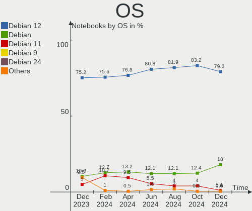
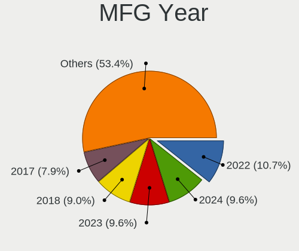
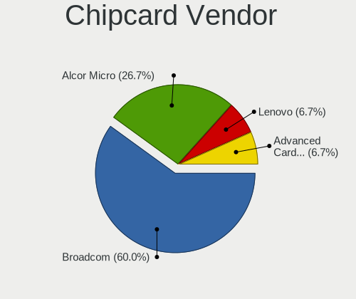

Debian - Hardware Trends (Notebooks)
------------------------------------

A project to identify most popular hardware characteristics and track their change
over time based on data collected by Linux users at https://Linux-Hardware.org.

Anyone can contribute to this report by the [hw-probe](https://github.com/linuxhw/hw-probe) tool:

    sudo -E hw-probe -all -upload

This report is for one last month. Overall report since the beginning of time: [TestDays](https://github.com/linuxhw/TestDays)

Period: Feb, 2023.

Contents
--------

* [ System ](#system)
  - [ OS                       ](#os)
  - [ OS Family                ](#os-family)
  - [ Kernel                   ](#kernel)
  - [ Kernel Family            ](#kernel-family)
  - [ Kernel Major Ver.        ](#kernel-major-ver)
  - [ Arch                     ](#arch)
  - [ DE                       ](#de)
  - [ Display Server           ](#display-server)
  - [ Display Manager          ](#display-manager)
  - [ OS Lang                  ](#os-lang)
  - [ Boot Mode                ](#boot-mode)
  - [ Filesystem               ](#filesystem)
  - [ Part. scheme             ](#part-scheme)
  - [ Dual Boot with Linux/BSD ](#dual-boot-with-linuxbsd)
  - [ Dual Boot (Win)          ](#dual-boot-win)

* [ Board ](#board)
  - [ Vendor                   ](#vendor)
  - [ Model                    ](#model)
  - [ Model Family             ](#model-family)
  - [ MFG Year                 ](#mfg-year)
  - [ Form Factor              ](#form-factor)
  - [ Secure Boot              ](#secure-boot)
  - [ Coreboot                 ](#coreboot)
  - [ RAM Size                 ](#ram-size)
  - [ RAM Used                 ](#ram-used)
  - [ Total Drives             ](#total-drives)
  - [ Has CD-ROM               ](#has-cd-rom)
  - [ Has Ethernet             ](#has-ethernet)
  - [ Has WiFi                 ](#has-wifi)
  - [ Has Bluetooth            ](#has-bluetooth)

* [ Location ](#location)
  - [ Country                  ](#country)
  - [ City                     ](#city)

* [ Drives ](#drives)
  - [ Drive Vendor             ](#drive-vendor)
  - [ Drive Model              ](#drive-model)
  - [ HDD Vendor               ](#hdd-vendor)
  - [ SSD Vendor               ](#ssd-vendor)
  - [ Drive Kind               ](#drive-kind)
  - [ Drive Connector          ](#drive-connector)
  - [ Drive Size               ](#drive-size)
  - [ Space Total              ](#space-total)
  - [ Space Used               ](#space-used)
  - [ Malfunc. Drives          ](#malfunc-drives)
  - [ Malfunc. Drive Vendor    ](#malfunc-drive-vendor)
  - [ Malfunc. HDD Vendor      ](#malfunc-hdd-vendor)
  - [ Malfunc. Drive Kind      ](#malfunc-drive-kind)
  - [ Failed Drives            ](#failed-drives)
  - [ Failed Drive Vendor      ](#failed-drive-vendor)
  - [ Drive Status             ](#drive-status)

* [ Storage controller ](#storage-controller)
  - [ Storage Vendor           ](#storage-vendor)
  - [ Storage Model            ](#storage-model)
  - [ Storage Kind             ](#storage-kind)

* [ Processor ](#processor)
  - [ CPU Vendor               ](#cpu-vendor)
  - [ CPU Model                ](#cpu-model)
  - [ CPU Model Family         ](#cpu-model-family)
  - [ CPU Cores                ](#cpu-cores)
  - [ CPU Sockets              ](#cpu-sockets)
  - [ CPU Threads              ](#cpu-threads)
  - [ CPU Op-Modes             ](#cpu-op-modes)
  - [ CPU Microcode            ](#cpu-microcode)
  - [ CPU Microarch            ](#cpu-microarch)

* [ Graphics ](#graphics)
  - [ GPU Vendor               ](#gpu-vendor)
  - [ GPU Model                ](#gpu-model)
  - [ GPU Combo                ](#gpu-combo)
  - [ GPU Driver               ](#gpu-driver)
  - [ GPU Memory               ](#gpu-memory)

* [ Monitor ](#monitor)
  - [ Monitor Vendor           ](#monitor-vendor)
  - [ Monitor Model            ](#monitor-model)
  - [ Monitor Resolution       ](#monitor-resolution)
  - [ Monitor Diagonal         ](#monitor-diagonal)
  - [ Monitor Width            ](#monitor-width)
  - [ Aspect Ratio             ](#aspect-ratio)
  - [ Monitor Area             ](#monitor-area)
  - [ Pixel Density            ](#pixel-density)
  - [ Multiple Monitors        ](#multiple-monitors)

* [ Network ](#network)
  - [ Net Controller Vendor    ](#net-controller-vendor)
  - [ Net Controller Model     ](#net-controller-model)
  - [ Wireless Vendor          ](#wireless-vendor)
  - [ Wireless Model           ](#wireless-model)
  - [ Ethernet Vendor          ](#ethernet-vendor)
  - [ Ethernet Model           ](#ethernet-model)
  - [ Net Controller Kind      ](#net-controller-kind)
  - [ Used Controller          ](#used-controller)
  - [ NICs                     ](#nics)
  - [ IPv6                     ](#ipv6)

* [ Bluetooth ](#bluetooth)
  - [ Bluetooth Vendor         ](#bluetooth-vendor)
  - [ Bluetooth Model          ](#bluetooth-model)

* [ Sound ](#sound)
  - [ Sound Vendor             ](#sound-vendor)
  - [ Sound Model              ](#sound-model)

* [ Memory ](#memory)
  - [ Memory Vendor            ](#memory-vendor)
  - [ Memory Model             ](#memory-model)
  - [ Memory Kind              ](#memory-kind)
  - [ Memory Form Factor       ](#memory-form-factor)
  - [ Memory Size              ](#memory-size)
  - [ Memory Speed             ](#memory-speed)

* [ Printers & scanners ](#printers--scanners)
  - [ Printer Vendor           ](#printer-vendor)
  - [ Printer Model            ](#printer-model)
  - [ Scanner Vendor           ](#scanner-vendor)
  - [ Scanner Model            ](#scanner-model)

* [ Camera ](#camera)
  - [ Camera Vendor            ](#camera-vendor)
  - [ Camera Model             ](#camera-model)

* [ Security ](#security)
  - [ Fingerprint Vendor       ](#fingerprint-vendor)
  - [ Fingerprint Model        ](#fingerprint-model)
  - [ Chipcard Vendor          ](#chipcard-vendor)
  - [ Chipcard Model           ](#chipcard-model)

* [ Unsupported ](#unsupported)
  - [ Unsupported Devices      ](#unsupported-devices)
  - [ Unsupported Device Types ](#unsupported-device-types)

System
------

OS
--

Installed operating systems

| Name      | Notebooks | Percent |
|-----------|-----------|---------|
| Debian 11 | 146       | 85.38%  |
| Debian    | 25        | 14.62%  |

OS Family
---------

OS without a version

| Name   | Notebooks | Percent |
|--------|-----------|---------|
| Debian | 171       | 100%    |

Kernel
------

Version of the Linux kernel

| Version                      | Notebooks | Percent |
|------------------------------|-----------|---------|
| 5.10.0-21-amd64              | 84        | 49.12%  |
| 5.10.0-20-amd64              | 23        | 13.45%  |
| 6.1.0-3-amd64                | 16        | 9.36%   |
| 5.10.0-2-amd64               | 6         | 3.51%   |
| 6.0.0-0.deb11.6-amd64        | 5         | 2.92%   |
| 6.1.0-2-amd64                | 3         | 1.75%   |
| 5.10.0-19-amd64              | 3         | 1.75%   |
| 6.1.0-5-amd64                | 2         | 1.17%   |
| 6.1.0-4-amd64                | 2         | 1.17%   |
| 6.0.0-2-amd64                | 2         | 1.17%   |
| 5.18.0-0.deb11.4-amd64       | 2         | 1.17%   |
| 5.10.0-21-686-pae            | 2         | 1.17%   |
| 5.10.0-20-686                | 2         | 1.17%   |
| 5.10.0-18-amd64              | 2         | 1.17%   |
| 5.10.0-15-amd64              | 2         | 1.17%   |
| 6.1.9-titanide               | 1         | 0.58%   |
| 6.1.12-1-liquorix-amd64      | 1         | 0.58%   |
| 6.1.0-2mx-amd64              | 1         | 0.58%   |
| 6.0.0-rc3-custom             | 1         | 0.58%   |
| 6.0.0-6-amd64                | 1         | 0.58%   |
| 6.0.0-4-amd64                | 1         | 0.58%   |
| 5.19.17                      | 1         | 0.58%   |
| 5.19.0-0.deb11.2-amd64       | 1         | 0.58%   |
| 5.16.0-0.bpo.4-amd64         | 1         | 0.58%   |
| 5.15.74-1-pve                | 1         | 0.58%   |
| 5.10.153-20434-g98da1eb2cf9d | 1         | 0.58%   |
| 5.10.0-9-amd64               | 1         | 0.58%   |
| 5.10.0-21-686                | 1         | 0.58%   |
| 5.10.0-17-amd64              | 1         | 0.58%   |
| 4.14.254-19583-g6c5eb0abb85d | 1         | 0.58%   |

Kernel Family
-------------

Linux kernel without a distro release

| Version  | Notebooks | Percent |
|----------|-----------|---------|
| 5.10.0   | 127       | 74.27%  |
| 6.1.0    | 24        | 14.04%  |
| 6.0.0    | 10        | 5.85%   |
| 5.18.0   | 2         | 1.17%   |
| 6.1.9    | 1         | 0.58%   |
| 6.1.12   | 1         | 0.58%   |
| 5.19.17  | 1         | 0.58%   |
| 5.19.0   | 1         | 0.58%   |
| 5.16.0   | 1         | 0.58%   |
| 5.15.74  | 1         | 0.58%   |
| 5.10.153 | 1         | 0.58%   |
| 4.14.254 | 1         | 0.58%   |

Kernel Major Ver.
-----------------

Linux kernel major version

| Version | Notebooks | Percent |
|---------|-----------|---------|
| 5.10    | 128       | 74.85%  |
| 6.1     | 26        | 15.2%   |
| 6.0     | 10        | 5.85%   |
| 5.19    | 2         | 1.17%   |
| 5.18    | 2         | 1.17%   |
| 5.16    | 1         | 0.58%   |
| 5.15    | 1         | 0.58%   |
| 4.14    | 1         | 0.58%   |

Arch
----

OS architecture (x86_64, i586, etc.)

| Name    | Notebooks | Percent |
|---------|-----------|---------|
| x86_64  | 165       | 96.49%  |
| i686    | 5         | 2.92%   |
| aarch64 | 1         | 0.58%   |

DE
--

Desktop Environment

| Name             | Notebooks | Percent |
|------------------|-----------|---------|
| GNOME            | 64        | 37.43%  |
| KDE5             | 27        | 15.79%  |
| XFCE             | 23        | 13.45%  |
| Unknown          | 17        | 9.94%   |
| LXDE             | 9         | 5.26%   |
| MATE             | 8         | 4.68%   |
| X-Cinnamon       | 7         | 4.09%   |
| Cinnamon         | 6         | 3.51%   |
| KDE              | 3         | 1.75%   |
| LXQt             | 2         | 1.17%   |
| xmonad           | 1         | 0.58%   |
| lightdm-xsession | 1         | 0.58%   |
| i3               | 1         | 0.58%   |
| GNOME Classic    | 1         | 0.58%   |
| BunsenLabs       | 1         | 0.58%   |

Display Server
--------------

X11 or Wayland

| Name    | Notebooks | Percent |
|---------|-----------|---------|
| X11     | 104       | 60.82%  |
| Wayland | 46        | 26.9%   |
| Unknown | 15        | 8.77%   |
| Tty     | 6         | 3.51%   |

Display Manager
---------------

SDDM, LightDM, etc.

| Name    | Notebooks | Percent |
|---------|-----------|---------|
| LightDM | 52        | 30.41%  |
| GDM     | 46        | 26.9%   |
| Unknown | 37        | 21.64%  |
| SDDM    | 21        | 12.28%  |
| GDM3    | 12        | 7.02%   |
| LXDM    | 2         | 1.17%   |
| Ly      | 1         | 0.58%   |

OS Lang
-------

Language

| Lang    | Notebooks | Percent |
|---------|-----------|---------|
| en_US   | 60        | 35.09%  |
| fr_FR   | 13        | 7.6%    |
| en_GB   | 13        | 7.6%    |
| de_DE   | 13        | 7.6%    |
| ru_RU   | 12        | 7.02%   |
| Unknown | 7         | 4.09%   |
| es_ES   | 6         | 3.51%   |
| it_IT   | 5         | 2.92%   |
| pl_PL   | 4         | 2.34%   |
| zh_CN   | 3         | 1.75%   |
| es_MX   | 3         | 1.75%   |
| C       | 3         | 1.75%   |
| pt_PT   | 2         | 1.17%   |
| pt_BR   | 2         | 1.17%   |
| nl_BE   | 2         | 1.17%   |
| fr_BE   | 2         | 1.17%   |
| fi_FI   | 2         | 1.17%   |
| es_AR   | 2         | 1.17%   |
| en_CA   | 2         | 1.17%   |
| de_CH   | 2         | 1.17%   |
| ca_ES   | 2         | 1.17%   |
| sl_SI   | 1         | 0.58%   |
| sk_SK   | 1         | 0.58%   |
| ku_TR   | 1         | 0.58%   |
| hu_HU   | 1         | 0.58%   |
| fr_CA   | 1         | 0.58%   |
| es_VE   | 1         | 0.58%   |
| es_CL   | 1         | 0.58%   |
| en_IN   | 1         | 0.58%   |
| en_DE   | 1         | 0.58%   |
| en_AU   | 1         | 0.58%   |
| be_BY   | 1         | 0.58%   |

Boot Mode
---------

EFI or BIOS

| Mode | Notebooks | Percent |
|------|-----------|---------|
| EFI  | 107       | 62.57%  |
| BIOS | 64        | 37.43%  |

Filesystem
----------

Type of filesystem

| Type    | Notebooks | Percent |
|---------|-----------|---------|
| Ext4    | 140       | 81.87%  |
| Overlay | 21        | 12.28%  |
| Btrfs   | 7         | 4.09%   |
| Zfs     | 1         | 0.58%   |
| Xfs     | 1         | 0.58%   |
| Tmpfs   | 1         | 0.58%   |

Part. scheme
------------

Scheme of partitioning

| Type    | Notebooks | Percent |
|---------|-----------|---------|
| GPT     | 116       | 67.84%  |
| MBR     | 37        | 21.64%  |
| Unknown | 18        | 10.53%  |

Dual Boot with Linux/BSD
------------------------

Hosting more than one Linux/BSD

| Dual boot | Notebooks | Percent |
|-----------|-----------|---------|
| No        | 146       | 85.38%  |
| Yes       | 25        | 14.62%  |

Dual Boot (Win)
---------------

Hosting Linux and Windows

| Dual boot | Notebooks | Percent |
|-----------|-----------|---------|
| No        | 122       | 71.35%  |
| Yes       | 49        | 28.65%  |

Board
-----

Vendor
------

Motherboard manufacturer

| Name                           | Notebooks | Percent |
|--------------------------------|-----------|---------|
| Lenovo                         | 38        | 22.22%  |
| Dell                           | 27        | 15.79%  |
| Hewlett-Packard                | 23        | 13.45%  |
| ASUSTek Computer               | 19        | 11.11%  |
| Acer                           | 15        | 8.77%   |
| Apple                          | 6         | 3.51%   |
| HUAWEI                         | 5         | 2.92%   |
| Google                         | 5         | 2.92%   |
| Samsung Electronics            | 4         | 2.34%   |
| Notebook                       | 4         | 2.34%   |
| Unknown                        | 4         | 2.34%   |
| Toshiba                        | 3         | 1.75%   |
| SmbiosType1_SystemManufacturer | 2         | 1.17%   |
| Panasonic                      | 2         | 1.17%   |
| Aquarius                       | 2         | 1.17%   |
| TUXEDO                         | 1         | 0.58%   |
| Timi                           | 1         | 0.58%   |
| SLIMBOOK                       | 1         | 0.58%   |
| Shanghai Zhaoxin Semiconductor | 1         | 0.58%   |
| Semp Toshiba                   | 1         | 0.58%   |
| Novatech                       | 1         | 0.58%   |
| Medion                         | 1         | 0.58%   |
| LincPlus                       | 1         | 0.58%   |
| Intel                          | 1         | 0.58%   |
| IBM                            | 1         | 0.58%   |
| Fujitsu                        | 1         | 0.58%   |
| AMI                            | 1         | 0.58%   |

Model
-----

Motherboard model

| Name                                                         | Notebooks | Percent |
|--------------------------------------------------------------|-----------|---------|
| Unknown                                                      | 4         | 2.34%   |
| Dell Precision 5570                                          | 3         | 1.75%   |
| SmbiosType1_SystemManufacturer SmbiosType1_SystemProductName | 2         | 1.17%   |
| HUAWEI WRT-WX9                                               | 2         | 1.17%   |
| HP Pavilion g6                                               | 2         | 1.17%   |
| Dell Latitude E6330                                          | 2         | 1.17%   |
| Dell Latitude E5430 non-vPro                                 | 2         | 1.17%   |
| Aquarius NS585                                               | 2         | 1.17%   |
| Apple MacBookAir7,2                                          | 2         | 1.17%   |
| TUXEDO Aura 15 Gen2                                          | 1         | 0.58%   |
| Toshiba Satellite P775                                       | 1         | 0.58%   |
| Toshiba Satellite C660                                       | 1         | 0.58%   |
| Toshiba Satellite C655                                       | 1         | 0.58%   |
| Timi Mi Laptop Pro 15                                        | 1         | 0.58%   |
| SLIMBOOK Essential15L                                        | 1         | 0.58%   |
| Shanghai Zhaoxin ZXE CRB                                     | 1         | 0.58%   |
| Semp Toshiba IS 1412                                         | 1         | 0.58%   |
| Samsung R530/R730                                            | 1         | 0.58%   |
| Samsung N150P                                                | 1         | 0.58%   |
| Samsung 600B4B/600B5B                                        | 1         | 0.58%   |
| Samsung 550XDA                                               | 1         | 0.58%   |
| Panasonic CF-54-1                                            | 1         | 0.58%   |
| Panasonic CF-31WEUEEBE                                       | 1         | 0.58%   |
| Novatech NL40_50CU                                           | 1         | 0.58%   |
| Notebook W65_67SJ                                            | 1         | 0.58%   |
| Notebook W54_55SU1,SUW                                       | 1         | 0.58%   |
| Notebook PB50_70RF,RD,RC                                     | 1         | 0.58%   |
| Notebook MAM2120                                             | 1         | 0.58%   |
| Medion BEAST X25                                             | 1         | 0.58%   |
| LincPlus P2                                                  | 1         | 0.58%   |
| Lenovo Z710 20250                                            | 1         | 0.58%   |
| Lenovo Z50-70 20354                                          | 1         | 0.58%   |
| Lenovo V310-15IKB 80T3                                       | 1         | 0.58%   |
| Lenovo ThinkPad X270 20HMS10600                              | 1         | 0.58%   |
| Lenovo ThinkPad X250 20CLS2TQ22                              | 1         | 0.58%   |
| Lenovo ThinkPad X13s Gen 1 21BXCTO1WW                        | 1         | 0.58%   |
| Lenovo ThinkPad X1 Yoga 3rd 20LDCTO1WW                       | 1         | 0.58%   |
| Lenovo ThinkPad T61p 6457UN2                                 | 1         | 0.58%   |
| Lenovo ThinkPad T480 20L5000UUS                              | 1         | 0.58%   |
| Lenovo ThinkPad T470 20HDS1DL03                              | 1         | 0.58%   |

Model Family
------------

Motherboard model prefix

| Name                                       | Notebooks | Percent |
|--------------------------------------------|-----------|---------|
| Lenovo ThinkPad                            | 26        | 15.2%   |
| Dell Latitude                              | 16        | 9.36%   |
| Acer Aspire                                | 9         | 5.26%   |
| HP EliteBook                               | 6         | 3.51%   |
| Lenovo IdeaPad                             | 4         | 2.34%   |
| HP ProBook                                 | 4         | 2.34%   |
| Dell Inspiron                              | 4         | 2.34%   |
| ASUS ZenBook                               | 4         | 2.34%   |
| Unknown                                    | 4         | 2.34%   |
| Toshiba Satellite                          | 3         | 1.75%   |
| HP Pavilion                                | 3         | 1.75%   |
| Dell Precision                             | 3         | 1.75%   |
| ASUS VivoBook                              | 3         | 1.75%   |
| SmbiosType1_SystemManufacturer SmbiosType1 | 2         | 1.17%   |
| HUAWEI WRT-WX9                             | 2         | 1.17%   |
| HP ZBook                                   | 2         | 1.17%   |
| HP Laptop                                  | 2         | 1.17%   |
| HP Compaq                                  | 2         | 1.17%   |
| ASUS ASUS                                  | 2         | 1.17%   |
| Aquarius NS585                             | 2         | 1.17%   |
| Apple MacBookAir7                          | 2         | 1.17%   |
| Acer Predator                              | 2         | 1.17%   |
| Acer Nitro                                 | 2         | 1.17%   |
| TUXEDO Aura                                | 1         | 0.58%   |
| Timi Mi                                    | 1         | 0.58%   |
| SLIMBOOK Essential15L                      | 1         | 0.58%   |
| Shanghai Zhaoxin ZXE                       | 1         | 0.58%   |
| Semp Toshiba IS                            | 1         | 0.58%   |
| Samsung R530                               | 1         | 0.58%   |
| Samsung N150P                              | 1         | 0.58%   |
| Samsung 600B4B                             | 1         | 0.58%   |
| Samsung 550XDA                             | 1         | 0.58%   |
| Panasonic CF-54-1                          | 1         | 0.58%   |
| Panasonic CF-31WEUEEBE                     | 1         | 0.58%   |
| Novatech NL40                              | 1         | 0.58%   |
| Notebook W65                               | 1         | 0.58%   |
| Notebook W54                               | 1         | 0.58%   |
| Notebook PB50                              | 1         | 0.58%   |
| Notebook MAM2120                           | 1         | 0.58%   |
| Medion BEAST                               | 1         | 0.58%   |

MFG Year
--------

Motherboard manufacture year

| Year | Notebooks | Percent |
|------|-----------|---------|
| 2022 | 21        | 12.28%  |
| 2021 | 20        | 11.7%   |
| 2019 | 18        | 10.53%  |
| 2020 | 13        | 7.6%    |
| 2014 | 13        | 7.6%    |
| 2012 | 13        | 7.6%    |
| 2013 | 11        | 6.43%   |
| 2018 | 10        | 5.85%   |
| 2017 | 10        | 5.85%   |
| 2016 | 7         | 4.09%   |
| 2015 | 7         | 4.09%   |
| 2011 | 7         | 4.09%   |
| 2009 | 6         | 3.51%   |
| 2008 | 4         | 2.34%   |
| 2006 | 4         | 2.34%   |
| 2010 | 3         | 1.75%   |
| 2007 | 2         | 1.17%   |
| 2023 | 1         | 0.58%   |
| 2005 | 1         | 0.58%   |

Form Factor
-----------

Physical design of the computer

| Name     | Notebooks | Percent |
|----------|-----------|---------|
| Notebook | 171       | 100%    |

Secure Boot
-----------

Enabled or disabled

| State    | Notebooks | Percent |
|----------|-----------|---------|
| Disabled | 151       | 88.3%   |
| Enabled  | 20        | 11.7%   |

Coreboot
--------

Have coreboot on board

| Used | Notebooks | Percent |
|------|-----------|---------|
| No   | 166       | 97.08%  |
| Yes  | 5         | 2.92%   |

RAM Size
--------

Total RAM memory

| Size in GB  | Notebooks | Percent |
|-------------|-----------|---------|
| 4.01-8.0    | 50        | 29.24%  |
| 3.01-4.0    | 33        | 19.3%   |
| 16.01-24.0  | 32        | 18.71%  |
| 8.01-16.0   | 24        | 14.04%  |
| 32.01-64.0  | 11        | 6.43%   |
| 1.01-2.0    | 7         | 4.09%   |
| 64.01-256.0 | 5         | 2.92%   |
| 2.01-3.0    | 4         | 2.34%   |
| 24.01-32.0  | 3         | 1.75%   |
| 0.51-1.0    | 2         | 1.17%   |

RAM Used
--------

Used RAM memory

| Used GB   | Notebooks | Percent |
|-----------|-----------|---------|
| 1.01-2.0  | 56        | 32.75%  |
| 2.01-3.0  | 41        | 23.98%  |
| 4.01-8.0  | 25        | 14.62%  |
| 3.01-4.0  | 21        | 12.28%  |
| 0.51-1.0  | 17        | 9.94%   |
| 0.01-0.5  | 7         | 4.09%   |
| 8.01-16.0 | 4         | 2.34%   |

Total Drives
------------

Number of drives on board

| Drives | Notebooks | Percent |
|--------|-----------|---------|
| 1      | 135       | 78.95%  |
| 2      | 30        | 17.54%  |
| 3      | 4         | 2.34%   |
| 4      | 1         | 0.58%   |
| 0      | 1         | 0.58%   |

Has CD-ROM
----------

Has CD-ROM on board

| Presented | Notebooks | Percent |
|-----------|-----------|---------|
| No        | 120       | 70.18%  |
| Yes       | 51        | 29.82%  |

Has Ethernet
------------

Has Ethernet on board

| Presented | Notebooks | Percent |
|-----------|-----------|---------|
| Yes       | 144       | 84.21%  |
| No        | 27        | 15.79%  |

Has WiFi
--------

Has WiFi module

| Presented | Notebooks | Percent |
|-----------|-----------|---------|
| Yes       | 161       | 94.15%  |
| No        | 10        | 5.85%   |

Has Bluetooth
-------------

Has Bluetooth module

| Presented | Notebooks | Percent |
|-----------|-----------|---------|
| Yes       | 132       | 77.19%  |
| No        | 39        | 22.81%  |

Location
--------

Country
-------

Geographic location (country)

| Country     | Notebooks | Percent |
|-------------|-----------|---------|
| USA         | 23        | 13.45%  |
| Germany     | 20        | 11.7%   |
| France      | 15        | 8.77%   |
| Russia      | 12        | 7.02%   |
| Spain       | 9         | 5.26%   |
| Italy       | 9         | 5.26%   |
| UK          | 6         | 3.51%   |
| Poland      | 6         | 3.51%   |
| Hungary     | 6         | 3.51%   |
| Finland     | 6         | 3.51%   |
| Brazil      | 6         | 3.51%   |
| Belgium     | 6         | 3.51%   |
| Mexico      | 4         | 2.34%   |
| Turkey      | 3         | 1.75%   |
| Switzerland | 3         | 1.75%   |
| Portugal    | 3         | 1.75%   |
| Netherlands | 3         | 1.75%   |
| Canada      | 3         | 1.75%   |
| Argentina   | 3         | 1.75%   |
| Sweden      | 2         | 1.17%   |
| China       | 2         | 1.17%   |
| Bulgaria    | 2         | 1.17%   |
| Venezuela   | 1         | 0.58%   |
| Ukraine     | 1         | 0.58%   |
| Thailand    | 1         | 0.58%   |
| Sudan       | 1         | 0.58%   |
| Sri Lanka   | 1         | 0.58%   |
| Slovenia    | 1         | 0.58%   |
| Singapore   | 1         | 0.58%   |
| Nepal       | 1         | 0.58%   |
| Morocco     | 1         | 0.58%   |
| Iran        | 1         | 0.58%   |
| India       | 1         | 0.58%   |
| Hong Kong   | 1         | 0.58%   |
| Guatemala   | 1         | 0.58%   |
| Greece      | 1         | 0.58%   |
| Czechia     | 1         | 0.58%   |
| Croatia     | 1         | 0.58%   |
| Chile       | 1         | 0.58%   |
| Belarus     | 1         | 0.58%   |

City
----

Geographic location (city)

| City                  | Notebooks | Percent |
|-----------------------|-----------|---------|
| Voronezh              | 7         | 4.09%   |
| Paris                 | 7         | 4.09%   |
| Bangor                | 5         | 2.92%   |
| Warsaw                | 3         | 1.75%   |
| Palhaza               | 3         | 1.75%   |
| Istanbul              | 3         | 1.75%   |
| Helsinki              | 3         | 1.75%   |
| St Petersburg         | 2         | 1.17%   |
| Sofia                 | 2         | 1.17%   |
| Naessjoe              | 2         | 1.17%   |
| Munich                | 2         | 1.17%   |
| Mexico City           | 2         | 1.17%   |
| Frankfurt am Main     | 2         | 1.17%   |
| Cottbus               | 2         | 1.17%   |
| Budapest              | 2         | 1.17%   |
| Bocholt               | 2         | 1.17%   |
| Barcelona             | 2         | 1.17%   |
| Zapopan               | 1         | 0.58%   |
| Zagreb                | 1         | 0.58%   |
| Wilhelmshaven         | 1         | 0.58%   |
| Vorselaar             | 1         | 0.58%   |
| Vleuten               | 1         | 0.58%   |
| Vila Nova de Cerveira | 1         | 0.58%   |
| Utrecht               | 1         | 0.58%   |
| Ultimo                | 1         | 0.58%   |
| Ulm                   | 1         | 0.58%   |
| Turin                 | 1         | 0.58%   |
| Tuen Mun              | 1         | 0.58%   |
| Tuapse                | 1         | 0.58%   |
| The Bronx             | 1         | 0.58%   |
| Tampere               | 1         | 0.58%   |
| Sutton in Ashfield    | 1         | 0.58%   |
| Statte                | 1         | 0.58%   |
| Singapore             | 1         | 0.58%   |
| Shenyang              | 1         | 0.58%   |
| Shanghai              | 1         | 0.58%   |
| Seville               | 1         | 0.58%   |
| Sarnia                | 1         | 0.58%   |
| Sao Paulo             | 1         | 0.58%   |
| Sancoins              | 1         | 0.58%   |

Drives
------

Drive Vendor
------------

Hard drive vendors

| Vendor                      | Notebooks | Drives | Percent |
|-----------------------------|-----------|--------|---------|
| Samsung Electronics         | 41        | 41     | 19.81%  |
| WDC                         | 17        | 17     | 8.21%   |
| Seagate                     | 15        | 15     | 7.25%   |
| Unknown                     | 14        | 15     | 6.76%   |
| Kingston                    | 14        | 14     | 6.76%   |
| SanDisk                     | 13        | 13     | 6.28%   |
| Toshiba                     | 11        | 11     | 5.31%   |
| Crucial                     | 9         | 9      | 4.35%   |
| A-DATA Technology           | 6         | 6      | 2.9%    |
| SK hynix                    | 5         | 5      | 2.42%   |
| Intel                       | 5         | 5      | 2.42%   |
| KIOXIA                      | 4         | 4      | 1.93%   |
| HGST                        | 4         | 4      | 1.93%   |
| Apple                       | 4         | 4      | 1.93%   |
| Unknown                     | 4         | 4      | 1.93%   |
| JMicron Technology          | 3         | 3      | 1.45%   |
| China                       | 3         | 3      | 1.45%   |
| Transcend                   | 2         | 2      | 0.97%   |
| Micron Technology           | 2         | 2      | 0.97%   |
| LITEON                      | 2         | 2      | 0.97%   |
| Hitachi                     | 2         | 2      | 0.97%   |
| GOODRAM                     | 2         | 2      | 0.97%   |
| ZTE                         | 1         | 1      | 0.48%   |
| UMIS                        | 1         | 1      | 0.48%   |
| TO Exter                    | 1         | 1      | 0.48%   |
| Teelkoou                    | 1         | 1      | 0.48%   |
| Team                        | 1         | 1      | 0.48%   |
| SPCC                        | 1         | 1      | 0.48%   |
| sk600                       | 1         | 1      | 0.48%   |
| Silicon Motion              | 1         | 1      | 0.48%   |
| SABRENT                     | 1         | 1      | 0.48%   |
| PNY                         | 1         | 1      | 0.48%   |
| Phison                      | 1         | 1      | 0.48%   |
| OCZ                         | 1         | 1      | 0.48%   |
| Netac                       | 1         | 1      | 0.48%   |
| MAXIO Technology (Hangzhou) | 1         | 1      | 0.48%   |
| LaCie                       | 1         | 1      | 0.48%   |
| Kolink                      | 1         | 1      | 0.48%   |
| Intenso                     | 1         | 1      | 0.48%   |
| Haizhide                    | 1         | 1      | 0.48%   |

Drive Model
-----------

Hard drive models

| Model                                | Notebooks | Percent |
|--------------------------------------|-----------|---------|
| Kingston SA400S37240G 240GB SSD      | 4         | 1.92%   |
| Unknown                              | 4         | 1.92%   |
| Samsung SSD 980 1TB                  | 3         | 1.44%   |
| Samsung PM9A1 NVMe 1024GB            | 3         | 1.44%   |
| Kingston SV300S37A120G 120GB SSD     | 3         | 1.44%   |
| Crucial CT500MX500SSD1 500GB         | 3         | 1.44%   |
| Unknown MMC Card  32GB               | 2         | 0.96%   |
| Seagate ST2000LM015-2E8174 2TB       | 2         | 0.96%   |
| Seagate ST1000LX015-1U7172 1TB       | 2         | 0.96%   |
| SanDisk SD8SN8U-256G-1006 256GB SSD  | 2         | 0.96%   |
| SanDisk NVMe SSD Drive 512GB         | 2         | 0.96%   |
| Samsung SSD 980 PRO 2TB              | 2         | 0.96%   |
| Samsung SSD 970 EVO Plus 1TB         | 2         | 0.96%   |
| Samsung MZVLB512HBJQ-000H1 512GB     | 2         | 0.96%   |
| Samsung CJNB4R  64GB                 | 2         | 0.96%   |
| Kingston SNVS1000G 1TB               | 2         | 0.96%   |
| JMicron Generic 200GB                | 2         | 0.96%   |
| Intel SSDPEKNW512G8 512GB            | 2         | 0.96%   |
| HGST HTS541010A9E680 1TB             | 2         | 0.96%   |
| Crucial CT1000MX500SSD1 1TB          | 2         | 0.96%   |
| A-DATA SU800 512GB SSD               | 2         | 0.96%   |
| ZTE MMC Storage 942MB                | 1         | 0.48%   |
| WDC WDS200T2B0C-00PXH0 2TB           | 1         | 0.48%   |
| WDC WD5000LPVT-22G33T0 500GB         | 1         | 0.48%   |
| WDC WD5000LPLX-66ZNTT1 500GB         | 1         | 0.48%   |
| WDC WD5000LPCX-24C6HT0 500GB         | 1         | 0.48%   |
| WDC WD5000BPKX-00HPJT0 500GB         | 1         | 0.48%   |
| WDC WD3200BEVT-22ZCT0 320GB          | 1         | 0.48%   |
| WDC WD2500BEVT-75A23T0 250GB         | 1         | 0.48%   |
| WDC WD2500BEVT-00ZCT0 250GB          | 1         | 0.48%   |
| WDC WD10SPZX-75Z10T2 1TB             | 1         | 0.48%   |
| WDC WD10SPZX-35Z10T0 1TB             | 1         | 0.48%   |
| WDC PC SN730 SDBPNTY-512G-1027 512GB | 1         | 0.48%   |
| WDC PC SN730 SDBPNTY-256G            | 1         | 0.48%   |
| WDC PC SN730 SDBPNTY-1T00-1102 1TB   | 1         | 0.48%   |
| WDC PC SN730 SDBPNTY-1T00-1101 1TB   | 1         | 0.48%   |
| WDC PC SN720 SDAPNTW-512G-1027 512GB | 1         | 0.48%   |
| WDC PC SN530 SDBPMPZ-512G-1001 512GB | 1         | 0.48%   |
| WDC PC SA530 SDASN8Y-256G-1006 256GB | 1         | 0.48%   |
| Unknown xD/SD/M.S.                   | 1         | 0.48%   |

HDD Vendor
----------

Hard disk drive vendors

| Vendor              | Notebooks | Drives | Percent |
|---------------------|-----------|--------|---------|
| Seagate             | 13        | 13     | 31.71%  |
| WDC                 | 9         | 9      | 21.95%  |
| Toshiba             | 6         | 6      | 14.63%  |
| HGST                | 4         | 4      | 9.76%   |
| Samsung Electronics | 3         | 3      | 7.32%   |
| JMicron Technology  | 2         | 2      | 4.88%   |
| Hitachi             | 2         | 2      | 4.88%   |
| SABRENT             | 1         | 1      | 2.44%   |
| Fujitsu             | 1         | 1      | 2.44%   |

SSD Vendor
----------

Solid state drive vendors

| Vendor              | Notebooks | Drives | Percent |
|---------------------|-----------|--------|---------|
| Samsung Electronics | 10        | 10     | 14.49%  |
| Kingston            | 9         | 9      | 13.04%  |
| Crucial             | 8         | 8      | 11.59%  |
| SanDisk             | 7         | 7      | 10.14%  |
| A-DATA Technology   | 5         | 5      | 7.25%   |
| Apple               | 4         | 4      | 5.8%    |
| China               | 3         | 3      | 4.35%   |
| Transcend           | 2         | 2      | 2.9%    |
| GOODRAM             | 2         | 2      | 2.9%    |
| WDC                 | 1         | 1      | 1.45%   |
| Toshiba             | 1         | 1      | 1.45%   |
| TO Exter            | 1         | 1      | 1.45%   |
| Teelkoou            | 1         | 1      | 1.45%   |
| Team                | 1         | 1      | 1.45%   |
| SPCC                | 1         | 1      | 1.45%   |
| sk600               | 1         | 1      | 1.45%   |
| PNY                 | 1         | 1      | 1.45%   |
| OCZ                 | 1         | 1      | 1.45%   |
| Netac               | 1         | 1      | 1.45%   |
| LITEON              | 1         | 1      | 1.45%   |
| Kolink              | 1         | 1      | 1.45%   |
| Intenso             | 1         | 1      | 1.45%   |
| Intel               | 1         | 1      | 1.45%   |
| Haizhide            | 1         | 1      | 1.45%   |
| FORESEE             | 1         | 1      | 1.45%   |
| Dogfish             | 1         | 1      | 1.45%   |
| Apacer              | 1         | 1      | 1.45%   |
| Unknown             | 1         | 1      | 1.45%   |

Drive Kind
----------

HDD or SSD

| Kind    | Notebooks | Drives | Percent |
|---------|-----------|--------|---------|
| NVMe    | 70        | 74     | 35.18%  |
| SSD     | 67        | 69     | 33.67%  |
| HDD     | 40        | 41     | 20.1%   |
| MMC     | 17        | 18     | 8.54%   |
| Unknown | 5         | 6      | 2.51%   |

Drive Connector
---------------

SATA, SAS, NVMe, etc.

| Type | Notebooks | Drives | Percent |
|------|-----------|--------|---------|
| SATA | 97        | 105    | 50%     |
| NVMe | 69        | 73     | 35.57%  |
| MMC  | 17        | 18     | 8.76%   |
| SAS  | 11        | 12     | 5.67%   |

Drive Size
----------

Size of hard drive

| Size in TB | Notebooks | Drives | Percent |
|------------|-----------|--------|---------|
| 0.01-0.5   | 81        | 88     | 78.64%  |
| 0.51-1.0   | 19        | 19     | 18.45%  |
| 1.01-2.0   | 2         | 2      | 1.94%   |
| 3.01-4.0   | 1         | 1      | 0.97%   |

Space Total
-----------

Amount of disk space available on the file system

| Size in GB     | Notebooks | Percent |
|----------------|-----------|---------|
| 101-250        | 51        | 29.82%  |
| 251-500        | 41        | 23.98%  |
| 501-1000       | 23        | 13.45%  |
| 51-100         | 13        | 7.6%    |
| Unknown        | 12        | 7.02%   |
| 21-50          | 10        | 5.85%   |
| 1001-2000      | 10        | 5.85%   |
| 1-20           | 7         | 4.09%   |
| More than 3000 | 2         | 1.17%   |
| 2001-3000      | 2         | 1.17%   |

Space Used
----------

Amount of used disk space

| Used GB   | Notebooks | Percent |
|-----------|-----------|---------|
| 1-20      | 71        | 41.52%  |
| 101-250   | 27        | 15.79%  |
| 21-50     | 22        | 12.87%  |
| 51-100    | 18        | 10.53%  |
| Unknown   | 12        | 7.02%   |
| 251-500   | 10        | 5.85%   |
| 501-1000  | 8         | 4.68%   |
| 1001-2000 | 2         | 1.17%   |
| 2001-3000 | 1         | 0.58%   |

Malfunc. Drives
---------------

Drive models with a malfunction

| Model                                                           | Notebooks | Drives | Percent |
|-----------------------------------------------------------------|-----------|--------|---------|
| Toshiba MK5061GSYN 500GB                                        | 1         | 1      | 7.69%   |
| Seagate ST9500420AS 500GB                                       | 1         | 1      | 7.69%   |
| Seagate ST9500325AS 500GB                                       | 1         | 1      | 7.69%   |
| Samsung Electronics SSD 980 1TB                                 | 1         | 1      | 7.69%   |
| Samsung Electronics NVMe SSD Controller SM981/PM981/PM983 250GB | 1         | 1      | 7.69%   |
| Samsung Electronics HM100JC 100GB                               | 1         | 1      | 7.69%   |
| Samsung Electronics HM060HI 64GB                                | 1         | 1      | 7.69%   |
| JMicron Technology Generic 200GB                                | 1         | 1      | 7.69%   |
| Intel SSDSC2BF180A5L 180GB                                      | 1         | 1      | 7.69%   |
| Hitachi HTS543225A7A384 250GB                                   | 1         | 1      | 7.69%   |
| HGST HTS725050A7E630 500GB                                      | 1         | 1      | 7.69%   |
| HGST HTS541010A9E680 1TB                                        | 1         | 1      | 7.69%   |
| A-DATA Technology SU650 240GB SSD                               | 1         | 1      | 7.69%   |

Malfunc. Drive Vendor
---------------------

Vendors of faulty drives

| Vendor              | Notebooks | Drives | Percent |
|---------------------|-----------|--------|---------|
| Samsung Electronics | 4         | 4      | 30.77%  |
| Seagate             | 2         | 2      | 15.38%  |
| HGST                | 2         | 2      | 15.38%  |
| Toshiba             | 1         | 1      | 7.69%   |
| JMicron Technology  | 1         | 1      | 7.69%   |
| Intel               | 1         | 1      | 7.69%   |
| Hitachi             | 1         | 1      | 7.69%   |
| A-DATA Technology   | 1         | 1      | 7.69%   |

Malfunc. HDD Vendor
-------------------

Vendors of faulty HDD drives

| Vendor              | Notebooks | Drives | Percent |
|---------------------|-----------|--------|---------|
| Seagate             | 2         | 2      | 22.22%  |
| Samsung Electronics | 2         | 2      | 22.22%  |
| HGST                | 2         | 2      | 22.22%  |
| Toshiba             | 1         | 1      | 11.11%  |
| JMicron Technology  | 1         | 1      | 11.11%  |
| Hitachi             | 1         | 1      | 11.11%  |

Malfunc. Drive Kind
-------------------

Kinds of faulty drives

| Kind | Notebooks | Drives | Percent |
|------|-----------|--------|---------|
| HDD  | 9         | 9      | 69.23%  |
| NVMe | 2         | 2      | 15.38%  |
| SSD  | 2         | 2      | 15.38%  |

Failed Drives
-------------

Failed drive models

Zero info for selected period =(

Failed Drive Vendor
-------------------

Failed drive vendors

Zero info for selected period =(

Drive Status
------------

Number of failed and malfunc. drives

| Status   | Notebooks | Drives | Percent |
|----------|-----------|--------|---------|
| Works    | 127       | 142    | 68.28%  |
| Detected | 46        | 53     | 24.73%  |
| Malfunc  | 13        | 13     | 6.99%   |

Storage controller
------------------

Storage Vendor
--------------

Storage controller vendors

| Vendor                           | Notebooks | Percent |
|----------------------------------|-----------|---------|
| Intel                            | 110       | 55%     |
| Samsung Electronics              | 29        | 14.5%   |
| AMD                              | 15        | 7.5%    |
| Sandisk                          | 13        | 6.5%    |
| SK hynix                         | 5         | 2.5%    |
| KIOXIA                           | 5         | 2.5%    |
| Kingston Technology Company      | 5         | 2.5%    |
| Toshiba America Info Systems     | 3         | 1.5%    |
| Micron Technology                | 2         | 1%      |
| ADATA Technology                 | 2         | 1%      |
| Union Memory (Shenzhen)          | 1         | 0.5%    |
| ULi Electronics                  | 1         | 0.5%    |
| Silicon Motion                   | 1         | 0.5%    |
| Silicon Integrated Systems [SiS] | 1         | 0.5%    |
| Phison Electronics               | 1         | 0.5%    |
| Nvidia                           | 1         | 0.5%    |
| Micron/Crucial Technology        | 1         | 0.5%    |
| MAXIO Technology (Hangzhou)      | 1         | 0.5%    |
| Lite-On Technology               | 1         | 0.5%    |
| Jiangsu Huacun Elec.             | 1         | 0.5%    |
| Biwin Storage Technology         | 1         | 0.5%    |

Storage Model
-------------

Storage controller models

| Model                                                                          | Notebooks | Percent |
|--------------------------------------------------------------------------------|-----------|---------|
| Intel 7 Series Chipset Family 6-port SATA Controller [AHCI mode]               | 15        | 6.98%   |
| AMD FCH SATA Controller [AHCI mode]                                            | 13        | 6.05%   |
| Intel Sunrise Point-LP SATA Controller [AHCI mode]                             | 12        | 5.58%   |
| Intel 82801 Mobile SATA Controller [RAID mode]                                 | 9         | 4.19%   |
| Samsung NVMe SSD Controller PM9A1/PM9A3/980PRO                                 | 8         | 3.72%   |
| Samsung NVMe SSD Controller 980                                                | 8         | 3.72%   |
| Samsung NVMe SSD Controller SM981/PM981/PM983                                  | 7         | 3.26%   |
| Intel Volume Management Device NVMe RAID Controller                            | 7         | 3.26%   |
| Intel Comet Lake SATA AHCI Controller                                          | 7         | 3.26%   |
| Intel 8 Series SATA Controller 1 [AHCI mode]                                   | 7         | 3.26%   |
| Intel Wildcat Point-LP SATA Controller [AHCI Mode]                             | 6         | 2.79%   |
| Intel 8 Series/C220 Series Chipset Family 6-port SATA Controller 1 [AHCI mode] | 6         | 2.79%   |
| SanDisk WD Black SN750 / PC SN730 NVMe SSD                                     | 4         | 1.86%   |
| SanDisk Non-Volatile memory controller                                         | 4         | 1.86%   |
| Intel Tiger Lake-LP SATA Controller                                            | 4         | 1.86%   |
| Intel 82801IBM/IEM (ICH9M/ICH9M-E) 4 port SATA Controller [AHCI mode]          | 4         | 1.86%   |
| KIOXIA NVMe SSD Controller BG4                                                 | 3         | 1.4%    |
| Intel SSD 660P Series                                                          | 3         | 1.4%    |
| Intel Cannon Point-LP SATA Controller [AHCI Mode]                              | 3         | 1.4%    |
| Intel Cannon Lake Mobile PCH SATA AHCI Controller                              | 3         | 1.4%    |
| Intel 6 Series/C200 Series Chipset Family 6 port Mobile SATA AHCI Controller   | 3         | 1.4%    |
| Intel 5 Series/3400 Series Chipset 4 port SATA AHCI Controller                 | 3         | 1.4%    |
| Toshiba America Info Systems XG5 NVMe SSD Controller                           | 2         | 0.93%   |
| SK hynix Gold P31/PC711 NVMe Solid State Drive                                 | 2         | 0.93%   |
| SK hynix BC501 NVMe Solid State Drive                                          | 2         | 0.93%   |
| SanDisk WD PC SN810 / Black SN850 NVMe SSD                                     | 2         | 0.93%   |
| SanDisk WD Black 2018/SN750 / PC SN720 NVMe SSD                                | 2         | 0.93%   |
| Samsung NVMe SSD Controller PM9B1                                              | 2         | 0.93%   |
| Samsung Electronics SATA controller                                            | 2         | 0.93%   |
| Micron Non-Volatile memory controller                                          | 2         | 0.93%   |
| KIOXIA Non-Volatile memory controller                                          | 2         | 0.93%   |
| Intel Jasper Lake SATA AHCI Controller                                         | 2         | 0.93%   |
| Intel Celeron N3350/Pentium N4200/Atom E3900 Series SATA AHCI Controller       | 2         | 0.93%   |
| Intel Cannon Lake PCH SATA AHCI Controller                                     | 2         | 0.93%   |
| Intel Alder Lake-P SATA AHCI Controller                                        | 2         | 0.93%   |
| Intel 82801IBM/IEM (ICH9M/ICH9M-E) 2 port SATA Controller [IDE mode]           | 2         | 0.93%   |
| Intel 82801HM/HEM (ICH8M/ICH8M-E) SATA Controller [AHCI mode]                  | 2         | 0.93%   |
| Intel 82801HM/HEM (ICH8M/ICH8M-E) IDE Controller                               | 2         | 0.93%   |
| Intel 82801GBM/GHM (ICH7-M Family) SATA Controller [IDE mode]                  | 2         | 0.93%   |
| Intel 82801G (ICH7 Family) IDE Controller                                      | 2         | 0.93%   |

Storage Kind
------------

Kind of storage controller (IDE, SATA, NVMe, SAS, ...)

| Kind | Notebooks | Percent |
|------|-----------|---------|
| SATA | 109       | 52.4%   |
| NVMe | 69        | 33.17%  |
| RAID | 16        | 7.69%   |
| IDE  | 14        | 6.73%   |

Processor
---------

CPU Vendor
----------

Processor vendors

| Vendor       | Notebooks | Percent |
|--------------|-----------|---------|
| Intel        | 142       | 83.04%  |
| AMD          | 26        | 15.2%   |
| CentaurHauls | 2         | 1.17%   |
| ARM          | 1         | 0.58%   |

CPU Model
---------

Processor models

| Model                                          | Notebooks | Percent |
|------------------------------------------------|-----------|---------|
| Intel Core i5-10210U CPU @ 1.60GHz             | 6         | 3.51%   |
| Intel Core i5-5300U CPU @ 2.30GHz              | 5         | 2.92%   |
| Intel 12th Gen Core i7-12700H                  | 4         | 2.34%   |
| Intel 11th Gen Core i5-1135G7 @ 2.40GHz        | 4         | 2.34%   |
| Intel Core i7-8550U CPU @ 1.80GHz              | 3         | 1.75%   |
| Intel Core i7-10510U CPU @ 1.80GHz             | 3         | 1.75%   |
| Intel Core i5-8265U CPU @ 1.60GHz              | 3         | 1.75%   |
| Intel Core i5-3210M CPU @ 2.50GHz              | 3         | 1.75%   |
| Intel Celeron CPU N3350 @ 1.10GHz              | 3         | 1.75%   |
| Intel 12th Gen Core i7-1255U                   | 3         | 1.75%   |
| AMD Ryzen 7 5800H with Radeon Graphics         | 3         | 1.75%   |
| Intel Core i7-8565U CPU @ 1.80GHz              | 2         | 1.17%   |
| Intel Core i7-7500U CPU @ 2.70GHz              | 2         | 1.17%   |
| Intel Core i7-4710MQ CPU @ 2.50GHz             | 2         | 1.17%   |
| Intel Core i7-3540M CPU @ 3.00GHz              | 2         | 1.17%   |
| Intel Core i5-8250U CPU @ 1.60GHz              | 2         | 1.17%   |
| Intel Core i5-7200U CPU @ 2.50GHz              | 2         | 1.17%   |
| Intel Core i5-5250U CPU @ 1.60GHz              | 2         | 1.17%   |
| Intel Core i5-4200U CPU @ 1.60GHz              | 2         | 1.17%   |
| Intel Core i5-3340M CPU @ 2.70GHz              | 2         | 1.17%   |
| Intel Core i5-3320M CPU @ 2.60GHz              | 2         | 1.17%   |
| Intel Core i5-3230M CPU @ 2.60GHz              | 2         | 1.17%   |
| Intel Core i5-2520M CPU @ 2.50GHz              | 2         | 1.17%   |
| Intel Core i5-10300H CPU @ 2.50GHz             | 2         | 1.17%   |
| Intel Core i3-9100 CPU @ 3.60GHz               | 2         | 1.17%   |
| Intel Core i3-7100U CPU @ 2.40GHz              | 2         | 1.17%   |
| Intel Core i3-6006U CPU @ 2.00GHz              | 2         | 1.17%   |
| Intel Core 2 Duo CPU T8300 @ 2.40GHz           | 2         | 1.17%   |
| Intel Celeron N5105 @ 2.00GHz                  | 2         | 1.17%   |
| Intel Celeron N4020 CPU @ 1.10GHz              | 2         | 1.17%   |
| Intel Atom x5-Z8350 CPU @ 1.44GHz              | 2         | 1.17%   |
| Intel 12th Gen Core i7-1265U                   | 2         | 1.17%   |
| Intel 12th Gen Core i5-1235U                   | 2         | 1.17%   |
| Intel 11th Gen Core i7-11800H @ 2.30GHz        | 2         | 1.17%   |
| CentaurHauls ZHAOXIN KaiXian KX-6640MA@2.2+GHz | 2         | 1.17%   |
| AMD Ryzen 9 5900HX with Radeon Graphics        | 2         | 1.17%   |
| AMD Ryzen 7 PRO 4750U with Radeon Graphics     | 2         | 1.17%   |
| AMD C-50 Processor                             | 2         | 1.17%   |
| Intel Pentium M processor 2.13GHz              | 1         | 0.58%   |
| Intel Pentium Dual-Core CPU T4400 @ 2.20GHz    | 1         | 0.58%   |

CPU Model Family
----------------

Processor model prefix

| Model                   | Notebooks | Percent |
|-------------------------|-----------|---------|
| Intel Core i5           | 47        | 27.49%  |
| Intel Core i7           | 28        | 16.37%  |
| Other                   | 24        | 14.04%  |
| Intel Core i3           | 15        | 8.77%   |
| Intel Celeron           | 11        | 6.43%   |
| AMD Ryzen 7             | 7         | 4.09%   |
| Intel Core 2 Duo        | 6         | 3.51%   |
| Intel Atom              | 5         | 2.92%   |
| AMD Ryzen 5             | 5         | 2.92%   |
| Intel Pentium Dual-Core | 2         | 1.17%   |
| Intel Pentium Dual      | 2         | 1.17%   |
| AMD Ryzen 9             | 2         | 1.17%   |
| AMD Ryzen 7 PRO         | 2         | 1.17%   |
| AMD E1                  | 2         | 1.17%   |
| AMD C-50                | 2         | 1.17%   |
| Intel Pentium M         | 1         | 0.58%   |
| Intel Pentium           | 1         | 0.58%   |
| Intel Genuine           | 1         | 0.58%   |
| Intel Core m7           | 1         | 0.58%   |
| Intel Core i9           | 1         | 0.58%   |
| Intel Core 2            | 1         | 0.58%   |
| AMD Turion 64 Mobile    | 1         | 0.58%   |
| AMD Ryzen 3 PRO         | 1         | 0.58%   |
| AMD A8                  | 1         | 0.58%   |
| AMD A4                  | 1         | 0.58%   |
| AMD A10                 | 1         | 0.58%   |

CPU Cores
---------

Number of processor cores

| Number | Notebooks | Percent |
|--------|-----------|---------|
| 2      | 83        | 48.54%  |
| 4      | 52        | 30.41%  |
| 8      | 14        | 8.19%   |
| 10     | 8         | 4.68%   |
| 6      | 6         | 3.51%   |
| 14     | 4         | 2.34%   |
| 1      | 4         | 2.34%   |

CPU Sockets
-----------

Number of sockets

| Number | Notebooks | Percent |
|--------|-----------|---------|
| 1      | 171       | 100%    |

CPU Threads
-----------

Threads per core (Hyper-Threading)

| Number | Notebooks | Percent |
|--------|-----------|---------|
| 2      | 118       | 69.01%  |
| 1      | 53        | 30.99%  |

CPU Op-Modes
------------

CPU Operation Modes (32-bit, 64-bit)

| Op mode        | Notebooks | Percent |
|----------------|-----------|---------|
| 32-bit, 64-bit | 168       | 98.25%  |
| 32-bit         | 3         | 1.75%   |

CPU Microcode
-------------

Microcode number

| Number     | Notebooks | Percent |
|------------|-----------|---------|
| Unknown    | 33        | 19.3%   |
| 0x306a9    | 13        | 7.6%    |
| 0x806ec    | 12        | 7.02%   |
| 0x40651    | 8         | 4.68%   |
| 0x906a4    | 7         | 4.09%   |
| 0x806c1    | 6         | 3.51%   |
| 0x306d4    | 6         | 3.51%   |
| 0x806e9    | 5         | 2.92%   |
| 0x206a7    | 5         | 2.92%   |
| 0x1067a    | 5         | 2.92%   |
| 0x0a50000c | 5         | 2.92%   |
| 0x806ea    | 4         | 2.34%   |
| 0x306c3    | 4         | 2.34%   |
| 0xa0652    | 3         | 1.75%   |
| 0x906a3    | 3         | 1.75%   |
| 0x806eb    | 3         | 1.75%   |
| 0x406e3    | 3         | 1.75%   |
| 0x406c4    | 3         | 1.75%   |
| 0x20655    | 3         | 1.75%   |
| 0x0a50000d | 3         | 1.75%   |
| 0x906eb    | 2         | 1.17%   |
| 0x906c0    | 2         | 1.17%   |
| 0x806d1    | 2         | 1.17%   |
| 0x6fd      | 2         | 1.17%   |
| 0x506c9    | 2         | 1.17%   |
| 0x08608103 | 2         | 1.17%   |
| 0x08600106 | 2         | 1.17%   |
| 0x06006705 | 2         | 1.17%   |
| 0x906ed    | 1         | 0.58%   |
| 0x706e5    | 1         | 0.58%   |
| 0x706a8    | 1         | 0.58%   |
| 0x706a1    | 1         | 0.58%   |
| 0x6f6      | 1         | 0.58%   |
| 0x6d8      | 1         | 0.58%   |
| 0x506e3    | 1         | 0.58%   |
| 0x406c3    | 1         | 0.58%   |
| 0x40661    | 1         | 0.58%   |
| 0x30678    | 1         | 0.58%   |
| 0x106ca    | 1         | 0.58%   |
| 0x106c2    | 1         | 0.58%   |

CPU Microarch
-------------

Microarchitecture

| Name             | Notebooks | Percent |
|------------------|-----------|---------|
| KabyLake         | 34        | 19.88%  |
| IvyBridge        | 16        | 9.36%   |
| Haswell          | 14        | 8.19%   |
| Unknown          | 10        | 5.85%   |
| Zen 3            | 8         | 4.68%   |
| Broadwell        | 8         | 4.68%   |
| Skylake          | 7         | 4.09%   |
| SandyBridge      | 7         | 4.09%   |
| Penryn           | 7         | 4.09%   |
| Alderlake Hybrid | 7         | 4.09%   |
| TigerLake        | 6         | 3.51%   |
| Silvermont       | 5         | 2.92%   |
| Zen 2            | 4         | 2.34%   |
| Westmere         | 4         | 2.34%   |
| Core             | 4         | 2.34%   |
| Icelake          | 3         | 1.75%   |
| Goldmont plus    | 3         | 1.75%   |
| Goldmont         | 3         | 1.75%   |
| CometLake        | 3         | 1.75%   |
| Zen+             | 2         | 1.17%   |
| Tremont          | 2         | 1.17%   |
| Puma             | 2         | 1.17%   |
| P6               | 2         | 1.17%   |
| Excavator        | 2         | 1.17%   |
| Bonnell          | 2         | 1.17%   |
| Bobcat           | 2         | 1.17%   |
| Zen              | 1         | 0.58%   |
| Piledriver       | 1         | 0.58%   |
| K8 Hammer        | 1         | 0.58%   |
| Jaguar           | 1         | 0.58%   |

Graphics
--------

GPU Vendor
----------

Vendors of graphics cards

| Vendor  | Notebooks | Percent |
|---------|-----------|---------|
| Intel   | 134       | 64.42%  |
| Nvidia  | 39        | 18.75%  |
| AMD     | 33        | 15.87%  |
| Zhaoxin | 2         | 0.96%   |

GPU Model
---------

Graphics card models

| Model                                                                                    | Notebooks | Percent |
|------------------------------------------------------------------------------------------|-----------|---------|
| Intel 3rd Gen Core processor Graphics Controller                                         | 16        | 7.55%   |
| Intel CometLake-U GT2 [UHD Graphics]                                                     | 9         | 4.25%   |
| Intel Haswell-ULT Integrated Graphics Controller                                         | 8         | 3.77%   |
| Intel HD Graphics 620                                                                    | 7         | 3.3%    |
| Intel 2nd Generation Core Processor Family Integrated Graphics Controller                | 7         | 3.3%    |
| AMD Cezanne [Radeon Vega Series / Radeon Vega Mobile Series]                             | 7         | 3.3%    |
| Intel WhiskeyLake-U GT2 [UHD Graphics 620]                                               | 6         | 2.83%   |
| Intel HD Graphics 5500                                                                   | 6         | 2.83%   |
| Intel UHD Graphics 620                                                                   | 5         | 2.36%   |
| Intel Skylake GT2 [HD Graphics 520]                                                      | 5         | 2.36%   |
| Intel Mobile 4 Series Chipset Integrated Graphics Controller                             | 5         | 2.36%   |
| Intel Alder Lake-UP3 GT2 [Iris Xe Graphics]                                              | 5         | 2.36%   |
| Intel 4th Gen Core Processor Integrated Graphics Controller                              | 5         | 2.36%   |
| Intel TigerLake-LP GT2 [Iris Xe Graphics]                                                | 4         | 1.89%   |
| Intel Atom/Celeron/Pentium Processor x5-E8000/J3xxx/N3xxx Integrated Graphics Controller | 4         | 1.89%   |
| Intel Alder Lake-P Integrated Graphics Controller                                        | 4         | 1.89%   |
| AMD Renoir                                                                               | 4         | 1.89%   |
| Nvidia GA107GLM [RTX A1000 Laptop GPU]                                                   | 3         | 1.42%   |
| Nvidia GA106M [GeForce RTX 3060 Mobile / Max-Q]                                          | 3         | 1.42%   |
| Intel HD Graphics 500                                                                    | 3         | 1.42%   |
| Intel GeminiLake [UHD Graphics 600]                                                      | 3         | 1.42%   |
| Intel Core Processor Integrated Graphics Controller                                      | 3         | 1.42%   |
| Intel CoffeeLake-H GT2 [UHD Graphics 630]                                                | 3         | 1.42%   |
| AMD Sun XT [Radeon HD 8670A/8670M/8690M / R5 M330 / M430 / Radeon 520 Mobile]            | 3         | 1.42%   |
| Zhaoxin ZX-E C-960 GPU                                                                   | 2         | 0.94%   |
| Nvidia TU117M                                                                            | 2         | 0.94%   |
| Nvidia GK107M [GeForce GT 750M]                                                          | 2         | 0.94%   |
| Nvidia GA104M [GeForce RTX 3070 Mobile / Max-Q]                                          | 2         | 0.94%   |
| Intel TigerLake-H GT1 [UHD Graphics]                                                     | 2         | 0.94%   |
| Intel Tiger Lake-LP GT2 [UHD Graphics G4]                                                | 2         | 0.94%   |
| Intel Mobile 945GM/GMS/GME, 943/940GML Express Integrated Graphics Controller            | 2         | 0.94%   |
| Intel JasperLake [UHD Graphics]                                                          | 2         | 0.94%   |
| Intel HD Graphics 630                                                                    | 2         | 0.94%   |
| Intel HD Graphics 6000                                                                   | 2         | 0.94%   |
| Intel CometLake-H GT2 [UHD Graphics]                                                     | 2         | 0.94%   |
| Intel CoffeeLake-S GT2 [UHD Graphics 630]                                                | 2         | 0.94%   |
| Intel Alder Lake-UP3 GT2 [UHD Graphics]                                                  | 2         | 0.94%   |
| AMD Wrestler [Radeon HD 6250]                                                            | 2         | 0.94%   |
| AMD Stoney [Radeon R2/R3/R4/R5 Graphics]                                                 | 2         | 0.94%   |
| AMD Picasso/Raven 2 [Radeon Vega Series / Radeon Vega Mobile Series]                     | 2         | 0.94%   |

GPU Combo
---------

Combinations of graphics cards

| Name           | Notebooks | Percent |
|----------------|-----------|---------|
| 1 x Intel      | 97        | 56.73%  |
| Intel + Nvidia | 30        | 17.54%  |
| 1 x AMD        | 24        | 14.04%  |
| 1 x Nvidia     | 5         | 2.92%   |
| Intel + AMD    | 4         | 2.34%   |
| AMD + Nvidia   | 4         | 2.34%   |
| Other          | 3         | 1.75%   |
| 1 x Zhaoxin    | 2         | 1.17%   |
| 2 x Intel      | 1         | 0.58%   |
| 2 x AMD        | 1         | 0.58%   |

GPU Driver
----------

Free vs proprietary

| Driver      | Notebooks | Percent |
|-------------|-----------|---------|
| Free        | 139       | 81.29%  |
| Unknown     | 23        | 13.45%  |
| Proprietary | 9         | 5.26%   |

GPU Memory
----------

Total video memory

| Size in GB | Notebooks | Percent |
|------------|-----------|---------|
| Unknown    | 143       | 83.63%  |
| 0.01-0.5   | 11        | 6.43%   |
| 1.01-2.0   | 6         | 3.51%   |
| 3.01-4.0   | 5         | 2.92%   |
| 0.51-1.0   | 5         | 2.92%   |
| 5.01-6.0   | 1         | 0.58%   |

Monitor
-------

Monitor Vendor
--------------

Monitor vendors

| Vendor                  | Notebooks | Percent |
|-------------------------|-----------|---------|
| Chimei Innolux          | 24        | 15%     |
| BOE                     | 24        | 15%     |
| AU Optronics            | 24        | 15%     |
| LG Display              | 21        | 13.13%  |
| Samsung Electronics     | 15        | 9.38%   |
| Chi Mei Optoelectronics | 6         | 3.75%   |
| Apple                   | 6         | 3.75%   |
| Sharp                   | 5         | 3.13%   |
| Dell                    | 4         | 2.5%    |
| Philips                 | 3         | 1.88%   |
| PANDA                   | 3         | 1.88%   |
| InfoVision              | 3         | 1.88%   |
| Lenovo                  | 2         | 1.25%   |
| Iiyama                  | 2         | 1.25%   |
| Hewlett-Packard         | 2         | 1.25%   |
| Goldstar                | 2         | 1.25%   |
| AOC                     | 2         | 1.25%   |
| Vestel Elektronik       | 1         | 0.63%   |
| OEM                     | 1         | 0.63%   |
| MTD                     | 1         | 0.63%   |
| MSI                     | 1         | 0.63%   |
| LGD                     | 1         | 0.63%   |
| LG Philips              | 1         | 0.63%   |
| KDB                     | 1         | 0.63%   |
| IBM                     | 1         | 0.63%   |
| HannStar                | 1         | 0.63%   |
| CPT                     | 1         | 0.63%   |
| Ancor Communications    | 1         | 0.63%   |
| Acer                    | 1         | 0.63%   |

Monitor Model
-------------

Monitor models

| Model                                                                 | Notebooks | Percent |
|-----------------------------------------------------------------------|-----------|---------|
| AU Optronics LCD Monitor AUO61ED 1920x1080 344x193mm 15.5-inch        | 3         | 1.85%   |
| Sharp LCD Monitor SHP1516 3840x2400 336x210mm 15.6-inch               | 2         | 1.23%   |
| Samsung Electronics LCD Monitor SEC3157 1280x800 303x190mm 14.1-inch  | 2         | 1.23%   |
| Samsung Electronics LCD Monitor SDC4161 1920x1080 344x194mm 15.5-inch | 2         | 1.23%   |
| PANDA LCD Monitor NCP0035 1920x1080 344x194mm 15.5-inch               | 2         | 1.23%   |
| LG Display LCD Monitor LGD0468 1366x768 344x194mm 15.5-inch           | 2         | 1.23%   |
| LG Display LCD Monitor LGD034C 1366x768 293x165mm 13.2-inch           | 2         | 1.23%   |
| Chimei Innolux LCD Monitor CMN15F5 1920x1080 344x193mm 15.5-inch      | 2         | 1.23%   |
| Chimei Innolux LCD Monitor CMN15E5 1920x1080 344x193mm 15.5-inch      | 2         | 1.23%   |
| Chimei Innolux LCD Monitor CMN15DB 1366x768 344x193mm 15.5-inch       | 2         | 1.23%   |
| Chimei Innolux LCD Monitor CMN15BC 1366x768 344x194mm 15.5-inch       | 2         | 1.23%   |
| Chimei Innolux LCD Monitor CMN1521 1920x1080 344x193mm 15.5-inch      | 2         | 1.23%   |
| Chimei Innolux LCD Monitor CMN14D4 1920x1080 309x173mm 13.9-inch      | 2         | 1.23%   |
| Chimei Innolux LCD Monitor CMN1404 1920x1080 309x173mm 13.9-inch      | 2         | 1.23%   |
| BOE LCD Monitor BOE08E2 1920x1080 344x194mm 15.5-inch                 | 2         | 1.23%   |
| AOC 2460G5 AOC2460 1920x1080 531x299mm 24.0-inch                      | 2         | 1.23%   |
| Vestel Elektronik 42 FHD_LCD-TV VES3700 1920x540                      | 1         | 0.62%   |
| Sharp LQ156M1JW01 SHP14C3 1920x1080 344x194mm 15.5-inch               | 1         | 0.62%   |
| Sharp LCD Monitor SHP1484 1920x1080 294x165mm 13.3-inch               | 1         | 0.62%   |
| Sharp LCD Monitor SHP1461 3200x1800 294x165mm 13.3-inch               | 1         | 0.62%   |
| Samsung Electronics U32H85x SAM0E3B 3840x2160 697x392mm 31.5-inch     | 1         | 0.62%   |
| Samsung Electronics LCD Monitor SEC5441 1366x768 293x165mm 13.2-inch  | 1         | 0.62%   |
| Samsung Electronics LCD Monitor SEC3449 1366x768 309x174mm 14.0-inch  | 1         | 0.62%   |
| Samsung Electronics LCD Monitor SEC325A 1366x768 344x194mm 15.5-inch  | 1         | 0.62%   |
| Samsung Electronics LCD Monitor SEC3046 1366x768 344x193mm 15.5-inch  | 1         | 0.62%   |
| Samsung Electronics LCD Monitor SDC8648 1920x1080 276x155mm 12.5-inch | 1         | 0.62%   |
| Samsung Electronics LCD Monitor SDC4C48 1920x1080 344x194mm 15.5-inch | 1         | 0.62%   |
| Samsung Electronics LCD Monitor SDC4A51 1366x768 344x194mm 15.5-inch  | 1         | 0.62%   |
| Samsung Electronics LCD Monitor SDC4158 1920x1080 294x165mm 13.3-inch | 1         | 0.62%   |
| Samsung Electronics LCD Monitor SDC3147 1920x1080 276x155mm 12.5-inch | 1         | 0.62%   |
| Samsung Electronics LCD Monitor SAM090B 1920x1080 700x390mm 31.5-inch | 1         | 0.62%   |
| Philips PHL 328E9Q PHLC180 1920x1080 698x393mm 31.5-inch              | 1         | 0.62%   |
| Philips PHL 223i5 PHLC10B 1920x1080 477x268mm 21.5-inch               | 1         | 0.62%   |
| Philips 236VL PHLC082 1920x1080 509x286mm 23.0-inch                   | 1         | 0.62%   |
| PANDA LCD Monitor NCP004D 1920x1080 344x194mm 15.5-inch               | 1         | 0.62%   |
| OEM 22W_LCD_TV OEM3700 1920x1080                                      | 1         | 0.62%   |
| MTD LCD Monitor MTD0001 1280x800 303x190mm 14.1-inch                  | 1         | 0.62%   |
| MSI G241 MSI3BA4 1920x1080 527x296mm 23.8-inch                        | 1         | 0.62%   |
| LGD LCD Monitor 1920x1080                                             | 1         | 0.62%   |
| LG Philips LCD Monitor LPLA101 1440x900 367x230mm 17.1-inch           | 1         | 0.62%   |

Monitor Resolution
------------------

Monitor screen resolution

| Resolution         | Notebooks | Percent |
|--------------------|-----------|---------|
| 1920x1080 (FHD)    | 70        | 45.75%  |
| 1366x768 (WXGA)    | 45        | 29.41%  |
| 1440x900 (WXGA+)   | 7         | 4.58%   |
| 1600x900 (HD+)     | 5         | 3.27%   |
| 3840x2160 (4K)     | 4         | 2.61%   |
| 1280x800 (WXGA)    | 4         | 2.61%   |
| 3840x2400          | 3         | 1.96%   |
| 1920x1200 (WUXGA)  | 3         | 1.96%   |
| 1680x1050 (WSXGA+) | 3         | 1.96%   |
| 2560x1600          | 2         | 1.31%   |
| 3200x1800 (QHD+)   | 1         | 0.65%   |
| 2560x1440 (QHD)    | 1         | 0.65%   |
| 2560x1080          | 1         | 0.65%   |
| 2160x1440          | 1         | 0.65%   |
| 1920x540           | 1         | 0.65%   |
| 1024x600           | 1         | 0.65%   |
| 1024x576           | 1         | 0.65%   |

Monitor Diagonal
----------------

Diagonal size in inches

| Inches  | Notebooks | Percent |
|---------|-----------|---------|
| 15      | 62        | 38.27%  |
| 13      | 28        | 17.28%  |
| 14      | 21        | 12.96%  |
| 17      | 9         | 5.56%   |
| 24      | 8         | 4.94%   |
| 12      | 6         | 3.7%    |
| 11      | 5         | 3.09%   |
| 27      | 4         | 2.47%   |
| 23      | 3         | 1.85%   |
| 16      | 3         | 1.85%   |
| 31      | 2         | 1.23%   |
| 21      | 2         | 1.23%   |
| 10      | 2         | 1.23%   |
| Unknown | 2         | 1.23%   |
| 84      | 1         | 0.62%   |
| 54      | 1         | 0.62%   |
| 34      | 1         | 0.62%   |
| 20      | 1         | 0.62%   |
| 18      | 1         | 0.62%   |

Monitor Width
-------------

Physical width

| Width in mm | Notebooks | Percent |
|-------------|-----------|---------|
| 301-350     | 99        | 61.49%  |
| 201-300     | 27        | 16.77%  |
| 501-600     | 14        | 8.7%    |
| 351-400     | 10        | 6.21%   |
| 401-500     | 4         | 2.48%   |
| 601-700     | 2         | 1.24%   |
| Unknown     | 2         | 1.24%   |
| 701-800     | 1         | 0.62%   |
| 1501-2000   | 1         | 0.62%   |
| 1001-1500   | 1         | 0.62%   |

Aspect Ratio
------------

Proportional relationship between the width and the height

| Ratio   | Notebooks | Percent |
|---------|-----------|---------|
| 16/9    | 118       | 81.94%  |
| 16/10   | 22        | 15.28%  |
| Unknown | 2         | 1.39%   |
| 3/2     | 1         | 0.69%   |
| 21/9    | 1         | 0.69%   |

Monitor Area
------------

Area in inch

| Area in inch | Notebooks | Percent |
|----------------|-----------|---------|
| 101-110        | 60        | 37.04%  |
| 81-90          | 38        | 23.46%  |
| 71-80          | 11        | 6.79%   |
| 201-250        | 8         | 4.94%   |
| 121-130        | 7         | 4.32%   |
| 61-70          | 6         | 3.7%    |
| 51-60          | 5         | 3.09%   |
| 111-120        | 5         | 3.09%   |
| 301-350        | 4         | 2.47%   |
| 251-300        | 4         | 2.47%   |
| 351-500        | 3         | 1.85%   |
| More than 1000 | 2         | 1.23%   |
| 41-50          | 2         | 1.23%   |
| 151-200        | 2         | 1.23%   |
| 131-140        | 2         | 1.23%   |
| Unknown        | 2         | 1.23%   |
| 141-150        | 1         | 0.62%   |

Pixel Density
-------------

Pixels per inch

| Density       | Notebooks | Percent |
|---------------|-----------|---------|
| 121-160       | 75        | 47.47%  |
| 101-120       | 41        | 25.95%  |
| 51-100        | 24        | 15.19%  |
| 161-240       | 11        | 6.96%   |
| More than 240 | 4         | 2.53%   |
| Unknown       | 2         | 1.27%   |
| 1-50          | 1         | 0.63%   |

Multiple Monitors
-----------------

Total monitors connected

| Total | Notebooks | Percent |
|-------|-----------|---------|
| 1     | 123       | 71.93%  |
| 0     | 26        | 15.2%   |
| 2     | 21        | 12.28%  |
| 3     | 1         | 0.58%   |

Network
-------

Net Controller Vendor
---------------------

Controller vendors

| Vendor                            | Notebooks | Percent |
|-----------------------------------|-----------|---------|
| Intel                             | 101       | 35.94%  |
| Realtek Semiconductor             | 77        | 27.4%   |
| Qualcomm Atheros                  | 33        | 11.74%  |
| Broadcom                          | 17        | 6.05%   |
| MediaTek                          | 7         | 2.49%   |
| Broadcom Limited                  | 5         | 1.78%   |
| Xiaomi                            | 4         | 1.42%   |
| Samsung Electronics               | 3         | 1.07%   |
| Ralink Technology                 | 3         | 1.07%   |
| Dell                              | 3         | 1.07%   |
| ASIX Electronics                  | 3         | 1.07%   |
| TP-Link                           | 2         | 0.71%   |
| NetGear                           | 2         | 0.71%   |
| Marvell Technology Group          | 2         | 0.71%   |
| Huawei Technologies               | 2         | 0.71%   |
| D-Link                            | 2         | 0.71%   |
| ZTE WCDMA Technologies MSM        | 1         | 0.36%   |
| Winbond Electronics               | 1         | 0.36%   |
| ULi Electronics                   | 1         | 0.36%   |
| Spreadtrum Communications         | 1         | 0.36%   |
| Silicon Integrated Systems [SiS]  | 1         | 0.36%   |
| Sierra Wireless                   | 1         | 0.36%   |
| Qualcomm                          | 1         | 0.36%   |
| Prusa                             | 1         | 0.36%   |
| OnePlus Technology (Shenzhen)     | 1         | 0.36%   |
| Nvidia                            | 1         | 0.36%   |
| Microchip Technology              | 1         | 0.36%   |
| JMicron Technology                | 1         | 0.36%   |
| Ericsson Business Mobile Networks | 1         | 0.36%   |
| DisplayLink                       | 1         | 0.36%   |
| 3DSP                              | 1         | 0.36%   |

Net Controller Model
--------------------

Controller models

| Model                                                                                 | Notebooks | Percent |
|---------------------------------------------------------------------------------------|-----------|---------|
| Realtek RTL8111/8168/8411 PCI Express Gigabit Ethernet Controller                     | 52        | 15.52%  |
| Realtek RTL810xE PCI Express Fast Ethernet controller                                 | 12        | 3.58%   |
| Intel Alder Lake-P PCH CNVi WiFi                                                      | 12        | 3.58%   |
| Intel Wireless 7265                                                                   | 11        | 3.28%   |
| Intel Wireless 8265 / 8275                                                            | 9         | 2.69%   |
| Intel 82579LM Gigabit Network Connection (Lewisville)                                 | 9         | 2.69%   |
| Intel Wi-Fi 6 AX200                                                                   | 8         | 2.39%   |
| Intel Comet Lake PCH-LP CNVi WiFi                                                     | 8         | 2.39%   |
| Realtek RTL8153 Gigabit Ethernet Adapter                                              | 7         | 2.09%   |
| Qualcomm Atheros QCA9565 / AR9565 Wireless Network Adapter                            | 7         | 2.09%   |
| Intel Wireless 7260                                                                   | 6         | 1.79%   |
| Intel Ethernet Connection (4) I219-V                                                  | 6         | 1.79%   |
| Qualcomm Atheros QCA9377 802.11ac Wireless Network Adapter                            | 5         | 1.49%   |
| Qualcomm Atheros AR9485 Wireless Network Adapter                                      | 5         | 1.49%   |
| Qualcomm Atheros AR9285 Wireless Network Adapter (PCI-Express)                        | 5         | 1.49%   |
| MediaTek MT7921 802.11ax PCI Express Wireless Network Adapter                         | 5         | 1.49%   |
| Intel Cannon Point-LP CNVi [Wireless-AC]                                              | 5         | 1.49%   |
| Qualcomm Atheros QCA6174 802.11ac Wireless Network Adapter                            | 4         | 1.19%   |
| Qualcomm Atheros AR9462 Wireless Network Adapter                                      | 4         | 1.19%   |
| Intel Wi-Fi 6 AX201                                                                   | 4         | 1.19%   |
| Intel Ethernet Connection (3) I218-LM                                                 | 4         | 1.19%   |
| Intel Cannon Lake PCH CNVi WiFi                                                       | 4         | 1.19%   |
| Realtek Killer E2600 Gigabit Ethernet Controller                                      | 3         | 0.9%    |
| Intel Ethernet Connection (16) I219-V                                                 | 3         | 0.9%    |
| Intel Centrino Advanced-N 6205 [Taylor Peak]                                          | 3         | 0.9%    |
| Broadcom Limited BCM4360 802.11ac Wireless Network Adapter                            | 3         | 0.9%    |
| Broadcom BCM4313 802.11bgn Wireless Network Adapter                                   | 3         | 0.9%    |
| ASIX AX88179 Gigabit Ethernet                                                         | 3         | 0.9%    |
| Xiaomi Mi/Redmi series (RNDIS)                                                        | 2         | 0.6%    |
| Xiaomi Mi/Redmi series (RNDIS + ADB)                                                  | 2         | 0.6%    |
| Realtek RTL8822CE 802.11ac PCIe Wireless Network Adapter                              | 2         | 0.6%    |
| Realtek RTL8821CE 802.11ac PCIe Wireless Network Adapter                              | 2         | 0.6%    |
| Realtek RTL8723DE Wireless Network Adapter                                            | 2         | 0.6%    |
| Realtek RTL8188CE 802.11b/g/n WiFi Adapter                                            | 2         | 0.6%    |
| Realtek 802.11ac NIC                                                                  | 2         | 0.6%    |
| Ralink MT7601U Wireless Adapter                                                       | 2         | 0.6%    |
| Qualcomm Atheros AR5418 Wireless Network Adapter [AR5008E 802.11(a)bgn] (PCI-Express) | 2         | 0.6%    |
| Marvell Group 88E8040 PCI-E Fast Ethernet Controller                                  | 2         | 0.6%    |
| Intel Wireless-AC 9260                                                                | 2         | 0.6%    |
| Intel Wireless 8260                                                                   | 2         | 0.6%    |

Wireless Vendor
---------------

Wireless vendors

| Vendor                            | Notebooks | Percent |
|-----------------------------------|-----------|---------|
| Intel                             | 97        | 56.73%  |
| Qualcomm Atheros                  | 33        | 19.3%   |
| Realtek Semiconductor             | 14        | 8.19%   |
| Broadcom                          | 8         | 4.68%   |
| Ralink Technology                 | 3         | 1.75%   |
| MediaTek                          | 3         | 1.75%   |
| Broadcom Limited                  | 3         | 1.75%   |
| NetGear                           | 2         | 1.17%   |
| D-Link                            | 2         | 1.17%   |
| Winbond Electronics               | 1         | 0.58%   |
| TP-Link                           | 1         | 0.58%   |
| Sierra Wireless                   | 1         | 0.58%   |
| Qualcomm                          | 1         | 0.58%   |
| Ericsson Business Mobile Networks | 1         | 0.58%   |
| Dell                              | 1         | 0.58%   |

Wireless Model
--------------

Wireless models

| Model                                                                                 | Notebooks | Percent |
|---------------------------------------------------------------------------------------|-----------|---------|
| Intel Alder Lake-P PCH CNVi WiFi                                                      | 12        | 7.02%   |
| Intel Wireless 7265                                                                   | 11        | 6.43%   |
| Intel Wireless 8265 / 8275                                                            | 9         | 5.26%   |
| Intel Wi-Fi 6 AX200                                                                   | 8         | 4.68%   |
| Intel Comet Lake PCH-LP CNVi WiFi                                                     | 8         | 4.68%   |
| Qualcomm Atheros QCA9565 / AR9565 Wireless Network Adapter                            | 7         | 4.09%   |
| Intel Wireless 7260                                                                   | 6         | 3.51%   |
| Qualcomm Atheros QCA9377 802.11ac Wireless Network Adapter                            | 5         | 2.92%   |
| Qualcomm Atheros AR9485 Wireless Network Adapter                                      | 5         | 2.92%   |
| Qualcomm Atheros AR9285 Wireless Network Adapter (PCI-Express)                        | 5         | 2.92%   |
| Intel Cannon Point-LP CNVi [Wireless-AC]                                              | 5         | 2.92%   |
| Qualcomm Atheros QCA6174 802.11ac Wireless Network Adapter                            | 4         | 2.34%   |
| Qualcomm Atheros AR9462 Wireless Network Adapter                                      | 4         | 2.34%   |
| Intel Wi-Fi 6 AX201                                                                   | 4         | 2.34%   |
| Intel Cannon Lake PCH CNVi WiFi                                                       | 4         | 2.34%   |
| Intel Centrino Advanced-N 6205 [Taylor Peak]                                          | 3         | 1.75%   |
| Broadcom Limited BCM4360 802.11ac Wireless Network Adapter                            | 3         | 1.75%   |
| Broadcom BCM4313 802.11bgn Wireless Network Adapter                                   | 3         | 1.75%   |
| Realtek RTL8822CE 802.11ac PCIe Wireless Network Adapter                              | 2         | 1.17%   |
| Realtek RTL8821CE 802.11ac PCIe Wireless Network Adapter                              | 2         | 1.17%   |
| Realtek RTL8723DE Wireless Network Adapter                                            | 2         | 1.17%   |
| Realtek RTL8188CE 802.11b/g/n WiFi Adapter                                            | 2         | 1.17%   |
| Realtek 802.11ac NIC                                                                  | 2         | 1.17%   |
| Ralink MT7601U Wireless Adapter                                                       | 2         | 1.17%   |
| Qualcomm Atheros AR5418 Wireless Network Adapter [AR5008E 802.11(a)bgn] (PCI-Express) | 2         | 1.17%   |
| MediaTek MT7921 802.11ax PCI Express Wireless Network Adapter                         | 2         | 1.17%   |
| Intel Wireless-AC 9260                                                                | 2         | 1.17%   |
| Intel Wireless 8260                                                                   | 2         | 1.17%   |
| Intel Wireless 3165                                                                   | 2         | 1.17%   |
| Intel PRO/Wireless 3945ABG [Golan] Network Connection                                 | 2         | 1.17%   |
| Intel Gemini Lake PCH CNVi WiFi                                                       | 2         | 1.17%   |
| Intel Comet Lake PCH CNVi WiFi                                                        | 2         | 1.17%   |
| Intel Centrino Ultimate-N 6300                                                        | 2         | 1.17%   |
| Intel Centrino Advanced-N 6235                                                        | 2         | 1.17%   |
| D-Link DWA-131 Wireless N Nano Adapter (Rev. E1) [Realtek RTL8192EU]                  | 2         | 1.17%   |
| Broadcom BCM4331 802.11a/b/g/n                                                        | 2         | 1.17%   |
| Winbond W89C33D 802.11 a/b/g BB/MAC                                                   | 1         | 0.58%   |
| TP-Link TL-WN722N v2/v3 [Realtek RTL8188EUS]                                          | 1         | 0.58%   |
| Sierra Wireless MC8305 Modem                                                          | 1         | 0.58%   |
| Realtek RTL8852AE 802.11ax PCIe Wireless Network Adapter                              | 1         | 0.58%   |

Ethernet Vendor
---------------

Ethernet vendors

| Vendor                           | Notebooks | Percent |
|----------------------------------|-----------|---------|
| Realtek Semiconductor            | 74        | 47.13%  |
| Intel                            | 38        | 24.2%   |
| Broadcom                         | 12        | 7.64%   |
| Xiaomi                           | 4         | 2.55%   |
| MediaTek                         | 4         | 2.55%   |
| Samsung Electronics              | 3         | 1.91%   |
| Qualcomm Atheros                 | 3         | 1.91%   |
| ASIX Electronics                 | 3         | 1.91%   |
| Marvell Technology Group         | 2         | 1.27%   |
| Broadcom Limited                 | 2         | 1.27%   |
| ZTE WCDMA Technologies MSM       | 1         | 0.64%   |
| ULi Electronics                  | 1         | 0.64%   |
| TP-Link                          | 1         | 0.64%   |
| Spreadtrum Communications        | 1         | 0.64%   |
| Silicon Integrated Systems [SiS] | 1         | 0.64%   |
| OnePlus Technology (Shenzhen)    | 1         | 0.64%   |
| Nvidia                           | 1         | 0.64%   |
| Microchip Technology             | 1         | 0.64%   |
| JMicron Technology               | 1         | 0.64%   |
| Huawei Technologies              | 1         | 0.64%   |
| DisplayLink                      | 1         | 0.64%   |
| 3DSP                             | 1         | 0.64%   |

Ethernet Model
--------------

Ethernet models

| Model                                                             | Notebooks | Percent |
|-------------------------------------------------------------------|-----------|---------|
| Realtek RTL8111/8168/8411 PCI Express Gigabit Ethernet Controller | 52        | 32.7%   |
| Realtek RTL810xE PCI Express Fast Ethernet controller             | 12        | 7.55%   |
| Intel 82579LM Gigabit Network Connection (Lewisville)             | 9         | 5.66%   |
| Realtek RTL8153 Gigabit Ethernet Adapter                          | 7         | 4.4%    |
| Intel Ethernet Connection (4) I219-V                              | 6         | 3.77%   |
| Intel Ethernet Connection (3) I218-LM                             | 4         | 2.52%   |
| Realtek Killer E2600 Gigabit Ethernet Controller                  | 3         | 1.89%   |
| MediaTek MT7921 802.11ax PCI Express Wireless Network Adapter     | 3         | 1.89%   |
| Intel Ethernet Connection (16) I219-V                             | 3         | 1.89%   |
| ASIX AX88179 Gigabit Ethernet                                     | 3         | 1.89%   |
| Xiaomi Mi/Redmi series (RNDIS)                                    | 2         | 1.26%   |
| Xiaomi Mi/Redmi series (RNDIS + ADB)                              | 2         | 1.26%   |
| Marvell Group 88E8040 PCI-E Fast Ethernet Controller              | 2         | 1.26%   |
| Intel Ethernet Controller I225-V                                  | 2         | 1.26%   |
| Intel Ethernet Connection I218-LM                                 | 2         | 1.26%   |
| Broadcom NetXtreme BCM57786 Gigabit Ethernet PCIe                 | 2         | 1.26%   |
| Broadcom NetXtreme BCM5761 Gigabit Ethernet PCIe                  | 2         | 1.26%   |
| Broadcom NetLink BCM57785 Gigabit Ethernet PCIe                   | 2         | 1.26%   |
| ZTE WCDMA MSM USB SCSI CD-ROM                                     | 1         | 0.63%   |
| ULi ULi 1689,1573 integrated ethernet.                            | 1         | 0.63%   |
| TP-Link UE300 10/100/1000 LAN (ethernet mode) [Realtek RTL8153]   | 1         | 0.63%   |
| Spreadtrum Unisoc Phone                                           | 1         | 0.63%   |
| Silicon Integrated Systems [SiS] 191 Gigabit Ethernet Adapter     | 1         | 0.63%   |
| Samsung Kiera                                                     | 1         | 0.63%   |
| Samsung GT-I9070 (network tethering, USB debugging enabled)       | 1         | 0.63%   |
| Samsung Galaxy series, misc. (tethering mode)                     | 1         | 0.63%   |
| Realtek RTL8152 Fast Ethernet Adapter                             | 1         | 0.63%   |
| Realtek RTL8125 2.5GbE Controller                                 | 1         | 0.63%   |
| Qualcomm Atheros QCA8171 Gigabit Ethernet                         | 1         | 0.63%   |
| Qualcomm Atheros Killer E2400 Gigabit Ethernet Controller         | 1         | 0.63%   |
| Qualcomm Atheros AR8152 v1.1 Fast Ethernet                        | 1         | 0.63%   |
| OnePlus (Shenzhen) Android                                        | 1         | 0.63%   |
| Nvidia MCP79 Ethernet                                             | 1         | 0.63%   |
| Microchip LAN9500/LAN9500i                                        | 1         | 0.63%   |
| MediaTek Armor 8 Pro                                              | 1         | 0.63%   |
| JMicron JMC250 PCI Express Gigabit Ethernet Controller            | 1         | 0.63%   |
| Intel Ethernet Connection I219-LM                                 | 1         | 0.63%   |
| Intel Ethernet Connection I218-V                                  | 1         | 0.63%   |
| Intel Ethernet Connection I217-LM                                 | 1         | 0.63%   |
| Intel Ethernet Connection (6) I219-LM                             | 1         | 0.63%   |

Net Controller Kind
-------------------

Ethernet, WiFi or modem

| Kind     | Notebooks | Percent |
|----------|-----------|---------|
| WiFi     | 161       | 52.1%   |
| Ethernet | 143       | 46.28%  |
| Modem    | 5         | 1.62%   |

Used Controller
---------------

Currently used network controller

| Kind     | Notebooks | Percent |
|----------|-----------|---------|
| WiFi     | 107       | 60.45%  |
| Ethernet | 70        | 39.55%  |

NICs
----

Total network controllers on board

| Total | Notebooks | Percent |
|-------|-----------|---------|
| 2     | 120       | 70.18%  |
| 1     | 48        | 28.07%  |
| 0     | 2         | 1.17%   |
| 3     | 1         | 0.58%   |

IPv6
----

IPv6 vs IPv4

| Used | Notebooks | Percent |
|------|-----------|---------|
| No   | 126       | 73.68%  |
| Yes  | 45        | 26.32%  |

Bluetooth
---------

Bluetooth Vendor
----------------

Controller vendors

| Vendor                          | Notebooks | Percent |
|---------------------------------|-----------|---------|
| Intel                           | 81        | 60.45%  |
| Qualcomm Atheros Communications | 13        | 9.7%    |
| Realtek Semiconductor           | 7         | 5.22%   |
| Apple                           | 6         | 4.48%   |
| Lite-On Technology              | 5         | 3.73%   |
| Foxconn / Hon Hai               | 5         | 3.73%   |
| Dell                            | 5         | 3.73%   |
| Broadcom                        | 5         | 3.73%   |
| Cambridge Silicon Radio         | 3         | 2.24%   |
| IMC Networks                    | 2         | 1.49%   |
| Realtek                         | 1         | 0.75%   |
| ASUSTek Computer                | 1         | 0.75%   |

Bluetooth Model
---------------

Controller models

| Model                                               | Notebooks | Percent |
|-----------------------------------------------------|-----------|---------|
| Intel Bluetooth wireless interface                  | 31        | 22.96%  |
| Intel Bluetooth 9460/9560 Jefferson Peak (JfP)      | 16        | 11.85%  |
| Intel AX201 Bluetooth                               | 14        | 10.37%  |
| Qualcomm Atheros  Bluetooth Device                  | 8         | 5.93%   |
| Intel AX200 Bluetooth                               | 8         | 5.93%   |
| Intel Bluetooth Device                              | 6         | 4.44%   |
| Dell BCM20702A0 Bluetooth Module                    | 4         | 2.96%   |
| Apple Bluetooth USB Host Controller                 | 4         | 2.96%   |
| Realtek Bluetooth Radio                             | 3         | 2.22%   |
| Qualcomm Atheros AR3012 Bluetooth 4.0               | 3         | 2.22%   |
| Intel Centrino Bluetooth Wireless Transceiver       | 3         | 2.22%   |
| Foxconn / Hon Hai Wireless_Device                   | 3         | 2.22%   |
| Cambridge Silicon Radio Bluetooth Dongle (HCI mode) | 3         | 2.22%   |
| Realtek  Bluetooth 4.2 Adapter                      | 2         | 1.48%   |
| Qualcomm Atheros QCA61x4 Bluetooth 4.0              | 2         | 1.48%   |
| Lite-On Bluetooth Device                            | 2         | 1.48%   |
| Intel Wireless-AC 9260 Bluetooth Adapter            | 2         | 1.48%   |
| IMC Networks Wireless_Device                        | 2         | 1.48%   |
| Foxconn / Hon Hai Bluetooth Device                  | 2         | 1.48%   |
| Realtek RTL8723B Bluetooth                          | 1         | 0.74%   |
| Realtek 802.11n WLAN Adapter                        | 1         | 0.74%   |
| Realtek 802.11ac WLAN Adapter                       | 1         | 0.74%   |
| Lite-On Wireless_Device                             | 1         | 0.74%   |
| Lite-On Qualcomm Atheros QCA9377 Bluetooth          | 1         | 0.74%   |
| Lite-On Qualcomm Atheros Bluetooth                  | 1         | 0.74%   |
| Intel AX210 Bluetooth                               | 1         | 0.74%   |
| Dell Wireless 350 Bluetooth                         | 1         | 0.74%   |
| Broadcom HP Portable Valentine                      | 1         | 0.74%   |
| Broadcom HP Portable SoftSailing                    | 1         | 0.74%   |
| Broadcom BCM20702 Bluetooth 4.0 [ThinkPad]          | 1         | 0.74%   |
| Broadcom BCM2070 Bluetooth Device                   | 1         | 0.74%   |
| Broadcom BCM2045B (BDC-2.1)                         | 1         | 0.74%   |
| ASUS BT-270 Bluetooth Adapter                       | 1         | 0.74%   |
| ASUS Broadcom BCM20702A0 Bluetooth                  | 1         | 0.74%   |
| Apple Built-in Bluetooth 2.0+EDR HCI                | 1         | 0.74%   |
| Apple Bluetooth Host Controller                     | 1         | 0.74%   |

Sound
-----

Sound Vendor
------------

Sound card vendors

| Vendor                                       | Notebooks | Percent |
|----------------------------------------------|-----------|---------|
| Intel                                        | 137       | 67.16%  |
| AMD                                          | 25        | 12.25%  |
| Nvidia                                       | 21        | 10.29%  |
| Zoran Co. Personal Media Division (Nogatech) | 3         | 1.47%   |
| Zhaoxin                                      | 2         | 0.98%   |
| GN Netcom                                    | 2         | 0.98%   |
| C-Media Electronics                          | 2         | 0.98%   |
| ULi Electronics                              | 1         | 0.49%   |
| SteelSeries ApS                              | 1         | 0.49%   |
| Silicon Integrated Systems [SiS]             | 1         | 0.49%   |
| Sennheiser Communications                    | 1         | 0.49%   |
| Realtek Semiconductor                        | 1         | 0.49%   |
| Logitech                                     | 1         | 0.49%   |
| Hewlett-Packard                              | 1         | 0.49%   |
| Generalplus Technology                       | 1         | 0.49%   |
| DigiTech                                     | 1         | 0.49%   |
| Beyerdynamic                                 | 1         | 0.49%   |
| Barco Display Systems                        | 1         | 0.49%   |
| ASUSTek Computer                             | 1         | 0.49%   |

Sound Model
-----------

Sound card models

| Model                                                                      | Notebooks | Percent |
|----------------------------------------------------------------------------|-----------|---------|
| Intel Sunrise Point-LP HD Audio                                            | 18        | 7.23%   |
| Intel 7 Series/C216 Chipset Family High Definition Audio Controller        | 18        | 7.23%   |
| AMD Family 17h/19h HD Audio Controller                                     | 17        | 6.83%   |
| Intel Alder Lake PCH-P High Definition Audio Controller                    | 12        | 4.82%   |
| AMD Renoir Radeon High Definition Audio Controller                         | 12        | 4.82%   |
| Intel Comet Lake PCH-LP cAVS                                               | 9         | 3.61%   |
| Intel Wildcat Point-LP High Definition Audio Controller                    | 8         | 3.21%   |
| Intel Haswell-ULT HD Audio Controller                                      | 8         | 3.21%   |
| Intel Broadwell-U Audio Controller                                         | 8         | 3.21%   |
| Intel 8 Series HD Audio Controller                                         | 8         | 3.21%   |
| Intel Tiger Lake-LP Smart Sound Technology Audio Controller                | 6         | 2.41%   |
| Intel Cannon Point-LP High Definition Audio Controller                     | 6         | 2.41%   |
| Intel 82801I (ICH9 Family) HD Audio Controller                             | 6         | 2.41%   |
| Intel 8 Series/C220 Series Chipset High Definition Audio Controller        | 6         | 2.41%   |
| Intel Xeon E3-1200 v3/4th Gen Core Processor HD Audio Controller           | 5         | 2.01%   |
| Intel Cannon Lake PCH cAVS                                                 | 5         | 2.01%   |
| Intel 6 Series/C200 Series Chipset Family High Definition Audio Controller | 5         | 2.01%   |
| Intel NM10/ICH7 Family High Definition Audio Controller                    | 4         | 1.61%   |
| Intel 5 Series/3400 Series Chipset High Definition Audio                   | 4         | 1.61%   |
| AMD FCH Azalia Controller                                                  | 4         | 1.61%   |
| Zoran Co. Personal Media Division (Nogatech) USB Audio and HID             | 3         | 1.2%    |
| Nvidia GA106 High Definition Audio Controller                              | 3         | 1.2%    |
| Intel Comet Lake PCH cAVS                                                  | 3         | 1.2%    |
| Intel Celeron/Pentium Silver Processor High Definition Audio               | 3         | 1.2%    |
| Intel Celeron N3350/Pentium N4200/Atom E3900 Series Audio Cluster          | 3         | 1.2%    |
| AMD Raven/Raven2/Fenghuang HDMI/DP Audio Controller                        | 3         | 1.2%    |
| AMD Kabini HDMI/DP Audio                                                   | 3         | 1.2%    |
| Zhaoxin ZX-E High Definition Audio Controller                              | 2         | 0.8%    |
| Zhaoxin ZX-100/KX-5000/KX-6000/KX-6000G High Definition Audio Controller   | 2         | 0.8%    |
| Nvidia TU107 GeForce GTX 1650 High Definition Audio Controller             | 2         | 0.8%    |
| Nvidia TU106 High Definition Audio Controller                              | 2         | 0.8%    |
| Nvidia GF108 High Definition Audio Controller                              | 2         | 0.8%    |
| Nvidia GA104 High Definition Audio Controller                              | 2         | 0.8%    |
| Intel Tiger Lake-H HD Audio Controller                                     | 2         | 0.8%    |
| Intel Jasper Lake HD Audio                                                 | 2         | 0.8%    |
| Intel CM238 HD Audio Controller                                            | 2         | 0.8%    |
| Intel 82801H (ICH8 Family) HD Audio Controller                             | 2         | 0.8%    |
| AMD SBx00 Azalia (Intel HDA)                                               | 2         | 0.8%    |
| AMD High Definition Audio Controller                                       | 2         | 0.8%    |
| ULi Electronics M5455 PCI AC-Link Controller Audio Device                  | 1         | 0.4%    |

Memory
------

Memory Vendor
-------------

Memory module vendors

| Vendor                                  | Notebooks | Percent |
|-----------------------------------------|-----------|---------|
| SK hynix                                | 45        | 26.16%  |
| Samsung Electronics                     | 42        | 24.42%  |
| Micron Technology                       | 19        | 11.05%  |
| Kingston                                | 14        | 8.14%   |
| Unknown                                 | 10        | 5.81%   |
| Crucial                                 | 9         | 5.23%   |
| A-DATA Technology                       | 5         | 2.91%   |
| Elpida                                  | 4         | 2.33%   |
| Unknown                                 | 3         | 1.74%   |
| Smart                                   | 2         | 1.16%   |
| Ramaxel Technology                      | 2         | 1.16%   |
| ASint Technology                        | 2         | 1.16%   |
| Unknown (ABCD)                          | 1         | 0.58%   |
| Transcend                               | 1         | 0.58%   |
| SK_Hynix                                | 1         | 0.58%   |
| Silicon Power Computer & Communications | 1         | 0.58%   |
| Silicon Power                           | 1         | 0.58%   |
| SHARETRONIC                             | 1         | 0.58%   |
| Nanya Technology                        | 1         | 0.58%   |
| GOODRAM                                 | 1         | 0.58%   |
| G.Skill                                 | 1         | 0.58%   |
| ff                                      | 1         | 0.58%   |
| fef5                                    | 1         | 0.58%   |
| Corsair                                 | 1         | 0.58%   |
| <Invalid>                               | 1         | 0.58%   |
| 4ea5                                    | 1         | 0.58%   |
| 48spaces                                | 1         | 0.58%   |

Memory Model
------------

Memory module models

| Model                                                            | Notebooks | Percent |
|------------------------------------------------------------------|-----------|---------|
| Samsung RAM M471B5173QH0-YK0 4GB SODIMM DDR3 1600MT/s            | 4         | 2.16%   |
| SK hynix RAM HMCG88MEBSA092N 32GB SODIMM DDR5 4800MT/s           | 3         | 1.62%   |
| Samsung RAM M471B5173DB0-YK0 4GB SODIMM DDR3 1600MT/s            | 3         | 1.62%   |
| Crucial RAM CT102464BF160B.C16 8192MB SODIMM DDR3 1600MT/s       | 3         | 1.62%   |
| Unknown                                                          | 3         | 1.62%   |
| SK hynix RAM Module 8GB SODIMM DDR4 3200MT/s                     | 2         | 1.08%   |
| SK hynix RAM Module 8GB Row Of Chips LPDDR4 3733MT/s             | 2         | 1.08%   |
| SK hynix RAM Module 4GB SODIMM DDR3 1600MT/s                     | 2         | 1.08%   |
| SK hynix RAM HMT351S6CFR8C-PB 4GB SODIMM DDR3 1600MT/s           | 2         | 1.08%   |
| Samsung RAM UBE3D4AA-MGCR 2GB Row Of Chips LPDDR4 4267MT/s       | 2         | 1.08%   |
| Samsung RAM M471B5173EB0-YK0 4GB SODIMM DDR3 1600MT/s            | 2         | 1.08%   |
| Samsung RAM M471B1G73DB0-YK0 8192MB SODIMM DDR3 1600MT/s         | 2         | 1.08%   |
| Samsung RAM M471A4G43AB1-CWE 32GB SODIMM DDR4 3200MT/s           | 2         | 1.08%   |
| Samsung RAM M471A1K43EB1-CWE 8GB SODIMM DDR4 3200MT/s            | 2         | 1.08%   |
| Samsung RAM M471A1K43CB1-CRC 8GB SODIMM DDR4 2667MT/s            | 2         | 1.08%   |
| Samsung RAM M471A1G44BB0-CWE 8GB SODIMM DDR4 3200MT/s            | 2         | 1.08%   |
| Samsung RAM M471A1G44AB0-CWE 8GB SODIMM DDR4 3200MT/s            | 2         | 1.08%   |
| Ramaxel RAM RMSA3260ME78HAF-2666 8GB SODIMM DDR4 2667MT/s        | 2         | 1.08%   |
| Kingston RAM 99U5428-018.A00LF 8GB SODIMM DDR3 1600MT/s          | 2         | 1.08%   |
| Elpida RAM Module 4GB SODIMM DDR3 1600MT/s                       | 2         | 1.08%   |
| Crucial RAM CT8G4SFRA266.C8FD1 8GB SODIMM DDR4 2667MT/s          | 2         | 1.08%   |
| Unknown RAM Module 8GB SODIMM DDR4 2667MT/s                      | 1         | 0.54%   |
| Unknown RAM Module 8GB SODIMM DDR4 2400MT/s                      | 1         | 0.54%   |
| Unknown RAM Module 512MB SODIMM DDR 166MT/s                      | 1         | 0.54%   |
| Unknown RAM Module 512MB SODIMM DDR                              | 1         | 0.54%   |
| Unknown RAM Module 4GB SODIMM DDR3 1600MT/s                      | 1         | 0.54%   |
| Unknown RAM Module 4GB DIMM DDR3 1066MT/s                        | 1         | 0.54%   |
| Unknown RAM Module 2GB SODIMM SDRAM                              | 1         | 0.54%   |
| Unknown RAM Module 2GB SODIMM DDR2 800MT/s                       | 1         | 0.54%   |
| Unknown RAM Module 2GB SODIMM DDR2 667MT/s                       | 1         | 0.54%   |
| Unknown RAM Module 2GB SODIMM DDR2                               | 1         | 0.54%   |
| Unknown RAM Module 1GB SODIMM DDR2 667MT/s                       | 1         | 0.54%   |
| Unknown RAM Module 1GB SODIMM DDR                                | 1         | 0.54%   |
| Unknown (ABCD) RAM 123456789012345678 2GB SODIMM LPDDR4 2400MT/s | 1         | 0.54%   |
| Transcend RAM JM1333KSN-2G 2GB SODIMM DDR3 1333MT/s              | 1         | 0.54%   |
| Smart RAM SH564128FJ8NZRNSDR 4GB SODIMM DDR3 1600MT/s            | 1         | 0.54%   |
| Smart RAM SG564568FG8NWKFSQR 2GB SODIMM DDR2 800MT/s             | 1         | 0.54%   |
| Smart RAM SG564283FG8NWKFSQR 1GB SODIMM DDR2 800MT/s             | 1         | 0.54%   |
| SK_Hynix RAM Module 8GB SODIMM DDR4 3200MT/s                     | 1         | 0.54%   |
| SK hynix RAM Module 8GB SODIMM DDR4 2400MT/s                     | 1         | 0.54%   |

Memory Kind
-----------

Memory module kinds

| Kind    | Notebooks | Percent |
|---------|-----------|---------|
| DDR4    | 61        | 41.22%  |
| DDR3    | 50        | 33.78%  |
| LPDDR4  | 10        | 6.76%   |
| DDR2    | 9         | 6.08%   |
| LPDDR3  | 7         | 4.73%   |
| DDR5    | 4         | 2.7%    |
| Unknown | 3         | 2.03%   |
| SDRAM   | 2         | 1.35%   |
| DDR     | 2         | 1.35%   |

Memory Form Factor
------------------

Physical design of the memory module

| Name         | Notebooks | Percent |
|--------------|-----------|---------|
| SODIMM       | 121       | 82.88%  |
| Row Of Chips | 17        | 11.64%  |
| Unknown      | 4         | 2.74%   |
| DIMM         | 3         | 2.05%   |
| Chip         | 1         | 0.68%   |

Memory Size
-----------

Memory module size

| Size  | Notebooks | Percent |
|-------|-----------|---------|
| 8192  | 60        | 37.27%  |
| 4096  | 40        | 24.84%  |
| 16384 | 20        | 12.42%  |
| 2048  | 20        | 12.42%  |
| 1024  | 12        | 7.45%   |
| 32768 | 6         | 3.73%   |
| 512   | 2         | 1.24%   |
| 384   | 1         | 0.62%   |

Memory Speed
------------

Memory module speed

| Speed   | Notebooks | Percent |
|---------|-----------|---------|
| 1600    | 42        | 26.75%  |
| 3200    | 32        | 20.38%  |
| 2667    | 25        | 15.92%  |
| 2400    | 10        | 6.37%   |
| 2133    | 8         | 5.1%    |
| 4800    | 5         | 3.18%   |
| 800     | 5         | 3.18%   |
| 667     | 5         | 3.18%   |
| 1333    | 4         | 2.55%   |
| 4267    | 3         | 1.91%   |
| 1067    | 3         | 1.91%   |
| Unknown | 3         | 1.91%   |
| 3733    | 2         | 1.27%   |
| 1334    | 2         | 1.27%   |
| 1066    | 2         | 1.27%   |
| 4266    | 1         | 0.64%   |
| 4199    | 1         | 0.64%   |
| 2666    | 1         | 0.64%   |
| 975     | 1         | 0.64%   |
| 933     | 1         | 0.64%   |
| 166     | 1         | 0.64%   |

Printers & scanners
-------------------

Printer Vendor
--------------

Printer device vendors

Zero info for selected period =(

Printer Model
-------------

Printer device models

Zero info for selected period =(

Scanner Vendor
--------------

Scanner device vendors

Zero info for selected period =(

Scanner Model
-------------

Scanner device models

Zero info for selected period =(

Camera
------

Camera Vendor
-------------

Camera device vendors

| Vendor                                 | Notebooks | Percent |
|----------------------------------------|-----------|---------|
| Chicony Electronics                    | 37        | 24.67%  |
| Acer                                   | 20        | 13.33%  |
| IMC Networks                           | 18        | 12%     |
| Quanta                                 | 12        | 8%      |
| Microdia                               | 12        | 8%      |
| Realtek Semiconductor                  | 9         | 6%      |
| Sunplus Innovation Technology          | 7         | 4.67%   |
| Cheng Uei Precision Industry (Foxlink) | 5         | 3.33%   |
| Apple                                  | 5         | 3.33%   |
| Syntek                                 | 3         | 2%      |
| Luxvisions Innotech Limited            | 3         | 2%      |
| Logitech                               | 3         | 2%      |
| Suyin                                  | 2         | 1.33%   |
| Lenovo                                 | 2         | 1.33%   |
| Z-Star Microelectronics                | 1         | 0.67%   |
| Y Media                                | 1         | 0.67%   |
| Sonix Technology                       | 1         | 0.67%   |
| Silicon Motion                         | 1         | 0.67%   |
| Primax Electronics                     | 1         | 0.67%   |
| MacroSilicon                           | 1         | 0.67%   |
| Lite-On Technology                     | 1         | 0.67%   |
| JMicron Technology                     | 1         | 0.67%   |
| Generalplus Technology                 | 1         | 0.67%   |
| DigiTech                               | 1         | 0.67%   |
| Aveo Technology                        | 1         | 0.67%   |
| Alcor Micro                            | 1         | 0.67%   |

Camera Model
------------

Camera device models

| Model                                            | Notebooks | Percent |
|--------------------------------------------------|-----------|---------|
| IMC Networks USB2.0 HD UVC WebCam                | 9         | 6%      |
| Chicony Integrated Camera                        | 8         | 5.33%   |
| Acer Integrated Camera                           | 7         | 4.67%   |
| Realtek Integrated_Webcam_HD                     | 6         | 4%      |
| Chicony HD Webcam                                | 5         | 3.33%   |
| Sunplus Integrated_Webcam_HD                     | 4         | 2.67%   |
| Quanta HD User Facing                            | 4         | 2.67%   |
| Microdia Integrated_Webcam_HD                    | 4         | 2.67%   |
| Acer BisonCam,NB Pro                             | 4         | 2.67%   |
| IMC Networks Integrated Camera                   | 3         | 2%      |
| Apple iPhone 5/5C/5S/6/SE                        | 3         | 2%      |
| Acer BisonCam, NB Pro                            | 3         | 2%      |
| Suyin HD WebCam                                  | 2         | 1.33%   |
| Quanta HP HD Camera                              | 2         | 1.33%   |
| Quanta HD Camera                                 | 2         | 1.33%   |
| Microdia Laptop_Integrated_Webcam_E4HD           | 2         | 1.33%   |
| Microdia Integrated Webcam HD                    | 2         | 1.33%   |
| Chicony USB2.0 HD UVC WebCam                     | 2         | 1.33%   |
| Chicony HP TrueVision HD Camera                  | 2         | 1.33%   |
| Chicony HP HD Webcam                             | 2         | 1.33%   |
| Chicony HP HD Camera                             | 2         | 1.33%   |
| Cheng Uei Precision Industry (Foxlink) HP Webcam | 2         | 1.33%   |
| Acer SunplusIT Integrated Camera                 | 2         | 1.33%   |
| Acer Lenovo EasyCamera                           | 2         | 1.33%   |
| Z-Star Webcam                                    | 1         | 0.67%   |
| Y Media USB Camera                               | 1         | 0.67%   |
| Syntek Sonix 1.3MPixel USB 2.0 Camera            | 1         | 0.67%   |
| Syntek Integrated Camera                         | 1         | 0.67%   |
| Syntek EasyCamera                                | 1         | 0.67%   |
| Sunplus Integrated Camera                        | 1         | 0.67%   |
| Sunplus HD WebCam                                | 1         | 0.67%   |
| Sunplus Dell Integrated HD Webcam                | 1         | 0.67%   |
| Sonix USB2.0 HD UVC WebCam                       | 1         | 0.67%   |
| Silicon Motion WebCam SC-13HDN10939N             | 1         | 0.67%   |
| Realtek MTD camera                               | 1         | 0.67%   |
| Realtek HD Webcam - Realtek                      | 1         | 0.67%   |
| Realtek EasyCamera                               | 1         | 0.67%   |
| Quanta USB2.0 HD UVC WebCam                      | 1         | 0.67%   |
| Quanta Laptop_Integrated_Webcam_2HDM             | 1         | 0.67%   |
| Quanta HP 5MP Camera                             | 1         | 0.67%   |

Security
--------

Fingerprint Vendor
------------------

Fingerprint sensor vendors

| Vendor                     | Notebooks | Percent |
|----------------------------|-----------|---------|
| Synaptics                  | 8         | 30.77%  |
| Validity Sensors           | 7         | 26.92%  |
| Shenzhen Goodix Technology | 7         | 26.92%  |
| Elan Microelectronics      | 2         | 7.69%   |
| Upek                       | 1         | 3.85%   |
| STMicroelectronics         | 1         | 3.85%   |

Fingerprint Model
-----------------

Fingerprint sensor models

| Model                                                     | Notebooks | Percent |
|-----------------------------------------------------------|-----------|---------|
| Shenzhen Goodix  FingerPrint Device                       | 6         | 23.08%  |
| Unknown                                                   | 3         | 11.54%  |
| Validity Sensors VFS 5011 fingerprint sensor              | 2         | 7.69%   |
| Validity Sensors Synaptics WBDI                           | 2         | 7.69%   |
| Synaptics  FS7604 Touch Fingerprint Sensor with PurePrint | 2         | 7.69%   |
| Elan ELAN:Fingerprint                                     | 2         | 7.69%   |
| Validity Sensors VFS5011 Fingerprint Reader               | 1         | 3.85%   |
| Validity Sensors VFS495 Fingerprint Reader                | 1         | 3.85%   |
| Validity Sensors VFS491                                   | 1         | 3.85%   |
| Upek Biometric Touchchip/Touchstrip Fingerprint Sensor    | 1         | 3.85%   |
| Synaptics Prometheus MIS Touch Fingerprint Reader         | 1         | 3.85%   |
| Synaptics Metallica MOH Touch Fingerprint Reader          | 1         | 3.85%   |
| Synaptics Metallica MIS Touch Fingerprint Reader          | 1         | 3.85%   |
| STMicroelectronics Fingerprint Reader                     | 1         | 3.85%   |
| Shenzhen Goodix Fingerprint Reader                        | 1         | 3.85%   |

Chipcard Vendor
---------------

Chipcard module vendors

| Vendor                | Notebooks | Percent |
|-----------------------|-----------|---------|
| Broadcom              | 10        | 45.45%  |
| Alcor Micro           | 5         | 22.73%  |
| O2 Micro              | 3         | 13.64%  |
| Yubico.com            | 1         | 4.55%   |
| SCM Microsystems      | 1         | 4.55%   |
| Lenovo                | 1         | 4.55%   |
| Advanced Card Systems | 1         | 4.55%   |

Chipcard Model
--------------

Chipcard module models

| Model                                                                        | Notebooks | Percent |
|------------------------------------------------------------------------------|-----------|---------|
| Alcor Micro AU9540 Smartcard Reader                                          | 5         | 22.73%  |
| Broadcom BCM5880 Secure Applications Processor with fingerprint swipe sensor | 3         | 13.64%  |
| Broadcom 5880                                                                | 3         | 13.64%  |
| O2 Micro OZ776 CCID Smartcard Reader                                         | 2         | 9.09%   |
| Broadcom BCM5880 Secure Applications Processor                               | 2         | 9.09%   |
| Broadcom 58200                                                               | 2         | 9.09%   |
| Yubico.com Yubikey 4 U2F+CCID                                                | 1         | 4.55%   |
| SCM Microsystems SCR3340 - ExpressCard54 Smart Card Reader                   | 1         | 4.55%   |
| O2 Micro Oz776 SmartCard Reader                                              | 1         | 4.55%   |
| Lenovo Integrated Smart Card Reader                                          | 1         | 4.55%   |
| Advanced Card Systems ACR39U                                                 | 1         | 4.55%   |

Unsupported
-----------

Unsupported Devices
-------------------

Total unsupported devices on board

| Total | Notebooks | Percent |
|-------|-----------|---------|
| 0     | 92        | 53.8%   |
| 1     | 58        | 33.92%  |
| 2     | 17        | 9.94%   |
| 3     | 3         | 1.75%   |
| 5     | 1         | 0.58%   |

Unsupported Device Types
------------------------

Types of unsupported devices

| Type                     | Notebooks | Percent |
|--------------------------|-----------|---------|
| Graphics card            | 33        | 33.67%  |
| Fingerprint reader       | 26        | 26.53%  |
| Chipcard                 | 19        | 19.39%  |
| Net/wireless             | 7         | 7.14%   |
| Multimedia controller    | 3         | 3.06%   |
| Communication controller | 3         | 3.06%   |
| Sound                    | 2         | 2.04%   |
| Net/ethernet             | 2         | 2.04%   |
| Storage                  | 1         | 1.02%   |
| Modem                    | 1         | 1.02%   |
| Camera                   | 1         | 1.02%   |

