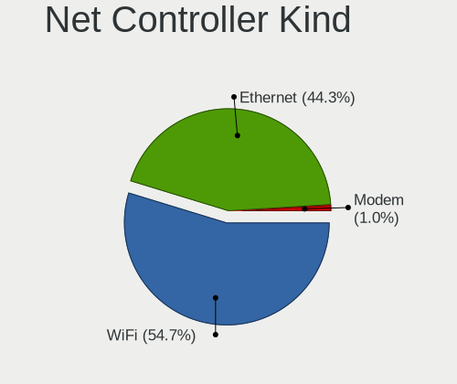

Debian Hardware Trends (Notebook)
---------------------------------

A project to identify most popular hardware characteristics and track their change
over time based on data collected by Debian users at https://Linux-Hardware.org.

Anyone can contribute to the study by uploading probes of their computers by
the [hw-probe](https://github.com/linuxhw/hw-probe) tool:

    sudo hw-probe -all -upload

Full-feature report is available here: https://linux-hardware.org/?view=trends&formfactor=notebook

Period: Jan, 2020.

Contents
--------

- [ OS                       ](#os)
- [ OS Family                ](#os-family)
- [ Kernel                   ](#kernel)
- [ Kernel Family            ](#kernel-family)
- [ Kernel Major Ver.        ](#kernel-major-ver)
- [ Arch                     ](#arch)
- [ DE                       ](#de)
- [ Display Server           ](#display-server)
- [ OS Lang                  ](#os-lang)
- [ Boot Mode                ](#boot-mode)
- [ Filesystem               ](#filesystem)
- [ Dual Boot with Linux     ](#dual-boot-with-linux)
- [ Dual Boot (Win)          ](#dual-boot-win)
- [ Country                  ](#country)
- [ City                     ](#city)
- [ Vendor                   ](#vendor)
- [ Model                    ](#model)
- [ Model Family             ](#model-family)
- [ MFG Year                 ](#mfg-year)
- [ Form Factor              ](#form-factor)
- [ Secure Boot              ](#secure-boot)
- [ Coreboot                 ](#coreboot)
- [ RAM Size                 ](#ram-size)
- [ RAM Used                 ](#ram-used)
- [ Drive Vendor             ](#drive-vendor)
- [ Drive Model              ](#drive-model)
- [ Drive Kind               ](#drive-kind)
- [ Drive Connector          ](#drive-connector)
- [ Drive Size               ](#drive-size)
- [ Space Total              ](#space-total)
- [ Space Used               ](#space-used)
- [ Malfunc. Drives          ](#malfunc-drives)
- [ Malfunc. Drive Vendor    ](#malfunc-drive-vendor)
- [ Malfunc. Drive Kind      ](#malfunc-drive-kind)
- [ Failed Drives            ](#failed-drives)
- [ Failed Drive Vendor      ](#failed-drive-vendor)
- [ Drive Status             ](#drive-status)
- [ Storage Vendor           ](#storage-vendor)
- [ Storage Model            ](#storage-model)
- [ Storage Kind             ](#storage-kind)
- [ CPU Vendor               ](#cpu-vendor)
- [ CPU Model                ](#cpu-model)
- [ CPU Model Family         ](#cpu-model-family)
- [ CPU Cores                ](#cpu-cores)
- [ CPU Sockets              ](#cpu-sockets)
- [ CPU Threads              ](#cpu-threads)
- [ CPU Op-Modes             ](#cpu-op-modes)
- [ CPU Microarch            ](#cpu-microarch)
- [ CPU Microcode            ](#cpu-microcode)
- [ GPU Vendor               ](#gpu-vendor)
- [ GPU Model                ](#gpu-model)
- [ GPU Combo                ](#gpu-combo)
- [ GPU Driver               ](#gpu-driver)
- [ GPU Memory               ](#gpu-memory)
- [ Monitor Vendor           ](#monitor-vendor)
- [ Monitor Model            ](#monitor-model)
- [ Monitor Resolution       ](#monitor-resolution)
- [ Monitor Diagonal         ](#monitor-diagonal)
- [ Monitor Width            ](#monitor-width)
- [ Aspect Ratio             ](#aspect-ratio)
- [ Monitor Area             ](#monitor-area)
- [ Pixel Density            ](#pixel-density)
- [ Multiple Monitors        ](#multiple-monitors)
- [ Net Controller Vendor    ](#net-controller-vendor)
- [ Net Controller Model     ](#net-controller-model)
- [ Net Controller Kind      ](#net-controller-kind)
- [ Used Controller          ](#used-controller)
- [ NICs                     ](#nics)
- [ Unsupported Devices      ](#unsupported-devices)
- [ Unsupported Device Types ](#unsupported-device-types)

OS
--

Installed operating systems

| Name            | Computers | Percent |
|-----------------|-----------|---------|
| Debian 10       | 23        | 48.94%  |
| Debian          | 10        | 21.28%  |
| Debian Unstable | 7         | 14.89%  |
| Debian Testing  | 4         | 8.51%   |
| Debian 9        | 2         | 4.26%   |
| Debian 8.11     | 1         | 2.13%   |

OS Family
---------

OS without a version

| Name   | Computers | Percent |
|--------|-----------|---------|
| Debian | 47        | 100%    |

Kernel
------

Version of the Linux kernel

| Version                      | Computers | Percent |
|------------------------------|-----------|---------|
| 4.19.0-6-amd64               | 17        | 36.17%  |
| 5.4.0-2-amd64                | 6         | 12.77%  |
| 5.4.0-3-amd64                | 4         | 8.51%   |
| 5.4.0-1-amd64                | 2         | 4.26%   |
| 4.9.0-8-amd64                | 2         | 4.26%   |
| 4.9.0-11-amd64               | 2         | 4.26%   |
| 5.5.0-rc6-custom+            | 1         | 2.13%   |
| 5.4.5-towo.2-siduction-amd64 | 1         | 2.13%   |
| 5.4.13                       | 1         | 2.13%   |
| 5.4.0-10.2-liquorix-amd64    | 1         | 2.13%   |
| 5.3.6-wyatt                  | 1         | 2.13%   |
| 5.3.0-3-amd64                | 1         | 2.13%   |
| 5.3.0-2-amd64                | 1         | 2.13%   |
| 5.3.0-1-amd64                | 1         | 2.13%   |
| 5.3.0-0.bpo.2-amd64          | 1         | 2.13%   |
| 5.2.21-antix.2-amd64-smp     | 1         | 2.13%   |
| 4.19.0-6-686-pae             | 1         | 2.13%   |
| 4.19.0-5-686-pae             | 1         | 2.13%   |
| 4.15.0-1-amd64               | 1         | 2.13%   |
| 3.16.0-7-586                 | 1         | 2.13%   |

Kernel Family
-------------

Linux kernel without a distro release

| Version | Computers | Percent |
|---------|-----------|---------|
| 4.19.0  | 19        | 40.43%  |
| 5.4.0   | 13        | 27.66%  |
| 5.3.0   | 4         | 8.51%   |
| 4.9.0   | 4         | 8.51%   |
| 5.5.0   | 1         | 2.13%   |
| 5.4.5   | 1         | 2.13%   |
| 5.4.13  | 1         | 2.13%   |
| 5.3.6   | 1         | 2.13%   |
| 5.2.21  | 1         | 2.13%   |
| 4.15.0  | 1         | 2.13%   |
| 3.16.0  | 1         | 2.13%   |

Kernel Major Ver.
-----------------

Linux kernel major version

| Version | Computers | Percent |
|---------|-----------|---------|
| 4.19    | 19        | 40.43%  |
| 5.4     | 15        | 31.91%  |
| 5.3     | 5         | 10.64%  |
| 4.9     | 4         | 8.51%   |
| 5.5     | 1         | 2.13%   |
| 5.2     | 1         | 2.13%   |
| 4.15    | 1         | 2.13%   |
| 3.16    | 1         | 2.13%   |

Arch
----

OS architecture (x86_64, i586, etc.)

| Name   | Computers | Percent |
|--------|-----------|---------|
| x86_64 | 44        | 93.62%  |
| i686   | 2         | 4.26%   |
| i586   | 1         | 2.13%   |

DE
--

Desktop Environment

| Name       | Computers | Percent |
|------------|-----------|---------|
| XFCE       | 8         | 17.02%  |
| GNOME      | 8         | 17.02%  |
| MATE       | 5         | 10.64%  |
| KDE5       | 5         | 10.64%  |
| KDE        | 5         | 10.64%  |
| X-Cinnamon | 4         | 8.51%   |
| Unknown    | 3         | 6.38%   |
| LXDE       | 2         | 4.26%   |
| i3         | 2         | 4.26%   |
| Cinnamon   | 2         | 4.26%   |
| Trinity    | 1         | 2.13%   |
| LXQt       | 1         | 2.13%   |
| GNUstep    | 1         | 2.13%   |

Display Server
--------------

X11 or Wayland

| Name    | Computers | Percent |
|---------|-----------|---------|
| X11     | 39        | 82.98%  |
| Wayland | 8         | 17.02%  |

OS Lang
-------

Language

| Lang       | Computers | Percent |
|------------|-----------|---------|
| Unknown    | 20        | 42.55%  |
| en_US      | 11        | 23.4%   |
| de_DE      | 5         | 10.64%  |
| ru_RU      | 2         | 4.26%   |
| pt_BR      | 2         | 4.26%   |
| fr_FR      | 2         | 4.26%   |
| es_CO      | 1         | 2.13%   |
| en_NZ      | 1         | 2.13%   |
| en_GB.utf8 | 1         | 2.13%   |
| de_CH      | 1         | 2.13%   |
| C          | 1         | 2.13%   |

Boot Mode
---------

EFI or BIOS

| Mode | Computers | Percent |
|------|-----------|---------|
| BIOS | 27        | 57.45%  |
| EFI  | 20        | 42.55%  |

Filesystem
----------

Type of filesystem

| Type    | Computers | Percent |
|---------|-----------|---------|
| Ext4    | 44        | 93.62%  |
| Tmpfs   | 1         | 2.13%   |
| Btrfs   | 1         | 2.13%   |
| Unknown | 1         | 2.13%   |

Dual Boot with Linux
--------------------

Hosting more than one Linux

| Dual boot | Computers | Percent |
|-----------|-----------|---------|
| No        | 44        | 93.62%  |
| Yes       | 3         | 6.38%   |

Dual Boot (Win)
---------------

Hosting Linux and Windows

| Dual boot | Computers | Percent |
|-----------|-----------|---------|
| No        | 35        | 74.47%  |
| Yes       | 12        | 25.53%  |

Country
-------

Geographic location (country)

| Country      | Computers | Percent |
|--------------|-----------|---------|
| Germany      | 9         | 19.15%  |
| USA          | 6         | 12.77%  |
| Russia       | 3         | 6.38%   |
| Portugal     | 3         | 6.38%   |
| France       | 3         | 6.38%   |
| UK           | 2         | 4.26%   |
| Netherlands  | 2         | 4.26%   |
| Colombia     | 2         | 4.26%   |
| Brazil       | 2         | 4.26%   |
| Tunisia      | 1         | 2.13%   |
| Switzerland  | 1         | 2.13%   |
| Spain        | 1         | 2.13%   |
| Slovenia     | 1         | 2.13%   |
| Slovakia     | 1         | 2.13%   |
| Saudi Arabia | 1         | 2.13%   |
| Romania      | 1         | 2.13%   |
| Poland       | 1         | 2.13%   |
| New Zealand  | 1         | 2.13%   |
| Indonesia    | 1         | 2.13%   |
| India        | 1         | 2.13%   |
| Hong Kong    | 1         | 2.13%   |
| Greece       | 1         | 2.13%   |
| Canada       | 1         | 2.13%   |
| Australia    | 1         | 2.13%   |

City
----

Geographic location (city)

| City                | Computers | Percent |
|---------------------|-----------|---------|
| Lisbon              | 3         | 6.38%   |
| Munich              | 2         | 4.26%   |
| Medellín           | 2         | 4.26%   |
| Gotha               | 2         | 4.26%   |
| Zurich              | 1         | 2.13%   |
| Williston           | 1         | 2.13%   |
| Werder              | 1         | 2.13%   |
| Voronezh            | 1         | 2.13%   |
| Vignot              | 1         | 2.13%   |
| Utrecht             | 1         | 2.13%   |
| Thessaloniki        | 1         | 2.13%   |
| Tauranga            | 1         | 2.13%   |
| Sydney              | 1         | 2.13%   |
| St Petersburg       | 1         | 2.13%   |
| St Louis            | 1         | 2.13%   |
| Spišská Nová Ves | 1         | 2.13%   |
| Sidi Bouzid         | 1         | 2.13%   |
| Sheffield           | 1         | 2.13%   |
| Sao Jose            | 1         | 2.13%   |
| Riyadh              | 1         | 2.13%   |
| Rancho Mirage       | 1         | 2.13%   |
| Potsdam             | 1         | 2.13%   |
| Naaldwijk           | 1         | 2.13%   |
| Montreal            | 1         | 2.13%   |
| Lubbock             | 1         | 2.13%   |
| London              | 1         | 2.13%   |
| Ljubljana           | 1         | 2.13%   |
| Krakow              | 1         | 2.13%   |
| Konstanz            | 1         | 2.13%   |
| Khabarovsk          | 1         | 2.13%   |
| Griesheim           | 1         | 2.13%   |
| Geu                 | 1         | 2.13%   |
| Cologne             | 1         | 2.13%   |
| Chicago             | 1         | 2.13%   |
| Central             | 1         | 2.13%   |
| Burbank             | 1         | 2.13%   |
| Bry-sur-Marne       | 1         | 2.13%   |
| Bogor               | 1         | 2.13%   |
| Bengaluru           | 1         | 2.13%   |
| Barcelona           | 1         | 2.13%   |
| Aquiraz             | 1         | 2.13%   |
| Adjud               | 1         | 2.13%   |

Vendor
------

Motherboard manufacturer

| Name             | Computers | Percent |
|------------------|-----------|---------|
| Lenovo           | 11        | 23.4%   |
| Dell             | 9         | 19.15%  |
| ASUSTek Computer | 7         | 14.89%  |
| Hewlett-Packard  | 5         | 10.64%  |
| Acer             | 5         | 10.64%  |
| Sony             | 3         | 6.38%   |
| Timi             | 2         | 4.26%   |
| Notebook         | 2         | 4.26%   |
| IBM              | 1         | 2.13%   |
| eMachines        | 1         | 2.13%   |
| Alienware        | 1         | 2.13%   |

Model
-----

Motherboard model

| Name                                     | Computers | Percent |
|------------------------------------------|-----------|---------|
| HP Laptop 15-db0xxx                      | 2         | 4.26%   |
| Dell Latitude E7450                      | 2         | 4.26%   |
| Dell Inspiron 5567                       | 2         | 4.26%   |
| ASUS K72Jr                               | 2         | 4.26%   |
| Timi TM1701                              | 1         | 2.13%   |
| Timi TM1607                              | 1         | 2.13%   |
| Sony VPCEB1S1E                           | 1         | 2.13%   |
| Sony VPCCB2Z8E                           | 1         | 2.13%   |
| Sony VGN-NS190J                          | 1         | 2.13%   |
| Notebook P7xxTM1                         | 1         | 2.13%   |
| Notebook N150ZU                          | 1         | 2.13%   |
| Lenovo ThinkPad X230 2325WNX             | 1         | 2.13%   |
| Lenovo ThinkPad X230 23259H1             | 1         | 2.13%   |
| Lenovo ThinkPad X201 Tablet 3113WDZ      | 1         | 2.13%   |
| Lenovo ThinkPad X1 Carbon 7th 20QDCTO1WW | 1         | 2.13%   |
| Lenovo ThinkPad T460s 20FAS1A400         | 1         | 2.13%   |
| Lenovo ThinkPad T450s 20BWS1RY00         | 1         | 2.13%   |
| Lenovo ThinkPad T440s 20AQ005NUS         | 1         | 2.13%   |
| Lenovo ThinkPad S1 Yoga 20C0S0AX00       | 1         | 2.13%   |
| Lenovo ThinkPad P53 20QN0006GE           | 1         | 2.13%   |
| Lenovo ThinkPad L412 0585W28             | 1         | 2.13%   |
| Lenovo ThinkPad Edge E540 20C6CTO1WW     | 1         | 2.13%   |
| IBM 264070A                              | 1         | 2.13%   |
| HP ZBook 14u G5                          | 1         | 2.13%   |
| HP Pavilion Notebook                     | 1         | 2.13%   |
| HP Notebook                              | 1         | 2.13%   |
| eMachines E725                           | 1         | 2.13%   |
| Dell XPS 15 9570                         | 1         | 2.13%   |
| Dell Vostro 3560                         | 1         | 2.13%   |
| Dell Latitude E7270                      | 1         | 2.13%   |
| Dell Latitude 5580                       | 1         | 2.13%   |
| Dell Latitude 5500                       | 1         | 2.13%   |
| ASUS VivoBook_ASUSLaptop X512FB_X512FB   | 1         | 2.13%   |
| ASUS VivoBook_ASUSLaptop X509FL_X509FL   | 1         | 2.13%   |
| ASUS K54C                                | 1         | 2.13%   |
| ASUS K46CB                               | 1         | 2.13%   |
| ASUS 1000HE                              | 1         | 2.13%   |
| Alienware 17 R5                          | 1         | 2.13%   |
| Acer Extensa 5620                        | 1         | 2.13%   |
| Acer ES1-512                             | 1         | 2.13%   |
| Acer Aspire V3-331                       | 1         | 2.13%   |
| Acer Aspire 5250                         | 1         | 2.13%   |
| Acer Aspire 4738Z                        | 1         | 2.13%   |

Model Family
------------

Motherboard model prefix

| Name             | Computers | Percent |
|------------------|-----------|---------|
| Lenovo ThinkPad  | 11        | 23.4%   |
| Dell Latitude    | 5         | 10.64%  |
| Acer Aspire      | 3         | 6.38%   |
| HP Laptop        | 2         | 4.26%   |
| Dell Inspiron    | 2         | 4.26%   |
| ASUS VivoBook    | 2         | 4.26%   |
| ASUS K72Jr       | 2         | 4.26%   |
| Timi TM1701      | 1         | 2.13%   |
| Timi TM1607      | 1         | 2.13%   |
| Sony VPCEB1S1E   | 1         | 2.13%   |
| Sony VPCCB2Z8E   | 1         | 2.13%   |
| Sony VGN-NS190J  | 1         | 2.13%   |
| Notebook P7xxTM1 | 1         | 2.13%   |
| Notebook N150ZU  | 1         | 2.13%   |
| IBM 264070A      | 1         | 2.13%   |
| HP ZBook         | 1         | 2.13%   |
| HP Pavilion      | 1         | 2.13%   |
| HP Notebook      | 1         | 2.13%   |
| eMachines E725   | 1         | 2.13%   |
| Dell XPS         | 1         | 2.13%   |
| Dell Vostro      | 1         | 2.13%   |
| ASUS K54C        | 1         | 2.13%   |
| ASUS K46CB       | 1         | 2.13%   |
| ASUS 1000HE      | 1         | 2.13%   |
| Alienware 17     | 1         | 2.13%   |
| Acer Extensa     | 1         | 2.13%   |
| Acer ES1-512     | 1         | 2.13%   |

MFG Year
--------

Motherboard manufacture year

| Year    | Computers | Percent |
|---------|-----------|---------|
| 2019    | 14        | 29.79%  |
| 2018    | 6         | 12.77%  |
| 2015    | 4         | 8.51%   |
| 2011    | 4         | 8.51%   |
| 2017    | 3         | 6.38%   |
| 2016    | 3         | 6.38%   |
| 2012    | 3         | 6.38%   |
| 2009    | 3         | 6.38%   |
| 2013    | 2         | 4.26%   |
| 2010    | 2         | 4.26%   |
| 2014    | 1         | 2.13%   |
| 2007    | 1         | 2.13%   |
| Unknown | 1         | 2.13%   |

Form Factor
-----------

Physical design of the computer

| Name     | Computers | Percent |
|----------|-----------|---------|
| Notebook | 47        | 100%    |

Secure Boot
-----------

Enabled or disabled

| State    | Computers | Percent |
|----------|-----------|---------|
| Disabled | 45        | 95.74%  |
| Enabled  | 2         | 4.26%   |

Coreboot
--------

Have coreboot on board

| Used | Computers | Percent |
|------|-----------|---------|
| No   | 47        | 100%    |

RAM Size
--------

Total RAM memory

| Size in GB | Computers | Percent |
|------------|-----------|---------|
| 4.01-8.0   | 11        | 23.4%   |
| 8.01-16.0  | 10        | 21.28%  |
| 3.01-4.0   | 9         | 19.15%  |
| 16.01-24.0 | 8         | 17.02%  |
| 32.01-64.0 | 3         | 6.38%   |
| 1.01-2.0   | 3         | 6.38%   |
| 0.01-1.0   | 2         | 4.26%   |
| Unknown    | 1         | 2.13%   |

RAM Used
--------

Used RAM memory

| Used GB   | Computers | Percent |
|-----------|-----------|---------|
| 2.01-3.0  | 12        | 25.53%  |
| 1.01-2.0  | 10        | 21.28%  |
| 3.01-4.0  | 9         | 19.15%  |
| 0.01-1.0  | 6         | 12.77%  |
| 4.01-8.0  | 5         | 10.64%  |
| 8.01-16.0 | 3         | 6.38%   |
| 0         | 1         | 2.13%   |
| Unknown   | 1         | 2.13%   |

Drive Vendor
------------

Hard drive vendors

| Vendor              | Computers | Drives  | Percent |
|---------------------|-----------|---------|---------|
| Toshiba             | 9         | 9       | 14.06%  |
| Seagate             | 9         | 11      | 14.06%  |
| Samsung Electronics | 8         | 9       | 12.5%   |
| WDC                 | 6         | 6       | 9.38%   |
| SanDisk             | 6         | 6       | 9.38%   |
| Crucial             | 4         | 4       | 6.25%   |
| Kingston            | 3         | 3       | 4.69%   |
| HGST                | 3         | 3       | 4.69%   |
| A-DATA Technology   | 3         | 3       | 4.69%   |
| Unknown             | 2         | 2       | 3.13%   |
| Transcend           | 2         | 2       | 3.13%   |
| Hitachi             | 2         | 2       | 3.13%   |
| WDC WD64            | 1         | 1       | 1.56%   |
| Team                | 1         | 1       | 1.56%   |
| SK Hynix            | 1         | 1       | 1.56%   |
| Micron Technology   | 1         | 1       | 1.56%   |
| LDLC                | 1         | 1       | 1.56%   |
| Intel               | 1         | 1       | 1.56%   |
| HL-DT-ST            | 1         | Unknown | 1.56%   |

Drive Model
-----------

Hard drive models

| Model                          | Computers | Percent |
|--------------------------------|-----------|---------|
| X400 M.2 2280 256GB SSD        | 2         | 3.08%   |
| SA400S37120G 120GB SSD         | 2         | 3.08%   |
| MQ04ABF100 1TB                 | 2         | 3.08%   |
| MQ01ABF050 500GB               | 2         | 3.08%   |
| HTS725050A7E630 500GB          | 2         | 3.08%   |
| X400 2.5 7MM 256GB SSD         | 1         | 1.54%   |
| WD5000LPVX-75V0TT0 500GB       | 1         | 1.54%   |
| WD5000LPVX-22V0TT0 500GB       | 1         | 1.54%   |
| WD5000BEVT-22A0RT0 500GB       | 1         | 1.54%   |
| WD3200BEKT-75PVMT1 320GB       | 1         | 1.54%   |
| WD20SPZX-22UA7T0 2TB           | 1         | 1.54%   |
| USDU1  128GB                   | 1         | 1.54%   |
| Ultra II 240GB SSD             | 1         | 1.54%   |
| TS512GMTS430S 512GB SSD        | 1         | 1.54%   |
| TS512GMTS400 512GB SSD         | 1         | 1.54%   |
| T253LE240G 240GB SSD           | 1         | 1.54%   |
| SU800 256GB SSD                | 1         | 1.54%   |
| SU650NS38 240GB SSD            | 1         | 1.54%   |
| SU630 480GB SSD                | 1         | 1.54%   |
| ST2000LX001-1RG174 2TB         | 1         | 1.54%   |
| ST2000DM 008-2FR102 2TB        | 1         | 1.54%   |
| ST1000LX015-1U7172 1TB         | 1         | 1.54%   |
| ST1000LM049-2GH172 1TB         | 1         | 1.54%   |
| ST1000LM048-2E7172 1TB         | 1         | 1.54%   |
| ST1000LM035-1RK172 1TB         | 1         | 1.54%   |
| ST1000LM024 HN-M101MBB 1TB     | 1         | 1.54%   |
| SSDPEKKF256G8L 256GB           | 1         | 1.54%   |
| SSD U110 16GB                  | 1         | 1.54%   |
| SSD PM871 mSATA 512GB          | 1         | 1.54%   |
| SSD 970 EVO Plus 1TB           | 1         | 1.54%   |
| SSD 850 PRO 512GB              | 1         | 1.54%   |
| SSD 480GB                      | 1         | 1.54%   |
| SDSSDA120G 120GB               | 1         | 1.54%   |
| SA400S37240G 240GB SSD         | 1         | 1.54%   |
| Q300 240GB SSD                 | 1         | 1.54%   |
| PC SN520 NVMe 512GB            | 1         | 1.54%   |
| MZVLW256HEHP-00000 256GB       | 1         | 1.54%   |
| MZVLB512HBJQ-000L7 512GB       | 1         | 1.54%   |
| MZVLB256HAHQ-000H1 256GB       | 1         | 1.54%   |
| MZNLN256HCHP-000L7 256GB SSD   | 1         | 1.54%   |
| MZNLN128HAHQ-00000 128GB SSD   | 1         | 1.54%   |
| MQ01ACF050 500GB               | 1         | 1.54%   |
| MQ01ABD050 500GB               | 1         | 1.54%   |
| MMC Card  64GB                 | 1         | 1.54%   |
| M510_MSATA 256GB SSD           | 1         | 1.54%   |
| M3 Portable 4TB                | 1         | 1.54%   |
| KXG50ZNV512G NVMe 512GB        | 1         | 1.54%   |
| KXG50ZNV256G NVMe 256GB        | 1         | 1.54%   |
| HTS721010A9E630 1TB            | 1         | 1.54%   |
| HTS545025B9A300 250GB          | 1         | 1.54%   |
| HTS541040G9AT00 40GB           | 1         | 1.54%   |
| Expansion 1TB                  | 1         | 1.54%   |
| DVDRAM GUC0N 1GB               | 1         | 1.54%   |
| CT525MX300SSD1 528GB           | 1         | 1.54%   |
| CT250MX200SSD1 250GB           | 1         | 1.54%   |
| CT1050MX300SSD4 1050GB         | 1         | 1.54%   |
| CT1000MX500SSD1 1TB            | 1         | 1.54%   |
| BC501 HFM256GDJTNG-8310A 256GB | 1         | 1.54%   |
| Backup+ Desk 1TB               | 1         | 1.54%   |
| 00BPVT-60HXZT1 640GB           | 1         | 1.54%   |

Drive Kind
----------

HDD or SSD

| Kind    | Computers | Drives | Percent |
|---------|-----------|--------|---------|
| HDD     | 25        | 26     | 40.32%  |
| SSD     | 23        | 26     | 37.1%   |
| NVMe    | 9         | 10     | 14.52%  |
| Unknown | 3         | 2      | 4.84%   |
| MMC     | 2         | 2      | 3.23%   |

Drive Connector
---------------

SATA, SAS, NVMe, etc.

| Type | Computers | Drives | Percent |
|------|-----------|--------|---------|
| SATA | 42        | 49     | 72.41%  |
| NVMe | 9         | 10     | 15.52%  |
| SAS  | 5         | 5      | 8.62%   |
| MMC  | 2         | 2      | 3.45%   |

Drive Size
----------

Size of hard drive

| Size in TB | Computers | Drives | Percent |
|------------|-----------|--------|---------|
| 0.01-0.5   | 34        | 38     | 59.65%  |
| 0.51-1.0   | 18        | 23     | 31.58%  |
| 1.01-2.0   | 4         | 4      | 7.02%   |
| 3.01-4.0   | 1         | 1      | 1.75%   |

Space Total
-----------

Amount of disk space available on the file system

| Size in GB     | Computers | Percent |
|----------------|-----------|---------|
| 101-250        | 18        | 38.3%   |
| 251-500        | 10        | 21.28%  |
| 501-1000       | 5         | 10.64%  |
| 1001-2000      | 4         | 8.51%   |
| More than 3000 | 3         | 6.38%   |
| 21-50          | 3         | 6.38%   |
| 51-100         | 2         | 4.26%   |
| 2001-3000      | 1         | 2.13%   |
| Unknown        | 1         | 2.13%   |

Space Used
----------

Amount of used disk space

| Used GB        | Computers | Percent |
|----------------|-----------|---------|
| 1-20           | 15        | 31.91%  |
| 101-250        | 8         | 17.02%  |
| 21-50          | 6         | 12.77%  |
| 251-500        | 5         | 10.64%  |
| 51-100         | 5         | 10.64%  |
| 501-1000       | 4         | 8.51%   |
| 1001-2000      | 2         | 4.26%   |
| More than 3000 | 1         | 2.13%   |
| Unknown        | 1         | 2.13%   |

Malfunc. Drives
---------------

Drive models with a malfunction

| Model                          | Computers | Drives | Percent |
|--------------------------------|-----------|--------|---------|
| Q300 240GB SSD                 | 1         | 1      | 33.33%  |
| MQ01ACF050 500GB               | 1         | 1      | 33.33%  |
| BC501 HFM256GDJTNG-8310A 256GB | 1         | 1      | 33.33%  |

Malfunc. Drive Vendor
---------------------

Vendors of faulty drives

| Vendor   | Computers | Drives | Percent |
|----------|-----------|--------|---------|
| Toshiba  | 2         | 2      | 66.67%  |
| SK Hynix | 1         | 1      | 33.33%  |

Malfunc. Drive Kind
-------------------

Kinds of faulty drives

| Kind | Computers | Drives | Percent |
|------|-----------|--------|---------|
| NVMe | 1         | 1      | 33.33%  |
| SSD  | 1         | 1      | 33.33%  |
| HDD  | 1         | 1      | 33.33%  |

Failed Drives
-------------

Failed drive models

Zero info for selected period =(

Failed Drive Vendor
-------------------

Failed drive vendors

Zero info for selected period =(

Drive Status
------------

Number of failed and malfunc. drives

| Status   | Computers | Drives | Percent |
|----------|-----------|--------|---------|
| Works    | 27        | 37     | 51.92%  |
| Detected | 22        | 26     | 42.31%  |
| Malfunc  | 3         | 3      | 5.77%   |

Storage Vendor
--------------

Storage controller vendors

| Vendor                       | Computers | Percent |
|------------------------------|-----------|---------|
| Intel                        | 41        | 77.36%  |
| Samsung Electronics          | 4         | 7.55%   |
| AMD                          | 3         | 5.66%   |
| Toshiba America Info Systems | 2         | 3.77%   |
| SK Hynix                     | 1         | 1.89%   |
| Sandisk                      | 1         | 1.89%   |
| Phison Electronics           | 1         | 1.89%   |

Storage Model
-------------

Storage controller models

| Model                                                                    | Computers | Percent |
|--------------------------------------------------------------------------|-----------|---------|
| Sunrise Point-LP SATA Controller [AHCI mode]                             | 7         | 12.73%  |
| 7 Series Chipset Family 6-port SATA Controller [AHCI mode]               | 4         | 7.27%   |
| 5 Series/3400 Series Chipset 4 port SATA AHCI Controller                 | 4         | 7.27%   |
| Wildcat Point-LP SATA Controller [AHCI Mode]                             | 3         | 5.45%   |
| NVMe SSD Controller SM981/PM981/PM983                                    | 3         | 5.45%   |
| 8 Series SATA Controller 1 [AHCI mode]                                   | 3         | 5.45%   |
| Toshiba America Info Non-Volatile memory controller                      | 2         | 3.64%   |
| Non-Volatile memory controller                                           | 2         | 3.64%   |
| FCH SATA Controller [AHCI mode]                                          | 2         | 3.64%   |
| Cannon Point-LP SATA Controller [AHCI Mode]                              | 2         | 3.64%   |
| Cannon Lake Mobile PCH SATA AHCI Controller                              | 2         | 3.64%   |
| 82801IBM/IEM (ICH9M/ICH9M-E) 4 port SATA Controller [AHCI mode]          | 2         | 3.64%   |
| 82801 Mobile SATA Controller [RAID mode]                                 | 2         | 3.64%   |
| 6 Series/C200 Series Chipset Family 6 port Mobile SATA AHCI Controller   | 2         | 3.64%   |
| SSD Pro 7600p/760p/E 6100p Series                                        | 1         | 1.82%   |
| SB7x0/SB8x0/SB9x0 SATA Controller [AHCI mode]                            | 1         | 1.82%   |
| Q170/Q150/B150/H170/H110/Z170/CM236 Chipset SATA Controller [AHCI Mode]  | 1         | 1.82%   |
| NVMe SSD Controller SM961/PM961                                          | 1         | 1.82%   |
| E12 NVMe Controller                                                      | 1         | 1.82%   |
| Atom Processor E3800 Series SATA AHCI Controller                         | 1         | 1.82%   |
| 82801HM/HEM (ICH8M/ICH8M-E) SATA Controller [AHCI mode]                  | 1         | 1.82%   |
| 82801HM/HEM (ICH8M/ICH8M-E) IDE Controller                               | 1         | 1.82%   |
| 82801GBM/GHM (ICH7-M Family) SATA Controller [IDE mode]                  | 1         | 1.82%   |
| 82371AB/EB/MB PIIX4 IDE                                                  | 1         | 1.82%   |
| 8 Series/C220 Series Chipset Family 6-port SATA Controller 1 [AHCI mode] | 1         | 1.82%   |
| 5 Series/3400 Series Chipset 6 port SATA AHCI Controller                 | 1         | 1.82%   |
| 5 Series/3400 Series Chipset 4 port SATA IDE Controller                  | 1         | 1.82%   |
| 5 Series/3400 Series Chipset 2 port SATA IDE Controller                  | 1         | 1.82%   |
| 200 Series PCH SATA controller [AHCI mode]                               | 1         | 1.82%   |

Storage Kind
------------

Kind of storage controller (IDE, SATA, NVMe, SAS, ...)

| Kind | Computers | Percent |
|------|-----------|---------|
| SATA | 38        | 70.37%  |
| NVMe | 10        | 18.52%  |
| IDE  | 4         | 7.41%   |
| RAID | 2         | 3.7%    |

CPU Vendor
----------

Processor vendors

| Vendor | Computers | Percent |
|--------|-----------|---------|
| Intel  | 44        | 93.62%  |
| AMD    | 3         | 6.38%   |

CPU Model
---------

Processor models

| Model                                         | Computers | Percent |
|-----------------------------------------------|-----------|---------|
| Intel Core i7-7500U CPU @ 2.70GHz             | 3         | 6.38%   |
| Intel Core i5 CPU M 430 @ 2.27GHz             | 3         | 6.38%   |
| Intel Core i7-8750H CPU @ 2.20GHz             | 2         | 4.26%   |
| Intel Core i7-8565U CPU @ 1.80GHz             | 2         | 4.26%   |
| Intel Core i5-8265U CPU @ 1.60GHz             | 2         | 4.26%   |
| Intel Core i5-6300U CPU @ 2.40GHz             | 2         | 4.26%   |
| Intel Core i5-5300U CPU @ 2.30GHz             | 2         | 4.26%   |
| Intel Core i5-3320M CPU @ 2.60GHz             | 2         | 4.26%   |
| AMD Ryzen 5 2500U with Radeon Vega Mobile Gfx | 2         | 4.26%   |
| Intel Pentium Dual-Core CPU T4300 @ 2.10GHz   | 1         | 2.13%   |
| Intel Pentium CPU P6200 @ 2.13GHz             | 1         | 2.13%   |
| Intel Pentium CPU N3540 @ 2.16GHz             | 1         | 2.13%   |
| Intel Pentium 3556U @ 1.70GHz                 | 1         | 2.13%   |
| Intel Mobile Pentium MMX                      | 1         | 2.13%   |
| Intel Core m3-7Y30 CPU @ 1.00GHz              | 1         | 2.13%   |
| Intel Core i7-9850H CPU @ 2.60GHz             | 1         | 2.13%   |
| Intel Core i7-9700K CPU @ 3.60GHz             | 1         | 2.13%   |
| Intel Core i7-8665U CPU @ 1.90GHz             | 1         | 2.13%   |
| Intel Core i7-8550U CPU @ 1.80GHz             | 1         | 2.13%   |
| Intel Core i7-6500U CPU @ 2.50GHz             | 1         | 2.13%   |
| Intel Core i7-5600U CPU @ 2.60GHz             | 1         | 2.13%   |
| Intel Core i7-4600U CPU @ 2.10GHz             | 1         | 2.13%   |
| Intel Core i7-3537U CPU @ 2.00GHz             | 1         | 2.13%   |
| Intel Core i7-2620M CPU @ 2.70GHz             | 1         | 2.13%   |
| Intel Core i7 CPU L 640 @ 2.13GHz             | 1         | 2.13%   |
| Intel Core i5-7300HQ CPU @ 2.50GHz            | 1         | 2.13%   |
| Intel Core i5-6200U CPU @ 2.30GHz             | 1         | 2.13%   |
| Intel Core i5-4200U CPU @ 1.60GHz             | 1         | 2.13%   |
| Intel Core i5-4200M CPU @ 2.50GHz             | 1         | 2.13%   |
| Intel Core i5 CPU M 520 @ 2.40GHz             | 1         | 2.13%   |
| Intel Core i3-3120M CPU @ 2.50GHz             | 1         | 2.13%   |
| Intel Core i3-2370M CPU @ 2.40GHz             | 1         | 2.13%   |
| Intel Core 2 Duo CPU T5800 @ 2.00GHz          | 1         | 2.13%   |
| Intel Core 2 Duo CPU T5450 @ 1.66GHz          | 1         | 2.13%   |
| Intel Atom CPU N280 @ 1.66GHz                 | 1         | 2.13%   |
| AMD E-450 APU with Radeon HD Graphics         | 1         | 2.13%   |

CPU Model Family
----------------

Processor model prefix

| Model                   | Computers | Percent |
|-------------------------|-----------|---------|
| Intel Core i7           | 17        | 36.17%  |
| Intel Core i5           | 16        | 34.04%  |
| Intel Pentium           | 3         | 6.38%   |
| Intel Core i3           | 2         | 4.26%   |
| Intel Core 2 Duo        | 2         | 4.26%   |
| AMD Ryzen 5             | 2         | 4.26%   |
| Other                   | 1         | 2.13%   |
| Intel Pentium Dual-Core | 1         | 2.13%   |
| Intel Core m3           | 1         | 2.13%   |
| Intel Atom              | 1         | 2.13%   |
| AMD E                   | 1         | 2.13%   |

CPU Cores
---------

Number of processor cores

| Number | Computers | Percent |
|--------|-----------|---------|
| 2      | 31        | 65.96%  |
| 4      | 10        | 21.28%  |
| 6      | 3         | 6.38%   |
| 1      | 2         | 4.26%   |
| 8      | 1         | 2.13%   |

CPU Sockets
-----------

Number of sockets

| Number | Computers | Percent |
|--------|-----------|---------|
| 1      | 47        | 100%    |

CPU Threads
-----------

Threads per core (Hyper-Threading)

| Number | Computers | Percent |
|--------|-----------|---------|
| 2      | 37        | 78.72%  |
| 1      | 10        | 21.28%  |

CPU Op-Modes
------------

CPU Operation Modes (32-bit, 64-bit)

| Op mode        | Computers | Percent |
|----------------|-----------|---------|
| 32-bit, 64-bit | 44        | 93.62%  |
| 32-bit         | 2         | 4.26%   |
| Unknown        | 1         | 2.13%   |

CPU Microarch
-------------

Microarchitecture

| Name        | Computers | Percent |
|-------------|-----------|---------|
| Skylake     | 12        | 25.53%  |
| KabyLake    | 7         | 14.89%  |
| Westmere    | 6         | 12.77%  |
| IvyBridge   | 4         | 8.51%   |
| Haswell     | 4         | 8.51%   |
| Broadwell   | 3         | 6.38%   |
| Zen         | 2         | 4.26%   |
| SandyBridge | 2         | 4.26%   |
| Core        | 2         | 4.26%   |
| Silvermont  | 1         | 2.13%   |
| Penryn      | 1         | 2.13%   |
| Bonnell     | 1         | 2.13%   |
| Bobcat      | 1         | 2.13%   |
| Unknown     | 1         | 2.13%   |

CPU Microcode
-------------

Microcode number

| Number     | Computers | Percent |
|------------|-----------|---------|
| Unknown    | 17        | 36.17%  |
| 0x806ec    | 3         | 6.38%   |
| 0x806e9    | 3         | 6.38%   |
| 0x406e3    | 3         | 6.38%   |
| 0x906ea    | 2         | 4.26%   |
| 0x40651    | 2         | 4.26%   |
| 0x306a9    | 2         | 4.26%   |
| 0x206a7    | 2         | 4.26%   |
| 0x20655    | 2         | 4.26%   |
| 0x20652    | 2         | 4.26%   |
| 0x906ed    | 1         | 2.13%   |
| 0x906ec    | 1         | 2.13%   |
| 0x906e9    | 1         | 2.13%   |
| 0x6fd      | 1         | 2.13%   |
| 0x306d4    | 1         | 2.13%   |
| 0x306c3    | 1         | 2.13%   |
| 0x106c2    | 1         | 2.13%   |
| 0x0810100b | 1         | 2.13%   |
| 0x05000101 | 1         | 2.13%   |

GPU Vendor
----------

Vendors of graphics cards

| Vendor   | Computers | Percent |
|----------|-----------|---------|
| Intel    | 38        | 63.33%  |
| Nvidia   | 11        | 18.33%  |
| AMD      | 10        | 16.67%  |
| Neomagic | 1         | 1.67%   |

GPU Model
---------

Graphics card models

| Model                                                                             | Computers | Percent |
|-----------------------------------------------------------------------------------|-----------|---------|
| UHD Graphics 620 (Whiskey Lake)                                                   | 5         | 8.06%   |
| Skylake GT2 [HD Graphics 520]                                                     | 4         | 6.45%   |
| 3rd Gen Core processor Graphics Controller                                        | 4         | 6.45%   |
| HD Graphics 620                                                                   | 3         | 4.84%   |
| HD Graphics 5500                                                                  | 3         | 4.84%   |
| Haswell-ULT Integrated Graphics Controller                                        | 3         | 4.84%   |
| Core Processor Integrated Graphics Controller                                     | 3         | 4.84%   |
| UHD Graphics 630 (Mobile)                                                         | 2         | 3.23%   |
| Topaz XT [Radeon R7 M260/M265 / M340/M360 / M440/M445 / 530/535 / 620/625 Mobile] | 2         | 3.23%   |
| Raven Ridge [Radeon Vega Series / Radeon Vega Mobile Series]                      | 2         | 3.23%   |
| Park [Mobility Radeon HD 5430/5450/5470]                                          | 2         | 3.23%   |
| Mobile 4 Series Chipset Integrated Graphics Controller                            | 2         | 3.23%   |
| 2nd Generation Core Processor Family Integrated Graphics Controller               | 2         | 3.23%   |
| Wrestler [Radeon HD 6320]                                                         | 1         | 1.61%   |
| Whistler [Radeon HD 6630M/6650M/6750M/7670M/7690M]                                | 1         | 1.61%   |
| UHD Graphics 620                                                                  | 1         | 1.61%   |
| TU106GLM [Quadro RTX 3000 Mobile / Max-Q]                                         | 1         | 1.61%   |
| TU104BM [GeForce RTX 2080 Mobile]                                                 | 1         | 1.61%   |
| Sun XT [Radeon HD 8670A/8670M/8690M / R5 M330 / M430 / Radeon 520 Mobile]         | 1         | 1.61%   |
| NM2160 [MagicGraph 128XD]                                                         | 1         | 1.61%   |
| Mobile GM965/GL960 Integrated Graphics Controller (secondary)                     | 1         | 1.61%   |
| Mobile GM965/GL960 Integrated Graphics Controller (primary)                       | 1         | 1.61%   |
| Mobile 945GSE Express Integrated Graphics Controller                              | 1         | 1.61%   |
| Mobile 945GM/GMS/GME, 943/940GML Express Integrated Graphics Controller           | 1         | 1.61%   |
| Madison [Mobility Radeon HD 5650/5750 / 6530M/6550M]                              | 1         | 1.61%   |
| HD Graphics 630                                                                   | 1         | 1.61%   |
| HD Graphics 615                                                                   | 1         | 1.61%   |
| GP108M [GeForce MX250]                                                            | 1         | 1.61%   |
| GP108M [GeForce MX150]                                                            | 1         | 1.61%   |
| GP107M [GeForce GTX 1050 Ti Mobile]                                               | 1         | 1.61%   |
| GP104BM [GeForce GTX 1070 Mobile]                                                 | 1         | 1.61%   |
| GM108M [GeForce MX110]                                                            | 1         | 1.61%   |
| GM108M [GeForce 940M]                                                             | 1         | 1.61%   |
| GM108M [GeForce 840M]                                                             | 1         | 1.61%   |
| GK208M [GeForce GT 740M]                                                          | 1         | 1.61%   |
| GK107M [GeForce GT 740M]                                                          | 1         | 1.61%   |
| Atom Processor Z36xxx/Z37xxx Series Graphics & Display                            | 1         | 1.61%   |
| 4th Gen Core Processor Integrated Graphics Controller                             | 1         | 1.61%   |

GPU Combo
---------

Combinations of graphics cards

| Name           | Computers | Percent |
|----------------|-----------|---------|
| 1 x Intel      | 25        | 53.19%  |
| Intel + Nvidia | 8         | 17.02%  |
| 1 x AMD        | 6         | 12.77%  |
| Intel + AMD    | 4         | 8.51%   |
| 1 x Nvidia     | 3         | 6.38%   |
| 1 x Neomagic   | 1         | 2.13%   |

GPU Driver
----------

Free vs proprietary

| Driver      | Computers | Percent |
|-------------|-----------|---------|
| Free        | 41        | 87.23%  |
| Proprietary | 4         | 8.51%   |
| Unknown     | 2         | 4.26%   |

GPU Memory
----------

Total video memory

| Size in GB | Computers | Percent |
|------------|-----------|---------|
| Unknown    | 36        | 76.6%   |
| 7.01-8.0   | 2         | 4.26%   |
| 3.01-4.0   | 2         | 4.26%   |
| 1.01-2.0   | 2         | 4.26%   |
| 0.51-1.0   | 2         | 4.26%   |
| 0.01-0.5   | 2         | 4.26%   |
| 5.01-6.0   | 1         | 2.13%   |

Monitor Vendor
--------------

Monitor vendors

| Vendor                  | Computers | Percent |
|-------------------------|-----------|---------|
| AU Optronics            | 13        | 24.07%  |
| LG Display              | 9         | 16.67%  |
| Chimei Innolux          | 8         | 14.81%  |
| Samsung Electronics     | 6         | 11.11%  |
| BOE                     | 3         | 5.56%   |
| Sony                    | 2         | 3.7%    |
| Lenovo                  | 2         | 3.7%    |
| Dell                    | 2         | 3.7%    |
| Sharp                   | 1         | 1.85%   |
| Philips                 | 1         | 1.85%   |
| Hewlett-Packard         | 1         | 1.85%   |
| HannStar                | 1         | 1.85%   |
| Fujitsu Siemens         | 1         | 1.85%   |
| Eizo                    | 1         | 1.85%   |
| CMN                     | 1         | 1.85%   |
| Chi Mei Optoelectronics | 1         | 1.85%   |
| AOC                     | 1         | 1.85%   |

Monitor Model
-------------

Monitor models

| Model                                              | Computers | Percent |
|----------------------------------------------------|-----------|---------|
| LCD Monitor LGD02DC 1366x768 344x194mm 15.5-inch   | 2         | 3.64%   |
| LCD Monitor AUO38ED 1920x1080 340x190mm 15.3-inch  | 2         | 3.64%   |
| LCD Monitor AUO133D 1920x1080 309x173mm 13.9-inch  | 2         | 3.64%   |
| LCD Monitor AUO106C 1366x768 277x156mm 12.5-inch   | 2         | 3.64%   |
| U3419W DELA132 3440x1440 800x335mm 34.1-inch       | 1         | 1.82%   |
| U2414H DELA0A4 1920x1080 530x300mm 24.0-inch       | 1         | 1.82%   |
| TV SNYA500 1360x768                                | 1         | 1.82%   |
| TV *01 SNYE502 1920x1080 1018x573mm 46.0-inch      | 1         | 1.82%   |
| S22D300 SAM0B3F 1920x1080 477x268mm 21.5-inch      | 1         | 1.82%   |
| S2243W ENC2140 1920x1200 474x297mm 22.0-inch       | 1         | 1.82%   |
| Nvidia Defaul SNY05FA 1366x768 290x170mm 13.2-inch | 1         | 1.82%   |
| LCD Monitor SHP149A 1920x1080 344x194mm 15.5-inch  | 1         | 1.82%   |
| LCD Monitor SEC5441 1366x768 344x194mm 15.5-inch   | 1         | 1.82%   |
| LCD Monitor SEC3046 1366x768 340x190mm 15.3-inch   | 1         | 1.82%   |
| LCD Monitor SDC5844 1920x1080 344x194mm 15.5-inch  | 1         | 1.82%   |
| LCD Monitor SDC4C48 1920x1080 409x230mm 18.5-inch  | 1         | 1.82%   |
| LCD Monitor SAM0D4F 1920x1080 1210x680mm 54.6-inch | 1         | 1.82%   |
| LCD Monitor LGD05F1 1920x1080 309x174mm 14.0-inch  | 1         | 1.82%   |
| LCD Monitor LGD04FF 1920x1080 309x174mm 14.0-inch  | 1         | 1.82%   |
| LCD Monitor LGD049F 1920x1080 276x156mm 12.5-inch  | 1         | 1.82%   |
| LCD Monitor LGD0456 1366x768 344x194mm 15.5-inch   | 1         | 1.82%   |
| LCD Monitor LGD0437 1920x1080 276x156mm 12.5-inch  | 1         | 1.82%   |
| LCD Monitor LGD01E9 1920x1080 345x194mm 15.6-inch  | 1         | 1.82%   |
| LCD Monitor LGD01DD 1600x900 382x215mm 17.3-inch   | 1         | 1.82%   |
| LCD Monitor LEN40A0 1366x768 309x174mm 14.0-inch   | 1         | 1.82%   |
| LCD Monitor LEN4011 1280x800 261x163mm 12.1-inch   | 1         | 1.82%   |
| LCD Monitor HSD03E9 1024x600 220x129mm 10.0-inch   | 1         | 1.82%   |
| LCD Monitor CMO1552 1280x800 331x207mm 15.4-inch   | 1         | 1.82%   |
| LCD Monitor CMN15E8 1920x1080 344x193mm 15.5-inch  | 1         | 1.82%   |
| LCD Monitor CMN15E6 1366x768 344x193mm 15.5-inch   | 1         | 1.82%   |
| LCD Monitor CMN15DB 1366x768 344x193mm 15.5-inch   | 1         | 1.82%   |
| LCD Monitor CMN15C4 1920x1080 344x193mm 15.5-inch  | 1         | 1.82%   |
| LCD Monitor CMN15C0 1920x1080 344x194mm 15.5-inch  | 1         | 1.82%   |
| LCD Monitor CMN1499 1366x768 310x170mm 13.9-inch   | 1         | 1.82%   |
| LCD Monitor CMN1494 1366x768 309x173mm 13.9-inch   | 1         | 1.82%   |
| LCD Monitor CMN1482 1600x900 309x174mm 14.0-inch   | 1         | 1.82%   |
| LCD Monitor BOE0869 1920x1080 344x194mm 15.5-inch  | 1         | 1.82%   |
| LCD Monitor BOE0747 1920x1080 344x194mm 15.5-inch  | 1         | 1.82%   |
| LCD Monitor BOE0691 1920x1080 280x165mm 12.8-inch  | 1         | 1.82%   |
| LCD Monitor AUO71EC 1366x768 340x190mm 15.3-inch   | 1         | 1.82%   |
| LCD Monitor AUO61ED 1920x1080 340x190mm 15.3-inch  | 1         | 1.82%   |
| LCD Monitor AUO573D 1920x1080 309x174mm 14.0-inch  | 1         | 1.82%   |
| LCD Monitor AUO319D 1920x1080 380x210mm 17.1-inch  | 1         | 1.82%   |
| LCD Monitor AUO183C 1366x768 309x173mm 13.9-inch   | 1         | 1.82%   |
| LCD Monitor AUO139D 1920x1080 381x214mm 17.2-inch  | 1         | 1.82%   |
| LCD Monitor AUO132C 1366x768 290x160mm 13.0-inch   | 1         | 1.82%   |
| LCD Monitor 1920x1080                              | 1         | 1.82%   |
| B34-9 UE FUS08AF 3440x1440 800x335mm 34.1-inch     | 1         | 1.82%   |
| 27E1 AOC2701 1920x1080 598x336mm 27.0-inch         | 1         | 1.82%   |
| 23er HWP331E 1920x1080 509x286mm 23.0-inch         | 1         | 1.82%   |
| 200V4 PHLC0BF 1600x900 432x240mm 19.5-inch         | 1         | 1.82%   |

Monitor Resolution
------------------

Monitor screen resolution

| Resolution        | Computers | Percent |
|-------------------|-----------|---------|
| 1920x1080 (FHD)   | 25        | 48.08%  |
| 1366x768 (WXGA)   | 16        | 30.77%  |
| 1600x900 (HD+)    | 3         | 5.77%   |
| 3440x1440         | 2         | 3.85%   |
| 1280x800 (WXGA)   | 2         | 3.85%   |
| 2560x1440 (QHD)   | 1         | 1.92%   |
| 1920x1200 (WUXGA) | 1         | 1.92%   |
| 1360x768          | 1         | 1.92%   |
| 1024x600          | 1         | 1.92%   |

Monitor Diagonal
----------------

Diagonal size in inches

| Inches  | Computers | Percent |
|---------|-----------|---------|
| 15      | 20        | 36.36%  |
| 14      | 7         | 12.73%  |
| 12      | 6         | 10.91%  |
| 13      | 5         | 9.09%   |
| 17      | 3         | 5.45%   |
| 34      | 2         | 3.64%   |
| 23      | 2         | 3.64%   |
| 10      | 2         | 3.64%   |
| Unknown | 2         | 3.64%   |
| 54      | 1         | 1.82%   |
| 46      | 1         | 1.82%   |
| 27      | 1         | 1.82%   |
| 22      | 1         | 1.82%   |
| 21      | 1         | 1.82%   |
| 19      | 1         | 1.82%   |

Monitor Width
-------------

Physical width

| Width in mm | Computers | Percent |
|-------------|-----------|---------|
| 301-350     | 31        | 56.36%  |
| 201-300     | 9         | 16.36%  |
| 501-600     | 3         | 5.45%   |
| 401-500     | 3         | 5.45%   |
| 351-400     | 3         | 5.45%   |
| 701-800     | 2         | 3.64%   |
| 1001-1500   | 2         | 3.64%   |
| Unknown     | 2         | 3.64%   |

Aspect Ratio
------------

Proportional relationship between the width and the height

| Ratio   | Computers | Percent |
|---------|-----------|---------|
| 16/9    | 41        | 87.23%  |
| 16/10   | 3         | 6.38%   |
| 21/9    | 2         | 4.26%   |
| Unknown | 1         | 2.13%   |

Monitor Area
------------

Area in inch²

| Area in inch² | Computers | Percent |
|----------------|-----------|---------|
| 101-110        | 19        | 34.55%  |
| 81-90          | 11        | 20%     |
| 61-70          | 5         | 9.09%   |
| 201-250        | 3         | 5.45%   |
| 121-130        | 3         | 5.45%   |
| 71-80          | 2         | 3.64%   |
| 351-500        | 2         | 3.64%   |
| 41-50          | 2         | 3.64%   |
| 151-200        | 2         | 3.64%   |
| Unknown        | 2         | 3.64%   |
| More than 1000 | 1         | 1.82%   |
| 301-350        | 1         | 1.82%   |
| 501-1000       | 1         | 1.82%   |
| 91-100         | 1         | 1.82%   |

Pixel Density
-------------

Pixels per inch

| Density | Computers | Percent |
|---------|-----------|---------|
| 121-160 | 22        | 40%     |
| 101-120 | 21        | 38.18%  |
| 161-240 | 4         | 7.27%   |
| 51-100  | 4         | 7.27%   |
| 1-50    | 2         | 3.64%   |
| Unknown | 2         | 3.64%   |

Multiple Monitors
-----------------

Total monitors connected

| Total | Computers | Percent |
|-------|-----------|---------|
| 1     | 35        | 74.47%  |
| 2     | 11        | 23.4%   |
| 0     | 1         | 2.13%   |

Net Controller Vendor
---------------------

Controller vendors

| Vendor                            | Computers | Percent |
|-----------------------------------|-----------|---------|
| Intel                             | 6         | 54.55%  |
| Lenovo                            | 2         | 18.18%  |
| Realtek Semiconductor             | 1         | 9.09%   |
| Huawei Technologies               | 1         | 9.09%   |
| Ericsson Business Mobile Networks | 1         | 9.09%   |

Net Controller Model
--------------------

Controller models

| Model                                           | Computers | Percent |
|-------------------------------------------------|-----------|---------|
| 82579LM Gigabit Network Connection (Lewisville) | 2         | 18.18%  |
| Wireless 8265 / 8275                            | 1         | 9.09%   |
| Wi-Fi 6 AX200                                   | 1         | 9.09%   |
| ThinkPad TBT 3 Dock                             | 1         | 9.09%   |
| ThinkPad Dock Giga                              | 1         | 9.09%   |
| RTL8723DE Wireless Network Adapter              | 1         | 9.09%   |
| H5321 gw Mobile Broadband Driver                | 1         | 9.09%   |
| DLI-TL20                                        | 1         | 9.09%   |
| Centrino Advanced-N 6200                        | 1         | 9.09%   |
| 82577LM Gigabit Network Connection              | 1         | 9.09%   |

Net Controller Kind
-------------------

Ethernet, WiFi or modem

| Kind     | Computers | Percent |
|----------|-----------|---------|
| Ethernet | 6         | 54.55%  |
| WiFi     | 4         | 36.36%  |
| Modem    | 1         | 9.09%   |

Used Controller
---------------

Currently used network controller

| Kind     | Computers | Percent |
|----------|-----------|---------|
| WiFi     | 4         | 80%     |
| Ethernet | 1         | 20%     |

NICs
----

Total network controllers on board

| Total | Computers | Percent |
|-------|-----------|---------|
| 2     | 38        | 80.85%  |
| 1     | 8         | 17.02%  |
| 3     | 1         | 2.13%   |

Unsupported Devices
-------------------

Total unsupported devices on board

| Total | Computers | Percent |
|-------|-----------|---------|
| 0     | 31        | 65.96%  |
| 1     | 12        | 25.53%  |
| 2     | 4         | 8.51%   |

Unsupported Device Types
------------------------

Types of unsupported devices

| Type                  | Computers | Percent |
|-----------------------|-----------|---------|
| Fingerprint reader    | 8         | 40%     |
| Net/wireless          | 4         | 20%     |
| Graphics card         | 4         | 20%     |
| Chipcard              | 2         | 10%     |
| Multimedia controller | 1         | 5%      |
| Camera                | 1         | 5%      |

