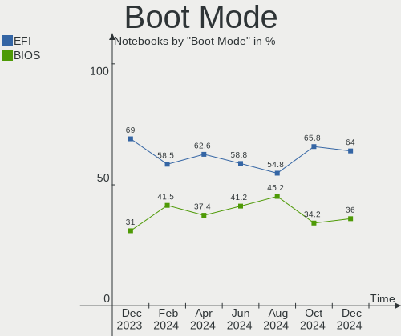
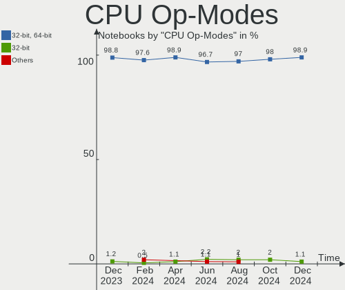
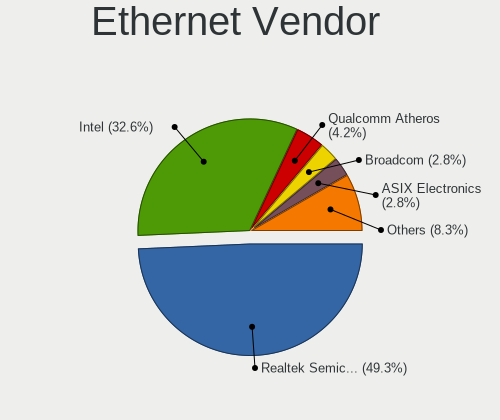

Debian Hardware Trends (Notebook)
---------------------------------

A project to identify most popular hardware characteristics and track their change
over time based on data collected by Debian users at https://Linux-Hardware.org.

Anyone can contribute to the study by uploading probes of their computers by
the [hw-probe](https://github.com/linuxhw/hw-probe) tool:

    sudo -E hw-probe -all -upload

Full-feature report is available here: https://linux-hardware.org/?view=trends&formfactor=notebook

Period: Jun, 2021.

Contents
--------

- [ OS                       ](#os)
- [ OS Family                ](#os-family)
- [ Kernel                   ](#kernel)
- [ Kernel Family            ](#kernel-family)
- [ Kernel Major Ver.        ](#kernel-major-ver)
- [ Arch                     ](#arch)
- [ DE                       ](#de)
- [ Display Server           ](#display-server)
- [ Display Manager          ](#display-manager)
- [ OS Lang                  ](#os-lang)
- [ Boot Mode                ](#boot-mode)
- [ Filesystem               ](#filesystem)
- [ Part. scheme             ](#part-scheme)
- [ Dual Boot with Linux/BSD ](#dual-boot-with-linux/bsd)
- [ Dual Boot (Win)          ](#dual-boot-win)
- [ Country                  ](#country)
- [ City                     ](#city)
- [ Vendor                   ](#vendor)
- [ Model                    ](#model)
- [ Model Family             ](#model-family)
- [ MFG Year                 ](#mfg-year)
- [ Form Factor              ](#form-factor)
- [ Secure Boot              ](#secure-boot)
- [ Coreboot                 ](#coreboot)
- [ RAM Size                 ](#ram-size)
- [ RAM Used                 ](#ram-used)
- [ Has CD-ROM               ](#has-cd-rom)
- [ Total Drives             ](#total-drives)
- [ Has Ethernet             ](#has-ethernet)
- [ Has WiFi                 ](#has-wifi)
- [ Has Bluetooth            ](#has-bluetooth)
- [ Drive Vendor             ](#drive-vendor)
- [ Drive Model              ](#drive-model)
- [ HDD Vendor               ](#hdd-vendor)
- [ SSD Vendor               ](#ssd-vendor)
- [ Drive Kind               ](#drive-kind)
- [ Drive Connector          ](#drive-connector)
- [ Drive Size               ](#drive-size)
- [ Space Total              ](#space-total)
- [ Space Used               ](#space-used)
- [ Malfunc. Drives          ](#malfunc-drives)
- [ Malfunc. Drive Vendor    ](#malfunc-drive-vendor)
- [ Malfunc. HDD Vendor      ](#malfunc-hdd-vendor)
- [ Malfunc. Drive Kind      ](#malfunc-drive-kind)
- [ Failed Drives            ](#failed-drives)
- [ Failed Drive Vendor      ](#failed-drive-vendor)
- [ Drive Status             ](#drive-status)
- [ Storage Vendor           ](#storage-vendor)
- [ Storage Model            ](#storage-model)
- [ Storage Kind             ](#storage-kind)
- [ CPU Vendor               ](#cpu-vendor)
- [ CPU Model                ](#cpu-model)
- [ CPU Model Family         ](#cpu-model-family)
- [ CPU Cores                ](#cpu-cores)
- [ CPU Sockets              ](#cpu-sockets)
- [ CPU Threads              ](#cpu-threads)
- [ CPU Op-Modes             ](#cpu-op-modes)
- [ CPU Microcode            ](#cpu-microcode)
- [ CPU Microarch            ](#cpu-microarch)
- [ GPU Vendor               ](#gpu-vendor)
- [ GPU Model                ](#gpu-model)
- [ GPU Combo                ](#gpu-combo)
- [ GPU Driver               ](#gpu-driver)
- [ GPU Memory               ](#gpu-memory)
- [ Monitor Vendor           ](#monitor-vendor)
- [ Monitor Model            ](#monitor-model)
- [ Monitor Resolution       ](#monitor-resolution)
- [ Monitor Diagonal         ](#monitor-diagonal)
- [ Monitor Width            ](#monitor-width)
- [ Aspect Ratio             ](#aspect-ratio)
- [ Monitor Area             ](#monitor-area)
- [ Pixel Density            ](#pixel-density)
- [ Multiple Monitors        ](#multiple-monitors)
- [ Net Controller Vendor    ](#net-controller-vendor)
- [ Net Controller Model     ](#net-controller-model)
- [ Wireless Vendor          ](#wireless-vendor)
- [ Wireless Model           ](#wireless-model)
- [ Ethernet Vendor          ](#ethernet-vendor)
- [ Ethernet Model           ](#ethernet-model)
- [ Net Controller Kind      ](#net-controller-kind)
- [ Used Controller          ](#used-controller)
- [ NICs                     ](#nics)
- [ IPv6                     ](#ipv6)
- [ Memory Vendor            ](#memory-vendor)
- [ Memory Model             ](#memory-model)
- [ Memory Kind              ](#memory-kind)
- [ Memory Form Factor       ](#memory-form-factor)
- [ Memory Size              ](#memory-size)
- [ Memory Speed             ](#memory-speed)
- [ Sound Vendor             ](#sound-vendor)
- [ Sound Model              ](#sound-model)
- [ Camera Vendor            ](#camera-vendor)
- [ Camera Model             ](#camera-model)
- [ Fingerprint Vendor       ](#fingerprint-vendor)
- [ Fingerprint Model        ](#fingerprint-model)
- [ Chipcard Vendor          ](#chipcard-vendor)
- [ Chipcard Model           ](#chipcard-model)
- [ Printer Vendor           ](#printer-vendor)
- [ Printer Model            ](#printer-model)
- [ Scanner Vendor           ](#scanner-vendor)
- [ Scanner Model            ](#scanner-model)
- [ Bluetooth Vendor         ](#bluetooth-vendor)
- [ Bluetooth Model          ](#bluetooth-model)
- [ Unsupported Devices      ](#unsupported-devices)
- [ Unsupported Device Types ](#unsupported-device-types)

OS
--

Installed operating systems

| Name      | Notebooks | Percent |
|-----------|-----------|---------|
| Debian 11 | 37        | 50.68%  |
| Debian 10 | 30        | 41.1%   |
| Debian    | 5         | 6.85%   |
| Debian 9  | 1         | 1.37%   |

OS Family
---------

OS without a version

| Name   | Notebooks | Percent |
|--------|-----------|---------|
| Debian | 73        | 100%    |

Kernel
------

Version of the Linux kernel

| Version                   | Notebooks | Percent |
|---------------------------|-----------|---------|
| 5.10.0-7-amd64            | 20        | 27.4%   |
| 5.10.0-6-amd64            | 10        | 13.7%   |
| 4.19.0-16-amd64           | 10        | 13.7%   |
| 5.10.0-2-amd64            | 5         | 6.85%   |
| 5.10.0-0.bpo.7-amd64      | 3         | 4.11%   |
| 4.19.0-16-686-pae         | 3         | 4.11%   |
| 5.10.0-5mx-amd64          | 2         | 2.74%   |
| 5.10.0-0.bpo.5-amd64      | 2         | 2.74%   |
| 4.19.0-17-amd64           | 2         | 2.74%   |
| 4.19.0-16-686             | 2         | 2.74%   |
| 4.19.0-14-amd64           | 2         | 2.74%   |
| 5.9.0-0.bpo.5-amd64       | 1         | 1.37%   |
| 5.8.0-3-amd64             | 1         | 1.37%   |
| 5.8.0-0.bpo.2-amd64       | 1         | 1.37%   |
| 5.12.10                   | 1         | 1.37%   |
| 5.12.0-9.2-liquorix-amd64 | 1         | 1.37%   |
| 5.10.0-8-amd64            | 1         | 1.37%   |
| 5.10.0-6-rt-amd64         | 1         | 1.37%   |
| 5.10.0-0.bpo.5-rt-amd64   | 1         | 1.37%   |
| 4.9.0-11-686              | 1         | 1.37%   |
| 4.19.181-z580322          | 1         | 1.37%   |
| 4.19.0-6-amd64            | 1         | 1.37%   |
| 4.19.0-13-amd64           | 1         | 1.37%   |

Kernel Family
-------------

Linux kernel without a distro release

| Version  | Notebooks | Percent |
|----------|-----------|---------|
| 5.10.0   | 45        | 61.64%  |
| 4.19.0   | 21        | 28.77%  |
| 5.8.0    | 2         | 2.74%   |
| 5.9.0    | 1         | 1.37%   |
| 5.12.10  | 1         | 1.37%   |
| 5.12.0   | 1         | 1.37%   |
| 4.9.0    | 1         | 1.37%   |
| 4.19.181 | 1         | 1.37%   |

Kernel Major Ver.
-----------------

Linux kernel major version

| Version | Notebooks | Percent |
|---------|-----------|---------|
| 5.10    | 45        | 61.64%  |
| 4.19    | 22        | 30.14%  |
| 5.8     | 2         | 2.74%   |
| 5.12    | 2         | 2.74%   |
| 5.9     | 1         | 1.37%   |
| 4.9     | 1         | 1.37%   |

Arch
----

OS architecture (x86_64, i586, etc.)

| Name   | Notebooks | Percent |
|--------|-----------|---------|
| x86_64 | 67        | 91.78%  |
| i686   | 6         | 8.22%   |

DE
--

Desktop Environment

| Name            | Notebooks | Percent |
|-----------------|-----------|---------|
| GNOME           | 22        | 30.14%  |
| XFCE            | 12        | 16.44%  |
| Unknown         | 11        | 15.07%  |
| KDE             | 6         | 8.22%   |
| MATE            | 5         | 6.85%   |
| KDE5            | 5         | 6.85%   |
| LXQt            | 4         | 5.48%   |
| i3              | 3         | 4.11%   |
| GNOME Flashback | 2         | 2.74%   |
| openbox         | 1         | 1.37%   |
| LXDE            | 1         | 1.37%   |
| Cinnamon        | 1         | 1.37%   |

Display Server
--------------

X11 or Wayland

| Name    | Notebooks | Percent |
|---------|-----------|---------|
| X11     | 51        | 69.86%  |
| Wayland | 10        | 13.7%   |
| Unknown | 8         | 10.96%  |
| Tty     | 4         | 5.48%   |

Display Manager
---------------

SDDM, LightDM, etc.

| Name    | Notebooks | Percent |
|---------|-----------|---------|
| Unknown | 29        | 39.73%  |
| TDM     | 20        | 27.4%   |
| GDM     | 12        | 16.44%  |
| SDDM    | 9         | 12.33%  |
| XDM     | 2         | 2.74%   |
| LightDM | 1         | 1.37%   |

OS Lang
-------

Language

| Lang    | Notebooks | Percent |
|---------|-----------|---------|
| en_US   | 21        | 28.77%  |
| ru_RU   | 8         | 10.96%  |
| de_DE   | 7         | 9.59%   |
| fr_FR   | 5         | 6.85%   |
| es_ES   | 5         | 6.85%   |
| tr_TR   | 3         | 4.11%   |
| en_IE   | 3         | 4.11%   |
| en_GB   | 3         | 4.11%   |
| ru_UA   | 2         | 2.74%   |
| pt_BR   | 2         | 2.74%   |
| es_VE   | 2         | 2.74%   |
| zh_CN   | 1         | 1.37%   |
| ro_RO   | 1         | 1.37%   |
| pt_PT   | 1         | 1.37%   |
| pl_PL   | 1         | 1.37%   |
| nl_BE   | 1         | 1.37%   |
| hu_HU   | 1         | 1.37%   |
| en_ZA   | 1         | 1.37%   |
| en_IN   | 1         | 1.37%   |
| en_CA   | 1         | 1.37%   |
| ca_ES   | 1         | 1.37%   |
| C       | 1         | 1.37%   |
| Unknown | 1         | 1.37%   |

Boot Mode
---------

EFI or BIOS

| Mode | Notebooks | Percent |
|------|-----------|---------|
| BIOS | 40        | 54.79%  |
| EFI  | 33        | 45.21%  |

Filesystem
----------

Type of filesystem

| Type    | Notebooks | Percent |
|---------|-----------|---------|
| Ext4    | 62        | 84.93%  |
| Overlay | 6         | 8.22%   |
| Btrfs   | 2         | 2.74%   |
| Xfs     | 1         | 1.37%   |
| Aufs    | 1         | 1.37%   |
| Unknown | 1         | 1.37%   |

Part. scheme
------------

Scheme of partitioning

| Type    | Notebooks | Percent |
|---------|-----------|---------|
| GPT     | 33        | 45.21%  |
| Unknown | 22        | 30.14%  |
| MBR     | 18        | 24.66%  |

Dual Boot with Linux/BSD
------------------------

Hosting more than one Linux/BSD

| Dual boot | Notebooks | Percent |
|-----------|-----------|---------|
| No        | 64        | 87.67%  |
| Yes       | 9         | 12.33%  |

Dual Boot (Win)
---------------

Hosting Linux and Windows

| Dual boot | Notebooks | Percent |
|-----------|-----------|---------|
| No        | 50        | 68.49%  |
| Yes       | 23        | 31.51%  |

Country
-------

Geographic location (country)

| Country      | Notebooks | Percent |
|--------------|-----------|---------|
| Russia       | 12        | 16.44%  |
| Germany      | 8         | 10.96%  |
| Spain        | 5         | 6.85%   |
| USA          | 4         | 5.48%   |
| Ukraine      | 4         | 5.48%   |
| France       | 4         | 5.48%   |
| Brazil       | 4         | 5.48%   |
| Turkey       | 3         | 4.11%   |
| Italy        | 3         | 4.11%   |
| Ireland      | 3         | 4.11%   |
| Venezuela    | 2         | 2.74%   |
| UK           | 2         | 2.74%   |
| Thailand     | 2         | 2.74%   |
| Portugal     | 2         | 2.74%   |
| Belgium      | 2         | 2.74%   |
| Switzerland  | 1         | 1.37%   |
| South Africa | 1         | 1.37%   |
| Romania      | 1         | 1.37%   |
| Poland       | 1         | 1.37%   |
| Norway       | 1         | 1.37%   |
| India        | 1         | 1.37%   |
| Hungary      | 1         | 1.37%   |
| Denmark      | 1         | 1.37%   |
| China        | 1         | 1.37%   |
| Canada       | 1         | 1.37%   |
| Belarus      | 1         | 1.37%   |
| Argentina    | 1         | 1.37%   |
| Algeria      | 1         | 1.37%   |

City
----

Geographic location (city)

| City              | Notebooks | Percent |
|-------------------|-----------|---------|
| Voronezh          | 5         | 6.85%   |
| St Petersburg     | 3         | 4.11%   |
| Naas              | 3         | 4.11%   |
| Paris             | 2         | 2.74%   |
| Kyiv              | 2         | 2.74%   |
| Ankara            | 2         | 2.74%   |
| Zurich            | 1         | 1.37%   |
| Zele              | 1         | 1.37%   |
| Warsaw            | 1         | 1.37%   |
| Waregem           | 1         | 1.37%   |
| Vitória          | 1         | 1.37%   |
| Vargas            | 1         | 1.37%   |
| Valencia          | 1         | 1.37%   |
| Uberlingen        | 1         | 1.37%   |
| Treviso           | 1         | 1.37%   |
| São Paulo        | 1         | 1.37%   |
| Stuttgart         | 1         | 1.37%   |
| Srednyaya Akhtuba | 1         | 1.37%   |
| Shenzhen          | 1         | 1.37%   |
| Sarand            | 1         | 1.37%   |
| San Justo         | 1         | 1.37%   |
| San Cristóbal    | 1         | 1.37%   |
| Salamanca         | 1         | 1.37%   |
| Runding           | 1         | 1.37%   |
| Rottenburg        | 1         | 1.37%   |
| Reliquias         | 1         | 1.37%   |
| Regen             | 1         | 1.37%   |
| Perm              | 1         | 1.37%   |
| Pavlohrad         | 1         | 1.37%   |
| Oslo              | 1         | 1.37%   |
| Oran              | 1         | 1.37%   |
| Odessa            | 1         | 1.37%   |
| Novo Hamburgo     | 1         | 1.37%   |
| Munich            | 1         | 1.37%   |
| Moscow            | 1         | 1.37%   |
| Minneapolis       | 1         | 1.37%   |
| Mesa              | 1         | 1.37%   |
| Meitingen         | 1         | 1.37%   |
| Mataró           | 1         | 1.37%   |
| Madrid            | 1         | 1.37%   |
| London            | 1         | 1.37%   |
| Lisbon            | 1         | 1.37%   |
| Limeira           | 1         | 1.37%   |
| Les Mees          | 1         | 1.37%   |
| Khlong Luang      | 1         | 1.37%   |
| Justin            | 1         | 1.37%   |
| Johannesburg      | 1         | 1.37%   |
| Ivanteyevka       | 1         | 1.37%   |
| Istanbul          | 1         | 1.37%   |
| Hrodna            | 1         | 1.37%   |
| Grenoble          | 1         | 1.37%   |
| Greenwich         | 1         | 1.37%   |
| Grand Rapids      | 1         | 1.37%   |
| Florence          | 1         | 1.37%   |
| Dosolo            | 1         | 1.37%   |
| Copenhagen        | 1         | 1.37%   |
| Cologne           | 1         | 1.37%   |
| Burlington        | 1         | 1.37%   |
| Bengaluru         | 1         | 1.37%   |
| Bangkok           | 1         | 1.37%   |

Vendor
------

Motherboard manufacturer

| Name                | Notebooks | Percent |
|---------------------|-----------|---------|
| Dell                | 17        | 23.29%  |
| Lenovo              | 15        | 20.55%  |
| Hewlett-Packard     | 12        | 16.44%  |
| Acer                | 7         | 9.59%   |
| ASUSTek Computer    | 6         | 8.22%   |
| Sony                | 3         | 4.11%   |
| Fujitsu             | 2         | 2.74%   |
| VIT                 | 1         | 1.37%   |
| UNOWHY              | 1         | 1.37%   |
| Toshiba             | 1         | 1.37%   |
| Timi                | 1         | 1.37%   |
| Samsung Electronics | 1         | 1.37%   |
| Pegatron            | 1         | 1.37%   |
| MSI                 | 1         | 1.37%   |
| Monster             | 1         | 1.37%   |
| IBM                 | 1         | 1.37%   |
| HUAWEI              | 1         | 1.37%   |
| Clevo               | 1         | 1.37%   |

Model
-----

Motherboard model

| Name                                        | Notebooks | Percent |
|---------------------------------------------|-----------|---------|
| Dell XPS 13 9310                            | 2         | 2.74%   |
| Acer Aspire 5750G                           | 2         | 2.74%   |
| VIT P2400                                   | 1         | 1.37%   |
| UNOWHY Y13G002S4EI                          | 1         | 1.37%   |
| Toshiba TECRA M4                            | 1         | 1.37%   |
| Timi TM1612                                 | 1         | 1.37%   |
| Sony VGN-FW21L                              | 1         | 1.37%   |
| Sony VGN-FW21E                              | 1         | 1.37%   |
| Sony SVE1512G1RB                            | 1         | 1.37%   |
| Samsung 355V4C/356V4C/3445VC/3545VC         | 1         | 1.37%   |
| Pegatron A15                                | 1         | 1.37%   |
| MSI GF65 Thin 10UE                          | 1         | 1.37%   |
| Monster ABRA A5 V15.2                       | 1         | 1.37%   |
| Lenovo Yoga 300-11IBR 80M1                  | 1         | 1.37%   |
| Lenovo ThinkPad X270 W10DG 20K5S41E00       | 1         | 1.37%   |
| Lenovo ThinkPad X230 2325AZ8                | 1         | 1.37%   |
| Lenovo ThinkPad X230 23252EG                | 1         | 1.37%   |
| Lenovo ThinkPad X1 Extreme Gen 3 20TK001GUS | 1         | 1.37%   |
| Lenovo ThinkPad T495 20NKS0PG00             | 1         | 1.37%   |
| Lenovo ThinkPad T495 20NJCTO1WW             | 1         | 1.37%   |
| Lenovo ThinkPad T430s 2356A89               | 1         | 1.37%   |
| Lenovo ThinkPad T15 Gen 1 20S6000NIX        | 1         | 1.37%   |
| Lenovo ThinkPad E590 20NB001AGE             | 1         | 1.37%   |
| Lenovo ThinkPad E15 20RD0011GE              | 1         | 1.37%   |
| Lenovo IdeaPad Z580                         | 1         | 1.37%   |
| Lenovo IdeaPad 700-15ISK 80RU               | 1         | 1.37%   |
| Lenovo IdeaPad 320-15IKB 80XL               | 1         | 1.37%   |
| Lenovo B50-10 80QR                          | 1         | 1.37%   |
| IBM ThinkPad T42 23736YG                    | 1         | 1.37%   |
| HUAWEI BOHK-WAX9X                           | 1         | 1.37%   |
| HP ZBook Fury 17 G7 Mobile Workstation      | 1         | 1.37%   |
| HP ZBook 17 G5                              | 1         | 1.37%   |
| HP ProBook 6460b                            | 1         | 1.37%   |
| HP ProBook 640 G8 Notebook PC               | 1         | 1.37%   |
| HP ProBook 640 G3                           | 1         | 1.37%   |
| HP ProBook 455 G1                           | 1         | 1.37%   |
| HP ProBook 450 G6                           | 1         | 1.37%   |
| HP Laptop 15s-fq2xxx                        | 1         | 1.37%   |
| HP EliteBook 830 G7 Notebook PC             | 1         | 1.37%   |
| HP EliteBook 820 G1                         | 1         | 1.37%   |
| HP Compaq tc4400 (GE179UP#ABA)              | 1         | 1.37%   |
| HP Compaq Presario CQ71                     | 1         | 1.37%   |
| Fujitsu LIFEBOOK BH531                      | 1         | 1.37%   |
| Fujitsu LIFEBOOK A357                       | 1         | 1.37%   |
| Dell Precision 3560                         | 1         | 1.37%   |
| Dell Latitude E7470                         | 1         | 1.37%   |
| Dell Latitude E7440                         | 1         | 1.37%   |
| Dell Latitude E6430                         | 1         | 1.37%   |
| Dell Latitude E6330                         | 1         | 1.37%   |
| Dell Latitude E5470                         | 1         | 1.37%   |
| Dell Latitude C810                          | 1         | 1.37%   |
| Dell Latitude 7480                          | 1         | 1.37%   |
| Dell Latitude 5420                          | 1         | 1.37%   |
| Dell Inspiron 5577                          | 1         | 1.37%   |
| Dell Inspiron 5570                          | 1         | 1.37%   |
| Dell Inspiron 3793                          | 1         | 1.37%   |
| Dell Inspiron 3501                          | 1         | 1.37%   |
| Dell Inspiron 3421                          | 1         | 1.37%   |
| Dell Inspiron 1525                          | 1         | 1.37%   |
| Clevo W250ENQ / W270ENQ                     | 1         | 1.37%   |

Model Family
------------

Motherboard model prefix

| Name               | Notebooks | Percent |
|--------------------|-----------|---------|
| Lenovo ThinkPad    | 10        | 13.7%   |
| Dell Latitude      | 8         | 10.96%  |
| Dell Inspiron      | 6         | 8.22%   |
| Acer Aspire        | 6         | 8.22%   |
| HP ProBook         | 5         | 6.85%   |
| Lenovo IdeaPad     | 3         | 4.11%   |
| HP ZBook           | 2         | 2.74%   |
| HP EliteBook       | 2         | 2.74%   |
| HP Compaq          | 2         | 2.74%   |
| Fujitsu LIFEBOOK   | 2         | 2.74%   |
| Dell XPS           | 2         | 2.74%   |
| VIT P2400          | 1         | 1.37%   |
| UNOWHY Y13G002S4EI | 1         | 1.37%   |
| Toshiba TECRA      | 1         | 1.37%   |
| Timi TM1612        | 1         | 1.37%   |
| Sony VGN-FW21L     | 1         | 1.37%   |
| Sony VGN-FW21E     | 1         | 1.37%   |
| Sony SVE1512G1RB   | 1         | 1.37%   |
| Samsung 355V4C     | 1         | 1.37%   |
| Pegatron A15       | 1         | 1.37%   |
| MSI GF65           | 1         | 1.37%   |
| Monster ABRA       | 1         | 1.37%   |
| Lenovo Yoga        | 1         | 1.37%   |
| Lenovo B50-10      | 1         | 1.37%   |
| IBM ThinkPad       | 1         | 1.37%   |
| HUAWEI BOHK-WAX9X  | 1         | 1.37%   |
| HP Laptop          | 1         | 1.37%   |
| Dell Precision     | 1         | 1.37%   |
| Clevo W250ENQ      | 1         | 1.37%   |
| ASUS ZenBook       | 1         | 1.37%   |
| ASUS X550LD        | 1         | 1.37%   |
| ASUS VivoBook      | 1         | 1.37%   |
| ASUS M3N           | 1         | 1.37%   |
| ASUS K42Jv         | 1         | 1.37%   |
| ASUS 900HD         | 1         | 1.37%   |
| Acer Nitro         | 1         | 1.37%   |

MFG Year
--------

Motherboard manufacture year

| Year | Notebooks | Percent |
|------|-----------|---------|
| 2021 | 13        | 17.81%  |
| 2020 | 13        | 17.81%  |
| 2019 | 7         | 9.59%   |
| 2018 | 7         | 9.59%   |
| 2016 | 7         | 9.59%   |
| 2012 | 6         | 8.22%   |
| 2009 | 4         | 5.48%   |
| 2014 | 3         | 4.11%   |
| 2011 | 3         | 4.11%   |
| 2013 | 2         | 2.74%   |
| 2008 | 2         | 2.74%   |
| 2017 | 1         | 1.37%   |
| 2010 | 1         | 1.37%   |
| 2007 | 1         | 1.37%   |
| 2005 | 1         | 1.37%   |
| 2004 | 1         | 1.37%   |
| 2003 | 1         | 1.37%   |

Form Factor
-----------

Physical design of the computer

| Name     | Notebooks | Percent |
|----------|-----------|---------|
| Notebook | 73        | 100%    |

Secure Boot
-----------

Enabled or disabled

| State    | Notebooks | Percent |
|----------|-----------|---------|
| Disabled | 63        | 86.3%   |
| Enabled  | 10        | 13.7%   |

Coreboot
--------

Have coreboot on board

| Used | Notebooks | Percent |
|------|-----------|---------|
| No   | 73        | 100%    |

RAM Size
--------

Total RAM memory

| Size in GB  | Notebooks | Percent |
|-------------|-----------|---------|
| 4.01-8.0    | 21        | 28.77%  |
| 16.01-24.0  | 16        | 21.92%  |
| 8.01-16.0   | 10        | 13.7%   |
| 3.01-4.0    | 9         | 12.33%  |
| 2.01-3.0    | 4         | 5.48%   |
| 1.01-2.0    | 4         | 5.48%   |
| 32.01-64.0  | 3         | 4.11%   |
| 24.01-32.0  | 2         | 2.74%   |
| 64.01-256.0 | 2         | 2.74%   |
| 0.51-1.0    | 1         | 1.37%   |
| 0.01-0.5    | 1         | 1.37%   |

RAM Used
--------

Used RAM memory

| Used GB    | Notebooks | Percent |
|------------|-----------|---------|
| 2.01-3.0   | 20        | 27.4%   |
| 1.01-2.0   | 15        | 20.55%  |
| 4.01-8.0   | 12        | 16.44%  |
| 0.51-1.0   | 11        | 15.07%  |
| 3.01-4.0   | 6         | 8.22%   |
| 8.01-16.0  | 4         | 5.48%   |
| 0.01-0.5   | 4         | 5.48%   |
| 16.01-24.0 | 1         | 1.37%   |

Has CD-ROM
----------

Has CD-ROM on board

| Presented | Notebooks | Percent |
|-----------|-----------|---------|
| No        | 49        | 67.12%  |
| Yes       | 24        | 32.88%  |

Total Drives
------------

Number of drives on board

| Drives | Notebooks | Percent |
|--------|-----------|---------|
| 1      | 57        | 78.08%  |
| 2      | 14        | 19.18%  |
| 3      | 1         | 1.37%   |
| 0      | 1         | 1.37%   |

Has Ethernet
------------

Has Ethernet on board

| Presented | Notebooks | Percent |
|-----------|-----------|---------|
| Yes       | 64        | 87.67%  |
| No        | 9         | 12.33%  |

Has WiFi
--------

Has WiFi module

| Presented | Notebooks | Percent |
|-----------|-----------|---------|
| Yes       | 73        | 100%    |

Has Bluetooth
-------------

Has Bluetooth module

| Presented | Notebooks | Percent |
|-----------|-----------|---------|
| Yes       | 57        | 78.08%  |
| No        | 16        | 21.92%  |

Drive Vendor
------------

Hard drive vendors

| Vendor              | Notebooks | Drives | Percent |
|---------------------|-----------|--------|---------|
| Samsung Electronics | 14        | 14     | 16.09%  |
| WDC                 | 11        | 11     | 12.64%  |
| Seagate             | 11        | 11     | 12.64%  |
| Toshiba             | 7         | 7      | 8.05%   |
| Intel               | 5         | 5      | 5.75%   |
| SK Hynix            | 4         | 5      | 4.6%    |
| SanDisk             | 4         | 4      | 4.6%    |
| Kingston            | 4         | 4      | 4.6%    |
| Hitachi             | 4         | 4      | 4.6%    |
| Micron Technology   | 3         | 3      | 3.45%   |
| Fujitsu             | 3         | 3      | 3.45%   |
| Crucial             | 3         | 3      | 3.45%   |
| A-DATA Technology   | 3         | 3      | 3.45%   |
| Unknown             | 2         | 2      | 2.3%    |
| LITEON              | 2         | 2      | 2.3%    |
| Transcend           | 1         | 1      | 1.15%   |
| Silicon Motion      | 1         | 1      | 1.15%   |
| Phison              | 1         | 2      | 1.15%   |
| Maxtor              | 1         | 1      | 1.15%   |
| JMicron             | 1         | 1      | 1.15%   |
| Intenso             | 1         | 1      | 1.15%   |
| ASMT                | 1         | 1      | 1.15%   |

Drive Model
-----------

Hard drive models

| Model                                   | Notebooks | Percent |
|-----------------------------------------|-----------|---------|
| WDC WDS240G2G0A-00JH30 240GB SSD        | 2         | 2.25%   |
| Toshiba MQ01ACF032 320GB                | 2         | 2.25%   |
| Seagate ST1000LM035-1RK172 1TB          | 2         | 2.25%   |
| Seagate ST1000LM024 HN-M101MBB 1TB      | 2         | 2.25%   |
| SanDisk SSD PLUS 240GB                  | 2         | 2.25%   |
| Samsung SSD 970 EVO Plus 1TB            | 2         | 2.25%   |
| WDC WDS250G1B0A-00H9H0 250GB SSD        | 1         | 1.12%   |
| WDC WD7500BPVT-22A1YT0 752GB            | 1         | 1.12%   |
| WDC WD5000BPVT-00HXZT3 500GB            | 1         | 1.12%   |
| WDC WD50 00LPCX-24VHA 500GB             | 1         | 1.12%   |
| WDC WD10SPZX-22Z10T0 1TB                | 1         | 1.12%   |
| WDC WD-WD3200BVVT-62A26Y080 320GB       | 1         | 1.12%   |
| WDC PC SN730 SDBPNTY-256G-1027 256GB    | 1         | 1.12%   |
| WDC PC SN730 SDBPNTY-1T00-1006 1TB      | 1         | 1.12%   |
| WDC PC SN530 NVMe 512GB                 | 1         | 1.12%   |
| Unknown DA4064  64GB                    | 1         | 1.12%   |
| Unknown BGND3R  32GB                    | 1         | 1.12%   |
| Transcend TS128GMSA370 128GB SSD        | 1         | 1.12%   |
| Toshiba MQ04ABD200 2TB                  | 1         | 1.12%   |
| Toshiba MQ01ABF050H 500GB               | 1         | 1.12%   |
| Toshiba MQ01ABD100 1TB                  | 1         | 1.12%   |
| Toshiba KXG6AZNV512G 512GB              | 1         | 1.12%   |
| Toshiba KXG6AZNV1T02 1TB                | 1         | 1.12%   |
| SK Hynix SC308 SATA 256GB SSD           | 1         | 1.12%   |
| SK Hynix NVMe SSD Drive 512GB           | 1         | 1.12%   |
| SK Hynix HFM512GDJTNG-8310A 512GB       | 1         | 1.12%   |
| SK Hynix HFM512GDHTNG-8710B 512GB       | 1         | 1.12%   |
| SK Hynix BC501 HFM512GDJTNG-8310A 512GB | 1         | 1.12%   |
| Silicon Motion NVMe SSD Drive 1TB       | 1         | 1.12%   |
| Seagate ST9160310AS 160GB               | 1         | 1.12%   |
| Seagate ST750LM022 HN-M750MBB 752GB     | 1         | 1.12%   |
| Seagate ST500LT012-9WS142 500GB         | 1         | 1.12%   |
| Seagate ST500LT012-1DG142 500GB         | 1         | 1.12%   |
| Seagate ST320LM000 HM321HI 320GB        | 1         | 1.12%   |
| Seagate ST2000LX001-1RG174 2TB          | 1         | 1.12%   |
| Seagate ST1000LM048-2E7172 1TB          | 1         | 1.12%   |
| SanDisk SDSSDHII240G 240GB              | 1         | 1.12%   |
| Sandisk NVMe SSD Drive 1024GB           | 1         | 1.12%   |
| Samsung SSD SM841 2.5 7mm 128GB         | 1         | 1.12%   |
| Samsung SSD PM851 mSATA 256GB           | 1         | 1.12%   |
| Samsung SSD 870 EVO 250GB               | 1         | 1.12%   |
| Samsung SSD 850 EVO M.2 250GB           | 1         | 1.12%   |
| Samsung SSD 850 EVO 250GB               | 1         | 1.12%   |
| Samsung PM9A1 NVMe 512GB                | 1         | 1.12%   |
| Samsung NVMe SSD Drive 512GB            | 1         | 1.12%   |
| Samsung MZVLQ512HALU-000H1 512GB        | 1         | 1.12%   |
| Samsung MZNTY128HDHP-00000 128GB SSD    | 1         | 1.12%   |
| Samsung MZ7PD256HCGM-000H7 256GB SSD    | 1         | 1.12%   |
| Samsung MZ7PC256HAFU-000L7 256GB SSD    | 1         | 1.12%   |
| Samsung HM120JC 120GB                   | 1         | 1.12%   |
| Phison NVMe SSD Drive 240GB             | 1         | 1.12%   |
| Phison NVMe SSD Drive 1024GB            | 1         | 1.12%   |
| Micron NVMe SSD Drive 500GB             | 1         | 1.12%   |
| Micron 2300 NVMe 512GB                  | 1         | 1.12%   |
| Micron 1100_MTFDDAK512TBN 512GB SSD     | 1         | 1.12%   |
| Maxtor Z1 SSD 240GB                     | 1         | 1.12%   |
| LITEON CV3-DE256 256GB SSD              | 1         | 1.12%   |
| LITEON CV3-8D256-11 SATA 256GB SSD      | 1         | 1.12%   |
| Kingston SUV400S37240G 240GB SSD        | 1         | 1.12%   |
| Kingston SA400S37240G 240GB SSD         | 1         | 1.12%   |

HDD Vendor
----------

Hard disk drive vendors

| Vendor              | Notebooks | Drives | Percent |
|---------------------|-----------|--------|---------|
| Seagate             | 11        | 11     | 36.67%  |
| WDC                 | 5         | 5      | 16.67%  |
| Toshiba             | 5         | 5      | 16.67%  |
| Hitachi             | 4         | 4      | 13.33%  |
| Fujitsu             | 3         | 3      | 10%     |
| Samsung Electronics | 1         | 1      | 3.33%   |
| ASMT                | 1         | 1      | 3.33%   |

SSD Vendor
----------

Solid state drive vendors

| Vendor              | Notebooks | Drives | Percent |
|---------------------|-----------|--------|---------|
| Samsung Electronics | 8         | 8      | 26.67%  |
| WDC                 | 3         | 3      | 10%     |
| SanDisk             | 3         | 3      | 10%     |
| Intel               | 3         | 3      | 10%     |
| Crucial             | 3         | 3      | 10%     |
| LITEON              | 2         | 2      | 6.67%   |
| Kingston            | 2         | 2      | 6.67%   |
| Transcend           | 1         | 1      | 3.33%   |
| SK Hynix            | 1         | 1      | 3.33%   |
| Micron Technology   | 1         | 1      | 3.33%   |
| Maxtor              | 1         | 1      | 3.33%   |
| Intenso             | 1         | 1      | 3.33%   |
| A-DATA Technology   | 1         | 1      | 3.33%   |

Drive Kind
----------

HDD or SSD

| Kind    | Notebooks | Drives | Percent |
|---------|-----------|--------|---------|
| SSD     | 29        | 30     | 35.37%  |
| HDD     | 27        | 30     | 32.93%  |
| NVMe    | 23        | 26     | 28.05%  |
| MMC     | 2         | 2      | 2.44%   |
| Unknown | 1         | 1      | 1.22%   |

Drive Connector
---------------

SATA, SAS, NVMe, etc.

| Type | Notebooks | Drives | Percent |
|------|-----------|--------|---------|
| SATA | 50        | 57     | 63.29%  |
| NVMe | 23        | 26     | 29.11%  |
| SAS  | 4         | 4      | 5.06%   |
| MMC  | 2         | 2      | 2.53%   |

Drive Size
----------

Size of hard drive

| Size in TB | Notebooks | Drives | Percent |
|------------|-----------|--------|---------|
| 0.01-0.5   | 40        | 46     | 74.07%  |
| 0.51-1.0   | 11        | 11     | 20.37%  |
| 1.01-2.0   | 3         | 3      | 5.56%   |

Space Total
-----------

Amount of disk space available on the file system

| Size in GB | Notebooks | Percent |
|------------|-----------|---------|
| 101-250    | 21        | 28.77%  |
| 251-500    | 17        | 23.29%  |
| 501-1000   | 9         | 12.33%  |
| 51-100     | 8         | 10.96%  |
| Unknown    | 8         | 10.96%  |
| 1001-2000  | 6         | 8.22%   |
| 21-50      | 3         | 4.11%   |
| 1-20       | 1         | 1.37%   |

Space Used
----------

Amount of used disk space

| Used GB   | Notebooks | Percent |
|-----------|-----------|---------|
| 1-20      | 19        | 26.03%  |
| 101-250   | 14        | 19.18%  |
| 51-100    | 11        | 15.07%  |
| 21-50     | 10        | 13.7%   |
| 251-500   | 8         | 10.96%  |
| Unknown   | 8         | 10.96%  |
| 501-1000  | 2         | 2.74%   |
| 1001-2000 | 1         | 1.37%   |

Malfunc. Drives
---------------

Drive models with a malfunction

| Model                             | Notebooks | Drives | Percent |
|-----------------------------------|-----------|--------|---------|
| Toshiba MQ01ABF050H 500GB         | 1         | 1      | 7.69%   |
| Seagate ST9160310AS 160GB         | 1         | 1      | 7.69%   |
| Seagate ST2000LX001-1RG174 2TB    | 1         | 1      | 7.69%   |
| Samsung Electronics HM120JC 120GB | 1         | 1      | 7.69%   |
| Intel SSDSC2KW120H6 120GB         | 1         | 1      | 7.69%   |
| Intel SSDSC2BF180A4H 180GB        | 1         | 1      | 7.69%   |
| Hitachi HTS545025B9SA02 250GB     | 1         | 1      | 7.69%   |
| Hitachi HTS543212L9A300 120GB     | 1         | 1      | 7.69%   |
| Hitachi HTS541040G9AT00 40GB      | 1         | 1      | 7.69%   |
| Hitachi DK23CA-30 32GB            | 1         | 1      | 7.69%   |
| Fujitsu MHZ2250BH G1 250GB        | 1         | 1      | 7.69%   |
| Fujitsu MHJ2181AT 18GB            | 1         | 1      | 7.69%   |
| A-DATA Technology SU630 480GB SSD | 1         | 1      | 7.69%   |

Malfunc. Drive Vendor
---------------------

Vendors of faulty drives

| Vendor              | Notebooks | Drives | Percent |
|---------------------|-----------|--------|---------|
| Hitachi             | 4         | 4      | 30.77%  |
| Seagate             | 2         | 2      | 15.38%  |
| Intel               | 2         | 2      | 15.38%  |
| Fujitsu             | 2         | 2      | 15.38%  |
| Toshiba             | 1         | 1      | 7.69%   |
| Samsung Electronics | 1         | 1      | 7.69%   |
| A-DATA Technology   | 1         | 1      | 7.69%   |

Malfunc. HDD Vendor
-------------------

Vendors of faulty HDD drives

| Vendor              | Notebooks | Drives | Percent |
|---------------------|-----------|--------|---------|
| Hitachi             | 4         | 4      | 40%     |
| Seagate             | 2         | 2      | 20%     |
| Fujitsu             | 2         | 2      | 20%     |
| Toshiba             | 1         | 1      | 10%     |
| Samsung Electronics | 1         | 1      | 10%     |

Malfunc. Drive Kind
-------------------

Kinds of faulty drives

| Kind | Notebooks | Drives | Percent |
|------|-----------|--------|---------|
| HDD  | 8         | 10     | 72.73%  |
| SSD  | 3         | 3      | 27.27%  |

Failed Drives
-------------

Failed drive models

Zero info for selected period =(

Failed Drive Vendor
-------------------

Failed drive vendors

Zero info for selected period =(

Drive Status
------------

Number of failed and malfunc. drives

| Status   | Notebooks | Drives | Percent |
|----------|-----------|--------|---------|
| Works    | 40        | 46     | 53.33%  |
| Detected | 24        | 30     | 32%     |
| Malfunc  | 11        | 13     | 14.67%  |

Storage Vendor
--------------

Storage controller vendors

| Vendor                       | Notebooks | Percent |
|------------------------------|-----------|---------|
| Intel                        | 54        | 64.29%  |
| AMD                          | 6         | 7.14%   |
| Samsung Electronics          | 5         | 5.95%   |
| Sandisk                      | 4         | 4.76%   |
| SK Hynix                     | 3         | 3.57%   |
| Toshiba America Info Systems | 2         | 2.38%   |
| Micron Technology            | 2         | 2.38%   |
| Kingston Technology Company  | 2         | 2.38%   |
| ADATA Technology             | 2         | 2.38%   |
| Silicon Motion               | 1         | 1.19%   |
| Silicon Image                | 1         | 1.19%   |
| Phison Electronics           | 1         | 1.19%   |
| Adaptec                      | 1         | 1.19%   |

Storage Model
-------------

Storage controller models

| Model                                                                        | Notebooks | Percent |
|------------------------------------------------------------------------------|-----------|---------|
| Intel 7 Series Chipset Family 6-port SATA Controller [AHCI mode]             | 9         | 10.11%  |
| Intel 82801 Mobile SATA Controller [RAID mode]                               | 7         | 7.87%   |
| AMD FCH SATA Controller [AHCI mode]                                          | 6         | 6.74%   |
| Intel 6 Series/C200 Series Chipset Family 6 port Mobile SATA AHCI Controller | 5         | 5.62%   |
| Intel Sunrise Point-LP SATA Controller [AHCI mode]                           | 4         | 4.49%   |
| SK Hynix BC501 NVMe Solid State Drive                                        | 3         | 3.37%   |
| Samsung NVMe SSD Controller SM981/PM981/PM983                                | 3         | 3.37%   |
| Intel Volume Management Device NVMe RAID Controller                          | 3         | 3.37%   |
| Intel HM170/QM170 Chipset SATA Controller [AHCI Mode]                        | 3         | 3.37%   |
| Intel 82801IBM/IEM (ICH9M/ICH9M-E) 4 port SATA Controller [AHCI mode]        | 3         | 3.37%   |
| Intel 8 Series SATA Controller 1 [AHCI mode]                                 | 3         | 3.37%   |
| Toshiba America Info Systems XG6 NVMe SSD Controller                         | 2         | 2.25%   |
| Sandisk WD Black SN750 / PC SN730 NVMe SSD                                   | 2         | 2.25%   |
| Micron Non-Volatile memory controller                                        | 2         | 2.25%   |
| Intel Celeron N3350/Pentium N4200/Atom E3900 Series SATA AHCI Controller     | 2         | 2.25%   |
| Intel Cannon Point-LP SATA Controller [AHCI Mode]                            | 2         | 2.25%   |
| Intel Cannon Lake Mobile PCH SATA AHCI Controller                            | 2         | 2.25%   |
| Intel 82801FBM (ICH6M) SATA Controller                                       | 2         | 2.25%   |
| Intel 82801DBM (ICH4-M) IDE Controller                                       | 2         | 2.25%   |
| ADATA Non-Volatile memory controller                                         | 2         | 2.25%   |
| Silicon Motion SM2263EN/SM2263XT SSD Controller                              | 1         | 1.12%   |
| Silicon Image PCI0646                                                        | 1         | 1.12%   |
| Sandisk WD Blue SN550 NVMe SSD                                               | 1         | 1.12%   |
| Sandisk Non-Volatile memory controller                                       | 1         | 1.12%   |
| Samsung NVMe SSD Controller PM9A1/PM9A3/980PRO                               | 1         | 1.12%   |
| Samsung NVMe Controller                                                      | 1         | 1.12%   |
| Phison NVMe Storage Controller                                               | 1         | 1.12%   |
| Phison E12 NVMe Controller                                                   | 1         | 1.12%   |
| Kingston Company Company Non-Volatile memory controller                      | 1         | 1.12%   |
| Kingston Company A2000 NVMe SSD                                              | 1         | 1.12%   |
| Intel Tiger Lake-LP SATA Controller [AHCI mode]                              | 1         | 1.12%   |
| Intel SSD 660P Series                                                        | 1         | 1.12%   |
| Intel SSD 600P Series                                                        | 1         | 1.12%   |
| Intel Comet Lake SATA AHCI Controller                                        | 1         | 1.12%   |
| Intel Atom Processor E3800 Series SATA AHCI Controller                       | 1         | 1.12%   |
| Intel 82801HM/HEM (ICH8M/ICH8M-E) SATA Controller [AHCI mode]                | 1         | 1.12%   |
| Intel 82801HM/HEM (ICH8M/ICH8M-E) IDE Controller                             | 1         | 1.12%   |
| Intel 82801GBM/GHM (ICH7-M Family) SATA Controller [AHCI mode]               | 1         | 1.12%   |
| Intel 82801G (ICH7 Family) IDE Controller                                    | 1         | 1.12%   |
| Intel 82801BAM IDE U100 Controller                                           | 1         | 1.12%   |
| Intel 5 Series/3400 Series Chipset 4 port SATA AHCI Controller               | 1         | 1.12%   |
| Adaptec AIC-7880U                                                            | 1         | 1.12%   |

Storage Kind
------------

Kind of storage controller (IDE, SATA, NVMe, SAS, ...)

| Kind | Notebooks | Percent |
|------|-----------|---------|
| SATA | 45        | 52.33%  |
| NVMe | 23        | 26.74%  |
| RAID | 10        | 11.63%  |
| IDE  | 7         | 8.14%   |
| SCSI | 1         | 1.16%   |

CPU Vendor
----------

Processor vendors

| Vendor | Notebooks | Percent |
|--------|-----------|---------|
| Intel  | 65        | 89.04%  |
| AMD    | 8         | 10.96%  |

CPU Model
---------

Processor models

| Model                                           | Notebooks | Percent |
|-------------------------------------------------|-----------|---------|
| Intel Core i5-3320M CPU @ 2.60GHz               | 4         | 5.48%   |
| AMD Ryzen 5 3500U with Radeon Vega Mobile Gfx   | 4         | 5.48%   |
| Intel Core i5-8265U CPU @ 1.60GHz               | 3         | 4.11%   |
| Intel Core i5-7200U CPU @ 2.50GHz               | 3         | 4.11%   |
| Intel 11th Gen Core i7-1185G7 @ 3.00GHz         | 3         | 4.11%   |
| Intel Core i7-10750H CPU @ 2.60GHz              | 2         | 2.74%   |
| Intel Core i5-2520M CPU @ 2.50GHz               | 2         | 2.74%   |
| Intel Core i5-10210U CPU @ 1.60GHz              | 2         | 2.74%   |
| Intel Core i3-2370M CPU @ 2.40GHz               | 2         | 2.74%   |
| Intel Core 2 Duo CPU T5800 @ 2.00GHz            | 2         | 2.74%   |
| Intel 11th Gen Core i7-1165G7 @ 2.80GHz         | 2         | 2.74%   |
| Intel 11th Gen Core i5-1135G7 @ 2.40GHz         | 2         | 2.74%   |
| AMD Ryzen 7 PRO 3700U w/ Radeon Vega Mobile Gfx | 2         | 2.74%   |
| Intel Xeon E-2176M CPU @ 2.70GHz                | 1         | 1.37%   |
| Intel Pentium M processor 2.00GHz               | 1         | 1.37%   |
| Intel Pentium M processor 1600MHz               | 1         | 1.37%   |
| Intel Pentium M processor 1.70GHz               | 1         | 1.37%   |
| Intel Pentium III Mobile CPU 1000MHz            | 1         | 1.37%   |
| Intel Pentium CPU N4200 @ 1.10GHz               | 1         | 1.37%   |
| Intel Pentium CPU B980 @ 2.40GHz                | 1         | 1.37%   |
| Intel Pentium CPU 4415U @ 2.30GHz               | 1         | 1.37%   |
| Intel Pentium 3556U @ 1.70GHz                   | 1         | 1.37%   |
| Intel Core m3-6Y30 CPU @ 0.90GHz                | 1         | 1.37%   |
| Intel Core i7-9750H CPU @ 2.60GHz               | 1         | 1.37%   |
| Intel Core i7-7700HQ CPU @ 2.80GHz              | 1         | 1.37%   |
| Intel Core i7-6700HQ CPU @ 2.60GHz              | 1         | 1.37%   |
| Intel Core i7-6600U CPU @ 2.60GHz               | 1         | 1.37%   |
| Intel Core i7-3520M CPU @ 2.90GHz               | 1         | 1.37%   |
| Intel Core i7-10850H CPU @ 2.70GHz              | 1         | 1.37%   |
| Intel Core i7-1065G7 CPU @ 1.30GHz              | 1         | 1.37%   |
| Intel Core i7-10510U CPU @ 1.80GHz              | 1         | 1.37%   |
| Intel Core i5-8250U CPU @ 1.60GHz               | 1         | 1.37%   |
| Intel Core i5-7300HQ CPU @ 2.50GHz              | 1         | 1.37%   |
| Intel Core i5-6300U CPU @ 2.40GHz               | 1         | 1.37%   |
| Intel Core i5-6200U CPU @ 2.30GHz               | 1         | 1.37%   |
| Intel Core i5-4310U CPU @ 2.00GHz               | 1         | 1.37%   |
| Intel Core i5-4300U CPU @ 1.90GHz               | 1         | 1.37%   |
| Intel Core i5-4200U CPU @ 1.60GHz               | 1         | 1.37%   |
| Intel Core i5-2450M CPU @ 2.50GHz               | 1         | 1.37%   |
| Intel Core i5-2430M CPU @ 2.40GHz               | 1         | 1.37%   |
| Intel Core i3-3110M CPU @ 2.40GHz               | 1         | 1.37%   |
| Intel Core i3-2375M CPU @ 1.50GHz               | 1         | 1.37%   |
| Intel Core i3 CPU M 350 @ 2.27GHz               | 1         | 1.37%   |
| Intel Core 2 Duo CPU P8400 @ 2.26GHz            | 1         | 1.37%   |
| Intel Core 2 CPU T7200 @ 2.00GHz                | 1         | 1.37%   |
| Intel Celeron M processor 900MHz                | 1         | 1.37%   |
| Intel Celeron Dual-Core CPU T3100 @ 1.90GHz     | 1         | 1.37%   |
| Intel Celeron CPU N3450 @ 1.10GHz               | 1         | 1.37%   |
| Intel Celeron CPU N3060 @ 1.60GHz               | 1         | 1.37%   |
| Intel Celeron CPU N2840 @ 2.16GHz               | 1         | 1.37%   |
| Intel Celeron CPU B800 @ 1.50GHz                | 1         | 1.37%   |
| AMD E1-1200 APU with Radeon HD Graphics         | 1         | 1.37%   |
| AMD A4-4300M APU with Radeon HD Graphics        | 1         | 1.37%   |

CPU Model Family
----------------

Processor model prefix

| Model                   | Notebooks | Percent |
|-------------------------|-----------|---------|
| Intel Core i5           | 23        | 31.51%  |
| Intel Core i7           | 10        | 13.7%   |
| Other                   | 7         | 9.59%   |
| Intel Core i3           | 5         | 6.85%   |
| Intel Pentium           | 4         | 5.48%   |
| Intel Celeron           | 4         | 5.48%   |
| AMD Ryzen 5             | 4         | 5.48%   |
| Intel Pentium M         | 3         | 4.11%   |
| Intel Core 2 Duo        | 3         | 4.11%   |
| AMD Ryzen 7 PRO         | 2         | 2.74%   |
| Intel Xeon              | 1         | 1.37%   |
| Intel Pentium III       | 1         | 1.37%   |
| Intel Core m3           | 1         | 1.37%   |
| Intel Core 2            | 1         | 1.37%   |
| Intel Celeron M         | 1         | 1.37%   |
| Intel Celeron Dual-Core | 1         | 1.37%   |
| AMD E1                  | 1         | 1.37%   |
| AMD A4                  | 1         | 1.37%   |

CPU Cores
---------

Number of processor cores

| Number | Notebooks | Percent |
|--------|-----------|---------|
| 2      | 36        | 49.32%  |
| 4      | 26        | 35.62%  |
| 1      | 6         | 8.22%   |
| 6      | 5         | 6.85%   |

CPU Sockets
-----------

Number of sockets

| Number | Notebooks | Percent |
|--------|-----------|---------|
| 1      | 73        | 100%    |

CPU Threads
-----------

Threads per core (Hyper-Threading)

| Number | Notebooks | Percent |
|--------|-----------|---------|
| 2      | 53        | 72.6%   |
| 1      | 20        | 27.4%   |

CPU Op-Modes
------------

CPU Operation Modes (32-bit, 64-bit)

| Op mode        | Notebooks | Percent |
|----------------|-----------|---------|
| 32-bit, 64-bit | 68        | 93.15%  |
| 32-bit         | 5         | 6.85%   |

CPU Microcode
-------------

Microcode number

| Number     | Notebooks | Percent |
|------------|-----------|---------|
| Unknown    | 18        | 24.66%  |
| 0x206a7    | 7         | 9.59%   |
| 0x806c1    | 5         | 6.85%   |
| 0x806ec    | 4         | 5.48%   |
| 0x806e9    | 4         | 5.48%   |
| 0x08108109 | 4         | 5.48%   |
| 0x406e3    | 3         | 4.11%   |
| 0x306a9    | 3         | 4.11%   |
| 0xa0652    | 2         | 2.74%   |
| 0x906ea    | 2         | 2.74%   |
| 0x6fd      | 2         | 2.74%   |
| 0x6d8      | 2         | 2.74%   |
| 0x506c9    | 2         | 2.74%   |
| 0x40651    | 2         | 2.74%   |
| 0x906e9    | 1         | 1.37%   |
| 0x706e5    | 1         | 1.37%   |
| 0x6f6      | 1         | 1.37%   |
| 0x6d6      | 1         | 1.37%   |
| 0x6b1      | 1         | 1.37%   |
| 0x695      | 1         | 1.37%   |
| 0x406c4    | 1         | 1.37%   |
| 0x30678    | 1         | 1.37%   |
| 0x20652    | 1         | 1.37%   |
| 0x1067a    | 1         | 1.37%   |
| 0x10676    | 1         | 1.37%   |
| 0x06001119 | 1         | 1.37%   |
| 0x05000119 | 1         | 1.37%   |

CPU Microarch
-------------

Microarchitecture

| Name        | Notebooks | Percent |
|-------------|-----------|---------|
| KabyLake    | 15        | 20.55%  |
| SandyBridge | 9         | 12.33%  |
| TigerLake   | 7         | 9.59%   |
| Zen+        | 6         | 8.22%   |
| IvyBridge   | 6         | 8.22%   |
| Skylake     | 5         | 6.85%   |
| P6          | 5         | 6.85%   |
| Haswell     | 4         | 5.48%   |
| Core        | 3         | 4.11%   |
| CometLake   | 3         | 4.11%   |
| Silvermont  | 2         | 2.74%   |
| Penryn      | 2         | 2.74%   |
| Goldmont    | 2         | 2.74%   |
| Westmere    | 1         | 1.37%   |
| Piledriver  | 1         | 1.37%   |
| IceLake     | 1         | 1.37%   |
| Bobcat      | 1         | 1.37%   |

GPU Vendor
----------

Vendors of graphics cards

| Vendor | Notebooks | Percent |
|--------|-----------|---------|
| Intel  | 60        | 63.16%  |
| Nvidia | 22        | 23.16%  |
| AMD    | 13        | 13.68%  |

GPU Model
---------

Graphics card models

| Model                                                                                    | Notebooks | Percent |
|------------------------------------------------------------------------------------------|-----------|---------|
| Intel 2nd Generation Core Processor Family Integrated Graphics Controller                | 9         | 9.18%   |
| Intel TigerLake-LP GT2 [Iris Xe Graphics]                                                | 7         | 7.14%   |
| Intel 3rd Gen Core processor Graphics Controller                                         | 6         | 6.12%   |
| AMD Picasso                                                                              | 6         | 6.12%   |
| Intel Haswell-ULT Integrated Graphics Controller                                         | 4         | 4.08%   |
| Intel WhiskeyLake-U GT2 [UHD Graphics 620]                                               | 3         | 3.06%   |
| Intel Skylake GT2 [HD Graphics 520]                                                      | 3         | 3.06%   |
| Intel HD Graphics 620                                                                    | 3         | 3.06%   |
| Intel CometLake-U GT2 [UHD Graphics]                                                     | 3         | 3.06%   |
| Intel CometLake-H GT2 [UHD Graphics]                                                     | 3         | 3.06%   |
| Nvidia GP107M [GeForce GTX 1050 Mobile]                                                  | 2         | 2.04%   |
| Nvidia GK107M [GeForce GT 640M]                                                          | 2         | 2.04%   |
| Intel HD Graphics 630                                                                    | 2         | 2.04%   |
| AMD Topaz XT [Radeon R7 M260/M265 / M340/M360 / M440/M445 / 530/535 / 620/625 Mobile]    | 2         | 2.04%   |
| AMD RV620/M82 [Mobility Radeon HD 3450/3470]                                             | 2         | 2.04%   |
| Nvidia TU117M [GeForce GTX 1650 Ti Mobile]                                               | 1         | 1.02%   |
| Nvidia TU117M [GeForce GTX 1650 Mobile / Max-Q]                                          | 1         | 1.02%   |
| Nvidia TU117GLM [Quadro T500 Mobile]                                                     | 1         | 1.02%   |
| Nvidia TU117GLM [Quadro T2000 Mobile / Max-Q]                                            | 1         | 1.02%   |
| Nvidia NV43M [GeForce Go6200 TE / 6600 TE]                                               | 1         | 1.02%   |
| Nvidia NV11M [GeForce2 Go]                                                               | 1         | 1.02%   |
| Nvidia GT215M [GeForce GT 335M]                                                          | 1         | 1.02%   |
| Nvidia GP108M [GeForce MX250]                                                            | 1         | 1.02%   |
| Nvidia GP108M [GeForce MX230]                                                            | 1         | 1.02%   |
| Nvidia GP104GLM [Quadro P3200 Mobile]                                                    | 1         | 1.02%   |
| Nvidia GM108M [GeForce MX130]                                                            | 1         | 1.02%   |
| Nvidia GM108M [GeForce 940MX]                                                            | 1         | 1.02%   |
| Nvidia GM107M [GeForce GTX 950M]                                                         | 1         | 1.02%   |
| Nvidia GF119M [GeForce 410M]                                                             | 1         | 1.02%   |
| Nvidia GF117M [GeForce 610M/710M/810M/820M / GT 620M/625M/630M/720M]                     | 1         | 1.02%   |
| Nvidia GF108M [GeForce GT 620M/630M/635M/640M LE]                                        | 1         | 1.02%   |
| Nvidia GF108M [GeForce GT 520M]                                                          | 1         | 1.02%   |
| Nvidia GA106M [GeForce RTX 3060 Mobile / Max-Q]                                          | 1         | 1.02%   |
| Intel UHD Graphics 620                                                                   | 1         | 1.02%   |
| Intel Mobile GM965/GL960 Integrated Graphics Controller (secondary)                      | 1         | 1.02%   |
| Intel Mobile GM965/GL960 Integrated Graphics Controller (primary)                        | 1         | 1.02%   |
| Intel Mobile 945GM/GMS/GME, 943/940GML Express Integrated Graphics Controller            | 1         | 1.02%   |
| Intel Mobile 945GM/GMS, 943/940GML Express Integrated Graphics Controller                | 1         | 1.02%   |
| Intel Mobile 915GM/GMS/910GML Express Graphics Controller                                | 1         | 1.02%   |
| Intel Mobile 4 Series Chipset Integrated Graphics Controller                             | 1         | 1.02%   |
| Intel Kaby Lake-U GT1 Integrated Graphics Controller                                     | 1         | 1.02%   |
| Intel Iris Plus Graphics G7                                                              | 1         | 1.02%   |
| Intel HD Graphics 530                                                                    | 1         | 1.02%   |
| Intel HD Graphics 515                                                                    | 1         | 1.02%   |
| Intel HD Graphics 500                                                                    | 1         | 1.02%   |
| Intel Core Processor Integrated Graphics Controller                                      | 1         | 1.02%   |
| Intel CoffeeLake-H GT2 [UHD Graphics 630]                                                | 1         | 1.02%   |
| Intel Coffee Lake UHD Graphics P630                                                      | 1         | 1.02%   |
| Intel Celeron N3350/Pentium N4200/Atom E3900 Series Integrated Graphics Controller       | 1         | 1.02%   |
| Intel Atom/Celeron/Pentium Processor x5-E8000/J3xxx/N3xxx Integrated Graphics Controller | 1         | 1.02%   |
| Intel Atom Processor Z36xxx/Z37xxx Series Graphics & Display                             | 1         | 1.02%   |
| Intel 82852/855GM Integrated Graphics Device                                             | 1         | 1.02%   |
| AMD Wrestler [Radeon HD 7310]                                                            | 1         | 1.02%   |
| AMD Trinity 2 [Radeon HD 7420G]                                                          | 1         | 1.02%   |
| AMD RV200/M7 [Mobility Radeon 7500]                                                      | 1         | 1.02%   |
| AMD Lexa [Radeon 540X/550X/630 / RX 640 / E9171 MCM]                                     | 1         | 1.02%   |

GPU Combo
---------

Combinations of graphics cards

| Name           | Notebooks | Percent |
|----------------|-----------|---------|
| 1 x Intel      | 37        | 50.68%  |
| Intel + Nvidia | 20        | 27.4%   |
| 1 x AMD        | 10        | 13.7%   |
| 1 x Nvidia     | 2         | 2.74%   |
| Intel + AMD    | 2         | 2.74%   |
| Other          | 1         | 1.37%   |
| 2 x AMD        | 1         | 1.37%   |

GPU Driver
----------

Free vs proprietary

| Driver      | Notebooks | Percent |
|-------------|-----------|---------|
| Free        | 62        | 84.93%  |
| Proprietary | 6         | 8.22%   |
| Unknown     | 5         | 6.85%   |

GPU Memory
----------

Total video memory

| Size in GB | Notebooks | Percent |
|------------|-----------|---------|
| Unknown    | 63        | 86.3%   |
| 0.01-0.5   | 5         | 6.85%   |
| 1.01-2.0   | 3         | 4.11%   |
| 3.01-4.0   | 2         | 2.74%   |

Monitor Vendor
--------------

Monitor vendors

| Vendor                  | Notebooks | Percent |
|-------------------------|-----------|---------|
| AU Optronics            | 16        | 20.78%  |
| BOE                     | 15        | 19.48%  |
| LG Display              | 10        | 12.99%  |
| Chimei Innolux          | 8         | 10.39%  |
| Samsung Electronics     | 7         | 9.09%   |
| Sharp                   | 4         | 5.19%   |
| Dell                    | 3         | 3.9%    |
| PANDA                   | 2         | 2.6%    |
| Hewlett-Packard         | 2         | 2.6%    |
| Chi Mei Optoelectronics | 2         | 2.6%    |
| Xiaomi                  | 1         | 1.3%    |
| Unknown                 | 1         | 1.3%    |
| Philips                 | 1         | 1.3%    |
| InnoLux Display         | 1         | 1.3%    |
| Goldstar                | 1         | 1.3%    |
| Eizo                    | 1         | 1.3%    |
| CSO                     | 1         | 1.3%    |
| AOC                     | 1         | 1.3%    |

Monitor Model
-------------

Monitor models

| Model                                                                    | Notebooks | Percent |
|--------------------------------------------------------------------------|-----------|---------|
| Sharp LCD Monitor SHP14F9 1920x1200 288x180mm 13.4-inch                  | 2         | 2.56%   |
| BOE LCD Monitor BOE06D3 1366x768 344x194mm 15.5-inch                     | 2         | 2.56%   |
| Xiaomi Mi TV XMD00E1 3840x2160 708x398mm 32.0-inch                       | 1         | 1.28%   |
| Unknown LCD Monitor FFFF 2288x1287 2550x2550mm 142.0-inch                | 1         | 1.28%   |
| Sharp LQ133M1JW08 SHP1425 1920x1080 294x165mm 13.3-inch                  | 1         | 1.28%   |
| Sharp LCD Monitor SHP138E 1600x1200 304x228mm 15.0-inch                  | 1         | 1.28%   |
| Samsung Electronics SyncMaster SAM0656 1920x1080 510x287mm 23.0-inch     | 1         | 1.28%   |
| Samsung Electronics SyncMaster SAM04D4 1920x1080 531x298mm 24.0-inch     | 1         | 1.28%   |
| Samsung Electronics SyncMaster SAM0302 1680x1050 459x296mm 21.5-inch     | 1         | 1.28%   |
| Samsung Electronics LCD Monitor SEC4252 1366x768 344x194mm 15.5-inch     | 1         | 1.28%   |
| Samsung Electronics LCD Monitor SEC3358 1280x800 331x207mm 15.4-inch     | 1         | 1.28%   |
| Samsung Electronics LCD Monitor SDC5441 1366x768 340x190mm 15.3-inch     | 1         | 1.28%   |
| Samsung Electronics LC32G7xT SAM705A 2560x1440 698x393mm 31.5-inch       | 1         | 1.28%   |
| Philips PHL 243V5 PHLC0D1 1920x1080 521x293mm 23.5-inch                  | 1         | 1.28%   |
| PANDA LCD Monitor NCP0056 1920x1080 309x174mm 14.0-inch                  | 1         | 1.28%   |
| PANDA LCD Monitor NCP0035 1920x1080 309x174mm 14.0-inch                  | 1         | 1.28%   |
| LG Display LCD Monitor LGD05E5 1920x1080 344x194mm 15.5-inch             | 1         | 1.28%   |
| LG Display LCD Monitor LGD0590 1920x1080 344x194mm 15.5-inch             | 1         | 1.28%   |
| LG Display LCD Monitor LGD04B7 1366x768 344x194mm 15.5-inch              | 1         | 1.28%   |
| LG Display LCD Monitor LGD04A7 1920x1080 340x190mm 15.3-inch             | 1         | 1.28%   |
| LG Display LCD Monitor LGD0404 1366x768 277x156mm 12.5-inch              | 1         | 1.28%   |
| LG Display LCD Monitor LGD03EA 1920x1080 309x174mm 14.0-inch             | 1         | 1.28%   |
| LG Display LCD Monitor LGD03DB 1366x768 345x194mm 15.6-inch              | 1         | 1.28%   |
| LG Display LCD Monitor LGD034C 1366x768 293x165mm 13.2-inch              | 1         | 1.28%   |
| LG Display LCD Monitor LGD02DC 1366x768 344x194mm 15.5-inch              | 1         | 1.28%   |
| LG Display LCD Monitor LGD02D8 1366x768 277x156mm 12.5-inch              | 1         | 1.28%   |
| InnoLux Display LCD Monitor INL0028 1366x768 309x174mm 14.0-inch         | 1         | 1.28%   |
| Hewlett-Packard V194 HWP3346 1366x768 410x230mm 18.5-inch                | 1         | 1.28%   |
| Hewlett-Packard LA2405 HWP284C 1920x1200 518x324mm 24.1-inch             | 1         | 1.28%   |
| Goldstar LG FULL HD GSM5ABB 1920x1080 480x270mm 21.7-inch                | 1         | 1.28%   |
| Eizo EV2316W ENC2394 1920x1080 510x287mm 23.0-inch                       | 1         | 1.28%   |
| Eizo EV2316W ENC2393 1920x1080 510x287mm 23.0-inch                       | 1         | 1.28%   |
| Dell P2720D DELD101 2560x1440 597x336mm 27.0-inch                        | 1         | 1.28%   |
| Dell P2419HC DELA11C 1920x1080 527x296mm 23.8-inch                       | 1         | 1.28%   |
| Dell P2317H DEL40F4 1920x1080 509x286mm 23.0-inch                        | 1         | 1.28%   |
| CSO LCD Monitor CSO1500 3840x2160 344x194mm 15.5-inch                    | 1         | 1.28%   |
| Chimei Innolux LCD Monitor CMN176C 1920x1080 381x214mm 17.2-inch         | 1         | 1.28%   |
| Chimei Innolux LCD Monitor CMN15E7 1920x1080 344x193mm 15.5-inch         | 1         | 1.28%   |
| Chimei Innolux LCD Monitor CMN1526 1920x1080 344x193mm 15.5-inch         | 1         | 1.28%   |
| Chimei Innolux LCD Monitor CMN1521 1920x1080 344x193mm 15.5-inch         | 1         | 1.28%   |
| Chimei Innolux LCD Monitor CMN14F2 1920x1080 309x173mm 13.9-inch         | 1         | 1.28%   |
| Chimei Innolux LCD Monitor CMN14D3 1920x1080 309x173mm 13.9-inch         | 1         | 1.28%   |
| Chimei Innolux LCD Monitor CMN1490 1366x768 309x173mm 13.9-inch          | 1         | 1.28%   |
| Chimei Innolux LCD Monitor CMN1482 1600x900 309x174mm 14.0-inch          | 1         | 1.28%   |
| Chi Mei Optoelectronics LCD Monitor CMO15A4 1366x768 344x194mm 15.5-inch | 1         | 1.28%   |
| Chi Mei Optoelectronics LCD Monitor CMO1469 1366x768 309x174mm 14.0-inch | 1         | 1.28%   |
| BOE LCD Monitor BOE08CD 1366x768 344x194mm 15.5-inch                     | 1         | 1.28%   |
| BOE LCD Monitor BOE0899 1024x768 245x184mm 12.1-inch                     | 1         | 1.28%   |
| BOE LCD Monitor BOE0872 1920x1080 344x194mm 15.5-inch                    | 1         | 1.28%   |
| BOE LCD Monitor BOE0729 1920x1080 344x193mm 15.5-inch                    | 1         | 1.28%   |
| BOE LCD Monitor BOE06FF 1920x1080 344x194mm 15.5-inch                    | 1         | 1.28%   |
| BOE LCD Monitor BOE06CE 1366x768 277x156mm 12.5-inch                     | 1         | 1.28%   |
| BOE LCD Monitor BOE06BA 1920x1080 344x193mm 15.5-inch                    | 1         | 1.28%   |
| BOE LCD Monitor BOE06A9 1920x1080 344x193mm 15.5-inch                    | 1         | 1.28%   |
| BOE LCD Monitor BOE0691 1920x1080 280x165mm 12.8-inch                    | 1         | 1.28%   |
| BOE LCD Monitor BOE065D 1920x1080 344x194mm 15.5-inch                    | 1         | 1.28%   |
| BOE LCD Monitor BOE0609 1366x768 256x144mm 11.6-inch                     | 1         | 1.28%   |
| BOE LCD Monitor BOE0608 1366x768 256x144mm 11.6-inch                     | 1         | 1.28%   |
| BOE LCD Monitor BOE05BA 1366x768 309x173mm 13.9-inch                     | 1         | 1.28%   |
| AU Optronics LCD Monitor AUO81EC 1366x768 344x193mm 15.5-inch            | 1         | 1.28%   |

Monitor Resolution
------------------

Monitor screen resolution

| Resolution         | Notebooks | Percent |
|--------------------|-----------|---------|
| 1920x1080 (FHD)    | 32        | 43.84%  |
| 1366x768 (WXGA)    | 24        | 32.88%  |
| 2560x1440 (QHD)    | 3         | 4.11%   |
| 1920x1200 (WUXGA)  | 3         | 4.11%   |
| 1600x900 (HD+)     | 3         | 4.11%   |
| 3840x2160 (4K)     | 2         | 2.74%   |
| 2288x1287          | 1         | 1.37%   |
| 1680x1050 (WSXGA+) | 1         | 1.37%   |
| 1600x1200          | 1         | 1.37%   |
| 1280x800 (WXGA)    | 1         | 1.37%   |
| 1024x768 (XGA)     | 1         | 1.37%   |
| 1024x600           | 1         | 1.37%   |

Monitor Diagonal
----------------

Diagonal size in inches

| Inches | Notebooks | Percent |
|--------|-----------|---------|
| 15     | 29        | 37.66%  |
| 13     | 11        | 14.29%  |
| 14     | 9         | 11.69%  |
| 12     | 6         | 7.79%   |
| 23     | 4         | 5.19%   |
| 17     | 4         | 5.19%   |
| 24     | 3         | 3.9%    |
| 21     | 2         | 2.6%    |
| 11     | 2         | 2.6%    |
| 142    | 1         | 1.3%    |
| 43     | 1         | 1.3%    |
| 33     | 1         | 1.3%    |
| 31     | 1         | 1.3%    |
| 27     | 1         | 1.3%    |
| 18     | 1         | 1.3%    |
| 8      | 1         | 1.3%    |

Monitor Width
-------------

Physical width

| Width in mm    | Notebooks | Percent |
|----------------|-----------|---------|
| 301-350        | 43        | 55.84%  |
| 201-300        | 14        | 18.18%  |
| 501-600        | 8         | 10.39%  |
| 351-400        | 4         | 5.19%   |
| 401-500        | 3         | 3.9%    |
| More than 2000 | 1         | 1.3%    |
| 701-800        | 1         | 1.3%    |
| 601-700        | 1         | 1.3%    |
| 101-200        | 1         | 1.3%    |
| 901-1000       | 1         | 1.3%    |

Aspect Ratio
------------

Proportional relationship between the width and the height

| Ratio | Notebooks | Percent |
|-------|-----------|---------|
| 16/9  | 58        | 87.88%  |
| 16/10 | 4         | 6.06%   |
| 4/3   | 2         | 3.03%   |
| 3/2   | 1         | 1.52%   |
| 1.00  | 1         | 1.52%   |

Monitor Area
------------

Area in inch²

| Area in inch² | Notebooks | Percent |
|----------------|-----------|---------|
| 101-110        | 29        | 37.66%  |
| 81-90          | 14        | 18.18%  |
| 201-250        | 8         | 10.39%  |
| 71-80          | 7         | 9.09%   |
| 61-70          | 5         | 6.49%   |
| 121-130        | 4         | 5.19%   |
| 51-60          | 2         | 2.6%    |
| 351-500        | 2         | 2.6%    |
| More than 1000 | 1         | 1.3%    |
| 1-40           | 1         | 1.3%    |
| 301-350        | 1         | 1.3%    |
| 251-300        | 1         | 1.3%    |
| 141-150        | 1         | 1.3%    |
| 501-1000       | 1         | 1.3%    |

Pixel Density
-------------

Pixels per inch

| Density       | Notebooks | Percent |
|---------------|-----------|---------|
| 121-160       | 36        | 46.75%  |
| 101-120       | 21        | 27.27%  |
| 51-100        | 13        | 16.88%  |
| 161-240       | 5         | 6.49%   |
| More than 240 | 1         | 1.3%    |
| 1-50          | 1         | 1.3%    |

Multiple Monitors
-----------------

Total monitors connected

| Total | Notebooks | Percent |
|-------|-----------|---------|
| 1     | 52        | 71.23%  |
| 2     | 14        | 19.18%  |
| 0     | 6         | 8.22%   |
| 3     | 1         | 1.37%   |

Net Controller Vendor
---------------------

Controller vendors

| Vendor                            | Notebooks | Percent |
|-----------------------------------|-----------|---------|
| Intel                             | 47        | 38.21%  |
| Realtek Semiconductor             | 35        | 28.46%  |
| Qualcomm Atheros                  | 19        | 15.45%  |
| Marvell Technology Group          | 4         | 3.25%   |
| Broadcom                          | 3         | 2.44%   |
| Ralink                            | 2         | 1.63%   |
| Dell                              | 2         | 1.63%   |
| Broadcom Limited                  | 2         | 1.63%   |
| Xiaomi                            | 1         | 0.81%   |
| Samsung Electronics               | 1         | 0.81%   |
| Ralink Technology                 | 1         | 0.81%   |
| LSI                               | 1         | 0.81%   |
| Lenovo                            | 1         | 0.81%   |
| JMicron Technology                | 1         | 0.81%   |
| Ericsson Business Mobile Networks | 1         | 0.81%   |
| Cypress Semiconductor             | 1         | 0.81%   |
| 3Com                              | 1         | 0.81%   |

Net Controller Model
--------------------

Controller models

| Model                                                             | Notebooks | Percent |
|-------------------------------------------------------------------|-----------|---------|
| Realtek RTL8111/8168/8411 PCI Express Gigabit Ethernet Controller | 25        | 16.45%  |
| Intel Wi-Fi 6 AX201                                               | 7         | 4.61%   |
| Qualcomm Atheros QCA9377 802.11ac Wireless Network Adapter        | 6         | 3.95%   |
| Realtek RTL810xE PCI Express Fast Ethernet controller             | 5         | 3.29%   |
| Qualcomm Atheros AR9485 Wireless Network Adapter                  | 5         | 3.29%   |
| Intel 82579LM Gigabit Network Connection (Lewisville)             | 5         | 3.29%   |
| Realtek RTL8153 Gigabit Ethernet Adapter                          | 4         | 2.63%   |
| Intel Centrino Advanced-N 6205 [Taylor Peak]                      | 4         | 2.63%   |
| Qualcomm Atheros AR9285 Wireless Network Adapter (PCI-Express)    | 3         | 1.97%   |
| Intel Wireless 8260                                               | 3         | 1.97%   |
| Intel Ethernet Connection I219-LM                                 | 3         | 1.97%   |
| Intel Comet Lake PCH-LP CNVi WiFi                                 | 3         | 1.97%   |
| Intel Comet Lake PCH CNVi WiFi                                    | 3         | 1.97%   |
| Qualcomm Atheros QCA6174 802.11ac Wireless Network Adapter        | 2         | 1.32%   |
| Marvell Group 88E8055 PCI-E Gigabit Ethernet Controller           | 2         | 1.32%   |
| Intel Wireless-AC 9260                                            | 2         | 1.32%   |
| Intel Wireless 8265 / 8275                                        | 2         | 1.32%   |
| Intel Wireless 7265                                               | 2         | 1.32%   |
| Intel Wireless 7260                                               | 2         | 1.32%   |
| Intel Wireless 3165                                               | 2         | 1.32%   |
| Intel WiFi Link 5100                                              | 2         | 1.32%   |
| Intel PRO/Wireless LAN 2100 3B Mini PCI Adapter                   | 2         | 1.32%   |
| Intel Ethernet Connection I218-LM                                 | 2         | 1.32%   |
| Intel Ethernet Connection (13) I219-V                             | 2         | 1.32%   |
| Intel Ethernet Connection (10) I219-V                             | 2         | 1.32%   |
| Intel Cannon Lake PCH CNVi WiFi                                   | 2         | 1.32%   |
| Intel 82801DB/DBL/DBM (ICH4/ICH4-L/ICH4-M) AC'97 Modem Controller | 2         | 1.32%   |
| Broadcom NetLink BCM57785 Gigabit Ethernet PCIe                   | 2         | 1.32%   |
| Xiaomi Mi/Redmi series (RNDIS)                                    | 1         | 0.66%   |
| Samsung GT-I9070 (network tethering, USB debugging enabled)       | 1         | 0.66%   |
| Realtek RTL8822CE 802.11ac PCIe Wireless Network Adapter          | 1         | 0.66%   |
| Realtek RTL8723BE PCIe Wireless Network Adapter                   | 1         | 0.66%   |
| Realtek RTL8723AE PCIe Wireless Network Adapter                   | 1         | 0.66%   |
| Realtek RTL8187SE Wireless LAN Controller                         | 1         | 0.66%   |
| Ralink RT5572 Wireless Adapter                                    | 1         | 0.66%   |
| Ralink RT3290 Wireless 802.11n 1T/1R PCIe                         | 1         | 0.66%   |
| Ralink RT2600 802.11 MIMO                                         | 1         | 0.66%   |
| Qualcomm Atheros AR9462 Wireless Network Adapter                  | 1         | 0.66%   |
| Qualcomm Atheros AR9287 Wireless Network Adapter (PCI-Express)    | 1         | 0.66%   |
| Qualcomm Atheros AR8151 v2.0 Gigabit Ethernet                     | 1         | 0.66%   |
| Qualcomm Atheros AR8121/AR8113/AR8114 Gigabit or Fast Ethernet    | 1         | 0.66%   |
| Marvell Group 88E8053 PCI-E Gigabit Ethernet Controller           | 1         | 0.66%   |
| Marvell Group 88E8040 PCI-E Fast Ethernet Controller              | 1         | 0.66%   |
| LSI WinModem 56k                                                  | 1         | 0.66%   |
| Lenovo ThinkPad Dock Ethernet [Realtek RTL8153B]                  | 1         | 0.66%   |
| JMicron JMC250 PCI Express Gigabit Ethernet Controller            | 1         | 0.66%   |
| Intel Wireless Gigabit 17265                                      | 1         | 0.66%   |
| Intel Wireless 3160                                               | 1         | 0.66%   |
| Intel Wi-Fi 6 AX200                                               | 1         | 0.66%   |
| Intel PRO/Wireless 3945ABG [Golan] Network Connection             | 1         | 0.66%   |
| Intel PRO/Wireless 2200BG [Calexico2] Network Connection          | 1         | 0.66%   |
| Intel Ethernet Connection (7) I219-LM                             | 1         | 0.66%   |
| Intel Ethernet Connection (4) I219-V                              | 1         | 0.66%   |
| Intel Ethernet Connection (4) I219-LM                             | 1         | 0.66%   |
| Intel Ethernet Connection (13) I219-LM                            | 1         | 0.66%   |
| Intel Dual Band Wireless-AC 3168NGW [Stone Peak]                  | 1         | 0.66%   |
| Intel Dual Band Wireless-AC 3165 Plus Bluetooth                   | 1         | 0.66%   |
| Intel Centrino Wireless-N 2200                                    | 1         | 0.66%   |
| Intel Centrino Wireless-N 1000 [Condor Peak]                      | 1         | 0.66%   |
| Intel Centrino Ultimate-N 6300                                    | 1         | 0.66%   |

Wireless Vendor
---------------

Wireless vendors

| Vendor                | Notebooks | Percent |
|-----------------------|-----------|---------|
| Intel                 | 46        | 61.33%  |
| Qualcomm Atheros      | 18        | 24%     |
| Realtek Semiconductor | 4         | 5.33%   |
| Ralink                | 2         | 2.67%   |
| Broadcom              | 2         | 2.67%   |
| Ralink Technology     | 1         | 1.33%   |
| Dell                  | 1         | 1.33%   |
| Broadcom Limited      | 1         | 1.33%   |

Wireless Model
--------------

Wireless models

| Model                                                          | Notebooks | Percent |
|----------------------------------------------------------------|-----------|---------|
| Intel Wi-Fi 6 AX201                                            | 7         | 9.21%   |
| Qualcomm Atheros QCA9377 802.11ac Wireless Network Adapter     | 6         | 7.89%   |
| Qualcomm Atheros AR9485 Wireless Network Adapter               | 5         | 6.58%   |
| Intel Centrino Advanced-N 6205 [Taylor Peak]                   | 4         | 5.26%   |
| Qualcomm Atheros AR9285 Wireless Network Adapter (PCI-Express) | 3         | 3.95%   |
| Intel Wireless 8260                                            | 3         | 3.95%   |
| Intel Comet Lake PCH-LP CNVi WiFi                              | 3         | 3.95%   |
| Intel Comet Lake PCH CNVi WiFi                                 | 3         | 3.95%   |
| Qualcomm Atheros QCA6174 802.11ac Wireless Network Adapter     | 2         | 2.63%   |
| Intel Wireless-AC 9260                                         | 2         | 2.63%   |
| Intel Wireless 8265 / 8275                                     | 2         | 2.63%   |
| Intel Wireless 7265                                            | 2         | 2.63%   |
| Intel Wireless 7260                                            | 2         | 2.63%   |
| Intel Wireless 3165                                            | 2         | 2.63%   |
| Intel WiFi Link 5100                                           | 2         | 2.63%   |
| Intel PRO/Wireless LAN 2100 3B Mini PCI Adapter                | 2         | 2.63%   |
| Intel Cannon Lake PCH CNVi WiFi                                | 2         | 2.63%   |
| Realtek RTL8822CE 802.11ac PCIe Wireless Network Adapter       | 1         | 1.32%   |
| Realtek RTL8723BE PCIe Wireless Network Adapter                | 1         | 1.32%   |
| Realtek RTL8723AE PCIe Wireless Network Adapter                | 1         | 1.32%   |
| Realtek RTL8187SE Wireless LAN Controller                      | 1         | 1.32%   |
| Ralink RT5572 Wireless Adapter                                 | 1         | 1.32%   |
| Ralink RT3290 Wireless 802.11n 1T/1R PCIe                      | 1         | 1.32%   |
| Ralink RT2600 802.11 MIMO                                      | 1         | 1.32%   |
| Qualcomm Atheros AR9462 Wireless Network Adapter               | 1         | 1.32%   |
| Qualcomm Atheros AR9287 Wireless Network Adapter (PCI-Express) | 1         | 1.32%   |
| Intel Wireless Gigabit 17265                                   | 1         | 1.32%   |
| Intel Wireless 3160                                            | 1         | 1.32%   |
| Intel Wi-Fi 6 AX200                                            | 1         | 1.32%   |
| Intel PRO/Wireless 3945ABG [Golan] Network Connection          | 1         | 1.32%   |
| Intel PRO/Wireless 2200BG [Calexico2] Network Connection       | 1         | 1.32%   |
| Intel Dual Band Wireless-AC 3168NGW [Stone Peak]               | 1         | 1.32%   |
| Intel Dual Band Wireless-AC 3165 Plus Bluetooth                | 1         | 1.32%   |
| Intel Centrino Wireless-N 2200                                 | 1         | 1.32%   |
| Intel Centrino Wireless-N 1000 [Condor Peak]                   | 1         | 1.32%   |
| Intel Centrino Ultimate-N 6300                                 | 1         | 1.32%   |
| Intel Cannon Point-LP CNVi [Wireless-AC]                       | 1         | 1.32%   |
| Dell Hub of E-Port Replicator                                  | 1         | 1.32%   |
| Broadcom Limited BCM4313 802.11bgn Wireless Network Adapter    | 1         | 1.32%   |
| Broadcom BCM43227 802.11b/g/n                                  | 1         | 1.32%   |
| Broadcom BCM4312 802.11b/g LP-PHY                              | 1         | 1.32%   |

Ethernet Vendor
---------------

Ethernet vendors

| Vendor                   | Notebooks | Percent |
|--------------------------|-----------|---------|
| Realtek Semiconductor    | 33        | 47.83%  |
| Intel                    | 21        | 30.43%  |
| Marvell Technology Group | 4         | 5.8%    |
| Qualcomm Atheros         | 2         | 2.9%    |
| Broadcom                 | 2         | 2.9%    |
| Xiaomi                   | 1         | 1.45%   |
| Samsung Electronics      | 1         | 1.45%   |
| Lenovo                   | 1         | 1.45%   |
| JMicron Technology       | 1         | 1.45%   |
| Cypress Semiconductor    | 1         | 1.45%   |
| Broadcom Limited         | 1         | 1.45%   |
| 3Com                     | 1         | 1.45%   |

Ethernet Model
--------------

Ethernet models

| Model                                                             | Notebooks | Percent |
|-------------------------------------------------------------------|-----------|---------|
| Realtek RTL8111/8168/8411 PCI Express Gigabit Ethernet Controller | 25        | 35.71%  |
| Realtek RTL810xE PCI Express Fast Ethernet controller             | 5         | 7.14%   |
| Intel 82579LM Gigabit Network Connection (Lewisville)             | 5         | 7.14%   |
| Realtek RTL8153 Gigabit Ethernet Adapter                          | 4         | 5.71%   |
| Intel Ethernet Connection I219-LM                                 | 3         | 4.29%   |
| Marvell Group 88E8055 PCI-E Gigabit Ethernet Controller           | 2         | 2.86%   |
| Intel Ethernet Connection I218-LM                                 | 2         | 2.86%   |
| Intel Ethernet Connection (13) I219-V                             | 2         | 2.86%   |
| Intel Ethernet Connection (10) I219-V                             | 2         | 2.86%   |
| Broadcom NetLink BCM57785 Gigabit Ethernet PCIe                   | 2         | 2.86%   |
| Xiaomi Mi/Redmi series (RNDIS)                                    | 1         | 1.43%   |
| Samsung GT-I9070 (network tethering, USB debugging enabled)       | 1         | 1.43%   |
| Qualcomm Atheros AR8151 v2.0 Gigabit Ethernet                     | 1         | 1.43%   |
| Qualcomm Atheros AR8121/AR8113/AR8114 Gigabit or Fast Ethernet    | 1         | 1.43%   |
| Marvell Group 88E8053 PCI-E Gigabit Ethernet Controller           | 1         | 1.43%   |
| Marvell Group 88E8040 PCI-E Fast Ethernet Controller              | 1         | 1.43%   |
| Lenovo ThinkPad Dock Ethernet [Realtek RTL8153B]                  | 1         | 1.43%   |
| JMicron JMC250 PCI Express Gigabit Ethernet Controller            | 1         | 1.43%   |
| Intel Ethernet Connection (7) I219-LM                             | 1         | 1.43%   |
| Intel Ethernet Connection (4) I219-V                              | 1         | 1.43%   |
| Intel Ethernet Connection (4) I219-LM                             | 1         | 1.43%   |
| Intel Ethernet Connection (13) I219-LM                            | 1         | 1.43%   |
| Intel 82801DB PRO/100 VM (MOB) Ethernet Controller                | 1         | 1.43%   |
| Intel 82579V Gigabit Network Connection                           | 1         | 1.43%   |
| Intel 82540EP Gigabit Ethernet Controller (Mobile)                | 1         | 1.43%   |
| Cypress K38231_03                                                 | 1         | 1.43%   |
| Broadcom Limited NetXtreme BCM5753M Gigabit Ethernet PCI Express  | 1         | 1.43%   |
| 3Com 3c905C-TX/TX-M [Tornado]                                     | 1         | 1.43%   |

Net Controller Kind
-------------------

Ethernet, WiFi or modem

| Kind     | Notebooks | Percent |
|----------|-----------|---------|
| WiFi     | 73        | 51.05%  |
| Ethernet | 64        | 44.76%  |
| Modem    | 6         | 4.2%    |

Used Controller
---------------

Currently used network controller

| Kind     | Notebooks | Percent |
|----------|-----------|---------|
| WiFi     | 59        | 57.28%  |
| Ethernet | 44        | 42.72%  |

NICs
----

Total network controllers on board

| Total | Notebooks | Percent |
|-------|-----------|---------|
| 2     | 59        | 80.82%  |
| 1     | 11        | 15.07%  |
| 3     | 3         | 4.11%   |

IPv6
----

IPv6 vs IPv4

| Used | Notebooks | Percent |
|------|-----------|---------|
| No   | 55        | 75.34%  |
| Yes  | 18        | 24.66%  |

Memory Vendor
-------------

Memory module vendors

| Vendor              | Notebooks | Percent |
|---------------------|-----------|---------|
| SK Hynix            | 24        | 32.88%  |
| Samsung Electronics | 12        | 16.44%  |
| Unknown             | 9         | 12.33%  |
| Kingston            | 5         | 6.85%   |
| Micron Technology   | 4         | 5.48%   |
| Crucial             | 4         | 5.48%   |
| A-DATA Technology   | 4         | 5.48%   |
| ELPIDA              | 3         | 4.11%   |
| Nanya Technology    | 2         | 2.74%   |
| Unknown (ABCD)      | 1         | 1.37%   |
| Ramaxel Technology  | 1         | 1.37%   |
| PNY                 | 1         | 1.37%   |
| GOODRAM             | 1         | 1.37%   |
| Goldkey             | 1         | 1.37%   |
| ASint Technology    | 1         | 1.37%   |

Memory Model
------------

Memory module models

| Model                                                               | Notebooks | Percent |
|---------------------------------------------------------------------|-----------|---------|
| SK Hynix RAM HMT351S6CFR8C-PB 4096MB SODIMM DDR3 1600MT/s           | 3         | 3.8%    |
| Unknown RAM Module 2048MB SODIMM DDR2                               | 2         | 2.53%   |
| SK Hynix RAM HMA41GS6AFR8N-TF 8192MB SODIMM DDR4 2133MT/s           | 2         | 2.53%   |
| Samsung RAM M471A5244CB0-CRC 4096MB SODIMM DDR4 2667MT/s            | 2         | 2.53%   |
| Unknown RAM Module 512MB SODIMM DDR                                 | 1         | 1.27%   |
| Unknown RAM Module 4096MB SODIMM DDR3                               | 1         | 1.27%   |
| Unknown RAM Module 2GB Row Of Chips LPDDR4 4267MT/s                 | 1         | 1.27%   |
| Unknown RAM Module 256MB SODIMM DRAM                                | 1         | 1.27%   |
| Unknown RAM Module 1GB SODIMM SDRAM                                 | 1         | 1.27%   |
| Unknown RAM Module 128MB SODIMM DRAM                                | 1         | 1.27%   |
| Unknown RAM Module 1024MB SODIMM SDRAM                              | 1         | 1.27%   |
| Unknown RAM Module 1024MB SODIMM DDR2 400MT/s                       | 1         | 1.27%   |
| Unknown RAM Module 1024MB SODIMM DDR2                               | 1         | 1.27%   |
| Unknown RAM Module 1024MB SODIMM DDR                                | 1         | 1.27%   |
| Unknown (ABCD) RAM 123456789012345678 1536MB SODIMM LPDDR4 2400MT/s | 1         | 1.27%   |
| SK Hynix RAM Module 8GB SODIMM DDR4 2133MT/s                        | 1         | 1.27%   |
| SK Hynix RAM Module 32GB SODIMM DDR4 3200MT/s                       | 1         | 1.27%   |
| SK Hynix RAM Module 16384MB SODIMM DDR4 3200MT/s                    | 1         | 1.27%   |
| SK Hynix RAM Module 16384MB SODIMM DDR4 2667MT/s                    | 1         | 1.27%   |
| SK Hynix RAM HYMP512S64CP8-Y5 1GB SODIMM DDR2 667MT/s               | 1         | 1.27%   |
| SK Hynix RAM HYMP125S64CP8-S6 2GB SODIMM DDR 975MT/s                | 1         | 1.27%   |
| SK Hynix RAM HMT425S6AFR6A-PB 2GB SODIMM DDR3 1600MT/s              | 1         | 1.27%   |
| SK Hynix RAM HMT41GS6BFR8A-PB 8192MB SODIMM DDR3 1600MT/s           | 1         | 1.27%   |
| SK Hynix RAM HMT351S6CFR8C-H9 4096MB SODIMM DDR3 1334MT/s           | 1         | 1.27%   |
| SK Hynix RAM HMT351S6CFR8A-PB 4096MB SODIMM DDR3 1600MT/s           | 1         | 1.27%   |
| SK Hynix RAM HMT325S6CFR8C-PB 2GB SODIMM DDR3 1600MT/s              | 1         | 1.27%   |
| SK Hynix RAM HMAA4GS6AJR8N-XN 32GB SODIMM DDR4 3200MT/s             | 1         | 1.27%   |
| SK Hynix RAM HMAA2GS6AJR8N-XN 16GB SODIMM DDR4 3200MT/s             | 1         | 1.27%   |
| SK Hynix RAM HMA851S6CJR6N-VK 4GB Row Of Chips DDR4 2667MT/s        | 1         | 1.27%   |
| SK Hynix RAM HMA851S6CJR6N-UH 4GB SODIMM DDR4 2400MT/s              | 1         | 1.27%   |
| SK Hynix RAM HMA851S6AFR6N-UH 4096MB SODIMM DDR4 2667MT/s           | 1         | 1.27%   |
| SK Hynix RAM HMA82GS6JJR8N-VK 16384MB SODIMM DDR4 2667MT/s          | 1         | 1.27%   |
| SK Hynix RAM HMA82GS6AFR8N-UH 16384MB SODIMM DDR4 2667MT/s          | 1         | 1.27%   |
| SK Hynix RAM HMA81GS6CJR8N-VK 8192MB SODIMM DDR4 2667MT/s           | 1         | 1.27%   |
| SK Hynix RAM HMA81GS6AFR8N-UH 8GB SODIMM DDR4 2667MT/s              | 1         | 1.27%   |
| Samsung RAM Module 32GB SODIMM DDR4 3200MT/s                        | 1         | 1.27%   |
| Samsung RAM Module 2048MB SODIMM LPDDR3 1867MT/s                    | 1         | 1.27%   |
| Samsung RAM Module 16GB SODIMM DDR4 2667MT/s                        | 1         | 1.27%   |
| Samsung RAM M471B5273DH0-CH9 4096MB SODIMM DDR3 1334MT/s            | 1         | 1.27%   |
| Samsung RAM M471B5173DB0-YK0 4096MB SODIMM DDR3 1600MT/s            | 1         | 1.27%   |
| Samsung RAM M471B5173BH0-YK0 4096MB SODIMM DDR3 1600MT/s            | 1         | 1.27%   |
| Samsung RAM M471B1G73EB0-YK0 8192MB SODIMM DDR3 1600MT/s            | 1         | 1.27%   |
| Samsung RAM M471A2K43CB1-CRC 16GB SODIMM DDR4 2667MT/s              | 1         | 1.27%   |
| Samsung RAM M471A2G43AB2-CWE 16384MB SODIMM DDR4 3200MT/s           | 1         | 1.27%   |
| Samsung RAM M471A1K43EB1-CWE 8192MB SODIMM DDR4 3200MT/s            | 1         | 1.27%   |
| Samsung RAM M471A1G44AB0-CWE 8GB SODIMM DDR4 3200MT/s               | 1         | 1.27%   |
| Ramaxel RAM RMSA3270ME86H9F-2666 4GB SODIMM DDR4 2667MT/s           | 1         | 1.27%   |
| PNY RAM Module 8GB SODIMM DDR3 1600MT/s                             | 1         | 1.27%   |
| Nanya RAM NT1GT64U8HB0BN-3C 1GB SODIMM DDR2 667MT/s                 | 1         | 1.27%   |
| Nanya RAM M2S2G64CB88B5N-CG 2GB SODIMM DDR3 1333MT/s                | 1         | 1.27%   |
| Micron RAM Module 8GB SODIMM DDR4 2133MT/s                          | 1         | 1.27%   |
| Micron RAM 8KTF51264HZ-1G6E1 4096MB SODIMM DDR3 1600MT/s            | 1         | 1.27%   |
| Micron RAM 4ATF51264HZ-3G2J1 4GB SODIMM DDR4 3200MT/s               | 1         | 1.27%   |
| Micron RAM 4ATF51264HZ-2G6E1 4GB SODIMM DDR4 2667MT/s               | 1         | 1.27%   |
| Kingston RAM ASU1333D3S9DR8/2G 2048MB SODIMM DDR3 1333MT/s          | 1         | 1.27%   |
| Kingston RAM ACR128X64D3S1333C9 1GB SODIMM DDR3 1333MT/s            | 1         | 1.27%   |
| Kingston RAM 99U5428-063.A00LF 8GB SODIMM DDR3 1600MT/s             | 1         | 1.27%   |
| Kingston RAM 9905663-031.A00G 16GB SODIMM DDR4 2400MT/s             | 1         | 1.27%   |
| Kingston RAM 9905295-051.A00LF 2048MB SODIMM DDR 975MT/s            | 1         | 1.27%   |
| GOODRAM RAM Module 16GB SODIMM DDR4 2667MT/s                        | 1         | 1.27%   |

Memory Kind
-----------

Memory module kinds

| Kind   | Notebooks | Percent |
|--------|-----------|---------|
| DDR4   | 28        | 47.46%  |
| DDR3   | 16        | 27.12%  |
| DDR2   | 6         | 10.17%  |
| SDRAM  | 3         | 5.08%   |
| LPDDR4 | 3         | 5.08%   |
| LPDDR3 | 1         | 1.69%   |
| DRAM   | 1         | 1.69%   |
| DDR    | 1         | 1.69%   |

Memory Form Factor
------------------

Physical design of the memory module

| Name         | Notebooks | Percent |
|--------------|-----------|---------|
| SODIMM       | 55        | 96.49%  |
| Row Of Chips | 2         | 3.51%   |

Memory Size
-----------

Memory module size

| Size  | Notebooks | Percent |
|-------|-----------|---------|
| 4096  | 18        | 26.47%  |
| 8192  | 13        | 19.12%  |
| 2048  | 11        | 16.18%  |
| 16384 | 10        | 14.71%  |
| 1024  | 10        | 14.71%  |
| 32768 | 3         | 4.41%   |
| 512   | 1         | 1.47%   |
| 256   | 1         | 1.47%   |
| 128   | 1         | 1.47%   |

Memory Speed
------------

Memory module speed

| Speed   | Notebooks | Percent |
|---------|-----------|---------|
| 2667    | 14        | 22.22%  |
| 1600    | 10        | 15.87%  |
| 3200    | 9         | 14.29%  |
| Unknown | 7         | 11.11%  |
| 2400    | 5         | 7.94%   |
| 1334    | 4         | 6.35%   |
| 2133    | 3         | 4.76%   |
| 1333    | 2         | 3.17%   |
| 975     | 2         | 3.17%   |
| 800     | 2         | 3.17%   |
| 4267    | 1         | 1.59%   |
| 4199    | 1         | 1.59%   |
| 1867    | 1         | 1.59%   |
| 667     | 1         | 1.59%   |
| 400     | 1         | 1.59%   |

Sound Vendor
------------

Sound card vendors

| Vendor              | Notebooks | Percent |
|---------------------|-----------|---------|
| Intel               | 64        | 70.33%  |
| AMD                 | 10        | 10.99%  |
| Nvidia              | 9         | 9.89%   |
| Razer USA           | 2         | 2.2%    |
| C-Media Electronics | 2         | 2.2%    |
| Texas Instruments   | 1         | 1.1%    |
| Lenovo              | 1         | 1.1%    |
| ESS Technology      | 1         | 1.1%    |
| Creative Technology | 1         | 1.1%    |

Sound Model
-----------

Sound card models

| Model                                                                                             | Notebooks | Percent |
|---------------------------------------------------------------------------------------------------|-----------|---------|
| Intel 7 Series/C216 Chipset Family High Definition Audio Controller                               | 10        | 9.71%   |
| Intel Sunrise Point-LP HD Audio                                                                   | 9         | 8.74%   |
| Intel Tiger Lake-LP Smart Sound Technology Audio Controller                                       | 7         | 6.8%    |
| AMD Raven/Raven2/Fenghuang HDMI/DP Audio Controller                                               | 6         | 5.83%   |
| AMD Family 17h (Models 10h-1fh) HD Audio Controller                                               | 6         | 5.83%   |
| Intel 6 Series/C200 Series Chipset Family High Definition Audio Controller                        | 5         | 4.85%   |
| Intel Haswell-ULT HD Audio Controller                                                             | 4         | 3.88%   |
| Intel 8 Series HD Audio Controller                                                                | 4         | 3.88%   |
| Nvidia TU107 GeForce GTX 1650 High Definition Audio Controller                                    | 3         | 2.91%   |
| Intel Comet Lake PCH-LP cAVS                                                                      | 3         | 2.91%   |
| Intel Comet Lake PCH cAVS                                                                         | 3         | 2.91%   |
| Intel Cannon Point-LP High Definition Audio Controller                                            | 3         | 2.91%   |
| Intel 82801I (ICH9 Family) HD Audio Controller                                                    | 3         | 2.91%   |
| Nvidia GF108 High Definition Audio Controller                                                     | 2         | 1.94%   |
| Intel CM238 HD Audio Controller                                                                   | 2         | 1.94%   |
| Intel Celeron N3350/Pentium N4200/Atom E3900 Series Audio Cluster                                 | 2         | 1.94%   |
| Intel Cannon Lake PCH cAVS                                                                        | 2         | 1.94%   |
| Intel 82801DB/DBL/DBM (ICH4/ICH4-L/ICH4-M) AC'97 Audio Controller                                 | 2         | 1.94%   |
| AMD RV620 HDMI Audio [Radeon HD 3450/3470/3550/3570]                                              | 2         | 1.94%   |
| AMD FCH Azalia Controller                                                                         | 2         | 1.94%   |
| Texas Instruments PCM2912A Audio Codec                                                            | 1         | 0.97%   |
| Razer USA Razer Thresher 7.1                                                                      | 1         | 0.97%   |
| Razer USA Kraken 7.1 Chroma                                                                       | 1         | 0.97%   |
| Nvidia High Definition Audio Controller                                                           | 1         | 0.97%   |
| Nvidia GP107GL High Definition Audio Controller                                                   | 1         | 0.97%   |
| Nvidia GP104 High Definition Audio Controller                                                     | 1         | 0.97%   |
| Nvidia Audio device                                                                               | 1         | 0.97%   |
| Lenovo ThinkPad Dock Audio                                                                        | 1         | 0.97%   |
| Intel NM10/ICH7 Family High Definition Audio Controller                                           | 1         | 0.97%   |
| Intel Ice Lake-LP Smart Sound Technology Audio Controller                                         | 1         | 0.97%   |
| Intel Atom/Celeron/Pentium Processor x5-E8000/J3xxx/N3xxx Series High Definition Audio Controller | 1         | 0.97%   |
| Intel Atom Processor Z36xxx/Z37xxx Series High Definition Audio Controller                        | 1         | 0.97%   |
| Intel 82801H (ICH8 Family) HD Audio Controller                                                    | 1         | 0.97%   |
| Intel 82801FB/FBM/FR/FW/FRW (ICH6 Family) High Definition Audio Controller                        | 1         | 0.97%   |
| Intel 82801FB/FBM/FR/FW/FRW (ICH6 Family) AC'97 Audio Controller                                  | 1         | 0.97%   |
| Intel 5 Series/3400 Series Chipset High Definition Audio                                          | 1         | 0.97%   |
| Intel 100 Series/C230 Series Chipset Family HD Audio Controller                                   | 1         | 0.97%   |
| ESS Technology ES1983S Maestro-3i PCI Audio Accelerator                                           | 1         | 0.97%   |
| Creative Technology Sound Blaster Play! 3                                                         | 1         | 0.97%   |
| C-Media Electronics CM102-A+/102S+ Audio Controller                                               | 1         | 0.97%   |
| C-Media Electronics Audio Adapter (Unitek Y-247A)                                                 | 1         | 0.97%   |
| AMD Wrestler HDMI Audio                                                                           | 1         | 0.97%   |
| AMD Trinity HDMI Audio Controller                                                                 | 1         | 0.97%   |

Camera Vendor
-------------

Camera device vendors

| Vendor                                 | Notebooks | Percent |
|----------------------------------------|-----------|---------|
| Chicony Electronics                    | 13        | 20%     |
| Microdia                               | 8         | 12.31%  |
| IMC Networks                           | 7         | 10.77%  |
| Realtek Semiconductor                  | 6         | 9.23%   |
| Quanta                                 | 6         | 9.23%   |
| Acer                                   | 6         | 9.23%   |
| Sunplus Innovation Technology          | 5         | 7.69%   |
| Logitech                               | 3         | 4.62%   |
| Ricoh                                  | 2         | 3.08%   |
| Lite-On Technology                     | 2         | 3.08%   |
| Cheng Uei Precision Industry (Foxlink) | 2         | 3.08%   |
| Xiongmai                               | 1         | 1.54%   |
| Syntek                                 | 1         | 1.54%   |
| Suyin                                  | 1         | 1.54%   |
| Pixart Imaging                         | 1         | 1.54%   |
| Alcor Micro                            | 1         | 1.54%   |

Camera Model
------------

Camera device models

| Model                                                         | Notebooks | Percent |
|---------------------------------------------------------------|-----------|---------|
| Realtek Integrated_Webcam_HD                                  | 3         | 4.62%   |
| Quanta HP HD Camera                                           | 3         | 4.62%   |
| Microdia Integrated_Webcam_HD                                 | 3         | 4.62%   |
| IMC Networks Integrated Camera                                | 3         | 4.62%   |
| Acer Integrated Camera                                        | 3         | 4.62%   |
| Sunplus Integrated_Webcam_HD                                  | 2         | 3.08%   |
| Sunplus 1.3M HD WebCam                                        | 2         | 3.08%   |
| Ricoh Sony Vaio Integrated Webcam                             | 2         | 3.08%   |
| Quanta VGA WebCam                                             | 2         | 3.08%   |
| Microdia Integrated Webcam                                    | 2         | 3.08%   |
| IMC Networks USB2.0 HD UVC WebCam                             | 2         | 3.08%   |
| Chicony Lenovo EasyCamera                                     | 2         | 3.08%   |
| Chicony HP HD Camera                                          | 2         | 3.08%   |
| Chicony HD WebCam                                             | 2         | 3.08%   |
| Xiongmai web camera                                           | 1         | 1.54%   |
| Syntek Lenovo EasyCamera                                      | 1         | 1.54%   |
| Suyin HP Webcam-101                                           | 1         | 1.54%   |
| Sunplus Dell E5570 integrated webcam                          | 1         | 1.54%   |
| Realtek Integrated Webcam_HD                                  | 1         | 1.54%   |
| Realtek Integrated Webcam                                     | 1         | 1.54%   |
| Realtek Acer 640 x 480 laptop camera                          | 1         | 1.54%   |
| Quanta HD Webcam                                              | 1         | 1.54%   |
| Pixart Imaging Digital_Camera                                 | 1         | 1.54%   |
| Microdia WebCam SC-13HDL12639P                                | 1         | 1.54%   |
| Microdia Laptop_Integrated_Webcam_E4HD                        | 1         | 1.54%   |
| Microdia Dell Laptop Integrated Webcam HD                     | 1         | 1.54%   |
| Logitech Webcam C930e                                         | 1         | 1.54%   |
| Logitech Webcam C270                                          | 1         | 1.54%   |
| Logitech C505 HD Webcam                                       | 1         | 1.54%   |
| Lite-On Integrated Camera                                     | 1         | 1.54%   |
| Lite-On HP HD Webcam                                          | 1         | 1.54%   |
| IMC Networks ov9734_azurewave_camera                          | 1         | 1.54%   |
| IMC Networks Integrated Webcam                                | 1         | 1.54%   |
| Chicony XiaoMi USB 2.0 Webcam                                 | 1         | 1.54%   |
| Chicony USB2.0 HD UVC WebCam                                  | 1         | 1.54%   |
| Chicony ThinkPad T490 Webcam                                  | 1         | 1.54%   |
| Chicony Integrated Camera (1280x720@30)                       | 1         | 1.54%   |
| Chicony Integrated Camera                                     | 1         | 1.54%   |
| Chicony HP TrueVision HD Camera                               | 1         | 1.54%   |
| Chicony FJ Camera                                             | 1         | 1.54%   |
| Cheng Uei Precision Industry (Foxlink) USB2.0 UVC 1.3M Webcam | 1         | 1.54%   |
| Cheng Uei Precision Industry (Foxlink) HP HD Webcam           | 1         | 1.54%   |
| Alcor Micro USB 2.0 Camera                                    | 1         | 1.54%   |
| Acer USB2.0 Camera                                            | 1         | 1.54%   |
| Acer Lenovo EasyCamera                                        | 1         | 1.54%   |
| Acer EasyCamera                                               | 1         | 1.54%   |

Fingerprint Vendor
------------------

Fingerprint sensor vendors

| Vendor                     | Notebooks | Percent |
|----------------------------|-----------|---------|
| Synaptics                  | 6         | 46.15%  |
| Shenzhen Goodix Technology | 3         | 23.08%  |
| Validity Sensors           | 2         | 15.38%  |
| Elan Microelectronics      | 1         | 7.69%   |
| AuthenTec                  | 1         | 7.69%   |

Fingerprint Model
-----------------

Fingerprint sensor models

| Model                                                                      | Notebooks | Percent |
|----------------------------------------------------------------------------|-----------|---------|
| Synaptics Prometheus MIS Touch Fingerprint Reader                          | 4         | 30.77%  |
| Shenzhen Goodix FingerPrint                                                | 2         | 15.38%  |
| Validity Sensors VFS471 Fingerprint Reader                                 | 1         | 7.69%   |
| Validity Sensors Synaptics VFS7552 Touch Fingerprint Sensor with PurePrint | 1         | 7.69%   |
| Synaptics  FS7604 Touch Fingerprint Sensor with PurePrint                  | 1         | 7.69%   |
| Synaptics Metallica MOH Touch Fingerprint Reader                           | 1         | 7.69%   |
| Shenzhen Goodix  Fingerprint Device                                        | 1         | 7.69%   |
| Elan ELAN:Fingerprint                                                      | 1         | 7.69%   |
| AuthenTec AES2501 Fingerprint Sensor                                       | 1         | 7.69%   |

Chipcard Vendor
---------------

Chipcard module vendors

| Vendor      | Notebooks | Percent |
|-------------|-----------|---------|
| Broadcom    | 4         | 40%     |
| Alcor Micro | 3         | 30%     |
| Upek        | 2         | 20%     |
| Lenovo      | 1         | 10%     |

Chipcard Model
--------------

Chipcard module models

| Model                                                                        | Notebooks | Percent |
|------------------------------------------------------------------------------|-----------|---------|
| Alcor Micro AU9540 Smartcard Reader                                          | 3         | 30%     |
| Upek TouchChip Fingerprint Coprocessor (WBF advanced mode)                   | 2         | 20%     |
| Broadcom 5880                                                                | 2         | 20%     |
| Lenovo Integrated Smart Card Reader                                          | 1         | 10%     |
| Broadcom BCM5880 Secure Applications Processor with fingerprint swipe sensor | 1         | 10%     |
| Broadcom 58200                                                               | 1         | 10%     |

Printer Vendor
--------------

Printer device vendors

| Vendor             | Notebooks | Percent |
|--------------------|-----------|---------|
| STMicroelectronics | 1         | 50%     |
| Hewlett-Packard    | 1         | 50%     |

Printer Model
-------------

Printer device models

| Model                                                     | Notebooks | Percent |
|-----------------------------------------------------------|-----------|---------|
| STMicroelectronics LED badge -- mini LED display -- 11x44 | 1         | 50%     |
| HP EWS UPD                                                | 1         | 50%     |

Scanner Vendor
--------------

Scanner device vendors

| Vendor      | Notebooks | Percent |
|-------------|-----------|---------|
| Seiko Epson | 1         | 100%    |

Scanner Model
-------------

Scanner device models

| Model                                         | Notebooks | Percent |
|-----------------------------------------------|-----------|---------|
| Seiko Epson GT-9300UF [Perfection 2400 PHOTO] | 1         | 100%    |

Bluetooth Vendor
----------------

Controller vendors

| Vendor                          | Notebooks | Percent |
|---------------------------------|-----------|---------|
| Intel                           | 29        | 50.88%  |
| Qualcomm Atheros Communications | 5         | 8.77%   |
| Lite-On Technology              | 4         | 7.02%   |
| Cambridge Silicon Radio         | 3         | 5.26%   |
| Broadcom                        | 3         | 5.26%   |
| IMC Networks                    | 2         | 3.51%   |
| Foxconn / Hon Hai               | 2         | 3.51%   |
| Alps Electric                   | 2         | 3.51%   |
| Realtek Semiconductor           | 1         | 1.75%   |
| Realtek                         | 1         | 1.75%   |
| Ralink                          | 1         | 1.75%   |
| Hewlett-Packard                 | 1         | 1.75%   |
| Dell                            | 1         | 1.75%   |
| ASUSTek Computer                | 1         | 1.75%   |
| Askey Computer                  | 1         | 1.75%   |

Bluetooth Model
---------------

Controller models

| Model                                               | Notebooks | Percent |
|-----------------------------------------------------|-----------|---------|
| Intel Bluetooth wireless interface                  | 11        | 19.3%   |
| Intel Bluetooth Device                              | 11        | 19.3%   |
| Qualcomm Atheros  Bluetooth Device                  | 4         | 7.02%   |
| Intel Bluetooth 9460/9560 Jefferson Peak (JfP)      | 4         | 7.02%   |
| Cambridge Silicon Radio Bluetooth Dongle (HCI mode) | 3         | 5.26%   |
| Broadcom BCM20702 Bluetooth 4.0 [ThinkPad]          | 3         | 5.26%   |
| Lite-On Qualcomm Atheros QCA9377 Bluetooth          | 2         | 3.51%   |
| Alps Electric BCM2046 Bluetooth Device              | 2         | 3.51%   |
| Realtek RT Bluetooth Radio                          | 1         | 1.75%   |
| Realtek Bluetooth Radio                             | 1         | 1.75%   |
| Ralink RT3290 Bluetooth                             | 1         | 1.75%   |
| Qualcomm Atheros Bluetooth USB Host Controller      | 1         | 1.75%   |
| Lite-On Bluetooth Device                            | 1         | 1.75%   |
| Lite-On Atheros AR3012 Bluetooth                    | 1         | 1.75%   |
| Intel Wireless-AC 9260 Bluetooth Adapter            | 1         | 1.75%   |
| Intel Wireless-AC 3168 Bluetooth                    | 1         | 1.75%   |
| Intel AX200 Bluetooth                               | 1         | 1.75%   |
| IMC Networks Bluetooth Radio                        | 1         | 1.75%   |
| IMC Networks Bluetooth Device                       | 1         | 1.75%   |
| HP Broadcom 2070 Bluetooth Combo                    | 1         | 1.75%   |
| Foxconn / Hon Hai Broadcom BCM20702 Bluetooth       | 1         | 1.75%   |
| Foxconn / Hon Hai Bluetooth USB Host Controller     | 1         | 1.75%   |
| Dell BCM20702A0 Bluetooth Module                    | 1         | 1.75%   |
| ASUS BT-270 Bluetooth Adapter                       | 1         | 1.75%   |
| Askey Bluetooth Device                              | 1         | 1.75%   |

Unsupported Devices
-------------------

Total unsupported devices on board

| Total | Notebooks | Percent |
|-------|-----------|---------|
| 0     | 36        | 49.32%  |
| 1     | 23        | 31.51%  |
| 2     | 12        | 16.44%  |
| 4     | 1         | 1.37%   |
| 3     | 1         | 1.37%   |

Unsupported Device Types
------------------------

Types of unsupported devices

| Type                     | Notebooks | Percent |
|--------------------------|-----------|---------|
| Graphics card            | 14        | 26.92%  |
| Fingerprint reader       | 13        | 25%     |
| Chipcard                 | 9         | 17.31%  |
| Net/wireless             | 5         | 9.62%   |
| Multimedia controller    | 3         | 5.77%   |
| Sound                    | 2         | 3.85%   |
| Communication controller | 2         | 3.85%   |
| Bluetooth                | 2         | 3.85%   |
| Modem                    | 1         | 1.92%   |
| Card reader              | 1         | 1.92%   |

