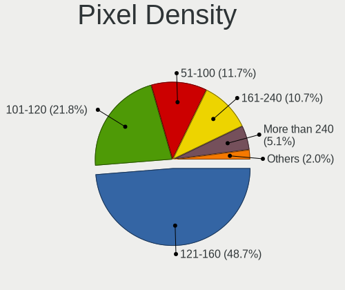
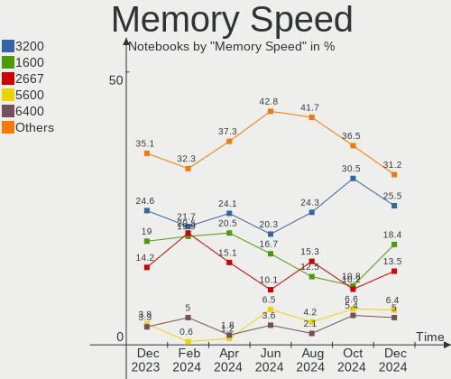

Debian Hardware Trends (Notebook)
---------------------------------

A project to identify most popular hardware characteristics and track their change
over time based on data collected by Debian users at https://Linux-Hardware.org.

Anyone can contribute to the study by uploading probes of their computers by
the [hw-probe](https://github.com/linuxhw/hw-probe) tool:

    sudo -E hw-probe -all -upload

Full-feature report is available here: https://linux-hardware.org/?view=trends&formfactor=notebook

Period: Sep, 2020.

Contents
--------

- [ OS                       ](#os)
- [ OS Family                ](#os-family)
- [ Kernel                   ](#kernel)
- [ Kernel Family            ](#kernel-family)
- [ Kernel Major Ver.        ](#kernel-major-ver)
- [ Arch                     ](#arch)
- [ DE                       ](#de)
- [ Display Server           ](#display-server)
- [ Display Manager          ](#display-manager)
- [ OS Lang                  ](#os-lang)
- [ Boot Mode                ](#boot-mode)
- [ Filesystem               ](#filesystem)
- [ Part. scheme             ](#part-scheme)
- [ Dual Boot with Linux/BSD ](#dual-boot-with-linux/bsd)
- [ Dual Boot (Win)          ](#dual-boot-win)
- [ Country                  ](#country)
- [ City                     ](#city)
- [ Vendor                   ](#vendor)
- [ Model                    ](#model)
- [ Model Family             ](#model-family)
- [ MFG Year                 ](#mfg-year)
- [ Form Factor              ](#form-factor)
- [ Secure Boot              ](#secure-boot)
- [ Coreboot                 ](#coreboot)
- [ RAM Size                 ](#ram-size)
- [ RAM Used                 ](#ram-used)
- [ Has CD-ROM               ](#has-cd-rom)
- [ Total Drives             ](#total-drives)
- [ Has Ethernet             ](#has-ethernet)
- [ Drive Vendor             ](#drive-vendor)
- [ HDD Vendor               ](#hdd-vendor)
- [ SSD Vendor               ](#ssd-vendor)
- [ Drive Model              ](#drive-model)
- [ Drive Kind               ](#drive-kind)
- [ Drive Connector          ](#drive-connector)
- [ Drive Size               ](#drive-size)
- [ Space Total              ](#space-total)
- [ Space Used               ](#space-used)
- [ Malfunc. Drives          ](#malfunc-drives)
- [ Malfunc. Drive Vendor    ](#malfunc-drive-vendor)
- [ Malfunc. HDD Vendor      ](#malfunc-hdd-vendor)
- [ Malfunc. Drive Kind      ](#malfunc-drive-kind)
- [ Failed Drives            ](#failed-drives)
- [ Failed Drive Vendor      ](#failed-drive-vendor)
- [ Drive Status             ](#drive-status)
- [ Storage Vendor           ](#storage-vendor)
- [ Storage Model            ](#storage-model)
- [ Storage Kind             ](#storage-kind)
- [ CPU Vendor               ](#cpu-vendor)
- [ CPU Model                ](#cpu-model)
- [ CPU Model Family         ](#cpu-model-family)
- [ CPU Cores                ](#cpu-cores)
- [ CPU Sockets              ](#cpu-sockets)
- [ CPU Threads              ](#cpu-threads)
- [ CPU Op-Modes             ](#cpu-op-modes)
- [ CPU Microcode            ](#cpu-microcode)
- [ CPU Microarch            ](#cpu-microarch)
- [ GPU Vendor               ](#gpu-vendor)
- [ GPU Model                ](#gpu-model)
- [ GPU Combo                ](#gpu-combo)
- [ GPU Driver               ](#gpu-driver)
- [ GPU Memory               ](#gpu-memory)
- [ Monitor Vendor           ](#monitor-vendor)
- [ Monitor Model            ](#monitor-model)
- [ Monitor Resolution       ](#monitor-resolution)
- [ Monitor Diagonal         ](#monitor-diagonal)
- [ Monitor Width            ](#monitor-width)
- [ Aspect Ratio             ](#aspect-ratio)
- [ Monitor Area             ](#monitor-area)
- [ Pixel Density            ](#pixel-density)
- [ Multiple Monitors        ](#multiple-monitors)
- [ Net Controller Vendor    ](#net-controller-vendor)
- [ Net Controller Model     ](#net-controller-model)
- [ Wireless Vendor          ](#wireless-vendor)
- [ Wireless Model           ](#wireless-model)
- [ Ethernet Vendor          ](#ethernet-vendor)
- [ Ethernet Model           ](#ethernet-model)
- [ Net Controller Kind      ](#net-controller-kind)
- [ Used Controller          ](#used-controller)
- [ NICs                     ](#nics)
- [ Memory Vendor            ](#memory-vendor)
- [ Memory Model             ](#memory-model)
- [ Memory Kind              ](#memory-kind)
- [ Memory Form Factor       ](#memory-form-factor)
- [ Memory Size              ](#memory-size)
- [ Memory Speed             ](#memory-speed)
- [ Sound Vendor             ](#sound-vendor)
- [ Sound Model              ](#sound-model)
- [ Camera Vendor            ](#camera-vendor)
- [ Camera Model             ](#camera-model)
- [ Fingerprint Vendor       ](#fingerprint-vendor)
- [ Fingerprint Model        ](#fingerprint-model)
- [ Chipcard Vendor          ](#chipcard-vendor)
- [ Chipcard Model           ](#chipcard-model)
- [ Printer Vendor           ](#printer-vendor)
- [ Printer Model            ](#printer-model)
- [ Scanner Vendor           ](#scanner-vendor)
- [ Scanner Model            ](#scanner-model)
- [ Bluetooth Vendor         ](#bluetooth-vendor)
- [ Bluetooth Model          ](#bluetooth-model)
- [ Unsupported Devices      ](#unsupported-devices)
- [ Unsupported Device Types ](#unsupported-device-types)

OS
--

Installed operating systems

| Name            | Notebooks | Percent |
|-----------------|-----------|---------|
| Debian 10       | 42        | 53.85%  |
| Debian Testing  | 20        | 25.64%  |
| Debian          | 9         | 11.54%  |
| Debian Unstable | 7         | 8.97%   |

OS Family
---------

OS without a version

| Name   | Notebooks | Percent |
|--------|-----------|---------|
| Debian | 78        | 100%    |

Kernel
------

Version of the Linux kernel

| Version                      | Notebooks | Percent |
|------------------------------|-----------|---------|
| 4.19.0-10-amd64              | 29        | 37.18%  |
| 5.7.0-3-amd64                | 14        | 17.95%  |
| 5.8.0-1-amd64                | 7         | 8.97%   |
| 5.8.0-2-amd64                | 5         | 6.41%   |
| 5.7.0-2-amd64                | 3         | 3.85%   |
| 4.19.0-6-amd64               | 3         | 3.85%   |
| 4.19.0-10-686-pae            | 3         | 3.85%   |
| 5.7.0-0.bpo.2-amd64          | 2         | 2.56%   |
| 4.19.0-11-amd64              | 2         | 2.56%   |
| 5.8.5-towo.1-siduction-amd64 | 1         | 1.28%   |
| 5.8.0-6.1-liquorix-amd64     | 1         | 1.28%   |
| 5.8.0-12.1-liquorix-amd64    | 1         | 1.28%   |
| 5.6.17-rt10avl1              | 1         | 1.28%   |
| 5.6.0-0.bpo.2-amd64          | 1         | 1.28%   |
| 5.5.0-1-amd64                | 1         | 1.28%   |
| 4.9.0-13-amd64               | 1         | 1.28%   |
| 4.9.0-13-686                 | 1         | 1.28%   |
| 4.4.232-19101-g619abfde5ea9  | 1         | 1.28%   |
| 4.19.0-4-amd64               | 1         | 1.28%   |

Kernel Family
-------------

Linux kernel without a distro release

| Version | Notebooks | Percent |
|---------|-----------|---------|
| 4.19.0  | 38        | 48.72%  |
| 5.7.0   | 19        | 24.36%  |
| 5.8.0   | 14        | 17.95%  |
| 4.9.0   | 2         | 2.56%   |
| 5.8.5   | 1         | 1.28%   |
| 5.6.17  | 1         | 1.28%   |
| 5.6.0   | 1         | 1.28%   |
| 5.5.0   | 1         | 1.28%   |
| 4.4.232 | 1         | 1.28%   |

Kernel Major Ver.
-----------------

Linux kernel major version

| Version | Notebooks | Percent |
|---------|-----------|---------|
| 4.19    | 38        | 48.72%  |
| 5.7     | 19        | 24.36%  |
| 5.8     | 15        | 19.23%  |
| 5.6     | 2         | 2.56%   |
| 4.9     | 2         | 2.56%   |
| 5.5     | 1         | 1.28%   |
| 4.4     | 1         | 1.28%   |

Arch
----

OS architecture (x86_64, i586, etc.)

| Name   | Notebooks | Percent |
|--------|-----------|---------|
| x86_64 | 74        | 94.87%  |
| i686   | 4         | 5.13%   |

DE
--

Desktop Environment

| Name             | Notebooks | Percent |
|------------------|-----------|---------|
| GNOME            | 31        | 39.74%  |
| XFCE             | 14        | 17.95%  |
| KDE5             | 7         | 8.97%   |
| KDE              | 6         | 7.69%   |
| i3               | 4         | 5.13%   |
| MATE             | 3         | 3.85%   |
| LXDE             | 3         | 3.85%   |
| Unknown          | 3         | 3.85%   |
| X-Cinnamon       | 2         | 2.56%   |
| lightdm-xsession | 2         | 2.56%   |
| LXQt             | 1         | 1.28%   |
| GNOME Flashback  | 1         | 1.28%   |
| Cinnamon         | 1         | 1.28%   |

Display Server
--------------

X11 or Wayland

| Name    | Notebooks | Percent |
|---------|-----------|---------|
| X11     | 59        | 75.64%  |
| Wayland | 15        | 19.23%  |
| Tty     | 4         | 5.13%   |

Display Manager
---------------

SDDM, LightDM, etc.

| Name    | Notebooks | Percent |
|---------|-----------|---------|
| Unknown | 25        | 32.05%  |
| TDM     | 21        | 26.92%  |
| GDM     | 19        | 24.36%  |
| SDDM    | 9         | 11.54%  |
| LightDM | 2         | 2.56%   |
| XDM     | 1         | 1.28%   |
| SLiM    | 1         | 1.28%   |

OS Lang
-------

Language

| Lang       | Notebooks | Percent |
|------------|-----------|---------|
| en_US      | 23        | 29.49%  |
| en_GB      | 6         | 7.69%   |
| pt_BR      | 4         | 5.13%   |
| de_DE      | 4         | 5.13%   |
| pl_PL      | 3         | 3.85%   |
| it_IT      | 3         | 3.85%   |
| en_NZ      | 3         | 3.85%   |
| en_IN      | 3         | 3.85%   |
| ru_RU      | 2         | 2.56%   |
| fr_FR      | 2         | 2.56%   |
| en_CA      | 2         | 2.56%   |
| Unknown    | 2         | 2.56%   |
| zh_TW      | 1         | 1.28%   |
| ro_RO      | 1         | 1.28%   |
| pt_PT      | 1         | 1.28%   |
| nl_NL      | 1         | 1.28%   |
| ko_KR      | 1         | 1.28%   |
| hu_HU      | 1         | 1.28%   |
| fi_FI      | 1         | 1.28%   |
| es_HN      | 1         | 1.28%   |
| es_ES      | 1         | 1.28%   |
| es_CR      | 1         | 1.28%   |
| es_CO      | 1         | 1.28%   |
| es_CL      | 1         | 1.28%   |
| es_BO      | 1         | 1.28%   |
| es_AR      | 1         | 1.28%   |
| en_US.utf8 | 1         | 1.28%   |
| en_NZ.utf8 | 1         | 1.28%   |
| en_IE      | 1         | 1.28%   |
| en_AU      | 1         | 1.28%   |
| de_CH.utf8 | 1         | 1.28%   |
| cs_CZ      | 1         | 1.28%   |
| C          | 1         | 1.28%   |

Boot Mode
---------

EFI or BIOS

| Mode | Notebooks | Percent |
|------|-----------|---------|
| EFI  | 40        | 51.28%  |
| BIOS | 38        | 48.72%  |

Filesystem
----------

Type of filesystem

| Type    | Notebooks | Percent |
|---------|-----------|---------|
| Ext4    | 67        | 85.9%   |
| Btrfs   | 6         | 7.69%   |
| Zfs     | 2         | 2.56%   |
| Overlay | 2         | 2.56%   |
| Ext2    | 1         | 1.28%   |

Part. scheme
------------

Scheme of partitioning

| Type    | Notebooks | Percent |
|---------|-----------|---------|
| GPT     | 40        | 51.28%  |
| Unknown | 24        | 30.77%  |
| MBR     | 14        | 17.95%  |

Dual Boot with Linux/BSD
------------------------

Hosting more than one Linux/BSD

| Dual boot | Notebooks | Percent |
|-----------|-----------|---------|
| No        | 70        | 89.74%  |
| Yes       | 8         | 10.26%  |

Dual Boot (Win)
---------------

Hosting Linux and Windows

| Dual boot | Notebooks | Percent |
|-----------|-----------|---------|
| No        | 65        | 83.33%  |
| Yes       | 13        | 16.67%  |

Country
-------

Geographic location (country)

| Country            | Notebooks | Percent |
|--------------------|-----------|---------|
| USA                | 10        | 12.82%  |
| Germany            | 7         | 8.97%   |
| India              | 5         | 6.41%   |
| New Zealand        | 4         | 5.13%   |
| Italy              | 4         | 5.13%   |
| Brazil             | 4         | 5.13%   |
| UK                 | 3         | 3.85%   |
| Russia             | 3         | 3.85%   |
| Portugal           | 3         | 3.85%   |
| Poland             | 3         | 3.85%   |
| Netherlands        | 3         | 3.85%   |
| France             | 3         | 3.85%   |
| Ukraine            | 2         | 2.56%   |
| Switzerland        | 2         | 2.56%   |
| Hungary            | 2         | 2.56%   |
| Taiwan             | 1         | 1.28%   |
| Spain              | 1         | 1.28%   |
| Singapore          | 1         | 1.28%   |
| Romania            | 1         | 1.28%   |
| Norway             | 1         | 1.28%   |
| Luxembourg         | 1         | 1.28%   |
| Korea, Republic of | 1         | 1.28%   |
| Kazakhstan         | 1         | 1.28%   |
| Israel             | 1         | 1.28%   |
| Ireland            | 1         | 1.28%   |
| Honduras           | 1         | 1.28%   |
| Finland            | 1         | 1.28%   |
| Czech Republic     | 1         | 1.28%   |
| Colombia           | 1         | 1.28%   |
| Chile              | 1         | 1.28%   |
| Canada             | 1         | 1.28%   |
| Bolivia            | 1         | 1.28%   |
| Bermuda            | 1         | 1.28%   |
| Belgium            | 1         | 1.28%   |
| Argentina          | 1         | 1.28%   |

City
----

Geographic location (city)

| City                 | Notebooks | Percent |
|----------------------|-----------|---------|
| Auckland             | 3         | 3.85%   |
| Warsaw               | 2         | 2.56%   |
| Amsterdam            | 2         | 2.56%   |
| Zurich               | 1         | 1.28%   |
| Zeist                | 1         | 1.28%   |
| Whangarei            | 1         | 1.28%   |
| Vigo                 | 1         | 1.28%   |
| Turin                | 1         | 1.28%   |
| Tel Aviv             | 1         | 1.28%   |
| Taoyuan District     | 1         | 1.28%   |
| São Paulo           | 1         | 1.28%   |
| Springfield          | 1         | 1.28%   |
| Singapore            | 1         | 1.28%   |
| Sao Felix da Marinha | 1         | 1.28%   |
| Santiago             | 1         | 1.28%   |
| Santa Cruz           | 1         | 1.28%   |
| Rio Claro            | 1         | 1.28%   |
| Redding              | 1         | 1.28%   |
| Raduzhny             | 1         | 1.28%   |
| Pune                 | 1         | 1.28%   |
| Promissao            | 1         | 1.28%   |
| Prato Lauro          | 1         | 1.28%   |
| Prague               | 1         | 1.28%   |
| Porto                | 1         | 1.28%   |
| Pirmasens            | 1         | 1.28%   |
| Pasly                | 1         | 1.28%   |
| Paris                | 1         | 1.28%   |
| Palakkad             | 1         | 1.28%   |
| Oulu                 | 1         | 1.28%   |
| Oslo                 | 1         | 1.28%   |
| Oruro                | 1         | 1.28%   |
| Okehampton           | 1         | 1.28%   |
| Odesa                | 1         | 1.28%   |
| Munich               | 1         | 1.28%   |
| Montusclat           | 1         | 1.28%   |
| Montreal             | 1         | 1.28%   |
| Mentor               | 1         | 1.28%   |
| Meitingen            | 1         | 1.28%   |
| Marysville           | 1         | 1.28%   |
| Marburg              | 1         | 1.28%   |
| Manchester           | 1         | 1.28%   |
| Lübeck              | 1         | 1.28%   |
| Los Angeles          | 1         | 1.28%   |
| Lisbon               | 1         | 1.28%   |
| Leudelange           | 1         | 1.28%   |
| Kyiv                 | 1         | 1.28%   |
| Kirchheim unter Teck | 1         | 1.28%   |
| Kecskemét           | 1         | 1.28%   |
| Kazan’             | 1         | 1.28%   |
| Ixelles-Elsene       | 1         | 1.28%   |
| Hunzenschwil         | 1         | 1.28%   |
| Hamilton             | 1         | 1.28%   |
| Gmina Lutomiersk     | 1         | 1.28%   |
| Freiburg             | 1         | 1.28%   |
| Frederick            | 1         | 1.28%   |
| Florianópolis       | 1         | 1.28%   |
| Fagnano Olona        | 1         | 1.28%   |
| Durham               | 1         | 1.28%   |
| Dublin               | 1         | 1.28%   |
| Danli                | 1         | 1.28%   |

Vendor
------

Motherboard manufacturer

| Name             | Notebooks | Percent |
|------------------|-----------|---------|
| Lenovo           | 20        | 25.64%  |
| Dell             | 19        | 24.36%  |
| Hewlett-Packard  | 15        | 19.23%  |
| ASUSTek Computer | 9         | 11.54%  |
| Acer             | 7         | 8.97%   |
| Toshiba          | 1         | 1.28%   |
| Timi             | 1         | 1.28%   |
| RM               | 1         | 1.28%   |
| Notebook         | 1         | 1.28%   |
| Medion           | 1         | 1.28%   |
| LG Electronics   | 1         | 1.28%   |
| Google           | 1         | 1.28%   |
| Apple            | 1         | 1.28%   |

Model
-----

Motherboard model

| Name                                     | Notebooks | Percent |
|------------------------------------------|-----------|---------|
| Toshiba Satellite Pro C650               | 1         | 1.28%   |
| Timi RedmiBook 14 II                     | 1         | 1.28%   |
| RM RM NOTEBOOK 310                       | 1         | 1.28%   |
| Notebook NJ50_70CU                       | 1         | 1.28%   |
| Medion E122X                             | 1         | 1.28%   |
| LG Electronics 15ND530-GX30K             | 1         | 1.28%   |
| Lenovo ThinkPad X60s 1703Y1F             | 1         | 1.28%   |
| Lenovo ThinkPad X250 20CLS3KU00          | 1         | 1.28%   |
| Lenovo ThinkPad X1 Carbon 7th 20QDCTO1WW | 1         | 1.28%   |
| Lenovo ThinkPad T495 20NJCTO1WW          | 1         | 1.28%   |
| Lenovo ThinkPad T470 20HDCTO1WW          | 1         | 1.28%   |
| Lenovo ThinkPad T440p 20AWS17N00         | 1         | 1.28%   |
| Lenovo ThinkPad T430 2347HD1             | 1         | 1.28%   |
| Lenovo ThinkPad T420 4236PRG             | 1         | 1.28%   |
| Lenovo ThinkPad T410 2522WUZ             | 1         | 1.28%   |
| Lenovo ThinkPad P52 20M9CTR1WW           | 1         | 1.28%   |
| Lenovo ThinkPad P14s Gen 1 20S4CTO1WW    | 1         | 1.28%   |
| Lenovo ThinkPad L14 Gen 1 20U50007MX     | 1         | 1.28%   |
| Lenovo ThinkPad E15 20RDCTO1WW           | 1         | 1.28%   |
| Lenovo ThinkPad E14 20RBCTO1WW           | 1         | 1.28%   |
| Lenovo ThinkPad 13 20GJCTO1WW            | 1         | 1.28%   |
| Lenovo IdeaPad S340-15API 81NC           | 1         | 1.28%   |
| Lenovo IdeaPad S340-14IML 81N9           | 1         | 1.28%   |
| Lenovo IdeaPad S145-14IIL 81W6           | 1         | 1.28%   |
| Lenovo G570 20079                        | 1         | 1.28%   |
| Lenovo G50-45 80E3                       | 1         | 1.28%   |
| HP ZBook 15u G6                          | 1         | 1.28%   |
| HP Stream Notebook PC 13                 | 1         | 1.28%   |
| HP ProBook 455 G2                        | 1         | 1.28%   |
| HP ProBook 4540s                         | 1         | 1.28%   |
| HP Notebook                              | 1         | 1.28%   |
| HP Mini 110-3100                         | 1         | 1.28%   |
| HP Laptop 17-ca1xxx                      | 1         | 1.28%   |
| HP Laptop 17-by1xxx                      | 1         | 1.28%   |
| HP Laptop 15-bs1xx                       | 1         | 1.28%   |
| HP G70                                   | 1         | 1.28%   |
| HP EliteBook 850 G5                      | 1         | 1.28%   |
| HP EliteBook 840 G6                      | 1         | 1.28%   |
| HP EliteBook 840 G5                      | 1         | 1.28%   |
| HP EliteBook 840 G3                      | 1         | 1.28%   |
| HP Compaq 6730b (KE717AV)                | 1         | 1.28%   |
| Google Rammus                            | 1         | 1.28%   |
| Dell XPS 13 9360                         | 1         | 1.28%   |
| Dell XPS 13 9350                         | 1         | 1.28%   |
| Dell Vostro 5490                         | 1         | 1.28%   |
| Dell Vostro 3560                         | 1         | 1.28%   |
| Dell Latitude E7440                      | 1         | 1.28%   |
| Dell Latitude E6430                      | 1         | 1.28%   |
| Dell Latitude E6220                      | 1         | 1.28%   |
| Dell Latitude E5410                      | 1         | 1.28%   |
| Dell Latitude 5400                       | 1         | 1.28%   |
| Dell Latitude 3510                       | 1         | 1.28%   |
| Dell Latitude 3400                       | 1         | 1.28%   |
| Dell Inspiron 7573                       | 1         | 1.28%   |
| Dell Inspiron 7559                       | 1         | 1.28%   |
| Dell Inspiron 5567                       | 1         | 1.28%   |
| Dell Inspiron 5520                       | 1         | 1.28%   |
| Dell Inspiron 3793                       | 1         | 1.28%   |
| Dell Inspiron 15-3552                    | 1         | 1.28%   |
| Dell Inspiron 15 7000 Gaming             | 1         | 1.28%   |

Model Family
------------

Motherboard model prefix

| Name                         | Notebooks | Percent |
|------------------------------|-----------|---------|
| Lenovo ThinkPad              | 15        | 19.23%  |
| Dell Latitude                | 7         | 8.97%   |
| Dell Inspiron                | 7         | 8.97%   |
| HP EliteBook                 | 4         | 5.13%   |
| Acer Aspire                  | 4         | 5.13%   |
| Lenovo IdeaPad               | 3         | 3.85%   |
| HP Laptop                    | 3         | 3.85%   |
| HP ProBook                   | 2         | 2.56%   |
| Dell XPS                     | 2         | 2.56%   |
| Dell Vostro                  | 2         | 2.56%   |
| ASUS VivoBook                | 2         | 2.56%   |
| Toshiba Satellite            | 1         | 1.28%   |
| Timi RedmiBook               | 1         | 1.28%   |
| RM RM                        | 1         | 1.28%   |
| Notebook NJ50                | 1         | 1.28%   |
| Medion E122X                 | 1         | 1.28%   |
| LG Electronics 15ND530-GX30K | 1         | 1.28%   |
| Lenovo G570                  | 1         | 1.28%   |
| Lenovo G50-45                | 1         | 1.28%   |
| HP ZBook                     | 1         | 1.28%   |
| HP Stream                    | 1         | 1.28%   |
| HP Notebook                  | 1         | 1.28%   |
| HP Mini                      | 1         | 1.28%   |
| HP G70                       | 1         | 1.28%   |
| HP Compaq                    | 1         | 1.28%   |
| Google Rammus                | 1         | 1.28%   |
| Dell G3                      | 1         | 1.28%   |
| ASUS Z450LA                  | 1         | 1.28%   |
| ASUS TUF                     | 1         | 1.28%   |
| ASUS S551LN                  | 1         | 1.28%   |
| ASUS PU403UA                 | 1         | 1.28%   |
| ASUS P553UA                  | 1         | 1.28%   |
| ASUS N551JW                  | 1         | 1.28%   |
| ASUS K46CB                   | 1         | 1.28%   |
| Apple MacBookPro11           | 1         | 1.28%   |
| Acer Swift                   | 1         | 1.28%   |
| Acer Nitro                   | 1         | 1.28%   |
| Acer AOA110                  | 1         | 1.28%   |

MFG Year
--------

Motherboard manufacture year

| Year | Notebooks | Percent |
|------|-----------|---------|
| 2020 | 21        | 26.92%  |
| 2019 | 16        | 20.51%  |
| 2013 | 8         | 10.26%  |
| 2018 | 7         | 8.97%   |
| 2017 | 7         | 8.97%   |
| 2014 | 4         | 5.13%   |
| 2016 | 3         | 3.85%   |
| 2011 | 3         | 3.85%   |
| 2010 | 3         | 3.85%   |
| 2015 | 2         | 2.56%   |
| 2012 | 2         | 2.56%   |
| 2009 | 1         | 1.28%   |
| 2008 | 1         | 1.28%   |

Form Factor
-----------

Physical design of the computer

| Name     | Notebooks | Percent |
|----------|-----------|---------|
| Notebook | 78        | 100%    |

Secure Boot
-----------

Enabled or disabled

| State    | Notebooks | Percent |
|----------|-----------|---------|
| Disabled | 69        | 88.46%  |
| Enabled  | 9         | 11.54%  |

Coreboot
--------

Have coreboot on board

| Used | Notebooks | Percent |
|------|-----------|---------|
| No   | 77        | 98.72%  |
| Yes  | 1         | 1.28%   |

RAM Size
--------

Total RAM memory

| Size in GB  | Notebooks | Percent |
|-------------|-----------|---------|
| 4.01-8.0    | 20        | 25.64%  |
| 8.01-16.0   | 20        | 25.64%  |
| 16.01-24.0  | 17        | 21.79%  |
| 3.01-4.0    | 11        | 14.1%   |
| 32.01-64.0  | 4         | 5.13%   |
| 2.01-3.0    | 2         | 2.56%   |
| 0.01-1.0    | 2         | 2.56%   |
| 64.01-256.0 | 1         | 1.28%   |
| 1.01-2.0    | 1         | 1.28%   |

RAM Used
--------

Used RAM memory

| Used GB    | Notebooks | Percent |
|------------|-----------|---------|
| 2.01-3.0   | 22        | 28.21%  |
| 1.01-2.0   | 19        | 24.36%  |
| 3.01-4.0   | 13        | 16.67%  |
| 4.01-8.0   | 12        | 15.38%  |
| 0.01-1.0   | 6         | 7.69%   |
| 8.01-16.0  | 5         | 6.41%   |
| 32.01-64.0 | 1         | 1.28%   |

Has CD-ROM
----------

Has CD-ROM on board

| Presented | Notebooks | Percent |
|-----------|-----------|---------|
| No        | 57        | 73.08%  |
| Yes       | 21        | 26.92%  |

Total Drives
------------

Number of drives on board

| Drives | Notebooks | Percent |
|--------|-----------|---------|
| 1      | 60        | 76.92%  |
| 2      | 15        | 19.23%  |
| 3      | 2         | 2.56%   |
| 4      | 1         | 1.28%   |

Has Ethernet
------------

Has Ethernet on board

| Presented | Notebooks | Percent |
|-----------|-----------|---------|
| Yes       | 65        | 83.33%  |
| No        | 13        | 16.67%  |

Drive Vendor
------------

Hard drive vendors

| Vendor              | Notebooks | Drives  | Percent |
|---------------------|-----------|---------|---------|
| Samsung Electronics | 19        | 21      | 20%     |
| Seagate             | 10        | 10      | 10.53%  |
| WDC                 | 9         | 9       | 9.47%   |
| Unknown             | 8         | 9       | 8.42%   |
| Toshiba             | 7         | 8       | 7.37%   |
| SanDisk             | 6         | 6       | 6.32%   |
| Kingston            | 6         | 6       | 6.32%   |
| Crucial             | 6         | 6       | 6.32%   |
| HGST                | 4         | 4       | 4.21%   |
| SK Hynix            | 3         | 3       | 3.16%   |
| Team                | 2         | 2       | 2.11%   |
| Micron Technology   | 2         | 2       | 2.11%   |
| Intel               | 2         | 2       | 2.11%   |
| Union Memory        | 1         | 1       | 1.05%   |
| TAMMUZ              | 1         | 1       | 1.05%   |
| Silicon Motion      | 1         | 1       | 1.05%   |
| PNY                 | 1         | 1       | 1.05%   |
| LDLC                | 1         | 1       | 1.05%   |
| HL-DT-ST            | 1         | Unknown | 1.05%   |
| Hitachi             | 1         | 1       | 1.05%   |
| GOODRAM             | 1         | 1       | 1.05%   |
| Dogfish             | 1         | 1       | 1.05%   |
| China               | 1         | 1       | 1.05%   |
| A-DATA Technology   | 1         | 1       | 1.05%   |

HDD Vendor
----------

Hard disk drive vendors

| Vendor  | Notebooks | Drives | Percent |
|---------|-----------|--------|---------|
| Seagate | 9         | 9      | 40.91%  |
| WDC     | 4         | 4      | 18.18%  |
| Toshiba | 4         | 4      | 18.18%  |
| HGST    | 4         | 4      | 18.18%  |
| Hitachi | 1         | 1      | 4.55%   |

SSD Vendor
----------

Solid state drive vendors

| Vendor              | Notebooks | Drives | Percent |
|---------------------|-----------|--------|---------|
| Samsung Electronics | 10        | 10     | 25.64%  |
| SanDisk             | 6         | 6      | 15.38%  |
| Crucial             | 6         | 6      | 15.38%  |
| Kingston            | 5         | 5      | 12.82%  |
| Team                | 2         | 2      | 5.13%   |
| WDC                 | 1         | 1      | 2.56%   |
| TAMMUZ              | 1         | 1      | 2.56%   |
| SK Hynix            | 1         | 1      | 2.56%   |
| PNY                 | 1         | 1      | 2.56%   |
| Micron Technology   | 1         | 1      | 2.56%   |
| LDLC                | 1         | 1      | 2.56%   |
| Intel               | 1         | 1      | 2.56%   |
| GOODRAM             | 1         | 1      | 2.56%   |
| Dogfish             | 1         | 1      | 2.56%   |
| China               | 1         | 1      | 2.56%   |

Drive Model
-----------

Hard drive models

| Model                              | Notebooks | Percent |
|------------------------------------|-----------|---------|
| NVMe SSD Drive 256GB               | 5         | 5.15%   |
| ST1000LM035-1RK172 1TB             | 3         | 3.09%   |
| HTS721010A9E630 1TB                | 3         | 3.09%   |
| SSD 850 EVO 500GB                  | 2         | 2.06%   |
| SSD 850 EVO 250GB                  | 2         | 2.06%   |
| SSD 128GB                          | 2         | 2.06%   |
| SA400S37240G 240GB SSD             | 2         | 2.06%   |
| MZVLB512HAJQ-000H1 512GB           | 2         | 2.06%   |
| MQ01ABD100 1TB                     | 2         | 2.06%   |
| MMC Card  2GB                      | 2         | 2.06%   |
| CT500MX500SSD1 500GB               | 2         | 2.06%   |
| X400 M.2 2280 128GB SSD            | 1         | 1.03%   |
| X300 MSATA 256GB SSD               | 1         | 1.03%   |
| WDS500G2B0A 500GB SSD              | 1         | 1.03%   |
| WD7500BPVT-22HXZT1 752GB           | 1         | 1.03%   |
| WD5000LPVX-80V0TT0 500GB           | 1         | 1.03%   |
| WD2500BEVT-22A23T0 250GB           | 1         | 1.03%   |
| WD20SPZX-08UA7 2TB                 | 1         | 1.03%   |
| USDU1  64GB                        | 1         | 1.03%   |
| UMIS RPITJ512PED2OWX 512GB         | 1         | 1.03%   |
| T253TD001T 1TB SSD                 | 1         | 1.03%   |
| SX8200PNP 256GB                    | 1         | 1.03%   |
| SUV400S37240G 240GB SSD            | 1         | 1.03%   |
| ST9500424AS 500GB                  | 1         | 1.03%   |
| ST9500420AS 500GB                  | 1         | 1.03%   |
| ST2000LM007-1R8174 2TB             | 1         | 1.03%   |
| ST1000LM049-2GH172 1TB             | 1         | 1.03%   |
| ST1000LM048-2E7172 1TB             | 1         | 1.03%   |
| ST1000LM024 HN-M101MBB 1TB         | 1         | 1.03%   |
| SSDPEKKW256G7 256GB                | 1         | 1.03%   |
| SSDPAMM0008G1 8GB                  | 1         | 1.03%   |
| SSD PLUS 240GB                     | 1         | 1.03%   |
| SSD PLUS 240 GB                    | 1         | 1.03%   |
| SSD F6 PLUS M.2 2280 3D NAND 960GB | 1         | 1.03%   |
| SSD 970 EVO Plus 2TB               | 1         | 1.03%   |
| SSD 860 EVO 1TB                    | 1         | 1.03%   |
| SSD 850 EVO 2TB                    | 1         | 1.03%   |
| SSD 840 EVO 250GB                  | 1         | 1.03%   |
| SSD 120GB                          | 1         | 1.03%   |
| SG9MSM6D024GPM00 24GB SSD          | 1         | 1.03%   |
| SD8TN8U256G1001 256GB SSD          | 1         | 1.03%   |
| SD8SN8U-256G-1006 256GB SSD        | 1         | 1.03%   |
| SC64G  64GB                        | 1         | 1.03%   |
| SC311 SATA 512GB SSD               | 1         | 1.03%   |
| SATA SSD 240GB                     | 1         | 1.03%   |
| SA400S37960G 960GB SSD             | 1         | 1.03%   |
| SA400S37480G 480GB SSD             | 1         | 1.03%   |
| RBUSNS8154P3256GJ3 256GB           | 1         | 1.03%   |
| PC SN730 SDBQNTY-512G-1001 512GB   | 1         | 1.03%   |
| PC SN520 SDAPNUW-512G-1014 512GB   | 1         | 1.03%   |
| PC SN520 SDAPMUW-512G              | 1         | 1.03%   |
| PC SN520 NVMe 512GB                | 1         | 1.03%   |
| NVMe SSD Drive 960GB               | 1         | 1.03%   |
| NVMe SSD Drive 512GB               | 1         | 1.03%   |
| MZVLB512HBJQ-000L7 512GB           | 1         | 1.03%   |
| MZVLB2T0HALB-000L7 2TB             | 1         | 1.03%   |
| MZVLB256HBHQ-000L7 256GB           | 1         | 1.03%   |
| MZVLB256HAHQ-00000 256GB           | 1         | 1.03%   |
| MZNLH512HALU-00000 512GB SSD       | 1         | 1.03%   |
| MZ7LN256HCHP-000L7 256GB SSD       | 1         | 1.03%   |

Drive Kind
----------

HDD or SSD

| Kind    | Notebooks | Drives  | Percent |
|---------|-----------|---------|---------|
| SSD     | 37        | 39      | 39.36%  |
| NVMe    | 27        | 29      | 28.72%  |
| HDD     | 22        | 22      | 23.4%   |
| MMC     | 7         | 8       | 7.45%   |
| Unknown | 1         | Unknown | 1.06%   |

Drive Connector
---------------

SATA, SAS, NVMe, etc.

| Type | Notebooks | Drives  | Percent |
|------|-----------|---------|---------|
| SATA | 52        | 61      | 59.77%  |
| NVMe | 27        | 29      | 31.03%  |
| MMC  | 7         | 8       | 8.05%   |
| SAS  | 1         | Unknown | 1.15%   |

Drive Size
----------

Size of hard drive

| Size in TB | Notebooks | Drives | Percent |
|------------|-----------|--------|---------|
| 0.01-0.5   | 51        | 56     | 57.3%   |
| 0.51-1.0   | 34        | 36     | 38.2%   |
| 1.01-2.0   | 3         | 5      | 3.37%   |
| 2.01-3.0   | 1         | 1      | 1.12%   |

Space Total
-----------

Amount of disk space available on the file system

| Size in GB | Notebooks | Percent |
|------------|-----------|---------|
| 101-250    | 27        | 34.62%  |
| 251-500    | 17        | 21.79%  |
| 1001-2000  | 10        | 12.82%  |
| 51-100     | 9         | 11.54%  |
| 501-1000   | 6         | 7.69%   |
| 1-20       | 4         | 5.13%   |
| Unknown    | 3         | 3.85%   |
| 21-50      | 1         | 1.28%   |
| 2001-3000  | 1         | 1.28%   |

Space Used
----------

Amount of used disk space

| Used GB   | Notebooks | Percent |
|-----------|-----------|---------|
| 1-20      | 24        | 30.77%  |
| 21-50     | 16        | 20.51%  |
| 101-250   | 12        | 15.38%  |
| 51-100    | 10        | 12.82%  |
| 501-1000  | 6         | 7.69%   |
| 251-500   | 4         | 5.13%   |
| Unknown   | 3         | 3.85%   |
| 1001-2000 | 2         | 2.56%   |
| 2001-3000 | 1         | 1.28%   |

Malfunc. Drives
---------------

Drive models with a malfunction

| Model                       | Notebooks | Drives | Percent |
|-----------------------------|-----------|--------|---------|
| WD2500BEVT-22A23T0 250GB    | 1         | 1      | 16.67%  |
| SD8SN8U-256G-1006 256GB SSD | 1         | 1      | 16.67%  |
| MQ01ABD100 1TB              | 1         | 1      | 16.67%  |
| L5 LITE SSD 60GB            | 1         | 1      | 16.67%  |
| HTS542512K9A300 120GB       | 1         | 1      | 16.67%  |
| HTS541075A9E680 752GB       | 1         | 1      | 16.67%  |

Malfunc. Drive Vendor
---------------------

Vendors of faulty drives

| Vendor  | Notebooks | Drives | Percent |
|---------|-----------|--------|---------|
| WDC     | 1         | 1      | 16.67%  |
| Toshiba | 1         | 1      | 16.67%  |
| Team    | 1         | 1      | 16.67%  |
| SanDisk | 1         | 1      | 16.67%  |
| Hitachi | 1         | 1      | 16.67%  |
| HGST    | 1         | 1      | 16.67%  |

Malfunc. HDD Vendor
-------------------

Vendors of faulty HDD drives

| Vendor  | Notebooks | Drives | Percent |
|---------|-----------|--------|---------|
| WDC     | 1         | 1      | 25%     |
| Toshiba | 1         | 1      | 25%     |
| Hitachi | 1         | 1      | 25%     |
| HGST    | 1         | 1      | 25%     |

Malfunc. Drive Kind
-------------------

Kinds of faulty drives

| Kind | Notebooks | Drives | Percent |
|------|-----------|--------|---------|
| HDD  | 4         | 4      | 66.67%  |
| SSD  | 2         | 2      | 33.33%  |

Failed Drives
-------------

Failed drive models

Zero info for selected period =(

Failed Drive Vendor
-------------------

Failed drive vendors

Zero info for selected period =(

Drive Status
------------

Number of failed and malfunc. drives

| Status   | Notebooks | Drives | Percent |
|----------|-----------|--------|---------|
| Works    | 47        | 59     | 58.02%  |
| Detected | 28        | 33     | 34.57%  |
| Malfunc  | 6         | 6      | 7.41%   |

Storage Vendor
--------------

Storage controller vendors

| Vendor                       | Notebooks | Percent |
|------------------------------|-----------|---------|
| Intel                        | 56        | 60.22%  |
| Samsung Electronics          | 10        | 10.75%  |
| AMD                          | 9         | 9.68%   |
| Toshiba America Info Systems | 4         | 4.3%    |
| Sandisk                      | 4         | 4.3%    |
| ADATA Technology             | 3         | 3.23%   |
| SK Hynix                     | 2         | 2.15%   |
| Union Memory (Shenzhen)      | 1         | 1.08%   |
| Silicon Motion               | 1         | 1.08%   |
| Seagate Technology           | 1         | 1.08%   |
| Micron Technology            | 1         | 1.08%   |
| Kingston Technology Company  | 1         | 1.08%   |

Storage Model
-------------

Storage controller models

| Model                                                                            | Notebooks | Percent |
|----------------------------------------------------------------------------------|-----------|---------|
| Sunrise Point-LP SATA Controller [AHCI mode]                                     | 11        | 11.46%  |
| Non-Volatile memory controller                                                   | 10        | 10.42%  |
| FCH SATA Controller [AHCI mode]                                                  | 9         | 9.38%   |
| NVMe SSD Controller SM981/PM981/PM983                                            | 8         | 8.33%   |
| Comet Lake SATA AHCI Controller                                                  | 6         | 6.25%   |
| 82801 Mobile SATA Controller [RAID mode]                                         | 5         | 5.21%   |
| 7 Series Chipset Family 6-port SATA Controller [AHCI mode]                       | 5         | 5.21%   |
| 8 Series/C220 Series Chipset Family 6-port SATA Controller 1 [AHCI mode]         | 3         | 3.13%   |
| 8 Series SATA Controller 1 [AHCI mode]                                           | 3         | 3.13%   |
| 6 Series/C200 Series Chipset Family 6 port Mobile SATA AHCI Controller           | 3         | 3.13%   |
| Toshiba America Info Non-Volatile memory controller                              | 2         | 2.08%   |
| Ice Lake-LP SATA Controller [AHCI mode]                                          | 2         | 2.08%   |
| HM170/QM170 Chipset SATA Controller [AHCI Mode]                                  | 2         | 2.08%   |
| Cannon Lake Mobile PCH SATA AHCI Controller                                      | 2         | 2.08%   |
| 82801IBM/IEM (ICH9M/ICH9M-E) 4 port SATA Controller [AHCI mode]                  | 2         | 2.08%   |
| XPG SX8200 Pro PCIe Gen3x4 M.2 2280 Solid State Drive                            | 1         | 1.04%   |
| XG4 NVMe SSD Controller                                                          | 1         | 1.04%   |
| Wildcat Point-LP SATA Controller [AHCI Mode]                                     | 1         | 1.04%   |
| WD Black 2018/PC SN520 NVMe SSD                                                  | 1         | 1.04%   |
| SSD 600P Series                                                                  | 1         | 1.04%   |
| SM2262/SM2262EN SSD Controller                                                   | 1         | 1.04%   |
| SATA controller                                                                  | 1         | 1.04%   |
| NVMe SSD Controller SM961/PM961                                                  | 1         | 1.04%   |
| NVMe SSD Controller SM951/PM951                                                  | 1         | 1.04%   |
| NM10/ICH7 Family SATA Controller [IDE mode]                                      | 1         | 1.04%   |
| NM10/ICH7 Family SATA Controller [AHCI mode]                                     | 1         | 1.04%   |
| Cannon Point-LP SATA Controller [AHCI Mode]                                      | 1         | 1.04%   |
| BG3 NVMe SSD Controller                                                          | 1         | 1.04%   |
| BC501 NVMe Solid State Drive 512GB                                               | 1         | 1.04%   |
| Atom/Celeron/Pentium Processor x5-E8000/J3xxx/N3xxx Series SATA Controller       | 1         | 1.04%   |
| 82801IBM/IEM (ICH9M/ICH9M-E) 2 port SATA Controller [IDE mode]                   | 1         | 1.04%   |
| 82801GBM/GHM (ICH7-M Family) SATA Controller [IDE mode]                          | 1         | 1.04%   |
| 82801GBM/GHM (ICH7-M Family) SATA Controller [AHCI mode]                         | 1         | 1.04%   |
| 82801G (ICH7 Family) IDE Controller                                              | 1         | 1.04%   |
| 6 Series/C200 Series Chipset Family Mobile SATA Controller (IDE mode, ports 4-5) | 1         | 1.04%   |
| 6 Series/C200 Series Chipset Family Mobile SATA Controller (IDE mode, ports 0-3) | 1         | 1.04%   |
| 5 Series/3400 Series Chipset 6 port SATA AHCI Controller                         | 1         | 1.04%   |
| 5 Series/3400 Series Chipset 4 port SATA AHCI Controller                         | 1         | 1.04%   |

Storage Kind
------------

Kind of storage controller (IDE, SATA, NVMe, SAS, ...)

| Kind | Notebooks | Percent |
|------|-----------|---------|
| SATA | 56        | 59.57%  |
| NVMe | 28        | 29.79%  |
| RAID | 5         | 5.32%   |
| IDE  | 5         | 5.32%   |

CPU Vendor
----------

Processor vendors

| Vendor | Notebooks | Percent |
|--------|-----------|---------|
| Intel  | 67        | 85.9%   |
| AMD    | 11        | 14.1%   |

CPU Model
---------

Processor models

| Model                                           | Notebooks | Percent |
|-------------------------------------------------|-----------|---------|
| Intel Core i7-8565U CPU @ 1.80GHz               | 3         | 3.85%   |
| Intel Core i5-7200U CPU @ 2.50GHz               | 3         | 3.85%   |
| Intel Core i5-6200U CPU @ 2.30GHz               | 3         | 3.85%   |
| Intel Core i5-10210U CPU @ 1.60GHz              | 3         | 3.85%   |
| Intel Core i7-8550U CPU @ 1.80GHz               | 2         | 2.56%   |
| Intel Core i7-7700HQ CPU @ 2.80GHz              | 2         | 2.56%   |
| Intel Core i7-10510U CPU @ 1.80GHz              | 2         | 2.56%   |
| Intel Core i5-8265U CPU @ 1.60GHz               | 2         | 2.56%   |
| Intel Core i5-8250U CPU @ 1.60GHz               | 2         | 2.56%   |
| Intel Core i3-1005G1 CPU @ 1.20GHz              | 2         | 2.56%   |
| Intel Atom CPU N455 @ 1.66GHz                   | 2         | 2.56%   |
| Intel Core m3-8100Y CPU @ 1.10GHz               | 1         | 1.28%   |
| Intel Core i7-8850H CPU @ 2.60GHz               | 1         | 1.28%   |
| Intel Core i7-8665U CPU @ 1.90GHz               | 1         | 1.28%   |
| Intel Core i7-7600U CPU @ 2.80GHz               | 1         | 1.28%   |
| Intel Core i7-7500U CPU @ 2.70GHz               | 1         | 1.28%   |
| Intel Core i7-6600U CPU @ 2.60GHz               | 1         | 1.28%   |
| Intel Core i7-4850HQ CPU @ 2.30GHz              | 1         | 1.28%   |
| Intel Core i7-4720HQ CPU @ 2.60GHz              | 1         | 1.28%   |
| Intel Core i7-4600U CPU @ 2.10GHz               | 1         | 1.28%   |
| Intel Core i7-4510U CPU @ 2.00GHz               | 1         | 1.28%   |
| Intel Core i7-3632QM CPU @ 2.20GHz              | 1         | 1.28%   |
| Intel Core i7-2640M CPU @ 2.80GHz               | 1         | 1.28%   |
| Intel Core i7-10610U CPU @ 1.80GHz              | 1         | 1.28%   |
| Intel Core i5-9300H CPU @ 2.40GHz               | 1         | 1.28%   |
| Intel Core i5-8350U CPU @ 1.70GHz               | 1         | 1.28%   |
| Intel Core i5-6300HQ CPU @ 2.30GHz              | 1         | 1.28%   |
| Intel Core i5-5300U CPU @ 2.30GHz               | 1         | 1.28%   |
| Intel Core i5-4300M CPU @ 2.60GHz               | 1         | 1.28%   |
| Intel Core i5-3320M CPU @ 2.60GHz               | 1         | 1.28%   |
| Intel Core i5-3317U CPU @ 1.70GHz               | 1         | 1.28%   |
| Intel Core i5-3230M CPU @ 2.60GHz               | 1         | 1.28%   |
| Intel Core i5-3210M CPU @ 2.50GHz               | 1         | 1.28%   |
| Intel Core i5-2520M CPU @ 2.50GHz               | 1         | 1.28%   |
| Intel Core i5-2450M CPU @ 2.50GHz               | 1         | 1.28%   |
| Intel Core i5 CPU M 560 @ 2.67GHz               | 1         | 1.28%   |
| Intel Core i5 CPU M 520 @ 2.40GHz               | 1         | 1.28%   |
| Intel Core i3-7020U CPU @ 2.30GHz               | 1         | 1.28%   |
| Intel Core i3-6006U CPU @ 2.00GHz               | 1         | 1.28%   |
| Intel Core i3-4005U CPU @ 1.70GHz               | 1         | 1.28%   |
| Intel Core i3-4000M CPU @ 2.40GHz               | 1         | 1.28%   |
| Intel Core i3-3120M CPU @ 2.50GHz               | 1         | 1.28%   |
| Intel Core i3-10110U CPU @ 2.10GHz              | 1         | 1.28%   |
| Intel Core Duo CPU L2400 @ 1.66GHz              | 1         | 1.28%   |
| Intel Core 2 Duo CPU T6570 @ 2.10GHz            | 1         | 1.28%   |
| Intel Core 2 Duo CPU T5800 @ 2.00GHz            | 1         | 1.28%   |
| Intel Core 2 Duo CPU P8600 @ 2.40GHz            | 1         | 1.28%   |
| Intel Celeron N4000 CPU @ 1.10GHz               | 1         | 1.28%   |
| Intel Celeron CPU N3060 @ 1.60GHz               | 1         | 1.28%   |
| Intel Celeron CPU N2840 @ 2.16GHz               | 1         | 1.28%   |
| Intel Celeron CPU B800 @ 1.50GHz                | 1         | 1.28%   |
| Intel Atom CPU N270 @ 1.60GHz                   | 1         | 1.28%   |
| AMD Ryzen 7 PRO 3700U w/ Radeon Vega Mobile Gfx | 1         | 1.28%   |
| AMD Ryzen 7 4700U with Radeon Graphics          | 1         | 1.28%   |
| AMD Ryzen 7 3700U with Radeon Vega Mobile Gfx   | 1         | 1.28%   |
| AMD Ryzen 5 4500U with Radeon Graphics          | 1         | 1.28%   |
| AMD Ryzen 5 3550H with Radeon Vega Mobile Gfx   | 1         | 1.28%   |
| AMD Ryzen 5 3500U with Radeon Vega Mobile Gfx   | 1         | 1.28%   |
| AMD E1-2100 APU with Radeon HD Graphics         | 1         | 1.28%   |
| AMD A8-6410 APU with AMD Radeon R5 Graphics     | 1         | 1.28%   |

CPU Model Family
----------------

Processor model prefix

| Model            | Notebooks | Percent |
|------------------|-----------|---------|
| Intel Core i5    | 26        | 33.33%  |
| Intel Core i7    | 21        | 26.92%  |
| Intel Core i3    | 8         | 10.26%  |
| Intel Celeron    | 4         | 5.13%   |
| Intel Core 2 Duo | 3         | 3.85%   |
| Intel Atom       | 3         | 3.85%   |
| AMD Ryzen 5      | 3         | 3.85%   |
| AMD Ryzen 7      | 2         | 2.56%   |
| Intel Core m3    | 1         | 1.28%   |
| Intel Core Duo   | 1         | 1.28%   |
| AMD Ryzen 7 PRO  | 1         | 1.28%   |
| AMD E1           | 1         | 1.28%   |
| AMD A8           | 1         | 1.28%   |
| AMD A6           | 1         | 1.28%   |
| AMD A4           | 1         | 1.28%   |
| AMD A10          | 1         | 1.28%   |

CPU Cores
---------

Number of processor cores

| Number | Notebooks | Percent |
|--------|-----------|---------|
| 2      | 41        | 52.56%  |
| 4      | 30        | 38.46%  |
| 1      | 4         | 5.13%   |
| 6      | 2         | 2.56%   |
| 8      | 1         | 1.28%   |

CPU Sockets
-----------

Number of sockets

| Number | Notebooks | Percent |
|--------|-----------|---------|
| 1      | 78        | 100%    |

CPU Threads
-----------

Threads per core (Hyper-Threading)

| Number | Notebooks | Percent |
|--------|-----------|---------|
| 2      | 63        | 80.77%  |
| 1      | 15        | 19.23%  |

CPU Op-Modes
------------

CPU Operation Modes (32-bit, 64-bit)

| Op mode        | Notebooks | Percent |
|----------------|-----------|---------|
| 32-bit, 64-bit | 76        | 97.44%  |
| 32-bit         | 2         | 2.56%   |

CPU Microcode
-------------

Microcode number

| Number     | Notebooks | Percent |
|------------|-----------|---------|
| Unknown    | 28        | 35.9%   |
| 0x806ec    | 10        | 12.82%  |
| 0x806e9    | 5         | 6.41%   |
| 0x306a9    | 4         | 5.13%   |
| 0x806ea    | 3         | 3.85%   |
| 0x406e3    | 3         | 3.85%   |
| 0x906ea    | 2         | 2.56%   |
| 0x306c3    | 2         | 2.56%   |
| 0x206a7    | 2         | 2.56%   |
| 0x1067a    | 2         | 2.56%   |
| 0x08600103 | 2         | 2.56%   |
| 0x08108102 | 2         | 2.56%   |
| 0x906e9    | 1         | 1.28%   |
| 0x806eb    | 1         | 1.28%   |
| 0x706e5    | 1         | 1.28%   |
| 0x6ec      | 1         | 1.28%   |
| 0x406c4    | 1         | 1.28%   |
| 0x40651    | 1         | 1.28%   |
| 0x30678    | 1         | 1.28%   |
| 0x20655    | 1         | 1.28%   |
| 0x106ca    | 1         | 1.28%   |
| 0x106c2    | 1         | 1.28%   |
| 0x07030105 | 1         | 1.28%   |
| 0x06006118 | 1         | 1.28%   |
| 0x06003106 | 1         | 1.28%   |

CPU Microarch
-------------

Microarchitecture

| Name          | Notebooks | Percent |
|---------------|-----------|---------|
| Skylake       | 27        | 34.62%  |
| KabyLake      | 8         | 10.26%  |
| Haswell       | 7         | 8.97%   |
| IvyBridge     | 6         | 7.69%   |
| Zen+          | 4         | 5.13%   |
| SandyBridge   | 4         | 5.13%   |
| Core          | 3         | 3.85%   |
| Bonnell       | 3         | 3.85%   |
| Zen 2         | 2         | 2.56%   |
| Westmere      | 2         | 2.56%   |
| Silvermont    | 2         | 2.56%   |
| Puma          | 2         | 2.56%   |
| Icelake       | 2         | 2.56%   |
| Steamroller   | 1         | 1.28%   |
| P6            | 1         | 1.28%   |
| Jaguar        | 1         | 1.28%   |
| Goldmont plus | 1         | 1.28%   |
| Excavator     | 1         | 1.28%   |
| Broadwell     | 1         | 1.28%   |

GPU Vendor
----------

Vendors of graphics cards

| Vendor | Notebooks | Percent |
|--------|-----------|---------|
| Intel  | 64        | 68.09%  |
| Nvidia | 17        | 18.09%  |
| AMD    | 13        | 13.83%  |

GPU Model
---------

Graphics card models

| Model                                                                              | Notebooks | Percent |
|------------------------------------------------------------------------------------|-----------|---------|
| UHD Graphics                                                                       | 7         | 7.07%   |
| UHD Graphics 620 (Whiskey Lake)                                                    | 6         | 6.06%   |
| 3rd Gen Core processor Graphics Controller                                         | 6         | 6.06%   |
| UHD Graphics 620                                                                   | 5         | 5.05%   |
| Skylake GT2 [HD Graphics 520]                                                      | 5         | 5.05%   |
| HD Graphics 620                                                                    | 5         | 5.05%   |
| Picasso                                                                            | 4         | 4.04%   |
| 2nd Generation Core Processor Family Integrated Graphics Controller                | 4         | 4.04%   |
| Haswell-ULT Integrated Graphics Controller                                         | 3         | 3.03%   |
| GP108M [GeForce MX230]                                                             | 3         | 3.03%   |
| 4th Gen Core Processor Integrated Graphics Controller                              | 3         | 3.03%   |
| Renoir                                                                             | 2         | 2.02%   |
| Mobile 945GM/GMS/GME, 943/940GML Express Integrated Graphics Controller            | 2         | 2.02%   |
| Mobile 4 Series Chipset Integrated Graphics Controller                             | 2         | 2.02%   |
| Iris Plus Graphics G1 (Ice Lake)                                                   | 2         | 2.02%   |
| HD Graphics 630                                                                    | 2         | 2.02%   |
| GM107M [GeForce GTX 960M]                                                          | 2         | 2.02%   |
| Core Processor Integrated Graphics Controller                                      | 2         | 2.02%   |
| Atom Processor D4xx/D5xx/N4xx/N5xx Integrated Graphics Controller                  | 2         | 2.02%   |
| Wani [Radeon R5/R6/R7 Graphics]                                                    | 1         | 1.01%   |
| UHD Graphics 630 (Mobile)                                                          | 1         | 1.01%   |
| UHD Graphics 615                                                                   | 1         | 1.01%   |
| UHD Graphics 605                                                                   | 1         | 1.01%   |
| Topaz XT [Radeon R7 M260/M265 / M340/M360 / M440/M445 / 530/535 / 620/625 Mobile]  | 1         | 1.01%   |
| Thames [Radeon HD 7500M/7600M Series]                                              | 1         | 1.01%   |
| Sun XT [Radeon HD 8670A/8670M/8690M / R5 M330 / M430 / Radeon 520 Mobile]          | 1         | 1.01%   |
| Mullins [Radeon R4/R5 Graphics]                                                    | 1         | 1.01%   |
| Mullins [Radeon R3 Graphics]                                                       | 1         | 1.01%   |
| Mobile 945GSE Express Integrated Graphics Controller                               | 1         | 1.01%   |
| Mobile 945GM/GMS, 943/940GML Express Integrated Graphics Controller                | 1         | 1.01%   |
| Lexa XT [Radeon PRO WX 3200]                                                       | 1         | 1.01%   |
| Kaveri [Radeon R4 Graphics]                                                        | 1         | 1.01%   |
| Kaby Lake-U GT2f Integrated Graphics Controller                                    | 1         | 1.01%   |
| Kabini [Radeon HD 8210]                                                            | 1         | 1.01%   |
| HD Graphics 5500                                                                   | 1         | 1.01%   |
| HD Graphics 530                                                                    | 1         | 1.01%   |
| GP108GLM [Quadro P520]                                                             | 1         | 1.01%   |
| GP107M [GeForce GTX 1050 Ti Mobile]                                                | 1         | 1.01%   |
| GP107M [GeForce GTX 1050 Mobile]                                                   | 1         | 1.01%   |
| GP107M [GeForce GTX 1050 3 GB Max-Q]                                               | 1         | 1.01%   |
| GP107GLM [Quadro P2000 Mobile]                                                     | 1         | 1.01%   |
| GM108M [GeForce MX130]                                                             | 1         | 1.01%   |
| GM108M [GeForce 840M]                                                              | 1         | 1.01%   |
| GM107 [GeForce 940MX]                                                              | 1         | 1.01%   |
| GK107M [GeForce GT 750M Mac Edition]                                               | 1         | 1.01%   |
| GK107M [GeForce GT 740M]                                                           | 1         | 1.01%   |
| GF119M [Quadro NVS 4200M]                                                          | 1         | 1.01%   |
| G98M [GeForce 9200M GS]                                                            | 1         | 1.01%   |
| Baffin [Radeon RX 460/560D / Pro 450/455/460/555/555X/560/560X]                    | 1         | 1.01%   |
| Atom/Celeron/Pentium Processor x5-E8000/J3xxx/N3xxx Integrated Graphics Controller | 1         | 1.01%   |
| Atom Processor Z36xxx/Z37xxx Series Graphics & Display                             | 1         | 1.01%   |

GPU Combo
---------

Combinations of graphics cards

| Name           | Notebooks | Percent |
|----------------|-----------|---------|
| 1 x Intel      | 48        | 61.54%  |
| Intel + Nvidia | 14        | 17.95%  |
| 1 x AMD        | 8         | 10.26%  |
| 2 x AMD        | 3         | 3.85%   |
| 1 x Nvidia     | 3         | 3.85%   |
| Intel + AMD    | 2         | 2.56%   |

GPU Driver
----------

Free vs proprietary

| Driver      | Notebooks | Percent |
|-------------|-----------|---------|
| Free        | 68        | 87.18%  |
| Proprietary | 8         | 10.26%  |
| Unknown     | 2         | 2.56%   |

GPU Memory
----------

Total video memory

| Size in GB | Notebooks | Percent |
|------------|-----------|---------|
| Unknown    | 64        | 82.05%  |
| 1.01-2.0   | 5         | 6.41%   |
| 3.01-4.0   | 4         | 5.13%   |
| 0.01-0.5   | 3         | 3.85%   |
| 0.51-1.0   | 2         | 2.56%   |

Monitor Vendor
--------------

Monitor vendors

| Vendor                  | Notebooks | Percent |
|-------------------------|-----------|---------|
| LG Display              | 17        | 18.89%  |
| AU Optronics            | 17        | 18.89%  |
| BOE                     | 16        | 17.78%  |
| Chimei Innolux          | 13        | 14.44%  |
| Samsung Electronics     | 4         | 4.44%   |
| Goldstar                | 3         | 3.33%   |
| Dell                    | 3         | 3.33%   |
| Sharp                   | 2         | 2.22%   |
| LG Philips              | 2         | 2.22%   |
| Lenovo                  | 2         | 2.22%   |
| InfoVision              | 2         | 2.22%   |
| Hewlett-Packard         | 2         | 2.22%   |
| AOC                     | 2         | 2.22%   |
| Philips                 | 1         | 1.11%   |
| Iiyama                  | 1         | 1.11%   |
| Chi Mei Optoelectronics | 1         | 1.11%   |
| ASUSTek Computer        | 1         | 1.11%   |
| Apple                   | 1         | 1.11%   |

Monitor Model
-------------

Monitor models

| Model                                              | Notebooks | Percent |
|----------------------------------------------------|-----------|---------|
| LCD Monitor CMN175A 1920x1080 381x214mm 17.2-inch  | 2         | 2.22%   |
| LCD Monitor BOE0819 1920x1080 344x194mm 15.5-inch  | 2         | 2.22%   |
| LCD Monitor BOE0672 1366x768 344x194mm 15.5-inch   | 2         | 2.22%   |
| LCD Monitor AUO70EC 1366x768 340x190mm 15.3-inch   | 2         | 2.22%   |
| LCD Monitor AUO38ED 1920x1080 340x190mm 15.3-inch  | 2         | 2.22%   |
| LCD Monitor AUO203D 1920x1080 309x174mm 14.0-inch  | 2         | 2.22%   |
| VZ239 AUS23CC 1920x1080 509x286mm 23.0-inch        | 1         | 1.11%   |
| SE2417HG DELD08D 1920x1080 521x293mm 23.5-inch     | 1         | 1.11%   |
| PLB2403WS IVM5601 1920x1200 519x324mm 24.1-inch    | 1         | 1.11%   |
| P244 HPN3620 1920x1080 527x297mm 23.8-inch         | 1         | 1.11%   |
| P2419HC DELA11C 1920x1080 527x296mm 23.8-inch      | 1         | 1.11%   |
| P2314H DEL4099 1920x1080 510x290mm 23.1-inch       | 1         | 1.11%   |
| MP59G GSM5B34 1920x1080 480x270mm 21.7-inch        | 1         | 1.11%   |
| LP154WX4-TLAB LPL3D01 1280x800 331x207mm 15.4-inch | 1         | 1.11%   |
| LG ULTRAWIDE GSM59F1 1920x1080 580x240mm 24.7-inch | 1         | 1.11%   |
| LCD Monitor SHP1491 3840x2160 346x194mm 15.6-inch  | 1         | 1.11%   |
| LCD Monitor SHP144A 3200x1800 294x165mm 13.3-inch  | 1         | 1.11%   |
| LCD Monitor SEC3859 1366x768 293x165mm 13.2-inch   | 1         | 1.11%   |
| LCD Monitor SEC324C 1366x768 353x198mm 15.9-inch   | 1         | 1.11%   |
| LCD Monitor SDC8A4D 1920x1080 293x165mm 13.2-inch  | 1         | 1.11%   |
| LCD Monitor SDC324C 1920x1080 344x194mm 15.5-inch  | 1         | 1.11%   |
| LCD Monitor LPLA104 1440x900 367x230mm 17.1-inch   | 1         | 1.11%   |
| LCD Monitor LGD05FA 1920x1080 309x174mm 14.0-inch  | 1         | 1.11%   |
| LCD Monitor LGD05EE 2560x1440 309x174mm 14.0-inch  | 1         | 1.11%   |
| LCD Monitor LGD0590 1920x1080 344x194mm 15.5-inch  | 1         | 1.11%   |
| LCD Monitor LGD056E 1920x1080 344x194mm 15.5-inch  | 1         | 1.11%   |
| LCD Monitor LGD053F 1920x1080 344x194mm 15.5-inch  | 1         | 1.11%   |
| LCD Monitor LGD048C 1920x1080 294x165mm 13.3-inch  | 1         | 1.11%   |
| LCD Monitor LGD03FC 1600x900 309x174mm 14.0-inch   | 1         | 1.11%   |
| LCD Monitor LGD03EA 1920x1080 309x174mm 14.0-inch  | 1         | 1.11%   |
| LCD Monitor LGD03E9 1366x768 350x190mm 15.7-inch   | 1         | 1.11%   |
| LCD Monitor LGD0395 1366x768 344x194mm 15.5-inch   | 1         | 1.11%   |
| LCD Monitor LGD033B 1366x768 344x194mm 15.5-inch   | 1         | 1.11%   |
| LCD Monitor LGD033A 1366x768 340x190mm 15.3-inch   | 1         | 1.11%   |
| LCD Monitor LGD02E3 1366x768 344x194mm 15.5-inch   | 1         | 1.11%   |
| LCD Monitor LGD02E2 1600x900 310x174mm 14.0-inch   | 1         | 1.11%   |
| LCD Monitor LGD02DF 1600x900 310x174mm 14.0-inch   | 1         | 1.11%   |
| LCD Monitor LGD02DC 1366x768 344x194mm 15.5-inch   | 1         | 1.11%   |
| LCD Monitor LGD0249 1280x800 304x190mm 14.1-inch   | 1         | 1.11%   |
| LCD Monitor LEN4036 1440x900 304x190mm 14.1-inch   | 1         | 1.11%   |
| LCD Monitor LEN4000 1024x768 246x185mm 12.1-inch   | 1         | 1.11%   |
| LCD Monitor IVO057F 1920x1080 309x174mm 14.0-inch  | 1         | 1.11%   |
| LCD Monitor IVO03F4 1920x1200 263x164mm 12.2-inch  | 1         | 1.11%   |
| LCD Monitor Color LCD 2880x1800                    | 1         | 1.11%   |
| LCD Monitor CMO1680 1366x768 344x193mm 15.5-inch   | 1         | 1.11%   |
| LCD Monitor CMN15F5 1920x1080 344x193mm 15.5-inch  | 1         | 1.11%   |
| LCD Monitor CMN15E8 1920x1080 344x193mm 15.5-inch  | 1         | 1.11%   |
| LCD Monitor CMN15E7 1920x1080 344x193mm 15.5-inch  | 1         | 1.11%   |
| LCD Monitor CMN15C9 1366x768 344x193mm 15.5-inch   | 1         | 1.11%   |
| LCD Monitor CMN15BE 1366x768 340x190mm 15.3-inch   | 1         | 1.11%   |
| LCD Monitor CMN15B7 1366x768 340x190mm 15.3-inch   | 1         | 1.11%   |
| LCD Monitor CMN14F2 1920x1080 309x173mm 13.9-inch  | 1         | 1.11%   |
| LCD Monitor CMN14D4 1920x1080 309x173mm 13.9-inch  | 1         | 1.11%   |
| LCD Monitor CMN14C9 1920x1080 309x173mm 13.9-inch  | 1         | 1.11%   |
| LCD Monitor CMN1493 1366x768 310x170mm 13.9-inch   | 1         | 1.11%   |
| LCD Monitor CMN1472 1366x768 309x174mm 14.0-inch   | 1         | 1.11%   |
| LCD Monitor BOE08EE 1920x1080 309x174mm 14.0-inch  | 1         | 1.11%   |
| LCD Monitor BOE08CE 3840x2160 309x174mm 14.0-inch  | 1         | 1.11%   |
| LCD Monitor BOE0868 1920x1080 309x174mm 14.0-inch  | 1         | 1.11%   |
| LCD Monitor BOE084E 1920x1080 382x215mm 17.3-inch  | 1         | 1.11%   |

Monitor Resolution
------------------

Monitor screen resolution

| Resolution        | Notebooks | Percent |
|-------------------|-----------|---------|
| 1920x1080 (FHD)   | 36        | 43.9%   |
| 1366x768 (WXGA)   | 25        | 30.49%  |
| 1600x900 (HD+)    | 4         | 4.88%   |
| 3840x2160 (4K)    | 3         | 3.66%   |
| 1440x900 (WXGA+)  | 3         | 3.66%   |
| 1024x600          | 3         | 3.66%   |
| 1280x800 (WXGA)   | 2         | 2.44%   |
| 3200x1800 (QHD+)  | 1         | 1.22%   |
| 2880x1800         | 1         | 1.22%   |
| 2560x1440 (QHD)   | 1         | 1.22%   |
| 2560x1080         | 1         | 1.22%   |
| 1920x1200 (WUXGA) | 1         | 1.22%   |
| 1024x768 (XGA)    | 1         | 1.22%   |

Monitor Diagonal
----------------

Diagonal size in inches

| Inches  | Notebooks | Percent |
|---------|-----------|---------|
| 15      | 33        | 36.67%  |
| 14      | 19        | 21.11%  |
| 13      | 12        | 13.33%  |
| 23      | 5         | 5.56%   |
| 17      | 5         | 5.56%   |
| 21      | 3         | 3.33%   |
| 12      | 3         | 3.33%   |
| 10      | 2         | 2.22%   |
| 29      | 1         | 1.11%   |
| 27      | 1         | 1.11%   |
| 25      | 1         | 1.11%   |
| 24      | 1         | 1.11%   |
| 18      | 1         | 1.11%   |
| 11      | 1         | 1.11%   |
| 8       | 1         | 1.11%   |
| Unknown | 1         | 1.11%   |

Monitor Width
-------------

Physical width

| Width in mm | Notebooks | Percent |
|-------------|-----------|---------|
| 301-350     | 60        | 66.67%  |
| 201-300     | 10        | 11.11%  |
| 501-600     | 8         | 8.89%   |
| 351-400     | 5         | 5.56%   |
| 401-500     | 4         | 4.44%   |
| 601-700     | 1         | 1.11%   |
| 101-200     | 1         | 1.11%   |
| Unknown     | 1         | 1.11%   |

Aspect Ratio
------------

Proportional relationship between the width and the height

| Ratio   | Notebooks | Percent |
|---------|-----------|---------|
| 16/9    | 71        | 88.75%  |
| 16/10   | 6         | 7.5%    |
| 4/3     | 1         | 1.25%   |
| 21/9    | 1         | 1.25%   |
| Unknown | 1         | 1.25%   |

Monitor Area
------------

Area in inch²

| Area in inch² | Notebooks | Percent |
|----------------|-----------|---------|
| 101-110        | 33        | 36.67%  |
| 81-90          | 27        | 30%     |
| 201-250        | 7         | 7.78%   |
| 71-80          | 5         | 5.56%   |
| 121-130        | 4         | 4.44%   |
| 61-70          | 2         | 2.22%   |
| 41-50          | 2         | 2.22%   |
| 301-350        | 2         | 2.22%   |
| 251-300        | 2         | 2.22%   |
| 151-200        | 2         | 2.22%   |
| 51-60          | 1         | 1.11%   |
| 1-40           | 1         | 1.11%   |
| 131-140        | 1         | 1.11%   |
| Unknown        | 1         | 1.11%   |

Pixel Density
-------------

Pixels per inch

| Density       | Notebooks | Percent |
|---------------|-----------|---------|
| 121-160       | 41        | 46.07%  |
| 101-120       | 28        | 31.46%  |
| 51-100        | 12        | 13.48%  |
| More than 240 | 4         | 4.49%   |
| 161-240       | 3         | 3.37%   |
| Unknown       | 1         | 1.12%   |

Multiple Monitors
-----------------

Total monitors connected

| Total | Notebooks | Percent |
|-------|-----------|---------|
| 1     | 64        | 82.05%  |
| 2     | 13        | 16.67%  |
| 0     | 1         | 1.28%   |

Net Controller Vendor
---------------------

Controller vendors

| Vendor                          | Notebooks | Percent |
|---------------------------------|-----------|---------|
| Intel                           | 44        | 36.07%  |
| Realtek Semiconductor           | 42        | 34.43%  |
| Qualcomm Atheros                | 23        | 18.85%  |
| Broadcom Inc. and subsidiaries  | 4         | 3.28%   |
| Qualcomm Atheros Communications | 1         | 0.82%   |
| NetGear                         | 1         | 0.82%   |
| Motorola PCS                    | 1         | 0.82%   |
| Microchip Technology            | 1         | 0.82%   |
| JMicron Technology              | 1         | 0.82%   |
| DisplayLink                     | 1         | 0.82%   |
| Dell                            | 1         | 0.82%   |
| Broadcom Limited                | 1         | 0.82%   |
| Broadcom                        | 1         | 0.82%   |

Net Controller Model
--------------------

Controller models

| Model                                                                                                         | Notebooks | Percent |
|---------------------------------------------------------------------------------------------------------------|-----------|---------|
| RTL8111/8168/8411 PCI Express Gigabit Ethernet Controller                                                     | 29        | 19.33%  |
| RTL810xE PCI Express Fast Ethernet controller                                                                 | 8         | 5.33%   |
| Comet Lake PCH-LP CNVi WiFi                                                                                   | 7         | 4.67%   |
| QCA9377 802.11ac Wireless Network Adapter                                                                     | 6         | 4%      |
| Wireless 7265                                                                                                 | 5         | 3.33%   |
| Wireless 7260                                                                                                 | 4         | 2.67%   |
| QCA9565 / AR9565 Wireless Network Adapter                                                                     | 4         | 2.67%   |
| Cannon Point-LP CNVi [Wireless-AC]                                                                            | 4         | 2.67%   |
| 82579LM Gigabit Network Connection (Lewisville)                                                               | 4         | 2.67%   |
| Wireless 8265 / 8275                                                                                          | 3         | 2%      |
| Wireless 8260                                                                                                 | 3         | 2%      |
| Wireless 3165                                                                                                 | 3         | 2%      |
| QCA6174 802.11ac Wireless Network Adapter                                                                     | 3         | 2%      |
| Centrino Advanced-N 6205 [Taylor Peak]                                                                        | 3         | 2%      |
| AR9485 Wireless Network Adapter                                                                               | 3         | 2%      |
| AR9285 Wireless Network Adapter (PCI-Express)                                                                 | 3         | 2%      |
| Wireless-AC 9560 [Jefferson Peak]                                                                             | 2         | 1.33%   |
| Wi-Fi 6 AX200                                                                                                 | 2         | 1.33%   |
| RTL8822CE 802.11ac PCIe Wireless Network Adapter                                                              | 2         | 1.33%   |
| RTL8821CE 802.11ac PCIe Wireless Network Adapter                                                              | 2         | 1.33%   |
| RTL8723BE PCIe Wireless Network Adapter                                                                       | 2         | 1.33%   |
| RTL8153 Gigabit Ethernet Adapter                                                                              | 2         | 1.33%   |
| Ethernet Connection (6) I219-V                                                                                | 2         | 1.33%   |
| Ethernet Connection (4) I219-V                                                                                | 2         | 1.33%   |
| Ethernet Connection (4) I219-LM                                                                               | 2         | 1.33%   |
| AR242x / AR542x Wireless Network Adapter (PCI-Express)                                                        | 2         | 1.33%   |
| WNDA3100v2 802.11abgn [Broadcom BCM4323]                                                                      | 1         | 0.67%   |
| Wireless-AC 9260                                                                                              | 1         | 0.67%   |
| Wireless 5808 Mobile Broadband (Sierra Wireless Mini PCIE, 4G UMTS,HSDPA,HSPA+,LTE,1xRTT,EVDO Rev A,GSM,GPRS) | 1         | 0.67%   |
| RTL8822BE 802.11a/b/g/n/ac WiFi adapter                                                                       | 1         | 0.67%   |
| RTL8723DE Wireless Network Adapter                                                                            | 1         | 0.67%   |
| RTL8191SEvB Wireless LAN Controller                                                                           | 1         | 0.67%   |
| QCA8171 Gigabit Ethernet                                                                                      | 1         | 0.67%   |
| QCA6164 802.11ac Wireless Network Adapter                                                                     | 1         | 0.67%   |
| PRO/Wireless 5100 AGN [Shiloh] Network Connection                                                             | 1         | 0.67%   |
| PRO/Wireless 3945ABG [Golan] Network Connection                                                               | 1         | 0.67%   |
| NetXtreme BCM57762 Gigabit Ethernet PCIe                                                                      | 1         | 0.67%   |
| NetLink BCM5787M Gigabit Ethernet PCI Express                                                                 | 1         | 0.67%   |
| moto g(6) play                                                                                                | 1         | 0.67%   |
| LAN9500/LAN9500i                                                                                              | 1         | 0.67%   |
| JMC250 PCI Express Gigabit Ethernet Controller                                                                | 1         | 0.67%   |
| Ethernet Connection I219-V                                                                                    | 1         | 0.67%   |
| Ethernet Connection I219-LM                                                                                   | 1         | 0.67%   |
| Ethernet Connection I218-LM                                                                                   | 1         | 0.67%   |
| Ethernet Connection I217-LM                                                                                   | 1         | 0.67%   |
| Ethernet Connection (7) I219-LM                                                                               | 1         | 0.67%   |
| Ethernet Connection (6) I219-LM                                                                               | 1         | 0.67%   |
| Ethernet Connection (3) I218-LM                                                                               | 1         | 0.67%   |
| Ethernet Connection (10) I219-LM                                                                              | 1         | 0.67%   |
| Dell USB3.0 Dock                                                                                              | 1         | 0.67%   |
| Centrino Ultimate-N 6300                                                                                      | 1         | 0.67%   |
| Centrino Advanced-N 6235                                                                                      | 1         | 0.67%   |
| Centrino Advanced-N 6230 [Rainbow Peak]                                                                       | 1         | 0.67%   |
| Centrino Advanced-N 6200                                                                                      | 1         | 0.67%   |
| BCM4360 802.11ac Wireless Network Adapter                                                                     | 1         | 0.67%   |
| BCM4350 802.11ac Wireless Network Adapter                                                                     | 1         | 0.67%   |
| BCM43142 802.11b/g/n                                                                                          | 1         | 0.67%   |
| BCM4313 802.11bgn Wireless Network Adapter                                                                    | 1         | 0.67%   |
| AR9271 802.11n                                                                                                | 1         | 0.67%   |
| AR8152 v2.0 Fast Ethernet                                                                                     | 1         | 0.67%   |

Wireless Vendor
---------------

Wireless vendors

| Vendor                          | Notebooks | Percent |
|---------------------------------|-----------|---------|
| Intel                           | 43        | 53.09%  |
| Qualcomm Atheros                | 22        | 27.16%  |
| Realtek Semiconductor           | 9         | 11.11%  |
| Broadcom Inc. and subsidiaries  | 3         | 3.7%    |
| Qualcomm Atheros Communications | 1         | 1.23%   |
| NetGear                         | 1         | 1.23%   |
| Dell                            | 1         | 1.23%   |
| Broadcom                        | 1         | 1.23%   |

Wireless Model
--------------

Wireless models

| Model                                                                                                         | Notebooks | Percent |
|---------------------------------------------------------------------------------------------------------------|-----------|---------|
| Comet Lake PCH-LP CNVi WiFi                                                                                   | 7         | 8.64%   |
| QCA9377 802.11ac Wireless Network Adapter                                                                     | 6         | 7.41%   |
| Wireless 7265                                                                                                 | 5         | 6.17%   |
| Wireless 7260                                                                                                 | 4         | 4.94%   |
| QCA9565 / AR9565 Wireless Network Adapter                                                                     | 4         | 4.94%   |
| Cannon Point-LP CNVi [Wireless-AC]                                                                            | 4         | 4.94%   |
| Wireless 8265 / 8275                                                                                          | 3         | 3.7%    |
| Wireless 8260                                                                                                 | 3         | 3.7%    |
| Wireless 3165                                                                                                 | 3         | 3.7%    |
| QCA6174 802.11ac Wireless Network Adapter                                                                     | 3         | 3.7%    |
| Centrino Advanced-N 6205 [Taylor Peak]                                                                        | 3         | 3.7%    |
| AR9485 Wireless Network Adapter                                                                               | 3         | 3.7%    |
| AR9285 Wireless Network Adapter (PCI-Express)                                                                 | 3         | 3.7%    |
| Wireless-AC 9560 [Jefferson Peak]                                                                             | 2         | 2.47%   |
| Wi-Fi 6 AX200                                                                                                 | 2         | 2.47%   |
| RTL8822CE 802.11ac PCIe Wireless Network Adapter                                                              | 2         | 2.47%   |
| RTL8821CE 802.11ac PCIe Wireless Network Adapter                                                              | 2         | 2.47%   |
| RTL8723BE PCIe Wireless Network Adapter                                                                       | 2         | 2.47%   |
| AR242x / AR542x Wireless Network Adapter (PCI-Express)                                                        | 2         | 2.47%   |
| WNDA3100v2 802.11abgn [Broadcom BCM4323]                                                                      | 1         | 1.23%   |
| Wireless-AC 9260                                                                                              | 1         | 1.23%   |
| Wireless 5808 Mobile Broadband (Sierra Wireless Mini PCIE, 4G UMTS,HSDPA,HSPA+,LTE,1xRTT,EVDO Rev A,GSM,GPRS) | 1         | 1.23%   |
| RTL8822BE 802.11a/b/g/n/ac WiFi adapter                                                                       | 1         | 1.23%   |
| RTL8723DE Wireless Network Adapter                                                                            | 1         | 1.23%   |
| RTL8191SEvB Wireless LAN Controller                                                                           | 1         | 1.23%   |
| QCA6164 802.11ac Wireless Network Adapter                                                                     | 1         | 1.23%   |
| PRO/Wireless 5100 AGN [Shiloh] Network Connection                                                             | 1         | 1.23%   |
| PRO/Wireless 3945ABG [Golan] Network Connection                                                               | 1         | 1.23%   |
| Centrino Ultimate-N 6300                                                                                      | 1         | 1.23%   |
| Centrino Advanced-N 6235                                                                                      | 1         | 1.23%   |
| Centrino Advanced-N 6230 [Rainbow Peak]                                                                       | 1         | 1.23%   |
| Centrino Advanced-N 6200                                                                                      | 1         | 1.23%   |
| BCM4360 802.11ac Wireless Network Adapter                                                                     | 1         | 1.23%   |
| BCM4350 802.11ac Wireless Network Adapter                                                                     | 1         | 1.23%   |
| BCM43142 802.11b/g/n                                                                                          | 1         | 1.23%   |
| BCM4313 802.11bgn Wireless Network Adapter                                                                    | 1         | 1.23%   |
| AR9271 802.11n                                                                                                | 1         | 1.23%   |

Ethernet Vendor
---------------

Ethernet vendors

| Vendor                         | Notebooks | Percent |
|--------------------------------|-----------|---------|
| Realtek Semiconductor          | 38        | 56.72%  |
| Intel                          | 20        | 29.85%  |
| Qualcomm Atheros               | 4         | 5.97%   |
| Microchip Technology           | 1         | 1.49%   |
| JMicron Technology             | 1         | 1.49%   |
| DisplayLink                    | 1         | 1.49%   |
| Broadcom Limited               | 1         | 1.49%   |
| Broadcom Inc. and subsidiaries | 1         | 1.49%   |

Ethernet Model
--------------

Ethernet models

| Model                                                     | Notebooks | Percent |
|-----------------------------------------------------------|-----------|---------|
| RTL8111/8168/8411 PCI Express Gigabit Ethernet Controller | 29        | 42.65%  |
| RTL810xE PCI Express Fast Ethernet controller             | 8         | 11.76%  |
| 82579LM Gigabit Network Connection (Lewisville)           | 4         | 5.88%   |
| RTL8153 Gigabit Ethernet Adapter                          | 2         | 2.94%   |
| Ethernet Connection (6) I219-V                            | 2         | 2.94%   |
| Ethernet Connection (4) I219-V                            | 2         | 2.94%   |
| Ethernet Connection (4) I219-LM                           | 2         | 2.94%   |
| QCA8171 Gigabit Ethernet                                  | 1         | 1.47%   |
| NetXtreme BCM57762 Gigabit Ethernet PCIe                  | 1         | 1.47%   |
| NetLink BCM5787M Gigabit Ethernet PCI Express             | 1         | 1.47%   |
| LAN9500/LAN9500i                                          | 1         | 1.47%   |
| JMC250 PCI Express Gigabit Ethernet Controller            | 1         | 1.47%   |
| Ethernet Connection I219-V                                | 1         | 1.47%   |
| Ethernet Connection I219-LM                               | 1         | 1.47%   |
| Ethernet Connection I218-LM                               | 1         | 1.47%   |
| Ethernet Connection I217-LM                               | 1         | 1.47%   |
| Ethernet Connection (7) I219-LM                           | 1         | 1.47%   |
| Ethernet Connection (6) I219-LM                           | 1         | 1.47%   |
| Ethernet Connection (3) I218-LM                           | 1         | 1.47%   |
| Ethernet Connection (10) I219-LM                          | 1         | 1.47%   |
| Dell USB3.0 Dock                                          | 1         | 1.47%   |
| AR8152 v2.0 Fast Ethernet                                 | 1         | 1.47%   |
| AR8152 v1.1 Fast Ethernet                                 | 1         | 1.47%   |
| AR8132 Fast Ethernet                                      | 1         | 1.47%   |
| 82577LM Gigabit Network Connection                        | 1         | 1.47%   |
| 82573L Gigabit Ethernet Controller                        | 1         | 1.47%   |

Net Controller Kind
-------------------

Ethernet, WiFi or modem

| Kind     | Notebooks | Percent |
|----------|-----------|---------|
| WiFi     | 78        | 54.17%  |
| Ethernet | 65        | 45.14%  |
| Unknown  | 1         | 0.69%   |

Used Controller
---------------

Currently used network controller

| Kind     | Notebooks | Percent |
|----------|-----------|---------|
| WiFi     | 68        | 60.71%  |
| Ethernet | 44        | 39.29%  |

NICs
----

Total network controllers on board

| Total | Notebooks | Percent |
|-------|-----------|---------|
| 2     | 63        | 80.77%  |
| 1     | 14        | 17.95%  |
| 3     | 1         | 1.28%   |

Memory Vendor
-------------

Memory module vendors

| Vendor              | Notebooks | Percent |
|---------------------|-----------|---------|
| SK Hynix            | 19        | 28.36%  |
| Samsung Electronics | 15        | 22.39%  |
| Kingston            | 10        | 14.93%  |
| Micron Technology   | 7         | 10.45%  |
| Unknown             | 3         | 4.48%   |
| Ramaxel Technology  | 3         | 4.48%   |
| Crucial             | 3         | 4.48%   |
| A-DATA Technology   | 2         | 2.99%   |
| Transcend           | 1         | 1.49%   |
| Silicon Power       | 1         | 1.49%   |
| Nanya Technology    | 1         | 1.49%   |
| Elpida              | 1         | 1.49%   |
| Apacer              | 1         | 1.49%   |

Memory Model
------------

Memory module models

| Model                                                  | Notebooks | Percent |
|--------------------------------------------------------|-----------|---------|
| RAM HMA82GS6AFR8N-UH 16384MB SODIMM DDR4 2400MT/s      | 2         | 2.99%   |
| RAM TSB1066D3S7DR8/2G 2048MB SODIMM DDR3 1067MT/s      | 1         | 1.49%   |
| RAM SP008GLSTU160N02 8192MB SODIMM DDR3 1600MT/s       | 1         | 1.49%   |
| RAM RMT3160ED58E9W1600 4096MB DIMM DDR3 1600MT/s       | 1         | 1.49%   |
| RAM RMSA3230KB78HAF2133 8192MB SODIMM DDR4 2133MT/s    | 1         | 1.49%   |
| RAM RMN1150EC48D7F-667 1024MB SODIMM DDR2 667MT/s      | 1         | 1.49%   |
| RAM NT4GC64B8HG0NS-DI 4096MB SODIMM DDR3 1600MT/s      | 1         | 1.49%   |
| RAM MT52L512M32D2PF-09 4096MB LPDDR3 1867MT/s          | 1         | 1.49%   |
| RAM Module 8192MB Row Of Chips LPDDR3 2133MT/s         | 1         | 1.49%   |
| RAM Module 8192MB DIMM DDR4 2133MT/s                   | 1         | 1.49%   |
| RAM Module 512MB DIMM DDR2 533MT/s                     | 1         | 1.49%   |
| RAM Module 16384MB SODIMM DDR4 2667MT/s                | 1         | 1.49%   |
| RAM Module 16384MB SODIMM DDR4 2400MT/s                | 1         | 1.49%   |
| RAM Module 1024MB SODIMM DDR2 667MT/s                  | 1         | 1.49%   |
| RAM Module 1024MB DIMM DDR2                            | 1         | 1.49%   |
| RAM M471B5273DH0-CK0 4096MB SODIMM DDR3 1600MT/s       | 1         | 1.49%   |
| RAM M471B5273DH0-CH9 4096MB SODIMM DDR3 1334MT/s       | 1         | 1.49%   |
| RAM M471B1G73DB0-YK0 8192MB SODIMM DDR3 1600MT/s       | 1         | 1.49%   |
| RAM M471A5244CB0-CTD 4096MB SODIMM DDR4 2667MT/s       | 1         | 1.49%   |
| RAM M471A5244BB0-CPB 4096MB SODIMM DDR4 2400MT/s       | 1         | 1.49%   |
| RAM M471A4G43MB1-CTD 32GB SODIMM DDR4 2667MT/s         | 1         | 1.49%   |
| RAM M471A2K43DB1-CTD 16384MB SODIMM DDR4 2667MT/s      | 1         | 1.49%   |
| RAM M471A2K43CB1-CRC 16GB SODIMM DDR4 2667MT/s         | 1         | 1.49%   |
| RAM M471A2G44AM0-CWE 16GB SODIMM DDR4 3200MT/s         | 1         | 1.49%   |
| RAM M471A1K43DB1-CWE 8192MB SODIMM DDR4 3200MT/s       | 1         | 1.49%   |
| RAM M471A1K43DB1-CTD 8192MB SODIMM DDR4 2667MT/s       | 1         | 1.49%   |
| RAM M471A1K43CB1-CRC 8192MB SODIMM DDR4 2667MT/s       | 1         | 1.49%   |
| RAM M471A1G44AB0-CTD 8192MB Row Of Chips DDR4 2667MT/s | 1         | 1.49%   |
| RAM KNWMX1-ETB 4096MB SODIMM DDR3 1600MT/s             | 1         | 1.49%   |
| RAM JM667QSU-2G 2048MB SODIMM DDR2 667MT/s             | 1         | 1.49%   |
| RAM HP691160-H66-MCN 8192MB SODIMM DDR3 1600MT/s       | 1         | 1.49%   |
| RAM HMT451S6AFR8C-PB 4096MB SODIMM DDR3 1600MT/s       | 1         | 1.49%   |
| RAM HMT41GS6AFR8A-PB 8192MB SODIMM DDR3 1600MT/s       | 1         | 1.49%   |
| RAM HMT351S6CFR8A-PB 4096MB SODIMM DDR3 1600MT/s       | 1         | 1.49%   |
| RAM HMT325S6CFR8C-PB 2048MB SODIMM DDR3 1600MT/s       | 1         | 1.49%   |
| RAM HMT325S6BFR8C-H9 2048MB SODIMM DDR3 1600MT/s       | 1         | 1.49%   |
| RAM HMAA4GS6AJR8N-XN 32GB SODIMM DDR4 3200MT/s         | 1         | 1.49%   |
| RAM HMA851S6JJR6N-VK 4096MB SODIMM DDR4 2667MT/s       | 1         | 1.49%   |
| RAM HMA851S6CJR6N-VK 4096MB SODIMM DDR4 2667MT/s       | 1         | 1.49%   |
| RAM HMA82GS6DJR8N-XN 16384MB SODIMM DDR4 3200MT/s      | 1         | 1.49%   |
| RAM HMA82GS6DJR8N-VK 16384MB SODIMM DDR4 2667MT/s      | 1         | 1.49%   |
| RAM HMA81GS6JJR8N-VK 8192MB SODIMM DDR4 2667MT/s       | 1         | 1.49%   |
| RAM HMA81GS6CJR8N-VK 8192MB SODIMM DDR4 2667MT/s       | 1         | 1.49%   |
| RAM HMA81GS6AFR8N-UH 8192MB SODIMM DDR4 2667MT/s       | 1         | 1.49%   |
| RAM HMA451S6AFR8N-TF 4096MB SODIMM DDR4 2133MT/s       | 1         | 1.49%   |
| RAM EBJ21UE8BASA-AE-E 2048MB DIMM DDR3 1067MT/s        | 1         | 1.49%   |
| RAM CT51264BF160BJ.C8F 4096MB SODIMM DDR3 1600MT/s     | 1         | 1.49%   |
| RAM CT51264BF160B.C16F 4096MB SODIMM DDR3 1600MT/s     | 1         | 1.49%   |
| RAM CT4G4SFS8213.C8FADP 4096MB SODIMM DDR4 2133MT/s    | 1         | 1.49%   |
| RAM CT16G4SFD824A.C16FDD 16384MB SODIMM DDR4 2400MT/s  | 1         | 1.49%   |
| RAM AO1L16BC4R1-BQSS 4096MB SODIMM DDR3 1600MT/s       | 1         | 1.49%   |
| RAM AM1P24HC4R1-BUNS 4096MB SODIMM DDR4 2400MT/s       | 1         | 1.49%   |
| RAM ACR24D4S7S1MB-4 4096MB SODIMM DDR4 2133MT/s        | 1         | 1.49%   |
| RAM ACR16D3LFS1KBG/2G 2048MB SODIMM DDR3 1600MT/s      | 1         | 1.49%   |
| RAM 99U5428-063.A00LF 8192MB SODIMM DDR3 1600MT/s      | 1         | 1.49%   |
| RAM 99U5428-040.A01LF 4096MB SODIMM DDR3 1334MT/s      | 1         | 1.49%   |
| RAM 9905624-033.A00G 8192MB SODIMM DDR4 2400MT/s       | 1         | 1.49%   |
| RAM 9905624-025.A00G 8192MB SODIMM DDR4 2400MT/s       | 1         | 1.49%   |
| RAM 9905428-155.A00LF 8192MB SODIMM DDR3 1600MT/s      | 1         | 1.49%   |
| RAM 8ATF1G64HZ-2G3H1R 8192MB SODIMM DDR4 2400MT/s      | 1         | 1.49%   |

Memory Kind
-----------

Memory module kinds

| Kind   | Notebooks | Percent |
|--------|-----------|---------|
| DDR4   | 31        | 57.41%  |
| DDR3   | 17        | 31.48%  |
| DDR2   | 4         | 7.41%   |
| LPDDR3 | 2         | 3.7%    |

Memory Form Factor
------------------

Physical design of the memory module

| Name         | Notebooks | Percent |
|--------------|-----------|---------|
| SODIMM       | 48        | 85.71%  |
| DIMM         | 5         | 8.93%   |
| Row Of Chips | 2         | 3.57%   |
| Unknown      | 1         | 1.79%   |

Memory Size
-----------

Memory module size

| Size  | Notebooks | Percent |
|-------|-----------|---------|
| 8192  | 19        | 31.15%  |
| 4096  | 18        | 29.51%  |
| 16384 | 9         | 14.75%  |
| 2048  | 6         | 9.84%   |
| 16000 | 3         | 4.92%   |
| 1024  | 3         | 4.92%   |
| 32000 | 2         | 3.28%   |
| 512   | 1         | 1.64%   |

Memory Speed
------------

Memory module speed

| Speed   | Notebooks | Percent |
|---------|-----------|---------|
| 2667    | 12        | 20.69%  |
| 1600    | 10        | 17.24%  |
| 2400    | 9         | 15.52%  |
| 2133    | 8         | 13.79%  |
| 1333    | 7         | 12.07%  |
| 3200    | 4         | 6.9%    |
| 667     | 2         | 3.45%   |
| 1867    | 1         | 1.72%   |
| 1067    | 1         | 1.72%   |
| 1066    | 1         | 1.72%   |
| 800     | 1         | 1.72%   |
| 533     | 1         | 1.72%   |
| Unknown | 1         | 1.72%   |

Sound Vendor
------------

Sound card vendors

| Vendor             | Notebooks | Percent |
|--------------------|-----------|---------|
| Intel              | 67        | 73.63%  |
| AMD                | 11        | 12.09%  |
| Nvidia             | 8         | 8.79%   |
| Lenovo             | 1         | 1.1%    |
| Hewlett-Packard    | 1         | 1.1%    |
| GN Netcom          | 1         | 1.1%    |
| Focusrite-Novation | 1         | 1.1%    |
| Arturia            | 1         | 1.1%    |

Sound Model
-----------

Sound card models

| Model                                                                                       | Notebooks | Percent |
|---------------------------------------------------------------------------------------------|-----------|---------|
| Sunrise Point-LP HD Audio                                                                   | 17        | 15.45%  |
| Comet Lake PCH-LP cAVS                                                                      | 7         | 6.36%   |
| Family 17h (Models 10h-1fh) HD Audio Controller                                             | 6         | 5.45%   |
| Cannon Point-LP High Definition Audio Controller                                            | 6         | 5.45%   |
| 7 Series/C216 Chipset Family High Definition Audio Controller                               | 6         | 5.45%   |
| Raven/Raven2/Fenghuang HDMI/DP Audio Controller                                             | 4         | 3.64%   |
| NM10/ICH7 Family High Definition Audio Controller                                           | 4         | 3.64%   |
| Kabini HDMI/DP Audio                                                                        | 4         | 3.64%   |
| GP107GL High Definition Audio Controller                                                    | 4         | 3.64%   |
| FCH Azalia Controller                                                                       | 4         | 3.64%   |
| 8 Series/C220 Series Chipset High Definition Audio Controller                               | 4         | 3.64%   |
| 6 Series/C200 Series Chipset Family High Definition Audio Controller                        | 4         | 3.64%   |
| Xeon E3-1200 v3/4th Gen Core Processor HD Audio Controller                                  | 3         | 2.73%   |
| Haswell-ULT HD Audio Controller                                                             | 3         | 2.73%   |
| 82801I (ICH9 Family) HD Audio Controller                                                    | 3         | 2.73%   |
| 8 Series HD Audio Controller                                                                | 3         | 2.73%   |
| Smart Sound Technology Audio Controller                                                     | 2         | 1.82%   |
| Renoir Radeon High Definition Audio Controller                                              | 2         | 1.82%   |
| GK107 HDMI Audio Controller                                                                 | 2         | 1.82%   |
| CM238 HD Audio Controller                                                                   | 2         | 1.82%   |
| Cannon Lake PCH cAVS                                                                        | 2         | 1.82%   |
| 5 Series/3400 Series Chipset High Definition Audio                                          | 2         | 1.82%   |
| Wildcat Point-LP High Definition Audio Controller                                           | 1         | 0.91%   |
| USB PnP Sound Device                                                                        | 1         | 0.91%   |
| USB Audio                                                                                   | 1         | 0.91%   |
| ThinkPad Dock USB Audio                                                                     | 1         | 0.91%   |
| MINILAB                                                                                     | 1         | 0.91%   |
| Kaveri HDMI/DP Audio Controller                                                             | 1         | 0.91%   |
| Jabra EVOLVE LINK                                                                           | 1         | 0.91%   |
| GM107 High Definition Audio Controller [GeForce 940MX]                                      | 1         | 0.91%   |
| GF119 HDMI Audio Controller                                                                 | 1         | 0.91%   |
| Focusrite Scarlett 2i2                                                                      | 1         | 0.91%   |
| Family 15h (Models 60h-6fh) Audio Controller                                                | 1         | 0.91%   |
| Celeron/Pentium Silver Processor High Definition Audio                                      | 1         | 0.91%   |
| Broadwell-U Audio Controller                                                                | 1         | 0.91%   |
| Atom/Celeron/Pentium Processor x5-E8000/J3xxx/N3xxx Series High Definition Audio Controller | 1         | 0.91%   |
| Atom Processor Z36xxx/Z37xxx Series High Definition Audio Controller                        | 1         | 0.91%   |
| 100 Series/C230 Series Chipset Family HD Audio Controller                                   | 1         | 0.91%   |

Camera Vendor
-------------

Camera device vendors

| Vendor                                 | Notebooks | Percent |
|----------------------------------------|-----------|---------|
| Chicony Electronics                    | 14        | 19.72%  |
| IMC Networks                           | 13        | 18.31%  |
| Realtek Semiconductor                  | 10        | 14.08%  |
| Acer                                   | 8         | 11.27%  |
| Microdia                               | 7         | 9.86%   |
| Sunplus Innovation Technology          | 6         | 8.45%   |
| Quanta                                 | 3         | 4.23%   |
| Suyin                                  | 2         | 2.82%   |
| Lite-On Technology                     | 2         | 2.82%   |
| Cheng Uei Precision Industry (Foxlink) | 2         | 2.82%   |
| Syntek                                 | 1         | 1.41%   |
| Silicon Motion                         | 1         | 1.41%   |
| Importek                               | 1         | 1.41%   |
| Colorado                               | 1         | 1.41%   |

Camera Model
------------

Camera device models

| Model                        | Notebooks | Percent |
|------------------------------|-----------|---------|
| Integrated Camera            | 15        | 20.83%  |
| Integrated_Webcam_HD         | 11        | 15.28%  |
| HP HD Camera                 | 5         | 6.94%   |
| USB2.0 VGA UVC WebCam        | 4         | 5.56%   |
| USB2.0 HD UVC WebCam         | 4         | 5.56%   |
| Integrated Webcam            | 4         | 5.56%   |
| HD WebCam                    | 4         | 5.56%   |
| Lenovo EasyCamera            | 2         | 2.78%   |
| Laptop_Integrated_Webcam_HD  | 2         | 2.78%   |
| HP Webcam                    | 2         | 2.78%   |
| HP TrueVision HD Camera      | 2         | 2.78%   |
| HP Truevision HD             | 2         | 2.78%   |
| VGA WebCam                   | 1         | 1.39%   |
| USB HD Webcam                | 1         | 1.39%   |
| USB Camera                   | 1         | 1.39%   |
| USB 2.0 UVC 1.3M WebCam      | 1         | 1.39%   |
| ThinkPad T490 Webcam         | 1         | 1.39%   |
| Sonix USB 2.0 Camera         | 1         | 1.39%   |
| Laptop Integrated Webcam     | 1         | 1.39%   |
| Integrated IR Camera         | 1         | 1.39%   |
| HP Webcam-101                | 1         | 1.39%   |
| HP HD Webcam [Fixed]         | 1         | 1.39%   |
| HP HD Webcam                 | 1         | 1.39%   |
| HD WebCam (Asus N-series)    | 1         | 1.39%   |
| BisonCam,NB Pro              | 1         | 1.39%   |
| BisonCam, NB Pro             | 1         | 1.39%   |
| Acer 640 x 480 laptop camera | 1         | 1.39%   |

Fingerprint Vendor
------------------

Fingerprint sensor vendors

| Vendor                     | Notebooks | Percent |
|----------------------------|-----------|---------|
| Validity Sensors           | 6         | 33.33%  |
| Synaptics                  | 6         | 33.33%  |
| Shenzhen Goodix Technology | 2         | 11.11%  |
| Upek                       | 1         | 5.56%   |
| STMicroelectronics         | 1         | 5.56%   |
| LighTuning Technology      | 1         | 5.56%   |
| AuthenTec                  | 1         | 5.56%   |

Fingerprint Model
-----------------

Fingerprint sensor models

| Model                                                     | Notebooks | Percent |
|-----------------------------------------------------------|-----------|---------|
| Synaptics VFS7552 Touch Fingerprint Sensor with PurePrint | 3         | 16.67%  |
| VFS495 Fingerprint Reader                                 | 2         | 11.11%  |
| Prometheus MIS Touch Fingerprint Reader                   | 2         | 11.11%  |
| Goodix FingerPrint Device                                 | 2         | 11.11%  |
| VFS5011 Fingerprint Reader                                | 1         | 5.56%   |
| VFS Fingerprint sensor                                    | 1         | 5.56%   |
| Synaptics WBDI                                            | 1         | 5.56%   |
| Metallica MIS Touch Fingerprint Reader                    | 1         | 5.56%   |
| Fingerprint Reader                                        | 1         | 5.56%   |
| EgisTec Touch Fingerprint Sensor                          | 1         | 5.56%   |
| Biometric Touchchip/Touchstrip Fingerprint Sensor         | 1         | 5.56%   |
| AES2810                                                   | 1         | 5.56%   |
| Unknown                                                   | 1         | 5.56%   |

Chipcard Vendor
---------------

Chipcard module vendors

| Vendor      | Notebooks | Percent |
|-------------|-----------|---------|
| Alcor Micro | 4         | 80%     |
| Broadcom    | 1         | 20%     |

Chipcard Model
--------------

Chipcard module models

| Model                                                               | Notebooks | Percent |
|---------------------------------------------------------------------|-----------|---------|
| AU9540 Smartcard Reader                                             | 4         | 80%     |
| BCM5880 Secure Applications Processor with fingerprint swipe sensor | 1         | 20%     |

Printer Vendor
--------------

Printer device vendors

Zero info for selected period =(

Printer Model
-------------

Printer device models

Zero info for selected period =(

Scanner Vendor
--------------

Scanner device vendors

Zero info for selected period =(

Scanner Model
-------------

Scanner device models

Zero info for selected period =(

Bluetooth Vendor
----------------

Controller vendors

| Vendor                          | Notebooks | Percent |
|---------------------------------|-----------|---------|
| Intel                           | 30        | 50.85%  |
| Qualcomm Atheros Communications | 7         | 11.86%  |
| IMC Networks                    | 6         | 10.17%  |
| Realtek Semiconductor           | 5         | 8.47%   |
| Lite-On Technology              | 5         | 8.47%   |
| Broadcom                        | 3         | 5.08%   |
| Realtek                         | 1         | 1.69%   |
| Foxconn / Hon Hai               | 1         | 1.69%   |
| Apple                           | 1         | 1.69%   |

Bluetooth Model
---------------

Controller models

| Model                                   | Notebooks | Percent |
|-----------------------------------------|-----------|---------|
| Bluetooth Device                        | 37        | 62.71%  |
| Bluetooth Radio                         | 7         | 11.86%  |
| Qualcomm Atheros Bluetooth Device       | 6         | 10.17%  |
| Bluetooth USB Host Controller           | 3         | 5.08%   |
| Bluetooth Module                        | 1         | 1.69%   |
| BCM43142A0 Bluetooth Device             | 1         | 1.69%   |
| BCM2045B (BDC-2) [Bluetooth Controller] | 1         | 1.69%   |
| BCM2045A0                               | 1         | 1.69%   |
| Atheros Bluetooth                       | 1         | 1.69%   |
| 802.11n WLAN Adapter                    | 1         | 1.69%   |

Unsupported Devices
-------------------

Total unsupported devices on board

| Total | Notebooks | Percent |
|-------|-----------|---------|
| 0     | 45        | 57.69%  |
| 1     | 27        | 34.62%  |
| 2     | 3         | 3.85%   |
| 3     | 2         | 2.56%   |
| 4     | 1         | 1.28%   |

Unsupported Device Types
------------------------

Types of unsupported devices

| Type                     | Notebooks | Percent |
|--------------------------|-----------|---------|
| Fingerprint reader       | 18        | 41.86%  |
| Net/wireless             | 5         | 11.63%  |
| Multimedia controller    | 5         | 11.63%  |
| Graphics card            | 5         | 11.63%  |
| Chipcard                 | 4         | 9.3%    |
| Card reader              | 2         | 4.65%   |
| Storage                  | 1         | 2.33%   |
| Sound                    | 1         | 2.33%   |
| Communication controller | 1         | 2.33%   |
| Bluetooth                | 1         | 2.33%   |

