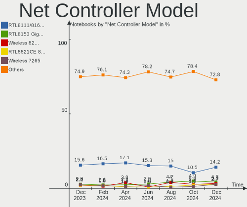

Debian - Hardware Trends (Notebooks)
------------------------------------

A project to identify most popular hardware characteristics and track their change
over time based on data collected by Linux users at https://Linux-Hardware.org.

Anyone can contribute to this report by the [hw-probe](https://github.com/linuxhw/hw-probe) tool:

    sudo -E hw-probe -all -upload

This report is for one last month. Overall report since the beginning of time: [TestDays](https://github.com/linuxhw/TestDays)

Period: Dec, 2024.

Contents
--------

* [ System ](#system)
  - [ OS                       ](#os)
  - [ OS Family                ](#os-family)
  - [ Kernel                   ](#kernel)
  - [ Kernel Family            ](#kernel-family)
  - [ Kernel Major Ver.        ](#kernel-major-ver)
  - [ Arch                     ](#arch)
  - [ DE                       ](#de)
  - [ Display Server           ](#display-server)
  - [ Display Manager          ](#display-manager)
  - [ OS Lang                  ](#os-lang)
  - [ Boot Mode                ](#boot-mode)
  - [ Filesystem               ](#filesystem)
  - [ Part. scheme             ](#part-scheme)
  - [ Dual Boot with Linux/BSD ](#dual-boot-with-linuxbsd)
  - [ Dual Boot (Win)          ](#dual-boot-win)

* [ Board ](#board)
  - [ Vendor                   ](#vendor)
  - [ Model                    ](#model)
  - [ Model Family             ](#model-family)
  - [ MFG Year                 ](#mfg-year)
  - [ Form Factor              ](#form-factor)
  - [ Secure Boot              ](#secure-boot)
  - [ Coreboot                 ](#coreboot)
  - [ RAM Size                 ](#ram-size)
  - [ RAM Used                 ](#ram-used)
  - [ Total Drives             ](#total-drives)
  - [ Has CD-ROM               ](#has-cd-rom)
  - [ Has Ethernet             ](#has-ethernet)
  - [ Has WiFi                 ](#has-wifi)
  - [ Has Bluetooth            ](#has-bluetooth)

* [ Location ](#location)
  - [ Country                  ](#country)
  - [ City                     ](#city)

* [ Drives ](#drives)
  - [ Drive Vendor             ](#drive-vendor)
  - [ Drive Model              ](#drive-model)
  - [ HDD Vendor               ](#hdd-vendor)
  - [ SSD Vendor               ](#ssd-vendor)
  - [ Drive Kind               ](#drive-kind)
  - [ Drive Connector          ](#drive-connector)
  - [ Drive Size               ](#drive-size)
  - [ Space Total              ](#space-total)
  - [ Space Used               ](#space-used)
  - [ Malfunc. Drives          ](#malfunc-drives)
  - [ Malfunc. Drive Vendor    ](#malfunc-drive-vendor)
  - [ Malfunc. HDD Vendor      ](#malfunc-hdd-vendor)
  - [ Malfunc. Drive Kind      ](#malfunc-drive-kind)
  - [ Failed Drives            ](#failed-drives)
  - [ Failed Drive Vendor      ](#failed-drive-vendor)
  - [ Drive Status             ](#drive-status)

* [ Storage controller ](#storage-controller)
  - [ Storage Vendor           ](#storage-vendor)
  - [ Storage Model            ](#storage-model)
  - [ Storage Kind             ](#storage-kind)

* [ Processor ](#processor)
  - [ CPU Vendor               ](#cpu-vendor)
  - [ CPU Model                ](#cpu-model)
  - [ CPU Model Family         ](#cpu-model-family)
  - [ CPU Cores                ](#cpu-cores)
  - [ CPU Sockets              ](#cpu-sockets)
  - [ CPU Threads              ](#cpu-threads)
  - [ CPU Op-Modes             ](#cpu-op-modes)
  - [ CPU Microcode            ](#cpu-microcode)
  - [ CPU Microarch            ](#cpu-microarch)

* [ Graphics ](#graphics)
  - [ GPU Vendor               ](#gpu-vendor)
  - [ GPU Model                ](#gpu-model)
  - [ GPU Combo                ](#gpu-combo)
  - [ GPU Driver               ](#gpu-driver)
  - [ GPU Memory               ](#gpu-memory)

* [ Monitor ](#monitor)
  - [ Monitor Vendor           ](#monitor-vendor)
  - [ Monitor Model            ](#monitor-model)
  - [ Monitor Resolution       ](#monitor-resolution)
  - [ Monitor Diagonal         ](#monitor-diagonal)
  - [ Monitor Width            ](#monitor-width)
  - [ Aspect Ratio             ](#aspect-ratio)
  - [ Monitor Area             ](#monitor-area)
  - [ Pixel Density            ](#pixel-density)
  - [ Multiple Monitors        ](#multiple-monitors)

* [ Network ](#network)
  - [ Net Controller Vendor    ](#net-controller-vendor)
  - [ Net Controller Model     ](#net-controller-model)
  - [ Wireless Vendor          ](#wireless-vendor)
  - [ Wireless Model           ](#wireless-model)
  - [ Ethernet Vendor          ](#ethernet-vendor)
  - [ Ethernet Model           ](#ethernet-model)
  - [ Net Controller Kind      ](#net-controller-kind)
  - [ Used Controller          ](#used-controller)
  - [ NICs                     ](#nics)
  - [ IPv6                     ](#ipv6)

* [ Bluetooth ](#bluetooth)
  - [ Bluetooth Vendor         ](#bluetooth-vendor)
  - [ Bluetooth Model          ](#bluetooth-model)

* [ Sound ](#sound)
  - [ Sound Vendor             ](#sound-vendor)
  - [ Sound Model              ](#sound-model)

* [ Memory ](#memory)
  - [ Memory Vendor            ](#memory-vendor)
  - [ Memory Model             ](#memory-model)
  - [ Memory Kind              ](#memory-kind)
  - [ Memory Form Factor       ](#memory-form-factor)
  - [ Memory Size              ](#memory-size)
  - [ Memory Speed             ](#memory-speed)

* [ Printers & scanners ](#printers--scanners)
  - [ Printer Vendor           ](#printer-vendor)
  - [ Printer Model            ](#printer-model)
  - [ Scanner Vendor           ](#scanner-vendor)
  - [ Scanner Model            ](#scanner-model)

* [ Camera ](#camera)
  - [ Camera Vendor            ](#camera-vendor)
  - [ Camera Model             ](#camera-model)

* [ Security ](#security)
  - [ Fingerprint Vendor       ](#fingerprint-vendor)
  - [ Fingerprint Model        ](#fingerprint-model)
  - [ Chipcard Vendor          ](#chipcard-vendor)
  - [ Chipcard Model           ](#chipcard-model)

* [ Unsupported ](#unsupported)
  - [ Unsupported Devices      ](#unsupported-devices)
  - [ Unsupported Device Types ](#unsupported-device-types)

System
------

OS
--

Installed operating systems

| Name      | Notebooks | Percent |
|-----------|-----------|---------|
| Debian 12 | 141       | 79.21%  |
| Debian    | 32        | 17.98%  |
| Debian 11 | 2         | 1.12%   |
| Debian 9  | 1         | 0.56%   |
| Debian 24 | 1         | 0.56%   |
| Debian 10 | 1         | 0.56%   |

OS Family
---------

OS without a version

| Name   | Notebooks | Percent |
|--------|-----------|---------|
| Debian | 178       | 100%    |

Kernel
------

Version of the Linux kernel

| Version                        | Notebooks | Percent |
|--------------------------------|-----------|---------|
| 6.1.0-28-amd64                 | 83        | 46.63%  |
| 6.1.0-27-amd64                 | 15        | 8.43%   |
| 6.11.10-amd64                  | 12        | 6.74%   |
| 6.1.0-25-amd64                 | 6         | 3.37%   |
| 6.12.6-amd64                   | 5         | 2.81%   |
| 6.11.5+bpo-amd64               | 5         | 2.81%   |
| 6.12.5-amd64                   | 4         | 2.25%   |
| 6.1.0-26-amd64                 | 4         | 2.25%   |
| 6.1.0-23-amd64                 | 4         | 2.25%   |
| 6.12.6-1-liquorix-amd64        | 3         | 1.69%   |
| 6.11.9-amd64                   | 3         | 1.69%   |
| 6.6.58-chrultrabook            | 2         | 1.12%   |
| 6.12.3-amd64                   | 2         | 1.12%   |
| 6.11.7-amd64                   | 2         | 1.12%   |
| 6.10.11+bpo-amd64              | 2         | 1.12%   |
| 6.1.0-28-686-pae               | 2         | 1.12%   |
| 6.1.0-18-amd64                 | 2         | 1.12%   |
| 6.1.0-10-amd64                 | 2         | 1.12%   |
| 6.9.10-1-liquorix-amd64        | 1         | 0.56%   |
| 6.8.4-2-pve                    | 1         | 0.56%   |
| 6.8.12-5-pve                   | 1         | 0.56%   |
| 6.8.12-4-pve                   | 1         | 0.56%   |
| 6.8.12-2-pve                   | 1         | 0.56%   |
| 6.6.28-policorp-amd64          | 1         | 0.56%   |
| 6.5.0-3-amd64                  | 1         | 0.56%   |
| 6.13.0-rc3-00017-gf44d154d6e3d | 1         | 0.56%   |
| 6.12.5-x64v3-xanmod1           | 1         | 0.56%   |
| 6.12.4                         | 1         | 0.56%   |
| 6.12.3-061203-generic          | 1         | 0.56%   |
| 6.11.5-amd64                   | 1         | 0.56%   |
| 6.11.10+bpo-amd64              | 1         | 0.56%   |
| 6.1.90                         | 1         | 0.56%   |
| 6.1.38                         | 1         | 0.56%   |
| 6.1.0-22-amd64                 | 1         | 0.56%   |
| 6.1.0-20-amd64                 | 1         | 0.56%   |
| 5.10.0-33-686-pae              | 1         | 0.56%   |
| 5.10.0-15-amd64                | 1         | 0.56%   |
| 4.19.270                       | 1         | 0.56%   |

Kernel Family
-------------

Linux kernel without a distro release

| Version  | Notebooks | Percent |
|----------|-----------|---------|
| 6.1.0    | 120       | 67.42%  |
| 6.11.10  | 13        | 7.3%    |
| 6.12.6   | 8         | 4.49%   |
| 6.11.5   | 6         | 3.37%   |
| 6.12.5   | 5         | 2.81%   |
| 6.8.12   | 3         | 1.69%   |
| 6.12.3   | 3         | 1.69%   |
| 6.11.9   | 3         | 1.69%   |
| 6.6.58   | 2         | 1.12%   |
| 6.11.7   | 2         | 1.12%   |
| 6.10.11  | 2         | 1.12%   |
| 5.10.0   | 2         | 1.12%   |
| 6.9.10   | 1         | 0.56%   |
| 6.8.4    | 1         | 0.56%   |
| 6.6.28   | 1         | 0.56%   |
| 6.5.0    | 1         | 0.56%   |
| 6.13.0   | 1         | 0.56%   |
| 6.12.4   | 1         | 0.56%   |
| 6.1.90   | 1         | 0.56%   |
| 6.1.38   | 1         | 0.56%   |
| 4.19.270 | 1         | 0.56%   |

Kernel Major Ver.
-----------------

Linux kernel major version

| Version | Notebooks | Percent |
|---------|-----------|---------|
| 6.1     | 122       | 68.54%  |
| 6.11    | 24        | 13.48%  |
| 6.12    | 17        | 9.55%   |
| 6.8     | 4         | 2.25%   |
| 6.6     | 3         | 1.69%   |
| 6.10    | 2         | 1.12%   |
| 5.10    | 2         | 1.12%   |
| 6.9     | 1         | 0.56%   |
| 6.5     | 1         | 0.56%   |
| 6.13    | 1         | 0.56%   |
| 4.19    | 1         | 0.56%   |

Arch
----

OS architecture (x86_64, i586, etc.)

| Name   | Notebooks | Percent |
|--------|-----------|---------|
| x86_64 | 175       | 98.31%  |
| i686   | 3         | 1.69%   |

DE
--

Desktop Environment

| Name            | Notebooks | Percent |
|-----------------|-----------|---------|
| GNOME           | 70        | 39.33%  |
| XFCE            | 31        | 17.42%  |
| KDE5            | 30        | 16.85%  |
| Unknown         | 11        | 6.18%   |
| X-Cinnamon      | 10        | 5.62%   |
| MATE            | 6         | 3.37%   |
| KDE6            | 4         | 2.25%   |
| LXQt            | 3         | 1.69%   |
| Trinity         | 2         | 1.12%   |
| sway            | 2         | 1.12%   |
| LXDE            | 2         | 1.12%   |
| KDE             | 2         | 1.12%   |
| Cinnamon        | 2         | 1.12%   |
| i3              | 1         | 0.56%   |
| GNOME Flashback | 1         | 0.56%   |
| fluxbox         | 1         | 0.56%   |

Display Server
--------------

X11 or Wayland

| Name    | Notebooks | Percent |
|---------|-----------|---------|
| X11     | 93        | 52.25%  |
| Wayland | 71        | 39.89%  |
| Tty     | 9         | 5.06%   |
| Unknown | 5         | 2.81%   |

Display Manager
---------------

SDDM, LightDM, etc.

| Name    | Notebooks | Percent |
|---------|-----------|---------|
| GDM3    | 64        | 35.96%  |
| Unknown | 50        | 28.09%  |
| LightDM | 40        | 22.47%  |
| SDDM    | 23        | 12.92%  |
| LXDM    | 1         | 0.56%   |

OS Lang
-------

Language

| Lang         | Notebooks | Percent |
|--------------|-----------|---------|
| en_US        | 81        | 45.51%  |
| fr_FR        | 19        | 10.67%  |
| de_DE        | 15        | 8.43%   |
| en_GB        | 12        | 6.74%   |
| pt_BR        | 7         | 3.93%   |
| es_ES        | 6         | 3.37%   |
| ru_RU        | 5         | 2.81%   |
| it_IT        | 4         | 2.25%   |
| en_CA        | 4         | 2.25%   |
| de_CH        | 3         | 1.69%   |
| Unknown      | 3         | 1.69%   |
| zh_CN        | 2         | 1.12%   |
| tr_TR        | 2         | 1.12%   |
| hu_HU        | 2         | 1.12%   |
| C            | 2         | 1.12%   |
| th_TH        | 1         | 0.56%   |
| sv_SE        | 1         | 0.56%   |
| pt_PT        | 1         | 0.56%   |
| nl_NL        | 1         | 0.56%   |
| nl_BE        | 1         | 0.56%   |
| es_PA        | 1         | 0.56%   |
| es_AR        | 1         | 0.56%   |
| en_US@custom | 1         | 0.56%   |
| en_IN        | 1         | 0.56%   |
| en_AU        | 1         | 0.56%   |
| cs_CZ        | 1         | 0.56%   |

Boot Mode
---------

EFI or BIOS

| Mode | Notebooks | Percent |
|------|-----------|---------|
| EFI  | 114       | 64.04%  |
| BIOS | 64        | 35.96%  |

Filesystem
----------

Type of filesystem

| Type    | Notebooks | Percent |
|---------|-----------|---------|
| Ext4    | 151       | 84.83%  |
| Overlay | 12        | 6.74%   |
| Btrfs   | 8         | 4.49%   |
| Tmpfs   | 4         | 2.25%   |
| Xfs     | 2         | 1.12%   |
| Zfs     | 1         | 0.56%   |

Part. scheme
------------

Scheme of partitioning

| Type    | Notebooks | Percent |
|---------|-----------|---------|
| GPT     | 118       | 66.29%  |
| Unknown | 36        | 20.22%  |
| MBR     | 24        | 13.48%  |

Dual Boot with Linux/BSD
------------------------

Hosting more than one Linux/BSD

| Dual boot | Notebooks | Percent |
|-----------|-----------|---------|
| No        | 153       | 85.96%  |
| Yes       | 25        | 14.04%  |

Dual Boot (Win)
---------------

Hosting Linux and Windows

| Dual boot | Notebooks | Percent |
|-----------|-----------|---------|
| No        | 131       | 73.6%   |
| Yes       | 47        | 26.4%   |

Board
-----

Vendor
------

Motherboard manufacturer

| Name                           | Notebooks | Percent |
|--------------------------------|-----------|---------|
| Lenovo                         | 51        | 28.65%  |
| Hewlett-Packard                | 30        | 16.85%  |
| Dell                           | 26        | 14.61%  |
| ASUSTek Computer               | 20        | 11.24%  |
| Acer                           | 12        | 6.74%   |
| Notebook                       | 4         | 2.25%   |
| MSI                            | 3         | 1.69%   |
| Google                         | 3         | 1.69%   |
| Apple                          | 3         | 1.69%   |
| Sony                           | 2         | 1.12%   |
| Shanghai Zhaoxin Semiconductor | 2         | 1.12%   |
| Samsung Electronics            | 2         | 1.12%   |
| Positivo                       | 2         | 1.12%   |
| Packard Bell                   | 2         | 1.12%   |
| UMAX                           | 1         | 0.56%   |
| TUXEDO                         | 1         | 0.56%   |
| Toshiba                        | 1         | 0.56%   |
| Shuttle                        | 1         | 0.56%   |
| Schenker                       | 1         | 0.56%   |
| Morshow                        | 1         | 0.56%   |
| Intel Client Systems           | 1         | 0.56%   |
| HONOR                          | 1         | 0.56%   |
| GITSTAR                        | 1         | 0.56%   |
| Gigabyte Technology            | 1         | 0.56%   |
| Fujitsu Siemens                | 1         | 0.56%   |
| Framework                      | 1         | 0.56%   |
| eMachines                      | 1         | 0.56%   |
| ECT                            | 1         | 0.56%   |
| Alienware                      | 1         | 0.56%   |
| Unknown                        | 1         | 0.56%   |

Model
-----

Motherboard model

| Name                                        | Notebooks | Percent |
|---------------------------------------------|-----------|---------|
| Shanghai Zhaoxin ZXE CRB                    | 2         | 1.12%   |
| Positivo R516256AI-15                       | 2         | 1.12%   |
| Lenovo IdeaPad 1 15ALC7 82R4                | 2         | 1.12%   |
| HP Pavilion 17                              | 2         | 1.12%   |
| HP 255 15.6 inch G10                        | 2         | 1.12%   |
| Dell Precision M4800                        | 2         | 1.12%   |
| Dell Latitude 7480                          | 2         | 1.12%   |
| Dell Latitude 5480                          | 2         | 1.12%   |
| Dell Latitude 3320                          | 2         | 1.12%   |
| Dell Inspiron 15 3520                       | 2         | 1.12%   |
| ASUS VivoBook_ASUSLaptop K3605ZF_K3605ZF    | 2         | 1.12%   |
| Unknown                                     | 2         | 1.12%   |
| UMAX VisionBook 14WRx                       | 1         | 0.56%   |
| TUXEDO InfinityBook Pro AMD Gen9            | 1         | 0.56%   |
| Toshiba Satellite S70-B                     | 1         | 0.56%   |
| Sony VPCYB15AG                              | 1         | 0.56%   |
| Sony VGN-FW51ZF_H                           | 1         | 0.56%   |
| Shuttle NC03U                               | 1         | 0.56%   |
| Schenker XMG Mobile A507 VE                 | 1         | 0.56%   |
| Samsung 940XFG                              | 1         | 0.56%   |
| Samsung 750XGK                              | 1         | 0.56%   |
| Packard Bell EasyNote_MX45                  | 1         | 0.56%   |
| Packard Bell EasyNote TE11HC                | 1         | 0.56%   |
| Notebook W65_W67RZ1                         | 1         | 0.56%   |
| Notebook P375SM                             | 1         | 0.56%   |
| Notebook NJx0AU                             | 1         | 0.56%   |
| Notebook N13_N140ZU                         | 1         | 0.56%   |
| MSI MS-16F1                                 | 1         | 0.56%   |
| MSI Modern 15 A5M                           | 1         | 0.56%   |
| MSI Katana A15 AI B8VF                      | 1         | 0.56%   |
| Morshow CB01                                | 1         | 0.56%   |
| Lenovo Yoga 3 14 80JH                       | 1         | 0.56%   |
| Lenovo V15 G3 ABA 82TV                      | 1         | 0.56%   |
| Lenovo ThinkPad Z13 Gen 2 21JVCTO1WW        | 1         | 0.56%   |
| Lenovo ThinkPad Z13 Gen 1 21D2002CGE        | 1         | 0.56%   |
| Lenovo ThinkPad X260 VB6R77903H             | 1         | 0.56%   |
| Lenovo ThinkPad X230 23252EG                | 1         | 0.56%   |
| Lenovo ThinkPad X1 Carbon Gen 8 20U9005MUS  | 1         | 0.56%   |
| Lenovo ThinkPad X1 Carbon Gen 10 21CCS29201 | 1         | 0.56%   |
| Lenovo ThinkPad X1 Carbon 7th 20QES32600    | 1         | 0.56%   |

Model Family
------------

Motherboard model prefix

| Name                  | Notebooks | Percent |
|-----------------------|-----------|---------|
| Lenovo ThinkPad       | 31        | 17.42%  |
| Lenovo IdeaPad        | 13        | 7.3%    |
| ASUS VivoBook         | 12        | 6.74%   |
| HP EliteBook          | 11        | 6.18%   |
| Dell Latitude         | 9         | 5.06%   |
| Acer Aspire           | 9         | 5.06%   |
| Dell XPS              | 6         | 3.37%   |
| Dell Precision        | 5         | 2.81%   |
| Dell Inspiron         | 5         | 2.81%   |
| HP Pavilion           | 4         | 2.25%   |
| Lenovo ThinkBook      | 3         | 1.69%   |
| HP ProBook            | 3         | 1.69%   |
| HP Laptop             | 3         | 1.69%   |
| HP 255                | 3         | 1.69%   |
| Shanghai Zhaoxin ZXE  | 2         | 1.12%   |
| Positivo R516256AI-15 | 2         | 1.12%   |
| Packard Bell EasyNote | 2         | 1.12%   |
| Acer Swift            | 2         | 1.12%   |
| Unknown               | 2         | 1.12%   |
| UMAX VisionBook       | 1         | 0.56%   |
| TUXEDO InfinityBook   | 1         | 0.56%   |
| Toshiba Satellite     | 1         | 0.56%   |
| Sony VPCYB15AG        | 1         | 0.56%   |
| Sony VGN-FW51ZF       | 1         | 0.56%   |
| Shuttle NC03U         | 1         | 0.56%   |
| Schenker XMG          | 1         | 0.56%   |
| Samsung 940XFG        | 1         | 0.56%   |
| Samsung 750XGK        | 1         | 0.56%   |
| Notebook W65          | 1         | 0.56%   |
| Notebook P375SM       | 1         | 0.56%   |
| Notebook NJx0AU       | 1         | 0.56%   |
| Notebook N13          | 1         | 0.56%   |
| MSI MS-16F1           | 1         | 0.56%   |
| MSI Modern            | 1         | 0.56%   |
| MSI Katana            | 1         | 0.56%   |
| Morshow CB01          | 1         | 0.56%   |
| Lenovo Yoga           | 1         | 0.56%   |
| Lenovo V15            | 1         | 0.56%   |
| Lenovo LOQ            | 1         | 0.56%   |
| Lenovo Legion         | 1         | 0.56%   |

MFG Year
--------

Motherboard manufacture year

| Year | Notebooks | Percent |
|------|-----------|---------|
| 2022 | 19        | 10.67%  |
| 2024 | 17        | 9.55%   |
| 2023 | 17        | 9.55%   |
| 2018 | 16        | 8.99%   |
| 2017 | 14        | 7.87%   |
| 2021 | 13        | 7.3%    |
| 2014 | 12        | 6.74%   |
| 2019 | 10        | 5.62%   |
| 2013 | 9         | 5.06%   |
| 2012 | 9         | 5.06%   |
| 2020 | 8         | 4.49%   |
| 2015 | 7         | 3.93%   |
| 2011 | 7         | 3.93%   |
| 2010 | 6         | 3.37%   |
| 2016 | 5         | 2.81%   |
| 2009 | 5         | 2.81%   |
| 2008 | 3         | 1.69%   |
| 2006 | 1         | 0.56%   |

Form Factor
-----------

Physical design of the computer

| Name     | Notebooks | Percent |
|----------|-----------|---------|
| Notebook | 178       | 100%    |

Secure Boot
-----------

Enabled or disabled

| State    | Notebooks | Percent |
|----------|-----------|---------|
| Disabled | 163       | 91.57%  |
| Enabled  | 15        | 8.43%   |

Coreboot
--------

Have coreboot on board

| Used | Notebooks | Percent |
|------|-----------|---------|
| No   | 175       | 98.31%  |
| Yes  | 3         | 1.69%   |

RAM Size
--------

Total RAM memory

| Size in GB  | Notebooks | Percent |
|-------------|-----------|---------|
| 4.01-8.0    | 44        | 24.72%  |
| 16.01-24.0  | 37        | 20.79%  |
| 8.01-16.0   | 37        | 20.79%  |
| 32.01-64.0  | 22        | 12.36%  |
| 3.01-4.0    | 18        | 10.11%  |
| 64.01-256.0 | 9         | 5.06%   |
| 24.01-32.0  | 6         | 3.37%   |
| 1.01-2.0    | 4         | 2.25%   |
| 2.01-3.0    | 1         | 0.56%   |

RAM Used
--------

Used RAM memory

| Used GB    | Notebooks | Percent |
|------------|-----------|---------|
| 2.01-3.0   | 53        | 29.78%  |
| 1.01-2.0   | 40        | 22.47%  |
| 4.01-8.0   | 36        | 20.22%  |
| 3.01-4.0   | 30        | 16.85%  |
| 8.01-16.0  | 12        | 6.74%   |
| 16.01-24.0 | 3         | 1.69%   |
| 0.51-1.0   | 2         | 1.12%   |
| 0.01-0.5   | 2         | 1.12%   |

Total Drives
------------

Number of drives on board

| Drives | Notebooks | Percent |
|--------|-----------|---------|
| 1      | 136       | 76.4%   |
| 2      | 38        | 21.35%  |
| 3      | 2         | 1.12%   |
| 5      | 1         | 0.56%   |
| 4      | 1         | 0.56%   |

Has CD-ROM
----------

Has CD-ROM on board

| Presented | Notebooks | Percent |
|-----------|-----------|---------|
| No        | 143       | 80.34%  |
| Yes       | 35        | 19.66%  |

Has Ethernet
------------

Has Ethernet on board

| Presented | Notebooks | Percent |
|-----------|-----------|---------|
| Yes       | 136       | 76.4%   |
| No        | 42        | 23.6%   |

Has WiFi
--------

Has WiFi module

| Presented | Notebooks | Percent |
|-----------|-----------|---------|
| Yes       | 169       | 94.94%  |
| No        | 9         | 5.06%   |

Has Bluetooth
-------------

Has Bluetooth module

| Presented | Notebooks | Percent |
|-----------|-----------|---------|
| Yes       | 147       | 82.58%  |
| No        | 31        | 17.42%  |

Location
--------

Country
-------

Geographic location (country)

| Country         | Notebooks | Percent |
|-----------------|-----------|---------|
| USA             | 31        | 17.42%  |
| Germany         | 23        | 12.92%  |
| France          | 22        | 12.36%  |
| Brazil          | 11        | 6.18%   |
| Italy           | 7         | 3.93%   |
| Russia          | 6         | 3.37%   |
| Switzerland     | 5         | 2.81%   |
| Spain           | 5         | 2.81%   |
| China           | 5         | 2.81%   |
| Canada          | 5         | 2.81%   |
| Belgium         | 5         | 2.81%   |
| Turkey          | 4         | 2.25%   |
| Sweden          | 4         | 2.25%   |
| Hungary         | 4         | 2.25%   |
| UK              | 3         | 1.69%   |
| Saudi Arabia    | 2         | 1.12%   |
| Romania         | 2         | 1.12%   |
| Portugal        | 2         | 1.12%   |
| Poland          | 2         | 1.12%   |
| Norway          | 2         | 1.12%   |
| Netherlands     | 2         | 1.12%   |
| Mexico          | 2         | 1.12%   |
| India           | 2         | 1.12%   |
| Greece          | 2         | 1.12%   |
| Belarus         | 2         | 1.12%   |
| Bangladesh      | 2         | 1.12%   |
| Ukraine         | 1         | 0.56%   |
| Türkiye        | 1         | 0.56%   |
| Thailand        | 1         | 0.56%   |
| South Korea     | 1         | 0.56%   |
| Serbia          | 1         | 0.56%   |
| Panama          | 1         | 0.56%   |
| North Macedonia | 1         | 0.56%   |
| Malaysia        | 1         | 0.56%   |
| Indonesia       | 1         | 0.56%   |
| Georgia         | 1         | 0.56%   |
| Czechia         | 1         | 0.56%   |
| Cuba            | 1         | 0.56%   |
| Bolivia         | 1         | 0.56%   |
| Austria         | 1         | 0.56%   |

City
----

Geographic location (city)

| City                | Notebooks | Percent |
|---------------------|-----------|---------|
| Frankfurt am Main   | 4         | 2.25%   |
| Paris               | 3         | 1.69%   |
| Kunming             | 3         | 1.69%   |
| Berlin              | 3         | 1.69%   |
| Bangor              | 3         | 1.69%   |
| Szentendre          | 2         | 1.12%   |
| Strasbourg          | 2         | 1.12%   |
| Seattle             | 2         | 1.12%   |
| Sao Paulo           | 2         | 1.12%   |
| Rome                | 2         | 1.12%   |
| Rio de Janeiro      | 2         | 1.12%   |
| Reutlingen          | 2         | 1.12%   |
| Minsk               | 2         | 1.12%   |
| Lessebo             | 2         | 1.12%   |
| Istanbul            | 2         | 1.12%   |
| Fresno              | 2         | 1.12%   |
| Fort Worth          | 2         | 1.12%   |
| Düsseldorf         | 2         | 1.12%   |
| Dhaka               | 2         | 1.12%   |
| Besançon           | 2         | 1.12%   |
| Bengaluru           | 2         | 1.12%   |
| Belo Horizonte      | 2         | 1.12%   |
| Athens              | 2         | 1.12%   |
| Antwerp             | 2         | 1.12%   |
| Ankara              | 2         | 1.12%   |
| Zweidlen-Dorf       | 1         | 0.56%   |
| Zurich              | 1         | 0.56%   |
| Wuppertal           | 1         | 0.56%   |
| Winterthur          | 1         | 0.56%   |
| Wattwil             | 1         | 0.56%   |
| Villa Ballester     | 1         | 0.56%   |
| Vila Franca de Xira | 1         | 0.56%   |
| Vigo                | 1         | 0.56%   |
| Vienna              | 1         | 0.56%   |
| Valladolid          | 1         | 0.56%   |
| Uhlirske Janovice   | 1         | 0.56%   |
| Torremolinos        | 1         | 0.56%   |
| Tianjin             | 1         | 0.56%   |
| Thermopolis         | 1         | 0.56%   |
| Taganrog            | 1         | 0.56%   |

Drives
------

Drive Vendor
------------

Hard drive vendors

| Vendor                         | Notebooks | Drives | Percent |
|--------------------------------|-----------|--------|---------|
| Samsung Electronics            | 38        | 42     | 17.12%  |
| SanDisk                        | 22        | 23     | 9.91%   |
| WDC                            | 17        | 17     | 7.66%   |
| SK hynix                       | 17        | 17     | 7.66%   |
| Seagate                        | 12        | 14     | 5.41%   |
| Kingston                       | 12        | 13     | 5.41%   |
| Micron Technology              | 11        | 11     | 4.95%   |
| Unknown                        | 9         | 9      | 4.05%   |
| Toshiba                        | 9         | 9      | 4.05%   |
| Intel                          | 8         | 9      | 3.6%    |
| Crucial                        | 6         | 6      | 2.7%    |
| Unknown                        | 6         | 6      | 2.7%    |
| MAXIO Technology (Hangzhou)    | 4         | 4      | 1.8%    |
| PNY                            | 3         | 3      | 1.35%   |
| Micron/Crucial Technology      | 3         | 3      | 1.35%   |
| Hitachi                        | 3         | 3      | 1.35%   |
| HGST                           | 3         | 3      | 1.35%   |
| China                          | 3         | 3      | 1.35%   |
| A-DATA Technology              | 3         | 3      | 1.35%   |
| ZHITAI                         | 2         | 2      | 0.9%    |
| MACROVIP                       | 2         | 2      | 0.9%    |
| KIOXIA-EXCERIA                 | 2         | 2      | 0.9%    |
| Intenso                        | 2         | 2      | 0.9%    |
| ASMT                           | 2         | 2      | 0.9%    |
| Yangtze Memory Technologies    | 1         | 1      | 0.45%   |
| Verbatim                       | 1         | 1      | 0.45%   |
| V-GeN                          | 1         | 1      | 0.45%   |
| USB                            | 1         | 1      | 0.45%   |
| UMIS                           | 1         | 1      | 0.45%   |
| Team                           | 1         | 1      | 0.45%   |
| SPCC                           | 1         | 1      | 0.45%   |
| Solid State Storage Technology | 1         | 1      | 0.45%   |
| ShanDianZhe                    | 1         | 1      | 0.45%   |
| Phison                         | 1         | 1      | 0.45%   |
| OXYBR                          | 1         | 1      | 0.45%   |
| Netac                          | 1         | 1      | 0.45%   |
| Maxtor                         | 1         | 1      | 0.45%   |
| LITEONIT                       | 1         | 1      | 0.45%   |
| LITEON                         | 1         | 1      | 0.45%   |
| LDLC                           | 1         | 1      | 0.45%   |

Drive Model
-----------

Hard drive models

| Model                                                | Notebooks | Percent |
|------------------------------------------------------|-----------|---------|
| Unknown                                              | 6         | 2.63%   |
| SanDisk NVMe SSD Drive 1TB                           | 4         | 1.75%   |
| Samsung MZVL4512HBLU-00BTW 512GB                     | 4         | 1.75%   |
| Samsung NVMe SSD Controller SM981/PM981/PM983 512GB  | 3         | 1.32%   |
| Intel SSDPEKNU512GZ 512GB                            | 3         | 1.32%   |
| ZHITAI SC001 Active 512GB SSD                        | 2         | 0.88%   |
| Unknown MMC Card  32GB                               | 2         | 0.88%   |
| Toshiba XG6 NVMe SSD Controller 1024GB               | 2         | 0.88%   |
| Toshiba MQ04ABF100 1TB                               | 2         | 0.88%   |
| Toshiba MQ01ABF050 500GB                             | 2         | 0.88%   |
| SK hynix HFM512GD3JX013N 512GB                       | 2         | 0.88%   |
| Sandisk WD Black SN850 2TB                           | 2         | 0.88%   |
| SanDisk DF4032  32GB                                 | 2         | 0.88%   |
| Samsung SSD 980 1TB                                  | 2         | 0.88%   |
| Samsung SSD 860 EVO 500GB                            | 2         | 0.88%   |
| Samsung NVMe SSD Controller PM9A1/PM9A3/980PRO 512GB | 2         | 0.88%   |
| Samsung MZVLB256HBHQ-000L7 256GB                     | 2         | 0.88%   |
| Micron/Crucial P2 NVMe PCIe SSD 500GB                | 2         | 0.88%   |
| Micron MTFDKBA512QFM-1BD1AABHA 512GB                 | 2         | 0.88%   |
| Micron 2450_MTFDKBA512TFK 512GB                      | 2         | 0.88%   |
| MAXIO (Hangzhou) NVMe SSD Controller MAP1202 512GB   | 2         | 0.88%   |
| MACROVIP MV240GB SSD                                 | 2         | 0.88%   |
| KIOXIA-EXCERIA G2 SSD 1TB                            | 2         | 0.88%   |
| Kingston SUV400S37120G 120GB SSD                     | 2         | 0.88%   |
| Kingston SA400S37240G 240GB SSD                      | 2         | 0.88%   |
| Kingston SA400S37120G 120GB SSD                      | 2         | 0.88%   |
| Hitachi HTS547550A9E384 500GB                        | 2         | 0.88%   |
| Crucial CT500MX500SSD1 500GB                         | 2         | 0.88%   |
| Yangtze Memory YMTC PC300-512GB-B                    | 1         | 0.44%   |
| WDC WDS250G1B0A-00H9H0 250GB SSD                     | 1         | 0.44%   |
| WDC WDS240G2G0A-00JH30 240GB SSD                     | 1         | 0.44%   |
| WDC WDS200T1R0B-68A4Z0 2TB SSD                       | 1         | 0.44%   |
| WDC WDS120G2G0B-00EPW0 120GB SSD                     | 1         | 0.44%   |
| WDC WDS120G1G0A-00SS50 120GB SSD                     | 1         | 0.44%   |
| WDC WDS100T3X0C-00SJG0 1TB                           | 1         | 0.44%   |
| WDC WD7500BPVT-80HXZT3 752GB                         | 1         | 0.44%   |
| WDC WD1600BEVS-08RST2 160GB                          | 1         | 0.44%   |
| WDC WD1200BEVS-22UST0 120GB                          | 1         | 0.44%   |
| WDC WD10SPCX-24HWST1 1TB                             | 1         | 0.44%   |
| WDC WD10JPVX-22JC3T0 1TB                             | 1         | 0.44%   |

HDD Vendor
----------

Hard disk drive vendors

| Vendor              | Notebooks | Drives | Percent |
|---------------------|-----------|--------|---------|
| Seagate             | 11        | 13     | 37.93%  |
| Toshiba             | 6         | 6      | 20.69%  |
| WDC                 | 5         | 5      | 17.24%  |
| Hitachi             | 3         | 3      | 10.34%  |
| HGST                | 3         | 3      | 10.34%  |
| Samsung Electronics | 1         | 1      | 3.45%   |

SSD Vendor
----------

Solid state drive vendors

| Vendor              | Notebooks | Drives | Percent |
|---------------------|-----------|--------|---------|
| Samsung Electronics | 12        | 12     | 17.91%  |
| Kingston            | 7         | 8      | 10.45%  |
| SanDisk             | 6         | 6      | 8.96%   |
| WDC                 | 5         | 5      | 7.46%   |
| Crucial             | 4         | 4      | 5.97%   |
| PNY                 | 3         | 3      | 4.48%   |
| Intel               | 3         | 3      | 4.48%   |
| A-DATA Technology   | 3         | 3      | 4.48%   |
| ZHITAI              | 2         | 2      | 2.99%   |
| SK hynix            | 2         | 2      | 2.99%   |
| Micron Technology   | 2         | 2      | 2.99%   |
| MACROVIP            | 2         | 2      | 2.99%   |
| Intenso             | 2         | 2      | 2.99%   |
| China               | 2         | 2      | 2.99%   |
| Verbatim            | 1         | 1      | 1.49%   |
| V-GeN               | 1         | 1      | 1.49%   |
| SPCC                | 1         | 1      | 1.49%   |
| OXYBR               | 1         | 1      | 1.49%   |
| Maxtor              | 1         | 1      | 1.49%   |
| LITEONIT            | 1         | 1      | 1.49%   |
| LITEON              | 1         | 1      | 1.49%   |
| LDLC                | 1         | 1      | 1.49%   |
| KingDian            | 1         | 1      | 1.49%   |
| KimMiDi             | 1         | 1      | 1.49%   |
| ASMT                | 1         | 1      | 1.49%   |
| Apple               | 1         | 1      | 1.49%   |

Drive Kind
----------

HDD or SSD

| Kind    | Notebooks | Drives | Percent |
|---------|-----------|--------|---------|
| NVMe    | 99        | 112    | 46.92%  |
| SSD     | 63        | 68     | 29.86%  |
| HDD     | 29        | 31     | 13.74%  |
| MMC     | 16        | 16     | 7.58%   |
| Unknown | 4         | 4      | 1.9%    |

Drive Connector
---------------

SATA, SAS, NVMe, etc.

| Type | Notebooks | Drives | Percent |
|------|-----------|--------|---------|
| NVMe | 98        | 111    | 48.04%  |
| SATA | 84        | 98     | 41.18%  |
| MMC  | 16        | 16     | 7.84%   |
| SAS  | 6         | 6      | 2.94%   |

Drive Size
----------

Size of hard drive

| Size in TB | Notebooks | Drives | Percent |
|------------|-----------|--------|---------|
| 0.01-0.5   | 61        | 67     | 66.3%   |
| 0.51-1.0   | 23        | 24     | 25%     |
| 1.01-2.0   | 5         | 5      | 5.43%   |
| 3.01-4.0   | 2         | 2      | 2.17%   |
| 2.01-3.0   | 1         | 1      | 1.09%   |

Space Total
-----------

Amount of disk space available on the file system

| Size in GB     | Notebooks | Percent |
|----------------|-----------|---------|
| 251-500        | 56        | 31.46%  |
| 101-250        | 50        | 28.09%  |
| 501-1000       | 27        | 15.17%  |
| 1-20           | 13        | 7.3%    |
| 1001-2000      | 11        | 6.18%   |
| 21-50          | 6         | 3.37%   |
| More than 3000 | 5         | 2.81%   |
| Unknown        | 4         | 2.25%   |
| 2001-3000      | 3         | 1.69%   |
| 51-100         | 3         | 1.69%   |

Space Used
----------

Amount of used disk space

| Used GB        | Notebooks | Percent |
|----------------|-----------|---------|
| 1-20           | 60        | 33.71%  |
| 21-50          | 33        | 18.54%  |
| 251-500        | 27        | 15.17%  |
| 101-250        | 26        | 14.61%  |
| 51-100         | 14        | 7.87%   |
| 501-1000       | 7         | 3.93%   |
| Unknown        | 4         | 2.25%   |
| 1001-2000      | 3         | 1.69%   |
| More than 3000 | 2         | 1.12%   |
| 2001-3000      | 2         | 1.12%   |

Malfunc. Drives
---------------

Drive models with a malfunction

| Model                                               | Notebooks | Drives | Percent |
|-----------------------------------------------------|-----------|--------|---------|
| Toshiba MQ04ABF100 1TB                              | 1         | 1      | 7.14%   |
| Seagate ST98823AS 80GB                              | 1         | 1      | 7.14%   |
| Seagate ST500LT012-9WS142 500GB                     | 1         | 1      | 7.14%   |
| Seagate ST500LM000-1EJ162 500GB                     | 1         | 1      | 7.14%   |
| Seagate ST1000LM024 HN-M101MBB 1TB                  | 1         | 1      | 7.14%   |
| Samsung Electronics MZ5PA128HMCD-01000 128GB SSD    | 1         | 1      | 7.14%   |
| Samsung Electronics HM251JI 250GB                   | 1         | 1      | 7.14%   |
| Micron Technology MTFDDAV256TDL-1AW1ZABHA 256GB SSD | 1         | 1      | 7.14%   |
| Intel SSDSA2M160G2GC 160GB                          | 1         | 1      | 7.14%   |
| Hitachi HTS723232L9A360 320GB                       | 1         | 1      | 7.14%   |
| HGST HTS545050A7E680 500GB                          | 1         | 1      | 7.14%   |
| Crucial CT525MX300SSD1 528GB                        | 1         | 1      | 7.14%   |
| Apple SSD TS128E 121GB                              | 1         | 1      | 7.14%   |
| A-DATA Technology SU800NS38 256GB SSD               | 1         | 1      | 7.14%   |

Malfunc. Drive Vendor
---------------------

Vendors of faulty drives

| Vendor              | Notebooks | Drives | Percent |
|---------------------|-----------|--------|---------|
| Seagate             | 4         | 4      | 28.57%  |
| Samsung Electronics | 2         | 2      | 14.29%  |
| Toshiba             | 1         | 1      | 7.14%   |
| Micron Technology   | 1         | 1      | 7.14%   |
| Intel               | 1         | 1      | 7.14%   |
| Hitachi             | 1         | 1      | 7.14%   |
| HGST                | 1         | 1      | 7.14%   |
| Crucial             | 1         | 1      | 7.14%   |
| Apple               | 1         | 1      | 7.14%   |
| A-DATA Technology   | 1         | 1      | 7.14%   |

Malfunc. HDD Vendor
-------------------

Vendors of faulty HDD drives

| Vendor              | Notebooks | Drives | Percent |
|---------------------|-----------|--------|---------|
| Seagate             | 4         | 4      | 50%     |
| Toshiba             | 1         | 1      | 12.5%   |
| Samsung Electronics | 1         | 1      | 12.5%   |
| Hitachi             | 1         | 1      | 12.5%   |
| HGST                | 1         | 1      | 12.5%   |

Malfunc. Drive Kind
-------------------

Kinds of faulty drives

| Kind | Notebooks | Drives | Percent |
|------|-----------|--------|---------|
| HDD  | 8         | 8      | 57.14%  |
| SSD  | 6         | 6      | 42.86%  |

Failed Drives
-------------

Failed drive models

Zero info for selected period =(

Failed Drive Vendor
-------------------

Failed drive vendors

Zero info for selected period =(

Drive Status
------------

Number of failed and malfunc. drives

| Status   | Notebooks | Drives | Percent |
|----------|-----------|--------|---------|
| Works    | 116       | 136    | 59.49%  |
| Detected | 65        | 81     | 33.33%  |
| Malfunc  | 14        | 14     | 7.18%   |

Storage controller
------------------

Storage Vendor
--------------

Storage controller vendors

| Vendor                           | Notebooks | Percent |
|----------------------------------|-----------|---------|
| Intel                            | 90        | 41.67%  |
| Samsung Electronics              | 26        | 12.04%  |
| SanDisk                          | 21        | 9.72%   |
| AMD                              | 19        | 8.8%    |
| SK hynix                         | 15        | 6.94%   |
| Micron Technology                | 10        | 4.63%   |
| Kingston Technology Company      | 6         | 2.78%   |
| MAXIO Technology (Hangzhou)      | 5         | 2.31%   |
| Micron/Crucial Technology        | 4         | 1.85%   |
| Toshiba America Info Systems     | 3         | 1.39%   |
| Phison Electronics               | 3         | 1.39%   |
| Zhaoxin                          | 2         | 0.93%   |
| Nvidia                           | 2         | 0.93%   |
| KIOXIA                           | 2         | 0.93%   |
| Yangtze Memory Technologies      | 1         | 0.46%   |
| Union Memory (Shenzhen)          | 1         | 0.46%   |
| Solidigm                         | 1         | 0.46%   |
| Solid State Storage Technology   | 1         | 0.46%   |
| Silicon Motion                   | 1         | 0.46%   |
| Silicon Integrated Systems [SiS] | 1         | 0.46%   |
| ASMedia Technology               | 1         | 0.46%   |
| ADATA Technology                 | 1         | 0.46%   |

Storage Model
-------------

Storage controller models

| Model                                                                          | Notebooks | Percent |
|--------------------------------------------------------------------------------|-----------|---------|
| AMD FCH SATA Controller [AHCI mode]                                            | 17        | 7.52%   |
| Intel Sunrise Point-LP SATA Controller [AHCI mode]                             | 12        | 5.31%   |
| Samsung NVMe SSD Controller SM981/PM981/PM983                                  | 10        | 4.42%   |
| Intel 7 Series Chipset Family 6-port SATA Controller [AHCI mode]               | 10        | 4.42%   |
| Intel 82801 Mobile SATA Controller [RAID mode]                                 | 7         | 3.1%    |
| SK hynix Gold P31/BC711/PC711 NVMe Solid State Drive                           | 6         | 2.65%   |
| SanDisk WD Black SN770 / PC SN740 256GB / PC SN560 (DRAM-less) NVMe SSD        | 6         | 2.65%   |
| Intel Wildcat Point-LP SATA Controller [AHCI Mode]                             | 6         | 2.65%   |
| Intel Volume Management Device NVMe RAID Controller                            | 6         | 2.65%   |
| Samsung NVMe SSD Controller PM9A1/PM9A3/980PRO                                 | 5         | 2.21%   |
| Micron 2450 NVMe SSD [HendrixV] (DRAM-less)                                    | 5         | 2.21%   |
| Intel SSD 670p Series [Keystone Harbor]                                        | 5         | 2.21%   |
| Intel 8 Series SATA Controller 1 [AHCI mode]                                   | 5         | 2.21%   |
| Samsung NVMe SSD Controller PM9B1 (DRAM-less)                                  | 4         | 1.77%   |
| MAXIO (Hangzhou) NVMe SSD Controller MAP1202 (DRAM-less)                       | 4         | 1.77%   |
| Intel HM170/QM170 Chipset SATA Controller [AHCI Mode]                          | 4         | 1.77%   |
| Intel Alder Lake-P SATA AHCI Controller                                        | 4         | 1.77%   |
| Intel 8 Series/C220 Series Chipset Family 6-port SATA Controller 1 [AHCI mode] | 4         | 1.77%   |
| Intel 6 Series/C200 Series Chipset Family 6 port Mobile SATA AHCI Controller   | 4         | 1.77%   |
| Intel 5 Series/3400 Series Chipset 6 port SATA AHCI Controller                 | 4         | 1.77%   |
| SanDisk WD PC SN810 / Black SN850 NVMe SSD                                     | 3         | 1.33%   |
| SanDisk Extreme Pro / WD Black SN750 / PC SN730 / Red SN700 NVMe SSD           | 3         | 1.33%   |
| Samsung NVMe SSD Controller S4LV008[Pascal]                                    | 3         | 1.33%   |
| Samsung NVMe SSD Controller 980 (DRAM-less)                                    | 3         | 1.33%   |
| Micron/Crucial P2 [Nick P2] / P3 / P3 Plus NVMe PCIe SSD (DRAM-less)           | 3         | 1.33%   |
| Intel Volume Management Device NVMe RAID Controller Intel Corporation          | 3         | 1.33%   |
| Intel Q170/Q150/B150/H170/H110/Z170/CM236 Chipset SATA Controller [AHCI Mode]  | 3         | 1.33%   |
| Intel Celeron/Pentium Silver Processor SATA Controller                         | 3         | 1.33%   |
| Intel Cannon Point-LP SATA Controller [AHCI Mode]                              | 3         | 1.33%   |
| Intel Cannon Lake Mobile PCH SATA AHCI Controller                              | 3         | 1.33%   |
| Zhaoxin ZX-100/ZX-200/KX-6000/KX-6000G/KH-40000/KX-7000 StorX AHCI Controller  | 2         | 0.88%   |
| Toshiba America Info Systems XG6 NVMe SSD Controller                           | 2         | 0.88%   |
| SK hynix Non-Volatile memory controller                                        | 2         | 0.88%   |
| SK hynix BC901 NVMe Solid State Drive (DRAM-less)                              | 2         | 0.88%   |
| Sandisk WD PC SN740 NVMe SSD 512GB (DRAM-less)                                 | 2         | 0.88%   |
| SanDisk WD Blue SN500 / PC SN520 x2 M.2 2280 NVMe SSD                          | 2         | 0.88%   |
| Nvidia MCP79 AHCI Controller                                                   | 2         | 0.88%   |
| Micron 2400 NVMe SSD (DRAM-less)                                               | 2         | 0.88%   |
| Micron 2210 NVMe SSD [Cobain]                                                  | 2         | 0.88%   |
| KIOXIA NVMe SSD                                                                | 2         | 0.88%   |

Storage Kind
------------

Kind of storage controller (IDE, SATA, NVMe, SAS, ...)

| Kind | Notebooks | Percent |
|------|-----------|---------|
| NVMe | 97        | 45.54%  |
| SATA | 96        | 45.07%  |
| RAID | 16        | 7.51%   |
| IDE  | 4         | 1.88%   |

Processor
---------

CPU Vendor
----------

Processor vendors

| Vendor       | Notebooks | Percent |
|--------------|-----------|---------|
| Intel        | 132       | 74.16%  |
| AMD          | 43        | 24.16%  |
| CentaurHauls | 3         | 1.69%   |

CPU Model
---------

Processor models

| Model                                          | Notebooks | Percent |
|------------------------------------------------|-----------|---------|
| Intel 11th Gen Core i5-1135G7 @ 2.40GHz        | 5         | 2.81%   |
| AMD Ryzen 7 5700U with Radeon Graphics         | 5         | 2.81%   |
| Intel Core i7-8550U CPU @ 1.80GHz              | 4         | 2.25%   |
| Intel 12th Gen Core i5-1235U                   | 4         | 2.25%   |
| AMD Ryzen 5 7530U with Radeon Graphics         | 4         | 2.25%   |
| AMD Ryzen 5 5500U with Radeon Graphics         | 4         | 2.25%   |
| Intel Core i5-8265U CPU @ 1.60GHz              | 3         | 1.69%   |
| Intel Core i5-7200U CPU @ 2.50GHz              | 3         | 1.69%   |
| Intel Core i5-6300U CPU @ 2.40GHz              | 3         | 1.69%   |
| Intel 13th Gen Core i5-1335U                   | 3         | 1.69%   |
| Intel Core i7-8850H CPU @ 2.60GHz              | 2         | 1.12%   |
| Intel Core i7-8665U CPU @ 1.90GHz              | 2         | 1.12%   |
| Intel Core i7-8565U CPU @ 1.80GHz              | 2         | 1.12%   |
| Intel Core i7-7500U CPU @ 2.70GHz              | 2         | 1.12%   |
| Intel Core i7-4810MQ CPU @ 2.80GHz             | 2         | 1.12%   |
| Intel Core i7-3520M CPU @ 2.90GHz              | 2         | 1.12%   |
| Intel Core i7 CPU Q 740 @ 1.73GHz              | 2         | 1.12%   |
| Intel Core i5-8365U CPU @ 1.60GHz              | 2         | 1.12%   |
| Intel Core i5-8300H CPU @ 2.30GHz              | 2         | 1.12%   |
| Intel Core i5-5200U CPU @ 2.20GHz              | 2         | 1.12%   |
| Intel Core i5-3320M CPU @ 2.60GHz              | 2         | 1.12%   |
| Intel Core i5-3210M CPU @ 2.50GHz              | 2         | 1.12%   |
| Intel Core i5 CPU M 560 @ 2.67GHz              | 2         | 1.12%   |
| Intel Core i3-6006U CPU @ 2.00GHz              | 2         | 1.12%   |
| Intel Core i3-3110M CPU @ 2.40GHz              | 2         | 1.12%   |
| Intel Celeron N4020 CPU @ 1.10GHz              | 2         | 1.12%   |
| Intel Celeron CPU N3350 @ 1.10GHz              | 2         | 1.12%   |
| Intel Celeron CPU N2840 @ 2.16GHz              | 2         | 1.12%   |
| Intel Celeron CPU 3865U @ 1.80GHz              | 2         | 1.12%   |
| Intel 12th Gen Core i7-1255U                   | 2         | 1.12%   |
| Intel 12th Gen Core i5-12500H                  | 2         | 1.12%   |
| CentaurHauls ZHAOXIN KaiXian KX-6640MA@2.2+GHz | 2         | 1.12%   |
| AMD Ryzen 7 8845HS w/ Radeon 780M Graphics     | 2         | 1.12%   |
| AMD Ryzen 7 7735U with Radeon Graphics         | 2         | 1.12%   |
| AMD Ryzen 5 7520U with Radeon Graphics         | 2         | 1.12%   |
| AMD Ryzen 5 5600H with Radeon Graphics         | 2         | 1.12%   |
| AMD Ryzen 3 7320U with Radeon Graphics         | 2         | 1.12%   |
| Intel N100                                     | 1         | 0.56%   |
| Intel Core Ultra 7 258V                        | 1         | 0.56%   |
| Intel Core Ultra 7 165H                        | 1         | 0.56%   |

CPU Model Family
----------------

Processor model prefix

| Model            | Notebooks | Percent |
|------------------|-----------|---------|
| Intel Core i7    | 36        | 20.22%  |
| Intel Core i5    | 34        | 19.1%   |
| Other            | 30        | 16.85%  |
| AMD Ryzen 5      | 14        | 7.87%   |
| AMD Ryzen 7      | 13        | 7.3%    |
| Intel Core i3    | 12        | 6.74%   |
| Intel Celeron    | 12        | 6.74%   |
| Intel Core       | 4         | 2.25%   |
| AMD Ryzen 7 PRO  | 3         | 1.69%   |
| Intel Core M     | 2         | 1.12%   |
| Intel Core 2 Duo | 2         | 1.12%   |
| Intel Atom       | 2         | 1.12%   |
| AMD Ryzen 5 PRO  | 2         | 1.12%   |
| AMD Ryzen 3      | 2         | 1.12%   |
| AMD A4           | 2         | 1.12%   |
| Intel Core i9    | 1         | 0.56%   |
| Intel Core Duo   | 1         | 0.56%   |
| AMD PRO A10      | 1         | 0.56%   |
| AMD E1           | 1         | 0.56%   |
| AMD E            | 1         | 0.56%   |
| AMD Athlon       | 1         | 0.56%   |
| AMD A8           | 1         | 0.56%   |
| AMD A6           | 1         | 0.56%   |

CPU Cores
---------

Number of processor cores

| Number | Notebooks | Percent |
|--------|-----------|---------|
| 2      | 61        | 34.27%  |
| 4      | 55        | 30.9%   |
| 8      | 20        | 11.24%  |
| 6      | 18        | 10.11%  |
| 10     | 10        | 5.62%   |
| 12     | 7         | 3.93%   |
| 1      | 4         | 2.25%   |
| 14     | 2         | 1.12%   |
| 16     | 1         | 0.56%   |

CPU Sockets
-----------

Number of sockets

| Number | Notebooks | Percent |
|--------|-----------|---------|
| 1      | 177       | 99.44%  |
| 2      | 1         | 0.56%   |

CPU Threads
-----------

Threads per core (Hyper-Threading)

| Number | Notebooks | Percent |
|--------|-----------|---------|
| 2      | 145       | 81.46%  |
| 1      | 33        | 18.54%  |

CPU Op-Modes
------------

CPU Operation Modes (32-bit, 64-bit)

| Op mode        | Notebooks | Percent |
|----------------|-----------|---------|
| 32-bit, 64-bit | 176       | 98.88%  |
| 32-bit         | 2         | 1.12%   |

CPU Microcode
-------------

Microcode number

| Number     | Notebooks | Percent |
|------------|-----------|---------|
| Unknown    | 88        | 49.44%  |
| 0x306a9    | 7         | 3.93%   |
| 0x40651    | 5         | 2.81%   |
| 0x806ec    | 4         | 2.25%   |
| 0x306c3    | 4         | 2.25%   |
| 0x20655    | 4         | 2.25%   |
| 0x08608103 | 4         | 2.25%   |
| 0x906a4    | 3         | 1.69%   |
| 0x906a3    | 3         | 1.69%   |
| 0x806e9    | 3         | 1.69%   |
| 0x506e3    | 3         | 1.69%   |
| 0x406e3    | 3         | 1.69%   |
| 0x306d4    | 3         | 1.69%   |
| 0x08a00008 | 3         | 1.69%   |
| 0xb06a3    | 2         | 1.12%   |
| 0xa06a4    | 2         | 1.12%   |
| 0x906ea    | 2         | 1.12%   |
| 0x806ea    | 2         | 1.12%   |
| 0x806c1    | 2         | 1.12%   |
| 0x206a7    | 2         | 1.12%   |
| 0x106e5    | 2         | 1.12%   |
| 0x03000027 | 2         | 1.12%   |
| 0xb06e0    | 1         | 0.56%   |
| 0xb06a2    | 1         | 0.56%   |
| 0x806eb    | 1         | 0.56%   |
| 0x706e5    | 1         | 0.56%   |
| 0x706a8    | 1         | 0.56%   |
| 0x6ec      | 1         | 0.56%   |
| 0x506c9    | 1         | 0.56%   |
| 0x406c4    | 1         | 0.56%   |
| 0x30678    | 1         | 0.56%   |
| 0x106c2    | 1         | 0.56%   |
| 0x1067a    | 1         | 0.56%   |
| 0x0a705203 | 1         | 0.56%   |
| 0x0a704107 | 1         | 0.56%   |
| 0x0a704104 | 1         | 0.56%   |
| 0x0a50000f | 1         | 0.56%   |
| 0x0a50000d | 1         | 0.56%   |
| 0x0a50000c | 1         | 0.56%   |
| 0x08608104 | 1         | 0.56%   |

CPU Microarch
-------------

Microarchitecture

| Name             | Notebooks | Percent |
|------------------|-----------|---------|
| KabyLake         | 35        | 19.66%  |
| Unknown          | 35        | 19.66%  |
| Alderlake Hybrid | 12        | 6.74%   |
| Skylake          | 11        | 6.18%   |
| Haswell          | 11        | 6.18%   |
| IvyBridge        | 9         | 5.06%   |
| Zen 3            | 8         | 4.49%   |
| TigerLake        | 6         | 3.37%   |
| SandyBridge      | 6         | 3.37%   |
| Broadwell        | 6         | 3.37%   |
| Westmere         | 5         | 2.81%   |
| Silvermont       | 4         | 2.25%   |
| Goldmont plus    | 4         | 2.25%   |
| Zen 2            | 3         | 1.69%   |
| Excavator        | 3         | 1.69%   |
| Puma             | 2         | 1.12%   |
| Penryn           | 2         | 1.12%   |
| Nehalem          | 2         | 1.12%   |
| K10 Llano        | 2         | 1.12%   |
| Goldmont         | 2         | 1.12%   |
| Zen              | 1         | 0.56%   |
| P6               | 1         | 0.56%   |
| Lunarlake Hybrid | 1         | 0.56%   |
| K8 Hammer        | 1         | 0.56%   |
| IceLake          | 1         | 0.56%   |
| Gracemont        | 1         | 0.56%   |
| Core             | 1         | 0.56%   |
| CometLake        | 1         | 0.56%   |
| Bonnell          | 1         | 0.56%   |
| Bobcat           | 1         | 0.56%   |

Graphics
--------

GPU Vendor
----------

Vendors of graphics cards

| Vendor                           | Notebooks | Percent |
|----------------------------------|-----------|---------|
| Intel                            | 119       | 55.35%  |
| AMD                              | 54        | 25.12%  |
| Nvidia                           | 38        | 17.67%  |
| Zhaoxin                          | 3         | 1.4%    |
| Silicon Integrated Systems [SiS] | 1         | 0.47%   |

GPU Model
---------

Graphics card models

| Model                                                                     | Notebooks | Percent |
|---------------------------------------------------------------------------|-----------|---------|
| Intel WhiskeyLake-U GT2 [UHD Graphics 620]                                | 9         | 4.11%   |
| Intel 3rd Gen Core processor Graphics Controller                          | 9         | 4.11%   |
| AMD Lucienne                                                              | 9         | 4.11%   |
| Intel CoffeeLake-H GT2 [UHD Graphics 630]                                 | 7         | 3.2%    |
| Intel UHD Graphics 620                                                    | 6         | 2.74%   |
| Intel TigerLake-LP GT2 [Iris Xe Graphics]                                 | 6         | 2.74%   |
| Intel Skylake GT2 [HD Graphics 520]                                       | 6         | 2.74%   |
| Intel Raptor Lake-P [Iris Xe Graphics]                                    | 6         | 2.74%   |
| Intel HD Graphics 620                                                     | 6         | 2.74%   |
| Intel Alder Lake-UP3 GT2 [Iris Xe Graphics]                               | 6         | 2.74%   |
| Intel Haswell-ULT Integrated Graphics Controller                          | 5         | 2.28%   |
| Intel Alder Lake-P GT2 [Iris Xe Graphics]                                 | 5         | 2.28%   |
| Intel 4th Gen Core Processor Integrated Graphics Controller               | 5         | 2.28%   |
| AMD Barcelo                                                               | 5         | 2.28%   |
| Intel HD Graphics 5500                                                    | 4         | 1.83%   |
| Intel HD Graphics 530                                                     | 4         | 1.83%   |
| Intel GeminiLake [UHD Graphics 600]                                       | 4         | 1.83%   |
| Intel 2nd Generation Core Processor Family Integrated Graphics Controller | 4         | 1.83%   |
| AMD Mendocino                                                             | 4         | 1.83%   |
| Nvidia GP107M [GeForce GTX 1050 Mobile]                                   | 3         | 1.37%   |
| Intel Core Processor Integrated Graphics Controller                       | 3         | 1.37%   |
| Intel Atom Processor Z36xxx/Z37xxx Series Graphics & Display              | 3         | 1.37%   |
| AMD Renoir [Radeon Vega Series / Radeon Vega Mobile Series]               | 3         | 1.37%   |
| AMD Rembrandt [Radeon 680M]                                               | 3         | 1.37%   |
| AMD Phoenix3                                                              | 3         | 1.37%   |
| AMD Phoenix1                                                              | 3         | 1.37%   |
| AMD Cezanne [Radeon Vega Series / Radeon Vega Mobile Series]              | 3         | 1.37%   |
| Zhaoxin KX-6000 C-960 GPU                                                 | 2         | 0.91%   |
| Nvidia GM108M [GeForce 840M]                                              | 2         | 0.91%   |
| Nvidia GM107M [GeForce GTX 960M]                                          | 2         | 0.91%   |
| Nvidia GF117M [GeForce 610M/710M/810M/820M / GT 620M/625M/630M/720M]      | 2         | 0.91%   |
| Nvidia GA107M [GeForce RTX 3050 Mobile]                                   | 2         | 0.91%   |
| Nvidia GA107M [GeForce RTX 2050]                                          | 2         | 0.91%   |
| Nvidia AD107M [GeForce RTX 4050 Max-Q / Mobile]                           | 2         | 0.91%   |
| Intel HD Graphics 630                                                     | 2         | 0.91%   |
| Intel HD Graphics 610                                                     | 2         | 0.91%   |
| Intel HD Graphics 5300                                                    | 2         | 0.91%   |
| Intel HD Graphics 500                                                     | 2         | 0.91%   |
| Intel CometLake-U GT2 [UHD Graphics]                                      | 2         | 0.91%   |
| AMD Wani [Radeon R5/R6/R7 Graphics]                                       | 2         | 0.91%   |

GPU Combo
---------

Combinations of graphics cards

| Name           | Notebooks | Percent |
|----------------|-----------|---------|
| 1 x Intel      | 85        | 47.75%  |
| 1 x AMD        | 41        | 23.03%  |
| Intel + Nvidia | 27        | 15.17%  |
| 1 x Nvidia     | 6         | 3.37%   |
| Intel + AMD    | 5         | 2.81%   |
| AMD + Nvidia   | 5         | 2.81%   |
| 2 x AMD        | 3         | 1.69%   |
| 1 x Zhaoxin    | 3         | 1.69%   |
| Other          | 1         | 0.56%   |
| 2 x Intel      | 1         | 0.56%   |
| 1 x SiS        | 1         | 0.56%   |

GPU Driver
----------

Free vs proprietary

| Driver      | Notebooks | Percent |
|-------------|-----------|---------|
| Free        | 152       | 85.39%  |
| Proprietary | 16        | 8.99%   |
| Unknown     | 10        | 5.62%   |

GPU Memory
----------

Total video memory

| Size in GB | Notebooks | Percent |
|------------|-----------|---------|
| Unknown    | 130       | 73.03%  |
| 0.01-0.5   | 25        | 14.04%  |
| 0.51-1.0   | 9         | 5.06%   |
| 1.01-2.0   | 6         | 3.37%   |
| 3.01-4.0   | 5         | 2.81%   |
| 5.01-6.0   | 2         | 1.12%   |
| 2.01-3.0   | 1         | 0.56%   |

Monitor
-------

Monitor Vendor
--------------

Monitor vendors

| Vendor                  | Notebooks | Percent |
|-------------------------|-----------|---------|
| BOE                     | 42        | 21.11%  |
| AU Optronics            | 39        | 19.6%   |
| Chimei Innolux          | 30        | 15.08%  |
| LG Display              | 21        | 10.55%  |
| Samsung Electronics     | 14        | 7.04%   |
| Dell                    | 8         | 4.02%   |
| Sharp                   | 6         | 3.02%   |
| Chi Mei Optoelectronics | 6         | 3.02%   |
| Philips                 | 4         | 2.01%   |
| Lenovo                  | 4         | 2.01%   |
| ASUSTek Computer        | 3         | 1.51%   |
| Apple                   | 3         | 1.51%   |
| Iiyama                  | 2         | 1.01%   |
| Hewlett-Packard         | 2         | 1.01%   |
| CSO                     | 2         | 1.01%   |
| AOC                     | 2         | 1.01%   |
| MSI                     | 1         | 0.5%    |
| LG Philips              | 1         | 0.5%    |
| JDZ                     | 1         | 0.5%    |
| Insignia                | 1         | 0.5%    |
| InfoVision              | 1         | 0.5%    |
| HUAWEI                  | 1         | 0.5%    |
| GreenWood               | 1         | 0.5%    |
| Goldstar                | 1         | 0.5%    |
| Gigabyte Technology     | 1         | 0.5%    |
| CVT                     | 1         | 0.5%    |
| CSW                     | 1         | 0.5%    |

Monitor Model
-------------

Monitor models

| Model                                                                     | Notebooks | Percent |
|---------------------------------------------------------------------------|-----------|---------|
| Chi Mei Optoelectronics LCD Monitor CMO1720 1920x1080 382x215mm 17.3-inch | 3         | 1.49%   |
| BOE LCD Monitor BOE08D5 1920x1080 344x194mm 15.5-inch                     | 3         | 1.49%   |
| AU Optronics LCD Monitor AUO132C 1366x768 293x164mm 13.2-inch             | 3         | 1.49%   |
| Samsung Electronics LCD Monitor SDC4171 2880x1800 302x189mm 14.0-inch     | 2         | 0.99%   |
| LG Display LCD Monitor LGD0725 1920x1080 309x174mm 14.0-inch              | 2         | 0.99%   |
| LG Display LCD Monitor LGD046F 1920x1080 344x194mm 15.5-inch              | 2         | 0.99%   |
| LG Display LCD Monitor LGD02DC 1366x768 344x194mm 15.5-inch               | 2         | 0.99%   |
| Chimei Innolux LCD Monitor CMN15E7 1920x1080 344x193mm 15.5-inch          | 2         | 0.99%   |
| Chimei Innolux LCD Monitor CMN1522 1920x1080 344x193mm 15.5-inch          | 2         | 0.99%   |
| BOE LCD Monitor BOE0B2B 1920x1200 345x215mm 16.0-inch                     | 2         | 0.99%   |
| BOE LCD Monitor BOE0AF7 1920x1080 344x194mm 15.5-inch                     | 2         | 0.99%   |
| BOE LCD Monitor BOE0AED 1920x1080 344x194mm 15.5-inch                     | 2         | 0.99%   |
| AU Optronics LCD Monitor AUO61ED 1920x1080 344x194mm 15.5-inch            | 2         | 0.99%   |
| AU Optronics LCD Monitor AUO2B99 1920x1080 293x165mm 13.2-inch            | 2         | 0.99%   |
| AU Optronics LCD Monitor AUO22EC 1366x768 344x193mm 15.5-inch             | 2         | 0.99%   |
| Sharp LCD Monitor SHP1517 3840x2400 366x229mm 17.0-inch                   | 1         | 0.5%    |
| Sharp LCD Monitor SHP14CB 1920x1200 288x180mm 13.4-inch                   | 1         | 0.5%    |
| Sharp LCD Monitor SHP149A 1920x1080 344x194mm 15.5-inch                   | 1         | 0.5%    |
| Sharp LCD Monitor SHP148B 3840x2160 294x165mm 13.3-inch                   | 1         | 0.5%    |
| Sharp LCD Monitor SHP144A 3200x1800 294x165mm 13.3-inch                   | 1         | 0.5%    |
| Sharp LCD Monitor SHP1430 3840x2160 350x190mm 15.7-inch                   | 1         | 0.5%    |
| Samsung Electronics SyncMaster SAM0580 1280x1024 376x301mm 19.0-inch      | 1         | 0.5%    |
| Samsung Electronics SMC27A750X SAM07FA 1920x1080 598x336mm 27.0-inch      | 1         | 0.5%    |
| Samsung Electronics Q95A SAM7149 3840x2160 1872x1053mm 84.6-inch          | 1         | 0.5%    |
| Samsung Electronics LCD Monitor SEC324C 1600x900 310x174mm 14.0-inch      | 1         | 0.5%    |
| Samsung Electronics LCD Monitor SEC3046 1366x768 344x193mm 15.5-inch      | 1         | 0.5%    |
| Samsung Electronics LCD Monitor SDC4C48 1920x1080 239x134mm 10.8-inch     | 1         | 0.5%    |
| Samsung Electronics LCD Monitor SDC4186 2880x1800 302x189mm 14.0-inch     | 1         | 0.5%    |
| Samsung Electronics LCD Monitor SDC4178 3200x2000 344x215mm 16.0-inch     | 1         | 0.5%    |
| Samsung Electronics LCD Monitor SDC4161 1920x1080 344x194mm 15.5-inch     | 1         | 0.5%    |
| Samsung Electronics LCD Monitor SAM0C39 1920x1080 885x498mm 40.0-inch     | 1         | 0.5%    |
| Samsung Electronics LCD Monitor S27C350 1920x1080                         | 1         | 0.5%    |
| Samsung Electronics C27F390 SAM0D32 1920x1080 600x340mm 27.2-inch         | 1         | 0.5%    |
| Philips PHL 273V7 PHLC156 1920x1080 598x336mm 27.0-inch                   | 1         | 0.5%    |
| Philips PHL 245B1 PHL094C 2560x1440 527x296mm 23.8-inch                   | 1         | 0.5%    |
| Philips FTV PHL01EA 1920x1080 1440x810mm 65.0-inch                        | 1         | 0.5%    |
| Philips 272P4 PHL08C5 2560x1440 597x336mm 27.0-inch                       | 1         | 0.5%    |
| MSI MP341CQ MSI30B2 3440x1440 800x330mm 34.1-inch                         | 1         | 0.5%    |
| MSI MP341CQ MSI30B2 3440x1440 797x334mm 34.0-inch                         | 1         | 0.5%    |
| LG Philips LCD Monitor LPLE300 1280x800 331x207mm 15.4-inch               | 1         | 0.5%    |

Monitor Resolution
------------------

Monitor screen resolution

| Resolution        | Notebooks | Percent |
|-------------------|-----------|---------|
| 1920x1080 (FHD)   | 91        | 48.66%  |
| 1366x768 (WXGA)   | 39        | 20.86%  |
| 1920x1200 (WUXGA) | 15        | 8.02%   |
| 1600x900 (HD+)    | 8         | 4.28%   |
| 3840x2160 (4K)    | 6         | 3.21%   |
| 2560x1440 (QHD)   | 6         | 3.21%   |
| 2880x1800         | 5         | 2.67%   |
| 1280x800 (WXGA)   | 4         | 2.14%   |
| 3840x2400         | 2         | 1.07%   |
| 3440x1440         | 1         | 0.53%   |
| 3200x2000         | 1         | 0.53%   |
| 3200x1800 (QHD+)  | 1         | 0.53%   |
| 2560x1600         | 1         | 0.53%   |
| 2560x1080         | 1         | 0.53%   |
| 2256x1504         | 1         | 0.53%   |
| 2240x1400         | 1         | 0.53%   |
| 1920x540          | 1         | 0.53%   |
| 1440x900 (WXGA+)  | 1         | 0.53%   |
| 1280x960          | 1         | 0.53%   |
| 1280x1024 (SXGA)  | 1         | 0.53%   |

Monitor Diagonal
----------------

Diagonal size in inches

| Inches  | Notebooks | Percent |
|---------|-----------|---------|
| 15      | 65        | 32.5%   |
| 13      | 34        | 17%     |
| 14      | 32        | 16%     |
| 17      | 14        | 7%      |
| 27      | 10        | 5%      |
| 16      | 9         | 4.5%    |
| 24      | 7         | 3.5%    |
| 11      | 7         | 3.5%    |
| 23      | 4         | 2%      |
| 12      | 3         | 1.5%    |
| 21      | 2         | 1%      |
| 84      | 1         | 0.5%    |
| 65      | 1         | 0.5%    |
| 54      | 1         | 0.5%    |
| 48      | 1         | 0.5%    |
| 40      | 1         | 0.5%    |
| 34      | 1         | 0.5%    |
| 31      | 1         | 0.5%    |
| 28      | 1         | 0.5%    |
| 26      | 1         | 0.5%    |
| 25      | 1         | 0.5%    |
| 19      | 1         | 0.5%    |
| 18      | 1         | 0.5%    |
| Unknown | 1         | 0.5%    |

Monitor Width
-------------

Physical width

| Width in mm | Notebooks | Percent |
|-------------|-----------|---------|
| 301-350     | 119       | 60.1%   |
| 201-300     | 29        | 14.65%  |
| 501-600     | 22        | 11.11%  |
| 351-400     | 16        | 8.08%   |
| 401-500     | 3         | 1.52%   |
| 1001-1500   | 3         | 1.52%   |
| 601-700     | 2         | 1.01%   |
| 801-900     | 1         | 0.51%   |
| 701-800     | 1         | 0.51%   |
| 1501-2000   | 1         | 0.51%   |
| Unknown     | 1         | 0.51%   |

Aspect Ratio
------------

Proportional relationship between the width and the height

| Ratio   | Notebooks | Percent |
|---------|-----------|---------|
| 16/9    | 140       | 79.1%   |
| 16/10   | 30        | 16.95%  |
| 5/4     | 2         | 1.13%   |
| 21/9    | 2         | 1.13%   |
| 3/2     | 1         | 0.56%   |
| 1.96    | 1         | 0.56%   |
| Unknown | 1         | 0.56%   |

Monitor Area
------------

Area in inch²

| Area in inch² | Notebooks | Percent |
|----------------|-----------|---------|
| 101-110        | 65        | 32.83%  |
| 81-90          | 50        | 25.25%  |
| 71-80          | 16        | 8.08%   |
| 201-250        | 11        | 5.56%   |
| 121-130        | 11        | 5.56%   |
| 301-350        | 10        | 5.05%   |
| 111-120        | 8         | 4.04%   |
| 51-60          | 7         | 3.54%   |
| 251-300        | 4         | 2.02%   |
| More than 1000 | 3         | 1.52%   |
| 61-70          | 3         | 1.52%   |
| 351-500        | 2         | 1.01%   |
| 141-150        | 2         | 1.01%   |
| 131-140        | 2         | 1.01%   |
| 501-1000       | 2         | 1.01%   |
| 151-200        | 1         | 0.51%   |
| Unknown        | 1         | 0.51%   |

Pixel Density
-------------

Pixels per inch

| Density       | Notebooks | Percent |
|---------------|-----------|---------|
| 121-160       | 96        | 48.73%  |
| 101-120       | 43        | 21.83%  |
| 51-100        | 23        | 11.68%  |
| 161-240       | 21        | 10.66%  |
| More than 240 | 10        | 5.08%   |
| 1-50          | 3         | 1.52%   |
| Unknown       | 1         | 0.51%   |

Multiple Monitors
-----------------

Total monitors connected

| Total | Notebooks | Percent |
|-------|-----------|---------|
| 1     | 140       | 78.65%  |
| 2     | 24        | 13.48%  |
| 0     | 9         | 5.06%   |
| 3     | 5         | 2.81%   |

Network
-------

Net Controller Vendor
---------------------

Controller vendors

| Vendor                                 | Notebooks | Percent |
|----------------------------------------|-----------|---------|
| Intel                                  | 99        | 36.26%  |
| Realtek Semiconductor                  | 88        | 32.23%  |
| Qualcomm Atheros                       | 22        | 8.06%   |
| MediaTek                               | 18        | 6.59%   |
| Broadcom                               | 15        | 5.49%   |
| TP-Link                                | 7         | 2.56%   |
| ASIX Electronics                       | 4         | 1.47%   |
| Qualcomm                               | 2         | 0.73%   |
| Nvidia                                 | 2         | 0.73%   |
| Dell                                   | 2         | 0.73%   |
| Broadcom Limited                       | 2         | 0.73%   |
| Suzhou Motorcomm Electronic Technology | 1         | 0.37%   |
| Silicon Integrated Systems [SiS]       | 1         | 0.37%   |
| Samsung Electronics                    | 1         | 0.37%   |
| Ralink                                 | 1         | 0.37%   |
| Qualcomm Technologies                  | 1         | 0.37%   |
| QinHeng Electronics                    | 1         | 0.37%   |
| Microchip Technology                   | 1         | 0.37%   |
| Marvell Technology Group               | 1         | 0.37%   |
| JMicron Technology                     | 1         | 0.37%   |
| Ericsson Business Mobile Networks      | 1         | 0.37%   |
| D-Link System                          | 1         | 0.37%   |
| 802.11g Adapter [Linksys WUSB54GC v3]  | 1         | 0.37%   |

Net Controller Model
--------------------

Controller models

| Model                                                                  | Notebooks | Percent |
|------------------------------------------------------------------------|-----------|---------|
| Realtek RTL8111/8168/8211/8411 PCI Express Gigabit Ethernet Controller | 47        | 14.2%   |
| Realtek RTL8153 Gigabit Ethernet Adapter                               | 14        | 4.23%   |
| Intel Wireless 8265 / 8275                                             | 11        | 3.32%   |
| Realtek RTL8821CE 802.11ac PCIe Wireless Network Adapter               | 9         | 2.72%   |
| Intel Wireless 7265                                                    | 9         | 2.72%   |
| Realtek RTL8822CE 802.11ac PCIe Wireless Network Adapter               | 7         | 2.11%   |
| Realtek RTL810xE PCI Express Fast Ethernet controller                  | 7         | 2.11%   |
| MediaTek MT7921 802.11ax PCI Express Wireless Network Adapter          | 7         | 2.11%   |
| Intel Cannon Point-LP CNVi [Wireless-AC]                               | 7         | 2.11%   |
| Intel Alder Lake-P PCH CNVi WiFi                                       | 7         | 2.11%   |
| Qualcomm Atheros QCA6174 802.11ac Wireless Network Adapter             | 6         | 1.81%   |
| Intel Wireless 7260                                                    | 6         | 1.81%   |
| Intel Raptor Lake PCH CNVi WiFi                                        | 6         | 1.81%   |
| Realtek RTL8852BE PCIe 802.11ax Wireless Network Controller            | 5         | 1.51%   |
| Qualcomm Atheros AR9285 Wireless Network Adapter (PCI-Express)         | 5         | 1.51%   |
| MediaTek Wi-Fi 6E MT7902 Wireless Network Adapter                      | 5         | 1.51%   |
| MediaTek MT7922 802.11ax PCI Express Wireless Network Adapter          | 5         | 1.51%   |
| Intel Ethernet Connection (4) I219-V                                   | 5         | 1.51%   |
| Intel Wi-Fi 6 AX201                                                    | 4         | 1.21%   |
| Intel Ethernet Connection (6) I219-LM                                  | 4         | 1.21%   |
| Intel Ethernet Connection (4) I219-LM                                  | 4         | 1.21%   |
| Intel Ethernet Connection (16) I219-V                                  | 4         | 1.21%   |
| Intel Cannon Lake PCH CNVi WiFi                                        | 4         | 1.21%   |
| Intel 82579LM Gigabit Network Connection (Lewisville)                  | 4         | 1.21%   |
| ASIX AX88179 Gigabit Ethernet                                          | 4         | 1.21%   |
| Realtek 802.11ac NIC                                                   | 3         | 0.91%   |
| Qualcomm Atheros AR8151 v2.0 Gigabit Ethernet                          | 3         | 0.91%   |
| Intel Ethernet Connection I217-LM                                      | 3         | 0.91%   |
| Intel Ethernet Connection (5) I219-LM                                  | 3         | 0.91%   |
| Intel Centrino Advanced-N 6205 [Taylor Peak]                           | 3         | 0.91%   |
| Broadcom BCM43224 802.11a/b/g/n                                        | 3         | 0.91%   |
| Broadcom BCM43142 802.11b/g/n                                          | 3         | 0.91%   |
| TP-Link Archer T4U v2 [Realtek RTL8812AU]                              | 2         | 0.6%    |
| Realtek USB 10/100/1G/2.5G LAN                                         | 2         | 0.6%    |
| Realtek RTL8822BE 802.11a/b/g/n/ac WiFi adapter                        | 2         | 0.6%    |
| Qualcomm Atheros QCA9565 / AR9565 Wireless Network Adapter             | 2         | 0.6%    |
| Qualcomm Atheros QCA9377 802.11ac Wireless Network Adapter             | 2         | 0.6%    |
| Qualcomm Atheros AR9485 Wireless Network Adapter                       | 2         | 0.6%    |
| Qualcomm Atheros AR9462 Wireless Network Adapter                       | 2         | 0.6%    |
| Nvidia MCP79 Ethernet                                                  | 2         | 0.6%    |

Wireless Vendor
---------------

Wireless vendors

| Vendor                                | Notebooks | Percent |
|---------------------------------------|-----------|---------|
| Intel                                 | 87        | 48.07%  |
| Realtek Semiconductor                 | 32        | 17.68%  |
| Qualcomm Atheros                      | 20        | 11.05%  |
| MediaTek                              | 17        | 9.39%   |
| Broadcom                              | 12        | 6.63%   |
| TP-Link                               | 6         | 3.31%   |
| Ralink                                | 1         | 0.55%   |
| Qualcomm Technologies                 | 1         | 0.55%   |
| Qualcomm                              | 1         | 0.55%   |
| Dell                                  | 1         | 0.55%   |
| D-Link System                         | 1         | 0.55%   |
| Broadcom Limited                      | 1         | 0.55%   |
| 802.11g Adapter [Linksys WUSB54GC v3] | 1         | 0.55%   |

Wireless Model
--------------

Wireless models

| Model                                                          | Notebooks | Percent |
|----------------------------------------------------------------|-----------|---------|
| Intel Wireless 8265 / 8275                                     | 11        | 6.01%   |
| Realtek RTL8821CE 802.11ac PCIe Wireless Network Adapter       | 9         | 4.92%   |
| Intel Wireless 7265                                            | 9         | 4.92%   |
| Realtek RTL8822CE 802.11ac PCIe Wireless Network Adapter       | 7         | 3.83%   |
| MediaTek MT7921 802.11ax PCI Express Wireless Network Adapter  | 7         | 3.83%   |
| Intel Cannon Point-LP CNVi [Wireless-AC]                       | 7         | 3.83%   |
| Intel Alder Lake-P PCH CNVi WiFi                               | 7         | 3.83%   |
| Qualcomm Atheros QCA6174 802.11ac Wireless Network Adapter     | 6         | 3.28%   |
| Intel Wireless 7260                                            | 6         | 3.28%   |
| Intel Raptor Lake PCH CNVi WiFi                                | 6         | 3.28%   |
| Realtek RTL8852BE PCIe 802.11ax Wireless Network Controller    | 5         | 2.73%   |
| Qualcomm Atheros AR9285 Wireless Network Adapter (PCI-Express) | 5         | 2.73%   |
| MediaTek Wi-Fi 6E MT7902 Wireless Network Adapter              | 5         | 2.73%   |
| MediaTek MT7922 802.11ax PCI Express Wireless Network Adapter  | 4         | 2.19%   |
| Intel Wi-Fi 6 AX201                                            | 4         | 2.19%   |
| Intel Cannon Lake PCH CNVi WiFi                                | 4         | 2.19%   |
| Realtek 802.11ac NIC                                           | 3         | 1.64%   |
| Intel Centrino Advanced-N 6205 [Taylor Peak]                   | 3         | 1.64%   |
| Broadcom BCM43224 802.11a/b/g/n                                | 3         | 1.64%   |
| Broadcom BCM43142 802.11b/g/n                                  | 3         | 1.64%   |
| TP-Link Archer T4U v2 [Realtek RTL8812AU]                      | 2         | 1.09%   |
| Realtek RTL8822BE 802.11a/b/g/n/ac WiFi adapter                | 2         | 1.09%   |
| Qualcomm Atheros QCA9565 / AR9565 Wireless Network Adapter     | 2         | 1.09%   |
| Qualcomm Atheros QCA9377 802.11ac Wireless Network Adapter     | 2         | 1.09%   |
| Qualcomm Atheros AR9485 Wireless Network Adapter               | 2         | 1.09%   |
| Qualcomm Atheros AR9462 Wireless Network Adapter               | 2         | 1.09%   |
| Intel Wireless 8260                                            | 2         | 1.09%   |
| Intel Wireless 3160                                            | 2         | 1.09%   |
| Intel Wi-Fi 6E(802.11ax) AX210/AX1675* 2x2 [Typhoon Peak]      | 2         | 1.09%   |
| Intel Wi-Fi 6 AX200                                            | 2         | 1.09%   |
| Intel Wi-Fi 5(802.11ac) Wireless-AC 9x6x [Thunder Peak]        | 2         | 1.09%   |
| Intel Meteor Lake PCH CNVi WiFi                                | 2         | 1.09%   |
| Intel Dual Band Wireless-AC 3165 Plus Bluetooth                | 2         | 1.09%   |
| Intel Comet Lake PCH-LP CNVi WiFi                              | 2         | 1.09%   |
| Intel Centrino Wireless-N 1000 [Condor Peak]                   | 2         | 1.09%   |
| Intel Centrino Advanced-N 6235                                 | 2         | 1.09%   |
| Broadcom BCM4313 802.11bgn Wireless Network Adapter            | 2         | 1.09%   |
| TP-Link TL-WN823N v2/v3 [Realtek RTL8192EU]                    | 1         | 0.55%   |
| TP-Link Archer T2U PLUS [RTL8821AU]                            | 1         | 0.55%   |
| TP-Link AC600 wireless Realtek RTL8811AU [Archer T2U Nano]     | 1         | 0.55%   |

Ethernet Vendor
---------------

Ethernet vendors

| Vendor                                 | Notebooks | Percent |
|----------------------------------------|-----------|---------|
| Realtek Semiconductor                  | 71        | 49.31%  |
| Intel                                  | 47        | 32.64%  |
| Qualcomm Atheros                       | 6         | 4.17%   |
| Broadcom                               | 4         | 2.78%   |
| ASIX Electronics                       | 4         | 2.78%   |
| Nvidia                                 | 2         | 1.39%   |
| TP-Link                                | 1         | 0.69%   |
| Suzhou Motorcomm Electronic Technology | 1         | 0.69%   |
| Silicon Integrated Systems [SiS]       | 1         | 0.69%   |
| Samsung Electronics                    | 1         | 0.69%   |
| Qualcomm                               | 1         | 0.69%   |
| Microchip Technology                   | 1         | 0.69%   |
| MediaTek                               | 1         | 0.69%   |
| Marvell Technology Group               | 1         | 0.69%   |
| JMicron Technology                     | 1         | 0.69%   |
| Broadcom Limited                       | 1         | 0.69%   |

Ethernet Model
--------------

Ethernet models

| Model                                                                  | Notebooks | Percent |
|------------------------------------------------------------------------|-----------|---------|
| Realtek RTL8111/8168/8211/8411 PCI Express Gigabit Ethernet Controller | 47        | 32.41%  |
| Realtek RTL8153 Gigabit Ethernet Adapter                               | 14        | 9.66%   |
| Realtek RTL810xE PCI Express Fast Ethernet controller                  | 7         | 4.83%   |
| Intel Ethernet Connection (4) I219-V                                   | 5         | 3.45%   |
| Intel Ethernet Connection (6) I219-LM                                  | 4         | 2.76%   |
| Intel Ethernet Connection (4) I219-LM                                  | 4         | 2.76%   |
| Intel Ethernet Connection (16) I219-V                                  | 4         | 2.76%   |
| Intel 82579LM Gigabit Network Connection (Lewisville)                  | 4         | 2.76%   |
| ASIX AX88179 Gigabit Ethernet                                          | 4         | 2.76%   |
| Qualcomm Atheros AR8151 v2.0 Gigabit Ethernet                          | 3         | 2.07%   |
| Intel Ethernet Connection I217-LM                                      | 3         | 2.07%   |
| Intel Ethernet Connection (5) I219-LM                                  | 3         | 2.07%   |
| Realtek USB 10/100/1G/2.5G LAN                                         | 2         | 1.38%   |
| Nvidia MCP79 Ethernet                                                  | 2         | 1.38%   |
| Intel Ethernet Connection (7) I219-LM                                  | 2         | 1.38%   |
| Intel Ethernet Connection (6) I219-V                                   | 2         | 1.38%   |
| Intel 82577LM Gigabit Network Connection                               | 2         | 1.38%   |
| TP-Link UE300 10/100/1000 LAN (ethernet mode) [Realtek RTL8153]        | 1         | 0.69%   |
| Suzhou Motorcomm Electronic YT6801 Gigabit Ethernet Controller         | 1         | 0.69%   |
| Silicon Integrated Systems [SiS] 191 Gigabit Ethernet Adapter          | 1         | 0.69%   |
| Samsung Galaxy series, misc. (tethering mode)                          | 1         | 0.69%   |
| Realtek RTL8852BE PCIe 802.11ax Wireless Network Controller [1T1R]     | 1         | 0.69%   |
| Realtek RTL-8100/8101L/8139 PCI Fast Ethernet Adapter                  | 1         | 0.69%   |
| Qualcomm POCO F3                                                       | 1         | 0.69%   |
| Qualcomm Atheros AR8161 Gigabit Ethernet                               | 1         | 0.69%   |
| Qualcomm Atheros AR8132 Fast Ethernet                                  | 1         | 0.69%   |
| Qualcomm Atheros AR8131 Gigabit Ethernet                               | 1         | 0.69%   |
| Microchip SMSC9512/9514 Fast Ethernet Adapter                          | 1         | 0.69%   |
| MediaTek MT7922 802.11ax PCI Express Wireless Network Adapter          | 1         | 0.69%   |
| Marvell Group 88E8055 PCI-E Gigabit Ethernet Controller                | 1         | 0.69%   |
| JMicron JMC250 PCI Express Gigabit Ethernet Controller                 | 1         | 0.69%   |
| Intel Wi-Fi 6E AX231 160MHz                                            | 1         | 0.69%   |
| Intel I211 Gigabit Network Connection                                  | 1         | 0.69%   |
| Intel Ethernet Controller I225-LM                                      | 1         | 0.69%   |
| Intel Ethernet Controller I219-V                                       | 1         | 0.69%   |
| Intel Ethernet Controller I219-LM                                      | 1         | 0.69%   |
| Intel Ethernet Connection I219-V                                       | 1         | 0.69%   |
| Intel Ethernet Connection I219-LM                                      | 1         | 0.69%   |
| Intel Ethernet Connection I218-LM                                      | 1         | 0.69%   |
| Intel Ethernet Connection I217-V                                       | 1         | 0.69%   |

Net Controller Kind
-------------------

Ethernet, WiFi or modem

| Kind     | Notebooks | Percent |
|----------|-----------|---------|
| WiFi     | 168       | 54.72%  |
| Ethernet | 136       | 44.3%   |
| Modem    | 3         | 0.98%   |

Used Controller
---------------

Currently used network controller

| Kind     | Notebooks | Percent |
|----------|-----------|---------|
| WiFi     | 134       | 72.43%  |
| Ethernet | 51        | 27.57%  |

NICs
----

Total network controllers on board

| Total | Notebooks | Percent |
|-------|-----------|---------|
| 2     | 112       | 62.92%  |
| 1     | 64        | 35.96%  |
| 0     | 2         | 1.12%   |

IPv6
----

IPv6 vs IPv4

| Used | Notebooks | Percent |
|------|-----------|---------|
| No   | 118       | 66.29%  |
| Yes  | 60        | 33.71%  |

Bluetooth
---------

Bluetooth Vendor
----------------

Controller vendors

| Vendor                          | Notebooks | Percent |
|---------------------------------|-----------|---------|
| Intel                           | 76        | 51.01%  |
| Realtek Semiconductor           | 25        | 16.78%  |
| IMC Networks                    | 13        | 8.72%   |
| Qualcomm Atheros Communications | 8         | 5.37%   |
| Foxconn / Hon Hai               | 8         | 5.37%   |
| Broadcom                        | 5         | 3.36%   |
| MediaTek                        | 4         | 2.68%   |
| Lite-On Technology              | 3         | 2.01%   |
| Dell                            | 3         | 2.01%   |
| Apple                           | 3         | 2.01%   |
| Ralink                          | 1         | 0.67%   |

Bluetooth Model
---------------

Controller models

| Model                                                  | Notebooks | Percent |
|--------------------------------------------------------|-----------|---------|
| Intel Bluetooth wireless interface                     | 30        | 20.13%  |
| Realtek Bluetooth Radio                                | 16        | 10.74%  |
| Intel Bluetooth 9460/9560 Jefferson Peak (JfP)         | 13        | 8.72%   |
| Intel AX201 Bluetooth                                  | 12        | 8.05%   |
| Intel AX211 Bluetooth                                  | 10        | 6.71%   |
| IMC Networks Wireless_Device                           | 9         | 6.04%   |
| Qualcomm Atheros  Bluetooth Device                     | 6         | 4.03%   |
| Realtek 802.11ac WLAN Adapter                          | 5         | 3.36%   |
| MediaTek Wireless_Device                               | 4         | 2.68%   |
| Realtek  Bluetooth 4.2 Adapter                         | 3         | 2.01%   |
| Intel Centrino Bluetooth Wireless Transceiver          | 3         | 2.01%   |
| Foxconn / Hon Hai MediaTek Bluetooth Adapter           | 3         | 2.01%   |
| Lite-On Bluetooth Device                               | 2         | 1.34%   |
| Intel Wireless-AC 9260 Bluetooth Adapter               | 2         | 1.34%   |
| Intel AX210 Bluetooth                                  | 2         | 1.34%   |
| Intel AX200 Bluetooth                                  | 2         | 1.34%   |
| IMC Networks Bluetooth Radio                           | 2         | 1.34%   |
| Foxconn / Hon Hai Wireless_Device                      | 2         | 1.34%   |
| Foxconn / Hon Hai Bluetooth Device                     | 2         | 1.34%   |
| Dell DW375 Bluetooth Module                            | 2         | 1.34%   |
| Realtek RTL8822BE Bluetooth 4.2 Adapter                | 1         | 0.67%   |
| Ralink RT3290 Bluetooth                                | 1         | 0.67%   |
| Qualcomm Atheros QCA61x4 Bluetooth 4.0                 | 1         | 0.67%   |
| Qualcomm Atheros AR3012 Bluetooth 4.0                  | 1         | 0.67%   |
| Lite-On Qualcomm Atheros QCA9377 Bluetooth             | 1         | 0.67%   |
| Intel Wireless-AC 3168 Bluetooth                       | 1         | 0.67%   |
| Intel Bluetooth                                        | 1         | 0.67%   |
| IMC Networks Atheros AR3012 Bluetooth 4.0 Adapter      | 1         | 0.67%   |
| IMC Networks Asus Integrated Bluetooth module [AR3011] | 1         | 0.67%   |
| Foxconn / Hon Hai BCM43142A0 broadcom bluetooth        | 1         | 0.67%   |
| Dell Wireless 365 Bluetooth                            | 1         | 0.67%   |
| Broadcom HP Portable Bumble Bee                        | 1         | 0.67%   |
| Broadcom BCM43142A0 Bluetooth Device                   | 1         | 0.67%   |
| Broadcom BCM43142A0 Bluetooth 4.0                      | 1         | 0.67%   |
| Broadcom BCM2070 Bluetooth 2.1 + EDR                   | 1         | 0.67%   |
| Broadcom BCM2045B (BDC-2.1)                            | 1         | 0.67%   |
| Apple Built-in Bluetooth 2.0+EDR HCI                   | 1         | 0.67%   |
| Apple Bluetooth USB Host Controller                    | 1         | 0.67%   |
| Apple Bluetooth Host Controller                        | 1         | 0.67%   |

Sound
-----

Sound Vendor
------------

Sound card vendors

| Vendor                           | Notebooks | Percent |
|----------------------------------|-----------|---------|
| Intel                            | 126       | 58.33%  |
| AMD                              | 50        | 23.15%  |
| Nvidia                           | 22        | 10.19%  |
| Zhaoxin                          | 3         | 1.39%   |
| Texas Instruments                | 2         | 0.93%   |
| Jieli Technology                 | 2         | 0.93%   |
| SteelSeries ApS                  | 1         | 0.46%   |
| Silicon Integrated Systems [SiS] | 1         | 0.46%   |
| QinHeng Electronics              | 1         | 0.46%   |
| Ploytec                          | 1         | 0.46%   |
| Plantronics                      | 1         | 0.46%   |
| Lenovo                           | 1         | 0.46%   |
| Hewlett-Packard                  | 1         | 0.46%   |
| GN Netcom                        | 1         | 0.46%   |
| Dell                             | 1         | 0.46%   |
| C-Media Electronics              | 1         | 0.46%   |
| Arturia                          | 1         | 0.46%   |

Sound Model
-----------

Sound card models

| Model                                                                                     | Notebooks | Percent |
|-------------------------------------------------------------------------------------------|-----------|---------|
| AMD Family 17h/19h/1ah HD Audio Controller                                                | 34        | 12.36%  |
| Intel Sunrise Point-LP HD Audio                                                           | 20        | 7.27%   |
| AMD Renoir Radeon High Definition Audio Controller                                        | 20        | 7.27%   |
| Intel Alder Lake PCH-P High Definition Audio Controller                                   | 12        | 4.36%   |
| AMD Rembrandt Radeon High Definition Audio Controller                                     | 12        | 4.36%   |
| Intel 7 Series/C216 Chipset Family High Definition Audio Controller                       | 10        | 3.64%   |
| Intel Cannon Point-LP High Definition Audio Controller                                    | 9         | 3.27%   |
| Intel Raptor Lake-P/U/H cAVS                                                              | 8         | 2.91%   |
| Intel Cannon Lake PCH cAVS                                                                | 7         | 2.55%   |
| Intel 5 Series/3400 Series Chipset High Definition Audio                                  | 7         | 2.55%   |
| Intel Tiger Lake-LP Smart Sound Technology Audio Controller                               | 6         | 2.18%   |
| Intel Broadwell-U Audio Controller                                                        | 6         | 2.18%   |
| Intel 8 Series/C220 Series Chipset High Definition Audio Controller                       | 6         | 2.18%   |
| Intel Xeon E3-1200 v3/4th Gen Core Processor HD Audio Controller                          | 5         | 1.82%   |
| Intel Wildcat Point-LP High Definition Audio Controller                                   | 5         | 1.82%   |
| Intel Haswell-ULT HD Audio Controller                                                     | 5         | 1.82%   |
| Intel 8 Series HD Audio Controller                                                        | 5         | 1.82%   |
| Intel 6 Series/C200 Series Chipset Family High Definition Audio Controller                | 5         | 1.82%   |
| Nvidia GP107GL High Definition Audio Controller                                           | 4         | 1.45%   |
| Intel CM238 HD Audio Controller                                                           | 4         | 1.45%   |
| Intel Celeron/Pentium Silver Processor High Definition Audio                              | 4         | 1.45%   |
| AMD Kabini HDMI/DP Audio                                                                  | 4         | 1.45%   |
| AMD FCH Azalia Controller                                                                 | 4         | 1.45%   |
| Zhaoxin ZX-100/KX-5000/KX-6000/KX-6000G/KH-40000/KX-7000 High Definition Audio Controller | 3         | 1.09%   |
| Nvidia AD107 High Definition Audio Controller                                             | 3         | 1.09%   |
| Intel Atom Processor Z36xxx/Z37xxx Series High Definition Audio Controller                | 3         | 1.09%   |
| Intel 100 Series/C230 Series Chipset Family HD Audio Controller                           | 3         | 1.09%   |
| AMD Oland/Hainan/Cape Verde/Pitcairn HDMI Audio [Radeon HD 7000 Series]                   | 3         | 1.09%   |
| AMD Family 15h (Models 60h-6fh) Audio Controller                                          | 3         | 1.09%   |
| Zhaoxin ZX-E High Definition Audio Controller                                             | 2         | 0.73%   |
| Nvidia TU107 GeForce GTX 1650 High Definition Audio Controller                            | 2         | 0.73%   |
| Nvidia TU104 HD Audio Controller                                                          | 2         | 0.73%   |
| Nvidia MCP79 High Definition Audio                                                        | 2         | 0.73%   |
| Nvidia GF106 High Definition Audio Controller                                             | 2         | 0.73%   |
| Jieli Technology GO Work USB                                                              | 2         | 0.73%   |
| Intel Meteor Lake-P HD Audio Controller                                                   | 2         | 0.73%   |
| Intel Celeron N3350/Pentium N4200/Atom E3900 Series Audio Cluster                         | 2         | 0.73%   |
| AMD SBx00 Azalia (Intel HDA)                                                              | 2         | 0.73%   |
| AMD BeaverCreek HDMI Audio [Radeon HD 6500D and 6400G-6600G series]                       | 2         | 0.73%   |
| Zhaoxin KX-6000G High Definition Audio Controller                                         | 1         | 0.36%   |

Memory
------

Memory Vendor
-------------

Memory module vendors

| Vendor                     | Notebooks | Percent |
|----------------------------|-----------|---------|
| Samsung Electronics        | 43        | 26.38%  |
| SK hynix                   | 29        | 17.79%  |
| Micron Technology          | 28        | 17.18%  |
| Crucial                    | 11        | 6.75%   |
| Kingston                   | 9         | 5.52%   |
| Unknown                    | 8         | 4.91%   |
| Nanya Technology           | 4         | 2.45%   |
| G.Skill                    | 3         | 1.84%   |
| Elpida                     | 3         | 1.84%   |
| Corsair                    | 3         | 1.84%   |
| Unknown                    | 3         | 1.84%   |
| Transcend                  | 2         | 1.23%   |
| Ramaxel Technology         | 2         | 1.23%   |
| 8F9400008F94               | 2         | 1.23%   |
| Xi'an UniIC Semiconductors | 1         | 0.61%   |
| Unknown (ABCD)             | 1         | 0.61%   |
| Timetec                    | 1         | 0.61%   |
| Smart                      | 1         | 0.61%   |
| Shenzhen WODPOSIT          | 1         | 0.61%   |
| SHARETRONIC                | 1         | 0.61%   |
| Patriot                    | 1         | 0.61%   |
| Lenovo                     | 1         | 0.61%   |
| KINGBANK                   | 1         | 0.61%   |
| INNOVATION PC              | 1         | 0.61%   |
| fef5                       | 1         | 0.61%   |
| AMD                        | 1         | 0.61%   |
| <Unknown>                  | 1         | 0.61%   |

Memory Model
------------

Memory module models

| Model                                                            | Notebooks | Percent |
|------------------------------------------------------------------|-----------|---------|
| Samsung RAM Module 16GB SODIMM DDR4 3200MT/s                     | 3         | 1.78%   |
| Samsung RAM M471A1G44BB0-CWE 8GB SODIMM DDR4 3200MT/s            | 3         | 1.78%   |
| Samsung RAM M471A1G44AB0-CWE 8GB SODIMM DDR4 3200MT/s            | 3         | 1.78%   |
| Micron RAM 8ATF1G64HZ-3G2R1 8GB SODIMM DDR4 3200MT/s             | 3         | 1.78%   |
| Micron RAM 4ATF1G64HZ-3G2F1 8GB SODIMM DDR4 3200MT/s             | 3         | 1.78%   |
| Unknown                                                          | 3         | 1.78%   |
| Unknown RAM Module 8GB SODIMM DDR3 1600MT/s                      | 2         | 1.18%   |
| Unknown RAM Module 4GB Row Of Chips LPDDR4 4267MT/s              | 2         | 1.18%   |
| SK hynix RAM HMT41GS6BFR8A-PB 8GB SODIMM DDR3 1600MT/s           | 2         | 1.18%   |
| SK hynix RAM HMT351S6BFR8C-H9 4GB SODIMM DDR3 1333MT/s           | 2         | 1.18%   |
| SK hynix RAM HMAA1GS6CJR6N-XN 8GB Row Of Chips DDR4 3200MT/s     | 2         | 1.18%   |
| Samsung RAM M471B5773DH0-CH9 2GB SODIMM DDR3 1600MT/s            | 2         | 1.18%   |
| Samsung RAM M471B5173QH0-YK0 4GB SODIMM DDR3 1600MT/s            | 2         | 1.18%   |
| Samsung RAM M471A5244CB0-CTD 4GB SODIMM DDR4 3266MT/s            | 2         | 1.18%   |
| Samsung RAM M471A2K43DB1-CTD 16GB SODIMM DDR4 2667MT/s           | 2         | 1.18%   |
| Micron RAM MT62F1G32D4DR-031 WT 4GB SODIMM LPDDR5 6400MT/s       | 2         | 1.18%   |
| Crucial RAM CT32G4SFD832A.C16FF 32GB SODIMM DDR4 3200MT/s        | 2         | 1.18%   |
| 8F9400008F94 RAM SMS4WEC3C1J0446SAG 8GB SODIMM DDR4 3200MT/s     | 2         | 1.18%   |
| Xi'an UniIC Semiconductors RAM Module 16GB SODIMM DDR4 3200MT/s  | 1         | 0.59%   |
| Unknown RAM Module 8GB Row Of Chips LPDDR4 4267MT/s              | 1         | 0.59%   |
| Unknown RAM Module 4GB SODIMM DDR2                               | 1         | 0.59%   |
| Unknown RAM Module 1GB SODIMM SDRAM                              | 1         | 0.59%   |
| Unknown RAM Module 1GB SODIMM DRAM                               | 1         | 0.59%   |
| Unknown (ABCD) RAM 123456789012345678 2GB SODIMM LPDDR3 2400MT/s | 1         | 0.59%   |
| Transcend RAM JM3200HSG-8G 8GB SODIMM DDR4 3200MT/s              | 1         | 0.59%   |
| Transcend RAM JM2400HSB-8G 8GB SODIMM DDR4 2400MT/s              | 1         | 0.59%   |
| Timetec RAM SD4-3200 32GB SODIMM DDR4 3200MT/s                   | 1         | 0.59%   |
| Smart RAM SMS4WEC3C1J0446SAG 8GB SODIMM DDR4 3200MT/s            | 1         | 0.59%   |
| SK hynix RAM Module 8GB Row Of Chips LPDDR3 2133MT/s             | 1         | 0.59%   |
| SK hynix RAM Module 4GB DIMM DDR3 1066MT/s                       | 1         | 0.59%   |
| SK hynix RAM Module 16GB SODIMM DDR5 5600MT/s                    | 1         | 0.59%   |
| SK hynix RAM Module 16GB SODIMM DDR4 2667MT/s                    | 1         | 0.59%   |
| SK hynix RAM HMT851S6AMR6A-PB 4GB Chip DDR3 1600MT/s             | 1         | 0.59%   |
| SK hynix RAM HMT451S6MFR8C-PB 4GB SODIMM DDR3 1600MT/s           | 1         | 0.59%   |
| SK hynix RAM HMT451S6BFR8A-PB 4GB SODIMM DDR3 1600MT/s           | 1         | 0.59%   |
| SK hynix RAM HMT451S6BFR8A-PB 4096MB SODIMM DDR3 1600MT/s        | 1         | 0.59%   |
| SK hynix RAM HMT451S6AFR8A-PB 4GB SODIMM DDR3 1600MT/s           | 1         | 0.59%   |
| SK hynix RAM HMT41GS6AFR8A-PB 8GB SODIMM DDR3 1600MT/s           | 1         | 0.59%   |
| SK hynix RAM HMT351S6EFR8C-PB 4GB SODIMM DDR3 1600MT/s           | 1         | 0.59%   |
| SK hynix RAM HMT351S6EFR8A-PB 4GB SODIMM DDR3 1600MT/s           | 1         | 0.59%   |

Memory Kind
-----------

Memory module kinds

| Kind    | Notebooks | Percent |
|---------|-----------|---------|
| DDR4    | 60        | 44.78%  |
| DDR3    | 32        | 23.88%  |
| DDR5    | 12        | 8.96%   |
| LPDDR5  | 10        | 7.46%   |
| LPDDR4  | 8         | 5.97%   |
| LPDDR3  | 7         | 5.22%   |
| DDR2    | 2         | 1.49%   |
| SDRAM   | 1         | 0.75%   |
| DRAM    | 1         | 0.75%   |
| Unknown | 1         | 0.75%   |

Memory Form Factor
------------------

Physical design of the memory module

| Name         | Notebooks | Percent |
|--------------|-----------|---------|
| SODIMM       | 114       | 83.21%  |
| Row Of Chips | 20        | 14.6%   |
| DIMM         | 1         | 0.73%   |
| Chip         | 1         | 0.73%   |
| Unknown      | 1         | 0.73%   |

Memory Size
-----------

Memory module size

| Size  | Notebooks | Percent |
|-------|-----------|---------|
| 8192  | 57        | 38.51%  |
| 4096  | 40        | 27.03%  |
| 16384 | 24        | 16.22%  |
| 32768 | 13        | 8.78%   |
| 2048  | 7         | 4.73%   |
| 1024  | 6         | 4.05%   |
| 5120  | 1         | 0.68%   |

Memory Speed
------------

Memory module speed

| Speed   | Notebooks | Percent |
|---------|-----------|---------|
| 3200    | 36        | 25.53%  |
| 1600    | 26        | 18.44%  |
| 2667    | 19        | 13.48%  |
| 5600    | 9         | 6.38%   |
| 6400    | 7         | 4.96%   |
| 2133    | 7         | 4.96%   |
| 1334    | 6         | 4.26%   |
| 4267    | 5         | 3.55%   |
| 2400    | 5         | 3.55%   |
| 1333    | 4         | 2.84%   |
| 4800    | 3         | 2.13%   |
| Unknown | 3         | 2.13%   |
| 3266    | 2         | 1.42%   |
| 1867    | 2         | 1.42%   |
| 1066    | 2         | 1.42%   |
| 8533    | 1         | 0.71%   |
| 7500    | 1         | 0.71%   |
| 5500    | 1         | 0.71%   |
| 2666    | 1         | 0.71%   |
| 800     | 1         | 0.71%   |

Printers & scanners
-------------------

Printer Vendor
--------------

Printer device vendors

| Vendor          | Notebooks | Percent |
|-----------------|-----------|---------|
| Hewlett-Packard | 3         | 100%    |

Printer Model
-------------

Printer device models

| Model                    | Notebooks | Percent |
|--------------------------|-----------|---------|
| HP OfficeJet 4650 series | 1         | 33.33%  |
| HP LaserJet 1022         | 1         | 33.33%  |
| HP HP LaserJet M14-M17   | 1         | 33.33%  |

Scanner Vendor
--------------

Scanner device vendors

| Vendor      | Notebooks | Percent |
|-------------|-----------|---------|
| Seiko Epson | 1         | 100%    |

Scanner Model
-------------

Scanner device models

| Model                                 | Notebooks | Percent |
|---------------------------------------|-----------|---------|
| Seiko Epson GT-X770 [Perfection V500] | 1         | 100%    |

Camera
------

Camera Vendor
-------------

Camera device vendors

| Vendor                                 | Notebooks | Percent |
|----------------------------------------|-----------|---------|
| Chicony Electronics                    | 41        | 26.11%  |
| Bison Electronics                      | 15        | 9.55%   |
| IMC Networks                           | 14        | 8.92%   |
| Realtek Semiconductor                  | 11        | 7.01%   |
| Quanta                                 | 10        | 6.37%   |
| Microdia                               | 10        | 6.37%   |
| Cheng Uei Precision Industry (Foxlink) | 7         | 4.46%   |
| Syntek                                 | 6         | 3.82%   |
| Sunplus Innovation Technology          | 6         | 3.82%   |
| Luxvisions Innotech Limited            | 6         | 3.82%   |
| Alcor Micro                            | 4         | 2.55%   |
| Suyin                                  | 3         | 1.91%   |
| Sonix Technology                       | 3         | 1.91%   |
| Lite-On Technology                     | 3         | 1.91%   |
| Apple                                  | 3         | 1.91%   |
| ShineTech                              | 2         | 1.27%   |
| Ricoh                                  | 2         | 1.27%   |
| Unknown                                | 2         | 1.27%   |
| ShineOptics                            | 1         | 0.64%   |
| Shine-optics                           | 1         | 0.64%   |
| Lenovo                                 | 1         | 0.64%   |
| Jiangxi Shinetech Optical              | 1         | 0.64%   |
| Intel                                  | 1         | 0.64%   |
| Importek                               | 1         | 0.64%   |
| Fuzhou Rockchip Electronics Company    | 1         | 0.64%   |
| ASUSTek Computer                       | 1         | 0.64%   |
| Acer                                   | 1         | 0.64%   |

Camera Model
------------

Camera device models

| Model                                         | Notebooks | Percent |
|-----------------------------------------------|-----------|---------|
| Chicony Integrated Camera                     | 12        | 7.5%    |
| Bison Integrated Camera                       | 9         | 5.63%   |
| IMC Networks USB2.0 HD UVC WebCam             | 6         | 3.75%   |
| Syntek Integrated Camera                      | 5         | 3.13%   |
| Chicony HD WebCam                             | 5         | 3.13%   |
| Realtek Integrated_Webcam_HD                  | 4         | 2.5%    |
| Microdia Integrated_Webcam_HD                 | 4         | 2.5%    |
| IMC Networks Integrated Camera                | 4         | 2.5%    |
| Chicony USB 2.0 Camera                        | 4         | 2.5%    |
| Sonix USB2.0 FHD UVC WebCam                   | 3         | 1.88%   |
| Chicony HP Truevision HD camera               | 3         | 1.88%   |
| Chicony HP HD Camera                          | 3         | 1.88%   |
| Sunplus Integrated_Webcam_HD                  | 2         | 1.25%   |
| ShineTech USB2.0 HD UVC WebCam                | 2         | 1.25%   |
| Microdia Webcam Vitade AF                     | 2         | 1.25%   |
| Lite-On Integrated Camera                     | 2         | 1.25%   |
| Chicony VGA WebCam                            | 2         | 1.25%   |
| Chicony ThinkPad T490 Webcam                  | 2         | 1.25%   |
| Chicony Integrated Camera (1280x720@30)       | 2         | 1.25%   |
| Cheng Uei Precision Industry (Foxlink) Webcam | 2         | 1.25%   |
| Bison BisonCam, NB Pro                        | 2         | 1.25%   |
| Alcor Micro Acer Integrated Webcam            | 2         | 1.25%   |
| Unknown                                       | 2         | 1.25%   |
| Syntek EasyCamera                             | 1         | 0.63%   |
| Suyin UVC HD Webcam                           | 1         | 0.63%   |
| Suyin HP Webcam                               | 1         | 0.63%   |
| Suyin Asus Integrated Webcam                  | 1         | 0.63%   |
| Sunplus Lenovo EasyCamera                     | 1         | 0.63%   |
| Sunplus Laptop Integrated WebCam HD           | 1         | 0.63%   |
| Sunplus Integrated_Webcam_FHD                 | 1         | 0.63%   |
| Sunplus HD WebCam                             | 1         | 0.63%   |
| ShineOptics HD Camera                         | 1         | 0.63%   |
| Shine-optics USB2.0 HD UVC WebCam             | 1         | 0.63%   |
| Ricoh Sony Vaio Integrated Webcam             | 1         | 0.63%   |
| Ricoh HD Webcam                               | 1         | 0.63%   |
| Realtek USB2.0 camera                         | 1         | 0.63%   |
| Realtek USB 2.0 Camera                        | 1         | 0.63%   |
| Realtek Laptop Camera                         | 1         | 0.63%   |
| Realtek Integrated_Webcam_FHD                 | 1         | 0.63%   |
| Realtek Integrated_Webcam_8M                  | 1         | 0.63%   |

Security
--------

Fingerprint Vendor
------------------

Fingerprint sensor vendors

| Vendor                             | Notebooks | Percent |
|------------------------------------|-----------|---------|
| Synaptics                          | 13        | 44.83%  |
| Validity Sensors                   | 9         | 31.03%  |
| Shenzhen Goodix Technology         | 2         | 6.9%    |
| Elan Microelectronics              | 2         | 6.9%    |
| Upek                               | 1         | 3.45%   |
| Realtek USB2.0 Finger Print Bridge | 1         | 3.45%   |
| Focal-systems.Corp                 | 1         | 3.45%   |

Fingerprint Model
-----------------

Fingerprint sensor models

| Model                                                                      | Notebooks | Percent |
|----------------------------------------------------------------------------|-----------|---------|
| Synaptics Prometheus MIS Touch Fingerprint Reader                          | 6         | 20.69%  |
| Validity Sensors VFS495 Fingerprint Reader                                 | 2         | 6.9%    |
| Validity Sensors VFS 5011 fingerprint sensor                               | 2         | 6.9%    |
| Validity Sensors Synaptics WBDI                                            | 2         | 6.9%    |
| Synaptics Metallica MIS Touch Fingerprint Reader                           | 2         | 6.9%    |
| Synaptics FS7604 Touch Fingerprint Sensor with PurePrint                   | 2         | 6.9%    |
| Elan ELAN:Fingerprint                                                      | 2         | 6.9%    |
| Validity Sensors VFS5011 Fingerprint Reader                                | 1         | 3.45%   |
| Validity Sensors VFS471 Fingerprint Reader                                 | 1         | 3.45%   |
| Validity Sensors Synaptics VFS7552 Touch Fingerprint Sensor with PurePrint | 1         | 3.45%   |
| Upek Biometric Touchchip/Touchstrip Fingerprint Sensor                     | 1         | 3.45%   |
| Synaptics Prometheus Fingerprint Reader                                    | 1         | 3.45%   |
| Synaptics Metallica MOH Touch Fingerprint Reader                           | 1         | 3.45%   |
| Synaptics Fingerprint reader [HP G6]                                       | 1         | 3.45%   |
| Shenzhen Goodix  FingerPrint Device                                        | 1         | 3.45%   |
| Shenzhen Goodix FingerPrint                                                | 1         | 3.45%   |
| Realtek USB2.0 Finger Print Bridge FocalTech Fingerprint Device            | 1         | 3.45%   |
| Focal-systems.Corp FT9201Fingerprint.̚                                  | 1         | 3.45%   |

Chipcard Vendor
---------------

Chipcard module vendors

| Vendor                | Notebooks | Percent |
|-----------------------|-----------|---------|
| Broadcom              | 9         | 60%     |
| Alcor Micro           | 4         | 26.67%  |
| Lenovo                | 1         | 6.67%   |
| Advanced Card Systems | 1         | 6.67%   |

Chipcard Model
--------------

Chipcard module models

| Model                                                                        | Notebooks | Percent |
|------------------------------------------------------------------------------|-----------|---------|
| Broadcom 5880                                                                | 5         | 33.33%  |
| Alcor Micro AU9540 Smartcard Reader                                          | 4         | 26.67%  |
| Broadcom BCM5880 Secure Applications Processor                               | 2         | 13.33%  |
| Lenovo Integrated Smart Card Reader                                          | 1         | 6.67%   |
| Broadcom BCM5880 Secure Applications Processor with fingerprint swipe sensor | 1         | 6.67%   |
| Broadcom 58200                                                               | 1         | 6.67%   |
| Advanced Card Systems ACR39U                                                 | 1         | 6.67%   |

Unsupported
-----------

Unsupported Devices
-------------------

Total unsupported devices on board

| Total | Notebooks | Percent |
|-------|-----------|---------|
| 0     | 103       | 57.87%  |
| 1     | 60        | 33.71%  |
| 2     | 12        | 6.74%   |
| 3     | 2         | 1.12%   |
| 4     | 1         | 0.56%   |

Unsupported Device Types
------------------------

Types of unsupported devices

| Type                     | Notebooks | Percent |
|--------------------------|-----------|---------|
| Fingerprint reader       | 28        | 30.77%  |
| Graphics card            | 20        | 21.98%  |
| Net/wireless             | 15        | 16.48%  |
| Chipcard                 | 12        | 13.19%  |
| Multimedia controller    | 7         | 7.69%   |
| Sound                    | 3         | 3.3%    |
| Communication controller | 2         | 2.2%    |
| Bluetooth                | 2         | 2.2%    |
| Modem                    | 1         | 1.1%    |
| Camera                   | 1         | 1.1%    |

