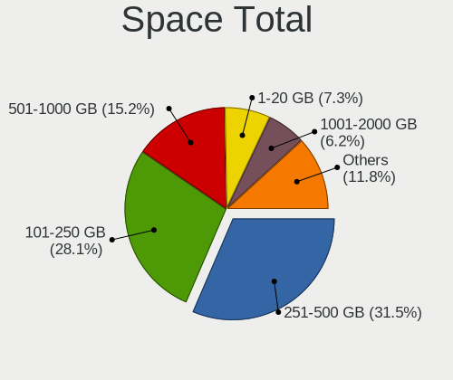
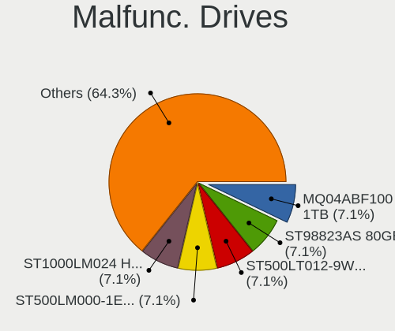
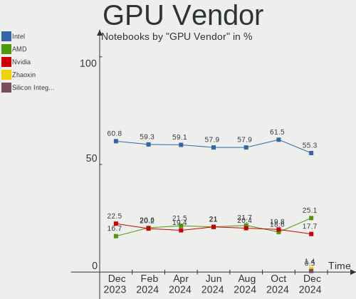
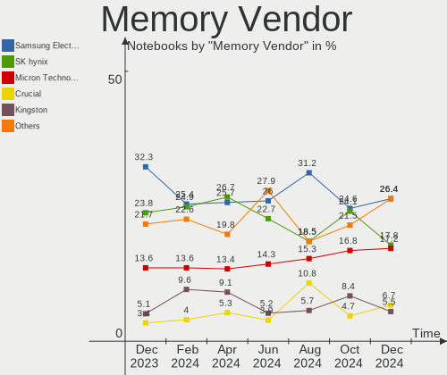

Debian - Hardware Trends (Notebooks)
------------------------------------

A project to identify most popular hardware characteristics and track their change
over time based on data collected by Linux users at https://Linux-Hardware.org.

Anyone can contribute to this report by the [hw-probe](https://github.com/linuxhw/hw-probe) tool:

    sudo -E hw-probe -all -upload

This report is for one last month. Overall report since the beginning of time: [TestCoverage](https://github.com/linuxhw/TestCoverage)

Period: Sep, 2022.

Contents
--------

* [ System ](#system)
  - [ OS                       ](#os)
  - [ OS Family                ](#os-family)
  - [ Kernel                   ](#kernel)
  - [ Kernel Family            ](#kernel-family)
  - [ Kernel Major Ver.        ](#kernel-major-ver)
  - [ Arch                     ](#arch)
  - [ DE                       ](#de)
  - [ Display Server           ](#display-server)
  - [ Display Manager          ](#display-manager)
  - [ OS Lang                  ](#os-lang)
  - [ Boot Mode                ](#boot-mode)
  - [ Filesystem               ](#filesystem)
  - [ Part. scheme             ](#part-scheme)
  - [ Dual Boot with Linux/BSD ](#dual-boot-with-linuxbsd)
  - [ Dual Boot (Win)          ](#dual-boot-win)

* [ Board ](#board)
  - [ Vendor                   ](#vendor)
  - [ Model                    ](#model)
  - [ Model Family             ](#model-family)
  - [ MFG Year                 ](#mfg-year)
  - [ Form Factor              ](#form-factor)
  - [ Secure Boot              ](#secure-boot)
  - [ Coreboot                 ](#coreboot)
  - [ RAM Size                 ](#ram-size)
  - [ RAM Used                 ](#ram-used)
  - [ Total Drives             ](#total-drives)
  - [ Has CD-ROM               ](#has-cd-rom)
  - [ Has Ethernet             ](#has-ethernet)
  - [ Has WiFi                 ](#has-wifi)
  - [ Has Bluetooth            ](#has-bluetooth)

* [ Location ](#location)
  - [ Country                  ](#country)
  - [ City                     ](#city)

* [ Drives ](#drives)
  - [ Drive Vendor             ](#drive-vendor)
  - [ Drive Model              ](#drive-model)
  - [ HDD Vendor               ](#hdd-vendor)
  - [ SSD Vendor               ](#ssd-vendor)
  - [ Drive Kind               ](#drive-kind)
  - [ Drive Connector          ](#drive-connector)
  - [ Drive Size               ](#drive-size)
  - [ Space Total              ](#space-total)
  - [ Space Used               ](#space-used)
  - [ Malfunc. Drives          ](#malfunc-drives)
  - [ Malfunc. Drive Vendor    ](#malfunc-drive-vendor)
  - [ Malfunc. HDD Vendor      ](#malfunc-hdd-vendor)
  - [ Malfunc. Drive Kind      ](#malfunc-drive-kind)
  - [ Failed Drives            ](#failed-drives)
  - [ Failed Drive Vendor      ](#failed-drive-vendor)
  - [ Drive Status             ](#drive-status)

* [ Storage controller ](#storage-controller)
  - [ Storage Vendor           ](#storage-vendor)
  - [ Storage Model            ](#storage-model)
  - [ Storage Kind             ](#storage-kind)

* [ Processor ](#processor)
  - [ CPU Vendor               ](#cpu-vendor)
  - [ CPU Model                ](#cpu-model)
  - [ CPU Model Family         ](#cpu-model-family)
  - [ CPU Cores                ](#cpu-cores)
  - [ CPU Sockets              ](#cpu-sockets)
  - [ CPU Threads              ](#cpu-threads)
  - [ CPU Op-Modes             ](#cpu-op-modes)
  - [ CPU Microcode            ](#cpu-microcode)
  - [ CPU Microarch            ](#cpu-microarch)

* [ Graphics ](#graphics)
  - [ GPU Vendor               ](#gpu-vendor)
  - [ GPU Model                ](#gpu-model)
  - [ GPU Combo                ](#gpu-combo)
  - [ GPU Driver               ](#gpu-driver)
  - [ GPU Memory               ](#gpu-memory)

* [ Monitor ](#monitor)
  - [ Monitor Vendor           ](#monitor-vendor)
  - [ Monitor Model            ](#monitor-model)
  - [ Monitor Resolution       ](#monitor-resolution)
  - [ Monitor Diagonal         ](#monitor-diagonal)
  - [ Monitor Width            ](#monitor-width)
  - [ Aspect Ratio             ](#aspect-ratio)
  - [ Monitor Area             ](#monitor-area)
  - [ Pixel Density            ](#pixel-density)
  - [ Multiple Monitors        ](#multiple-monitors)

* [ Network ](#network)
  - [ Net Controller Vendor    ](#net-controller-vendor)
  - [ Net Controller Model     ](#net-controller-model)
  - [ Wireless Vendor          ](#wireless-vendor)
  - [ Wireless Model           ](#wireless-model)
  - [ Ethernet Vendor          ](#ethernet-vendor)
  - [ Ethernet Model           ](#ethernet-model)
  - [ Net Controller Kind      ](#net-controller-kind)
  - [ Used Controller          ](#used-controller)
  - [ NICs                     ](#nics)
  - [ IPv6                     ](#ipv6)

* [ Bluetooth ](#bluetooth)
  - [ Bluetooth Vendor         ](#bluetooth-vendor)
  - [ Bluetooth Model          ](#bluetooth-model)

* [ Sound ](#sound)
  - [ Sound Vendor             ](#sound-vendor)
  - [ Sound Model              ](#sound-model)

* [ Memory ](#memory)
  - [ Memory Vendor            ](#memory-vendor)
  - [ Memory Model             ](#memory-model)
  - [ Memory Kind              ](#memory-kind)
  - [ Memory Form Factor       ](#memory-form-factor)
  - [ Memory Size              ](#memory-size)
  - [ Memory Speed             ](#memory-speed)

* [ Printers & scanners ](#printers--scanners)
  - [ Printer Vendor           ](#printer-vendor)
  - [ Printer Model            ](#printer-model)
  - [ Scanner Vendor           ](#scanner-vendor)
  - [ Scanner Model            ](#scanner-model)

* [ Camera ](#camera)
  - [ Camera Vendor            ](#camera-vendor)
  - [ Camera Model             ](#camera-model)

* [ Security ](#security)
  - [ Fingerprint Vendor       ](#fingerprint-vendor)
  - [ Fingerprint Model        ](#fingerprint-model)
  - [ Chipcard Vendor          ](#chipcard-vendor)
  - [ Chipcard Model           ](#chipcard-model)

* [ Unsupported ](#unsupported)
  - [ Unsupported Devices      ](#unsupported-devices)
  - [ Unsupported Device Types ](#unsupported-device-types)

System
------

OS
--

Installed operating systems

| Name                    | Notebooks | Percent |
|-------------------------|-----------|---------|
| Debian 11               | 189       | 84.38%  |
| Debian Testing          | 19        | 8.48%   |
| Debian Unstable         | 9         | 4.02%   |
| Debian 11-updates       | 2         | 0.89%   |
| Debian 10               | 2         | 0.89%   |
| Debian Testing/unstable | 1         | 0.45%   |
| Debian 8                | 1         | 0.45%   |
| Debian                  | 1         | 0.45%   |

OS Family
---------

OS without a version

| Name   | Notebooks | Percent |
|--------|-----------|---------|
| Debian | 224       | 100%    |

Kernel
------

Version of the Linux kernel

| Version                             | Notebooks | Percent |
|-------------------------------------|-----------|---------|
| 5.10.0-18-amd64                     | 56        | 25%     |
| 5.10.0-17-amd64                     | 41        | 18.3%   |
| 5.10.0-16-amd64                     | 35        | 15.63%  |
| 5.10.0-7-amd64                      | 31        | 13.84%  |
| 5.19.0-1-amd64                      | 24        | 10.71%  |
| 5.18.0-4-amd64                      | 8         | 3.57%   |
| 5.18.0-0.deb11.4-amd64              | 7         | 3.13%   |
| 5.18.0-0.bpo.1-amd64                | 3         | 1.34%   |
| 5.10.0-18-rt-amd64                  | 2         | 0.89%   |
| 6.0.0-rc2                           | 1         | 0.45%   |
| 6.0.0-rc1-asahi-00175-g01a8389621b6 | 1         | 0.45%   |
| 5.4.157-1-pve                       | 1         | 0.45%   |
| 5.19.9-xanmod1                      | 1         | 0.45%   |
| 5.19.0-4.2-liquorix-amd64           | 1         | 0.45%   |
| 5.19.0-2-amd64                      | 1         | 0.45%   |
| 5.18.15                             | 1         | 0.45%   |
| 5.18.0-0.deb11.4-rt-amd64           | 1         | 0.45%   |
| 5.16.0-0.bpo.4-amd64                | 1         | 0.45%   |
| 5.10.0-9-amd64                      | 1         | 0.45%   |
| 5.10.0-8-amd64                      | 1         | 0.45%   |
| 5.10.0-18-686-pae                   | 1         | 0.45%   |
| 5.10.0-17-686-pae                   | 1         | 0.45%   |
| 5.10.0-14-amd64                     | 1         | 0.45%   |
| 5.10.0-0.deb10.16-amd64             | 1         | 0.45%   |
| 4.19.0-21-amd64                     | 1         | 0.45%   |
| 3.0.21-perf                         | 1         | 0.45%   |

Kernel Family
-------------

Linux kernel without a distro release

| Version | Notebooks | Percent |
|---------|-----------|---------|
| 5.10.0  | 171       | 76.34%  |
| 5.19.0  | 26        | 11.61%  |
| 5.18.0  | 19        | 8.48%   |
| 6.0.0   | 2         | 0.89%   |
| 5.4.157 | 1         | 0.45%   |
| 5.19.9  | 1         | 0.45%   |
| 5.18.15 | 1         | 0.45%   |
| 5.16.0  | 1         | 0.45%   |
| 4.19.0  | 1         | 0.45%   |
| 3.0.21  | 1         | 0.45%   |

Kernel Major Ver.
-----------------

Linux kernel major version

| Version | Notebooks | Percent |
|---------|-----------|---------|
| 5.10    | 171       | 76.34%  |
| 5.19    | 27        | 12.05%  |
| 5.18    | 20        | 8.93%   |
| 6.0     | 2         | 0.89%   |
| 5.4     | 1         | 0.45%   |
| 5.16    | 1         | 0.45%   |
| 4.19    | 1         | 0.45%   |
| 3.0     | 1         | 0.45%   |

Arch
----

OS architecture (x86_64, i586, etc.)

| Name    | Notebooks | Percent |
|---------|-----------|---------|
| x86_64  | 220       | 98.21%  |
| i686    | 2         | 0.89%   |
| armv7l  | 1         | 0.45%   |
| aarch64 | 1         | 0.45%   |

DE
--

Desktop Environment

| Name            | Notebooks | Percent |
|-----------------|-----------|---------|
| GNOME           | 74        | 33.04%  |
| Unknown         | 59        | 26.34%  |
| XFCE            | 27        | 12.05%  |
| KDE5            | 22        | 9.82%   |
| X-Cinnamon      | 10        | 4.46%   |
| MATE            | 5         | 2.23%   |
| i3              | 5         | 2.23%   |
| Cinnamon        | 5         | 2.23%   |
| KDE             | 4         | 1.79%   |
| openbox         | 3         | 1.34%   |
| LXQt            | 3         | 1.34%   |
| trinity         | 2         | 0.89%   |
| GNOME Flashback | 2         | 0.89%   |
| xmonad          | 1         | 0.45%   |
| LXDE            | 1         | 0.45%   |
| Cutefish        | 1         | 0.45%   |

Display Server
--------------

X11 or Wayland

| Name    | Notebooks | Percent |
|---------|-----------|---------|
| X11     | 108       | 48.21%  |
| Unknown | 57        | 25.45%  |
| Wayland | 53        | 23.66%  |
| Tty     | 6         | 2.68%   |

Display Manager
---------------

SDDM, LightDM, etc.

| Name    | Notebooks | Percent |
|---------|-----------|---------|
| Unknown | 89        | 39.73%  |
| GDM     | 50        | 22.32%  |
| LightDM | 38        | 16.96%  |
| GDM3    | 25        | 11.16%  |
| SDDM    | 22        | 9.82%   |

OS Lang
-------

Language

| Lang    | Notebooks | Percent |
|---------|-----------|---------|
| en_US   | 61        | 27.23%  |
| ru_RU   | 42        | 18.75%  |
| Unknown | 25        | 11.16%  |
| es_ES   | 21        | 9.38%   |
| fr_FR   | 12        | 5.36%   |
| de_DE   | 12        | 5.36%   |
| en_GB   | 8         | 3.57%   |
| pt_BR   | 6         | 2.68%   |
| it_IT   | 5         | 2.23%   |
| en_CA   | 4         | 1.79%   |
| C       | 4         | 1.79%   |
| en_AU   | 3         | 1.34%   |
| zh_CN   | 2         | 0.89%   |
| pl_PL   | 2         | 0.89%   |
| es_VE   | 2         | 0.89%   |
| es_AR   | 2         | 0.89%   |
| en_SG   | 2         | 0.89%   |
| pt_PT   | 1         | 0.45%   |
| id_ID   | 1         | 0.45%   |
| es_MX   | 1         | 0.45%   |
| es_BO   | 1         | 0.45%   |
| en_ZA   | 1         | 0.45%   |
| en_SE   | 1         | 0.45%   |
| en_NZ   | 1         | 0.45%   |
| en_IE   | 1         | 0.45%   |
| en_HK   | 1         | 0.45%   |
| de_AT   | 1         | 0.45%   |
| ca_ES   | 1         | 0.45%   |

Boot Mode
---------

EFI or BIOS

| Mode | Notebooks | Percent |
|------|-----------|---------|
| EFI  | 170       | 75.89%  |
| BIOS | 54        | 24.11%  |

Filesystem
----------

Type of filesystem

| Type    | Notebooks | Percent |
|---------|-----------|---------|
| Ext4    | 139       | 62.05%  |
| Overlay | 67        | 29.91%  |
| Xfs     | 10        | 4.46%   |
| Btrfs   | 7         | 3.13%   |
| Tmpfs   | 1         | 0.45%   |

Part. scheme
------------

Scheme of partitioning

| Type    | Notebooks | Percent |
|---------|-----------|---------|
| GPT     | 166       | 74.11%  |
| Unknown | 31        | 13.84%  |
| MBR     | 27        | 12.05%  |

Dual Boot with Linux/BSD
------------------------

Hosting more than one Linux/BSD

| Dual boot | Notebooks | Percent |
|-----------|-----------|---------|
| No        | 197       | 87.95%  |
| Yes       | 27        | 12.05%  |

Dual Boot (Win)
---------------

Hosting Linux and Windows

| Dual boot | Notebooks | Percent |
|-----------|-----------|---------|
| No        | 131       | 58.48%  |
| Yes       | 93        | 41.52%  |

Board
-----

Vendor
------

Motherboard manufacturer

| Name                   | Notebooks | Percent |
|------------------------|-----------|---------|
| Lenovo                 | 49        | 21.88%  |
| Hewlett-Packard        | 30        | 13.39%  |
| Aquarius               | 30        | 13.39%  |
| Dell                   | 26        | 11.61%  |
| Google                 | 23        | 10.27%  |
| ASUSTek Computer       | 23        | 10.27%  |
| Acer                   | 9         | 4.02%   |
| MSI                    | 7         | 3.13%   |
| HUAWEI                 | 7         | 3.13%   |
| Unknown                | 3         | 1.34%   |
| Toshiba                | 2         | 0.89%   |
| Chuwi                  | 2         | 0.89%   |
| VIT                    | 1         | 0.45%   |
| Valve                  | 1         | 0.45%   |
| Samsung Electronics    | 1         | 0.45%   |
| Positivo               | 1         | 0.45%   |
| PC Specialist          | 1         | 0.45%   |
| Panasonic              | 1         | 0.45%   |
| MECHREVO               | 1         | 0.45%   |
| IPASON                 | 1         | 0.45%   |
| INFINITY               | 1         | 0.45%   |
| Fujitsu                | 1         | 0.45%   |
| Framework              | 1         | 0.45%   |
| AXDIA International    | 1         | 0.45%   |
| Avell High Performance | 1         | 0.45%   |

Model
-----

Motherboard model

| Name                                        | Notebooks | Percent |
|---------------------------------------------|-----------|---------|
| Aquarius NS585                              | 30        | 13.39%  |
| Google Enguarde                             | 15        | 6.7%    |
| Unknown                                     | 5         | 2.23%   |
| Lenovo ThinkPad 13 2nd Gen 20J10046US       | 4         | 1.79%   |
| Google Terra                                | 4         | 1.79%   |
| HUAWEI HN-WX9X                              | 3         | 1.34%   |
| Dell Latitude E6330                         | 3         | 1.34%   |
| Lenovo G50-45 80E3                          | 2         | 0.89%   |
| HP Stream Notebook PC 13                    | 2         | 0.89%   |
| HP Notebook                                 | 2         | 0.89%   |
| Google Reks                                 | 2         | 0.89%   |
| Dell Vostro 15 5510                         | 2         | 0.89%   |
| ASUS UX430UAR                               | 2         | 0.89%   |
| VIT P2402                                   | 1         | 0.45%   |
| Valve Jupiter                               | 1         | 0.45%   |
| Toshiba Satellite P745                      | 1         | 0.45%   |
| Toshiba Satellite L40                       | 1         | 0.45%   |
| Samsung 550XBE/350XBE                       | 1         | 0.45%   |
| Positivo Mobile                             | 1         | 0.45%   |
| PC Specialist 14 Fusion IV                  | 1         | 0.45%   |
| Panasonic CF-53JAWZYDE                      | 1         | 0.45%   |
| MSI Prestige 14Evo A11M                     | 1         | 0.45%   |
| MSI Modern 15 A11M                          | 1         | 0.45%   |
| MSI Katana GF66 12UC                        | 1         | 0.45%   |
| MSI GS60 2PE                                | 1         | 0.45%   |
| MSI GF75 Thin 10SC                          | 1         | 0.45%   |
| MSI GF63 8RD                                | 1         | 0.45%   |
| MSI Alpha 15 A4DEK                          | 1         | 0.45%   |
| MECHREVO Jiaolong Series GM5ZG0O            | 1         | 0.45%   |
| Lenovo ThinkPad X260 20F5003EMB             | 1         | 0.45%   |
| Lenovo ThinkPad X240 20AL00ETGE             | 1         | 0.45%   |
| Lenovo ThinkPad X230 232438J                | 1         | 0.45%   |
| Lenovo ThinkPad X220 4291G26                | 1         | 0.45%   |
| Lenovo ThinkPad X1 Extreme Gen2 20QVCTO1WW  | 1         | 0.45%   |
| Lenovo ThinkPad X1 Extreme Gen 3 20TK001HUS | 1         | 0.45%   |
| Lenovo ThinkPad X1 Carbon Gen 10 21CBCTO1WW | 1         | 0.45%   |
| Lenovo ThinkPad X1 Carbon 7th 20QDCTO1WW    | 1         | 0.45%   |
| Lenovo ThinkPad X1 Carbon 3rd 20BSS02400    | 1         | 0.45%   |
| Lenovo ThinkPad T530 23595JU                | 1         | 0.45%   |
| Lenovo ThinkPad T495 20NKS0PG00             | 1         | 0.45%   |

Model Family
------------

Motherboard model prefix

| Name                   | Notebooks | Percent |
|------------------------|-----------|---------|
| Lenovo ThinkPad        | 38        | 16.96%  |
| Aquarius NS585         | 30        | 13.39%  |
| Google Enguarde        | 15        | 6.7%    |
| Dell Latitude          | 10        | 4.46%   |
| Dell Inspiron          | 6         | 2.68%   |
| Acer Aspire            | 6         | 2.68%   |
| Lenovo IdeaPad         | 5         | 2.23%   |
| Unknown                | 5         | 2.23%   |
| HP ProBook             | 4         | 1.79%   |
| HP EliteBook           | 4         | 1.79%   |
| Google Terra           | 4         | 1.79%   |
| Dell XPS               | 4         | 1.79%   |
| Dell Vostro            | 4         | 1.79%   |
| ASUS VivoBook          | 4         | 1.79%   |
| HUAWEI HN-WX9X         | 3         | 1.34%   |
| HP Stream              | 3         | 1.34%   |
| HP Compaq              | 3         | 1.34%   |
| Toshiba Satellite      | 2         | 0.89%   |
| Lenovo Legion          | 2         | 0.89%   |
| Lenovo G50-45          | 2         | 0.89%   |
| HP Pavilion            | 2         | 0.89%   |
| HP Notebook            | 2         | 0.89%   |
| HP 250                 | 2         | 0.89%   |
| Google Reks            | 2         | 0.89%   |
| Dell Precision         | 2         | 0.89%   |
| ASUS ZenBook           | 2         | 0.89%   |
| ASUS UX430UAR          | 2         | 0.89%   |
| ASUS ROG               | 2         | 0.89%   |
| VIT P2402              | 1         | 0.45%   |
| Valve Jupiter          | 1         | 0.45%   |
| Samsung 550XBE         | 1         | 0.45%   |
| Positivo Mobile        | 1         | 0.45%   |
| PC Specialist 14       | 1         | 0.45%   |
| Panasonic CF-53JAWZYDE | 1         | 0.45%   |
| MSI Prestige           | 1         | 0.45%   |
| MSI Modern             | 1         | 0.45%   |
| MSI Katana             | 1         | 0.45%   |
| MSI GS60               | 1         | 0.45%   |
| MSI GF75               | 1         | 0.45%   |
| MSI GF63               | 1         | 0.45%   |

MFG Year
--------

Motherboard manufacture year

| Year    | Notebooks | Percent |
|---------|-----------|---------|
| 2019    | 49        | 21.88%  |
| 2022    | 31        | 13.84%  |
| 2021    | 31        | 13.84%  |
| 2020    | 25        | 11.16%  |
| 2018    | 10        | 4.46%   |
| 2017    | 10        | 4.46%   |
| 2014    | 10        | 4.46%   |
| 2013    | 9         | 4.02%   |
| 2012    | 9         | 4.02%   |
| 2016    | 7         | 3.13%   |
| 2011    | 7         | 3.13%   |
| 2010    | 6         | 2.68%   |
| 2007    | 6         | 2.68%   |
| 2015    | 5         | 2.23%   |
| 2009    | 4         | 1.79%   |
| Unknown | 2         | 0.89%   |
| 2008    | 1         | 0.45%   |
| 2005    | 1         | 0.45%   |
| 2004    | 1         | 0.45%   |

Form Factor
-----------

Physical design of the computer

| Name     | Notebooks | Percent |
|----------|-----------|---------|
| Notebook | 224       | 100%    |

Secure Boot
-----------

Enabled or disabled

| State    | Notebooks | Percent |
|----------|-----------|---------|
| Disabled | 203       | 90.63%  |
| Enabled  | 21        | 9.38%   |

Coreboot
--------

Have coreboot on board

| Used | Notebooks | Percent |
|------|-----------|---------|
| No   | 201       | 89.73%  |
| Yes  | 23        | 10.27%  |

RAM Size
--------

Total RAM memory

| Size in GB  | Notebooks | Percent |
|-------------|-----------|---------|
| 4.01-8.0    | 70        | 31.25%  |
| 3.01-4.0    | 46        | 20.54%  |
| 16.01-24.0  | 39        | 17.41%  |
| 8.01-16.0   | 36        | 16.07%  |
| 32.01-64.0  | 18        | 8.04%   |
| 1.01-2.0    | 6         | 2.68%   |
| 64.01-256.0 | 3         | 1.34%   |
| 24.01-32.0  | 2         | 0.89%   |
| 2.01-3.0    | 2         | 0.89%   |
| 0.51-1.0    | 1         | 0.45%   |
| 0.01-0.5    | 1         | 0.45%   |

RAM Used
--------

Used RAM memory

| Used GB   | Notebooks | Percent |
|-----------|-----------|---------|
| 1.01-2.0  | 79        | 35.27%  |
| 2.01-3.0  | 45        | 20.09%  |
| 0.51-1.0  | 37        | 16.52%  |
| 3.01-4.0  | 28        | 12.5%   |
| 4.01-8.0  | 20        | 8.93%   |
| 8.01-16.0 | 11        | 4.91%   |
| 0.01-0.5  | 3         | 1.34%   |
| Unknown   | 1         | 0.45%   |

Total Drives
------------

Number of drives on board

| Drives | Notebooks | Percent |
|--------|-----------|---------|
| 1      | 186       | 83.04%  |
| 2      | 30        | 13.39%  |
| 3      | 7         | 3.13%   |
| 5      | 1         | 0.45%   |

Has CD-ROM
----------

Has CD-ROM on board

| Presented | Notebooks | Percent |
|-----------|-----------|---------|
| No        | 183       | 81.7%   |
| Yes       | 41        | 18.3%   |

Has Ethernet
------------

Has Ethernet on board

| Presented | Notebooks | Percent |
|-----------|-----------|---------|
| Yes       | 178       | 79.46%  |
| No        | 46        | 20.54%  |

Has WiFi
--------

Has WiFi module

| Presented | Notebooks | Percent |
|-----------|-----------|---------|
| Yes       | 221       | 98.66%  |
| No        | 3         | 1.34%   |

Has Bluetooth
-------------

Has Bluetooth module

| Presented | Notebooks | Percent |
|-----------|-----------|---------|
| Yes       | 191       | 85.27%  |
| No        | 33        | 14.73%  |

Location
--------

Country
-------

Geographic location (country)

| Country       | Notebooks | Percent |
|---------------|-----------|---------|
| USA           | 45        | 20.09%  |
| Russia        | 44        | 19.64%  |
| Spain         | 30        | 13.39%  |
| Germany       | 19        | 8.48%   |
| France        | 13        | 5.8%    |
| Italy         | 10        | 4.46%   |
| Brazil        | 9         | 4.02%   |
| Canada        | 6         | 2.68%   |
| UK            | 4         | 1.79%   |
| Poland        | 3         | 1.34%   |
| Mexico        | 3         | 1.34%   |
| Hong Kong     | 3         | 1.34%   |
| Australia     | 3         | 1.34%   |
| Venezuela     | 2         | 0.89%   |
| Sweden        | 2         | 0.89%   |
| Netherlands   | 2         | 0.89%   |
| Indonesia     | 2         | 0.89%   |
| Greece        | 2         | 0.89%   |
| China         | 2         | 0.89%   |
| Bulgaria      | 2         | 0.89%   |
| Austria       | 2         | 0.89%   |
| Argentina     | 2         | 0.89%   |
| UAE           | 1         | 0.45%   |
| South Africa  | 1         | 0.45%   |
| Slovenia      | 1         | 0.45%   |
| Saudi Arabia  | 1         | 0.45%   |
| Romania       | 1         | 0.45%   |
| Réunion      | 1         | 0.45%   |
| Portugal      | 1         | 0.45%   |
| New Zealand   | 1         | 0.45%   |
| Kazakhstan    | 1         | 0.45%   |
| India         | 1         | 0.45%   |
| Faroe Islands | 1         | 0.45%   |
| Colombia      | 1         | 0.45%   |
| Bolivia       | 1         | 0.45%   |
| Belgium       | 1         | 0.45%   |

City
----

Geographic location (city)

| City                | Notebooks | Percent |
|---------------------|-----------|---------|
| Voronezh            | 31        | 13.84%  |
| Bangor              | 29        | 12.95%  |
| Seville             | 14        | 6.25%   |
| Paris               | 4         | 1.79%   |
| Madrid              | 4         | 1.79%   |
| Barcelona           | 4         | 1.79%   |
| Toronto             | 3         | 1.34%   |
| Zanevka             | 2         | 0.89%   |
| Warsaw              | 2         | 0.89%   |
| St Petersburg       | 2         | 0.89%   |
| Perm                | 2         | 0.89%   |
| Natal               | 2         | 0.89%   |
| Mesa                | 2         | 0.89%   |
| Lübeck             | 2         | 0.89%   |
| Berlin              | 2         | 0.89%   |
| Yerres              | 1         | 0.45%   |
| Yekaterinburg       | 1         | 0.45%   |
| Winchester          | 1         | 0.45%   |
| Wilmington          | 1         | 0.45%   |
| Whiting             | 1         | 0.45%   |
| Westminster         | 1         | 0.45%   |
| West Kelowna        | 1         | 0.45%   |
| Watermael-Boitsfort | 1         | 0.45%   |
| Vitoria-Gasteiz     | 1         | 0.45%   |
| Vitória            | 1         | 0.45%   |
| Villach             | 1         | 0.45%   |
| Vienna              | 1         | 0.45%   |
| Veroia              | 1         | 0.45%   |
| Velbert             | 1         | 0.45%   |
| Uzzano              | 1         | 0.45%   |
| Turin               | 1         | 0.45%   |
| Tórshavn           | 1         | 0.45%   |
| Tijuana             | 1         | 0.45%   |
| Syktyvkar           | 1         | 0.45%   |
| Swansea             | 1         | 0.45%   |
| Surgeres            | 1         | 0.45%   |
| Sueca               | 1         | 0.45%   |
| Stockholm           | 1         | 0.45%   |
| South Tangerang     | 1         | 0.45%   |
| Sochi               | 1         | 0.45%   |

Drives
------

Drive Vendor
------------

Hard drive vendors

| Vendor              | Notebooks | Drives | Percent |
|---------------------|-----------|--------|---------|
| Samsung Electronics | 38        | 39     | 14.45%  |
| A-DATA Technology   | 36        | 36     | 13.69%  |
| Unknown             | 30        | 32     | 11.41%  |
| WDC                 | 25        | 26     | 9.51%   |
| Seagate             | 17        | 17     | 6.46%   |
| Kingston            | 16        | 16     | 6.08%   |
| SanDisk             | 14        | 14     | 5.32%   |
| Toshiba             | 10        | 10     | 3.8%    |
| Micron Technology   | 10        | 10     | 3.8%    |
| Crucial             | 10        | 12     | 3.8%    |
| SK hynix            | 8         | 8      | 3.04%   |
| Hitachi             | 6         | 6      | 2.28%   |
| HGST                | 5         | 5      | 1.9%    |
| KIOXIA              | 4         | 5      | 1.52%   |
| Phison              | 3         | 3      | 1.14%   |
| Intel               | 3         | 3      | 1.14%   |
| Unknown             | 3         | 3      | 1.14%   |
| Silicon Motion      | 2         | 2      | 0.76%   |
| Netac               | 2         | 2      | 0.76%   |
| Intenso             | 2         | 2      | 0.76%   |
| Apple               | 2         | 4      | 0.76%   |
| Transcend           | 1         | 1      | 0.38%   |
| Team                | 1         | 1      | 0.38%   |
| SSSTC               | 1         | 1      | 0.38%   |
| SPCC                | 1         | 1      | 0.38%   |
| S3+                 | 1         | 1      | 0.38%   |
| PUSKILL             | 1         | 1      | 0.38%   |
| PNY                 | 1         | 1      | 0.38%   |
| Plextor             | 1         | 1      | 0.38%   |
| LITEON              | 1         | 1      | 0.38%   |
| KIOXIA-EXCERIA      | 1         | 1      | 0.38%   |
| Kingchuxing         | 1         | 1      | 0.38%   |
| Hewlett-Packard     | 1         | 1      | 0.38%   |
| GOODRAM             | 1         | 1      | 0.38%   |
| GLOBAL              | 1         | 1      | 0.38%   |
| DGM                 | 1         | 1      | 0.38%   |
| ASMT109x            | 1         | 1      | 0.38%   |
| Apacer              | 1         | 1      | 0.38%   |

Drive Model
-----------

Hard drive models

| Model                                | Notebooks | Percent |
|--------------------------------------|-----------|---------|
| A-DATA SU800 512GB SSD               | 30        | 11.19%  |
| Unknown AGND3R  16GB                 | 9         | 3.36%   |
| Unknown SDW16G  16GB                 | 5         | 1.87%   |
| Unknown HAG2e  16GB                  | 5         | 1.87%   |
| Unknown MMC Card  32GB               | 4         | 1.49%   |
| Kingston SA400S37240G 240GB SSD      | 4         | 1.49%   |
| WDC PC SN810 NVMe 1024GB             | 3         | 1.12%   |
| Toshiba MQ04ABF100 1TB               | 3         | 1.12%   |
| Samsung SSD 860 EVO M.2 1TB          | 3         | 1.12%   |
| Samsung MZVLB256HAHQ-00000 256GB     | 3         | 1.12%   |
| Unknown                              | 3         | 1.12%   |
| Seagate ST500LT012-1DG142 500GB      | 2         | 0.75%   |
| Seagate ST1000LM024 HN-M101MBB 1TB   | 2         | 0.75%   |
| SanDisk SD8SN8U128G1001 128GB SSD    | 2         | 0.75%   |
| Samsung MZVLB256HBHQ-000L7 256GB     | 2         | 0.75%   |
| Samsung MZVLB1T0HBLR-000H1 1TB       | 2         | 0.75%   |
| Samsung MZVL21T0HCLR-00BL7 1TB       | 2         | 0.75%   |
| Samsung MZNTY128HDHP-000L1 128GB SSD | 2         | 0.75%   |
| Micron 2450_MTFDKBA1T0TFK 1TB        | 2         | 0.75%   |
| Kingston SA400S37480G 480GB SSD      | 2         | 0.75%   |
| Intenso SSD 128GB                    | 2         | 0.75%   |
| Hitachi HTS723232A7A364 320GB        | 2         | 0.75%   |
| Crucial CT250MX500SSD1 250GB         | 2         | 0.75%   |
| Crucial CT1000MX500SSD1 1TB          | 2         | 0.75%   |
| Crucial CT1000BX500SSD1 1TB          | 2         | 0.75%   |
| A-DATA IM2P33F3A NVMe 256GB          | 2         | 0.75%   |
| WDC WDS500G2B0B-00YS70 500GB SSD     | 1         | 0.37%   |
| WDC WDS240G2G0A-00JH30 240GB SSD     | 1         | 0.37%   |
| WDC WDS200T1X0E-00AFY0 2TB           | 1         | 0.37%   |
| WDC WDS100T3X0C-00SJG0 1TB           | 1         | 0.37%   |
| WDC WDS100T2B0C-00PXH0 1TB           | 1         | 0.37%   |
| WDC WDBNCE0010PNC 1TB SSD            | 1         | 0.37%   |
| WDC WD5000LPCX-75VHAT0 500GB         | 1         | 0.37%   |
| WDC WD5000LPCX-24C6HT0 500GB         | 1         | 0.37%   |
| WDC WD5000BEVT-22ZAT0 500GB          | 1         | 0.37%   |
| WDC WD5000BEVT-22A0RT0 500GB         | 1         | 0.37%   |
| WDC WD3200BPVT-24JJ5T0 320GB         | 1         | 0.37%   |
| WDC WD3200BEVT-00ZAT0 320GB          | 1         | 0.37%   |
| WDC WD10SPZX-60Z10T0 1TB             | 1         | 0.37%   |
| WDC WD10JPVX-60JC3T0 1TB             | 1         | 0.37%   |

HDD Vendor
----------

Hard disk drive vendors

| Vendor   | Notebooks | Drives | Percent |
|----------|-----------|--------|---------|
| Seagate  | 15        | 15     | 35.71%  |
| WDC      | 8         | 8      | 19.05%  |
| Toshiba  | 7         | 7      | 16.67%  |
| Hitachi  | 6         | 6      | 14.29%  |
| HGST     | 5         | 5      | 11.9%   |
| ASMT109x | 1         | 1      | 2.38%   |

SSD Vendor
----------

Solid state drive vendors

| Vendor              | Notebooks | Drives | Percent |
|---------------------|-----------|--------|---------|
| A-DATA Technology   | 32        | 32     | 33.68%  |
| Samsung Electronics | 11        | 11     | 11.58%  |
| SanDisk             | 10        | 10     | 10.53%  |
| Kingston            | 10        | 10     | 10.53%  |
| Crucial             | 9         | 10     | 9.47%   |
| WDC                 | 3         | 3      | 3.16%   |
| Netac               | 2         | 2      | 2.11%   |
| Intenso             | 2         | 2      | 2.11%   |
| Transcend           | 1         | 1      | 1.05%   |
| Toshiba             | 1         | 1      | 1.05%   |
| Team                | 1         | 1      | 1.05%   |
| SPCC                | 1         | 1      | 1.05%   |
| SK hynix            | 1         | 1      | 1.05%   |
| S3+                 | 1         | 1      | 1.05%   |
| PUSKILL             | 1         | 1      | 1.05%   |
| Plextor             | 1         | 1      | 1.05%   |
| Micron Technology   | 1         | 1      | 1.05%   |
| LITEON              | 1         | 1      | 1.05%   |
| Kingchuxing         | 1         | 1      | 1.05%   |
| Hewlett-Packard     | 1         | 1      | 1.05%   |
| GLOBAL              | 1         | 1      | 1.05%   |
| DGM                 | 1         | 1      | 1.05%   |
| Apple               | 1         | 1      | 1.05%   |
| Apacer              | 1         | 1      | 1.05%   |

Drive Kind
----------

HDD or SSD

| Kind    | Notebooks | Drives | Percent |
|---------|-----------|--------|---------|
| SSD     | 88        | 96     | 34.92%  |
| NVMe    | 87        | 96     | 34.52%  |
| HDD     | 41        | 42     | 16.27%  |
| MMC     | 34        | 36     | 13.49%  |
| Unknown | 2         | 2      | 0.79%   |

Drive Connector
---------------

SATA, SAS, NVMe, etc.

| Type | Notebooks | Drives | Percent |
|------|-----------|--------|---------|
| SATA | 121       | 134    | 48.99%  |
| NVMe | 87        | 96     | 35.22%  |
| MMC  | 34        | 36     | 13.77%  |
| SAS  | 5         | 6      | 2.02%   |

Drive Size
----------

Size of hard drive

| Size in TB | Notebooks | Drives | Percent |
|------------|-----------|--------|---------|
| 0.01-0.5   | 67        | 73     | 51.15%  |
| 0.51-1.0   | 60        | 61     | 45.8%   |
| 1.01-2.0   | 4         | 4      | 3.05%   |

Space Total
-----------

Amount of disk space available on the file system

| Size in GB     | Notebooks | Percent |
|----------------|-----------|---------|
| 101-250        | 50        | 22.32%  |
| 251-500        | 47        | 20.98%  |
| Unknown        | 44        | 19.64%  |
| 501-1000       | 27        | 12.05%  |
| 1-20           | 21        | 9.38%   |
| 51-100         | 12        | 5.36%   |
| 1001-2000      | 11        | 4.91%   |
| 21-50          | 7         | 3.13%   |
| 2001-3000      | 3         | 1.34%   |
| More than 3000 | 2         | 0.89%   |

Space Used
----------

Amount of used disk space

| Used GB        | Notebooks | Percent |
|----------------|-----------|---------|
| 1-20           | 87        | 38.84%  |
| Unknown        | 44        | 19.64%  |
| 21-50          | 24        | 10.71%  |
| 101-250        | 22        | 9.82%   |
| 51-100         | 21        | 9.38%   |
| 251-500        | 13        | 5.8%    |
| 501-1000       | 7         | 3.13%   |
| 1001-2000      | 3         | 1.34%   |
| More than 3000 | 2         | 0.89%   |
| 2001-3000      | 1         | 0.45%   |

Malfunc. Drives
---------------

Drive models with a malfunction

| Model                                 | Notebooks | Drives | Percent |
|---------------------------------------|-----------|--------|---------|
| WDC WD10SPZX-60Z10T0 1TB              | 1         | 1      | 6.67%   |
| SK hynix HFS256G39TND-N210A 256GB SSD | 1         | 1      | 6.67%   |
| Seagate ST9500420AS 500GB             | 1         | 1      | 6.67%   |
| Seagate ST9320423AS 320GB             | 1         | 1      | 6.67%   |
| Seagate ST500LM000-SSHD-8GB           | 1         | 1      | 6.67%   |
| Seagate ST320LT007-9ZV142 320GB       | 1         | 1      | 6.67%   |
| Seagate ST1000LM048-2E7172 1TB        | 1         | 1      | 6.67%   |
| Seagate ST1000LM024 HN-M101MBB 1TB    | 1         | 1      | 6.67%   |
| Samsung Electronics SSD 970 EVO 1TB   | 1         | 1      | 6.67%   |
| LITEON L8H-256V2G 256GB SSD           | 1         | 1      | 6.67%   |
| Hitachi HTS545050B9A300 500GB         | 1         | 1      | 6.67%   |
| HGST HTS541010B7E610 1TB              | 1         | 1      | 6.67%   |
| HGST HTS541010A9E680 1TB              | 1         | 1      | 6.67%   |
| HGST HTS541010A7E630 1TB              | 1         | 1      | 6.67%   |
| DGM SSD 120GB S3-120A                 | 1         | 1      | 6.67%   |

Malfunc. Drive Vendor
---------------------

Vendors of faulty drives

| Vendor              | Notebooks | Drives | Percent |
|---------------------|-----------|--------|---------|
| Seagate             | 6         | 6      | 40%     |
| HGST                | 3         | 3      | 20%     |
| WDC                 | 1         | 1      | 6.67%   |
| SK hynix            | 1         | 1      | 6.67%   |
| Samsung Electronics | 1         | 1      | 6.67%   |
| LITEON              | 1         | 1      | 6.67%   |
| Hitachi             | 1         | 1      | 6.67%   |
| DGM                 | 1         | 1      | 6.67%   |

Malfunc. HDD Vendor
-------------------

Vendors of faulty HDD drives

| Vendor  | Notebooks | Drives | Percent |
|---------|-----------|--------|---------|
| Seagate | 6         | 6      | 54.55%  |
| HGST    | 3         | 3      | 27.27%  |
| WDC     | 1         | 1      | 9.09%   |
| Hitachi | 1         | 1      | 9.09%   |

Malfunc. Drive Kind
-------------------

Kinds of faulty drives

| Kind | Notebooks | Drives | Percent |
|------|-----------|--------|---------|
| HDD  | 11        | 11     | 73.33%  |
| SSD  | 3         | 3      | 20%     |
| NVMe | 1         | 1      | 6.67%   |

Failed Drives
-------------

Failed drive models

Zero info for selected period =(

Failed Drive Vendor
-------------------

Failed drive vendors

Zero info for selected period =(

Drive Status
------------

Number of failed and malfunc. drives

| Status   | Notebooks | Drives | Percent |
|----------|-----------|--------|---------|
| Works    | 162       | 183    | 67.5%   |
| Detected | 63        | 74     | 26.25%  |
| Malfunc  | 15        | 15     | 6.25%   |

Storage controller
------------------

Storage Vendor
--------------

Storage controller vendors

| Vendor                           | Notebooks | Percent |
|----------------------------------|-----------|---------|
| Intel                            | 136       | 56.2%   |
| Samsung Electronics              | 26        | 10.74%  |
| AMD                              | 20        | 8.26%   |
| SanDisk                          | 17        | 7.02%   |
| Micron Technology                | 9         | 3.72%   |
| SK hynix                         | 7         | 2.89%   |
| Kingston Technology Company      | 6         | 2.48%   |
| KIOXIA                           | 5         | 2.07%   |
| Phison Electronics               | 4         | 1.65%   |
| ADATA Technology                 | 4         | 1.65%   |
| Silicon Motion                   | 3         | 1.24%   |
| Toshiba America Info Systems     | 2         | 0.83%   |
| Solid State Storage Technology   | 1         | 0.41%   |
| Silicon Integrated Systems [SiS] | 1         | 0.41%   |
| Micron/Crucial Technology        | 1         | 0.41%   |

Storage Model
-------------

Storage controller models

| Model                                                                            | Notebooks | Percent |
|----------------------------------------------------------------------------------|-----------|---------|
| Intel Cannon Lake PCH SATA AHCI Controller                                       | 30        | 11.81%  |
| AMD FCH SATA Controller [AHCI mode]                                              | 18        | 7.09%   |
| Intel Sunrise Point-LP SATA Controller [AHCI mode]                               | 17        | 6.69%   |
| Samsung NVMe SSD Controller SM981/PM981/PM983                                    | 15        | 5.91%   |
| Intel Volume Management Device NVMe RAID Controller                              | 13        | 5.12%   |
| Intel 7 Series Chipset Family 6-port SATA Controller [AHCI mode]                 | 10        | 3.94%   |
| Micron Non-Volatile memory controller                                            | 9         | 3.54%   |
| Intel 6 Series/C200 Series Chipset Family 6 port Mobile SATA AHCI Controller     | 8         | 3.15%   |
| SanDisk WD Black SN750 / PC SN730 NVMe SSD                                       | 7         | 2.76%   |
| Samsung NVMe SSD Controller PM9A1/PM9A3/980PRO                                   | 7         | 2.76%   |
| Intel 82801 Mobile SATA Controller [RAID mode]                                   | 6         | 2.36%   |
| Intel 8 Series SATA Controller 1 [AHCI mode]                                     | 6         | 2.36%   |
| SK hynix Gold P31 SSD                                                            | 5         | 1.97%   |
| SanDisk WD PC SN810 / Black SN850 NVMe SSD                                       | 4         | 1.57%   |
| SanDisk WD Blue SN550 NVMe SSD                                                   | 4         | 1.57%   |
| Intel Wildcat Point-LP SATA Controller [AHCI Mode]                               | 4         | 1.57%   |
| Intel Comet Lake SATA AHCI Controller                                            | 4         | 1.57%   |
| Intel Celeron/Pentium Silver Processor SATA Controller                           | 4         | 1.57%   |
| Intel 5 Series/3400 Series Chipset 4 port SATA AHCI Controller                   | 4         | 1.57%   |
| ADATA Non-Volatile memory controller                                             | 4         | 1.57%   |
| Samsung NVMe SSD Controller 980                                                  | 3         | 1.18%   |
| Phison E12 NVMe Controller                                                       | 3         | 1.18%   |
| KIOXIA NVMe SSD Controller BG4                                                   | 3         | 1.18%   |
| Intel Tiger Lake-LP SATA Controller                                              | 3         | 1.18%   |
| Intel SSD 660P Series                                                            | 3         | 1.18%   |
| Intel Celeron N3350/Pentium N4200/Atom E3900 Series SATA AHCI Controller         | 3         | 1.18%   |
| Intel Cannon Point-LP SATA Controller [AHCI Mode]                                | 3         | 1.18%   |
| Intel Cannon Lake Mobile PCH SATA AHCI Controller                                | 3         | 1.18%   |
| Intel 82801IBM/IEM (ICH9M/ICH9M-E) 4 port SATA Controller [AHCI mode]            | 3         | 1.18%   |
| Intel 82801HM/HEM (ICH8M/ICH8M-E) SATA Controller [AHCI mode]                    | 3         | 1.18%   |
| Intel 82801HM/HEM (ICH8M/ICH8M-E) IDE Controller                                 | 3         | 1.18%   |
| SK hynix BC511                                                                   | 2         | 0.79%   |
| Silicon Motion SM2263EN/SM2263XT SSD Controller                                  | 2         | 0.79%   |
| Kingston Company U-SNS8154P3 NVMe SSD                                            | 2         | 0.79%   |
| Kingston Company Company Non-Volatile memory controller                          | 2         | 0.79%   |
| Kingston Company OM3PDP3 NVMe SSD                                                | 2         | 0.79%   |
| Intel Mobile PM965/GM965 PT IDER Controller                                      | 2         | 0.79%   |
| Intel Alder Lake-P SATA AHCI Controller                                          | 2         | 0.79%   |
| Toshiba America Info Systems XG6 NVMe SSD Controller                             | 1         | 0.39%   |
| Toshiba America Info Systems Toshiba America Info Non-Volatile memory controller | 1         | 0.39%   |

Storage Kind
------------

Kind of storage controller (IDE, SATA, NVMe, SAS, ...)

| Kind | Notebooks | Percent |
|------|-----------|---------|
| SATA | 133       | 53.85%  |
| NVMe | 86        | 34.82%  |
| RAID | 19        | 7.69%   |
| IDE  | 9         | 3.64%   |

Processor
---------

CPU Vendor
----------

Processor vendors

| Vendor  | Notebooks | Percent |
|---------|-----------|---------|
| Intel   | 185       | 82.59%  |
| AMD     | 37        | 16.52%  |
| ARM     | 1         | 0.45%   |
| Unknown | 1         | 0.45%   |

CPU Model
---------

Processor models

| Model                                         | Notebooks | Percent |
|-----------------------------------------------|-----------|---------|
| Intel Core i3-9100 CPU @ 3.60GHz              | 30        | 13.39%  |
| Intel Celeron CPU N2840 @ 2.16GHz             | 17        | 7.59%   |
| Intel Celeron CPU N3060 @ 1.60GHz             | 7         | 3.13%   |
| Intel 11th Gen Core i5-1135G7 @ 2.40GHz       | 7         | 3.13%   |
| Intel 12th Gen Core i7-12700H                 | 6         | 2.68%   |
| AMD Ryzen 5 3500U with Radeon Vega Mobile Gfx | 6         | 2.68%   |
| Intel Core i5-3320M CPU @ 2.60GHz             | 5         | 2.23%   |
| Intel Core i5-10210U CPU @ 1.60GHz            | 5         | 2.23%   |
| Intel Core i7-8550U CPU @ 1.80GHz             | 4         | 1.79%   |
| Intel Celeron CPU 3865U @ 1.80GHz             | 4         | 1.79%   |
| AMD Ryzen 7 5800H with Radeon Graphics        | 4         | 1.79%   |
| Intel Core i7-8565U CPU @ 1.80GHz             | 3         | 1.34%   |
| Intel Core i5-6300U CPU @ 2.40GHz             | 3         | 1.34%   |
| Intel 11th Gen Core i7-1165G7 @ 2.80GHz       | 3         | 1.34%   |
| Intel Core i7-8750H CPU @ 2.20GHz             | 2         | 0.89%   |
| Intel Core i5-8265U CPU @ 1.60GHz             | 2         | 0.89%   |
| Intel Core i5-8250U CPU @ 1.60GHz             | 2         | 0.89%   |
| Intel Core i5-4300U CPU @ 1.90GHz             | 2         | 0.89%   |
| Intel Core i5-4210U CPU @ 1.70GHz             | 2         | 0.89%   |
| Intel Core i5-3340M CPU @ 2.70GHz             | 2         | 0.89%   |
| Intel Core i5-2520M CPU @ 2.50GHz             | 2         | 0.89%   |
| Intel Celeron N4120 CPU @ 1.10GHz             | 2         | 0.89%   |
| Intel Celeron CPU 1007U @ 1.50GHz             | 2         | 0.89%   |
| Intel 12th Gen Core i7-1280P                  | 2         | 0.89%   |
| Intel 12th Gen Core i7-1265U                  | 2         | 0.89%   |
| Intel 11th Gen Core i7-11390H @ 3.40GHz       | 2         | 0.89%   |
| AMD Ryzen 7 PRO 5850U with Radeon Graphics    | 2         | 0.89%   |
| AMD Ryzen 5 5500U with Radeon Graphics        | 2         | 0.89%   |
| AMD Ryzen 5 4600H with Radeon Graphics        | 2         | 0.89%   |
| AMD Ryzen 5 2500U with Radeon Vega Mobile Gfx | 2         | 0.89%   |
| AMD A6-6310 APU with AMD Radeon R4 Graphics   | 2         | 0.89%   |
| Intel Pentium Silver N6000 @ 1.10GHz          | 1         | 0.45%   |
| Intel Pentium Dual-Core CPU T4400 @ 2.20GHz   | 1         | 0.45%   |
| Intel Pentium Dual CPU T3400 @ 2.16GHz        | 1         | 0.45%   |
| Intel Pentium Dual CPU T2310 @ 1.46GHz        | 1         | 0.45%   |
| Intel Pentium CPU P6200 @ 2.13GHz             | 1         | 0.45%   |
| Intel Pentium CPU N4200 @ 1.10GHz             | 1         | 0.45%   |
| Intel Pentium CPU B950 @ 2.10GHz              | 1         | 0.45%   |
| Intel Pentium CPU 5405U @ 2.30GHz             | 1         | 0.45%   |
| Intel Mobile Pentium 4 CPU 3.06GHz            | 1         | 0.45%   |

CPU Model Family
----------------

Processor model prefix

| Model                   | Notebooks | Percent |
|-------------------------|-----------|---------|
| Intel Celeron           | 40        | 17.86%  |
| Intel Core i5           | 37        | 16.52%  |
| Intel Core i3           | 37        | 16.52%  |
| Other                   | 31        | 13.84%  |
| Intel Core i7           | 24        | 10.71%  |
| AMD Ryzen 5             | 14        | 6.25%   |
| AMD Ryzen 7             | 8         | 3.57%   |
| Intel Core 2 Duo        | 5         | 2.23%   |
| Intel Pentium           | 4         | 1.79%   |
| AMD Ryzen 7 PRO         | 4         | 1.79%   |
| AMD A6                  | 3         | 1.34%   |
| Intel Pentium Dual      | 2         | 0.89%   |
| AMD Ryzen 9             | 2         | 0.89%   |
| Intel Pentium Silver    | 1         | 0.45%   |
| Intel Pentium Dual-Core | 1         | 0.45%   |
| Intel Mobile Pentium 4  | 1         | 0.45%   |
| Intel Core i9           | 1         | 0.45%   |
| Intel Core 2            | 1         | 0.45%   |
| Intel Celeron Dual-Core | 1         | 0.45%   |
| Intel Atom              | 1         | 0.45%   |
| ARM ARMv7               | 1         | 0.45%   |
| AMD Ryzen 5 PRO         | 1         | 0.45%   |
| AMD Mobile Sempron      | 1         | 0.45%   |
| AMD E2                  | 1         | 0.45%   |
| AMD E1                  | 1         | 0.45%   |
| AMD A10                 | 1         | 0.45%   |

CPU Cores
---------

Number of processor cores

| Number | Notebooks | Percent |
|--------|-----------|---------|
| 2      | 93        | 41.52%  |
| 4      | 86        | 38.39%  |
| 8      | 16        | 7.14%   |
| 6      | 12        | 5.36%   |
| 14     | 8         | 3.57%   |
| 12     | 3         | 1.34%   |
| 10     | 3         | 1.34%   |
| 1      | 3         | 1.34%   |

CPU Sockets
-----------

Number of sockets

| Number | Notebooks | Percent |
|--------|-----------|---------|
| 1      | 223       | 99.55%  |
| 2      | 1         | 0.45%   |

CPU Threads
-----------

Threads per core (Hyper-Threading)

| Number | Notebooks | Percent |
|--------|-----------|---------|
| 2      | 124       | 55.36%  |
| 1      | 100       | 44.64%  |

CPU Op-Modes
------------

CPU Operation Modes (32-bit, 64-bit)

| Op mode        | Notebooks | Percent |
|----------------|-----------|---------|
| 32-bit, 64-bit | 221       | 98.66%  |
| 64-bit         | 1         | 0.45%   |
| 32-bit         | 1         | 0.45%   |
| Unknown        | 1         | 0.45%   |

CPU Microcode
-------------

Microcode number

| Number     | Notebooks | Percent |
|------------|-----------|---------|
| Unknown    | 31        | 13.84%  |
| 0x906eb    | 30        | 13.39%  |
| 0x30678    | 15        | 6.7%    |
| 0x806c1    | 12        | 5.36%   |
| 0x906a3    | 11        | 4.91%   |
| 0x306a9    | 10        | 4.46%   |
| 0x0a50000c | 8         | 3.57%   |
| 0x806ec    | 7         | 3.13%   |
| 0x406c4    | 7         | 3.13%   |
| 0x40651    | 6         | 2.68%   |
| 0x206a7    | 6         | 2.68%   |
| 0x406e3    | 5         | 2.23%   |
| 0x08108109 | 5         | 2.23%   |
| 0x806ea    | 4         | 1.79%   |
| 0x806e9    | 4         | 1.79%   |
| 0x306d4    | 4         | 1.79%   |
| 0x906a4    | 3         | 1.34%   |
| 0x706a8    | 3         | 1.34%   |
| 0x6fd      | 3         | 1.34%   |
| 0x506c9    | 3         | 1.34%   |
| 0x20655    | 3         | 1.34%   |
| 0x08600106 | 3         | 1.34%   |
| 0x07030105 | 3         | 1.34%   |
| 0x906ea    | 2         | 0.89%   |
| 0x806eb    | 2         | 0.89%   |
| 0x806c2    | 2         | 0.89%   |
| 0x506e3    | 2         | 0.89%   |
| 0x1067a    | 2         | 0.89%   |
| 0x08608102 | 2         | 0.89%   |
| 0x08600104 | 2         | 0.89%   |
| 0x08108102 | 2         | 0.89%   |
| 0xf29      | 1         | 0.45%   |
| 0xa0652    | 1         | 0.45%   |
| 0x906ed    | 1         | 0.45%   |
| 0x906e9    | 1         | 0.45%   |
| 0x906c0    | 1         | 0.45%   |
| 0x806d1    | 1         | 0.45%   |
| 0x706e5    | 1         | 0.45%   |
| 0x706a1    | 1         | 0.45%   |
| 0x6f6      | 1         | 0.45%   |

CPU Microarch
-------------

Microarchitecture

| Name             | Notebooks | Percent |
|------------------|-----------|---------|
| KabyLake         | 61        | 27.23%  |
| Silvermont       | 25        | 11.16%  |
| TigerLake        | 14        | 6.25%   |
| IvyBridge        | 13        | 5.8%    |
| Alderlake Hybrid | 11        | 4.91%   |
| Unknown          | 10        | 4.46%   |
| Zen 3            | 9         | 4.02%   |
| Skylake          | 8         | 3.57%   |
| SandyBridge      | 8         | 3.57%   |
| Zen+             | 7         | 3.13%   |
| Zen 2            | 7         | 3.13%   |
| Haswell          | 7         | 3.13%   |
| Core             | 6         | 2.68%   |
| Goldmont plus    | 5         | 2.23%   |
| Broadwell        | 5         | 2.23%   |
| Westmere         | 4         | 1.79%   |
| Puma             | 4         | 1.79%   |
| Penryn           | 4         | 1.79%   |
| Goldmont         | 3         | 1.34%   |
| Zen              | 2         | 0.89%   |
| Icelake          | 2         | 0.89%   |
| Excavator        | 2         | 0.89%   |
| CometLake        | 2         | 0.89%   |
| Tremont          | 1         | 0.45%   |
| NetBurst         | 1         | 0.45%   |
| Nehalem          | 1         | 0.45%   |
| K8 Hammer        | 1         | 0.45%   |
| Bonnell          | 1         | 0.45%   |

Graphics
--------

GPU Vendor
----------

Vendors of graphics cards

| Vendor                           | Notebooks | Percent |
|----------------------------------|-----------|---------|
| Intel                            | 177       | 67.56%  |
| AMD                              | 44        | 16.79%  |
| Nvidia                           | 40        | 15.27%  |
| Silicon Integrated Systems [SiS] | 1         | 0.38%   |

GPU Model
---------

Graphics card models

| Model                                                                                    | Notebooks | Percent |
|------------------------------------------------------------------------------------------|-----------|---------|
| Intel CoffeeLake-S GT2 [UHD Graphics 630]                                                | 30        | 11.15%  |
| Intel Atom Processor Z36xxx/Z37xxx Series Graphics & Display                             | 17        | 6.32%   |
| Intel TigerLake-LP GT2 [Iris Xe Graphics]                                                | 13        | 4.83%   |
| Intel 3rd Gen Core processor Graphics Controller                                         | 13        | 4.83%   |
| Intel Alder Lake-P Integrated Graphics Controller                                        | 10        | 3.72%   |
| Intel Atom/Celeron/Pentium Processor x5-E8000/J3xxx/N3xxx Integrated Graphics Controller | 8         | 2.97%   |
| Intel 2nd Generation Core Processor Family Integrated Graphics Controller                | 7         | 2.6%    |
| AMD Renoir                                                                               | 7         | 2.6%    |
| AMD Picasso/Raven 2 [Radeon Vega Series / Radeon Vega Mobile Series]                     | 7         | 2.6%    |
| AMD Cezanne                                                                              | 7         | 2.6%    |
| Intel UHD Graphics 620                                                                   | 6         | 2.23%   |
| Intel Haswell-ULT Integrated Graphics Controller                                         | 6         | 2.23%   |
| Intel CometLake-U GT2 [UHD Graphics]                                                     | 6         | 2.23%   |
| Intel WhiskeyLake-U GT2 [UHD Graphics 620]                                               | 5         | 1.86%   |
| Intel Skylake GT2 [HD Graphics 520]                                                      | 5         | 1.86%   |
| Intel HD Graphics 5500                                                                   | 5         | 1.86%   |
| Intel GeminiLake [UHD Graphics 600]                                                      | 5         | 1.86%   |
| Intel Kaby Lake-U GT1 Integrated Graphics Controller                                     | 4         | 1.49%   |
| Intel Core Processor Integrated Graphics Controller                                      | 4         | 1.49%   |
| Intel CoffeeLake-H GT2 [UHD Graphics 630]                                                | 4         | 1.49%   |
| Nvidia TU117M [GeForce MX450]                                                            | 3         | 1.12%   |
| Nvidia GA107M [GeForce RTX 3050 Mobile]                                                  | 3         | 1.12%   |
| Nvidia GA106M [GeForce RTX 3060 Mobile / Max-Q]                                          | 3         | 1.12%   |
| Intel VGA compatible controller                                                          | 3         | 1.12%   |
| Intel Mobile GM965/GL960 Integrated Graphics Controller (secondary)                      | 3         | 1.12%   |
| Intel Mobile GM965/GL960 Integrated Graphics Controller (primary)                        | 3         | 1.12%   |
| Intel Mobile 4 Series Chipset Integrated Graphics Controller                             | 3         | 1.12%   |
| AMD Lucienne                                                                             | 3         | 1.12%   |
| Nvidia TU117M [GeForce GTX 1650 Mobile / Max-Q]                                          | 2         | 0.74%   |
| Nvidia GP108M [GeForce MX250]                                                            | 2         | 0.74%   |
| Nvidia GP107M [GeForce GTX 1050 Mobile]                                                  | 2         | 0.74%   |
| Nvidia GM108M [GeForce MX110]                                                            | 2         | 0.74%   |
| Nvidia GA107M [GeForce RTX 3050 Ti Mobile]                                               | 2         | 0.74%   |
| Intel HD Graphics 630                                                                    | 2         | 0.74%   |
| Intel HD Graphics 530                                                                    | 2         | 0.74%   |
| Intel HD Graphics 500                                                                    | 2         | 0.74%   |
| Intel CometLake-H GT2 [UHD Graphics]                                                     | 2         | 0.74%   |
| AMD Topaz XT [Radeon R7 M260/M265 / M340/M360 / M440/M445 / 530/535 / 620/625 Mobile]    | 2         | 0.74%   |
| AMD Raven Ridge [Radeon Vega Series / Radeon Vega Mobile Series]                         | 2         | 0.74%   |
| AMD Mullins [Radeon R4/R5 Graphics]                                                      | 2         | 0.74%   |

GPU Combo
---------

Combinations of graphics cards

| Name           | Notebooks | Percent |
|----------------|-----------|---------|
| 1 x Intel      | 142       | 63.39%  |
| Intel + Nvidia | 32        | 14.29%  |
| 1 x AMD        | 32        | 14.29%  |
| AMD + Nvidia   | 6         | 2.68%   |
| 2 x AMD        | 4         | 1.79%   |
| Other          | 3         | 1.34%   |
| 1 x Nvidia     | 2         | 0.89%   |
| Intel + AMD    | 2         | 0.89%   |
| 1 x SiS        | 1         | 0.45%   |

GPU Driver
----------

Free vs proprietary

| Driver      | Notebooks | Percent |
|-------------|-----------|---------|
| Free        | 164       | 73.21%  |
| Unknown     | 44        | 19.64%  |
| Proprietary | 16        | 7.14%   |

GPU Memory
----------

Total video memory

| Size in GB | Notebooks | Percent |
|------------|-----------|---------|
| Unknown    | 179       | 79.91%  |
| 0.01-0.5   | 17        | 7.59%   |
| 0.51-1.0   | 9         | 4.02%   |
| 1.01-2.0   | 8         | 3.57%   |
| 3.01-4.0   | 7         | 3.13%   |
| 7.01-8.0   | 3         | 1.34%   |
| 5.01-6.0   | 1         | 0.45%   |

Monitor
-------

Monitor Vendor
--------------

Monitor vendors

| Vendor                  | Notebooks | Percent |
|-------------------------|-----------|---------|
| AU Optronics            | 48        | 21.62%  |
| BOE                     | 40        | 18.02%  |
| LG Display              | 27        | 12.16%  |
| Chimei Innolux          | 26        | 11.71%  |
| Samsung Electronics     | 13        | 5.86%   |
| Lenovo                  | 6         | 2.7%    |
| Dell                    | 6         | 2.7%    |
| Sharp                   | 5         | 2.25%   |
| InfoVision              | 5         | 2.25%   |
| Goldstar                | 5         | 2.25%   |
| Hewlett-Packard         | 4         | 1.8%    |
| BenQ                    | 4         | 1.8%    |
| AOC                     | 4         | 1.8%    |
| Philips                 | 3         | 1.35%   |
| CSO                     | 3         | 1.35%   |
| Chi Mei Optoelectronics | 3         | 1.35%   |
| AGO                     | 3         | 1.35%   |
| Acer                    | 3         | 1.35%   |
| ViewSonic               | 2         | 0.9%    |
| Pixio                   | 2         | 0.9%    |
| Iiyama                  | 2         | 0.9%    |
| Videoseven              | 1         | 0.45%   |
| Quanta Display          | 1         | 0.45%   |
| PANDA                   | 1         | 0.45%   |
| LG Philips              | 1         | 0.45%   |
| IBM                     | 1         | 0.45%   |
| Gigabyte Technology     | 1         | 0.45%   |
| Eizo                    | 1         | 0.45%   |
| ANX                     | 1         | 0.45%   |

Monitor Model
-------------

Monitor models

| Model                                                                 | Notebooks | Percent |
|-----------------------------------------------------------------------|-----------|---------|
| BOE LCD Monitor BOE0609 1366x768 256x144mm 11.6-inch                  | 13        | 5.86%   |
| AU Optronics LCD Monitor AUO235C 1366x768 256x144mm 11.6-inch         | 7         | 3.15%   |
| LG Display LCD Monitor LGD034C 1366x768 293x165mm 13.2-inch           | 3         | 1.35%   |
| Chimei Innolux LCD Monitor CMN14D4 1920x1080 309x173mm 13.9-inch      | 3         | 1.35%   |
| Pixio U29I WAM2900 2560x1080 690x260mm 29.0-inch                      | 2         | 0.9%    |
| InfoVision LCD Monitor IVO0533 1366x768 293x165mm 13.2-inch           | 2         | 0.9%    |
| Goldstar 23MP65 GSM5A45 1920x1080 510x290mm 23.1-inch                 | 2         | 0.9%    |
| Chimei Innolux LCD Monitor CMN15DB 1366x768 344x193mm 15.5-inch       | 2         | 0.9%    |
| Chimei Innolux LCD Monitor CMN1132 1366x768 256x144mm 11.6-inch       | 2         | 0.9%    |
| BOE LCD Monitor BOE0928 1920x1080 344x194mm 15.5-inch                 | 2         | 0.9%    |
| BOE LCD Monitor BOE0718 1920x1080 309x173mm 13.9-inch                 | 2         | 0.9%    |
| BOE LCD Monitor BOE06CF 1366x768 277x156mm 12.5-inch                  | 2         | 0.9%    |
| AU Optronics LCD Monitor AUO312C 1366x768 293x164mm 13.2-inch         | 2         | 0.9%    |
| AU Optronics LCD Monitor AUO2E3C 1366x768 309x173mm 13.9-inch         | 2         | 0.9%    |
| AU Optronics LCD Monitor AUO243D 1920x1080 309x173mm 13.9-inch        | 2         | 0.9%    |
| AU Optronics LCD Monitor AUO22EC 1366x768 344x193mm 15.5-inch         | 2         | 0.9%    |
| AU Optronics LCD Monitor AUO21ED 1920x1080 344x193mm 15.5-inch        | 2         | 0.9%    |
| AU Optronics LCD Monitor AUO106C 1366x768 277x156mm 12.5-inch         | 2         | 0.9%    |
| AGO LCD Monitor AGO6201 1920x1080 256x192mm 12.6-inch                 | 2         | 0.9%    |
| ViewSonic VG730m VSC951E 1280x1024 338x270mm 17.0-inch                | 1         | 0.45%   |
| ViewSonic VA2252 SERIES VSC7731 1920x1080 476x268mm 21.5-inch         | 1         | 0.45%   |
| Videoseven L215DS IGM2200 1920x1080 480x270mm 21.7-inch               | 1         | 0.45%   |
| Sharp LQ156M1JW25 SHP152C 1920x1080 344x194mm 15.5-inch               | 1         | 0.45%   |
| Sharp LCD Monitor SHP1551 3840x2400 288x180mm 13.4-inch               | 1         | 0.45%   |
| Sharp LCD Monitor SHP1518 1920x1200 366x229mm 17.0-inch               | 1         | 0.45%   |
| Sharp LCD Monitor SHP1515 1920x1200 336x210mm 15.6-inch               | 1         | 0.45%   |
| Sharp LCD Monitor SHP1449 1920x1080 294x165mm 13.3-inch               | 1         | 0.45%   |
| Samsung Electronics LU28R55 SAM1017 3840x2160 632x360mm 28.6-inch     | 1         | 0.45%   |
| Samsung Electronics LU28R55 SAM1015 3840x2160 632x360mm 28.6-inch     | 1         | 0.45%   |
| Samsung Electronics LCD Monitor SEC5742 1366x768 309x174mm 14.0-inch  | 1         | 0.45%   |
| Samsung Electronics LCD Monitor SEC3741 1366x768 309x174mm 14.0-inch  | 1         | 0.45%   |
| Samsung Electronics LCD Monitor SEC3152 1366x768 344x194mm 15.5-inch  | 1         | 0.45%   |
| Samsung Electronics LCD Monitor SEC3047 1366x768 277x156mm 12.5-inch  | 1         | 0.45%   |
| Samsung Electronics LCD Monitor SDC5451 1366x768 344x194mm 15.5-inch  | 1         | 0.45%   |
| Samsung Electronics LCD Monitor SDC4852 1366x768 344x194mm 15.5-inch  | 1         | 0.45%   |
| Samsung Electronics LCD Monitor SDC4161 1920x1080 344x194mm 15.5-inch | 1         | 0.45%   |
| Samsung Electronics LCD Monitor SDC4157 3840x2160 344x194mm 15.5-inch | 1         | 0.45%   |
| Samsung Electronics LCD Monitor SDC4141 1366x768 344x194mm 15.5-inch  | 1         | 0.45%   |
| Samsung Electronics LCD Monitor SDC3654 1600x900 382x215mm 17.3-inch  | 1         | 0.45%   |
| Samsung Electronics LCD Monitor SDC324C 1920x1080 344x194mm 15.5-inch | 1         | 0.45%   |

Monitor Resolution
------------------

Monitor screen resolution

| Resolution         | Notebooks | Percent |
|--------------------|-----------|---------|
| 1920x1080 (FHD)    | 81        | 40.5%   |
| 1366x768 (WXGA)    | 74        | 37%     |
| 3840x2160 (4K)     | 7         | 3.5%    |
| 1920x1200 (WUXGA)  | 7         | 3.5%    |
| 2560x1440 (QHD)    | 6         | 3%      |
| 1600x900 (HD+)     | 6         | 3%      |
| 2560x1080          | 3         | 1.5%    |
| 2160x1440          | 3         | 1.5%    |
| 1280x800 (WXGA)    | 3         | 1.5%    |
| 2560x1600          | 2         | 1%      |
| 1280x1024 (SXGA)   | 2         | 1%      |
| 800x1280           | 1         | 0.5%    |
| 3840x2400          | 1         | 0.5%    |
| 2256x1504          | 1         | 0.5%    |
| 1680x1050 (WSXGA+) | 1         | 0.5%    |
| 1024x768 (XGA)     | 1         | 0.5%    |
| 1024x600           | 1         | 0.5%    |

Monitor Diagonal
----------------

Diagonal size in inches

| Inches  | Notebooks | Percent |
|---------|-----------|---------|
| 15      | 70        | 31.82%  |
| 13      | 35        | 15.91%  |
| 14      | 28        | 12.73%  |
| 11      | 24        | 10.91%  |
| 24      | 12        | 5.45%   |
| 12      | 10        | 4.55%   |
| 17      | 9         | 4.09%   |
| 23      | 7         | 3.18%   |
| 27      | 5         | 2.27%   |
| 21      | 5         | 2.27%   |
| 31      | 3         | 1.36%   |
| 16      | 3         | 1.36%   |
| 29      | 2         | 0.91%   |
| 28      | 2         | 0.91%   |
| 34      | 1         | 0.45%   |
| 25      | 1         | 0.45%   |
| 18      | 1         | 0.45%   |
| 10      | 1         | 0.45%   |
| Unknown | 1         | 0.45%   |

Monitor Width
-------------

Physical width

| Width in mm | Notebooks | Percent |
|-------------|-----------|---------|
| 301-350     | 118       | 54.13%  |
| 201-300     | 55        | 25.23%  |
| 501-600     | 23        | 10.55%  |
| 601-700     | 7         | 3.21%   |
| 351-400     | 7         | 3.21%   |
| 401-500     | 6         | 2.75%   |
| 701-800     | 1         | 0.46%   |
| Unknown     | 1         | 0.46%   |

Aspect Ratio
------------

Proportional relationship between the width and the height

| Ratio | Notebooks | Percent |
|-------|-----------|---------|
| 16/9  | 161       | 84.29%  |
| 16/10 | 16        | 8.38%   |
| 4/3   | 4         | 2.09%   |
| 3/2   | 4         | 2.09%   |
| 5/4   | 2         | 1.05%   |
| 2.65  | 2         | 1.05%   |
| 21/9  | 1         | 0.52%   |
| 0.62  | 1         | 0.52%   |

Monitor Area
------------

Area in inch²

| Area in inch² | Notebooks | Percent |
|----------------|-----------|---------|
| 101-110        | 68        | 31.19%  |
| 81-90          | 46        | 21.1%   |
| 51-60          | 24        | 11.01%  |
| 71-80          | 18        | 8.26%   |
| 201-250        | 17        | 7.8%    |
| 61-70          | 8         | 3.67%   |
| 251-300        | 8         | 3.67%   |
| 121-130        | 7         | 3.21%   |
| 351-500        | 6         | 2.75%   |
| 301-350        | 5         | 2.29%   |
| 111-120        | 4         | 1.83%   |
| 141-150        | 3         | 1.38%   |
| 41-50          | 1         | 0.46%   |
| 151-200        | 1         | 0.46%   |
| 91-100         | 1         | 0.46%   |
| Unknown        | 1         | 0.46%   |

Pixel Density
-------------

Pixels per inch

| Density       | Notebooks | Percent |
|---------------|-----------|---------|
| 121-160       | 104       | 48.83%  |
| 101-120       | 52        | 24.41%  |
| 51-100        | 34        | 15.96%  |
| 161-240       | 19        | 8.92%   |
| More than 240 | 3         | 1.41%   |
| Unknown       | 1         | 0.47%   |

Multiple Monitors
-----------------

Total monitors connected

| Total | Notebooks | Percent |
|-------|-----------|---------|
| 1     | 140       | 62.5%   |
| 0     | 42        | 18.75%  |
| 2     | 38        | 16.96%  |
| 3     | 4         | 1.79%   |

Network
-------

Net Controller Vendor
---------------------

Controller vendors

| Vendor                            | Notebooks | Percent |
|-----------------------------------|-----------|---------|
| Intel                             | 153       | 42.5%   |
| Realtek Semiconductor             | 119       | 33.06%  |
| Qualcomm Atheros                  | 28        | 7.78%   |
| Broadcom                          | 12        | 3.33%   |
| Samsung Electronics               | 6         | 1.67%   |
| ASIX Electronics                  | 6         | 1.67%   |
| MediaTek                          | 5         | 1.39%   |
| TP-Link                           | 4         | 1.11%   |
| Sierra Wireless                   | 4         | 1.11%   |
| Qualcomm                          | 4         | 1.11%   |
| Dell                              | 3         | 0.83%   |
| DisplayLink                       | 2         | 0.56%   |
| Cypress Semiconductor             | 2         | 0.56%   |
| Broadcom Limited                  | 2         | 0.56%   |
| Silicon Integrated Systems [SiS]  | 1         | 0.28%   |
| Ralink                            | 1         | 0.28%   |
| Motorola PCS                      | 1         | 0.28%   |
| Microchip Technology              | 1         | 0.28%   |
| JMicron Technology                | 1         | 0.28%   |
| InterBiometrics                   | 1         | 0.28%   |
| Ericsson Business Mobile Networks | 1         | 0.28%   |
| ASUSTek Computer                  | 1         | 0.28%   |
| Apple                             | 1         | 0.28%   |
| AMD                               | 1         | 0.28%   |

Net Controller Model
--------------------

Controller models

| Model                                                                   | Notebooks | Percent |
|-------------------------------------------------------------------------|-----------|---------|
| Realtek RTL8111/8168/8411 PCI Express Gigabit Ethernet Controller       | 75        | 17.56%  |
| Intel Cannon Lake PCH CNVi WiFi                                         | 31        | 7.26%   |
| Intel Wireless 7260                                                     | 21        | 4.92%   |
| Realtek RTL8153 Gigabit Ethernet Adapter                                | 15        | 3.51%   |
| Intel Wireless 8265 / 8275                                              | 14        | 3.28%   |
| Realtek RTL810xE PCI Express Fast Ethernet controller                   | 13        | 3.04%   |
| Intel Alder Lake-P PCH CNVi WiFi                                        | 13        | 3.04%   |
| Intel Wireless 7265                                                     | 11        | 2.58%   |
| Intel Wi-Fi 6 AX201                                                     | 11        | 2.58%   |
| Intel Wi-Fi 6 AX200                                                     | 10        | 2.34%   |
| Realtek RTL8822CE 802.11ac PCIe Wireless Network Adapter                | 9         | 2.11%   |
| Intel 82579LM Gigabit Network Connection (Lewisville)                   | 8         | 1.87%   |
| Intel Ethernet Connection (4) I219-V                                    | 7         | 1.64%   |
| Intel Centrino Advanced-N 6205 [Taylor Peak]                            | 7         | 1.64%   |
| Realtek RTL8821CE 802.11ac PCIe Wireless Network Adapter                | 6         | 1.41%   |
| Qualcomm Atheros QCA9377 802.11ac Wireless Network Adapter              | 6         | 1.41%   |
| Qualcomm Atheros QCA9565 / AR9565 Wireless Network Adapter              | 5         | 1.17%   |
| Intel Wireless 8260                                                     | 5         | 1.17%   |
| Intel Comet Lake PCH-LP CNVi WiFi                                       | 5         | 1.17%   |
| ASIX AX88179 Gigabit Ethernet                                           | 5         | 1.17%   |
| TP-Link UE300 10/100/1000 LAN (ethernet mode) [Realtek RTL8153]         | 4         | 0.94%   |
| Samsung Galaxy series, misc. (tethering mode)                           | 4         | 0.94%   |
| Realtek RTL8852AE 802.11ax PCIe Wireless Network Adapter                | 4         | 0.94%   |
| Qualcomm Atheros AR9285 Wireless Network Adapter (PCI-Express)          | 4         | 0.94%   |
| Qualcomm Mobile Router                                                  | 3         | 0.7%    |
| Qualcomm Atheros AR9485 Wireless Network Adapter                        | 3         | 0.7%    |
| Qualcomm Atheros AR242x / AR542x Wireless Network Adapter (PCI-Express) | 3         | 0.7%    |
| MediaTek MT7921 802.11ax PCI Express Wireless Network Adapter           | 3         | 0.7%    |
| Intel Wi-Fi 6 AX210/AX211/AX411 160MHz                                  | 3         | 0.7%    |
| Intel Ethernet Connection I219-LM                                       | 3         | 0.7%    |
| Intel Ethernet Connection I218-LM                                       | 3         | 0.7%    |
| Intel Ethernet Connection (10) I219-V                                   | 3         | 0.7%    |
| Intel Cannon Point-LP CNVi [Wireless-AC]                                | 3         | 0.7%    |
| Broadcom BCM43142 802.11b/g/n                                           | 3         | 0.7%    |
| Broadcom BCM4313 802.11bgn Wireless Network Adapter                     | 3         | 0.7%    |
| Sierra Wireless EM7345 4G LTE                                           | 2         | 0.47%   |
| Samsung Android USB Device                                              | 2         | 0.47%   |
| Realtek RTL8723BE PCIe Wireless Network Adapter                         | 2         | 0.47%   |
| Realtek RTL8188EUS 802.11n Wireless Network Adapter                     | 2         | 0.47%   |
| Realtek RTL8188CE 802.11b/g/n WiFi Adapter                              | 2         | 0.47%   |

Wireless Vendor
---------------

Wireless vendors

| Vendor                | Notebooks | Percent |
|-----------------------|-----------|---------|
| Intel                 | 151       | 65.94%  |
| Realtek Semiconductor | 31        | 13.54%  |
| Qualcomm Atheros      | 24        | 10.48%  |
| Broadcom              | 9         | 3.93%   |
| MediaTek              | 5         | 2.18%   |
| Sierra Wireless       | 4         | 1.75%   |
| Ralink                | 1         | 0.44%   |
| Qualcomm              | 1         | 0.44%   |
| Dell                  | 1         | 0.44%   |
| Broadcom Limited      | 1         | 0.44%   |
| ASUSTek Computer      | 1         | 0.44%   |

Wireless Model
--------------

Wireless models

| Model                                                                   | Notebooks | Percent |
|-------------------------------------------------------------------------|-----------|---------|
| Intel Cannon Lake PCH CNVi WiFi                                         | 31        | 13.48%  |
| Intel Wireless 7260                                                     | 21        | 9.13%   |
| Intel Wireless 8265 / 8275                                              | 14        | 6.09%   |
| Intel Alder Lake-P PCH CNVi WiFi                                        | 13        | 5.65%   |
| Intel Wireless 7265                                                     | 11        | 4.78%   |
| Intel Wi-Fi 6 AX201                                                     | 11        | 4.78%   |
| Intel Wi-Fi 6 AX200                                                     | 10        | 4.35%   |
| Realtek RTL8822CE 802.11ac PCIe Wireless Network Adapter                | 9         | 3.91%   |
| Intel Centrino Advanced-N 6205 [Taylor Peak]                            | 7         | 3.04%   |
| Realtek RTL8821CE 802.11ac PCIe Wireless Network Adapter                | 6         | 2.61%   |
| Qualcomm Atheros QCA9377 802.11ac Wireless Network Adapter              | 6         | 2.61%   |
| Qualcomm Atheros QCA9565 / AR9565 Wireless Network Adapter              | 5         | 2.17%   |
| Intel Wireless 8260                                                     | 5         | 2.17%   |
| Intel Comet Lake PCH-LP CNVi WiFi                                       | 5         | 2.17%   |
| Realtek RTL8852AE 802.11ax PCIe Wireless Network Adapter                | 4         | 1.74%   |
| Qualcomm Atheros AR9285 Wireless Network Adapter (PCI-Express)          | 4         | 1.74%   |
| Qualcomm Atheros AR9485 Wireless Network Adapter                        | 3         | 1.3%    |
| Qualcomm Atheros AR242x / AR542x Wireless Network Adapter (PCI-Express) | 3         | 1.3%    |
| MediaTek MT7921 802.11ax PCI Express Wireless Network Adapter           | 3         | 1.3%    |
| Intel Wi-Fi 6 AX210/AX211/AX411 160MHz                                  | 3         | 1.3%    |
| Intel Cannon Point-LP CNVi [Wireless-AC]                                | 3         | 1.3%    |
| Broadcom BCM43142 802.11b/g/n                                           | 3         | 1.3%    |
| Broadcom BCM4313 802.11bgn Wireless Network Adapter                     | 3         | 1.3%    |
| Sierra Wireless EM7345 4G LTE                                           | 2         | 0.87%   |
| Realtek RTL8723BE PCIe Wireless Network Adapter                         | 2         | 0.87%   |
| Realtek RTL8188EUS 802.11n Wireless Network Adapter                     | 2         | 0.87%   |
| Realtek RTL8188CE 802.11b/g/n WiFi Adapter                              | 2         | 0.87%   |
| Intel Wireless 3165                                                     | 2         | 0.87%   |
| Intel PRO/Wireless 4965 AG or AGN [Kedron] Network Connection           | 2         | 0.87%   |
| Intel Comet Lake PCH CNVi WiFi                                          | 2         | 0.87%   |
| Intel Centrino Ultimate-N 6300                                          | 2         | 0.87%   |
| Sierra Wireless MC8305 Modem                                            | 1         | 0.43%   |
| Sierra Wireless EM7455                                                  | 1         | 0.43%   |
| Realtek RTL8812AU 802.11a/b/g/n/ac 2T2R DB WLAN Adapter                 | 1         | 0.43%   |
| Realtek RTL8723BU 802.11b/g/n WLAN Adapter                              | 1         | 0.43%   |
| Realtek RTL8723AE PCIe Wireless Network Adapter                         | 1         | 0.43%   |
| Realtek RTL8188EE Wireless Network Adapter                              | 1         | 0.43%   |
| Realtek RTL8187B Wireless Adapter                                       | 1         | 0.43%   |
| Realtek Realtek Network controller                                      | 1         | 0.43%   |
| Ralink RT5390 Wireless 802.11n 1T/1R PCIe                               | 1         | 0.43%   |

Ethernet Vendor
---------------

Ethernet vendors

| Vendor                           | Notebooks | Percent |
|----------------------------------|-----------|---------|
| Realtek Semiconductor            | 106       | 56.38%  |
| Intel                            | 43        | 22.87%  |
| Qualcomm Atheros                 | 7         | 3.72%   |
| Samsung Electronics              | 6         | 3.19%   |
| ASIX Electronics                 | 6         | 3.19%   |
| TP-Link                          | 4         | 2.13%   |
| Broadcom                         | 4         | 2.13%   |
| Qualcomm                         | 3         | 1.6%    |
| DisplayLink                      | 2         | 1.06%   |
| Cypress Semiconductor            | 2         | 1.06%   |
| Silicon Integrated Systems [SiS] | 1         | 0.53%   |
| Microchip Technology             | 1         | 0.53%   |
| JMicron Technology               | 1         | 0.53%   |
| Broadcom Limited                 | 1         | 0.53%   |
| Apple                            | 1         | 0.53%   |

Ethernet Model
--------------

Ethernet models

| Model                                                             | Notebooks | Percent |
|-------------------------------------------------------------------|-----------|---------|
| Realtek RTL8111/8168/8411 PCI Express Gigabit Ethernet Controller | 75        | 39.47%  |
| Realtek RTL8153 Gigabit Ethernet Adapter                          | 15        | 7.89%   |
| Realtek RTL810xE PCI Express Fast Ethernet controller             | 13        | 6.84%   |
| Intel 82579LM Gigabit Network Connection (Lewisville)             | 8         | 4.21%   |
| Intel Ethernet Connection (4) I219-V                              | 7         | 3.68%   |
| ASIX AX88179 Gigabit Ethernet                                     | 5         | 2.63%   |
| TP-Link UE300 10/100/1000 LAN (ethernet mode) [Realtek RTL8153]   | 4         | 2.11%   |
| Samsung Galaxy series, misc. (tethering mode)                     | 4         | 2.11%   |
| Qualcomm Mobile Router                                            | 3         | 1.58%   |
| Intel Ethernet Connection I219-LM                                 | 3         | 1.58%   |
| Intel Ethernet Connection I218-LM                                 | 3         | 1.58%   |
| Intel Ethernet Connection (10) I219-V                             | 3         | 1.58%   |
| Samsung Android USB Device                                        | 2         | 1.05%   |
| Realtek RTL8152 Fast Ethernet Adapter                             | 2         | 1.05%   |
| Realtek RTL-8100/8101L/8139 PCI Fast Ethernet Adapter             | 2         | 1.05%   |
| Intel Ethernet Connection (3) I218-V                              | 2         | 1.05%   |
| Intel Ethernet Connection (3) I218-LM                             | 2         | 1.05%   |
| Intel Ethernet Connection (16) I219-V                             | 2         | 1.05%   |
| Intel Ethernet Connection (16) I219-LM                            | 2         | 1.05%   |
| Intel 82579V Gigabit Network Connection                           | 2         | 1.05%   |
| Intel 82566MM Gigabit Network Connection                          | 2         | 1.05%   |
| Cypress K38231_03                                                 | 2         | 1.05%   |
| Silicon Integrated Systems [SiS] 191 Gigabit Ethernet Adapter     | 1         | 0.53%   |
| Realtek RTL8125 2.5GbE Controller                                 | 1         | 0.53%   |
| Qualcomm Atheros QCA8172 Fast Ethernet                            | 1         | 0.53%   |
| Qualcomm Atheros QCA8171 Gigabit Ethernet                         | 1         | 0.53%   |
| Qualcomm Atheros Killer E220x Gigabit Ethernet Controller         | 1         | 0.53%   |
| Qualcomm Atheros AR8161 Gigabit Ethernet                          | 1         | 0.53%   |
| Qualcomm Atheros AR8151 v2.0 Gigabit Ethernet                     | 1         | 0.53%   |
| Qualcomm Atheros AR8132 Fast Ethernet                             | 1         | 0.53%   |
| Qualcomm Atheros AR8121/AR8113/AR8114 Gigabit or Fast Ethernet    | 1         | 0.53%   |
| Microchip LAN7500 Ethernet 10/100/1000 Adapter                    | 1         | 0.53%   |
| JMicron JMC260 PCI Express Fast Ethernet Controller               | 1         | 0.53%   |
| Intel Ethernet Connection I219-V                                  | 1         | 0.53%   |
| Intel Ethernet Connection (7) I219-V                              | 1         | 0.53%   |
| Intel Ethernet Connection (7) I219-LM                             | 1         | 0.53%   |
| Intel Ethernet Connection (6) I219-V                              | 1         | 0.53%   |
| Intel Ethernet Connection (5) I219-LM                             | 1         | 0.53%   |
| Intel Ethernet Connection (2) I219-LM                             | 1         | 0.53%   |
| Intel Ethernet Connection (13) I219-V                             | 1         | 0.53%   |

Net Controller Kind
-------------------

Ethernet, WiFi or modem

| Kind     | Notebooks | Percent |
|----------|-----------|---------|
| WiFi     | 221       | 54.7%   |
| Ethernet | 176       | 43.56%  |
| Modem    | 5         | 1.24%   |
| Unknown  | 2         | 0.5%    |

Used Controller
---------------

Currently used network controller

| Kind     | Notebooks | Percent |
|----------|-----------|---------|
| WiFi     | 142       | 59.66%  |
| Ethernet | 96        | 40.34%  |

NICs
----

Total network controllers on board

| Total | Notebooks | Percent |
|-------|-----------|---------|
| 2     | 144       | 64.29%  |
| 1     | 76        | 33.93%  |
| 0     | 3         | 1.34%   |
| 3     | 1         | 0.45%   |

IPv6
----

IPv6 vs IPv4

| Used | Notebooks | Percent |
|------|-----------|---------|
| No   | 184       | 82.14%  |
| Yes  | 40        | 17.86%  |

Bluetooth
---------

Bluetooth Vendor
----------------

Controller vendors

| Vendor                          | Notebooks | Percent |
|---------------------------------|-----------|---------|
| Intel                           | 130       | 67.01%  |
| Realtek Semiconductor           | 13        | 6.7%    |
| Qualcomm Atheros Communications | 9         | 4.64%   |
| IMC Networks                    | 9         | 4.64%   |
| Broadcom                        | 9         | 4.64%   |
| Realtek                         | 5         | 2.58%   |
| Lite-On Technology              | 5         | 2.58%   |
| Dell                            | 4         | 2.06%   |
| Hewlett-Packard                 | 3         | 1.55%   |
| Foxconn / Hon Hai               | 3         | 1.55%   |
| MediaTek                        | 1         | 0.52%   |
| Cambridge Silicon Radio         | 1         | 0.52%   |
| ASUSTek Computer                | 1         | 0.52%   |
| Alps Electric                   | 1         | 0.52%   |

Bluetooth Model
---------------

Controller models

| Model                                               | Notebooks | Percent |
|-----------------------------------------------------|-----------|---------|
| Intel Bluetooth wireless interface                  | 50        | 25.77%  |
| Intel Bluetooth 9460/9560 Jefferson Peak (JfP)      | 37        | 19.07%  |
| Intel AX201 Bluetooth                               | 18        | 9.28%   |
| Realtek Bluetooth Radio                             | 11        | 5.67%   |
| Intel Bluetooth Device                              | 10        | 5.15%   |
| Intel AX200 Bluetooth                               | 10        | 5.15%   |
| Realtek Bluetooth Radio                             | 5         | 2.58%   |
| Qualcomm Atheros  Bluetooth Device                  | 4         | 2.06%   |
| Intel AX210 Bluetooth                               | 3         | 1.55%   |
| IMC Networks Bluetooth Radio                        | 3         | 1.55%   |
| IMC Networks Bluetooth Device                       | 3         | 1.55%   |
| Dell BCM20702A0 Bluetooth Module                    | 3         | 1.55%   |
| Broadcom BCM43142A0 Bluetooth Device                | 3         | 1.55%   |
| Qualcomm Atheros AR3012 Bluetooth 4.0               | 2         | 1.03%   |
| Lite-On Wireless_Device                             | 2         | 1.03%   |
| Lite-On Bluetooth Device                            | 2         | 1.03%   |
| HP Bluetooth 2.0 Interface [Broadcom BCM2045]       | 2         | 1.03%   |
| Realtek RTL8723B Bluetooth                          | 1         | 0.52%   |
| Realtek  Bluetooth 4.2 Adapter                      | 1         | 0.52%   |
| Qualcomm Atheros QCA61x4 Bluetooth 4.0              | 1         | 0.52%   |
| Qualcomm Atheros AR9462 Bluetooth                   | 1         | 0.52%   |
| Qualcomm Atheros AR3011 Bluetooth                   | 1         | 0.52%   |
| MediaTek Wireless_Device                            | 1         | 0.52%   |
| Lite-On Qualcomm Atheros QCA9377 Bluetooth          | 1         | 0.52%   |
| Intel Wireless-AC 9260 Bluetooth Adapter            | 1         | 0.52%   |
| Intel Wireless-AC 3168 Bluetooth                    | 1         | 0.52%   |
| IMC Networks Wireless_Device                        | 1         | 0.52%   |
| IMC Networks Bluetooth                              | 1         | 0.52%   |
| IMC Networks 802.11ac WLAN Adapter                  | 1         | 0.52%   |
| HP Broadcom 2070 Bluetooth Combo                    | 1         | 0.52%   |
| Foxconn / Hon Hai Wireless_Device                   | 1         | 0.52%   |
| Foxconn / Hon Hai Bluetooth Device                  | 1         | 0.52%   |
| Foxconn / Hon Hai BCM20702A0                        | 1         | 0.52%   |
| Dell Wireless 365 Bluetooth                         | 1         | 0.52%   |
| Cambridge Silicon Radio Bluetooth Dongle (HCI mode) | 1         | 0.52%   |
| Broadcom HP Portable Valentine                      | 1         | 0.52%   |
| Broadcom BCM20702 Bluetooth 4.0 [ThinkPad]          | 1         | 0.52%   |
| Broadcom BCM2070 Bluetooth 2.1 + EDR                | 1         | 0.52%   |
| Broadcom BCM2045B (BDC-2.1) [Bluetooth Controller]  | 1         | 0.52%   |
| Broadcom BCM2045B (BDC-2.1)                         | 1         | 0.52%   |

Sound
-----

Sound Vendor
------------

Sound card vendors

| Vendor                           | Notebooks | Percent |
|----------------------------------|-----------|---------|
| Intel                            | 183       | 73.2%   |
| AMD                              | 41        | 16.4%   |
| Nvidia                           | 14        | 5.6%    |
| Texas Instruments                | 2         | 0.8%    |
| Realtek Semiconductor            | 2         | 0.8%    |
| Hewlett-Packard                  | 2         | 0.8%    |
| Silicon Integrated Systems [SiS] | 1         | 0.4%    |
| Plantronics                      | 1         | 0.4%    |
| Logitech                         | 1         | 0.4%    |
| Kingston Technology              | 1         | 0.4%    |
| GN Netcom                        | 1         | 0.4%    |
| Conexant Systems                 | 1         | 0.4%    |

Sound Model
-----------

Sound card models

| Model                                                                                             | Notebooks | Percent |
|---------------------------------------------------------------------------------------------------|-----------|---------|
| Intel Cannon Lake PCH cAVS                                                                        | 34        | 11.68%  |
| AMD Family 17h/19h HD Audio Controller                                                            | 28        | 9.62%   |
| Intel Sunrise Point-LP HD Audio                                                                   | 18        | 6.19%   |
| Intel Atom Processor Z36xxx/Z37xxx Series High Definition Audio Controller                        | 17        | 5.84%   |
| Intel Tiger Lake-LP Smart Sound Technology Audio Controller                                       | 14        | 4.81%   |
| Intel Alder Lake PCH-P High Definition Audio Controller                                           | 14        | 4.81%   |
| AMD Renoir Radeon High Definition Audio Controller                                                | 14        | 4.81%   |
| Intel 7 Series/C216 Chipset Family High Definition Audio Controller                               | 13        | 4.47%   |
| AMD Raven/Raven2/Fenghuang HDMI/DP Audio Controller                                               | 9         | 3.09%   |
| Intel Atom/Celeron/Pentium Processor x5-E8000/J3xxx/N3xxx Series High Definition Audio Controller | 8         | 2.75%   |
| Intel 6 Series/C200 Series Chipset Family High Definition Audio Controller                        | 8         | 2.75%   |
| Intel Cannon Point-LP High Definition Audio Controller                                            | 7         | 2.41%   |
| Intel Haswell-ULT HD Audio Controller                                                             | 6         | 2.06%   |
| Intel Comet Lake PCH-LP cAVS                                                                      | 6         | 2.06%   |
| Intel 8 Series HD Audio Controller                                                                | 6         | 2.06%   |
| Intel Celeron/Pentium Silver Processor High Definition Audio                                      | 5         | 1.72%   |
| Intel Broadwell-U Audio Controller                                                                | 5         | 1.72%   |
| Intel 5 Series/3400 Series Chipset High Definition Audio                                          | 5         | 1.72%   |
| AMD Kabini HDMI/DP Audio                                                                          | 5         | 1.72%   |
| Nvidia TU107 GeForce GTX 1650 High Definition Audio Controller                                    | 4         | 1.37%   |
| Intel Wildcat Point-LP High Definition Audio Controller                                           | 4         | 1.37%   |
| Intel 82801I (ICH9 Family) HD Audio Controller                                                    | 4         | 1.37%   |
| Intel 82801H (ICH8 Family) HD Audio Controller                                                    | 4         | 1.37%   |
| AMD FCH Azalia Controller                                                                         | 4         | 1.37%   |
| Nvidia GA106 High Definition Audio Controller                                                     | 3         | 1.03%   |
| Intel Celeron N3350/Pentium N4200/Atom E3900 Series Audio Cluster                                 | 3         | 1.03%   |
| Texas Instruments PCM2912A Audio Codec                                                            | 2         | 0.69%   |
| Realtek Semiconductor USB Audio                                                                   | 2         | 0.69%   |
| Nvidia GF108 High Definition Audio Controller                                                     | 2         | 0.69%   |
| Nvidia GA104 High Definition Audio Controller                                                     | 2         | 0.69%   |
| Intel NM10/ICH7 Family High Definition Audio Controller                                           | 2         | 0.69%   |
| Intel Comet Lake PCH cAVS                                                                         | 2         | 0.69%   |
| Intel CM238 HD Audio Controller                                                                   | 2         | 0.69%   |
| Intel 100 Series/C230 Series Chipset Family HD Audio Controller                                   | 2         | 0.69%   |
| Hewlett-Packard USB Audio                                                                         | 2         | 0.69%   |
| AMD Rembrandt Radeon High Definition Audio Controller                                             | 2         | 0.69%   |
| AMD Family 15h (Models 60h-6fh) Audio Controller                                                  | 2         | 0.69%   |
| Silicon Integrated Systems [SiS] Azalia Audio Controller                                          | 1         | 0.34%   |
| Plantronics Blackwire 3220 Series                                                                 | 1         | 0.34%   |
| Nvidia GM107 High Definition Audio Controller [GeForce 940MX]                                     | 1         | 0.34%   |

Memory
------

Memory Vendor
-------------

Memory module vendors

| Vendor              | Notebooks | Percent |
|---------------------|-----------|---------|
| Samsung Electronics | 56        | 25.57%  |
| Crucial             | 42        | 19.18%  |
| SK hynix            | 40        | 18.26%  |
| Micron Technology   | 22        | 10.05%  |
| Kingston            | 10        | 4.57%   |
| Unknown             | 9         | 4.11%   |
| Unknown             | 8         | 3.65%   |
| Elpida              | 5         | 2.28%   |
| Corsair             | 4         | 1.83%   |
| A-DATA Technology   | 4         | 1.83%   |
| Team                | 3         | 1.37%   |
| Ramaxel Technology  | 3         | 1.37%   |
| G.Skill             | 3         | 1.37%   |
| Unknown (ABCD)      | 2         | 0.91%   |
| Unknown (D386)      | 1         | 0.46%   |
| Unknown (89F7)      | 1         | 0.46%   |
| Smart               | 1         | 0.46%   |
| GOODRAM             | 1         | 0.46%   |
| Goldkey             | 1         | 0.46%   |
| CSX                 | 1         | 0.46%   |
| Apacer              | 1         | 0.46%   |
| AMD                 | 1         | 0.46%   |

Memory Model
------------

Memory module models

| Model                                                            | Notebooks | Percent |
|------------------------------------------------------------------|-----------|---------|
| Crucial RAM CT8G4SFRA266.C8FD1 8GB SODIMM DDR4 2667MT/s          | 30        | 13.51%  |
| Samsung RAM M471B5674QH0-YK0 2048MB SODIMM DDR3 1600MT/s         | 13        | 5.86%   |
| Unknown                                                          | 9         | 4.05%   |
| Crucial RAM CT8G4SFS824A.M8FE 8GB SODIMM DDR4 2667MT/s           | 5         | 2.25%   |
| SK hynix RAM HMA851S6CJR6N-VK 4GB SODIMM DDR4 2667MT/s           | 4         | 1.8%    |
| Unknown RAM Module 2GB SODIMM DDR2 667MT/s                       | 3         | 1.35%   |
| SK hynix RAM HMAA1GS6CJR6N-XN 8GB SODIMM DDR4 3200MT/s           | 3         | 1.35%   |
| SK hynix RAM HMA81GS6DJR8N-XN 8GB SODIMM DDR4 3200MT/s           | 3         | 1.35%   |
| Crucial RAM CT102464BF160B.C16 8GB SODIMM DDR3 1600MT/s          | 3         | 1.35%   |
| SK hynix RAM Module 8GB SODIMM DDR4 3200MT/s                     | 2         | 0.9%    |
| SK hynix RAM HMA82GS6DJR8N-VK 16GB SODIMM DDR4 2667MT/s          | 2         | 0.9%    |
| Samsung RAM Module 8GB SODIMM DDR4 2400MT/s                      | 2         | 0.9%    |
| Samsung RAM M471B5273DH0-CH9 4GB SODIMM DDR3 1334MT/s            | 2         | 0.9%    |
| Samsung RAM M471B5173QH0-YK0 4GB SODIMM DDR3 1600MT/s            | 2         | 0.9%    |
| Samsung RAM M471B5173BH0-YK0 4GB SODIMM DDR3 1600MT/s            | 2         | 0.9%    |
| Samsung RAM M471A1K43EB1-CWE 8GB SODIMM DDR4 3200MT/s            | 2         | 0.9%    |
| Samsung RAM M425R2GA3BB0-CQKOL 16GB SODIMM DDR5 4800MT/s         | 2         | 0.9%    |
| Samsung RAM K4E8E324EB-EGCF 2GB LPDDR3 1867MT/s                  | 2         | 0.9%    |
| Samsung RAM K4E6E304EB-EGCG 4GB Row Of Chips LPDDR3 2133MT/s     | 2         | 0.9%    |
| Micron RAM Module 16GB SODIMM DDR4 3200MT/s                      | 2         | 0.9%    |
| Micron RAM 8KTF51264HZ-1G6N1 4GB SODIMM DDR3 1600MT/s            | 2         | 0.9%    |
| Micron RAM 8ATF1G64HZ-3G2R1 8GB SODIMM DDR4 3200MT/s             | 2         | 0.9%    |
| Micron RAM 4KTF25664HZ-1G6E 2GB SODIMM DDR3 1333MT/s             | 2         | 0.9%    |
| Micron RAM 4ATF1G64HZ-3G2E1 8192MB SODIMM DDR4 3200MT/s          | 2         | 0.9%    |
| Elpida RAM EBJ40UG8BBU0-GN-F 4GB SODIMM DDR3 1600MT/s            | 2         | 0.9%    |
| Crucial RAM CT32G4SFD832A.C16FF 32GB SODIMM DDR4 3200MT/s        | 2         | 0.9%    |
| A-DATA RAM AL1P32NC8T1-B91S 8GB SODIMM DDR4 3200MT/s             | 2         | 0.9%    |
| Unknown RAM V3D4SF16GB1G81G82400 16GB SODIMM DDR4 2400MT/s       | 1         | 0.45%   |
| Unknown RAM Module 8GB SODIMM DDR3 1600MT/s                      | 1         | 0.45%   |
| Unknown RAM Module 4GB Row Of Chips LPDDR4 4267MT/s              | 1         | 0.45%   |
| Unknown RAM Module 1GB SODIMM DRAM                               | 1         | 0.45%   |
| Unknown RAM Module 1GB SODIMM DDR2 667MT/s                       | 1         | 0.45%   |
| Unknown RAM CL19-19-19 D4-2666 8GB SODIMM DDR4 2133MT/s          | 1         | 0.45%   |
| Unknown (D386) RAM Module 8GB SODIMM DDR4 2400MT/s               | 1         | 0.45%   |
| Unknown (ABCD) RAM 123456789012345678 2048MB DIMM DDR3 2133MT/s  | 1         | 0.45%   |
| Unknown (ABCD) RAM 123456789012345678 1GB SODIMM LPDDR4 2400MT/s | 1         | 0.45%   |
| Unknown (89F7) RAM Module 8GB SODIMM DDR3 1600MT/s               | 1         | 0.45%   |
| Team RAM Value-667 1GB SODIMM DDR2 667MT/s                       | 1         | 0.45%   |
| Team RAM TEAMGROUP-SD4-3200 32GB SODIMM DDR4 3200MT/s            | 1         | 0.45%   |
| Team RAM TEAMGROUP-SD3-1600 8GB SODIMM DDR3 1600MT/s             | 1         | 0.45%   |

Memory Kind
-----------

Memory module kinds

| Kind    | Notebooks | Percent |
|---------|-----------|---------|
| DDR4    | 105       | 53.85%  |
| DDR3    | 52        | 26.67%  |
| LPDDR3  | 10        | 5.13%   |
| LPDDR4  | 9         | 4.62%   |
| DDR5    | 6         | 3.08%   |
| DDR2    | 6         | 3.08%   |
| LPDDR5  | 3         | 1.54%   |
| SDRAM   | 1         | 0.51%   |
| DRAM    | 1         | 0.51%   |
| DDR     | 1         | 0.51%   |
| Unknown | 1         | 0.51%   |

Memory Form Factor
------------------

Physical design of the memory module

| Name         | Notebooks | Percent |
|--------------|-----------|---------|
| SODIMM       | 170       | 87.63%  |
| Row Of Chips | 14        | 7.22%   |
| Unknown      | 7         | 3.61%   |
| Chip         | 2         | 1.03%   |
| DIMM         | 1         | 0.52%   |

Memory Size
-----------

Memory module size

| Size  | Notebooks | Percent |
|-------|-----------|---------|
| 8192  | 98        | 46.89%  |
| 4096  | 40        | 19.14%  |
| 2048  | 34        | 16.27%  |
| 16384 | 26        | 12.44%  |
| 32768 | 6         | 2.87%   |
| 1024  | 5         | 2.39%   |

Memory Speed
------------

Memory module speed

| Speed   | Notebooks | Percent |
|---------|-----------|---------|
| 2667    | 59        | 28.92%  |
| 1600    | 47        | 23.04%  |
| 3200    | 38        | 18.63%  |
| 2400    | 13        | 6.37%   |
| 4800    | 7         | 3.43%   |
| 1333    | 7         | 3.43%   |
| 667     | 6         | 2.94%   |
| 4267    | 4         | 1.96%   |
| 2133    | 4         | 1.96%   |
| 1334    | 4         | 1.96%   |
| 4266    | 3         | 1.47%   |
| 1867    | 3         | 1.47%   |
| 6400    | 2         | 0.98%   |
| 8400    | 1         | 0.49%   |
| 4199    | 1         | 0.49%   |
| 3266    | 1         | 0.49%   |
| 2933    | 1         | 0.49%   |
| 1596    | 1         | 0.49%   |
| 333     | 1         | 0.49%   |
| Unknown | 1         | 0.49%   |

Printers & scanners
-------------------

Printer Vendor
--------------

Printer device vendors

Zero info for selected period =(

Printer Model
-------------

Printer device models

Zero info for selected period =(

Scanner Vendor
--------------

Scanner device vendors

Zero info for selected period =(

Scanner Model
-------------

Scanner device models

Zero info for selected period =(

Camera
------

Camera Vendor
-------------

Camera device vendors

| Vendor                                 | Notebooks | Percent |
|----------------------------------------|-----------|---------|
| Acer                                   | 41        | 19.81%  |
| Chicony Electronics                    | 37        | 17.87%  |
| IMC Networks                           | 28        | 13.53%  |
| Quanta                                 | 27        | 13.04%  |
| Microdia                               | 21        | 10.14%  |
| Realtek Semiconductor                  | 10        | 4.83%   |
| Luxvisions Innotech Limited            | 6         | 2.9%    |
| Sunplus Innovation Technology          | 5         | 2.42%   |
| Syntek                                 | 4         | 1.93%   |
| Suyin                                  | 4         | 1.93%   |
| Logitech                               | 4         | 1.93%   |
| Cheng Uei Precision Industry (Foxlink) | 4         | 1.93%   |
| Lite-On Technology                     | 3         | 1.45%   |
| Apple                                  | 2         | 0.97%   |
| Alcor Micro                            | 2         | 0.97%   |
| Silicon Motion                         | 1         | 0.48%   |
| Microsoft                              | 1         | 0.48%   |
| Lenovo                                 | 1         | 0.48%   |
| icSpring                               | 1         | 0.48%   |
| Huawei Technologies                    | 1         | 0.48%   |
| Google                                 | 1         | 0.48%   |
| Anchor Chips                           | 1         | 0.48%   |
| ALi                                    | 1         | 0.48%   |
| 8SSC21D67422V1SR25503GH                | 1         | 0.48%   |

Camera Model
------------

Camera device models

| Model                                    | Notebooks | Percent |
|------------------------------------------|-----------|---------|
| Acer BisonCam, NB Pro                    | 29        | 13.94%  |
| Quanta Chromebook HD Camera              | 16        | 7.69%   |
| Chicony Integrated Camera                | 14        | 6.73%   |
| Microdia Integrated_Webcam_HD            | 10        | 4.81%   |
| IMC Networks Integrated Camera           | 10        | 4.81%   |
| IMC Networks USB2.0 HD UVC WebCam        | 6         | 2.88%   |
| Luxvisions Innotech Limited HP HD Camera | 4         | 1.92%   |
| IMC Networks USB2.0 VGA UVC WebCam       | 4         | 1.92%   |
| Chicony USB2.0 HD UVC WebCam             | 4         | 1.92%   |
| Acer Integrated Camera                   | 4         | 1.92%   |
| Microdia Integrated Webcam               | 3         | 1.44%   |
| IMC Networks HD Camera                   | 3         | 1.44%   |
| Syntek Integrated Camera                 | 2         | 0.96%   |
| Suyin HP Truevision HD                   | 2         | 0.96%   |
| Realtek USB2.0 HD UVC WebCam             | 2         | 0.96%   |
| Realtek USB Camera                       | 2         | 0.96%   |
| Quanta VGA WebCam                        | 2         | 0.96%   |
| Microdia Integrated_Webcam_FHD           | 2         | 0.96%   |
| Chicony HP Truevision HD camera          | 2         | 0.96%   |
| Chicony HD Webcam                        | 2         | 0.96%   |
| Chicony Chromebook HD Camera             | 2         | 0.96%   |
| Apple iPhone5/5C/5S/6                    | 2         | 0.96%   |
| Acer Lenovo EasyCamera                   | 2         | 0.96%   |
| Syntek USB Camera Device                 | 1         | 0.48%   |
| Syntek EasyCamera                        | 1         | 0.48%   |
| Suyin Laptop_Integrated_Webcam_HD        | 1         | 0.48%   |
| Suyin Acer/HP Integrated Webcam [CN0314] | 1         | 0.48%   |
| Sunplus Laptop_Integrated_Webcam_HD      | 1         | 0.48%   |
| Sunplus Integrated_Webcam_HD             | 1         | 0.48%   |
| Sunplus Integrated_Webcam_FHD            | 1         | 0.48%   |
| Sunplus HP Wide Vision HD                | 1         | 0.48%   |
| Sunplus HP TrueVision HD                 | 1         | 0.48%   |
| Silicon Motion Web Camera                | 1         | 0.48%   |
| Realtek MTD Camera                       | 1         | 0.48%   |
| Realtek Lenovo EasyCamrea                | 1         | 0.48%   |
| Realtek Integrated_Webcam_HD             | 1         | 0.48%   |
| Realtek Integrated Webcam                | 1         | 0.48%   |
| Realtek Integrated Camera                | 1         | 0.48%   |
| Realtek Front Camera                     | 1         | 0.48%   |
| Quanta USB2.0 HD UVC WebCam              | 1         | 0.48%   |

Security
--------

Fingerprint Vendor
------------------

Fingerprint sensor vendors

| Vendor                     | Notebooks | Percent |
|----------------------------|-----------|---------|
| Validity Sensors           | 13        | 31.71%  |
| Synaptics                  | 13        | 31.71%  |
| Shenzhen Goodix Technology | 8         | 19.51%  |
| Elan Microelectronics      | 3         | 7.32%   |
| AuthenTec                  | 3         | 7.32%   |
| Upek                       | 1         | 2.44%   |

Fingerprint Model
-----------------

Fingerprint sensor models

| Model                                                     | Notebooks | Percent |
|-----------------------------------------------------------|-----------|---------|
| Validity Sensors VFS5011 Fingerprint Reader               | 5         | 12.2%   |
| Synaptics Prometheus MIS Touch Fingerprint Reader         | 5         | 12.2%   |
| Shenzhen Goodix Fingerprint Reader                        | 5         | 12.2%   |
| Unknown                                                   | 5         | 12.2%   |
| Validity Sensors VFS 5011 fingerprint sensor              | 4         | 9.76%   |
| Shenzhen Goodix  Fingerprint Device                       | 3         | 7.32%   |
| Elan ELAN:Fingerprint                                     | 3         | 7.32%   |
| AuthenTec AES2501 Fingerprint Sensor                      | 3         | 7.32%   |
| Validity Sensors Synaptics WBDI                           | 2         | 4.88%   |
| Validity Sensors VFS7500 Touch Fingerprint Sensor         | 1         | 2.44%   |
| Validity Sensors VFS495 Fingerprint Reader                | 1         | 2.44%   |
| Upek Biometric Touchchip/Touchstrip Fingerprint Sensor    | 1         | 2.44%   |
| Synaptics  WBDI                                           | 1         | 2.44%   |
| Synaptics  FS7604 Touch Fingerprint Sensor with PurePrint | 1         | 2.44%   |
| Synaptics Metallica MOH Touch Fingerprint Reader          | 1         | 2.44%   |

Chipcard Vendor
---------------

Chipcard module vendors

| Vendor                | Notebooks | Percent |
|-----------------------|-----------|---------|
| Alcor Micro           | 10        | 45.45%  |
| Broadcom              | 5         | 22.73%  |
| Upek                  | 2         | 9.09%   |
| Yubico.com            | 1         | 4.55%   |
| O2 Micro              | 1         | 4.55%   |
| Lenovo                | 1         | 4.55%   |
| Gemalto (was Gemplus) | 1         | 4.55%   |
| C3PO                  | 1         | 4.55%   |

Chipcard Model
--------------

Chipcard module models

| Model                                                                        | Notebooks | Percent |
|------------------------------------------------------------------------------|-----------|---------|
| Alcor Micro AU9540 Smartcard Reader                                          | 10        | 45.45%  |
| Broadcom 58200                                                               | 3         | 13.64%  |
| Upek TouchChip Fingerprint Coprocessor (WBF advanced mode)                   | 2         | 9.09%   |
| Yubico.com Yubikey 4/5 U2F+CCID                                              | 1         | 4.55%   |
| O2 Micro OZ776 CCID Smartcard Reader                                         | 1         | 4.55%   |
| Lenovo Integrated Smart Card Reader                                          | 1         | 4.55%   |
| Gemalto (was Gemplus) Compact Smart Card Reader Writer                       | 1         | 4.55%   |
| C3PO LTC31v2                                                                 | 1         | 4.55%   |
| Broadcom BCM5880 Secure Applications Processor with fingerprint swipe sensor | 1         | 4.55%   |
| Broadcom BCM5880 Secure Applications Processor                               | 1         | 4.55%   |

Unsupported
-----------

Unsupported Devices
-------------------

Total unsupported devices on board

| Total | Notebooks | Percent |
|-------|-----------|---------|
| 0     | 112       | 50%     |
| 1     | 87        | 38.84%  |
| 2     | 16        | 7.14%   |
| 3     | 7         | 3.13%   |
| 5     | 1         | 0.45%   |
| 4     | 1         | 0.45%   |

Unsupported Device Types
------------------------

Types of unsupported devices

| Type                     | Notebooks | Percent |
|--------------------------|-----------|---------|
| Graphics card            | 55        | 39.01%  |
| Fingerprint reader       | 41        | 29.08%  |
| Chipcard                 | 18        | 12.77%  |
| Net/wireless             | 13        | 9.22%   |
| Multimedia controller    | 3         | 2.13%   |
| Bluetooth                | 3         | 2.13%   |
| Sound                    | 2         | 1.42%   |
| Communication controller | 2         | 1.42%   |
| Card reader              | 2         | 1.42%   |
| Camera                   | 2         | 1.42%   |

