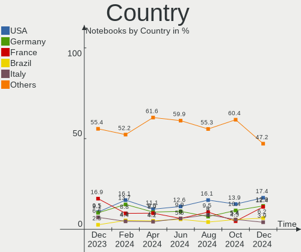
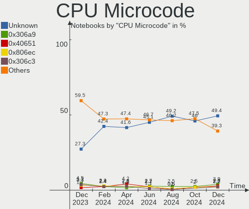

Debian Hardware Trends (Notebook)
---------------------------------

A project to identify most popular hardware characteristics and track their change
over time based on data collected by Debian users at https://Linux-Hardware.org.

Anyone can contribute to the study by uploading probes of their computers by
the [hw-probe](https://github.com/linuxhw/hw-probe) tool:

    sudo -E hw-probe -all -upload

Full-feature report is available here: https://linux-hardware.org/?view=trends&formfactor=notebook

Period: May, 2021.

Contents
--------

- [ OS                       ](#os)
- [ OS Family                ](#os-family)
- [ Kernel                   ](#kernel)
- [ Kernel Family            ](#kernel-family)
- [ Kernel Major Ver.        ](#kernel-major-ver)
- [ Arch                     ](#arch)
- [ DE                       ](#de)
- [ Display Server           ](#display-server)
- [ Display Manager          ](#display-manager)
- [ OS Lang                  ](#os-lang)
- [ Boot Mode                ](#boot-mode)
- [ Filesystem               ](#filesystem)
- [ Part. scheme             ](#part-scheme)
- [ Dual Boot with Linux/BSD ](#dual-boot-with-linux/bsd)
- [ Dual Boot (Win)          ](#dual-boot-win)
- [ Country                  ](#country)
- [ City                     ](#city)
- [ Vendor                   ](#vendor)
- [ Model                    ](#model)
- [ Model Family             ](#model-family)
- [ MFG Year                 ](#mfg-year)
- [ Form Factor              ](#form-factor)
- [ Secure Boot              ](#secure-boot)
- [ Coreboot                 ](#coreboot)
- [ RAM Size                 ](#ram-size)
- [ RAM Used                 ](#ram-used)
- [ Has CD-ROM               ](#has-cd-rom)
- [ Total Drives             ](#total-drives)
- [ Has Ethernet             ](#has-ethernet)
- [ Has WiFi                 ](#has-wifi)
- [ Has Bluetooth            ](#has-bluetooth)
- [ Drive Vendor             ](#drive-vendor)
- [ Drive Model              ](#drive-model)
- [ HDD Vendor               ](#hdd-vendor)
- [ SSD Vendor               ](#ssd-vendor)
- [ Drive Kind               ](#drive-kind)
- [ Drive Connector          ](#drive-connector)
- [ Drive Size               ](#drive-size)
- [ Space Total              ](#space-total)
- [ Space Used               ](#space-used)
- [ Malfunc. Drives          ](#malfunc-drives)
- [ Malfunc. Drive Vendor    ](#malfunc-drive-vendor)
- [ Malfunc. HDD Vendor      ](#malfunc-hdd-vendor)
- [ Malfunc. Drive Kind      ](#malfunc-drive-kind)
- [ Failed Drives            ](#failed-drives)
- [ Failed Drive Vendor      ](#failed-drive-vendor)
- [ Drive Status             ](#drive-status)
- [ Storage Vendor           ](#storage-vendor)
- [ Storage Model            ](#storage-model)
- [ Storage Kind             ](#storage-kind)
- [ CPU Vendor               ](#cpu-vendor)
- [ CPU Model                ](#cpu-model)
- [ CPU Model Family         ](#cpu-model-family)
- [ CPU Cores                ](#cpu-cores)
- [ CPU Sockets              ](#cpu-sockets)
- [ CPU Threads              ](#cpu-threads)
- [ CPU Op-Modes             ](#cpu-op-modes)
- [ CPU Microcode            ](#cpu-microcode)
- [ CPU Microarch            ](#cpu-microarch)
- [ GPU Vendor               ](#gpu-vendor)
- [ GPU Model                ](#gpu-model)
- [ GPU Combo                ](#gpu-combo)
- [ GPU Driver               ](#gpu-driver)
- [ GPU Memory               ](#gpu-memory)
- [ Monitor Vendor           ](#monitor-vendor)
- [ Monitor Model            ](#monitor-model)
- [ Monitor Resolution       ](#monitor-resolution)
- [ Monitor Diagonal         ](#monitor-diagonal)
- [ Monitor Width            ](#monitor-width)
- [ Aspect Ratio             ](#aspect-ratio)
- [ Monitor Area             ](#monitor-area)
- [ Pixel Density            ](#pixel-density)
- [ Multiple Monitors        ](#multiple-monitors)
- [ Net Controller Vendor    ](#net-controller-vendor)
- [ Net Controller Model     ](#net-controller-model)
- [ Wireless Vendor          ](#wireless-vendor)
- [ Wireless Model           ](#wireless-model)
- [ Ethernet Vendor          ](#ethernet-vendor)
- [ Ethernet Model           ](#ethernet-model)
- [ Net Controller Kind      ](#net-controller-kind)
- [ Used Controller          ](#used-controller)
- [ NICs                     ](#nics)
- [ IPv6                     ](#ipv6)
- [ Memory Vendor            ](#memory-vendor)
- [ Memory Model             ](#memory-model)
- [ Memory Kind              ](#memory-kind)
- [ Memory Form Factor       ](#memory-form-factor)
- [ Memory Size              ](#memory-size)
- [ Memory Speed             ](#memory-speed)
- [ Sound Vendor             ](#sound-vendor)
- [ Sound Model              ](#sound-model)
- [ Camera Vendor            ](#camera-vendor)
- [ Camera Model             ](#camera-model)
- [ Fingerprint Vendor       ](#fingerprint-vendor)
- [ Fingerprint Model        ](#fingerprint-model)
- [ Chipcard Vendor          ](#chipcard-vendor)
- [ Chipcard Model           ](#chipcard-model)
- [ Printer Vendor           ](#printer-vendor)
- [ Printer Model            ](#printer-model)
- [ Scanner Vendor           ](#scanner-vendor)
- [ Scanner Model            ](#scanner-model)
- [ Bluetooth Vendor         ](#bluetooth-vendor)
- [ Bluetooth Model          ](#bluetooth-model)
- [ Unsupported Devices      ](#unsupported-devices)
- [ Unsupported Device Types ](#unsupported-device-types)

OS
--

Installed operating systems

| Name                    | Notebooks | Percent |
|-------------------------|-----------|---------|
| Debian 10               | 22        | 37.93%  |
| Debian 11               | 14        | 24.14%  |
| Debian                  | 12        | 20.69%  |
| Debian Testing          | 8         | 13.79%  |
| Debian Testing/unstable | 1         | 1.72%   |
| Debian Sid              | 1         | 1.72%   |

OS Family
---------

OS without a version

| Name   | Notebooks | Percent |
|--------|-----------|---------|
| Debian | 58        | 100%    |

Kernel
------

Version of the Linux kernel

| Version                   | Notebooks | Percent |
|---------------------------|-----------|---------|
| 5.10.0-6-amd64            | 16        | 27.59%  |
| 5.10.0-2-amd64            | 11        | 18.97%  |
| 4.19.0-16-amd64           | 8         | 13.79%  |
| 5.10.0-0.bpo.5-amd64      | 3         | 5.17%   |
| 4.19.0-16-686-pae         | 3         | 5.17%   |
| 5.10.0-5mx-amd64          | 2         | 3.45%   |
| 5.8.2                     | 1         | 1.72%   |
| 5.8.0-3-amd64             | 1         | 1.72%   |
| 5.7.0-0.bpo.2-amd64       | 1         | 1.72%   |
| 5.12.5                    | 1         | 1.72%   |
| 5.12.1                    | 1         | 1.72%   |
| 5.12.0-5.1-liquorix-amd64 | 1         | 1.72%   |
| 5.11.0-051100-generic     | 1         | 1.72%   |
| 5.10.0-io7-amd64          | 1         | 1.72%   |
| 5.10.0-7-amd64            | 1         | 1.72%   |
| 5.10.0-6-686              | 1         | 1.72%   |
| 5.10.0-5-amd64            | 1         | 1.72%   |
| 5.10.0-0.bpo.3-amd64      | 1         | 1.72%   |
| 4.19.0-9-amd64            | 1         | 1.72%   |
| 4.19.0-6-amd64            | 1         | 1.72%   |
| 4.19.0-13-amd64           | 1         | 1.72%   |

Kernel Family
-------------

Linux kernel without a distro release

| Version | Notebooks | Percent |
|---------|-----------|---------|
| 5.10.0  | 37        | 63.79%  |
| 4.19.0  | 14        | 24.14%  |
| 5.8.2   | 1         | 1.72%   |
| 5.8.0   | 1         | 1.72%   |
| 5.7.0   | 1         | 1.72%   |
| 5.12.5  | 1         | 1.72%   |
| 5.12.1  | 1         | 1.72%   |
| 5.12.0  | 1         | 1.72%   |
| 5.11.0  | 1         | 1.72%   |

Kernel Major Ver.
-----------------

Linux kernel major version

| Version | Notebooks | Percent |
|---------|-----------|---------|
| 5.10    | 37        | 63.79%  |
| 4.19    | 14        | 24.14%  |
| 5.12    | 3         | 5.17%   |
| 5.8     | 2         | 3.45%   |
| 5.7     | 1         | 1.72%   |
| 5.11    | 1         | 1.72%   |

Arch
----

OS architecture (x86_64, i586, etc.)

| Name   | Notebooks | Percent |
|--------|-----------|---------|
| x86_64 | 54        | 93.1%   |
| i686   | 4         | 6.9%    |

DE
--

Desktop Environment

| Name             | Notebooks | Percent |
|------------------|-----------|---------|
| Unknown          | 14        | 24.14%  |
| GNOME            | 11        | 18.97%  |
| XFCE             | 7         | 12.07%  |
| KDE5             | 5         | 8.62%   |
| X-Cinnamon       | 4         | 6.9%    |
| MATE             | 4         | 6.9%    |
| KDE              | 4         | 6.9%    |
| LXDE             | 3         | 5.17%   |
| lightdm-xsession | 2         | 3.45%   |
| i3               | 1         | 1.72%   |
| default          | 1         | 1.72%   |
| Cinnamon         | 1         | 1.72%   |
| awesome          | 1         | 1.72%   |

Display Server
--------------

X11 or Wayland

| Name    | Notebooks | Percent |
|---------|-----------|---------|
| X11     | 34        | 58.62%  |
| Unknown | 12        | 20.69%  |
| Wayland | 10        | 17.24%  |
| Tty     | 2         | 3.45%   |

Display Manager
---------------

SDDM, LightDM, etc.

| Name    | Notebooks | Percent |
|---------|-----------|---------|
| Unknown | 28        | 48.28%  |
| TDM     | 12        | 20.69%  |
| GDM     | 11        | 18.97%  |
| SDDM    | 7         | 12.07%  |

OS Lang
-------

Language

| Lang    | Notebooks | Percent |
|---------|-----------|---------|
| en_US   | 17        | 29.31%  |
| ru_RU   | 14        | 24.14%  |
| pt_BR   | 3         | 5.17%   |
| es_ES   | 3         | 5.17%   |
| en_GB   | 3         | 5.17%   |
| de_CH   | 3         | 5.17%   |
| fr_FR   | 2         | 3.45%   |
| Unknown | 2         | 3.45%   |
| zh_CN   | 1         | 1.72%   |
| pl_PL   | 1         | 1.72%   |
| lt_LT   | 1         | 1.72%   |
| fi_FI   | 1         | 1.72%   |
| es_CR   | 1         | 1.72%   |
| es_CL   | 1         | 1.72%   |
| en_IE   | 1         | 1.72%   |
| en_HK   | 1         | 1.72%   |
| de_DE   | 1         | 1.72%   |
| da_DK   | 1         | 1.72%   |
| C       | 1         | 1.72%   |

Boot Mode
---------

EFI or BIOS

| Mode | Notebooks | Percent |
|------|-----------|---------|
| EFI  | 34        | 58.62%  |
| BIOS | 24        | 41.38%  |

Filesystem
----------

Type of filesystem

| Type    | Notebooks | Percent |
|---------|-----------|---------|
| Ext4    | 44        | 75.86%  |
| Overlay | 12        | 20.69%  |
| Xfs     | 1         | 1.72%   |
| Btrfs   | 1         | 1.72%   |

Part. scheme
------------

Scheme of partitioning

| Type    | Notebooks | Percent |
|---------|-----------|---------|
| GPT     | 34        | 58.62%  |
| Unknown | 15        | 25.86%  |
| MBR     | 9         | 15.52%  |

Dual Boot with Linux/BSD
------------------------

Hosting more than one Linux/BSD

| Dual boot | Notebooks | Percent |
|-----------|-----------|---------|
| No        | 51        | 87.93%  |
| Yes       | 7         | 12.07%  |

Dual Boot (Win)
---------------

Hosting Linux and Windows

| Dual boot | Notebooks | Percent |
|-----------|-----------|---------|
| No        | 30        | 51.72%  |
| Yes       | 28        | 48.28%  |

Country
-------

Geographic location (country)

| Country                | Notebooks | Percent |
|------------------------|-----------|---------|
| Russia                 | 15        | 25.86%  |
| USA                    | 5         | 8.62%   |
| Spain                  | 4         | 6.9%    |
| Brazil                 | 4         | 6.9%    |
| Thailand               | 3         | 5.17%   |
| Switzerland            | 3         | 5.17%   |
| Poland                 | 3         | 5.17%   |
| Germany                | 2         | 3.45%   |
| France                 | 2         | 3.45%   |
| China                  | 2         | 3.45%   |
| Venezuela              | 1         | 1.72%   |
| UK                     | 1         | 1.72%   |
| Norway                 | 1         | 1.72%   |
| Lithuania              | 1         | 1.72%   |
| Italy                  | 1         | 1.72%   |
| Iran                   | 1         | 1.72%   |
| Greece                 | 1         | 1.72%   |
| Finland                | 1         | 1.72%   |
| Denmark                | 1         | 1.72%   |
| Costa Rica             | 1         | 1.72%   |
| Chile                  | 1         | 1.72%   |
| Canada                 | 1         | 1.72%   |
| Bosnia and Herzegovina | 1         | 1.72%   |
| Belarus                | 1         | 1.72%   |
| Austria                | 1         | 1.72%   |

City
----

Geographic location (city)

| City                   | Notebooks | Percent |
|------------------------|-----------|---------|
| Voronezh               | 11        | 18.97%  |
| Othmarsingen           | 2         | 3.45%   |
| Chiang Mai             | 2         | 3.45%   |
| Vitória               | 1         | 1.72%   |
| Vienna                 | 1         | 1.72%   |
| Valencia               | 1         | 1.72%   |
| Valdivia               | 1         | 1.72%   |
| Tehran                 | 1         | 1.72%   |
| São Paulo             | 1         | 1.72%   |
| Sunbury                | 1         | 1.72%   |
| St Petersburg          | 1         | 1.72%   |
| Seville                | 1         | 1.72%   |
| San José              | 1         | 1.72%   |
| Salamanca              | 1         | 1.72%   |
| Perm                   | 1         | 1.72%   |
| New Westminster        | 1         | 1.72%   |
| Narvik                 | 1         | 1.72%   |
| Nanjing                | 1         | 1.72%   |
| Minsk                  | 1         | 1.72%   |
| Mesa                   | 1         | 1.72%   |
| Madrid                 | 1         | 1.72%   |
| Loziska                | 1         | 1.72%   |
| Krakow                 | 1         | 1.72%   |
| Kaunas                 | 1         | 1.72%   |
| Katowice               | 1         | 1.72%   |
| Kassel                 | 1         | 1.72%   |
| Kaluga                 | 1         | 1.72%   |
| Hombrechtikon          | 1         | 1.72%   |
| Helsinki               | 1         | 1.72%   |
| Guangzhou              | 1         | 1.72%   |
| Grand Rapids           | 1         | 1.72%   |
| Gosport                | 1         | 1.72%   |
| Gelsenkirchen          | 1         | 1.72%   |
| Fresno                 | 1         | 1.72%   |
| Fougerolles            | 1         | 1.72%   |
| Florence               | 1         | 1.72%   |
| Fira                   | 1         | 1.72%   |
| Contagem               | 1         | 1.72%   |
| Chelyabinsk            | 1         | 1.72%   |
| Chapel Hill            | 1         | 1.72%   |
| Campestre              | 1         | 1.72%   |
| Betton                 | 1         | 1.72%   |
| Barrio Doce de Octubre | 1         | 1.72%   |
| Banja Luka             | 1         | 1.72%   |
| Bangkok                | 1         | 1.72%   |
| Aarhus                 | 1         | 1.72%   |

Vendor
------

Motherboard manufacturer

| Name                | Notebooks | Percent |
|---------------------|-----------|---------|
| Lenovo              | 15        | 25.86%  |
| Hewlett-Packard     | 12        | 20.69%  |
| Acer                | 11        | 18.97%  |
| ASUSTek Computer    | 7         | 12.07%  |
| Dell                | 4         | 6.9%    |
| Toshiba             | 2         | 3.45%   |
| MSI                 | 2         | 3.45%   |
| Aquarius            | 2         | 3.45%   |
| Samsung Electronics | 1         | 1.72%   |
| Fujitsu             | 1         | 1.72%   |
| Apple               | 1         | 1.72%   |

Model
-----

Motherboard model

| Name                                     | Notebooks | Percent |
|------------------------------------------|-----------|---------|
| Acer Aspire A315-23                      | 8         | 13.79%  |
| HP 250 G7 Notebook PC                    | 2         | 3.45%   |
| ASUS X450LN                              | 2         | 3.45%   |
| Aquarius NS585                           | 2         | 3.45%   |
| Toshiba Satellite U800W                  | 1         | 1.72%   |
| Toshiba Satellite C660                   | 1         | 1.72%   |
| Samsung 370E4K                           | 1         | 1.72%   |
| MSI U90/U100                             | 1         | 1.72%   |
| MSI CX700                                | 1         | 1.72%   |
| Lenovo Z710 20250                        | 1         | 1.72%   |
| Lenovo ThinkPad X1 Carbon 6th 20KH006JRT | 1         | 1.72%   |
| Lenovo ThinkPad T530 24296HG             | 1         | 1.72%   |
| Lenovo ThinkPad T470s 20HGS45C00         | 1         | 1.72%   |
| Lenovo ThinkPad T440p 20AWS4PN00         | 1         | 1.72%   |
| Lenovo ThinkPad T430s 2356GBG            | 1         | 1.72%   |
| Lenovo ThinkPad T430s 2356A89            | 1         | 1.72%   |
| Lenovo ThinkPad T14 Gen 1 20UDCTO1WW     | 1         | 1.72%   |
| Lenovo ThinkPad P15v Gen 1 20TQCTO1WW    | 1         | 1.72%   |
| Lenovo ThinkPad P14s Gen 1 20S4003UUS    | 1         | 1.72%   |
| Lenovo ThinkPad E14 20RA001HRT           | 1         | 1.72%   |
| Lenovo IdeaPad S340-15API 81NC           | 1         | 1.72%   |
| Lenovo IdeaPad Gaming 3 15IMH05 81Y4     | 1         | 1.72%   |
| Lenovo G570 4334                         | 1         | 1.72%   |
| Lenovo G50-80 80E5                       | 1         | 1.72%   |
| HP Split 13 x2 PC                        | 1         | 1.72%   |
| HP ProBook 6460b                         | 1         | 1.72%   |
| HP OMEN by HP Laptop 15-dc1xxx           | 1         | 1.72%   |
| HP Laptop 15s-fq2xxx                     | 1         | 1.72%   |
| HP Laptop 15-bs0xx                       | 1         | 1.72%   |
| HP EliteBook 840 G1                      | 1         | 1.72%   |
| HP EliteBook 830 G7 Notebook PC          | 1         | 1.72%   |
| HP Compaq Presario C700                  | 1         | 1.72%   |
| HP 250 G8 Notebook PC                    | 1         | 1.72%   |
| HP 2133                                  | 1         | 1.72%   |
| Fujitsu LIFEBOOK BH531                   | 1         | 1.72%   |
| Dell XPS 13 9310                         | 1         | 1.72%   |
| Dell Latitude 7480                       | 1         | 1.72%   |
| Dell Inspiron 7460                       | 1         | 1.72%   |
| Dell Inspiron 3593                       | 1         | 1.72%   |
| ASUS X553SA                              | 1         | 1.72%   |
| ASUS X455LJ                              | 1         | 1.72%   |
| ASUS T100TAS                             | 1         | 1.72%   |
| ASUS N56VM                               | 1         | 1.72%   |
| ASUS K52F                                | 1         | 1.72%   |
| Apple MacBook5,2                         | 1         | 1.72%   |
| Acer Swift SF114-33                      | 1         | 1.72%   |
| Acer Aspire A315-23G                     | 1         | 1.72%   |
| Acer Aspire 5750G                        | 1         | 1.72%   |

Model Family
------------

Motherboard model prefix

| Name              | Notebooks | Percent |
|-------------------|-----------|---------|
| Lenovo ThinkPad   | 10        | 17.24%  |
| Acer Aspire       | 10        | 17.24%  |
| HP 250            | 3         | 5.17%   |
| Toshiba Satellite | 2         | 3.45%   |
| Lenovo IdeaPad    | 2         | 3.45%   |
| HP Laptop         | 2         | 3.45%   |
| HP EliteBook      | 2         | 3.45%   |
| Dell Inspiron     | 2         | 3.45%   |
| ASUS X450LN       | 2         | 3.45%   |
| Aquarius NS585    | 2         | 3.45%   |
| Samsung 370E4K    | 1         | 1.72%   |
| MSI U90           | 1         | 1.72%   |
| MSI CX700         | 1         | 1.72%   |
| Lenovo Z710       | 1         | 1.72%   |
| Lenovo G570       | 1         | 1.72%   |
| Lenovo G50-80     | 1         | 1.72%   |
| HP Split          | 1         | 1.72%   |
| HP ProBook        | 1         | 1.72%   |
| HP OMEN           | 1         | 1.72%   |
| HP Compaq         | 1         | 1.72%   |
| HP 2133           | 1         | 1.72%   |
| Fujitsu LIFEBOOK  | 1         | 1.72%   |
| Dell XPS          | 1         | 1.72%   |
| Dell Latitude     | 1         | 1.72%   |
| ASUS X553SA       | 1         | 1.72%   |
| ASUS X455LJ       | 1         | 1.72%   |
| ASUS T100TAS      | 1         | 1.72%   |
| ASUS N56VM        | 1         | 1.72%   |
| ASUS K52F         | 1         | 1.72%   |
| Apple MacBook5    | 1         | 1.72%   |
| Acer Swift        | 1         | 1.72%   |

MFG Year
--------

Motherboard manufacture year

| Year | Notebooks | Percent |
|------|-----------|---------|
| 2020 | 25        | 43.1%   |
| 2019 | 8         | 13.79%  |
| 2012 | 5         | 8.62%   |
| 2021 | 3         | 5.17%   |
| 2015 | 3         | 5.17%   |
| 2011 | 3         | 5.17%   |
| 2009 | 3         | 5.17%   |
| 2016 | 2         | 3.45%   |
| 2014 | 2         | 3.45%   |
| 2008 | 2         | 3.45%   |
| 2018 | 1         | 1.72%   |
| 2017 | 1         | 1.72%   |

Form Factor
-----------

Physical design of the computer

| Name     | Notebooks | Percent |
|----------|-----------|---------|
| Notebook | 58        | 100%    |

Secure Boot
-----------

Enabled or disabled

| State    | Notebooks | Percent |
|----------|-----------|---------|
| Disabled | 52        | 89.66%  |
| Enabled  | 6         | 10.34%  |

Coreboot
--------

Have coreboot on board

| Used | Notebooks | Percent |
|------|-----------|---------|
| No   | 58        | 100%    |

RAM Size
--------

Total RAM memory

| Size in GB  | Notebooks | Percent |
|-------------|-----------|---------|
| 4.01-8.0    | 21        | 36.21%  |
| 8.01-16.0   | 14        | 24.14%  |
| 16.01-24.0  | 9         | 15.52%  |
| 3.01-4.0    | 6         | 10.34%  |
| 32.01-64.0  | 3         | 5.17%   |
| 1.01-2.0    | 2         | 3.45%   |
| 2.01-3.0    | 1         | 1.72%   |
| 64.01-256.0 | 1         | 1.72%   |
| 0.51-1.0    | 1         | 1.72%   |

RAM Used
--------

Used RAM memory

| Used GB    | Notebooks | Percent |
|------------|-----------|---------|
| 0.51-1.0   | 16        | 27.59%  |
| 2.01-3.0   | 12        | 20.69%  |
| 1.01-2.0   | 12        | 20.69%  |
| 4.01-8.0   | 9         | 15.52%  |
| 3.01-4.0   | 6         | 10.34%  |
| 0.01-0.5   | 2         | 3.45%   |
| 16.01-24.0 | 1         | 1.72%   |

Has CD-ROM
----------

Has CD-ROM on board

| Presented | Notebooks | Percent |
|-----------|-----------|---------|
| No        | 44        | 75.86%  |
| Yes       | 14        | 24.14%  |

Total Drives
------------

Number of drives on board

| Drives | Notebooks | Percent |
|--------|-----------|---------|
| 1      | 41        | 70.69%  |
| 2      | 14        | 24.14%  |
| 3      | 3         | 5.17%   |

Has Ethernet
------------

Has Ethernet on board

| Presented | Notebooks | Percent |
|-----------|-----------|---------|
| Yes       | 53        | 91.38%  |
| No        | 5         | 8.62%   |

Has WiFi
--------

Has WiFi module

| Presented | Notebooks | Percent |
|-----------|-----------|---------|
| Yes       | 54        | 93.1%   |
| No        | 4         | 6.9%    |

Has Bluetooth
-------------

Has Bluetooth module

| Presented | Notebooks | Percent |
|-----------|-----------|---------|
| Yes       | 43        | 74.14%  |
| No        | 15        | 25.86%  |

Drive Vendor
------------

Hard drive vendors

| Vendor              | Notebooks | Drives | Percent |
|---------------------|-----------|--------|---------|
| Seagate             | 15        | 15     | 19.74%  |
| Toshiba             | 13        | 13     | 17.11%  |
| WDC                 | 10        | 11     | 13.16%  |
| Samsung Electronics | 8         | 8      | 10.53%  |
| Hitachi             | 3         | 3      | 3.95%   |
| HGST                | 3         | 3      | 3.95%   |
| A-DATA Technology   | 3         | 3      | 3.95%   |
| Unknown             | 2         | 2      | 2.63%   |
| Sandisk             | 2         | 2      | 2.63%   |
| LITEONIT            | 2         | 2      | 2.63%   |
| Kingston            | 2         | 2      | 2.63%   |
| Intel               | 2         | 2      | 2.63%   |
| Crucial             | 2         | 2      | 2.63%   |
| XPG                 | 1         | 1      | 1.32%   |
| Union Memory        | 1         | 1      | 1.32%   |
| SPCC                | 1         | 1      | 1.32%   |
| Silicon Motion      | 1         | 1      | 1.32%   |
| Patriot             | 1         | 1      | 1.32%   |
| Lenovo              | 1         | 1      | 1.32%   |
| KIOXIA              | 1         | 1      | 1.32%   |
| JMicron             | 1         | 1      | 1.32%   |
| ASMT                | 1         | 2      | 1.32%   |

Drive Model
-----------

Hard drive models

| Model                                   | Notebooks | Percent |
|-----------------------------------------|-----------|---------|
| Seagate ST1000LM035-1RK172 1TB          | 6         | 7.79%   |
| Toshiba MQ04ABF100 1TB                  | 3         | 3.9%    |
| Toshiba MQ01ABD100 1TB                  | 3         | 3.9%    |
| Seagate ST1000LM024 HN-M101MBB 1TB      | 3         | 3.9%    |
| WDC WDS240G2G0A-00JH30 240GB SSD        | 2         | 2.6%    |
| Samsung MZVLQ512HALU-000H1 512GB        | 2         | 2.6%    |
| A-DATA SU800 512GB SSD                  | 2         | 2.6%    |
| XPG NVMe SSD Drive 1024GB               | 1         | 1.3%    |
| WDC WDBNCE5000PNC 500GB SSD             | 1         | 1.3%    |
| WDC WD20SPZX-08UA7 2TB                  | 1         | 1.3%    |
| WDC WD1600BEVT-22ZCT0 160GB             | 1         | 1.3%    |
| WDC WD1200BEVS-60UST0 120GB             | 1         | 1.3%    |
| WDC WD10SPZX-21Z10T0 1TB                | 1         | 1.3%    |
| WDC WD10JPVX-80JC3T0 1TB                | 1         | 1.3%    |
| WDC PC SN530 SDBPNPZ-512G-1014 512GB    | 1         | 1.3%    |
| WDC PC SN530 SDBPNPZ-1T00-1006 1TB      | 1         | 1.3%    |
| WDC PC SN530 NVMe 256GB                 | 1         | 1.3%    |
| Unknown SD32G  32GB                     | 1         | 1.3%    |
| Unknown MMC Card  32GB                  | 1         | 1.3%    |
| Union Memory UMIS RPJTJ256MEE1OWX 256GB | 1         | 1.3%    |
| Toshiba MQ01ACF032 320GB                | 1         | 1.3%    |
| Toshiba MQ01ABF050 500GB                | 1         | 1.3%    |
| Toshiba MQ01ABD100V 1TB                 | 1         | 1.3%    |
| Toshiba MK6459GSXP 640GB                | 1         | 1.3%    |
| Toshiba KXG6APNV2T04 2TB                | 1         | 1.3%    |
| Toshiba KXG60PNV2T04 NVMe KIOXIA 2048GB | 1         | 1.3%    |
| Toshiba KXG50ZNV512G NVMe 512GB         | 1         | 1.3%    |
| SPCC Solid State Disk 512GB             | 1         | 1.3%    |
| Silicon Motion NVMe SSD Drive 512GB     | 1         | 1.3%    |
| Seagate USB 250GB                       | 1         | 1.3%    |
| Seagate ST9500325AS 500GB               | 1         | 1.3%    |
| Seagate ST9120817AS 120GB               | 1         | 1.3%    |
| Seagate ST500LM000-SSHD-8GB             | 1         | 1.3%    |
| Seagate ST1000LM048-2E7172 1TB          | 1         | 1.3%    |
| Seagate ST1000LM014-1EJ164 1TB          | 1         | 1.3%    |
| SanDisk SSD PLUS 240GB                  | 1         | 1.3%    |
| Sandisk NVMe SSD Drive 1024GB           | 1         | 1.3%    |
| Samsung SSD 970 EVO Plus 1TB            | 1         | 1.3%    |
| Samsung SSD 860 EVO 500GB               | 1         | 1.3%    |
| Samsung SSD 840 PRO Series 256GB        | 1         | 1.3%    |
| Samsung MZVLQ256HAJD-000H1 256GB        | 1         | 1.3%    |
| Samsung MZVLB512HAJQ-000H1 512GB        | 1         | 1.3%    |
| Samsung MZMPC032HBCD-00000 32GB SSD     | 1         | 1.3%    |
| Patriot Burst 480GB SSD                 | 1         | 1.3%    |
| LITEONIT LSS-32L6G-HP 32GB SSD          | 1         | 1.3%    |
| LITEONIT LMT-64M6M-HP 64GB SSD          | 1         | 1.3%    |
| Lenovo LENSE20512GMSP34MEAT2TA 512GB    | 1         | 1.3%    |
| KIOXIA KBG40ZNV256G 256GB               | 1         | 1.3%    |
| Kingston SM2280S3G2480G 480GB SSD       | 1         | 1.3%    |
| Kingston SA2000M8250G 250GB             | 1         | 1.3%    |
| JMicron Generic 120GB                   | 1         | 1.3%    |
| Intel SSDSC2BW180A3L 180GB              | 1         | 1.3%    |
| Intel SSDPEK1W060GA 64GB                | 1         | 1.3%    |
| Hitachi HTS547550A9E384 500GB           | 1         | 1.3%    |
| Hitachi HTS545050A7E380 500GB           | 1         | 1.3%    |
| Hitachi HTS545032B9A302 320GB           | 1         | 1.3%    |
| HGST HTS725050A7E630 500GB              | 1         | 1.3%    |
| HGST HTS721010A9E630 1TB                | 1         | 1.3%    |
| HGST HTS545050A7E680 500GB              | 1         | 1.3%    |
| Crucial CT960BX500SSD1 960GB            | 1         | 1.3%    |

HDD Vendor
----------

Hard disk drive vendors

| Vendor  | Notebooks | Drives | Percent |
|---------|-----------|--------|---------|
| Seagate | 14        | 14     | 38.89%  |
| Toshiba | 10        | 10     | 27.78%  |
| WDC     | 5         | 5      | 13.89%  |
| Hitachi | 3         | 3      | 8.33%   |
| HGST    | 3         | 3      | 8.33%   |
| ASMT    | 1         | 2      | 2.78%   |

SSD Vendor
----------

Solid state drive vendors

| Vendor              | Notebooks | Drives | Percent |
|---------------------|-----------|--------|---------|
| WDC                 | 3         | 3      | 16.67%  |
| Samsung Electronics | 3         | 3      | 16.67%  |
| LITEONIT            | 2         | 2      | 11.11%  |
| Crucial             | 2         | 2      | 11.11%  |
| A-DATA Technology   | 2         | 2      | 11.11%  |
| SPCC                | 1         | 1      | 5.56%   |
| SanDisk             | 1         | 1      | 5.56%   |
| Patriot             | 1         | 1      | 5.56%   |
| Kingston            | 1         | 1      | 5.56%   |
| JMicron             | 1         | 1      | 5.56%   |
| Intel               | 1         | 1      | 5.56%   |

Drive Kind
----------

HDD or SSD

| Kind    | Notebooks | Drives | Percent |
|---------|-----------|--------|---------|
| HDD     | 35        | 37     | 47.95%  |
| NVMe    | 18        | 20     | 24.66%  |
| SSD     | 17        | 18     | 23.29%  |
| MMC     | 2         | 2      | 2.74%   |
| Unknown | 1         | 1      | 1.37%   |

Drive Connector
---------------

SATA, SAS, NVMe, etc.

| Type | Notebooks | Drives | Percent |
|------|-----------|--------|---------|
| SATA | 43        | 52     | 65.15%  |
| NVMe | 18        | 20     | 27.27%  |
| SAS  | 3         | 4      | 4.55%   |
| MMC  | 2         | 2      | 3.03%   |

Drive Size
----------

Size of hard drive

| Size in TB | Notebooks | Drives | Percent |
|------------|-----------|--------|---------|
| 0.51-1.0   | 26        | 26     | 50.98%  |
| 0.01-0.5   | 23        | 26     | 45.1%   |
| 1.01-2.0   | 2         | 3      | 3.92%   |

Space Total
-----------

Amount of disk space available on the file system

| Size in GB | Notebooks | Percent |
|------------|-----------|---------|
| Unknown    | 13        | 22.41%  |
| 101-250    | 9         | 15.52%  |
| 501-1000   | 9         | 15.52%  |
| 251-500    | 8         | 13.79%  |
| 1001-2000  | 7         | 12.07%  |
| 21-50      | 6         | 10.34%  |
| 51-100     | 3         | 5.17%   |
| 1-20       | 2         | 3.45%   |
| 2001-3000  | 1         | 1.72%   |

Space Used
----------

Amount of used disk space

| Used GB   | Notebooks | Percent |
|-----------|-----------|---------|
| 1-20      | 15        | 25.86%  |
| Unknown   | 13        | 22.41%  |
| 101-250   | 7         | 12.07%  |
| 501-1000  | 6         | 10.34%  |
| 51-100    | 6         | 10.34%  |
| 251-500   | 5         | 8.62%   |
| 21-50     | 5         | 8.62%   |
| 1001-2000 | 1         | 1.72%   |

Malfunc. Drives
---------------

Drive models with a malfunction

| Model                                        | Notebooks | Drives | Percent |
|----------------------------------------------|-----------|--------|---------|
| Seagate ST500LM000-SSHD-8GB                  | 1         | 1      | 16.67%  |
| Seagate ST1000LM035-1RK172 1TB               | 1         | 1      | 16.67%  |
| Samsung Electronics SSD 840 PRO Series 256GB | 1         | 1      | 16.67%  |
| LITEONIT LMT-64M6M-HP 64GB SSD               | 1         | 1      | 16.67%  |
| Hitachi HTS545050A7E380 500GB                | 1         | 1      | 16.67%  |
| HGST HTS725050A7E630 500GB                   | 1         | 1      | 16.67%  |

Malfunc. Drive Vendor
---------------------

Vendors of faulty drives

| Vendor              | Notebooks | Drives | Percent |
|---------------------|-----------|--------|---------|
| Seagate             | 2         | 2      | 33.33%  |
| Samsung Electronics | 1         | 1      | 16.67%  |
| LITEONIT            | 1         | 1      | 16.67%  |
| Hitachi             | 1         | 1      | 16.67%  |
| HGST                | 1         | 1      | 16.67%  |

Malfunc. HDD Vendor
-------------------

Vendors of faulty HDD drives

| Vendor  | Notebooks | Drives | Percent |
|---------|-----------|--------|---------|
| Seagate | 2         | 2      | 50%     |
| Hitachi | 1         | 1      | 25%     |
| HGST    | 1         | 1      | 25%     |

Malfunc. Drive Kind
-------------------

Kinds of faulty drives

| Kind | Notebooks | Drives | Percent |
|------|-----------|--------|---------|
| HDD  | 4         | 4      | 66.67%  |
| SSD  | 2         | 2      | 33.33%  |

Failed Drives
-------------

Failed drive models

Zero info for selected period =(

Failed Drive Vendor
-------------------

Failed drive vendors

Zero info for selected period =(

Drive Status
------------

Number of failed and malfunc. drives

| Status   | Notebooks | Drives | Percent |
|----------|-----------|--------|---------|
| Works    | 40        | 47     | 61.54%  |
| Detected | 19        | 25     | 29.23%  |
| Malfunc  | 6         | 6      | 9.23%   |

Storage Vendor
--------------

Storage controller vendors

| Vendor                       | Notebooks | Percent |
|------------------------------|-----------|---------|
| Intel                        | 39        | 56.52%  |
| AMD                          | 10        | 14.49%  |
| Samsung Electronics          | 5         | 7.25%   |
| Toshiba America Info Systems | 3         | 4.35%   |
| Sandisk                      | 3         | 4.35%   |
| ADATA Technology             | 2         | 2.9%    |
| VIA Technologies             | 1         | 1.45%   |
| Union Memory (Shenzhen)      | 1         | 1.45%   |
| Silicon Motion               | 1         | 1.45%   |
| Nvidia                       | 1         | 1.45%   |
| Lenovo                       | 1         | 1.45%   |
| KIOXIA                       | 1         | 1.45%   |
| Kingston Technology Company  | 1         | 1.45%   |

Storage Model
-------------

Storage controller models

| Model                                                                            | Notebooks | Percent |
|----------------------------------------------------------------------------------|-----------|---------|
| AMD FCH SATA Controller [AHCI mode]                                              | 10        | 13.7%   |
| Intel 6 Series/C200 Series Chipset Family 6 port Mobile SATA AHCI Controller     | 5         | 6.85%   |
| Intel 82801 Mobile SATA Controller [RAID mode]                                   | 4         | 5.48%   |
| Intel 8 Series SATA Controller 1 [AHCI mode]                                     | 4         | 5.48%   |
| Intel 7 Series Chipset Family 6-port SATA Controller [AHCI mode]                 | 4         | 5.48%   |
| Samsung NVMe Controller                                                          | 3         | 4.11%   |
| Intel Wildcat Point-LP SATA Controller [AHCI Mode]                               | 3         | 4.11%   |
| Intel Volume Management Device NVMe RAID Controller                              | 3         | 4.11%   |
| Toshiba America Info Systems XG6 NVMe SSD Controller                             | 2         | 2.74%   |
| Sandisk WD Blue SN550 NVMe SSD                                                   | 2         | 2.74%   |
| Samsung NVMe SSD Controller SM981/PM981/PM983                                    | 2         | 2.74%   |
| Intel Sunrise Point-LP SATA Controller [AHCI mode]                               | 2         | 2.74%   |
| Intel Cannon Lake PCH SATA AHCI Controller                                       | 2         | 2.74%   |
| Intel 8 Series/C220 Series Chipset Family 6-port SATA Controller 1 [AHCI mode]   | 2         | 2.74%   |
| Intel 5 Series/3400 Series Chipset 4 port SATA AHCI Controller                   | 2         | 2.74%   |
| VIA VT8237/8251 Serial ATA Controller                                            | 1         | 1.37%   |
| Union Memory (Shenzhen) Non-Volatile memory controller                           | 1         | 1.37%   |
| Toshiba America Info Systems Toshiba America Info Non-Volatile memory controller | 1         | 1.37%   |
| Silicon Motion SM2263EN/SM2263XT SSD Controller                                  | 1         | 1.37%   |
| Sandisk Non-Volatile memory controller                                           | 1         | 1.37%   |
| Nvidia MCP79 AHCI Controller                                                     | 1         | 1.37%   |
| Lenovo Non-Volatile memory controller                                            | 1         | 1.37%   |
| KIOXIA Non-Volatile memory controller                                            | 1         | 1.37%   |
| Kingston Company A2000 NVMe SSD                                                  | 1         | 1.37%   |
| Intel Tiger Lake-LP SATA Controller [AHCI mode]                                  | 1         | 1.37%   |
| Intel NVMe Optane Memory Series                                                  | 1         | 1.37%   |
| Intel Ice Lake-LP SATA Controller [AHCI mode]                                    | 1         | 1.37%   |
| Intel Comet Lake SATA AHCI Controller                                            | 1         | 1.37%   |
| Intel Celeron/Pentium Silver Processor SATA Controller                           | 1         | 1.37%   |
| Intel Atom/Celeron/Pentium Processor x5-E8000/J3xxx/N3xxx Series SATA Controller | 1         | 1.37%   |
| Intel 82801HM/HEM (ICH8M/ICH8M-E) SATA Controller [AHCI mode]                    | 1         | 1.37%   |
| Intel 82801HM/HEM (ICH8M/ICH8M-E) IDE Controller                                 | 1         | 1.37%   |
| Intel 82801GBM/GHM (ICH7-M Family) SATA Controller [AHCI mode]                   | 1         | 1.37%   |
| Intel 7 Series Chipset Family 4-port SATA Controller [IDE mode]                  | 1         | 1.37%   |
| Intel 7 Series Chipset Family 2-port SATA Controller [IDE mode]                  | 1         | 1.37%   |
| Intel 400 Series Chipset Family SATA AHCI Controller                             | 1         | 1.37%   |
| ADATA XPG SX8200 Pro PCIe Gen3x4 M.2 2280 Solid State Drive                      | 1         | 1.37%   |
| ADATA Non-Volatile memory controller                                             | 1         | 1.37%   |

Storage Kind
------------

Kind of storage controller (IDE, SATA, NVMe, SAS, ...)

| Kind | Notebooks | Percent |
|------|-----------|---------|
| SATA | 43        | 60.56%  |
| NVMe | 18        | 25.35%  |
| RAID | 7         | 9.86%   |
| IDE  | 3         | 4.23%   |

CPU Vendor
----------

Processor vendors

| Vendor       | Notebooks | Percent |
|--------------|-----------|---------|
| Intel        | 46        | 79.31%  |
| AMD          | 11        | 18.97%  |
| CentaurHauls | 1         | 1.72%   |

CPU Model
---------

Processor models

| Model                                         | Notebooks | Percent |
|-----------------------------------------------|-----------|---------|
| AMD Ryzen 5 3500U with Radeon Vega Mobile Gfx | 9         | 15.52%  |
| Intel Core i7-4500U CPU @ 1.80GHz             | 2         | 3.45%   |
| Intel Core i7-3610QM CPU @ 2.30GHz            | 2         | 3.45%   |
| Intel Core i5-7200U CPU @ 2.50GHz             | 2         | 3.45%   |
| Intel Core i5-5200U CPU @ 2.20GHz             | 2         | 3.45%   |
| Intel Core i5-3320M CPU @ 2.60GHz             | 2         | 3.45%   |
| Intel Core i5-2520M CPU @ 2.50GHz             | 2         | 3.45%   |
| Intel Core i3-9100 CPU @ 3.60GHz              | 2         | 3.45%   |
| Intel 11th Gen Core i7-1165G7 @ 2.80GHz       | 2         | 3.45%   |
| Intel Pentium Silver N5030 CPU @ 1.10GHz      | 1         | 1.72%   |
| Intel Core i7-9750H CPU @ 2.60GHz             | 1         | 1.72%   |
| Intel Core i7-8550U CPU @ 1.80GHz             | 1         | 1.72%   |
| Intel Core i7-7600U CPU @ 2.80GHz             | 1         | 1.72%   |
| Intel Core i7-7500U CPU @ 2.70GHz             | 1         | 1.72%   |
| Intel Core i7-5500U CPU @ 2.40GHz             | 1         | 1.72%   |
| Intel Core i7-4810MQ CPU @ 2.80GHz            | 1         | 1.72%   |
| Intel Core i7-3630QM CPU @ 2.40GHz            | 1         | 1.72%   |
| Intel Core i7-10850H CPU @ 2.70GHz            | 1         | 1.72%   |
| Intel Core i7-10610U CPU @ 1.80GHz            | 1         | 1.72%   |
| Intel Core i7-10510U CPU @ 1.80GHz            | 1         | 1.72%   |
| Intel Core i5-4300U CPU @ 1.90GHz             | 1         | 1.72%   |
| Intel Core i5-4200Y CPU @ 1.40GHz             | 1         | 1.72%   |
| Intel Core i5-3317U CPU @ 1.70GHz             | 1         | 1.72%   |
| Intel Core i5-2430M CPU @ 2.40GHz             | 1         | 1.72%   |
| Intel Core i5-1035G1 CPU @ 1.00GHz            | 1         | 1.72%   |
| Intel Core i5-10300H CPU @ 2.50GHz            | 1         | 1.72%   |
| Intel Core i5-10210U CPU @ 1.60GHz            | 1         | 1.72%   |
| Intel Core i3-4000M CPU @ 2.40GHz             | 1         | 1.72%   |
| Intel Core i3-2350M CPU @ 2.30GHz             | 1         | 1.72%   |
| Intel Core i3-2310M CPU @ 2.10GHz             | 1         | 1.72%   |
| Intel Core i3-10110U CPU @ 2.10GHz            | 1         | 1.72%   |
| Intel Core i3-1005G1 CPU @ 1.20GHz            | 1         | 1.72%   |
| Intel Core i3 CPU M 350 @ 2.27GHz             | 1         | 1.72%   |
| Intel Core 2 Duo CPU P7450 @ 2.13GHz          | 1         | 1.72%   |
| Intel Celeron CPU N3050 @ 1.60GHz             | 1         | 1.72%   |
| Intel Celeron CPU 560 @ 2.13GHz               | 1         | 1.72%   |
| Intel Atom CPU Z3775 @ 1.46GHz                | 1         | 1.72%   |
| Intel Atom CPU N270 @ 1.60GHz                 | 1         | 1.72%   |
| Intel 11th Gen Core i5-1135G7 @ 2.40GHz       | 1         | 1.72%   |
| CentaurHauls VIA C7-M Processor 1600MHz       | 1         | 1.72%   |
| AMD Ryzen 7 PRO 4750U with Radeon Graphics    | 1         | 1.72%   |
| AMD Ryzen 7 3700U with Radeon Vega Mobile Gfx | 1         | 1.72%   |

CPU Model Family
----------------

Processor model prefix

| Model                | Notebooks | Percent |
|----------------------|-----------|---------|
| Intel Core i5        | 15        | 25.86%  |
| Intel Core i7        | 14        | 24.14%  |
| AMD Ryzen 5          | 9         | 15.52%  |
| Intel Core i3        | 8         | 13.79%  |
| Other                | 3         | 5.17%   |
| Intel Celeron        | 2         | 3.45%   |
| Intel Atom           | 2         | 3.45%   |
| Intel Pentium Silver | 1         | 1.72%   |
| Intel Core 2 Duo     | 1         | 1.72%   |
| CentaurHauls VIA C7  | 1         | 1.72%   |
| AMD Ryzen 7 PRO      | 1         | 1.72%   |
| AMD Ryzen 7          | 1         | 1.72%   |

CPU Cores
---------

Number of processor cores

| Number | Notebooks | Percent |
|--------|-----------|---------|
| 4      | 27        | 46.55%  |
| 2      | 25        | 43.1%   |
| 1      | 3         | 5.17%   |
| 6      | 2         | 3.45%   |
| 8      | 1         | 1.72%   |

CPU Sockets
-----------

Number of sockets

| Number | Notebooks | Percent |
|--------|-----------|---------|
| 1      | 58        | 100%    |

CPU Threads
-----------

Threads per core (Hyper-Threading)

| Number | Notebooks | Percent |
|--------|-----------|---------|
| 2      | 50        | 86.21%  |
| 1      | 8         | 13.79%  |

CPU Op-Modes
------------

CPU Operation Modes (32-bit, 64-bit)

| Op mode        | Notebooks | Percent |
|----------------|-----------|---------|
| 32-bit, 64-bit | 56        | 96.55%  |
| 32-bit         | 2         | 3.45%   |

CPU Microcode
-------------

Microcode number

| Number     | Notebooks | Percent |
|------------|-----------|---------|
| Unknown    | 11        | 18.97%  |
| 0x08108109 | 10        | 17.24%  |
| 0x306a9    | 5         | 8.62%   |
| 0x806ec    | 4         | 6.9%    |
| 0x206a7    | 4         | 6.9%    |
| 0x806e9    | 3         | 5.17%   |
| 0x806c1    | 3         | 5.17%   |
| 0x306d4    | 3         | 5.17%   |
| 0x906eb    | 2         | 3.45%   |
| 0x706e5    | 2         | 3.45%   |
| 0x40651    | 2         | 3.45%   |
| 0x306c3    | 2         | 3.45%   |
| 0x906ea    | 1         | 1.72%   |
| 0x806ea    | 1         | 1.72%   |
| 0x706a8    | 1         | 1.72%   |
| 0x406c3    | 1         | 1.72%   |
| 0x106c2    | 1         | 1.72%   |
| 0x1067a    | 1         | 1.72%   |
| 0x10661    | 1         | 1.72%   |

CPU Microarch
-------------

Microarchitecture

| Name          | Notebooks | Percent |
|---------------|-----------|---------|
| KabyLake      | 12        | 20.69%  |
| Zen+          | 10        | 17.24%  |
| IvyBridge     | 6         | 10.34%  |
| Haswell       | 6         | 10.34%  |
| SandyBridge   | 5         | 8.62%   |
| TigerLake     | 3         | 5.17%   |
| Broadwell     | 3         | 5.17%   |
| Silvermont    | 2         | 3.45%   |
| IceLake       | 2         | 3.45%   |
| CometLake     | 2         | 3.45%   |
| Zen 2         | 1         | 1.72%   |
| Westmere      | 1         | 1.72%   |
| Penryn        | 1         | 1.72%   |
| Goldmont plus | 1         | 1.72%   |
| Core          | 1         | 1.72%   |
| Bonnell       | 1         | 1.72%   |
| Unknown       | 1         | 1.72%   |

GPU Vendor
----------

Vendors of graphics cards

| Vendor           | Notebooks | Percent |
|------------------|-----------|---------|
| Intel            | 44        | 60.27%  |
| Nvidia           | 15        | 20.55%  |
| AMD              | 13        | 17.81%  |
| VIA Technologies | 1         | 1.37%   |

GPU Model
---------

Graphics card models

| Model                                                                                    | Notebooks | Percent |
|------------------------------------------------------------------------------------------|-----------|---------|
| AMD Picasso                                                                              | 10        | 12.82%  |
| Intel 3rd Gen Core processor Graphics Controller                                         | 6         | 7.69%   |
| Intel 2nd Generation Core Processor Family Integrated Graphics Controller                | 5         | 6.41%   |
| Intel HD Graphics 620                                                                    | 4         | 5.13%   |
| Intel CometLake-U GT2 [UHD Graphics]                                                     | 4         | 5.13%   |
| Intel TigerLake-LP GT2 [Iris Xe Graphics]                                                | 3         | 3.85%   |
| Intel HD Graphics 5500                                                                   | 3         | 3.85%   |
| Intel Haswell-ULT Integrated Graphics Controller                                         | 3         | 3.85%   |
| Nvidia TU116 [GeForce GTX 1650 SUPER]                                                    | 2         | 2.56%   |
| Nvidia GM108M [GeForce 840M]                                                             | 2         | 2.56%   |
| Intel Iris Plus Graphics G1 (Ice Lake)                                                   | 2         | 2.56%   |
| Intel CometLake-H GT2 [UHD Graphics]                                                     | 2         | 2.56%   |
| Intel CoffeeLake-S GT2 [UHD Graphics 630]                                                | 2         | 2.56%   |
| Intel 4th Gen Core Processor Integrated Graphics Controller                              | 2         | 2.56%   |
| AMD Topaz XT [Radeon R7 M260/M265 / M340/M360 / M440/M445 / 530/535 / 620/625 Mobile]    | 2         | 2.56%   |
| VIA Technologies CN896/VN896/P4M900 [Chrome 9 HC]                                        | 1         | 1.28%   |
| Nvidia TU117M                                                                            | 1         | 1.28%   |
| Nvidia TU106M [GeForce RTX 2060 Mobile]                                                  | 1         | 1.28%   |
| Nvidia GP108GLM [Quadro P520]                                                            | 1         | 1.28%   |
| Nvidia GP107GLM [Quadro P620]                                                            | 1         | 1.28%   |
| Nvidia GM108M [GeForce MX110]                                                            | 1         | 1.28%   |
| Nvidia GM108M [GeForce 940MX]                                                            | 1         | 1.28%   |
| Nvidia GK208BM [GeForce 920M]                                                            | 1         | 1.28%   |
| Nvidia GK107M [GeForce GT 745M]                                                          | 1         | 1.28%   |
| Nvidia GK107M [GeForce GT 640M]                                                          | 1         | 1.28%   |
| Nvidia GF119M [GeForce 410M]                                                             | 1         | 1.28%   |
| Nvidia GF108M [GeForce GT 620M/630M/635M/640M LE]                                        | 1         | 1.28%   |
| Nvidia GF108M [GeForce GT 520M]                                                          | 1         | 1.28%   |
| Nvidia C79 [GeForce 9400M G]                                                             | 1         | 1.28%   |
| Intel UHD Graphics 620                                                                   | 1         | 1.28%   |
| Intel Mobile GM965/GL960 Integrated Graphics Controller (secondary)                      | 1         | 1.28%   |
| Intel Mobile GM965/GL960 Integrated Graphics Controller (primary)                        | 1         | 1.28%   |
| Intel Mobile 945GSE Express Integrated Graphics Controller                               | 1         | 1.28%   |
| Intel Mobile 945GM/GMS/GME, 943/940GML Express Integrated Graphics Controller            | 1         | 1.28%   |
| Intel Haswell-ULT High Definition Audio Controller [HD Graphics]                         | 1         | 1.28%   |
| Intel GeminiLake [UHD Graphics 605]                                                      | 1         | 1.28%   |
| Intel Core Processor Integrated Graphics Controller                                      | 1         | 1.28%   |
| Intel Atom/Celeron/Pentium Processor x5-E8000/J3xxx/N3xxx Integrated Graphics Controller | 1         | 1.28%   |
| Intel Atom Processor Z36xxx/Z37xxx Series Graphics & Display                             | 1         | 1.28%   |
| AMD Sun XT [Radeon HD 8670A/8670M/8690M / R5 M330 / M430 / Radeon 520 Mobile]            | 1         | 1.28%   |
| AMD Renoir                                                                               | 1         | 1.28%   |

GPU Combo
---------

Combinations of graphics cards

| Name               | Notebooks | Percent |
|--------------------|-----------|---------|
| 1 x Intel          | 29        | 50%     |
| Intel + Nvidia     | 11        | 18.97%  |
| 1 x AMD            | 10        | 17.24%  |
| 1 x Nvidia         | 2         | 3.45%   |
| Intel + 2 x Nvidia | 2         | 3.45%   |
| Intel + AMD        | 2         | 3.45%   |
| 2 x AMD            | 1         | 1.72%   |
| 1 x VIA            | 1         | 1.72%   |

GPU Driver
----------

Free vs proprietary

| Driver      | Notebooks | Percent |
|-------------|-----------|---------|
| Free        | 40        | 68.97%  |
| Unknown     | 14        | 24.14%  |
| Proprietary | 4         | 6.9%    |

GPU Memory
----------

Total video memory

| Size in GB | Notebooks | Percent |
|------------|-----------|---------|
| Unknown    | 54        | 93.1%   |
| 1.01-2.0   | 3         | 5.17%   |
| 0.01-0.5   | 1         | 1.72%   |

Monitor Vendor
--------------

Monitor vendors

| Vendor                  | Notebooks | Percent |
|-------------------------|-----------|---------|
| AU Optronics            | 9         | 15.79%  |
| Chimei Innolux          | 8         | 14.04%  |
| BOE                     | 8         | 14.04%  |
| Samsung Electronics     | 7         | 12.28%  |
| LG Display              | 7         | 12.28%  |
| Goldstar                | 3         | 5.26%   |
| Hewlett-Packard         | 2         | 3.51%   |
| ___                     | 1         | 1.75%   |
| Unknown                 | 1         | 1.75%   |
| Sharp                   | 1         | 1.75%   |
| Lenovo                  | 1         | 1.75%   |
| JXG                     | 1         | 1.75%   |
| InnoLux Display         | 1         | 1.75%   |
| Iiyama                  | 1         | 1.75%   |
| Dell                    | 1         | 1.75%   |
| CSO                     | 1         | 1.75%   |
| CPT                     | 1         | 1.75%   |
| Chi Mei Optoelectronics | 1         | 1.75%   |
| Apple                   | 1         | 1.75%   |
| Acer                    | 1         | 1.75%   |

Monitor Model
-------------

Monitor models

| Model                                                                    | Notebooks | Percent |
|--------------------------------------------------------------------------|-----------|---------|
| Samsung Electronics LCD Monitor SEC5541 1366x768 344x193mm 15.5-inch     | 2         | 3.45%   |
| Chimei Innolux LCD Monitor CMN1526 1920x1080 344x193mm 15.5-inch         | 2         | 3.45%   |
| BOE LCD Monitor BOE0687 1920x1080 344x193mm 15.5-inch                    | 2         | 3.45%   |
| AU Optronics LCD Monitor AUO363C 1366x768 309x173mm 13.9-inch            | 2         | 3.45%   |
| ___ LCDTV16 ___0101 1600x1200 1600x900mm 72.3-inch                       | 1         | 1.72%   |
| Unknown LCDTV16 0101 1920x1080 1600x900mm 72.3-inch                      | 1         | 1.72%   |
| Sharp LCD Monitor SHP14F9 1920x1200 288x180mm 13.4-inch                  | 1         | 1.72%   |
| Samsung Electronics SyncMaster SAM0274 1440x900 410x257mm 19.1-inch      | 1         | 1.72%   |
| Samsung Electronics LCD Monitor SEC4D45 1280x800 331x207mm 15.4-inch     | 1         | 1.72%   |
| Samsung Electronics LCD Monitor SEC324C 1366x768 353x198mm 15.9-inch     | 1         | 1.72%   |
| Samsung Electronics LCD Monitor SDC4852 3840x2160 340x190mm 15.3-inch    | 1         | 1.72%   |
| Samsung Electronics LCD Monitor SDC4752 1366x768 340x190mm 15.3-inch     | 1         | 1.72%   |
| Samsung Electronics LCD Monitor SAM0C39 1920x1080 1050x590mm 47.4-inch   | 1         | 1.72%   |
| LG Display LCD Monitor LGD0608 1920x1080 309x174mm 14.0-inch             | 1         | 1.72%   |
| LG Display LCD Monitor LGD05C0 1920x1080 344x194mm 15.5-inch             | 1         | 1.72%   |
| LG Display LCD Monitor LGD0543 2560x1440 310x174mm 14.0-inch             | 1         | 1.72%   |
| LG Display LCD Monitor LGD053C 1920x1080 309x174mm 14.0-inch             | 1         | 1.72%   |
| LG Display LCD Monitor LGD04E1 1366x768 340x190mm 15.3-inch              | 1         | 1.72%   |
| LG Display LCD Monitor LGD040B 1366x768 293x165mm 13.2-inch              | 1         | 1.72%   |
| LG Display LCD Monitor LGD02DC 1366x768 344x194mm 15.5-inch              | 1         | 1.72%   |
| Lenovo LCD Monitor LEN40B2 1920x1080 344x193mm 15.5-inch                 | 1         | 1.72%   |
| JXG NV156 JXG3840 3840x2160 880x510mm 40.0-inch                          | 1         | 1.72%   |
| InnoLux Display LCD Monitor INL0028 1366x768 309x174mm 14.0-inch         | 1         | 1.72%   |
| Iiyama PLE2607WSV IVM5607 1920x1200 550x344mm 25.5-inch                  | 1         | 1.72%   |
| Hewlett-Packard w2007 HWP26A6 1680x1050 433x271mm 20.1-inch              | 1         | 1.72%   |
| Hewlett-Packard LA2405 HWP284C 1920x1200 518x324mm 24.1-inch             | 1         | 1.72%   |
| Goldstar HDR WFHD GSM7714 2560x1080 798x334mm 34.1-inch                  | 1         | 1.72%   |
| Goldstar BK550Y GSM5B41 1920x1080 480x270mm 21.7-inch                    | 1         | 1.72%   |
| Goldstar 23MP65 GSM5A45 1920x1080 510x290mm 23.1-inch                    | 1         | 1.72%   |
| Dell E207WFP DELD011 1680x1050 430x270mm 20.0-inch                       | 1         | 1.72%   |
| CSO LCD Monitor CSO1400 3840x2160 309x174mm 14.0-inch                    | 1         | 1.72%   |
| CPT LCD Monitor CPT04C4 1024x600 222x130mm 10.1-inch                     | 1         | 1.72%   |
| Chimei Innolux LCD Monitor CMN15F5 1920x1080 344x193mm 15.5-inch         | 1         | 1.72%   |
| Chimei Innolux LCD Monitor CMN15E7 1920x1080 344x193mm 15.5-inch         | 1         | 1.72%   |
| Chimei Innolux LCD Monitor CMN14D4 1920x1080 309x173mm 13.9-inch         | 1         | 1.72%   |
| Chimei Innolux LCD Monitor CMN14A3 1600x900 309x174mm 14.0-inch          | 1         | 1.72%   |
| Chimei Innolux LCD Monitor CMN1493 1366x768 310x170mm 13.9-inch          | 1         | 1.72%   |
| Chimei Innolux LCD Monitor CMN1123 1792x768 330x140mm 14.1-inch          | 1         | 1.72%   |
| Chi Mei Optoelectronics LCD Monitor CMO15A4 1366x768 344x194mm 15.5-inch | 1         | 1.72%   |
| BOE LCD Monitor BOE0959 1366x768 344x194mm 15.5-inch                     | 1         | 1.72%   |
| BOE LCD Monitor BOE08C2 1920x1080 344x194mm 15.5-inch                    | 1         | 1.72%   |
| BOE LCD Monitor BOE07C9 1920x1080 309x173mm 13.9-inch                    | 1         | 1.72%   |
| BOE LCD Monitor BOE06DF 1920x1080 309x173mm 13.9-inch                    | 1         | 1.72%   |
| BOE LCD Monitor BOE06D3 1366x768 344x194mm 15.5-inch                     | 1         | 1.72%   |
| BOE LCD Monitor BOE05FE 1366x768 309x173mm 13.9-inch                     | 1         | 1.72%   |
| AU Optronics LCD Monitor AUO81EC 1366x768 344x193mm 15.5-inch            | 1         | 1.72%   |
| AU Optronics LCD Monitor AUO38ED 1920x1080 340x190mm 15.3-inch           | 1         | 1.72%   |
| AU Optronics LCD Monitor AUO22EC 1366x768 344x193mm 15.5-inch            | 1         | 1.72%   |
| AU Optronics LCD Monitor AUO213E 1600x900 309x174mm 14.0-inch            | 1         | 1.72%   |
| AU Optronics LCD Monitor AUO1536 2560x1440 309x174mm 14.0-inch           | 1         | 1.72%   |
| AU Optronics LCD Monitor AUO133D 1920x1080 309x173mm 13.9-inch           | 1         | 1.72%   |
| AU Optronics LCD Monitor AUO10C2 1024x600 200x110mm 9.0-inch             | 1         | 1.72%   |
| Apple LCD Monitor APP9C5F 1280x800 286x179mm 13.3-inch                   | 1         | 1.72%   |
| Acer V276HL ACR032F 1920x1080 598x336mm 27.0-inch                        | 1         | 1.72%   |

Monitor Resolution
------------------

Monitor screen resolution

| Resolution         | Notebooks | Percent |
|--------------------|-----------|---------|
| 1920x1080 (FHD)    | 19        | 34.55%  |
| 1366x768 (WXGA)    | 16        | 29.09%  |
| 3840x2160 (4K)     | 3         | 5.45%   |
| 1920x1200 (WUXGA)  | 3         | 5.45%   |
| 1600x900 (HD+)     | 3         | 5.45%   |
| 2560x1440 (QHD)    | 2         | 3.64%   |
| 1680x1050 (WSXGA+) | 2         | 3.64%   |
| 1280x800 (WXGA)    | 2         | 3.64%   |
| 1024x600           | 2         | 3.64%   |
| 2560x1080          | 1         | 1.82%   |
| 1792x768           | 1         | 1.82%   |
| 1440x900 (WXGA+)   | 1         | 1.82%   |

Monitor Diagonal
----------------

Diagonal size in inches

| Inches | Notebooks | Percent |
|--------|-----------|---------|
| 15     | 23        | 39.66%  |
| 14     | 10        | 17.24%  |
| 13     | 10        | 17.24%  |
| 21     | 2         | 3.45%   |
| 20     | 2         | 3.45%   |
| 72     | 1         | 1.72%   |
| 47     | 1         | 1.72%   |
| 40     | 1         | 1.72%   |
| 34     | 1         | 1.72%   |
| 27     | 1         | 1.72%   |
| 25     | 1         | 1.72%   |
| 24     | 1         | 1.72%   |
| 23     | 1         | 1.72%   |
| 19     | 1         | 1.72%   |
| 10     | 1         | 1.72%   |
| 9      | 1         | 1.72%   |

Monitor Width
-------------

Physical width

| Width in mm | Notebooks | Percent |
|-------------|-----------|---------|
| 301-350     | 39        | 67.24%  |
| 401-500     | 5         | 8.62%   |
| 501-600     | 4         | 6.9%    |
| 201-300     | 4         | 6.9%    |
| 801-900     | 1         | 1.72%   |
| 701-800     | 1         | 1.72%   |
| 351-400     | 1         | 1.72%   |
| 1501-2000   | 1         | 1.72%   |
| 101-200     | 1         | 1.72%   |
| 1001-1500   | 1         | 1.72%   |

Aspect Ratio
------------

Proportional relationship between the width and the height

| Ratio | Notebooks | Percent |
|-------|-----------|---------|
| 16/9  | 42        | 80.77%  |
| 16/10 | 8         | 15.38%  |
| 21/9  | 2         | 3.85%   |

Monitor Area
------------

Area in inch²

| Area in inch² | Notebooks | Percent |
|----------------|-----------|---------|
| 101-110        | 23        | 39.66%  |
| 81-90          | 17        | 29.31%  |
| 71-80          | 3         | 5.17%   |
| 201-250        | 3         | 5.17%   |
| 151-200        | 3         | 5.17%   |
| 251-300        | 2         | 3.45%   |
| 501-1000       | 2         | 3.45%   |
| More than 1000 | 1         | 1.72%   |
| 351-500        | 1         | 1.72%   |
| 41-50          | 1         | 1.72%   |
| 1-40           | 1         | 1.72%   |
| 301-350        | 1         | 1.72%   |

Pixel Density
-------------

Pixels per inch

| Density       | Notebooks | Percent |
|---------------|-----------|---------|
| 101-120       | 21        | 36.84%  |
| 121-160       | 20        | 35.09%  |
| 51-100        | 10        | 17.54%  |
| 161-240       | 3         | 5.26%   |
| 1-50          | 2         | 3.51%   |
| More than 240 | 1         | 1.75%   |

Multiple Monitors
-----------------

Total monitors connected

| Total | Notebooks | Percent |
|-------|-----------|---------|
| 1     | 32        | 55.17%  |
| 0     | 13        | 22.41%  |
| 2     | 12        | 20.69%  |
| 3     | 1         | 1.72%   |

Net Controller Vendor
---------------------

Controller vendors

| Vendor                            | Notebooks | Percent |
|-----------------------------------|-----------|---------|
| Realtek Semiconductor             | 33        | 33%     |
| Qualcomm Atheros                  | 26        | 26%     |
| Intel                             | 24        | 24%     |
| Broadcom                          | 4         | 4%      |
| Ralink                            | 2         | 2%      |
| Wilocity                          | 1         | 1%      |
| Sierra Wireless                   | 1         | 1%      |
| Qualcomm                          | 1         | 1%      |
| Nvidia                            | 1         | 1%      |
| Lenovo                            | 1         | 1%      |
| JMicron Technology                | 1         | 1%      |
| HTC (High Tech Computer)          | 1         | 1%      |
| Ericsson Business Mobile Networks | 1         | 1%      |
| Edimax Technology                 | 1         | 1%      |
| Cypress Semiconductor             | 1         | 1%      |
| Broadcom Limited                  | 1         | 1%      |

Net Controller Model
--------------------

Controller models

| Model                                                                   | Notebooks | Percent |
|-------------------------------------------------------------------------|-----------|---------|
| Realtek RTL8111/8168/8411 PCI Express Gigabit Ethernet Controller       | 24        | 20.51%  |
| Qualcomm Atheros QCA9377 802.11ac Wireless Network Adapter              | 11        | 9.4%    |
| Realtek RTL810xE PCI Express Fast Ethernet controller                   | 5         | 4.27%   |
| Intel Wireless 7260                                                     | 4         | 3.42%   |
| Qualcomm Atheros QCA8171 Gigabit Ethernet                               | 3         | 2.56%   |
| Qualcomm Atheros AR9285 Wireless Network Adapter (PCI-Express)          | 3         | 2.56%   |
| Intel Wireless 8265 / 8275                                              | 3         | 2.56%   |
| Intel Wi-Fi 6 AX200                                                     | 3         | 2.56%   |
| Intel Comet Lake PCH-LP CNVi WiFi                                       | 3         | 2.56%   |
| Intel Centrino Advanced-N 6205 [Taylor Peak]                            | 3         | 2.56%   |
| Intel 82579LM Gigabit Network Connection (Lewisville)                   | 3         | 2.56%   |
| Realtek RTL8822CE 802.11ac PCIe Wireless Network Adapter                | 2         | 1.71%   |
| Realtek RTL8153 Gigabit Ethernet Adapter                                | 2         | 1.71%   |
| Qualcomm Atheros QCA9565 / AR9565 Wireless Network Adapter              | 2         | 1.71%   |
| Qualcomm Atheros AR8152 v2.0 Fast Ethernet                              | 2         | 1.71%   |
| Intel Ethernet Connection (4) I219-V                                    | 2         | 1.71%   |
| Intel Comet Lake PCH CNVi WiFi                                          | 2         | 1.71%   |
| Intel Cannon Lake PCH CNVi WiFi                                         | 2         | 1.71%   |
| Wilocity Wil6200 802.11ad Wireless Network Adapter                      | 1         | 0.85%   |
| Sierra Wireless EM7455                                                  | 1         | 0.85%   |
| Realtek RTL8821CE 802.11ac PCIe Wireless Network Adapter                | 1         | 0.85%   |
| Realtek RTL8812AU 802.11a/b/g/n/ac 2T2R DB WLAN Adapter                 | 1         | 0.85%   |
| Realtek RTL8723BE PCIe Wireless Network Adapter                         | 1         | 0.85%   |
| Realtek RTL8191SU 802.11n WLAN Adapter                                  | 1         | 0.85%   |
| Realtek RTL8188EUS 802.11n Wireless Network Adapter                     | 1         | 0.85%   |
| Realtek RTL-8100/8101L/8139 PCI Fast Ethernet Adapter                   | 1         | 0.85%   |
| Ralink RT3290 Wireless 802.11n 1T/1R PCIe                               | 1         | 0.85%   |
| Ralink RT2790 Wireless 802.11n 1T/2R PCIe                               | 1         | 0.85%   |
| Qualcomm QCA6390 Wireless Network Adapter [AX500-DBS (2x2)]             | 1         | 0.85%   |
| Qualcomm Atheros QCA6174 802.11ac Wireless Network Adapter              | 1         | 0.85%   |
| Qualcomm Atheros AR9462 Wireless Network Adapter                        | 1         | 0.85%   |
| Qualcomm Atheros AR9287 Wireless Network Adapter (PCI-Express)          | 1         | 0.85%   |
| Qualcomm Atheros AR8161 Gigabit Ethernet                                | 1         | 0.85%   |
| Qualcomm Atheros AR242x / AR542x Wireless Network Adapter (PCI-Express) | 1         | 0.85%   |
| Nvidia MCP79 Ethernet                                                   | 1         | 0.85%   |
| Lenovo ThinkPad Lan                                                     | 1         | 0.85%   |
| JMicron JMC250 PCI Express Gigabit Ethernet Controller                  | 1         | 0.85%   |
| Intel Wi-Fi 6 AX201                                                     | 1         | 0.85%   |
| Intel Ethernet Connection I218-LM                                       | 1         | 0.85%   |
| Intel Ethernet Connection I217-LM                                       | 1         | 0.85%   |
| Intel Ethernet Connection (4) I219-LM                                   | 1         | 0.85%   |
| Intel Ethernet Connection (11) I219-LM                                  | 1         | 0.85%   |
| Intel Ethernet Connection (10) I219-LM                                  | 1         | 0.85%   |
| Intel Dual Band Wireless-AC 3168NGW [Stone Peak]                        | 1         | 0.85%   |
| Intel Centrino Wireless-N 2230                                          | 1         | 0.85%   |
| Intel Centrino Ultimate-N 6300                                          | 1         | 0.85%   |
| Intel 82579V Gigabit Network Connection                                 | 1         | 0.85%   |
| HTC (High Tech Computer) Desire HD (modem mode)                         | 1         | 0.85%   |
| Ericsson Business Mobile Networks H5321 gw Mobile Broadband Driver      | 1         | 0.85%   |
| Edimax EW-7811Un 802.11n Wireless Adapter [Realtek RTL8188CUS]          | 1         | 0.85%   |
| Cypress K38231_03                                                       | 1         | 0.85%   |
| Broadcom NetLink BCM57785 Gigabit Ethernet PCIe                         | 1         | 0.85%   |
| Broadcom Limited NetXtreme BCM5788 Gigabit Ethernet                     | 1         | 0.85%   |
| Broadcom BCM4322 802.11a/b/g/n Wireless LAN Controller                  | 1         | 0.85%   |
| Broadcom BCM4313 802.11bgn Wireless Network Adapter                     | 1         | 0.85%   |
| Broadcom BCM4312 802.11b/g LP-PHY                                       | 1         | 0.85%   |

Wireless Vendor
---------------

Wireless vendors

| Vendor                | Notebooks | Percent |
|-----------------------|-----------|---------|
| Intel                 | 24        | 40%     |
| Qualcomm Atheros      | 20        | 33.33%  |
| Realtek Semiconductor | 7         | 11.67%  |
| Broadcom              | 3         | 5%      |
| Ralink                | 2         | 3.33%   |
| Wilocity              | 1         | 1.67%   |
| Sierra Wireless       | 1         | 1.67%   |
| Qualcomm              | 1         | 1.67%   |
| Edimax Technology     | 1         | 1.67%   |

Wireless Model
--------------

Wireless models

| Model                                                                   | Notebooks | Percent |
|-------------------------------------------------------------------------|-----------|---------|
| Qualcomm Atheros QCA9377 802.11ac Wireless Network Adapter              | 11        | 18.33%  |
| Intel Wireless 7260                                                     | 4         | 6.67%   |
| Qualcomm Atheros AR9285 Wireless Network Adapter (PCI-Express)          | 3         | 5%      |
| Intel Wireless 8265 / 8275                                              | 3         | 5%      |
| Intel Wi-Fi 6 AX200                                                     | 3         | 5%      |
| Intel Comet Lake PCH-LP CNVi WiFi                                       | 3         | 5%      |
| Intel Centrino Advanced-N 6205 [Taylor Peak]                            | 3         | 5%      |
| Realtek RTL8822CE 802.11ac PCIe Wireless Network Adapter                | 2         | 3.33%   |
| Qualcomm Atheros QCA9565 / AR9565 Wireless Network Adapter              | 2         | 3.33%   |
| Intel Comet Lake PCH CNVi WiFi                                          | 2         | 3.33%   |
| Intel Cannon Lake PCH CNVi WiFi                                         | 2         | 3.33%   |
| Wilocity Wil6200 802.11ad Wireless Network Adapter                      | 1         | 1.67%   |
| Sierra Wireless EM7455                                                  | 1         | 1.67%   |
| Realtek RTL8821CE 802.11ac PCIe Wireless Network Adapter                | 1         | 1.67%   |
| Realtek RTL8812AU 802.11a/b/g/n/ac 2T2R DB WLAN Adapter                 | 1         | 1.67%   |
| Realtek RTL8723BE PCIe Wireless Network Adapter                         | 1         | 1.67%   |
| Realtek RTL8191SU 802.11n WLAN Adapter                                  | 1         | 1.67%   |
| Realtek RTL8188EUS 802.11n Wireless Network Adapter                     | 1         | 1.67%   |
| Ralink RT3290 Wireless 802.11n 1T/1R PCIe                               | 1         | 1.67%   |
| Ralink RT2790 Wireless 802.11n 1T/2R PCIe                               | 1         | 1.67%   |
| Qualcomm QCA6390 Wireless Network Adapter [AX500-DBS (2x2)]             | 1         | 1.67%   |
| Qualcomm Atheros QCA6174 802.11ac Wireless Network Adapter              | 1         | 1.67%   |
| Qualcomm Atheros AR9462 Wireless Network Adapter                        | 1         | 1.67%   |
| Qualcomm Atheros AR9287 Wireless Network Adapter (PCI-Express)          | 1         | 1.67%   |
| Qualcomm Atheros AR242x / AR542x Wireless Network Adapter (PCI-Express) | 1         | 1.67%   |
| Intel Wi-Fi 6 AX201                                                     | 1         | 1.67%   |
| Intel Dual Band Wireless-AC 3168NGW [Stone Peak]                        | 1         | 1.67%   |
| Intel Centrino Wireless-N 2230                                          | 1         | 1.67%   |
| Intel Centrino Ultimate-N 6300                                          | 1         | 1.67%   |
| Edimax EW-7811Un 802.11n Wireless Adapter [Realtek RTL8188CUS]          | 1         | 1.67%   |
| Broadcom BCM4322 802.11a/b/g/n Wireless LAN Controller                  | 1         | 1.67%   |
| Broadcom BCM4313 802.11bgn Wireless Network Adapter                     | 1         | 1.67%   |
| Broadcom BCM4312 802.11b/g LP-PHY                                       | 1         | 1.67%   |

Ethernet Vendor
---------------

Ethernet vendors

| Vendor                   | Notebooks | Percent |
|--------------------------|-----------|---------|
| Realtek Semiconductor    | 32        | 57.14%  |
| Intel                    | 11        | 19.64%  |
| Qualcomm Atheros         | 6         | 10.71%  |
| Nvidia                   | 1         | 1.79%   |
| Lenovo                   | 1         | 1.79%   |
| JMicron Technology       | 1         | 1.79%   |
| HTC (High Tech Computer) | 1         | 1.79%   |
| Cypress Semiconductor    | 1         | 1.79%   |
| Broadcom Limited         | 1         | 1.79%   |
| Broadcom                 | 1         | 1.79%   |

Ethernet Model
--------------

Ethernet models

| Model                                                             | Notebooks | Percent |
|-------------------------------------------------------------------|-----------|---------|
| Realtek RTL8111/8168/8411 PCI Express Gigabit Ethernet Controller | 24        | 42.86%  |
| Realtek RTL810xE PCI Express Fast Ethernet controller             | 5         | 8.93%   |
| Qualcomm Atheros QCA8171 Gigabit Ethernet                         | 3         | 5.36%   |
| Intel 82579LM Gigabit Network Connection (Lewisville)             | 3         | 5.36%   |
| Realtek RTL8153 Gigabit Ethernet Adapter                          | 2         | 3.57%   |
| Qualcomm Atheros AR8152 v2.0 Fast Ethernet                        | 2         | 3.57%   |
| Intel Ethernet Connection (4) I219-V                              | 2         | 3.57%   |
| Realtek RTL-8100/8101L/8139 PCI Fast Ethernet Adapter             | 1         | 1.79%   |
| Qualcomm Atheros AR8161 Gigabit Ethernet                          | 1         | 1.79%   |
| Nvidia MCP79 Ethernet                                             | 1         | 1.79%   |
| Lenovo ThinkPad Lan                                               | 1         | 1.79%   |
| JMicron JMC250 PCI Express Gigabit Ethernet Controller            | 1         | 1.79%   |
| Intel Ethernet Connection I218-LM                                 | 1         | 1.79%   |
| Intel Ethernet Connection I217-LM                                 | 1         | 1.79%   |
| Intel Ethernet Connection (4) I219-LM                             | 1         | 1.79%   |
| Intel Ethernet Connection (11) I219-LM                            | 1         | 1.79%   |
| Intel Ethernet Connection (10) I219-LM                            | 1         | 1.79%   |
| Intel 82579V Gigabit Network Connection                           | 1         | 1.79%   |
| HTC (High Tech Computer) Desire HD (modem mode)                   | 1         | 1.79%   |
| Cypress K38231_03                                                 | 1         | 1.79%   |
| Broadcom NetLink BCM57785 Gigabit Ethernet PCIe                   | 1         | 1.79%   |
| Broadcom Limited NetXtreme BCM5788 Gigabit Ethernet               | 1         | 1.79%   |

Net Controller Kind
-------------------

Ethernet, WiFi or modem

| Kind     | Notebooks | Percent |
|----------|-----------|---------|
| WiFi     | 54        | 50%     |
| Ethernet | 53        | 49.07%  |
| Modem    | 1         | 0.93%   |

Used Controller
---------------

Currently used network controller

| Kind     | Notebooks | Percent |
|----------|-----------|---------|
| Ethernet | 42        | 53.85%  |
| WiFi     | 35        | 44.87%  |
| Modem    | 1         | 1.28%   |

NICs
----

Total network controllers on board

| Total | Notebooks | Percent |
|-------|-----------|---------|
| 2     | 46        | 79.31%  |
| 1     | 9         | 15.52%  |
| 3     | 2         | 3.45%   |
| 0     | 1         | 1.72%   |

IPv6
----

IPv6 vs IPv4

| Used | Notebooks | Percent |
|------|-----------|---------|
| No   | 43        | 74.14%  |
| Yes  | 15        | 25.86%  |

Memory Vendor
-------------

Memory module vendors

| Vendor              | Notebooks | Percent |
|---------------------|-----------|---------|
| Micron Technology   | 14        | 26.42%  |
| Samsung Electronics | 11        | 20.75%  |
| SK Hynix            | 8         | 15.09%  |
| Unknown             | 6         | 11.32%  |
| Kingston            | 5         | 9.43%   |
| Elpida              | 3         | 5.66%   |
| Crucial             | 3         | 5.66%   |
| Smart               | 1         | 1.89%   |
| Corsair             | 1         | 1.89%   |
| A-DATA Technology   | 1         | 1.89%   |

Memory Model
------------

Memory module models

| Model                                                         | Notebooks | Percent |
|---------------------------------------------------------------|-----------|---------|
| Micron RAM 4ATF51264HZ-3G2J1 4096MB SODIMM DDR4 3200MT/s      | 8         | 14.29%  |
| SK Hynix RAM HMA81GS6CJR8N-XN 8192MB SODIMM DDR4 3200MT/s     | 2         | 3.57%   |
| Samsung RAM M471B5273DH0-CK0 4GB SODIMM DDR3 1600MT/s         | 2         | 3.57%   |
| Crucial RAM CT8G4SFRA266.C8FD1 8192MB SODIMM DDR4 2667MT/s    | 2         | 3.57%   |
| Unknown RAM Module 8GB SODIMM DDR4 2133MT/s                   | 1         | 1.79%   |
| Unknown RAM Module 8GB SODIMM DDR3 1600MT/s                   | 1         | 1.79%   |
| Unknown RAM Module 4GB SODIMM DDR3 1333MT/s                   | 1         | 1.79%   |
| Unknown RAM Module 4096MB Row Of Chips LPDDR4 4267MT/s        | 1         | 1.79%   |
| Unknown RAM Module 2GB SODIMM DDR2                            | 1         | 1.79%   |
| Unknown RAM Module 1024MB SODIMM DDR2                         | 1         | 1.79%   |
| Smart RAM SH5641G8FJ8NWRNSQR 8GB SODIMM DDR3 1600MT/s         | 1         | 1.79%   |
| SK Hynix RAM Module 16384MB SODIMM DDR4 3200MT/s              | 1         | 1.79%   |
| SK Hynix RAM HMT41GS6BFR8A-PB 8GB SODIMM DDR3 1600MT/s        | 1         | 1.79%   |
| SK Hynix RAM HMT351S6CFR8C-H9 4GB SODIMM 1334MT/s             | 1         | 1.79%   |
| SK Hynix RAM HMA81GS6JJR8N-VK 8GB SODIMM DDR4 2667MT/s        | 1         | 1.79%   |
| SK Hynix RAM HMA81GS6DJR8N-XN 8GB SODIMM DDR4 3200MT/s        | 1         | 1.79%   |
| SK Hynix RAM HMA81GS6DJR8N-VK 8GB SODIMM DDR4 2667MT/s        | 1         | 1.79%   |
| Samsung RAM Module 2048MB SODIMM LPDDR4 2400MT/s              | 1         | 1.79%   |
| Samsung RAM Module 2048MB SODIMM DDR2 667MT/s                 | 1         | 1.79%   |
| Samsung RAM Module 1GB SODIMM DDR2 533MT/s                    | 1         | 1.79%   |
| Samsung RAM M471B5273CH0-CH9 4GB SODIMM DDR3 1334MT/s         | 1         | 1.79%   |
| Samsung RAM M471B5173QH0-YK0 4GB SODIMM DDR3 1600MT/s         | 1         | 1.79%   |
| Samsung RAM M471B1G73EB0-YK0 8192MB SODIMM DDR3 1600MT/s      | 1         | 1.79%   |
| Samsung RAM M471A5244BB0-CRC 4096MB SODIMM DDR4 2400MT/s      | 1         | 1.79%   |
| Samsung RAM M471A4G43AB1-CWE 32GB SODIMM DDR4 3200MT/s        | 1         | 1.79%   |
| Samsung RAM M471A1K43CB1-CTD 8192MB SODIMM DDR4 2667MT/s      | 1         | 1.79%   |
| Micron RAM MT52L1G32D4PG-093 8GB Row Of Chips LPDDR3 2133MT/s | 1         | 1.79%   |
| Micron RAM 8KTF51264HZ-1G6E1 4096MB SODIMM DDR3 1600MT/s      | 1         | 1.79%   |
| Micron RAM 8ATF2G64HZ-3G2E1 16384MB SODIMM DDR4 3200MT/s      | 1         | 1.79%   |
| Micron RAM 4ATS2G64HZ-3G2B1 16GB SODIMM DDR4 3200MT/s         | 1         | 1.79%   |
| Micron RAM 4ATF51264HZ-2G6E1 4096MB SODIMM DDR4 2667MT/s      | 1         | 1.79%   |
| Micron RAM 4ATF1G64HZ-3G2E2 8GB SODIMM DDR4 3200MT/s          | 1         | 1.79%   |
| Micron RAM 16ATF2G64HZ-2G3H1 16GB SODIMM DDR4 2400MT/s        | 1         | 1.79%   |
| Kingston RAM Module 4GB SODIMM DDR3 1600MT/s                  | 1         | 1.79%   |
| Kingston RAM LV32D4S2S8HD-8 8GB SODIMM DDR4 3200MT/s          | 1         | 1.79%   |
| Kingston RAM KHX2666C15S4/16G 16384MB SODIMM DDR4 2667MT/s    | 1         | 1.79%   |
| Kingston RAM KHX1600C9S3L/8G 8GB SODIMM DDR3 1600MT/s         | 1         | 1.79%   |
| Kingston RAM 99U5469-046.A00LF 4GB SODIMM DDR3 1333MT/s       | 1         | 1.79%   |
| Kingston RAM 99U5428-063.A00LF 8GB SODIMM DDR3 1600MT/s       | 1         | 1.79%   |
| Elpida RAM EBJ81UG8EFU0-GN-F 8192MB SODIMM DDR3 1600MT/s      | 1         | 1.79%   |
| Elpida RAM EBJ41UF8BDU0-GN-F 4096MB SODIMM DDR3 1600MT/s      | 1         | 1.79%   |
| ELPIDA RAM EBJ21UE8BDS0-DJ-F 2GB SODIMM DDR3 1334MT/s         | 1         | 1.79%   |
| Crucial RAM CT102464BF160B.M16 8192MB SODIMM DDR3 1600MT/s    | 1         | 1.79%   |
| Corsair RAM CMSX8GX4M1A2400C16 8192MB SODIMM DDR4 2400MT/s    | 1         | 1.79%   |
| A-DATA RAM Module 4GB SODIMM DDR4 2667MT/s                    | 1         | 1.79%   |
| A-DATA RAM AM1P26KC4U1-BACS 4GB SODIMM DDR4 2667MT/s          | 1         | 1.79%   |

Memory Kind
-----------

Memory module kinds

| Kind   | Notebooks | Percent |
|--------|-----------|---------|
| DDR4   | 26        | 55.32%  |
| DDR3   | 14        | 29.79%  |
| DDR2   | 4         | 8.51%   |
| LPDDR4 | 2         | 4.26%   |
| LPDDR3 | 1         | 2.13%   |

Memory Form Factor
------------------

Physical design of the memory module

| Name         | Notebooks | Percent |
|--------------|-----------|---------|
| SODIMM       | 45        | 95.74%  |
| Row Of Chips | 2         | 4.26%   |

Memory Size
-----------

Memory module size

| Size  | Notebooks | Percent |
|-------|-----------|---------|
| 8192  | 20        | 39.22%  |
| 4096  | 20        | 39.22%  |
| 16384 | 4         | 7.84%   |
| 2048  | 4         | 7.84%   |
| 1024  | 2         | 3.92%   |
| 32768 | 1         | 1.96%   |

Memory Speed
------------

Memory module speed

| Speed   | Notebooks | Percent |
|---------|-----------|---------|
| 3200    | 16        | 31.37%  |
| 1600    | 12        | 23.53%  |
| 2667    | 7         | 13.73%  |
| 2400    | 4         | 7.84%   |
| 1334    | 3         | 5.88%   |
| 2133    | 2         | 3.92%   |
| 1333    | 2         | 3.92%   |
| Unknown | 2         | 3.92%   |
| 4267    | 1         | 1.96%   |
| 667     | 1         | 1.96%   |
| 533     | 1         | 1.96%   |

Sound Vendor
------------

Sound card vendors

| Vendor             | Notebooks | Percent |
|--------------------|-----------|---------|
| Intel              | 44        | 65.67%  |
| AMD                | 11        | 16.42%  |
| Nvidia             | 8         | 11.94%  |
| VIA Technologies   | 1         | 1.49%   |
| Texas Instruments  | 1         | 1.49%   |
| RODE Microphones   | 1         | 1.49%   |
| Focusrite-Novation | 1         | 1.49%   |

Sound Model
-----------

Sound card models

| Model                                                                                             | Notebooks | Percent |
|---------------------------------------------------------------------------------------------------|-----------|---------|
| AMD Family 17h (Models 10h-1fh) HD Audio Controller                                               | 11        | 12.64%  |
| AMD Raven/Raven2/Fenghuang HDMI/DP Audio Controller                                               | 10        | 11.49%  |
| Intel 7 Series/C216 Chipset Family High Definition Audio Controller                               | 6         | 6.9%    |
| Intel Sunrise Point-LP HD Audio                                                                   | 5         | 5.75%   |
| Intel 6 Series/C200 Series Chipset Family High Definition Audio Controller                        | 5         | 5.75%   |
| Intel Haswell-ULT HD Audio Controller                                                             | 4         | 4.6%    |
| Intel Comet Lake PCH-LP cAVS                                                                      | 4         | 4.6%    |
| Intel 8 Series HD Audio Controller                                                                | 4         | 4.6%    |
| Intel Wildcat Point-LP High Definition Audio Controller                                           | 3         | 3.45%   |
| Intel Tiger Lake-LP Smart Sound Technology Audio Controller                                       | 3         | 3.45%   |
| Intel Cannon Lake PCH cAVS                                                                        | 3         | 3.45%   |
| Intel Broadwell-U Audio Controller                                                                | 3         | 3.45%   |
| Nvidia TU116 High Definition Audio Controller                                                     | 2         | 2.3%    |
| Nvidia GF108 High Definition Audio Controller                                                     | 2         | 2.3%    |
| Intel Xeon E3-1200 v3/4th Gen Core Processor HD Audio Controller                                  | 2         | 2.3%    |
| Intel Ice Lake-LP Smart Sound Technology Audio Controller                                         | 2         | 2.3%    |
| Intel Comet Lake PCH cAVS                                                                         | 2         | 2.3%    |
| Intel 8 Series/C220 Series Chipset High Definition Audio Controller                               | 2         | 2.3%    |
| VIA Technologies VX900/VT8xxx High Definition Audio Controller                                    | 1         | 1.15%   |
| Texas Instruments PCM2912A Audio Codec                                                            | 1         | 1.15%   |
| RODE Microphones RODE VideoMic NTG                                                                | 1         | 1.15%   |
| Nvidia TU107 GeForce GTX 1650 High Definition Audio Controller                                    | 1         | 1.15%   |
| Nvidia TU106 High Definition Audio Controller                                                     | 1         | 1.15%   |
| Nvidia MCP79 High Definition Audio                                                                | 1         | 1.15%   |
| Nvidia GK208 HDMI/DP Audio Controller                                                             | 1         | 1.15%   |
| Intel NM10/ICH7 Family High Definition Audio Controller                                           | 1         | 1.15%   |
| Intel Celeron/Pentium Silver Processor High Definition Audio                                      | 1         | 1.15%   |
| Intel Atom/Celeron/Pentium Processor x5-E8000/J3xxx/N3xxx Series High Definition Audio Controller | 1         | 1.15%   |
| Intel 82801H (ICH8 Family) HD Audio Controller                                                    | 1         | 1.15%   |
| Intel 5 Series/3400 Series Chipset High Definition Audio                                          | 1         | 1.15%   |
| Focusrite-Novation Focusrite Scarlett 2i2                                                         | 1         | 1.15%   |
| AMD Renoir Radeon High Definition Audio Controller                                                | 1         | 1.15%   |

Camera Vendor
-------------

Camera device vendors

| Vendor                                 | Notebooks | Percent |
|----------------------------------------|-----------|---------|
| Quanta                                 | 12        | 22.64%  |
| Chicony Electronics                    | 12        | 22.64%  |
| IMC Networks                           | 6         | 11.32%  |
| Realtek Semiconductor                  | 4         | 7.55%   |
| Microdia                               | 4         | 7.55%   |
| Acer                                   | 4         | 7.55%   |
| Syntek                                 | 3         | 5.66%   |
| Sunplus Innovation Technology          | 2         | 3.77%   |
| Xiongmai                               | 1         | 1.89%   |
| Suyin                                  | 1         | 1.89%   |
| Luxvisions Innotech Limited            | 1         | 1.89%   |
| Logitech                               | 1         | 1.89%   |
| Cheng Uei Precision Industry (Foxlink) | 1         | 1.89%   |
| Apple                                  | 1         | 1.89%   |

Camera Model
------------

Camera device models

| Model                                                           | Notebooks | Percent |
|-----------------------------------------------------------------|-----------|---------|
| Quanta VGA WebCam                                               | 9         | 16.98%  |
| IMC Networks Integrated Camera                                  | 6         | 11.32%  |
| Microdia Integrated_Webcam_HD                                   | 3         | 5.66%   |
| Realtek USB2.0 HD UVC WebCam                                    | 2         | 3.77%   |
| Quanta HP TrueVision HD Camera                                  | 2         | 3.77%   |
| Chicony Integrated Camera                                       | 2         | 3.77%   |
| Chicony HP TrueVision HD Camera                                 | 2         | 3.77%   |
| Acer BisonCam, NB Pro                                           | 2         | 3.77%   |
| Xiongmai web camera                                             | 1         | 1.89%   |
| Syntek USB 2.0 UVC PC Camera                                    | 1         | 1.89%   |
| Syntek Lenovo EasyCamera                                        | 1         | 1.89%   |
| Syntek Integrated Camera                                        | 1         | 1.89%   |
| Suyin HP TrueVision Full HD                                     | 1         | 1.89%   |
| Sunplus ASUS USB2.0 Webcam                                      | 1         | 1.89%   |
| Sunplus 1.3M HD WebCam                                          | 1         | 1.89%   |
| Realtek USB2.0 VGA UVC WebCam                                   | 1         | 1.89%   |
| Realtek Integrated_Webcam_HD                                    | 1         | 1.89%   |
| Quanta HP HD Camera                                             | 1         | 1.89%   |
| Microdia USB camera                                             | 1         | 1.89%   |
| Luxvisions Innotech Limited HP TrueVision HD Camera             | 1         | 1.89%   |
| Logitech C505 HD Webcam                                         | 1         | 1.89%   |
| Chicony USB2.0 VGA UVC WebCam                                   | 1         | 1.89%   |
| Chicony USB2.0 0.3M UVC WebCam                                  | 1         | 1.89%   |
| Chicony thinkpad t430s camera                                   | 1         | 1.89%   |
| Chicony Lenovo EasyCamera                                       | 1         | 1.89%   |
| Chicony HP HD Webcam                                            | 1         | 1.89%   |
| Chicony HD User Facing                                          | 1         | 1.89%   |
| Chicony CNF9055 Toshiba Webcam                                  | 1         | 1.89%   |
| Chicony CNF7070 Webcam                                          | 1         | 1.89%   |
| Cheng Uei Precision Industry (Foxlink) HP Wide Vision HD Camera | 1         | 1.89%   |
| Apple Built-in iSight [Micron]                                  | 1         | 1.89%   |
| Acer Lenovo EasyCamera                                          | 1         | 1.89%   |
| Acer Integrated Camera                                          | 1         | 1.89%   |

Fingerprint Vendor
------------------

Fingerprint sensor vendors

| Vendor                     | Notebooks | Percent |
|----------------------------|-----------|---------|
| Validity Sensors           | 3         | 42.86%  |
| Synaptics                  | 3         | 42.86%  |
| Shenzhen Goodix Technology | 1         | 14.29%  |

Fingerprint Model
-----------------

Fingerprint sensor models

| Model                                             | Notebooks | Percent |
|---------------------------------------------------|-----------|---------|
| Synaptics Prometheus MIS Touch Fingerprint Reader | 2         | 28.57%  |
| Validity Sensors VFS495 Fingerprint Reader        | 1         | 14.29%  |
| Validity Sensors VFS471 Fingerprint Reader        | 1         | 14.29%  |
| Validity Sensors VFS 5011 fingerprint sensor      | 1         | 14.29%  |
| Synaptics Metallica MIS Touch Fingerprint Reader  | 1         | 14.29%  |
| Shenzhen Goodix FingerPrint                       | 1         | 14.29%  |

Chipcard Vendor
---------------

Chipcard module vendors

| Vendor      | Notebooks | Percent |
|-------------|-----------|---------|
| Upek        | 2         | 33.33%  |
| Lenovo      | 2         | 33.33%  |
| Broadcom    | 1         | 16.67%  |
| Alcor Micro | 1         | 16.67%  |

Chipcard Model
--------------

Chipcard module models

| Model                                                      | Notebooks | Percent |
|------------------------------------------------------------|-----------|---------|
| Upek TouchChip Fingerprint Coprocessor (WBF advanced mode) | 2         | 33.33%  |
| Lenovo Integrated Smart Card Reader                        | 2         | 33.33%  |
| Broadcom 5880                                              | 1         | 16.67%  |
| Alcor Micro AU9540 Smartcard Reader                        | 1         | 16.67%  |

Printer Vendor
--------------

Printer device vendors

| Vendor          | Notebooks | Percent |
|-----------------|-----------|---------|
| Hewlett-Packard | 1         | 100%    |

Printer Model
-------------

Printer device models

| Model      | Notebooks | Percent |
|------------|-----------|---------|
| HP EWS UPD | 1         | 100%    |

Scanner Vendor
--------------

Scanner device vendors

Zero info for selected period =(

Scanner Model
-------------

Scanner device models

Zero info for selected period =(

Bluetooth Vendor
----------------

Controller vendors

| Vendor                          | Notebooks | Percent |
|---------------------------------|-----------|---------|
| Intel                           | 18        | 40.91%  |
| Lite-On Technology              | 9         | 20.45%  |
| Qualcomm Atheros Communications | 7         | 15.91%  |
| Realtek Semiconductor           | 3         | 6.82%   |
| Broadcom                        | 2         | 4.55%   |
| Ralink                          | 1         | 2.27%   |
| Hewlett-Packard                 | 1         | 2.27%   |
| ASUSTek Computer                | 1         | 2.27%   |
| Askey Computer                  | 1         | 2.27%   |
| Apple                           | 1         | 2.27%   |

Bluetooth Model
---------------

Controller models

| Model                                          | Notebooks | Percent |
|------------------------------------------------|-----------|---------|
| Lite-On Qualcomm Atheros QCA9377 Bluetooth     | 9         | 20.45%  |
| Intel Bluetooth wireless interface             | 6         | 13.64%  |
| Intel Bluetooth Device                         | 5         | 11.36%  |
| Qualcomm Atheros  Bluetooth Device             | 4         | 9.09%   |
| Realtek Bluetooth Radio                        | 3         | 6.82%   |
| Intel AX200 Bluetooth                          | 3         | 6.82%   |
| Qualcomm Atheros AR3012 Bluetooth 4.0          | 2         | 4.55%   |
| Intel Bluetooth 9460/9560 Jefferson Peak (JfP) | 2         | 4.55%   |
| Broadcom BCM20702 Bluetooth 4.0 [ThinkPad]     | 2         | 4.55%   |
| Ralink RT3290 Bluetooth                        | 1         | 2.27%   |
| Qualcomm Atheros AR3011 Bluetooth              | 1         | 2.27%   |
| Intel Wireless-AC 3168 Bluetooth               | 1         | 2.27%   |
| Intel Centrino Bluetooth Wireless Transceiver  | 1         | 2.27%   |
| HP Broadcom 2070 Bluetooth Combo               | 1         | 2.27%   |
| ASUS Broadcom BCM20702A0 Bluetooth             | 1         | 2.27%   |
| Askey Bluetooth Device                         | 1         | 2.27%   |
| Apple Built-in Bluetooth 2.0+EDR HCI           | 1         | 2.27%   |

Unsupported Devices
-------------------

Total unsupported devices on board

| Total | Notebooks | Percent |
|-------|-----------|---------|
| 0     | 28        | 48.28%  |
| 1     | 21        | 36.21%  |
| 2     | 8         | 13.79%  |
| 4     | 1         | 1.72%   |

Unsupported Device Types
------------------------

Types of unsupported devices

| Type               | Notebooks | Percent |
|--------------------|-----------|---------|
| Graphics card      | 19        | 50%     |
| Fingerprint reader | 7         | 18.42%  |
| Net/wireless       | 5         | 13.16%  |
| Chipcard           | 3         | 7.89%   |
| Sound              | 1         | 2.63%   |
| Card reader        | 1         | 2.63%   |
| Camera             | 1         | 2.63%   |
| Bluetooth          | 1         | 2.63%   |

