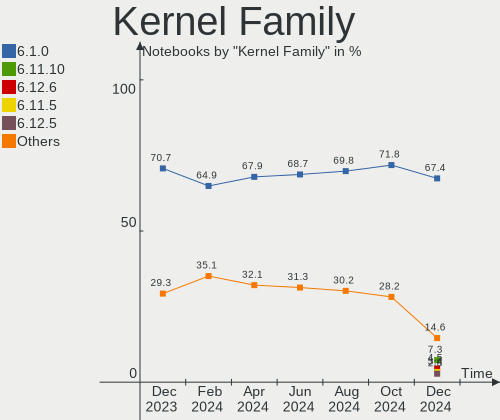
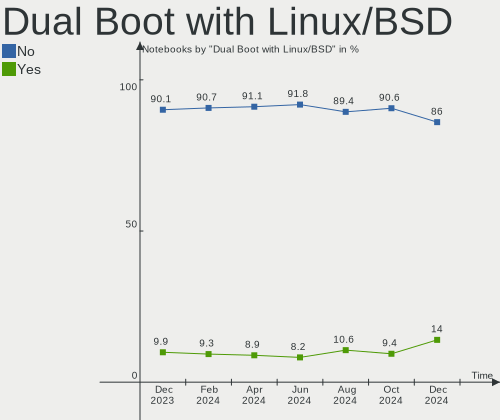
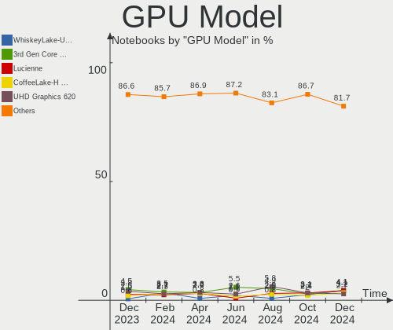
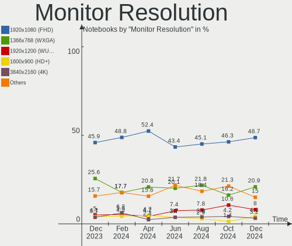
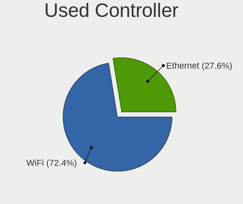
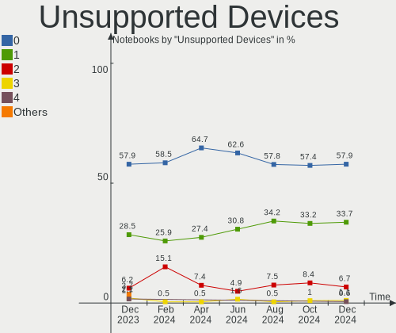

Debian - Hardware Trends (Notebooks)
------------------------------------

A project to identify most popular hardware characteristics and track their change
over time based on data collected by Linux users at https://Linux-Hardware.org.

Anyone can contribute to this report by the [hw-probe](https://github.com/linuxhw/hw-probe) tool:

    sudo -E hw-probe -all -upload

This report is for one last month. Overall report since the beginning of time: [TestDays](https://github.com/linuxhw/TestDays)

Period: May, 2023.

Contents
--------

* [ System ](#system)
  - [ OS                       ](#os)
  - [ OS Family                ](#os-family)
  - [ Kernel                   ](#kernel)
  - [ Kernel Family            ](#kernel-family)
  - [ Kernel Major Ver.        ](#kernel-major-ver)
  - [ Arch                     ](#arch)
  - [ DE                       ](#de)
  - [ Display Server           ](#display-server)
  - [ Display Manager          ](#display-manager)
  - [ OS Lang                  ](#os-lang)
  - [ Boot Mode                ](#boot-mode)
  - [ Filesystem               ](#filesystem)
  - [ Part. scheme             ](#part-scheme)
  - [ Dual Boot with Linux/BSD ](#dual-boot-with-linuxbsd)
  - [ Dual Boot (Win)          ](#dual-boot-win)

* [ Board ](#board)
  - [ Vendor                   ](#vendor)
  - [ Model                    ](#model)
  - [ Model Family             ](#model-family)
  - [ MFG Year                 ](#mfg-year)
  - [ Form Factor              ](#form-factor)
  - [ Secure Boot              ](#secure-boot)
  - [ Coreboot                 ](#coreboot)
  - [ RAM Size                 ](#ram-size)
  - [ RAM Used                 ](#ram-used)
  - [ Total Drives             ](#total-drives)
  - [ Has CD-ROM               ](#has-cd-rom)
  - [ Has Ethernet             ](#has-ethernet)
  - [ Has WiFi                 ](#has-wifi)
  - [ Has Bluetooth            ](#has-bluetooth)

* [ Location ](#location)
  - [ Country                  ](#country)
  - [ City                     ](#city)

* [ Drives ](#drives)
  - [ Drive Vendor             ](#drive-vendor)
  - [ Drive Model              ](#drive-model)
  - [ HDD Vendor               ](#hdd-vendor)
  - [ SSD Vendor               ](#ssd-vendor)
  - [ Drive Kind               ](#drive-kind)
  - [ Drive Connector          ](#drive-connector)
  - [ Drive Size               ](#drive-size)
  - [ Space Total              ](#space-total)
  - [ Space Used               ](#space-used)
  - [ Malfunc. Drives          ](#malfunc-drives)
  - [ Malfunc. Drive Vendor    ](#malfunc-drive-vendor)
  - [ Malfunc. HDD Vendor      ](#malfunc-hdd-vendor)
  - [ Malfunc. Drive Kind      ](#malfunc-drive-kind)
  - [ Failed Drives            ](#failed-drives)
  - [ Failed Drive Vendor      ](#failed-drive-vendor)
  - [ Drive Status             ](#drive-status)

* [ Storage controller ](#storage-controller)
  - [ Storage Vendor           ](#storage-vendor)
  - [ Storage Model            ](#storage-model)
  - [ Storage Kind             ](#storage-kind)

* [ Processor ](#processor)
  - [ CPU Vendor               ](#cpu-vendor)
  - [ CPU Model                ](#cpu-model)
  - [ CPU Model Family         ](#cpu-model-family)
  - [ CPU Cores                ](#cpu-cores)
  - [ CPU Sockets              ](#cpu-sockets)
  - [ CPU Threads              ](#cpu-threads)
  - [ CPU Op-Modes             ](#cpu-op-modes)
  - [ CPU Microcode            ](#cpu-microcode)
  - [ CPU Microarch            ](#cpu-microarch)

* [ Graphics ](#graphics)
  - [ GPU Vendor               ](#gpu-vendor)
  - [ GPU Model                ](#gpu-model)
  - [ GPU Combo                ](#gpu-combo)
  - [ GPU Driver               ](#gpu-driver)
  - [ GPU Memory               ](#gpu-memory)

* [ Monitor ](#monitor)
  - [ Monitor Vendor           ](#monitor-vendor)
  - [ Monitor Model            ](#monitor-model)
  - [ Monitor Resolution       ](#monitor-resolution)
  - [ Monitor Diagonal         ](#monitor-diagonal)
  - [ Monitor Width            ](#monitor-width)
  - [ Aspect Ratio             ](#aspect-ratio)
  - [ Monitor Area             ](#monitor-area)
  - [ Pixel Density            ](#pixel-density)
  - [ Multiple Monitors        ](#multiple-monitors)

* [ Network ](#network)
  - [ Net Controller Vendor    ](#net-controller-vendor)
  - [ Net Controller Model     ](#net-controller-model)
  - [ Wireless Vendor          ](#wireless-vendor)
  - [ Wireless Model           ](#wireless-model)
  - [ Ethernet Vendor          ](#ethernet-vendor)
  - [ Ethernet Model           ](#ethernet-model)
  - [ Net Controller Kind      ](#net-controller-kind)
  - [ Used Controller          ](#used-controller)
  - [ NICs                     ](#nics)
  - [ IPv6                     ](#ipv6)

* [ Bluetooth ](#bluetooth)
  - [ Bluetooth Vendor         ](#bluetooth-vendor)
  - [ Bluetooth Model          ](#bluetooth-model)

* [ Sound ](#sound)
  - [ Sound Vendor             ](#sound-vendor)
  - [ Sound Model              ](#sound-model)

* [ Memory ](#memory)
  - [ Memory Vendor            ](#memory-vendor)
  - [ Memory Model             ](#memory-model)
  - [ Memory Kind              ](#memory-kind)
  - [ Memory Form Factor       ](#memory-form-factor)
  - [ Memory Size              ](#memory-size)
  - [ Memory Speed             ](#memory-speed)

* [ Printers & scanners ](#printers--scanners)
  - [ Printer Vendor           ](#printer-vendor)
  - [ Printer Model            ](#printer-model)
  - [ Scanner Vendor           ](#scanner-vendor)
  - [ Scanner Model            ](#scanner-model)

* [ Camera ](#camera)
  - [ Camera Vendor            ](#camera-vendor)
  - [ Camera Model             ](#camera-model)

* [ Security ](#security)
  - [ Fingerprint Vendor       ](#fingerprint-vendor)
  - [ Fingerprint Model        ](#fingerprint-model)
  - [ Chipcard Vendor          ](#chipcard-vendor)
  - [ Chipcard Model           ](#chipcard-model)

* [ Unsupported ](#unsupported)
  - [ Unsupported Devices      ](#unsupported-devices)
  - [ Unsupported Device Types ](#unsupported-device-types)

System
------

OS
--

Installed operating systems

| Name      | Notebooks | Percent |
|-----------|-----------|---------|
| Debian 11 | 103       | 62.8%   |
| Debian 12 | 59        | 35.98%  |
| Debian 23 | 1         | 0.61%   |
| Debian 10 | 1         | 0.61%   |

OS Family
---------

OS without a version

| Name   | Notebooks | Percent |
|--------|-----------|---------|
| Debian | 164       | 100%    |

Kernel
------

Version of the Linux kernel

| Version                   | Notebooks | Percent |
|---------------------------|-----------|---------|
| 5.10.0-23-amd64           | 34        | 20.73%  |
| 5.10.0-22-amd64           | 33        | 20.12%  |
| 6.1.0-9-amd64             | 26        | 15.85%  |
| 6.1.0-7-amd64             | 15        | 9.15%   |
| 5.10.0-21-amd64           | 13        | 7.93%   |
| 6.1.0-8-amd64             | 7         | 4.27%   |
| 6.1.0-4-amd64             | 6         | 3.66%   |
| 5.10.0-20-amd64           | 4         | 2.44%   |
| 6.0.0-6mx-amd64           | 2         | 1.22%   |
| 6.3.4-latitude-xanmod1    | 1         | 0.61%   |
| 6.3.4-dell-latitude-e5510 | 1         | 0.61%   |
| 6.3.4-asus-amd            | 1         | 0.61%   |
| 6.3.0-titanide            | 1         | 0.61%   |
| 6.3.0-7-amd64             | 1         | 0.61%   |
| 6.2.14-1-liquorix-amd64   | 1         | 0.61%   |
| 6.1.0-8mx-ahs-amd64       | 1         | 0.61%   |
| 6.1.0-7-rt-amd64          | 1         | 0.61%   |
| 6.1.0-6-amd64             | 1         | 0.61%   |
| 6.1.0-0.deb11.7-amd64     | 1         | 0.61%   |
| 6.1.0-0.deb11.5-amd64     | 1         | 0.61%   |
| 6.0.9                     | 1         | 0.61%   |
| 5.16.0-5mx-amd64          | 1         | 0.61%   |
| 5.16.0-3-amd64            | 1         | 0.61%   |
| 5.15.107-2-pve            | 1         | 0.61%   |
| 5.15.107-1-pve            | 1         | 0.61%   |
| 5.15.104-1-pve            | 1         | 0.61%   |
| 5.10.0-23-686             | 1         | 0.61%   |
| 5.10.0-22-686             | 1         | 0.61%   |
| 5.10.0-21-rt-amd64        | 1         | 0.61%   |
| 5.10.0-21-686             | 1         | 0.61%   |
| 5.10.0-18-amd64           | 1         | 0.61%   |
| 5.10.0-12-amd64           | 1         | 0.61%   |
| 4.19.0-24-amd64           | 1         | 0.61%   |

Kernel Family
-------------

Linux kernel without a distro release

| Version  | Notebooks | Percent |
|----------|-----------|---------|
| 5.10.0   | 90        | 54.88%  |
| 6.1.0    | 59        | 35.98%  |
| 6.3.4    | 3         | 1.83%   |
| 6.3.0    | 2         | 1.22%   |
| 6.0.0    | 2         | 1.22%   |
| 5.16.0   | 2         | 1.22%   |
| 5.15.107 | 2         | 1.22%   |
| 6.2.14   | 1         | 0.61%   |
| 6.0.9    | 1         | 0.61%   |
| 5.15.104 | 1         | 0.61%   |
| 4.19.0   | 1         | 0.61%   |

Kernel Major Ver.
-----------------

Linux kernel major version

| Version | Notebooks | Percent |
|---------|-----------|---------|
| 5.10    | 90        | 54.88%  |
| 6.1     | 59        | 35.98%  |
| 6.3     | 5         | 3.05%   |
| 6.0     | 3         | 1.83%   |
| 5.15    | 3         | 1.83%   |
| 5.16    | 2         | 1.22%   |
| 6.2     | 1         | 0.61%   |
| 4.19    | 1         | 0.61%   |

Arch
----

OS architecture (x86_64, i586, etc.)

| Name   | Notebooks | Percent |
|--------|-----------|---------|
| x86_64 | 161       | 98.17%  |
| i686   | 3         | 1.83%   |

DE
--

Desktop Environment

| Name          | Notebooks | Percent |
|---------------|-----------|---------|
| GNOME         | 62        | 37.8%   |
| KDE5          | 31        | 18.9%   |
| XFCE          | 28        | 17.07%  |
| Unknown       | 15        | 9.15%   |
| X-Cinnamon    | 7         | 4.27%   |
| MATE          | 7         | 4.27%   |
| Cinnamon      | 3         | 1.83%   |
| LXQt          | 2         | 1.22%   |
| KDE           | 2         | 1.22%   |
| Trinity       | 1         | 0.61%   |
| Pantheon      | 1         | 0.61%   |
| LXDE          | 1         | 0.61%   |
| i3            | 1         | 0.61%   |
| GNUstep       | 1         | 0.61%   |
| GNOME Classic | 1         | 0.61%   |
| Budgie        | 1         | 0.61%   |

Display Server
--------------

X11 or Wayland

| Name    | Notebooks | Percent |
|---------|-----------|---------|
| X11     | 98        | 59.76%  |
| Wayland | 45        | 27.44%  |
| Tty     | 12        | 7.32%   |
| Unknown | 9         | 5.49%   |

Display Manager
---------------

SDDM, LightDM, etc.

| Name    | Notebooks | Percent |
|---------|-----------|---------|
| Unknown | 44        | 26.83%  |
| LightDM | 42        | 25.61%  |
| GDM3    | 35        | 21.34%  |
| SDDM    | 23        | 14.02%  |
| GDM     | 20        | 12.2%   |

OS Lang
-------

Language

| Lang    | Notebooks | Percent |
|---------|-----------|---------|
| en_US   | 46        | 28.05%  |
| fr_FR   | 21        | 12.8%   |
| de_DE   | 16        | 9.76%   |
| sv_SE   | 14        | 8.54%   |
| ru_RU   | 13        | 7.93%   |
| en_GB   | 6         | 3.66%   |
| pt_BR   | 5         | 3.05%   |
| pl_PL   | 5         | 3.05%   |
| it_IT   | 4         | 2.44%   |
| es_ES   | 4         | 2.44%   |
| en_CA   | 4         | 2.44%   |
| zh_CN   | 3         | 1.83%   |
| Unknown | 3         | 1.83%   |
| es_MX   | 2         | 1.22%   |
| en_IE   | 2         | 1.22%   |
| en_AU   | 2         | 1.22%   |
| tr_TR   | 1         | 0.61%   |
| sk_SK   | 1         | 0.61%   |
| ja_JP   | 1         | 0.61%   |
| hu_HU   | 1         | 0.61%   |
| hr_HR   | 1         | 0.61%   |
| fr_CH   | 1         | 0.61%   |
| fi_FI   | 1         | 0.61%   |
| es_PA   | 1         | 0.61%   |
| es_EC   | 1         | 0.61%   |
| en_IN   | 1         | 0.61%   |
| en_IL   | 1         | 0.61%   |
| de_AT   | 1         | 0.61%   |
| cs_CZ   | 1         | 0.61%   |
| bg_BG   | 1         | 0.61%   |

Boot Mode
---------

EFI or BIOS

| Mode | Notebooks | Percent |
|------|-----------|---------|
| EFI  | 102       | 62.2%   |
| BIOS | 62        | 37.8%   |

Filesystem
----------

Type of filesystem

| Type    | Notebooks | Percent |
|---------|-----------|---------|
| Ext4    | 136       | 82.93%  |
| Overlay | 16        | 9.76%   |
| Btrfs   | 6         | 3.66%   |
| Tmpfs   | 3         | 1.83%   |
| Zfs     | 1         | 0.61%   |
| Xfs     | 1         | 0.61%   |
| Ext3    | 1         | 0.61%   |

Part. scheme
------------

Scheme of partitioning

| Type    | Notebooks | Percent |
|---------|-----------|---------|
| GPT     | 105       | 64.02%  |
| Unknown | 31        | 18.9%   |
| MBR     | 28        | 17.07%  |

Dual Boot with Linux/BSD
------------------------

Hosting more than one Linux/BSD

| Dual boot | Notebooks | Percent |
|-----------|-----------|---------|
| No        | 146       | 89.02%  |
| Yes       | 18        | 10.98%  |

Dual Boot (Win)
---------------

Hosting Linux and Windows

| Dual boot | Notebooks | Percent |
|-----------|-----------|---------|
| No        | 124       | 75.61%  |
| Yes       | 40        | 24.39%  |

Board
-----

Vendor
------

Motherboard manufacturer

| Name                   | Notebooks | Percent |
|------------------------|-----------|---------|
| Lenovo                 | 53        | 32.32%  |
| Hewlett-Packard        | 26        | 15.85%  |
| Dell                   | 26        | 15.85%  |
| Acer                   | 17        | 10.37%  |
| ASUSTek Computer       | 11        | 6.71%   |
| Aquarius               | 4         | 2.44%   |
| Unknown                | 4         | 2.44%   |
| Toshiba                | 3         | 1.83%   |
| Fujitsu                | 3         | 1.83%   |
| Apple                  | 3         | 1.83%   |
| Notebook               | 2         | 1.22%   |
| MSI                    | 2         | 1.22%   |
| HUAWEI                 | 2         | 1.22%   |
| Terrans Force          | 1         | 0.61%   |
| Sony                   | 1         | 0.61%   |
| Samsung Electronics    | 1         | 0.61%   |
| eMachines              | 1         | 0.61%   |
| Chuwi                  | 1         | 0.61%   |
| AXDIA International    | 1         | 0.61%   |
| Avell High Performance | 1         | 0.61%   |
| AMI                    | 1         | 0.61%   |

Model
-----

Motherboard model

| Name                                   | Notebooks | Percent |
|----------------------------------------|-----------|---------|
| Unknown                                | 5         | 3.05%   |
| Lenovo ThinkPad L14 Gen 2 20X1004CMX   | 4         | 2.44%   |
| Lenovo ThinkPad L13 Gen 2 20VJS6RY00   | 4         | 2.44%   |
| Aquarius NS585                         | 4         | 2.44%   |
| Notebook W54_55SU1,SUW                 | 2         | 1.22%   |
| Lenovo ThinkPad 13 2nd Gen 20J10046US  | 2         | 1.22%   |
| HP ProBook 640 G1                      | 2         | 1.22%   |
| HP ProBook 440 14 inch G9 Notebook PC  | 2         | 1.22%   |
| Dell Latitude E5430 non-vPro           | 2         | 1.22%   |
| Dell Latitude 5411                     | 2         | 1.22%   |
| Toshiba Satellite X200                 | 1         | 0.61%   |
| Toshiba Satellite Pro C660             | 1         | 0.61%   |
| Toshiba Satellite C855-22N             | 1         | 0.61%   |
| Terrans Force AMD                      | 1         | 0.61%   |
| Sony VPCF13WFX                         | 1         | 0.61%   |
| Samsung 530U3C/530U4C/532U3C           | 1         | 0.61%   |
| MSI Katana GF76 12UEK                  | 1         | 0.61%   |
| Lenovo Yoga 7 16IRL8 82YN              | 1         | 0.61%   |
| Lenovo ThinkPad X260 20F600A7MS        | 1         | 0.61%   |
| Lenovo ThinkPad X230 23257AG           | 1         | 0.61%   |
| Lenovo ThinkPad X200s 7470WUB          | 1         | 0.61%   |
| Lenovo ThinkPad W530 2447GH2           | 1         | 0.61%   |
| Lenovo ThinkPad W510 4391DK3           | 1         | 0.61%   |
| Lenovo ThinkPad W500 4058CTO           | 1         | 0.61%   |
| Lenovo ThinkPad T530 2394CE2           | 1         | 0.61%   |
| Lenovo ThinkPad T495 20NK000XBR        | 1         | 0.61%   |
| Lenovo ThinkPad T490 20N2004JAD        | 1         | 0.61%   |
| Lenovo ThinkPad T480 20L6S29E02        | 1         | 0.61%   |
| Lenovo ThinkPad T470 20HES63400        | 1         | 0.61%   |
| Lenovo ThinkPad T470 20HD0001MX        | 1         | 0.61%   |
| Lenovo ThinkPad T460 20FMS4LL00        | 1         | 0.61%   |
| Lenovo ThinkPad T440 20B7S2SM00        | 1         | 0.61%   |
| Lenovo ThinkPad T440 20B7A0CYFR        | 1         | 0.61%   |
| Lenovo ThinkPad T410s 2904FAG          | 1         | 0.61%   |
| Lenovo ThinkPad T410 2537CC5           | 1         | 0.61%   |
| Lenovo ThinkPad T400 2768WGB           | 1         | 0.61%   |
| Lenovo ThinkPad T15p Gen 2i 21A70008GE | 1         | 0.61%   |
| Lenovo ThinkPad T14s Gen 3 21BSS37200  | 1         | 0.61%   |
| Lenovo ThinkPad T14 Gen 3 21AHCTO1WW   | 1         | 0.61%   |
| Lenovo ThinkPad S1 Yoga 12 20DKS13V00  | 1         | 0.61%   |

Model Family
------------

Motherboard model prefix

| Name                  | Notebooks | Percent |
|-----------------------|-----------|---------|
| Lenovo ThinkPad       | 42        | 25.61%  |
| Dell Latitude         | 16        | 9.76%   |
| Acer Aspire           | 12        | 7.32%   |
| HP ProBook            | 6         | 3.66%   |
| HP EliteBook          | 6         | 3.66%   |
| Lenovo IdeaPad        | 5         | 3.05%   |
| HP Laptop             | 5         | 3.05%   |
| Unknown               | 5         | 3.05%   |
| Aquarius NS585        | 4         | 2.44%   |
| Toshiba Satellite     | 3         | 1.83%   |
| Dell Inspiron         | 3         | 1.83%   |
| Acer TravelMate       | 3         | 1.83%   |
| Notebook W54          | 2         | 1.22%   |
| HP 250                | 2         | 1.22%   |
| Fujitsu LIFEBOOK      | 2         | 1.22%   |
| Dell XPS              | 2         | 1.22%   |
| Dell Vostro           | 2         | 1.22%   |
| Dell Precision        | 2         | 1.22%   |
| ASUS ASUS             | 2         | 1.22%   |
| Terrans Force AMD     | 1         | 0.61%   |
| Sony VPCF13WFX        | 1         | 0.61%   |
| Samsung 530U3C        | 1         | 0.61%   |
| MSI Katana            | 1         | 0.61%   |
| Lenovo Yoga           | 1         | 0.61%   |
| Lenovo Slim           | 1         | 0.61%   |
| Lenovo Mixx-700-12ISK | 1         | 0.61%   |
| Lenovo Edge           | 1         | 0.61%   |
| Lenovo B590           | 1         | 0.61%   |
| Lenovo B50-70         | 1         | 0.61%   |
| HUAWEI MACHD-WXX9     | 1         | 0.61%   |
| HUAWEI BOHB-WAX9      | 1         | 0.61%   |
| HP Pavilion           | 1         | 0.61%   |
| HP OMEN               | 1         | 0.61%   |
| HP Notebook           | 1         | 0.61%   |
| HP Mini               | 1         | 0.61%   |
| HP G42                | 1         | 0.61%   |
| HP 530                | 1         | 0.61%   |
| HP 255                | 1         | 0.61%   |
| Fujitsu FMVA42ERKS    | 1         | 0.61%   |
| eMachines E725        | 1         | 0.61%   |

MFG Year
--------

Motherboard manufacture year

| Year | Notebooks | Percent |
|------|-----------|---------|
| 2021 | 23        | 14.02%  |
| 2020 | 19        | 11.59%  |
| 2022 | 15        | 9.15%   |
| 2019 | 15        | 9.15%   |
| 2017 | 15        | 9.15%   |
| 2012 | 12        | 7.32%   |
| 2010 | 11        | 6.71%   |
| 2018 | 10        | 6.1%    |
| 2013 | 10        | 6.1%    |
| 2014 | 7         | 4.27%   |
| 2009 | 6         | 3.66%   |
| 2016 | 5         | 3.05%   |
| 2011 | 5         | 3.05%   |
| 2015 | 4         | 2.44%   |
| 2023 | 3         | 1.83%   |
| 2008 | 2         | 1.22%   |
| 2007 | 2         | 1.22%   |

Form Factor
-----------

Physical design of the computer

| Name     | Notebooks | Percent |
|----------|-----------|---------|
| Notebook | 164       | 100%    |

Secure Boot
-----------

Enabled or disabled

| State    | Notebooks | Percent |
|----------|-----------|---------|
| Disabled | 140       | 85.37%  |
| Enabled  | 24        | 14.63%  |

Coreboot
--------

Have coreboot on board

| Used | Notebooks | Percent |
|------|-----------|---------|
| No   | 164       | 100%    |

RAM Size
--------

Total RAM memory

| Size in GB  | Notebooks | Percent |
|-------------|-----------|---------|
| 4.01-8.0    | 60        | 36.59%  |
| 8.01-16.0   | 30        | 18.29%  |
| 16.01-24.0  | 29        | 17.68%  |
| 3.01-4.0    | 27        | 16.46%  |
| 32.01-64.0  | 12        | 7.32%   |
| 64.01-256.0 | 3         | 1.83%   |
| 1.01-2.0    | 2         | 1.22%   |
| 2.01-3.0    | 1         | 0.61%   |

RAM Used
--------

Used RAM memory

| Used GB    | Notebooks | Percent |
|------------|-----------|---------|
| 1.01-2.0   | 63        | 38.41%  |
| 2.01-3.0   | 37        | 22.56%  |
| 4.01-8.0   | 28        | 17.07%  |
| 3.01-4.0   | 14        | 8.54%   |
| 0.51-1.0   | 11        | 6.71%   |
| 8.01-16.0  | 7         | 4.27%   |
| 16.01-24.0 | 2         | 1.22%   |
| 0.01-0.5   | 2         | 1.22%   |

Total Drives
------------

Number of drives on board

| Drives | Notebooks | Percent |
|--------|-----------|---------|
| 1      | 126       | 76.83%  |
| 2      | 30        | 18.29%  |
| 3      | 5         | 3.05%   |
| 5      | 1         | 0.61%   |
| 4      | 1         | 0.61%   |
| 0      | 1         | 0.61%   |

Has CD-ROM
----------

Has CD-ROM on board

| Presented | Notebooks | Percent |
|-----------|-----------|---------|
| No        | 122       | 74.39%  |
| Yes       | 42        | 25.61%  |

Has Ethernet
------------

Has Ethernet on board

| Presented | Notebooks | Percent |
|-----------|-----------|---------|
| Yes       | 138       | 84.15%  |
| No        | 26        | 15.85%  |

Has WiFi
--------

Has WiFi module

| Presented | Notebooks | Percent |
|-----------|-----------|---------|
| Yes       | 162       | 98.78%  |
| No        | 2         | 1.22%   |

Has Bluetooth
-------------

Has Bluetooth module

| Presented | Notebooks | Percent |
|-----------|-----------|---------|
| Yes       | 130       | 79.27%  |
| No        | 34        | 20.73%  |

Location
--------

Country
-------

Geographic location (country)

| Country     | Notebooks | Percent |
|-------------|-----------|---------|
| France      | 22        | 13.41%  |
| Germany     | 20        | 12.2%   |
| Sweden      | 17        | 10.37%  |
| USA         | 12        | 7.32%   |
| Russia      | 12        | 7.32%   |
| Brazil      | 8         | 4.88%   |
| Poland      | 6         | 3.66%   |
| Italy       | 6         | 3.66%   |
| Spain       | 5         | 3.05%   |
| UK          | 4         | 2.44%   |
| Canada      | 4         | 2.44%   |
| Slovakia    | 3         | 1.83%   |
| Mexico      | 3         | 1.83%   |
| Uzbekistan  | 2         | 1.22%   |
| UAE         | 2         | 1.22%   |
| Switzerland | 2         | 1.22%   |
| Netherlands | 2         | 1.22%   |
| India       | 2         | 1.22%   |
| Hungary     | 2         | 1.22%   |
| Czechia     | 2         | 1.22%   |
| Croatia     | 2         | 1.22%   |
| Australia   | 2         | 1.22%   |
| Uruguay     | 1         | 0.61%   |
| Ukraine     | 1         | 0.61%   |
| Turkey      | 1         | 0.61%   |
| Romania     | 1         | 0.61%   |
| Portugal    | 1         | 0.61%   |
| Panama      | 1         | 0.61%   |
| Pakistan    | 1         | 0.61%   |
| Norway      | 1         | 0.61%   |
| New Zealand | 1         | 0.61%   |
| Nepal       | 1         | 0.61%   |
| Moldova     | 1         | 0.61%   |
| Latvia      | 1         | 0.61%   |
| Japan       | 1         | 0.61%   |
| Israel      | 1         | 0.61%   |
| Ireland     | 1         | 0.61%   |
| Indonesia   | 1         | 0.61%   |
| Greece      | 1         | 0.61%   |
| Finland     | 1         | 0.61%   |

City
----

Geographic location (city)

| City                   | Notebooks | Percent |
|------------------------|-----------|---------|
| Saltsjoe-Boo           | 15        | 9.15%   |
| Voronezh               | 6         | 3.66%   |
| Moscow                 | 5         | 3.05%   |
| Paris                  | 3         | 1.83%   |
| Tiranges               | 2         | 1.22%   |
| Tashkent               | 2         | 1.22%   |
| La Roche-de-Glun       | 2         | 1.22%   |
| Dubai                  | 2         | 1.22%   |
| Berlin                 | 2         | 1.22%   |
| Bangor                 | 2         | 1.22%   |
| Zadar                  | 1         | 0.61%   |
| Yokohama               | 1         | 0.61%   |
| Xalapa                 | 1         | 0.61%   |
| Winlaw                 | 1         | 0.61%   |
| White Bluff            | 1         | 0.61%   |
| Warsaw                 | 1         | 0.61%   |
| Waldkirch              | 1         | 0.61%   |
| Villeurbanne           | 1         | 0.61%   |
| Veszprém              | 1         | 0.61%   |
| Venice                 | 1         | 0.61%   |
| Vanves                 | 1         | 0.61%   |
| Turin                  | 1         | 0.61%   |
| Toulouse               | 1         | 0.61%   |
| Telgruc-sur-Mer        | 1         | 0.61%   |
| Sydney                 | 1         | 0.61%   |
| Stuttgart              | 1         | 0.61%   |
| Stargard               | 1         | 0.61%   |
| Split                  | 1         | 0.61%   |
| Solothurn              | 1         | 0.61%   |
| Sicklerville           | 1         | 0.61%   |
| Sereg                  | 1         | 0.61%   |
| Sao Paulo              | 1         | 0.61%   |
| Santos                 | 1         | 0.61%   |
| San Diego              | 1         | 0.61%   |
| Saint-Vit              | 1         | 0.61%   |
| Saint-Priest-Bramefant | 1         | 0.61%   |
| Roccamonfina           | 1         | 0.61%   |
| Riga                   | 1         | 0.61%   |
| Richardson             | 1         | 0.61%   |
| Rennes                 | 1         | 0.61%   |

Drives
------

Drive Vendor
------------

Hard drive vendors

| Vendor                      | Notebooks | Drives | Percent |
|-----------------------------|-----------|--------|---------|
| Samsung Electronics         | 33        | 37     | 16.58%  |
| WDC                         | 23        | 23     | 11.56%  |
| Toshiba                     | 19        | 19     | 9.55%   |
| SanDisk                     | 16        | 18     | 8.04%   |
| Kingston                    | 13        | 14     | 6.53%   |
| Unknown                     | 12        | 12     | 6.03%   |
| Seagate                     | 12        | 12     | 6.03%   |
| SK hynix                    | 7         | 7      | 3.52%   |
| Micron Technology           | 7         | 7      | 3.52%   |
| Crucial                     | 7         | 7      | 3.52%   |
| A-DATA Technology           | 6         | 6      | 3.02%   |
| HGST                        | 5         | 5      | 2.51%   |
| KIOXIA                      | 3         | 3      | 1.51%   |
| Kingston Technology Company | 3         | 3      | 1.51%   |
| Silicon Motion              | 2         | 2      | 1.01%   |
| ShiJi                       | 2         | 2      | 1.01%   |
| LITEONIT                    | 2         | 2      | 1.01%   |
| LITEON                      | 2         | 2      | 1.01%   |
| JMicron Technology          | 2         | 2      | 1.01%   |
| China                       | 2         | 2      | 1.01%   |
| Apple                       | 2         | 3      | 1.01%   |
| Unknown                     | 2         | 2      | 1.01%   |
| UMIS                        | 1         | 1      | 0.5%    |
| Transcend                   | 1         | 1      | 0.5%    |
| TO Exter                    | 1         | 1      | 0.5%    |
| Teclast                     | 1         | 1      | 0.5%    |
| Team                        | 1         | 1      | 0.5%    |
| Realtek Semiconductor       | 1         | 1      | 0.5%    |
| Patriot                     | 1         | 1      | 0.5%    |
| Netac                       | 1         | 1      | 0.5%    |
| Lexar                       | 1         | 1      | 0.5%    |
| Lenovo                      | 1         | 1      | 0.5%    |
| Intel                       | 1         | 1      | 0.5%    |
| INNOVATION IT               | 1         | 1      | 0.5%    |
| GLOBAL                      | 1         | 1      | 0.5%    |
| Fujitsu                     | 1         | 1      | 0.5%    |
| ASMT109x                    | 1         | 2      | 0.5%    |
| AMD                         | 1         | 1      | 0.5%    |
| ADATA Technology            | 1         | 1      | 0.5%    |

Drive Model
-----------

Hard drive models

| Model                                               | Notebooks | Percent |
|-----------------------------------------------------|-----------|---------|
| Toshiba XG6 NVMe SSD Controller 256GB               | 4         | 1.93%   |
| Sandisk WD Black SN750 / PC SN730 NVMe SSD 256GB    | 4         | 1.93%   |
| Samsung SSD 970 EVO Plus 1TB                        | 4         | 1.93%   |
| A-DATA SU800 512GB SSD                              | 4         | 1.93%   |
| Toshiba MQ04ABF100 1TB                              | 3         | 1.45%   |
| Samsung SSD 850 EVO 500GB                           | 3         | 1.45%   |
| Samsung NVMe SSD Controller SM981/PM981/PM983 256GB | 3         | 1.45%   |
| Unknown MMC Card  32GB                              | 2         | 0.97%   |
| Toshiba MQ01ABF050 500GB                            | 2         | 0.97%   |
| SK hynix SKHynix_HFS512GDE9X081N 512GB              | 2         | 0.97%   |
| Seagate ST9500420AS 500GB                           | 2         | 0.97%   |
| SanDisk NVMe SSD Drive 512GB                        | 2         | 0.97%   |
| Samsung MZVLQ256HBJD-00BH1 256GB                    | 2         | 0.97%   |
| JMicron Generic 320GB                               | 2         | 0.97%   |
| Crucial CT500MX500SSD1 500GB                        | 2         | 0.97%   |
| Crucial CT480BX500SSD1 480GB                        | 2         | 0.97%   |
| Crucial CT1000MX500SSD1 1TB                         | 2         | 0.97%   |
| China SSD 256GB                                     | 2         | 0.97%   |
| Unknown                                             | 2         | 0.97%   |
| WDC WDS240G1G0A-00SS50 240GB SSD                    | 1         | 0.48%   |
| WDC WDS200T2B0B-00YS70 2TB SSD                      | 1         | 0.48%   |
| WDC WDS100T2G0A-00JH30 1TB SSD                      | 1         | 0.48%   |
| WDC WD7500BPVT-22HXZT3 752GB                        | 1         | 0.48%   |
| WDC WD5000LPVX-08V0TT5 500GB                        | 1         | 0.48%   |
| WDC WD5000LPLX-75ZNTT0 500GB                        | 1         | 0.48%   |
| WDC WD5000BEVT-26A0RT0 500GB                        | 1         | 0.48%   |
| WDC WD5000BEVT-22A0RT0 500GB                        | 1         | 0.48%   |
| WDC WD3200BPVT-80JJ5T0 320GB                        | 1         | 0.48%   |
| WDC WD2500BEVT-75A23T0 250GB                        | 1         | 0.48%   |
| WDC WD20SPZX-22UA7T0 2TB                            | 1         | 0.48%   |
| WDC WD1600BEVT-24A23T0 160GB                        | 1         | 0.48%   |
| WDC WD10SPZX-24Z10 1TB                              | 1         | 0.48%   |
| WDC WD10SPZX-00Z10T0 1TB                            | 1         | 0.48%   |
| WDC WD10JPVX-22JC3T0 1TB                            | 1         | 0.48%   |
| WDC WD10JPLX-00MBPT1 1TB                            | 1         | 0.48%   |
| WDC WD Green 2.5 480GB                              | 1         | 0.48%   |
| WDC PC SN730 SDBQNTY-512G-1001 512GB                | 1         | 0.48%   |
| WDC PC SN540 SDDPNPF-1T00-1032 1TB                  | 1         | 0.48%   |
| WDC PC SN530 SDBPNPZ-512G-1114 512GB                | 1         | 0.48%   |
| WDC PC SN530 SDBPNPZ-512G-1002 512GB                | 1         | 0.48%   |

HDD Vendor
----------

Hard disk drive vendors

| Vendor  | Notebooks | Drives | Percent |
|---------|-----------|--------|---------|
| WDC     | 13        | 13     | 30.95%  |
| Toshiba | 11        | 11     | 26.19%  |
| Seagate | 11        | 11     | 26.19%  |
| HGST    | 5         | 5      | 11.9%   |
| Unknown | 1         | 1      | 2.38%   |
| Fujitsu | 1         | 1      | 2.38%   |

SSD Vendor
----------

Solid state drive vendors

| Vendor              | Notebooks | Drives | Percent |
|---------------------|-----------|--------|---------|
| Samsung Electronics | 9         | 11     | 14.06%  |
| Kingston            | 9         | 10     | 14.06%  |
| SanDisk             | 8         | 9      | 12.5%   |
| Crucial             | 6         | 6      | 9.38%   |
| A-DATA Technology   | 5         | 5      | 7.81%   |
| WDC                 | 4         | 4      | 6.25%   |
| Toshiba             | 2         | 2      | 3.13%   |
| LITEONIT            | 2         | 2      | 3.13%   |
| LITEON              | 2         | 2      | 3.13%   |
| JMicron Technology  | 2         | 2      | 3.13%   |
| China               | 2         | 2      | 3.13%   |
| TO Exter            | 1         | 1      | 1.56%   |
| Teclast             | 1         | 1      | 1.56%   |
| Team                | 1         | 1      | 1.56%   |
| SK hynix            | 1         | 1      | 1.56%   |
| ShiJi               | 1         | 1      | 1.56%   |
| Patriot             | 1         | 1      | 1.56%   |
| Netac               | 1         | 1      | 1.56%   |
| Lexar               | 1         | 1      | 1.56%   |
| Lenovo              | 1         | 1      | 1.56%   |
| INNOVATION IT       | 1         | 1      | 1.56%   |
| GLOBAL              | 1         | 1      | 1.56%   |
| AMD                 | 1         | 1      | 1.56%   |
| Unknown             | 1         | 1      | 1.56%   |

Drive Kind
----------

HDD or SSD

| Kind    | Notebooks | Drives | Percent |
|---------|-----------|--------|---------|
| NVMe    | 77        | 84     | 40.74%  |
| SSD     | 57        | 68     | 30.16%  |
| HDD     | 42        | 42     | 22.22%  |
| MMC     | 12        | 12     | 6.35%   |
| Unknown | 1         | 2      | 0.53%   |

Drive Connector
---------------

SATA, SAS, NVMe, etc.

| Type | Notebooks | Drives | Percent |
|------|-----------|--------|---------|
| SATA | 94        | 103    | 49.74%  |
| NVMe | 77        | 84     | 40.74%  |
| MMC  | 12        | 12     | 6.35%   |
| SAS  | 6         | 9      | 3.17%   |

Drive Size
----------

Size of hard drive

| Size in TB | Notebooks | Drives | Percent |
|------------|-----------|--------|---------|
| 0.01-0.5   | 66        | 72     | 64.71%  |
| 0.51-1.0   | 31        | 33     | 30.39%  |
| 1.01-2.0   | 5         | 5      | 4.9%    |

Space Total
-----------

Amount of disk space available on the file system

| Size in GB     | Notebooks | Percent |
|----------------|-----------|---------|
| 101-250        | 56        | 34.15%  |
| 251-500        | 51        | 31.1%   |
| 501-1000       | 24        | 14.63%  |
| Unknown        | 9         | 5.49%   |
| 1001-2000      | 7         | 4.27%   |
| 51-100         | 6         | 3.66%   |
| 1-20           | 5         | 3.05%   |
| More than 3000 | 4         | 2.44%   |
| 2001-3000      | 2         | 1.22%   |

Space Used
----------

Amount of used disk space

| Used GB        | Notebooks | Percent |
|----------------|-----------|---------|
| 1-20           | 65        | 39.63%  |
| 21-50          | 24        | 14.63%  |
| 101-250        | 20        | 12.2%   |
| 51-100         | 20        | 12.2%   |
| 251-500        | 14        | 8.54%   |
| Unknown        | 9         | 5.49%   |
| 501-1000       | 6         | 3.66%   |
| 1001-2000      | 4         | 2.44%   |
| More than 3000 | 2         | 1.22%   |

Malfunc. Drives
---------------

Drive models with a malfunction

| Model                             | Notebooks | Drives | Percent |
|-----------------------------------|-----------|--------|---------|
| WDC WD1600BEVT-24A23T0 160GB      | 1         | 1      | 6.67%   |
| WDC WD10JPLX-00MBPT1 1TB          | 1         | 1      | 6.67%   |
| Toshiba MQ01ACF032 320GB          | 1         | 1      | 6.67%   |
| Toshiba MQ01ABF050 500GB          | 1         | 1      | 6.67%   |
| Toshiba MQ01ABD100M 1TB           | 1         | 1      | 6.67%   |
| Toshiba MK6459GSXP 640GB          | 1         | 1      | 6.67%   |
| ShiJi 1TB                         | 1         | 1      | 6.67%   |
| Seagate ST980411ASG 80GB          | 1         | 1      | 6.67%   |
| Seagate ST9500325AS 500GB         | 1         | 1      | 6.67%   |
| Seagate ST9120822AS 120GB         | 1         | 1      | 6.67%   |
| Seagate ST2000LX001-1RG174 2TB    | 1         | 1      | 6.67%   |
| Kingston SV300S37A120G 120GB SSD  | 1         | 1      | 6.67%   |
| Kingston SH100S3240G 240GB SSD    | 1         | 1      | 6.67%   |
| HGST HTS725032A7E630 320GB        | 1         | 1      | 6.67%   |
| A-DATA Technology SU650 240GB SSD | 1         | 1      | 6.67%   |

Malfunc. Drive Vendor
---------------------

Vendors of faulty drives

| Vendor            | Notebooks | Drives | Percent |
|-------------------|-----------|--------|---------|
| Toshiba           | 4         | 4      | 26.67%  |
| Seagate           | 4         | 4      | 26.67%  |
| WDC               | 2         | 2      | 13.33%  |
| Kingston          | 2         | 2      | 13.33%  |
| ShiJi             | 1         | 1      | 6.67%   |
| HGST              | 1         | 1      | 6.67%   |
| A-DATA Technology | 1         | 1      | 6.67%   |

Malfunc. HDD Vendor
-------------------

Vendors of faulty HDD drives

| Vendor  | Notebooks | Drives | Percent |
|---------|-----------|--------|---------|
| Toshiba | 4         | 4      | 36.36%  |
| Seagate | 4         | 4      | 36.36%  |
| WDC     | 2         | 2      | 18.18%  |
| HGST    | 1         | 1      | 9.09%   |

Malfunc. Drive Kind
-------------------

Kinds of faulty drives

| Kind | Notebooks | Drives | Percent |
|------|-----------|--------|---------|
| HDD  | 11        | 11     | 73.33%  |
| SSD  | 3         | 3      | 20%     |
| NVMe | 1         | 1      | 6.67%   |

Failed Drives
-------------

Failed drive models

| Model                  | Notebooks | Drives | Percent |
|------------------------|-----------|--------|---------|
| Toshiba MQ04ABF100 1TB | 1         | 1      | 100%    |

Failed Drive Vendor
-------------------

Failed drive vendors

| Vendor  | Notebooks | Drives | Percent |
|---------|-----------|--------|---------|
| Toshiba | 1         | 1      | 100%    |

Drive Status
------------

Number of failed and malfunc. drives

| Status   | Notebooks | Drives | Percent |
|----------|-----------|--------|---------|
| Works    | 111       | 126    | 64.16%  |
| Detected | 46        | 66     | 26.59%  |
| Malfunc  | 15        | 15     | 8.67%   |
| Failed   | 1         | 1      | 0.58%   |

Storage controller
------------------

Storage Vendor
--------------

Storage controller vendors

| Vendor                       | Notebooks | Percent |
|------------------------------|-----------|---------|
| Intel                        | 106       | 53%     |
| Samsung Electronics          | 24        | 12%     |
| SanDisk                      | 15        | 7.5%    |
| AMD                          | 14        | 7%      |
| Micron Technology            | 7         | 3.5%    |
| Kingston Technology Company  | 7         | 3.5%    |
| Toshiba America Info Systems | 6         | 3%      |
| SK hynix                     | 6         | 3%      |
| Silicon Motion               | 3         | 1.5%    |
| KIOXIA                       | 3         | 1.5%    |
| Apple                        | 2         | 1%      |
| ADATA Technology             | 2         | 1%      |
| Union Memory (Shenzhen)      | 1         | 0.5%    |
| Transcend                    | 1         | 0.5%    |
| Seagate Technology           | 1         | 0.5%    |
| Realtek Semiconductor        | 1         | 0.5%    |
| Micron/Crucial Technology    | 1         | 0.5%    |

Storage Model
-------------

Storage controller models

| Model                                                                          | Notebooks | Percent |
|--------------------------------------------------------------------------------|-----------|---------|
| Intel Sunrise Point-LP SATA Controller [AHCI mode]                             | 16        | 7.48%   |
| Intel 7 Series Chipset Family 6-port SATA Controller [AHCI mode]               | 12        | 5.61%   |
| AMD FCH SATA Controller [AHCI mode]                                            | 12        | 5.61%   |
| Samsung NVMe SSD Controller 980                                                | 10        | 4.67%   |
| Samsung NVMe SSD Controller SM981/PM981/PM983                                  | 8         | 3.74%   |
| Intel Volume Management Device NVMe RAID Controller                            | 7         | 3.27%   |
| Intel Tiger Lake-LP SATA Controller                                            | 7         | 3.27%   |
| Intel 82801 Mobile SATA Controller [RAID mode]                                 | 7         | 3.27%   |
| Micron NVMe Storage Controller                                                 | 6         | 2.8%    |
| Intel 8 Series SATA Controller 1 [AHCI mode]                                   | 6         | 2.8%    |
| SanDisk WD Black SN750 / PC SN730 NVMe SSD                                     | 5         | 2.34%   |
| Intel 5 Series/3400 Series Chipset 6 port SATA AHCI Controller                 | 5         | 2.34%   |
| Intel 5 Series/3400 Series Chipset 4 port SATA AHCI Controller                 | 5         | 2.34%   |
| Toshiba America Info Systems XG6 NVMe SSD Controller                           | 4         | 1.87%   |
| SK hynix Gold P31/PC711 NVMe Solid State Drive                                 | 4         | 1.87%   |
| SanDisk Non-Volatile memory controller                                         | 4         | 1.87%   |
| Intel Cannon Lake PCH SATA AHCI Controller                                     | 4         | 1.87%   |
| Intel 82801IBM/IEM (ICH9M/ICH9M-E) 4 port SATA Controller [AHCI mode]          | 4         | 1.87%   |
| Intel 8 Series/C220 Series Chipset Family 6-port SATA Controller 1 [AHCI mode] | 4         | 1.87%   |
| Intel 6 Series/C200 Series Chipset Family 6 port Mobile SATA AHCI Controller   | 4         | 1.87%   |
| SanDisk WD Blue SN550 NVMe SSD                                                 | 3         | 1.4%    |
| Samsung NVMe SSD Controller PM9A1/PM9A3/980PRO                                 | 3         | 1.4%    |
| Intel Comet Lake SATA AHCI Controller                                          | 3         | 1.4%    |
| Intel Celeron/Pentium Silver Processor SATA Controller                         | 3         | 1.4%    |
| Intel 400 Series Chipset Family SATA AHCI Controller                           | 3         | 1.4%    |
| Silicon Motion SM2263EN/SM2263XT SSD Controller                                | 2         | 0.93%   |
| KIOXIA NVMe SSD Controller BG4                                                 | 2         | 0.93%   |
| Kingston Company Company Non-Volatile memory controller                        | 2         | 0.93%   |
| Kingston Company A2000 NVMe SSD                                                | 2         | 0.93%   |
| Intel Wildcat Point-LP SATA Controller [AHCI Mode]                             | 2         | 0.93%   |
| Intel Q170/Q150/B150/H170/H110/Z170/CM236 Chipset SATA Controller [AHCI Mode]  | 2         | 0.93%   |
| Intel NM10/ICH7 Family SATA Controller [AHCI mode]                             | 2         | 0.93%   |
| Intel HM170/QM170 Chipset SATA Controller [AHCI Mode]                          | 2         | 0.93%   |
| Intel Celeron N3350/Pentium N4200/Atom E3900 Series SATA AHCI Controller       | 2         | 0.93%   |
| Intel Cannon Point-LP SATA Controller [AHCI Mode]                              | 2         | 0.93%   |
| Intel Alder Lake-P SATA AHCI Controller                                        | 2         | 0.93%   |
| Intel 82801HM/HEM (ICH8M/ICH8M-E) IDE Controller                               | 2         | 0.93%   |
| AMD SB7x0/SB8x0/SB9x0 SATA Controller [AHCI mode]                              | 2         | 0.93%   |
| Union Memory (Shenzhen) Non-Volatile memory controller                         | 1         | 0.47%   |
| Transcend Non-Volatile memory controller                                       | 1         | 0.47%   |

Storage Kind
------------

Kind of storage controller (IDE, SATA, NVMe, SAS, ...)

| Kind | Notebooks | Percent |
|------|-----------|---------|
| SATA | 109       | 52.91%  |
| NVMe | 77        | 37.38%  |
| RAID | 14        | 6.8%    |
| IDE  | 6         | 2.91%   |

Processor
---------

CPU Vendor
----------

Processor vendors

| Vendor | Notebooks | Percent |
|--------|-----------|---------|
| Intel  | 140       | 85.37%  |
| AMD    | 24        | 14.63%  |

CPU Model
---------

Processor models

| Model                                           | Notebooks | Percent |
|-------------------------------------------------|-----------|---------|
| Intel 11th Gen Core i5-1135G7 @ 2.40GHz         | 7         | 4.27%   |
| Intel 11th Gen Core i3-1115G4 @ 3.00GHz         | 6         | 3.66%   |
| Intel Core i5-6300U CPU @ 2.40GHz               | 4         | 2.44%   |
| Intel Core i5-3210M CPU @ 2.50GHz               | 4         | 2.44%   |
| Intel Core i3-9100 CPU @ 3.60GHz                | 4         | 2.44%   |
| Intel Core i7 CPU M 640 @ 2.80GHz               | 3         | 1.83%   |
| Intel Core i5-8250U CPU @ 1.60GHz               | 3         | 1.83%   |
| Intel Celeron N4120 CPU @ 1.10GHz               | 3         | 1.83%   |
| Intel 12th Gen Core i7-1255U                    | 3         | 1.83%   |
| Intel 12th Gen Core i5-1235U                    | 3         | 1.83%   |
| AMD Ryzen 5 3500U with Radeon Vega Mobile Gfx   | 3         | 1.83%   |
| Intel Core i7-9750H CPU @ 2.60GHz               | 2         | 1.22%   |
| Intel Core i7-8565U CPU @ 1.80GHz               | 2         | 1.22%   |
| Intel Core i7-7700HQ CPU @ 2.80GHz              | 2         | 1.22%   |
| Intel Core i7-10850H CPU @ 2.70GHz              | 2         | 1.22%   |
| Intel Core i5-8350U CPU @ 1.70GHz               | 2         | 1.22%   |
| Intel Core i5-7200U CPU @ 2.50GHz               | 2         | 1.22%   |
| Intel Core i5-4300U CPU @ 1.90GHz               | 2         | 1.22%   |
| Intel Core i5-4200M CPU @ 2.50GHz               | 2         | 1.22%   |
| Intel Core i5-3230M CPU @ 2.60GHz               | 2         | 1.22%   |
| Intel Core i5-10210U CPU @ 1.60GHz              | 2         | 1.22%   |
| Intel Core i5 CPU M 450 @ 2.40GHz               | 2         | 1.22%   |
| Intel Celeron CPU 3865U @ 1.80GHz               | 2         | 1.22%   |
| Intel 12th Gen Core i7-1265U                    | 2         | 1.22%   |
| Intel 11th Gen Core i7-1165G7 @ 2.80GHz         | 2         | 1.22%   |
| AMD Ryzen 5 PRO 3500U w/ Radeon Vega Mobile Gfx | 2         | 1.22%   |
| AMD A6-9225 RADEON R4, 5 COMPUTE CORES 2C+3G    | 2         | 1.22%   |
| Intel Xeon CPU E3-1505M v5 @ 2.80GHz            | 1         | 0.61%   |
| Intel Pentium Dual-Core CPU T4300 @ 2.10GHz     | 1         | 0.61%   |
| Intel Pentium CPU B960 @ 2.20GHz                | 1         | 0.61%   |
| Intel Pentium CPU B950 @ 2.10GHz                | 1         | 0.61%   |
| Intel Core m7-6Y75 CPU @ 1.20GHz                | 1         | 0.61%   |
| Intel Core m3-7Y32 CPU @ 1.10GHz                | 1         | 0.61%   |
| Intel Core m3-6Y30 CPU @ 0.90GHz                | 1         | 0.61%   |
| Intel Core i7-7600U CPU @ 2.80GHz               | 1         | 0.61%   |
| Intel Core i7-7500U CPU @ 2.70GHz               | 1         | 0.61%   |
| Intel Core i7-6820HQ CPU @ 2.70GHz              | 1         | 0.61%   |
| Intel Core i7-5600U CPU @ 2.60GHz               | 1         | 0.61%   |
| Intel Core i7-5500U CPU @ 2.40GHz               | 1         | 0.61%   |
| Intel Core i7-4712MQ CPU @ 2.30GHz              | 1         | 0.61%   |

CPU Model Family
----------------

Processor model prefix

| Model                   | Notebooks | Percent |
|-------------------------|-----------|---------|
| Intel Core i5           | 40        | 24.39%  |
| Other                   | 31        | 18.9%   |
| Intel Core i7           | 26        | 15.85%  |
| Intel Core i3           | 13        | 7.93%   |
| Intel Celeron           | 13        | 7.93%   |
| Intel Core 2 Duo        | 6         | 3.66%   |
| AMD Ryzen 5             | 5         | 3.05%   |
| AMD Ryzen 7             | 4         | 2.44%   |
| AMD Ryzen 5 PRO         | 4         | 2.44%   |
| Intel Atom              | 3         | 1.83%   |
| AMD Ryzen 9             | 3         | 1.83%   |
| AMD A6                  | 3         | 1.83%   |
| Intel Pentium           | 2         | 1.22%   |
| Intel Core m3           | 2         | 1.22%   |
| AMD E                   | 2         | 1.22%   |
| Intel Xeon              | 1         | 0.61%   |
| Intel Pentium Dual-Core | 1         | 0.61%   |
| Intel Core m7           | 1         | 0.61%   |
| Intel Core Duo          | 1         | 0.61%   |
| AMD Ryzen 3 PRO         | 1         | 0.61%   |
| AMD E1                  | 1         | 0.61%   |
| AMD A8                  | 1         | 0.61%   |

CPU Cores
---------

Number of processor cores

| Number | Notebooks | Percent |
|--------|-----------|---------|
| 2      | 79        | 48.17%  |
| 4      | 53        | 32.32%  |
| 10     | 10        | 6.1%    |
| 6      | 9         | 5.49%   |
| 8      | 8         | 4.88%   |
| 14     | 2         | 1.22%   |
| 1      | 2         | 1.22%   |
| 12     | 1         | 0.61%   |

CPU Sockets
-----------

Number of sockets

| Number | Notebooks | Percent |
|--------|-----------|---------|
| 1      | 164       | 100%    |

CPU Threads
-----------

Threads per core (Hyper-Threading)

| Number | Notebooks | Percent |
|--------|-----------|---------|
| 2      | 127       | 77.44%  |
| 1      | 37        | 22.56%  |

CPU Op-Modes
------------

CPU Operation Modes (32-bit, 64-bit)

| Op mode        | Notebooks | Percent |
|----------------|-----------|---------|
| 32-bit, 64-bit | 163       | 99.39%  |
| 32-bit         | 1         | 0.61%   |

CPU Microcode
-------------

Microcode number

| Number     | Notebooks | Percent |
|------------|-----------|---------|
| Unknown    | 34        | 20.73%  |
| 0x806c1    | 15        | 9.15%   |
| 0x306a9    | 10        | 6.1%    |
| 0x806e9    | 9         | 5.49%   |
| 0x906a4    | 8         | 4.88%   |
| 0x806ec    | 7         | 4.27%   |
| 0x406e3    | 7         | 4.27%   |
| 0x1067a    | 5         | 3.05%   |
| 0x906eb    | 4         | 2.44%   |
| 0x306d4    | 4         | 2.44%   |
| 0x306c3    | 4         | 2.44%   |
| 0x206a7    | 4         | 2.44%   |
| 0x0a50000c | 4         | 2.44%   |
| 0xa0652    | 3         | 1.83%   |
| 0x806ea    | 3         | 1.83%   |
| 0x706a8    | 3         | 1.83%   |
| 0x40651    | 3         | 1.83%   |
| 0x20655    | 3         | 1.83%   |
| 0x08108109 | 3         | 1.83%   |
| 0x906a3    | 2         | 1.22%   |
| 0x806c2    | 2         | 1.22%   |
| 0x506e3    | 2         | 1.22%   |
| 0x506c9    | 2         | 1.22%   |
| 0x106ca    | 2         | 1.22%   |
| 0x08600106 | 2         | 1.22%   |
| 0x07000110 | 2         | 1.22%   |
| 0x06006705 | 2         | 1.22%   |
| 0x906ea    | 1         | 0.61%   |
| 0x906c0    | 1         | 0.61%   |
| 0x806d1    | 1         | 0.61%   |
| 0x706a1    | 1         | 0.61%   |
| 0x6fd      | 1         | 0.61%   |
| 0x6ec      | 1         | 0.61%   |
| 0x406c4    | 1         | 0.61%   |
| 0x20652    | 1         | 0.61%   |
| 0x106e5    | 1         | 0.61%   |
| 0x10676    | 1         | 0.61%   |
| 0x08701013 | 1         | 0.61%   |
| 0x08608103 | 1         | 0.61%   |
| 0x08108102 | 1         | 0.61%   |

CPU Microarch
-------------

Microarchitecture

| Name             | Notebooks | Percent |
|------------------|-----------|---------|
| KabyLake         | 31        | 18.9%   |
| TigerLake        | 17        | 10.37%  |
| IvyBridge        | 13        | 7.93%   |
| Skylake          | 11        | 6.71%   |
| Haswell          | 10        | 6.1%    |
| Westmere         | 9         | 5.49%   |
| Unknown          | 8         | 4.88%   |
| Alderlake Hybrid | 7         | 4.27%   |
| Zen+             | 6         | 3.66%   |
| Zen 3            | 6         | 3.66%   |
| Penryn           | 6         | 3.66%   |
| SandyBridge      | 5         | 3.05%   |
| Goldmont plus    | 5         | 3.05%   |
| CometLake        | 5         | 3.05%   |
| Broadwell        | 4         | 2.44%   |
| Zen 2            | 3         | 1.83%   |
| Silvermont       | 2         | 1.22%   |
| Jaguar           | 2         | 1.22%   |
| Goldmont         | 2         | 1.22%   |
| Excavator        | 2         | 1.22%   |
| Bonnell          | 2         | 1.22%   |
| Bobcat           | 2         | 1.22%   |
| Tremont          | 1         | 0.61%   |
| Piledriver       | 1         | 0.61%   |
| P6               | 1         | 0.61%   |
| Nehalem          | 1         | 0.61%   |
| Icelake          | 1         | 0.61%   |
| Core             | 1         | 0.61%   |

Graphics
--------

GPU Vendor
----------

Vendors of graphics cards

| Vendor | Notebooks | Percent |
|--------|-----------|---------|
| Intel  | 129       | 67.54%  |
| Nvidia | 33        | 17.28%  |
| AMD    | 29        | 15.18%  |

GPU Model
---------

Graphics card models

| Model                                                                                 | Notebooks | Percent |
|---------------------------------------------------------------------------------------|-----------|---------|
| Intel 3rd Gen Core processor Graphics Controller                                      | 12        | 6.15%   |
| Intel TigerLake-LP GT2 [Iris Xe Graphics]                                             | 11        | 5.64%   |
| Intel Skylake GT2 [HD Graphics 520]                                                   | 7         | 3.59%   |
| Intel Tiger Lake-LP GT2 [UHD Graphics G4]                                             | 6         | 3.08%   |
| Intel HD Graphics 620                                                                 | 6         | 3.08%   |
| Intel Haswell-ULT Integrated Graphics Controller                                      | 6         | 3.08%   |
| Intel Core Processor Integrated Graphics Controller                                   | 6         | 3.08%   |
| Intel 2nd Generation Core Processor Family Integrated Graphics Controller             | 6         | 3.08%   |
| AMD Picasso/Raven 2 [Radeon Vega Series / Radeon Vega Mobile Series]                  | 6         | 3.08%   |
| Intel WhiskeyLake-U GT2 [UHD Graphics 620]                                            | 5         | 2.56%   |
| Intel UHD Graphics 620                                                                | 5         | 2.56%   |
| Intel GeminiLake [UHD Graphics 600]                                                   | 5         | 2.56%   |
| Intel CometLake-H GT2 [UHD Graphics]                                                  | 5         | 2.56%   |
| Intel Alder Lake-UP3 GT2 [Iris Xe Graphics]                                           | 5         | 2.56%   |
| Intel CometLake-U GT2 [UHD Graphics]                                                  | 4         | 2.05%   |
| Intel CoffeeLake-S GT2 [UHD Graphics 630]                                             | 4         | 2.05%   |
| Intel 4th Gen Core Processor Integrated Graphics Controller                           | 4         | 2.05%   |
| AMD Cezanne [Radeon Vega Series / Radeon Vega Mobile Series]                          | 4         | 2.05%   |
| Nvidia GP108M [GeForce MX250]                                                         | 3         | 1.54%   |
| Nvidia GA106M [GeForce RTX 3060 Mobile / Max-Q]                                       | 3         | 1.54%   |
| Intel HD Graphics 5500                                                                | 3         | 1.54%   |
| Intel Alder Lake-UP3 GT2 [UHD Graphics]                                               | 3         | 1.54%   |
| Nvidia TU117M [GeForce GTX 1650 Ti Mobile]                                            | 2         | 1.03%   |
| Nvidia TU117M [GeForce GTX 1650 Mobile / Max-Q]                                       | 2         | 1.03%   |
| Nvidia GP107M [GeForce GTX 1050 Mobile]                                               | 2         | 1.03%   |
| Intel TigerLake-H GT1 [UHD Graphics]                                                  | 2         | 1.03%   |
| Intel Mobile 4 Series Chipset Integrated Graphics Controller                          | 2         | 1.03%   |
| Intel HD Graphics 630                                                                 | 2         | 1.03%   |
| Intel HD Graphics 610                                                                 | 2         | 1.03%   |
| Intel HD Graphics 515                                                                 | 2         | 1.03%   |
| Intel HD Graphics 500                                                                 | 2         | 1.03%   |
| Intel Atom Processor D4xx/D5xx/N4xx/N5xx Integrated Graphics Controller               | 2         | 1.03%   |
| Intel Alder Lake-P Integrated Graphics Controller                                     | 2         | 1.03%   |
| AMD Topaz XT [Radeon R7 M260/M265 / M340/M360 / M440/M445 / 530/535 / 620/625 Mobile] | 2         | 1.03%   |
| AMD Stoney [Radeon R2/R3/R4/R5 Graphics]                                              | 2         | 1.03%   |
| AMD Renoir                                                                            | 2         | 1.03%   |
| AMD Lucienne                                                                          | 2         | 1.03%   |
| AMD Barcelo                                                                           | 2         | 1.03%   |
| Nvidia TU117M [GeForce MX450]                                                         | 1         | 0.51%   |
| Nvidia TU117M                                                                         | 1         | 0.51%   |

GPU Combo
---------

Combinations of graphics cards

| Name           | Notebooks | Percent |
|----------------|-----------|---------|
| 1 x Intel      | 106       | 64.63%  |
| 1 x AMD        | 23        | 14.02%  |
| Intel + Nvidia | 21        | 12.8%   |
| 1 x Nvidia     | 8         | 4.88%   |
| AMD + Nvidia   | 3         | 1.83%   |
| Intel + AMD    | 2         | 1.22%   |
| 2 x AMD        | 1         | 0.61%   |

GPU Driver
----------

Free vs proprietary

| Driver      | Notebooks | Percent |
|-------------|-----------|---------|
| Free        | 141       | 85.98%  |
| Unknown     | 14        | 8.54%   |
| Proprietary | 9         | 5.49%   |

GPU Memory
----------

Total video memory

| Size in GB | Notebooks | Percent |
|------------|-----------|---------|
| Unknown    | 135       | 82.32%  |
| 0.01-0.5   | 10        | 6.1%    |
| 0.51-1.0   | 7         | 4.27%   |
| 1.01-2.0   | 6         | 3.66%   |
| 3.01-4.0   | 5         | 3.05%   |
| 7.01-8.0   | 1         | 0.61%   |

Monitor
-------

Monitor Vendor
--------------

Monitor vendors

| Vendor                  | Notebooks | Percent |
|-------------------------|-----------|---------|
| AU Optronics            | 31        | 19.02%  |
| LG Display              | 25        | 15.34%  |
| Chimei Innolux          | 23        | 14.11%  |
| BOE                     | 23        | 14.11%  |
| Samsung Electronics     | 15        | 9.2%    |
| Lenovo                  | 8         | 4.91%   |
| Sharp                   | 6         | 3.68%   |
| PANDA                   | 4         | 2.45%   |
| InfoVision              | 3         | 1.84%   |
| Chi Mei Optoelectronics | 3         | 1.84%   |
| Apple                   | 3         | 1.84%   |
| AOC                     | 3         | 1.84%   |
| Goldstar                | 2         | 1.23%   |
| Dell                    | 2         | 1.23%   |
| CSO                     | 2         | 1.23%   |
| Ancor Communications    | 2         | 1.23%   |
| Unknown                 | 1         | 0.61%   |
| Sony                    | 1         | 0.61%   |
| Philips                 | 1         | 0.61%   |
| LG Philips              | 1         | 0.61%   |
| Hewlett-Packard         | 1         | 0.61%   |
| HannStar                | 1         | 0.61%   |
| BenQ                    | 1         | 0.61%   |
| Arnos Instruments       | 1         | 0.61%   |

Monitor Model
-------------

Monitor models

| Model                                                                 | Notebooks | Percent |
|-----------------------------------------------------------------------|-----------|---------|
| Chimei Innolux LCD Monitor CMN14D4 1920x1080 309x173mm 13.9-inch      | 7         | 4.29%   |
| AU Optronics LCD Monitor AUO332C 1366x768 293x165mm 13.2-inch         | 4         | 2.45%   |
| Sharp LCD Monitor SHP1453 1920x1080 346x194mm 15.6-inch               | 2         | 1.23%   |
| LG Display LCD Monitor LGD03F1 1600x900 309x174mm 14.0-inch           | 2         | 1.23%   |
| LG Display LCD Monitor LGD033B 1366x768 344x194mm 15.5-inch           | 2         | 1.23%   |
| LG Display LCD Monitor LGD02DC 1366x768 344x194mm 15.5-inch           | 2         | 1.23%   |
| Lenovo LCD Monitor LEN40B2 1920x1080 344x193mm 15.5-inch              | 2         | 1.23%   |
| Lenovo LCD Monitor LEN4036 1440x900 303x190mm 14.1-inch               | 2         | 1.23%   |
| Chimei Innolux LCD Monitor CMN14D5 1920x1080 309x173mm 13.9-inch      | 2         | 1.23%   |
| Chimei Innolux LCD Monitor CMN14C9 1920x1080 309x173mm 13.9-inch      | 2         | 1.23%   |
| Chimei Innolux LCD Monitor CMN1490 1366x768 309x173mm 13.9-inch       | 2         | 1.23%   |
| BOE LCD Monitor BOE081D 1920x1080 309x174mm 14.0-inch                 | 2         | 1.23%   |
| AU Optronics LCD Monitor AUO559C 1920x1080 309x174mm 14.0-inch        | 2         | 1.23%   |
| AU Optronics LCD Monitor AUO123D 1920x1080 309x173mm 13.9-inch        | 2         | 1.23%   |
| Unknown LCD Monitor FFFF 2288x1287 2550x2550mm 142.0-inch             | 1         | 0.61%   |
| Sony Nvidia Defaul t Flat Panel SNY06FA 1600x900 360x200mm 16.2-inch  | 1         | 0.61%   |
| Sharp LCD Monitor SHP1548 1920x1200 288x180mm 13.4-inch               | 1         | 0.61%   |
| Sharp LCD Monitor SHP14C2 1920x1080 256x144mm 11.6-inch               | 1         | 0.61%   |
| Sharp LCD Monitor SHP14AC 1920x1080 309x174mm 14.0-inch               | 1         | 0.61%   |
| Sharp LCD Monitor SHP1460 1920x1080 294x165mm 13.3-inch               | 1         | 0.61%   |
| Samsung Electronics SyncMaster SAM02AD 1440x900 410x257mm 19.1-inch   | 1         | 0.61%   |
| Samsung Electronics SyncMaster SAM01B7 1280x1024 338x270mm 17.0-inch  | 1         | 0.61%   |
| Samsung Electronics SyncMaster SAM01AD 1600x1200 408x306mm 20.1-inch  | 1         | 0.61%   |
| Samsung Electronics LCD Monitor SEC5742 1366x768 309x174mm 14.0-inch  | 1         | 0.61%   |
| Samsung Electronics LCD Monitor SEC3541 1366x768 344x193mm 15.5-inch  | 1         | 0.61%   |
| Samsung Electronics LCD Monitor SEC3252 1600x900 344x194mm 15.5-inch  | 1         | 0.61%   |
| Samsung Electronics LCD Monitor SEC3150 1366x768 344x193mm 15.5-inch  | 1         | 0.61%   |
| Samsung Electronics LCD Monitor SEC314C 1920x1080 344x194mm 15.5-inch | 1         | 0.61%   |
| Samsung Electronics LCD Monitor SDC4E51 1366x768 344x194mm 15.5-inch  | 1         | 0.61%   |
| Samsung Electronics LCD Monitor SDC4A51 1366x768 344x194mm 15.5-inch  | 1         | 0.61%   |
| Samsung Electronics LCD Monitor SDC415A 3200x1800 293x165mm 13.2-inch | 1         | 0.61%   |
| Samsung Electronics LCD Monitor SDC4144 2160x1440 254x169mm 12.0-inch | 1         | 0.61%   |
| Samsung Electronics LCD Monitor SDC3147 1920x1080 276x155mm 12.5-inch | 1         | 0.61%   |
| Samsung Electronics EPSON PJ SECA60D 1920x1080                        | 1         | 0.61%   |
| Samsung Electronics EPSON PJ SECA519 1920x1080                        | 1         | 0.61%   |
| Philips PHL 328P6A PHL0913 2560x1440 698x393mm 31.5-inch              | 1         | 0.61%   |
| PANDA LCD Monitor NCP0063 1920x1080 344x194mm 15.5-inch               | 1         | 0.61%   |
| PANDA LCD Monitor NCP005E 1920x1080 309x174mm 14.0-inch               | 1         | 0.61%   |
| PANDA LCD Monitor NCP004D 1920x1080 344x194mm 15.5-inch               | 1         | 0.61%   |
| PANDA LCD Monitor NCP003D 1920x1080 344x194mm 15.5-inch               | 1         | 0.61%   |

Monitor Resolution
------------------

Monitor screen resolution

| Resolution        | Notebooks | Percent |
|-------------------|-----------|---------|
| 1920x1080 (FHD)   | 77        | 48.43%  |
| 1366x768 (WXGA)   | 42        | 26.42%  |
| 1600x900 (HD+)    | 11        | 6.92%   |
| 1920x1200 (WUXGA) | 6         | 3.77%   |
| 1280x800 (WXGA)   | 4         | 2.52%   |
| 1440x900 (WXGA+)  | 3         | 1.89%   |
| 3840x2160 (4K)    | 2         | 1.26%   |
| 2560x1440 (QHD)   | 2         | 1.26%   |
| 1280x1024 (SXGA)  | 2         | 1.26%   |
| 1024x600          | 2         | 1.26%   |
| 3840x2400         | 1         | 0.63%   |
| 3072x1920         | 1         | 0.63%   |
| 3000x2000         | 1         | 0.63%   |
| 2560x1600         | 1         | 0.63%   |
| 2304x1440         | 1         | 0.63%   |
| 2288x1287         | 1         | 0.63%   |
| 2160x1440         | 1         | 0.63%   |
| 1600x1200         | 1         | 0.63%   |

Monitor Diagonal
----------------

Diagonal size in inches

| Inches  | Notebooks | Percent |
|---------|-----------|---------|
| 15      | 59        | 36.65%  |
| 13      | 34        | 21.12%  |
| 14      | 30        | 18.63%  |
| 17      | 9         | 5.59%   |
| 12      | 7         | 4.35%   |
| 11      | 4         | 2.48%   |
| 31      | 2         | 1.24%   |
| 27      | 2         | 1.24%   |
| 24      | 2         | 1.24%   |
| 21      | 2         | 1.24%   |
| 20      | 2         | 1.24%   |
| 10      | 2         | 1.24%   |
| 142     | 1         | 0.62%   |
| 72      | 1         | 0.62%   |
| 22      | 1         | 0.62%   |
| 19      | 1         | 0.62%   |
| 16      | 1         | 0.62%   |
| Unknown | 1         | 0.62%   |

Monitor Width
-------------

Physical width

| Width in mm    | Notebooks | Percent |
|----------------|-----------|---------|
| 301-350        | 113       | 70.63%  |
| 201-300        | 24        | 15%     |
| 351-400        | 8         | 5%      |
| 401-500        | 6         | 3.75%   |
| 501-600        | 4         | 2.5%    |
| 601-700        | 2         | 1.25%   |
| More than 2000 | 1         | 0.63%   |
| 1501-2000      | 1         | 0.63%   |
| Unknown        | 1         | 0.63%   |

Aspect Ratio
------------

Proportional relationship between the width and the height

| Ratio | Notebooks | Percent |
|-------|-----------|---------|
| 16/9  | 130       | 84.42%  |
| 16/10 | 17        | 11.04%  |
| 3/2   | 3         | 1.95%   |
| 5/4   | 2         | 1.3%    |
| 4/3   | 1         | 0.65%   |
| 1.00  | 1         | 0.65%   |

Monitor Area
------------

Area in inch²

| Area in inch² | Notebooks | Percent |
|----------------|-----------|---------|
| 101-110        | 59        | 36.42%  |
| 81-90          | 55        | 33.95%  |
| 71-80          | 9         | 5.56%   |
| 61-70          | 7         | 4.32%   |
| 121-130        | 6         | 3.7%    |
| 151-200        | 5         | 3.09%   |
| 51-60          | 4         | 2.47%   |
| 201-250        | 3         | 1.85%   |
| More than 1000 | 2         | 1.23%   |
| 351-500        | 2         | 1.23%   |
| 41-50          | 2         | 1.23%   |
| 301-350        | 2         | 1.23%   |
| 141-150        | 2         | 1.23%   |
| 251-300        | 1         | 0.62%   |
| 131-140        | 1         | 0.62%   |
| 111-120        | 1         | 0.62%   |
| Unknown        | 1         | 0.62%   |

Pixel Density
-------------

Pixels per inch

| Density       | Notebooks | Percent |
|---------------|-----------|---------|
| 121-160       | 79        | 49.38%  |
| 101-120       | 46        | 28.75%  |
| 51-100        | 16        | 10%     |
| 161-240       | 13        | 8.13%   |
| More than 240 | 3         | 1.88%   |
| 1-50          | 2         | 1.25%   |
| Unknown       | 1         | 0.63%   |

Multiple Monitors
-----------------

Total monitors connected

| Total | Notebooks | Percent |
|-------|-----------|---------|
| 1     | 134       | 81.71%  |
| 2     | 15        | 9.15%   |
| 0     | 14        | 8.54%   |
| 3     | 1         | 0.61%   |

Network
-------

Net Controller Vendor
---------------------

Controller vendors

| Vendor                            | Notebooks | Percent |
|-----------------------------------|-----------|---------|
| Intel                             | 99        | 38.37%  |
| Realtek Semiconductor             | 82        | 31.78%  |
| Qualcomm Atheros                  | 29        | 11.24%  |
| Broadcom                          | 15        | 5.81%   |
| MediaTek                          | 7         | 2.71%   |
| ASIX Electronics                  | 6         | 2.33%   |
| Xiaomi                            | 4         | 1.55%   |
| Broadcom Limited                  | 2         | 0.78%   |
| U-Blox                            | 1         | 0.39%   |
| Spreadtrum Communications         | 1         | 0.39%   |
| Sierra Wireless                   | 1         | 0.39%   |
| Ralink                            | 1         | 0.39%   |
| QinHeng Electronics               | 1         | 0.39%   |
| OpenMoko                          | 1         | 0.39%   |
| Marvell Technology Group          | 1         | 0.39%   |
| Manta                             | 1         | 0.39%   |
| JMicron Technology                | 1         | 0.39%   |
| Hewlett-Packard                   | 1         | 0.39%   |
| Fujitsu                           | 1         | 0.39%   |
| Ericsson Business Mobile Networks | 1         | 0.39%   |
| Dell                              | 1         | 0.39%   |
| Apple                             | 1         | 0.39%   |

Net Controller Model
--------------------

Controller models

| Model                                                             | Notebooks | Percent |
|-------------------------------------------------------------------|-----------|---------|
| Realtek RTL8111/8168/8411 PCI Express Gigabit Ethernet Controller | 50        | 15.2%   |
| Realtek RTL810xE PCI Express Fast Ethernet controller             | 11        | 3.34%   |
| Intel Wi-Fi 6 AX201                                               | 11        | 3.34%   |
| Qualcomm Atheros QCA9377 802.11ac Wireless Network Adapter        | 9         | 2.74%   |
| Intel Wireless 8265 / 8275                                        | 9         | 2.74%   |
| Intel Ethernet Connection (13) I219-V                             | 9         | 2.74%   |
| Realtek RTL8153 Gigabit Ethernet Adapter                          | 8         | 2.43%   |
| Intel Wireless 8260                                               | 7         | 2.13%   |
| Intel Alder Lake-P PCH CNVi WiFi                                  | 7         | 2.13%   |
| Qualcomm Atheros AR9285 Wireless Network Adapter (PCI-Express)    | 6         | 1.82%   |
| Intel Wireless 7260                                               | 6         | 1.82%   |
| ASIX AX88179 Gigabit Ethernet                                     | 6         | 1.82%   |
| Realtek RTL8852AE 802.11ax PCIe Wireless Network Adapter          | 5         | 1.52%   |
| MediaTek MT7921 802.11ax PCI Express Wireless Network Adapter     | 5         | 1.52%   |
| Intel Ethernet Connection I219-LM                                 | 5         | 1.52%   |
| Intel Ethernet Connection (4) I219-V                              | 5         | 1.52%   |
| Realtek RTL8852BE PCIe 802.11ax Wireless Network Controller       | 4         | 1.22%   |
| Realtek RTL8821CE 802.11ac PCIe Wireless Network Adapter          | 4         | 1.22%   |
| Intel Wireless 7265                                               | 4         | 1.22%   |
| Intel Wi-Fi 6 AX200                                               | 4         | 1.22%   |
| Intel Comet Lake PCH-LP CNVi WiFi                                 | 4         | 1.22%   |
| Intel Comet Lake PCH CNVi WiFi                                    | 4         | 1.22%   |
| Intel Centrino Advanced-N 6205 [Taylor Peak]                      | 4         | 1.22%   |
| Intel Cannon Lake PCH CNVi WiFi                                   | 4         | 1.22%   |
| Intel 82579LM Gigabit Network Connection (Lewisville)             | 4         | 1.22%   |
| Intel 82577LM Gigabit Network Connection                          | 4         | 1.22%   |
| Realtek RTL8822CE 802.11ac PCIe Wireless Network Adapter          | 3         | 0.91%   |
| Qualcomm Atheros AR9287 Wireless Network Adapter (PCI-Express)    | 3         | 0.91%   |
| Qualcomm Atheros AR8151 v2.0 Gigabit Ethernet                     | 3         | 0.91%   |
| Intel Ethernet Connection (4) I219-LM                             | 3         | 0.91%   |
| Intel Centrino Advanced-N 6200                                    | 3         | 0.91%   |
| Broadcom BCM43228 802.11a/b/g/n                                   | 3         | 0.91%   |
| Broadcom BCM4313 802.11bgn Wireless Network Adapter               | 3         | 0.91%   |
| Xiaomi Mi/Redmi series (RNDIS)                                    | 2         | 0.61%   |
| Xiaomi Mi/Redmi series (RNDIS + ADB)                              | 2         | 0.61%   |
| Realtek RTL8822BE 802.11a/b/g/n/ac WiFi adapter                   | 2         | 0.61%   |
| Realtek RTL8723DE Wireless Network Adapter                        | 2         | 0.61%   |
| Realtek RTL8723BU 802.11b/g/n WLAN Adapter                        | 2         | 0.61%   |
| Realtek RTL8723BE PCIe Wireless Network Adapter                   | 2         | 0.61%   |
| Realtek 802.11ac NIC                                              | 2         | 0.61%   |

Wireless Vendor
---------------

Wireless vendors

| Vendor                | Notebooks | Percent |
|-----------------------|-----------|---------|
| Intel                 | 91        | 53.22%  |
| Realtek Semiconductor | 33        | 19.3%   |
| Qualcomm Atheros      | 24        | 14.04%  |
| Broadcom              | 11        | 6.43%   |
| MediaTek              | 7         | 4.09%   |
| Sierra Wireless       | 1         | 0.58%   |
| Ralink                | 1         | 0.58%   |
| Hewlett-Packard       | 1         | 0.58%   |
| Dell                  | 1         | 0.58%   |
| Broadcom Limited      | 1         | 0.58%   |

Wireless Model
--------------

Wireless models

| Model                                                          | Notebooks | Percent |
|----------------------------------------------------------------|-----------|---------|
| Intel Wi-Fi 6 AX201                                            | 11        | 6.43%   |
| Qualcomm Atheros QCA9377 802.11ac Wireless Network Adapter     | 9         | 5.26%   |
| Intel Wireless 8265 / 8275                                     | 9         | 5.26%   |
| Intel Wireless 8260                                            | 7         | 4.09%   |
| Intel Alder Lake-P PCH CNVi WiFi                               | 7         | 4.09%   |
| Qualcomm Atheros AR9285 Wireless Network Adapter (PCI-Express) | 6         | 3.51%   |
| Intel Wireless 7260                                            | 6         | 3.51%   |
| Realtek RTL8852AE 802.11ax PCIe Wireless Network Adapter       | 5         | 2.92%   |
| MediaTek MT7921 802.11ax PCI Express Wireless Network Adapter  | 5         | 2.92%   |
| Realtek RTL8852BE PCIe 802.11ax Wireless Network Controller    | 4         | 2.34%   |
| Realtek RTL8821CE 802.11ac PCIe Wireless Network Adapter       | 4         | 2.34%   |
| Intel Wireless 7265                                            | 4         | 2.34%   |
| Intel Wi-Fi 6 AX200                                            | 4         | 2.34%   |
| Intel Comet Lake PCH-LP CNVi WiFi                              | 4         | 2.34%   |
| Intel Comet Lake PCH CNVi WiFi                                 | 4         | 2.34%   |
| Intel Centrino Advanced-N 6205 [Taylor Peak]                   | 4         | 2.34%   |
| Intel Cannon Lake PCH CNVi WiFi                                | 4         | 2.34%   |
| Realtek RTL8822CE 802.11ac PCIe Wireless Network Adapter       | 3         | 1.75%   |
| Qualcomm Atheros AR9287 Wireless Network Adapter (PCI-Express) | 3         | 1.75%   |
| Intel Centrino Advanced-N 6200                                 | 3         | 1.75%   |
| Broadcom BCM43228 802.11a/b/g/n                                | 3         | 1.75%   |
| Broadcom BCM4313 802.11bgn Wireless Network Adapter            | 3         | 1.75%   |
| Realtek RTL8822BE 802.11a/b/g/n/ac WiFi adapter                | 2         | 1.17%   |
| Realtek RTL8723DE Wireless Network Adapter                     | 2         | 1.17%   |
| Realtek RTL8723BU 802.11b/g/n WLAN Adapter                     | 2         | 1.17%   |
| Realtek RTL8723BE PCIe Wireless Network Adapter                | 2         | 1.17%   |
| Realtek 802.11ac NIC                                           | 2         | 1.17%   |
| Qualcomm Atheros QCA9565 / AR9565 Wireless Network Adapter     | 2         | 1.17%   |
| Qualcomm Atheros QCA6174 802.11ac Wireless Network Adapter     | 2         | 1.17%   |
| Intel Wireless-AC 9260                                         | 2         | 1.17%   |
| Intel Ultimate N WiFi Link 5300                                | 2         | 1.17%   |
| Intel Tiger Lake PCH CNVi WiFi                                 | 2         | 1.17%   |
| Intel Dual Band Wireless-AC 3168NGW [Stone Peak]               | 2         | 1.17%   |
| Intel Centrino Wireless-N 2230                                 | 2         | 1.17%   |
| Intel Cannon Point-LP CNVi [Wireless-AC]                       | 2         | 1.17%   |
| Sierra Wireless EM7455                                         | 1         | 0.58%   |
| Realtek RTL88x2bu [AC1200 Techkey]                             | 1         | 0.58%   |
| Realtek RTL8723AE PCIe Wireless Network Adapter                | 1         | 0.58%   |
| Realtek RTL8191SU 802.11n WLAN Adapter                         | 1         | 0.58%   |
| Realtek RTL8188FTV 802.11b/g/n 1T1R 2.4G WLAN Adapter          | 1         | 0.58%   |

Ethernet Vendor
---------------

Ethernet vendors

| Vendor                    | Notebooks | Percent |
|---------------------------|-----------|---------|
| Realtek Semiconductor     | 69        | 46.31%  |
| Intel                     | 52        | 34.9%   |
| Qualcomm Atheros          | 9         | 6.04%   |
| ASIX Electronics          | 6         | 4.03%   |
| Xiaomi                    | 4         | 2.68%   |
| Broadcom                  | 4         | 2.68%   |
| Spreadtrum Communications | 1         | 0.67%   |
| Marvell Technology Group  | 1         | 0.67%   |
| JMicron Technology        | 1         | 0.67%   |
| Broadcom Limited          | 1         | 0.67%   |
| Apple                     | 1         | 0.67%   |

Ethernet Model
--------------

Ethernet models

| Model                                                             | Notebooks | Percent |
|-------------------------------------------------------------------|-----------|---------|
| Realtek RTL8111/8168/8411 PCI Express Gigabit Ethernet Controller | 50        | 32.89%  |
| Realtek RTL810xE PCI Express Fast Ethernet controller             | 11        | 7.24%   |
| Intel Ethernet Connection (13) I219-V                             | 9         | 5.92%   |
| Realtek RTL8153 Gigabit Ethernet Adapter                          | 8         | 5.26%   |
| ASIX AX88179 Gigabit Ethernet                                     | 6         | 3.95%   |
| Intel Ethernet Connection I219-LM                                 | 5         | 3.29%   |
| Intel Ethernet Connection (4) I219-V                              | 5         | 3.29%   |
| Intel 82579LM Gigabit Network Connection (Lewisville)             | 4         | 2.63%   |
| Intel 82577LM Gigabit Network Connection                          | 4         | 2.63%   |
| Qualcomm Atheros AR8151 v2.0 Gigabit Ethernet                     | 3         | 1.97%   |
| Intel Ethernet Connection (4) I219-LM                             | 3         | 1.97%   |
| Xiaomi Mi/Redmi series (RNDIS)                                    | 2         | 1.32%   |
| Xiaomi Mi/Redmi series (RNDIS + ADB)                              | 2         | 1.32%   |
| Qualcomm Atheros AR8161 Gigabit Ethernet                          | 2         | 1.32%   |
| Qualcomm Atheros AR8132 Fast Ethernet                             | 2         | 1.32%   |
| Intel Ethernet Connection I218-LM                                 | 2         | 1.32%   |
| Intel Ethernet Connection I217-V                                  | 2         | 1.32%   |
| Intel Ethernet Connection (16) I219-LM                            | 2         | 1.32%   |
| Intel 82567LM Gigabit Network Connection                          | 2         | 1.32%   |
| Broadcom NetXtreme BCM5761 Gigabit Ethernet PCIe                  | 2         | 1.32%   |
| Spreadtrum Spreadtrum Phone                                       | 1         | 0.66%   |
| Realtek RTL8125 2.5GbE Controller                                 | 1         | 0.66%   |
| Realtek Killer E2600 Gigabit Ethernet Controller                  | 1         | 0.66%   |
| Qualcomm Atheros AR8151 v1.0 Gigabit Ethernet                     | 1         | 0.66%   |
| Qualcomm Atheros AR8131 Gigabit Ethernet                          | 1         | 0.66%   |
| Marvell Group 88E8057 PCI-E Gigabit Ethernet Controller           | 1         | 0.66%   |
| JMicron JMC250 PCI Express Gigabit Ethernet Controller            | 1         | 0.66%   |
| Intel Ethernet Controller (2) I225-LMvP                           | 1         | 0.66%   |
| Intel Ethernet Connection I219-V                                  | 1         | 0.66%   |
| Intel Ethernet Connection I218-V                                  | 1         | 0.66%   |
| Intel Ethernet Connection (7) I219-V                              | 1         | 0.66%   |
| Intel Ethernet Connection (6) I219-V                              | 1         | 0.66%   |
| Intel Ethernet Connection (3) I218-LM                             | 1         | 0.66%   |
| Intel Ethernet Connection (2) I219-LM                             | 1         | 0.66%   |
| Intel Ethernet Connection (16) I219-V                             | 1         | 0.66%   |
| Intel Ethernet Connection (14) I219-V                             | 1         | 0.66%   |
| Intel Ethernet Connection (14) I219-LM                            | 1         | 0.66%   |
| Intel Ethernet Connection (11) I219-LM                            | 1         | 0.66%   |
| Intel Ethernet Connection (10) I219-LM                            | 1         | 0.66%   |
| Intel 82579V Gigabit Network Connection                           | 1         | 0.66%   |

Net Controller Kind
-------------------

Ethernet, WiFi or modem

| Kind     | Notebooks | Percent |
|----------|-----------|---------|
| WiFi     | 162       | 52.77%  |
| Ethernet | 139       | 45.28%  |
| Modem    | 5         | 1.63%   |
| Unknown  | 1         | 0.33%   |

Used Controller
---------------

Currently used network controller

| Kind     | Notebooks | Percent |
|----------|-----------|---------|
| WiFi     | 113       | 66.08%  |
| Ethernet | 58        | 33.92%  |

NICs
----

Total network controllers on board

| Total | Notebooks | Percent |
|-------|-----------|---------|
| 2     | 126       | 76.83%  |
| 1     | 34        | 20.73%  |
| 3     | 2         | 1.22%   |
| 0     | 2         | 1.22%   |

IPv6
----

IPv6 vs IPv4

| Used | Notebooks | Percent |
|------|-----------|---------|
| No   | 107       | 65.24%  |
| Yes  | 57        | 34.76%  |

Bluetooth
---------

Bluetooth Vendor
----------------

Controller vendors

| Vendor                          | Notebooks | Percent |
|---------------------------------|-----------|---------|
| Intel                           | 70        | 53.44%  |
| Realtek Semiconductor           | 22        | 16.79%  |
| Qualcomm Atheros Communications | 11        | 8.4%    |
| Broadcom                        | 7         | 5.34%   |
| Lite-On Technology              | 5         | 3.82%   |
| Foxconn / Hon Hai               | 5         | 3.82%   |
| Toshiba                         | 2         | 1.53%   |
| IMC Networks                    | 2         | 1.53%   |
| Dell                            | 2         | 1.53%   |
| Hewlett-Packard                 | 1         | 0.76%   |
| Cambridge Silicon Radio         | 1         | 0.76%   |
| ASUSTek Computer                | 1         | 0.76%   |
| Askey Computer                  | 1         | 0.76%   |
| Apple                           | 1         | 0.76%   |

Bluetooth Model
---------------

Controller models

| Model                                               | Notebooks | Percent |
|-----------------------------------------------------|-----------|---------|
| Intel Bluetooth wireless interface                  | 26        | 19.85%  |
| Realtek Bluetooth Radio                             | 16        | 12.21%  |
| Intel AX201 Bluetooth                               | 15        | 11.45%  |
| Intel Bluetooth 9460/9560 Jefferson Peak (JfP)      | 13        | 9.92%   |
| Qualcomm Atheros  Bluetooth Device                  | 8         | 6.11%   |
| Intel Bluetooth Device                              | 6         | 4.58%   |
| Realtek  Bluetooth 4.2 Adapter                      | 4         | 3.05%   |
| Lite-On Qualcomm Atheros QCA9377 Bluetooth          | 3         | 2.29%   |
| Intel AX200 Bluetooth                               | 3         | 2.29%   |
| Realtek RTL8723B Bluetooth                          | 2         | 1.53%   |
| Qualcomm Atheros AR3011 Bluetooth                   | 2         | 1.53%   |
| Lite-On Wireless_Device                             | 2         | 1.53%   |
| Intel Wireless-AC 9260 Bluetooth Adapter            | 2         | 1.53%   |
| Intel Wireless-AC 3168 Bluetooth                    | 2         | 1.53%   |
| Intel Centrino Bluetooth Wireless Transceiver       | 2         | 1.53%   |
| Foxconn / Hon Hai MediaTek Bluetooth Adapter        | 2         | 1.53%   |
| Dell BCM20702A0 Bluetooth Module                    | 2         | 1.53%   |
| Broadcom HP Portable Bumble Bee                     | 2         | 1.53%   |
| Broadcom BCM2045B (BDC-2.1) [Bluetooth Controller]  | 2         | 1.53%   |
| Toshiba RT Bluetooth Radio                          | 1         | 0.76%   |
| Toshiba Integrated Bluetooth HCI                    | 1         | 0.76%   |
| Qualcomm Atheros QCA61x4 Bluetooth 4.0              | 1         | 0.76%   |
| Intel AX210 Bluetooth                               | 1         | 0.76%   |
| IMC Networks Wireless_Device                        | 1         | 0.76%   |
| IMC Networks Bluetooth Device                       | 1         | 0.76%   |
| HP Atheros AR9285 Malbec Bluetooth Adapter          | 1         | 0.76%   |
| Foxconn / Hon Hai Wireless_Device                   | 1         | 0.76%   |
| Foxconn / Hon Hai Broadcom BCM20702 Bluetooth       | 1         | 0.76%   |
| Foxconn / Hon Hai Bluetooth Device                  | 1         | 0.76%   |
| Cambridge Silicon Radio Bluetooth Dongle (HCI mode) | 1         | 0.76%   |
| Broadcom BCM20702 Bluetooth 4.0 [ThinkPad]          | 1         | 0.76%   |
| Broadcom BCM2070 Bluetooth 2.1 + EDR                | 1         | 0.76%   |
| Broadcom BCM2045B (BDC-2.1)                         | 1         | 0.76%   |
| ASUS ASUS USB-BT500                                 | 1         | 0.76%   |
| Askey Bluetooth Device                              | 1         | 0.76%   |
| Apple Bluetooth Host Controller                     | 1         | 0.76%   |

Sound
-----

Sound Vendor
------------

Sound card vendors

| Vendor                                       | Notebooks | Percent |
|----------------------------------------------|-----------|---------|
| Intel                                        | 137       | 72.11%  |
| AMD                                          | 27        | 14.21%  |
| Nvidia                                       | 19        | 10%     |
| C-Media Electronics                          | 2         | 1.05%   |
| Zoran Co. Personal Media Division (Nogatech) | 1         | 0.53%   |
| Texas Instruments                            | 1         | 0.53%   |
| Logitech                                     | 1         | 0.53%   |
| JMTek                                        | 1         | 0.53%   |
| Apple                                        | 1         | 0.53%   |

Sound Model
-----------

Sound card models

| Model                                                                      | Notebooks | Percent |
|----------------------------------------------------------------------------|-----------|---------|
| Intel Sunrise Point-LP HD Audio                                            | 23        | 10.13%  |
| Intel Tiger Lake-LP Smart Sound Technology Audio Controller                | 17        | 7.49%   |
| AMD Family 17h/19h HD Audio Controller                                     | 16        | 7.05%   |
| Intel 7 Series/C216 Chipset Family High Definition Audio Controller        | 14        | 6.17%   |
| Intel Alder Lake PCH-P High Definition Audio Controller                    | 10        | 4.41%   |
| Intel 5 Series/3400 Series Chipset High Definition Audio                   | 10        | 4.41%   |
| AMD Renoir Radeon High Definition Audio Controller                         | 9         | 3.96%   |
| Intel Haswell-ULT HD Audio Controller                                      | 6         | 2.64%   |
| Intel 8 Series HD Audio Controller                                         | 6         | 2.64%   |
| AMD Raven/Raven2/Fenghuang HDMI/DP Audio Controller                        | 6         | 2.64%   |
| Intel Comet Lake PCH cAVS                                                  | 5         | 2.2%    |
| Intel Celeron/Pentium Silver Processor High Definition Audio               | 5         | 2.2%    |
| Intel Cannon Lake PCH cAVS                                                 | 5         | 2.2%    |
| Intel 82801I (ICH9 Family) HD Audio Controller                             | 5         | 2.2%    |
| Intel Xeon E3-1200 v3/4th Gen Core Processor HD Audio Controller           | 4         | 1.76%   |
| Intel Wildcat Point-LP High Definition Audio Controller                    | 4         | 1.76%   |
| Intel Comet Lake PCH-LP cAVS                                               | 4         | 1.76%   |
| Intel Cannon Point-LP High Definition Audio Controller                     | 4         | 1.76%   |
| Intel Broadwell-U Audio Controller                                         | 4         | 1.76%   |
| Intel 8 Series/C220 Series Chipset High Definition Audio Controller        | 4         | 1.76%   |
| Intel 6 Series/C200 Series Chipset Family High Definition Audio Controller | 4         | 1.76%   |
| Nvidia TU107 GeForce GTX 1650 High Definition Audio Controller             | 3         | 1.32%   |
| Nvidia GT216 HDMI Audio Controller                                         | 3         | 1.32%   |
| Nvidia GF108 High Definition Audio Controller                              | 3         | 1.32%   |
| Nvidia GA106 High Definition Audio Controller                              | 3         | 1.32%   |
| Intel NM10/ICH7 Family High Definition Audio Controller                    | 3         | 1.32%   |
| Intel CM238 HD Audio Controller                                            | 3         | 1.32%   |
| AMD FCH Azalia Controller                                                  | 3         | 1.32%   |
| Nvidia GP107GL High Definition Audio Controller                            | 2         | 0.88%   |
| Nvidia GK107 HDMI Audio Controller                                         | 2         | 0.88%   |
| Intel Tiger Lake-H HD Audio Controller                                     | 2         | 0.88%   |
| Intel Celeron N3350/Pentium N4200/Atom E3900 Series Audio Cluster          | 2         | 0.88%   |
| Intel Alder Lake-U cAVS (Audio, Voice, Speech)                             | 2         | 0.88%   |
| Intel 82801H (ICH8 Family) HD Audio Controller                             | 2         | 0.88%   |
| AMD Wrestler HDMI Audio                                                    | 2         | 0.88%   |
| AMD SBx00 Azalia (Intel HDA)                                               | 2         | 0.88%   |
| AMD Kabini HDMI/DP Audio                                                   | 2         | 0.88%   |
| AMD High Definition Audio Controller                                       | 2         | 0.88%   |
| AMD Family 15h (Models 60h-6fh) Audio Controller                           | 2         | 0.88%   |
| Zoran Co. Personal Media Division (Nogatech) USB Audio and HID             | 1         | 0.44%   |

Memory
------

Memory Vendor
-------------

Memory module vendors

| Vendor              | Notebooks | Percent |
|---------------------|-----------|---------|
| Samsung Electronics | 46        | 30.07%  |
| SK hynix            | 33        | 21.57%  |
| Micron Technology   | 19        | 12.42%  |
| Crucial             | 13        | 8.5%    |
| A-DATA Technology   | 7         | 4.58%   |
| Kingston            | 6         | 3.92%   |
| Corsair             | 5         | 3.27%   |
| Unknown             | 4         | 2.61%   |
| Elpida              | 4         | 2.61%   |
| Unknown (ABCD)      | 3         | 1.96%   |
| Smart               | 2         | 1.31%   |
| Silicon Power       | 2         | 1.31%   |
| Ramaxel Technology  | 2         | 1.31%   |
| Nanya Technology    | 2         | 1.31%   |
| Unknown (0x5846)    | 1         | 0.65%   |
| Timetec             | 1         | 0.65%   |
| CSX                 | 1         | 0.65%   |
| 2B0B00000000        | 1         | 0.65%   |
| Unknown             | 1         | 0.65%   |

Memory Model
------------

Memory module models

| Model                                                            | Notebooks | Percent |
|------------------------------------------------------------------|-----------|---------|
| Samsung RAM M471A1G44AB0-CWE 8GB SODIMM DDR4 3200MT/s            | 5         | 3.07%   |
| SK hynix RAM HMA851S6CJR6N-VK 4GB SODIMM DDR4 2667MT/s           | 4         | 2.45%   |
| Micron RAM 4ATF51264HZ-3G2J1 4GB SODIMM DDR4 3200MT/s            | 4         | 2.45%   |
| Crucial RAM CT8G4SFRA266.C8FD1 8GB SODIMM DDR4 2667MT/s          | 4         | 2.45%   |
| Unknown (ABCD) RAM 123456789012345678 2GB SODIMM LPDDR4 2400MT/s | 3         | 1.84%   |
| Samsung RAM M471A1K43EB1-CWE 8GB SODIMM DDR4 3200MT/s            | 3         | 1.84%   |
| SK hynix RAM HMT41GS6BFR8A-PB 8GB SODIMM DDR3 1600MT/s           | 2         | 1.23%   |
| SK hynix RAM HMAA1GS6CJR6N-XN 8192MB SODIMM DDR4 3200MT/s        | 2         | 1.23%   |
| SK hynix RAM HMA81GS6CJR8N-VK 8GB SODIMM DDR4 2667MT/s           | 2         | 1.23%   |
| SK hynix RAM HMA81GS6AFR8N-UH 8GB SODIMM DDR4 2667MT/s           | 2         | 1.23%   |
| Samsung RAM M471B5273DH0-CK0 4GB SODIMM DDR3 1600MT/s            | 2         | 1.23%   |
| Samsung RAM M471B5173QH0-YK0 4GB SODIMM DDR3 1600MT/s            | 2         | 1.23%   |
| Samsung RAM M471B5173DB0-YK0 4GB SODIMM DDR3 1600MT/s            | 2         | 1.23%   |
| Samsung RAM M471A5244CB0-CTD 4GB SODIMM DDR4 3266MT/s            | 2         | 1.23%   |
| Samsung RAM M471A4G43AB1-CWE 32GB SODIMM DDR4 3200MT/s           | 2         | 1.23%   |
| Samsung RAM M471A2G43AB2-CWE 16GB SODIMM DDR4 3200MT/s           | 2         | 1.23%   |
| Samsung RAM M471A1K43DB1-CTD 8GB SODIMM DDR4 2667MT/s            | 2         | 1.23%   |
| Samsung RAM M471A1G44BB0-CWE 8GB SODIMM DDR4 3200MT/s            | 2         | 1.23%   |
| Crucial RAM CT8G4SFS824A.M8FE 8GB SODIMM DDR4 2667MT/s           | 2         | 1.23%   |
| Corsair RAM CMSO16GX3M2C1600C1 8GB SODIMM DDR3 1600MT/s          | 2         | 1.23%   |
| A-DATA RAM Module 16GB SODIMM DDR4 3200MT/s                      | 2         | 1.23%   |
| A-DATA RAM AM1U16BC4P2-B19C 4096MB SODIMM DDR3 1600MT/s          | 2         | 1.23%   |
| Unknown RAM Module 4GB SODIMM DDR3 1600MT/s                      | 1         | 0.61%   |
| Unknown RAM Module 4GB SODIMM DDR3                               | 1         | 0.61%   |
| Unknown RAM Module 2GB SODIMM DDR3                               | 1         | 0.61%   |
| Unknown RAM Module 2GB SODIMM DDR2 667MT/s                       | 1         | 0.61%   |
| Unknown RAM Module 2GB SODIMM 800MT/s                            | 1         | 0.61%   |
| Unknown RAM Module 1GB SODIMM DDR2 667MT/s                       | 1         | 0.61%   |
| Unknown (0x5846) RAM DDR4 NB 8G 2666 8GB SODIMM DDR4 2667MT/s    | 1         | 0.61%   |
| Timetec RAM SD4-XMP3200 16GB SODIMM DDR4 2667MT/s                | 1         | 0.61%   |
| Timetec RAM SD4-3200 16GB SODIMM DDR4 3200MT/s                   | 1         | 0.61%   |
| Smart RAM SMS4WEC8C1K0446FCG 8GB SODIMM DDR4 3200MT/s            | 1         | 0.61%   |
| Smart RAM SF4641G8CK8IEHLSBG 8GB SODIMM DDR4 2667MT/s            | 1         | 0.61%   |
| SK hynix RAM Module 4GB SODIMM DDR3 1867MT/s                     | 1         | 0.61%   |
| SK hynix RAM Module 4GB SODIMM DDR3 1066MT/s                     | 1         | 0.61%   |
| SK hynix RAM Module 16GB SODIMM DDR4 3200MT/s                    | 1         | 0.61%   |
| SK hynix RAM HMT451S6MFR8A-PB 4GB SODIMM DDR3 1600MT/s           | 1         | 0.61%   |
| SK hynix RAM HMT451S6BFR8A-PB 4GB SODIMM DDR3 1600MT/s           | 1         | 0.61%   |
| SK hynix RAM HMT351S6EFR8C-PB 4GB SODIMM DDR3 1600MT/s           | 1         | 0.61%   |
| SK hynix RAM HMT351S6CFR8C-PB 4GB SODIMM DDR3 1600MT/s           | 1         | 0.61%   |

Memory Kind
-----------

Memory module kinds

| Kind    | Notebooks | Percent |
|---------|-----------|---------|
| DDR4    | 75        | 56.39%  |
| DDR3    | 41        | 30.83%  |
| LPDDR4  | 6         | 4.51%   |
| LPDDR3  | 4         | 3.01%   |
| DDR2    | 4         | 3.01%   |
| LPDDR5  | 2         | 1.5%    |
| Unknown | 1         | 0.75%   |

Memory Form Factor
------------------

Physical design of the memory module

| Name         | Notebooks | Percent |
|--------------|-----------|---------|
| SODIMM       | 125       | 94.7%   |
| Row Of Chips | 7         | 5.3%    |

Memory Size
-----------

Memory module size

| Size  | Notebooks | Percent |
|-------|-----------|---------|
| 8192  | 68        | 47.55%  |
| 4096  | 38        | 26.57%  |
| 16384 | 19        | 13.29%  |
| 2048  | 14        | 9.79%   |
| 32768 | 3         | 2.1%    |
| 1024  | 1         | 0.7%    |

Memory Speed
------------

Memory module speed

| Speed   | Notebooks | Percent |
|---------|-----------|---------|
| 3200    | 37        | 26.62%  |
| 1600    | 29        | 20.86%  |
| 2667    | 26        | 18.71%  |
| 2400    | 10        | 7.19%   |
| 2133    | 6         | 4.32%   |
| 1867    | 4         | 2.88%   |
| 1334    | 4         | 2.88%   |
| 1333    | 4         | 2.88%   |
| 1067    | 4         | 2.88%   |
| 6400    | 2         | 1.44%   |
| 4267    | 2         | 1.44%   |
| 3266    | 2         | 1.44%   |
| 800     | 2         | 1.44%   |
| 667     | 2         | 1.44%   |
| 8400    | 1         | 0.72%   |
| 2933    | 1         | 0.72%   |
| 1066    | 1         | 0.72%   |
| 975     | 1         | 0.72%   |
| Unknown | 1         | 0.72%   |

Printers & scanners
-------------------

Printer Vendor
--------------

Printer device vendors

| Vendor          | Notebooks | Percent |
|-----------------|-----------|---------|
| Hewlett-Packard | 1         | 50%     |
| Canon           | 1         | 50%     |

Printer Model
-------------

Printer device models

| Model             | Notebooks | Percent |
|-------------------|-----------|---------|
| HP LaserJet P1005 | 1         | 50%     |
| Canon LBP2900     | 1         | 50%     |

Scanner Vendor
--------------

Scanner device vendors

| Vendor         | Notebooks | Percent |
|----------------|-----------|---------|
| Mustek Systems | 1         | 100%    |

Scanner Model
-------------

Scanner device models

| Model                               | Notebooks | Percent |
|-------------------------------------|-----------|---------|
| Mustek Systems BearPaw 2400 CU Plus | 1         | 100%    |

Camera
------

Camera Vendor
-------------

Camera device vendors

| Vendor                                 | Notebooks | Percent |
|----------------------------------------|-----------|---------|
| Chicony Electronics                    | 47        | 32.64%  |
| IMC Networks                           | 15        | 10.42%  |
| Acer                                   | 10        | 6.94%   |
| Quanta                                 | 9         | 6.25%   |
| Sunplus Innovation Technology          | 8         | 5.56%   |
| Realtek Semiconductor                  | 7         | 4.86%   |
| Microdia                               | 7         | 4.86%   |
| Cheng Uei Precision Industry (Foxlink) | 7         | 4.86%   |
| Lite-On Technology                     | 6         | 4.17%   |
| Bison Electronics                      | 6         | 4.17%   |
| Suyin                                  | 5         | 3.47%   |
| Lenovo                                 | 4         | 2.78%   |
| Syntek                                 | 3         | 2.08%   |
| Luxvisions Innotech Limited            | 2         | 1.39%   |
| icSpring                               | 2         | 1.39%   |
| Silicon Motion                         | 1         | 0.69%   |
| Ricoh                                  | 1         | 0.69%   |
| Generalplus Technology                 | 1         | 0.69%   |
| BRS 2Mp Camera                         | 1         | 0.69%   |
| Apple                                  | 1         | 0.69%   |
| Alcor Micro                            | 1         | 0.69%   |

Camera Model
------------

Camera device models

| Model                                                       | Notebooks | Percent |
|-------------------------------------------------------------|-----------|---------|
| Chicony Integrated Camera                                   | 14        | 9.66%   |
| IMC Networks Integrated Camera                              | 7         | 4.83%   |
| Microdia Integrated_Webcam_HD                               | 6         | 4.14%   |
| Quanta HD User Facing                                       | 5         | 3.45%   |
| Chicony HP HD Camera                                        | 5         | 3.45%   |
| Chicony HD WebCam                                           | 5         | 3.45%   |
| Realtek Integrated_Webcam_HD                                | 4         | 2.76%   |
| Acer BisonCam, NB Pro                                       | 4         | 2.76%   |
| IMC Networks USB2.0 HD UVC WebCam                           | 3         | 2.07%   |
| Chicony USB 2.0 Camera                                      | 3         | 2.07%   |
| Cheng Uei Precision Industry (Foxlink) HP HD Webcam         | 3         | 2.07%   |
| Syntek Integrated Camera                                    | 2         | 1.38%   |
| Sunplus Integrated_Webcam_HD                                | 2         | 1.38%   |
| Lite-On Integrated Camera                                   | 2         | 1.38%   |
| Lite-On HP HD Camera                                        | 2         | 1.38%   |
| Lenovo Integrated Webcam [R5U877]                           | 2         | 1.38%   |
| IMC Networks UVC VGA Webcam                                 | 2         | 1.38%   |
| IMC Networks Lenovo EasyCamera                              | 2         | 1.38%   |
| icSpring camera                                             | 2         | 1.38%   |
| Chicony USB2.0 HD UVC WebCam                                | 2         | 1.38%   |
| Chicony Integrated Camera [ThinkPad]                        | 2         | 1.38%   |
| Chicony Integrated Camera (1280x720@30)                     | 2         | 1.38%   |
| Chicony HP Webcam                                           | 2         | 1.38%   |
| Chicony HD User Facing                                      | 2         | 1.38%   |
| Chicony FJ Camera                                           | 2         | 1.38%   |
| Chicony 1.3M Webcam                                         | 2         | 1.38%   |
| Bison ThinkPad P50 Integrated Camera                        | 2         | 1.38%   |
| Bison Lenovo EasyCamera                                     | 2         | 1.38%   |
| Acer Integrated RGB Camera                                  | 2         | 1.38%   |
| Acer Integrated Camera                                      | 2         | 1.38%   |
| Syntek HP Webcam                                            | 1         | 0.69%   |
| Suyin Integrated_Webcam_HD                                  | 1         | 0.69%   |
| Suyin HP Webcam                                             | 1         | 0.69%   |
| Suyin Acer/Lenovo Webcam [CN0316]                           | 1         | 0.69%   |
| Suyin Acer/HP Integrated Webcam [CN0314]                    | 1         | 0.69%   |
| Suyin 1.3M WebCam (notebook emachines E730, Acer sub-brand) | 1         | 0.69%   |
| Sunplus Laptop Integrated Webcam HD                         | 1         | 0.69%   |
| Sunplus Integrated_Webcam_5M                                | 1         | 0.69%   |
| Sunplus Integrated Camera                                   | 1         | 0.69%   |
| Sunplus HP Wide Vision HD                                   | 1         | 0.69%   |

Security
--------

Fingerprint Vendor
------------------

Fingerprint sensor vendors

| Vendor                     | Notebooks | Percent |
|----------------------------|-----------|---------|
| Synaptics                  | 13        | 37.14%  |
| Validity Sensors           | 11        | 31.43%  |
| Upek                       | 2         | 5.71%   |
| Shenzhen Goodix Technology | 2         | 5.71%   |
| LighTuning Technology      | 2         | 5.71%   |
| Elan Microelectronics      | 2         | 5.71%   |
| AuthenTec                  | 2         | 5.71%   |
| STMicroelectronics         | 1         | 2.86%   |

Fingerprint Model
-----------------

Fingerprint sensor models

| Model                                                                      | Notebooks | Percent |
|----------------------------------------------------------------------------|-----------|---------|
| Synaptics Prometheus MIS Touch Fingerprint Reader                          | 7         | 20%     |
| Validity Sensors VFS5011 Fingerprint Reader                                | 4         | 11.43%  |
| Validity Sensors VFS495 Fingerprint Reader                                 | 3         | 8.57%   |
| Validity Sensors VFS 5011 fingerprint sensor                               | 2         | 5.71%   |
| Upek Biometric Touchchip/Touchstrip Fingerprint Sensor                     | 2         | 5.71%   |
| Synaptics UWP WBDI Device                                                  | 2         | 5.71%   |
| Synaptics Metallica MIS Touch Fingerprint Reader                           | 2         | 5.71%   |
| Shenzhen Goodix  FingerPrint Device                                        | 2         | 5.71%   |
| LighTuning EgisTec Touch Fingerprint Sensor                                | 2         | 5.71%   |
| Elan ELAN:ARM-M4                                                           | 2         | 5.71%   |
| Validity Sensors Synaptics WBDI                                            | 1         | 2.86%   |
| Validity Sensors Synaptics VFS7552 Touch Fingerprint Sensor with PurePrint | 1         | 2.86%   |
| Synaptics WBDI Fingerprint Reader USB 086                                  | 1         | 2.86%   |
| STMicroelectronics Fingerprint Reader                                      | 1         | 2.86%   |
| AuthenTec AES2810                                                          | 1         | 2.86%   |
| AuthenTec AES2550 Fingerprint Sensor                                       | 1         | 2.86%   |
| Unknown                                                                    | 1         | 2.86%   |

Chipcard Vendor
---------------

Chipcard module vendors

| Vendor      | Notebooks | Percent |
|-------------|-----------|---------|
| Alcor Micro | 13        | 44.83%  |
| Broadcom    | 9         | 31.03%  |
| Upek        | 3         | 10.34%  |
| Lenovo      | 3         | 10.34%  |
| O2 Micro    | 1         | 3.45%   |

Chipcard Model
--------------

Chipcard module models

| Model                                                      | Notebooks | Percent |
|------------------------------------------------------------|-----------|---------|
| Alcor Micro AU9540 Smartcard Reader                        | 13        | 44.83%  |
| Broadcom 58200                                             | 5         | 17.24%  |
| Upek TouchChip Fingerprint Coprocessor (WBF advanced mode) | 3         | 10.34%  |
| Lenovo Integrated Smart Card Reader                        | 3         | 10.34%  |
| Broadcom 5880                                              | 3         | 10.34%  |
| O2 Micro OZ776 CCID Smartcard Reader                       | 1         | 3.45%   |
| Broadcom BCM5880 Secure Applications Processor             | 1         | 3.45%   |

Unsupported
-----------

Unsupported Devices
-------------------

Total unsupported devices on board

| Total | Notebooks | Percent |
|-------|-----------|---------|
| 0     | 71        | 43.29%  |
| 1     | 66        | 40.24%  |
| 2     | 23        | 14.02%  |
| 3     | 3         | 1.83%   |
| 4     | 1         | 0.61%   |

Unsupported Device Types
------------------------

Types of unsupported devices

| Type                     | Notebooks | Percent |
|--------------------------|-----------|---------|
| Fingerprint reader       | 35        | 28.46%  |
| Graphics card            | 28        | 22.76%  |
| Chipcard                 | 26        | 21.14%  |
| Net/wireless             | 12        | 9.76%   |
| Multimedia controller    | 8         | 6.5%    |
| Camera                   | 4         | 3.25%   |
| Communication controller | 3         | 2.44%   |
| Bluetooth                | 3         | 2.44%   |
| Wireless                 | 1         | 0.81%   |
| Storage                  | 1         | 0.81%   |
| Sound                    | 1         | 0.81%   |
| Card reader              | 1         | 0.81%   |

