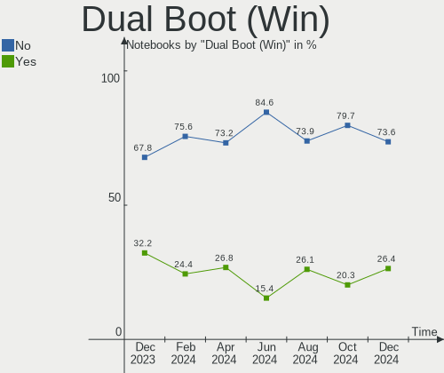
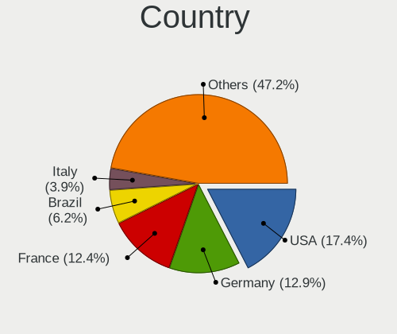
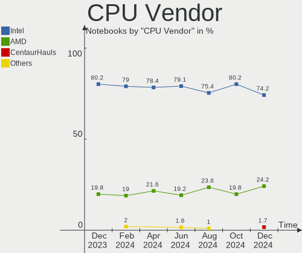
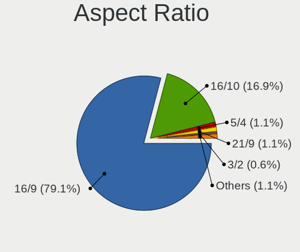
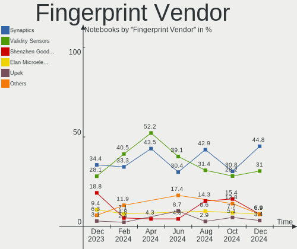

Debian - Hardware Trends (Notebooks)
------------------------------------

A project to identify most popular hardware characteristics and track their change
over time based on data collected by Linux users at https://Linux-Hardware.org.

Anyone can contribute to this report by the [hw-probe](https://github.com/linuxhw/hw-probe) tool:

    sudo -E hw-probe -all -upload

This report is for one last month. Overall report since the beginning of time: [TestDays](https://github.com/linuxhw/TestDays)

Period: Aug, 2023.

Contents
--------

* [ System ](#system)
  - [ OS                       ](#os)
  - [ OS Family                ](#os-family)
  - [ Kernel                   ](#kernel)
  - [ Kernel Family            ](#kernel-family)
  - [ Kernel Major Ver.        ](#kernel-major-ver)
  - [ Arch                     ](#arch)
  - [ DE                       ](#de)
  - [ Display Server           ](#display-server)
  - [ Display Manager          ](#display-manager)
  - [ OS Lang                  ](#os-lang)
  - [ Boot Mode                ](#boot-mode)
  - [ Filesystem               ](#filesystem)
  - [ Part. scheme             ](#part-scheme)
  - [ Dual Boot with Linux/BSD ](#dual-boot-with-linuxbsd)
  - [ Dual Boot (Win)          ](#dual-boot-win)

* [ Board ](#board)
  - [ Vendor                   ](#vendor)
  - [ Model                    ](#model)
  - [ Model Family             ](#model-family)
  - [ MFG Year                 ](#mfg-year)
  - [ Form Factor              ](#form-factor)
  - [ Secure Boot              ](#secure-boot)
  - [ Coreboot                 ](#coreboot)
  - [ RAM Size                 ](#ram-size)
  - [ RAM Used                 ](#ram-used)
  - [ Total Drives             ](#total-drives)
  - [ Has CD-ROM               ](#has-cd-rom)
  - [ Has Ethernet             ](#has-ethernet)
  - [ Has WiFi                 ](#has-wifi)
  - [ Has Bluetooth            ](#has-bluetooth)

* [ Location ](#location)
  - [ Country                  ](#country)
  - [ City                     ](#city)

* [ Drives ](#drives)
  - [ Drive Vendor             ](#drive-vendor)
  - [ Drive Model              ](#drive-model)
  - [ HDD Vendor               ](#hdd-vendor)
  - [ SSD Vendor               ](#ssd-vendor)
  - [ Drive Kind               ](#drive-kind)
  - [ Drive Connector          ](#drive-connector)
  - [ Drive Size               ](#drive-size)
  - [ Space Total              ](#space-total)
  - [ Space Used               ](#space-used)
  - [ Malfunc. Drives          ](#malfunc-drives)
  - [ Malfunc. Drive Vendor    ](#malfunc-drive-vendor)
  - [ Malfunc. HDD Vendor      ](#malfunc-hdd-vendor)
  - [ Malfunc. Drive Kind      ](#malfunc-drive-kind)
  - [ Failed Drives            ](#failed-drives)
  - [ Failed Drive Vendor      ](#failed-drive-vendor)
  - [ Drive Status             ](#drive-status)

* [ Storage controller ](#storage-controller)
  - [ Storage Vendor           ](#storage-vendor)
  - [ Storage Model            ](#storage-model)
  - [ Storage Kind             ](#storage-kind)

* [ Processor ](#processor)
  - [ CPU Vendor               ](#cpu-vendor)
  - [ CPU Model                ](#cpu-model)
  - [ CPU Model Family         ](#cpu-model-family)
  - [ CPU Cores                ](#cpu-cores)
  - [ CPU Sockets              ](#cpu-sockets)
  - [ CPU Threads              ](#cpu-threads)
  - [ CPU Op-Modes             ](#cpu-op-modes)
  - [ CPU Microcode            ](#cpu-microcode)
  - [ CPU Microarch            ](#cpu-microarch)

* [ Graphics ](#graphics)
  - [ GPU Vendor               ](#gpu-vendor)
  - [ GPU Model                ](#gpu-model)
  - [ GPU Combo                ](#gpu-combo)
  - [ GPU Driver               ](#gpu-driver)
  - [ GPU Memory               ](#gpu-memory)

* [ Monitor ](#monitor)
  - [ Monitor Vendor           ](#monitor-vendor)
  - [ Monitor Model            ](#monitor-model)
  - [ Monitor Resolution       ](#monitor-resolution)
  - [ Monitor Diagonal         ](#monitor-diagonal)
  - [ Monitor Width            ](#monitor-width)
  - [ Aspect Ratio             ](#aspect-ratio)
  - [ Monitor Area             ](#monitor-area)
  - [ Pixel Density            ](#pixel-density)
  - [ Multiple Monitors        ](#multiple-monitors)

* [ Network ](#network)
  - [ Net Controller Vendor    ](#net-controller-vendor)
  - [ Net Controller Model     ](#net-controller-model)
  - [ Wireless Vendor          ](#wireless-vendor)
  - [ Wireless Model           ](#wireless-model)
  - [ Ethernet Vendor          ](#ethernet-vendor)
  - [ Ethernet Model           ](#ethernet-model)
  - [ Net Controller Kind      ](#net-controller-kind)
  - [ Used Controller          ](#used-controller)
  - [ NICs                     ](#nics)
  - [ IPv6                     ](#ipv6)

* [ Bluetooth ](#bluetooth)
  - [ Bluetooth Vendor         ](#bluetooth-vendor)
  - [ Bluetooth Model          ](#bluetooth-model)

* [ Sound ](#sound)
  - [ Sound Vendor             ](#sound-vendor)
  - [ Sound Model              ](#sound-model)

* [ Memory ](#memory)
  - [ Memory Vendor            ](#memory-vendor)
  - [ Memory Model             ](#memory-model)
  - [ Memory Kind              ](#memory-kind)
  - [ Memory Form Factor       ](#memory-form-factor)
  - [ Memory Size              ](#memory-size)
  - [ Memory Speed             ](#memory-speed)

* [ Printers & scanners ](#printers--scanners)
  - [ Printer Vendor           ](#printer-vendor)
  - [ Printer Model            ](#printer-model)
  - [ Scanner Vendor           ](#scanner-vendor)
  - [ Scanner Model            ](#scanner-model)

* [ Camera ](#camera)
  - [ Camera Vendor            ](#camera-vendor)
  - [ Camera Model             ](#camera-model)

* [ Security ](#security)
  - [ Fingerprint Vendor       ](#fingerprint-vendor)
  - [ Fingerprint Model        ](#fingerprint-model)
  - [ Chipcard Vendor          ](#chipcard-vendor)
  - [ Chipcard Model           ](#chipcard-model)

* [ Unsupported ](#unsupported)
  - [ Unsupported Devices      ](#unsupported-devices)
  - [ Unsupported Device Types ](#unsupported-device-types)

System
------

OS
--

Installed operating systems

| Name      | Notebooks | Percent |
|-----------|-----------|---------|
| Debian 12 | 126       | 76.83%  |
| Debian 11 | 19        | 11.59%  |
| Debian    | 18        | 10.98%  |
| Debian 22 | 1         | 0.61%   |

OS Family
---------

OS without a version

| Name   | Notebooks | Percent |
|--------|-----------|---------|
| Debian | 164       | 100%    |

Kernel
------

Version of the Linux kernel

| Version                 | Notebooks | Percent |
|-------------------------|-----------|---------|
| 6.1.0-10-amd64          | 56        | 34.15%  |
| 6.1.0-11-amd64          | 51        | 31.1%   |
| 6.4.0-1-amd64           | 7         | 4.27%   |
| 6.4.0-2-amd64           | 5         | 3.05%   |
| 6.4.0-3-amd64           | 3         | 1.83%   |
| 6.1.0-9-amd64           | 3         | 1.83%   |
| 6.1.0-10-686-pae        | 3         | 1.83%   |
| 5.10.0-24-amd64         | 3         | 1.83%   |
| 5.10.0-23-amd64         | 3         | 1.83%   |
| 6.2.16-6-pve            | 2         | 1.22%   |
| 6.1.0-0.deb11.7-amd64   | 2         | 1.22%   |
| 6.5.0-rc5               | 1         | 0.61%   |
| 6.4.9-1-liquorix-amd64  | 1         | 0.61%   |
| 6.4.8-1-liquorix-amd64  | 1         | 0.61%   |
| 6.4.2-1-liquorix-amd64  | 1         | 0.61%   |
| 6.4.12-1-liquorix-amd64 | 1         | 0.61%   |
| 6.4.11-stable           | 1         | 0.61%   |
| 6.4.11-2-liquorix-amd64 | 1         | 0.61%   |
| 6.4.0-1mx-ahs-amd64     | 1         | 0.61%   |
| 6.4.0-0.deb12.2-amd64   | 1         | 0.61%   |
| 6.3.0-0-amd64           | 1         | 0.61%   |
| 6.2.16-8-pve            | 1         | 0.61%   |
| 6.1.38-icbinu           | 1         | 0.61%   |
| 6.1.38-cuerdos-amd      | 1         | 0.61%   |
| 6.1.0-3-amd64           | 1         | 0.61%   |
| 6.1.0-10-686            | 1         | 0.61%   |
| 6.0.0-3-amd64           | 1         | 0.61%   |
| 6.0.0-2-amd64           | 1         | 0.61%   |
| 5.19.0-2mx-amd64        | 1         | 0.61%   |
| 5.19.0-0.deb11.2-amd64  | 1         | 0.61%   |
| 5.16.0-3-amd64          | 1         | 0.61%   |
| 5.10.0-25-amd64         | 1         | 0.61%   |
| 5.10.0-23-686           | 1         | 0.61%   |
| 5.10.0-22-amd64         | 1         | 0.61%   |
| 5.10.0-21-amd64         | 1         | 0.61%   |
| 5.10.0-18-686-pae       | 1         | 0.61%   |
| 5.10.0-16-amd64         | 1         | 0.61%   |

Kernel Family
-------------

Linux kernel without a distro release

| Version | Notebooks | Percent |
|---------|-----------|---------|
| 6.1.0   | 117       | 71.34%  |
| 6.4.0   | 17        | 10.37%  |
| 5.10.0  | 12        | 7.32%   |
| 6.2.16  | 3         | 1.83%   |
| 6.4.11  | 2         | 1.22%   |
| 6.1.38  | 2         | 1.22%   |
| 6.0.0   | 2         | 1.22%   |
| 5.19.0  | 2         | 1.22%   |
| 6.5.0   | 1         | 0.61%   |
| 6.4.9   | 1         | 0.61%   |
| 6.4.8   | 1         | 0.61%   |
| 6.4.2   | 1         | 0.61%   |
| 6.4.12  | 1         | 0.61%   |
| 6.3.0   | 1         | 0.61%   |
| 5.16.0  | 1         | 0.61%   |

Kernel Major Ver.
-----------------

Linux kernel major version

| Version | Notebooks | Percent |
|---------|-----------|---------|
| 6.1     | 119       | 72.56%  |
| 6.4     | 23        | 14.02%  |
| 5.10    | 12        | 7.32%   |
| 6.2     | 3         | 1.83%   |
| 6.0     | 2         | 1.22%   |
| 5.19    | 2         | 1.22%   |
| 6.5     | 1         | 0.61%   |
| 6.3     | 1         | 0.61%   |
| 5.16    | 1         | 0.61%   |

Arch
----

OS architecture (x86_64, i586, etc.)

| Name   | Notebooks | Percent |
|--------|-----------|---------|
| x86_64 | 158       | 96.34%  |
| i686   | 6         | 3.66%   |

DE
--

Desktop Environment

| Name          | Notebooks | Percent |
|---------------|-----------|---------|
| GNOME         | 56        | 34.15%  |
| KDE5          | 40        | 24.39%  |
| XFCE          | 24        | 14.63%  |
| Unknown       | 15        | 9.15%   |
| X-Cinnamon    | 9         | 5.49%   |
| LXQt          | 4         | 2.44%   |
| LXDE          | 4         | 2.44%   |
| i3            | 4         | 2.44%   |
| MATE          | 3         | 1.83%   |
| GNOME Classic | 2         | 1.22%   |
| Cinnamon      | 2         | 1.22%   |
| dwm           | 1         | 0.61%   |

Display Server
--------------

X11 or Wayland

| Name    | Notebooks | Percent |
|---------|-----------|---------|
| X11     | 84        | 51.22%  |
| Wayland | 61        | 37.2%   |
| Tty     | 11        | 6.71%   |
| Unknown | 8         | 4.88%   |

Display Manager
---------------

SDDM, LightDM, etc.

| Name    | Notebooks | Percent |
|---------|-----------|---------|
| Unknown | 59        | 35.98%  |
| GDM3    | 40        | 24.39%  |
| LightDM | 33        | 20.12%  |
| SDDM    | 27        | 16.46%  |
| Ly      | 2         | 1.22%   |
| GDM     | 2         | 1.22%   |
| XDM     | 1         | 0.61%   |

OS Lang
-------

Language

| Lang    | Notebooks | Percent |
|---------|-----------|---------|
| en_US   | 70        | 42.68%  |
| de_DE   | 13        | 7.93%   |
| pt_BR   | 12        | 7.32%   |
| en_GB   | 10        | 6.1%    |
| Unknown | 8         | 4.88%   |
| ru_RU   | 7         | 4.27%   |
| fr_FR   | 4         | 2.44%   |
| nl_NL   | 3         | 1.83%   |
| es_ES   | 3         | 1.83%   |
| en_IN   | 3         | 1.83%   |
| en_IE   | 3         | 1.83%   |
| en_AU   | 3         | 1.83%   |
| ca_ES   | 3         | 1.83%   |
| zh_TW   | 2         | 1.22%   |
| zh_CN   | 2         | 1.22%   |
| es_CL   | 2         | 1.22%   |
| cs_CZ   | 2         | 1.22%   |
| zh_SG   | 1         | 0.61%   |
| pt_PT   | 1         | 0.61%   |
| lv_LV   | 1         | 0.61%   |
| it_IT   | 1         | 0.61%   |
| it_CH   | 1         | 0.61%   |
| hu_HU   | 1         | 0.61%   |
| gl_ES   | 1         | 0.61%   |
| es_VE   | 1         | 0.61%   |
| es_UY   | 1         | 0.61%   |
| en_PH   | 1         | 0.61%   |
| en_DE   | 1         | 0.61%   |
| en_CA   | 1         | 0.61%   |
| C       | 1         | 0.61%   |
| be_BY   | 1         | 0.61%   |

Boot Mode
---------

EFI or BIOS

| Mode | Notebooks | Percent |
|------|-----------|---------|
| EFI  | 90        | 54.88%  |
| BIOS | 74        | 45.12%  |

Filesystem
----------

Type of filesystem

| Type    | Notebooks | Percent |
|---------|-----------|---------|
| Ext4    | 130       | 79.27%  |
| Overlay | 14        | 8.54%   |
| Btrfs   | 10        | 6.1%    |
| Tmpfs   | 6         | 3.66%   |
| Xfs     | 2         | 1.22%   |
| Zfs     | 1         | 0.61%   |
| Ext3    | 1         | 0.61%   |

Part. scheme
------------

Scheme of partitioning

| Type    | Notebooks | Percent |
|---------|-----------|---------|
| GPT     | 102       | 62.2%   |
| Unknown | 45        | 27.44%  |
| MBR     | 17        | 10.37%  |

Dual Boot with Linux/BSD
------------------------

Hosting more than one Linux/BSD

| Dual boot | Notebooks | Percent |
|-----------|-----------|---------|
| No        | 148       | 90.24%  |
| Yes       | 16        | 9.76%   |

Dual Boot (Win)
---------------

Hosting Linux and Windows

| Dual boot | Notebooks | Percent |
|-----------|-----------|---------|
| No        | 127       | 77.44%  |
| Yes       | 37        | 22.56%  |

Board
-----

Vendor
------

Motherboard manufacturer

| Name                   | Notebooks | Percent |
|------------------------|-----------|---------|
| Lenovo                 | 44        | 26.83%  |
| Hewlett-Packard        | 22        | 13.41%  |
| Dell                   | 19        | 11.59%  |
| Acer                   | 19        | 11.59%  |
| ASUSTek Computer       | 17        | 10.37%  |
| Sony                   | 4         | 2.44%   |
| MSI                    | 4         | 2.44%   |
| Google                 | 4         | 2.44%   |
| Apple                  | 4         | 2.44%   |
| Unknown                | 4         | 2.44%   |
| Samsung Electronics    | 3         | 1.83%   |
| Alienware              | 3         | 1.83%   |
| HUAWEI                 | 2         | 1.22%   |
| GPU Company            | 2         | 1.22%   |
| Framework              | 2         | 1.22%   |
| win element            | 1         | 0.61%   |
| Timi                   | 1         | 0.61%   |
| Shuttle                | 1         | 0.61%   |
| Positivo               | 1         | 0.61%   |
| PC Specialist          | 1         | 0.61%   |
| Panasonic              | 1         | 0.61%   |
| HONOR                  | 1         | 0.61%   |
| Gigabyte Technology    | 1         | 0.61%   |
| EUROCOM                | 1         | 0.61%   |
| Echips Import          | 1         | 0.61%   |
| Avell High Performance | 1         | 0.61%   |

Model
-----

Motherboard model

| Name                                       | Notebooks | Percent |
|--------------------------------------------|-----------|---------|
| Unknown                                    | 4         | 2.44%   |
| Lenovo ThinkPad 13 2nd Gen 20J10046US      | 3         | 1.83%   |
| HP Laptop 15s-eq2xxx                       | 3         | 1.83%   |
| HP EliteBook 840 G3                        | 3         | 1.83%   |
| HP Pavilion dv5                            | 2         | 1.22%   |
| Google Enguarde                            | 2         | 1.22%   |
| Framework Laptop (13th Gen Intel Core)     | 2         | 1.22%   |
| Dell XPS 9320                              | 2         | 1.22%   |
| Acer Swift SF314-512                       | 2         | 1.22%   |
| Acer Aspire A515-57                        | 2         | 1.22%   |
| win element MoreFine S500+                 | 1         | 0.61%   |
| Timi Xiaomi Book Pro 16 2022               | 1         | 0.61%   |
| Sony VPCEH2J9R                             | 1         | 0.61%   |
| Sony VGN-NS11S_S                           | 1         | 0.61%   |
| Sony VGN-FW373D                            | 1         | 0.61%   |
| Sony SVE14123CBW                           | 1         | 0.61%   |
| Shuttle DS47D                              | 1         | 0.61%   |
| Samsung 905S3G/906S3G/915S3G               | 1         | 0.61%   |
| Samsung 305U1A                             | 1         | 0.61%   |
| Samsung 300E5M/300E5L                      | 1         | 0.61%   |
| Positivo Mobile                            | 1         | 0.61%   |
| PC Specialist NH5xAx                       | 1         | 0.61%   |
| Panasonic CFMX4-1                          | 1         | 0.61%   |
| MSI Stealth 17Studio A13VF                 | 1         | 0.61%   |
| MSI MS-7D94                                | 1         | 0.61%   |
| MSI GS65 Stealth Thin 8RE                  | 1         | 0.61%   |
| MSI GP76 Leopard 11UG                      | 1         | 0.61%   |
| Lenovo Yoga Pro 9 16IRP8 83BY              | 1         | 0.61%   |
| Lenovo Yoga Pro 7 14ARP8 83AU              | 1         | 0.61%   |
| Lenovo ThinkPad Z13 Gen 1 21D2000JUS       | 1         | 0.61%   |
| Lenovo ThinkPad X220 4291MW5               | 1         | 0.61%   |
| Lenovo ThinkPad X1 Carbon Gen 9 20XW003FUS | 1         | 0.61%   |
| Lenovo ThinkPad X1 Carbon Gen 8 20UAS2VA00 | 1         | 0.61%   |
| Lenovo ThinkPad X1 Carbon 4th 20FCS43F00   | 1         | 0.61%   |
| Lenovo ThinkPad W540 20BG0016US            | 1         | 0.61%   |
| Lenovo ThinkPad W530 24477V0               | 1         | 0.61%   |
| Lenovo ThinkPad T530 2394EN6               | 1         | 0.61%   |
| Lenovo ThinkPad T495s 20QJCTO1WW           | 1         | 0.61%   |
| Lenovo ThinkPad T480 20L6S5LF00            | 1         | 0.61%   |
| Lenovo ThinkPad T480 20L6S29E02            | 1         | 0.61%   |

Model Family
------------

Motherboard model prefix

| Name                 | Notebooks | Percent |
|----------------------|-----------|---------|
| Lenovo ThinkPad      | 28        | 17.07%  |
| Acer Aspire          | 12        | 7.32%   |
| Lenovo IdeaPad       | 7         | 4.27%   |
| HP Laptop            | 7         | 4.27%   |
| Dell Latitude        | 6         | 3.66%   |
| Dell Inspiron        | 6         | 3.66%   |
| HP EliteBook         | 5         | 3.05%   |
| Dell Vostro          | 4         | 2.44%   |
| Unknown              | 4         | 2.44%   |
| Lenovo Legion        | 3         | 1.83%   |
| HP ProBook           | 3         | 1.83%   |
| Dell XPS             | 3         | 1.83%   |
| ASUS VivoBook        | 3         | 1.83%   |
| Acer Swift           | 3         | 1.83%   |
| Lenovo Yoga          | 2         | 1.22%   |
| HP Pavilion          | 2         | 1.22%   |
| Google Enguarde      | 2         | 1.22%   |
| Framework Laptop     | 2         | 1.22%   |
| ASUS ZenBook         | 2         | 1.22%   |
| ASUS TUF             | 2         | 1.22%   |
| Acer TravelMate      | 2         | 1.22%   |
| win element MoreFine | 1         | 0.61%   |
| Timi Xiaomi          | 1         | 0.61%   |
| Sony VPCEH2J9R       | 1         | 0.61%   |
| Sony VGN-NS11S       | 1         | 0.61%   |
| Sony VGN-FW373D      | 1         | 0.61%   |
| Sony SVE14123CBW     | 1         | 0.61%   |
| Shuttle DS47D        | 1         | 0.61%   |
| Samsung 905S3G       | 1         | 0.61%   |
| Samsung 305U1A       | 1         | 0.61%   |
| Samsung 300E5M       | 1         | 0.61%   |
| Positivo Mobile      | 1         | 0.61%   |
| PC Specialist NH5xAx | 1         | 0.61%   |
| Panasonic CFMX4-1    | 1         | 0.61%   |
| MSI Stealth          | 1         | 0.61%   |
| MSI MS-7D94          | 1         | 0.61%   |
| MSI GS65             | 1         | 0.61%   |
| MSI GP76             | 1         | 0.61%   |
| Lenovo ThinkBook     | 1         | 0.61%   |
| Lenovo G505s         | 1         | 0.61%   |

MFG Year
--------

Motherboard manufacture year

| Year | Notebooks | Percent |
|------|-----------|---------|
| 2021 | 29        | 17.68%  |
| 2022 | 23        | 14.02%  |
| 2020 | 14        | 8.54%   |
| 2018 | 12        | 7.32%   |
| 2023 | 10        | 6.1%    |
| 2016 | 10        | 6.1%    |
| 2019 | 8         | 4.88%   |
| 2013 | 8         | 4.88%   |
| 2012 | 8         | 4.88%   |
| 2011 | 8         | 4.88%   |
| 2017 | 7         | 4.27%   |
| 2015 | 6         | 3.66%   |
| 2014 | 6         | 3.66%   |
| 2010 | 6         | 3.66%   |
| 2009 | 4         | 2.44%   |
| 2008 | 4         | 2.44%   |
| 2004 | 1         | 0.61%   |

Form Factor
-----------

Physical design of the computer

| Name     | Notebooks | Percent |
|----------|-----------|---------|
| Notebook | 164       | 100%    |

Secure Boot
-----------

Enabled or disabled

| State    | Notebooks | Percent |
|----------|-----------|---------|
| Disabled | 150       | 91.46%  |
| Enabled  | 14        | 8.54%   |

Coreboot
--------

Have coreboot on board

| Used | Notebooks | Percent |
|------|-----------|---------|
| No   | 157       | 95.73%  |
| Yes  | 7         | 4.27%   |

RAM Size
--------

Total RAM memory

| Size in GB  | Notebooks | Percent |
|-------------|-----------|---------|
| 16.01-24.0  | 46        | 28.05%  |
| 4.01-8.0    | 36        | 21.95%  |
| 8.01-16.0   | 35        | 21.34%  |
| 3.01-4.0    | 18        | 10.98%  |
| 32.01-64.0  | 17        | 10.37%  |
| 24.01-32.0  | 4         | 2.44%   |
| 64.01-256.0 | 3         | 1.83%   |
| 2.01-3.0    | 2         | 1.22%   |
| 0.51-1.0    | 2         | 1.22%   |
| 1.01-2.0    | 1         | 0.61%   |

RAM Used
--------

Used RAM memory

| Used GB    | Notebooks | Percent |
|------------|-----------|---------|
| 4.01-8.0   | 42        | 25.61%  |
| 1.01-2.0   | 41        | 25%     |
| 3.01-4.0   | 33        | 20.12%  |
| 2.01-3.0   | 28        | 17.07%  |
| 8.01-16.0  | 8         | 4.88%   |
| 0.51-1.0   | 5         | 3.05%   |
| 0.01-0.5   | 4         | 2.44%   |
| 16.01-24.0 | 3         | 1.83%   |

Total Drives
------------

Number of drives on board

| Drives | Notebooks | Percent |
|--------|-----------|---------|
| 1      | 121       | 73.78%  |
| 2      | 33        | 20.12%  |
| 3      | 10        | 6.1%    |

Has CD-ROM
----------

Has CD-ROM on board

| Presented | Notebooks | Percent |
|-----------|-----------|---------|
| No        | 134       | 81.71%  |
| Yes       | 30        | 18.29%  |

Has Ethernet
------------

Has Ethernet on board

| Presented | Notebooks | Percent |
|-----------|-----------|---------|
| Yes       | 119       | 72.56%  |
| No        | 45        | 27.44%  |

Has WiFi
--------

Has WiFi module

| Presented | Notebooks | Percent |
|-----------|-----------|---------|
| Yes       | 161       | 98.17%  |
| No        | 3         | 1.83%   |

Has Bluetooth
-------------

Has Bluetooth module

| Presented | Notebooks | Percent |
|-----------|-----------|---------|
| Yes       | 140       | 85.37%  |
| No        | 24        | 14.63%  |

Location
--------

Country
-------

Geographic location (country)

| Country      | Notebooks | Percent |
|--------------|-----------|---------|
| USA          | 29        | 17.68%  |
| Germany      | 21        | 12.8%   |
| Russia       | 11        | 6.71%   |
| Brazil       | 11        | 6.71%   |
| Spain        | 8         | 4.88%   |
| Netherlands  | 6         | 3.66%   |
| France       | 5         | 3.05%   |
| China        | 5         | 3.05%   |
| Canada       | 5         | 3.05%   |
| UK           | 4         | 2.44%   |
| Poland       | 4         | 2.44%   |
| Czechia      | 4         | 2.44%   |
| Italy        | 3         | 1.83%   |
| Iran         | 3         | 1.83%   |
| India        | 3         | 1.83%   |
| Costa Rica   | 3         | 1.83%   |
| Chile        | 3         | 1.83%   |
| Australia    | 3         | 1.83%   |
| Taiwan       | 2         | 1.22%   |
| Mexico       | 2         | 1.22%   |
| Ireland      | 2         | 1.22%   |
| Bangladesh   | 2         | 1.22%   |
| Austria      | 2         | 1.22%   |
| Venezuela    | 1         | 0.61%   |
| Uruguay      | 1         | 0.61%   |
| Ukraine      | 1         | 0.61%   |
| Turkey       | 1         | 0.61%   |
| Thailand     | 1         | 0.61%   |
| Switzerland  | 1         | 0.61%   |
| Sweden       | 1         | 0.61%   |
| South Africa | 1         | 0.61%   |
| Slovenia     | 1         | 0.61%   |
| Slovakia     | 1         | 0.61%   |
| Singapore    | 1         | 0.61%   |
| Serbia       | 1         | 0.61%   |
| Portugal     | 1         | 0.61%   |
| Philippines  | 1         | 0.61%   |
| Norway       | 1         | 0.61%   |
| Lithuania    | 1         | 0.61%   |
| Latvia       | 1         | 0.61%   |

City
----

Geographic location (city)

| City                   | Notebooks | Percent |
|------------------------|-----------|---------|
| Bangor                 | 8         | 4.88%   |
| Moscow                 | 4         | 2.44%   |
| Santiago               | 3         | 1.83%   |
| Karlsruhe              | 3         | 1.83%   |
| Berlin                 | 3         | 1.83%   |
| Benicarló             | 3         | 1.83%   |
| Washington             | 2         | 1.22%   |
| Vancouver              | 2         | 1.22%   |
| Tehran                 | 2         | 1.22%   |
| Prague                 | 2         | 1.22%   |
| Madrid                 | 2         | 1.22%   |
| Jena                   | 2         | 1.22%   |
| Fortaleza              | 2         | 1.22%   |
| Dublin                 | 2         | 1.22%   |
| Curitiba               | 2         | 1.22%   |
| Beijing                | 2         | 1.22%   |
| Zoetermeer             | 1         | 0.61%   |
| Yorkton                | 1         | 0.61%   |
| Yokohama               | 1         | 0.61%   |
| Wynne                  | 1         | 0.61%   |
| Wuhan                  | 1         | 0.61%   |
| Wichita Falls          | 1         | 0.61%   |
| Wenzhou                | 1         | 0.61%   |
| Warsaw                 | 1         | 0.61%   |
| Voronezh               | 1         | 0.61%   |
| Volgograd              | 1         | 0.61%   |
| Vladivostok            | 1         | 0.61%   |
| Villingen-Schwenningen | 1         | 0.61%   |
| Vienna                 | 1         | 0.61%   |
| Tyumen                 | 1         | 0.61%   |
| Tver                   | 1         | 0.61%   |
| Troy                   | 1         | 0.61%   |
| Torreón               | 1         | 0.61%   |
| Toronto                | 1         | 0.61%   |
| Talence                | 1         | 0.61%   |
| Taipei                 | 1         | 0.61%   |
| Taichung               | 1         | 0.61%   |
| Sydney                 | 1         | 0.61%   |
| Stockholm              | 1         | 0.61%   |
| Steinkjer              | 1         | 0.61%   |

Drives
------

Drive Vendor
------------

Hard drive vendors

| Vendor                      | Notebooks | Drives | Percent |
|-----------------------------|-----------|--------|---------|
| Samsung Electronics         | 31        | 34     | 14.62%  |
| Sandisk                     | 18        | 18     | 8.49%   |
| SK hynix                    | 16        | 16     | 7.55%   |
| WDC                         | 13        | 14     | 6.13%   |
| Micron Technology           | 13        | 13     | 6.13%   |
| Toshiba                     | 12        | 12     | 5.66%   |
| Seagate                     | 12        | 12     | 5.66%   |
| Kingston                    | 12        | 12     | 5.66%   |
| Unknown                     | 10        | 10     | 4.72%   |
| Intel                       | 9         | 10     | 4.25%   |
| Crucial                     | 6         | 7      | 2.83%   |
| A-DATA Technology           | 6         | 6      | 2.83%   |
| SPCC                        | 3         | 3      | 1.42%   |
| Hitachi                     | 3         | 3      | 1.42%   |
| Wibtek                      | 2         | 2      | 0.94%   |
| SSSTC                       | 2         | 2      | 0.94%   |
| Silicon Motion              | 2         | 2      | 0.94%   |
| PNY                         | 2         | 2      | 0.94%   |
| Phison                      | 2         | 2      | 0.94%   |
| Kingston Technology Company | 2         | 2      | 0.94%   |
| HGST                        | 2         | 2      | 0.94%   |
| China                       | 2         | 2      | 0.94%   |
| ADATA Technology            | 2         | 2      | 0.94%   |
| ZHITAI                      | 1         | 1      | 0.47%   |
| YMTC                        | 1         | 1      | 0.47%   |
| WALRAM                      | 1         | 1      | 0.47%   |
| Union Memory (Shenzhen)     | 1         | 1      | 0.47%   |
| UMIS                        | 1         | 1      | 0.47%   |
| ShiJi                       | 1         | 1      | 0.47%   |
| SD                          | 1         | 1      | 0.47%   |
| Realtek Semiconductor       | 1         | 1      | 0.47%   |
| Realtek                     | 1         | 1      | 0.47%   |
| Plextor                     | 1         | 1      | 0.47%   |
| Patriot                     | 1         | 1      | 0.47%   |
| Mushkin                     | 1         | 1      | 0.47%   |
| LITEONIT                    | 1         | 1      | 0.47%   |
| LITEON                      | 1         | 1      | 0.47%   |
| KIOXIA-EXCERIA              | 1         | 1      | 0.47%   |
| KIOXIA                      | 1         | 1      | 0.47%   |
| Kingmax                     | 1         | 1      | 0.47%   |

Drive Model
-----------

Hard drive models

| Model                                                 | Notebooks | Percent |
|-------------------------------------------------------|-----------|---------|
| Seagate ST1000LM035-1RK172 1TB                        | 4         | 1.84%   |
| SanDisk SD8SN8U128G1001 128GB SSD                     | 4         | 1.84%   |
| Micron 2450_MTFDKBA512TFK 512GB                       | 4         | 1.84%   |
| Kingston SA400S37120G 120GB SSD                       | 3         | 1.38%   |
| Wibtek W800S 512GB SSD                                | 2         | 0.92%   |
| Unknown MMC Card  128GB                               | 2         | 0.92%   |
| Toshiba MQ04ABF100 1TB                                | 2         | 0.92%   |
| Toshiba MQ01ABF050 500GB                              | 2         | 0.92%   |
| SK hynix SKHynix_HFS001TEJ9X115N 1TB                  | 2         | 0.92%   |
| SK hynix BC711 HFM512GD3JX013N 512GB                  | 2         | 0.92%   |
| Sandisk WD Blue SN550 NVMe SSD 250GB                  | 2         | 0.92%   |
| Samsung SSD 860 QVO 1TB                               | 2         | 0.92%   |
| Samsung SSD 860 EVO 500GB                             | 2         | 0.92%   |
| Samsung PM991a NVMe 256GB                             | 2         | 0.92%   |
| Samsung NVMe SSD Controller SM981/PM981/PM983 500GB   | 2         | 0.92%   |
| Samsung NVMe SSD Controller PM9A1/PM9A3/980PRO 1024GB | 2         | 0.92%   |
| Kingston SUV400S37240G 240GB SSD                      | 2         | 0.92%   |
| Kingston SA400S37480G 480GB SSD                       | 2         | 0.92%   |
| Kingston SA400S37240G 240GB SSD                       | 2         | 0.92%   |
| Crucial CT500MX500SSD1 500GB                          | 2         | 0.92%   |
| ZHITAI PC005 Active 512GB                             | 1         | 0.46%   |
| YMTC PC005 512GB                                      | 1         | 0.46%   |
| WDC WDS100T3X0C-00SJG0 1TB                            | 1         | 0.46%   |
| WDC WD5000LPCX-35VHAT0 500GB                          | 1         | 0.46%   |
| WDC WD50 00LPLX-00ZNT 500GB                           | 1         | 0.46%   |
| WDC WD3200BPVT-80ZEST0 320GB                          | 1         | 0.46%   |
| WDC WD3200BEVT-80A0RT0 320GB                          | 1         | 0.46%   |
| WDC WD3200BEVT-60ZCT0 320GB                           | 1         | 0.46%   |
| WDC WD10SPZX-21Z10T0 1TB                              | 1         | 0.46%   |
| WDC WD10SPZX-08Z10 1TB                                | 1         | 0.46%   |
| WDC WD10JPVX-22JC3T0 1TB                              | 1         | 0.46%   |
| WDC WD Blue SA510 2.5 1000GB                          | 1         | 0.46%   |
| WDC PC SN730 SDBQNTY-512G-1001 512GB                  | 1         | 0.46%   |
| WDC PC SN720 SDAQNTW-512G-1001 512GB                  | 1         | 0.46%   |
| WDC PC SN530 SDBPNPZ-256G-1114 256GB                  | 1         | 0.46%   |
| WDC PC SN530 SDBPMPZ-512G-1101 512GB                  | 1         | 0.46%   |
| WALRAM 1TB                                            | 1         | 0.46%   |
| Unknown NVMe SSD Drive 1TB                            | 1         | 0.46%   |
| Unknown MMC Card  16GB                                | 1         | 0.46%   |
| Unknown hDEaP3  128GB                                 | 1         | 0.46%   |

HDD Vendor
----------

Hard disk drive vendors

| Vendor              | Notebooks | Drives | Percent |
|---------------------|-----------|--------|---------|
| Seagate             | 12        | 12     | 35.29%  |
| WDC                 | 8         | 8      | 23.53%  |
| Toshiba             | 6         | 6      | 17.65%  |
| Hitachi             | 3         | 3      | 8.82%   |
| HGST                | 2         | 2      | 5.88%   |
| WALRAM              | 1         | 1      | 2.94%   |
| Samsung Electronics | 1         | 1      | 2.94%   |
| Fujitsu             | 1         | 1      | 2.94%   |

SSD Vendor
----------

Solid state drive vendors

| Vendor              | Notebooks | Drives | Percent |
|---------------------|-----------|--------|---------|
| Samsung Electronics | 13        | 13     | 18.06%  |
| Kingston            | 9         | 9      | 12.5%   |
| SanDisk             | 8         | 8      | 11.11%  |
| Crucial             | 4         | 5      | 5.56%   |
| A-DATA Technology   | 4         | 4      | 5.56%   |
| SPCC                | 3         | 3      | 4.17%   |
| Wibtek              | 2         | 2      | 2.78%   |
| SK hynix            | 2         | 2      | 2.78%   |
| PNY                 | 2         | 2      | 2.78%   |
| Micron Technology   | 2         | 2      | 2.78%   |
| Intel               | 2         | 2      | 2.78%   |
| China               | 2         | 2      | 2.78%   |
| WDC                 | 1         | 1      | 1.39%   |
| Toshiba             | 1         | 1      | 1.39%   |
| SD                  | 1         | 1      | 1.39%   |
| Plextor             | 1         | 1      | 1.39%   |
| Patriot             | 1         | 1      | 1.39%   |
| Mushkin             | 1         | 1      | 1.39%   |
| LITEONIT            | 1         | 1      | 1.39%   |
| LITEON              | 1         | 1      | 1.39%   |
| KIOXIA-EXCERIA      | 1         | 1      | 1.39%   |
| Kingmax             | 1         | 1      | 1.39%   |
| KingFast            | 1         | 1      | 1.39%   |
| Kingchuxing         | 1         | 1      | 1.39%   |
| Intenso             | 1         | 1      | 1.39%   |
| INNOVATION IT       | 1         | 1      | 1.39%   |
| GLOWAY              | 1         | 1      | 1.39%   |
| Gateway             | 1         | 1      | 1.39%   |
| BP4                 | 1         | 1      | 1.39%   |
| Apple               | 1         | 1      | 1.39%   |
| Apacer              | 1         | 1      | 1.39%   |

Drive Kind
----------

HDD or SSD

| Kind    | Notebooks | Drives | Percent |
|---------|-----------|--------|---------|
| NVMe    | 82        | 99     | 42.05%  |
| SSD     | 67        | 73     | 34.36%  |
| HDD     | 34        | 34     | 17.44%  |
| MMC     | 10        | 10     | 5.13%   |
| Unknown | 2         | 2      | 1.03%   |

Drive Connector
---------------

SATA, SAS, NVMe, etc.

| Type | Notebooks | Drives | Percent |
|------|-----------|--------|---------|
| SATA | 91        | 101    | 47.64%  |
| NVMe | 82        | 98     | 42.93%  |
| MMC  | 10        | 10     | 5.24%   |
| SAS  | 8         | 9      | 4.19%   |

Drive Size
----------

Size of hard drive

| Size in TB | Notebooks | Drives | Percent |
|------------|-----------|--------|---------|
| 0.01-0.5   | 63        | 67     | 61.76%  |
| 0.51-1.0   | 34        | 35     | 33.33%  |
| 1.01-2.0   | 3         | 3      | 2.94%   |
| 3.01-4.0   | 1         | 1      | 0.98%   |
| 4.01-10.0  | 1         | 1      | 0.98%   |

Space Total
-----------

Amount of disk space available on the file system

| Size in GB     | Notebooks | Percent |
|----------------|-----------|---------|
| 251-500        | 52        | 31.71%  |
| 101-250        | 43        | 26.22%  |
| 501-1000       | 21        | 12.8%   |
| 1001-2000      | 12        | 7.32%   |
| 51-100         | 11        | 6.71%   |
| 1-20           | 9         | 5.49%   |
| 21-50          | 6         | 3.66%   |
| Unknown        | 5         | 3.05%   |
| More than 3000 | 4         | 2.44%   |
| 2001-3000      | 1         | 0.61%   |

Space Used
----------

Amount of used disk space

| Used GB        | Notebooks | Percent |
|----------------|-----------|---------|
| 1-20           | 62        | 37.8%   |
| 21-50          | 33        | 20.12%  |
| 101-250        | 20        | 12.2%   |
| 251-500        | 18        | 10.98%  |
| 51-100         | 15        | 9.15%   |
| 501-1000       | 9         | 5.49%   |
| Unknown        | 5         | 3.05%   |
| More than 3000 | 1         | 0.61%   |
| 1001-2000      | 1         | 0.61%   |

Malfunc. Drives
---------------

Drive models with a malfunction

| Model                                      | Notebooks | Drives | Percent |
|--------------------------------------------|-----------|--------|---------|
| WDC WD3200BPVT-80ZEST0 320GB               | 1         | 1      | 5.88%   |
| WDC WD3200BEVT-80A0RT0 320GB               | 1         | 1      | 5.88%   |
| Toshiba MQ01ACF032 320GB                   | 1         | 1      | 5.88%   |
| Toshiba MK3265GSX 320GB                    | 1         | 1      | 5.88%   |
| SSSTC CL1-4D128 128GB                      | 1         | 1      | 5.88%   |
| SK hynix PC711 HFS512GDE9X073N 512GB       | 1         | 1      | 5.88%   |
| SK hynix HFS128G3BTND-N210A 128GB SSD      | 1         | 1      | 5.88%   |
| SK hynix HFS128G39TND-N210A 128GB SSD      | 1         | 1      | 5.88%   |
| SK hynix BC711 HFM512GD3JX013N 512GB       | 1         | 1      | 5.88%   |
| ShiJi 1TB                                  | 1         | 1      | 5.88%   |
| Seagate ST320LM001 HN-M320MBB 320GB        | 1         | 1      | 5.88%   |
| Kingston SA400S37240G 240GB SSD            | 1         | 1      | 5.88%   |
| Intel SSDSC2BW120A4 120GB                  | 1         | 1      | 5.88%   |
| Intel SSDPEKKW128G7 BTPY63260JJU128A 128GB | 1         | 1      | 5.88%   |
| HGST HTS721010A9E630 1TB                   | 1         | 1      | 5.88%   |
| GLOWAY STK240GS3-S7 240GB SSD              | 1         | 1      | 5.88%   |
| Crucial CT525MX300SSD1 528GB               | 1         | 1      | 5.88%   |

Malfunc. Drive Vendor
---------------------

Vendors of faulty drives

| Vendor   | Notebooks | Drives | Percent |
|----------|-----------|--------|---------|
| SK hynix | 4         | 4      | 23.53%  |
| WDC      | 2         | 2      | 11.76%  |
| Toshiba  | 2         | 2      | 11.76%  |
| Intel    | 2         | 2      | 11.76%  |
| SSSTC    | 1         | 1      | 5.88%   |
| ShiJi    | 1         | 1      | 5.88%   |
| Seagate  | 1         | 1      | 5.88%   |
| Kingston | 1         | 1      | 5.88%   |
| HGST     | 1         | 1      | 5.88%   |
| GLOWAY   | 1         | 1      | 5.88%   |
| Crucial  | 1         | 1      | 5.88%   |

Malfunc. HDD Vendor
-------------------

Vendors of faulty HDD drives

| Vendor  | Notebooks | Drives | Percent |
|---------|-----------|--------|---------|
| WDC     | 2         | 2      | 33.33%  |
| Toshiba | 2         | 2      | 33.33%  |
| Seagate | 1         | 1      | 16.67%  |
| HGST    | 1         | 1      | 16.67%  |

Malfunc. Drive Kind
-------------------

Kinds of faulty drives

| Kind | Notebooks | Drives | Percent |
|------|-----------|--------|---------|
| SSD  | 6         | 6      | 35.29%  |
| HDD  | 6         | 6      | 35.29%  |
| NVMe | 5         | 5      | 29.41%  |

Failed Drives
-------------

Failed drive models

Zero info for selected period =(

Failed Drive Vendor
-------------------

Failed drive vendors

Zero info for selected period =(

Drive Status
------------

Number of failed and malfunc. drives

| Status   | Notebooks | Drives | Percent |
|----------|-----------|--------|---------|
| Works    | 92        | 111    | 51.98%  |
| Detected | 68        | 90     | 38.42%  |
| Malfunc  | 17        | 17     | 9.6%    |

Storage controller
------------------

Storage Vendor
--------------

Storage controller vendors

| Vendor                         | Notebooks | Percent |
|--------------------------------|-----------|---------|
| Intel                          | 102       | 47.66%  |
| AMD                            | 22        | 10.28%  |
| Samsung Electronics            | 18        | 8.41%   |
| SanDisk                        | 15        | 7.01%   |
| SK hynix                       | 14        | 6.54%   |
| Micron Technology              | 11        | 5.14%   |
| Toshiba America Info Systems   | 5         | 2.34%   |
| Kingston Technology Company    | 5         | 2.34%   |
| ADATA Technology               | 4         | 1.87%   |
| Silicon Motion                 | 3         | 1.4%    |
| Phison Electronics             | 3         | 1.4%    |
| Yangtze Memory Technologies    | 2         | 0.93%   |
| Union Memory (Shenzhen)        | 2         | 0.93%   |
| Solid State Storage Technology | 2         | 0.93%   |
| Micron/Crucial Technology      | 2         | 0.93%   |
| Realtek Semiconductor          | 1         | 0.47%   |
| Nvidia                         | 1         | 0.47%   |
| KIOXIA                         | 1         | 0.47%   |
| INNOGRIT                       | 1         | 0.47%   |

Storage Model
-------------

Storage controller models

| Model                                                                          | Notebooks | Percent |
|--------------------------------------------------------------------------------|-----------|---------|
| AMD FCH SATA Controller [AHCI mode]                                            | 18        | 7.93%   |
| Intel Volume Management Device NVMe RAID Controller                            | 16        | 7.05%   |
| Intel Sunrise Point-LP SATA Controller [AHCI mode]                             | 15        | 6.61%   |
| Intel 7 Series Chipset Family 6-port SATA Controller [AHCI mode]               | 9         | 3.96%   |
| SK hynix Gold P31/BC711/PC711 NVMe Solid State Drive                           | 8         | 3.52%   |
| Samsung NVMe SSD Controller 980                                                | 7         | 3.08%   |
| Intel Tiger Lake-LP SATA Controller                                            | 7         | 3.08%   |
| Intel 82801 Mobile SATA Controller [RAID mode]                                 | 7         | 3.08%   |
| Micron 2450 NVMe SSD [HendrixV] (DRAM-less)                                    | 6         | 2.64%   |
| Intel 82801IBM/IEM (ICH9M/ICH9M-E) 4 port SATA Controller [AHCI mode]          | 6         | 2.64%   |
| Samsung NVMe SSD Controller SM981/PM981/PM983                                  | 5         | 2.2%    |
| Samsung NVMe SSD Controller PM9A1/PM9A3/980PRO                                 | 5         | 2.2%    |
| Intel Alder Lake-P SATA AHCI Controller                                        | 5         | 2.2%    |
| SK hynix Platinum P41/PC801 NVMe Solid State Drive                             | 4         | 1.76%   |
| Intel 6 Series/C200 Series Chipset Family 6 port Mobile SATA AHCI Controller   | 4         | 1.76%   |
| AMD SB7x0/SB8x0/SB9x0 SATA Controller [AHCI mode]                              | 4         | 1.76%   |
| SanDisk WD Blue SN550 NVMe SSD                                                 | 3         | 1.32%   |
| SanDisk WD Black SN770 / PC SN740 256GB / PC SN560 (DRAM-less) NVMe SSD        | 3         | 1.32%   |
| SanDisk WD Black SN750 / PC SN730 NVMe SSD                                     | 3         | 1.32%   |
| Intel Volume Management Device NVMe RAID Controller Intel Corporation          | 3         | 1.32%   |
| Intel SSD 670p Series [Keystone Harbor]                                        | 3         | 1.32%   |
| Intel Q170/Q150/B150/H170/H110/Z170/CM236 Chipset SATA Controller [AHCI Mode]  | 3         | 1.32%   |
| Intel 8 Series/C220 Series Chipset Family 6-port SATA Controller 1 [AHCI mode] | 3         | 1.32%   |
| Intel 5 Series/3400 Series Chipset 4 port SATA AHCI Controller                 | 3         | 1.32%   |
| Toshiba America Info Systems XG6 NVMe SSD Controller                           | 2         | 0.88%   |
| Toshiba America Info Systems XG5 NVMe SSD Controller                           | 2         | 0.88%   |
| SK hynix BC501 NVMe Solid State Drive                                          | 2         | 0.88%   |
| Silicon Motion SM2263EN/SM2263XT (DRAM-less) NVMe SSD Controllers              | 2         | 0.88%   |
| SanDisk PC SN530 NVMe SSD (DRAM-less)                                          | 2         | 0.88%   |
| Kingston Company OM3PDP3 NVMe SSD                                              | 2         | 0.88%   |
| Intel Wildcat Point-LP SATA Controller [AHCI Mode]                             | 2         | 0.88%   |
| Intel SSD 660P Series                                                          | 2         | 0.88%   |
| Intel HM170/QM170 Chipset SATA Controller [AHCI Mode]                          | 2         | 0.88%   |
| Intel Celeron/Pentium Silver Processor SATA Controller                         | 2         | 0.88%   |
| Intel Celeron N3350/Pentium N4200/Atom E3900 Series SATA AHCI Controller       | 2         | 0.88%   |
| Intel Cannon Lake Mobile PCH SATA AHCI Controller                              | 2         | 0.88%   |
| Intel Atom Processor E3800 Series SATA AHCI Controller                         | 2         | 0.88%   |
| Intel 8 Series SATA Controller 1 [AHCI mode]                                   | 2         | 0.88%   |
| Yangtze Memory ZHITAI PC005 NVMe SSD                                           | 1         | 0.44%   |
| Yangtze Memory PC005 NVMe SSD                                                  | 1         | 0.44%   |

Storage Kind
------------

Kind of storage controller (IDE, SATA, NVMe, SAS, ...)

| Kind | Notebooks | Percent |
|------|-----------|---------|
| SATA | 102       | 48.11%  |
| NVMe | 82        | 38.68%  |
| RAID | 26        | 12.26%  |
| IDE  | 2         | 0.94%   |

Processor
---------

CPU Vendor
----------

Processor vendors

| Vendor | Notebooks | Percent |
|--------|-----------|---------|
| Intel  | 122       | 74.39%  |
| AMD    | 42        | 25.61%  |

CPU Model
---------

Processor models

| Model                                         | Notebooks | Percent |
|-----------------------------------------------|-----------|---------|
| Intel 11th Gen Core i5-1135G7 @ 2.40GHz       | 7         | 4.27%   |
| Intel Celeron CPU 3865U @ 1.80GHz             | 4         | 2.44%   |
| AMD Ryzen 5 5500U with Radeon Graphics        | 4         | 2.44%   |
| Intel Core i5-7200U CPU @ 2.50GHz             | 3         | 1.83%   |
| Intel Core i5-2520M CPU @ 2.50GHz             | 3         | 1.83%   |
| Intel 13th Gen Core i7-1360P                  | 3         | 1.83%   |
| Intel 12th Gen Core i7-1260P                  | 3         | 1.83%   |
| Intel Core i7-8750H CPU @ 2.20GHz             | 2         | 1.22%   |
| Intel Core i7-8650U CPU @ 1.90GHz             | 2         | 1.22%   |
| Intel Core i7-6700HQ CPU @ 2.60GHz            | 2         | 1.22%   |
| Intel Core i7-4510U CPU @ 2.00GHz             | 2         | 1.22%   |
| Intel Core i7-3610QM CPU @ 2.30GHz            | 2         | 1.22%   |
| Intel Core i5-8350U CPU @ 1.70GHz             | 2         | 1.22%   |
| Intel Core i5-8250U CPU @ 1.60GHz             | 2         | 1.22%   |
| Intel Core i5-6300U CPU @ 2.40GHz             | 2         | 1.22%   |
| Intel Core i5-5300U CPU @ 2.30GHz             | 2         | 1.22%   |
| Intel Core i5-3320M CPU @ 2.60GHz             | 2         | 1.22%   |
| Intel Core i5 CPU M 520 @ 2.40GHz             | 2         | 1.22%   |
| Intel Core 2 Duo CPU P8600 @ 2.40GHz          | 2         | 1.22%   |
| Intel Celeron CPU N2840 @ 2.16GHz             | 2         | 1.22%   |
| Intel 13th Gen Core i7-13700HX                | 2         | 1.22%   |
| Intel 12th Gen Core i7-1255U                  | 2         | 1.22%   |
| Intel 12th Gen Core i5-1240P                  | 2         | 1.22%   |
| Intel 12th Gen Core i5-1235U                  | 2         | 1.22%   |
| Intel 11th Gen Core i7-11800H @ 2.30GHz       | 2         | 1.22%   |
| Intel 11th Gen Core i7-1165G7 @ 2.80GHz       | 2         | 1.22%   |
| Intel 11th Gen Core i5-11300H @ 3.10GHz       | 2         | 1.22%   |
| Intel 11th Gen Core i3-1115G4 @ 3.00GHz       | 2         | 1.22%   |
| AMD Ryzen 9 5900HX with Radeon Graphics       | 2         | 1.22%   |
| AMD Ryzen 7 5825U with Radeon Graphics        | 2         | 1.22%   |
| AMD Ryzen 7 5800H with Radeon Graphics        | 2         | 1.22%   |
| AMD Ryzen 7 5700U with Radeon Graphics        | 2         | 1.22%   |
| AMD Ryzen 5 5600U with Radeon Graphics        | 2         | 1.22%   |
| AMD Ryzen 5 5600H with Radeon Graphics        | 2         | 1.22%   |
| AMD Ryzen 5 3500U with Radeon Vega Mobile Gfx | 2         | 1.22%   |
| AMD Ryzen 5 3450U with Radeon Vega Mobile Gfx | 2         | 1.22%   |
| Intel Pentium Silver N5030 CPU @ 1.10GHz      | 1         | 0.61%   |
| Intel Pentium M processor 1600MHz             | 1         | 0.61%   |
| Intel Pentium Dual-Core CPU T4500 @ 2.30GHz   | 1         | 0.61%   |
| Intel Pentium CPU N4200 @ 1.10GHz             | 1         | 0.61%   |

CPU Model Family
----------------

Processor model prefix

| Model                                | Notebooks | Percent |
|--------------------------------------|-----------|---------|
| Other                                | 36        | 21.95%  |
| Intel Core i5                        | 28        | 17.07%  |
| Intel Core i7                        | 25        | 15.24%  |
| Intel Celeron                        | 14        | 8.54%   |
| AMD Ryzen 5                          | 14        | 8.54%   |
| AMD Ryzen 7                          | 10        | 6.1%    |
| Intel Core i3                        | 7         | 4.27%   |
| Intel Core 2 Duo                     | 5         | 3.05%   |
| AMD Ryzen 7 PRO                      | 4         | 2.44%   |
| Intel Pentium                        | 3         | 1.83%   |
| AMD Ryzen 9                          | 3         | 1.83%   |
| Intel Atom                           | 2         | 1.22%   |
| AMD E                                | 2         | 1.22%   |
| Intel Pentium Silver                 | 1         | 0.61%   |
| Intel Pentium M                      | 1         | 0.61%   |
| Intel Pentium Dual-Core              | 1         | 0.61%   |
| AMD Turion X2 Ultra Dual-Core Mobile | 1         | 0.61%   |
| AMD Ryzen 5 PRO                      | 1         | 0.61%   |
| AMD Ryzen 3                          | 1         | 0.61%   |
| AMD Quad-Core                        | 1         | 0.61%   |
| AMD C-70                             | 1         | 0.61%   |
| AMD C-50                             | 1         | 0.61%   |
| AMD A8                               | 1         | 0.61%   |
| AMD A6                               | 1         | 0.61%   |

CPU Cores
---------

Number of processor cores

| Number | Notebooks | Percent |
|--------|-----------|---------|
| 2      | 57        | 34.76%  |
| 4      | 51        | 31.1%   |
| 8      | 16        | 9.76%   |
| 6      | 15        | 9.15%   |
| 12     | 9         | 5.49%   |
| 1      | 6         | 3.66%   |
| 10     | 4         | 2.44%   |
| 16     | 3         | 1.83%   |
| 14     | 3         | 1.83%   |

CPU Sockets
-----------

Number of sockets

| Number | Notebooks | Percent |
|--------|-----------|---------|
| 1      | 164       | 100%    |

CPU Threads
-----------

Threads per core (Hyper-Threading)

| Number | Notebooks | Percent |
|--------|-----------|---------|
| 2      | 131       | 79.88%  |
| 1      | 33        | 20.12%  |

CPU Op-Modes
------------

CPU Operation Modes (32-bit, 64-bit)

| Op mode        | Notebooks | Percent |
|----------------|-----------|---------|
| 32-bit, 64-bit | 162       | 98.78%  |
| 32-bit         | 2         | 1.22%   |

CPU Microcode
-------------

Microcode number

| Number     | Notebooks | Percent |
|------------|-----------|---------|
| Unknown    | 69        | 42.07%  |
| 0x0a50000c | 7         | 4.27%   |
| 0x806c1    | 6         | 3.66%   |
| 0x806e9    | 5         | 3.05%   |
| 0xb06a2    | 4         | 2.44%   |
| 0x306a9    | 4         | 2.44%   |
| 0x30678    | 4         | 2.44%   |
| 0x08108109 | 4         | 2.44%   |
| 0x906a4    | 3         | 1.83%   |
| 0x906a3    | 3         | 1.83%   |
| 0x806eb    | 3         | 1.83%   |
| 0x406e3    | 3         | 1.83%   |
| 0x206a7    | 3         | 1.83%   |
| 0x906ea    | 2         | 1.22%   |
| 0x906c0    | 2         | 1.22%   |
| 0x806ec    | 2         | 1.22%   |
| 0x806ea    | 2         | 1.22%   |
| 0x806c2    | 2         | 1.22%   |
| 0x706a8    | 2         | 1.22%   |
| 0x40651    | 2         | 1.22%   |
| 0x306c3    | 2         | 1.22%   |
| 0x20655    | 2         | 1.22%   |
| 0x0a50000d | 2         | 1.22%   |
| 0x08608104 | 2         | 1.22%   |
| 0x06001119 | 2         | 1.22%   |
| 0x05000101 | 2         | 1.22%   |
| 0xb06f2    | 1         | 0.61%   |
| 0xb0671    | 1         | 0.61%   |
| 0x706a1    | 1         | 0.61%   |
| 0x695      | 1         | 0.61%   |
| 0x506e3    | 1         | 0.61%   |
| 0x506ca    | 1         | 0.61%   |
| 0x506c9    | 1         | 0.61%   |
| 0x306d4    | 1         | 0.61%   |
| 0x106ca    | 1         | 0.61%   |
| 0x106c2    | 1         | 0.61%   |
| 0x1067a    | 1         | 0.61%   |
| 0x10676    | 1         | 0.61%   |
| 0x0a404102 | 1         | 0.61%   |
| 0x08701013 | 1         | 0.61%   |

CPU Microarch
-------------

Microarchitecture

| Name             | Notebooks | Percent |
|------------------|-----------|---------|
| KabyLake         | 24        | 14.63%  |
| Alderlake Hybrid | 16        | 9.76%   |
| Unknown          | 15        | 9.15%   |
| TigerLake        | 14        | 8.54%   |
| Zen 3            | 12        | 7.32%   |
| Skylake          | 9         | 5.49%   |
| Zen+             | 7         | 4.27%   |
| SandyBridge      | 7         | 4.27%   |
| IvyBridge        | 7         | 4.27%   |
| Haswell          | 7         | 4.27%   |
| Penryn           | 6         | 3.66%   |
| Zen 2            | 4         | 2.44%   |
| Westmere         | 4         | 2.44%   |
| Silvermont       | 4         | 2.44%   |
| Goldmont plus    | 4         | 2.44%   |
| Broadwell        | 4         | 2.44%   |
| Bobcat           | 4         | 2.44%   |
| Tremont          | 2         | 1.22%   |
| Piledriver       | 2         | 1.22%   |
| IceLake          | 2         | 1.22%   |
| Goldmont         | 2         | 1.22%   |
| Bonnell          | 2         | 1.22%   |
| P6               | 1         | 0.61%   |
| K8 & K10 hybrid  | 1         | 0.61%   |
| Jaguar           | 1         | 0.61%   |
| Excavator        | 1         | 0.61%   |
| Core             | 1         | 0.61%   |
| CometLake        | 1         | 0.61%   |

Graphics
--------

GPU Vendor
----------

Vendors of graphics cards

| Vendor | Notebooks | Percent |
|--------|-----------|---------|
| Intel  | 111       | 54.41%  |
| Nvidia | 48        | 23.53%  |
| AMD    | 45        | 22.06%  |

GPU Model
---------

Graphics card models

| Model                                                                     | Notebooks | Percent |
|---------------------------------------------------------------------------|-----------|---------|
| Intel TigerLake-LP GT2 [Iris Xe Graphics]                                 | 12        | 5.77%   |
| AMD Cezanne [Radeon Vega Series / Radeon Vega Mobile Series]              | 9         | 4.33%   |
| AMD Picasso/Raven 2 [Radeon Vega Series / Radeon Vega Mobile Series]      | 8         | 3.85%   |
| AMD Lucienne                                                              | 7         | 3.37%   |
| Intel UHD Graphics 620                                                    | 6         | 2.88%   |
| Intel Raptor Lake-P [Iris Xe Graphics]                                    | 6         | 2.88%   |
| Intel Alder Lake-P Integrated Graphics Controller                         | 6         | 2.88%   |
| Intel 3rd Gen Core processor Graphics Controller                          | 6         | 2.88%   |
| Intel Skylake GT2 [HD Graphics 520]                                       | 5         | 2.4%    |
| Intel HD Graphics 620                                                     | 5         | 2.4%    |
| Intel 2nd Generation Core Processor Family Integrated Graphics Controller | 5         | 2.4%    |
| Intel HD Graphics 610                                                     | 4         | 1.92%   |
| Intel Haswell-ULT Integrated Graphics Controller                          | 4         | 1.92%   |
| Intel Atom Processor Z36xxx/Z37xxx Series Graphics & Display              | 4         | 1.92%   |
| Nvidia GA106M [GeForce RTX 3060 Mobile / Max-Q]                           | 3         | 1.44%   |
| Intel WhiskeyLake-U GT2 [UHD Graphics 620]                                | 3         | 1.44%   |
| Intel Mobile 4 Series Chipset Integrated Graphics Controller              | 3         | 1.44%   |
| Intel HD Graphics 5500                                                    | 3         | 1.44%   |
| Intel HD Graphics 530                                                     | 3         | 1.44%   |
| Intel GeminiLake [UHD Graphics 600]                                       | 3         | 1.44%   |
| Intel Core Processor Integrated Graphics Controller                       | 3         | 1.44%   |
| Intel CoffeeLake-H GT2 [UHD Graphics 630]                                 | 3         | 1.44%   |
| Intel Alder Lake-UP3 GT2 [Iris Xe Graphics]                               | 3         | 1.44%   |
| AMD Rembrandt [Radeon 680M]                                               | 3         | 1.44%   |
| AMD Barcelo                                                               | 3         | 1.44%   |
| Nvidia TU117M [GeForce MX450]                                             | 2         | 0.96%   |
| Nvidia GP108M [GeForce MX150]                                             | 2         | 0.96%   |
| Nvidia GP106M [GeForce GTX 1060 Mobile]                                   | 2         | 0.96%   |
| Nvidia GM107M [GeForce GTX 960M]                                          | 2         | 0.96%   |
| Nvidia GA107M [GeForce RTX 3050 Mobile]                                   | 2         | 0.96%   |
| Nvidia GA107M [GeForce RTX 2050]                                          | 2         | 0.96%   |
| Nvidia GA104M [GeForce RTX 3070 Mobile / Max-Q]                           | 2         | 0.96%   |
| Nvidia AD106M [GeForce RTX 4070 Max-Q / Mobile]                           | 2         | 0.96%   |
| Intel TigerLake-H GT1 [UHD Graphics]                                      | 2         | 0.96%   |
| Intel Tiger Lake-LP GT2 [UHD Graphics G4]                                 | 2         | 0.96%   |
| Intel JasperLake [UHD Graphics]                                           | 2         | 0.96%   |
| Intel Iris Plus Graphics G1 (Ice Lake)                                    | 2         | 0.96%   |
| Intel CometLake-U GT2 [UHD Graphics]                                      | 2         | 0.96%   |
| Intel Alder Lake-HX GT1 [UHD Graphics 770]                                | 2         | 0.96%   |
| Intel 4th Gen Core Processor Integrated Graphics Controller               | 2         | 0.96%   |

GPU Combo
---------

Combinations of graphics cards

| Name           | Notebooks | Percent |
|----------------|-----------|---------|
| 1 x Intel      | 75        | 45.73%  |
| 1 x AMD        | 35        | 21.34%  |
| Intel + Nvidia | 31        | 18.9%   |
| 1 x Nvidia     | 11        | 6.71%   |
| AMD + Nvidia   | 6         | 3.66%   |
| 2 x Intel      | 2         | 1.22%   |
| 2 x AMD        | 2         | 1.22%   |
| Intel + AMD    | 2         | 1.22%   |

GPU Driver
----------

Free vs proprietary

| Driver      | Notebooks | Percent |
|-------------|-----------|---------|
| Free        | 139       | 84.76%  |
| Proprietary | 20        | 12.2%   |
| Unknown     | 5         | 3.05%   |

GPU Memory
----------

Total video memory

| Size in GB | Notebooks | Percent |
|------------|-----------|---------|
| Unknown    | 119       | 72.56%  |
| 0.01-0.5   | 18        | 10.98%  |
| 1.01-2.0   | 10        | 6.1%    |
| 0.51-1.0   | 5         | 3.05%   |
| 3.01-4.0   | 4         | 2.44%   |
| 7.01-8.0   | 3         | 1.83%   |
| 5.01-6.0   | 3         | 1.83%   |
| 2.01-3.0   | 1         | 0.61%   |
| 16.01-24.0 | 1         | 0.61%   |

Monitor
-------

Monitor Vendor
--------------

Monitor vendors

| Vendor                  | Notebooks | Percent |
|-------------------------|-----------|---------|
| AU Optronics            | 40        | 21.51%  |
| BOE                     | 32        | 17.2%   |
| Chimei Innolux          | 18        | 9.68%   |
| LG Display              | 16        | 8.6%    |
| Samsung Electronics     | 14        | 7.53%   |
| Dell                    | 7         | 3.76%   |
| PANDA                   | 6         | 3.23%   |
| Lenovo                  | 5         | 2.69%   |
| InfoVision              | 5         | 2.69%   |
| CSO                     | 5         | 2.69%   |
| Sharp                   | 4         | 2.15%   |
| AOC                     | 4         | 2.15%   |
| BenQ                    | 3         | 1.61%   |
| ASUSTek Computer        | 3         | 1.61%   |
| Apple                   | 3         | 1.61%   |
| Philips                 | 2         | 1.08%   |
| LG Philips              | 2         | 1.08%   |
| Hewlett-Packard         | 2         | 1.08%   |
| Goldstar                | 2         | 1.08%   |
| ZDH                     | 1         | 0.54%   |
| Vizio                   | 1         | 0.54%   |
| Tianma XM               | 1         | 0.54%   |
| Panasonic               | 1         | 0.54%   |
| LG Electronics          | 1         | 0.54%   |
| JDI                     | 1         | 0.54%   |
| InnoLux Display         | 1         | 0.54%   |
| Iiyama                  | 1         | 0.54%   |
| HKC                     | 1         | 0.54%   |
| HannStar                | 1         | 0.54%   |
| H-Buster                | 1         | 0.54%   |
| Chi Mei Optoelectronics | 1         | 0.54%   |
| Acer                    | 1         | 0.54%   |

Monitor Model
-------------

Monitor models

| Model                                                                 | Notebooks | Percent |
|-----------------------------------------------------------------------|-----------|---------|
| Chimei Innolux LCD Monitor CMN15E7 1920x1080 344x193mm 15.5-inch      | 3         | 1.6%    |
| Samsung Electronics LCD Monitor SDC4163 3456x2160 288x180mm 13.4-inch | 2         | 1.07%   |
| LG Display LCD Monitor LGD02E9 1366x768 309x174mm 14.0-inch           | 2         | 1.07%   |
| Chimei Innolux LCD Monitor CMN15E5 1920x1080 344x193mm 15.5-inch      | 2         | 1.07%   |
| Chimei Innolux LCD Monitor CMN15DB 1366x768 344x193mm 15.5-inch       | 2         | 1.07%   |
| Chimei Innolux LCD Monitor CMN153B 1920x1080 344x193mm 15.5-inch      | 2         | 1.07%   |
| BOE LCD Monitor BOE0BCA 2256x1504 285x190mm 13.5-inch                 | 2         | 1.07%   |
| BOE LCD Monitor BOE0A56 1920x1080 344x194mm 15.5-inch                 | 2         | 1.07%   |
| BOE LCD Monitor BOE06CF 1366x768 277x156mm 12.5-inch                  | 2         | 1.07%   |
| AU Optronics LCD Monitor AUOE48D 1920x1080 344x194mm 15.5-inch        | 2         | 1.07%   |
| ZDH DHL22-F600 ZDH22F6 1920x1080 458x258mm 20.7-inch                  | 1         | 0.53%   |
| Vizio D32h-G9 VIZ1028 1366x768 520x290mm 23.4-inch                    | 1         | 0.53%   |
| Tianma XM LCD Monitor TLX1388 3000x2000 293x196mm 13.9-inch           | 1         | 0.53%   |
| Sharp LQ173M1JW04 SHP155B 1920x1080 382x215mm 17.3-inch               | 1         | 0.53%   |
| Sharp LQ156M1JW03 SHP155D 1920x1080 344x194mm 15.5-inch               | 1         | 0.53%   |
| Sharp LCD Monitor SHP1479 1920x1280 259x173mm 12.3-inch               | 1         | 0.53%   |
| Sharp LCD Monitor SHP1449 1920x1080 294x165mm 13.3-inch               | 1         | 0.53%   |
| Samsung Electronics SyncMaster SAM04DF 1360x768 410x230mm 18.5-inch   | 1         | 0.53%   |
| Samsung Electronics LCD Monitor SEC554E 1024x600 223x125mm 10.1-inch  | 1         | 0.53%   |
| Samsung Electronics LCD Monitor SEC5441 1280x800 331x207mm 15.4-inch  | 1         | 0.53%   |
| Samsung Electronics LCD Monitor SEC3047 1366x768 277x156mm 12.5-inch  | 1         | 0.53%   |
| Samsung Electronics LCD Monitor SDC4C48 1920x1080 344x194mm 15.5-inch | 1         | 0.53%   |
| Samsung Electronics LCD Monitor SDC434B 3840x2160 344x194mm 15.5-inch | 1         | 0.53%   |
| Samsung Electronics LCD Monitor SDC4173 3840x2400 344x215mm 16.0-inch | 1         | 0.53%   |
| Samsung Electronics LCD Monitor SDC415D 3840x2400 344x215mm 16.0-inch | 1         | 0.53%   |
| Samsung Electronics LCD Monitor SAM0C3C 1366x768 609x347mm 27.6-inch  | 1         | 0.53%   |
| Samsung Electronics LCD Monitor SAM0A7C 1366x768 698x393mm 31.5-inch  | 1         | 0.53%   |
| Samsung Electronics LCD Monitor C34H89x                               | 1         | 0.53%   |
| Samsung Electronics C24F390 SAM0D2C 1920x1080 521x293mm 23.5-inch     | 1         | 0.53%   |
| Philips PHL 272V8 PHLC21A 1920x1080 598x336mm 27.0-inch               | 1         | 0.53%   |
| Philips PHL 223V5 PHLC0CF 1920x1080 477x268mm 21.5-inch               | 1         | 0.53%   |
| PANDA LCD Monitor NCP0064 1920x1080 344x194mm 15.5-inch               | 1         | 0.53%   |
| PANDA LCD Monitor NCP004D 1920x1080 344x194mm 15.5-inch               | 1         | 0.53%   |
| PANDA LCD Monitor NCP004B 1920x1080 344x194mm 15.5-inch               | 1         | 0.53%   |
| PANDA LCD Monitor NCP0046 1920x1080 344x194mm 15.5-inch               | 1         | 0.53%   |
| PANDA LCD Monitor NCP0036 1920x1080 344x194mm 15.5-inch               | 1         | 0.53%   |
| PANDA LCD Monitor NCP0035 1920x1080 344x194mm 15.5-inch               | 1         | 0.53%   |
| Panasonic TDM13O56 MEI96A2 3000x2000 285x190mm 13.5-inch              | 1         | 0.53%   |
| LG Philips LCD Monitor LPL2E01 1280x800 331x207mm 15.4-inch           | 1         | 0.53%   |
| LG Philips LCD Monitor LPL012B 1280x800 304x190mm 14.1-inch           | 1         | 0.53%   |

Monitor Resolution
------------------

Monitor screen resolution

| Resolution         | Notebooks | Percent |
|--------------------|-----------|---------|
| 1920x1080 (FHD)    | 84        | 48.28%  |
| 1366x768 (WXGA)    | 37        | 21.26%  |
| 2560x1440 (QHD)    | 12        | 6.9%    |
| 2560x1600          | 5         | 2.87%   |
| 1280x800 (WXGA)    | 5         | 2.87%   |
| 1920x1200 (WUXGA)  | 4         | 2.3%    |
| 3840x2160 (4K)     | 3         | 1.72%   |
| 1440x900 (WXGA+)   | 3         | 1.72%   |
| 3840x2400          | 2         | 1.15%   |
| 3456x2160          | 2         | 1.15%   |
| 3440x1440          | 2         | 1.15%   |
| 2256x1504          | 2         | 1.15%   |
| 1024x600           | 2         | 1.15%   |
| 5760x2160          | 1         | 0.57%   |
| 3200x2000          | 1         | 0.57%   |
| 3072x1920          | 1         | 0.57%   |
| 3000x2000          | 1         | 0.57%   |
| 1920x540           | 1         | 0.57%   |
| 1920x1280          | 1         | 0.57%   |
| 1680x1050 (WSXGA+) | 1         | 0.57%   |
| 1600x900 (HD+)     | 1         | 0.57%   |
| 1360x768           | 1         | 0.57%   |
| 1280x1024 (SXGA)   | 1         | 0.57%   |
| Unknown            | 1         | 0.57%   |

Monitor Diagonal
----------------

Diagonal size in inches

| Inches  | Notebooks | Percent |
|---------|-----------|---------|
| 15      | 64        | 34.97%  |
| 14      | 31        | 16.94%  |
| 13      | 24        | 13.11%  |
| 17      | 10        | 5.46%   |
| 16      | 9         | 4.92%   |
| 27      | 6         | 3.28%   |
| 12      | 5         | 2.73%   |
| 11      | 5         | 2.73%   |
| 31      | 4         | 2.19%   |
| 24      | 4         | 2.19%   |
| 23      | 3         | 1.64%   |
| 21      | 3         | 1.64%   |
| 18      | 3         | 1.64%   |
| 10      | 2         | 1.09%   |
| Unknown | 2         | 1.09%   |
| 36      | 1         | 0.55%   |
| 34      | 1         | 0.55%   |
| 33      | 1         | 0.55%   |
| 32      | 1         | 0.55%   |
| 25      | 1         | 0.55%   |
| 22      | 1         | 0.55%   |
| 20      | 1         | 0.55%   |
| 19      | 1         | 0.55%   |

Monitor Width
-------------

Physical width

| Width in mm | Notebooks | Percent |
|-------------|-----------|---------|
| 301-350     | 114       | 62.64%  |
| 201-300     | 24        | 13.19%  |
| 501-600     | 14        | 7.69%   |
| 351-400     | 12        | 6.59%   |
| 401-500     | 8         | 4.4%    |
| 701-800     | 4         | 2.2%    |
| 601-700     | 4         | 2.2%    |
| Unknown     | 2         | 1.1%    |

Aspect Ratio
------------

Proportional relationship between the width and the height

| Ratio   | Notebooks | Percent |
|---------|-----------|---------|
| 16/9    | 130       | 80.75%  |
| 16/10   | 23        | 14.29%  |
| 3/2     | 4         | 2.48%   |
| Unknown | 2         | 1.24%   |
| 5/4     | 1         | 0.62%   |
| 21/9    | 1         | 0.62%   |

Monitor Area
------------

Area in inch²

| Area in inch² | Notebooks | Percent |
|----------------|-----------|---------|
| 101-110        | 65        | 35.33%  |
| 81-90          | 47        | 25.54%  |
| 201-250        | 10        | 5.43%   |
| 121-130        | 9         | 4.89%   |
| 111-120        | 8         | 4.35%   |
| 71-80          | 7         | 3.8%    |
| 351-500        | 7         | 3.8%    |
| 301-350        | 6         | 3.26%   |
| 61-70          | 5         | 2.72%   |
| 51-60          | 5         | 2.72%   |
| 151-200        | 3         | 1.63%   |
| 141-150        | 3         | 1.63%   |
| 41-50          | 2         | 1.09%   |
| 251-300        | 2         | 1.09%   |
| Unknown        | 2         | 1.09%   |
| 131-140        | 1         | 0.54%   |
| 501-1000       | 1         | 0.54%   |
| 91-100         | 1         | 0.54%   |

Pixel Density
-------------

Pixels per inch

| Density       | Notebooks | Percent |
|---------------|-----------|---------|
| 121-160       | 87        | 48.33%  |
| 101-120       | 43        | 23.89%  |
| 161-240       | 19        | 10.56%  |
| 51-100        | 18        | 10%     |
| More than 240 | 8         | 4.44%   |
| 1-50          | 3         | 1.67%   |
| Unknown       | 2         | 1.11%   |

Multiple Monitors
-----------------

Total monitors connected

| Total | Notebooks | Percent |
|-------|-----------|---------|
| 1     | 131       | 79.88%  |
| 2     | 27        | 16.46%  |
| 0     | 4         | 2.44%   |
| 3     | 2         | 1.22%   |

Network
-------

Net Controller Vendor
---------------------

Controller vendors

| Vendor                            | Notebooks | Percent |
|-----------------------------------|-----------|---------|
| Intel                             | 93        | 36.76%  |
| Realtek Semiconductor             | 85        | 33.6%   |
| Qualcomm Atheros                  | 28        | 11.07%  |
| Broadcom                          | 10        | 3.95%   |
| MediaTek                          | 6         | 2.37%   |
| Qualcomm                          | 4         | 1.58%   |
| Broadcom Limited                  | 4         | 1.58%   |
| Sierra Wireless                   | 3         | 1.19%   |
| Ralink Technology                 | 3         | 1.19%   |
| Lenovo                            | 3         | 1.19%   |
| Marvell Technology Group          | 2         | 0.79%   |
| TP-Link                           | 1         | 0.4%    |
| Nvidia                            | 1         | 0.4%    |
| Microsoft                         | 1         | 0.4%    |
| Microchip Technology              | 1         | 0.4%    |
| JMicron Technology                | 1         | 0.4%    |
| Hewlett-Packard                   | 1         | 0.4%    |
| Fibocom                           | 1         | 0.4%    |
| Ericsson Business Mobile Networks | 1         | 0.4%    |
| DisplayLink                       | 1         | 0.4%    |
| Attansic Technology               | 1         | 0.4%    |
| ASUSTek Computer                  | 1         | 0.4%    |
| ASIX Electronics                  | 1         | 0.4%    |

Net Controller Model
--------------------

Controller models

| Model                                                             | Notebooks | Percent |
|-------------------------------------------------------------------|-----------|---------|
| Realtek RTL8111/8168/8411 PCI Express Gigabit Ethernet Controller | 47        | 15.36%  |
| Intel Wireless 8265 / 8275                                        | 12        | 3.92%   |
| Realtek RTL8821CE 802.11ac PCIe Wireless Network Adapter          | 9         | 2.94%   |
| Realtek RTL8153 Gigabit Ethernet Adapter                          | 9         | 2.94%   |
| Realtek RTL810xE PCI Express Fast Ethernet controller             | 9         | 2.94%   |
| Realtek RTL8822CE 802.11ac PCIe Wireless Network Adapter          | 8         | 2.61%   |
| Intel Wireless 8260                                               | 8         | 2.61%   |
| Intel Wi-Fi 6 AX210/AX211/AX411 160MHz                            | 7         | 2.29%   |
| Intel Wi-Fi 6 AX201                                               | 7         | 2.29%   |
| Intel Wi-Fi 6 AX200                                               | 7         | 2.29%   |
| Intel Alder Lake-P PCH CNVi WiFi                                  | 7         | 2.29%   |
| Intel Wireless 7260                                               | 6         | 1.96%   |
| Realtek RTL8125 2.5GbE Controller                                 | 5         | 1.63%   |
| Intel Ethernet Connection (4) I219-V                              | 5         | 1.63%   |
| Intel 82579LM Gigabit Network Connection (Lewisville)             | 5         | 1.63%   |
| Qualcomm QCNFA765 Wireless Network Adapter                        | 4         | 1.31%   |
| Qualcomm Atheros QCA9377 802.11ac Wireless Network Adapter        | 4         | 1.31%   |
| Qualcomm Atheros QCA6174 802.11ac Wireless Network Adapter        | 4         | 1.31%   |
| Qualcomm Atheros AR9485 Wireless Network Adapter                  | 4         | 1.31%   |
| Intel Wireless 7265                                               | 4         | 1.31%   |
| Intel Centrino Advanced-N 6205 [Taylor Peak]                      | 4         | 1.31%   |
| Realtek RTL8852BE PCIe 802.11ax Wireless Network Controller       | 3         | 0.98%   |
| Realtek RTL8852AE 802.11ax PCIe Wireless Network Adapter          | 3         | 0.98%   |
| Qualcomm Atheros QCA9565 / AR9565 Wireless Network Adapter        | 3         | 0.98%   |
| MediaTek MT7921 802.11ax PCI Express Wireless Network Adapter     | 3         | 0.98%   |
| Intel Raptor Lake PCH CNVi WiFi                                   | 3         | 0.98%   |
| Intel Ethernet Connection I219-LM                                 | 3         | 0.98%   |
| Intel Ethernet Connection (4) I219-LM                             | 3         | 0.98%   |
| Intel Cannon Lake PCH CNVi WiFi                                   | 3         | 0.98%   |
| Intel 700 Series Chipset Family Wi-Fi                             | 3         | 0.98%   |
| Sierra Wireless EM7455                                            | 2         | 0.65%   |
| Realtek RTL8152 Fast Ethernet Adapter                             | 2         | 0.65%   |
| Realtek Killer E3000 2.5GbE Controller                            | 2         | 0.65%   |
| Qualcomm Atheros QCA8171 Gigabit Ethernet                         | 2         | 0.65%   |
| Qualcomm Atheros AR9287 Wireless Network Adapter (PCI-Express)    | 2         | 0.65%   |
| Qualcomm Atheros AR9285 Wireless Network Adapter (PCI-Express)    | 2         | 0.65%   |
| Qualcomm Atheros AR8132 Fast Ethernet                             | 2         | 0.65%   |
| Marvell Group 88E8055 PCI-E Gigabit Ethernet Controller           | 2         | 0.65%   |
| Intel WiFi Link 5100                                              | 2         | 0.65%   |
| Intel Ethernet Connection I219-V                                  | 2         | 0.65%   |

Wireless Vendor
---------------

Wireless vendors

| Vendor                | Notebooks | Percent |
|-----------------------|-----------|---------|
| Intel                 | 89        | 51.15%  |
| Realtek Semiconductor | 30        | 17.24%  |
| Qualcomm Atheros      | 22        | 12.64%  |
| Broadcom              | 9         | 5.17%   |
| MediaTek              | 6         | 3.45%   |
| Qualcomm              | 4         | 2.3%    |
| Broadcom Limited      | 4         | 2.3%    |
| Sierra Wireless       | 3         | 1.72%   |
| Ralink Technology     | 3         | 1.72%   |
| TP-Link               | 1         | 0.57%   |
| Microsoft             | 1         | 0.57%   |
| Fibocom               | 1         | 0.57%   |
| ASUSTek Computer      | 1         | 0.57%   |

Wireless Model
--------------

Wireless models

| Model                                                          | Notebooks | Percent |
|----------------------------------------------------------------|-----------|---------|
| Intel Wireless 8265 / 8275                                     | 12        | 6.9%    |
| Realtek RTL8821CE 802.11ac PCIe Wireless Network Adapter       | 9         | 5.17%   |
| Realtek RTL8822CE 802.11ac PCIe Wireless Network Adapter       | 8         | 4.6%    |
| Intel Wireless 8260                                            | 8         | 4.6%    |
| Intel Wi-Fi 6 AX210/AX211/AX411 160MHz                         | 7         | 4.02%   |
| Intel Wi-Fi 6 AX201                                            | 7         | 4.02%   |
| Intel Wi-Fi 6 AX200                                            | 7         | 4.02%   |
| Intel Alder Lake-P PCH CNVi WiFi                               | 7         | 4.02%   |
| Intel Wireless 7260                                            | 6         | 3.45%   |
| Qualcomm QCNFA765 Wireless Network Adapter                     | 4         | 2.3%    |
| Qualcomm Atheros QCA9377 802.11ac Wireless Network Adapter     | 4         | 2.3%    |
| Qualcomm Atheros QCA6174 802.11ac Wireless Network Adapter     | 4         | 2.3%    |
| Qualcomm Atheros AR9485 Wireless Network Adapter               | 4         | 2.3%    |
| Intel Wireless 7265                                            | 4         | 2.3%    |
| Intel Centrino Advanced-N 6205 [Taylor Peak]                   | 4         | 2.3%    |
| Realtek RTL8852BE PCIe 802.11ax Wireless Network Controller    | 3         | 1.72%   |
| Realtek RTL8852AE 802.11ax PCIe Wireless Network Adapter       | 3         | 1.72%   |
| Qualcomm Atheros QCA9565 / AR9565 Wireless Network Adapter     | 3         | 1.72%   |
| MediaTek MT7921 802.11ax PCI Express Wireless Network Adapter  | 3         | 1.72%   |
| Intel Raptor Lake PCH CNVi WiFi                                | 3         | 1.72%   |
| Intel Cannon Lake PCH CNVi WiFi                                | 3         | 1.72%   |
| Intel 700 Series Chipset Family Wi-Fi                          | 3         | 1.72%   |
| Sierra Wireless EM7455                                         | 2         | 1.15%   |
| Qualcomm Atheros AR9287 Wireless Network Adapter (PCI-Express) | 2         | 1.15%   |
| Qualcomm Atheros AR9285 Wireless Network Adapter (PCI-Express) | 2         | 1.15%   |
| Intel WiFi Link 5100                                           | 2         | 1.15%   |
| Intel Dual Band Wireless-AC 3165 Plus Bluetooth                | 2         | 1.15%   |
| Intel Comet Lake PCH-LP CNVi WiFi                              | 2         | 1.15%   |
| Broadcom BCM43224 802.11a/b/g/n                                | 2         | 1.15%   |
| Broadcom BCM4313 802.11bgn Wireless Network Adapter            | 2         | 1.15%   |
| TP-Link AC600 wireless Realtek RTL8811AU [Archer T2U Nano]     | 1         | 0.57%   |
| Sierra Wireless EM7305 Modem                                   | 1         | 0.57%   |
| Realtek RTL8852AE WiFi 6 802.11ax PCIe Adapter                 | 1         | 0.57%   |
| Realtek RTL8812AU 802.11a/b/g/n/ac 2T2R DB WLAN Adapter        | 1         | 0.57%   |
| Realtek RTL8723BE PCIe Wireless Network Adapter                | 1         | 0.57%   |
| Realtek RTL8723AE PCIe Wireless Network Adapter                | 1         | 0.57%   |
| Realtek RTL8188CE 802.11b/g/n WiFi Adapter                     | 1         | 0.57%   |
| Realtek 802.11n WLAN Adapter                                   | 1         | 0.57%   |
| Realtek 802.11ac NIC                                           | 1         | 0.57%   |
| Ralink RT5370 Wireless Adapter                                 | 1         | 0.57%   |

Ethernet Vendor
---------------

Ethernet vendors

| Vendor                   | Notebooks | Percent |
|--------------------------|-----------|---------|
| Realtek Semiconductor    | 71        | 56.8%   |
| Intel                    | 31        | 24.8%   |
| Qualcomm Atheros         | 8         | 6.4%    |
| Lenovo                   | 3         | 2.4%    |
| Broadcom                 | 3         | 2.4%    |
| Marvell Technology Group | 2         | 1.6%    |
| Nvidia                   | 1         | 0.8%    |
| Microchip Technology     | 1         | 0.8%    |
| JMicron Technology       | 1         | 0.8%    |
| Hewlett-Packard          | 1         | 0.8%    |
| DisplayLink              | 1         | 0.8%    |
| Attansic Technology      | 1         | 0.8%    |
| ASIX Electronics         | 1         | 0.8%    |

Ethernet Model
--------------

Ethernet models

| Model                                                             | Notebooks | Percent |
|-------------------------------------------------------------------|-----------|---------|
| Realtek RTL8111/8168/8411 PCI Express Gigabit Ethernet Controller | 47        | 36.15%  |
| Realtek RTL8153 Gigabit Ethernet Adapter                          | 9         | 6.92%   |
| Realtek RTL810xE PCI Express Fast Ethernet controller             | 9         | 6.92%   |
| Realtek RTL8125 2.5GbE Controller                                 | 5         | 3.85%   |
| Intel Ethernet Connection (4) I219-V                              | 5         | 3.85%   |
| Intel 82579LM Gigabit Network Connection (Lewisville)             | 5         | 3.85%   |
| Intel Ethernet Connection I219-LM                                 | 3         | 2.31%   |
| Intel Ethernet Connection (4) I219-LM                             | 3         | 2.31%   |
| Realtek RTL8152 Fast Ethernet Adapter                             | 2         | 1.54%   |
| Realtek Killer E3000 2.5GbE Controller                            | 2         | 1.54%   |
| Qualcomm Atheros QCA8171 Gigabit Ethernet                         | 2         | 1.54%   |
| Qualcomm Atheros AR8132 Fast Ethernet                             | 2         | 1.54%   |
| Marvell Group 88E8055 PCI-E Gigabit Ethernet Controller           | 2         | 1.54%   |
| Intel Ethernet Connection I219-V                                  | 2         | 1.54%   |
| Intel Ethernet Connection (3) I218-LM                             | 2         | 1.54%   |
| Intel Ethernet Connection (2) I219-LM                             | 2         | 1.54%   |
| Realtek Killer E2600 Gigabit Ethernet Controller                  | 1         | 0.77%   |
| Qualcomm Atheros QCA8172 Fast Ethernet                            | 1         | 0.77%   |
| Qualcomm Atheros Killer E2500 Gigabit Ethernet Controller         | 1         | 0.77%   |
| Qualcomm Atheros Killer E2400 Gigabit Ethernet Controller         | 1         | 0.77%   |
| Qualcomm Atheros AR8131 Gigabit Ethernet                          | 1         | 0.77%   |
| Nvidia MCP89 Ethernet                                             | 1         | 0.77%   |
| Microchip LAN7500 Ethernet 10/100/1000 Adapter                    | 1         | 0.77%   |
| Lenovo USB-C Dock Ethernet                                        | 1         | 0.77%   |
| Lenovo ThinkPad TBT 3 Dock                                        | 1         | 0.77%   |
| Lenovo ThinkPad Dock Ethernet [Realtek RTL8153B]                  | 1         | 0.77%   |
| Lenovo Mini Dock                                                  | 1         | 0.77%   |
| JMicron JMC260 PCI Express Fast Ethernet Controller               | 1         | 0.77%   |
| Intel Ethernet Connection I218-LM                                 | 1         | 0.77%   |
| Intel Ethernet Connection I217-LM                                 | 1         | 0.77%   |
| Intel Ethernet Connection (16) I219-V                             | 1         | 0.77%   |
| Intel Ethernet Connection (13) I219-V                             | 1         | 0.77%   |
| Intel Ethernet Connection (10) I219-V                             | 1         | 0.77%   |
| Intel 82801DB PRO/100 VM (MOB) Ethernet Controller                | 1         | 0.77%   |
| Intel 82579V Gigabit Network Connection                           | 1         | 0.77%   |
| Intel 82577LM Gigabit Network Connection                          | 1         | 0.77%   |
| Intel 82567LM Gigabit Network Connection                          | 1         | 0.77%   |
| HP HP lt4120 Snapdragon X5 LTE                                    | 1         | 0.77%   |
| DisplayLink ThinkPad USB 3.0 Pro Dock                             | 1         | 0.77%   |
| Broadcom NetXtreme BCM57765 Gigabit Ethernet PCIe                 | 1         | 0.77%   |

Net Controller Kind
-------------------

Ethernet, WiFi or modem

| Kind     | Notebooks | Percent |
|----------|-----------|---------|
| WiFi     | 162       | 57.24%  |
| Ethernet | 119       | 42.05%  |
| Modem    | 2         | 0.71%   |

Used Controller
---------------

Currently used network controller

| Kind     | Notebooks | Percent |
|----------|-----------|---------|
| WiFi     | 130       | 74.71%  |
| Ethernet | 44        | 25.29%  |

NICs
----

Total network controllers on board

| Total | Notebooks | Percent |
|-------|-----------|---------|
| 2     | 104       | 63.41%  |
| 1     | 57        | 34.76%  |
| 3     | 2         | 1.22%   |
| 0     | 1         | 0.61%   |

IPv6
----

IPv6 vs IPv4

| Used | Notebooks | Percent |
|------|-----------|---------|
| No   | 112       | 68.29%  |
| Yes  | 52        | 31.71%  |

Bluetooth
---------

Bluetooth Vendor
----------------

Controller vendors

| Vendor                          | Notebooks | Percent |
|---------------------------------|-----------|---------|
| Intel                           | 76        | 53.52%  |
| Realtek Semiconductor           | 23        | 16.2%   |
| Qualcomm Atheros Communications | 12        | 8.45%   |
| Foxconn / Hon Hai               | 7         | 4.93%   |
| IMC Networks                    | 6         | 4.23%   |
| Broadcom                        | 6         | 4.23%   |
| Lite-On Technology              | 3         | 2.11%   |
| Apple                           | 3         | 2.11%   |
| Realtek                         | 2         | 1.41%   |
| USI                             | 1         | 0.7%    |
| Hewlett-Packard                 | 1         | 0.7%    |
| Cambridge Silicon Radio         | 1         | 0.7%    |
| ASUSTek Computer                | 1         | 0.7%    |

Bluetooth Model
---------------

Controller models

| Model                                               | Notebooks | Percent |
|-----------------------------------------------------|-----------|---------|
| Intel Bluetooth wireless interface                  | 32        | 22.54%  |
| Realtek Bluetooth Radio                             | 20        | 14.08%  |
| Intel Bluetooth Device                              | 12        | 8.45%   |
| Intel AX201 Bluetooth                               | 9         | 6.34%   |
| Intel Bluetooth 9460/9560 Jefferson Peak (JfP)      | 7         | 4.93%   |
| Intel AX210 Bluetooth                               | 7         | 4.93%   |
| Intel AX200 Bluetooth                               | 7         | 4.93%   |
| Qualcomm Atheros  Bluetooth Device                  | 6         | 4.23%   |
| Foxconn / Hon Hai Bluetooth Device                  | 4         | 2.82%   |
| IMC Networks Wireless_Device                        | 3         | 2.11%   |
| Realtek  Bluetooth 4.2 Adapter                      | 2         | 1.41%   |
| Realtek 802.11ac WLAN Adapter                       | 2         | 1.41%   |
| Qualcomm Atheros QCA61x4 Bluetooth 4.0              | 2         | 1.41%   |
| Qualcomm Atheros AR3011 Bluetooth                   | 2         | 1.41%   |
| Lite-On Wireless_Device                             | 2         | 1.41%   |
| Broadcom BCM20702 Bluetooth 4.0 [ThinkPad]          | 2         | 1.41%   |
| Broadcom BCM2045B (BDC-2.1)                         | 2         | 1.41%   |
| Apple Bluetooth Host Controller                     | 2         | 1.41%   |
| USI Bluetooth Device                                | 1         | 0.7%    |
| Realtek RTL8723A Bluetooth                          | 1         | 0.7%    |
| Qualcomm Atheros Bluetooth                          | 1         | 0.7%    |
| Qualcomm Atheros AR3012 Bluetooth 4.0               | 1         | 0.7%    |
| Lite-On Atheros AR3012 Bluetooth                    | 1         | 0.7%    |
| Intel Wireless-AC 9260 Bluetooth Adapter            | 1         | 0.7%    |
| Intel Centrino Bluetooth Wireless Transceiver       | 1         | 0.7%    |
| IMC Networks Bluetooth Radio                        | 1         | 0.7%    |
| IMC Networks BCM20702A0                             | 1         | 0.7%    |
| IMC Networks Atheros AR3012 Bluetooth 4.0 Adapter   | 1         | 0.7%    |
| HP Broadcom 2070 Bluetooth Combo                    | 1         | 0.7%    |
| Foxconn / Hon Hai Wireless_Device                   | 1         | 0.7%    |
| Foxconn / Hon Hai Bluetooth USB Host Controller     | 1         | 0.7%    |
| Foxconn / Hon Hai Acer Bluetooth module             | 1         | 0.7%    |
| Cambridge Silicon Radio Bluetooth Dongle (HCI mode) | 1         | 0.7%    |
| Broadcom HP Portable Valentine                      | 1         | 0.7%    |
| Broadcom BCM2045A0                                  | 1         | 0.7%    |
| ASUS BT-270 Bluetooth Adapter                       | 1         | 0.7%    |
| Apple Bluetooth USB Host Controller                 | 1         | 0.7%    |

Sound
-----

Sound Vendor
------------

Sound card vendors

| Vendor                     | Notebooks | Percent |
|----------------------------|-----------|---------|
| Intel                      | 120       | 58.25%  |
| AMD                        | 44        | 21.36%  |
| Nvidia                     | 28        | 13.59%  |
| Lenovo                     | 5         | 2.43%   |
| Logitech                   | 2         | 0.97%   |
| C-Media Electronics        | 2         | 0.97%   |
| Yamaha                     | 1         | 0.49%   |
| Phoenix Audio Technologies | 1         | 0.49%   |
| GN Netcom                  | 1         | 0.49%   |
| ASUSTek Computer           | 1         | 0.49%   |
| AlfaPlus Semiconductor     | 1         | 0.49%   |

Sound Model
-----------

Sound card models

| Model                                                                      | Notebooks | Percent |
|----------------------------------------------------------------------------|-----------|---------|
| AMD Family 17h/19h HD Audio Controller                                     | 32        | 12.6%   |
| Intel Sunrise Point-LP HD Audio                                            | 19        | 7.48%   |
| AMD Renoir Radeon High Definition Audio Controller                         | 19        | 7.48%   |
| Intel Tiger Lake-LP Smart Sound Technology Audio Controller                | 14        | 5.51%   |
| Intel Alder Lake PCH-P High Definition Audio Controller                    | 10        | 3.94%   |
| Intel 7 Series/C216 Chipset Family High Definition Audio Controller        | 9         | 3.54%   |
| AMD Raven/Raven2/Fenghuang HDMI/DP Audio Controller                        | 7         | 2.76%   |
| Intel 82801I (ICH9 Family) HD Audio Controller                             | 6         | 2.36%   |
| Intel Raptor Lake-P/U/H cAVS                                               | 5         | 1.97%   |
| Intel 6 Series/C200 Series Chipset Family High Definition Audio Controller | 5         | 1.97%   |
| Nvidia Audio device                                                        | 4         | 1.57%   |
| Intel Wildcat Point-LP High Definition Audio Controller                    | 4         | 1.57%   |
| Intel Haswell-ULT HD Audio Controller                                      | 4         | 1.57%   |
| Intel Celeron/Pentium Silver Processor High Definition Audio               | 4         | 1.57%   |
| Intel Broadwell-U Audio Controller                                         | 4         | 1.57%   |
| Intel Atom Processor Z36xxx/Z37xxx Series High Definition Audio Controller | 4         | 1.57%   |
| Intel 8 Series HD Audio Controller                                         | 4         | 1.57%   |
| Intel 5 Series/3400 Series Chipset High Definition Audio                   | 4         | 1.57%   |
| Intel 100 Series/C230 Series Chipset Family HD Audio Controller            | 4         | 1.57%   |
| AMD SBx00 Azalia (Intel HDA)                                               | 4         | 1.57%   |
| AMD FCH Azalia Controller                                                  | 4         | 1.57%   |
| Nvidia GA106 High Definition Audio Controller                              | 3         | 1.18%   |
| Intel Cannon Point-LP High Definition Audio Controller                     | 3         | 1.18%   |
| Intel Cannon Lake PCH cAVS                                                 | 3         | 1.18%   |
| Intel 8 Series/C220 Series Chipset High Definition Audio Controller        | 3         | 1.18%   |
| Intel 700 Series Chipset Family Precise Touch and Stylus Port #1           | 3         | 1.18%   |
| AMD Wrestler HDMI Audio                                                    | 3         | 1.18%   |
| AMD Rembrandt Radeon High Definition Audio Controller                      | 3         | 1.18%   |
| Nvidia TU106 High Definition Audio Controller                              | 2         | 0.79%   |
| Nvidia GP106 High Definition Audio Controller                              | 2         | 0.79%   |
| Nvidia GM107 High Definition Audio Controller [GeForce 940MX]              | 2         | 0.79%   |
| Nvidia GK106 HDMI Audio Controller                                         | 2         | 0.79%   |
| Nvidia GF108 High Definition Audio Controller                              | 2         | 0.79%   |
| Nvidia GA104 High Definition Audio Controller                              | 2         | 0.79%   |
| Intel Xeon E3-1200 v3/4th Gen Core Processor HD Audio Controller           | 2         | 0.79%   |
| Intel Tiger Lake-H HD Audio Controller                                     | 2         | 0.79%   |
| Intel NM10/ICH7 Family High Definition Audio Controller                    | 2         | 0.79%   |
| Intel Jasper Lake HD Audio                                                 | 2         | 0.79%   |
| Intel Ice Lake-LP Smart Sound Technology Audio Controller                  | 2         | 0.79%   |
| Intel Comet Lake PCH-LP cAVS                                               | 2         | 0.79%   |

Memory
------

Memory Vendor
-------------

Memory module vendors

| Vendor              | Notebooks | Percent |
|---------------------|-----------|---------|
| Samsung Electronics | 33        | 24.63%  |
| SK hynix            | 28        | 20.9%   |
| Micron Technology   | 20        | 14.93%  |
| Crucial             | 12        | 8.96%   |
| Unknown             | 6         | 4.48%   |
| Kingston            | 6         | 4.48%   |
| Ramaxel Technology  | 4         | 2.99%   |
| A-DATA Technology   | 3         | 2.24%   |
| Smart               | 2         | 1.49%   |
| Nanya Technology    | 2         | 1.49%   |
| G.Skill             | 2         | 1.49%   |
| ff                  | 2         | 1.49%   |
| Corsair             | 2         | 1.49%   |
| 4ea5                | 2         | 1.49%   |
| Unknown (ABCD)      | 1         | 0.75%   |
| Unknown (06CE)      | 1         | 0.75%   |
| Transcend           | 1         | 0.75%   |
| Kllisre             | 1         | 0.75%   |
| Elpida              | 1         | 0.75%   |
| EDB536160000        | 1         | 0.75%   |
| ASint Technology    | 1         | 0.75%   |
| Asgard              | 1         | 0.75%   |
| ad8a                | 1         | 0.75%   |
| Unknown             | 1         | 0.75%   |

Memory Model
------------

Memory module models

| Model                                                            | Notebooks | Percent |
|------------------------------------------------------------------|-----------|---------|
| Micron RAM 8ATF1G64HZ-3G2R1 8GB SODIMM DDR4 3200MT/s             | 4         | 2.82%   |
| SK hynix RAM Module 8GB SODIMM DDR4 2133MT/s                     | 3         | 2.11%   |
| SK hynix RAM HMT451S6AFR8A-PB 4GB SODIMM DDR3 1600MT/s           | 3         | 2.11%   |
| Samsung RAM M471A1G44BB0-CWE 8GB SODIMM DDR4 3200MT/s            | 3         | 2.11%   |
| Samsung RAM M471A1G44AB0-CWE 8GB SODIMM DDR4 3200MT/s            | 3         | 2.11%   |
| Crucial RAM CT8G4SFS824A.M8FE 8GB SODIMM DDR4 2667MT/s           | 3         | 2.11%   |
| Unknown RAM Module 4GB SODIMM DDR3                               | 2         | 1.41%   |
| SK hynix RAM HMT41GS6BFR8A-PB 8192MB SODIMM DDR3 1600MT/s        | 2         | 1.41%   |
| SK hynix RAM HMAB2GS6AMR6N-XN 16GB SODIMM DDR4 3200MT/s          | 2         | 1.41%   |
| SK hynix RAM HMA81GS6AFR8N-UH 8GB SODIMM DDR4 2667MT/s           | 2         | 1.41%   |
| Samsung RAM M471A1K43EB1-CWE 8GB SODIMM DDR4 3200MT/s            | 2         | 1.41%   |
| Samsung RAM M471A1G44AB0-CWE 8GB Row Of Chips DDR4 3200MT/s      | 2         | 1.41%   |
| Ramaxel RAM RMSA3320KE78HAF-3200 8GB SODIMM DDR4 3200MT/s        | 2         | 1.41%   |
| Micron RAM 4ATF51264HZ-2G6E1 4GB SODIMM DDR4 2667MT/s            | 2         | 1.41%   |
| Unknown RAM Module 8GB Row Of Chips LPDDR3 2133MT/s              | 1         | 0.7%    |
| Unknown RAM Module 4GB SODIMM 800MT/s                            | 1         | 0.7%    |
| Unknown RAM Module 2GB SODIMM 800MT/s                            | 1         | 0.7%    |
| Unknown RAM Module 1GB SODIMM SDRAM                              | 1         | 0.7%    |
| Unknown RAM Module 1GB SODIMM DDR2 667MT/s                       | 1         | 0.7%    |
| Unknown (ABCD) RAM 123456789012345678 4GB SODIMM LPDDR4 2400MT/s | 1         | 0.7%    |
| Unknown (06CE) RAM AD3SMT4GG5WB-DKCPL 4GB SODIMM DDR3 1333MT/s   | 1         | 0.7%    |
| Transcend RAM JM1333KSN-4G 4GB SODIMM DDR3 1334MT/s              | 1         | 0.7%    |
| Smart RAM SMS4WEC8C1K0446FCG 8GB SODIMM DDR4 3200MT/s            | 1         | 0.7%    |
| Smart RAM SF464128CKHIWDFSEG 4GB SODIMM DDR4 2133MT/s            | 1         | 0.7%    |
| SK hynix RAM Module 8GB SODIMM DDR3 1600MT/s                     | 1         | 0.7%    |
| SK hynix RAM Module 8GB Row Of Chips LPDDR3 2133MT/s             | 1         | 0.7%    |
| SK hynix RAM Module 2GB SODIMM DDR3 1333MT/s                     | 1         | 0.7%    |
| SK hynix RAM Module 16GB SODIMM DDR5 4800MT/s                    | 1         | 0.7%    |
| SK hynix RAM Module 16GB SODIMM DDR4 3200MT/s                    | 1         | 0.7%    |
| SK hynix RAM Module 16GB SODIMM DDR4 2133MT/s                    | 1         | 0.7%    |
| SK hynix RAM HMT451S6BFR8A-PB 4GB SODIMM DDR3 1600MT/s           | 1         | 0.7%    |
| SK hynix RAM HMT351S6EFR8C-PB 4GB SODIMM DDR3 1600MT/s           | 1         | 0.7%    |
| SK hynix RAM HMT351S6CFR8C-PB 4GB SODIMM DDR3 1600MT/s           | 1         | 0.7%    |
| SK hynix RAM HMT325S6EFR8C-PB 2GB SODIMM DDR3 1600MT/s           | 1         | 0.7%    |
| SK hynix RAM HMCG78AGBSA095N 16GB SODIMM DDR5 5600MT/s           | 1         | 0.7%    |
| SK hynix RAM HMAB2GS6CMR6N-XN 16GB SODIMM DDR4 3200MT/s          | 1         | 0.7%    |
| SK hynix RAM HMAA1GS6CJR6N-XN 8GB SODIMM DDR4 3200MT/s           | 1         | 0.7%    |
| SK hynix RAM HMA81GS6DJR8N-XN 8GB SODIMM DDR4 3200MT/s           | 1         | 0.7%    |
| SK hynix RAM HMA81GS6CJR8N-VK 8GB SODIMM DDR4 2667MT/s           | 1         | 0.7%    |
| SK hynix RAM H9JCNNNCP3MLYR-N6E 2GB Row Of Chips LPDDR5 6400MT/s | 1         | 0.7%    |

Memory Kind
-----------

Memory module kinds

| Kind    | Notebooks | Percent |
|---------|-----------|---------|
| DDR4    | 57        | 49.57%  |
| DDR3    | 28        | 24.35%  |
| LPDDR4  | 10        | 8.7%    |
| LPDDR5  | 5         | 4.35%   |
| DDR5    | 5         | 4.35%   |
| LPDDR3  | 4         | 3.48%   |
| SDRAM   | 3         | 2.61%   |
| DDR2    | 2         | 1.74%   |
| Unknown | 1         | 0.87%   |

Memory Form Factor
------------------

Physical design of the memory module

| Name         | Notebooks | Percent |
|--------------|-----------|---------|
| SODIMM       | 97        | 82.2%   |
| Row Of Chips | 16        | 13.56%  |
| Unknown      | 3         | 2.54%   |
| DIMM         | 1         | 0.85%   |
| Chip         | 1         | 0.85%   |

Memory Size
-----------

Memory module size

| Size  | Notebooks | Percent |
|-------|-----------|---------|
| 8192  | 57        | 46.34%  |
| 4096  | 30        | 24.39%  |
| 16384 | 19        | 15.45%  |
| 2048  | 8         | 6.5%    |
| 1024  | 6         | 4.88%   |
| 32768 | 3         | 2.44%   |

Memory Speed
------------

Memory module speed

| Speed   | Notebooks | Percent |
|---------|-----------|---------|
| 3200    | 34        | 27.87%  |
| 1600    | 18        | 14.75%  |
| 2667    | 15        | 12.3%   |
| 2133    | 10        | 8.2%    |
| 2400    | 7         | 5.74%   |
| 1333    | 7         | 5.74%   |
| 6400    | 6         | 4.92%   |
| 4267    | 4         | 3.28%   |
| 1867    | 3         | 2.46%   |
| 1334    | 3         | 2.46%   |
| Unknown | 3         | 2.46%   |
| 5600    | 2         | 1.64%   |
| 4800    | 2         | 1.64%   |
| 8400    | 1         | 0.82%   |
| 4199    | 1         | 0.82%   |
| 2933    | 1         | 0.82%   |
| 2048    | 1         | 0.82%   |
| 800     | 1         | 0.82%   |
| 667     | 1         | 0.82%   |
| 666     | 1         | 0.82%   |
| 533     | 1         | 0.82%   |

Printers & scanners
-------------------

Printer Vendor
--------------

Printer device vendors

Zero info for selected period =(

Printer Model
-------------

Printer device models

Zero info for selected period =(

Scanner Vendor
--------------

Scanner device vendors

| Vendor | Notebooks | Percent |
|--------|-----------|---------|
| Canon  | 1         | 100%    |

Scanner Model
-------------

Scanner device models

| Model                   | Notebooks | Percent |
|-------------------------|-----------|---------|
| Canon CanoScan LiDE 110 | 1         | 100%    |

Camera
------

Camera Vendor
-------------

Camera device vendors

| Vendor                                 | Notebooks | Percent |
|----------------------------------------|-----------|---------|
| Chicony Electronics                    | 39        | 27.66%  |
| IMC Networks                           | 17        | 12.06%  |
| Quanta                                 | 12        | 8.51%   |
| Microdia                               | 11        | 7.8%    |
| Bison Electronics                      | 10        | 7.09%   |
| Realtek Semiconductor                  | 8         | 5.67%   |
| Luxvisions Innotech Limited            | 8         | 5.67%   |
| Sunplus Innovation Technology          | 6         | 4.26%   |
| Silicon Motion                         | 3         | 2.13%   |
| Logitech                               | 3         | 2.13%   |
| Cheng Uei Precision Industry (Foxlink) | 3         | 2.13%   |
| Acer                                   | 3         | 2.13%   |
| Suyin                                  | 2         | 1.42%   |
| Ricoh                                  | 2         | 1.42%   |
| Lite-On Technology                     | 2         | 1.42%   |
| Jieli Technology                       | 2         | 1.42%   |
| Apple                                  | 2         | 1.42%   |
| Syntek                                 | 1         | 0.71%   |
| SunplusIT                              | 1         | 0.71%   |
| Sonix Technology                       | 1         | 0.71%   |
| Microsoft                              | 1         | 0.71%   |
| Lenovo                                 | 1         | 0.71%   |
| icSpring                               | 1         | 0.71%   |
| HRY                                    | 1         | 0.71%   |
| Generalplus Technology                 | 1         | 0.71%   |

Camera Model
------------

Camera device models

| Model                                                       | Notebooks | Percent |
|-------------------------------------------------------------|-----------|---------|
| Chicony Integrated Camera                                   | 17        | 11.81%  |
| IMC Networks USB2.0 HD UVC WebCam                           | 6         | 4.17%   |
| IMC Networks Integrated Camera                              | 6         | 4.17%   |
| Microdia Integrated_Webcam_HD                               | 5         | 3.47%   |
| Quanta HD User Facing                                       | 4         | 2.78%   |
| Quanta ACER HD User Facing                                  | 4         | 2.78%   |
| Luxvisions Innotech Limited HP TrueVision HD Camera         | 4         | 2.78%   |
| Chicony HP HD Camera                                        | 4         | 2.78%   |
| Sunplus Integrated_Webcam_HD                                | 3         | 2.08%   |
| Chicony HD WebCam                                           | 3         | 2.08%   |
| Bison Integrated RGB Camera                                 | 3         | 2.08%   |
| Ricoh Sony Vaio Integrated Webcam                           | 2         | 1.39%   |
| Realtek Laptop Camera                                       | 2         | 1.39%   |
| Realtek Integrated_Webcam_HD                                | 2         | 1.39%   |
| Microdia Integrated Webcam HD                               | 2         | 1.39%   |
| Luxvisions Innotech Limited Integrated Camera               | 2         | 1.39%   |
| Jieli USB PHY 2.0                                           | 2         | 1.39%   |
| Chicony Integrated IR Camera                                | 2         | 1.39%   |
| Chicony Integrated Camera (1280x720@30)                     | 2         | 1.39%   |
| Chicony HP TrueVision HD Camera                             | 2         | 1.39%   |
| Chicony HD User Facing                                      | 2         | 1.39%   |
| Chicony EasyCamera                                          | 2         | 1.39%   |
| Bison SunplusIT Integrated Camera                           | 2         | 1.39%   |
| Apple Built-in iSight                                       | 2         | 1.39%   |
| Acer HP Webcam                                              | 2         | 1.39%   |
| Syntek Integrated Camera                                    | 1         | 0.69%   |
| Suyin Acer/Lenovo Webcam [CN0316]                           | 1         | 0.69%   |
| Suyin 1.3M WebCam (notebook emachines E730, Acer sub-brand) | 1         | 0.69%   |
| SunplusIT HD Camera                                         | 1         | 0.69%   |
| Sunplus XiaoMi WebCam                                       | 1         | 0.69%   |
| Sunplus Integrated Camera                                   | 1         | 0.69%   |
| Sunplus HD WebCam                                           | 1         | 0.69%   |
| Sonix USB2.0 HD UVC WebCam                                  | 1         | 0.69%   |
| Silicon Motion WebCam SCB-1100N                             | 1         | 0.69%   |
| Silicon Motion WebCam SC-10HDD13335N                        | 1         | 0.69%   |
| Silicon Motion Web Camera                                   | 1         | 0.69%   |
| Realtek USB Camera                                          | 1         | 0.69%   |
| Realtek MTD camera                                          | 1         | 0.69%   |
| Realtek HD WebCam                                           | 1         | 0.69%   |
| Realtek EasyCamera                                          | 1         | 0.69%   |

Security
--------

Fingerprint Vendor
------------------

Fingerprint sensor vendors

| Vendor                     | Notebooks | Percent |
|----------------------------|-----------|---------|
| Validity Sensors           | 12        | 36.36%  |
| Synaptics                  | 11        | 33.33%  |
| Shenzhen Goodix Technology | 5         | 15.15%  |
| Elan Microelectronics      | 3         | 9.09%   |
| Upek                       | 1         | 3.03%   |
| Focal-systems.Corp         | 1         | 3.03%   |

Fingerprint Model
-----------------

Fingerprint sensor models

| Model                                                    | Notebooks | Percent |
|----------------------------------------------------------|-----------|---------|
| Validity Sensors VFS495 Fingerprint Reader               | 5         | 15.15%  |
| Synaptics Prometheus MIS Touch Fingerprint Reader        | 5         | 15.15%  |
| Validity Sensors VFS5011 Fingerprint Reader              | 4         | 12.12%  |
| Synaptics Metallica MIS Touch Fingerprint Reader         | 4         | 12.12%  |
| Shenzhen Goodix  Fingerprint Device                      | 4         | 12.12%  |
| Validity Sensors VFS7500 Touch Fingerprint Sensor        | 2         | 6.06%   |
| Validity Sensors VFS 5011 fingerprint sensor             | 1         | 3.03%   |
| Upek Biometric Touchchip/Touchstrip Fingerprint Sensor   | 1         | 3.03%   |
| Synaptics FS7604 Touch Fingerprint Sensor with PurePrint | 1         | 3.03%   |
| Shenzhen Goodix Fingerprint Reader                       | 1         | 3.03%   |
| Focal-systems.Corp FT9201Fingerprint.                    | 1         | 3.03%   |
| Elan WBF Fingerprint Sensor                              | 1         | 3.03%   |
| Elan ELAN:Fingerprint                                    | 1         | 3.03%   |
| Elan ELAN:ARM-M4                                         | 1         | 3.03%   |
| Unknown                                                  | 1         | 3.03%   |

Chipcard Vendor
---------------

Chipcard module vendors

| Vendor      | Notebooks | Percent |
|-------------|-----------|---------|
| Alcor Micro | 5         | 62.5%   |
| Broadcom    | 2         | 25%     |
| O2 Micro    | 1         | 12.5%   |

Chipcard Model
--------------

Chipcard module models

| Model                                                                        | Notebooks | Percent |
|------------------------------------------------------------------------------|-----------|---------|
| Alcor Micro AU9540 Smartcard Reader                                          | 5         | 62.5%   |
| O2 Micro OZ776 CCID Smartcard Reader                                         | 1         | 12.5%   |
| Broadcom BCM5880 Secure Applications Processor with fingerprint swipe sensor | 1         | 12.5%   |
| Broadcom BCM5880 Secure Applications Processor                               | 1         | 12.5%   |

Unsupported
-----------

Unsupported Devices
-------------------

Total unsupported devices on board

| Total | Notebooks | Percent |
|-------|-----------|---------|
| 0     | 100       | 60.98%  |
| 1     | 49        | 29.88%  |
| 2     | 12        | 7.32%   |
| 3     | 2         | 1.22%   |
| 4     | 1         | 0.61%   |

Unsupported Device Types
------------------------

Types of unsupported devices

| Type                  | Notebooks | Percent |
|-----------------------|-----------|---------|
| Fingerprint reader    | 32        | 39.51%  |
| Graphics card         | 18        | 22.22%  |
| Camera                | 9         | 11.11%  |
| Multimedia controller | 8         | 9.88%   |
| Chipcard              | 6         | 7.41%   |
| Net/wireless          | 4         | 4.94%   |
| Storage               | 1         | 1.23%   |
| Sound                 | 1         | 1.23%   |
| Network               | 1         | 1.23%   |
| Card reader           | 1         | 1.23%   |

